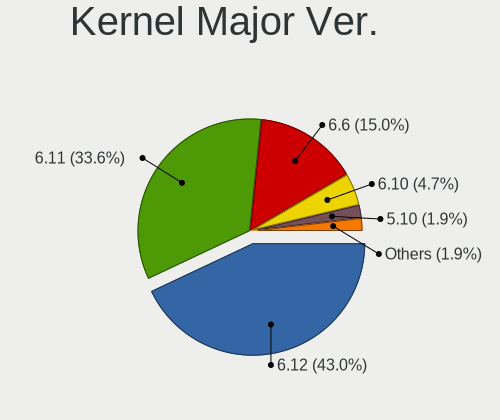
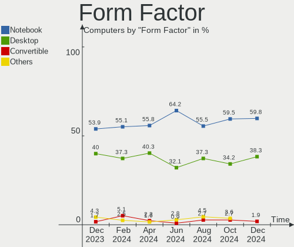
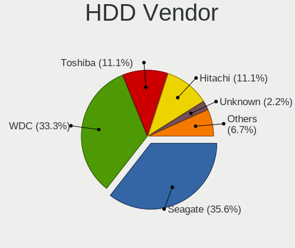
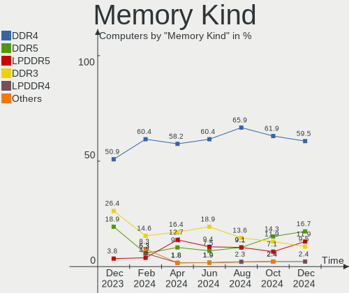

Manjaro Hardware Trends
-----------------------

A project to identify most popular hardware characteristics and track their change
over time based on data collected by Manjaro users at https://Linux-Hardware.org.

Anyone can contribute to this report by the [hw-probe](https://github.com/linuxhw/hw-probe) tool:

    sudo -E hw-probe -all -upload

This is a report for all computer types. See also reports for [desktops](/Dist/Manjaro/Desktop/README.md) and [notebooks](/Dist/Manjaro/Notebook/README.md).

Full-feature report is available here: https://linux-hardware.org/?view=trends

Period: Aug, 2021.

Contents
--------

* [ System ](#system)
  - [ OS                       ](#os)
  - [ OS Family                ](#os-family)
  - [ Kernel                   ](#kernel)
  - [ Kernel Family            ](#kernel-family)
  - [ Kernel Major Ver.        ](#kernel-major-ver)
  - [ Arch                     ](#arch)
  - [ DE                       ](#de)
  - [ Display Server           ](#display-server)
  - [ Display Manager          ](#display-manager)
  - [ OS Lang                  ](#os-lang)
  - [ Boot Mode                ](#boot-mode)
  - [ Filesystem               ](#filesystem)
  - [ Part. scheme             ](#part-scheme)
  - [ Dual Boot with Linux/BSD ](#dual-boot-with-linuxbsd)
  - [ Dual Boot (Win)          ](#dual-boot-win)

* [ Board ](#board)
  - [ Vendor                   ](#vendor)
  - [ Model                    ](#model)
  - [ Model Family             ](#model-family)
  - [ MFG Year                 ](#mfg-year)
  - [ Form Factor              ](#form-factor)
  - [ Secure Boot              ](#secure-boot)
  - [ Coreboot                 ](#coreboot)
  - [ RAM Size                 ](#ram-size)
  - [ RAM Used                 ](#ram-used)
  - [ Total Drives             ](#total-drives)
  - [ Has CD-ROM               ](#has-cd-rom)
  - [ Has Ethernet             ](#has-ethernet)
  - [ Has WiFi                 ](#has-wifi)
  - [ Has Bluetooth            ](#has-bluetooth)

* [ Location ](#location)
  - [ Country                  ](#country)
  - [ City                     ](#city)

* [ Drives ](#drives)
  - [ Drive Vendor             ](#drive-vendor)
  - [ Drive Model              ](#drive-model)
  - [ HDD Vendor               ](#hdd-vendor)
  - [ SSD Vendor               ](#ssd-vendor)
  - [ Drive Kind               ](#drive-kind)
  - [ Drive Connector          ](#drive-connector)
  - [ Drive Size               ](#drive-size)
  - [ Space Total              ](#space-total)
  - [ Space Used               ](#space-used)
  - [ Malfunc. Drives          ](#malfunc-drives)
  - [ Malfunc. Drive Vendor    ](#malfunc-drive-vendor)
  - [ Malfunc. HDD Vendor      ](#malfunc-hdd-vendor)
  - [ Malfunc. Drive Kind      ](#malfunc-drive-kind)
  - [ Failed Drives            ](#failed-drives)
  - [ Failed Drive Vendor      ](#failed-drive-vendor)
  - [ Drive Status             ](#drive-status)

* [ Storage controller ](#storage-controller)
  - [ Storage Vendor           ](#storage-vendor)
  - [ Storage Model            ](#storage-model)
  - [ Storage Kind             ](#storage-kind)

* [ Processor ](#processor)
  - [ CPU Vendor               ](#cpu-vendor)
  - [ CPU Model                ](#cpu-model)
  - [ CPU Model Family         ](#cpu-model-family)
  - [ CPU Cores                ](#cpu-cores)
  - [ CPU Sockets              ](#cpu-sockets)
  - [ CPU Threads              ](#cpu-threads)
  - [ CPU Op-Modes             ](#cpu-op-modes)
  - [ CPU Microcode            ](#cpu-microcode)
  - [ CPU Microarch            ](#cpu-microarch)

* [ Graphics ](#graphics)
  - [ GPU Vendor               ](#gpu-vendor)
  - [ GPU Model                ](#gpu-model)
  - [ GPU Combo                ](#gpu-combo)
  - [ GPU Driver               ](#gpu-driver)
  - [ GPU Memory               ](#gpu-memory)

* [ Monitor ](#monitor)
  - [ Monitor Vendor           ](#monitor-vendor)
  - [ Monitor Model            ](#monitor-model)
  - [ Monitor Resolution       ](#monitor-resolution)
  - [ Monitor Diagonal         ](#monitor-diagonal)
  - [ Monitor Width            ](#monitor-width)
  - [ Aspect Ratio             ](#aspect-ratio)
  - [ Monitor Area             ](#monitor-area)
  - [ Pixel Density            ](#pixel-density)
  - [ Multiple Monitors        ](#multiple-monitors)

* [ Network ](#network)
  - [ Net Controller Vendor    ](#net-controller-vendor)
  - [ Net Controller Model     ](#net-controller-model)
  - [ Wireless Vendor          ](#wireless-vendor)
  - [ Wireless Model           ](#wireless-model)
  - [ Ethernet Vendor          ](#ethernet-vendor)
  - [ Ethernet Model           ](#ethernet-model)
  - [ Net Controller Kind      ](#net-controller-kind)
  - [ Used Controller          ](#used-controller)
  - [ NICs                     ](#nics)
  - [ IPv6                     ](#ipv6)

* [ Bluetooth ](#bluetooth)
  - [ Bluetooth Vendor         ](#bluetooth-vendor)
  - [ Bluetooth Model          ](#bluetooth-model)

* [ Sound ](#sound)
  - [ Sound Vendor             ](#sound-vendor)
  - [ Sound Model              ](#sound-model)

* [ Memory ](#memory)
  - [ Memory Vendor            ](#memory-vendor)
  - [ Memory Model             ](#memory-model)
  - [ Memory Kind              ](#memory-kind)
  - [ Memory Form Factor       ](#memory-form-factor)
  - [ Memory Size              ](#memory-size)
  - [ Memory Speed             ](#memory-speed)

* [ Printers & scanners ](#printers--scanners)
  - [ Printer Vendor           ](#printer-vendor)
  - [ Printer Model            ](#printer-model)
  - [ Scanner Vendor           ](#scanner-vendor)
  - [ Scanner Model            ](#scanner-model)

* [ Camera ](#camera)
  - [ Camera Vendor            ](#camera-vendor)
  - [ Camera Model             ](#camera-model)

* [ Security ](#security)
  - [ Fingerprint Vendor       ](#fingerprint-vendor)
  - [ Fingerprint Model        ](#fingerprint-model)
  - [ Chipcard Vendor          ](#chipcard-vendor)
  - [ Chipcard Model           ](#chipcard-model)

* [ Unsupported ](#unsupported)
  - [ Unsupported Devices      ](#unsupported-devices)
  - [ Unsupported Device Types ](#unsupported-device-types)

System
------

OS
--

Installed operating systems

| Name           | Computers | Percent |
|----------------|-----------|---------|
| Manjaro 21.1.0 | 92        | 47.92%  |
| Manjaro        | 83        | 43.23%  |
| Manjaro 21.1.1 | 13        | 6.77%   |
| Manjaro 21.0.7 | 4         | 2.08%   |

OS Family
---------

OS without a version

| Name    | Computers | Percent |
|---------|-----------|---------|
| Manjaro | 192       | 100%    |

Kernel
------

Version of the Linux kernel

| Version                | Computers | Percent |
|------------------------|-----------|---------|
| 5.10.53-1-MANJARO      | 34        | 17.71%  |
| 5.10.56-1-MANJARO      | 31        | 16.15%  |
| 5.13.11-1-MANJARO      | 28        | 14.58%  |
| 5.13.12-1-MANJARO      | 19        | 9.9%    |
| 5.10.59-1-MANJARO      | 19        | 9.9%    |
| 5.14.0-1-MANJARO       | 11        | 5.73%   |
| 5.13.5-1-MANJARO       | 11        | 5.73%   |
| 5.13.8-1-MANJARO       | 10        | 5.21%   |
| 5.12.19-1-MANJARO      | 10        | 5.21%   |
| 5.10.42-1-MANJARO      | 3         | 1.56%   |
| 5.11.22-2-MANJARO      | 2         | 1.04%   |
| 5.10.60-1-MANJARO      | 2         | 1.04%   |
| 5.9.16-1-MANJARO       | 1         | 0.52%   |
| 5.4.141-1-MANJARO      | 1         | 0.52%   |
| 5.4.140-1-MANJARO      | 1         | 0.52%   |
| 5.4.138-1-MANJARO      | 1         | 0.52%   |
| 5.4.124-1-MANJARO      | 1         | 0.52%   |
| 5.13.9-1-MANJARO       | 1         | 0.52%   |
| 5.13.6-xanmod2-MANJARO | 1         | 0.52%   |
| 5.13.10-1-MANJARO      | 1         | 0.52%   |
| 5.12.19-lqx3-1-lqx     | 1         | 0.52%   |
| 5.12.16-1-MANJARO      | 1         | 0.52%   |
| 5.10.52-3-rt47-MANJARO | 1         | 0.52%   |
| 5.10.49-1-MANJARO      | 1         | 0.52%   |

Kernel Family
-------------

Linux kernel without a distro release

| Version | Computers | Percent |
|---------|-----------|---------|
| 5.10.53 | 34        | 17.71%  |
| 5.10.56 | 31        | 16.15%  |
| 5.13.11 | 28        | 14.58%  |
| 5.13.12 | 19        | 9.9%    |
| 5.10.59 | 19        | 9.9%    |
| 5.14.0  | 11        | 5.73%   |
| 5.13.5  | 11        | 5.73%   |
| 5.12.19 | 11        | 5.73%   |
| 5.13.8  | 10        | 5.21%   |
| 5.10.42 | 3         | 1.56%   |
| 5.11.22 | 2         | 1.04%   |
| 5.10.60 | 2         | 1.04%   |
| 5.9.16  | 1         | 0.52%   |
| 5.4.141 | 1         | 0.52%   |
| 5.4.140 | 1         | 0.52%   |
| 5.4.138 | 1         | 0.52%   |
| 5.4.124 | 1         | 0.52%   |
| 5.13.9  | 1         | 0.52%   |
| 5.13.6  | 1         | 0.52%   |
| 5.13.10 | 1         | 0.52%   |
| 5.12.16 | 1         | 0.52%   |
| 5.10.52 | 1         | 0.52%   |
| 5.10.49 | 1         | 0.52%   |

Kernel Major Ver.
-----------------

Linux kernel major version

| Version | Computers | Percent |
|---------|-----------|---------|
| 5.10    | 91        | 47.4%   |
| 5.13    | 71        | 36.98%  |
| 5.12    | 12        | 6.25%   |
| 5.14    | 11        | 5.73%   |
| 5.4     | 4         | 2.08%   |
| 5.11    | 2         | 1.04%   |
| 5.9     | 1         | 0.52%   |

Arch
----

OS architecture (x86_64, i586, etc.)

| Name   | Computers | Percent |
|--------|-----------|---------|
| x86_64 | 192       | 100%    |

DE
--

Desktop Environment

| Name       | Computers | Percent |
|------------|-----------|---------|
| XFCE       | 50        | 26.04%  |
| KDE5       | 46        | 23.96%  |
| GNOME      | 43        | 22.4%   |
| KDE        | 32        | 16.67%  |
| X-Cinnamon | 13        | 6.77%   |
| i3         | 3         | 1.56%   |
| Unknown    | 3         | 1.56%   |
| qtile      | 1         | 0.52%   |
| Budgie     | 1         | 0.52%   |

Display Server
--------------

X11 or Wayland

| Name    | Computers | Percent |
|---------|-----------|---------|
| X11     | 158       | 82.29%  |
| Wayland | 29        | 15.1%   |
| Unknown | 5         | 2.6%    |

Display Manager
---------------

SDDM, LightDM, etc.

| Name    | Computers | Percent |
|---------|-----------|---------|
| Unknown | 81        | 42.19%  |
| SDDM    | 45        | 23.44%  |
| LightDM | 38        | 19.79%  |
| GDM     | 24        | 12.5%   |
| TDM     | 3         | 1.56%   |
| LXDM    | 1         | 0.52%   |

OS Lang
-------

Language

| Lang   | Computers | Percent |
|--------|-----------|---------|
| en_US  | 79        | 41.15%  |
| de_DE  | 28        | 14.58%  |
| ru_RU  | 19        | 9.9%    |
| en_GB  | 12        | 6.25%   |
| pt_BR  | 8         | 4.17%   |
| fr_FR  | 7         | 3.65%   |
| es_ES  | 6         | 3.13%   |
| ru_UA  | 4         | 2.08%   |
| en_IN  | 3         | 1.56%   |
| en_AU  | 3         | 1.56%   |
| zh_CN  | 2         | 1.04%   |
| en_NZ  | 2         | 1.04%   |
| en_IE  | 2         | 1.04%   |
| en_CA  | 2         | 1.04%   |
| zh_TW  | 1         | 0.52%   |
| uk_UA  | 1         | 0.52%   |
| tr_TR  | 1         | 0.52%   |
| szl_PL | 1         | 0.52%   |
| sv_SE  | 1         | 0.52%   |
| pt_PT  | 1         | 0.52%   |
| pl_PL  | 1         | 0.52%   |
| it_IT  | 1         | 0.52%   |
| hu_HU  | 1         | 0.52%   |
| fi_FI  | 1         | 0.52%   |
| es_VE  | 1         | 0.52%   |
| es_CL  | 1         | 0.52%   |
| en_ZA  | 1         | 0.52%   |
| de_BE  | 1         | 0.52%   |
| bg_BG  | 1         | 0.52%   |

Boot Mode
---------

EFI or BIOS

| Mode | Computers | Percent |
|------|-----------|---------|
| BIOS | 103       | 53.65%  |
| EFI  | 89        | 46.35%  |

Filesystem
----------

Type of filesystem

| Type    | Computers | Percent |
|---------|-----------|---------|
| Ext4    | 173       | 90.1%   |
| Btrfs   | 10        | 5.21%   |
| Overlay | 3         | 1.56%   |
| Xfs     | 2         | 1.04%   |
| Tmpfs   | 2         | 1.04%   |
| Ext3    | 1         | 0.52%   |
| Unknown | 1         | 0.52%   |

Part. scheme
------------

Scheme of partitioning

| Type    | Computers | Percent |
|---------|-----------|---------|
| GPT     | 91        | 47.4%   |
| Unknown | 81        | 42.19%  |
| MBR     | 20        | 10.42%  |

Dual Boot with Linux/BSD
------------------------

Hosting more than one Linux/BSD

| Dual boot | Computers | Percent |
|-----------|-----------|---------|
| No        | 171       | 89.06%  |
| Yes       | 21        | 10.94%  |

Dual Boot (Win)
---------------

Hosting Linux and Windows

| Dual boot | Computers | Percent |
|-----------|-----------|---------|
| No        | 135       | 70.31%  |
| Yes       | 57        | 29.69%  |

Board
-----

Vendor
------

Motherboard manufacturer

| Name                   | Computers | Percent |
|------------------------|-----------|---------|
| Lenovo                 | 36        | 18.75%  |
| Hewlett-Packard        | 27        | 14.06%  |
| Gigabyte Technology    | 26        | 13.54%  |
| ASUSTek Computer       | 24        | 12.5%   |
| Dell                   | 16        | 8.33%   |
| MSI                    | 13        | 6.77%   |
| Acer                   | 11        | 5.73%   |
| ASRock                 | 9         | 4.69%   |
| Apple                  | 4         | 2.08%   |
| Intel                  | 3         | 1.56%   |
| Timi                   | 2         | 1.04%   |
| Samsung Electronics    | 2         | 1.04%   |
| Notebook               | 2         | 1.04%   |
| HUAWEI                 | 2         | 1.04%   |
| Unknown                | 2         | 1.04%   |
| ZOTAC                  | 1         | 0.52%   |
| XFX                    | 1         | 0.52%   |
| TUXEDO                 | 1         | 0.52%   |
| Toshiba                | 1         | 0.52%   |
| PC Specialist          | 1         | 0.52%   |
| ONE-NETBOOK TECHNOLOGY | 1         | 0.52%   |
| LG Electronics         | 1         | 0.52%   |
| Jumper                 | 1         | 0.52%   |
| Huanan                 | 1         | 0.52%   |
| Google                 | 1         | 0.52%   |
| ECS                    | 1         | 0.52%   |
| Clevo                  | 1         | 0.52%   |
| AYADEVICE              | 1         | 0.52%   |

Model
-----

Motherboard model

| Name                                       | Computers | Percent |
|--------------------------------------------|-----------|---------|
| Unknown                                    | 3         | 1.56%   |
| MSI MS-7C37                                | 2         | 1.04%   |
| HUAWEI BOHK-WAX9X                          | 2         | 1.04%   |
| HP Presario CQ57                           | 2         | 1.04%   |
| HP Pavilion Gaming Laptop 15-ec1xxx        | 2         | 1.04%   |
| Gigabyte B550M DS3H                        | 2         | 1.04%   |
| ASUS PRIME B450M-A                         | 2         | 1.04%   |
| ASUS All Series                            | 2         | 1.04%   |
| Acer Aspire A315-42                        | 2         | 1.04%   |
| ZOTAC ZBOX-CI329NANO                       | 1         | 0.52%   |
| XFX MI-A78S-8209 Ver1.1                    | 1         | 0.52%   |
| Toshiba Satellite L855                     | 1         | 0.52%   |
| Timi TM1612                                | 1         | 0.52%   |
| Timi A35S                                  | 1         | 0.52%   |
| Samsung RC410/RC510/RC710                  | 1         | 0.52%   |
| Samsung 550XCJ/550XCR                      | 1         | 0.52%   |
| PC Specialist NH5x_7xRCx,RDx               | 1         | 0.52%   |
| ONE-NETBOOK TECHNOLOGY ONE XPLAYER         | 1         | 0.52%   |
| Notebook NH5xAx                            | 1         | 0.52%   |
| Notebook N85_N870HL                        | 1         | 0.52%   |
| MSI p7-1421                                | 1         | 0.52%   |
| MSI MS-7D22                                | 1         | 0.52%   |
| MSI MS-7C91                                | 1         | 0.52%   |
| MSI MS-7C34                                | 1         | 0.52%   |
| MSI MS-7C09                                | 1         | 0.52%   |
| MSI MS-7B94                                | 1         | 0.52%   |
| MSI MS-7B86                                | 1         | 0.52%   |
| MSI MS-7A35                                | 1         | 0.52%   |
| MSI MS-7A32                                | 1         | 0.52%   |
| MSI MS-7758                                | 1         | 0.52%   |
| MSI GF75 Thin 10SC                         | 1         | 0.52%   |
| LG 17Z90P-K.AAC8U1                         | 1         | 0.52%   |
| Lenovo Z50-70 20354                        | 1         | 0.52%   |
| Lenovo Yoga 720-15IKB 80X7                 | 1         | 0.52%   |
| Lenovo V15-IIL 82C5                        | 1         | 0.52%   |
| Lenovo V145-15AST 81MT                     | 1         | 0.52%   |
| Lenovo ThinkPad X140e 20BLS00300           | 1         | 0.52%   |
| Lenovo ThinkPad X1 Carbon Gen 9 20XW005GRT | 1         | 0.52%   |
| Lenovo ThinkPad X1 Carbon Gen 9 20XW003GUS | 1         | 0.52%   |
| Lenovo ThinkPad X1 Carbon 4th 20FC000RAU   | 1         | 0.52%   |
| Lenovo ThinkPad W550s 20E2CTO1WW           | 1         | 0.52%   |
| Lenovo ThinkPad T590 20N4002WGE            | 1         | 0.52%   |
| Lenovo ThinkPad T580 20L9CTO1WW            | 1         | 0.52%   |
| Lenovo ThinkPad T510 4484A63               | 1         | 0.52%   |
| Lenovo ThinkPad T480 20L6S69B00            | 1         | 0.52%   |
| Lenovo ThinkPad T480 20L5CTO1WW            | 1         | 0.52%   |
| Lenovo ThinkPad T470s 20HGS2PL00           | 1         | 0.52%   |
| Lenovo ThinkPad T440s 20ARS2V900           | 1         | 0.52%   |
| Lenovo ThinkPad T430 2349Y3D               | 1         | 0.52%   |
| Lenovo ThinkPad T410 2537NP8               | 1         | 0.52%   |
| Lenovo ThinkPad P52s 20LB0009FR            | 1         | 0.52%   |
| Lenovo ThinkPad P51 20HH000TUS             | 1         | 0.52%   |
| Lenovo ThinkPad Edge 01962AS               | 1         | 0.52%   |
| Lenovo ThinkPad E15 Gen 2 20T9S0B500       | 1         | 0.52%   |
| Lenovo ThinkPad E15 Gen 2 20T8CTO1WW       | 1         | 0.52%   |
| Lenovo ThinkPad E14 Gen 3 20YDCTO1WW       | 1         | 0.52%   |
| Lenovo ThinkCentre M90n-1 11AD002DGE       | 1         | 0.52%   |
| Lenovo ThinkCentre E73 10DS0015GE          | 1         | 0.52%   |
| Lenovo Legion 5 15ARH05 82B5               | 1         | 0.52%   |
| Lenovo Legion 5 15ACH6H 82JU               | 1         | 0.52%   |

Model Family
------------

Motherboard model prefix

| Name                       | Computers | Percent |
|----------------------------|-----------|---------|
| Lenovo ThinkPad            | 20        | 10.42%  |
| HP Pavilion                | 9         | 4.69%   |
| Lenovo IdeaPad             | 7         | 3.65%   |
| Dell XPS                   | 5         | 2.6%    |
| ASUS ROG                   | 5         | 2.6%    |
| HP ProBook                 | 4         | 2.08%   |
| HP EliteBook               | 4         | 2.08%   |
| ASUS PRIME                 | 4         | 2.08%   |
| Acer Aspire                | 4         | 2.08%   |
| HP Laptop                  | 3         | 1.56%   |
| Gigabyte B450              | 3         | 1.56%   |
| Dell Latitude              | 3         | 1.56%   |
| Dell Inspiron              | 3         | 1.56%   |
| Unknown                    | 3         | 1.56%   |
| MSI MS-7C37                | 2         | 1.04%   |
| Lenovo ThinkCentre         | 2         | 1.04%   |
| Lenovo Legion              | 2         | 1.04%   |
| HUAWEI BOHK-WAX9X          | 2         | 1.04%   |
| HP Presario                | 2         | 1.04%   |
| HP ENVY                    | 2         | 1.04%   |
| Gigabyte B550M             | 2         | 1.04%   |
| Gigabyte B450M             | 2         | 1.04%   |
| Dell OptiPlex              | 2         | 1.04%   |
| ASUS ZenBook               | 2         | 1.04%   |
| ASUS All                   | 2         | 1.04%   |
| Acer Extensa               | 2         | 1.04%   |
| ZOTAC ZBOX-CI329NANO       | 1         | 0.52%   |
| XFX MI-A78S-8209           | 1         | 0.52%   |
| Toshiba Satellite          | 1         | 0.52%   |
| Timi TM1612                | 1         | 0.52%   |
| Timi A35S                  | 1         | 0.52%   |
| Samsung RC410              | 1         | 0.52%   |
| Samsung 550XCJ             | 1         | 0.52%   |
| PC Specialist NH5x         | 1         | 0.52%   |
| ONE-NETBOOK TECHNOLOGY ONE | 1         | 0.52%   |
| Notebook NH5xAx            | 1         | 0.52%   |
| Notebook N85               | 1         | 0.52%   |
| MSI p7-1421                | 1         | 0.52%   |
| MSI MS-7D22                | 1         | 0.52%   |
| MSI MS-7C91                | 1         | 0.52%   |
| MSI MS-7C34                | 1         | 0.52%   |
| MSI MS-7C09                | 1         | 0.52%   |
| MSI MS-7B94                | 1         | 0.52%   |
| MSI MS-7B86                | 1         | 0.52%   |
| MSI MS-7A35                | 1         | 0.52%   |
| MSI MS-7A32                | 1         | 0.52%   |
| MSI MS-7758                | 1         | 0.52%   |
| MSI GF75                   | 1         | 0.52%   |
| LG 17Z90P-K.AAC8U1         | 1         | 0.52%   |
| Lenovo Z50-70              | 1         | 0.52%   |
| Lenovo Yoga                | 1         | 0.52%   |
| Lenovo V15-IIL             | 1         | 0.52%   |
| Lenovo V145-15AST          | 1         | 0.52%   |
| Lenovo G40-45              | 1         | 0.52%   |
| Jumper EZpad               | 1         | 0.52%   |
| Intel DH77EB               | 1         | 0.52%   |
| Intel DH61WW               | 1         | 0.52%   |
| Intel DB75EN               | 1         | 0.52%   |
| Huanan X99-F8              | 1         | 0.52%   |
| HP Elite                   | 1         | 0.52%   |

MFG Year
--------

Motherboard manufacture year

| Year | Computers | Percent |
|------|-----------|---------|
| 2021 | 41        | 21.35%  |
| 2020 | 41        | 21.35%  |
| 2019 | 25        | 13.02%  |
| 2018 | 17        | 8.85%   |
| 2013 | 15        | 7.81%   |
| 2016 | 9         | 4.69%   |
| 2011 | 8         | 4.17%   |
| 2012 | 7         | 3.65%   |
| 2010 | 7         | 3.65%   |
| 2015 | 6         | 3.13%   |
| 2017 | 5         | 2.6%    |
| 2014 | 5         | 2.6%    |
| 2009 | 4         | 2.08%   |
| 2007 | 2         | 1.04%   |

Form Factor
-----------

Physical design of the computer

| Name        | Computers | Percent |
|-------------|-----------|---------|
| Notebook    | 108       | 56.25%  |
| Desktop     | 75        | 39.06%  |
| Tablet      | 3         | 1.56%   |
| Convertible | 3         | 1.56%   |
| Mini pc     | 2         | 1.04%   |
| All in one  | 1         | 0.52%   |

Secure Boot
-----------

Enabled or disabled

| State    | Computers | Percent |
|----------|-----------|---------|
| Disabled | 191       | 99.48%  |
| Enabled  | 1         | 0.52%   |

Coreboot
--------

Have coreboot on board

| Used | Computers | Percent |
|------|-----------|---------|
| No   | 191       | 99.48%  |
| Yes  | 1         | 0.52%   |

RAM Size
--------

Total RAM memory

| Size in GB  | Computers | Percent |
|-------------|-----------|---------|
| 16.01-24.0  | 49        | 25.52%  |
| 4.01-8.0    | 46        | 23.96%  |
| 8.01-16.0   | 38        | 19.79%  |
| 3.01-4.0    | 27        | 14.06%  |
| 32.01-64.0  | 24        | 12.5%   |
| 24.01-32.0  | 2         | 1.04%   |
| 2.01-3.0    | 2         | 1.04%   |
| 64.01-256.0 | 2         | 1.04%   |
| 1.01-2.0    | 2         | 1.04%   |

RAM Used
--------

Used RAM memory

| Used GB   | Computers | Percent |
|-----------|-----------|---------|
| 2.01-3.0  | 58        | 30.21%  |
| 1.01-2.0  | 55        | 28.65%  |
| 4.01-8.0  | 36        | 18.75%  |
| 3.01-4.0  | 29        | 15.1%   |
| 8.01-16.0 | 7         | 3.65%   |
| 0.51-1.0  | 7         | 3.65%   |

Total Drives
------------

Number of drives on board

| Drives | Computers | Percent |
|--------|-----------|---------|
| 1      | 102       | 53.13%  |
| 2      | 49        | 25.52%  |
| 3      | 27        | 14.06%  |
| 4      | 8         | 4.17%   |
| 5      | 4         | 2.08%   |
| 6      | 2         | 1.04%   |

Has CD-ROM
----------

Has CD-ROM on board

| Presented | Computers | Percent |
|-----------|-----------|---------|
| No        | 146       | 76.04%  |
| Yes       | 46        | 23.96%  |

Has Ethernet
------------

Has Ethernet on board

| Presented | Computers | Percent |
|-----------|-----------|---------|
| Yes       | 158       | 82.29%  |
| No        | 34        | 17.71%  |

Has WiFi
--------

Has WiFi module

| Presented | Computers | Percent |
|-----------|-----------|---------|
| Yes       | 147       | 76.56%  |
| No        | 45        | 23.44%  |

Has Bluetooth
-------------

Has Bluetooth module

| Presented | Computers | Percent |
|-----------|-----------|---------|
| Yes       | 128       | 66.67%  |
| No        | 64        | 33.33%  |

Location
--------

Country
-------

Geographic location (country)

| Country      | Computers | Percent |
|--------------|-----------|---------|
| Germany      | 34        | 17.71%  |
| USA          | 33        | 17.19%  |
| Russia       | 18        | 9.38%   |
| Brazil       | 11        | 5.73%   |
| France       | 10        | 5.21%   |
| Ukraine      | 6         | 3.13%   |
| UK           | 6         | 3.13%   |
| Spain        | 5         | 2.6%    |
| India        | 5         | 2.6%    |
| Indonesia    | 4         | 2.08%   |
| Belarus      | 4         | 2.08%   |
| Portugal     | 3         | 1.56%   |
| Canada       | 3         | 1.56%   |
| Australia    | 3         | 1.56%   |
| Tunisia      | 2         | 1.04%   |
| Switzerland  | 2         | 1.04%   |
| Romania      | 2         | 1.04%   |
| Poland       | 2         | 1.04%   |
| New Zealand  | 2         | 1.04%   |
| Netherlands  | 2         | 1.04%   |
| Latvia       | 2         | 1.04%   |
| Hungary      | 2         | 1.04%   |
| Estonia      | 2         | 1.04%   |
| Bulgaria     | 2         | 1.04%   |
| Belgium      | 2         | 1.04%   |
| Argentina    | 2         | 1.04%   |
| Zimbabwe     | 1         | 0.52%   |
| Venezuela    | 1         | 0.52%   |
| Turkey       | 1         | 0.52%   |
| Taiwan       | 1         | 0.52%   |
| Sweden       | 1         | 0.52%   |
| South Africa | 1         | 0.52%   |
| Norway       | 1         | 0.52%   |
| Moldova      | 1         | 0.52%   |
| Malaysia     | 1         | 0.52%   |
| Kazakhstan   | 1         | 0.52%   |
| Jordan       | 1         | 0.52%   |
| Japan        | 1         | 0.52%   |
| Italy        | 1         | 0.52%   |
| Ireland      | 1         | 0.52%   |
| Iraq         | 1         | 0.52%   |
| Hong Kong    | 1         | 0.52%   |
| Finland      | 1         | 0.52%   |
| Ecuador      | 1         | 0.52%   |
| Czechia      | 1         | 0.52%   |
| Colombia     | 1         | 0.52%   |
| China        | 1         | 0.52%   |
| Chile        | 1         | 0.52%   |
| Austria      | 1         | 0.52%   |

City
----

Geographic location (city)

| City                 | Computers | Percent |
|----------------------|-----------|---------|
| Moscow               | 5         | 2.6%    |
| St Petersburg        | 4         | 2.08%   |
| Minsk                | 4         | 2.08%   |
| Madrid               | 3         | 1.56%   |
| Frankfurt am Main    | 3         | 1.56%   |
| Weatherford          | 2         | 1.04%   |
| Seattle              | 2         | 1.04%   |
| S??o Paulo           | 2         | 1.04%   |
| Paris                | 2         | 1.04%   |
| Novosibirsk          | 2         | 1.04%   |
| Nieblum              | 2         | 1.04%   |
| Lille                | 2         | 1.04%   |
| Kyiv                 | 2         | 1.04%   |
| Dnipropetrovsk       | 2         | 1.04%   |
| Bengaluru            | 2         | 1.04%   |
| Zug                  | 1         | 0.52%   |
| Wimbledon            | 1         | 0.52%   |
| Weitramsdorf         | 1         | 0.52%   |
| Weilmuenster         | 1         | 0.52%   |
| Warsaw               | 1         | 0.52%   |
| Vidnoye              | 1         | 0.52%   |
| Versailles           | 1         | 0.52%   |
| Verfeil              | 1         | 0.52%   |
| Ulan-Ude             | 1         | 0.52%   |
| Uelsen               | 1         | 0.52%   |
| Trenton              | 1         | 0.52%   |
| Temirtau             | 1         | 0.52%   |
| Taylor               | 1         | 0.52%   |
| Tartu                | 1         | 0.52%   |
| Tallinn              | 1         | 0.52%   |
| Tadepallegudem       | 1         | 0.52%   |
| Surakarta            | 1         | 0.52%   |
| Suceava              | 1         | 0.52%   |
| Stuttgart            | 1         | 0.52%   |
| Springe              | 1         | 0.52%   |
| Sovata               | 1         | 0.52%   |
| Sofia                | 1         | 0.52%   |
| Sligo                | 1         | 0.52%   |
| Sint-Michiels        | 1         | 0.52%   |
| Schmoelln            | 1         | 0.52%   |
| S??o Leopoldo        | 1         | 0.52%   |
| Sarmeola             | 1         | 0.52%   |
| Santiago             | 1         | 0.52%   |
| San Jose             | 1         | 0.52%   |
| Sagar                | 1         | 0.52%   |
| Rostov-on-Don        | 1         | 0.52%   |
| Rivne                | 1         | 0.52%   |
| Riga                 | 1         | 0.52%   |
| Reno                 | 1         | 0.52%   |
| Remilly              | 1         | 0.52%   |
| Recife               | 1         | 0.52%   |
| R??sselsheim am Main | 1         | 0.52%   |
| Rades                | 1         | 0.52%   |
| Queens               | 1         | 0.52%   |
| Providence           | 1         | 0.52%   |
| Porto                | 1         | 0.52%   |
| Pompano Beach        | 1         | 0.52%   |
| Pinxton              | 1         | 0.52%   |
| Phoenix              | 1         | 0.52%   |
| Pforzheim            | 1         | 0.52%   |

Drives
------

Drive Vendor
------------

Hard drive vendors

| Vendor                    | Computers | Drives | Percent |
|---------------------------|-----------|--------|---------|
| WDC                       | 55        | 61     | 17.57%  |
| Samsung Electronics       | 52        | 62     | 16.61%  |
| Seagate                   | 51        | 56     | 16.29%  |
| Kingston                  | 22        | 25     | 7.03%   |
| Toshiba                   | 16        | 16     | 5.11%   |
| SanDisk                   | 14        | 15     | 4.47%   |
| Crucial                   | 11        | 15     | 3.51%   |
| Unknown                   | 10        | 11     | 3.19%   |
| SK Hynix                  | 9         | 9      | 2.88%   |
| Intel                     | 8         | 8      | 2.56%   |
| Hitachi                   | 7         | 7      | 2.24%   |
| Micron Technology         | 6         | 6      | 1.92%   |
| Transcend                 | 5         | 6      | 1.6%    |
| Phison                    | 5         | 5      | 1.6%    |
| Apple                     | 4         | 5      | 1.28%   |
| A-DATA Technology         | 4         | 4      | 1.28%   |
| Realtek Semiconductor     | 3         | 3      | 0.96%   |
| PNY                       | 3         | 4      | 0.96%   |
| XPG                       | 2         | 2      | 0.64%   |
| Micron/Crucial Technology | 2         | 2      | 0.64%   |
| LITEON                    | 2         | 2      | 0.64%   |
| KIOXIA                    | 2         | 2      | 0.64%   |
| JMicron                   | 2         | 2      | 0.64%   |
| HGST                      | 2         | 2      | 0.64%   |
| Team                      | 1         | 1      | 0.32%   |
| SSK                       | 1         | 1      | 0.32%   |
| SPCC                      | 1         | 1      | 0.32%   |
| Solidata                  | 1         | 3      | 0.32%   |
| PLEXTOR                   | 1         | 1      | 0.32%   |
| Pioneer                   | 1         | 1      | 0.32%   |
| Patriot                   | 1         | 1      | 0.32%   |
| OCZ                       | 1         | 1      | 0.32%   |
| Lexar                     | 1         | 1      | 0.32%   |
| KingSpec                  | 1         | 1      | 0.32%   |
| Intenso                   | 1         | 1      | 0.32%   |
| INTEL SS                  | 1         | 1      | 0.32%   |
| FOXLINE                   | 1         | 1      | 0.32%   |
| China                     | 1         | 1      | 0.32%   |
| ASMT                      | 1         | 1      | 0.32%   |
| Apacer                    | 1         | 1      | 0.32%   |

Drive Model
-----------

Hard drive models

| Model                                        | Computers | Percent |
|----------------------------------------------|-----------|---------|
| Seagate Expansion 2TB                        | 5         | 1.48%   |
| Samsung SSD 860 EVO 500GB                    | 5         | 1.48%   |
| Kingston SA400S37120G 120GB SSD              | 5         | 1.48%   |
| WDC WD10EZEX-00BN5A0 1TB                     | 4         | 1.19%   |
| Seagate ST2000DM008-2FR102 2TB               | 4         | 1.19%   |
| Unknown SD/MMC/MS PRO 128GB                  | 3         | 0.89%   |
| Toshiba MQ01ABD050V 500GB                    | 3         | 0.89%   |
| Toshiba HDWD110 1TB                          | 3         | 0.89%   |
| Seagate ST1000LM035-1RK172 1TB               | 3         | 0.89%   |
| Seagate ST1000DM010-2EP102 1TB               | 3         | 0.89%   |
| Sandisk NVMe SSD Drive 1TB                   | 3         | 0.89%   |
| Kingston SA400S37480G 480GB SSD              | 3         | 0.89%   |
| Kingston SA400S37240G 240GB SSD              | 3         | 0.89%   |
| Crucial CT240BX500SSD1 240GB                 | 3         | 0.89%   |
| WDC WD5000AAKX-001CA0 500GB                  | 2         | 0.59%   |
| WDC WD10SPZX-21Z10T0 1TB                     | 2         | 0.59%   |
| WDC WD10JPVX-75JC3T0 1TB                     | 2         | 0.59%   |
| Unknown MMC Card  64GB                       | 2         | 0.59%   |
| Toshiba MQ04ABF100 1TB                       | 2         | 0.59%   |
| SK Hynix NVMe SSD Drive 512GB                | 2         | 0.59%   |
| Seagate ST8000DM004-2CX188 8TB               | 2         | 0.59%   |
| Seagate ST500LM012 HN-M500MBB 500GB          | 2         | 0.59%   |
| Seagate ST500LM000-1EJ162 500GB              | 2         | 0.59%   |
| Seagate ST500DM002-1BD142 500GB              | 2         | 0.59%   |
| Seagate ST3500413AS 500GB                    | 2         | 0.59%   |
| Seagate BarraCuda 120 SSD ZA500CM10003 500GB | 2         | 0.59%   |
| Seagate BarraCuda 120 SSD ZA1000CM10003 1TB  | 2         | 0.59%   |
| Seagate Backup+ Hub BK 10TB                  | 2         | 0.59%   |
| Samsung SSD 980 PRO 1TB                      | 2         | 0.59%   |
| Samsung SSD 980 1TB                          | 2         | 0.59%   |
| Samsung SSD 970 EVO Plus 500GB               | 2         | 0.59%   |
| Samsung SSD 970 EVO 500GB                    | 2         | 0.59%   |
| Samsung SSD 870 QVO 1TB                      | 2         | 0.59%   |
| Samsung SSD 860 EVO 250GB                    | 2         | 0.59%   |
| Samsung SSD 860 EVO 1TB                      | 2         | 0.59%   |
| Samsung SSD 850 EVO 250GB                    | 2         | 0.59%   |
| Samsung NVMe SSD Drive 512GB                 | 2         | 0.59%   |
| Samsung NVMe SSD Drive 1024GB                | 2         | 0.59%   |
| Samsung MZVLB512HAJQ-000L7 512GB             | 2         | 0.59%   |
| Phison NVMe SSD Drive 960GB                  | 2         | 0.59%   |
| Phison NVMe SSD Drive 256GB                  | 2         | 0.59%   |
| Kingston SV300S37A120G 120GB SSD             | 2         | 0.59%   |
| Kingston SHFS37A120G 120GB SSD               | 2         | 0.59%   |
| Intel SSDPEKNW512G8 512GB                    | 2         | 0.59%   |
| Hitachi HTS723232A7A364 320GB                | 2         | 0.59%   |
| Crucial CT500MX200SSD1 500GB                 | 2         | 0.59%   |
| XPG NVMe SSD Drive 512GB                     | 1         | 0.3%    |
| XPG NVMe SSD Drive 256GB                     | 1         | 0.3%    |
| WDC WDS500G3X0C-00SJG0 500GB                 | 1         | 0.3%    |
| WDC WDS500G2B0B-00YS70 500GB SSD             | 1         | 0.3%    |
| WDC WDS500G2B0A-00SM50 500GB SSD             | 1         | 0.3%    |
| WDC WDS500G1B0A-00H9H0 500GB SSD             | 1         | 0.3%    |
| WDC WDS200T2B0C-00PXH0 2TB                   | 1         | 0.3%    |
| WDC WDS120G2G0A-00JH30 120GB SSD             | 1         | 0.3%    |
| WDC WDS100T3X0C-00SJG0 1TB                   | 1         | 0.3%    |
| WDC WDS100T2B0C-00PXH0 1TB                   | 1         | 0.3%    |
| WDC WDBNCE2500PNC 250GB SSD                  | 1         | 0.3%    |
| WDC WD800JD-08LSA0 80GB                      | 1         | 0.3%    |
| WDC WD7500BPKX-75HPJT0 752GB                 | 1         | 0.3%    |
| WDC WD7500AZEX-00RKKA0 752GB                 | 1         | 0.3%    |

HDD Vendor
----------

Hard disk drive vendors

| Vendor              | Computers | Drives | Percent |
|---------------------|-----------|--------|---------|
| Seagate             | 47        | 50     | 38.52%  |
| WDC                 | 42        | 44     | 34.43%  |
| Toshiba             | 14        | 14     | 11.48%  |
| Samsung Electronics | 7         | 8      | 5.74%   |
| Hitachi             | 7         | 7      | 5.74%   |
| HGST                | 2         | 2      | 1.64%   |
| Apple               | 2         | 2      | 1.64%   |
| JMicron             | 1         | 1      | 0.82%   |

SSD Vendor
----------

Solid state drive vendors

| Vendor              | Computers | Drives | Percent |
|---------------------|-----------|--------|---------|
| Samsung Electronics | 22        | 25     | 22.45%  |
| Kingston            | 19        | 22     | 19.39%  |
| Crucial             | 10        | 14     | 10.2%   |
| SanDisk             | 7         | 7      | 7.14%   |
| WDC                 | 5         | 5      | 5.1%    |
| Transcend           | 4         | 4      | 4.08%   |
| Seagate             | 4         | 4      | 4.08%   |
| Intel               | 3         | 3      | 3.06%   |
| PNY                 | 2         | 3      | 2.04%   |
| Micron Technology   | 2         | 2      | 2.04%   |
| LITEON              | 2         | 2      | 2.04%   |
| Apple               | 2         | 2      | 2.04%   |
| Team                | 1         | 1      | 1.02%   |
| SPCC                | 1         | 1      | 1.02%   |
| Solidata            | 1         | 3      | 1.02%   |
| SK Hynix            | 1         | 1      | 1.02%   |
| PLEXTOR             | 1         | 1      | 1.02%   |
| Pioneer             | 1         | 1      | 1.02%   |
| Patriot             | 1         | 1      | 1.02%   |
| OCZ                 | 1         | 1      | 1.02%   |
| Lexar               | 1         | 1      | 1.02%   |
| KingSpec            | 1         | 1      | 1.02%   |
| INTEL SS            | 1         | 1      | 1.02%   |
| FOXLINE             | 1         | 1      | 1.02%   |
| China               | 1         | 1      | 1.02%   |
| ASMT                | 1         | 1      | 1.02%   |
| Apacer              | 1         | 1      | 1.02%   |
| A-DATA Technology   | 1         | 1      | 1.02%   |

Drive Kind
----------

HDD or SSD

| Kind    | Computers | Drives | Percent |
|---------|-----------|--------|---------|
| HDD     | 95        | 128    | 34.8%   |
| SSD     | 83        | 111    | 30.4%   |
| NVMe    | 81        | 94     | 29.67%  |
| Unknown | 8         | 8      | 2.93%   |
| MMC     | 6         | 7      | 2.2%    |

Drive Connector
---------------

SATA, SAS, NVMe, etc.

| Type | Computers | Drives | Percent |
|------|-----------|--------|---------|
| SATA | 138       | 228    | 56.56%  |
| NVMe | 81        | 93     | 33.2%   |
| SAS  | 19        | 20     | 7.79%   |
| MMC  | 6         | 7      | 2.46%   |

Drive Size
----------

Size of hard drive

| Size in TB | Computers | Drives | Percent |
|------------|-----------|--------|---------|
| 0.01-0.5   | 101       | 141    | 53.16%  |
| 0.51-1.0   | 61        | 68     | 32.11%  |
| 1.01-2.0   | 21        | 22     | 11.05%  |
| 4.01-10.0  | 3         | 3      | 1.58%   |
| 2.01-3.0   | 2         | 3      | 1.05%   |
| 3.01-4.0   | 1         | 1      | 0.53%   |
| 10.01-20.0 | 1         | 1      | 0.53%   |

Space Total
-----------

Amount of disk space available on the file system

| Size in GB     | Computers | Percent |
|----------------|-----------|---------|
| 101-250        | 56        | 29.17%  |
| 251-500        | 50        | 26.04%  |
| 501-1000       | 30        | 15.63%  |
| 1001-2000      | 18        | 9.38%   |
| Unknown        | 12        | 6.25%   |
| More than 3000 | 8         | 4.17%   |
| 1-20           | 7         | 3.65%   |
| 2001-3000      | 5         | 2.6%    |
| 21-50          | 3         | 1.56%   |
| 51-100         | 3         | 1.56%   |

Space Used
----------

Amount of used disk space

| Used GB        | Computers | Percent |
|----------------|-----------|---------|
| 1-20           | 43        | 22.4%   |
| 21-50          | 32        | 16.67%  |
| 101-250        | 29        | 15.1%   |
| 51-100         | 28        | 14.58%  |
| 251-500        | 24        | 12.5%   |
| 501-1000       | 12        | 6.25%   |
| Unknown        | 12        | 6.25%   |
| More than 3000 | 6         | 3.13%   |
| 1001-2000      | 6         | 3.13%   |

Malfunc. Drives
---------------

Drive models with a malfunction

| Model                                | Computers | Drives | Percent |
|--------------------------------------|-----------|--------|---------|
| WDC WD5000AACS-00G8B1 500GB          | 1         | 1      | 8.33%   |
| WDC WD3200BEVT-60ZCT1 320GB          | 1         | 1      | 8.33%   |
| WDC WD15EARS-00MVWB0 1TB             | 1         | 1      | 8.33%   |
| Toshiba MK5075GSX 500GB              | 1         | 1      | 8.33%   |
| SK Hynix PC711 HFS512GDE9X073N 512GB | 1         | 1      | 8.33%   |
| Seagate ST3500630NS 500GB            | 1         | 1      | 8.33%   |
| Seagate ST3500413AS 500GB            | 1         | 1      | 8.33%   |
| Samsung Electronics HD103UJ 1TB      | 1         | 1      | 8.33%   |
| Patriot P200 512GB SSD               | 1         | 1      | 8.33%   |
| Hitachi HUS724030ALA640 3TB          | 1         | 1      | 8.33%   |
| Hitachi HTS723232A7A364 320GB        | 1         | 1      | 8.33%   |
| Crucial CT512M550SSD1 512GB          | 1         | 1      | 8.33%   |

Malfunc. Drive Vendor
---------------------

Vendors of faulty drives

| Vendor              | Computers | Drives | Percent |
|---------------------|-----------|--------|---------|
| WDC                 | 2         | 3      | 18.18%  |
| Seagate             | 2         | 2      | 18.18%  |
| Hitachi             | 2         | 2      | 18.18%  |
| Toshiba             | 1         | 1      | 9.09%   |
| SK Hynix            | 1         | 1      | 9.09%   |
| Samsung Electronics | 1         | 1      | 9.09%   |
| Patriot             | 1         | 1      | 9.09%   |
| Crucial             | 1         | 1      | 9.09%   |

Malfunc. HDD Vendor
-------------------

Vendors of faulty HDD drives

| Vendor              | Computers | Drives | Percent |
|---------------------|-----------|--------|---------|
| WDC                 | 2         | 3      | 25%     |
| Seagate             | 2         | 2      | 25%     |
| Hitachi             | 2         | 2      | 25%     |
| Toshiba             | 1         | 1      | 12.5%   |
| Samsung Electronics | 1         | 1      | 12.5%   |

Malfunc. Drive Kind
-------------------

Kinds of faulty drives

| Kind | Computers | Drives | Percent |
|------|-----------|--------|---------|
| HDD  | 8         | 9      | 72.73%  |
| SSD  | 2         | 2      | 18.18%  |
| NVMe | 1         | 1      | 9.09%   |

Failed Drives
-------------

Failed drive models

Zero info for selected period =(

Failed Drive Vendor
-------------------

Failed drive vendors

Zero info for selected period =(

Drive Status
------------

Number of failed and malfunc. drives

| Status   | Computers | Drives | Percent |
|----------|-----------|--------|---------|
| Detected | 113       | 197    | 54.33%  |
| Works    | 84        | 139    | 40.38%  |
| Malfunc  | 11        | 12     | 5.29%   |

Storage controller
------------------

Storage Vendor
--------------

Storage controller vendors

| Vendor                       | Computers | Percent |
|------------------------------|-----------|---------|
| Intel                        | 106       | 41.41%  |
| AMD                          | 57        | 22.27%  |
| Samsung Electronics          | 28        | 10.94%  |
| Sandisk                      | 17        | 6.64%   |
| SK Hynix                     | 8         | 3.13%   |
| Phison Electronics           | 6         | 2.34%   |
| ASMedia Technology           | 6         | 2.34%   |
| Realtek Semiconductor        | 5         | 1.95%   |
| Micron Technology            | 4         | 1.56%   |
| Micron/Crucial Technology    | 3         | 1.17%   |
| Kingston Technology Company  | 3         | 1.17%   |
| ADATA Technology             | 3         | 1.17%   |
| Toshiba America Info Systems | 2         | 0.78%   |
| Nvidia                       | 2         | 0.78%   |
| Marvell Technology Group     | 2         | 0.78%   |
| KIOXIA                       | 2         | 0.78%   |
| Silicon Motion               | 1         | 0.39%   |
| JMicron Technology           | 1         | 0.39%   |

Storage Model
-------------

Storage controller models

| Model                                                                            | Computers | Percent |
|----------------------------------------------------------------------------------|-----------|---------|
| AMD FCH SATA Controller [AHCI mode]                                              | 43        | 15.14%  |
| Samsung NVMe SSD Controller SM981/PM981/PM983                                    | 14        | 4.93%   |
| AMD 400 Series Chipset SATA Controller                                           | 12        | 4.23%   |
| Intel Sunrise Point-LP SATA Controller [AHCI mode]                               | 11        | 3.87%   |
| Intel 7 Series Chipset Family 6-port SATA Controller [AHCI mode]                 | 8         | 2.82%   |
| Sandisk WD Blue SN550 NVMe SSD                                                   | 7         | 2.46%   |
| Intel 8 Series/C220 Series Chipset Family 6-port SATA Controller 1 [AHCI mode]   | 7         | 2.46%   |
| Intel 200 Series PCH SATA controller [AHCI mode]                                 | 7         | 2.46%   |
| Intel 82801 Mobile SATA Controller [RAID mode]                                   | 6         | 2.11%   |
| Intel 7 Series/C210 Series Chipset Family 6-port SATA Controller [AHCI mode]     | 6         | 2.11%   |
| ASMedia ASM1062 Serial ATA Controller                                            | 6         | 2.11%   |
| Samsung NVMe Controller                                                          | 5         | 1.76%   |
| Intel Wildcat Point-LP SATA Controller [AHCI Mode]                               | 5         | 1.76%   |
| Intel SSD 660P Series                                                            | 5         | 1.76%   |
| Intel 5 Series/3400 Series Chipset 6 port SATA AHCI Controller                   | 5         | 1.76%   |
| Sandisk WD Black SN750 / PC SN730 NVMe SSD                                       | 4         | 1.41%   |
| Sandisk Non-Volatile memory controller                                           | 4         | 1.41%   |
| Samsung NVMe SSD Controller PM9A1/PM9A3/980PRO                                   | 4         | 1.41%   |
| Micron Non-Volatile memory controller                                            | 4         | 1.41%   |
| Intel Q170/Q150/B150/H170/H110/Z170/CM236 Chipset SATA Controller [AHCI Mode]    | 4         | 1.41%   |
| Intel HM170/QM170 Chipset SATA Controller [AHCI Mode]                            | 4         | 1.41%   |
| Intel Comet Lake SATA AHCI Controller                                            | 4         | 1.41%   |
| Intel 8 Series SATA Controller 1 [AHCI mode]                                     | 4         | 1.41%   |
| AMD Starship/Matisse Chipset SATA Controller [AHCI mode]                         | 4         | 1.41%   |
| AMD SB7x0/SB8x0/SB9x0 SATA Controller [IDE mode]                                 | 4         | 1.41%   |
| AMD SB7x0/SB8x0/SB9x0 SATA Controller [AHCI mode]                                | 4         | 1.41%   |
| AMD SB7x0/SB8x0/SB9x0 IDE Controller                                             | 4         | 1.41%   |
| SK Hynix BC511                                                                   | 3         | 1.06%   |
| Realtek Realtek Non-Volatile memory controller                                   | 3         | 1.06%   |
| Phison PS5013 E13 NVMe Controller                                                | 3         | 1.06%   |
| Phison E12 NVMe Controller                                                       | 3         | 1.06%   |
| Intel Ice Lake-LP SATA Controller [AHCI mode]                                    | 3         | 1.06%   |
| Intel 6 Series/C200 Series Chipset Family 6 port Mobile SATA AHCI Controller     | 3         | 1.06%   |
| ADATA XPG SX8200 Pro PCIe Gen3x4 M.2 2280 Solid State Drive                      | 3         | 1.06%   |
| SK Hynix BC501 NVMe Solid State Drive                                            | 2         | 0.7%    |
| Sandisk WD Blue SN500 / PC SN520 NVMe SSD                                        | 2         | 0.7%    |
| Samsung NVMe SSD Controller SM961/PM961/SM963                                    | 2         | 0.7%    |
| Samsung Electronics Non-Volatile memory controller                               | 2         | 0.7%    |
| Realtek RTS5763DL NVMe SSD Controller                                            | 2         | 0.7%    |
| Micron/Crucial P2 NVMe PCIe SSD                                                  | 2         | 0.7%    |
| KIOXIA Non-Volatile memory controller                                            | 2         | 0.7%    |
| Intel Volume Management Device NVMe RAID Controller                              | 2         | 0.7%    |
| Intel Celeron/Pentium Silver Processor SATA Controller                           | 2         | 0.7%    |
| Intel Cannon Lake Mobile PCH SATA AHCI Controller                                | 2         | 0.7%    |
| Intel 82801JI (ICH10 Family) SATA AHCI Controller                                | 2         | 0.7%    |
| Intel 82801IBM/IEM (ICH9M/ICH9M-E) 4 port SATA Controller [AHCI mode]            | 2         | 0.7%    |
| Intel 6 Series/C200 Series Chipset Family 6 port Desktop SATA AHCI Controller    | 2         | 0.7%    |
| Intel 5 Series/3400 Series Chipset 4 port SATA AHCI Controller                   | 2         | 0.7%    |
| AMD X370 Series Chipset SATA Controller                                          | 2         | 0.7%    |
| AMD 300 Series Chipset SATA Controller                                           | 2         | 0.7%    |
| Toshiba America Info Systems Toshiba America Info Non-Volatile memory controller | 1         | 0.35%   |
| Toshiba America Info Systems BG3 NVMe SSD Controller                             | 1         | 0.35%   |
| SK Hynix PC401 NVMe Solid State Drive 256GB                                      | 1         | 0.35%   |
| SK Hynix NVMe SSD Controller                                                     | 1         | 0.35%   |
| SK Hynix Non-Volatile memory controller                                          | 1         | 0.35%   |
| Silicon Motion SM2262/SM2262EN SSD Controller                                    | 1         | 0.35%   |
| Sandisk WD Black 2018/SN750 / PC SN720 NVMe SSD                                  | 1         | 0.35%   |
| Sandisk PC SN520 NVMe SSD                                                        | 1         | 0.35%   |
| Samsung NVMe SSD Controller SM951/PM951                                          | 1         | 0.35%   |
| Nvidia MCP89 SATA Controller (AHCI mode)                                         | 1         | 0.35%   |

Storage Kind
------------

Kind of storage controller (IDE, SATA, NVMe, SAS, ...)

| Kind | Computers | Percent |
|------|-----------|---------|
| SATA | 150       | 59.76%  |
| NVMe | 81        | 32.27%  |
| RAID | 10        | 3.98%   |
| IDE  | 10        | 3.98%   |

Processor
---------

CPU Vendor
----------

Processor vendors

| Vendor | Computers | Percent |
|--------|-----------|---------|
| Intel  | 123       | 64.06%  |
| AMD    | 69        | 35.94%  |

CPU Model
---------

Processor models

| Model                                         | Computers | Percent |
|-----------------------------------------------|-----------|---------|
| Intel 11th Gen Core i7-1165G7 @ 2.80GHz       | 5         | 2.6%    |
| Intel Core i7-8550U CPU @ 1.80GHz             | 4         | 2.08%   |
| Intel Core i7-7700HQ CPU @ 2.80GHz            | 4         | 2.08%   |
| AMD Ryzen 7 2700X Eight-Core Processor        | 4         | 2.08%   |
| Intel Core i5-3450 CPU @ 3.10GHz              | 3         | 1.56%   |
| Intel Core i5-1035G1 CPU @ 1.00GHz            | 3         | 1.56%   |
| AMD Ryzen 7 4700U with Radeon Graphics        | 3         | 1.56%   |
| AMD Ryzen 5 4500U with Radeon Graphics        | 3         | 1.56%   |
| AMD Ryzen 5 3600 6-Core Processor             | 3         | 1.56%   |
| AMD Ryzen 5 3500U with Radeon Vega Mobile Gfx | 3         | 1.56%   |
| AMD Ryzen 5 2600X Six-Core Processor          | 3         | 1.56%   |
| Intel Core m3-6Y30 CPU @ 0.90GHz              | 2         | 1.04%   |
| Intel Core i7-10750H CPU @ 2.60GHz            | 2         | 1.04%   |
| Intel Core i7-10510U CPU @ 1.80GHz            | 2         | 1.04%   |
| Intel Core i5-9400F CPU @ 2.90GHz             | 2         | 1.04%   |
| Intel Core i5-8265U CPU @ 1.60GHz             | 2         | 1.04%   |
| Intel Core i5-8250U CPU @ 1.60GHz             | 2         | 1.04%   |
| Intel Core i5-7300HQ CPU @ 2.50GHz            | 2         | 1.04%   |
| Intel Core i5-6200U CPU @ 2.30GHz             | 2         | 1.04%   |
| Intel Core i5 CPU M 520 @ 2.40GHz             | 2         | 1.04%   |
| Intel Core i5 CPU M 480 @ 2.67GHz             | 2         | 1.04%   |
| Intel Core i3-5005U CPU @ 2.00GHz             | 2         | 1.04%   |
| Intel Core i3-4170 CPU @ 3.70GHz              | 2         | 1.04%   |
| Intel Core i3-3120M CPU @ 2.50GHz             | 2         | 1.04%   |
| AMD Ryzen 9 3950X 16-Core Processor           | 2         | 1.04%   |
| AMD Ryzen 7 5700U with Radeon Graphics        | 2         | 1.04%   |
| AMD Ryzen 5 4600H with Radeon Graphics        | 2         | 1.04%   |
| AMD Ryzen 5 3600X 6-Core Processor            | 2         | 1.04%   |
| AMD Ryzen 3 3200U with Radeon Vega Mobile Gfx | 2         | 1.04%   |
| AMD Phenom II X6 1100T Processor              | 2         | 1.04%   |
| Intel Xeon CPU X5450 @ 3.00GHz                | 1         | 0.52%   |
| Intel Xeon CPU X3470 @ 2.93GHz                | 1         | 0.52%   |
| Intel Xeon CPU E5-2680 v3 @ 2.50GHz           | 1         | 0.52%   |
| Intel Xeon CPU E3-1240 v3 @ 3.40GHz           | 1         | 0.52%   |
| Intel Pentium Gold G5420 CPU @ 3.80GHz        | 1         | 0.52%   |
| Intel Pentium Gold G5400 CPU @ 3.70GHz        | 1         | 0.52%   |
| Intel Pentium Dual CPU E2160 @ 1.80GHz        | 1         | 0.52%   |
| Intel Pentium Dual CPU E2140 @ 1.60GHz        | 1         | 0.52%   |
| Intel Pentium CPU G3220 @ 3.00GHz             | 1         | 0.52%   |
| Intel Pentium CPU B950 @ 2.10GHz              | 1         | 0.52%   |
| Intel Pentium 3558U @ 1.70GHz                 | 1         | 0.52%   |
| Intel Genuine CPU U7300 @ 1.30GHz             | 1         | 0.52%   |
| Intel Genuine CPU 0000 @ 2.40GHz              | 1         | 0.52%   |
| Intel Core m5-6Y57 CPU @ 1.10GHz              | 1         | 0.52%   |
| Intel Core i9-10900X CPU @ 3.70GHz            | 1         | 0.52%   |
| Intel Core i7-9750H CPU @ 2.60GHz             | 1         | 0.52%   |
| Intel Core i7-9700 CPU @ 3.00GHz              | 1         | 0.52%   |
| Intel Core i7-8700K CPU @ 3.70GHz             | 1         | 0.52%   |
| Intel Core i7-8665U CPU @ 1.90GHz             | 1         | 0.52%   |
| Intel Core i7-8565U CPU @ 1.80GHz             | 1         | 0.52%   |
| Intel Core i7-7Y75 CPU @ 1.30GHz              | 1         | 0.52%   |
| Intel Core i7-7700 CPU @ 3.60GHz              | 1         | 0.52%   |
| Intel Core i7-7500U CPU @ 2.70GHz             | 1         | 0.52%   |
| Intel Core i7-6700HQ CPU @ 2.60GHz            | 1         | 0.52%   |
| Intel Core i7-5600U CPU @ 2.60GHz             | 1         | 0.52%   |
| Intel Core i7-5500U CPU @ 2.40GHz             | 1         | 0.52%   |
| Intel Core i7-4770K CPU @ 3.50GHz             | 1         | 0.52%   |
| Intel Core i7-4700MQ CPU @ 2.40GHz            | 1         | 0.52%   |
| Intel Core i7-4600U CPU @ 2.10GHz             | 1         | 0.52%   |
| Intel Core i7-3770 CPU @ 3.40GHz              | 1         | 0.52%   |

CPU Model Family
----------------

Processor model prefix

| Model                   | Computers | Percent |
|-------------------------|-----------|---------|
| Intel Core i5           | 43        | 22.4%   |
| Intel Core i7           | 32        | 16.67%  |
| AMD Ryzen 5             | 22        | 11.46%  |
| AMD Ryzen 7             | 19        | 9.9%    |
| Intel Core i3           | 14        | 7.29%   |
| Other                   | 9         | 4.69%   |
| AMD Ryzen 9             | 6         | 3.13%   |
| Intel Xeon              | 4         | 2.08%   |
| Intel Celeron           | 4         | 2.08%   |
| AMD A8                  | 4         | 2.08%   |
| Intel Pentium           | 3         | 1.56%   |
| AMD Ryzen 3             | 3         | 1.56%   |
| Intel Pentium Gold      | 2         | 1.04%   |
| Intel Pentium Dual      | 2         | 1.04%   |
| Intel Genuine           | 2         | 1.04%   |
| Intel Core m3           | 2         | 1.04%   |
| Intel Core 2 Duo        | 2         | 1.04%   |
| AMD Phenom II X6        | 2         | 1.04%   |
| AMD Phenom II X4        | 2         | 1.04%   |
| AMD E                   | 2         | 1.04%   |
| AMD A6                  | 2         | 1.04%   |
| Intel Core m5           | 1         | 0.52%   |
| Intel Core i9           | 1         | 0.52%   |
| Intel Celeron Dual-Core | 1         | 0.52%   |
| Intel Atom              | 1         | 0.52%   |
| AMD Ryzen 3 PRO         | 1         | 0.52%   |
| AMD FX                  | 1         | 0.52%   |
| AMD E1                  | 1         | 0.52%   |
| AMD Athlon II X4        | 1         | 0.52%   |
| AMD Athlon Dual Core    | 1         | 0.52%   |
| AMD Athlon 64 X2        | 1         | 0.52%   |
| AMD A4                  | 1         | 0.52%   |

CPU Cores
---------

Number of processor cores

| Number | Computers | Percent |
|--------|-----------|---------|
| 4      | 69        | 35.94%  |
| 2      | 64        | 33.33%  |
| 6      | 30        | 15.63%  |
| 8      | 21        | 10.94%  |
| 12     | 3         | 1.56%   |
| 16     | 2         | 1.04%   |
| 10     | 1         | 0.52%   |
| 3      | 1         | 0.52%   |
| 1      | 1         | 0.52%   |

CPU Sockets
-----------

Number of sockets

| Number | Computers | Percent |
|--------|-----------|---------|
| 1      | 192       | 100%    |

CPU Threads
-----------

Threads per core (Hyper-Threading)

| Number | Computers | Percent |
|--------|-----------|---------|
| 2      | 142       | 73.96%  |
| 1      | 50        | 26.04%  |

CPU Op-Modes
------------

CPU Operation Modes (32-bit, 64-bit)

| Op mode        | Computers | Percent |
|----------------|-----------|---------|
| 32-bit, 64-bit | 192       | 100%    |

CPU Microcode
-------------

Microcode number

| Number     | Computers | Percent |
|------------|-----------|---------|
| Unknown    | 85        | 44.27%  |
| 0x806c1    | 8         | 4.17%   |
| 0x806ea    | 6         | 3.13%   |
| 0x306a9    | 6         | 3.13%   |
| 0x806ec    | 5         | 2.6%    |
| 0x08701021 | 5         | 2.6%    |
| 0x906ea    | 4         | 2.08%   |
| 0x406e3    | 4         | 2.08%   |
| 0x1067a    | 4         | 2.08%   |
| 0x08600106 | 4         | 2.08%   |
| 0x08600103 | 4         | 2.08%   |
| 0x0800820d | 4         | 2.08%   |
| 0x906e9    | 3         | 1.56%   |
| 0x806e9    | 3         | 1.56%   |
| 0x40651    | 3         | 1.56%   |
| 0x306d4    | 3         | 1.56%   |
| 0x306c3    | 3         | 1.56%   |
| 0x0a50000c | 3         | 1.56%   |
| 0x08108109 | 3         | 1.56%   |
| 0xa0655    | 2         | 1.04%   |
| 0x0a201016 | 2         | 1.04%   |
| 0x08701013 | 2         | 1.04%   |
| 0x08608103 | 2         | 1.04%   |
| 0x08108102 | 2         | 1.04%   |
| 0xa0652    | 1         | 0.52%   |
| 0x706e5    | 1         | 0.52%   |
| 0x706a8    | 1         | 0.52%   |
| 0x506e8    | 1         | 0.52%   |
| 0x506e3    | 1         | 0.52%   |
| 0x50657    | 1         | 0.52%   |
| 0x206c2    | 1         | 0.52%   |
| 0x206a7    | 1         | 0.52%   |
| 0x20655    | 1         | 0.52%   |
| 0x20652    | 1         | 0.52%   |
| 0x0a50000b | 1         | 0.52%   |
| 0x08600104 | 1         | 0.52%   |
| 0x08101013 | 1         | 0.52%   |
| 0x0810100b | 1         | 0.52%   |
| 0x08001138 | 1         | 0.52%   |
| 0x08001137 | 1         | 0.52%   |
| 0x07000110 | 1         | 0.52%   |
| 0x06003106 | 1         | 0.52%   |
| 0x06001119 | 1         | 0.52%   |
| 0x05000101 | 1         | 0.52%   |
| 0x03000027 | 1         | 0.52%   |
| 0x010000c8 | 1         | 0.52%   |

CPU Microarch
-------------

Microarchitecture

| Name          | Computers | Percent |
|---------------|-----------|---------|
| KabyLake      | 32        | 16.67%  |
| Zen 2         | 22        | 11.46%  |
| IvyBridge     | 16        | 8.33%   |
| Zen+          | 15        | 7.81%   |
| Haswell       | 14        | 7.29%   |
| Skylake       | 11        | 5.73%   |
| TigerLake     | 9         | 4.69%   |
| Zen 3         | 7         | 3.65%   |
| Westmere      | 7         | 3.65%   |
| CometLake     | 7         | 3.65%   |
| SandyBridge   | 5         | 2.6%    |
| Penryn        | 5         | 2.6%    |
| Broadwell     | 5         | 2.6%    |
| Zen           | 4         | 2.08%   |
| K10           | 4         | 2.08%   |
| Piledriver    | 3         | 1.56%   |
| IceLake       | 3         | 1.56%   |
| Unknown       | 3         | 1.56%   |
| Silvermont    | 2         | 1.04%   |
| Nehalem       | 2         | 1.04%   |
| K8 Hammer     | 2         | 1.04%   |
| Jaguar        | 2         | 1.04%   |
| Goldmont plus | 2         | 1.04%   |
| Excavator     | 2         | 1.04%   |
| Core          | 2         | 1.04%   |
| Bobcat        | 2         | 1.04%   |
| Steamroller   | 1         | 0.52%   |
| Puma          | 1         | 0.52%   |
| K10 Llano     | 1         | 0.52%   |
| Goldmont      | 1         | 0.52%   |

Graphics
--------

GPU Vendor
----------

Vendors of graphics cards

| Vendor | Computers | Percent |
|--------|-----------|---------|
| Intel  | 98        | 42.79%  |
| Nvidia | 74        | 32.31%  |
| AMD    | 57        | 24.89%  |

GPU Model
---------

Graphics card models

| Model                                                                         | Computers | Percent |
|-------------------------------------------------------------------------------|-----------|---------|
| AMD Renoir                                                                    | 11        | 4.72%   |
| Intel 3rd Gen Core processor Graphics Controller                              | 9         | 3.86%   |
| Intel TigerLake-LP GT2 [Iris Xe Graphics]                                     | 8         | 3.43%   |
| Intel HD Graphics 630                                                         | 7         | 3%      |
| Intel UHD Graphics 620                                                        | 6         | 2.58%   |
| Intel Core Processor Integrated Graphics Controller                           | 6         | 2.58%   |
| AMD Picasso                                                                   | 6         | 2.58%   |
| Intel HD Graphics 5500                                                        | 5         | 2.15%   |
| AMD Ellesmere [Radeon RX 470/480/570/570X/580/580X/590]                       | 5         | 2.15%   |
| AMD Cezanne                                                                   | 5         | 2.15%   |
| Nvidia GM107 [GeForce GTX 750 Ti]                                             | 4         | 1.72%   |
| Nvidia GK208B [GeForce GT 710]                                                | 4         | 1.72%   |
| Intel WhiskeyLake-U GT2 [UHD Graphics 620]                                    | 4         | 1.72%   |
| Intel Skylake GT2 [HD Graphics 520]                                           | 4         | 1.72%   |
| Intel Haswell-ULT Integrated Graphics Controller                              | 4         | 1.72%   |
| Intel 2nd Generation Core Processor Family Integrated Graphics Controller     | 4         | 1.72%   |
| Nvidia TU117M [GeForce GTX 1650 Mobile / Max-Q]                               | 3         | 1.29%   |
| Nvidia GP107M [GeForce GTX 1050 Mobile]                                       | 3         | 1.29%   |
| Nvidia GP104 [GeForce GTX 1070 Ti]                                            | 3         | 1.29%   |
| Intel Xeon E3-1200 v2/3rd Gen Core processor Graphics Controller              | 3         | 1.29%   |
| Intel Iris Plus Graphics G1 (Ice Lake)                                        | 3         | 1.29%   |
| Intel HD Graphics 515                                                         | 3         | 1.29%   |
| Intel CoffeeLake-H GT2 [UHD Graphics 630]                                     | 3         | 1.29%   |
| AMD Lucienne                                                                  | 3         | 1.29%   |
| AMD Baffin [Radeon RX 550 640SP / RX 560/560X]                                | 3         | 1.29%   |
| Nvidia TU117M                                                                 | 2         | 0.86%   |
| Nvidia TU117 [GeForce GTX 1650]                                               | 2         | 0.86%   |
| Nvidia TU116M [GeForce GTX 1660 Ti Mobile]                                    | 2         | 0.86%   |
| Nvidia TU116 [GeForce GTX 1660 SUPER]                                         | 2         | 0.86%   |
| Nvidia TU104 [GeForce RTX 2080]                                               | 2         | 0.86%   |
| Nvidia GP108M [GeForce MX150]                                                 | 2         | 0.86%   |
| Nvidia GP108BM [GeForce MX250]                                                | 2         | 0.86%   |
| Nvidia GP108 [GeForce GT 1030]                                                | 2         | 0.86%   |
| Nvidia GP107 [GeForce GTX 1050 Ti]                                            | 2         | 0.86%   |
| Nvidia GM206 [GeForce GTX 960]                                                | 2         | 0.86%   |
| Nvidia GM204 [GeForce GTX 970]                                                | 2         | 0.86%   |
| Nvidia GF119 [GeForce GT 610]                                                 | 2         | 0.86%   |
| Intel Xeon E3-1200 v3/4th Gen Core Processor Integrated Graphics Controller   | 2         | 0.86%   |
| Intel Mobile 4 Series Chipset Integrated Graphics Controller                  | 2         | 0.86%   |
| Intel HD Graphics 620                                                         | 2         | 0.86%   |
| Intel GeminiLake [UHD Graphics 600]                                           | 2         | 0.86%   |
| Intel CometLake-U GT2 [UHD Graphics]                                          | 2         | 0.86%   |
| Intel CometLake-S GT2 [UHD Graphics 630]                                      | 2         | 0.86%   |
| Intel CometLake-H GT2 [UHD Graphics]                                          | 2         | 0.86%   |
| Intel CoffeeLake-S GT1 [UHD Graphics 610]                                     | 2         | 0.86%   |
| Intel 4th Generation Core Processor Family Integrated Graphics Controller     | 2         | 0.86%   |
| AMD Sun XT [Radeon HD 8670A/8670M/8690M / R5 M330 / M430 / Radeon 520 Mobile] | 2         | 0.86%   |
| AMD Raven Ridge [Radeon Vega Series / Radeon Vega Mobile Series]              | 2         | 0.86%   |
| AMD Lexa PRO [Radeon 540/540X/550/550X / RX 540X/550/550X]                    | 2         | 0.86%   |
| Nvidia TU117M [GeForce GTX 1650 Ti Mobile]                                    | 1         | 0.43%   |
| Nvidia TU116 [GeForce GTX 1660 Ti]                                            | 1         | 0.43%   |
| Nvidia TU116 [GeForce GTX 1650 SUPER]                                         | 1         | 0.43%   |
| Nvidia TU106M [GeForce RTX 2070 Mobile / Max-Q Refresh]                       | 1         | 0.43%   |
| Nvidia TU106M [GeForce RTX 2060 Max-Q]                                        | 1         | 0.43%   |
| Nvidia TU106 [GeForce RTX 2060 Rev. A]                                        | 1         | 0.43%   |
| Nvidia MCP89 [GeForce 320M]                                                   | 1         | 0.43%   |
| Nvidia GT218M [GeForce 315M]                                                  | 1         | 0.43%   |
| Nvidia GT216M [GeForce GT 330M]                                               | 1         | 0.43%   |
| Nvidia GT216M [GeForce GT 230M]                                               | 1         | 0.43%   |
| Nvidia GP108GLM [Quadro P500 Mobile]                                          | 1         | 0.43%   |

GPU Combo
---------

Combinations of graphics cards

| Name           | Computers | Percent |
|----------------|-----------|---------|
| 1 x Intel      | 70        | 36.46%  |
| 1 x AMD        | 45        | 23.44%  |
| 1 x Nvidia     | 39        | 20.31%  |
| Intel + Nvidia | 25        | 13.02%  |
| AMD + Nvidia   | 9         | 4.69%   |
| Intel + AMD    | 2         | 1.04%   |
| 2 x Nvidia     | 1         | 0.52%   |
| 2 x AMD        | 1         | 0.52%   |

GPU Driver
----------

Free vs proprietary

| Driver      | Computers | Percent |
|-------------|-----------|---------|
| Free        | 139       | 72.4%   |
| Proprietary | 53        | 27.6%   |

GPU Memory
----------

Total video memory

| Size in GB | Computers | Percent |
|------------|-----------|---------|
| Unknown    | 121       | 63.02%  |
| 1.01-2.0   | 17        | 8.85%   |
| 0.01-0.5   | 16        | 8.33%   |
| 3.01-4.0   | 15        | 7.81%   |
| 7.01-8.0   | 11        | 5.73%   |
| 0.51-1.0   | 6         | 3.13%   |
| 5.01-6.0   | 3         | 1.56%   |
| 8.01-16.0  | 2         | 1.04%   |
| 2.01-3.0   | 1         | 0.52%   |

Monitor
-------

Monitor Vendor
--------------

Monitor vendors

| Vendor                  | Computers | Percent |
|-------------------------|-----------|---------|
| Samsung Electronics     | 24        | 10.71%  |
| AU Optronics            | 24        | 10.71%  |
| Chimei Innolux          | 22        | 9.82%   |
| LG Display              | 17        | 7.59%   |
| Dell                    | 16        | 7.14%   |
| BOE                     | 14        | 6.25%   |
| Goldstar                | 13        | 5.8%    |
| Hewlett-Packard         | 12        | 5.36%   |
| Acer                    | 9         | 4.02%   |
| Philips                 | 6         | 2.68%   |
| Lenovo                  | 6         | 2.68%   |
| BenQ                    | 6         | 2.68%   |
| Sharp                   | 5         | 2.23%   |
| LG Electronics          | 5         | 2.23%   |
| PANDA                   | 4         | 1.79%   |
| Apple                   | 4         | 1.79%   |
| Ancor Communications    | 4         | 1.79%   |
| Iiyama                  | 3         | 1.34%   |
| Chi Mei Optoelectronics | 3         | 1.34%   |
| AOC                     | 3         | 1.34%   |
| UGD                     | 2         | 0.89%   |
| Sony                    | 2         | 0.89%   |
| CSO                     | 2         | 0.89%   |
| ASUSTek Computer        | 2         | 0.89%   |
| WST                     | 1         | 0.45%   |
| Unknown                 | 1         | 0.45%   |
| Toshiba                 | 1         | 0.45%   |
| Sceptre Tech            | 1         | 0.45%   |
| RTK                     | 1         | 0.45%   |
| Panasonic               | 1         | 0.45%   |
| MStar                   | 1         | 0.45%   |
| MSI                     | 1         | 0.45%   |
| LOE                     | 1         | 0.45%   |
| LGD                     | 1         | 0.45%   |
| FUS                     | 1         | 0.45%   |
| Eizo                    | 1         | 0.45%   |
| Dinner                  | 1         | 0.45%   |
| Denver                  | 1         | 0.45%   |
| CPT                     | 1         | 0.45%   |
| AUS                     | 1         | 0.45%   |

Monitor Model
-------------

Monitor models

| Model                                                                 | Computers | Percent |
|-----------------------------------------------------------------------|-----------|---------|
| PANDA LCD Monitor NCP0050 1920x1080 309x174mm 14.0-inch               | 2         | 0.85%   |
| LG Display LCD Monitor LGD062E 1920x1080 344x194mm 15.5-inch          | 2         | 0.85%   |
| Iiyama PLX2481H IVM611D 1920x1080 521x293mm 23.5-inch                 | 2         | 0.85%   |
| Goldstar FULL HD GSM5B55 1920x1080 480x270mm 21.7-inch                | 2         | 0.85%   |
| Goldstar 38GN950 GSM7753 3840x1600 879x366mm 37.5-inch                | 2         | 0.85%   |
| CSO LCD Monitor CSO1404 1920x1200 302x189mm 14.0-inch                 | 2         | 0.85%   |
| Chimei Innolux LCD Monitor CMN15F5 1920x1080 344x193mm 15.5-inch      | 2         | 0.85%   |
| Chimei Innolux LCD Monitor CMN15C9 1366x768 344x193mm 15.5-inch       | 2         | 0.85%   |
| Chimei Innolux LCD Monitor CMN15B1 1920x1080 344x194mm 15.5-inch      | 2         | 0.85%   |
| BOE LCD Monitor BOE08E8 1920x1080 344x194mm 15.5-inch                 | 2         | 0.85%   |
| AU Optronics LCD Monitor AUO61ED 1920x1080 340x190mm 15.3-inch        | 2         | 0.85%   |
| AU Optronics LCD Monitor AUO28ED 1920x1080 344x193mm 15.5-inch        | 2         | 0.85%   |
| WST LCD Monitor WST2216 2160x1440 254x169mm 12.0-inch                 | 1         | 0.43%   |
| Unknown LCD Monitor MEC MD20491 1920x1080                             | 1         | 0.43%   |
| UGD HDMI UGD1003 800x1280                                             | 1         | 0.43%   |
| UGD Artist 15.6 UGD1501 1920x1080 340x190mm 15.3-inch                 | 1         | 0.43%   |
| Toshiba LCD 22W LCD2160 1920x1080 473x296mm 22.0-inch                 | 1         | 0.43%   |
| Sony TV080WUM-NL0 MS_0003 1600x2560 113x181mm 8.4-inch                | 1         | 0.43%   |
| Sony TV *00 SNY7C04 3840x2160 1218x685mm 55.0-inch                    | 1         | 0.43%   |
| Sony LCD Monitor TV  *00 3840x2160                                    | 1         | 0.43%   |
| Sharp LQ134N1JW52 SHP151E 1920x1200 288x180mm 13.4-inch               | 1         | 0.43%   |
| Sharp LCD Monitor SHP14F9 1920x1200 288x180mm 13.4-inch               | 1         | 0.43%   |
| Sharp LCD Monitor SHP14D0 3840x2400 336x210mm 15.6-inch               | 1         | 0.43%   |
| Sharp LCD Monitor SHP1482 2880x1920 259x173mm 12.3-inch               | 1         | 0.43%   |
| Sharp LCD Monitor SHP1476 3840x2160 346x194mm 15.6-inch               | 1         | 0.43%   |
| Sceptre Tech Sceptre B34 SPT0D52 2560x1080 797x334mm 34.0-inch        | 1         | 0.43%   |
| Samsung Electronics U28D590 SAM0B81 3840x2160 608x345mm 27.5-inch     | 1         | 0.43%   |
| Samsung Electronics SyncMaster SAM05FB 1920x1080 510x287mm 23.0-inch  | 1         | 0.43%   |
| Samsung Electronics SyncMaster SAM0376 1680x1050 494x320mm 23.2-inch  | 1         | 0.43%   |
| Samsung Electronics SyncMaster SAM0364 1360x768 344x194mm 15.5-inch   | 1         | 0.43%   |
| Samsung Electronics SyncMaster SAM030C 1680x1050 474x296mm 22.0-inch  | 1         | 0.43%   |
| Samsung Electronics SMB2230 SAM063F 1920x1080 477x268mm 21.5-inch     | 1         | 0.43%   |
| Samsung Electronics S27D360 SAM0B27 1920x1080 598x336mm 27.0-inch     | 1         | 0.43%   |
| Samsung Electronics S27B350 SAM08DB 1920x1080 598x336mm 27.0-inch     | 1         | 0.43%   |
| Samsung Electronics S24F350 SAM0D21 1680x1050 520x290mm 23.4-inch     | 1         | 0.43%   |
| Samsung Electronics S24C450 SAM09CD 1920x1080 521x293mm 23.5-inch     | 1         | 0.43%   |
| Samsung Electronics S22R35x SAM103A 1920x1080 476x268mm 21.5-inch     | 1         | 0.43%   |
| Samsung Electronics LCD Monitor SyncMaster 1680x1050                  | 1         | 0.43%   |
| Samsung Electronics LCD Monitor SMB2430L 1920x1080                    | 1         | 0.43%   |
| Samsung Electronics LCD Monitor SEC5441 1366x768 344x194mm 15.5-inch  | 1         | 0.43%   |
| Samsung Electronics LCD Monitor SEC4351 1366x768 344x194mm 15.5-inch  | 1         | 0.43%   |
| Samsung Electronics LCD Monitor SEC3959 1366x768 344x194mm 15.5-inch  | 1         | 0.43%   |
| Samsung Electronics LCD Monitor SEC345A 1366x768 309x174mm 14.0-inch  | 1         | 0.43%   |
| Samsung Electronics LCD Monitor SDC5441 1366x768 340x190mm 15.3-inch  | 1         | 0.43%   |
| Samsung Electronics LCD Monitor SDC4150 3456x2160 336x210mm 15.6-inch | 1         | 0.43%   |
| Samsung Electronics LCD Monitor SAM07C0 1920x1080 700x390mm 31.5-inch | 1         | 0.43%   |
| Samsung Electronics LCD Monitor SAM0668 1920x1080 886x498mm 40.0-inch | 1         | 0.43%   |
| Samsung Electronics LCD Monitor S19A10N 3286x1080                     | 1         | 0.43%   |
| Samsung Electronics LCD Monitor C27F398                               | 1         | 0.43%   |
| Samsung Electronics LC27G5xT SAM7079 2560x1440 597x336mm 27.0-inch    | 1         | 0.43%   |
| RTK LCD Monitor RTK1D1A 1920x1080 1020x570mm 46.0-inch                | 1         | 0.43%   |
| Philips PHL 271E1 PHLC208 1920x1080 598x336mm 27.0-inch               | 1         | 0.43%   |
| Philips PHL 247E6 PHLC0E7 1920x1080 521x293mm 23.5-inch               | 1         | 0.43%   |
| Philips PHL 223V5 PHLC0CF 1920x1080 480x270mm 21.7-inch               | 1         | 0.43%   |
| Philips PHL 163V5 PHLC0CC 1366x768 344x194mm 15.5-inch                | 1         | 0.43%   |
| Philips LCD Monitor PHL 273V7                                         | 1         | 0.43%   |
| Philips LCD Monitor PHILIPS FTV 1920x1080                             | 1         | 0.43%   |
| PANDA LCD Monitor NCP0036 1920x1080 344x194mm 15.5-inch               | 1         | 0.43%   |
| PANDA LCD Monitor NCP0035 1920x1080 309x174mm 14.0-inch               | 1         | 0.43%   |
| Panasonic VVX13F009G00 MEI96A2 1920x1080 290x170mm 13.2-inch          | 1         | 0.43%   |

Monitor Resolution
------------------

Monitor screen resolution

| Resolution         | Computers | Percent |
|--------------------|-----------|---------|
| 1920x1080 (FHD)    | 98        | 46.23%  |
| 1366x768 (WXGA)    | 36        | 16.98%  |
| 3840x2160 (4K)     | 12        | 5.66%   |
| 1680x1050 (WSXGA+) | 10        | 4.72%   |
| 2560x1440 (QHD)    | 8         | 3.77%   |
| 1920x1200 (WUXGA)  | 8         | 3.77%   |
| 1600x900 (HD+)     | 6         | 2.83%   |
| Unknown            | 5         | 2.36%   |
| 2560x1080          | 3         | 1.42%   |
| 1360x768           | 3         | 1.42%   |
| 3840x1600          | 2         | 0.94%   |
| 3840x1080          | 2         | 0.94%   |
| 3440x1440          | 2         | 0.94%   |
| 1280x800 (WXGA)    | 2         | 0.94%   |
| 800x1280           | 1         | 0.47%   |
| 6400x2160          | 1         | 0.47%   |
| 5760x1080          | 1         | 0.47%   |
| 5360x1440          | 1         | 0.47%   |
| 3840x2400          | 1         | 0.47%   |
| 3456x2160          | 1         | 0.47%   |
| 3286x1080          | 1         | 0.47%   |
| 2880x1920          | 1         | 0.47%   |
| 2880x1800          | 1         | 0.47%   |
| 2560x1600          | 1         | 0.47%   |
| 2160x1440          | 1         | 0.47%   |
| 1920x1280          | 1         | 0.47%   |
| 1600x2560          | 1         | 0.47%   |
| 1440x900 (WXGA+)   | 1         | 0.47%   |
| 1280x1024 (SXGA)   | 1         | 0.47%   |

Monitor Diagonal
----------------

Diagonal size in inches

| Inches  | Computers | Percent |
|---------|-----------|---------|
| 15      | 58        | 26.61%  |
| 14      | 19        | 8.72%   |
| 13      | 19        | 8.72%   |
| Unknown | 19        | 8.72%   |
| 21      | 18        | 8.26%   |
| 27      | 17        | 7.8%    |
| 23      | 14        | 6.42%   |
| 24      | 9         | 4.13%   |
| 22      | 9         | 4.13%   |
| 17      | 6         | 2.75%   |
| 34      | 5         | 2.29%   |
| 12      | 4         | 1.83%   |
| 11      | 4         | 1.83%   |
| 20      | 3         | 1.38%   |
| 40      | 2         | 0.92%   |
| 37      | 2         | 0.92%   |
| 31      | 2         | 0.92%   |
| 18      | 2         | 0.92%   |
| 65      | 1         | 0.46%   |
| 52      | 1         | 0.46%   |
| 49      | 1         | 0.46%   |
| 46      | 1         | 0.46%   |
| 19      | 1         | 0.46%   |
| 8       | 1         | 0.46%   |

Monitor Width
-------------

Physical width

| Width in mm | Computers | Percent |
|-------------|-----------|---------|
| 301-350     | 85        | 39.53%  |
| 501-600     | 38        | 17.67%  |
| 401-500     | 32        | 14.88%  |
| Unknown     | 19        | 8.84%   |
| 201-300     | 18        | 8.37%   |
| 351-400     | 6         | 2.79%   |
| 701-800     | 5         | 2.33%   |
| 801-900     | 4         | 1.86%   |
| 1001-1500   | 4         | 1.86%   |
| 601-700     | 3         | 1.4%    |
| 101-200     | 1         | 0.47%   |

Aspect Ratio
------------

Proportional relationship between the width and the height

| Ratio   | Computers | Percent |
|---------|-----------|---------|
| 16/9    | 145       | 72.14%  |
| 16/10   | 23        | 11.44%  |
| Unknown | 18        | 8.96%   |
| 21/9    | 7         | 3.48%   |
| 3/2     | 4         | 1.99%   |
| 0.62    | 2         | 1%      |
| 5/4     | 1         | 0.5%    |
| 32/9    | 1         | 0.5%    |

Monitor Area
------------

Area in inch

| Area in inch | Computers | Percent |
|----------------|-----------|---------|
| 101-110        | 57        | 25.91%  |
| 201-250        | 43        | 19.55%  |
| 81-90          | 28        | 12.73%  |
| Unknown        | 19        | 8.64%   |
| 301-350        | 17        | 7.73%   |
| 71-80          | 11        | 5%      |
| 151-200        | 10        | 4.55%   |
| 351-500        | 9         | 4.09%   |
| 51-60          | 4         | 1.82%   |
| 501-1000       | 4         | 1.82%   |
| 61-70          | 3         | 1.36%   |
| 251-300        | 3         | 1.36%   |
| 141-150        | 3         | 1.36%   |
| 121-130        | 3         | 1.36%   |
| More than 1000 | 2         | 0.91%   |
| 131-140        | 2         | 0.91%   |
| 1-40           | 1         | 0.45%   |
| 91-100         | 1         | 0.45%   |

Pixel Density
-------------

Pixels per inch

| Density       | Computers | Percent |
|---------------|-----------|---------|
| 51-100        | 57        | 26.76%  |
| 101-120       | 55        | 25.82%  |
| 121-160       | 54        | 25.35%  |
| Unknown       | 19        | 8.92%   |
| 161-240       | 18        | 8.45%   |
| More than 240 | 7         | 3.29%   |
| 1-50          | 3         | 1.41%   |

Multiple Monitors
-----------------

Total monitors connected

| Total | Computers | Percent |
|-------|-----------|---------|
| 1     | 150       | 78.13%  |
| 2     | 33        | 17.19%  |
| 3     | 7         | 3.65%   |
| 0     | 2         | 1.04%   |

Network
-------

Net Controller Vendor
---------------------

Controller vendors

| Vendor                                 | Computers | Percent |
|----------------------------------------|-----------|---------|
| Realtek Semiconductor                  | 105       | 37.23%  |
| Intel                                  | 99        | 35.11%  |
| Qualcomm Atheros                       | 25        | 8.87%   |
| Broadcom                               | 15        | 5.32%   |
| TP-Link                                | 7         | 2.48%   |
| Ralink Technology                      | 6         | 2.13%   |
| Ralink                                 | 4         | 1.42%   |
| Microsoft                              | 4         | 1.42%   |
| Marvell Technology Group               | 2         | 0.71%   |
| Lenovo                                 | 2         | 0.71%   |
| Broadcom Limited                       | 2         | 0.71%   |
| ZTE WCDMA Technologies MSM             | 1         | 0.35%   |
| Xiaomi                                 | 1         | 0.35%   |
| Sony Ericsson Mobile Communications AB | 1         | 0.35%   |
| Sierra Wireless                        | 1         | 0.35%   |
| Qualcomm Atheros Communications        | 1         | 0.35%   |
| OPPO                                   | 1         | 0.35%   |
| NetGear                                | 1         | 0.35%   |
| Huawei Technologies                    | 1         | 0.35%   |
| Hewlett-Packard                        | 1         | 0.35%   |
| Fibocom                                | 1         | 0.35%   |
| D-Link                                 | 1         | 0.35%   |

Net Controller Model
--------------------

Controller models

| Model                                                             | Computers | Percent |
|-------------------------------------------------------------------|-----------|---------|
| Realtek RTL8111/8168/8411 PCI Express Gigabit Ethernet Controller | 76        | 22.89%  |
| Intel Wi-Fi 6 AX200                                               | 24        | 7.23%   |
| Realtek RTL810xE PCI Express Fast Ethernet controller             | 12        | 3.61%   |
| Realtek RTL8822CE 802.11ac PCIe Wireless Network Adapter          | 8         | 2.41%   |
| Intel Wireless 8265 / 8275                                        | 8         | 2.41%   |
| Intel Wi-Fi 6 AX201                                               | 7         | 2.11%   |
| Intel I211 Gigabit Network Connection                             | 7         | 2.11%   |
| Qualcomm Atheros QCA9565 / AR9565 Wireless Network Adapter        | 6         | 1.81%   |
| Intel 82579V Gigabit Network Connection                           | 6         | 1.81%   |
| Realtek RTL8153 Gigabit Ethernet Adapter                          | 5         | 1.51%   |
| Qualcomm Atheros QCA9377 802.11ac Wireless Network Adapter        | 5         | 1.51%   |
| Intel Ethernet Connection (4) I219-V                              | 5         | 1.51%   |
| Qualcomm Atheros QCA6174 802.11ac Wireless Network Adapter        | 4         | 1.2%    |
| Intel Wireless 8260                                               | 4         | 1.2%    |
| Intel Wireless 7265                                               | 4         | 1.2%    |
| Intel Centrino Advanced-N 6200                                    | 4         | 1.2%    |
| Intel 82579LM Gigabit Network Connection (Lewisville)             | 4         | 1.2%    |
| Realtek RTL8821CE 802.11ac PCIe Wireless Network Adapter          | 3         | 0.9%    |
| Realtek RTL8125 2.5GbE Controller                                 | 3         | 0.9%    |
| Qualcomm Atheros AR9462 Wireless Network Adapter                  | 3         | 0.9%    |
| Qualcomm Atheros AR8151 v2.0 Gigabit Ethernet                     | 3         | 0.9%    |
| Intel Wireless 7260                                               | 3         | 0.9%    |
| Intel Ethernet Connection (2) I219-V                              | 3         | 0.9%    |
| Intel Centrino Advanced-N 6205 [Taylor Peak]                      | 3         | 0.9%    |
| Intel Cannon Point-LP CNVi [Wireless-AC]                          | 3         | 0.9%    |
| Intel 82577LM Gigabit Network Connection                          | 3         | 0.9%    |
| Broadcom BCM4313 802.11bgn Wireless Network Adapter               | 3         | 0.9%    |
| TP-Link TL-WN722N v2/v3 [Realtek RTL8188EUS]                      | 2         | 0.6%    |
| Realtek RTL8822BE 802.11a/b/g/n/ac WiFi adapter                   | 2         | 0.6%    |
| Realtek RTL8821AE 802.11ac PCIe Wireless Network Adapter          | 2         | 0.6%    |
| Realtek RTL8723BE PCIe Wireless Network Adapter                   | 2         | 0.6%    |
| Realtek Killer E2600 Gigabit Ethernet Controller                  | 2         | 0.6%    |
| Ralink RT5370 Wireless Adapter                                    | 2         | 0.6%    |
| Ralink MT7601U Wireless Adapter                                   | 2         | 0.6%    |
| Ralink RT3290 Wireless 802.11n 1T/1R PCIe                         | 2         | 0.6%    |
| Microsoft XBOX ACC                                                | 2         | 0.6%    |
| Intel WiFi Link 5100                                              | 2         | 0.6%    |
| Intel Gemini Lake PCH CNVi WiFi                                   | 2         | 0.6%    |
| Intel Ethernet Connection (6) I219-V                              | 2         | 0.6%    |
| Intel Ethernet Connection (11) I219-V                             | 2         | 0.6%    |
| Intel Dual Band Wireless-AC 3168NGW [Stone Peak]                  | 2         | 0.6%    |
| Intel Comet Lake PCH-LP CNVi WiFi                                 | 2         | 0.6%    |
| Intel Comet Lake PCH CNVi WiFi                                    | 2         | 0.6%    |
| Broadcom BCM4360 802.11ac Wireless Network Adapter                | 2         | 0.6%    |
| Broadcom BCM43224 802.11a/b/g/n                                   | 2         | 0.6%    |
| ZTE WCDMA MSM ZTE MSM                                             | 1         | 0.3%    |
| Xiaomi Mi/Redmi series (RNDIS + ADB)                              | 1         | 0.3%    |
| TP-Link TL-WN823N v2/v3 [Realtek RTL8192EU]                       | 1         | 0.3%    |
| TP-Link TL-WN821N Version 5 RTL8192EU                             | 1         | 0.3%    |
| TP-Link Archer T3U [Realtek RTL8812BU]                            | 1         | 0.3%    |
| TP-Link 802.11ac WLAN Adapter                                     | 1         | 0.3%    |
| TP-Link 802.11ac NIC                                              | 1         | 0.3%    |
| Sony Ericsson Mobile AB K800i (phone mode)                        | 1         | 0.3%    |
| Sierra Wireless EM7345 4G LTE                                     | 1         | 0.3%    |
| Realtek RTL88x2bu [AC1200 Techkey]                                | 1         | 0.3%    |
| Realtek RTL8812AE 802.11ac PCIe Wireless Network Adapter          | 1         | 0.3%    |
| Realtek RTL8723AE PCIe Wireless Network Adapter                   | 1         | 0.3%    |
| Realtek RTL8192CE PCIe Wireless Network Adapter                   | 1         | 0.3%    |
| Realtek RTL8188EUS 802.11n Wireless Network Adapter               | 1         | 0.3%    |
| Realtek RTL8188CE 802.11b/g/n WiFi Adapter                        | 1         | 0.3%    |

Wireless Vendor
---------------

Wireless vendors

| Vendor                          | Computers | Percent |
|---------------------------------|-----------|---------|
| Intel                           | 77        | 49.36%  |
| Realtek Semiconductor           | 21        | 13.46%  |
| Qualcomm Atheros                | 19        | 12.18%  |
| Broadcom                        | 12        | 7.69%   |
| TP-Link                         | 7         | 4.49%   |
| Ralink Technology               | 6         | 3.85%   |
| Ralink                          | 4         | 2.56%   |
| Microsoft                       | 4         | 2.56%   |
| Broadcom Limited                | 2         | 1.28%   |
| Qualcomm Atheros Communications | 1         | 0.64%   |
| NetGear                         | 1         | 0.64%   |
| Fibocom                         | 1         | 0.64%   |
| D-Link                          | 1         | 0.64%   |

Wireless Model
--------------

Wireless models

| Model                                                                  | Computers | Percent |
|------------------------------------------------------------------------|-----------|---------|
| Intel Wi-Fi 6 AX200                                                    | 24        | 15.29%  |
| Intel Wireless 8265 / 8275                                             | 8         | 5.1%    |
| Intel Wi-Fi 6 AX201                                                    | 7         | 4.46%   |
| Qualcomm Atheros QCA9565 / AR9565 Wireless Network Adapter             | 6         | 3.82%   |
| Realtek RTL8822CE 802.11ac PCIe Wireless Network Adapter               | 5         | 3.18%   |
| Qualcomm Atheros QCA9377 802.11ac Wireless Network Adapter             | 5         | 3.18%   |
| Qualcomm Atheros QCA6174 802.11ac Wireless Network Adapter             | 4         | 2.55%   |
| Intel Wireless 8260                                                    | 4         | 2.55%   |
| Intel Wireless 7265                                                    | 4         | 2.55%   |
| Intel Centrino Advanced-N 6200                                         | 4         | 2.55%   |
| Realtek RTL8821CE 802.11ac PCIe Wireless Network Adapter               | 3         | 1.91%   |
| Qualcomm Atheros AR9462 Wireless Network Adapter                       | 3         | 1.91%   |
| Intel Wireless 7260                                                    | 3         | 1.91%   |
| Intel Centrino Advanced-N 6205 [Taylor Peak]                           | 3         | 1.91%   |
| Intel Cannon Point-LP CNVi [Wireless-AC]                               | 3         | 1.91%   |
| Broadcom BCM4313 802.11bgn Wireless Network Adapter                    | 3         | 1.91%   |
| TP-Link TL-WN722N v2/v3 [Realtek RTL8188EUS]                           | 2         | 1.27%   |
| Realtek RTL8822BE 802.11a/b/g/n/ac WiFi adapter                        | 2         | 1.27%   |
| Realtek RTL8821AE 802.11ac PCIe Wireless Network Adapter               | 2         | 1.27%   |
| Realtek RTL8723BE PCIe Wireless Network Adapter                        | 2         | 1.27%   |
| Ralink RT5370 Wireless Adapter                                         | 2         | 1.27%   |
| Ralink MT7601U Wireless Adapter                                        | 2         | 1.27%   |
| Ralink RT3290 Wireless 802.11n 1T/1R PCIe                              | 2         | 1.27%   |
| Microsoft XBOX ACC                                                     | 2         | 1.27%   |
| Intel WiFi Link 5100                                                   | 2         | 1.27%   |
| Intel Gemini Lake PCH CNVi WiFi                                        | 2         | 1.27%   |
| Intel Dual Band Wireless-AC 3168NGW [Stone Peak]                       | 2         | 1.27%   |
| Intel Comet Lake PCH-LP CNVi WiFi                                      | 2         | 1.27%   |
| Intel Comet Lake PCH CNVi WiFi                                         | 2         | 1.27%   |
| Broadcom BCM4360 802.11ac Wireless Network Adapter                     | 2         | 1.27%   |
| Broadcom BCM43224 802.11a/b/g/n                                        | 2         | 1.27%   |
| TP-Link TL-WN823N v2/v3 [Realtek RTL8192EU]                            | 1         | 0.64%   |
| TP-Link TL-WN821N Version 5 RTL8192EU                                  | 1         | 0.64%   |
| TP-Link Archer T3U [Realtek RTL8812BU]                                 | 1         | 0.64%   |
| TP-Link 802.11ac WLAN Adapter                                          | 1         | 0.64%   |
| TP-Link 802.11ac NIC                                                   | 1         | 0.64%   |
| Realtek RTL88x2bu [AC1200 Techkey]                                     | 1         | 0.64%   |
| Realtek RTL8812AE 802.11ac PCIe Wireless Network Adapter               | 1         | 0.64%   |
| Realtek RTL8723AE PCIe Wireless Network Adapter                        | 1         | 0.64%   |
| Realtek RTL8192CE PCIe Wireless Network Adapter                        | 1         | 0.64%   |
| Realtek RTL8188EUS 802.11n Wireless Network Adapter                    | 1         | 0.64%   |
| Realtek RTL8188CE 802.11b/g/n WiFi Adapter                             | 1         | 0.64%   |
| Realtek 802.11ac NIC                                                   | 1         | 0.64%   |
| Ralink RT5572 Wireless Adapter                                         | 1         | 0.64%   |
| Ralink Conceptronic C54RU v2 802.11bg Wireless Adapter [Ralink RT2571] | 1         | 0.64%   |
| Ralink RT5390R 802.11bgn PCIe Wireless Network Adapter                 | 1         | 0.64%   |
| Ralink RT2760 Wireless 802.11n 1T/2R                                   | 1         | 0.64%   |
| Qualcomm Atheros AR9271 802.11n                                        | 1         | 0.64%   |
| Qualcomm Atheros AR93xx Wireless Network Adapter                       | 1         | 0.64%   |
| NetGear WG111v3 54 Mbps Wireless [realtek RTL8187B]                    | 1         | 0.64%   |
| Microsoft Xbox 360 Wireless Adapter                                    | 1         | 0.64%   |
| Microsoft Wireless XBox Controller Dongle                              | 1         | 0.64%   |
| Intel Wireless-AC 9260                                                 | 1         | 0.64%   |
| Intel Wireless 3165                                                    | 1         | 0.64%   |
| Intel Ice Lake-LP PCH CNVi WiFi                                        | 1         | 0.64%   |
| Intel Centrino Wireless-N 2230                                         | 1         | 0.64%   |
| Intel Centrino Wireless-N 1000 [Condor Peak]                           | 1         | 0.64%   |
| Intel Centrino Ultimate-N 6300                                         | 1         | 0.64%   |
| Intel Centrino Advanced-N 6230 [Rainbow Peak]                          | 1         | 0.64%   |
| Intel Cannon Lake PCH CNVi WiFi                                        | 1         | 0.64%   |

Ethernet Vendor
---------------

Ethernet vendors

| Vendor                                 | Computers | Percent |
|----------------------------------------|-----------|---------|
| Realtek Semiconductor                  | 98        | 58.68%  |
| Intel                                  | 44        | 26.35%  |
| Qualcomm Atheros                       | 9         | 5.39%   |
| Broadcom                               | 6         | 3.59%   |
| Marvell Technology Group               | 2         | 1.2%    |
| Lenovo                                 | 2         | 1.2%    |
| ZTE WCDMA Technologies MSM             | 1         | 0.6%    |
| Xiaomi                                 | 1         | 0.6%    |
| Sony Ericsson Mobile Communications AB | 1         | 0.6%    |
| Sierra Wireless                        | 1         | 0.6%    |
| OPPO                                   | 1         | 0.6%    |
| Hewlett-Packard                        | 1         | 0.6%    |

Ethernet Model
--------------

Ethernet models

| Model                                                             | Computers | Percent |
|-------------------------------------------------------------------|-----------|---------|
| Realtek RTL8111/8168/8411 PCI Express Gigabit Ethernet Controller | 76        | 43.68%  |
| Realtek RTL810xE PCI Express Fast Ethernet controller             | 12        | 6.9%    |
| Intel I211 Gigabit Network Connection                             | 7         | 4.02%   |
| Intel 82579V Gigabit Network Connection                           | 6         | 3.45%   |
| Realtek RTL8153 Gigabit Ethernet Adapter                          | 5         | 2.87%   |
| Intel Ethernet Connection (4) I219-V                              | 5         | 2.87%   |
| Intel 82579LM Gigabit Network Connection (Lewisville)             | 4         | 2.3%    |
| Realtek RTL8822CE 802.11ac PCIe Wireless Network Adapter          | 3         | 1.72%   |
| Realtek RTL8125 2.5GbE Controller                                 | 3         | 1.72%   |
| Qualcomm Atheros AR8151 v2.0 Gigabit Ethernet                     | 3         | 1.72%   |
| Intel Ethernet Connection (2) I219-V                              | 3         | 1.72%   |
| Intel 82577LM Gigabit Network Connection                          | 3         | 1.72%   |
| Realtek Killer E2600 Gigabit Ethernet Controller                  | 2         | 1.15%   |
| Intel Ethernet Connection (6) I219-V                              | 2         | 1.15%   |
| Intel Ethernet Connection (11) I219-V                             | 2         | 1.15%   |
| ZTE WCDMA MSM ZTE MSM                                             | 1         | 0.57%   |
| Xiaomi Mi/Redmi series (RNDIS + ADB)                              | 1         | 0.57%   |
| Sony Ericsson Mobile AB K800i (phone mode)                        | 1         | 0.57%   |
| Sierra Wireless EM7345 4G LTE                                     | 1         | 0.57%   |
| Realtek RTL-8100/8101L/8139 PCI Fast Ethernet Adapter             | 1         | 0.57%   |
| Realtek Realtek Ethernet controller                               | 1         | 0.57%   |
| Realtek Killer E3000 2.5GbE Controller                            | 1         | 0.57%   |
| Qualcomm Atheros QCA8171 Gigabit Ethernet                         | 1         | 0.57%   |
| Qualcomm Atheros Killer E2500 Gigabit Ethernet Controller         | 1         | 0.57%   |
| Qualcomm Atheros Killer E2400 Gigabit Ethernet Controller         | 1         | 0.57%   |
| Qualcomm Atheros AR8162 Fast Ethernet                             | 1         | 0.57%   |
| Qualcomm Atheros AR8161 Gigabit Ethernet                          | 1         | 0.57%   |
| Qualcomm Atheros AR8121/AR8113/AR8114 Gigabit or Fast Ethernet    | 1         | 0.57%   |
| OPPO Find X2 Pro                                                  | 1         | 0.57%   |
| Marvell Group 88E8071 PCI-E Gigabit Ethernet Controller           | 1         | 0.57%   |
| Marvell Group 88E8056 PCI-E Gigabit Ethernet Controller           | 1         | 0.57%   |
| Lenovo USB-C to LAN                                               | 1         | 0.57%   |
| Lenovo USB-C Dock Ethernet                                        | 1         | 0.57%   |
| Intel Ethernet Controller I225-V                                  | 1         | 0.57%   |
| Intel Ethernet Connection I219-LM                                 | 1         | 0.57%   |
| Intel Ethernet Connection I218-LM                                 | 1         | 0.57%   |
| Intel Ethernet Connection I217-V                                  | 1         | 0.57%   |
| Intel Ethernet Connection (7) I219-LM                             | 1         | 0.57%   |
| Intel Ethernet Connection (6) I219-LM                             | 1         | 0.57%   |
| Intel Ethernet Connection (5) I219-V                              | 1         | 0.57%   |
| Intel Ethernet Connection (3) I218-V                              | 1         | 0.57%   |
| Intel Ethernet Connection (10) I219-V                             | 1         | 0.57%   |
| Intel 82577LC Gigabit Network Connection                          | 1         | 0.57%   |
| Intel 82567V-2 Gigabit Network Connection                         | 1         | 0.57%   |
| Intel 82566DM Gigabit Network Connection                          | 1         | 0.57%   |
| HP lt4120 Snapdragon X5 LTE                                       | 1         | 0.57%   |
| Broadcom NetXtreme BCM57786 Gigabit Ethernet PCIe                 | 1         | 0.57%   |
| Broadcom NetXtreme BCM57766 Gigabit Ethernet PCIe                 | 1         | 0.57%   |
| Broadcom NetXtreme BCM57762 Gigabit Ethernet PCIe                 | 1         | 0.57%   |
| Broadcom NetXtreme BCM57761 Gigabit Ethernet PCIe                 | 1         | 0.57%   |
| Broadcom NetXtreme BCM5764M Gigabit Ethernet PCIe                 | 1         | 0.57%   |
| Broadcom NetXtreme BCM5761 Gigabit Ethernet PCIe                  | 1         | 0.57%   |
| Broadcom NetLink BCM5784M Gigabit Ethernet PCIe                   | 1         | 0.57%   |

Net Controller Kind
-------------------

Ethernet, WiFi or modem

| Kind     | Computers | Percent |
|----------|-----------|---------|
| Ethernet | 158       | 51.63%  |
| WiFi     | 147       | 48.04%  |
| Modem    | 1         | 0.33%   |

Used Controller
---------------

Currently used network controller

| Kind     | Computers | Percent |
|----------|-----------|---------|
| WiFi     | 128       | 54.47%  |
| Ethernet | 107       | 45.53%  |

NICs
----

Total network controllers on board

| Total | Computers | Percent |
|-------|-----------|---------|
| 1     | 93        | 48.44%  |
| 2     | 91        | 47.4%   |
| 3     | 7         | 3.65%   |
| 0     | 1         | 0.52%   |

IPv6
----

IPv6 vs IPv4

| Used | Computers | Percent |
|------|-----------|---------|
| No   | 140       | 72.92%  |
| Yes  | 52        | 27.08%  |

Bluetooth
---------

Bluetooth Vendor
----------------

Controller vendors

| Vendor                          | Computers | Percent |
|---------------------------------|-----------|---------|
| Intel                           | 60        | 46.51%  |
| Realtek Semiconductor           | 16        | 12.4%   |
| Cambridge Silicon Radio         | 15        | 11.63%  |
| Qualcomm Atheros Communications | 10        | 7.75%   |
| Lite-On Technology              | 5         | 3.88%   |
| Broadcom                        | 5         | 3.88%   |
| Apple                           | 5         | 3.88%   |
| ASUSTek Computer                | 4         | 3.1%    |
| Hewlett-Packard                 | 3         | 2.33%   |
| Realtek                         | 2         | 1.55%   |
| Ralink                          | 2         | 1.55%   |
| Foxconn / Hon Hai               | 1         | 0.78%   |
| Dell                            | 1         | 0.78%   |

Bluetooth Model
---------------

Controller models

| Model                                               | Computers | Percent |
|-----------------------------------------------------|-----------|---------|
| Intel AX200 Bluetooth                               | 22        | 16.92%  |
| Intel Bluetooth wireless interface                  | 16        | 12.31%  |
| Cambridge Silicon Radio Bluetooth Dongle (HCI mode) | 15        | 11.54%  |
| Realtek Bluetooth Radio                             | 14        | 10.77%  |
| Intel Bluetooth Device                              | 10        | 7.69%   |
| Intel Bluetooth 9460/9560 Jefferson Peak (JfP)      | 9         | 6.92%   |
| Qualcomm Atheros  Bluetooth Device                  | 4         | 3.08%   |
| Lite-On Bluetooth Device                            | 3         | 2.31%   |
| Apple Bluetooth USB Host Controller                 | 3         | 2.31%   |
| Realtek Bluetooth Radio                             | 2         | 1.54%   |
| Ralink RT3290 Bluetooth                             | 2         | 1.54%   |
| Qualcomm Atheros QCA61x4 Bluetooth 4.0              | 2         | 1.54%   |
| Qualcomm Atheros AR9462 Bluetooth                   | 2         | 1.54%   |
| Qualcomm Atheros AR3012 Bluetooth 4.0               | 2         | 1.54%   |
| Lite-On Qualcomm Atheros QCA9377 Bluetooth          | 2         | 1.54%   |
| Intel Wireless-AC 3168 Bluetooth                    | 2         | 1.54%   |
| HP Broadcom 2070 Bluetooth Combo                    | 2         | 1.54%   |
| Broadcom HP Portable Valentine                      | 2         | 1.54%   |
| ASUS Broadcom BCM20702A0 Bluetooth                  | 2         | 1.54%   |
| Apple Bluetooth Host Controller                     | 2         | 1.54%   |
| Realtek RTL8723B Bluetooth                          | 1         | 0.77%   |
| Realtek  Bluetooth 4.2 Adapter                      | 1         | 0.77%   |
| Intel Centrino Bluetooth Wireless Transceiver       | 1         | 0.77%   |
| Intel Centrino Advanced-N 6230 Bluetooth adapter    | 1         | 0.77%   |
| HP Bluetooth 2.0 Interface [Broadcom BCM2045]       | 1         | 0.77%   |
| Foxconn / Hon Hai Bluetooth Device                  | 1         | 0.77%   |
| Dell BCM20702A0 Bluetooth Module                    | 1         | 0.77%   |
| Broadcom BCM43142A0 Bluetooth Device                | 1         | 0.77%   |
| Broadcom BCM20702A0 Bluetooth 4.0                   | 1         | 0.77%   |
| Broadcom BCM20702A0                                 | 1         | 0.77%   |
| ASUS Bluetooth Radio                                | 1         | 0.77%   |
| ASUS Bluetooth Device                               | 1         | 0.77%   |

Sound
-----

Sound Vendor
------------

Sound card vendors

| Vendor                    | Computers | Percent |
|---------------------------|-----------|---------|
| Intel                     | 120       | 43.48%  |
| AMD                       | 75        | 27.17%  |
| Nvidia                    | 53        | 19.2%   |
| C-Media Electronics       | 4         | 1.45%   |
| RODE Microphones          | 3         | 1.09%   |
| GN Netcom                 | 3         | 1.09%   |
| Logitech                  | 2         | 0.72%   |
| Blue Microphones          | 2         | 0.72%   |
| USB MICROPHONE            | 1         | 0.36%   |
| Turtle Beach              | 1         | 0.36%   |
| Texas Instruments         | 1         | 0.36%   |
| SteelSeries ApS           | 1         | 0.36%   |
| Sennheiser Communications | 1         | 0.36%   |
| Realtek Semiconductor     | 1         | 0.36%   |
| M-Audio                   | 1         | 0.36%   |
| Lenovo                    | 1         | 0.36%   |
| Kingston Technology       | 1         | 0.36%   |
| JMTek                     | 1         | 0.36%   |
| Corsair                   | 1         | 0.36%   |
| ASUSTek Computer          | 1         | 0.36%   |
| AlfaPlus Semiconductor    | 1         | 0.36%   |
| Alesis                    | 1         | 0.36%   |

Sound Model
-----------

Sound card models

| Model                                                                      | Computers | Percent |
|----------------------------------------------------------------------------|-----------|---------|
| AMD Family 17h (Models 10h-1fh) HD Audio Controller                        | 28        | 8.38%   |
| Intel Sunrise Point-LP HD Audio                                            | 16        | 4.79%   |
| Intel 7 Series/C216 Chipset Family High Definition Audio Controller        | 16        | 4.79%   |
| AMD Renoir Radeon High Definition Audio Controller                         | 16        | 4.79%   |
| AMD Starship/Matisse HD Audio Controller                                   | 12        | 3.59%   |
| AMD Family 17h (Models 00h-0fh) HD Audio Controller                        | 11        | 3.29%   |
| Intel Tiger Lake-LP Smart Sound Technology Audio Controller                | 9         | 2.69%   |
| Intel 8 Series/C220 Series Chipset High Definition Audio Controller        | 8         | 2.4%    |
| Intel 5 Series/3400 Series Chipset High Definition Audio                   | 8         | 2.4%    |
| AMD SBx00 Azalia (Intel HDA)                                               | 8         | 2.4%    |
| AMD Raven/Raven2/Fenghuang HDMI/DP Audio Controller                        | 8         | 2.4%    |
| AMD FCH Azalia Controller                                                  | 8         | 2.4%    |
| Nvidia GM107 High Definition Audio Controller [GeForce 940MX]              | 6         | 1.8%    |
| Intel CM238 HD Audio Controller                                            | 6         | 1.8%    |
| Intel 200 Series PCH HD Audio                                              | 6         | 1.8%    |
| Nvidia GP104 High Definition Audio Controller                              | 5         | 1.5%    |
| Nvidia GK208 HDMI/DP Audio Controller                                      | 5         | 1.5%    |
| Intel Xeon E3-1200 v3/4th Gen Core Processor HD Audio Controller           | 5         | 1.5%    |
| Intel Wildcat Point-LP High Definition Audio Controller                    | 5         | 1.5%    |
| Intel Comet Lake PCH cAVS                                                  | 5         | 1.5%    |
| Intel Broadwell-U Audio Controller                                         | 5         | 1.5%    |
| Intel 6 Series/C200 Series Chipset Family High Definition Audio Controller | 5         | 1.5%    |
| AMD Ellesmere HDMI Audio [Radeon RX 470/480 / 570/580/590]                 | 5         | 1.5%    |
| AMD Baffin HDMI/DP Audio [Radeon RX 550 640SP / RX 560/560X]               | 5         | 1.5%    |
| Nvidia TU116 High Definition Audio Controller                              | 4         | 1.2%    |
| Nvidia GP107GL High Definition Audio Controller                            | 4         | 1.2%    |
| Intel Haswell-ULT HD Audio Controller                                      | 4         | 1.2%    |
| Intel Cannon Point-LP High Definition Audio Controller                     | 4         | 1.2%    |
| Intel Cannon Lake PCH cAVS                                                 | 4         | 1.2%    |
| Intel 8 Series HD Audio Controller                                         | 4         | 1.2%    |
| Intel 100 Series/C230 Series Chipset Family HD Audio Controller            | 4         | 1.2%    |
| Nvidia TU107 GeForce GTX 1650 High Definition Audio Controller             | 3         | 0.9%    |
| Nvidia TU106 High Definition Audio Controller                              | 3         | 0.9%    |
| Nvidia GK107 HDMI Audio Controller                                         | 3         | 0.9%    |
| Nvidia GF108 High Definition Audio Controller                              | 3         | 0.9%    |
| Intel Ice Lake-LP Smart Sound Technology Audio Controller                  | 3         | 0.9%    |
| Intel Comet Lake PCH-LP cAVS                                               | 3         | 0.9%    |
| AMD Kabini HDMI/DP Audio                                                   | 3         | 0.9%    |
| RODE Microphones RODE NT-USB Mini                                          | 2         | 0.6%    |
| Nvidia TU104 HD Audio Controller                                           | 2         | 0.6%    |
| Nvidia GT216 HDMI Audio Controller                                         | 2         | 0.6%    |
| Nvidia GP108 High Definition Audio Controller                              | 2         | 0.6%    |
| Nvidia GM204 High Definition Audio Controller                              | 2         | 0.6%    |
| Nvidia GF119 HDMI Audio Controller                                         | 2         | 0.6%    |
| Nvidia GA104 High Definition Audio Controller                              | 2         | 0.6%    |
| Intel Celeron/Pentium Silver Processor High Definition Audio               | 2         | 0.6%    |
| Intel 82801JI (ICH10 Family) HD Audio Controller                           | 2         | 0.6%    |
| Intel 82801I (ICH9 Family) HD Audio Controller                             | 2         | 0.6%    |
| Intel 82801H (ICH8 Family) HD Audio Controller                             | 2         | 0.6%    |
| C-Media Electronics Blue Snowball                                          | 2         | 0.6%    |
| Blue Microphones Yeti Stereo Microphone                                    | 2         | 0.6%    |
| AMD RV710/730 HDMI Audio [Radeon HD 4000 series]                           | 2         | 0.6%    |
| AMD Cedar HDMI Audio [Radeon HD 5400/6300/7300 Series]                     | 2         | 0.6%    |
| USB MICROPHONE USB MICROPHONE                                              | 1         | 0.3%    |
| Turtle Beach Elite 800 Chat                                                | 1         | 0.3%    |
| Texas Instruments PCM2902 Audio Codec                                      | 1         | 0.3%    |
| SteelSeries ApS Arctis Pro Wireless                                        | 1         | 0.3%    |
| Sennheiser Communications Sennheiser SDW 5 BS - EU                         | 1         | 0.3%    |
| RODE Microphones RODE NT-USB                                               | 1         | 0.3%    |
| Realtek Semiconductor USB Audio                                            | 1         | 0.3%    |

Memory
------

Memory Vendor
-------------

Memory module vendors

| Vendor              | Computers | Percent |
|---------------------|-----------|---------|
| SK Hynix            | 25        | 17.01%  |
| Samsung Electronics | 24        | 16.33%  |
| Micron Technology   | 22        | 14.97%  |
| Corsair             | 15        | 10.2%   |
| Kingston            | 11        | 7.48%   |
| Crucial             | 10        | 6.8%    |
| Unknown             | 9         | 6.12%   |
| G.Skill             | 9         | 6.12%   |
| A-DATA Technology   | 6         | 4.08%   |
| Transcend           | 2         | 1.36%   |
| Smart               | 2         | 1.36%   |
| Nanya Technology    | 2         | 1.36%   |
| Elpida              | 2         | 1.36%   |
| Team                | 1         | 0.68%   |
| Silicon Power       | 1         | 0.68%   |
| Ramaxel Technology  | 1         | 0.68%   |
| PNY                 | 1         | 0.68%   |
| Patriot             | 1         | 0.68%   |
| GOODRAM             | 1         | 0.68%   |
| Apacer              | 1         | 0.68%   |
| AMD                 | 1         | 0.68%   |

Memory Model
------------

Memory module models

| Model                                                         | Computers | Percent |
|---------------------------------------------------------------|-----------|---------|
| SK Hynix RAM HMA81GS6AFR8N-UH 8GB SODIMM DDR4 2667MT/s        | 4         | 2.52%   |
| Samsung RAM M471A5244CB0-CTD 4096MB SODIMM DDR4 2667MT/s      | 3         | 1.89%   |
| Samsung RAM M471A1K43DB1-CWE 8GB SODIMM DDR4 3200MT/s         | 3         | 1.89%   |
| Unknown RAM Module 2GB Row Of Chips LPDDR4 4267MT/s           | 2         | 1.26%   |
| SK Hynix RAM HMA81GS6JJR8N-VK 8GB SODIMM DDR4 2667MT/s        | 2         | 1.26%   |
| Samsung RAM M471A5244CB0-CTD 4GB Row Of Chips DDR4 2667MT/s   | 2         | 1.26%   |
| Samsung RAM M471A1G44AB0-CWE 8GB SODIMM DDR4 3200MT/s         | 2         | 1.26%   |
| Micron RAM 4ATF51264HZ-3G2J1 4096MB SODIMM DDR4 3200MT/s      | 2         | 1.26%   |
| G.Skill RAM F4-3200C16-8GVKB 8GB DIMM DDR4 3200MT/s           | 2         | 1.26%   |
| G.Skill RAM F4-3200C16-16GVK 16GB DIMM DDR4 3600MT/s          | 2         | 1.26%   |
| Crucial RAM CT16G4SFRA32A.C8FE 16GB SODIMM DDR4 3200MT/s      | 2         | 1.26%   |
| Corsair RAM CMK16GX4M2B3200C16 8GB DIMM DDR4 3600MT/s         | 2         | 1.26%   |
| A-DATA RAM Module 16GB SODIMM DDR4 2667MT/s                   | 2         | 1.26%   |
| Unknown RAM Module 8GB DIMM DDR4 3200MT/s                     | 1         | 0.63%   |
| Unknown RAM Module 8GB DIMM DDR3 1600MT/s                     | 1         | 0.63%   |
| Unknown RAM Module 4GB DIMM DDR 800MT/s                       | 1         | 0.63%   |
| Unknown RAM Module 4GB DIMM 1333MT/s                          | 1         | 0.63%   |
| Unknown RAM Module 4GB DIMM                                   | 1         | 0.63%   |
| Unknown RAM Module 2GB SODIMM DDR2 667MT/s                    | 1         | 0.63%   |
| Unknown RAM Module 1GB SODIMM DDR2 667MT/s                    | 1         | 0.63%   |
| Unknown RAM 512x8 SOD CL17 4GB SODIMM DDR4 2400MT/s           | 1         | 0.63%   |
| Transcend RAM TS1GSK64W6H 8GB SODIMM DDR3 1600MT/s            | 1         | 0.63%   |
| Transcend RAM JM3200HSB-8G 8192MB SODIMM DDR4 3200MT/s        | 1         | 0.63%   |
| Team RAM TEAMGROUP-UD4-3600 16384MB DIMM DDR4 3600MT/s        | 1         | 0.63%   |
| Smart RAM SMS4TDC3C0K0446SCG 4096MB DDR4 2667MT/s             | 1         | 0.63%   |
| Smart RAM SF564128CJ8NWMNSEG 4GB SODIMM DDR3 1600MT/s         | 1         | 0.63%   |
| SK Hynix RAM MPPU4GBPC1333 N0. 4GB DIMM DDR3 1333MT/s         | 1         | 0.63%   |
| SK Hynix RAM Module 4GB SODIMM LPDDR3 1867MT/s                | 1         | 0.63%   |
| SK Hynix RAM Module 2GB SODIMM LPDDR4 2400MT/s                | 1         | 0.63%   |
| SK Hynix RAM HMT851S6AMR6A-PB 4GB Chip DDR3 1600MT/s          | 1         | 0.63%   |
| SK Hynix RAM HMT451U6DFR8A-PB 4GB DIMM DDR3 1600MT/s          | 1         | 0.63%   |
| SK Hynix RAM HMT451U6BFR8A-PB 4GB DIMM DDR3 1600MT/s          | 1         | 0.63%   |
| SK Hynix RAM HMT451S6BFR8A-PB 4096MB SODIMM DDR3 1600MT/s     | 1         | 0.63%   |
| SK Hynix RAM HMT451S6AFR8A-PB 4GB SODIMM DDR3 1600MT/s        | 1         | 0.63%   |
| SK Hynix RAM HMT41GS6BFR8A-PB 8GB SODIMM DDR3 1600MT/s        | 1         | 0.63%   |
| SK Hynix RAM HMT351S6EFR8C-PB 4GB SODIMM DDR3 1600MT/s        | 1         | 0.63%   |
| SK Hynix RAM HMT351S6EFR8A-PB 4GB SODIMM DDR3 1600MT/s        | 1         | 0.63%   |
| SK Hynix RAM HMT351S6CFR8C-PB 4GB SODIMM DDR3 1600MT/s        | 1         | 0.63%   |
| SK Hynix RAM HMT325S6BFR8C-G7 2GB SODIMM DDR3 1067MT/s        | 1         | 0.63%   |
| SK Hynix RAM HMA851S6CJR6N-VK 4GB Row Of Chips DDR4 2667MT/s  | 1         | 0.63%   |
| SK Hynix RAM HMA82GS6DJR8N-XN 16GB SODIMM DDR4 3200MT/s       | 1         | 0.63%   |
| SK Hynix RAM HMA82GS6AFR8N-UH 16384MB SODIMM DDR4 2667MT/s    | 1         | 0.63%   |
| SK Hynix RAM HMA81GS6CJR8N-XN 8GB SODIMM DDR4 3200MT/s        | 1         | 0.63%   |
| SK Hynix RAM HMA451S6AFR8N-TF 4GB SODIMM DDR4 2133MT/s        | 1         | 0.63%   |
| SK Hynix RAM H9HCNNNCPMALHRNEEE.. 8GB SODIMM LPDDR4 4266MT/s  | 1         | 0.63%   |
| SK Hynix RAM 9CCNNNBKTMLBR-NUD 2GB SODIMM LPDDR3 1867MT/s     | 1         | 0.63%   |
| SK Hynix RAM 4GBPC1333512*8 N0 4096MB DIMM DDR3 1600MT/s      | 1         | 0.63%   |
| Silicon Power RAM SP008GXLZU320BSA 8GB DIMM DDR4 3200MT/s     | 1         | 0.63%   |
| Samsung RAM UBE3D4AA-MGCR 2048MB Row Of Chips LPDDR4 4267MT/s | 1         | 0.63%   |
| Samsung RAM Module 8GB SODIMM DDR4 3200MT/s                   | 1         | 0.63%   |
| Samsung RAM Module 8GB SODIMM DDR4 2667MT/s                   | 1         | 0.63%   |
| Samsung RAM Module 2GB SODIMM LPDDR3 1600MT/s                 | 1         | 0.63%   |
| Samsung RAM Module 2GB Row Of Chips LPDDR4 4267MT/s           | 1         | 0.63%   |
| Samsung RAM M471B5273DH0-CK0 4GB SODIMM DDR3 1600MT/s         | 1         | 0.63%   |
| Samsung RAM M471B5173EB0-YK0 4096MB SODIMM DDR3 1600MT/s      | 1         | 0.63%   |
| Samsung RAM M471B1G73EB0-YK0 8192MB SODIMM DDR3 1600MT/s      | 1         | 0.63%   |
| Samsung RAM M471A5244CB0-CWE 4GB SODIMM DDR4 3200MT/s         | 1         | 0.63%   |
| Samsung RAM M471A2K43CB1-CRC 16GB SODIMM DDR4 2667MT/s        | 1         | 0.63%   |
| Samsung RAM M471A1K43BB1-CRC 8192MB SODIMM DDR4 2667MT/s      | 1         | 0.63%   |
| Samsung RAM M471A1G44AB0-CWE 8GB Row Of Chips DDR4 3200MT/s   | 1         | 0.63%   |

Memory Kind
-----------

Memory module kinds

| Kind    | Computers | Percent |
|---------|-----------|---------|
| DDR4    | 68        | 56.67%  |
| DDR3    | 28        | 23.33%  |
| LPDDR4  | 10        | 8.33%   |
| LPDDR3  | 7         | 5.83%   |
| DDR2    | 3         | 2.5%    |
| Unknown | 2         | 1.67%   |
| SDRAM   | 1         | 0.83%   |
| DDR     | 1         | 0.83%   |

Memory Form Factor
------------------

Physical design of the memory module

| Name         | Computers | Percent |
|--------------|-----------|---------|
| SODIMM       | 63        | 51.64%  |
| DIMM         | 41        | 33.61%  |
| Row Of Chips | 15        | 12.3%   |
| Chip         | 2         | 1.64%   |
| Unknown      | 1         | 0.82%   |

Memory Size
-----------

Memory module size

| Size  | Computers | Percent |
|-------|-----------|---------|
| 8192  | 54        | 41.86%  |
| 4096  | 41        | 31.78%  |
| 16384 | 16        | 12.4%   |
| 2048  | 14        | 10.85%  |
| 1024  | 3         | 2.33%   |
| 32768 | 1         | 0.78%   |

Memory Speed
------------

Memory module speed

| Speed   | Computers | Percent |
|---------|-----------|---------|
| 3200    | 25        | 18.52%  |
| 1600    | 25        | 18.52%  |
| 2667    | 22        | 16.3%   |
| 2400    | 14        | 10.37%  |
| 3600    | 8         | 5.93%   |
| 4267    | 7         | 5.19%   |
| 2133    | 6         | 4.44%   |
| 1867    | 4         | 2.96%   |
| 1067    | 4         | 2.96%   |
| 2933    | 3         | 2.22%   |
| 1333    | 3         | 2.22%   |
| 4266    | 2         | 1.48%   |
| 3000    | 2         | 1.48%   |
| 800     | 2         | 1.48%   |
| 3733    | 1         | 0.74%   |
| 3466    | 1         | 0.74%   |
| 3333    | 1         | 0.74%   |
| 3266    | 1         | 0.74%   |
| 2048    | 1         | 0.74%   |
| 975     | 1         | 0.74%   |
| 667     | 1         | 0.74%   |
| Unknown | 1         | 0.74%   |

Printers & scanners
-------------------

Printer Vendor
--------------

Printer device vendors

| Vendor              | Computers | Percent |
|---------------------|-----------|---------|
| Seiko Epson         | 1         | 33.33%  |
| Samsung Electronics | 1         | 33.33%  |
| Hewlett-Packard     | 1         | 33.33%  |

Printer Model
-------------

Printer device models

| Model                      | Computers | Percent |
|----------------------------|-----------|---------|
| Seiko Epson ET-2710 Series | 1         | 33.33%  |
| Samsung CLX-3300 Series    | 1         | 33.33%  |
| HP DeskJet 2700 series     | 1         | 33.33%  |

Scanner Vendor
--------------

Scanner device vendors

| Vendor      | Computers | Percent |
|-------------|-----------|---------|
| Seiko Epson | 1         | 100%    |

Scanner Model
-------------

Scanner device models

| Model                                        | Computers | Percent |
|----------------------------------------------|-----------|---------|
| Seiko Epson GT-9700F [Perfection 2450 PHOTO] | 1         | 100%    |

Camera
------

Camera Vendor
-------------

Camera device vendors

| Vendor                                 | Computers | Percent |
|----------------------------------------|-----------|---------|
| Chicony Electronics                    | 19        | 16.1%   |
| IMC Networks                           | 12        | 10.17%  |
| Acer                                   | 10        | 8.47%   |
| Logitech                               | 9         | 7.63%   |
| Realtek Semiconductor                  | 8         | 6.78%   |
| Microdia                               | 7         | 5.93%   |
| Quanta                                 | 6         | 5.08%   |
| Lite-On Technology                     | 6         | 5.08%   |
| Syntek                                 | 5         | 4.24%   |
| Cheng Uei Precision Industry (Foxlink) | 5         | 4.24%   |
| Apple                                  | 5         | 4.24%   |
| Sunplus Innovation Technology          | 4         | 3.39%   |
| Suyin                                  | 3         | 2.54%   |
| Silicon Motion                         | 3         | 2.54%   |
| Microsoft                              | 2         | 1.69%   |
| Luxvisions Innotech Limited            | 2         | 1.69%   |
| DLEQNA1RSF8M7D                         | 2         | 1.69%   |
| Alcor Micro                            | 2         | 1.69%   |
| Ricoh                                  | 1         | 0.85%   |
| Primax Electronics                     | 1         | 0.85%   |
| Lenovo                                 | 1         | 0.85%   |
| Importek                               | 1         | 0.85%   |
| Google                                 | 1         | 0.85%   |
| Genesys Logic                          | 1         | 0.85%   |
| DigiTech                               | 1         | 0.85%   |
| AVerMedia Technologies                 | 1         | 0.85%   |

Camera Model
------------

Camera device models

| Model                                                | Computers | Percent |
|------------------------------------------------------|-----------|---------|
| IMC Networks Integrated Camera                       | 6         | 5.04%   |
| Syntek Integrated Camera                             | 4         | 3.36%   |
| Microdia Integrated_Webcam_HD                        | 4         | 3.36%   |
| Lite-On Integrated Camera                            | 4         | 3.36%   |
| Chicony HD WebCam                                    | 4         | 3.36%   |
| IMC Networks USB2.0 HD UVC WebCam                    | 3         | 2.52%   |
| Chicony Integrated Camera                            | 3         | 2.52%   |
| Acer Integrated Camera                               | 3         | 2.52%   |
| Realtek USB2.0 HD UVC WebCam                         | 2         | 1.68%   |
| Realtek Integrated_Webcam_HD                         | 2         | 1.68%   |
| Quanta HP TrueVision HD Camera                       | 2         | 1.68%   |
| Logitech HD Pro Webcam C920                          | 2         | 1.68%   |
| DLEQNA1RSF8M7D HP TrueVision HD Camera               | 2         | 1.68%   |
| Chicony Integrated HP HD Webcam                      | 2         | 1.68%   |
| Apple FaceTime HD Camera (Built-in)                  | 2         | 1.68%   |
| Alcor Micro HP Webcam-101                            | 2         | 1.68%   |
| Acer EasyCamera                                      | 2         | 1.68%   |
| Acer BisonCam,NB Pro                                 | 2         | 1.68%   |
| Syntek EasyCamera                                    | 1         | 0.84%   |
| Suyin Laptop_Integrated_Webcam_HD                    | 1         | 0.84%   |
| Suyin HP webcam [dv6-1190en]                         | 1         | 0.84%   |
| Suyin Asus Integrated Webcam                         | 1         | 0.84%   |
| Sunplus Laptop_Integrated_Webcam_1.3M                | 1         | 0.84%   |
| Sunplus Integrated_Webcam_HD                         | 1         | 0.84%   |
| Sunplus HD WebCam                                    | 1         | 0.84%   |
| Sunplus Dell Integrated Webcam                       | 1         | 0.84%   |
| Silicon Motion Web Camera                            | 1         | 0.84%   |
| Silicon Motion SM731 Camera                          | 1         | 0.84%   |
| Silicon Motion 300k Pixel Camera                     | 1         | 0.84%   |
| Ricoh Integrated Webcam                              | 1         | 0.84%   |
| Realtek USB2.0 VGA UVC WebCam                        | 1         | 0.84%   |
| Realtek USB Camera                                   | 1         | 0.84%   |
| Realtek Lenovo EasyCamera                            | 1         | 0.84%   |
| Realtek Integrated Webcam                            | 1         | 0.84%   |
| Quanta VGA WebCam                                    | 1         | 0.84%   |
| Quanta USB2.0 HD UVC WebCam                          | 1         | 0.84%   |
| Quanta ov9734_techfront_camera                       | 1         | 0.84%   |
| Quanta HD User Facing                                | 1         | 0.84%   |
| Primax HP HD Webcam [Fixed]                          | 1         | 0.84%   |
| Microsoft Microsoft? LifeCam VX-5500                | 1         | 0.84%   |
| Microsoft LifeCam VX-2000                            | 1         | 0.84%   |
| Microdia NexiGo HD Webcam                            | 1         | 0.84%   |
| Microdia Dell Laptop Integrated Webcam HD            | 1         | 0.84%   |
| Microdia Camera                                      | 1         | 0.84%   |
| Luxvisions Innotech Limited HP Wide Vision HD Camera | 1         | 0.84%   |
| Luxvisions Innotech Limited HP HD Camera             | 1         | 0.84%   |
| Logitech Webcam C925e                                | 1         | 0.84%   |
| Logitech Webcam C270                                 | 1         | 0.84%   |
| Logitech StreamCam                                   | 1         | 0.84%   |
| Logitech HD Webcam C615                              | 1         | 0.84%   |
| Logitech HD Webcam C525                              | 1         | 0.84%   |
| Logitech HD Webcam C510                              | 1         | 0.84%   |
| Logitech BRIO Ultra HD Webcam                        | 1         | 0.84%   |
| Lite-On HP Wide Vision HD Camera                     | 1         | 0.84%   |
| Lite-On HP HD Camera                                 | 1         | 0.84%   |
| Lenovo Integrated Webcam [R5U877]                    | 1         | 0.84%   |
| Importek TOSHIBA Web Camera - HD                     | 1         | 0.84%   |
| IMC Networks XiaoMi Webcam                           | 1         | 0.84%   |
| IMC Networks ov9734_azurewave_camera                 | 1         | 0.84%   |
| IMC Networks HP TrueVision HD Camera                 | 1         | 0.84%   |

Security
--------

Fingerprint Vendor
------------------

Fingerprint sensor vendors

| Vendor                     | Computers | Percent |
|----------------------------|-----------|---------|
| Validity Sensors           | 8         | 30.77%  |
| Synaptics                  | 8         | 30.77%  |
| Shenzhen Goodix Technology | 5         | 19.23%  |
| Elan Microelectronics      | 3         | 11.54%  |
| STMicroelectronics         | 1         | 3.85%   |
| LighTuning Technology      | 1         | 3.85%   |

Fingerprint Model
-----------------

Fingerprint sensor models

| Model                                                      | Computers | Percent |
|------------------------------------------------------------|-----------|---------|
| Shenzhen Goodix  Fingerprint Device                        | 4         | 15.38%  |
| Synaptics Metallica MIS Touch Fingerprint Reader           | 3         | 11.54%  |
| Elan ELAN:Fingerprint                                      | 3         | 11.54%  |
| Validity Sensors VFS471 Fingerprint Reader                 | 2         | 7.69%   |
| Validity Sensors VFS451 Fingerprint Reader                 | 2         | 7.69%   |
| Validity Sensors Synaptics WBDI                            | 2         | 7.69%   |
| Unknown                                                    | 2         | 7.69%   |
| Validity Sensors VFS495 Fingerprint Reader                 | 1         | 3.85%   |
| Validity Sensors VFS 5011 fingerprint sensor               | 1         | 3.85%   |
| Synaptics  WBDI                                            | 1         | 3.85%   |
| Synaptics  VFS7552 Touch Fingerprint Sensor with PurePrint | 1         | 3.85%   |
| Synaptics Prometheus MIS Touch Fingerprint Reader          | 1         | 3.85%   |
| STMicroelectronics Fingerprint Reader                      | 1         | 3.85%   |
| Shenzhen Goodix FingerPrint                                | 1         | 3.85%   |
| LighTuning ES603 Swipe Fingerprint Sensor                  | 1         | 3.85%   |

Chipcard Vendor
---------------

Chipcard module vendors

| Vendor          | Computers | Percent |
|-----------------|-----------|---------|
| Alcor Micro     | 2         | 50%     |
| Lenovo          | 1         | 25%     |
| Hewlett-Packard | 1         | 25%     |

Chipcard Model
--------------

Chipcard module models

| Model                                         | Computers | Percent |
|-----------------------------------------------|-----------|---------|
| Alcor Micro AU9540 Smartcard Reader           | 2         | 50%     |
| Lenovo Integrated Smart Card Reader           | 1         | 25%     |
| Hewlett-Packard SC Keyboard - Apollo (Liteon) | 1         | 25%     |

Unsupported
-----------

Unsupported Devices
-------------------

Total unsupported devices on board

| Total | Computers | Percent |
|-------|-----------|---------|
| 0     | 142       | 73.96%  |
| 1     | 47        | 24.48%  |
| 2     | 3         | 1.56%   |

Unsupported Device Types
------------------------

Types of unsupported devices

| Type                     | Computers | Percent |
|--------------------------|-----------|---------|
| Fingerprint reader       | 24        | 46.15%  |
| Net/wireless             | 5         | 9.62%   |
| Graphics card            | 5         | 9.62%   |
| Multimedia controller    | 4         | 7.69%   |
| Net/ethernet             | 3         | 5.77%   |
| Chipcard                 | 3         | 5.77%   |
| Bluetooth                | 3         | 5.77%   |
| Camera                   | 2         | 3.85%   |
| Unassigned class         | 1         | 1.92%   |
| Storage/raid             | 1         | 1.92%   |
| Communication controller | 1         | 1.92%   |

