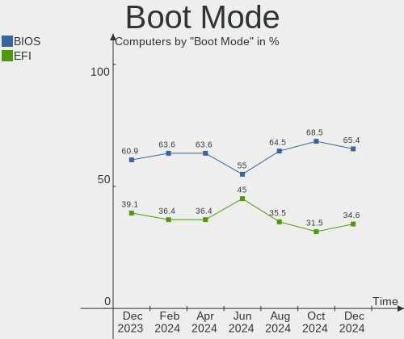
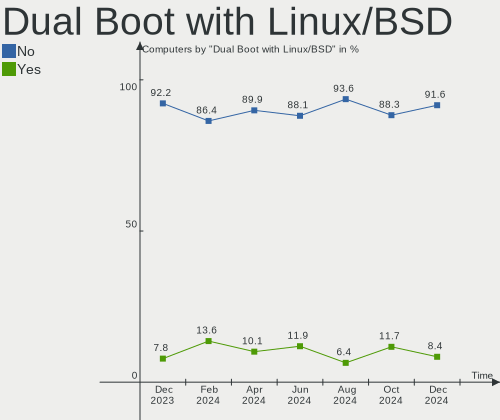
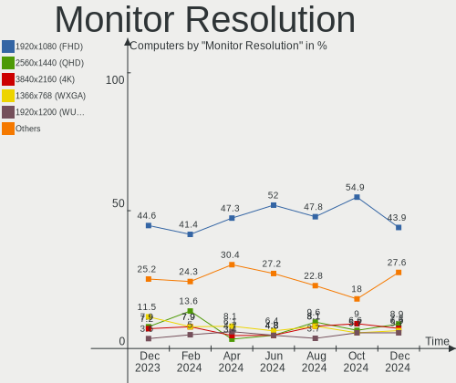

Manjaro - Hardware Trends
-------------------------

A project to identify most popular hardware characteristics and track their change
over time based on data collected by Linux users at https://Linux-Hardware.org.

Anyone can contribute to this report by the [hw-probe](https://github.com/linuxhw/hw-probe) tool:

    sudo -E hw-probe -all -upload

This is a report for all computer types. See also reports for [desktops](/Dist/Manjaro/Desktop/README.md) and [notebooks](/Dist/Manjaro/Notebook/README.md).

This report is for one last month. Overall report since the beginning of time: [TestCoverage](https://github.com/linuxhw/TestCoverage)

Period: Dec, 2022.

Contents
--------

* [ System ](#system)
  - [ OS                       ](#os)
  - [ OS Family                ](#os-family)
  - [ Kernel                   ](#kernel)
  - [ Kernel Family            ](#kernel-family)
  - [ Kernel Major Ver.        ](#kernel-major-ver)
  - [ Arch                     ](#arch)
  - [ DE                       ](#de)
  - [ Display Server           ](#display-server)
  - [ Display Manager          ](#display-manager)
  - [ OS Lang                  ](#os-lang)
  - [ Boot Mode                ](#boot-mode)
  - [ Filesystem               ](#filesystem)
  - [ Part. scheme             ](#part-scheme)
  - [ Dual Boot with Linux/BSD ](#dual-boot-with-linuxbsd)
  - [ Dual Boot (Win)          ](#dual-boot-win)

* [ Board ](#board)
  - [ Vendor                   ](#vendor)
  - [ Model                    ](#model)
  - [ Model Family             ](#model-family)
  - [ MFG Year                 ](#mfg-year)
  - [ Form Factor              ](#form-factor)
  - [ Secure Boot              ](#secure-boot)
  - [ Coreboot                 ](#coreboot)
  - [ RAM Size                 ](#ram-size)
  - [ RAM Used                 ](#ram-used)
  - [ Total Drives             ](#total-drives)
  - [ Has CD-ROM               ](#has-cd-rom)
  - [ Has Ethernet             ](#has-ethernet)
  - [ Has WiFi                 ](#has-wifi)
  - [ Has Bluetooth            ](#has-bluetooth)

* [ Location ](#location)
  - [ Country                  ](#country)
  - [ City                     ](#city)

* [ Drives ](#drives)
  - [ Drive Vendor             ](#drive-vendor)
  - [ Drive Model              ](#drive-model)
  - [ HDD Vendor               ](#hdd-vendor)
  - [ SSD Vendor               ](#ssd-vendor)
  - [ Drive Kind               ](#drive-kind)
  - [ Drive Connector          ](#drive-connector)
  - [ Drive Size               ](#drive-size)
  - [ Space Total              ](#space-total)
  - [ Space Used               ](#space-used)
  - [ Malfunc. Drives          ](#malfunc-drives)
  - [ Malfunc. Drive Vendor    ](#malfunc-drive-vendor)
  - [ Malfunc. HDD Vendor      ](#malfunc-hdd-vendor)
  - [ Malfunc. Drive Kind      ](#malfunc-drive-kind)
  - [ Failed Drives            ](#failed-drives)
  - [ Failed Drive Vendor      ](#failed-drive-vendor)
  - [ Drive Status             ](#drive-status)

* [ Storage controller ](#storage-controller)
  - [ Storage Vendor           ](#storage-vendor)
  - [ Storage Model            ](#storage-model)
  - [ Storage Kind             ](#storage-kind)

* [ Processor ](#processor)
  - [ CPU Vendor               ](#cpu-vendor)
  - [ CPU Model                ](#cpu-model)
  - [ CPU Model Family         ](#cpu-model-family)
  - [ CPU Cores                ](#cpu-cores)
  - [ CPU Sockets              ](#cpu-sockets)
  - [ CPU Threads              ](#cpu-threads)
  - [ CPU Op-Modes             ](#cpu-op-modes)
  - [ CPU Microcode            ](#cpu-microcode)
  - [ CPU Microarch            ](#cpu-microarch)

* [ Graphics ](#graphics)
  - [ GPU Vendor               ](#gpu-vendor)
  - [ GPU Model                ](#gpu-model)
  - [ GPU Combo                ](#gpu-combo)
  - [ GPU Driver               ](#gpu-driver)
  - [ GPU Memory               ](#gpu-memory)

* [ Monitor ](#monitor)
  - [ Monitor Vendor           ](#monitor-vendor)
  - [ Monitor Model            ](#monitor-model)
  - [ Monitor Resolution       ](#monitor-resolution)
  - [ Monitor Diagonal         ](#monitor-diagonal)
  - [ Monitor Width            ](#monitor-width)
  - [ Aspect Ratio             ](#aspect-ratio)
  - [ Monitor Area             ](#monitor-area)
  - [ Pixel Density            ](#pixel-density)
  - [ Multiple Monitors        ](#multiple-monitors)

* [ Network ](#network)
  - [ Net Controller Vendor    ](#net-controller-vendor)
  - [ Net Controller Model     ](#net-controller-model)
  - [ Wireless Vendor          ](#wireless-vendor)
  - [ Wireless Model           ](#wireless-model)
  - [ Ethernet Vendor          ](#ethernet-vendor)
  - [ Ethernet Model           ](#ethernet-model)
  - [ Net Controller Kind      ](#net-controller-kind)
  - [ Used Controller          ](#used-controller)
  - [ NICs                     ](#nics)
  - [ IPv6                     ](#ipv6)

* [ Bluetooth ](#bluetooth)
  - [ Bluetooth Vendor         ](#bluetooth-vendor)
  - [ Bluetooth Model          ](#bluetooth-model)

* [ Sound ](#sound)
  - [ Sound Vendor             ](#sound-vendor)
  - [ Sound Model              ](#sound-model)

* [ Memory ](#memory)
  - [ Memory Vendor            ](#memory-vendor)
  - [ Memory Model             ](#memory-model)
  - [ Memory Kind              ](#memory-kind)
  - [ Memory Form Factor       ](#memory-form-factor)
  - [ Memory Size              ](#memory-size)
  - [ Memory Speed             ](#memory-speed)

* [ Printers & scanners ](#printers--scanners)
  - [ Printer Vendor           ](#printer-vendor)
  - [ Printer Model            ](#printer-model)
  - [ Scanner Vendor           ](#scanner-vendor)
  - [ Scanner Model            ](#scanner-model)

* [ Camera ](#camera)
  - [ Camera Vendor            ](#camera-vendor)
  - [ Camera Model             ](#camera-model)

* [ Security ](#security)
  - [ Fingerprint Vendor       ](#fingerprint-vendor)
  - [ Fingerprint Model        ](#fingerprint-model)
  - [ Chipcard Vendor          ](#chipcard-vendor)
  - [ Chipcard Model           ](#chipcard-model)

* [ Unsupported ](#unsupported)
  - [ Unsupported Devices      ](#unsupported-devices)
  - [ Unsupported Device Types ](#unsupported-device-types)

System
------

OS
--

Installed operating systems

| Name                      | Computers | Percent |
|---------------------------|-----------|---------|
| Manjaro 22.0.0            | 93        | 49.21%  |
| Manjaro                   | 86        | 45.5%   |
| Manjaro 22.0              | 5         | 2.65%   |
| Manjaro 21.3.7            | 3         | 1.59%   |
| Manjaro 22.12-development | 1         | 0.53%   |
| Manjaro 21.3.2            | 1         | 0.53%   |

OS Family
---------

OS without a version

| Name    | Computers | Percent |
|---------|-----------|---------|
| Manjaro | 189       | 100%    |

Kernel
------

Version of the Linux kernel

| Version              | Computers | Percent |
|----------------------|-----------|---------|
| 5.15.81-1-MANJARO    | 42        | 22.22%  |
| 6.1.1-1-MANJARO      | 25        | 13.23%  |
| 6.1.0-1-MANJARO      | 21        | 11.11%  |
| 5.15.78-1-MANJARO    | 20        | 10.58%  |
| 6.0.11-1-MANJARO     | 18        | 9.52%   |
| 6.0.8-1-MANJARO      | 14        | 7.41%   |
| 5.15.84-1-MANJARO    | 10        | 5.29%   |
| 5.15.85-1-MANJARO    | 9         | 4.76%   |
| 5.15.60-1-MANJARO    | 6         | 3.17%   |
| 5.19.17-2-MANJARO    | 5         | 2.65%   |
| 6.0.14-1-MANJARO     | 3         | 1.59%   |
| 5.10.157-1-MANJARO   | 3         | 1.59%   |
| 5.16.20-2-MANJARO    | 2         | 1.06%   |
| 6.0.5-2-rt14-MANJARO | 1         | 0.53%   |
| 6.0.15-1-MANJARO     | 1         | 0.53%   |
| 6.0.13-1-MANJARO     | 1         | 0.53%   |
| 6.0.12-1-MANJARO     | 1         | 0.53%   |
| 6.0.11-AMD           | 1         | 0.53%   |
| 5.15.82-1-MANJARO    | 1         | 0.53%   |
| 5.15.74-3-MANJARO    | 1         | 0.53%   |
| 5.15.72-1-MANJARO    | 1         | 0.53%   |
| 5.11.22-2-MANJARO    | 1         | 0.53%   |
| 5.10.148-1-MANJARO   | 1         | 0.53%   |
| 4.19.260-1-MANJARO   | 1         | 0.53%   |

Kernel Family
-------------

Linux kernel without a distro release

| Version  | Computers | Percent |
|----------|-----------|---------|
| 5.15.81  | 42        | 22.22%  |
| 6.1.1    | 25        | 13.23%  |
| 6.1.0    | 21        | 11.11%  |
| 5.15.78  | 20        | 10.58%  |
| 6.0.11   | 19        | 10.05%  |
| 6.0.8    | 14        | 7.41%   |
| 5.15.84  | 10        | 5.29%   |
| 5.15.85  | 9         | 4.76%   |
| 5.15.60  | 6         | 3.17%   |
| 5.19.17  | 5         | 2.65%   |
| 6.0.14   | 3         | 1.59%   |
| 5.10.157 | 3         | 1.59%   |
| 5.16.20  | 2         | 1.06%   |
| 6.0.5    | 1         | 0.53%   |
| 6.0.15   | 1         | 0.53%   |
| 6.0.13   | 1         | 0.53%   |
| 6.0.12   | 1         | 0.53%   |
| 5.15.82  | 1         | 0.53%   |
| 5.15.74  | 1         | 0.53%   |
| 5.15.72  | 1         | 0.53%   |
| 5.11.22  | 1         | 0.53%   |
| 5.10.148 | 1         | 0.53%   |
| 4.19.260 | 1         | 0.53%   |

Kernel Major Ver.
-----------------

Linux kernel major version

| Version | Computers | Percent |
|---------|-----------|---------|
| 5.15    | 90        | 47.62%  |
| 6.1     | 46        | 24.34%  |
| 6.0     | 40        | 21.16%  |
| 5.19    | 5         | 2.65%   |
| 5.10    | 4         | 2.12%   |
| 5.16    | 2         | 1.06%   |
| 5.11    | 1         | 0.53%   |
| 4.19    | 1         | 0.53%   |

Arch
----

OS architecture (x86_64, i586, etc.)

| Name   | Computers | Percent |
|--------|-----------|---------|
| x86_64 | 189       | 100%    |

DE
--

Desktop Environment

| Name           | Computers | Percent |
|----------------|-----------|---------|
| KDE5           | 99        | 52.38%  |
| GNOME          | 46        | 24.34%  |
| XFCE           | 25        | 13.23%  |
| KDE            | 5         | 2.65%   |
| i3             | 4         | 2.12%   |
| X-Cinnamon     | 2         | 1.06%   |
| sway           | 2         | 1.06%   |
| Unknown        | 2         | 1.06%   |
| i3-with-shmlog | 1         | 0.53%   |
| Enlightenment  | 1         | 0.53%   |
| Deepin         | 1         | 0.53%   |
| Budgie         | 1         | 0.53%   |

Display Server
--------------

X11 or Wayland

| Name    | Computers | Percent |
|---------|-----------|---------|
| X11     | 136       | 71.96%  |
| Wayland | 48        | 25.4%   |
| Tty     | 3         | 1.59%   |
| Unknown | 2         | 1.06%   |

Display Manager
---------------

SDDM, LightDM, etc.

| Name    | Computers | Percent |
|---------|-----------|---------|
| Unknown | 86        | 45.5%   |
| SDDM    | 49        | 25.93%  |
| GDM     | 29        | 15.34%  |
| LightDM | 24        | 12.7%   |
| GREETD  | 1         | 0.53%   |

OS Lang
-------

Language

| Lang  | Computers | Percent |
|-------|-----------|---------|
| en_US | 93        | 49.21%  |
| en_GB | 14        | 7.41%   |
| de_DE | 12        | 6.35%   |
| ru_RU | 9         | 4.76%   |
| fr_FR | 7         | 3.7%    |
| pl_PL | 5         | 2.65%   |
| es_MX | 4         | 2.12%   |
| es_ES | 4         | 2.12%   |
| en_CA | 4         | 2.12%   |
| en_AU | 4         | 2.12%   |
| de_AT | 4         | 2.12%   |
| pt_BR | 3         | 1.59%   |
| nl_NL | 3         | 1.59%   |
| it_IT | 3         | 1.59%   |
| zh_CN | 2         | 1.06%   |
| es_BO | 2         | 1.06%   |
| es_AR | 2         | 1.06%   |
| en_IN | 2         | 1.06%   |
| en_DK | 2         | 1.06%   |
| tr_TR | 1         | 0.53%   |
| sv_SE | 1         | 0.53%   |
| fi_FI | 1         | 0.53%   |
| es_GT | 1         | 0.53%   |
| en_ZA | 1         | 0.53%   |
| en_SG | 1         | 0.53%   |
| en_DE | 1         | 0.53%   |
| cs_CZ | 1         | 0.53%   |
| C     | 1         | 0.53%   |
| aa_DJ | 1         | 0.53%   |

Boot Mode
---------

EFI or BIOS

| Mode | Computers | Percent |
|------|-----------|---------|
| BIOS | 108       | 57.14%  |
| EFI  | 81        | 42.86%  |

Filesystem
----------

Type of filesystem

| Type    | Computers | Percent |
|---------|-----------|---------|
| Ext4    | 150       | 79.37%  |
| Btrfs   | 29        | 15.34%  |
| Xfs     | 4         | 2.12%   |
| Tmpfs   | 3         | 1.59%   |
| Overlay | 3         | 1.59%   |

Part. scheme
------------

Scheme of partitioning

| Type    | Computers | Percent |
|---------|-----------|---------|
| GPT     | 97        | 51.32%  |
| Unknown | 82        | 43.39%  |
| MBR     | 10        | 5.29%   |

Dual Boot with Linux/BSD
------------------------

Hosting more than one Linux/BSD

| Dual boot | Computers | Percent |
|-----------|-----------|---------|
| No        | 169       | 89.42%  |
| Yes       | 20        | 10.58%  |

Dual Boot (Win)
---------------

Hosting Linux and Windows

| Dual boot | Computers | Percent |
|-----------|-----------|---------|
| No        | 135       | 71.43%  |
| Yes       | 54        | 28.57%  |

Board
-----

Vendor
------

Motherboard manufacturer

| Name                     | Computers | Percent |
|--------------------------|-----------|---------|
| Lenovo                   | 32        | 16.93%  |
| Hewlett-Packard          | 26        | 13.76%  |
| ASUSTek Computer         | 25        | 13.23%  |
| Dell                     | 18        | 9.52%   |
| MSI                      | 15        | 7.94%   |
| Gigabyte Technology      | 15        | 7.94%   |
| Acer                     | 10        | 5.29%   |
| ASRock                   | 9         | 4.76%   |
| HUAWEI                   | 5         | 2.65%   |
| Apple                    | 4         | 2.12%   |
| ZOTAC                    | 2         | 1.06%   |
| Toshiba                  | 2         | 1.06%   |
| Medion                   | 2         | 1.06%   |
| K.A.Technologies Limited | 2         | 1.06%   |
| Intel                    | 2         | 1.06%   |
| GPU Company              | 2         | 1.06%   |
| Chuwi                    | 2         | 1.06%   |
| Unknown                  | 2         | 1.06%   |
| Valve                    | 1         | 0.53%   |
| TUXEDO                   | 1         | 0.53%   |
| Teclast                  | 1         | 0.53%   |
| Schenker                 | 1         | 0.53%   |
| Samsung Electronics      | 1         | 0.53%   |
| Razer                    | 1         | 0.53%   |
| MECHREVO                 | 1         | 0.53%   |
| IPASON                   | 1         | 0.53%   |
| IP3 Tech                 | 1         | 0.53%   |
| Google                   | 1         | 0.53%   |
| Framework                | 1         | 0.53%   |
| Clevo                    | 1         | 0.53%   |
| BESSTAR Tech             | 1         | 0.53%   |
| Alienware                | 1         | 0.53%   |

Model
-----

Motherboard model

| Name                                                                                     | Computers | Percent |
|------------------------------------------------------------------------------------------|-----------|---------|
| MSI MS-7C91                                                                              | 2         | 1.06%   |
| MSI MS-7A40                                                                              | 2         | 1.06%   |
| K.A.Technologies Limited TM1                                                             | 2         | 1.06%   |
| GPU Company GWNR71517                                                                    | 2         | 1.06%   |
| Gigabyte X570 AORUS ELITE                                                                | 2         | 1.06%   |
| ASUS M5A97 R2.0                                                                          | 2         | 1.06%   |
| Unknown                                                                                  | 2         | 1.06%   |
| ZOTAC ZBOX-MI640/MI660/MI620NANO                                                         | 1         | 0.53%   |
| ZOTAC ION                                                                                | 1         | 0.53%   |
| Valve Jupiter                                                                            | 1         | 0.53%   |
| TUXEDO Pulse 14 Gen1                                                                     | 1         | 0.53%   |
| Toshiba Satellite Pro L300                                                               | 1         | 0.53%   |
| Toshiba Satellite C650D                                                                  | 1         | 0.53%   |
| Teclast F5                                                                               | 1         | 0.53%   |
| Schenker VISION 15 (SVS15E21)                                                            | 1         | 0.53%   |
| Samsung 355V4C/355V4X/355V5C/355V5X/356V4C/356V4X/356V5C/356V5X/3445VC/3445VX/3545VC/354 | 1         | 0.53%   |
| Razer Blade 15 (2022) - RZ09-0421                                                        | 1         | 0.53%   |
| MSI Prestige 14 A11SC                                                                    | 1         | 0.53%   |
| MSI MS-7D78                                                                              | 1         | 0.53%   |
| MSI MS-7D54                                                                              | 1         | 0.53%   |
| MSI MS-7D43                                                                              | 1         | 0.53%   |
| MSI MS-7C02                                                                              | 1         | 0.53%   |
| MSI MS-7B85                                                                              | 1         | 0.53%   |
| MSI MS-7A62                                                                              | 1         | 0.53%   |
| MSI MS-7A35                                                                              | 1         | 0.53%   |
| MSI MS-7721                                                                              | 1         | 0.53%   |
| MSI Katana GF66 11UE                                                                     | 1         | 0.53%   |
| MSI GS60 6QE                                                                             | 1         | 0.53%   |
| Medion E4251 MD61435                                                                     | 1         | 0.53%   |
| Medion E4251                                                                             | 1         | 0.53%   |
| MECHREVO X3 Series GK7CP6R                                                               | 1         | 0.53%   |
| Lenovo Yoga Slim 7 Pro 16ACH6 82QQ                                                       | 1         | 0.53%   |
| Lenovo ThinkStation S20 4157DT6                                                          | 1         | 0.53%   |
| Lenovo ThinkPad X1 Yoga 4th 20QGS40100                                                   | 1         | 0.53%   |
| Lenovo ThinkPad X1 Yoga 4th 20QFCTO1WW                                                   | 1         | 0.53%   |
| Lenovo ThinkPad X1 Yoga 2nd 20JES3D300                                                   | 1         | 0.53%   |
| Lenovo ThinkPad X1 Extreme 2nd 20QVS0FP00                                                | 1         | 0.53%   |
| Lenovo ThinkPad X1 Carbon 6th 20KHS18V00                                                 | 1         | 0.53%   |
| Lenovo ThinkPad X1 Carbon 4th 20FCS11P0B                                                 | 1         | 0.53%   |
| Lenovo ThinkPad T540p 20BFS0MQ00                                                         | 1         | 0.53%   |

Model Family
------------

Motherboard model prefix

| Name                         | Computers | Percent |
|------------------------------|-----------|---------|
| Lenovo ThinkPad              | 22        | 11.64%  |
| HP Pavilion                  | 7         | 3.7%    |
| ASUS ROG                     | 7         | 3.7%    |
| Acer Aspire                  | 7         | 3.7%    |
| Lenovo IdeaPad               | 5         | 2.65%   |
| Dell Inspiron                | 5         | 2.65%   |
| HP ENVY                      | 4         | 2.12%   |
| HP EliteBook                 | 4         | 2.12%   |
| Dell XPS                     | 4         | 2.12%   |
| ASUS PRIME                   | 4         | 2.12%   |
| Gigabyte B550M               | 3         | 1.59%   |
| Dell OptiPlex                | 3         | 1.59%   |
| ASUS TUF                     | 3         | 1.59%   |
| Toshiba Satellite            | 2         | 1.06%   |
| MSI MS-7C91                  | 2         | 1.06%   |
| MSI MS-7A40                  | 2         | 1.06%   |
| Medion E4251                 | 2         | 1.06%   |
| Lenovo ThinkBook             | 2         | 1.06%   |
| K.A.Technologies Limited TM1 | 2         | 1.06%   |
| HP ProBook                   | 2         | 1.06%   |
| HP OMEN                      | 2         | 1.06%   |
| GPU Company GWNR71517        | 2         | 1.06%   |
| Gigabyte X570                | 2         | 1.06%   |
| Dell Precision               | 2         | 1.06%   |
| ASUS Zenbook                 | 2         | 1.06%   |
| ASUS M5A97                   | 2         | 1.06%   |
| ASUS ASUS                    | 2         | 1.06%   |
| ASRock X670E                 | 2         | 1.06%   |
| Unknown                      | 2         | 1.06%   |
| ZOTAC ZBOX-MI640             | 1         | 0.53%   |
| ZOTAC ION                    | 1         | 0.53%   |
| Valve Jupiter                | 1         | 0.53%   |
| TUXEDO Pulse                 | 1         | 0.53%   |
| Teclast F5                   | 1         | 0.53%   |
| Schenker VISION              | 1         | 0.53%   |
| Samsung 355V4C               | 1         | 0.53%   |
| Razer Blade                  | 1         | 0.53%   |
| MSI Prestige                 | 1         | 0.53%   |
| MSI MS-7D78                  | 1         | 0.53%   |
| MSI MS-7D54                  | 1         | 0.53%   |

MFG Year
--------

Motherboard manufacture year

| Year | Computers | Percent |
|------|-----------|---------|
| 2021 | 37        | 19.58%  |
| 2022 | 30        | 15.87%  |
| 2020 | 27        | 14.29%  |
| 2019 | 24        | 12.7%   |
| 2018 | 15        | 7.94%   |
| 2017 | 13        | 6.88%   |
| 2012 | 9         | 4.76%   |
| 2016 | 7         | 3.7%    |
| 2011 | 6         | 3.17%   |
| 2015 | 5         | 2.65%   |
| 2013 | 5         | 2.65%   |
| 2014 | 4         | 2.12%   |
| 2010 | 3         | 1.59%   |
| 2009 | 2         | 1.06%   |
| 2008 | 1         | 0.53%   |
| 2007 | 1         | 0.53%   |

Form Factor
-----------

Physical design of the computer

| Name        | Computers | Percent |
|-------------|-----------|---------|
| Notebook    | 107       | 56.61%  |
| Desktop     | 60        | 31.75%  |
| Convertible | 16        | 8.47%   |
| Mini pc     | 5         | 2.65%   |
| Tablet      | 1         | 0.53%   |

Secure Boot
-----------

Enabled or disabled

| State    | Computers | Percent |
|----------|-----------|---------|
| Disabled | 188       | 99.47%  |
| Enabled  | 1         | 0.53%   |

Coreboot
--------

Have coreboot on board

| Used | Computers | Percent |
|------|-----------|---------|
| No   | 188       | 99.47%  |
| Yes  | 1         | 0.53%   |

RAM Size
--------

Total RAM memory

| Size in GB  | Computers | Percent |
|-------------|-----------|---------|
| 16.01-24.0  | 46        | 24.34%  |
| 8.01-16.0   | 39        | 20.63%  |
| 4.01-8.0    | 37        | 19.58%  |
| 32.01-64.0  | 34        | 17.99%  |
| 3.01-4.0    | 18        | 9.52%   |
| 64.01-256.0 | 8         | 4.23%   |
| 24.01-32.0  | 7         | 3.7%    |

RAM Used
--------

Used RAM memory

| Used GB   | Computers | Percent |
|-----------|-----------|---------|
| 4.01-8.0  | 66        | 34.92%  |
| 3.01-4.0  | 40        | 21.16%  |
| 2.01-3.0  | 38        | 20.11%  |
| 1.01-2.0  | 26        | 13.76%  |
| 8.01-16.0 | 18        | 9.52%   |
| 0.51-1.0  | 1         | 0.53%   |

Total Drives
------------

Number of drives on board

| Drives | Computers | Percent |
|--------|-----------|---------|
| 1      | 114       | 60.32%  |
| 2      | 41        | 21.69%  |
| 3      | 18        | 9.52%   |
| 4      | 8         | 4.23%   |
| 5      | 5         | 2.65%   |
| 20     | 1         | 0.53%   |
| 9      | 1         | 0.53%   |
| 6      | 1         | 0.53%   |

Has CD-ROM
----------

Has CD-ROM on board

| Presented | Computers | Percent |
|-----------|-----------|---------|
| No        | 160       | 84.66%  |
| Yes       | 29        | 15.34%  |

Has Ethernet
------------

Has Ethernet on board

| Presented | Computers | Percent |
|-----------|-----------|---------|
| Yes       | 144       | 76.19%  |
| No        | 45        | 23.81%  |

Has WiFi
--------

Has WiFi module

| Presented | Computers | Percent |
|-----------|-----------|---------|
| Yes       | 161       | 85.19%  |
| No        | 28        | 14.81%  |

Has Bluetooth
-------------

Has Bluetooth module

| Presented | Computers | Percent |
|-----------|-----------|---------|
| Yes       | 138       | 73.02%  |
| No        | 51        | 26.98%  |

Location
--------

Country
-------

Geographic location (country)

| Country             | Computers | Percent |
|---------------------|-----------|---------|
| USA                 | 32        | 16.93%  |
| Germany             | 21        | 11.11%  |
| Russia              | 15        | 7.94%   |
| Italy               | 12        | 6.35%   |
| France              | 10        | 5.29%   |
| Netherlands         | 7         | 3.7%    |
| UK                  | 6         | 3.17%   |
| Spain               | 6         | 3.17%   |
| Canada              | 6         | 3.17%   |
| Argentina           | 6         | 3.17%   |
| Poland              | 5         | 2.65%   |
| Mexico              | 5         | 2.65%   |
| India               | 4         | 2.12%   |
| Brazil              | 4         | 2.12%   |
| Austria             | 4         | 2.12%   |
| Australia           | 4         | 2.12%   |
| Sweden              | 3         | 1.59%   |
| China               | 3         | 1.59%   |
| Ukraine             | 2         | 1.06%   |
| Switzerland         | 2         | 1.06%   |
| Hungary             | 2         | 1.06%   |
| Greece              | 2         | 1.06%   |
| Ghana               | 2         | 1.06%   |
| Finland             | 2         | 1.06%   |
| Denmark             | 2         | 1.06%   |
| Bulgaria            | 2         | 1.06%   |
| Bolivia             | 2         | 1.06%   |
| Belgium             | 2         | 1.06%   |
| Belarus             | 2         | 1.06%   |
| Turkey              | 1         | 0.53%   |
| Trinidad and Tobago | 1         | 0.53%   |
| Taiwan              | 1         | 0.53%   |
| South Korea         | 1         | 0.53%   |
| South Africa        | 1         | 0.53%   |
| Singapore           | 1         | 0.53%   |
| Romania             | 1         | 0.53%   |
| Guatemala           | 1         | 0.53%   |
| Georgia             | 1         | 0.53%   |
| Egypt               | 1         | 0.53%   |
| Czechia             | 1         | 0.53%   |

City
----

Geographic location (city)

| City                   | Computers | Percent |
|------------------------|-----------|---------|
| St Petersburg          | 4         | 2.12%   |
| Moscow                 | 4         | 2.12%   |
| Milan                  | 4         | 2.12%   |
| Delhi                  | 3         | 1.59%   |
| Brisbane               | 3         | 1.59%   |
| Wels                   | 2         | 1.06%   |
| Vienna                 | 2         | 1.06%   |
| Toronto                | 2         | 1.06%   |
| Stockholm              | 2         | 1.06%   |
| Spokane                | 2         | 1.06%   |
| Saint-Germain-en-Laye  | 2         | 1.06%   |
| Paris                  | 2         | 1.06%   |
| Nuremberg              | 2         | 1.06%   |
| Ludwigsburg            | 2         | 1.06%   |
| La Paz                 | 2         | 1.06%   |
| Hamburg                | 2         | 1.06%   |
| Dortmund               | 2         | 1.06%   |
| Cologne                | 2         | 1.06%   |
| Cleveland              | 2         | 1.06%   |
| Blaricum               | 2         | 1.06%   |
| Beijing                | 2         | 1.06%   |
| Zoetermeer             | 1         | 0.53%   |
| Yuseong-gu             | 1         | 0.53%   |
| Yerevan                | 1         | 0.53%   |
| Witham                 | 1         | 0.53%   |
| Wilde                  | 1         | 0.53%   |
| West Warwick           | 1         | 0.53%   |
| Warsaw                 | 1         | 0.53%   |
| Villingen-Schwenningen | 1         | 0.53%   |
| Verona                 | 1         | 0.53%   |
| Valencia               | 1         | 0.53%   |
| Udine                  | 1         | 0.53%   |
| Tychy                  | 1         | 0.53%   |
| Tuczno                 | 1         | 0.53%   |
| Tijuana                | 1         | 0.53%   |
| Thessaloniki           | 1         | 0.53%   |
| Terrassa               | 1         | 0.53%   |
| Tecamac                | 1         | 0.53%   |
| Tbilisi                | 1         | 0.53%   |
| Tamworth               | 1         | 0.53%   |

Drives
------

Drive Vendor
------------

Hard drive vendors

| Vendor                         | Computers | Drives | Percent |
|--------------------------------|-----------|--------|---------|
| Samsung Electronics            | 54        | 65     | 19.08%  |
| Sandisk                        | 34        | 40     | 12.01%  |
| WDC                            | 31        | 41     | 10.95%  |
| Seagate                        | 29        | 41     | 10.25%  |
| Kingston                       | 16        | 16     | 5.65%   |
| Crucial                        | 12        | 19     | 4.24%   |
| SK hynix                       | 9         | 9      | 3.18%   |
| Unknown                        | 7         | 8      | 2.47%   |
| Toshiba                        | 7         | 8      | 2.47%   |
| Intel                          | 7         | 8      | 2.47%   |
| Phison Electronics             | 6         | 7      | 2.12%   |
| Micron Technology              | 6         | 6      | 2.12%   |
| Netac                          | 5         | 5      | 1.77%   |
| A-DATA Technology              | 5         | 5      | 1.77%   |
| Silicon Motion                 | 4         | 4      | 1.41%   |
| Micron/Crucial Technology      | 4         | 4      | 1.41%   |
| ADATA Technology               | 4         | 5      | 1.41%   |
| KIOXIA                         | 3         | 3      | 1.06%   |
| Kingston Technology Company    | 3         | 3      | 1.06%   |
| Hitachi                        | 3         | 3      | 1.06%   |
| China                          | 3         | 3      | 1.06%   |
| Unknown                        | 3         | 3      | 1.06%   |
| Realtek Semiconductor          | 2         | 2      | 0.71%   |
| PNY                            | 2         | 2      | 0.71%   |
| Plextor                        | 2         | 2      | 0.71%   |
| Apple                          | 2         | 2      | 0.71%   |
| TwinMOS                        | 1         | 1      | 0.35%   |
| Teclast                        | 1         | 1      | 0.35%   |
| SPCC                           | 1         | 1      | 0.35%   |
| Solid State Storage Technology | 1         | 1      | 0.35%   |
| Solid State Storage            | 1         | 1      | 0.35%   |
| ShiJi                          | 1         | 1      | 0.35%   |
| Phison                         | 1         | 1      | 0.35%   |
| Patriot                        | 1         | 1      | 0.35%   |
| LITEONIT                       | 1         | 1      | 0.35%   |
| LITEON                         | 1         | 1      | 0.35%   |
| Intenso                        | 1         | 1      | 0.35%   |
| Inland                         | 1         | 1      | 0.35%   |
| HS-SSD-C100                    | 1         | 1      | 0.35%   |
| HGST                           | 1         | 1      | 0.35%   |

Drive Model
-----------

Hard drive models

| Model                                                           | Computers | Percent |
|-----------------------------------------------------------------|-----------|---------|
| Samsung NVMe SSD Controller SM981/PM981/PM983 500GB             | 19        | 6.07%   |
| Sandisk WD Black SN850 1TB                                      | 7         | 2.24%   |
| Sandisk WD Black SN750 / PC SN730 NVMe SSD 512GB                | 7         | 2.24%   |
| Samsung NVMe SSD Controller PM9A1/PM9A3/980PRO 2TB              | 7         | 2.24%   |
| Sandisk WD Black 2018/SN750 / PC SN720 NVMe SSD 256GB           | 4         | 1.28%   |
| Phison E12 NVMe Controller 1TB                                  | 4         | 1.28%   |
| ADATA XPG SX8200 Pro PCIe Gen3x4 M.2 2280 Solid State Drive 1TB | 4         | 1.28%   |
| Silicon Motion SM2263EN/SM2263XT SSD Controller 1024GB          | 3         | 0.96%   |
| Seagate ST2000DM008-2FR102 2TB                                  | 3         | 0.96%   |
| Samsung SSD 850 EVO 250GB                                       | 3         | 0.96%   |
| Samsung NVMe SSD Controller SM961/PM961/SM963 256GB             | 3         | 0.96%   |
| Netac SSD 256GB                                                 | 3         | 0.96%   |
| Kingston SA400S37240G 240GB SSD                                 | 3         | 0.96%   |
| Intel SSD 660P Series 1024GB                                    | 3         | 0.96%   |
| Crucial CT1000MX500SSD1 1TB                                     | 3         | 0.96%   |
| Unknown                                                         | 3         | 0.96%   |
| WDC WDS240G2G0B-00EPW0 240GB SSD                                | 2         | 0.64%   |
| WDC WD2500BEVT-22ZCT0 250GB                                     | 2         | 0.64%   |
| Unknown SD/MMC/MS PRO 64GB                                      | 2         | 0.64%   |
| Unknown MMC Card  32GB                                          | 2         | 0.64%   |
| SK hynix SKHynix_HFS512GD9TNI-L2A0B 512GB                       | 2         | 0.64%   |
| Seagate ST9500325AS 500GB                                       | 2         | 0.64%   |
| Seagate ST1000LM049-2GH172 1TB                                  | 2         | 0.64%   |
| Seagate Expansion Desk 5TB                                      | 2         | 0.64%   |
| Sandisk WD Blue SN550 NVMe SSD 500GB                            | 2         | 0.64%   |
| Sandisk WD Blue SN500 / PC SN520 NVMe SSD 256GB                 | 2         | 0.64%   |
| SanDisk SSD PLUS 480GB                                          | 2         | 0.64%   |
| SanDisk SD9SN8W-128G-1006 128GB SSD                             | 2         | 0.64%   |
| Samsung SSD 980 500GB                                           | 2         | 0.64%   |
| Samsung SSD 860 EVO 500GB                                       | 2         | 0.64%   |
| Samsung SSD 860 EVO 250GB                                       | 2         | 0.64%   |
| Samsung SSD 850 EVO 500GB                                       | 2         | 0.64%   |
| Phison E16 PCIe4 NVMe Controller 512GB                          | 2         | 0.64%   |
| Micron/Crucial CT1000P5PSSD8 1TB                                | 2         | 0.64%   |
| Micron 2450_MTFDKBA512TFK 512GB                                 | 2         | 0.64%   |
| Kingston Company OM3PDP3 NVMe SSD 512GB                         | 2         | 0.64%   |
| Kingston SA400S37960G 960GB SSD                                 | 2         | 0.64%   |
| Kingston SA400S37480G 480GB SSD                                 | 2         | 0.64%   |
| Intel SSDPEKNU010TZ 1024GB                                      | 2         | 0.64%   |
| Crucial CT500MX500SSD1 500GB                                    | 2         | 0.64%   |

HDD Vendor
----------

Hard disk drive vendors

| Vendor              | Computers | Drives | Percent |
|---------------------|-----------|--------|---------|
| Seagate             | 28        | 39     | 41.79%  |
| WDC                 | 26        | 34     | 38.81%  |
| Toshiba             | 3         | 4      | 4.48%   |
| Hitachi             | 3         | 3      | 4.48%   |
| Unknown             | 2         | 2      | 2.99%   |
| Samsung Electronics | 1         | 2      | 1.49%   |
| Intenso             | 1         | 1      | 1.49%   |
| HGST                | 1         | 1      | 1.49%   |
| ASMT                | 1         | 2      | 1.49%   |
| ASMedia             | 1         | 1      | 1.49%   |

SSD Vendor
----------

Solid state drive vendors

| Vendor              | Computers | Drives | Percent |
|---------------------|-----------|--------|---------|
| Samsung Electronics | 19        | 20     | 20.88%  |
| Crucial             | 12        | 19     | 13.19%  |
| Kingston            | 11        | 11     | 12.09%  |
| SanDisk             | 8         | 8      | 8.79%   |
| WDC                 | 7         | 7      | 7.69%   |
| Netac               | 5         | 5      | 5.49%   |
| A-DATA Technology   | 5         | 5      | 5.49%   |
| China               | 3         | 3      | 3.3%    |
| Toshiba             | 2         | 2      | 2.2%    |
| PNY                 | 2         | 2      | 2.2%    |
| Plextor             | 2         | 2      | 2.2%    |
| Unknown             | 2         | 2      | 2.2%    |
| TwinMOS             | 1         | 1      | 1.1%    |
| Teclast             | 1         | 1      | 1.1%    |
| SPCC                | 1         | 1      | 1.1%    |
| Phison              | 1         | 1      | 1.1%    |
| Patriot             | 1         | 1      | 1.1%    |
| Micron Technology   | 1         | 1      | 1.1%    |
| LITEONIT            | 1         | 1      | 1.1%    |
| LITEON              | 1         | 1      | 1.1%    |
| Inland              | 1         | 1      | 1.1%    |
| GOODRAM             | 1         | 1      | 1.1%    |
| Gigabyte Technology | 1         | 1      | 1.1%    |
| FREEBSD             | 1         | 12     | 1.1%    |
| Apple               | 1         | 1      | 1.1%    |

Drive Kind
----------

HDD or SSD

| Kind    | Computers | Drives | Percent |
|---------|-----------|--------|---------|
| NVMe    | 118       | 137    | 45.74%  |
| SSD     | 73        | 110    | 28.29%  |
| HDD     | 58        | 89     | 22.48%  |
| MMC     | 5         | 6      | 1.94%   |
| Unknown | 4         | 4      | 1.55%   |

Drive Connector
---------------

SATA, SAS, NVMe, etc.

| Type | Computers | Drives | Percent |
|------|-----------|--------|---------|
| NVMe | 118       | 137    | 50.21%  |
| SATA | 100       | 180    | 42.55%  |
| SAS  | 12        | 23     | 5.11%   |
| MMC  | 5         | 6      | 2.13%   |

Drive Size
----------

Size of hard drive

| Size in TB | Computers | Drives | Percent |
|------------|-----------|--------|---------|
| 0.01-0.5   | 77        | 111    | 55%     |
| 0.51-1.0   | 38        | 53     | 27.14%  |
| 1.01-2.0   | 10        | 12     | 7.14%   |
| 4.01-10.0  | 8         | 14     | 5.71%   |
| 3.01-4.0   | 7         | 9      | 5%      |

Space Total
-----------

Amount of disk space available on the file system

| Size in GB     | Computers | Percent |
|----------------|-----------|---------|
| 251-500        | 47        | 24.87%  |
| 101-250        | 47        | 24.87%  |
| 501-1000       | 30        | 15.87%  |
| Unknown        | 17        | 8.99%   |
| More than 3000 | 16        | 8.47%   |
| 1001-2000      | 16        | 8.47%   |
| 51-100         | 7         | 3.7%    |
| 1-20           | 5         | 2.65%   |
| 2001-3000      | 3         | 1.59%   |
| 21-50          | 1         | 0.53%   |

Space Used
----------

Amount of used disk space

| Used GB        | Computers | Percent |
|----------------|-----------|---------|
| 21-50          | 34        | 17.99%  |
| 1-20           | 33        | 17.46%  |
| 101-250        | 30        | 15.87%  |
| 251-500        | 23        | 12.17%  |
| 501-1000       | 18        | 9.52%   |
| 51-100         | 18        | 9.52%   |
| Unknown        | 17        | 8.99%   |
| 1001-2000      | 7         | 3.7%    |
| 2001-3000      | 5         | 2.65%   |
| More than 3000 | 4         | 2.12%   |

Malfunc. Drives
---------------

Drive models with a malfunction

| Model                          | Computers | Drives | Percent |
|--------------------------------|-----------|--------|---------|
| Seagate ST9500325AS 500GB      | 1         | 1      | 25%     |
| Seagate ST4000DM000-1F2168 4TB | 1         | 1      | 25%     |
| SanDisk SSD PLUS 480GB         | 1         | 1      | 25%     |
| Intel SSD 660P Series 1024GB   | 1         | 1      | 25%     |

Malfunc. Drive Vendor
---------------------

Vendors of faulty drives

| Vendor  | Computers | Drives | Percent |
|---------|-----------|--------|---------|
| Seagate | 2         | 2      | 50%     |
| SanDisk | 1         | 1      | 25%     |
| Intel   | 1         | 1      | 25%     |

Malfunc. HDD Vendor
-------------------

Vendors of faulty HDD drives

| Vendor  | Computers | Drives | Percent |
|---------|-----------|--------|---------|
| Seagate | 2         | 2      | 100%    |

Malfunc. Drive Kind
-------------------

Kinds of faulty drives

| Kind | Computers | Drives | Percent |
|------|-----------|--------|---------|
| HDD  | 2         | 2      | 50%     |
| NVMe | 1         | 1      | 25%     |
| SSD  | 1         | 1      | 25%     |

Failed Drives
-------------

Failed drive models

Zero info for selected period =(

Failed Drive Vendor
-------------------

Failed drive vendors

Zero info for selected period =(

Drive Status
------------

Number of failed and malfunc. drives

| Status   | Computers | Drives | Percent |
|----------|-----------|--------|---------|
| Detected | 136       | 221    | 67.33%  |
| Works    | 62        | 121    | 30.69%  |
| Malfunc  | 4         | 4      | 1.98%   |

Storage controller
------------------

Storage Vendor
--------------

Storage controller vendors

| Vendor                         | Computers | Percent |
|--------------------------------|-----------|---------|
| Intel                          | 85        | 31.48%  |
| AMD                            | 56        | 20.74%  |
| Samsung Electronics            | 40        | 14.81%  |
| Sandisk                        | 28        | 10.37%  |
| SK hynix                       | 9         | 3.33%   |
| Kingston Technology Company    | 8         | 2.96%   |
| Phison Electronics             | 7         | 2.59%   |
| Silicon Motion                 | 5         | 1.85%   |
| Micron Technology              | 5         | 1.85%   |
| ASMedia Technology             | 5         | 1.85%   |
| Micron/Crucial Technology      | 4         | 1.48%   |
| ADATA Technology               | 4         | 1.48%   |
| KIOXIA                         | 3         | 1.11%   |
| Toshiba America Info Systems   | 2         | 0.74%   |
| Solid State Storage Technology | 2         | 0.74%   |
| Realtek Semiconductor          | 2         | 0.74%   |
| Transcend                      | 1         | 0.37%   |
| Silicon Image                  | 1         | 0.37%   |
| Nvidia                         | 1         | 0.37%   |
| Marvell Technology Group       | 1         | 0.37%   |
| Apple                          | 1         | 0.37%   |

Storage Model
-------------

Storage controller models

| Model                                                                          | Computers | Percent |
|--------------------------------------------------------------------------------|-----------|---------|
| AMD FCH SATA Controller [AHCI mode]                                            | 37        | 12.59%  |
| Samsung NVMe SSD Controller SM981/PM981/PM983                                  | 19        | 6.46%   |
| Samsung NVMe SSD Controller 980                                                | 11        | 3.74%   |
| Intel Volume Management Device NVMe RAID Controller                            | 11        | 3.74%   |
| Intel Celeron/Pentium Silver Processor SATA Controller                         | 10        | 3.4%    |
| Intel Sunrise Point-LP SATA Controller [AHCI mode]                             | 9         | 3.06%   |
| AMD 500 Series Chipset SATA Controller                                         | 8         | 2.72%   |
| SanDisk WD PC SN810 / Black SN850 NVMe SSD                                     | 7         | 2.38%   |
| SanDisk WD Black SN750 / PC SN730 NVMe SSD                                     | 7         | 2.38%   |
| Samsung NVMe SSD Controller PM9A1/PM9A3/980PRO                                 | 7         | 2.38%   |
| AMD SATA controller                                                            | 7         | 2.38%   |
| AMD 400 Series Chipset SATA Controller                                         | 7         | 2.38%   |
| SK hynix Non-Volatile memory controller                                        | 6         | 2.04%   |
| SanDisk Non-Volatile memory controller                                         | 6         | 2.04%   |
| Kingston Company Company Non-Volatile memory controller                        | 6         | 2.04%   |
| Intel 82801 Mobile SATA Controller [RAID mode]                                 | 6         | 2.04%   |
| Micron Non-Volatile memory controller                                          | 5         | 1.7%    |
| Intel Alder Lake-S PCH SATA Controller [AHCI Mode]                             | 5         | 1.7%    |
| SanDisk WD Black 2018/SN750 / PC SN720 NVMe SSD                                | 4         | 1.36%   |
| Phison E12 NVMe Controller                                                     | 4         | 1.36%   |
| Intel Q170/Q150/B150/H170/H110/Z170/CM236 Chipset SATA Controller [AHCI Mode]  | 4         | 1.36%   |
| ASMedia ASM1062 Serial ATA Controller                                          | 4         | 1.36%   |
| ADATA XPG SX8200 Pro PCIe Gen3x4 M.2 2280 Solid State Drive                    | 4         | 1.36%   |
| Silicon Motion SM2263EN/SM2263XT SSD Controller                                | 3         | 1.02%   |
| Samsung NVMe SSD Controller SM961/PM961/SM963                                  | 3         | 1.02%   |
| Intel Wildcat Point-LP SATA Controller [AHCI Mode]                             | 3         | 1.02%   |
| Intel SSD 660P Series                                                          | 3         | 1.02%   |
| Intel HM170/QM170 Chipset SATA Controller [AHCI Mode]                          | 3         | 1.02%   |
| Intel Cannon Lake Mobile PCH SATA AHCI Controller                              | 3         | 1.02%   |
| Intel 8 Series/C220 Series Chipset Family 6-port SATA Controller 1 [AHCI mode] | 3         | 1.02%   |
| AMD SB7x0/SB8x0/SB9x0 SATA Controller [AHCI mode]                              | 3         | 1.02%   |
| Solid State Storage Non-Volatile memory controller                             | 2         | 0.68%   |
| Silicon Motion SM2262/SM2262EN SSD Controller                                  | 2         | 0.68%   |
| SanDisk WD Blue SN550 NVMe SSD                                                 | 2         | 0.68%   |
| SanDisk WD Blue SN500 / PC SN520 NVMe SSD                                      | 2         | 0.68%   |
| Phison E16 PCIe4 NVMe Controller                                               | 2         | 0.68%   |
| Micron/Crucial P5 Plus NVMe PCIe SSD                                           | 2         | 0.68%   |
| KIOXIA NVMe SSD Controller BG4                                                 | 2         | 0.68%   |
| Kingston Company OM3PDP3 NVMe SSD                                              | 2         | 0.68%   |
| Intel Non-Volatile memory controller                                           | 2         | 0.68%   |

Storage Kind
------------

Kind of storage controller (IDE, SATA, NVMe, SAS, ...)

| Kind | Computers | Percent |
|------|-----------|---------|
| SATA | 123       | 46.59%  |
| NVMe | 117       | 44.32%  |
| RAID | 20        | 7.58%   |
| IDE  | 4         | 1.52%   |

Processor
---------

CPU Vendor
----------

Processor vendors

| Vendor | Computers | Percent |
|--------|-----------|---------|
| Intel  | 113       | 59.79%  |
| AMD    | 76        | 40.21%  |

CPU Model
---------

Processor models

| Model                                         | Computers | Percent |
|-----------------------------------------------|-----------|---------|
| AMD Ryzen 5 3600 6-Core Processor             | 7         | 3.7%    |
| Intel Core i5-8250U CPU @ 1.60GHz             | 5         | 2.65%   |
| AMD Ryzen 7 5800H with Radeon Graphics        | 5         | 2.65%   |
| Intel Celeron N4020 CPU @ 1.10GHz             | 4         | 2.12%   |
| Intel Core i7-9750H CPU @ 2.60GHz             | 3         | 1.59%   |
| Intel Core i7-8665U CPU @ 1.90GHz             | 3         | 1.59%   |
| Intel Core i7-8565U CPU @ 1.80GHz             | 3         | 1.59%   |
| Intel Core i7-8550U CPU @ 1.80GHz             | 3         | 1.59%   |
| Intel Celeron J4125 CPU @ 2.00GHz             | 3         | 1.59%   |
| Intel 12th Gen Core i7-1260P                  | 3         | 1.59%   |
| Intel 11th Gen Core i7-1165G7 @ 2.80GHz       | 3         | 1.59%   |
| AMD Ryzen 9 7950X 16-Core Processor           | 3         | 1.59%   |
| AMD Ryzen 7 7700X 8-Core Processor            | 3         | 1.59%   |
| AMD Ryzen 7 4800H with Radeon Graphics        | 3         | 1.59%   |
| AMD Ryzen 7 3700U with Radeon Vega Mobile Gfx | 3         | 1.59%   |
| Intel Core i7-7500U CPU @ 2.70GHz             | 2         | 1.06%   |
| Intel Core i5-4260U CPU @ 1.40GHz             | 2         | 1.06%   |
| Intel Core i5-10210U CPU @ 1.60GHz            | 2         | 1.06%   |
| Intel 12th Gen Core i7-12700H                 | 2         | 1.06%   |
| Intel 12th Gen Core i5-12600K                 | 2         | 1.06%   |
| Intel 12th Gen Core i5-1240P                  | 2         | 1.06%   |
| Intel 11th Gen Core i7-1185G7 @ 3.00GHz       | 2         | 1.06%   |
| Intel 11th Gen Core i7-11800H @ 2.30GHz       | 2         | 1.06%   |
| Intel 11th Gen Core i5-1135G7 @ 2.40GHz       | 2         | 1.06%   |
| AMD Ryzen 7 5800X3D 8-Core Processor          | 2         | 1.06%   |
| AMD Ryzen 7 5700U with Radeon Graphics        | 2         | 1.06%   |
| AMD Ryzen 7 2700X Eight-Core Processor        | 2         | 1.06%   |
| AMD Ryzen 5 5625U with Radeon Graphics        | 2         | 1.06%   |
| AMD Ryzen 5 5600X 6-Core Processor            | 2         | 1.06%   |
| AMD Ryzen 5 5600G with Radeon Graphics        | 2         | 1.06%   |
| AMD Ryzen 5 5500U with Radeon Graphics        | 2         | 1.06%   |
| AMD Ryzen 5 3500U with Radeon Vega Mobile Gfx | 2         | 1.06%   |
| Intel Xeon CPU X5650 @ 2.67GHz                | 1         | 0.53%   |
| Intel Pentium Silver N6000 @ 1.10GHz          | 1         | 0.53%   |
| Intel Pentium Silver N5000 CPU @ 1.10GHz      | 1         | 0.53%   |
| Intel Pentium Dual-Core CPU T4300 @ 2.10GHz   | 1         | 0.53%   |
| Intel Pentium Dual CPU T3200 @ 2.00GHz        | 1         | 0.53%   |
| Intel Core i9-9880H CPU @ 2.30GHz             | 1         | 0.53%   |
| Intel Core i7-9850H CPU @ 2.60GHz             | 1         | 0.53%   |
| Intel Core i7-8700 CPU @ 3.20GHz              | 1         | 0.53%   |

CPU Model Family
----------------

Processor model prefix

| Model                   | Computers | Percent |
|-------------------------|-----------|---------|
| Intel Core i5           | 33        | 17.46%  |
| Intel Core i7           | 32        | 16.93%  |
| AMD Ryzen 5             | 28        | 14.81%  |
| Other                   | 27        | 14.29%  |
| AMD Ryzen 7             | 25        | 13.23%  |
| Intel Celeron           | 12        | 6.35%   |
| AMD Ryzen 9             | 6         | 3.17%   |
| AMD Ryzen 7 PRO         | 5         | 2.65%   |
| Intel Pentium Silver    | 2         | 1.06%   |
| Intel Core i3           | 2         | 1.06%   |
| AMD Ryzen 3             | 2         | 1.06%   |
| AMD FX                  | 2         | 1.06%   |
| AMD E                   | 2         | 1.06%   |
| AMD A6                  | 2         | 1.06%   |
| Intel Xeon              | 1         | 0.53%   |
| Intel Pentium Dual-Core | 1         | 0.53%   |
| Intel Pentium Dual      | 1         | 0.53%   |
| Intel Core i9           | 1         | 0.53%   |
| Intel Core 2 Quad       | 1         | 0.53%   |
| Intel Atom              | 1         | 0.53%   |
| AMD Ryzen 5 PRO         | 1         | 0.53%   |
| AMD Athlon II X3        | 1         | 0.53%   |
| AMD A4                  | 1         | 0.53%   |

CPU Cores
---------

Number of processor cores

| Number | Computers | Percent |
|--------|-----------|---------|
| 4      | 65        | 34.39%  |
| 6      | 35        | 18.52%  |
| 8      | 34        | 17.99%  |
| 2      | 32        | 16.93%  |
| 12     | 7         | 3.7%    |
| 10     | 5         | 2.65%   |
| 16     | 4         | 2.12%   |
| 14     | 3         | 1.59%   |
| 1      | 3         | 1.59%   |
| 3      | 1         | 0.53%   |

CPU Sockets
-----------

Number of sockets

| Number | Computers | Percent |
|--------|-----------|---------|
| 1      | 189       | 100%    |

CPU Threads
-----------

Threads per core (Hyper-Threading)

| Number | Computers | Percent |
|--------|-----------|---------|
| 2      | 157       | 83.07%  |
| 1      | 32        | 16.93%  |

CPU Op-Modes
------------

CPU Operation Modes (32-bit, 64-bit)

| Op mode        | Computers | Percent |
|----------------|-----------|---------|
| 32-bit, 64-bit | 189       | 100%    |

CPU Microcode
-------------

Microcode number

| Number     | Computers | Percent |
|------------|-----------|---------|
| Unknown    | 105       | 55.56%  |
| 0x806c1    | 6         | 3.17%   |
| 0x0a50000d | 6         | 3.17%   |
| 0x0a50000c | 6         | 3.17%   |
| 0x906a3    | 5         | 2.65%   |
| 0x806ea    | 5         | 2.65%   |
| 0x0a601203 | 4         | 2.12%   |
| 0x806ec    | 3         | 1.59%   |
| 0x806e9    | 3         | 1.59%   |
| 0x08701021 | 3         | 1.59%   |
| 0x906ed    | 2         | 1.06%   |
| 0x906ea    | 2         | 1.06%   |
| 0x90672    | 2         | 1.06%   |
| 0x706a8    | 2         | 1.06%   |
| 0x406e3    | 2         | 1.06%   |
| 0x306c3    | 2         | 1.06%   |
| 0x20655    | 2         | 1.06%   |
| 0x0a201016 | 2         | 1.06%   |
| 0x08108102 | 2         | 1.06%   |
| 0xa0653    | 1         | 0.53%   |
| 0x906e9    | 1         | 0.53%   |
| 0x906a4    | 1         | 0.53%   |
| 0x806eb    | 1         | 0.53%   |
| 0x806d1    | 1         | 0.53%   |
| 0x706e5    | 1         | 0.53%   |
| 0x6fb      | 1         | 0.53%   |
| 0x40651    | 1         | 0.53%   |
| 0x306a9    | 1         | 0.53%   |
| 0x30678    | 1         | 0.53%   |
| 0x206a7    | 1         | 0.53%   |
| 0x1067a    | 1         | 0.53%   |
| 0x0a404102 | 1         | 0.53%   |
| 0x0a20120a | 1         | 0.53%   |
| 0x0a201205 | 1         | 0.53%   |
| 0x08900201 | 1         | 0.53%   |
| 0x08701013 | 1         | 0.53%   |
| 0x08608103 | 1         | 0.53%   |
| 0x08600106 | 1         | 0.53%   |
| 0x08600104 | 1         | 0.53%   |
| 0x08600103 | 1         | 0.53%   |

CPU Microarch
-------------

Microarchitecture

| Name             | Computers | Percent |
|------------------|-----------|---------|
| KabyLake         | 37        | 19.58%  |
| Unknown          | 26        | 13.76%  |
| Zen 2            | 20        | 10.58%  |
| Zen 3            | 19        | 10.05%  |
| Goldmont plus    | 10        | 5.29%   |
| Zen+             | 9         | 4.76%   |
| TigerLake        | 9         | 4.76%   |
| Alderlake Hybrid | 8         | 4.23%   |
| Haswell          | 7         | 3.7%    |
| Skylake          | 5         | 2.65%   |
| CometLake        | 5         | 2.65%   |
| Zen              | 4         | 2.12%   |
| SandyBridge      | 4         | 2.12%   |
| Piledriver       | 4         | 2.12%   |
| IvyBridge        | 4         | 2.12%   |
| Broadwell        | 4         | 2.12%   |
| Westmere         | 3         | 1.59%   |
| Icelake          | 2         | 1.06%   |
| Core             | 2         | 1.06%   |
| Bobcat           | 2         | 1.06%   |
| Silvermont       | 1         | 0.53%   |
| Penryn           | 1         | 0.53%   |
| K10              | 1         | 0.53%   |
| Bulldozer        | 1         | 0.53%   |
| Bonnell          | 1         | 0.53%   |

Graphics
--------

GPU Vendor
----------

Vendors of graphics cards

| Vendor | Computers | Percent |
|--------|-----------|---------|
| Intel  | 97        | 42.36%  |
| AMD    | 70        | 30.57%  |
| Nvidia | 62        | 27.07%  |

GPU Model
---------

Graphics card models

| Model                                                                | Computers | Percent |
|----------------------------------------------------------------------|-----------|---------|
| AMD Cezanne [Radeon Vega Series / Radeon Vega Mobile Series]         | 11        | 4.72%   |
| Intel UHD Graphics 620                                               | 9         | 3.86%   |
| Intel GeminiLake [UHD Graphics 600]                                  | 9         | 3.86%   |
| AMD Renoir                                                           | 9         | 3.86%   |
| Intel TigerLake-LP GT2 [Iris Xe Graphics]                            | 8         | 3.43%   |
| Intel Alder Lake-P Integrated Graphics Controller                    | 7         | 3%      |
| Intel WhiskeyLake-U GT2 [UHD Graphics 620]                           | 6         | 2.58%   |
| Intel CoffeeLake-H GT2 [UHD Graphics 630]                            | 6         | 2.58%   |
| AMD Picasso/Raven 2 [Radeon Vega Series / Radeon Vega Mobile Series] | 6         | 2.58%   |
| AMD Navi 10 [Radeon RX 5600 OEM/5600 XT / 5700/5700 XT]              | 6         | 2.58%   |
| AMD Raphael                                                          | 5         | 2.15%   |
| AMD Navi 21 [Radeon RX 6800/6800 XT / 6900 XT]                       | 5         | 2.15%   |
| Nvidia TU117M [GeForce GTX 1650 Mobile / Max-Q]                      | 4         | 1.72%   |
| Intel HD Graphics 620                                                | 4         | 1.72%   |
| AMD Rembrandt [Radeon 680M]                                          | 4         | 1.72%   |
| AMD Lucienne                                                         | 4         | 1.72%   |
| Nvidia TU116M [GeForce GTX 1660 Ti Mobile]                           | 3         | 1.29%   |
| Nvidia TU116 [GeForce GTX 1660 SUPER]                                | 3         | 1.29%   |
| Nvidia GA107M [GeForce RTX 3050 Ti Mobile]                           | 3         | 1.29%   |
| Nvidia GA107M [GeForce RTX 3050 Mobile]                              | 3         | 1.29%   |
| Intel HD Graphics 630                                                | 3         | 1.29%   |
| Intel HD Graphics 5500                                               | 3         | 1.29%   |
| Intel HD Graphics 530                                                | 3         | 1.29%   |
| Intel CometLake-U GT2 [UHD Graphics]                                 | 3         | 1.29%   |
| Intel AlderLake-S GT1                                                | 3         | 1.29%   |
| Intel 3rd Gen Core processor Graphics Controller                     | 3         | 1.29%   |
| AMD Ellesmere [Radeon RX 470/480/570/570X/580/580X/590]              | 3         | 1.29%   |
| AMD Barcelo                                                          | 3         | 1.29%   |
| Nvidia GP108M [GeForce MX250]                                        | 2         | 0.86%   |
| Nvidia GP104 [GeForce GTX 1070]                                      | 2         | 0.86%   |
| Nvidia GM204M [GeForce GTX 970M]                                     | 2         | 0.86%   |
| Nvidia GA106M [GeForce RTX 3060 Mobile / Max-Q]                      | 2         | 0.86%   |
| Intel TigerLake-H GT1 [UHD Graphics]                                 | 2         | 0.86%   |
| Intel Skylake GT2 [HD Graphics 520]                                  | 2         | 0.86%   |
| Intel Mobile 4 Series Chipset Integrated Graphics Controller         | 2         | 0.86%   |
| Intel JasperLake [UHD Graphics]                                      | 2         | 0.86%   |
| Intel Haswell-ULT Integrated Graphics Controller                     | 2         | 0.86%   |
| Intel Core Processor Integrated Graphics Controller                  | 2         | 0.86%   |
| Intel CometLake-H GT2 [UHD Graphics]                                 | 2         | 0.86%   |
| Intel Alder Lake-UP3 GT2 [Iris Xe Graphics]                          | 2         | 0.86%   |

GPU Combo
---------

Combinations of graphics cards

| Name           | Computers | Percent |
|----------------|-----------|---------|
| 1 x Intel      | 67        | 35.45%  |
| 1 x AMD        | 54        | 28.57%  |
| Intel + Nvidia | 28        | 14.81%  |
| 1 x Nvidia     | 24        | 12.7%   |
| AMD + Nvidia   | 10        | 5.29%   |
| 2 x AMD        | 4         | 2.12%   |
| Intel + AMD    | 2         | 1.06%   |

GPU Driver
----------

Free vs proprietary

| Driver      | Computers | Percent |
|-------------|-----------|---------|
| Free        | 140       | 74.07%  |
| Proprietary | 49        | 25.93%  |

GPU Memory
----------

Total video memory

| Size in GB | Computers | Percent |
|------------|-----------|---------|
| Unknown    | 128       | 67.72%  |
| 0.01-0.5   | 14        | 7.41%   |
| 3.01-4.0   | 11        | 5.82%   |
| 7.01-8.0   | 10        | 5.29%   |
| 8.01-16.0  | 7         | 3.7%    |
| 0.51-1.0   | 7         | 3.7%    |
| 1.01-2.0   | 6         | 3.17%   |
| 5.01-6.0   | 5         | 2.65%   |
| 2.01-3.0   | 1         | 0.53%   |

Monitor
-------

Monitor Vendor
--------------

Monitor vendors

| Vendor                  | Computers | Percent |
|-------------------------|-----------|---------|
| BOE                     | 38        | 17.27%  |
| AU Optronics            | 25        | 11.36%  |
| Samsung Electronics     | 21        | 9.55%   |
| LG Display              | 17        | 7.73%   |
| Chimei Innolux          | 14        | 6.36%   |
| Goldstar                | 11        | 5%      |
| Dell                    | 9         | 4.09%   |
| AOC                     | 8         | 3.64%   |
| Acer                    | 8         | 3.64%   |
| Hewlett-Packard         | 7         | 3.18%   |
| BenQ                    | 7         | 3.18%   |
| Sharp                   | 4         | 1.82%   |
| Philips                 | 4         | 1.82%   |
| PANDA                   | 4         | 1.82%   |
| Lenovo                  | 4         | 1.82%   |
| InfoVision              | 4         | 1.82%   |
| Ancor Communications    | 4         | 1.82%   |
| ViewSonic               | 3         | 1.36%   |
| LG Electronics          | 3         | 1.36%   |
| CSO                     | 3         | 1.36%   |
| Mi                      | 2         | 0.91%   |
| ASUSTek Computer        | 2         | 0.91%   |
| Apple                   | 2         | 0.91%   |
| Vizio                   | 1         | 0.45%   |
| Valve                   | 1         | 0.45%   |
| Toshiba                 | 1         | 0.45%   |
| TMX                     | 1         | 0.45%   |
| LG Philips              | 1         | 0.45%   |
| KDC                     | 1         | 0.45%   |
| Iiyama                  | 1         | 0.45%   |
| HUAWEI                  | 1         | 0.45%   |
| HPN                     | 1         | 0.45%   |
| HKC                     | 1         | 0.45%   |
| FUN                     | 1         | 0.45%   |
| Fujitsu Siemens         | 1         | 0.45%   |
| FL_                     | 1         | 0.45%   |
| DENON                   | 1         | 0.45%   |
| Chi Mei Optoelectronics | 1         | 0.45%   |
| Arnos Instruments       | 1         | 0.45%   |

Monitor Model
-------------

Monitor models

| Model                                                                 | Computers | Percent |
|-----------------------------------------------------------------------|-----------|---------|
| Samsung Electronics LU28R55 SAM1017 3840x2160 630x360mm 28.6-inch     | 2         | 0.87%   |
| LG Display LCD Monitor LGD0521 1920x1080 309x174mm 14.0-inch          | 2         | 0.87%   |
| BOE LCD Monitor BOE085E 1920x1080 344x194mm 15.5-inch                 | 2         | 0.87%   |
| BOE LCD Monitor BOE083C 1920x1080 309x173mm 13.9-inch                 | 2         | 0.87%   |
| BOE LCD Monitor BOE0700 1920x1080 344x194mm 15.5-inch                 | 2         | 0.87%   |
| BOE LCD Monitor BOE06F8 1366x768 293x165mm 13.2-inch                  | 2         | 0.87%   |
| BOE LCD Monitor BOE06DF 1920x1080 309x173mm 13.9-inch                 | 2         | 0.87%   |
| AU Optronics LCD Monitor AUO21EC 1366x768 344x193mm 15.5-inch         | 2         | 0.87%   |
| AOC 27V2G5 AOC2702 1920x1080 598x336mm 27.0-inch                      | 2         | 0.87%   |
| Acer XV272U ACR06C1 2560x1440 597x336mm 27.0-inch                     | 2         | 0.87%   |
| Vizio D24h-G9 VIZ1028 1360x768 521x293mm 23.5-inch                    | 1         | 0.44%   |
| ViewSonic VX2255wm-2 VSC9B1F 1680x1050 474x296mm 22.0-inch            | 1         | 0.44%   |
| ViewSonic Q19wb VSCB71E 1440x900 410x257mm 19.1-inch                  | 1         | 0.44%   |
| ViewSonic LCD Monitor VSC1B35 1920x1080 530x300mm 24.0-inch           | 1         | 0.44%   |
| Valve ANX7530 U VLV3001 800x1280 100x150mm 7.1-inch                   | 1         | 0.44%   |
| Toshiba TV TSB010F 1920x1080 710x400mm 32.1-inch                      | 1         | 0.44%   |
| TMX LCD Monitor TMX1560 1920x1080 340x190mm 15.3-inch                 | 1         | 0.44%   |
| Sharp LCD Monitor SHP1548 1920x1200 288x180mm 13.4-inch               | 1         | 0.44%   |
| Sharp LCD Monitor SHP14D6 3840x2400 366x229mm 17.0-inch               | 1         | 0.44%   |
| Sharp LCD Monitor SHP14BA 1920x1080 344x194mm 15.5-inch               | 1         | 0.44%   |
| Sharp LCD Monitor SHP1449 1920x1080 294x165mm 13.3-inch               | 1         | 0.44%   |
| Samsung Electronics T24E390 SAM0C20 1920x1080 521x293mm 23.5-inch     | 1         | 0.44%   |
| Samsung Electronics T24D391 SAM0B73 1920x1080 521x293mm 23.5-inch     | 1         | 0.44%   |
| Samsung Electronics SyncMaster SAM03E5 1680x1050 474x296mm 22.0-inch  | 1         | 0.44%   |
| Samsung Electronics SMT27A550 SAM07B8 1920x1080 598x336mm 27.0-inch   | 1         | 0.44%   |
| Samsung Electronics SMT27A300 SAM0875 1920x1080 598x336mm 27.0-inch   | 1         | 0.44%   |
| Samsung Electronics S27C450 SAM09D1 1920x1080 598x336mm 27.0-inch     | 1         | 0.44%   |
| Samsung Electronics S27B350 SAM08DC 1920x1080 598x336mm 27.0-inch     | 1         | 0.44%   |
| Samsung Electronics S24F350 SAM0D21 1920x1080 520x290mm 23.4-inch     | 1         | 0.44%   |
| Samsung Electronics LU28R55 SAM1015 3840x2160 632x360mm 28.6-inch     | 1         | 0.44%   |
| Samsung Electronics LCD Monitor SEC5441 1366x768 344x194mm 15.5-inch  | 1         | 0.44%   |
| Samsung Electronics LCD Monitor SDC4172 2880x1800 289x186mm 13.5-inch | 1         | 0.44%   |
| Samsung Electronics LCD Monitor SDC4171 2880x1800 302x189mm 14.0-inch | 1         | 0.44%   |
| Samsung Electronics LCD Monitor SDC4160 3000x2000 285x190mm 13.5-inch | 1         | 0.44%   |
| Samsung Electronics LCD Monitor SDC324C 1920x1080 344x194mm 15.5-inch | 1         | 0.44%   |
| Samsung Electronics LCD Monitor SAM07BA 1920x1080 820x460mm 37.0-inch | 1         | 0.44%   |
| Samsung Electronics LCD Monitor C32F391 1920x1080                     | 1         | 0.44%   |
| Samsung Electronics LC49G95T SAM7053 3840x1080 1193x336mm 48.8-inch   | 1         | 0.44%   |
| Samsung Electronics LC32G5xT SAM7089 2560x1440 698x393mm 31.5-inch    | 1         | 0.44%   |
| Samsung Electronics LC32G5xT SAM7080 2560x1440 700x400mm 31.7-inch    | 1         | 0.44%   |

Monitor Resolution
------------------

Monitor screen resolution

| Resolution         | Computers | Percent |
|--------------------|-----------|---------|
| 1920x1080 (FHD)    | 105       | 49.76%  |
| 1366x768 (WXGA)    | 21        | 9.95%   |
| 3840x2160 (4K)     | 15        | 7.11%   |
| 2560x1440 (QHD)    | 15        | 7.11%   |
| 3440x1440          | 8         | 3.79%   |
| 1920x1200 (WUXGA)  | 8         | 3.79%   |
| 1680x1050 (WSXGA+) | 6         | 2.84%   |
| 2560x1600          | 5         | 2.37%   |
| 3840x1080          | 4         | 1.9%    |
| 2880x1800          | 3         | 1.42%   |
| 2560x1080          | 3         | 1.42%   |
| Unknown            | 3         | 1.42%   |
| 3840x1600          | 2         | 0.95%   |
| 2160x1440          | 2         | 0.95%   |
| 1440x900 (WXGA+)   | 2         | 0.95%   |
| 1280x1024 (SXGA)   | 2         | 0.95%   |
| 800x1280           | 1         | 0.47%   |
| 5120x1080          | 1         | 0.47%   |
| 3840x2400          | 1         | 0.47%   |
| 3000x2000          | 1         | 0.47%   |
| 2520x1680          | 1         | 0.47%   |
| 2256x1504          | 1         | 0.47%   |
| 1280x800 (WXGA)    | 1         | 0.47%   |

Monitor Diagonal
----------------

Diagonal size in inches

| Inches  | Computers | Percent |
|---------|-----------|---------|
| 15      | 52        | 23.85%  |
| 13      | 30        | 13.76%  |
| 27      | 21        | 9.63%   |
| 14      | 21        | 9.63%   |
| 24      | 12        | 5.5%    |
| 34      | 10        | 4.59%   |
| 23      | 10        | 4.59%   |
| Unknown | 10        | 4.59%   |
| 16      | 8         | 3.67%   |
| 21      | 7         | 3.21%   |
| 31      | 6         | 2.75%   |
| 17      | 5         | 2.29%   |
| 22      | 4         | 1.83%   |
| 11      | 4         | 1.83%   |
| 19      | 3         | 1.38%   |
| 72      | 2         | 0.92%   |
| 48      | 2         | 0.92%   |
| 40      | 2         | 0.92%   |
| 37      | 2         | 0.92%   |
| 28      | 2         | 0.92%   |
| 46      | 1         | 0.46%   |
| 42      | 1         | 0.46%   |
| 20      | 1         | 0.46%   |
| 12      | 1         | 0.46%   |
| 7       | 1         | 0.46%   |

Monitor Width
-------------

Physical width

| Width in mm | Computers | Percent |
|-------------|-----------|---------|
| 301-350     | 94        | 43.52%  |
| 501-600     | 37        | 17.13%  |
| 201-300     | 19        | 8.8%    |
| 401-500     | 13        | 6.02%   |
| 601-700     | 12        | 5.56%   |
| 701-800     | 10        | 4.63%   |
| 351-400     | 10        | 4.63%   |
| Unknown     | 10        | 4.63%   |
| 801-900     | 4         | 1.85%   |
| 1001-1500   | 3         | 1.39%   |
| 1501-2000   | 2         | 0.93%   |
| 901-1000    | 1         | 0.46%   |
| 1-100       | 1         | 0.46%   |

Aspect Ratio
------------

Proportional relationship between the width and the height

| Ratio   | Computers | Percent |
|---------|-----------|---------|
| 16/9    | 140       | 70.71%  |
| 16/10   | 26        | 13.13%  |
| 21/9    | 12        | 6.06%   |
| Unknown | 10        | 5.05%   |
| 3/2     | 5         | 2.53%   |
| 5/4     | 2         | 1.01%   |
| 32/9    | 2         | 1.01%   |
| 0.67    | 1         | 0.51%   |

Monitor Area
------------

Area in inch

| Area in inch | Computers | Percent |
|----------------|-----------|---------|
| 101-110        | 53        | 24.42%  |
| 81-90          | 42        | 19.35%  |
| 201-250        | 29        | 13.36%  |
| 301-350        | 21        | 9.68%   |
| 351-500        | 18        | 8.29%   |
| Unknown        | 10        | 4.61%   |
| 71-80          | 9         | 4.15%   |
| 501-1000       | 8         | 3.69%   |
| 111-120        | 6         | 2.76%   |
| 151-200        | 5         | 2.3%    |
| 121-130        | 5         | 2.3%    |
| 51-60          | 4         | 1.84%   |
| More than 1000 | 2         | 0.92%   |
| 251-300        | 2         | 0.92%   |
| 61-70          | 1         | 0.46%   |
| 1-40           | 1         | 0.46%   |
| 91-100         | 1         | 0.46%   |

Pixel Density
-------------

Pixels per inch

| Density       | Computers | Percent |
|---------------|-----------|---------|
| 121-160       | 81        | 37.5%   |
| 51-100        | 59        | 27.31%  |
| 101-120       | 35        | 16.2%   |
| 161-240       | 24        | 11.11%  |
| Unknown       | 10        | 4.63%   |
| More than 240 | 5         | 2.31%   |
| 1-50          | 2         | 0.93%   |

Multiple Monitors
-----------------

Total monitors connected

| Total | Computers | Percent |
|-------|-----------|---------|
| 1     | 152       | 80.42%  |
| 2     | 30        | 15.87%  |
| 3     | 5         | 2.65%   |
| 4     | 1         | 0.53%   |
| 0     | 1         | 0.53%   |

Network
-------

Net Controller Vendor
---------------------

Controller vendors

| Vendor                          | Computers | Percent |
|---------------------------------|-----------|---------|
| Realtek Semiconductor           | 108       | 37.89%  |
| Intel                           | 106       | 37.19%  |
| Qualcomm Atheros                | 18        | 6.32%   |
| MediaTek                        | 17        | 5.96%   |
| Broadcom                        | 7         | 2.46%   |
| TP-Link                         | 2         | 0.7%    |
| Sierra Wireless                 | 2         | 0.7%    |
| Ralink Technology               | 2         | 0.7%    |
| Ralink                          | 2         | 0.7%    |
| Microsoft                       | 2         | 0.7%    |
| Lenovo                          | 2         | 0.7%    |
| Broadcom Limited                | 2         | 0.7%    |
| ASUSTek Computer                | 2         | 0.7%    |
| ASIX Electronics                | 2         | 0.7%    |
| Quectel Wireless Solutions      | 1         | 0.35%   |
| Qualcomm Atheros Communications | 1         | 0.35%   |
| OPPO Electronics                | 1         | 0.35%   |
| Nvidia                          | 1         | 0.35%   |
| Motorola PCS                    | 1         | 0.35%   |
| Mellanox Technologies           | 1         | 0.35%   |
| Linksys                         | 1         | 0.35%   |
| JMicron Technology              | 1         | 0.35%   |
| Fibocom                         | 1         | 0.35%   |
| DisplayLink                     | 1         | 0.35%   |
| Apple                           | 1         | 0.35%   |

Net Controller Model
--------------------

Controller models

| Model                                                             | Computers | Percent |
|-------------------------------------------------------------------|-----------|---------|
| Realtek RTL8111/8168/8411 PCI Express Gigabit Ethernet Controller | 62        | 18.62%  |
| Intel Wi-Fi 6 AX200                                               | 17        | 5.11%   |
| Realtek RTL8125 2.5GbE Controller                                 | 14        | 4.2%    |
| Intel Alder Lake-P PCH CNVi WiFi                                  | 9         | 2.7%    |
| Intel Wireless 8265 / 8275                                        | 8         | 2.4%    |
| Realtek RTL8822CE 802.11ac PCIe Wireless Network Adapter          | 7         | 2.1%    |
| Realtek RTL8153 Gigabit Ethernet Adapter                          | 7         | 2.1%    |
| MediaTek MT7921 802.11ax PCI Express Wireless Network Adapter     | 7         | 2.1%    |
| Intel Wi-Fi 6 AX201                                               | 7         | 2.1%    |
| MediaTek MT7922 802.11ax PCI Express Wireless Network Adapter     | 6         | 1.8%    |
| Intel Wireless 7265                                               | 6         | 1.8%    |
| Intel Wi-Fi 6 AX210/AX211/AX411 160MHz                            | 6         | 1.8%    |
| Intel Ethernet Controller I225-V                                  | 6         | 1.8%    |
| Realtek RTL8821CE 802.11ac PCIe Wireless Network Adapter          | 5         | 1.5%    |
| Realtek RTL810xE PCI Express Fast Ethernet controller             | 5         | 1.5%    |
| Intel I211 Gigabit Network Connection                             | 5         | 1.5%    |
| Realtek RTL8852AE 802.11ax PCIe Wireless Network Adapter          | 4         | 1.2%    |
| Qualcomm Atheros AR9485 Wireless Network Adapter                  | 4         | 1.2%    |
| Intel Cannon Point-LP CNVi [Wireless-AC]                          | 4         | 1.2%    |
| Realtek RTL8152 Fast Ethernet Adapter                             | 3         | 0.9%    |
| Realtek 802.11n WLAN Adapter                                      | 3         | 0.9%    |
| Realtek 802.11ac NIC                                              | 3         | 0.9%    |
| Qualcomm Atheros QCA6174 802.11ac Wireless Network Adapter        | 3         | 0.9%    |
| Intel Wireless 3165                                               | 3         | 0.9%    |
| Intel Gemini Lake PCH CNVi WiFi                                   | 3         | 0.9%    |
| Intel Ethernet Connection (6) I219-LM                             | 3         | 0.9%    |
| Intel Ethernet Connection (4) I219-V                              | 3         | 0.9%    |
| Intel Dual Band Wireless-AC 3168NGW [Stone Peak]                  | 3         | 0.9%    |
| Intel Comet Lake PCH-LP CNVi WiFi                                 | 3         | 0.9%    |
| Intel Alder Lake-S PCH CNVi WiFi                                  | 3         | 0.9%    |
| Intel 82579LM Gigabit Network Connection (Lewisville)             | 3         | 0.9%    |
| Sierra Wireless EM7455                                            | 2         | 0.6%    |
| Realtek RTL8188CE 802.11b/g/n WiFi Adapter                        | 2         | 0.6%    |
| Realtek Killer E3000 2.5GbE Controller                            | 2         | 0.6%    |
| Qualcomm Atheros QCA9565 / AR9565 Wireless Network Adapter        | 2         | 0.6%    |
| Qualcomm Atheros QCA9377 802.11ac Wireless Network Adapter        | 2         | 0.6%    |
| Qualcomm Atheros Killer E2500 Gigabit Ethernet Controller         | 2         | 0.6%    |
| Qualcomm Atheros AR9285 Wireless Network Adapter (PCI-Express)    | 2         | 0.6%    |
| Intel Wireless-AC 9260                                            | 2         | 0.6%    |
| Intel Wireless 8260                                               | 2         | 0.6%    |

Wireless Vendor
---------------

Wireless vendors

| Vendor                          | Computers | Percent |
|---------------------------------|-----------|---------|
| Intel                           | 86        | 50.59%  |
| Realtek Semiconductor           | 31        | 18.24%  |
| Qualcomm Atheros                | 15        | 8.82%   |
| MediaTek                        | 15        | 8.82%   |
| Broadcom                        | 5         | 2.94%   |
| TP-Link                         | 2         | 1.18%   |
| Sierra Wireless                 | 2         | 1.18%   |
| Ralink Technology               | 2         | 1.18%   |
| Ralink                          | 2         | 1.18%   |
| Microsoft                       | 2         | 1.18%   |
| Broadcom Limited                | 2         | 1.18%   |
| ASUSTek Computer                | 2         | 1.18%   |
| Quectel Wireless Solutions      | 1         | 0.59%   |
| Qualcomm Atheros Communications | 1         | 0.59%   |
| Linksys                         | 1         | 0.59%   |
| Fibocom                         | 1         | 0.59%   |

Wireless Model
--------------

Wireless models

| Model                                                          | Computers | Percent |
|----------------------------------------------------------------|-----------|---------|
| Intel Wi-Fi 6 AX200                                            | 17        | 10%     |
| Intel Alder Lake-P PCH CNVi WiFi                               | 9         | 5.29%   |
| Intel Wireless 8265 / 8275                                     | 8         | 4.71%   |
| Realtek RTL8822CE 802.11ac PCIe Wireless Network Adapter       | 7         | 4.12%   |
| MediaTek MT7921 802.11ax PCI Express Wireless Network Adapter  | 7         | 4.12%   |
| Intel Wi-Fi 6 AX201                                            | 7         | 4.12%   |
| MediaTek MT7922 802.11ax PCI Express Wireless Network Adapter  | 6         | 3.53%   |
| Intel Wireless 7265                                            | 6         | 3.53%   |
| Intel Wi-Fi 6 AX210/AX211/AX411 160MHz                         | 6         | 3.53%   |
| Realtek RTL8821CE 802.11ac PCIe Wireless Network Adapter       | 5         | 2.94%   |
| Realtek RTL8852AE 802.11ax PCIe Wireless Network Adapter       | 4         | 2.35%   |
| Qualcomm Atheros AR9485 Wireless Network Adapter               | 4         | 2.35%   |
| Intel Cannon Point-LP CNVi [Wireless-AC]                       | 4         | 2.35%   |
| Realtek 802.11n WLAN Adapter                                   | 3         | 1.76%   |
| Realtek 802.11ac NIC                                           | 3         | 1.76%   |
| Qualcomm Atheros QCA6174 802.11ac Wireless Network Adapter     | 3         | 1.76%   |
| Intel Wireless 3165                                            | 3         | 1.76%   |
| Intel Gemini Lake PCH CNVi WiFi                                | 3         | 1.76%   |
| Intel Dual Band Wireless-AC 3168NGW [Stone Peak]               | 3         | 1.76%   |
| Intel Comet Lake PCH-LP CNVi WiFi                              | 3         | 1.76%   |
| Intel Alder Lake-S PCH CNVi WiFi                               | 3         | 1.76%   |
| Sierra Wireless EM7455                                         | 2         | 1.18%   |
| Realtek RTL8188CE 802.11b/g/n WiFi Adapter                     | 2         | 1.18%   |
| Qualcomm Atheros QCA9565 / AR9565 Wireless Network Adapter     | 2         | 1.18%   |
| Qualcomm Atheros QCA9377 802.11ac Wireless Network Adapter     | 2         | 1.18%   |
| Qualcomm Atheros AR9285 Wireless Network Adapter (PCI-Express) | 2         | 1.18%   |
| Intel Wireless-AC 9260                                         | 2         | 1.18%   |
| Intel Wireless 8260                                            | 2         | 1.18%   |
| Intel Comet Lake PCH CNVi WiFi                                 | 2         | 1.18%   |
| Intel Cannon Lake PCH CNVi WiFi                                | 2         | 1.18%   |
| Broadcom Limited BCM4360 802.11ac Wireless Network Adapter     | 2         | 1.18%   |
| Broadcom BCM4360 802.11ac Wireless Network Adapter             | 2         | 1.18%   |
| TP-Link Archer T4U ver.3                                       | 1         | 0.59%   |
| TP-Link AC600 wireless Realtek RTL8811AU [Archer T2U Nano]     | 1         | 0.59%   |
| Realtek RTL88x2bu [AC1200 Techkey]                             | 1         | 0.59%   |
| Realtek RTL8822BE 802.11a/b/g/n/ac WiFi adapter                | 1         | 0.59%   |
| Realtek RTL8821AE 802.11ac PCIe Wireless Network Adapter       | 1         | 0.59%   |
| Realtek RTL8192EU 802.11b/g/n WLAN Adapter                     | 1         | 0.59%   |
| Realtek RTL8192CE PCIe Wireless Network Adapter                | 1         | 0.59%   |
| Realtek RTL8187B Wireless Adapter                              | 1         | 0.59%   |

Ethernet Vendor
---------------

Ethernet vendors

| Vendor                | Computers | Percent |
|-----------------------|-----------|---------|
| Realtek Semiconductor | 90        | 57.32%  |
| Intel                 | 45        | 28.66%  |
| Qualcomm Atheros      | 6         | 3.82%   |
| Broadcom              | 3         | 1.91%   |
| MediaTek              | 2         | 1.27%   |
| Lenovo                | 2         | 1.27%   |
| ASIX Electronics      | 2         | 1.27%   |
| OPPO Electronics      | 1         | 0.64%   |
| Nvidia                | 1         | 0.64%   |
| Motorola PCS          | 1         | 0.64%   |
| Mellanox Technologies | 1         | 0.64%   |
| JMicron Technology    | 1         | 0.64%   |
| DisplayLink           | 1         | 0.64%   |
| Apple                 | 1         | 0.64%   |

Ethernet Model
--------------

Ethernet models

| Model                                                             | Computers | Percent |
|-------------------------------------------------------------------|-----------|---------|
| Realtek RTL8111/8168/8411 PCI Express Gigabit Ethernet Controller | 62        | 38.04%  |
| Realtek RTL8125 2.5GbE Controller                                 | 14        | 8.59%   |
| Realtek RTL8153 Gigabit Ethernet Adapter                          | 7         | 4.29%   |
| Intel Ethernet Controller I225-V                                  | 6         | 3.68%   |
| Realtek RTL810xE PCI Express Fast Ethernet controller             | 5         | 3.07%   |
| Intel I211 Gigabit Network Connection                             | 5         | 3.07%   |
| Realtek RTL8152 Fast Ethernet Adapter                             | 3         | 1.84%   |
| Intel Ethernet Connection (6) I219-LM                             | 3         | 1.84%   |
| Intel Ethernet Connection (4) I219-V                              | 3         | 1.84%   |
| Intel 82579LM Gigabit Network Connection (Lewisville)             | 3         | 1.84%   |
| Realtek Killer E3000 2.5GbE Controller                            | 2         | 1.23%   |
| Qualcomm Atheros Killer E2500 Gigabit Ethernet Controller         | 2         | 1.23%   |
| Intel Ethernet Connection (7) I219-V                              | 2         | 1.23%   |
| Intel Ethernet Connection (4) I219-LM                             | 2         | 1.23%   |
| Intel Ethernet Connection (3) I218-LM                             | 2         | 1.23%   |
| Intel Ethernet Connection (2) I219-LM                             | 2         | 1.23%   |
| Broadcom NetXtreme BCM57766 Gigabit Ethernet PCIe                 | 2         | 1.23%   |
| Realtek RTL-8100/8101L/8139 PCI Fast Ethernet Adapter             | 1         | 0.61%   |
| Realtek Realtek Ethernet controller                               | 1         | 0.61%   |
| Realtek Killer E2600 Gigabit Ethernet Controller                  | 1         | 0.61%   |
| Qualcomm Atheros Killer E2400 Gigabit Ethernet Controller         | 1         | 0.61%   |
| Qualcomm Atheros Killer E220x Gigabit Ethernet Controller         | 1         | 0.61%   |
| Qualcomm Atheros AR8152 v2.0 Fast Ethernet                        | 1         | 0.61%   |
| Qualcomm Atheros AR8131 Gigabit Ethernet                          | 1         | 0.61%   |
| OPPO RMX3263                                                      | 1         | 0.61%   |
| Nvidia MCP79 Ethernet                                             | 1         | 0.61%   |
| Motorola PCS moto g(9) play                                       | 1         | 0.61%   |
| Mellanox MT26448 [ConnectX EN 10GigE, PCIe 2.0 5GT/s]             | 1         | 0.61%   |
| MediaTek TECNO CAMON 18P                                          | 1         | 0.61%   |
| MediaTek Infinix NOTE 11                                          | 1         | 0.61%   |
| Lenovo ThinkPad TBT3 LAN                                          | 1         | 0.61%   |
| Lenovo ThinkPad TBT 3 Dock                                        | 1         | 0.61%   |
| JMicron JMC250 PCI Express Gigabit Ethernet Controller            | 1         | 0.61%   |
| Intel I350 Gigabit Network Connection                             | 1         | 0.61%   |
| Intel Ethernet Connection I219-LM                                 | 1         | 0.61%   |
| Intel Ethernet Connection I217-V                                  | 1         | 0.61%   |
| Intel Ethernet Connection I217-LM                                 | 1         | 0.61%   |
| Intel Ethernet Connection (7) I219-LM                             | 1         | 0.61%   |
| Intel Ethernet Connection (6) I219-V                              | 1         | 0.61%   |
| Intel Ethernet Connection (2) I219-V                              | 1         | 0.61%   |

Net Controller Kind
-------------------

Ethernet, WiFi or modem

| Kind     | Computers | Percent |
|----------|-----------|---------|
| WiFi     | 161       | 52.79%  |
| Ethernet | 144       | 47.21%  |

Used Controller
---------------

Currently used network controller

| Kind     | Computers | Percent |
|----------|-----------|---------|
| WiFi     | 124       | 66.67%  |
| Ethernet | 62        | 33.33%  |

NICs
----

Total network controllers on board

| Total | Computers | Percent |
|-------|-----------|---------|
| 2     | 93        | 49.21%  |
| 1     | 79        | 41.8%   |
| 3     | 9         | 4.76%   |
| 0     | 6         | 3.17%   |
| 4     | 2         | 1.06%   |

IPv6
----

IPv6 vs IPv4

| Used | Computers | Percent |
|------|-----------|---------|
| No   | 131       | 69.31%  |
| Yes  | 58        | 30.69%  |

Bluetooth
---------

Bluetooth Vendor
----------------

Controller vendors

| Vendor                          | Computers | Percent |
|---------------------------------|-----------|---------|
| Intel                           | 78        | 56.12%  |
| Realtek Semiconductor           | 15        | 10.79%  |
| IMC Networks                    | 8         | 5.76%   |
| Lite-On Technology              | 6         | 4.32%   |
| Foxconn / Hon Hai               | 6         | 4.32%   |
| Broadcom                        | 6         | 4.32%   |
| Qualcomm Atheros Communications | 5         | 3.6%    |
| Cambridge Silicon Radio         | 3         | 2.16%   |
| ASUSTek Computer                | 3         | 2.16%   |
| Apple                           | 3         | 2.16%   |
| TP-Link                         | 2         | 1.44%   |
| Realtek                         | 1         | 0.72%   |
| Ralink                          | 1         | 0.72%   |
| Integrated System Solution      | 1         | 0.72%   |
| Edimax Technology               | 1         | 0.72%   |

Bluetooth Model
---------------

Controller models

| Model                                               | Computers | Percent |
|-----------------------------------------------------|-----------|---------|
| Intel Bluetooth wireless interface                  | 17        | 12.23%  |
| Intel AX200 Bluetooth                               | 16        | 11.51%  |
| Intel AX201 Bluetooth                               | 15        | 10.79%  |
| Realtek Bluetooth Radio                             | 12        | 8.63%   |
| Intel Bluetooth 9460/9560 Jefferson Peak (JfP)      | 11        | 7.91%   |
| Intel Bluetooth Device                              | 9         | 6.47%   |
| Intel AX210 Bluetooth                               | 6         | 4.32%   |
| Foxconn / Hon Hai Wireless_Device                   | 6         | 4.32%   |
| IMC Networks Bluetooth Radio                        | 4         | 2.88%   |
| Intel Wireless-AC 3168 Bluetooth                    | 3         | 2.16%   |
| IMC Networks Wireless_Device                        | 3         | 2.16%   |
| Cambridge Silicon Radio Bluetooth Dongle (HCI mode) | 3         | 2.16%   |
| Broadcom BCM20702A0 Bluetooth 4.0                   | 3         | 2.16%   |
| ASUS Bluetooth Device                               | 3         | 2.16%   |
| TP-Link UB500 Adapter                               | 2         | 1.44%   |
| Realtek  Bluetooth 4.2 Adapter                      | 2         | 1.44%   |
| Qualcomm Atheros AR3012 Bluetooth 4.0               | 2         | 1.44%   |
| Lite-On Wireless_Device                             | 2         | 1.44%   |
| Apple Bluetooth Host Controller                     | 2         | 1.44%   |
| Realtek Bluetooth 5.1 Radio                         | 1         | 0.72%   |
| Realtek Bluetooth Radio                             | 1         | 0.72%   |
| Ralink RT3290 Bluetooth                             | 1         | 0.72%   |
| Qualcomm Atheros QCA61x4 Bluetooth 4.0              | 1         | 0.72%   |
| Qualcomm Atheros AR9462 Bluetooth                   | 1         | 0.72%   |
| Qualcomm Atheros AR3011 Bluetooth                   | 1         | 0.72%   |
| Lite-On Qualcomm Atheros QCA9377 Bluetooth          | 1         | 0.72%   |
| Lite-On Bluetooth Device                            | 1         | 0.72%   |
| Lite-On Atheros Bluetooth                           | 1         | 0.72%   |
| Lite-On Atheros AR3012 Bluetooth                    | 1         | 0.72%   |
| Intel Wireless-AC 9260 Bluetooth Adapter            | 1         | 0.72%   |
| Integrated System Solution Bluetooth Device         | 1         | 0.72%   |
| IMC Networks Bluetooth Device                       | 1         | 0.72%   |
| Edimax Bluetooth Adapter                            | 1         | 0.72%   |
| Broadcom HP Portable SoftSailing                    | 1         | 0.72%   |
| Broadcom BCM2045A0                                  | 1         | 0.72%   |
| Broadcom BCM2035 Bluetooth dongle                   | 1         | 0.72%   |
| Apple Bluetooth USB Host Controller                 | 1         | 0.72%   |

Sound
-----

Sound Vendor
------------

Sound card vendors

| Vendor                               | Computers | Percent |
|--------------------------------------|-----------|---------|
| Intel                                | 112       | 38.75%  |
| AMD                                  | 81        | 28.03%  |
| Nvidia                               | 43        | 14.88%  |
| C-Media Electronics                  | 5         | 1.73%   |
| ASUSTek Computer                     | 5         | 1.73%   |
| Lenovo                               | 4         | 1.38%   |
| Kingston Technology                  | 4         | 1.38%   |
| Razer USA                            | 3         | 1.04%   |
| Focusrite-Novation                   | 3         | 1.04%   |
| Texas Instruments                    | 2         | 0.69%   |
| Logitech                             | 2         | 0.69%   |
| Creative Technology                  | 2         | 0.69%   |
| XMOS                                 | 1         | 0.35%   |
| Thesycon Systemsoftware & Consulting | 1         | 0.35%   |
| SteelSeries ApS                      | 1         | 0.35%   |
| Sony                                 | 1         | 0.35%   |
| Shure                                | 1         | 0.35%   |
| Schiit Audio                         | 1         | 0.35%   |
| ROCCAT                               | 1         | 0.35%   |
| Realtek Semiconductor                | 1         | 0.35%   |
| ONN                                  | 1         | 0.35%   |
| Native Instruments                   | 1         | 0.35%   |
| Nam Tai E&E Products                 | 1         | 0.35%   |
| Micro Star International             | 1         | 0.35%   |
| KTMicro                              | 1         | 0.35%   |
| Hewlett-Packard                      | 1         | 0.35%   |
| GYROCOM C&C                          | 1         | 0.35%   |
| Giga-Byte Technology                 | 1         | 0.35%   |
| Elgato Systems                       | 1         | 0.35%   |
| DSEA A/S                             | 1         | 0.35%   |
| Creative Labs                        | 1         | 0.35%   |
| Barco Display Systems                | 1         | 0.35%   |
| Audient                              | 1         | 0.35%   |
| Apple                                | 1         | 0.35%   |
| Unknown                              | 1         | 0.35%   |

Sound Model
-----------

Sound card models

| Model                                                                      | Computers | Percent |
|----------------------------------------------------------------------------|-----------|---------|
| AMD Family 17h/19h HD Audio Controller                                     | 43        | 11.98%  |
| AMD Renoir Radeon High Definition Audio Controller                         | 26        | 7.24%   |
| Intel Sunrise Point-LP HD Audio                                            | 16        | 4.46%   |
| AMD Starship/Matisse HD Audio Controller                                   | 15        | 4.18%   |
| Intel Celeron/Pentium Silver Processor High Definition Audio               | 10        | 2.79%   |
| Intel Alder Lake PCH-P High Definition Audio Controller                    | 10        | 2.79%   |
| AMD Rembrandt Radeon High Definition Audio Controller                      | 10        | 2.79%   |
| Intel Tiger Lake-LP Smart Sound Technology Audio Controller                | 9         | 2.51%   |
| AMD Navi 21/23 HDMI/DP Audio Controller                                    | 9         | 2.51%   |
| Intel Cannon Point-LP High Definition Audio Controller                     | 7         | 1.95%   |
| AMD Raven/Raven2/Fenghuang HDMI/DP Audio Controller                        | 7         | 1.95%   |
| Nvidia TU116 High Definition Audio Controller                              | 6         | 1.67%   |
| Intel Cannon Lake PCH cAVS                                                 | 6         | 1.67%   |
| AMD Navi 10 HDMI Audio                                                     | 6         | 1.67%   |
| AMD Family 17h (Models 00h-0fh) HD Audio Controller                        | 6         | 1.67%   |
| Intel Alder Lake-S HD Audio Controller                                     | 5         | 1.39%   |
| Nvidia Audio device                                                        | 4         | 1.11%   |
| Intel 8 Series/C220 Series Chipset High Definition Audio Controller        | 4         | 1.11%   |
| Intel 7 Series/C216 Chipset Family High Definition Audio Controller        | 4         | 1.11%   |
| Intel 6 Series/C200 Series Chipset Family High Definition Audio Controller | 4         | 1.11%   |
| Intel 100 Series/C230 Series Chipset Family HD Audio Controller            | 4         | 1.11%   |
| AMD SBx00 Azalia (Intel HDA)                                               | 4         | 1.11%   |
| AMD FCH Azalia Controller                                                  | 4         | 1.11%   |
| Nvidia GP107GL High Definition Audio Controller                            | 3         | 0.84%   |
| Nvidia GP104 High Definition Audio Controller                              | 3         | 0.84%   |
| Nvidia GF108 High Definition Audio Controller                              | 3         | 0.84%   |
| Nvidia GA106 High Definition Audio Controller                              | 3         | 0.84%   |
| Nvidia GA104 High Definition Audio Controller                              | 3         | 0.84%   |
| Intel Xeon E3-1200 v3/4th Gen Core Processor HD Audio Controller           | 3         | 0.84%   |
| Intel Wildcat Point-LP High Definition Audio Controller                    | 3         | 0.84%   |
| Intel Comet Lake PCH-LP cAVS                                               | 3         | 0.84%   |
| Intel CM238 HD Audio Controller                                            | 3         | 0.84%   |
| Intel Broadwell-U Audio Controller                                         | 3         | 0.84%   |
| ASUSTek Computer USB Audio                                                 | 3         | 0.84%   |
| AMD Trinity HDMI Audio Controller                                          | 3         | 0.84%   |
| AMD Ellesmere HDMI Audio [Radeon RX 470/480 / 570/580/590]                 | 3         | 0.84%   |
| Nvidia TU106 High Definition Audio Controller                              | 2         | 0.56%   |
| Nvidia GP106 High Definition Audio Controller                              | 2         | 0.56%   |
| Nvidia GM206 High Definition Audio Controller                              | 2         | 0.56%   |
| Nvidia GM107 High Definition Audio Controller [GeForce 940MX]              | 2         | 0.56%   |

Memory
------

Memory Vendor
-------------

Memory module vendors

| Vendor              | Computers | Percent |
|---------------------|-----------|---------|
| Samsung Electronics | 29        | 27.36%  |
| SK hynix            | 18        | 16.98%  |
| Micron Technology   | 13        | 12.26%  |
| Crucial             | 13        | 12.26%  |
| Kingston            | 9         | 8.49%   |
| Corsair             | 5         | 4.72%   |
| Unknown (ABCD)      | 4         | 3.77%   |
| A-DATA Technology   | 4         | 3.77%   |
| Unknown             | 3         | 2.83%   |
| Team                | 2         | 1.89%   |
| G.Skill             | 2         | 1.89%   |
| Unknown (0x0B6B)    | 1         | 0.94%   |
| Unknown             | 1         | 0.94%   |
| Silicon Power       | 1         | 0.94%   |
| Goldkey             | 1         | 0.94%   |

Memory Model
------------

Memory module models

| Model                                                            | Computers | Percent |
|------------------------------------------------------------------|-----------|---------|
| Unknown (ABCD) RAM 123456789012345678 2GB SODIMM LPDDR4 2400MT/s | 3         | 2.75%   |
| Samsung RAM M471A2K43DB1-CWE 16GB SODIMM DDR4 3200MT/s           | 3         | 2.75%   |
| Unknown                                                          | 3         | 2.75%   |
| SK hynix RAM Module 8GB Row Of Chips LPDDR3 2133MT/s             | 2         | 1.83%   |
| SK hynix RAM HMAA1GS6CJR6N-XN 8GB SODIMM DDR4 3200MT/s           | 2         | 1.83%   |
| SK hynix RAM HMA82GS6JJR8N-VK 16GB SODIMM DDR4 2667MT/s          | 2         | 1.83%   |
| Samsung RAM M471A5244CB0-CWE 4GB Row Of Chips DDR4 3200MT/s      | 2         | 1.83%   |
| Crucial RAM CT8G4SFRA266.M8FRS 8GB SODIMM DDR4 2667MT/s          | 2         | 1.83%   |
| Crucial RAM CT16G48C40U5.M8A1 16GB DIMM DDR5 4800MT/s            | 2         | 1.83%   |
| Corsair RAM CMK16GX4M2B3200C16 8GB DIMM DDR4 3600MT/s            | 2         | 1.83%   |
| Unknown RAM Module 4GB DIMM 1333MT/s                             | 1         | 0.92%   |
| Unknown (ABCD) RAM 123456789012345678 4GB DIMM DDR4 2400MT/s     | 1         | 0.92%   |
| Unknown (0x0B6B) RAM AHN19S8G26S 8GB SODIMM DDR4 2667MT/s        | 1         | 0.92%   |
| Team RAM TEAMGROUP-UD4-3000 8GB DIMM DDR4 3200MT/s               | 1         | 0.92%   |
| Team RAM TEAMGROUP-UD3-1600 8GB DIMM DDR3 1600MT/s               | 1         | 0.92%   |
| SK hynix RAM Module 4GB SODIMM DDR3 1600MT/s                     | 1         | 0.92%   |
| SK hynix RAM HMT351S6BFR8C-H9 4GB SODIMM DDR3 1334MT/s           | 1         | 0.92%   |
| SK hynix RAM HMT325S6BFR8C-H9 2GB SODIMM DDR3 1600MT/s           | 1         | 0.92%   |
| SK hynix RAM HMCG66MEBSA092N 8GB SODIMM DDR5 4800MT/s            | 1         | 0.92%   |
| SK hynix RAM HMAA1GS6CMR8N-VK 8GB SODIMM DDR4 2667MT/s           | 1         | 0.92%   |
| SK hynix RAM HMAA1GS6CMR6N-VK 8GB SODIMM DDR4 2667MT/s           | 1         | 0.92%   |
| SK hynix RAM HMA851S6DJR6N-XN 4GB SODIMM DDR4 3200MT/s           | 1         | 0.92%   |
| SK hynix RAM HMA81GS6JJR8N-VK 8GB SODIMM DDR4 2667MT/s           | 1         | 0.92%   |
| SK hynix RAM HMA81GS6DJR8N-XN 8GB SODIMM DDR4 3200MT/s           | 1         | 0.92%   |
| SK hynix RAM HMA81GS6CJR8N-VK 8GB SODIMM DDR4 2667MT/s           | 1         | 0.92%   |
| SK hynix RAM H9HCNNNCPMMLXR-NEE 8GB Row Of Chips LPDDR4 4267MT/s | 1         | 0.92%   |
| SK hynix RAM H9CCNNNBJTMLAR-NUD 4GB Chip LPDDR3 1867MT/s         | 1         | 0.92%   |
| Silicon Power RAM SP008GXLZU320BSA 8GB DIMM DDR4 3200MT/s        | 1         | 0.92%   |
| Samsung RAM Module 2GB SODIMM DDR3 1600MT/s                      | 1         | 0.92%   |
| Samsung RAM Module 16GB SODIMM DDR4 3200MT/s                     | 1         | 0.92%   |
| Samsung RAM M471B5773CHS-CH9 2GB SODIMM DDR3 4199MT/s            | 1         | 0.92%   |
| Samsung RAM M471B5273CHO-H9 4GB SODIMM DDR3 1333MT/s             | 1         | 0.92%   |
| Samsung RAM M471B5173QH0-YK0 4GB SODIMM DDR3 1600MT/s            | 1         | 0.92%   |
| Samsung RAM M471B5173BH0-CK0 4GB SODIMM DDR3 1600MT/s            | 1         | 0.92%   |
| Samsung RAM M471B1G73DB0-YK0 8GB SODIMM DDR3 1600MT/s            | 1         | 0.92%   |
| Samsung RAM M471A5244CB0-CTD 4GB SODIMM DDR4 3266MT/s            | 1         | 0.92%   |
| Samsung RAM M471A5244CB0-CTD 4GB Row Of Chips DDR4 2667MT/s      | 1         | 0.92%   |
| Samsung RAM M471A4G43AB1-CWE 32GB SODIMM DDR4 3200MT/s           | 1         | 0.92%   |
| Samsung RAM M471A2G44AM0-CWE 16GB Row Of Chips DDR4 3200MT/s     | 1         | 0.92%   |
| Samsung RAM M471A2G43BB2-CWE 16GB SODIMM DDR4 3200MT/s           | 1         | 0.92%   |

Memory Kind
-----------

Memory module kinds

| Kind    | Computers | Percent |
|---------|-----------|---------|
| DDR4    | 60        | 61.22%  |
| DDR5    | 9         | 9.18%   |
| DDR3    | 9         | 9.18%   |
| LPDDR3  | 8         | 8.16%   |
| LPDDR4  | 6         | 6.12%   |
| LPDDR5  | 3         | 3.06%   |
| SDRAM   | 1         | 1.02%   |
| DDR2    | 1         | 1.02%   |
| Unknown | 1         | 1.02%   |

Memory Form Factor
------------------

Physical design of the memory module

| Name         | Computers | Percent |
|--------------|-----------|---------|
| SODIMM       | 56        | 56%     |
| DIMM         | 26        | 26%     |
| Row Of Chips | 15        | 15%     |
| Chip         | 2         | 2%      |
| Unknown      | 1         | 1%      |

Memory Size
-----------

Memory module size

| Size  | Computers | Percent |
|-------|-----------|---------|
| 8192  | 45        | 43.69%  |
| 16384 | 25        | 24.27%  |
| 4096  | 18        | 17.48%  |
| 2048  | 8         | 7.77%   |
| 32768 | 6         | 5.83%   |
| 1024  | 1         | 0.97%   |

Memory Speed
------------

Memory module speed

| Speed | Computers | Percent |
|-------|-----------|---------|
| 3200  | 28        | 27.45%  |
| 2667  | 17        | 16.67%  |
| 4800  | 7         | 6.86%   |
| 2400  | 7         | 6.86%   |
| 1600  | 7         | 6.86%   |
| 2133  | 5         | 4.9%    |
| 3600  | 4         | 3.92%   |
| 1867  | 4         | 3.92%   |
| 3800  | 3         | 2.94%   |
| 1333  | 3         | 2.94%   |
| 6400  | 2         | 1.96%   |
| 4267  | 2         | 1.96%   |
| 6000  | 1         | 0.98%   |
| 5200  | 1         | 0.98%   |
| 4266  | 1         | 0.98%   |
| 4199  | 1         | 0.98%   |
| 3733  | 1         | 0.98%   |
| 3466  | 1         | 0.98%   |
| 3266  | 1         | 0.98%   |
| 3151  | 1         | 0.98%   |
| 3000  | 1         | 0.98%   |
| 2933  | 1         | 0.98%   |
| 1800  | 1         | 0.98%   |
| 1334  | 1         | 0.98%   |
| 1033  | 1         | 0.98%   |

Printers & scanners
-------------------

Printer Vendor
--------------

Printer device vendors

| Vendor           | Computers | Percent |
|------------------|-----------|---------|
| Graphtec America | 1         | 50%     |
| Canon            | 1         | 50%     |

Printer Model
-------------

Printer device models

| Model                             | Computers | Percent |
|-----------------------------------|-----------|---------|
| Graphtec America Graphtec Printer | 1         | 50%     |
| Canon TS3500 series               | 1         | 50%     |

Scanner Vendor
--------------

Scanner device vendors

Zero info for selected period =(

Scanner Model
-------------

Scanner device models

Zero info for selected period =(

Camera
------

Camera Vendor
-------------

Camera device vendors

| Vendor                                 | Computers | Percent |
|----------------------------------------|-----------|---------|
| Chicony Electronics                    | 28        | 22.4%   |
| IMC Networks                           | 18        | 14.4%   |
| Quanta                                 | 13        | 10.4%   |
| Acer                                   | 10        | 8%      |
| Microdia                               | 9         | 7.2%    |
| Sunplus Innovation Technology          | 8         | 6.4%    |
| Luxvisions Innotech Limited            | 5         | 4%      |
| Logitech                               | 5         | 4%      |
| Realtek Semiconductor                  | 4         | 3.2%    |
| USB Camera                             | 3         | 2.4%    |
| Cheng Uei Precision Industry (Foxlink) | 3         | 2.4%    |
| Y Media                                | 2         | 1.6%    |
| Suyin                                  | 2         | 1.6%    |
| Sonix Technology                       | 2         | 1.6%    |
| Microsoft                              | 2         | 1.6%    |
| HRY                                    | 2         | 1.6%    |
| Z-Star Microelectronics                | 1         | 0.8%    |
| SunplusIT                              | 1         | 0.8%    |
| Samsung Electronics                    | 1         | 0.8%    |
| Lite-On Technology                     | 1         | 0.8%    |
| GEMBIRD                                | 1         | 0.8%    |
| Elgato Systems                         | 1         | 0.8%    |
| Cubeternet                             | 1         | 0.8%    |
| Alcor Micro                            | 1         | 0.8%    |
| A4Tech                                 | 1         | 0.8%    |

Camera Model
------------

Camera device models

| Model                                                          | Computers | Percent |
|----------------------------------------------------------------|-----------|---------|
| Chicony Integrated Camera                                      | 10        | 7.94%   |
| IMC Networks Integrated Camera                                 | 9         | 7.14%   |
| Acer Integrated Camera                                         | 5         | 3.97%   |
| Quanta HP Wide Vision HD Camera                                | 4         | 3.17%   |
| Microdia Integrated_Webcam_HD                                  | 4         | 3.17%   |
| Chicony HD Webcam                                              | 4         | 3.17%   |
| USB Camera USB Camera                                          | 3         | 2.38%   |
| Sunplus Integrated_Webcam_HD                                   | 3         | 2.38%   |
| IMC Networks USB2.0 HD UVC WebCam                              | 3         | 2.38%   |
| IMC Networks HD Camera                                         | 3         | 2.38%   |
| Chicony HP Wide Vision HD Camera                               | 3         | 2.38%   |
| Chicony HD User Facing                                         | 3         | 2.38%   |
| Y Media USB Camera                                             | 2         | 1.59%   |
| Realtek Integrated_Webcam_HD                                   | 2         | 1.59%   |
| Quanta hm1091_techfront                                        | 2         | 1.59%   |
| Quanta HD User Facing                                          | 2         | 1.59%   |
| Luxvisions Innotech Limited Integrated Camera                  | 2         | 1.59%   |
| Logitech C922 Pro Stream Webcam                                | 2         | 1.59%   |
| HRY USB Camera                                                 | 2         | 1.59%   |
| Cheng Uei Precision Industry (Foxlink) HP TrueVision HD Camera | 2         | 1.59%   |
| Acer BisonCam, NB Pro                                          | 2         | 1.59%   |
| Z-Star Venus USB2.0 Camera                                     | 1         | 0.79%   |
| Suyin USB 2.0 Camera                                           | 1         | 0.79%   |
| Suyin HP TrueVision HD Integrated Webcam                       | 1         | 0.79%   |
| SunplusIT HP TrueVision HD Camera                              | 1         | 0.79%   |
| Sunplus NexiGo N930AF FHD Webcam                               | 1         | 0.79%   |
| Sunplus Laptop Integrated WebCam HD                            | 1         | 0.79%   |
| Sunplus HP HD Webcam [Fixed]                                   | 1         | 0.79%   |
| Sunplus HanChen Wise Camera                                    | 1         | 0.79%   |
| Sunplus Dell HD Webcam                                         | 1         | 0.79%   |
| Sonix USB2.0 HD UVC WebCam                                     | 1         | 0.79%   |
| Sonix USB2.0 FHD UVC WebCam                                    | 1         | 0.79%   |
| Samsung Galaxy A5 (MTP)                                        | 1         | 0.79%   |
| Realtek USB2.0 VGA UVC WebCam                                  | 1         | 0.79%   |
| Realtek Laptop Camera                                          | 1         | 0.79%   |
| Quanta USB2.0 HD UVC WebCam                                    | 1         | 0.79%   |
| Quanta Laptop_Integrated_Webcam_2HDM                           | 1         | 0.79%   |
| Quanta HP True Vision 5MP Camera                               | 1         | 0.79%   |
| Quanta HP HD Camera                                            | 1         | 0.79%   |
| Quanta HP Full-HD Camera                                       | 1         | 0.79%   |

Security
--------

Fingerprint Vendor
------------------

Fingerprint sensor vendors

| Vendor                     | Computers | Percent |
|----------------------------|-----------|---------|
| Synaptics                  | 14        | 38.89%  |
| Shenzhen Goodix Technology | 10        | 27.78%  |
| Validity Sensors           | 6         | 16.67%  |
| Elan Microelectronics      | 3         | 8.33%   |
| Focal-systems.Corp         | 2         | 5.56%   |
| Upek                       | 1         | 2.78%   |

Fingerprint Model
-----------------

Fingerprint sensor models

| Model                                                      | Computers | Percent |
|------------------------------------------------------------|-----------|---------|
| Shenzhen Goodix  FingerPrint Device                        | 7         | 19.44%  |
| Synaptics Prometheus MIS Touch Fingerprint Reader          | 6         | 16.67%  |
| Synaptics Metallica MIS Touch Fingerprint Reader           | 4         | 11.11%  |
| Unknown                                                    | 3         | 8.33%   |
| Validity Sensors Synaptics WBDI                            | 2         | 5.56%   |
| Shenzhen Goodix Fingerprint Reader                         | 2         | 5.56%   |
| Focal-systems.Corp FT9201Fingerprint.                      | 2         | 5.56%   |
| Elan ELAN:ARM-M4                                           | 2         | 5.56%   |
| Validity Sensors VFS7500 Touch Fingerprint Sensor          | 1         | 2.78%   |
| Validity Sensors VFS495 Fingerprint Reader                 | 1         | 2.78%   |
| Validity Sensors VFS491                                    | 1         | 2.78%   |
| Validity Sensors VFS 5011 fingerprint sensor               | 1         | 2.78%   |
| Upek TCS5B Fingerprint sensor                              | 1         | 2.78%   |
| Synaptics  VFS7552 Touch Fingerprint Sensor with PurePrint | 1         | 2.78%   |
| Shenzhen Goodix FingerPrint                                | 1         | 2.78%   |
| Elan ELAN:Fingerprint                                      | 1         | 2.78%   |

Chipcard Vendor
---------------

Chipcard module vendors

| Vendor                            | Computers | Percent |
|-----------------------------------|-----------|---------|
| Alcor Micro                       | 7         | 58.33%  |
| Broadcom                          | 2         | 16.67%  |
| VASCO Data Security International | 1         | 8.33%   |
| Gemalto (was Gemplus)             | 1         | 8.33%   |
| Clay Logic                        | 1         | 8.33%   |

Chipcard Model
--------------

Chipcard module models

| Model                                             | Computers | Percent |
|---------------------------------------------------|-----------|---------|
| Alcor Micro AU9540 Smartcard Reader               | 7         | 58.33%  |
| VASCO Data Security International DIGIPASS 920    | 1         | 8.33%   |
| Gemalto (was Gemplus) GemPC Twin SmartCard Reader | 1         | 8.33%   |
| Clay Logic Nitrokey Pro                           | 1         | 8.33%   |
| Broadcom BCM5880 Secure Applications Processor    | 1         | 8.33%   |
| Broadcom 58200                                    | 1         | 8.33%   |

Unsupported
-----------

Unsupported Devices
-------------------

Total unsupported devices on board

| Total | Computers | Percent |
|-------|-----------|---------|
| 0     | 120       | 63.49%  |
| 1     | 51        | 26.98%  |
| 2     | 18        | 9.52%   |

Unsupported Device Types
------------------------

Types of unsupported devices

| Type                  | Computers | Percent |
|-----------------------|-----------|---------|
| Fingerprint reader    | 35        | 41.67%  |
| Multimedia controller | 9         | 10.71%  |
| Chipcard              | 9         | 10.71%  |
| Net/wireless          | 8         | 9.52%   |
| Graphics card         | 7         | 8.33%   |
| Net/ethernet          | 3         | 3.57%   |
| Card reader           | 3         | 3.57%   |
| Camera                | 3         | 3.57%   |
| Unassigned class      | 1         | 1.19%   |
| Storage/raid          | 1         | 1.19%   |
| Storage/nvme          | 1         | 1.19%   |
| Storage               | 1         | 1.19%   |
| Sound                 | 1         | 1.19%   |
| Dvb card              | 1         | 1.19%   |
| Bluetooth             | 1         | 1.19%   |

