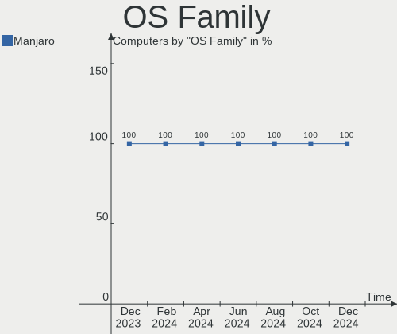
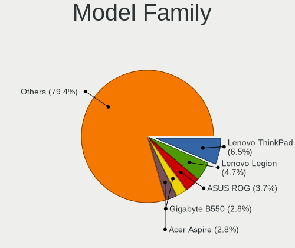
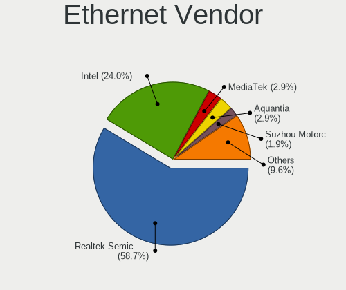
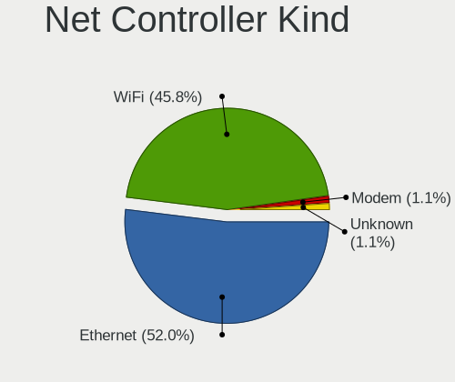
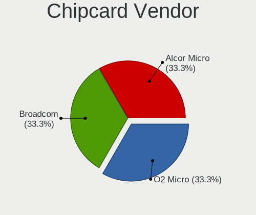

Manjaro - Hardware Trends
-------------------------

A project to identify most popular hardware characteristics and track their change
over time based on data collected by Linux users at https://Linux-Hardware.org.

Anyone can contribute to this report by the [hw-probe](https://github.com/linuxhw/hw-probe) tool:

    sudo -E hw-probe -all -upload

This is a report for all computer types. See also reports for [desktops](/Dist/Manjaro/Desktop/README.md) and [notebooks](/Dist/Manjaro/Notebook/README.md).

This report is for one last month. Overall report since the beginning of time: [TestCoverage](https://github.com/linuxhw/TestCoverage)

Period: Oct, 2022.

Contents
--------

* [ System ](#system)
  - [ OS                       ](#os)
  - [ OS Family                ](#os-family)
  - [ Kernel                   ](#kernel)
  - [ Kernel Family            ](#kernel-family)
  - [ Kernel Major Ver.        ](#kernel-major-ver)
  - [ Arch                     ](#arch)
  - [ DE                       ](#de)
  - [ Display Server           ](#display-server)
  - [ Display Manager          ](#display-manager)
  - [ OS Lang                  ](#os-lang)
  - [ Boot Mode                ](#boot-mode)
  - [ Filesystem               ](#filesystem)
  - [ Part. scheme             ](#part-scheme)
  - [ Dual Boot with Linux/BSD ](#dual-boot-with-linuxbsd)
  - [ Dual Boot (Win)          ](#dual-boot-win)

* [ Board ](#board)
  - [ Vendor                   ](#vendor)
  - [ Model                    ](#model)
  - [ Model Family             ](#model-family)
  - [ MFG Year                 ](#mfg-year)
  - [ Form Factor              ](#form-factor)
  - [ Secure Boot              ](#secure-boot)
  - [ Coreboot                 ](#coreboot)
  - [ RAM Size                 ](#ram-size)
  - [ RAM Used                 ](#ram-used)
  - [ Total Drives             ](#total-drives)
  - [ Has CD-ROM               ](#has-cd-rom)
  - [ Has Ethernet             ](#has-ethernet)
  - [ Has WiFi                 ](#has-wifi)
  - [ Has Bluetooth            ](#has-bluetooth)

* [ Location ](#location)
  - [ Country                  ](#country)
  - [ City                     ](#city)

* [ Drives ](#drives)
  - [ Drive Vendor             ](#drive-vendor)
  - [ Drive Model              ](#drive-model)
  - [ HDD Vendor               ](#hdd-vendor)
  - [ SSD Vendor               ](#ssd-vendor)
  - [ Drive Kind               ](#drive-kind)
  - [ Drive Connector          ](#drive-connector)
  - [ Drive Size               ](#drive-size)
  - [ Space Total              ](#space-total)
  - [ Space Used               ](#space-used)
  - [ Malfunc. Drives          ](#malfunc-drives)
  - [ Malfunc. Drive Vendor    ](#malfunc-drive-vendor)
  - [ Malfunc. HDD Vendor      ](#malfunc-hdd-vendor)
  - [ Malfunc. Drive Kind      ](#malfunc-drive-kind)
  - [ Failed Drives            ](#failed-drives)
  - [ Failed Drive Vendor      ](#failed-drive-vendor)
  - [ Drive Status             ](#drive-status)

* [ Storage controller ](#storage-controller)
  - [ Storage Vendor           ](#storage-vendor)
  - [ Storage Model            ](#storage-model)
  - [ Storage Kind             ](#storage-kind)

* [ Processor ](#processor)
  - [ CPU Vendor               ](#cpu-vendor)
  - [ CPU Model                ](#cpu-model)
  - [ CPU Model Family         ](#cpu-model-family)
  - [ CPU Cores                ](#cpu-cores)
  - [ CPU Sockets              ](#cpu-sockets)
  - [ CPU Threads              ](#cpu-threads)
  - [ CPU Op-Modes             ](#cpu-op-modes)
  - [ CPU Microcode            ](#cpu-microcode)
  - [ CPU Microarch            ](#cpu-microarch)

* [ Graphics ](#graphics)
  - [ GPU Vendor               ](#gpu-vendor)
  - [ GPU Model                ](#gpu-model)
  - [ GPU Combo                ](#gpu-combo)
  - [ GPU Driver               ](#gpu-driver)
  - [ GPU Memory               ](#gpu-memory)

* [ Monitor ](#monitor)
  - [ Monitor Vendor           ](#monitor-vendor)
  - [ Monitor Model            ](#monitor-model)
  - [ Monitor Resolution       ](#monitor-resolution)
  - [ Monitor Diagonal         ](#monitor-diagonal)
  - [ Monitor Width            ](#monitor-width)
  - [ Aspect Ratio             ](#aspect-ratio)
  - [ Monitor Area             ](#monitor-area)
  - [ Pixel Density            ](#pixel-density)
  - [ Multiple Monitors        ](#multiple-monitors)

* [ Network ](#network)
  - [ Net Controller Vendor    ](#net-controller-vendor)
  - [ Net Controller Model     ](#net-controller-model)
  - [ Wireless Vendor          ](#wireless-vendor)
  - [ Wireless Model           ](#wireless-model)
  - [ Ethernet Vendor          ](#ethernet-vendor)
  - [ Ethernet Model           ](#ethernet-model)
  - [ Net Controller Kind      ](#net-controller-kind)
  - [ Used Controller          ](#used-controller)
  - [ NICs                     ](#nics)
  - [ IPv6                     ](#ipv6)

* [ Bluetooth ](#bluetooth)
  - [ Bluetooth Vendor         ](#bluetooth-vendor)
  - [ Bluetooth Model          ](#bluetooth-model)

* [ Sound ](#sound)
  - [ Sound Vendor             ](#sound-vendor)
  - [ Sound Model              ](#sound-model)

* [ Memory ](#memory)
  - [ Memory Vendor            ](#memory-vendor)
  - [ Memory Model             ](#memory-model)
  - [ Memory Kind              ](#memory-kind)
  - [ Memory Form Factor       ](#memory-form-factor)
  - [ Memory Size              ](#memory-size)
  - [ Memory Speed             ](#memory-speed)

* [ Printers & scanners ](#printers--scanners)
  - [ Printer Vendor           ](#printer-vendor)
  - [ Printer Model            ](#printer-model)
  - [ Scanner Vendor           ](#scanner-vendor)
  - [ Scanner Model            ](#scanner-model)

* [ Camera ](#camera)
  - [ Camera Vendor            ](#camera-vendor)
  - [ Camera Model             ](#camera-model)

* [ Security ](#security)
  - [ Fingerprint Vendor       ](#fingerprint-vendor)
  - [ Fingerprint Model        ](#fingerprint-model)
  - [ Chipcard Vendor          ](#chipcard-vendor)
  - [ Chipcard Model           ](#chipcard-model)

* [ Unsupported ](#unsupported)
  - [ Unsupported Devices      ](#unsupported-devices)
  - [ Unsupported Device Types ](#unsupported-device-types)

System
------

OS
--

Installed operating systems

| Name           | Computers | Percent |
|----------------|-----------|---------|
| Manjaro        | 88        | 50.29%  |
| Manjaro 22.0.0 | 83        | 47.43%  |
| Manjaro 21.3.7 | 3         | 1.71%   |
| Manjaro 21.2.6 | 1         | 0.57%   |

OS Family
---------

OS without a version

| Name    | Computers | Percent |
|---------|-----------|---------|
| Manjaro | 175       | 100%    |

Kernel
------

Version of the Linux kernel

| Version               | Computers | Percent |
|-----------------------|-----------|---------|
| 5.15.74-3-MANJARO     | 36        | 20.57%  |
| 5.15.65-1-MANJARO     | 24        | 13.71%  |
| 6.0.2-2-MANJARO       | 22        | 12.57%  |
| 6.0.0-1-MANJARO       | 16        | 9.14%   |
| 5.15.71-1-MANJARO     | 13        | 7.43%   |
| 5.15.72-1-MANJARO     | 12        | 6.86%   |
| 5.19.7-1-MANJARO      | 9         | 5.14%   |
| 5.19.16-2-MANJARO     | 9         | 5.14%   |
| 5.15.60-1-MANJARO     | 6         | 3.43%   |
| 5.19.0-3-rt10-MANJARO | 5         | 2.86%   |
| 6.1.0-1-MANJARO       | 3         | 1.71%   |
| 5.19.13-1-MANJARO     | 3         | 1.71%   |
| 6.0.2-3-MANJARO       | 2         | 1.14%   |
| 5.18.19-3-MANJARO     | 2         | 1.14%   |
| 5.10.141-1-MANJARO    | 2         | 1.14%   |
| 5.4.218-2-MANJARO     | 1         | 0.57%   |
| 5.4.217-1-MANJARO     | 1         | 0.57%   |
| 5.19.14-lqx1-2-lqx    | 1         | 0.57%   |
| 5.19.14-1-MANJARO     | 1         | 0.57%   |
| 5.19.10-1-MANJARO     | 1         | 0.57%   |
| 5.18.0-4-rt11-MANJARO | 1         | 0.57%   |
| 5.15.32-1-MANJARO     | 1         | 0.57%   |
| 5.14.21-2-MANJARO     | 1         | 0.57%   |
| 5.10.148-1-MANJARO    | 1         | 0.57%   |
| 5.10.146-1-MANJARO    | 1         | 0.57%   |
| 5.10.136-1-MANJARO    | 1         | 0.57%   |

Kernel Family
-------------

Linux kernel without a distro release

| Version  | Computers | Percent |
|----------|-----------|---------|
| 5.15.74  | 36        | 20.57%  |
| 6.0.2    | 24        | 13.71%  |
| 5.15.65  | 24        | 13.71%  |
| 6.0.0    | 16        | 9.14%   |
| 5.15.71  | 13        | 7.43%   |
| 5.15.72  | 12        | 6.86%   |
| 5.19.7   | 9         | 5.14%   |
| 5.19.16  | 9         | 5.14%   |
| 5.15.60  | 6         | 3.43%   |
| 5.19.0   | 5         | 2.86%   |
| 6.1.0    | 3         | 1.71%   |
| 5.19.13  | 3         | 1.71%   |
| 5.19.14  | 2         | 1.14%   |
| 5.18.19  | 2         | 1.14%   |
| 5.10.141 | 2         | 1.14%   |
| 5.4.218  | 1         | 0.57%   |
| 5.4.217  | 1         | 0.57%   |
| 5.19.10  | 1         | 0.57%   |
| 5.18.0   | 1         | 0.57%   |
| 5.15.32  | 1         | 0.57%   |
| 5.14.21  | 1         | 0.57%   |
| 5.10.148 | 1         | 0.57%   |
| 5.10.146 | 1         | 0.57%   |
| 5.10.136 | 1         | 0.57%   |

Kernel Major Ver.
-----------------

Linux kernel major version

| Version | Computers | Percent |
|---------|-----------|---------|
| 5.15    | 92        | 52.57%  |
| 6.0     | 40        | 22.86%  |
| 5.19    | 29        | 16.57%  |
| 5.10    | 5         | 2.86%   |
| 6.1     | 3         | 1.71%   |
| 5.18    | 3         | 1.71%   |
| 5.4     | 2         | 1.14%   |
| 5.14    | 1         | 0.57%   |

Arch
----

OS architecture (x86_64, i586, etc.)

| Name   | Computers | Percent |
|--------|-----------|---------|
| x86_64 | 175       | 100%    |

DE
--

Desktop Environment

| Name       | Computers | Percent |
|------------|-----------|---------|
| KDE5       | 102       | 58.29%  |
| GNOME      | 36        | 20.57%  |
| XFCE       | 17        | 9.71%   |
| X-Cinnamon | 8         | 4.57%   |
| Unknown    | 5         | 2.86%   |
| MATE       | 3         | 1.71%   |
| i3         | 2         | 1.14%   |
| Deepin     | 1         | 0.57%   |
| Cinnamon   | 1         | 0.57%   |

Display Server
--------------

X11 or Wayland

| Name    | Computers | Percent |
|---------|-----------|---------|
| X11     | 139       | 79.43%  |
| Wayland | 29        | 16.57%  |
| Unknown | 5         | 2.86%   |
| Tty     | 2         | 1.14%   |

Display Manager
---------------

SDDM, LightDM, etc.

| Name    | Computers | Percent |
|---------|-----------|---------|
| Unknown | 87        | 49.71%  |
| SDDM    | 46        | 26.29%  |
| LightDM | 24        | 13.71%  |
| GDM     | 18        | 10.29%  |

OS Lang
-------

Language

| Lang    | Computers | Percent |
|---------|-----------|---------|
| en_US   | 70        | 40%     |
| de_DE   | 16        | 9.14%   |
| it_IT   | 15        | 8.57%   |
| pt_BR   | 8         | 4.57%   |
| es_ES   | 7         | 4%      |
| en_GB   | 7         | 4%      |
| ru_RU   | 6         | 3.43%   |
| nl_NL   | 3         | 1.71%   |
| fr_FR   | 3         | 1.71%   |
| es_MX   | 3         | 1.71%   |
| es_CL   | 3         | 1.71%   |
| es_AR   | 3         | 1.71%   |
| en_IN   | 3         | 1.71%   |
| zh_CN   | 2         | 1.14%   |
| pl_PL   | 2         | 1.14%   |
| es_UY   | 2         | 1.14%   |
| en_IE   | 2         | 1.14%   |
| de_AT   | 2         | 1.14%   |
| cs_CZ   | 2         | 1.14%   |
| sl_SI   | 1         | 0.57%   |
| pt_PT   | 1         | 0.57%   |
| fr_CA   | 1         | 0.57%   |
| fr_BE   | 1         | 0.57%   |
| es_SV   | 1         | 0.57%   |
| es_HN   | 1         | 0.57%   |
| es_CR   | 1         | 0.57%   |
| en_ZA   | 1         | 0.57%   |
| en_PH   | 1         | 0.57%   |
| en_IL   | 1         | 0.57%   |
| en_DK   | 1         | 0.57%   |
| en_DE   | 1         | 0.57%   |
| el_GR   | 1         | 0.57%   |
| Default | 1         | 0.57%   |
| C       | 1         | 0.57%   |
| Unknown | 1         | 0.57%   |

Boot Mode
---------

EFI or BIOS

| Mode | Computers | Percent |
|------|-----------|---------|
| BIOS | 113       | 64.57%  |
| EFI  | 62        | 35.43%  |

Filesystem
----------

Type of filesystem

| Type    | Computers | Percent |
|---------|-----------|---------|
| Ext4    | 133       | 76%     |
| Btrfs   | 35        | 20%     |
| Overlay | 4         | 2.29%   |
| Xfs     | 2         | 1.14%   |
| Unknown | 1         | 0.57%   |

Part. scheme
------------

Scheme of partitioning

| Type    | Computers | Percent |
|---------|-----------|---------|
| Unknown | 85        | 48.57%  |
| GPT     | 82        | 46.86%  |
| MBR     | 8         | 4.57%   |

Dual Boot with Linux/BSD
------------------------

Hosting more than one Linux/BSD

| Dual boot | Computers | Percent |
|-----------|-----------|---------|
| No        | 157       | 89.71%  |
| Yes       | 18        | 10.29%  |

Dual Boot (Win)
---------------

Hosting Linux and Windows

| Dual boot | Computers | Percent |
|-----------|-----------|---------|
| No        | 129       | 73.71%  |
| Yes       | 46        | 26.29%  |

Board
-----

Vendor
------

Motherboard manufacturer

| Name                    | Computers | Percent |
|-------------------------|-----------|---------|
| ASUSTek Computer        | 32        | 18.29%  |
| Lenovo                  | 29        | 16.57%  |
| Hewlett-Packard         | 29        | 16.57%  |
| Gigabyte Technology     | 17        | 9.71%   |
| Dell                    | 17        | 9.71%   |
| Acer                    | 12        | 6.86%   |
| MSI                     | 7         | 4%      |
| ASRock                  | 7         | 4%      |
| HUAWEI                  | 3         | 1.71%   |
| Toshiba                 | 2         | 1.14%   |
| Tactus                  | 2         | 1.14%   |
| Chuwi                   | 2         | 1.14%   |
| Sony                    | 1         | 0.57%   |
| Schenker                | 1         | 0.57%   |
| SANTECH                 | 1         | 0.57%   |
| RuggedPC                | 1         | 0.57%   |
| Medion                  | 1         | 0.57%   |
| MACHINIST               | 1         | 0.57%   |
| Jumper                  | 1         | 0.57%   |
| HONOR                   | 1         | 0.57%   |
| GPD                     | 1         | 0.57%   |
| Global Distribution FZE | 1         | 0.57%   |
| Foxconn                 | 1         | 0.57%   |
| CyberPowerPC            | 1         | 0.57%   |
| AVITA                   | 1         | 0.57%   |
| Apple                   | 1         | 0.57%   |
| Alienware               | 1         | 0.57%   |
| Unknown                 | 1         | 0.57%   |

Model
-----

Motherboard model

| Name                                   | Computers | Percent |
|----------------------------------------|-----------|---------|
| ASUS VivoBook_ASUSLaptop X512FJ_X512FJ | 2         | 1.14%   |
| ASUS TUF Gaming B550M-PLUS             | 2         | 1.14%   |
| Acer Aspire E5-553G                    | 2         | 1.14%   |
| Toshiba Satellite P755                 | 1         | 0.57%   |
| Toshiba Encore                         | 1         | 0.57%   |
| Tactus GeoFlex 110                     | 1         | 0.57%   |
| Tactus GeoBook_240                     | 1         | 0.57%   |
| Sony SVF15N17CXB                       | 1         | 0.57%   |
| Schenker VISION 15 (SVS15E21)          | 1         | 0.57%   |
| SANTECH NL5xRU                         | 1         | 0.57%   |
| RuggedPC RuggedBookJ87                 | 1         | 0.57%   |
| MSI Raider GE76 12UGS                  | 1         | 0.57%   |
| MSI Pulse GL76 12UEK                   | 1         | 0.57%   |
| MSI MS-7850                            | 1         | 0.57%   |
| MSI MS-7676                            | 1         | 0.57%   |
| MSI Modern 15 A11MU                    | 1         | 0.57%   |
| MSI Katana GF76 11UG                   | 1         | 0.57%   |
| MSI GP66 Leopard 11UG                  | 1         | 0.57%   |
| Medion S15449                          | 1         | 0.57%   |
| MACHINIST X79 V2.82H                   | 1         | 0.57%   |
| Lenovo Z50-75 80EC                     | 1         | 0.57%   |
| Lenovo Yoga Slim 7 ProX 14ARH7 82TL    | 1         | 0.57%   |
| Lenovo Yoga Slim 7 Pro 14IAP7 82SV     | 1         | 0.57%   |
| Lenovo Yoga Slim 7 14ARE05 82A2        | 1         | 0.57%   |
| Lenovo Y50-70 20378                    | 1         | 0.57%   |
| Lenovo ThinkPad X380 Yoga 20LJS2YE1H   | 1         | 0.57%   |
| Lenovo ThinkPad X270 W10DG 20K5S0B700  | 1         | 0.57%   |
| Lenovo ThinkPad T490 20RYS07R00        | 1         | 0.57%   |
| Lenovo ThinkPad T440p 20AW005BGE       | 1         | 0.57%   |
| Lenovo ThinkPad T440p 20AN0069US       | 1         | 0.57%   |
| Lenovo ThinkPad T410s 2912AJ7          | 1         | 0.57%   |
| Lenovo ThinkPad T14 Gen 3 21CFCTO1WW   | 1         | 0.57%   |
| Lenovo ThinkPad S1 Yoga 20CD00B1US     | 1         | 0.57%   |
| Lenovo ThinkPad R500 2716W2K           | 1         | 0.57%   |
| Lenovo ThinkPad E14 Gen 3 20YDS05600   | 1         | 0.57%   |
| Lenovo ThinkCentre A57 9851CDF         | 1         | 0.57%   |
| Lenovo ThinkBook 15-IIL 20SM           | 1         | 0.57%   |
| Lenovo ThinkBook 14p Gen 2 20YN        | 1         | 0.57%   |
| Lenovo N23 80UR                        | 1         | 0.57%   |
| Lenovo Legion 5 82B5                   | 1         | 0.57%   |

Model Family
------------

Motherboard model prefix

| Name                   | Computers | Percent |
|------------------------|-----------|---------|
| Lenovo ThinkPad        | 10        | 5.71%   |
| Acer Aspire            | 10        | 5.71%   |
| ASUS ROG               | 9         | 5.14%   |
| HP Pavilion            | 6         | 3.43%   |
| Lenovo IdeaPad         | 5         | 2.86%   |
| HP ProBook             | 5         | 2.86%   |
| HP Laptop              | 4         | 2.29%   |
| Dell OptiPlex          | 4         | 2.29%   |
| Dell Latitude          | 4         | 2.29%   |
| Dell Inspiron          | 4         | 2.29%   |
| ASUS VivoBook          | 4         | 2.29%   |
| Lenovo Yoga            | 3         | 1.71%   |
| HP ENVY                | 3         | 1.71%   |
| Dell XPS               | 3         | 1.71%   |
| ASUS TUF               | 3         | 1.71%   |
| Lenovo ThinkBook       | 2         | 1.14%   |
| Lenovo Legion          | 2         | 1.14%   |
| HP Compaq              | 2         | 1.14%   |
| Gigabyte B450          | 2         | 1.14%   |
| ASUS PRIME             | 2         | 1.14%   |
| ASRock X570            | 2         | 1.14%   |
| ASRock B550M           | 2         | 1.14%   |
| Toshiba Satellite      | 1         | 0.57%   |
| Toshiba Encore         | 1         | 0.57%   |
| Tactus GeoFlex         | 1         | 0.57%   |
| Tactus GeoBook         | 1         | 0.57%   |
| Sony SVF15N17CXB       | 1         | 0.57%   |
| Schenker VISION        | 1         | 0.57%   |
| SANTECH NL5xRU         | 1         | 0.57%   |
| RuggedPC RuggedBookJ87 | 1         | 0.57%   |
| MSI Raider             | 1         | 0.57%   |
| MSI Pulse              | 1         | 0.57%   |
| MSI MS-7850            | 1         | 0.57%   |
| MSI MS-7676            | 1         | 0.57%   |
| MSI Modern             | 1         | 0.57%   |
| MSI Katana             | 1         | 0.57%   |
| MSI GP66               | 1         | 0.57%   |
| Medion S15449          | 1         | 0.57%   |
| MACHINIST X79          | 1         | 0.57%   |
| Lenovo Z50-75          | 1         | 0.57%   |

MFG Year
--------

Motherboard manufacture year

| Year | Computers | Percent |
|------|-----------|---------|
| 2021 | 30        | 17.14%  |
| 2020 | 27        | 15.43%  |
| 2019 | 19        | 10.86%  |
| 2022 | 14        | 8%      |
| 2016 | 13        | 7.43%   |
| 2012 | 12        | 6.86%   |
| 2014 | 11        | 6.29%   |
| 2018 | 10        | 5.71%   |
| 2011 | 10        | 5.71%   |
| 2017 | 7         | 4%      |
| 2013 | 6         | 3.43%   |
| 2015 | 5         | 2.86%   |
| 2010 | 5         | 2.86%   |
| 2008 | 4         | 2.29%   |
| 2009 | 2         | 1.14%   |

Form Factor
-----------

Physical design of the computer

| Name        | Computers | Percent |
|-------------|-----------|---------|
| Notebook    | 101       | 57.71%  |
| Desktop     | 61        | 34.86%  |
| Convertible | 8         | 4.57%   |
| Tablet      | 2         | 1.14%   |
| All in one  | 2         | 1.14%   |
| Server      | 1         | 0.57%   |

Secure Boot
-----------

Enabled or disabled

| State    | Computers | Percent |
|----------|-----------|---------|
| Disabled | 175       | 100%    |

Coreboot
--------

Have coreboot on board

| Used | Computers | Percent |
|------|-----------|---------|
| No   | 175       | 100%    |

RAM Size
--------

Total RAM memory

| Size in GB      | Computers | Percent |
|-----------------|-----------|---------|
| 16.01-24.0      | 43        | 24.57%  |
| 4.01-8.0        | 35        | 20%     |
| 8.01-16.0       | 29        | 16.57%  |
| 32.01-64.0      | 26        | 14.86%  |
| 3.01-4.0        | 21        | 12%     |
| 64.01-256.0     | 10        | 5.71%   |
| 24.01-32.0      | 5         | 2.86%   |
| 1.01-2.0        | 4         | 2.29%   |
| More than 256.0 | 1         | 0.57%   |
| 2.01-3.0        | 1         | 0.57%   |

RAM Used
--------

Used RAM memory

| Used GB         | Computers | Percent |
|-----------------|-----------|---------|
| 4.01-8.0        | 52        | 29.71%  |
| 2.01-3.0        | 45        | 25.71%  |
| 1.01-2.0        | 27        | 15.43%  |
| 3.01-4.0        | 26        | 14.86%  |
| 8.01-16.0       | 16        | 9.14%   |
| 0.51-1.0        | 5         | 2.86%   |
| 16.01-24.0      | 2         | 1.14%   |
| More than 256.0 | 1         | 0.57%   |
| 24.01-32.0      | 1         | 0.57%   |

Total Drives
------------

Number of drives on board

| Drives | Computers | Percent |
|--------|-----------|---------|
| 1      | 95        | 54.29%  |
| 2      | 35        | 20%     |
| 3      | 23        | 13.14%  |
| 5      | 11        | 6.29%   |
| 4      | 10        | 5.71%   |
| 7      | 1         | 0.57%   |

Has CD-ROM
----------

Has CD-ROM on board

| Presented | Computers | Percent |
|-----------|-----------|---------|
| No        | 133       | 76%     |
| Yes       | 42        | 24%     |

Has Ethernet
------------

Has Ethernet on board

| Presented | Computers | Percent |
|-----------|-----------|---------|
| Yes       | 134       | 76.57%  |
| No        | 41        | 23.43%  |

Has WiFi
--------

Has WiFi module

| Presented | Computers | Percent |
|-----------|-----------|---------|
| Yes       | 132       | 75.43%  |
| No        | 43        | 24.57%  |

Has Bluetooth
-------------

Has Bluetooth module

| Presented | Computers | Percent |
|-----------|-----------|---------|
| Yes       | 125       | 71.43%  |
| No        | 50        | 28.57%  |

Location
--------

Country
-------

Geographic location (country)

| Country      | Computers | Percent |
|--------------|-----------|---------|
| USA          | 30        | 17.14%  |
| Italy        | 20        | 11.43%  |
| Germany      | 19        | 10.86%  |
| Russia       | 12        | 6.86%   |
| Brazil       | 9         | 5.14%   |
| Spain        | 6         | 3.43%   |
| Netherlands  | 5         | 2.86%   |
| India        | 5         | 2.86%   |
| UK           | 4         | 2.29%   |
| Mexico       | 4         | 2.29%   |
| Greece       | 4         | 2.29%   |
| France       | 4         | 2.29%   |
| Uruguay      | 3         | 1.71%   |
| Poland       | 3         | 1.71%   |
| Czechia      | 3         | 1.71%   |
| Chile        | 3         | 1.71%   |
| Belgium      | 3         | 1.71%   |
| Austria      | 3         | 1.71%   |
| Argentina    | 3         | 1.71%   |
| Turkey       | 2         | 1.14%   |
| Norway       | 2         | 1.14%   |
| Ireland      | 2         | 1.14%   |
| Estonia      | 2         | 1.14%   |
| China        | 2         | 1.14%   |
| Vatican      | 1         | 0.57%   |
| Taiwan       | 1         | 0.57%   |
| Switzerland  | 1         | 0.57%   |
| South Africa | 1         | 0.57%   |
| Slovenia     | 1         | 0.57%   |
| Romania      | 1         | 0.57%   |
| Portugal     | 1         | 0.57%   |
| Philippines  | 1         | 0.57%   |
| Nepal        | 1         | 0.57%   |
| Morocco      | 1         | 0.57%   |
| Moldova      | 1         | 0.57%   |
| Israel       | 1         | 0.57%   |
| Indonesia    | 1         | 0.57%   |
| Hungary      | 1         | 0.57%   |
| Honduras     | 1         | 0.57%   |
| El Salvador  | 1         | 0.57%   |

City
----

Geographic location (city)

| City              | Computers | Percent |
|-------------------|-----------|---------|
| Vienna            | 3         | 1.71%   |
| St Petersburg     | 3         | 1.71%   |
| Montevideo        | 3         | 1.71%   |
| Maracanau         | 3         | 1.71%   |
| Athens            | 3         | 1.71%   |
| Amsterdam         | 3         | 1.71%   |
| St Louis          | 2         | 1.14%   |
| Sao Paulo         | 2         | 1.14%   |
| Pune              | 2         | 1.14%   |
| Munich            | 2         | 1.14%   |
| Moscow            | 2         | 1.14%   |
| Maipu             | 2         | 1.14%   |
| Madrid            | 2         | 1.14%   |
| Jackson           | 2         | 1.14%   |
| Heidelberg        | 2         | 1.14%   |
| Galati Mamertino  | 2         | 1.14%   |
| Coventry          | 2         | 1.14%   |
| Cincinnati        | 2         | 1.14%   |
| Brussels          | 2         | 1.14%   |
| Ames              | 2         | 1.14%   |
| Zurich            | 1         | 0.57%   |
| Zagreb            | 1         | 0.57%   |
| Zaandam           | 1         | 0.57%   |
| Wymondham         | 1         | 0.57%   |
| Wetteren          | 1         | 0.57%   |
| Weitramsdorf      | 1         | 0.57%   |
| Wakefield         | 1         | 0.57%   |
| Vladimir          | 1         | 0.57%   |
| Viggianello       | 1         | 0.57%   |
| Vatican City      | 1         | 0.57%   |
| Valasske Mezirici | 1         | 0.57%   |
| Turin             | 1         | 0.57%   |
| Todtnau           | 1         | 0.57%   |
| Tiraspol          | 1         | 0.57%   |
| Tijuana           | 1         | 0.57%   |
| Texcoco           | 1         | 0.57%   |
| Tegucigalpa       | 1         | 0.57%   |
| Tallinn           | 1         | 0.57%   |
| Taipei            | 1         | 0.57%   |
| Statesboro        | 1         | 0.57%   |

Drives
------

Drive Vendor
------------

Hard drive vendors

| Vendor                       | Computers | Drives | Percent |
|------------------------------|-----------|--------|---------|
| Samsung Electronics          | 54        | 72     | 18.31%  |
| Seagate                      | 31        | 38     | 10.51%  |
| WDC                          | 29        | 41     | 9.83%   |
| Sandisk                      | 22        | 23     | 7.46%   |
| Unknown                      | 16        | 17     | 5.42%   |
| Toshiba                      | 15        | 16     | 5.08%   |
| Kingston                     | 15        | 16     | 5.08%   |
| Crucial                      | 14        | 15     | 4.75%   |
| Micron Technology            | 9         | 9      | 3.05%   |
| SK hynix                     | 8         | 9      | 2.71%   |
| Hitachi                      | 7         | 8      | 2.37%   |
| Phison Electronics           | 6         | 6      | 2.03%   |
| Micron/Crucial Technology    | 5         | 5      | 1.69%   |
| KIOXIA                       | 5         | 5      | 1.69%   |
| PNY                          | 4         | 4      | 1.36%   |
| GOODRAM                      | 4         | 4      | 1.36%   |
| Silicon Motion               | 3         | 3      | 1.02%   |
| Realtek Semiconductor        | 3         | 3      | 1.02%   |
| OCZ                          | 3         | 3      | 1.02%   |
| Intel                        | 3         | 4      | 1.02%   |
| China                        | 3         | 3      | 1.02%   |
| Unknown                      | 3         | 3      | 1.02%   |
| SPCC                         | 2         | 2      | 0.68%   |
| Netac                        | 2         | 2      | 0.68%   |
| Lexar                        | 2         | 2      | 0.68%   |
| Kingston Technology Company  | 2         | 2      | 0.68%   |
| Intenso                      | 2         | 2      | 0.68%   |
| BUFFALO                      | 2         | 2      | 0.68%   |
| WALRAM                       | 1         | 1      | 0.34%   |
| Verbatim                     | 1         | 1      | 0.34%   |
| USB                          | 1         | 1      | 0.34%   |
| Union Memory                 | 1         | 1      | 0.34%   |
| Transcend                    | 1         | 1      | 0.34%   |
| Team                         | 1         | 2      | 0.34%   |
| Shenzhen Longsys Electronics | 1         | 1      | 0.34%   |
| SABRENT                      | 1         | 1      | 0.34%   |
| Patriot                      | 1         | 1      | 0.34%   |
| Mushkin                      | 1         | 1      | 0.34%   |
| Maxone                       | 1         | 1      | 0.34%   |
| KIOXIA-EXCERIA               | 1         | 1      | 0.34%   |

Drive Model
-----------

Hard drive models

| Model                                                 | Computers | Percent |
|-------------------------------------------------------|-----------|---------|
| Samsung NVMe SSD Controller SM981/PM981/PM983 500GB   | 11        | 3.33%   |
| Samsung NVMe SSD Controller PM9A1/PM9A3/980PRO 250GB  | 7         | 2.12%   |
| Samsung SSD 980 1TB                                   | 5         | 1.52%   |
| Sandisk WD Blue SN550 NVMe SSD 1TB                    | 4         | 1.21%   |
| Samsung MZVLQ512HALU-000H1 512GB                      | 4         | 1.21%   |
| Kingston SA400S37480G 480GB SSD                       | 4         | 1.21%   |
| Unknown MMC Card  64GB                                | 3         | 0.91%   |
| Unknown MMC Card  32GB                                | 3         | 0.91%   |
| Seagate ST4000DM000-1F2168 4TB                        | 3         | 0.91%   |
| Samsung SSD 870 QVO 1TB                               | 3         | 0.91%   |
| Samsung NVMe SSD Controller SM961/PM961/SM963 250GB   | 3         | 0.91%   |
| Phison E16 PCIe4 NVMe Controller 1TB                  | 3         | 0.91%   |
| Kingston SA400S37240G 240GB SSD                       | 3         | 0.91%   |
| Crucial CT1000BX500SSD1 1TB                           | 3         | 0.91%   |
| Unknown                                               | 3         | 0.91%   |
| WDC WDS240G2G0A-00JH30 240GB SSD                      | 2         | 0.61%   |
| WDC WD10EZEX-08WN4A0 1TB                              | 2         | 0.61%   |
| Unknown SD/MMC/MS PRO 1TB                             | 2         | 0.61%   |
| Unknown C500 128GB                                    | 2         | 0.61%   |
| Toshiba MQ04ABF100 1TB                                | 2         | 0.61%   |
| Toshiba MQ01ABD100 1TB                                | 2         | 0.61%   |
| Toshiba DT01ACA300 3TB                                | 2         | 0.61%   |
| Toshiba DT01ACA100 1TB                                | 2         | 0.61%   |
| SK hynix SKHynix_HFS512GD9TNI-L2A0B 512GB             | 2         | 0.61%   |
| Silicon Motion SM2263EN/SM2263XT SSD Controller 256GB | 2         | 0.61%   |
| Seagate ST4000DM004-2CV104 4TB                        | 2         | 0.61%   |
| Seagate ST1000LM024 HN-M101MBB 1TB                    | 2         | 0.61%   |
| Seagate ST1000DM010-2EP102 1TB                        | 2         | 0.61%   |
| Seagate ST1000DM003-1CH162 1TB                        | 2         | 0.61%   |
| Seagate Expansion 2TB                                 | 2         | 0.61%   |
| Sandisk WD Black SN750 / PC SN730 NVMe SSD 1TB        | 2         | 0.61%   |
| Sandisk WD Black 2018/SN750 / PC SN720 NVMe SSD 1TB   | 2         | 0.61%   |
| SanDisk SSD PLUS 480GB                                | 2         | 0.61%   |
| SanDisk SSD PLUS 1000GB                               | 2         | 0.61%   |
| Samsung SSD 870 QVO 2TB                               | 2         | 0.61%   |
| Samsung SSD 870 EVO 500GB                             | 2         | 0.61%   |
| Samsung SSD 860 EVO 1TB                               | 2         | 0.61%   |
| Samsung SSD 850 EVO 500GB                             | 2         | 0.61%   |
| Samsung SSD 840 Series 120GB                          | 2         | 0.61%   |
| Samsung SSD 840 EVO 250GB                             | 2         | 0.61%   |

HDD Vendor
----------

Hard disk drive vendors

| Vendor              | Computers | Drives | Percent |
|---------------------|-----------|--------|---------|
| Seagate             | 30        | 37     | 34.09%  |
| WDC                 | 27        | 34     | 30.68%  |
| Toshiba             | 13        | 14     | 14.77%  |
| Hitachi             | 7         | 8      | 7.95%   |
| Unknown             | 4         | 4      | 4.55%   |
| Samsung Electronics | 2         | 4      | 2.27%   |
| USB                 | 1         | 1      | 1.14%   |
| SABRENT             | 1         | 1      | 1.14%   |
| Maxone              | 1         | 1      | 1.14%   |
| HGST                | 1         | 1      | 1.14%   |
| Unknown             | 1         | 1      | 1.14%   |

SSD Vendor
----------

Solid state drive vendors

| Vendor              | Computers | Drives | Percent |
|---------------------|-----------|--------|---------|
| Samsung Electronics | 21        | 25     | 20.59%  |
| Kingston            | 14        | 15     | 13.73%  |
| Crucial             | 14        | 15     | 13.73%  |
| SanDisk             | 9         | 10     | 8.82%   |
| WDC                 | 5         | 7      | 4.9%    |
| PNY                 | 4         | 4      | 3.92%   |
| GOODRAM             | 4         | 4      | 3.92%   |
| OCZ                 | 3         | 3      | 2.94%   |
| China               | 3         | 3      | 2.94%   |
| Unknown             | 2         | 2      | 1.96%   |
| SPCC                | 2         | 2      | 1.96%   |
| Netac               | 2         | 2      | 1.96%   |
| Lexar               | 2         | 2      | 1.96%   |
| Intenso             | 2         | 2      | 1.96%   |
| BUFFALO             | 2         | 2      | 1.96%   |
| Verbatim            | 1         | 1      | 0.98%   |
| Transcend           | 1         | 1      | 0.98%   |
| Team                | 1         | 2      | 0.98%   |
| Patriot             | 1         | 1      | 0.98%   |
| Mushkin             | 1         | 1      | 0.98%   |
| Micron Technology   | 1         | 1      | 0.98%   |
| KIOXIA-EXCERIA      | 1         | 1      | 0.98%   |
| Hoodisk             | 1         | 1      | 0.98%   |
| Gigabyte Technology | 1         | 1      | 0.98%   |
| FORESEE             | 1         | 1      | 0.98%   |
| Apple               | 1         | 1      | 0.98%   |
| A-DATA Technology   | 1         | 1      | 0.98%   |
| Unknown             | 1         | 1      | 0.98%   |

Drive Kind
----------

HDD or SSD

| Kind    | Computers | Drives | Percent |
|---------|-----------|--------|---------|
| NVMe    | 90        | 108    | 35.71%  |
| SSD     | 79        | 112    | 31.35%  |
| HDD     | 69        | 106    | 27.38%  |
| MMC     | 9         | 10     | 3.57%   |
| Unknown | 5         | 5      | 1.98%   |

Drive Connector
---------------

SATA, SAS, NVMe, etc.

| Type | Computers | Drives | Percent |
|------|-----------|--------|---------|
| SATA | 114       | 203    | 49.14%  |
| NVMe | 90        | 108    | 38.79%  |
| SAS  | 19        | 20     | 8.19%   |
| MMC  | 9         | 10     | 3.88%   |

Drive Size
----------

Size of hard drive

| Size in TB | Computers | Drives | Percent |
|------------|-----------|--------|---------|
| 0.01-0.5   | 87        | 117    | 50.29%  |
| 0.51-1.0   | 50        | 60     | 28.9%   |
| 1.01-2.0   | 18        | 21     | 10.4%   |
| 3.01-4.0   | 8         | 8      | 4.62%   |
| 4.01-10.0  | 7         | 9      | 4.05%   |
| 2.01-3.0   | 3         | 3      | 1.73%   |

Space Total
-----------

Amount of disk space available on the file system

| Size in GB     | Computers | Percent |
|----------------|-----------|---------|
| 251-500        | 38        | 21.71%  |
| 101-250        | 30        | 17.14%  |
| 501-1000       | 24        | 13.71%  |
| More than 3000 | 22        | 12.57%  |
| 1001-2000      | 20        | 11.43%  |
| Unknown        | 18        | 10.29%  |
| 51-100         | 10        | 5.71%   |
| 1-20           | 6         | 3.43%   |
| 2001-3000      | 4         | 2.29%   |
| 21-50          | 3         | 1.71%   |

Space Used
----------

Amount of used disk space

| Used GB        | Computers | Percent |
|----------------|-----------|---------|
| 101-250        | 31        | 17.71%  |
| 21-50          | 27        | 15.43%  |
| 51-100         | 25        | 14.29%  |
| 1-20           | 19        | 10.86%  |
| Unknown        | 18        | 10.29%  |
| 501-1000       | 17        | 9.71%   |
| 251-500        | 14        | 8%      |
| 1001-2000      | 11        | 6.29%   |
| More than 3000 | 6         | 3.43%   |
| 2001-3000      | 6         | 3.43%   |
| 0              | 1         | 0.57%   |

Malfunc. Drives
---------------

Drive models with a malfunction

| Model                                            | Computers | Drives | Percent |
|--------------------------------------------------|-----------|--------|---------|
| Seagate ST4000DM000-1F2168 4TB                   | 2         | 2      | 20%     |
| WDC WD5000AADS-00S9B0 500GB                      | 1         | 1      | 10%     |
| WDC WD20EFRX-68EUZN0 2TB                         | 1         | 1      | 10%     |
| Toshiba MQ01ABD100 1TB                           | 1         | 1      | 10%     |
| Toshiba HDWE140 4TB                              | 1         | 1      | 10%     |
| Seagate ST500LT012-9WS142 500GB                  | 1         | 1      | 10%     |
| Samsung Electronics SSD 840 Series 120GB         | 1         | 1      | 10%     |
| Samsung Electronics MMCRE28G8MXP-0VBH1 128GB SSD | 1         | 1      | 10%     |
| Hitachi HDT725050VLA360 500GB                    | 1         | 1      | 10%     |

Malfunc. Drive Vendor
---------------------

Vendors of faulty drives

| Vendor              | Computers | Drives | Percent |
|---------------------|-----------|--------|---------|
| Seagate             | 3         | 3      | 33.33%  |
| WDC                 | 2         | 2      | 22.22%  |
| Toshiba             | 2         | 2      | 22.22%  |
| Samsung Electronics | 1         | 2      | 11.11%  |
| Hitachi             | 1         | 1      | 11.11%  |

Malfunc. HDD Vendor
-------------------

Vendors of faulty HDD drives

| Vendor  | Computers | Drives | Percent |
|---------|-----------|--------|---------|
| Seagate | 3         | 3      | 37.5%   |
| WDC     | 2         | 2      | 25%     |
| Toshiba | 2         | 2      | 25%     |
| Hitachi | 1         | 1      | 12.5%   |

Malfunc. Drive Kind
-------------------

Kinds of faulty drives

| Kind | Computers | Drives | Percent |
|------|-----------|--------|---------|
| HDD  | 8         | 8      | 88.89%  |
| SSD  | 1         | 2      | 11.11%  |

Failed Drives
-------------

Failed drive models

Zero info for selected period =(

Failed Drive Vendor
-------------------

Failed drive vendors

Zero info for selected period =(

Drive Status
------------

Number of failed and malfunc. drives

| Status   | Computers | Drives | Percent |
|----------|-----------|--------|---------|
| Detected | 127       | 233    | 66.84%  |
| Works    | 54        | 98     | 28.42%  |
| Malfunc  | 9         | 10     | 4.74%   |

Storage controller
------------------

Storage Vendor
--------------

Storage controller vendors

| Vendor                       | Computers | Percent |
|------------------------------|-----------|---------|
| Intel                        | 103       | 41.7%   |
| AMD                          | 40        | 16.19%  |
| Samsung Electronics          | 38        | 15.38%  |
| SanDisk                      | 13        | 5.26%   |
| SK hynix                     | 8         | 3.24%   |
| Micron Technology            | 8         | 3.24%   |
| Phison Electronics           | 6         | 2.43%   |
| Micron/Crucial Technology    | 5         | 2.02%   |
| KIOXIA                       | 5         | 2.02%   |
| ASMedia Technology           | 4         | 1.62%   |
| Silicon Motion               | 3         | 1.21%   |
| Realtek Semiconductor        | 3         | 1.21%   |
| Kingston Technology Company  | 3         | 1.21%   |
| Toshiba America Info Systems | 2         | 0.81%   |
| Union Memory (Shenzhen)      | 1         | 0.4%    |
| Shenzhen Longsys Electronics | 1         | 0.4%    |
| Marvell Technology Group     | 1         | 0.4%    |
| JMicron Technology           | 1         | 0.4%    |
| Biwin Storage Technology     | 1         | 0.4%    |
| ADATA Technology             | 1         | 0.4%    |

Storage Model
-------------

Storage controller models

| Model                                                                          | Computers | Percent |
|--------------------------------------------------------------------------------|-----------|---------|
| AMD FCH SATA Controller [AHCI mode]                                            | 32        | 12.08%  |
| Samsung NVMe SSD Controller 980                                                | 14        | 5.28%   |
| Samsung NVMe SSD Controller SM981/PM981/PM983                                  | 12        | 4.53%   |
| Intel 82801 Mobile SATA Controller [RAID mode]                                 | 9         | 3.4%    |
| Micron Non-Volatile memory controller                                          | 8         | 3.02%   |
| Samsung NVMe SSD Controller PM9A1/PM9A3/980PRO                                 | 7         | 2.64%   |
| Intel Volume Management Device NVMe RAID Controller                            | 6         | 2.26%   |
| Intel 8 Series/C220 Series Chipset Family 6-port SATA Controller 1 [AHCI mode] | 6         | 2.26%   |
| AMD 500 Series Chipset SATA Controller                                         | 6         | 2.26%   |
| AMD 400 Series Chipset SATA Controller                                         | 6         | 2.26%   |
| SanDisk WD Blue SN550 NVMe SSD                                                 | 5         | 1.89%   |
| KIOXIA NVMe SSD Controller BG4                                                 | 5         | 1.89%   |
| Intel Sunrise Point-LP SATA Controller [AHCI mode]                             | 5         | 1.89%   |
| Intel Q170/Q150/B150/H170/H110/Z170/CM236 Chipset SATA Controller [AHCI Mode]  | 5         | 1.89%   |
| Intel Celeron/Pentium Silver Processor SATA Controller                         | 5         | 1.89%   |
| Intel 7 Series/C210 Series Chipset Family 6-port SATA Controller [AHCI mode]   | 5         | 1.89%   |
| Intel 7 Series Chipset Family 6-port SATA Controller [AHCI mode]               | 5         | 1.89%   |
| Intel 6 Series/C200 Series Chipset Family 6 port Desktop SATA AHCI Controller  | 5         | 1.89%   |
| Intel 200 Series PCH SATA controller [AHCI mode]                               | 5         | 1.89%   |
| SK hynix Gold P31 SSD                                                          | 4         | 1.51%   |
| Intel Cannon Lake PCH SATA AHCI Controller                                     | 4         | 1.51%   |
| Intel 8 Series SATA Controller 1 [AHCI mode]                                   | 4         | 1.51%   |
| Intel 6 Series/C200 Series Chipset Family 6 port Mobile SATA AHCI Controller   | 4         | 1.51%   |
| SK hynix Non-Volatile memory controller                                        | 3         | 1.13%   |
| SanDisk Non-Volatile memory controller                                         | 3         | 1.13%   |
| Samsung NVMe SSD Controller SM961/PM961/SM963                                  | 3         | 1.13%   |
| Phison E16 PCIe4 NVMe Controller                                               | 3         | 1.13%   |
| Intel Comet Lake SATA AHCI Controller                                          | 3         | 1.13%   |
| ASMedia ASM1062 Serial ATA Controller                                          | 3         | 1.13%   |
| Silicon Motion SM2263EN/SM2263XT SSD Controller                                | 2         | 0.75%   |
| SanDisk WD Black SN750 / PC SN730 NVMe SSD                                     | 2         | 0.75%   |
| SanDisk WD Black 2018/SN750 / PC SN720 NVMe SSD                                | 2         | 0.75%   |
| Samsung NVMe SSD Controller SM951/PM951                                        | 2         | 0.75%   |
| Realtek Realtek Non-Volatile memory controller                                 | 2         | 0.75%   |
| Phison E12 NVMe Controller                                                     | 2         | 0.75%   |
| Micron/Crucial P2 NVMe PCIe SSD                                                | 2         | 0.75%   |
| Micron/Crucial P1 NVMe PCIe SSD                                                | 2         | 0.75%   |
| Intel SSD 660P Series                                                          | 2         | 0.75%   |
| Intel SATA Controller [RAID mode]                                              | 2         | 0.75%   |
| Intel NM10/ICH7 Family SATA Controller [IDE mode]                              | 2         | 0.75%   |

Storage Kind
------------

Kind of storage controller (IDE, SATA, NVMe, SAS, ...)

| Kind | Computers | Percent |
|------|-----------|---------|
| SATA | 123       | 52.34%  |
| NVMe | 90        | 38.3%   |
| RAID | 17        | 7.23%   |
| IDE  | 5         | 2.13%   |

Processor
---------

CPU Vendor
----------

Processor vendors

| Vendor | Computers | Percent |
|--------|-----------|---------|
| Intel  | 120       | 68.57%  |
| AMD    | 55        | 31.43%  |

CPU Model
---------

Processor models

| Model                                           | Computers | Percent |
|-------------------------------------------------|-----------|---------|
| Intel 11th Gen Core i7-1165G7 @ 2.80GHz         | 4         | 2.29%   |
| AMD Ryzen 7 4700U with Radeon Graphics          | 4         | 2.29%   |
| Intel Core i7-8550U CPU @ 1.80GHz               | 3         | 1.71%   |
| Intel Core i5-10210U CPU @ 1.60GHz              | 3         | 1.71%   |
| Intel Celeron N4020 CPU @ 1.10GHz               | 3         | 1.71%   |
| AMD Ryzen 7 4800H with Radeon Graphics          | 3         | 1.71%   |
| AMD Ryzen 7 3700X 8-Core Processor              | 3         | 1.71%   |
| AMD Ryzen 7 2700X Eight-Core Processor          | 3         | 1.71%   |
| Intel Core i7-8700 CPU @ 3.20GHz                | 2         | 1.14%   |
| Intel Core i7-8565U CPU @ 1.80GHz               | 2         | 1.14%   |
| Intel Core i7-7700 CPU @ 3.60GHz                | 2         | 1.14%   |
| Intel Core i7-6700 CPU @ 3.40GHz                | 2         | 1.14%   |
| Intel Core i7-3770 CPU @ 3.40GHz                | 2         | 1.14%   |
| Intel Core i5-3450 CPU @ 3.10GHz                | 2         | 1.14%   |
| Intel Core i5-2450M CPU @ 2.50GHz               | 2         | 1.14%   |
| Intel Core i5-2410M CPU @ 2.30GHz               | 2         | 1.14%   |
| Intel Core i3-4005U CPU @ 1.70GHz               | 2         | 1.14%   |
| Intel Celeron N5100 @ 1.10GHz                   | 2         | 1.14%   |
| Intel 12th Gen Core i5-1235U                    | 2         | 1.14%   |
| Intel 11th Gen Core i7-1195G7 @ 2.90GHz         | 2         | 1.14%   |
| Intel 11th Gen Core i7-11800H @ 2.30GHz         | 2         | 1.14%   |
| Intel 11th Gen Core i5-1135G7 @ 2.40GHz         | 2         | 1.14%   |
| AMD Ryzen 9 3900X 12-Core Processor             | 2         | 1.14%   |
| AMD Ryzen 7 5700G with Radeon Graphics          | 2         | 1.14%   |
| AMD Ryzen 5 5500U with Radeon Graphics          | 2         | 1.14%   |
| AMD Ryzen 5 3600 6-Core Processor               | 2         | 1.14%   |
| AMD A10-9600P RADEON R5, 10 COMPUTE CORES 4C+6G | 2         | 1.14%   |
| Intel Xeon CPU X5680 @ 3.33GHz                  | 1         | 0.57%   |
| Intel Xeon CPU E5-2650 v2 @ 2.60GHz             | 1         | 0.57%   |
| Intel Pentium Silver N5030 CPU @ 1.10GHz        | 1         | 0.57%   |
| Intel Pentium Dual-Core CPU E6600 @ 3.06GHz     | 1         | 0.57%   |
| Intel Pentium CPU N3540 @ 2.16GHz               | 1         | 0.57%   |
| Intel Pentium CPU 2117U @ 1.80GHz               | 1         | 0.57%   |
| Intel Pentium CPU 2020M @ 2.40GHz               | 1         | 0.57%   |
| Intel Core i7-9750H CPU @ 2.60GHz               | 1         | 0.57%   |
| Intel Core i7-9700K CPU @ 3.60GHz               | 1         | 0.57%   |
| Intel Core i7-9700 CPU @ 3.00GHz                | 1         | 0.57%   |
| Intel Core i7-7700HQ CPU @ 2.80GHz              | 1         | 0.57%   |
| Intel Core i7-6700K CPU @ 4.00GHz               | 1         | 0.57%   |
| Intel Core i7-4820K CPU @ 3.70GHz               | 1         | 0.57%   |

CPU Model Family
----------------

Processor model prefix

| Model                   | Computers | Percent |
|-------------------------|-----------|---------|
| Intel Core i5           | 38        | 21.71%  |
| Intel Core i7           | 29        | 16.57%  |
| Other                   | 21        | 12%     |
| AMD Ryzen 7             | 20        | 11.43%  |
| AMD Ryzen 5             | 13        | 7.43%   |
| Intel Celeron           | 10        | 5.71%   |
| Intel Core i3           | 9         | 5.14%   |
| AMD Ryzen 9             | 7         | 4%      |
| Intel Core 2 Duo        | 4         | 2.29%   |
| Intel Pentium           | 3         | 1.71%   |
| Intel Atom              | 3         | 1.71%   |
| AMD Ryzen 7 PRO         | 3         | 1.71%   |
| AMD A10                 | 3         | 1.71%   |
| Intel Xeon              | 2         | 1.14%   |
| AMD Ryzen Threadripper  | 2         | 1.14%   |
| AMD Ryzen 3             | 2         | 1.14%   |
| AMD FX                  | 2         | 1.14%   |
| Intel Pentium Silver    | 1         | 0.57%   |
| Intel Pentium Dual-Core | 1         | 0.57%   |
| AMD A8                  | 1         | 0.57%   |
| AMD A4                  | 1         | 0.57%   |

CPU Cores
---------

Number of processor cores

| Number | Computers | Percent |
|--------|-----------|---------|
| 4      | 64        | 36.57%  |
| 2      | 45        | 25.71%  |
| 8      | 33        | 18.86%  |
| 6      | 19        | 10.86%  |
| 12     | 6         | 3.43%   |
| 16     | 2         | 1.14%   |
| 10     | 2         | 1.14%   |
| 32     | 1         | 0.57%   |
| 14     | 1         | 0.57%   |
| 3      | 1         | 0.57%   |
| 1      | 1         | 0.57%   |

CPU Sockets
-----------

Number of sockets

| Number | Computers | Percent |
|--------|-----------|---------|
| 1      | 175       | 100%    |

CPU Threads
-----------

Threads per core (Hyper-Threading)

| Number | Computers | Percent |
|--------|-----------|---------|
| 2      | 124       | 70.86%  |
| 1      | 51        | 29.14%  |

CPU Op-Modes
------------

CPU Operation Modes (32-bit, 64-bit)

| Op mode        | Computers | Percent |
|----------------|-----------|---------|
| 32-bit, 64-bit | 175       | 100%    |

CPU Microcode
-------------

Microcode number

| Number     | Computers | Percent |
|------------|-----------|---------|
| Unknown    | 106       | 60.57%  |
| 0x306a9    | 6         | 3.43%   |
| 0x08600106 | 6         | 3.43%   |
| 0x806ec    | 4         | 2.29%   |
| 0x806c1    | 4         | 2.29%   |
| 0x0a50000c | 4         | 2.29%   |
| 0x08701021 | 4         | 2.29%   |
| 0x906ea    | 3         | 1.71%   |
| 0x806d1    | 3         | 1.71%   |
| 0x306c3    | 3         | 1.71%   |
| 0x906a3    | 2         | 1.14%   |
| 0x806ea    | 2         | 1.14%   |
| 0x306e4    | 2         | 1.14%   |
| 0x206a7    | 2         | 1.14%   |
| 0x0a201009 | 2         | 1.14%   |
| 0x0800820d | 2         | 1.14%   |
| 0x906c0    | 1         | 0.57%   |
| 0x906a4    | 1         | 0.57%   |
| 0x706e5    | 1         | 0.57%   |
| 0x706a8    | 1         | 0.57%   |
| 0x506e3    | 1         | 0.57%   |
| 0x506ca    | 1         | 0.57%   |
| 0x406c4    | 1         | 0.57%   |
| 0x40651    | 1         | 0.57%   |
| 0x30673    | 1         | 0.57%   |
| 0x20655    | 1         | 0.57%   |
| 0x106e5    | 1         | 0.57%   |
| 0x0a50000d | 1         | 0.57%   |
| 0x0a404101 | 1         | 0.57%   |
| 0x0a008204 | 1         | 0.57%   |
| 0x08701013 | 1         | 0.57%   |
| 0x08608103 | 1         | 0.57%   |
| 0x08001137 | 1         | 0.57%   |
| 0x07030105 | 1         | 0.57%   |
| 0x0600611a | 1         | 0.57%   |
| 0x03000027 | 1         | 0.57%   |

CPU Microarch
-------------

Microarchitecture

| Name             | Computers | Percent |
|------------------|-----------|---------|
| KabyLake         | 26        | 14.86%  |
| Zen 2            | 20        | 11.43%  |
| IvyBridge        | 16        | 9.14%   |
| Unknown          | 15        | 8.57%   |
| Zen 3            | 11        | 6.29%   |
| TigerLake        | 11        | 6.29%   |
| Haswell          | 11        | 6.29%   |
| SandyBridge      | 9         | 5.14%   |
| Skylake          | 8         | 4.57%   |
| Zen+             | 6         | 3.43%   |
| Silvermont       | 6         | 3.43%   |
| Penryn           | 5         | 2.86%   |
| Goldmont plus    | 5         | 2.86%   |
| Westmere         | 4         | 2.29%   |
| Icelake          | 3         | 1.71%   |
| Excavator        | 3         | 1.71%   |
| Alderlake Hybrid | 3         | 1.71%   |
| Goldmont         | 2         | 1.14%   |
| Broadwell        | 2         | 1.14%   |
| Zen              | 1         | 0.57%   |
| Tremont          | 1         | 0.57%   |
| Steamroller      | 1         | 0.57%   |
| Puma             | 1         | 0.57%   |
| Piledriver       | 1         | 0.57%   |
| Nehalem          | 1         | 0.57%   |
| K10 Llano        | 1         | 0.57%   |
| CometLake        | 1         | 0.57%   |
| Bulldozer        | 1         | 0.57%   |

Graphics
--------

GPU Vendor
----------

Vendors of graphics cards

| Vendor            | Computers | Percent |
|-------------------|-----------|---------|
| Intel             | 95        | 45.02%  |
| Nvidia            | 60        | 28.44%  |
| AMD               | 55        | 26.07%  |
| ASPEED Technology | 1         | 0.47%   |

GPU Model
---------

Graphics card models

| Model                                                                                    | Computers | Percent |
|------------------------------------------------------------------------------------------|-----------|---------|
| Intel TigerLake-LP GT2 [Iris Xe Graphics]                                                | 11        | 5.09%   |
| AMD Renoir                                                                               | 10        | 4.63%   |
| Intel 2nd Generation Core Processor Family Integrated Graphics Controller                | 7         | 3.24%   |
| Intel 3rd Gen Core processor Graphics Controller                                         | 6         | 2.78%   |
| Intel UHD Graphics 620                                                                   | 5         | 2.31%   |
| Intel CometLake-U GT2 [UHD Graphics]                                                     | 5         | 2.31%   |
| Intel 4th Gen Core Processor Integrated Graphics Controller                              | 5         | 2.31%   |
| AMD Cezanne                                                                              | 5         | 2.31%   |
| Nvidia GA106M [GeForce RTX 3060 Mobile / Max-Q]                                          | 4         | 1.85%   |
| Intel Haswell-ULT Integrated Graphics Controller                                         | 4         | 1.85%   |
| Intel GeminiLake [UHD Graphics 600]                                                      | 4         | 1.85%   |
| AMD Rembrandt [Radeon 680M]                                                              | 4         | 1.85%   |
| AMD Ellesmere [Radeon RX 470/480/570/570X/580/580X/590]                                  | 4         | 1.85%   |
| Intel TigerLake-H GT1 [UHD Graphics]                                                     | 3         | 1.39%   |
| Intel HD Graphics 530                                                                    | 3         | 1.39%   |
| Intel Core Processor Integrated Graphics Controller                                      | 3         | 1.39%   |
| Intel CoffeeLake-S GT2 [UHD Graphics 630]                                                | 3         | 1.39%   |
| Intel Atom/Celeron/Pentium Processor x5-E8000/J3xxx/N3xxx Integrated Graphics Controller | 3         | 1.39%   |
| Intel Atom Processor Z36xxx/Z37xxx Series Graphics & Display                             | 3         | 1.39%   |
| Intel Alder Lake-P Integrated Graphics Controller                                        | 3         | 1.39%   |
| AMD Lucienne                                                                             | 3         | 1.39%   |
| Nvidia TU117 [GeForce GTX 1650]                                                          | 2         | 0.93%   |
| Nvidia GP108M [GeForce MX250]                                                            | 2         | 0.93%   |
| Nvidia GP108M [GeForce MX230]                                                            | 2         | 0.93%   |
| Nvidia GP107 [GeForce GTX 1050 Ti]                                                       | 2         | 0.93%   |
| Nvidia GP104 [GeForce GTX 1070]                                                          | 2         | 0.93%   |
| Nvidia GM206 [GeForce GTX 960]                                                           | 2         | 0.93%   |
| Nvidia GM107M [GeForce GTX 860M]                                                         | 2         | 0.93%   |
| Nvidia GA107M [GeForce RTX 3050 Mobile]                                                  | 2         | 0.93%   |
| Nvidia GA104M [GeForce RTX 3070 Mobile / Max-Q]                                          | 2         | 0.93%   |
| Nvidia GA104 [Geforce RTX 3070 Ti Laptop GPU]                                            | 2         | 0.93%   |
| Intel WhiskeyLake-U GT2 [UHD Graphics 620]                                               | 2         | 0.93%   |
| Intel VGA compatible controller                                                          | 2         | 0.93%   |
| Intel Mobile 4 Series Chipset Integrated Graphics Controller                             | 2         | 0.93%   |
| Intel JasperLake [UHD Graphics]                                                          | 2         | 0.93%   |
| Intel HD Graphics 630                                                                    | 2         | 0.93%   |
| Intel HD Graphics 620                                                                    | 2         | 0.93%   |
| Intel HD Graphics 5500                                                                   | 2         | 0.93%   |
| Intel HD Graphics 500                                                                    | 2         | 0.93%   |
| Intel 4 Series Chipset Integrated Graphics Controller                                    | 2         | 0.93%   |

GPU Combo
---------

Combinations of graphics cards

| Name           | Computers | Percent |
|----------------|-----------|---------|
| 1 x Intel      | 67        | 38.29%  |
| 1 x AMD        | 41        | 23.43%  |
| 1 x Nvidia     | 27        | 15.43%  |
| Intel + Nvidia | 25        | 14.29%  |
| AMD + Nvidia   | 8         | 4.57%   |
| 2 x AMD        | 5         | 2.86%   |
| Intel + AMD    | 1         | 0.57%   |
| 1 x ASPEED     | 1         | 0.57%   |

GPU Driver
----------

Free vs proprietary

| Driver      | Computers | Percent |
|-------------|-----------|---------|
| Free        | 136       | 77.71%  |
| Proprietary | 39        | 22.29%  |

GPU Memory
----------

Total video memory

| Size in GB | Computers | Percent |
|------------|-----------|---------|
| Unknown    | 117       | 66.86%  |
| 1.01-2.0   | 15        | 8.57%   |
| 3.01-4.0   | 12        | 6.86%   |
| 7.01-8.0   | 10        | 5.71%   |
| 0.01-0.5   | 8         | 4.57%   |
| 0.51-1.0   | 7         | 4%      |
| 5.01-6.0   | 5         | 2.86%   |
| 8.01-16.0  | 1         | 0.57%   |

Monitor
-------

Monitor Vendor
--------------

Monitor vendors

| Vendor                  | Computers | Percent |
|-------------------------|-----------|---------|
| Samsung Electronics     | 26        | 12.09%  |
| BOE                     | 23        | 10.7%   |
| AU Optronics            | 19        | 8.84%   |
| Chimei Innolux          | 18        | 8.37%   |
| LG Display              | 16        | 7.44%   |
| Goldstar                | 15        | 6.98%   |
| Dell                    | 11        | 5.12%   |
| BenQ                    | 8         | 3.72%   |
| AOC                     | 8         | 3.72%   |
| ViewSonic               | 5         | 2.33%   |
| PANDA                   | 5         | 2.33%   |
| Lenovo                  | 5         | 2.33%   |
| Sharp                   | 4         | 1.86%   |
| Hewlett-Packard         | 4         | 1.86%   |
| ASUSTek Computer        | 4         | 1.86%   |
| Ancor Communications    | 4         | 1.86%   |
| Unknown                 | 3         | 1.4%    |
| Philips                 | 3         | 1.4%    |
| LG Electronics          | 3         | 1.4%    |
| InfoVision              | 3         | 1.4%    |
| Acer                    | 3         | 1.4%    |
| Chi Mei Optoelectronics | 2         | 0.93%   |
| ___                     | 1         | 0.47%   |
| Vizio                   | 1         | 0.47%   |
| TRU                     | 1         | 0.47%   |
| TMX                     | 1         | 0.47%   |
| Sony                    | 1         | 0.47%   |
| Plain Tree Systems      | 1         | 0.47%   |
| ONB                     | 1         | 0.47%   |
| MStar                   | 1         | 0.47%   |
| MSI                     | 1         | 0.47%   |
| Microstep               | 1         | 0.47%   |
| Medion                  | 1         | 0.47%   |
| Lenovo Group Limited    | 1         | 0.47%   |
| Iiyama                  | 1         | 0.47%   |
| HPN                     | 1         | 0.47%   |
| HannStar                | 1         | 0.47%   |
| Haier                   | 1         | 0.47%   |
| FUS                     | 1         | 0.47%   |
| FUN                     | 1         | 0.47%   |

Monitor Model
-------------

Monitor models

| Model                                                                | Computers | Percent |
|----------------------------------------------------------------------|-----------|---------|
| Chimei Innolux LCD Monitor CMN15F5 1920x1080 344x193mm 15.5-inch     | 3         | 1.35%   |
| Samsung Electronics U28E590 SAM0C4D 3840x2160 607x345mm 27.5-inch    | 2         | 0.9%    |
| PANDA LCD Monitor NCP0040 1920x1080 344x194mm 15.5-inch              | 2         | 0.9%    |
| Goldstar ULTRAWIDE GSM59F1 2560x1080 798x334mm 34.1-inch             | 2         | 0.9%    |
| Goldstar LG HDR 4K GSM7707 3840x2160 600x340mm 27.2-inch             | 2         | 0.9%    |
| Goldstar IPS QHD GSM5BC4 2560x1440 527x296mm 23.8-inch               | 2         | 0.9%    |
| Goldstar FULL HD GSM5B55 1920x1080 480x270mm 21.7-inch               | 2         | 0.9%    |
| Dell P2419H DELD0DA 1920x1080 527x296mm 23.8-inch                    | 2         | 0.9%    |
| BOE LCD Monitor BOE0872 1920x1080 344x194mm 15.5-inch                | 2         | 0.9%    |
| BOE LCD Monitor BOE07F6 1920x1080 309x174mm 14.0-inch                | 2         | 0.9%    |
| AU Optronics LCD Monitor AUOD1ED 1920x1080 344x193mm 15.5-inch       | 2         | 0.9%    |
| AOC Q3279WG5B AOC3279 2560x1440 725x428mm 33.1-inch                  | 2         | 0.9%    |
| ___ LCD TV ___0101 1366x768                                          | 1         | 0.45%   |
| Vizio D24h-G9 VIZ1028 1366x768 521x293mm 23.5-inch                   | 1         | 0.45%   |
| ViewSonic VX2739wm VSC3F24 1920x1080 598x336mm 27.0-inch             | 1         | 0.45%   |
| ViewSonic VX2376 Series VSC3B32 1920x1080 509x286mm 23.0-inch        | 1         | 0.45%   |
| ViewSonic VA2730 Series VSCA539 1920x1080 598x336mm 27.0-inch        | 1         | 0.45%   |
| ViewSonic VA2418-FHD VSCD739 1920x1080 527x296mm 23.8-inch           | 1         | 0.45%   |
| ViewSonic VA2407 Series VSC8C31 1920x1080 521x293mm 23.5-inch        | 1         | 0.45%   |
| Unknown LCD TV 0101 1920x1080 1600x900mm 72.3-inch                   | 1         | 0.45%   |
| Unknown LCD Monitor Toshiba TSB-TV 1920x1080                         | 1         | 0.45%   |
| Unknown LCD Monitor RTK                                              | 1         | 0.45%   |
| TRU LCD Monitor TRU235C 1366x768 256x144mm 11.6-inch                 | 1         | 0.45%   |
| TMX TL140BDXP01-0 TMX1400 2560x1440 310x174mm 14.0-inch              | 1         | 0.45%   |
| Sony TV SNYE903 1920x1080                                            | 1         | 0.45%   |
| Sharp LQ134N1JW55 SHP1558 1920x1200 288x180mm 13.4-inch              | 1         | 0.45%   |
| Sharp LCD Monitor SHP1515 1920x1200 336x210mm 15.6-inch              | 1         | 0.45%   |
| Sharp LCD Monitor SHP14F9 1920x1200 288x180mm 13.4-inch              | 1         | 0.45%   |
| Sharp LCD Monitor SHP14F7 1920x1200 288x180mm 13.4-inch              | 1         | 0.45%   |
| Samsung Electronics SyncMaster SAM05B0 1920x1080                     | 1         | 0.45%   |
| Samsung Electronics SyncMaster SAM03E5 1680x1050 474x296mm 22.0-inch | 1         | 0.45%   |
| Samsung Electronics SyncMaster SAM0304 1680x1050 494x320mm 23.2-inch | 1         | 0.45%   |
| Samsung Electronics SyncMaster SAM02E3 1440x900 367x229mm 17.0-inch  | 1         | 0.45%   |
| Samsung Electronics SMXL2370HD SAM072A 1920x1080 510x290mm 23.1-inch | 1         | 0.45%   |
| Samsung Electronics SMT22A300 SAM087B 1920x1080 477x268mm 21.5-inch  | 1         | 0.45%   |
| Samsung Electronics S34J55x SAM0F70 3440x1440 797x333mm 34.0-inch    | 1         | 0.45%   |
| Samsung Electronics S27F350 SAM0D22 1920x1080 598x336mm 27.0-inch    | 1         | 0.45%   |
| Samsung Electronics S24D590 SAM0B47 1920x1080 521x293mm 23.5-inch    | 1         | 0.45%   |
| Samsung Electronics S22C650 SAM0A05 1920x1080 477x268mm 21.5-inch    | 1         | 0.45%   |
| Samsung Electronics LCD Monitor SEC5541 1366x768 344x193mm 15.5-inch | 1         | 0.45%   |

Monitor Resolution
------------------

Monitor screen resolution

| Resolution         | Computers | Percent |
|--------------------|-----------|---------|
| 1920x1080 (FHD)    | 93        | 46.73%  |
| 1366x768 (WXGA)    | 30        | 15.08%  |
| 3840x2160 (4K)     | 16        | 8.04%   |
| 2560x1440 (QHD)    | 12        | 6.03%   |
| 1920x1200 (WUXGA)  | 6         | 3.02%   |
| 1680x1050 (WSXGA+) | 6         | 3.02%   |
| 2560x1080          | 5         | 2.51%   |
| Unknown            | 5         | 2.51%   |
| 3840x1080          | 4         | 2.01%   |
| 1600x900 (HD+)     | 4         | 2.01%   |
| 3440x1440          | 3         | 1.51%   |
| 1440x900 (WXGA+)   | 3         | 1.51%   |
| 1280x800 (WXGA)    | 2         | 1.01%   |
| 1280x1024 (SXGA)   | 2         | 1.01%   |
| 5504x1440          | 1         | 0.5%    |
| 5120x1440          | 1         | 0.5%    |
| 3520x1080          | 1         | 0.5%    |
| 3072x1920          | 1         | 0.5%    |
| 2880x1800          | 1         | 0.5%    |
| 2560x1600          | 1         | 0.5%    |
| 2240x1400          | 1         | 0.5%    |
| 2160x1440          | 1         | 0.5%    |

Monitor Diagonal
----------------

Diagonal size in inches

| Inches  | Computers | Percent |
|---------|-----------|---------|
| 15      | 51        | 24.06%  |
| 14      | 20        | 9.43%   |
| 13      | 17        | 8.02%   |
| Unknown | 17        | 8.02%   |
| 27      | 16        | 7.55%   |
| 24      | 15        | 7.08%   |
| 23      | 15        | 7.08%   |
| 21      | 11        | 5.19%   |
| 17      | 8         | 3.77%   |
| 34      | 5         | 2.36%   |
| 22      | 5         | 2.36%   |
| 19      | 4         | 1.89%   |
| 12      | 4         | 1.89%   |
| 72      | 3         | 1.42%   |
| 31      | 3         | 1.42%   |
| 11      | 3         | 1.42%   |
| 48      | 2         | 0.94%   |
| 33      | 2         | 0.94%   |
| 18      | 2         | 0.94%   |
| 16      | 2         | 0.94%   |
| 65      | 1         | 0.47%   |
| 54      | 1         | 0.47%   |
| 52      | 1         | 0.47%   |
| 46      | 1         | 0.47%   |
| 40      | 1         | 0.47%   |
| 26      | 1         | 0.47%   |
| 20      | 1         | 0.47%   |

Monitor Width
-------------

Physical width

| Width in mm | Computers | Percent |
|-------------|-----------|---------|
| 301-350     | 76        | 37.25%  |
| 501-600     | 40        | 19.61%  |
| 401-500     | 19        | 9.31%   |
| 201-300     | 18        | 8.82%   |
| Unknown     | 17        | 8.33%   |
| 351-400     | 12        | 5.88%   |
| 701-800     | 7         | 3.43%   |
| 601-700     | 6         | 2.94%   |
| 1001-1500   | 5         | 2.45%   |
| 1501-2000   | 3         | 1.47%   |
| 801-900     | 1         | 0.49%   |

Aspect Ratio
------------

Proportional relationship between the width and the height

| Ratio   | Computers | Percent |
|---------|-----------|---------|
| 16/9    | 138       | 75%     |
| 16/10   | 20        | 10.87%  |
| Unknown | 14        | 7.61%   |
| 21/9    | 5         | 2.72%   |
| 5/4     | 2         | 1.09%   |
| 32/9    | 2         | 1.09%   |
| 3/2     | 2         | 1.09%   |
| 4/3     | 1         | 0.54%   |

Monitor Area
------------

Area in inch

| Area in inch | Computers | Percent |
|----------------|-----------|---------|
| 101-110        | 51        | 24.52%  |
| 201-250        | 32        | 15.38%  |
| 81-90          | 27        | 12.98%  |
| 301-350        | 17        | 8.17%   |
| Unknown        | 17        | 8.17%   |
| 71-80          | 10        | 4.81%   |
| 351-500        | 10        | 4.81%   |
| 151-200        | 10        | 4.81%   |
| 121-130        | 7         | 3.37%   |
| More than 1000 | 6         | 2.88%   |
| 251-300        | 5         | 2.4%    |
| 501-1000       | 4         | 1.92%   |
| 61-70          | 3         | 1.44%   |
| 51-60          | 3         | 1.44%   |
| 141-150        | 2         | 0.96%   |
| 111-120        | 2         | 0.96%   |
| 131-140        | 1         | 0.48%   |
| 91-100         | 1         | 0.48%   |

Pixel Density
-------------

Pixels per inch

| Density       | Computers | Percent |
|---------------|-----------|---------|
| 121-160       | 63        | 30.88%  |
| 51-100        | 56        | 27.45%  |
| 101-120       | 39        | 19.12%  |
| 161-240       | 21        | 10.29%  |
| Unknown       | 17        | 8.33%   |
| 1-50          | 6         | 2.94%   |
| More than 240 | 2         | 0.98%   |

Multiple Monitors
-----------------

Total monitors connected

| Total | Computers | Percent |
|-------|-----------|---------|
| 1     | 131       | 74.86%  |
| 2     | 38        | 21.71%  |
| 3     | 6         | 3.43%   |

Network
-------

Net Controller Vendor
---------------------

Controller vendors

| Vendor                   | Computers | Percent |
|--------------------------|-----------|---------|
| Realtek Semiconductor    | 94        | 36.58%  |
| Intel                    | 93        | 36.19%  |
| Qualcomm Atheros         | 24        | 9.34%   |
| Broadcom                 | 8         | 3.11%   |
| MediaTek                 | 7         | 2.72%   |
| TP-Link                  | 5         | 1.95%   |
| Ralink                   | 3         | 1.17%   |
| Lenovo                   | 3         | 1.17%   |
| ASIX Electronics         | 3         | 1.17%   |
| Ralink Technology        | 2         | 0.78%   |
| Huawei Technologies      | 2         | 0.78%   |
| DisplayLink              | 2         | 0.78%   |
| Xiaomi                   | 1         | 0.39%   |
| U-Blox                   | 1         | 0.39%   |
| Sierra Wireless          | 1         | 0.39%   |
| Samsung Electronics      | 1         | 0.39%   |
| Qualcomm                 | 1         | 0.39%   |
| NetGear                  | 1         | 0.39%   |
| Microsoft                | 1         | 0.39%   |
| Mercucys                 | 1         | 0.39%   |
| Mellanox Technologies    | 1         | 0.39%   |
| Marvell Technology Group | 1         | 0.39%   |
| Broadcom Limited         | 1         | 0.39%   |

Net Controller Model
--------------------

Controller models

| Model                                                             | Computers | Percent |
|-------------------------------------------------------------------|-----------|---------|
| Realtek RTL8111/8168/8411 PCI Express Gigabit Ethernet Controller | 62        | 21.02%  |
| Intel Wi-Fi 6 AX200                                               | 14        | 4.75%   |
| Realtek RTL8125 2.5GbE Controller                                 | 11        | 3.73%   |
| Intel I211 Gigabit Network Connection                             | 9         | 3.05%   |
| Intel Wi-Fi 6 AX201                                               | 8         | 2.71%   |
| Realtek RTL8822CE 802.11ac PCIe Wireless Network Adapter          | 7         | 2.37%   |
| Realtek RTL8821CE 802.11ac PCIe Wireless Network Adapter          | 6         | 2.03%   |
| Realtek RTL810xE PCI Express Fast Ethernet controller             | 6         | 2.03%   |
| Qualcomm Atheros QCA9565 / AR9565 Wireless Network Adapter        | 6         | 2.03%   |
| Intel Wireless 7265                                               | 6         | 2.03%   |
| Intel Wireless 8265 / 8275                                        | 5         | 1.69%   |
| Intel Wireless 7260                                               | 5         | 1.69%   |
| Intel Comet Lake PCH-LP CNVi WiFi                                 | 5         | 1.69%   |
| Intel Alder Lake-P PCH CNVi WiFi                                  | 5         | 1.69%   |
| Realtek RTL8723BE PCIe Wireless Network Adapter                   | 4         | 1.36%   |
| Qualcomm Atheros QCA9377 802.11ac Wireless Network Adapter        | 4         | 1.36%   |
| Qualcomm Atheros AR9485 Wireless Network Adapter                  | 4         | 1.36%   |
| Intel Ethernet Connection (2) I219-V                              | 4         | 1.36%   |
| Qualcomm Atheros AR9287 Wireless Network Adapter (PCI-Express)    | 3         | 1.02%   |
| Intel Wi-Fi 6 AX210/AX211/AX411 160MHz                            | 3         | 1.02%   |
| Intel Ethernet Connection I217-LM                                 | 3         | 1.02%   |
| Intel Ethernet Connection (7) I219-V                              | 3         | 1.02%   |
| Intel 82579V Gigabit Network Connection                           | 3         | 1.02%   |
| Intel 82579LM Gigabit Network Connection (Lewisville)             | 3         | 1.02%   |
| Realtek RTL8821AE 802.11ac PCIe Wireless Network Adapter          | 2         | 0.68%   |
| Realtek RTL8169 PCI Gigabit Ethernet Controller                   | 2         | 0.68%   |
| Realtek RTL8153 Gigabit Ethernet Adapter                          | 2         | 0.68%   |
| Realtek RTL8152 Fast Ethernet Adapter                             | 2         | 0.68%   |
| Qualcomm Atheros AR8151 v2.0 Gigabit Ethernet                     | 2         | 0.68%   |
| MediaTek MT7922 802.11ax PCI Express Wireless Network Adapter     | 2         | 0.68%   |
| MediaTek MT7921 802.11ax PCI Express Wireless Network Adapter     | 2         | 0.68%   |
| Intel Wireless 8260                                               | 2         | 0.68%   |
| Intel Tiger Lake PCH CNVi WiFi                                    | 2         | 0.68%   |
| Intel Ethernet Controller I225-V                                  | 2         | 0.68%   |
| Intel Cannon Point-LP CNVi [Wireless-AC]                          | 2         | 0.68%   |
| Intel Cannon Lake PCH CNVi WiFi                                   | 2         | 0.68%   |
| Intel 82574L Gigabit Network Connection                           | 2         | 0.68%   |
| Broadcom NetLink BCM57785 Gigabit Ethernet PCIe                   | 2         | 0.68%   |
| ASIX AX88179 Gigabit Ethernet                                     | 2         | 0.68%   |
| Xiaomi Mi/Redmi series (RNDIS)                                    | 1         | 0.34%   |

Wireless Vendor
---------------

Wireless vendors

| Vendor                | Computers | Percent |
|-----------------------|-----------|---------|
| Intel                 | 68        | 49.28%  |
| Realtek Semiconductor | 24        | 17.39%  |
| Qualcomm Atheros      | 19        | 13.77%  |
| MediaTek              | 7         | 5.07%   |
| TP-Link               | 5         | 3.62%   |
| Broadcom              | 4         | 2.9%    |
| Ralink                | 3         | 2.17%   |
| Ralink Technology     | 2         | 1.45%   |
| Sierra Wireless       | 1         | 0.72%   |
| Qualcomm              | 1         | 0.72%   |
| NetGear               | 1         | 0.72%   |
| Microsoft             | 1         | 0.72%   |
| Mercucys              | 1         | 0.72%   |
| Broadcom Limited      | 1         | 0.72%   |

Wireless Model
--------------

Wireless models

| Model                                                          | Computers | Percent |
|----------------------------------------------------------------|-----------|---------|
| Intel Wi-Fi 6 AX200                                            | 14        | 10.14%  |
| Intel Wi-Fi 6 AX201                                            | 8         | 5.8%    |
| Realtek RTL8822CE 802.11ac PCIe Wireless Network Adapter       | 7         | 5.07%   |
| Realtek RTL8821CE 802.11ac PCIe Wireless Network Adapter       | 6         | 4.35%   |
| Qualcomm Atheros QCA9565 / AR9565 Wireless Network Adapter     | 6         | 4.35%   |
| Intel Wireless 7265                                            | 6         | 4.35%   |
| Intel Wireless 8265 / 8275                                     | 5         | 3.62%   |
| Intel Wireless 7260                                            | 5         | 3.62%   |
| Intel Comet Lake PCH-LP CNVi WiFi                              | 5         | 3.62%   |
| Intel Alder Lake-P PCH CNVi WiFi                               | 5         | 3.62%   |
| Realtek RTL8723BE PCIe Wireless Network Adapter                | 4         | 2.9%    |
| Qualcomm Atheros QCA9377 802.11ac Wireless Network Adapter     | 4         | 2.9%    |
| Qualcomm Atheros AR9485 Wireless Network Adapter               | 4         | 2.9%    |
| Qualcomm Atheros AR9287 Wireless Network Adapter (PCI-Express) | 3         | 2.17%   |
| Intel Wi-Fi 6 AX210/AX211/AX411 160MHz                         | 3         | 2.17%   |
| Realtek RTL8821AE 802.11ac PCIe Wireless Network Adapter       | 2         | 1.45%   |
| MediaTek MT7922 802.11ax PCI Express Wireless Network Adapter  | 2         | 1.45%   |
| MediaTek MT7921 802.11ax PCI Express Wireless Network Adapter  | 2         | 1.45%   |
| Intel Wireless 8260                                            | 2         | 1.45%   |
| Intel Tiger Lake PCH CNVi WiFi                                 | 2         | 1.45%   |
| Intel Cannon Point-LP CNVi [Wireless-AC]                       | 2         | 1.45%   |
| Intel Cannon Lake PCH CNVi WiFi                                | 2         | 1.45%   |
| TP-Link TL-WN823N v2/v3 [Realtek RTL8192EU]                    | 1         | 0.72%   |
| TP-Link TL-WN821N v5/v6 [RTL8192EU]                            | 1         | 0.72%   |
| TP-Link Archer T4U ver.3                                       | 1         | 0.72%   |
| TP-Link Archer T3U [Realtek RTL8812BU]                         | 1         | 0.72%   |
| TP-Link AC600 wireless Realtek RTL8811AU [Archer T2U Nano]     | 1         | 0.72%   |
| Sierra Wireless EM7455 Qualcomm Snapdragon X7 LTE-A            | 1         | 0.72%   |
| Realtek RTL88x2bu [AC1200 Techkey]                             | 1         | 0.72%   |
| Realtek RTL8811AU 802.11a/b/g/n/ac WLAN Adapter                | 1         | 0.72%   |
| Realtek RTL8723BU 802.11b/g/n WLAN Adapter                     | 1         | 0.72%   |
| Realtek Realtek Network controller                             | 1         | 0.72%   |
| Realtek 802.11ac NIC                                           | 1         | 0.72%   |
| Ralink WLAN controller                                         | 1         | 0.72%   |
| Ralink RT5370 Wireless Adapter                                 | 1         | 0.72%   |
| Ralink MT7601U Wireless Adapter                                | 1         | 0.72%   |
| Ralink RT3290 Wireless 802.11n 1T/1R PCIe                      | 1         | 0.72%   |
| Ralink RT3092 Wireless 802.11n 2T/2R PCIe                      | 1         | 0.72%   |
| Qualcomm QCNFA765 Wireless Network Adapter                     | 1         | 0.72%   |
| Qualcomm Atheros QCA6174 802.11ac Wireless Network Adapter     | 1         | 0.72%   |

Ethernet Vendor
---------------

Ethernet vendors

| Vendor                   | Computers | Percent |
|--------------------------|-----------|---------|
| Realtek Semiconductor    | 82        | 54.67%  |
| Intel                    | 41        | 27.33%  |
| Qualcomm Atheros         | 8         | 5.33%   |
| Broadcom                 | 5         | 3.33%   |
| Lenovo                   | 3         | 2%      |
| ASIX Electronics         | 3         | 2%      |
| Huawei Technologies      | 2         | 1.33%   |
| DisplayLink              | 2         | 1.33%   |
| Xiaomi                   | 1         | 0.67%   |
| Samsung Electronics      | 1         | 0.67%   |
| Mellanox Technologies    | 1         | 0.67%   |
| Marvell Technology Group | 1         | 0.67%   |

Ethernet Model
--------------

Ethernet models

| Model                                                             | Computers | Percent |
|-------------------------------------------------------------------|-----------|---------|
| Realtek RTL8111/8168/8411 PCI Express Gigabit Ethernet Controller | 62        | 39.74%  |
| Realtek RTL8125 2.5GbE Controller                                 | 11        | 7.05%   |
| Intel I211 Gigabit Network Connection                             | 9         | 5.77%   |
| Realtek RTL810xE PCI Express Fast Ethernet controller             | 6         | 3.85%   |
| Intel Ethernet Connection (2) I219-V                              | 4         | 2.56%   |
| Intel Ethernet Connection I217-LM                                 | 3         | 1.92%   |
| Intel Ethernet Connection (7) I219-V                              | 3         | 1.92%   |
| Intel 82579V Gigabit Network Connection                           | 3         | 1.92%   |
| Intel 82579LM Gigabit Network Connection (Lewisville)             | 3         | 1.92%   |
| Realtek RTL8169 PCI Gigabit Ethernet Controller                   | 2         | 1.28%   |
| Realtek RTL8153 Gigabit Ethernet Adapter                          | 2         | 1.28%   |
| Realtek RTL8152 Fast Ethernet Adapter                             | 2         | 1.28%   |
| Qualcomm Atheros AR8151 v2.0 Gigabit Ethernet                     | 2         | 1.28%   |
| Intel Ethernet Controller I225-V                                  | 2         | 1.28%   |
| Intel 82574L Gigabit Network Connection                           | 2         | 1.28%   |
| Broadcom NetLink BCM57785 Gigabit Ethernet PCIe                   | 2         | 1.28%   |
| ASIX AX88179 Gigabit Ethernet                                     | 2         | 1.28%   |
| Xiaomi Mi/Redmi series (RNDIS)                                    | 1         | 0.64%   |
| Samsung GT-I9070 (network tethering, USB debugging enabled)       | 1         | 0.64%   |
| Realtek Killer E3000 2.5GbE Controller                            | 1         | 0.64%   |
| Qualcomm Atheros Killer E2500 Gigabit Ethernet Controller         | 1         | 0.64%   |
| Qualcomm Atheros Killer E2400 Gigabit Ethernet Controller         | 1         | 0.64%   |
| Qualcomm Atheros AR8162 Fast Ethernet                             | 1         | 0.64%   |
| Qualcomm Atheros AR8161 Gigabit Ethernet                          | 1         | 0.64%   |
| Qualcomm Atheros AR8152 v2.0 Fast Ethernet                        | 1         | 0.64%   |
| Qualcomm Atheros AR8151 v1.0 Gigabit Ethernet                     | 1         | 0.64%   |
| Mellanox MT27500 Family [ConnectX-3]                              | 1         | 0.64%   |
| Marvell Group 88E8056 PCI-E Gigabit Ethernet Controller           | 1         | 0.64%   |
| Lenovo ThinkPad TBT3 LAN                                          | 1         | 0.64%   |
| Lenovo ThinkPad TBT 3 Dock                                        | 1         | 0.64%   |
| Lenovo ThinkPad Lan                                               | 1         | 0.64%   |
| Intel I210 Gigabit Network Connection                             | 1         | 0.64%   |
| Intel Ethernet Controller X550                                    | 1         | 0.64%   |
| Intel Ethernet Connection I219-V                                  | 1         | 0.64%   |
| Intel Ethernet Connection (7) I219-LM                             | 1         | 0.64%   |
| Intel Ethernet Connection (6) I219-V                              | 1         | 0.64%   |
| Intel Ethernet Connection (5) I219-LM                             | 1         | 0.64%   |
| Intel Ethernet Connection (4) I219-LM                             | 1         | 0.64%   |
| Intel Ethernet Connection (3) I218-LM                             | 1         | 0.64%   |
| Intel Ethernet Connection (2) I219-LM                             | 1         | 0.64%   |

Net Controller Kind
-------------------

Ethernet, WiFi or modem

| Kind     | Computers | Percent |
|----------|-----------|---------|
| Ethernet | 134       | 50.19%  |
| WiFi     | 132       | 49.44%  |
| Modem    | 1         | 0.37%   |

Used Controller
---------------

Currently used network controller

| Kind     | Computers | Percent |
|----------|-----------|---------|
| WiFi     | 106       | 58.89%  |
| Ethernet | 74        | 41.11%  |

NICs
----

Total network controllers on board

| Total | Computers | Percent |
|-------|-----------|---------|
| 2     | 89        | 50.86%  |
| 1     | 78        | 44.57%  |
| 0     | 5         | 2.86%   |
| 3     | 3         | 1.71%   |

IPv6
----

IPv6 vs IPv4

| Used | Computers | Percent |
|------|-----------|---------|
| No   | 124       | 70.86%  |
| Yes  | 51        | 29.14%  |

Bluetooth
---------

Bluetooth Vendor
----------------

Controller vendors

| Vendor                          | Computers | Percent |
|---------------------------------|-----------|---------|
| Intel                           | 61        | 48.41%  |
| Realtek Semiconductor           | 21        | 16.67%  |
| Cambridge Silicon Radio         | 10        | 7.94%   |
| Qualcomm Atheros Communications | 6         | 4.76%   |
| Foxconn / Hon Hai               | 5         | 3.97%   |
| Lite-On Technology              | 4         | 3.17%   |
| IMC Networks                    | 4         | 3.17%   |
| Broadcom                        | 4         | 3.17%   |
| Realtek                         | 2         | 1.59%   |
| ASUSTek Computer                | 2         | 1.59%   |
| USI                             | 1         | 0.79%   |
| TP-Link                         | 1         | 0.79%   |
| Ralink                          | 1         | 0.79%   |
| MediaTek                        | 1         | 0.79%   |
| Foxconn International           | 1         | 0.79%   |
| Dynex                           | 1         | 0.79%   |
| Apple                           | 1         | 0.79%   |

Bluetooth Model
---------------

Controller models

| Model                                                    | Computers | Percent |
|----------------------------------------------------------|-----------|---------|
| Intel Bluetooth wireless interface                       | 17        | 13.49%  |
| Intel AX201 Bluetooth                                    | 16        | 12.7%   |
| Realtek Bluetooth Radio                                  | 15        | 11.9%   |
| Intel AX200 Bluetooth                                    | 14        | 11.11%  |
| Cambridge Silicon Radio Bluetooth Dongle (HCI mode)      | 10        | 7.94%   |
| Intel Bluetooth 9460/9560 Jefferson Peak (JfP)           | 7         | 5.56%   |
| Realtek  Bluetooth 4.2 Adapter                           | 3         | 2.38%   |
| Intel Bluetooth Device                                   | 3         | 2.38%   |
| Foxconn / Hon Hai Wireless_Device                        | 3         | 2.38%   |
| Realtek RTL8821A Bluetooth                               | 2         | 1.59%   |
| Realtek Bluetooth Radio                                  | 2         | 1.59%   |
| Qualcomm Atheros  Bluetooth Device                       | 2         | 1.59%   |
| Lite-On Qualcomm Atheros QCA9377 Bluetooth               | 2         | 1.59%   |
| Intel AX210 Bluetooth                                    | 2         | 1.59%   |
| IMC Networks Bluetooth Device                            | 2         | 1.59%   |
| Broadcom BCM20702A0 Bluetooth 4.0                        | 2         | 1.59%   |
| USI Bluetooth Device                                     | 1         | 0.79%   |
| TP-Link TPuLink UB500 Adapter                            | 1         | 0.79%   |
| Realtek RTL8723B Bluetooth                               | 1         | 0.79%   |
| Ralink RT3290 Bluetooth                                  | 1         | 0.79%   |
| Qualcomm Atheros Bluetooth USB Host Controller           | 1         | 0.79%   |
| Qualcomm Atheros AR9462 Bluetooth                        | 1         | 0.79%   |
| Qualcomm Atheros AR3012 Bluetooth 4.0                    | 1         | 0.79%   |
| Qualcomm Atheros AR3011 Bluetooth                        | 1         | 0.79%   |
| MediaTek Wireless_Device                                 | 1         | 0.79%   |
| Lite-On Wireless_Device                                  | 1         | 0.79%   |
| Lite-On Bluetooth Device                                 | 1         | 0.79%   |
| Intel Wireless-AC 9260 Bluetooth Adapter                 | 1         | 0.79%   |
| Intel Wireless-AC 3168 Bluetooth                         | 1         | 0.79%   |
| IMC Networks Wireless_Device                             | 1         | 0.79%   |
| IMC Networks Bluetooth Radio                             | 1         | 0.79%   |
| Foxconn International BCM43142A0 Bluetooth module        | 1         | 0.79%   |
| Foxconn / Hon Hai BT                                     | 1         | 0.79%   |
| Foxconn / Hon Hai Bluetooth Device                       | 1         | 0.79%   |
| Dynex Bluetooth 4.0 Adapter [Broadcom, 1.12, BCM20702A0] | 1         | 0.79%   |
| Broadcom HP Portable SoftSailing                         | 1         | 0.79%   |
| Broadcom HP Bluetooth Module                             | 1         | 0.79%   |
| ASUS Bluetooth Adapter                                   | 1         | 0.79%   |
| ASUS ASUS USB-BT500                                      | 1         | 0.79%   |
| Apple Bluetooth Host Controller                          | 1         | 0.79%   |

Sound
-----

Sound Vendor
------------

Sound card vendors

| Vendor                    | Computers | Percent |
|---------------------------|-----------|---------|
| Intel                     | 116       | 44.96%  |
| AMD                       | 61        | 23.64%  |
| Nvidia                    | 40        | 15.5%   |
| C-Media Electronics       | 9         | 3.49%   |
| RODE Microphones          | 2         | 0.78%   |
| Logitech                  | 2         | 0.78%   |
| Lenovo                    | 2         | 0.78%   |
| JMTek                     | 2         | 0.78%   |
| Giga-Byte Technology      | 2         | 0.78%   |
| Generalplus Technology    | 2         | 0.78%   |
| Creative Technology       | 2         | 0.78%   |
| Creative Labs             | 2         | 0.78%   |
| VIA Technologies          | 1         | 0.39%   |
| Texas Instruments         | 1         | 0.39%   |
| SteelSeries ApS           | 1         | 0.39%   |
| Soundprese                | 1         | 0.39%   |
| Sennheiser Communications | 1         | 0.39%   |
| Realtek Semiconductor     | 1         | 0.39%   |
| Plantronics               | 1         | 0.39%   |
| miniDSP                   | 1         | 0.39%   |
| Medeli Electronics        | 1         | 0.39%   |
| GYROCOM C&C               | 1         | 0.39%   |
| Focusrite-Novation        | 1         | 0.39%   |
| DSEA A/S                  | 1         | 0.39%   |
| Compal Electronics        | 1         | 0.39%   |
| Blue Microphones          | 1         | 0.39%   |
| BEHRINGER International   | 1         | 0.39%   |
| Alesis                    | 1         | 0.39%   |

Sound Model
-----------

Sound card models

| Model                                                                      | Computers | Percent |
|----------------------------------------------------------------------------|-----------|---------|
| AMD Family 17h/19h HD Audio Controller                                     | 23        | 7.4%    |
| AMD Renoir Radeon High Definition Audio Controller                         | 17        | 5.47%   |
| AMD Starship/Matisse HD Audio Controller                                   | 13        | 4.18%   |
| Intel 7 Series/C216 Chipset Family High Definition Audio Controller        | 12        | 3.86%   |
| Intel Tiger Lake-LP Smart Sound Technology Audio Controller                | 11        | 3.54%   |
| Intel 6 Series/C200 Series Chipset Family High Definition Audio Controller | 10        | 3.22%   |
| Intel Sunrise Point-LP HD Audio                                            | 9         | 2.89%   |
| Intel 100 Series/C230 Series Chipset Family HD Audio Controller            | 7         | 2.25%   |
| Nvidia GA104 High Definition Audio Controller                              | 6         | 1.93%   |
| Intel Xeon E3-1200 v3/4th Gen Core Processor HD Audio Controller           | 6         | 1.93%   |
| Intel 8 Series/C220 Series Chipset High Definition Audio Controller        | 6         | 1.93%   |
| AMD Family 17h (Models 00h-0fh) HD Audio Controller                        | 6         | 1.93%   |
| Intel Comet Lake PCH-LP cAVS                                               | 5         | 1.61%   |
| Intel Celeron/Pentium Silver Processor High Definition Audio               | 5         | 1.61%   |
| Intel Cannon Lake PCH cAVS                                                 | 5         | 1.61%   |
| Intel Alder Lake PCH-P High Definition Audio Controller                    | 5         | 1.61%   |
| Intel 200 Series PCH HD Audio                                              | 5         | 1.61%   |
| AMD Navi 21/23 HDMI/DP Audio Controller                                    | 5         | 1.61%   |
| Nvidia GP104 High Definition Audio Controller                              | 4         | 1.29%   |
| Intel Haswell-ULT HD Audio Controller                                      | 4         | 1.29%   |
| Intel 8 Series HD Audio Controller                                         | 4         | 1.29%   |
| Intel 5 Series/3400 Series Chipset High Definition Audio                   | 4         | 1.29%   |
| C-Media Electronics Audio Adapter (Unitek Y-247A)                          | 4         | 1.29%   |
| AMD Oland/Hainan/Cape Verde/Pitcairn HDMI Audio [Radeon HD 7000 Series]    | 4         | 1.29%   |
| AMD FCH Azalia Controller                                                  | 4         | 1.29%   |
| AMD Ellesmere HDMI Audio [Radeon RX 470/480 / 570/580/590]                 | 4         | 1.29%   |
| Nvidia TU107 GeForce GTX 1650 High Definition Audio Controller             | 3         | 0.96%   |
| Nvidia GF108 High Definition Audio Controller                              | 3         | 0.96%   |
| Nvidia GA106 High Definition Audio Controller                              | 3         | 0.96%   |
| Intel Tiger Lake-H HD Audio Controller                                     | 3         | 0.96%   |
| AMD Rembrandt Radeon High Definition Audio Controller                      | 3         | 0.96%   |
| AMD Kabini HDMI/DP Audio                                                   | 3         | 0.96%   |
| AMD Family 15h (Models 60h-6fh) Audio Controller                           | 3         | 0.96%   |
| AMD Baffin HDMI/DP Audio [Radeon RX 550 640SP / RX 560/560X]               | 3         | 0.96%   |
| Nvidia TU106 High Definition Audio Controller                              | 2         | 0.64%   |
| Nvidia TU104 HD Audio Controller                                           | 2         | 0.64%   |
| Nvidia GP107GL High Definition Audio Controller                            | 2         | 0.64%   |
| Nvidia GM206 High Definition Audio Controller                              | 2         | 0.64%   |
| Nvidia GM107 High Definition Audio Controller [GeForce 940MX]              | 2         | 0.64%   |
| Nvidia GK208 HDMI/DP Audio Controller                                      | 2         | 0.64%   |

Memory
------

Memory Vendor
-------------

Memory module vendors

| Vendor              | Computers | Percent |
|---------------------|-----------|---------|
| Samsung Electronics | 22        | 22.68%  |
| SK hynix            | 16        | 16.49%  |
| Micron Technology   | 14        | 14.43%  |
| Crucial             | 9         | 9.28%   |
| Kingston            | 8         | 8.25%   |
| Corsair             | 8         | 8.25%   |
| G.Skill             | 6         | 6.19%   |
| Unknown             | 5         | 5.15%   |
| Unknown (ABCD)      | 2         | 2.06%   |
| Team                | 2         | 2.06%   |
| Patriot             | 2         | 2.06%   |
| Unknown (AB)        | 1         | 1.03%   |
| Ramaxel Technology  | 1         | 1.03%   |
| A-DATA Technology   | 1         | 1.03%   |

Memory Model
------------

Memory module models

| Model                                                            | Computers | Percent |
|------------------------------------------------------------------|-----------|---------|
| Samsung RAM M471A1K43CB1-CRC 8GB SODIMM DDR4 2667MT/s            | 3         | 3%      |
| SK hynix RAM HMAB2GS6AMR6N-XN 16GB SODIMM DDR4 3200MT/s          | 2         | 2%      |
| SK hynix RAM HMAA1GS6CJR6N-XN 8192MB SODIMM DDR4 3200MT/s        | 2         | 2%      |
| Samsung RAM M471A1G44AB0-CWE 8GB SODIMM DDR4 3200MT/s            | 2         | 2%      |
| Unknown RAM Module 8GB SODIMM DDR3 800MT/s                       | 1         | 1%      |
| Unknown RAM Module 8GB SODIMM DDR3 1600MT/s                      | 1         | 1%      |
| Unknown RAM Module 4GB DIMM 1333MT/s                             | 1         | 1%      |
| Unknown RAM Module 2GB Row Of Chips LPDDR4 4267MT/s              | 1         | 1%      |
| Unknown RAM Module 2GB DIMM 1333MT/s                             | 1         | 1%      |
| Unknown RAM Module 1GB SODIMM DDR3 1066MT/s                      | 1         | 1%      |
| Unknown (ABCD) RAM 123456789012345678 8GB DIMM DDR4 2400MT/s     | 1         | 1%      |
| Unknown (ABCD) RAM 123456789012345678 2GB SODIMM LPDDR4 2400MT/s | 1         | 1%      |
| Unknown (AB) RAM Module 3GB DIMM LPDDR3 1600MT/s                 | 1         | 1%      |
| Team RAM TEAMGROUP-UD4-2666 8GB DIMM DDR4 2667MT/s               | 1         | 1%      |
| Team RAM Elite-1600 8GB DIMM DDR3 1600MT/s                       | 1         | 1%      |
| SK hynix RAM Module 8GB SODIMM DDR4 2400MT/s                     | 1         | 1%      |
| SK hynix RAM Module 8GB DIMM DDR4 2666MT/s                       | 1         | 1%      |
| SK hynix RAM Module 32GB SODIMM DDR4 2667MT/s                    | 1         | 1%      |
| SK hynix RAM Module 16GB SODIMM DDR4 3200MT/s                    | 1         | 1%      |
| SK hynix RAM HMT451S6MFR8C-PB 4GB SODIMM DDR3 1600MT/s           | 1         | 1%      |
| SK hynix RAM HMT451S6BFR8A-PB 4GB SODIMM DDR3 1600MT/s           | 1         | 1%      |
| SK hynix RAM HMT351S6CFR8C-PB 4GB SODIMM DDR3 1600MT/s           | 1         | 1%      |
| SK hynix RAM HMT325S6CFR8C-PB 2GB SODIMM DDR3 1600MT/s           | 1         | 1%      |
| SK hynix RAM HMT325S6BFR8C-H9 2GB SODIMM DDR3 1333MT/s           | 1         | 1%      |
| SK hynix RAM HMAB2GS6AMR6N-XN 16GB Row Of Chips DDR4 3200MT/s    | 1         | 1%      |
| SK hynix RAM HMA851S6CJR6N-VK 4GB SODIMM DDR4 2667MT/s           | 1         | 1%      |
| SK hynix RAM HMA82GS6JJR8N-VK 16GB SODIMM DDR4 2667MT/s          | 1         | 1%      |
| SK hynix RAM H5ANAG6NCMR-XNC 8GB Row Of Chips DDR4 3200MT/s      | 1         | 1%      |
| Samsung RAM UBE3D4AA-MGCR 8GB Row Of Chips LPDDR4 4267MT/s       | 1         | 1%      |
| Samsung RAM Module 16GB SODIMM DDR4 3200MT/s                     | 1         | 1%      |
| Samsung RAM M471B5773CHS-CH9 2GB SODIMM DDR3 4199MT/s            | 1         | 1%      |
| Samsung RAM M471B1G73EB0-YK0 8GB SODIMM DDR3 1600MT/s            | 1         | 1%      |
| Samsung RAM M471A5244CB0-CWE 4GB SODIMM DDR4 3200MT/s            | 1         | 1%      |
| Samsung RAM M471A5244CB0-CWE 4GB Row Of Chips DDR4 3200MT/s      | 1         | 1%      |
| Samsung RAM M471A2G43BB2-CWE 16GB SODIMM DDR4 3200MT/s           | 1         | 1%      |
| Samsung RAM M471A1K44BM0-CRC 8GB SODIMM DDR4 2400MT/s            | 1         | 1%      |
| Samsung RAM M471A1K43EB1-CWE 8GB SODIMM DDR4 3200MT/s            | 1         | 1%      |
| Samsung RAM M471A1G44AB0-CWE 8GB Row Of Chips DDR4 3200MT/s      | 1         | 1%      |
| Samsung RAM M425R2GA3BB0-CQKOD 16GB SODIMM DDR5 4800MT/s         | 1         | 1%      |
| Samsung RAM M425R1GB4BB0-CQKOL 8GB SODIMM DDR5 4800MT/s          | 1         | 1%      |

Memory Kind
-----------

Memory module kinds

| Kind    | Computers | Percent |
|---------|-----------|---------|
| DDR4    | 52        | 60.47%  |
| DDR3    | 18        | 20.93%  |
| LPDDR4  | 7         | 8.14%   |
| SDRAM   | 2         | 2.33%   |
| LPDDR5  | 2         | 2.33%   |
| LPDDR3  | 2         | 2.33%   |
| DDR5    | 2         | 2.33%   |
| Unknown | 1         | 1.16%   |

Memory Form Factor
------------------

Physical design of the memory module

| Name         | Computers | Percent |
|--------------|-----------|---------|
| SODIMM       | 42        | 50%     |
| DIMM         | 28        | 33.33%  |
| Row Of Chips | 14        | 16.67%  |

Memory Size
-----------

Memory module size

| Size  | Computers | Percent |
|-------|-----------|---------|
| 8192  | 38        | 42.22%  |
| 16384 | 20        | 22.22%  |
| 4096  | 15        | 16.67%  |
| 2048  | 8         | 8.89%   |
| 32768 | 6         | 6.67%   |
| 65536 | 1         | 1.11%   |
| 3072  | 1         | 1.11%   |
| 1024  | 1         | 1.11%   |

Memory Speed
------------

Memory module speed

| Speed | Computers | Percent |
|-------|-----------|---------|
| 3200  | 30        | 32.97%  |
| 1600  | 14        | 15.38%  |
| 2667  | 11        | 12.09%  |
| 2400  | 8         | 8.79%   |
| 2133  | 4         | 4.4%    |
| 4267  | 3         | 3.3%    |
| 6400  | 2         | 2.2%    |
| 4800  | 2         | 2.2%    |
| 3600  | 2         | 2.2%    |
| 2666  | 2         | 2.2%    |
| 1334  | 2         | 2.2%    |
| 1333  | 2         | 2.2%    |
| 4266  | 1         | 1.1%    |
| 4199  | 1         | 1.1%    |
| 3666  | 1         | 1.1%    |
| 3400  | 1         | 1.1%    |
| 3000  | 1         | 1.1%    |
| 1867  | 1         | 1.1%    |
| 1866  | 1         | 1.1%    |
| 1066  | 1         | 1.1%    |
| 800   | 1         | 1.1%    |

Printers & scanners
-------------------

Printer Vendor
--------------

Printer device vendors

| Vendor | Computers | Percent |
|--------|-----------|---------|
| Canon  | 2         | 66.67%  |
| Ricoh  | 1         | 33.33%  |

Printer Model
-------------

Printer device models

| Model               | Computers | Percent |
|---------------------|-----------|---------|
| Ricoh SP 112SU      | 1         | 33.33%  |
| Canon TS3500 series | 1         | 33.33%  |
| Canon G4010 series  | 1         | 33.33%  |

Scanner Vendor
--------------

Scanner device vendors

| Vendor         | Computers | Percent |
|----------------|-----------|---------|
| Mustek Systems | 1         | 100%    |

Scanner Model
-------------

Scanner device models

| Model                                      | Computers | Percent |
|--------------------------------------------|-----------|---------|
| Mustek Systems ScanExpress A3 USB 1200 PRO | 1         | 100%    |

Camera
------

Camera Vendor
-------------

Camera device vendors

| Vendor                                 | Computers | Percent |
|----------------------------------------|-----------|---------|
| Chicony Electronics                    | 21        | 18.26%  |
| IMC Networks                           | 12        | 10.43%  |
| Acer                                   | 12        | 10.43%  |
| Microdia                               | 9         | 7.83%   |
| Realtek Semiconductor                  | 6         | 5.22%   |
| Quanta                                 | 6         | 5.22%   |
| Logitech                               | 6         | 5.22%   |
| Alcor Micro                            | 6         | 5.22%   |
| Lite-On Technology                     | 5         | 4.35%   |
| Sunplus Innovation Technology          | 4         | 3.48%   |
| Luxvisions Innotech Limited            | 3         | 2.61%   |
| Sonix Technology                       | 2         | 1.74%   |
| Microsoft                              | 2         | 1.74%   |
| Cheng Uei Precision Industry (Foxlink) | 2         | 1.74%   |
| Z-Star Microelectronics                | 1         | 0.87%   |
| YGTek                                  | 1         | 0.87%   |
| Tripath Technology                     | 1         | 0.87%   |
| Syntek                                 | 1         | 0.87%   |
| SunplusIT                              | 1         | 0.87%   |
| SHENZHEN EMEET TECHNOLOGY              | 1         | 0.87%   |
| Samsung Electronics                    | 1         | 0.87%   |
| Philips (or NXP)                       | 1         | 0.87%   |
| Owon                                   | 1         | 0.87%   |
| Novatek Microelectronics               | 1         | 0.87%   |
| Lenovo                                 | 1         | 0.87%   |
| Jieli Technology                       | 1         | 0.87%   |
| Intel                                  | 1         | 0.87%   |
| icSpring                               | 1         | 0.87%   |
| GEMBIRD                                | 1         | 0.87%   |
| Creative Technology                    | 1         | 0.87%   |
| ARC International                      | 1         | 0.87%   |
| Apple                                  | 1         | 0.87%   |
| ALi                                    | 1         | 0.87%   |

Camera Model
------------

Camera device models

| Model                                          | Computers | Percent |
|------------------------------------------------|-----------|---------|
| IMC Networks USB2.0 HD UVC WebCam              | 5         | 4.35%   |
| Chicony Integrated Camera                      | 5         | 4.35%   |
| Acer Integrated Camera                         | 5         | 4.35%   |
| Microdia Integrated_Webcam_HD                  | 4         | 3.48%   |
| Chicony HD WebCam                              | 4         | 3.48%   |
| Logitech C922 Pro Stream Webcam                | 3         | 2.61%   |
| IMC Networks HD Camera                         | 3         | 2.61%   |
| Chicony Lenovo EasyCamera                      | 3         | 2.61%   |
| Acer HD Webcam                                 | 3         | 2.61%   |
| Realtek Integrated_Webcam_HD                   | 2         | 1.74%   |
| Quanta HP TrueVision HD Camera                 | 2         | 1.74%   |
| Microdia Webcam Vitade AF                      | 2         | 1.74%   |
| Lite-On Integrated Camera                      | 2         | 1.74%   |
| Chicony USB2.0 VGA UVC WebCam                  | 2         | 1.74%   |
| Chicony HP HD Camera                           | 2         | 1.74%   |
| Z-Star Lenovo USB2.0 UVC Camera                | 1         | 0.87%   |
| YGTek Webcam                                   | 1         | 0.87%   |
| Tripath USB Camera                             | 1         | 0.87%   |
| Syntek Lenovo EasyCamera                       | 1         | 0.87%   |
| SunplusIT USB camera                           | 1         | 0.87%   |
| Sunplus Laptop Integrated Webcam HD            | 1         | 0.87%   |
| Sunplus HP HD Webcam [Fixed]                   | 1         | 0.87%   |
| Sunplus HD WebCam                              | 1         | 0.87%   |
| Sunplus Full HD webcam                         | 1         | 0.87%   |
| Sonix USB2.0 VGAUVC WebCam                     | 1         | 0.87%   |
| Sonix USB Camera                               | 1         | 0.87%   |
| SHENZHEN EMEET TECHNOLOGY HD Webcam eMeet C960 | 1         | 0.87%   |
| Samsung Galaxy series, misc. (MTP mode)        | 1         | 0.87%   |
| Realtek USB Camera                             | 1         | 0.87%   |
| Realtek Integrated Webcam HD                   | 1         | 0.87%   |
| Realtek Integrated Camera                      | 1         | 0.87%   |
| Realtek HP Wide Vision HD Camera               | 1         | 0.87%   |
| Quanta VGA WebCam                              | 1         | 0.87%   |
| Quanta HP True Vision 5MP Camera               | 1         | 0.87%   |
| Quanta HP HD Camera                            | 1         | 0.87%   |
| Quanta HD User Facing                          | 1         | 0.87%   |
| Philips (or NXP) Webcam SPC530NC               | 1         | 0.87%   |
| Owon USB CAMERA                                | 1         | 0.87%   |
| Novatek AF HD 720P Webcam                      | 1         | 0.87%   |
| Microsoft LifeCam HD-5000                      | 1         | 0.87%   |

Security
--------

Fingerprint Vendor
------------------

Fingerprint sensor vendors

| Vendor                     | Computers | Percent |
|----------------------------|-----------|---------|
| Validity Sensors           | 8         | 36.36%  |
| Shenzhen Goodix Technology | 8         | 36.36%  |
| Synaptics                  | 5         | 22.73%  |
| Elan Microelectronics      | 1         | 4.55%   |

Fingerprint Model
-----------------

Fingerprint sensor models

| Model                                                      | Computers | Percent |
|------------------------------------------------------------|-----------|---------|
| Shenzhen Goodix  FingerPrint Device                        | 7         | 31.82%  |
| Validity Sensors Synaptics WBDI                            | 2         | 9.09%   |
| Unknown                                                    | 2         | 9.09%   |
| Validity Sensors VFS495 Fingerprint Reader                 | 1         | 4.55%   |
| Validity Sensors VFS491                                    | 1         | 4.55%   |
| Validity Sensors VFS451 Fingerprint Reader                 | 1         | 4.55%   |
| Validity Sensors VFS 5011 fingerprint sensor               | 1         | 4.55%   |
| Validity Sensors Swipe Fingerprint Sensor                  | 1         | 4.55%   |
| Validity Sensors Fingerprint scanner                       | 1         | 4.55%   |
| Synaptics  VFS7552 Touch Fingerprint Sensor with PurePrint | 1         | 4.55%   |
| Synaptics  FS7604 Touch Fingerprint Sensor with PurePrint  | 1         | 4.55%   |
| Synaptics Prometheus MIS Touch Fingerprint Reader          | 1         | 4.55%   |
| Shenzhen Goodix FingerPrint                                | 1         | 4.55%   |
| Elan ELAN:ARM-M4                                           | 1         | 4.55%   |

Chipcard Vendor
---------------

Chipcard module vendors

| Vendor                    | Computers | Percent |
|---------------------------|-----------|---------|
| Broadcom                  | 4         | 40%     |
| Alcor Micro               | 2         | 20%     |
| Lenovo                    | 1         | 10%     |
| Gemalto (was Gemplus)     | 1         | 10%     |
| Clay Logic                | 1         | 10%     |
| Aladdin Knowledge Systems | 1         | 10%     |

Chipcard Model
--------------

Chipcard module models

| Model                                             | Computers | Percent |
|---------------------------------------------------|-----------|---------|
| Broadcom BCM5880 Secure Applications Processor    | 3         | 30%     |
| Alcor Micro AU9540 Smartcard Reader               | 2         | 20%     |
| Lenovo Integrated Smart Card Reader               | 1         | 10%     |
| Gemalto (was Gemplus) GemPC Twin SmartCard Reader | 1         | 10%     |
| Clay Logic Nitrokey Pro                           | 1         | 10%     |
| Broadcom 58200                                    | 1         | 10%     |
| Aladdin Knowledge Systems Token JC                | 1         | 10%     |

Unsupported
-----------

Unsupported Devices
-------------------

Total unsupported devices on board

| Total | Computers | Percent |
|-------|-----------|---------|
| 0     | 123       | 70.29%  |
| 1     | 43        | 24.57%  |
| 2     | 8         | 4.57%   |
| 3     | 1         | 0.57%   |

Unsupported Device Types
------------------------

Types of unsupported devices

| Type                     | Computers | Percent |
|--------------------------|-----------|---------|
| Fingerprint reader       | 21        | 34.43%  |
| Net/wireless             | 7         | 11.48%  |
| Graphics card            | 7         | 11.48%  |
| Multimedia controller    | 6         | 9.84%   |
| Chipcard                 | 6         | 9.84%   |
| Bluetooth                | 4         | 6.56%   |
| Net/ethernet             | 2         | 3.28%   |
| Dvb card                 | 2         | 3.28%   |
| Camera                   | 2         | 3.28%   |
| Unassigned class         | 1         | 1.64%   |
| Storage                  | 1         | 1.64%   |
| Communication controller | 1         | 1.64%   |
| Card reader              | 1         | 1.64%   |

