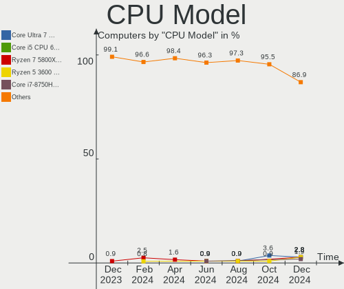
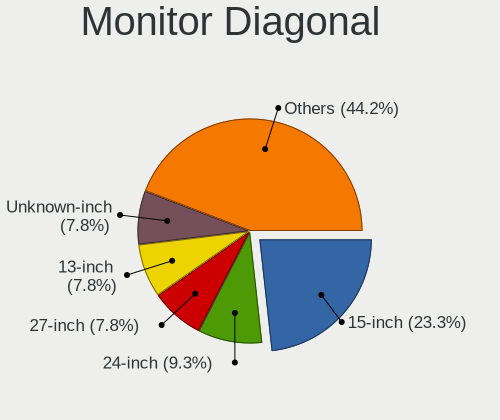

Manjaro Hardware Trends
-----------------------

A project to identify most popular hardware characteristics and track their change
over time based on data collected by Manjaro users at https://Linux-Hardware.org.

Anyone can contribute to the study by uploading probes of their computers by
the [hw-probe](https://github.com/linuxhw/hw-probe) tool:

    sudo hw-probe -all -upload

This is a report for all computer types. See also reports for [desktops](/Dist/Manjaro/Desktop/README.md) and [notebooks](/Dist/Manjaro/Notebook/README.md).

Full-feature report is available here: https://linux-hardware.org/?view=trends

Period: Apr, 2020.

Contents
--------

- [ OS                       ](#os)
- [ OS Family                ](#os-family)
- [ Kernel                   ](#kernel)
- [ Kernel Family            ](#kernel-family)
- [ Kernel Major Ver.        ](#kernel-major-ver)
- [ Arch                     ](#arch)
- [ DE                       ](#de)
- [ Display Server           ](#display-server)
- [ Display Manager          ](#display-manager)
- [ OS Lang                  ](#os-lang)
- [ Boot Mode                ](#boot-mode)
- [ Filesystem               ](#filesystem)
- [ Dual Boot with Linux/BSD ](#dual-boot-with-linux/bsd)
- [ Dual Boot (Win)          ](#dual-boot-win)
- [ Country                  ](#country)
- [ City                     ](#city)
- [ Vendor                   ](#vendor)
- [ Model                    ](#model)
- [ Model Family             ](#model-family)
- [ MFG Year                 ](#mfg-year)
- [ Form Factor              ](#form-factor)
- [ Secure Boot              ](#secure-boot)
- [ Coreboot                 ](#coreboot)
- [ RAM Size                 ](#ram-size)
- [ RAM Used                 ](#ram-used)
- [ Drive Vendor             ](#drive-vendor)
- [ Drive Model              ](#drive-model)
- [ Drive Kind               ](#drive-kind)
- [ Drive Connector          ](#drive-connector)
- [ Drive Size               ](#drive-size)
- [ Space Total              ](#space-total)
- [ Space Used               ](#space-used)
- [ Malfunc. Drives          ](#malfunc-drives)
- [ Malfunc. Drive Vendor    ](#malfunc-drive-vendor)
- [ Malfunc. Drive Kind      ](#malfunc-drive-kind)
- [ Failed Drives            ](#failed-drives)
- [ Failed Drive Vendor      ](#failed-drive-vendor)
- [ Drive Status             ](#drive-status)
- [ Storage Vendor           ](#storage-vendor)
- [ Storage Model            ](#storage-model)
- [ Storage Kind             ](#storage-kind)
- [ CPU Vendor               ](#cpu-vendor)
- [ CPU Model                ](#cpu-model)
- [ CPU Model Family         ](#cpu-model-family)
- [ CPU Cores                ](#cpu-cores)
- [ CPU Sockets              ](#cpu-sockets)
- [ CPU Threads              ](#cpu-threads)
- [ CPU Op-Modes             ](#cpu-op-modes)
- [ CPU Microarch            ](#cpu-microarch)
- [ CPU Microcode            ](#cpu-microcode)
- [ GPU Vendor               ](#gpu-vendor)
- [ GPU Model                ](#gpu-model)
- [ GPU Combo                ](#gpu-combo)
- [ GPU Driver               ](#gpu-driver)
- [ GPU Memory               ](#gpu-memory)
- [ Monitor Vendor           ](#monitor-vendor)
- [ Monitor Model            ](#monitor-model)
- [ Monitor Resolution       ](#monitor-resolution)
- [ Monitor Diagonal         ](#monitor-diagonal)
- [ Monitor Width            ](#monitor-width)
- [ Aspect Ratio             ](#aspect-ratio)
- [ Monitor Area             ](#monitor-area)
- [ Pixel Density            ](#pixel-density)
- [ Multiple Monitors        ](#multiple-monitors)
- [ Net Controller Vendor    ](#net-controller-vendor)
- [ Net Controller Model     ](#net-controller-model)
- [ Net Controller Kind      ](#net-controller-kind)
- [ Used Controller          ](#used-controller)
- [ NICs                     ](#nics)
- [ Unsupported Devices      ](#unsupported-devices)
- [ Unsupported Device Types ](#unsupported-device-types)

OS
--

Installed operating systems

| Name             | Computers | Percent |
|------------------|-----------|---------|
| Manjaro          | 77        | 39.29%  |
| Manjaro 20.0     | 76        | 38.78%  |
| Manjaro 19.0.2   | 41        | 20.92%  |
| Manjaro 20.0-rc1 | 1         | 0.51%   |
| Manjaro 19.0.1   | 1         | 0.51%   |

OS Family
---------

OS without a version

| Name    | Computers | Percent |
|---------|-----------|---------|
| Manjaro | 196       | 100%    |

Kernel
------

Version of the Linux kernel

| Version             | Computers | Percent |
|---------------------|-----------|---------|
| 5.4.33-3-MANJARO    | 22        | 11.22%  |
| 5.4.28-1-MANJARO    | 18        | 9.18%   |
| 5.4.31-1-MANJARO    | 17        | 8.67%   |
| 5.6.7-1-MANJARO     | 16        | 8.16%   |
| 5.6.5-3-MANJARO     | 12        | 6.12%   |
| 5.6.3-2-MANJARO     | 12        | 6.12%   |
| 5.4.34-1-MANJARO    | 12        | 6.12%   |
| 5.4.35-1-MANJARO    | 10        | 5.1%    |
| 5.5.13-1-MANJARO    | 9         | 4.59%   |
| 5.6.6-1-MANJARO     | 8         | 4.08%   |
| 5.4.33-1-MANJARO    | 6         | 3.06%   |
| 5.4.23-1-MANJARO    | 6         | 3.06%   |
| 5.5.16-1-MANJARO    | 5         | 2.55%   |
| 5.5.19-1-MANJARO    | 4         | 2.04%   |
| 4.19.114-1-MANJARO  | 4         | 2.04%   |
| 5.6.2-1-MANJARO     | 3         | 1.53%   |
| 5.6.0-1-MANJARO     | 3         | 1.53%   |
| 5.4.30-1-MANJARO    | 3         | 1.53%   |
| 4.19.116-1-MANJARO  | 3         | 1.53%   |
| 5.6.5-1-MANJARO     | 2         | 1.02%   |
| 5.6.4-1-rt3-MANJARO | 2         | 1.02%   |
| 5.4.24-1-MANJARO    | 2         | 1.02%   |
| 4.19.118-1-MANJARO  | 2         | 1.02%   |
| 5.6.7-1-ck-nehalem  | 1         | 0.51%   |
| 5.6.6-13-tkg-MuQSS  | 1         | 0.51%   |
| 5.6.2-pf            | 1         | 0.51%   |
| 5.6.2-5-tkg-pds     | 1         | 0.51%   |
| 5.6.1-1-MANJARO     | 1         | 0.51%   |
| 5.5.8-1-MANJARO     | 1         | 0.51%   |
| 5.5.7-1-MANJARO     | 1         | 0.51%   |
| 5.5.6-1-MANJARO     | 1         | 0.51%   |
| 5.5.18-3-MANJARO    | 1         | 0.51%   |
| 5.5.18-2-MANJARO    | 1         | 0.51%   |
| 5.5.15-1-MANJARO    | 1         | 0.51%   |
| 5.5.14-1-MANJARO    | 1         | 0.51%   |
| 5.4.28-rt19-MANJARO | 1         | 0.51%   |
| 4.19.117-1-MANJARO  | 1         | 0.51%   |
| 4.14.175-1-MANJARO  | 1         | 0.51%   |

Kernel Family
-------------

Linux kernel without a distro release

| Version  | Computers | Percent |
|----------|-----------|---------|
| 5.4.33   | 28        | 14.29%  |
| 5.4.28   | 19        | 9.69%   |
| 5.6.7    | 17        | 8.67%   |
| 5.4.31   | 17        | 8.67%   |
| 5.6.5    | 14        | 7.14%   |
| 5.6.3    | 12        | 6.12%   |
| 5.4.34   | 12        | 6.12%   |
| 5.4.35   | 10        | 5.1%    |
| 5.6.6    | 9         | 4.59%   |
| 5.5.13   | 9         | 4.59%   |
| 5.4.23   | 6         | 3.06%   |
| 5.6.2    | 5         | 2.55%   |
| 5.5.16   | 5         | 2.55%   |
| 5.5.19   | 4         | 2.04%   |
| 4.19.114 | 4         | 2.04%   |
| 5.6.0    | 3         | 1.53%   |
| 5.4.30   | 3         | 1.53%   |
| 4.19.116 | 3         | 1.53%   |
| 5.6.4    | 2         | 1.02%   |
| 5.5.18   | 2         | 1.02%   |
| 5.4.24   | 2         | 1.02%   |
| 4.19.118 | 2         | 1.02%   |
| 5.6.1    | 1         | 0.51%   |
| 5.5.8    | 1         | 0.51%   |
| 5.5.7    | 1         | 0.51%   |
| 5.5.6    | 1         | 0.51%   |
| 5.5.15   | 1         | 0.51%   |
| 5.5.14   | 1         | 0.51%   |
| 4.19.117 | 1         | 0.51%   |
| 4.14.175 | 1         | 0.51%   |

Kernel Major Ver.
-----------------

Linux kernel major version

| Version | Computers | Percent |
|---------|-----------|---------|
| 5.4     | 97        | 49.49%  |
| 5.6     | 63        | 32.14%  |
| 5.5     | 25        | 12.76%  |
| 4.19    | 10        | 5.1%    |
| 4.14    | 1         | 0.51%   |

Arch
----

OS architecture (x86_64, i586, etc.)

| Name   | Computers | Percent |
|--------|-----------|---------|
| x86_64 | 196       | 100%    |

DE
--

Desktop Environment

| Name       | Computers | Percent |
|------------|-----------|---------|
| KDE5       | 62        | 31.63%  |
| XFCE       | 54        | 27.55%  |
| GNOME      | 41        | 20.92%  |
| KDE        | 27        | 13.78%  |
| Unknown    | 4         | 2.04%   |
| X-Cinnamon | 3         | 1.53%   |
| Deepin     | 2         | 1.02%   |
| i3         | 1         | 0.51%   |
| Cinnamon   | 1         | 0.51%   |
| Awesome    | 1         | 0.51%   |

Display Server
--------------

X11 or Wayland

| Name    | Computers | Percent |
|---------|-----------|---------|
| X11     | 189       | 96.43%  |
| Wayland | 7         | 3.57%   |

Display Manager
---------------

SDDM, LightDM, etc.

| Name    | Computers | Percent |
|---------|-----------|---------|
| Unknown | 75        | 38.27%  |
| SDDM    | 62        | 31.63%  |
| LightDM | 38        | 19.39%  |
| GDM     | 20        | 10.2%   |
| XDM     | 1         | 0.51%   |

OS Lang
-------

Language

| Lang       | Computers | Percent |
|------------|-----------|---------|
| en_US      | 55        | 28.06%  |
| ru_RU      | 42        | 21.43%  |
| en_US.utf8 | 19        | 9.69%   |
| de_DE      | 10        | 5.1%    |
| ru_RU.utf8 | 8         | 4.08%   |
| en_GB.utf8 | 5         | 2.55%   |
| en_CA      | 5         | 2.55%   |
| it_IT      | 4         | 2.04%   |
| es_ES      | 4         | 2.04%   |
| en_GB      | 4         | 2.04%   |
| ru_UA.utf8 | 3         | 1.53%   |
| pt_BR      | 3         | 1.53%   |
| sv_SE      | 2         | 1.02%   |
| ru_UA      | 2         | 1.02%   |
| pt_BR.utf8 | 2         | 1.02%   |
| en_NZ      | 2         | 1.02%   |
| el_GR      | 2         | 1.02%   |
| de_AT      | 2         | 1.02%   |
| zh_CN      | 1         | 0.51%   |
| pl_PL.utf8 | 1         | 0.51%   |
| nl_NL      | 1         | 0.51%   |
| nl_BE.utf8 | 1         | 0.51%   |
| nl_BE      | 1         | 0.51%   |
| ko_KR      | 1         | 0.51%   |
| it_IT.utf8 | 1         | 0.51%   |
| hu_HU.utf8 | 1         | 0.51%   |
| fr_FR.utf8 | 1         | 0.51%   |
| fr_FR      | 1         | 0.51%   |
| es_SV      | 1         | 0.51%   |
| es_MX.utf8 | 1         | 0.51%   |
| es_MX      | 1         | 0.51%   |
| es_ES.utf8 | 1         | 0.51%   |
| es_CO.utf8 | 1         | 0.51%   |
| en_ZA      | 1         | 0.51%   |
| en_IN      | 1         | 0.51%   |
| en_CA.utf8 | 1         | 0.51%   |
| en_AU      | 1         | 0.51%   |
| el_GR.utf8 | 1         | 0.51%   |
| de_DE.utf8 | 1         | 0.51%   |
| bg_BG      | 1         | 0.51%   |

Boot Mode
---------

EFI or BIOS

| Mode | Computers | Percent |
|------|-----------|---------|
| BIOS | 115       | 58.67%  |
| EFI  | 81        | 41.33%  |

Filesystem
----------

Type of filesystem

| Type    | Computers | Percent |
|---------|-----------|---------|
| Ext4    | 175       | 89.29%  |
| Btrfs   | 11        | 5.61%   |
| Overlay | 5         | 2.55%   |
| F2fs    | 2         | 1.02%   |
| Ext2    | 2         | 1.02%   |
| Xfs     | 1         | 0.51%   |

Dual Boot with Linux/BSD
------------------------

Hosting more than one Linux/BSD

| Dual boot | Computers | Percent |
|-----------|-----------|---------|
| No        | 159       | 81.12%  |
| Yes       | 37        | 18.88%  |

Dual Boot (Win)
---------------

Hosting Linux and Windows

| Dual boot | Computers | Percent |
|-----------|-----------|---------|
| No        | 102       | 52.04%  |
| Yes       | 94        | 47.96%  |

Country
-------

Geographic location (country)

| Country                | Computers | Percent |
|------------------------|-----------|---------|
| Russia                 | 54        | 27.55%  |
| USA                    | 31        | 15.82%  |
| Germany                | 11        | 5.61%   |
| Ukraine                | 10        | 5.1%    |
| Canada                 | 7         | 3.57%   |
| Italy                  | 6         | 3.06%   |
| Spain                  | 5         | 2.55%   |
| Brazil                 | 5         | 2.55%   |
| UK                     | 4         | 2.04%   |
| Netherlands            | 4         | 2.04%   |
| Greece                 | 4         | 2.04%   |
| Belgium                | 4         | 2.04%   |
| Sweden                 | 3         | 1.53%   |
| Romania                | 3         | 1.53%   |
| Poland                 | 3         | 1.53%   |
| Mexico                 | 3         | 1.53%   |
| Austria                | 3         | 1.53%   |
| Portugal               | 2         | 1.02%   |
| New Zealand            | 2         | 1.02%   |
| Monaco                 | 2         | 1.02%   |
| Lithuania              | 2         | 1.02%   |
| France                 | 2         | 1.02%   |
| Finland                | 2         | 1.02%   |
| China                  | 2         | 1.02%   |
| Bulgaria               | 2         | 1.02%   |
| Uzbekistan             | 1         | 0.51%   |
| Turkey                 | 1         | 0.51%   |
| Thailand               | 1         | 0.51%   |
| Switzerland            | 1         | 0.51%   |
| South Korea            | 1         | 0.51%   |
| South Africa           | 1         | 0.51%   |
| Philippines            | 1         | 0.51%   |
| Mauritius              | 1         | 0.51%   |
| Latvia                 | 1         | 0.51%   |
| Israel                 | 1         | 0.51%   |
| Iran                   | 1         | 0.51%   |
| Indonesia              | 1         | 0.51%   |
| India                  | 1         | 0.51%   |
| Hungary                | 1         | 0.51%   |
| Estonia                | 1         | 0.51%   |
| El Salvador            | 1         | 0.51%   |
| Egypt                  | 1         | 0.51%   |
| Colombia               | 1         | 0.51%   |
| Bosnia and Herzegovina | 1         | 0.51%   |
| Australia              | 1         | 0.51%   |

City
----

Geographic location (city)

| City            | Computers | Percent |
|-----------------|-----------|---------|
| Moscow          | 15        | 7.65%   |
| St Petersburg   | 5         | 2.55%   |
| Sofia           | 2         | 1.02%   |
| Rome            | 2         | 1.02%   |
| Porto           | 2         | 1.02%   |
| Ottawa          | 2         | 1.02%   |
| Omsk            | 2         | 1.02%   |
| Odesa           | 2         | 1.02%   |
| Monaco          | 2         | 1.02%   |
| Kyiv            | 2         | 1.02%   |
| Krasnoyarsk     | 2         | 1.02%   |
| Kharkiv         | 2         | 1.02%   |
| Katy            | 2         | 1.02%   |
| Helsinki        | 2         | 1.02%   |
| Auckland        | 2         | 1.02%   |
| Athens          | 2         | 1.02%   |
| Zurich          | 1         | 0.51%   |
| Zoetermeer      | 1         | 0.51%   |
| Zlatoust        | 1         | 0.51%   |
| Yaroslavl       | 1         | 0.51%   |
| Yaransk         | 1         | 0.51%   |
| Xochitepec      | 1         | 0.51%   |
| Wuppertal       | 1         | 0.51%   |
| Wharton         | 1         | 0.51%   |
| Wedemark        | 1         | 0.51%   |
| Warsaw          | 1         | 0.51%   |
| Vladivostok     | 1         | 0.51%   |
| Vitoria-Gasteiz | 1         | 0.51%   |
| Vilnius         | 1         | 0.51%   |
| Vancouver       | 1         | 0.51%   |
| Utrecht         | 1         | 0.51%   |
| Ulyanovsk       | 1         | 0.51%   |
| Ufa             | 1         | 0.51%   |
| Tuzla           | 1         | 0.51%   |
| Tula            | 1         | 0.51%   |
| Trivandrum      | 1         | 0.51%   |
| Trieste         | 1         | 0.51%   |
| Toronto         | 1         | 0.51%   |
| Tomsk           | 1         | 0.51%   |
| Tolyatti        | 1         | 0.51%   |
| Toccoa          | 1         | 0.51%   |
| Tire            | 1         | 0.51%   |
| Tavier          | 1         | 0.51%   |
| Tashkent        | 1         | 0.51%   |
| Tambov          | 1         | 0.51%   |
| Tallinn         | 1         | 0.51%   |
| Strunino        | 1         | 0.51%   |
| Stockholm       | 1         | 0.51%   |
| Shenzhen        | 1         | 0.51%   |
| Sheboygan       | 1         | 0.51%   |
| Saratov         | 1         | 0.51%   |
| Santurtzi       | 1         | 0.51%   |
| San Salvador    | 1         | 0.51%   |
| San Jose        | 1         | 0.51%   |
| Salzgitter      | 1         | 0.51%   |
| Salzburg        | 1         | 0.51%   |
| Salem           | 1         | 0.51%   |
| Saint-Constant  | 1         | 0.51%   |
| Saint Francis   | 1         | 0.51%   |
| Saginaw         | 1         | 0.51%   |

Vendor
------

Motherboard manufacturer

| Name                | Computers | Percent |
|---------------------|-----------|---------|
| ASUSTek Computer    | 45        | 22.96%  |
| Lenovo              | 29        | 14.8%   |
| Hewlett-Packard     | 25        | 12.76%  |
| Dell                | 19        | 9.69%   |
| Gigabyte Technology | 15        | 7.65%   |
| MSI                 | 14        | 7.14%   |
| Acer                | 13        | 6.63%   |
| ASRock              | 9         | 4.59%   |
| Samsung Electronics | 4         | 2.04%   |
| Toshiba             | 3         | 1.53%   |
| Intel               | 3         | 1.53%   |
| Sony                | 2         | 1.02%   |
| Pegatron            | 2         | 1.02%   |
| Apple               | 2         | 1.02%   |
| Unknown             | 2         | 1.02%   |
| TWJ                 | 1         | 0.51%   |
| System76            | 1         | 0.51%   |
| Razer               | 1         | 0.51%   |
| Notebook            | 1         | 0.51%   |
| Microsoft           | 1         | 0.51%   |
| Huanan              | 1         | 0.51%   |
| Foxconn             | 1         | 0.51%   |
| essentiel b         | 1         | 0.51%   |
| Biostar             | 1         | 0.51%   |

Model
-----

Motherboard model

| Name                                                              | Computers | Percent |
|-------------------------------------------------------------------|-----------|---------|
| Unknown                                                           | 3         | 1.53%   |
| Sony VPCEH2L9E                                                    | 2         | 1.02%   |
| MSI MS-7693                                                       | 2         | 1.02%   |
| Dell Latitude E6230                                               | 2         | 1.02%   |
| Dell Inspiron N5110                                               | 2         | 1.02%   |
| ASUS UX430UAR                                                     | 2         | 1.02%   |
| ASUS ROG STRIX X470-F GAMING                                      | 2         | 1.02%   |
| ASUS PRIME B350M-A                                                | 2         | 1.02%   |
| ASUS P5LD2-X                                                      | 2         | 1.02%   |
| ASUS All Series                                                   | 2         | 1.02%   |
| Toshiba Satellite C55-B                                           | 1         | 0.51%   |
| Toshiba Satellite C50D-B                                          | 1         | 0.51%   |
| Toshiba Satellite C50D-A                                          | 1         | 0.51%   |
| System76 Galago Pro                                               | 1         | 0.51%   |
| Samsung Electronics RV410/RV510/S3510/E3510                       | 1         | 0.51%   |
| Samsung Electronics R440                                          | 1         | 0.51%   |
| Samsung Electronics 3570R/370R/470R/450R/510R/4450RV              | 1         | 0.51%   |
| Samsung Electronics 300E5EV/300E4EV/270E5EV/270E4EV/2470EV/2470EE | 1         | 0.51%   |
| Razer Blade                                                       | 1         | 0.51%   |
| Pegatron WL260AA-ABZ CQ5340IT                                     | 1         | 0.51%   |
| Pegatron Pro 3120 Microtower PC                                   | 1         | 0.51%   |
| Notebook W54_55_94_95_97AU,AUQ                                    | 1         | 0.51%   |
| MSI PE72 7RD                                                      | 1         | 0.51%   |
| MSI P75 Creator 9SE                                               | 1         | 0.51%   |
| MSI MS-7C52                                                       | 1         | 0.51%   |
| MSI MS-7B98                                                       | 1         | 0.51%   |
| MSI MS-7B36                                                       | 1         | 0.51%   |
| MSI MS-7A34                                                       | 1         | 0.51%   |
| MSI MS-7A32                                                       | 1         | 0.51%   |
| MSI MS-7978                                                       | 1         | 0.51%   |
| MSI MS-7895                                                       | 1         | 0.51%   |
| MSI MS-7721                                                       | 1         | 0.51%   |
| MSI GIGANT X4 9550/500                                            | 1         | 0.51%   |
| MSI Alpha 15 A3DDK                                                | 1         | 0.51%   |
| Microsoft Surface Pro 3                                           | 1         | 0.51%   |
| Lenovo Yoga S940-14IWL 81Q7                                       | 1         | 0.51%   |
| Lenovo VIWZ1                                                      | 1         | 0.51%   |
| Lenovo V580c 20160                                                | 1         | 0.51%   |
| Lenovo ThinkPad X230 2325VKV                                      | 1         | 0.51%   |
| Lenovo ThinkPad X1 Carbon 7th 20R1S05B00                          | 1         | 0.51%   |
| Lenovo ThinkPad X1 Carbon 3rd 20BTS1D900                          | 1         | 0.51%   |
| Lenovo ThinkPad X1 Carbon 3rd 20BSCTO1WW                          | 1         | 0.51%   |
| Lenovo ThinkPad T460s 20F9004FUS                                  | 1         | 0.51%   |
| Lenovo ThinkPad T460 20FMS1P70E                                   | 1         | 0.51%   |
| Lenovo ThinkPad T420s 4173A57                                     | 1         | 0.51%   |
| Lenovo ThinkPad T420 4177R3U                                      | 1         | 0.51%   |
| Lenovo ThinkPad S5 Yoga 15 20DQ001KUS                             | 1         | 0.51%   |
| Lenovo ThinkPad P53 20QNCTO1WW                                    | 1         | 0.51%   |
| Lenovo ThinkPad L380 20M5003QRT                                   | 1         | 0.51%   |
| Lenovo ThinkPad L13 Yoga 20R5000WUS                               | 1         | 0.51%   |
| Lenovo ThinkCentre M93p 10A8S32X00                                | 1         | 0.51%   |
| Lenovo Legion Y540-15IRH-PG0 81SY                                 | 1         | 0.51%   |
| Lenovo IdeaPad Z510 20287                                         | 1         | 0.51%   |
| Lenovo IdeaPad Y700-15ISK 80NV                                    | 1         | 0.51%   |
| Lenovo IdeaPad S540-15IWL D 81NE                                  | 1         | 0.51%   |
| Lenovo IdeaPad FLEX-14API 81SS                                    | 1         | 0.51%   |
| Lenovo IdeaPad FLEX 4-1470 80SA                                   | 1         | 0.51%   |
| Lenovo IdeaPad 330S-15ARR 81FB                                    | 1         | 0.51%   |
| Lenovo IdeaPad 330-17IKB 81DM                                     | 1         | 0.51%   |
| Lenovo IdeaPad 330-15ICH 81FK                                     | 1         | 0.51%   |

Model Family
------------

Motherboard model prefix

| Name                        | Computers | Percent |
|-----------------------------|-----------|---------|
| Lenovo ThinkPad             | 12        | 6.12%   |
| Lenovo IdeaPad              | 9         | 4.59%   |
| Acer Aspire                 | 8         | 4.08%   |
| HP Pavilion                 | 7         | 3.57%   |
| Dell Inspiron               | 7         | 3.57%   |
| Dell Latitude               | 6         | 3.06%   |
| ASUS ROG                    | 4         | 2.04%   |
| ASUS PRIME                  | 4         | 2.04%   |
| Toshiba Satellite           | 3         | 1.53%   |
| Unknown                     | 3         | 1.53%   |
| Sony VPCEH2L9E              | 2         | 1.02%   |
| MSI MS-7693                 | 2         | 1.02%   |
| HP Spectre                  | 2         | 1.02%   |
| HP Laptop                   | 2         | 1.02%   |
| HP Compaq                   | 2         | 1.02%   |
| Gigabyte X570               | 2         | 1.02%   |
| Dell XPS                    | 2         | 1.02%   |
| ASUS UX430UAR               | 2         | 1.02%   |
| ASUS TUF                    | 2         | 1.02%   |
| ASUS P8Z77-V                | 2         | 1.02%   |
| ASUS P5LD2-X                | 2         | 1.02%   |
| ASUS All                    | 2         | 1.02%   |
| Acer Extensa                | 2         | 1.02%   |
| System76 Galago             | 1         | 0.51%   |
| Samsung Electronics RV410   | 1         | 0.51%   |
| Samsung Electronics R440    | 1         | 0.51%   |
| Samsung Electronics 3570R   | 1         | 0.51%   |
| Samsung Electronics 300E5EV | 1         | 0.51%   |
| Razer Blade                 | 1         | 0.51%   |
| Pegatron WL260AA-ABZ        | 1         | 0.51%   |
| Pegatron Pro                | 1         | 0.51%   |
| Notebook W54                | 1         | 0.51%   |
| MSI PE72                    | 1         | 0.51%   |
| MSI P75                     | 1         | 0.51%   |
| MSI MS-7C52                 | 1         | 0.51%   |
| MSI MS-7B98                 | 1         | 0.51%   |
| MSI MS-7B36                 | 1         | 0.51%   |
| MSI MS-7A34                 | 1         | 0.51%   |
| MSI MS-7A32                 | 1         | 0.51%   |
| MSI MS-7978                 | 1         | 0.51%   |
| MSI MS-7895                 | 1         | 0.51%   |
| MSI MS-7721                 | 1         | 0.51%   |
| MSI GIGANT                  | 1         | 0.51%   |
| MSI Alpha                   | 1         | 0.51%   |
| Microsoft Surface           | 1         | 0.51%   |
| Lenovo Yoga                 | 1         | 0.51%   |
| Lenovo VIWZ1                | 1         | 0.51%   |
| Lenovo V580c                | 1         | 0.51%   |
| Lenovo ThinkCentre          | 1         | 0.51%   |
| Lenovo Legion               | 1         | 0.51%   |
| Lenovo G500                 | 1         | 0.51%   |
| Lenovo B560                 | 1         | 0.51%   |
| Lenovo B50-30               | 1         | 0.51%   |
| Intel X79                   | 1         | 0.51%   |
| Intel Intel                 | 1         | 0.51%   |
| Intel DP55WB                | 1         | 0.51%   |
| Huanan X79                  | 1         | 0.51%   |
| HP Z820                     | 1         | 0.51%   |
| HP Z440                     | 1         | 0.51%   |
| HP Stream                   | 1         | 0.51%   |

MFG Year
--------

Motherboard manufacture year

| Year | Computers | Percent |
|------|-----------|---------|
| 2019 | 51        | 26.02%  |
| 2018 | 24        | 12.24%  |
| 2014 | 20        | 10.2%   |
| 2013 | 15        | 7.65%   |
| 2012 | 13        | 6.63%   |
| 2020 | 12        | 6.12%   |
| 2011 | 12        | 6.12%   |
| 2015 | 11        | 5.61%   |
| 2010 | 11        | 5.61%   |
| 2016 | 10        | 5.1%    |
| 2017 | 7         | 3.57%   |
| 2009 | 4         | 2.04%   |
| 2008 | 3         | 1.53%   |
| 2007 | 3         | 1.53%   |

Form Factor
-----------

Physical design of the computer

| Name        | Computers | Percent |
|-------------|-----------|---------|
| Notebook    | 109       | 55.61%  |
| Desktop     | 79        | 40.31%  |
| Convertible | 6         | 3.06%   |
| Tablet      | 1         | 0.51%   |
| All in one  | 1         | 0.51%   |

Secure Boot
-----------

Enabled or disabled

| State    | Computers | Percent |
|----------|-----------|---------|
| Disabled | 196       | 100%    |

Coreboot
--------

Have coreboot on board

| Used | Computers | Percent |
|------|-----------|---------|
| No   | 194       | 98.98%  |
| Yes  | 2         | 1.02%   |

RAM Size
--------

Total RAM memory

| Size in GB  | Computers | Percent |
|-------------|-----------|---------|
| 4.01-8.0    | 57        | 29.08%  |
| 16.01-24.0  | 50        | 25.51%  |
| 3.01-4.0    | 34        | 17.35%  |
| 8.01-16.0   | 33        | 16.84%  |
| 32.01-64.0  | 10        | 5.1%    |
| 1.01-2.0    | 6         | 3.06%   |
| 64.01-256.0 | 4         | 2.04%   |
| 24.01-32.0  | 1         | 0.51%   |
| 2.01-3.0    | 1         | 0.51%   |

RAM Used
--------

Used RAM memory

| Used GB    | Computers | Percent |
|------------|-----------|---------|
| 1.01-2.0   | 70        | 35.71%  |
| 2.01-3.0   | 60        | 30.61%  |
| 3.01-4.0   | 27        | 13.78%  |
| 4.01-8.0   | 21        | 10.71%  |
| 0.01-1.0   | 11        | 5.61%   |
| 8.01-16.0  | 6         | 3.06%   |
| 16.01-24.0 | 1         | 0.51%   |

Drive Vendor
------------

Hard drive vendors

| Vendor              | Computers | Drives  | Percent |
|---------------------|-----------|---------|---------|
| WDC                 | 58        | 69      | 18.65%  |
| Seagate             | 57        | 73      | 18.33%  |
| Samsung Electronics | 43        | 51      | 13.83%  |
| Toshiba             | 22        | 22      | 7.07%   |
| Hitachi             | 14        | 15      | 4.5%    |
| Kingston            | 11        | 11      | 3.54%   |
| SanDisk             | 10        | 11      | 3.22%   |
| Crucial             | 10        | 11      | 3.22%   |
| Unknown             | 7         | 7       | 2.25%   |
| Intel               | 7         | 7       | 2.25%   |
| HGST                | 6         | 6       | 1.93%   |
| PLEXTOR             | 5         | 5       | 1.61%   |
| Transcend           | 4         | 4       | 1.29%   |
| SK Hynix            | 4         | 4       | 1.29%   |
| OCZ                 | 4         | 4       | 1.29%   |
| SPCC                | 3         | 3       | 0.96%   |
| Generic             | 3         | 3       | 0.96%   |
| China               | 3         | 4       | 0.96%   |
| A-DATA Technology   | 3         | 3       | 0.96%   |
| PNY                 | 2         | 2       | 0.64%   |
| Patriot             | 2         | 2       | 0.64%   |
| Micron Technology   | 2         | 2       | 0.64%   |
| MAXTOR              | 2         | 2       | 0.64%   |
| LITEONIT            | 2         | 2       | 0.64%   |
| LITEON              | 2         | 2       | 0.64%   |
| HL-DT-ST            | 2         | Unknown | 0.64%   |
| Fujitsu             | 2         | 2       | 0.64%   |
| Apple               | 2         | 2       | 0.64%   |
| Zheino              | 1         | 1       | 0.32%   |
| Union Memory        | 1         | 1       | 0.32%   |
| tigo                | 1         | 1       | 0.32%   |
| Sony                | 1         | 1       | 0.32%   |
| Silicon Motion      | 1         | 1       | 0.32%   |
| PIONEER             | 1         | 1       | 0.32%   |
| Phison              | 1         | 1       | 0.32%   |
| LONDISK             | 1         | 1       | 0.32%   |
| KingSpec            | 1         | 1       | 0.32%   |
| KINGMAX             | 1         | 1       | 0.32%   |
| KingDian            | 1         | 1       | 0.32%   |
| JMicron             | 1         | 1       | 0.32%   |
| Intenso             | 1         | 1       | 0.32%   |
| HUAWEI              | 1         | 1       | 0.32%   |
| Gigabyte Technology | 1         | 1       | 0.32%   |
| GALAX               | 1         | 1       | 0.32%   |
| FORESEE             | 1         | 1       | 0.32%   |
| BHT                 | 1         | 1       | 0.32%   |
| ASMT109x            | 1         | 1       | 0.32%   |

Drive Model
-----------

Hard drive models

| Model                         | Computers | Percent |
|-------------------------------|-----------|---------|
| ST1000LM035-1RK172 1TB        | 8         | 2.29%   |
| SSD 860 EVO 500GB             | 6         | 1.72%   |
| MQ01ABD100 1TB                | 5         | 1.43%   |
| WD10JPVX-22JC3T0 1TB          | 3         | 0.86%   |
| WD10EZEX-08WN4A0 1TB          | 3         | 0.86%   |
| ST9500325AS 500GB             | 3         | 0.86%   |
| ST2000DM001-1CH164 2TB        | 3         | 0.86%   |
| ST1000DM010-2EP102 1TB        | 3         | 0.86%   |
| SSD 860 EVO 250GB             | 3         | 0.86%   |
| SSD 850 EVO 500GB             | 3         | 0.86%   |
| SD/MMC/MS PRO 64GB            | 3         | 0.86%   |
| Expansion 1TB                 | 3         | 0.86%   |
| DT01ACA100 1TB                | 3         | 0.86%   |
| DT01ACA050 500GB              | 3         | 0.86%   |
| 120GB SSD                     | 3         | 0.86%   |
| WDS500G2B0A-00SM50 500GB SSD  | 2         | 0.57%   |
| WD5002AALX-00J37A0 500GB      | 2         | 0.57%   |
| WD5000LPCX-21VHAT0 500GB      | 2         | 0.57%   |
| WD5000AAKX-00ERMA0 500GB      | 2         | 0.57%   |
| WD5000AAKX-001CA0 500GB       | 2         | 0.57%   |
| WD3200BPVT-22JJ5T0 320GB      | 2         | 0.57%   |
| WD20EZRZ-00Z5HB0 2TB          | 2         | 0.57%   |
| WD10SPZX-75Z10T2 1TB          | 2         | 0.57%   |
| VERTEX4 128GB SSD             | 2         | 0.57%   |
| Ultra II 960GB SSD            | 2         | 0.57%   |
| SUV500M8120G 120GB SSD        | 2         | 0.57%   |
| ST3500418AS 500GB             | 2         | 0.57%   |
| ST31000524AS 1TB              | 2         | 0.57%   |
| ST3000DM001-1CH166 3TB        | 2         | 0.57%   |
| ST2000DM001-1ER164 2TB        | 2         | 0.57%   |
| ST1000LM024 HN-M101MBB 1TB    | 2         | 0.57%   |
| ST1000DM003-1SB10C 1TB        | 2         | 0.57%   |
| ST1000DM003-1SB102 1TB        | 2         | 0.57%   |
| ST1000DM003-1ER162 1TB        | 2         | 0.57%   |
| SSD 970 EVO Plus 250GB        | 2         | 0.57%   |
| SSD 120GB                     | 2         | 0.57%   |
| SD9SN8W512G1002 512GB SSD     | 2         | 0.57%   |
| SA400S37240G 240GB SSD        | 2         | 0.57%   |
| SA400M8240G 240GB SSD         | 2         | 0.57%   |
| MQ04ABF100 1TB                | 2         | 0.57%   |
| MQ01ABF050 500GB              | 2         | 0.57%   |
| KBG30ZMV512G 512GB            | 2         | 0.57%   |
| HTS721010A9E630 1TB           | 2         | 0.57%   |
| HTS545050A7E380 500GB         | 2         | 0.57%   |
| HTS543232A7A384 320GB         | 2         | 0.57%   |
| HDS721010CLA332 1TB           | 2         | 0.57%   |
| HD502IJ 500GB                 | 2         | 0.57%   |
| DVDRAM GUE1N 3GB              | 2         | 0.57%   |
| CT250MX500SSD1 250GB          | 2         | 0.57%   |
| CT240BX500SSD1 240GB          | 2         | 0.57%   |
| CS900 120GB SSD               | 2         | 0.57%   |
| WR202A1032G 670290F5 32GB SSD | 1         | 0.29%   |
| WDS500G3X0C-00SJG0 500GB      | 1         | 0.29%   |
| WDS500G1B0A-00H9H0 500GB SSD  | 1         | 0.29%   |
| WDS240G2G0A-00JH30 240GB SSD  | 1         | 0.29%   |
| WDS120G2G0A-00JH30 120GB SSD  | 1         | 0.29%   |
| WDS100T3X0C-00SJG0 1TB        | 1         | 0.29%   |
| WD800AAJS-60PSA0 80GB         | 1         | 0.29%   |
| WD7501AALS-00J7B0 752GB       | 1         | 0.29%   |
| WD6400BPVT-60HXZT1 640GB      | 1         | 0.29%   |

Drive Kind
----------

HDD or SSD

| Kind    | Computers | Drives | Percent |
|---------|-----------|--------|---------|
| HDD     | 128       | 186    | 48.3%   |
| SSD     | 94        | 118    | 35.47%  |
| NVMe    | 25        | 28     | 9.43%   |
| Unknown | 11        | 9      | 4.15%   |
| MMC     | 7         | 7      | 2.64%   |

Drive Connector
---------------

SATA, SAS, NVMe, etc.

| Type | Computers | Drives | Percent |
|------|-----------|--------|---------|
| SATA | 173       | 300    | 78.64%  |
| NVMe | 25        | 28     | 11.36%  |
| SAS  | 15        | 13     | 6.82%   |
| MMC  | 7         | 7      | 3.18%   |

Drive Size
----------

Size of hard drive

| Size in TB | Computers | Drives | Percent |
|------------|-----------|--------|---------|
| 0.01-0.5   | 141       | 206    | 53.61%  |
| 0.51-1.0   | 89        | 107    | 33.84%  |
| 1.01-2.0   | 17        | 17     | 6.46%   |
| 2.01-3.0   | 9         | 11     | 3.42%   |
| 3.01-4.0   | 4         | 4      | 1.52%   |
| 4.01-10.0  | 2         | 2      | 0.76%   |
| 10.01-20.0 | 1         | 1      | 0.38%   |

Space Total
-----------

Amount of disk space available on the file system

| Size in GB     | Computers | Percent |
|----------------|-----------|---------|
| 101-250        | 53        | 27.04%  |
| 251-500        | 40        | 20.41%  |
| 501-1000       | 37        | 18.88%  |
| 51-100         | 19        | 9.69%   |
| 1001-2000      | 13        | 6.63%   |
| More than 3000 | 11        | 5.61%   |
| 21-50          | 8         | 4.08%   |
| 2001-3000      | 5         | 2.55%   |
| 1-20           | 5         | 2.55%   |
| Unknown        | 5         | 2.55%   |

Space Used
----------

Amount of used disk space

| Used GB        | Computers | Percent |
|----------------|-----------|---------|
| 1-20           | 50        | 25.51%  |
| 21-50          | 36        | 18.37%  |
| 101-250        | 29        | 14.8%   |
| 51-100         | 26        | 13.27%  |
| 251-500        | 23        | 11.73%  |
| 501-1000       | 11        | 5.61%   |
| 1001-2000      | 8         | 4.08%   |
| Unknown        | 5         | 2.55%   |
| More than 3000 | 4         | 2.04%   |
| 2001-3000      | 4         | 2.04%   |

Malfunc. Drives
---------------

Drive models with a malfunction

| Model                      | Computers | Drives | Percent |
|----------------------------|-----------|--------|---------|
| ST2000DM001-1CH164 2TB     | 2         | 2      | 8%      |
| ST1000LM035-1RK172 1TB     | 2         | 2      | 8%      |
| WD5002AALX-00J37A0 500GB   | 1         | 1      | 4%      |
| WD5000LPCX-21VHAT0 500GB   | 1         | 1      | 4%      |
| WD5000AAKX-00ERMA0 500GB   | 1         | 1      | 4%      |
| WD5000AAKX-001CA0 500GB    | 1         | 1      | 4%      |
| WD3200AAJS-60M0A1 320GB    | 1         | 1      | 4%      |
| WD3200AAJS-22B4A0 320GB    | 1         | 1      | 4%      |
| ST9750423AS 752GB          | 1         | 1      | 4%      |
| ST9500420AS 500GB          | 1         | 1      | 4%      |
| ST9250320AS 250GB          | 1         | 1      | 4%      |
| ST3750525AS 752GB          | 1         | 1      | 4%      |
| ST3250820AS 250GB          | 1         | 1      | 4%      |
| ST3250620AS 250GB          | 1         | 1      | 4%      |
| ST3000DM001-9YN166 3TB     | 1         | 1      | 4%      |
| ST1000LM024 HN-M101MBB 1TB | 1         | 1      | 4%      |
| SSD 970 EVO 1TB            | 1         | 1      | 4%      |
| SSD 960 EVO 250GB          | 1         | 1      | 4%      |
| Solid State Disk 56GB      | 1         | 1      | 4%      |
| LMT-256M6M-HP 256GB SSD    | 1         | 1      | 4%      |
| HTS725050A9A364 500GB      | 1         | 1      | 4%      |
| HTS545050A7E680 500GB      | 1         | 1      | 4%      |
| HTS545050A7E380 500GB      | 1         | 1      | 4%      |

Malfunc. Drive Vendor
---------------------

Vendors of faulty drives

| Vendor              | Computers | Drives | Percent |
|---------------------|-----------|--------|---------|
| Seagate             | 10        | 12     | 43.48%  |
| WDC                 | 6         | 6      | 26.09%  |
| Samsung Electronics | 2         | 2      | 8.7%    |
| HGST                | 2         | 2      | 8.7%    |
| SPCC                | 1         | 1      | 4.35%   |
| LITEONIT            | 1         | 1      | 4.35%   |
| Hitachi             | 1         | 1      | 4.35%   |

Malfunc. Drive Kind
-------------------

Kinds of faulty drives

| Kind | Computers | Drives | Percent |
|------|-----------|--------|---------|
| HDD  | 18        | 21     | 81.82%  |
| NVMe | 2         | 2      | 9.09%   |
| SSD  | 2         | 2      | 9.09%   |

Failed Drives
-------------

Failed drive models

| Model            | Computers | Drives | Percent |
|------------------|-----------|--------|---------|
| ST31000524AS 1TB | 1         | 1      | 100%    |

Failed Drive Vendor
-------------------

Failed drive vendors

| Vendor  | Computers | Drives | Percent |
|---------|-----------|--------|---------|
| Seagate | 1         | 1      | 100%    |

Drive Status
------------

Number of failed and malfunc. drives

| Status   | Computers | Drives | Percent |
|----------|-----------|--------|---------|
| Detected | 111       | 183    | 53.37%  |
| Works    | 74        | 139    | 35.58%  |
| Malfunc  | 22        | 25     | 10.58%  |
| Failed   | 1         | 1      | 0.48%   |

Storage Vendor
--------------

Storage controller vendors

| Vendor                       | Computers | Percent |
|------------------------------|-----------|---------|
| Intel                        | 136       | 55.28%  |
| AMD                          | 49        | 19.92%  |
| Samsung Electronics          | 18        | 7.32%   |
| Sandisk                      | 6         | 2.44%   |
| Toshiba America Info Systems | 5         | 2.03%   |
| ASMedia Technology           | 5         | 2.03%   |
| SK Hynix                     | 4         | 1.63%   |
| Silicon Motion               | 4         | 1.63%   |
| Marvell Technology Group     | 4         | 1.63%   |
| Phison Electronics           | 3         | 1.22%   |
| Nvidia                       | 3         | 1.22%   |
| JMicron Technology           | 3         | 1.22%   |
| Broadcom / LSI               | 2         | 0.81%   |
| Unknown                      | 1         | 0.41%   |
| Union Memory (Shenzhen)      | 1         | 0.41%   |
| Micron Technology            | 1         | 0.41%   |
| ADATA Technology             | 1         | 0.41%   |

Storage Model
-------------

Storage controller models

| Model                                                                    | Computers | Percent |
|--------------------------------------------------------------------------|-----------|---------|
| FCH SATA Controller [AHCI mode]                                          | 40        | 13.89%  |
| Sunrise Point-LP SATA Controller [AHCI mode]                             | 13        | 4.51%   |
| NVMe SSD Controller SM981/PM981/PM983                                    | 13        | 4.51%   |
| Non-Volatile memory controller                                           | 12        | 4.17%   |
| 7 Series Chipset Family 6-port SATA Controller [AHCI mode]               | 10        | 3.47%   |
| 6 Series/C200 Series Chipset Family 6 port Mobile SATA AHCI Controller   | 10        | 3.47%   |
| 7 Series/C210 Series Chipset Family 6-port SATA Controller [AHCI mode]   | 9         | 3.13%   |
| 400 Series Chipset SATA Controller                                       | 9         | 3.13%   |
| 82801 Mobile SATA Controller [RAID mode]                                 | 8         | 2.78%   |
| 8 Series/C220 Series Chipset Family 6-port SATA Controller 1 [AHCI mode] | 7         | 2.43%   |
| 8 Series SATA Controller 1 [AHCI mode]                                   | 7         | 2.43%   |
| 6 Series/C200 Series Chipset Family 6 port Desktop SATA AHCI Controller  | 7         | 2.43%   |
| Wildcat Point-LP SATA Controller [AHCI Mode]                             | 6         | 2.08%   |
| Q170/Q150/B150/H170/H110/Z170/CM236 Chipset SATA Controller [AHCI Mode]  | 6         | 2.08%   |
| HM170/QM170 Chipset SATA Controller [AHCI Mode]                          | 6         | 2.08%   |
| Cannon Lake Mobile PCH SATA AHCI Controller                              | 6         | 2.08%   |
| NM10/ICH7 Family SATA Controller [IDE mode]                              | 5         | 1.74%   |
| ASM1062 Serial ATA Controller                                            | 5         | 1.74%   |
| NVMe SSD Controller SM961/PM961                                          | 4         | 1.39%   |
| 5 Series/3400 Series Chipset 6 port SATA AHCI Controller                 | 4         | 1.39%   |
| 5 Series/3400 Series Chipset 4 port SATA AHCI Controller                 | 4         | 1.39%   |
| 300 Series Chipset SATA Controller                                       | 4         | 1.39%   |
| WD Black 2018/PC SN720 NVMe SSD                                          | 3         | 1.04%   |
| Toshiba America Info Non-Volatile memory controller                      | 3         | 1.04%   |
| SSD 660P Series                                                          | 3         | 1.04%   |
| SB7x0/SB8x0/SB9x0 SATA Controller [AHCI mode]                            | 3         | 1.04%   |
| 82801JI (ICH10 Family) SATA AHCI Controller                              | 3         | 1.04%   |
| 82801IBM/IEM (ICH9M/ICH9M-E) 4 port SATA Controller [AHCI mode]          | 3         | 1.04%   |
| 82801G (ICH7 Family) IDE Controller                                      | 3         | 1.04%   |
| X370 Series Chipset SATA Controller                                      | 2         | 0.69%   |
| WD Black 2018/PC SN520 NVMe SSD                                          | 2         | 0.69%   |
| SB7x0/SB8x0/SB9x0 SATA Controller [IDE mode]                             | 2         | 0.69%   |
| SB7x0/SB8x0/SB9x0 IDE Controller                                         | 2         | 0.69%   |
| SB600 Non-Raid-5 SATA                                                    | 2         | 0.69%   |
| SB600 IDE                                                                | 2         | 0.69%   |
| SAS2308 PCI-Express Fusion-MPT SAS-2                                     | 2         | 0.69%   |
| MCP61 SATA Controller                                                    | 2         | 0.69%   |
| JMB368 IDE controller                                                    | 2         | 0.69%   |
| FCH SATA Controller D                                                    | 2         | 0.69%   |
| Cannon Point-LP SATA Controller [AHCI Mode]                              | 2         | 0.69%   |
| Cannon Lake PCH SATA AHCI Controller                                     | 2         | 0.69%   |
| BG3 NVMe SSD Controller                                                  | 2         | 0.69%   |
| Atom Processor E3800 Series SATA AHCI Controller                         | 2         | 0.69%   |
| 88SE9128 PCIe SATA 6 Gb/s RAID controller with HyperDuo                  | 2         | 0.69%   |
| XPG SX8200 Pro PCIe Gen3x4 M.2 2280 Solid State Drive                    | 1         | 0.35%   |
| X399 Series Chipset SATA Controller                                      | 1         | 0.35%   |
| SSD Pro 7600p/760p/E 6100p Series                                        | 1         | 0.35%   |
| SB7x0/SB8x0/SB9x0 SATA Controller [RAID5 mode]                           | 1         | 0.35%   |
| SATA Controller [RAID mode]                                              | 1         | 0.35%   |
| SATA controller                                                          | 1         | 0.35%   |
| NM10/ICH7 Family SATA Controller [AHCI mode]                             | 1         | 0.35%   |
| MCP78S [GeForce 8200] SATA Controller (non-AHCI mode)                    | 1         | 0.35%   |
| MCP78S [GeForce 8200] IDE                                                | 1         | 0.35%   |
| MCP61 IDE                                                                | 1         | 0.35%   |
| JMB362 SATA Controller                                                   | 1         | 0.35%   |
| FCH SATA Controller [IDE mode]                                           | 1         | 0.35%   |
| FCH IDE Controller                                                       | 1         | 0.35%   |
| Electronics Non-Volatile memory controller                               | 1         | 0.35%   |
| E7 NVMe Controller                                                       | 1         | 0.35%   |
| E16 PCIe4 NVMe Controller                                                | 1         | 0.35%   |

Storage Kind
------------

Kind of storage controller (IDE, SATA, NVMe, SAS, ...)

| Kind | Computers | Percent |
|------|-----------|---------|
| SATA | 162       | 67.22%  |
| NVMe | 44        | 18.26%  |
| IDE  | 22        | 9.13%   |
| RAID | 11        | 4.56%   |
| SAS  | 2         | 0.83%   |

CPU Vendor
----------

Processor vendors

| Vendor | Computers | Percent |
|--------|-----------|---------|
| Intel  | 143       | 72.96%  |
| AMD    | 53        | 27.04%  |

CPU Model
---------

Processor models

| Model                                         | Computers | Percent |
|-----------------------------------------------|-----------|---------|
| Intel Core i7-8550U CPU @ 1.80GHz             | 4         | 2.04%   |
| Intel Core i5-4200U CPU @ 1.60GHz             | 4         | 2.04%   |
| AMD Ryzen 5 3600 6-Core Processor             | 4         | 2.04%   |
| Intel Core i7-7700HQ CPU @ 2.80GHz            | 3         | 1.53%   |
| Intel Core i7-3770 CPU @ 3.40GHz              | 3         | 1.53%   |
| Intel Core i5-8265U CPU @ 1.60GHz             | 3         | 1.53%   |
| Intel Core i5-7200U CPU @ 2.50GHz             | 3         | 1.53%   |
| Intel Core i3-3120M CPU @ 2.50GHz             | 3         | 1.53%   |
| AMD Ryzen 7 2700X Eight-Core Processor        | 3         | 1.53%   |
| AMD Ryzen 5 2500U with Radeon Vega Mobile Gfx | 3         | 1.53%   |
| AMD Ryzen 5 2400G with Radeon Vega Graphics   | 3         | 1.53%   |
| Intel Xeon CPU X5460 @ 3.16GHz                | 2         | 1.02%   |
| Intel Pentium Dual-Core CPU T4500 @ 2.30GHz   | 2         | 1.02%   |
| Intel Pentium Dual-Core CPU E5500 @ 2.80GHz   | 2         | 1.02%   |
| Intel Pentium Dual CPU E2180 @ 2.00GHz        | 2         | 1.02%   |
| Intel Core i7-9750H CPU @ 2.60GHz             | 2         | 1.02%   |
| Intel Core i7-5600U CPU @ 2.60GHz             | 2         | 1.02%   |
| Intel Core i5-9300H CPU @ 2.40GHz             | 2         | 1.02%   |
| Intel Core i5-8250U CPU @ 1.60GHz             | 2         | 1.02%   |
| Intel Core i5-6200U CPU @ 2.30GHz             | 2         | 1.02%   |
| Intel Core i5-3470 CPU @ 3.20GHz              | 2         | 1.02%   |
| Intel Core i5-3320M CPU @ 2.60GHz             | 2         | 1.02%   |
| Intel Core i5-2430M CPU @ 2.40GHz             | 2         | 1.02%   |
| Intel Core i5-2410M CPU @ 2.30GHz             | 2         | 1.02%   |
| Intel Core i5-10210U CPU @ 1.60GHz            | 2         | 1.02%   |
| Intel Core i5 CPU M 460 @ 2.53GHz             | 2         | 1.02%   |
| Intel Core i3-2330M CPU @ 2.20GHz             | 2         | 1.02%   |
| AMD Ryzen 7 3750H with Radeon Vega Mobile Gfx | 2         | 1.02%   |
| AMD Ryzen 5 1600X Six-Core Processor          | 2         | 1.02%   |
| AMD Ryzen 3 2200U with Radeon Vega Mobile Gfx | 2         | 1.02%   |
| AMD FX-8350 Eight-Core Processor              | 2         | 1.02%   |
| AMD A10-5800K APU with Radeon HD Graphics     | 2         | 1.02%   |
| Intel Xeon CPU E5-2650 0 @ 2.00GHz            | 1         | 0.51%   |
| Intel Xeon CPU E5-1650 0 @ 3.20GHz            | 1         | 0.51%   |
| Intel Xeon CPU E5-1620 v3 @ 3.50GHz           | 1         | 0.51%   |
| Intel Xeon CPU E5-1620 0 @ 3.60GHz            | 1         | 0.51%   |
| Intel Xeon CPU E3-1230 V2 @ 3.30GHz           | 1         | 0.51%   |
| Intel Pentium CPU P6200 @ 2.13GHz             | 1         | 0.51%   |
| Intel Pentium CPU N3540 @ 2.16GHz             | 1         | 0.51%   |
| Intel Pentium CPU N3530 @ 2.16GHz             | 1         | 0.51%   |
| Intel Pentium CPU G860 @ 3.00GHz              | 1         | 0.51%   |
| Intel Pentium 3556U @ 1.70GHz                 | 1         | 0.51%   |
| Intel Core m3-8100Y CPU @ 1.10GHz             | 1         | 0.51%   |
| Intel Core i9-8950HK CPU @ 2.90GHz            | 1         | 0.51%   |
| Intel Core i7-9700K CPU @ 3.60GHz             | 1         | 0.51%   |
| Intel Core i7-9700 CPU @ 3.00GHz              | 1         | 0.51%   |
| Intel Core i7-8750H CPU @ 2.20GHz             | 1         | 0.51%   |
| Intel Core i7-8700 CPU @ 3.20GHz              | 1         | 0.51%   |
| Intel Core i7-8565U CPU @ 1.80GHz             | 1         | 0.51%   |
| Intel Core i7-7820HK CPU @ 2.90GHz            | 1         | 0.51%   |
| Intel Core i7-6700HQ CPU @ 2.60GHz            | 1         | 0.51%   |
| Intel Core i7-6700 CPU @ 3.40GHz              | 1         | 0.51%   |
| Intel Core i7-6600U CPU @ 2.60GHz             | 1         | 0.51%   |
| Intel Core i7-5500U CPU @ 2.40GHz             | 1         | 0.51%   |
| Intel Core i7-4800MQ CPU @ 2.70GHz            | 1         | 0.51%   |
| Intel Core i7-4702MQ CPU @ 2.20GHz            | 1         | 0.51%   |
| Intel Core i7-4700HQ CPU @ 2.40GHz            | 1         | 0.51%   |
| Intel Core i7-4650U CPU @ 1.70GHz             | 1         | 0.51%   |
| Intel Core i7-3630QM CPU @ 2.40GHz            | 1         | 0.51%   |
| Intel Core i7-3610QM CPU @ 2.30GHz            | 1         | 0.51%   |

CPU Model Family
----------------

Processor model prefix

| Model                   | Computers | Percent |
|-------------------------|-----------|---------|
| Intel Core i5           | 55        | 28.06%  |
| Intel Core i7           | 38        | 19.39%  |
| Intel Core i3           | 17        | 8.67%   |
| AMD Ryzen 5             | 15        | 7.65%   |
| AMD Ryzen 7             | 9         | 4.59%   |
| Intel Xeon              | 7         | 3.57%   |
| Intel Celeron           | 6         | 3.06%   |
| Intel Pentium           | 5         | 2.55%   |
| Intel Pentium Dual-Core | 4         | 2.04%   |
| AMD Ryzen 3             | 4         | 2.04%   |
| AMD FX                  | 4         | 2.04%   |
| AMD A10                 | 4         | 2.04%   |
| Intel Atom              | 3         | 1.53%   |
| AMD Phenom              | 3         | 1.53%   |
| Intel Pentium Dual      | 2         | 1.02%   |
| Intel Core 2 Duo        | 2         | 1.02%   |
| AMD Athlon 64 X2        | 2         | 1.02%   |
| AMD A6                  | 2         | 1.02%   |
| Other                   | 1         | 0.51%   |
| Intel Core m3           | 1         | 0.51%   |
| Intel Core i9           | 1         | 0.51%   |
| Intel Core 2 Quad       | 1         | 0.51%   |
| Intel Core 2            | 1         | 0.51%   |
| AMD Ryzen Threadripper  | 1         | 0.51%   |
| AMD Ryzen 9             | 1         | 0.51%   |
| AMD E2                  | 1         | 0.51%   |
| AMD E1                  | 1         | 0.51%   |
| AMD Athlon X4           | 1         | 0.51%   |
| AMD Athlon II X3        | 1         | 0.51%   |
| AMD Athlon II X2        | 1         | 0.51%   |
| AMD A8                  | 1         | 0.51%   |
| AMD A4                  | 1         | 0.51%   |

CPU Cores
---------

Number of processor cores

| Number | Computers | Percent |
|--------|-----------|---------|
| 2      | 85        | 43.37%  |
| 4      | 81        | 41.33%  |
| 6      | 14        | 7.14%   |
| 8      | 8         | 4.08%   |
| 16     | 3         | 1.53%   |
| 3      | 3         | 1.53%   |
| 1      | 2         | 1.02%   |

CPU Sockets
-----------

Number of sockets

| Number | Computers | Percent |
|--------|-----------|---------|
| 1      | 195       | 99.49%  |
| 2      | 1         | 0.51%   |

CPU Threads
-----------

Threads per core (Hyper-Threading)

| Number | Computers | Percent |
|--------|-----------|---------|
| 2      | 138       | 70.41%  |
| 1      | 58        | 29.59%  |

CPU Op-Modes
------------

CPU Operation Modes (32-bit, 64-bit)

| Op mode        | Computers | Percent |
|----------------|-----------|---------|
| 32-bit, 64-bit | 196       | 100%    |

CPU Microarch
-------------

Microarchitecture

| Name          | Computers | Percent |
|---------------|-----------|---------|
| Skylake       | 33        | 16.84%  |
| IvyBridge     | 22        | 11.22%  |
| SandyBridge   | 19        | 9.69%   |
| Haswell       | 18        | 9.18%   |
| KabyLake      | 15        | 7.65%   |
| Zen+          | 12        | 6.12%   |
| Zen           | 12        | 6.12%   |
| Core          | 9         | 4.59%   |
| Piledriver    | 8         | 4.08%   |
| Zen 2         | 6         | 3.06%   |
| Westmere      | 6         | 3.06%   |
| Broadwell     | 6         | 3.06%   |
| K10           | 5         | 2.55%   |
| Silvermont    | 4         | 2.04%   |
| Penryn        | 4         | 2.04%   |
| Puma          | 3         | 1.53%   |
| Nehalem       | 3         | 1.53%   |
| Bonnell       | 3         | 1.53%   |
| Steamroller   | 2         | 1.02%   |
| K8 Hammer     | 2         | 1.02%   |
| K10 Llano     | 1         | 0.51%   |
| Jaguar        | 1         | 0.51%   |
| Goldmont plus | 1         | 0.51%   |
| Excavator     | 1         | 0.51%   |

CPU Microcode
-------------

Microcode number

| Number     | Computers | Percent |
|------------|-----------|---------|
| Unknown    | 80        | 40.82%  |
| 0x306a9    | 15        | 7.65%   |
| 0x206a7    | 10        | 5.1%    |
| 0x906ea    | 6         | 3.06%   |
| 0x806e9    | 5         | 2.55%   |
| 0x306c3    | 5         | 2.55%   |
| 0x08701013 | 5         | 2.55%   |
| 0x906e9    | 4         | 2.04%   |
| 0x806eb    | 4         | 2.04%   |
| 0x806ea    | 4         | 2.04%   |
| 0x40651    | 4         | 2.04%   |
| 0x0800820d | 4         | 2.04%   |
| 0x406e3    | 3         | 1.53%   |
| 0x306d4    | 3         | 1.53%   |
| 0x106e5    | 3         | 1.53%   |
| 0x1067a    | 3         | 1.53%   |
| 0x08108102 | 3         | 1.53%   |
| 0x0810100b | 3         | 1.53%   |
| 0x06001119 | 3         | 1.53%   |
| 0x06000852 | 3         | 1.53%   |
| 0x506e3    | 2         | 1.02%   |
| 0x206d7    | 2         | 1.02%   |
| 0x20655    | 2         | 1.02%   |
| 0x10676    | 2         | 1.02%   |
| 0x08101016 | 2         | 1.02%   |
| 0x01000083 | 2         | 1.02%   |
| 0xa0660    | 1         | 0.51%   |
| 0x806ec    | 1         | 0.51%   |
| 0x6fd      | 1         | 0.51%   |
| 0x306f2    | 1         | 0.51%   |
| 0x30678    | 1         | 0.51%   |
| 0x20652    | 1         | 0.51%   |
| 0x106ca    | 1         | 0.51%   |
| 0x08108109 | 1         | 0.51%   |
| 0x08001129 | 1         | 0.51%   |
| 0x07030105 | 1         | 0.51%   |
| 0x06006704 | 1         | 0.51%   |
| 0x06003106 | 1         | 0.51%   |
| 0x010000c8 | 1         | 0.51%   |
| 0x01000095 | 1         | 0.51%   |

GPU Vendor
----------

Vendors of graphics cards

| Vendor | Computers | Percent |
|--------|-----------|---------|
| Intel  | 107       | 44.77%  |
| Nvidia | 80        | 33.47%  |
| AMD    | 52        | 21.76%  |

GPU Model
---------

Graphics card models

| Model                                                                             | Computers | Percent |
|-----------------------------------------------------------------------------------|-----------|---------|
| 3rd Gen Core processor Graphics Controller                                        | 13        | 5.26%   |
| 2nd Generation Core Processor Family Integrated Graphics Controller               | 13        | 5.26%   |
| Haswell-ULT Integrated Graphics Controller                                        | 9         | 3.64%   |
| Ellesmere [Radeon RX 470/480/570/570X/580/580X/590]                               | 9         | 3.64%   |
| UHD Graphics 630 (Mobile)                                                         | 8         | 3.24%   |
| Raven Ridge [Radeon Vega Series / Radeon Vega Mobile Series]                      | 8         | 3.24%   |
| UHD Graphics 620                                                                  | 7         | 2.83%   |
| HD Graphics 5500                                                                  | 6         | 2.43%   |
| UHD Graphics 620 (Whiskey Lake)                                                   | 5         | 2.02%   |
| UHD Graphics                                                                      | 4         | 1.62%   |
| Skylake GT2 [HD Graphics 520]                                                     | 4         | 1.62%   |
| Picasso                                                                           | 4         | 1.62%   |
| HD Graphics 630                                                                   | 4         | 1.62%   |
| GP107 [GeForce GTX 1050 Ti]                                                       | 4         | 1.62%   |
| GF117M [GeForce 610M/710M/810M/820M / GT 620M/625M/630M/720M]                     | 4         | 1.62%   |
| Core Processor Integrated Graphics Controller                                     | 4         | 1.62%   |
| Xeon E3-1200 v2/3rd Gen Core processor Graphics Controller                        | 3         | 1.21%   |
| TU117M [GeForce GTX 1650 Mobile / Max-Q]                                          | 3         | 1.21%   |
| Mobile 4 Series Chipset Integrated Graphics Controller                            | 3         | 1.21%   |
| HD Graphics 620                                                                   | 3         | 1.21%   |
| HD Graphics 530                                                                   | 3         | 1.21%   |
| GP107M [GeForce GTX 1050 Mobile]                                                  | 3         | 1.21%   |
| Cape Verde XT [Radeon HD 7770/8760 / R7 250X]                                     | 3         | 1.21%   |
| Atom Processor Z36xxx/Z37xxx Series Graphics & Display                            | 3         | 1.21%   |
| 4th Gen Core Processor Integrated Graphics Controller                             | 3         | 1.21%   |
| Xeon E3-1200 v3/4th Gen Core Processor Integrated Graphics Controller             | 2         | 0.81%   |
| TU116 [GeForce GTX 1660]                                                          | 2         | 0.81%   |
| Navi 10 [Radeon RX 5600 OEM/5600 XT / 5700/5700 XT]                               | 2         | 0.81%   |
| Mars [Radeon HD 8670A/8670M/8750M]                                                | 2         | 0.81%   |
| GP108M [GeForce MX250]                                                            | 2         | 0.81%   |
| GP107M [GeForce GTX 1050 Ti Mobile]                                               | 2         | 0.81%   |
| GP106 [GeForce GTX 1060 3GB]                                                      | 2         | 0.81%   |
| GM206 [GeForce GTX 960]                                                           | 2         | 0.81%   |
| GM108M [GeForce 930MX]                                                            | 2         | 0.81%   |
| GM107M [GeForce GTX 950M]                                                         | 2         | 0.81%   |
| GM107 [GeForce GTX 750 Ti]                                                        | 2         | 0.81%   |
| GK208M [GeForce GT 740M]                                                          | 2         | 0.81%   |
| GK107M [GeForce GT 650M]                                                          | 2         | 0.81%   |
| GK107 [GeForce GTX 650]                                                           | 2         | 0.81%   |
| GK107 [GeForce GT 640]                                                            | 2         | 0.81%   |
| GK104 [GeForce GTX 760]                                                           | 2         | 0.81%   |
| GF119 [GeForce GT 520]                                                            | 2         | 0.81%   |
| Baffin [Radeon RX 460/560D / Pro 450/455/460/555/555X/560/560X]                   | 2         | 0.81%   |
| Whistler [Radeon HD 6730M/6770M/7690M XT]                                         | 1         | 0.4%    |
| Vega 20 [Radeon VII]                                                              | 1         | 0.4%    |
| UHD Graphics 630 (Desktop)                                                        | 1         | 0.4%    |
| UHD Graphics 615                                                                  | 1         | 0.4%    |
| UHD Graphics 605                                                                  | 1         | 0.4%    |
| TU117GLM [Quadro T1000 Mobile]                                                    | 1         | 0.4%    |
| TU116M [GeForce GTX 1660 Ti Mobile]                                               | 1         | 0.4%    |
| TU106M [GeForce RTX 2060 Mobile]                                                  | 1         | 0.4%    |
| TU104 [GeForce RTX 2070 SUPER]                                                    | 1         | 0.4%    |
| TU102 [GeForce RTX 2080 Ti Rev. A]                                                | 1         | 0.4%    |
| Trinity [Radeon HD 7660D]                                                         | 1         | 0.4%    |
| Trinity 2 [Radeon HD 7520G]                                                       | 1         | 0.4%    |
| Topaz XT [Radeon R7 M260/M265 / M340/M360 / M440/M445 / 530/535 / 620/625 Mobile] | 1         | 0.4%    |
| Sun XT [Radeon HD 8670A/8670M/8690M / R5 M330 / M430 / Radeon 520 Mobile]         | 1         | 0.4%    |
| Sumo [Radeon HD 6620G]                                                            | 1         | 0.4%    |
| Stoney [Radeon R2/R3/R4/R5 Graphics]                                              | 1         | 0.4%    |
| RV770 [Radeon HD 4870]                                                            | 1         | 0.4%    |

GPU Combo
---------

Combinations of graphics cards

| Name           | Computers | Percent |
|----------------|-----------|---------|
| 1 x Intel      | 67        | 34.18%  |
| 1 x Nvidia     | 43        | 21.94%  |
| 1 x AMD        | 38        | 19.39%  |
| Intel + Nvidia | 34        | 17.35%  |
| 2 x AMD        | 7         | 3.57%   |
| Intel + AMD    | 4         | 2.04%   |
| AMD + Nvidia   | 3         | 1.53%   |

GPU Driver
----------

Free vs proprietary

| Driver      | Computers | Percent |
|-------------|-----------|---------|
| Free        | 147       | 75%     |
| Proprietary | 48        | 24.49%  |
| Unknown     | 1         | 0.51%   |

GPU Memory
----------

Total video memory

| Size in GB | Computers | Percent |
|------------|-----------|---------|
| Unknown    | 122       | 62.24%  |
| 1.01-2.0   | 26        | 13.27%  |
| 0.51-1.0   | 13        | 6.63%   |
| 0.01-0.5   | 12        | 6.12%   |
| 3.01-4.0   | 10        | 5.1%    |
| 7.01-8.0   | 6         | 3.06%   |
| 5.01-6.0   | 4         | 2.04%   |
| 2.01-3.0   | 2         | 1.02%   |
| 8.01-16.0  | 1         | 0.51%   |

Monitor Vendor
--------------

Monitor vendors

| Vendor                  | Computers | Percent |
|-------------------------|-----------|---------|
| LG Display              | 35        | 15.22%  |
| Chimei Innolux          | 25        | 10.87%  |
| Goldstar                | 23        | 10%     |
| AU Optronics            | 21        | 9.13%   |
| Samsung Electronics     | 19        | 8.26%   |
| Dell                    | 13        | 5.65%   |
| BOE                     | 12        | 5.22%   |
| Acer                    | 11        | 4.78%   |
| Philips                 | 8         | 3.48%   |
| Chi Mei Optoelectronics | 8         | 3.48%   |
| Hewlett-Packard         | 6         | 2.61%   |
| LG Electronics          | 5         | 2.17%   |
| Ancor Communications    | 5         | 2.17%   |
| ViewSonic               | 4         | 1.74%   |
| BenQ                    | 4         | 1.74%   |
| Vizio                   | 3         | 1.3%    |
| Iiyama                  | 3         | 1.3%    |
| Vestel Elektronik       | 2         | 0.87%   |
| Sharp                   | 2         | 0.87%   |
| ASUSTek Computer        | 2         | 0.87%   |
| Apple                   | 2         | 0.87%   |
| VIZ                     | 1         | 0.43%   |
| Unknown                 | 1         | 0.43%   |
| Sony                    | 1         | 0.43%   |
| Pixio                   | 1         | 0.43%   |
| PANDA                   | 1         | 0.43%   |
| NEC Computers           | 1         | 0.43%   |
| Medion                  | 1         | 0.43%   |
| Lenovo                  | 1         | 0.43%   |
| InnoLux Display         | 1         | 0.43%   |
| Idek Iiyama             | 1         | 0.43%   |
| Hitachi                 | 1         | 0.43%   |
| Element                 | 1         | 0.43%   |
| DENON                   | 1         | 0.43%   |
| CPT                     | 1         | 0.43%   |
| AVX                     | 1         | 0.43%   |
| Arnos Instruments       | 1         | 0.43%   |
| AOC                     | 1         | 0.43%   |

Monitor Model
-------------

Monitor models

| Model                                                | Computers | Percent |
|------------------------------------------------------|-----------|---------|
| LCD Monitor LGD033A 1366x768 340x190mm 15.3-inch     | 3         | 1.29%   |
| LCD Monitor CMO15A7 1366x768 350x190mm 15.7-inch     | 3         | 1.29%   |
| U2311H DELA05E 1920x1080 509x286mm 23.0-inch         | 2         | 0.86%   |
| PHL 278E9Q PHLC17F 1920x1080 598x336mm 27.0-inch     | 2         | 0.86%   |
| MP59G GSM5B35 1920x1080 480x270mm 21.7-inch          | 2         | 0.86%   |
| LCD Monitor LGD0573 1920x1080 344x194mm 15.5-inch    | 2         | 0.86%   |
| LCD Monitor LGD04B3 1920x1080 350x190mm 15.7-inch    | 2         | 0.86%   |
| LCD Monitor LGD036C 1366x768 277x156mm 12.5-inch     | 2         | 0.86%   |
| LCD Monitor LGD02DC 1366x768 344x194mm 15.5-inch     | 2         | 0.86%   |
| LCD Monitor CMO15A3 1366x768 344x193mm 15.5-inch     | 2         | 0.86%   |
| LCD Monitor CMN1735 1920x1080 382x215mm 17.3-inch    | 2         | 0.86%   |
| LCD Monitor CMN15E8 1920x1080 344x193mm 15.5-inch    | 2         | 0.86%   |
| LCD Monitor CMN15BD 1366x768 344x194mm 15.5-inch     | 2         | 0.86%   |
| LCD Monitor CMN14D4 1920x1080 309x173mm 13.9-inch    | 2         | 0.86%   |
| LCD Monitor CMN14D2 1920x1080 309x173mm 13.9-inch    | 2         | 0.86%   |
| LCD Monitor BOE0675 1366x768 344x194mm 15.5-inch     | 2         | 0.86%   |
| GW2270 BNQ78DB 1920x1080 476x268mm 21.5-inch         | 2         | 0.86%   |
| 50UHD_LCD_TV VES3700 3840x2160 1872x1053mm 84.6-inch | 2         | 0.86%   |
| X203W ACR0008 1680x1050 430x270mm 20.0-inch          | 1         | 0.43%   |
| W2453 GSM56F4 1920x1080 531x299mm 24.0-inch          | 1         | 0.43%   |
| W2453 GSM56F3 1920x1080 531x299mm 24.0-inch          | 1         | 0.43%   |
| W2353 GSM56EF 1680x1050 510x290mm 23.1-inch          | 1         | 0.43%   |
| W2241 GSM56B3 1680x1050 474x296mm 22.0-inch          | 1         | 0.43%   |
| W2042 GSM4E7E 1680x1050 434x270mm 20.1-inch          | 1         | 0.43%   |
| W1943 GSM4BAD 1024x768 410x230mm 18.5-inch           | 1         | 0.43%   |
| VZ249 AUS24CC 1920x1080 527x296mm 23.8-inch          | 1         | 0.43%   |
| VX32L HDTV VIZ2100 1280x720 700x390mm 31.5-inch      | 1         | 0.43%   |
| VX3276 Series VSC6335 2560x1440 698x393mm 31.5-inch  | 1         | 0.43%   |
| VX2453 Series VSC0C28 1920x1080 520x290mm 23.4-inch  | 1         | 0.43%   |
| VN279 ACI27A4 1920x1080 597x336mm 27.0-inch          | 1         | 0.43%   |
| VG289 AUS28BA 3840x2160 620x340mm 27.8-inch          | 1         | 0.43%   |
| VG270 ACR06C0 1920x1080 598x336mm 27.0-inch          | 1         | 0.43%   |
| VA902 VSC1B1C 1280x1024 376x301mm 19.0-inch          | 1         | 0.43%   |
| VA2014 SERIES VSC6026 1600x900 443x249mm 20.0-inch   | 1         | 0.43%   |
| V193 ACR00F7 1280x1024 376x301mm 19.0-inch           | 1         | 0.43%   |
| ULTRAWIDE GSM76FC 3840x1600 874x366mm 37.3-inch      | 1         | 0.43%   |
| Ultra HD GSM5B09 3840x2160 600x340mm 27.2-inch       | 1         | 0.43%   |
| U2515H DELD070 2560x1440 553x311mm 25.0-inch         | 1         | 0.43%   |
| U2415 DELA0BA 1920x1080 518x324mm 24.1-inch          | 1         | 0.43%   |
| TouchSmart HWP410B 1600x900 440x250mm 19.9-inch      | 1         | 0.43%   |
| T24C300 SAM0A9B 1920x1080 531x299mm 24.0-inch        | 1         | 0.43%   |
| SyncMaster SAM0596 1920x1200 518x324mm 24.1-inch     | 1         | 0.43%   |
| SyncMaster SAM0594 1680x1050 459x296mm 21.5-inch     | 1         | 0.43%   |
| SyncMaster SAM03E5 1680x1050 470x300mm 22.0-inch     | 1         | 0.43%   |
| SyncMaster SAM036F 1440x900 428x255mm 19.6-inch      | 1         | 0.43%   |
| SyncMaster SAM0272 1280x1024 338x270mm 17.0-inch     | 1         | 0.43%   |
| SMT27A550 SAM07B8 1920x1080 598x336mm 27.0-inch      | 1         | 0.43%   |
| SB220Q ACR06AB 1920x1080 476x268mm 21.5-inch         | 1         | 0.43%   |
| S2318H/HX DELD0BC 1920x1080 509x286mm 23.0-inch      | 1         | 0.43%   |
| S230HL ACR0280 1920x1080 509x286mm 23.0-inch         | 1         | 0.43%   |
| S222HQL ACR0204 1920x1080 477x268mm 21.5-inch        | 1         | 0.43%   |
| S220HQL ACR0347 1920x1080 477x268mm 21.5-inch        | 1         | 0.43%   |
| RL2460H BNQ7F34 1920x1080 531x299mm 24.0-inch        | 1         | 0.43%   |
| QF-28 AIC1012 3840x2160 621x341mm 27.9-inch          | 1         | 0.43%   |
| PW201        ACI20A1 1680x1050 430x270mm 20.0-inch   | 1         | 0.43%   |
| PLB2403WS IVM5601 1920x1200 519x324mm 24.1-inch      | 1         | 0.43%   |
| PL2288H IVM5633 1920x1080 480x270mm 21.7-inch        | 1         | 0.43%   |
| PHL 436M6VBP PHLC179 3840x2160 941x529mm 42.5-inch   | 1         | 0.43%   |
| PHL 346B1C PHL093E 3440x1440 797x334mm 34.0-inch     | 1         | 0.43%   |
| PHL 273V7 PHLC156 1920x1080 598x336mm 27.0-inch      | 1         | 0.43%   |

Monitor Resolution
------------------

Monitor screen resolution

| Resolution         | Computers | Percent |
|--------------------|-----------|---------|
| 1920x1080 (FHD)    | 99        | 45.41%  |
| 1366x768 (WXGA)    | 46        | 21.1%   |
| 3840x2160 (4K)     | 10        | 4.59%   |
| 1600x900 (HD+)     | 10        | 4.59%   |
| 1680x1050 (WSXGA+) | 9         | 4.13%   |
| 1280x1024 (SXGA)   | 7         | 3.21%   |
| 2560x1440 (QHD)    | 6         | 2.75%   |
| 1920x1200 (WUXGA)  | 6         | 2.75%   |
| 2560x1080          | 3         | 1.38%   |
| 1440x900 (WXGA+)   | 3         | 1.38%   |
| 1360x768           | 3         | 1.38%   |
| Unknown            | 3         | 1.38%   |
| 1600x1200          | 2         | 0.92%   |
| 6400x2160          | 1         | 0.46%   |
| 3840x1600          | 1         | 0.46%   |
| 3440x1440          | 1         | 0.46%   |
| 3200x1080          | 1         | 0.46%   |
| 2880x1800          | 1         | 0.46%   |
| 2560x1600          | 1         | 0.46%   |
| 2160x1440          | 1         | 0.46%   |
| 1920x1446          | 1         | 0.46%   |
| 1280x800 (WXGA)    | 1         | 0.46%   |
| 1280x720 (HD)      | 1         | 0.46%   |
| 1024x600           | 1         | 0.46%   |

Monitor Diagonal
----------------

Diagonal size in inches

| Inches  | Computers | Percent |
|---------|-----------|---------|
| 15      | 56        | 24.24%  |
| 13      | 19        | 8.23%   |
| 23      | 18        | 7.79%   |
| 17      | 17        | 7.36%   |
| 21      | 15        | 6.49%   |
| 27      | 14        | 6.06%   |
| 14      | 14        | 6.06%   |
| Unknown | 14        | 6.06%   |
| 24      | 12        | 5.19%   |
| 19      | 8         | 3.46%   |
| 20      | 7         | 3.03%   |
| 12      | 5         | 2.16%   |
| 11      | 4         | 1.73%   |
| 34      | 3         | 1.3%    |
| 32      | 3         | 1.3%    |
| 31      | 3         | 1.3%    |
| 22      | 3         | 1.3%    |
| 18      | 3         | 1.3%    |
| 42      | 2         | 0.87%   |
| 25      | 2         | 0.87%   |
| 84      | 1         | 0.43%   |
| 54      | 1         | 0.43%   |
| 43      | 1         | 0.43%   |
| 37      | 1         | 0.43%   |
| 36      | 1         | 0.43%   |
| 29      | 1         | 0.43%   |
| 28      | 1         | 0.43%   |
| 26      | 1         | 0.43%   |
| 10      | 1         | 0.43%   |

Monitor Width
-------------

Physical width

| Width in mm | Computers | Percent |
|-------------|-----------|---------|
| 301-350     | 84        | 37%     |
| 501-600     | 44        | 19.38%  |
| 401-500     | 29        | 12.78%  |
| 351-400     | 21        | 9.25%   |
| 201-300     | 16        | 7.05%   |
| Unknown     | 14        | 6.17%   |
| 601-700     | 7         | 3.08%   |
| 701-800     | 6         | 2.64%   |
| 901-1000    | 3         | 1.32%   |
| 801-900     | 1         | 0.44%   |
| 1501-2000   | 1         | 0.44%   |
| 1001-1500   | 1         | 0.44%   |

Aspect Ratio
------------

Proportional relationship between the width and the height

| Ratio   | Computers | Percent |
|---------|-----------|---------|
| 16/9    | 160       | 77.29%  |
| 16/10   | 18        | 8.7%    |
| Unknown | 13        | 6.28%   |
| 5/4     | 6         | 2.9%    |
| 21/9    | 4         | 1.93%   |
| 4/3     | 3         | 1.45%   |
| 3/2     | 2         | 0.97%   |
| 6/5     | 1         | 0.48%   |

Monitor Area
------------

Area in inch

| Area in inch | Computers | Percent |
|----------------|-----------|---------|
| 101-110        | 56        | 24.56%  |
| 201-250        | 34        | 14.91%  |
| 81-90          | 27        | 11.84%  |
| 151-200        | 24        | 10.53%  |
| 301-350        | 14        | 6.14%   |
| Unknown        | 14        | 6.14%   |
| 121-130        | 12        | 5.26%   |
| 351-500        | 11        | 4.82%   |
| 251-300        | 8         | 3.51%   |
| 71-80          | 6         | 2.63%   |
| 61-70          | 5         | 2.19%   |
| 51-60          | 4         | 1.75%   |
| 141-150        | 4         | 1.75%   |
| 501-1000       | 4         | 1.75%   |
| More than 1000 | 2         | 0.88%   |
| 131-140        | 2         | 0.88%   |
| 41-50          | 1         | 0.44%   |

Pixel Density
-------------

Pixels per inch

| Density       | Computers | Percent |
|---------------|-----------|---------|
| 51-100        | 70        | 31.53%  |
| 101-120       | 65        | 29.28%  |
| 121-160       | 59        | 26.58%  |
| Unknown       | 14        | 6.31%   |
| 161-240       | 9         | 4.05%   |
| More than 240 | 4         | 1.8%    |
| 1-50          | 1         | 0.45%   |

Multiple Monitors
-----------------

Total monitors connected

| Total | Computers | Percent |
|-------|-----------|---------|
| 1     | 164       | 83.67%  |
| 2     | 29        | 14.8%   |
| 3     | 3         | 1.53%   |

Net Controller Vendor
---------------------

Controller vendors

| Vendor                | Computers | Percent |
|-----------------------|-----------|---------|
| Intel                 | 32        | 62.75%  |
| Realtek Semiconductor | 9         | 17.65%  |
| Nvidia                | 2         | 3.92%   |
| Huawei Technologies   | 2         | 3.92%   |
| SEGGER                | 1         | 1.96%   |
| Samsung Electronics   | 1         | 1.96%   |
| Qualcomm              | 1         | 1.96%   |
| MosChip Semiconductor | 1         | 1.96%   |
| Lenovo                | 1         | 1.96%   |
| Hewlett-Packard       | 1         | 1.96%   |

Net Controller Model
--------------------

Controller models

| Model                                                              | Computers | Percent |
|--------------------------------------------------------------------|-----------|---------|
| I211 Gigabit Network Connection                                    | 12        | 20.69%  |
| 82579LM Gigabit Network Connection (Lewisville)                    | 8         | 13.79%  |
| Wi-Fi 6 AX200                                                      | 6         | 10.34%  |
| RTL8153 Gigabit Ethernet Adapter                                   | 5         | 8.62%   |
| Centrino Advanced-N 6205 [Taylor Peak]                             | 3         | 5.17%   |
| 82579V Gigabit Network Connection                                  | 3         | 5.17%   |
| MCP61 Ethernet                                                     | 2         | 3.45%   |
| Centrino Advanced-N 6235                                           | 2         | 3.45%   |
| 82574L Gigabit Network Connection                                  | 2         | 3.45%   |
| Wireless 8265 / 8275                                               | 1         | 1.72%   |
| un2430 Mobile Broadband Module                                     | 1         | 1.72%   |
| RTL8822CE 802.11ac PCIe Wireless Network Adapter                   | 1         | 1.72%   |
| RTL8723DE Wireless Network Adapter                                 | 1         | 1.72%   |
| RTL8187 Wireless LAN Adapter                                       | 1         | 1.72%   |
| RTL8125 2.5GbE Controller                                          | 1         | 1.72%   |
| OneLink Adapter                                                    | 1         | 1.72%   |
| MCS7830 10/100 Mbps Ethernet adapter                               | 1         | 1.72%   |
| J-Link                                                             | 1         | 1.72%   |
| GT-I9500 [Galaxy S4] / GT-I9250 [Galaxy Nexus] (network tethering) | 1         | 1.72%   |
| E398 LTE/UMTS/GSM Modem/Networkcard                                | 1         | 1.72%   |
| E353/E3131                                                         | 1         | 1.72%   |
| Coolpad                                                            | 1         | 1.72%   |
| 82578DC Gigabit Network Connection                                 | 1         | 1.72%   |
| 82562V 10/100 Network Connection                                   | 1         | 1.72%   |

Net Controller Kind
-------------------

Ethernet, WiFi or modem

| Kind     | Computers | Percent |
|----------|-----------|---------|
| Ethernet | 35        | 67.31%  |
| WiFi     | 15        | 28.85%  |
| Modem    | 2         | 3.85%   |

Used Controller
---------------

Currently used network controller

| Kind     | Computers | Percent |
|----------|-----------|---------|
| Ethernet | 25        | 80.65%  |
| WiFi     | 6         | 19.35%  |

NICs
----

Total network controllers on board

| Total | Computers | Percent |
|-------|-----------|---------|
| 2     | 108       | 55.1%   |
| 1     | 84        | 42.86%  |
| 3     | 3         | 1.53%   |
| 0     | 1         | 0.51%   |

Unsupported Devices
-------------------

Total unsupported devices on board

| Total | Computers | Percent |
|-------|-----------|---------|
| 0     | 147       | 75%     |
| 1     | 40        | 20.41%  |
| 2     | 9         | 4.59%   |

Unsupported Device Types
------------------------

Types of unsupported devices

| Type                  | Computers | Percent |
|-----------------------|-----------|---------|
| Fingerprint reader    | 19        | 32.2%   |
| Graphics card         | 18        | 30.51%  |
| Net/wireless          | 9         | 15.25%  |
| Chipcard              | 4         | 6.78%   |
| Network               | 2         | 3.39%   |
| Net/ethernet          | 2         | 3.39%   |
| Camera                | 2         | 3.39%   |
| Unassigned class      | 1         | 1.69%   |
| Multimedia controller | 1         | 1.69%   |
| Bluetooth             | 1         | 1.69%   |

