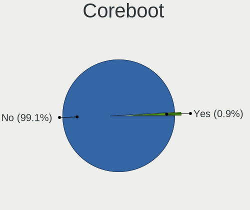
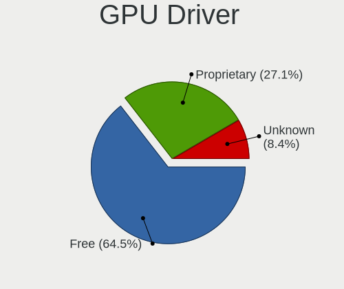

Manjaro - Hardware Trends
-------------------------

A project to identify most popular hardware characteristics and track their change
over time based on data collected by Linux users at https://Linux-Hardware.org.

Anyone can contribute to this report by the [hw-probe](https://github.com/linuxhw/hw-probe) tool:

    sudo -E hw-probe -all -upload

This is a report for all computer types. See also reports for [desktops](/Dist/Manjaro/Desktop/README.md) and [notebooks](/Dist/Manjaro/Notebook/README.md).

This report is for one last month. Overall report since the beginning of time: [TestDays](https://github.com/linuxhw/TestDays)

Period: Sep, 2023.

Contents
--------

* [ System ](#system)
  - [ OS                       ](#os)
  - [ OS Family                ](#os-family)
  - [ Kernel                   ](#kernel)
  - [ Kernel Family            ](#kernel-family)
  - [ Kernel Major Ver.        ](#kernel-major-ver)
  - [ Arch                     ](#arch)
  - [ DE                       ](#de)
  - [ Display Server           ](#display-server)
  - [ Display Manager          ](#display-manager)
  - [ OS Lang                  ](#os-lang)
  - [ Boot Mode                ](#boot-mode)
  - [ Filesystem               ](#filesystem)
  - [ Part. scheme             ](#part-scheme)
  - [ Dual Boot with Linux/BSD ](#dual-boot-with-linuxbsd)
  - [ Dual Boot (Win)          ](#dual-boot-win)

* [ Board ](#board)
  - [ Vendor                   ](#vendor)
  - [ Model                    ](#model)
  - [ Model Family             ](#model-family)
  - [ MFG Year                 ](#mfg-year)
  - [ Form Factor              ](#form-factor)
  - [ Secure Boot              ](#secure-boot)
  - [ Coreboot                 ](#coreboot)
  - [ RAM Size                 ](#ram-size)
  - [ RAM Used                 ](#ram-used)
  - [ Total Drives             ](#total-drives)
  - [ Has CD-ROM               ](#has-cd-rom)
  - [ Has Ethernet             ](#has-ethernet)
  - [ Has WiFi                 ](#has-wifi)
  - [ Has Bluetooth            ](#has-bluetooth)

* [ Location ](#location)
  - [ Country                  ](#country)
  - [ City                     ](#city)

* [ Drives ](#drives)
  - [ Drive Vendor             ](#drive-vendor)
  - [ Drive Model              ](#drive-model)
  - [ HDD Vendor               ](#hdd-vendor)
  - [ SSD Vendor               ](#ssd-vendor)
  - [ Drive Kind               ](#drive-kind)
  - [ Drive Connector          ](#drive-connector)
  - [ Drive Size               ](#drive-size)
  - [ Space Total              ](#space-total)
  - [ Space Used               ](#space-used)
  - [ Malfunc. Drives          ](#malfunc-drives)
  - [ Malfunc. Drive Vendor    ](#malfunc-drive-vendor)
  - [ Malfunc. HDD Vendor      ](#malfunc-hdd-vendor)
  - [ Malfunc. Drive Kind      ](#malfunc-drive-kind)
  - [ Failed Drives            ](#failed-drives)
  - [ Failed Drive Vendor      ](#failed-drive-vendor)
  - [ Drive Status             ](#drive-status)

* [ Storage controller ](#storage-controller)
  - [ Storage Vendor           ](#storage-vendor)
  - [ Storage Model            ](#storage-model)
  - [ Storage Kind             ](#storage-kind)

* [ Processor ](#processor)
  - [ CPU Vendor               ](#cpu-vendor)
  - [ CPU Model                ](#cpu-model)
  - [ CPU Model Family         ](#cpu-model-family)
  - [ CPU Cores                ](#cpu-cores)
  - [ CPU Sockets              ](#cpu-sockets)
  - [ CPU Threads              ](#cpu-threads)
  - [ CPU Op-Modes             ](#cpu-op-modes)
  - [ CPU Microcode            ](#cpu-microcode)
  - [ CPU Microarch            ](#cpu-microarch)

* [ Graphics ](#graphics)
  - [ GPU Vendor               ](#gpu-vendor)
  - [ GPU Model                ](#gpu-model)
  - [ GPU Combo                ](#gpu-combo)
  - [ GPU Driver               ](#gpu-driver)
  - [ GPU Memory               ](#gpu-memory)

* [ Monitor ](#monitor)
  - [ Monitor Vendor           ](#monitor-vendor)
  - [ Monitor Model            ](#monitor-model)
  - [ Monitor Resolution       ](#monitor-resolution)
  - [ Monitor Diagonal         ](#monitor-diagonal)
  - [ Monitor Width            ](#monitor-width)
  - [ Aspect Ratio             ](#aspect-ratio)
  - [ Monitor Area             ](#monitor-area)
  - [ Pixel Density            ](#pixel-density)
  - [ Multiple Monitors        ](#multiple-monitors)

* [ Network ](#network)
  - [ Net Controller Vendor    ](#net-controller-vendor)
  - [ Net Controller Model     ](#net-controller-model)
  - [ Wireless Vendor          ](#wireless-vendor)
  - [ Wireless Model           ](#wireless-model)
  - [ Ethernet Vendor          ](#ethernet-vendor)
  - [ Ethernet Model           ](#ethernet-model)
  - [ Net Controller Kind      ](#net-controller-kind)
  - [ Used Controller          ](#used-controller)
  - [ NICs                     ](#nics)
  - [ IPv6                     ](#ipv6)

* [ Bluetooth ](#bluetooth)
  - [ Bluetooth Vendor         ](#bluetooth-vendor)
  - [ Bluetooth Model          ](#bluetooth-model)

* [ Sound ](#sound)
  - [ Sound Vendor             ](#sound-vendor)
  - [ Sound Model              ](#sound-model)

* [ Memory ](#memory)
  - [ Memory Vendor            ](#memory-vendor)
  - [ Memory Model             ](#memory-model)
  - [ Memory Kind              ](#memory-kind)
  - [ Memory Form Factor       ](#memory-form-factor)
  - [ Memory Size              ](#memory-size)
  - [ Memory Speed             ](#memory-speed)

* [ Printers & scanners ](#printers--scanners)
  - [ Printer Vendor           ](#printer-vendor)
  - [ Printer Model            ](#printer-model)
  - [ Scanner Vendor           ](#scanner-vendor)
  - [ Scanner Model            ](#scanner-model)

* [ Camera ](#camera)
  - [ Camera Vendor            ](#camera-vendor)
  - [ Camera Model             ](#camera-model)

* [ Security ](#security)
  - [ Fingerprint Vendor       ](#fingerprint-vendor)
  - [ Fingerprint Model        ](#fingerprint-model)
  - [ Chipcard Vendor          ](#chipcard-vendor)
  - [ Chipcard Model           ](#chipcard-model)

* [ Unsupported ](#unsupported)
  - [ Unsupported Devices      ](#unsupported-devices)
  - [ Unsupported Device Types ](#unsupported-device-types)

System
------

OS
--

Installed operating systems

| Name           | Computers | Percent |
|----------------|-----------|---------|
| Manjaro        | 72        | 52.94%  |
| Manjaro 23.0.0 | 26        | 19.12%  |
| Manjaro 23.0.2 | 18        | 13.24%  |
| Manjaro 23.0.1 | 17        | 12.5%   |
| Manjaro 23.0   | 2         | 1.47%   |
| Manjaro 18.0   | 1         | 0.74%   |

OS Family
---------

OS without a version

| Name    | Computers | Percent |
|---------|-----------|---------|
| Manjaro | 136       | 100%    |

Kernel
------

Version of the Linux kernel

| Version                | Computers | Percent |
|------------------------|-----------|---------|
| 6.5.3-1-MANJARO        | 26        | 19.12%  |
| 6.5.1-1-MANJARO        | 21        | 15.44%  |
| 6.5.0-1-MANJARO        | 17        | 12.5%   |
| 6.1.49-1-MANJARO       | 14        | 10.29%  |
| 6.1.53-1-MANJARO       | 13        | 9.56%   |
| 6.1.51-1-MANJARO       | 12        | 8.82%   |
| 6.4.12-1-MANJARO       | 4         | 2.94%   |
| 5.15.128-1-MANJARO     | 4         | 2.94%   |
| 6.1.44-1-MANJARO       | 3         | 2.21%   |
| 6.6.0-1-MANJARO        | 2         | 1.47%   |
| 6.4.6-3-rt8-MANJARO    | 2         | 1.47%   |
| 6.1.38-1-MANJARO       | 2         | 1.47%   |
| 6.1.30-1-MANJARO       | 2         | 1.47%   |
| 5.15.131-1-MANJARO     | 2         | 1.47%   |
| 6.5.3-lqx1-1-lqx       | 1         | 0.74%   |
| 6.5.2-1-MANJARO        | 1         | 0.74%   |
| 6.5.0-1-rt6-MANJARO    | 1         | 0.74%   |
| 6.4.12-zen1-1-zen      | 1         | 0.74%   |
| 6.4.12-arch1-1-surface | 1         | 0.74%   |
| 6.3.13-1-MANJARO       | 1         | 0.74%   |
| 6.0.19-4-MANJARO       | 1         | 0.74%   |
| 5.15.130-1-MANJARO     | 1         | 0.74%   |
| 5.15.125-1-MANJARO     | 1         | 0.74%   |
| 5.15.114-2-MANJARO     | 1         | 0.74%   |
| 5.13.19-2-MANJARO      | 1         | 0.74%   |
| 4.19.0-3-MANJARO       | 1         | 0.74%   |

Kernel Family
-------------

Linux kernel without a distro release

| Version  | Computers | Percent |
|----------|-----------|---------|
| 6.5.3    | 27        | 19.85%  |
| 6.5.1    | 21        | 15.44%  |
| 6.5.0    | 18        | 13.24%  |
| 6.1.49   | 14        | 10.29%  |
| 6.1.53   | 13        | 9.56%   |
| 6.1.51   | 12        | 8.82%   |
| 6.4.12   | 6         | 4.41%   |
| 5.15.128 | 4         | 2.94%   |
| 6.1.44   | 3         | 2.21%   |
| 6.6.0    | 2         | 1.47%   |
| 6.4.6    | 2         | 1.47%   |
| 6.1.38   | 2         | 1.47%   |
| 6.1.30   | 2         | 1.47%   |
| 5.15.131 | 2         | 1.47%   |
| 6.5.2    | 1         | 0.74%   |
| 6.3.13   | 1         | 0.74%   |
| 6.0.19   | 1         | 0.74%   |
| 5.15.130 | 1         | 0.74%   |
| 5.15.125 | 1         | 0.74%   |
| 5.15.114 | 1         | 0.74%   |
| 5.13.19  | 1         | 0.74%   |
| 4.19.0   | 1         | 0.74%   |

Kernel Major Ver.
-----------------

Linux kernel major version

| Version | Computers | Percent |
|---------|-----------|---------|
| 6.5     | 67        | 49.26%  |
| 6.1     | 46        | 33.82%  |
| 5.15    | 9         | 6.62%   |
| 6.4     | 8         | 5.88%   |
| 6.6     | 2         | 1.47%   |
| 6.3     | 1         | 0.74%   |
| 6.0     | 1         | 0.74%   |
| 5.13    | 1         | 0.74%   |
| 4.19    | 1         | 0.74%   |

Arch
----

OS architecture (x86_64, i586, etc.)

| Name   | Computers | Percent |
|--------|-----------|---------|
| x86_64 | 136       | 100%    |

DE
--

Desktop Environment

| Name       | Computers | Percent |
|------------|-----------|---------|
| KDE5       | 78        | 57.35%  |
| GNOME      | 25        | 18.38%  |
| XFCE       | 20        | 14.71%  |
| KDE        | 4         | 2.94%   |
| i3         | 2         | 1.47%   |
| Unknown    | 2         | 1.47%   |
| X-Cinnamon | 1         | 0.74%   |
| sway       | 1         | 0.74%   |
| qtile      | 1         | 0.74%   |
| Hyprland   | 1         | 0.74%   |
| Cinnamon   | 1         | 0.74%   |

Display Server
--------------

X11 or Wayland

| Name    | Computers | Percent |
|---------|-----------|---------|
| X11     | 100       | 73.53%  |
| Wayland | 34        | 25%     |
| Unknown | 2         | 1.47%   |

Display Manager
---------------

SDDM, LightDM, etc.

| Name    | Computers | Percent |
|---------|-----------|---------|
| Unknown | 72        | 52.94%  |
| SDDM    | 32        | 23.53%  |
| LightDM | 21        | 15.44%  |
| GDM     | 10        | 7.35%   |
| GREETD  | 1         | 0.74%   |

OS Lang
-------

Language

| Lang    | Computers | Percent |
|---------|-----------|---------|
| en_US   | 49        | 36.03%  |
| de_DE   | 17        | 12.5%   |
| en_GB   | 12        | 8.82%   |
| ru_RU   | 10        | 7.35%   |
| pt_BR   | 10        | 7.35%   |
| fr_FR   | 7         | 5.15%   |
| it_IT   | 6         | 4.41%   |
| pl_PL   | 4         | 2.94%   |
| en_CA   | 3         | 2.21%   |
| de_CH   | 3         | 2.21%   |
| Unknown | 2         | 1.47%   |
| zh_TW   | 1         | 0.74%   |
| zh_CN   | 1         | 0.74%   |
| sk_SK   | 1         | 0.74%   |
| pt_PT   | 1         | 0.74%   |
| nb_NO   | 1         | 0.74%   |
| id_ID   | 1         | 0.74%   |
| es_ES   | 1         | 0.74%   |
| es_CU   | 1         | 0.74%   |
| es_CO   | 1         | 0.74%   |
| es_CL   | 1         | 0.74%   |
| es_AR   | 1         | 0.74%   |
| en_IN   | 1         | 0.74%   |
| el_GR   | 1         | 0.74%   |

Boot Mode
---------

EFI or BIOS

| Mode | Computers | Percent |
|------|-----------|---------|
| BIOS | 85        | 62.5%   |
| EFI  | 51        | 37.5%   |

Filesystem
----------

Type of filesystem

| Type    | Computers | Percent |
|---------|-----------|---------|
| Ext4    | 105       | 77.21%  |
| Btrfs   | 21        | 15.44%  |
| Tmpfs   | 8         | 5.88%   |
| Overlay | 1         | 0.74%   |
| F2fs    | 1         | 0.74%   |

Part. scheme
------------

Scheme of partitioning

| Type    | Computers | Percent |
|---------|-----------|---------|
| Unknown | 67        | 49.26%  |
| GPT     | 60        | 44.12%  |
| MBR     | 9         | 6.62%   |

Dual Boot with Linux/BSD
------------------------

Hosting more than one Linux/BSD

| Dual boot | Computers | Percent |
|-----------|-----------|---------|
| No        | 124       | 91.18%  |
| Yes       | 12        | 8.82%   |

Dual Boot (Win)
---------------

Hosting Linux and Windows

| Dual boot | Computers | Percent |
|-----------|-----------|---------|
| No        | 107       | 78.68%  |
| Yes       | 29        | 21.32%  |

Board
-----

Vendor
------

Motherboard manufacturer

| Name                                 | Computers | Percent |
|--------------------------------------|-----------|---------|
| Lenovo                               | 26        | 19.12%  |
| Hewlett-Packard                      | 26        | 19.12%  |
| ASUSTek Computer                     | 16        | 11.76%  |
| MSI                                  | 15        | 11.03%  |
| Gigabyte Technology                  | 10        | 7.35%   |
| Dell                                 | 9         | 6.62%   |
| ASRock                               | 8         | 5.88%   |
| Acer                                 | 6         | 4.41%   |
| HUAWEI                               | 3         | 2.21%   |
| Microsoft                            | 2         | 1.47%   |
| Google                               | 2         | 1.47%   |
| Chuwi                                | 2         | 1.47%   |
| Biostar                              | 2         | 1.47%   |
| TUXEDO                               | 1         | 0.74%   |
| Toshiba                              | 1         | 0.74%   |
| Timi                                 | 1         | 0.74%   |
| Shenzhen Meigao Electronic Equipment | 1         | 0.74%   |
| Notebook                             | 1         | 0.74%   |
| HONOR                                | 1         | 0.74%   |
| Fujitsu                              | 1         | 0.74%   |
| Foxconn                              | 1         | 0.74%   |
| Apple                                | 1         | 0.74%   |

Model
-----

Motherboard model

| Name                                       | Computers | Percent |
|--------------------------------------------|-----------|---------|
| HUAWEI HKD-WXX                             | 2         | 1.47%   |
| ASUS ROG STRIX B550-F GAMING               | 2         | 1.47%   |
| ASRock A320M-HD                            | 2         | 1.47%   |
| TUXEDO Stellaris Intel Gen4                | 1         | 0.74%   |
| Toshiba Satellite M645                     | 1         | 0.74%   |
| Timi Redmi Book Pro 14 2022                | 1         | 0.74%   |
| Shenzhen Meigao Electronic Equipment F7BSC | 1         | 0.74%   |
| Notebook NK50S5_SZ                         | 1         | 0.74%   |
| MSI PRO ADL-U Cubi 5 (MS-B0A8)             | 1         | 0.74%   |
| MSI Prestige 14Evo A12M                    | 1         | 0.74%   |
| MSI MS-7D45                                | 1         | 0.74%   |
| MSI MS-7D20                                | 1         | 0.74%   |
| MSI MS-7C95                                | 1         | 0.74%   |
| MSI MS-7C94                                | 1         | 0.74%   |
| MSI MS-7C91                                | 1         | 0.74%   |
| MSI MS-7C56                                | 1         | 0.74%   |
| MSI MS-7C02                                | 1         | 0.74%   |
| MSI MS-7B19                                | 1         | 0.74%   |
| MSI MS-7A38                                | 1         | 0.74%   |
| MSI MS-7918                                | 1         | 0.74%   |
| MSI Modern 15 B7M                          | 1         | 0.74%   |
| MSI GP75 Leopard 10SEK                     | 1         | 0.74%   |
| MSI Elite 7100 Microtower PC               | 1         | 0.74%   |
| Microsoft Surface Pro 4                    | 1         | 0.74%   |
| Microsoft Surface Pro 2                    | 1         | 0.74%   |
| Lenovo Yoga Slim 7 14ITL05 82A3            | 1         | 0.74%   |
| Lenovo Yoga 7 16ARP8 83BS                  | 1         | 0.74%   |
| Lenovo V15 G2 IJL 82QY                     | 1         | 0.74%   |
| Lenovo ThinkPad Yoga 460 20ELS0C100        | 1         | 0.74%   |
| Lenovo ThinkPad X260 20F60097US            | 1         | 0.74%   |
| Lenovo ThinkPad W540 20BG0016US            | 1         | 0.74%   |
| Lenovo ThinkPad T450 20BUS0H200            | 1         | 0.74%   |
| Lenovo ThinkPad T430 2349KQ3               | 1         | 0.74%   |
| Lenovo ThinkPad T14 Gen 1 20UES2WB00       | 1         | 0.74%   |
| Lenovo ThinkPad P15 Gen 1 20STS02D00       | 1         | 0.74%   |
| Lenovo ThinkPad E560 20EV002FUS            | 1         | 0.74%   |
| Lenovo ThinkCentre M93p 10AB0030US         | 1         | 0.74%   |
| Lenovo ThinkCentre M920x 10S0S0FU00        | 1         | 0.74%   |
| Lenovo ThinkCentre M75n 11G5S0F000         | 1         | 0.74%   |
| Lenovo ThinkCentre M58e 7303AZ2            | 1         | 0.74%   |

Model Family
------------

Motherboard model prefix

| Name                                       | Computers | Percent |
|--------------------------------------------|-----------|---------|
| Lenovo ThinkPad                            | 8         | 5.88%   |
| Lenovo IdeaPad                             | 6         | 4.41%   |
| ASUS ROG                                   | 6         | 4.41%   |
| Lenovo ThinkCentre                         | 4         | 2.94%   |
| HP EliteBook                               | 4         | 2.94%   |
| HP Compaq                                  | 4         | 2.94%   |
| Acer Aspire                                | 4         | 2.94%   |
| HP Laptop                                  | 3         | 2.21%   |
| Microsoft Surface                          | 2         | 1.47%   |
| Lenovo Yoga                                | 2         | 1.47%   |
| Lenovo Legion                              | 2         | 1.47%   |
| HUAWEI HKD-WXX                             | 2         | 1.47%   |
| HP OMEN                                    | 2         | 1.47%   |
| HP ENVY                                    | 2         | 1.47%   |
| HP EliteDesk                               | 2         | 1.47%   |
| HP 250                                     | 2         | 1.47%   |
| Gigabyte B550                              | 2         | 1.47%   |
| Gigabyte B450M                             | 2         | 1.47%   |
| Dell Precision                             | 2         | 1.47%   |
| Dell OptiPlex                              | 2         | 1.47%   |
| Dell Latitude                              | 2         | 1.47%   |
| Dell Inspiron                              | 2         | 1.47%   |
| ASUS VivoBook                              | 2         | 1.47%   |
| ASRock A320M-HD                            | 2         | 1.47%   |
| Acer Nitro                                 | 2         | 1.47%   |
| TUXEDO Stellaris                           | 1         | 0.74%   |
| Toshiba Satellite                          | 1         | 0.74%   |
| Timi Redmi                                 | 1         | 0.74%   |
| Shenzhen Meigao Electronic Equipment F7BSC | 1         | 0.74%   |
| Notebook NK50S5                            | 1         | 0.74%   |
| MSI PRO                                    | 1         | 0.74%   |
| MSI Prestige                               | 1         | 0.74%   |
| MSI MS-7D45                                | 1         | 0.74%   |
| MSI MS-7D20                                | 1         | 0.74%   |
| MSI MS-7C95                                | 1         | 0.74%   |
| MSI MS-7C94                                | 1         | 0.74%   |
| MSI MS-7C91                                | 1         | 0.74%   |
| MSI MS-7C56                                | 1         | 0.74%   |
| MSI MS-7C02                                | 1         | 0.74%   |
| MSI MS-7B19                                | 1         | 0.74%   |

MFG Year
--------

Motherboard manufacture year

| Year | Computers | Percent |
|------|-----------|---------|
| 2020 | 24        | 17.65%  |
| 2021 | 18        | 13.24%  |
| 2022 | 17        | 12.5%   |
| 2018 | 14        | 10.29%  |
| 2012 | 10        | 7.35%   |
| 2023 | 9         | 6.62%   |
| 2019 | 8         | 5.88%   |
| 2016 | 6         | 4.41%   |
| 2014 | 6         | 4.41%   |
| 2015 | 5         | 3.68%   |
| 2013 | 5         | 3.68%   |
| 2010 | 4         | 2.94%   |
| 2009 | 4         | 2.94%   |
| 2017 | 3         | 2.21%   |
| 2011 | 1         | 0.74%   |
| 2007 | 1         | 0.74%   |
| 2006 | 1         | 0.74%   |

Form Factor
-----------

Physical design of the computer

| Name        | Computers | Percent |
|-------------|-----------|---------|
| Notebook    | 68        | 50%     |
| Desktop     | 59        | 43.38%  |
| Convertible | 5         | 3.68%   |
| Tablet      | 2         | 1.47%   |
| Mini pc     | 2         | 1.47%   |

Secure Boot
-----------

Enabled or disabled

| State    | Computers | Percent |
|----------|-----------|---------|
| Disabled | 136       | 100%    |

Coreboot
--------

Have coreboot on board

| Used | Computers | Percent |
|------|-----------|---------|
| No   | 134       | 98.53%  |
| Yes  | 2         | 1.47%   |

RAM Size
--------

Total RAM memory

| Size in GB  | Computers | Percent |
|-------------|-----------|---------|
| 16.01-24.0  | 34        | 25%     |
| 4.01-8.0    | 31        | 22.79%  |
| 8.01-16.0   | 30        | 22.06%  |
| 32.01-64.0  | 28        | 20.59%  |
| 3.01-4.0    | 7         | 5.15%   |
| 24.01-32.0  | 4         | 2.94%   |
| 64.01-256.0 | 1         | 0.74%   |
| 1.01-2.0    | 1         | 0.74%   |

RAM Used
--------

Used RAM memory

| Used GB    | Computers | Percent |
|------------|-----------|---------|
| 4.01-8.0   | 50        | 36.76%  |
| 3.01-4.0   | 27        | 19.85%  |
| 2.01-3.0   | 24        | 17.65%  |
| 1.01-2.0   | 16        | 11.76%  |
| 8.01-16.0  | 15        | 11.03%  |
| 16.01-24.0 | 3         | 2.21%   |
| 0.51-1.0   | 1         | 0.74%   |

Total Drives
------------

Number of drives on board

| Drives | Computers | Percent |
|--------|-----------|---------|
| 1      | 76        | 55.88%  |
| 2      | 35        | 25.74%  |
| 3      | 10        | 7.35%   |
| 4      | 7         | 5.15%   |
| 5      | 5         | 3.68%   |
| 6      | 3         | 2.21%   |

Has CD-ROM
----------

Has CD-ROM on board

| Presented | Computers | Percent |
|-----------|-----------|---------|
| No        | 106       | 77.94%  |
| Yes       | 30        | 22.06%  |

Has Ethernet
------------

Has Ethernet on board

| Presented | Computers | Percent |
|-----------|-----------|---------|
| Yes       | 106       | 77.94%  |
| No        | 30        | 22.06%  |

Has WiFi
--------

Has WiFi module

| Presented | Computers | Percent |
|-----------|-----------|---------|
| Yes       | 104       | 76.47%  |
| No        | 32        | 23.53%  |

Has Bluetooth
-------------

Has Bluetooth module

| Presented | Computers | Percent |
|-----------|-----------|---------|
| Yes       | 96        | 70.59%  |
| No        | 40        | 29.41%  |

Location
--------

Country
-------

Geographic location (country)

| Country     | Computers | Percent |
|-------------|-----------|---------|
| USA         | 22        | 16.18%  |
| Germany     | 18        | 13.24%  |
| Russia      | 14        | 10.29%  |
| Brazil      | 10        | 7.35%   |
| France      | 8         | 5.88%   |
| UK          | 7         | 5.15%   |
| Switzerland | 5         | 3.68%   |
| Italy       | 5         | 3.68%   |
| Poland      | 4         | 2.94%   |
| Netherlands | 4         | 2.94%   |
| Bulgaria    | 4         | 2.94%   |
| Sweden      | 3         | 2.21%   |
| Portugal    | 3         | 2.21%   |
| Czechia     | 3         | 2.21%   |
| Canada      | 3         | 2.21%   |
| Greece      | 2         | 1.47%   |
| China       | 2         | 1.47%   |
| Taiwan      | 1         | 0.74%   |
| Spain       | 1         | 0.74%   |
| Slovakia    | 1         | 0.74%   |
| Singapore   | 1         | 0.74%   |
| Serbia      | 1         | 0.74%   |
| Norway      | 1         | 0.74%   |
| Lithuania   | 1         | 0.74%   |
| Latvia      | 1         | 0.74%   |
| Kazakhstan  | 1         | 0.74%   |
| Iran        | 1         | 0.74%   |
| Indonesia   | 1         | 0.74%   |
| India       | 1         | 0.74%   |
| Georgia     | 1         | 0.74%   |
| Denmark     | 1         | 0.74%   |
| Cuba        | 1         | 0.74%   |
| Colombia    | 1         | 0.74%   |
| Chile       | 1         | 0.74%   |
| Bangladesh  | 1         | 0.74%   |
| Argentina   | 1         | 0.74%   |

City
----

Geographic location (city)

| City                  | Computers | Percent |
|-----------------------|-----------|---------|
| Paris                 | 5         | 3.68%   |
| Zurich                | 2         | 1.47%   |
| St Petersburg         | 2         | 1.47%   |
| Sofia                 | 2         | 1.47%   |
| Shanghai              | 2         | 1.47%   |
| Novosibirsk           | 2         | 1.47%   |
| Moscow                | 2         | 1.47%   |
| Amsterdam             | 2         | 1.47%   |
| Alexandria            | 2         | 1.47%   |
| Zagorz                | 1         | 0.74%   |
| Wegberg               | 1         | 0.74%   |
| Volos                 | 1         | 0.74%   |
| Varna                 | 1         | 0.74%   |
| Ulyanovsk             | 1         | 0.74%   |
| Ulm                   | 1         | 0.74%   |
| Troisdorf             | 1         | 0.74%   |
| Trenton               | 1         | 0.74%   |
| Toffen                | 1         | 0.74%   |
| Tiranges              | 1         | 0.74%   |
| Tikhoretsk            | 1         | 0.74%   |
| Thun                  | 1         | 0.74%   |
| Thisted               | 1         | 0.74%   |
| Tehran                | 1         | 0.74%   |
| Tbilisi               | 1         | 0.74%   |
| Tampa                 | 1         | 0.74%   |
| Taitung               | 1         | 0.74%   |
| Stuttgart             | 1         | 0.74%   |
| Stockholm             | 1         | 0.74%   |
| Sparks                | 1         | 0.74%   |
| Singapore             | 1         | 0.74%   |
| Siegen                | 1         | 0.74%   |
| Sidzina               | 1         | 0.74%   |
| Seattle               | 1         | 0.74%   |
| Schwelm               | 1         | 0.74%   |
| Sao Luís             | 1         | 0.74%   |
| Santo André          | 1         | 0.74%   |
| Santiago de Cali      | 1         | 0.74%   |
| Santa Rita do Sapucai | 1         | 0.74%   |
| Ronkonkoma            | 1         | 0.74%   |
| Rome                  | 1         | 0.74%   |

Drives
------

Drive Vendor
------------

Hard drive vendors

| Vendor                         | Computers | Drives | Percent |
|--------------------------------|-----------|--------|---------|
| Samsung Electronics            | 51        | 58     | 23.39%  |
| Seagate                        | 24        | 30     | 11.01%  |
| SanDisk                        | 23        | 25     | 10.55%  |
| WDC                            | 20        | 25     | 9.17%   |
| Toshiba                        | 11        | 13     | 5.05%   |
| Kingston                       | 11        | 11     | 5.05%   |
| SK hynix                       | 10        | 10     | 4.59%   |
| Unknown                        | 7         | 8      | 3.21%   |
| Crucial                        | 7         | 7      | 3.21%   |
| Phison Electronics             | 5         | 8      | 2.29%   |
| Micron Technology              | 4         | 4      | 1.83%   |
| Kingston Technology Company    | 4         | 4      | 1.83%   |
| China                          | 4         | 5      | 1.83%   |
| Fujitsu                        | 3         | 3      | 1.38%   |
| WALRAM                         | 2         | 2      | 0.92%   |
| Micron/Crucial Technology      | 2         | 2      | 0.92%   |
| KIOXIA                         | 2         | 2      | 0.92%   |
| HGST                           | 2         | 2      | 0.92%   |
| XrayDisk                       | 1         | 1      | 0.46%   |
| Union Memory (Shenzhen)        | 1         | 1      | 0.46%   |
| SPCC Sol                       | 1         | 1      | 0.46%   |
| SPCC                           | 1         | 1      | 0.46%   |
| Solid State Storage Technology | 1         | 1      | 0.46%   |
| Solid State Storage            | 1         | 1      | 0.46%   |
| Silicon Motion                 | 1         | 1      | 0.46%   |
| Shenzhen Longsys Electronics   | 1         | 1      | 0.46%   |
| Realtek Semiconductor          | 1         | 1      | 0.46%   |
| Ramos Technology               | 1         | 2      | 0.46%   |
| PNY                            | 1         | 1      | 0.46%   |
| Phison                         | 1         | 1      | 0.46%   |
| Patriot                        | 1         | 1      | 0.46%   |
| Netac                          | 1         | 1      | 0.46%   |
| MAXIO Technology (Hangzhou)    | 1         | 1      | 0.46%   |
| Lenovo                         | 1         | 1      | 0.46%   |
| KingFast                       | 1         | 1      | 0.46%   |
| Intenso                        | 1         | 1      | 0.46%   |
| Intel                          | 1         | 1      | 0.46%   |
| IB-377U3                       | 1         | 1      | 0.46%   |
| Hitachi                        | 1         | 1      | 0.46%   |
| GOODRAM                        | 1         | 1      | 0.46%   |

Drive Model
-----------

Hard drive models

| Model                                               | Computers | Percent |
|-----------------------------------------------------|-----------|---------|
| Samsung NVMe SSD Controller SM981/PM981/PM983 256GB | 14        | 5.79%   |
| Samsung NVMe SSD Controller PM9A1/PM9A3/980PRO 1TB  | 7         | 2.89%   |
| Sandisk WD Blue SN550 NVMe SSD 512GB                | 5         | 2.07%   |
| Seagate ST1000DM003-9YN162 1TB                      | 3         | 1.24%   |
| Sandisk WD Black SN750 / PC SN730 NVMe SSD 512GB    | 3         | 1.24%   |
| Samsung SSD 980 1TB                                 | 3         | 1.24%   |
| Samsung SSD 860 EVO 500GB                           | 3         | 1.24%   |
| Samsung NVMe SSD Controller SM961/PM961/SM963 500GB | 3         | 1.24%   |
| Kingston SA400S37480G 480GB SSD                     | 3         | 1.24%   |
| WDC WD10EZEX-08WN4A0 1TB                            | 2         | 0.83%   |
| Unknown NVMe SSD Drive 512GB                        | 2         | 0.83%   |
| SK hynix HFM512GD3JX013N 512GB                      | 2         | 0.83%   |
| Seagate ST31000524AS 1TB                            | 2         | 0.83%   |
| Seagate ST2000DM001-1ER164 2TB                      | 2         | 0.83%   |
| Seagate ST1000DM003-1ER162 1TB                      | 2         | 0.83%   |
| Sandisk WD Blue SN570 1TB                           | 2         | 0.83%   |
| SanDisk SDSSDA240G 240GB                            | 2         | 0.83%   |
| Samsung SSD 870 EVO 1TB                             | 2         | 0.83%   |
| Samsung MZ7LN256HCHP-000L7 256GB SSD                | 2         | 0.83%   |
| Samsung MZ7LN128HCHP-000L1 128GB SSD                | 2         | 0.83%   |
| Phison PS5013 E13 NVMe Controller 512GB             | 2         | 0.83%   |
| Kingston Company SNV2S1000G 1TB                     | 2         | 0.83%   |
| Kingston SV300S37A120G 120GB SSD                    | 2         | 0.83%   |
| Kingston SA400S37240G 240GB SSD                     | 2         | 0.83%   |
| Crucial CT240BX500SSD1 240GB                        | 2         | 0.83%   |
| XrayDisk 128GB SSD                                  | 1         | 0.41%   |
| WDC WDS500G2B0A-00SM50 500GB SSD                    | 1         | 0.41%   |
| WDC WDS500G1B0A-00H9H0 500GB SSD                    | 1         | 0.41%   |
| WDC WDS480G2G0A-00JH30 480GB SSD                    | 1         | 0.41%   |
| WDC WDS200T2B0A-00SM50 2TB SSD                      | 1         | 0.41%   |
| WDC WDS120G1G0A-00SS50 120GB SSD                    | 1         | 0.41%   |
| WDC WD6401AALS-00L3B2 640GB                         | 1         | 0.41%   |
| WDC WD5000LPVX-22V0TT0 500GB                        | 1         | 0.41%   |
| WDC WD5000BEVT-22A0RT0 500GB                        | 1         | 0.41%   |
| WDC WD5000BEVT-00SCST0 500GB                        | 1         | 0.41%   |
| WDC WD5000AAKX-60U6AA0 500GB                        | 1         | 0.41%   |
| WDC WD5000AAKX-08U6AA0 500GB                        | 1         | 0.41%   |
| WDC WD5000AAKX-00U6AA0 500GB                        | 1         | 0.41%   |
| WDC WD5000AAKX-001CA0 500GB                         | 1         | 0.41%   |
| WDC WD50 00AZLX-60K2TA0 500GB                       | 1         | 0.41%   |

HDD Vendor
----------

Hard disk drive vendors

| Vendor              | Computers | Drives | Percent |
|---------------------|-----------|--------|---------|
| Seagate             | 24        | 30     | 40%     |
| WDC                 | 17        | 20     | 28.33%  |
| Toshiba             | 10        | 11     | 16.67%  |
| Fujitsu             | 3         | 3      | 5%      |
| HGST                | 2         | 2      | 3.33%   |
| Samsung Electronics | 1         | 1      | 1.67%   |
| Intenso             | 1         | 1      | 1.67%   |
| IB-377U3            | 1         | 1      | 1.67%   |
| Hitachi             | 1         | 1      | 1.67%   |

SSD Vendor
----------

Solid state drive vendors

| Vendor              | Computers | Drives | Percent |
|---------------------|-----------|--------|---------|
| Samsung Electronics | 21        | 23     | 30.43%  |
| SanDisk             | 9         | 10     | 13.04%  |
| Kingston            | 9         | 9      | 13.04%  |
| Crucial             | 7         | 7      | 10.14%  |
| WDC                 | 5         | 5      | 7.25%   |
| China               | 4         | 5      | 5.8%    |
| XrayDisk            | 1         | 1      | 1.45%   |
| WALRAM              | 1         | 1      | 1.45%   |
| Toshiba             | 1         | 1      | 1.45%   |
| SPCC Sol            | 1         | 1      | 1.45%   |
| SPCC                | 1         | 1      | 1.45%   |
| SK hynix            | 1         | 1      | 1.45%   |
| Ramos Technology    | 1         | 2      | 1.45%   |
| PNY                 | 1         | 1      | 1.45%   |
| Patriot             | 1         | 1      | 1.45%   |
| Micron Technology   | 1         | 1      | 1.45%   |
| GOODRAM             | 1         | 1      | 1.45%   |
| Gigabyte Technology | 1         | 1      | 1.45%   |
| Drevo               | 1         | 1      | 1.45%   |
| A-DATA Technology   | 1         | 1      | 1.45%   |

Drive Kind
----------

HDD or SSD

| Kind    | Computers | Drives | Percent |
|---------|-----------|--------|---------|
| NVMe    | 82        | 94     | 43.39%  |
| SSD     | 56        | 74     | 29.63%  |
| HDD     | 44        | 70     | 23.28%  |
| MMC     | 4         | 4      | 2.12%   |
| Unknown | 3         | 4      | 1.59%   |

Drive Connector
---------------

SATA, SAS, NVMe, etc.

| Type | Computers | Drives | Percent |
|------|-----------|--------|---------|
| NVMe | 82        | 94     | 46.59%  |
| SATA | 80        | 136    | 45.45%  |
| SAS  | 10        | 12     | 5.68%   |
| MMC  | 4         | 4      | 2.27%   |

Drive Size
----------

Size of hard drive

| Size in TB | Computers | Drives | Percent |
|------------|-----------|--------|---------|
| 0.01-0.5   | 61        | 85     | 53.98%  |
| 0.51-1.0   | 31        | 35     | 27.43%  |
| 1.01-2.0   | 13        | 15     | 11.5%   |
| 4.01-10.0  | 4         | 4      | 3.54%   |
| 2.01-3.0   | 2         | 2      | 1.77%   |
| 3.01-4.0   | 1         | 2      | 0.88%   |
| 10.01-20.0 | 1         | 1      | 0.88%   |

Space Total
-----------

Amount of disk space available on the file system

| Size in GB     | Computers | Percent |
|----------------|-----------|---------|
| 251-500        | 31        | 22.79%  |
| 101-250        | 30        | 22.06%  |
| 501-1000       | 22        | 16.18%  |
| 1001-2000      | 17        | 12.5%   |
| More than 3000 | 16        | 11.76%  |
| Unknown        | 13        | 9.56%   |
| 2001-3000      | 4         | 2.94%   |
| 21-50          | 1         | 0.74%   |
| 1-20           | 1         | 0.74%   |
| 51-100         | 1         | 0.74%   |

Space Used
----------

Amount of used disk space

| Used GB        | Computers | Percent |
|----------------|-----------|---------|
| 1-20           | 23        | 16.91%  |
| 251-500        | 21        | 15.44%  |
| 101-250        | 20        | 14.71%  |
| 21-50          | 16        | 11.76%  |
| Unknown        | 13        | 9.56%   |
| 51-100         | 12        | 8.82%   |
| 501-1000       | 11        | 8.09%   |
| 1001-2000      | 10        | 7.35%   |
| More than 3000 | 5         | 3.68%   |
| 2001-3000      | 5         | 3.68%   |

Malfunc. Drives
---------------

Drive models with a malfunction

| Model                                                     | Computers | Drives | Percent |
|-----------------------------------------------------------|-----------|--------|---------|
| Seagate ST1000DM003-9YN162 1TB                            | 2         | 2      | 18.18%  |
| WDC WD5000AAKX-001CA0 500GB                               | 1         | 1      | 9.09%   |
| SK hynix HFS256G3AMNB-2200A 256GB SSD                     | 1         | 1      | 9.09%   |
| SK hynix BC711 HFM512GD3JX013N 512GB                      | 1         | 1      | 9.09%   |
| Seagate ST2000DX001-1CM164 2TB                            | 1         | 1      | 9.09%   |
| Seagate ST1000VX000-1CU162 1TB                            | 1         | 1      | 9.09%   |
| Seagate ST10000VX0004-1ZE101 10TB                         | 1         | 1      | 9.09%   |
| Realtek Semiconductor RTS5763DL NVMe SSD Controller 256GB | 1         | 1      | 9.09%   |
| Micron Technology MTFDDAK256MAY-1AH1ZABHA 256GB SSD       | 1         | 1      | 9.09%   |
| China SSD 120GB                                           | 1         | 1      | 9.09%   |

Malfunc. Drive Vendor
---------------------

Vendors of faulty drives

| Vendor                | Computers | Drives | Percent |
|-----------------------|-----------|--------|---------|
| Seagate               | 4         | 5      | 40%     |
| SK hynix              | 2         | 2      | 20%     |
| WDC                   | 1         | 1      | 10%     |
| Realtek Semiconductor | 1         | 1      | 10%     |
| Micron Technology     | 1         | 1      | 10%     |
| China                 | 1         | 1      | 10%     |

Malfunc. HDD Vendor
-------------------

Vendors of faulty HDD drives

| Vendor  | Computers | Drives | Percent |
|---------|-----------|--------|---------|
| Seagate | 4         | 5      | 80%     |
| WDC     | 1         | 1      | 20%     |

Malfunc. Drive Kind
-------------------

Kinds of faulty drives

| Kind | Computers | Drives | Percent |
|------|-----------|--------|---------|
| HDD  | 5         | 6      | 50%     |
| SSD  | 3         | 3      | 30%     |
| NVMe | 2         | 2      | 20%     |

Failed Drives
-------------

Failed drive models

Zero info for selected period =(

Failed Drive Vendor
-------------------

Failed drive vendors

Zero info for selected period =(

Drive Status
------------

Number of failed and malfunc. drives

| Status   | Computers | Drives | Percent |
|----------|-----------|--------|---------|
| Detected | 90        | 156    | 61.64%  |
| Works    | 46        | 79     | 31.51%  |
| Malfunc  | 10        | 11     | 6.85%   |

Storage controller
------------------

Storage Vendor
--------------

Storage controller vendors

| Vendor                         | Computers | Percent |
|--------------------------------|-----------|---------|
| Intel                          | 67        | 33.84%  |
| AMD                            | 40        | 20.2%   |
| Samsung Electronics            | 31        | 15.66%  |
| SanDisk                        | 14        | 7.07%   |
| SK hynix                       | 9         | 4.55%   |
| Kingston Technology Company    | 6         | 3.03%   |
| Phison Electronics             | 5         | 2.53%   |
| Micron Technology              | 3         | 1.52%   |
| Solid State Storage Technology | 2         | 1.01%   |
| Micron/Crucial Technology      | 2         | 1.01%   |
| Marvell Technology Group       | 2         | 1.01%   |
| KIOXIA                         | 2         | 1.01%   |
| JMicron Technology             | 2         | 1.01%   |
| Unknown                        | 2         | 1.01%   |
| Union Memory (Shenzhen)        | 1         | 0.51%   |
| Toshiba America Info Systems   | 1         | 0.51%   |
| Silicon Motion                 | 1         | 0.51%   |
| Shenzhen Longsys Electronics   | 1         | 0.51%   |
| Realtek Semiconductor          | 1         | 0.51%   |
| Netac Technology               | 1         | 0.51%   |
| MAXIO Technology (Hangzhou)    | 1         | 0.51%   |
| Lenovo                         | 1         | 0.51%   |
| HighPoint Technologies         | 1         | 0.51%   |
| ASMedia Technology             | 1         | 0.51%   |
| ADATA Technology               | 1         | 0.51%   |

Storage Model
-------------

Storage controller models

| Model                                                                          | Computers | Percent |
|--------------------------------------------------------------------------------|-----------|---------|
| AMD FCH SATA Controller [AHCI mode]                                            | 25        | 11.16%  |
| Samsung NVMe SSD Controller SM981/PM981/PM983                                  | 14        | 6.25%   |
| AMD 500 Series Chipset SATA Controller                                         | 10        | 4.46%   |
| Samsung NVMe SSD Controller PM9A1/PM9A3/980PRO                                 | 8         | 3.57%   |
| Samsung NVMe SSD Controller 980                                                | 6         | 2.68%   |
| Intel Sunrise Point-LP SATA Controller [AHCI mode]                             | 6         | 2.68%   |
| AMD 400 Series Chipset SATA Controller                                         | 6         | 2.68%   |
| SanDisk WD Blue SN550 NVMe SSD                                                 | 5         | 2.23%   |
| AMD FCH SATA Controller D                                                      | 5         | 2.23%   |
| SK hynix Gold P31/BC711/PC711 NVMe Solid State Drive                           | 4         | 1.79%   |
| Intel Q170/Q150/B150/H170/H110/Z170/CM236 Chipset SATA Controller [AHCI Mode]  | 4         | 1.79%   |
| Intel 82801 Mobile SATA Controller [RAID mode]                                 | 4         | 1.79%   |
| Intel 8 Series/C220 Series Chipset Family 6-port SATA Controller 1 [AHCI mode] | 4         | 1.79%   |
| SanDisk WD Black SN750 / PC SN730 NVMe SSD                                     | 3         | 1.34%   |
| Samsung NVMe SSD Controller SM961/PM961/SM963                                  | 3         | 1.34%   |
| Intel Volume Management Device NVMe RAID Controller                            | 3         | 1.34%   |
| Intel NM10/ICH7 Family SATA Controller [IDE mode]                              | 3         | 1.34%   |
| Intel Jasper Lake SATA AHCI Controller                                         | 3         | 1.34%   |
| Intel Cannon Lake PCH SATA AHCI Controller                                     | 3         | 1.34%   |
| Intel Alder Lake-S PCH SATA Controller [AHCI Mode]                             | 3         | 1.34%   |
| Intel 82801G (ICH7 Family) IDE Controller                                      | 3         | 1.34%   |
| Intel 7 Series Chipset Family 6-port SATA Controller [AHCI mode]               | 3         | 1.34%   |
| Intel 400 Series Chipset Family SATA AHCI Controller                           | 3         | 1.34%   |
| SanDisk WD Blue SN570 NVMe SSD 1TB                                             | 2         | 0.89%   |
| Samsung NVMe SSD Controller PM9B1                                              | 2         | 0.89%   |
| Phison PS5013 E13 NVMe Controller                                              | 2         | 0.89%   |
| Marvell Group 88SE9172 SATA 6Gb/s Controller                                   | 2         | 0.89%   |
| Kingston Company Company Non-Volatile memory controller                        | 2         | 0.89%   |
| Intel Alder Lake-P SATA AHCI Controller                                        | 2         | 0.89%   |
| Intel 9 Series Chipset Family SATA Controller [AHCI Mode]                      | 2         | 0.89%   |
| Intel 8 Series SATA Controller 1 [AHCI mode]                                   | 2         | 0.89%   |
| Intel 5 Series/3400 Series Chipset 6 port SATA AHCI Controller                 | 2         | 0.89%   |
| AMD SB7x0/SB8x0/SB9x0 SATA Controller [AHCI mode]                              | 2         | 0.89%   |
| AMD SB7x0/SB8x0/SB9x0 IDE Controller                                           | 2         | 0.89%   |
| Unknown                                                                        | 2         | 0.89%   |
| Union Memory (Shenzhen) AM610 PCIe 3.0 NVMe SSD 128GB                          | 1         | 0.45%   |
| Toshiba America Info Systems XG3 NVMe SSD Controller                           | 1         | 0.45%   |
| Solid State Storage Non-Volatile memory controller                             | 1         | 0.45%   |
| Solid State Storage CL1-3D256-Q11 NVMe SSD M.2                                 | 1         | 0.45%   |
| SK hynix Platinum P41/PC801 NVMe Solid State Drive                             | 1         | 0.45%   |

Storage Kind
------------

Kind of storage controller (IDE, SATA, NVMe, SAS, ...)

| Kind | Computers | Percent |
|------|-----------|---------|
| SATA | 91        | 46.91%  |
| NVMe | 82        | 42.27%  |
| RAID | 11        | 5.67%   |
| IDE  | 10        | 5.15%   |

Processor
---------

CPU Vendor
----------

Processor vendors

| Vendor | Computers | Percent |
|--------|-----------|---------|
| Intel  | 80        | 58.82%  |
| AMD    | 56        | 41.18%  |

CPU Model
---------

Processor models

| Model                                       | Computers | Percent |
|---------------------------------------------|-----------|---------|
| Intel Core i5-6200U CPU @ 2.30GHz           | 4         | 2.94%   |
| AMD Ryzen 5 3600 6-Core Processor           | 4         | 2.94%   |
| Intel Core i7-4790 CPU @ 3.60GHz            | 3         | 2.21%   |
| Intel 12th Gen Core i7-12700H               | 3         | 2.21%   |
| AMD Ryzen 5 5500U with Radeon Graphics      | 3         | 2.21%   |
| Intel Core i7-3632QM CPU @ 2.20GHz          | 2         | 1.47%   |
| Intel Core i7-10750H CPU @ 2.60GHz          | 2         | 1.47%   |
| Intel Core 2 Quad CPU Q6600 @ 2.40GHz       | 2         | 1.47%   |
| Intel Celeron N5100 @ 1.10GHz               | 2         | 1.47%   |
| Intel Celeron N4020 CPU @ 1.10GHz           | 2         | 1.47%   |
| Intel 11th Gen Core i7-1165G7 @ 2.80GHz     | 2         | 1.47%   |
| Intel 11th Gen Core i7-11370H @ 3.30GHz     | 2         | 1.47%   |
| AMD Ryzen 7 5800X 8-Core Processor          | 2         | 1.47%   |
| AMD Ryzen 7 5800H with Radeon Graphics      | 2         | 1.47%   |
| AMD Ryzen 7 1700 Eight-Core Processor       | 2         | 1.47%   |
| AMD Ryzen 5 5600X 6-Core Processor          | 2         | 1.47%   |
| AMD Ryzen 5 5600H with Radeon Graphics      | 2         | 1.47%   |
| AMD Ryzen 5 5600G with Radeon Graphics      | 2         | 1.47%   |
| AMD Ryzen 5 1600 Six-Core Processor         | 2         | 1.47%   |
| AMD Ryzen 3 2200G with Radeon Vega Graphics | 2         | 1.47%   |
| AMD FX-6300 Six-Core Processor              | 2         | 1.47%   |
| Intel Xeon CPU E5-1620 v4 @ 3.50GHz         | 1         | 0.74%   |
| Intel Xeon CPU E3-1245 v3 @ 3.40GHz         | 1         | 0.74%   |
| Intel Pentium Silver N6000 @ 1.10GHz        | 1         | 0.74%   |
| Intel Pentium Gold G5400 CPU @ 3.70GHz      | 1         | 0.74%   |
| Intel Pentium Dual CPU T2390 @ 1.86GHz      | 1         | 0.74%   |
| Intel Pentium Dual CPU E2180 @ 2.00GHz      | 1         | 0.74%   |
| Intel Pentium CPU 5405U @ 2.30GHz           | 1         | 0.74%   |
| Intel Core i9-9900KF CPU @ 3.60GHz          | 1         | 0.74%   |
| Intel Core i7-9700K CPU @ 3.60GHz           | 1         | 0.74%   |
| Intel Core i7-8565U CPU @ 1.80GHz           | 1         | 0.74%   |
| Intel Core i7-6920HQ CPU @ 2.90GHz          | 1         | 0.74%   |
| Intel Core i7-6820HQ CPU @ 2.70GHz          | 1         | 0.74%   |
| Intel Core i7-6700HQ CPU @ 2.60GHz          | 1         | 0.74%   |
| Intel Core i7-6600U CPU @ 2.60GHz           | 1         | 0.74%   |
| Intel Core i7-4800MQ CPU @ 2.70GHz          | 1         | 0.74%   |
| Intel Core i7-4765T CPU @ 2.00GHz           | 1         | 0.74%   |
| Intel Core i7-3612QM CPU @ 2.10GHz          | 1         | 0.74%   |
| Intel Core i7-10610U CPU @ 1.80GHz          | 1         | 0.74%   |
| Intel Core i7-10510U CPU @ 1.80GHz          | 1         | 0.74%   |

CPU Model Family
----------------

Processor model prefix

| Model                | Computers | Percent |
|----------------------|-----------|---------|
| Intel Core i5        | 24        | 17.65%  |
| AMD Ryzen 5          | 23        | 16.91%  |
| Intel Core i7        | 18        | 13.24%  |
| Other                | 17        | 12.5%   |
| AMD Ryzen 7          | 15        | 11.03%  |
| Intel Celeron        | 7         | 5.15%   |
| AMD Ryzen 9          | 4         | 2.94%   |
| Intel Xeon           | 2         | 1.47%   |
| Intel Pentium Dual   | 2         | 1.47%   |
| Intel Core i3        | 2         | 1.47%   |
| Intel Core 2 Quad    | 2         | 1.47%   |
| AMD Ryzen 7 PRO      | 2         | 1.47%   |
| AMD Ryzen 5 PRO      | 2         | 1.47%   |
| AMD Ryzen 3          | 2         | 1.47%   |
| AMD FX               | 2         | 1.47%   |
| Intel Pentium Silver | 1         | 0.74%   |
| Intel Pentium Gold   | 1         | 0.74%   |
| Intel Pentium        | 1         | 0.74%   |
| Intel Core i9        | 1         | 0.74%   |
| Intel Core 2 Duo     | 1         | 0.74%   |
| Intel Atom           | 1         | 0.74%   |
| AMD Ryzen 3 PRO      | 1         | 0.74%   |
| AMD Phenom II X6     | 1         | 0.74%   |
| AMD Phenom II X2     | 1         | 0.74%   |
| AMD E1               | 1         | 0.74%   |
| AMD Athlon           | 1         | 0.74%   |
| AMD A8               | 1         | 0.74%   |

CPU Cores
---------

Number of processor cores

| Number | Computers | Percent |
|--------|-----------|---------|
| 4      | 44        | 32.35%  |
| 6      | 30        | 22.06%  |
| 2      | 28        | 20.59%  |
| 8      | 20        | 14.71%  |
| 14     | 6         | 4.41%   |
| 16     | 2         | 1.47%   |
| 10     | 2         | 1.47%   |
| 3      | 2         | 1.47%   |
| 24     | 1         | 0.74%   |
| 12     | 1         | 0.74%   |

CPU Sockets
-----------

Number of sockets

| Number | Computers | Percent |
|--------|-----------|---------|
| 1      | 136       | 100%    |

CPU Threads
-----------

Threads per core (Hyper-Threading)

| Number | Computers | Percent |
|--------|-----------|---------|
| 2      | 106       | 77.94%  |
| 1      | 30        | 22.06%  |

CPU Op-Modes
------------

CPU Operation Modes (32-bit, 64-bit)

| Op mode        | Computers | Percent |
|----------------|-----------|---------|
| 32-bit, 64-bit | 136       | 100%    |

CPU Microcode
-------------

Microcode number

| Number     | Computers | Percent |
|------------|-----------|---------|
| Unknown    | 97        | 71.32%  |
| 0x0a50000d | 3         | 2.21%   |
| 0x08600106 | 3         | 2.21%   |
| 0x806c1    | 2         | 1.47%   |
| 0x306c3    | 2         | 1.47%   |
| 0x0a201025 | 2         | 1.47%   |
| 0x08701021 | 2         | 1.47%   |
| 0x08608103 | 2         | 1.47%   |
| 0xa0653    | 1         | 0.74%   |
| 0x906ea    | 1         | 0.74%   |
| 0x906a3    | 1         | 0.74%   |
| 0x806ec    | 1         | 0.74%   |
| 0x806ea    | 1         | 0.74%   |
| 0x706a8    | 1         | 0.74%   |
| 0x6fd      | 1         | 0.74%   |
| 0x6fb      | 1         | 0.74%   |
| 0x506e3    | 1         | 0.74%   |
| 0x40651    | 1         | 0.74%   |
| 0x306d4    | 1         | 0.74%   |
| 0x0a704101 | 1         | 0.74%   |
| 0x0a50000c | 1         | 0.74%   |
| 0x0a404101 | 1         | 0.74%   |
| 0x0a201016 | 1         | 0.74%   |
| 0x08701030 | 1         | 0.74%   |
| 0x08600103 | 1         | 0.74%   |
| 0x08101016 | 1         | 0.74%   |
| 0x0800820d | 1         | 0.74%   |
| 0x08001126 | 1         | 0.74%   |
| 0x07030104 | 1         | 0.74%   |
| 0x06000852 | 1         | 0.74%   |
| 0x010000dc | 1         | 0.74%   |

CPU Microarch
-------------

Microarchitecture

| Name             | Computers | Percent |
|------------------|-----------|---------|
| Unknown          | 18        | 13.24%  |
| Zen 3            | 15        | 11.03%  |
| Zen 2            | 11        | 8.09%   |
| KabyLake         | 11        | 8.09%   |
| Skylake          | 10        | 7.35%   |
| Haswell          | 10        | 7.35%   |
| Zen              | 8         | 5.88%   |
| IvyBridge        | 7         | 5.15%   |
| Zen+             | 6         | 4.41%   |
| TigerLake        | 5         | 3.68%   |
| CometLake        | 5         | 3.68%   |
| Core             | 4         | 2.94%   |
| Alderlake Hybrid | 4         | 2.94%   |
| Tremont          | 3         | 2.21%   |
| Westmere         | 2         | 1.47%   |
| Piledriver       | 2         | 1.47%   |
| Penryn           | 2         | 1.47%   |
| K10              | 2         | 1.47%   |
| Icelake          | 2         | 1.47%   |
| Goldmont plus    | 2         | 1.47%   |
| Broadwell        | 2         | 1.47%   |
| Silvermont       | 1         | 0.74%   |
| SandyBridge      | 1         | 0.74%   |
| Puma             | 1         | 0.74%   |
| Jaguar           | 1         | 0.74%   |
| Goldmont         | 1         | 0.74%   |

Graphics
--------

GPU Vendor
----------

Vendors of graphics cards

| Vendor | Computers | Percent |
|--------|-----------|---------|
| Intel  | 65        | 40.63%  |
| Nvidia | 52        | 32.5%   |
| AMD    | 43        | 26.88%  |

GPU Model
---------

Graphics card models

| Model                                                                       | Computers | Percent |
|-----------------------------------------------------------------------------|-----------|---------|
| AMD Cezanne [Radeon Vega Series / Radeon Vega Mobile Series]                | 8         | 4.94%   |
| Intel Skylake GT2 [HD Graphics 520]                                         | 6         | 3.7%    |
| Intel TigerLake-LP GT2 [Iris Xe Graphics]                                   | 5         | 3.09%   |
| Intel Alder Lake-P Integrated Graphics Controller                           | 5         | 3.09%   |
| Intel 3rd Gen Core processor Graphics Controller                            | 5         | 3.09%   |
| AMD Renoir                                                                  | 5         | 3.09%   |
| Intel JasperLake [UHD Graphics]                                             | 4         | 2.47%   |
| Intel HD Graphics 530                                                       | 4         | 2.47%   |
| AMD Rembrandt [Radeon 680M]                                                 | 4         | 2.47%   |
| Nvidia GP107 [GeForce GTX 1050 Ti]                                          | 3         | 1.85%   |
| Intel Xeon E3-1200 v3/4th Gen Core Processor Integrated Graphics Controller | 3         | 1.85%   |
| Intel CometLake-U GT2 [UHD Graphics]                                        | 3         | 1.85%   |
| AMD Picasso/Raven 2 [Radeon Vega Series / Radeon Vega Mobile Series]        | 3         | 1.85%   |
| AMD Lucienne                                                                | 3         | 1.85%   |
| Nvidia TU106M [GeForce RTX 2060 Mobile]                                     | 2         | 1.23%   |
| Nvidia TU106 [GeForce GTX 1650]                                             | 2         | 1.23%   |
| Nvidia GP108 [GeForce GT 1030]                                              | 2         | 1.23%   |
| Nvidia GP107M [GeForce MX350]                                               | 2         | 1.23%   |
| Nvidia GA107M [GeForce RTX 3050 Ti Mobile]                                  | 2         | 1.23%   |
| Nvidia GA106M [GeForce RTX 3060 Mobile / Max-Q]                             | 2         | 1.23%   |
| Nvidia GA106 [GeForce RTX 3060 Lite Hash Rate]                              | 2         | 1.23%   |
| Nvidia GA102 [GeForce RTX 3080 Ti]                                          | 2         | 1.23%   |
| Intel WhiskeyLake-U GT2 [UHD Graphics 620]                                  | 2         | 1.23%   |
| Intel Raptor Lake-S GT1 [UHD Graphics 770]                                  | 2         | 1.23%   |
| Intel Haswell-ULT Integrated Graphics Controller                            | 2         | 1.23%   |
| Intel GeminiLake [UHD Graphics 600]                                         | 2         | 1.23%   |
| Intel Core Processor Integrated Graphics Controller                         | 2         | 1.23%   |
| Intel CometLake-S GT2 [UHD Graphics 630]                                    | 2         | 1.23%   |
| Intel Alder Lake-UP3 GT2 [Iris Xe Graphics]                                 | 2         | 1.23%   |
| Intel 4 Series Chipset Integrated Graphics Controller                       | 2         | 1.23%   |
| AMD Polaris 20 XL [Radeon RX 580 2048SP]                                    | 2         | 1.23%   |
| AMD Navi 31 [Radeon RX 7900 XT/7900 XTX]                                    | 2         | 1.23%   |
| AMD Navi 22 [Radeon RX 6700/6700 XT/6750 XT / 6800M/6850M XT]               | 2         | 1.23%   |
| AMD Bonaire XTX [Radeon R7 260X/360]                                        | 2         | 1.23%   |
| Nvidia TU117M [GeForce GTX 1650 Mobile / Max-Q]                             | 1         | 0.62%   |
| Nvidia TU117M                                                               | 1         | 0.62%   |
| Nvidia TU117GLM [Quadro T1000 Mobile]                                       | 1         | 0.62%   |
| Nvidia TU117 [GeForce GTX 1650]                                             | 1         | 0.62%   |
| Nvidia TU116 [GeForce GTX 1660 Ti]                                          | 1         | 0.62%   |
| Nvidia TU106 [GeForce RTX 2060 SUPER]                                       | 1         | 0.62%   |

GPU Combo
---------

Combinations of graphics cards

| Name           | Computers | Percent |
|----------------|-----------|---------|
| 1 x Intel      | 50        | 36.76%  |
| 1 x AMD        | 32        | 23.53%  |
| 1 x Nvidia     | 30        | 22.06%  |
| Intel + Nvidia | 12        | 8.82%   |
| AMD + Nvidia   | 10        | 7.35%   |
| 2 x Intel      | 1         | 0.74%   |
| 2 x AMD        | 1         | 0.74%   |

GPU Driver
----------

Free vs proprietary

| Driver      | Computers | Percent |
|-------------|-----------|---------|
| Free        | 98        | 72.06%  |
| Proprietary | 38        | 27.94%  |

GPU Memory
----------

Total video memory

| Size in GB | Computers | Percent |
|------------|-----------|---------|
| Unknown    | 89        | 65.44%  |
| 3.01-4.0   | 10        | 7.35%   |
| 1.01-2.0   | 8         | 5.88%   |
| 8.01-16.0  | 8         | 5.88%   |
| 7.01-8.0   | 7         | 5.15%   |
| 0.01-0.5   | 6         | 4.41%   |
| 5.01-6.0   | 3         | 2.21%   |
| 0.51-1.0   | 3         | 2.21%   |
| 2.01-3.0   | 1         | 0.74%   |
| 16.01-24.0 | 1         | 0.74%   |

Monitor
-------

Monitor Vendor
--------------

Monitor vendors

| Vendor               | Computers | Percent |
|----------------------|-----------|---------|
| Samsung Electronics  | 20        | 12.82%  |
| AU Optronics         | 20        | 12.82%  |
| BOE                  | 18        | 11.54%  |
| Chimei Innolux       | 15        | 9.62%   |
| Goldstar             | 10        | 6.41%   |
| AOC                  | 9         | 5.77%   |
| Philips              | 8         | 5.13%   |
| Dell                 | 8         | 5.13%   |
| Acer                 | 5         | 3.21%   |
| ASUSTek Computer     | 4         | 2.56%   |
| ViewSonic            | 3         | 1.92%   |
| LG Display           | 3         | 1.92%   |
| Lenovo               | 3         | 1.92%   |
| Gigabyte Technology  | 3         | 1.92%   |
| BenQ                 | 3         | 1.92%   |
| Unknown              | 2         | 1.28%   |
| InfoVision           | 2         | 1.28%   |
| Hewlett-Packard      | 2         | 1.28%   |
| Ancor Communications | 2         | 1.28%   |
| Vizio                | 1         | 0.64%   |
| TMX                  | 1         | 0.64%   |
| Sharp                | 1         | 0.64%   |
| Seiko/Epson          | 1         | 0.64%   |
| Sangyo               | 1         | 0.64%   |
| RGT                  | 1         | 0.64%   |
| PANDA                | 1         | 0.64%   |
| Panasonic            | 1         | 0.64%   |
| LG Electronics       | 1         | 0.64%   |
| Iiyama               | 1         | 0.64%   |
| HUAWEI               | 1         | 0.64%   |
| DZM                  | 1         | 0.64%   |
| CSO                  | 1         | 0.64%   |
| Apple                | 1         | 0.64%   |
| AGO                  | 1         | 0.64%   |
| Unknown              | 1         | 0.64%   |

Monitor Model
-------------

Monitor models

| Model                                                                 | Computers | Percent |
|-----------------------------------------------------------------------|-----------|---------|
| Goldstar IPS FULLHD GSM5AB8 1920x1080 480x270mm 21.7-inch             | 2         | 1.23%   |
| Goldstar HDR 4K GSM7707 3840x2160 600x340mm 27.2-inch                 | 2         | 1.23%   |
| Chimei Innolux LCD Monitor CMN15E7 1920x1080 344x193mm 15.5-inch      | 2         | 1.23%   |
| Chimei Innolux LCD Monitor CMN14E5 1920x1080 309x173mm 13.9-inch      | 2         | 1.23%   |
| Vizio V405-H9 VIZ1039 3840x2160 878x485mm 39.5-inch                   | 1         | 0.62%   |
| ViewSonic VX2480-2K VSC7B3B 2560x1440 530x300mm 24.0-inch             | 1         | 0.62%   |
| ViewSonic VG2448 VSC3B35 1920x1080 527x296mm 23.8-inch                | 1         | 0.62%   |
| ViewSonic VA2446 Series VSC732E 1920x1080 521x293mm 23.5-inch         | 1         | 0.62%   |
| Unknown LCD Monitor UGD Artist 12                                     | 1         | 0.62%   |
| Unknown LCD Monitor FFFF 2288x1287 2550x2550mm 142.0-inch             | 1         | 0.62%   |
| TMX TL142GDXP02-0 TMX1420 2520x1680 300x200mm 14.2-inch               | 1         | 0.62%   |
| Sharp LCD Monitor SHP14AC 1920x1080 309x174mm 14.0-inch               | 1         | 0.62%   |
| Seiko/Epson LCD Monitor EPSON PJ 1920x1080                            | 1         | 0.62%   |
| Sangyo LCD Monitor M27A3 1920x1080                                    | 1         | 0.62%   |
| Samsung Electronics SyncMaster SAM02AD 1440x900 410x257mm 19.1-inch   | 1         | 0.62%   |
| Samsung Electronics SyncMaster SAM027D 1680x1050 430x270mm 20.0-inch  | 1         | 0.62%   |
| Samsung Electronics LS27A600U SAM7173 2560x1440 597x337mm 27.0-inch   | 1         | 0.62%   |
| Samsung Electronics LF24T35 SAM707D 1920x1080 528x297mm 23.9-inch     | 1         | 0.62%   |
| Samsung Electronics LCD Monitor SEC5441 1366x768 344x194mm 15.5-inch  | 1         | 0.62%   |
| Samsung Electronics LCD Monitor SEC3741 1366x768 309x174mm 14.0-inch  | 1         | 0.62%   |
| Samsung Electronics LCD Monitor SEC3242 1024x600 223x125mm 10.1-inch  | 1         | 0.62%   |
| Samsung Electronics LCD Monitor SE790C 3440x1440                      | 1         | 0.62%   |
| Samsung Electronics LCD Monitor SDC415D 3840x2400 344x215mm 16.0-inch | 1         | 0.62%   |
| Samsung Electronics LCD Monitor SDC4154 2880x1800 302x189mm 14.0-inch | 1         | 0.62%   |
| Samsung Electronics LCD Monitor SDC414D 3456x2160 336x210mm 15.6-inch | 1         | 0.62%   |
| Samsung Electronics LCD Monitor SDC3853 2736x1824 260x173mm 12.3-inch | 1         | 0.62%   |
| Samsung Electronics LCD Monitor SAM0B60 1920x1080 887x500mm 40.1-inch | 1         | 0.62%   |
| Samsung Electronics LCD Monitor SAM090B 1920x1080 890x500mm 40.2-inch | 1         | 0.62%   |
| Samsung Electronics LCD Monitor SAM03BB 1920x1080 886x498mm 40.0-inch | 1         | 0.62%   |
| Samsung Electronics LCD Monitor S27C350 1920x1080                     | 1         | 0.62%   |
| Samsung Electronics LCD Monitor LS27A800U 3840x2160                   | 1         | 0.62%   |
| Samsung Electronics LCD Monitor LC49G95T 3840x1080                    | 1         | 0.62%   |
| Samsung Electronics C32F391 SAM0D34 1920x1080 698x393mm 31.5-inch     | 1         | 0.62%   |
| Samsung Electronics C27F591 SAM0D36 1920x1080 600x340mm 27.2-inch     | 1         | 0.62%   |
| Samsung Electronics C24F390 SAM0D2C 1920x1080 521x293mm 23.5-inch     | 1         | 0.62%   |
| RGT LCD Monitor RGT1352 1920x1080 480x270mm 21.7-inch                 | 1         | 0.62%   |
| Philips PHL 275E1 PHLC20C 2560x1440 597x336mm 27.0-inch               | 1         | 0.62%   |
| Philips PHL 273V7 PHLC156 1920x1080 600x340mm 27.2-inch               | 1         | 0.62%   |
| Philips PHL 241B8Q PHL0929 1920x1080 527x296mm 23.8-inch              | 1         | 0.62%   |
| Philips PHL 220V8 PHLC218 1920x1080 477x268mm 21.5-inch               | 1         | 0.62%   |

Monitor Resolution
------------------

Monitor screen resolution

| Resolution         | Computers | Percent |
|--------------------|-----------|---------|
| 1920x1080 (FHD)    | 68        | 45.33%  |
| 3840x2160 (4K)     | 15        | 10%     |
| 1366x768 (WXGA)    | 14        | 9.33%   |
| 2560x1440 (QHD)    | 11        | 7.33%   |
| 1440x900 (WXGA+)   | 5         | 3.33%   |
| 1920x1200 (WUXGA)  | 4         | 2.67%   |
| 1600x900 (HD+)     | 4         | 2.67%   |
| 2560x1600          | 3         | 2%      |
| 1680x1050 (WSXGA+) | 3         | 2%      |
| Unknown            | 3         | 2%      |
| 5120x1440          | 2         | 1.33%   |
| 3440x1440          | 2         | 1.33%   |
| 1280x800 (WXGA)    | 2         | 1.33%   |
| 1280x1024 (SXGA)   | 2         | 1.33%   |
| 4920x1920          | 1         | 0.67%   |
| 3840x2400          | 1         | 0.67%   |
| 3840x1080          | 1         | 0.67%   |
| 3456x2160          | 1         | 0.67%   |
| 3072x1920          | 1         | 0.67%   |
| 2880x1920          | 1         | 0.67%   |
| 2880x1800          | 1         | 0.67%   |
| 2736x1824          | 1         | 0.67%   |
| 2520x1680          | 1         | 0.67%   |
| 2288x1287          | 1         | 0.67%   |
| 2160x1440          | 1         | 0.67%   |
| 1024x768 (XGA)     | 1         | 0.67%   |

Monitor Diagonal
----------------

Diagonal size in inches

| Inches  | Computers | Percent |
|---------|-----------|---------|
| 15      | 33        | 21.29%  |
| 14      | 16        | 10.32%  |
| Unknown | 16        | 10.32%  |
| 27      | 13        | 8.39%   |
| 24      | 13        | 8.39%   |
| 13      | 11        | 7.1%    |
| 21      | 7         | 4.52%   |
| 31      | 6         | 3.87%   |
| 17      | 6         | 3.87%   |
| 23      | 5         | 3.23%   |
| 16      | 5         | 3.23%   |
| 19      | 3         | 1.94%   |
| 12      | 3         | 1.94%   |
| 65      | 2         | 1.29%   |
| 40      | 2         | 1.29%   |
| 34      | 2         | 1.29%   |
| 33      | 2         | 1.29%   |
| 20      | 2         | 1.29%   |
| 18      | 2         | 1.29%   |
| 142     | 1         | 0.65%   |
| 69      | 1         | 0.65%   |
| 54      | 1         | 0.65%   |
| 32      | 1         | 0.65%   |
| 26      | 1         | 0.65%   |
| 22      | 1         | 0.65%   |

Monitor Width
-------------

Physical width

| Width in mm    | Computers | Percent |
|----------------|-----------|---------|
| 301-350        | 58        | 37.91%  |
| 501-600        | 29        | 18.95%  |
| Unknown        | 16        | 10.46%  |
| 401-500        | 14        | 9.15%   |
| 351-400        | 9         | 5.88%   |
| 201-300        | 8         | 5.23%   |
| 601-700        | 7         | 4.58%   |
| 701-800        | 5         | 3.27%   |
| 1001-1500      | 3         | 1.96%   |
| 801-900        | 2         | 1.31%   |
| More than 2000 | 1         | 0.65%   |
| 1501-2000      | 1         | 0.65%   |

Aspect Ratio
------------

Proportional relationship between the width and the height

| Ratio   | Computers | Percent |
|---------|-----------|---------|
| 16/9    | 91        | 65.94%  |
| 16/10   | 21        | 15.22%  |
| Unknown | 15        | 10.87%  |
| 3/2     | 4         | 2.9%    |
| 4/3     | 3         | 2.17%   |
| 21/9    | 2         | 1.45%   |
| 5/4     | 1         | 0.72%   |
| 1.00    | 1         | 0.72%   |

Monitor Area
------------

Area in inch²

| Area in inch² | Computers | Percent |
|----------------|-----------|---------|
| 101-110        | 34        | 22.08%  |
| 81-90          | 23        | 14.94%  |
| 201-250        | 21        | 13.64%  |
| Unknown        | 16        | 10.39%  |
| 301-350        | 14        | 9.09%   |
| 351-500        | 11        | 7.14%   |
| 151-200        | 9         | 5.84%   |
| 121-130        | 6         | 3.9%    |
| More than 1000 | 5         | 3.25%   |
| 111-120        | 4         | 2.6%    |
| 71-80          | 3         | 1.95%   |
| 61-70          | 2         | 1.3%    |
| 251-300        | 2         | 1.3%    |
| 501-1000       | 2         | 1.3%    |
| 91-100         | 2         | 1.3%    |

Pixel Density
-------------

Pixels per inch

| Density       | Computers | Percent |
|---------------|-----------|---------|
| 51-100        | 43        | 28.1%   |
| 121-160       | 41        | 26.8%   |
| 101-120       | 30        | 19.61%  |
| Unknown       | 16        | 10.46%  |
| 161-240       | 13        | 8.5%    |
| More than 240 | 6         | 3.92%   |
| 1-50          | 4         | 2.61%   |

Multiple Monitors
-----------------

Total monitors connected

| Total | Computers | Percent |
|-------|-----------|---------|
| 1     | 108       | 79.41%  |
| 2     | 24        | 17.65%  |
| 3     | 2         | 1.47%   |
| 4     | 1         | 0.74%   |
| 0     | 1         | 0.74%   |

Network
-------

Net Controller Vendor
---------------------

Controller vendors

| Vendor                   | Computers | Percent |
|--------------------------|-----------|---------|
| Realtek Semiconductor    | 76        | 39.18%  |
| Intel                    | 67        | 34.54%  |
| Qualcomm Atheros         | 11        | 5.67%   |
| MediaTek                 | 10        | 5.15%   |
| Broadcom                 | 5         | 2.58%   |
| TP-Link                  | 3         | 1.55%   |
| ASIX Electronics         | 3         | 1.55%   |
| Samsung Electronics      | 2         | 1.03%   |
| Ralink Technology        | 2         | 1.03%   |
| Ralink                   | 2         | 1.03%   |
| Marvell Technology Group | 2         | 1.03%   |
| DisplayLink              | 2         | 1.03%   |
| Xiaomi                   | 1         | 0.52%   |
| Qualcomm                 | 1         | 0.52%   |
| Mad Catz                 | 1         | 0.52%   |
| ICS Advent               | 1         | 0.52%   |
| Google                   | 1         | 0.52%   |
| D-Link                   | 1         | 0.52%   |
| Broadcom Limited         | 1         | 0.52%   |
| AVM                      | 1         | 0.52%   |
| ASUSTek Computer         | 1         | 0.52%   |

Net Controller Model
--------------------

Controller models

| Model                                                             | Computers | Percent |
|-------------------------------------------------------------------|-----------|---------|
| Realtek RTL8111/8168/8411 PCI Express Gigabit Ethernet Controller | 49        | 21.88%  |
| Realtek RTL8125 2.5GbE Controller                                 | 10        | 4.46%   |
| Intel Wi-Fi 6 AX200                                               | 8         | 3.57%   |
| Realtek RTL8821CE 802.11ac PCIe Wireless Network Adapter          | 5         | 2.23%   |
| Intel Wireless 7260                                               | 5         | 2.23%   |
| Intel Wi-Fi 6 AX210/AX211/AX411 160MHz                            | 5         | 2.23%   |
| Intel Wi-Fi 6 AX201                                               | 5         | 2.23%   |
| Intel Alder Lake-P PCH CNVi WiFi                                  | 5         | 2.23%   |
| Realtek RTL8822CE 802.11ac PCIe Wireless Network Adapter          | 4         | 1.79%   |
| Realtek RTL810xE PCI Express Fast Ethernet controller             | 4         | 1.79%   |
| Qualcomm Atheros QCA9377 802.11ac Wireless Network Adapter        | 4         | 1.79%   |
| Intel Wi-Fi 6 AX201 160MHz                                        | 4         | 1.79%   |
| Intel Ethernet Controller I225-V                                  | 4         | 1.79%   |
| Intel Ethernet Connection I217-LM                                 | 4         | 1.79%   |
| Realtek RTL8852AE 802.11ax PCIe Wireless Network Adapter          | 3         | 1.34%   |
| Realtek RTL8152 Fast Ethernet Adapter                             | 3         | 1.34%   |
| MediaTek MT7922 802.11ax PCI Express Wireless Network Adapter     | 3         | 1.34%   |
| MediaTek MT7921K (RZ608) Wi-Fi 6E 80MHz                           | 3         | 1.34%   |
| MediaTek MT7921 802.11ax PCI Express Wireless Network Adapter     | 3         | 1.34%   |
| Intel Wireless 8260                                               | 3         | 1.34%   |
| Intel Wireless 7265                                               | 3         | 1.34%   |
| Intel Dual Band Wireless-AC 3168NGW [Stone Peak]                  | 3         | 1.34%   |
| ASIX AX88179 Gigabit Ethernet                                     | 3         | 1.34%   |
| Realtek RTL8153 Gigabit Ethernet Adapter                          | 2         | 0.89%   |
| Qualcomm Atheros QCA9565 / AR9565 Wireless Network Adapter        | 2         | 0.89%   |
| Qualcomm Atheros AR9285 Wireless Network Adapter (PCI-Express)    | 2         | 0.89%   |
| Intel Ethernet Connection I219-V                                  | 2         | 0.89%   |
| Intel Ethernet Connection (7) I219-V                              | 2         | 0.89%   |
| Intel Comet Lake PCH-LP CNVi WiFi                                 | 2         | 0.89%   |
| Intel Comet Lake PCH CNVi WiFi                                    | 2         | 0.89%   |
| Intel Centrino Advanced-N 6205 [Taylor Peak]                      | 2         | 0.89%   |
| Intel 82579LM Gigabit Network Connection (Lewisville)             | 2         | 0.89%   |
| DisplayLink USB-C Triple-4K Dock                                  | 2         | 0.89%   |
| Broadcom NetXtreme BCM5761 Gigabit Ethernet PCIe                  | 2         | 0.89%   |
| Xiaomi MediaTek MT7601U [MI WiFi]                                 | 1         | 0.45%   |
| TP-Link TL-WN823N v2/v3 [Realtek RTL8192EU]                       | 1         | 0.45%   |
| TP-Link Archer T3U [Realtek RTL8812BU]                            | 1         | 0.45%   |
| TP-Link AC600 wireless Realtek RTL8811AU [Archer T2U Nano]        | 1         | 0.45%   |
| Samsung GT-I9070 (network tethering, USB debugging enabled)       | 1         | 0.45%   |
| Samsung Galaxy series, misc. (tethering mode)                     | 1         | 0.45%   |

Wireless Vendor
---------------

Wireless vendors

| Vendor                   | Computers | Percent |
|--------------------------|-----------|---------|
| Intel                    | 54        | 50%     |
| Realtek Semiconductor    | 18        | 16.67%  |
| Qualcomm Atheros         | 10        | 9.26%   |
| MediaTek                 | 10        | 9.26%   |
| TP-Link                  | 3         | 2.78%   |
| Broadcom                 | 3         | 2.78%   |
| Ralink Technology        | 2         | 1.85%   |
| Ralink                   | 2         | 1.85%   |
| Xiaomi                   | 1         | 0.93%   |
| Qualcomm                 | 1         | 0.93%   |
| Marvell Technology Group | 1         | 0.93%   |
| D-Link                   | 1         | 0.93%   |
| AVM                      | 1         | 0.93%   |
| ASUSTek Computer         | 1         | 0.93%   |

Wireless Model
--------------

Wireless models

| Model                                                                   | Computers | Percent |
|-------------------------------------------------------------------------|-----------|---------|
| Intel Wi-Fi 6 AX200                                                     | 8         | 7.41%   |
| Realtek RTL8821CE 802.11ac PCIe Wireless Network Adapter                | 5         | 4.63%   |
| Intel Wireless 7260                                                     | 5         | 4.63%   |
| Intel Wi-Fi 6 AX210/AX211/AX411 160MHz                                  | 5         | 4.63%   |
| Intel Wi-Fi 6 AX201                                                     | 5         | 4.63%   |
| Intel Alder Lake-P PCH CNVi WiFi                                        | 5         | 4.63%   |
| Realtek RTL8822CE 802.11ac PCIe Wireless Network Adapter                | 4         | 3.7%    |
| Qualcomm Atheros QCA9377 802.11ac Wireless Network Adapter              | 4         | 3.7%    |
| Intel Wi-Fi 6 AX201 160MHz                                              | 4         | 3.7%    |
| Realtek RTL8852AE 802.11ax PCIe Wireless Network Adapter                | 3         | 2.78%   |
| MediaTek MT7922 802.11ax PCI Express Wireless Network Adapter           | 3         | 2.78%   |
| MediaTek MT7921K (RZ608) Wi-Fi 6E 80MHz                                 | 3         | 2.78%   |
| MediaTek MT7921 802.11ax PCI Express Wireless Network Adapter           | 3         | 2.78%   |
| Intel Wireless 8260                                                     | 3         | 2.78%   |
| Intel Wireless 7265                                                     | 3         | 2.78%   |
| Intel Dual Band Wireless-AC 3168NGW [Stone Peak]                        | 3         | 2.78%   |
| Qualcomm Atheros QCA9565 / AR9565 Wireless Network Adapter              | 2         | 1.85%   |
| Qualcomm Atheros AR9285 Wireless Network Adapter (PCI-Express)          | 2         | 1.85%   |
| Intel Comet Lake PCH-LP CNVi WiFi                                       | 2         | 1.85%   |
| Intel Comet Lake PCH CNVi WiFi                                          | 2         | 1.85%   |
| Intel Centrino Advanced-N 6205 [Taylor Peak]                            | 2         | 1.85%   |
| Xiaomi MediaTek MT7601U [MI WiFi]                                       | 1         | 0.93%   |
| TP-Link TL-WN823N v2/v3 [Realtek RTL8192EU]                             | 1         | 0.93%   |
| TP-Link Archer T3U [Realtek RTL8812BU]                                  | 1         | 0.93%   |
| TP-Link AC600 wireless Realtek RTL8811AU [Archer T2U Nano]              | 1         | 0.93%   |
| Realtek RTL8852BE PCIe 802.11ax Wireless Network Controller             | 1         | 0.93%   |
| Realtek RTL8812AU 802.11a/b/g/n/ac 2T2R DB WLAN Adapter                 | 1         | 0.93%   |
| Realtek RTL8723BE PCIe Wireless Network Adapter                         | 1         | 0.93%   |
| Realtek RTL8191SEvA Wireless LAN Controller                             | 1         | 0.93%   |
| Realtek RTL8188EE Wireless Network Adapter                              | 1         | 0.93%   |
| Realtek 802.11ac NIC                                                    | 1         | 0.93%   |
| Ralink RT2870/RT3070 Wireless Adapter                                   | 1         | 0.93%   |
| Ralink MT7601U Wireless Adapter                                         | 1         | 0.93%   |
| Ralink RT2561/RT61 rev B 802.11g                                        | 1         | 0.93%   |
| Ralink RT2561/RT61 802.11g PCI                                          | 1         | 0.93%   |
| Qualcomm QCNFA765 Wireless Network Adapter                              | 1         | 0.93%   |
| Qualcomm Atheros QCA6174 802.11ac Wireless Network Adapter              | 1         | 0.93%   |
| Qualcomm Atheros AR242x / AR542x Wireless Network Adapter (PCI-Express) | 1         | 0.93%   |
| MediaTek MT7612U 802.11a/b/g/n/ac Wireless Adapter                      | 1         | 0.93%   |
| Marvell Group 88W8897 [AVASTAR] 802.11ac Wireless                       | 1         | 0.93%   |

Ethernet Vendor
---------------

Ethernet vendors

| Vendor                   | Computers | Percent |
|--------------------------|-----------|---------|
| Realtek Semiconductor    | 67        | 59.82%  |
| Intel                    | 28        | 25%     |
| Broadcom                 | 4         | 3.57%   |
| ASIX Electronics         | 3         | 2.68%   |
| Samsung Electronics      | 2         | 1.79%   |
| Qualcomm Atheros         | 2         | 1.79%   |
| DisplayLink              | 2         | 1.79%   |
| Marvell Technology Group | 1         | 0.89%   |
| ICS Advent               | 1         | 0.89%   |
| Google                   | 1         | 0.89%   |
| Broadcom Limited         | 1         | 0.89%   |

Ethernet Model
--------------

Ethernet models

| Model                                                             | Computers | Percent |
|-------------------------------------------------------------------|-----------|---------|
| Realtek RTL8111/8168/8411 PCI Express Gigabit Ethernet Controller | 49        | 42.61%  |
| Realtek RTL8125 2.5GbE Controller                                 | 10        | 8.7%    |
| Realtek RTL810xE PCI Express Fast Ethernet controller             | 4         | 3.48%   |
| Intel Ethernet Controller I225-V                                  | 4         | 3.48%   |
| Intel Ethernet Connection I217-LM                                 | 4         | 3.48%   |
| Realtek RTL8152 Fast Ethernet Adapter                             | 3         | 2.61%   |
| ASIX AX88179 Gigabit Ethernet                                     | 3         | 2.61%   |
| Realtek RTL8153 Gigabit Ethernet Adapter                          | 2         | 1.74%   |
| Intel Ethernet Connection I219-V                                  | 2         | 1.74%   |
| Intel Ethernet Connection (7) I219-V                              | 2         | 1.74%   |
| Intel 82579LM Gigabit Network Connection (Lewisville)             | 2         | 1.74%   |
| DisplayLink USB-C Triple-4K Dock                                  | 2         | 1.74%   |
| Broadcom NetXtreme BCM5761 Gigabit Ethernet PCIe                  | 2         | 1.74%   |
| Samsung GT-I9070 (network tethering, USB debugging enabled)       | 1         | 0.87%   |
| Samsung Galaxy series, misc. (tethering mode)                     | 1         | 0.87%   |
| Realtek Killer E3000 2.5GbE Controller                            | 1         | 0.87%   |
| Realtek Killer E2600 Gigabit Ethernet Controller                  | 1         | 0.87%   |
| Qualcomm Atheros QCA8171 Gigabit Ethernet                         | 1         | 0.87%   |
| Qualcomm Atheros Killer E220x Gigabit Ethernet Controller         | 1         | 0.87%   |
| Marvell Group 88E8057 PCI-E Gigabit Ethernet Controller           | 1         | 0.87%   |
| Intel I211 Gigabit Network Connection                             | 1         | 0.87%   |
| Intel I210 Gigabit Network Connection                             | 1         | 0.87%   |
| Intel Ethernet Connection I219-LM                                 | 1         | 0.87%   |
| Intel Ethernet Connection (7) I219-LM                             | 1         | 0.87%   |
| Intel Ethernet Connection (5) I219-LM                             | 1         | 0.87%   |
| Intel Ethernet Connection (3) I218-LM                             | 1         | 0.87%   |
| Intel Ethernet Connection (2) I219-LM                             | 1         | 0.87%   |
| Intel Ethernet Connection (2) I218-LM                             | 1         | 0.87%   |
| Intel Ethernet Connection (17) I219-V                             | 1         | 0.87%   |
| Intel Ethernet Connection (12) I219-V                             | 1         | 0.87%   |
| Intel Ethernet Connection (11) I219-V                             | 1         | 0.87%   |
| Intel Ethernet Connection (11) I219-LM                            | 1         | 0.87%   |
| Intel 82579V Gigabit Network Connection                           | 1         | 0.87%   |
| Intel 82567LM-3 Gigabit Network Connection                        | 1         | 0.87%   |
| ICS Advent 10/100M LAN                                            | 1         | 0.87%   |
| Google Pixel 6                                                    | 1         | 0.87%   |
| Broadcom NetXtreme BCM57765 Gigabit Ethernet PCIe                 | 1         | 0.87%   |
| Broadcom NetLink BCM5906M Fast Ethernet PCI Express               | 1         | 0.87%   |
| Broadcom Limited NetXtreme BCM5755 Gigabit Ethernet PCI Express   | 1         | 0.87%   |

Net Controller Kind
-------------------

Ethernet, WiFi or modem

| Kind     | Computers | Percent |
|----------|-----------|---------|
| WiFi     | 106       | 49.77%  |
| Ethernet | 106       | 49.77%  |
| Unknown  | 1         | 0.47%   |

Used Controller
---------------

Currently used network controller

| Kind     | Computers | Percent |
|----------|-----------|---------|
| WiFi     | 81        | 57.86%  |
| Ethernet | 59        | 42.14%  |

NICs
----

Total network controllers on board

| Total | Computers | Percent |
|-------|-----------|---------|
| 1     | 74        | 54.41%  |
| 2     | 57        | 41.91%  |
| 3     | 3         | 2.21%   |
| 0     | 2         | 1.47%   |

IPv6
----

IPv6 vs IPv4

| Used | Computers | Percent |
|------|-----------|---------|
| No   | 97        | 71.32%  |
| Yes  | 39        | 28.68%  |

Bluetooth
---------

Bluetooth Vendor
----------------

Controller vendors

| Vendor                          | Computers | Percent |
|---------------------------------|-----------|---------|
| Intel                           | 49        | 50%     |
| Realtek Semiconductor           | 11        | 11.22%  |
| Cambridge Silicon Radio         | 9         | 9.18%   |
| IMC Networks                    | 5         | 5.1%    |
| Foxconn / Hon Hai               | 5         | 5.1%    |
| Qualcomm Atheros Communications | 4         | 4.08%   |
| TP-Link                         | 3         | 3.06%   |
| MediaTek                        | 3         | 3.06%   |
| Lite-On Technology              | 2         | 2.04%   |
| Broadcom                        | 2         | 2.04%   |
| Realtek                         | 1         | 1.02%   |
| Opticis                         | 1         | 1.02%   |
| Marvell Semiconductor           | 1         | 1.02%   |
| ASUSTek Computer                | 1         | 1.02%   |
| Apple                           | 1         | 1.02%   |

Bluetooth Model
---------------

Controller models

| Model                                               | Computers | Percent |
|-----------------------------------------------------|-----------|---------|
| Intel AX201 Bluetooth                               | 12        | 12.24%  |
| Intel Bluetooth wireless interface                  | 11        | 11.22%  |
| Realtek Bluetooth Radio                             | 9         | 9.18%   |
| Cambridge Silicon Radio Bluetooth Dongle (HCI mode) | 9         | 9.18%   |
| Intel AX200 Bluetooth                               | 8         | 8.16%   |
| Intel Bluetooth Device                              | 5         | 5.1%    |
| Intel Bluetooth 9460/9560 Jefferson Peak (JfP)      | 5         | 5.1%    |
| Intel AX210 Bluetooth                               | 5         | 5.1%    |
| IMC Networks Wireless_Device                        | 4         | 4.08%   |
| TP-Link UB5A Adapter                                | 3         | 3.06%   |
| Qualcomm Atheros  Bluetooth Device                  | 3         | 3.06%   |
| MediaTek Wireless_Device                            | 3         | 3.06%   |
| Intel Wireless-AC 3168 Bluetooth                    | 3         | 3.06%   |
| Realtek  Bluetooth 4.2 Adapter                      | 2         | 2.04%   |
| Foxconn / Hon Hai Wireless_Device                   | 2         | 2.04%   |
| Foxconn / Hon Hai Bluetooth Device                  | 2         | 2.04%   |
| Realtek Bluetooth Radio                             | 1         | 1.02%   |
| Qualcomm Atheros AR3012 Bluetooth 4.0               | 1         | 1.02%   |
| Opticis Bluetooth Radio                             | 1         | 1.02%   |
| Marvell Bluetooth and Wireless LAN Composite        | 1         | 1.02%   |
| Lite-On Bluetooth Device                            | 1         | 1.02%   |
| Lite-On Atheros AR3012 Bluetooth                    | 1         | 1.02%   |
| IMC Networks Bluetooth Radio                        | 1         | 1.02%   |
| Foxconn / Hon Hai BCM20702A0                        | 1         | 1.02%   |
| Broadcom BCM20702A0 Bluetooth 4.0                   | 1         | 1.02%   |
| Broadcom BCM20702 Bluetooth 4.0 [ThinkPad]          | 1         | 1.02%   |
| ASUS ASUS USB-BT500                                 | 1         | 1.02%   |
| Apple Bluetooth USB Host Controller                 | 1         | 1.02%   |

Sound
-----

Sound Vendor
------------

Sound card vendors

| Vendor                               | Computers | Percent |
|--------------------------------------|-----------|---------|
| Intel                                | 81        | 37.33%  |
| AMD                                  | 59        | 27.19%  |
| Nvidia                               | 42        | 19.35%  |
| Texas Instruments                    | 2         | 0.92%   |
| Logitech                             | 2         | 0.92%   |
| Kingston Technology                  | 2         | 0.92%   |
| JMTek                                | 2         | 0.92%   |
| Creative Labs                        | 2         | 0.92%   |
| C-Media Electronics                  | 2         | 0.92%   |
| Yealink Network Technology           | 1         | 0.46%   |
| Xiamen VBeT Electronics              | 1         | 0.46%   |
| Thesycon Systemsoftware & Consulting | 1         | 0.46%   |
| Samsung Electronics                  | 1         | 0.46%   |
| Realtek Semiconductor                | 1         | 0.46%   |
| Razer USA                            | 1         | 0.46%   |
| Other World Computing                | 1         | 0.46%   |
| Microsoft                            | 1         | 0.46%   |
| Medeli Electronics                   | 1         | 0.46%   |
| Lenovo                               | 1         | 0.46%   |
| JBL                                  | 1         | 0.46%   |
| Hewlett-Packard                      | 1         | 0.46%   |
| GN Netcom                            | 1         | 0.46%   |
| Generalplus Technology               | 1         | 0.46%   |
| FIFINE Microphones                   | 1         | 0.46%   |
| Dell                                 | 1         | 0.46%   |
| DCMT Technology                      | 1         | 0.46%   |
| Creative Technology                  | 1         | 0.46%   |
| Corsair                              | 1         | 0.46%   |
| BR23                                 | 1         | 0.46%   |
| BEHRINGER International              | 1         | 0.46%   |
| ASUSTek Computer                     | 1         | 0.46%   |
| ASRock                               | 1         | 0.46%   |

Sound Model
-----------

Sound card models

| Model                                                                      | Computers | Percent |
|----------------------------------------------------------------------------|-----------|---------|
| AMD Family 17h/19h HD Audio Controller                                     | 30        | 11.54%  |
| AMD Renoir Radeon High Definition Audio Controller                         | 15        | 5.77%   |
| AMD Starship/Matisse HD Audio Controller                                   | 10        | 3.85%   |
| Intel Sunrise Point-LP HD Audio                                            | 7         | 2.69%   |
| Intel Alder Lake PCH-P High Definition Audio Controller                    | 7         | 2.69%   |
| AMD Family 17h (Models 00h-0fh) HD Audio Controller                        | 7         | 2.69%   |
| Intel 8 Series/C220 Series Chipset High Definition Audio Controller        | 6         | 2.31%   |
| Intel 7 Series/C216 Chipset Family High Definition Audio Controller        | 6         | 2.31%   |
| AMD Rembrandt Radeon High Definition Audio Controller                      | 6         | 2.31%   |
| Nvidia TU106 High Definition Audio Controller                              | 5         | 1.92%   |
| Nvidia GA106 High Definition Audio Controller                              | 5         | 1.92%   |
| Intel Xeon E3-1200 v3/4th Gen Core Processor HD Audio Controller           | 5         | 1.92%   |
| Intel Tiger Lake-LP Smart Sound Technology Audio Controller                | 5         | 1.92%   |
| Nvidia GA104 High Definition Audio Controller                              | 4         | 1.54%   |
| Intel Jasper Lake HD Audio                                                 | 4         | 1.54%   |
| Intel 100 Series/C230 Series Chipset Family HD Audio Controller            | 4         | 1.54%   |
| AMD SBx00 Azalia (Intel HDA)                                               | 4         | 1.54%   |
| AMD Raven/Raven2/Fenghuang HDMI/DP Audio Controller                        | 4         | 1.54%   |
| AMD Navi 21/23 HDMI/DP Audio Controller                                    | 4         | 1.54%   |
| Nvidia TU107 GeForce GTX 1650 High Definition Audio Controller             | 3         | 1.15%   |
| Nvidia GP107GL High Definition Audio Controller                            | 3         | 1.15%   |
| Nvidia GM107 High Definition Audio Controller [GeForce 940MX]              | 3         | 1.15%   |
| Nvidia GA102 High Definition Audio Controller                              | 3         | 1.15%   |
| Intel NM10/ICH7 Family High Definition Audio Controller                    | 3         | 1.15%   |
| Intel Comet Lake PCH-LP cAVS                                               | 3         | 1.15%   |
| Intel Comet Lake PCH cAVS                                                  | 3         | 1.15%   |
| Intel Cannon Point-LP High Definition Audio Controller                     | 3         | 1.15%   |
| Intel Cannon Lake PCH cAVS                                                 | 3         | 1.15%   |
| Intel Alder Lake-S HD Audio Controller                                     | 3         | 1.15%   |
| AMD Ellesmere HDMI Audio [Radeon RX 470/480 / 570/580/590]                 | 3         | 1.15%   |
| Nvidia GP108 High Definition Audio Controller                              | 2         | 0.77%   |
| Nvidia GP106 High Definition Audio Controller                              | 2         | 0.77%   |
| Nvidia GP104 High Definition Audio Controller                              | 2         | 0.77%   |
| Intel Haswell-ULT HD Audio Controller                                      | 2         | 0.77%   |
| Intel Comet Lake PCH-V cAVS                                                | 2         | 0.77%   |
| Intel Celeron/Pentium Silver Processor High Definition Audio               | 2         | 0.77%   |
| Intel 9 Series Chipset Family HD Audio Controller                          | 2         | 0.77%   |
| Intel 82801H (ICH8 Family) HD Audio Controller                             | 2         | 0.77%   |
| Intel 8 Series HD Audio Controller                                         | 2         | 0.77%   |
| Intel 6 Series/C200 Series Chipset Family High Definition Audio Controller | 2         | 0.77%   |

Memory
------

Memory Vendor
-------------

Memory module vendors

| Vendor              | Computers | Percent |
|---------------------|-----------|---------|
| Samsung Electronics | 21        | 28.77%  |
| SK hynix            | 11        | 15.07%  |
| Kingston            | 11        | 15.07%  |
| Corsair             | 7         | 9.59%   |
| Micron Technology   | 6         | 8.22%   |
| Crucial             | 5         | 6.85%   |
| G.Skill             | 3         | 4.11%   |
| Ramaxel Technology  | 2         | 2.74%   |
| Unknown (0x7FFF)    | 1         | 1.37%   |
| Neo Forza           | 1         | 1.37%   |
| Nanya Technology    | 1         | 1.37%   |
| Hewlett-Packard     | 1         | 1.37%   |
| ff                  | 1         | 1.37%   |
| 4ea5                | 1         | 1.37%   |
| Unknown             | 1         | 1.37%   |

Memory Model
------------

Memory module models

| Model                                                            | Computers | Percent |
|------------------------------------------------------------------|-----------|---------|
| Samsung RAM UBE3D4AA-MGCR 2048MB Row Of Chips LPDDR4 4267MT/s    | 2         | 2.6%    |
| Samsung RAM M471A1G44BB0-CWE 8GB SODIMM DDR4 3200MT/s            | 2         | 2.6%    |
| Samsung RAM M471A1G44AB0-CWE 8GB SODIMM DDR4 3200MT/s            | 2         | 2.6%    |
| Samsung RAM M471A1G44AB0-CWE 8GB Row Of Chips DDR4 3200MT/s      | 2         | 2.6%    |
| Micron RAM 4ATF51264HZ-3G2J1 4GB Row Of Chips DDR4 3200MT/s      | 2         | 2.6%    |
| Kingston RAM KF3200C16D4/16GX 16GB DIMM DDR4 3200MT/s            | 2         | 2.6%    |
| Unknown (0x7FFF) RAM 3600 C20 Series 16GB DIMM DDR4 2667MT/s     | 1         | 1.3%    |
| SK hynix RAM Module 4GB Row Of Chips LPDDR4 2933MT/s             | 1         | 1.3%    |
| SK hynix RAM Module 16GB SODIMM DDR4 3200MT/s                    | 1         | 1.3%    |
| SK hynix RAM HMT451U6AFR8C-PB 4GB DIMM DDR3 1600MT/s             | 1         | 1.3%    |
| SK hynix RAM HMT41GU6BFR8C-PB 8GB DIMM DDR3 1600MT/s             | 1         | 1.3%    |
| SK hynix RAM HMT351U6EFR8C-PB 4GB DIMM DDR3 1800MT/s             | 1         | 1.3%    |
| SK hynix RAM HMT125U6TFR8C-H9 2GB DIMM 1333MT/s                  | 1         | 1.3%    |
| SK hynix RAM HMAA1GS6CMR8N-VK 8192MB Row Of Chips DDR4 2667MT/s  | 1         | 1.3%    |
| SK hynix RAM HMAA1GS6CMR6N-XN 8GB SODIMM DDR4 3200MT/s           | 1         | 1.3%    |
| SK hynix RAM HMAA1GS6CJR6N-XN 8GB SODIMM DDR4 3200MT/s           | 1         | 1.3%    |
| SK hynix RAM HMA851S6DJR6N-XN 4GB SODIMM DDR4 3200MT/s           | 1         | 1.3%    |
| SK hynix RAM H9HCNNNCPMMLXR-NEE 2GB Row Of Chips LPDDR4 4267MT/s | 1         | 1.3%    |
| SK hynix RAM H9CCNNNBLTMLAR-NTM 4GB SODIMM DDR3 1600MT/s         | 1         | 1.3%    |
| Samsung RAM Module 1GB DIMM DDR2 533MT/s                         | 1         | 1.3%    |
| Samsung RAM M471B5273EB0-CK0 4GB SODIMM DDR3 4199MT/s            | 1         | 1.3%    |
| Samsung RAM M471B5273DH0-YH9 4GB SODIMM DDR3 1600MT/s            | 1         | 1.3%    |
| Samsung RAM M471B5273CH0-CH9 4GB SODIMM DDR3 1334MT/s            | 1         | 1.3%    |
| Samsung RAM M471B1G73DB0-YK0 8GB SODIMM DDR3 1600MT/s            | 1         | 1.3%    |
| Samsung RAM M471A5244CB0-CTD 4GB SODIMM DDR4 3266MT/s            | 1         | 1.3%    |
| Samsung RAM M471A5244CB0-CRC 4GB SODIMM DDR4 2667MT/s            | 1         | 1.3%    |
| Samsung RAM M471A2K43BB1-CPB 16GB Chip DDR4 2133MT/s             | 1         | 1.3%    |
| Samsung RAM M471A1K43DB1-CWE 8GB SODIMM DDR4 3200MT/s            | 1         | 1.3%    |
| Samsung RAM M471A1K43BB0-CPB 8GB SODIMM DDR4 2133MT/s            | 1         | 1.3%    |
| Samsung RAM M425R2GA3BB0-CQKOL 16GB SODIMM DDR5 4800MT/s         | 1         | 1.3%    |
| Samsung RAM K4F8E304HB-MGCJ 1GB LPDDR4 2400MT/s                  | 1         | 1.3%    |
| Samsung RAM K4AAG165WA-BCWE 8GB SODIMM DDR4 3200MT/s             | 1         | 1.3%    |
| Samsung RAM K3LKBKB0BM-MGCP 4GB Row Of Chips LPDDR5 6400MT/s     | 1         | 1.3%    |
| Ramaxel RAM RMT3170ME68F9F1600 4GB SODIMM DDR3 1600MT/s          | 1         | 1.3%    |
| Ramaxel RAM RMSA3270NA86H9F-2400 4GB SODIMM DDR4 2400MT/s        | 1         | 1.3%    |
| Neo Forza RAM NMUD480E82-2666E 8GB DIMM DDR4 2667MT/s            | 1         | 1.3%    |
| Nanya RAM NT8GA64D88CX3S-JR 8GB SODIMM DDR4 3200MT/s             | 1         | 1.3%    |
| Micron RAM MT62F1G32D4DR-031B 2GB Row Of Chips LPDDR5 6400MT/s   | 1         | 1.3%    |
| Micron RAM MT62F1G32D4DR-031 WT 4GB Row Of Chips LPDDR5 6400MT/s | 1         | 1.3%    |
| Micron RAM Module 12GB Row Of Chips LPDDR4 4267MT/s              | 1         | 1.3%    |

Memory Kind
-----------

Memory module kinds

| Kind   | Computers | Percent |
|--------|-----------|---------|
| DDR4   | 39        | 59.09%  |
| DDR3   | 12        | 18.18%  |
| LPDDR4 | 6         | 9.09%   |
| LPDDR5 | 3         | 4.55%   |
| DDR5   | 3         | 4.55%   |
| SDRAM  | 2         | 3.03%   |
| DDR2   | 1         | 1.52%   |

Memory Form Factor
------------------

Physical design of the memory module

| Name         | Computers | Percent |
|--------------|-----------|---------|
| SODIMM       | 28        | 42.42%  |
| DIMM         | 23        | 34.85%  |
| Row Of Chips | 13        | 19.7%   |
| Chip         | 1         | 1.52%   |
| Unknown      | 1         | 1.52%   |

Memory Size
-----------

Memory module size

| Size  | Computers | Percent |
|-------|-----------|---------|
| 8192  | 34        | 51.52%  |
| 4096  | 16        | 24.24%  |
| 16384 | 11        | 16.67%  |
| 2048  | 2         | 3.03%   |
| 1024  | 2         | 3.03%   |
| 12288 | 1         | 1.52%   |

Memory Speed
------------

Memory module speed

| Speed | Computers | Percent |
|-------|-----------|---------|
| 3200  | 22        | 31.43%  |
| 1600  | 7         | 10%     |
| 2667  | 5         | 7.14%   |
| 4267  | 4         | 5.71%   |
| 2133  | 4         | 5.71%   |
| 6400  | 3         | 4.29%   |
| 3600  | 2         | 2.86%   |
| 2933  | 2         | 2.86%   |
| 2400  | 2         | 2.86%   |
| 1867  | 2         | 2.86%   |
| 1334  | 2         | 2.86%   |
| 1333  | 2         | 2.86%   |
| 5600  | 1         | 1.43%   |
| 5200  | 1         | 1.43%   |
| 4800  | 1         | 1.43%   |
| 4199  | 1         | 1.43%   |
| 3666  | 1         | 1.43%   |
| 3533  | 1         | 1.43%   |
| 3266  | 1         | 1.43%   |
| 3151  | 1         | 1.43%   |
| 3100  | 1         | 1.43%   |
| 3000  | 1         | 1.43%   |
| 1800  | 1         | 1.43%   |
| 800   | 1         | 1.43%   |
| 533   | 1         | 1.43%   |

Printers & scanners
-------------------

Printer Vendor
--------------

Printer device vendors

| Vendor             | Computers | Percent |
|--------------------|-----------|---------|
| Hewlett-Packard    | 2         | 66.67%  |
| Brother Industries | 1         | 33.33%  |

Printer Model
-------------

Printer device models

| Model                    | Computers | Percent |
|--------------------------|-----------|---------|
| HP OfficeJet 5200 series | 1         | 33.33%  |
| HP LaserJet 3020         | 1         | 33.33%  |
| Brother DCP-T500W        | 1         | 33.33%  |

Scanner Vendor
--------------

Scanner device vendors

Zero info for selected period =(

Scanner Model
-------------

Scanner device models

Zero info for selected period =(

Camera
------

Camera Vendor
-------------

Camera device vendors

| Vendor                        | Computers | Percent |
|-------------------------------|-----------|---------|
| Chicony Electronics           | 20        | 25.64%  |
| Quanta                        | 8         | 10.26%  |
| IMC Networks                  | 7         | 8.97%   |
| Luxvisions Innotech Limited   | 6         | 7.69%   |
| Logitech                      | 5         | 6.41%   |
| Realtek Semiconductor         | 4         | 5.13%   |
| Bison Electronics             | 4         | 5.13%   |
| Sunplus Innovation Technology | 3         | 3.85%   |
| Suyin                         | 2         | 2.56%   |
| SunplusIT                     | 2         | 2.56%   |
| Sonix Technology              | 2         | 2.56%   |
| Microdia                      | 2         | 2.56%   |
| Lite-On Technology            | 2         | 2.56%   |
| Acer                          | 2         | 2.56%   |
| Syntek                        | 1         | 1.28%   |
| Razer USA                     | 1         | 1.28%   |
| Microsoft                     | 1         | 1.28%   |
| MacroSilicon                  | 1         | 1.28%   |
| HYGD-220831-A                 | 1         | 1.28%   |
| Hopewin Electronic Material   | 1         | 1.28%   |
| Cubeternet                    | 1         | 1.28%   |
| Apple                         | 1         | 1.28%   |
| A4Tech                        | 1         | 1.28%   |

Camera Model
------------

Camera device models

| Model                                               | Computers | Percent |
|-----------------------------------------------------|-----------|---------|
| Chicony Integrated Camera                           | 9         | 11.39%  |
| IMC Networks Integrated Camera                      | 4         | 5.06%   |
| Quanta HD User Facing                               | 3         | 3.8%    |
| Luxvisions Innotech Limited HP TrueVision HD Camera | 3         | 3.8%    |
| IMC Networks USB2.0 HD UVC WebCam                   | 3         | 3.8%    |
| Realtek Integrated_Webcam_HD                        | 2         | 2.53%   |
| Logitech HD Pro Webcam C920                         | 2         | 2.53%   |
| Bison HD Webcam                                     | 2         | 2.53%   |
| Syntek Integrated Camera                            | 1         | 1.27%   |
| Suyin HP TrueVision HD                              | 1         | 1.27%   |
| Suyin HD WebCam                                     | 1         | 1.27%   |
| SunplusIT L01 HD Webcam                             | 1         | 1.27%   |
| SunplusIT HD Camera                                 | 1         | 1.27%   |
| Sunplus XiaoMi USB 2.0 Webcam                       | 1         | 1.27%   |
| Sunplus Integrated_Webcam_HD                        | 1         | 1.27%   |
| Sunplus Hy HD Camera                                | 1         | 1.27%   |
| Sonix USB2.0 FHD UVC WebCam                         | 1         | 1.27%   |
| Sonix GENERAL WEBCAM                                | 1         | 1.27%   |
| Realtek USB2.0 HD UVC WebCam                        | 1         | 1.27%   |
| Realtek Integrated Webcam                           | 1         | 1.27%   |
| Razer USA Razer Kiyo Pro                            | 1         | 1.27%   |
| Quanta VGA Webcam                                   | 1         | 1.27%   |
| Quanta USB2.0 HD UVC WebCam                         | 1         | 1.27%   |
| Quanta ov9734_techfront_camera                      | 1         | 1.27%   |
| Quanta HP TrueVision HD Camera                      | 1         | 1.27%   |
| Quanta HP HD Camera                                 | 1         | 1.27%   |
| Microsoft Rear LifeCam                              | 1         | 1.27%   |
| Microsoft Front LifeCam                             | 1         | 1.27%   |
| Microdia speedlink webcam                           | 1         | 1.27%   |
| Microdia Integrated_Webcam_HD                       | 1         | 1.27%   |
| MacroSilicon USB3. 0 capture                        | 1         | 1.27%   |
| Luxvisions Innotech Limited USB Camera              | 1         | 1.27%   |
| Luxvisions Innotech Limited HP HD Camera            | 1         | 1.27%   |
| Luxvisions Innotech Limited HP 5MP Camera           | 1         | 1.27%   |
| Logitech QuickCam Pro 4000                          | 1         | 1.27%   |
| Logitech C922 Pro Stream Webcam                     | 1         | 1.27%   |
| Logitech BRIO                                       | 1         | 1.27%   |
| Lite-On Integrated Camera                           | 1         | 1.27%   |
| Lite-On HP Webcam                                   | 1         | 1.27%   |
| HYGD-220831-A Hy-Usb2.0-1*MIC                       | 1         | 1.27%   |

Security
--------

Fingerprint Vendor
------------------

Fingerprint sensor vendors

| Vendor                             | Computers | Percent |
|------------------------------------|-----------|---------|
| Shenzhen Goodix Technology         | 6         | 31.58%  |
| Synaptics                          | 5         | 26.32%  |
| Validity Sensors                   | 4         | 21.05%  |
| Realtek USB2.0 Finger Print Bridge | 1         | 5.26%   |
| Elan Microelectronics              | 1         | 5.26%   |
| Dell                               | 1         | 5.26%   |
| AuthenTec                          | 1         | 5.26%   |

Fingerprint Model
-----------------

Fingerprint sensor models

| Model                                                           | Computers | Percent |
|-----------------------------------------------------------------|-----------|---------|
| Shenzhen Goodix  FingerPrint Device                             | 5         | 26.32%  |
| Validity Sensors VFS 5011 fingerprint sensor                    | 3         | 15.79%  |
| Validity Sensors VFS5011 Fingerprint Reader                     | 1         | 5.26%   |
| Synaptics WBDI Fingerprint Reader USB 086                       | 1         | 5.26%   |
| Synaptics UWP WBDI                                              | 1         | 5.26%   |
| Synaptics  FS7604 Touch Fingerprint Sensor with PurePrint       | 1         | 5.26%   |
| Synaptics Prometheus MIS Touch Fingerprint Reader               | 1         | 5.26%   |
| Synaptics FS7604 Touch Fingerprint Sensor with PurePrint        | 1         | 5.26%   |
| Shenzhen Goodix Fingerprint Reader                              | 1         | 5.26%   |
| Realtek USB2.0 Finger Print Bridge FocalTech Fingerprint Device | 1         | 5.26%   |
| Elan ELAN:ARM-M4                                                | 1         | 5.26%   |
| Dell MS819 Wired Mouse With Fingerprint Reader                  | 1         | 5.26%   |
| AuthenTec Fingerprint Sensor                                    | 1         | 5.26%   |

Chipcard Vendor
---------------

Chipcard module vendors

| Vendor   | Computers | Percent |
|----------|-----------|---------|
| Broadcom | 3         | 75%     |
| O2 Micro | 1         | 25%     |

Chipcard Model
--------------

Chipcard module models

| Model                                | Computers | Percent |
|--------------------------------------|-----------|---------|
| Broadcom 5880                        | 2         | 50%     |
| O2 Micro OZ776 CCID Smartcard Reader | 1         | 25%     |
| Broadcom 58200                       | 1         | 25%     |

Unsupported
-----------

Unsupported Devices
-------------------

Total unsupported devices on board

| Total | Computers | Percent |
|-------|-----------|---------|
| 0     | 101       | 74.26%  |
| 1     | 31        | 22.79%  |
| 2     | 3         | 2.21%   |
| 3     | 1         | 0.74%   |

Unsupported Device Types
------------------------

Types of unsupported devices

| Type                  | Computers | Percent |
|-----------------------|-----------|---------|
| Fingerprint reader    | 18        | 45%     |
| Multimedia controller | 6         | 15%     |
| Net/wireless          | 4         | 10%     |
| Graphics card         | 4         | 10%     |
| Chipcard              | 4         | 10%     |
| Unassigned class      | 2         | 5%      |
| Storage/raid          | 1         | 2.5%    |
| Net/ethernet          | 1         | 2.5%    |

