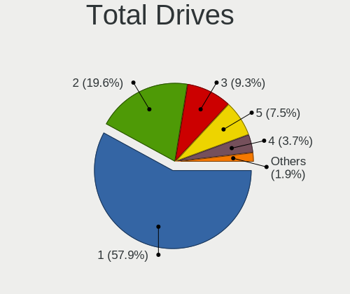
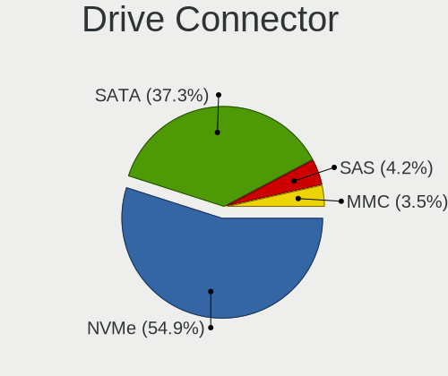

Manjaro Hardware Trends
-----------------------

A project to identify most popular hardware characteristics and track their change
over time based on data collected by Manjaro users at https://Linux-Hardware.org.

Anyone can contribute to the study by uploading probes of their computers by
the [hw-probe](https://github.com/linuxhw/hw-probe) tool:

    sudo -E hw-probe -all -upload

This is a report for all computer types. See also reports for [desktops](/Dist/Manjaro/Desktop/README.md) and [notebooks](/Dist/Manjaro/Notebook/README.md).

Full-feature report is available here: https://linux-hardware.org/?view=trends

Period: May, 2021.

Contents
--------

- [ OS                       ](#os)
- [ OS Family                ](#os-family)
- [ Kernel                   ](#kernel)
- [ Kernel Family            ](#kernel-family)
- [ Kernel Major Ver.        ](#kernel-major-ver)
- [ Arch                     ](#arch)
- [ DE                       ](#de)
- [ Display Server           ](#display-server)
- [ Display Manager          ](#display-manager)
- [ OS Lang                  ](#os-lang)
- [ Boot Mode                ](#boot-mode)
- [ Filesystem               ](#filesystem)
- [ Part. scheme             ](#part-scheme)
- [ Dual Boot with Linux/BSD ](#dual-boot-with-linux/bsd)
- [ Dual Boot (Win)          ](#dual-boot-win)
- [ Country                  ](#country)
- [ City                     ](#city)
- [ Vendor                   ](#vendor)
- [ Model                    ](#model)
- [ Model Family             ](#model-family)
- [ MFG Year                 ](#mfg-year)
- [ Form Factor              ](#form-factor)
- [ Secure Boot              ](#secure-boot)
- [ Coreboot                 ](#coreboot)
- [ RAM Size                 ](#ram-size)
- [ RAM Used                 ](#ram-used)
- [ Has CD-ROM               ](#has-cd-rom)
- [ Total Drives             ](#total-drives)
- [ Has Ethernet             ](#has-ethernet)
- [ Has WiFi                 ](#has-wifi)
- [ Has Bluetooth            ](#has-bluetooth)
- [ Drive Vendor             ](#drive-vendor)
- [ Drive Model              ](#drive-model)
- [ HDD Vendor               ](#hdd-vendor)
- [ SSD Vendor               ](#ssd-vendor)
- [ Drive Kind               ](#drive-kind)
- [ Drive Connector          ](#drive-connector)
- [ Drive Size               ](#drive-size)
- [ Space Total              ](#space-total)
- [ Space Used               ](#space-used)
- [ Malfunc. Drives          ](#malfunc-drives)
- [ Malfunc. Drive Vendor    ](#malfunc-drive-vendor)
- [ Malfunc. HDD Vendor      ](#malfunc-hdd-vendor)
- [ Malfunc. Drive Kind      ](#malfunc-drive-kind)
- [ Failed Drives            ](#failed-drives)
- [ Failed Drive Vendor      ](#failed-drive-vendor)
- [ Drive Status             ](#drive-status)
- [ Storage Vendor           ](#storage-vendor)
- [ Storage Model            ](#storage-model)
- [ Storage Kind             ](#storage-kind)
- [ CPU Vendor               ](#cpu-vendor)
- [ CPU Model                ](#cpu-model)
- [ CPU Model Family         ](#cpu-model-family)
- [ CPU Cores                ](#cpu-cores)
- [ CPU Sockets              ](#cpu-sockets)
- [ CPU Threads              ](#cpu-threads)
- [ CPU Op-Modes             ](#cpu-op-modes)
- [ CPU Microcode            ](#cpu-microcode)
- [ CPU Microarch            ](#cpu-microarch)
- [ GPU Vendor               ](#gpu-vendor)
- [ GPU Model                ](#gpu-model)
- [ GPU Combo                ](#gpu-combo)
- [ GPU Driver               ](#gpu-driver)
- [ GPU Memory               ](#gpu-memory)
- [ Monitor Vendor           ](#monitor-vendor)
- [ Monitor Model            ](#monitor-model)
- [ Monitor Resolution       ](#monitor-resolution)
- [ Monitor Diagonal         ](#monitor-diagonal)
- [ Monitor Width            ](#monitor-width)
- [ Aspect Ratio             ](#aspect-ratio)
- [ Monitor Area             ](#monitor-area)
- [ Pixel Density            ](#pixel-density)
- [ Multiple Monitors        ](#multiple-monitors)
- [ Net Controller Vendor    ](#net-controller-vendor)
- [ Net Controller Model     ](#net-controller-model)
- [ Wireless Vendor          ](#wireless-vendor)
- [ Wireless Model           ](#wireless-model)
- [ Ethernet Vendor          ](#ethernet-vendor)
- [ Ethernet Model           ](#ethernet-model)
- [ Net Controller Kind      ](#net-controller-kind)
- [ Used Controller          ](#used-controller)
- [ NICs                     ](#nics)
- [ IPv6                     ](#ipv6)
- [ Memory Vendor            ](#memory-vendor)
- [ Memory Model             ](#memory-model)
- [ Memory Kind              ](#memory-kind)
- [ Memory Form Factor       ](#memory-form-factor)
- [ Memory Size              ](#memory-size)
- [ Memory Speed             ](#memory-speed)
- [ Sound Vendor             ](#sound-vendor)
- [ Sound Model              ](#sound-model)
- [ Camera Vendor            ](#camera-vendor)
- [ Camera Model             ](#camera-model)
- [ Fingerprint Vendor       ](#fingerprint-vendor)
- [ Fingerprint Model        ](#fingerprint-model)
- [ Chipcard Vendor          ](#chipcard-vendor)
- [ Chipcard Model           ](#chipcard-model)
- [ Printer Vendor           ](#printer-vendor)
- [ Printer Model            ](#printer-model)
- [ Scanner Vendor           ](#scanner-vendor)
- [ Scanner Model            ](#scanner-model)
- [ Bluetooth Vendor         ](#bluetooth-vendor)
- [ Bluetooth Model          ](#bluetooth-model)
- [ Unsupported Devices      ](#unsupported-devices)
- [ Unsupported Device Types ](#unsupported-device-types)

OS
--

Installed operating systems

| Name           | Computers | Percent |
|----------------|-----------|---------|
| Manjaro        | 94        | 41.59%  |
| Manjaro 21.0.5 | 59        | 26.11%  |
| Manjaro 21.0.4 | 50        | 22.12%  |
| Manjaro 21.0.3 | 20        | 8.85%   |
| Manjaro 21.0.1 | 1         | 0.44%   |
| Manjaro 21.0   | 1         | 0.44%   |
| Manjaro 20.2.1 | 1         | 0.44%   |

OS Family
---------

OS without a version

| Name    | Computers | Percent |
|---------|-----------|---------|
| Manjaro | 226       | 100%    |

Kernel
------

Version of the Linux kernel

| Version                            | Computers | Percent |
|------------------------------------|-----------|---------|
| 5.10.34-1-MANJARO                  | 45        | 19.91%  |
| 5.10.36-2-MANJARO                  | 44        | 19.47%  |
| 5.12.2-1-MANJARO                   | 27        | 11.95%  |
| 5.10.32-1-MANJARO                  | 26        | 11.5%   |
| 5.12.1-2-MANJARO                   | 15        | 6.64%   |
| 5.9.16-1-MANJARO                   | 13        | 5.75%   |
| 5.11.18-1-MANJARO                  | 9         | 3.98%   |
| 5.12.0-1-MANJARO                   | 8         | 3.54%   |
| 5.4.116-1-MANJARO                  | 6         | 2.65%   |
| 5.11.19-1-MANJARO                  | 6         | 2.65%   |
| 5.13.0-1-MANJARO                   | 4         | 1.77%   |
| 5.11.16-2-MANJARO                  | 4         | 1.77%   |
| 5.4.118-1-MANJARO                  | 3         | 1.33%   |
| 5.9.1-1-rt19-MANJARO               | 2         | 0.88%   |
| 5.9.11-3-MANJARO                   | 1         | 0.44%   |
| 5.4.114-1-MANJARO                  | 1         | 0.44%   |
| 5.12.5-158-tkg-MuQSS               | 1         | 0.44%   |
| 5.12.5-1-MANJARO                   | 1         | 0.44%   |
| 5.12.4-lqx3-1-lqx                  | 1         | 0.44%   |
| 5.12.1-1-ck-haswell                | 1         | 0.44%   |
| 5.11.21-1-MANJARO                  | 1         | 0.44%   |
| 5.11.16-arch1-1-covolunablu-gaming | 1         | 0.44%   |
| 5.11.14-1-MANJARO                  | 1         | 0.44%   |
| 5.10.37-2-MANJARO                  | 1         | 0.44%   |
| 5.10.33-1-MANJARO                  | 1         | 0.44%   |
| 5.10.30-1-MANJARO                  | 1         | 0.44%   |
| 5.10.26-1-MANJARO                  | 1         | 0.44%   |
| 5.10.23-1-MANJARO                  | 1         | 0.44%   |

Kernel Family
-------------

Linux kernel without a distro release

| Version | Computers | Percent |
|---------|-----------|---------|
| 5.10.34 | 45        | 19.91%  |
| 5.10.36 | 44        | 19.47%  |
| 5.12.2  | 27        | 11.95%  |
| 5.10.32 | 26        | 11.5%   |
| 5.12.1  | 16        | 7.08%   |
| 5.9.16  | 13        | 5.75%   |
| 5.11.18 | 9         | 3.98%   |
| 5.12.0  | 8         | 3.54%   |
| 5.4.116 | 6         | 2.65%   |
| 5.11.19 | 6         | 2.65%   |
| 5.11.16 | 5         | 2.21%   |
| 5.13.0  | 4         | 1.77%   |
| 5.4.118 | 3         | 1.33%   |
| 5.9.1   | 2         | 0.88%   |
| 5.12.5  | 2         | 0.88%   |
| 5.9.11  | 1         | 0.44%   |
| 5.4.114 | 1         | 0.44%   |
| 5.12.4  | 1         | 0.44%   |
| 5.11.21 | 1         | 0.44%   |
| 5.11.14 | 1         | 0.44%   |
| 5.10.37 | 1         | 0.44%   |
| 5.10.33 | 1         | 0.44%   |
| 5.10.30 | 1         | 0.44%   |
| 5.10.26 | 1         | 0.44%   |
| 5.10.23 | 1         | 0.44%   |

Kernel Major Ver.
-----------------

Linux kernel major version

| Version | Computers | Percent |
|---------|-----------|---------|
| 5.10    | 120       | 53.1%   |
| 5.12    | 54        | 23.89%  |
| 5.11    | 22        | 9.73%   |
| 5.9     | 16        | 7.08%   |
| 5.4     | 10        | 4.42%   |
| 5.13    | 4         | 1.77%   |

Arch
----

OS architecture (x86_64, i586, etc.)

| Name   | Computers | Percent |
|--------|-----------|---------|
| x86_64 | 226       | 100%    |

DE
--

Desktop Environment

| Name       | Computers | Percent |
|------------|-----------|---------|
| XFCE       | 60        | 26.55%  |
| KDE5       | 60        | 26.55%  |
| GNOME      | 51        | 22.57%  |
| KDE        | 31        | 13.72%  |
| X-Cinnamon | 8         | 3.54%   |
| Unknown    | 5         | 2.21%   |
| Deepin     | 4         | 1.77%   |
| i3         | 3         | 1.33%   |
| Cinnamon   | 3         | 1.33%   |
| Budgie     | 1         | 0.44%   |

Display Server
--------------

X11 or Wayland

| Name    | Computers | Percent |
|---------|-----------|---------|
| X11     | 192       | 84.96%  |
| Wayland | 26        | 11.5%   |
| Unknown | 6         | 2.65%   |
| Tty     | 2         | 0.88%   |

Display Manager
---------------

SDDM, LightDM, etc.

| Name    | Computers | Percent |
|---------|-----------|---------|
| Unknown | 93        | 41.15%  |
| SDDM    | 58        | 25.66%  |
| LightDM | 40        | 17.7%   |
| GDM     | 34        | 15.04%  |
| TDM     | 1         | 0.44%   |

OS Lang
-------

Language

| Lang    | Computers | Percent |
|---------|-----------|---------|
| en_US   | 93        | 41.15%  |
| de_DE   | 25        | 11.06%  |
| pt_BR   | 16        | 7.08%   |
| en_GB   | 16        | 7.08%   |
| ru_RU   | 11        | 4.87%   |
| pl_PL   | 5         | 2.21%   |
| it_IT   | 5         | 2.21%   |
| fr_FR   | 5         | 2.21%   |
| en_IN   | 5         | 2.21%   |
| en_AU   | 5         | 2.21%   |
| en_CA   | 4         | 1.77%   |
| Unknown | 4         | 1.77%   |
| es_ES   | 3         | 1.33%   |
| uk_UA   | 2         | 0.88%   |
| nl_NL   | 2         | 0.88%   |
| nb_NO   | 2         | 0.88%   |
| en_ZA   | 2         | 0.88%   |
| en_IE   | 2         | 0.88%   |
| zh_CN   | 1         | 0.44%   |
| sk_SK   | 1         | 0.44%   |
| ro_RO   | 1         | 0.44%   |
| fr_CA   | 1         | 0.44%   |
| es_PE   | 1         | 0.44%   |
| es_PA   | 1         | 0.44%   |
| es_MX   | 1         | 0.44%   |
| es_EC   | 1         | 0.44%   |
| es_AR   | 1         | 0.44%   |
| en_SI   | 1         | 0.44%   |
| en_PH   | 1         | 0.44%   |
| en_NZ   | 1         | 0.44%   |
| en_NG   | 1         | 0.44%   |
| en_IL   | 1         | 0.44%   |
| de_CH   | 1         | 0.44%   |
| de_AT   | 1         | 0.44%   |
| cs_CZ   | 1         | 0.44%   |
| C       | 1         | 0.44%   |
| bg_BG   | 1         | 0.44%   |

Boot Mode
---------

EFI or BIOS

| Mode | Computers | Percent |
|------|-----------|---------|
| BIOS | 114       | 50.44%  |
| EFI  | 112       | 49.56%  |

Filesystem
----------

Type of filesystem

| Type     | Computers | Percent |
|----------|-----------|---------|
| Ext4     | 197       | 87.17%  |
| Btrfs    | 13        | 5.75%   |
| Overlay  | 8         | 3.54%   |
| Xfs      | 5         | 2.21%   |
| Tmpfs    | 1         | 0.44%   |
| Reiserfs | 1         | 0.44%   |
| Unknown  | 1         | 0.44%   |

Part. scheme
------------

Scheme of partitioning

| Type    | Computers | Percent |
|---------|-----------|---------|
| GPT     | 115       | 50.88%  |
| Unknown | 88        | 38.94%  |
| MBR     | 23        | 10.18%  |

Dual Boot with Linux/BSD
------------------------

Hosting more than one Linux/BSD

| Dual boot | Computers | Percent |
|-----------|-----------|---------|
| No        | 195       | 86.28%  |
| Yes       | 31        | 13.72%  |

Dual Boot (Win)
---------------

Hosting Linux and Windows

| Dual boot | Computers | Percent |
|-----------|-----------|---------|
| No        | 156       | 69.03%  |
| Yes       | 70        | 30.97%  |

Country
-------

Geographic location (country)

| Country                | Computers | Percent |
|------------------------|-----------|---------|
| USA                    | 33        | 14.6%   |
| Germany                | 32        | 14.16%  |
| Brazil                 | 21        | 9.29%   |
| Russia                 | 12        | 5.31%   |
| Canada                 | 10        | 4.42%   |
| UK                     | 9         | 3.98%   |
| Poland                 | 7         | 3.1%    |
| India                  | 7         | 3.1%    |
| Spain                  | 6         | 2.65%   |
| France                 | 6         | 2.65%   |
| Ukraine                | 5         | 2.21%   |
| Italy                  | 5         | 2.21%   |
| Australia              | 5         | 2.21%   |
| Switzerland            | 4         | 1.77%   |
| Ireland                | 4         | 1.77%   |
| Turkey                 | 3         | 1.33%   |
| Norway                 | 3         | 1.33%   |
| Netherlands            | 3         | 1.33%   |
| Israel                 | 3         | 1.33%   |
| China                  | 3         | 1.33%   |
| Belarus                | 3         | 1.33%   |
| Bangladesh             | 3         | 1.33%   |
| Austria                | 3         | 1.33%   |
| Sweden                 | 2         | 0.88%   |
| South Africa           | 2         | 0.88%   |
| Slovakia               | 2         | 0.88%   |
| Romania                | 2         | 0.88%   |
| Panama                 | 2         | 0.88%   |
| Mexico                 | 2         | 0.88%   |
| Iran                   | 2         | 0.88%   |
| Vietnam                | 1         | 0.44%   |
| Sri Lanka              | 1         | 0.44%   |
| Slovenia               | 1         | 0.44%   |
| Philippines            | 1         | 0.44%   |
| Peru                   | 1         | 0.44%   |
| North Macedonia        | 1         | 0.44%   |
| Nigeria                | 1         | 0.44%   |
| New Zealand            | 1         | 0.44%   |
| Malaysia               | 1         | 0.44%   |
| Libya                  | 1         | 0.44%   |
| Kazakhstan             | 1         | 0.44%   |
| Indonesia              | 1         | 0.44%   |
| Guatemala              | 1         | 0.44%   |
| Egypt                  | 1         | 0.44%   |
| Ecuador                | 1         | 0.44%   |
| Czechia                | 1         | 0.44%   |
| Colombia               | 1         | 0.44%   |
| Cambodia               | 1         | 0.44%   |
| Bulgaria               | 1         | 0.44%   |
| Bosnia and Herzegovina | 1         | 0.44%   |
| Belgium                | 1         | 0.44%   |
| Argentina              | 1         | 0.44%   |

City
----

Geographic location (city)

| City             | Computers | Percent |
|------------------|-----------|---------|
| Toronto          | 4         | 1.77%   |
| London           | 4         | 1.77%   |
| Brisbane         | 4         | 1.77%   |
| Rio de Janeiro   | 3         | 1.33%   |
| Portland         | 3         | 1.33%   |
| Moscow           | 3         | 1.33%   |
| Ingolstadt       | 3         | 1.33%   |
| Dublin           | 3         | 1.33%   |
| Dhaka            | 3         | 1.33%   |
| Zurich           | 2         | 0.88%   |
| Wimbledon        | 2         | 0.88%   |
| Vienna           | 2         | 0.88%   |
| Turin            | 2         | 0.88%   |
| Tucson           | 2         | 0.88%   |
| São Paulo       | 2         | 0.88%   |
| Shenzhen         | 2         | 0.88%   |
| Panama City      | 2         | 0.88%   |
| Palmyra          | 2         | 0.88%   |
| Murmansk         | 2         | 0.88%   |
| Madrid           | 2         | 0.88%   |
| Kyiv             | 2         | 0.88%   |
| Istanbul         | 2         | 0.88%   |
| Hamburg          | 2         | 0.88%   |
| Castel Maggiore  | 2         | 0.88%   |
| Ahmedabad        | 2         | 0.88%   |
| Ślesin          | 1         | 0.44%   |
| Zabrze           | 1         | 0.44%   |
| York             | 1         | 0.44%   |
| Yakutsk          | 1         | 0.44%   |
| Wroclaw          | 1         | 0.44%   |
| Worcester        | 1         | 0.44%   |
| Warsaw           | 1         | 0.44%   |
| Wachtberg        | 1         | 0.44%   |
| Vrhnika          | 1         | 0.44%   |
| Vladimir         | 1         | 0.44%   |
| Vitebsk          | 1         | 0.44%   |
| Vinnytsia        | 1         | 0.44%   |
| Vijayawada       | 1         | 0.44%   |
| Velbert          | 1         | 0.44%   |
| Vaudreuil-Dorion | 1         | 0.44%   |
| Tübingen        | 1         | 0.44%   |
| Tuguegarao City  | 1         | 0.44%   |
| Tubarao          | 1         | 0.44%   |
| Timișoara       | 1         | 0.44%   |
| Tilburg          | 1         | 0.44%   |
| The Hague        | 1         | 0.44%   |
| Tettnang Castle  | 1         | 0.44%   |
| Tehran           | 1         | 0.44%   |
| Tatuí           | 1         | 0.44%   |
| Tabriz           | 1         | 0.44%   |
| Stuttgart        | 1         | 0.44%   |
| St Petersburg    | 1         | 0.44%   |
| Sorocaba         | 1         | 0.44%   |
| Skutari          | 1         | 0.44%   |
| Skopje           | 1         | 0.44%   |
| Sion             | 1         | 0.44%   |
| Sindelfingen     | 1         | 0.44%   |
| Seward           | 1         | 0.44%   |
| Senec            | 1         | 0.44%   |
| Schmoelln        | 1         | 0.44%   |

Vendor
------

Motherboard manufacturer

| Name                   | Computers | Percent |
|------------------------|-----------|---------|
| ASUSTek Computer       | 38        | 16.81%  |
| Lenovo                 | 37        | 16.37%  |
| Hewlett-Packard        | 37        | 16.37%  |
| Dell                   | 32        | 14.16%  |
| MSI                    | 17        | 7.52%   |
| Gigabyte Technology    | 15        | 6.64%   |
| ASRock                 | 11        | 4.87%   |
| Apple                  | 7         | 3.1%    |
| Acer                   | 7         | 3.1%    |
| Toshiba                | 3         | 1.33%   |
| Sony                   | 2         | 0.88%   |
| Samsung Electronics    | 2         | 0.88%   |
| Multilaser             | 2         | 0.88%   |
| Medion                 | 2         | 0.88%   |
| Intel                  | 2         | 0.88%   |
| HUAWEI                 | 2         | 0.88%   |
| XFX                    | 1         | 0.44%   |
| Timi                   | 1         | 0.44%   |
| ONE-NETBOOK TECHNOLOGY | 1         | 0.44%   |
| Notebook               | 1         | 0.44%   |
| Google                 | 1         | 0.44%   |
| Colorful Technology    | 1         | 0.44%   |
| Chuwi                  | 1         | 0.44%   |
| Biostar                | 1         | 0.44%   |
| AZW                    | 1         | 0.44%   |
| Unknown                | 1         | 0.44%   |

Model
-----

Motherboard model

| Name                                     | Computers | Percent |
|------------------------------------------|-----------|---------|
| Gigabyte B450M DS3H                      | 3         | 1.33%   |
| Multilaser PC301                         | 2         | 0.88%   |
| MSI MS-7C37                              | 2         | 0.88%   |
| Lenovo IdeaPad Flex 5 14ARE05 81X2       | 2         | 0.88%   |
| Dell XPS 8700                            | 2         | 0.88%   |
| Dell Precision 5530                      | 2         | 0.88%   |
| Dell OptiPlex 3020                       | 2         | 0.88%   |
| ASUS ROG CROSSHAIR VIII HERO             | 2         | 0.88%   |
| ASUS M5A99FX PRO R2.0                    | 2         | 0.88%   |
| XFX MI-A78S-8209 Ver1.1                  | 1         | 0.44%   |
| Toshiba Satellite L510                   | 1         | 0.44%   |
| Toshiba Satellite C50D-B                 | 1         | 0.44%   |
| Toshiba SATEGO P100                      | 1         | 0.44%   |
| Timi TM1703                              | 1         | 0.44%   |
| Sony VPCYB35AB                           | 1         | 0.44%   |
| Sony VPCEH2D0E                           | 1         | 0.44%   |
| Samsung 750XDA                           | 1         | 0.44%   |
| Samsung 550XBE/350XBE                    | 1         | 0.44%   |
| ONE-NETBOOK TECHNOLOGY One-Mix3 Pro      | 1         | 0.44%   |
| Notebook NH5xAx                          | 1         | 0.44%   |
| MSI PS42 8RB                             | 1         | 0.44%   |
| MSI MS-7C95                              | 1         | 0.44%   |
| MSI MS-7C02                              | 1         | 0.44%   |
| MSI MS-7B98                              | 1         | 0.44%   |
| MSI MS-7B93                              | 1         | 0.44%   |
| MSI MS-7B89                              | 1         | 0.44%   |
| MSI MS-7B84                              | 1         | 0.44%   |
| MSI MS-7B79                              | 1         | 0.44%   |
| MSI MS-7A40                              | 1         | 0.44%   |
| MSI MS-7891                              | 1         | 0.44%   |
| MSI MS-7721                              | 1         | 0.44%   |
| MSI GS66 Stealth 10SGS                   | 1         | 0.44%   |
| MSI GF63 Thin 9SC                        | 1         | 0.44%   |
| MSI GE76 Raider 10UE                     | 1         | 0.44%   |
| MSI GE60 2OC\2OD\2OE                     | 1         | 0.44%   |
| Medion S15450                            | 1         | 0.44%   |
| Medion P2211T                            | 1         | 0.44%   |
| Lenovo Zhaoyang K29 20186                | 1         | 0.44%   |
| Lenovo Z50-70 20354                      | 1         | 0.44%   |
| Lenovo Yoga C940-14IIL 81Q9              | 1         | 0.44%   |
| Lenovo Y520-15IKBN 80WK                  | 1         | 0.44%   |
| Lenovo V310-14ISK 80UF0004BR             | 1         | 0.44%   |
| Lenovo V14-ADA 82C6                      | 1         | 0.44%   |
| Lenovo ThinkPad X250 20CLS1V210          | 1         | 0.44%   |
| Lenovo ThinkPad X250 20CLCTO1WW          | 1         | 0.44%   |
| Lenovo ThinkPad X200T 7449FWG            | 1         | 0.44%   |
| Lenovo ThinkPad X1 Carbon 3rd 20BS002BAU | 1         | 0.44%   |
| Lenovo ThinkPad T61 766512G              | 1         | 0.44%   |
| Lenovo ThinkPad T61 765912G              | 1         | 0.44%   |
| Lenovo ThinkPad T60 2007VW1              | 1         | 0.44%   |
| Lenovo ThinkPad T520 42406EG             | 1         | 0.44%   |
| Lenovo ThinkPad T460 20FN003NUK          | 1         | 0.44%   |
| Lenovo ThinkPad T460 20FMS2D600          | 1         | 0.44%   |
| Lenovo ThinkPad T430s 2356GPU            | 1         | 0.44%   |
| Lenovo ThinkPad S1 Yoga 20CDS02B00       | 1         | 0.44%   |
| Lenovo ThinkPad P14s Gen 1 20Y1CTO1WW    | 1         | 0.44%   |
| Lenovo ThinkPad L390 20NR0013SP          | 1         | 0.44%   |
| Lenovo ThinkPad L15 Gen 1 20U3002FGE     | 1         | 0.44%   |
| Lenovo ThinkPad E490 20N8000YGE          | 1         | 0.44%   |
| Lenovo ThinkCentre M72z 3548C8U          | 1         | 0.44%   |

Model Family
------------

Motherboard model prefix

| Name                            | Computers | Percent |
|---------------------------------|-----------|---------|
| Lenovo ThinkPad                 | 16        | 7.08%   |
| Lenovo IdeaPad                  | 10        | 4.42%   |
| HP Pavilion                     | 8         | 3.54%   |
| HP EliteBook                    | 7         | 3.1%    |
| Dell XPS                        | 7         | 3.1%    |
| Dell Inspiron                   | 7         | 3.1%    |
| ASUS ROG                        | 6         | 2.65%   |
| HP ProBook                      | 5         | 2.21%   |
| Gigabyte B450M                  | 5         | 2.21%   |
| Dell Precision                  | 5         | 2.21%   |
| Dell Latitude                   | 5         | 2.21%   |
| HP Compaq                       | 4         | 1.77%   |
| Dell OptiPlex                   | 4         | 1.77%   |
| ASUS PRIME                      | 4         | 1.77%   |
| Lenovo Legion                   | 3         | 1.33%   |
| HP Laptop                       | 3         | 1.33%   |
| ASUS TUF                        | 3         | 1.33%   |
| ASRock B450M                    | 3         | 1.33%   |
| Acer Aspire                     | 3         | 1.33%   |
| Toshiba Satellite               | 2         | 0.88%   |
| Multilaser PC301                | 2         | 0.88%   |
| MSI MS-7C37                     | 2         | 0.88%   |
| HP 15                           | 2         | 0.88%   |
| Dell Vostro                     | 2         | 0.88%   |
| ASUS P8H61-M                    | 2         | 0.88%   |
| ASUS M5A99FX                    | 2         | 0.88%   |
| Acer Nitro                      | 2         | 0.88%   |
| XFX MI-A78S-8209                | 1         | 0.44%   |
| Toshiba SATEGO                  | 1         | 0.44%   |
| Timi TM1703                     | 1         | 0.44%   |
| Sony VPCYB35AB                  | 1         | 0.44%   |
| Sony VPCEH2D0E                  | 1         | 0.44%   |
| Samsung 750XDA                  | 1         | 0.44%   |
| Samsung 550XBE                  | 1         | 0.44%   |
| ONE-NETBOOK TECHNOLOGY One-Mix3 | 1         | 0.44%   |
| Notebook NH5xAx                 | 1         | 0.44%   |
| MSI PS42                        | 1         | 0.44%   |
| MSI MS-7C95                     | 1         | 0.44%   |
| MSI MS-7C02                     | 1         | 0.44%   |
| MSI MS-7B98                     | 1         | 0.44%   |
| MSI MS-7B93                     | 1         | 0.44%   |
| MSI MS-7B89                     | 1         | 0.44%   |
| MSI MS-7B84                     | 1         | 0.44%   |
| MSI MS-7B79                     | 1         | 0.44%   |
| MSI MS-7A40                     | 1         | 0.44%   |
| MSI MS-7891                     | 1         | 0.44%   |
| MSI MS-7721                     | 1         | 0.44%   |
| MSI GS66                        | 1         | 0.44%   |
| MSI GF63                        | 1         | 0.44%   |
| MSI GE76                        | 1         | 0.44%   |
| MSI GE60                        | 1         | 0.44%   |
| Medion S15450                   | 1         | 0.44%   |
| Medion P2211T                   | 1         | 0.44%   |
| Lenovo Zhaoyang                 | 1         | 0.44%   |
| Lenovo Z50-70                   | 1         | 0.44%   |
| Lenovo Yoga                     | 1         | 0.44%   |
| Lenovo Y520-15IKBN              | 1         | 0.44%   |
| Lenovo V310-14ISK               | 1         | 0.44%   |
| Lenovo V14-ADA                  | 1         | 0.44%   |
| Lenovo ThinkCentre              | 1         | 0.44%   |

MFG Year
--------

Motherboard manufacture year

| Year    | Computers | Percent |
|---------|-----------|---------|
| 2020    | 75        | 33.19%  |
| 2019    | 37        | 16.37%  |
| 2021    | 21        | 9.29%   |
| 2018    | 18        | 7.96%   |
| 2012    | 12        | 5.31%   |
| 2013    | 11        | 4.87%   |
| 2011    | 8         | 3.54%   |
| 2009    | 8         | 3.54%   |
| 2016    | 7         | 3.1%    |
| 2014    | 7         | 3.1%    |
| 2017    | 6         | 2.65%   |
| 2015    | 6         | 2.65%   |
| 2010    | 5         | 2.21%   |
| 2008    | 3         | 1.33%   |
| 2007    | 1         | 0.44%   |
| Unknown | 1         | 0.44%   |

Form Factor
-----------

Physical design of the computer

| Name        | Computers | Percent |
|-------------|-----------|---------|
| Notebook    | 132       | 58.41%  |
| Desktop     | 84        | 37.17%  |
| Convertible | 7         | 3.1%    |
| Tablet      | 1         | 0.44%   |
| Mini pc     | 1         | 0.44%   |
| All in one  | 1         | 0.44%   |

Secure Boot
-----------

Enabled or disabled

| State    | Computers | Percent |
|----------|-----------|---------|
| Disabled | 226       | 100%    |

Coreboot
--------

Have coreboot on board

| Used | Computers | Percent |
|------|-----------|---------|
| No   | 225       | 99.56%  |
| Yes  | 1         | 0.44%   |

RAM Size
--------

Total RAM memory

| Size in GB  | Computers | Percent |
|-------------|-----------|---------|
| 16.01-24.0  | 55        | 24.34%  |
| 8.01-16.0   | 54        | 23.89%  |
| 4.01-8.0    | 51        | 22.57%  |
| 32.01-64.0  | 27        | 11.95%  |
| 3.01-4.0    | 25        | 11.06%  |
| 1.01-2.0    | 9         | 3.98%   |
| 64.01-256.0 | 3         | 1.33%   |
| 24.01-32.0  | 2         | 0.88%   |

RAM Used
--------

Used RAM memory

| Used GB     | Computers | Percent |
|-------------|-----------|---------|
| 1.01-2.0    | 69        | 30.53%  |
| 2.01-3.0    | 51        | 22.57%  |
| 4.01-8.0    | 44        | 19.47%  |
| 3.01-4.0    | 33        | 14.6%   |
| 0.51-1.0    | 13        | 5.75%   |
| 8.01-16.0   | 11        | 4.87%   |
| 0.01-0.5    | 2         | 0.88%   |
| 24.01-32.0  | 1         | 0.44%   |
| 64.01-256.0 | 1         | 0.44%   |
| 16.01-24.0  | 1         | 0.44%   |

Has CD-ROM
----------

Has CD-ROM on board

| Presented | Computers | Percent |
|-----------|-----------|---------|
| No        | 158       | 69.91%  |
| Yes       | 68        | 30.09%  |

Total Drives
------------

Number of drives on board

| Drives | Computers | Percent |
|--------|-----------|---------|
| 1      | 118       | 52.21%  |
| 2      | 61        | 26.99%  |
| 3      | 24        | 10.62%  |
| 4      | 13        | 5.75%   |
| 5      | 6         | 2.65%   |
| 11     | 1         | 0.44%   |
| 7      | 1         | 0.44%   |
| 6      | 1         | 0.44%   |
| 0      | 1         | 0.44%   |

Has Ethernet
------------

Has Ethernet on board

| Presented | Computers | Percent |
|-----------|-----------|---------|
| Yes       | 197       | 87.17%  |
| No        | 29        | 12.83%  |

Has WiFi
--------

Has WiFi module

| Presented | Computers | Percent |
|-----------|-----------|---------|
| Yes       | 178       | 78.76%  |
| No        | 48        | 21.24%  |

Has Bluetooth
-------------

Has Bluetooth module

| Presented | Computers | Percent |
|-----------|-----------|---------|
| Yes       | 145       | 64.16%  |
| No        | 81        | 35.84%  |

Drive Vendor
------------

Hard drive vendors

| Vendor                    | Computers | Drives | Percent |
|---------------------------|-----------|--------|---------|
| Seagate                   | 60        | 75     | 16.48%  |
| Samsung Electronics       | 54        | 62     | 14.84%  |
| WDC                       | 53        | 70     | 14.56%  |
| Toshiba                   | 25        | 25     | 6.87%   |
| Kingston                  | 21        | 22     | 5.77%   |
| Sandisk                   | 20        | 23     | 5.49%   |
| Unknown                   | 18        | 19     | 4.95%   |
| Crucial                   | 14        | 15     | 3.85%   |
| Hitachi                   | 10        | 11     | 2.75%   |
| SK Hynix                  | 9         | 9      | 2.47%   |
| Intel                     | 8         | 8      | 2.2%    |
| HGST                      | 5         | 7      | 1.37%   |
| China                     | 5         | 5      | 1.37%   |
| Apple                     | 5         | 5      | 1.37%   |
| Transcend                 | 4         | 4      | 1.1%    |
| Phison                    | 4         | 5      | 1.1%    |
| A-DATA Technology         | 4         | 4      | 1.1%    |
| Corsair                   | 3         | 3      | 0.82%   |
| XPG                       | 2         | 2      | 0.55%   |
| Union Memory              | 2         | 2      | 0.55%   |
| Team                      | 2         | 3      | 0.55%   |
| PNY                       | 2         | 4      | 0.55%   |
| OCZ                       | 2         | 2      | 0.55%   |
| Micron Technology         | 2         | 2      | 0.55%   |
| LITEON                    | 2         | 2      | 0.55%   |
| KIOXIA                    | 2         | 2      | 0.55%   |
| Intenso                   | 2         | 2      | 0.55%   |
| Apacer                    | 2         | 2      | 0.55%   |
| USB3.1                    | 1         | 1      | 0.27%   |
| TCSUNBOW                  | 1         | 1      | 0.27%   |
| SSK                       | 1         | 1      | 0.27%   |
| SPCC                      | 1         | 1      | 0.27%   |
| SMART                     | 1         | 1      | 0.27%   |
| Silicon Motion            | 1         | 1      | 0.27%   |
| Realtek Semiconductor     | 1         | 1      | 0.27%   |
| QNAP                      | 1         | 1      | 0.27%   |
| Phison Electronics        | 1         | 1      | 0.27%   |
| Patriot                   | 1         | 1      | 0.27%   |
| NGFF                      | 1         | 1      | 0.27%   |
| Mushkin                   | 1         | 1      | 0.27%   |
| Micron/Crucial Technology | 1         | 1      | 0.27%   |
| Lexar                     | 1         | 1      | 0.27%   |
| Lenovo                    | 1         | 1      | 0.27%   |
| KingDian                  | 1         | 1      | 0.27%   |
| Hoodisk                   | 1         | 1      | 0.27%   |
| HCG8e                     | 1         | 1      | 0.27%   |
| GOODRAM                   | 1         | 1      | 0.27%   |
| Fujitsu                   | 1         | 1      | 0.27%   |
| FORESEE                   | 1         | 1      | 0.27%   |
| ASMT                      | 1         | 1      | 0.27%   |

Drive Model
-----------

Hard drive models

| Model                                | Computers | Percent |
|--------------------------------------|-----------|---------|
| Seagate ST1000LM035-1RK172 1TB       | 7         | 1.72%   |
| Seagate ST2000DM008-2FR102 2TB       | 5         | 1.23%   |
| Seagate ST1000LM024 HN-M101MBB 1TB   | 5         | 1.23%   |
| Unknown SD/MMC/MS PRO 8GB            | 4         | 0.98%   |
| Samsung NVMe SSD Drive 1024GB        | 4         | 0.98%   |
| WDC WDS100T2B0B-00YS70 1TB SSD       | 3         | 0.74%   |
| WDC WD10EZEX-08WN4A0 1TB             | 3         | 0.74%   |
| WDC WD10EZEX-00BN5A0 1TB             | 3         | 0.74%   |
| Unknown MMC Card  32GB               | 3         | 0.74%   |
| Toshiba HDWD110 1TB                  | 3         | 0.74%   |
| Toshiba DT01ACA100 1TB               | 3         | 0.74%   |
| SK Hynix NVMe SSD Drive 512GB        | 3         | 0.74%   |
| SK Hynix NVMe SSD Drive 256GB        | 3         | 0.74%   |
| Seagate ST500LM012 HN-M500MBB 500GB  | 3         | 0.74%   |
| Seagate ST31000524AS 1TB             | 3         | 0.74%   |
| SanDisk SSD PLUS 240GB               | 3         | 0.74%   |
| Sandisk NVMe SSD Drive 500GB         | 3         | 0.74%   |
| Samsung SSD 970 EVO 1TB              | 3         | 0.74%   |
| Samsung NVMe SSD Drive 512GB         | 3         | 0.74%   |
| HGST HTS721010A9E630 1TB             | 3         | 0.74%   |
| Crucial CT480BX500SSD1 480GB         | 3         | 0.74%   |
| Crucial CT240BX500SSD1 240GB         | 3         | 0.74%   |
| WDC WD20EARS-00S8B1 2TB              | 2         | 0.49%   |
| WDC WD10SPZX-24Z10 1TB               | 2         | 0.49%   |
| WDC WD10EZEX-22MFCA0 1TB             | 2         | 0.49%   |
| Unknown NVMe SSD Drive 256GB         | 2         | 0.49%   |
| Toshiba MQ04ABF100 1TB               | 2         | 0.49%   |
| Toshiba DT01ACA050 500GB             | 2         | 0.49%   |
| Seagate ST9500325AS 500GB            | 2         | 0.49%   |
| Seagate ST750LM022 HN-M750MBB 752GB  | 2         | 0.49%   |
| Seagate ST500LT012-1DG142 500GB      | 2         | 0.49%   |
| Seagate ST500DM002-1BD142 500GB      | 2         | 0.49%   |
| Seagate ST4000DM004-2CV104 4TB       | 2         | 0.49%   |
| Seagate ST2000DM001-1CH164 2TB       | 2         | 0.49%   |
| Seagate ST1000DM010-2EP102 1TB       | 2         | 0.49%   |
| Seagate Expansion Desk 8TB           | 2         | 0.49%   |
| Seagate Expansion 2TB                | 2         | 0.49%   |
| Seagate BUP Slim BK 2TB              | 2         | 0.49%   |
| Sandisk NVMe SSD Drive 512GB         | 2         | 0.49%   |
| Samsung SSD 970 EVO Plus 500GB       | 2         | 0.49%   |
| Samsung SSD 860 PRO 256GB            | 2         | 0.49%   |
| Samsung SSD 850 EVO 250GB            | 2         | 0.49%   |
| Samsung NVMe SSD Drive 500GB         | 2         | 0.49%   |
| Samsung NVMe SSD Drive 256GB         | 2         | 0.49%   |
| Samsung NVMe SSD Drive 250GB         | 2         | 0.49%   |
| Samsung NVMe SSD Drive 1TB           | 2         | 0.49%   |
| Samsung MZ7LN256HCHP-000L7 256GB SSD | 2         | 0.49%   |
| Kingston SA400S37120G 120GB SSD      | 2         | 0.49%   |
| Kingston NVMe SSD Drive 250GB        | 2         | 0.49%   |
| Intenso External USB 3.0 8TB         | 2         | 0.49%   |
| Crucial CT500P2SSD8 500GB            | 2         | 0.49%   |
| Crucial CT256MX100SSD1 256GB         | 2         | 0.49%   |
| Crucial CT1000P1SSD8 1TB             | 2         | 0.49%   |
| Crucial CT1000MX500SSD1 1TB          | 2         | 0.49%   |
| China SATA SSD 240GB                 | 2         | 0.49%   |
| XPG NVMe SSD Drive 1024GB            | 1         | 0.25%   |
| XPG GAMMIX S5 512GB                  | 1         | 0.25%   |
| WDC WDS500G2B0A-00SM50 500GB SSD     | 1         | 0.25%   |
| WDC WDS500G1B0A-00H9H0 500GB SSD     | 1         | 0.25%   |
| WDC WDS240G2G0B-00EPW0 240GB SSD     | 1         | 0.25%   |

HDD Vendor
----------

Hard disk drive vendors

| Vendor              | Computers | Drives | Percent |
|---------------------|-----------|--------|---------|
| Seagate             | 58        | 73     | 40.28%  |
| WDC                 | 43        | 54     | 29.86%  |
| Toshiba             | 19        | 19     | 13.19%  |
| Hitachi             | 10        | 11     | 6.94%   |
| HGST                | 5         | 7      | 3.47%   |
| Samsung Electronics | 4         | 5      | 2.78%   |
| Intenso             | 2         | 2      | 1.39%   |
| QNAP                | 1         | 1      | 0.69%   |
| Fujitsu             | 1         | 1      | 0.69%   |
| ASMT                | 1         | 1      | 0.69%   |

SSD Vendor
----------

Solid state drive vendors

| Vendor              | Computers | Drives | Percent |
|---------------------|-----------|--------|---------|
| Samsung Electronics | 25        | 25     | 21.93%  |
| Kingston            | 13        | 13     | 11.4%   |
| SanDisk             | 12        | 14     | 10.53%  |
| Crucial             | 11        | 11     | 9.65%   |
| WDC                 | 10        | 10     | 8.77%   |
| China               | 5         | 5      | 4.39%   |
| Apple               | 5         | 5      | 4.39%   |
| Transcend           | 4         | 4      | 3.51%   |
| Intel               | 4         | 4      | 3.51%   |
| Toshiba             | 2         | 2      | 1.75%   |
| SK Hynix            | 2         | 2      | 1.75%   |
| PNY                 | 2         | 4      | 1.75%   |
| OCZ                 | 2         | 2      | 1.75%   |
| A-DATA Technology   | 2         | 2      | 1.75%   |
| Team                | 1         | 2      | 0.88%   |
| TCSUNBOW            | 1         | 1      | 0.88%   |
| SMART               | 1         | 1      | 0.88%   |
| Seagate             | 1         | 1      | 0.88%   |
| Patriot             | 1         | 1      | 0.88%   |
| NGFF                | 1         | 1      | 0.88%   |
| Mushkin             | 1         | 1      | 0.88%   |
| Micron Technology   | 1         | 1      | 0.88%   |
| LITEON              | 1         | 1      | 0.88%   |
| Lexar               | 1         | 1      | 0.88%   |
| KingDian            | 1         | 1      | 0.88%   |
| Hoodisk             | 1         | 1      | 0.88%   |
| GOODRAM             | 1         | 1      | 0.88%   |
| Corsair             | 1         | 1      | 0.88%   |
| Apacer              | 1         | 1      | 0.88%   |

Drive Kind
----------

HDD or SSD

| Kind    | Computers | Drives | Percent |
|---------|-----------|--------|---------|
| HDD     | 120       | 174    | 36.59%  |
| SSD     | 101       | 119    | 30.79%  |
| NVMe    | 88        | 104    | 26.83%  |
| MMC     | 10        | 10     | 3.05%   |
| Unknown | 9         | 10     | 2.74%   |

Drive Connector
---------------

SATA, SAS, NVMe, etc.

| Type | Computers | Drives | Percent |
|------|-----------|--------|---------|
| SATA | 169       | 284    | 59.51%  |
| NVMe | 88        | 104    | 30.99%  |
| SAS  | 17        | 19     | 5.99%   |
| MMC  | 10        | 10     | 3.52%   |

Drive Size
----------

Size of hard drive

| Size in TB | Computers | Drives | Percent |
|------------|-----------|--------|---------|
| 0.01-0.5   | 126       | 160    | 52.94%  |
| 0.51-1.0   | 73        | 85     | 30.67%  |
| 1.01-2.0   | 24        | 27     | 10.08%  |
| 4.01-10.0  | 7         | 7      | 2.94%   |
| 3.01-4.0   | 5         | 7      | 2.1%    |
| 2.01-3.0   | 2         | 4      | 0.84%   |
| 10.01-20.0 | 1         | 3      | 0.42%   |

Space Total
-----------

Amount of disk space available on the file system

| Size in GB     | Computers | Percent |
|----------------|-----------|---------|
| 101-250        | 57        | 25.22%  |
| 251-500        | 43        | 19.03%  |
| 501-1000       | 34        | 15.04%  |
| 1001-2000      | 27        | 11.95%  |
| More than 3000 | 18        | 7.96%   |
| Unknown        | 13        | 5.75%   |
| 1-20           | 12        | 5.31%   |
| 51-100         | 12        | 5.31%   |
| 21-50          | 5         | 2.21%   |
| 2001-3000      | 5         | 2.21%   |

Space Used
----------

Amount of used disk space

| Used GB        | Computers | Percent |
|----------------|-----------|---------|
| 1-20           | 54        | 23.89%  |
| 101-250        | 40        | 17.7%   |
| 21-50          | 36        | 15.93%  |
| 51-100         | 23        | 10.18%  |
| 251-500        | 20        | 8.85%   |
| 501-1000       | 17        | 7.52%   |
| Unknown        | 13        | 5.75%   |
| 1001-2000      | 12        | 5.31%   |
| More than 3000 | 6         | 2.65%   |
| 2001-3000      | 4         | 1.77%   |
| 0              | 1         | 0.44%   |

Malfunc. Drives
---------------

Drive models with a malfunction

| Model                                 | Computers | Drives | Percent |
|---------------------------------------|-----------|--------|---------|
| Seagate ST9500325AS 500GB             | 2         | 2      | 8.33%   |
| Seagate ST1000LM024 HN-M101MBB 1TB    | 2         | 2      | 8.33%   |
| WDC WD20EARS-00S8B1 2TB               | 1         | 1      | 4.17%   |
| WDC WD10EFRX-68FYTN0 1TB              | 1         | 1      | 4.17%   |
| WDC WD1002FAEX-00Z3A0 1TB             | 1         | 1      | 4.17%   |
| WDC WD1001FALS-40K1B0 1TB             | 1         | 1      | 4.17%   |
| Toshiba MQ01ABD100 1TB                | 1         | 1      | 4.17%   |
| Toshiba MK1665GSX 160GB               | 1         | 1      | 4.17%   |
| SK Hynix HFS256G3BTND-N210A 256GB SSD | 1         | 1      | 4.17%   |
| SK Hynix HFS256G39TND-N210A 256GB SSD | 1         | 1      | 4.17%   |
| Seagate ST500LT012-9WS142 500GB       | 1         | 1      | 4.17%   |
| Seagate ST500LM021-1KJ152 500GB       | 1         | 1      | 4.17%   |
| Seagate ST3500630NS 500GB             | 1         | 1      | 4.17%   |
| Seagate ST3250310AS 250GB             | 1         | 1      | 4.17%   |
| Seagate ST31500541AS 1TB              | 1         | 1      | 4.17%   |
| Seagate ST1000LX015-1U7172 1TB        | 1         | 1      | 4.17%   |
| Samsung Electronics HD103SJ 1TB       | 1         | 1      | 4.17%   |
| LITEON CV8-8E128-HP 128GB SSD         | 1         | 1      | 4.17%   |
| Hitachi HTS727575A9E364 752GB         | 1         | 1      | 4.17%   |
| Hitachi HTS725050A7E630 500GB         | 1         | 1      | 4.17%   |
| Hitachi HTS545032B9A302 320GB         | 1         | 1      | 4.17%   |
| HGST HTS721010A9E630 1TB              | 1         | 1      | 4.17%   |

Malfunc. Drive Vendor
---------------------

Vendors of faulty drives

| Vendor              | Computers | Drives | Percent |
|---------------------|-----------|--------|---------|
| Seagate             | 10        | 10     | 41.67%  |
| WDC                 | 4         | 4      | 16.67%  |
| Hitachi             | 3         | 3      | 12.5%   |
| Toshiba             | 2         | 2      | 8.33%   |
| SK Hynix            | 2         | 2      | 8.33%   |
| Samsung Electronics | 1         | 1      | 4.17%   |
| LITEON              | 1         | 1      | 4.17%   |
| HGST                | 1         | 1      | 4.17%   |

Malfunc. HDD Vendor
-------------------

Vendors of faulty HDD drives

| Vendor              | Computers | Drives | Percent |
|---------------------|-----------|--------|---------|
| Seagate             | 10        | 10     | 47.62%  |
| WDC                 | 4         | 4      | 19.05%  |
| Hitachi             | 3         | 3      | 14.29%  |
| Toshiba             | 2         | 2      | 9.52%   |
| Samsung Electronics | 1         | 1      | 4.76%   |
| HGST                | 1         | 1      | 4.76%   |

Malfunc. Drive Kind
-------------------

Kinds of faulty drives

| Kind | Computers | Drives | Percent |
|------|-----------|--------|---------|
| HDD  | 21        | 21     | 87.5%   |
| SSD  | 3         | 3      | 12.5%   |

Failed Drives
-------------

Failed drive models

Zero info for selected period =(

Failed Drive Vendor
-------------------

Failed drive vendors

Zero info for selected period =(

Drive Status
------------

Number of failed and malfunc. drives

| Status   | Computers | Drives | Percent |
|----------|-----------|--------|---------|
| Detected | 132       | 225    | 51.16%  |
| Works    | 102       | 168    | 39.53%  |
| Malfunc  | 24        | 24     | 9.3%    |

Storage Vendor
--------------

Storage controller vendors

| Vendor                         | Computers | Percent |
|--------------------------------|-----------|---------|
| Intel                          | 132       | 43.14%  |
| AMD                            | 62        | 20.26%  |
| Samsung Electronics            | 32        | 10.46%  |
| Sandisk                        | 14        | 4.58%   |
| Phison Electronics             | 10        | 3.27%   |
| Kingston Technology Company    | 8         | 2.61%   |
| SK Hynix                       | 7         | 2.29%   |
| ASMedia Technology             | 6         | 1.96%   |
| Micron/Crucial Technology      | 5         | 1.63%   |
| Toshiba America Info Systems   | 4         | 1.31%   |
| Nvidia                         | 4         | 1.31%   |
| ADATA Technology               | 3         | 0.98%   |
| Union Memory (Shenzhen)        | 2         | 0.65%   |
| Solid State Storage Technology | 2         | 0.65%   |
| Realtek Semiconductor          | 2         | 0.65%   |
| Marvell Technology Group       | 2         | 0.65%   |
| KIOXIA                         | 2         | 0.65%   |
| JMicron Technology             | 2         | 0.65%   |
| Silicon Motion                 | 1         | 0.33%   |
| Shenzhen Longsys Electronics   | 1         | 0.33%   |
| Seagate Technology             | 1         | 0.33%   |
| Micron Technology              | 1         | 0.33%   |
| Lite-On Technology             | 1         | 0.33%   |
| Lenovo                         | 1         | 0.33%   |
| Integrated Technology Express  | 1         | 0.33%   |

Storage Model
-------------

Storage controller models

| Model                                                                            | Computers | Percent |
|----------------------------------------------------------------------------------|-----------|---------|
| AMD FCH SATA Controller [AHCI mode]                                              | 51        | 14.91%  |
| Samsung NVMe SSD Controller SM981/PM981/PM983                                    | 22        | 6.43%   |
| AMD 400 Series Chipset SATA Controller                                           | 21        | 6.14%   |
| Intel Sunrise Point-LP SATA Controller [AHCI mode]                               | 18        | 5.26%   |
| Intel Wildcat Point-LP SATA Controller [AHCI Mode]                               | 7         | 2.05%   |
| Intel 82801 Mobile SATA Controller [RAID mode]                                   | 7         | 2.05%   |
| Intel 8 Series/C220 Series Chipset Family 6-port SATA Controller 1 [AHCI mode]   | 7         | 2.05%   |
| Intel 7 Series Chipset Family 6-port SATA Controller [AHCI mode]                 | 7         | 2.05%   |
| Intel 6 Series/C200 Series Chipset Family 6 port Mobile SATA AHCI Controller     | 7         | 2.05%   |
| Sandisk WD Black SN750 / PC SN730 NVMe SSD                                       | 6         | 1.75%   |
| Kingston Company A2000 NVMe SSD                                                  | 6         | 1.75%   |
| Intel Cannon Lake Mobile PCH SATA AHCI Controller                                | 6         | 1.75%   |
| ASMedia ASM1062 Serial ATA Controller                                            | 6         | 1.75%   |
| Phison E12 NVMe Controller                                                       | 5         | 1.46%   |
| Intel 6 Series/C200 Series Chipset Family 6 port Desktop SATA AHCI Controller    | 5         | 1.46%   |
| AMD Starship/Matisse Chipset SATA Controller [AHCI mode]                         | 5         | 1.46%   |
| Samsung NVMe SSD Controller SM961/PM961/SM963                                    | 4         | 1.17%   |
| Intel SSD 660P Series                                                            | 4         | 1.17%   |
| Intel Q170/Q150/B150/H170/H110/Z170/CM236 Chipset SATA Controller [AHCI Mode]    | 4         | 1.17%   |
| Intel NM10/ICH7 Family SATA Controller [IDE mode]                                | 4         | 1.17%   |
| Intel 82801IBM/IEM (ICH9M/ICH9M-E) 4 port SATA Controller [AHCI mode]            | 4         | 1.17%   |
| Intel 82801G (ICH7 Family) IDE Controller                                        | 4         | 1.17%   |
| Intel 8 Series SATA Controller 1 [AHCI mode]                                     | 4         | 1.17%   |
| Intel 400 Series Chipset Family SATA AHCI Controller                             | 4         | 1.17%   |
| AMD SB7x0/SB8x0/SB9x0 SATA Controller [AHCI mode]                                | 4         | 1.17%   |
| SK Hynix BC511                                                                   | 3         | 0.88%   |
| Sandisk WD Blue SN550 NVMe SSD                                                   | 3         | 0.88%   |
| Samsung NVMe Controller                                                          | 3         | 0.88%   |
| Samsung Electronics SATA controller                                              | 3         | 0.88%   |
| Phison PS5013 E13 NVMe Controller                                                | 3         | 0.88%   |
| Micron/Crucial P1 NVMe PCIe SSD                                                  | 3         | 0.88%   |
| Intel SATA Controller [RAID mode]                                                | 3         | 0.88%   |
| Intel Celeron/Pentium Silver Processor SATA Controller                           | 3         | 0.88%   |
| Intel Cannon Point-LP SATA Controller [AHCI Mode]                                | 3         | 0.88%   |
| Intel Cannon Lake PCH SATA AHCI Controller                                       | 3         | 0.88%   |
| Intel 5 Series/3400 Series Chipset 6 port SATA AHCI Controller                   | 3         | 0.88%   |
| ADATA XPG SX8200 Pro PCIe Gen3x4 M.2 2280 Solid State Drive                      | 3         | 0.88%   |
| Union Memory (Shenzhen) Non-Volatile memory controller                           | 2         | 0.58%   |
| Toshiba America Info Systems XG6 NVMe SSD Controller                             | 2         | 0.58%   |
| Solid State Storage Non-Volatile memory controller                               | 2         | 0.58%   |
| SK Hynix NVMe SSD Controller                                                     | 2         | 0.58%   |
| Sandisk WD Blue SN500 / PC SN520 NVMe SSD                                        | 2         | 0.58%   |
| Realtek Realtek Non-Volatile memory controller                                   | 2         | 0.58%   |
| Phison E16 PCIe4 NVMe Controller                                                 | 2         | 0.58%   |
| Micron/Crucial P2 NVMe PCIe SSD                                                  | 2         | 0.58%   |
| KIOXIA Non-Volatile memory controller                                            | 2         | 0.58%   |
| Kingston Company U-SNS8154P3 NVMe SSD                                            | 2         | 0.58%   |
| Intel Volume Management Device NVMe RAID Controller                              | 2         | 0.58%   |
| Intel Tiger Lake-LP SATA Controller [AHCI mode]                                  | 2         | 0.58%   |
| Intel HM170/QM170 Chipset SATA Controller [AHCI Mode]                            | 2         | 0.58%   |
| Intel Comet Lake SATA AHCI Controller                                            | 2         | 0.58%   |
| Intel C600/X79 series chipset SATA RAID Controller                               | 2         | 0.58%   |
| Intel Atom/Celeron/Pentium Processor x5-E8000/J3xxx/N3xxx Series SATA Controller | 2         | 0.58%   |
| Intel 82801JI (ICH10 Family) SATA AHCI Controller                                | 2         | 0.58%   |
| Intel 82801JD/DO (ICH10 Family) SATA AHCI Controller                             | 2         | 0.58%   |
| Intel 82801HM/HEM (ICH8M/ICH8M-E) SATA Controller [IDE mode]                     | 2         | 0.58%   |
| Intel 82801GBM/GHM (ICH7-M Family) SATA Controller [IDE mode]                    | 2         | 0.58%   |
| Intel 7 Series/C210 Series Chipset Family 6-port SATA Controller [AHCI mode]     | 2         | 0.58%   |
| Intel 200 Series PCH SATA controller [AHCI mode]                                 | 2         | 0.58%   |
| AMD X370 Series Chipset SATA Controller                                          | 2         | 0.58%   |

Storage Kind
------------

Kind of storage controller (IDE, SATA, NVMe, SAS, ...)

| Kind | Computers | Percent |
|------|-----------|---------|
| SATA | 173       | 59.25%  |
| NVMe | 88        | 30.14%  |
| RAID | 15        | 5.14%   |
| IDE  | 15        | 5.14%   |
| SAS  | 1         | 0.34%   |

CPU Vendor
----------

Processor vendors

| Vendor | Computers | Percent |
|--------|-----------|---------|
| Intel  | 153       | 67.7%   |
| AMD    | 73        | 32.3%   |

CPU Model
---------

Processor models

| Model                                       | Computers | Percent |
|---------------------------------------------|-----------|---------|
| Intel Core i7-8550U CPU @ 1.80GHz           | 8         | 3.54%   |
| Intel Core i7-10750H CPU @ 2.60GHz          | 5         | 2.21%   |
| AMD Ryzen 5 3600 6-Core Processor           | 5         | 2.21%   |
| AMD Ryzen 5 2600 Six-Core Processor         | 5         | 2.21%   |
| Intel Core i5-7200U CPU @ 2.50GHz           | 4         | 1.77%   |
| AMD Ryzen 7 3700X 8-Core Processor          | 4         | 1.77%   |
| AMD Ryzen 3 2200G with Radeon Vega Graphics | 4         | 1.77%   |
| Intel Core i7-9750H CPU @ 2.60GHz           | 3         | 1.33%   |
| Intel Core i5-8265U CPU @ 1.60GHz           | 3         | 1.33%   |
| Intel Core i5-6200U CPU @ 2.30GHz           | 3         | 1.33%   |
| Intel Core i5-5200U CPU @ 2.20GHz           | 3         | 1.33%   |
| Intel 11th Gen Core i7-1165G7 @ 2.80GHz     | 3         | 1.33%   |
| Intel 11th Gen Core i5-1135G7 @ 2.40GHz     | 3         | 1.33%   |
| AMD Ryzen 9 3900X 12-Core Processor         | 3         | 1.33%   |
| AMD Ryzen 5 4500U with Radeon Graphics      | 3         | 1.33%   |
| Intel Pentium CPU N3700 @ 1.60GHz           | 2         | 0.88%   |
| Intel Core i7-8850H CPU @ 2.60GHz           | 2         | 0.88%   |
| Intel Core i7-2670QM CPU @ 2.20GHz          | 2         | 0.88%   |
| Intel Core i7-2600K CPU @ 3.40GHz           | 2         | 0.88%   |
| Intel Core i5-8300H CPU @ 2.30GHz           | 2         | 0.88%   |
| Intel Core i5-8250U CPU @ 1.60GHz           | 2         | 0.88%   |
| Intel Core i5-6500 CPU @ 3.20GHz            | 2         | 0.88%   |
| Intel Core i5-5300U CPU @ 2.30GHz           | 2         | 0.88%   |
| Intel Core i5-4590 CPU @ 3.30GHz            | 2         | 0.88%   |
| Intel Core i5-4210U CPU @ 1.70GHz           | 2         | 0.88%   |
| Intel Core i5-3320M CPU @ 2.60GHz           | 2         | 0.88%   |
| Intel Core i5-10300H CPU @ 2.50GHz          | 2         | 0.88%   |
| Intel Core 2 Quad CPU Q9400 @ 2.66GHz       | 2         | 0.88%   |
| Intel Core 2 Duo CPU T7300 @ 2.00GHz        | 2         | 0.88%   |
| Intel Core 2 Duo CPU P8600 @ 2.40GHz        | 2         | 0.88%   |
| Intel Core 2 CPU T7200 @ 2.00GHz            | 2         | 0.88%   |
| Intel Celeron J4125 CPU @ 2.00GHz           | 2         | 0.88%   |
| AMD Ryzen 9 3950X 16-Core Processor         | 2         | 0.88%   |
| AMD Ryzen 7 PRO 4750U with Radeon Graphics  | 2         | 0.88%   |
| AMD Ryzen 7 4800H with Radeon Graphics      | 2         | 0.88%   |
| AMD Ryzen 7 4700U with Radeon Graphics      | 2         | 0.88%   |
| AMD Ryzen 7 2700X Eight-Core Processor      | 2         | 0.88%   |
| AMD Ryzen 5 3400G with Radeon Vega Graphics | 2         | 0.88%   |
| Intel Xeon W-2255 CPU @ 3.70GHz             | 1         | 0.44%   |
| Intel Xeon CPU W3690 @ 3.47GHz              | 1         | 0.44%   |
| Intel Xeon CPU E5-1650 0 @ 3.20GHz          | 1         | 0.44%   |
| Intel Pentium Dual-Core CPU T4500 @ 2.30GHz | 1         | 0.44%   |
| Intel Pentium Dual-Core CPU T4300 @ 2.10GHz | 1         | 0.44%   |
| Intel Pentium Dual-Core CPU E5700 @ 3.00GHz | 1         | 0.44%   |
| Intel Pentium Dual-Core CPU E5300 @ 2.60GHz | 1         | 0.44%   |
| Intel Pentium CPU G4400 @ 3.30GHz           | 1         | 0.44%   |
| Intel Pentium CPU B950 @ 2.10GHz            | 1         | 0.44%   |
| Intel Pentium CPU 5405U @ 2.30GHz           | 1         | 0.44%   |
| Intel Pentium CPU 2020M @ 2.40GHz           | 1         | 0.44%   |
| Intel Pentium 3558U @ 1.70GHz               | 1         | 0.44%   |
| Intel Core m3-6Y30 CPU @ 0.90GHz            | 1         | 0.44%   |
| Intel Core i9-10885H CPU @ 2.40GHz          | 1         | 0.44%   |
| Intel Core i7-9700K CPU @ 3.60GHz           | 1         | 0.44%   |
| Intel Core i7-9700 CPU @ 3.00GHz            | 1         | 0.44%   |
| Intel Core i7-8750H CPU @ 2.20GHz           | 1         | 0.44%   |
| Intel Core i7-8700K CPU @ 3.70GHz           | 1         | 0.44%   |
| Intel Core i7-8650U CPU @ 1.90GHz           | 1         | 0.44%   |
| Intel Core i7-8565U CPU @ 1.80GHz           | 1         | 0.44%   |
| Intel Core i7-7700HQ CPU @ 2.80GHz          | 1         | 0.44%   |
| Intel Core i7-7500U CPU @ 2.70GHz           | 1         | 0.44%   |

CPU Model Family
----------------

Processor model prefix

| Model                   | Computers | Percent |
|-------------------------|-----------|---------|
| Intel Core i5           | 51        | 22.57%  |
| Intel Core i7           | 49        | 21.68%  |
| AMD Ryzen 5             | 22        | 9.73%   |
| AMD Ryzen 7             | 16        | 7.08%   |
| Intel Core i3           | 9         | 3.98%   |
| Intel Core 2 Duo        | 9         | 3.98%   |
| Other                   | 7         | 3.1%    |
| Intel Pentium           | 7         | 3.1%    |
| Intel Celeron           | 7         | 3.1%    |
| AMD Ryzen 3             | 6         | 2.65%   |
| AMD Ryzen 9             | 5         | 2.21%   |
| Intel Pentium Dual-Core | 4         | 1.77%   |
| Intel Xeon              | 3         | 1.33%   |
| Intel Core 2            | 3         | 1.33%   |
| AMD FX                  | 3         | 1.33%   |
| AMD A4                  | 3         | 1.33%   |
| Intel Core 2 Quad       | 2         | 0.88%   |
| AMD Ryzen 7 PRO         | 2         | 0.88%   |
| AMD Ryzen 5 PRO         | 2         | 0.88%   |
| AMD Athlon X4           | 2         | 0.88%   |
| AMD A6                  | 2         | 0.88%   |
| Intel Core m3           | 1         | 0.44%   |
| Intel Core i9           | 1         | 0.44%   |
| Intel Atom              | 1         | 0.44%   |
| AMD Ryzen Threadripper  | 1         | 0.44%   |
| AMD Phenom II X4        | 1         | 0.44%   |
| AMD E1                  | 1         | 0.44%   |
| AMD E                   | 1         | 0.44%   |
| AMD Athlon II X2        | 1         | 0.44%   |
| AMD Athlon 64 X2        | 1         | 0.44%   |
| AMD Athlon              | 1         | 0.44%   |
| AMD A8                  | 1         | 0.44%   |
| AMD A10                 | 1         | 0.44%   |

CPU Cores
---------

Number of processor cores

| Number | Computers | Percent |
|--------|-----------|---------|
| 4      | 80        | 35.4%   |
| 2      | 76        | 33.63%  |
| 6      | 37        | 16.37%  |
| 8      | 22        | 9.73%   |
| 12     | 3         | 1.33%   |
| 16     | 2         | 0.88%   |
| 3      | 2         | 0.88%   |
| 1      | 2         | 0.88%   |
| 32     | 1         | 0.44%   |
| 10     | 1         | 0.44%   |

CPU Sockets
-----------

Number of sockets

| Number | Computers | Percent |
|--------|-----------|---------|
| 1      | 226       | 100%    |

CPU Threads
-----------

Threads per core (Hyper-Threading)

| Number | Computers | Percent |
|--------|-----------|---------|
| 2      | 159       | 70.35%  |
| 1      | 67        | 29.65%  |

CPU Op-Modes
------------

CPU Operation Modes (32-bit, 64-bit)

| Op mode        | Computers | Percent |
|----------------|-----------|---------|
| 32-bit, 64-bit | 226       | 100%    |

CPU Microcode
-------------

Microcode number

| Number     | Computers | Percent |
|------------|-----------|---------|
| Unknown    | 102       | 45.13%  |
| 0x08701021 | 11        | 4.87%   |
| 0x806ea    | 7         | 3.1%    |
| 0x206a7    | 7         | 3.1%    |
| 0x906ea    | 6         | 2.65%   |
| 0xa0652    | 5         | 2.21%   |
| 0x08600106 | 5         | 2.21%   |
| 0x806e9    | 4         | 1.77%   |
| 0x406e3    | 4         | 1.77%   |
| 0x306d4    | 4         | 1.77%   |
| 0x806ec    | 3         | 1.33%   |
| 0x806eb    | 3         | 1.33%   |
| 0x806c1    | 3         | 1.33%   |
| 0x306c3    | 3         | 1.33%   |
| 0x306a9    | 3         | 1.33%   |
| 0x1067a    | 3         | 1.33%   |
| 0x08701013 | 3         | 1.33%   |
| 0x08600104 | 3         | 1.33%   |
| 0x08108109 | 3         | 1.33%   |
| 0x0800820d | 3         | 1.33%   |
| 0x06003106 | 3         | 1.33%   |
| 0x906e9    | 2         | 0.88%   |
| 0x706a8    | 2         | 0.88%   |
| 0x6f6      | 2         | 0.88%   |
| 0x506e3    | 2         | 0.88%   |
| 0x40651    | 2         | 0.88%   |
| 0x08108102 | 2         | 0.88%   |
| 0x08001138 | 2         | 0.88%   |
| 0x07030105 | 2         | 0.88%   |
| 0x010000c8 | 2         | 0.88%   |
| 0xa0653    | 1         | 0.44%   |
| 0x906ed    | 1         | 0.44%   |
| 0x906eb    | 1         | 0.44%   |
| 0x50657    | 1         | 0.44%   |
| 0x406c3    | 1         | 0.44%   |
| 0x40661    | 1         | 0.44%   |
| 0x206c2    | 1         | 0.44%   |
| 0x20652    | 1         | 0.44%   |
| 0x106e5    | 1         | 0.44%   |
| 0x106ca    | 1         | 0.44%   |
| 0x0a50000b | 1         | 0.44%   |
| 0x0a201009 | 1         | 0.44%   |
| 0x08600103 | 1         | 0.44%   |
| 0x08600102 | 1         | 0.44%   |
| 0x08200103 | 1         | 0.44%   |
| 0x08101016 | 1         | 0.44%   |
| 0x08101013 | 1         | 0.44%   |
| 0x0810100b | 1         | 0.44%   |
| 0x06006705 | 1         | 0.44%   |
| 0x06000852 | 1         | 0.44%   |

CPU Microarch
-------------

Microarchitecture

| Name          | Computers | Percent |
|---------------|-----------|---------|
| KabyLake      | 43        | 19.03%  |
| Zen 2         | 31        | 13.72%  |
| Zen+          | 13        | 5.75%   |
| SandyBridge   | 13        | 5.75%   |
| Penryn        | 13        | 5.75%   |
| Haswell       | 13        | 5.75%   |
| Skylake       | 12        | 5.31%   |
| IvyBridge     | 10        | 4.42%   |
| CometLake     | 10        | 4.42%   |
| Broadwell     | 9         | 3.98%   |
| Zen           | 8         | 3.54%   |
| Westmere      | 6         | 2.65%   |
| TigerLake     | 6         | 2.65%   |
| Silvermont    | 6         | 2.65%   |
| Core          | 5         | 2.21%   |
| Steamroller   | 4         | 1.77%   |
| Zen 3         | 3         | 1.33%   |
| Piledriver    | 3         | 1.33%   |
| Goldmont plus | 3         | 1.33%   |
| Puma          | 2         | 0.88%   |
| K10           | 2         | 0.88%   |
| IceLake       | 2         | 0.88%   |
| Excavator     | 2         | 0.88%   |
| Bobcat        | 2         | 0.88%   |
| Nehalem       | 1         | 0.44%   |
| K8 Hammer     | 1         | 0.44%   |
| K10 Llano     | 1         | 0.44%   |
| Bulldozer     | 1         | 0.44%   |
| Bonnell       | 1         | 0.44%   |

GPU Vendor
----------

Vendors of graphics cards

| Vendor | Computers | Percent |
|--------|-----------|---------|
| Intel  | 122       | 43.57%  |
| Nvidia | 94        | 33.57%  |
| AMD    | 64        | 22.86%  |

GPU Model
---------

Graphics card models

| Model                                                                                    | Computers | Percent |
|------------------------------------------------------------------------------------------|-----------|---------|
| AMD Renoir                                                                               | 13        | 4.61%   |
| Intel UHD Graphics 620                                                                   | 11        | 3.9%    |
| Intel CometLake-H GT2 [UHD Graphics]                                                     | 9         | 3.19%   |
| Intel 2nd Generation Core Processor Family Integrated Graphics Controller                | 8         | 2.84%   |
| Intel HD Graphics 5500                                                                   | 7         | 2.48%   |
| Intel CoffeeLake-H GT2 [UHD Graphics 630]                                                | 7         | 2.48%   |
| AMD Picasso                                                                              | 7         | 2.48%   |
| Intel WhiskeyLake-U GT2 [UHD Graphics 620]                                               | 6         | 2.13%   |
| Intel TigerLake-LP GT2 [Iris Xe Graphics]                                                | 6         | 2.13%   |
| Intel 3rd Gen Core processor Graphics Controller                                         | 6         | 2.13%   |
| Nvidia GK208B [GeForce GT 710]                                                           | 5         | 1.77%   |
| Intel Skylake GT2 [HD Graphics 520]                                                      | 5         | 1.77%   |
| Intel Mobile 4 Series Chipset Integrated Graphics Controller                             | 5         | 1.77%   |
| Intel HD Graphics 620                                                                    | 5         | 1.77%   |
| Intel Haswell-ULT Integrated Graphics Controller                                         | 5         | 1.77%   |
| Intel Atom/Celeron/Pentium Processor x5-E8000/J3xxx/N3xxx Integrated Graphics Controller | 5         | 1.77%   |
| AMD Navi 10 [Radeon RX 5600 OEM/5600 XT / 5700/5700 XT]                                  | 5         | 1.77%   |
| AMD Ellesmere [Radeon RX 470/480/570/570X/580/580X/590]                                  | 5         | 1.77%   |
| Nvidia GP108M [GeForce MX150]                                                            | 4         | 1.42%   |
| Nvidia GP107 [GeForce GTX 1050 Ti]                                                       | 4         | 1.42%   |
| Intel 4 Series Chipset Integrated Graphics Controller                                    | 4         | 1.42%   |
| Nvidia TU117M [GeForce GTX 1650 Ti Mobile]                                               | 3         | 1.06%   |
| Nvidia TU117M [GeForce GTX 1650 Mobile / Max-Q]                                          | 3         | 1.06%   |
| Nvidia TU106M [GeForce RTX 2060 Mobile]                                                  | 3         | 1.06%   |
| Nvidia GP107M [GeForce GTX 1050 Ti Mobile]                                               | 3         | 1.06%   |
| Nvidia GP106 [GeForce GTX 1060 6GB]                                                      | 3         | 1.06%   |
| Nvidia GM204 [GeForce GTX 970]                                                           | 3         | 1.06%   |
| Nvidia GA106M [GeForce RTX 3060 Mobile / Max-Q]                                          | 3         | 1.06%   |
| Intel HD Graphics 530                                                                    | 3         | 1.06%   |
| Intel GeminiLake [UHD Graphics 600]                                                      | 3         | 1.06%   |
| Nvidia TU116 [GeForce GTX 1660]                                                          | 2         | 0.71%   |
| Nvidia TU106M [GeForce RTX 2070 Mobile / Max-Q Refresh]                                  | 2         | 0.71%   |
| Nvidia TU104 [GeForce RTX 2070 SUPER]                                                    | 2         | 0.71%   |
| Nvidia GP107M [GeForce GTX 1050 Mobile]                                                  | 2         | 0.71%   |
| Nvidia GP107GLM [Quadro P1000 Mobile]                                                    | 2         | 0.71%   |
| Nvidia GP104 [GeForce GTX 1070]                                                          | 2         | 0.71%   |
| Nvidia GM206 [GeForce GTX 960]                                                           | 2         | 0.71%   |
| Nvidia GM108M [GeForce 840M]                                                             | 2         | 0.71%   |
| Nvidia GM107M [GeForce GTX 950M]                                                         | 2         | 0.71%   |
| Nvidia GM107 [GeForce GTX 750 Ti]                                                        | 2         | 0.71%   |
| Nvidia GA104 [GeForce RTX 3070]                                                          | 2         | 0.71%   |
| Intel Xeon E3-1200 v3/4th Gen Core Processor Integrated Graphics Controller              | 2         | 0.71%   |
| Intel Xeon E3-1200 v2/3rd Gen Core processor Graphics Controller                         | 2         | 0.71%   |
| Intel HD Graphics 630                                                                    | 2         | 0.71%   |
| Intel Core Processor Integrated Graphics Controller                                      | 2         | 0.71%   |
| Intel CometLake-U GT2 [UHD Graphics]                                                     | 2         | 0.71%   |
| Intel CoffeeLake-S GT2 [UHD Graphics 630]                                                | 2         | 0.71%   |
| Intel 4th Gen Core Processor Integrated Graphics Controller                              | 2         | 0.71%   |
| AMD Topaz XT [Radeon R7 M260/M265 / M340/M360 / M440/M445 / 530/535 / 620/625 Mobile]    | 2         | 0.71%   |
| AMD Tahiti XT [Radeon HD 7970/8970 OEM / R9 280X]                                        | 2         | 0.71%   |
| AMD Stoney [Radeon R2/R3/R4/R5 Graphics]                                                 | 2         | 0.71%   |
| AMD Raven Ridge [Radeon Vega Series / Radeon Vega Mobile Series]                         | 2         | 0.71%   |
| AMD Navi 21 [Radeon RX 6800/6800 XT / 6900 XT]                                           | 2         | 0.71%   |
| AMD Navi 14 [Radeon RX 5500/5500M / Pro 5500M]                                           | 2         | 0.71%   |
| AMD Kaveri [Radeon R7 Graphics]                                                          | 2         | 0.71%   |
| AMD Baffin [Radeon RX 550 640SP / RX 560/560X]                                           | 2         | 0.71%   |
| Nvidia TU117M                                                                            | 1         | 0.35%   |
| Nvidia TU116 [GeForce GTX 1660 SUPER]                                                    | 1         | 0.35%   |
| Nvidia TU106M [GeForce RTX 2060 Max-Q]                                                   | 1         | 0.35%   |
| Nvidia TU106 [GeForce RTX 2060 SUPER]                                                    | 1         | 0.35%   |

GPU Combo
---------

Combinations of graphics cards

| Name           | Computers | Percent |
|----------------|-----------|---------|
| 1 x Intel      | 75        | 33.19%  |
| 1 x AMD        | 53        | 23.45%  |
| 1 x Nvidia     | 46        | 20.35%  |
| Intel + Nvidia | 40        | 17.7%   |
| AMD + Nvidia   | 7         | 3.1%    |
| Intel + AMD    | 4         | 1.77%   |
| 2 x Nvidia     | 1         | 0.44%   |

GPU Driver
----------

Free vs proprietary

| Driver      | Computers | Percent |
|-------------|-----------|---------|
| Free        | 158       | 69.91%  |
| Proprietary | 67        | 29.65%  |
| Unknown     | 1         | 0.44%   |

GPU Memory
----------

Total video memory

| Size in GB | Computers | Percent |
|------------|-----------|---------|
| Unknown    | 138       | 61.06%  |
| 1.01-2.0   | 20        | 8.85%   |
| 7.01-8.0   | 15        | 6.64%   |
| 0.01-0.5   | 15        | 6.64%   |
| 3.01-4.0   | 13        | 5.75%   |
| 0.51-1.0   | 10        | 4.42%   |
| 5.01-6.0   | 9         | 3.98%   |
| 2.01-3.0   | 3         | 1.33%   |
| 8.01-16.0  | 2         | 0.88%   |
| 4.01-5.0   | 1         | 0.44%   |

Monitor Vendor
--------------

Monitor vendors

| Vendor                  | Computers | Percent |
|-------------------------|-----------|---------|
| LG Display              | 33        | 12.5%   |
| Samsung Electronics     | 28        | 10.61%  |
| AU Optronics            | 27        | 10.23%  |
| Chimei Innolux          | 21        | 7.95%   |
| BOE                     | 17        | 6.44%   |
| Dell                    | 14        | 5.3%    |
| Goldstar                | 11        | 4.17%   |
| Hewlett-Packard         | 8         | 3.03%   |
| AOC                     | 8         | 3.03%   |
| Ancor Communications    | 8         | 3.03%   |
| Sharp                   | 7         | 2.65%   |
| Lenovo                  | 7         | 2.65%   |
| Apple                   | 7         | 2.65%   |
| Acer                    | 7         | 2.65%   |
| BenQ                    | 6         | 2.27%   |
| Philips                 | 5         | 1.89%   |
| PANDA                   | 5         | 1.89%   |
| LG Electronics          | 4         | 1.52%   |
| ASUSTek Computer        | 4         | 1.52%   |
| Sony                    | 3         | 1.14%   |
| Iiyama                  | 3         | 1.14%   |
| Fujitsu Siemens         | 3         | 1.14%   |
| Chi Mei Optoelectronics | 3         | 1.14%   |
| ViewSonic               | 2         | 0.76%   |
| Unknown                 | 2         | 0.76%   |
| Panasonic               | 2         | 0.76%   |
| LGD                     | 2         | 0.76%   |
| InfoVision              | 2         | 0.76%   |
| Vizio                   | 1         | 0.38%   |
| Tech Concepts           | 1         | 0.38%   |
| Sceptre Tech            | 1         | 0.38%   |
| RTK                     | 1         | 0.38%   |
| MSI                     | 1         | 0.38%   |
| Lenovo Group Limited    | 1         | 0.38%   |
| KTC                     | 1         | 0.38%   |
| JDI                     | 1         | 0.38%   |
| ITE                     | 1         | 0.38%   |
| Huion                   | 1         | 0.38%   |
| Gigabyte Technology     | 1         | 0.38%   |
| GDH                     | 1         | 0.38%   |
| Envision Peripherals    | 1         | 0.38%   |
| CL@                     | 1         | 0.38%   |
| AMO                     | 1         | 0.38%   |

Monitor Model
-------------

Monitor models

| Model                                                                    | Computers | Percent |
|--------------------------------------------------------------------------|-----------|---------|
| AU Optronics LCD Monitor AUO403D 1920x1080 309x173mm 13.9-inch           | 3         | 1.11%   |
| AU Optronics LCD Monitor AUO38ED 1920x1080 340x190mm 15.3-inch           | 3         | 1.11%   |
| Sharp LCD Monitor SHP148D 3840x2160 344x194mm 15.5-inch                  | 2         | 0.74%   |
| Samsung Electronics U28E590 SAM0C4D 3840x2160 607x345mm 27.5-inch        | 2         | 0.74%   |
| Goldstar L245WP GSM5624 1920x1200 432x324mm 21.3-inch                    | 2         | 0.74%   |
| Dell U2718Q DELA0EC 3840x2160 609x349mm 27.6-inch                        | 2         | 0.74%   |
| Chimei Innolux LCD Monitor CMN15E7 1920x1080 344x193mm 15.5-inch         | 2         | 0.74%   |
| Chimei Innolux LCD Monitor CMN15DB 1366x768 344x193mm 15.5-inch          | 2         | 0.74%   |
| Chi Mei Optoelectronics LCD Monitor CMO15A7 1366x768 350x190mm 15.7-inch | 2         | 0.74%   |
| BOE LCD Monitor BOE0771 1366x768 256x144mm 11.6-inch                     | 2         | 0.74%   |
| Vizio M43-C1 VIZ1011 3840x2160 941x529mm 42.5-inch                       | 1         | 0.37%   |
| ViewSonic VX2776 Series VSC3E32 1920x1080 598x336mm 27.0-inch            | 1         | 0.37%   |
| ViewSonic LCD Monitor VX2240w 3360x1050                                  | 1         | 0.37%   |
| Unknown LCD Monitor OOO TE-3190N 2560x1440                               | 1         | 0.37%   |
| Unknown LCD Monitor CSO 2560x1600                                        | 1         | 0.37%   |
| Tech Concepts LCD Monitor RDA8503 1920x1080                              | 1         | 0.37%   |
| Sony TV SNYAB03 1920x1080 1600x900mm 72.3-inch                           | 1         | 0.37%   |
| Sony TV *02 SNYC403 1920x1080 1218x685mm 55.0-inch                       | 1         | 0.37%   |
| Sony BW8 MS_9001 1600x2560 113x181mm 8.4-inch                            | 1         | 0.37%   |
| Sharp LQ173M1JW05 SHP14EC 1920x1080 382x215mm 17.3-inch                  | 1         | 0.37%   |
| Sharp LCD Monitor SHP14F7 1920x1200 288x180mm 13.4-inch                  | 1         | 0.37%   |
| Sharp LCD Monitor SHP14D6 3840x2400 366x229mm 17.0-inch                  | 1         | 0.37%   |
| Sharp LCD Monitor SHP14D1 1920x1200 336x210mm 15.6-inch                  | 1         | 0.37%   |
| Sharp LCD Monitor SHP1447 1920x1080 290x170mm 13.2-inch                  | 1         | 0.37%   |
| Sceptre Tech Sceptre T27 SPT0AD7 1920x1080 600x330mm 27.0-inch           | 1         | 0.37%   |
| Samsung Electronics T27B300 SAM0933 1920x1080 598x336mm 27.0-inch        | 1         | 0.37%   |
| Samsung Electronics SyncMaster SAM0F4C 3840x2160 1420x800mm 64.2-inch    | 1         | 0.37%   |
| Samsung Electronics SyncMaster SAM0C54 1920x1080 1210x680mm 54.6-inch    | 1         | 0.37%   |
| Samsung Electronics SyncMaster SAM049A 1920x1080 477x268mm 21.5-inch     | 1         | 0.37%   |
| Samsung Electronics SyncMaster SAM0472 1440x900 367x229mm 17.0-inch      | 1         | 0.37%   |
| Samsung Electronics SyncMaster SAM0376 1680x1050 494x320mm 23.2-inch     | 1         | 0.37%   |
| Samsung Electronics SyncMaster SAM0273 1440x900 410x257mm 19.1-inch      | 1         | 0.37%   |
| Samsung Electronics SMB2440MH SAM06DD 1920x1080                          | 1         | 0.37%   |
| Samsung Electronics S27R35x SAM1053 1920x1080 598x336mm 27.0-inch        | 1         | 0.37%   |
| Samsung Electronics S24E391 SAM0C12 1920x1080 521x293mm 23.5-inch        | 1         | 0.37%   |
| Samsung Electronics S24D590 SAM0B47 1920x1080 520x290mm 23.4-inch        | 1         | 0.37%   |
| Samsung Electronics S24D390 SAM0B64 1920x1080 521x293mm 23.5-inch        | 1         | 0.37%   |
| Samsung Electronics S24C300 SAM0A24 1920x1080 531x299mm 24.0-inch        | 1         | 0.37%   |
| Samsung Electronics S22C450 SAM09C5 1920x1080 477x268mm 21.5-inch        | 1         | 0.37%   |
| Samsung Electronics S20B300 SAM08A8 1600x900 443x249mm 20.0-inch         | 1         | 0.37%   |
| Samsung Electronics LU28R55 SAM1015 3840x2160 632x360mm 28.6-inch        | 1         | 0.37%   |
| Samsung Electronics LS27R75 SAM0F98 2560x1440 598x336mm 27.0-inch        | 1         | 0.37%   |
| Samsung Electronics LCD Monitor SEC4351 1366x768 344x194mm 15.5-inch     | 1         | 0.37%   |
| Samsung Electronics LCD Monitor SEC3647 1440x900 367x230mm 17.1-inch     | 1         | 0.37%   |
| Samsung Electronics LCD Monitor SEC3157 1280x800 300x190mm 14.0-inch     | 1         | 0.37%   |
| Samsung Electronics LCD Monitor SEC3142 1366x768 256x144mm 11.6-inch     | 1         | 0.37%   |
| Samsung Electronics LCD Monitor SDC5451 1366x768 340x190mm 15.3-inch     | 1         | 0.37%   |
| Samsung Electronics LCD Monitor SDC4347 1366x768 340x190mm 15.3-inch     | 1         | 0.37%   |
| Samsung Electronics LCD Monitor SAM0A7C 1920x1080 700x390mm 31.5-inch    | 1         | 0.37%   |
| Samsung Electronics C32HG7x SAM0E14 2560x1440 700x390mm 31.5-inch        | 1         | 0.37%   |
| Samsung Electronics C27F591 SAM0D37 1920x1080 598x336mm 27.0-inch        | 1         | 0.37%   |
| Samsung Electronics C27F591 SAM0D36 1920x1080 598x336mm 27.0-inch        | 1         | 0.37%   |
| Samsung Electronics C24FG70 SAM0D57 1920x1080 532x304mm 24.1-inch        | 1         | 0.37%   |
| Samsung Electronics C24F390 SAM0D2C 1920x1080 520x290mm 23.4-inch        | 1         | 0.37%   |
| RTK RTD Monitor RTK2A3B 1920x1080 510x290mm 23.1-inch                    | 1         | 0.37%   |
| Philips PHL 499P9 PHL092A 3840x1080 1193x336mm 48.8-inch                 | 1         | 0.37%   |
| Philips PHL 223V5 PHLC0CF 1920x1080 480x270mm 21.7-inch                  | 1         | 0.37%   |
| Philips LCD Monitor 220TS                                                | 1         | 0.37%   |
| Philips 220XW PHLC01B 1680x1050 528x297mm 23.9-inch                      | 1         | 0.37%   |
| Philips 19B PHL0879 1280x1024 376x301mm 19.0-inch                        | 1         | 0.37%   |

Monitor Resolution
------------------

Monitor screen resolution

| Resolution         | Computers | Percent |
|--------------------|-----------|---------|
| 1920x1080 (FHD)    | 113       | 45.56%  |
| 1366x768 (WXGA)    | 38        | 15.32%  |
| 3840x2160 (4K)     | 16        | 6.45%   |
| 2560x1440 (QHD)    | 14        | 5.65%   |
| 1600x900 (HD+)     | 11        | 4.44%   |
| 1440x900 (WXGA+)   | 9         | 3.63%   |
| 1920x1200 (WUXGA)  | 7         | 2.82%   |
| 1280x800 (WXGA)    | 6         | 2.42%   |
| 2560x1600          | 4         | 1.61%   |
| 1680x1050 (WSXGA+) | 4         | 1.61%   |
| Unknown            | 4         | 1.61%   |
| 4480x1440          | 2         | 0.81%   |
| 3840x1080          | 2         | 0.81%   |
| 2880x1800          | 2         | 0.81%   |
| 2160x1440          | 2         | 0.81%   |
| 1360x768           | 2         | 0.81%   |
| 1280x1024 (SXGA)   | 2         | 0.81%   |
| 3840x2400          | 1         | 0.4%    |
| 3440x1440          | 1         | 0.4%    |
| 3360x1050          | 1         | 0.4%    |
| 3300x2200          | 1         | 0.4%    |
| 3286x1080          | 1         | 0.4%    |
| 3000x2000          | 1         | 0.4%    |
| 2560x1080          | 1         | 0.4%    |
| 1920x1280          | 1         | 0.4%    |
| 1400x1050          | 1         | 0.4%    |
| 1024x600           | 1         | 0.4%    |

Monitor Diagonal
----------------

Diagonal size in inches

| Inches  | Computers | Percent |
|---------|-----------|---------|
| 15      | 65        | 25.1%   |
| 14      | 24        | 9.27%   |
| 23      | 21        | 8.11%   |
| 27      | 20        | 7.72%   |
| 24      | 18        | 6.95%   |
| 13      | 18        | 6.95%   |
| Unknown | 14        | 5.41%   |
| 17      | 12        | 4.63%   |
| 12      | 10        | 3.86%   |
| 31      | 9         | 3.47%   |
| 19      | 8         | 3.09%   |
| 21      | 7         | 2.7%    |
| 20      | 4         | 1.54%   |
| 18      | 4         | 1.54%   |
| 11      | 4         | 1.54%   |
| 32      | 3         | 1.16%   |
| 54      | 2         | 0.77%   |
| 34      | 2         | 0.77%   |
| 22      | 2         | 0.77%   |
| 84      | 1         | 0.39%   |
| 72      | 1         | 0.39%   |
| 64      | 1         | 0.39%   |
| 55      | 1         | 0.39%   |
| 49      | 1         | 0.39%   |
| 48      | 1         | 0.39%   |
| 46      | 1         | 0.39%   |
| 44      | 1         | 0.39%   |
| 29      | 1         | 0.39%   |
| 28      | 1         | 0.39%   |
| 10      | 1         | 0.39%   |
| 8       | 1         | 0.39%   |

Monitor Width
-------------

Physical width

| Width in mm | Computers | Percent |
|-------------|-----------|---------|
| 301-350     | 97        | 38.65%  |
| 501-600     | 46        | 18.33%  |
| 201-300     | 25        | 9.96%   |
| 401-500     | 23        | 9.16%   |
| 601-700     | 16        | 6.37%   |
| 351-400     | 15        | 5.98%   |
| Unknown     | 14        | 5.58%   |
| 1001-1500   | 6         | 2.39%   |
| 701-800     | 5         | 1.99%   |
| 1501-2000   | 2         | 0.8%    |
| 101-200     | 1         | 0.4%    |
| 901-1000    | 1         | 0.4%    |

Aspect Ratio
------------

Proportional relationship between the width and the height

| Ratio   | Computers | Percent |
|---------|-----------|---------|
| 16/9    | 172       | 75.44%  |
| 16/10   | 27        | 11.84%  |
| Unknown | 13        | 5.7%    |
| 3/2     | 9         | 3.95%   |
| 5/4     | 2         | 0.88%   |
| 21/9    | 2         | 0.88%   |
| 4/3     | 1         | 0.44%   |
| 32/9    | 1         | 0.44%   |
| 0.62    | 1         | 0.44%   |

Monitor Area
------------

Area in inch²

| Area in inch² | Computers | Percent |
|----------------|-----------|---------|
| 101-110        | 65        | 25.49%  |
| 81-90          | 37        | 14.51%  |
| 201-250        | 37        | 14.51%  |
| 301-350        | 20        | 7.84%   |
| 351-500        | 16        | 6.27%   |
| 151-200        | 14        | 5.49%   |
| Unknown        | 14        | 5.49%   |
| 61-70          | 10        | 3.92%   |
| 121-130        | 10        | 3.92%   |
| 251-300        | 7         | 2.75%   |
| More than 1000 | 6         | 2.35%   |
| 71-80          | 5         | 1.96%   |
| 51-60          | 4         | 1.57%   |
| 141-150        | 3         | 1.18%   |
| 501-1000       | 3         | 1.18%   |
| 131-140        | 2         | 0.78%   |
| 41-50          | 1         | 0.39%   |
| 1-40           | 1         | 0.39%   |

Pixel Density
-------------

Pixels per inch

| Density       | Computers | Percent |
|---------------|-----------|---------|
| 121-160       | 82        | 33.74%  |
| 51-100        | 69        | 28.4%   |
| 101-120       | 49        | 20.16%  |
| 161-240       | 14        | 5.76%   |
| Unknown       | 14        | 5.76%   |
| More than 240 | 8         | 3.29%   |
| 1-50          | 7         | 2.88%   |

Multiple Monitors
-----------------

Total monitors connected

| Total | Computers | Percent |
|-------|-----------|---------|
| 1     | 170       | 75.22%  |
| 2     | 45        | 19.91%  |
| 0     | 6         | 2.65%   |
| 3     | 5         | 2.21%   |

Net Controller Vendor
---------------------

Controller vendors

| Vendor                          | Computers | Percent |
|---------------------------------|-----------|---------|
| Realtek Semiconductor           | 140       | 40.94%  |
| Intel                           | 122       | 35.67%  |
| Qualcomm Atheros                | 30        | 8.77%   |
| Broadcom                        | 12        | 3.51%   |
| Broadcom Limited                | 8         | 2.34%   |
| Xiaomi                          | 3         | 0.88%   |
| TP-Link                         | 2         | 0.58%   |
| Ralink                          | 2         | 0.58%   |
| Nvidia                          | 2         | 0.58%   |
| Microsoft                       | 2         | 0.58%   |
| Marvell Technology Group        | 2         | 0.58%   |
| Edimax Technology               | 2         | 0.58%   |
| D-Link                          | 2         | 0.58%   |
| ASUSTek Computer                | 2         | 0.58%   |
| Sierra Wireless                 | 1         | 0.29%   |
| Ralink Technology               | 1         | 0.29%   |
| Qualcomm Atheros Communications | 1         | 0.29%   |
| Qualcomm                        | 1         | 0.29%   |
| NetGear                         | 1         | 0.29%   |
| Motorola PCS                    | 1         | 0.29%   |
| MEDIATEK                        | 1         | 0.29%   |
| Linksys                         | 1         | 0.29%   |
| JMicron Technology              | 1         | 0.29%   |
| DisplayLink                     | 1         | 0.29%   |
| Aquantia                        | 1         | 0.29%   |

Net Controller Model
--------------------

Controller models

| Model                                                             | Computers | Percent |
|-------------------------------------------------------------------|-----------|---------|
| Realtek RTL8111/8168/8411 PCI Express Gigabit Ethernet Controller | 98        | 24.56%  |
| Intel Wi-Fi 6 AX200                                               | 22        | 5.51%   |
| Realtek RTL810xE PCI Express Fast Ethernet controller             | 16        | 4.01%   |
| Realtek RTL8153 Gigabit Ethernet Adapter                          | 9         | 2.26%   |
| Qualcomm Atheros QCA9377 802.11ac Wireless Network Adapter        | 8         | 2.01%   |
| Intel Wireless 7265                                               | 8         | 2.01%   |
| Intel Dual Band Wireless-AC 3168NGW [Stone Peak]                  | 8         | 2.01%   |
| Intel Wireless 8265 / 8275                                        | 6         | 1.5%    |
| Intel Wi-Fi 6 AX201                                               | 6         | 1.5%    |
| Intel Comet Lake PCH CNVi WiFi                                    | 6         | 1.5%    |
| Intel 82579LM Gigabit Network Connection (Lewisville)             | 6         | 1.5%    |
| Realtek RTL8821CE 802.11ac PCIe Wireless Network Adapter          | 5         | 1.25%   |
| Qualcomm Atheros AR9285 Wireless Network Adapter (PCI-Express)    | 5         | 1.25%   |
| Intel Wireless 3160                                               | 5         | 1.25%   |
| Intel I211 Gigabit Network Connection                             | 5         | 1.25%   |
| Intel Ethernet Connection (3) I218-LM                             | 5         | 1.25%   |
| Intel Wireless-AC 9260                                            | 4         | 1%      |
| Intel Wireless 3165                                               | 4         | 1%      |
| Intel Cannon Lake PCH CNVi WiFi                                   | 4         | 1%      |
| Realtek RTL8822CE 802.11ac PCIe Wireless Network Adapter          | 3         | 0.75%   |
| Realtek RTL8822BE 802.11a/b/g/n/ac WiFi adapter                   | 3         | 0.75%   |
| Realtek RTL8192EE PCIe Wireless Network Adapter                   | 3         | 0.75%   |
| Realtek RTL8125 2.5GbE Controller                                 | 3         | 0.75%   |
| Realtek Killer E2600 Gigabit Ethernet Controller                  | 3         | 0.75%   |
| Qualcomm Atheros QCA6174 802.11ac Wireless Network Adapter        | 3         | 0.75%   |
| Qualcomm Atheros AR9485 Wireless Network Adapter                  | 3         | 0.75%   |
| Intel Wireless 8260                                               | 3         | 0.75%   |
| Intel Wireless 7260                                               | 3         | 0.75%   |
| Intel PRO/Wireless 3945ABG [Golan] Network Connection             | 3         | 0.75%   |
| Intel Ethernet Connection (7) I219-V                              | 3         | 0.75%   |
| Intel Ethernet Connection (2) I219-V                              | 3         | 0.75%   |
| Intel Centrino Wireless-N 2230                                    | 3         | 0.75%   |
| Intel Cannon Point-LP CNVi [Wireless-AC]                          | 3         | 0.75%   |
| Xiaomi Mi/Redmi series (RNDIS)                                    | 2         | 0.5%    |
| TP-Link Archer T3U [Realtek RTL8812BU]                            | 2         | 0.5%    |
| Realtek RTL8723BU 802.11b/g/n WLAN Adapter                        | 2         | 0.5%    |
| Realtek RTL8192CU 802.11n WLAN Adapter                            | 2         | 0.5%    |
| Realtek RTL8188EE Wireless Network Adapter                        | 2         | 0.5%    |
| Realtek RTL8152 Fast Ethernet Adapter                             | 2         | 0.5%    |
| Realtek 802.11ac NIC                                              | 2         | 0.5%    |
| Qualcomm Atheros QCA9565 / AR9565 Wireless Network Adapter        | 2         | 0.5%    |
| Qualcomm Atheros AR9287 Wireless Network Adapter (PCI-Express)    | 2         | 0.5%    |
| Microsoft Xbox 360 Wireless Adapter                               | 2         | 0.5%    |
| Intel PRO/Wireless 4965 AG or AGN [Kedron] Network Connection     | 2         | 0.5%    |
| Intel Ice Lake-LP PCH CNVi WiFi                                   | 2         | 0.5%    |
| Intel Ethernet Controller I225-V                                  | 2         | 0.5%    |
| Intel Ethernet controller                                         | 2         | 0.5%    |
| Intel Ethernet Connection I219-V                                  | 2         | 0.5%    |
| Intel Ethernet Connection (2) I219-LM                             | 2         | 0.5%    |
| Intel Centrino Advanced-N 6205 [Taylor Peak]                      | 2         | 0.5%    |
| Intel Centrino Advanced-N 6200                                    | 2         | 0.5%    |
| Intel 82567LM-3 Gigabit Network Connection                        | 2         | 0.5%    |
| Intel 82567LM Gigabit Network Connection                          | 2         | 0.5%    |
| Intel 82566MM Gigabit Network Connection                          | 2         | 0.5%    |
| Broadcom Limited BCM4312 802.11b/g LP-PHY                         | 2         | 0.5%    |
| Broadcom BCM43602 802.11ac Wireless LAN SoC                       | 2         | 0.5%    |
| Broadcom BCM4360 802.11ac Wireless Network Adapter                | 2         | 0.5%    |
| ASUS 802.11ac NIC                                                 | 2         | 0.5%    |
| Xiaomi Mi/Redmi series (RNDIS + ADB)                              | 1         | 0.25%   |
| Sierra Wireless EM7345 4G LTE                                     | 1         | 0.25%   |

Wireless Vendor
---------------

Wireless vendors

| Vendor                          | Computers | Percent |
|---------------------------------|-----------|---------|
| Intel                           | 102       | 54.26%  |
| Realtek Semiconductor           | 29        | 15.43%  |
| Qualcomm Atheros                | 23        | 12.23%  |
| Broadcom                        | 10        | 5.32%   |
| Broadcom Limited                | 6         | 3.19%   |
| TP-Link                         | 2         | 1.06%   |
| Ralink                          | 2         | 1.06%   |
| Microsoft                       | 2         | 1.06%   |
| Edimax Technology               | 2         | 1.06%   |
| D-Link                          | 2         | 1.06%   |
| ASUSTek Computer                | 2         | 1.06%   |
| Sierra Wireless                 | 1         | 0.53%   |
| Ralink Technology               | 1         | 0.53%   |
| Qualcomm Atheros Communications | 1         | 0.53%   |
| Qualcomm                        | 1         | 0.53%   |
| NetGear                         | 1         | 0.53%   |
| Linksys                         | 1         | 0.53%   |

Wireless Model
--------------

Wireless models

| Model                                                          | Computers | Percent |
|----------------------------------------------------------------|-----------|---------|
| Intel Wi-Fi 6 AX200                                            | 22        | 11.58%  |
| Qualcomm Atheros QCA9377 802.11ac Wireless Network Adapter     | 8         | 4.21%   |
| Intel Wireless 7265                                            | 8         | 4.21%   |
| Intel Dual Band Wireless-AC 3168NGW [Stone Peak]               | 8         | 4.21%   |
| Intel Wireless 8265 / 8275                                     | 6         | 3.16%   |
| Intel Wi-Fi 6 AX201                                            | 6         | 3.16%   |
| Intel Comet Lake PCH CNVi WiFi                                 | 6         | 3.16%   |
| Realtek RTL8821CE 802.11ac PCIe Wireless Network Adapter       | 5         | 2.63%   |
| Qualcomm Atheros AR9285 Wireless Network Adapter (PCI-Express) | 5         | 2.63%   |
| Intel Wireless 3160                                            | 5         | 2.63%   |
| Intel Wireless-AC 9260                                         | 4         | 2.11%   |
| Intel Wireless 3165                                            | 4         | 2.11%   |
| Intel Cannon Lake PCH CNVi WiFi                                | 4         | 2.11%   |
| Realtek RTL8822CE 802.11ac PCIe Wireless Network Adapter       | 3         | 1.58%   |
| Realtek RTL8822BE 802.11a/b/g/n/ac WiFi adapter                | 3         | 1.58%   |
| Realtek RTL8192EE PCIe Wireless Network Adapter                | 3         | 1.58%   |
| Qualcomm Atheros QCA6174 802.11ac Wireless Network Adapter     | 3         | 1.58%   |
| Qualcomm Atheros AR9485 Wireless Network Adapter               | 3         | 1.58%   |
| Intel Wireless 8260                                            | 3         | 1.58%   |
| Intel Wireless 7260                                            | 3         | 1.58%   |
| Intel PRO/Wireless 3945ABG [Golan] Network Connection          | 3         | 1.58%   |
| Intel Centrino Wireless-N 2230                                 | 3         | 1.58%   |
| Intel Cannon Point-LP CNVi [Wireless-AC]                       | 3         | 1.58%   |
| TP-Link Archer T3U [Realtek RTL8812BU]                         | 2         | 1.05%   |
| Realtek RTL8723BU 802.11b/g/n WLAN Adapter                     | 2         | 1.05%   |
| Realtek RTL8192CU 802.11n WLAN Adapter                         | 2         | 1.05%   |
| Realtek RTL8188EE Wireless Network Adapter                     | 2         | 1.05%   |
| Realtek 802.11ac NIC                                           | 2         | 1.05%   |
| Qualcomm Atheros QCA9565 / AR9565 Wireless Network Adapter     | 2         | 1.05%   |
| Qualcomm Atheros AR9287 Wireless Network Adapter (PCI-Express) | 2         | 1.05%   |
| Microsoft Xbox 360 Wireless Adapter                            | 2         | 1.05%   |
| Intel PRO/Wireless 4965 AG or AGN [Kedron] Network Connection  | 2         | 1.05%   |
| Intel Ice Lake-LP PCH CNVi WiFi                                | 2         | 1.05%   |
| Intel Centrino Advanced-N 6205 [Taylor Peak]                   | 2         | 1.05%   |
| Intel Centrino Advanced-N 6200                                 | 2         | 1.05%   |
| Broadcom Limited BCM4312 802.11b/g LP-PHY                      | 2         | 1.05%   |
| Broadcom BCM43602 802.11ac Wireless LAN SoC                    | 2         | 1.05%   |
| Broadcom BCM4360 802.11ac Wireless Network Adapter             | 2         | 1.05%   |
| ASUS 802.11ac NIC                                              | 2         | 1.05%   |
| Sierra Wireless EM7345 4G LTE                                  | 1         | 0.53%   |
| Realtek RTL8821AE 802.11ac PCIe Wireless Network Adapter       | 1         | 0.53%   |
| Realtek RTL8812AU 802.11a/b/g/n/ac 2T2R DB WLAN Adapter        | 1         | 0.53%   |
| Realtek RTL8723DE Wireless Network Adapter                     | 1         | 0.53%   |
| Realtek RTL8723AE PCIe Wireless Network Adapter                | 1         | 0.53%   |
| Realtek RTL8188EUS 802.11n Wireless Network Adapter            | 1         | 0.53%   |
| Realtek RTL8188CUS 802.11n WLAN Adapter                        | 1         | 0.53%   |
| Realtek RTL8188CE 802.11b/g/n WiFi Adapter                     | 1         | 0.53%   |
| Realtek RTL8187B Wireless Adapter                              | 1         | 0.53%   |
| Realtek 802.11n WLAN Adapter                                   | 1         | 0.53%   |
| Ralink RT5370 Wireless Adapter                                 | 1         | 0.53%   |
| Ralink RT3290 Wireless 802.11n 1T/1R PCIe                      | 1         | 0.53%   |
| Ralink RT3062 Wireless 802.11n 2T/2R                           | 1         | 0.53%   |
| Qualcomm QCA6390 Wireless Network Adapter [AX500-DBS (2x2)]    | 1         | 0.53%   |
| Qualcomm Atheros AR9271 802.11n                                | 1         | 0.53%   |
| NetGear WNDA3100v3 802.11abgn 2x2:2 [MediaTek MT7632U]         | 1         | 0.53%   |
| Linksys WUSB6400M                                              | 1         | 0.53%   |
| Intel Wi-Fi 6 AX210/AX211/AX411 160MHz                         | 1         | 0.53%   |
| Intel Ultimate N WiFi Link 5300                                | 1         | 0.53%   |
| Intel PRO/Wireless 5100 AGN [Shiloh] Network Connection        | 1         | 0.53%   |
| Intel Gemini Lake PCH CNVi WiFi                                | 1         | 0.53%   |

Ethernet Vendor
---------------

Ethernet vendors

| Vendor                   | Computers | Percent |
|--------------------------|-----------|---------|
| Realtek Semiconductor    | 130       | 63.41%  |
| Intel                    | 51        | 24.88%  |
| Qualcomm Atheros         | 8         | 3.9%    |
| Xiaomi                   | 3         | 1.46%   |
| Broadcom                 | 3         | 1.46%   |
| Nvidia                   | 2         | 0.98%   |
| Marvell Technology Group | 2         | 0.98%   |
| Broadcom Limited         | 2         | 0.98%   |
| Motorola PCS             | 1         | 0.49%   |
| JMicron Technology       | 1         | 0.49%   |
| DisplayLink              | 1         | 0.49%   |
| Aquantia                 | 1         | 0.49%   |

Ethernet Model
--------------

Ethernet models

| Model                                                             | Computers | Percent |
|-------------------------------------------------------------------|-----------|---------|
| Realtek RTL8111/8168/8411 PCI Express Gigabit Ethernet Controller | 98        | 47.12%  |
| Realtek RTL810xE PCI Express Fast Ethernet controller             | 16        | 7.69%   |
| Realtek RTL8153 Gigabit Ethernet Adapter                          | 9         | 4.33%   |
| Intel 82579LM Gigabit Network Connection (Lewisville)             | 6         | 2.88%   |
| Intel I211 Gigabit Network Connection                             | 5         | 2.4%    |
| Intel Ethernet Connection (3) I218-LM                             | 5         | 2.4%    |
| Realtek RTL8125 2.5GbE Controller                                 | 3         | 1.44%   |
| Realtek Killer E2600 Gigabit Ethernet Controller                  | 3         | 1.44%   |
| Intel Ethernet Connection (7) I219-V                              | 3         | 1.44%   |
| Intel Ethernet Connection (2) I219-V                              | 3         | 1.44%   |
| Xiaomi Mi/Redmi series (RNDIS)                                    | 2         | 0.96%   |
| Realtek RTL8152 Fast Ethernet Adapter                             | 2         | 0.96%   |
| Intel Ethernet Controller I225-V                                  | 2         | 0.96%   |
| Intel Ethernet controller                                         | 2         | 0.96%   |
| Intel Ethernet Connection I219-V                                  | 2         | 0.96%   |
| Intel Ethernet Connection (2) I219-LM                             | 2         | 0.96%   |
| Intel 82567LM-3 Gigabit Network Connection                        | 2         | 0.96%   |
| Intel 82567LM Gigabit Network Connection                          | 2         | 0.96%   |
| Intel 82566MM Gigabit Network Connection                          | 2         | 0.96%   |
| Xiaomi Mi/Redmi series (RNDIS + ADB)                              | 1         | 0.48%   |
| Realtek Killer E2500 Gigabit Ethernet Controller                  | 1         | 0.48%   |
| Qualcomm Atheros Killer E2500 Gigabit Ethernet Controller         | 1         | 0.48%   |
| Qualcomm Atheros Killer E2400 Gigabit Ethernet Controller         | 1         | 0.48%   |
| Qualcomm Atheros Killer E220x Gigabit Ethernet Controller         | 1         | 0.48%   |
| Qualcomm Atheros AR8162 Fast Ethernet                             | 1         | 0.48%   |
| Qualcomm Atheros AR8161 Gigabit Ethernet                          | 1         | 0.48%   |
| Qualcomm Atheros AR8152 v1.1 Fast Ethernet                        | 1         | 0.48%   |
| Qualcomm Atheros AR8151 v2.0 Gigabit Ethernet                     | 1         | 0.48%   |
| Qualcomm Atheros AR8131 Gigabit Ethernet                          | 1         | 0.48%   |
| Nvidia MCP79 Ethernet                                             | 1         | 0.48%   |
| Nvidia MCP61 Ethernet                                             | 1         | 0.48%   |
| Motorola PCS MotoE2(4G-LTE)                                       | 1         | 0.48%   |
| Marvell Group 88E8056 PCI-E Gigabit Ethernet Controller           | 1         | 0.48%   |
| Marvell Group 88E8040 PCI-E Fast Ethernet Controller              | 1         | 0.48%   |
| JMicron JMC250 PCI Express Gigabit Ethernet Controller            | 1         | 0.48%   |
| Intel PRO/100 VE Network Connection                               | 1         | 0.48%   |
| Intel Ethernet Connection I219-LM                                 | 1         | 0.48%   |
| Intel Ethernet Connection I218-LM                                 | 1         | 0.48%   |
| Intel Ethernet Connection (6) I219-V                              | 1         | 0.48%   |
| Intel Ethernet Connection (6) I219-LM                             | 1         | 0.48%   |
| Intel Ethernet Connection (5) I219-LM                             | 1         | 0.48%   |
| Intel Ethernet Connection (4) I219-LM                             | 1         | 0.48%   |
| Intel Ethernet Connection (11) I219-V                             | 1         | 0.48%   |
| Intel Ethernet Connection (10) I219-V                             | 1         | 0.48%   |
| Intel 82579V Gigabit Network Connection                           | 1         | 0.48%   |
| Intel 82577LM Gigabit Network Connection                          | 1         | 0.48%   |
| Intel 82577LC Gigabit Network Connection                          | 1         | 0.48%   |
| Intel 82574L Gigabit Network Connection                           | 1         | 0.48%   |
| Intel 82573L Gigabit Ethernet Controller                          | 1         | 0.48%   |
| Intel 82567V-2 Gigabit Network Connection                         | 1         | 0.48%   |
| DisplayLink Targus USB3.0 DV Docking Station                      | 1         | 0.48%   |
| Broadcom NetXtreme BCM57786 Gigabit Ethernet PCIe                 | 1         | 0.48%   |
| Broadcom NetXtreme BCM57765 Gigabit Ethernet PCIe                 | 1         | 0.48%   |
| Broadcom NetXtreme BCM57762 Gigabit Ethernet PCIe                 | 1         | 0.48%   |
| Broadcom NetXtreme BCM5761 Gigabit Ethernet PCIe                  | 1         | 0.48%   |
| Broadcom Limited NetLink BCM5787M Gigabit Ethernet PCI Express    | 1         | 0.48%   |
| Broadcom Limited BCM4401-B0 100Base-TX                            | 1         | 0.48%   |
| Aquantia AQC111 NBase-T/IEEE 802.3bz Ethernet Controller [AQtion] | 1         | 0.48%   |

Net Controller Kind
-------------------

Ethernet, WiFi or modem

| Kind     | Computers | Percent |
|----------|-----------|---------|
| Ethernet | 197       | 52.39%  |
| WiFi     | 178       | 47.34%  |
| Unknown  | 1         | 0.27%   |

Used Controller
---------------

Currently used network controller

| Kind     | Computers | Percent |
|----------|-----------|---------|
| WiFi     | 149       | 53.79%  |
| Ethernet | 128       | 46.21%  |

NICs
----

Total network controllers on board

| Total | Computers | Percent |
|-------|-----------|---------|
| 2     | 126       | 55.75%  |
| 1     | 94        | 41.59%  |
| 3     | 4         | 1.77%   |
| 0     | 2         | 0.88%   |

IPv6
----

IPv6 vs IPv4

| Used | Computers | Percent |
|------|-----------|---------|
| No   | 163       | 72.12%  |
| Yes  | 63        | 27.88%  |

Memory Vendor
-------------

Memory module vendors

| Vendor              | Computers | Percent |
|---------------------|-----------|---------|
| Samsung Electronics | 37        | 22.42%  |
| SK Hynix            | 23        | 13.94%  |
| Kingston            | 22        | 13.33%  |
| Micron Technology   | 18        | 10.91%  |
| Corsair             | 14        | 8.48%   |
| Unknown             | 12        | 7.27%   |
| G.Skill             | 8         | 4.85%   |
| Crucial             | 6         | 3.64%   |
| GOODRAM             | 4         | 2.42%   |
| Elpida              | 4         | 2.42%   |
| A-DATA Technology   | 4         | 2.42%   |
| Smart               | 3         | 1.82%   |
| Ramaxel Technology  | 3         | 1.82%   |
| Unknown (ABCD)      | 2         | 1.21%   |
| Team                | 2         | 1.21%   |
| RZX                 | 1         | 0.61%   |
| Patriot             | 1         | 0.61%   |
| Nanya Technology    | 1         | 0.61%   |

Memory Model
------------

Memory module models

| Model                                                            | Computers | Percent |
|------------------------------------------------------------------|-----------|---------|
| Micron RAM 8ATF1G64HZ-3G2J1 8192MB SODIMM DDR4 3200MT/s          | 4         | 2.31%   |
| Corsair RAM CMK16GX4M2B3200C16 8GB DIMM DDR4 3600MT/s            | 4         | 2.31%   |
| SK Hynix RAM HMA81GS6CJR8N-VK 8GB SODIMM DDR4 2667MT/s           | 3         | 1.73%   |
| Unknown RAM Module 1GB SODIMM DDR2                               | 2         | 1.16%   |
| Unknown (ABCD) RAM 123456789012345678 3GB DIMM LPDDR3 2400MT/s   | 2         | 1.16%   |
| Team RAM TEAMGROUP-UD4-3200 8GB DIMM DDR4 3200MT/s               | 2         | 1.16%   |
| Smart RAM SF4641G8CK8IEHLSBG 8GB SODIMM DDR4 2667MT/s            | 2         | 1.16%   |
| SK Hynix RAM HMA81GS6AFR8N-UH 8GB SODIMM DDR4 2667MT/s           | 2         | 1.16%   |
| Samsung RAM M471B5273DH0-CH9 4GB SODIMM DDR3 1334MT/s            | 2         | 1.16%   |
| Samsung RAM M471A5244CB0-CWE 4GB Row Of Chips DDR4 3200MT/s      | 2         | 1.16%   |
| Samsung RAM M471A5244CB0-CTD 4GB SODIMM DDR4 2667MT/s            | 2         | 1.16%   |
| Samsung RAM M471A1K43DB1-CTD 8192MB SODIMM DDR4 2667MT/s         | 2         | 1.16%   |
| Samsung RAM M471A1K43CB1-CTD 8192MB SODIMM DDR4 2667MT/s         | 2         | 1.16%   |
| Samsung RAM M471A1K43CB1-CRC 8192MB SODIMM DDR4 2667MT/s         | 2         | 1.16%   |
| Kingston RAM KHX1600C9S3L/8G 8GB SODIMM DDR3 1600MT/s            | 2         | 1.16%   |
| GOODRAM RAM GR2133S464L15S/8G 8GB SODIMM DDR4 2133MT/s           | 2         | 1.16%   |
| Elpida RAM EBJ41UF8BCS0-DJ-F 4096MB SODIMM DDR3 1334MT/s         | 2         | 1.16%   |
| A-DATA RAM DDR4 3000 16GB DIMM DDR4 3200MT/s                     | 2         | 1.16%   |
| Unknown RAM Module 8GB DIMM DDR3 1333MT/s                        | 1         | 0.58%   |
| Unknown RAM Module 8GB DIMM 1333MT/s                             | 1         | 0.58%   |
| Unknown RAM Module 4GB SODIMM DDR3                               | 1         | 0.58%   |
| Unknown RAM Module 4GB DIMM 1333MT/s                             | 1         | 0.58%   |
| Unknown RAM Module 4GB DIMM                                      | 1         | 0.58%   |
| Unknown RAM Module 2GB SODIMM DDR3 1600MT/s                      | 1         | 0.58%   |
| Unknown RAM Module 2GB Row Of Chips LPDDR4 4267MT/s              | 1         | 0.58%   |
| Unknown RAM Module 2GB DIMM SDRAM                                | 1         | 0.58%   |
| Unknown RAM Module 2GB DIMM DDR2 800MT/s                         | 1         | 0.58%   |
| Unknown RAM Module 2048MB SODIMM DDR3 667MT/s                    | 1         | 0.58%   |
| Unknown RAM 3600 C17 Series 8GB DIMM DDR4 3200MT/s               | 1         | 0.58%   |
| Smart RAM SH564128FH8N0QNSCG 4GB DIMM DDR3 1600MT/s              | 1         | 0.58%   |
| SK Hynix RAM Module 8GB SODIMM DDR4 3200MT/s                     | 1         | 0.58%   |
| SK Hynix RAM Module 8GB SODIMM DDR4 2400MT/s                     | 1         | 0.58%   |
| SK Hynix RAM Module 4GB SODIMM DDR3 1867MT/s                     | 1         | 0.58%   |
| SK Hynix RAM HMT425S6AFR6A-PB 2GB SODIMM DDR3 1600MT/s           | 1         | 0.58%   |
| SK Hynix RAM HMT41GS6BFR8A-PB 8GB SODIMM DDR3 1600MT/s           | 1         | 0.58%   |
| SK Hynix RAM HMT351U6CFR8C-PB 4096MB DIMM DDR3 1800MT/s          | 1         | 0.58%   |
| SK Hynix RAM HMT351S6CFR8A-PB 4GB SODIMM DDR3 1600MT/s           | 1         | 0.58%   |
| SK Hynix RAM HMA851U6CJR6N-VK 4GB DIMM DDR4 2666MT/s             | 1         | 0.58%   |
| SK Hynix RAM HMA851S6JJR6N-VK 4GB SODIMM DDR4 2667MT/s           | 1         | 0.58%   |
| SK Hynix RAM HMA851S6CJR6N-VK 4GB Row Of Chips DDR4 1866MT/s     | 1         | 0.58%   |
| SK Hynix RAM HMA851S6CJR6N-VK 4096MB SODIMM DDR4 2667MT/s        | 1         | 0.58%   |
| SK Hynix RAM HMA851S6AFR6N-UH 4GB SODIMM DDR4 2667MT/s           | 1         | 0.58%   |
| SK Hynix RAM HMA82GS6JJR8N-VK 16GB SODIMM DDR4 2667MT/s          | 1         | 0.58%   |
| SK Hynix RAM HMA81GS6DJR8N-XN 8GB SODIMM DDR4 3200MT/s           | 1         | 0.58%   |
| SK Hynix RAM HMA425S6AFR6N-UH 2GB SODIMM DDR4 2400MT/s           | 1         | 0.58%   |
| SK Hynix RAM HMA41GS6AFR8N-TF 8GB SODIMM DDR4 2133MT/s           | 1         | 0.58%   |
| SK Hynix RAM H9CCNNNBPTBLBR-NUD 2GB Row Of Chips LPDDR3 1867MT/s | 1         | 0.58%   |
| SK Hynix RAM H9CCNNN8JTBLAR-NUD 2GB SODIMM LPDDR3 1600MT/s       | 1         | 0.58%   |
| Samsung RAM U6E3S4AA-MGCR 1GB Row Of Chips LPDDR4 4267MT/s       | 1         | 0.58%   |
| Samsung RAM Module 8GB Row Of Chips LPDDR3 1600MT/s              | 1         | 0.58%   |
| Samsung RAM Module 4GB DIMM DDR4 2133MT/s                        | 1         | 0.58%   |
| Samsung RAM Module 16GB SODIMM DDR4 2667MT/s                     | 1         | 0.58%   |
| Samsung RAM M471B5673EH1-CF8 2048MB SODIMM 4199MT/s              | 1         | 0.58%   |
| Samsung RAM M471B5273DH0-YK0 4GB SODIMM DDR3 1600MT/s            | 1         | 0.58%   |
| Samsung RAM M471B5273DH0-CK0 4GB SODIMM DDR3 1600MT/s            | 1         | 0.58%   |
| Samsung RAM M471B5174BM0-YK0 4GB Chip DDR3 1600MT/s              | 1         | 0.58%   |
| Samsung RAM M471B5173QH0-YK0 4GB SODIMM DDR3 1600MT/s            | 1         | 0.58%   |
| Samsung RAM M471B5173EB0-YK0 4096MB SODIMM DDR3 1600MT/s         | 1         | 0.58%   |
| Samsung RAM M471B5173DB0-YK0 4096MB SODIMM DDR3 1600MT/s         | 1         | 0.58%   |
| Samsung RAM M471B1G73EB0-YK0 8192MB SODIMM DDR3 1600MT/s         | 1         | 0.58%   |

Memory Kind
-----------

Memory module kinds

| Kind    | Computers | Percent |
|---------|-----------|---------|
| DDR4    | 84        | 57.93%  |
| DDR3    | 41        | 28.28%  |
| LPDDR4  | 7         | 4.83%   |
| LPDDR3  | 5         | 3.45%   |
| DDR2    | 3         | 2.07%   |
| Unknown | 3         | 2.07%   |
| SDRAM   | 2         | 1.38%   |

Memory Form Factor
------------------

Physical design of the memory module

| Name         | Computers | Percent |
|--------------|-----------|---------|
| SODIMM       | 76        | 52.41%  |
| DIMM         | 56        | 38.62%  |
| Row Of Chips | 12        | 8.28%   |
| Chip         | 1         | 0.69%   |

Memory Size
-----------

Memory module size

| Size  | Computers | Percent |
|-------|-----------|---------|
| 8192  | 68        | 43.31%  |
| 4096  | 45        | 28.66%  |
| 16384 | 21        | 13.38%  |
| 2048  | 15        | 9.55%   |
| 32768 | 5         | 3.18%   |
| 1024  | 3         | 1.91%   |

Memory Speed
------------

Memory module speed

| Speed   | Computers | Percent |
|---------|-----------|---------|
| 3200    | 37        | 23.87%  |
| 2667    | 24        | 15.48%  |
| 1600    | 24        | 15.48%  |
| 2400    | 10        | 6.45%   |
| 1333    | 10        | 6.45%   |
| 3600    | 9         | 5.81%   |
| 2133    | 9         | 5.81%   |
| 1334    | 5         | 3.23%   |
| Unknown | 5         | 3.23%   |
| 4267    | 3         | 1.94%   |
| 1867    | 3         | 1.94%   |
| 3733    | 2         | 1.29%   |
| 4400    | 1         | 0.65%   |
| 4199    | 1         | 0.65%   |
| 3533    | 1         | 0.65%   |
| 3466    | 1         | 0.65%   |
| 3000    | 1         | 0.65%   |
| 2933    | 1         | 0.65%   |
| 2800    | 1         | 0.65%   |
| 2666    | 1         | 0.65%   |
| 1866    | 1         | 0.65%   |
| 1800    | 1         | 0.65%   |
| 1067    | 1         | 0.65%   |
| 1066    | 1         | 0.65%   |
| 800     | 1         | 0.65%   |
| 667     | 1         | 0.65%   |

Sound Vendor
------------

Sound card vendors

| Vendor                               | Computers | Percent |
|--------------------------------------|-----------|---------|
| Intel                                | 149       | 45.85%  |
| AMD                                  | 83        | 25.54%  |
| Nvidia                               | 56        | 17.23%  |
| C-Media Electronics                  | 6         | 1.85%   |
| Realtek Semiconductor                | 4         | 1.23%   |
| JMTek                                | 4         | 1.23%   |
| Logitech                             | 3         | 0.92%   |
| Kingston Technology                  | 2         | 0.62%   |
| Creative Labs                        | 2         | 0.62%   |
| Blue Microphones                     | 2         | 0.62%   |
| XMOS                                 | 1         | 0.31%   |
| VIA Technologies                     | 1         | 0.31%   |
| Turtle Beach                         | 1         | 0.31%   |
| Trust                                | 1         | 0.31%   |
| Thesycon Systemsoftware & Consulting | 1         | 0.31%   |
| Texas Instruments                    | 1         | 0.31%   |
| SteelSeries ApS                      | 1         | 0.31%   |
| Samson Technologies                  | 1         | 0.31%   |
| Plantronics                          | 1         | 0.31%   |
| Hewlett-Packard                      | 1         | 0.31%   |
| GN Netcom                            | 1         | 0.31%   |
| Giga-Byte Technology                 | 1         | 0.31%   |
| Generalplus Technology               | 1         | 0.31%   |
| BEHRINGER International              | 1         | 0.31%   |

Sound Model
-----------

Sound card models

| Model                                                                                             | Computers | Percent |
|---------------------------------------------------------------------------------------------------|-----------|---------|
| AMD Family 17h (Models 10h-1fh) HD Audio Controller                                               | 26        | 6.65%   |
| Intel Sunrise Point-LP HD Audio                                                                   | 23        | 5.88%   |
| AMD Starship/Matisse HD Audio Controller                                                          | 19        | 4.86%   |
| Intel 6 Series/C200 Series Chipset Family High Definition Audio Controller                        | 13        | 3.32%   |
| AMD Renoir Radeon High Definition Audio Controller                                                | 13        | 3.32%   |
| Intel Cannon Lake PCH cAVS                                                                        | 12        | 3.07%   |
| Intel Comet Lake PCH cAVS                                                                         | 10        | 2.56%   |
| AMD Family 17h (Models 00h-0fh) HD Audio Controller                                               | 10        | 2.56%   |
| Intel Wildcat Point-LP High Definition Audio Controller                                           | 9         | 2.3%    |
| Intel Broadwell-U Audio Controller                                                                | 9         | 2.3%    |
| Intel 7 Series/C216 Chipset Family High Definition Audio Controller                               | 9         | 2.3%    |
| AMD FCH Azalia Controller                                                                         | 9         | 2.3%    |
| Intel NM10/ICH7 Family High Definition Audio Controller                                           | 8         | 2.05%   |
| Intel 8 Series/C220 Series Chipset High Definition Audio Controller                               | 8         | 2.05%   |
| AMD Raven/Raven2/Fenghuang HDMI/DP Audio Controller                                               | 8         | 2.05%   |
| Intel Cannon Point-LP High Definition Audio Controller                                            | 7         | 1.79%   |
| AMD Navi 10 HDMI Audio                                                                            | 7         | 1.79%   |
| Nvidia GP106 High Definition Audio Controller                                                     | 6         | 1.53%   |
| Intel Tiger Lake-LP Smart Sound Technology Audio Controller                                       | 6         | 1.53%   |
| Nvidia GP107GL High Definition Audio Controller                                                   | 5         | 1.28%   |
| Nvidia GK208 HDMI/DP Audio Controller                                                             | 5         | 1.28%   |
| Intel Haswell-ULT HD Audio Controller                                                             | 5         | 1.28%   |
| Intel Atom/Celeron/Pentium Processor x5-E8000/J3xxx/N3xxx Series High Definition Audio Controller | 5         | 1.28%   |
| Intel 82801I (ICH9 Family) HD Audio Controller                                                    | 5         | 1.28%   |
| Intel 8 Series HD Audio Controller                                                                | 5         | 1.28%   |
| Intel 5 Series/3400 Series Chipset High Definition Audio                                          | 5         | 1.28%   |
| Intel 100 Series/C230 Series Chipset Family HD Audio Controller                                   | 5         | 1.28%   |
| AMD SBx00 Azalia (Intel HDA)                                                                      | 5         | 1.28%   |
| AMD Ellesmere HDMI Audio [Radeon RX 470/480 / 570/580/590]                                        | 5         | 1.28%   |
| Realtek Semiconductor USB Audio                                                                   | 4         | 1.02%   |
| Intel Xeon E3-1200 v3/4th Gen Core Processor HD Audio Controller                                  | 4         | 1.02%   |
| Nvidia TU116 High Definition Audio Controller                                                     | 3         | 0.77%   |
| Nvidia TU106 High Definition Audio Controller                                                     | 3         | 0.77%   |
| Nvidia TU104 HD Audio Controller                                                                  | 3         | 0.77%   |
| Nvidia GP104 High Definition Audio Controller                                                     | 3         | 0.77%   |
| Nvidia GM206 High Definition Audio Controller                                                     | 3         | 0.77%   |
| Nvidia GM204 High Definition Audio Controller                                                     | 3         | 0.77%   |
| Nvidia GM107 High Definition Audio Controller [GeForce 940MX]                                     | 3         | 0.77%   |
| Nvidia GF108 High Definition Audio Controller                                                     | 3         | 0.77%   |
| Nvidia GA104 High Definition Audio Controller                                                     | 3         | 0.77%   |
| JMTek USB PnP Audio Device                                                                        | 3         | 0.77%   |
| Intel Celeron/Pentium Silver Processor High Definition Audio                                      | 3         | 0.77%   |
| Intel 200 Series PCH HD Audio                                                                     | 3         | 0.77%   |
| AMD Baffin HDMI/DP Audio [Radeon RX 550 640SP / RX 560/560X]                                      | 3         | 0.77%   |
| Nvidia GK107 HDMI Audio Controller                                                                | 2         | 0.51%   |
| Nvidia GK104 HDMI Audio Controller                                                                | 2         | 0.51%   |
| Intel Ice Lake-LP Smart Sound Technology Audio Controller                                         | 2         | 0.51%   |
| Intel Comet Lake PCH-LP cAVS                                                                      | 2         | 0.51%   |
| Intel CM238 HD Audio Controller                                                                   | 2         | 0.51%   |
| Intel 82801JD/DO (ICH10 Family) HD Audio Controller                                               | 2         | 0.51%   |
| Intel 82801H (ICH8 Family) HD Audio Controller                                                    | 2         | 0.51%   |
| C-Media Electronics CMI8738/CMI8768 PCI Audio                                                     | 2         | 0.51%   |
| C-Media Electronics Blue Snowball                                                                 | 2         | 0.51%   |
| AMD Wrestler HDMI Audio                                                                           | 2         | 0.51%   |
| AMD Tahiti HDMI Audio [Radeon HD 7870 XT / 7950/7970]                                             | 2         | 0.51%   |
| AMD Oland/Hainan/Cape Verde/Pitcairn HDMI Audio [Radeon HD 7000 Series]                           | 2         | 0.51%   |
| AMD Navi 21 HDMI Audio [Radeon RX 6800/6800 XT / 6900 XT]                                         | 2         | 0.51%   |
| AMD Kaveri HDMI/DP Audio Controller                                                               | 2         | 0.51%   |
| AMD Kabini HDMI/DP Audio                                                                          | 2         | 0.51%   |
| AMD High Definition Audio Controller                                                              | 2         | 0.51%   |

Camera Vendor
-------------

Camera device vendors

| Vendor                                 | Computers | Percent |
|----------------------------------------|-----------|---------|
| Chicony Electronics                    | 25        | 17.01%  |
| Acer                                   | 16        | 10.88%  |
| IMC Networks                           | 13        | 8.84%   |
| Realtek Semiconductor                  | 11        | 7.48%   |
| Microdia                               | 10        | 6.8%    |
| Logitech                               | 9         | 6.12%   |
| Sunplus Innovation Technology          | 7         | 4.76%   |
| Quanta                                 | 7         | 4.76%   |
| Apple                                  | 7         | 4.76%   |
| Cheng Uei Precision Industry (Foxlink) | 6         | 4.08%   |
| Suyin                                  | 5         | 3.4%    |
| Syntek                                 | 4         | 2.72%   |
| Lite-On Technology                     | 4         | 2.72%   |
| Samsung Electronics                    | 3         | 2.04%   |
| Microsoft                              | 3         | 2.04%   |
| MACROSILICON                           | 2         | 1.36%   |
| Luxvisions Innotech Limited            | 2         | 1.36%   |
| Denron                                 | 2         | 1.36%   |
| Unknown                                | 1         | 0.68%   |
| Silicon Motion                         | 1         | 0.68%   |
| SHENZHEN EMEET TECHNOLOGY              | 1         | 0.68%   |
| Ricoh                                  | 1         | 0.68%   |
| Pixart Imaging                         | 1         | 0.68%   |
| Panasonic (Matsushita)                 | 1         | 0.68%   |
| Jieli Technology                       | 1         | 0.68%   |
| Cubeternet                             | 1         | 0.68%   |
| AVerMedia Technologies                 | 1         | 0.68%   |
| ARC International                      | 1         | 0.68%   |
| Alcor Micro                            | 1         | 0.68%   |

Camera Model
------------

Camera device models

| Model                                                       | Computers | Percent |
|-------------------------------------------------------------|-----------|---------|
| Acer Integrated Camera                                      | 8         | 5.44%   |
| Microdia Integrated_Webcam_HD                               | 6         | 4.08%   |
| Syntek Integrated Camera                                    | 4         | 2.72%   |
| IMC Networks USB2.0 HD UVC WebCam                           | 4         | 2.72%   |
| Sunplus Integrated_Webcam_HD                                | 3         | 2.04%   |
| Samsung Galaxy A5 (MTP)                                     | 3         | 2.04%   |
| Realtek EasyCamera                                          | 3         | 2.04%   |
| Logitech Webcam C270                                        | 3         | 2.04%   |
| Chicony HP HD Camera                                        | 3         | 2.04%   |
| Apple iPhone 5/5C/5S/6/SE                                   | 3         | 2.04%   |
| Realtek USB2.0 VGA UVC WebCam                               | 2         | 1.36%   |
| Realtek Integrated_Webcam_HD                                | 2         | 1.36%   |
| Realtek Integrated Webcam                                   | 2         | 1.36%   |
| Quanta HD User Facing                                       | 2         | 1.36%   |
| Microdia Webcam Vitade AF                                   | 2         | 1.36%   |
| Microdia HP Webcam                                          | 2         | 1.36%   |
| MACROSILICON USB Video                                      | 2         | 1.36%   |
| Luxvisions Innotech Limited HP HD Camera                    | 2         | 1.36%   |
| Logitech HD Pro Webcam C920                                 | 2         | 1.36%   |
| Logitech BRIO                                               | 2         | 1.36%   |
| Lite-On Integrated Camera                                   | 2         | 1.36%   |
| IMC Networks Integrated Camera                              | 2         | 1.36%   |
| IMC Networks HD Camera                                      | 2         | 1.36%   |
| Denron USB 2.0 Camera                                       | 2         | 1.36%   |
| Chicony Sony Visual Communication Camera                    | 2         | 1.36%   |
| Chicony Integrated Camera                                   | 2         | 1.36%   |
| Chicony HD WebCam                                           | 2         | 1.36%   |
| Chicony HD User Facing                                      | 2         | 1.36%   |
| Unknown HD camera                                           | 1         | 0.68%   |
| Suyin USB 2.0 Camera                                        | 1         | 0.68%   |
| Suyin HP webcam [dv6-1190en]                                | 1         | 0.68%   |
| Suyin HP TrueVision HD Integrated Webcam                    | 1         | 0.68%   |
| Suyin HP Truevision HD                                      | 1         | 0.68%   |
| Suyin 1.3M WebCam (notebook emachines E730, Acer sub-brand) | 1         | 0.68%   |
| Sunplus Laptop Integrated Webcam HD                         | 1         | 0.68%   |
| Sunplus HP Truevision HD                                    | 1         | 0.68%   |
| Sunplus HP HD Webcam [Fixed]                                | 1         | 0.68%   |
| Sunplus ASUS USB2.0 Webcam                                  | 1         | 0.68%   |
| Silicon Motion Web Camera                                   | 1         | 0.68%   |
| SHENZHEN EMEET TECHNOLOGY HD Webcam eMeet C960              | 1         | 0.68%   |
| Ricoh Integrated Webcam                                     | 1         | 0.68%   |
| Realtek Integrated Webcam_HD                                | 1         | 0.68%   |
| Realtek HD WebCam                                           | 1         | 0.68%   |
| Quanta Laptop_Integrated_Webcam_2HDM                        | 1         | 0.68%   |
| Quanta HP Wide Vision HD Camera                             | 1         | 0.68%   |
| Quanta HP Wide Vision FHD Camera                            | 1         | 0.68%   |
| Quanta HP Wide version HD                                   | 1         | 0.68%   |
| Quanta HP HD Camera                                         | 1         | 0.68%   |
| Pixart Imaging GE 1.3 MP MiniCam Pro                        | 1         | 0.68%   |
| Panasonic (Matsushita) TY-CC20W                             | 1         | 0.68%   |
| Microsoft Microsoft LifeCam HD-6000 for Notebooks         | 1         | 0.68%   |
| Microsoft LifeCam VX-5000                                   | 1         | 0.68%   |
| Microsoft LifeCam HD-3000                                   | 1         | 0.68%   |
| Logitech QuickCam Pro 9000                                  | 1         | 0.68%   |
| Logitech HD Webcam B910                                     | 1         | 0.68%   |
| Lite-On HP HD Camera                                        | 1         | 0.68%   |
| Lite-On HP Full-HD Camera                                   | 1         | 0.68%   |
| Jieli USB PHY 2.0                                           | 1         | 0.68%   |
| IMC Networks USB2.0 VGA UVC WebCam                          | 1         | 0.68%   |
| IMC Networks USB2.0 UVC HD Webcam                           | 1         | 0.68%   |

Fingerprint Vendor
------------------

Fingerprint sensor vendors

| Vendor                     | Computers | Percent |
|----------------------------|-----------|---------|
| Synaptics                  | 12        | 37.5%   |
| Validity Sensors           | 8         | 25%     |
| Shenzhen Goodix Technology | 4         | 12.5%   |
| Upek                       | 2         | 6.25%   |
| STMicroelectronics         | 2         | 6.25%   |
| Elan Microelectronics      | 2         | 6.25%   |
| HOLTEK                     | 1         | 3.13%   |
| AuthenTec                  | 1         | 3.13%   |

Fingerprint Model
-----------------

Fingerprint sensor models

| Model                                                      | Computers | Percent |
|------------------------------------------------------------|-----------|---------|
| Unknown                                                    | 6         | 18.75%  |
| Validity Sensors VFS 5011 fingerprint sensor               | 3         | 9.38%   |
| Validity Sensors VFS451 Fingerprint Reader                 | 2         | 6.25%   |
| Upek Biometric Touchchip/Touchstrip Fingerprint Sensor     | 2         | 6.25%   |
| Synaptics  FS7604 Touch Fingerprint Sensor with PurePrint  | 2         | 6.25%   |
| Synaptics Metallica MOH Touch Fingerprint Reader           | 2         | 6.25%   |
| STMicroelectronics Fingerprint Reader                      | 2         | 6.25%   |
| Shenzhen Goodix FingerPrint                                | 2         | 6.25%   |
| Elan ELAN:Fingerprint                                      | 2         | 6.25%   |
| Validity Sensors VFS5011 Fingerprint Reader                | 1         | 3.13%   |
| Validity Sensors VFS495 Fingerprint Reader                 | 1         | 3.13%   |
| Validity Sensors Swipe Fingerprint Sensor                  | 1         | 3.13%   |
| Synaptics  VFS7552 Touch Fingerprint Sensor with PurePrint | 1         | 3.13%   |
| Synaptics Prometheus MIS Touch Fingerprint Reader          | 1         | 3.13%   |
| Shenzhen Goodix  Fingerprint Device                        | 1         | 3.13%   |
| Shenzhen Goodix Fingerprint Reader                         | 1         | 3.13%   |
| HOLTEK FocalTech Fingerprint Device                        | 1         | 3.13%   |
| AuthenTec AES2810                                          | 1         | 3.13%   |

Chipcard Vendor
---------------

Chipcard module vendors

| Vendor      | Computers | Percent |
|-------------|-----------|---------|
| Broadcom    | 3         | 30%     |
| Alcor Micro | 3         | 30%     |
| Lenovo      | 2         | 20%     |
| Yubico.com  | 1         | 10%     |
| C3PO        | 1         | 10%     |

Chipcard Model
--------------

Chipcard module models

| Model                                          | Computers | Percent |
|------------------------------------------------|-----------|---------|
| Alcor Micro AU9540 Smartcard Reader            | 3         | 30%     |
| Lenovo Integrated Smart Card Reader            | 2         | 20%     |
| Broadcom BCM5880 Secure Applications Processor | 2         | 20%     |
| Yubico.com Yubikey NEO(-N) OTP+CCID            | 1         | 10%     |
| C3PO USB SMART CARD READER                     | 1         | 10%     |
| Broadcom 5880                                  | 1         | 10%     |

Printer Vendor
--------------

Printer device vendors

| Vendor             | Computers | Percent |
|--------------------|-----------|---------|
| Hewlett-Packard    | 6         | 85.71%  |
| Brother Industries | 1         | 14.29%  |

Printer Model
-------------

Printer device models

| Model                           | Computers | Percent |
|---------------------------------|-----------|---------|
| HP LaserJet P1102               | 1         | 14.29%  |
| HP Ink Tank 310 series          | 1         | 14.29%  |
| HP DeskJet F4100 Printer series | 1         | 14.29%  |
| HP DeskJet F2100 Printer series | 1         | 14.29%  |
| HP Deskjet D1600 series         | 1         | 14.29%  |
| HP DeskJet 2130 series          | 1         | 14.29%  |
| Brother HL-L5102DW              | 1         | 14.29%  |

Scanner Vendor
--------------

Scanner device vendors

Zero info for selected period =(

Scanner Model
-------------

Scanner device models

Zero info for selected period =(

Bluetooth Vendor
----------------

Controller vendors

| Vendor                          | Computers | Percent |
|---------------------------------|-----------|---------|
| Intel                           | 84        | 57.53%  |
| Qualcomm Atheros Communications | 13        | 8.9%    |
| Cambridge Silicon Radio         | 12        | 8.22%   |
| Realtek Semiconductor           | 11        | 7.53%   |
| Apple                           | 8         | 5.48%   |
| IMC Networks                    | 5         | 3.42%   |
| Broadcom                        | 4         | 2.74%   |
| Lite-On Technology              | 2         | 1.37%   |
| Foxconn / Hon Hai               | 2         | 1.37%   |
| Toshiba                         | 1         | 0.68%   |
| Realtek                         | 1         | 0.68%   |
| Ralink                          | 1         | 0.68%   |
| Foxconn International           | 1         | 0.68%   |
| Dell                            | 1         | 0.68%   |

Bluetooth Model
---------------

Controller models

| Model                                               | Computers | Percent |
|-----------------------------------------------------|-----------|---------|
| Intel Bluetooth Device                              | 25        | 17.12%  |
| Intel AX200 Bluetooth                               | 22        | 15.07%  |
| Intel Bluetooth wireless interface                  | 13        | 8.9%    |
| Cambridge Silicon Radio Bluetooth Dongle (HCI mode) | 12        | 8.22%   |
| Intel Bluetooth 9460/9560 Jefferson Peak (JfP)      | 10        | 6.85%   |
| Realtek Bluetooth Radio                             | 9         | 6.16%   |
| Qualcomm Atheros  Bluetooth Device                  | 8         | 5.48%   |
| Intel Wireless-AC 3168 Bluetooth                    | 8         | 5.48%   |
| Intel Wireless-AC 9260 Bluetooth Adapter            | 4         | 2.74%   |
| Apple Bluetooth Host Controller                     | 4         | 2.74%   |
| Apple Bluetooth USB Host Controller                 | 3         | 2.05%   |
| Qualcomm Atheros AR3012 Bluetooth 4.0               | 2         | 1.37%   |
| Qualcomm Atheros AR3011 Bluetooth                   | 2         | 1.37%   |
| Intel Centrino Bluetooth Wireless Transceiver       | 2         | 1.37%   |
| IMC Networks Bluetooth Radio                        | 2         | 1.37%   |
| Toshiba Bluetooth Device                            | 1         | 0.68%   |
| Realtek RTL8821A Bluetooth                          | 1         | 0.68%   |
| Realtek  Bluetooth 4.2 Adapter                      | 1         | 0.68%   |
| Realtek Bluetooth Radio                             | 1         | 0.68%   |
| Ralink RT3290 Bluetooth                             | 1         | 0.68%   |
| Qualcomm Atheros Bluetooth USB Host Controller      | 1         | 0.68%   |
| Lite-On Qualcomm Atheros QCA9377 Bluetooth          | 1         | 0.68%   |
| Lite-On Bluetooth Device                            | 1         | 0.68%   |
| IMC Networks Wireless_Device                        | 1         | 0.68%   |
| IMC Networks Bluetooth USB Host Controller          | 1         | 0.68%   |
| IMC Networks Bluetooth                              | 1         | 0.68%   |
| Foxconn International BCM43142A0 Bluetooth module   | 1         | 0.68%   |
| Foxconn / Hon Hai Broadcom BCM20702 Bluetooth       | 1         | 0.68%   |
| Foxconn / Hon Hai Bluetooth Device                  | 1         | 0.68%   |
| Dell Wireless 355 Bluetooth                         | 1         | 0.68%   |
| Broadcom BCM20702A0 Bluetooth 4.0                   | 1         | 0.68%   |
| Broadcom BCM2070 Bluetooth 2.1 + EDR                | 1         | 0.68%   |
| Broadcom BCM2045B (BDC-2.1) [Bluetooth Controller]  | 1         | 0.68%   |
| Broadcom BCM2045B (BDC-2.1)                         | 1         | 0.68%   |
| Apple Built-in Bluetooth 2.0+EDR HCI                | 1         | 0.68%   |

Unsupported Devices
-------------------

Total unsupported devices on board

| Total | Computers | Percent |
|-------|-----------|---------|
| 0     | 161       | 71.24%  |
| 1     | 54        | 23.89%  |
| 2     | 11        | 4.87%   |

Unsupported Device Types
------------------------

Types of unsupported devices

| Type                     | Computers | Percent |
|--------------------------|-----------|---------|
| Fingerprint reader       | 32        | 43.24%  |
| Graphics card            | 11        | 14.86%  |
| Net/wireless             | 10        | 13.51%  |
| Chipcard                 | 7         | 9.46%   |
| Multimedia controller    | 5         | 6.76%   |
| Net/ethernet             | 2         | 2.7%    |
| Bluetooth                | 2         | 2.7%    |
| Storage                  | 1         | 1.35%   |
| Network                  | 1         | 1.35%   |
| Modem                    | 1         | 1.35%   |
| Communication controller | 1         | 1.35%   |
| Camera                   | 1         | 1.35%   |

