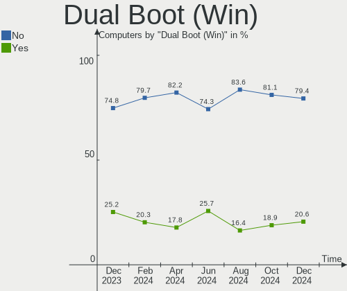
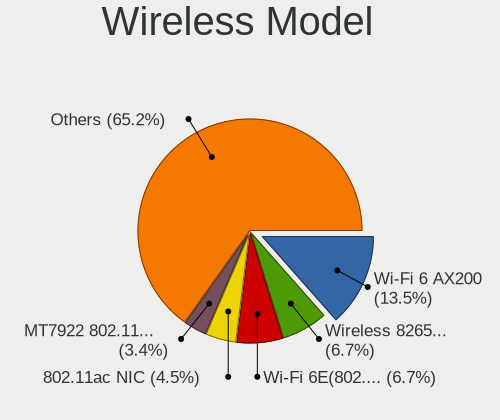

Manjaro Hardware Trends
-----------------------

A project to identify most popular hardware characteristics and track their change
over time based on data collected by Manjaro users at https://Linux-Hardware.org.

Anyone can contribute to this report by the [hw-probe](https://github.com/linuxhw/hw-probe) tool:

    sudo -E hw-probe -all -upload

This is a report for all computer types. See also reports for [desktops](/Dist/Manjaro/Desktop/README.md) and [notebooks](/Dist/Manjaro/Notebook/README.md).

Full-feature report is available here: https://linux-hardware.org/?view=trends

Period: Feb, 2022.

Contents
--------

* [ System ](#system)
  - [ OS                       ](#os)
  - [ OS Family                ](#os-family)
  - [ Kernel                   ](#kernel)
  - [ Kernel Family            ](#kernel-family)
  - [ Kernel Major Ver.        ](#kernel-major-ver)
  - [ Arch                     ](#arch)
  - [ DE                       ](#de)
  - [ Display Server           ](#display-server)
  - [ Display Manager          ](#display-manager)
  - [ OS Lang                  ](#os-lang)
  - [ Boot Mode                ](#boot-mode)
  - [ Filesystem               ](#filesystem)
  - [ Part. scheme             ](#part-scheme)
  - [ Dual Boot with Linux/BSD ](#dual-boot-with-linuxbsd)
  - [ Dual Boot (Win)          ](#dual-boot-win)

* [ Board ](#board)
  - [ Vendor                   ](#vendor)
  - [ Model                    ](#model)
  - [ Model Family             ](#model-family)
  - [ MFG Year                 ](#mfg-year)
  - [ Form Factor              ](#form-factor)
  - [ Secure Boot              ](#secure-boot)
  - [ Coreboot                 ](#coreboot)
  - [ RAM Size                 ](#ram-size)
  - [ RAM Used                 ](#ram-used)
  - [ Total Drives             ](#total-drives)
  - [ Has CD-ROM               ](#has-cd-rom)
  - [ Has Ethernet             ](#has-ethernet)
  - [ Has WiFi                 ](#has-wifi)
  - [ Has Bluetooth            ](#has-bluetooth)

* [ Location ](#location)
  - [ Country                  ](#country)
  - [ City                     ](#city)

* [ Drives ](#drives)
  - [ Drive Vendor             ](#drive-vendor)
  - [ Drive Model              ](#drive-model)
  - [ HDD Vendor               ](#hdd-vendor)
  - [ SSD Vendor               ](#ssd-vendor)
  - [ Drive Kind               ](#drive-kind)
  - [ Drive Connector          ](#drive-connector)
  - [ Drive Size               ](#drive-size)
  - [ Space Total              ](#space-total)
  - [ Space Used               ](#space-used)
  - [ Malfunc. Drives          ](#malfunc-drives)
  - [ Malfunc. Drive Vendor    ](#malfunc-drive-vendor)
  - [ Malfunc. HDD Vendor      ](#malfunc-hdd-vendor)
  - [ Malfunc. Drive Kind      ](#malfunc-drive-kind)
  - [ Failed Drives            ](#failed-drives)
  - [ Failed Drive Vendor      ](#failed-drive-vendor)
  - [ Drive Status             ](#drive-status)

* [ Storage controller ](#storage-controller)
  - [ Storage Vendor           ](#storage-vendor)
  - [ Storage Model            ](#storage-model)
  - [ Storage Kind             ](#storage-kind)

* [ Processor ](#processor)
  - [ CPU Vendor               ](#cpu-vendor)
  - [ CPU Model                ](#cpu-model)
  - [ CPU Model Family         ](#cpu-model-family)
  - [ CPU Cores                ](#cpu-cores)
  - [ CPU Sockets              ](#cpu-sockets)
  - [ CPU Threads              ](#cpu-threads)
  - [ CPU Op-Modes             ](#cpu-op-modes)
  - [ CPU Microcode            ](#cpu-microcode)
  - [ CPU Microarch            ](#cpu-microarch)

* [ Graphics ](#graphics)
  - [ GPU Vendor               ](#gpu-vendor)
  - [ GPU Model                ](#gpu-model)
  - [ GPU Combo                ](#gpu-combo)
  - [ GPU Driver               ](#gpu-driver)
  - [ GPU Memory               ](#gpu-memory)

* [ Monitor ](#monitor)
  - [ Monitor Vendor           ](#monitor-vendor)
  - [ Monitor Model            ](#monitor-model)
  - [ Monitor Resolution       ](#monitor-resolution)
  - [ Monitor Diagonal         ](#monitor-diagonal)
  - [ Monitor Width            ](#monitor-width)
  - [ Aspect Ratio             ](#aspect-ratio)
  - [ Monitor Area             ](#monitor-area)
  - [ Pixel Density            ](#pixel-density)
  - [ Multiple Monitors        ](#multiple-monitors)

* [ Network ](#network)
  - [ Net Controller Vendor    ](#net-controller-vendor)
  - [ Net Controller Model     ](#net-controller-model)
  - [ Wireless Vendor          ](#wireless-vendor)
  - [ Wireless Model           ](#wireless-model)
  - [ Ethernet Vendor          ](#ethernet-vendor)
  - [ Ethernet Model           ](#ethernet-model)
  - [ Net Controller Kind      ](#net-controller-kind)
  - [ Used Controller          ](#used-controller)
  - [ NICs                     ](#nics)
  - [ IPv6                     ](#ipv6)

* [ Bluetooth ](#bluetooth)
  - [ Bluetooth Vendor         ](#bluetooth-vendor)
  - [ Bluetooth Model          ](#bluetooth-model)

* [ Sound ](#sound)
  - [ Sound Vendor             ](#sound-vendor)
  - [ Sound Model              ](#sound-model)

* [ Memory ](#memory)
  - [ Memory Vendor            ](#memory-vendor)
  - [ Memory Model             ](#memory-model)
  - [ Memory Kind              ](#memory-kind)
  - [ Memory Form Factor       ](#memory-form-factor)
  - [ Memory Size              ](#memory-size)
  - [ Memory Speed             ](#memory-speed)

* [ Printers & scanners ](#printers--scanners)
  - [ Printer Vendor           ](#printer-vendor)
  - [ Printer Model            ](#printer-model)
  - [ Scanner Vendor           ](#scanner-vendor)
  - [ Scanner Model            ](#scanner-model)

* [ Camera ](#camera)
  - [ Camera Vendor            ](#camera-vendor)
  - [ Camera Model             ](#camera-model)

* [ Security ](#security)
  - [ Fingerprint Vendor       ](#fingerprint-vendor)
  - [ Fingerprint Model        ](#fingerprint-model)
  - [ Chipcard Vendor          ](#chipcard-vendor)
  - [ Chipcard Model           ](#chipcard-model)

* [ Unsupported ](#unsupported)
  - [ Unsupported Devices      ](#unsupported-devices)
  - [ Unsupported Device Types ](#unsupported-device-types)

System
------

OS
--

Installed operating systems

| Name           | Computers | Percent |
|----------------|-----------|---------|
| Manjaro 21.2.3 | 72        | 45.86%  |
| Manjaro        | 65        | 41.4%   |
| Manjaro 21.2.2 | 14        | 8.92%   |
| Manjaro 21.2.4 | 3         | 1.91%   |
| Manjaro 21.2.0 | 1         | 0.64%   |
| Manjaro 21.1.0 | 1         | 0.64%   |
| Manjaro 21.0.7 | 1         | 0.64%   |

OS Family
---------

OS without a version

| Name    | Computers | Percent |
|---------|-----------|---------|
| Manjaro | 157       | 100%    |

Kernel
------

Version of the Linux kernel

| Version                 | Computers | Percent |
|-------------------------|-----------|---------|
| 5.15.21-1-MANJARO       | 34        | 21.66%  |
| 5.15.19-1-MANJARO       | 24        | 15.29%  |
| 5.16.7-1-MANJARO        | 18        | 11.46%  |
| 5.15.16-1-MANJARO       | 15        | 9.55%   |
| 5.16.5-1-MANJARO        | 11        | 7.01%   |
| 5.10.96-1-MANJARO       | 8         | 5.1%    |
| 5.15.25-1-MANJARO       | 6         | 3.82%   |
| 5.16.2-1-MANJARO        | 5         | 3.18%   |
| 5.10.98-1-MANJARO       | 4         | 2.55%   |
| 5.10.93-1-MANJARO       | 4         | 2.55%   |
| 5.9.16-1-MANJARO        | 3         | 1.91%   |
| 5.16.2-1-rt19-MANJARO   | 3         | 1.91%   |
| 5.15.7-1-MANJARO        | 3         | 1.91%   |
| 5.13.19-2-MANJARO       | 3         | 1.91%   |
| 5.4.178-1-MANJARO       | 2         | 1.27%   |
| 5.17.0-1-MANJARO        | 2         | 1.27%   |
| 5.16.9-2-MANJARO        | 1         | 0.64%   |
| 5.16.1-237-tkg-bmq-llvm | 1         | 0.64%   |
| 5.15.7-1-rt23-MANJARO   | 1         | 0.64%   |
| 5.15.6-2-MANJARO        | 1         | 0.64%   |
| 5.15.24-1-MANJARO       | 1         | 0.64%   |
| 5.15.21-xanmod1-MANJARO | 1         | 0.64%   |
| 5.15.18-2-rt28-MANJARO  | 1         | 0.64%   |
| 5.15.13-1-rt26-MANJARO  | 1         | 0.64%   |
| 5.15.12-1-MANJARO       | 1         | 0.64%   |
| 5.10.89-1-MANJARO       | 1         | 0.64%   |
| 5.10.42-1-MANJARO       | 1         | 0.64%   |
| 4.19.227-1-MANJARO      | 1         | 0.64%   |

Kernel Family
-------------

Linux kernel without a distro release

| Version  | Computers | Percent |
|----------|-----------|---------|
| 5.15.21  | 35        | 22.29%  |
| 5.15.19  | 24        | 15.29%  |
| 5.16.7   | 18        | 11.46%  |
| 5.15.16  | 15        | 9.55%   |
| 5.16.5   | 11        | 7.01%   |
| 5.16.2   | 8         | 5.1%    |
| 5.10.96  | 8         | 5.1%    |
| 5.15.25  | 6         | 3.82%   |
| 5.15.7   | 4         | 2.55%   |
| 5.10.98  | 4         | 2.55%   |
| 5.10.93  | 4         | 2.55%   |
| 5.9.16   | 3         | 1.91%   |
| 5.13.19  | 3         | 1.91%   |
| 5.4.178  | 2         | 1.27%   |
| 5.17.0   | 2         | 1.27%   |
| 5.16.9   | 1         | 0.64%   |
| 5.16.1   | 1         | 0.64%   |
| 5.15.6   | 1         | 0.64%   |
| 5.15.24  | 1         | 0.64%   |
| 5.15.18  | 1         | 0.64%   |
| 5.15.13  | 1         | 0.64%   |
| 5.15.12  | 1         | 0.64%   |
| 5.10.89  | 1         | 0.64%   |
| 5.10.42  | 1         | 0.64%   |
| 4.19.227 | 1         | 0.64%   |

Kernel Major Ver.
-----------------

Linux kernel major version

| Version | Computers | Percent |
|---------|-----------|---------|
| 5.15    | 89        | 56.69%  |
| 5.16    | 39        | 24.84%  |
| 5.10    | 18        | 11.46%  |
| 5.9     | 3         | 1.91%   |
| 5.13    | 3         | 1.91%   |
| 5.4     | 2         | 1.27%   |
| 5.17    | 2         | 1.27%   |
| 4.19    | 1         | 0.64%   |

Arch
----

OS architecture (x86_64, i586, etc.)

| Name   | Computers | Percent |
|--------|-----------|---------|
| x86_64 | 157       | 100%    |

DE
--

Desktop Environment

| Name         | Computers | Percent |
|--------------|-----------|---------|
| KDE5         | 77        | 49.04%  |
| XFCE         | 37        | 23.57%  |
| GNOME        | 26        | 16.56%  |
| Unknown      | 9         | 5.73%   |
| X-Cinnamon   | 3         | 1.91%   |
| i3           | 2         | 1.27%   |
| sway         | 1         | 0.64%   |
| herbstluftwm | 1         | 0.64%   |
| Budgie       | 1         | 0.64%   |

Display Server
--------------

X11 or Wayland

| Name    | Computers | Percent |
|---------|-----------|---------|
| X11     | 133       | 84.71%  |
| Wayland | 20        | 12.74%  |
| Tty     | 2         | 1.27%   |
| Unknown | 2         | 1.27%   |

Display Manager
---------------

SDDM, LightDM, etc.

| Name    | Computers | Percent |
|---------|-----------|---------|
| Unknown | 66        | 42.04%  |
| SDDM    | 40        | 25.48%  |
| LightDM | 32        | 20.38%  |
| GDM     | 19        | 12.1%   |

OS Lang
-------

Language

| Lang    | Computers | Percent |
|---------|-----------|---------|
| en_US   | 63        | 40.13%  |
| en_GB   | 18        | 11.46%  |
| de_DE   | 9         | 5.73%   |
| ru_RU   | 7         | 4.46%   |
| es_ES   | 7         | 4.46%   |
| en_CA   | 6         | 3.82%   |
| es_MX   | 4         | 2.55%   |
| zh_CN   | 3         | 1.91%   |
| pl_PL   | 3         | 1.91%   |
| it_IT   | 3         | 1.91%   |
| fr_FR   | 3         | 1.91%   |
| en_IN   | 3         | 1.91%   |
| en_AU   | 3         | 1.91%   |
| Unknown | 3         | 1.91%   |
| hu_HU   | 2         | 1.27%   |
| en_PH   | 2         | 1.27%   |
| en_IE   | 2         | 1.27%   |
| tr_TR   | 1         | 0.64%   |
| sv_SE   | 1         | 0.64%   |
| ru_UA   | 1         | 0.64%   |
| pt_BR   | 1         | 0.64%   |
| nl_NL   | 1         | 0.64%   |
| nl_BE   | 1         | 0.64%   |
| ja_JP   | 1         | 0.64%   |
| fr_CA   | 1         | 0.64%   |
| fi_FI   | 1         | 0.64%   |
| et_EE   | 1         | 0.64%   |
| es_AR   | 1         | 0.64%   |
| en_NZ   | 1         | 0.64%   |
| en_DK   | 1         | 0.64%   |
| en_DE   | 1         | 0.64%   |
| de_AT   | 1         | 0.64%   |
| C       | 1         | 0.64%   |

Boot Mode
---------

EFI or BIOS

| Mode | Computers | Percent |
|------|-----------|---------|
| BIOS | 97        | 61.78%  |
| EFI  | 60        | 38.22%  |

Filesystem
----------

Type of filesystem

| Type    | Computers | Percent |
|---------|-----------|---------|
| Ext4    | 133       | 84.71%  |
| Btrfs   | 12        | 7.64%   |
| Overlay | 5         | 3.18%   |
| Xfs     | 4         | 2.55%   |
| Tmpfs   | 2         | 1.27%   |
| F2fs    | 1         | 0.64%   |

Part. scheme
------------

Scheme of partitioning

| Type    | Computers | Percent |
|---------|-----------|---------|
| Unknown | 92        | 58.6%   |
| GPT     | 61        | 38.85%  |
| MBR     | 4         | 2.55%   |

Dual Boot with Linux/BSD
------------------------

Hosting more than one Linux/BSD

| Dual boot | Computers | Percent |
|-----------|-----------|---------|
| No        | 140       | 89.17%  |
| Yes       | 17        | 10.83%  |

Dual Boot (Win)
---------------

Hosting Linux and Windows

| Dual boot | Computers | Percent |
|-----------|-----------|---------|
| No        | 108       | 68.79%  |
| Yes       | 49        | 31.21%  |

Board
-----

Vendor
------

Motherboard manufacturer

| Name                 | Computers | Percent |
|----------------------|-----------|---------|
| ASUSTek Computer     | 25        | 15.92%  |
| Lenovo               | 24        | 15.29%  |
| Hewlett-Packard      | 22        | 14.01%  |
| Dell                 | 19        | 12.1%   |
| MSI                  | 13        | 8.28%   |
| Gigabyte Technology  | 11        | 7.01%   |
| Acer                 | 8         | 5.1%    |
| ASRock               | 7         | 4.46%   |
| Toshiba              | 4         | 2.55%   |
| Samsung Electronics  | 3         | 1.91%   |
| Apple                | 3         | 1.91%   |
| Microsoft            | 2         | 1.27%   |
| Intel                | 2         | 1.27%   |
| Google               | 2         | 1.27%   |
| Timi                 | 1         | 0.64%   |
| Teclast              | 1         | 0.64%   |
| Supermicro           | 1         | 0.64%   |
| PC Specialist        | 1         | 0.64%   |
| Packard Bell         | 1         | 0.64%   |
| Intel Client Systems | 1         | 0.64%   |
| HUAWEI               | 1         | 0.64%   |
| HONOR                | 1         | 0.64%   |
| Gateway              | 1         | 0.64%   |
| Biostar              | 1         | 0.64%   |
| AZW                  | 1         | 0.64%   |
| AIO                  | 1         | 0.64%   |

Model
-----

Motherboard model

| Name                                                     | Computers | Percent |
|----------------------------------------------------------|-----------|---------|
| HP Notebook                                              | 3         | 1.91%   |
| HP Compaq dc5800 Microtower                              | 2         | 1.27%   |
| Gigabyte B250M-DS3H                                      | 2         | 1.27%   |
| Dell OptiPlex 9020                                       | 2         | 1.27%   |
| Dell Inspiron 15 7000 Gaming                             | 2         | 1.27%   |
| ASUS ROG Strix G513QY_G513QY                             | 2         | 1.27%   |
| Toshiba Satellite U900                                   | 1         | 0.64%   |
| Toshiba Satellite L300                                   | 1         | 0.64%   |
| Toshiba Satellite C870D-11F                              | 1         | 0.64%   |
| Toshiba Satellite C655D                                  | 1         | 0.64%   |
| Timi RedmiBook 13 R                                      | 1         | 0.64%   |
| Teclast X6 plus                                          | 1         | 0.64%   |
| Supermicro A1SAM-2550F                                   | 1         | 0.64%   |
| Samsung 950QCG                                           | 1         | 0.64%   |
| Samsung 300E5EV/300E4EV/270E5EV/270E4EV/2470EV/2470EE    | 1         | 0.64%   |
| Samsung 300E4A/300E5A/300E7A/3430EA/3530EA               | 1         | 0.64%   |
| PC Specialist NH5x_7xRCx,RDx                             | 1         | 0.64%   |
| Packard Bell EasyNote TK85                               | 1         | 0.64%   |
| MSI P65 Creator 9SD                                      | 1         | 0.64%   |
| MSI MS-7C94                                              | 1         | 0.64%   |
| MSI MS-7C90                                              | 1         | 0.64%   |
| MSI MS-7C35                                              | 1         | 0.64%   |
| MSI MS-7B85                                              | 1         | 0.64%   |
| MSI MS-7A66                                              | 1         | 0.64%   |
| MSI MS-7996                                              | 1         | 0.64%   |
| MSI MS-7576                                              | 1         | 0.64%   |
| MSI GT72 6QD                                             | 1         | 0.64%   |
| MSI GT680R/GX680R/GT683R/GT683DXR/GT685R/GT687R/GX660DXR | 1         | 0.64%   |
| MSI GS60 2PE                                             | 1         | 0.64%   |
| MSI GP66 Leopard 11UG                                    | 1         | 0.64%   |
| MSI GE76 Raider 11UH                                     | 1         | 0.64%   |
| Microsoft Surface Pro 6                                  | 1         | 0.64%   |
| Microsoft Surface Book                                   | 1         | 0.64%   |
| Lenovo Yoga Slim 7 Carbon 14ACN6 82L0                    | 1         | 0.64%   |
| Lenovo Yoga 720-15IKB 80X7                               | 1         | 0.64%   |
| Lenovo XiaoXinPro 16ACH 2021 82L5                        | 1         | 0.64%   |
| Lenovo V520S-08IKL 10NM0064UK                            | 1         | 0.64%   |
| Lenovo V330-15IKB 81AX                                   | 1         | 0.64%   |
| Lenovo ThinkPad W520 427637U                             | 1         | 0.64%   |
| Lenovo ThinkPad ThinkPad L14 20U5000UUS                  | 1         | 0.64%   |
| Lenovo ThinkPad T450s 20BWS06K0G                         | 1         | 0.64%   |
| Lenovo ThinkPad P51 20HHCTO1WW                           | 1         | 0.64%   |
| Lenovo ThinkPad E495 20NES01600                          | 1         | 0.64%   |
| Lenovo ThinkPad E490 20N80029GE                          | 1         | 0.64%   |
| Lenovo ThinkCentre M92p 3228BS3                          | 1         | 0.64%   |
| Lenovo ThinkCentre M900 10FD003RUS                       | 1         | 0.64%   |
| Lenovo ThinkCentre Edge72Z 3569JLP                       | 1         | 0.64%   |
| Lenovo Legion R9000P2021H 82JQ                           | 1         | 0.64%   |
| Lenovo IdeaPad S340-15API 81NC                           | 1         | 0.64%   |
| Lenovo IdeaPad S145-15IWL 81MV                           | 1         | 0.64%   |
| Lenovo IdeaPad S145-15IIL 81W8                           | 1         | 0.64%   |
| Lenovo IdeaPad D330-10IGM 81H3                           | 1         | 0.64%   |
| Lenovo IdeaPad 730S-13IWL 81JB                           | 1         | 0.64%   |
| Lenovo IdeaPad 5 Pro 16ACH6 82L5                         | 1         | 0.64%   |
| Lenovo IdeaPad 5 15IIL05 81YK                            | 1         | 0.64%   |
| Lenovo IdeaPad 330-15ARR 81D2                            | 1         | 0.64%   |
| Lenovo IdeaPad 320-15ISK 80XH                            | 1         | 0.64%   |
| Intel H61 V124                                           | 1         | 0.64%   |
| Intel DH67GD AAG10206-202                                | 1         | 0.64%   |
| Intel Client Systems LAPBC710                            | 1         | 0.64%   |

Model Family
------------

Motherboard model prefix

| Name                          | Computers | Percent |
|-------------------------------|-----------|---------|
| Lenovo IdeaPad                | 9         | 5.73%   |
| Dell Inspiron                 | 8         | 5.1%    |
| Lenovo ThinkPad               | 6         | 3.82%   |
| Dell Latitude                 | 5         | 3.18%   |
| ASUS ROG                      | 5         | 3.18%   |
| ASUS PRIME                    | 5         | 3.18%   |
| Toshiba Satellite             | 4         | 2.55%   |
| HP EliteBook                  | 4         | 2.55%   |
| HP Compaq                     | 4         | 2.55%   |
| Lenovo ThinkCentre            | 3         | 1.91%   |
| HP Pavilion                   | 3         | 1.91%   |
| HP Notebook                   | 3         | 1.91%   |
| HP EliteDesk                  | 3         | 1.91%   |
| Dell OptiPlex                 | 3         | 1.91%   |
| Acer Aspire                   | 3         | 1.91%   |
| Microsoft Surface             | 2         | 1.27%   |
| Lenovo Yoga                   | 2         | 1.27%   |
| Gigabyte B250M-DS3H           | 2         | 1.27%   |
| Dell XPS                      | 2         | 1.27%   |
| ASUS VivoBook                 | 2         | 1.27%   |
| ASUS TUF                      | 2         | 1.27%   |
| ASUS ASUS                     | 2         | 1.27%   |
| Acer Swift                    | 2         | 1.27%   |
| Timi RedmiBook                | 1         | 0.64%   |
| Teclast X6                    | 1         | 0.64%   |
| Supermicro A1SAM-2550F        | 1         | 0.64%   |
| Samsung 950QCG                | 1         | 0.64%   |
| Samsung 300E5EV               | 1         | 0.64%   |
| Samsung 300E4A                | 1         | 0.64%   |
| PC Specialist NH5x            | 1         | 0.64%   |
| Packard Bell EasyNote         | 1         | 0.64%   |
| MSI P65                       | 1         | 0.64%   |
| MSI MS-7C94                   | 1         | 0.64%   |
| MSI MS-7C90                   | 1         | 0.64%   |
| MSI MS-7C35                   | 1         | 0.64%   |
| MSI MS-7B85                   | 1         | 0.64%   |
| MSI MS-7A66                   | 1         | 0.64%   |
| MSI MS-7996                   | 1         | 0.64%   |
| MSI MS-7576                   | 1         | 0.64%   |
| MSI GT72                      | 1         | 0.64%   |
| MSI GT680R                    | 1         | 0.64%   |
| MSI GS60                      | 1         | 0.64%   |
| MSI GP66                      | 1         | 0.64%   |
| MSI GE76                      | 1         | 0.64%   |
| Lenovo XiaoXinPro             | 1         | 0.64%   |
| Lenovo V520S-08IKL            | 1         | 0.64%   |
| Lenovo V330-15IKB             | 1         | 0.64%   |
| Lenovo Legion                 | 1         | 0.64%   |
| Intel H61                     | 1         | 0.64%   |
| Intel DH67GD                  | 1         | 0.64%   |
| Intel Client Systems LAPBC710 | 1         | 0.64%   |
| HUAWEI HVY-WXX9               | 1         | 0.64%   |
| HONOR BMH-WCX9                | 1         | 0.64%   |
| HP ProDesk                    | 1         | 0.64%   |
| HP OMEN                       | 1         | 0.64%   |
| HP Laptop                     | 1         | 0.64%   |
| HP ENVY                       | 1         | 0.64%   |
| HP 250                        | 1         | 0.64%   |
| Google Chell                  | 1         | 0.64%   |
| Google Celes                  | 1         | 0.64%   |

MFG Year
--------

Motherboard manufacture year

| Year | Computers | Percent |
|------|-----------|---------|
| 2021 | 25        | 15.92%  |
| 2020 | 24        | 15.29%  |
| 2019 | 17        | 10.83%  |
| 2018 | 16        | 10.19%  |
| 2017 | 13        | 8.28%   |
| 2011 | 13        | 8.28%   |
| 2016 | 10        | 6.37%   |
| 2015 | 9         | 5.73%   |
| 2012 | 9         | 5.73%   |
| 2014 | 6         | 3.82%   |
| 2013 | 5         | 3.18%   |
| 2008 | 4         | 2.55%   |
| 2010 | 3         | 1.91%   |
| 2009 | 2         | 1.27%   |
| 2007 | 1         | 0.64%   |

Form Factor
-----------

Physical design of the computer

| Name        | Computers | Percent |
|-------------|-----------|---------|
| Notebook    | 83        | 52.87%  |
| Desktop     | 59        | 37.58%  |
| Convertible | 6         | 3.82%   |
| Tablet      | 4         | 2.55%   |
| All in one  | 3         | 1.91%   |
| Mini pc     | 1         | 0.64%   |
| Server      | 1         | 0.64%   |

Secure Boot
-----------

Enabled or disabled

| State    | Computers | Percent |
|----------|-----------|---------|
| Disabled | 157       | 100%    |

Coreboot
--------

Have coreboot on board

| Used | Computers | Percent |
|------|-----------|---------|
| No   | 155       | 98.73%  |
| Yes  | 2         | 1.27%   |

RAM Size
--------

Total RAM memory

| Size in GB  | Computers | Percent |
|-------------|-----------|---------|
| 16.01-24.0  | 41        | 26.11%  |
| 8.01-16.0   | 35        | 22.29%  |
| 4.01-8.0    | 33        | 21.02%  |
| 32.01-64.0  | 21        | 13.38%  |
| 3.01-4.0    | 15        | 9.55%   |
| 24.01-32.0  | 5         | 3.18%   |
| 64.01-256.0 | 4         | 2.55%   |
| 1.01-2.0    | 2         | 1.27%   |
| 2.01-3.0    | 1         | 0.64%   |

RAM Used
--------

Used RAM memory

| Used GB   | Computers | Percent |
|-----------|-----------|---------|
| 2.01-3.0  | 42        | 26.75%  |
| 4.01-8.0  | 40        | 25.48%  |
| 1.01-2.0  | 35        | 22.29%  |
| 3.01-4.0  | 22        | 14.01%  |
| 8.01-16.0 | 14        | 8.92%   |
| 0.51-1.0  | 3         | 1.91%   |
| 0.01-0.5  | 1         | 0.64%   |

Total Drives
------------

Number of drives on board

| Drives | Computers | Percent |
|--------|-----------|---------|
| 1      | 78        | 49.68%  |
| 2      | 44        | 28.03%  |
| 3      | 22        | 14.01%  |
| 4      | 8         | 5.1%    |
| 5      | 3         | 1.91%   |
| 7      | 1         | 0.64%   |
| 6      | 1         | 0.64%   |

Has CD-ROM
----------

Has CD-ROM on board

| Presented | Computers | Percent |
|-----------|-----------|---------|
| No        | 106       | 67.52%  |
| Yes       | 51        | 32.48%  |

Has Ethernet
------------

Has Ethernet on board

| Presented | Computers | Percent |
|-----------|-----------|---------|
| Yes       | 128       | 81.53%  |
| No        | 29        | 18.47%  |

Has WiFi
--------

Has WiFi module

| Presented | Computers | Percent |
|-----------|-----------|---------|
| Yes       | 126       | 80.25%  |
| No        | 31        | 19.75%  |

Has Bluetooth
-------------

Has Bluetooth module

| Presented | Computers | Percent |
|-----------|-----------|---------|
| Yes       | 107       | 68.15%  |
| No        | 50        | 31.85%  |

Location
--------

Country
-------

Geographic location (country)

| Country            | Computers | Percent |
|--------------------|-----------|---------|
| USA                | 22        | 14.01%  |
| Germany            | 19        | 12.1%   |
| Russia             | 10        | 6.37%   |
| Spain              | 9         | 5.73%   |
| Canada             | 8         | 5.1%    |
| UK                 | 7         | 4.46%   |
| Mexico             | 7         | 4.46%   |
| Ukraine            | 5         | 3.18%   |
| Turkey             | 4         | 2.55%   |
| Poland             | 4         | 2.55%   |
| Netherlands        | 4         | 2.55%   |
| Italy              | 4         | 2.55%   |
| France             | 4         | 2.55%   |
| India              | 3         | 1.91%   |
| Hungary            | 3         | 1.91%   |
| Belgium            | 3         | 1.91%   |
| Taiwan             | 2         | 1.27%   |
| Switzerland        | 2         | 1.27%   |
| Sweden             | 2         | 1.27%   |
| Philippines        | 2         | 1.27%   |
| Norway             | 2         | 1.27%   |
| Finland            | 2         | 1.27%   |
| Estonia            | 2         | 1.27%   |
| China              | 2         | 1.27%   |
| Brazil             | 2         | 1.27%   |
| Austria            | 2         | 1.27%   |
| Australia          | 2         | 1.27%   |
| Argentina          | 2         | 1.27%   |
| Venezuela          | 1         | 0.64%   |
| Thailand           | 1         | 0.64%   |
| Slovenia           | 1         | 0.64%   |
| Serbia             | 1         | 0.64%   |
| Saudi Arabia       | 1         | 0.64%   |
| New Zealand        | 1         | 0.64%   |
| Morocco            | 1         | 0.64%   |
| Lithuania          | 1         | 0.64%   |
| Japan              | 1         | 0.64%   |
| Ireland            | 1         | 0.64%   |
| Indonesia          | 1         | 0.64%   |
| Greece             | 1         | 0.64%   |
| Georgia            | 1         | 0.64%   |
| Ethiopia           | 1         | 0.64%   |
| El Salvador        | 1         | 0.64%   |
| Dominican Republic | 1         | 0.64%   |
| Denmark            | 1         | 0.64%   |

City
----

Geographic location (city)

| City                   | Computers | Percent |
|------------------------|-----------|---------|
| Paris                  | 3         | 1.91%   |
| Moscow                 | 3         | 1.91%   |
| Madrid                 | 3         | 1.91%   |
| Kyiv                   | 3         | 1.91%   |
| Istanbul               | 3         | 1.91%   |
| Vienna                 | 2         | 1.27%   |
| Perleberg              | 2         | 1.27%   |
| Oslo                   | 2         | 1.27%   |
| Naples                 | 2         | 1.27%   |
| Montreal               | 2         | 1.27%   |
| Fleet                  | 2         | 1.27%   |
| Essen                  | 2         | 1.27%   |
| Ziri                   | 1         | 0.64%   |
| Woodbridge             | 1         | 0.64%   |
| Wolgast                | 1         | 0.64%   |
| Windisch               | 1         | 0.64%   |
| Włocławek      | 1         | 0.64%   |
| Walsall                | 1         | 0.64%   |
| Vreden                 | 1         | 0.64%   |
| Vitoria de Santo Antao | 1         | 0.64%   |
| Vilnius                | 1         | 0.64%   |
| Villa María         | 1         | 0.64%   |
| Villa Adelina          | 1         | 0.64%   |
| Vancouver              | 1         | 0.64%   |
| Ulyanovsk              | 1         | 0.64%   |
| Tres Rios              | 1         | 0.64%   |
| Tomsk                  | 1         | 0.64%   |
| Toledo                 | 1         | 0.64%   |
| Tijuana                | 1         | 0.64%   |
| Thessaloniki           | 1         | 0.64%   |
| The Hague              | 1         | 0.64%   |
| Tbilisi                | 1         | 0.64%   |
| Tallinn                | 1         | 0.64%   |
| Sundsvall              | 1         | 0.64%   |
| St Petersburg          | 1         | 0.64%   |
| Spruce Grove           | 1         | 0.64%   |
| Slagelse               | 1         | 0.64%   |
| Shenzhen               | 1         | 0.64%   |
| Sertolovo              | 1         | 0.64%   |
| Schwerin               | 1         | 0.64%   |
| Sarasota               | 1         | 0.64%   |
| Santo Domingo Este     | 1         | 0.64%   |
| San Salvador           | 1         | 0.64%   |
| Rome                   | 1         | 0.64%   |
| Rijssen                | 1         | 0.64%   |
| Raleigh                | 1         | 0.64%   |
| Quezon City            | 1         | 0.64%   |
| Pune                   | 1         | 0.64%   |
| Pueblo                 | 1         | 0.64%   |
| Poznan                 | 1         | 0.64%   |
| Piding                 | 1         | 0.64%   |
| Perth                  | 1         | 0.64%   |
| Palma                  | 1         | 0.64%   |
| Oaxaca City            | 1         | 0.64%   |
| Niš                 | 1         | 0.64%   |
| New York               | 1         | 0.64%   |
| Nagpur                 | 1         | 0.64%   |
| Munich                 | 1         | 0.64%   |
| Muelheim-Kaerlich      | 1         | 0.64%   |
| Monterrey              | 1         | 0.64%   |

Drives
------

Drive Vendor
------------

Hard drive vendors

| Vendor                         | Computers | Drives | Percent |
|--------------------------------|-----------|--------|---------|
| Samsung Electronics            | 40        | 47     | 15.5%   |
| Seagate                        | 36        | 45     | 13.95%  |
| WDC                            | 29        | 34     | 11.24%  |
| Kingston                       | 15        | 15     | 5.81%   |
| Toshiba                        | 13        | 13     | 5.04%   |
| Intel                          | 12        | 13     | 4.65%   |
| SK Hynix                       | 11        | 12     | 4.26%   |
| Unknown                        | 10        | 11     | 3.88%   |
| Crucial                        | 9         | 12     | 3.49%   |
| SanDisk                        | 7         | 7      | 2.71%   |
| Hitachi                        | 7         | 7      | 2.71%   |
| HGST                           | 5         | 6      | 1.94%   |
| A-DATA Technology              | 5         | 5      | 1.94%   |
| Micron Technology              | 4         | 5      | 1.55%   |
| XPG                            | 3         | 3      | 1.16%   |
| PNY                            | 3         | 3      | 1.16%   |
| Phison                         | 3         | 4      | 1.16%   |
| Corsair                        | 3         | 3      | 1.16%   |
| Union Memory (Shenzhen)        | 2         | 2      | 0.78%   |
| SPCC                           | 2         | 2      | 0.78%   |
| SABRENT                        | 2         | 2      | 0.78%   |
| Patriot                        | 2         | 2      | 0.78%   |
| Micron/Crucial Technology      | 2         | 2      | 0.78%   |
| KingSpec                       | 2         | 2      | 0.78%   |
| Hewlett-Packard                | 2         | 2      | 0.78%   |
| ASMT                           | 2         | 7      | 0.78%   |
| Apple                          | 2         | 2      | 0.78%   |
| ADATA Technology               | 2         | 2      | 0.78%   |
| ZHITAI                         | 1         | 1      | 0.39%   |
| Yangtze Memory Technologies    | 1         | 1      | 0.39%   |
| Teclast                        | 1         | 1      | 0.39%   |
| Team                           | 1         | 1      | 0.39%   |
| Solid State Storage Technology | 1         | 1      | 0.39%   |
| Silicon Motion                 | 1         | 1      | 0.39%   |
| RX7                            | 1         | 1      | 0.39%   |
| PLEXTOR                        | 1         | 1      | 0.39%   |
| OCZ-VERTEX3                    | 1         | 1      | 0.39%   |
| OCZ-OCTANE                     | 1         | 1      | 0.39%   |
| OCZ                            | 1         | 1      | 0.39%   |
| LITEON                         | 1         | 1      | 0.39%   |
| Lexar                          | 1         | 1      | 0.39%   |
| KIOXIA-EXCERIA                 | 1         | 1      | 0.39%   |
| KIOXIA                         | 1         | 2      | 0.39%   |
| JMicron                        | 1         | 1      | 0.39%   |
| Intenso                        | 1         | 1      | 0.39%   |
| Integral                       | 1         | 1      | 0.39%   |
| Gigabyte Technology            | 1         | 1      | 0.39%   |
| G-DRIVE                        | 1         | 1      | 0.39%   |
| Fujitsu                        | 1         | 1      | 0.39%   |
| Apacer                         | 1         | 1      | 0.39%   |
| Unknown                        | 1         | 1      | 0.39%   |

Drive Model
-----------

Hard drive models

| Model                                        | Computers | Percent |
|----------------------------------------------|-----------|---------|
| Samsung SSD 860 EVO 250GB                    | 4         | 1.45%   |
| Kingston SA400S37120G 120GB SSD              | 4         | 1.45%   |
| WDC WDS500G2B0A-00SM50 500GB SSD             | 3         | 1.09%   |
| SK Hynix NVMe SSD Drive 512GB                | 3         | 1.09%   |
| Seagate ST3500418AS 500GB                    | 3         | 1.09%   |
| Samsung SSD 860 EVO 1TB                      | 3         | 1.09%   |
| Samsung SSD 850 EVO 250GB                    | 3         | 1.09%   |
| Samsung SM963 2.5" NVMe PCIe SSD 256GB       | 3         | 1.09%   |
| Samsung NVMe SSD Drive 1TB                   | 3         | 1.09%   |
| Kingston SA400S37240G 240GB SSD              | 3         | 1.09%   |
| XPG NVMe SSD Drive 512GB                     | 2         | 0.73%   |
| WDC WD10SPZX-24Z10 1TB                       | 2         | 0.73%   |
| Unknown SD/MMC/MS PRO 64GB                   | 2         | 0.73%   |
| Union Memory (Shenzhen) NVMe SSD Drive 256GB | 2         | 0.73%   |
| Toshiba NVMe SSD Drive 512GB                 | 2         | 0.73%   |
| Toshiba KBG30ZMS128G 128GB NVMe SSD          | 2         | 0.73%   |
| Seagate ST500LM021-1KJ152 500GB              | 2         | 0.73%   |
| Seagate ST2000LM015-2E8174 2TB               | 2         | 0.73%   |
| Seagate ST2000DM008-2FR102 2TB               | 2         | 0.73%   |
| Seagate ST1000DM003-1SB102 1TB               | 2         | 0.73%   |
| Seagate Expansion Desk 8TB                   | 2         | 0.73%   |
| Seagate BUP Slim BK 1TB                      | 2         | 0.73%   |
| Sandisk NVMe SSD Drive 512GB                 | 2         | 0.73%   |
| Samsung SSD 850 EVO 500GB                    | 2         | 0.73%   |
| Samsung NVMe SSD Drive 512GB                 | 2         | 0.73%   |
| Samsung NVMe SSD Drive 500GB                 | 2         | 0.73%   |
| Samsung NVMe SSD Drive 1024GB                | 2         | 0.73%   |
| SABRENT Disk 1TB                             | 2         | 0.73%   |
| PNY CS900 120GB SSD                          | 2         | 0.73%   |
| Intel SSDPEKNW512G8 512GB                    | 2         | 0.73%   |
| Hitachi HTS543232A7A384 320GB                | 2         | 0.73%   |
| HGST HUH721010ALE604 10TB                    | 2         | 0.73%   |
| Crucial CT500MX500SSD1 500GB                 | 2         | 0.73%   |
| Crucial CT240BX500SSD1 240GB                 | 2         | 0.73%   |
| Crucial CT1000MX500SSD1 1TB                  | 2         | 0.73%   |
| ZHITAI TiPro7000 1TB                         | 1         | 0.36%   |
| Yangtze Memory NVMe SSD Drive 1TB            | 1         | 0.36%   |
| XPG NVMe SSD Drive 256GB                     | 1         | 0.36%   |
| WDC WDS500G3X0C-00SJG0 500GB                 | 1         | 0.36%   |
| WDC WDS500G2B0B 500GB SSD                    | 1         | 0.36%   |
| WDC WDS500G2B0A 500GB SSD                    | 1         | 0.36%   |
| WDC WDS120G2G0A-00JH30 120GB SSD             | 1         | 0.36%   |
| WDC WDS100T2B0B 1TB SSD                      | 1         | 0.36%   |
| WDC WDBNCE5000PNC 500GB SSD                  | 1         | 0.36%   |
| WDC WD5000LPCX-60VHAT0 500GB                 | 1         | 0.36%   |
| WDC WD5000BPVT-22HXZT3 500GB                 | 1         | 0.36%   |
| WDC WD5000BEKT-22KA9T0 500GB                 | 1         | 0.36%   |
| WDC WD5000AAKX-60U6AA0 500GB                 | 1         | 0.36%   |
| WDC WD5000AAKX-08ERMA0 500GB                 | 1         | 0.36%   |
| WDC WD5000AADS-00M2B0 500GB                  | 1         | 0.36%   |
| WDC WD40EZRZ-22GXCB0 4TB                     | 1         | 0.36%   |
| WDC WD30EFRX-68EUZN0 3TB                     | 1         | 0.36%   |
| WDC WD20EARS-00MVWB0 2TB                     | 1         | 0.36%   |
| WDC WD15EADS-00P8B0 1TB                      | 1         | 0.36%   |
| WDC WD1502FAEX-007BA0 1TB                    | 1         | 0.36%   |
| WDC WD10SPZX-60Z10T0 1TB                     | 1         | 0.36%   |
| WDC WD10JPVX-75JC3T0 1TB                     | 1         | 0.36%   |
| WDC WD10EZEX-75WN4A0 1TB                     | 1         | 0.36%   |
| WDC WD10EZEX-00BBHA0 1TB                     | 1         | 0.36%   |
| WDC WD10EARX-00N0YB0 1TB                     | 1         | 0.36%   |

HDD Vendor
----------

Hard disk drive vendors

| Vendor              | Computers | Drives | Percent |
|---------------------|-----------|--------|---------|
| Seagate             | 35        | 44     | 40.7%   |
| WDC                 | 19        | 23     | 22.09%  |
| Toshiba             | 7         | 7      | 8.14%   |
| Hitachi             | 7         | 7      | 8.14%   |
| HGST                | 5         | 6      | 5.81%   |
| Samsung Electronics | 4         | 4      | 4.65%   |
| Unknown             | 3         | 3      | 3.49%   |
| SABRENT             | 2         | 2      | 2.33%   |
| JMicron             | 1         | 1      | 1.16%   |
| Fujitsu             | 1         | 1      | 1.16%   |
| ASMT                | 1         | 2      | 1.16%   |
| Apple               | 1         | 1      | 1.16%   |

SSD Vendor
----------

Solid state drive vendors

| Vendor              | Computers | Drives | Percent |
|---------------------|-----------|--------|---------|
| Samsung Electronics | 15        | 19     | 18.52%  |
| Kingston            | 12        | 12     | 14.81%  |
| WDC                 | 8         | 8      | 9.88%   |
| Crucial             | 8         | 11     | 9.88%   |
| Intel               | 4         | 4      | 4.94%   |
| PNY                 | 3         | 3      | 3.7%    |
| A-DATA Technology   | 3         | 3      | 3.7%    |
| Toshiba             | 2         | 2      | 2.47%   |
| SPCC                | 2         | 2      | 2.47%   |
| SK Hynix            | 2         | 2      | 2.47%   |
| SanDisk             | 2         | 2      | 2.47%   |
| Patriot             | 2         | 2      | 2.47%   |
| Teclast             | 1         | 1      | 1.23%   |
| Team                | 1         | 1      | 1.23%   |
| OCZ-VERTEX3         | 1         | 1      | 1.23%   |
| OCZ-OCTANE          | 1         | 1      | 1.23%   |
| OCZ                 | 1         | 1      | 1.23%   |
| Micron Technology   | 1         | 1      | 1.23%   |
| LITEON              | 1         | 1      | 1.23%   |
| Lexar               | 1         | 1      | 1.23%   |
| KingSpec            | 1         | 1      | 1.23%   |
| Intenso             | 1         | 1      | 1.23%   |
| Integral            | 1         | 1      | 1.23%   |
| Hewlett-Packard     | 1         | 1      | 1.23%   |
| Gigabyte Technology | 1         | 1      | 1.23%   |
| Corsair             | 1         | 1      | 1.23%   |
| ASMT                | 1         | 5      | 1.23%   |
| Apple               | 1         | 1      | 1.23%   |
| Apacer              | 1         | 1      | 1.23%   |
| Unknown             | 1         | 1      | 1.23%   |

Drive Kind
----------

HDD or SSD

| Kind    | Computers | Drives | Percent |
|---------|-----------|--------|---------|
| NVMe    | 75        | 87     | 32.75%  |
| HDD     | 73        | 101    | 31.88%  |
| SSD     | 68        | 92     | 29.69%  |
| Unknown | 7         | 7      | 3.06%   |
| MMC     | 6         | 7      | 2.62%   |

Drive Connector
---------------

SATA, SAS, NVMe, etc.

| Type | Computers | Drives | Percent |
|------|-----------|--------|---------|
| SATA | 108       | 178    | 53.47%  |
| NVMe | 75        | 87     | 37.13%  |
| SAS  | 13        | 22     | 6.44%   |
| MMC  | 6         | 7      | 2.97%   |

Drive Size
----------

Size of hard drive

| Size in TB | Computers | Drives | Percent |
|------------|-----------|--------|---------|
| 0.01-0.5   | 80        | 111    | 54.42%  |
| 0.51-1.0   | 47        | 61     | 31.97%  |
| 1.01-2.0   | 9         | 9      | 6.12%   |
| 4.01-10.0  | 5         | 6      | 3.4%    |
| 3.01-4.0   | 3         | 3      | 2.04%   |
| 2.01-3.0   | 2         | 2      | 1.36%   |
| 10.01-20.0 | 1         | 1      | 0.68%   |

Space Total
-----------

Amount of disk space available on the file system

| Size in GB     | Computers | Percent |
|----------------|-----------|---------|
| 251-500        | 39        | 24.84%  |
| 101-250        | 33        | 21.02%  |
| 501-1000       | 18        | 11.46%  |
| 1001-2000      | 15        | 9.55%   |
| Unknown        | 14        | 8.92%   |
| More than 3000 | 10        | 6.37%   |
| 1-20           | 8         | 5.1%    |
| 51-100         | 8         | 5.1%    |
| 21-50          | 7         | 4.46%   |
| 2001-3000      | 5         | 3.18%   |

Space Used
----------

Amount of used disk space

| Used GB        | Computers | Percent |
|----------------|-----------|---------|
| 1-20           | 36        | 22.93%  |
| 21-50          | 33        | 21.02%  |
| 101-250        | 24        | 15.29%  |
| Unknown        | 14        | 8.92%   |
| 51-100         | 13        | 8.28%   |
| 251-500        | 11        | 7.01%   |
| 501-1000       | 10        | 6.37%   |
| 1001-2000      | 9         | 5.73%   |
| More than 3000 | 7         | 4.46%   |

Malfunc. Drives
---------------

Drive models with a malfunction

| Model                                               | Computers | Drives | Percent |
|-----------------------------------------------------|-----------|--------|---------|
| WDC WD20EARS-00MVWB0 2TB                            | 1         | 1      | 9.09%   |
| WDC WD10EARX-00N0YB0 1TB                            | 1         | 1      | 9.09%   |
| Toshiba MQ01ABD050 500GB                            | 1         | 1      | 9.09%   |
| Seagate ST9750420AS 752GB                           | 1         | 1      | 9.09%   |
| Seagate ST9250315AS 250GB                           | 1         | 1      | 9.09%   |
| Samsung Electronics HD103UJ 1TB                     | 1         | 1      | 9.09%   |
| Micron Technology MTFDDAV512TBN-1AR15ABHA 512GB SSD | 1         | 1      | 9.09%   |
| Hitachi HTS543232A7A384 320GB                       | 1         | 1      | 9.09%   |
| Crucial CT256M550SSD4 256GB                         | 1         | 1      | 9.09%   |
| ASMT 2135 120GB SSD                                 | 1         | 5      | 9.09%   |
| Unknown                                             | 1         | 1      | 9.09%   |

Malfunc. Drive Vendor
---------------------

Vendors of faulty drives

| Vendor              | Computers | Drives | Percent |
|---------------------|-----------|--------|---------|
| WDC                 | 2         | 2      | 18.18%  |
| Seagate             | 2         | 2      | 18.18%  |
| Toshiba             | 1         | 1      | 9.09%   |
| Samsung Electronics | 1         | 1      | 9.09%   |
| Micron Technology   | 1         | 1      | 9.09%   |
| Hitachi             | 1         | 1      | 9.09%   |
| Crucial             | 1         | 1      | 9.09%   |
| ASMT                | 1         | 5      | 9.09%   |
| Unknown             | 1         | 1      | 9.09%   |

Malfunc. HDD Vendor
-------------------

Vendors of faulty HDD drives

| Vendor              | Computers | Drives | Percent |
|---------------------|-----------|--------|---------|
| WDC                 | 2         | 2      | 28.57%  |
| Seagate             | 2         | 2      | 28.57%  |
| Toshiba             | 1         | 1      | 14.29%  |
| Samsung Electronics | 1         | 1      | 14.29%  |
| Hitachi             | 1         | 1      | 14.29%  |

Malfunc. Drive Kind
-------------------

Kinds of faulty drives

| Kind | Computers | Drives | Percent |
|------|-----------|--------|---------|
| HDD  | 7         | 7      | 70%     |
| SSD  | 3         | 8      | 30%     |

Failed Drives
-------------

Failed drive models

Zero info for selected period =(

Failed Drive Vendor
-------------------

Failed drive vendors

Zero info for selected period =(

Drive Status
------------

Number of failed and malfunc. drives

| Status   | Computers | Drives | Percent |
|----------|-----------|--------|---------|
| Detected | 112       | 199    | 64.74%  |
| Works    | 51        | 80     | 29.48%  |
| Malfunc  | 10        | 15     | 5.78%   |

Storage controller
------------------

Storage Vendor
--------------

Storage controller vendors

| Vendor                         | Computers | Percent |
|--------------------------------|-----------|---------|
| Intel                          | 97        | 46.19%  |
| AMD                            | 33        | 15.71%  |
| Samsung Electronics            | 23        | 10.95%  |
| SK Hynix                       | 9         | 4.29%   |
| Sandisk                        | 7         | 3.33%   |
| Phison Electronics             | 5         | 2.38%   |
| ADATA Technology               | 5         | 2.38%   |
| Toshiba America Info Systems   | 4         | 1.9%    |
| Micron/Crucial Technology      | 3         | 1.43%   |
| Micron Technology              | 3         | 1.43%   |
| Kingston Technology Company    | 3         | 1.43%   |
| JMicron Technology             | 3         | 1.43%   |
| ASMedia Technology             | 3         | 1.43%   |
| Union Memory (Shenzhen)        | 2         | 0.95%   |
| Nvidia                         | 2         | 0.95%   |
| KIOXIA                         | 2         | 0.95%   |
| Yangtze Memory Technologies    | 1         | 0.48%   |
| Solid State Storage Technology | 1         | 0.48%   |
| Silicon Motion                 | 1         | 0.48%   |
| Realtek Semiconductor          | 1         | 0.48%   |
| Marvell Technology Group       | 1         | 0.48%   |
| Lite-On Technology             | 1         | 0.48%   |

Storage Model
-------------

Storage controller models

| Model                                                                                   | Computers | Percent |
|-----------------------------------------------------------------------------------------|-----------|---------|
| AMD FCH SATA Controller [AHCI mode]                                                     | 21        | 8.86%   |
| Samsung NVMe SSD Controller SM981/PM981/PM983                                           | 9         | 3.8%    |
| Intel Volume Management Device NVMe RAID Controller                                     | 9         | 3.8%    |
| AMD 400 Series Chipset SATA Controller                                                  | 8         | 3.38%   |
| Samsung NVMe SSD Controller 980                                                         | 7         | 2.95%   |
| SK Hynix Gold P31 SSD                                                                   | 6         | 2.53%   |
| Intel 82801 Mobile SATA Controller [RAID mode]                                          | 6         | 2.53%   |
| Intel 6 Series/C200 Series Chipset Family 6 port Mobile SATA AHCI Controller            | 6         | 2.53%   |
| Intel Sunrise Point-LP SATA Controller [AHCI mode]                                      | 5         | 2.11%   |
| Intel 7 Series Chipset Family 6-port SATA Controller [AHCI mode]                        | 5         | 2.11%   |
| Intel 200 Series PCH SATA controller [AHCI mode]                                        | 5         | 2.11%   |
| Samsung NVMe SSD Controller PM9A1/PM9A3/980PRO                                          | 4         | 1.69%   |
| Intel Wildcat Point-LP SATA Controller [AHCI Mode]                                      | 4         | 1.69%   |
| Intel SATA Controller [RAID mode]                                                       | 4         | 1.69%   |
| Intel Q170/Q150/B150/H170/H110/Z170/CM236 Chipset SATA Controller [AHCI Mode]           | 4         | 1.69%   |
| Intel HM170/QM170 Chipset SATA Controller [AHCI Mode]                                   | 4         | 1.69%   |
| Intel 82801I (ICH9 Family) 2 port SATA Controller [IDE mode]                            | 4         | 1.69%   |
| Intel 8 Series/C220 Series Chipset Family 6-port SATA Controller 1 [AHCI mode]          | 4         | 1.69%   |
| Intel 6 Series/C200 Series Chipset Family 6 port Desktop SATA AHCI Controller           | 4         | 1.69%   |
| AMD Starship/Matisse Chipset SATA Controller [AHCI mode]                                | 4         | 1.69%   |
| ADATA XPG SX8200 Pro PCIe Gen3x4 M.2 2280 Solid State Drive                             | 4         | 1.69%   |
| Sandisk WD Black SN750 / PC SN730 NVMe SSD                                              | 3         | 1.27%   |
| Micron/Crucial P2 NVMe PCIe SSD                                                         | 3         | 1.27%   |
| Micron Non-Volatile memory controller                                                   | 3         | 1.27%   |
| Intel SSD 660P Series                                                                   | 3         | 1.27%   |
| Intel Non-Volatile memory controller                                                    | 3         | 1.27%   |
| Intel Cannon Lake PCH SATA AHCI Controller                                              | 3         | 1.27%   |
| Intel 7 Series/C210 Series Chipset Family 6-port SATA Controller [AHCI mode]            | 3         | 1.27%   |
| Intel 500 Series Chipset Family SATA AHCI Controller                                    | 3         | 1.27%   |
| ASMedia ASM1062 Serial ATA Controller                                                   | 3         | 1.27%   |
| Union Memory (Shenzhen) Non-Volatile memory controller                                  | 2         | 0.84%   |
| Toshiba America Info Systems Toshiba America Info Non-Volatile memory controller        | 2         | 0.84%   |
| Toshiba America Info Systems BG3 NVMe SSD Controller                                    | 2         | 0.84%   |
| SK Hynix BC511                                                                          | 2         | 0.84%   |
| Samsung NVMe SSD Controller SM951/PM951                                                 | 2         | 0.84%   |
| Phison E16 PCIe4 NVMe Controller                                                        | 2         | 0.84%   |
| Phison E12 NVMe Controller                                                              | 2         | 0.84%   |
| KIOXIA Non-Volatile memory controller                                                   | 2         | 0.84%   |
| JMicron JMB368 IDE controller                                                           | 2         | 0.84%   |
| Intel Tiger Lake-LP SATA Controller [AHCI mode]                                         | 2         | 0.84%   |
| Intel Ice Lake-LP SATA Controller [AHCI mode]                                           | 2         | 0.84%   |
| Intel Comet Lake SATA AHCI Controller                                                   | 2         | 0.84%   |
| Intel Celeron/Pentium Silver Processor SATA Controller                                  | 2         | 0.84%   |
| Intel Cannon Point-LP SATA Controller [AHCI Mode]                                       | 2         | 0.84%   |
| Intel 82801IR/IO/IH (ICH9R/DO/DH) 4 port SATA Controller [IDE mode]                     | 2         | 0.84%   |
| Intel 82801IB (ICH9) 2 port SATA Controller [IDE mode]                                  | 2         | 0.84%   |
| Intel 6 Series/C200 Series Chipset Family Desktop SATA Controller (IDE mode, ports 4-5) | 2         | 0.84%   |
| Intel 6 Series/C200 Series Chipset Family Desktop SATA Controller (IDE mode, ports 0-3) | 2         | 0.84%   |
| AMD SB7x0/SB8x0/SB9x0 SATA Controller [AHCI mode]                                       | 2         | 0.84%   |
| Yangtze Memory ZHITAI TiPro7000                                                         | 1         | 0.42%   |
| Solid State Storage Non-Volatile memory controller                                      | 1         | 0.42%   |
| SK Hynix Non-Volatile memory controller                                                 | 1         | 0.42%   |
| Silicon Motion SM2263EN/SM2263XT SSD Controller                                         | 1         | 0.42%   |
| Sandisk WD Blue SN570 NVMe SSD                                                          | 1         | 0.42%   |
| Sandisk WD Black 2018/SN750 / PC SN720 NVMe SSD                                         | 1         | 0.42%   |
| Sandisk PC SN520 NVMe SSD                                                               | 1         | 0.42%   |
| Sandisk Non-Volatile memory controller                                                  | 1         | 0.42%   |
| Samsung NVMe SSD Controller SM961/PM961/SM963                                           | 1         | 0.42%   |
| Realtek Realtek Non-Volatile memory controller                                          | 1         | 0.42%   |
| Phison E18 PCIe4 NVMe Controller                                                        | 1         | 0.42%   |

Storage Kind
------------

Kind of storage controller (IDE, SATA, NVMe, SAS, ...)

| Kind | Computers | Percent |
|------|-----------|---------|
| SATA | 102       | 48.34%  |
| NVMe | 75        | 35.55%  |
| RAID | 21        | 9.95%   |
| IDE  | 13        | 6.16%   |

Processor
---------

CPU Vendor
----------

Processor vendors

| Vendor | Computers | Percent |
|--------|-----------|---------|
| Intel  | 115       | 73.25%  |
| AMD    | 42        | 26.75%  |

CPU Model
---------

Processor models

| Model                                         | Computers | Percent |
|-----------------------------------------------|-----------|---------|
| Intel Core i7-7700HQ CPU @ 2.80GHz            | 4         | 2.55%   |
| AMD Ryzen 7 5800H with Radeon Graphics        | 4         | 2.55%   |
| AMD Ryzen 5 2600 Six-Core Processor           | 4         | 2.55%   |
| Intel Core i7-6700 CPU @ 3.40GHz              | 3         | 1.91%   |
| Intel Core i7-10750H CPU @ 2.60GHz            | 3         | 1.91%   |
| Intel Core i5-2430M CPU @ 2.40GHz             | 3         | 1.91%   |
| Intel 11th Gen Core i7-1165G7 @ 2.80GHz       | 3         | 1.91%   |
| AMD Ryzen 9 5900HX with Radeon Graphics       | 3         | 1.91%   |
| AMD Ryzen 5 3600 6-Core Processor             | 3         | 1.91%   |
| Intel Core i7-9750H CPU @ 2.60GHz             | 2         | 1.27%   |
| Intel Core i7-8565U CPU @ 1.80GHz             | 2         | 1.27%   |
| Intel Core i7-5600U CPU @ 2.60GHz             | 2         | 1.27%   |
| Intel Core i7-3770 CPU @ 3.40GHz              | 2         | 1.27%   |
| Intel Core i7-2630QM CPU @ 2.00GHz            | 2         | 1.27%   |
| Intel Core i7-1065G7 CPU @ 1.30GHz            | 2         | 1.27%   |
| Intel Core i5-8600K CPU @ 3.60GHz             | 2         | 1.27%   |
| Intel Core i5-8265U CPU @ 1.60GHz             | 2         | 1.27%   |
| Intel Core i5-8250U CPU @ 1.60GHz             | 2         | 1.27%   |
| Intel Core i5-7200U CPU @ 2.50GHz             | 2         | 1.27%   |
| Intel Core i5-10400 CPU @ 2.90GHz             | 2         | 1.27%   |
| Intel Core i3-3240 CPU @ 3.40GHz              | 2         | 1.27%   |
| Intel Core 2 Duo CPU E8500 @ 3.16GHz          | 2         | 1.27%   |
| Intel Celeron CPU N3060 @ 1.60GHz             | 2         | 1.27%   |
| Intel 11th Gen Core i7-11800H @ 2.30GHz       | 2         | 1.27%   |
| Intel 11th Gen Core i5-11400 @ 2.60GHz        | 2         | 1.27%   |
| Intel 11th Gen Core i3-1115G4 @ 3.00GHz       | 2         | 1.27%   |
| AMD Ryzen 7 5700G with Radeon Graphics        | 2         | 1.27%   |
| AMD Ryzen 5 4500U with Radeon Graphics        | 2         | 1.27%   |
| AMD Ryzen 5 3500U with Radeon Vega Mobile Gfx | 2         | 1.27%   |
| Intel Xeon W-3223 CPU @ 3.50GHz               | 1         | 0.64%   |
| Intel Xeon CPU X5675 @ 3.07GHz                | 1         | 0.64%   |
| Intel Pentium Silver N5000 CPU @ 1.10GHz      | 1         | 0.64%   |
| Intel Pentium Gold 7505 @ 2.00GHz             | 1         | 0.64%   |
| Intel Pentium Dual-Core CPU E5300 @ 2.60GHz   | 1         | 0.64%   |
| Intel Pentium CPU P6100 @ 2.00GHz             | 1         | 0.64%   |
| Intel Pentium CPU G630 @ 2.70GHz              | 1         | 0.64%   |
| Intel Pentium CPU G4560 @ 3.50GHz             | 1         | 0.64%   |
| Intel Pentium CPU B980 @ 2.40GHz              | 1         | 0.64%   |
| Intel Genuine CPU T1600 @ 1.66GHz             | 1         | 0.64%   |
| Intel Genuine CPU 0000 @ 3.40GHz              | 1         | 0.64%   |
| Intel Core m7-6Y75 CPU @ 1.20GHz              | 1         | 0.64%   |
| Intel Core m5-6Y54 CPU @ 1.10GHz              | 1         | 0.64%   |
| Intel Core i7-9700K CPU @ 3.60GHz             | 1         | 0.64%   |
| Intel Core i7-8705G CPU @ 3.10GHz             | 1         | 0.64%   |
| Intel Core i7-8650U CPU @ 1.90GHz             | 1         | 0.64%   |
| Intel Core i7-8550U CPU @ 1.80GHz             | 1         | 0.64%   |
| Intel Core i7-7820HQ CPU @ 2.90GHz            | 1         | 0.64%   |
| Intel Core i7-7700 CPU @ 3.60GHz              | 1         | 0.64%   |
| Intel Core i7-6700HQ CPU @ 2.60GHz            | 1         | 0.64%   |
| Intel Core i7-6600U CPU @ 2.60GHz             | 1         | 0.64%   |
| Intel Core i7-6500U CPU @ 2.50GHz             | 1         | 0.64%   |
| Intel Core i7-5500U CPU @ 2.40GHz             | 1         | 0.64%   |
| Intel Core i7-4790 CPU @ 3.60GHz              | 1         | 0.64%   |
| Intel Core i7-4770 CPU @ 3.40GHz              | 1         | 0.64%   |
| Intel Core i7-4710HQ CPU @ 2.50GHz            | 1         | 0.64%   |
| Intel Core i7-3612QM CPU @ 2.10GHz            | 1         | 0.64%   |
| Intel Core i7-2720QM CPU @ 2.20GHz            | 1         | 0.64%   |
| Intel Core i7-10700KF CPU @ 3.80GHz           | 1         | 0.64%   |
| Intel Core i5-9600K CPU @ 3.70GHz             | 1         | 0.64%   |
| Intel Core i5-6400 CPU @ 2.70GHz              | 1         | 0.64%   |

CPU Model Family
----------------

Processor model prefix

| Model                   | Computers | Percent |
|-------------------------|-----------|---------|
| Intel Core i7           | 38        | 24.2%   |
| Intel Core i5           | 26        | 16.56%  |
| AMD Ryzen 5             | 15        | 9.55%   |
| Other                   | 14        | 8.92%   |
| Intel Core i3           | 13        | 8.28%   |
| AMD Ryzen 7             | 9         | 5.73%   |
| AMD Ryzen 9             | 5         | 3.18%   |
| Intel Pentium           | 4         | 2.55%   |
| Intel Core 2 Duo        | 4         | 2.55%   |
| Intel Celeron           | 4         | 2.55%   |
| Intel Xeon              | 2         | 1.27%   |
| Intel Genuine           | 2         | 1.27%   |
| Intel Core 2 Quad       | 2         | 1.27%   |
| AMD Ryzen 3             | 2         | 1.27%   |
| Intel Pentium Silver    | 1         | 0.64%   |
| Intel Pentium Gold      | 1         | 0.64%   |
| Intel Pentium Dual-Core | 1         | 0.64%   |
| Intel Core m7           | 1         | 0.64%   |
| Intel Core m5           | 1         | 0.64%   |
| Intel Atom              | 1         | 0.64%   |
| AMD Ryzen 7 PRO         | 1         | 0.64%   |
| AMD Ryzen 5 PRO         | 1         | 0.64%   |
| AMD PRO A10             | 1         | 0.64%   |
| AMD Phenom II X6        | 1         | 0.64%   |
| AMD Phenom II X4        | 1         | 0.64%   |
| AMD FX                  | 1         | 0.64%   |
| AMD E1                  | 1         | 0.64%   |
| AMD E                   | 1         | 0.64%   |
| AMD A8                  | 1         | 0.64%   |
| AMD A4                  | 1         | 0.64%   |
| AMD A10                 | 1         | 0.64%   |

CPU Cores
---------

Number of processor cores

| Number | Computers | Percent |
|--------|-----------|---------|
| 4      | 59        | 37.58%  |
| 2      | 47        | 29.94%  |
| 6      | 28        | 17.83%  |
| 8      | 18        | 11.46%  |
| 12     | 3         | 1.91%   |
| 3      | 1         | 0.64%   |
| 1      | 1         | 0.64%   |

CPU Sockets
-----------

Number of sockets

| Number | Computers | Percent |
|--------|-----------|---------|
| 1      | 156       | 99.36%  |
| 2      | 1         | 0.64%   |

CPU Threads
-----------

Threads per core (Hyper-Threading)

| Number | Computers | Percent |
|--------|-----------|---------|
| 2      | 119       | 75.8%   |
| 1      | 38        | 24.2%   |

CPU Op-Modes
------------

CPU Operation Modes (32-bit, 64-bit)

| Op mode        | Computers | Percent |
|----------------|-----------|---------|
| 32-bit, 64-bit | 157       | 100%    |

CPU Microcode
-------------

Microcode number

| Number     | Computers | Percent |
|------------|-----------|---------|
| Unknown    | 91        | 57.96%  |
| 0x806c1    | 5         | 3.18%   |
| 0x0a50000c | 5         | 3.18%   |
| 0x906e9    | 4         | 2.55%   |
| 0x806ea    | 4         | 2.55%   |
| 0x206a7    | 4         | 2.55%   |
| 0x706e5    | 3         | 1.91%   |
| 0x406e3    | 3         | 1.91%   |
| 0xa0671    | 2         | 1.27%   |
| 0xa0655    | 2         | 1.27%   |
| 0xa0652    | 2         | 1.27%   |
| 0x906ea    | 2         | 1.27%   |
| 0x806ec    | 2         | 1.27%   |
| 0x806d1    | 2         | 1.27%   |
| 0x306c3    | 2         | 1.27%   |
| 0x306a9    | 2         | 1.27%   |
| 0x1067a    | 2         | 1.27%   |
| 0x08701021 | 2         | 1.27%   |
| 0x08600106 | 2         | 1.27%   |
| 0x0800820d | 2         | 1.27%   |
| 0x906ed    | 1         | 0.64%   |
| 0x906eb    | 1         | 0.64%   |
| 0x706a1    | 1         | 0.64%   |
| 0x506e3    | 1         | 0.64%   |
| 0x50657    | 1         | 0.64%   |
| 0x406d8    | 1         | 0.64%   |
| 0x306d4    | 1         | 0.64%   |
| 0x0a50000b | 1         | 0.64%   |
| 0x0a201009 | 1         | 0.64%   |
| 0x08600104 | 1         | 0.64%   |
| 0x08108109 | 1         | 0.64%   |
| 0x0600611a | 1         | 0.64%   |
| 0x06003106 | 1         | 0.64%   |
| 0x010000c8 | 1         | 0.64%   |

CPU Microarch
-------------

Microarchitecture

| Name          | Computers | Percent |
|---------------|-----------|---------|
| KabyLake      | 29        | 18.47%  |
| Zen 3         | 12        | 7.64%   |
| Skylake       | 12        | 7.64%   |
| SandyBridge   | 12        | 7.64%   |
| Zen 2         | 10        | 6.37%   |
| TigerLake     | 10        | 6.37%   |
| IvyBridge     | 10        | 6.37%   |
| Zen+          | 7         | 4.46%   |
| Penryn        | 7         | 4.46%   |
| IceLake       | 7         | 4.46%   |
| Haswell       | 7         | 4.46%   |
| CometLake     | 7         | 4.46%   |
| Broadwell     | 4         | 2.55%   |
| Zen           | 3         | 1.91%   |
| Silvermont    | 3         | 1.91%   |
| Goldmont plus | 3         | 1.91%   |
| Westmere      | 2         | 1.27%   |
| K10           | 2         | 1.27%   |
| Bobcat        | 2         | 1.27%   |
| Unknown       | 2         | 1.27%   |
| Steamroller   | 1         | 0.64%   |
| Puma          | 1         | 0.64%   |
| Piledriver    | 1         | 0.64%   |
| Excavator     | 1         | 0.64%   |
| Core          | 1         | 0.64%   |
| Bulldozer     | 1         | 0.64%   |

Graphics
--------

GPU Vendor
----------

Vendors of graphics cards

| Vendor            | Computers | Percent |
|-------------------|-----------|---------|
| Intel             | 91        | 47.64%  |
| Nvidia            | 54        | 28.27%  |
| AMD               | 44        | 23.04%  |
| ATI Technologies  | 1         | 0.52%   |
| ASPEED Technology | 1         | 0.52%   |

GPU Model
---------

Graphics card models

| Model                                                                                    | Computers | Percent |
|------------------------------------------------------------------------------------------|-----------|---------|
| Intel 2nd Generation Core Processor Family Integrated Graphics Controller                | 9         | 4.64%   |
| Intel HD Graphics 630                                                                    | 8         | 4.12%   |
| AMD Cezanne                                                                              | 8         | 4.12%   |
| Intel TigerLake-LP GT2 [Iris Xe Graphics]                                                | 7         | 3.61%   |
| AMD Ellesmere [Radeon RX 470/480/570/570X/580/580X/590]                                  | 7         | 3.61%   |
| AMD Renoir                                                                               | 5         | 2.58%   |
| Nvidia TU116M [GeForce GTX 1660 Ti Mobile]                                               | 4         | 2.06%   |
| Intel WhiskeyLake-U GT2 [UHD Graphics 620]                                               | 4         | 2.06%   |
| Intel UHD Graphics 620                                                                   | 4         | 2.06%   |
| Intel HD Graphics 5500                                                                   | 4         | 2.06%   |
| Intel 3rd Gen Core processor Graphics Controller                                         | 4         | 2.06%   |
| Nvidia GP107M [GeForce GTX 1050 Ti Mobile]                                               | 3         | 1.55%   |
| Nvidia GP107 [GeForce GTX 1050 Ti]                                                       | 3         | 1.55%   |
| Intel Xeon E3-1200 v3/4th Gen Core Processor Integrated Graphics Controller              | 3         | 1.55%   |
| Intel Xeon E3-1200 v2/3rd Gen Core processor Graphics Controller                         | 3         | 1.55%   |
| Intel Tiger Lake UHD Graphics                                                            | 3         | 1.55%   |
| Intel Skylake GT2 [HD Graphics 520]                                                      | 3         | 1.55%   |
| AMD Picasso/Raven 2 [Radeon Vega Series / Radeon Vega Mobile Series]                     | 3         | 1.55%   |
| Nvidia TU106 [GeForce RTX 2060 SUPER]                                                    | 2         | 1.03%   |
| Nvidia TU104 [GeForce RTX 2060]                                                          | 2         | 1.03%   |
| Nvidia GK208B [GeForce GT 720]                                                           | 2         | 1.03%   |
| Nvidia GF116M [GeForce GT 560M]                                                          | 2         | 1.03%   |
| Nvidia GA106M [GeForce RTX 3060 Mobile / Max-Q]                                          | 2         | 1.03%   |
| Intel TigerLake-H GT1 [UHD Graphics]                                                     | 2         | 1.03%   |
| Intel RocketLake-S GT1 [UHD Graphics 730]                                                | 2         | 1.03%   |
| Intel Iris Plus Graphics G7                                                              | 2         | 1.03%   |
| Intel HD Graphics 620                                                                    | 2         | 1.03%   |
| Intel HD Graphics 515                                                                    | 2         | 1.03%   |
| Intel GeminiLake [UHD Graphics 600]                                                      | 2         | 1.03%   |
| Intel CometLake-U GT2 [UHD Graphics]                                                     | 2         | 1.03%   |
| Intel CometLake-S GT2 [UHD Graphics 630]                                                 | 2         | 1.03%   |
| Intel CometLake-H GT2 [UHD Graphics]                                                     | 2         | 1.03%   |
| Intel CoffeeLake-S GT2 [UHD Graphics 630]                                                | 2         | 1.03%   |
| Intel CoffeeLake-H GT2 [UHD Graphics 630]                                                | 2         | 1.03%   |
| Intel Atom/Celeron/Pentium Processor x5-E8000/J3xxx/N3xxx Integrated Graphics Controller | 2         | 1.03%   |
| Intel 82Q33 Express Integrated Graphics Controller                                       | 2         | 1.03%   |
| AMD Topaz XT [Radeon R7 M260/M265 / M340/M360 / M440/M445 / 530/535 / 620/625 Mobile]    | 2         | 1.03%   |
| AMD Thames [Radeon HD 7500M/7600M Series]                                                | 2         | 1.03%   |
| AMD Navi 22 [Radeon RX 6700/6700 XT / 6800M]                                             | 2         | 1.03%   |
| Nvidia TU117M [GeForce GTX 1650 Ti Mobile]                                               | 1         | 0.52%   |
| Nvidia TU106 [GeForce RTX 2070 Rev. A]                                                   | 1         | 0.52%   |
| Nvidia TU106 [GeForce RTX 2060 Rev. A]                                                   | 1         | 0.52%   |
| Nvidia TU106 [GeForce GTX 1650]                                                          | 1         | 0.52%   |
| Nvidia TU104BM [GeForce RTX 2080 SUPER Mobile / Max-Q]                                   | 1         | 0.52%   |
| Nvidia TU104 [GeForce RTX 2080 Rev. A]                                                   | 1         | 0.52%   |
| Nvidia MCP89 [GeForce 320M]                                                              | 1         | 0.52%   |
| Nvidia GP108M [GeForce MX250]                                                            | 1         | 0.52%   |
| Nvidia GP108M [GeForce MX230]                                                            | 1         | 0.52%   |
| Nvidia GP108M [GeForce MX150]                                                            | 1         | 0.52%   |
| Nvidia GP108 [GeForce GT 1030]                                                           | 1         | 0.52%   |
| Nvidia GM206GLM [Quadro M2200 Mobile]                                                    | 1         | 0.52%   |
| Nvidia GM204M [GeForce GTX 970M]                                                         | 1         | 0.52%   |
| Nvidia GM204 [GeForce GTX 970]                                                           | 1         | 0.52%   |
| Nvidia GM108M [GeForce MX130]                                                            | 1         | 0.52%   |
| Nvidia GM108M [GeForce MX110]                                                            | 1         | 0.52%   |
| Nvidia GM108M [GeForce 940M]                                                             | 1         | 0.52%   |
| Nvidia GM108M [GeForce 920MX]                                                            | 1         | 0.52%   |
| Nvidia GM107 [GeForce GTX 750 Ti]                                                        | 1         | 0.52%   |
| Nvidia GK208B [GeForce GT 730]                                                           | 1         | 0.52%   |
| Nvidia GK208B [GeForce GT 710]                                                           | 1         | 0.52%   |

GPU Combo
---------

Combinations of graphics cards

| Name           | Computers | Percent |
|----------------|-----------|---------|
| 1 x Intel      | 58        | 36.94%  |
| 1 x AMD        | 33        | 21.02%  |
| 1 x Nvidia     | 31        | 19.75%  |
| Intel + Nvidia | 22        | 14.01%  |
| Intel + AMD    | 8         | 5.1%    |
| 2 x AMD        | 3         | 1.91%   |
| 1 x ASPEED     | 1         | 0.64%   |
| AMD + Nvidia   | 1         | 0.64%   |

GPU Driver
----------

Free vs proprietary

| Driver      | Computers | Percent |
|-------------|-----------|---------|
| Free        | 117       | 74.52%  |
| Proprietary | 38        | 24.2%   |
| Unknown     | 2         | 1.27%   |

GPU Memory
----------

Total video memory

| Size in GB | Computers | Percent |
|------------|-----------|---------|
| Unknown    | 114       | 72.61%  |
| 3.01-4.0   | 9         | 5.73%   |
| 1.01-2.0   | 9         | 5.73%   |
| 7.01-8.0   | 6         | 3.82%   |
| 5.01-6.0   | 6         | 3.82%   |
| 0.01-0.5   | 5         | 3.18%   |
| 0.51-1.0   | 4         | 2.55%   |
| 8.01-16.0  | 3         | 1.91%   |
| 2.01-3.0   | 1         | 0.64%   |

Monitor
-------

Monitor Vendor
--------------

Monitor vendors

| Vendor                  | Computers | Percent |
|-------------------------|-----------|---------|
| Chimei Innolux          | 20        | 11.43%  |
| AU Optronics            | 18        | 10.29%  |
| Samsung Electronics     | 15        | 8.57%   |
| BOE                     | 15        | 8.57%   |
| LG Display              | 13        | 7.43%   |
| Dell                    | 11        | 6.29%   |
| Hewlett-Packard         | 7         | 4%      |
| Goldstar                | 7         | 4%      |
| Acer                    | 6         | 3.43%   |
| Philips                 | 5         | 2.86%   |
| BenQ                    | 5         | 2.86%   |
| Sharp                   | 4         | 2.29%   |
| PANDA                   | 4         | 2.29%   |
| AOC                     | 4         | 2.29%   |
| Ancor Communications    | 4         | 2.29%   |
| LG Electronics          | 3         | 1.71%   |
| CSO                     | 3         | 1.71%   |
| Apple                   | 3         | 1.71%   |
| ViewSonic               | 2         | 1.14%   |
| Panasonic               | 2         | 1.14%   |
| Lenovo                  | 2         | 1.14%   |
| Iiyama                  | 2         | 1.14%   |
| Fujitsu Siemens         | 2         | 1.14%   |
| Chi Mei Optoelectronics | 2         | 1.14%   |
| Vestel Elektronik       | 1         | 0.57%   |
| TMX                     | 1         | 0.57%   |
| Sony                    | 1         | 0.57%   |
| Sceptre Tech            | 1         | 0.57%   |
| RTK                     | 1         | 0.57%   |
| Pioneer                 | 1         | 0.57%   |
| NEC Computers           | 1         | 0.57%   |
| Medion                  | 1         | 0.57%   |
| InfoVision              | 1         | 0.57%   |
| HannStar                | 1         | 0.57%   |
| Gigabyte Technology     | 1         | 0.57%   |
| GGF                     | 1         | 0.57%   |
| Eizo                    | 1         | 0.57%   |
| CND                     | 1         | 0.57%   |
| CHR                     | 1         | 0.57%   |
| Unknown                 | 1         | 0.57%   |

Monitor Model
-------------

Monitor models

| Model                                                                 | Computers | Percent |
|-----------------------------------------------------------------------|-----------|---------|
| Chimei Innolux LCD Monitor CMN14D4 1920x1080 309x173mm 13.9-inch      | 4         | 2.25%   |
| Philips PHL 328E1 PHLC204 3840x2160 697x392mm 31.5-inch               | 2         | 1.12%   |
| BOE LCD Monitor BOE07A3 1920x1080 344x193mm 15.5-inch                 | 2         | 1.12%   |
| AU Optronics LCD Monitor AUO61ED 1920x1080 344x194mm 15.5-inch        | 2         | 1.12%   |
| AU Optronics LCD Monitor AUO21ED 1920x1080 344x194mm 15.5-inch        | 2         | 1.12%   |
| ViewSonic VA2212 Series VSCBD2B 1920x1080 477x268mm 21.5-inch         | 1         | 0.56%   |
| ViewSonic LCD Monitor VA2265 SERIES 1920x1080                         | 1         | 0.56%   |
| Vestel Elektronik 50UHD_LCD_TV VES3700 3840x2160 1100x620mm 49.7-inch | 1         | 0.56%   |
| TMX TL156VDXP0101 TMX1561 1920x1080 344x194mm 15.5-inch               | 1         | 0.56%   |
| Sony LCD Monitor TV  *00                                              | 1         | 0.56%   |
| Sharp LQ133M1JW14 SHP1442 1920x1080 294x165mm 13.3-inch               | 1         | 0.56%   |
| Sharp LCD Monitor SHP14D0 3840x2400 336x210mm 15.6-inch               | 1         | 0.56%   |
| Sharp LCD Monitor SHP148D 3840x2160 344x194mm 15.5-inch               | 1         | 0.56%   |
| Sharp LCD Monitor SHP1450 3840x2160 350x190mm 15.7-inch               | 1         | 0.56%   |
| Sceptre Tech Sceptre H24 SPT09B4 1920x1080 575x323mm 26.0-inch        | 1         | 0.56%   |
| Samsung Electronics T24B350 SAM093E 1920x1080 531x299mm 24.0-inch     | 1         | 0.56%   |
| Samsung Electronics SyncMaster SAM05CD 1920x1080                      | 1         | 0.56%   |
| Samsung Electronics SyncMaster SAM0440 1920x1200 518x324mm 24.1-inch  | 1         | 0.56%   |
| Samsung Electronics SyncMaster SAM0304 1680x1050 494x320mm 23.2-inch  | 1         | 0.56%   |
| Samsung Electronics SMS24A450 SAM0839 1920x1200 518x324mm 24.1-inch   | 1         | 0.56%   |
| Samsung Electronics SM2333TN SAM06FC 1920x1080 477x268mm 21.5-inch    | 1         | 0.56%   |
| Samsung Electronics LCD Monitor SEC504B 1600x900 382x215mm 17.3-inch  | 1         | 0.56%   |
| Samsung Electronics LCD Monitor SEC4249 1366x768 309x174mm 14.0-inch  | 1         | 0.56%   |
| Samsung Electronics LCD Monitor SEC3741 1280x800 331x207mm 15.4-inch  | 1         | 0.56%   |
| Samsung Electronics LCD Monitor SEC3454 1600x900 382x215mm 17.3-inch  | 1         | 0.56%   |
| Samsung Electronics LCD Monitor SDC415A 3200x1800 293x165mm 13.2-inch | 1         | 0.56%   |
| Samsung Electronics LCD Monitor SDC4152 2880x1800 302x189mm 14.0-inch | 1         | 0.56%   |
| Samsung Electronics LCD Monitor SDC354A 1366x768 344x194mm 15.5-inch  | 1         | 0.56%   |
| Samsung Electronics LCD Monitor SAM07C0 1920x1080 890x500mm 40.2-inch | 1         | 0.56%   |
| Samsung Electronics LCD Monitor S24E450                               | 1         | 0.56%   |
| Samsung Electronics C24F390 SAM0D2C 1920x1080 521x293mm 23.5-inch     | 1         | 0.56%   |
| RTK LCD Monitor RTK1D1A 1920x1080 1020x570mm 46.0-inch                | 1         | 0.56%   |
| Pioneer AV Receiver PIO10C7 1920x1080 928x522mm 41.9-inch             | 1         | 0.56%   |
| Philips PHL 272E1 PHLC210 1920x1080 598x336mm 27.0-inch               | 1         | 0.56%   |
| Philips PHL 257E7 PHLC102 1920x1080 520x290mm 23.4-inch               | 1         | 0.56%   |
| Philips PHL 242M8 PHLC253 1920x1080 527x296mm 23.8-inch               | 1         | 0.56%   |
| Philips PHL 227E7 PHLC100 1920x1080 476x268mm 21.5-inch               | 1         | 0.56%   |
| PANDA LCD Monitor NCP004D 1920x1080 344x194mm 15.5-inch               | 1         | 0.56%   |
| PANDA LCD Monitor NCP0046 1920x1080 344x194mm 15.5-inch               | 1         | 0.56%   |
| PANDA LCD Monitor NCP0036 1920x1080 344x194mm 15.5-inch               | 1         | 0.56%   |
| PANDA LCD Monitor NCP0035 1920x1080 344x194mm 15.5-inch               | 1         | 0.56%   |
| Panasonic VVX10T025J00 MEI96A2 2560x1600 223x125mm 10.1-inch          | 1         | 0.56%   |
| Panasonic TV MEIA096 1920x1080 698x392mm 31.5-inch                    | 1         | 0.56%   |
| NEC Computers P242W NEC6902 1920x1200 518x324mm 24.1-inch             | 1         | 0.56%   |
| Medion MD 20889 MED3687 1920x1080 509x286mm 23.0-inch                 | 1         | 0.56%   |
| LG Electronics LCD Monitor LG FULL HD 1920x1080                       | 1         | 0.56%   |
| LG Electronics LCD Monitor E2350 1920x1080                            | 1         | 0.56%   |
| LG Electronics LCD Monitor 22MP56 1920x1080                           | 1         | 0.56%   |
| LG Display LP156WH2-TLAA LGD0230 1366x768 344x194mm 15.5-inch         | 1         | 0.56%   |
| LG Display LCD Monitor LGDD801 1366x768 344x194mm 15.5-inch           | 1         | 0.56%   |
| LG Display LCD Monitor LGD068D 1920x1080 309x174mm 14.0-inch          | 1         | 0.56%   |
| LG Display LCD Monitor LGD0637 1920x1080 344x194mm 15.5-inch          | 1         | 0.56%   |
| LG Display LCD Monitor LGD0590 1920x1080 344x194mm 15.5-inch          | 1         | 0.56%   |
| LG Display LCD Monitor LGD0555 2736x1824 260x173mm 12.3-inch          | 1         | 0.56%   |
| LG Display LCD Monitor LGD053F 1920x1080 344x194mm 15.5-inch          | 1         | 0.56%   |
| LG Display LCD Monitor LGD0503 1366x768 344x194mm 15.5-inch           | 1         | 0.56%   |
| LG Display LCD Monitor LGD0469 1920x1080 382x215mm 17.3-inch          | 1         | 0.56%   |
| LG Display LCD Monitor LGD038E 1366x768 344x194mm 15.5-inch           | 1         | 0.56%   |
| LG Display LCD Monitor LGD02F2 1366x768 344x194mm 15.5-inch           | 1         | 0.56%   |
| LG Display LCD Monitor LGD02C5 1920x1080 382x215mm 17.3-inch          | 1         | 0.56%   |

Monitor Resolution
------------------

Monitor screen resolution

| Resolution         | Computers | Percent |
|--------------------|-----------|---------|
| 1920x1080 (FHD)    | 86        | 52.12%  |
| 1366x768 (WXGA)    | 22        | 13.33%  |
| 3840x2160 (4K)     | 8         | 4.85%   |
| 2560x1440 (QHD)    | 7         | 4.24%   |
| 1680x1050 (WSXGA+) | 7         | 4.24%   |
| 1600x900 (HD+)     | 7         | 4.24%   |
| 1920x1200 (WUXGA)  | 5         | 3.03%   |
| Unknown            | 4         | 2.42%   |
| 2560x1600          | 3         | 1.82%   |
| 3440x1440          | 2         | 1.21%   |
| 1440x900 (WXGA+)   | 2         | 1.21%   |
| 1280x1024 (SXGA)   | 2         | 1.21%   |
| 5760x2160          | 1         | 0.61%   |
| 4480x1440          | 1         | 0.61%   |
| 3840x2400          | 1         | 0.61%   |
| 3840x1080          | 1         | 0.61%   |
| 3360x1080          | 1         | 0.61%   |
| 3200x1800 (QHD+)   | 1         | 0.61%   |
| 2880x1920          | 1         | 0.61%   |
| 2880x1800          | 1         | 0.61%   |
| 2736x1824          | 1         | 0.61%   |
| 2560x1080          | 1         | 0.61%   |

Monitor Diagonal
----------------

Diagonal size in inches

| Inches  | Computers | Percent |
|---------|-----------|---------|
| 15      | 52        | 30.23%  |
| 24      | 17        | 9.88%   |
| 13      | 17        | 9.88%   |
| Unknown | 13        | 7.56%   |
| 23      | 10        | 5.81%   |
| 27      | 9         | 5.23%   |
| 14      | 9         | 5.23%   |
| 17      | 7         | 4.07%   |
| 21      | 6         | 3.49%   |
| 31      | 5         | 2.91%   |
| 22      | 4         | 2.33%   |
| 20      | 4         | 2.33%   |
| 34      | 3         | 1.74%   |
| 16      | 3         | 1.74%   |
| 12      | 3         | 1.74%   |
| 19      | 2         | 1.16%   |
| 18      | 2         | 1.16%   |
| 84      | 1         | 0.58%   |
| 46      | 1         | 0.58%   |
| 41      | 1         | 0.58%   |
| 40      | 1         | 0.58%   |
| 26      | 1         | 0.58%   |
| 11      | 1         | 0.58%   |

Monitor Width
-------------

Physical width

| Width in mm | Computers | Percent |
|-------------|-----------|---------|
| 301-350     | 72        | 42.6%   |
| 501-600     | 33        | 19.53%  |
| 401-500     | 18        | 10.65%  |
| Unknown     | 13        | 7.69%   |
| 201-300     | 12        | 7.1%    |
| 351-400     | 8         | 4.73%   |
| 601-700     | 6         | 3.55%   |
| 701-800     | 3         | 1.78%   |
| 801-900     | 1         | 0.59%   |
| 1501-2000   | 1         | 0.59%   |
| 1001-1500   | 1         | 0.59%   |
| 901-1000    | 1         | 0.59%   |

Aspect Ratio
------------

Proportional relationship between the width and the height

| Ratio   | Computers | Percent |
|---------|-----------|---------|
| 16/9    | 112       | 72.73%  |
| 16/10   | 20        | 12.99%  |
| Unknown | 12        | 7.79%   |
| 3/2     | 4         | 2.6%    |
| 21/9    | 3         | 1.95%   |
| 5/4     | 2         | 1.3%    |
| 4/3     | 1         | 0.65%   |

Monitor Area
------------

Area in inch²

| Area in inch² | Computers | Percent |
|----------------|-----------|---------|
| 101-110        | 53        | 31.18%  |
| 201-250        | 23        | 13.53%  |
| 81-90          | 18        | 10.59%  |
| Unknown        | 13        | 7.65%   |
| 251-300        | 10        | 5.88%   |
| 151-200        | 10        | 5.88%   |
| 71-80          | 9         | 5.29%   |
| 301-350        | 9         | 5.29%   |
| 351-500        | 8         | 4.71%   |
| 121-130        | 6         | 3.53%   |
| 111-120        | 3         | 1.76%   |
| 501-1000       | 3         | 1.76%   |
| 141-150        | 2         | 1.18%   |
| More than 1000 | 1         | 0.59%   |
| 61-70          | 1         | 0.59%   |
| 51-60          | 1         | 0.59%   |

Pixel Density
-------------

Pixels per inch

| Density       | Computers | Percent |
|---------------|-----------|---------|
| 51-100        | 52        | 31.33%  |
| 121-160       | 49        | 29.52%  |
| 101-120       | 32        | 19.28%  |
| Unknown       | 13        | 7.83%   |
| 161-240       | 11        | 6.63%   |
| More than 240 | 8         | 4.82%   |
| 1-50          | 1         | 0.6%    |

Multiple Monitors
-----------------

Total monitors connected

| Total | Computers | Percent |
|-------|-----------|---------|
| 1     | 122       | 77.71%  |
| 2     | 28        | 17.83%  |
| 0     | 5         | 3.18%   |
| 3     | 2         | 1.27%   |

Network
-------

Net Controller Vendor
---------------------

Controller vendors

| Vendor                    | Computers | Percent |
|---------------------------|-----------|---------|
| Intel                     | 93        | 39.41%  |
| Realtek Semiconductor     | 81        | 34.32%  |
| Qualcomm Atheros          | 20        | 8.47%   |
| Broadcom                  | 10        | 4.24%   |
| Ralink                    | 5         | 2.12%   |
| TP-Link                   | 4         | 1.69%   |
| MEDIATEK                  | 4         | 1.69%   |
| Ralink Technology         | 3         | 1.27%   |
| Marvell Technology Group  | 3         | 1.27%   |
| Broadcom Limited          | 2         | 0.85%   |
| ZyXEL Communications      | 1         | 0.42%   |
| Xiaomi                    | 1         | 0.42%   |
| Spreadtrum Communications | 1         | 0.42%   |
| Nvidia                    | 1         | 0.42%   |
| NetGear                   | 1         | 0.42%   |
| Microsoft                 | 1         | 0.42%   |
| InterBiometrics           | 1         | 0.42%   |
| Hewlett-Packard           | 1         | 0.42%   |
| Dell                      | 1         | 0.42%   |
| ASIX Electronics          | 1         | 0.42%   |
| Aquantia                  | 1         | 0.42%   |

Net Controller Model
--------------------

Controller models

| Model                                                             | Computers | Percent |
|-------------------------------------------------------------------|-----------|---------|
| Realtek RTL8111/8168/8411 PCI Express Gigabit Ethernet Controller | 49        | 18.56%  |
| Realtek RTL810xE PCI Express Fast Ethernet controller             | 13        | 4.92%   |
| Intel Wi-Fi 6 AX200                                               | 12        | 4.55%   |
| Intel Wi-Fi 6 AX201                                               | 8         | 3.03%   |
| Intel Wireless 7265                                               | 7         | 2.65%   |
| Qualcomm Atheros QCA6174 802.11ac Wireless Network Adapter        | 6         | 2.27%   |
| Intel Wireless 8265 / 8275                                        | 6         | 2.27%   |
| Realtek RTL8125 2.5GbE Controller                                 | 5         | 1.89%   |
| Intel Wireless 3165                                               | 5         | 1.89%   |
| Intel Ethernet Connection I217-LM                                 | 5         | 1.89%   |
| Realtek RTL8153 Gigabit Ethernet Adapter                          | 4         | 1.52%   |
| Intel Wireless-AC 9260                                            | 4         | 1.52%   |
| Intel Wi-Fi 6 AX210/AX211/AX411 160MHz                            | 4         | 1.52%   |
| Intel I211 Gigabit Network Connection                             | 4         | 1.52%   |
| Intel Comet Lake PCH CNVi WiFi                                    | 4         | 1.52%   |
| Intel 82579LM Gigabit Network Connection (Lewisville)             | 4         | 1.52%   |
| Realtek RTL8822BE 802.11a/b/g/n/ac WiFi adapter                   | 3         | 1.14%   |
| Realtek RTL8821CE 802.11ac PCIe Wireless Network Adapter          | 3         | 1.14%   |
| Ralink RT3290 Wireless 802.11n 1T/1R PCIe                         | 3         | 1.14%   |
| Qualcomm Atheros AR9485 Wireless Network Adapter                  | 3         | 1.14%   |
| Intel Ethernet Connection (2) I219-V                              | 3         | 1.14%   |
| Intel 82566DM-2 Gigabit Network Connection                        | 3         | 1.14%   |
| Realtek RTL8852AE 802.11ax PCIe Wireless Network Adapter          | 2         | 0.76%   |
| Realtek RTL8822CE 802.11ac PCIe Wireless Network Adapter          | 2         | 0.76%   |
| Realtek RTL8188CE 802.11b/g/n WiFi Adapter                        | 2         | 0.76%   |
| Realtek 802.11ac NIC                                              | 2         | 0.76%   |
| Ralink WLAN controller                                            | 2         | 0.76%   |
| Ralink RT5370 Wireless Adapter                                    | 2         | 0.76%   |
| Qualcomm Atheros QCA9377 802.11ac Wireless Network Adapter        | 2         | 0.76%   |
| Qualcomm Atheros AR9287 Wireless Network Adapter (PCI-Express)    | 2         | 0.76%   |
| MEDIATEK MT7921 802.11ax PCI Express Wireless Network Adapter     | 2         | 0.76%   |
| Marvell Group 88W8897 [AVASTAR] 802.11ac Wireless                 | 2         | 0.76%   |
| Intel Wireless 8260                                               | 2         | 0.76%   |
| Intel Ice Lake-LP PCH CNVi WiFi                                   | 2         | 0.76%   |
| Intel I210 Gigabit Network Connection                             | 2         | 0.76%   |
| Intel Ethernet Controller I225-V                                  | 2         | 0.76%   |
| Intel Ethernet Connection (7) I219-V                              | 2         | 0.76%   |
| Intel Ethernet Connection (3) I218-LM                             | 2         | 0.76%   |
| Intel Ethernet Connection (2) I219-LM                             | 2         | 0.76%   |
| Intel Ethernet Connection (14) I219-V                             | 2         | 0.76%   |
| Intel Dual Band Wireless-AC 3168NGW [Stone Peak]                  | 2         | 0.76%   |
| Intel Dual Band Wireless-AC 3165 Plus Bluetooth                   | 2         | 0.76%   |
| Intel Centrino Wireless-N 130                                     | 2         | 0.76%   |
| Intel Centrino Advanced-N 6205 [Taylor Peak]                      | 2         | 0.76%   |
| Intel Cannon Point-LP CNVi [Wireless-AC]                          | 2         | 0.76%   |
| Broadcom NetXtreme BCM5761 Gigabit Ethernet PCIe                  | 2         | 0.76%   |
| Broadcom NetLink BCM57785 Gigabit Ethernet PCIe                   | 2         | 0.76%   |
| ZyXEL ZyXEL Dual-Band Wireless AC USB Adapter                     | 1         | 0.38%   |
| Xiaomi Mi/Redmi series (RNDIS + ADB)                              | 1         | 0.38%   |
| TP-Link UE300 10/100/1000 LAN (ethernet mode) [Realtek RTL8153]   | 1         | 0.38%   |
| TP-Link TL WN823N RTL8192EU                                       | 1         | 0.38%   |
| TP-Link 802.11ac WLAN Adapter                                     | 1         | 0.38%   |
| TP-Link 802.11ac NIC                                              | 1         | 0.38%   |
| Spreadtrum Unisoc Phone                                           | 1         | 0.38%   |
| Realtek RTL88x2bu [AC1200 Techkey]                                | 1         | 0.38%   |
| Realtek RTL8811AU 802.11a/b/g/n/ac WLAN Adapter                   | 1         | 0.38%   |
| Realtek RTL8723AE PCIe Wireless Network Adapter                   | 1         | 0.38%   |
| Realtek RTL8192EE PCIe Wireless Network Adapter                   | 1         | 0.38%   |
| Realtek RTL8188FTV 802.11b/g/n 1T1R 2.4G WLAN Adapter             | 1         | 0.38%   |
| Realtek RTL8188EE Wireless Network Adapter                        | 1         | 0.38%   |

Wireless Vendor
---------------

Wireless vendors

| Vendor                   | Computers | Percent |
|--------------------------|-----------|---------|
| Intel                    | 70        | 53.85%  |
| Realtek Semiconductor    | 20        | 15.38%  |
| Qualcomm Atheros         | 16        | 12.31%  |
| Ralink                   | 5         | 3.85%   |
| TP-Link                  | 3         | 2.31%   |
| Ralink Technology        | 3         | 2.31%   |
| MEDIATEK                 | 3         | 2.31%   |
| Broadcom                 | 3         | 2.31%   |
| Marvell Technology Group | 2         | 1.54%   |
| Broadcom Limited         | 2         | 1.54%   |
| ZyXEL Communications     | 1         | 0.77%   |
| NetGear                  | 1         | 0.77%   |
| Dell                     | 1         | 0.77%   |

Wireless Model
--------------

Wireless models

| Model                                                                   | Computers | Percent |
|-------------------------------------------------------------------------|-----------|---------|
| Intel Wi-Fi 6 AX200                                                     | 12        | 9.23%   |
| Intel Wi-Fi 6 AX201                                                     | 8         | 6.15%   |
| Intel Wireless 7265                                                     | 7         | 5.38%   |
| Qualcomm Atheros QCA6174 802.11ac Wireless Network Adapter              | 6         | 4.62%   |
| Intel Wireless 8265 / 8275                                              | 6         | 4.62%   |
| Intel Wireless 3165                                                     | 5         | 3.85%   |
| Intel Wireless-AC 9260                                                  | 4         | 3.08%   |
| Intel Wi-Fi 6 AX210/AX211/AX411 160MHz                                  | 4         | 3.08%   |
| Intel Comet Lake PCH CNVi WiFi                                          | 4         | 3.08%   |
| Realtek RTL8822BE 802.11a/b/g/n/ac WiFi adapter                         | 3         | 2.31%   |
| Realtek RTL8821CE 802.11ac PCIe Wireless Network Adapter                | 3         | 2.31%   |
| Ralink RT3290 Wireless 802.11n 1T/1R PCIe                               | 3         | 2.31%   |
| Qualcomm Atheros AR9485 Wireless Network Adapter                        | 3         | 2.31%   |
| Realtek RTL8852AE 802.11ax PCIe Wireless Network Adapter                | 2         | 1.54%   |
| Realtek RTL8822CE 802.11ac PCIe Wireless Network Adapter                | 2         | 1.54%   |
| Realtek RTL8188CE 802.11b/g/n WiFi Adapter                              | 2         | 1.54%   |
| Realtek 802.11ac NIC                                                    | 2         | 1.54%   |
| Ralink WLAN controller                                                  | 2         | 1.54%   |
| Ralink RT5370 Wireless Adapter                                          | 2         | 1.54%   |
| Qualcomm Atheros QCA9377 802.11ac Wireless Network Adapter              | 2         | 1.54%   |
| Qualcomm Atheros AR9287 Wireless Network Adapter (PCI-Express)          | 2         | 1.54%   |
| MEDIATEK MT7921 802.11ax PCI Express Wireless Network Adapter           | 2         | 1.54%   |
| Marvell Group 88W8897 [AVASTAR] 802.11ac Wireless                       | 2         | 1.54%   |
| Intel Wireless 8260                                                     | 2         | 1.54%   |
| Intel Ice Lake-LP PCH CNVi WiFi                                         | 2         | 1.54%   |
| Intel Dual Band Wireless-AC 3168NGW [Stone Peak]                        | 2         | 1.54%   |
| Intel Dual Band Wireless-AC 3165 Plus Bluetooth                         | 2         | 1.54%   |
| Intel Centrino Wireless-N 130                                           | 2         | 1.54%   |
| Intel Centrino Advanced-N 6205 [Taylor Peak]                            | 2         | 1.54%   |
| Intel Cannon Point-LP CNVi [Wireless-AC]                                | 2         | 1.54%   |
| ZyXEL ZyXEL Dual-Band Wireless AC USB Adapter                           | 1         | 0.77%   |
| TP-Link TL WN823N RTL8192EU                                             | 1         | 0.77%   |
| TP-Link 802.11ac WLAN Adapter                                           | 1         | 0.77%   |
| TP-Link 802.11ac NIC                                                    | 1         | 0.77%   |
| Realtek RTL88x2bu [AC1200 Techkey]                                      | 1         | 0.77%   |
| Realtek RTL8811AU 802.11a/b/g/n/ac WLAN Adapter                         | 1         | 0.77%   |
| Realtek RTL8723AE PCIe Wireless Network Adapter                         | 1         | 0.77%   |
| Realtek RTL8192EE PCIe Wireless Network Adapter                         | 1         | 0.77%   |
| Realtek RTL8188FTV 802.11b/g/n 1T1R 2.4G WLAN Adapter                   | 1         | 0.77%   |
| Realtek RTL8188EE Wireless Network Adapter                              | 1         | 0.77%   |
| Ralink RT5372 Wireless Adapter                                          | 1         | 0.77%   |
| Qualcomm Atheros QCA9565 / AR9565 Wireless Network Adapter              | 1         | 0.77%   |
| Qualcomm Atheros AR9285 Wireless Network Adapter (PCI-Express)          | 1         | 0.77%   |
| Qualcomm Atheros AR242x / AR542x Wireless Network Adapter (PCI-Express) | 1         | 0.77%   |
| NetGear A6210                                                           | 1         | 0.77%   |
| MEDIATEK Network controller                                             | 1         | 0.77%   |
| Intel Wireless 7260                                                     | 1         | 0.77%   |
| Intel Tiger Lake PCH CNVi WiFi                                          | 1         | 0.77%   |
| Intel Gemini Lake PCH CNVi WiFi                                         | 1         | 0.77%   |
| Intel Comet Lake PCH-LP CNVi WiFi                                       | 1         | 0.77%   |
| Intel Centrino Ultimate-N 6300                                          | 1         | 0.77%   |
| Intel Cannon Lake PCH CNVi WiFi                                         | 1         | 0.77%   |
| Dell DW5811e Snapdragon™ X7 LTE                                    | 1         | 0.77%   |
| Broadcom Limited BCM4331 802.11a/b/g/n                                  | 1         | 0.77%   |
| Broadcom Limited BCM43142 802.11b/g/n                                   | 1         | 0.77%   |
| Broadcom BCM43224 802.11a/b/g/n                                         | 1         | 0.77%   |
| Broadcom BCM4322 802.11a/b/g/n Wireless LAN Controller                  | 1         | 0.77%   |
| Broadcom BCM4313 802.11bgn Wireless Network Adapter                     | 1         | 0.77%   |

Ethernet Vendor
---------------

Ethernet vendors

| Vendor                    | Computers | Percent |
|---------------------------|-----------|---------|
| Realtek Semiconductor     | 73        | 55.73%  |
| Intel                     | 36        | 27.48%  |
| Broadcom                  | 7         | 5.34%   |
| Qualcomm Atheros          | 5         | 3.82%   |
| Xiaomi                    | 1         | 0.76%   |
| TP-Link                   | 1         | 0.76%   |
| Spreadtrum Communications | 1         | 0.76%   |
| Nvidia                    | 1         | 0.76%   |
| Microsoft                 | 1         | 0.76%   |
| MediaTek                  | 1         | 0.76%   |
| Marvell Technology Group  | 1         | 0.76%   |
| Hewlett-Packard           | 1         | 0.76%   |
| ASIX Electronics          | 1         | 0.76%   |
| Aquantia                  | 1         | 0.76%   |

Ethernet Model
--------------

Ethernet models

| Model                                                             | Computers | Percent |
|-------------------------------------------------------------------|-----------|---------|
| Realtek RTL8111/8168/8411 PCI Express Gigabit Ethernet Controller | 49        | 36.84%  |
| Realtek RTL810xE PCI Express Fast Ethernet controller             | 13        | 9.77%   |
| Realtek RTL8125 2.5GbE Controller                                 | 5         | 3.76%   |
| Intel Ethernet Connection I217-LM                                 | 5         | 3.76%   |
| Realtek RTL8153 Gigabit Ethernet Adapter                          | 4         | 3.01%   |
| Intel I211 Gigabit Network Connection                             | 4         | 3.01%   |
| Intel 82579LM Gigabit Network Connection (Lewisville)             | 4         | 3.01%   |
| Intel Ethernet Connection (2) I219-V                              | 3         | 2.26%   |
| Intel 82566DM-2 Gigabit Network Connection                        | 3         | 2.26%   |
| Intel I210 Gigabit Network Connection                             | 2         | 1.5%    |
| Intel Ethernet Controller I225-V                                  | 2         | 1.5%    |
| Intel Ethernet Connection (7) I219-V                              | 2         | 1.5%    |
| Intel Ethernet Connection (3) I218-LM                             | 2         | 1.5%    |
| Intel Ethernet Connection (2) I219-LM                             | 2         | 1.5%    |
| Intel Ethernet Connection (14) I219-V                             | 2         | 1.5%    |
| Broadcom NetXtreme BCM5761 Gigabit Ethernet PCIe                  | 2         | 1.5%    |
| Broadcom NetLink BCM57785 Gigabit Ethernet PCIe                   | 2         | 1.5%    |
| Xiaomi Mi/Redmi series (RNDIS + ADB)                              | 1         | 0.75%   |
| TP-Link UE300 10/100/1000 LAN (ethernet mode) [Realtek RTL8153]   | 1         | 0.75%   |
| Spreadtrum Unisoc Phone                                           | 1         | 0.75%   |
| Realtek RTL8152 Fast Ethernet Adapter                             | 1         | 0.75%   |
| Realtek Killer E3000 2.5GbE Controller                            | 1         | 0.75%   |
| Realtek Killer E2600 Gigabit Ethernet Controller                  | 1         | 0.75%   |
| Qualcomm Atheros QCA8171 Gigabit Ethernet                         | 1         | 0.75%   |
| Qualcomm Atheros Killer E2400 Gigabit Ethernet Controller         | 1         | 0.75%   |
| Qualcomm Atheros Killer E220x Gigabit Ethernet Controller         | 1         | 0.75%   |
| Qualcomm Atheros AR8161 Gigabit Ethernet                          | 1         | 0.75%   |
| Qualcomm Atheros AR8152 v1.1 Fast Ethernet                        | 1         | 0.75%   |
| Nvidia MCP79 Ethernet                                             | 1         | 0.75%   |
| Microsoft RTL8153 GigE [Surface Ethernet Adapter]                 | 1         | 0.75%   |
| MediaTek moto g(8) power lite                                     | 1         | 0.75%   |
| Marvell Group 88E8056 PCI-E Gigabit Ethernet Controller           | 1         | 0.75%   |
| Intel Ethernet Connection I354                                    | 1         | 0.75%   |
| Intel Ethernet Connection (5) I219-LM                             | 1         | 0.75%   |
| Intel Ethernet Connection (4) I219-LM                             | 1         | 0.75%   |
| Intel Ethernet Connection (13) I219-LM                            | 1         | 0.75%   |
| Intel Ethernet Connection (11) I219-V                             | 1         | 0.75%   |
| Intel 82579V Gigabit Network Connection                           | 1         | 0.75%   |
| HP HP lt4120 Snapdragon X5 LTE                                    | 1         | 0.75%   |
| Broadcom NetXtreme BCM57766 Gigabit Ethernet PCIe                 | 1         | 0.75%   |
| Broadcom NetXtreme BCM5762 Gigabit Ethernet PCIe                  | 1         | 0.75%   |
| Broadcom NetLink BCM57780 Gigabit Ethernet PCIe                   | 1         | 0.75%   |
| ASIX AX88179 Gigabit Ethernet                                     | 1         | 0.75%   |
| Aquantia AQC107 NBase-T/IEEE 802.3bz Ethernet Controller [AQtion] | 1         | 0.75%   |

Net Controller Kind
-------------------

Ethernet, WiFi or modem

| Kind     | Computers | Percent |
|----------|-----------|---------|
| WiFi     | 126       | 50%     |
| Ethernet | 125       | 49.6%   |
| Modem    | 1         | 0.4%    |

Used Controller
---------------

Currently used network controller

| Kind     | Computers | Percent |
|----------|-----------|---------|
| WiFi     | 108       | 51.67%  |
| Ethernet | 101       | 48.33%  |

NICs
----

Total network controllers on board

| Total | Computers | Percent |
|-------|-----------|---------|
| 2     | 79        | 50.32%  |
| 1     | 75        | 47.77%  |
| 3     | 2         | 1.27%   |
| 4     | 1         | 0.64%   |

IPv6
----

IPv6 vs IPv4

| Used | Computers | Percent |
|------|-----------|---------|
| No   | 117       | 74.52%  |
| Yes  | 40        | 25.48%  |

Bluetooth
---------

Bluetooth Vendor
----------------

Controller vendors

| Vendor                          | Computers | Percent |
|---------------------------------|-----------|---------|
| Intel                           | 63        | 57.8%   |
| Cambridge Silicon Radio         | 10        | 9.17%   |
| Realtek Semiconductor           | 8         | 7.34%   |
| Lite-On Technology              | 5         | 4.59%   |
| Qualcomm Atheros Communications | 4         | 3.67%   |
| IMC Networks                    | 4         | 3.67%   |
| ASUSTek Computer                | 4         | 3.67%   |
| Ralink                          | 3         | 2.75%   |
| Dell                            | 2         | 1.83%   |
| Apple                           | 2         | 1.83%   |
| Toshiba                         | 1         | 0.92%   |
| Qualcomm Atheros                | 1         | 0.92%   |
| MediaTek                        | 1         | 0.92%   |
| Foxconn / Hon Hai               | 1         | 0.92%   |

Bluetooth Model
---------------

Controller models

| Model                                                  | Computers | Percent |
|--------------------------------------------------------|-----------|---------|
| Intel Bluetooth Device                                 | 17        | 15.6%   |
| Intel Bluetooth wireless interface                     | 15        | 13.76%  |
| Intel AX201 Bluetooth                                  | 14        | 12.84%  |
| Intel AX200 Bluetooth                                  | 12        | 11.01%  |
| Cambridge Silicon Radio Bluetooth Dongle (HCI mode)    | 10        | 9.17%   |
| Realtek Bluetooth Radio                                | 7         | 6.42%   |
| Qualcomm Atheros  Bluetooth Device                     | 4         | 3.67%   |
| Intel Wireless-AC 9260 Bluetooth Adapter               | 4         | 3.67%   |
| Ralink RT3290 Bluetooth                                | 3         | 2.75%   |
| Lite-On Bluetooth Device                               | 3         | 2.75%   |
| IMC Networks Wireless_Device                           | 2         | 1.83%   |
| ASUS Broadcom BCM20702A0 Bluetooth                     | 2         | 1.83%   |
| Apple Bluetooth USB Host Controller                    | 2         | 1.83%   |
| Toshiba RT Bluetooth Radio                             | 1         | 0.92%   |
| Realtek  Bluetooth 4.2 Adapter                         | 1         | 0.92%   |
| Qualcomm Atheros AR3012 Bluetooth 4.0                  | 1         | 0.92%   |
| MediaTek Wireless_Device                               | 1         | 0.92%   |
| Lite-On Broadcom BCM43142A0 Bluetooth Device           | 1         | 0.92%   |
| Lite-On Bluetooth Radio                                | 1         | 0.92%   |
| Intel Wireless-AC 3168 Bluetooth                       | 1         | 0.92%   |
| IMC Networks Bluetooth Device                          | 1         | 0.92%   |
| IMC Networks Asus Integrated Bluetooth module [AR3011] | 1         | 0.92%   |
| Foxconn / Hon Hai Bluetooth Device                     | 1         | 0.92%   |
| Dell DW375 Bluetooth Module                            | 1         | 0.92%   |
| Dell BCM20702A0                                        | 1         | 0.92%   |
| ASUS Bluetooth Radio                                   | 1         | 0.92%   |
| ASUS ASUS USB-BT500                                    | 1         | 0.92%   |

Sound
-----

Sound Vendor
------------

Sound card vendors

| Vendor              | Computers | Percent |
|---------------------|-----------|---------|
| Intel               | 112       | 50.22%  |
| AMD                 | 47        | 21.08%  |
| Nvidia              | 44        | 19.73%  |
| Plantronics         | 2         | 0.9%    |
| Kingston Technology | 2         | 0.9%    |
| Focusrite-Novation  | 2         | 0.9%    |
| C-Media Electronics | 2         | 0.9%    |
| Yamaha              | 1         | 0.45%   |
| Texas Instruments   | 1         | 0.45%   |
| SteelSeries ApS     | 1         | 0.45%   |
| Samson Technologies | 1         | 0.45%   |
| OPPO Electronics    | 1         | 0.45%   |
| Logitech            | 1         | 0.45%   |
| JOUNIVO JV601       | 1         | 0.45%   |
| JMTek               | 1         | 0.45%   |
| DCMT Technology     | 1         | 0.45%   |
| Creative Labs       | 1         | 0.45%   |
| Corsair             | 1         | 0.45%   |
| Blue Microphones    | 1         | 0.45%   |

Sound Model
-----------

Sound card models

| Model                                                                                             | Computers | Percent |
|---------------------------------------------------------------------------------------------------|-----------|---------|
| AMD Family 17h/19h HD Audio Controller                                                            | 20        | 7.55%   |
| AMD Renoir Radeon High Definition Audio Controller                                                | 15        | 5.66%   |
| Intel 6 Series/C200 Series Chipset Family High Definition Audio Controller                        | 13        | 4.91%   |
| Intel Sunrise Point-LP HD Audio                                                                   | 12        | 4.53%   |
| Intel Tiger Lake-LP Smart Sound Technology Audio Controller                                       | 10        | 3.77%   |
| Intel 7 Series/C216 Chipset Family High Definition Audio Controller                               | 9         | 3.4%    |
| Intel 200 Series PCH HD Audio                                                                     | 7         | 2.64%   |
| AMD Ellesmere HDMI Audio [Radeon RX 470/480 / 570/580/590]                                        | 7         | 2.64%   |
| Nvidia GP107GL High Definition Audio Controller                                                   | 6         | 2.26%   |
| Intel CM238 HD Audio Controller                                                                   | 6         | 2.26%   |
| Intel 8 Series/C220 Series Chipset High Definition Audio Controller                               | 6         | 2.26%   |
| AMD Starship/Matisse HD Audio Controller                                                          | 6         | 2.26%   |
| Nvidia TU106 High Definition Audio Controller                                                     | 5         | 1.89%   |
| Intel Xeon E3-1200 v3/4th Gen Core Processor HD Audio Controller                                  | 5         | 1.89%   |
| Intel Tiger Lake-H HD Audio Controller                                                            | 5         | 1.89%   |
| Intel Comet Lake PCH cAVS                                                                         | 5         | 1.89%   |
| Intel Cannon Lake PCH cAVS                                                                        | 5         | 1.89%   |
| Intel 82801I (ICH9 Family) HD Audio Controller                                                    | 5         | 1.89%   |
| AMD Family 17h (Models 00h-0fh) HD Audio Controller                                               | 5         | 1.89%   |
| Nvidia TU104 HD Audio Controller                                                                  | 4         | 1.51%   |
| Nvidia GK208 HDMI/DP Audio Controller                                                             | 4         | 1.51%   |
| Intel Wildcat Point-LP High Definition Audio Controller                                           | 4         | 1.51%   |
| Intel Cannon Point-LP High Definition Audio Controller                                            | 4         | 1.51%   |
| Intel Broadwell-U Audio Controller                                                                | 4         | 1.51%   |
| Intel 100 Series/C230 Series Chipset Family HD Audio Controller                                   | 4         | 1.51%   |
| AMD SBx00 Azalia (Intel HDA)                                                                      | 4         | 1.51%   |
| AMD Raven/Raven2/Fenghuang HDMI/DP Audio Controller                                               | 4         | 1.51%   |
| Nvidia TU116 High Definition Audio Controller                                                     | 3         | 1.13%   |
| Nvidia GF108 High Definition Audio Controller                                                     | 3         | 1.13%   |
| Nvidia GA104 High Definition Audio Controller                                                     | 3         | 1.13%   |
| Nvidia Audio device                                                                               | 3         | 1.13%   |
| Intel Ice Lake-LP Smart Sound Technology Audio Controller                                         | 3         | 1.13%   |
| Intel Celeron/Pentium Silver Processor High Definition Audio                                      | 3         | 1.13%   |
| AMD Oland/Hainan/Cape Verde/Pitcairn HDMI Audio [Radeon HD 7000 Series]                           | 3         | 1.13%   |
| AMD FCH Azalia Controller                                                                         | 3         | 1.13%   |
| Nvidia GM204 High Definition Audio Controller                                                     | 2         | 0.75%   |
| Nvidia GF116 High Definition Audio Controller                                                     | 2         | 0.75%   |
| Intel Comet Lake PCH-LP cAVS                                                                      | 2         | 0.75%   |
| Intel Atom/Celeron/Pentium Processor x5-E8000/J3xxx/N3xxx Series High Definition Audio Controller | 2         | 0.75%   |
| Intel 82801JI (ICH10 Family) HD Audio Controller                                                  | 2         | 0.75%   |
| AMD Navi 21 HDMI Audio [Radeon RX 6800/6800 XT / 6900 XT]                                         | 2         | 0.75%   |
| AMD Kabini HDMI/DP Audio                                                                          | 2         | 0.75%   |
| Yamaha Steinberg UR22mkII                                                                         | 1         | 0.38%   |
| Texas Instruments PCM2902 Audio Codec                                                             | 1         | 0.38%   |
| SteelSeries ApS SteelSeries Arctis 1 Wireless                                                     | 1         | 0.38%   |
| Samson Technologies GoMic compact condenser mic                                                   | 1         | 0.38%   |
| Plantronics Blackwire 5220 Series                                                                 | 1         | 0.38%   |
| Plantronics Blackwire 3225 Series                                                                 | 1         | 0.38%   |
| OPPO Electronics Electronics Multimedia audio controller                                          | 1         | 0.38%   |
| Nvidia stereo controller                                                                          | 1         | 0.38%   |
| Nvidia MCP89 High Definition Audio                                                                | 1         | 0.38%   |
| Nvidia MCP79 High Definition Audio                                                                | 1         | 0.38%   |
| Nvidia GP108 High Definition Audio Controller                                                     | 1         | 0.38%   |
| Nvidia GM206 High Definition Audio Controller                                                     | 1         | 0.38%   |
| Nvidia GM107 High Definition Audio Controller [GeForce 940MX]                                     | 1         | 0.38%   |
| Nvidia GK107 HDMI Audio Controller                                                                | 1         | 0.38%   |
| Nvidia GF114 HDMI Audio Controller                                                                | 1         | 0.38%   |
| Nvidia GF106 High Definition Audio Controller                                                     | 1         | 0.38%   |
| Nvidia GA102 High Definition Audio Controller                                                     | 1         | 0.38%   |
| Logitech Headset H340                                                                             | 1         | 0.38%   |

Memory
------

Memory Vendor
-------------

Memory module vendors

| Vendor                       | Computers | Percent |
|------------------------------|-----------|---------|
| Samsung Electronics          | 28        | 28.57%  |
| Kingston                     | 14        | 14.29%  |
| SK Hynix                     | 12        | 12.24%  |
| Micron Technology            | 12        | 12.24%  |
| Crucial                      | 7         | 7.14%   |
| Corsair                      | 7         | 7.14%   |
| Unknown                      | 4         | 4.08%   |
| A-DATA Technology            | 4         | 4.08%   |
| Ramaxel Technology           | 2         | 2.04%   |
| G.Skill                      | 2         | 2.04%   |
| Team                         | 1         | 1.02%   |
| Patriot Memory (PDP Systems) | 1         | 1.02%   |
| Patriot                      | 1         | 1.02%   |
| Elpida                       | 1         | 1.02%   |
| CSX                          | 1         | 1.02%   |
| ASint Technology             | 1         | 1.02%   |

Memory Model
------------

Memory module models

| Model                                                                    | Computers | Percent |
|--------------------------------------------------------------------------|-----------|---------|
| Samsung RAM M471B5273DH0-CH9 4GB SODIMM DDR3 1334MT/s                    | 2         | 1.9%    |
| Samsung RAM M471A1G44AB0-CWE 8GB SODIMM DDR4 3200MT/s                    | 2         | 1.9%    |
| Micron RAM 8KTF51264AZ-1G6E1 4GB DIMM DDR3 1600MT/s                      | 2         | 1.9%    |
| Micron RAM 4ATF1G64HZ-3G2E2 8GB SODIMM DDR4 3200MT/s                     | 2         | 1.9%    |
| Unknown RAM Module 8GB DIMM DDR3 1600MT/s                                | 1         | 0.95%   |
| Unknown RAM Module 4GB SODIMM DDR4 2400MT/s                              | 1         | 0.95%   |
| Unknown RAM Module 4GB DIMM DDR3 1066MT/s                                | 1         | 0.95%   |
| Unknown RAM Module 1GB DIMM DDR2 667MT/s                                 | 1         | 0.95%   |
| Team RAM TEAMGROUP-UD4-3600 8GB DIMM DDR4 3600MT/s                       | 1         | 0.95%   |
| SK Hynix RAM HMT451U6BFR8C-PB 4GB DIMM DDR3 1600MT/s                     | 1         | 0.95%   |
| SK Hynix RAM HMT451U6BFR8A-PB 4GB DIMM DDR3 1600MT/s                     | 1         | 0.95%   |
| SK Hynix RAM HMT41GU6BFR8C-PB 8GB DIMM DDR3 1600MT/s                     | 1         | 0.95%   |
| SK Hynix RAM HMT351U6CFR8C-H9 4GB DIMM DDR3 1600MT/s                     | 1         | 0.95%   |
| SK Hynix RAM HMAA51S6AMR6N-UH 16GB Row Of Chips DDR4 2400MT/s            | 1         | 0.95%   |
| SK Hynix RAM HMAA1GS6CMR6N-XN 8GB Row Of Chips DDR4 3200MT/s             | 1         | 0.95%   |
| SK Hynix RAM HMAA1GS6CJR6N-XN 8GB SODIMM DDR4 3200MT/s                   | 1         | 0.95%   |
| SK Hynix RAM HMA851S6JJR6N-VK 4096MB SODIMM DDR4 2667MT/s                | 1         | 0.95%   |
| SK Hynix RAM HMA851S6CJR6N-XN 4GB Row Of Chips DDR4 3200MT/s             | 1         | 0.95%   |
| SK Hynix RAM HMA82GS6DJR8N-XN 16GB SODIMM DDR4 3200MT/s                  | 1         | 0.95%   |
| SK Hynix RAM HMA81GS6CJR8N-XN 8192MB SODIMM DDR4 3200MT/s                | 1         | 0.95%   |
| SK Hynix RAM HMA81GS6CJR8N-VK 8GB SODIMM DDR4 2667MT/s                   | 1         | 0.95%   |
| SK Hynix RAM HMA81GS6AFR8N-UH 8192MB SODIMM DDR4 2667MT/s                | 1         | 0.95%   |
| SK Hynix RAM HCNNNFAMMLXR-NEE 4GB Row Of Chips LPDDR4 4267MT/s           | 1         | 0.95%   |
| SK Hynix RAM H9CCNNNBJTALAR-NUD 4096MB Row Of Chips LPDDR3 1867MT/s      | 1         | 0.95%   |
| Samsung RAM Module 8GB SODIMM DDR3 1600MT/s                              | 1         | 0.95%   |
| Samsung RAM Module 8GB Row Of Chips LPDDR3 1867MT/s                      | 1         | 0.95%   |
| Samsung RAM Module 8GB DIMM DDR4 2667MT/s                                | 1         | 0.95%   |
| Samsung RAM Module 4096MB SODIMM LPDDR3 1600MT/s                         | 1         | 0.95%   |
| Samsung RAM Module 1GB SODIMM LPDDR4 2133MT/s                            | 1         | 0.95%   |
| Samsung RAM M471B5273DH0-CK0 4GB SODIMM DDR3 1600MT/s                    | 1         | 0.95%   |
| Samsung RAM M471B5273CH0-YK0 4GB SODIMM DDR3 1600MT/s                    | 1         | 0.95%   |
| Samsung RAM M471B5173EB0-YK0 4GB SODIMM DDR3 1600MT/s                    | 1         | 0.95%   |
| Samsung RAM M471B5173DB0-YK0 4GB SODIMM DDR3 1600MT/s                    | 1         | 0.95%   |
| Samsung RAM M471A5244CB0-CTD 4GB Row Of Chips DDR4 2667MT/s              | 1         | 0.95%   |
| Samsung RAM M471A5244CB0-CTD 4096MB SODIMM DDR4 3266MT/s                 | 1         | 0.95%   |
| Samsung RAM M471A5244CB0-CRC 4096MB SODIMM DDR4 2667MT/s                 | 1         | 0.95%   |
| Samsung RAM M471A4G43AB1-CWE 32GB SODIMM DDR4 3200MT/s                   | 1         | 0.95%   |
| Samsung RAM M471A2K43DB1-CWE 16GB SODIMM DDR4 3200MT/s                   | 1         | 0.95%   |
| Samsung RAM M471A2K43BB1-CRC 16GB SODIMM DDR4 2400MT/s                   | 1         | 0.95%   |
| Samsung RAM M471A1K43EB1-CWE 8GB SODIMM DDR4 3200MT/s                    | 1         | 0.95%   |
| Samsung RAM M471A1K43DB1-CWE 8GB SODIMM DDR4 3200MT/s                    | 1         | 0.95%   |
| Samsung RAM M471A1G44AB0-CWE 8GB Row Of Chips DDR4 3200MT/s              | 1         | 0.95%   |
| Samsung RAM M378B5173QH0-CK0 4GB DIMM DDR3 1866MT/s                      | 1         | 0.95%   |
| Samsung RAM M378B5173EB0-YK0 4GB DIMM DDR3 1600MT/s                      | 1         | 0.95%   |
| Samsung RAM M378B5173EB0-CK0 4GB DIMM DDR3 1600MT/s                      | 1         | 0.95%   |
| Samsung RAM M378B5173BH0-CK0 4GB DIMM DDR3 1600MT/s                      | 1         | 0.95%   |
| Samsung RAM K4UBE3D4AA-MGCR 8GB Row Of Chips LPDDR4 4267MT/s             | 1         | 0.95%   |
| Samsung RAM K4UBE3D4AA-MGCL 8GB Row Of Chips LPDDR4 4267MT/s             | 1         | 0.95%   |
| Samsung RAM K4EBE304EB-EGCF 8GB SODIMM LPDDR3 1867MT/s                   | 1         | 0.95%   |
| Samsung RAM K4AAG165WA-BCWE 8GB SODIMM DDR4 3200MT/s                     | 1         | 0.95%   |
| Ramaxel RAM RMSA3260ME78HAF-2666 8GB SODIMM DDR4 2667MT/s                | 1         | 0.95%   |
| Ramaxel RAM RMR5040EB68FAW1600 8GB DIMM DDR3 1600MT/s                    | 1         | 0.95%   |
| Patriot RAM PSD48G320081 8GB DIMM DDR4 2933MT/s                          | 1         | 0.95%   |
| Patriot Memory (PDP Systems) RAM 3000 C16 Series 16GB DIMM DDR4 2400MT/s | 1         | 0.95%   |
| Micron RAM 53E1G32D4NQ-046 2GB Row Of Chips LPDDR4 4267MT/s              | 1         | 0.95%   |
| Micron RAM 4ATF51264HZ-2G6E1 4GB SODIMM DDR4 2667MT/s                    | 1         | 0.95%   |
| Micron RAM 4ATF51264HZ-2G3E1 4GB SODIMM DDR4 2667MT/s                    | 1         | 0.95%   |
| Micron RAM 4ATF51264HZ-2G3B1 4GB SODIMM DDR4 2400MT/s                    | 1         | 0.95%   |
| Micron RAM 4ATF1G64HZ-3G2E1 8192MB SODIMM DDR4 3200MT/s                  | 1         | 0.95%   |
| Micron RAM 4ATF1G64HZ-3G2E1 8192MB Row Of Chips DDR4 3200MT/s            | 1         | 0.95%   |

Memory Kind
-----------

Memory module kinds

| Kind   | Computers | Percent |
|--------|-----------|---------|
| DDR4   | 52        | 64.2%   |
| DDR3   | 18        | 22.22%  |
| LPDDR4 | 5         | 6.17%   |
| LPDDR3 | 4         | 4.94%   |
| DDR2   | 2         | 2.47%   |

Memory Form Factor
------------------

Physical design of the memory module

| Name         | Computers | Percent |
|--------------|-----------|---------|
| SODIMM       | 41        | 50%     |
| DIMM         | 30        | 36.59%  |
| Row Of Chips | 11        | 13.41%  |

Memory Size
-----------

Memory module size

| Size  | Computers | Percent |
|-------|-----------|---------|
| 8192  | 37        | 42.53%  |
| 4096  | 26        | 29.89%  |
| 16384 | 17        | 19.54%  |
| 32768 | 3         | 3.45%   |
| 1024  | 3         | 3.45%   |
| 2048  | 1         | 1.15%   |

Memory Speed
------------

Memory module speed

| Speed | Computers | Percent |
|-------|-----------|---------|
| 3200  | 22        | 24.72%  |
| 1600  | 15        | 16.85%  |
| 2667  | 11        | 12.36%  |
| 2400  | 7         | 7.87%   |
| 4267  | 4         | 4.49%   |
| 3600  | 3         | 3.37%   |
| 2933  | 3         | 3.37%   |
| 1867  | 3         | 3.37%   |
| 1334  | 3         | 3.37%   |
| 1333  | 3         | 3.37%   |
| 2133  | 2         | 2.25%   |
| 667   | 2         | 2.25%   |
| 3866  | 1         | 1.12%   |
| 3800  | 1         | 1.12%   |
| 3466  | 1         | 1.12%   |
| 3266  | 1         | 1.12%   |
| 3066  | 1         | 1.12%   |
| 3000  | 1         | 1.12%   |
| 2666  | 1         | 1.12%   |
| 1866  | 1         | 1.12%   |
| 1067  | 1         | 1.12%   |
| 1066  | 1         | 1.12%   |
| 800   | 1         | 1.12%   |

Printers & scanners
-------------------

Printer Vendor
--------------

Printer device vendors

| Vendor          | Computers | Percent |
|-----------------|-----------|---------|
| Hewlett-Packard | 2         | 66.67%  |
| Seiko Epson     | 1         | 33.33%  |

Printer Model
-------------

Printer device models

| Model                      | Computers | Percent |
|----------------------------|-----------|---------|
| Seiko Epson ET-4760 Series | 1         | 25%     |
| Seiko Epson ET-3850 Series | 1         | 25%     |
| HP LaserJet 1010           | 1         | 25%     |
| HP ENVY 5000 series        | 1         | 25%     |

Scanner Vendor
--------------

Scanner device vendors

Zero info for selected period =(

Scanner Model
-------------

Scanner device models

Zero info for selected period =(

Camera
------

Camera Vendor
-------------

Camera device vendors

| Vendor                                 | Computers | Percent |
|----------------------------------------|-----------|---------|
| Chicony Electronics                    | 24        | 23.08%  |
| Sunplus Innovation Technology          | 9         | 8.65%   |
| IMC Networks                           | 9         | 8.65%   |
| Microdia                               | 8         | 7.69%   |
| Realtek Semiconductor                  | 7         | 6.73%   |
| Logitech                               | 5         | 4.81%   |
| Apple                                  | 5         | 4.81%   |
| Acer                                   | 5         | 4.81%   |
| Suyin                                  | 3         | 2.88%   |
| Quanta                                 | 3         | 2.88%   |
| Lite-On Technology                     | 3         | 2.88%   |
| Cheng Uei Precision Industry (Foxlink) | 2         | 1.92%   |
| Alcor Micro                            | 2         | 1.92%   |
| Z-Star Microelectronics                | 1         | 0.96%   |
| Xiongmai                               | 1         | 0.96%   |
| Unknown                                | 1         | 0.96%   |
| Silicon Motion                         | 1         | 0.96%   |
| Samsung Electronics                    | 1         | 0.96%   |
| Nikon                                  | 1         | 0.96%   |
| MacroSilicon                           | 1         | 0.96%   |
| Luxvisions Innotech Limited            | 1         | 0.96%   |
| Jieli Technology                       | 1         | 0.96%   |
| Intel                                  | 1         | 0.96%   |
| Hewlett-Packard                        | 1         | 0.96%   |
| HD WEBCAM                              | 1         | 0.96%   |
| Google                                 | 1         | 0.96%   |
| Goodong Industry                       | 1         | 0.96%   |
| GEMBIRD                                | 1         | 0.96%   |
| DJKANA1BIF866I                         | 1         | 0.96%   |
| Aveo Technology                        | 1         | 0.96%   |
| Arkmicro Technologies                  | 1         | 0.96%   |
| AlcorMicroCorp                         | 1         | 0.96%   |

Camera Model
------------

Camera device models

| Model                                               | Computers | Percent |
|-----------------------------------------------------|-----------|---------|
| Chicony Integrated Camera                           | 5         | 4.63%   |
| Sunplus WebCamera                                   | 3         | 2.78%   |
| Realtek Integrated_Webcam_HD                        | 3         | 2.78%   |
| Microdia Integrated_Webcam_HD                       | 3         | 2.78%   |
| IMC Networks Integrated Camera                      | 3         | 2.78%   |
| Chicony HP HD Camera                                | 3         | 2.78%   |
| Chicony HD WebCam                                   | 3         | 2.78%   |
| Sunplus Integrated_Webcam_HD                        | 2         | 1.85%   |
| Sunplus Asus Webcam                                 | 2         | 1.85%   |
| Logitech HD Pro Webcam C920                         | 2         | 1.85%   |
| Lite-On Integrated Camera                           | 2         | 1.85%   |
| IMC Networks HD Camera                              | 2         | 1.85%   |
| Chicony TOSHIBA Web Camera - HD                     | 2         | 1.85%   |
| Apple iPhone 5/5C/5S/6/SE                           | 2         | 1.85%   |
| Alcor Micro USB 2.0 PC Camera                       | 2         | 1.85%   |
| Z-Star Integrated Camera                            | 1         | 0.93%   |
| Xiongmai web camera                                 | 1         | 0.93%   |
| Unknown 720p HD Camera                              | 1         | 0.93%   |
| Suyin Integrated_Webcam_HD                          | 1         | 0.93%   |
| Suyin HP TrueVision HD                              | 1         | 0.93%   |
| Suyin 1.3M HD WebCam                                | 1         | 0.93%   |
| Sunplus SPCA2087 PC Camera                          | 1         | 0.93%   |
| Sunplus Laptop_Integrated_Webcam_FHD                | 1         | 0.93%   |
| Sunplus Integrated_Webcam_FHD                       | 1         | 0.93%   |
| Silicon Motion WebCam SC-0311139N                   | 1         | 0.93%   |
| Samsung Galaxy A5 (MTP)                             | 1         | 0.93%   |
| Realtek USB2.0 camera                               | 1         | 0.93%   |
| Realtek Intergrated Camera 5M                       | 1         | 0.93%   |
| Realtek Integrated Webcam                           | 1         | 0.93%   |
| Realtek HD WebCam                                   | 1         | 0.93%   |
| Realtek EasyCamera                                  | 1         | 0.93%   |
| Quanta VGA WebCam                                   | 1         | 0.93%   |
| Quanta USB2.0 HD UVC WebCam                         | 1         | 0.93%   |
| Quanta HP Truevision HD                             | 1         | 0.93%   |
| Nikon DSC D90                                       | 1         | 0.93%   |
| Microdia Webcam Vitade AF                           | 1         | 0.93%   |
| Microdia Webcam SC-10HDD12636P                      | 1         | 0.93%   |
| Microdia USB 2.0 Camera                             | 1         | 0.93%   |
| Microdia Sonix USB 2.0 Camera                       | 1         | 0.93%   |
| Microdia PC Microscope camera                       | 1         | 0.93%   |
| Microdia OV5648                                     | 1         | 0.93%   |
| MacroSilicon USB Video                              | 1         | 0.93%   |
| Luxvisions Innotech Limited HP TrueVision HD Camera | 1         | 0.93%   |
| Logitech Webcam C170                                | 1         | 0.93%   |
| Logitech HD Webcam C615                             | 1         | 0.93%   |
| Logitech BRIO Ultra HD Webcam                       | 1         | 0.93%   |
| Lite-On HP Wide Vision HD Camera                    | 1         | 0.93%   |
| Jieli USB PHY 2.0                                   | 1         | 0.93%   |
| Intel RealSense 3D Camera R200                      | 1         | 0.93%   |
| IMC Networks USB2.0 VGA UVC WebCam                  | 1         | 0.93%   |
| IMC Networks USB2.0 HD UVC WebCam                   | 1         | 0.93%   |
| IMC Networks HP TrueVision HD Camera                | 1         | 0.93%   |
| IMC Networks EasyCamera                             | 1         | 0.93%   |
| HP Webcam HD 4310                                   | 1         | 0.93%   |
| HD WEBCAM Web Camera                                | 1         | 0.93%   |
| Google HD USB Camera                                | 1         | 0.93%   |
| Goodong Industry USB2.0 HD UVC WebCam               | 1         | 0.93%   |
| GEMBIRD Generic UVC 1.00 camera [AppoTech AX2311]   | 1         | 0.93%   |
| DJKANA1BIF866I HP Wide Vision HD Camera             | 1         | 0.93%   |
| Chicony USB2.0 VGA UVC WebCam                       | 1         | 0.93%   |

Security
--------

Fingerprint Vendor
------------------

Fingerprint sensor vendors

| Vendor                     | Computers | Percent |
|----------------------------|-----------|---------|
| Synaptics                  | 6         | 26.09%  |
| Validity Sensors           | 5         | 21.74%  |
| Shenzhen Goodix Technology | 5         | 21.74%  |
| LighTuning Technology      | 3         | 13.04%  |
| AuthenTec                  | 2         | 8.7%    |
| Upek                       | 1         | 4.35%   |
| Samsung Electronics        | 1         | 4.35%   |

Fingerprint Model
-----------------

Fingerprint sensor models

| Model                                                       | Computers | Percent |
|-------------------------------------------------------------|-----------|---------|
| Shenzhen Goodix  Fingerprint Device                         | 3         | 13.04%  |
| Validity Sensors VFS495 Fingerprint Reader                  | 2         | 8.7%    |
| Synaptics  WBDI                                             | 2         | 8.7%    |
| LighTuning EgisTec Touch Fingerprint Sensor                 | 2         | 8.7%    |
| Unknown                                                     | 2         | 8.7%    |
| Validity Sensors VFS 5011 fingerprint sensor                | 1         | 4.35%   |
| Validity Sensors Synaptics WBDI                             | 1         | 4.35%   |
| Validity Sensors Synaptics VFS7552 Touch Fingerprint Sensor | 1         | 4.35%   |
| Upek Biometric Touchchip/Touchstrip Fingerprint Sensor      | 1         | 4.35%   |
| Synaptics  FS7604 Touch Fingerprint Sensor with PurePrint   | 1         | 4.35%   |
| Synaptics Metallica MOH Touch Fingerprint Reader            | 1         | 4.35%   |
| Shenzhen Goodix Fingerprint Reader                          | 1         | 4.35%   |
| Shenzhen Goodix FingerPrint                                 | 1         | 4.35%   |
| Samsung Fingerprint Sensor Device - 730B                    | 1         | 4.35%   |
| LighTuning Fingerprint Sensor                               | 1         | 4.35%   |
| AuthenTec AES2810                                           | 1         | 4.35%   |
| AuthenTec AES1600                                           | 1         | 4.35%   |

Chipcard Vendor
---------------

Chipcard module vendors

| Vendor                | Computers | Percent |
|-----------------------|-----------|---------|
| Broadcom              | 4         | 66.67%  |
| Gemalto (was Gemplus) | 1         | 16.67%  |
| Alcor Micro           | 1         | 16.67%  |

Chipcard Model
--------------

Chipcard module models

| Model                                             | Computers | Percent |
|---------------------------------------------------|-----------|---------|
| Broadcom 58200                                    | 2         | 33.33%  |
| Gemalto (was Gemplus) GemPC Twin SmartCard Reader | 1         | 16.67%  |
| Broadcom BCM5880 Secure Applications Processor    | 1         | 16.67%  |
| Broadcom 5880                                     | 1         | 16.67%  |
| Alcor Micro AU9540 Smartcard Reader               | 1         | 16.67%  |

Unsupported
-----------

Unsupported Devices
-------------------

Total unsupported devices on board

| Total | Computers | Percent |
|-------|-----------|---------|
| 0     | 102       | 64.97%  |
| 1     | 42        | 26.75%  |
| 2     | 13        | 8.28%   |

Unsupported Device Types
------------------------

Types of unsupported devices

| Type                     | Computers | Percent |
|--------------------------|-----------|---------|
| Fingerprint reader       | 23        | 34.33%  |
| Net/wireless             | 9         | 13.43%  |
| Multimedia controller    | 8         | 11.94%  |
| Graphics card            | 8         | 11.94%  |
| Chipcard                 | 6         | 8.96%   |
| Camera                   | 6         | 8.96%   |
| Bluetooth                | 3         | 4.48%   |
| Unassigned class         | 1         | 1.49%   |
| Storage/raid             | 1         | 1.49%   |
| Storage                  | 1         | 1.49%   |
| Communication controller | 1         | 1.49%   |

