Manjaro - Hardware Trends (Desktops)
------------------------------------

A project to identify most popular hardware characteristics and track their change
over time based on data collected by Linux users at https://Linux-Hardware.org.

Anyone can contribute to this report by the [hw-probe](https://github.com/linuxhw/hw-probe) tool:

    sudo -E hw-probe -all -upload

This report is for one last month. Overall report since the beginning of time: [TestDays](https://github.com/linuxhw/TestDays)

Period: Dec, 2025.

Contents
--------

* [ System ](#system)
  - [ OS                       ](#os)
  - [ OS Family                ](#os-family)
  - [ Kernel                   ](#kernel)
  - [ Kernel Family            ](#kernel-family)
  - [ Kernel Major Ver.        ](#kernel-major-ver)
  - [ Arch                     ](#arch)
  - [ DE                       ](#de)
  - [ Display Server           ](#display-server)
  - [ Display Manager          ](#display-manager)
  - [ OS Lang                  ](#os-lang)
  - [ Boot Mode                ](#boot-mode)
  - [ Filesystem               ](#filesystem)
  - [ Part. scheme             ](#part-scheme)
  - [ Dual Boot with Linux/BSD ](#dual-boot-with-linuxbsd)
  - [ Dual Boot (Win)          ](#dual-boot-win)

* [ Board ](#board)
  - [ Vendor                   ](#vendor)
  - [ Model                    ](#model)
  - [ Model Family             ](#model-family)
  - [ MFG Year                 ](#mfg-year)
  - [ Form Factor              ](#form-factor)
  - [ Secure Boot              ](#secure-boot)
  - [ Coreboot                 ](#coreboot)
  - [ RAM Size                 ](#ram-size)
  - [ RAM Used                 ](#ram-used)
  - [ Total Drives             ](#total-drives)
  - [ Has CD-ROM               ](#has-cd-rom)
  - [ Has Ethernet             ](#has-ethernet)
  - [ Has WiFi                 ](#has-wifi)
  - [ Has Bluetooth            ](#has-bluetooth)

* [ Location ](#location)
  - [ Country                  ](#country)
  - [ City                     ](#city)

* [ Drives ](#drives)
  - [ Drive Vendor             ](#drive-vendor)
  - [ Drive Model              ](#drive-model)
  - [ HDD Vendor               ](#hdd-vendor)
  - [ SSD Vendor               ](#ssd-vendor)
  - [ Drive Kind               ](#drive-kind)
  - [ Drive Connector          ](#drive-connector)
  - [ Drive Size               ](#drive-size)
  - [ Space Total              ](#space-total)
  - [ Space Used               ](#space-used)
  - [ Malfunc. Drives          ](#malfunc-drives)
  - [ Malfunc. Drive Vendor    ](#malfunc-drive-vendor)
  - [ Malfunc. HDD Vendor      ](#malfunc-hdd-vendor)
  - [ Malfunc. Drive Kind      ](#malfunc-drive-kind)
  - [ Failed Drives            ](#failed-drives)
  - [ Failed Drive Vendor      ](#failed-drive-vendor)
  - [ Drive Status             ](#drive-status)

* [ Storage controller ](#storage-controller)
  - [ Storage Vendor           ](#storage-vendor)
  - [ Storage Model            ](#storage-model)
  - [ Storage Kind             ](#storage-kind)

* [ Processor ](#processor)
  - [ CPU Vendor               ](#cpu-vendor)
  - [ CPU Model                ](#cpu-model)
  - [ CPU Model Family         ](#cpu-model-family)
  - [ CPU Cores                ](#cpu-cores)
  - [ CPU Sockets              ](#cpu-sockets)
  - [ CPU Threads              ](#cpu-threads)
  - [ CPU Op-Modes             ](#cpu-op-modes)
  - [ CPU Microcode            ](#cpu-microcode)
  - [ CPU Microarch            ](#cpu-microarch)

* [ Graphics ](#graphics)
  - [ GPU Vendor               ](#gpu-vendor)
  - [ GPU Model                ](#gpu-model)
  - [ GPU Combo                ](#gpu-combo)
  - [ GPU Driver               ](#gpu-driver)
  - [ GPU Memory               ](#gpu-memory)

* [ Monitor ](#monitor)
  - [ Monitor Vendor           ](#monitor-vendor)
  - [ Monitor Model            ](#monitor-model)
  - [ Monitor Resolution       ](#monitor-resolution)
  - [ Monitor Diagonal         ](#monitor-diagonal)
  - [ Monitor Width            ](#monitor-width)
  - [ Aspect Ratio             ](#aspect-ratio)
  - [ Monitor Area             ](#monitor-area)
  - [ Pixel Density            ](#pixel-density)
  - [ Multiple Monitors        ](#multiple-monitors)

* [ Network ](#network)
  - [ Net Controller Vendor    ](#net-controller-vendor)
  - [ Net Controller Model     ](#net-controller-model)
  - [ Wireless Vendor          ](#wireless-vendor)
  - [ Wireless Model           ](#wireless-model)
  - [ Ethernet Vendor          ](#ethernet-vendor)
  - [ Ethernet Model           ](#ethernet-model)
  - [ Net Controller Kind      ](#net-controller-kind)
  - [ Used Controller          ](#used-controller)
  - [ NICs                     ](#nics)
  - [ IPv6                     ](#ipv6)

* [ Bluetooth ](#bluetooth)
  - [ Bluetooth Vendor         ](#bluetooth-vendor)
  - [ Bluetooth Model          ](#bluetooth-model)

* [ Sound ](#sound)
  - [ Sound Vendor             ](#sound-vendor)
  - [ Sound Model              ](#sound-model)

* [ Memory ](#memory)
  - [ Memory Vendor            ](#memory-vendor)
  - [ Memory Model             ](#memory-model)
  - [ Memory Kind              ](#memory-kind)
  - [ Memory Form Factor       ](#memory-form-factor)
  - [ Memory Size              ](#memory-size)
  - [ Memory Speed             ](#memory-speed)

* [ Printers & scanners ](#printers--scanners)
  - [ Printer Vendor           ](#printer-vendor)
  - [ Printer Model            ](#printer-model)
  - [ Scanner Vendor           ](#scanner-vendor)
  - [ Scanner Model            ](#scanner-model)

* [ Camera ](#camera)
  - [ Camera Vendor            ](#camera-vendor)
  - [ Camera Model             ](#camera-model)

* [ Security ](#security)
  - [ Fingerprint Vendor       ](#fingerprint-vendor)
  - [ Fingerprint Model        ](#fingerprint-model)
  - [ Chipcard Vendor          ](#chipcard-vendor)
  - [ Chipcard Model           ](#chipcard-model)

* [ Unsupported ](#unsupported)
  - [ Unsupported Devices      ](#unsupported-devices)
  - [ Unsupported Device Types ](#unsupported-device-types)

System
------

OS
--

Installed operating systems

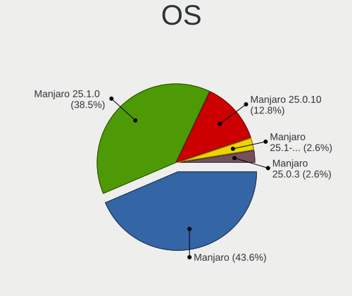

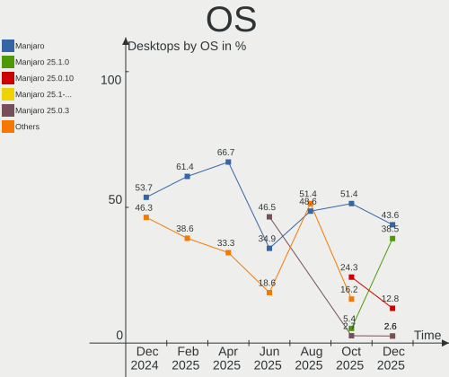

| Name              | Desktops | Percent |
|-------------------|----------|---------|
| Manjaro           | 17       | 43.59%  |
| Manjaro 25.1.0    | 15       | 38.46%  |
| Manjaro 25.0.10   | 5        | 12.82%  |
| Manjaro 25.1-pre1 | 1        | 2.56%   |
| Manjaro 25.0.3    | 1        | 2.56%   |

OS Family
---------

OS without a version

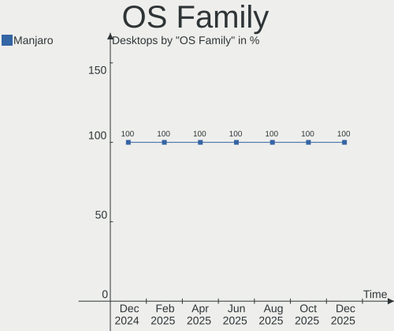

| Name    | Desktops | Percent |
|---------|----------|---------|
| Manjaro | 39       | 100%    |

Kernel
------

Version of the Linux kernel

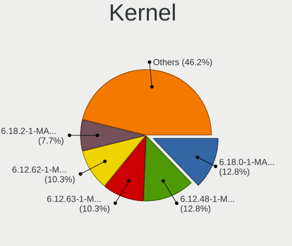

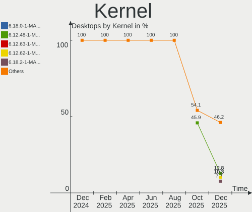

| Version               | Desktops | Percent |
|-----------------------|----------|---------|
| 6.18.0-1-MANJARO      | 5        | 12.82%  |
| 6.12.48-1-MANJARO     | 5        | 12.82%  |
| 6.12.63-1-MANJARO     | 4        | 10.26%  |
| 6.12.62-1-MANJARO     | 4        | 10.26%  |
| 6.18.2-1-MANJARO      | 3        | 7.69%   |
| 6.6.119-1-MANJARO     | 2        | 5.13%   |
| 6.18.1-1-MANJARO      | 2        | 5.13%   |
| 6.17.12-1-MANJARO     | 2        | 5.13%   |
| 6.17.1-0-MANJARO      | 2        | 5.13%   |
| 6.16.8-1-MANJARO      | 2        | 5.13%   |
| 6.12.61-1-MANJARO     | 2        | 5.13%   |
| 6.17.9-1-MANJARO      | 1        | 2.56%   |
| 6.17.11-1-MANJARO     | 1        | 2.56%   |
| 6.16.12-1-MANJARO     | 1        | 2.56%   |
| 6.12.63-1-cachyos-lts | 1        | 2.56%   |
| 6.12.28-1-MANJARO     | 1        | 2.56%   |
| 6.1.153-1-MANJARO     | 1        | 2.56%   |

Kernel Family
-------------

Linux kernel without a distro release

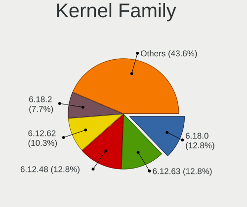

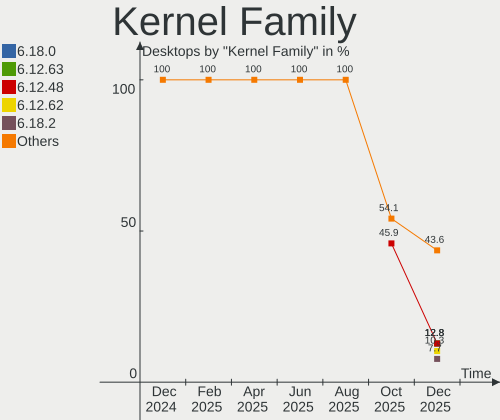

| Version | Desktops | Percent |
|---------|----------|---------|
| 6.18.0  | 5        | 12.82%  |
| 6.12.63 | 5        | 12.82%  |
| 6.12.48 | 5        | 12.82%  |
| 6.12.62 | 4        | 10.26%  |
| 6.18.2  | 3        | 7.69%   |
| 6.6.119 | 2        | 5.13%   |
| 6.18.1  | 2        | 5.13%   |
| 6.17.12 | 2        | 5.13%   |
| 6.17.1  | 2        | 5.13%   |
| 6.16.8  | 2        | 5.13%   |
| 6.12.61 | 2        | 5.13%   |
| 6.17.9  | 1        | 2.56%   |
| 6.17.11 | 1        | 2.56%   |
| 6.16.12 | 1        | 2.56%   |
| 6.12.28 | 1        | 2.56%   |
| 6.1.153 | 1        | 2.56%   |

Kernel Major Ver.
-----------------

Linux kernel major version

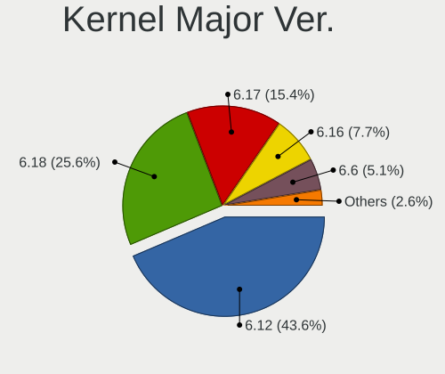

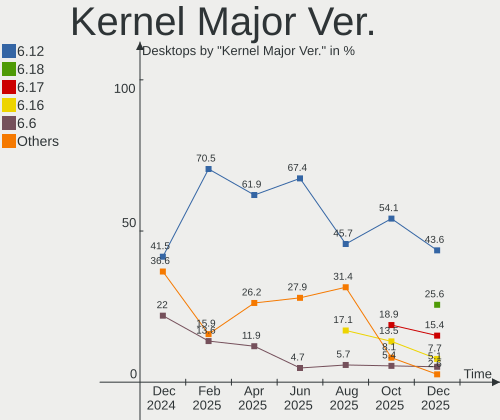

| Version | Desktops | Percent |
|---------|----------|---------|
| 6.12    | 17       | 43.59%  |
| 6.18    | 10       | 25.64%  |
| 6.17    | 6        | 15.38%  |
| 6.16    | 3        | 7.69%   |
| 6.6     | 2        | 5.13%   |
| 6.1     | 1        | 2.56%   |

Arch
----

OS architecture (x86_64, i586, etc.)

| Name   | Desktops | Percent |
|--------|----------|---------|
| x86_64 | 39       | 100%    |

DE
--

Desktop Environment

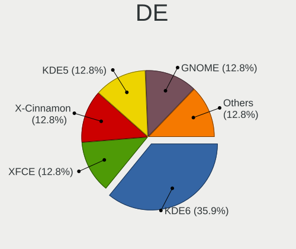

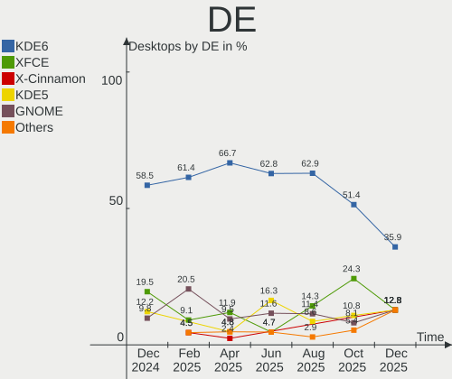

| Name       | Desktops | Percent |
|------------|----------|---------|
| KDE6       | 14       | 35.9%   |
| XFCE       | 5        | 12.82%  |
| X-Cinnamon | 5        | 12.82%  |
| KDE5       | 5        | 12.82%  |
| GNOME      | 5        | 12.82%  |
| KDE        | 2        | 5.13%   |
| MATE       | 1        | 2.56%   |
| Deepin     | 1        | 2.56%   |
| bspwm      | 1        | 2.56%   |

Display Server
--------------

X11 or Wayland

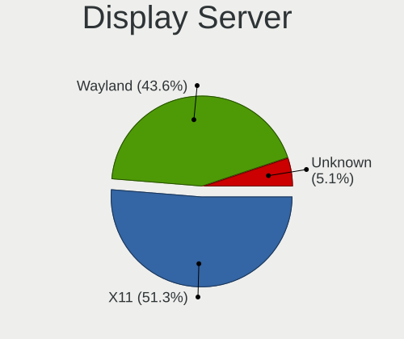

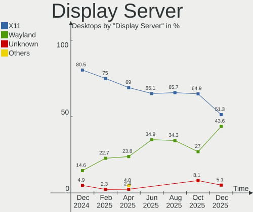

| Name    | Desktops | Percent |
|---------|----------|---------|
| X11     | 20       | 51.28%  |
| Wayland | 17       | 43.59%  |
| Unknown | 2        | 5.13%   |

Display Manager
---------------

SDDM, LightDM, etc.

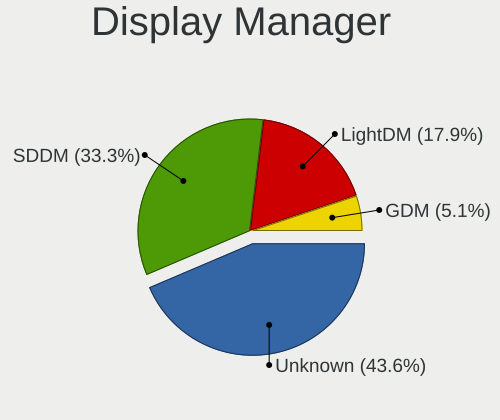

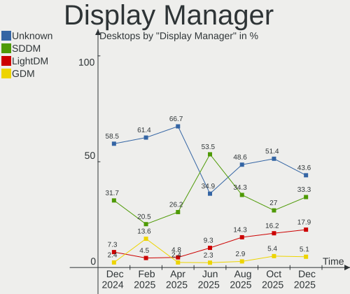

| Name    | Desktops | Percent |
|---------|----------|---------|
| Unknown | 17       | 43.59%  |
| SDDM    | 13       | 33.33%  |
| LightDM | 7        | 17.95%  |
| GDM     | 2        | 5.13%   |

OS Lang
-------

Language

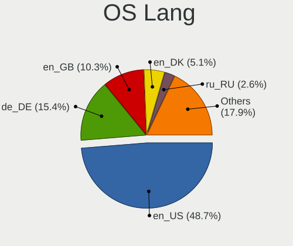

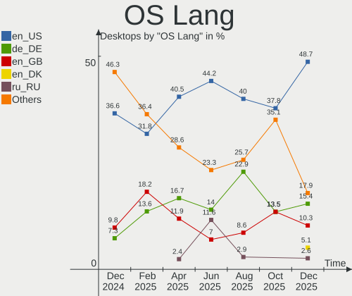

| Lang  | Desktops | Percent |
|-------|----------|---------|
| en_US | 19       | 48.72%  |
| de_DE | 6        | 15.38%  |
| en_GB | 4        | 10.26%  |
| en_DK | 2        | 5.13%   |
| ru_RU | 1        | 2.56%   |
| pt_BR | 1        | 2.56%   |
| hu_HU | 1        | 2.56%   |
| fr_FR | 1        | 2.56%   |
| en_CA | 1        | 2.56%   |
| en_AU | 1        | 2.56%   |
| de_CH | 1        | 2.56%   |
| de_AT | 1        | 2.56%   |

Boot Mode
---------

EFI or BIOS

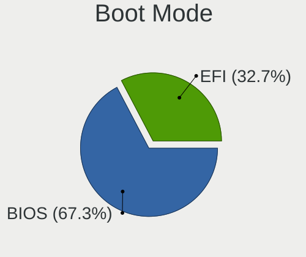

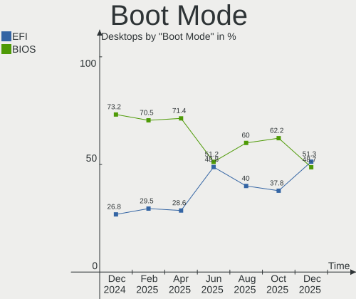

| Mode | Desktops | Percent |
|------|----------|---------|
| EFI  | 20       | 51.28%  |
| BIOS | 19       | 48.72%  |

Filesystem
----------

Type of filesystem

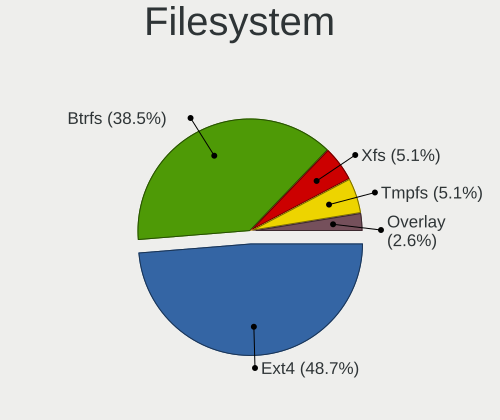

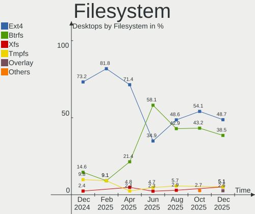

| Type    | Desktops | Percent |
|---------|----------|---------|
| Ext4    | 19       | 48.72%  |
| Btrfs   | 15       | 38.46%  |
| Xfs     | 2        | 5.13%   |
| Tmpfs   | 2        | 5.13%   |
| Overlay | 1        | 2.56%   |

Part. scheme
------------

Scheme of partitioning

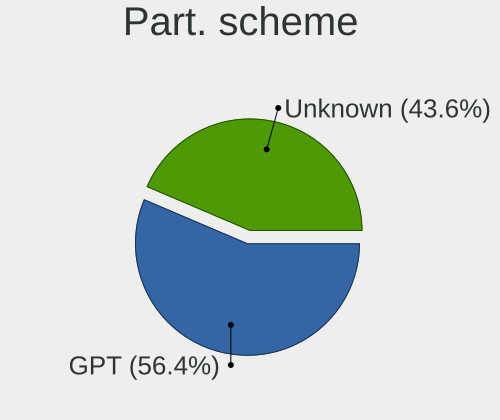

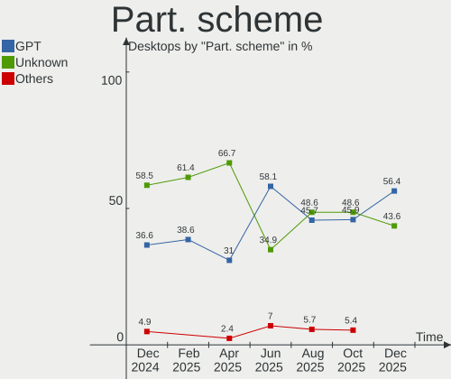

| Type    | Desktops | Percent |
|---------|----------|---------|
| GPT     | 22       | 56.41%  |
| Unknown | 17       | 43.59%  |

Dual Boot with Linux/BSD
------------------------

Hosting more than one Linux/BSD

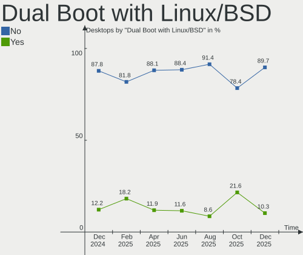

| Dual boot | Desktops | Percent |
|-----------|----------|---------|
| No        | 35       | 89.74%  |
| Yes       | 4        | 10.26%  |

Dual Boot (Win)
---------------

Hosting Linux and Windows

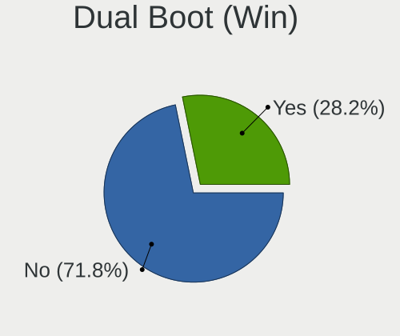

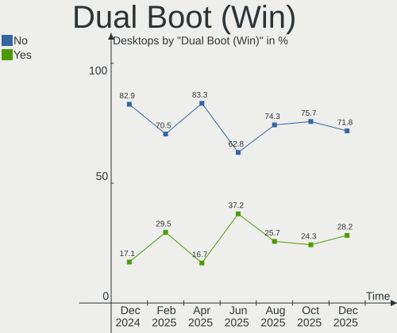

| Dual boot | Desktops | Percent |
|-----------|----------|---------|
| No        | 28       | 71.79%  |
| Yes       | 11       | 28.21%  |

Board
-----

Vendor
------

Motherboard manufacturer

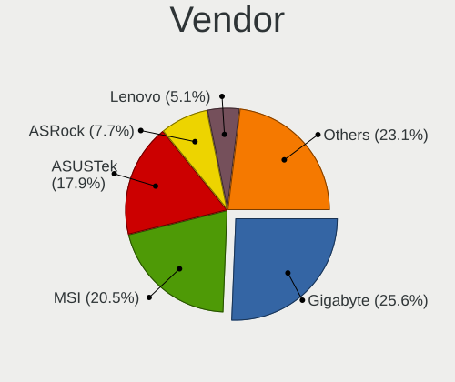

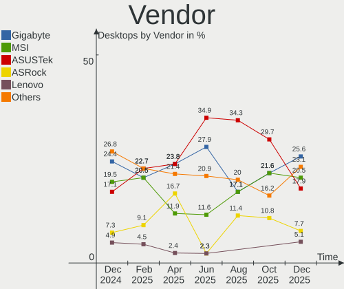

| Name                | Desktops | Percent |
|---------------------|----------|---------|
| Gigabyte Technology | 10       | 25.64%  |
| MSI                 | 8        | 20.51%  |
| ASUSTek Computer    | 7        | 17.95%  |
| ASRock              | 3        | 7.69%   |
| Lenovo              | 2        | 5.13%   |
| AZW                 | 2        | 5.13%   |
| Medion              | 1        | 2.56%   |
| MACHINIST           | 1        | 2.56%   |
| Hewlett-Packard     | 1        | 2.56%   |
| GMKtec              | 1        | 2.56%   |
| Fujitsu             | 1        | 2.56%   |
| Dell                | 1        | 2.56%   |
| BESSTAR Tech        | 1        | 2.56%   |

Model
-----

Motherboard model

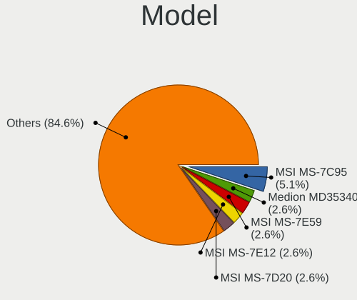

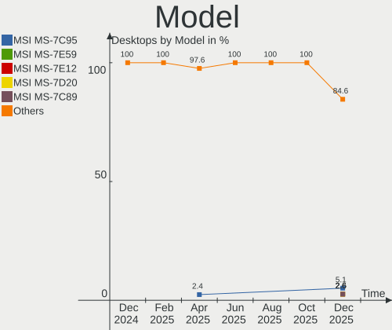

| Name                                | Desktops | Percent |
|-------------------------------------|----------|---------|
| MSI MS-7C95                         | 2        | 5.13%   |
| MSI MS-7E59                         | 1        | 2.56%   |
| MSI MS-7E12                         | 1        | 2.56%   |
| MSI MS-7D20                         | 1        | 2.56%   |
| MSI MS-7C89                         | 1        | 2.56%   |
| MSI MS-7B79                         | 1        | 2.56%   |
| MSI MS-7A32                         | 1        | 2.56%   |
| Medion MD35340                      | 1        | 2.56%   |
| MACHINIST X99-MR9A-PRO V3.0         | 1        | 2.56%   |
| Lenovo ThinkStation P620 30E000GMMT | 1        | 2.56%   |
| Lenovo ThinkStation P330 30CY006WGE | 1        | 2.56%   |
| HP Compaq 6200 Pro SFF PC           | 1        | 2.56%   |
| GMKtec NucBox K8 Plus               | 1        | 2.56%   |
| Gigabyte X570 AORUS ELITE           | 1        | 2.56%   |
| Gigabyte H97M-D3H                   | 1        | 2.56%   |
| Gigabyte GA-MA790X-DS4              | 1        | 2.56%   |
| Gigabyte B760M GAMING X DDR4        | 1        | 2.56%   |
| Gigabyte B650M GAMING WIFI          | 1        | 2.56%   |
| Gigabyte B550M DS3H AC              | 1        | 2.56%   |
| Gigabyte B550 AORUS ELITE           | 1        | 2.56%   |
| Gigabyte AB350-Gaming 3             | 1        | 2.56%   |
| Gigabyte A520M K V2                 | 1        | 2.56%   |
| Gigabyte A520I AC                   | 1        | 2.56%   |
| Fujitsu ESPRIMO E510                | 1        | 2.56%   |
| Dell OptiPlex 9020                  | 1        | 2.56%   |
| BESSTAR Tech UM350                  | 1        | 2.56%   |
| AZW GTi                             | 1        | 2.56%   |
| AZW EQ                              | 1        | 2.56%   |
| ASUS TUF Gaming B550-PLUS           | 1        | 2.56%   |
| ASUS ROG STRIX B860-G GAMING WIFI   | 1        | 2.56%   |
| ASUS ROG STRIX B760-I GAMING WIFI   | 1        | 2.56%   |
| ASUS ROG Rampage VI EXTREME ENCORE  | 1        | 2.56%   |
| ASUS PRIME Z790-V WIFI              | 1        | 2.56%   |
| ASUS PRIME X670-P WIFI              | 1        | 2.56%   |
| ASUS PRIME B360M-D                  | 1        | 2.56%   |
| ASRock X670E Taichi                 | 1        | 2.56%   |
| ASRock HM87-HT                      | 1        | 2.56%   |
| ASRock B550M-HDV                    | 1        | 2.56%   |

Model Family
------------

Motherboard model prefix

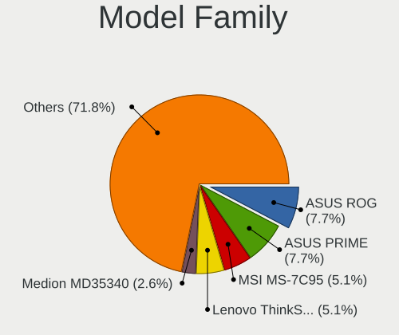

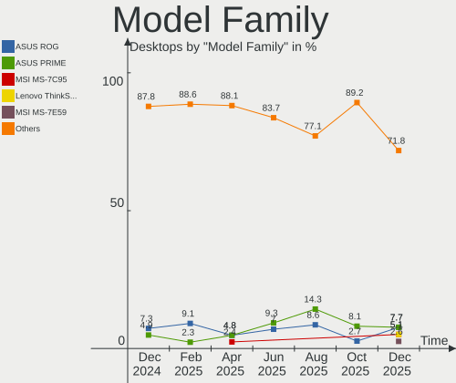

| Name                   | Desktops | Percent |
|------------------------|----------|---------|
| ASUS ROG               | 3        | 7.69%   |
| ASUS PRIME             | 3        | 7.69%   |
| MSI MS-7C95            | 2        | 5.13%   |
| Lenovo ThinkStation    | 2        | 5.13%   |
| MSI MS-7E59            | 1        | 2.56%   |
| MSI MS-7E12            | 1        | 2.56%   |
| MSI MS-7D20            | 1        | 2.56%   |
| MSI MS-7C89            | 1        | 2.56%   |
| MSI MS-7B79            | 1        | 2.56%   |
| MSI MS-7A32            | 1        | 2.56%   |
| Medion MD35340         | 1        | 2.56%   |
| MACHINIST X99-MR9A-PRO | 1        | 2.56%   |
| HP Compaq              | 1        | 2.56%   |
| GMKtec NucBox          | 1        | 2.56%   |
| Gigabyte X570          | 1        | 2.56%   |
| Gigabyte H97M-D3H      | 1        | 2.56%   |
| Gigabyte GA-MA790X-DS4 | 1        | 2.56%   |
| Gigabyte B760M         | 1        | 2.56%   |
| Gigabyte B650M         | 1        | 2.56%   |
| Gigabyte B550M         | 1        | 2.56%   |
| Gigabyte B550          | 1        | 2.56%   |
| Gigabyte AB350-Gaming  | 1        | 2.56%   |
| Gigabyte A520M         | 1        | 2.56%   |
| Gigabyte A520I         | 1        | 2.56%   |
| Fujitsu ESPRIMO        | 1        | 2.56%   |
| Dell OptiPlex          | 1        | 2.56%   |
| BESSTAR Tech UM350     | 1        | 2.56%   |
| AZW GTi                | 1        | 2.56%   |
| AZW EQ                 | 1        | 2.56%   |
| ASUS TUF               | 1        | 2.56%   |
| ASRock X670E           | 1        | 2.56%   |
| ASRock HM87-HT         | 1        | 2.56%   |
| ASRock B550M-HDV       | 1        | 2.56%   |

MFG Year
--------

Motherboard manufacture year

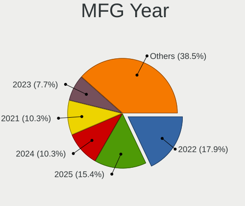

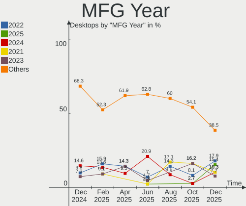

| Year | Desktops | Percent |
|------|----------|---------|
| 2022 | 7        | 17.95%  |
| 2025 | 6        | 15.38%  |
| 2024 | 4        | 10.26%  |
| 2021 | 4        | 10.26%  |
| 2023 | 3        | 7.69%   |
| 2020 | 3        | 7.69%   |
| 2018 | 2        | 5.13%   |
| 2017 | 2        | 5.13%   |
| 2014 | 2        | 5.13%   |
| 2019 | 1        | 2.56%   |
| 2015 | 1        | 2.56%   |
| 2013 | 1        | 2.56%   |
| 2012 | 1        | 2.56%   |
| 2011 | 1        | 2.56%   |
| 2007 | 1        | 2.56%   |

Form Factor
-----------

Physical design of the computer

| Name    | Desktops | Percent |
|---------|----------|---------|
| Desktop | 39       | 100%    |

Secure Boot
-----------

Enabled or disabled

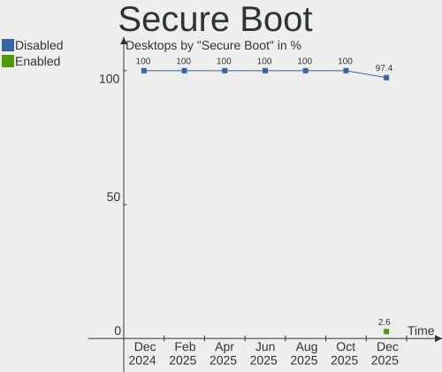

| State    | Desktops | Percent |
|----------|----------|---------|
| Disabled | 38       | 97.44%  |
| Enabled  | 1        | 2.56%   |

Coreboot
--------

Have coreboot on board

| Used | Desktops | Percent |
|------|----------|---------|
| No   | 39       | 100%    |

RAM Size
--------

Total RAM memory

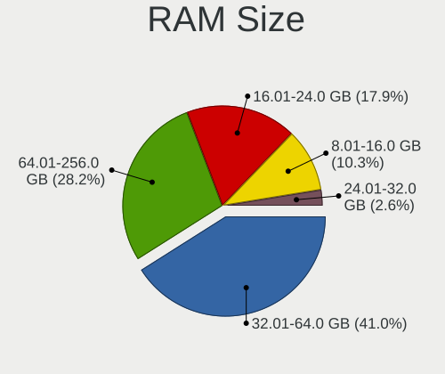

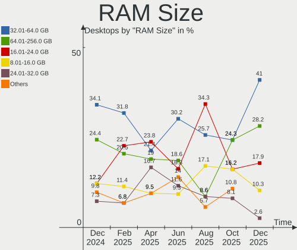

| Size in GB  | Desktops | Percent |
|-------------|----------|---------|
| 32.01-64.0  | 16       | 41.03%  |
| 64.01-256.0 | 11       | 28.21%  |
| 16.01-24.0  | 7        | 17.95%  |
| 8.01-16.0   | 4        | 10.26%  |
| 24.01-32.0  | 1        | 2.56%   |

RAM Used
--------

Used RAM memory

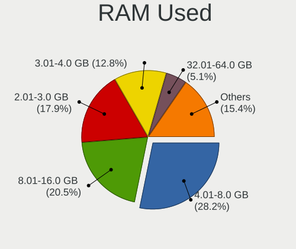

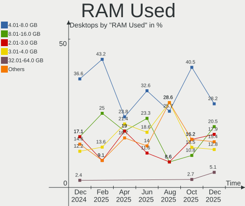

| Used GB    | Desktops | Percent |
|------------|----------|---------|
| 4.01-8.0   | 11       | 28.21%  |
| 8.01-16.0  | 8        | 20.51%  |
| 2.01-3.0   | 7        | 17.95%  |
| 3.01-4.0   | 5        | 12.82%  |
| 32.01-64.0 | 2        | 5.13%   |
| 24.01-32.0 | 2        | 5.13%   |
| 1.01-2.0   | 2        | 5.13%   |
| 16.01-24.0 | 1        | 2.56%   |
| 0.51-1.0   | 1        | 2.56%   |

Total Drives
------------

Number of drives on board

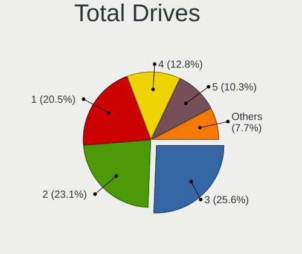

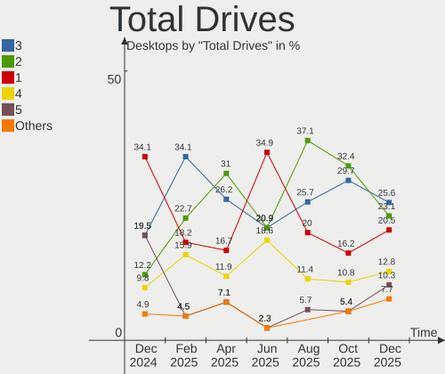

| Drives | Desktops | Percent |
|--------|----------|---------|
| 3      | 10       | 25.64%  |
| 2      | 9        | 23.08%  |
| 1      | 8        | 20.51%  |
| 4      | 5        | 12.82%  |
| 5      | 4        | 10.26%  |
| 12     | 1        | 2.56%   |
| 7      | 1        | 2.56%   |
| 6      | 1        | 2.56%   |

Has CD-ROM
----------

Has CD-ROM on board

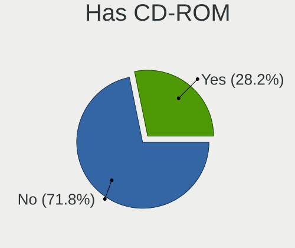

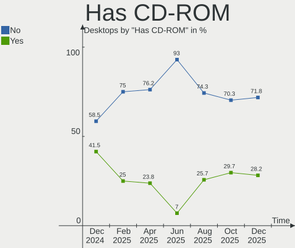

| Presented | Desktops | Percent |
|-----------|----------|---------|
| No        | 28       | 71.79%  |
| Yes       | 11       | 28.21%  |

Has Ethernet
------------

Has Ethernet on board

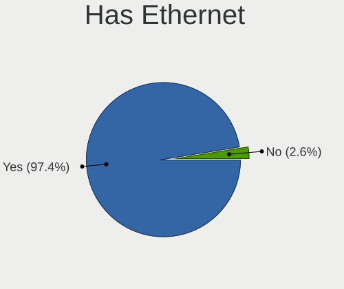

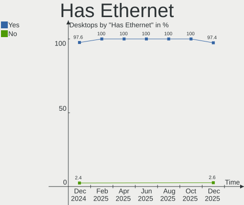

| Presented | Desktops | Percent |
|-----------|----------|---------|
| Yes       | 38       | 97.44%  |
| No        | 1        | 2.56%   |

Has WiFi
--------

Has WiFi module

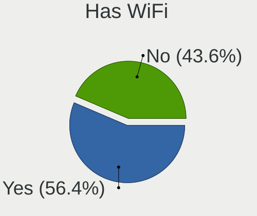

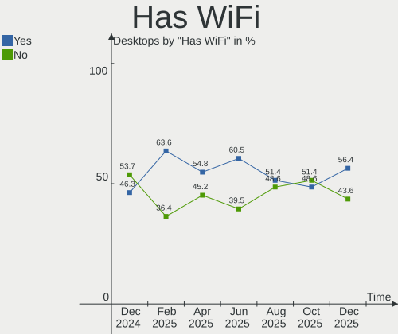

| Presented | Desktops | Percent |
|-----------|----------|---------|
| Yes       | 22       | 56.41%  |
| No        | 17       | 43.59%  |

Has Bluetooth
-------------

Has Bluetooth module

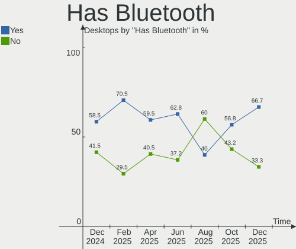

| Presented | Desktops | Percent |
|-----------|----------|---------|
| Yes       | 26       | 66.67%  |
| No        | 13       | 33.33%  |

Location
--------

Country
-------

Geographic location (country)

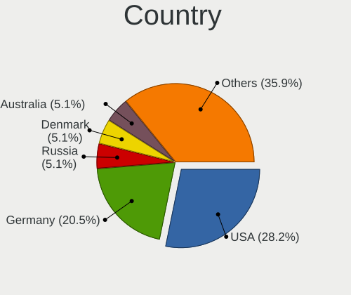

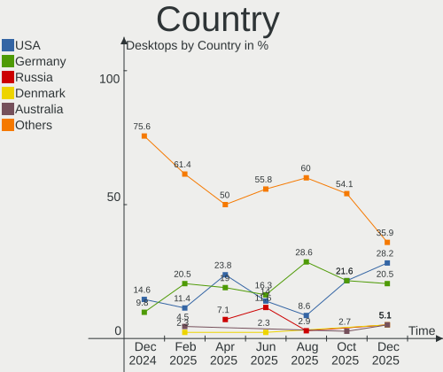

| Country         | Desktops | Percent |
|-----------------|----------|---------|
| USA             | 11       | 28.21%  |
| Germany         | 8        | 20.51%  |
| Russia          | 2        | 5.13%   |
| Denmark         | 2        | 5.13%   |
| Australia       | 2        | 5.13%   |
| The Netherlands | 1        | 2.56%   |
| Switzerland     | 1        | 2.56%   |
| Sweden          | 1        | 2.56%   |
| Spain           | 1        | 2.56%   |
| Romania         | 1        | 2.56%   |
| Poland          | 1        | 2.56%   |
| Netherlands     | 1        | 2.56%   |
| Mexico          | 1        | 2.56%   |
| Hungary         | 1        | 2.56%   |
| Greece          | 1        | 2.56%   |
| France          | 1        | 2.56%   |
| Canada          | 1        | 2.56%   |
| Brazil          | 1        | 2.56%   |
| Austria         | 1        | 2.56%   |

City
----

Geographic location (city)

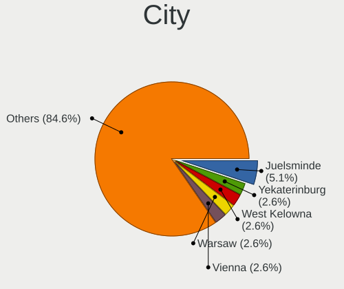

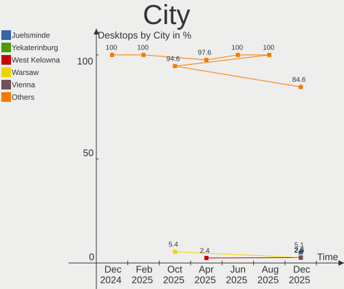

| City                  | Desktops | Percent |
|-----------------------|----------|---------|
| Juelsminde            | 2        | 5.13%   |
| Yekaterinburg         | 1        | 2.56%   |
| West Kelowna          | 1        | 2.56%   |
| Warsaw                | 1        | 2.56%   |
| Vienna                | 1        | 2.56%   |
| The Hague             | 1        | 2.56%   |
| Tarro                 | 1        | 2.56%   |
| Stockholm             | 1        | 2.56%   |
| St. Petersburg        | 1        | 2.56%   |
| Siegen                | 1        | 2.56%   |
| Seaham                | 1        | 2.56%   |
| Satteldorf            | 1        | 2.56%   |
| San Luis Potosí City | 1        | 2.56%   |
| Rochester             | 1        | 2.56%   |
| Pleasant Grove        | 1        | 2.56%   |
| Olathe                | 1        | 2.56%   |
| New Orleans           | 1        | 2.56%   |
| Nebraska City         | 1        | 2.56%   |
| Moscow                | 1        | 2.56%   |
| Mollet del Vallès    | 1        | 2.56%   |
| Mainz                 | 1        | 2.56%   |
| Lewis Center          | 1        | 2.56%   |
| Laupheim              | 1        | 2.56%   |
| Lampertheim           | 1        | 2.56%   |
| Korydallos            | 1        | 2.56%   |
| Indianapolis          | 1        | 2.56%   |
| Homburg               | 1        | 2.56%   |
| Hamburg               | 1        | 2.56%   |
| Essen                 | 1        | 2.56%   |
| Clichy-sous-Bois      | 1        | 2.56%   |
| Chicago               | 1        | 2.56%   |
| Chattanooga           | 1        | 2.56%   |
| Budapest              | 1        | 2.56%   |
| Brasov                | 1        | 2.56%   |
| Bern                  | 1        | 2.56%   |
| Bauru                 | 1        | 2.56%   |
| Baton Rouge           | 1        | 2.56%   |
| Apeldoorn             | 1        | 2.56%   |

Drives
------

Drive Vendor
------------

Hard drive vendors

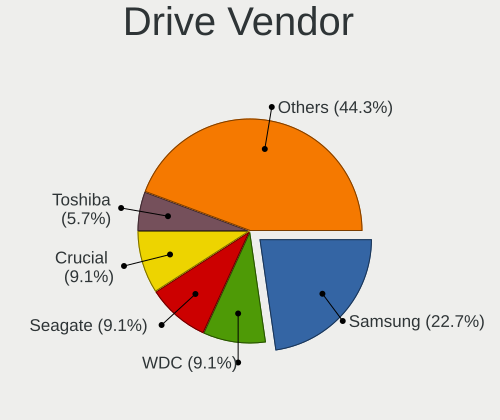

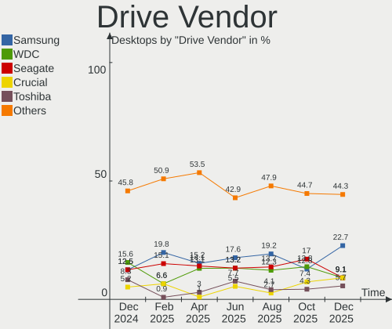

| Vendor                       | Desktops | Drives | Percent |
|------------------------------|----------|--------|---------|
| Samsung Electronics          | 20       | 31     | 22.73%  |
| WDC                          | 8        | 13     | 9.09%   |
| Seagate                      | 8        | 14     | 9.09%   |
| Crucial                      | 8        | 13     | 9.09%   |
| Toshiba                      | 5        | 5      | 5.68%   |
| Sandisk                      | 5        | 6      | 5.68%   |
| Kingston                     | 5        | 6      | 5.68%   |
| Micron/Crucial Technology    | 3        | 4      | 3.41%   |
| Micron Technology            | 3        | 4      | 3.41%   |
| Shenzhen Longsys Electronics | 2        | 2      | 2.27%   |
| Phison Electronics           | 2        | 3      | 2.27%   |
| Intel                        | 2        | 2      | 2.27%   |
| A-DATA Technology            | 2        | 3      | 2.27%   |
| Wibtek                       | 1        | 1      | 1.14%   |
| tecmiyo                      | 1        | 1      | 1.14%   |
| SPCC                         | 1        | 1      | 1.14%   |
| SAGE                         | 1        | 1      | 1.14%   |
| Realtek Semiconductor        | 1        | 1      | 1.14%   |
| Realtek                      | 1        | 2      | 1.14%   |
| Patriot                      | 1        | 1      | 1.14%   |
| MAXIO Technology (Hangzhou)  | 1        | 1      | 1.14%   |
| KingSpec                     | 1        | 1      | 1.14%   |
| JMicron Technology           | 1        | 1      | 1.14%   |
| INNOGRIT                     | 1        | 1      | 1.14%   |
| HGST                         | 1        | 1      | 1.14%   |
| G-TECH                       | 1        | 1      | 1.14%   |
| China                        | 1        | 1      | 1.14%   |
| ASMT                         | 1        | 2      | 1.14%   |

Drive Model
-----------

Hard drive models

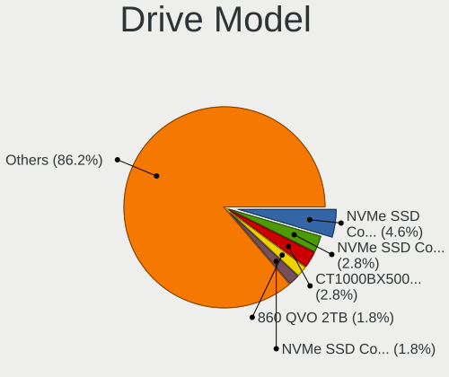

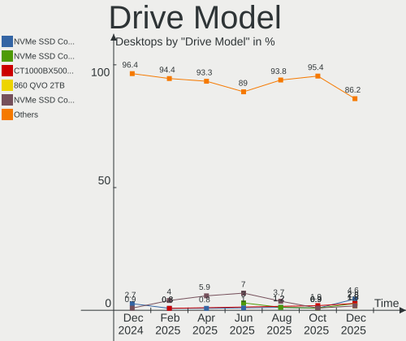

| Model                                              | Desktops | Percent |
|----------------------------------------------------|----------|---------|
| Samsung NVMe SSD Controller PM9A1/PM9A3/980PRO 1TB | 5        | 4.59%   |
| Samsung NVMe SSD Controller S4LV008[Pascal] 4TB    | 3        | 2.75%   |
| Crucial CT1000BX500SSD1 1TB                        | 3        | 2.75%   |
| Samsung SSD 860 QVO 2TB                            | 2        | 1.83%   |
| Samsung NVMe SSD Controller SM981/PM981/PM983 1TB  | 2        | 1.83%   |
| Phison E7 NVMe Controller 120GB                    | 2        | 1.83%   |
| Wibtek W800S Disk 128GB                            | 1        | 0.92%   |
| WDC WDS100T2G0A-00JH30 1TB SSD                     | 1        | 0.92%   |
| WDC WD40EZRZ-19GXCB0 4TB                           | 1        | 0.92%   |
| WDC WD4003FRYZ-01F0DB0 4TB                         | 1        | 0.92%   |
| WDC WD20EZAZ-00L9GB0 2TB                           | 1        | 0.92%   |
| WDC WD20EFRX-68EUZN0 2TB                           | 1        | 0.92%   |
| WDC WD20EARS-00S8B1 2TB                            | 1        | 0.92%   |
| WDC WD20EARS-00MVWB0 2TB                           | 1        | 0.92%   |
| WDC WD10JPVX-22JC3T0 1TB                           | 1        | 0.92%   |
| WDC WD10EZEX-00BN5A0 1TB                           | 1        | 0.92%   |
| WDC WD10EFRX-68PJCN0 1TB                           | 1        | 0.92%   |
| WDC WD10EFRX-68FYTN0 1TB                           | 1        | 0.92%   |
| Toshiba TR200 480GB SSD                            | 1        | 0.92%   |
| Toshiba MQ01ABD100 1TB                             | 1        | 0.92%   |
| Toshiba MG09ACA18TE 18TB                           | 1        | 0.92%   |
| Toshiba HDWD130 3TB                                | 1        | 0.92%   |
| Toshiba HDWD110 1TB                                | 1        | 0.92%   |
| tecmiyo M.2 2280 SSD 512GB                         | 1        | 0.92%   |
| SPCC Solid State Disk 512GB                        | 1        | 0.92%   |
| Shenzhen Longsys Lexar SSD NQ790 1TB               | 1        | 0.92%   |
| Shenzhen Longsys Lexar SSD NM710 1TB               | 1        | 0.92%   |
| Seagate ST6000VX0023-2EF110 6TB                    | 1        | 0.92%   |
| Seagate ST500LT012-9WS142 500GB                    | 1        | 0.92%   |
| Seagate ST500LM012 HN-M500MBB 500GB                | 1        | 0.92%   |
| Seagate ST4000VN008-2DR166 4TB                     | 1        | 0.92%   |
| Seagate ST4000VN006-3CW104 4TB                     | 1        | 0.92%   |
| Seagate ST4000DM004-2CV104 4TB                     | 1        | 0.92%   |
| Seagate ST3500418AS 500GB                          | 1        | 0.92%   |
| Seagate ST3500413AS 500GB                          | 1        | 0.92%   |
| Seagate ST32000542AS 2TB                           | 1        | 0.92%   |
| Seagate ST3000VN007-2E4166 3TB                     | 1        | 0.92%   |
| Seagate ST2000DX001-1NS164 2TB                     | 1        | 0.92%   |
| Seagate ST1000DM010-2EP102 1TB                     | 1        | 0.92%   |
| Seagate Backup+ Hub BK 6TB                         | 1        | 0.92%   |

HDD Vendor
----------

Hard disk drive vendors

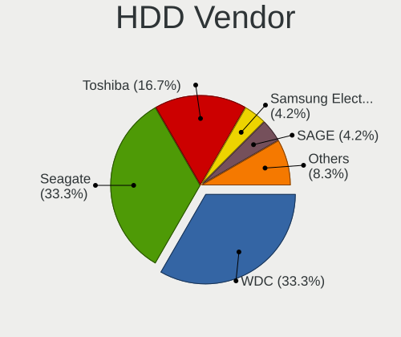

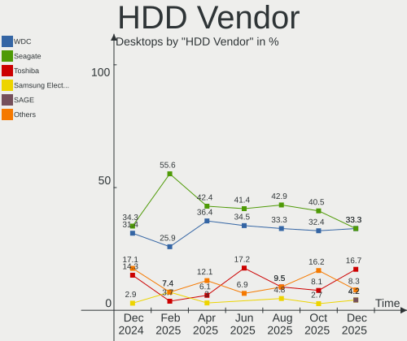

| Vendor              | Desktops | Drives | Percent |
|---------------------|----------|--------|---------|
| WDC                 | 8        | 12     | 33.33%  |
| Seagate             | 8        | 14     | 33.33%  |
| Toshiba             | 4        | 4      | 16.67%  |
| Samsung Electronics | 1        | 1      | 4.17%   |
| SAGE                | 1        | 1      | 4.17%   |
| HGST                | 1        | 1      | 4.17%   |
| ASMT                | 1        | 2      | 4.17%   |

SSD Vendor
----------

Solid state drive vendors

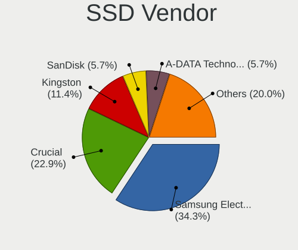

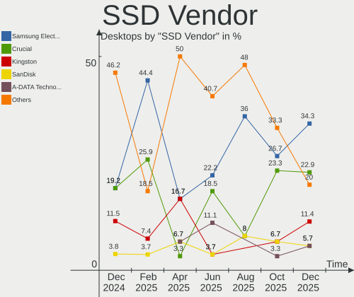

| Vendor              | Desktops | Drives | Percent |
|---------------------|----------|--------|---------|
| Samsung Electronics | 12       | 13     | 34.29%  |
| Crucial             | 8        | 13     | 22.86%  |
| Kingston            | 4        | 4      | 11.43%  |
| SanDisk             | 2        | 2      | 5.71%   |
| A-DATA Technology   | 2        | 3      | 5.71%   |
| WDC                 | 1        | 1      | 2.86%   |
| Toshiba             | 1        | 1      | 2.86%   |
| tecmiyo             | 1        | 1      | 2.86%   |
| SPCC                | 1        | 1      | 2.86%   |
| Patriot             | 1        | 1      | 2.86%   |
| KingSpec            | 1        | 1      | 2.86%   |
| China               | 1        | 1      | 2.86%   |

Drive Kind
----------

HDD or SSD

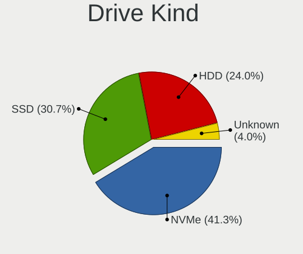

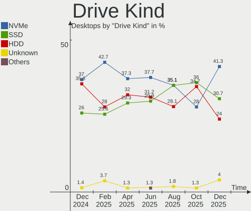

| Kind    | Desktops | Drives | Percent |
|---------|----------|--------|---------|
| NVMe    | 31       | 43     | 41.33%  |
| SSD     | 23       | 42     | 30.67%  |
| HDD     | 18       | 35     | 24%     |
| Unknown | 3        | 3      | 4%      |

Drive Connector
---------------

SATA, SAS, NVMe, etc.

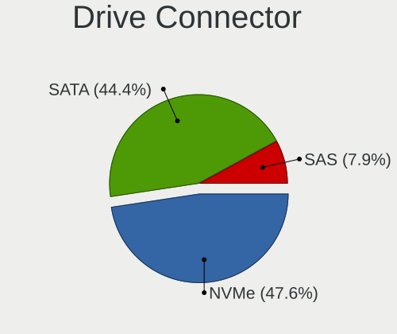

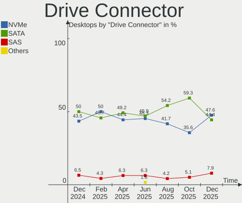

| Type | Desktops | Drives | Percent |
|------|----------|--------|---------|
| NVMe | 30       | 41     | 47.62%  |
| SATA | 28       | 72     | 44.44%  |
| SAS  | 5        | 10     | 7.94%   |

Drive Size
----------

Size of hard drive

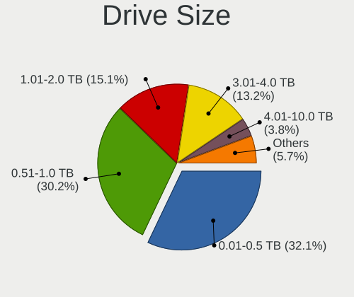

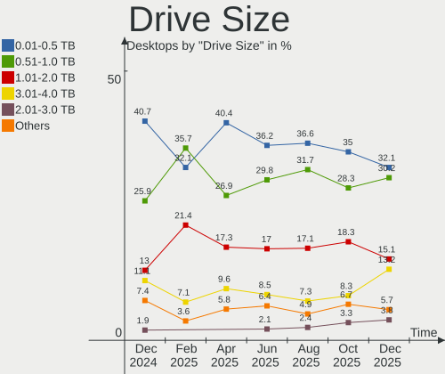

| Size in TB | Desktops | Drives | Percent |
|------------|----------|--------|---------|
| 0.01-0.5   | 17       | 26     | 32.08%  |
| 0.51-1.0   | 16       | 24     | 30.19%  |
| 1.01-2.0   | 8        | 14     | 15.09%  |
| 3.01-4.0   | 7        | 8      | 13.21%  |
| 2.01-3.0   | 2        | 2      | 3.77%   |
| 4.01-10.0  | 2        | 2      | 3.77%   |
| 10.01-20.0 | 1        | 1      | 1.89%   |

Space Total
-----------

Amount of disk space available on the file system

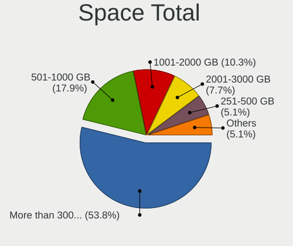

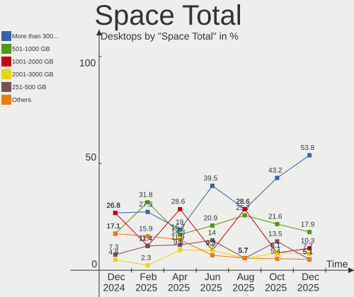

| Size in GB     | Desktops | Percent |
|----------------|----------|---------|
| More than 3000 | 21       | 53.85%  |
| 501-1000       | 7        | 17.95%  |
| 1001-2000      | 4        | 10.26%  |
| 2001-3000      | 3        | 7.69%   |
| 251-500        | 2        | 5.13%   |
| 101-250        | 1        | 2.56%   |
| 1-20           | 1        | 2.56%   |

Space Used
----------

Amount of used disk space

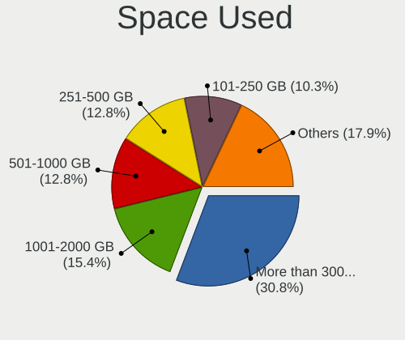

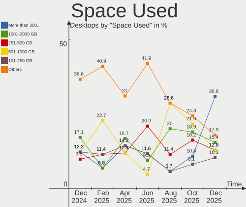

| Used GB        | Desktops | Percent |
|----------------|----------|---------|
| More than 3000 | 12       | 30.77%  |
| 1001-2000      | 6        | 15.38%  |
| 251-500        | 5        | 12.82%  |
| 501-1000       | 5        | 12.82%  |
| 101-250        | 4        | 10.26%  |
| 51-100         | 3        | 7.69%   |
| 2001-3000      | 2        | 5.13%   |
| 21-50          | 1        | 2.56%   |
| 1-20           | 1        | 2.56%   |

Malfunc. Drives
---------------

Drive models with a malfunction

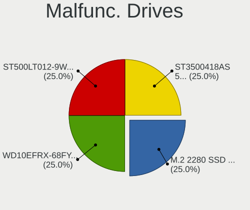

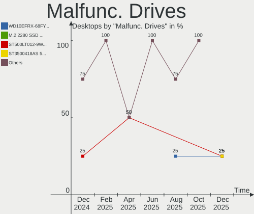

| Model                           | Desktops | Drives | Percent |
|---------------------------------|----------|--------|---------|
| WDC WD10EFRX-68FYTN0 1TB        | 1        | 1      | 25%     |
| tecmiyo M.2 2280 SSD 512GB      | 1        | 1      | 25%     |
| Seagate ST500LT012-9WS142 500GB | 1        | 1      | 25%     |
| Seagate ST3500418AS 500GB       | 1        | 1      | 25%     |

Malfunc. Drive Vendor
---------------------

Vendors of faulty drives

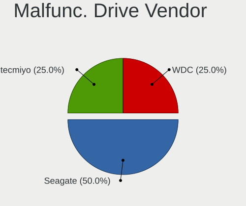

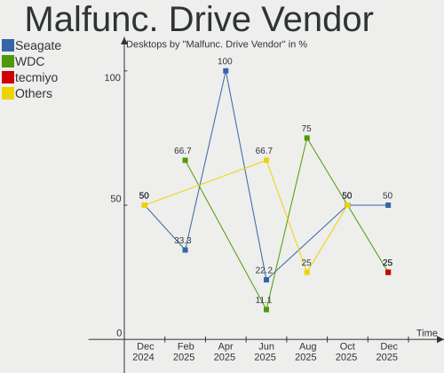

| Vendor  | Desktops | Drives | Percent |
|---------|----------|--------|---------|
| Seagate | 2        | 2      | 50%     |
| WDC     | 1        | 1      | 25%     |
| tecmiyo | 1        | 1      | 25%     |

Malfunc. HDD Vendor
-------------------

Vendors of faulty HDD drives

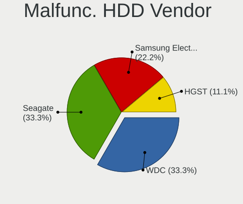

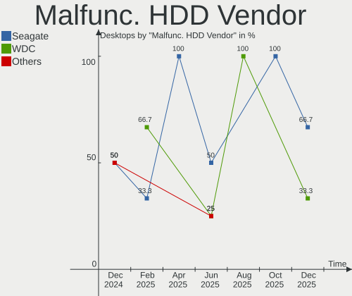

| Vendor  | Desktops | Drives | Percent |
|---------|----------|--------|---------|
| Seagate | 2        | 2      | 66.67%  |
| WDC     | 1        | 1      | 33.33%  |

Malfunc. Drive Kind
-------------------

Kinds of faulty drives

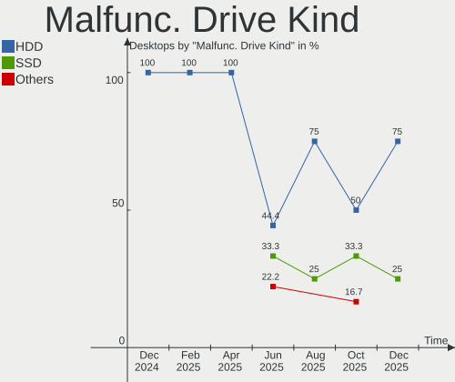

| Kind | Desktops | Drives | Percent |
|------|----------|--------|---------|
| HDD  | 3        | 3      | 75%     |
| SSD  | 1        | 1      | 25%     |

Failed Drives
-------------

Failed drive models

Zero info for selected period =(

Failed Drive Vendor
-------------------

Failed drive vendors

Zero info for selected period =(

Drive Status
------------

Number of failed and malfunc. drives

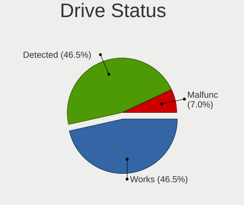

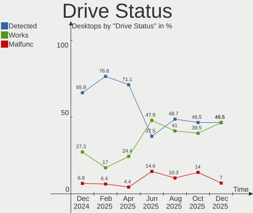

| Status   | Desktops | Drives | Percent |
|----------|----------|--------|---------|
| Detected | 20       | 68     | 46.51%  |
| Works    | 20       | 51     | 46.51%  |
| Malfunc  | 3        | 4      | 6.98%   |

Storage controller
------------------

Storage Vendor
--------------

Storage controller vendors

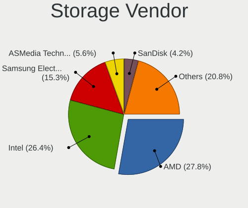

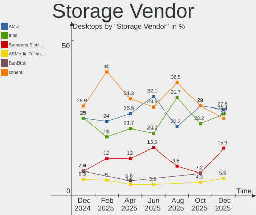

| Vendor                       | Desktops | Percent |
|------------------------------|----------|---------|
| AMD                          | 20       | 27.78%  |
| Intel                        | 19       | 26.39%  |
| Samsung Electronics          | 11       | 15.28%  |
| ASMedia Technology           | 4        | 5.56%   |
| SanDisk                      | 3        | 4.17%   |
| Micron/Crucial Technology    | 3        | 4.17%   |
| Micron Technology            | 3        | 4.17%   |
| Shenzhen Longsys Electronics | 2        | 2.78%   |
| Phison Electronics           | 2        | 2.78%   |
| Kingston Technology Company  | 2        | 2.78%   |
| Realtek Semiconductor        | 1        | 1.39%   |
| MAXIO Technology (Hangzhou)  | 1        | 1.39%   |
| INNOGRIT                     | 1        | 1.39%   |

Storage Model
-------------

Storage controller models

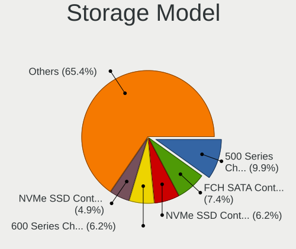

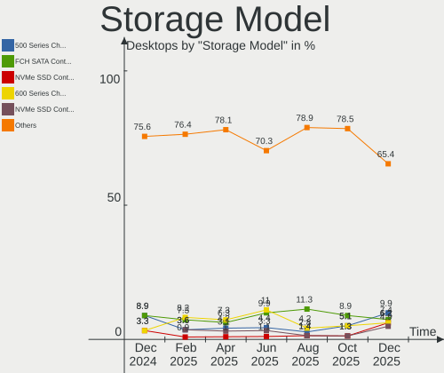

| Model                                                                          | Desktops | Percent |
|--------------------------------------------------------------------------------|----------|---------|
| AMD 500 Series Chipset SATA Controller                                         | 8        | 9.88%   |
| AMD FCH SATA Controller [AHCI mode]                                            | 6        | 7.41%   |
| Samsung NVMe SSD Controller PM9A1/PM9A3/980PRO                                 | 5        | 6.17%   |
| AMD 600 Series Chipset SATA Controller                                         | 5        | 6.17%   |
| Samsung NVMe SSD Controller S4LV008[Pascal]                                    | 4        | 4.94%   |
| Intel Raptor Lake SATA AHCI Controller                                         | 3        | 3.7%    |
| Intel 8 Series/C220 Series Chipset Family 6-port SATA Controller 1 [AHCI mode] | 3        | 3.7%    |
| Sandisk WD Black SN850X NVMe SSD                                               | 2        | 2.47%   |
| Samsung NVMe SSD Controller SM981/PM981/PM983                                  | 2        | 2.47%   |
| Phison E7 NVMe Controller                                                      | 2        | 2.47%   |
| Micron 2550 NVMe SSD (DRAM-less)                                               | 2        | 2.47%   |
| Intel Cannon Lake PCH SATA AHCI Controller                                     | 2        | 2.47%   |
| Intel Alder Lake-P SATA AHCI Controller                                        | 2        | 2.47%   |
| ASMedia ASM1064 Serial ATA Controller                                          | 2        | 2.47%   |
| Shenzhen Longsys Lexar NQ700 NVME SSD (DRAM-less)                              | 1        | 1.23%   |
| Shenzhen Longsys Lexar NM790 / Patriot Viper VP4300 Lite NVMe SSD (DRAM-less)  | 1        | 1.23%   |
| Sandisk WD PC SN740 NVMe SSD 512GB (DRAM-less)                                 | 1        | 1.23%   |
| SanDisk Ultra 3D / WD PC SN530, IX SN530, Blue SN550 NVMe SSD (DRAM-less)      | 1        | 1.23%   |
| Realtek RTS5765DL NVMe SSD Controller (DRAM-less)                              | 1        | 1.23%   |
| Phison E12 NVMe Controller                                                     | 1        | 1.23%   |
| Micron/Crucial T500 NVMe PCIe SSD                                              | 1        | 1.23%   |
| Micron/Crucial P5 Plus NVMe PCIe SSD                                           | 1        | 1.23%   |
| Micron/Crucial E100 NVMe PCIe SSD (DRAM-less)                                  | 1        | 1.23%   |
| Micron 2300 NVMe SSD [Santana]                                                 | 1        | 1.23%   |
| MAXIO (Hangzhou) NVMe SSD Controller MAP1202 (DRAM-less)                       | 1        | 1.23%   |
| Kingston Company NV1 NVMe SSD [E13T] (DRAM-less)                               | 1        | 1.23%   |
| Kingston Company KC3000/FURY Renegade NVMe SSD [E18]                           | 1        | 1.23%   |
| Intel Volume Management Device NVMe RAID Controller Intel Corporation          | 1        | 1.23%   |
| Intel Volume Management Device NVMe RAID Controller                            | 1        | 1.23%   |
| Intel SSD DC P4101/Pro 7600p/760p/E 6100p Series                               | 1        | 1.23%   |
| Intel SSD 660P Series                                                          | 1        | 1.23%   |
| Intel SATA controller                                                          | 1        | 1.23%   |
| Intel RST Volume Management Device Controller                                  | 1        | 1.23%   |
| Intel 9 Series Chipset Family SATA Controller [AHCI Mode]                      | 1        | 1.23%   |
| Intel 7 Series/C210 Series Chipset Family 6-port SATA Controller [AHCI mode]   | 1        | 1.23%   |
| Intel 6 Series/C200 Series Chipset Family 6 port Desktop SATA AHCI Controller  | 1        | 1.23%   |
| Intel 500 Series Chipset Family SATA AHCI Controller                           | 1        | 1.23%   |
| Intel 400 Series Chipset Family SATA AHCI Controller                           | 1        | 1.23%   |
| Intel 200 Series PCH SATA controller [AHCI mode]                               | 1        | 1.23%   |
| INNOGRIT NVMe SSD Controller IG5236 [RainierPC]                                | 1        | 1.23%   |

Storage Kind
------------

Kind of storage controller (IDE, SATA, NVMe, SAS, ...)

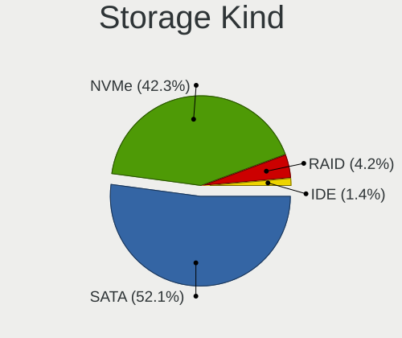

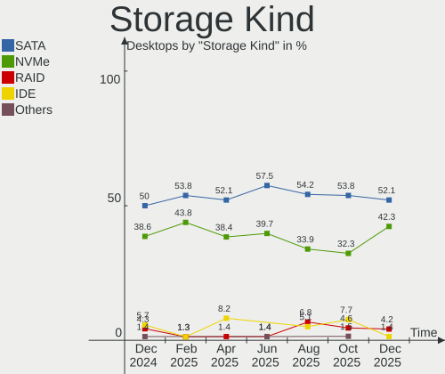

| Kind | Desktops | Percent |
|------|----------|---------|
| SATA | 37       | 52.11%  |
| NVMe | 30       | 42.25%  |
| RAID | 3        | 4.23%   |
| IDE  | 1        | 1.41%   |

Processor
---------

CPU Vendor
----------

Processor vendors

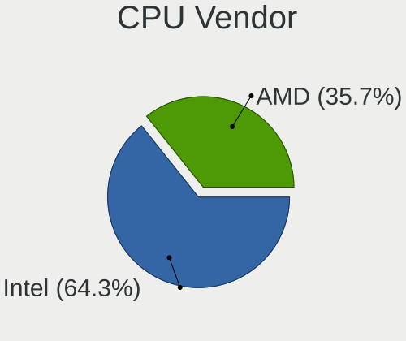

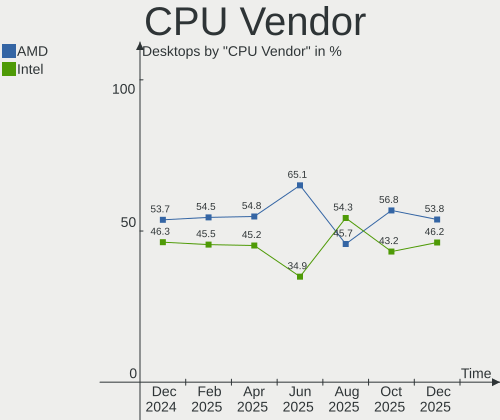

| Vendor | Desktops | Percent |
|--------|----------|---------|
| AMD    | 21       | 53.85%  |
| Intel  | 18       | 46.15%  |

CPU Model
---------

Processor models

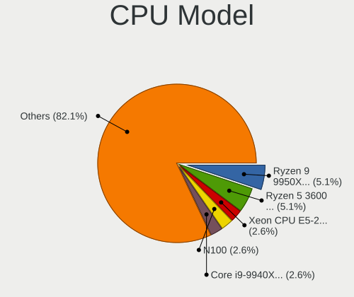

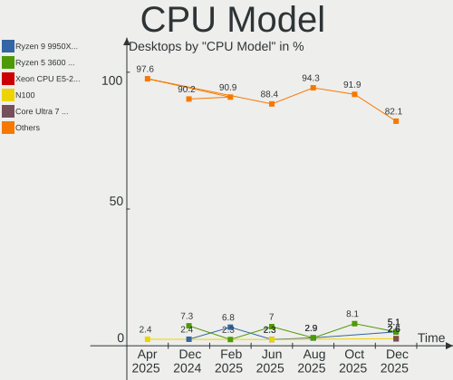

| Model                                         | Desktops | Percent |
|-----------------------------------------------|----------|---------|
| AMD Ryzen 9 9950X 16-Core Processor           | 2        | 5.13%   |
| AMD Ryzen 5 3600 6-Core Processor             | 2        | 5.13%   |
| Intel Xeon CPU E5-2690 v3 @ 2.60GHz           | 1        | 2.56%   |
| Intel N100                                    | 1        | 2.56%   |
| Intel Core Ultra 7 265K                       | 1        | 2.56%   |
| Intel Core i9-9940X CPU @ 3.30GHz             | 1        | 2.56%   |
| Intel Core i9-9900K CPU @ 3.60GHz             | 1        | 2.56%   |
| Intel Core i7-4790S CPU @ 3.20GHz             | 1        | 2.56%   |
| Intel Core i7-4790 CPU @ 3.60GHz              | 1        | 2.56%   |
| Intel Core i7-14700KF                         | 1        | 2.56%   |
| Intel Core i5-8500 CPU @ 3.00GHz              | 1        | 2.56%   |
| Intel Core i5-3470 CPU @ 3.20GHz              | 1        | 2.56%   |
| Intel Core i5-2400 CPU @ 3.10GHz              | 1        | 2.56%   |
| Intel Core i5-10400F CPU @ 2.90GHz            | 1        | 2.56%   |
| Intel Core i3-4000M CPU @ 2.40GHz             | 1        | 2.56%   |
| Intel 13th Gen Core i9-13900HK                | 1        | 2.56%   |
| Intel 13th Gen Core i5-13400                  | 1        | 2.56%   |
| Intel 12th Gen Core i9-12900K                 | 1        | 2.56%   |
| Intel 12th Gen Core i3-1220P                  | 1        | 2.56%   |
| Intel 11th Gen Core i5-11500 @ 2.70GHz        | 1        | 2.56%   |
| AMD Ryzen Threadripper PRO 5945WX 12-Cores    | 1        | 2.56%   |
| AMD Ryzen 9 7950X 16-Core Processor           | 1        | 2.56%   |
| AMD Ryzen 9 7900X 12-Core Processor           | 1        | 2.56%   |
| AMD Ryzen 9 5950X 16-Core Processor           | 1        | 2.56%   |
| AMD Ryzen 7 8845HS w/ Radeon 780M Graphics    | 1        | 2.56%   |
| AMD Ryzen 7 5800X 8-Core Processor            | 1        | 2.56%   |
| AMD Ryzen 7 5700X3D 8-Core Processor          | 1        | 2.56%   |
| AMD Ryzen 7 3700X 8-Core Processor            | 1        | 2.56%   |
| AMD Ryzen 7 2700X Eight-Core Processor        | 1        | 2.56%   |
| AMD Ryzen 7 2700 Eight-Core Processor         | 1        | 2.56%   |
| AMD Ryzen 7 1700 Eight-Core Processor         | 1        | 2.56%   |
| AMD Ryzen 5 7400F 6-Core Processor            | 1        | 2.56%   |
| AMD Ryzen 5 5600X 6-Core Processor            | 1        | 2.56%   |
| AMD Ryzen 5 5600G with Radeon Graphics        | 1        | 2.56%   |
| AMD Ryzen 5 5500                              | 1        | 2.56%   |
| AMD Ryzen 5 3550H with Radeon Vega Mobile Gfx | 1        | 2.56%   |
| AMD Phenom 9550 Quad-Core Processor           | 1        | 2.56%   |

CPU Model Family
----------------

Processor model prefix

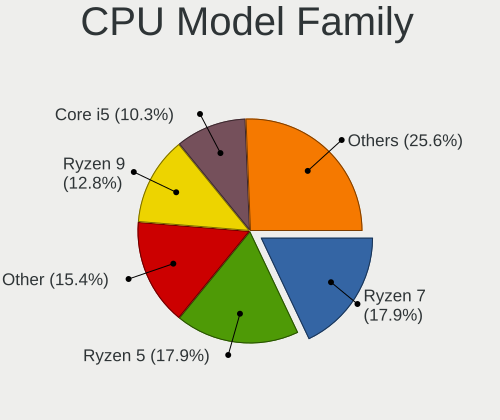

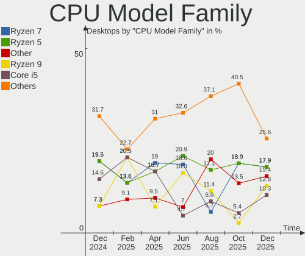

| Model                  | Desktops | Percent |
|------------------------|----------|---------|
| AMD Ryzen 7            | 7        | 17.95%  |
| AMD Ryzen 5            | 7        | 17.95%  |
| Other                  | 6        | 15.38%  |
| AMD Ryzen 9            | 5        | 12.82%  |
| Intel Core i5          | 4        | 10.26%  |
| Intel Core i7          | 3        | 7.69%   |
| Intel Core i9          | 2        | 5.13%   |
| Intel Xeon             | 1        | 2.56%   |
| Intel Core i3          | 1        | 2.56%   |
| Intel Core             | 1        | 2.56%   |
| AMD Ryzen Threadripper | 1        | 2.56%   |
| AMD Phenom             | 1        | 2.56%   |

CPU Cores
---------

Number of processor cores

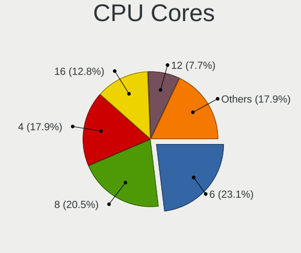

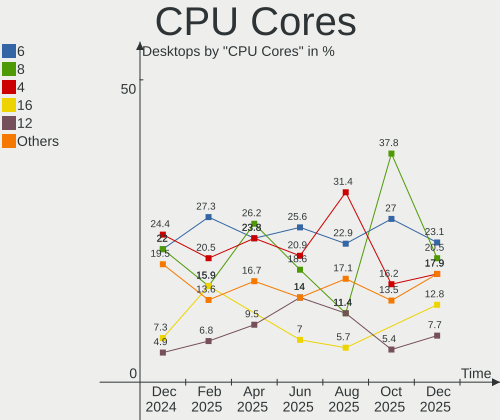

| Number | Desktops | Percent |
|--------|----------|---------|
| 6      | 9        | 23.08%  |
| 8      | 8        | 20.51%  |
| 4      | 7        | 17.95%  |
| 16     | 5        | 12.82%  |
| 12     | 3        | 7.69%   |
| 20     | 2        | 5.13%   |
| 14     | 2        | 5.13%   |
| 10     | 2        | 5.13%   |
| 2      | 1        | 2.56%   |

CPU Sockets
-----------

Number of sockets

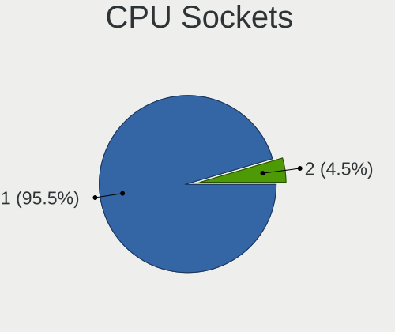

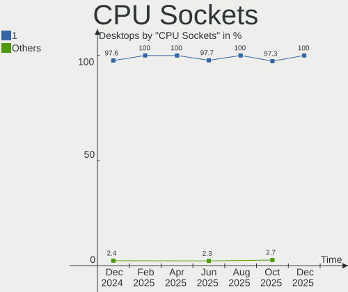

| Number | Desktops | Percent |
|--------|----------|---------|
| 1      | 39       | 100%    |

CPU Threads
-----------

Threads per core (Hyper-Threading)

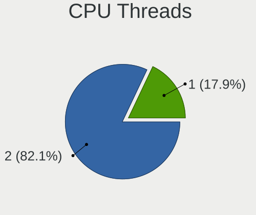

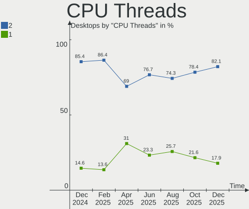

| Number | Desktops | Percent |
|--------|----------|---------|
| 2      | 32       | 82.05%  |
| 1      | 7        | 17.95%  |

CPU Op-Modes
------------

CPU Operation Modes (32-bit, 64-bit)

| Op mode        | Desktops | Percent |
|----------------|----------|---------|
| 32-bit, 64-bit | 39       | 100%    |

CPU Microcode
-------------

Microcode number

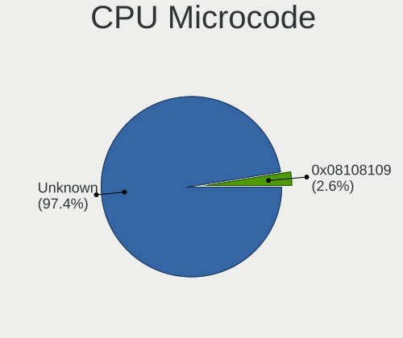

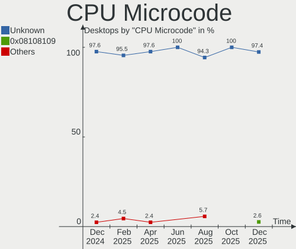

| Number     | Desktops | Percent |
|------------|----------|---------|
| Unknown    | 38       | 97.44%  |
| 0x08108109 | 1        | 2.56%   |

CPU Microarch
-------------

Microarchitecture

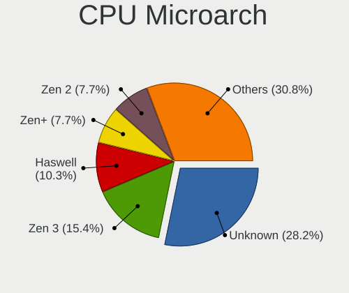

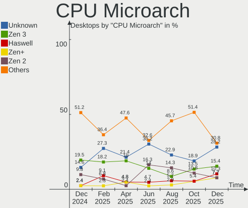

| Name             | Desktops | Percent |
|------------------|----------|---------|
| Unknown          | 11       | 28.21%  |
| Zen 3            | 6        | 15.38%  |
| Haswell          | 4        | 10.26%  |
| Zen+             | 3        | 7.69%   |
| Zen 2            | 3        | 7.69%   |
| Alderlake Hybrid | 3        | 7.69%   |
| KabyLake         | 2        | 5.13%   |
| Zen              | 1        | 2.56%   |
| Skylake          | 1        | 2.56%   |
| SandyBridge      | 1        | 2.56%   |
| Lunarlake Hybrid | 1        | 2.56%   |
| K10              | 1        | 2.56%   |
| IvyBridge        | 1        | 2.56%   |
| CometLake        | 1        | 2.56%   |

Graphics
--------

GPU Vendor
----------

Vendors of graphics cards

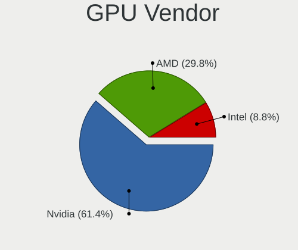

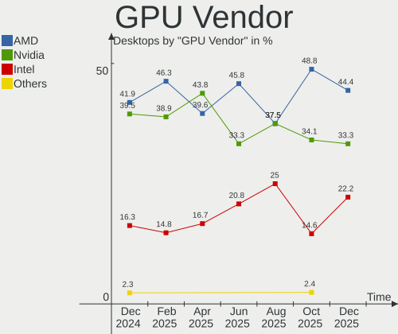

| Vendor | Desktops | Percent |
|--------|----------|---------|
| AMD    | 20       | 44.44%  |
| Nvidia | 15       | 33.33%  |
| Intel  | 10       | 22.22%  |

GPU Model
---------

Graphics card models

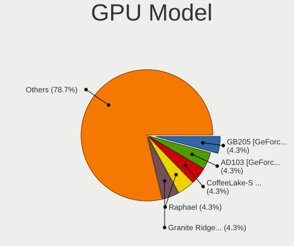

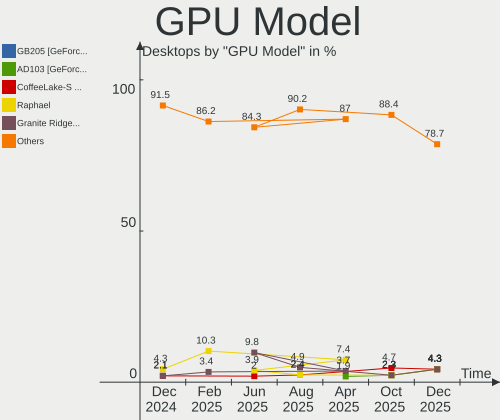

| Model                                                                       | Desktops | Percent |
|-----------------------------------------------------------------------------|----------|---------|
| Nvidia GB205 [GeForce RTX 5070]                                             | 2        | 4.26%   |
| Nvidia AD103 [GeForce RTX 4080 SUPER]                                       | 2        | 4.26%   |
| Intel CoffeeLake-S GT2 [UHD Graphics 630]                                   | 2        | 4.26%   |
| AMD Raphael                                                                 | 2        | 4.26%   |
| AMD Granite Ridge [Radeon Graphics]                                         | 2        | 4.26%   |
| AMD Curacao PRO [Radeon R7 370 / R9 270/370 OEM]                            | 2        | 4.26%   |
| Nvidia TU116 [GeForce GTX 1660 Ti]                                          | 1        | 2.13%   |
| Nvidia TU106 [GeForce RTX 2060 Rev. A]                                      | 1        | 2.13%   |
| Nvidia GP106 [GeForce GTX 1060 6GB]                                         | 1        | 2.13%   |
| Nvidia GM107GL [Quadro K620]                                                | 1        | 2.13%   |
| Nvidia GK208B [GeForce GT 710]                                              | 1        | 2.13%   |
| Nvidia GB206 [GeForce RTX 5060]                                             | 1        | 2.13%   |
| Nvidia GA106 [GeForce RTX 3060 Lite Hash Rate]                              | 1        | 2.13%   |
| Nvidia GA104 [GeForce RTX 3070]                                             | 1        | 2.13%   |
| Nvidia GA104 [GeForce RTX 3060 Ti Lite Hash Rate]                           | 1        | 2.13%   |
| Nvidia AD106 [GeForce RTX 4060 Ti]                                          | 1        | 2.13%   |
| Nvidia AD104 [GeForce RTX 4070]                                             | 1        | 2.13%   |
| Nvidia AD104 [GeForce RTX 4070 Ti]                                          | 1        | 2.13%   |
| Intel Xeon E3-1200 v3/4th Gen Core Processor Integrated Graphics Controller | 1        | 2.13%   |
| Intel RocketLake-S GT1 [UHD Graphics 750]                                   | 1        | 2.13%   |
| Intel Raptor Lake-P [Iris Xe Graphics]                                      | 1        | 2.13%   |
| Intel Arrow Lake-S [Intel Graphics]                                         | 1        | 2.13%   |
| Intel Alder Lake-UP3 GT1 [UHD Graphics]                                     | 1        | 2.13%   |
| Intel Alder Lake-S GT1 [UHD Graphics 730]                                   | 1        | 2.13%   |
| Intel Alder Lake-N [UHD Graphics]                                           | 1        | 2.13%   |
| Intel 4th Gen Core Processor Integrated Graphics Controller                 | 1        | 2.13%   |
| AMD Polaris 20 XL [Radeon RX 580 2048SP]                                    | 1        | 2.13%   |
| AMD Pitcairn PRO [Radeon HD 7850 / R7 265 / R9 270 1024SP]                  | 1        | 2.13%   |
| AMD Picasso/Raven 2 [Radeon Vega Series / Radeon Vega Mobile Series]        | 1        | 2.13%   |
| AMD Navi 48 [Radeon AI PRO R9700]                                           | 1        | 2.13%   |
| AMD Navi 33 [Radeon RX 7600/7600 XT/7600M XT/7600S/7700S / PRO W7600]       | 1        | 2.13%   |
| AMD Navi 32 [Radeon RX 7700 XT / 7800 XT]                                   | 1        | 2.13%   |
| AMD Navi 31 [Radeon RX 7900 XT/7900 XTX/7900 GRE/7900M]                     | 1        | 2.13%   |
| AMD Navi 24 [Radeon RX 6400/6500 XT/6500M]                                  | 1        | 2.13%   |
| AMD Navi 22 [Radeon RX 6700/6700 XT/6750 XT / 6800M/6850M XT]               | 1        | 2.13%   |
| AMD Navi 14 [Radeon RX 5500/5500M / Pro 5500M]                              | 1        | 2.13%   |
| AMD Lexa XT [Radeon PRO WX 3100]                                            | 1        | 2.13%   |
| AMD HawkPoint1                                                              | 1        | 2.13%   |
| AMD Ellesmere [Radeon RX 470/480/570/570X/580/580X/590]                     | 1        | 2.13%   |
| AMD Ellesmere [Radeon Pro WX 7100]                                          | 1        | 2.13%   |

GPU Combo
---------

Combinations of graphics cards

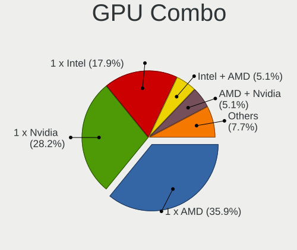

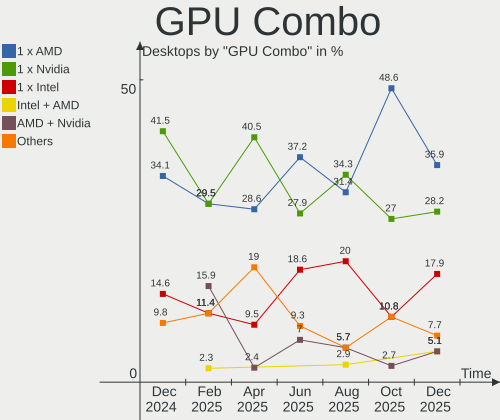

| Name             | Desktops | Percent |
|------------------|----------|---------|
| 1 x AMD          | 14       | 35.9%   |
| 1 x Nvidia       | 11       | 28.21%  |
| 1 x Intel        | 7        | 17.95%  |
| Intel + AMD      | 2        | 5.13%   |
| AMD + Nvidia     | 2        | 5.13%   |
| 2 x AMD          | 1        | 2.56%   |
| Intel + Nvidia   | 1        | 2.56%   |
| AMD + 2 x Nvidia | 1        | 2.56%   |

GPU Driver
----------

Free vs proprietary

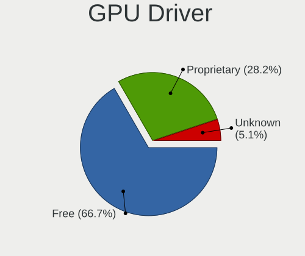

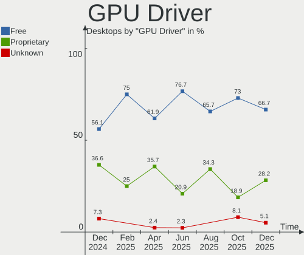

| Driver      | Desktops | Percent |
|-------------|----------|---------|
| Free        | 26       | 66.67%  |
| Proprietary | 11       | 28.21%  |
| Unknown     | 2        | 5.13%   |

GPU Memory
----------

Total video memory

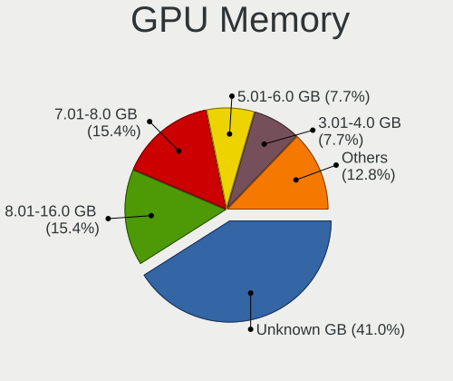

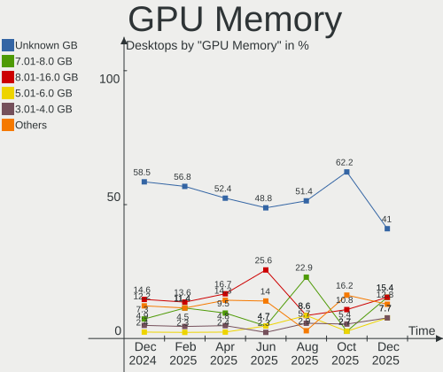

| Size in GB | Desktops | Percent |
|------------|----------|---------|
| Unknown    | 16       | 41.03%  |
| 7.01-8.0   | 6        | 15.38%  |
| 8.01-16.0  | 6        | 15.38%  |
| 5.01-6.0   | 3        | 7.69%   |
| 3.01-4.0   | 3        | 7.69%   |
| 24.01-32.0 | 1        | 2.56%   |
| 2.01-3.0   | 1        | 2.56%   |
| 16.01-24.0 | 1        | 2.56%   |
| 1.01-2.0   | 1        | 2.56%   |
| 0.51-1.0   | 1        | 2.56%   |

Monitor
-------

Monitor Vendor
--------------

Monitor vendors

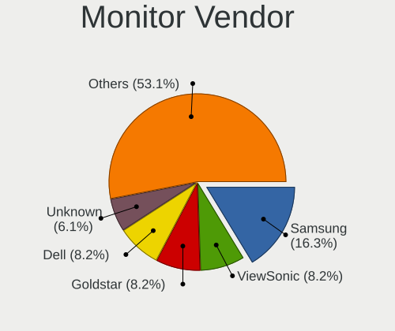

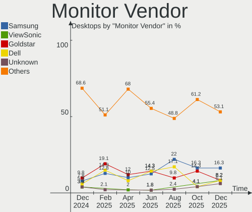

| Vendor               | Desktops | Percent |
|----------------------|----------|---------|
| Samsung Electronics  | 8        | 16.33%  |
| ViewSonic            | 4        | 8.16%   |
| Goldstar             | 4        | 8.16%   |
| Dell                 | 4        | 8.16%   |
| Unknown              | 3        | 6.12%   |
| MSI                  | 3        | 6.12%   |
| Lenovo               | 3        | 6.12%   |
| Iiyama               | 3        | 6.12%   |
| Ancor Communications | 3        | 6.12%   |
| AOC                  | 2        | 4.08%   |
| ___                  | 1        | 2.04%   |
| Sony                 | 1        | 2.04%   |
| Philips              | 1        | 2.04%   |
| NEC Computers        | 1        | 2.04%   |
| Kogan                | 1        | 2.04%   |
| HUAWEI               | 1        | 2.04%   |
| HIC                  | 1        | 2.04%   |
| Fujitsu Siemens      | 1        | 2.04%   |
| Eizo                 | 1        | 2.04%   |
| DENON                | 1        | 2.04%   |
| ASUSTek Computer     | 1        | 2.04%   |
| Acer                 | 1        | 2.04%   |

Monitor Model
-------------

Monitor models

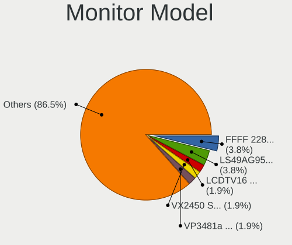

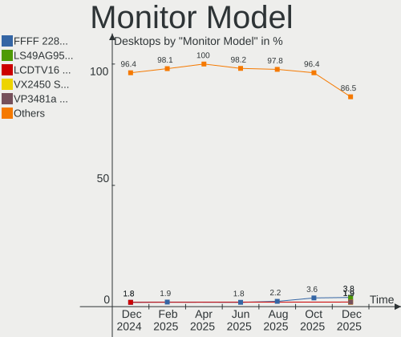

| Model                                                               | Desktops | Percent |
|---------------------------------------------------------------------|----------|---------|
| Unknown LCD Monitor FFFF 2288x1287 2550x2550mm 142.0-inch           | 2        | 3.85%   |
| Samsung Electronics LS49AG95 SAM71AC 3840x1080 1190x340mm 48.7-inch | 2        | 3.85%   |
| ___ LCDTV16 ___3393 1920x1080                                       | 1        | 1.92%   |
| ViewSonic VX2450 SERIES VSCE226 1920x1080 525x297mm 23.7-inch       | 1        | 1.92%   |
| ViewSonic VP3481a VSCB13A 3440x1440 797x333mm 34.0-inch             | 1        | 1.92%   |
| ViewSonic VG2448 VSC3B35 1920x1080 527x296mm 23.8-inch              | 1        | 1.92%   |
| ViewSonic VA2759 Series VSC6832 1920x1080 598x336mm 27.0-inch       | 1        | 1.92%   |
| Unknown LCDTV16 3393 1920x1080 1600x900mm 72.3-inch                 | 1        | 1.92%   |
| Sony TV *00 SNY3F05 3840x2160 1218x685mm 55.0-inch                  | 1        | 1.92%   |
| Samsung Electronics S39C SAM7308 1920x1080 609x349mm 27.6-inch      | 1        | 1.92%   |
| Samsung Electronics S27F350 SAM0D22 1920x1080 598x336mm 27.0-inch   | 1        | 1.92%   |
| Samsung Electronics S22F350 SAM0D1A 1920x1080 477x268mm 21.5-inch   | 1        | 1.92%   |
| Samsung Electronics LU28R55 SAM1015 3840x2160 632x360mm 28.6-inch   | 1        | 1.92%   |
| Samsung Electronics C49RG9x SAM0F9C 3360x1440 1193x336mm 48.8-inch  | 1        | 1.92%   |
| Samsung Electronics C49RG9x SAM0F9B 1760x1440                       | 1        | 1.92%   |
| Samsung Electronics C27F390 SAM0D32 1920x1080 598x336mm 27.0-inch   | 1        | 1.92%   |
| Philips PHL 221S8L PHL091C 1920x1080 477x268mm 21.5-inch            | 1        | 1.92%   |
| NEC Computers EA244WMi NEC68D7 1920x1200 519x324mm 24.1-inch        | 1        | 1.92%   |
| MSI Optix MAG27CQ MSI1462 2560x1440 597x336mm 27.0-inch             | 1        | 1.92%   |
| MSI MP242 MSI30A1 1920x1080 527x296mm 23.8-inch                     | 1        | 1.92%   |
| MSI MAG 256F MSI3BC1 1920x1080 543x302mm 24.5-inch                  | 1        | 1.92%   |
| Lenovo Y32p-30 LEN66F9 3840x2160 697x392mm 31.5-inch                | 1        | 1.92%   |
| Lenovo LEN C32q-20 LEN65F8 2560x1440 698x393mm 31.5-inch            | 1        | 1.92%   |
| Lenovo L197 Wide LEN1152 1440x900 410x257mm 19.1-inch               | 1        | 1.92%   |
| Kogan KAMN27QF7TA KGN0270 2560x1440 597x336mm 27.0-inch             | 1        | 1.92%   |
| Iiyama PL3467WQ IVM7624 3440x1440 797x334mm 34.0-inch               | 1        | 1.92%   |
| Iiyama PL3070WQ IVM7603 2560x1600 641x401mm 29.8-inch               | 1        | 1.92%   |
| Iiyama PL2783Q IVM661F 2560x1440 597x336mm 27.0-inch                | 1        | 1.92%   |
| HUAWEI ZQE-CBA HWV6A25 3440x1440 797x334mm 34.0-inch                | 1        | 1.92%   |
| HIC LCD Monitor HIC0001 1920x1080 256x192mm 12.6-inch               | 1        | 1.92%   |
| Goldstar ULTRAGEAR+ GSM5CB5 3840x2160 597x336mm 27.0-inch           | 1        | 1.92%   |
| Goldstar HDR 4K GSM7706 3840x2160 600x340mm 27.2-inch               | 1        | 1.92%   |
| Goldstar FULL HD GSM5B55 1920x1080 480x270mm 21.7-inch              | 1        | 1.92%   |
| Goldstar 2D HD TV GSM59CA 1366x768 509x286mm 23.0-inch              | 1        | 1.92%   |
| Fujitsu Siemens B22W-7 LED FUS0837 1680x1050 474x296mm 22.0-inch    | 1        | 1.92%   |
| Eizo EV2336W ENC2390 1920x1080 510x287mm 23.0-inch                  | 1        | 1.92%   |
| DENON AVR DON0066 3840x2160 1428x804mm 64.5-inch                    | 1        | 1.92%   |
| Dell U3824DW DELA20C 1920x1080 290x367mm 18.4-inch                  | 1        | 1.92%   |
| Dell U3824DW DELA20A 3840x1600 880x367mm 37.5-inch                  | 1        | 1.92%   |
| Dell U2312HM DEL4072 1920x1080 510x287mm 23.0-inch                  | 1        | 1.92%   |

Monitor Resolution
------------------

Monitor screen resolution

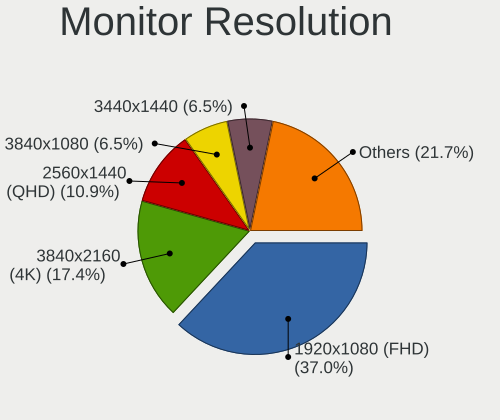

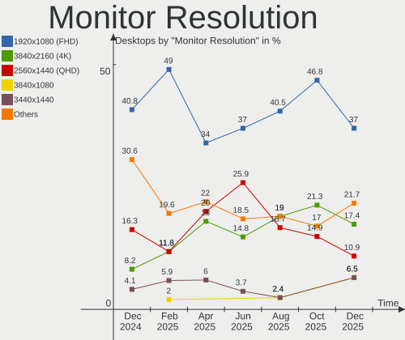

| Resolution         | Desktops | Percent |
|--------------------|----------|---------|
| 1920x1080 (FHD)    | 17       | 36.96%  |
| 3840x2160 (4K)     | 8        | 17.39%  |
| 2560x1440 (QHD)    | 5        | 10.87%  |
| 3840x1080          | 3        | 6.52%   |
| 3440x1440          | 3        | 6.52%   |
| 1920x1200 (WUXGA)  | 3        | 6.52%   |
| 2288x1287          | 2        | 4.35%   |
| 3840x1600          | 1        | 2.17%   |
| 2560x1600          | 1        | 2.17%   |
| 1680x1050 (WSXGA+) | 1        | 2.17%   |
| 1440x900 (WXGA+)   | 1        | 2.17%   |
| 1366x768 (WXGA)    | 1        | 2.17%   |

Monitor Diagonal
----------------

Diagonal size in inches

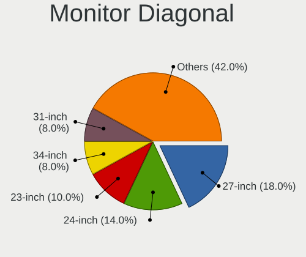

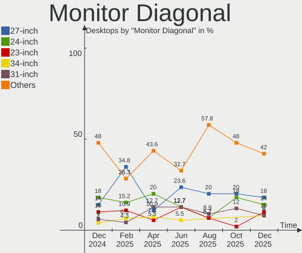

| Inches  | Desktops | Percent |
|---------|----------|---------|
| 27      | 9        | 18%     |
| 24      | 7        | 14%     |
| 23      | 5        | 10%     |
| 34      | 4        | 8%      |
| 31      | 4        | 8%      |
| 48      | 3        | 6%      |
| 142     | 2        | 4%      |
| 21      | 2        | 4%      |
| 18      | 2        | 4%      |
| 85      | 1        | 2%      |
| 72      | 1        | 2%      |
| 64      | 1        | 2%      |
| 40      | 1        | 2%      |
| 37      | 1        | 2%      |
| 29      | 1        | 2%      |
| 28      | 1        | 2%      |
| 26      | 1        | 2%      |
| 22      | 1        | 2%      |
| 19      | 1        | 2%      |
| 12      | 1        | 2%      |
| Unknown | 1        | 2%      |

Monitor Width
-------------

Physical width

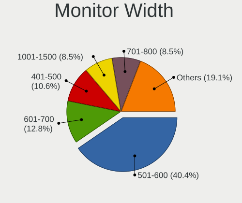

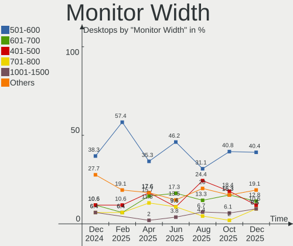

| Width in mm    | Desktops | Percent |
|----------------|----------|---------|
| 501-600        | 19       | 40.43%  |
| 601-700        | 6        | 12.77%  |
| 401-500        | 5        | 10.64%  |
| 701-800        | 4        | 8.51%   |
| 1001-1500      | 4        | 8.51%   |
| More than 2000 | 2        | 4.26%   |
| 801-900        | 2        | 4.26%   |
| 201-300        | 2        | 4.26%   |
| 1501-2000      | 2        | 4.26%   |
| Unknown        | 1        | 2.13%   |

Aspect Ratio
------------

Proportional relationship between the width and the height

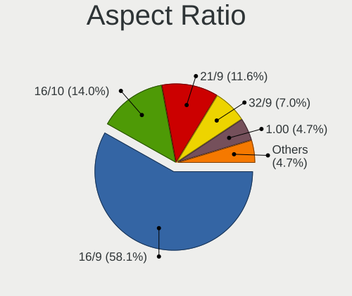

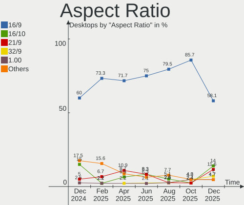

| Ratio | Desktops | Percent |
|-------|----------|---------|
| 16/9  | 25       | 58.14%  |
| 16/10 | 6        | 13.95%  |
| 21/9  | 5        | 11.63%  |
| 32/9  | 3        | 6.98%   |
| 1.00  | 2        | 4.65%   |
| 4/3   | 1        | 2.33%   |
| 0.79  | 1        | 2.33%   |

Monitor Area
------------

Area in inch²

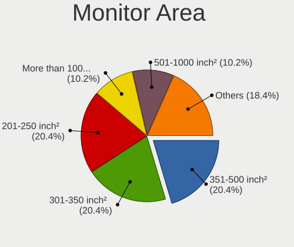

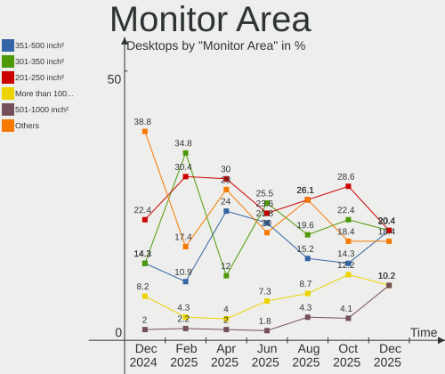

| Area in inch² | Desktops | Percent |
|----------------|----------|---------|
| 351-500        | 10       | 20.41%  |
| 301-350        | 10       | 20.41%  |
| 201-250        | 10       | 20.41%  |
| More than 1000 | 5        | 10.2%   |
| 501-1000       | 5        | 10.2%   |
| 251-300        | 4        | 8.16%   |
| 151-200        | 2        | 4.08%   |
| 71-80          | 1        | 2.04%   |
| 141-150        | 1        | 2.04%   |
| Unknown        | 1        | 2.04%   |

Pixel Density
-------------

Pixels per inch

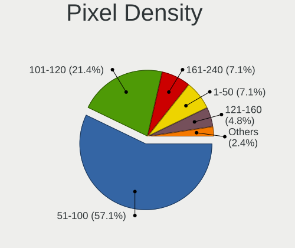

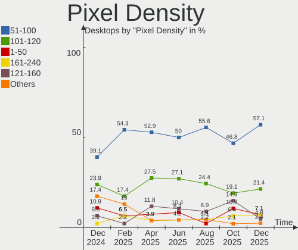

| Density | Desktops | Percent |
|---------|----------|---------|
| 51-100  | 24       | 57.14%  |
| 101-120 | 9        | 21.43%  |
| 1-50    | 3        | 7.14%   |
| 161-240 | 3        | 7.14%   |
| 121-160 | 2        | 4.76%   |
| Unknown | 1        | 2.38%   |

Multiple Monitors
-----------------

Total monitors connected

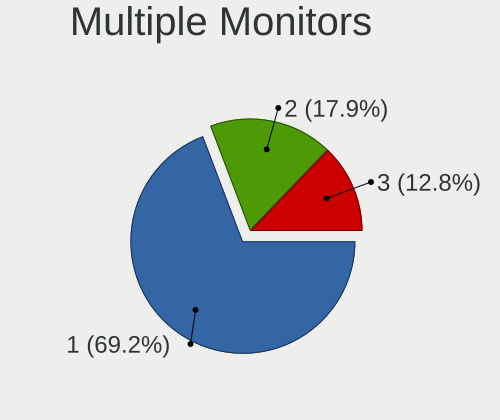

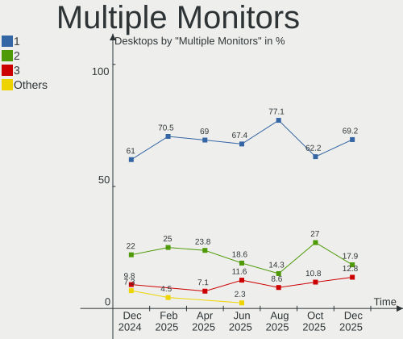

| Total | Desktops | Percent |
|-------|----------|---------|
| 1     | 27       | 69.23%  |
| 2     | 7        | 17.95%  |
| 3     | 5        | 12.82%  |

Network
-------

Net Controller Vendor
---------------------

Controller vendors

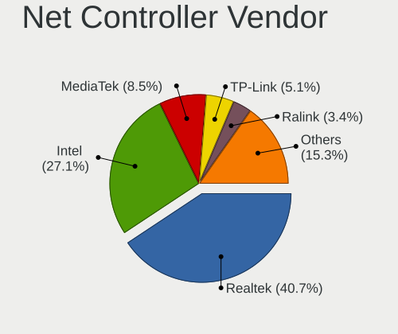

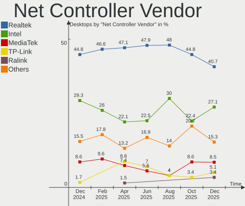

| Vendor                | Desktops | Percent |
|-----------------------|----------|---------|
| Realtek Semiconductor | 24       | 40.68%  |
| Intel                 | 16       | 27.12%  |
| MediaTek              | 5        | 8.47%   |
| TP-Link               | 3        | 5.08%   |
| Ralink Technology     | 2        | 3.39%   |
| Broadcom              | 2        | 3.39%   |
| Aquantia              | 2        | 3.39%   |
| Qualcomm Technologies | 1        | 1.69%   |
| OPPO Electronics      | 1        | 1.69%   |
| NetGear               | 1        | 1.69%   |
| ICS Advent            | 1        | 1.69%   |
| aicsemi               | 1        | 1.69%   |

Net Controller Model
--------------------

Controller models

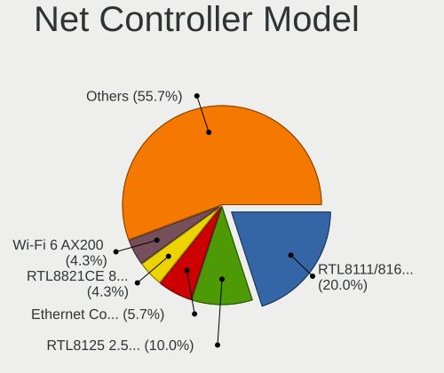

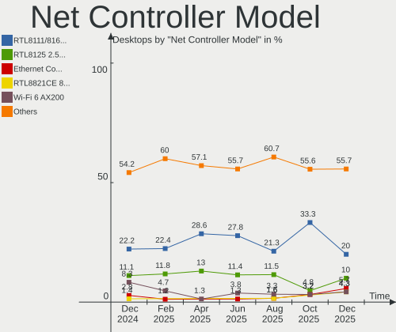

| Model                                                                           | Desktops | Percent |
|---------------------------------------------------------------------------------|----------|---------|
| Realtek RTL8111/8168/8211/8411 PCI Express Gigabit Ethernet Controller          | 14       | 20%     |
| Realtek RTL8125 2.5GbE Controller                                               | 7        | 10%     |
| Intel Ethernet Controller I226-V                                                | 4        | 5.71%   |
| Realtek RTL8821CE 802.11ac PCIe Wireless Network Adapter                        | 3        | 4.29%   |
| Intel Wi-Fi 6 AX200                                                             | 3        | 4.29%   |
| MediaTek MT7922 802.11ax PCI Express Wireless Network Adapter                   | 2        | 2.86%   |
| Intel I211 Gigabit Network Connection                                           | 2        | 2.86%   |
| Aquantia AQtion AQC107 NBase-T/IEEE 802.3an Ethernet Controller [Atlantic 10G]  | 2        | 2.86%   |
| TP-Link TL-WN823N v2/v3 [Realtek RTL8192EU]                                     | 1        | 1.43%   |
| TP-Link Archer T3U [Realtek RTL8812BU]                                          | 1        | 1.43%   |
| TP-Link 802.11ac NIC                                                            | 1        | 1.43%   |
| Realtek USB 10/100/1G/2.5 LAN                                                   | 1        | 1.43%   |
| Realtek RTL8852BE PCIe 802.11ax Wireless Network Controller                     | 1        | 1.43%   |
| Realtek RTL8822CE 802.11ac PCIe Wireless Network Adapter                        | 1        | 1.43%   |
| Realtek RTL8169 PCI Gigabit Ethernet Controller                                 | 1        | 1.43%   |
| Realtek RTL8126 5GbE Controller                                                 | 1        | 1.43%   |
| Realtek Killer E3000 2.5GbE Controller                                          | 1        | 1.43%   |
| Ralink RT5372 Wireless Adapter                                                  | 1        | 1.43%   |
| Ralink RT5370 Wireless Adapter                                                  | 1        | 1.43%   |
| Qualcomm WCN785x Wi-Fi 7(802.11be) 320MHz 2x2 [FastConnect 7800]                | 1        | 1.43%   |
| OPPO RMX3741                                                                    | 1        | 1.43%   |
| NetGear A6150                                                                   | 1        | 1.43%   |
| MediaTek MT7925 802.11be 160MHz 2x2 PCIe Wireless Network Adapter [Filogic 360] | 1        | 1.43%   |
| MediaTek MT7921K (RZ608) Wi-Fi 6E 80MHz                                         | 1        | 1.43%   |
| MediaTek MT7921 802.11ax PCIe Wireless Network Adapter [Filogic 330]            | 1        | 1.43%   |
| Intel Wireless 8260                                                             | 1        | 1.43%   |
| Intel Wireless 7265                                                             | 1        | 1.43%   |
| Intel Wi-Fi 6E(802.11ax) AX210/AX1675* 2x2 [Typhoon Peak]                       | 1        | 1.43%   |
| Intel Ethernet Controller I225-V                                                | 1        | 1.43%   |
| Intel Ethernet Connection I217-V                                                | 1        | 1.43%   |
| Intel Ethernet Connection I217-LM                                               | 1        | 1.43%   |
| Intel Ethernet Connection (7) I219-LM                                           | 1        | 1.43%   |
| Intel Ethernet Connection (2) I219-V                                            | 1        | 1.43%   |
| Intel Ethernet Connection (12) I219-V                                           | 1        | 1.43%   |
| Intel Alder Lake-N PCH CNVi WiFi                                                | 1        | 1.43%   |
| Intel 82579LM Gigabit Network Connection (Lewisville)                           | 1        | 1.43%   |
| Intel 700 Series Chipset CNVi WiFi                                              | 1        | 1.43%   |
| ICS Advent 10/100M LAN                                                          | 1        | 1.43%   |
| Broadcom BCM4360 802.11ac Dual Band Wireless Network Adapter                    | 1        | 1.43%   |
| Broadcom BCM4352 802.11ac Dual Band Wireless Network Adapter                    | 1        | 1.43%   |

Wireless Vendor
---------------

Wireless vendors

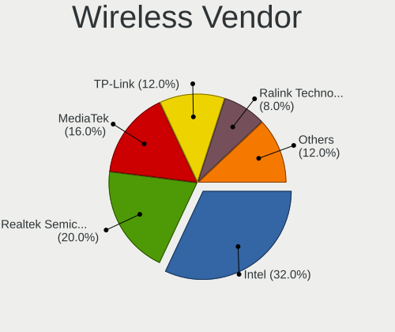

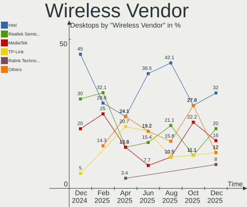

| Vendor                | Desktops | Percent |
|-----------------------|----------|---------|
| Intel                 | 8        | 32%     |
| Realtek Semiconductor | 5        | 20%     |
| MediaTek              | 4        | 16%     |
| TP-Link               | 3        | 12%     |
| Ralink Technology     | 2        | 8%      |
| Broadcom              | 2        | 8%      |
| NetGear               | 1        | 4%      |

Wireless Model
--------------

Wireless models

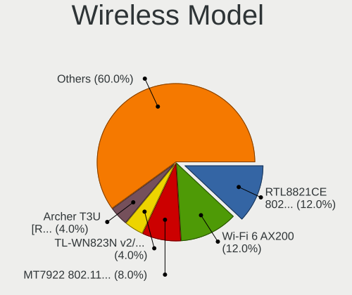

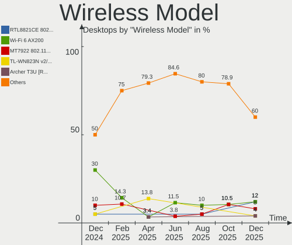

| Model                                                                | Desktops | Percent |
|----------------------------------------------------------------------|----------|---------|
| Realtek RTL8821CE 802.11ac PCIe Wireless Network Adapter             | 3        | 12%     |
| Intel Wi-Fi 6 AX200                                                  | 3        | 12%     |
| MediaTek MT7922 802.11ax PCI Express Wireless Network Adapter        | 2        | 8%      |
| TP-Link TL-WN823N v2/v3 [Realtek RTL8192EU]                          | 1        | 4%      |
| TP-Link Archer T3U [Realtek RTL8812BU]                               | 1        | 4%      |
| TP-Link 802.11ac NIC                                                 | 1        | 4%      |
| Realtek RTL8852BE PCIe 802.11ax Wireless Network Controller          | 1        | 4%      |
| Realtek RTL8822CE 802.11ac PCIe Wireless Network Adapter             | 1        | 4%      |
| Ralink RT5372 Wireless Adapter                                       | 1        | 4%      |
| Ralink RT5370 Wireless Adapter                                       | 1        | 4%      |
| NetGear A6150                                                        | 1        | 4%      |
| MediaTek MT7921K (RZ608) Wi-Fi 6E 80MHz                              | 1        | 4%      |
| MediaTek MT7921 802.11ax PCIe Wireless Network Adapter [Filogic 330] | 1        | 4%      |
| Intel Wireless 8260                                                  | 1        | 4%      |
| Intel Wireless 7265                                                  | 1        | 4%      |
| Intel Wi-Fi 6E(802.11ax) AX210/AX1675* 2x2 [Typhoon Peak]            | 1        | 4%      |
| Intel Alder Lake-N PCH CNVi WiFi                                     | 1        | 4%      |
| Intel 700 Series Chipset CNVi WiFi                                   | 1        | 4%      |
| Broadcom BCM4360 802.11ac Dual Band Wireless Network Adapter         | 1        | 4%      |
| Broadcom BCM4352 802.11ac Dual Band Wireless Network Adapter         | 1        | 4%      |

Ethernet Vendor
---------------

Ethernet vendors

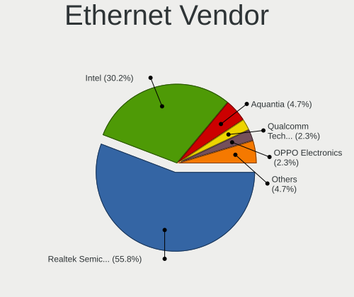

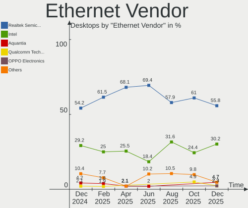

| Vendor                | Desktops | Percent |
|-----------------------|----------|---------|
| Realtek Semiconductor | 24       | 55.81%  |
| Intel                 | 13       | 30.23%  |
| Aquantia              | 2        | 4.65%   |
| Qualcomm Technologies | 1        | 2.33%   |
| OPPO Electronics      | 1        | 2.33%   |
| MediaTek              | 1        | 2.33%   |
| ICS Advent            | 1        | 2.33%   |

Ethernet Model
--------------

Ethernet models

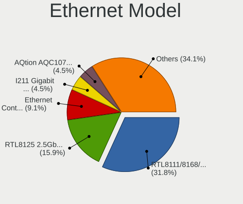

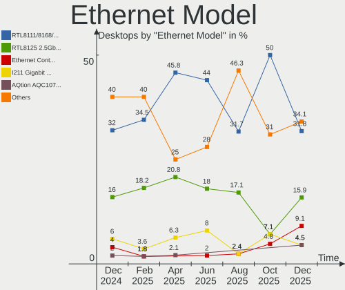

| Model                                                                           | Desktops | Percent |
|---------------------------------------------------------------------------------|----------|---------|
| Realtek RTL8111/8168/8211/8411 PCI Express Gigabit Ethernet Controller          | 14       | 31.82%  |
| Realtek RTL8125 2.5GbE Controller                                               | 7        | 15.91%  |
| Intel Ethernet Controller I226-V                                                | 4        | 9.09%   |
| Intel I211 Gigabit Network Connection                                           | 2        | 4.55%   |
| Aquantia AQtion AQC107 NBase-T/IEEE 802.3an Ethernet Controller [Atlantic 10G]  | 2        | 4.55%   |
| Realtek USB 10/100/1G/2.5 LAN                                                   | 1        | 2.27%   |
| Realtek RTL8169 PCI Gigabit Ethernet Controller                                 | 1        | 2.27%   |
| Realtek RTL8126 5GbE Controller                                                 | 1        | 2.27%   |
| Realtek Killer E3000 2.5GbE Controller                                          | 1        | 2.27%   |
| Qualcomm WCN785x Wi-Fi 7(802.11be) 320MHz 2x2 [FastConnect 7800]                | 1        | 2.27%   |
| OPPO RMX3741                                                                    | 1        | 2.27%   |
| MediaTek MT7925 802.11be 160MHz 2x2 PCIe Wireless Network Adapter [Filogic 360] | 1        | 2.27%   |
| Intel Ethernet Controller I225-V                                                | 1        | 2.27%   |
| Intel Ethernet Connection I217-V                                                | 1        | 2.27%   |
| Intel Ethernet Connection I217-LM                                               | 1        | 2.27%   |
| Intel Ethernet Connection (7) I219-LM                                           | 1        | 2.27%   |
| Intel Ethernet Connection (2) I219-V                                            | 1        | 2.27%   |
| Intel Ethernet Connection (12) I219-V                                           | 1        | 2.27%   |
| Intel 82579LM Gigabit Network Connection (Lewisville)                           | 1        | 2.27%   |
| ICS Advent 10/100M LAN                                                          | 1        | 2.27%   |

Net Controller Kind
-------------------

Ethernet, WiFi or modem

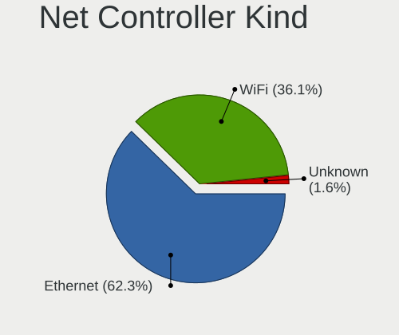

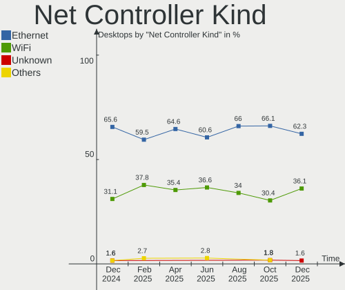

| Kind     | Desktops | Percent |
|----------|----------|---------|
| Ethernet | 38       | 62.3%   |
| WiFi     | 22       | 36.07%  |
| Unknown  | 1        | 1.64%   |

Used Controller
---------------

Currently used network controller

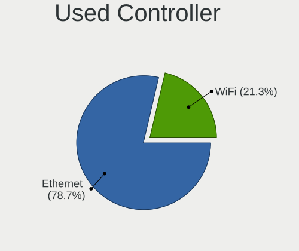

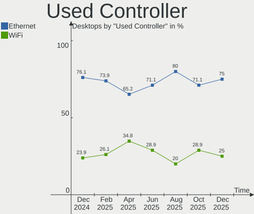

| Kind     | Desktops | Percent |
|----------|----------|---------|
| Ethernet | 30       | 75%     |
| WiFi     | 10       | 25%     |

NICs
----

Total network controllers on board

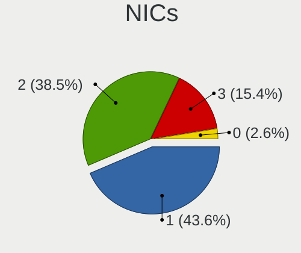

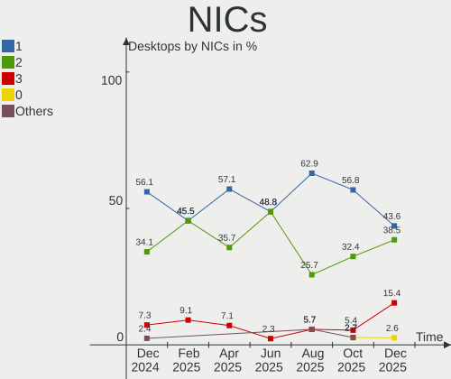

| Total | Desktops | Percent |
|-------|----------|---------|
| 1     | 17       | 43.59%  |
| 2     | 15       | 38.46%  |
| 3     | 6        | 15.38%  |
| 0     | 1        | 2.56%   |

IPv6
----

IPv6 vs IPv4

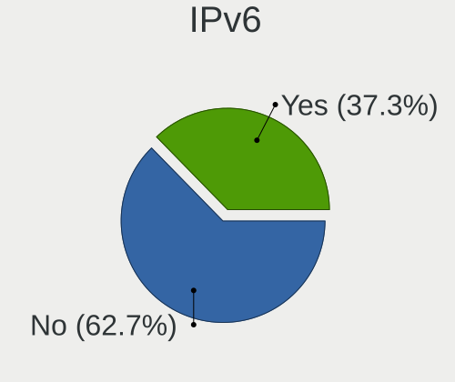

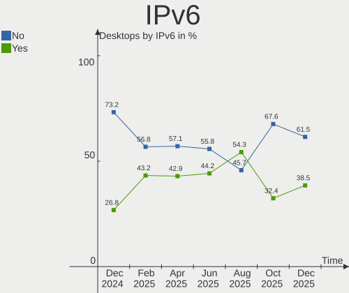

| Used | Desktops | Percent |
|------|----------|---------|
| No   | 24       | 61.54%  |
| Yes  | 15       | 38.46%  |

Bluetooth
---------

Bluetooth Vendor
----------------

Controller vendors

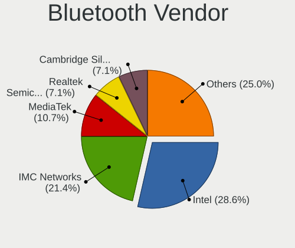

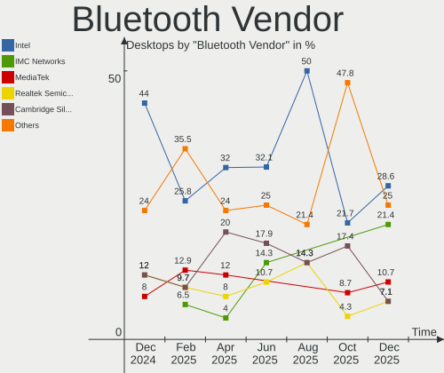

| Vendor                  | Desktops | Percent |
|-------------------------|----------|---------|
| Intel                   | 8        | 28.57%  |
| IMC Networks            | 6        | 21.43%  |
| MediaTek                | 3        | 10.71%  |
| Realtek Semiconductor   | 2        | 7.14%   |
| Cambridge Silicon Radio | 2        | 7.14%   |
| Broadcom                | 2        | 7.14%   |
| Realtek                 | 1        | 3.57%   |
| Foxconn / Hon Hai       | 1        | 3.57%   |
| Dynex                   | 1        | 3.57%   |
| ASUSTek Computer        | 1        | 3.57%   |
| Actions                 | 1        | 3.57%   |

Bluetooth Model
---------------

Controller models

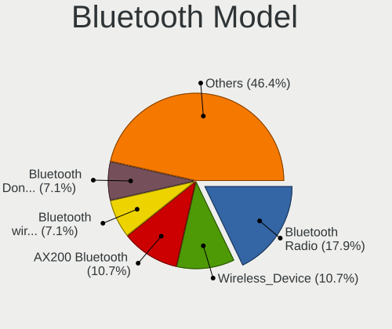

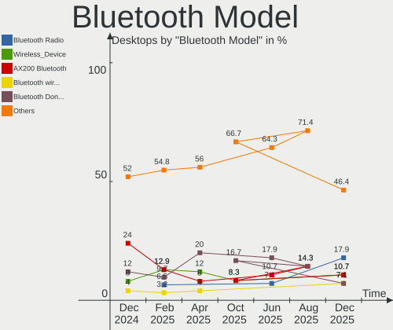

| Model                                                    | Desktops | Percent |
|----------------------------------------------------------|----------|---------|
| IMC Networks Bluetooth Radio                             | 5        | 17.86%  |
| MediaTek Wireless_Device                                 | 3        | 10.71%  |
| Intel AX200 Bluetooth                                    | 3        | 10.71%  |
| Intel Bluetooth wireless interface                       | 2        | 7.14%   |
| Cambridge Silicon Radio Bluetooth Dongle (HCI mode)      | 2        | 7.14%   |
| Broadcom BCM20702A0 Bluetooth 4.0                        | 2        | 7.14%   |
| Realtek Bluetooth Radio                                  | 1        | 3.57%   |
| Realtek Bluetooth 5.4 Radio                              | 1        | 3.57%   |
| Realtek Bluetooth Radio                                  | 1        | 3.57%   |
| Intel Bluetooth Device                                   | 1        | 3.57%   |
| Intel AX210 Bluetooth                                    | 1        | 3.57%   |
| Intel AX201 Bluetooth                                    | 1        | 3.57%   |
| IMC Networks BCM20702A0                                  | 1        | 3.57%   |
| Foxconn / Hon Hai Bluetooth Device                       | 1        | 3.57%   |
| Dynex Bluetooth 4.0 Adapter [Broadcom, 1.12, BCM20702A0] | 1        | 3.57%   |
| ASUS ASUS USB-BT500                                      | 1        | 3.57%   |
| Actions general adapter                                  | 1        | 3.57%   |

Sound
-----

Sound Vendor
------------

Sound card vendors

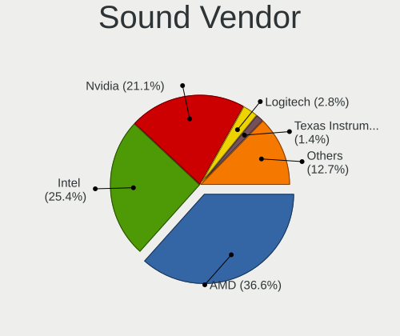

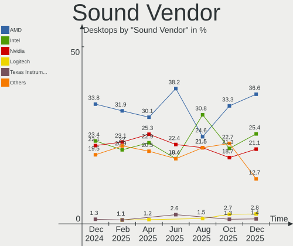

| Vendor                   | Desktops | Percent |
|--------------------------|----------|---------|
| AMD                      | 26       | 36.62%  |
| Intel                    | 18       | 25.35%  |
| Nvidia                   | 15       | 21.13%  |
| Logitech                 | 2        | 2.82%   |
| Texas Instruments        | 1        | 1.41%   |
| Setek Elektronik         | 1        | 1.41%   |
| Razer USA                | 1        | 1.41%   |
| Micro Star International | 1        | 1.41%   |
| Linux Foundation         | 1        | 1.41%   |
| Lenovo                   | 1        | 1.41%   |
| Corsair                  | 1        | 1.41%   |
| C-Media Electronics      | 1        | 1.41%   |
| ASUSTek Computer         | 1        | 1.41%   |
| ASRock                   | 1        | 1.41%   |

Sound Model
-----------

Sound card models

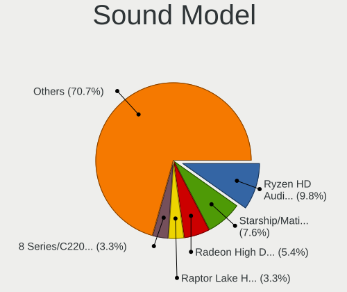

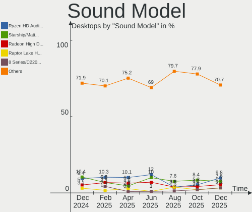

| Model                                                                   | Desktops | Percent |
|-------------------------------------------------------------------------|----------|---------|
| AMD Ryzen HD Audio Controller                                           | 9        | 9.78%   |
| AMD Starship/Matisse HD Audio Controller                                | 7        | 7.61%   |
| AMD Radeon High Definition Audio Controller                             | 5        | 5.43%   |
| Intel Raptor Lake High Definition Audio Controller                      | 3        | 3.26%   |
| Intel 8 Series/C220 Series Chipset High Definition Audio Controller     | 3        | 3.26%   |
| AMD Oland/Hainan/Cape Verde/Pitcairn HDMI Audio [Radeon HD 7000 Series] | 3        | 3.26%   |
| AMD Navi 31 HDMI/DP Audio                                               | 3        | 3.26%   |
| AMD Family 17h (Models 00h-0fh) HD Audio Controller                     | 3        | 3.26%   |
| AMD Ellesmere HDMI Audio [Radeon RX 470/480 / 570/580/590]              | 3        | 3.26%   |
| Nvidia GB205 High Definition Audio Controller                           | 2        | 2.17%   |
| Nvidia GA104 High Definition Audio Controller                           | 2        | 2.17%   |
| Nvidia AD104 High Definition Audio Controller                           | 2        | 2.17%   |
| Nvidia AD103 High Definition Audio Controller                           | 2        | 2.17%   |
| Intel Xeon E3-1200 v3/4th Gen Core Processor HD Audio Controller        | 2        | 2.17%   |
| Intel Cannon Lake PCH cAVS                                              | 2        | 2.17%   |
| AMD Renoir/Cezanne HDMI/DP Audio Controller                             | 2        | 2.17%   |
| AMD Navi 21/23 HDMI/DP Audio Controller                                 | 2        | 2.17%   |
| AMD Baffin HDMI/DP Audio [Radeon RX 550 640SP / RX 560/560X]            | 2        | 2.17%   |
| Texas Instruments PCM2902 Audio Codec                                   | 1        | 1.09%   |
| Setek Elektronik Realtek USB Audio Rear                                 | 1        | 1.09%   |
| Setek Elektronik Realtek USB Audio Front                                | 1        | 1.09%   |
| Razer USA Razer USB Sound Card                                          | 1        | 1.09%   |
| Nvidia TU116 High Definition Audio Controller                           | 1        | 1.09%   |
| Nvidia TU106 High Definition Audio Controller                           | 1        | 1.09%   |
| Nvidia GP106 High Definition Audio Controller                           | 1        | 1.09%   |
| Nvidia GM107 High Definition Audio Controller [GeForce 940MX]           | 1        | 1.09%   |
| Nvidia GK208 HDMI/DP Audio Controller                                   | 1        | 1.09%   |
| Nvidia GB206 High Definition Audio Controller                           | 1        | 1.09%   |
| Nvidia GA106 High Definition Audio Controller                           | 1        | 1.09%   |
| Nvidia AD106M High Definition Audio Controller                          | 1        | 1.09%   |
| Micro Star International USB Audio                                      | 1        | 1.09%   |
| Logitech Yeti Nano                                                      | 1        | 1.09%   |
| Logitech G733 Gaming Headset                                            | 1        | 1.09%   |
| Linux Foundation POROSVOC                                               | 1        | 1.09%   |
| Lenovo Lenovo Go Wired ANC Headset                                      | 1        | 1.09%   |
| Intel Tiger Lake-H HD Audio Controller                                  | 1        | 1.09%   |
| Intel Raptor Lake-P/U/H cAVS                                            | 1        | 1.09%   |
| Intel Comet Lake PCH-V cAVS                                             | 1        | 1.09%   |
| Intel Alder Lake-N PCH High Definition Audio Controller                 | 1        | 1.09%   |
| Intel Alder Lake PCH-P High Definition Audio Controller                 | 1        | 1.09%   |

Memory
------

Memory Vendor
-------------

Memory module vendors

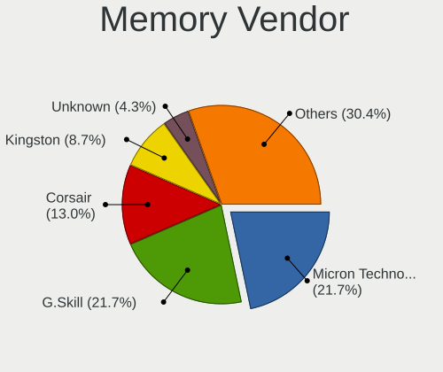

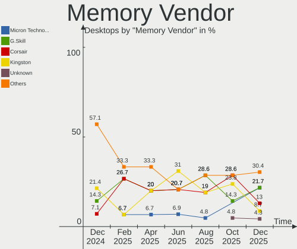

| Vendor              | Desktops | Percent |
|---------------------|----------|---------|
| Micron Technology   | 5        | 21.74%  |
| G.Skill             | 5        | 21.74%  |
| Corsair             | 3        | 13.04%  |
| Kingston            | 2        | 8.7%    |
| Unknown             | 1        | 4.35%   |
| Team                | 1        | 4.35%   |
| SK hynix            | 1        | 4.35%   |
| Samsung Electronics | 1        | 4.35%   |
| Patriot             | 1        | 4.35%   |
| Crucial             | 1        | 4.35%   |
| AMD                 | 1        | 4.35%   |
| A-DATA Technology   | 1        | 4.35%   |

Memory Model
------------

Memory module models

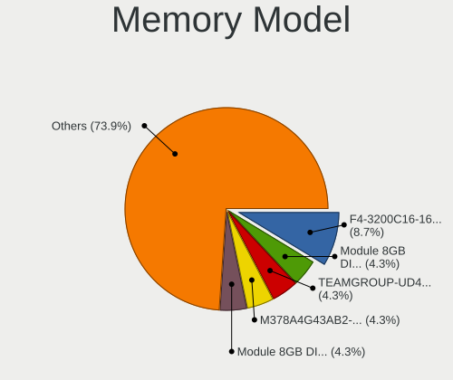

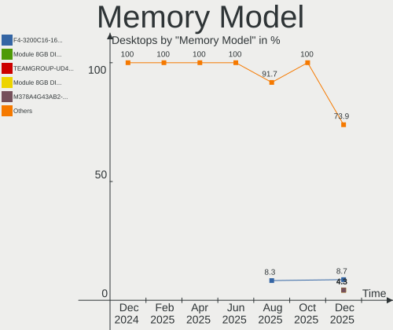

| Model                                                    | Desktops | Percent |
|----------------------------------------------------------|----------|---------|
| G.Skill RAM F4-3200C16-16GIS 16GB DIMM DDR4 3600MT/s     | 2        | 8.7%    |
| Unknown RAM Module 8GB DIMM DDR3 1333MT/s                | 1        | 4.35%   |
| Team RAM TEAMGROUP-UD4-3200 8GB DIMM DDR4 3800MT/s       | 1        | 4.35%   |
| SK hynix RAM Module 8GB DIMM DDR3 1333MT/s               | 1        | 4.35%   |
| Samsung RAM M378A4G43AB2-CVF 32GB DIMM DDR4 2933MT/s     | 1        | 4.35%   |
| Patriot RAM 2666 C16 Series 16GB DIMM DDR4 3400MT/s      | 1        | 4.35%   |
| Micron RAM CT32G4SFD832A.M16FF 32GB SODIMM DDR4 3200MT/s | 1        | 4.35%   |
| Micron RAM CT16G56C46S5.M8D1 16GB SODIMM DDR5 5600MT/s   | 1        | 4.35%   |
| Micron RAM CP32G4DFRA32A.M16FF 32GB DIMM DDR4 3200MT/s   | 1        | 4.35%   |
| Micron RAM 18ASF2G72PDZ-3G2R1 16GB DIMM DDR4 3200MT/s    | 1        | 4.35%   |
| Micron RAM 16KTF1G64AZ-1G6E1 8GB DIMM DDR3 1600MT/s      | 1        | 4.35%   |
| Kingston RAM KF560C36-32 32GB DIMM DDR5 6200MT/s         | 1        | 4.35%   |
| Kingston RAM KF560C32-48 48GB DIMM DDR5 6000MT/s         | 1        | 4.35%   |
| G.Skill RAM Module 16GB DIMM DDR4 3800MT/s               | 1        | 4.35%   |
| G.Skill RAM F5-6000J3238F16G 16GB DIMM DDR5 12800MT/s    | 1        | 4.35%   |
| G.Skill RAM F4-3200C16-8GTZR 8GB DIMM DDR4 3200MT/s      | 1        | 4.35%   |
| Crucial RAM BLS4G4D240FSB.8FBD 4GB DIMM DDR4 2666MT/s    | 1        | 4.35%   |
| Corsair RAM CMK64GX4M2D3600C18 32GB DIMM DDR4 3600MT/s   | 1        | 4.35%   |
| Corsair RAM CMK16GX4M2B3200C16 8GB DIMM DDR4 3600MT/s    | 1        | 4.35%   |
| Corsair RAM CMK16GX4M2B3000C15 8GB DIMM DDR4 3600MT/s    | 1        | 4.35%   |
| AMD RAM R748G2606U2S 8GB DIMM DDR4 3200MT/s              | 1        | 4.35%   |
| A-DATA RAM CBDAD5S560032G-BAD 32GB SODIMM DDR5 5600MT/s  | 1        | 4.35%   |

Memory Kind
-----------

Memory module kinds

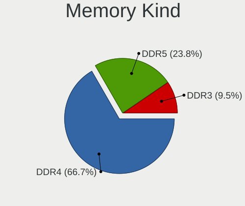

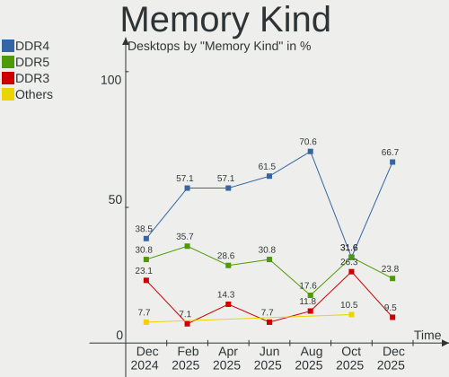

| Kind | Desktops | Percent |
|------|----------|---------|
| DDR4 | 14       | 66.67%  |
| DDR5 | 5        | 23.81%  |
| DDR3 | 2        | 9.52%   |

Memory Form Factor
------------------

Physical design of the memory module

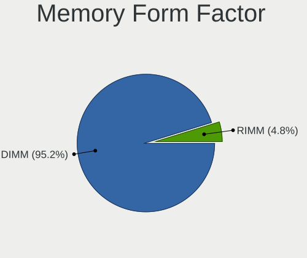

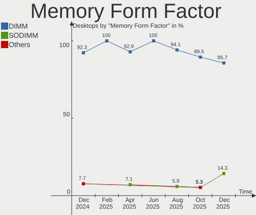

| Name   | Desktops | Percent |
|--------|----------|---------|
| DIMM   | 18       | 85.71%  |
| SODIMM | 3        | 14.29%  |

Memory Size
-----------

Memory module size

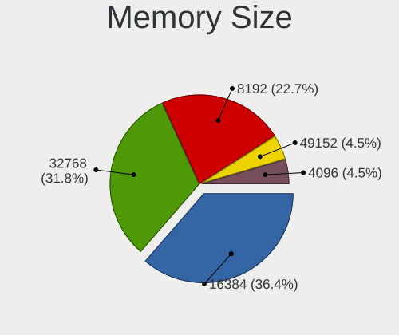

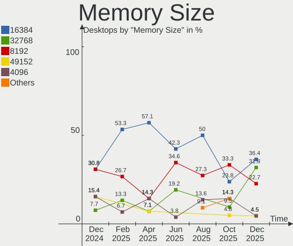

| Size  | Desktops | Percent |
|-------|----------|---------|
| 16384 | 8        | 36.36%  |
| 32768 | 7        | 31.82%  |
| 8192  | 5        | 22.73%  |
| 49152 | 1        | 4.55%   |
| 4096  | 1        | 4.55%   |

Memory Speed
------------

Memory module speed

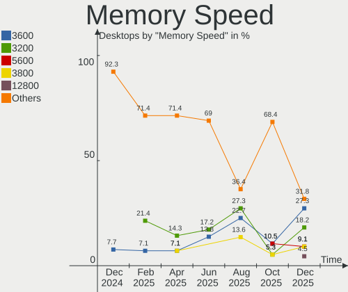

| Speed | Desktops | Percent |
|-------|----------|---------|
| 3600  | 6        | 27.27%  |
| 3200  | 4        | 18.18%  |
| 5600  | 2        | 9.09%   |
| 3800  | 2        | 9.09%   |
| 12800 | 1        | 4.55%   |
| 6200  | 1        | 4.55%   |
| 6000  | 1        | 4.55%   |
| 3400  | 1        | 4.55%   |
| 2933  | 1        | 4.55%   |
| 2666  | 1        | 4.55%   |
| 1600  | 1        | 4.55%   |
| 1333  | 1        | 4.55%   |

Printers & scanners
-------------------

Printer Vendor
--------------

Printer device vendors

Zero info for selected period =(

Printer Model
-------------

Printer device models

Zero info for selected period =(

Scanner Vendor
--------------

Scanner device vendors

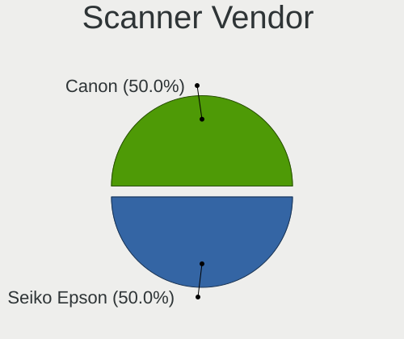

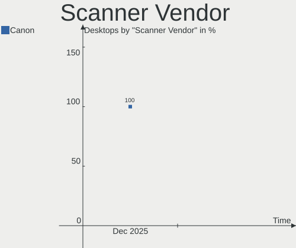

| Vendor | Desktops | Percent |
|--------|----------|---------|
| Canon  | 1        | 100%    |

Scanner Model
-------------

Scanner device models

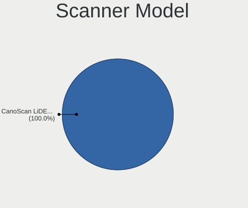

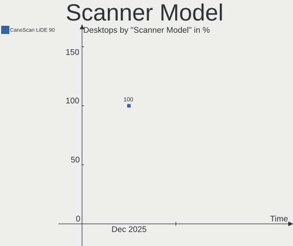

| Model                  | Desktops | Percent |
|------------------------|----------|---------|
| Canon CanoScan LiDE 90 | 1        | 100%    |

Camera
------

Camera Vendor
-------------

Camera device vendors

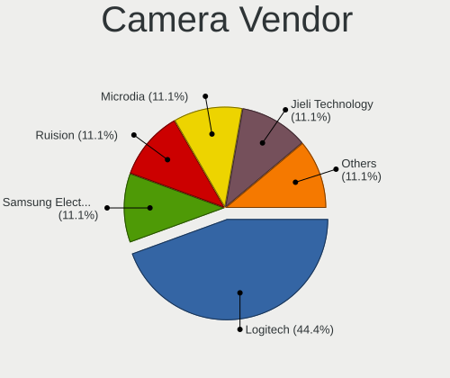

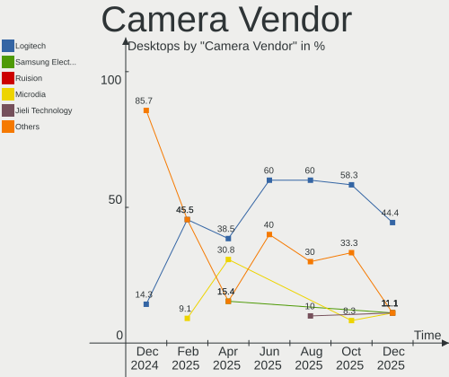

| Vendor                 | Desktops | Percent |
|------------------------|----------|---------|
| Logitech               | 4        | 44.44%  |
| Samsung Electronics    | 1        | 11.11%  |
| Ruision                | 1        | 11.11%  |
| Microdia               | 1        | 11.11%  |
| Jieli Technology       | 1        | 11.11%  |
| Generalplus Technology | 1        | 11.11%  |

Camera Model
------------

Camera device models

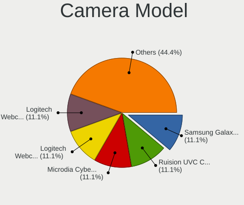

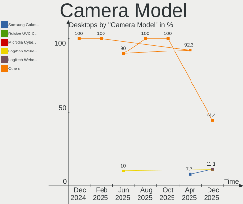

| Model                                    | Desktops | Percent |
|------------------------------------------|----------|---------|
| Samsung Galaxy series, misc. (MTP mode)  | 1        | 11.11%  |
| Ruision UVC Camera                       | 1        | 11.11%  |
| Microdia CyberTrack H7                   | 1        | 11.11%  |
| Logitech Webcam C310                     | 1        | 11.11%  |
| Logitech Webcam C300                     | 1        | 11.11%  |
| Logitech HD Webcam C525                  | 1        | 11.11%  |
| Logitech C922 Pro Stream Webcam          | 1        | 11.11%  |
| Jieli USB PHY 2.0                        | 1        | 11.11%  |
| Generalplus 808 Camera #9 (web-cam mode) | 1        | 11.11%  |

Security
--------

Fingerprint Vendor
------------------

Fingerprint sensor vendors

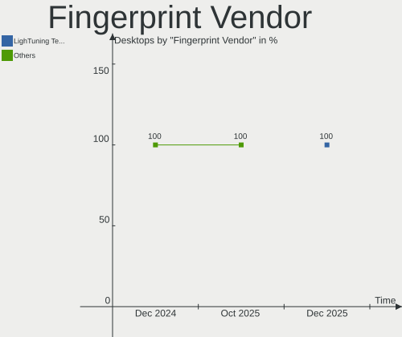

| Vendor                | Desktops | Percent |
|-----------------------|----------|---------|
| LighTuning Technology | 1        | 100%    |

Fingerprint Model
-----------------

Fingerprint sensor models

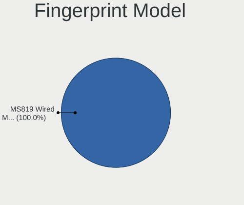

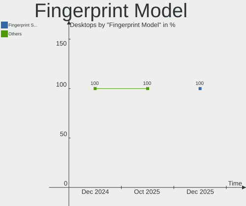

| Model                         | Desktops | Percent |
|-------------------------------|----------|---------|
| LighTuning Fingerprint Sensor | 1        | 100%    |

Chipcard Vendor
---------------

Chipcard module vendors

Zero info for selected period =(

Chipcard Model
--------------

Chipcard module models

Zero info for selected period =(

Unsupported
-----------

Unsupported Devices
-------------------

Total unsupported devices on board

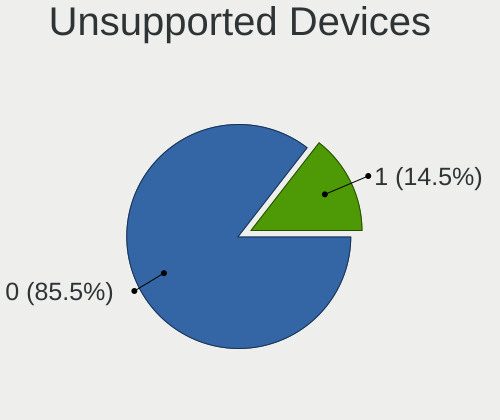

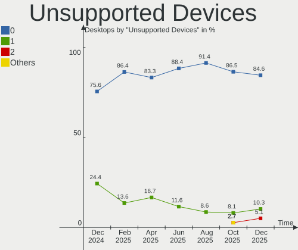

| Total | Desktops | Percent |
|-------|----------|---------|
| 0     | 33       | 84.62%  |
| 1     | 4        | 10.26%  |
| 2     | 2        | 5.13%   |

Unsupported Device Types
------------------------

Types of unsupported devices

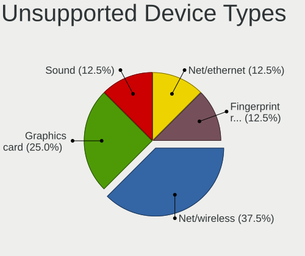

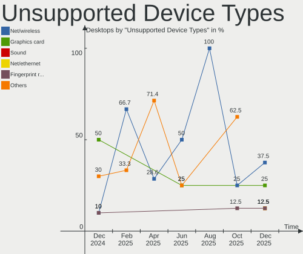

| Type               | Desktops | Percent |
|--------------------|----------|---------|
| Net/wireless       | 3        | 37.5%   |
| Graphics card      | 2        | 25%     |
| Sound              | 1        | 12.5%   |
| Net/ethernet       | 1        | 12.5%   |
| Fingerprint reader | 1        | 12.5%   |

