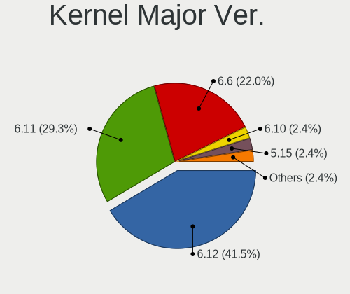
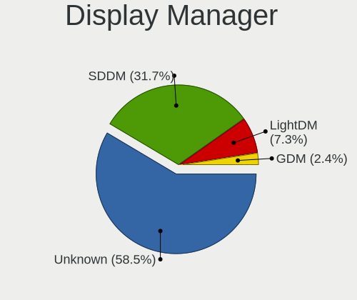
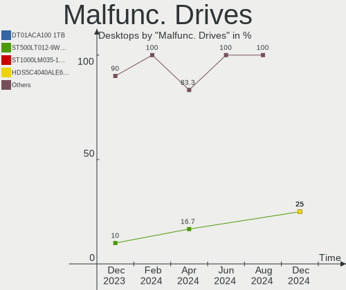
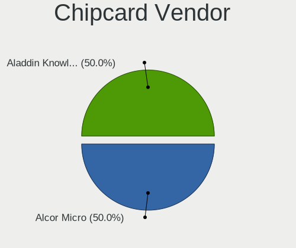

Manjaro - Hardware Trends (Desktops)
------------------------------------

A project to identify most popular hardware characteristics and track their change
over time based on data collected by Linux users at https://Linux-Hardware.org.

Anyone can contribute to this report by the [hw-probe](https://github.com/linuxhw/hw-probe) tool:

    sudo -E hw-probe -all -upload

This report is for one last month. Overall report since the beginning of time: [TestDays](https://github.com/linuxhw/TestDays)

Period: Feb, 2023.

Contents
--------

* [ System ](#system)
  - [ OS                       ](#os)
  - [ OS Family                ](#os-family)
  - [ Kernel                   ](#kernel)
  - [ Kernel Family            ](#kernel-family)
  - [ Kernel Major Ver.        ](#kernel-major-ver)
  - [ Arch                     ](#arch)
  - [ DE                       ](#de)
  - [ Display Server           ](#display-server)
  - [ Display Manager          ](#display-manager)
  - [ OS Lang                  ](#os-lang)
  - [ Boot Mode                ](#boot-mode)
  - [ Filesystem               ](#filesystem)
  - [ Part. scheme             ](#part-scheme)
  - [ Dual Boot with Linux/BSD ](#dual-boot-with-linuxbsd)
  - [ Dual Boot (Win)          ](#dual-boot-win)

* [ Board ](#board)
  - [ Vendor                   ](#vendor)
  - [ Model                    ](#model)
  - [ Model Family             ](#model-family)
  - [ MFG Year                 ](#mfg-year)
  - [ Form Factor              ](#form-factor)
  - [ Secure Boot              ](#secure-boot)
  - [ Coreboot                 ](#coreboot)
  - [ RAM Size                 ](#ram-size)
  - [ RAM Used                 ](#ram-used)
  - [ Total Drives             ](#total-drives)
  - [ Has CD-ROM               ](#has-cd-rom)
  - [ Has Ethernet             ](#has-ethernet)
  - [ Has WiFi                 ](#has-wifi)
  - [ Has Bluetooth            ](#has-bluetooth)

* [ Location ](#location)
  - [ Country                  ](#country)
  - [ City                     ](#city)

* [ Drives ](#drives)
  - [ Drive Vendor             ](#drive-vendor)
  - [ Drive Model              ](#drive-model)
  - [ HDD Vendor               ](#hdd-vendor)
  - [ SSD Vendor               ](#ssd-vendor)
  - [ Drive Kind               ](#drive-kind)
  - [ Drive Connector          ](#drive-connector)
  - [ Drive Size               ](#drive-size)
  - [ Space Total              ](#space-total)
  - [ Space Used               ](#space-used)
  - [ Malfunc. Drives          ](#malfunc-drives)
  - [ Malfunc. Drive Vendor    ](#malfunc-drive-vendor)
  - [ Malfunc. HDD Vendor      ](#malfunc-hdd-vendor)
  - [ Malfunc. Drive Kind      ](#malfunc-drive-kind)
  - [ Failed Drives            ](#failed-drives)
  - [ Failed Drive Vendor      ](#failed-drive-vendor)
  - [ Drive Status             ](#drive-status)

* [ Storage controller ](#storage-controller)
  - [ Storage Vendor           ](#storage-vendor)
  - [ Storage Model            ](#storage-model)
  - [ Storage Kind             ](#storage-kind)

* [ Processor ](#processor)
  - [ CPU Vendor               ](#cpu-vendor)
  - [ CPU Model                ](#cpu-model)
  - [ CPU Model Family         ](#cpu-model-family)
  - [ CPU Cores                ](#cpu-cores)
  - [ CPU Sockets              ](#cpu-sockets)
  - [ CPU Threads              ](#cpu-threads)
  - [ CPU Op-Modes             ](#cpu-op-modes)
  - [ CPU Microcode            ](#cpu-microcode)
  - [ CPU Microarch            ](#cpu-microarch)

* [ Graphics ](#graphics)
  - [ GPU Vendor               ](#gpu-vendor)
  - [ GPU Model                ](#gpu-model)
  - [ GPU Combo                ](#gpu-combo)
  - [ GPU Driver               ](#gpu-driver)
  - [ GPU Memory               ](#gpu-memory)

* [ Monitor ](#monitor)
  - [ Monitor Vendor           ](#monitor-vendor)
  - [ Monitor Model            ](#monitor-model)
  - [ Monitor Resolution       ](#monitor-resolution)
  - [ Monitor Diagonal         ](#monitor-diagonal)
  - [ Monitor Width            ](#monitor-width)
  - [ Aspect Ratio             ](#aspect-ratio)
  - [ Monitor Area             ](#monitor-area)
  - [ Pixel Density            ](#pixel-density)
  - [ Multiple Monitors        ](#multiple-monitors)

* [ Network ](#network)
  - [ Net Controller Vendor    ](#net-controller-vendor)
  - [ Net Controller Model     ](#net-controller-model)
  - [ Wireless Vendor          ](#wireless-vendor)
  - [ Wireless Model           ](#wireless-model)
  - [ Ethernet Vendor          ](#ethernet-vendor)
  - [ Ethernet Model           ](#ethernet-model)
  - [ Net Controller Kind      ](#net-controller-kind)
  - [ Used Controller          ](#used-controller)
  - [ NICs                     ](#nics)
  - [ IPv6                     ](#ipv6)

* [ Bluetooth ](#bluetooth)
  - [ Bluetooth Vendor         ](#bluetooth-vendor)
  - [ Bluetooth Model          ](#bluetooth-model)

* [ Sound ](#sound)
  - [ Sound Vendor             ](#sound-vendor)
  - [ Sound Model              ](#sound-model)

* [ Memory ](#memory)
  - [ Memory Vendor            ](#memory-vendor)
  - [ Memory Model             ](#memory-model)
  - [ Memory Kind              ](#memory-kind)
  - [ Memory Form Factor       ](#memory-form-factor)
  - [ Memory Size              ](#memory-size)
  - [ Memory Speed             ](#memory-speed)

* [ Printers & scanners ](#printers--scanners)
  - [ Printer Vendor           ](#printer-vendor)
  - [ Printer Model            ](#printer-model)
  - [ Scanner Vendor           ](#scanner-vendor)
  - [ Scanner Model            ](#scanner-model)

* [ Camera ](#camera)
  - [ Camera Vendor            ](#camera-vendor)
  - [ Camera Model             ](#camera-model)

* [ Security ](#security)
  - [ Fingerprint Vendor       ](#fingerprint-vendor)
  - [ Fingerprint Model        ](#fingerprint-model)
  - [ Chipcard Vendor          ](#chipcard-vendor)
  - [ Chipcard Model           ](#chipcard-model)

* [ Unsupported ](#unsupported)
  - [ Unsupported Devices      ](#unsupported-devices)
  - [ Unsupported Device Types ](#unsupported-device-types)

System
------

OS
--

Installed operating systems

| Name           | Desktops | Percent |
|----------------|----------|---------|
| Manjaro        | 43       | 67.19%  |
| Manjaro 22.0.3 | 9        | 14.06%  |
| Manjaro 22.0.4 | 6        | 9.38%   |
| Manjaro 22.0.2 | 4        | 6.25%   |
| Manjaro 22.0.1 | 2        | 3.13%   |

OS Family
---------

OS without a version

| Name    | Desktops | Percent |
|---------|----------|---------|
| Manjaro | 64       | 100%    |

Kernel
------

Version of the Linux kernel

| Version               | Desktops | Percent |
|-----------------------|----------|---------|
| 6.1.9-1-MANJARO       | 14       | 21.88%  |
| 6.1.11-1-MANJARO      | 13       | 20.31%  |
| 6.1.12-1-MANJARO      | 6        | 9.38%   |
| 5.15.94-1-MANJARO     | 5        | 7.81%   |
| 5.15.91-1-MANJARO     | 5        | 7.81%   |
| 5.15.93-1-MANJARO     | 3        | 4.69%   |
| 5.15.89-1-MANJARO     | 3        | 4.69%   |
| 6.1.7-1-MANJARO       | 2        | 3.13%   |
| 6.0.19-4-MANJARO      | 2        | 3.13%   |
| 6.0.19-3-MANJARO      | 2        | 3.13%   |
| 5.15.53-1-MANJARO     | 2        | 3.13%   |
| 6.1.9-zen1-1-zen      | 1        | 1.56%   |
| 6.1.10-lqx1-1-lqx     | 1        | 1.56%   |
| 6.0.6-1-MANJARO       | 1        | 1.56%   |
| 5.4.228-1-MANJARO     | 1        | 1.56%   |
| 5.15.95-xanmod1-1-lts | 1        | 1.56%   |
| 5.15.81-1-MANJARO     | 1        | 1.56%   |
| 5.15.74-3-MANJARO     | 1        | 1.56%   |

Kernel Family
-------------

Linux kernel without a distro release

| Version | Desktops | Percent |
|---------|----------|---------|
| 6.1.9   | 15       | 23.44%  |
| 6.1.11  | 13       | 20.31%  |
| 6.1.12  | 6        | 9.38%   |
| 5.15.94 | 5        | 7.81%   |
| 5.15.91 | 5        | 7.81%   |
| 6.0.19  | 4        | 6.25%   |
| 5.15.93 | 3        | 4.69%   |
| 5.15.89 | 3        | 4.69%   |
| 6.1.7   | 2        | 3.13%   |
| 5.15.53 | 2        | 3.13%   |
| 6.1.10  | 1        | 1.56%   |
| 6.0.6   | 1        | 1.56%   |
| 5.4.228 | 1        | 1.56%   |
| 5.15.95 | 1        | 1.56%   |
| 5.15.81 | 1        | 1.56%   |
| 5.15.74 | 1        | 1.56%   |

Kernel Major Ver.
-----------------

Linux kernel major version

| Version | Desktops | Percent |
|---------|----------|---------|
| 6.1     | 37       | 57.81%  |
| 5.15    | 21       | 32.81%  |
| 6.0     | 5        | 7.81%   |
| 5.4     | 1        | 1.56%   |

Arch
----

OS architecture (x86_64, i586, etc.)

| Name   | Desktops | Percent |
|--------|----------|---------|
| x86_64 | 64       | 100%    |

DE
--

Desktop Environment

| Name       | Desktops | Percent |
|------------|----------|---------|
| KDE5       | 40       | 62.5%   |
| GNOME      | 11       | 17.19%  |
| XFCE       | 7        | 10.94%  |
| Unknown    | 2        | 3.13%   |
| X-Cinnamon | 1        | 1.56%   |
| MATE       | 1        | 1.56%   |
| KDE        | 1        | 1.56%   |
| i3         | 1        | 1.56%   |

Display Server
--------------

X11 or Wayland

| Name    | Desktops | Percent |
|---------|----------|---------|
| X11     | 55       | 85.94%  |
| Wayland | 7        | 10.94%  |
| Tty     | 1        | 1.56%   |
| Unknown | 1        | 1.56%   |

Display Manager
---------------

SDDM, LightDM, etc.

| Name    | Desktops | Percent |
|---------|----------|---------|
| Unknown | 44       | 68.75%  |
| GDM     | 8        | 12.5%   |
| SDDM    | 7        | 10.94%  |
| LightDM | 4        | 6.25%   |
| LXDM    | 1        | 1.56%   |

OS Lang
-------

Language

| Lang    | Desktops | Percent |
|---------|----------|---------|
| en_US   | 26       | 40.63%  |
| de_DE   | 8        | 12.5%   |
| ru_RU   | 5        | 7.81%   |
| pt_BR   | 5        | 7.81%   |
| en_GB   | 3        | 4.69%   |
| fr_FR   | 2        | 3.13%   |
| es_ES   | 2        | 3.13%   |
| de_AT   | 2        | 3.13%   |
| pl_PL   | 1        | 1.56%   |
| nl_NL   | 1        | 1.56%   |
| it_IT   | 1        | 1.56%   |
| en_ZW   | 1        | 1.56%   |
| en_SE   | 1        | 1.56%   |
| en_PH   | 1        | 1.56%   |
| en_IN   | 1        | 1.56%   |
| en_DE   | 1        | 1.56%   |
| en_AU   | 1        | 1.56%   |
| aa_DJ   | 1        | 1.56%   |
| Unknown | 1        | 1.56%   |

Boot Mode
---------

EFI or BIOS

| Mode | Desktops | Percent |
|------|----------|---------|
| BIOS | 46       | 71.88%  |
| EFI  | 18       | 28.13%  |

Filesystem
----------

Type of filesystem

| Type  | Desktops | Percent |
|-------|----------|---------|
| Ext4  | 49       | 76.56%  |
| Btrfs | 15       | 23.44%  |

Part. scheme
------------

Scheme of partitioning

| Type    | Desktops | Percent |
|---------|----------|---------|
| Unknown | 42       | 65.63%  |
| GPT     | 19       | 29.69%  |
| MBR     | 3        | 4.69%   |

Dual Boot with Linux/BSD
------------------------

Hosting more than one Linux/BSD

| Dual boot | Desktops | Percent |
|-----------|----------|---------|
| No        | 60       | 93.75%  |
| Yes       | 4        | 6.25%   |

Dual Boot (Win)
---------------

Hosting Linux and Windows

| Dual boot | Desktops | Percent |
|-----------|----------|---------|
| No        | 53       | 82.81%  |
| Yes       | 11       | 17.19%  |

Board
-----

Vendor
------

Motherboard manufacturer

| Name                                 | Desktops | Percent |
|--------------------------------------|----------|---------|
| ASUSTek Computer                     | 23       | 35.94%  |
| MSI                                  | 11       | 17.19%  |
| Gigabyte Technology                  | 8        | 12.5%   |
| ASRock                               | 8        | 12.5%   |
| Dell                                 | 5        | 7.81%   |
| Intel                                | 2        | 3.13%   |
| Acer                                 | 2        | 3.13%   |
| Shuttle                              | 1        | 1.56%   |
| Shenzhen Meigao Electronic Equipment | 1        | 1.56%   |
| Positivo                             | 1        | 1.56%   |
| Kllisre                              | 1        | 1.56%   |
| Hewlett-Packard                      | 1        | 1.56%   |

Model
-----

Motherboard model

| Name                                       | Desktops | Percent |
|--------------------------------------------|----------|---------|
| ASUS All Series                            | 4        | 6.25%   |
| MSI MS-7C91                                | 2        | 3.13%   |
| MSI MS-7C37                                | 2        | 3.13%   |
| Intel H61                                  | 2        | 3.13%   |
| ASRock B450M Steel Legend                  | 2        | 3.13%   |
| Shuttle SX79R                              | 1        | 1.56%   |
| Shenzhen Meigao Electronic Equipment UM690 | 1        | 1.56%   |
| Positivo POS-EIH61CE                       | 1        | 1.56%   |
| MSI MS-7C09                                | 1        | 1.56%   |
| MSI MS-7B98                                | 1        | 1.56%   |
| MSI MS-7B86                                | 1        | 1.56%   |
| MSI MS-7B84                                | 1        | 1.56%   |
| MSI MS-7B12                                | 1        | 1.56%   |
| MSI MS-7846                                | 1        | 1.56%   |
| MSI MS-7693                                | 1        | 1.56%   |
| Kllisre X79 V2.72S                         | 1        | 1.56%   |
| HP EliteDesk 800 G2 TWR                    | 1        | 1.56%   |
| Gigabyte Z87N-WIFI                         | 1        | 1.56%   |
| Gigabyte Z790 AORUS ELITE AX               | 1        | 1.56%   |
| Gigabyte Z77M-D3H-MVP                      | 1        | 1.56%   |
| Gigabyte Z690 AORUS PRO                    | 1        | 1.56%   |
| Gigabyte Z690 AORUS ELITE AX DDR4          | 1        | 1.56%   |
| Gigabyte B550 AORUS ELITE V2               | 1        | 1.56%   |
| Gigabyte B450M S2H                         | 1        | 1.56%   |
| Gigabyte B450 AORUS ELITE                  | 1        | 1.56%   |
| Dell Studio XPS 8100                       | 1        | 1.56%   |
| Dell Precision T1650                       | 1        | 1.56%   |
| Dell OptiPlex 9010                         | 1        | 1.56%   |
| Dell OptiPlex 780                          | 1        | 1.56%   |
| Dell OptiPlex 3050                         | 1        | 1.56%   |
| ASUS TUF Gaming Z690-PLUS WIFI D4          | 1        | 1.56%   |
| ASUS TUF Gaming Z690-PLUS D4               | 1        | 1.56%   |
| ASUS TUF Gaming B550M-PLUS WIFI II         | 1        | 1.56%   |
| ASUS ROG STRIX Z370-F GAMING               | 1        | 1.56%   |
| ASUS ROG STRIX X670E-A GAMING WIFI         | 1        | 1.56%   |
| ASUS ROG STRIX X570-F GAMING               | 1        | 1.56%   |
| ASUS ROG STRIX B550-F GAMING               | 1        | 1.56%   |
| ASUS ROG STRIX B550-A GAMING               | 1        | 1.56%   |
| ASUS ROG STRIX B450-F GAMING               | 1        | 1.56%   |
| ASUS ROG Maximus X HERO                    | 1        | 1.56%   |

Model Family
------------

Motherboard model prefix

| Name                                       | Desktops | Percent |
|--------------------------------------------|----------|---------|
| ASUS ROG                                   | 7        | 10.94%  |
| ASUS PRIME                                 | 7        | 10.94%  |
| ASUS All                                   | 4        | 6.25%   |
| Dell OptiPlex                              | 3        | 4.69%   |
| ASUS TUF                                   | 3        | 4.69%   |
| MSI MS-7C91                                | 2        | 3.13%   |
| MSI MS-7C37                                | 2        | 3.13%   |
| Intel H61                                  | 2        | 3.13%   |
| Gigabyte Z690                              | 2        | 3.13%   |
| ASRock B450M                               | 2        | 3.13%   |
| ASRock B450                                | 2        | 3.13%   |
| Shuttle SX79R                              | 1        | 1.56%   |
| Shenzhen Meigao Electronic Equipment UM690 | 1        | 1.56%   |
| Positivo POS-EIH61CE                       | 1        | 1.56%   |
| MSI MS-7C09                                | 1        | 1.56%   |
| MSI MS-7B98                                | 1        | 1.56%   |
| MSI MS-7B86                                | 1        | 1.56%   |
| MSI MS-7B84                                | 1        | 1.56%   |
| MSI MS-7B12                                | 1        | 1.56%   |
| MSI MS-7846                                | 1        | 1.56%   |
| MSI MS-7693                                | 1        | 1.56%   |
| Kllisre X79                                | 1        | 1.56%   |
| HP EliteDesk                               | 1        | 1.56%   |
| Gigabyte Z87N-WIFI                         | 1        | 1.56%   |
| Gigabyte Z790                              | 1        | 1.56%   |
| Gigabyte Z77M-D3H-MVP                      | 1        | 1.56%   |
| Gigabyte B550                              | 1        | 1.56%   |
| Gigabyte B450M                             | 1        | 1.56%   |
| Gigabyte B450                              | 1        | 1.56%   |
| Dell Studio                                | 1        | 1.56%   |
| Dell Precision                             | 1        | 1.56%   |
| ASUS P5QPL-AM                              | 1        | 1.56%   |
| ASUS P5G41T-M                              | 1        | 1.56%   |
| ASRock X570                                | 1        | 1.56%   |
| ASRock H370M-ITX                           | 1        | 1.56%   |
| ASRock B460M-HDV                           | 1        | 1.56%   |
| ASRock B460                                | 1        | 1.56%   |
| Acer Veriton                               | 1        | 1.56%   |
| Acer Aspire                                | 1        | 1.56%   |

MFG Year
--------

Motherboard manufacture year

| Year | Desktops | Percent |
|------|----------|---------|
| 2018 | 14       | 21.88%  |
| 2021 | 10       | 15.63%  |
| 2020 | 9        | 14.06%  |
| 2019 | 7        | 10.94%  |
| 2017 | 5        | 7.81%   |
| 2012 | 4        | 6.25%   |
| 2022 | 3        | 4.69%   |
| 2013 | 3        | 4.69%   |
| 2016 | 2        | 3.13%   |
| 2010 | 2        | 3.13%   |
| 2009 | 2        | 3.13%   |
| 2015 | 1        | 1.56%   |
| 2014 | 1        | 1.56%   |
| 2011 | 1        | 1.56%   |

Form Factor
-----------

Physical design of the computer

| Name    | Desktops | Percent |
|---------|----------|---------|
| Desktop | 64       | 100%    |

Secure Boot
-----------

Enabled or disabled

| State    | Desktops | Percent |
|----------|----------|---------|
| Disabled | 63       | 98.44%  |
| Enabled  | 1        | 1.56%   |

Coreboot
--------

Have coreboot on board

| Used | Desktops | Percent |
|------|----------|---------|
| No   | 64       | 100%    |

RAM Size
--------

Total RAM memory

| Size in GB  | Desktops | Percent |
|-------------|----------|---------|
| 32.01-64.0  | 26       | 40.63%  |
| 16.01-24.0  | 21       | 32.81%  |
| 4.01-8.0    | 9        | 14.06%  |
| 3.01-4.0    | 2        | 3.13%   |
| 64.01-256.0 | 2        | 3.13%   |
| 8.01-16.0   | 2        | 3.13%   |
| 24.01-32.0  | 1        | 1.56%   |
| 1.01-2.0    | 1        | 1.56%   |

RAM Used
--------

Used RAM memory

| Used GB    | Desktops | Percent |
|------------|----------|---------|
| 4.01-8.0   | 19       | 29.69%  |
| 2.01-3.0   | 17       | 26.56%  |
| 3.01-4.0   | 11       | 17.19%  |
| 1.01-2.0   | 9        | 14.06%  |
| 8.01-16.0  | 6        | 9.38%   |
| 24.01-32.0 | 1        | 1.56%   |
| 16.01-24.0 | 1        | 1.56%   |

Total Drives
------------

Number of drives on board

| Drives | Desktops | Percent |
|--------|----------|---------|
| 2      | 20       | 31.25%  |
| 4      | 13       | 20.31%  |
| 3      | 12       | 18.75%  |
| 1      | 10       | 15.63%  |
| 5      | 4        | 6.25%   |
| 8      | 2        | 3.13%   |
| 0      | 2        | 3.13%   |
| 6      | 1        | 1.56%   |

Has CD-ROM
----------

Has CD-ROM on board

| Presented | Desktops | Percent |
|-----------|----------|---------|
| No        | 49       | 76.56%  |
| Yes       | 15       | 23.44%  |

Has Ethernet
------------

Has Ethernet on board

| Presented | Desktops | Percent |
|-----------|----------|---------|
| Yes       | 64       | 100%    |

Has WiFi
--------

Has WiFi module

| Presented | Desktops | Percent |
|-----------|----------|---------|
| Yes       | 35       | 54.69%  |
| No        | 29       | 45.31%  |

Has Bluetooth
-------------

Has Bluetooth module

| Presented | Desktops | Percent |
|-----------|----------|---------|
| No        | 35       | 54.69%  |
| Yes       | 29       | 45.31%  |

Location
--------

Country
-------

Geographic location (country)

| Country       | Desktops | Percent |
|---------------|----------|---------|
| USA           | 12       | 18.75%  |
| Germany       | 12       | 18.75%  |
| Russia        | 8        | 12.5%   |
| Brazil        | 8        | 12.5%   |
| UK            | 2        | 3.13%   |
| Spain         | 2        | 3.13%   |
| Poland        | 2        | 3.13%   |
| India         | 2        | 3.13%   |
| France        | 2        | 3.13%   |
| Austria       | 2        | 3.13%   |
| Vietnam       | 1        | 1.56%   |
| Ukraine       | 1        | 1.56%   |
| South Africa  | 1        | 1.56%   |
| Saudi Arabia  | 1        | 1.56%   |
| Philippines   | 1        | 1.56%   |
| New Caledonia | 1        | 1.56%   |
| Netherlands   | 1        | 1.56%   |
| Italy         | 1        | 1.56%   |
| Israel        | 1        | 1.56%   |
| China         | 1        | 1.56%   |
| Belgium       | 1        | 1.56%   |
| Australia     | 1        | 1.56%   |

City
----

Geographic location (city)

| City               | Desktops | Percent |
|--------------------|----------|---------|
| St Petersburg      | 2        | 3.13%   |
| Munich             | 2        | 3.13%   |
| Goiânia           | 2        | 3.13%   |
| Wetteren           | 1        | 1.56%   |
| Valladolid         | 1        | 1.56%   |
| Ulm                | 1        | 1.56%   |
| Tooele             | 1        | 1.56%   |
| Tirunelveli        | 1        | 1.56%   |
| The Bronx          | 1        | 1.56%   |
| Sydney             | 1        | 1.56%   |
| Sona               | 1        | 1.56%   |
| Simferopol         | 1        | 1.56%   |
| Sao Paulo          | 1        | 1.56%   |
| Salem              | 1        | 1.56%   |
| Rybinsk            | 1        | 1.56%   |
| Rome               | 1        | 1.56%   |
| Rio de Janeiro     | 1        | 1.56%   |
| Pretoria           | 1        | 1.56%   |
| Piaseczno          | 1        | 1.56%   |
| Phillipsburg       | 1        | 1.56%   |
| Peculiar           | 1        | 1.56%   |
| Navi Mumbai        | 1        | 1.56%   |
| Mytishchi          | 1        | 1.56%   |
| Munderkingen       | 1        | 1.56%   |
| Moscow             | 1        | 1.56%   |
| Montmirail         | 1        | 1.56%   |
| Malbork            | 1        | 1.56%   |
| Maizieres-les-Metz | 1        | 1.56%   |
| Lugo               | 1        | 1.56%   |
| Luedinghausen      | 1        | 1.56%   |
| Las Vegas          | 1        | 1.56%   |
| Krasnodar          | 1        | 1.56%   |
| Kings Lynn         | 1        | 1.56%   |
| Karlsruhe          | 1        | 1.56%   |
| Jeddah             | 1        | 1.56%   |
| Houston            | 1        | 1.56%   |
| Ho Chi Minh City   | 1        | 1.56%   |
| Hangzhou           | 1        | 1.56%   |
| Hamburg            | 1        | 1.56%   |
| Grand Rapids       | 1        | 1.56%   |

Drives
------

Drive Vendor
------------

Hard drive vendors

| Vendor                       | Desktops | Drives | Percent |
|------------------------------|----------|--------|---------|
| Samsung Electronics          | 24       | 37     | 16.22%  |
| WDC                          | 23       | 28     | 15.54%  |
| Seagate                      | 22       | 24     | 14.86%  |
| Sandisk                      | 13       | 18     | 8.78%   |
| Kingston                     | 10       | 10     | 6.76%   |
| Toshiba                      | 9        | 10     | 6.08%   |
| Crucial                      | 8        | 9      | 5.41%   |
| Phison Electronics           | 4        | 4      | 2.7%    |
| Intel                        | 3        | 3      | 2.03%   |
| China                        | 3        | 3      | 2.03%   |
| Verbatim                     | 2        | 3      | 1.35%   |
| LITEONIT                     | 2        | 2      | 1.35%   |
| Fujitsu                      | 2        | 2      | 1.35%   |
| A-DATA Technology            | 2        | 2      | 1.35%   |
| Unknown                      | 1        | 1      | 0.68%   |
| Silicon Motion               | 1        | 1      | 0.68%   |
| SATA SSD                     | 1        | 1      | 0.68%   |
| Realtek Semiconductor        | 1        | 1      | 0.68%   |
| PNY                          | 1        | 1      | 0.68%   |
| Plextor                      | 1        | 1      | 0.68%   |
| Patriot                      | 1        | 1      | 0.68%   |
| OWC                          | 1        | 1      | 0.68%   |
| OCZ                          | 1        | 1      | 0.68%   |
| Micron Technology            | 1        | 1      | 0.68%   |
| KIOXIA                       | 1        | 1      | 0.68%   |
| JMicron Technology           | 1        | 1      | 0.68%   |
| Intenso                      | 1        | 1      | 0.68%   |
| Hitachi                      | 1        | 1      | 0.68%   |
| Hikvision                    | 1        | 2      | 0.68%   |
| HGST                         | 1        | 1      | 0.68%   |
| Hewlett-Packard              | 1        | 2      | 0.68%   |
| GOODRAM                      | 1        | 1      | 0.68%   |
| Biwin Storage Technology     | 1        | 1      | 0.68%   |
| Beijing Starblaze Technology | 1        | 1      | 0.68%   |
| AMD                          | 1        | 3      | 0.68%   |

Drive Model
-----------

Hard drive models

| Model                                                | Desktops | Percent |
|------------------------------------------------------|----------|---------|
| Samsung NVMe SSD Controller SM981/PM981/PM983 250GB  | 8        | 4.73%   |
| Samsung NVMe SSD Controller PM9A1/PM9A3/980PRO 960GB | 7        | 4.14%   |
| Toshiba HDWD110 1TB                                  | 3        | 1.78%   |
| Seagate ST1000DM010-2EP102 1TB                       | 3        | 1.78%   |
| Sandisk WD Black SN850 500GB                         | 3        | 1.78%   |
| Samsung SSD 980 1TB                                  | 3        | 1.78%   |
| Kingston SA400S37240G 240GB SSD                      | 3        | 1.78%   |
| WDC WD10EZEX-08WN4A0 1TB                             | 2        | 1.18%   |
| Verbatim Vi550 S3 256GB                              | 2        | 1.18%   |
| Toshiba DT01ACA200 2TB                               | 2        | 1.18%   |
| Seagate ST4000DM000-1F2168 4TB                       | 2        | 1.18%   |
| Seagate ST2000DX002-2DV164 2TB                       | 2        | 1.18%   |
| Seagate ST1000LM024 HN-M101MBB 1TB                   | 2        | 1.18%   |
| Sandisk WD_BLACK SN770 500GB                         | 2        | 1.18%   |
| Samsung SSD 860 EVO 500GB                            | 2        | 1.18%   |
| Samsung SSD 860 EVO 250GB                            | 2        | 1.18%   |
| Samsung NVMe SSD Controller SM961/PM961/SM963 512GB  | 2        | 1.18%   |
| Phison E16 PCIe4 NVMe Controller 512GB               | 2        | 1.18%   |
| Crucial M4-CT128M4SSD2 128GB                         | 2        | 1.18%   |
| Crucial CT500MX500SSD1 500GB                         | 2        | 1.18%   |
| WDC WDS480G2G0B-00EPW0 480GB SSD                     | 1        | 0.59%   |
| WDC WDS240G2G0A-00JH30 240GB SSD                     | 1        | 0.59%   |
| WDC WDS100T2B0A-00SM50 1TB SSD                       | 1        | 0.59%   |
| WDC WD60EFZX-68B3FN0 6TB                             | 1        | 0.59%   |
| WDC WD5003AZEX-00K1GA0 500GB                         | 1        | 0.59%   |
| WDC WD5000BPVT-22HXZT3 500GB                         | 1        | 0.59%   |
| WDC WD5000AAKX-75U6AA0 500GB                         | 1        | 0.59%   |
| WDC WD5000AAKX-60U6AA0 500GB                         | 1        | 0.59%   |
| WDC WD5000AAKX-08ERMA0 500GB                         | 1        | 0.59%   |
| WDC WD5000AADS-00S9B0 500GB                          | 1        | 0.59%   |
| WDC WD40EZRZ-22GXCB0 4TB                             | 1        | 0.59%   |
| WDC WD40EFRX-68N32N0 4TB                             | 1        | 0.59%   |
| WDC WD4003FZEX-00Z4SA0 4TB                           | 1        | 0.59%   |
| WDC WD30EZRZ-00Z5HB0 3TB                             | 1        | 0.59%   |
| WDC WD1600BEVS-00VAT0 160GB                          | 1        | 0.59%   |
| WDC WD10PURX-64KC9Y0 1TB                             | 1        | 0.59%   |
| WDC WD10EZEX-60M2NA0 1TB                             | 1        | 0.59%   |
| WDC WD10EZEX-21WN4A0 1TB                             | 1        | 0.59%   |
| WDC WD10EZEX-21M2NA0 1TB                             | 1        | 0.59%   |
| WDC WD10EZEX-00BN5A0 1TB                             | 1        | 0.59%   |

HDD Vendor
----------

Hard disk drive vendors

| Vendor              | Desktops | Drives | Percent |
|---------------------|----------|--------|---------|
| Seagate             | 21       | 23     | 36.84%  |
| WDC                 | 19       | 24     | 33.33%  |
| Toshiba             | 8        | 9      | 14.04%  |
| Samsung Electronics | 2        | 3      | 3.51%   |
| Fujitsu             | 2        | 2      | 3.51%   |
| Unknown             | 1        | 1      | 1.75%   |
| JMicron Technology  | 1        | 1      | 1.75%   |
| Intenso             | 1        | 1      | 1.75%   |
| Hitachi             | 1        | 1      | 1.75%   |
| HGST                | 1        | 1      | 1.75%   |

SSD Vendor
----------

Solid state drive vendors

| Vendor              | Desktops | Drives | Percent |
|---------------------|----------|--------|---------|
| Samsung Electronics | 10       | 12     | 19.23%  |
| Kingston            | 8        | 8      | 15.38%  |
| Crucial             | 8        | 9      | 15.38%  |
| WDC                 | 4        | 4      | 7.69%   |
| SanDisk             | 3        | 3      | 5.77%   |
| China               | 3        | 3      | 5.77%   |
| Verbatim            | 2        | 3      | 3.85%   |
| LITEONIT            | 2        | 2      | 3.85%   |
| A-DATA Technology   | 2        | 2      | 3.85%   |
| PNY                 | 1        | 1      | 1.92%   |
| Plextor             | 1        | 1      | 1.92%   |
| Patriot             | 1        | 1      | 1.92%   |
| OWC                 | 1        | 1      | 1.92%   |
| OCZ                 | 1        | 1      | 1.92%   |
| Micron Technology   | 1        | 1      | 1.92%   |
| Intel               | 1        | 1      | 1.92%   |
| Hikvision           | 1        | 2      | 1.92%   |
| Hewlett-Packard     | 1        | 2      | 1.92%   |
| GOODRAM             | 1        | 1      | 1.92%   |

Drive Kind
----------

HDD or SSD

| Kind    | Desktops | Drives | Percent |
|---------|----------|--------|---------|
| SSD     | 41       | 58     | 33.61%  |
| HDD     | 41       | 66     | 33.61%  |
| NVMe    | 39       | 55     | 31.97%  |
| Unknown | 1        | 1      | 0.82%   |

Drive Connector
---------------

SATA, SAS, NVMe, etc.

| Type | Desktops | Drives | Percent |
|------|----------|--------|---------|
| SATA | 52       | 117    | 53.06%  |
| NVMe | 39       | 55     | 39.8%   |
| SAS  | 7        | 8      | 7.14%   |

Drive Size
----------

Size of hard drive

| Size in TB | Desktops | Drives | Percent |
|------------|----------|--------|---------|
| 0.01-0.5   | 40       | 66     | 47.62%  |
| 0.51-1.0   | 23       | 31     | 27.38%  |
| 1.01-2.0   | 10       | 12     | 11.9%   |
| 3.01-4.0   | 6        | 7      | 7.14%   |
| 4.01-10.0  | 4        | 7      | 4.76%   |
| 2.01-3.0   | 1        | 1      | 1.19%   |

Space Total
-----------

Amount of disk space available on the file system

| Size in GB     | Desktops | Percent |
|----------------|----------|---------|
| More than 3000 | 13       | 20.31%  |
| 251-500        | 11       | 17.19%  |
| 101-250        | 11       | 17.19%  |
| 501-1000       | 9        | 14.06%  |
| 2001-3000      | 7        | 10.94%  |
| 1001-2000      | 7        | 10.94%  |
| Unknown        | 4        | 6.25%   |
| 21-50          | 1        | 1.56%   |
| 51-100         | 1        | 1.56%   |

Space Used
----------

Amount of used disk space

| Used GB        | Desktops | Percent |
|----------------|----------|---------|
| 101-250        | 11       | 17.19%  |
| 1001-2000      | 9        | 14.06%  |
| 51-100         | 9        | 14.06%  |
| 21-50          | 8        | 12.5%   |
| 501-1000       | 8        | 12.5%   |
| 251-500        | 6        | 9.38%   |
| 1-20           | 4        | 6.25%   |
| Unknown        | 4        | 6.25%   |
| 2001-3000      | 3        | 4.69%   |
| More than 3000 | 2        | 3.13%   |

Malfunc. Drives
---------------

Drive models with a malfunction

| Model                           | Desktops | Drives | Percent |
|---------------------------------|----------|--------|---------|
| WDC WD100EZAZ-11TDBA0 10TB      | 1        | 2      | 25%     |
| Seagate ST4000DM000-1F2168 4TB  | 1        | 1      | 25%     |
| Seagate ST31000524AS 1TB        | 1        | 1      | 25%     |
| Kingston SA400S37240G 240GB SSD | 1        | 1      | 25%     |

Malfunc. Drive Vendor
---------------------

Vendors of faulty drives

| Vendor   | Desktops | Drives | Percent |
|----------|----------|--------|---------|
| Seagate  | 2        | 2      | 50%     |
| WDC      | 1        | 2      | 25%     |
| Kingston | 1        | 1      | 25%     |

Malfunc. HDD Vendor
-------------------

Vendors of faulty HDD drives

| Vendor  | Desktops | Drives | Percent |
|---------|----------|--------|---------|
| Seagate | 2        | 2      | 66.67%  |
| WDC     | 1        | 2      | 33.33%  |

Malfunc. Drive Kind
-------------------

Kinds of faulty drives

| Kind | Desktops | Drives | Percent |
|------|----------|--------|---------|
| HDD  | 3        | 4      | 75%     |
| SSD  | 1        | 1      | 25%     |

Failed Drives
-------------

Failed drive models

Zero info for selected period =(

Failed Drive Vendor
-------------------

Failed drive vendors

Zero info for selected period =(

Drive Status
------------

Number of failed and malfunc. drives

| Status   | Desktops | Drives | Percent |
|----------|----------|--------|---------|
| Detected | 52       | 149    | 77.61%  |
| Works    | 11       | 26     | 16.42%  |
| Malfunc  | 4        | 5      | 5.97%   |

Storage controller
------------------

Storage Vendor
--------------

Storage controller vendors

| Vendor                       | Desktops | Percent |
|------------------------------|----------|---------|
| Intel                        | 36       | 34.95%  |
| AMD                          | 23       | 22.33%  |
| Samsung Electronics          | 16       | 15.53%  |
| SanDisk                      | 11       | 10.68%  |
| Phison Electronics           | 4        | 3.88%   |
| ASMedia Technology           | 4        | 3.88%   |
| Kingston Technology Company  | 2        | 1.94%   |
| Toshiba America Info Systems | 1        | 0.97%   |
| Silicon Motion               | 1        | 0.97%   |
| Seagate Technology           | 1        | 0.97%   |
| Realtek Semiconductor        | 1        | 0.97%   |
| KIOXIA                       | 1        | 0.97%   |
| Biwin Storage Technology     | 1        | 0.97%   |
| Beijing Starblaze Technology | 1        | 0.97%   |

Storage Model
-------------

Storage controller models

| Model                                                                          | Desktops | Percent |
|--------------------------------------------------------------------------------|----------|---------|
| AMD FCH SATA Controller [AHCI mode]                                            | 13       | 9.92%   |
| AMD 400 Series Chipset SATA Controller                                         | 11       | 8.4%    |
| Samsung NVMe SSD Controller SM981/PM981/PM983                                  | 8        | 6.11%   |
| Samsung NVMe SSD Controller PM9A1/PM9A3/980PRO                                 | 7        | 5.34%   |
| SanDisk Non-Volatile memory controller                                         | 6        | 4.58%   |
| AMD 500 Series Chipset SATA Controller                                         | 6        | 4.58%   |
| Intel 200 Series PCH SATA controller [AHCI mode]                               | 5        | 3.82%   |
| Intel SATA Controller [RAID mode]                                              | 4        | 3.05%   |
| Intel Alder Lake-S PCH SATA Controller [AHCI Mode]                             | 4        | 3.05%   |
| Intel 8 Series/C220 Series Chipset Family 6-port SATA Controller 1 [AHCI mode] | 4        | 3.05%   |
| ASMedia ASM1062 Serial ATA Controller                                          | 4        | 3.05%   |
| SanDisk WD PC SN810 / Black SN850 NVMe SSD                                     | 3        | 2.29%   |
| SanDisk WD Blue SN570 NVMe SSD                                                 | 3        | 2.29%   |
| Samsung NVMe SSD Controller 980                                                | 3        | 2.29%   |
| Intel Volume Management Device NVMe RAID Controller                            | 3        | 2.29%   |
| Intel Cannon Lake PCH SATA AHCI Controller                                     | 3        | 2.29%   |
| Intel 400 Series Chipset Family SATA AHCI Controller                           | 3        | 2.29%   |
| Samsung NVMe SSD Controller SM961/PM961/SM963                                  | 2        | 1.53%   |
| Phison E16 PCIe4 NVMe Controller                                               | 2        | 1.53%   |
| Kingston Company Company Non-Volatile memory controller                        | 2        | 1.53%   |
| Intel NM10/ICH7 Family SATA Controller [IDE mode]                              | 2        | 1.53%   |
| Intel C610/X99 series chipset 6-Port SATA Controller [AHCI mode]               | 2        | 1.53%   |
| Intel C600/X79 series chipset 6-Port SATA AHCI Controller                      | 2        | 1.53%   |
| Intel 82801G (ICH7 Family) IDE Controller                                      | 2        | 1.53%   |
| Intel 500 Series Chipset Family SATA AHCI Controller                           | 2        | 1.53%   |
| Toshiba America Info Systems BG3 NVMe SSD Controller                           | 1        | 0.76%   |
| Silicon Motion SM2263EN/SM2263XT SSD Controller                                | 1        | 0.76%   |
| Seagate FireCuda 530 SSD                                                       | 1        | 0.76%   |
| SanDisk WD Blue SN550 NVMe SSD                                                 | 1        | 0.76%   |
| Samsung Electronics Non-Volatile memory controller                             | 1        | 0.76%   |
| Realtek RTS5763DL NVMe SSD Controller                                          | 1        | 0.76%   |
| Phison E18 PCIe4 NVMe Controller                                               | 1        | 0.76%   |
| Phison E12 NVMe Controller                                                     | 1        | 0.76%   |
| KIOXIA NVMe SSD                                                                | 1        | 0.76%   |
| Intel SSD 660P Series                                                          | 1        | 0.76%   |
| Intel SSD 600P Series                                                          | 1        | 0.76%   |
| Intel SATA controller                                                          | 1        | 0.76%   |
| Intel C610/X99 series chipset sSATA Controller [AHCI mode]                     | 1        | 0.76%   |
| Intel 7 Series/C210 Series Chipset Family 6-port SATA Controller [AHCI mode]   | 1        | 0.76%   |
| Intel 7 Series/C210 Series Chipset Family 4-port SATA Controller [IDE mode]    | 1        | 0.76%   |

Storage Kind
------------

Kind of storage controller (IDE, SATA, NVMe, SAS, ...)

| Kind | Desktops | Percent |
|------|----------|---------|
| SATA | 51       | 50.5%   |
| NVMe | 39       | 38.61%  |
| RAID | 7        | 6.93%   |
| IDE  | 4        | 3.96%   |

Processor
---------

CPU Vendor
----------

Processor vendors

| Vendor | Desktops | Percent |
|--------|----------|---------|
| Intel  | 39       | 60.94%  |
| AMD    | 25       | 39.06%  |

CPU Model
---------

Processor models

| Model                                       | Desktops | Percent |
|---------------------------------------------|----------|---------|
| Intel 12th Gen Core i7-12700K               | 3        | 4.69%   |
| AMD Ryzen 7 5800X 8-Core Processor          | 3        | 4.69%   |
| AMD Ryzen 5 2600 Six-Core Processor         | 3        | 4.69%   |
| Intel Core i7-2600 CPU @ 3.40GHz            | 2        | 3.13%   |
| Intel Core i5-4460 CPU @ 3.20GHz            | 2        | 3.13%   |
| AMD Ryzen 9 5900X 12-Core Processor         | 2        | 3.13%   |
| AMD Ryzen 7 3700X 8-Core Processor          | 2        | 3.13%   |
| AMD Ryzen 5 1600 Six-Core Processor         | 2        | 3.13%   |
| Intel Xeon CPU E5-2640 v4 @ 2.40GHz         | 1        | 1.56%   |
| Intel Xeon CPU E5-2640 0 @ 2.50GHz          | 1        | 1.56%   |
| Intel Pentium Dual-Core CPU E5700 @ 3.00GHz | 1        | 1.56%   |
| Intel Core i9-9900KF CPU @ 3.60GHz          | 1        | 1.56%   |
| Intel Core i7-8700K CPU @ 3.70GHz           | 1        | 1.56%   |
| Intel Core i7-8700 CPU @ 3.20GHz            | 1        | 1.56%   |
| Intel Core i7-8086K CPU @ 4.00GHz           | 1        | 1.56%   |
| Intel Core i7-7700K CPU @ 4.20GHz           | 1        | 1.56%   |
| Intel Core i7-6700 CPU @ 3.40GHz            | 1        | 1.56%   |
| Intel Core i7-5820K CPU @ 3.30GHz           | 1        | 1.56%   |
| Intel Core i7-4930K CPU @ 3.40GHz           | 1        | 1.56%   |
| Intel Core i7-4790 CPU @ 3.60GHz            | 1        | 1.56%   |
| Intel Core i7-3770 CPU @ 3.40GHz            | 1        | 1.56%   |
| Intel Core i5-9600KF CPU @ 3.70GHz          | 1        | 1.56%   |
| Intel Core i5-9400F CPU @ 2.90GHz           | 1        | 1.56%   |
| Intel Core i5-7500 CPU @ 3.40GHz            | 1        | 1.56%   |
| Intel Core i5-4670K CPU @ 3.40GHz           | 1        | 1.56%   |
| Intel Core i5-10600K CPU @ 4.10GHz          | 1        | 1.56%   |
| Intel Core i5-10500 CPU @ 3.10GHz           | 1        | 1.56%   |
| Intel Core i5-10400 CPU @ 2.90GHz           | 1        | 1.56%   |
| Intel Core i5 CPU 650 @ 3.20GHz             | 1        | 1.56%   |
| Intel Core i3-8100 CPU @ 3.60GHz            | 1        | 1.56%   |
| Intel Core i3-3240 CPU @ 3.40GHz            | 1        | 1.56%   |
| Intel Core i3-3220 CPU @ 3.30GHz            | 1        | 1.56%   |
| Intel Core i3-10100 CPU @ 3.60GHz           | 1        | 1.56%   |
| Intel Core 2 Quad CPU Q8200 @ 2.33GHz       | 1        | 1.56%   |
| Intel Core 2 Duo CPU E7500 @ 2.93GHz        | 1        | 1.56%   |
| Intel Celeron CPU G530 @ 2.40GHz            | 1        | 1.56%   |
| Intel 13th Gen Core i7-13700KF              | 1        | 1.56%   |
| Intel 12th Gen Core i5-12400F               | 1        | 1.56%   |
| Intel 12th Gen Core i5-12400                | 1        | 1.56%   |
| Intel 11th Gen Core i9-11900K @ 3.50GHz     | 1        | 1.56%   |

CPU Model Family
----------------

Processor model prefix

| Model                   | Desktops | Percent |
|-------------------------|----------|---------|
| AMD Ryzen 5             | 13       | 20.31%  |
| Intel Core i7           | 11       | 17.19%  |
| Intel Core i5           | 10       | 15.63%  |
| Other                   | 7        | 10.94%  |
| AMD Ryzen 7             | 6        | 9.38%   |
| Intel Core i3           | 4        | 6.25%   |
| AMD Ryzen 9             | 4        | 6.25%   |
| Intel Xeon              | 2        | 3.13%   |
| Intel Pentium Dual-Core | 1        | 1.56%   |
| Intel Core i9           | 1        | 1.56%   |
| Intel Core 2 Quad       | 1        | 1.56%   |
| Intel Core 2 Duo        | 1        | 1.56%   |
| Intel Celeron           | 1        | 1.56%   |
| AMD Ryzen 3             | 1        | 1.56%   |
| AMD FX                  | 1        | 1.56%   |

CPU Cores
---------

Number of processor cores

| Number | Desktops | Percent |
|--------|----------|---------|
| 6      | 24       | 37.5%   |
| 4      | 15       | 23.44%  |
| 8      | 9        | 14.06%  |
| 2      | 6        | 9.38%   |
| 12     | 5        | 7.81%   |
| 16     | 2        | 3.13%   |
| 3      | 2        | 3.13%   |
| 10     | 1        | 1.56%   |

CPU Sockets
-----------

Number of sockets

| Number | Desktops | Percent |
|--------|----------|---------|
| 1      | 64       | 100%    |

CPU Threads
-----------

Threads per core (Hyper-Threading)

| Number | Desktops | Percent |
|--------|----------|---------|
| 2      | 50       | 78.13%  |
| 1      | 14       | 21.88%  |

CPU Op-Modes
------------

CPU Operation Modes (32-bit, 64-bit)

| Op mode        | Desktops | Percent |
|----------------|----------|---------|
| 32-bit, 64-bit | 64       | 100%    |

CPU Microcode
-------------

Microcode number

| Number     | Desktops | Percent |
|------------|----------|---------|
| Unknown    | 39       | 60.94%  |
| 0x906ed    | 2        | 3.13%   |
| 0x906ea    | 2        | 3.13%   |
| 0x90672    | 2        | 3.13%   |
| 0x206a7    | 2        | 3.13%   |
| 0x0800820d | 2        | 3.13%   |
| 0xa0671    | 1        | 1.56%   |
| 0xa0655    | 1        | 1.56%   |
| 0x906eb    | 1        | 1.56%   |
| 0x906e9    | 1        | 1.56%   |
| 0x406f1    | 1        | 1.56%   |
| 0x306c3    | 1        | 1.56%   |
| 0x206d7    | 1        | 1.56%   |
| 0x20652    | 1        | 1.56%   |
| 0x0a404102 | 1        | 1.56%   |
| 0x0a20120a | 1        | 1.56%   |
| 0x0a201205 | 1        | 1.56%   |
| 0x08701021 | 1        | 1.56%   |
| 0x08101016 | 1        | 1.56%   |
| 0x08001138 | 1        | 1.56%   |
| 0x00000000 | 1        | 1.56%   |

CPU Microarch
-------------

Microarchitecture

| Name             | Desktops | Percent |
|------------------|----------|---------|
| Zen 3            | 10       | 15.63%  |
| KabyLake         | 9        | 14.06%  |
| Zen+             | 6        | 9.38%   |
| Unknown          | 6        | 9.38%   |
| Haswell          | 5        | 7.81%   |
| SandyBridge      | 4        | 6.25%   |
| IvyBridge        | 4        | 6.25%   |
| CometLake        | 4        | 6.25%   |
| Zen 2            | 3        | 4.69%   |
| Zen              | 3        | 4.69%   |
| Penryn           | 3        | 4.69%   |
| Alderlake Hybrid | 2        | 3.13%   |
| Westmere         | 1        | 1.56%   |
| Skylake          | 1        | 1.56%   |
| Piledriver       | 1        | 1.56%   |
| Icelake          | 1        | 1.56%   |
| Broadwell        | 1        | 1.56%   |

Graphics
--------

GPU Vendor
----------

Vendors of graphics cards

| Vendor | Desktops | Percent |
|--------|----------|---------|
| Nvidia | 29       | 40.85%  |
| AMD    | 27       | 38.03%  |
| Intel  | 15       | 21.13%  |

GPU Model
---------

Graphics card models

| Model                                                                       | Desktops | Percent |
|-----------------------------------------------------------------------------|----------|---------|
| AMD Navi 23 [Radeon RX 6600/6600 XT/6600M]                                  | 6        | 8.45%   |
| Nvidia GP107 [GeForce GTX 1050 Ti]                                          | 4        | 5.63%   |
| AMD Navi 22 [Radeon RX 6700/6700 XT/6750 XT / 6800M/6850M XT]               | 4        | 5.63%   |
| AMD Ellesmere [Radeon RX 470/480/570/570X/580/580X/590]                     | 4        | 5.63%   |
| Nvidia GK107 [GeForce GTX 650]                                              | 3        | 4.23%   |
| Intel 2nd Generation Core Processor Family Integrated Graphics Controller   | 3        | 4.23%   |
| Nvidia GP106 [GeForce GTX 1060 6GB]                                         | 2        | 2.82%   |
| Nvidia GP104 [GeForce GTX 1080]                                             | 2        | 2.82%   |
| Nvidia GA102 [GeForce RTX 3080 12GB]                                        | 2        | 2.82%   |
| Intel CometLake-S GT2 [UHD Graphics 630]                                    | 2        | 2.82%   |
| Intel CoffeeLake-S GT2 [UHD Graphics 630]                                   | 2        | 2.82%   |
| Intel AlderLake-S GT1                                                       | 2        | 2.82%   |
| Nvidia TU106 [GeForce RTX 2070]                                             | 1        | 1.41%   |
| Nvidia TU106 [GeForce RTX 2060 Rev. A]                                      | 1        | 1.41%   |
| Nvidia TU104 [GeForce RTX 2080 Rev. A]                                      | 1        | 1.41%   |
| Nvidia GP108 [GeForce GT 1030]                                              | 1        | 1.41%   |
| Nvidia GP102 [GeForce GTX 1080 Ti]                                          | 1        | 1.41%   |
| Nvidia GM206 [GeForce GTX 950]                                              | 1        | 1.41%   |
| Nvidia GM200 [GeForce GTX TITAN X]                                          | 1        | 1.41%   |
| Nvidia GM107 [GeForce GTX 750 Ti]                                           | 1        | 1.41%   |
| Nvidia GK208B [GeForce GT 720]                                              | 1        | 1.41%   |
| Nvidia GF119 [GeForce GT 520]                                               | 1        | 1.41%   |
| Nvidia GF108GL [Quadro 600]                                                 | 1        | 1.41%   |
| Nvidia GA106 [GeForce RTX 3060]                                             | 1        | 1.41%   |
| Nvidia GA106 [GeForce RTX 3060 Lite Hash Rate]                              | 1        | 1.41%   |
| Nvidia GA106 [Geforce RTX 3050]                                             | 1        | 1.41%   |
| Nvidia GA104 [GeForce RTX 3070 Lite Hash Rate]                              | 1        | 1.41%   |
| Nvidia GA104 [GeForce RTX 3060 Ti Lite Hash Rate]                           | 1        | 1.41%   |
| Intel Xeon E3-1200 v3/4th Gen Core Processor Integrated Graphics Controller | 1        | 1.41%   |
| Intel Xeon E3-1200 v2/3rd Gen Core processor Graphics Controller            | 1        | 1.41%   |
| Intel RocketLake-S GT1 [UHD Graphics 750]                                   | 1        | 1.41%   |
| Intel HD Graphics 630                                                       | 1        | 1.41%   |
| Intel HD Graphics 530                                                       | 1        | 1.41%   |
| Intel 4 Series Chipset Integrated Graphics Controller                       | 1        | 1.41%   |
| AMD Turks PRO [Radeon HD 6570/7570/8550 / R5 230]                           | 1        | 1.41%   |
| AMD Rembrandt [Radeon 680M]                                                 | 1        | 1.41%   |
| AMD Raven Ridge [Radeon Vega Series / Radeon Vega Mobile Series]            | 1        | 1.41%   |
| AMD Polaris 20 XL [Radeon RX 580 2048SP]                                    | 1        | 1.41%   |
| AMD Picasso/Raven 2 [Radeon Vega Series / Radeon Vega Mobile Series]        | 1        | 1.41%   |
| AMD Navi 24 [Radeon RX 6400/6500 XT/6500M]                                  | 1        | 1.41%   |

GPU Combo
---------

Combinations of graphics cards

| Name           | Desktops | Percent |
|----------------|----------|---------|
| 1 x AMD        | 25       | 39.06%  |
| 1 x Nvidia     | 23       | 35.94%  |
| 1 x Intel      | 10       | 15.63%  |
| Intel + Nvidia | 4        | 6.25%   |
| Intel + AMD    | 1        | 1.56%   |
| AMD + Nvidia   | 1        | 1.56%   |

GPU Driver
----------

Free vs proprietary

| Driver      | Desktops | Percent |
|-------------|----------|---------|
| Free        | 41       | 64.06%  |
| Proprietary | 21       | 32.81%  |
| Unknown     | 2        | 3.13%   |

GPU Memory
----------

Total video memory

| Size in GB | Desktops | Percent |
|------------|----------|---------|
| Unknown    | 33       | 51.56%  |
| 7.01-8.0   | 9        | 14.06%  |
| 3.01-4.0   | 5        | 7.81%   |
| 8.01-16.0  | 5        | 7.81%   |
| 0.51-1.0   | 5        | 7.81%   |
| 1.01-2.0   | 4        | 6.25%   |
| 5.01-6.0   | 3        | 4.69%   |

Monitor
-------

Monitor Vendor
--------------

Monitor vendors

| Vendor               | Desktops | Percent |
|----------------------|----------|---------|
| Samsung Electronics  | 16       | 20.78%  |
| Acer                 | 9        | 11.69%  |
| Goldstar             | 7        | 9.09%   |
| Lenovo               | 4        | 5.19%   |
| Hewlett-Packard      | 4        | 5.19%   |
| Dell                 | 4        | 5.19%   |
| Ancor Communications | 4        | 5.19%   |
| Unknown              | 4        | 5.19%   |
| Iiyama               | 3        | 3.9%    |
| Sceptre Tech         | 2        | 2.6%    |
| Idek Iiyama          | 2        | 2.6%    |
| AOC                  | 2        | 2.6%    |
| ViewSonic            | 1        | 1.3%    |
| Unknown              | 1        | 1.3%    |
| Sony                 | 1        | 1.3%    |
| Sharp                | 1        | 1.3%    |
| RGT                  | 1        | 1.3%    |
| Philips              | 1        | 1.3%    |
| MSI                  | 1        | 1.3%    |
| Medion               | 1        | 1.3%    |
| Lenovo Group Limited | 1        | 1.3%    |
| JRY                  | 1        | 1.3%    |
| INS                  | 1        | 1.3%    |
| HannStar             | 1        | 1.3%    |
| Gigabyte Technology  | 1        | 1.3%    |
| Fujitsu Siemens      | 1        | 1.3%    |
| BenQ                 | 1        | 1.3%    |
| ASUSTek Computer     | 1        | 1.3%    |

Monitor Model
-------------

Monitor models

| Model                                                                  | Desktops | Percent |
|------------------------------------------------------------------------|----------|---------|
| Unknown                                                                | 4        | 4.71%   |
| Goldstar L1760TQ GSM4446 1280x1024 338x270mm 17.0-inch                 | 2        | 2.35%   |
| ViewSonic VX2025wm VSCE51D 1680x1050 433x271mm 20.1-inch               | 1        | 1.18%   |
| Unknown LCD Monitor SAMSUNG                                            | 1        | 1.18%   |
| Sony TV SNY9600 1920x540 735x420mm 33.3-inch                           | 1        | 1.18%   |
| Sharp LCD Monitor HDMI 1920x1080                                       | 1        | 1.18%   |
| Sceptre Tech Sceptre E22 SPT087F 1920x1080 475x267mm 21.5-inch         | 1        | 1.18%   |
| Sceptre Tech E27 SPT0ABF 1920x1080 521x293mm 23.5-inch                 | 1        | 1.18%   |
| Samsung Electronics U28E590 SAM0C4C 3840x2160 608x345mm 27.5-inch      | 1        | 1.18%   |
| Samsung Electronics SyncMaster SAM02E3 1440x900 367x229mm 17.0-inch    | 1        | 1.18%   |
| Samsung Electronics S24R65x SAM1023 1920x1080 527x296mm 23.8-inch      | 1        | 1.18%   |
| Samsung Electronics S24D330 SAM0D92 1920x1080 531x299mm 24.0-inch      | 1        | 1.18%   |
| Samsung Electronics S22D300 SAM0B3F 1920x1080 477x268mm 21.5-inch      | 1        | 1.18%   |
| Samsung Electronics LU28R55 SAM1015 3840x2160 632x360mm 28.6-inch      | 1        | 1.18%   |
| Samsung Electronics LS28AG700N SAM7177 3840x2160 632x360mm 28.6-inch   | 1        | 1.18%   |
| Samsung Electronics LF27T450F SAM7099 1920x1080 597x336mm 27.0-inch    | 1        | 1.18%   |
| Samsung Electronics LF27T450F SAM7097 1920x1080 597x336mm 27.0-inch    | 1        | 1.18%   |
| Samsung Electronics LF24T450F SAM7095 1920x1080 527x296mm 23.8-inch    | 1        | 1.18%   |
| Samsung Electronics LCD Monitor SME2320 1920x1080                      | 1        | 1.18%   |
| Samsung Electronics LCD Monitor SAM7103 3840x2160 950x540mm 43.0-inch  | 1        | 1.18%   |
| Samsung Electronics LCD Monitor SAM0A7A 1920x1080 1060x626mm 48.5-inch | 1        | 1.18%   |
| Samsung Electronics LCD Monitor SAM03BC 1920x1080                      | 1        | 1.18%   |
| Samsung Electronics LCD Monitor S27E390 5760x1080                      | 1        | 1.18%   |
| Samsung Electronics LCD Monitor S27E390                                | 1        | 1.18%   |
| Samsung Electronics LCD Monitor S24F350 1920x1080                      | 1        | 1.18%   |
| Samsung Electronics LCD Monitor S24D300 1920x1080                      | 1        | 1.18%   |
| Samsung Electronics LCD Monitor S22D300                                | 1        | 1.18%   |
| Samsung Electronics LCD Monitor S22C200 1920x1080                      | 1        | 1.18%   |
| Samsung Electronics LCD Monitor S22B350 5760x1080                      | 1        | 1.18%   |
| Samsung Electronics LCD Monitor C27JG5x 2560x1440                      | 1        | 1.18%   |
| RGT LCD Monitor RGT1352 1920x1080 480x270mm 21.7-inch                  | 1        | 1.18%   |
| Philips PHL 220V8 PHLC218 1920x1080 477x268mm 21.5-inch                | 1        | 1.18%   |
| MSI MAG341CQ MSI1462 3440x1440 797x334mm 34.0-inch                     | 1        | 1.18%   |
| Medion MD 20430 MED36A2 1920x1080 521x293mm 23.5-inch                  | 1        | 1.18%   |
| Lenovo LEN T24i-20 LEN61F7 1920x1080 527x296mm 23.8-inch               | 1        | 1.18%   |
| Lenovo LEN LT2252pwA LEN0A0C 1680x1050 474x296mm 22.0-inch             | 1        | 1.18%   |
| Lenovo LEN D221 Wide LEN19DE 1680x1050 473x296mm 22.0-inch             | 1        | 1.18%   |
| Lenovo Group Limited LCD Monitor L197 Wide 1440x900                    | 1        | 1.18%   |
| Lenovo D22e-20 LEN66D2 1920x1080 478x260mm 21.4-inch                   | 1        | 1.18%   |
| JRY HDMI JRY2380 1920x1080 527x296mm 23.8-inch                         | 1        | 1.18%   |

Monitor Resolution
------------------

Monitor screen resolution

| Resolution         | Desktops | Percent |
|--------------------|----------|---------|
| 1920x1080 (FHD)    | 36       | 47.37%  |
| 3840x2160 (4K)     | 11       | 14.47%  |
| 1680x1050 (WSXGA+) | 5        | 6.58%   |
| 3440x1440          | 4        | 5.26%   |
| 2560x1440 (QHD)    | 4        | 5.26%   |
| 1280x1024 (SXGA)   | 3        | 3.95%   |
| Unknown            | 3        | 3.95%   |
| 5760x1080          | 2        | 2.63%   |
| 2560x1080          | 2        | 2.63%   |
| 1920x1200 (WUXGA)  | 2        | 2.63%   |
| 1440x900 (WXGA+)   | 2        | 2.63%   |
| 4480x1440          | 1        | 1.32%   |
| 1920x540           | 1        | 1.32%   |

Monitor Diagonal
----------------

Diagonal size in inches

| Inches  | Desktops | Percent |
|---------|----------|---------|
| Unknown | 20       | 26.67%  |
| 27      | 10       | 13.33%  |
| 21      | 10       | 13.33%  |
| 24      | 9        | 12%     |
| 23      | 6        | 8%      |
| 34      | 4        | 5.33%   |
| 22      | 4        | 5.33%   |
| 17      | 3        | 4%      |
| 28      | 2        | 2.67%   |
| 48      | 1        | 1.33%   |
| 43      | 1        | 1.33%   |
| 36      | 1        | 1.33%   |
| 33      | 1        | 1.33%   |
| 32      | 1        | 1.33%   |
| 31      | 1        | 1.33%   |
| 20      | 1        | 1.33%   |

Monitor Width
-------------

Physical width

| Width in mm | Desktops | Percent |
|-------------|----------|---------|
| 501-600     | 21       | 28.77%  |
| Unknown     | 20       | 27.4%   |
| 401-500     | 15       | 20.55%  |
| 701-800     | 7        | 9.59%   |
| 601-700     | 5        | 6.85%   |
| 301-350     | 2        | 2.74%   |
| 351-400     | 1        | 1.37%   |
| 1001-1500   | 1        | 1.37%   |
| 901-1000    | 1        | 1.37%   |

Aspect Ratio
------------

Proportional relationship between the width and the height

| Ratio   | Desktops | Percent |
|---------|----------|---------|
| 16/9    | 36       | 52.17%  |
| Unknown | 19       | 27.54%  |
| 16/10   | 8        | 11.59%  |
| 21/9    | 4        | 5.8%    |
| 5/4     | 2        | 2.9%    |

Monitor Area
------------

Area in inch²

| Area in inch² | Desktops | Percent |
|----------------|----------|---------|
| 201-250        | 23       | 30.26%  |
| Unknown        | 20       | 26.32%  |
| 301-350        | 10       | 13.16%  |
| 351-500        | 9        | 11.84%  |
| 151-200        | 5        | 6.58%   |
| 251-300        | 3        | 3.95%   |
| 141-150        | 2        | 2.63%   |
| 501-1000       | 2        | 2.63%   |
| More than 1000 | 1        | 1.32%   |
| 131-140        | 1        | 1.32%   |

Pixel Density
-------------

Pixels per inch

| Density | Desktops | Percent |
|---------|----------|---------|
| 51-100  | 28       | 38.89%  |
| Unknown | 20       | 27.78%  |
| 101-120 | 14       | 19.44%  |
| 121-160 | 7        | 9.72%   |
| 161-240 | 2        | 2.78%   |
| 1-50    | 1        | 1.39%   |

Multiple Monitors
-----------------

Total monitors connected

| Total | Desktops | Percent |
|-------|----------|---------|
| 1     | 44       | 68.75%  |
| 2     | 17       | 26.56%  |
| 0     | 2        | 3.13%   |
| 3     | 1        | 1.56%   |

Network
-------

Net Controller Vendor
---------------------

Controller vendors

| Vendor                | Desktops | Percent |
|-----------------------|----------|---------|
| Realtek Semiconductor | 36       | 36.73%  |
| Intel                 | 35       | 35.71%  |
| Qualcomm Atheros      | 6        | 6.12%   |
| TP-Link               | 4        | 4.08%   |
| Broadcom              | 4        | 4.08%   |
| MediaTek              | 3        | 3.06%   |
| Samsung Electronics   | 2        | 2.04%   |
| NetGear               | 2        | 2.04%   |
| Xiaomi                | 1        | 1.02%   |
| Ralink Technology     | 1        | 1.02%   |
| Ralink                | 1        | 1.02%   |
| Microchip Technology  | 1        | 1.02%   |
| Loupedeck             | 1        | 1.02%   |
| ICS Advent            | 1        | 1.02%   |

Net Controller Model
--------------------

Controller models

| Model                                                                     | Desktops | Percent |
|---------------------------------------------------------------------------|----------|---------|
| Realtek RTL8111/8168/8411 PCI Express Gigabit Ethernet Controller         | 26       | 23.01%  |
| Intel Ethernet Controller I225-V                                          | 7        | 6.19%   |
| Realtek RTL8125 2.5GbE Controller                                         | 6        | 5.31%   |
| Intel I211 Gigabit Network Connection                                     | 4        | 3.54%   |
| Intel Wi-Fi 6 AX200                                                       | 3        | 2.65%   |
| Intel Alder Lake-S PCH CNVi WiFi                                          | 3        | 2.65%   |
| Samsung Galaxy series, misc. (tethering mode)                             | 2        | 1.77%   |
| Realtek RTL88x2bu [AC1200 Techkey]                                        | 2        | 1.77%   |
| Qualcomm Atheros AR8161 Gigabit Ethernet                                  | 2        | 1.77%   |
| Intel Ethernet Connection (7) I219-V                                      | 2        | 1.77%   |
| Intel Ethernet Connection (2) I219-V                                      | 2        | 1.77%   |
| Intel Ethernet Connection (14) I219-V                                     | 2        | 1.77%   |
| Intel Ethernet Connection (12) I219-V                                     | 2        | 1.77%   |
| Intel Dual Band Wireless-AC 3168NGW [Stone Peak]                          | 2        | 1.77%   |
| Intel Cannon Lake PCH CNVi WiFi                                           | 2        | 1.77%   |
| Intel 82579LM Gigabit Network Connection (Lewisville)                     | 2        | 1.77%   |
| Broadcom BCM4360 802.11ac Wireless Network Adapter                        | 2        | 1.77%   |
| Xiaomi Mi/Redmi series (RNDIS)                                            | 1        | 0.88%   |
| TP-Link Archer T9UH v1 [Realtek RTL8814AU]                                | 1        | 0.88%   |
| TP-Link Archer T2U PLUS [RTL8821AU]                                       | 1        | 0.88%   |
| TP-Link 802.11ac WLAN Adapter                                             | 1        | 0.88%   |
| TP-Link 802.11ac NIC                                                      | 1        | 0.88%   |
| Realtek RTL8192CU 802.11n WLAN Adapter                                    | 1        | 0.88%   |
| Realtek RTL8192CE PCIe Wireless Network Adapter                           | 1        | 0.88%   |
| Realtek RTL8188EUS 802.11n Wireless Network Adapter                       | 1        | 0.88%   |
| Realtek RTL810xE PCI Express Fast Ethernet controller                     | 1        | 0.88%   |
| Realtek Killer E3000 2.5GbE Controller                                    | 1        | 0.88%   |
| Realtek 802.11n WLAN Adapter                                              | 1        | 0.88%   |
| Realtek 802.11ac NIC                                                      | 1        | 0.88%   |
| Ralink MT7601U Wireless Adapter                                           | 1        | 0.88%   |
| Ralink RT2800 802.11n PCI                                                 | 1        | 0.88%   |
| Qualcomm Atheros Killer E2500 Gigabit Ethernet Controller                 | 1        | 0.88%   |
| Qualcomm Atheros AR928X Wireless Network Adapter (PCI-Express)            | 1        | 0.88%   |
| Qualcomm Atheros AR8152 v2.0 Fast Ethernet                                | 1        | 0.88%   |
| Qualcomm Atheros AR8131 Gigabit Ethernet                                  | 1        | 0.88%   |
| NetGear WG111v3 54 Mbps Wireless [realtek RTL8187B]                       | 1        | 0.88%   |
| NetGear Nighthawk A7000 802.11ac Wireless Adapter AC1900 [Realtek 8814AU] | 1        | 0.88%   |
| Microchip MCP2200 USB Serial Port Emulator                                | 1        | 0.88%   |
| MediaTek MT7922 802.11ax PCI Express Wireless Network Adapter             | 1        | 0.88%   |
| MediaTek MT7921K (RZ608) Wi-Fi 6E 80MHz                                   | 1        | 0.88%   |

Wireless Vendor
---------------

Wireless vendors

| Vendor                | Desktops | Percent |
|-----------------------|----------|---------|
| Intel                 | 15       | 40.54%  |
| Realtek Semiconductor | 7        | 18.92%  |
| TP-Link               | 4        | 10.81%  |
| MediaTek              | 3        | 8.11%   |
| Broadcom              | 3        | 8.11%   |
| NetGear               | 2        | 5.41%   |
| Ralink Technology     | 1        | 2.7%    |
| Ralink                | 1        | 2.7%    |
| Qualcomm Atheros      | 1        | 2.7%    |

Wireless Model
--------------

Wireless models

| Model                                                                     | Desktops | Percent |
|---------------------------------------------------------------------------|----------|---------|
| Intel Wi-Fi 6 AX200                                                       | 3        | 8.11%   |
| Intel Alder Lake-S PCH CNVi WiFi                                          | 3        | 8.11%   |
| Realtek RTL88x2bu [AC1200 Techkey]                                        | 2        | 5.41%   |
| Intel Dual Band Wireless-AC 3168NGW [Stone Peak]                          | 2        | 5.41%   |
| Intel Cannon Lake PCH CNVi WiFi                                           | 2        | 5.41%   |
| Broadcom BCM4360 802.11ac Wireless Network Adapter                        | 2        | 5.41%   |
| TP-Link Archer T9UH v1 [Realtek RTL8814AU]                                | 1        | 2.7%    |
| TP-Link Archer T2U PLUS [RTL8821AU]                                       | 1        | 2.7%    |
| TP-Link 802.11ac WLAN Adapter                                             | 1        | 2.7%    |
| TP-Link 802.11ac NIC                                                      | 1        | 2.7%    |
| Realtek RTL8192CU 802.11n WLAN Adapter                                    | 1        | 2.7%    |
| Realtek RTL8192CE PCIe Wireless Network Adapter                           | 1        | 2.7%    |
| Realtek RTL8188EUS 802.11n Wireless Network Adapter                       | 1        | 2.7%    |
| Realtek 802.11n WLAN Adapter                                              | 1        | 2.7%    |
| Realtek 802.11ac NIC                                                      | 1        | 2.7%    |
| Ralink MT7601U Wireless Adapter                                           | 1        | 2.7%    |
| Ralink RT2800 802.11n PCI                                                 | 1        | 2.7%    |
| Qualcomm Atheros AR928X Wireless Network Adapter (PCI-Express)            | 1        | 2.7%    |
| NetGear WG111v3 54 Mbps Wireless [realtek RTL8187B]                       | 1        | 2.7%    |
| NetGear Nighthawk A7000 802.11ac Wireless Adapter AC1900 [Realtek 8814AU] | 1        | 2.7%    |
| MediaTek MT7922 802.11ax PCI Express Wireless Network Adapter             | 1        | 2.7%    |
| MediaTek MT7921K (RZ608) Wi-Fi 6E 80MHz                                   | 1        | 2.7%    |
| MediaTek MT7921 802.11ax PCI Express Wireless Network Adapter             | 1        | 2.7%    |
| Intel WLAN controller                                                     | 1        | 2.7%    |
| Intel Wireless-AC 9260                                                    | 1        | 2.7%    |
| Intel Wireless 8260                                                       | 1        | 2.7%    |
| Intel Wi-Fi 6 AX210/AX211/AX411 160MHz                                    | 1        | 2.7%    |
| Intel Centrino Wireless-N 2230                                            | 1        | 2.7%    |
| Broadcom BCM4352 802.11ac Wireless Network Adapter                        | 1        | 2.7%    |

Ethernet Vendor
---------------

Ethernet vendors

| Vendor                | Desktops | Percent |
|-----------------------|----------|---------|
| Realtek Semiconductor | 32       | 45.71%  |
| Intel                 | 28       | 40%     |
| Qualcomm Atheros      | 5        | 7.14%   |
| Samsung Electronics   | 2        | 2.86%   |
| Xiaomi                | 1        | 1.43%   |
| ICS Advent            | 1        | 1.43%   |
| Broadcom              | 1        | 1.43%   |

Ethernet Model
--------------

Ethernet models

| Model                                                             | Desktops | Percent |
|-------------------------------------------------------------------|----------|---------|
| Realtek RTL8111/8168/8411 PCI Express Gigabit Ethernet Controller | 26       | 35.14%  |
| Intel Ethernet Controller I225-V                                  | 7        | 9.46%   |
| Realtek RTL8125 2.5GbE Controller                                 | 6        | 8.11%   |
| Intel I211 Gigabit Network Connection                             | 4        | 5.41%   |
| Samsung Galaxy series, misc. (tethering mode)                     | 2        | 2.7%    |
| Qualcomm Atheros AR8161 Gigabit Ethernet                          | 2        | 2.7%    |
| Intel Ethernet Connection (7) I219-V                              | 2        | 2.7%    |
| Intel Ethernet Connection (2) I219-V                              | 2        | 2.7%    |
| Intel Ethernet Connection (14) I219-V                             | 2        | 2.7%    |
| Intel Ethernet Connection (12) I219-V                             | 2        | 2.7%    |
| Intel 82579LM Gigabit Network Connection (Lewisville)             | 2        | 2.7%    |
| Xiaomi Mi/Redmi series (RNDIS)                                    | 1        | 1.35%   |
| Realtek RTL810xE PCI Express Fast Ethernet controller             | 1        | 1.35%   |
| Realtek Killer E3000 2.5GbE Controller                            | 1        | 1.35%   |
| Qualcomm Atheros Killer E2500 Gigabit Ethernet Controller         | 1        | 1.35%   |
| Qualcomm Atheros AR8152 v2.0 Fast Ethernet                        | 1        | 1.35%   |
| Qualcomm Atheros AR8131 Gigabit Ethernet                          | 1        | 1.35%   |
| Intel I210 Gigabit Network Connection                             | 1        | 1.35%   |
| Intel Ethernet Connection I217-V                                  | 1        | 1.35%   |
| Intel Ethernet Connection (2) I219-LM                             | 1        | 1.35%   |
| Intel Ethernet Connection (2) I218-V                              | 1        | 1.35%   |
| Intel Ethernet Connection (2) I218-LM                             | 1        | 1.35%   |
| Intel Ethernet Connection (17) I219-V                             | 1        | 1.35%   |
| Intel 82574L Gigabit Network Connection                           | 1        | 1.35%   |
| Intel 82567LM-3 Gigabit Network Connection                        | 1        | 1.35%   |
| Intel 82541PI Gigabit Ethernet Controller                         | 1        | 1.35%   |
| ICS Advent DM9601 Fast Ethernet Adapter                           | 1        | 1.35%   |
| Broadcom NetLink BCM57780 Gigabit Ethernet PCIe                   | 1        | 1.35%   |

Net Controller Kind
-------------------

Ethernet, WiFi or modem

| Kind     | Desktops | Percent |
|----------|----------|---------|
| Ethernet | 64       | 63.37%  |
| WiFi     | 35       | 34.65%  |
| Modem    | 2        | 1.98%   |

Used Controller
---------------

Currently used network controller

| Kind     | Desktops | Percent |
|----------|----------|---------|
| Ethernet | 49       | 71.01%  |
| WiFi     | 20       | 28.99%  |

NICs
----

Total network controllers on board

| Total | Desktops | Percent |
|-------|----------|---------|
| 1     | 36       | 56.25%  |
| 2     | 21       | 32.81%  |
| 3     | 6        | 9.38%   |
| 0     | 1        | 1.56%   |

IPv6
----

IPv6 vs IPv4

| Used | Desktops | Percent |
|------|----------|---------|
| No   | 45       | 70.31%  |
| Yes  | 19       | 29.69%  |

Bluetooth
---------

Bluetooth Vendor
----------------

Controller vendors

| Vendor                  | Desktops | Percent |
|-------------------------|----------|---------|
| Intel                   | 15       | 51.72%  |
| Cambridge Silicon Radio | 7        | 24.14%  |
| ASUSTek Computer        | 3        | 10.34%  |
| TP-Link                 | 1        | 3.45%   |
| Realtek Semiconductor   | 1        | 3.45%   |
| IMC Networks            | 1        | 3.45%   |
| Broadcom                | 1        | 3.45%   |

Bluetooth Model
---------------

Controller models

| Model                                                 | Desktops | Percent |
|-------------------------------------------------------|----------|---------|
| Cambridge Silicon Radio Bluetooth Dongle (HCI mode)   | 7        | 24.14%  |
| Intel AX201 Bluetooth                                 | 3        | 10.34%  |
| Intel AX200 Bluetooth                                 | 3        | 10.34%  |
| Intel Wireless-AC 3168 Bluetooth                      | 2        | 6.9%    |
| Intel Bluetooth 9460/9560 Jefferson Peak (JfP)        | 2        | 6.9%    |
| TP-Link TPuLink UB500 Adapter                         | 1        | 3.45%   |
| Realtek Bluetooth Radio                               | 1        | 3.45%   |
| Intel Wireless-AC 9260 Bluetooth Adapter              | 1        | 3.45%   |
| Intel Centrino Bluetooth Wireless Transceiver         | 1        | 3.45%   |
| Intel Bluetooth wireless interface                    | 1        | 3.45%   |
| Intel Bluetooth Device                                | 1        | 3.45%   |
| Intel AX210 Bluetooth                                 | 1        | 3.45%   |
| IMC Networks Wireless_Device                          | 1        | 3.45%   |
| Broadcom BCM20702A0 Bluetooth 4.0                     | 1        | 3.45%   |
| ASUS Broadcom BCM20702 Single-Chip Bluetooth 4.0 + LE | 1        | 3.45%   |
| ASUS BCM20702A0                                       | 1        | 3.45%   |
| ASUS ASUS USB-BT500                                   | 1        | 3.45%   |

Sound
-----

Sound Vendor
------------

Sound card vendors

| Vendor                     | Desktops | Percent |
|----------------------------|----------|---------|
| Intel                      | 39       | 31.97%  |
| AMD                        | 30       | 24.59%  |
| Nvidia                     | 29       | 23.77%  |
| C-Media Electronics        | 7        | 5.74%   |
| Logitech                   | 2        | 1.64%   |
| Creative Labs              | 2        | 1.64%   |
| XMOS                       | 1        | 0.82%   |
| Texas Instruments          | 1        | 0.82%   |
| TerraTec Electronic        | 1        | 0.82%   |
| Samson Technologies        | 1        | 0.82%   |
| ROCCAT                     | 1        | 0.82%   |
| Kingston Technology        | 1        | 0.82%   |
| JMTek                      | 1        | 0.82%   |
| Giga-Byte Technology       | 1        | 0.82%   |
| Generalplus Technology     | 1        | 0.82%   |
| FIFINE Microphones         | 1        | 0.82%   |
| Audio-Technica             | 1        | 0.82%   |
| ASUSTek Computer           | 1        | 0.82%   |
| American future Technology | 1        | 0.82%   |

Sound Model
-----------

Sound card models

| Model                                                                      | Desktops | Percent |
|----------------------------------------------------------------------------|----------|---------|
| AMD Navi 21/23 HDMI/DP Audio Controller                                    | 13       | 9.03%   |
| AMD Starship/Matisse HD Audio Controller                                   | 9        | 6.25%   |
| AMD Family 17h/19h HD Audio Controller                                     | 6        | 4.17%   |
| Intel Alder Lake-S HD Audio Controller                                     | 5        | 3.47%   |
| Intel 200 Series PCH HD Audio                                              | 5        | 3.47%   |
| AMD Family 17h (Models 00h-0fh) HD Audio Controller                        | 5        | 3.47%   |
| AMD Ellesmere HDMI Audio [Radeon RX 470/480 / 570/580/590]                 | 5        | 3.47%   |
| Nvidia GP107GL High Definition Audio Controller                            | 4        | 2.78%   |
| Intel Cannon Lake PCH cAVS                                                 | 4        | 2.78%   |
| Intel 8 Series/C220 Series Chipset High Definition Audio Controller        | 4        | 2.78%   |
| Nvidia GK107 HDMI Audio Controller                                         | 3        | 2.08%   |
| Nvidia GA106 High Definition Audio Controller                              | 3        | 2.08%   |
| Intel Comet Lake PCH-V cAVS                                                | 3        | 2.08%   |
| Intel 7 Series/C216 Chipset Family High Definition Audio Controller        | 3        | 2.08%   |
| Intel 6 Series/C200 Series Chipset Family High Definition Audio Controller | 3        | 2.08%   |
| AMD Renoir Radeon High Definition Audio Controller                         | 3        | 2.08%   |
| Nvidia TU106 High Definition Audio Controller                              | 2        | 1.39%   |
| Nvidia GP106 High Definition Audio Controller                              | 2        | 1.39%   |
| Nvidia GP104 High Definition Audio Controller                              | 2        | 1.39%   |
| Nvidia GA104 High Definition Audio Controller                              | 2        | 1.39%   |
| Nvidia GA102 High Definition Audio Controller                              | 2        | 1.39%   |
| Intel USB PnP Sound Device                                                 | 2        | 1.39%   |
| Intel NM10/ICH7 Family High Definition Audio Controller                    | 2        | 1.39%   |
| Intel C610/X99 series chipset HD Audio Controller                          | 2        | 1.39%   |
| Intel Audio device                                                         | 2        | 1.39%   |
| C-Media Electronics CMI8788 [Oxygen HD Audio]                              | 2        | 1.39%   |
| AMD Raven/Raven2/Fenghuang HDMI/DP Audio Controller                        | 2        | 1.39%   |
| AMD Baffin HDMI/DP Audio [Radeon RX 550 640SP / RX 560/560X]               | 2        | 1.39%   |
| XMOS iFi (by AMR) HD USB Audio                                             | 1        | 0.69%   |
| Texas Instruments PCM2902 Audio Codec                                      | 1        | 0.69%   |
| TerraTec Electronic Aureon 7.1 USB                                         | 1        | 0.69%   |
| Samson Technologies GoMic compact condenser mic                            | 1        | 0.69%   |
| ROCCAT Elo 7.1 Air                                                         | 1        | 0.69%   |
| Nvidia TU104 HD Audio Controller                                           | 1        | 0.69%   |
| Nvidia GP108 High Definition Audio Controller                              | 1        | 0.69%   |
| Nvidia GP102 HDMI Audio Controller                                         | 1        | 0.69%   |
| Nvidia GM206 High Definition Audio Controller                              | 1        | 0.69%   |
| Nvidia GM200 High Definition Audio                                         | 1        | 0.69%   |
| Nvidia GM107 High Definition Audio Controller [GeForce 940MX]              | 1        | 0.69%   |
| Nvidia GK208 HDMI/DP Audio Controller                                      | 1        | 0.69%   |

Memory
------

Memory Vendor
-------------

Memory module vendors

| Vendor            | Desktops | Percent |
|-------------------|----------|---------|
| Kingston          | 6        | 27.27%  |
| G.Skill           | 4        | 18.18%  |
| Corsair           | 3        | 13.64%  |
| Unknown           | 2        | 9.09%   |
| Crucial           | 2        | 9.09%   |
| SK hynix          | 1        | 4.55%   |
| Patriot           | 1        | 4.55%   |
| Micron Technology | 1        | 4.55%   |
| GOODRAM           | 1        | 4.55%   |
| Elpida            | 1        | 4.55%   |

Memory Model
------------

Memory module models

| Model                                                     | Desktops | Percent |
|-----------------------------------------------------------|----------|---------|
| Unknown RAM Module 2GB DIMM 800MT/s                       | 1        | 4.55%   |
| Unknown RAM CL18-22-22 D4-3600 16384MB DIMM DDR4 3600MT/s | 1        | 4.55%   |
| SK hynix RAM Module 8GB DIMM DDR4 2666MT/s                | 1        | 4.55%   |
| Patriot RAM PSD34G13332 4GB DIMM 1600MT/s                 | 1        | 4.55%   |
| Micron RAM 36ASF2G72PZ-2G1A2 16GB RIMM DDR4 2133MT/s      | 1        | 4.55%   |
| Kingston RAM KHX3200C16D4/8GX 8GB DIMM DDR4 3600MT/s      | 1        | 4.55%   |
| Kingston RAM KF4000C19D4/16GX 16GB DIMM DDR4 2400MT/s     | 1        | 4.55%   |
| Kingston RAM KF3600C18D4/16GX 16GB DIMM DDR4 3600MT/s     | 1        | 4.55%   |
| Kingston RAM KF3600C16D4/16GX 16GB DIMM DDR4 3600MT/s     | 1        | 4.55%   |
| Kingston RAM 9905734-417.A00G 32GB DIMM DDR4 2667MT/s     | 1        | 4.55%   |
| Kingston RAM 9905713-030.A00G 8GB DIMM DDR4 2667MT/s      | 1        | 4.55%   |
| GOODRAM RAM IRX2666D464L16S/8G 8GB DIMM DDR4 3400MT/s     | 1        | 4.55%   |
| G.Skill RAM F4-3600C16-8GTZKW 8GB DIMM DDR4 4000MT/s      | 1        | 4.55%   |
| G.Skill RAM F4-3600C16-16GVKC 16GB DIMM DDR4 3866MT/s     | 1        | 4.55%   |
| G.Skill RAM F4-3200C16-16GVK 16GB DIMM DDR4 3600MT/s      | 1        | 4.55%   |
| G.Skill RAM F4-3000C15-8GVR 8GB DIMM DDR4 3000MT/s        | 1        | 4.55%   |
| Elpida RAM EBJ41HE4BDFA 4GB DIMM DDR3 1600MT/s            | 1        | 4.55%   |
| Crucial RAM CT8G4DFS8266.C8FJ 8GB DIMM DDR4 2667MT/s      | 1        | 4.55%   |
| Crucial RAM BLS4G4D26BFSB.8FB 4GB DIMM DDR4 2667MT/s      | 1        | 4.55%   |
| Corsair RAM CMK8GX4M1A2400C14 8GB DIMM DDR4 2800MT/s      | 1        | 4.55%   |
| Corsair RAM CMK16GX4M2D3600C18 8GB DIMM DDR4              | 1        | 4.55%   |
| Corsair RAM CMK16GX4M2B3200C16 8GB DIMM DDR4 3600MT/s     | 1        | 4.55%   |

Memory Kind
-----------

Memory module kinds

| Kind    | Desktops | Percent |
|---------|----------|---------|
| DDR4    | 18       | 85.71%  |
| DDR3    | 2        | 9.52%   |
| Unknown | 1        | 4.76%   |

Memory Form Factor
------------------

Physical design of the memory module

| Name | Desktops | Percent |
|------|----------|---------|
| DIMM | 20       | 95.24%  |
| RIMM | 1        | 4.76%   |

Memory Size
-----------

Memory module size

| Size  | Desktops | Percent |
|-------|----------|---------|
| 8192  | 9        | 42.86%  |
| 16384 | 7        | 33.33%  |
| 4096  | 3        | 14.29%  |
| 32768 | 1        | 4.76%   |
| 2048  | 1        | 4.76%   |

Memory Speed
------------

Memory module speed

| Speed | Desktops | Percent |
|-------|----------|---------|
| 3600  | 6        | 27.27%  |
| 2667  | 4        | 18.18%  |
| 1600  | 2        | 9.09%   |
| 4000  | 1        | 4.55%   |
| 3866  | 1        | 4.55%   |
| 3666  | 1        | 4.55%   |
| 3400  | 1        | 4.55%   |
| 3000  | 1        | 4.55%   |
| 2800  | 1        | 4.55%   |
| 2666  | 1        | 4.55%   |
| 2400  | 1        | 4.55%   |
| 2133  | 1        | 4.55%   |
| 800   | 1        | 4.55%   |

Printers & scanners
-------------------

Printer Vendor
--------------

Printer device vendors

| Vendor          | Desktops | Percent |
|-----------------|----------|---------|
| Hewlett-Packard | 1        | 50%     |
| Canon           | 1        | 50%     |

Printer Model
-------------

Printer device models

| Model                     | Desktops | Percent |
|---------------------------|----------|---------|
| HP OfficeJet 5200 series  | 1        | 50%     |
| Canon PIXMA MG2500 Series | 1        | 50%     |

Scanner Vendor
--------------

Scanner device vendors

| Vendor | Desktops | Percent |
|--------|----------|---------|
| Canon  | 1        | 100%    |

Scanner Model
-------------

Scanner device models

| Model                   | Desktops | Percent |
|-------------------------|----------|---------|
| Canon CanoScan LiDE 210 | 1        | 100%    |

Camera
------

Camera Vendor
-------------

Camera device vendors

| Vendor                        | Desktops | Percent |
|-------------------------------|----------|---------|
| Logitech                      | 7        | 36.84%  |
| Microdia                      | 2        | 10.53%  |
| Z-Star Microelectronics       | 1        | 5.26%   |
| Sunplus Innovation Technology | 1        | 5.26%   |
| Samsung Electronics           | 1        | 5.26%   |
| Realtek Semiconductor         | 1        | 5.26%   |
| OPPO Electronics              | 1        | 5.26%   |
| Linux Foundation              | 1        | 5.26%   |
| LG Electronics                | 1        | 5.26%   |
| Aveo Technology               | 1        | 5.26%   |
| Asuscom Network               | 1        | 5.26%   |
| AlcorMicroCorp                | 1        | 5.26%   |

Camera Model
------------

Camera device models

| Model                                                 | Desktops | Percent |
|-------------------------------------------------------|----------|---------|
| Logitech HD Pro Webcam C920                           | 2        | 10.53%  |
| Z-Star Venus USB2.0 Camera                            | 1        | 5.26%   |
| Sunplus Canyon CNS CWC5 Webcam                        | 1        | 5.26%   |
| Samsung Galaxy A5 (MTP)                               | 1        | 5.26%   |
| Realtek NexiGo N960E FHD Webcam                       | 1        | 5.26%   |
| OPPO SM4250-QRD _SN:C0CE5FDA                          | 1        | 5.26%   |
| Microdia Webcam Vitade AF                             | 1        | 5.26%   |
| Microdia USB Live camera                              | 1        | 5.26%   |
| Logitech Webcam C270                                  | 1        | 5.26%   |
| Logitech HD Webcam C525                               | 1        | 5.26%   |
| Logitech C922 Pro Stream Webcam                       | 1        | 5.26%   |
| Logitech C920 PRO HD Webcam                           | 1        | 5.26%   |
| Logitech BRIO 4K Stream Edition                       | 1        | 5.26%   |
| Linux Foundation EEM Gadget                           | 1        | 5.26%   |
| LG LM-X420xxx/G2/G3 Android Phone (MTP/download mode) | 1        | 5.26%   |
| Aveo USB2.0 Camera                                    | 1        | 5.26%   |
| Asuscom Network HD 1080P PC-Camera                    | 1        | 5.26%   |
| AlcorMicroCorp SHUNCCM                                | 1        | 5.26%   |

Security
--------

Fingerprint Vendor
------------------

Fingerprint sensor vendors

Zero info for selected period =(

Fingerprint Model
-----------------

Fingerprint sensor models

Zero info for selected period =(

Chipcard Vendor
---------------

Chipcard module vendors

| Vendor                            | Desktops | Percent |
|-----------------------------------|----------|---------|
| VASCO Data Security International | 1        | 100%    |

Chipcard Model
--------------

Chipcard module models

| Model                                                           | Desktops | Percent |
|-----------------------------------------------------------------|----------|---------|
| VASCO Data Security International Digipass 905 SmartCard Reader | 1        | 100%    |

Unsupported
-----------

Unsupported Devices
-------------------

Total unsupported devices on board

| Total | Desktops | Percent |
|-------|----------|---------|
| 0     | 56       | 87.5%   |
| 1     | 7        | 10.94%  |
| 2     | 1        | 1.56%   |

Unsupported Device Types
------------------------

Types of unsupported devices

| Type             | Desktops | Percent |
|------------------|----------|---------|
| Net/wireless     | 3        | 30%     |
| Graphics card    | 3        | 30%     |
| Unassigned class | 2        | 20%     |
| Chipcard         | 1        | 10%     |
| Camera           | 1        | 10%     |

