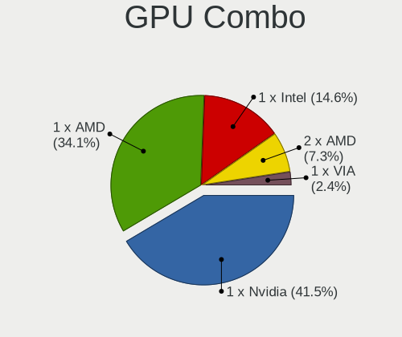
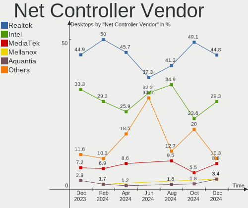
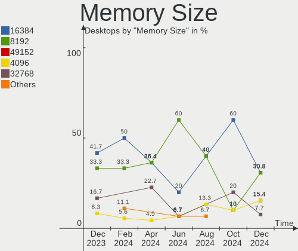
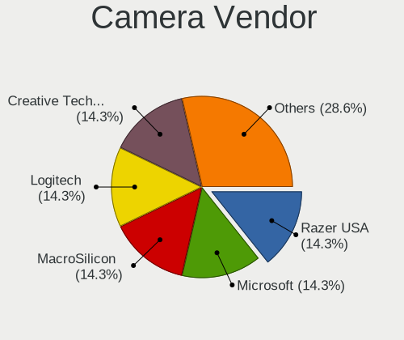

Manjaro Hardware Trends (Desktop)
---------------------------------

A project to identify most popular hardware characteristics and track their change
over time based on data collected by Manjaro users at https://Linux-Hardware.org.

Anyone can contribute to the study by uploading probes of their computers by
the [hw-probe](https://github.com/linuxhw/hw-probe) tool:

    sudo -E hw-probe -all -upload

Full-feature report is available here: https://linux-hardware.org/?view=trends&formfactor=desktop

Period: Nov, 2020.

Contents
--------

- [ OS                       ](#os)
- [ OS Family                ](#os-family)
- [ Kernel                   ](#kernel)
- [ Kernel Family            ](#kernel-family)
- [ Kernel Major Ver.        ](#kernel-major-ver)
- [ Arch                     ](#arch)
- [ DE                       ](#de)
- [ Display Server           ](#display-server)
- [ Display Manager          ](#display-manager)
- [ OS Lang                  ](#os-lang)
- [ Boot Mode                ](#boot-mode)
- [ Filesystem               ](#filesystem)
- [ Part. scheme             ](#part-scheme)
- [ Dual Boot with Linux/BSD ](#dual-boot-with-linux/bsd)
- [ Dual Boot (Win)          ](#dual-boot-win)
- [ Country                  ](#country)
- [ City                     ](#city)
- [ Vendor                   ](#vendor)
- [ Model                    ](#model)
- [ Model Family             ](#model-family)
- [ MFG Year                 ](#mfg-year)
- [ Form Factor              ](#form-factor)
- [ Secure Boot              ](#secure-boot)
- [ Coreboot                 ](#coreboot)
- [ RAM Size                 ](#ram-size)
- [ RAM Used                 ](#ram-used)
- [ Has CD-ROM               ](#has-cd-rom)
- [ Total Drives             ](#total-drives)
- [ Has Ethernet             ](#has-ethernet)
- [ Drive Vendor             ](#drive-vendor)
- [ Drive Model              ](#drive-model)
- [ HDD Vendor               ](#hdd-vendor)
- [ SSD Vendor               ](#ssd-vendor)
- [ Drive Kind               ](#drive-kind)
- [ Drive Connector          ](#drive-connector)
- [ Drive Size               ](#drive-size)
- [ Space Total              ](#space-total)
- [ Space Used               ](#space-used)
- [ Malfunc. Drives          ](#malfunc-drives)
- [ Malfunc. Drive Vendor    ](#malfunc-drive-vendor)
- [ Malfunc. HDD Vendor      ](#malfunc-hdd-vendor)
- [ Malfunc. Drive Kind      ](#malfunc-drive-kind)
- [ Failed Drives            ](#failed-drives)
- [ Failed Drive Vendor      ](#failed-drive-vendor)
- [ Drive Status             ](#drive-status)
- [ Storage Vendor           ](#storage-vendor)
- [ Storage Model            ](#storage-model)
- [ Storage Kind             ](#storage-kind)
- [ CPU Vendor               ](#cpu-vendor)
- [ CPU Model                ](#cpu-model)
- [ CPU Model Family         ](#cpu-model-family)
- [ CPU Cores                ](#cpu-cores)
- [ CPU Sockets              ](#cpu-sockets)
- [ CPU Threads              ](#cpu-threads)
- [ CPU Op-Modes             ](#cpu-op-modes)
- [ CPU Microcode            ](#cpu-microcode)
- [ CPU Microarch            ](#cpu-microarch)
- [ GPU Vendor               ](#gpu-vendor)
- [ GPU Model                ](#gpu-model)
- [ GPU Combo                ](#gpu-combo)
- [ GPU Driver               ](#gpu-driver)
- [ GPU Memory               ](#gpu-memory)
- [ Monitor Vendor           ](#monitor-vendor)
- [ Monitor Model            ](#monitor-model)
- [ Monitor Resolution       ](#monitor-resolution)
- [ Monitor Diagonal         ](#monitor-diagonal)
- [ Monitor Width            ](#monitor-width)
- [ Aspect Ratio             ](#aspect-ratio)
- [ Monitor Area             ](#monitor-area)
- [ Pixel Density            ](#pixel-density)
- [ Multiple Monitors        ](#multiple-monitors)
- [ Net Controller Vendor    ](#net-controller-vendor)
- [ Net Controller Model     ](#net-controller-model)
- [ Wireless Vendor          ](#wireless-vendor)
- [ Wireless Model           ](#wireless-model)
- [ Ethernet Vendor          ](#ethernet-vendor)
- [ Ethernet Model           ](#ethernet-model)
- [ Net Controller Kind      ](#net-controller-kind)
- [ Used Controller          ](#used-controller)
- [ NICs                     ](#nics)
- [ Memory Vendor            ](#memory-vendor)
- [ Memory Model             ](#memory-model)
- [ Memory Kind              ](#memory-kind)
- [ Memory Form Factor       ](#memory-form-factor)
- [ Memory Size              ](#memory-size)
- [ Memory Speed             ](#memory-speed)
- [ Sound Vendor             ](#sound-vendor)
- [ Sound Model              ](#sound-model)
- [ Camera Vendor            ](#camera-vendor)
- [ Camera Model             ](#camera-model)
- [ Fingerprint Vendor       ](#fingerprint-vendor)
- [ Fingerprint Model        ](#fingerprint-model)
- [ Chipcard Vendor          ](#chipcard-vendor)
- [ Chipcard Model           ](#chipcard-model)
- [ Printer Vendor           ](#printer-vendor)
- [ Printer Model            ](#printer-model)
- [ Scanner Vendor           ](#scanner-vendor)
- [ Scanner Model            ](#scanner-model)
- [ Bluetooth Vendor         ](#bluetooth-vendor)
- [ Bluetooth Model          ](#bluetooth-model)
- [ Unsupported Devices      ](#unsupported-devices)
- [ Unsupported Device Types ](#unsupported-device-types)

OS
--

Installed operating systems

| Name              | Desktops | Percent |
|-------------------|----------|---------|
| Manjaro           | 44       | 45.83%  |
| Manjaro 20.2      | 42       | 43.75%  |
| Manjaro 20.1.2    | 8        | 8.33%   |
| Manjaro 20.2-rc1  | 1        | 1.04%   |
| Manjaro 20.2-pre2 | 1        | 1.04%   |

OS Family
---------

OS without a version

| Name    | Desktops | Percent |
|---------|----------|---------|
| Manjaro | 96       | 100%    |

Kernel
------

Version of the Linux kernel

| Version               | Desktops | Percent |
|-----------------------|----------|---------|
| 5.8.18-1-MANJARO      | 26       | 27.08%  |
| 5.9.3-1-MANJARO       | 16       | 16.67%  |
| 5.8.16-2-MANJARO      | 10       | 10.42%  |
| 5.9.8-2-MANJARO       | 7        | 7.29%   |
| 5.9.10-1-MANJARO      | 6        | 6.25%   |
| 5.9.1-1-MANJARO       | 5        | 5.21%   |
| 5.9.8-1-MANJARO       | 3        | 3.13%   |
| 5.4.77-1-MANJARO      | 3        | 3.13%   |
| 5.9.2-1-MANJARO       | 2        | 2.08%   |
| 5.9.11-3-MANJARO      | 2        | 2.08%   |
| 5.9.11-2-MANJARO      | 2        | 2.08%   |
| 5.4.78-1-MANJARO      | 2        | 2.08%   |
| 5.9.9-95-tkg-pds      | 1        | 1.04%   |
| 5.9.6-xanmod1-MANJARO | 1        | 1.04%   |
| 5.9.1-1-rt19-MANJARO  | 1        | 1.04%   |
| 5.8.11-1-MANJARO      | 1        | 1.04%   |
| 5.7.19-2-MANJARO      | 1        | 1.04%   |
| 5.6.15-1-MANJARO      | 1        | 1.04%   |
| 5.6.11-1-MANJARO      | 1        | 1.04%   |
| 5.4.80-1-MANJARO      | 1        | 1.04%   |
| 5.4.75-1-MANJARO      | 1        | 1.04%   |
| 5.4.74-1-MANJARO      | 1        | 1.04%   |
| 5.10.0-1-MANJARO      | 1        | 1.04%   |
| 4.19.152-1-MANJARO    | 1        | 1.04%   |

Kernel Family
-------------

Linux kernel without a distro release

| Version  | Desktops | Percent |
|----------|----------|---------|
| 5.8.18   | 26       | 27.08%  |
| 5.9.3    | 16       | 16.67%  |
| 5.9.8    | 10       | 10.42%  |
| 5.8.16   | 10       | 10.42%  |
| 5.9.10   | 6        | 6.25%   |
| 5.9.1    | 6        | 6.25%   |
| 5.9.11   | 4        | 4.17%   |
| 5.4.77   | 3        | 3.13%   |
| 5.9.2    | 2        | 2.08%   |
| 5.4.78   | 2        | 2.08%   |
| 5.9.9    | 1        | 1.04%   |
| 5.9.6    | 1        | 1.04%   |
| 5.8.11   | 1        | 1.04%   |
| 5.7.19   | 1        | 1.04%   |
| 5.6.15   | 1        | 1.04%   |
| 5.6.11   | 1        | 1.04%   |
| 5.4.80   | 1        | 1.04%   |
| 5.4.75   | 1        | 1.04%   |
| 5.4.74   | 1        | 1.04%   |
| 5.10.0   | 1        | 1.04%   |
| 4.19.152 | 1        | 1.04%   |

Kernel Major Ver.
-----------------

Linux kernel major version

| Version | Desktops | Percent |
|---------|----------|---------|
| 5.9     | 46       | 47.92%  |
| 5.8     | 37       | 38.54%  |
| 5.4     | 8        | 8.33%   |
| 5.6     | 2        | 2.08%   |
| 5.7     | 1        | 1.04%   |
| 5.10    | 1        | 1.04%   |
| 4.19    | 1        | 1.04%   |

Arch
----

OS architecture (x86_64, i586, etc.)

| Name   | Desktops | Percent |
|--------|----------|---------|
| x86_64 | 96       | 100%    |

DE
--

Desktop Environment

| Name       | Desktops | Percent |
|------------|----------|---------|
| XFCE       | 28       | 29.17%  |
| KDE        | 19       | 19.79%  |
| KDE5       | 17       | 17.71%  |
| GNOME      | 17       | 17.71%  |
| X-Cinnamon | 4        | 4.17%   |
| i3         | 3        | 3.13%   |
| MATE       | 2        | 2.08%   |
| Cinnamon   | 2        | 2.08%   |
| Deepin     | 1        | 1.04%   |
| Budgie     | 1        | 1.04%   |
| awesome    | 1        | 1.04%   |
| Unknown    | 1        | 1.04%   |

Display Server
--------------

X11 or Wayland

| Name    | Desktops | Percent |
|---------|----------|---------|
| X11     | 88       | 91.67%  |
| Wayland | 7        | 7.29%   |
| Tty     | 1        | 1.04%   |

Display Manager
---------------

SDDM, LightDM, etc.

| Name    | Desktops | Percent |
|---------|----------|---------|
| Unknown | 42       | 43.75%  |
| LightDM | 20       | 20.83%  |
| SDDM    | 19       | 19.79%  |
| GDM     | 10       | 10.42%  |
| TDM     | 4        | 4.17%   |
| LXDM    | 1        | 1.04%   |

OS Lang
-------

Language

| Lang       | Desktops | Percent |
|------------|----------|---------|
| en_US      | 22       | 22.92%  |
| ru_RU      | 12       | 12.5%   |
| de_DE      | 11       | 11.46%  |
| en_US.utf8 | 9        | 9.38%   |
| de_DE.utf8 | 8        | 8.33%   |
| en_GB      | 6        | 6.25%   |
| pt_BR      | 3        | 3.13%   |
| it_IT.utf8 | 2        | 2.08%   |
| fr_FR      | 2        | 2.08%   |
| sv_SE.utf8 | 1        | 1.04%   |
| sv_SE      | 1        | 1.04%   |
| ru_UA      | 1        | 1.04%   |
| ru_RU.utf8 | 1        | 1.04%   |
| pl_PL      | 1        | 1.04%   |
| nl_NL.utf8 | 1        | 1.04%   |
| nl_NL      | 1        | 1.04%   |
| ja_JP      | 1        | 1.04%   |
| fr_FR.utf8 | 1        | 1.04%   |
| fr_CA      | 1        | 1.04%   |
| fr_BE.utf8 | 1        | 1.04%   |
| fr_BE      | 1        | 1.04%   |
| es_ES.utf8 | 1        | 1.04%   |
| es_ES      | 1        | 1.04%   |
| es_CO      | 1        | 1.04%   |
| es_AR      | 1        | 1.04%   |
| en_SG.utf8 | 1        | 1.04%   |
| en_IN      | 1        | 1.04%   |
| en_GB.utf8 | 1        | 1.04%   |
| en_CA.utf8 | 1        | 1.04%   |
| de_AT      | 1        | 1.04%   |

Boot Mode
---------

EFI or BIOS

| Mode | Desktops | Percent |
|------|----------|---------|
| BIOS | 62       | 64.58%  |
| EFI  | 34       | 35.42%  |

Filesystem
----------

Type of filesystem

| Type  | Desktops | Percent |
|-------|----------|---------|
| Ext4  | 82       | 85.42%  |
| Btrfs | 8        | 8.33%   |
| F2fs  | 4        | 4.17%   |
| Zfs   | 1        | 1.04%   |
| Ext2  | 1        | 1.04%   |

Part. scheme
------------

Scheme of partitioning

| Type    | Desktops | Percent |
|---------|----------|---------|
| Unknown | 44       | 45.83%  |
| GPT     | 40       | 41.67%  |
| MBR     | 12       | 12.5%   |

Dual Boot with Linux/BSD
------------------------

Hosting more than one Linux/BSD

| Dual boot | Desktops | Percent |
|-----------|----------|---------|
| No        | 78       | 81.25%  |
| Yes       | 18       | 18.75%  |

Dual Boot (Win)
---------------

Hosting Linux and Windows

| Dual boot | Desktops | Percent |
|-----------|----------|---------|
| No        | 60       | 62.5%   |
| Yes       | 36       | 37.5%   |

Country
-------

Geographic location (country)

| Country                | Desktops | Percent |
|------------------------|----------|---------|
| Germany                | 21       | 21.88%  |
| USA                    | 15       | 15.63%  |
| Russia                 | 12       | 12.5%   |
| UK                     | 5        | 5.21%   |
| Belgium                | 5        | 5.21%   |
| Sweden                 | 3        | 3.13%   |
| Italy                  | 3        | 3.13%   |
| France                 | 3        | 3.13%   |
| Canada                 | 3        | 3.13%   |
| Brazil                 | 3        | 3.13%   |
| Ukraine                | 2        | 2.08%   |
| Spain                  | 2        | 2.08%   |
| Romania                | 2        | 2.08%   |
| Puerto Rico            | 2        | 2.08%   |
| Netherlands            | 2        | 2.08%   |
| Austria                | 2        | 2.08%   |
| Slovakia               | 1        | 1.04%   |
| Singapore              | 1        | 1.04%   |
| Poland                 | 1        | 1.04%   |
| Norway                 | 1        | 1.04%   |
| Japan                  | 1        | 1.04%   |
| India                  | 1        | 1.04%   |
| Greece                 | 1        | 1.04%   |
| Finland                | 1        | 1.04%   |
| Bosnia and Herzegovina | 1        | 1.04%   |
| Argentina              | 1        | 1.04%   |
| Unknown                | 1        | 1.04%   |

City
----

Geographic location (city)

| City                  | Desktops | Percent |
|-----------------------|----------|---------|
| Yuzhno-Sakhalinsk     | 2        | 2.08%   |
| St Petersburg         | 2        | 2.08%   |
| Frankfurt am Main     | 2        | 2.08%   |
| Brighton              | 2        | 2.08%   |
| Žilina               | 1        | 1.04%   |
| Zwolle                | 1        | 1.04%   |
| Zanesville            | 1        | 1.04%   |
| Wurzburg              | 1        | 1.04%   |
| Weinbach              | 1        | 1.04%   |
| Ulm                   | 1        | 1.04%   |
| Tuneiras do Oeste     | 1        | 1.04%   |
| Troy                  | 1        | 1.04%   |
| Tranas                | 1        | 1.04%   |
| Timișoara            | 1        | 1.04%   |
| Tandil                | 1        | 1.04%   |
| Surrey                | 1        | 1.04%   |
| Staten Island         | 1        | 1.04%   |
| Springdale            | 1        | 1.04%   |
| Singapore             | 1        | 1.04%   |
| Sindelfingen          | 1        | 1.04%   |
| Seelze                | 1        | 1.04%   |
| Seattle               | 1        | 1.04%   |
| Santa Cruz            | 1        | 1.04%   |
| San Juan              | 1        | 1.04%   |
| San Giuliano Milanese | 1        | 1.04%   |
| Rho                   | 1        | 1.04%   |
| Reutlingen            | 1        | 1.04%   |
| Ransart               | 1        | 1.04%   |
| Radolfzell            | 1        | 1.04%   |
| Ottawa                | 1        | 1.04%   |
| Osterholz-Scharmbeck  | 1        | 1.04%   |
| Oslo                  | 1        | 1.04%   |
| Oskaloosa             | 1        | 1.04%   |
| Oordegem              | 1        | 1.04%   |
| Omsk                  | 1        | 1.04%   |
| Odzak                 | 1        | 1.04%   |
| Moscow                | 1        | 1.04%   |
| Montreal              | 1        | 1.04%   |
| Malibu                | 1        | 1.04%   |
| Mainz                 | 1        | 1.04%   |
| Magdeburg             | 1        | 1.04%   |
| Madrid                | 1        | 1.04%   |
| Luhansk               | 1        | 1.04%   |
| Ludwigshafen am Rhein | 1        | 1.04%   |
| Lubbeek               | 1        | 1.04%   |
| Los Angeles           | 1        | 1.04%   |
| London                | 1        | 1.04%   |
| Llanbrynmair          | 1        | 1.04%   |
| Liège                | 1        | 1.04%   |
| Linz                  | 1        | 1.04%   |
| Leverkusen            | 1        | 1.04%   |
| Langenhagen           | 1        | 1.04%   |
| La Chapelle-Basse-Mer | 1        | 1.04%   |
| Kitakyushu            | 1        | 1.04%   |
| Kirzhach              | 1        | 1.04%   |
| Kaliningrad           | 1        | 1.04%   |
| Jefferson City        | 1        | 1.04%   |
| Innopolis             | 1        | 1.04%   |
| Huntington Beach      | 1        | 1.04%   |
| Huntingdon            | 1        | 1.04%   |

Vendor
------

Motherboard manufacturer

| Name                | Desktops | Percent |
|---------------------|----------|---------|
| Gigabyte Technology | 26       | 27.08%  |
| MSI                 | 20       | 20.83%  |
| ASUSTek Computer    | 20       | 20.83%  |
| Dell                | 6        | 6.25%   |
| ASRock              | 6        | 6.25%   |
| Hewlett-Packard     | 5        | 5.21%   |
| Acer                | 3        | 3.13%   |
| Intel               | 2        | 2.08%   |
| Biostar             | 2        | 2.08%   |
| Positivo            | 1        | 1.04%   |
| Medion              | 1        | 1.04%   |
| J2 Retail Systems   | 1        | 1.04%   |
| Inventec            | 1        | 1.04%   |
| Huanan              | 1        | 1.04%   |
| Foxconn             | 1        | 1.04%   |

Model
-----

Motherboard model

| Name                                | Desktops | Percent |
|-------------------------------------|----------|---------|
| MSI MS-7C02                         | 4        | 4.17%   |
| Gigabyte X570 AORUS MASTER          | 3        | 3.13%   |
| ASUS All Series                     | 3        | 3.13%   |
| MSI MS-7971                         | 2        | 2.08%   |
| Gigabyte B550 AORUS ELITE           | 2        | 2.08%   |
| Gigabyte B450M DS3H                 | 2        | 2.08%   |
| ASUS PRIME X370-PRO                 | 2        | 2.08%   |
| Positivo Master D570a               | 1        | 1.04%   |
| MSI MS-7C84                         | 1        | 1.04%   |
| MSI MS-7C37                         | 1        | 1.04%   |
| MSI MS-7C35                         | 1        | 1.04%   |
| MSI MS-7B93                         | 1        | 1.04%   |
| MSI MS-7B86                         | 1        | 1.04%   |
| MSI MS-7B50                         | 1        | 1.04%   |
| MSI MS-7A68                         | 1        | 1.04%   |
| MSI MS-7A33                         | 1        | 1.04%   |
| MSI MS-7978                         | 1        | 1.04%   |
| MSI MS-7977                         | 1        | 1.04%   |
| MSI MS-7917                         | 1        | 1.04%   |
| MSI MS-7850                         | 1        | 1.04%   |
| MSI MS-7721                         | 1        | 1.04%   |
| MSI Cubi N 8GL (MS-B171)            | 1        | 1.04%   |
| Medion MS-7646                      | 1        | 1.04%   |
| J2 Retail Systems J2 680            | 1        | 1.04%   |
| Inventec ZQ Class                   | 1        | 1.04%   |
| Intel X99                           | 1        | 1.04%   |
| Intel Q3XXG4-P V1.0                 | 1        | 1.04%   |
| Huanan X79                          | 1        | 1.04%   |
| HP Z400 Workstation                 | 1        | 1.04%   |
| HP EliteDesk 800 G1 SFF             | 1        | 1.04%   |
| HP Compaq dc7700 Ultra-slim Desktop | 1        | 1.04%   |
| HP Compaq 8000 Elite CMT PC         | 1        | 1.04%   |
| HP 400-314                          | 1        | 1.04%   |
| Gigabyte Z97MX-Gaming 5             | 1        | 1.04%   |
| Gigabyte Z390 AORUS PRO WIFI        | 1        | 1.04%   |
| Gigabyte X58A-UD3R                  | 1        | 1.04%   |
| Gigabyte X570 GAMING X              | 1        | 1.04%   |
| Gigabyte X570 AORUS ELITE           | 1        | 1.04%   |
| Gigabyte TRX40 AORUS MASTER         | 1        | 1.04%   |
| Gigabyte TERRA_PC                   | 1        | 1.04%   |
| Gigabyte P67A-D3-B3                 | 1        | 1.04%   |
| Gigabyte P55-UD3                    | 1        | 1.04%   |
| Gigabyte H87-HD3                    | 1        | 1.04%   |
| Gigabyte H77-DS3H                   | 1        | 1.04%   |
| Gigabyte GA-MA790GPT-UD3H           | 1        | 1.04%   |
| Gigabyte GA-78LMT-S2P               | 1        | 1.04%   |
| Gigabyte C1037UN-EU                 | 1        | 1.04%   |
| Gigabyte B85M-D3H                   | 1        | 1.04%   |
| Gigabyte B550M AORUS ELITE          | 1        | 1.04%   |
| Gigabyte AX370-Gaming K7            | 1        | 1.04%   |
| Gigabyte A320M-S2H V2               | 1        | 1.04%   |
| Gigabyte 970A-DS3P                  | 1        | 1.04%   |
| Foxconn H67M-S/H67M-V/H67M          | 1        | 1.04%   |
| Dell Studio XPS 8100                | 1        | 1.04%   |
| Dell Precision 3630 Tower           | 1        | 1.04%   |
| Dell OptiPlex 9020                  | 1        | 1.04%   |
| Dell OptiPlex 790                   | 1        | 1.04%   |
| Dell OptiPlex 780                   | 1        | 1.04%   |
| Dell OptiPlex 7010                  | 1        | 1.04%   |
| Biostar G31-M7 TE                   | 1        | 1.04%   |

Model Family
------------

Motherboard model prefix

| Name                      | Desktops | Percent |
|---------------------------|----------|---------|
| Gigabyte X570             | 5        | 5.21%   |
| ASUS PRIME                | 5        | 5.21%   |
| MSI MS-7C02               | 4        | 4.17%   |
| Dell OptiPlex             | 4        | 4.17%   |
| ASUS ROG                  | 3        | 3.13%   |
| ASUS All                  | 3        | 3.13%   |
| Acer Aspire               | 3        | 3.13%   |
| MSI MS-7971               | 2        | 2.08%   |
| HP Compaq                 | 2        | 2.08%   |
| Gigabyte B550             | 2        | 2.08%   |
| Gigabyte B450M            | 2        | 2.08%   |
| Positivo Master           | 1        | 1.04%   |
| MSI MS-7C84               | 1        | 1.04%   |
| MSI MS-7C37               | 1        | 1.04%   |
| MSI MS-7C35               | 1        | 1.04%   |
| MSI MS-7B93               | 1        | 1.04%   |
| MSI MS-7B86               | 1        | 1.04%   |
| MSI MS-7B50               | 1        | 1.04%   |
| MSI MS-7A68               | 1        | 1.04%   |
| MSI MS-7A33               | 1        | 1.04%   |
| MSI MS-7978               | 1        | 1.04%   |
| MSI MS-7977               | 1        | 1.04%   |
| MSI MS-7917               | 1        | 1.04%   |
| MSI MS-7850               | 1        | 1.04%   |
| MSI MS-7721               | 1        | 1.04%   |
| MSI Cubi                  | 1        | 1.04%   |
| Medion MS-7646            | 1        | 1.04%   |
| J2 Retail Systems J2      | 1        | 1.04%   |
| Inventec ZQ               | 1        | 1.04%   |
| Intel X99                 | 1        | 1.04%   |
| Intel Q3XXG4-P            | 1        | 1.04%   |
| Huanan X79                | 1        | 1.04%   |
| HP Z400                   | 1        | 1.04%   |
| HP EliteDesk              | 1        | 1.04%   |
| HP 400-314                | 1        | 1.04%   |
| Gigabyte Z97MX-Gaming     | 1        | 1.04%   |
| Gigabyte Z390             | 1        | 1.04%   |
| Gigabyte X58A-UD3R        | 1        | 1.04%   |
| Gigabyte TRX40            | 1        | 1.04%   |
| Gigabyte TERRA            | 1        | 1.04%   |
| Gigabyte P67A-D3-B3       | 1        | 1.04%   |
| Gigabyte P55-UD3          | 1        | 1.04%   |
| Gigabyte H87-HD3          | 1        | 1.04%   |
| Gigabyte H77-DS3H         | 1        | 1.04%   |
| Gigabyte GA-MA790GPT-UD3H | 1        | 1.04%   |
| Gigabyte GA-78LMT-S2P     | 1        | 1.04%   |
| Gigabyte C1037UN-EU       | 1        | 1.04%   |
| Gigabyte B85M-D3H         | 1        | 1.04%   |
| Gigabyte B550M            | 1        | 1.04%   |
| Gigabyte AX370-Gaming     | 1        | 1.04%   |
| Gigabyte A320M-S2H        | 1        | 1.04%   |
| Gigabyte 970A-DS3P        | 1        | 1.04%   |
| Foxconn H67M-S            | 1        | 1.04%   |
| Dell Studio               | 1        | 1.04%   |
| Dell Precision            | 1        | 1.04%   |
| Biostar G31-M7            | 1        | 1.04%   |
| Biostar A10N-8800E        | 1        | 1.04%   |
| ASUS TUF                  | 1        | 1.04%   |
| ASUS Rampage              | 1        | 1.04%   |
| ASUS P8Z77-V              | 1        | 1.04%   |

MFG Year
--------

Motherboard manufacture year

| Year | Desktops | Percent |
|------|----------|---------|
| 2020 | 22       | 22.92%  |
| 2019 | 18       | 18.75%  |
| 2018 | 13       | 13.54%  |
| 2014 | 10       | 10.42%  |
| 2015 | 9        | 9.38%   |
| 2012 | 6        | 6.25%   |
| 2010 | 5        | 5.21%   |
| 2013 | 4        | 4.17%   |
| 2016 | 3        | 3.13%   |
| 2017 | 2        | 2.08%   |
| 2011 | 1        | 1.04%   |
| 2009 | 1        | 1.04%   |
| 2008 | 1        | 1.04%   |
| 2007 | 1        | 1.04%   |

Form Factor
-----------

Physical design of the computer

| Name    | Desktops | Percent |
|---------|----------|---------|
| Desktop | 96       | 100%    |

Secure Boot
-----------

Enabled or disabled

| State    | Desktops | Percent |
|----------|----------|---------|
| Disabled | 96       | 100%    |

Coreboot
--------

Have coreboot on board

| Used | Desktops | Percent |
|------|----------|---------|
| No   | 96       | 100%    |

RAM Size
--------

Total RAM memory

| Size in GB  | Desktops | Percent |
|-------------|----------|---------|
| 16.01-24.0  | 28       | 29.17%  |
| 8.01-16.0   | 25       | 26.04%  |
| 32.01-64.0  | 19       | 19.79%  |
| 4.01-8.0    | 7        | 7.29%   |
| 64.01-256.0 | 7        | 7.29%   |
| 24.01-32.0  | 4        | 4.17%   |
| 3.01-4.0    | 3        | 3.13%   |
| 1.01-2.0    | 3        | 3.13%   |

RAM Used
--------

Used RAM memory

| Used GB    | Desktops | Percent |
|------------|----------|---------|
| 1.01-2.0   | 35       | 36.46%  |
| 2.01-3.0   | 22       | 22.92%  |
| 4.01-8.0   | 17       | 17.71%  |
| 3.01-4.0   | 11       | 11.46%  |
| 8.01-16.0  | 7        | 7.29%   |
| 32.01-64.0 | 2        | 2.08%   |
| 16.01-24.0 | 1        | 1.04%   |
| 0.01-1.0   | 1        | 1.04%   |

Has CD-ROM
----------

Has CD-ROM on board

| Presented | Desktops | Percent |
|-----------|----------|---------|
| No        | 64       | 66.67%  |
| Yes       | 32       | 33.33%  |

Total Drives
------------

Number of drives on board

| Drives | Desktops | Percent |
|--------|----------|---------|
| 2      | 32       | 33.33%  |
| 1      | 20       | 20.83%  |
| 3      | 19       | 19.79%  |
| 4      | 18       | 18.75%  |
| 5      | 4        | 4.17%   |
| 6      | 2        | 2.08%   |
| 7      | 1        | 1.04%   |

Has Ethernet
------------

Has Ethernet on board

| Presented | Desktops | Percent |
|-----------|----------|---------|
| Yes       | 95       | 98.96%  |
| No        | 1        | 1.04%   |

Drive Vendor
------------

Hard drive vendors

| Vendor                    | Desktops | Drives | Percent |
|---------------------------|----------|--------|---------|
| WDC                       | 38       | 44     | 17.92%  |
| Samsung Electronics       | 38       | 53     | 17.92%  |
| Seagate                   | 34       | 42     | 16.04%  |
| Crucial                   | 14       | 20     | 6.6%    |
| Toshiba                   | 13       | 14     | 6.13%   |
| Kingston                  | 12       | 14     | 5.66%   |
| SanDisk                   | 9        | 11     | 4.25%   |
| Intel                     | 5        | 5      | 2.36%   |
| Hitachi                   | 5        | 5      | 2.36%   |
| A-DATA Technology         | 5        | 5      | 2.36%   |
| Phison                    | 4        | 4      | 1.89%   |
| Silicon Motion            | 3        | 3      | 1.42%   |
| OCZ                       | 3        | 3      | 1.42%   |
| Intenso                   | 3        | 3      | 1.42%   |
| HGST                      | 3        | 5      | 1.42%   |
| Realtek Semiconductor     | 2        | 2      | 0.94%   |
| Patriot                   | 2        | 2      | 0.94%   |
| Leven                     | 2        | 2      | 0.94%   |
| JMicron                   | 2        | 2      | 0.94%   |
| External                  | 2        | 2      | 0.94%   |
| Apacer                    | 2        | 2      | 0.94%   |
| Unknown                   | 1        | 1      | 0.47%   |
| Team                      | 1        | 1      | 0.47%   |
| SK Hynix                  | 1        | 1      | 0.47%   |
| PNY                       | 1        | 1      | 0.47%   |
| PLEXTOR                   | 1        | 2      | 0.47%   |
| Micron/Crucial Technology | 1        | 1      | 0.47%   |
| LITEONIT                  | 1        | 1      | 0.47%   |
| Lexar                     | 1        | 1      | 0.47%   |
| Hoodisk                   | 1        | 1      | 0.47%   |
| Corsair                   | 1        | 1      | 0.47%   |
| China                     | 1        | 1      | 0.47%   |

Drive Model
-----------

Hard drive models

| Model                              | Desktops | Percent |
|------------------------------------|----------|---------|
| Samsung SSD 850 EVO 250GB          | 6        | 2.42%   |
| Crucial CT500MX500SSD1 500GB       | 5        | 2.02%   |
| Samsung SSD 860 EVO 500GB          | 4        | 1.61%   |
| WDC WD10EZEX-08WN4A0 1TB           | 3        | 1.21%   |
| Toshiba DT01ACA100 1TB             | 3        | 1.21%   |
| Seagate ST4000DM000-1F2168 4TB     | 3        | 1.21%   |
| Samsung SSD 970 PRO 512GB          | 3        | 1.21%   |
| Samsung SSD 850 EVO 500GB          | 3        | 1.21%   |
| Samsung NVMe SSD Drive 500GB       | 3        | 1.21%   |
| Kingston SA400S37240G 240GB SSD    | 3        | 1.21%   |
| WDC WD10EZEX-75WN4A1 1TB           | 2        | 0.81%   |
| Toshiba DT01ACA050 500GB           | 2        | 0.81%   |
| Seagate ST3500418AS 500GB          | 2        | 0.81%   |
| Seagate ST3000DM001-1CH166 3TB     | 2        | 0.81%   |
| Seagate ST2000DM001-1ER164 2TB     | 2        | 0.81%   |
| Seagate ST1000LM024 HN-M101MBB 1TB | 2        | 0.81%   |
| Seagate ST1000DM010-2EP102 1TB     | 2        | 0.81%   |
| Seagate ST1000DM003-9YN162 1TB     | 2        | 0.81%   |
| Seagate Expansion 1TB              | 2        | 0.81%   |
| Sandisk NVMe SSD Drive 250GB       | 2        | 0.81%   |
| Samsung SSD 970 EVO 1TB            | 2        | 0.81%   |
| Samsung SSD 860 EVO 4TB            | 2        | 0.81%   |
| Samsung SSD 860 EVO 250GB          | 2        | 0.81%   |
| Samsung SSD 840 EVO 120GB          | 2        | 0.81%   |
| Samsung HD204UI 2TB                | 2        | 0.81%   |
| Samsung HD161HJ 160GB              | 2        | 0.81%   |
| Phison NVMe SSD Drive 1TB          | 2        | 0.81%   |
| Leven JAJS600M512C 512GB SSD       | 2        | 0.81%   |
| Kingston SV300S37A120G 120GB SSD   | 2        | 0.81%   |
| Kingston SA400S37480G 480GB SSD    | 2        | 0.81%   |
| Hitachi HDS721010CLA332 1TB        | 2        | 0.81%   |
| External USB3.0 1TB                | 2        | 0.81%   |
| Crucial CT525MX300SSD1 528GB       | 2        | 0.81%   |
| Crucial CT240BX500SSD1 240GB       | 2        | 0.81%   |
| Crucial CT1000P1SSD8 1TB           | 2        | 0.81%   |
| WDC WDS500G2B0B-00YS70 500GB SSD   | 1        | 0.4%    |
| WDC WDS500G2B0A-00SM50 500GB SSD   | 1        | 0.4%    |
| WDC WDS240G2G0A-00JH30 240GB SSD   | 1        | 0.4%    |
| WDC WDS100T2G0A-00JH30 1TB SSD     | 1        | 0.4%    |
| WDC WD800BB-00JHC0 80GB            | 1        | 0.4%    |
| WDC WD7500AZEX-00RKKA0 752GB       | 1        | 0.4%    |
| WDC WD7500AADS-00M2B0 752GB        | 1        | 0.4%    |
| WDC WD6401AALS-00L3B2 640GB        | 1        | 0.4%    |
| WDC WD6401AALS-00E8B0 640GB        | 1        | 0.4%    |
| WDC WD6400AAKS-65A7B2 640GB        | 1        | 0.4%    |
| WDC WD6400AAKS-00A7B0 640GB        | 1        | 0.4%    |
| WDC WD60EFRX-68MYMN1 6TB           | 1        | 0.4%    |
| WDC WD5000LPLX-22ZNTT0 500GB       | 1        | 0.4%    |
| WDC WD5000BPVT-60HXZT3 500GB       | 1        | 0.4%    |
| WDC WD5000AAKS-00M9A0 500GB        | 1        | 0.4%    |
| WDC WD40EZRZ-00GXCB0 4TB           | 1        | 0.4%    |
| WDC WD40EZRX-00SPEB0 4TB           | 1        | 0.4%    |
| WDC WD40EFRX-68N32N0 4TB           | 1        | 0.4%    |
| WDC WD30EZRX-00DC0B0 3TB           | 1        | 0.4%    |
| WDC WD30EFRX-68EUZN0 3TB           | 1        | 0.4%    |
| WDC WD2500KS-00MJB0 250GB          | 1        | 0.4%    |
| WDC WD20EFRX-68A 2TB               | 1        | 0.4%    |
| WDC WD20EFAX-68FB5N0 2TB           | 1        | 0.4%    |
| WDC WD20EARX-00PASB0 2TB           | 1        | 0.4%    |
| WDC WD20EARS-00MVWB0 2TB           | 1        | 0.4%    |

HDD Vendor
----------

Hard disk drive vendors

| Vendor              | Desktops | Drives | Percent |
|---------------------|----------|--------|---------|
| WDC                 | 35       | 40     | 36.08%  |
| Seagate             | 33       | 40     | 34.02%  |
| Toshiba             | 13       | 14     | 13.4%   |
| Samsung Electronics | 7        | 9      | 7.22%   |
| Hitachi             | 5        | 5      | 5.15%   |
| HGST                | 3        | 5      | 3.09%   |
| Intenso             | 1        | 1      | 1.03%   |

SSD Vendor
----------

Solid state drive vendors

| Vendor              | Desktops | Drives | Percent |
|---------------------|----------|--------|---------|
| Samsung Electronics | 24       | 29     | 29.27%  |
| Crucial             | 12       | 16     | 14.63%  |
| Kingston            | 11       | 13     | 13.41%  |
| SanDisk             | 6        | 7      | 7.32%   |
| WDC                 | 4        | 4      | 4.88%   |
| OCZ                 | 3        | 3      | 3.66%   |
| A-DATA Technology   | 3        | 3      | 3.66%   |
| Leven               | 2        | 2      | 2.44%   |
| Intenso             | 2        | 2      | 2.44%   |
| Intel               | 2        | 2      | 2.44%   |
| External            | 2        | 2      | 2.44%   |
| Apacer              | 2        | 2      | 2.44%   |
| Team                | 1        | 1      | 1.22%   |
| PNY                 | 1        | 1      | 1.22%   |
| PLEXTOR             | 1        | 2      | 1.22%   |
| Patriot             | 1        | 1      | 1.22%   |
| LITEONIT            | 1        | 1      | 1.22%   |
| Lexar               | 1        | 1      | 1.22%   |
| Hoodisk             | 1        | 1      | 1.22%   |
| Corsair             | 1        | 1      | 1.22%   |
| China               | 1        | 1      | 1.22%   |

Drive Kind
----------

HDD or SSD

| Kind    | Desktops | Drives | Percent |
|---------|----------|--------|---------|
| HDD     | 69       | 114    | 40.59%  |
| SSD     | 62       | 95     | 36.47%  |
| NVMe    | 35       | 42     | 20.59%  |
| Unknown | 4        | 4      | 2.35%   |

Drive Connector
---------------

SATA, SAS, NVMe, etc.

| Type | Desktops | Drives | Percent |
|------|----------|--------|---------|
| SATA | 89       | 201    | 65.93%  |
| NVMe | 35       | 41     | 25.93%  |
| SAS  | 11       | 13     | 8.15%   |

Drive Size
----------

Size of hard drive

| Size in TB | Desktops | Drives | Percent |
|------------|----------|--------|---------|
| 0.01-0.5   | 72       | 103    | 46.45%  |
| 0.51-1.0   | 51       | 67     | 32.9%   |
| 3.01-4.0   | 13       | 15     | 8.39%   |
| 1.01-2.0   | 12       | 14     | 7.74%   |
| 2.01-3.0   | 4        | 4      | 2.58%   |
| 4.01-10.0  | 2        | 5      | 1.29%   |
| 10.01-20.0 | 1        | 1      | 0.65%   |

Space Total
-----------

Amount of disk space available on the file system

| Size in GB     | Desktops | Percent |
|----------------|----------|---------|
| 1001-2000      | 21       | 21.88%  |
| 251-500        | 19       | 19.79%  |
| More than 3000 | 16       | 16.67%  |
| 101-250        | 14       | 14.58%  |
| 501-1000       | 12       | 12.5%   |
| 2001-3000      | 6        | 6.25%   |
| Unknown        | 3        | 3.13%   |
| 1-20           | 2        | 2.08%   |
| 51-100         | 2        | 2.08%   |
| 21-50          | 1        | 1.04%   |

Space Used
----------

Amount of used disk space

| Used GB        | Desktops | Percent |
|----------------|----------|---------|
| 1-20           | 16       | 16.67%  |
| 251-500        | 15       | 15.63%  |
| 101-250        | 15       | 15.63%  |
| 501-1000       | 13       | 13.54%  |
| 51-100         | 10       | 10.42%  |
| 21-50          | 8        | 8.33%   |
| 1001-2000      | 8        | 8.33%   |
| More than 3000 | 6        | 6.25%   |
| Unknown        | 3        | 3.13%   |
| 2001-3000      | 2        | 2.08%   |

Malfunc. Drives
---------------

Drive models with a malfunction

| Model                             | Desktops | Drives | Percent |
|-----------------------------------|----------|--------|---------|
| Seagate ST1000DM003-9YN162 1TB    | 2        | 2      | 11.76%  |
| WDC WD10EFRX-68FYTN0 1TB          | 1        | 1      | 5.88%   |
| WDC WD10EARS-00Y5B1 1TB           | 1        | 1      | 5.88%   |
| Seagate ST500DM002-1BD142 500GB   | 1        | 1      | 5.88%   |
| Seagate ST4000DM000-1F2168 4TB    | 1        | 1      | 5.88%   |
| Seagate ST3500418AS 500GB         | 1        | 1      | 5.88%   |
| Seagate ST3200820AS 200GB         | 1        | 1      | 5.88%   |
| Seagate ST31500341AS 1TB          | 1        | 1      | 5.88%   |
| Seagate ST31000333AS 1TB          | 1        | 1      | 5.88%   |
| Seagate ST2000DM001-1ER164 2TB    | 1        | 2      | 5.88%   |
| Seagate ST1000VX000-1CU162 1TB    | 1        | 1      | 5.88%   |
| Seagate ST1000DX001-1NS162 1TB    | 1        | 1      | 5.88%   |
| Samsung Electronics HD250HJ 250GB | 1        | 1      | 5.88%   |
| Samsung Electronics HD161HJ 160GB | 1        | 1      | 5.88%   |
| Samsung Electronics HD103UJ 1TB   | 1        | 1      | 5.88%   |
| Hitachi HDS721010CLA332 1TB       | 1        | 1      | 5.88%   |

Malfunc. Drive Vendor
---------------------

Vendors of faulty drives

| Vendor              | Desktops | Drives | Percent |
|---------------------|----------|--------|---------|
| Seagate             | 9        | 12     | 60%     |
| Samsung Electronics | 3        | 3      | 20%     |
| WDC                 | 2        | 2      | 13.33%  |
| Hitachi             | 1        | 1      | 6.67%   |

Malfunc. HDD Vendor
-------------------

Vendors of faulty HDD drives

| Vendor              | Desktops | Drives | Percent |
|---------------------|----------|--------|---------|
| Seagate             | 9        | 12     | 60%     |
| Samsung Electronics | 3        | 3      | 20%     |
| WDC                 | 2        | 2      | 13.33%  |
| Hitachi             | 1        | 1      | 6.67%   |

Malfunc. Drive Kind
-------------------

Kinds of faulty drives

| Kind | Desktops | Drives | Percent |
|------|----------|--------|---------|
| HDD  | 15       | 18     | 100%    |

Failed Drives
-------------

Failed drive models

Zero info for selected period =(

Failed Drive Vendor
-------------------

Failed drive vendors

Zero info for selected period =(

Drive Status
------------

Number of failed and malfunc. drives

| Status   | Desktops | Drives | Percent |
|----------|----------|--------|---------|
| Detected | 56       | 143    | 49.56%  |
| Works    | 42       | 94     | 37.17%  |
| Malfunc  | 15       | 18     | 13.27%  |

Storage Vendor
--------------

Storage controller vendors

| Vendor                      | Desktops | Percent |
|-----------------------------|----------|---------|
| Intel                       | 52       | 35.62%  |
| AMD                         | 45       | 30.82%  |
| Samsung Electronics         | 15       | 10.27%  |
| ASMedia Technology          | 7        | 4.79%   |
| Phison Electronics          | 5        | 3.42%   |
| Silicon Motion              | 4        | 2.74%   |
| Micron/Crucial Technology   | 4        | 2.74%   |
| JMicron Technology          | 4        | 2.74%   |
| Sandisk                     | 3        | 2.05%   |
| Realtek Semiconductor       | 2        | 1.37%   |
| SK Hynix                    | 1        | 0.68%   |
| Nvidia                      | 1        | 0.68%   |
| Marvell Technology Group    | 1        | 0.68%   |
| Kingston Technology Company | 1        | 0.68%   |
| Adaptec                     | 1        | 0.68%   |

Storage Model
-------------

Storage controller models

| Model                                                                                   | Desktops | Percent |
|-----------------------------------------------------------------------------------------|----------|---------|
| AMD FCH SATA Controller [AHCI mode]                                                     | 35       | 19.77%  |
| AMD 400 Series Chipset SATA Controller                                                  | 11       | 6.21%   |
| Samsung Electronics NVMe SSD Controller SM981/PM981/PM983                               | 10       | 5.65%   |
| Intel 8 Series/C220 Series Chipset Family 6-port SATA Controller 1 [AHCI mode]          | 9        | 5.08%   |
| ASMedia Technology ASM1062 Serial ATA Controller                                        | 7        | 3.95%   |
| Intel Cannon Lake PCH SATA AHCI Controller                                              | 6        | 3.39%   |
| Intel Q170/Q150/B150/H170/H110/Z170/CM236 Chipset SATA Controller [AHCI Mode]           | 5        | 2.82%   |
| AMD SB7x0/SB8x0/SB9x0 IDE Controller                                                    | 5        | 2.82%   |
| Samsung Electronics NVMe SSD Controller SM961/PM961                                     | 4        | 2.26%   |
| Intel 9 Series Chipset Family SATA Controller [AHCI Mode]                               | 4        | 2.26%   |
| Intel 7 Series/C210 Series Chipset Family 6-port SATA Controller [AHCI mode]            | 4        | 2.26%   |
| AMD X370 Series Chipset SATA Controller                                                 | 4        | 2.26%   |
| AMD SB7x0/SB8x0/SB9x0 SATA Controller [AHCI mode]                                       | 4        | 2.26%   |
| AMD SATA controller                                                                     | 4        | 2.26%   |
| Silicon Motion Non-Volatile memory controller                                           | 3        | 1.69%   |
| Phison Electronics E16 PCIe4 NVMe Controller                                            | 3        | 1.69%   |
| Intel SATA Controller [RAID mode]                                                       | 3        | 1.69%   |
| Intel 6 Series/C200 Series Chipset Family 6 port Desktop SATA AHCI Controller           | 3        | 1.69%   |
| AMD SB7x0/SB8x0/SB9x0 SATA Controller [IDE mode]                                        | 3        | 1.69%   |
| Sandisk WD Black 2018 / PC SN720 NVMe SSD                                               | 2        | 1.13%   |
| Micron/Crucial Technology P1 NVMe PCIe SSD                                              | 2        | 1.13%   |
| Micron/Crucial Technology Non-Volatile memory controller                                | 2        | 1.13%   |
| JMicron Technology JMB363 SATA/IDE Controller                                           | 2        | 1.13%   |
| JMicron Technology JMB362 SATA Controller                                               | 2        | 1.13%   |
| Intel C600/X79 series chipset 6-Port SATA AHCI Controller                               | 2        | 1.13%   |
| Intel 6 Series/C200 Series Chipset Family Desktop SATA Controller (IDE mode, ports 4-5) | 2        | 1.13%   |
| Intel 6 Series/C200 Series Chipset Family Desktop SATA Controller (IDE mode, ports 0-3) | 2        | 1.13%   |
| Intel 200 Series PCH SATA controller [AHCI mode]                                        | 2        | 1.13%   |
| AMD X399 Series Chipset SATA Controller                                                 | 2        | 1.13%   |
| AMD 300 Series Chipset SATA Controller                                                  | 2        | 1.13%   |
| SK Hynix Non-Volatile memory controller                                                 | 1        | 0.56%   |
| Silicon Motion SM2262/SM2262EN SSD Controller                                           | 1        | 0.56%   |
| Sandisk WD Blue SN550 NVMe SSD                                                          | 1        | 0.56%   |
| Samsung Electronics NVMe SSD Controller SM951/PM951                                     | 1        | 0.56%   |
| Samsung Electronics Electronics SATA controller                                         | 1        | 0.56%   |
| Realtek Semiconductor RTS5763DL NVMe SSD Controller                                     | 1        | 0.56%   |
| Realtek Semiconductor Realtek Non-Volatile memory controller                            | 1        | 0.56%   |
| Phison Electronics E7 NVMe Controller                                                   | 1        | 0.56%   |
| Phison Electronics E12 NVMe Controller                                                  | 1        | 0.56%   |
| Nvidia MCP73 IDE Controller                                                             | 1        | 0.56%   |
| Nvidia GeForce 7100/nForce 630i SATA                                                    | 1        | 0.56%   |
| Marvell Technology Group 88SE91A3 SATA-600 Controller                                   | 1        | 0.56%   |
| Kingston Technology Company A2000 NVMe SSD                                              | 1        | 0.56%   |
| Intel SSD Pro 7600p/760p/E 6100p Series                                                 | 1        | 0.56%   |
| Intel SSD 660P Series                                                                   | 1        | 0.56%   |
| Intel SATA controller                                                                   | 1        | 0.56%   |
| Intel Optane SSD 900P Series                                                            | 1        | 0.56%   |
| Intel NM10/ICH7 Family SATA Controller [IDE mode]                                       | 1        | 0.56%   |
| Intel C610/X99 series chipset 6-Port SATA Controller [AHCI mode]                        | 1        | 0.56%   |
| Intel 82801JI (ICH10 Family) 4 port SATA IDE Controller #1                              | 1        | 0.56%   |
| Intel 82801JI (ICH10 Family) 2 port SATA IDE Controller #2                              | 1        | 0.56%   |
| Intel 82801JD/DO (ICH10 Family) SATA AHCI Controller                                    | 1        | 0.56%   |
| Intel 82801H (ICH8 Family) 4 port SATA Controller [IDE mode]                            | 1        | 0.56%   |
| Intel 82801G (ICH7 Family) IDE Controller                                               | 1        | 0.56%   |
| Intel 8 Series SATA Controller 1 [AHCI mode]                                            | 1        | 0.56%   |
| Intel 7 Series Chipset Family 6-port SATA Controller [AHCI mode]                        | 1        | 0.56%   |
| Intel 5 Series/3400 Series Chipset 6 port SATA AHCI Controller                          | 1        | 0.56%   |
| Adaptec Series 7 6G SAS/PCIe 3                                                          | 1        | 0.56%   |

Storage Kind
------------

Kind of storage controller (IDE, SATA, NVMe, SAS, ...)

| Kind | Desktops | Percent |
|------|----------|---------|
| SATA | 87       | 63.5%   |
| NVMe | 34       | 24.82%  |
| IDE  | 12       | 8.76%   |
| RAID | 4        | 2.92%   |

CPU Vendor
----------

Processor vendors

| Vendor | Desktops | Percent |
|--------|----------|---------|
| Intel  | 50       | 52.08%  |
| AMD    | 46       | 47.92%  |

CPU Model
---------

Processor models

| Model                                          | Desktops | Percent |
|------------------------------------------------|----------|---------|
| AMD Ryzen 7 3700X 8-Core Processor             | 5        | 5.21%   |
| AMD Ryzen 5 3400G with Radeon Vega Graphics    | 5        | 5.21%   |
| AMD Ryzen 5 3600 6-Core Processor              | 4        | 4.17%   |
| Intel Core i5-2500K CPU @ 3.30GHz              | 3        | 3.13%   |
| Intel Core i9-9900K CPU @ 3.60GHz              | 2        | 2.08%   |
| Intel Core i7-4790 CPU @ 3.60GHz               | 2        | 2.08%   |
| Intel Core i5-6600K CPU @ 3.50GHz              | 2        | 2.08%   |
| Intel Core i5-4670 CPU @ 3.40GHz               | 2        | 2.08%   |
| Intel Core i5-4570 CPU @ 3.20GHz               | 2        | 2.08%   |
| Intel Core 2 Duo CPU E7500 @ 2.93GHz           | 2        | 2.08%   |
| AMD Ryzen 9 3950X 16-Core Processor            | 2        | 2.08%   |
| AMD Ryzen 9 3900X 12-Core Processor            | 2        | 2.08%   |
| AMD Ryzen 7 1700 Eight-Core Processor          | 2        | 2.08%   |
| AMD Ryzen 5 5600X 6-Core Processor             | 2        | 2.08%   |
| AMD Ryzen 5 1600X Six-Core Processor           | 2        | 2.08%   |
| Intel Xeon CPU X3470 @ 2.93GHz                 | 1        | 1.04%   |
| Intel Xeon CPU W3680 @ 3.33GHz                 | 1        | 1.04%   |
| Intel Xeon CPU E5-2690 0 @ 2.90GHz             | 1        | 1.04%   |
| Intel Xeon CPU E5-2620 v3 @ 2.40GHz            | 1        | 1.04%   |
| Intel Xeon CPU E3-1240 v3 @ 3.40GHz            | 1        | 1.04%   |
| Intel Pentium Silver N5000 CPU @ 1.10GHz       | 1        | 1.04%   |
| Intel Pentium Dual CPU E2160 @ 1.80GHz         | 1        | 1.04%   |
| Intel Core i7-8700K CPU @ 3.70GHz              | 1        | 1.04%   |
| Intel Core i7-8700 CPU @ 3.20GHz               | 1        | 1.04%   |
| Intel Core i7-7700K CPU @ 4.20GHz              | 1        | 1.04%   |
| Intel Core i7-6700K CPU @ 4.00GHz              | 1        | 1.04%   |
| Intel Core i7-4790K CPU @ 4.00GHz              | 1        | 1.04%   |
| Intel Core i7-3930K CPU @ 3.20GHz              | 1        | 1.04%   |
| Intel Core i7-3770K CPU @ 3.50GHz              | 1        | 1.04%   |
| Intel Core i7 CPU 930 @ 2.80GHz                | 1        | 1.04%   |
| Intel Core i5-9600K CPU @ 3.70GHz              | 1        | 1.04%   |
| Intel Core i5-9400F CPU @ 2.90GHz              | 1        | 1.04%   |
| Intel Core i5-7400 CPU @ 3.00GHz               | 1        | 1.04%   |
| Intel Core i5-6600 CPU @ 3.30GHz               | 1        | 1.04%   |
| Intel Core i5-6500 CPU @ 3.20GHz               | 1        | 1.04%   |
| Intel Core i5-4690K CPU @ 3.50GHz              | 1        | 1.04%   |
| Intel Core i5-4690 CPU @ 3.50GHz               | 1        | 1.04%   |
| Intel Core i5-4460 CPU @ 3.20GHz               | 1        | 1.04%   |
| Intel Core i5-4430 CPU @ 3.00GHz               | 1        | 1.04%   |
| Intel Core i5-3470S CPU @ 2.90GHz              | 1        | 1.04%   |
| Intel Core i5-2400 CPU @ 3.10GHz               | 1        | 1.04%   |
| Intel Core i5 CPU 650 @ 3.20GHz                | 1        | 1.04%   |
| Intel Core i3-4330 CPU @ 3.50GHz               | 1        | 1.04%   |
| Intel Core i3-4010U CPU @ 1.70GHz              | 1        | 1.04%   |
| Intel Core i3-3240 CPU @ 3.40GHz               | 1        | 1.04%   |
| Intel Core i3-2105 CPU @ 3.10GHz               | 1        | 1.04%   |
| Intel Core 2 Quad CPU Q9505 @ 2.83GHz          | 1        | 1.04%   |
| Intel Celeron CPU G540 @ 2.50GHz               | 1        | 1.04%   |
| Intel Celeron CPU 430 @ 1.80GHz                | 1        | 1.04%   |
| Intel Celeron CPU 1037U @ 1.80GHz              | 1        | 1.04%   |
| AMD Ryzen Threadripper 3970X 32-Core Processor | 1        | 1.04%   |
| AMD Ryzen Threadripper 2950X 16-Core Processor | 1        | 1.04%   |
| AMD Ryzen Threadripper 1950X 16-Core Processor | 1        | 1.04%   |
| AMD Ryzen 9 3900XT 12-Core Processor           | 1        | 1.04%   |
| AMD Ryzen 7 2700X Eight-Core Processor         | 1        | 1.04%   |
| AMD Ryzen 7 2700 Eight-Core Processor          | 1        | 1.04%   |
| AMD Ryzen 7 1800X Eight-Core Processor         | 1        | 1.04%   |
| AMD Ryzen 5 3600X 6-Core Processor             | 1        | 1.04%   |
| AMD Ryzen 5 2400G with Radeon Vega Graphics    | 1        | 1.04%   |
| AMD Ryzen 5 1600 Six-Core Processor            | 1        | 1.04%   |

CPU Model Family
----------------

Processor model prefix

| Model                  | Desktops | Percent |
|------------------------|----------|---------|
| Intel Core i5          | 21       | 21.88%  |
| AMD Ryzen 5            | 16       | 16.67%  |
| Intel Core i7          | 10       | 10.42%  |
| AMD Ryzen 7            | 10       | 10.42%  |
| Intel Xeon             | 5        | 5.21%   |
| AMD Ryzen 9            | 5        | 5.21%   |
| Intel Core i3          | 4        | 4.17%   |
| Intel Celeron          | 3        | 3.13%   |
| AMD Ryzen Threadripper | 3        | 3.13%   |
| AMD FX                 | 3        | 3.13%   |
| Intel Core i9          | 2        | 2.08%   |
| Intel Core 2 Duo       | 2        | 2.08%   |
| AMD Phenom II X4       | 2        | 2.08%   |
| Intel Pentium Silver   | 1        | 1.04%   |
| Intel Pentium Dual     | 1        | 1.04%   |
| Intel Core 2 Quad      | 1        | 1.04%   |
| AMD GX                 | 1        | 1.04%   |
| AMD E1                 | 1        | 1.04%   |
| AMD Athlon X4          | 1        | 1.04%   |
| AMD Athlon II X3       | 1        | 1.04%   |
| AMD Athlon II X2       | 1        | 1.04%   |
| AMD A8                 | 1        | 1.04%   |
| AMD A10                | 1        | 1.04%   |

CPU Cores
---------

Number of processor cores

| Number | Desktops | Percent |
|--------|----------|---------|
| 4      | 40       | 41.67%  |
| 6      | 17       | 17.71%  |
| 2      | 16       | 16.67%  |
| 8      | 13       | 13.54%  |
| 16     | 4        | 4.17%   |
| 12     | 3        | 3.13%   |
| 32     | 1        | 1.04%   |
| 3      | 1        | 1.04%   |
| 1      | 1        | 1.04%   |

CPU Sockets
-----------

Number of sockets

| Number | Desktops | Percent |
|--------|----------|---------|
| 1      | 96       | 100%    |

CPU Threads
-----------

Threads per core (Hyper-Threading)

| Number | Desktops | Percent |
|--------|----------|---------|
| 2      | 62       | 64.58%  |
| 1      | 34       | 35.42%  |

CPU Op-Modes
------------

CPU Operation Modes (32-bit, 64-bit)

| Op mode        | Desktops | Percent |
|----------------|----------|---------|
| 32-bit, 64-bit | 96       | 100%    |

CPU Microcode
-------------

Microcode number

| Number     | Desktops | Percent |
|------------|----------|---------|
| Unknown    | 49       | 51.04%  |
| 0x08701021 | 7        | 7.29%   |
| 0x506e3    | 5        | 5.21%   |
| 0x306c3    | 5        | 5.21%   |
| 0x906ea    | 3        | 3.13%   |
| 0x306a9    | 3        | 3.13%   |
| 0x08701013 | 3        | 3.13%   |
| 0x206d7    | 2        | 2.08%   |
| 0x206a7    | 2        | 2.08%   |
| 0x08108109 | 2        | 2.08%   |
| 0x08001138 | 2        | 2.08%   |
| 0x06001119 | 2        | 2.08%   |
| 0x010000c8 | 2        | 2.08%   |
| 0x906ec    | 1        | 1.04%   |
| 0x906e9    | 1        | 1.04%   |
| 0x6fd      | 1        | 1.04%   |
| 0x306f2    | 1        | 1.04%   |
| 0x0a201009 | 1        | 1.04%   |
| 0x0800820d | 1        | 1.04%   |
| 0x0600611a | 1        | 1.04%   |
| 0x06000852 | 1        | 1.04%   |
| 0x06000629 | 1        | 1.04%   |

CPU Microarch
-------------

Microarchitecture

| Name          | Desktops | Percent |
|---------------|----------|---------|
| Zen 2         | 16       | 16.67%  |
| Haswell       | 15       | 15.63%  |
| Zen+          | 8        | 8.33%   |
| Zen           | 8        | 8.33%   |
| SandyBridge   | 8        | 8.33%   |
| KabyLake      | 8        | 8.33%   |
| Skylake       | 5        | 5.21%   |
| K10           | 4        | 4.17%   |
| IvyBridge     | 4        | 4.17%   |
| Piledriver    | 3        | 3.13%   |
| Penryn        | 3        | 3.13%   |
| Westmere      | 2        | 2.08%   |
| Nehalem       | 2        | 2.08%   |
| Jaguar        | 2        | 2.08%   |
| Core          | 2        | 2.08%   |
| Unknown       | 2        | 2.08%   |
| Steamroller   | 1        | 1.04%   |
| Goldmont plus | 1        | 1.04%   |
| Excavator     | 1        | 1.04%   |
| Bulldozer     | 1        | 1.04%   |

GPU Vendor
----------

Vendors of graphics cards

| Vendor | Desktops | Percent |
|--------|----------|---------|
| Nvidia | 45       | 45%     |
| AMD    | 38       | 38%     |
| Intel  | 17       | 17%     |

GPU Model
---------

Graphics card models

| Model                                                                       | Desktops | Percent |
|-----------------------------------------------------------------------------|----------|---------|
| Nvidia GP107 [GeForce GTX 1050 Ti]                                          | 8        | 7.77%   |
| AMD Navi 10 [Radeon RX 5600 OEM/5600 XT / 5700/5700 XT]                     | 8        | 7.77%   |
| AMD Ellesmere [Radeon RX 470/480/570/570X/580/580X/590]                     | 6        | 5.83%   |
| AMD Vega 10 XL/XT [Radeon RX Vega 56/64]                                    | 5        | 4.85%   |
| Intel Xeon E3-1200 v3/4th Gen Core Processor Integrated Graphics Controller | 4        | 3.88%   |
| AMD Picasso                                                                 | 4        | 3.88%   |
| Nvidia GP108 [GeForce GT 1030]                                              | 3        | 2.91%   |
| Nvidia GP106 [GeForce GTX 1060 6GB]                                         | 3        | 2.91%   |
| Nvidia GP104 [GeForce GTX 1070]                                             | 3        | 2.91%   |
| Nvidia GM206 [GeForce GTX 960]                                              | 3        | 2.91%   |
| Nvidia TU116 [GeForce GTX 1660 Ti]                                          | 2        | 1.94%   |
| Nvidia GM200 [GeForce GTX 980 Ti]                                           | 2        | 1.94%   |
| Nvidia GM107 [GeForce GTX 750 Ti]                                           | 2        | 1.94%   |
| Intel Xeon E3-1200 v2/3rd Gen Core processor Graphics Controller            | 2        | 1.94%   |
| Intel UHD Graphics 630 (Desktop)                                            | 2        | 1.94%   |
| Intel 4 Series Chipset Integrated Graphics Controller                       | 2        | 1.94%   |
| AMD RV730 PRO [Radeon HD 4650]                                              | 2        | 1.94%   |
| Nvidia TU117 [GeForce GTX 1650]                                             | 1        | 0.97%   |
| Nvidia TU116 [GeForce GTX 1660]                                             | 1        | 0.97%   |
| Nvidia TU104 [GeForce RTX 2080 SUPER]                                       | 1        | 0.97%   |
| Nvidia TU104 [GeForce RTX 2070 SUPER]                                       | 1        | 0.97%   |
| Nvidia TU102 [GeForce RTX 2080 Ti Rev. A]                                   | 1        | 0.97%   |
| Nvidia GT200b [GeForce GTX 285]                                             | 1        | 0.97%   |
| Nvidia GP106GL [Quadro P2200]                                               | 1        | 0.97%   |
| Nvidia GP106 [GeForce GTX 1060 3GB]                                         | 1        | 0.97%   |
| Nvidia GP104 [GeForce GTX 1080]                                             | 1        | 0.97%   |
| Nvidia GP102 [TITAN X]                                                      | 1        | 0.97%   |
| Nvidia GM206 [GeForce GTX 950]                                              | 1        | 0.97%   |
| Nvidia GK208B [GeForce GT 720]                                              | 1        | 0.97%   |
| Nvidia GK208B [GeForce GT 710]                                              | 1        | 0.97%   |
| Nvidia GK106 [GeForce GTX 660]                                              | 1        | 0.97%   |
| Nvidia GK104 [GeForce GTX 760]                                              | 1        | 0.97%   |
| Nvidia GK104 [GeForce GTX 670]                                              | 1        | 0.97%   |
| Nvidia GF119 [GeForce GT 610]                                               | 1        | 0.97%   |
| Nvidia GF116 [GeForce GTX 550 Ti]                                           | 1        | 0.97%   |
| Nvidia G98 [GeForce 8400 GS Rev. 2]                                         | 1        | 0.97%   |
| Intel UHD Graphics 630 (Desktop 9 Series)                                   | 1        | 0.97%   |
| Intel UHD Graphics 605                                                      | 1        | 0.97%   |
| Intel Haswell-ULT Integrated Graphics Controller                            | 1        | 0.97%   |
| Intel 82Q963/Q965 Integrated Graphics Controller                            | 1        | 0.97%   |
| Intel 82G33/G31 Express Integrated Graphics Controller                      | 1        | 0.97%   |
| Intel 3rd Gen Core processor Graphics Controller                            | 1        | 0.97%   |
| Intel 2nd Generation Core Processor Family Integrated Graphics Controller   | 1        | 0.97%   |
| AMD Wani [Radeon R5/R6/R7 Graphics]                                         | 1        | 0.97%   |
| AMD Tonga PRO [Radeon R9 285/380]                                           | 1        | 0.97%   |
| AMD Seymour [Radeon E6460]                                                  | 1        | 0.97%   |
| AMD RV670 [Radeon HD 3690/3850]                                             | 1        | 0.97%   |
| AMD Redwood XT [Radeon HD 5670/5690/5730]                                   | 1        | 0.97%   |
| AMD Navi 14 [Radeon RX 5500/5500M / Pro 5500M]                              | 1        | 0.97%   |
| AMD Kabini [Radeon HD 8330E]                                                | 1        | 0.97%   |
| AMD Kabini [Radeon HD 8240 / R3 Series]                                     | 1        | 0.97%   |
| AMD Juniper PRO [Radeon HD 5750]                                            | 1        | 0.97%   |
| AMD Curacao PRO [Radeon R7 370 / R9 270/370 OEM]                            | 1        | 0.97%   |
| AMD Cedar [Radeon HD 5000/6000/7350/8350 Series]                            | 1        | 0.97%   |
| AMD Cayman XT [Radeon HD 6970]                                              | 1        | 0.97%   |
| AMD Cape Verde XT [Radeon HD 7770/8760 / R7 250X]                           | 1        | 0.97%   |
| AMD Caicos XT [Radeon HD 7470/8470 / R5 235/310 OEM]                        | 1        | 0.97%   |
| AMD Bonaire XTX [Radeon R7 260X/360]                                        | 1        | 0.97%   |
| AMD Baffin [Radeon RX 550 640SP / RX 560/560X]                              | 1        | 0.97%   |

GPU Combo
---------

Combinations of graphics cards

| Name           | Desktops | Percent |
|----------------|----------|---------|
| 1 x Nvidia     | 42       | 43.75%  |
| 1 x AMD        | 33       | 34.38%  |
| 1 x Intel      | 15       | 15.63%  |
| 2 x AMD        | 3        | 3.13%   |
| AMD + Nvidia   | 2        | 2.08%   |
| Intel + Nvidia | 1        | 1.04%   |

GPU Driver
----------

Free vs proprietary

| Driver      | Desktops | Percent |
|-------------|----------|---------|
| Free        | 57       | 59.38%  |
| Proprietary | 39       | 40.63%  |

GPU Memory
----------

Total video memory

| Size in GB | Desktops | Percent |
|------------|----------|---------|
| Unknown    | 39       | 40.63%  |
| 1.01-2.0   | 17       | 17.71%  |
| 7.01-8.0   | 11       | 11.46%  |
| 3.01-4.0   | 10       | 10.42%  |
| 5.01-6.0   | 9        | 9.38%   |
| 0.51-1.0   | 5        | 5.21%   |
| 8.01-16.0  | 2        | 2.08%   |
| 4.01-5.0   | 1        | 1.04%   |
| 2.01-3.0   | 1        | 1.04%   |
| 0.01-0.5   | 1        | 1.04%   |

Monitor Vendor
--------------

Monitor vendors

| Vendor               | Desktops | Percent |
|----------------------|----------|---------|
| Samsung Electronics  | 18       | 16.07%  |
| Goldstar             | 16       | 14.29%  |
| Dell                 | 13       | 11.61%  |
| Acer                 | 12       | 10.71%  |
| AOC                  | 11       | 9.82%   |
| Ancor Communications | 6        | 5.36%   |
| Philips              | 5        | 4.46%   |
| BenQ                 | 5        | 4.46%   |
| Unknown              | 3        | 2.68%   |
| Lenovo               | 3        | 2.68%   |
| Medion               | 2        | 1.79%   |
| Hewlett-Packard      | 2        | 1.79%   |
| ASUSTek Computer     | 2        | 1.79%   |
| YTH                  | 1        | 0.89%   |
| VIZ                  | 1        | 0.89%   |
| ViewSonic            | 1        | 0.89%   |
| Sony                 | 1        | 0.89%   |
| SHARP                | 1        | 0.89%   |
| Sceptre Tech         | 1        | 0.89%   |
| Pixio                | 1        | 0.89%   |
| OEM                  | 1        | 0.89%   |
| IOD                  | 1        | 0.89%   |
| Iiyama               | 1        | 0.89%   |
| Gateway              | 1        | 0.89%   |
| Eizo                 | 1        | 0.89%   |
| DPP                  | 1        | 0.89%   |
| Denver               | 1        | 0.89%   |

Monitor Model
-------------

Monitor models

| Model                                                                  | Desktops | Percent |
|------------------------------------------------------------------------|----------|---------|
| Samsung Electronics SyncMaster SAM04DE 1920x1080 477x268mm 21.5-inch   | 2        | 1.69%   |
| Lenovo L2251p Wide LEN0A0C 1680x1050 474x296mm 22.0-inch               | 2        | 1.69%   |
| Goldstar IPS FULLHD GSM5AB8 1920x1080 480x270mm 21.7-inch              | 2        | 1.69%   |
| Goldstar E2242 GSM58BE 1680x1050 480x270mm 21.7-inch                   | 2        | 1.69%   |
| YTH YTH156PC YTH1560 1920x1080 600x330mm 27.0-inch                     | 1        | 0.85%   |
| VIZ LCD Monitor M551d-A2R                                              | 1        | 0.85%   |
| ViewSonic VX2758-Series VSCA738 2560x1440 598x336mm 27.0-inch          | 1        | 0.85%   |
| Unknown LCD Monitor PHILIPS FTV 1360x768                               | 1        | 0.85%   |
| Unknown LCD Monitor MEC MD20491 1920x1080                              | 1        | 0.85%   |
| Unknown LCD Monitor HISENSE 3840x2160                                  | 1        | 0.85%   |
| Sony SDM-S73 SNY2770 1280x1024 359x287mm 18.1-inch                     | 1        | 0.85%   |
| SHARP LCD Monitor HDMI 1920x1080                                       | 1        | 0.85%   |
| Sceptre Tech E248W-1920 SPT099D 1920x1080 443x249mm 20.0-inch          | 1        | 0.85%   |
| Samsung Electronics U28E590 SAM0C4D 3840x2160 607x345mm 27.5-inch      | 1        | 0.85%   |
| Samsung Electronics U28E570 SAM0D6F 3840x2160 607x345mm 27.5-inch      | 1        | 0.85%   |
| Samsung Electronics SyncMaster SAM0613 1920x1080                       | 1        | 0.85%   |
| Samsung Electronics SyncMaster SAM0214 1680x1050 408x306mm 20.1-inch   | 1        | 0.85%   |
| Samsung Electronics SyncMaster SAM018F 1280x1024 338x270mm 17.0-inch   | 1        | 0.85%   |
| Samsung Electronics SMT24A350 SAM07AD 1920x1080 531x299mm 24.0-inch    | 1        | 0.85%   |
| Samsung Electronics S27C650 SAM09E1 1920x1080 600x340mm 27.2-inch      | 1        | 0.85%   |
| Samsung Electronics S24R35x SAM100E 1920x1080 530x300mm 24.0-inch      | 1        | 0.85%   |
| Samsung Electronics S22F350 SAM0D1A 1920x1080 480x270mm 21.7-inch      | 1        | 0.85%   |
| Samsung Electronics LU28R55 SAM1015 3840x2160 632x360mm 28.6-inch      | 1        | 0.85%   |
| Samsung Electronics LCD Monitor SAM094E 1920x1080 1020x570mm 46.0-inch | 1        | 0.85%   |
| Samsung Electronics LCD Monitor SAM03BC 1920x1080                      | 1        | 0.85%   |
| Samsung Electronics C49HG9x SAM0E5E 3840x1080 1196x336mm 48.9-inch     | 1        | 0.85%   |
| Samsung Electronics C27FG7x SAM0E41 1920x1080 598x337mm 27.0-inch      | 1        | 0.85%   |
| Samsung Electronics C27F591 SAM0D37 1920x1080 598x336mm 27.0-inch      | 1        | 0.85%   |
| Samsung Electronics C27F591 SAM0D36 1920x1080 598x336mm 27.0-inch      | 1        | 0.85%   |
| Samsung Electronics C24F390 SAM0D2C 1920x1080 520x290mm 23.4-inch      | 1        | 0.85%   |
| Pixio DP ICB3500 3440x1440 708x399mm 32.0-inch                         | 1        | 0.85%   |
| Philips PHL 245E1 PHLC20B 2560x1440 527x296mm 23.8-inch                | 1        | 0.85%   |
| Philips LCD Monitor PHLC081 1920x1080 480x270mm 21.7-inch              | 1        | 0.85%   |
| Philips LCD Monitor PHL 193V5 1366x768                                 | 1        | 0.85%   |
| Philips 273EL PHLC07C 1920x1080 598x336mm 27.0-inch                    | 1        | 0.85%   |
| Philips 236VL PHLC082 1920x1080 509x286mm 23.0-inch                    | 1        | 0.85%   |
| OEM 32W_LCD_TV OEM3700 1920x1080                                       | 1        | 0.85%   |
| Medion MD20630 MED362A 1920x1080 527x296mm 23.8-inch                   | 1        | 0.85%   |
| Medion MD 20430 MED36A2 1920x1080 521x293mm 23.5-inch                  | 1        | 0.85%   |
| Lenovo LEN L192p LEN4BDB 1280x1024 400x320mm 20.2-inch                 | 1        | 0.85%   |
| IOD LCD-AD222E IOD1582 1920x1080 477x269mm 21.6-inch                   | 1        | 0.85%   |
| Iiyama PLX2483H IVM6114 1920x1080 531x299mm 24.0-inch                  | 1        | 0.85%   |
| Hewlett-Packard E242 HWP326F 1920x1200 518x324mm 24.1-inch             | 1        | 0.85%   |
| Hewlett-Packard 24f HPN3545 1920x1080 527x296mm 23.8-inch              | 1        | 0.85%   |
| Goldstar W2243 GSM56FE 1920x1080 477x269mm 21.6-inch                   | 1        | 0.85%   |
| Goldstar ULTRAWIDE GSM76FC 3840x1600 874x366mm 37.3-inch               | 1        | 0.85%   |
| Goldstar MP59G GSM5B34 1920x1080 480x270mm 21.7-inch                   | 1        | 0.85%   |
| Goldstar LG ULTRAWIDE GSM59F2 1920x1080 800x340mm 34.2-inch            | 1        | 0.85%   |
| Goldstar LG HDR QHD GSM5B95 2560x1440 700x390mm 31.5-inch              | 1        | 0.85%   |
| Goldstar L227W GSM566F 1680x1050 474x296mm 22.0-inch                   | 1        | 0.85%   |
| Goldstar IPS234 GSM58DA 1920x1080 510x290mm 23.1-inch                  | 1        | 0.85%   |
| Goldstar IPS FULLHD GSM5AB7 1920x1080 480x270mm 21.7-inch              | 1        | 0.85%   |
| Goldstar HDR DQHD GSM9E7B 3840x1080 1198x337mm 49.0-inch               | 1        | 0.85%   |
| Goldstar FULL HD GSM5B55 1920x1080 480x270mm 21.7-inch                 | 1        | 0.85%   |
| Goldstar FULL HD GSM5B54 1920x1080 480x270mm 21.7-inch                 | 1        | 0.85%   |
| Goldstar FULL HD GSM5ABA 1920x1080 480x270mm 21.7-inch                 | 1        | 0.85%   |
| Goldstar E2242 GSM58BF 1920x1080 477x268mm 21.5-inch                   | 1        | 0.85%   |
| Goldstar 23EA63 GSM598E 1920x1080 510x290mm 23.1-inch                  | 1        | 0.85%   |
| Gateway LCD Monitor FHX2300                                            | 1        | 0.85%   |
| Eizo L565 ENC1650 1280x1024 338x271mm 17.1-inch                        | 1        | 0.85%   |

Monitor Resolution
------------------

Monitor screen resolution

| Resolution         | Desktops | Percent |
|--------------------|----------|---------|
| 1920x1080 (FHD)    | 49       | 45.79%  |
| 2560x1440 (QHD)    | 13       | 12.15%  |
| 3840x2160 (4K)     | 9        | 8.41%   |
| 1680x1050 (WSXGA+) | 9        | 8.41%   |
| 1280x1024 (SXGA)   | 5        | 4.67%   |
| 1920x1200 (WUXGA)  | 4        | 3.74%   |
| 3440x1440          | 3        | 2.8%    |
| 3840x1600          | 2        | 1.87%   |
| 3840x1080          | 2        | 1.87%   |
| Unknown            | 2        | 1.87%   |
| 7680x1440          | 1        | 0.93%   |
| 5760x1080          | 1        | 0.93%   |
| 2560x1600          | 1        | 0.93%   |
| 2560x1080          | 1        | 0.93%   |
| 1920x540           | 1        | 0.93%   |
| 1600x900 (HD+)     | 1        | 0.93%   |
| 1366x768 (WXGA)    | 1        | 0.93%   |
| 1360x768           | 1        | 0.93%   |
| 1024x768 (XGA)     | 1        | 0.93%   |

Monitor Diagonal
----------------

Diagonal size in inches

| Inches  | Desktops | Percent |
|---------|----------|---------|
| 24      | 17       | 15.45%  |
| Unknown | 17       | 15.45%  |
| 27      | 16       | 14.55%  |
| 23      | 16       | 14.55%  |
| 21      | 15       | 13.64%  |
| 22      | 8        | 7.27%   |
| 20      | 4        | 3.64%   |
| 17      | 3        | 2.73%   |
| 49      | 2        | 1.82%   |
| 37      | 2        | 1.82%   |
| 34      | 2        | 1.82%   |
| 31      | 2        | 1.82%   |
| 46      | 1        | 0.91%   |
| 35      | 1        | 0.91%   |
| 32      | 1        | 0.91%   |
| 28      | 1        | 0.91%   |
| 25      | 1        | 0.91%   |
| 18      | 1        | 0.91%   |

Monitor Width
-------------

Physical width

| Width in mm | Desktops | Percent |
|-------------|----------|---------|
| 501-600     | 44       | 41.51%  |
| 401-500     | 26       | 24.53%  |
| Unknown     | 17       | 16.04%  |
| 601-700     | 5        | 4.72%   |
| 801-900     | 3        | 2.83%   |
| 701-800     | 3        | 2.83%   |
| 301-350     | 3        | 2.83%   |
| 1001-1500   | 3        | 2.83%   |
| 351-400     | 2        | 1.89%   |

Aspect Ratio
------------

Proportional relationship between the width and the height

| Ratio   | Desktops | Percent |
|---------|----------|---------|
| 16/9    | 58       | 57.43%  |
| 16/10   | 14       | 13.86%  |
| Unknown | 14       | 13.86%  |
| 5/4     | 5        | 4.95%   |
| 21/9    | 5        | 4.95%   |
| 32/9    | 3        | 2.97%   |
| 4/3     | 1        | 0.99%   |
| 3/2     | 1        | 0.99%   |

Monitor Area
------------

Area in inch²

| Area in inch² | Desktops | Percent |
|----------------|----------|---------|
| 201-250        | 45       | 41.28%  |
| Unknown        | 17       | 15.6%   |
| 301-350        | 16       | 14.68%  |
| 251-300        | 9        | 8.26%   |
| 351-500        | 8        | 7.34%   |
| 151-200        | 7        | 6.42%   |
| 501-1000       | 4        | 3.67%   |
| 141-150        | 3        | 2.75%   |

Pixel Density
-------------

Pixels per inch

| Density | Desktops | Percent |
|---------|----------|---------|
| 51-100  | 51       | 50%     |
| 101-120 | 25       | 24.51%  |
| Unknown | 17       | 16.67%  |
| 161-240 | 4        | 3.92%   |
| 121-160 | 3        | 2.94%   |
| 1-50    | 2        | 1.96%   |

Multiple Monitors
-----------------

Total monitors connected

| Total | Desktops | Percent |
|-------|----------|---------|
| 1     | 76       | 79.17%  |
| 2     | 18       | 18.75%  |
| 3     | 2        | 2.08%   |

Net Controller Vendor
---------------------

Controller vendors

| Vendor                          | Desktops | Percent |
|---------------------------------|----------|---------|
| Realtek Semiconductor           | 55       | 40.74%  |
| Intel                           | 47       | 34.81%  |
| Qualcomm Atheros                | 11       | 8.15%   |
| Qualcomm Atheros Communications | 4        | 2.96%   |
| Broadcom Inc. and subsidiaries  | 3        | 2.22%   |
| TP-Link                         | 2        | 1.48%   |
| Ralink Technology               | 2        | 1.48%   |
| Microsoft                       | 2        | 1.48%   |
| Aquantia                        | 2        | 1.48%   |
| Xiaomi                          | 1        | 0.74%   |
| Nvidia                          | 1        | 0.74%   |
| NetGear                         | 1        | 0.74%   |
| IMC Networks                    | 1        | 0.74%   |
| Edimax Technology               | 1        | 0.74%   |
| D-Link                          | 1        | 0.74%   |
| Broadcom Limited                | 1        | 0.74%   |

Net Controller Model
--------------------

Controller models

| Model                                                                   | Desktops | Percent |
|-------------------------------------------------------------------------|----------|---------|
| Realtek RTL8111/8168/8411 PCI Express Gigabit Ethernet Controller       | 40       | 25.97%  |
| Intel I211 Gigabit Network Connection                                   | 15       | 9.74%   |
| Realtek RTL8125 2.5GbE Controller                                       | 8        | 5.19%   |
| Intel Wi-Fi 6 AX200                                                     | 8        | 5.19%   |
| Qualcomm Atheros AR9271 802.11n                                         | 4        | 2.6%    |
| Intel Wireless-AC 9560 [Jefferson Peak]                                 | 4        | 2.6%    |
| Intel Ethernet Connection (7) I219-V                                    | 4        | 2.6%    |
| Intel 82579LM Gigabit Network Connection (Lewisville)                   | 4        | 2.6%    |
| Qualcomm Atheros AR93xx Wireless Network Adapter                        | 3        | 1.95%   |
| Intel Ethernet Connection (2) I219-V                                    | 3        | 1.95%   |
| Intel Dual Band Wireless-AC 3168NGW [Stone Peak]                        | 3        | 1.95%   |
| Intel 82579V Gigabit Network Connection                                 | 3        | 1.95%   |
| Realtek RTL8812AU 802.11a/b/g/n/ac 2T2R DB WLAN Adapter                 | 2        | 1.3%    |
| Realtek RTL8188EUS 802.11n Wireless Network Adapter                     | 2        | 1.3%    |
| Realtek RTL810xE PCI Express Fast Ethernet controller                   | 2        | 1.3%    |
| Ralink MT7601U Wireless Adapter                                         | 2        | 1.3%    |
| Qualcomm Atheros Killer E2400 Gigabit Ethernet Controller               | 2        | 1.3%    |
| Qualcomm Atheros Killer E220x Gigabit Ethernet Controller               | 2        | 1.3%    |
| Qualcomm Atheros AR9485 Wireless Network Adapter                        | 2        | 1.3%    |
| Intel Ethernet Connection I217-V                                        | 2        | 1.3%    |
| Intel Ethernet Connection I217-LM                                       | 2        | 1.3%    |
| Intel Ethernet Connection (2) I218-V                                    | 2        | 1.3%    |
| Intel 82567LM-3 Gigabit Network Connection                              | 2        | 1.3%    |
| Xiaomi Mi A3                                                            | 1        | 0.65%   |
| TP-Link TL-WN821N Version 5 RTL8192EU                                   | 1        | 0.65%   |
| TP-Link RTL8812AU Archer T4U 802.11ac                                   | 1        | 0.65%   |
| Realtek RTL8822BE 802.11a/b/g/n/ac WiFi adapter                         | 1        | 0.65%   |
| Realtek RTL8821AE 802.11ac PCIe Wireless Network Adapter                | 1        | 0.65%   |
| Realtek RTL8812AE 802.11ac PCIe Wireless Network Adapter                | 1        | 0.65%   |
| Realtek RTL8811AU 802.11a/b/g/n/ac WLAN Adapter                         | 1        | 0.65%   |
| Realtek RTL8187B Wireless 802.11g 54Mbps Network Adapter                | 1        | 0.65%   |
| Realtek RTL8153 Gigabit Ethernet Adapter                                | 1        | 0.65%   |
| Realtek RTL-8100/8101L/8139 PCI Fast Ethernet Adapter                   | 1        | 0.65%   |
| Qualcomm Atheros Killer E2500 Gigabit Ethernet Controller               | 1        | 0.65%   |
| Qualcomm Atheros AR9287 Wireless Network Adapter (PCI-Express)          | 1        | 0.65%   |
| Qualcomm Atheros AR8161 Gigabit Ethernet                                | 1        | 0.65%   |
| Qualcomm Atheros AR8151 v2.0 Gigabit Ethernet                           | 1        | 0.65%   |
| Nvidia MCP73 Ethernet                                                   | 1        | 0.65%   |
| NetGear A6210                                                           | 1        | 0.65%   |
| Microsoft XBOX ACC                                                      | 1        | 0.65%   |
| Microsoft Xbox 360 Wireless Adapter                                     | 1        | 0.65%   |
| Intel Wireless-AC 9260                                                  | 1        | 0.65%   |
| Intel Wireless 7260                                                     | 1        | 0.65%   |
| Intel Ethernet Connection (7) I219-LM                                   | 1        | 0.65%   |
| Intel 82576 Gigabit Network Connection                                  | 1        | 0.65%   |
| Intel 82574L Gigabit Network Connection                                 | 1        | 0.65%   |
| Intel 82566DM Gigabit Network Connection                                | 1        | 0.65%   |
| IMC Networks Mediao 802.11n WLAN [Realtek RTL8191SU]                    | 1        | 0.65%   |
| Edimax AC600 USB                                                        | 1        | 0.65%   |
| D-Link DWA-171 AC600 DB Wireless Adapter(rev.A1) [Realtek RTL8811AU]    | 1        | 0.65%   |
| Broadcom Limited BCM4360 802.11ac Wireless Network Adapter              | 1        | 0.65%   |
| Broadcom Inc. and subsidiaries NetXtreme BCM5764M Gigabit Ethernet PCIe | 1        | 0.65%   |
| Broadcom Inc. and subsidiaries NetLink BCM57780 Gigabit Ethernet PCIe   | 1        | 0.65%   |
| Broadcom Inc. and subsidiaries BCM43142 802.11b/g/n                     | 1        | 0.65%   |
| Aquantia Ethernet controller                                            | 1        | 0.65%   |
| Aquantia AQC111 NBase-T/IEEE 802.3bz Ethernet Controller [AQtion]       | 1        | 0.65%   |

Wireless Vendor
---------------

Wireless vendors

| Vendor                          | Desktops | Percent |
|---------------------------------|----------|---------|
| Intel                           | 17       | 35.42%  |
| Realtek Semiconductor           | 9        | 18.75%  |
| Qualcomm Atheros                | 6        | 12.5%   |
| Qualcomm Atheros Communications | 4        | 8.33%   |
| TP-Link                         | 2        | 4.17%   |
| Ralink Technology               | 2        | 4.17%   |
| Microsoft                       | 2        | 4.17%   |
| NetGear                         | 1        | 2.08%   |
| IMC Networks                    | 1        | 2.08%   |
| Edimax Technology               | 1        | 2.08%   |
| D-Link                          | 1        | 2.08%   |
| Broadcom Limited                | 1        | 2.08%   |
| Broadcom Inc. and subsidiaries  | 1        | 2.08%   |

Wireless Model
--------------

Wireless models

| Model                                                                | Desktops | Percent |
|----------------------------------------------------------------------|----------|---------|
| Intel Wi-Fi 6 AX200                                                  | 8        | 16.67%  |
| Qualcomm Atheros AR9271 802.11n                                      | 4        | 8.33%   |
| Intel Wireless-AC 9560 [Jefferson Peak]                              | 4        | 8.33%   |
| Qualcomm Atheros AR93xx Wireless Network Adapter                     | 3        | 6.25%   |
| Intel Dual Band Wireless-AC 3168NGW [Stone Peak]                     | 3        | 6.25%   |
| Realtek RTL8812AU 802.11a/b/g/n/ac 2T2R DB WLAN Adapter              | 2        | 4.17%   |
| Realtek RTL8188EUS 802.11n Wireless Network Adapter                  | 2        | 4.17%   |
| Ralink MT7601U Wireless Adapter                                      | 2        | 4.17%   |
| Qualcomm Atheros AR9485 Wireless Network Adapter                     | 2        | 4.17%   |
| TP-Link TL-WN821N Version 5 RTL8192EU                                | 1        | 2.08%   |
| TP-Link RTL8812AU Archer T4U 802.11ac                                | 1        | 2.08%   |
| Realtek RTL8822BE 802.11a/b/g/n/ac WiFi adapter                      | 1        | 2.08%   |
| Realtek RTL8821AE 802.11ac PCIe Wireless Network Adapter             | 1        | 2.08%   |
| Realtek RTL8812AE 802.11ac PCIe Wireless Network Adapter             | 1        | 2.08%   |
| Realtek RTL8811AU 802.11a/b/g/n/ac WLAN Adapter                      | 1        | 2.08%   |
| Realtek RTL8187B Wireless 802.11g 54Mbps Network Adapter             | 1        | 2.08%   |
| Qualcomm Atheros AR9287 Wireless Network Adapter (PCI-Express)       | 1        | 2.08%   |
| NetGear A6210                                                        | 1        | 2.08%   |
| Microsoft XBOX ACC                                                   | 1        | 2.08%   |
| Microsoft Xbox 360 Wireless Adapter                                  | 1        | 2.08%   |
| Intel Wireless-AC 9260                                               | 1        | 2.08%   |
| Intel Wireless 7260                                                  | 1        | 2.08%   |
| IMC Networks Mediao 802.11n WLAN [Realtek RTL8191SU]                 | 1        | 2.08%   |
| Edimax AC600 USB                                                     | 1        | 2.08%   |
| D-Link DWA-171 AC600 DB Wireless Adapter(rev.A1) [Realtek RTL8811AU] | 1        | 2.08%   |
| Broadcom Limited BCM4360 802.11ac Wireless Network Adapter           | 1        | 2.08%   |
| Broadcom Inc. and subsidiaries BCM43142 802.11b/g/n                  | 1        | 2.08%   |

Ethernet Vendor
---------------

Ethernet vendors

| Vendor                         | Desktops | Percent |
|--------------------------------|----------|---------|
| Realtek Semiconductor          | 50       | 48.54%  |
| Intel                          | 40       | 38.83%  |
| Qualcomm Atheros               | 7        | 6.8%    |
| Broadcom Inc. and subsidiaries | 2        | 1.94%   |
| Aquantia                       | 2        | 1.94%   |
| Xiaomi                         | 1        | 0.97%   |
| Nvidia                         | 1        | 0.97%   |

Ethernet Model
--------------

Ethernet models

| Model                                                                   | Desktops | Percent |
|-------------------------------------------------------------------------|----------|---------|
| Realtek RTL8111/8168/8411 PCI Express Gigabit Ethernet Controller       | 40       | 37.74%  |
| Intel I211 Gigabit Network Connection                                   | 15       | 14.15%  |
| Realtek RTL8125 2.5GbE Controller                                       | 8        | 7.55%   |
| Intel Ethernet Connection (7) I219-V                                    | 4        | 3.77%   |
| Intel 82579LM Gigabit Network Connection (Lewisville)                   | 4        | 3.77%   |
| Intel Ethernet Connection (2) I219-V                                    | 3        | 2.83%   |
| Intel 82579V Gigabit Network Connection                                 | 3        | 2.83%   |
| Realtek RTL810xE PCI Express Fast Ethernet controller                   | 2        | 1.89%   |
| Qualcomm Atheros Killer E2400 Gigabit Ethernet Controller               | 2        | 1.89%   |
| Qualcomm Atheros Killer E220x Gigabit Ethernet Controller               | 2        | 1.89%   |
| Intel Ethernet Connection I217-V                                        | 2        | 1.89%   |
| Intel Ethernet Connection I217-LM                                       | 2        | 1.89%   |
| Intel Ethernet Connection (2) I218-V                                    | 2        | 1.89%   |
| Intel 82567LM-3 Gigabit Network Connection                              | 2        | 1.89%   |
| Xiaomi Mi A3                                                            | 1        | 0.94%   |
| Realtek RTL8153 Gigabit Ethernet Adapter                                | 1        | 0.94%   |
| Realtek RTL-8100/8101L/8139 PCI Fast Ethernet Adapter                   | 1        | 0.94%   |
| Qualcomm Atheros Killer E2500 Gigabit Ethernet Controller               | 1        | 0.94%   |
| Qualcomm Atheros AR8161 Gigabit Ethernet                                | 1        | 0.94%   |
| Qualcomm Atheros AR8151 v2.0 Gigabit Ethernet                           | 1        | 0.94%   |
| Nvidia MCP73 Ethernet                                                   | 1        | 0.94%   |
| Intel Ethernet Connection (7) I219-LM                                   | 1        | 0.94%   |
| Intel 82576 Gigabit Network Connection                                  | 1        | 0.94%   |
| Intel 82574L Gigabit Network Connection                                 | 1        | 0.94%   |
| Intel 82566DM Gigabit Network Connection                                | 1        | 0.94%   |
| Broadcom Inc. and subsidiaries NetXtreme BCM5764M Gigabit Ethernet PCIe | 1        | 0.94%   |
| Broadcom Inc. and subsidiaries NetLink BCM57780 Gigabit Ethernet PCIe   | 1        | 0.94%   |
| Aquantia Ethernet controller                                            | 1        | 0.94%   |
| Aquantia AQC111 NBase-T/IEEE 802.3bz Ethernet Controller [AQtion]       | 1        | 0.94%   |

Net Controller Kind
-------------------

Ethernet, WiFi or modem

| Kind     | Desktops | Percent |
|----------|----------|---------|
| Ethernet | 95       | 67.86%  |
| WiFi     | 45       | 32.14%  |

Used Controller
---------------

Currently used network controller

| Kind     | Desktops | Percent |
|----------|----------|---------|
| Ethernet | 85       | 77.27%  |
| WiFi     | 25       | 22.73%  |

NICs
----

Total network controllers on board

| Total | Desktops | Percent |
|-------|----------|---------|
| 1     | 61       | 63.54%  |
| 2     | 26       | 27.08%  |
| 3     | 6        | 6.25%   |
| 5     | 2        | 2.08%   |
| 0     | 1        | 1.04%   |

Memory Vendor
-------------

Memory module vendors

| Vendor              | Desktops | Percent |
|---------------------|----------|---------|
| Kingston            | 14       | 25.93%  |
| Corsair             | 13       | 24.07%  |
| G.Skill             | 9        | 16.67%  |
| Unknown             | 8        | 14.81%  |
| SK Hynix            | 3        | 5.56%   |
| Crucial             | 3        | 5.56%   |
| Samsung Electronics | 2        | 3.7%    |
| Micron Technology   | 1        | 1.85%   |
| A-DATA Technology   | 1        | 1.85%   |

Memory Model
------------

Memory module models

| Model                                                     | Desktops | Percent |
|-----------------------------------------------------------|----------|---------|
| Unknown RAM Module 4GB DIMM 1333MT/s                      | 3        | 4.69%   |
| Corsair RAM CMK32GX4M2B3200C16 16GB DIMM DDR4 3400MT/s    | 3        | 4.69%   |
| Kingston RAM KHX2666C16/8G 8192MB DIMM DDR4 2800MT/s      | 2        | 3.13%   |
| Kingston RAM KHX2133C14D4/8G 8GB DIMM DDR4 2667MT/s       | 2        | 3.13%   |
| Kingston RAM KHX1600C10D3/8G 8192MB DIMM DDR3 1867MT/s    | 2        | 3.13%   |
| G.Skill RAM F4-3600C16-16GTZNC 16GB DIMM DDR4 3600MT/s    | 2        | 3.13%   |
| G.Skill RAM F4-3200C16-16GVK 16384MB DIMM DDR4 3600MT/s   | 2        | 3.13%   |
| Corsair RAM CMK16GX4M2B3000C15 8GB DIMM DDR4 3466MT/s     | 2        | 3.13%   |
| Unknown RAM Module 4GB DIMM DDR3 1333MT/s                 | 1        | 1.56%   |
| Unknown RAM Module 4GB DIMM 1066MT/s                      | 1        | 1.56%   |
| Unknown RAM Module 2GB DIMM DDR3 1333MT/s                 | 1        | 1.56%   |
| Unknown RAM Module 2GB DIMM 1333MT/s                      | 1        | 1.56%   |
| Unknown RAM Module 1GB DIMM DDR2 800MT/s                  | 1        | 1.56%   |
| Unknown RAM DDR4-8GB 8192MB DIMM DDR4 2400MT/s            | 1        | 1.56%   |
| SK Hynix RAM Module 8GB DIMM DDR4 2666MT/s                | 1        | 1.56%   |
| SK Hynix RAM Module 4096MB DIMM DDR3 1600MT/s             | 1        | 1.56%   |
| SK Hynix RAM HMA82GU6DJR8N-VK 16GB DIMM DDR4 2666MT/s     | 1        | 1.56%   |
| Samsung RAM M393B1K70DH0 8GB DIMM DDR3 1866MT/s           | 1        | 1.56%   |
| Samsung RAM M3 78T5663EH3-CF7 2GB DIMM DDR2 2048MT/s      | 1        | 1.56%   |
| Samsung RAM M3 78T2863RZS-CF7 1GB DIMM DDR2 800MT/s       | 1        | 1.56%   |
| Micron RAM 16ATF2G64AZ-2G6E1 16384MB DIMM DDR4 2667MT/s   | 1        | 1.56%   |
| Kingston RAM Module 2GB DIMM DDR2 800MT/s                 | 1        | 1.56%   |
| Kingston RAM KHX3200C16D4/8GX 8GB DIMM DDR4 3533MT/s      | 1        | 1.56%   |
| Kingston RAM KHX2666C15D4/8G 8192MB DIMM DDR4 2667MT/s    | 1        | 1.56%   |
| Kingston RAM KHX2400C15D4/8G 8GB DIMM DDR4 2400MT/s       | 1        | 1.56%   |
| Kingston RAM KHX1600C10D3/4G 4096MB DIMM DDR3 1866MT/s    | 1        | 1.56%   |
| Kingston RAM 99U5584-009.A00LF 4GB DIMM DDR3 1600MT/s     | 1        | 1.56%   |
| Kingston RAM 99U5474-038.A00LF 4096MB DIMM DDR3 1333MT/s  | 1        | 1.56%   |
| Kingston RAM 99U5471-056.A00LF 8192MB DIMM DDR3 1600MT/s  | 1        | 1.56%   |
| Kingston RAM 99U5471-037.A00LF 8GB DIMM DDR3 1600MT/s     | 1        | 1.56%   |
| Kingston RAM 99U5471-020.A00LF 4GB DIMM DDR3 1600MT/s     | 1        | 1.56%   |
| Kingston RAM 99U5471-002.A01LF 2GB DIMM DDR3 1333MT/s     | 1        | 1.56%   |
| Kingston RAM 99U5458-002.A00LF 2GB DIMM DDR3 1333MT/s     | 1        | 1.56%   |
| Kingston RAM 9905471-009.A00LF 4GB DIMM DDR3 1333MT/s     | 1        | 1.56%   |
| Kingston RAM 9905458-026.A00LF 4GB DIMM DDR3 1333MT/s     | 1        | 1.56%   |
| Kingston RAM 9905403-478.A00LF 4GB DIMM DDR3 1867MT/s     | 1        | 1.56%   |
| G.Skill RAM F4-3600C18-16GTZN 16GB DIMM DDR4 3666MT/s     | 1        | 1.56%   |
| G.Skill RAM F4-3200C16-8GVGB 8GB DIMM DDR4 3200MT/s       | 1        | 1.56%   |
| G.Skill RAM F4-3200C16-16GIS 16GB DIMM DDR4 3200MT/s      | 1        | 1.56%   |
| G.Skill RAM F4-2666C19-8GNT 8192MB DIMM DDR4 2667MT/s     | 1        | 1.56%   |
| G.Skill RAM F4-2133C15-8GRR 8GB DIMM DDR4 2133MT/s        | 1        | 1.56%   |
| Crucial RAM CT8G4DFS8266.M8FD 8GB DIMM DDR4 2667MT/s      | 1        | 1.56%   |
| Crucial RAM CT8G4DFS8266.C8FE 8GB DIMM DDR4 2667MT/s      | 1        | 1.56%   |
| Crucial RAM BLS8G4D240FSEK.8FBD 8GB DIMM DDR4 2400MT/s    | 1        | 1.56%   |
| Crucial RAM BL8G24C16U4B.8FB 8GB DIMM DDR4 2400MT/s       | 1        | 1.56%   |
| Corsair RAM CMZ64GX3M8A1600C9 8GB DIMM DDR3 1600MT/s      | 1        | 1.56%   |
| Corsair RAM CMX8GX3M2A1600C9 4GB DIMM DDR3 1800MT/s       | 1        | 1.56%   |
| Corsair RAM CML8GX3M1A160 8GB DIMM DDR3 1600MT/s          | 1        | 1.56%   |
| Corsair RAM CMK64GX4M2E3200C16 32GB DIMM DDR4 3200MT/s    | 1        | 1.56%   |
| Corsair RAM CMK32GX4M2D3600C18 16GB DIMM DDR4 2133MT/s    | 1        | 1.56%   |
| Corsair RAM CMK32GX4M2D3200C16 16384MB DIMM DDR4 3200MT/s | 1        | 1.56%   |
| Corsair RAM CMK16GX4M2E3200C16 8192MB DIMM DDR4 3200MT/s  | 1        | 1.56%   |
| Corsair RAM CMK16GX4M2B3200C16 8192MB DIMM DDR4 3266MT/s  | 1        | 1.56%   |
| A-DATA RAM AM2U139C2P1 2GB DIMM DDR3 1333MT/s             | 1        | 1.56%   |

Memory Kind
-----------

Memory module kinds

| Kind    | Desktops | Percent |
|---------|----------|---------|
| DDR4    | 32       | 59.26%  |
| DDR3    | 15       | 27.78%  |
| Unknown | 4        | 7.41%   |
| DDR2    | 2        | 3.7%    |
| SDRAM   | 1        | 1.85%   |

Memory Form Factor
------------------

Physical design of the memory module

| Name | Desktops | Percent |
|------|----------|---------|
| DIMM | 53       | 100%    |

Memory Size
-----------

Memory module size

| Size  | Desktops | Percent |
|-------|----------|---------|
| 8192  | 25       | 43.86%  |
| 16384 | 13       | 22.81%  |
| 4096  | 11       | 19.3%   |
| 2048  | 5        | 8.77%   |
| 1024  | 2        | 3.51%   |
| 32768 | 1        | 1.75%   |

Memory Speed
------------

Memory module speed

| Speed | Desktops | Percent |
|-------|----------|---------|
| 1333  | 9        | 15.25%  |
| 2667  | 7        | 11.86%  |
| 1600  | 7        | 11.86%  |
| 3200  | 5        | 8.47%   |
| 3600  | 4        | 6.78%   |
| 3400  | 3        | 5.08%   |
| 2400  | 3        | 5.08%   |
| 1867  | 3        | 5.08%   |
| 3466  | 2        | 3.39%   |
| 2800  | 2        | 3.39%   |
| 2666  | 2        | 3.39%   |
| 2133  | 2        | 3.39%   |
| 1866  | 2        | 3.39%   |
| 800   | 2        | 3.39%   |
| 3666  | 1        | 1.69%   |
| 3533  | 1        | 1.69%   |
| 3266  | 1        | 1.69%   |
| 2048  | 1        | 1.69%   |
| 1800  | 1        | 1.69%   |
| 1066  | 1        | 1.69%   |

Sound Vendor
------------

Sound card vendors

| Vendor               | Desktops | Percent |
|----------------------|----------|---------|
| AMD                  | 56       | 33.33%  |
| Intel                | 49       | 29.17%  |
| Nvidia               | 41       | 24.4%   |
| Logitech             | 4        | 2.38%   |
| C-Media Electronics  | 4        | 2.38%   |
| Kingston Technology  | 3        | 1.79%   |
| Yamaha               | 2        | 1.19%   |
| Creative Labs        | 2        | 1.19%   |
| Thomann              | 1        | 0.6%    |
| Tenx Technology      | 1        | 0.6%    |
| Nintendo             | 1        | 0.6%    |
| Lautsprecher Teufel  | 1        | 0.6%    |
| Giga-Byte Technology | 1        | 0.6%    |
| Corsair              | 1        | 0.6%    |
| Bose                 | 1        | 0.6%    |

Sound Model
-----------

Sound card models

| Model                                                                             | Desktops | Percent |
|-----------------------------------------------------------------------------------|----------|---------|
| AMD Starship/Matisse HD Audio Controller                                          | 18       | 8.96%   |
| AMD Family 17h (Models 00h-0fh) HD Audio Controller                               | 10       | 4.98%   |
| Intel 8 Series/C220 Series Chipset High Definition Audio Controller               | 9        | 4.48%   |
| AMD Navi 10 HDMI Audio                                                            | 9        | 4.48%   |
| Nvidia GP107GL High Definition Audio Controller                                   | 8        | 3.98%   |
| Intel Cannon Lake PCH cAVS                                                        | 6        | 2.99%   |
| AMD Family 17h (Models 10h-1fh) HD Audio Controller                               | 6        | 2.99%   |
| Nvidia GP106 High Definition Audio Controller                                     | 5        | 2.49%   |
| Intel 7 Series/C216 Chipset Family High Definition Audio Controller               | 5        | 2.49%   |
| Intel 6 Series/C200 Series Chipset Family High Definition Audio Controller        | 5        | 2.49%   |
| Intel 100 Series/C230 Series Chipset Family HD Audio Controller                   | 5        | 2.49%   |
| AMD Vega 10 HDMI Audio [Radeon Vega 56/64]                                        | 5        | 2.49%   |
| AMD SBx00 Azalia (Intel HDA)                                                      | 5        | 2.49%   |
| AMD Ellesmere HDMI Audio [Radeon RX 470/480 / 570/580/590]                        | 5        | 2.49%   |
| Nvidia GP104 High Definition Audio Controller                                     | 4        | 1.99%   |
| Intel Xeon E3-1200 v3/4th Gen Core Processor HD Audio Controller                  | 4        | 1.99%   |
| Intel 9 Series Chipset Family HD Audio Controller                                 | 4        | 1.99%   |
| AMD Raven/Raven2/Fenghuang HDMI/DP Audio Controller                               | 4        | 1.99%   |
| AMD FCH Azalia Controller                                                         | 4        | 1.99%   |
| Nvidia TU116 High Definition Audio Controller                                     | 3        | 1.49%   |
| Nvidia GP108 High Definition Audio Controller                                     | 3        | 1.49%   |
| AMD Kabini HDMI/DP Audio                                                          | 3        | 1.49%   |
| Nvidia TU104 HD Audio Controller                                                  | 2        | 1%      |
| Nvidia GM206 High Definition Audio Controller                                     | 2        | 1%      |
| Nvidia GM200 High Definition Audio                                                | 2        | 1%      |
| Nvidia GM107 High Definition Audio Controller [GeForce 940MX]                     | 2        | 1%      |
| Nvidia GK104 HDMI Audio Controller                                                | 2        | 1%      |
| Logitech [G533 Wireless Headset Dongle]                                           | 2        | 1%      |
| Logitech G933 Wireless Headset Dongle                                             | 2        | 1%      |
| Kingston Technology HyperX 7.1 Audio                                              | 2        | 1%      |
| Intel C600/X79 series chipset High Definition Audio Controller                    | 2        | 1%      |
| Intel 82801JI (ICH10 Family) HD Audio Controller                                  | 2        | 1%      |
| Intel 82801JD/DO (ICH10 Family) HD Audio Controller                               | 2        | 1%      |
| Intel 5 Series/3400 Series Chipset High Definition Audio                          | 2        | 1%      |
| Intel 200 Series PCH HD Audio                                                     | 2        | 1%      |
| AMD RV710/730 HDMI Audio [Radeon HD 4000 series]                                  | 2        | 1%      |
| AMD Oland/Hainan/Cape Verde/Pitcairn HDMI Audio [Radeon HD 7000 Series]           | 2        | 1%      |
| AMD Caicos HDMI Audio [Radeon HD 6450 / 7450/8450/8490 OEM / R5 230/235/235X OEM] | 2        | 1%      |
| Yamaha Steinberg UR44                                                             | 1        | 0.5%    |
| Yamaha Steinberg UR242                                                            | 1        | 0.5%    |
| Thomann SC450USB                                                                  | 1        | 0.5%    |
| Tenx Technology USB AUDIO                                                         | 1        | 0.5%    |
| Nvidia TU107 GeForce GTX 1650 High Definition Audio Controller                    | 1        | 0.5%    |
| Nvidia TU102 High Definition Audio Controller                                     | 1        | 0.5%    |
| Nvidia MCP73 High Definition Audio                                                | 1        | 0.5%    |
| Nvidia GP102 HDMI Audio Controller                                                | 1        | 0.5%    |
| Nvidia GK208 HDMI/DP Audio Controller                                             | 1        | 0.5%    |
| Nvidia GK106 HDMI Audio Controller                                                | 1        | 0.5%    |
| Nvidia GF119 HDMI Audio Controller                                                | 1        | 0.5%    |
| Nvidia GF116 High Definition Audio Controller                                     | 1        | 0.5%    |
| Nintendo WUP-021-0                                                                | 1        | 0.5%    |
| Lautsprecher Teufel Teufel Gaming Headset                                         | 1        | 0.5%    |
| Kingston Technology HyperX Quadcast                                               | 1        | 0.5%    |
| Intel NM10/ICH7 Family High Definition Audio Controller                           | 1        | 0.5%    |
| Intel Haswell-ULT HD Audio Controller                                             | 1        | 0.5%    |
| Intel Celeron/Pentium Silver Processor High Definition Audio                      | 1        | 0.5%    |
| Intel C610/X99 series chipset HD Audio Controller                                 | 1        | 0.5%    |
| Intel 82801H (ICH8 Family) HD Audio Controller                                    | 1        | 0.5%    |
| Intel 8 Series HD Audio Controller                                                | 1        | 0.5%    |
| Giga-Byte Technology USB Audio                                                    | 1        | 0.5%    |

Camera Vendor
-------------

Camera device vendors

| Vendor                    | Desktops | Percent |
|---------------------------|----------|---------|
| Logitech                  | 10       | 55.56%  |
| Microsoft                 | 2        | 11.11%  |
| Z-Star Microelectronics   | 1        | 5.56%   |
| SHENZHEN EMEET TECHNOLOGY | 1        | 5.56%   |
| Microdia                  | 1        | 5.56%   |
| Linux Foundation          | 1        | 5.56%   |
| Guillemot                 | 1        | 5.56%   |
| Creative Technology       | 1        | 5.56%   |

Camera Model
------------

Camera device models

| Model                                          | Desktops | Percent |
|------------------------------------------------|----------|---------|
| Logitech Webcam C270                           | 4        | 22.22%  |
| Z-Star Venus USB2.0 Camera                     | 1        | 5.56%   |
| SHENZHEN EMEET TECHNOLOGY HD Webcam eMeet C960 | 1        | 5.56%   |
| Microsoft LifeCam VX-800                       | 1        | 5.56%   |
| Microsoft LifeCam VX-2000                      | 1        | 5.56%   |
| Microdia Camera                                | 1        | 5.56%   |
| Logitech Webcam Pro 9000                       | 1        | 5.56%   |
| Logitech Webcam C930e                          | 1        | 5.56%   |
| Logitech Webcam C200                           | 1        | 5.56%   |
| Logitech HD Webcam C910                        | 1        | 5.56%   |
| Logitech HD Webcam C525                        | 1        | 5.56%   |
| Logitech BRIO 4K Stream Edition                | 1        | 5.56%   |
| Linux Foundation USB Webcam gadget             | 1        | 5.56%   |
| Guillemot Hercules HD Twist                    | 1        | 5.56%   |
| Creative Live! Cam Chat HD [VF0700]            | 1        | 5.56%   |

Fingerprint Vendor
------------------

Fingerprint sensor vendors

Zero info for selected period =(

Fingerprint Model
-----------------

Fingerprint sensor models

Zero info for selected period =(

Chipcard Vendor
---------------

Chipcard module vendors

| Vendor                            | Desktops | Percent |
|-----------------------------------|----------|---------|
| VASCO Data Security International | 1        | 100%    |

Chipcard Model
--------------

Chipcard module models

| Model                                                           | Desktops | Percent |
|-----------------------------------------------------------------|----------|---------|
| VASCO Data Security International Digipass 905 SmartCard Reader | 1        | 100%    |

Printer Vendor
--------------

Printer device vendors

| Vendor                | Desktops | Percent |
|-----------------------|----------|---------|
| Hewlett-Packard       | 3        | 42.86%  |
| Samsung Electronics   | 1        | 14.29%  |
| Prolific Technology   | 1        | 14.29%  |
| Lexmark International | 1        | 14.29%  |
| Canon                 | 1        | 14.29%  |

Printer Model
-------------

Printer device models

| Model                                 | Desktops | Percent |
|---------------------------------------|----------|---------|
| Samsung CLP-310 Color Laser Printer   | 1        | 14.29%  |
| Prolific PL2305 Parallel Port         | 1        | 14.29%  |
| Lexmark International Lexmark MS312dn | 1        | 14.29%  |
| HP OfficeJet Pro 8020 series          | 1        | 14.29%  |
| HP OfficeJet 5200 series              | 1        | 14.29%  |
| HP DeskJet 4530 series                | 1        | 14.29%  |
| Canon LiDE 400                        | 1        | 14.29%  |

Scanner Vendor
--------------

Scanner device vendors

Zero info for selected period =(

Scanner Model
-------------

Scanner device models

Zero info for selected period =(

Bluetooth Vendor
----------------

Controller vendors

| Vendor                  | Desktops | Percent |
|-------------------------|----------|---------|
| Intel                   | 16       | 43.24%  |
| Cambridge Silicon Radio | 11       | 29.73%  |
| ASUSTek Computer        | 5        | 13.51%  |
| Realtek Semiconductor   | 1        | 2.7%    |
| IMC Networks            | 1        | 2.7%    |
| Foxconn / Hon Hai       | 1        | 2.7%    |
| Conwise Technology      | 1        | 2.7%    |
| Apple                   | 1        | 2.7%    |

Bluetooth Model
---------------

Controller models

| Model                                               | Desktops | Percent |
|-----------------------------------------------------|----------|---------|
| Cambridge Silicon Radio Bluetooth Dongle (HCI mode) | 11       | 29.73%  |
| Intel AX200 Bluetooth                               | 8        | 21.62%  |
| Intel Bluetooth 9460/9560 Jefferson Peak (JfP)      | 4        | 10.81%  |
| Intel Wireless-AC 3168 Bluetooth                    | 3        | 8.11%   |
| Realtek Bluetooth Radio                             | 1        | 2.7%    |
| Intel Wireless-AC 9260 Bluetooth Adapter            | 1        | 2.7%    |
| IMC Networks Bluetooth Radio                        | 1        | 2.7%    |
| Foxconn / Hon Hai BCM43142A0                        | 1        | 2.7%    |
| Conwise CW6622                                      | 1        | 2.7%    |
| ASUS Broadcom BCM20702A0 Bluetooth                  | 1        | 2.7%    |
| ASUS Bluetooth Radio                                | 1        | 2.7%    |
| ASUS Bluetooth Adapter                              | 1        | 2.7%    |
| ASUS ASUS USB-BT500                                 | 1        | 2.7%    |
| ASUS 2045 Bluetooth 2.0 Device with trace filter    | 1        | 2.7%    |
| Apple Bluetooth Host Controller                     | 1        | 2.7%    |

Unsupported Devices
-------------------

Total unsupported devices on board

| Total | Desktops | Percent |
|-------|----------|---------|
| 0     | 86       | 89.58%  |
| 1     | 9        | 9.38%   |
| 3     | 1        | 1.04%   |

Unsupported Device Types
------------------------

Types of unsupported devices

| Type                     | Desktops | Percent |
|--------------------------|----------|---------|
| Net/wireless             | 3        | 30%     |
| Unassigned class         | 1        | 10%     |
| Sound                    | 1        | 10%     |
| Network                  | 1        | 10%     |
| Multimedia controller    | 1        | 10%     |
| Graphics card            | 1        | 10%     |
| Communication controller | 1        | 10%     |
| Chipcard                 | 1        | 10%     |

