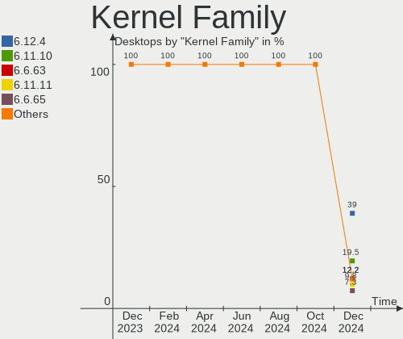
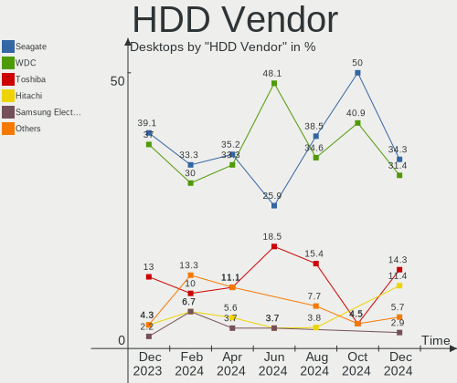
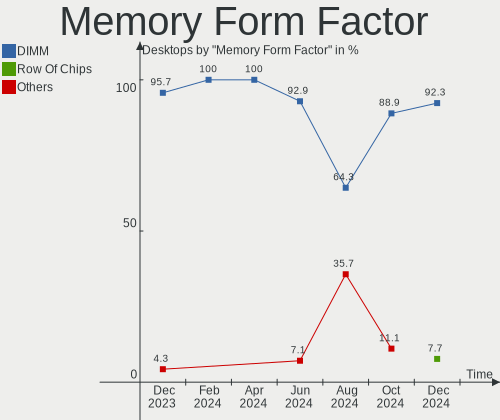

Manjaro - Hardware Trends (Desktops)
------------------------------------

A project to identify most popular hardware characteristics and track their change
over time based on data collected by Linux users at https://Linux-Hardware.org.

Anyone can contribute to this report by the [hw-probe](https://github.com/linuxhw/hw-probe) tool:

    sudo -E hw-probe -all -upload

This report is for one last month. Overall report since the beginning of time: [TestCoverage](https://github.com/linuxhw/TestCoverage)

Period: Aug, 2022.

Contents
--------

* [ System ](#system)
  - [ OS                       ](#os)
  - [ OS Family                ](#os-family)
  - [ Kernel                   ](#kernel)
  - [ Kernel Family            ](#kernel-family)
  - [ Kernel Major Ver.        ](#kernel-major-ver)
  - [ Arch                     ](#arch)
  - [ DE                       ](#de)
  - [ Display Server           ](#display-server)
  - [ Display Manager          ](#display-manager)
  - [ OS Lang                  ](#os-lang)
  - [ Boot Mode                ](#boot-mode)
  - [ Filesystem               ](#filesystem)
  - [ Part. scheme             ](#part-scheme)
  - [ Dual Boot with Linux/BSD ](#dual-boot-with-linuxbsd)
  - [ Dual Boot (Win)          ](#dual-boot-win)

* [ Board ](#board)
  - [ Vendor                   ](#vendor)
  - [ Model                    ](#model)
  - [ Model Family             ](#model-family)
  - [ MFG Year                 ](#mfg-year)
  - [ Form Factor              ](#form-factor)
  - [ Secure Boot              ](#secure-boot)
  - [ Coreboot                 ](#coreboot)
  - [ RAM Size                 ](#ram-size)
  - [ RAM Used                 ](#ram-used)
  - [ Total Drives             ](#total-drives)
  - [ Has CD-ROM               ](#has-cd-rom)
  - [ Has Ethernet             ](#has-ethernet)
  - [ Has WiFi                 ](#has-wifi)
  - [ Has Bluetooth            ](#has-bluetooth)

* [ Location ](#location)
  - [ Country                  ](#country)
  - [ City                     ](#city)

* [ Drives ](#drives)
  - [ Drive Vendor             ](#drive-vendor)
  - [ Drive Model              ](#drive-model)
  - [ HDD Vendor               ](#hdd-vendor)
  - [ SSD Vendor               ](#ssd-vendor)
  - [ Drive Kind               ](#drive-kind)
  - [ Drive Connector          ](#drive-connector)
  - [ Drive Size               ](#drive-size)
  - [ Space Total              ](#space-total)
  - [ Space Used               ](#space-used)
  - [ Malfunc. Drives          ](#malfunc-drives)
  - [ Malfunc. Drive Vendor    ](#malfunc-drive-vendor)
  - [ Malfunc. HDD Vendor      ](#malfunc-hdd-vendor)
  - [ Malfunc. Drive Kind      ](#malfunc-drive-kind)
  - [ Failed Drives            ](#failed-drives)
  - [ Failed Drive Vendor      ](#failed-drive-vendor)
  - [ Drive Status             ](#drive-status)

* [ Storage controller ](#storage-controller)
  - [ Storage Vendor           ](#storage-vendor)
  - [ Storage Model            ](#storage-model)
  - [ Storage Kind             ](#storage-kind)

* [ Processor ](#processor)
  - [ CPU Vendor               ](#cpu-vendor)
  - [ CPU Model                ](#cpu-model)
  - [ CPU Model Family         ](#cpu-model-family)
  - [ CPU Cores                ](#cpu-cores)
  - [ CPU Sockets              ](#cpu-sockets)
  - [ CPU Threads              ](#cpu-threads)
  - [ CPU Op-Modes             ](#cpu-op-modes)
  - [ CPU Microcode            ](#cpu-microcode)
  - [ CPU Microarch            ](#cpu-microarch)

* [ Graphics ](#graphics)
  - [ GPU Vendor               ](#gpu-vendor)
  - [ GPU Model                ](#gpu-model)
  - [ GPU Combo                ](#gpu-combo)
  - [ GPU Driver               ](#gpu-driver)
  - [ GPU Memory               ](#gpu-memory)

* [ Monitor ](#monitor)
  - [ Monitor Vendor           ](#monitor-vendor)
  - [ Monitor Model            ](#monitor-model)
  - [ Monitor Resolution       ](#monitor-resolution)
  - [ Monitor Diagonal         ](#monitor-diagonal)
  - [ Monitor Width            ](#monitor-width)
  - [ Aspect Ratio             ](#aspect-ratio)
  - [ Monitor Area             ](#monitor-area)
  - [ Pixel Density            ](#pixel-density)
  - [ Multiple Monitors        ](#multiple-monitors)

* [ Network ](#network)
  - [ Net Controller Vendor    ](#net-controller-vendor)
  - [ Net Controller Model     ](#net-controller-model)
  - [ Wireless Vendor          ](#wireless-vendor)
  - [ Wireless Model           ](#wireless-model)
  - [ Ethernet Vendor          ](#ethernet-vendor)
  - [ Ethernet Model           ](#ethernet-model)
  - [ Net Controller Kind      ](#net-controller-kind)
  - [ Used Controller          ](#used-controller)
  - [ NICs                     ](#nics)
  - [ IPv6                     ](#ipv6)

* [ Bluetooth ](#bluetooth)
  - [ Bluetooth Vendor         ](#bluetooth-vendor)
  - [ Bluetooth Model          ](#bluetooth-model)

* [ Sound ](#sound)
  - [ Sound Vendor             ](#sound-vendor)
  - [ Sound Model              ](#sound-model)

* [ Memory ](#memory)
  - [ Memory Vendor            ](#memory-vendor)
  - [ Memory Model             ](#memory-model)
  - [ Memory Kind              ](#memory-kind)
  - [ Memory Form Factor       ](#memory-form-factor)
  - [ Memory Size              ](#memory-size)
  - [ Memory Speed             ](#memory-speed)

* [ Printers & scanners ](#printers--scanners)
  - [ Printer Vendor           ](#printer-vendor)
  - [ Printer Model            ](#printer-model)
  - [ Scanner Vendor           ](#scanner-vendor)
  - [ Scanner Model            ](#scanner-model)

* [ Camera ](#camera)
  - [ Camera Vendor            ](#camera-vendor)
  - [ Camera Model             ](#camera-model)

* [ Security ](#security)
  - [ Fingerprint Vendor       ](#fingerprint-vendor)
  - [ Fingerprint Model        ](#fingerprint-model)
  - [ Chipcard Vendor          ](#chipcard-vendor)
  - [ Chipcard Model           ](#chipcard-model)

* [ Unsupported ](#unsupported)
  - [ Unsupported Devices      ](#unsupported-devices)
  - [ Unsupported Device Types ](#unsupported-device-types)

System
------

OS
--

Installed operating systems

| Name           | Desktops | Percent |
|----------------|----------|---------|
| Manjaro        | 32       | 57.14%  |
| Manjaro 21.3.6 | 14       | 25%     |
| Manjaro 21.3.7 | 9        | 16.07%  |
| Manjaro 22.0.0 | 1        | 1.79%   |

OS Family
---------

OS without a version

| Name    | Desktops | Percent |
|---------|----------|---------|
| Manjaro | 56       | 100%    |

Kernel
------

Version of the Linux kernel

| Version                | Desktops | Percent |
|------------------------|----------|---------|
| 5.15.60-1-MANJARO      | 12       | 21.43%  |
| 5.19.1-3-MANJARO       | 9        | 16.07%  |
| 5.15.59-1-MANJARO      | 8        | 14.29%  |
| 5.18.14-1-MANJARO      | 4        | 7.14%   |
| 5.19.0-2-MANJARO       | 3        | 5.36%   |
| 5.18.16-1-MANJARO      | 3        | 5.36%   |
| 5.15.57-2-MANJARO      | 3        | 5.36%   |
| 5.19.1-2-MANJARO       | 2        | 3.57%   |
| 5.19.0-1-MANJARO       | 2        | 3.57%   |
| 5.18.17-1-MANJARO      | 2        | 3.57%   |
| 6.0.0-1-MANJARO        | 1        | 1.79%   |
| 5.19.4-269-tkg-bmq     | 1        | 1.79%   |
| 5.19.4-1-MANJARO       | 1        | 1.79%   |
| 5.19.0-xanmod2-2-x64v2 | 1        | 1.79%   |
| 5.15.57-1-MANJARO      | 1        | 1.79%   |
| 5.15.55-1-MANJARO      | 1        | 1.79%   |
| 5.15.53-1-MANJARO      | 1        | 1.79%   |
| 5.10.136-1-MANJARO     | 1        | 1.79%   |

Kernel Family
-------------

Linux kernel without a distro release

| Version  | Desktops | Percent |
|----------|----------|---------|
| 5.15.60  | 12       | 21.43%  |
| 5.19.1   | 11       | 19.64%  |
| 5.15.59  | 8        | 14.29%  |
| 5.19.0   | 6        | 10.71%  |
| 5.18.14  | 4        | 7.14%   |
| 5.15.57  | 4        | 7.14%   |
| 5.18.16  | 3        | 5.36%   |
| 5.19.4   | 2        | 3.57%   |
| 5.18.17  | 2        | 3.57%   |
| 6.0.0    | 1        | 1.79%   |
| 5.15.55  | 1        | 1.79%   |
| 5.15.53  | 1        | 1.79%   |
| 5.10.136 | 1        | 1.79%   |

Kernel Major Ver.
-----------------

Linux kernel major version

| Version | Desktops | Percent |
|---------|----------|---------|
| 5.15    | 26       | 46.43%  |
| 5.19    | 19       | 33.93%  |
| 5.18    | 9        | 16.07%  |
| 6.0     | 1        | 1.79%   |
| 5.10    | 1        | 1.79%   |

Arch
----

OS architecture (x86_64, i586, etc.)

| Name   | Desktops | Percent |
|--------|----------|---------|
| x86_64 | 56       | 100%    |

DE
--

Desktop Environment

| Name       | Desktops | Percent |
|------------|----------|---------|
| KDE5       | 36       | 64.29%  |
| GNOME      | 8        | 14.29%  |
| XFCE       | 7        | 12.5%   |
| X-Cinnamon | 1        | 1.79%   |
| sway       | 1        | 1.79%   |
| MATE       | 1        | 1.79%   |
| i3         | 1        | 1.79%   |
| Unknown    | 1        | 1.79%   |

Display Server
--------------

X11 or Wayland

| Name    | Desktops | Percent |
|---------|----------|---------|
| X11     | 50       | 89.29%  |
| Wayland | 4        | 7.14%   |
| Tty     | 1        | 1.79%   |
| Unknown | 1        | 1.79%   |

Display Manager
---------------

SDDM, LightDM, etc.

| Name    | Desktops | Percent |
|---------|----------|---------|
| Unknown | 33       | 58.93%  |
| SDDM    | 15       | 26.79%  |
| LightDM | 6        | 10.71%  |
| GDM     | 2        | 3.57%   |

OS Lang
-------

Language

| Lang    | Desktops | Percent |
|---------|----------|---------|
| en_US   | 28       | 50%     |
| ru_RU   | 5        | 8.93%   |
| de_DE   | 5        | 8.93%   |
| pt_BR   | 2        | 3.57%   |
| es_UY   | 2        | 3.57%   |
| en_GB   | 2        | 3.57%   |
| pt_PT   | 1        | 1.79%   |
| nl_NL   | 1        | 1.79%   |
| fr_FR   | 1        | 1.79%   |
| es_VE   | 1        | 1.79%   |
| es_GT   | 1        | 1.79%   |
| es_EC   | 1        | 1.79%   |
| en_PH   | 1        | 1.79%   |
| en_IN   | 1        | 1.79%   |
| en_CA   | 1        | 1.79%   |
| Default | 1        | 1.79%   |
| da_DK   | 1        | 1.79%   |
| Unknown | 1        | 1.79%   |

Boot Mode
---------

EFI or BIOS

| Mode | Desktops | Percent |
|------|----------|---------|
| BIOS | 38       | 67.86%  |
| EFI  | 18       | 32.14%  |

Filesystem
----------

Type of filesystem

| Type  | Desktops | Percent |
|-------|----------|---------|
| Ext4  | 42       | 75%     |
| Btrfs | 11       | 19.64%  |
| Xfs   | 3        | 5.36%   |

Part. scheme
------------

Scheme of partitioning

| Type    | Desktops | Percent |
|---------|----------|---------|
| Unknown | 36       | 64.29%  |
| GPT     | 17       | 30.36%  |
| MBR     | 3        | 5.36%   |

Dual Boot with Linux/BSD
------------------------

Hosting more than one Linux/BSD

| Dual boot | Desktops | Percent |
|-----------|----------|---------|
| No        | 48       | 85.71%  |
| Yes       | 8        | 14.29%  |

Dual Boot (Win)
---------------

Hosting Linux and Windows

| Dual boot | Desktops | Percent |
|-----------|----------|---------|
| No        | 42       | 75%     |
| Yes       | 14       | 25%     |

Board
-----

Vendor
------

Motherboard manufacturer

| Name                | Desktops | Percent |
|---------------------|----------|---------|
| ASUSTek Computer    | 19       | 33.93%  |
| MSI                 | 10       | 17.86%  |
| Gigabyte Technology | 8        | 14.29%  |
| ASRock              | 8        | 14.29%  |
| Lenovo              | 2        | 3.57%   |
| Hewlett-Packard     | 2        | 3.57%   |
| Dell                | 2        | 3.57%   |
| VS Company          | 1        | 1.79%   |
| MACHINIST           | 1        | 1.79%   |
| ECS                 | 1        | 1.79%   |
| AZW                 | 1        | 1.79%   |
| Unknown             | 1        | 1.79%   |

Model
-----

Motherboard model

| Name                                   | Desktops | Percent |
|----------------------------------------|----------|---------|
| ASUS TUF Gaming X570-PLUS              | 3        | 5.36%   |
| Gigabyte B550M S2H                     | 2        | 3.57%   |
| VS Company H61H2                       | 1        | 1.79%   |
| MSI MS-7C94                            | 1        | 1.79%   |
| MSI MS-7C56                            | 1        | 1.79%   |
| MSI MS-7C37                            | 1        | 1.79%   |
| MSI MS-7C02                            | 1        | 1.79%   |
| MSI MS-7B85                            | 1        | 1.79%   |
| MSI MS-7B79                            | 1        | 1.79%   |
| MSI MS-7B38                            | 1        | 1.79%   |
| MSI MS-7850                            | 1        | 1.79%   |
| MSI MS-7693                            | 1        | 1.79%   |
| MSI MS-7589                            | 1        | 1.79%   |
| MACHINIST H81M-PRO S1 V2.0             | 1        | 1.79%   |
| Lenovo ThinkCentre M79 10JAS00P00      | 1        | 1.79%   |
| Lenovo IdeaCentre 720-18APR 90HY002APG | 1        | 1.79%   |
| HP ProDesk 400 G4 SFF                  | 1        | 1.79%   |
| HP EliteDesk 800 G2 TWR                | 1        | 1.79%   |
| Gigabyte X570 AORUS ELITE              | 1        | 1.79%   |
| Gigabyte H61M-S2P                      | 1        | 1.79%   |
| Gigabyte B550 GAMING X V2              | 1        | 1.79%   |
| Gigabyte B450 AORUS PRO                | 1        | 1.79%   |
| Gigabyte B450 AORUS M                  | 1        | 1.79%   |
| Gigabyte B150M-D3H                     | 1        | 1.79%   |
| ECS H61H2-MV                           | 1        | 1.79%   |
| Dell XPS 8700                          | 1        | 1.79%   |
| Dell Inspiron 660                      | 1        | 1.79%   |
| AZW U59                                | 1        | 1.79%   |
| ASUS Z170-P                            | 1        | 1.79%   |
| ASUS TUF Gaming B550-PLUS              | 1        | 1.79%   |
| ASUS ROG STRIX Z490-E GAMING           | 1        | 1.79%   |
| ASUS ROG STRIX Z390-E GAMING           | 1        | 1.79%   |
| ASUS ROG Strix G10DK_G10DK             | 1        | 1.79%   |
| ASUS ROG STRIX B550-I GAMING           | 1        | 1.79%   |
| ASUS ROG Maximus Z690 HERO             | 1        | 1.79%   |
| ASUS ROG Maximus XI HERO               | 1        | 1.79%   |
| ASUS ProArt X570-CREATOR WIFI          | 1        | 1.79%   |
| ASUS ProArt B550-CREATOR               | 1        | 1.79%   |
| ASUS PRIME Z590-P                      | 1        | 1.79%   |
| ASUS PRIME B450M-A                     | 1        | 1.79%   |
| ASUS PRIME B365M-C                     | 1        | 1.79%   |
| ASUS F2A55-M LK2                       | 1        | 1.79%   |
| ASUS All Series                        | 1        | 1.79%   |
| ASUS A0000001                          | 1        | 1.79%   |
| ASRock Z77 Extreme4                    | 1        | 1.79%   |
| ASRock X99 WS                          | 1        | 1.79%   |
| ASRock N68-S                           | 1        | 1.79%   |
| ASRock FM2A58M-VG3+ R2.0               | 1        | 1.79%   |
| ASRock B550M Pro4                      | 1        | 1.79%   |
| ASRock B450M Pro4                      | 1        | 1.79%   |
| ASRock B450 Pro4                       | 1        | 1.79%   |
| ASRock 990FX Extreme3                  | 1        | 1.79%   |
| Unknown                                | 1        | 1.79%   |

Model Family
------------

Motherboard model prefix

| Name                | Desktops | Percent |
|---------------------|----------|---------|
| ASUS ROG            | 6        | 10.71%  |
| ASUS TUF            | 4        | 7.14%   |
| ASUS PRIME          | 3        | 5.36%   |
| Gigabyte B550M      | 2        | 3.57%   |
| Gigabyte B450       | 2        | 3.57%   |
| ASUS ProArt         | 2        | 3.57%   |
| VS Company H61H2    | 1        | 1.79%   |
| MSI MS-7C94         | 1        | 1.79%   |
| MSI MS-7C56         | 1        | 1.79%   |
| MSI MS-7C37         | 1        | 1.79%   |
| MSI MS-7C02         | 1        | 1.79%   |
| MSI MS-7B85         | 1        | 1.79%   |
| MSI MS-7B79         | 1        | 1.79%   |
| MSI MS-7B38         | 1        | 1.79%   |
| MSI MS-7850         | 1        | 1.79%   |
| MSI MS-7693         | 1        | 1.79%   |
| MSI MS-7589         | 1        | 1.79%   |
| MACHINIST H81M-PRO  | 1        | 1.79%   |
| Lenovo ThinkCentre  | 1        | 1.79%   |
| Lenovo IdeaCentre   | 1        | 1.79%   |
| HP ProDesk          | 1        | 1.79%   |
| HP EliteDesk        | 1        | 1.79%   |
| Gigabyte X570       | 1        | 1.79%   |
| Gigabyte H61M-S2P   | 1        | 1.79%   |
| Gigabyte B550       | 1        | 1.79%   |
| Gigabyte B150M-D3H  | 1        | 1.79%   |
| ECS H61H2-MV        | 1        | 1.79%   |
| Dell XPS            | 1        | 1.79%   |
| Dell Inspiron       | 1        | 1.79%   |
| AZW U59             | 1        | 1.79%   |
| ASUS Z170-P         | 1        | 1.79%   |
| ASUS F2A55-M        | 1        | 1.79%   |
| ASUS All            | 1        | 1.79%   |
| ASUS A0000001       | 1        | 1.79%   |
| ASRock Z77          | 1        | 1.79%   |
| ASRock X99          | 1        | 1.79%   |
| ASRock N68-S        | 1        | 1.79%   |
| ASRock FM2A58M-VG3+ | 1        | 1.79%   |
| ASRock B550M        | 1        | 1.79%   |
| ASRock B450M        | 1        | 1.79%   |
| ASRock B450         | 1        | 1.79%   |
| ASRock 990FX        | 1        | 1.79%   |
| Unknown             | 1        | 1.79%   |

MFG Year
--------

Motherboard manufacture year

| Year | Desktops | Percent |
|------|----------|---------|
| 2020 | 13       | 23.21%  |
| 2021 | 8        | 14.29%  |
| 2019 | 7        | 12.5%   |
| 2018 | 7        | 12.5%   |
| 2012 | 6        | 10.71%  |
| 2016 | 3        | 5.36%   |
| 2014 | 3        | 5.36%   |
| 2013 | 3        | 5.36%   |
| 2015 | 2        | 3.57%   |
| 2009 | 2        | 3.57%   |
| 2017 | 1        | 1.79%   |
| 2011 | 1        | 1.79%   |

Form Factor
-----------

Physical design of the computer

| Name    | Desktops | Percent |
|---------|----------|---------|
| Desktop | 56       | 100%    |

Secure Boot
-----------

Enabled or disabled

| State    | Desktops | Percent |
|----------|----------|---------|
| Disabled | 55       | 98.21%  |
| Enabled  | 1        | 1.79%   |

Coreboot
--------

Have coreboot on board

| Used | Desktops | Percent |
|------|----------|---------|
| No   | 56       | 100%    |

RAM Size
--------

Total RAM memory

| Size in GB  | Desktops | Percent |
|-------------|----------|---------|
| 16.01-24.0  | 15       | 26.79%  |
| 32.01-64.0  | 13       | 23.21%  |
| 8.01-16.0   | 10       | 17.86%  |
| 64.01-256.0 | 7        | 12.5%   |
| 4.01-8.0    | 5        | 8.93%   |
| 24.01-32.0  | 4        | 7.14%   |
| 3.01-4.0    | 2        | 3.57%   |

RAM Used
--------

Used RAM memory

| Used GB    | Desktops | Percent |
|------------|----------|---------|
| 4.01-8.0   | 14       | 25%     |
| 2.01-3.0   | 13       | 23.21%  |
| 1.01-2.0   | 11       | 19.64%  |
| 8.01-16.0  | 10       | 17.86%  |
| 3.01-4.0   | 5        | 8.93%   |
| 32.01-64.0 | 1        | 1.79%   |
| 24.01-32.0 | 1        | 1.79%   |
| 16.01-24.0 | 1        | 1.79%   |

Total Drives
------------

Number of drives on board

| Drives | Desktops | Percent |
|--------|----------|---------|
| 2      | 18       | 32.14%  |
| 1      | 12       | 21.43%  |
| 3      | 11       | 19.64%  |
| 5      | 8        | 14.29%  |
| 4      | 3        | 5.36%   |
| 6      | 2        | 3.57%   |
| 11     | 1        | 1.79%   |
| 9      | 1        | 1.79%   |

Has CD-ROM
----------

Has CD-ROM on board

| Presented | Desktops | Percent |
|-----------|----------|---------|
| No        | 44       | 78.57%  |
| Yes       | 12       | 21.43%  |

Has Ethernet
------------

Has Ethernet on board

| Presented | Desktops | Percent |
|-----------|----------|---------|
| Yes       | 56       | 100%    |

Has WiFi
--------

Has WiFi module

| Presented | Desktops | Percent |
|-----------|----------|---------|
| No        | 30       | 53.57%  |
| Yes       | 26       | 46.43%  |

Has Bluetooth
-------------

Has Bluetooth module

| Presented | Desktops | Percent |
|-----------|----------|---------|
| Yes       | 29       | 51.79%  |
| No        | 27       | 48.21%  |

Location
--------

Country
-------

Geographic location (country)

| Country     | Desktops | Percent |
|-------------|----------|---------|
| USA         | 16       | 28.57%  |
| Germany     | 7        | 12.5%   |
| Russia      | 5        | 8.93%   |
| Uruguay     | 2        | 3.57%   |
| India       | 2        | 3.57%   |
| Brazil      | 2        | 3.57%   |
| Austria     | 2        | 3.57%   |
| Vietnam     | 1        | 1.79%   |
| Venezuela   | 1        | 1.79%   |
| Ukraine     | 1        | 1.79%   |
| Sweden      | 1        | 1.79%   |
| Portugal    | 1        | 1.79%   |
| Philippines | 1        | 1.79%   |
| Netherlands | 1        | 1.79%   |
| Lithuania   | 1        | 1.79%   |
| Japan       | 1        | 1.79%   |
| Italy       | 1        | 1.79%   |
| Guatemala   | 1        | 1.79%   |
| France      | 1        | 1.79%   |
| Egypt       | 1        | 1.79%   |
| Ecuador     | 1        | 1.79%   |
| Denmark     | 1        | 1.79%   |
| Canada      | 1        | 1.79%   |
| Bulgaria    | 1        | 1.79%   |
| Belgium     | 1        | 1.79%   |
| Bangladesh  | 1        | 1.79%   |
| Armenia     | 1        | 1.79%   |

City
----

Geographic location (city)

| City                    | Desktops | Percent |
|-------------------------|----------|---------|
| Montevideo              | 2        | 3.57%   |
| Hamburg                 | 2        | 3.57%   |
| Dallas                  | 2        | 3.57%   |
| Yerevan                 | 1        | 1.79%   |
| Winston-Salem           | 1        | 1.79%   |
| Waterloo                | 1        | 1.79%   |
| Voznesensk              | 1        | 1.79%   |
| Vilnius                 | 1        | 1.79%   |
| Vienna                  | 1        | 1.79%   |
| Stockholm               | 1        | 1.79%   |
| St Petersburg           | 1        | 1.79%   |
| Sofia                   | 1        | 1.79%   |
| Shinnston               | 1        | 1.79%   |
| Shimotoda               | 1        | 1.79%   |
| Shillong                | 1        | 1.79%   |
| Salt Lake City          | 1        | 1.79%   |
| Ryazan                  | 1        | 1.79%   |
| Pune                    | 1        | 1.79%   |
| Odemira                 | 1        | 1.79%   |
| Novosibirsk             | 1        | 1.79%   |
| Moscow                  | 1        | 1.79%   |
| Monza                   | 1        | 1.79%   |
| Lancaster               | 1        | 1.79%   |
| Kansas City             | 1        | 1.79%   |
| Juiz de Fora            | 1        | 1.79%   |
| Irvington               | 1        | 1.79%   |
| Hollenstein an der Ybbs | 1        | 1.79%   |
| Ho Chi Minh City        | 1        | 1.79%   |
| Hattiesburg             | 1        | 1.79%   |
| Hannoversch Münden     | 1        | 1.79%   |
| Guayaquil               | 1        | 1.79%   |
| Guatemala City          | 1        | 1.79%   |
| Fresno                  | 1        | 1.79%   |
| Fortaleza               | 1        | 1.79%   |
| Fairbanks               | 1        | 1.79%   |
| Düren                  | 1        | 1.79%   |
| Dortmund                | 1        | 1.79%   |
| Dhaka                   | 1        | 1.79%   |
| Davao City              | 1        | 1.79%   |
| Darmstadt               | 1        | 1.79%   |
| Copenhagen              | 1        | 1.79%   |
| Conroe                  | 1        | 1.79%   |
| Colorado Springs        | 1        | 1.79%   |
| Chelyabinsk             | 1        | 1.79%   |
| Carrizal                | 1        | 1.79%   |
| Cairo                   | 1        | 1.79%   |
| Bruchsal                | 1        | 1.79%   |
| Bowie                   | 1        | 1.79%   |
| Beveren                 | 1        | 1.79%   |
| Barnaul                 | 1        | 1.79%   |
| Aulnay-sous-Bois        | 1        | 1.79%   |
| Atlanta                 | 1        | 1.79%   |
| Amsterdam               | 1        | 1.79%   |

Drives
------

Drive Vendor
------------

Hard drive vendors

| Vendor                      | Desktops | Drives | Percent |
|-----------------------------|----------|--------|---------|
| Samsung Electronics         | 27       | 42     | 21.26%  |
| WDC                         | 21       | 24     | 16.54%  |
| Seagate                     | 18       | 24     | 14.17%  |
| Toshiba                     | 8        | 8      | 6.3%    |
| SanDisk                     | 8        | 9      | 6.3%    |
| Crucial                     | 8        | 14     | 6.3%    |
| Kingston                    | 7        | 11     | 5.51%   |
| Hitachi                     | 5        | 5      | 3.94%   |
| Phison                      | 4        | 4      | 3.15%   |
| Transcend                   | 2        | 2      | 1.57%   |
| Intel                       | 2        | 2      | 1.57%   |
| China                       | 2        | 2      | 1.57%   |
| USB                         | 1        | 1      | 0.79%   |
| Unknown                     | 1        | 2      | 0.79%   |
| Team                        | 1        | 1      | 0.79%   |
| SK hynix                    | 1        | 1      | 0.79%   |
| Silicon Motion              | 1        | 1      | 0.79%   |
| MyDigitalSSD                | 1        | 1      | 0.79%   |
| Mushkin                     | 1        | 1      | 0.79%   |
| Micron/Crucial Technology   | 1        | 1      | 0.79%   |
| Micron Technology           | 1        | 1      | 0.79%   |
| Maxtor                      | 1        | 1      | 0.79%   |
| Kingston Technology Company | 1        | 1      | 0.79%   |
| Indilinx                    | 1        | 1      | 0.79%   |
| HGST                        | 1        | 1      | 0.79%   |
| Apacer                      | 1        | 1      | 0.79%   |
| A-DATA Technology           | 1        | 1      | 0.79%   |

Drive Model
-----------

Hard drive models

| Model                               | Desktops | Percent |
|-------------------------------------|----------|---------|
| Samsung NVMe SSD Drive 1TB          | 3        | 1.99%   |
| Kingston SA400S37240G 240GB SSD     | 3        | 1.99%   |
| Crucial CT500MX500SSD1 500GB        | 3        | 1.99%   |
| WDC WD10EZEX-60ZF5A0 1TB            | 2        | 1.32%   |
| Seagate ST3160318AS 160GB           | 2        | 1.32%   |
| Seagate ST2000DM006-2DM164 2TB      | 2        | 1.32%   |
| Seagate ST1000DM010-2EP102 1TB      | 2        | 1.32%   |
| Samsung SSD 960 EVO 250GB           | 2        | 1.32%   |
| Samsung SSD 860 EVO 500GB           | 2        | 1.32%   |
| Samsung SSD 860 EVO 250GB           | 2        | 1.32%   |
| Samsung SSD 860 EVO 1TB             | 2        | 1.32%   |
| Samsung NVMe SSD Drive 250GB        | 2        | 1.32%   |
| WDC WDS200T2B0A-00SM50 2TB SSD      | 1        | 0.66%   |
| WDC WD82PURZ-85TEUY0 8TB            | 1        | 0.66%   |
| WDC WD80EDAZ-11TA3A0 8TB            | 1        | 0.66%   |
| WDC WD7500BPKT-22PK4T0 752GB        | 1        | 0.66%   |
| WDC WD5000AZLX-75K2TA0 500GB        | 1        | 0.66%   |
| WDC WD5000AAKX-003CA0 500GB         | 1        | 0.66%   |
| WDC WD5000AAKS-00UU3A0 500GB        | 1        | 0.66%   |
| WDC WD40EZRZ-00GXCB0 4TB            | 1        | 0.66%   |
| WDC WD20EZRZ-00Z5HB0 2TB            | 1        | 0.66%   |
| WDC WD20EARX-00PASB0 2TB            | 1        | 0.66%   |
| WDC WD20EARX-00AZ6B0 2TB            | 1        | 0.66%   |
| WDC WD2003FZEX-00SRLA0 2TB          | 1        | 0.66%   |
| WDC WD1600AAJS-22L7A0 160GB         | 1        | 0.66%   |
| WDC WD10EZRX-00L4HB0 1TB            | 1        | 0.66%   |
| WDC WD10EZEX-60WN4A0 1TB            | 1        | 0.66%   |
| WDC WD10EZEX-22MFCA0 1TB            | 1        | 0.66%   |
| WDC WD10EZEX-08WN4A0 1TB            | 1        | 0.66%   |
| WDC WD10EZEX-00BN5A0 1TB            | 1        | 0.66%   |
| WDC WD10EADS-114BB1 1TB             | 1        | 0.66%   |
| WDC WD10EADS-00L5B1 1TB             | 1        | 0.66%   |
| WDC WD1003FZEX-00MK2A0 1TB          | 1        | 0.66%   |
| USB 3.0 500GB                       | 1        | 0.66%   |
| Unknown SD/MMC 16GB                 | 1        | 0.66%   |
| Unknown M.S./M.S.Pro/HG 16GB        | 1        | 0.66%   |
| Transcend TS512GMTE510T 512GB       | 1        | 0.66%   |
| Transcend TS512GMTE220S 512GB       | 1        | 0.66%   |
| Toshiba THNSFJ256GDNU A 256GB SSD   | 1        | 0.66%   |
| Toshiba MQ01ABD100 1TB              | 1        | 0.66%   |
| Toshiba MD03ACA400V 4TB             | 1        | 0.66%   |
| Toshiba KXG50ZNV512G NVMe 512GB     | 1        | 0.66%   |
| Toshiba HDWG180 8TB                 | 1        | 0.66%   |
| Toshiba HDWE150 5TB                 | 1        | 0.66%   |
| Toshiba DT01ACA200 LENOVO 2TB       | 1        | 0.66%   |
| Toshiba DT01ACA100 1TB              | 1        | 0.66%   |
| Team T253LE120G 120GB SSD           | 1        | 0.66%   |
| SK hynix NVMe SSD Drive 512GB       | 1        | 0.66%   |
| Silicon Motion NVMe SSD Drive 512GB | 1        | 0.66%   |
| Seagate STM3500418AS 499GB          | 1        | 0.66%   |
| Seagate ST8000VX0022-2EJ112 8TB     | 1        | 0.66%   |
| Seagate ST8000VN004-2M2101 8TB      | 1        | 0.66%   |
| Seagate ST8000DM004-2U9188 8TB      | 1        | 0.66%   |
| Seagate ST500DM002-1BD142 500GB     | 1        | 0.66%   |
| Seagate ST4000DM005-2DP166 4TB      | 1        | 0.66%   |
| Seagate ST4000DM004-2CV104 4TB      | 1        | 0.66%   |
| Seagate ST3500418AS 500GB           | 1        | 0.66%   |
| Seagate ST3500414CS 500GB           | 1        | 0.66%   |
| Seagate ST1000NM0033-9ZM173 1TB     | 1        | 0.66%   |
| Seagate ST1000LM024 HN-M101MBB 1TB  | 1        | 0.66%   |

HDD Vendor
----------

Hard disk drive vendors

| Vendor              | Desktops | Drives | Percent |
|---------------------|----------|--------|---------|
| WDC                 | 20       | 23     | 37.04%  |
| Seagate             | 17       | 23     | 31.48%  |
| Toshiba             | 6        | 6      | 11.11%  |
| Hitachi             | 5        | 5      | 9.26%   |
| Samsung Electronics | 3        | 3      | 5.56%   |
| USB                 | 1        | 1      | 1.85%   |
| Maxtor              | 1        | 1      | 1.85%   |
| HGST                | 1        | 1      | 1.85%   |

SSD Vendor
----------

Solid state drive vendors

| Vendor              | Desktops | Drives | Percent |
|---------------------|----------|--------|---------|
| Samsung Electronics | 13       | 21     | 32.5%   |
| Crucial             | 7        | 13     | 17.5%   |
| Kingston            | 5        | 7      | 12.5%   |
| SanDisk             | 4        | 5      | 10%     |
| China               | 2        | 2      | 5%      |
| WDC                 | 1        | 1      | 2.5%    |
| Toshiba             | 1        | 1      | 2.5%    |
| Team                | 1        | 1      | 2.5%    |
| Seagate             | 1        | 1      | 2.5%    |
| MyDigitalSSD        | 1        | 1      | 2.5%    |
| Micron Technology   | 1        | 1      | 2.5%    |
| Indilinx            | 1        | 1      | 2.5%    |
| Apacer              | 1        | 1      | 2.5%    |
| A-DATA Technology   | 1        | 1      | 2.5%    |

Drive Kind
----------

HDD or SSD

| Kind    | Desktops | Drives | Percent |
|---------|----------|--------|---------|
| HDD     | 35       | 63     | 36.08%  |
| SSD     | 32       | 57     | 32.99%  |
| NVMe    | 29       | 41     | 29.9%   |
| Unknown | 1        | 2      | 1.03%   |

Drive Connector
---------------

SATA, SAS, NVMe, etc.

| Type | Desktops | Drives | Percent |
|------|----------|--------|---------|
| SATA | 48       | 113    | 57.83%  |
| NVMe | 29       | 41     | 34.94%  |
| SAS  | 6        | 9      | 7.23%   |

Drive Size
----------

Size of hard drive

| Size in TB | Desktops | Drives | Percent |
|------------|----------|--------|---------|
| 0.01-0.5   | 34       | 54     | 40.48%  |
| 0.51-1.0   | 27       | 35     | 32.14%  |
| 1.01-2.0   | 12       | 16     | 14.29%  |
| 3.01-4.0   | 6        | 7      | 7.14%   |
| 4.01-10.0  | 5        | 8      | 5.95%   |

Space Total
-----------

Amount of disk space available on the file system

| Size in GB     | Desktops | Percent |
|----------------|----------|---------|
| More than 3000 | 15       | 26.79%  |
| 501-1000       | 10       | 17.86%  |
| 1001-2000      | 9        | 16.07%  |
| 251-500        | 8        | 14.29%  |
| 2001-3000      | 5        | 8.93%   |
| 101-250        | 5        | 8.93%   |
| Unknown        | 2        | 3.57%   |
| 21-50          | 1        | 1.79%   |
| 51-100         | 1        | 1.79%   |

Space Used
----------

Amount of used disk space

| Used GB        | Desktops | Percent |
|----------------|----------|---------|
| More than 3000 | 9        | 16.07%  |
| 251-500        | 7        | 12.5%   |
| 101-250        | 7        | 12.5%   |
| 1001-2000      | 7        | 12.5%   |
| 501-1000       | 6        | 10.71%  |
| 51-100         | 6        | 10.71%  |
| 1-20           | 5        | 8.93%   |
| 21-50          | 4        | 7.14%   |
| 2001-3000      | 3        | 5.36%   |
| Unknown        | 2        | 3.57%   |

Malfunc. Drives
---------------

Drive models with a malfunction

| Model                              | Desktops | Drives | Percent |
|------------------------------------|----------|--------|---------|
| WDC WD1600AAJS-22L7A0 160GB        | 1        | 1      | 33.33%  |
| Seagate ST1000LM024 HN-M101MBB 1TB | 1        | 1      | 33.33%  |
| Hitachi HDS721010CLA332 1TB        | 1        | 1      | 33.33%  |

Malfunc. Drive Vendor
---------------------

Vendors of faulty drives

| Vendor  | Desktops | Drives | Percent |
|---------|----------|--------|---------|
| WDC     | 1        | 1      | 33.33%  |
| Seagate | 1        | 1      | 33.33%  |
| Hitachi | 1        | 1      | 33.33%  |

Malfunc. HDD Vendor
-------------------

Vendors of faulty HDD drives

| Vendor  | Desktops | Drives | Percent |
|---------|----------|--------|---------|
| WDC     | 1        | 1      | 33.33%  |
| Seagate | 1        | 1      | 33.33%  |
| Hitachi | 1        | 1      | 33.33%  |

Malfunc. Drive Kind
-------------------

Kinds of faulty drives

| Kind | Desktops | Drives | Percent |
|------|----------|--------|---------|
| HDD  | 3        | 3      | 100%    |

Failed Drives
-------------

Failed drive models

Zero info for selected period =(

Failed Drive Vendor
-------------------

Failed drive vendors

Zero info for selected period =(

Drive Status
------------

Number of failed and malfunc. drives

| Status   | Desktops | Drives | Percent |
|----------|----------|--------|---------|
| Detected | 39       | 95     | 65%     |
| Works    | 18       | 65     | 30%     |
| Malfunc  | 3        | 3      | 5%      |

Storage controller
------------------

Storage Vendor
--------------

Storage controller vendors

| Vendor                       | Desktops | Percent |
|------------------------------|----------|---------|
| AMD                          | 32       | 33.33%  |
| Intel                        | 24       | 25%     |
| Samsung Electronics          | 15       | 15.63%  |
| Silicon Motion               | 4        | 4.17%   |
| SanDisk                      | 4        | 4.17%   |
| Phison Electronics           | 4        | 4.17%   |
| ASMedia Technology           | 4        | 4.17%   |
| Kingston Technology Company  | 3        | 3.13%   |
| Micron/Crucial Technology    | 2        | 2.08%   |
| Toshiba America Info Systems | 1        | 1.04%   |
| SK hynix                     | 1        | 1.04%   |
| Nvidia                       | 1        | 1.04%   |
| LSI Logic / Symbios Logic    | 1        | 1.04%   |

Storage Model
-------------

Storage controller models

| Model                                                                                   | Desktops | Percent |
|-----------------------------------------------------------------------------------------|----------|---------|
| AMD FCH SATA Controller [AHCI mode]                                                     | 16       | 14.55%  |
| AMD 500 Series Chipset SATA Controller                                                  | 10       | 9.09%   |
| AMD 400 Series Chipset SATA Controller                                                  | 9        | 8.18%   |
| Samsung NVMe SSD Controller SM981/PM981/PM983                                           | 7        | 6.36%   |
| Intel 8 Series/C220 Series Chipset Family 6-port SATA Controller 1 [AHCI mode]          | 4        | 3.64%   |
| ASMedia ASM1062 Serial ATA Controller                                                   | 4        | 3.64%   |
| Samsung NVMe SSD Controller PM9A1/PM9A3/980PRO                                          | 3        | 2.73%   |
| Kingston Company A2000 NVMe SSD                                                         | 3        | 2.73%   |
| Intel Q170/Q150/B150/H170/H110/Z170/CM236 Chipset SATA Controller [AHCI Mode]           | 3        | 2.73%   |
| Intel 6 Series/C200 Series Chipset Family Desktop SATA Controller (IDE mode, ports 4-5) | 3        | 2.73%   |
| Intel 6 Series/C200 Series Chipset Family Desktop SATA Controller (IDE mode, ports 0-3) | 3        | 2.73%   |
| Silicon Motion SM2263EN/SM2263XT SSD Controller                                         | 2        | 1.82%   |
| Silicon Motion SM2262/SM2262EN SSD Controller                                           | 2        | 1.82%   |
| SanDisk WD PC SN810 / Black SN850 NVMe SSD                                              | 2        | 1.82%   |
| SanDisk WD Blue SN550 NVMe SSD                                                          | 2        | 1.82%   |
| Samsung NVMe SSD Controller SM961/PM961/SM963                                           | 2        | 1.82%   |
| Samsung NVMe SSD Controller SM951/PM951                                                 | 2        | 1.82%   |
| Samsung NVMe SSD Controller 980                                                         | 2        | 1.82%   |
| Phison E16 PCIe4 NVMe Controller                                                        | 2        | 1.82%   |
| Intel Cannon Lake PCH SATA AHCI Controller                                              | 2        | 1.82%   |
| Intel 7 Series/C210 Series Chipset Family 6-port SATA Controller [AHCI mode]            | 2        | 1.82%   |
| Intel 200 Series PCH SATA controller [AHCI mode]                                        | 2        | 1.82%   |
| AMD SB7x0/SB8x0/SB9x0 SATA Controller [AHCI mode]                                       | 2        | 1.82%   |
| Toshiba America Info Systems Toshiba America Info Non-Volatile memory controller        | 1        | 0.91%   |
| SK hynix Gold P31 SSD                                                                   | 1        | 0.91%   |
| Phison E18 PCIe4 NVMe Controller                                                        | 1        | 0.91%   |
| Phison E12 NVMe Controller                                                              | 1        | 0.91%   |
| Nvidia MCP61 SATA Controller                                                            | 1        | 0.91%   |
| Micron/Crucial P2 NVMe PCIe SSD                                                         | 1        | 0.91%   |
| Micron/Crucial Non-Volatile memory controller                                           | 1        | 0.91%   |
| LSI Logic / Symbios Logic SAS2008 PCI-Express Fusion-MPT SAS-2 [Falcon]                 | 1        | 0.91%   |
| Intel SSD Pro 7600p/760p/E 6100p Series                                                 | 1        | 0.91%   |
| Intel SSD 660P Series                                                                   | 1        | 0.91%   |
| Intel NM10/ICH7 Family SATA Controller [IDE mode]                                       | 1        | 0.91%   |
| Intel Jasper Lake SATA AHCI Controller                                                  | 1        | 0.91%   |
| Intel Comet Lake SATA AHCI Controller                                                   | 1        | 0.91%   |
| Intel C610/X99 series chipset sSATA Controller [AHCI mode]                              | 1        | 0.91%   |
| Intel C610/X99 series chipset 6-Port SATA Controller [AHCI mode]                        | 1        | 0.91%   |
| Intel 82801G (ICH7 Family) IDE Controller                                               | 1        | 0.91%   |
| Intel 500 Series Chipset Family SATA AHCI Controller                                    | 1        | 0.91%   |
| Intel 5 Series/3400 Series Chipset 6 port SATA AHCI Controller                          | 1        | 0.91%   |
| AMD SB7x0/SB8x0/SB9x0 IDE Controller                                                    | 1        | 0.91%   |
| AMD FCH IDE Controller                                                                  | 1        | 0.91%   |
| AMD 300 Series Chipset SATA Controller                                                  | 1        | 0.91%   |

Storage Kind
------------

Kind of storage controller (IDE, SATA, NVMe, SAS, ...)

| Kind | Desktops | Percent |
|------|----------|---------|
| SATA | 50       | 57.47%  |
| NVMe | 29       | 33.33%  |
| IDE  | 7        | 8.05%   |
| SAS  | 1        | 1.15%   |

Processor
---------

CPU Vendor
----------

Processor vendors

| Vendor | Desktops | Percent |
|--------|----------|---------|
| AMD    | 33       | 58.93%  |
| Intel  | 23       | 41.07%  |

CPU Model
---------

Processor models

| Model                                           | Desktops | Percent |
|-------------------------------------------------|----------|---------|
| AMD Ryzen 5 5600X 6-Core Processor              | 4        | 7.14%   |
| AMD Ryzen 5 5600G with Radeon Graphics          | 4        | 7.14%   |
| AMD Ryzen 9 5950X 16-Core Processor             | 3        | 5.36%   |
| AMD Ryzen 7 3800X 8-Core Processor              | 3        | 5.36%   |
| AMD Ryzen 5 3600 6-Core Processor               | 2        | 3.57%   |
| AMD Ryzen 5 2600 Six-Core Processor             | 2        | 3.57%   |
| Intel Xeon CPU E3-1220 v3 @ 3.10GHz             | 1        | 1.79%   |
| Intel Pentium Dual CPU E2200 @ 2.20GHz          | 1        | 1.79%   |
| Intel Pentium CPU G2030 @ 3.00GHz               | 1        | 1.79%   |
| Intel Core i9-9900K CPU @ 3.60GHz               | 1        | 1.79%   |
| Intel Core i9-10900K CPU @ 3.70GHz              | 1        | 1.79%   |
| Intel Core i7-9700K CPU @ 3.60GHz               | 1        | 1.79%   |
| Intel Core i7-6850K CPU @ 3.60GHz               | 1        | 1.79%   |
| Intel Core i7-6700 CPU @ 3.40GHz                | 1        | 1.79%   |
| Intel Core i7-4790 CPU @ 3.60GHz                | 1        | 1.79%   |
| Intel Core i7-3770S CPU @ 3.10GHz               | 1        | 1.79%   |
| Intel Core i7-3770 CPU @ 3.40GHz                | 1        | 1.79%   |
| Intel Core i7 CPU 860 @ 2.80GHz                 | 1        | 1.79%   |
| Intel Core i5-9400F CPU @ 2.90GHz               | 1        | 1.79%   |
| Intel Core i5-7500 CPU @ 3.40GHz                | 1        | 1.79%   |
| Intel Core i5-6600K CPU @ 3.50GHz               | 1        | 1.79%   |
| Intel Core i5-4670K CPU @ 3.40GHz               | 1        | 1.79%   |
| Intel Core i5-4570 CPU @ 3.20GHz                | 1        | 1.79%   |
| Intel Core i5-3470 CPU @ 3.20GHz                | 1        | 1.79%   |
| Intel Core i5-2400 CPU @ 3.10GHz                | 1        | 1.79%   |
| Intel Core i3-6320 CPU @ 3.90GHz                | 1        | 1.79%   |
| Intel Celeron N5095 @ 2.00GHz                   | 1        | 1.79%   |
| Intel 12th Gen Core i7-12700KF                  | 1        | 1.79%   |
| Intel 11th Gen Core i7-11700K @ 3.60GHz         | 1        | 1.79%   |
| AMD Ryzen 9 3900X 12-Core Processor             | 1        | 1.79%   |
| AMD Ryzen 7 5800X3D 8-Core Processor            | 1        | 1.79%   |
| AMD Ryzen 7 3700X 8-Core Processor              | 1        | 1.79%   |
| AMD Ryzen 7 2700X Eight-Core Processor          | 1        | 1.79%   |
| AMD Ryzen 5 PRO 4650G with Radeon Graphics      | 1        | 1.79%   |
| AMD Ryzen 5 3600X 6-Core Processor              | 1        | 1.79%   |
| AMD Ryzen 5 2400G with Radeon Vega Graphics     | 1        | 1.79%   |
| AMD Ryzen 3 3100 4-Core Processor               | 1        | 1.79%   |
| AMD Ryzen 3 2200G with Radeon Vega Graphics     | 1        | 1.79%   |
| AMD FX-8350 Eight-Core Processor                | 1        | 1.79%   |
| AMD FX-8320E Eight-Core Processor               | 1        | 1.79%   |
| AMD Athlon II X2 240 Processor                  | 1        | 1.79%   |
| AMD A8-5600K APU with Radeon HD Graphics        | 1        | 1.79%   |
| AMD A4-6300B APU with Radeon HD Graphics        | 1        | 1.79%   |
| AMD A10-7860K Radeon R7, 12 Compute Cores 4C+8G | 1        | 1.79%   |

CPU Model Family
----------------

Processor model prefix

| Model              | Desktops | Percent |
|--------------------|----------|---------|
| AMD Ryzen 5        | 14       | 25%     |
| Intel Core i7      | 7        | 12.5%   |
| Intel Core i5      | 7        | 12.5%   |
| AMD Ryzen 7        | 6        | 10.71%  |
| AMD Ryzen 9        | 4        | 7.14%   |
| Other              | 2        | 3.57%   |
| Intel Core i9      | 2        | 3.57%   |
| AMD Ryzen 3        | 2        | 3.57%   |
| AMD FX             | 2        | 3.57%   |
| Intel Xeon         | 1        | 1.79%   |
| Intel Pentium Dual | 1        | 1.79%   |
| Intel Pentium      | 1        | 1.79%   |
| Intel Core i3      | 1        | 1.79%   |
| Intel Celeron      | 1        | 1.79%   |
| AMD Ryzen 5 PRO    | 1        | 1.79%   |
| AMD Athlon II X2   | 1        | 1.79%   |
| AMD A8             | 1        | 1.79%   |
| AMD A4             | 1        | 1.79%   |
| AMD A10            | 1        | 1.79%   |

CPU Cores
---------

Number of processor cores

| Number | Desktops | Percent |
|--------|----------|---------|
| 4      | 18       | 32.14%  |
| 6      | 16       | 28.57%  |
| 8      | 10       | 17.86%  |
| 2      | 6        | 10.71%  |
| 16     | 3        | 5.36%   |
| 12     | 1        | 1.79%   |
| 10     | 1        | 1.79%   |
| 1      | 1        | 1.79%   |

CPU Sockets
-----------

Number of sockets

| Number | Desktops | Percent |
|--------|----------|---------|
| 1      | 56       | 100%    |

CPU Threads
-----------

Threads per core (Hyper-Threading)

| Number | Desktops | Percent |
|--------|----------|---------|
| 2      | 41       | 73.21%  |
| 1      | 15       | 26.79%  |

CPU Op-Modes
------------

CPU Operation Modes (32-bit, 64-bit)

| Op mode        | Desktops | Percent |
|----------------|----------|---------|
| 32-bit, 64-bit | 56       | 100%    |

CPU Microcode
-------------

Microcode number

| Number     | Desktops | Percent |
|------------|----------|---------|
| Unknown    | 37       | 66.07%  |
| 0x306c3    | 2        | 3.57%   |
| 0x0a20120a | 2        | 3.57%   |
| 0x08701021 | 2        | 3.57%   |
| 0x06000852 | 2        | 3.57%   |
| 0xa0655    | 1        | 1.79%   |
| 0x90672    | 1        | 1.79%   |
| 0x6fd      | 1        | 1.79%   |
| 0x406f1    | 1        | 1.79%   |
| 0x306a9    | 1        | 1.79%   |
| 0x206a7    | 1        | 1.79%   |
| 0x106e5    | 1        | 1.79%   |
| 0x0a50000d | 1        | 1.79%   |
| 0x0a50000c | 1        | 1.79%   |
| 0x0800820d | 1        | 1.79%   |
| 0x06001119 | 1        | 1.79%   |

CPU Microarch
-------------

Microarchitecture

| Name             | Desktops | Percent |
|------------------|----------|---------|
| Zen 3            | 12       | 21.43%  |
| Zen 2            | 10       | 17.86%  |
| Piledriver       | 4        | 7.14%   |
| KabyLake         | 4        | 7.14%   |
| IvyBridge        | 4        | 7.14%   |
| Haswell          | 4        | 7.14%   |
| Zen+             | 3        | 5.36%   |
| Skylake          | 3        | 5.36%   |
| Zen              | 2        | 3.57%   |
| Unknown          | 2        | 3.57%   |
| Steamroller      | 1        | 1.79%   |
| SandyBridge      | 1        | 1.79%   |
| Nehalem          | 1        | 1.79%   |
| K10              | 1        | 1.79%   |
| Core             | 1        | 1.79%   |
| CometLake        | 1        | 1.79%   |
| Broadwell        | 1        | 1.79%   |
| Alderlake Hybrid | 1        | 1.79%   |

Graphics
--------

GPU Vendor
----------

Vendors of graphics cards

| Vendor | Desktops | Percent |
|--------|----------|---------|
| Nvidia | 32       | 54.24%  |
| AMD    | 18       | 30.51%  |
| Intel  | 9        | 15.25%  |

GPU Model
---------

Graphics card models

| Model                                                            | Desktops | Percent |
|------------------------------------------------------------------|----------|---------|
| AMD Cezanne                                                      | 4        | 6.67%   |
| Nvidia GP108 [GeForce GT 1030]                                   | 3        | 5%      |
| Nvidia GP107 [GeForce GTX 1050 Ti]                               | 3        | 5%      |
| Nvidia GM107 [GeForce GTX 750 Ti]                                | 3        | 5%      |
| AMD Ellesmere [Radeon RX 470/480/570/570X/580/580X/590]          | 3        | 5%      |
| Nvidia TU104 [GeForce RTX 2080 Rev. A]                           | 2        | 3.33%   |
| Nvidia GT218 [GeForce 210]                                       | 2        | 3.33%   |
| Nvidia GP106 [GeForce GTX 1060 6GB]                              | 2        | 3.33%   |
| Nvidia GA106 [GeForce RTX 3060 Lite Hash Rate]                   | 2        | 3.33%   |
| Intel Xeon E3-1200 v2/3rd Gen Core processor Graphics Controller | 2        | 3.33%   |
| Intel IvyBridge GT2 [HD Graphics 4000]                           | 2        | 3.33%   |
| Intel HD Graphics 530                                            | 2        | 3.33%   |
| AMD Vega 10 XL/XT [Radeon RX Vega 56/64]                         | 2        | 3.33%   |
| AMD Raven Ridge [Radeon Vega Series / Radeon Vega Mobile Series] | 2        | 3.33%   |
| AMD Navi 14 [Radeon RX 5500/5500M / Pro 5500M]                   | 2        | 3.33%   |
| Nvidia TU106 [GeForce RTX 2060 12GB]                             | 1        | 1.67%   |
| Nvidia TU104 [GeForce RTX 2080 SUPER]                            | 1        | 1.67%   |
| Nvidia TU104 [GeForce RTX 2060]                                  | 1        | 1.67%   |
| Nvidia TU102 [GeForce RTX 2080 Ti Rev. A]                        | 1        | 1.67%   |
| Nvidia GP104 [GeForce GTX 1070 Ti]                               | 1        | 1.67%   |
| Nvidia GP102 [GeForce GTX 1080 Ti]                               | 1        | 1.67%   |
| Nvidia GK208B [GeForce GT 710]                                   | 1        | 1.67%   |
| Nvidia GK107 [GeForce GTX 650]                                   | 1        | 1.67%   |
| Nvidia GK106 [GeForce GTX 660]                                   | 1        | 1.67%   |
| Nvidia GK104 [GeForce GTX 760]                                   | 1        | 1.67%   |
| Nvidia GF110 [GeForce GTX 580]                                   | 1        | 1.67%   |
| Nvidia GF108 [GeForce GT 440]                                    | 1        | 1.67%   |
| Nvidia GA104 [GeForce RTX 3060]                                  | 1        | 1.67%   |
| Nvidia GA102 [GeForce RTX 3090]                                  | 1        | 1.67%   |
| Nvidia GA102 [GeForce RTX 3080 Ti]                               | 1        | 1.67%   |
| Intel JasperLake [UHD Graphics]                                  | 1        | 1.67%   |
| Intel HD Graphics 630                                            | 1        | 1.67%   |
| Intel 82945G/GZ Integrated Graphics Controller                   | 1        | 1.67%   |
| AMD Richland [Radeon HD 8370D]                                   | 1        | 1.67%   |
| AMD Renoir                                                       | 1        | 1.67%   |
| AMD Navi 22 [Radeon RX 6700/6700 XT/6750 XT / 6800M]             | 1        | 1.67%   |
| AMD Navi 10 [Radeon RX 5600 OEM/5600 XT / 5700/5700 XT]          | 1        | 1.67%   |
| AMD Kaveri [Radeon R7 Graphics]                                  | 1        | 1.67%   |
| AMD Juniper XT [Radeon HD 5770]                                  | 1        | 1.67%   |

GPU Combo
---------

Combinations of graphics cards

| Name           | Desktops | Percent |
|----------------|----------|---------|
| 1 x Nvidia     | 31       | 55.36%  |
| 1 x AMD        | 16       | 28.57%  |
| 1 x Intel      | 7        | 12.5%   |
| 2 x AMD        | 1        | 1.79%   |
| Intel + Nvidia | 1        | 1.79%   |

GPU Driver
----------

Free vs proprietary

| Driver      | Desktops | Percent |
|-------------|----------|---------|
| Proprietary | 28       | 50%     |
| Free        | 28       | 50%     |

GPU Memory
----------

Total video memory

| Size in GB | Desktops | Percent |
|------------|----------|---------|
| Unknown    | 22       | 39.29%  |
| 1.01-2.0   | 11       | 19.64%  |
| 8.01-16.0  | 7        | 12.5%   |
| 7.01-8.0   | 4        | 7.14%   |
| 3.01-4.0   | 4        | 7.14%   |
| 5.01-6.0   | 3        | 5.36%   |
| 0.51-1.0   | 3        | 5.36%   |
| 16.01-24.0 | 1        | 1.79%   |
| 0.01-0.5   | 1        | 1.79%   |

Monitor
-------

Monitor Vendor
--------------

Monitor vendors

| Vendor               | Desktops | Percent |
|----------------------|----------|---------|
| Samsung Electronics  | 9        | 13.43%  |
| Ancor Communications | 8        | 11.94%  |
| Dell                 | 6        | 8.96%   |
| AOC                  | 6        | 8.96%   |
| BenQ                 | 5        | 7.46%   |
| Goldstar             | 4        | 5.97%   |
| ViewSonic            | 3        | 4.48%   |
| Philips              | 3        | 4.48%   |
| Panasonic            | 2        | 2.99%   |
| Lenovo               | 2        | 2.99%   |
| KTC                  | 2        | 2.99%   |
| Acer                 | 2        | 2.99%   |
| Vizio                | 1        | 1.49%   |
| VIZ                  | 1        | 1.49%   |
| Unknown              | 1        | 1.49%   |
| Sony                 | 1        | 1.49%   |
| Sceptre              | 1        | 1.49%   |
| SAC                  | 1        | 1.49%   |
| MSI                  | 1        | 1.49%   |
| Microstep            | 1        | 1.49%   |
| Medion               | 1        | 1.49%   |
| LG Electronics       | 1        | 1.49%   |
| Iiyama               | 1        | 1.49%   |
| Hewlett-Packard      | 1        | 1.49%   |
| Gigabyte Technology  | 1        | 1.49%   |
| ELM                  | 1        | 1.49%   |
| Unknown              | 1        | 1.49%   |

Monitor Model
-------------

Monitor models

| Model                                                                 | Desktops | Percent |
|-----------------------------------------------------------------------|----------|---------|
| KTC 23L13-H-AN KTC2302 1920x1080 510x287mm 23.0-inch                  | 2        | 2.67%   |
| Vizio E422VLE VIZ0092 1920x1080 930x523mm 42.0-inch                   | 1        | 1.33%   |
| VIZ LCD Monitor D43n-E4 1920x1080                                     | 1        | 1.33%   |
| ViewSonic VX3276-QHD VSCE635 2560x1440 698x393mm 31.5-inch            | 1        | 1.33%   |
| ViewSonic VA1903a VSC8A31 1366x768 410x230mm 18.5-inch                | 1        | 1.33%   |
| ViewSonic LCD Monitor VX2480-2K 2560x1440                             | 1        | 1.33%   |
| Unknown LCD Monitor SAMSUNG 3840x2160                                 | 1        | 1.33%   |
| Sony TV *00 SNY4904 3840x2160                                         | 1        | 1.33%   |
| Sceptre LCD Monitor P30 6400x1080                                     | 1        | 1.33%   |
| Sceptre LCD Monitor M27                                               | 1        | 1.33%   |
| Samsung Electronics SyncMaster SAM0656 1920x1080 510x287mm 23.0-inch  | 1        | 1.33%   |
| Samsung Electronics SyncMaster SAM0571 1920x1080 510x287mm 23.0-inch  | 1        | 1.33%   |
| Samsung Electronics SyncMaster SAM0425 1920x1200 520x320mm 24.0-inch  | 1        | 1.33%   |
| Samsung Electronics S24D332 SAM0F5E 1920x1080 530x300mm 24.0-inch     | 1        | 1.33%   |
| Samsung Electronics S23B300 SAM08AE 1920x1080 510x287mm 23.0-inch     | 1        | 1.33%   |
| Samsung Electronics S22F350 SAM0D1B 1920x1080 477x268mm 21.5-inch     | 1        | 1.33%   |
| Samsung Electronics LS49A950U SAM71CD 3840x1080 1192x336mm 48.8-inch  | 1        | 1.33%   |
| Samsung Electronics LCD Monitor SyncMaster 3840x1200                  | 1        | 1.33%   |
| Samsung Electronics LCD Monitor S24E650 3840x1080                     | 1        | 1.33%   |
| Samsung Electronics LCD Monitor LS27A800U 3840x2160                   | 1        | 1.33%   |
| SAC LED MONITOR SAC952D 1920x1080 480x270mm 21.7-inch                 | 1        | 1.33%   |
| Philips PHL 247E6 PHLC0E7 1920x1080 521x293mm 23.5-inch               | 1        | 1.33%   |
| Philips PHL 246E9Q PHLC17C 1920x1080 527x296mm 23.8-inch              | 1        | 1.33%   |
| Philips PHL 244E5 PHLC0C0 1920x1080 527x296mm 23.8-inch               | 1        | 1.33%   |
| Philips PHL 243V7 PHLC155 1920x1080 527x296mm 23.8-inch               | 1        | 1.33%   |
| Philips LCD Monitor PHL 246E9Q 3840x1080                              | 1        | 1.33%   |
| Philips LCD Monitor PHL 246E9Q                                        | 1        | 1.33%   |
| Panasonic LCD Monitor TV 1920x1080                                    | 1        | 1.33%   |
| Panasonic LCD Monitor TV 1280x720                                     | 1        | 1.33%   |
| MSI G27CQ4 MSI3CB0 2560x1440 600x340mm 27.2-inch                      | 1        | 1.33%   |
| Microstep LCD Monitor MSI G27C4 1920x1080                             | 1        | 1.33%   |
| Medion MD 20889 MED3687 1920x1080 509x286mm 23.0-inch                 | 1        | 1.33%   |
| LG Electronics LCD Monitor LG ULTRAWIDE 4240x1080                     | 1        | 1.33%   |
| Lenovo Q24i-10 LEN65F3 1920x1080 527x296mm 23.8-inch                  | 1        | 1.33%   |
| Lenovo LEN L171 LEN240B 1280x1024 340x270mm 17.1-inch                 | 1        | 1.33%   |
| Iiyama PL2779QQ IVM6641 3840x2160 600x330mm 27.0-inch                 | 1        | 1.33%   |
| Hewlett-Packard 25es HWP3322 1920x1080 553x309mm 24.9-inch            | 1        | 1.33%   |
| Goldstar TV SSCR2 GSMC0C8 3840x2160                                   | 1        | 1.33%   |
| Goldstar StudioWorks 5 52V GSM3AF6 1024x768 260x195mm 12.8-inch       | 1        | 1.33%   |
| Goldstar HDR 4K GSM7706 3840x2160 600x340mm 27.2-inch                 | 1        | 1.33%   |
| Goldstar 32ML600 GSM772D 1920x1080 480x270mm 21.7-inch                | 1        | 1.33%   |
| Gigabyte Technology AORUS FI32U GBT3202 3840x2160 698x392mm 31.5-inch | 1        | 1.33%   |
| ELM Monitor ELM1902 1280x1024 330x320mm 18.1-inch                     | 1        | 1.33%   |
| Dell UP2715K DEL40B6 848x480 600x340mm 27.2-inch                      | 1        | 1.33%   |
| Dell U2419H DEL4148 1920x1080 527x296mm 23.8-inch                     | 1        | 1.33%   |
| Dell S2719DGF DELD0E5 2560x1440 597x336mm 27.0-inch                   | 1        | 1.33%   |
| Dell LCD Monitor P2314H 3840x1080                                     | 1        | 1.33%   |
| Dell E2416H DELA0C9 1920x1080 530x300mm 24.0-inch                     | 1        | 1.33%   |
| Dell E2219HN DEL2009 1920x1080 476x268mm 21.5-inch                    | 1        | 1.33%   |
| Dell AW2521H DELA1B5 1920x1080 543x302mm 24.5-inch                    | 1        | 1.33%   |
| BenQ LCD Monitor GW2480 1920x1080                                     | 1        | 1.33%   |
| BenQ LCD Monitor GL2460                                               | 1        | 1.33%   |
| BenQ GL2580 BNQ78E5 1920x1080 540x300mm 24.3-inch                     | 1        | 1.33%   |
| BenQ GL2460 BNQ78CE 1920x1080 531x299mm 24.0-inch                     | 1        | 1.33%   |
| BenQ BL2283 BNQ78EA 1920x1080 476x268mm 21.5-inch                     | 1        | 1.33%   |
| AOC Q32G2WG3 AOC3202 2560x1440 697x392mm 31.5-inch                    | 1        | 1.33%   |
| AOC Q27G1WG4 AOC2701 2560x1440 597x336mm 27.0-inch                    | 1        | 1.33%   |
| AOC LCD Monitor 27G1G4                                                | 1        | 1.33%   |
| AOC LCD Monitor 24G2W1G4 3840x1080                                    | 1        | 1.33%   |
| AOC G2490W1G4 AOC2490 1920x1080 527x296mm 23.8-inch                   | 1        | 1.33%   |

Monitor Resolution
------------------

Monitor screen resolution

| Resolution         | Desktops | Percent |
|--------------------|----------|---------|
| 1920x1080 (FHD)    | 26       | 39.39%  |
| 3840x2160 (4K)     | 9        | 13.64%  |
| 2560x1440 (QHD)    | 9        | 13.64%  |
| Unknown            | 6        | 9.09%   |
| 3840x1080          | 5        | 7.58%   |
| 1920x1200 (WUXGA)  | 2        | 3.03%   |
| 1280x1024 (SXGA)   | 2        | 3.03%   |
| 6400x1080          | 1        | 1.52%   |
| 4240x1080          | 1        | 1.52%   |
| 3840x1200          | 1        | 1.52%   |
| 1680x1050 (WSXGA+) | 1        | 1.52%   |
| 1366x768 (WXGA)    | 1        | 1.52%   |
| 1280x720 (HD)      | 1        | 1.52%   |
| 1024x768 (XGA)     | 1        | 1.52%   |

Monitor Diagonal
----------------

Diagonal size in inches

| Inches  | Desktops | Percent |
|---------|----------|---------|
| Unknown | 17       | 26.98%  |
| 24      | 12       | 19.05%  |
| 27      | 9        | 14.29%  |
| 23      | 9        | 14.29%  |
| 31      | 4        | 6.35%   |
| 21      | 4        | 6.35%   |
| 72      | 2        | 3.17%   |
| 18      | 2        | 3.17%   |
| 60      | 1        | 1.59%   |
| 48      | 1        | 1.59%   |
| 17      | 1        | 1.59%   |
| 12      | 1        | 1.59%   |

Monitor Width
-------------

Physical width

| Width in mm | Desktops | Percent |
|-------------|----------|---------|
| 501-600     | 25       | 42.37%  |
| Unknown     | 17       | 28.81%  |
| 601-700     | 5        | 8.47%   |
| 401-500     | 5        | 8.47%   |
| 301-350     | 2        | 3.39%   |
| 1501-2000   | 2        | 3.39%   |
| 1001-1500   | 2        | 3.39%   |
| 201-300     | 1        | 1.69%   |

Aspect Ratio
------------

Proportional relationship between the width and the height

| Ratio   | Desktops | Percent |
|---------|----------|---------|
| 16/9    | 33       | 58.93%  |
| Unknown | 17       | 30.36%  |
| 16/10   | 2        | 3.57%   |
| 5/4     | 1        | 1.79%   |
| 4/3     | 1        | 1.79%   |
| 32/9    | 1        | 1.79%   |
| 1.03    | 1        | 1.79%   |

Monitor Area
------------

Area in inch²

| Area in inch² | Desktops | Percent |
|----------------|----------|---------|
| 201-250        | 18       | 28.57%  |
| Unknown        | 17       | 26.98%  |
| 301-350        | 9        | 14.29%  |
| 251-300        | 5        | 7.94%   |
| 351-500        | 4        | 6.35%   |
| More than 1000 | 3        | 4.76%   |
| 151-200        | 3        | 4.76%   |
| 141-150        | 2        | 3.17%   |
| 71-80          | 1        | 1.59%   |
| 501-1000       | 1        | 1.59%   |

Pixel Density
-------------

Pixels per inch

| Density | Desktops | Percent |
|---------|----------|---------|
| 51-100  | 29       | 48.33%  |
| Unknown | 17       | 28.33%  |
| 101-120 | 8        | 13.33%  |
| 1-50    | 2        | 3.33%   |
| 161-240 | 2        | 3.33%   |
| 121-160 | 2        | 3.33%   |

Multiple Monitors
-----------------

Total monitors connected

| Total | Desktops | Percent |
|-------|----------|---------|
| 1     | 39       | 69.64%  |
| 2     | 15       | 26.79%  |
| 3     | 2        | 3.57%   |

Network
-------

Net Controller Vendor
---------------------

Controller vendors

| Vendor                          | Desktops | Percent |
|---------------------------------|----------|---------|
| Realtek Semiconductor           | 38       | 48.72%  |
| Intel                           | 20       | 25.64%  |
| Qualcomm Atheros                | 4        | 5.13%   |
| TP-Link                         | 2        | 2.56%   |
| Microsoft                       | 2        | 2.56%   |
| Broadcom                        | 2        | 2.56%   |
| ZTE WCDMA Technologies MSM      | 1        | 1.28%   |
| Ralink Technology               | 1        | 1.28%   |
| Qualcomm Atheros Communications | 1        | 1.28%   |
| Nvidia                          | 1        | 1.28%   |
| NetGear                         | 1        | 1.28%   |
| Microchip Technology            | 1        | 1.28%   |
| MediaTek                        | 1        | 1.28%   |
| InterBiometrics                 | 1        | 1.28%   |
| D-Link System                   | 1        | 1.28%   |
| Aquantia                        | 1        | 1.28%   |

Net Controller Model
--------------------

Controller models

| Model                                                               | Desktops | Percent |
|---------------------------------------------------------------------|----------|---------|
| Realtek RTL8111/8168/8411 PCI Express Gigabit Ethernet Controller   | 31       | 33.7%   |
| Intel Ethernet Controller I225-V                                    | 5        | 5.43%   |
| Intel I211 Gigabit Network Connection                               | 4        | 4.35%   |
| Realtek RTL8125 2.5GbE Controller                                   | 3        | 3.26%   |
| Intel Wireless-AC 9260                                              | 3        | 3.26%   |
| Realtek RTL88x2bu [AC1200 Techkey]                                  | 2        | 2.17%   |
| Realtek RTL8188FTV 802.11b/g/n 1T1R 2.4G WLAN Adapter               | 2        | 2.17%   |
| Realtek RTL810xE PCI Express Fast Ethernet controller               | 2        | 2.17%   |
| Qualcomm Atheros AR9485 Wireless Network Adapter                    | 2        | 2.17%   |
| Microsoft XBOX ACC                                                  | 2        | 2.17%   |
| Intel Wi-Fi 6 AX210/AX211/AX411 160MHz                              | 2        | 2.17%   |
| Intel Wi-Fi 6 AX200                                                 | 2        | 2.17%   |
| Intel Ethernet Connection (7) I219-V                                | 2        | 2.17%   |
| Intel Ethernet Connection (2) I219-V                                | 2        | 2.17%   |
| Intel Cannon Lake PCH CNVi WiFi                                     | 2        | 2.17%   |
| Broadcom NetLink BCM57781 Gigabit Ethernet PCIe                     | 2        | 2.17%   |
| ZTE WCDMA MSM ZTE Mobile Broadband Station                          | 1        | 1.09%   |
| TP-Link TL-WN823N v2/v3 [Realtek RTL8192EU]                         | 1        | 1.09%   |
| TP-Link Archer T3U [Realtek RTL8812BU]                              | 1        | 1.09%   |
| Realtek RTL8822CE 802.11ac PCIe Wireless Network Adapter            | 1        | 1.09%   |
| Realtek RTL8821CE 802.11ac PCIe Wireless Network Adapter            | 1        | 1.09%   |
| Realtek RTL8192CE PCIe Wireless Network Adapter                     | 1        | 1.09%   |
| Ralink MT7601U Wireless Adapter                                     | 1        | 1.09%   |
| Qualcomm Atheros AR9271 802.11n                                     | 1        | 1.09%   |
| Qualcomm Atheros AR93xx Wireless Network Adapter                    | 1        | 1.09%   |
| Qualcomm Atheros AR8151 v2.0 Gigabit Ethernet                       | 1        | 1.09%   |
| Nvidia MCP61 Ethernet                                               | 1        | 1.09%   |
| NetGear WNA3100(v1) Wireless-N 300 [Broadcom BCM43231]              | 1        | 1.09%   |
| Microchip MCP2200 USB Serial Port Emulator                          | 1        | 1.09%   |
| MediaTek moto e6s                                                   | 1        | 1.09%   |
| InterBiometrics Dygma Shortcut Keyboard                             | 1        | 1.09%   |
| Intel Wireless 8265 / 8275                                          | 1        | 1.09%   |
| Intel Wireless 3165                                                 | 1        | 1.09%   |
| Intel I210 Gigabit Network Connection                               | 1        | 1.09%   |
| Intel Ethernet Connection I217-V                                    | 1        | 1.09%   |
| Intel Ethernet Connection I217-LM                                   | 1        | 1.09%   |
| Intel Ethernet Connection (2) I219-LM                               | 1        | 1.09%   |
| Intel Comet Lake PCH CNVi WiFi                                      | 1        | 1.09%   |
| D-Link System DGE-528T Gigabit Ethernet Adapter                     | 1        | 1.09%   |
| Aquantia AQC113CS NBase-T/IEEE 802.3bz Ethernet Controller [AQtion] | 1        | 1.09%   |

Wireless Vendor
---------------

Wireless vendors

| Vendor                          | Desktops | Percent |
|---------------------------------|----------|---------|
| Intel                           | 12       | 41.38%  |
| Realtek Semiconductor           | 7        | 24.14%  |
| Qualcomm Atheros                | 3        | 10.34%  |
| TP-Link                         | 2        | 6.9%    |
| Microsoft                       | 2        | 6.9%    |
| Ralink Technology               | 1        | 3.45%   |
| Qualcomm Atheros Communications | 1        | 3.45%   |
| NetGear                         | 1        | 3.45%   |

Wireless Model
--------------

Wireless models

| Model                                                    | Desktops | Percent |
|----------------------------------------------------------|----------|---------|
| Intel Wireless-AC 9260                                   | 3        | 10.34%  |
| Realtek RTL88x2bu [AC1200 Techkey]                       | 2        | 6.9%    |
| Realtek RTL8188FTV 802.11b/g/n 1T1R 2.4G WLAN Adapter    | 2        | 6.9%    |
| Qualcomm Atheros AR9485 Wireless Network Adapter         | 2        | 6.9%    |
| Microsoft XBOX ACC                                       | 2        | 6.9%    |
| Intel Wi-Fi 6 AX210/AX211/AX411 160MHz                   | 2        | 6.9%    |
| Intel Wi-Fi 6 AX200                                      | 2        | 6.9%    |
| Intel Cannon Lake PCH CNVi WiFi                          | 2        | 6.9%    |
| TP-Link TL-WN823N v2/v3 [Realtek RTL8192EU]              | 1        | 3.45%   |
| TP-Link Archer T3U [Realtek RTL8812BU]                   | 1        | 3.45%   |
| Realtek RTL8822CE 802.11ac PCIe Wireless Network Adapter | 1        | 3.45%   |
| Realtek RTL8821CE 802.11ac PCIe Wireless Network Adapter | 1        | 3.45%   |
| Realtek RTL8192CE PCIe Wireless Network Adapter          | 1        | 3.45%   |
| Ralink MT7601U Wireless Adapter                          | 1        | 3.45%   |
| Qualcomm Atheros AR9271 802.11n                          | 1        | 3.45%   |
| Qualcomm Atheros AR93xx Wireless Network Adapter         | 1        | 3.45%   |
| NetGear WNA3100(v1) Wireless-N 300 [Broadcom BCM43231]   | 1        | 3.45%   |
| Intel Wireless 8265 / 8275                               | 1        | 3.45%   |
| Intel Wireless 3165                                      | 1        | 3.45%   |
| Intel Comet Lake PCH CNVi WiFi                           | 1        | 3.45%   |

Ethernet Vendor
---------------

Ethernet vendors

| Vendor                | Desktops | Percent |
|-----------------------|----------|---------|
| Realtek Semiconductor | 36       | 61.02%  |
| Intel                 | 16       | 27.12%  |
| Broadcom              | 2        | 3.39%   |
| Qualcomm Atheros      | 1        | 1.69%   |
| Nvidia                | 1        | 1.69%   |
| MediaTek              | 1        | 1.69%   |
| D-Link System         | 1        | 1.69%   |
| Aquantia              | 1        | 1.69%   |

Ethernet Model
--------------

Ethernet models

| Model                                                               | Desktops | Percent |
|---------------------------------------------------------------------|----------|---------|
| Realtek RTL8111/8168/8411 PCI Express Gigabit Ethernet Controller   | 31       | 51.67%  |
| Intel Ethernet Controller I225-V                                    | 5        | 8.33%   |
| Intel I211 Gigabit Network Connection                               | 4        | 6.67%   |
| Realtek RTL8125 2.5GbE Controller                                   | 3        | 5%      |
| Realtek RTL810xE PCI Express Fast Ethernet controller               | 2        | 3.33%   |
| Intel Ethernet Connection (7) I219-V                                | 2        | 3.33%   |
| Intel Ethernet Connection (2) I219-V                                | 2        | 3.33%   |
| Broadcom NetLink BCM57781 Gigabit Ethernet PCIe                     | 2        | 3.33%   |
| Qualcomm Atheros AR8151 v2.0 Gigabit Ethernet                       | 1        | 1.67%   |
| Nvidia MCP61 Ethernet                                               | 1        | 1.67%   |
| MediaTek moto e6s                                                   | 1        | 1.67%   |
| Intel I210 Gigabit Network Connection                               | 1        | 1.67%   |
| Intel Ethernet Connection I217-V                                    | 1        | 1.67%   |
| Intel Ethernet Connection I217-LM                                   | 1        | 1.67%   |
| Intel Ethernet Connection (2) I219-LM                               | 1        | 1.67%   |
| D-Link System DGE-528T Gigabit Ethernet Adapter                     | 1        | 1.67%   |
| Aquantia AQC113CS NBase-T/IEEE 802.3bz Ethernet Controller [AQtion] | 1        | 1.67%   |

Net Controller Kind
-------------------

Ethernet, WiFi or modem

| Kind     | Desktops | Percent |
|----------|----------|---------|
| Ethernet | 56       | 65.88%  |
| WiFi     | 26       | 30.59%  |
| Modem    | 3        | 3.53%   |

Used Controller
---------------

Currently used network controller

| Kind     | Desktops | Percent |
|----------|----------|---------|
| Ethernet | 44       | 75.86%  |
| WiFi     | 14       | 24.14%  |

NICs
----

Total network controllers on board

| Total | Desktops | Percent |
|-------|----------|---------|
| 1     | 37       | 66.07%  |
| 2     | 16       | 28.57%  |
| 3     | 3        | 5.36%   |

IPv6
----

IPv6 vs IPv4

| Used | Desktops | Percent |
|------|----------|---------|
| No   | 42       | 75%     |
| Yes  | 14       | 25%     |

Bluetooth
---------

Bluetooth Vendor
----------------

Controller vendors

| Vendor                          | Desktops | Percent |
|---------------------------------|----------|---------|
| Intel                           | 13       | 43.33%  |
| Cambridge Silicon Radio         | 7        | 23.33%  |
| Realtek Semiconductor           | 5        | 16.67%  |
| Qualcomm Atheros Communications | 1        | 3.33%   |
| Lite-On Technology              | 1        | 3.33%   |
| Dynex                           | 1        | 3.33%   |
| Broadcom                        | 1        | 3.33%   |
| ASUSTek Computer                | 1        | 3.33%   |

Bluetooth Model
---------------

Controller models

| Model                                                    | Desktops | Percent |
|----------------------------------------------------------|----------|---------|
| Cambridge Silicon Radio Bluetooth Dongle (HCI mode)      | 7        | 23.33%  |
| Realtek Bluetooth Radio                                  | 5        | 16.67%  |
| Intel Wireless-AC 9260 Bluetooth Adapter                 | 4        | 13.33%  |
| Intel Bluetooth wireless interface                       | 2        | 6.67%   |
| Intel Bluetooth 9460/9560 Jefferson Peak (JfP)           | 2        | 6.67%   |
| Intel AX210 Bluetooth                                    | 2        | 6.67%   |
| Intel AX200 Bluetooth                                    | 2        | 6.67%   |
| Qualcomm Atheros Bluetooth USB Host Controller           | 1        | 3.33%   |
| Lite-On Bluetooth Radio                                  | 1        | 3.33%   |
| Intel AX201 Bluetooth                                    | 1        | 3.33%   |
| Dynex Bluetooth 4.0 Adapter [Broadcom, 1.12, BCM20702A0] | 1        | 3.33%   |
| Broadcom Bluetooth 2.0+eDR dongle                        | 1        | 3.33%   |
| ASUS Broadcom BCM20702A0 Bluetooth                       | 1        | 3.33%   |

Sound
-----

Sound Vendor
------------

Sound card vendors

| Vendor                  | Desktops | Percent |
|-------------------------|----------|---------|
| AMD                     | 32       | 27.83%  |
| Nvidia                  | 31       | 26.96%  |
| Intel                   | 23       | 20%     |
| C-Media Electronics     | 5        | 4.35%   |
| Sony                    | 2        | 1.74%   |
| Razer USA               | 2        | 1.74%   |
| Logitech                | 2        | 1.74%   |
| JMTek                   | 2        | 1.74%   |
| Creative Labs           | 2        | 1.74%   |
| Corsair                 | 2        | 1.74%   |
| Blue Microphones        | 2        | 1.74%   |
| Valve Software          | 1        | 0.87%   |
| SteelSeries ApS         | 1        | 0.87%   |
| Schiit Audio            | 1        | 0.87%   |
| Giga-Byte Technology    | 1        | 0.87%   |
| Focusrite-Novation      | 1        | 0.87%   |
| ESI Audiotechnik        | 1        | 0.87%   |
| Elgato Systems          | 1        | 0.87%   |
| BEHRINGER International | 1        | 0.87%   |
| ASUSTek Computer        | 1        | 0.87%   |
| Alesis                  | 1        | 0.87%   |

Sound Model
-----------

Sound card models

| Model                                                                      | Desktops | Percent |
|----------------------------------------------------------------------------|----------|---------|
| AMD Starship/Matisse HD Audio Controller                                   | 15       | 11.28%  |
| AMD Family 17h/19h HD Audio Controller                                     | 7        | 5.26%   |
| AMD Renoir Radeon High Definition Audio Controller                         | 5        | 3.76%   |
| Nvidia TU104 HD Audio Controller                                           | 4        | 3.01%   |
| Intel 8 Series/C220 Series Chipset High Definition Audio Controller        | 4        | 3.01%   |
| Nvidia GP108 High Definition Audio Controller                              | 3        | 2.26%   |
| Nvidia GP107GL High Definition Audio Controller                            | 3        | 2.26%   |
| Nvidia GM107 High Definition Audio Controller [GeForce 940MX]              | 3        | 2.26%   |
| Intel 6 Series/C200 Series Chipset Family High Definition Audio Controller | 3        | 2.26%   |
| Intel 100 Series/C230 Series Chipset Family HD Audio Controller            | 3        | 2.26%   |
| AMD Navi 10 HDMI Audio                                                     | 3        | 2.26%   |
| AMD FCH Azalia Controller                                                  | 3        | 2.26%   |
| AMD Family 17h (Models 00h-0fh) HD Audio Controller                        | 3        | 2.26%   |
| AMD Ellesmere HDMI Audio [Radeon RX 470/480 / 570/580/590]                 | 3        | 2.26%   |
| Nvidia High Definition Audio Controller                                    | 2        | 1.5%    |
| Nvidia GP106 High Definition Audio Controller                              | 2        | 1.5%    |
| Nvidia GA106 High Definition Audio Controller                              | 2        | 1.5%    |
| Intel Cannon Lake PCH cAVS                                                 | 2        | 1.5%    |
| Intel 7 Series/C216 Chipset Family High Definition Audio Controller        | 2        | 1.5%    |
| Intel 200 Series PCH HD Audio                                              | 2        | 1.5%    |
| Creative Labs Sound Core3D [Sound Blaster Recon3D / Z-Series]              | 2        | 1.5%    |
| AMD Vega 10 HDMI Audio [Radeon Vega 56/64]                                 | 2        | 1.5%    |
| AMD SBx00 Azalia (Intel HDA)                                               | 2        | 1.5%    |
| AMD Raven/Raven2/Fenghuang HDMI/DP Audio Controller                        | 2        | 1.5%    |
| Valve Software Valve VR Radio & HMD Mic                                    | 1        | 0.75%   |
| SteelSeries ApS SteelSeries Arctis 7                                       | 1        | 0.75%   |
| Sony UAB-80                                                                | 1        | 0.75%   |
| Sony DualShock 4 [CUH-ZCT2x]                                               | 1        | 0.75%   |
| Schiit Audio Schiit Modi 3+                                                | 1        | 0.75%   |
| Razer USA RC30-026902, Gaming Headset [Nari Essential, Wireless, Receiver] | 1        | 0.75%   |
| Razer USA Kraken Kitty Edition                                             | 1        | 0.75%   |
| Nvidia TU106 High Definition Audio Controller                              | 1        | 0.75%   |
| Nvidia TU102 High Definition Audio Controller                              | 1        | 0.75%   |
| Nvidia MCP61 High Definition Audio                                         | 1        | 0.75%   |
| Nvidia GP104 High Definition Audio Controller                              | 1        | 0.75%   |
| Nvidia GP102 HDMI Audio Controller                                         | 1        | 0.75%   |
| Nvidia GK208 HDMI/DP Audio Controller                                      | 1        | 0.75%   |
| Nvidia GK107 HDMI Audio Controller                                         | 1        | 0.75%   |
| Nvidia GK106 HDMI Audio Controller                                         | 1        | 0.75%   |
| Nvidia GK104 HDMI Audio Controller                                         | 1        | 0.75%   |
| Nvidia GF110 High Definition Audio Controller                              | 1        | 0.75%   |
| Nvidia GF108 High Definition Audio Controller                              | 1        | 0.75%   |
| Nvidia GA104 High Definition Audio Controller                              | 1        | 0.75%   |
| Nvidia GA102 High Definition Audio Controller                              | 1        | 0.75%   |
| Logitech H390 headset with microphone                                      | 1        | 0.75%   |
| Logitech Blue Microphones                                                  | 1        | 0.75%   |
| JMTek USB PnP Audio Device                                                 | 1        | 0.75%   |
| JMTek Lioncast_LX60_USB_Headset                                            | 1        | 0.75%   |
| Intel USB PnP Sound Device                                                 | 1        | 0.75%   |
| Intel Tiger Lake-H HD Audio Controller                                     | 1        | 0.75%   |
| Intel NM10/ICH7 Family High Definition Audio Controller                    | 1        | 0.75%   |
| Intel Jasper Lake HD Audio                                                 | 1        | 0.75%   |
| Intel Comet Lake PCH cAVS                                                  | 1        | 0.75%   |
| Intel Alder Lake-S HD Audio Controller                                     | 1        | 0.75%   |
| Intel 5 Series/3400 Series Chipset High Definition Audio                   | 1        | 0.75%   |
| Giga-Byte Technology USB Audio                                             | 1        | 0.75%   |
| Giga-Byte Technology ESS SABRE HiFi USB Audio Device                       | 1        | 0.75%   |
| Focusrite-Novation Focusrite Scarlett 2i2 2nd Gen                          | 1        | 0.75%   |
| ESI Audiotechnik Dr.DAC prime                                              | 1        | 0.75%   |
| Elgato Systems Elgato Wave:3                                               | 1        | 0.75%   |

Memory
------

Memory Vendor
-------------

Memory module vendors

| Vendor              | Desktops | Percent |
|---------------------|----------|---------|
| Corsair             | 6        | 25%     |
| G.Skill             | 3        | 12.5%   |
| Crucial             | 3        | 12.5%   |
| Unknown             | 2        | 8.33%   |
| Kingston            | 2        | 8.33%   |
| Team                | 1        | 4.17%   |
| Samsung Electronics | 1        | 4.17%   |
| Patriot             | 1        | 4.17%   |
| Micron Technology   | 1        | 4.17%   |
| GOODRAM             | 1        | 4.17%   |
| AMD                 | 1        | 4.17%   |
| A-DATA Technology   | 1        | 4.17%   |
| Unknown             | 1        | 4.17%   |

Memory Model
------------

Memory module models

| Model                                                   | Desktops | Percent |
|---------------------------------------------------------|----------|---------|
| Unknown RAM Module 4GB DIMM DDR3 1333MT/s               | 1        | 4.17%   |
| Unknown RAM Module 1GB DIMM DDR2                        | 1        | 4.17%   |
| Team RAM TEAMGROUP-UD3-1600 8GB DIMM DDR3 1600MT/s      | 1        | 4.17%   |
| Samsung RAM M378B5773DH0-CH9 2GB DIMM DDR3 1333MT/s     | 1        | 4.17%   |
| Patriot RAM 3200 C16 Series 8GB DIMM DDR4 3200MT/s      | 1        | 4.17%   |
| Micron RAM 8JTF51264AZ-1G6E1 4096MB DIMM DDR3 1600MT/s  | 1        | 4.17%   |
| Kingston RAM KHX1600C10D3/8GX 8192MB DIMM DDR3 1600MT/s | 1        | 4.17%   |
| Kingston RAM 99U5471-052.A00LF 8GB DIMM DDR3 1333MT/s   | 1        | 4.17%   |
| GOODRAM RAM IR2400D464L15S/8G 8GB DIMM DDR4 3200MT/s    | 1        | 4.17%   |
| G.Skill RAM F5-6000U3636E16G 16GB DIMM DDR5 6000MT/s    | 1        | 4.17%   |
| G.Skill RAM F4-3600C18-16GTZN 16GB DIMM DDR4 3666MT/s   | 1        | 4.17%   |
| G.Skill RAM F4-3200C16-8GVKB 8GB DIMM DDR4 3200MT/s     | 1        | 4.17%   |
| Crucial RAM CT51264BD160B 4GB DIMM DDR3 1600MT/s        | 1        | 4.17%   |
| Crucial RAM BLS8G4D240FSB.16FBD 8GB DIMM DDR4 3000MT/s  | 1        | 4.17%   |
| Crucial RAM BL8G32C16U4W.M8FE 8GB DIMM DDR4 3600MT/s    | 1        | 4.17%   |
| Corsair RAM CMZ8GX3M2A1600C9 4096MB DIMM DDR3 1600MT/s  | 1        | 4.17%   |
| Corsair RAM CMY16GX3M2B2133C11 8GB DIMM DDR3 1333MT/s   | 1        | 4.17%   |
| Corsair RAM CMN32GX4M2Z3600C18 16GB DIMM DDR4 3600MT/s  | 1        | 4.17%   |
| Corsair RAM CMK64GX4M2D3600C18 32GB DIMM DDR4 3600MT/s  | 1        | 4.17%   |
| Corsair RAM CMK16GX4M2D3000C16 8GB DIMM DDR4 3200MT/s   | 1        | 4.17%   |
| Corsair RAM CMK16GX4M2B3200C16 8GB DIMM DDR4 3600MT/s   | 1        | 4.17%   |
| AMD RAM R9S48G3606U2S 8GB DIMM DDR4 2400MT/s            | 1        | 4.17%   |
| A-DATA RAM Module 8GB DIMM DDR4 3200MT/s                | 1        | 4.17%   |
| Unknown                                                 | 1        | 4.17%   |

Memory Kind
-----------

Memory module kinds

| Kind  | Desktops | Percent |
|-------|----------|---------|
| DDR4  | 11       | 50%     |
| DDR3  | 7        | 31.82%  |
| SDRAM | 2        | 9.09%   |
| DDR5  | 1        | 4.55%   |
| DDR2  | 1        | 4.55%   |

Memory Form Factor
------------------

Physical design of the memory module

| Name | Desktops | Percent |
|------|----------|---------|
| DIMM | 21       | 100%    |

Memory Size
-----------

Memory module size

| Size  | Desktops | Percent |
|-------|----------|---------|
| 8192  | 11       | 47.83%  |
| 4096  | 4        | 17.39%  |
| 16384 | 3        | 13.04%  |
| 32768 | 2        | 8.7%    |
| 2048  | 2        | 8.7%    |
| 1024  | 1        | 4.35%   |

Memory Speed
------------

Memory module speed

| Speed   | Desktops | Percent |
|---------|----------|---------|
| 1600    | 5        | 21.74%  |
| 3600    | 4        | 17.39%  |
| 1333    | 4        | 17.39%  |
| 3200    | 3        | 13.04%  |
| 6000    | 1        | 4.35%   |
| 3666    | 1        | 4.35%   |
| 3466    | 1        | 4.35%   |
| 3000    | 1        | 4.35%   |
| 2400    | 1        | 4.35%   |
| 1800    | 1        | 4.35%   |
| Unknown | 1        | 4.35%   |

Printers & scanners
-------------------

Printer Vendor
--------------

Printer device vendors

| Vendor              | Desktops | Percent |
|---------------------|----------|---------|
| Hewlett-Packard     | 2        | 66.67%  |
| Prolific Technology | 1        | 33.33%  |

Printer Model
-------------

Printer device models

| Model                         | Desktops | Percent |
|-------------------------------|----------|---------|
| Prolific PL2305 Parallel Port | 1        | 33.33%  |
| HP LaserJet 1018              | 1        | 33.33%  |
| HP ENVY 6000 series           | 1        | 33.33%  |

Scanner Vendor
--------------

Scanner device vendors

Zero info for selected period =(

Scanner Model
-------------

Scanner device models

Zero info for selected period =(

Camera
------

Camera Vendor
-------------

Camera device vendors

| Vendor                      | Desktops | Percent |
|-----------------------------|----------|---------|
| Logitech                    | 5        | 38.46%  |
| Microdia                    | 2        | 15.38%  |
| Valve Software              | 1        | 7.69%   |
| Razer USA                   | 1        | 7.69%   |
| Microsoft                   | 1        | 7.69%   |
| KYE Systems (Mouse Systems) | 1        | 7.69%   |
| Google                      | 1        | 7.69%   |
| GEMBIRD                     | 1        | 7.69%   |

Camera Model
------------

Camera device models

| Model                                      | Desktops | Percent |
|--------------------------------------------|----------|---------|
| Logitech HD Pro Webcam C920                | 3        | 23.08%  |
| Microdia USB 2.0 Camera                    | 2        | 15.38%  |
| Valve Software 3D Camera                   | 1        | 7.69%   |
| Razer USA Razer Kiyo Pro                   | 1        | 7.69%   |
| Microsoft LifeCam HD-5000                  | 1        | 7.69%   |
| Logitech Webcam C270                       | 1        | 7.69%   |
| Logitech C922 Pro Stream Webcam            | 1        | 7.69%   |
| KYE Systems (Mouse Systems) PC-LM1E Camera | 1        | 7.69%   |
| Google Nexus/Pixel Device (MTP + debug)    | 1        | 7.69%   |
| GEMBIRD USB2.0 PC CAMERA                   | 1        | 7.69%   |

Security
--------

Fingerprint Vendor
------------------

Fingerprint sensor vendors

Zero info for selected period =(

Fingerprint Model
-----------------

Fingerprint sensor models

Zero info for selected period =(

Chipcard Vendor
---------------

Chipcard module vendors

| Vendor                | Desktops | Percent |
|-----------------------|----------|---------|
| Realtek Semiconductor | 1        | 100%    |

Chipcard Model
--------------

Chipcard module models

| Model                                             | Desktops | Percent |
|---------------------------------------------------|----------|---------|
| Realtek Semiconductor Smart Card Reader Interface | 1        | 100%    |

Unsupported
-----------

Unsupported Devices
-------------------

Total unsupported devices on board

| Total | Desktops | Percent |
|-------|----------|---------|
| 0     | 50       | 89.29%  |
| 1     | 5        | 8.93%   |
| 2     | 1        | 1.79%   |

Unsupported Device Types
------------------------

Types of unsupported devices

| Type             | Desktops | Percent |
|------------------|----------|---------|
| Net/wireless     | 4        | 57.14%  |
| Unassigned class | 1        | 14.29%  |
| Graphics card    | 1        | 14.29%  |
| Camera           | 1        | 14.29%  |

