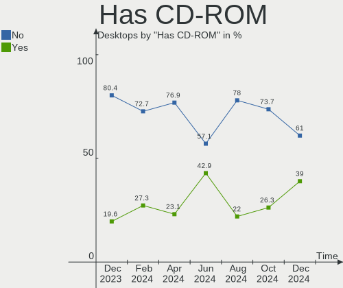

Manjaro Hardware Trends (Desktop)
---------------------------------

A project to identify most popular hardware characteristics and track their change
over time based on data collected by Manjaro users at https://Linux-Hardware.org.

Anyone can contribute to the study by uploading probes of their computers by
the [hw-probe](https://github.com/linuxhw/hw-probe) tool:

    sudo -E hw-probe -all -upload

Full-feature report is available here: https://linux-hardware.org/?view=trends&formfactor=desktop

Period: May, 2021.

Contents
--------

- [ OS                       ](#os)
- [ OS Family                ](#os-family)
- [ Kernel                   ](#kernel)
- [ Kernel Family            ](#kernel-family)
- [ Kernel Major Ver.        ](#kernel-major-ver)
- [ Arch                     ](#arch)
- [ DE                       ](#de)
- [ Display Server           ](#display-server)
- [ Display Manager          ](#display-manager)
- [ OS Lang                  ](#os-lang)
- [ Boot Mode                ](#boot-mode)
- [ Filesystem               ](#filesystem)
- [ Part. scheme             ](#part-scheme)
- [ Dual Boot with Linux/BSD ](#dual-boot-with-linux/bsd)
- [ Dual Boot (Win)          ](#dual-boot-win)
- [ Country                  ](#country)
- [ City                     ](#city)
- [ Vendor                   ](#vendor)
- [ Model                    ](#model)
- [ Model Family             ](#model-family)
- [ MFG Year                 ](#mfg-year)
- [ Form Factor              ](#form-factor)
- [ Secure Boot              ](#secure-boot)
- [ Coreboot                 ](#coreboot)
- [ RAM Size                 ](#ram-size)
- [ RAM Used                 ](#ram-used)
- [ Has CD-ROM               ](#has-cd-rom)
- [ Total Drives             ](#total-drives)
- [ Has Ethernet             ](#has-ethernet)
- [ Has WiFi                 ](#has-wifi)
- [ Has Bluetooth            ](#has-bluetooth)
- [ Drive Vendor             ](#drive-vendor)
- [ Drive Model              ](#drive-model)
- [ HDD Vendor               ](#hdd-vendor)
- [ SSD Vendor               ](#ssd-vendor)
- [ Drive Kind               ](#drive-kind)
- [ Drive Connector          ](#drive-connector)
- [ Drive Size               ](#drive-size)
- [ Space Total              ](#space-total)
- [ Space Used               ](#space-used)
- [ Malfunc. Drives          ](#malfunc-drives)
- [ Malfunc. Drive Vendor    ](#malfunc-drive-vendor)
- [ Malfunc. HDD Vendor      ](#malfunc-hdd-vendor)
- [ Malfunc. Drive Kind      ](#malfunc-drive-kind)
- [ Failed Drives            ](#failed-drives)
- [ Failed Drive Vendor      ](#failed-drive-vendor)
- [ Drive Status             ](#drive-status)
- [ Storage Vendor           ](#storage-vendor)
- [ Storage Model            ](#storage-model)
- [ Storage Kind             ](#storage-kind)
- [ CPU Vendor               ](#cpu-vendor)
- [ CPU Model                ](#cpu-model)
- [ CPU Model Family         ](#cpu-model-family)
- [ CPU Cores                ](#cpu-cores)
- [ CPU Sockets              ](#cpu-sockets)
- [ CPU Threads              ](#cpu-threads)
- [ CPU Op-Modes             ](#cpu-op-modes)
- [ CPU Microcode            ](#cpu-microcode)
- [ CPU Microarch            ](#cpu-microarch)
- [ GPU Vendor               ](#gpu-vendor)
- [ GPU Model                ](#gpu-model)
- [ GPU Combo                ](#gpu-combo)
- [ GPU Driver               ](#gpu-driver)
- [ GPU Memory               ](#gpu-memory)
- [ Monitor Vendor           ](#monitor-vendor)
- [ Monitor Model            ](#monitor-model)
- [ Monitor Resolution       ](#monitor-resolution)
- [ Monitor Diagonal         ](#monitor-diagonal)
- [ Monitor Width            ](#monitor-width)
- [ Aspect Ratio             ](#aspect-ratio)
- [ Monitor Area             ](#monitor-area)
- [ Pixel Density            ](#pixel-density)
- [ Multiple Monitors        ](#multiple-monitors)
- [ Net Controller Vendor    ](#net-controller-vendor)
- [ Net Controller Model     ](#net-controller-model)
- [ Wireless Vendor          ](#wireless-vendor)
- [ Wireless Model           ](#wireless-model)
- [ Ethernet Vendor          ](#ethernet-vendor)
- [ Ethernet Model           ](#ethernet-model)
- [ Net Controller Kind      ](#net-controller-kind)
- [ Used Controller          ](#used-controller)
- [ NICs                     ](#nics)
- [ IPv6                     ](#ipv6)
- [ Memory Vendor            ](#memory-vendor)
- [ Memory Model             ](#memory-model)
- [ Memory Kind              ](#memory-kind)
- [ Memory Form Factor       ](#memory-form-factor)
- [ Memory Size              ](#memory-size)
- [ Memory Speed             ](#memory-speed)
- [ Sound Vendor             ](#sound-vendor)
- [ Sound Model              ](#sound-model)
- [ Camera Vendor            ](#camera-vendor)
- [ Camera Model             ](#camera-model)
- [ Fingerprint Vendor       ](#fingerprint-vendor)
- [ Fingerprint Model        ](#fingerprint-model)
- [ Chipcard Vendor          ](#chipcard-vendor)
- [ Chipcard Model           ](#chipcard-model)
- [ Printer Vendor           ](#printer-vendor)
- [ Printer Model            ](#printer-model)
- [ Scanner Vendor           ](#scanner-vendor)
- [ Scanner Model            ](#scanner-model)
- [ Bluetooth Vendor         ](#bluetooth-vendor)
- [ Bluetooth Model          ](#bluetooth-model)
- [ Unsupported Devices      ](#unsupported-devices)
- [ Unsupported Device Types ](#unsupported-device-types)

OS
--

Installed operating systems

| Name           | Desktops | Percent |
|----------------|----------|---------|
| Manjaro        | 34       | 40.48%  |
| Manjaro 21.0.5 | 28       | 33.33%  |
| Manjaro 21.0.4 | 16       | 19.05%  |
| Manjaro 21.0.3 | 6        | 7.14%   |

OS Family
---------

OS without a version

| Name    | Desktops | Percent |
|---------|----------|---------|
| Manjaro | 84       | 100%    |

Kernel
------

Version of the Linux kernel

| Version                            | Desktops | Percent |
|------------------------------------|----------|---------|
| 5.10.36-2-MANJARO                  | 22       | 26.19%  |
| 5.10.34-1-MANJARO                  | 15       | 17.86%  |
| 5.10.32-1-MANJARO                  | 10       | 11.9%   |
| 5.12.2-1-MANJARO                   | 9        | 10.71%  |
| 5.11.18-1-MANJARO                  | 6        | 7.14%   |
| 5.12.1-2-MANJARO                   | 4        | 4.76%   |
| 5.9.16-1-MANJARO                   | 3        | 3.57%   |
| 5.11.19-1-MANJARO                  | 3        | 3.57%   |
| 5.11.16-2-MANJARO                  | 3        | 3.57%   |
| 5.9.1-1-rt19-MANJARO               | 1        | 1.19%   |
| 5.4.118-1-MANJARO                  | 1        | 1.19%   |
| 5.4.116-1-MANJARO                  | 1        | 1.19%   |
| 5.13.0-1-MANJARO                   | 1        | 1.19%   |
| 5.12.5-158-tkg-MuQSS               | 1        | 1.19%   |
| 5.12.0-1-MANJARO                   | 1        | 1.19%   |
| 5.11.21-1-MANJARO                  | 1        | 1.19%   |
| 5.11.16-arch1-1-covolunablu-gaming | 1        | 1.19%   |
| 5.10.37-2-MANJARO                  | 1        | 1.19%   |

Kernel Family
-------------

Linux kernel without a distro release

| Version | Desktops | Percent |
|---------|----------|---------|
| 5.10.36 | 22       | 26.19%  |
| 5.10.34 | 15       | 17.86%  |
| 5.10.32 | 10       | 11.9%   |
| 5.12.2  | 9        | 10.71%  |
| 5.11.18 | 6        | 7.14%   |
| 5.12.1  | 4        | 4.76%   |
| 5.11.16 | 4        | 4.76%   |
| 5.9.16  | 3        | 3.57%   |
| 5.11.19 | 3        | 3.57%   |
| 5.9.1   | 1        | 1.19%   |
| 5.4.118 | 1        | 1.19%   |
| 5.4.116 | 1        | 1.19%   |
| 5.13.0  | 1        | 1.19%   |
| 5.12.5  | 1        | 1.19%   |
| 5.12.0  | 1        | 1.19%   |
| 5.11.21 | 1        | 1.19%   |
| 5.10.37 | 1        | 1.19%   |

Kernel Major Ver.
-----------------

Linux kernel major version

| Version | Desktops | Percent |
|---------|----------|---------|
| 5.10    | 48       | 57.14%  |
| 5.12    | 15       | 17.86%  |
| 5.11    | 14       | 16.67%  |
| 5.9     | 4        | 4.76%   |
| 5.4     | 2        | 2.38%   |
| 5.13    | 1        | 1.19%   |

Arch
----

OS architecture (x86_64, i586, etc.)

| Name   | Desktops | Percent |
|--------|----------|---------|
| x86_64 | 84       | 100%    |

DE
--

Desktop Environment

| Name       | Desktops | Percent |
|------------|----------|---------|
| XFCE       | 23       | 27.38%  |
| KDE5       | 22       | 26.19%  |
| GNOME      | 22       | 26.19%  |
| KDE        | 8        | 9.52%   |
| X-Cinnamon | 4        | 4.76%   |
| Unknown    | 3        | 3.57%   |
| i3         | 1        | 1.19%   |
| Deepin     | 1        | 1.19%   |

Display Server
--------------

X11 or Wayland

| Name    | Desktops | Percent |
|---------|----------|---------|
| X11     | 74       | 88.1%   |
| Wayland | 7        | 8.33%   |
| Unknown | 3        | 3.57%   |

Display Manager
---------------

SDDM, LightDM, etc.

| Name    | Desktops | Percent |
|---------|----------|---------|
| Unknown | 34       | 40.48%  |
| SDDM    | 20       | 23.81%  |
| LightDM | 15       | 17.86%  |
| GDM     | 15       | 17.86%  |

OS Lang
-------

Language

| Lang    | Desktops | Percent |
|---------|----------|---------|
| en_US   | 35       | 41.67%  |
| pt_BR   | 8        | 9.52%   |
| de_DE   | 6        | 7.14%   |
| en_GB   | 5        | 5.95%   |
| ru_RU   | 3        | 3.57%   |
| fr_FR   | 3        | 3.57%   |
| en_IN   | 3        | 3.57%   |
| pl_PL   | 2        | 2.38%   |
| it_IT   | 2        | 2.38%   |
| en_IE   | 2        | 2.38%   |
| en_CA   | 2        | 2.38%   |
| Unknown | 2        | 2.38%   |
| uk_UA   | 1        | 1.19%   |
| sk_SK   | 1        | 1.19%   |
| ro_RO   | 1        | 1.19%   |
| nl_NL   | 1        | 1.19%   |
| fr_CA   | 1        | 1.19%   |
| es_PE   | 1        | 1.19%   |
| es_PA   | 1        | 1.19%   |
| es_MX   | 1        | 1.19%   |
| en_PH   | 1        | 1.19%   |
| en_IL   | 1        | 1.19%   |
| en_AU   | 1        | 1.19%   |

Boot Mode
---------

EFI or BIOS

| Mode | Desktops | Percent |
|------|----------|---------|
| BIOS | 42       | 50%     |
| EFI  | 42       | 50%     |

Filesystem
----------

Type of filesystem

| Type    | Desktops | Percent |
|---------|----------|---------|
| Ext4    | 74       | 88.1%   |
| Btrfs   | 5        | 5.95%   |
| Xfs     | 3        | 3.57%   |
| Tmpfs   | 1        | 1.19%   |
| Overlay | 1        | 1.19%   |

Part. scheme
------------

Scheme of partitioning

| Type    | Desktops | Percent |
|---------|----------|---------|
| GPT     | 45       | 53.57%  |
| Unknown | 31       | 36.9%   |
| MBR     | 8        | 9.52%   |

Dual Boot with Linux/BSD
------------------------

Hosting more than one Linux/BSD

| Dual boot | Desktops | Percent |
|-----------|----------|---------|
| No        | 68       | 80.95%  |
| Yes       | 16       | 19.05%  |

Dual Boot (Win)
---------------

Hosting Linux and Windows

| Dual boot | Desktops | Percent |
|-----------|----------|---------|
| No        | 50       | 59.52%  |
| Yes       | 34       | 40.48%  |

Country
-------

Geographic location (country)

| Country                | Desktops | Percent |
|------------------------|----------|---------|
| USA                    | 13       | 15.48%  |
| Germany                | 11       | 13.1%   |
| Brazil                 | 9        | 10.71%  |
| Canada                 | 7        | 8.33%   |
| Russia                 | 4        | 4.76%   |
| France                 | 4        | 4.76%   |
| UK                     | 3        | 3.57%   |
| Ireland                | 3        | 3.57%   |
| India                  | 3        | 3.57%   |
| Switzerland            | 2        | 2.38%   |
| Sweden                 | 2        | 2.38%   |
| Mexico                 | 2        | 2.38%   |
| Italy                  | 2        | 2.38%   |
| Israel                 | 2        | 2.38%   |
| Ukraine                | 1        | 1.19%   |
| Turkey                 | 1        | 1.19%   |
| Slovakia               | 1        | 1.19%   |
| Romania                | 1        | 1.19%   |
| Poland                 | 1        | 1.19%   |
| Philippines            | 1        | 1.19%   |
| Peru                   | 1        | 1.19%   |
| Panama                 | 1        | 1.19%   |
| North Macedonia        | 1        | 1.19%   |
| China                  | 1        | 1.19%   |
| Cambodia               | 1        | 1.19%   |
| Bosnia and Herzegovina | 1        | 1.19%   |
| Belgium                | 1        | 1.19%   |
| Belarus                | 1        | 1.19%   |
| Bangladesh             | 1        | 1.19%   |
| Austria                | 1        | 1.19%   |
| Australia              | 1        | 1.19%   |

City
----

Geographic location (city)

| City             | Desktops | Percent |
|------------------|----------|---------|
| Toronto          | 3        | 3.57%   |
| Portland         | 2        | 2.38%   |
| Dublin           | 2        | 2.38%   |
| Zurich           | 1        | 1.19%   |
| York             | 1        | 1.19%   |
| Wroclaw          | 1        | 1.19%   |
| Worcester        | 1        | 1.19%   |
| Vitebsk          | 1        | 1.19%   |
| Vijayawada       | 1        | 1.19%   |
| Vienna           | 1        | 1.19%   |
| Vaudreuil-Dorion | 1        | 1.19%   |
| Tübingen        | 1        | 1.19%   |
| Turin            | 1        | 1.19%   |
| Tuguegarao City  | 1        | 1.19%   |
| Tucson           | 1        | 1.19%   |
| Tettnang Castle  | 1        | 1.19%   |
| Tatuí           | 1        | 1.19%   |
| Skutari          | 1        | 1.19%   |
| Skopje           | 1        | 1.19%   |
| Shenzhen         | 1        | 1.19%   |
| Senec            | 1        | 1.19%   |
| Schmoelln        | 1        | 1.19%   |
| Santos           | 1        | 1.19%   |
| Santa Isabel     | 1        | 1.19%   |
| Rondonópolis    | 1        | 1.19%   |
| Roesrath         | 1        | 1.19%   |
| Rockville        | 1        | 1.19%   |
| Revel            | 1        | 1.19%   |
| Prackenbach      | 1        | 1.19%   |
| Podolsk          | 1        | 1.19%   |
| Piura            | 1        | 1.19%   |
| Pittsburgh       | 1        | 1.19%   |
| Phnom Penh       | 1        | 1.19%   |
| Panama City      | 1        | 1.19%   |
| Palmyra          | 1        | 1.19%   |
| Palhoca          | 1        | 1.19%   |
| Odessa           | 1        | 1.19%   |
| Nova Iguaçu     | 1        | 1.19%   |
| Norwich          | 1        | 1.19%   |
| Nahariya         | 1        | 1.19%   |
| Murmansk         | 1        | 1.19%   |
| Munich           | 1        | 1.19%   |
| Moscow           | 1        | 1.19%   |
| Montreal         | 1        | 1.19%   |
| Mogi das Cruzes  | 1        | 1.19%   |
| Mexico City      | 1        | 1.19%   |
| Mainz            | 1        | 1.19%   |
| London           | 1        | 1.19%   |
| Lisieux          | 1        | 1.19%   |
| Knoxville        | 1        | 1.19%   |
| Kamen            | 1        | 1.19%   |
| Jerusalem        | 1        | 1.19%   |
| Hordt            | 1        | 1.19%   |
| Hamburg          | 1        | 1.19%   |
| Gütersloh       | 1        | 1.19%   |
| Guarulhos        | 1        | 1.19%   |
| Guadalajara      | 1        | 1.19%   |
| Grimaud          | 1        | 1.19%   |
| Gothenburg       | 1        | 1.19%   |
| Gorcy            | 1        | 1.19%   |

Vendor
------

Motherboard manufacturer

| Name                | Desktops | Percent |
|---------------------|----------|---------|
| ASUSTek Computer    | 23       | 27.38%  |
| Gigabyte Technology | 14       | 16.67%  |
| MSI                 | 12       | 14.29%  |
| ASRock              | 11       | 13.1%   |
| Dell                | 10       | 11.9%   |
| Hewlett-Packard     | 7        | 8.33%   |
| Intel               | 2        | 2.38%   |
| XFX                 | 1        | 1.19%   |
| Lenovo              | 1        | 1.19%   |
| Colorful Technology | 1        | 1.19%   |
| Biostar             | 1        | 1.19%   |
| Unknown             | 1        | 1.19%   |

Model
-----

Motherboard model

| Name                                 | Desktops | Percent |
|--------------------------------------|----------|---------|
| Gigabyte B450M DS3H                  | 3        | 3.57%   |
| MSI MS-7C37                          | 2        | 2.38%   |
| Dell XPS 8700                        | 2        | 2.38%   |
| Dell OptiPlex 3020                   | 2        | 2.38%   |
| ASUS ROG CROSSHAIR VIII HERO         | 2        | 2.38%   |
| ASUS M5A99FX PRO R2.0                | 2        | 2.38%   |
| XFX MI-A78S-8209 Ver1.1              | 1        | 1.19%   |
| MSI MS-7C95                          | 1        | 1.19%   |
| MSI MS-7C02                          | 1        | 1.19%   |
| MSI MS-7B98                          | 1        | 1.19%   |
| MSI MS-7B93                          | 1        | 1.19%   |
| MSI MS-7B89                          | 1        | 1.19%   |
| MSI MS-7B84                          | 1        | 1.19%   |
| MSI MS-7B79                          | 1        | 1.19%   |
| MSI MS-7A40                          | 1        | 1.19%   |
| MSI MS-7891                          | 1        | 1.19%   |
| MSI MS-7721                          | 1        | 1.19%   |
| Lenovo ThinkCentre M72z 3548C8U      | 1        | 1.19%   |
| Intel DZ77SL-50K AAG55115-300        | 1        | 1.19%   |
| Intel DG41RQ AAE54511-203            | 1        | 1.19%   |
| HP Z420 Workstation                  | 1        | 1.19%   |
| HP Pavilion Gaming Desktop TG01-1xxx | 1        | 1.19%   |
| HP OMEN 30L Desktop GT13-0xxx        | 1        | 1.19%   |
| HP EliteDesk 800 G2 SFF              | 1        | 1.19%   |
| HP Compaq Elite 8300 SFF             | 1        | 1.19%   |
| HP Compaq 6000 Pro SFF PC            | 1        | 1.19%   |
| HP 570-p017c                         | 1        | 1.19%   |
| Gigabyte Z68A-D3-B3                  | 1        | 1.19%   |
| Gigabyte Z390 AORUS PRO WIFI         | 1        | 1.19%   |
| Gigabyte TRX40 AORUS MASTER          | 1        | 1.19%   |
| Gigabyte P55A-UD4                    | 1        | 1.19%   |
| Gigabyte G1.Sniper A88X-CF           | 1        | 1.19%   |
| Gigabyte B450M S2H                   | 1        | 1.19%   |
| Gigabyte B450M DS3H V2               | 1        | 1.19%   |
| Gigabyte B450 AORUS M                | 1        | 1.19%   |
| Gigabyte AX370-Gaming K3             | 1        | 1.19%   |
| Gigabyte AB350M-DS3H                 | 1        | 1.19%   |
| Gigabyte 970-GAMING                  | 1        | 1.19%   |
| Dell Vostro 320                      | 1        | 1.19%   |
| Dell Precision WorkStation T3500     | 1        | 1.19%   |
| Dell Precision Tower 3420            | 1        | 1.19%   |
| Dell Precision 5820 Tower            | 1        | 1.19%   |
| Dell OptiPlex 780                    | 1        | 1.19%   |
| Dell OptiPlex 3060                   | 1        | 1.19%   |
| Colorful BATTLE-AX B450M-HD V14      | 1        | 1.19%   |
| Biostar G31D-M7                      | 1        | 1.19%   |
| ASUS Z170M-PLUS                      | 1        | 1.19%   |
| ASUS TUF GAMING B550-PLUS            | 1        | 1.19%   |
| ASUS TUF B450M-PRO GAMING            | 1        | 1.19%   |
| ASUS ROG STRIX Z390-E GAMING         | 1        | 1.19%   |
| ASUS ROG STRIX B550-E GAMING         | 1        | 1.19%   |
| ASUS Rampage III Extreme             | 1        | 1.19%   |
| ASUS PRIME Z370-A II                 | 1        | 1.19%   |
| ASUS PRIME X570-P                    | 1        | 1.19%   |
| ASUS PRIME B450-PLUS                 | 1        | 1.19%   |
| ASUS PRIME A320M-K/BR                | 1        | 1.19%   |
| ASUS PCA145-159498                   | 1        | 1.19%   |
| ASUS P8P67 WS REVOLUTION             | 1        | 1.19%   |
| ASUS P8H61-M LX R2.0                 | 1        | 1.19%   |
| ASUS P8H61-M LE                      | 1        | 1.19%   |

Model Family
------------

Motherboard model prefix

| Name                  | Desktops | Percent |
|-----------------------|----------|---------|
| Gigabyte B450M        | 5        | 5.95%   |
| Dell OptiPlex         | 4        | 4.76%   |
| ASUS ROG              | 4        | 4.76%   |
| ASUS PRIME            | 4        | 4.76%   |
| Dell Precision        | 3        | 3.57%   |
| ASRock B450M          | 3        | 3.57%   |
| MSI MS-7C37           | 2        | 2.38%   |
| HP Compaq             | 2        | 2.38%   |
| Dell XPS              | 2        | 2.38%   |
| ASUS TUF              | 2        | 2.38%   |
| ASUS P8H61-M          | 2        | 2.38%   |
| ASUS M5A99FX          | 2        | 2.38%   |
| XFX MI-A78S-8209      | 1        | 1.19%   |
| MSI MS-7C95           | 1        | 1.19%   |
| MSI MS-7C02           | 1        | 1.19%   |
| MSI MS-7B98           | 1        | 1.19%   |
| MSI MS-7B93           | 1        | 1.19%   |
| MSI MS-7B89           | 1        | 1.19%   |
| MSI MS-7B84           | 1        | 1.19%   |
| MSI MS-7B79           | 1        | 1.19%   |
| MSI MS-7A40           | 1        | 1.19%   |
| MSI MS-7891           | 1        | 1.19%   |
| MSI MS-7721           | 1        | 1.19%   |
| Lenovo ThinkCentre    | 1        | 1.19%   |
| Intel DZ77SL-50K      | 1        | 1.19%   |
| Intel DG41RQ          | 1        | 1.19%   |
| HP Z420               | 1        | 1.19%   |
| HP Pavilion           | 1        | 1.19%   |
| HP OMEN               | 1        | 1.19%   |
| HP EliteDesk          | 1        | 1.19%   |
| HP 570-p017c          | 1        | 1.19%   |
| Gigabyte Z68A-D3-B3   | 1        | 1.19%   |
| Gigabyte Z390         | 1        | 1.19%   |
| Gigabyte TRX40        | 1        | 1.19%   |
| Gigabyte P55A-UD4     | 1        | 1.19%   |
| Gigabyte G1.Sniper    | 1        | 1.19%   |
| Gigabyte B450         | 1        | 1.19%   |
| Gigabyte AX370-Gaming | 1        | 1.19%   |
| Gigabyte AB350M-DS3H  | 1        | 1.19%   |
| Gigabyte 970-GAMING   | 1        | 1.19%   |
| Dell Vostro           | 1        | 1.19%   |
| Colorful BATTLE-AX    | 1        | 1.19%   |
| Biostar G31D-M7       | 1        | 1.19%   |
| ASUS Z170M-PLUS       | 1        | 1.19%   |
| ASUS Rampage          | 1        | 1.19%   |
| ASUS PCA145-159498    | 1        | 1.19%   |
| ASUS P8P67            | 1        | 1.19%   |
| ASUS P5G41T-M         | 1        | 1.19%   |
| ASUS M5A99X           | 1        | 1.19%   |
| ASUS H110M-R          | 1        | 1.19%   |
| ASUS H110M-A          | 1        | 1.19%   |
| ASUS All              | 1        | 1.19%   |
| ASRock Z490M          | 1        | 1.19%   |
| ASRock X570           | 1        | 1.19%   |
| ASRock N68-VS3        | 1        | 1.19%   |
| ASRock H61M-ITX       | 1        | 1.19%   |
| ASRock FM2A68M-DG3+   | 1        | 1.19%   |
| ASRock B450           | 1        | 1.19%   |
| ASRock A520M-ITX      | 1        | 1.19%   |
| ASRock A300M-STX      | 1        | 1.19%   |

MFG Year
--------

Motherboard manufacture year

| Year | Desktops | Percent |
|------|----------|---------|
| 2020 | 25       | 29.76%  |
| 2019 | 16       | 19.05%  |
| 2021 | 7        | 8.33%   |
| 2018 | 7        | 8.33%   |
| 2012 | 7        | 8.33%   |
| 2013 | 5        | 5.95%   |
| 2015 | 3        | 3.57%   |
| 2014 | 3        | 3.57%   |
| 2010 | 3        | 3.57%   |
| 2009 | 3        | 3.57%   |
| 2017 | 2        | 2.38%   |
| 2016 | 2        | 2.38%   |
| 2011 | 1        | 1.19%   |

Form Factor
-----------

Physical design of the computer

| Name    | Desktops | Percent |
|---------|----------|---------|
| Desktop | 84       | 100%    |

Secure Boot
-----------

Enabled or disabled

| State    | Desktops | Percent |
|----------|----------|---------|
| Disabled | 84       | 100%    |

Coreboot
--------

Have coreboot on board

| Used | Desktops | Percent |
|------|----------|---------|
| No   | 84       | 100%    |

RAM Size
--------

Total RAM memory

| Size in GB  | Desktops | Percent |
|-------------|----------|---------|
| 16.01-24.0  | 30       | 35.71%  |
| 8.01-16.0   | 19       | 22.62%  |
| 32.01-64.0  | 17       | 20.24%  |
| 4.01-8.0    | 9        | 10.71%  |
| 3.01-4.0    | 5        | 5.95%   |
| 1.01-2.0    | 2        | 2.38%   |
| 24.01-32.0  | 1        | 1.19%   |
| 64.01-256.0 | 1        | 1.19%   |

RAM Used
--------

Used RAM memory

| Used GB     | Desktops | Percent |
|-------------|----------|---------|
| 4.01-8.0    | 24       | 28.57%  |
| 1.01-2.0    | 20       | 23.81%  |
| 2.01-3.0    | 18       | 21.43%  |
| 3.01-4.0    | 10       | 11.9%   |
| 8.01-16.0   | 7        | 8.33%   |
| 24.01-32.0  | 1        | 1.19%   |
| 64.01-256.0 | 1        | 1.19%   |
| 16.01-24.0  | 1        | 1.19%   |
| 0.51-1.0    | 1        | 1.19%   |
| 0.01-0.5    | 1        | 1.19%   |

Has CD-ROM
----------

Has CD-ROM on board

| Presented | Desktops | Percent |
|-----------|----------|---------|
| No        | 54       | 64.29%  |
| Yes       | 30       | 35.71%  |

Total Drives
------------

Number of drives on board

| Drives | Desktops | Percent |
|--------|----------|---------|
| 1      | 23       | 27.38%  |
| 2      | 21       | 25%     |
| 3      | 18       | 21.43%  |
| 4      | 13       | 15.48%  |
| 5      | 6        | 7.14%   |
| 11     | 1        | 1.19%   |
| 7      | 1        | 1.19%   |
| 6      | 1        | 1.19%   |

Has Ethernet
------------

Has Ethernet on board

| Presented | Desktops | Percent |
|-----------|----------|---------|
| Yes       | 84       | 100%    |

Has WiFi
--------

Has WiFi module

| Presented | Desktops | Percent |
|-----------|----------|---------|
| No        | 44       | 52.38%  |
| Yes       | 40       | 47.62%  |

Has Bluetooth
-------------

Has Bluetooth module

| Presented | Desktops | Percent |
|-----------|----------|---------|
| No        | 46       | 54.76%  |
| Yes       | 38       | 45.24%  |

Drive Vendor
------------

Hard drive vendors

| Vendor                    | Desktops | Drives | Percent |
|---------------------------|----------|--------|---------|
| WDC                       | 37       | 53     | 21.14%  |
| Seagate                   | 34       | 48     | 19.43%  |
| Samsung Electronics       | 22       | 28     | 12.57%  |
| Toshiba                   | 12       | 12     | 6.86%   |
| Sandisk                   | 12       | 15     | 6.86%   |
| Kingston                  | 9        | 10     | 5.14%   |
| Crucial                   | 8        | 9      | 4.57%   |
| Hitachi                   | 3        | 4      | 1.71%   |
| Corsair                   | 3        | 3      | 1.71%   |
| China                     | 3        | 3      | 1.71%   |
| Unknown                   | 2        | 3      | 1.14%   |
| Team                      | 2        | 3      | 1.14%   |
| PNY                       | 2        | 4      | 1.14%   |
| Phison                    | 2        | 3      | 1.14%   |
| OCZ                       | 2        | 2      | 1.14%   |
| Micron Technology         | 2        | 2      | 1.14%   |
| Intenso                   | 2        | 2      | 1.14%   |
| Intel                     | 2        | 2      | 1.14%   |
| HGST                      | 2        | 4      | 1.14%   |
| A-DATA Technology         | 2        | 2      | 1.14%   |
| XPG                       | 1        | 1      | 0.57%   |
| USB3.1                    | 1        | 1      | 0.57%   |
| Transcend                 | 1        | 1      | 0.57%   |
| TCSUNBOW                  | 1        | 1      | 0.57%   |
| SMART                     | 1        | 1      | 0.57%   |
| Silicon Motion            | 1        | 1      | 0.57%   |
| Realtek Semiconductor     | 1        | 1      | 0.57%   |
| Micron/Crucial Technology | 1        | 1      | 0.57%   |
| Lexar                     | 1        | 1      | 0.57%   |
| Lenovo                    | 1        | 1      | 0.57%   |
| KingDian                  | 1        | 1      | 0.57%   |
| Hoodisk                   | 1        | 1      | 0.57%   |

Drive Model
-----------

Hard drive models

| Model                               | Desktops | Percent |
|-------------------------------------|----------|---------|
| Seagate ST2000DM008-2FR102 2TB      | 5        | 2.34%   |
| WDC WD10EZEX-08WN4A0 1TB            | 3        | 1.4%    |
| WDC WD10EZEX-00BN5A0 1TB            | 3        | 1.4%    |
| Toshiba HDWD110 1TB                 | 3        | 1.4%    |
| Toshiba DT01ACA100 1TB              | 3        | 1.4%    |
| Seagate ST31000524AS 1TB            | 3        | 1.4%    |
| Seagate ST1000LM024 HN-M101MBB 1TB  | 3        | 1.4%    |
| SanDisk SSD PLUS 240GB              | 3        | 1.4%    |
| Sandisk NVMe SSD Drive 500GB        | 3        | 1.4%    |
| Samsung SSD 970 EVO 1TB             | 3        | 1.4%    |
| WDC WDS100T2B0B-00YS70 1TB SSD      | 2        | 0.93%   |
| WDC WD20EARS-00S8B1 2TB             | 2        | 0.93%   |
| WDC WD10EZEX-22MFCA0 1TB            | 2        | 0.93%   |
| Toshiba DT01ACA050 500GB            | 2        | 0.93%   |
| Seagate ST500LM012 HN-M500MBB 500GB | 2        | 0.93%   |
| Seagate ST500DM002-1BD142 500GB     | 2        | 0.93%   |
| Seagate ST4000DM004-2CV104 4TB      | 2        | 0.93%   |
| Seagate ST2000DM001-1CH164 2TB      | 2        | 0.93%   |
| Seagate ST1000DM010-2EP102 1TB      | 2        | 0.93%   |
| Seagate Expansion Desk 8TB          | 2        | 0.93%   |
| Samsung SSD 970 EVO Plus 500GB      | 2        | 0.93%   |
| Samsung SSD 850 EVO 250GB           | 2        | 0.93%   |
| Kingston SA400S37120G 120GB SSD     | 2        | 0.93%   |
| Kingston NVMe SSD Drive 250GB       | 2        | 0.93%   |
| Intenso External USB 3.0 8TB        | 2        | 0.93%   |
| Crucial CT500P2SSD8 500GB           | 2        | 0.93%   |
| Crucial CT480BX500SSD1 480GB        | 2        | 0.93%   |
| Crucial CT1000P1SSD8 1TB            | 2        | 0.93%   |
| China SATA SSD 240GB                | 2        | 0.93%   |
| XPG GAMMIX S5 512GB                 | 1        | 0.47%   |
| WDC WDS500G2B0A-00SM50 500GB SSD    | 1        | 0.47%   |
| WDC WDS500G1B0A-00H9H0 500GB SSD    | 1        | 0.47%   |
| WDC WDS240G2G0B-00EPW0 240GB SSD    | 1        | 0.47%   |
| WDC WDS200T2B0C-00PXH0 2TB          | 1        | 0.47%   |
| WDC WDS120G2G0A-00JH30 120GB SSD    | 1        | 0.47%   |
| WDC WDS100T3X0C-00SJG0 1TB          | 1        | 0.47%   |
| WDC WDS100T2B0A-00SM50 1TB SSD      | 1        | 0.47%   |
| WDC WD800JD-22LSA0 80GB             | 1        | 0.47%   |
| WDC WD7502ABYS-18A6B0 752GB         | 1        | 0.47%   |
| WDC WD6400AAKS-65A7B2 640GB         | 1        | 0.47%   |
| WDC WD60EZAZ-00ZGHB0 6TB            | 1        | 0.47%   |
| WDC WD60EFRX-68L0BN1 6TB            | 1        | 0.47%   |
| WDC WD50EZRX-00MVLB1 5TB            | 1        | 0.47%   |
| WDC WD5000HHTZ-04N21V0 500GB        | 1        | 0.47%   |
| WDC WD5000AAKX-08U6AA0 500GB        | 1        | 0.47%   |
| WDC WD5000AADS-00M2B0 500GB         | 1        | 0.47%   |
| WDC WD40EZRZ-22GXCB0 4TB            | 1        | 0.47%   |
| WDC WD3200AAJS-56M0A0 320GB         | 1        | 0.47%   |
| WDC WD2500AAKX-001CA0 250GB         | 1        | 0.47%   |
| WDC WD20EZRZ-00Z5HB0 2TB            | 1        | 0.47%   |
| WDC WD20EZRX-00DC0B0 2TB            | 1        | 0.47%   |
| WDC WD20EURS-63S48Y0 2TB            | 1        | 0.47%   |
| WDC WD20EFRX-68EUZN0 2TB            | 1        | 0.47%   |
| WDC WD20EARX-00PASB0 2TB            | 1        | 0.47%   |
| WDC WD2000FYYZ-01UL1B0 2TB          | 1        | 0.47%   |
| WDC WD1600AAJS-00WAA0 160GB         | 1        | 0.47%   |
| WDC WD141KRYZ-01C66B0 14TB          | 1        | 0.47%   |
| WDC WD1200JD-00HBB0 120GB           | 1        | 0.47%   |
| WDC WD1200BB-22RDA0 120GB           | 1        | 0.47%   |
| WDC WD10SPZX-60Z10T0 1TB            | 1        | 0.47%   |

HDD Vendor
----------

Hard disk drive vendors

| Vendor              | Desktops | Drives | Percent |
|---------------------|----------|--------|---------|
| WDC                 | 33       | 44     | 37.93%  |
| Seagate             | 33       | 47     | 37.93%  |
| Toshiba             | 10       | 10     | 11.49%  |
| Samsung Electronics | 4        | 5      | 4.6%    |
| Hitachi             | 3        | 4      | 3.45%   |
| Intenso             | 2        | 2      | 2.3%    |
| HGST                | 2        | 4      | 2.3%    |

SSD Vendor
----------

Solid state drive vendors

| Vendor              | Desktops | Drives | Percent |
|---------------------|----------|--------|---------|
| Samsung Electronics | 9        | 9      | 17.31%  |
| WDC                 | 7        | 7      | 13.46%  |
| SanDisk             | 6        | 8      | 11.54%  |
| Kingston            | 5        | 5      | 9.62%   |
| Crucial             | 5        | 5      | 9.62%   |
| China               | 3        | 3      | 5.77%   |
| Toshiba             | 2        | 2      | 3.85%   |
| PNY                 | 2        | 4      | 3.85%   |
| OCZ                 | 2        | 2      | 3.85%   |
| Transcend           | 1        | 1      | 1.92%   |
| Team                | 1        | 2      | 1.92%   |
| TCSUNBOW            | 1        | 1      | 1.92%   |
| SMART               | 1        | 1      | 1.92%   |
| Micron Technology   | 1        | 1      | 1.92%   |
| Lexar               | 1        | 1      | 1.92%   |
| KingDian            | 1        | 1      | 1.92%   |
| Intel               | 1        | 1      | 1.92%   |
| Hoodisk             | 1        | 1      | 1.92%   |
| Corsair             | 1        | 1      | 1.92%   |
| A-DATA Technology   | 1        | 1      | 1.92%   |

Drive Kind
----------

HDD or SSD

| Kind    | Desktops | Drives | Percent |
|---------|----------|--------|---------|
| HDD     | 65       | 116    | 44.83%  |
| SSD     | 42       | 57     | 28.97%  |
| NVMe    | 35       | 47     | 24.14%  |
| Unknown | 3        | 4      | 2.07%   |

Drive Connector
---------------

SATA, SAS, NVMe, etc.

| Type | Desktops | Drives | Percent |
|------|----------|--------|---------|
| SATA | 73       | 168    | 62.93%  |
| NVMe | 35       | 47     | 30.17%  |
| SAS  | 8        | 9      | 6.9%    |

Drive Size
----------

Size of hard drive

| Size in TB | Desktops | Drives | Percent |
|------------|----------|--------|---------|
| 0.01-0.5   | 51       | 77     | 40.48%  |
| 0.51-1.0   | 43       | 55     | 34.13%  |
| 1.01-2.0   | 18       | 21     | 14.29%  |
| 4.01-10.0  | 7        | 7      | 5.56%   |
| 3.01-4.0   | 4        | 6      | 3.17%   |
| 2.01-3.0   | 2        | 4      | 1.59%   |
| 10.01-20.0 | 1        | 3      | 0.79%   |

Space Total
-----------

Amount of disk space available on the file system

| Size in GB     | Desktops | Percent |
|----------------|----------|---------|
| 101-250        | 16       | 19.05%  |
| More than 3000 | 15       | 17.86%  |
| 501-1000       | 15       | 17.86%  |
| 1001-2000      | 13       | 15.48%  |
| 251-500        | 12       | 14.29%  |
| 2001-3000      | 5        | 5.95%   |
| 51-100         | 4        | 4.76%   |
| Unknown        | 3        | 3.57%   |
| 1-20           | 1        | 1.19%   |

Space Used
----------

Amount of used disk space

| Used GB        | Desktops | Percent |
|----------------|----------|---------|
| 21-50          | 13       | 15.48%  |
| 101-250        | 13       | 15.48%  |
| 1-20           | 13       | 15.48%  |
| 501-1000       | 11       | 13.1%   |
| 1001-2000      | 10       | 11.9%   |
| More than 3000 | 6        | 7.14%   |
| 251-500        | 6        | 7.14%   |
| 51-100         | 5        | 5.95%   |
| 2001-3000      | 4        | 4.76%   |
| Unknown        | 3        | 3.57%   |

Malfunc. Drives
---------------

Drive models with a malfunction

| Model                              | Desktops | Drives | Percent |
|------------------------------------|----------|--------|---------|
| WDC WD20EARS-00S8B1 2TB            | 1        | 1      | 12.5%   |
| WDC WD10EFRX-68FYTN0 1TB           | 1        | 1      | 12.5%   |
| WDC WD1002FAEX-00Z3A0 1TB          | 1        | 1      | 12.5%   |
| Seagate ST3500630NS 500GB          | 1        | 1      | 12.5%   |
| Seagate ST3250310AS 250GB          | 1        | 1      | 12.5%   |
| Seagate ST31500541AS 1TB           | 1        | 1      | 12.5%   |
| Seagate ST1000LM024 HN-M101MBB 1TB | 1        | 1      | 12.5%   |
| Samsung Electronics HD103SJ 1TB    | 1        | 1      | 12.5%   |

Malfunc. Drive Vendor
---------------------

Vendors of faulty drives

| Vendor              | Desktops | Drives | Percent |
|---------------------|----------|--------|---------|
| Seagate             | 4        | 4      | 50%     |
| WDC                 | 3        | 3      | 37.5%   |
| Samsung Electronics | 1        | 1      | 12.5%   |

Malfunc. HDD Vendor
-------------------

Vendors of faulty HDD drives

| Vendor              | Desktops | Drives | Percent |
|---------------------|----------|--------|---------|
| Seagate             | 4        | 4      | 50%     |
| WDC                 | 3        | 3      | 37.5%   |
| Samsung Electronics | 1        | 1      | 12.5%   |

Malfunc. Drive Kind
-------------------

Kinds of faulty drives

| Kind | Desktops | Drives | Percent |
|------|----------|--------|---------|
| HDD  | 8        | 8      | 100%    |

Failed Drives
-------------

Failed drive models

Zero info for selected period =(

Failed Drive Vendor
-------------------

Failed drive vendors

Zero info for selected period =(

Drive Status
------------

Number of failed and malfunc. drives

| Status   | Desktops | Drives | Percent |
|----------|----------|--------|---------|
| Detected | 49       | 119    | 50.52%  |
| Works    | 40       | 97     | 41.24%  |
| Malfunc  | 8        | 8      | 8.25%   |

Storage Vendor
--------------

Storage controller vendors

| Vendor                        | Desktops | Percent |
|-------------------------------|----------|---------|
| AMD                           | 45       | 32.61%  |
| Intel                         | 38       | 27.54%  |
| Samsung Electronics           | 13       | 9.42%   |
| Sandisk                       | 8        | 5.8%    |
| ASMedia Technology            | 6        | 4.35%   |
| Phison Electronics            | 5        | 3.62%   |
| Micron/Crucial Technology     | 5        | 3.62%   |
| Kingston Technology Company   | 4        | 2.9%    |
| Realtek Semiconductor         | 2        | 1.45%   |
| Nvidia                        | 2        | 1.45%   |
| Marvell Technology Group      | 2        | 1.45%   |
| JMicron Technology            | 2        | 1.45%   |
| Silicon Motion                | 1        | 0.72%   |
| Seagate Technology            | 1        | 0.72%   |
| Micron Technology             | 1        | 0.72%   |
| Lenovo                        | 1        | 0.72%   |
| Integrated Technology Express | 1        | 0.72%   |
| ADATA Technology              | 1        | 0.72%   |

Storage Model
-------------

Storage controller models

| Model                                                                          | Desktops | Percent |
|--------------------------------------------------------------------------------|----------|---------|
| AMD FCH SATA Controller [AHCI mode]                                            | 35       | 20.71%  |
| AMD 400 Series Chipset SATA Controller                                         | 20       | 11.83%  |
| Samsung NVMe SSD Controller SM981/PM981/PM983                                  | 10       | 5.92%   |
| ASMedia ASM1062 Serial ATA Controller                                          | 6        | 3.55%   |
| Intel 8 Series/C220 Series Chipset Family 6-port SATA Controller 1 [AHCI mode] | 5        | 2.96%   |
| Intel 6 Series/C200 Series Chipset Family 6 port Desktop SATA AHCI Controller  | 5        | 2.96%   |
| AMD Starship/Matisse Chipset SATA Controller [AHCI mode]                       | 5        | 2.96%   |
| Intel Q170/Q150/B150/H170/H110/Z170/CM236 Chipset SATA Controller [AHCI Mode]  | 4        | 2.37%   |
| Intel NM10/ICH7 Family SATA Controller [IDE mode]                              | 4        | 2.37%   |
| Sandisk WD Black SN750 / PC SN730 NVMe SSD                                     | 3        | 1.78%   |
| Micron/Crucial P1 NVMe PCIe SSD                                                | 3        | 1.78%   |
| Kingston Company A2000 NVMe SSD                                                | 3        | 1.78%   |
| Intel SATA Controller [RAID mode]                                              | 3        | 1.78%   |
| Intel Cannon Lake PCH SATA AHCI Controller                                     | 3        | 1.78%   |
| Intel 82801G (ICH7 Family) IDE Controller                                      | 3        | 1.78%   |
| AMD SB7x0/SB8x0/SB9x0 SATA Controller [AHCI mode]                              | 3        | 1.78%   |
| Sandisk WD Blue SN550 NVMe SSD                                                 | 2        | 1.18%   |
| Realtek Realtek Non-Volatile memory controller                                 | 2        | 1.18%   |
| Phison E16 PCIe4 NVMe Controller                                               | 2        | 1.18%   |
| Phison E12 NVMe Controller                                                     | 2        | 1.18%   |
| Micron/Crucial P2 NVMe PCIe SSD                                                | 2        | 1.18%   |
| Intel C600/X79 series chipset SATA RAID Controller                             | 2        | 1.18%   |
| Intel 82801JI (ICH10 Family) SATA AHCI Controller                              | 2        | 1.18%   |
| Intel 82801JD/DO (ICH10 Family) SATA AHCI Controller                           | 2        | 1.18%   |
| Intel 7 Series/C210 Series Chipset Family 6-port SATA Controller [AHCI mode]   | 2        | 1.18%   |
| Intel 200 Series PCH SATA controller [AHCI mode]                               | 2        | 1.18%   |
| AMD X370 Series Chipset SATA Controller                                        | 2        | 1.18%   |
| Silicon Motion SM2263EN/SM2263XT SSD Controller                                | 1        | 0.59%   |
| Seagate FireCuda 520 SSD                                                       | 1        | 0.59%   |
| Sandisk WD Blue SN500 / PC SN520 NVMe SSD                                      | 1        | 0.59%   |
| Sandisk WD Black SN850                                                         | 1        | 0.59%   |
| Sandisk WD Black 2018/SN750 / PC SN720 NVMe SSD                                | 1        | 0.59%   |
| Samsung NVMe SSD Controller SM961/PM961/SM963                                  | 1        | 0.59%   |
| Samsung NVMe SSD Controller SM951/PM951                                        | 1        | 0.59%   |
| Samsung NVMe Controller                                                        | 1        | 0.59%   |
| Phison PS5013 E13 NVMe Controller                                              | 1        | 0.59%   |
| Phison Electronics Non-Volatile memory controller                              | 1        | 0.59%   |
| Nvidia MCP78S [GeForce 8200] SATA Controller (non-AHCI mode)                   | 1        | 0.59%   |
| Nvidia MCP78S [GeForce 8200] IDE                                               | 1        | 0.59%   |
| Nvidia MCP61 SATA Controller                                                   | 1        | 0.59%   |
| Nvidia MCP61 IDE                                                               | 1        | 0.59%   |
| Micron Non-Volatile memory controller                                          | 1        | 0.59%   |
| Marvell Group 88SE9128 PCIe SATA 6 Gb/s RAID controller with HyperDuo          | 1        | 0.59%   |
| Marvell Group 88SE9128 PCIe SATA 6 Gb/s RAID controller                        | 1        | 0.59%   |
| Lenovo Non-Volatile memory controller                                          | 1        | 0.59%   |
| Kingston Company U-SNS8154P3 NVMe SSD                                          | 1        | 0.59%   |
| JMicron JMB363 SATA/IDE Controller                                             | 1        | 0.59%   |
| JMicron JMB362 SATA Controller                                                 | 1        | 0.59%   |
| Intel SSD 660P Series                                                          | 1        | 0.59%   |
| Intel Comet Lake SATA AHCI Controller                                          | 1        | 0.59%   |
| Intel Celeron/Pentium Silver Processor SATA Controller                         | 1        | 0.59%   |
| Intel C602 chipset 4-Port SATA Storage Control Unit                            | 1        | 0.59%   |
| Intel C600/X79 series chipset IDE-r Controller                                 | 1        | 0.59%   |
| Intel 5 Series/3400 Series Chipset 6 port SATA AHCI Controller                 | 1        | 0.59%   |
| Intel 4 Series Chipset PT IDER Controller                                      | 1        | 0.59%   |
| Integrated Express IT8213 IDE Controller                                       | 1        | 0.59%   |
| AMD SB7x0/SB8x0/SB9x0 SATA Controller [RAID5 mode]                             | 1        | 0.59%   |
| AMD FCH SATA Controller D                                                      | 1        | 0.59%   |
| ADATA XPG SX8200 Pro PCIe Gen3x4 M.2 2280 Solid State Drive                    | 1        | 0.59%   |

Storage Kind
------------

Kind of storage controller (IDE, SATA, NVMe, SAS, ...)

| Kind | Desktops | Percent |
|------|----------|---------|
| SATA | 73       | 58.87%  |
| NVMe | 35       | 28.23%  |
| IDE  | 9        | 7.26%   |
| RAID | 6        | 4.84%   |
| SAS  | 1        | 0.81%   |

CPU Vendor
----------

Processor vendors

| Vendor | Desktops | Percent |
|--------|----------|---------|
| AMD    | 47       | 55.95%  |
| Intel  | 37       | 44.05%  |

CPU Model
---------

Processor models

| Model                                          | Desktops | Percent |
|------------------------------------------------|----------|---------|
| AMD Ryzen 5 3600 6-Core Processor              | 5        | 5.95%   |
| AMD Ryzen 5 2600 Six-Core Processor            | 5        | 5.95%   |
| AMD Ryzen 7 3700X 8-Core Processor             | 4        | 4.76%   |
| AMD Ryzen 3 2200G with Radeon Vega Graphics    | 4        | 4.76%   |
| AMD Ryzen 9 3900X 12-Core Processor            | 3        | 3.57%   |
| Intel Core i7-2600K CPU @ 3.40GHz              | 2        | 2.38%   |
| Intel Core i5-6500 CPU @ 3.20GHz               | 2        | 2.38%   |
| Intel Core i5-4590 CPU @ 3.30GHz               | 2        | 2.38%   |
| Intel Core 2 Quad CPU Q9400 @ 2.66GHz          | 2        | 2.38%   |
| AMD Ryzen 7 2700X Eight-Core Processor         | 2        | 2.38%   |
| AMD Ryzen 5 3400G with Radeon Vega Graphics    | 2        | 2.38%   |
| Intel Xeon W-2255 CPU @ 3.70GHz                | 1        | 1.19%   |
| Intel Xeon CPU W3690 @ 3.47GHz                 | 1        | 1.19%   |
| Intel Xeon CPU E5-1650 0 @ 3.20GHz             | 1        | 1.19%   |
| Intel Pentium Dual-Core CPU E5700 @ 3.00GHz    | 1        | 1.19%   |
| Intel Pentium Dual-Core CPU E5300 @ 2.60GHz    | 1        | 1.19%   |
| Intel Pentium CPU G4400 @ 3.30GHz              | 1        | 1.19%   |
| Intel Core i7-9700K CPU @ 3.60GHz              | 1        | 1.19%   |
| Intel Core i7-9700 CPU @ 3.00GHz               | 1        | 1.19%   |
| Intel Core i7-8700K CPU @ 3.70GHz              | 1        | 1.19%   |
| Intel Core i7-4790 CPU @ 3.60GHz               | 1        | 1.19%   |
| Intel Core i7-4770 CPU @ 3.40GHz               | 1        | 1.19%   |
| Intel Core i7-3770S CPU @ 3.10GHz              | 1        | 1.19%   |
| Intel Core i7-3770K CPU @ 3.50GHz              | 1        | 1.19%   |
| Intel Core i7 CPU X 980 @ 3.33GHz              | 1        | 1.19%   |
| Intel Core i7 CPU 860 @ 2.80GHz                | 1        | 1.19%   |
| Intel Core i5-9400F CPU @ 2.90GHz              | 1        | 1.19%   |
| Intel Core i5-7400 CPU @ 3.00GHz               | 1        | 1.19%   |
| Intel Core i5-6400 CPU @ 2.70GHz               | 1        | 1.19%   |
| Intel Core i5-4690 CPU @ 3.50GHz               | 1        | 1.19%   |
| Intel Core i5-3570 CPU @ 3.40GHz               | 1        | 1.19%   |
| Intel Core i5-2310 CPU @ 2.90GHz               | 1        | 1.19%   |
| Intel Core i5-10500 CPU @ 3.10GHz              | 1        | 1.19%   |
| Intel Core i3-8100 CPU @ 3.60GHz               | 1        | 1.19%   |
| Intel Core i3-7100 CPU @ 3.90GHz               | 1        | 1.19%   |
| Intel Core i3-2120 CPU @ 3.30GHz               | 1        | 1.19%   |
| Intel Core i3-2100 CPU @ 3.10GHz               | 1        | 1.19%   |
| Intel Core 2 Duo CPU E8400 @ 3.00GHz           | 1        | 1.19%   |
| Intel Core 2 Duo CPU E7400 @ 2.80GHz           | 1        | 1.19%   |
| Intel Celeron J4125 CPU @ 2.00GHz              | 1        | 1.19%   |
| AMD Ryzen Threadripper 3970X 32-Core Processor | 1        | 1.19%   |
| AMD Ryzen 9 3950X 16-Core Processor            | 1        | 1.19%   |
| AMD Ryzen 7 5800X 8-Core Processor             | 1        | 1.19%   |
| AMD Ryzen 7 4700G with Radeon Graphics         | 1        | 1.19%   |
| AMD Ryzen 7 1700 Eight-Core Processor          | 1        | 1.19%   |
| AMD Ryzen 5 PRO 4650G with Radeon Graphics     | 1        | 1.19%   |
| AMD Ryzen 5 PRO 4400G with Radeon Graphics     | 1        | 1.19%   |
| AMD Ryzen 5 3600XT 6-Core Processor            | 1        | 1.19%   |
| AMD Ryzen 5 3600X 6-Core Processor             | 1        | 1.19%   |
| AMD Ryzen 5 3500X 6-Core Processor             | 1        | 1.19%   |
| AMD Ryzen 5 1600X Six-Core Processor           | 1        | 1.19%   |
| AMD Ryzen 5 1600 Six-Core Processor            | 1        | 1.19%   |
| AMD Phenom II X4 970 Processor                 | 1        | 1.19%   |
| AMD FX-8350 Eight-Core Processor               | 1        | 1.19%   |
| AMD FX-6300 Six-Core Processor                 | 1        | 1.19%   |
| AMD FX-6100 Six-Core Processor                 | 1        | 1.19%   |
| AMD Athlon X4 870K Quad Core Processor         | 1        | 1.19%   |
| AMD Athlon X4 860K Quad Core Processor         | 1        | 1.19%   |
| AMD Athlon II X2 245 Processor                 | 1        | 1.19%   |
| AMD Athlon 64 X2 Dual Core Processor 3600+     | 1        | 1.19%   |

CPU Model Family
----------------

Processor model prefix

| Model                   | Desktops | Percent |
|-------------------------|----------|---------|
| AMD Ryzen 5             | 17       | 20.24%  |
| Intel Core i7           | 11       | 13.1%   |
| Intel Core i5           | 11       | 13.1%   |
| AMD Ryzen 7             | 9        | 10.71%  |
| Intel Core i3           | 4        | 4.76%   |
| AMD Ryzen 9             | 4        | 4.76%   |
| AMD Ryzen 3             | 4        | 4.76%   |
| Intel Xeon              | 3        | 3.57%   |
| AMD FX                  | 3        | 3.57%   |
| Intel Pentium Dual-Core | 2        | 2.38%   |
| Intel Core 2 Quad       | 2        | 2.38%   |
| Intel Core 2 Duo        | 2        | 2.38%   |
| AMD Ryzen 5 PRO         | 2        | 2.38%   |
| AMD Athlon X4           | 2        | 2.38%   |
| Intel Pentium           | 1        | 1.19%   |
| Intel Celeron           | 1        | 1.19%   |
| AMD Ryzen Threadripper  | 1        | 1.19%   |
| AMD Phenom II X4        | 1        | 1.19%   |
| AMD Athlon II X2        | 1        | 1.19%   |
| AMD Athlon 64 X2        | 1        | 1.19%   |
| AMD A8                  | 1        | 1.19%   |
| AMD A10                 | 1        | 1.19%   |

CPU Cores
---------

Number of processor cores

| Number | Desktops | Percent |
|--------|----------|---------|
| 4      | 28       | 33.33%  |
| 6      | 23       | 27.38%  |
| 2      | 14       | 16.67%  |
| 8      | 11       | 13.1%   |
| 12     | 3        | 3.57%   |
| 3      | 2        | 2.38%   |
| 32     | 1        | 1.19%   |
| 16     | 1        | 1.19%   |
| 10     | 1        | 1.19%   |

CPU Sockets
-----------

Number of sockets

| Number | Desktops | Percent |
|--------|----------|---------|
| 1      | 84       | 100%    |

CPU Threads
-----------

Threads per core (Hyper-Threading)

| Number | Desktops | Percent |
|--------|----------|---------|
| 2      | 55       | 65.48%  |
| 1      | 29       | 34.52%  |

CPU Op-Modes
------------

CPU Operation Modes (32-bit, 64-bit)

| Op mode        | Desktops | Percent |
|----------------|----------|---------|
| 32-bit, 64-bit | 84       | 100%    |

CPU Microcode
-------------

Microcode number

| Number     | Desktops | Percent |
|------------|----------|---------|
| Unknown    | 36       | 42.86%  |
| 0x08701021 | 11       | 13.1%   |
| 0x206a7    | 3        | 3.57%   |
| 0x08701013 | 3        | 3.57%   |
| 0x0800820d | 3        | 3.57%   |
| 0x06003106 | 3        | 3.57%   |
| 0x906ea    | 2        | 2.38%   |
| 0x306c3    | 2        | 2.38%   |
| 0x08600106 | 2        | 2.38%   |
| 0x08108109 | 2        | 2.38%   |
| 0x08001138 | 2        | 2.38%   |
| 0x010000c8 | 2        | 2.38%   |
| 0xa0653    | 1        | 1.19%   |
| 0x906eb    | 1        | 1.19%   |
| 0x706a8    | 1        | 1.19%   |
| 0x506e3    | 1        | 1.19%   |
| 0x50657    | 1        | 1.19%   |
| 0x206c2    | 1        | 1.19%   |
| 0x106e5    | 1        | 1.19%   |
| 0x1067a    | 1        | 1.19%   |
| 0x0a201009 | 1        | 1.19%   |
| 0x08101016 | 1        | 1.19%   |
| 0x08101013 | 1        | 1.19%   |
| 0x0810100b | 1        | 1.19%   |
| 0x06000852 | 1        | 1.19%   |

CPU Microarch
-------------

Microarchitecture

| Name          | Desktops | Percent |
|---------------|----------|---------|
| Zen 2         | 20       | 23.81%  |
| Zen+          | 9        | 10.71%  |
| Zen           | 7        | 8.33%   |
| KabyLake      | 7        | 8.33%   |
| SandyBridge   | 6        | 7.14%   |
| Penryn        | 6        | 7.14%   |
| Skylake       | 5        | 5.95%   |
| Haswell       | 5        | 5.95%   |
| Steamroller   | 4        | 4.76%   |
| IvyBridge     | 3        | 3.57%   |
| Westmere      | 2        | 2.38%   |
| Piledriver    | 2        | 2.38%   |
| K10           | 2        | 2.38%   |
| Zen 3         | 1        | 1.19%   |
| Nehalem       | 1        | 1.19%   |
| K8 Hammer     | 1        | 1.19%   |
| Goldmont plus | 1        | 1.19%   |
| CometLake     | 1        | 1.19%   |
| Bulldozer     | 1        | 1.19%   |

GPU Vendor
----------

Vendors of graphics cards

| Vendor | Desktops | Percent |
|--------|----------|---------|
| Nvidia | 43       | 45.74%  |
| AMD    | 35       | 37.23%  |
| Intel  | 16       | 17.02%  |

GPU Model
---------

Graphics card models

| Model                                                                             | Desktops | Percent |
|-----------------------------------------------------------------------------------|----------|---------|
| Nvidia GK208B [GeForce GT 710]                                                    | 5        | 5.26%   |
| AMD Navi 10 [Radeon RX 5600 OEM/5600 XT / 5700/5700 XT]                           | 5        | 5.26%   |
| AMD Ellesmere [Radeon RX 470/480/570/570X/580/580X/590]                           | 5        | 5.26%   |
| Nvidia GP107 [GeForce GTX 1050 Ti]                                                | 4        | 4.21%   |
| Intel 4 Series Chipset Integrated Graphics Controller                             | 4        | 4.21%   |
| Nvidia GP106 [GeForce GTX 1060 6GB]                                               | 3        | 3.16%   |
| Nvidia GM204 [GeForce GTX 970]                                                    | 3        | 3.16%   |
| AMD Renoir                                                                        | 3        | 3.16%   |
| Nvidia TU116 [GeForce GTX 1660]                                                   | 2        | 2.11%   |
| Nvidia TU104 [GeForce RTX 2070 SUPER]                                             | 2        | 2.11%   |
| Nvidia GP104 [GeForce GTX 1070]                                                   | 2        | 2.11%   |
| Nvidia GM206 [GeForce GTX 960]                                                    | 2        | 2.11%   |
| Nvidia GM107 [GeForce GTX 750 Ti]                                                 | 2        | 2.11%   |
| Nvidia GA104 [GeForce RTX 3070]                                                   | 2        | 2.11%   |
| Intel Xeon E3-1200 v3/4th Gen Core Processor Integrated Graphics Controller       | 2        | 2.11%   |
| Intel Xeon E3-1200 v2/3rd Gen Core processor Graphics Controller                  | 2        | 2.11%   |
| Intel HD Graphics 530                                                             | 2        | 2.11%   |
| Intel CoffeeLake-S GT2 [UHD Graphics 630]                                         | 2        | 2.11%   |
| AMD Tahiti XT [Radeon HD 7970/8970 OEM / R9 280X]                                 | 2        | 2.11%   |
| AMD Raven Ridge [Radeon Vega Series / Radeon Vega Mobile Series]                  | 2        | 2.11%   |
| AMD Picasso                                                                       | 2        | 2.11%   |
| AMD Navi 21 [Radeon RX 6800/6800 XT / 6900 XT]                                    | 2        | 2.11%   |
| AMD Navi 14 [Radeon RX 5500/5500M / Pro 5500M]                                    | 2        | 2.11%   |
| AMD Kaveri [Radeon R7 Graphics]                                                   | 2        | 2.11%   |
| AMD Baffin [Radeon RX 550 640SP / RX 560/560X]                                    | 2        | 2.11%   |
| Nvidia TU116 [GeForce GTX 1660 SUPER]                                             | 1        | 1.05%   |
| Nvidia TU106 [GeForce RTX 2060 SUPER]                                             | 1        | 1.05%   |
| Nvidia TU106 [GeForce GTX 1650]                                                   | 1        | 1.05%   |
| Nvidia TU104 [GeForce RTX 2080 Rev. A]                                            | 1        | 1.05%   |
| Nvidia GP108 [GeForce GT 1030]                                                    | 1        | 1.05%   |
| Nvidia GP106GL [Quadro P2200]                                                     | 1        | 1.05%   |
| Nvidia GP106 [GeForce GTX 1060 3GB]                                               | 1        | 1.05%   |
| Nvidia GP104 [GeForce GTX 1080]                                                   | 1        | 1.05%   |
| Nvidia GM206 [GeForce GTX 950]                                                    | 1        | 1.05%   |
| Nvidia GK107 [GeForce GTX 650]                                                    | 1        | 1.05%   |
| Nvidia GK104 [GeForce GTX 670]                                                    | 1        | 1.05%   |
| Nvidia GK104 [GeForce GTX 660 OEM]                                                | 1        | 1.05%   |
| Nvidia GF119 [GeForce GT 610]                                                     | 1        | 1.05%   |
| Nvidia GF106 [GeForce GTS 450]                                                    | 1        | 1.05%   |
| Nvidia GA106 [GeForce RTX 3060]                                                   | 1        | 1.05%   |
| Nvidia GA104 [GeForce RTX 3060 Ti]                                                | 1        | 1.05%   |
| Nvidia G92 [GeForce GTS 250]                                                      | 1        | 1.05%   |
| Intel HD Graphics 510                                                             | 1        | 1.05%   |
| Intel GeminiLake [UHD Graphics 600]                                               | 1        | 1.05%   |
| Intel CometLake-S GT2 [UHD Graphics 630]                                          | 1        | 1.05%   |
| Intel 2nd Generation Core Processor Family Integrated Graphics Controller         | 1        | 1.05%   |
| AMD RV620 LE [Radeon HD 3450]                                                     | 1        | 1.05%   |
| AMD Pitcairn PRO [Radeon HD 7850 / R7 265 / R9 270 1024SP]                        | 1        | 1.05%   |
| AMD Park [Mobility Radeon HD 5430]                                                | 1        | 1.05%   |
| AMD Lexa PRO [Radeon 540/540X/550/550X / RX 540X/550/550X]                        | 1        | 1.05%   |
| AMD Cape Verde PRO / Venus LE / Tropo PRO-L [Radeon HD 8830M / R7 250 / R7 M465X] | 1        | 1.05%   |
| AMD Caicos [Radeon HD 6450/7450/8450 / R5 230 OEM]                                | 1        | 1.05%   |
| AMD Caicos PRO [Radeon HD 7450]                                                   | 1        | 1.05%   |
| AMD Barts XT [Radeon HD 6870]                                                     | 1        | 1.05%   |

GPU Combo
---------

Combinations of graphics cards

| Name           | Desktops | Percent |
|----------------|----------|---------|
| 1 x Nvidia     | 36       | 42.86%  |
| 1 x AMD        | 30       | 35.71%  |
| 1 x Intel      | 10       | 11.9%   |
| AMD + Nvidia   | 4        | 4.76%   |
| Intel + Nvidia | 2        | 2.38%   |
| 2 x Nvidia     | 1        | 1.19%   |
| Intel + AMD    | 1        | 1.19%   |

GPU Driver
----------

Free vs proprietary

| Driver      | Desktops | Percent |
|-------------|----------|---------|
| Free        | 46       | 54.76%  |
| Proprietary | 37       | 44.05%  |
| Unknown     | 1        | 1.19%   |

GPU Memory
----------

Total video memory

| Size in GB | Desktops | Percent |
|------------|----------|---------|
| Unknown    | 30       | 35.71%  |
| 7.01-8.0   | 14       | 16.67%  |
| 1.01-2.0   | 12       | 14.29%  |
| 3.01-4.0   | 9        | 10.71%  |
| 5.01-6.0   | 6        | 7.14%   |
| 0.51-1.0   | 6        | 7.14%   |
| 2.01-3.0   | 3        | 3.57%   |
| 8.01-16.0  | 2        | 2.38%   |
| 4.01-5.0   | 1        | 1.19%   |
| 0.01-0.5   | 1        | 1.19%   |

Monitor Vendor
--------------

Monitor vendors

| Vendor               | Desktops | Percent |
|----------------------|----------|---------|
| Samsung Electronics  | 18       | 18.18%  |
| Dell                 | 11       | 11.11%  |
| AOC                  | 7        | 7.07%   |
| Acer                 | 7        | 7.07%   |
| Goldstar             | 6        | 6.06%   |
| Ancor Communications | 6        | 6.06%   |
| BenQ                 | 5        | 5.05%   |
| Hewlett-Packard      | 4        | 4.04%   |
| ASUSTek Computer     | 4        | 4.04%   |
| Philips              | 3        | 3.03%   |
| LG Electronics       | 3        | 3.03%   |
| Fujitsu Siemens      | 3        | 3.03%   |
| ViewSonic            | 2        | 2.02%   |
| Sony                 | 2        | 2.02%   |
| Iiyama               | 2        | 2.02%   |
| Vizio                | 1        | 1.01%   |
| Unknown              | 1        | 1.01%   |
| Tech Concepts        | 1        | 1.01%   |
| Sceptre Tech         | 1        | 1.01%   |
| RTK                  | 1        | 1.01%   |
| Panasonic            | 1        | 1.01%   |
| MSI                  | 1        | 1.01%   |
| Lenovo Group Limited | 1        | 1.01%   |
| Lenovo               | 1        | 1.01%   |
| KTC                  | 1        | 1.01%   |
| ITE                  | 1        | 1.01%   |
| Huion                | 1        | 1.01%   |
| Gigabyte Technology  | 1        | 1.01%   |
| Envision Peripherals | 1        | 1.01%   |
| CL@                  | 1        | 1.01%   |
| AMO                  | 1        | 1.01%   |

Monitor Model
-------------

Monitor models

| Model                                                                  | Desktops | Percent |
|------------------------------------------------------------------------|----------|---------|
| Samsung Electronics U28E590 SAM0C4D 3840x2160 607x345mm 27.5-inch      | 2        | 1.92%   |
| Goldstar L245WP GSM5624 1920x1200 432x324mm 21.3-inch                  | 2        | 1.92%   |
| Vizio M43-C1 VIZ1011 3840x2160 941x529mm 42.5-inch                     | 1        | 0.96%   |
| ViewSonic VX2776 Series VSC3E32 1920x1080 598x336mm 27.0-inch          | 1        | 0.96%   |
| ViewSonic LCD Monitor VX2240w 3360x1050                                | 1        | 0.96%   |
| Unknown LCD Monitor OOO TE-3190N 2560x1440                             | 1        | 0.96%   |
| Tech Concepts LCD Monitor RDA8503 1920x1080                            | 1        | 0.96%   |
| Sony TV SNYAB03 1920x1080 1600x900mm 72.3-inch                         | 1        | 0.96%   |
| Sony TV *02 SNYC403 1920x1080 1218x685mm 55.0-inch                     | 1        | 0.96%   |
| Sceptre Tech Sceptre T27 SPT0AD7 1920x1080 600x330mm 27.0-inch         | 1        | 0.96%   |
| Samsung Electronics SyncMaster SAM0F4C 3840x2160 1420x800mm 64.2-inch  | 1        | 0.96%   |
| Samsung Electronics SyncMaster SAM0C54 1920x1080 1210x680mm 54.6-inch  | 1        | 0.96%   |
| Samsung Electronics SyncMaster SAM049A 1920x1080 477x268mm 21.5-inch   | 1        | 0.96%   |
| Samsung Electronics SyncMaster SAM0472 1440x900 367x229mm 17.0-inch    | 1        | 0.96%   |
| Samsung Electronics SyncMaster SAM0376 1680x1050 494x320mm 23.2-inch   | 1        | 0.96%   |
| Samsung Electronics SyncMaster SAM0273 1440x900 410x257mm 19.1-inch    | 1        | 0.96%   |
| Samsung Electronics S27R35x SAM1053 1920x1080 598x336mm 27.0-inch      | 1        | 0.96%   |
| Samsung Electronics S24E391 SAM0C12 1920x1080 521x293mm 23.5-inch      | 1        | 0.96%   |
| Samsung Electronics S24D590 SAM0B47 1920x1080 520x290mm 23.4-inch      | 1        | 0.96%   |
| Samsung Electronics S24D390 SAM0B64 1920x1080 521x293mm 23.5-inch      | 1        | 0.96%   |
| Samsung Electronics S24C300 SAM0A24 1920x1080 531x299mm 24.0-inch      | 1        | 0.96%   |
| Samsung Electronics S22C450 SAM09C5 1920x1080 477x268mm 21.5-inch      | 1        | 0.96%   |
| Samsung Electronics LU28R55 SAM1015 3840x2160 632x360mm 28.6-inch      | 1        | 0.96%   |
| Samsung Electronics LCD Monitor SAM0A7C 1920x1080 700x390mm 31.5-inch  | 1        | 0.96%   |
| Samsung Electronics C32HG7x SAM0E14 2560x1440 700x390mm 31.5-inch      | 1        | 0.96%   |
| Samsung Electronics C27F591 SAM0D37 1920x1080 598x336mm 27.0-inch      | 1        | 0.96%   |
| Samsung Electronics C27F591 SAM0D36 1920x1080 598x336mm 27.0-inch      | 1        | 0.96%   |
| Samsung Electronics C24F390 SAM0D2C 1920x1080 520x290mm 23.4-inch      | 1        | 0.96%   |
| RTK RTD Monitor RTK2A3B 1920x1080 510x290mm 23.1-inch                  | 1        | 0.96%   |
| Philips LCD Monitor 220TS                                              | 1        | 0.96%   |
| Philips 220XW PHLC01B 1680x1050 528x297mm 23.9-inch                    | 1        | 0.96%   |
| Philips 19B PHL0879 1280x1024 376x301mm 19.0-inch                      | 1        | 0.96%   |
| Panasonic LCD Monitor TV 1920x1080                                     | 1        | 0.96%   |
| MSI MAG321CURV MSI3DA2 3840x2160 700x390mm 31.5-inch                   | 1        | 0.96%   |
| LG Electronics LCD Monitor LG FULL HD 1920x1080                        | 1        | 0.96%   |
| LG Electronics LCD Monitor L226W                                       | 1        | 0.96%   |
| LG Electronics LCD Monitor 2D FHD LG TV 3840x1080                      | 1        | 0.96%   |
| Lenovo H61 LEN520B 1600x900 410x230mm 18.5-inch                        | 1        | 0.96%   |
| Lenovo Group Limited LCD Monitor L24q-10                               | 1        | 0.96%   |
| KTC HDMI KTC4200 1920x1080 980x580mm 44.8-inch                         | 1        | 0.96%   |
| ITE DP2VGA V207 ITE6516 1366x768 600x340mm 27.2-inch                   | 1        | 0.96%   |
| Iiyama PLB2712HDS IVM6602 1920x1080 598x336mm 27.0-inch                | 1        | 0.96%   |
| Iiyama PL2466H IVM614C 1920x1080 522x294mm 23.6-inch                   | 1        | 0.96%   |
| Huion GT-191 HUN1953 1920x1080 400x270mm 19.0-inch                     | 1        | 0.96%   |
| Hewlett-Packard V24 HPN36B5 1920x1080 531x299mm 24.0-inch              | 1        | 0.96%   |
| Hewlett-Packard LP2465 HWP2676 1920x1200 520x330mm 24.2-inch           | 1        | 0.96%   |
| Hewlett-Packard E221c HWP3092 1920x1080 497x292mm 22.7-inch            | 1        | 0.96%   |
| Hewlett-Packard 22x HPN3656 1920x1080 476x268mm 21.5-inch              | 1        | 0.96%   |
| Goldstar W2242 GSM5677 1680x1050 474x296mm 22.0-inch                   | 1        | 0.96%   |
| Goldstar ITE6604 GSM7666 1920x1200 700x390mm 31.5-inch                 | 1        | 0.96%   |
| Goldstar HD PLUS GSM5AC5 1600x900 440x250mm 19.9-inch                  | 1        | 0.96%   |
| Goldstar E1950 GSM4BDA 1360x768 406x229mm 18.4-inch                    | 1        | 0.96%   |
| Goldstar E1950 GSM4BD9 1360x768 406x229mm 18.4-inch                    | 1        | 0.96%   |
| Goldstar DM2780D GSM589F 1920x1080 598x336mm 27.0-inch                 | 1        | 0.96%   |
| Gigabyte Technology AORUS AD27QD GBT2701 2560x1440 609x355mm 27.8-inch | 1        | 0.96%   |
| Fujitsu Siemens P23T-6 IPS FUS07E9 1920x1080 509x286mm 23.0-inch       | 1        | 0.96%   |
| Fujitsu Siemens L19W-6SA FUS075F 1440x900 410x256mm 19.0-inch          | 1        | 0.96%   |
| Fujitsu Siemens E20T-6 LED FUS0816 1600x900 443x249mm 20.0-inch        | 1        | 0.96%   |
| Envision Peripherals LED 2473wh ENV2473 1920x1080 521x293mm 23.5-inch  | 1        | 0.96%   |
| Dell UP3017 DEL40FA 2560x1600 641x401mm 29.8-inch                      | 1        | 0.96%   |

Monitor Resolution
------------------

Monitor screen resolution

| Resolution         | Desktops | Percent |
|--------------------|----------|---------|
| 1920x1080 (FHD)    | 43       | 46.74%  |
| 3840x2160 (4K)     | 9        | 9.78%   |
| 2560x1440 (QHD)    | 8        | 8.7%    |
| 1600x900 (HD+)     | 5        | 5.43%   |
| 1440x900 (WXGA+)   | 5        | 5.43%   |
| 1920x1200 (WUXGA)  | 4        | 4.35%   |
| 1680x1050 (WSXGA+) | 3        | 3.26%   |
| Unknown            | 3        | 3.26%   |
| 4480x1440          | 2        | 2.17%   |
| 1366x768 (WXGA)    | 2        | 2.17%   |
| 1360x768           | 2        | 2.17%   |
| 1280x1024 (SXGA)   | 2        | 2.17%   |
| 3840x1080          | 1        | 1.09%   |
| 3440x1440          | 1        | 1.09%   |
| 3360x1050          | 1        | 1.09%   |
| 2560x1600          | 1        | 1.09%   |

Monitor Diagonal
----------------

Diagonal size in inches

| Inches  | Desktops | Percent |
|---------|----------|---------|
| 24      | 16       | 17.02%  |
| 23      | 16       | 17.02%  |
| 27      | 13       | 13.83%  |
| Unknown | 10       | 10.64%  |
| 31      | 7        | 7.45%   |
| 19      | 7        | 7.45%   |
| 21      | 4        | 4.26%   |
| 18      | 4        | 4.26%   |
| 20      | 3        | 3.19%   |
| 54      | 2        | 2.13%   |
| 72      | 1        | 1.06%   |
| 64      | 1        | 1.06%   |
| 55      | 1        | 1.06%   |
| 49      | 1        | 1.06%   |
| 46      | 1        | 1.06%   |
| 44      | 1        | 1.06%   |
| 34      | 1        | 1.06%   |
| 32      | 1        | 1.06%   |
| 29      | 1        | 1.06%   |
| 28      | 1        | 1.06%   |
| 22      | 1        | 1.06%   |
| 17      | 1        | 1.06%   |

Monitor Width
-------------

Physical width

| Width in mm | Desktops | Percent |
|-------------|----------|---------|
| 501-600     | 35       | 40.23%  |
| 401-500     | 17       | 19.54%  |
| 601-700     | 12       | 13.79%  |
| Unknown     | 10       | 11.49%  |
| 1001-1500   | 5        | 5.75%   |
| 351-400     | 4        | 4.6%    |
| 701-800     | 2        | 2.3%    |
| 1501-2000   | 1        | 1.15%   |
| 901-1000    | 1        | 1.15%   |

Aspect Ratio
------------

Proportional relationship between the width and the height

| Ratio   | Desktops | Percent |
|---------|----------|---------|
| 16/9    | 58       | 69.05%  |
| 16/10   | 10       | 11.9%   |
| Unknown | 10       | 11.9%   |
| 3/2     | 3        | 3.57%   |
| 5/4     | 2        | 2.38%   |
| 21/9    | 1        | 1.19%   |

Monitor Area
------------

Area in inch²

| Area in inch² | Desktops | Percent |
|----------------|----------|---------|
| 201-250        | 28       | 31.11%  |
| 301-350        | 13       | 14.44%  |
| 151-200        | 12       | 13.33%  |
| 351-500        | 11       | 12.22%  |
| Unknown        | 10       | 11.11%  |
| More than 1000 | 5        | 5.56%   |
| 251-300        | 5        | 5.56%   |
| 141-150        | 3        | 3.33%   |
| 501-1000       | 2        | 2.22%   |
| 131-140        | 1        | 1.11%   |

Pixel Density
-------------

Pixels per inch

| Density | Desktops | Percent |
|---------|----------|---------|
| 51-100  | 47       | 58.02%  |
| 101-120 | 10       | 12.35%  |
| Unknown | 10       | 12.35%  |
| 1-50    | 7        | 8.64%   |
| 121-160 | 7        | 8.64%   |

Multiple Monitors
-----------------

Total monitors connected

| Total | Desktops | Percent |
|-------|----------|---------|
| 1     | 57       | 67.86%  |
| 2     | 19       | 22.62%  |
| 3     | 4        | 4.76%   |
| 0     | 4        | 4.76%   |

Net Controller Vendor
---------------------

Controller vendors

| Vendor                          | Desktops | Percent |
|---------------------------------|----------|---------|
| Realtek Semiconductor           | 59       | 48.76%  |
| Intel                           | 36       | 29.75%  |
| Qualcomm Atheros                | 7        | 5.79%   |
| Broadcom                        | 3        | 2.48%   |
| Microsoft                       | 2        | 1.65%   |
| D-Link                          | 2        | 1.65%   |
| Xiaomi                          | 1        | 0.83%   |
| TP-Link                         | 1        | 0.83%   |
| Ralink                          | 1        | 0.83%   |
| Qualcomm Atheros Communications | 1        | 0.83%   |
| Nvidia                          | 1        | 0.83%   |
| NetGear                         | 1        | 0.83%   |
| Marvell Technology Group        | 1        | 0.83%   |
| Linksys                         | 1        | 0.83%   |
| Edimax Technology               | 1        | 0.83%   |
| Broadcom Limited                | 1        | 0.83%   |
| ASUSTek Computer                | 1        | 0.83%   |
| Aquantia                        | 1        | 0.83%   |

Net Controller Model
--------------------

Controller models

| Model                                                                | Desktops | Percent |
|----------------------------------------------------------------------|----------|---------|
| Realtek RTL8111/8168/8411 PCI Express Gigabit Ethernet Controller    | 54       | 40.3%   |
| Intel Wi-Fi 6 AX200                                                  | 9        | 6.72%   |
| Intel I211 Gigabit Network Connection                                | 5        | 3.73%   |
| Intel Dual Band Wireless-AC 3168NGW [Stone Peak]                     | 5        | 3.73%   |
| Realtek RTL8125 2.5GbE Controller                                    | 3        | 2.24%   |
| Intel Ethernet Connection (7) I219-V                                 | 3        | 2.24%   |
| Intel Ethernet Connection (2) I219-V                                 | 3        | 2.24%   |
| Realtek RTL8192EE PCIe Wireless Network Adapter                      | 2        | 1.49%   |
| Qualcomm Atheros AR9485 Wireless Network Adapter                     | 2        | 1.49%   |
| Qualcomm Atheros AR9287 Wireless Network Adapter (PCI-Express)       | 2        | 1.49%   |
| Microsoft Xbox 360 Wireless Adapter                                  | 2        | 1.49%   |
| Intel Wireless 7265                                                  | 2        | 1.49%   |
| Intel Ethernet Controller I225-V                                     | 2        | 1.49%   |
| Intel Ethernet Connection (2) I219-LM                                | 2        | 1.49%   |
| Intel 82579LM Gigabit Network Connection (Lewisville)                | 2        | 1.49%   |
| Intel 82567LM-3 Gigabit Network Connection                           | 2        | 1.49%   |
| Broadcom BCM4360 802.11ac Wireless Network Adapter                   | 2        | 1.49%   |
| Xiaomi Mi/Redmi series (RNDIS + ADB)                                 | 1        | 0.75%   |
| TP-Link Archer T3U [Realtek RTL8812BU]                               | 1        | 0.75%   |
| Realtek RTL8821CE 802.11ac PCIe Wireless Network Adapter             | 1        | 0.75%   |
| Realtek RTL8192CU 802.11n WLAN Adapter                               | 1        | 0.75%   |
| Realtek RTL8188CUS 802.11n WLAN Adapter                              | 1        | 0.75%   |
| Realtek RTL8188CE 802.11b/g/n WiFi Adapter                           | 1        | 0.75%   |
| Realtek RTL810xE PCI Express Fast Ethernet controller                | 1        | 0.75%   |
| Realtek 802.11n WLAN Adapter                                         | 1        | 0.75%   |
| Ralink RT3062 Wireless 802.11n 2T/2R                                 | 1        | 0.75%   |
| Qualcomm Atheros QCA9377 802.11ac Wireless Network Adapter           | 1        | 0.75%   |
| Qualcomm Atheros Killer E2500 Gigabit Ethernet Controller            | 1        | 0.75%   |
| Qualcomm Atheros Killer E2400 Gigabit Ethernet Controller            | 1        | 0.75%   |
| Qualcomm Atheros AR9271 802.11n                                      | 1        | 0.75%   |
| Nvidia MCP61 Ethernet                                                | 1        | 0.75%   |
| NetGear WNDA3100v3 802.11abgn 2x2:2 [MediaTek MT7632U]               | 1        | 0.75%   |
| Marvell Group 88E8056 PCI-E Gigabit Ethernet Controller              | 1        | 0.75%   |
| Linksys WUSB6400M                                                    | 1        | 0.75%   |
| Intel Wireless-AC 9260                                               | 1        | 0.75%   |
| Intel Ethernet Connection (5) I219-LM                                | 1        | 0.75%   |
| Intel Ethernet Connection (11) I219-V                                | 1        | 0.75%   |
| Intel Centrino Wireless-N 2230                                       | 1        | 0.75%   |
| Intel Cannon Lake PCH CNVi WiFi                                      | 1        | 0.75%   |
| Intel 82579V Gigabit Network Connection                              | 1        | 0.75%   |
| Intel 82574L Gigabit Network Connection                              | 1        | 0.75%   |
| Intel 82567V-2 Gigabit Network Connection                            | 1        | 0.75%   |
| Edimax AC1200 USB                                                    | 1        | 0.75%   |
| D-Link DWA-171 AC600 DB Wireless Adapter(rev.A1) [Realtek RTL8811AU] | 1        | 0.75%   |
| D-Link DWA-123 Wireless N 150 Adapter (rev.D1)                       | 1        | 0.75%   |
| Broadcom NetXtreme BCM5761 Gigabit Ethernet PCIe                     | 1        | 0.75%   |
| Broadcom Limited BCM4312 802.11b/g LP-PHY                            | 1        | 0.75%   |
| ASUS 802.11ac NIC                                                    | 1        | 0.75%   |
| Aquantia AQC111 NBase-T/IEEE 802.3bz Ethernet Controller [AQtion]    | 1        | 0.75%   |

Wireless Vendor
---------------

Wireless vendors

| Vendor                          | Desktops | Percent |
|---------------------------------|----------|---------|
| Intel                           | 19       | 42.22%  |
| Realtek Semiconductor           | 7        | 15.56%  |
| Qualcomm Atheros                | 5        | 11.11%  |
| Microsoft                       | 2        | 4.44%   |
| D-Link                          | 2        | 4.44%   |
| Broadcom                        | 2        | 4.44%   |
| TP-Link                         | 1        | 2.22%   |
| Ralink                          | 1        | 2.22%   |
| Qualcomm Atheros Communications | 1        | 2.22%   |
| NetGear                         | 1        | 2.22%   |
| Linksys                         | 1        | 2.22%   |
| Edimax Technology               | 1        | 2.22%   |
| Broadcom Limited                | 1        | 2.22%   |
| ASUSTek Computer                | 1        | 2.22%   |

Wireless Model
--------------

Wireless models

| Model                                                                | Desktops | Percent |
|----------------------------------------------------------------------|----------|---------|
| Intel Wi-Fi 6 AX200                                                  | 9        | 20%     |
| Intel Dual Band Wireless-AC 3168NGW [Stone Peak]                     | 5        | 11.11%  |
| Realtek RTL8192EE PCIe Wireless Network Adapter                      | 2        | 4.44%   |
| Qualcomm Atheros AR9485 Wireless Network Adapter                     | 2        | 4.44%   |
| Qualcomm Atheros AR9287 Wireless Network Adapter (PCI-Express)       | 2        | 4.44%   |
| Microsoft Xbox 360 Wireless Adapter                                  | 2        | 4.44%   |
| Intel Wireless 7265                                                  | 2        | 4.44%   |
| Broadcom BCM4360 802.11ac Wireless Network Adapter                   | 2        | 4.44%   |
| TP-Link Archer T3U [Realtek RTL8812BU]                               | 1        | 2.22%   |
| Realtek RTL8821CE 802.11ac PCIe Wireless Network Adapter             | 1        | 2.22%   |
| Realtek RTL8192CU 802.11n WLAN Adapter                               | 1        | 2.22%   |
| Realtek RTL8188CUS 802.11n WLAN Adapter                              | 1        | 2.22%   |
| Realtek RTL8188CE 802.11b/g/n WiFi Adapter                           | 1        | 2.22%   |
| Realtek 802.11n WLAN Adapter                                         | 1        | 2.22%   |
| Ralink RT3062 Wireless 802.11n 2T/2R                                 | 1        | 2.22%   |
| Qualcomm Atheros QCA9377 802.11ac Wireless Network Adapter           | 1        | 2.22%   |
| Qualcomm Atheros AR9271 802.11n                                      | 1        | 2.22%   |
| NetGear WNDA3100v3 802.11abgn 2x2:2 [MediaTek MT7632U]               | 1        | 2.22%   |
| Linksys WUSB6400M                                                    | 1        | 2.22%   |
| Intel Wireless-AC 9260                                               | 1        | 2.22%   |
| Intel Centrino Wireless-N 2230                                       | 1        | 2.22%   |
| Intel Cannon Lake PCH CNVi WiFi                                      | 1        | 2.22%   |
| Edimax AC1200 USB                                                    | 1        | 2.22%   |
| D-Link DWA-171 AC600 DB Wireless Adapter(rev.A1) [Realtek RTL8811AU] | 1        | 2.22%   |
| D-Link DWA-123 Wireless N 150 Adapter (rev.D1)                       | 1        | 2.22%   |
| Broadcom Limited BCM4312 802.11b/g LP-PHY                            | 1        | 2.22%   |
| ASUS 802.11ac NIC                                                    | 1        | 2.22%   |

Ethernet Vendor
---------------

Ethernet vendors

| Vendor                   | Desktops | Percent |
|--------------------------|----------|---------|
| Realtek Semiconductor    | 58       | 65.17%  |
| Intel                    | 24       | 26.97%  |
| Qualcomm Atheros         | 2        | 2.25%   |
| Xiaomi                   | 1        | 1.12%   |
| Nvidia                   | 1        | 1.12%   |
| Marvell Technology Group | 1        | 1.12%   |
| Broadcom                 | 1        | 1.12%   |
| Aquantia                 | 1        | 1.12%   |

Ethernet Model
--------------

Ethernet models

| Model                                                             | Desktops | Percent |
|-------------------------------------------------------------------|----------|---------|
| Realtek RTL8111/8168/8411 PCI Express Gigabit Ethernet Controller | 54       | 60.67%  |
| Intel I211 Gigabit Network Connection                             | 5        | 5.62%   |
| Realtek RTL8125 2.5GbE Controller                                 | 3        | 3.37%   |
| Intel Ethernet Connection (7) I219-V                              | 3        | 3.37%   |
| Intel Ethernet Connection (2) I219-V                              | 3        | 3.37%   |
| Intel Ethernet Controller I225-V                                  | 2        | 2.25%   |
| Intel Ethernet Connection (2) I219-LM                             | 2        | 2.25%   |
| Intel 82579LM Gigabit Network Connection (Lewisville)             | 2        | 2.25%   |
| Intel 82567LM-3 Gigabit Network Connection                        | 2        | 2.25%   |
| Xiaomi Mi/Redmi series (RNDIS + ADB)                              | 1        | 1.12%   |
| Realtek RTL810xE PCI Express Fast Ethernet controller             | 1        | 1.12%   |
| Qualcomm Atheros Killer E2500 Gigabit Ethernet Controller         | 1        | 1.12%   |
| Qualcomm Atheros Killer E2400 Gigabit Ethernet Controller         | 1        | 1.12%   |
| Nvidia MCP61 Ethernet                                             | 1        | 1.12%   |
| Marvell Group 88E8056 PCI-E Gigabit Ethernet Controller           | 1        | 1.12%   |
| Intel Ethernet Connection (5) I219-LM                             | 1        | 1.12%   |
| Intel Ethernet Connection (11) I219-V                             | 1        | 1.12%   |
| Intel 82579V Gigabit Network Connection                           | 1        | 1.12%   |
| Intel 82574L Gigabit Network Connection                           | 1        | 1.12%   |
| Intel 82567V-2 Gigabit Network Connection                         | 1        | 1.12%   |
| Broadcom NetXtreme BCM5761 Gigabit Ethernet PCIe                  | 1        | 1.12%   |
| Aquantia AQC111 NBase-T/IEEE 802.3bz Ethernet Controller [AQtion] | 1        | 1.12%   |

Net Controller Kind
-------------------

Ethernet, WiFi or modem

| Kind     | Desktops | Percent |
|----------|----------|---------|
| Ethernet | 84       | 67.74%  |
| WiFi     | 40       | 32.26%  |

Used Controller
---------------

Currently used network controller

| Kind     | Desktops | Percent |
|----------|----------|---------|
| Ethernet | 68       | 70.1%   |
| WiFi     | 29       | 29.9%   |

NICs
----

Total network controllers on board

| Total | Desktops | Percent |
|-------|----------|---------|
| 1     | 50       | 59.52%  |
| 2     | 32       | 38.1%   |
| 3     | 2        | 2.38%   |

IPv6
----

IPv6 vs IPv4

| Used | Desktops | Percent |
|------|----------|---------|
| No   | 56       | 66.67%  |
| Yes  | 28       | 33.33%  |

Memory Vendor
-------------

Memory module vendors

| Vendor              | Desktops | Percent |
|---------------------|----------|---------|
| Corsair             | 13       | 21.67%  |
| Kingston            | 11       | 18.33%  |
| G.Skill             | 7        | 11.67%  |
| Unknown             | 6        | 10%     |
| Samsung Electronics | 5        | 8.33%   |
| A-DATA Technology   | 4        | 6.67%   |
| Crucial             | 3        | 5%      |
| Team                | 2        | 3.33%   |
| SK Hynix            | 2        | 3.33%   |
| Micron Technology   | 2        | 3.33%   |
| Unknown (ABCD)      | 1        | 1.67%   |
| Smart               | 1        | 1.67%   |
| RZX                 | 1        | 1.67%   |
| Nanya Technology    | 1        | 1.67%   |
| GOODRAM             | 1        | 1.67%   |

Memory Model
------------

Memory module models

| Model                                                          | Desktops | Percent |
|----------------------------------------------------------------|----------|---------|
| Corsair RAM CMK16GX4M2B3200C16 8GB DIMM DDR4 3600MT/s          | 4        | 6.25%   |
| Team RAM TEAMGROUP-UD4-3200 8GB DIMM DDR4 3200MT/s             | 2        | 3.13%   |
| A-DATA RAM DDR4 3000 16GB DIMM DDR4 3200MT/s                   | 2        | 3.13%   |
| Unknown RAM Module 8GB DIMM DDR3 1333MT/s                      | 1        | 1.56%   |
| Unknown RAM Module 8GB DIMM 1333MT/s                           | 1        | 1.56%   |
| Unknown RAM Module 4GB DIMM 1333MT/s                           | 1        | 1.56%   |
| Unknown RAM Module 4GB DIMM                                    | 1        | 1.56%   |
| Unknown RAM Module 2GB DIMM SDRAM                              | 1        | 1.56%   |
| Unknown RAM Module 2GB DIMM DDR2 800MT/s                       | 1        | 1.56%   |
| Unknown RAM 3600 C17 Series 8GB DIMM DDR4 3200MT/s             | 1        | 1.56%   |
| Unknown (ABCD) RAM 123456789012345678 3GB DIMM LPDDR3 2400MT/s | 1        | 1.56%   |
| Smart RAM SH564128FH8N0QNSCG 4GB DIMM DDR3 1600MT/s            | 1        | 1.56%   |
| SK Hynix RAM HMT351U6CFR8C-PB 4096MB DIMM DDR3 1800MT/s        | 1        | 1.56%   |
| SK Hynix RAM HMA851U6CJR6N-VK 4GB DIMM DDR4 2666MT/s           | 1        | 1.56%   |
| Samsung RAM Module 4GB DIMM DDR4 2133MT/s                      | 1        | 1.56%   |
| Samsung RAM M378B5773DH0-CH9 2GB DIMM DDR3 1333MT/s            | 1        | 1.56%   |
| Samsung RAM M378B5273CH0-CH9 4GB DIMM DDR3 1867MT/s            | 1        | 1.56%   |
| Samsung RAM M378A1G44AB0-CWE 8GB DIMM DDR4 3200MT/s            | 1        | 1.56%   |
| Samsung RAM CMR4WEC8C1K2472SDV 8GB DIMM DDR4 3200MT/s          | 1        | 1.56%   |
| RZX RAM D3D9M1333G/4G 4GB DIMM DDR3 1333MT/s                   | 1        | 1.56%   |
| Nanya RAM NT4GC72B8PG0NF-DI 4GB DIMM DDR3 1600MT/s             | 1        | 1.56%   |
| Micron RAM 8ATF1G64AZ-2G3H1 8GB DIMM DDR4 2400MT/s             | 1        | 1.56%   |
| Micron RAM 8ATF1G64AZ-2G3B1 8GB DIMM DDR4 2400MT/s             | 1        | 1.56%   |
| Micron RAM 18JSF51272AZ-1G6M 4GB DIMM DDR3 1600MT/s            | 1        | 1.56%   |
| Kingston RAM KHX3600C17D4/8GX 8GB DIMM DDR4 3600MT/s           | 1        | 1.56%   |
| Kingston RAM KHX3200C16D4/8GX 8GB DIMM DDR4 3533MT/s           | 1        | 1.56%   |
| Kingston RAM KHX3200C16D4/16GX 16GB DIMM DDR4 3600MT/s         | 1        | 1.56%   |
| Kingston RAM KHX2933C17S4/8G 8GB SODIMM DDR4 2933MT/s          | 1        | 1.56%   |
| Kingston RAM KHX2666C16/8G 8GB DIMM DDR4 3200MT/s              | 1        | 1.56%   |
| Kingston RAM KHX2666C16/16G 16GB DIMM DDR4 3200MT/s            | 1        | 1.56%   |
| Kingston RAM KHX2666C15D4/4G 4GB DIMM DDR4 3000MT/s            | 1        | 1.56%   |
| Kingston RAM KHX1866C10D3/8G 8GB DIMM DDR3 2133MT/s            | 1        | 1.56%   |
| Kingston RAM KHX1600C9D3/4 4GB DIMM DDR3 1600MT/s              | 1        | 1.56%   |
| Kingston RAM HP32D4U8S8ME-8XR 8GB DIMM DDR4 3200MT/s           | 1        | 1.56%   |
| Kingston RAM CL16-18-18 D4-3200 8GB DIMM DDR4 3200MT/s         | 1        | 1.56%   |
| Kingston RAM 99U5471-012.A00LF 4096MB DIMM DDR3 1600MT/s       | 1        | 1.56%   |
| GOODRAM RAM GR1333D364L9/2G000 2GB DIMM 1066MT/s               | 1        | 1.56%   |
| G.Skill RAM F4-3600C16-16GTZRC 16GB DIMM DDR4 4400MT/s         | 1        | 1.56%   |
| G.Skill RAM F4-3200C16-8GVKB 8GB DIMM DDR4 3200MT/s            | 1        | 1.56%   |
| G.Skill RAM F4-3200C16-8GFX 8GB DIMM DDR4 3200MT/s             | 1        | 1.56%   |
| G.Skill RAM F4-3200C16-4GRK 4GB DIMM DDR4 3200MT/s             | 1        | 1.56%   |
| G.Skill RAM F4-3200C16-16GVK 16GB DIMM DDR4 3600MT/s           | 1        | 1.56%   |
| G.Skill RAM F4-3200C16-16GIS 16GB DIMM DDR4 3200MT/s           | 1        | 1.56%   |
| G.Skill RAM F3-1600C9-8GXM 8GB DIMM DDR3 1600MT/s              | 1        | 1.56%   |
| Crucial RAM CT102464BD160B.M16 8GB DIMM DDR3 1600MT/s          | 1        | 1.56%   |
| Crucial RAM CT102464BD160B.C16 8GB DIMM DDR3 1600MT/s          | 1        | 1.56%   |
| Crucial RAM BLS8G4D32AESBK.M8FE1 8GB DIMM DDR4 3600MT/s        | 1        | 1.56%   |
| Crucial RAM BL16G32C16U4BL.M16FE 16GB DIMM DDR4 3200MT/s       | 1        | 1.56%   |
| Corsair RAM CMZ8GX3M2A160 4GB DIMM DDR3 1333MT/s               | 1        | 1.56%   |
| Corsair RAM CMW32GX4M2Z3600C18 16384MB DIMM DDR4 3733MT/s      | 1        | 1.56%   |
| Corsair RAM CMW32GX4M2C3200C16 16384MB DIMM DDR4 3200MT/s      | 1        | 1.56%   |
| Corsair RAM CMW16GX4M2C3000C15 8GB DIMM DDR4 3200MT/s          | 1        | 1.56%   |
| Corsair RAM CMT32GX4M4C3200C16 8GB DIMM DDR4 3200MT/s          | 1        | 1.56%   |
| Corsair RAM CMK16GX4M2D3000C16 8GB DIMM DDR4 3200MT/s          | 1        | 1.56%   |
| Corsair RAM CMK16GX4M2B3000C15 8GB DIMM DDR4 3466MT/s          | 1        | 1.56%   |
| Corsair RAM CMK16GX4M2A2400C14 8GB DIMM DDR4 2800MT/s          | 1        | 1.56%   |
| Corsair RAM CMK16GX4M2A2133C13 8192MB DIMM DDR4 2400MT/s       | 1        | 1.56%   |
| A-DATA RAM Module 8GB DIMM DDR4 2400MT/s                       | 1        | 1.56%   |
| A-DATA RAM DDR3 1600 2OZ 8GB DIMM DDR3 1333MT/s                | 1        | 1.56%   |

Memory Kind
-----------

Memory module kinds

| Kind    | Desktops | Percent |
|---------|----------|---------|
| DDR4    | 36       | 64.29%  |
| DDR3    | 14       | 25%     |
| Unknown | 3        | 5.36%   |
| SDRAM   | 1        | 1.79%   |
| LPDDR4  | 1        | 1.79%   |
| DDR2    | 1        | 1.79%   |

Memory Form Factor
------------------

Physical design of the memory module

| Name   | Desktops | Percent |
|--------|----------|---------|
| DIMM   | 55       | 98.21%  |
| SODIMM | 1        | 1.79%   |

Memory Size
-----------

Memory module size

| Size  | Desktops | Percent |
|-------|----------|---------|
| 8192  | 28       | 46.67%  |
| 4096  | 14       | 23.33%  |
| 16384 | 12       | 20%     |
| 2048  | 4        | 6.67%   |
| 32768 | 2        | 3.33%   |

Memory Speed
------------

Memory module speed

| Speed   | Desktops | Percent |
|---------|----------|---------|
| 3200    | 19       | 31.67%  |
| 3600    | 9        | 15%     |
| 1600    | 6        | 10%     |
| 1333    | 6        | 10%     |
| 2400    | 4        | 6.67%   |
| 2133    | 2        | 3.33%   |
| Unknown | 2        | 3.33%   |
| 4400    | 1        | 1.67%   |
| 3733    | 1        | 1.67%   |
| 3533    | 1        | 1.67%   |
| 3466    | 1        | 1.67%   |
| 3000    | 1        | 1.67%   |
| 2933    | 1        | 1.67%   |
| 2800    | 1        | 1.67%   |
| 2666    | 1        | 1.67%   |
| 1867    | 1        | 1.67%   |
| 1800    | 1        | 1.67%   |
| 1066    | 1        | 1.67%   |
| 800     | 1        | 1.67%   |

Sound Vendor
------------

Sound card vendors

| Vendor                  | Desktops | Percent |
|-------------------------|----------|---------|
| AMD                     | 56       | 36.6%   |
| Nvidia                  | 40       | 26.14%  |
| Intel                   | 35       | 22.88%  |
| C-Media Electronics     | 5        | 3.27%   |
| JMTek                   | 2        | 1.31%   |
| Creative Labs           | 2        | 1.31%   |
| Blue Microphones        | 2        | 1.31%   |
| XMOS                    | 1        | 0.65%   |
| VIA Technologies        | 1        | 0.65%   |
| Turtle Beach            | 1        | 0.65%   |
| Texas Instruments       | 1        | 0.65%   |
| SteelSeries ApS         | 1        | 0.65%   |
| Samson Technologies     | 1        | 0.65%   |
| Plantronics             | 1        | 0.65%   |
| Kingston Technology     | 1        | 0.65%   |
| Giga-Byte Technology    | 1        | 0.65%   |
| Generalplus Technology  | 1        | 0.65%   |
| BEHRINGER International | 1        | 0.65%   |

Sound Model
-----------

Sound card models

| Model                                                                             | Desktops | Percent |
|-----------------------------------------------------------------------------------|----------|---------|
| AMD Starship/Matisse HD Audio Controller                                          | 18       | 10%     |
| AMD Family 17h (Models 00h-0fh) HD Audio Controller                               | 10       | 5.56%   |
| AMD Family 17h (Models 10h-1fh) HD Audio Controller                               | 9        | 5%      |
| AMD Navi 10 HDMI Audio                                                            | 7        | 3.89%   |
| Intel 6 Series/C200 Series Chipset Family High Definition Audio Controller        | 6        | 3.33%   |
| Nvidia GP106 High Definition Audio Controller                                     | 5        | 2.78%   |
| Intel 8 Series/C220 Series Chipset High Definition Audio Controller               | 5        | 2.78%   |
| AMD Ellesmere HDMI Audio [Radeon RX 470/480 / 570/580/590]                        | 5        | 2.78%   |
| Nvidia GK208 HDMI/DP Audio Controller                                             | 4        | 2.22%   |
| Intel NM10/ICH7 Family High Definition Audio Controller                           | 4        | 2.22%   |
| Intel Cannon Lake PCH cAVS                                                        | 4        | 2.22%   |
| Intel 100 Series/C230 Series Chipset Family HD Audio Controller                   | 4        | 2.22%   |
| AMD SBx00 Azalia (Intel HDA)                                                      | 4        | 2.22%   |
| AMD Raven/Raven2/Fenghuang HDMI/DP Audio Controller                               | 4        | 2.22%   |
| AMD FCH Azalia Controller                                                         | 4        | 2.22%   |
| Nvidia TU116 High Definition Audio Controller                                     | 3        | 1.67%   |
| Nvidia TU104 HD Audio Controller                                                  | 3        | 1.67%   |
| Nvidia GP107GL High Definition Audio Controller                                   | 3        | 1.67%   |
| Nvidia GP104 High Definition Audio Controller                                     | 3        | 1.67%   |
| Nvidia GM206 High Definition Audio Controller                                     | 3        | 1.67%   |
| Nvidia GM204 High Definition Audio Controller                                     | 3        | 1.67%   |
| Nvidia GA104 High Definition Audio Controller                                     | 3        | 1.67%   |
| Intel 200 Series PCH HD Audio                                                     | 3        | 1.67%   |
| AMD Renoir Radeon High Definition Audio Controller                                | 3        | 1.67%   |
| AMD Baffin HDMI/DP Audio [Radeon RX 550 640SP / RX 560/560X]                      | 3        | 1.67%   |
| Nvidia GM107 High Definition Audio Controller [GeForce 940MX]                     | 2        | 1.11%   |
| Nvidia GK104 HDMI Audio Controller                                                | 2        | 1.11%   |
| JMTek USB PnP Audio Device                                                        | 2        | 1.11%   |
| Intel Xeon E3-1200 v3/4th Gen Core Processor HD Audio Controller                  | 2        | 1.11%   |
| Intel 82801JD/DO (ICH10 Family) HD Audio Controller                               | 2        | 1.11%   |
| Intel 7 Series/C216 Chipset Family High Definition Audio Controller               | 2        | 1.11%   |
| C-Media Electronics CMI8738/CMI8768 PCI Audio                                     | 2        | 1.11%   |
| C-Media Electronics Blue Snowball                                                 | 2        | 1.11%   |
| AMD Tahiti HDMI Audio [Radeon HD 7870 XT / 7950/7970]                             | 2        | 1.11%   |
| AMD Oland/Hainan/Cape Verde/Pitcairn HDMI Audio [Radeon HD 7000 Series]           | 2        | 1.11%   |
| AMD Navi 21 HDMI Audio [Radeon RX 6800/6800 XT / 6900 XT]                         | 2        | 1.11%   |
| AMD Kaveri HDMI/DP Audio Controller                                               | 2        | 1.11%   |
| AMD Caicos HDMI Audio [Radeon HD 6450 / 7450/8450/8490 OEM / R5 230/235/235X OEM] | 2        | 1.11%   |
| XMOS Khadas Tone Control                                                          | 1        | 0.56%   |
| VIA Technologies USB Audio Device                                                 | 1        | 0.56%   |
| Turtle Beach PX11 Headset                                                         | 1        | 0.56%   |
| Texas Instruments PCM2900 Audio Codec                                             | 1        | 0.56%   |
| SteelSeries ApS Arctis Pro Wireless                                               | 1        | 0.56%   |
| Samson Technologies Meteor condenser microphone                                   | 1        | 0.56%   |
| Plantronics RIG 800HS                                                             | 1        | 0.56%   |
| Nvidia TU106 High Definition Audio Controller                                     | 1        | 0.56%   |
| Nvidia MCP72XE/MCP72P/MCP78U/MCP78S High Definition Audio                         | 1        | 0.56%   |
| Nvidia MCP61 High Definition Audio                                                | 1        | 0.56%   |
| Nvidia GP108 High Definition Audio Controller                                     | 1        | 0.56%   |
| Nvidia GF119 HDMI Audio Controller                                                | 1        | 0.56%   |
| Nvidia GF106 High Definition Audio Controller                                     | 1        | 0.56%   |
| Nvidia Audio device                                                               | 1        | 0.56%   |
| Kingston Technology HyperX Cloud Stinger S                                        | 1        | 0.56%   |
| Intel Comet Lake PCH cAVS                                                         | 1        | 0.56%   |
| Intel Celeron/Pentium Silver Processor High Definition Audio                      | 1        | 0.56%   |
| Intel C600/X79 series chipset High Definition Audio Controller                    | 1        | 0.56%   |
| Intel 82801JI (ICH10 Family) HD Audio Controller                                  | 1        | 0.56%   |
| Intel 5 Series/3400 Series Chipset High Definition Audio                          | 1        | 0.56%   |
| Giga-Byte Technology USB Audio                                                    | 1        | 0.56%   |
| Generalplus Technology USB Audio Device                                           | 1        | 0.56%   |

Camera Vendor
-------------

Camera device vendors

| Vendor                    | Desktops | Percent |
|---------------------------|----------|---------|
| Logitech                  | 7        | 33.33%  |
| Microsoft                 | 2        | 9.52%   |
| Unknown                   | 1        | 4.76%   |
| SHENZHEN EMEET TECHNOLOGY | 1        | 4.76%   |
| Samsung Electronics       | 1        | 4.76%   |
| Pixart Imaging            | 1        | 4.76%   |
| Microdia                  | 1        | 4.76%   |
| MACROSILICON              | 1        | 4.76%   |
| Jieli Technology          | 1        | 4.76%   |
| Cubeternet                | 1        | 4.76%   |
| Chicony Electronics       | 1        | 4.76%   |
| AVerMedia Technologies    | 1        | 4.76%   |
| ARC International         | 1        | 4.76%   |
| Apple                     | 1        | 4.76%   |

Camera Model
------------

Camera device models

| Model                                          | Desktops | Percent |
|------------------------------------------------|----------|---------|
| Logitech Webcam C270                           | 3        | 14.29%  |
| Logitech HD Pro Webcam C920                    | 2        | 9.52%   |
| Unknown HD camera                              | 1        | 4.76%   |
| SHENZHEN EMEET TECHNOLOGY HD Webcam eMeet C960 | 1        | 4.76%   |
| Samsung Galaxy A5 (MTP)                        | 1        | 4.76%   |
| Pixart Imaging GE 1.3 MP MiniCam Pro           | 1        | 4.76%   |
| Microsoft LifeCam VX-5000                      | 1        | 4.76%   |
| Microsoft LifeCam HD-3000                      | 1        | 4.76%   |
| Microdia Webcam Vitade AF                      | 1        | 4.76%   |
| MACROSILICON USB Video                         | 1        | 4.76%   |
| Logitech QuickCam Pro 9000                     | 1        | 4.76%   |
| Logitech HD Webcam B910                        | 1        | 4.76%   |
| Jieli USB PHY 2.0                              | 1        | 4.76%   |
| Cubeternet HDMI to U3 capture                  | 1        | 4.76%   |
| Chicony Integrated_Webcam_1.3M                 | 1        | 4.76%   |
| AVerMedia Live Streamer CAM 313                | 1        | 4.76%   |
| ARC International Camera                       | 1        | 4.76%   |
| Apple iPhone 5/5C/5S/6/SE                      | 1        | 4.76%   |

Fingerprint Vendor
------------------

Fingerprint sensor vendors

Zero info for selected period =(

Fingerprint Model
-----------------

Fingerprint sensor models

Zero info for selected period =(

Chipcard Vendor
---------------

Chipcard module vendors

Zero info for selected period =(

Chipcard Model
--------------

Chipcard module models

Zero info for selected period =(

Printer Vendor
--------------

Printer device vendors

| Vendor             | Desktops | Percent |
|--------------------|----------|---------|
| Hewlett-Packard    | 4        | 80%     |
| Brother Industries | 1        | 20%     |

Printer Model
-------------

Printer device models

| Model                           | Desktops | Percent |
|---------------------------------|----------|---------|
| HP DeskJet F4100 Printer series | 1        | 20%     |
| HP DeskJet F2100 Printer series | 1        | 20%     |
| HP Deskjet D1600 series         | 1        | 20%     |
| HP DeskJet 2130 series          | 1        | 20%     |
| Brother HL-L5102DW              | 1        | 20%     |

Scanner Vendor
--------------

Scanner device vendors

Zero info for selected period =(

Scanner Model
-------------

Scanner device models

Zero info for selected period =(

Bluetooth Vendor
----------------

Controller vendors

| Vendor                          | Desktops | Percent |
|---------------------------------|----------|---------|
| Intel                           | 19       | 50%     |
| Cambridge Silicon Radio         | 10       | 26.32%  |
| Qualcomm Atheros Communications | 4        | 10.53%  |
| Realtek Semiconductor           | 3        | 7.89%   |
| Broadcom                        | 1        | 2.63%   |
| Apple                           | 1        | 2.63%   |

Bluetooth Model
---------------

Controller models

| Model                                               | Desktops | Percent |
|-----------------------------------------------------|----------|---------|
| Cambridge Silicon Radio Bluetooth Dongle (HCI mode) | 10       | 26.32%  |
| Intel AX200 Bluetooth                               | 9        | 23.68%  |
| Intel Wireless-AC 3168 Bluetooth                    | 5        | 13.16%  |
| Realtek Bluetooth Radio                             | 3        | 7.89%   |
| Intel Bluetooth Device                              | 2        | 5.26%   |
| Qualcomm Atheros  Bluetooth Device                  | 1        | 2.63%   |
| Qualcomm Atheros Bluetooth USB Host Controller      | 1        | 2.63%   |
| Qualcomm Atheros AR3012 Bluetooth 4.0               | 1        | 2.63%   |
| Qualcomm Atheros AR3011 Bluetooth                   | 1        | 2.63%   |
| Intel Wireless-AC 9260 Bluetooth Adapter            | 1        | 2.63%   |
| Intel Centrino Bluetooth Wireless Transceiver       | 1        | 2.63%   |
| Intel Bluetooth 9460/9560 Jefferson Peak (JfP)      | 1        | 2.63%   |
| Broadcom BCM20702A0 Bluetooth 4.0                   | 1        | 2.63%   |
| Apple Bluetooth USB Host Controller                 | 1        | 2.63%   |

Unsupported Devices
-------------------

Total unsupported devices on board

| Total | Desktops | Percent |
|-------|----------|---------|
| 0     | 74       | 88.1%   |
| 1     | 10       | 11.9%   |

Unsupported Device Types
------------------------

Types of unsupported devices

| Type          | Desktops | Percent |
|---------------|----------|---------|
| Net/wireless  | 5        | 55.56%  |
| Graphics card | 3        | 33.33%  |
| Storage       | 1        | 11.11%  |

