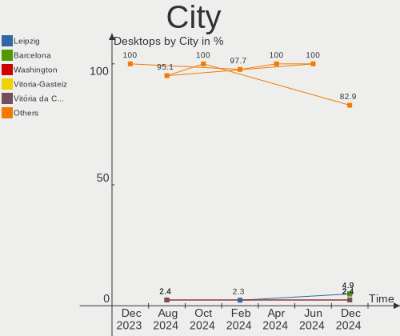
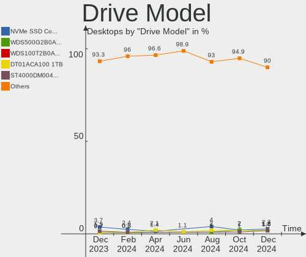
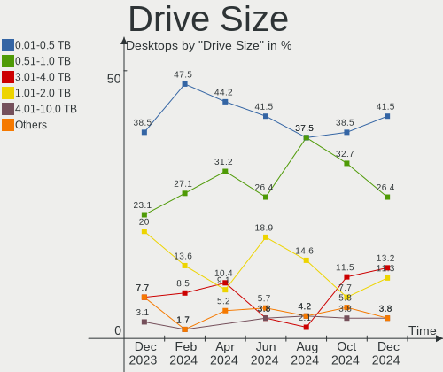
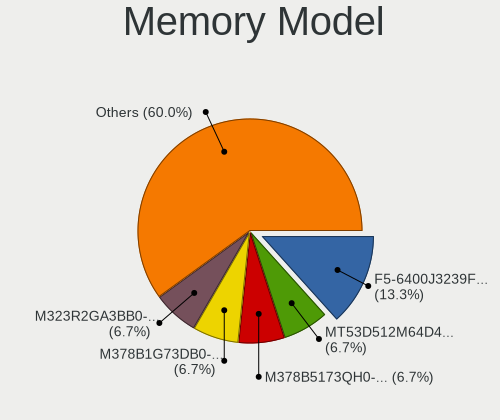

Manjaro Hardware Trends (Desktops)
----------------------------------

A project to identify most popular hardware characteristics and track their change
over time based on data collected by Manjaro users at https://Linux-Hardware.org.

Anyone can contribute to this report by the [hw-probe](https://github.com/linuxhw/hw-probe) tool:

    sudo -E hw-probe -all -upload

Full-feature report is available here: https://linux-hardware.org/?view=trends&formfactor=desktop

Period: Jul, 2021.

Contents
--------

* [ System ](#system)
  - [ OS                       ](#os)
  - [ OS Family                ](#os-family)
  - [ Kernel                   ](#kernel)
  - [ Kernel Family            ](#kernel-family)
  - [ Kernel Major Ver.        ](#kernel-major-ver)
  - [ Arch                     ](#arch)
  - [ DE                       ](#de)
  - [ Display Server           ](#display-server)
  - [ Display Manager          ](#display-manager)
  - [ OS Lang                  ](#os-lang)
  - [ Boot Mode                ](#boot-mode)
  - [ Filesystem               ](#filesystem)
  - [ Part. scheme             ](#part-scheme)
  - [ Dual Boot with Linux/BSD ](#dual-boot-with-linuxbsd)
  - [ Dual Boot (Win)          ](#dual-boot-win)

* [ Board ](#board)
  - [ Vendor                   ](#vendor)
  - [ Model                    ](#model)
  - [ Model Family             ](#model-family)
  - [ MFG Year                 ](#mfg-year)
  - [ Form Factor              ](#form-factor)
  - [ Secure Boot              ](#secure-boot)
  - [ Coreboot                 ](#coreboot)
  - [ RAM Size                 ](#ram-size)
  - [ RAM Used                 ](#ram-used)
  - [ Total Drives             ](#total-drives)
  - [ Has CD-ROM               ](#has-cd-rom)
  - [ Has Ethernet             ](#has-ethernet)
  - [ Has WiFi                 ](#has-wifi)
  - [ Has Bluetooth            ](#has-bluetooth)

* [ Location ](#location)
  - [ Country                  ](#country)
  - [ City                     ](#city)

* [ Drives ](#drives)
  - [ Drive Vendor             ](#drive-vendor)
  - [ Drive Model              ](#drive-model)
  - [ HDD Vendor               ](#hdd-vendor)
  - [ SSD Vendor               ](#ssd-vendor)
  - [ Drive Kind               ](#drive-kind)
  - [ Drive Connector          ](#drive-connector)
  - [ Drive Size               ](#drive-size)
  - [ Space Total              ](#space-total)
  - [ Space Used               ](#space-used)
  - [ Malfunc. Drives          ](#malfunc-drives)
  - [ Malfunc. Drive Vendor    ](#malfunc-drive-vendor)
  - [ Malfunc. HDD Vendor      ](#malfunc-hdd-vendor)
  - [ Malfunc. Drive Kind      ](#malfunc-drive-kind)
  - [ Failed Drives            ](#failed-drives)
  - [ Failed Drive Vendor      ](#failed-drive-vendor)
  - [ Drive Status             ](#drive-status)

* [ Storage controller ](#storage-controller)
  - [ Storage Vendor           ](#storage-vendor)
  - [ Storage Model            ](#storage-model)
  - [ Storage Kind             ](#storage-kind)

* [ Processor ](#processor)
  - [ CPU Vendor               ](#cpu-vendor)
  - [ CPU Model                ](#cpu-model)
  - [ CPU Model Family         ](#cpu-model-family)
  - [ CPU Cores                ](#cpu-cores)
  - [ CPU Sockets              ](#cpu-sockets)
  - [ CPU Threads              ](#cpu-threads)
  - [ CPU Op-Modes             ](#cpu-op-modes)
  - [ CPU Microcode            ](#cpu-microcode)
  - [ CPU Microarch            ](#cpu-microarch)

* [ Graphics ](#graphics)
  - [ GPU Vendor               ](#gpu-vendor)
  - [ GPU Model                ](#gpu-model)
  - [ GPU Combo                ](#gpu-combo)
  - [ GPU Driver               ](#gpu-driver)
  - [ GPU Memory               ](#gpu-memory)

* [ Monitor ](#monitor)
  - [ Monitor Vendor           ](#monitor-vendor)
  - [ Monitor Model            ](#monitor-model)
  - [ Monitor Resolution       ](#monitor-resolution)
  - [ Monitor Diagonal         ](#monitor-diagonal)
  - [ Monitor Width            ](#monitor-width)
  - [ Aspect Ratio             ](#aspect-ratio)
  - [ Monitor Area             ](#monitor-area)
  - [ Pixel Density            ](#pixel-density)
  - [ Multiple Monitors        ](#multiple-monitors)

* [ Network ](#network)
  - [ Net Controller Vendor    ](#net-controller-vendor)
  - [ Net Controller Model     ](#net-controller-model)
  - [ Wireless Vendor          ](#wireless-vendor)
  - [ Wireless Model           ](#wireless-model)
  - [ Ethernet Vendor          ](#ethernet-vendor)
  - [ Ethernet Model           ](#ethernet-model)
  - [ Net Controller Kind      ](#net-controller-kind)
  - [ Used Controller          ](#used-controller)
  - [ NICs                     ](#nics)
  - [ IPv6                     ](#ipv6)

* [ Bluetooth ](#bluetooth)
  - [ Bluetooth Vendor         ](#bluetooth-vendor)
  - [ Bluetooth Model          ](#bluetooth-model)

* [ Sound ](#sound)
  - [ Sound Vendor             ](#sound-vendor)
  - [ Sound Model              ](#sound-model)

* [ Memory ](#memory)
  - [ Memory Vendor            ](#memory-vendor)
  - [ Memory Model             ](#memory-model)
  - [ Memory Kind              ](#memory-kind)
  - [ Memory Form Factor       ](#memory-form-factor)
  - [ Memory Size              ](#memory-size)
  - [ Memory Speed             ](#memory-speed)

* [ Printers & scanners ](#printers--scanners)
  - [ Printer Vendor           ](#printer-vendor)
  - [ Printer Model            ](#printer-model)
  - [ Scanner Vendor           ](#scanner-vendor)
  - [ Scanner Model            ](#scanner-model)

* [ Camera ](#camera)
  - [ Camera Vendor            ](#camera-vendor)
  - [ Camera Model             ](#camera-model)

* [ Security ](#security)
  - [ Fingerprint Vendor       ](#fingerprint-vendor)
  - [ Fingerprint Model        ](#fingerprint-model)
  - [ Chipcard Vendor          ](#chipcard-vendor)
  - [ Chipcard Model           ](#chipcard-model)

* [ Unsupported ](#unsupported)
  - [ Unsupported Devices      ](#unsupported-devices)
  - [ Unsupported Device Types ](#unsupported-device-types)

System
------

OS
--

Installed operating systems

| Name           | Desktops | Percent |
|----------------|----------|---------|
| Manjaro        | 34       | 41.98%  |
| Manjaro 21.1.0 | 24       | 29.63%  |
| Manjaro 21.0.7 | 21       | 25.93%  |
| Manjaro 21.0.6 | 1        | 1.23%   |
| Manjaro 21.0   | 1        | 1.23%   |

OS Family
---------

OS without a version

| Name    | Desktops | Percent |
|---------|----------|---------|
| Manjaro | 81       | 100%    |

Kernel
------

Version of the Linux kernel

| Version               | Desktops | Percent |
|-----------------------|----------|---------|
| 5.10.42-1-MANJARO     | 21       | 25.93%  |
| 5.12.9-1-MANJARO      | 12       | 14.81%  |
| 5.10.49-1-MANJARO     | 10       | 12.35%  |
| 5.10.52-1-MANJARO     | 8        | 9.88%   |
| 5.13.1-3-MANJARO      | 4        | 4.94%   |
| 5.13.0-1-MANJARO      | 4        | 4.94%   |
| 5.10.53-1-MANJARO     | 4        | 4.94%   |
| 5.12.16-1-MANJARO     | 3        | 3.7%    |
| 5.4.124-1-MANJARO     | 2        | 2.47%   |
| 5.14.0-1-MANJARO      | 2        | 2.47%   |
| 5.11.22-2-MANJARO     | 2        | 2.47%   |
| 5.9.16-1-MANJARO      | 1        | 1.23%   |
| 5.13.5-1-MANJARO      | 1        | 1.23%   |
| 5.13.4-arch1-2-vfio   | 1        | 1.23%   |
| 5.13.4-1-MANJARO      | 1        | 1.23%   |
| 5.12.19-1-MANJARO     | 1        | 1.23%   |
| 5.11.6-1-MANJARO      | 1        | 1.23%   |
| 5.11.4-1-rt11-MANJARO | 1        | 1.23%   |
| 5.10.23-1-MANJARO     | 1        | 1.23%   |
| 4.19.193-1-MANJARO    | 1        | 1.23%   |

Kernel Family
-------------

Linux kernel without a distro release

| Version  | Desktops | Percent |
|----------|----------|---------|
| 5.10.42  | 21       | 25.93%  |
| 5.12.9   | 12       | 14.81%  |
| 5.10.49  | 10       | 12.35%  |
| 5.10.52  | 8        | 9.88%   |
| 5.13.1   | 4        | 4.94%   |
| 5.13.0   | 4        | 4.94%   |
| 5.10.53  | 4        | 4.94%   |
| 5.12.16  | 3        | 3.7%    |
| 5.4.124  | 2        | 2.47%   |
| 5.14.0   | 2        | 2.47%   |
| 5.13.4   | 2        | 2.47%   |
| 5.11.22  | 2        | 2.47%   |
| 5.9.16   | 1        | 1.23%   |
| 5.13.5   | 1        | 1.23%   |
| 5.12.19  | 1        | 1.23%   |
| 5.11.6   | 1        | 1.23%   |
| 5.11.4   | 1        | 1.23%   |
| 5.10.23  | 1        | 1.23%   |
| 4.19.193 | 1        | 1.23%   |

Kernel Major Ver.
-----------------

Linux kernel major version

| Version | Desktops | Percent |
|---------|----------|---------|
| 5.10    | 44       | 54.32%  |
| 5.12    | 16       | 19.75%  |
| 5.13    | 11       | 13.58%  |
| 5.11    | 4        | 4.94%   |
| 5.4     | 2        | 2.47%   |
| 5.14    | 2        | 2.47%   |
| 5.9     | 1        | 1.23%   |
| 4.19    | 1        | 1.23%   |

Arch
----

OS architecture (x86_64, i586, etc.)

| Name   | Desktops | Percent |
|--------|----------|---------|
| x86_64 | 81       | 100%    |

DE
--

Desktop Environment

| Name                     | Desktops | Percent |
|--------------------------|----------|---------|
| KDE5                     | 22       | 27.16%  |
| XFCE                     | 21       | 25.93%  |
| GNOME                    | 13       | 16.05%  |
| KDE                      | 11       | 13.58%  |
| X-Cinnamon               | 4        | 4.94%   |
| Deepin                   | 4        | 4.94%   |
| Unknown                  | 3        | 3.7%    |
| i3                       | 1        | 1.23%   |
| GNOME Classic            | 1        | 1.23%   |
| /usr/bin/openbox-session | 1        | 1.23%   |

Display Server
--------------

X11 or Wayland

| Name    | Desktops | Percent |
|---------|----------|---------|
| X11     | 72       | 88.89%  |
| Wayland | 6        | 7.41%   |
| Unknown | 3        | 3.7%    |

Display Manager
---------------

SDDM, LightDM, etc.

| Name    | Desktops | Percent |
|---------|----------|---------|
| Unknown | 34       | 41.98%  |
| SDDM    | 23       | 28.4%   |
| LightDM | 14       | 17.28%  |
| GDM     | 7        | 8.64%   |
| TDM     | 2        | 2.47%   |
| LXDM    | 1        | 1.23%   |

OS Lang
-------

Language

| Lang    | Desktops | Percent |
|---------|----------|---------|
| en_US   | 39       | 48.15%  |
| ru_RU   | 7        | 8.64%   |
| pl_PL   | 6        | 7.41%   |
| pt_BR   | 5        | 6.17%   |
| de_DE   | 5        | 6.17%   |
| en_GB   | 3        | 3.7%    |
| ja_JP   | 2        | 2.47%   |
| ru_UA   | 1        | 1.23%   |
| nl_NL   | 1        | 1.23%   |
| it_IT   | 1        | 1.23%   |
| hu_HU   | 1        | 1.23%   |
| fr_FR   | 1        | 1.23%   |
| es_PE   | 1        | 1.23%   |
| es_ES   | 1        | 1.23%   |
| en_PH   | 1        | 1.23%   |
| en_IL   | 1        | 1.23%   |
| en_DE   | 1        | 1.23%   |
| en_CA   | 1        | 1.23%   |
| en_AU   | 1        | 1.23%   |
| de_CH   | 1        | 1.23%   |
| Unknown | 1        | 1.23%   |

Boot Mode
---------

EFI or BIOS

| Mode | Desktops | Percent |
|------|----------|---------|
| BIOS | 46       | 56.79%  |
| EFI  | 35       | 43.21%  |

Filesystem
----------

Type of filesystem

| Type  | Desktops | Percent |
|-------|----------|---------|
| Ext4  | 70       | 86.42%  |
| Btrfs | 8        | 9.88%   |
| Zfs   | 1        | 1.23%   |
| XXXfs | 1        | 1.23%   |
| Xfs   | 1        | 1.23%   |

Part. scheme
------------

Scheme of partitioning

| Type    | Desktops | Percent |
|---------|----------|---------|
| GPT     | 40       | 49.38%  |
| Unknown | 32       | 39.51%  |
| MBR     | 9        | 11.11%  |

Dual Boot with Linux/BSD
------------------------

Hosting more than one Linux/BSD

| Dual boot | Desktops | Percent |
|-----------|----------|---------|
| No        | 64       | 79.01%  |
| Yes       | 17       | 20.99%  |

Dual Boot (Win)
---------------

Hosting Linux and Windows

| Dual boot | Desktops | Percent |
|-----------|----------|---------|
| No        | 45       | 55.56%  |
| Yes       | 36       | 44.44%  |

Board
-----

Vendor
------

Motherboard manufacturer

| Name                | Desktops | Percent |
|---------------------|----------|---------|
| Gigabyte Technology | 17       | 20.99%  |
| ASUSTek Computer    | 17       | 20.99%  |
| MSI                 | 11       | 13.58%  |
| ASRock              | 9        | 11.11%  |
| Hewlett-Packard     | 8        | 9.88%   |
| Dell                | 8        | 9.88%   |
| Lenovo              | 3        | 3.7%    |
| Intel               | 3        | 3.7%    |
| Pegatron            | 1        | 1.23%   |
| Huanan              | 1        | 1.23%   |
| Foxconn             | 1        | 1.23%   |
| AMD                 | 1        | 1.23%   |
| Unknown             | 1        | 1.23%   |

Model
-----

Motherboard model

| Name                              | Desktops | Percent |
|-----------------------------------|----------|---------|
| Gigabyte X570 AORUS MASTER        | 2        | 2.47%   |
| Gigabyte B450M DS3H               | 2        | 2.47%   |
| ASUS TUF GAMING B550M-PLUS        | 2        | 2.47%   |
| ASUS All Series                   | 2        | 2.47%   |
| Pegatron s5610br                  | 1        | 1.23%   |
| MSI MS-7C94                       | 1        | 1.23%   |
| MSI MS-7C67                       | 1        | 1.23%   |
| MSI MS-7C37                       | 1        | 1.23%   |
| MSI MS-7C35                       | 1        | 1.23%   |
| MSI MS-7B98                       | 1        | 1.23%   |
| MSI MS-7B86                       | 1        | 1.23%   |
| MSI MS-7B48                       | 1        | 1.23%   |
| MSI MS-7A65                       | 1        | 1.23%   |
| MSI MS-7A34                       | 1        | 1.23%   |
| MSI MS-7994                       | 1        | 1.23%   |
| MSI MS-7918                       | 1        | 1.23%   |
| Lenovo ThinkStation S30 4352H1U   | 1        | 1.23%   |
| Lenovo ThinkCentre M91p 7033DE6   | 1        | 1.23%   |
| Lenovo ThinkCentre E73 10DS0015GE | 1        | 1.23%   |
| Intel H61                         | 1        | 1.23%   |
| Intel DQ77MK                      | 1        | 1.23%   |
| Intel DQ67SW AAG12527-310         | 1        | 1.23%   |
| Huanan X99-TF                     | 1        | 1.23%   |
| HP Z640 Workstation               | 1        | 1.23%   |
| HP Z440 Workstation               | 1        | 1.23%   |
| HP ProDesk 600 G1 SFF             | 1        | 1.23%   |
| HP OMEN by HP Desktop PC          | 1        | 1.23%   |
| HP Desktop M01-F0xxx              | 1        | 1.23%   |
| HP Compaq Elite 8300 USDT         | 1        | 1.23%   |
| HP Compaq 6005 Pro SFF PC         | 1        | 1.23%   |
| HP 290 G2 MT Business PC          | 1        | 1.23%   |
| Gigabyte Z97X-UD3H                | 1        | 1.23%   |
| Gigabyte Z490 AORUS XTREME        | 1        | 1.23%   |
| Gigabyte Z270X-Gaming 5           | 1        | 1.23%   |
| Gigabyte Z170XP-SLI               | 1        | 1.23%   |
| Gigabyte X399 DESIGNARE EX        | 1        | 1.23%   |
| Gigabyte TRX40 AORUS MASTER       | 1        | 1.23%   |
| Gigabyte H61M-DS2 DVI             | 1        | 1.23%   |
| Gigabyte H61M-DS2                 | 1        | 1.23%   |
| Gigabyte H310M S2H 2.0            | 1        | 1.23%   |
| Gigabyte F2A68HM-H                | 1        | 1.23%   |
| Gigabyte F2A58M-HD2               | 1        | 1.23%   |
| Gigabyte B550 AORUS ELITE V2      | 1        | 1.23%   |
| Gigabyte B450 AORUS ELITE         | 1        | 1.23%   |
| Foxconn Pro3500 Series            | 1        | 1.23%   |
| Dell XPS 8700                     | 1        | 1.23%   |
| Dell Vostro 320                   | 1        | 1.23%   |
| Dell OptiPlex 9010                | 1        | 1.23%   |
| Dell OptiPlex 790                 | 1        | 1.23%   |
| Dell OptiPlex 780                 | 1        | 1.23%   |
| Dell OptiPlex 755                 | 1        | 1.23%   |
| Dell OptiPlex 7071                | 1        | 1.23%   |
| Dell OptiPlex 3050                | 1        | 1.23%   |
| ASUS ROG STRIX X570-E GAMING      | 1        | 1.23%   |
| ASUS ROG STRIX B450-F GAMING      | 1        | 1.23%   |
| ASUS Rampage III Extreme          | 1        | 1.23%   |
| ASUS PRIME Z390-P                 | 1        | 1.23%   |
| ASUS PRIME Z270-P                 | 1        | 1.23%   |
| ASUS P8Z77-V DELUXE               | 1        | 1.23%   |
| ASUS P7P55-M                      | 1        | 1.23%   |

Model Family
------------

Motherboard model prefix

| Name                  | Desktops | Percent |
|-----------------------|----------|---------|
| Dell OptiPlex         | 6        | 7.41%   |
| Lenovo ThinkCentre    | 2        | 2.47%   |
| HP Compaq             | 2        | 2.47%   |
| Gigabyte X570         | 2        | 2.47%   |
| Gigabyte H61M-DS2     | 2        | 2.47%   |
| Gigabyte B450M        | 2        | 2.47%   |
| ASUS TUF              | 2        | 2.47%   |
| ASUS ROG              | 2        | 2.47%   |
| ASUS PRIME            | 2        | 2.47%   |
| ASUS Maximus          | 2        | 2.47%   |
| ASUS M5A97            | 2        | 2.47%   |
| ASUS All              | 2        | 2.47%   |
| ASRock B450M          | 2        | 2.47%   |
| Pegatron s5610br      | 1        | 1.23%   |
| MSI MS-7C94           | 1        | 1.23%   |
| MSI MS-7C67           | 1        | 1.23%   |
| MSI MS-7C37           | 1        | 1.23%   |
| MSI MS-7C35           | 1        | 1.23%   |
| MSI MS-7B98           | 1        | 1.23%   |
| MSI MS-7B86           | 1        | 1.23%   |
| MSI MS-7B48           | 1        | 1.23%   |
| MSI MS-7A65           | 1        | 1.23%   |
| MSI MS-7A34           | 1        | 1.23%   |
| MSI MS-7994           | 1        | 1.23%   |
| MSI MS-7918           | 1        | 1.23%   |
| Lenovo ThinkStation   | 1        | 1.23%   |
| Intel H61             | 1        | 1.23%   |
| Intel DQ77MK          | 1        | 1.23%   |
| Intel DQ67SW          | 1        | 1.23%   |
| Huanan X99-TF         | 1        | 1.23%   |
| HP Z640               | 1        | 1.23%   |
| HP Z440               | 1        | 1.23%   |
| HP ProDesk            | 1        | 1.23%   |
| HP OMEN               | 1        | 1.23%   |
| HP Desktop            | 1        | 1.23%   |
| HP 290                | 1        | 1.23%   |
| Gigabyte Z97X-UD3H    | 1        | 1.23%   |
| Gigabyte Z490         | 1        | 1.23%   |
| Gigabyte Z270X-Gaming | 1        | 1.23%   |
| Gigabyte Z170XP-SLI   | 1        | 1.23%   |
| Gigabyte X399         | 1        | 1.23%   |
| Gigabyte TRX40        | 1        | 1.23%   |
| Gigabyte H310M        | 1        | 1.23%   |
| Gigabyte F2A68HM-H    | 1        | 1.23%   |
| Gigabyte F2A58M-HD2   | 1        | 1.23%   |
| Gigabyte B550         | 1        | 1.23%   |
| Gigabyte B450         | 1        | 1.23%   |
| Foxconn Pro3500       | 1        | 1.23%   |
| Dell XPS              | 1        | 1.23%   |
| Dell Vostro           | 1        | 1.23%   |
| ASUS Rampage          | 1        | 1.23%   |
| ASUS P8Z77-V          | 1        | 1.23%   |
| ASUS P7P55-M          | 1        | 1.23%   |
| ASUS M3A78-EM         | 1        | 1.23%   |
| ASUS M2N68-AM         | 1        | 1.23%   |
| ASRock Z75            | 1        | 1.23%   |
| ASRock X399           | 1        | 1.23%   |
| ASRock H81M-HDS       | 1        | 1.23%   |
| ASRock H310M-HG4      | 1        | 1.23%   |
| ASRock FM2A88X-ITX+   | 1        | 1.23%   |

MFG Year
--------

Motherboard manufacture year

| Year | Desktops | Percent |
|------|----------|---------|
| 2020 | 15       | 18.52%  |
| 2018 | 12       | 14.81%  |
| 2021 | 11       | 13.58%  |
| 2019 | 11       | 13.58%  |
| 2013 | 8        | 9.88%   |
| 2016 | 6        | 7.41%   |
| 2012 | 5        | 6.17%   |
| 2014 | 4        | 4.94%   |
| 2015 | 3        | 3.7%    |
| 2010 | 3        | 3.7%    |
| 2009 | 3        | 3.7%    |

Form Factor
-----------

Physical design of the computer

| Name    | Desktops | Percent |
|---------|----------|---------|
| Desktop | 81       | 100%    |

Secure Boot
-----------

Enabled or disabled

| State    | Desktops | Percent |
|----------|----------|---------|
| Disabled | 81       | 100%    |

Coreboot
--------

Have coreboot on board

| Used | Desktops | Percent |
|------|----------|---------|
| No   | 81       | 100%    |

RAM Size
--------

Total RAM memory

| Size in GB  | Desktops | Percent |
|-------------|----------|---------|
| 16.01-24.0  | 25       | 30.86%  |
| 8.01-16.0   | 19       | 23.46%  |
| 32.01-64.0  | 14       | 17.28%  |
| 4.01-8.0    | 7        | 8.64%   |
| 64.01-256.0 | 7        | 8.64%   |
| 3.01-4.0    | 5        | 6.17%   |
| 24.01-32.0  | 2        | 2.47%   |
| 1.01-2.0    | 2        | 2.47%   |

RAM Used
--------

Used RAM memory

| Used GB    | Desktops | Percent |
|------------|----------|---------|
| 4.01-8.0   | 24       | 29.63%  |
| 1.01-2.0   | 18       | 22.22%  |
| 2.01-3.0   | 16       | 19.75%  |
| 3.01-4.0   | 11       | 13.58%  |
| 16.01-24.0 | 5        | 6.17%   |
| 8.01-16.0  | 3        | 3.7%    |
| 0.51-1.0   | 3        | 3.7%    |
| 0.01-0.5   | 1        | 1.23%   |

Total Drives
------------

Number of drives on board

| Drives | Desktops | Percent |
|--------|----------|---------|
| 2      | 23       | 28.4%   |
| 1      | 18       | 22.22%  |
| 3      | 14       | 17.28%  |
| 4      | 13       | 16.05%  |
| 6      | 5        | 6.17%   |
| 5      | 4        | 4.94%   |
| 7      | 3        | 3.7%    |
| 9      | 1        | 1.23%   |

Has CD-ROM
----------

Has CD-ROM on board

| Presented | Desktops | Percent |
|-----------|----------|---------|
| No        | 53       | 65.43%  |
| Yes       | 28       | 34.57%  |

Has Ethernet
------------

Has Ethernet on board

| Presented | Desktops | Percent |
|-----------|----------|---------|
| Yes       | 80       | 98.77%  |
| No        | 1        | 1.23%   |

Has WiFi
--------

Has WiFi module

| Presented | Desktops | Percent |
|-----------|----------|---------|
| No        | 43       | 53.09%  |
| Yes       | 38       | 46.91%  |

Has Bluetooth
-------------

Has Bluetooth module

| Presented | Desktops | Percent |
|-----------|----------|---------|
| No        | 52       | 64.2%   |
| Yes       | 29       | 35.8%   |

Location
--------

Country
-------

Geographic location (country)

| Country             | Desktops | Percent |
|---------------------|----------|---------|
| USA                 | 13       | 16.05%  |
| Germany             | 8        | 9.88%   |
| Russia              | 7        | 8.64%   |
| Poland              | 7        | 8.64%   |
| Brazil              | 7        | 8.64%   |
| Netherlands         | 3        | 3.7%    |
| UK                  | 2        | 2.47%   |
| Japan               | 2        | 2.47%   |
| Hungary             | 2        | 2.47%   |
| France              | 2        | 2.47%   |
| Belgium             | 2        | 2.47%   |
| Vietnam             | 1        | 1.23%   |
| Uzbekistan          | 1        | 1.23%   |
| Ukraine             | 1        | 1.23%   |
| Trinidad and Tobago | 1        | 1.23%   |
| Thailand            | 1        | 1.23%   |
| Tajikistan          | 1        | 1.23%   |
| Spain               | 1        | 1.23%   |
| Saudi Arabia        | 1        | 1.23%   |
| Philippines         | 1        | 1.23%   |
| Peru                | 1        | 1.23%   |
| North Macedonia     | 1        | 1.23%   |
| Morocco             | 1        | 1.23%   |
| Mexico              | 1        | 1.23%   |
| Luxembourg          | 1        | 1.23%   |
| Jordan              | 1        | 1.23%   |
| Italy               | 1        | 1.23%   |
| Israel              | 1        | 1.23%   |
| Indonesia           | 1        | 1.23%   |
| Georgia             | 1        | 1.23%   |
| Finland             | 1        | 1.23%   |
| Croatia             | 1        | 1.23%   |
| Canada              | 1        | 1.23%   |
| Belarus             | 1        | 1.23%   |
| Bangladesh          | 1        | 1.23%   |
| Austria             | 1        | 1.23%   |
| Australia           | 1        | 1.23%   |

City
----

Geographic location (city)

| City                        | Desktops | Percent |
|-----------------------------|----------|---------|
| Ghent                       | 2        | 2.47%   |
| Gdansk                      | 2        | 2.47%   |
| Dallas                      | 2        | 2.47%   |
| Zarqa                       | 1        | 1.23%   |
| Yakutsk                     | 1        | 1.23%   |
| West Des Moines             | 1        | 1.23%   |
| Webb City                   | 1        | 1.23%   |
| Warsaw                      | 1        | 1.23%   |
| Vũng Tàu                  | 1        | 1.23%   |
| Vila Velha                  | 1        | 1.23%   |
| Turku                       | 1        | 1.23%   |
| Trenton                     | 1        | 1.23%   |
| Toulouse                    | 1        | 1.23%   |
| Tijuana                     | 1        | 1.23%   |
| The Bronx                   | 1        | 1.23%   |
| Tbilisi                     | 1        | 1.23%   |
| Tashkent                    | 1        | 1.23%   |
| Szigetszentmiklos           | 1        | 1.23%   |
| Swalmen                     | 1        | 1.23%   |
| St Petersburg               | 1        | 1.23%   |
| Skopje                      | 1        | 1.23%   |
| Shchelkovo                  | 1        | 1.23%   |
| Schmoelln                   | 1        | 1.23%   |
| Sarov                       | 1        | 1.23%   |
| Rudolstadt                  | 1        | 1.23%   |
| Rondonópolis               | 1        | 1.23%   |
| Riyadh                      | 1        | 1.23%   |
| Rio de Janeiro              | 1        | 1.23%   |
| Rimpar                      | 1        | 1.23%   |
| Pula                        | 1        | 1.23%   |
| Poznan                      | 1        | 1.23%   |
| Posto Fiscal Rolim de Moura | 1        | 1.23%   |
| Portland                    | 1        | 1.23%   |
| Pittsburgh                  | 1        | 1.23%   |
| Piarco                      | 1        | 1.23%   |
| Phoenix                     | 1        | 1.23%   |
| Pearland                    | 1        | 1.23%   |
| Palhoca                     | 1        | 1.23%   |
| Ofakim                      | 1        | 1.23%   |
| Novosibirsk                 | 1        | 1.23%   |
| Newcastle upon Tyne         | 1        | 1.23%   |
| Neuhofen an der Krems       | 1        | 1.23%   |
| Murr                        | 1        | 1.23%   |
| Minsk                       | 1        | 1.23%   |
| Luxembourg                  | 1        | 1.23%   |
| Lima                        | 1        | 1.23%   |
| Lathrop                     | 1        | 1.23%   |
| Kisel?«vsk                  | 1        | 1.23%   |
| Kirkcudbright               | 1        | 1.23%   |
| Itapiranga                  | 1        | 1.23%   |
| Itami                       | 1        | 1.23%   |
| Ingolstadt                  | 1        | 1.23%   |
| Hohenau                     | 1        | 1.23%   |
| Gilbert                     | 1        | 1.23%   |
| Forchheim                   | 1        | 1.23%   |
| Foix                        | 1        | 1.23%   |
| Eindhoven                   | 1        | 1.23%   |
| Eger                        | 1        | 1.23%   |
| Dushanbe                    | 1        | 1.23%   |
| Dobron                      | 1        | 1.23%   |

Drives
------

Drive Vendor
------------

Hard drive vendors

| Vendor                | Desktops | Drives | Percent |
|-----------------------|----------|--------|---------|
| Seagate               | 37       | 48     | 21.14%  |
| WDC                   | 35       | 50     | 20%     |
| Samsung Electronics   | 28       | 50     | 16%     |
| Kingston              | 13       | 17     | 7.43%   |
| SanDisk               | 8        | 9      | 4.57%   |
| Toshiba               | 5        | 5      | 2.86%   |
| Phison                | 5        | 7      | 2.86%   |
| Crucial               | 5        | 5      | 2.86%   |
| Corsair               | 4        | 4      | 2.29%   |
| Unknown               | 3        | 5      | 1.71%   |
| Lexar                 | 3        | 3      | 1.71%   |
| Hitachi               | 3        | 4      | 1.71%   |
| GOODRAM               | 3        | 3      | 1.71%   |
| Transcend             | 2        | 2      | 1.14%   |
| Realtek Semiconductor | 2        | 2      | 1.14%   |
| Intenso               | 2        | 2      | 1.14%   |
| XrayDisk              | 1        | 1      | 0.57%   |
| Super Talent          | 1        | 1      | 0.57%   |
| SMART                 | 1        | 1      | 0.57%   |
| SK Hynix              | 1        | 1      | 0.57%   |
| SABRENT               | 1        | 1      | 0.57%   |
| PNY                   | 1        | 1      | 0.57%   |
| OCZ                   | 1        | 1      | 0.57%   |
| Micron Technology     | 1        | 1      | 0.57%   |
| Maxtor                | 1        | 1      | 0.57%   |
| LaCie                 | 1        | 1      | 0.57%   |
| Kingmax               | 1        | 2      | 0.57%   |
| Intel                 | 1        | 1      | 0.57%   |
| HGST                  | 1        | 1      | 0.57%   |
| Gigabyte Technology   | 1        | 2      | 0.57%   |
| China                 | 1        | 4      | 0.57%   |
| Apacer                | 1        | 1      | 0.57%   |
| A-DATA Technology     | 1        | 1      | 0.57%   |

Drive Model
-----------

Hard drive models

| Model                            | Desktops | Percent |
|----------------------------------|----------|---------|
| Kingston SA400S37240G 240GB SSD  | 5        | 2.27%   |
| Seagate ST1000DM003-1CH162 1TB   | 4        | 1.82%   |
| Phison NVMe SSD Drive 1TB        | 4        | 1.82%   |
| Toshiba DT01ACA100 1TB           | 3        | 1.36%   |
| Seagate ST500DM002-1BD142 500GB  | 3        | 1.36%   |
| Seagate ST1000DM010-2EP102 1TB   | 3        | 1.36%   |
| Samsung NVMe SSD Drive 1TB       | 3        | 1.36%   |
| Samsung HD103SJ 1TB              | 3        | 1.36%   |
| WDC WDS500G2B0A-00SM50 500GB SSD | 2        | 0.91%   |
| WDC WD20EZRZ-00Z5HB0 2TB         | 2        | 0.91%   |
| WDC WD20EFRX-68EUZN0 2TB         | 2        | 0.91%   |
| WDC WD10EZEX-00WN4A0 1TB         | 2        | 0.91%   |
| WDC WD10EARS-00Y5B1 1TB          | 2        | 0.91%   |
| Seagate ST4000VN008-2DR166 4TB   | 2        | 0.91%   |
| Seagate ST4000DM004-2CV104 4TB   | 2        | 0.91%   |
| Seagate ST2000DM008-2FR102 2TB   | 2        | 0.91%   |
| Seagate ST2000DM001-1ER164 2TB   | 2        | 0.91%   |
| Seagate ST2000DM001-1CH164 2TB   | 2        | 0.91%   |
| Seagate ST1000DX001-1CM162 1TB   | 2        | 0.91%   |
| Sandisk NVMe SSD Drive 512GB     | 2        | 0.91%   |
| Samsung SSD 980 PRO 500GB        | 2        | 0.91%   |
| Samsung SSD 970 EVO Plus 1TB     | 2        | 0.91%   |
| Samsung SSD 970 EVO 500GB        | 2        | 0.91%   |
| Samsung SSD 860 EVO 250GB        | 2        | 0.91%   |
| Samsung SSD 860 EVO 1TB          | 2        | 0.91%   |
| Samsung SSD 850 EVO 500GB        | 2        | 0.91%   |
| Samsung SSD 850 EVO 250GB        | 2        | 0.91%   |
| Samsung SSD 840 EVO 120GB        | 2        | 0.91%   |
| Samsung NVMe SSD Drive 250GB     | 2        | 0.91%   |
| Samsung HD204UI 2TB              | 2        | 0.91%   |
| Lexar 256GB SSD                  | 2        | 0.91%   |
| Kingston SV300S37A120G 120GB SSD | 2        | 0.91%   |
| Kingston NVMe SSD Drive 500GB    | 2        | 0.91%   |
| Crucial CT250MX500SSD1 250GB     | 2        | 0.91%   |
| XrayDisk 256GB                   | 1        | 0.45%   |
| WDC WDS500G2B0C-00PXH0 500GB     | 1        | 0.45%   |
| WDC WDS250G2B0A-00SM50 250GB SSD | 1        | 0.45%   |
| WDC WDS250G2B0A 250GB SSD        | 1        | 0.45%   |
| WDC WDS240G2G0A-00JH30 240GB SSD | 1        | 0.45%   |
| WDC WDS120G2G0A-00JH30 120GB SSD | 1        | 0.45%   |
| WDC WDS100T2B0C-00PXH0 1TB       | 1        | 0.45%   |
| WDC WDS100T2B0A-00SM50 1TB SSD   | 1        | 0.45%   |
| WDC WDS100T1XHE-00AFY0 1TB       | 1        | 0.45%   |
| WDC WD6400AAKS-65A7B2 640GB      | 1        | 0.45%   |
| WDC WD6400AAKS-22A7B0 640GB      | 1        | 0.45%   |
| WDC WD60 EZAZ-00SF3B0 6TB        | 1        | 0.45%   |
| WDC WD5000AZRX-00A8LB0 500GB     | 1        | 0.45%   |
| WDC WD5000AAKX-60U6AA0 500GB     | 1        | 0.45%   |
| WDC WD5000AAKS-00A7B0 500GB      | 1        | 0.45%   |
| WDC WD40EZRZ-75GXCB0 4TB         | 1        | 0.45%   |
| WDC WD40EZRZ-22GXCB0 4TB         | 1        | 0.45%   |
| WDC WD40EZRZ-00GXCB0 4TB         | 1        | 0.45%   |
| WDC WD4004FZWX-00GBGB0 4TB       | 1        | 0.45%   |
| WDC WD40 EZRZ-00GXCB0 4TB        | 1        | 0.45%   |
| WDC WD3200BEKT-75PVMT1 320GB     | 1        | 0.45%   |
| WDC WD2500AAKX-083CA1 250GB      | 1        | 0.45%   |
| WDC WD2500AAJS-60Z0A0 250GB      | 1        | 0.45%   |
| WDC WD20EZRX-00DC0B0 2TB         | 1        | 0.45%   |
| WDC WD20EZRX-00D8PB0 2TB         | 1        | 0.45%   |
| WDC WD20EZAZ-00GGJB0 2TB         | 1        | 0.45%   |

HDD Vendor
----------

Hard disk drive vendors

| Vendor              | Desktops | Drives | Percent |
|---------------------|----------|--------|---------|
| Seagate             | 35       | 46     | 42.68%  |
| WDC                 | 29       | 38     | 35.37%  |
| Samsung Electronics | 8        | 10     | 9.76%   |
| Toshiba             | 5        | 5      | 6.1%    |
| Hitachi             | 3        | 4      | 3.66%   |
| Maxtor              | 1        | 1      | 1.22%   |
| HGST                | 1        | 1      | 1.22%   |

SSD Vendor
----------

Solid state drive vendors

| Vendor              | Desktops | Drives | Percent |
|---------------------|----------|--------|---------|
| Samsung Electronics | 16       | 22     | 25.4%   |
| Kingston            | 8        | 12     | 12.7%   |
| WDC                 | 7        | 9      | 11.11%  |
| SanDisk             | 5        | 6      | 7.94%   |
| Crucial             | 4        | 4      | 6.35%   |
| Lexar               | 3        | 3      | 4.76%   |
| GOODRAM             | 3        | 3      | 4.76%   |
| Corsair             | 3        | 3      | 4.76%   |
| Intenso             | 2        | 2      | 3.17%   |
| Transcend           | 1        | 1      | 1.59%   |
| SMART               | 1        | 1      | 1.59%   |
| SK Hynix            | 1        | 1      | 1.59%   |
| Seagate             | 1        | 1      | 1.59%   |
| PNY                 | 1        | 1      | 1.59%   |
| OCZ                 | 1        | 1      | 1.59%   |
| Micron Technology   | 1        | 1      | 1.59%   |
| Kingmax             | 1        | 2      | 1.59%   |
| Intel               | 1        | 1      | 1.59%   |
| China               | 1        | 4      | 1.59%   |
| Apacer              | 1        | 1      | 1.59%   |
| A-DATA Technology   | 1        | 1      | 1.59%   |

Drive Kind
----------

HDD or SSD

| Kind    | Desktops | Drives | Percent |
|---------|----------|--------|---------|
| HDD     | 62       | 105    | 41.33%  |
| SSD     | 51       | 80     | 34%     |
| NVMe    | 32       | 46     | 21.33%  |
| Unknown | 4        | 6      | 2.67%   |
| MMC     | 1        | 1      | 0.67%   |

Drive Connector
---------------

SATA, SAS, NVMe, etc.

| Type | Desktops | Drives | Percent |
|------|----------|--------|---------|
| SATA | 75       | 177    | 64.66%  |
| NVMe | 32       | 45     | 27.59%  |
| SAS  | 8        | 15     | 6.9%    |
| MMC  | 1        | 1      | 0.86%   |

Drive Size
----------

Size of hard drive

| Size in TB | Desktops | Drives | Percent |
|------------|----------|--------|---------|
| 0.01-0.5   | 57       | 95     | 44.88%  |
| 0.51-1.0   | 36       | 47     | 28.35%  |
| 1.01-2.0   | 20       | 28     | 15.75%  |
| 3.01-4.0   | 10       | 10     | 7.87%   |
| 2.01-3.0   | 3        | 4      | 2.36%   |
| 4.01-10.0  | 1        | 1      | 0.79%   |

Space Total
-----------

Amount of disk space available on the file system

| Size in GB     | Desktops | Percent |
|----------------|----------|---------|
| 101-250        | 17       | 20.99%  |
| 501-1000       | 16       | 19.75%  |
| More than 3000 | 13       | 16.05%  |
| 1001-2000      | 12       | 14.81%  |
| 251-500        | 11       | 13.58%  |
| 2001-3000      | 4        | 4.94%   |
| Unknown        | 4        | 4.94%   |
| 51-100         | 2        | 2.47%   |
| 21-50          | 1        | 1.23%   |
| 1-20           | 1        | 1.23%   |

Space Used
----------

Amount of used disk space

| Used GB        | Desktops | Percent |
|----------------|----------|---------|
| 1-20           | 14       | 17.28%  |
| 251-500        | 11       | 13.58%  |
| 101-250        | 11       | 13.58%  |
| 21-50          | 10       | 12.35%  |
| 1001-2000      | 8        | 9.88%   |
| 501-1000       | 8        | 9.88%   |
| More than 3000 | 7        | 8.64%   |
| 51-100         | 7        | 8.64%   |
| Unknown        | 4        | 4.94%   |
| 2001-3000      | 1        | 1.23%   |

Malfunc. Drives
---------------

Drive models with a malfunction

| Model                           | Desktops | Drives | Percent |
|---------------------------------|----------|--------|---------|
| Samsung Electronics HD103SJ 1TB | 2        | 2      | 16.67%  |
| WDC WD2500AAJS-60Z0A0 250GB     | 1        | 1      | 8.33%   |
| WDC WD20EZRX-00DC0B0 2TB        | 1        | 1      | 8.33%   |
| WDC WD10EZEX-60M2NA0 1TB        | 1        | 1      | 8.33%   |
| Seagate STM3160318AS 160GB      | 1        | 1      | 8.33%   |
| Seagate ST3500630NS 500GB       | 1        | 1      | 8.33%   |
| Seagate ST1000DX001-1CM162 1TB  | 1        | 1      | 8.33%   |
| SanDisk SDSSDP256G 256GB        | 1        | 1      | 8.33%   |
| Samsung Electronics HD103SI 1TB | 1        | 1      | 8.33%   |
| Intenso SSD 120GB               | 1        | 1      | 8.33%   |
| HGST HTS545050A7 500GB          | 1        | 1      | 8.33%   |

Malfunc. Drive Vendor
---------------------

Vendors of faulty drives

| Vendor              | Desktops | Drives | Percent |
|---------------------|----------|--------|---------|
| WDC                 | 3        | 3      | 27.27%  |
| Seagate             | 3        | 3      | 27.27%  |
| Samsung Electronics | 2        | 3      | 18.18%  |
| SanDisk             | 1        | 1      | 9.09%   |
| Intenso             | 1        | 1      | 9.09%   |
| HGST                | 1        | 1      | 9.09%   |

Malfunc. HDD Vendor
-------------------

Vendors of faulty HDD drives

| Vendor              | Desktops | Drives | Percent |
|---------------------|----------|--------|---------|
| WDC                 | 3        | 3      | 33.33%  |
| Seagate             | 3        | 3      | 33.33%  |
| Samsung Electronics | 2        | 3      | 22.22%  |
| HGST                | 1        | 1      | 11.11%  |

Malfunc. Drive Kind
-------------------

Kinds of faulty drives

| Kind | Desktops | Drives | Percent |
|------|----------|--------|---------|
| HDD  | 9        | 10     | 81.82%  |
| SSD  | 2        | 2      | 18.18%  |

Failed Drives
-------------

Failed drive models

Zero info for selected period =(

Failed Drive Vendor
-------------------

Failed drive vendors

Zero info for selected period =(

Drive Status
------------

Number of failed and malfunc. drives

| Status   | Desktops | Drives | Percent |
|----------|----------|--------|---------|
| Detected | 46       | 121    | 48.42%  |
| Works    | 38       | 105    | 40%     |
| Malfunc  | 11       | 12     | 11.58%  |

Storage controller
------------------

Storage Vendor
--------------

Storage controller vendors

| Vendor                      | Desktops | Percent |
|-----------------------------|----------|---------|
| Intel                       | 49       | 40.16%  |
| AMD                         | 31       | 25.41%  |
| Samsung Electronics         | 12       | 9.84%   |
| Phison Electronics          | 7        | 5.74%   |
| Sandisk                     | 6        | 4.92%   |
| Kingston Technology Company | 5        | 4.1%    |
| ASMedia Technology          | 3        | 2.46%   |
| Silicon Motion              | 2        | 1.64%   |
| Realtek Semiconductor       | 2        | 1.64%   |
| Nvidia                      | 2        | 1.64%   |
| Seagate Technology          | 1        | 0.82%   |
| Micron/Crucial Technology   | 1        | 0.82%   |
| Marvell Technology Group    | 1        | 0.82%   |

Storage Model
-------------

Storage controller models

| Model                                                                          | Desktops | Percent |
|--------------------------------------------------------------------------------|----------|---------|
| AMD FCH SATA Controller [AHCI mode]                                            | 19       | 13.01%  |
| Intel 200 Series PCH SATA controller [AHCI mode]                               | 11       | 7.53%   |
| Samsung NVMe SSD Controller SM981/PM981/PM983                                  | 8        | 5.48%   |
| Intel 6 Series/C200 Series Chipset Family 6 port Desktop SATA AHCI Controller  | 8        | 5.48%   |
| AMD 400 Series Chipset SATA Controller                                         | 8        | 5.48%   |
| Intel 8 Series/C220 Series Chipset Family 6-port SATA Controller 1 [AHCI mode] | 6        | 4.11%   |
| Intel 7 Series/C210 Series Chipset Family 6-port SATA Controller [AHCI mode]   | 5        | 3.42%   |
| Kingston Company A2000 NVMe SSD                                                | 4        | 2.74%   |
| Intel Cannon Lake PCH SATA AHCI Controller                                     | 4        | 2.74%   |
| AMD Starship/Matisse Chipset SATA Controller [AHCI mode]                       | 4        | 2.74%   |
| AMD SB7x0/SB8x0/SB9x0 SATA Controller [AHCI mode]                              | 4        | 2.74%   |
| Sandisk WD Blue SN550 NVMe SSD                                                 | 3        | 2.05%   |
| Samsung NVMe SSD Controller PM9A1/PM9A3/980PRO                                 | 3        | 2.05%   |
| Phison E16 PCIe4 NVMe Controller                                               | 3        | 2.05%   |
| ASMedia ASM1062 Serial ATA Controller                                          | 3        | 2.05%   |
| Sandisk WD Black NVMe SSD                                                      | 2        | 1.37%   |
| Realtek Realtek Non-Volatile memory controller                                 | 2        | 1.37%   |
| Phison E12 NVMe Controller                                                     | 2        | 1.37%   |
| Nvidia MCP61 SATA Controller                                                   | 2        | 1.37%   |
| Intel SATA Controller [RAID mode]                                              | 2        | 1.37%   |
| Intel C610/X99 series chipset sSATA Controller [RAID mode]                     | 2        | 1.37%   |
| Intel C600/X79 series chipset SATA RAID Controller                             | 2        | 1.37%   |
| Intel 9 Series Chipset Family SATA Controller [AHCI Mode]                      | 2        | 1.37%   |
| AMD X399 Series Chipset SATA Controller                                        | 2        | 1.37%   |
| AMD FCH IDE Controller                                                         | 2        | 1.37%   |
| Silicon Motion SM2263EN/SM2263XT SSD Controller                                | 1        | 0.68%   |
| Silicon Motion SM2262/SM2262EN SSD Controller                                  | 1        | 0.68%   |
| Seagate FireCuda 520 SSD                                                       | 1        | 0.68%   |
| Sandisk WD Black SN850                                                         | 1        | 0.68%   |
| Samsung NVMe SSD Controller SM961/PM961/SM963                                  | 1        | 0.68%   |
| Samsung NVMe SSD Controller SM951/PM951                                        | 1        | 0.68%   |
| Phison E7 NVMe Controller                                                      | 1        | 0.68%   |
| Phison E18 PCIe4 NVMe Controller                                               | 1        | 0.68%   |
| Micron/Crucial P1 NVMe PCIe SSD                                                | 1        | 0.68%   |
| Marvell Group 88SE9128 PCIe SATA 6 Gb/s RAID controller with HyperDuo          | 1        | 0.68%   |
| Kingston Company U-SNS8154P3 NVMe SSD                                          | 1        | 0.68%   |
| Intel Q170/Q150/B150/H170/H110/Z170/CM236 Chipset SATA Controller [AHCI Mode]  | 1        | 0.68%   |
| Intel NM10/ICH7 Family SATA Controller [IDE mode]                              | 1        | 0.68%   |
| Intel Comet Lake SATA AHCI Controller                                          | 1        | 0.68%   |
| Intel C610/X99 series chipset sSATA Controller [AHCI mode]                     | 1        | 0.68%   |
| Intel C610/X99 series chipset 6-Port SATA Controller [AHCI mode]               | 1        | 0.68%   |
| Intel C602 chipset 4-Port SATA Storage Control Unit                            | 1        | 0.68%   |
| Intel C600/X79 series chipset IDE-r Controller                                 | 1        | 0.68%   |
| Intel C600/X79 series chipset 6-Port SATA AHCI Controller                      | 1        | 0.68%   |
| Intel 82Q35 Express PT IDER Controller                                         | 1        | 0.68%   |
| Intel 82801JI (ICH10 Family) SATA AHCI Controller                              | 1        | 0.68%   |
| Intel 82801JD/DO (ICH10 Family) SATA AHCI Controller                           | 1        | 0.68%   |
| Intel 82801IR/IO/IH (ICH9R/DO/DH) 6 port SATA Controller [AHCI mode]           | 1        | 0.68%   |
| Intel 6 Series/C200 Series Chipset Family IDE-r Controller                     | 1        | 0.68%   |
| Intel 5 Series/3400 Series Chipset 6 port SATA AHCI Controller                 | 1        | 0.68%   |
| Intel 4 Series Chipset PT IDER Controller                                      | 1        | 0.68%   |
| AMD SB7x0/SB8x0/SB9x0 SATA Controller [Non-RAID5 mode]                         | 1        | 0.68%   |
| AMD SB7x0/SB8x0/SB9x0 SATA Controller [IDE mode]                               | 1        | 0.68%   |
| AMD SB7x0/SB8x0/SB9x0 IDE Controller                                           | 1        | 0.68%   |
| AMD RS690 PCI to PCI Bridge (PCI Express Port 2)                               | 1        | 0.68%   |
| AMD FCH SATA Controller [IDE mode]                                             | 1        | 0.68%   |
| AMD FCH RAID Controller                                                        | 1        | 0.68%   |
| AMD 300 Series Chipset SATA Controller                                         | 1        | 0.68%   |

Storage Kind
------------

Kind of storage controller (IDE, SATA, NVMe, SAS, ...)

| Kind | Desktops | Percent |
|------|----------|---------|
| SATA | 73       | 59.84%  |
| NVMe | 32       | 26.23%  |
| IDE  | 10       | 8.2%    |
| RAID | 6        | 4.92%   |
| SAS  | 1        | 0.82%   |

Processor
---------

CPU Vendor
----------

Processor vendors

| Vendor | Desktops | Percent |
|--------|----------|---------|
| Intel  | 49       | 60.49%  |
| AMD    | 32       | 39.51%  |

CPU Model
---------

Processor models

| Model                                           | Desktops | Percent |
|-------------------------------------------------|----------|---------|
| Intel Core i7-7700K CPU @ 4.20GHz               | 4        | 4.94%   |
| Intel Core i5-3470 CPU @ 3.20GHz                | 3        | 3.7%    |
| Intel Core i5-2400 CPU @ 3.10GHz                | 3        | 3.7%    |
| AMD Ryzen 9 3900X 12-Core Processor             | 3        | 3.7%    |
| AMD Ryzen 7 3700X 8-Core Processor              | 3        | 3.7%    |
| AMD Ryzen 3 3200G with Radeon Vega Graphics     | 3        | 3.7%    |
| Intel Core i7-8700K CPU @ 3.70GHz               | 2        | 2.47%   |
| Intel Core i5-9400F CPU @ 2.90GHz               | 2        | 2.47%   |
| Intel Core i5-7500 CPU @ 3.40GHz                | 2        | 2.47%   |
| Intel Core i5-4590 CPU @ 3.30GHz                | 2        | 2.47%   |
| Intel Core i5-4440 CPU @ 3.10GHz                | 2        | 2.47%   |
| Intel Core i3-8100 CPU @ 3.60GHz                | 2        | 2.47%   |
| AMD Ryzen Threadripper 1920X 12-Core Processor  | 2        | 2.47%   |
| AMD Ryzen 7 2700X Eight-Core Processor          | 2        | 2.47%   |
| AMD Ryzen 5 3600 6-Core Processor               | 2        | 2.47%   |
| Intel Xeon CPU X3450 @ 2.67GHz                  | 1        | 1.23%   |
| Intel Xeon CPU X3353 @ 2.66GHz                  | 1        | 1.23%   |
| Intel Xeon CPU E5-2680 v3 @ 2.50GHz             | 1        | 1.23%   |
| Intel Xeon CPU E5-2678 v3 @ 2.50GHz             | 1        | 1.23%   |
| Intel Xeon CPU E5-2670 v3 @ 2.30GHz             | 1        | 1.23%   |
| Intel Xeon CPU E5-1650 v2 @ 3.50GHz             | 1        | 1.23%   |
| Intel Xeon CPU E3-1270 v3 @ 3.50GHz             | 1        | 1.23%   |
| Intel Pentium Dual-Core CPU E5700 @ 3.00GHz     | 1        | 1.23%   |
| Intel Pentium CPU G630 @ 2.70GHz                | 1        | 1.23%   |
| Intel Core i9-10900K CPU @ 3.70GHz              | 1        | 1.23%   |
| Intel Core i7-9700K CPU @ 3.60GHz               | 1        | 1.23%   |
| Intel Core i7-9700 CPU @ 3.00GHz                | 1        | 1.23%   |
| Intel Core i7-4770 CPU @ 3.40GHz                | 1        | 1.23%   |
| Intel Core i7-3770S CPU @ 3.10GHz               | 1        | 1.23%   |
| Intel Core i7-3770K CPU @ 3.50GHz               | 1        | 1.23%   |
| Intel Core i7-2600K CPU @ 3.40GHz               | 1        | 1.23%   |
| Intel Core i7 CPU X 980 @ 3.33GHz               | 1        | 1.23%   |
| Intel Core i5-8600K CPU @ 3.60GHz               | 1        | 1.23%   |
| Intel Core i5-6500 CPU @ 3.20GHz                | 1        | 1.23%   |
| Intel Core i5-4690K CPU @ 3.50GHz               | 1        | 1.23%   |
| Intel Core i5-3470S CPU @ 2.90GHz               | 1        | 1.23%   |
| Intel Core i5-3450 CPU @ 3.10GHz                | 1        | 1.23%   |
| Intel Core i5-3350P CPU @ 3.10GHz               | 1        | 1.23%   |
| Intel Core i5-2320 CPU @ 3.00GHz                | 1        | 1.23%   |
| Intel Core i3-9100F CPU @ 3.60GHz               | 1        | 1.23%   |
| Intel Core i3-4170 CPU @ 3.70GHz                | 1        | 1.23%   |
| Intel Core 2 Duo CPU E7500 @ 2.93GHz            | 1        | 1.23%   |
| AMD Sempron 140 Processor                       | 1        | 1.23%   |
| AMD Ryzen Threadripper 3960X 24-Core Processor  | 1        | 1.23%   |
| AMD Ryzen 9 5950X 16-Core Processor             | 1        | 1.23%   |
| AMD Ryzen 5 PRO 3400G with Radeon Vega Graphics | 1        | 1.23%   |
| AMD Ryzen 5 5600X 6-Core Processor              | 1        | 1.23%   |
| AMD Ryzen 5 3600XT 6-Core Processor             | 1        | 1.23%   |
| AMD Ryzen 5 2600 Six-Core Processor             | 1        | 1.23%   |
| AMD Ryzen 5 1600 Six-Core Processor             | 1        | 1.23%   |
| AMD Phenom II X4 945 Processor                  | 1        | 1.23%   |
| AMD Phenom II X2 B55 Processor                  | 1        | 1.23%   |
| AMD FX-6300 Six-Core Processor                  | 1        | 1.23%   |
| AMD FX-4330 Quad-Core Processor                 | 1        | 1.23%   |
| AMD FX-4300 Quad-Core Processor                 | 1        | 1.23%   |
| AMD Athlon II X2 245 Processor                  | 1        | 1.23%   |
| AMD A8-7600 Radeon R7, 10 Compute Cores 4C+6G   | 1        | 1.23%   |
| AMD A6-6400K APU with Radeon HD Graphics        | 1        | 1.23%   |
| AMD A10-7870K Radeon R7, 12 Compute Cores 4C+8G | 1        | 1.23%   |

CPU Model Family
----------------

Processor model prefix

| Model                   | Desktops | Percent |
|-------------------------|----------|---------|
| Intel Core i5           | 21       | 25.93%  |
| Intel Core i7           | 13       | 16.05%  |
| Intel Xeon              | 7        | 8.64%   |
| AMD Ryzen 5             | 6        | 7.41%   |
| AMD Ryzen 7             | 5        | 6.17%   |
| Intel Core i3           | 4        | 4.94%   |
| AMD Ryzen 9             | 4        | 4.94%   |
| AMD Ryzen Threadripper  | 3        | 3.7%    |
| AMD Ryzen 3             | 3        | 3.7%    |
| AMD FX                  | 3        | 3.7%    |
| Intel Pentium Dual-Core | 1        | 1.23%   |
| Intel Pentium           | 1        | 1.23%   |
| Intel Core i9           | 1        | 1.23%   |
| Intel Core 2 Duo        | 1        | 1.23%   |
| AMD Sempron             | 1        | 1.23%   |
| AMD Ryzen 5 PRO         | 1        | 1.23%   |
| AMD Phenom II X4        | 1        | 1.23%   |
| AMD Phenom II X2        | 1        | 1.23%   |
| AMD Athlon II X2        | 1        | 1.23%   |
| AMD A8                  | 1        | 1.23%   |
| AMD A6                  | 1        | 1.23%   |
| AMD A10                 | 1        | 1.23%   |

CPU Cores
---------

Number of processor cores

| Number | Desktops | Percent |
|--------|----------|---------|
| 4      | 37       | 45.68%  |
| 6      | 13       | 16.05%  |
| 2      | 10       | 12.35%  |
| 12     | 8        | 9.88%   |
| 8      | 7        | 8.64%   |
| 1      | 2        | 2.47%   |
| 24     | 1        | 1.23%   |
| 16     | 1        | 1.23%   |
| 10     | 1        | 1.23%   |
| 3      | 1        | 1.23%   |

CPU Sockets
-----------

Number of sockets

| Number | Desktops | Percent |
|--------|----------|---------|
| 1      | 81       | 100%    |

CPU Threads
-----------

Threads per core (Hyper-Threading)

| Number | Desktops | Percent |
|--------|----------|---------|
| 2      | 44       | 54.32%  |
| 1      | 37       | 45.68%  |

CPU Op-Modes
------------

CPU Operation Modes (32-bit, 64-bit)

| Op mode        | Desktops | Percent |
|----------------|----------|---------|
| 32-bit, 64-bit | 81       | 100%    |

CPU Microcode
-------------

Microcode number

| Number     | Desktops | Percent |
|------------|----------|---------|
| Unknown    | 35       | 43.21%  |
| 0x306a9    | 8        | 9.88%   |
| 0x306c3    | 6        | 7.41%   |
| 0x08701021 | 4        | 4.94%   |
| 0x906e9    | 3        | 3.7%    |
| 0x306f2    | 3        | 3.7%    |
| 0x906ea    | 2        | 2.47%   |
| 0x1067a    | 2        | 2.47%   |
| 0x0a201009 | 2        | 2.47%   |
| 0x08701013 | 2        | 2.47%   |
| 0x0800820d | 2        | 2.47%   |
| 0x06003106 | 2        | 2.47%   |
| 0x06000852 | 2        | 2.47%   |
| 0xa0655    | 1        | 1.23%   |
| 0x906eb    | 1        | 1.23%   |
| 0x506e3    | 1        | 1.23%   |
| 0x206c2    | 1        | 1.23%   |
| 0x206a7    | 1        | 1.23%   |
| 0x106e5    | 1        | 1.23%   |
| 0x08001137 | 1        | 1.23%   |
| 0x010000c8 | 1        | 1.23%   |

CPU Microarch
-------------

Microarchitecture

| Name        | Desktops | Percent |
|-------------|----------|---------|
| KabyLake    | 16       | 19.75%  |
| Haswell     | 11       | 13.58%  |
| Zen 2       | 10       | 12.35%  |
| IvyBridge   | 9        | 11.11%  |
| Zen+        | 7        | 8.64%   |
| SandyBridge | 6        | 7.41%   |
| Piledriver  | 4        | 4.94%   |
| K10         | 4        | 4.94%   |
| Zen         | 3        | 3.7%    |
| Penryn      | 3        | 3.7%    |
| Zen 3       | 2        | 2.47%   |
| Steamroller | 2        | 2.47%   |
| Westmere    | 1        | 1.23%   |
| Skylake     | 1        | 1.23%   |
| Nehalem     | 1        | 1.23%   |
| CometLake   | 1        | 1.23%   |

Graphics
--------

GPU Vendor
----------

Vendors of graphics cards

| Vendor | Desktops | Percent |
|--------|----------|---------|
| Nvidia | 47       | 52.81%  |
| AMD    | 27       | 30.34%  |
| Intel  | 15       | 16.85%  |

GPU Model
---------

Graphics card models

| Model                                                                       | Desktops | Percent |
|-----------------------------------------------------------------------------|----------|---------|
| AMD Ellesmere [Radeon RX 470/480/570/570X/580/580X/590]                     | 7        | 7.69%   |
| Nvidia GP107 [GeForce GTX 1050 Ti]                                          | 5        | 5.49%   |
| Nvidia GM204 [GeForce GTX 970]                                              | 5        | 5.49%   |
| Nvidia GP108 [GeForce GT 1030]                                              | 4        | 4.4%    |
| Intel Xeon E3-1200 v3/4th Gen Core Processor Integrated Graphics Controller | 4        | 4.4%    |
| Nvidia GP104 [GeForce GTX 1080]                                             | 3        | 3.3%    |
| Nvidia GP104 [GeForce GTX 1070]                                             | 3        | 3.3%    |
| Intel Xeon E3-1200 v2/3rd Gen Core processor Graphics Controller            | 3        | 3.3%    |
| Intel CoffeeLake-S GT2 [UHD Graphics 630]                                   | 3        | 3.3%    |
| AMD Picasso                                                                 | 3        | 3.3%    |
| Nvidia TU116 [GeForce GTX 1660 SUPER]                                       | 2        | 2.2%    |
| Nvidia GP102 [GeForce GTX 1080 Ti]                                          | 2        | 2.2%    |
| Nvidia GK208B [GeForce GT 710]                                              | 2        | 2.2%    |
| Nvidia GK107 [GeForce GTX 650]                                              | 2        | 2.2%    |
| Nvidia GK107 [GeForce GT 640]                                               | 2        | 2.2%    |
| Nvidia GF119 [GeForce GT 610]                                               | 2        | 2.2%    |
| Intel HD Graphics 630                                                       | 2        | 2.2%    |
| AMD Kaveri [Radeon R7 Graphics]                                             | 2        | 2.2%    |
| Nvidia TU106 [GeForce RTX 2070]                                             | 1        | 1.1%    |
| Nvidia TU106 [GeForce RTX 2070 Rev. A]                                      | 1        | 1.1%    |
| Nvidia TU106 [GeForce GTX 1650]                                             | 1        | 1.1%    |
| Nvidia TU104 [GeForce RTX 2080]                                             | 1        | 1.1%    |
| Nvidia GP106 [GeForce GTX 1060 6GB]                                         | 1        | 1.1%    |
| Nvidia GP106 [GeForce GTX 1060 3GB]                                         | 1        | 1.1%    |
| Nvidia GM206 [GeForce GTX 960]                                              | 1        | 1.1%    |
| Nvidia GM107 [GeForce GTX 750 Ti]                                           | 1        | 1.1%    |
| Nvidia GK110 [GeForce GTX 780]                                              | 1        | 1.1%    |
| Nvidia GK107 [NVS 510]                                                      | 1        | 1.1%    |
| Nvidia GK106 [GeForce GTX 660]                                              | 1        | 1.1%    |
| Nvidia GK104 [GeForce GTX 670]                                              | 1        | 1.1%    |
| Nvidia GK104 [GeForce GTX 660 OEM]                                          | 1        | 1.1%    |
| Nvidia GF116 [GeForce GTX 550 Ti]                                           | 1        | 1.1%    |
| Nvidia GF114 [GeForce GTX 560]                                              | 1        | 1.1%    |
| Nvidia GA102 [GeForce RTX 3090]                                             | 1        | 1.1%    |
| Nvidia C61 [GeForce 6150SE nForce 430]                                      | 1        | 1.1%    |
| Intel 4th Generation Core Processor Family Integrated Graphics Controller   | 1        | 1.1%    |
| Intel 4 Series Chipset Integrated Graphics Controller                       | 1        | 1.1%    |
| Intel 2nd Generation Core Processor Family Integrated Graphics Controller   | 1        | 1.1%    |
| AMD Vega 10 XL/XT [Radeon RX Vega 56/64]                                    | 1        | 1.1%    |
| AMD Turks XT [Radeon HD 6670/7670]                                          | 1        | 1.1%    |
| AMD RV730 PRO [Radeon HD 4650]                                              | 1        | 1.1%    |
| AMD RV620 LE [Radeon HD 3450]                                               | 1        | 1.1%    |
| AMD Richland [Radeon HD 8470D]                                              | 1        | 1.1%    |
| AMD Redwood XT [Radeon HD 5670/5690/5730]                                   | 1        | 1.1%    |
| AMD Navi 21 [Radeon RX 6800/6800 XT / 6900 XT]                              | 1        | 1.1%    |
| AMD Navi 10 [Radeon RX 5600 OEM/5600 XT / 5700/5700 XT]                     | 1        | 1.1%    |
| AMD Juniper XT [Radeon HD 5770]                                             | 1        | 1.1%    |
| AMD Hawaii PRO [Radeon R9 290/390]                                          | 1        | 1.1%    |
| AMD Cape Verde PRO [Radeon HD 7750/8740 / R7 250E]                          | 1        | 1.1%    |
| AMD Cape Verde GL [FirePro W4100]                                           | 1        | 1.1%    |
| AMD Caicos XT [Radeon HD 7470/8470 / R5 235/310 OEM]                        | 1        | 1.1%    |
| AMD Barts PRO [Radeon HD 6850]                                              | 1        | 1.1%    |
| AMD Baffin [Radeon RX 460/560D / Pro 450/455/460/555/555X/560/560X]         | 1        | 1.1%    |

GPU Combo
---------

Combinations of graphics cards

| Name           | Desktops | Percent |
|----------------|----------|---------|
| 1 x Nvidia     | 42       | 51.85%  |
| 1 x AMD        | 25       | 30.86%  |
| 1 x Intel      | 9        | 11.11%  |
| 2 x Nvidia     | 2        | 2.47%   |
| Intel + Nvidia | 2        | 2.47%   |
| AMD + Nvidia   | 1        | 1.23%   |

GPU Driver
----------

Free vs proprietary

| Driver      | Desktops | Percent |
|-------------|----------|---------|
| Free        | 49       | 60.49%  |
| Proprietary | 31       | 38.27%  |
| Unknown     | 1        | 1.23%   |

GPU Memory
----------

Total video memory

| Size in GB | Desktops | Percent |
|------------|----------|---------|
| Unknown    | 38       | 46.91%  |
| 3.01-4.0   | 12       | 14.81%  |
| 1.01-2.0   | 9        | 11.11%  |
| 7.01-8.0   | 8        | 9.88%   |
| 0.51-1.0   | 8        | 9.88%   |
| 2.01-3.0   | 2        | 2.47%   |
| 0.01-0.5   | 2        | 2.47%   |
| 16.01-24.0 | 1        | 1.23%   |
| 8.01-16.0  | 1        | 1.23%   |

Monitor
-------

Monitor Vendor
--------------

Monitor vendors

| Vendor               | Desktops | Percent |
|----------------------|----------|---------|
| Samsung Electronics  | 12       | 13.79%  |
| Goldstar             | 11       | 12.64%  |
| Dell                 | 11       | 12.64%  |
| Acer                 | 9        | 10.34%  |
| Ancor Communications | 7        | 8.05%   |
| AOC                  | 6        | 6.9%    |
| BenQ                 | 4        | 4.6%    |
| Hewlett-Packard      | 3        | 3.45%   |
| AUS                  | 3        | 3.45%   |
| Unknown              | 2        | 2.3%    |
| Philips              | 2        | 2.3%    |
| Iiyama               | 2        | 2.3%    |
| ___                  | 1        | 1.15%   |
| ViewSonic            | 1        | 1.15%   |
| Vestel Elektronik    | 1        | 1.15%   |
| Vestel               | 1        | 1.15%   |
| Toshiba              | 1        | 1.15%   |
| Sony                 | 1        | 1.15%   |
| Sceptre Tech         | 1        | 1.15%   |
| OEM                  | 1        | 1.15%   |
| NEW                  | 1        | 1.15%   |
| NEC Computers        | 1        | 1.15%   |
| Lenovo               | 1        | 1.15%   |
| Eizo                 | 1        | 1.15%   |
| DPC                  | 1        | 1.15%   |
| CHI                  | 1        | 1.15%   |
| ASUSTek Computer     | 1        | 1.15%   |

Monitor Model
-------------

Monitor models

| Model                                                                  | Desktops | Percent |
|------------------------------------------------------------------------|----------|---------|
| ___ AAA ___1062 1440x900 410x260mm 19.1-inch                           | 1        | 1.08%   |
| ViewSonic VA2719 Series VSCC132 1920x1080 598x336mm 27.0-inch          | 1        | 1.08%   |
| Vestel LCD Monitor 40W_LCD_TV                                          | 1        | 1.08%   |
| Vestel Elektronik 50UHD_LCD_TV VES3700 3840x2160 1872x1053mm 84.6-inch | 1        | 1.08%   |
| Unknown LCD Monitor SPV Sunplus TV                                     | 1        | 1.08%   |
| Unknown AAA 1062 1440x900 341x256mm 16.8-inch                          | 1        | 1.08%   |
| Toshiba 49FHD_LCD_TV TSB3700 1920x1080 1360x768mm 61.5-inch            | 1        | 1.08%   |
| Sony LCD Monitor TV                                                    | 1        | 1.08%   |
| Sceptre Tech Sceptre T27 SPT0AD7 1920x1080 600x330mm 27.0-inch         | 1        | 1.08%   |
| Samsung Electronics SyncMaster SAM030C 1680x1050 474x296mm 22.0-inch   | 1        | 1.08%   |
| Samsung Electronics S27B350 SAM08DC 1920x1080 598x336mm 27.0-inch      | 1        | 1.08%   |
| Samsung Electronics S24R35x SAM100E 1920x1080 530x300mm 24.0-inch      | 1        | 1.08%   |
| Samsung Electronics S24F350 SAM0D20 1920x1080 521x293mm 23.5-inch      | 1        | 1.08%   |
| Samsung Electronics S24C300 SAM0A2A 1920x1080 521x293mm 23.5-inch      | 1        | 1.08%   |
| Samsung Electronics S22D300 SAM0B3F 1920x1080 477x268mm 21.5-inch      | 1        | 1.08%   |
| Samsung Electronics LU28R55 SAM1015 3840x2160 632x360mm 28.6-inch      | 1        | 1.08%   |
| Samsung Electronics LCD Monitor SyncMaster 3600x1080                   | 1        | 1.08%   |
| Samsung Electronics LCD Monitor SyncMaster 3200x1080                   | 1        | 1.08%   |
| Samsung Electronics LCD Monitor SyncMaster 1680x1050                   | 1        | 1.08%   |
| Samsung Electronics LCD Monitor SAM0A7C 1920x1080 700x390mm 31.5-inch  | 1        | 1.08%   |
| Samsung Electronics LCD Monitor S19A10N 3286x1080                      | 1        | 1.08%   |
| Philips LCD Monitor PHL 273V7                                          | 1        | 1.08%   |
| Philips LCD Monitor PHL 243V7 1920x1080                                | 1        | 1.08%   |
| OEM 32W_LCD_TV OEM3700 1920x1080                                       | 1        | 1.08%   |
| NEW HDMI NEW2700 1920x1080 452x254mm 20.4-inch                         | 1        | 1.08%   |
| NEC Computers LCD Monitor F19W1A 1440x900                              | 1        | 1.08%   |
| Lenovo L24q-10 LEN65CF 2560x1440 527x296mm 23.8-inch                   | 1        | 1.08%   |
| Iiyama PLX2783H-DP IVM661C 1920x1080 600x340mm 27.2-inch               | 1        | 1.08%   |
| Iiyama PLX2783H IVM6611 1920x1080 598x336mm 27.0-inch                  | 1        | 1.08%   |
| Iiyama PL2779QQ IVM6641 3840x2160 595x335mm 26.9-inch                  | 1        | 1.08%   |
| Hewlett-Packard V270 HPN3521 1920x1080 598x336mm 27.0-inch             | 1        | 1.08%   |
| Hewlett-Packard N246v HPN3509 1920x1080 528x297mm 23.9-inch            | 1        | 1.08%   |
| Hewlett-Packard LP2475w HWP26F7 1920x1200 546x352mm 25.6-inch          | 1        | 1.08%   |
| Goldstar W1943 GSM4BAD 1024x768 410x230mm 18.5-inch                    | 1        | 1.08%   |
| Goldstar M2362D GSM5758 1920x1080 598x336mm 27.0-inch                  | 1        | 1.08%   |
| Goldstar LG ULTRAWIDE GSM59F1 1920x1080 580x240mm 24.7-inch            | 1        | 1.08%   |
| Goldstar LG FULL HD GSM5AB9 1680x1050 480x270mm 21.7-inch              | 1        | 1.08%   |
| Goldstar IPS FULLHD GSM5AB8 1920x1080 480x270mm 21.7-inch              | 1        | 1.08%   |
| Goldstar HDR 4K GSM7707 3840x2160 600x340mm 27.2-inch                  | 1        | 1.08%   |
| Goldstar FULL HD GSM5B55 1920x1080 480x270mm 21.7-inch                 | 1        | 1.08%   |
| Goldstar E2350 GSM5791 1920x1080 510x290mm 23.1-inch                   | 1        | 1.08%   |
| Goldstar E2250 GSM578E 1920x1080 477x268mm 21.5-inch                   | 1        | 1.08%   |
| Goldstar 22MP56 GSM5A39 1920x1080 510x290mm 23.1-inch                  | 1        | 1.08%   |
| Goldstar 22M45 GSM5A36 1920x1080 480x270mm 21.7-inch                   | 1        | 1.08%   |
| Goldstar 22EA53 GSM59A5 1680x1050 480x270mm 21.7-inch                  | 1        | 1.08%   |
| Eizo EV2785 ENC2908 3840x2160 597x336mm 27.0-inch                      | 1        | 1.08%   |
| DPC DE-570 DPC4570 1280x1024 266x200mm 13.1-inch                       | 1        | 1.08%   |
| Dell UP2718Q DEL4119 3840x2160 597x336mm 27.0-inch                     | 1        | 1.08%   |
| Dell U3415W DELA0A6 1920x1080 800x330mm 34.1-inch                      | 1        | 1.08%   |
| Dell U2515H DELD06E 1920x1080 550x310mm 24.9-inch                      | 1        | 1.08%   |
| Dell U2414H DELA0B2 1920x1080 530x300mm 24.0-inch                      | 1        | 1.08%   |
| Dell S3220DGF DELD0F4 2560x1440 697x392mm 31.5-inch                    | 1        | 1.08%   |
| Dell S2716DG DELA0D1 2560x1440 598x336mm 27.0-inch                     | 1        | 1.08%   |
| Dell P2419H DELD0D9 1920x1080 527x296mm 23.8-inch                      | 1        | 1.08%   |
| Dell P2414H DELA09A 1920x1080 527x297mm 23.8-inch                      | 1        | 1.08%   |
| Dell P2211H DEL4060 1920x1080 477x268mm 21.5-inch                      | 1        | 1.08%   |
| Dell P1914S DELF04A 1280x1024 376x301mm 19.0-inch                      | 1        | 1.08%   |
| Dell LCD Monitor DEL41E6 1920x1080 600x340mm 27.2-inch                 | 1        | 1.08%   |
| Dell E1909W DELF00E 1440x900 408x255mm 18.9-inch                       | 1        | 1.08%   |
| CHI VGA DISPLAY CHIBD1B 1920x1080 880x500mm 39.8-inch                  | 1        | 1.08%   |

Monitor Resolution
------------------

Monitor screen resolution

| Resolution         | Desktops | Percent |
|--------------------|----------|---------|
| 1920x1080 (FHD)    | 38       | 45.24%  |
| 3840x2160 (4K)     | 8        | 9.52%   |
| Unknown            | 7        | 8.33%   |
| 2560x1440 (QHD)    | 6        | 7.14%   |
| 1680x1050 (WSXGA+) | 4        | 4.76%   |
| 1440x900 (WXGA+)   | 4        | 4.76%   |
| 1280x1024 (SXGA)   | 4        | 4.76%   |
| 1920x1200 (WUXGA)  | 2        | 2.38%   |
| 5760x1080          | 1        | 1.19%   |
| 4640x1080          | 1        | 1.19%   |
| 3840x1080          | 1        | 1.19%   |
| 3600x1080          | 1        | 1.19%   |
| 3440x1440          | 1        | 1.19%   |
| 3286x1080          | 1        | 1.19%   |
| 3200x1080          | 1        | 1.19%   |
| 2560x1080          | 1        | 1.19%   |
| 1920x540           | 1        | 1.19%   |
| 1366x768 (WXGA)    | 1        | 1.19%   |
| 1360x768           | 1        | 1.19%   |

Monitor Diagonal
----------------

Diagonal size in inches

| Inches  | Desktops | Percent |
|---------|----------|---------|
| 27      | 15       | 18.52%  |
| 24      | 15       | 18.52%  |
| Unknown | 11       | 13.58%  |
| 21      | 9        | 11.11%  |
| 23      | 6        | 7.41%   |
| 19      | 6        | 7.41%   |
| 31      | 3        | 3.7%    |
| 22      | 3        | 3.7%    |
| 84      | 2        | 2.47%   |
| 34      | 2        | 2.47%   |
| 25      | 2        | 2.47%   |
| 39      | 1        | 1.23%   |
| 28      | 1        | 1.23%   |
| 26      | 1        | 1.23%   |
| 20      | 1        | 1.23%   |
| 18      | 1        | 1.23%   |
| 16      | 1        | 1.23%   |
| 13      | 1        | 1.23%   |

Monitor Width
-------------

Physical width

| Width in mm | Desktops | Percent |
|-------------|----------|---------|
| 501-600     | 36       | 45.57%  |
| 401-500     | 17       | 21.52%  |
| Unknown     | 11       | 13.92%  |
| 601-700     | 5        | 6.33%   |
| 351-400     | 3        | 3.8%    |
| 701-800     | 2        | 2.53%   |
| 1501-2000   | 2        | 2.53%   |
| 801-900     | 1        | 1.27%   |
| 301-350     | 1        | 1.27%   |
| 201-300     | 1        | 1.27%   |

Aspect Ratio
------------

Proportional relationship between the width and the height

| Ratio   | Desktops | Percent |
|---------|----------|---------|
| 16/9    | 49       | 64.47%  |
| Unknown | 11       | 14.47%  |
| 16/10   | 9        | 11.84%  |
| 5/4     | 3        | 3.95%   |
| 4/3     | 2        | 2.63%   |
| 21/9    | 2        | 2.63%   |

Monitor Area
------------

Area in inch²

| Area in inch² | Desktops | Percent |
|----------------|----------|---------|
| 201-250        | 28       | 34.57%  |
| 301-350        | 16       | 19.75%  |
| Unknown        | 11       | 13.58%  |
| 151-200        | 9        | 11.11%  |
| 351-500        | 6        | 7.41%   |
| 251-300        | 5        | 6.17%   |
| More than 1000 | 2        | 2.47%   |
| 81-90          | 1        | 1.23%   |
| 141-150        | 1        | 1.23%   |
| 131-140        | 1        | 1.23%   |
| 501-1000       | 1        | 1.23%   |

Pixel Density
-------------

Pixels per inch

| Density | Desktops | Percent |
|---------|----------|---------|
| 51-100  | 43       | 55.13%  |
| 101-120 | 15       | 19.23%  |
| Unknown | 11       | 14.1%   |
| 161-240 | 4        | 5.13%   |
| 121-160 | 4        | 5.13%   |
| 1-50    | 1        | 1.28%   |

Multiple Monitors
-----------------

Total monitors connected

| Total | Desktops | Percent |
|-------|----------|---------|
| 1     | 57       | 70.37%  |
| 2     | 19       | 23.46%  |
| 0     | 3        | 3.7%    |
| 3     | 2        | 2.47%   |

Network
-------

Net Controller Vendor
---------------------

Controller vendors

| Vendor                | Desktops | Percent |
|-----------------------|----------|---------|
| Realtek Semiconductor | 46       | 38.02%  |
| Intel                 | 37       | 30.58%  |
| Qualcomm Atheros      | 7        | 5.79%   |
| Broadcom              | 6        | 4.96%   |
| Ralink Technology     | 5        | 4.13%   |
| TP-Link               | 3        | 2.48%   |
| Ralink                | 2        | 1.65%   |
| Nvidia                | 2        | 1.65%   |
| Aquantia              | 2        | 1.65%   |
| ZyDAS                 | 1        | 0.83%   |
| Xiaomi                | 1        | 0.83%   |
| Padix (Rockfire)      | 1        | 0.83%   |
| NetGear               | 1        | 0.83%   |
| MediaTek              | 1        | 0.83%   |
| Linksys               | 1        | 0.83%   |
| Google                | 1        | 0.83%   |
| Broadcom Limited      | 1        | 0.83%   |
| ASUSTek Computer      | 1        | 0.83%   |
| ASIX Electronics      | 1        | 0.83%   |
| Arduino SA            | 1        | 0.83%   |

Net Controller Model
--------------------

Controller models

| Model                                                             | Desktops | Percent |
|-------------------------------------------------------------------|----------|---------|
| Realtek RTL8111/8168/8411 PCI Express Gigabit Ethernet Controller | 37       | 26.81%  |
| Intel Wi-Fi 6 AX200                                               | 9        | 6.52%   |
| Realtek RTL8125 2.5GbE Controller                                 | 7        | 5.07%   |
| Intel Ethernet Connection (2) I219-V                              | 7        | 5.07%   |
| Intel 82579LM Gigabit Network Connection (Lewisville)             | 7        | 5.07%   |
| Intel I211 Gigabit Network Connection                             | 6        | 4.35%   |
| TP-Link TL-WN722N v2/v3 [Realtek RTL8188EUS]                      | 2        | 1.45%   |
| Realtek RTL810xE PCI Express Fast Ethernet controller             | 2        | 1.45%   |
| Ralink RT2870/RT3070 Wireless Adapter                             | 2        | 1.45%   |
| Qualcomm Atheros AR9462 Wireless Network Adapter                  | 2        | 1.45%   |
| Nvidia MCP61 Ethernet                                             | 2        | 1.45%   |
| Intel Ethernet Connection (2) I218-LM                             | 2        | 1.45%   |
| Intel 82579V Gigabit Network Connection                           | 2        | 1.45%   |
| Intel 82571EB/82571GB Gigabit Ethernet Controller (Copper)        | 2        | 1.45%   |
| Broadcom BCM4360 802.11ac Wireless Network Adapter                | 2        | 1.45%   |
| Broadcom BCM43228 802.11a/b/g/n                                   | 2        | 1.45%   |
| ZyDAS ZD1211B 802.11g                                             | 1        | 0.72%   |
| Xiaomi Mi/Redmi series (RNDIS + ADB)                              | 1        | 0.72%   |
| TP-Link TL-WN822N Version 4 RTL8192EU                             | 1        | 0.72%   |
| Realtek RTL8822BE 802.11a/b/g/n/ac WiFi adapter                   | 1        | 0.72%   |
| Realtek RTL8821CE 802.11ac PCIe Wireless Network Adapter          | 1        | 0.72%   |
| Realtek RTL8188CE 802.11b/g/n WiFi Adapter                        | 1        | 0.72%   |
| Realtek RTL-8100/8101L/8139 PCI Fast Ethernet Adapter             | 1        | 0.72%   |
| Ralink RT5572 Wireless Adapter                                    | 1        | 0.72%   |
| Ralink RT5370 Wireless Adapter                                    | 1        | 0.72%   |
| Ralink MT7601U Wireless Adapter                                   | 1        | 0.72%   |
| Ralink RT2760 Wireless 802.11n 1T/2R                              | 1        | 0.72%   |
| Ralink RT2500 Wireless 802.11bg                                   | 1        | 0.72%   |
| Qualcomm Atheros QCA8171 Gigabit Ethernet                         | 1        | 0.72%   |
| Qualcomm Atheros Killer E2500 Gigabit Ethernet Controller         | 1        | 0.72%   |
| Qualcomm Atheros Killer E220x Gigabit Ethernet Controller         | 1        | 0.72%   |
| Qualcomm Atheros AR9485 Wireless Network Adapter                  | 1        | 0.72%   |
| Qualcomm Atheros AR93xx Wireless Network Adapter                  | 1        | 0.72%   |
| Qualcomm Atheros AR9227 Wireless Network Adapter                  | 1        | 0.72%   |
| Padix (Rockfire) 2-axis 8-button gamepad                          | 1        | 0.72%   |
| NetGear A6210                                                     | 1        | 0.72%   |
| MediaTek 100015685-A                                              | 1        | 0.72%   |
| Linksys WUSB6400M                                                 | 1        | 0.72%   |
| Intel Wireless 8265 / 8275                                        | 1        | 0.72%   |
| Intel Ethernet Controller I225-V                                  | 1        | 0.72%   |
| Intel Ethernet Connection I217-V                                  | 1        | 0.72%   |
| Intel Ethernet Connection I217-LM                                 | 1        | 0.72%   |
| Intel Ethernet Connection (7) I219-V                              | 1        | 0.72%   |
| Intel Ethernet Connection (7) I219-LM                             | 1        | 0.72%   |
| Intel Dual Band Wireless-AC 3168NGW [Stone Peak]                  | 1        | 0.72%   |
| Intel Comet Lake PCH CNVi WiFi                                    | 1        | 0.72%   |
| Intel Centrino Wireless-N 1030 [Rainbow Peak]                     | 1        | 0.72%   |
| Intel 82599ES 10-Gigabit SFI/SFP+ Network Connection              | 1        | 0.72%   |
| Intel 82574L Gigabit Network Connection                           | 1        | 0.72%   |
| Intel 82567V-2 Gigabit Network Connection                         | 1        | 0.72%   |
| Intel 82567LM-3 Gigabit Network Connection                        | 1        | 0.72%   |
| Intel 82566DM-2 Gigabit Network Connection                        | 1        | 0.72%   |
| Google Nexus/Pixel Device (tether)                                | 1        | 0.72%   |
| Broadcom NetXtreme BCM5761 Gigabit Ethernet PCIe                  | 1        | 0.72%   |
| Broadcom Limited BCM4312 802.11b/g LP-PHY                         | 1        | 0.72%   |
| Broadcom BCM4352 802.11ac Wireless Network Adapter                | 1        | 0.72%   |
| ASUS 802.11ac NIC                                                 | 1        | 0.72%   |
| ASIX AX88772B                                                     | 1        | 0.72%   |
| Arduino SA Due Programming Port                                   | 1        | 0.72%   |
| Aquantia AQC111 NBase-T/IEEE 802.3bz Ethernet Controller [AQtion] | 1        | 0.72%   |

Wireless Vendor
---------------

Wireless vendors

| Vendor                | Desktops | Percent |
|-----------------------|----------|---------|
| Intel                 | 13       | 31.71%  |
| Ralink Technology     | 5        | 12.2%   |
| Qualcomm Atheros      | 5        | 12.2%   |
| Broadcom              | 5        | 12.2%   |
| TP-Link               | 3        | 7.32%   |
| Realtek Semiconductor | 3        | 7.32%   |
| Ralink                | 2        | 4.88%   |
| ZyDAS                 | 1        | 2.44%   |
| NetGear               | 1        | 2.44%   |
| Linksys               | 1        | 2.44%   |
| Broadcom Limited      | 1        | 2.44%   |
| ASUSTek Computer      | 1        | 2.44%   |

Wireless Model
--------------

Wireless models

| Model                                                    | Desktops | Percent |
|----------------------------------------------------------|----------|---------|
| Intel Wi-Fi 6 AX200                                      | 9        | 21.95%  |
| TP-Link TL-WN722N v2/v3 [Realtek RTL8188EUS]             | 2        | 4.88%   |
| Ralink RT2870/RT3070 Wireless Adapter                    | 2        | 4.88%   |
| Qualcomm Atheros AR9462 Wireless Network Adapter         | 2        | 4.88%   |
| Broadcom BCM4360 802.11ac Wireless Network Adapter       | 2        | 4.88%   |
| Broadcom BCM43228 802.11a/b/g/n                          | 2        | 4.88%   |
| ZyDAS ZD1211B 802.11g                                    | 1        | 2.44%   |
| TP-Link TL-WN822N Version 4 RTL8192EU                    | 1        | 2.44%   |
| Realtek RTL8822BE 802.11a/b/g/n/ac WiFi adapter          | 1        | 2.44%   |
| Realtek RTL8821CE 802.11ac PCIe Wireless Network Adapter | 1        | 2.44%   |
| Realtek RTL8188CE 802.11b/g/n WiFi Adapter               | 1        | 2.44%   |
| Ralink RT5572 Wireless Adapter                           | 1        | 2.44%   |
| Ralink RT5370 Wireless Adapter                           | 1        | 2.44%   |
| Ralink MT7601U Wireless Adapter                          | 1        | 2.44%   |
| Ralink RT2760 Wireless 802.11n 1T/2R                     | 1        | 2.44%   |
| Ralink RT2500 Wireless 802.11bg                          | 1        | 2.44%   |
| Qualcomm Atheros AR9485 Wireless Network Adapter         | 1        | 2.44%   |
| Qualcomm Atheros AR93xx Wireless Network Adapter         | 1        | 2.44%   |
| Qualcomm Atheros AR9227 Wireless Network Adapter         | 1        | 2.44%   |
| NetGear A6210                                            | 1        | 2.44%   |
| Linksys WUSB6400M                                        | 1        | 2.44%   |
| Intel Wireless 8265 / 8275                               | 1        | 2.44%   |
| Intel Dual Band Wireless-AC 3168NGW [Stone Peak]         | 1        | 2.44%   |
| Intel Comet Lake PCH CNVi WiFi                           | 1        | 2.44%   |
| Intel Centrino Wireless-N 1030 [Rainbow Peak]            | 1        | 2.44%   |
| Broadcom Limited BCM4312 802.11b/g LP-PHY                | 1        | 2.44%   |
| Broadcom BCM4352 802.11ac Wireless Network Adapter       | 1        | 2.44%   |
| ASUS 802.11ac NIC                                        | 1        | 2.44%   |

Ethernet Vendor
---------------

Ethernet vendors

| Vendor                | Desktops | Percent |
|-----------------------|----------|---------|
| Realtek Semiconductor | 46       | 51.11%  |
| Intel                 | 32       | 35.56%  |
| Qualcomm Atheros      | 3        | 3.33%   |
| Nvidia                | 2        | 2.22%   |
| Aquantia              | 2        | 2.22%   |
| Xiaomi                | 1        | 1.11%   |
| MediaTek              | 1        | 1.11%   |
| Google                | 1        | 1.11%   |
| Broadcom              | 1        | 1.11%   |
| ASIX Electronics      | 1        | 1.11%   |

Ethernet Model
--------------

Ethernet models

| Model                                                             | Desktops | Percent |
|-------------------------------------------------------------------|----------|---------|
| Realtek RTL8111/8168/8411 PCI Express Gigabit Ethernet Controller | 37       | 38.95%  |
| Realtek RTL8125 2.5GbE Controller                                 | 7        | 7.37%   |
| Intel Ethernet Connection (2) I219-V                              | 7        | 7.37%   |
| Intel 82579LM Gigabit Network Connection (Lewisville)             | 7        | 7.37%   |
| Intel I211 Gigabit Network Connection                             | 6        | 6.32%   |
| Realtek RTL810xE PCI Express Fast Ethernet controller             | 2        | 2.11%   |
| Nvidia MCP61 Ethernet                                             | 2        | 2.11%   |
| Intel Ethernet Connection (2) I218-LM                             | 2        | 2.11%   |
| Intel 82579V Gigabit Network Connection                           | 2        | 2.11%   |
| Intel 82571EB/82571GB Gigabit Ethernet Controller (Copper)        | 2        | 2.11%   |
| Xiaomi Mi/Redmi series (RNDIS + ADB)                              | 1        | 1.05%   |
| Realtek RTL-8100/8101L/8139 PCI Fast Ethernet Adapter             | 1        | 1.05%   |
| Qualcomm Atheros QCA8171 Gigabit Ethernet                         | 1        | 1.05%   |
| Qualcomm Atheros Killer E2500 Gigabit Ethernet Controller         | 1        | 1.05%   |
| Qualcomm Atheros Killer E220x Gigabit Ethernet Controller         | 1        | 1.05%   |
| MediaTek 100015685-A                                              | 1        | 1.05%   |
| Intel Ethernet Controller I225-V                                  | 1        | 1.05%   |
| Intel Ethernet Connection I217-V                                  | 1        | 1.05%   |
| Intel Ethernet Connection I217-LM                                 | 1        | 1.05%   |
| Intel Ethernet Connection (7) I219-V                              | 1        | 1.05%   |
| Intel Ethernet Connection (7) I219-LM                             | 1        | 1.05%   |
| Intel 82599ES 10-Gigabit SFI/SFP+ Network Connection              | 1        | 1.05%   |
| Intel 82574L Gigabit Network Connection                           | 1        | 1.05%   |
| Intel 82567V-2 Gigabit Network Connection                         | 1        | 1.05%   |
| Intel 82567LM-3 Gigabit Network Connection                        | 1        | 1.05%   |
| Intel 82566DM-2 Gigabit Network Connection                        | 1        | 1.05%   |
| Google Nexus/Pixel Device (tether)                                | 1        | 1.05%   |
| Broadcom NetXtreme BCM5761 Gigabit Ethernet PCIe                  | 1        | 1.05%   |
| ASIX AX88772B                                                     | 1        | 1.05%   |
| Aquantia AQC111 NBase-T/IEEE 802.3bz Ethernet Controller [AQtion] | 1        | 1.05%   |
| Aquantia AQC107 NBase-T/IEEE 802.3bz Ethernet Controller [AQtion] | 1        | 1.05%   |

Net Controller Kind
-------------------

Ethernet, WiFi or modem

| Kind     | Desktops | Percent |
|----------|----------|---------|
| Ethernet | 82       | 67.21%  |
| WiFi     | 38       | 31.15%  |
| Modem    | 1        | 0.82%   |
| Unknown  | 1        | 0.82%   |

Used Controller
---------------

Currently used network controller

| Kind     | Desktops | Percent |
|----------|----------|---------|
| Ethernet | 71       | 78.02%  |
| WiFi     | 20       | 21.98%  |

NICs
----

Total network controllers on board

| Total | Desktops | Percent |
|-------|----------|---------|
| 1     | 49       | 60.49%  |
| 2     | 23       | 28.4%   |
| 3     | 6        | 7.41%   |
| 7     | 1        | 1.23%   |
| 5     | 1        | 1.23%   |
| 4     | 1        | 1.23%   |

IPv6
----

IPv6 vs IPv4

| Used | Desktops | Percent |
|------|----------|---------|
| No   | 59       | 72.84%  |
| Yes  | 22       | 27.16%  |

Bluetooth
---------

Bluetooth Vendor
----------------

Controller vendors

| Vendor                          | Desktops | Percent |
|---------------------------------|----------|---------|
| Intel                           | 11       | 37.93%  |
| Cambridge Silicon Radio         | 6        | 20.69%  |
| Realtek Semiconductor           | 5        | 17.24%  |
| Broadcom                        | 2        | 6.9%    |
| ASUSTek Computer                | 2        | 6.9%    |
| Qualcomm Atheros Communications | 1        | 3.45%   |
| IMC Networks                    | 1        | 3.45%   |
| Foxconn / Hon Hai               | 1        | 3.45%   |

Bluetooth Model
---------------

Controller models

| Model                                               | Desktops | Percent |
|-----------------------------------------------------|----------|---------|
| Intel AX200 Bluetooth                               | 8        | 27.59%  |
| Cambridge Silicon Radio Bluetooth Dongle (HCI mode) | 6        | 20.69%  |
| Realtek Bluetooth Radio                             | 3        | 10.34%  |
| Realtek  Bluetooth 4.2 Adapter                      | 2        | 6.9%    |
| Broadcom BCM20702A0 Bluetooth 4.0                   | 2        | 6.9%    |
| Qualcomm Atheros Bluetooth USB Host Controller      | 1        | 3.45%   |
| Intel Wireless-AC 3168 Bluetooth                    | 1        | 3.45%   |
| Intel Bluetooth wireless interface                  | 1        | 3.45%   |
| Intel AX201 Bluetooth                               | 1        | 3.45%   |
| IMC Networks Bluetooth Device                       | 1        | 3.45%   |
| Foxconn / Hon Hai Bluetooth Device                  | 1        | 3.45%   |
| ASUS Broadcom BCM20702A0 Bluetooth                  | 1        | 3.45%   |
| ASUS ASUS USB-BT500                                 | 1        | 3.45%   |

Sound
-----

Sound Vendor
------------

Sound card vendors

| Vendor                    | Desktops | Percent |
|---------------------------|----------|---------|
| Intel                     | 49       | 28.82%  |
| Nvidia                    | 48       | 28.24%  |
| AMD                       | 39       | 22.94%  |
| C-Media Electronics       | 4        | 2.35%   |
| Sennheiser Communications | 2        | 1.18%   |
| Razer USA                 | 2        | 1.18%   |
| Plantronics               | 2        | 1.18%   |
| M-Audio                   | 2        | 1.18%   |
| Kingston Technology       | 2        | 1.18%   |
| JMTek                     | 2        | 1.18%   |
| Corsair                   | 2        | 1.18%   |
| Trust                     | 1        | 0.59%   |
| Texas Instruments         | 1        | 0.59%   |
| SteelSeries ApS           | 1        | 0.59%   |
| SAVITECH                  | 1        | 0.59%   |
| RODE Microphones          | 1        | 0.59%   |
| Logitech                  | 1        | 0.59%   |
| GYROCOM C&C               | 1        | 0.59%   |
| Giga-Byte Technology      | 1        | 0.59%   |
| Generalplus Technology    | 1        | 0.59%   |
| Focusrite-Novation        | 1        | 0.59%   |
| Edifier Technology        | 1        | 0.59%   |
| Dell                      | 1        | 0.59%   |
| Creative Labs             | 1        | 0.59%   |
| Cambridge Silicon Radio   | 1        | 0.59%   |
| BEHRINGER International   | 1        | 0.59%   |
| ASUSTek Computer          | 1        | 0.59%   |

Sound Model
-----------

Sound card models

| Model                                                                      | Desktops | Percent |
|----------------------------------------------------------------------------|----------|---------|
| AMD Starship/Matisse HD Audio Controller                                   | 12       | 6.12%   |
| Intel 200 Series PCH HD Audio                                              | 11       | 5.61%   |
| Intel 6 Series/C200 Series Chipset Family High Definition Audio Controller | 8        | 4.08%   |
| AMD Ellesmere HDMI Audio [Radeon RX 470/480 / 570/580/590]                 | 7        | 3.57%   |
| Nvidia GP104 High Definition Audio Controller                              | 6        | 3.06%   |
| Intel 8 Series/C220 Series Chipset High Definition Audio Controller        | 6        | 3.06%   |
| Intel 7 Series/C216 Chipset Family High Definition Audio Controller        | 6        | 3.06%   |
| AMD SBx00 Azalia (Intel HDA)                                               | 6        | 3.06%   |
| AMD Family 17h (Models 00h-0fh) HD Audio Controller                        | 6        | 3.06%   |
| Nvidia GP107GL High Definition Audio Controller                            | 5        | 2.55%   |
| Nvidia GM204 High Definition Audio Controller                              | 5        | 2.55%   |
| Nvidia GK107 HDMI Audio Controller                                         | 5        | 2.55%   |
| Intel Xeon E3-1200 v3/4th Gen Core Processor HD Audio Controller           | 5        | 2.55%   |
| Intel Cannon Lake PCH cAVS                                                 | 5        | 2.55%   |
| Nvidia GP108 High Definition Audio Controller                              | 4        | 2.04%   |
| AMD Family 17h (Models 10h-1fh) HD Audio Controller                        | 4        | 2.04%   |
| Nvidia TU106 High Definition Audio Controller                              | 3        | 1.53%   |
| Intel C610/X99 series chipset HD Audio Controller                          | 3        | 1.53%   |
| AMD Raven/Raven2/Fenghuang HDMI/DP Audio Controller                        | 3        | 1.53%   |
| AMD FCH Azalia Controller                                                  | 3        | 1.53%   |
| Nvidia TU116 High Definition Audio Controller                              | 2        | 1.02%   |
| Nvidia MCP61 High Definition Audio                                         | 2        | 1.02%   |
| Nvidia GP106 High Definition Audio Controller                              | 2        | 1.02%   |
| Nvidia GP102 HDMI Audio Controller                                         | 2        | 1.02%   |
| Nvidia GK208 HDMI/DP Audio Controller                                      | 2        | 1.02%   |
| Nvidia GK104 HDMI Audio Controller                                         | 2        | 1.02%   |
| Nvidia GF119 HDMI Audio Controller                                         | 2        | 1.02%   |
| Intel 9 Series Chipset Family HD Audio Controller                          | 2        | 1.02%   |
| C-Media Electronics USB Audio Device                                       | 2        | 1.02%   |
| AMD Oland/Hainan/Cape Verde/Pitcairn HDMI Audio [Radeon HD 7000 Series]    | 2        | 1.02%   |
| AMD Kaveri HDMI/DP Audio Controller                                        | 2        | 1.02%   |
| Trust GXT 232 Microphone                                                   | 1        | 0.51%   |
| Texas Instruments PCM2902 Audio Codec                                      | 1        | 0.51%   |
| SteelSeries ApS Arctis 7 wireless adapter                                  | 1        | 0.51%   |
| Sennheiser Communications Sennheiser SDW 5 BS - EU                         | 1        | 0.51%   |
| Sennheiser Communications Headset [PC 8]                                   | 1        | 0.51%   |
| SAVITECH SA9023 audio controller                                           | 1        | 0.51%   |
| RODE Microphones RODE NT-USB                                               | 1        | 0.51%   |
| Razer USA Razer Kraken X USB                                               | 1        | 0.51%   |
| Razer USA Nari (Wireless)                                                  | 1        | 0.51%   |
| Plantronics C320-M                                                         | 1        | 0.51%   |
| Plantronics BT600                                                          | 1        | 0.51%   |
| Nvidia TU104 HD Audio Controller                                           | 1        | 0.51%   |
| Nvidia GM206 High Definition Audio Controller                              | 1        | 0.51%   |
| Nvidia GM107 High Definition Audio Controller [GeForce 940MX]              | 1        | 0.51%   |
| Nvidia GK110 High Definition Audio Controller                              | 1        | 0.51%   |
| Nvidia GK106 HDMI Audio Controller                                         | 1        | 0.51%   |
| Nvidia GF116 High Definition Audio Controller                              | 1        | 0.51%   |
| Nvidia GF114 HDMI Audio Controller                                         | 1        | 0.51%   |
| Nvidia GA102 High Definition Audio Controller                              | 1        | 0.51%   |
| M-Audio Oxygen 49                                                          | 1        | 0.51%   |
| M-Audio M-Audio RunTime DFU                                                | 1        | 0.51%   |
| Logitech G935 Gaming Headset                                               | 1        | 0.51%   |
| Kingston Technology HyperX Cloud Stinger S                                 | 1        | 0.51%   |
| Kingston Technology HyperX 7.1 Audio                                       | 1        | 0.51%   |
| JMTek USB Speaker                                                          | 1        | 0.51%   |
| JMTek FANTECH CAPTAIN 7.1                                                  | 1        | 0.51%   |
| Intel NM10/ICH7 Family High Definition Audio Controller                    | 1        | 0.51%   |
| Intel Comet Lake PCH cAVS                                                  | 1        | 0.51%   |
| Intel C600/X79 series chipset High Definition Audio Controller             | 1        | 0.51%   |

Memory
------

Memory Vendor
-------------

Memory module vendors

| Vendor              | Desktops | Percent |
|---------------------|----------|---------|
| Kingston            | 13       | 19.12%  |
| G.Skill             | 11       | 16.18%  |
| SK Hynix            | 7        | 10.29%  |
| Corsair             | 7        | 10.29%  |
| Unknown             | 6        | 8.82%   |
| Samsung Electronics | 5        | 7.35%   |
| Crucial             | 3        | 4.41%   |
| Smart               | 2        | 2.94%   |
| Patriot             | 2        | 2.94%   |
| GOODRAM             | 2        | 2.94%   |
| Unknown (08C8)      | 1        | 1.47%   |
| Transcend           | 1        | 1.47%   |
| Silicon Power       | 1        | 1.47%   |
| Nanya Technology    | 1        | 1.47%   |
| Micron Technology   | 1        | 1.47%   |
| Kllisre             | 1        | 1.47%   |
| Kingmax             | 1        | 1.47%   |
| Gigabyte Technology | 1        | 1.47%   |
| GeIL                | 1        | 1.47%   |
| A-DATA Technology   | 1        | 1.47%   |

Memory Model
------------

Memory module models

| Model                                                     | Desktops | Percent |
|-----------------------------------------------------------|----------|---------|
| SK Hynix RAM HMT451U6BFR8A-PB 4GB DIMM DDR3 1600MT/s      | 2        | 2.67%   |
| Kingston RAM KHX2400C15/8G 8GB DIMM DDR4 2933MT/s         | 2        | 2.67%   |
| Kingston RAM KHX1866C10D3/4G 4096MB DIMM DDR3 1866MT/s    | 2        | 2.67%   |
| Corsair RAM CMK16GX4M2B3200C16 8GB DIMM DDR4 3600MT/s     | 2        | 2.67%   |
| Unknown RAM Module 8GB DIMM DDR3 800MT/s                  | 1        | 1.33%   |
| Unknown RAM Module 8GB DIMM DDR3 1600MT/s                 | 1        | 1.33%   |
| Unknown RAM Module 4GB DIMM DDR3                          | 1        | 1.33%   |
| Unknown RAM Module 4GB DIMM DDR 1066MT/s                  | 1        | 1.33%   |
| Unknown RAM Module 4GB DIMM                               | 1        | 1.33%   |
| Unknown RAM Module 2GB DIMM DDR 1066MT/s                  | 1        | 1.33%   |
| Unknown RAM Module 1GB DIMM DDR2 800MT/s                  | 1        | 1.33%   |
| Unknown (08C8) RAM Module 8GB DIMM DDR4 2666MT/s          | 1        | 1.33%   |
| Transcend RAM JM1600KLN-4GK 2GB DIMM DDR3 1600MT/s        | 1        | 1.33%   |
| Smart RAM SH564568FH8N6PHSFG 2GB DIMM DDR3 1333MT/s       | 1        | 1.33%   |
| Smart RAM SH564128FH8N0QNSCG 4GB DIMM DDR3 1600MT/s       | 1        | 1.33%   |
| SK Hynix RAM MPPU4GBPC1333 N0. 4GB DIMM DDR3 1333MT/s     | 1        | 1.33%   |
| SK Hynix RAM HYMP125U64CP8-S6 2GB DIMM DDR2 49926MT/s     | 1        | 1.33%   |
| SK Hynix RAM HMT451U6DFR8A-PB 4GB DIMM DDR3 1600MT/s      | 1        | 1.33%   |
| SK Hynix RAM HMT42GR7BFR4C-RD 16GB DIMM DDR3 1867MT/s     | 1        | 1.33%   |
| SK Hynix RAM HMT351U6EFR8C-PB 4GB DIMM DDR3 1066MT/s      | 1        | 1.33%   |
| SK Hynix RAM HMA84GL7AMR4N-TF 32GB DIMM DDR4 2133MT/s     | 1        | 1.33%   |
| SK Hynix RAM 4GBPC1333512*8 N0 4GB DIMM DDR3 1600MT/s     | 1        | 1.33%   |
| Silicon Power RAM SP008GBLFU213B02 8GB DIMM DDR4 2133MT/s | 1        | 1.33%   |
| Samsung RAM Module 4GB DIMM DDR4 2666MT/s                 | 1        | 1.33%   |
| Samsung RAM M471B1G73QH0-YK0 8GB SODIMM DDR3 1600MT/s     | 1        | 1.33%   |
| Samsung RAM M393A2G40DB0-CPB 16GB DIMM DDR4 2133MT/s      | 1        | 1.33%   |
| Samsung RAM M378B5173EB0-YK0 4GB DIMM DDR3 1600MT/s       | 1        | 1.33%   |
| Samsung RAM M3 78T5663QZ3-CF7 2048MB DIMM DDR2 1639MT/s   | 1        | 1.33%   |
| Samsung RAM M3 78T5663EH3-CF7 2048MB DIMM DDR2 2048MT/s   | 1        | 1.33%   |
| Patriot RAM PSD38G16002 8GB DIMM DDR3 1600MT/s            | 1        | 1.33%   |
| Patriot RAM 2666 C16 Series 4GB DIMM DDR4 2667MT/s        | 1        | 1.33%   |
| Nanya RAM M2F2G64CB88B7 2GB DIMM DDR3 667MT/s             | 1        | 1.33%   |
| Micron RAM 8ATF1G64AZ-2G6H1 8GB DIMM DDR4 2667MT/s        | 1        | 1.33%   |
| Kllisre RAM KRE-D3U1600M/8G 8GB DIMM DDR3 1600MT/s        | 1        | 1.33%   |
| Kingston RAM KHX4000C19D4/8GX 8GB DIMM DDR4 3600MT/s      | 1        | 1.33%   |
| Kingston RAM KHX2400C15D4/8G 8GB DIMM DDR4 2400MT/s       | 1        | 1.33%   |
| Kingston RAM KHX2400C15D4/4G 4096MB DIMM DDR4 3151MT/s    | 1        | 1.33%   |
| Kingston RAM KHX21R15D4/8G 8GB DIMM DDR4 2133MT/s         | 1        | 1.33%   |
| Kingston RAM KHX2133C14D4/8G 8GB DIMM DDR4 2667MT/s       | 1        | 1.33%   |
| Kingston RAM KHX1600C10D3/ 8GB DIMM DDR3 1600MT/s         | 1        | 1.33%   |
| Kingston RAM ACR512X64D3S1333C 4GB DIMM DDR3 1333MT/s     | 1        | 1.33%   |
| Kingston RAM 99U5584-005.A 4GB DIMM DDR3 1600MT/s         | 1        | 1.33%   |
| Kingston RAM 99U5471-052.A 8GB DIMM DDR3 1333MT/s         | 1        | 1.33%   |
| Kingston RAM 9905403-420.A00LF 4GB DIMM DDR3 2133MT/s     | 1        | 1.33%   |
| Kingston RAM 9905403-011.A02LF 2GB DIMM DDR3 1333MT/s     | 1        | 1.33%   |
| Kingmax RAM FLFF65F-C6NG9 4GB DIMM DDR3 1333MT/s          | 1        | 1.33%   |
| GOODRAM RAM IR1600D364L10/8G 8GB DIMM DDR3 1333MT/s       | 1        | 1.33%   |
| GOODRAM RAM GR1333D364L9/ 4GB DIMM DDR3 667MT/s           | 1        | 1.33%   |
| Gigabyte RAM GP-DSG64G32 32GB DIMM DDR4 3200MT/s          | 1        | 1.33%   |
| GeIL RAM CL9-10-9 D3-1866 4GB DIMM DDR3 1600MT/s          | 1        | 1.33%   |
| G.Skill RAM F4-3600C18-8GVK 8GB DIMM DDR4 3600MT/s        | 1        | 1.33%   |
| G.Skill RAM F4-3600C16-16GVKC 16GB DIMM DDR4 3866MT/s     | 1        | 1.33%   |
| G.Skill RAM F4-3200C16-8GIS 8192MB DIMM DDR4 3200MT/s     | 1        | 1.33%   |
| G.Skill RAM F4-3200C14-8GFX 8GB DIMM DDR4 3733MT/s        | 1        | 1.33%   |
| G.Skill RAM F4-3000C16-16GISB 16GB DIMM DDR4 3000MT/s     | 1        | 1.33%   |
| G.Skill RAM F4-3000C14-8GTZ 8GB DIMM DDR4 3200MT/s        | 1        | 1.33%   |
| G.Skill RAM F4-2400C15-8GFX 8GB DIMM DDR4 2400MT/s        | 1        | 1.33%   |
| G.Skill RAM F3-2400C10-4GTX 4GB DIMM DDR3 2400MT/s        | 1        | 1.33%   |
| G.Skill RAM F3-14900CL9-4GBXL 4GB DIMM DDR3 1866MT/s      | 1        | 1.33%   |
| G.Skill RAM F3-12800CL9-2GBRL 2GB DIMM DDR3 1333MT/s      | 1        | 1.33%   |

Memory Kind
-----------

Memory module kinds

| Kind    | Desktops | Percent |
|---------|----------|---------|
| DDR3    | 27       | 48.21%  |
| DDR4    | 24       | 42.86%  |
| DDR2    | 2        | 3.57%   |
| SDRAM   | 1        | 1.79%   |
| DDR     | 1        | 1.79%   |
| Unknown | 1        | 1.79%   |

Memory Form Factor
------------------

Physical design of the memory module

| Name   | Desktops | Percent |
|--------|----------|---------|
| DIMM   | 54       | 98.18%  |
| SODIMM | 1        | 1.82%   |

Memory Size
-----------

Memory module size

| Size  | Desktops | Percent |
|-------|----------|---------|
| 8192  | 25       | 40.32%  |
| 4096  | 20       | 32.26%  |
| 16384 | 7        | 11.29%  |
| 2048  | 6        | 9.68%   |
| 32768 | 3        | 4.84%   |
| 1024  | 1        | 1.61%   |

Memory Speed
------------

Memory module speed

| Speed   | Desktops | Percent |
|---------|----------|---------|
| 1600    | 14       | 21.54%  |
| 1333    | 8        | 12.31%  |
| 3200    | 6        | 9.23%   |
| 2133    | 6        | 9.23%   |
| 3600    | 5        | 7.69%   |
| 2667    | 3        | 4.62%   |
| 2400    | 3        | 4.62%   |
| 1867    | 3        | 4.62%   |
| 2933    | 2        | 3.08%   |
| 1066    | 2        | 3.08%   |
| 800     | 2        | 3.08%   |
| Unknown | 2        | 3.08%   |
| 49926   | 1        | 1.54%   |
| 3866    | 1        | 1.54%   |
| 3733    | 1        | 1.54%   |
| 3151    | 1        | 1.54%   |
| 3000    | 1        | 1.54%   |
| 2666    | 1        | 1.54%   |
| 2048    | 1        | 1.54%   |
| 1639    | 1        | 1.54%   |
| 667     | 1        | 1.54%   |

Printers & scanners
-------------------

Printer Vendor
--------------

Printer device vendors

| Vendor              | Desktops | Percent |
|---------------------|----------|---------|
| Brother Industries  | 2        | 40%     |
| Seiko Epson         | 1        | 20%     |
| Samsung Electronics | 1        | 20%     |
| Canon               | 1        | 20%     |

Printer Model
-------------

Printer device models

| Model                                        | Desktops | Percent |
|----------------------------------------------|----------|---------|
| Seiko Epson ME 320/330 Series [Stylus SX125] | 1        | 20%     |
| Samsung CLX-3300 Series                      | 1        | 20%     |
| Canon MF4800 Series                          | 1        | 20%     |
| Brother MFC-J497DW                           | 1        | 20%     |
| Brother DCP-T700W                            | 1        | 20%     |

Scanner Vendor
--------------

Scanner device vendors

Zero info for selected period =(

Scanner Model
-------------

Scanner device models

Zero info for selected period =(

Camera
------

Camera Vendor
-------------

Camera device vendors

| Vendor                | Desktops | Percent |
|-----------------------|----------|---------|
| Logitech              | 5        | 31.25%  |
| Microsoft             | 2        | 12.5%   |
| Creative Technology   | 2        | 12.5%   |
| Sonix Technology      | 1        | 6.25%   |
| Samsung Electronics   | 1        | 6.25%   |
| Realtek Semiconductor | 1        | 6.25%   |
| Microdia              | 1        | 6.25%   |
| Chicony Electronics   | 1        | 6.25%   |
| Aveo Technology       | 1        | 6.25%   |
| Apple                 | 1        | 6.25%   |

Camera Model
------------

Camera device models

| Model                                | Desktops | Percent |
|--------------------------------------|----------|---------|
| Microsoft LifeCam HD-3000            | 2        | 12.5%   |
| Logitech Webcam C270                 | 2        | 12.5%   |
| Sonix USB Camera                     | 1        | 6.25%   |
| Samsung Galaxy A5 (MTP)              | 1        | 6.25%   |
| Realtek Front Camera                 | 1        | 6.25%   |
| Microdia Webcam Vitade AF            | 1        | 6.25%   |
| Logitech StreamCam                   | 1        | 6.25%   |
| Logitech HD Webcam C510              | 1        | 6.25%   |
| Logitech HD Pro Webcam C920          | 1        | 6.25%   |
| Creative Live! Cam Sync 1080p        | 1        | 6.25%   |
| Creative Live! Cam Connect HD VF0750 | 1        | 6.25%   |
| Chicony Integrated_Webcam_1.3M       | 1        | 6.25%   |
| Aveo Camera                          | 1        | 6.25%   |
| Apple iPhone 5/5C/5S/6/SE            | 1        | 6.25%   |

Security
--------

Fingerprint Vendor
------------------

Fingerprint sensor vendors

Zero info for selected period =(

Fingerprint Model
-----------------

Fingerprint sensor models

Zero info for selected period =(

Chipcard Vendor
---------------

Chipcard module vendors

| Vendor      | Desktops | Percent |
|-------------|----------|---------|
| Cherry      | 1        | 50%     |
| Alcor Micro | 1        | 50%     |

Chipcard Model
--------------

Chipcard module models

| Model                                       | Desktops | Percent |
|---------------------------------------------|----------|---------|
| Cherry SmartCard Reader Keyboard KC 1000 SC | 1        | 50%     |
| Alcor Micro AU9540 Smartcard Reader         | 1        | 50%     |

Unsupported
-----------

Unsupported Devices
-------------------

Total unsupported devices on board

| Total | Desktops | Percent |
|-------|----------|---------|
| 0     | 67       | 82.72%  |
| 1     | 12       | 14.81%  |
| 2     | 2        | 2.47%   |

Unsupported Device Types
------------------------

Types of unsupported devices

| Type                  | Desktops | Percent |
|-----------------------|----------|---------|
| Unassigned class      | 3        | 20%     |
| Net/wireless          | 3        | 20%     |
| Graphics card         | 3        | 20%     |
| Storage/raid          | 1        | 6.67%   |
| Storage               | 1        | 6.67%   |
| Sound                 | 1        | 6.67%   |
| Multimedia controller | 1        | 6.67%   |
| Chipcard              | 1        | 6.67%   |
| Camera                | 1        | 6.67%   |

