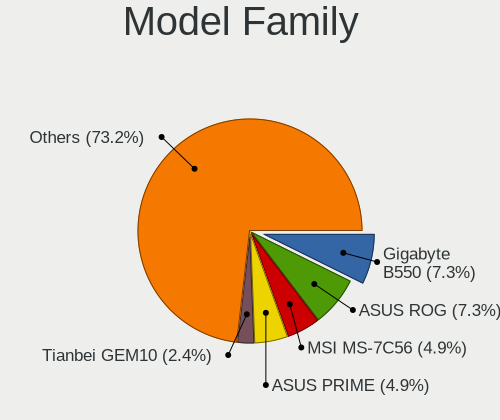
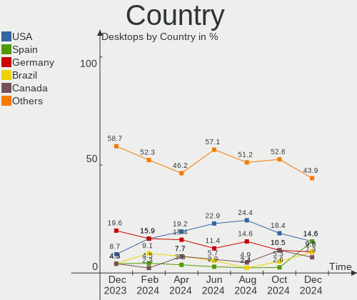
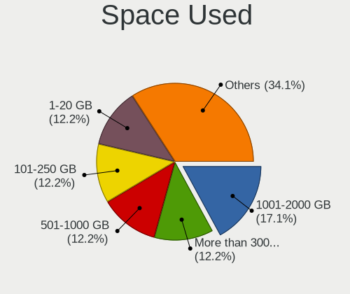
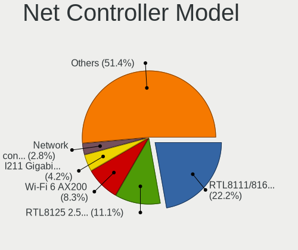

Manjaro - Hardware Trends (Desktops)
------------------------------------

A project to identify most popular hardware characteristics and track their change
over time based on data collected by Linux users at https://Linux-Hardware.org.

Anyone can contribute to this report by the [hw-probe](https://github.com/linuxhw/hw-probe) tool:

    sudo -E hw-probe -all -upload

This report is for one last month. Overall report since the beginning of time: [TestDays](https://github.com/linuxhw/TestDays)

Period: Jun, 2023.

Contents
--------

* [ System ](#system)
  - [ OS                       ](#os)
  - [ OS Family                ](#os-family)
  - [ Kernel                   ](#kernel)
  - [ Kernel Family            ](#kernel-family)
  - [ Kernel Major Ver.        ](#kernel-major-ver)
  - [ Arch                     ](#arch)
  - [ DE                       ](#de)
  - [ Display Server           ](#display-server)
  - [ Display Manager          ](#display-manager)
  - [ OS Lang                  ](#os-lang)
  - [ Boot Mode                ](#boot-mode)
  - [ Filesystem               ](#filesystem)
  - [ Part. scheme             ](#part-scheme)
  - [ Dual Boot with Linux/BSD ](#dual-boot-with-linuxbsd)
  - [ Dual Boot (Win)          ](#dual-boot-win)

* [ Board ](#board)
  - [ Vendor                   ](#vendor)
  - [ Model                    ](#model)
  - [ Model Family             ](#model-family)
  - [ MFG Year                 ](#mfg-year)
  - [ Form Factor              ](#form-factor)
  - [ Secure Boot              ](#secure-boot)
  - [ Coreboot                 ](#coreboot)
  - [ RAM Size                 ](#ram-size)
  - [ RAM Used                 ](#ram-used)
  - [ Total Drives             ](#total-drives)
  - [ Has CD-ROM               ](#has-cd-rom)
  - [ Has Ethernet             ](#has-ethernet)
  - [ Has WiFi                 ](#has-wifi)
  - [ Has Bluetooth            ](#has-bluetooth)

* [ Location ](#location)
  - [ Country                  ](#country)
  - [ City                     ](#city)

* [ Drives ](#drives)
  - [ Drive Vendor             ](#drive-vendor)
  - [ Drive Model              ](#drive-model)
  - [ HDD Vendor               ](#hdd-vendor)
  - [ SSD Vendor               ](#ssd-vendor)
  - [ Drive Kind               ](#drive-kind)
  - [ Drive Connector          ](#drive-connector)
  - [ Drive Size               ](#drive-size)
  - [ Space Total              ](#space-total)
  - [ Space Used               ](#space-used)
  - [ Malfunc. Drives          ](#malfunc-drives)
  - [ Malfunc. Drive Vendor    ](#malfunc-drive-vendor)
  - [ Malfunc. HDD Vendor      ](#malfunc-hdd-vendor)
  - [ Malfunc. Drive Kind      ](#malfunc-drive-kind)
  - [ Failed Drives            ](#failed-drives)
  - [ Failed Drive Vendor      ](#failed-drive-vendor)
  - [ Drive Status             ](#drive-status)

* [ Storage controller ](#storage-controller)
  - [ Storage Vendor           ](#storage-vendor)
  - [ Storage Model            ](#storage-model)
  - [ Storage Kind             ](#storage-kind)

* [ Processor ](#processor)
  - [ CPU Vendor               ](#cpu-vendor)
  - [ CPU Model                ](#cpu-model)
  - [ CPU Model Family         ](#cpu-model-family)
  - [ CPU Cores                ](#cpu-cores)
  - [ CPU Sockets              ](#cpu-sockets)
  - [ CPU Threads              ](#cpu-threads)
  - [ CPU Op-Modes             ](#cpu-op-modes)
  - [ CPU Microcode            ](#cpu-microcode)
  - [ CPU Microarch            ](#cpu-microarch)

* [ Graphics ](#graphics)
  - [ GPU Vendor               ](#gpu-vendor)
  - [ GPU Model                ](#gpu-model)
  - [ GPU Combo                ](#gpu-combo)
  - [ GPU Driver               ](#gpu-driver)
  - [ GPU Memory               ](#gpu-memory)

* [ Monitor ](#monitor)
  - [ Monitor Vendor           ](#monitor-vendor)
  - [ Monitor Model            ](#monitor-model)
  - [ Monitor Resolution       ](#monitor-resolution)
  - [ Monitor Diagonal         ](#monitor-diagonal)
  - [ Monitor Width            ](#monitor-width)
  - [ Aspect Ratio             ](#aspect-ratio)
  - [ Monitor Area             ](#monitor-area)
  - [ Pixel Density            ](#pixel-density)
  - [ Multiple Monitors        ](#multiple-monitors)

* [ Network ](#network)
  - [ Net Controller Vendor    ](#net-controller-vendor)
  - [ Net Controller Model     ](#net-controller-model)
  - [ Wireless Vendor          ](#wireless-vendor)
  - [ Wireless Model           ](#wireless-model)
  - [ Ethernet Vendor          ](#ethernet-vendor)
  - [ Ethernet Model           ](#ethernet-model)
  - [ Net Controller Kind      ](#net-controller-kind)
  - [ Used Controller          ](#used-controller)
  - [ NICs                     ](#nics)
  - [ IPv6                     ](#ipv6)

* [ Bluetooth ](#bluetooth)
  - [ Bluetooth Vendor         ](#bluetooth-vendor)
  - [ Bluetooth Model          ](#bluetooth-model)

* [ Sound ](#sound)
  - [ Sound Vendor             ](#sound-vendor)
  - [ Sound Model              ](#sound-model)

* [ Memory ](#memory)
  - [ Memory Vendor            ](#memory-vendor)
  - [ Memory Model             ](#memory-model)
  - [ Memory Kind              ](#memory-kind)
  - [ Memory Form Factor       ](#memory-form-factor)
  - [ Memory Size              ](#memory-size)
  - [ Memory Speed             ](#memory-speed)

* [ Printers & scanners ](#printers--scanners)
  - [ Printer Vendor           ](#printer-vendor)
  - [ Printer Model            ](#printer-model)
  - [ Scanner Vendor           ](#scanner-vendor)
  - [ Scanner Model            ](#scanner-model)

* [ Camera ](#camera)
  - [ Camera Vendor            ](#camera-vendor)
  - [ Camera Model             ](#camera-model)

* [ Security ](#security)
  - [ Fingerprint Vendor       ](#fingerprint-vendor)
  - [ Fingerprint Model        ](#fingerprint-model)
  - [ Chipcard Vendor          ](#chipcard-vendor)
  - [ Chipcard Model           ](#chipcard-model)

* [ Unsupported ](#unsupported)
  - [ Unsupported Devices      ](#unsupported-devices)
  - [ Unsupported Device Types ](#unsupported-device-types)

System
------

OS
--

Installed operating systems

| Name                      | Desktops | Percent |
|---------------------------|----------|---------|
| Manjaro                   | 38       | 64.41%  |
| Manjaro 23.0.0            | 19       | 32.2%   |
| Manjaro 23.06-development | 1        | 1.69%   |
| Manjaro 22.1.3            | 1        | 1.69%   |

OS Family
---------

OS without a version

| Name    | Desktops | Percent |
|---------|----------|---------|
| Manjaro | 59       | 100%    |

Kernel
------

Version of the Linux kernel

| Version              | Desktops | Percent |
|----------------------|----------|---------|
| 6.1.31-2-MANJARO     | 24       | 40.68%  |
| 6.3.5-2-MANJARO      | 10       | 16.95%  |
| 5.15.114-2-MANJARO   | 6        | 10.17%  |
| 6.3.3-1-MANJARO      | 2        | 3.39%   |
| 5.9.16-1-MANJARO     | 2        | 3.39%   |
| 6.3.9-1-MANJARO      | 1        | 1.69%   |
| 6.3.7-1-MANJARO      | 1        | 1.69%   |
| 6.3.5-lqx1-1-lqx     | 1        | 1.69%   |
| 6.3.5-1-MANJARO      | 1        | 1.69%   |
| 6.3.4-zen1-1-zen     | 1        | 1.69%   |
| 6.3.10-1-MANJARO     | 1        | 1.69%   |
| 6.3.1-1-rt13-MANJARO | 1        | 1.69%   |
| 6.2.16-2-MANJARO     | 1        | 1.69%   |
| 6.2.16-1-MANJARO     | 1        | 1.69%   |
| 6.2.0-4-tt           | 1        | 1.69%   |
| 6.1.31-1-MANJARO     | 1        | 1.69%   |
| 5.9.11-3-MANJARO     | 1        | 1.69%   |
| 5.15.114-1-MANJARO   | 1        | 1.69%   |
| 5.10.181-1-MANJARO   | 1        | 1.69%   |
| 5.10.179-1-MANJARO   | 1        | 1.69%   |

Kernel Family
-------------

Linux kernel without a distro release

| Version  | Desktops | Percent |
|----------|----------|---------|
| 6.1.31   | 25       | 42.37%  |
| 6.3.5    | 12       | 20.34%  |
| 5.15.114 | 7        | 11.86%  |
| 6.3.3    | 2        | 3.39%   |
| 6.2.16   | 2        | 3.39%   |
| 5.9.16   | 2        | 3.39%   |
| 6.3.9    | 1        | 1.69%   |
| 6.3.7    | 1        | 1.69%   |
| 6.3.4    | 1        | 1.69%   |
| 6.3.10   | 1        | 1.69%   |
| 6.3.1    | 1        | 1.69%   |
| 6.2.0    | 1        | 1.69%   |
| 5.9.11   | 1        | 1.69%   |
| 5.10.181 | 1        | 1.69%   |
| 5.10.179 | 1        | 1.69%   |

Kernel Major Ver.
-----------------

Linux kernel major version

| Version | Desktops | Percent |
|---------|----------|---------|
| 6.1     | 25       | 42.37%  |
| 6.3     | 19       | 32.2%   |
| 5.15    | 7        | 11.86%  |
| 6.2     | 3        | 5.08%   |
| 5.9     | 3        | 5.08%   |
| 5.10    | 2        | 3.39%   |

Arch
----

OS architecture (x86_64, i586, etc.)

| Name   | Desktops | Percent |
|--------|----------|---------|
| x86_64 | 59       | 100%    |

DE
--

Desktop Environment

| Name    | Desktops | Percent |
|---------|----------|---------|
| KDE5    | 33       | 55.93%  |
| XFCE    | 12       | 20.34%  |
| GNOME   | 12       | 20.34%  |
| i3      | 1        | 1.69%   |
| Unknown | 1        | 1.69%   |

Display Server
--------------

X11 or Wayland

| Name    | Desktops | Percent |
|---------|----------|---------|
| X11     | 50       | 84.75%  |
| Wayland | 7        | 11.86%  |
| Tty     | 1        | 1.69%   |
| Unknown | 1        | 1.69%   |

Display Manager
---------------

SDDM, LightDM, etc.

| Name    | Desktops | Percent |
|---------|----------|---------|
| Unknown | 38       | 64.41%  |
| SDDM    | 12       | 20.34%  |
| LightDM | 5        | 8.47%   |
| GDM     | 4        | 6.78%   |

OS Lang
-------

Language

| Lang  | Desktops | Percent |
|-------|----------|---------|
| en_US | 24       | 40.68%  |
| en_GB | 5        | 8.47%   |
| de_DE | 4        | 6.78%   |
| de_CH | 3        | 5.08%   |
| ru_RU | 2        | 3.39%   |
| pt_BR | 2        | 3.39%   |
| en_AU | 2        | 3.39%   |
| de_AT | 2        | 3.39%   |
| zh_TW | 1        | 1.69%   |
| tr_TR | 1        | 1.69%   |
| ro_RO | 1        | 1.69%   |
| pl_PL | 1        | 1.69%   |
| ja_JP | 1        | 1.69%   |
| it_IT | 1        | 1.69%   |
| hu_HU | 1        | 1.69%   |
| fr_FR | 1        | 1.69%   |
| fr_CA | 1        | 1.69%   |
| es_PE | 1        | 1.69%   |
| es_ES | 1        | 1.69%   |
| es_AR | 1        | 1.69%   |
| en_DE | 1        | 1.69%   |
| en_CA | 1        | 1.69%   |
| cs_CZ | 1        | 1.69%   |

Boot Mode
---------

EFI or BIOS

| Mode | Desktops | Percent |
|------|----------|---------|
| BIOS | 42       | 71.19%  |
| EFI  | 17       | 28.81%  |

Filesystem
----------

Type of filesystem

| Type  | Desktops | Percent |
|-------|----------|---------|
| Ext4  | 39       | 66.1%   |
| Btrfs | 16       | 27.12%  |
| Tmpfs | 3        | 5.08%   |
| Xfs   | 1        | 1.69%   |

Part. scheme
------------

Scheme of partitioning

| Type    | Desktops | Percent |
|---------|----------|---------|
| Unknown | 38       | 64.41%  |
| GPT     | 20       | 33.9%   |
| MBR     | 1        | 1.69%   |

Dual Boot with Linux/BSD
------------------------

Hosting more than one Linux/BSD

| Dual boot | Desktops | Percent |
|-----------|----------|---------|
| No        | 53       | 89.83%  |
| Yes       | 6        | 10.17%  |

Dual Boot (Win)
---------------

Hosting Linux and Windows

| Dual boot | Desktops | Percent |
|-----------|----------|---------|
| No        | 46       | 77.97%  |
| Yes       | 13       | 22.03%  |

Board
-----

Vendor
------

Motherboard manufacturer

| Name                | Desktops | Percent |
|---------------------|----------|---------|
| MSI                 | 13       | 22.03%  |
| ASUSTek Computer    | 13       | 22.03%  |
| Gigabyte Technology | 10       | 16.95%  |
| ASRock              | 8        | 13.56%  |
| Hewlett-Packard     | 7        | 11.86%  |
| Dell                | 2        | 3.39%   |
| Positivo            | 1        | 1.69%   |
| Fujitsu             | 1        | 1.69%   |
| Foxconn             | 1        | 1.69%   |
| DIEBOLD             | 1        | 1.69%   |
| Biostar             | 1        | 1.69%   |
| Unknown             | 1        | 1.69%   |

Model
-----

Motherboard model

| Name                                      | Desktops | Percent |
|-------------------------------------------|----------|---------|
| MSI MS-7C37                               | 3        | 5.08%   |
| MSI MS-7C91                               | 2        | 3.39%   |
| MSI MS-7C02                               | 2        | 3.39%   |
| Positivo POS-EIQ87CY                      | 1        | 1.69%   |
| MSI MS-7C95                               | 1        | 1.69%   |
| MSI MS-7B93                               | 1        | 1.69%   |
| MSI MS-7A95                               | 1        | 1.69%   |
| MSI MS-7A35                               | 1        | 1.69%   |
| MSI MS-7978                               | 1        | 1.69%   |
| MSI MS-7597                               | 1        | 1.69%   |
| HP Victus by 15L Gaming Desktop TG02-0xxx | 1        | 1.69%   |
| HP Pavilion Gaming Desktop TG01-0xxx      | 1        | 1.69%   |
| HP OMEN by Desktop PC 880-p1xx            | 1        | 1.69%   |
| HP OMEN by 40L Gaming Desktop GT21-0xxx   | 1        | 1.69%   |
| HP Compaq 4000 Pro SFF PC                 | 1        | 1.69%   |
| HP 700-567nz                              | 1        | 1.69%   |
| HP 280 G2 SFF                             | 1        | 1.69%   |
| Gigabyte Z790 AORUS ELITE AX              | 1        | 1.69%   |
| Gigabyte X670 AORUS ELITE AX              | 1        | 1.69%   |
| Gigabyte X570S I AORUS PRO AX             | 1        | 1.69%   |
| Gigabyte X470 AORUS ULTRA GAMING          | 1        | 1.69%   |
| Gigabyte B650I AORUS ULTRA                | 1        | 1.69%   |
| Gigabyte B560M AORUS PRO AX               | 1        | 1.69%   |
| Gigabyte B550 GAMING X V2                 | 1        | 1.69%   |
| Gigabyte B450M DS3H                       | 1        | 1.69%   |
| Gigabyte A520M H                          | 1        | 1.69%   |
| Gigabyte 970A-D3                          | 1        | 1.69%   |
| Fujitsu CELSIUS W420                      | 1        | 1.69%   |
| Foxconn 400-034                           | 1        | 1.69%   |
| DIEBOLD B85H3-M5                          | 1        | 1.69%   |
| Dell OptiPlex 9020                        | 1        | 1.69%   |
| Dell OptiPlex 7050                        | 1        | 1.69%   |
| Biostar B450MX-S                          | 1        | 1.69%   |
| ASUS Z170M-PLUS                           | 1        | 1.69%   |
| ASUS TUF Gaming Z690-PLUS D4              | 1        | 1.69%   |
| ASUS TUF Gaming B650M-PLUS WIFI           | 1        | 1.69%   |
| ASUS ROG STRIX X470-I GAMING              | 1        | 1.69%   |
| ASUS ROG STRIX B550-F GAMING              | 1        | 1.69%   |
| ASUS ROG STRIX B450-F GAMING II           | 1        | 1.69%   |
| ASUS PRIME B560M-K                        | 1        | 1.69%   |

Model Family
------------

Motherboard model prefix

| Name                 | Desktops | Percent |
|----------------------|----------|---------|
| MSI MS-7C37          | 3        | 5.08%   |
| ASUS ROG             | 3        | 5.08%   |
| ASUS PRIME           | 3        | 5.08%   |
| MSI MS-7C91          | 2        | 3.39%   |
| MSI MS-7C02          | 2        | 3.39%   |
| HP OMEN              | 2        | 3.39%   |
| Dell OptiPlex        | 2        | 3.39%   |
| ASUS TUF             | 2        | 3.39%   |
| ASRock B450          | 2        | 3.39%   |
| Positivo POS-EIQ87CY | 1        | 1.69%   |
| MSI MS-7C95          | 1        | 1.69%   |
| MSI MS-7B93          | 1        | 1.69%   |
| MSI MS-7A95          | 1        | 1.69%   |
| MSI MS-7A35          | 1        | 1.69%   |
| MSI MS-7978          | 1        | 1.69%   |
| MSI MS-7597          | 1        | 1.69%   |
| HP Victus            | 1        | 1.69%   |
| HP Pavilion          | 1        | 1.69%   |
| HP Compaq            | 1        | 1.69%   |
| HP 700-567nz         | 1        | 1.69%   |
| HP 280               | 1        | 1.69%   |
| Gigabyte Z790        | 1        | 1.69%   |
| Gigabyte X670        | 1        | 1.69%   |
| Gigabyte X570S       | 1        | 1.69%   |
| Gigabyte X470        | 1        | 1.69%   |
| Gigabyte B650I       | 1        | 1.69%   |
| Gigabyte B560M       | 1        | 1.69%   |
| Gigabyte B550        | 1        | 1.69%   |
| Gigabyte B450M       | 1        | 1.69%   |
| Gigabyte A520M       | 1        | 1.69%   |
| Gigabyte 970A-D3     | 1        | 1.69%   |
| Fujitsu CELSIUS      | 1        | 1.69%   |
| Foxconn 400-034      | 1        | 1.69%   |
| DIEBOLD B85H3-M5     | 1        | 1.69%   |
| Biostar B450MX-S     | 1        | 1.69%   |
| ASUS Z170M-PLUS      | 1        | 1.69%   |
| ASUS Nobilis         | 1        | 1.69%   |
| ASUS M5A97           | 1        | 1.69%   |
| ASUS M5A78L-M        | 1        | 1.69%   |
| ASUS M4A89GTD-PRO    | 1        | 1.69%   |

MFG Year
--------

Motherboard manufacture year

| Year | Desktops | Percent |
|------|----------|---------|
| 2020 | 11       | 18.64%  |
| 2018 | 8        | 13.56%  |
| 2021 | 6        | 10.17%  |
| 2019 | 6        | 10.17%  |
| 2022 | 5        | 8.47%   |
| 2017 | 5        | 8.47%   |
| 2015 | 4        | 6.78%   |
| 2016 | 3        | 5.08%   |
| 2012 | 3        | 5.08%   |
| 2011 | 3        | 5.08%   |
| 2023 | 1        | 1.69%   |
| 2014 | 1        | 1.69%   |
| 2013 | 1        | 1.69%   |
| 2010 | 1        | 1.69%   |
| 2009 | 1        | 1.69%   |

Form Factor
-----------

Physical design of the computer

| Name    | Desktops | Percent |
|---------|----------|---------|
| Desktop | 59       | 100%    |

Secure Boot
-----------

Enabled or disabled

| State    | Desktops | Percent |
|----------|----------|---------|
| Disabled | 59       | 100%    |

Coreboot
--------

Have coreboot on board

| Used | Desktops | Percent |
|------|----------|---------|
| No   | 59       | 100%    |

RAM Size
--------

Total RAM memory

| Size in GB  | Desktops | Percent |
|-------------|----------|---------|
| 32.01-64.0  | 21       | 35.59%  |
| 16.01-24.0  | 16       | 27.12%  |
| 4.01-8.0    | 7        | 11.86%  |
| 24.01-32.0  | 7        | 11.86%  |
| 8.01-16.0   | 5        | 8.47%   |
| 64.01-256.0 | 2        | 3.39%   |
| 3.01-4.0    | 1        | 1.69%   |

RAM Used
--------

Used RAM memory

| Used GB    | Desktops | Percent |
|------------|----------|---------|
| 4.01-8.0   | 20       | 33.9%   |
| 3.01-4.0   | 11       | 18.64%  |
| 2.01-3.0   | 10       | 16.95%  |
| 1.01-2.0   | 9        | 15.25%  |
| 8.01-16.0  | 6        | 10.17%  |
| 16.01-24.0 | 2        | 3.39%   |
| 24.01-32.0 | 1        | 1.69%   |

Total Drives
------------

Number of drives on board

| Drives | Desktops | Percent |
|--------|----------|---------|
| 2      | 19       | 32.2%   |
| 3      | 16       | 27.12%  |
| 4      | 11       | 18.64%  |
| 1      | 7        | 11.86%  |
| 5      | 3        | 5.08%   |
| 6      | 2        | 3.39%   |
| 9      | 1        | 1.69%   |

Has CD-ROM
----------

Has CD-ROM on board

| Presented | Desktops | Percent |
|-----------|----------|---------|
| No        | 44       | 74.58%  |
| Yes       | 15       | 25.42%  |

Has Ethernet
------------

Has Ethernet on board

| Presented | Desktops | Percent |
|-----------|----------|---------|
| Yes       | 59       | 100%    |

Has WiFi
--------

Has WiFi module

| Presented | Desktops | Percent |
|-----------|----------|---------|
| Yes       | 30       | 50.85%  |
| No        | 29       | 49.15%  |

Has Bluetooth
-------------

Has Bluetooth module

| Presented | Desktops | Percent |
|-----------|----------|---------|
| Yes       | 30       | 50.85%  |
| No        | 29       | 49.15%  |

Location
--------

Country
-------

Geographic location (country)

| Country     | Desktops | Percent |
|-------------|----------|---------|
| USA         | 14       | 23.73%  |
| Germany     | 6        | 10.17%  |
| Canada      | 5        | 8.47%   |
| Brazil      | 5        | 8.47%   |
| UK          | 3        | 5.08%   |
| Switzerland | 3        | 5.08%   |
| Sweden      | 2        | 3.39%   |
| Russia      | 2        | 3.39%   |
| Hungary     | 2        | 3.39%   |
| Austria     | 2        | 3.39%   |
| Australia   | 2        | 3.39%   |
| Turkey      | 1        | 1.69%   |
| Taiwan      | 1        | 1.69%   |
| Spain       | 1        | 1.69%   |
| Romania     | 1        | 1.69%   |
| Portugal    | 1        | 1.69%   |
| Peru        | 1        | 1.69%   |
| Japan       | 1        | 1.69%   |
| Italy       | 1        | 1.69%   |
| France      | 1        | 1.69%   |
| Denmark     | 1        | 1.69%   |
| Czechia     | 1        | 1.69%   |
| Colombia    | 1        | 1.69%   |
| Argentina   | 1        | 1.69%   |

City
----

Geographic location (city)

| City                     | Desktops | Percent |
|--------------------------|----------|---------|
| Seattle                  | 2        | 3.39%   |
| Zalaegerszeg             | 1        | 1.69%   |
| Yekaterinburg            | 1        | 1.69%   |
| Whittier                 | 1        | 1.69%   |
| Westville                | 1        | 1.69%   |
| Wels                     | 1        | 1.69%   |
| Wangen                   | 1        | 1.69%   |
| Virginia Beach           | 1        | 1.69%   |
| Varberg                  | 1        | 1.69%   |
| Tyler                    | 1        | 1.69%   |
| Tübingen                | 1        | 1.69%   |
| Toronto                  | 1        | 1.69%   |
| Tokyo                    | 1        | 1.69%   |
| Timișoara               | 1        | 1.69%   |
| Thun                     | 1        | 1.69%   |
| Taipei                   | 1        | 1.69%   |
| State College            | 1        | 1.69%   |
| Spruce Grove             | 1        | 1.69%   |
| Spokane                  | 1        | 1.69%   |
| Snedsted                 | 1        | 1.69%   |
| Sao Paulo                | 1        | 1.69%   |
| Sao Jose                 | 1        | 1.69%   |
| Sainte-Anne-de-la-Perade | 1        | 1.69%   |
| Piura                    | 1        | 1.69%   |
| Paris                    | 1        | 1.69%   |
| Orleans                  | 1        | 1.69%   |
| Ocala                    | 1        | 1.69%   |
| North Vancouver          | 1        | 1.69%   |
| Munich                   | 1        | 1.69%   |
| Moscow                   | 1        | 1.69%   |
| Monte Redondo            | 1        | 1.69%   |
| Melbourne                | 1        | 1.69%   |
| Meiningen                | 1        | 1.69%   |
| Málaga                  | 1        | 1.69%   |
| Mafra                    | 1        | 1.69%   |
| Madison Heights          | 1        | 1.69%   |
| Macaé                   | 1        | 1.69%   |
| Longmont                 | 1        | 1.69%   |
| London                   | 1        | 1.69%   |
| Lincoln                  | 1        | 1.69%   |

Drives
------

Drive Vendor
------------

Hard drive vendors

| Vendor                       | Desktops | Drives | Percent |
|------------------------------|----------|--------|---------|
| Seagate                      | 23       | 31     | 16.91%  |
| Samsung Electronics          | 18       | 27     | 13.24%  |
| WDC                          | 16       | 24     | 11.76%  |
| Toshiba                      | 12       | 15     | 8.82%   |
| SanDisk                      | 11       | 15     | 8.09%   |
| Kingston                     | 11       | 12     | 8.09%   |
| Unknown                      | 4        | 6      | 2.94%   |
| Phison Electronics           | 4        | 4      | 2.94%   |
| Micron/Crucial Technology    | 3        | 3      | 2.21%   |
| Hitachi                      | 3        | 3      | 2.21%   |
| Crucial                      | 3        | 3      | 2.21%   |
| ADATA Technology             | 3        | 3      | 2.21%   |
| PNY                          | 2        | 2      | 1.47%   |
| Intel                        | 2        | 2      | 1.47%   |
| HGST                         | 2        | 2      | 1.47%   |
| A-DATA Technology            | 2        | 2      | 1.47%   |
| Team                         | 1        | 1      | 0.74%   |
| SPCC                         | 1        | 1      | 0.74%   |
| SK hynix                     | 1        | 1      | 0.74%   |
| Silicon Motion               | 1        | 1      | 0.74%   |
| Shenzhen Longsys Electronics | 1        | 1      | 0.74%   |
| Realtek Semiconductor        | 1        | 1      | 0.74%   |
| OCZ                          | 1        | 1      | 0.74%   |
| Netac                        | 1        | 1      | 0.74%   |
| Marvell Technology Group     | 1        | 1      | 0.74%   |
| Lexar                        | 1        | 1      | 0.74%   |
| KingSpec                     | 1        | 1      | 0.74%   |
| JMicron Technology           | 1        | 1      | 0.74%   |
| HS-SSD-E100                  | 1        | 1      | 0.74%   |
| GOODRAM                      | 1        | 1      | 0.74%   |
| Fujitsu                      | 1        | 1      | 0.74%   |
| China                        | 1        | 1      | 0.74%   |
| Acer                         | 1        | 1      | 0.74%   |

Drive Model
-----------

Hard drive models

| Model                                               | Desktops | Percent |
|-----------------------------------------------------|----------|---------|
| Samsung NVMe SSD Controller SM981/PM981/PM983 250GB | 5        | 3.09%   |
| Toshiba DT01ACA100 1TB                              | 4        | 2.47%   |
| Seagate ST1000DM010-2EP102 1TB                      | 4        | 2.47%   |
| SanDisk SSD PLUS 480GB                              | 3        | 1.85%   |
| Samsung NVMe SSD Controller PM9A1/PM9A3/980PRO 2TB  | 3        | 1.85%   |
| Phison E12 NVMe Controller 1TB                      | 3        | 1.85%   |
| Kingston SNVS500G 500GB                             | 3        | 1.85%   |
| WDC WDS100T2B0B-00YS70 1TB SSD                      | 2        | 1.23%   |
| WDC WD30EFRX-68EUZN0 3TB                            | 2        | 1.23%   |
| Unknown SD/MMC/MS PRO 250GB                         | 2        | 1.23%   |
| Seagate ST500DM002-1BD142 500GB                     | 2        | 1.23%   |
| Seagate ST3250318AS 250GB                           | 2        | 1.23%   |
| Seagate ST250DM000-1BD141 250GB                     | 2        | 1.23%   |
| Seagate ST2000DM008-2FR102 2TB                      | 2        | 1.23%   |
| Seagate ST1000DM003-1CH162 1TB                      | 2        | 1.23%   |
| Samsung SSD 980 1TB                                 | 2        | 1.23%   |
| Samsung SSD 870 QVO 1TB                             | 2        | 1.23%   |
| Samsung SSD 860 EVO 1TB                             | 2        | 1.23%   |
| Samsung SSD 850 EVO 250GB                           | 2        | 1.23%   |
| Kingston SNV2S500G 500GB                            | 2        | 1.23%   |
| Kingston SA400S37120G 120GB SSD                     | 2        | 1.23%   |
| Crucial CT500MX500SSD1 500GB                        | 2        | 1.23%   |
| ADATA XPG GAMMIX S70 BLADE 1TB                      | 2        | 1.23%   |
| WDC WDS500G2B0A 500GB SSD                           | 1        | 0.62%   |
| WDC WDS400T2B0A-00SM50 4TB SSD                      | 1        | 0.62%   |
| WDC WDS100T2B0A 1TB SSD                             | 1        | 0.62%   |
| WDC WD6401AALS-00J7B0 640GB                         | 1        | 0.62%   |
| WDC WD60EZAZ-00ZGHB0 6TB                            | 1        | 0.62%   |
| WDC WD40EFRX-68N32N0 4TB                            | 1        | 0.62%   |
| WDC WD4005FZBX-00K5WB0 4TB                          | 1        | 0.62%   |
| WDC WD4002FYYZ-01B7CB0 4TB                          | 1        | 0.62%   |
| WDC WD30EZRX-00D8PB0 3TB                            | 1        | 0.62%   |
| WDC WD3000FYYZ-01UL1B0 3TB                          | 1        | 0.62%   |
| WDC WD20EFRX-68AX9N0 2TB                            | 1        | 0.62%   |
| WDC WD20EARS-00MVWB0 2TB                            | 1        | 0.62%   |
| WDC WD1600AAJS-00YZCA0 160GB                        | 1        | 0.62%   |
| WDC WD1200JD-00HBB0 120GB                           | 1        | 0.62%   |
| WDC WD10SPZX-22Z10T0 1TB                            | 1        | 0.62%   |
| WDC WD10EZEX-22MFCA0 1TB                            | 1        | 0.62%   |
| WDC WD10EACS-00ZJB0 1TB                             | 1        | 0.62%   |

HDD Vendor
----------

Hard disk drive vendors

| Vendor  | Desktops | Drives | Percent |
|---------|----------|--------|---------|
| Seagate | 22       | 29     | 40.74%  |
| WDC     | 12       | 18     | 22.22%  |
| Toshiba | 12       | 14     | 22.22%  |
| Hitachi | 3        | 3      | 5.56%   |
| Unknown | 2        | 2      | 3.7%    |
| HGST    | 2        | 2      | 3.7%    |
| Fujitsu | 1        | 1      | 1.85%   |

SSD Vendor
----------

Solid state drive vendors

| Vendor              | Desktops | Drives | Percent |
|---------------------|----------|--------|---------|
| Samsung Electronics | 12       | 16     | 27.27%  |
| SanDisk             | 6        | 7      | 13.64%  |
| Kingston            | 5        | 5      | 11.36%  |
| WDC                 | 4        | 6      | 9.09%   |
| Crucial             | 3        | 3      | 6.82%   |
| PNY                 | 2        | 2      | 4.55%   |
| A-DATA Technology   | 2        | 2      | 4.55%   |
| Team                | 1        | 1      | 2.27%   |
| SPCC                | 1        | 1      | 2.27%   |
| Seagate             | 1        | 1      | 2.27%   |
| OCZ                 | 1        | 1      | 2.27%   |
| Netac               | 1        | 1      | 2.27%   |
| Lexar               | 1        | 1      | 2.27%   |
| KingSpec            | 1        | 1      | 2.27%   |
| GOODRAM             | 1        | 1      | 2.27%   |
| China               | 1        | 1      | 2.27%   |
| Acer                | 1        | 1      | 2.27%   |

Drive Kind
----------

HDD or SSD

| Kind    | Desktops | Drives | Percent |
|---------|----------|--------|---------|
| SSD     | 39       | 51     | 33.33%  |
| HDD     | 38       | 69     | 32.48%  |
| NVMe    | 37       | 47     | 31.62%  |
| Unknown | 3        | 4      | 2.56%   |

Drive Connector
---------------

SATA, SAS, NVMe, etc.

| Type | Desktops | Drives | Percent |
|------|----------|--------|---------|
| SATA | 53       | 118    | 55.21%  |
| NVMe | 37       | 46     | 38.54%  |
| SAS  | 6        | 7      | 6.25%   |

Drive Size
----------

Size of hard drive

| Size in TB | Desktops | Drives | Percent |
|------------|----------|--------|---------|
| 0.01-0.5   | 32       | 49     | 37.21%  |
| 0.51-1.0   | 28       | 39     | 32.56%  |
| 1.01-2.0   | 10       | 12     | 11.63%  |
| 3.01-4.0   | 9        | 9      | 10.47%  |
| 2.01-3.0   | 4        | 7      | 4.65%   |
| 4.01-10.0  | 3        | 4      | 3.49%   |

Space Total
-----------

Amount of disk space available on the file system

| Size in GB     | Desktops | Percent |
|----------------|----------|---------|
| More than 3000 | 14       | 23.73%  |
| 1001-2000      | 14       | 23.73%  |
| 501-1000       | 12       | 20.34%  |
| 251-500        | 8        | 13.56%  |
| 2001-3000      | 4        | 6.78%   |
| 101-250        | 4        | 6.78%   |
| 1-20           | 1        | 1.69%   |
| 51-100         | 1        | 1.69%   |
| Unknown        | 1        | 1.69%   |

Space Used
----------

Amount of used disk space

| Used GB        | Desktops | Percent |
|----------------|----------|---------|
| 501-1000       | 10       | 16.95%  |
| 251-500        | 9        | 15.25%  |
| 1001-2000      | 9        | 15.25%  |
| 101-250        | 8        | 13.56%  |
| More than 3000 | 6        | 10.17%  |
| 1-20           | 6        | 10.17%  |
| 21-50          | 4        | 6.78%   |
| 51-100         | 4        | 6.78%   |
| 2001-3000      | 2        | 3.39%   |
| Unknown        | 1        | 1.69%   |

Malfunc. Drives
---------------

Drive models with a malfunction

| Model                                                           | Desktops | Drives | Percent |
|-----------------------------------------------------------------|----------|--------|---------|
| WDC WD3000FYYZ-01UL1B0 3TB                                      | 1        | 2      | 14.29%  |
| WDC WD1002FAEX-00Z3A0 1TB                                       | 1        | 1      | 14.29%  |
| Toshiba MQ01ABD100 1TB                                          | 1        | 1      | 14.29%  |
| Seagate ST4000DM004-2CV104 4TB                                  | 1        | 1      | 14.29%  |
| Seagate ST33000651AS 3TB                                        | 1        | 1      | 14.29%  |
| Seagate ST3250310NS 250GB                                       | 1        | 1      | 14.29%  |
| Samsung Electronics NVMe SSD Controller SM961/PM961/SM963 256GB | 1        | 1      | 14.29%  |

Malfunc. Drive Vendor
---------------------

Vendors of faulty drives

| Vendor              | Desktops | Drives | Percent |
|---------------------|----------|--------|---------|
| Seagate             | 3        | 3      | 42.86%  |
| WDC                 | 2        | 3      | 28.57%  |
| Toshiba             | 1        | 1      | 14.29%  |
| Samsung Electronics | 1        | 1      | 14.29%  |

Malfunc. HDD Vendor
-------------------

Vendors of faulty HDD drives

| Vendor  | Desktops | Drives | Percent |
|---------|----------|--------|---------|
| Seagate | 3        | 3      | 50%     |
| WDC     | 2        | 3      | 33.33%  |
| Toshiba | 1        | 1      | 16.67%  |

Malfunc. Drive Kind
-------------------

Kinds of faulty drives

| Kind | Desktops | Drives | Percent |
|------|----------|--------|---------|
| HDD  | 5        | 7      | 83.33%  |
| NVMe | 1        | 1      | 16.67%  |

Failed Drives
-------------

Failed drive models

Zero info for selected period =(

Failed Drive Vendor
-------------------

Failed drive vendors

Zero info for selected period =(

Drive Status
------------

Number of failed and malfunc. drives

| Status   | Desktops | Drives | Percent |
|----------|----------|--------|---------|
| Detected | 45       | 124    | 69.23%  |
| Works    | 14       | 39     | 21.54%  |
| Malfunc  | 6        | 8      | 9.23%   |

Storage controller
------------------

Storage Vendor
--------------

Storage controller vendors

| Vendor                       | Desktops | Percent |
|------------------------------|----------|---------|
| AMD                          | 33       | 29.46%  |
| Intel                        | 27       | 24.11%  |
| Samsung Electronics          | 10       | 8.93%   |
| SanDisk                      | 7        | 6.25%   |
| Kingston Technology Company  | 7        | 6.25%   |
| ASMedia Technology           | 6        | 5.36%   |
| Phison Electronics           | 4        | 3.57%   |
| Micron/Crucial Technology    | 3        | 2.68%   |
| ADATA Technology             | 3        | 2.68%   |
| Marvell Technology Group     | 2        | 1.79%   |
| JMicron Technology           | 2        | 1.79%   |
| Toshiba America Info Systems | 1        | 0.89%   |
| Solidigm                     | 1        | 0.89%   |
| SK hynix                     | 1        | 0.89%   |
| Silicon Motion               | 1        | 0.89%   |
| Shenzhen Longsys Electronics | 1        | 0.89%   |
| Realtek Semiconductor        | 1        | 0.89%   |
| Nvidia                       | 1        | 0.89%   |
| INNOGRIT                     | 1        | 0.89%   |

Storage Model
-------------

Storage controller models

| Model                                                                          | Desktops | Percent |
|--------------------------------------------------------------------------------|----------|---------|
| AMD FCH SATA Controller [AHCI mode]                                            | 18       | 13.64%  |
| AMD 400 Series Chipset SATA Controller                                         | 12       | 9.09%   |
| ASMedia ASM1062 Serial ATA Controller                                          | 6        | 4.55%   |
| AMD 500 Series Chipset SATA Controller                                         | 6        | 4.55%   |
| Samsung NVMe SSD Controller SM981/PM981/PM983                                  | 5        | 3.79%   |
| Intel 200 Series PCH SATA controller [AHCI mode]                               | 4        | 3.03%   |
| Samsung NVMe SSD Controller PM9A1/PM9A3/980PRO                                 | 3        | 2.27%   |
| Phison E12 NVMe Controller                                                     | 3        | 2.27%   |
| Intel Volume Management Device NVMe RAID Controller                            | 3        | 2.27%   |
| Intel Q170/Q150/B150/H170/H110/Z170/CM236 Chipset SATA Controller [AHCI Mode]  | 3        | 2.27%   |
| Intel Alder Lake-S PCH SATA Controller [AHCI Mode]                             | 3        | 2.27%   |
| Intel 500 Series Chipset Family SATA AHCI Controller                           | 3        | 2.27%   |
| AMD SB7x0/SB8x0/SB9x0 SATA Controller [AHCI mode]                              | 3        | 2.27%   |
| AMD SB7x0/SB8x0/SB9x0 IDE Controller                                           | 3        | 2.27%   |
| SanDisk WD Black SN770 NVMe SSD                                                | 2        | 1.52%   |
| Samsung NVMe SSD Controller 980                                                | 2        | 1.52%   |
| Kingston Company Company Non-Volatile memory controller                        | 2        | 1.52%   |
| Kingston Company SNVS2000G [NV1 NVMe PCIe SSD 2TB]                             | 2        | 1.52%   |
| Kingston Company NVMe Controller                                               | 2        | 1.52%   |
| Intel Cannon Lake PCH SATA AHCI Controller                                     | 2        | 1.52%   |
| Intel 8 Series/C220 Series Chipset Family 6-port SATA Controller 1 [AHCI mode] | 2        | 1.52%   |
| Intel 700 Series Chipset Family SATA AHCI Controller                           | 2        | 1.52%   |
| AMD X370 Series Chipset SATA Controller                                        | 2        | 1.52%   |
| AMD SB7x0/SB8x0/SB9x0 SATA Controller [IDE mode]                               | 2        | 1.52%   |
| ADATA A Non-Volatile memory controller                                         | 2        | 1.52%   |
| Toshiba America Info Systems XG5 NVMe SSD Controller                           | 1        | 0.76%   |
| Solidigm Non-Volatile memory controller                                        | 1        | 0.76%   |
| SK hynix Gold P31/BC711/PC711 NVMe Solid State Drive                           | 1        | 0.76%   |
| Silicon Motion SM2262/SM2262EN SSD Controller                                  | 1        | 0.76%   |
| Shenzhen Longsys Non-Volatile memory controller                                | 1        | 0.76%   |
| Sandisk Western Digital WD Black SN850X NVMe SSD                               | 1        | 0.76%   |
| SanDisk WD PC SN810 / Black SN850 NVMe SSD                                     | 1        | 0.76%   |
| SanDisk WD Blue SN570 NVMe SSD 1TB                                             | 1        | 0.76%   |
| SanDisk WD Black SN750 / PC SN730 NVMe SSD                                     | 1        | 0.76%   |
| SanDisk WD Black 2018/SN750 / PC SN720 NVMe SSD                                | 1        | 0.76%   |
| SanDisk Non-Volatile memory controller                                         | 1        | 0.76%   |
| Samsung NVMe SSD Controller SM961/PM961/SM963                                  | 1        | 0.76%   |
| Realtek RTS5763DL NVMe SSD Controller                                          | 1        | 0.76%   |
| Phison PS5013 E13 NVMe Controller                                              | 1        | 0.76%   |
| Nvidia MCP61 SATA Controller                                                   | 1        | 0.76%   |

Storage Kind
------------

Kind of storage controller (IDE, SATA, NVMe, SAS, ...)

| Kind | Desktops | Percent |
|------|----------|---------|
| SATA | 56       | 53.85%  |
| NVMe | 37       | 35.58%  |
| IDE  | 7        | 6.73%   |
| RAID | 4        | 3.85%   |

Processor
---------

CPU Vendor
----------

Processor vendors

| Vendor | Desktops | Percent |
|--------|----------|---------|
| AMD    | 34       | 57.63%  |
| Intel  | 25       | 42.37%  |

CPU Model
---------

Processor models

| Model                                       | Desktops | Percent |
|---------------------------------------------|----------|---------|
| AMD Ryzen 5 3600 6-Core Processor           | 4        | 6.78%   |
| AMD Ryzen 7 5800X 8-Core Processor          | 3        | 5.08%   |
| AMD Ryzen 7 5700G with Radeon Graphics      | 3        | 5.08%   |
| Intel Core i5-6500 CPU @ 3.20GHz            | 2        | 3.39%   |
| Intel 11th Gen Core i5-11400 @ 2.60GHz      | 2        | 3.39%   |
| AMD Ryzen 9 5900X 12-Core Processor         | 2        | 3.39%   |
| AMD Ryzen 7 3700X 8-Core Processor          | 2        | 3.39%   |
| AMD Ryzen 5 5500                            | 2        | 3.39%   |
| AMD FX-6300 Six-Core Processor              | 2        | 3.39%   |
| Intel Pentium Dual-Core CPU E5800 @ 3.20GHz | 1        | 1.69%   |
| Intel Pentium CPU G3260 @ 3.30GHz           | 1        | 1.69%   |
| Intel Pentium CPU G2020 @ 2.90GHz           | 1        | 1.69%   |
| Intel Core i7-8700K CPU @ 3.70GHz           | 1        | 1.69%   |
| Intel Core i7-7800X CPU @ 3.50GHz           | 1        | 1.69%   |
| Intel Core i7-7700K CPU @ 4.20GHz           | 1        | 1.69%   |
| Intel Core i7-4790 CPU @ 3.60GHz            | 1        | 1.69%   |
| Intel Core i7-3770 CPU @ 3.40GHz            | 1        | 1.69%   |
| Intel Core i7-10700K CPU @ 3.80GHz          | 1        | 1.69%   |
| Intel Core i7 CPU X 980 @ 3.33GHz           | 1        | 1.69%   |
| Intel Core i5-8400 CPU @ 2.80GHz            | 1        | 1.69%   |
| Intel Core i5-6600 CPU @ 3.30GHz            | 1        | 1.69%   |
| Intel Core i5-6400 CPU @ 2.70GHz            | 1        | 1.69%   |
| Intel Core i5-4590S CPU @ 3.00GHz           | 1        | 1.69%   |
| Intel Core i5-4590 CPU @ 3.30GHz            | 1        | 1.69%   |
| Intel Core i3-8100 CPU @ 3.60GHz            | 1        | 1.69%   |
| Intel 13th Gen Core i7-13700KF              | 1        | 1.69%   |
| Intel 12th Gen Core i9-12900F               | 1        | 1.69%   |
| Intel 12th Gen Core i7-12700F               | 1        | 1.69%   |
| Intel 12th Gen Core i5-12400                | 1        | 1.69%   |
| Intel 12th Gen Core i3-12100F               | 1        | 1.69%   |
| AMD Ryzen 9 7900X 12-Core Processor         | 1        | 1.69%   |
| AMD Ryzen 9 5950X 16-Core Processor         | 1        | 1.69%   |
| AMD Ryzen 7 7800X3D 8-Core Processor        | 1        | 1.69%   |
| AMD Ryzen 7 7700X 8-Core Processor          | 1        | 1.69%   |
| AMD Ryzen 7 3800X 8-Core Processor          | 1        | 1.69%   |
| AMD Ryzen 7 2700X Eight-Core Processor      | 1        | 1.69%   |
| AMD Ryzen 5 5600G with Radeon Graphics      | 1        | 1.69%   |
| AMD Ryzen 5 4600G with Radeon Graphics      | 1        | 1.69%   |
| AMD Ryzen 5 3600X 6-Core Processor          | 1        | 1.69%   |
| AMD Ryzen 5 2600 Six-Core Processor         | 1        | 1.69%   |

CPU Model Family
----------------

Processor model prefix

| Model                   | Desktops | Percent |
|-------------------------|----------|---------|
| AMD Ryzen 7             | 12       | 20.34%  |
| AMD Ryzen 5             | 11       | 18.64%  |
| Other                   | 7        | 11.86%  |
| Intel Core i7           | 7        | 11.86%  |
| Intel Core i5           | 7        | 11.86%  |
| AMD Ryzen 9             | 4        | 6.78%   |
| AMD FX                  | 4        | 6.78%   |
| Intel Pentium           | 2        | 3.39%   |
| Intel Pentium Dual-Core | 1        | 1.69%   |
| Intel Core i3           | 1        | 1.69%   |
| AMD Ryzen 3             | 1        | 1.69%   |
| AMD Phenom II X4        | 1        | 1.69%   |
| AMD Athlon II X2        | 1        | 1.69%   |

CPU Cores
---------

Number of processor cores

| Number | Desktops | Percent |
|--------|----------|---------|
| 6      | 18       | 30.51%  |
| 4      | 15       | 25.42%  |
| 8      | 13       | 22.03%  |
| 12     | 4        | 6.78%   |
| 2      | 4        | 6.78%   |
| 16     | 3        | 5.08%   |
| 3      | 2        | 3.39%   |

CPU Sockets
-----------

Number of sockets

| Number | Desktops | Percent |
|--------|----------|---------|
| 1      | 59       | 100%    |

CPU Threads
-----------

Threads per core (Hyper-Threading)

| Number | Desktops | Percent |
|--------|----------|---------|
| 2      | 45       | 76.27%  |
| 1      | 14       | 23.73%  |

CPU Op-Modes
------------

CPU Operation Modes (32-bit, 64-bit)

| Op mode        | Desktops | Percent |
|----------------|----------|---------|
| 32-bit, 64-bit | 59       | 100%    |

CPU Microcode
-------------

Microcode number

| Number     | Desktops | Percent |
|------------|----------|---------|
| Unknown    | 41       | 69.49%  |
| 0x0a20120a | 4        | 6.78%   |
| 0x0a50000d | 3        | 5.08%   |
| 0x306c3    | 2        | 3.39%   |
| 0x0a601203 | 2        | 3.39%   |
| 0xb0671    | 1        | 1.69%   |
| 0x506e3    | 1        | 1.69%   |
| 0x206c2    | 1        | 1.69%   |
| 0x08600106 | 1        | 1.69%   |
| 0x0800820d | 1        | 1.69%   |
| 0x06000852 | 1        | 1.69%   |
| 0x010000db | 1        | 1.69%   |

CPU Microarch
-------------

Microarchitecture

| Name             | Desktops | Percent |
|------------------|----------|---------|
| Zen 3            | 12       | 20.34%  |
| Zen 2            | 9        | 15.25%  |
| Unknown          | 6        | 10.17%  |
| Skylake          | 5        | 8.47%   |
| Piledriver       | 4        | 6.78%   |
| KabyLake         | 4        | 6.78%   |
| Haswell          | 4        | 6.78%   |
| Zen+             | 3        | 5.08%   |
| K10              | 2        | 3.39%   |
| IvyBridge        | 2        | 3.39%   |
| Icelake          | 2        | 3.39%   |
| Alderlake Hybrid | 2        | 3.39%   |
| Zen              | 1        | 1.69%   |
| Westmere         | 1        | 1.69%   |
| Penryn           | 1        | 1.69%   |
| CometLake        | 1        | 1.69%   |

Graphics
--------

GPU Vendor
----------

Vendors of graphics cards

| Vendor | Desktops | Percent |
|--------|----------|---------|
| AMD    | 28       | 43.08%  |
| Nvidia | 26       | 40%     |
| Intel  | 11       | 16.92%  |

GPU Model
---------

Graphics card models

| Model                                                                       | Desktops | Percent |
|-----------------------------------------------------------------------------|----------|---------|
| AMD Cezanne [Radeon Vega Series / Radeon Vega Mobile Series]                | 4        | 5.97%   |
| Nvidia TU116 [GeForce GTX 1660 SUPER]                                       | 3        | 4.48%   |
| Intel HD Graphics 530                                                       | 3        | 4.48%   |
| AMD Navi 14 [Radeon RX 5500/5500M / Pro 5500M]                              | 3        | 4.48%   |
| AMD Ellesmere [Radeon RX 470/480/570/570X/580/580X/590]                     | 3        | 4.48%   |
| Nvidia TU117 [GeForce GTX 1650]                                             | 2        | 2.99%   |
| Nvidia GP106 [GeForce GTX 1060 6GB]                                         | 2        | 2.99%   |
| Nvidia GA106 [GeForce RTX 3060 Lite Hash Rate]                              | 2        | 2.99%   |
| Nvidia GA104 [GeForce RTX 3060 Ti Lite Hash Rate]                           | 2        | 2.99%   |
| Nvidia AD104 [GeForce RTX 4070]                                             | 2        | 2.99%   |
| Intel Xeon E3-1200 v3/4th Gen Core Processor Integrated Graphics Controller | 2        | 2.99%   |
| Intel RocketLake-S GT1 [UHD Graphics 730]                                   | 2        | 2.99%   |
| AMD Raphael                                                                 | 2        | 2.99%   |
| AMD Navi 31 [Radeon RX 7900 XT/7900 XTX]                                    | 2        | 2.99%   |
| AMD Navi 24 [Radeon RX 6400/6500 XT/6500M]                                  | 2        | 2.99%   |
| AMD Navi 23 [Radeon RX 6600/6600 XT/6600M]                                  | 2        | 2.99%   |
| Nvidia GP108 [GeForce GT 1030]                                              | 1        | 1.49%   |
| Nvidia GP107 [GeForce GTX 1050 Ti]                                          | 1        | 1.49%   |
| Nvidia GP106 [GeForce GTX 1060 3GB]                                         | 1        | 1.49%   |
| Nvidia GP104 [GeForce GTX 1080]                                             | 1        | 1.49%   |
| Nvidia GM204 [GeForce GTX 970]                                              | 1        | 1.49%   |
| Nvidia GM107 [GeForce GTX 750 Ti]                                           | 1        | 1.49%   |
| Nvidia GM107 [GeForce GTX 745]                                              | 1        | 1.49%   |
| Nvidia GK208B [GeForce GT 730]                                              | 1        | 1.49%   |
| Nvidia GF110 [GeForce GTX 570 Rev. 2]                                       | 1        | 1.49%   |
| Nvidia GA104 [GeForce RTX 3070 Ti]                                          | 1        | 1.49%   |
| Nvidia GA104 [GeForce RTX 3070 Lite Hash Rate]                              | 1        | 1.49%   |
| Nvidia GA102 [GeForce RTX 3090]                                             | 1        | 1.49%   |
| Nvidia AD103 [GeForce RTX 4080]                                             | 1        | 1.49%   |
| Intel Xeon E3-1200 v2/3rd Gen Core processor Graphics Controller            | 1        | 1.49%   |
| Intel HD Graphics 630                                                       | 1        | 1.49%   |
| Intel Alder Lake-S GT1 [UHD Graphics 730]                                   | 1        | 1.49%   |
| Intel 4 Series Chipset Integrated Graphics Controller                       | 1        | 1.49%   |
| AMD Venus XTX [Radeon HD 8890M / R9 M275X/M375X]                            | 1        | 1.49%   |
| AMD Turks PRO [Radeon HD 6570/7570/8550 / R5 230]                           | 1        | 1.49%   |
| AMD Renoir                                                                  | 1        | 1.49%   |
| AMD Pitcairn PRO [Radeon HD 7850 / R7 265 / R9 270 1024SP]                  | 1        | 1.49%   |
| AMD Navi 23 [Radeon RX 6650 XT / 6700S / 6800S]                             | 1        | 1.49%   |
| AMD Navi 22 [Radeon RX 6700/6700 XT/6750 XT / 6800M/6850M XT]               | 1        | 1.49%   |
| AMD Navi 10 [Radeon RX 5600 OEM/5600 XT / 5700/5700 XT]                     | 1        | 1.49%   |

GPU Combo
---------

Combinations of graphics cards

| Name           | Desktops | Percent |
|----------------|----------|---------|
| 1 x AMD        | 25       | 42.37%  |
| 1 x Nvidia     | 22       | 37.29%  |
| 1 x Intel      | 7        | 11.86%  |
| 2 x AMD        | 2        | 3.39%   |
| Intel + Nvidia | 2        | 3.39%   |
| AMD + Nvidia   | 1        | 1.69%   |

GPU Driver
----------

Free vs proprietary

| Driver      | Desktops | Percent |
|-------------|----------|---------|
| Free        | 36       | 61.02%  |
| Proprietary | 23       | 38.98%  |

GPU Memory
----------

Total video memory

| Size in GB | Desktops | Percent |
|------------|----------|---------|
| Unknown    | 31       | 52.54%  |
| 3.01-4.0   | 8        | 13.56%  |
| 7.01-8.0   | 7        | 11.86%  |
| 8.01-16.0  | 5        | 8.47%   |
| 5.01-6.0   | 4        | 6.78%   |
| 16.01-24.0 | 2        | 3.39%   |
| 2.01-3.0   | 1        | 1.69%   |
| 1.01-2.0   | 1        | 1.69%   |

Monitor
-------

Monitor Vendor
--------------

Monitor vendors

| Vendor               | Desktops | Percent |
|----------------------|----------|---------|
| Samsung Electronics  | 12       | 18.18%  |
| Goldstar             | 10       | 15.15%  |
| Dell                 | 9        | 13.64%  |
| Ancor Communications | 4        | 6.06%   |
| Acer                 | 4        | 6.06%   |
| ViewSonic            | 3        | 4.55%   |
| Philips              | 3        | 4.55%   |
| Sceptre Tech         | 2        | 3.03%   |
| Panasonic            | 2        | 3.03%   |
| Hewlett-Packard      | 2        | 3.03%   |
| BenQ                 | 2        | 3.03%   |
| ASUSTek Computer     | 2        | 3.03%   |
| AOC                  | 2        | 3.03%   |
| Unknown              | 1        | 1.52%   |
| Sony                 | 1        | 1.52%   |
| Lenovo               | 1        | 1.52%   |
| JVC                  | 1        | 1.52%   |
| ITE                  | 1        | 1.52%   |
| Iiyama               | 1        | 1.52%   |
| Idek Iiyama          | 1        | 1.52%   |
| CND                  | 1        | 1.52%   |
| Unknown              | 1        | 1.52%   |

Monitor Model
-------------

Monitor models

| Model                                                               | Desktops | Percent |
|---------------------------------------------------------------------|----------|---------|
| Goldstar HDR WFHD GSM7714 2560x1080 798x334mm 34.1-inch             | 2        | 2.7%    |
| ViewSonic VX3276-QHD VSCE635 2560x1440 698x393mm 31.5-inch          | 1        | 1.35%   |
| ViewSonic VX3258 series VSCDE35 2560x1440 700x390mm 31.5-inch       | 1        | 1.35%   |
| ViewSonic VA2246 SERIES VSC6F2E 1920x1080 480x270mm 21.7-inch       | 1        | 1.35%   |
| Unknown LCD Monitor HISENSE 3840x2160                               | 1        | 1.35%   |
| Sony TV SNYEE01 1920x1080                                           | 1        | 1.35%   |
| Sceptre Tech Sceptre J20 SPT080D 1600x900 435x237mm 19.5-inch       | 1        | 1.35%   |
| Sceptre Tech Sceptre F27 SPT0AD7 1920x1080 600x330mm 27.0-inch      | 1        | 1.35%   |
| Samsung Electronics U32J59x SAM0F35 3840x2160 697x392mm 31.5-inch   | 1        | 1.35%   |
| Samsung Electronics U28E590 SAM0C4E 3840x2160 608x345mm 27.5-inch   | 1        | 1.35%   |
| Samsung Electronics T27B350 SAM0943 1920x1080 598x336mm 27.0-inch   | 1        | 1.35%   |
| Samsung Electronics SyncMaster SAM0472 1440x900 367x229mm 17.0-inch | 1        | 1.35%   |
| Samsung Electronics S27A950D SAM079F 1920x1080 598x336mm 27.0-inch  | 1        | 1.35%   |
| Samsung Electronics S27A950D SAM079E 1920x1080 598x336mm 27.0-inch  | 1        | 1.35%   |
| Samsung Electronics S27A950D SAM079D 1920x1080 598x336mm 27.0-inch  | 1        | 1.35%   |
| Samsung Electronics LS32B30 SAM7247 1920x1080 698x393mm 31.5-inch   | 1        | 1.35%   |
| Samsung Electronics LS32B30 SAM7246 1920x1080 698x393mm 31.5-inch   | 1        | 1.35%   |
| Samsung Electronics LCD Monitor T24B300 1920x1080                   | 1        | 1.35%   |
| Samsung Electronics LCD Monitor S23A700 1920x1080                   | 1        | 1.35%   |
| Samsung Electronics LCD Monitor LF27T450F 1920x1080                 | 1        | 1.35%   |
| Samsung Electronics LCD Monitor LF22T35 1920x1080                   | 1        | 1.35%   |
| Samsung Electronics LCD Monitor LC34G55T 3440x1440                  | 1        | 1.35%   |
| Samsung Electronics LCD Monitor LC27T55 1920x1080                   | 1        | 1.35%   |
| Samsung Electronics C27FG7x SAM0E41 1920x1080 598x337mm 27.0-inch   | 1        | 1.35%   |
| Philips PHL 275B1 PHL0946 2560x1440 600x340mm 27.2-inch             | 1        | 1.35%   |
| Philips PHL 220V8 PHLC218 1920x1080 477x268mm 21.5-inch             | 1        | 1.35%   |
| Philips 202EL PHLC05C 1600x900 443x249mm 20.0-inch                  | 1        | 1.35%   |
| Panasonic TV MEIA296 3840x2160 698x392mm 31.5-inch                  | 1        | 1.35%   |
| Panasonic LCD Monitor TV 1280x720                                   | 1        | 1.35%   |
| Lenovo LEN T24i-20 LEN61F7 1920x1080 527x296mm 23.8-inch            | 1        | 1.35%   |
| JVC FPDUSFN4 JVC2214 1280x720                                       | 1        | 1.35%   |
| ITE RP-WIFI ITE9320 1920x1080 952x535mm 43.0-inch                   | 1        | 1.35%   |
| Iiyama PL2792H IVM6638 1920x1080 598x336mm 27.0-inch                | 1        | 1.35%   |
| Idek Iiyama LCD Monitor PL2740HS 1920x1080                          | 1        | 1.35%   |
| Hewlett-Packard E243i HPN3463 1920x1200 518x324mm 24.1-inch         | 1        | 1.35%   |
| Hewlett-Packard E242 HWP326F 1920x1200 518x324mm 24.1-inch          | 1        | 1.35%   |
| Goldstar W2261 GSM56CF 1920x1080 477x268mm 21.5-inch                | 1        | 1.35%   |
| Goldstar ULTRAWIDE GSM76F9 2560x1080 531x298mm 24.0-inch            | 1        | 1.35%   |
| Goldstar ULTRAWIDE GSM59F1 2560x1080 673x284mm 28.8-inch            | 1        | 1.35%   |
| Goldstar M2450D GSM5850 1920x1080 531x299mm 24.0-inch               | 1        | 1.35%   |

Monitor Resolution
------------------

Monitor screen resolution

| Resolution         | Desktops | Percent |
|--------------------|----------|---------|
| 1920x1080 (FHD)    | 30       | 46.15%  |
| 2560x1440 (QHD)    | 9        | 13.85%  |
| 3840x2160 (4K)     | 8        | 12.31%  |
| 2560x1080          | 4        | 6.15%   |
| 1920x1200 (WUXGA)  | 3        | 4.62%   |
| 1600x900 (HD+)     | 2        | 3.08%   |
| 1280x720 (HD)      | 2        | 3.08%   |
| 3600x1200          | 1        | 1.54%   |
| 3440x1440          | 1        | 1.54%   |
| 1680x1050 (WSXGA+) | 1        | 1.54%   |
| 1440x900 (WXGA+)   | 1        | 1.54%   |
| 1366x768 (WXGA)    | 1        | 1.54%   |
| 1280x1024 (SXGA)   | 1        | 1.54%   |
| Unknown            | 1        | 1.54%   |

Monitor Diagonal
----------------

Diagonal size in inches

| Inches  | Desktops | Percent |
|---------|----------|---------|
| 27      | 16       | 24.62%  |
| Unknown | 12       | 18.46%  |
| 24      | 11       | 16.92%  |
| 21      | 8        | 12.31%  |
| 34      | 4        | 6.15%   |
| 31      | 4        | 6.15%   |
| 72      | 2        | 3.08%   |
| 23      | 2        | 3.08%   |
| 84      | 1        | 1.54%   |
| 22      | 1        | 1.54%   |
| 20      | 1        | 1.54%   |
| 19      | 1        | 1.54%   |
| 17      | 1        | 1.54%   |
| 14      | 1        | 1.54%   |

Monitor Width
-------------

Physical width

| Width in mm | Desktops | Percent |
|-------------|----------|---------|
| 501-600     | 25       | 38.46%  |
| Unknown     | 12       | 18.46%  |
| 401-500     | 10       | 15.38%  |
| 601-700     | 8        | 12.31%  |
| 701-800     | 4        | 6.15%   |
| 1501-2000   | 3        | 4.62%   |
| 351-400     | 2        | 3.08%   |
| 201-300     | 1        | 1.54%   |

Aspect Ratio
------------

Proportional relationship between the width and the height

| Ratio   | Desktops | Percent |
|---------|----------|---------|
| 16/9    | 34       | 57.63%  |
| Unknown | 11       | 18.64%  |
| 16/10   | 8        | 13.56%  |
| 21/9    | 4        | 6.78%   |
| 5/4     | 1        | 1.69%   |
| 4/3     | 1        | 1.69%   |

Monitor Area
------------

Area in inch²

| Area in inch² | Desktops | Percent |
|----------------|----------|---------|
| 301-350        | 16       | 25%     |
| 201-250        | 14       | 21.88%  |
| Unknown        | 12       | 18.75%  |
| 351-500        | 7        | 10.94%  |
| 251-300        | 6        | 9.38%   |
| 151-200        | 4        | 6.25%   |
| More than 1000 | 3        | 4.69%   |
| 131-140        | 1        | 1.56%   |
| 101-110        | 1        | 1.56%   |

Pixel Density
-------------

Pixels per inch

| Density | Desktops | Percent |
|---------|----------|---------|
| 51-100  | 33       | 51.56%  |
| 101-120 | 13       | 20.31%  |
| Unknown | 12       | 18.75%  |
| 121-160 | 3        | 4.69%   |
| 1-50    | 2        | 3.13%   |
| 161-240 | 1        | 1.56%   |

Multiple Monitors
-----------------

Total monitors connected

| Total | Desktops | Percent |
|-------|----------|---------|
| 1     | 41       | 69.49%  |
| 2     | 13       | 22.03%  |
| 3     | 3        | 5.08%   |
| 4     | 1        | 1.69%   |
| 0     | 1        | 1.69%   |

Network
-------

Net Controller Vendor
---------------------

Controller vendors

| Vendor                | Desktops | Percent |
|-----------------------|----------|---------|
| Realtek Semiconductor | 36       | 45.57%  |
| Intel                 | 27       | 34.18%  |
| MediaTek              | 5        | 6.33%   |
| Qualcomm Atheros      | 4        | 5.06%   |
| Xiaomi                | 1        | 1.27%   |
| TP-Link               | 1        | 1.27%   |
| Samsung Electronics   | 1        | 1.27%   |
| Ralink Technology     | 1        | 1.27%   |
| Motorola PCS          | 1        | 1.27%   |
| Mellanox Technologies | 1        | 1.27%   |
| Broadcom              | 1        | 1.27%   |

Net Controller Model
--------------------

Controller models

| Model                                                             | Desktops | Percent |
|-------------------------------------------------------------------|----------|---------|
| Realtek RTL8111/8168/8411 PCI Express Gigabit Ethernet Controller | 30       | 30%     |
| Intel I211 Gigabit Network Connection                             | 8        | 8%      |
| Realtek RTL8125 2.5GbE Controller                                 | 7        | 7%      |
| Intel Ethernet Controller I225-V                                  | 5        | 5%      |
| Intel Wi-Fi 6 AX200                                               | 4        | 4%      |
| MediaTek MT7921K (RZ608) Wi-Fi 6E 80MHz                           | 3        | 3%      |
| Intel Ethernet Connection (2) I219-V                              | 3        | 3%      |
| MediaTek MT7922 802.11ax PCI Express Wireless Network Adapter     | 2        | 2%      |
| Intel Wireless 8265 / 8275                                        | 2        | 2%      |
| Intel Wi-Fi 6 AX210/AX211/AX411 160MHz                            | 2        | 2%      |
| Intel Ethernet Connection I217-LM                                 | 2        | 2%      |
| Intel Ethernet Connection (7) I219-V                              | 2        | 2%      |
| Intel Ethernet Connection (14) I219-V                             | 2        | 2%      |
| Intel Dual Band Wireless-AC 3168NGW [Stone Peak]                  | 2        | 2%      |
| Xiaomi Mi/Redmi series (RNDIS + ADB)                              | 1        | 1%      |
| TP-Link TL-WN823N v2/v3 [Realtek RTL8192EU]                       | 1        | 1%      |
| Samsung Galaxy series, misc. (tethering mode)                     | 1        | 1%      |
| Realtek RTL8852BE PCIe 802.11ax Wireless Network Controller       | 1        | 1%      |
| Realtek RTL8852AE 802.11ax PCIe Wireless Network Adapter          | 1        | 1%      |
| Realtek RTL8822CE 802.11ac PCIe Wireless Network Adapter          | 1        | 1%      |
| Realtek RTL8822BE 802.11a/b/g/n/ac WiFi adapter                   | 1        | 1%      |
| Realtek RTL8821CE 802.11ac PCIe Wireless Network Adapter          | 1        | 1%      |
| Realtek RTL8188EE Wireless Network Adapter                        | 1        | 1%      |
| Realtek 802.11ac NIC                                              | 1        | 1%      |
| Ralink RT5370 Wireless Adapter                                    | 1        | 1%      |
| Qualcomm Atheros Killer E2500 Gigabit Ethernet Controller         | 1        | 1%      |
| Qualcomm Atheros Killer E2400 Gigabit Ethernet Controller         | 1        | 1%      |
| Qualcomm Atheros AR9485 Wireless Network Adapter                  | 1        | 1%      |
| Qualcomm Atheros AR9287 Wireless Network Adapter (PCI-Express)    | 1        | 1%      |
| Motorola PCS moto g(30)                                           | 1        | 1%      |
| Mellanox MT27500 Family [ConnectX-3]                              | 1        | 1%      |
| Intel Wireless 7265                                               | 1        | 1%      |
| Intel I210 Gigabit Network Connection                             | 1        | 1%      |
| Intel Ethernet Connection (5) I219-LM                             | 1        | 1%      |
| Intel Alder Lake-S PCH CNVi WiFi                                  | 1        | 1%      |
| Intel 82579LM Gigabit Network Connection (Lewisville)             | 1        | 1%      |
| Intel 82567V-4 Gigabit Network Connection                         | 1        | 1%      |
| Intel 82567V-2 Gigabit Network Connection                         | 1        | 1%      |
| Intel 700 Series Chipset Family Wi-Fi                             | 1        | 1%      |
| Broadcom BCM4360 802.11ac Wireless Network Adapter                | 1        | 1%      |

Wireless Vendor
---------------

Wireless vendors

| Vendor                | Desktops | Percent |
|-----------------------|----------|---------|
| Intel                 | 13       | 43.33%  |
| Realtek Semiconductor | 7        | 23.33%  |
| MediaTek              | 5        | 16.67%  |
| Qualcomm Atheros      | 2        | 6.67%   |
| TP-Link               | 1        | 3.33%   |
| Ralink Technology     | 1        | 3.33%   |
| Broadcom              | 1        | 3.33%   |

Wireless Model
--------------

Wireless models

| Model                                                          | Desktops | Percent |
|----------------------------------------------------------------|----------|---------|
| Intel Wi-Fi 6 AX200                                            | 4        | 13.33%  |
| MediaTek MT7921K (RZ608) Wi-Fi 6E 80MHz                        | 3        | 10%     |
| MediaTek MT7922 802.11ax PCI Express Wireless Network Adapter  | 2        | 6.67%   |
| Intel Wireless 8265 / 8275                                     | 2        | 6.67%   |
| Intel Wi-Fi 6 AX210/AX211/AX411 160MHz                         | 2        | 6.67%   |
| Intel Dual Band Wireless-AC 3168NGW [Stone Peak]               | 2        | 6.67%   |
| TP-Link TL-WN823N v2/v3 [Realtek RTL8192EU]                    | 1        | 3.33%   |
| Realtek RTL8852BE PCIe 802.11ax Wireless Network Controller    | 1        | 3.33%   |
| Realtek RTL8852AE 802.11ax PCIe Wireless Network Adapter       | 1        | 3.33%   |
| Realtek RTL8822CE 802.11ac PCIe Wireless Network Adapter       | 1        | 3.33%   |
| Realtek RTL8822BE 802.11a/b/g/n/ac WiFi adapter                | 1        | 3.33%   |
| Realtek RTL8821CE 802.11ac PCIe Wireless Network Adapter       | 1        | 3.33%   |
| Realtek RTL8188EE Wireless Network Adapter                     | 1        | 3.33%   |
| Realtek 802.11ac NIC                                           | 1        | 3.33%   |
| Ralink RT5370 Wireless Adapter                                 | 1        | 3.33%   |
| Qualcomm Atheros AR9485 Wireless Network Adapter               | 1        | 3.33%   |
| Qualcomm Atheros AR9287 Wireless Network Adapter (PCI-Express) | 1        | 3.33%   |
| Intel Wireless 7265                                            | 1        | 3.33%   |
| Intel Alder Lake-S PCH CNVi WiFi                               | 1        | 3.33%   |
| Intel 700 Series Chipset Family Wi-Fi                          | 1        | 3.33%   |
| Broadcom BCM4360 802.11ac Wireless Network Adapter             | 1        | 3.33%   |

Ethernet Vendor
---------------

Ethernet vendors

| Vendor                | Desktops | Percent |
|-----------------------|----------|---------|
| Realtek Semiconductor | 35       | 53.85%  |
| Intel                 | 24       | 36.92%  |
| Qualcomm Atheros      | 2        | 3.08%   |
| Xiaomi                | 1        | 1.54%   |
| Samsung Electronics   | 1        | 1.54%   |
| Motorola PCS          | 1        | 1.54%   |
| Mellanox Technologies | 1        | 1.54%   |

Ethernet Model
--------------

Ethernet models

| Model                                                             | Desktops | Percent |
|-------------------------------------------------------------------|----------|---------|
| Realtek RTL8111/8168/8411 PCI Express Gigabit Ethernet Controller | 30       | 42.86%  |
| Intel I211 Gigabit Network Connection                             | 8        | 11.43%  |
| Realtek RTL8125 2.5GbE Controller                                 | 7        | 10%     |
| Intel Ethernet Controller I225-V                                  | 5        | 7.14%   |
| Intel Ethernet Connection (2) I219-V                              | 3        | 4.29%   |
| Intel Ethernet Connection I217-LM                                 | 2        | 2.86%   |
| Intel Ethernet Connection (7) I219-V                              | 2        | 2.86%   |
| Intel Ethernet Connection (14) I219-V                             | 2        | 2.86%   |
| Xiaomi Mi/Redmi series (RNDIS + ADB)                              | 1        | 1.43%   |
| Samsung Galaxy series, misc. (tethering mode)                     | 1        | 1.43%   |
| Qualcomm Atheros Killer E2500 Gigabit Ethernet Controller         | 1        | 1.43%   |
| Qualcomm Atheros Killer E2400 Gigabit Ethernet Controller         | 1        | 1.43%   |
| Motorola PCS moto g(30)                                           | 1        | 1.43%   |
| Mellanox MT27500 Family [ConnectX-3]                              | 1        | 1.43%   |
| Intel I210 Gigabit Network Connection                             | 1        | 1.43%   |
| Intel Ethernet Connection (5) I219-LM                             | 1        | 1.43%   |
| Intel 82579LM Gigabit Network Connection (Lewisville)             | 1        | 1.43%   |
| Intel 82567V-4 Gigabit Network Connection                         | 1        | 1.43%   |
| Intel 82567V-2 Gigabit Network Connection                         | 1        | 1.43%   |

Net Controller Kind
-------------------

Ethernet, WiFi or modem

| Kind     | Desktops | Percent |
|----------|----------|---------|
| Ethernet | 59       | 66.29%  |
| WiFi     | 30       | 33.71%  |

Used Controller
---------------

Currently used network controller

| Kind     | Desktops | Percent |
|----------|----------|---------|
| Ethernet | 49       | 79.03%  |
| WiFi     | 13       | 20.97%  |

NICs
----

Total network controllers on board

| Total | Desktops | Percent |
|-------|----------|---------|
| 2     | 29       | 49.15%  |
| 1     | 27       | 45.76%  |
| 3     | 3        | 5.08%   |

IPv6
----

IPv6 vs IPv4

| Used | Desktops | Percent |
|------|----------|---------|
| No   | 44       | 74.58%  |
| Yes  | 15       | 25.42%  |

Bluetooth
---------

Bluetooth Vendor
----------------

Controller vendors

| Vendor                  | Desktops | Percent |
|-------------------------|----------|---------|
| Intel                   | 13       | 43.33%  |
| Realtek Semiconductor   | 5        | 16.67%  |
| MediaTek                | 4        | 13.33%  |
| Cambridge Silicon Radio | 3        | 10%     |
| TP-Link                 | 1        | 3.33%   |
| Realtek                 | 1        | 3.33%   |
| IMC Networks            | 1        | 3.33%   |
| Edimax Technology       | 1        | 3.33%   |
| ASUSTek Computer        | 1        | 3.33%   |

Bluetooth Model
---------------

Controller models

| Model                                               | Desktops | Percent |
|-----------------------------------------------------|----------|---------|
| Realtek Bluetooth Radio                             | 4        | 13.33%  |
| MediaTek Wireless_Device                            | 4        | 13.33%  |
| Intel AX200 Bluetooth                               | 4        | 13.33%  |
| Intel Bluetooth wireless interface                  | 3        | 10%     |
| Cambridge Silicon Radio Bluetooth Dongle (HCI mode) | 3        | 10%     |
| Intel Wireless-AC 3168 Bluetooth                    | 2        | 6.67%   |
| Intel AX210 Bluetooth                               | 2        | 6.67%   |
| TP-Link UB500 Adapter                               | 1        | 3.33%   |
| Realtek  Bluetooth 4.2 Adapter                      | 1        | 3.33%   |
| Realtek Bluetooth Radio                             | 1        | 3.33%   |
| Intel Bluetooth Device                              | 1        | 3.33%   |
| Intel AX201 Bluetooth                               | 1        | 3.33%   |
| IMC Networks Bluetooth Radio                        | 1        | 3.33%   |
| Edimax Bluetooth Adapter                            | 1        | 3.33%   |
| ASUS Bluetooth Radio                                | 1        | 3.33%   |

Sound
-----

Sound Vendor
------------

Sound card vendors

| Vendor               | Desktops | Percent |
|----------------------|----------|---------|
| AMD                  | 41       | 36.28%  |
| Nvidia               | 26       | 23.01%  |
| Intel                | 25       | 22.12%  |
| Logitech             | 3        | 2.65%   |
| Razer USA            | 2        | 1.77%   |
| Kingston Technology  | 2        | 1.77%   |
| Texas Instruments    | 1        | 0.88%   |
| SteelSeries ApS      | 1        | 0.88%   |
| ROCCAT               | 1        | 0.88%   |
| Plantronics          | 1        | 0.88%   |
| Harman               | 1        | 0.88%   |
| GN Netcom            | 1        | 0.88%   |
| Giga-Byte Technology | 1        | 0.88%   |
| Focusrite-Novation   | 1        | 0.88%   |
| FDUCE PRO AUDIO MADE | 1        | 0.88%   |
| DSEA A/S             | 1        | 0.88%   |
| Creative Technology  | 1        | 0.88%   |
| C-Media Electronics  | 1        | 0.88%   |
| Audio-Technica       | 1        | 0.88%   |
| ASUSTek Computer     | 1        | 0.88%   |

Sound Model
-----------

Sound card models

| Model                                                                   | Desktops | Percent |
|-------------------------------------------------------------------------|----------|---------|
| AMD Starship/Matisse HD Audio Controller                                | 13       | 9.35%   |
| AMD Family 17h/19h HD Audio Controller                                  | 11       | 7.91%   |
| AMD Renoir Radeon High Definition Audio Controller                      | 7        | 5.04%   |
| AMD Navi 21/23 HDMI/DP Audio Controller                                 | 6        | 4.32%   |
| AMD SBx00 Azalia (Intel HDA)                                            | 5        | 3.6%    |
| Nvidia GA104 High Definition Audio Controller                           | 4        | 2.88%   |
| Intel 200 Series PCH HD Audio                                           | 4        | 2.88%   |
| AMD Navi 10 HDMI Audio                                                  | 4        | 2.88%   |
| Nvidia TU116 High Definition Audio Controller                           | 3        | 2.16%   |
| Nvidia GP106 High Definition Audio Controller                           | 3        | 2.16%   |
| Nvidia Audio device                                                     | 3        | 2.16%   |
| Intel Alder Lake-S HD Audio Controller                                  | 3        | 2.16%   |
| Intel 8 Series/C220 Series Chipset High Definition Audio Controller     | 3        | 2.16%   |
| Intel 100 Series/C230 Series Chipset Family HD Audio Controller         | 3        | 2.16%   |
| AMD Family 17h (Models 00h-0fh) HD Audio Controller                     | 3        | 2.16%   |
| AMD Ellesmere HDMI Audio [Radeon RX 470/480 / 570/580/590]              | 3        | 2.16%   |
| Nvidia TU107 GeForce GTX 1650 High Definition Audio Controller          | 2        | 1.44%   |
| Nvidia GM107 High Definition Audio Controller [GeForce 940MX]           | 2        | 1.44%   |
| Nvidia GA106 High Definition Audio Controller                           | 2        | 1.44%   |
| Intel Xeon E3-1200 v3/4th Gen Core Processor HD Audio Controller        | 2        | 1.44%   |
| Intel Tiger Lake-H HD Audio Controller                                  | 2        | 1.44%   |
| Intel Cannon Lake PCH cAVS                                              | 2        | 1.44%   |
| Intel 700 Series Chipset Family Precise Touch and Stylus Port #1        | 2        | 1.44%   |
| AMD Rembrandt Radeon High Definition Audio Controller                   | 2        | 1.44%   |
| AMD Oland/Hainan/Cape Verde/Pitcairn HDMI Audio [Radeon HD 7000 Series] | 2        | 1.44%   |
| AMD Navi 31 [Radeon RX 7000 HDMI Audio]                                 | 2        | 1.44%   |
| AMD Baffin HDMI/DP Audio [Radeon RX 550 640SP / RX 560/560X]            | 2        | 1.44%   |
| Texas Instruments PCM2902 Audio Codec                                   | 1        | 0.72%   |
| SteelSeries ApS Arctis Pro Wireless                                     | 1        | 0.72%   |
| ROCCAT Elo 7.1 Air                                                      | 1        | 0.72%   |
| Razer USA Razer Kraken X USB                                            | 1        | 0.72%   |
| Razer USA ManO'War                                                      | 1        | 0.72%   |
| Plantronics RIG 800HD                                                   | 1        | 0.72%   |
| Nvidia MCP61 High Definition Audio                                      | 1        | 0.72%   |
| Nvidia GP108 High Definition Audio Controller                           | 1        | 0.72%   |
| Nvidia GP107GL High Definition Audio Controller                         | 1        | 0.72%   |
| Nvidia GP104 High Definition Audio Controller                           | 1        | 0.72%   |
| Nvidia GM204 High Definition Audio Controller                           | 1        | 0.72%   |
| Nvidia GK208 HDMI/DP Audio Controller                                   | 1        | 0.72%   |
| Nvidia GF110 High Definition Audio Controller                           | 1        | 0.72%   |

Memory
------

Memory Vendor
-------------

Memory module vendors

| Vendor                       | Desktops | Percent |
|------------------------------|----------|---------|
| Corsair                      | 4        | 20%     |
| Samsung Electronics          | 3        | 15%     |
| G.Skill                      | 3        | 15%     |
| Micron Technology            | 2        | 10%     |
| Unknown                      | 1        | 5%      |
| Team                         | 1        | 5%      |
| Patriot Memory (PDP Systems) | 1        | 5%      |
| Patriot                      | 1        | 5%      |
| Neo Forza                    | 1        | 5%      |
| Kingston                     | 1        | 5%      |
| GOODRAM                      | 1        | 5%      |
| A-DATA Technology            | 1        | 5%      |

Memory Model
------------

Memory module models

| Model                                                                    | Desktops | Percent |
|--------------------------------------------------------------------------|----------|---------|
| Unknown RAM Module 8GB DIMM 667MT/s                                      | 1        | 4.76%   |
| Team RAM TEAMGROUP-UD4-3200 8GB DIMM DDR4 3800MT/s                       | 1        | 4.76%   |
| Samsung RAM Module 8GB DIMM DDR4 3200MT/s                                | 1        | 4.76%   |
| Samsung RAM M378B5173QH0-CK0 4GB DIMM DDR3 1600MT/s                      | 1        | 4.76%   |
| Samsung RAM M378B1G73QH0-CK0 8GB DIMM DDR3 1600MT/s                      | 1        | 4.76%   |
| Patriot RAM 3200 C16 Series 8GB DIMM DDR4 3266MT/s                       | 1        | 4.76%   |
| Patriot Memory (PDP Systems) RAM 4000 C20 Series 16GB DIMM DDR4 3000MT/s | 1        | 4.76%   |
| Neo Forza RAM NMUD480E82-3600D 8GB DIMM DDR4 3600MT/s                    | 1        | 4.76%   |
| Micron RAM 8ATF1G64HZ-2G3E1 8GB SODIMM DDR4 2400MT/s                     | 1        | 4.76%   |
| Micron RAM 16JTF25664AZ-1G4F1 2GB DIMM DDR3 1333MT/s                     | 1        | 4.76%   |
| Kingston RAM 99U5471-001.A00LF 2GB DIMM 1334MT/s                         | 1        | 4.76%   |
| GOODRAM RAM IRX3200D464L16A/16G 16GB DIMM DDR4 3200MT/s                  | 1        | 4.76%   |
| G.Skill RAM F5-6000J3238F16G 16GB DIMM DDR5 6000MT/s                     | 1        | 4.76%   |
| G.Skill RAM F4-3600C16-16GVKC 16GB DIMM DDR4 3866MT/s                    | 1        | 4.76%   |
| G.Skill RAM F4-3200C16-8GVKB 8GB DIMM DDR4 3866MT/s                      | 1        | 4.76%   |
| Corsair RAM CMK32GX4M2Z3600C18 16GB DIMM DDR4 3800MT/s                   | 1        | 4.76%   |
| Corsair RAM CMK32GX4M2E3200C16 16GB DIMM DDR4 3534MT/s                   | 1        | 4.76%   |
| Corsair RAM CMK32GX4M2A2666C16 16GB DIMM DDR4 3100MT/s                   | 1        | 4.76%   |
| Corsair RAM CMK16GX4M2B3200C16 8192MB DIMM DDR4 3600MT/s                 | 1        | 4.76%   |
| Corsair RAM CMH32GX5M2B5600C40 16GB DIMM DDR5 5600MT/s                   | 1        | 4.76%   |
| A-DATA RAM AX5U6000C3016G-DCLAB 16GB DIMM DDR5 6000MT/s                  | 1        | 4.76%   |

Memory Kind
-----------

Memory module kinds

| Kind    | Desktops | Percent |
|---------|----------|---------|
| DDR4    | 12       | 63.16%  |
| DDR5    | 3        | 15.79%  |
| DDR3    | 3        | 15.79%  |
| Unknown | 1        | 5.26%   |

Memory Form Factor
------------------

Physical design of the memory module

| Name   | Desktops | Percent |
|--------|----------|---------|
| DIMM   | 18       | 94.74%  |
| SODIMM | 1        | 5.26%   |

Memory Size
-----------

Memory module size

| Size  | Desktops | Percent |
|-------|----------|---------|
| 16384 | 9        | 45%     |
| 8192  | 7        | 35%     |
| 32768 | 2        | 10%     |
| 4096  | 1        | 5%      |
| 2048  | 1        | 5%      |

Memory Speed
------------

Memory module speed

| Speed | Desktops | Percent |
|-------|----------|---------|
| 6000  | 2        | 9.52%   |
| 3866  | 2        | 9.52%   |
| 3800  | 2        | 9.52%   |
| 3600  | 2        | 9.52%   |
| 3200  | 2        | 9.52%   |
| 5600  | 1        | 4.76%   |
| 3534  | 1        | 4.76%   |
| 3266  | 1        | 4.76%   |
| 3100  | 1        | 4.76%   |
| 3000  | 1        | 4.76%   |
| 2400  | 1        | 4.76%   |
| 1866  | 1        | 4.76%   |
| 1600  | 1        | 4.76%   |
| 1334  | 1        | 4.76%   |
| 1333  | 1        | 4.76%   |
| 667   | 1        | 4.76%   |

Printers & scanners
-------------------

Printer Vendor
--------------

Printer device vendors

| Vendor             | Desktops | Percent |
|--------------------|----------|---------|
| Hewlett-Packard    | 2        | 40%     |
| Brother Industries | 2        | 40%     |
| Canon              | 1        | 20%     |

Printer Model
-------------

Printer device models

| Model                    | Desktops | Percent |
|--------------------------|----------|---------|
| HP OfficeJet 3830 series | 1        | 20%     |
| HP LaserJet 3020         | 1        | 20%     |
| Canon G3010 series       | 1        | 20%     |
| Brother Printer          | 1        | 20%     |
| Brother MFC-J4440DW      | 1        | 20%     |

Scanner Vendor
--------------

Scanner device vendors

Zero info for selected period =(

Scanner Model
-------------

Scanner device models

Zero info for selected period =(

Camera
------

Camera Vendor
-------------

Camera device vendors

| Vendor                        | Desktops | Percent |
|-------------------------------|----------|---------|
| Logitech                      | 6        | 33.33%  |
| Microdia                      | 5        | 27.78%  |
| Sunplus Innovation Technology | 1        | 5.56%   |
| Oculus VR                     | 1        | 5.56%   |
| Microsoft                     | 1        | 5.56%   |
| MacroSilicon                  | 1        | 5.56%   |
| HD USB Camera                 | 1        | 5.56%   |
| AlcorMicroCorp                | 1        | 5.56%   |
| 2M UVC CAMERA                 | 1        | 5.56%   |

Camera Model
------------

Camera device models

| Model                                 | Desktops | Percent |
|---------------------------------------|----------|---------|
| Microdia Webcam Vitade AF             | 2        | 11.11%  |
| Microdia REDRAGON Live Camera Audio   | 2        | 11.11%  |
| Logitech C922 Pro Stream Webcam       | 2        | 11.11%  |
| Sunplus FHD Camera Microphone         | 1        | 5.56%   |
| Oculus VR Quest 2                     | 1        | 5.56%   |
| Microsoft Microsoft LifeCam HD-5001 | 1        | 5.56%   |
| Microdia USB 2.0 Camera               | 1        | 5.56%   |
| MacroSilicon USB Video                | 1        | 5.56%   |
| Logitech Webcam C270                  | 1        | 5.56%   |
| Logitech Logi Webcam C920e            | 1        | 5.56%   |
| Logitech HD Webcam C615               | 1        | 5.56%   |
| Logitech HD Pro Webcam C920           | 1        | 5.56%   |
| HD USB Camera HD USB Camera           | 1        | 5.56%   |
| AlcorMicroCorp SHUNCCM                | 1        | 5.56%   |
| 2M UVC CAMERA NexiGo N660 FHD Webcam  | 1        | 5.56%   |

Security
--------

Fingerprint Vendor
------------------

Fingerprint sensor vendors

Zero info for selected period =(

Fingerprint Model
-----------------

Fingerprint sensor models

Zero info for selected period =(

Chipcard Vendor
---------------

Chipcard module vendors

| Vendor     | Desktops | Percent |
|------------|----------|---------|
| Yubico.com | 1        | 100%    |

Chipcard Model
--------------

Chipcard module models

| Model                           | Desktops | Percent |
|---------------------------------|----------|---------|
| Yubico.com Yubikey 4/5 U2F+CCID | 1        | 100%    |

Unsupported
-----------

Unsupported Devices
-------------------

Total unsupported devices on board

| Total | Desktops | Percent |
|-------|----------|---------|
| 0     | 57       | 96.61%  |
| 1     | 2        | 3.39%   |

Unsupported Device Types
------------------------

Types of unsupported devices

| Type          | Desktops | Percent |
|---------------|----------|---------|
| Net/wireless  | 1        | 50%     |
| Graphics card | 1        | 50%     |

