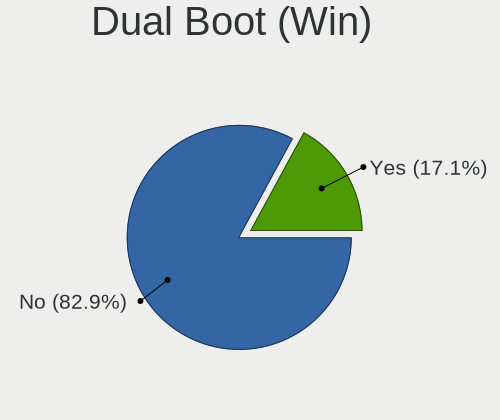
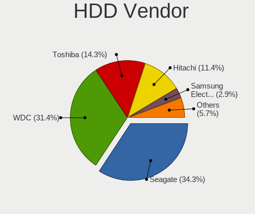
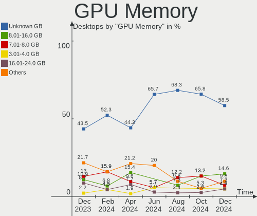
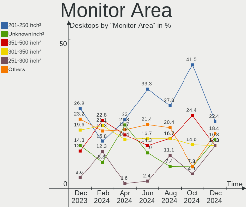
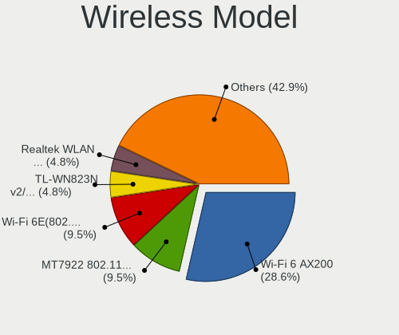
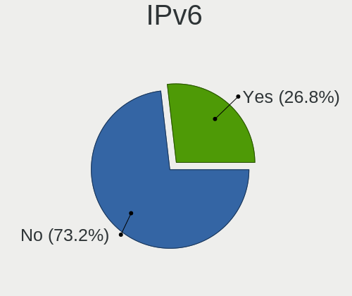
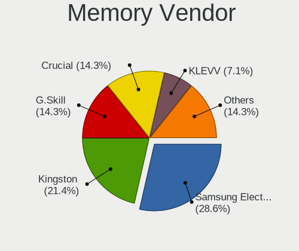

Manjaro - Hardware Trends (Desktops)
------------------------------------

A project to identify most popular hardware characteristics and track their change
over time based on data collected by Linux users at https://Linux-Hardware.org.

Anyone can contribute to this report by the [hw-probe](https://github.com/linuxhw/hw-probe) tool:

    sudo -E hw-probe -all -upload

This report is for one last month. Overall report since the beginning of time: [TestCoverage](https://github.com/linuxhw/TestCoverage)

Period: Dec, 2022.

Contents
--------

* [ System ](#system)
  - [ OS                       ](#os)
  - [ OS Family                ](#os-family)
  - [ Kernel                   ](#kernel)
  - [ Kernel Family            ](#kernel-family)
  - [ Kernel Major Ver.        ](#kernel-major-ver)
  - [ Arch                     ](#arch)
  - [ DE                       ](#de)
  - [ Display Server           ](#display-server)
  - [ Display Manager          ](#display-manager)
  - [ OS Lang                  ](#os-lang)
  - [ Boot Mode                ](#boot-mode)
  - [ Filesystem               ](#filesystem)
  - [ Part. scheme             ](#part-scheme)
  - [ Dual Boot with Linux/BSD ](#dual-boot-with-linuxbsd)
  - [ Dual Boot (Win)          ](#dual-boot-win)

* [ Board ](#board)
  - [ Vendor                   ](#vendor)
  - [ Model                    ](#model)
  - [ Model Family             ](#model-family)
  - [ MFG Year                 ](#mfg-year)
  - [ Form Factor              ](#form-factor)
  - [ Secure Boot              ](#secure-boot)
  - [ Coreboot                 ](#coreboot)
  - [ RAM Size                 ](#ram-size)
  - [ RAM Used                 ](#ram-used)
  - [ Total Drives             ](#total-drives)
  - [ Has CD-ROM               ](#has-cd-rom)
  - [ Has Ethernet             ](#has-ethernet)
  - [ Has WiFi                 ](#has-wifi)
  - [ Has Bluetooth            ](#has-bluetooth)

* [ Location ](#location)
  - [ Country                  ](#country)
  - [ City                     ](#city)

* [ Drives ](#drives)
  - [ Drive Vendor             ](#drive-vendor)
  - [ Drive Model              ](#drive-model)
  - [ HDD Vendor               ](#hdd-vendor)
  - [ SSD Vendor               ](#ssd-vendor)
  - [ Drive Kind               ](#drive-kind)
  - [ Drive Connector          ](#drive-connector)
  - [ Drive Size               ](#drive-size)
  - [ Space Total              ](#space-total)
  - [ Space Used               ](#space-used)
  - [ Malfunc. Drives          ](#malfunc-drives)
  - [ Malfunc. Drive Vendor    ](#malfunc-drive-vendor)
  - [ Malfunc. HDD Vendor      ](#malfunc-hdd-vendor)
  - [ Malfunc. Drive Kind      ](#malfunc-drive-kind)
  - [ Failed Drives            ](#failed-drives)
  - [ Failed Drive Vendor      ](#failed-drive-vendor)
  - [ Drive Status             ](#drive-status)

* [ Storage controller ](#storage-controller)
  - [ Storage Vendor           ](#storage-vendor)
  - [ Storage Model            ](#storage-model)
  - [ Storage Kind             ](#storage-kind)

* [ Processor ](#processor)
  - [ CPU Vendor               ](#cpu-vendor)
  - [ CPU Model                ](#cpu-model)
  - [ CPU Model Family         ](#cpu-model-family)
  - [ CPU Cores                ](#cpu-cores)
  - [ CPU Sockets              ](#cpu-sockets)
  - [ CPU Threads              ](#cpu-threads)
  - [ CPU Op-Modes             ](#cpu-op-modes)
  - [ CPU Microcode            ](#cpu-microcode)
  - [ CPU Microarch            ](#cpu-microarch)

* [ Graphics ](#graphics)
  - [ GPU Vendor               ](#gpu-vendor)
  - [ GPU Model                ](#gpu-model)
  - [ GPU Combo                ](#gpu-combo)
  - [ GPU Driver               ](#gpu-driver)
  - [ GPU Memory               ](#gpu-memory)

* [ Monitor ](#monitor)
  - [ Monitor Vendor           ](#monitor-vendor)
  - [ Monitor Model            ](#monitor-model)
  - [ Monitor Resolution       ](#monitor-resolution)
  - [ Monitor Diagonal         ](#monitor-diagonal)
  - [ Monitor Width            ](#monitor-width)
  - [ Aspect Ratio             ](#aspect-ratio)
  - [ Monitor Area             ](#monitor-area)
  - [ Pixel Density            ](#pixel-density)
  - [ Multiple Monitors        ](#multiple-monitors)

* [ Network ](#network)
  - [ Net Controller Vendor    ](#net-controller-vendor)
  - [ Net Controller Model     ](#net-controller-model)
  - [ Wireless Vendor          ](#wireless-vendor)
  - [ Wireless Model           ](#wireless-model)
  - [ Ethernet Vendor          ](#ethernet-vendor)
  - [ Ethernet Model           ](#ethernet-model)
  - [ Net Controller Kind      ](#net-controller-kind)
  - [ Used Controller          ](#used-controller)
  - [ NICs                     ](#nics)
  - [ IPv6                     ](#ipv6)

* [ Bluetooth ](#bluetooth)
  - [ Bluetooth Vendor         ](#bluetooth-vendor)
  - [ Bluetooth Model          ](#bluetooth-model)

* [ Sound ](#sound)
  - [ Sound Vendor             ](#sound-vendor)
  - [ Sound Model              ](#sound-model)

* [ Memory ](#memory)
  - [ Memory Vendor            ](#memory-vendor)
  - [ Memory Model             ](#memory-model)
  - [ Memory Kind              ](#memory-kind)
  - [ Memory Form Factor       ](#memory-form-factor)
  - [ Memory Size              ](#memory-size)
  - [ Memory Speed             ](#memory-speed)

* [ Printers & scanners ](#printers--scanners)
  - [ Printer Vendor           ](#printer-vendor)
  - [ Printer Model            ](#printer-model)
  - [ Scanner Vendor           ](#scanner-vendor)
  - [ Scanner Model            ](#scanner-model)

* [ Camera ](#camera)
  - [ Camera Vendor            ](#camera-vendor)
  - [ Camera Model             ](#camera-model)

* [ Security ](#security)
  - [ Fingerprint Vendor       ](#fingerprint-vendor)
  - [ Fingerprint Model        ](#fingerprint-model)
  - [ Chipcard Vendor          ](#chipcard-vendor)
  - [ Chipcard Model           ](#chipcard-model)

* [ Unsupported ](#unsupported)
  - [ Unsupported Devices      ](#unsupported-devices)
  - [ Unsupported Device Types ](#unsupported-device-types)

System
------

OS
--

Installed operating systems

| Name           | Desktops | Percent |
|----------------|----------|---------|
| Manjaro        | 30       | 50%     |
| Manjaro 22.0.0 | 25       | 41.67%  |
| Manjaro 22.0   | 2        | 3.33%   |
| Manjaro 21.3.7 | 2        | 3.33%   |
| Manjaro 21.3.2 | 1        | 1.67%   |

OS Family
---------

OS without a version

| Name    | Desktops | Percent |
|---------|----------|---------|
| Manjaro | 60       | 100%    |

Kernel
------

Version of the Linux kernel

| Version            | Desktops | Percent |
|--------------------|----------|---------|
| 5.15.81-1-MANJARO  | 8        | 13.33%  |
| 5.15.78-1-MANJARO  | 8        | 13.33%  |
| 6.1.1-1-MANJARO    | 7        | 11.67%  |
| 6.0.11-1-MANJARO   | 7        | 11.67%  |
| 6.1.0-1-MANJARO    | 6        | 10%     |
| 6.0.8-1-MANJARO    | 5        | 8.33%   |
| 5.15.85-1-MANJARO  | 4        | 6.67%   |
| 5.19.17-2-MANJARO  | 2        | 3.33%   |
| 5.16.20-2-MANJARO  | 2        | 3.33%   |
| 5.15.84-1-MANJARO  | 2        | 3.33%   |
| 5.15.60-1-MANJARO  | 2        | 3.33%   |
| 5.10.157-1-MANJARO | 2        | 3.33%   |
| 6.0.15-1-MANJARO   | 1        | 1.67%   |
| 6.0.14-1-MANJARO   | 1        | 1.67%   |
| 6.0.12-1-MANJARO   | 1        | 1.67%   |
| 5.15.74-3-MANJARO  | 1        | 1.67%   |
| 5.10.148-1-MANJARO | 1        | 1.67%   |

Kernel Family
-------------

Linux kernel without a distro release

| Version  | Desktops | Percent |
|----------|----------|---------|
| 5.15.81  | 8        | 13.33%  |
| 5.15.78  | 8        | 13.33%  |
| 6.1.1    | 7        | 11.67%  |
| 6.0.11   | 7        | 11.67%  |
| 6.1.0    | 6        | 10%     |
| 6.0.8    | 5        | 8.33%   |
| 5.15.85  | 4        | 6.67%   |
| 5.19.17  | 2        | 3.33%   |
| 5.16.20  | 2        | 3.33%   |
| 5.15.84  | 2        | 3.33%   |
| 5.15.60  | 2        | 3.33%   |
| 5.10.157 | 2        | 3.33%   |
| 6.0.15   | 1        | 1.67%   |
| 6.0.14   | 1        | 1.67%   |
| 6.0.12   | 1        | 1.67%   |
| 5.15.74  | 1        | 1.67%   |
| 5.10.148 | 1        | 1.67%   |

Kernel Major Ver.
-----------------

Linux kernel major version

| Version | Desktops | Percent |
|---------|----------|---------|
| 5.15    | 25       | 41.67%  |
| 6.0     | 15       | 25%     |
| 6.1     | 13       | 21.67%  |
| 5.10    | 3        | 5%      |
| 5.19    | 2        | 3.33%   |
| 5.16    | 2        | 3.33%   |

Arch
----

OS architecture (x86_64, i586, etc.)

| Name   | Desktops | Percent |
|--------|----------|---------|
| x86_64 | 60       | 100%    |

DE
--

Desktop Environment

| Name          | Desktops | Percent |
|---------------|----------|---------|
| KDE5          | 33       | 55%     |
| GNOME         | 11       | 18.33%  |
| XFCE          | 10       | 16.67%  |
| sway          | 2        | 3.33%   |
| X-Cinnamon    | 1        | 1.67%   |
| Enlightenment | 1        | 1.67%   |
| Budgie        | 1        | 1.67%   |
| Unknown       | 1        | 1.67%   |

Display Server
--------------

X11 or Wayland

| Name    | Desktops | Percent |
|---------|----------|---------|
| X11     | 46       | 76.67%  |
| Wayland | 14       | 23.33%  |

Display Manager
---------------

SDDM, LightDM, etc.

| Name    | Desktops | Percent |
|---------|----------|---------|
| Unknown | 30       | 50%     |
| SDDM    | 16       | 26.67%  |
| GDM     | 7        | 11.67%  |
| LightDM | 6        | 10%     |
| GREETD  | 1        | 1.67%   |

OS Lang
-------

Language

| Lang  | Desktops | Percent |
|-------|----------|---------|
| en_US | 23       | 38.33%  |
| en_GB | 6        | 10%     |
| de_DE | 4        | 6.67%   |
| ru_RU | 3        | 5%      |
| fr_FR | 3        | 5%      |
| es_ES | 3        | 5%      |
| en_AU | 3        | 5%      |
| es_AR | 2        | 3.33%   |
| en_CA | 2        | 3.33%   |
| de_AT | 2        | 3.33%   |
| sv_SE | 1        | 1.67%   |
| pl_PL | 1        | 1.67%   |
| nl_NL | 1        | 1.67%   |
| it_IT | 1        | 1.67%   |
| es_MX | 1        | 1.67%   |
| es_GT | 1        | 1.67%   |
| en_ZA | 1        | 1.67%   |
| en_DK | 1        | 1.67%   |
| cs_CZ | 1        | 1.67%   |

Boot Mode
---------

EFI or BIOS

| Mode | Desktops | Percent |
|------|----------|---------|
| BIOS | 38       | 63.33%  |
| EFI  | 22       | 36.67%  |

Filesystem
----------

Type of filesystem

| Type    | Desktops | Percent |
|---------|----------|---------|
| Ext4    | 47       | 78.33%  |
| Btrfs   | 10       | 16.67%  |
| Xfs     | 2        | 3.33%   |
| Overlay | 1        | 1.67%   |

Part. scheme
------------

Scheme of partitioning

| Type    | Desktops | Percent |
|---------|----------|---------|
| Unknown | 30       | 50%     |
| GPT     | 27       | 45%     |
| MBR     | 3        | 5%      |

Dual Boot with Linux/BSD
------------------------

Hosting more than one Linux/BSD

| Dual boot | Desktops | Percent |
|-----------|----------|---------|
| No        | 51       | 85%     |
| Yes       | 9        | 15%     |

Dual Boot (Win)
---------------

Hosting Linux and Windows

| Dual boot | Desktops | Percent |
|-----------|----------|---------|
| No        | 40       | 66.67%  |
| Yes       | 20       | 33.33%  |

Board
-----

Vendor
------

Motherboard manufacturer

| Name                | Desktops | Percent |
|---------------------|----------|---------|
| ASUSTek Computer    | 16       | 26.67%  |
| Gigabyte Technology | 15       | 25%     |
| MSI                 | 12       | 20%     |
| ASRock              | 9        | 15%     |
| Dell                | 3        | 5%      |
| Lenovo              | 2        | 3.33%   |
| ZOTAC               | 1        | 1.67%   |
| Intel               | 1        | 1.67%   |
| Hewlett-Packard     | 1        | 1.67%   |

Model
-----

Motherboard model

| Name                                 | Desktops | Percent |
|--------------------------------------|----------|---------|
| MSI MS-7C91                          | 2        | 3.33%   |
| MSI MS-7A40                          | 2        | 3.33%   |
| Gigabyte X570 AORUS ELITE            | 2        | 3.33%   |
| ASUS M5A97 R2.0                      | 2        | 3.33%   |
| ZOTAC ION                            | 1        | 1.67%   |
| MSI MS-7D78                          | 1        | 1.67%   |
| MSI MS-7D54                          | 1        | 1.67%   |
| MSI MS-7D43                          | 1        | 1.67%   |
| MSI MS-7C02                          | 1        | 1.67%   |
| MSI MS-7B85                          | 1        | 1.67%   |
| MSI MS-7A62                          | 1        | 1.67%   |
| MSI MS-7A35                          | 1        | 1.67%   |
| MSI MS-7721                          | 1        | 1.67%   |
| Lenovo ThinkStation S20 4157DT6      | 1        | 1.67%   |
| Lenovo Legion T5 28IMB05 90NC00JBUS  | 1        | 1.67%   |
| Intel OEM                            | 1        | 1.67%   |
| HP EliteDesk 800 G2 TWR              | 1        | 1.67%   |
| Gigabyte Z87-HD3                     | 1        | 1.67%   |
| Gigabyte Z690 AORUS PRO              | 1        | 1.67%   |
| Gigabyte Z370 HD3                    | 1        | 1.67%   |
| Gigabyte Z170-HD3P                   | 1        | 1.67%   |
| Gigabyte H510M H                     | 1        | 1.67%   |
| Gigabyte F2A58M-HD2                  | 1        | 1.67%   |
| Gigabyte B550M S2H                   | 1        | 1.67%   |
| Gigabyte B550M DS3H                  | 1        | 1.67%   |
| Gigabyte B550M AORUS PRO-P           | 1        | 1.67%   |
| Gigabyte B550 AORUS PRO V2           | 1        | 1.67%   |
| Gigabyte B460MAORUSPRO               | 1        | 1.67%   |
| Gigabyte B450M H                     | 1        | 1.67%   |
| Gigabyte B450 AORUS PRO              | 1        | 1.67%   |
| Dell OptiPlex 990                    | 1        | 1.67%   |
| Dell OptiPlex 7010                   | 1        | 1.67%   |
| Dell OptiPlex 3040                   | 1        | 1.67%   |
| ASUS TUF Gaming X570-PLUS            | 1        | 1.67%   |
| ASUS TUF Gaming B660-PLUS WIFI D4    | 1        | 1.67%   |
| ASUS TUF Gaming B650-PLUS WIFI       | 1        | 1.67%   |
| ASUS ROG STRIX Z690-A GAMING WIFI D4 | 1        | 1.67%   |
| ASUS ROG STRIX X670E-I GAMING WIFI   | 1        | 1.67%   |
| ASUS ROG STRIX X570-F GAMING         | 1        | 1.67%   |
| ASUS ROG STRIX B650-A GAMING WIFI    | 1        | 1.67%   |

Model Family
------------

Motherboard model prefix

| Name                   | Desktops | Percent |
|------------------------|----------|---------|
| ASUS ROG               | 5        | 8.33%   |
| ASUS PRIME             | 4        | 6.67%   |
| Gigabyte B550M         | 3        | 5%      |
| Dell OptiPlex          | 3        | 5%      |
| ASUS TUF               | 3        | 5%      |
| MSI MS-7C91            | 2        | 3.33%   |
| MSI MS-7A40            | 2        | 3.33%   |
| Gigabyte X570          | 2        | 3.33%   |
| ASUS M5A97             | 2        | 3.33%   |
| ASRock X670E           | 2        | 3.33%   |
| ZOTAC ION              | 1        | 1.67%   |
| MSI MS-7D78            | 1        | 1.67%   |
| MSI MS-7D54            | 1        | 1.67%   |
| MSI MS-7D43            | 1        | 1.67%   |
| MSI MS-7C02            | 1        | 1.67%   |
| MSI MS-7B85            | 1        | 1.67%   |
| MSI MS-7A62            | 1        | 1.67%   |
| MSI MS-7A35            | 1        | 1.67%   |
| MSI MS-7721            | 1        | 1.67%   |
| Lenovo ThinkStation    | 1        | 1.67%   |
| Lenovo Legion          | 1        | 1.67%   |
| Intel OEM              | 1        | 1.67%   |
| HP EliteDesk           | 1        | 1.67%   |
| Gigabyte Z87-HD3       | 1        | 1.67%   |
| Gigabyte Z690          | 1        | 1.67%   |
| Gigabyte Z370          | 1        | 1.67%   |
| Gigabyte Z170-HD3P     | 1        | 1.67%   |
| Gigabyte H510M         | 1        | 1.67%   |
| Gigabyte F2A58M-HD2    | 1        | 1.67%   |
| Gigabyte B550          | 1        | 1.67%   |
| Gigabyte B460MAORUSPRO | 1        | 1.67%   |
| Gigabyte B450M         | 1        | 1.67%   |
| Gigabyte B450          | 1        | 1.67%   |
| ASUS M5A78L-M          | 1        | 1.67%   |
| ASUS All               | 1        | 1.67%   |
| ASRock Z87             | 1        | 1.67%   |
| ASRock Z690            | 1        | 1.67%   |
| ASRock Z390            | 1        | 1.67%   |
| ASRock X300M-STX       | 1        | 1.67%   |
| ASRock B550            | 1        | 1.67%   |

MFG Year
--------

Motherboard manufacture year

| Year | Desktops | Percent |
|------|----------|---------|
| 2020 | 11       | 18.33%  |
| 2022 | 9        | 15%     |
| 2019 | 7        | 11.67%  |
| 2018 | 6        | 10%     |
| 2021 | 5        | 8.33%   |
| 2017 | 5        | 8.33%   |
| 2012 | 4        | 6.67%   |
| 2016 | 3        | 5%      |
| 2013 | 3        | 5%      |
| 2014 | 2        | 3.33%   |
| 2015 | 1        | 1.67%   |
| 2011 | 1        | 1.67%   |
| 2010 | 1        | 1.67%   |
| 2009 | 1        | 1.67%   |
| 2007 | 1        | 1.67%   |

Form Factor
-----------

Physical design of the computer

| Name    | Desktops | Percent |
|---------|----------|---------|
| Desktop | 60       | 100%    |

Secure Boot
-----------

Enabled or disabled

| State    | Desktops | Percent |
|----------|----------|---------|
| Disabled | 59       | 98.33%  |
| Enabled  | 1        | 1.67%   |

Coreboot
--------

Have coreboot on board

| Used | Desktops | Percent |
|------|----------|---------|
| No   | 60       | 100%    |

RAM Size
--------

Total RAM memory

| Size in GB  | Desktops | Percent |
|-------------|----------|---------|
| 32.01-64.0  | 18       | 30%     |
| 16.01-24.0  | 18       | 30%     |
| 8.01-16.0   | 8        | 13.33%  |
| 4.01-8.0    | 6        | 10%     |
| 24.01-32.0  | 5        | 8.33%   |
| 64.01-256.0 | 4        | 6.67%   |
| 3.01-4.0    | 1        | 1.67%   |

RAM Used
--------

Used RAM memory

| Used GB   | Desktops | Percent |
|-----------|----------|---------|
| 4.01-8.0  | 28       | 46.67%  |
| 3.01-4.0  | 10       | 16.67%  |
| 2.01-3.0  | 9        | 15%     |
| 1.01-2.0  | 8        | 13.33%  |
| 8.01-16.0 | 5        | 8.33%   |

Total Drives
------------

Number of drives on board

| Drives | Desktops | Percent |
|--------|----------|---------|
| 2      | 18       | 30%     |
| 3      | 14       | 23.33%  |
| 1      | 13       | 21.67%  |
| 4      | 7        | 11.67%  |
| 5      | 5        | 8.33%   |
| 20     | 1        | 1.67%   |
| 9      | 1        | 1.67%   |
| 6      | 1        | 1.67%   |

Has CD-ROM
----------

Has CD-ROM on board

| Presented | Desktops | Percent |
|-----------|----------|---------|
| No        | 45       | 75%     |
| Yes       | 15       | 25%     |

Has Ethernet
------------

Has Ethernet on board

| Presented | Desktops | Percent |
|-----------|----------|---------|
| Yes       | 59       | 98.33%  |
| No        | 1        | 1.67%   |

Has WiFi
--------

Has WiFi module

| Presented | Desktops | Percent |
|-----------|----------|---------|
| Yes       | 32       | 53.33%  |
| No        | 28       | 46.67%  |

Has Bluetooth
-------------

Has Bluetooth module

| Presented | Desktops | Percent |
|-----------|----------|---------|
| Yes       | 30       | 50%     |
| No        | 30       | 50%     |

Location
--------

Country
-------

Geographic location (country)

| Country             | Desktops | Percent |
|---------------------|----------|---------|
| USA                 | 8        | 13.33%  |
| Germany             | 7        | 11.67%  |
| Russia              | 6        | 10%     |
| Spain               | 4        | 6.67%   |
| UK                  | 3        | 5%      |
| France              | 3        | 5%      |
| Australia           | 3        | 5%      |
| Argentina           | 3        | 5%      |
| Ukraine             | 2        | 3.33%   |
| Netherlands         | 2        | 3.33%   |
| Italy               | 2        | 3.33%   |
| Greece              | 2        | 3.33%   |
| Austria             | 2        | 3.33%   |
| Trinidad and Tobago | 1        | 1.67%   |
| Taiwan              | 1        | 1.67%   |
| Sweden              | 1        | 1.67%   |
| South Africa        | 1        | 1.67%   |
| Poland              | 1        | 1.67%   |
| Mexico              | 1        | 1.67%   |
| Guatemala           | 1        | 1.67%   |
| Denmark             | 1        | 1.67%   |
| Czechia             | 1        | 1.67%   |
| Cyprus              | 1        | 1.67%   |
| Canada              | 1        | 1.67%   |
| Bulgaria            | 1        | 1.67%   |
| Armenia             | 1        | 1.67%   |

City
----

Geographic location (city)

| City                     | Desktops | Percent |
|--------------------------|----------|---------|
| St Petersburg            | 2        | 3.33%   |
| Cologne                  | 2        | 3.33%   |
| Brisbane                 | 2        | 3.33%   |
| Zoetermeer               | 1        | 1.67%   |
| Yerevan                  | 1        | 1.67%   |
| Witham                   | 1        | 1.67%   |
| Wels                     | 1        | 1.67%   |
| Vienna                   | 1        | 1.67%   |
| Verona                   | 1        | 1.67%   |
| Valencia                 | 1        | 1.67%   |
| Thessaloniki             | 1        | 1.67%   |
| Terrassa                 | 1        | 1.67%   |
| Tecamac                  | 1        | 1.67%   |
| Stockholm                | 1        | 1.67%   |
| Spokane                  | 1        | 1.67%   |
| Sofia                    | 1        | 1.67%   |
| Siparia                  | 1        | 1.67%   |
| Simferopol               | 1        | 1.67%   |
| Saint-Germain-en-Laye    | 1        | 1.67%   |
| Saint-Barthelemy-d'Anjou | 1        | 1.67%   |
| Roy                      | 1        | 1.67%   |
| Rosice                   | 1        | 1.67%   |
| Rome                     | 1        | 1.67%   |
| Pretoria                 | 1        | 1.67%   |
| Portland                 | 1        | 1.67%   |
| Piershil                 | 1        | 1.67%   |
| Olivos                   | 1        | 1.67%   |
| North Reading            | 1        | 1.67%   |
| Nicosia                  | 1        | 1.67%   |
| New Taipei               | 1        | 1.67%   |
| Mytishchi                | 1        | 1.67%   |
| Mutterstadt              | 1        | 1.67%   |
| Moscow                   | 1        | 1.67%   |
| Mieres                   | 1        | 1.67%   |
| Melbourne                | 1        | 1.67%   |
| Madrid                   | 1        | 1.67%   |
| Ludwigsburg              | 1        | 1.67%   |
| Lewiston                 | 1        | 1.67%   |
| Lannilis                 | 1        | 1.67%   |
| Kyiv                     | 1        | 1.67%   |

Drives
------

Drive Vendor
------------

Hard drive vendors

| Vendor                    | Desktops | Drives | Percent |
|---------------------------|----------|--------|---------|
| WDC                       | 26       | 35     | 20.63%  |
| Samsung Electronics       | 20       | 31     | 15.87%  |
| Seagate                   | 16       | 28     | 12.7%   |
| Sandisk                   | 11       | 15     | 8.73%   |
| Kingston                  | 10       | 10     | 7.94%   |
| Crucial                   | 7        | 14     | 5.56%   |
| Phison Electronics        | 4        | 5      | 3.17%   |
| ADATA Technology          | 4        | 5      | 3.17%   |
| Toshiba                   | 3        | 4      | 2.38%   |
| Micron/Crucial Technology | 3        | 3      | 2.38%   |
| Hitachi                   | 3        | 3      | 2.38%   |
| A-DATA Technology         | 3        | 3      | 2.38%   |
| Realtek Semiconductor     | 2        | 2      | 1.59%   |
| PNY                       | 2        | 2      | 1.59%   |
| Silicon Motion            | 1        | 1      | 0.79%   |
| Plextor                   | 1        | 1      | 0.79%   |
| Patriot                   | 1        | 1      | 0.79%   |
| Micron Technology         | 1        | 1      | 0.79%   |
| KIOXIA                    | 1        | 1      | 0.79%   |
| Intenso                   | 1        | 1      | 0.79%   |
| Intel                     | 1        | 2      | 0.79%   |
| Inland                    | 1        | 1      | 0.79%   |
| HGST                      | 1        | 1      | 0.79%   |
| Gigabyte Technology       | 1        | 1      | 0.79%   |
| FREEBSD                   | 1        | 12     | 0.79%   |
| China                     | 1        | 1      | 0.79%   |

Drive Model
-----------

Hard drive models

| Model                                                           | Desktops | Percent |
|-----------------------------------------------------------------|----------|---------|
| Samsung NVMe SSD Controller SM981/PM981/PM983 500GB             | 7        | 4.58%   |
| Samsung NVMe SSD Controller PM9A1/PM9A3/980PRO 2TB              | 4        | 2.61%   |
| ADATA XPG SX8200 Pro PCIe Gen3x4 M.2 2280 Solid State Drive 1TB | 4        | 2.61%   |
| Seagate ST2000DM008-2FR102 2TB                                  | 3        | 1.96%   |
| Sandisk WD Black 2018/SN750 / PC SN720 NVMe SSD 256GB           | 3        | 1.96%   |
| Phison E12 NVMe Controller 1TB                                  | 3        | 1.96%   |
| Kingston SA400S37240G 240GB SSD                                 | 3        | 1.96%   |
| WDC WDS240G2G0B-00EPW0 240GB SSD                                | 2        | 1.31%   |
| Seagate Expansion Desk 5TB                                      | 2        | 1.31%   |
| Sandisk WD Black SN850 1TB                                      | 2        | 1.31%   |
| Sandisk WD Black SN750 / PC SN730 NVMe SSD 512GB                | 2        | 1.31%   |
| Samsung SSD 860 EVO 500GB                                       | 2        | 1.31%   |
| Samsung SSD 860 EVO 250GB                                       | 2        | 1.31%   |
| Samsung SSD 850 EVO 500GB                                       | 2        | 1.31%   |
| Samsung SSD 850 EVO 250GB                                       | 2        | 1.31%   |
| Kingston SA400S37960G 960GB SSD                                 | 2        | 1.31%   |
| Kingston SA400S37480G 480GB SSD                                 | 2        | 1.31%   |
| Crucial CT2000MX500SSD1 2TB                                     | 2        | 1.31%   |
| Crucial CT1000MX500SSD1 1TB                                     | 2        | 1.31%   |
| WDC WDS500G2B0B-00YS70 500GB SSD                                | 1        | 0.65%   |
| WDC WDS250G1B0A-00H9H0 250GB SSD                                | 1        | 0.65%   |
| WDC WDS100T2B0B-00YS70 1TB SSD                                  | 1        | 0.65%   |
| WDC WDS100T2B0A-00SM50 1TB SSD                                  | 1        | 0.65%   |
| WDC WD80 EFAX-68LHPN0 8TB                                       | 1        | 0.65%   |
| WDC WD6401AALS-00L3B2 640GB                                     | 1        | 0.65%   |
| WDC WD60EZRZ-00GZ5B1 6TB                                        | 1        | 0.65%   |
| WDC WD60EFZX-68B3FN0 6TB                                        | 1        | 0.65%   |
| WDC WD60EFAX-68JH4N1 6TB                                        | 1        | 0.65%   |
| WDC WD5000AZLX-75K2TA0 500GB                                    | 1        | 0.65%   |
| WDC WD5000AZLX-00K2TA0 500GB                                    | 1        | 0.65%   |
| WDC WD5000AAKX-75U6AA0 500GB                                    | 1        | 0.65%   |
| WDC WD3200AAKS-00YGA0 320GB                                     | 1        | 0.65%   |
| WDC WD2500BEVT-22ZCT0 250GB                                     | 1        | 0.65%   |
| WDC WD2500BEKT-60V5T1 250GB                                     | 1        | 0.65%   |
| WDC WD2500AAKX-083CA1 250GB                                     | 1        | 0.65%   |
| WDC WD20EZRZ-00Z5HB0 2TB                                        | 1        | 0.65%   |
| WDC WD20EZRX-00D8PB0 2TB                                        | 1        | 0.65%   |
| WDC WD20EFRX-68EUZN0 2TB                                        | 1        | 0.65%   |
| WDC WD1600AAJS-00L7A0 160GB                                     | 1        | 0.65%   |
| WDC WD10EZEX-60WN4A0 1TB                                        | 1        | 0.65%   |

HDD Vendor
----------

Hard disk drive vendors

| Vendor              | Desktops | Drives | Percent |
|---------------------|----------|--------|---------|
| WDC                 | 22       | 29     | 46.81%  |
| Seagate             | 16       | 27     | 34.04%  |
| Toshiba             | 3        | 4      | 6.38%   |
| Hitachi             | 3        | 3      | 6.38%   |
| Samsung Electronics | 1        | 2      | 2.13%   |
| Intenso             | 1        | 1      | 2.13%   |
| HGST                | 1        | 1      | 2.13%   |

SSD Vendor
----------

Solid state drive vendors

| Vendor              | Desktops | Drives | Percent |
|---------------------|----------|--------|---------|
| Samsung Electronics | 13       | 14     | 26%     |
| Kingston            | 10       | 10     | 20%     |
| Crucial             | 7        | 14     | 14%     |
| WDC                 | 6        | 6      | 12%     |
| SanDisk             | 3        | 3      | 6%      |
| A-DATA Technology   | 3        | 3      | 6%      |
| PNY                 | 2        | 2      | 4%      |
| Plextor             | 1        | 1      | 2%      |
| Patriot             | 1        | 1      | 2%      |
| Inland              | 1        | 1      | 2%      |
| Gigabyte Technology | 1        | 1      | 2%      |
| FREEBSD             | 1        | 12     | 2%      |
| China               | 1        | 1      | 2%      |

Drive Kind
----------

HDD or SSD

| Kind    | Desktops | Drives | Percent |
|---------|----------|--------|---------|
| SSD     | 38       | 69     | 33.93%  |
| HDD     | 38       | 67     | 33.93%  |
| NVMe    | 35       | 47     | 31.25%  |
| Unknown | 1        | 1      | 0.89%   |

Drive Connector
---------------

SATA, SAS, NVMe, etc.

| Type | Desktops | Drives | Percent |
|------|----------|--------|---------|
| SATA | 53       | 121    | 55.79%  |
| NVMe | 35       | 47     | 36.84%  |
| SAS  | 7        | 16     | 7.37%   |

Drive Size
----------

Size of hard drive

| Size in TB | Desktops | Drives | Percent |
|------------|----------|--------|---------|
| 0.01-0.5   | 39       | 66     | 45.88%  |
| 0.51-1.0   | 23       | 38     | 27.06%  |
| 1.01-2.0   | 10       | 12     | 11.76%  |
| 4.01-10.0  | 8        | 14     | 9.41%   |
| 3.01-4.0   | 5        | 6      | 5.88%   |

Space Total
-----------

Amount of disk space available on the file system

| Size in GB     | Desktops | Percent |
|----------------|----------|---------|
| 251-500        | 13       | 21.67%  |
| More than 3000 | 11       | 18.33%  |
| 101-250        | 9        | 15%     |
| 1001-2000      | 9        | 15%     |
| 501-1000       | 9        | 15%     |
| Unknown        | 4        | 6.67%   |
| 2001-3000      | 3        | 5%      |
| 1-20           | 1        | 1.67%   |
| 51-100         | 1        | 1.67%   |

Space Used
----------

Amount of used disk space

| Used GB        | Desktops | Percent |
|----------------|----------|---------|
| 501-1000       | 10       | 16.67%  |
| 251-500        | 9        | 15%     |
| 101-250        | 8        | 13.33%  |
| 1-20           | 7        | 11.67%  |
| 51-100         | 7        | 11.67%  |
| More than 3000 | 4        | 6.67%   |
| 2001-3000      | 4        | 6.67%   |
| 1001-2000      | 4        | 6.67%   |
| Unknown        | 4        | 6.67%   |
| 21-50          | 3        | 5%      |

Malfunc. Drives
---------------

Drive models with a malfunction

| Model                          | Desktops | Drives | Percent |
|--------------------------------|----------|--------|---------|
| Seagate ST4000DM000-1F2168 4TB | 1        | 1      | 100%    |

Malfunc. Drive Vendor
---------------------

Vendors of faulty drives

| Vendor  | Desktops | Drives | Percent |
|---------|----------|--------|---------|
| Seagate | 1        | 1      | 100%    |

Malfunc. HDD Vendor
-------------------

Vendors of faulty HDD drives

| Vendor  | Desktops | Drives | Percent |
|---------|----------|--------|---------|
| Seagate | 1        | 1      | 100%    |

Malfunc. Drive Kind
-------------------

Kinds of faulty drives

| Kind | Desktops | Drives | Percent |
|------|----------|--------|---------|
| HDD  | 1        | 1      | 100%    |

Failed Drives
-------------

Failed drive models

Zero info for selected period =(

Failed Drive Vendor
-------------------

Failed drive vendors

Zero info for selected period =(

Drive Status
------------

Number of failed and malfunc. drives

| Status   | Desktops | Drives | Percent |
|----------|----------|--------|---------|
| Detected | 49       | 117    | 73.13%  |
| Works    | 17       | 66     | 25.37%  |
| Malfunc  | 1        | 1      | 1.49%   |

Storage controller
------------------

Storage Vendor
--------------

Storage controller vendors

| Vendor                    | Desktops | Percent |
|---------------------------|----------|---------|
| AMD                       | 38       | 36.19%  |
| Intel                     | 22       | 20.95%  |
| Samsung Electronics       | 12       | 11.43%  |
| SanDisk                   | 10       | 9.52%   |
| ASMedia Technology        | 5        | 4.76%   |
| Phison Electronics        | 4        | 3.81%   |
| ADATA Technology          | 4        | 3.81%   |
| Micron/Crucial Technology | 3        | 2.86%   |
| Realtek Semiconductor     | 2        | 1.9%    |
| Silicon Motion            | 1        | 0.95%   |
| Silicon Image             | 1        | 0.95%   |
| Nvidia                    | 1        | 0.95%   |
| Micron Technology         | 1        | 0.95%   |
| KIOXIA                    | 1        | 0.95%   |

Storage Model
-------------

Storage controller models

| Model                                                                          | Desktops | Percent |
|--------------------------------------------------------------------------------|----------|---------|
| AMD FCH SATA Controller [AHCI mode]                                            | 20       | 16.26%  |
| AMD 500 Series Chipset SATA Controller                                         | 8        | 6.5%    |
| Samsung NVMe SSD Controller SM981/PM981/PM983                                  | 7        | 5.69%   |
| AMD SATA controller                                                            | 7        | 5.69%   |
| AMD 400 Series Chipset SATA Controller                                         | 7        | 5.69%   |
| Intel Alder Lake-S PCH SATA Controller [AHCI Mode]                             | 5        | 4.07%   |
| Samsung NVMe SSD Controller PM9A1/PM9A3/980PRO                                 | 4        | 3.25%   |
| ASMedia ASM1062 Serial ATA Controller                                          | 4        | 3.25%   |
| ADATA XPG SX8200 Pro PCIe Gen3x4 M.2 2280 Solid State Drive                    | 4        | 3.25%   |
| SanDisk WD Black 2018/SN750 / PC SN720 NVMe SSD                                | 3        | 2.44%   |
| SanDisk Non-Volatile memory controller                                         | 3        | 2.44%   |
| Phison E12 NVMe Controller                                                     | 3        | 2.44%   |
| Intel Q170/Q150/B150/H170/H110/Z170/CM236 Chipset SATA Controller [AHCI Mode]  | 3        | 2.44%   |
| SanDisk WD PC SN810 / Black SN850 NVMe SSD                                     | 2        | 1.63%   |
| SanDisk WD Black SN750 / PC SN730 NVMe SSD                                     | 2        | 1.63%   |
| Intel Volume Management Device NVMe RAID Controller                            | 2        | 1.63%   |
| Intel 8 Series/C220 Series Chipset Family 6-port SATA Controller 1 [AHCI mode] | 2        | 1.63%   |
| Intel 400 Series Chipset Family SATA AHCI Controller                           | 2        | 1.63%   |
| Intel 200 Series PCH SATA controller [AHCI mode]                               | 2        | 1.63%   |
| AMD SB7x0/SB8x0/SB9x0 SATA Controller [AHCI mode]                              | 2        | 1.63%   |
| AMD SB7x0/SB8x0/SB9x0 IDE Controller                                           | 2        | 1.63%   |
| AMD 300 Series Chipset SATA Controller                                         | 2        | 1.63%   |
| Silicon Motion SM2262/SM2262EN SSD Controller                                  | 1        | 0.81%   |
| Silicon Image PCI0680 Ultra ATA-133 Host Controller                            | 1        | 0.81%   |
| Samsung NVMe SSD Controller SM961/PM961/SM963                                  | 1        | 0.81%   |
| Samsung NVMe SSD Controller 980                                                | 1        | 0.81%   |
| Realtek RTS5763DL NVMe SSD Controller                                          | 1        | 0.81%   |
| Realtek Realtek Non-Volatile memory controller                                 | 1        | 0.81%   |
| Phison E16 PCIe4 NVMe Controller                                               | 1        | 0.81%   |
| Nvidia MCP79 SATA Controller                                                   | 1        | 0.81%   |
| Micron/Crucial P5 Plus NVMe PCIe SSD                                           | 1        | 0.81%   |
| Micron/Crucial P2 NVMe PCIe SSD                                                | 1        | 0.81%   |
| Micron/Crucial NVMe Controller                                                 | 1        | 0.81%   |
| Micron Non-Volatile memory controller                                          | 1        | 0.81%   |
| KIOXIA NVMe SSD                                                                | 1        | 0.81%   |
| Intel SSD 660P Series                                                          | 1        | 0.81%   |
| Intel SATA Controller [RAID mode]                                              | 1        | 0.81%   |
| Intel Cannon Lake PCH SATA AHCI Controller                                     | 1        | 0.81%   |
| Intel C610/X99 series chipset 6-Port SATA Controller [AHCI mode]               | 1        | 0.81%   |
| Intel 82801JI (ICH10 Family) SATA AHCI Controller                              | 1        | 0.81%   |

Storage Kind
------------

Kind of storage controller (IDE, SATA, NVMe, SAS, ...)

| Kind | Desktops | Percent |
|------|----------|---------|
| SATA | 57       | 56.44%  |
| NVMe | 35       | 34.65%  |
| RAID | 5        | 4.95%   |
| IDE  | 4        | 3.96%   |

Processor
---------

CPU Vendor
----------

Processor vendors

| Vendor | Desktops | Percent |
|--------|----------|---------|
| AMD    | 38       | 63.33%  |
| Intel  | 22       | 36.67%  |

CPU Model
---------

Processor models

| Model                                       | Desktops | Percent |
|---------------------------------------------|----------|---------|
| AMD Ryzen 5 3600 6-Core Processor           | 7        | 11.67%  |
| AMD Ryzen 9 7950X 16-Core Processor         | 3        | 5%      |
| AMD Ryzen 7 7700X 8-Core Processor          | 3        | 5%      |
| Intel 12th Gen Core i5-12600K               | 2        | 3.33%   |
| AMD Ryzen 7 5800X3D 8-Core Processor        | 2        | 3.33%   |
| AMD Ryzen 7 2700X Eight-Core Processor      | 2        | 3.33%   |
| AMD Ryzen 5 5600X 6-Core Processor          | 2        | 3.33%   |
| AMD Ryzen 5 5600G with Radeon Graphics      | 2        | 3.33%   |
| Intel Xeon CPU X5650 @ 2.67GHz              | 1        | 1.67%   |
| Intel Core i7-8700 CPU @ 3.20GHz            | 1        | 1.67%   |
| Intel Core i7-6900K CPU @ 3.20GHz           | 1        | 1.67%   |
| Intel Core i7-6700 CPU @ 3.40GHz            | 1        | 1.67%   |
| Intel Core i7-4770K CPU @ 3.50GHz           | 1        | 1.67%   |
| Intel Core i7-10700F CPU @ 2.90GHz          | 1        | 1.67%   |
| Intel Core i5-9600K CPU @ 3.70GHz           | 1        | 1.67%   |
| Intel Core i5-7600 CPU @ 3.50GHz            | 1        | 1.67%   |
| Intel Core i5-7500 CPU @ 3.40GHz            | 1        | 1.67%   |
| Intel Core i5-6500 CPU @ 3.20GHz            | 1        | 1.67%   |
| Intel Core i5-4690K CPU @ 3.50GHz           | 1        | 1.67%   |
| Intel Core i5-3470 CPU @ 3.20GHz            | 1        | 1.67%   |
| Intel Core i5-2400 CPU @ 3.10GHz            | 1        | 1.67%   |
| Intel Core i5-10400F CPU @ 2.90GHz          | 1        | 1.67%   |
| Intel Core i5-10400 CPU @ 2.90GHz           | 1        | 1.67%   |
| Intel Core 2 Quad CPU Q6600 @ 2.40GHz       | 1        | 1.67%   |
| Intel Atom CPU 330 @ 1.60GHz                | 1        | 1.67%   |
| Intel 12th Gen Core i7-12700K               | 1        | 1.67%   |
| Intel 12th Gen Core i7-12700F               | 1        | 1.67%   |
| Intel 12th Gen Core i5-12600KF              | 1        | 1.67%   |
| AMD Ryzen 9 5950X 16-Core Processor         | 1        | 1.67%   |
| AMD Ryzen 7 PRO 4750G with Radeon Graphics  | 1        | 1.67%   |
| AMD Ryzen 7 3800X 8-Core Processor          | 1        | 1.67%   |
| AMD Ryzen 7 1700X Eight-Core Processor      | 1        | 1.67%   |
| AMD Ryzen 5 7600X 6-Core Processor          | 1        | 1.67%   |
| AMD Ryzen 5 4500 6-Core Processor           | 1        | 1.67%   |
| AMD Ryzen 5 3600X 6-Core Processor          | 1        | 1.67%   |
| AMD Ryzen 5 2600 Six-Core Processor         | 1        | 1.67%   |
| AMD Ryzen 5 2400G with Radeon Vega Graphics | 1        | 1.67%   |
| AMD Ryzen 5 1600 Six-Core Processor         | 1        | 1.67%   |
| AMD Ryzen 5 1500X Quad-Core Processor       | 1        | 1.67%   |
| AMD Ryzen 3 3100 4-Core Processor           | 1        | 1.67%   |

CPU Model Family
----------------

Processor model prefix

| Model             | Desktops | Percent |
|-------------------|----------|---------|
| AMD Ryzen 5       | 18       | 30%     |
| Intel Core i5     | 9        | 15%     |
| AMD Ryzen 7       | 9        | 15%     |
| Other             | 5        | 8.33%   |
| Intel Core i7     | 5        | 8.33%   |
| AMD Ryzen 9       | 4        | 6.67%   |
| AMD FX            | 2        | 3.33%   |
| Intel Xeon        | 1        | 1.67%   |
| Intel Core 2 Quad | 1        | 1.67%   |
| Intel Atom        | 1        | 1.67%   |
| AMD Ryzen 7 PRO   | 1        | 1.67%   |
| AMD Ryzen 3       | 1        | 1.67%   |
| AMD Athlon II X3  | 1        | 1.67%   |
| AMD A6            | 1        | 1.67%   |
| AMD A4            | 1        | 1.67%   |

CPU Cores
---------

Number of processor cores

| Number | Desktops | Percent |
|--------|----------|---------|
| 6      | 21       | 35%     |
| 4      | 13       | 21.67%  |
| 8      | 12       | 20%     |
| 16     | 4        | 6.67%   |
| 10     | 3        | 5%      |
| 12     | 2        | 3.33%   |
| 2      | 2        | 3.33%   |
| 1      | 2        | 3.33%   |
| 3      | 1        | 1.67%   |

CPU Sockets
-----------

Number of sockets

| Number | Desktops | Percent |
|--------|----------|---------|
| 1      | 60       | 100%    |

CPU Threads
-----------

Threads per core (Hyper-Threading)

| Number | Desktops | Percent |
|--------|----------|---------|
| 2      | 50       | 83.33%  |
| 1      | 10       | 16.67%  |

CPU Op-Modes
------------

CPU Operation Modes (32-bit, 64-bit)

| Op mode        | Desktops | Percent |
|----------------|----------|---------|
| 32-bit, 64-bit | 60       | 100%    |

CPU Microcode
-------------

Microcode number

| Number     | Desktops | Percent |
|------------|----------|---------|
| Unknown    | 38       | 63.33%  |
| 0x0a601203 | 4        | 6.67%   |
| 0x08701021 | 3        | 5%      |
| 0x90672    | 2        | 3.33%   |
| 0x0a201016 | 2        | 3.33%   |
| 0xa0653    | 1        | 1.67%   |
| 0x906e9    | 1        | 1.67%   |
| 0x6fb      | 1        | 1.67%   |
| 0x306c3    | 1        | 1.67%   |
| 0x0a50000d | 1        | 1.67%   |
| 0x0a20120a | 1        | 1.67%   |
| 0x0a201205 | 1        | 1.67%   |
| 0x08701013 | 1        | 1.67%   |
| 0x0800820d | 1        | 1.67%   |
| 0x08001138 | 1        | 1.67%   |
| 0x010000c8 | 1        | 1.67%   |

CPU Microarch
-------------

Microarchitecture

| Name             | Desktops | Percent |
|------------------|----------|---------|
| Zen 2            | 12       | 20%     |
| Unknown          | 10       | 16.67%  |
| Zen 3            | 7        | 11.67%  |
| Zen              | 4        | 6.67%   |
| KabyLake         | 4        | 6.67%   |
| Zen+             | 3        | 5%      |
| Piledriver       | 3        | 5%      |
| CometLake        | 3        | 5%      |
| Skylake          | 2        | 3.33%   |
| Haswell          | 2        | 3.33%   |
| Alderlake Hybrid | 2        | 3.33%   |
| Westmere         | 1        | 1.67%   |
| SandyBridge      | 1        | 1.67%   |
| K10              | 1        | 1.67%   |
| IvyBridge        | 1        | 1.67%   |
| Core             | 1        | 1.67%   |
| Bulldozer        | 1        | 1.67%   |
| Broadwell        | 1        | 1.67%   |
| Bonnell          | 1        | 1.67%   |

Graphics
--------

GPU Vendor
----------

Vendors of graphics cards

| Vendor | Desktops | Percent |
|--------|----------|---------|
| AMD    | 30       | 46.15%  |
| Nvidia | 25       | 38.46%  |
| Intel  | 10       | 15.38%  |

GPU Model
---------

Graphics card models

| Model                                                                       | Desktops | Percent |
|-----------------------------------------------------------------------------|----------|---------|
| AMD Raphael                                                                 | 5        | 7.46%   |
| AMD Navi 21 [Radeon RX 6800/6800 XT / 6900 XT]                              | 5        | 7.46%   |
| AMD Navi 10 [Radeon RX 5600 OEM/5600 XT / 5700/5700 XT]                     | 5        | 7.46%   |
| Nvidia TU116 [GeForce GTX 1660 SUPER]                                       | 3        | 4.48%   |
| Intel AlderLake-S GT1                                                       | 3        | 4.48%   |
| AMD Ellesmere [Radeon RX 470/480/570/570X/580/580X/590]                     | 3        | 4.48%   |
| Nvidia GP104 [GeForce GTX 1070]                                             | 2        | 2.99%   |
| Intel HD Graphics 530                                                       | 2        | 2.99%   |
| AMD Navi 24 [Radeon RX 6400/6500 XT/6500M]                                  | 2        | 2.99%   |
| AMD Cezanne [Radeon Vega Series / Radeon Vega Mobile Series]                | 2        | 2.99%   |
| Nvidia TU117 [GeForce GTX 1650]                                             | 1        | 1.49%   |
| Nvidia TU106 [GeForce RTX 2070]                                             | 1        | 1.49%   |
| Nvidia TU106 [GeForce GTX 1650]                                             | 1        | 1.49%   |
| Nvidia TU104 [GeForce RTX 2080]                                             | 1        | 1.49%   |
| Nvidia GT218 [GeForce G210]                                                 | 1        | 1.49%   |
| Nvidia GP107 [GeForce GTX 1050 Ti]                                          | 1        | 1.49%   |
| Nvidia GP106 [GeForce GTX 1060 6GB]                                         | 1        | 1.49%   |
| Nvidia GP106 [GeForce GTX 1060 3GB]                                         | 1        | 1.49%   |
| Nvidia GP104 [GeForce GTX 1080]                                             | 1        | 1.49%   |
| Nvidia GP102 [GeForce GTX 1080 Ti]                                          | 1        | 1.49%   |
| Nvidia GM206 [GeForce GTX 960]                                              | 1        | 1.49%   |
| Nvidia GM204 [GeForce GTX 970]                                              | 1        | 1.49%   |
| Nvidia GM107 [GeForce GTX 745]                                              | 1        | 1.49%   |
| Nvidia GK104 [GeForce GTX 770]                                              | 1        | 1.49%   |
| Nvidia GF116 [GeForce GTX 550 Ti]                                           | 1        | 1.49%   |
| Nvidia GA106 [GeForce RTX 3060 Lite Hash Rate]                              | 1        | 1.49%   |
| Nvidia GA104 [GeForce RTX 3070]                                             | 1        | 1.49%   |
| Nvidia GA104 [GeForce RTX 3060 Ti Lite Hash Rate]                           | 1        | 1.49%   |
| Nvidia GA102 [GeForce RTX 3080]                                             | 1        | 1.49%   |
| Nvidia C79 [ION]                                                            | 1        | 1.49%   |
| Intel Xeon E3-1200 v3/4th Gen Core Processor Integrated Graphics Controller | 1        | 1.49%   |
| Intel Xeon E3-1200 v2/3rd Gen Core processor Graphics Controller            | 1        | 1.49%   |
| Intel HD Graphics 630                                                       | 1        | 1.49%   |
| Intel DG2 [Arc A750]                                                        | 1        | 1.49%   |
| Intel 2nd Generation Core Processor Family Integrated Graphics Controller   | 1        | 1.49%   |
| AMD Tonga XT / Amethyst XT [Radeon R9 380X / R9 M295X]                      | 1        | 1.49%   |
| AMD Richland [Radeon HD 8470D]                                              | 1        | 1.49%   |
| AMD Richland [Radeon HD 8370D]                                              | 1        | 1.49%   |
| AMD Renoir                                                                  | 1        | 1.49%   |
| AMD Raven Ridge [Radeon Vega Series / Radeon Vega Mobile Series]            | 1        | 1.49%   |

GPU Combo
---------

Combinations of graphics cards

| Name           | Desktops | Percent |
|----------------|----------|---------|
| 1 x AMD        | 24       | 40%     |
| 1 x Nvidia     | 21       | 35%     |
| 1 x Intel      | 8        | 13.33%  |
| AMD + Nvidia   | 3        | 5%      |
| 2 x AMD        | 2        | 3.33%   |
| Intel + Nvidia | 1        | 1.67%   |
| Intel + AMD    | 1        | 1.67%   |

GPU Driver
----------

Free vs proprietary

| Driver      | Desktops | Percent |
|-------------|----------|---------|
| Free        | 39       | 65%     |
| Proprietary | 21       | 35%     |

GPU Memory
----------

Total video memory

| Size in GB | Desktops | Percent |
|------------|----------|---------|
| Unknown    | 26       | 43.33%  |
| 7.01-8.0   | 10       | 16.67%  |
| 3.01-4.0   | 7        | 11.67%  |
| 8.01-16.0  | 6        | 10%     |
| 5.01-6.0   | 4        | 6.67%   |
| 1.01-2.0   | 3        | 5%      |
| 0.51-1.0   | 2        | 3.33%   |
| 2.01-3.0   | 1        | 1.67%   |
| 0.01-0.5   | 1        | 1.67%   |

Monitor
-------

Monitor Vendor
--------------

Monitor vendors

| Vendor               | Desktops | Percent |
|----------------------|----------|---------|
| Samsung Electronics  | 15       | 22.73%  |
| Goldstar             | 7        | 10.61%  |
| BenQ                 | 7        | 10.61%  |
| AOC                  | 6        | 9.09%   |
| Dell                 | 5        | 7.58%   |
| Acer                 | 5        | 7.58%   |
| Philips              | 3        | 4.55%   |
| LG Electronics       | 3        | 4.55%   |
| Hewlett-Packard      | 2        | 3.03%   |
| ASUSTek Computer     | 2        | 3.03%   |
| Vizio                | 1        | 1.52%   |
| ViewSonic            | 1        | 1.52%   |
| Lenovo               | 1        | 1.52%   |
| Iiyama               | 1        | 1.52%   |
| HUAWEI               | 1        | 1.52%   |
| HPN                  | 1        | 1.52%   |
| FUN                  | 1        | 1.52%   |
| Fujitsu Siemens      | 1        | 1.52%   |
| DENON                | 1        | 1.52%   |
| Arnos Instruments    | 1        | 1.52%   |
| Ancor Communications | 1        | 1.52%   |

Monitor Model
-------------

Monitor models

| Model                                                                 | Desktops | Percent |
|-----------------------------------------------------------------------|----------|---------|
| AOC 27V2G5 AOC2702 1920x1080 598x336mm 27.0-inch                      | 2        | 2.82%   |
| Acer XV272U ACR06C1 2560x1440 597x336mm 27.0-inch                     | 2        | 2.82%   |
| Vizio D24h-G9 VIZ1028 1360x768 521x293mm 23.5-inch                    | 1        | 1.41%   |
| ViewSonic LCD Monitor VSC1B35 1920x1080 530x300mm 24.0-inch           | 1        | 1.41%   |
| Samsung Electronics T24E390 SAM0C20 1920x1080 521x293mm 23.5-inch     | 1        | 1.41%   |
| Samsung Electronics T24D391 SAM0B73 1920x1080 521x293mm 23.5-inch     | 1        | 1.41%   |
| Samsung Electronics SyncMaster SAM03E5 1680x1050 474x296mm 22.0-inch  | 1        | 1.41%   |
| Samsung Electronics SMT27A550 SAM07B8 1920x1080 598x336mm 27.0-inch   | 1        | 1.41%   |
| Samsung Electronics SMT27A300 SAM0875 1920x1080 598x336mm 27.0-inch   | 1        | 1.41%   |
| Samsung Electronics S27C450 SAM09D1 1920x1080 598x336mm 27.0-inch     | 1        | 1.41%   |
| Samsung Electronics S27B350 SAM08DC 1920x1080 598x336mm 27.0-inch     | 1        | 1.41%   |
| Samsung Electronics S24F350 SAM0D21 1920x1080 520x290mm 23.4-inch     | 1        | 1.41%   |
| Samsung Electronics LU28R55 SAM1017 3840x2160 630x360mm 28.6-inch     | 1        | 1.41%   |
| Samsung Electronics LU28R55 SAM1015 3840x2160 632x360mm 28.6-inch     | 1        | 1.41%   |
| Samsung Electronics LCD Monitor SAM07BA 1920x1080 820x460mm 37.0-inch | 1        | 1.41%   |
| Samsung Electronics LCD Monitor C32F391 1920x1080                     | 1        | 1.41%   |
| Samsung Electronics LC49G95T SAM7053 3840x1080 1193x336mm 48.8-inch   | 1        | 1.41%   |
| Samsung Electronics LC32G5xT SAM7089 2560x1440 698x393mm 31.5-inch    | 1        | 1.41%   |
| Samsung Electronics LC32G5xT SAM7080 2560x1440 700x400mm 31.7-inch    | 1        | 1.41%   |
| Samsung Electronics C27R50x SAM0F9E 1920x1080 598x336mm 27.0-inch     | 1        | 1.41%   |
| Samsung Electronics C27JG5x SAM0F58 2560x1440 597x336mm 27.0-inch     | 1        | 1.41%   |
| Philips LCD Monitor PHL 246E9Q 3840x1080                              | 1        | 1.41%   |
| Philips LCD Monitor PHL 246E9Q                                        | 1        | 1.41%   |
| Philips LCD Monitor PHL 224E5 1920x1080                               | 1        | 1.41%   |
| Philips LCD Monitor PHL 223V5                                         | 1        | 1.41%   |
| LG Electronics LCD Monitor LG ULTRAWIDE 5120x1080                     | 1        | 1.41%   |
| LG Electronics LCD Monitor LG ULTRAWIDE                               | 1        | 1.41%   |
| LG Electronics LCD Monitor LG HDR WQHD 3840x2160                      | 1        | 1.41%   |
| LG Electronics LCD Monitor LG HDR 4K 3840x2160                        | 1        | 1.41%   |
| Lenovo T23d-10 LEN61C3 1920x1200 518x324mm 24.1-inch                  | 1        | 1.41%   |
| Iiyama PL3493WQ IVM7613 3440x1440 800x345mm 34.3-inch                 | 1        | 1.41%   |
| HUAWEI ZQE-CAA HWV6A25 3440x1440 797x334mm 34.0-inch                  | 1        | 1.41%   |
| HPN LCD Monitor HP V270 1920x1080                                     | 1        | 1.41%   |
| Hewlett-Packard X34 HPN3728 3440x1440 800x335mm 34.1-inch             | 1        | 1.41%   |
| Hewlett-Packard w2216 HWP280C 1680x1050 465x291mm 21.6-inch           | 1        | 1.41%   |
| Goldstar ULTRAWIDE GSM76F9 2560x1080 531x298mm 24.0-inch              | 1        | 1.41%   |
| Goldstar ULTRAWIDE GSM59F1 2560x1080 798x334mm 34.1-inch              | 1        | 1.41%   |
| Goldstar ULTRAGEAR GSM5B80 2560x1440 597x336mm 27.0-inch              | 1        | 1.41%   |
| Goldstar TV GSMC0A0 3840x2160                                         | 1        | 1.41%   |
| Goldstar HDR WQHD GSM772B 3440x1440 800x335mm 34.1-inch               | 1        | 1.41%   |

Monitor Resolution
------------------

Monitor screen resolution

| Resolution         | Desktops | Percent |
|--------------------|----------|---------|
| 1920x1080 (FHD)    | 26       | 39.39%  |
| 3840x2160 (4K)     | 12       | 18.18%  |
| 2560x1440 (QHD)    | 7        | 10.61%  |
| 3440x1440          | 5        | 7.58%   |
| 1680x1050 (WSXGA+) | 4        | 6.06%   |
| 3840x1080          | 3        | 4.55%   |
| Unknown            | 3        | 4.55%   |
| 2560x1080          | 2        | 3.03%   |
| 5120x1080          | 1        | 1.52%   |
| 1920x1200 (WUXGA)  | 1        | 1.52%   |
| 1366x768 (WXGA)    | 1        | 1.52%   |
| 1280x1024 (SXGA)   | 1        | 1.52%   |

Monitor Diagonal
----------------

Diagonal size in inches

| Inches  | Desktops | Percent |
|---------|----------|---------|
| 27      | 14       | 22.22%  |
| Unknown | 10       | 15.87%  |
| 24      | 8        | 12.7%   |
| 34      | 7        | 11.11%  |
| 23      | 6        | 9.52%   |
| 31      | 5        | 7.94%   |
| 21      | 3        | 4.76%   |
| 72      | 2        | 3.17%   |
| 22      | 2        | 3.17%   |
| 48      | 1        | 1.59%   |
| 46      | 1        | 1.59%   |
| 42      | 1        | 1.59%   |
| 28      | 1        | 1.59%   |
| 20      | 1        | 1.59%   |
| 19      | 1        | 1.59%   |

Monitor Width
-------------

Physical width

| Width in mm | Desktops | Percent |
|-------------|----------|---------|
| 501-600     | 25       | 40.32%  |
| Unknown     | 10       | 16.13%  |
| 601-700     | 8        | 12.9%   |
| 701-800     | 7        | 11.29%  |
| 401-500     | 6        | 9.68%   |
| 1501-2000   | 2        | 3.23%   |
| 1001-1500   | 2        | 3.23%   |
| 351-400     | 1        | 1.61%   |
| 901-1000    | 1        | 1.61%   |

Aspect Ratio
------------

Proportional relationship between the width and the height

| Ratio   | Desktops | Percent |
|---------|----------|---------|
| 16/9    | 35       | 59.32%  |
| Unknown | 10       | 16.95%  |
| 21/9    | 7        | 11.86%  |
| 16/10   | 5        | 8.47%   |
| 5/4     | 1        | 1.69%   |
| 32/9    | 1        | 1.69%   |

Monitor Area
------------

Area in inch

| Area in inch | Desktops | Percent |
|----------------|----------|---------|
| 201-250        | 17       | 26.98%  |
| 301-350        | 14       | 22.22%  |
| 351-500        | 13       | 20.63%  |
| Unknown        | 10       | 15.87%  |
| 151-200        | 3        | 4.76%   |
| 501-1000       | 3        | 4.76%   |
| More than 1000 | 2        | 3.17%   |
| 251-300        | 1        | 1.59%   |

Pixel Density
-------------

Pixels per inch

| Density | Desktops | Percent |
|---------|----------|---------|
| 51-100  | 38       | 59.38%  |
| Unknown | 10       | 15.63%  |
| 101-120 | 9        | 14.06%  |
| 121-160 | 4        | 6.25%   |
| 1-50    | 2        | 3.13%   |
| 161-240 | 1        | 1.56%   |

Multiple Monitors
-----------------

Total monitors connected

| Total | Desktops | Percent |
|-------|----------|---------|
| 1     | 47       | 78.33%  |
| 2     | 11       | 18.33%  |
| 3     | 1        | 1.67%   |
| 0     | 1        | 1.67%   |

Network
-------

Net Controller Vendor
---------------------

Controller vendors

| Vendor                | Desktops | Percent |
|-----------------------|----------|---------|
| Realtek Semiconductor | 38       | 41.3%   |
| Intel                 | 31       | 33.7%   |
| MediaTek              | 5        | 5.43%   |
| Qualcomm Atheros      | 4        | 4.35%   |
| Ralink Technology     | 2        | 2.17%   |
| Broadcom              | 2        | 2.17%   |
| ASUSTek Computer      | 2        | 2.17%   |
| TP-Link               | 1        | 1.09%   |
| Ralink                | 1        | 1.09%   |
| OPPO Electronics      | 1        | 1.09%   |
| Nvidia                | 1        | 1.09%   |
| Motorola PCS          | 1        | 1.09%   |
| Microsoft             | 1        | 1.09%   |
| Mellanox Technologies | 1        | 1.09%   |
| Linksys               | 1        | 1.09%   |

Net Controller Model
--------------------

Controller models

| Model                                                                  | Desktops | Percent |
|------------------------------------------------------------------------|----------|---------|
| Realtek RTL8111/8168/8411 PCI Express Gigabit Ethernet Controller      | 26       | 25.24%  |
| Realtek RTL8125 2.5GbE Controller                                      | 12       | 11.65%  |
| Intel Wi-Fi 6 AX200                                                    | 5        | 4.85%   |
| Intel I211 Gigabit Network Connection                                  | 5        | 4.85%   |
| Intel Ethernet Controller I225-V                                       | 4        | 3.88%   |
| MediaTek MT7922 802.11ax PCI Express Wireless Network Adapter          | 3        | 2.91%   |
| Intel Alder Lake-S PCH CNVi WiFi                                       | 3        | 2.91%   |
| Realtek Killer E3000 2.5GbE Controller                                 | 2        | 1.94%   |
| Qualcomm Atheros Killer E2500 Gigabit Ethernet Controller              | 2        | 1.94%   |
| Intel Dual Band Wireless-AC 3168NGW [Stone Peak]                       | 2        | 1.94%   |
| Intel 82579LM Gigabit Network Connection (Lewisville)                  | 2        | 1.94%   |
| TP-Link Archer T4U ver.3                                               | 1        | 0.97%   |
| Realtek RTL88x2bu [AC1200 Techkey]                                     | 1        | 0.97%   |
| Realtek RTL8192EU 802.11b/g/n WLAN Adapter                             | 1        | 0.97%   |
| Realtek RTL8192CE PCIe Wireless Network Adapter                        | 1        | 0.97%   |
| Realtek RTL-8100/8101L/8139 PCI Fast Ethernet Adapter                  | 1        | 0.97%   |
| Realtek Realtek Network controller                                     | 1        | 0.97%   |
| Ralink RT3072 Wireless Adapter                                         | 1        | 0.97%   |
| Ralink RT2501/RT2573 Wireless Adapter                                  | 1        | 0.97%   |
| Ralink RT2561/RT61 802.11g PCI                                         | 1        | 0.97%   |
| Qualcomm Atheros AR9285 Wireless Network Adapter (PCI-Express)         | 1        | 0.97%   |
| Qualcomm Atheros AR9227 Wireless Network Adapter                       | 1        | 0.97%   |
| OPPO RMX3263                                                           | 1        | 0.97%   |
| Nvidia MCP79 Ethernet                                                  | 1        | 0.97%   |
| Motorola PCS moto g(9) play                                            | 1        | 0.97%   |
| Microsoft Wireless XBox Controller Dongle                              | 1        | 0.97%   |
| Mellanox MT26448 [ConnectX EN 10GigE, PCIe 2.0 5GT/s]                  | 1        | 0.97%   |
| MediaTek MT7921K (RZ608) Wi-Fi 6E 80MHz                                | 1        | 0.97%   |
| MediaTek MT7921 802.11ax PCI Express Wireless Network Adapter          | 1        | 0.97%   |
| Linksys WUSB6300 802.11a/b/g/n/ac Wireless Adapter [Realtek RTL8812AU] | 1        | 0.97%   |
| Intel Wireless-AC 9260                                                 | 1        | 0.97%   |
| Intel Wireless 8260                                                    | 1        | 0.97%   |
| Intel Wireless 7265                                                    | 1        | 0.97%   |
| Intel Wi-Fi 6 AX210/AX211/AX411 160MHz                                 | 1        | 0.97%   |
| Intel I350 Gigabit Network Connection                                  | 1        | 0.97%   |
| Intel Ethernet Connection I217-V                                       | 1        | 0.97%   |
| Intel Ethernet Connection (7) I219-V                                   | 1        | 0.97%   |
| Intel Ethernet Connection (2) I219-V                                   | 1        | 0.97%   |
| Intel Ethernet Connection (2) I219-LM                                  | 1        | 0.97%   |
| Intel Ethernet Connection (17) I219-V                                  | 1        | 0.97%   |

Wireless Vendor
---------------

Wireless vendors

| Vendor                | Desktops | Percent |
|-----------------------|----------|---------|
| Intel                 | 14       | 41.18%  |
| MediaTek              | 5        | 14.71%  |
| Realtek Semiconductor | 4        | 11.76%  |
| Ralink Technology     | 2        | 5.88%   |
| Qualcomm Atheros      | 2        | 5.88%   |
| ASUSTek Computer      | 2        | 5.88%   |
| TP-Link               | 1        | 2.94%   |
| Ralink                | 1        | 2.94%   |
| Microsoft             | 1        | 2.94%   |
| Linksys               | 1        | 2.94%   |
| Broadcom              | 1        | 2.94%   |

Wireless Model
--------------

Wireless models

| Model                                                                  | Desktops | Percent |
|------------------------------------------------------------------------|----------|---------|
| Intel Wi-Fi 6 AX200                                                    | 5        | 14.71%  |
| MediaTek MT7922 802.11ax PCI Express Wireless Network Adapter          | 3        | 8.82%   |
| Intel Alder Lake-S PCH CNVi WiFi                                       | 3        | 8.82%   |
| Intel Dual Band Wireless-AC 3168NGW [Stone Peak]                       | 2        | 5.88%   |
| TP-Link Archer T4U ver.3                                               | 1        | 2.94%   |
| Realtek RTL88x2bu [AC1200 Techkey]                                     | 1        | 2.94%   |
| Realtek RTL8192EU 802.11b/g/n WLAN Adapter                             | 1        | 2.94%   |
| Realtek RTL8192CE PCIe Wireless Network Adapter                        | 1        | 2.94%   |
| Realtek Realtek Network controller                                     | 1        | 2.94%   |
| Ralink RT3072 Wireless Adapter                                         | 1        | 2.94%   |
| Ralink RT2501/RT2573 Wireless Adapter                                  | 1        | 2.94%   |
| Ralink RT2561/RT61 802.11g PCI                                         | 1        | 2.94%   |
| Qualcomm Atheros AR9285 Wireless Network Adapter (PCI-Express)         | 1        | 2.94%   |
| Qualcomm Atheros AR9227 Wireless Network Adapter                       | 1        | 2.94%   |
| Microsoft Wireless XBox Controller Dongle                              | 1        | 2.94%   |
| MediaTek MT7921K (RZ608) Wi-Fi 6E 80MHz                                | 1        | 2.94%   |
| MediaTek MT7921 802.11ax PCI Express Wireless Network Adapter          | 1        | 2.94%   |
| Linksys WUSB6300 802.11a/b/g/n/ac Wireless Adapter [Realtek RTL8812AU] | 1        | 2.94%   |
| Intel Wireless-AC 9260                                                 | 1        | 2.94%   |
| Intel Wireless 8260                                                    | 1        | 2.94%   |
| Intel Wireless 7265                                                    | 1        | 2.94%   |
| Intel Wi-Fi 6 AX210/AX211/AX411 160MHz                                 | 1        | 2.94%   |
| Broadcom BCM4360 802.11ac Wireless Network Adapter                     | 1        | 2.94%   |
| ASUS ASUS USB-AC58 USB Wireless adapter                                | 1        | 2.94%   |
| ASUS 802.11ac NIC                                                      | 1        | 2.94%   |

Ethernet Vendor
---------------

Ethernet vendors

| Vendor                | Desktops | Percent |
|-----------------------|----------|---------|
| Realtek Semiconductor | 37       | 56.92%  |
| Intel                 | 21       | 32.31%  |
| Qualcomm Atheros      | 2        | 3.08%   |
| OPPO Electronics      | 1        | 1.54%   |
| Nvidia                | 1        | 1.54%   |
| Motorola PCS          | 1        | 1.54%   |
| Mellanox Technologies | 1        | 1.54%   |
| Broadcom              | 1        | 1.54%   |

Ethernet Model
--------------

Ethernet models

| Model                                                             | Desktops | Percent |
|-------------------------------------------------------------------|----------|---------|
| Realtek RTL8111/8168/8411 PCI Express Gigabit Ethernet Controller | 26       | 37.68%  |
| Realtek RTL8125 2.5GbE Controller                                 | 12       | 17.39%  |
| Intel I211 Gigabit Network Connection                             | 5        | 7.25%   |
| Intel Ethernet Controller I225-V                                  | 4        | 5.8%    |
| Realtek Killer E3000 2.5GbE Controller                            | 2        | 2.9%    |
| Qualcomm Atheros Killer E2500 Gigabit Ethernet Controller         | 2        | 2.9%    |
| Intel 82579LM Gigabit Network Connection (Lewisville)             | 2        | 2.9%    |
| Realtek RTL-8100/8101L/8139 PCI Fast Ethernet Adapter             | 1        | 1.45%   |
| OPPO RMX3263                                                      | 1        | 1.45%   |
| Nvidia MCP79 Ethernet                                             | 1        | 1.45%   |
| Motorola PCS moto g(9) play                                       | 1        | 1.45%   |
| Mellanox MT26448 [ConnectX EN 10GigE, PCIe 2.0 5GT/s]             | 1        | 1.45%   |
| Intel I350 Gigabit Network Connection                             | 1        | 1.45%   |
| Intel Ethernet Connection I217-V                                  | 1        | 1.45%   |
| Intel Ethernet Connection (7) I219-V                              | 1        | 1.45%   |
| Intel Ethernet Connection (2) I219-V                              | 1        | 1.45%   |
| Intel Ethernet Connection (2) I219-LM                             | 1        | 1.45%   |
| Intel Ethernet Connection (17) I219-V                             | 1        | 1.45%   |
| Intel Ethernet Connection (12) I219-V                             | 1        | 1.45%   |
| Intel 82599 10 Gigabit Network Connection                         | 1        | 1.45%   |
| Intel 82576 Gigabit Network Connection                            | 1        | 1.45%   |
| Intel 82574L Gigabit Network Connection                           | 1        | 1.45%   |
| Broadcom NetXtreme BCM5755 Gigabit Ethernet PCI Express           | 1        | 1.45%   |

Net Controller Kind
-------------------

Ethernet, WiFi or modem

| Kind     | Desktops | Percent |
|----------|----------|---------|
| Ethernet | 59       | 64.84%  |
| WiFi     | 32       | 35.16%  |

Used Controller
---------------

Currently used network controller

| Kind     | Desktops | Percent |
|----------|----------|---------|
| Ethernet | 45       | 78.95%  |
| WiFi     | 12       | 21.05%  |

NICs
----

Total network controllers on board

| Total | Desktops | Percent |
|-------|----------|---------|
| 1     | 29       | 48.33%  |
| 2     | 25       | 41.67%  |
| 3     | 4        | 6.67%   |
| 4     | 2        | 3.33%   |

IPv6
----

IPv6 vs IPv4

| Used | Desktops | Percent |
|------|----------|---------|
| No   | 45       | 75%     |
| Yes  | 15       | 25%     |

Bluetooth
---------

Bluetooth Vendor
----------------

Controller vendors

| Vendor                     | Desktops | Percent |
|----------------------------|----------|---------|
| Intel                      | 12       | 40%     |
| Cambridge Silicon Radio    | 3        | 10%     |
| Broadcom                   | 3        | 10%     |
| ASUSTek Computer           | 3        | 10%     |
| TP-Link                    | 2        | 6.67%   |
| Realtek Semiconductor      | 2        | 6.67%   |
| IMC Networks               | 2        | 6.67%   |
| Integrated System Solution | 1        | 3.33%   |
| Foxconn / Hon Hai          | 1        | 3.33%   |
| Edimax Technology          | 1        | 3.33%   |

Bluetooth Model
---------------

Controller models

| Model                                               | Desktops | Percent |
|-----------------------------------------------------|----------|---------|
| Intel AX200 Bluetooth                               | 4        | 13.33%  |
| Cambridge Silicon Radio Bluetooth Dongle (HCI mode) | 3        | 10%     |
| Broadcom BCM20702A0 Bluetooth 4.0                   | 3        | 10%     |
| ASUS Bluetooth Device                               | 3        | 10%     |
| TP-Link UB500 Adapter                               | 2        | 6.67%   |
| Intel Wireless-AC 3168 Bluetooth                    | 2        | 6.67%   |
| Intel AX201 Bluetooth                               | 2        | 6.67%   |
| Realtek Bluetooth Radio                             | 1        | 3.33%   |
| Realtek Bluetooth 5.1 Radio                         | 1        | 3.33%   |
| Intel Wireless-AC 9260 Bluetooth Adapter            | 1        | 3.33%   |
| Intel Bluetooth wireless interface                  | 1        | 3.33%   |
| Intel Bluetooth Device                              | 1        | 3.33%   |
| Intel AX210 Bluetooth                               | 1        | 3.33%   |
| Integrated System Solution Bluetooth Device         | 1        | 3.33%   |
| IMC Networks Wireless_Device                        | 1        | 3.33%   |
| IMC Networks Bluetooth Radio                        | 1        | 3.33%   |
| Foxconn / Hon Hai Wireless_Device                   | 1        | 3.33%   |
| Edimax Bluetooth Adapter                            | 1        | 3.33%   |

Sound
-----

Sound Vendor
------------

Sound card vendors

| Vendor                               | Desktops | Percent |
|--------------------------------------|----------|---------|
| AMD                                  | 42       | 33.87%  |
| Nvidia                               | 25       | 20.16%  |
| Intel                                | 21       | 16.94%  |
| Kingston Technology                  | 4        | 3.23%   |
| ASUSTek Computer                     | 4        | 3.23%   |
| Razer USA                            | 3        | 2.42%   |
| C-Media Electronics                  | 3        | 2.42%   |
| Focusrite-Novation                   | 2        | 1.61%   |
| XMOS                                 | 1        | 0.81%   |
| Thesycon Systemsoftware & Consulting | 1        | 0.81%   |
| Texas Instruments                    | 1        | 0.81%   |
| SteelSeries ApS                      | 1        | 0.81%   |
| Sony                                 | 1        | 0.81%   |
| Shure                                | 1        | 0.81%   |
| Schiit Audio                         | 1        | 0.81%   |
| ROCCAT                               | 1        | 0.81%   |
| Realtek Semiconductor                | 1        | 0.81%   |
| ONN                                  | 1        | 0.81%   |
| Native Instruments                   | 1        | 0.81%   |
| Micro Star International             | 1        | 0.81%   |
| Logitech                             | 1        | 0.81%   |
| KTMicro                              | 1        | 0.81%   |
| Giga-Byte Technology                 | 1        | 0.81%   |
| Creative Technology                  | 1        | 0.81%   |
| Creative Labs                        | 1        | 0.81%   |
| Barco Display Systems                | 1        | 0.81%   |
| Audient                              | 1        | 0.81%   |
| Unknown                              | 1        | 0.81%   |

Sound Model
-----------

Sound card models

| Model                                                           | Desktops | Percent |
|-----------------------------------------------------------------|----------|---------|
| AMD Starship/Matisse HD Audio Controller                        | 15       | 9.93%   |
| AMD Family 17h/19h HD Audio Controller                          | 10       | 6.62%   |
| AMD Navi 21/23 HDMI/DP Audio Controller                         | 8        | 5.3%    |
| AMD Family 17h (Models 00h-0fh) HD Audio Controller             | 6        | 3.97%   |
| Intel Alder Lake-S HD Audio Controller                          | 5        | 3.31%   |
| AMD Rembrandt Radeon High Definition Audio Controller           | 5        | 3.31%   |
| AMD Navi 10 HDMI Audio                                          | 5        | 3.31%   |
| AMD Renoir Radeon High Definition Audio Controller              | 4        | 2.65%   |
| Nvidia TU116 High Definition Audio Controller                   | 3        | 1.99%   |
| Nvidia GP104 High Definition Audio Controller                   | 3        | 1.99%   |
| Intel 100 Series/C230 Series Chipset Family HD Audio Controller | 3        | 1.99%   |
| ASUSTek Computer USB Audio                                      | 3        | 1.99%   |
| AMD SBx00 Azalia (Intel HDA)                                    | 3        | 1.99%   |
| AMD Ellesmere HDMI Audio [Radeon RX 470/480 / 570/580/590]      | 3        | 1.99%   |
| Nvidia TU106 High Definition Audio Controller                   | 2        | 1.32%   |
| Nvidia GP106 High Definition Audio Controller                   | 2        | 1.32%   |
| Nvidia GA104 High Definition Audio Controller                   | 2        | 1.32%   |
| Intel Comet Lake PCH-V cAVS                                     | 2        | 1.32%   |
| Intel Audio device                                              | 2        | 1.32%   |
| Intel 200 Series PCH HD Audio                                   | 2        | 1.32%   |
| AMD Trinity HDMI Audio Controller                               | 2        | 1.32%   |
| AMD FCH Azalia Controller                                       | 2        | 1.32%   |
| XMOS JDS Labs Element II                                        | 1        | 0.66%   |
| Thesycon Systemsoftware & Consulting MX5                        | 1        | 0.66%   |
| Texas Instruments PCM2902 Audio Codec                           | 1        | 0.66%   |
| SteelSeries ApS SteelSeries Arctis 5                            | 1        | 0.66%   |
| Sony DualSense wireless controller (PS5)                        | 1        | 0.66%   |
| Shure MV5                                                       | 1        | 0.66%   |
| Schiit Audio Schiit Modi 3+                                     | 1        | 0.66%   |
| ROCCAT Elo 7.1 Air                                              | 1        | 0.66%   |
| Realtek Semiconductor BKD-10 Audio Device                       | 1        | 0.66%   |
| Razer USA RZ19-0229 Gaming Microphone                           | 1        | 0.66%   |
| Razer USA Razer Seiren Mini                                     | 1        | 0.66%   |
| Razer USA Razer Seiren Elite                                    | 1        | 0.66%   |
| ONN 100009002                                                   | 1        | 0.66%   |
| Nvidia TU107 GeForce GTX 1650 High Definition Audio Controller  | 1        | 0.66%   |
| Nvidia TU104 HD Audio Controller                                | 1        | 0.66%   |
| Nvidia MCP79 High Definition Audio                              | 1        | 0.66%   |
| Nvidia High Definition Audio Controller                         | 1        | 0.66%   |
| Nvidia GP107GL High Definition Audio Controller                 | 1        | 0.66%   |

Memory
------

Memory Vendor
-------------

Memory module vendors

| Vendor            | Desktops | Percent |
|-------------------|----------|---------|
| Crucial           | 7        | 28%     |
| Kingston          | 5        | 20%     |
| Corsair           | 4        | 16%     |
| Team              | 2        | 8%      |
| G.Skill           | 2        | 8%      |
| Unknown           | 2        | 8%      |
| Unknown           | 1        | 4%      |
| Silicon Power     | 1        | 4%      |
| A-DATA Technology | 1        | 4%      |

Memory Model
------------

Memory module models

| Model                                                     | Desktops | Percent |
|-----------------------------------------------------------|----------|---------|
| Crucial RAM CT16G48C40U5.M8A1 16GB DIMM DDR5 4800MT/s     | 2        | 8%      |
| Corsair RAM CMK16GX4M2B3200C16 8GB DIMM DDR4 3600MT/s     | 2        | 8%      |
| Unknown                                                   | 2        | 8%      |
| Unknown RAM Module 4GB DIMM 1333MT/s                      | 1        | 4%      |
| Team RAM TEAMGROUP-UD4-3000 8GB DIMM DDR4 3200MT/s        | 1        | 4%      |
| Team RAM TEAMGROUP-UD3-1600 8GB DIMM DDR3 1600MT/s        | 1        | 4%      |
| Silicon Power RAM SP008GXLZU320BSA 8GB DIMM DDR4 3200MT/s | 1        | 4%      |
| Kingston RAM KHX3600C17D4/16GX 16GB DIMM DDR4 3800MT/s    | 1        | 4%      |
| Kingston RAM KHX2400C15D4/4G 4GB DIMM DDR4 3151MT/s       | 1        | 4%      |
| Kingston RAM KF552C40-32 32GB DIMM DDR5 5200MT/s          | 1        | 4%      |
| Kingston RAM KF552C36-16 16GB DIMM DDR5 4800MT/s          | 1        | 4%      |
| Kingston RAM KF3600C16D4/16GX 16GB DIMM DDR4 3600MT/s     | 1        | 4%      |
| G.Skill RAM F4-3600C16-8GTZNC 8GB DIMM DDR4 3800MT/s      | 1        | 4%      |
| G.Skill RAM F4-3000C16-8GSXKB 8GB DIMM DDR4 2133MT/s      | 1        | 4%      |
| Crucial RAM CT16G4DFD832A.C16FN 16GB DIMM DDR4 3200MT/s   | 1        | 4%      |
| Crucial RAM BLS16G4D32AESB.M16FE 16GB DIMM DDR4 3600MT/s  | 1        | 4%      |
| Crucial RAM BL8G36C16U4B.M8FE1 8GB DIMM DDR4 3733MT/s     | 1        | 4%      |
| Crucial RAM BL8G32C16U4W.M8FE 8GB DIMM DDR4 3600MT/s      | 1        | 4%      |
| Crucial RAM BL8G30C15U4W.M8FE1 8GB DIMM DDR4 3000MT/s     | 1        | 4%      |
| Corsair RAM CMK64GX5M2B5200C40 32GB DIMM DDR5 4800MT/s    | 1        | 4%      |
| Corsair RAM CMK16GX4M2B3000C15 8GB DIMM DDR4 3200MT/s     | 1        | 4%      |
| A-DATA RAM DDR4 3200 8GB DIMM DDR4 3200MT/s               | 1        | 4%      |

Memory Kind
-----------

Memory module kinds

| Kind    | Desktops | Percent |
|---------|----------|---------|
| DDR4    | 16       | 64%     |
| DDR5    | 6        | 24%     |
| DDR3    | 1        | 4%      |
| DDR2    | 1        | 4%      |
| Unknown | 1        | 4%      |

Memory Form Factor
------------------

Physical design of the memory module

| Name | Desktops | Percent |
|------|----------|---------|
| DIMM | 25       | 100%    |

Memory Size
-----------

Memory module size

| Size  | Desktops | Percent |
|-------|----------|---------|
| 16384 | 10       | 38.46%  |
| 8192  | 10       | 38.46%  |
| 32768 | 2        | 7.69%   |
| 4096  | 2        | 7.69%   |
| 2048  | 1        | 3.85%   |
| 1024  | 1        | 3.85%   |

Memory Speed
------------

Memory module speed

| Speed | Desktops | Percent |
|-------|----------|---------|
| 4800  | 4        | 16%     |
| 3600  | 4        | 16%     |
| 3200  | 4        | 16%     |
| 3800  | 3        | 12%     |
| 6000  | 1        | 4%      |
| 5200  | 1        | 4%      |
| 3733  | 1        | 4%      |
| 3466  | 1        | 4%      |
| 3151  | 1        | 4%      |
| 3000  | 1        | 4%      |
| 2133  | 1        | 4%      |
| 1800  | 1        | 4%      |
| 1333  | 1        | 4%      |
| 1033  | 1        | 4%      |

Printers & scanners
-------------------

Printer Vendor
--------------

Printer device vendors

| Vendor           | Desktops | Percent |
|------------------|----------|---------|
| Graphtec America | 1        | 50%     |
| Canon            | 1        | 50%     |

Printer Model
-------------

Printer device models

| Model                             | Desktops | Percent |
|-----------------------------------|----------|---------|
| Graphtec America Graphtec Printer | 1        | 50%     |
| Canon TS3500 series               | 1        | 50%     |

Scanner Vendor
--------------

Scanner device vendors

Zero info for selected period =(

Scanner Model
-------------

Scanner device models

Zero info for selected period =(

Camera
------

Camera Vendor
-------------

Camera device vendors

| Vendor                        | Desktops | Percent |
|-------------------------------|----------|---------|
| Logitech                      | 5        | 38.46%  |
| Sunplus Innovation Technology | 2        | 15.38%  |
| Microsoft                     | 2        | 15.38%  |
| Z-Star Microelectronics       | 1        | 7.69%   |
| Samsung Electronics           | 1        | 7.69%   |
| Elgato Systems                | 1        | 7.69%   |
| Cubeternet                    | 1        | 7.69%   |

Camera Model
------------

Camera device models

| Model                                                               | Desktops | Percent |
|---------------------------------------------------------------------|----------|---------|
| Logitech C922 Pro Stream Webcam                                     | 2        | 15.38%  |
| Z-Star Venus USB2.0 Camera                                          | 1        | 7.69%   |
| Sunplus NexiGo N930AF FHD Webcam                                    | 1        | 7.69%   |
| Sunplus HanChen Wise Camera                                         | 1        | 7.69%   |
| Samsung Galaxy A5 (MTP)                                             | 1        | 7.69%   |
| Microsoft LifeCam VX-800                                            | 1        | 7.69%   |
| Microsoft LifeCam Studio                                            | 1        | 7.69%   |
| Logitech Webcam C170                                                | 1        | 7.69%   |
| Logitech HD Pro Webcam C920                                         | 1        | 7.69%   |
| Logitech BRIO Ultra HD Webcam                                       | 1        | 7.69%   |
| Elgato Systems Game Capture HD60 X                                  | 1        | 7.69%   |
| Cubeternet EtronTech CMOS based eSP570 WebCam [Onyx Titanium TC101] | 1        | 7.69%   |

Security
--------

Fingerprint Vendor
------------------

Fingerprint sensor vendors

Zero info for selected period =(

Fingerprint Model
-----------------

Fingerprint sensor models

Zero info for selected period =(

Chipcard Vendor
---------------

Chipcard module vendors

| Vendor                            | Desktops | Percent |
|-----------------------------------|----------|---------|
| VASCO Data Security International | 1        | 50%     |
| Gemalto (was Gemplus)             | 1        | 50%     |

Chipcard Model
--------------

Chipcard module models

| Model                                             | Desktops | Percent |
|---------------------------------------------------|----------|---------|
| VASCO Data Security International DIGIPASS 920    | 1        | 50%     |
| Gemalto (was Gemplus) GemPC Twin SmartCard Reader | 1        | 50%     |

Unsupported
-----------

Unsupported Devices
-------------------

Total unsupported devices on board

| Total | Desktops | Percent |
|-------|----------|---------|
| 0     | 48       | 80%     |
| 1     | 11       | 18.33%  |
| 2     | 1        | 1.67%   |

Unsupported Device Types
------------------------

Types of unsupported devices

| Type             | Desktops | Percent |
|------------------|----------|---------|
| Net/wireless     | 5        | 45.45%  |
| Graphics card    | 2        | 18.18%  |
| Unassigned class | 1        | 9.09%   |
| Storage/raid     | 1        | 9.09%   |
| Dvb card         | 1        | 9.09%   |
| Camera           | 1        | 9.09%   |

