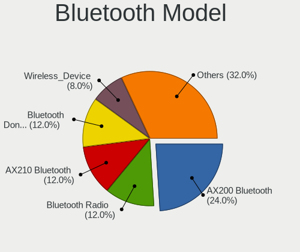

Manjaro - Hardware Trends (Desktops)
------------------------------------

A project to identify most popular hardware characteristics and track their change
over time based on data collected by Linux users at https://Linux-Hardware.org.

Anyone can contribute to this report by the [hw-probe](https://github.com/linuxhw/hw-probe) tool:

    sudo -E hw-probe -all -upload

This report is for one last month. Overall report since the beginning of time: [TestDays](https://github.com/linuxhw/TestDays)

Period: Apr, 2024.

Contents
--------

* [ System ](#system)
  - [ OS                       ](#os)
  - [ OS Family                ](#os-family)
  - [ Kernel                   ](#kernel)
  - [ Kernel Family            ](#kernel-family)
  - [ Kernel Major Ver.        ](#kernel-major-ver)
  - [ Arch                     ](#arch)
  - [ DE                       ](#de)
  - [ Display Server           ](#display-server)
  - [ Display Manager          ](#display-manager)
  - [ OS Lang                  ](#os-lang)
  - [ Boot Mode                ](#boot-mode)
  - [ Filesystem               ](#filesystem)
  - [ Part. scheme             ](#part-scheme)
  - [ Dual Boot with Linux/BSD ](#dual-boot-with-linuxbsd)
  - [ Dual Boot (Win)          ](#dual-boot-win)

* [ Board ](#board)
  - [ Vendor                   ](#vendor)
  - [ Model                    ](#model)
  - [ Model Family             ](#model-family)
  - [ MFG Year                 ](#mfg-year)
  - [ Form Factor              ](#form-factor)
  - [ Secure Boot              ](#secure-boot)
  - [ Coreboot                 ](#coreboot)
  - [ RAM Size                 ](#ram-size)
  - [ RAM Used                 ](#ram-used)
  - [ Total Drives             ](#total-drives)
  - [ Has CD-ROM               ](#has-cd-rom)
  - [ Has Ethernet             ](#has-ethernet)
  - [ Has WiFi                 ](#has-wifi)
  - [ Has Bluetooth            ](#has-bluetooth)

* [ Location ](#location)
  - [ Country                  ](#country)
  - [ City                     ](#city)

* [ Drives ](#drives)
  - [ Drive Vendor             ](#drive-vendor)
  - [ Drive Model              ](#drive-model)
  - [ HDD Vendor               ](#hdd-vendor)
  - [ SSD Vendor               ](#ssd-vendor)
  - [ Drive Kind               ](#drive-kind)
  - [ Drive Connector          ](#drive-connector)
  - [ Drive Size               ](#drive-size)
  - [ Space Total              ](#space-total)
  - [ Space Used               ](#space-used)
  - [ Malfunc. Drives          ](#malfunc-drives)
  - [ Malfunc. Drive Vendor    ](#malfunc-drive-vendor)
  - [ Malfunc. HDD Vendor      ](#malfunc-hdd-vendor)
  - [ Malfunc. Drive Kind      ](#malfunc-drive-kind)
  - [ Failed Drives            ](#failed-drives)
  - [ Failed Drive Vendor      ](#failed-drive-vendor)
  - [ Drive Status             ](#drive-status)

* [ Storage controller ](#storage-controller)
  - [ Storage Vendor           ](#storage-vendor)
  - [ Storage Model            ](#storage-model)
  - [ Storage Kind             ](#storage-kind)

* [ Processor ](#processor)
  - [ CPU Vendor               ](#cpu-vendor)
  - [ CPU Model                ](#cpu-model)
  - [ CPU Model Family         ](#cpu-model-family)
  - [ CPU Cores                ](#cpu-cores)
  - [ CPU Sockets              ](#cpu-sockets)
  - [ CPU Threads              ](#cpu-threads)
  - [ CPU Op-Modes             ](#cpu-op-modes)
  - [ CPU Microcode            ](#cpu-microcode)
  - [ CPU Microarch            ](#cpu-microarch)

* [ Graphics ](#graphics)
  - [ GPU Vendor               ](#gpu-vendor)
  - [ GPU Model                ](#gpu-model)
  - [ GPU Combo                ](#gpu-combo)
  - [ GPU Driver               ](#gpu-driver)
  - [ GPU Memory               ](#gpu-memory)

* [ Monitor ](#monitor)
  - [ Monitor Vendor           ](#monitor-vendor)
  - [ Monitor Model            ](#monitor-model)
  - [ Monitor Resolution       ](#monitor-resolution)
  - [ Monitor Diagonal         ](#monitor-diagonal)
  - [ Monitor Width            ](#monitor-width)
  - [ Aspect Ratio             ](#aspect-ratio)
  - [ Monitor Area             ](#monitor-area)
  - [ Pixel Density            ](#pixel-density)
  - [ Multiple Monitors        ](#multiple-monitors)

* [ Network ](#network)
  - [ Net Controller Vendor    ](#net-controller-vendor)
  - [ Net Controller Model     ](#net-controller-model)
  - [ Wireless Vendor          ](#wireless-vendor)
  - [ Wireless Model           ](#wireless-model)
  - [ Ethernet Vendor          ](#ethernet-vendor)
  - [ Ethernet Model           ](#ethernet-model)
  - [ Net Controller Kind      ](#net-controller-kind)
  - [ Used Controller          ](#used-controller)
  - [ NICs                     ](#nics)
  - [ IPv6                     ](#ipv6)

* [ Bluetooth ](#bluetooth)
  - [ Bluetooth Vendor         ](#bluetooth-vendor)
  - [ Bluetooth Model          ](#bluetooth-model)

* [ Sound ](#sound)
  - [ Sound Vendor             ](#sound-vendor)
  - [ Sound Model              ](#sound-model)

* [ Memory ](#memory)
  - [ Memory Vendor            ](#memory-vendor)
  - [ Memory Model             ](#memory-model)
  - [ Memory Kind              ](#memory-kind)
  - [ Memory Form Factor       ](#memory-form-factor)
  - [ Memory Size              ](#memory-size)
  - [ Memory Speed             ](#memory-speed)

* [ Printers & scanners ](#printers--scanners)
  - [ Printer Vendor           ](#printer-vendor)
  - [ Printer Model            ](#printer-model)
  - [ Scanner Vendor           ](#scanner-vendor)
  - [ Scanner Model            ](#scanner-model)

* [ Camera ](#camera)
  - [ Camera Vendor            ](#camera-vendor)
  - [ Camera Model             ](#camera-model)

* [ Security ](#security)
  - [ Fingerprint Vendor       ](#fingerprint-vendor)
  - [ Fingerprint Model        ](#fingerprint-model)
  - [ Chipcard Vendor          ](#chipcard-vendor)
  - [ Chipcard Model           ](#chipcard-model)

* [ Unsupported ](#unsupported)
  - [ Unsupported Devices      ](#unsupported-devices)
  - [ Unsupported Device Types ](#unsupported-device-types)

System
------

OS
--

Installed operating systems

| Name           | Desktops | Percent |
|----------------|----------|---------|
| Manjaro        | 32       | 61.54%  |
| Manjaro 23.1.4 | 19       | 36.54%  |
| Manjaro 23.1.3 | 1        | 1.92%   |

OS Family
---------

OS without a version

| Name    | Desktops | Percent |
|---------|----------|---------|
| Manjaro | 52       | 100%    |

Kernel
------

Version of the Linux kernel

| Version             | Desktops | Percent |
|---------------------|----------|---------|
| 6.6.26-1-MANJARO    | 14       | 26.92%  |
| 6.8.5-1-MANJARO     | 8        | 15.38%  |
| 6.7.12-1-MANJARO    | 6        | 11.54%  |
| 6.6.25-1-MANJARO    | 6        | 11.54%  |
| 6.6.19-1-MANJARO    | 4        | 7.69%   |
| 6.8.7-1-MANJARO     | 2        | 3.85%   |
| 6.6.10-1-MANJARO    | 2        | 3.85%   |
| 6.8.7-lqx2-1-lqx    | 1        | 1.92%   |
| 6.8.4-lqx1-2-lqx    | 1        | 1.92%   |
| 6.8.4-1-MANJARO     | 1        | 1.92%   |
| 6.8.2-zen2-1-zen    | 1        | 1.92%   |
| 6.7.7-1-MANJARO     | 1        | 1.92%   |
| 6.7.0-1-rt6-MANJARO | 1        | 1.92%   |
| 6.5.13-7-MANJARO    | 1        | 1.92%   |
| 6.1.85-1-MANJARO    | 1        | 1.92%   |
| 6.1.84-1-MANJARO    | 1        | 1.92%   |
| 5.4.270-1-MANJARO   | 1        | 1.92%   |

Kernel Family
-------------

Linux kernel without a distro release

| Version | Desktops | Percent |
|---------|----------|---------|
| 6.6.26  | 14       | 26.92%  |
| 6.8.5   | 8        | 15.38%  |
| 6.7.12  | 6        | 11.54%  |
| 6.6.25  | 6        | 11.54%  |
| 6.6.19  | 4        | 7.69%   |
| 6.8.7   | 3        | 5.77%   |
| 6.8.4   | 2        | 3.85%   |
| 6.6.10  | 2        | 3.85%   |
| 6.8.2   | 1        | 1.92%   |
| 6.7.7   | 1        | 1.92%   |
| 6.7.0   | 1        | 1.92%   |
| 6.5.13  | 1        | 1.92%   |
| 6.1.85  | 1        | 1.92%   |
| 6.1.84  | 1        | 1.92%   |
| 5.4.270 | 1        | 1.92%   |

Kernel Major Ver.
-----------------

Linux kernel major version

| Version | Desktops | Percent |
|---------|----------|---------|
| 6.6     | 26       | 50%     |
| 6.8     | 14       | 26.92%  |
| 6.7     | 8        | 15.38%  |
| 6.1     | 2        | 3.85%   |
| 6.5     | 1        | 1.92%   |
| 5.4     | 1        | 1.92%   |

Arch
----

OS architecture (x86_64, i586, etc.)

| Name   | Desktops | Percent |
|--------|----------|---------|
| x86_64 | 52       | 100%    |

DE
--

Desktop Environment

| Name    | Desktops | Percent |
|---------|----------|---------|
| KDE5    | 25       | 48.08%  |
| GNOME   | 12       | 23.08%  |
| XFCE    | 10       | 19.23%  |
| KDE6    | 3        | 5.77%   |
| MATE    | 1        | 1.92%   |
| Unknown | 1        | 1.92%   |

Display Server
--------------

X11 or Wayland

| Name    | Desktops | Percent |
|---------|----------|---------|
| X11     | 37       | 71.15%  |
| Wayland | 13       | 25%     |
| Unknown | 2        | 3.85%   |

Display Manager
---------------

SDDM, LightDM, etc.

| Name    | Desktops | Percent |
|---------|----------|---------|
| Unknown | 32       | 61.54%  |
| SDDM    | 10       | 19.23%  |
| LightDM | 6        | 11.54%  |
| GDM     | 4        | 7.69%   |

OS Lang
-------

Language

| Lang    | Desktops | Percent |
|---------|----------|---------|
| en_US   | 12       | 23.08%  |
| en_GB   | 6        | 11.54%  |
| de_DE   | 6        | 11.54%  |
| pt_BR   | 4        | 7.69%   |
| en_CA   | 3        | 5.77%   |
| zh_CN   | 2        | 3.85%   |
| ru_RU   | 2        | 3.85%   |
| pl_PL   | 2        | 3.85%   |
| it_IT   | 2        | 3.85%   |
| hu_HU   | 2        | 3.85%   |
| es_ES   | 2        | 3.85%   |
| es_VE   | 1        | 1.92%   |
| es_MX   | 1        | 1.92%   |
| es_DO   | 1        | 1.92%   |
| es_AR   | 1        | 1.92%   |
| en_IN   | 1        | 1.92%   |
| en_AU   | 1        | 1.92%   |
| el_GR   | 1        | 1.92%   |
| cs_CZ   | 1        | 1.92%   |
| Unknown | 1        | 1.92%   |

Boot Mode
---------

EFI or BIOS

| Mode | Desktops | Percent |
|------|----------|---------|
| BIOS | 35       | 67.31%  |
| EFI  | 17       | 32.69%  |

Filesystem
----------

Type of filesystem

| Type  | Desktops | Percent |
|-------|----------|---------|
| Ext4  | 43       | 82.69%  |
| Btrfs | 7        | 13.46%  |
| Tmpfs | 2        | 3.85%   |

Part. scheme
------------

Scheme of partitioning

| Type    | Desktops | Percent |
|---------|----------|---------|
| Unknown | 31       | 59.62%  |
| GPT     | 20       | 38.46%  |
| MBR     | 1        | 1.92%   |

Dual Boot with Linux/BSD
------------------------

Hosting more than one Linux/BSD

| Dual boot | Desktops | Percent |
|-----------|----------|---------|
| No        | 44       | 84.62%  |
| Yes       | 8        | 15.38%  |

Dual Boot (Win)
---------------

Hosting Linux and Windows

| Dual boot | Desktops | Percent |
|-----------|----------|---------|
| No        | 40       | 76.92%  |
| Yes       | 12       | 23.08%  |

Board
-----

Vendor
------

Motherboard manufacturer

| Name                | Desktops | Percent |
|---------------------|----------|---------|
| ASUSTek Computer    | 12       | 23.08%  |
| Gigabyte Technology | 11       | 21.15%  |
| MSI                 | 9        | 17.31%  |
| ASRock              | 7        | 13.46%  |
| Hewlett-Packard     | 4        | 7.69%   |
| Dell                | 4        | 7.69%   |
| Intel               | 1        | 1.92%   |
| Huanan              | 1        | 1.92%   |
| EVGA                | 1        | 1.92%   |
| Biostar             | 1        | 1.92%   |
| Acer                | 1        | 1.92%   |

Model
-----

Motherboard model

| Name                                    | Desktops | Percent |
|-----------------------------------------|----------|---------|
| MSI MS-7D78                             | 1        | 1.92%   |
| MSI MS-7D25                             | 1        | 1.92%   |
| MSI MS-7D20                             | 1        | 1.92%   |
| MSI MS-7C95                             | 1        | 1.92%   |
| MSI MS-7C91                             | 1        | 1.92%   |
| MSI MS-7B79                             | 1        | 1.92%   |
| MSI MS-7B23                             | 1        | 1.92%   |
| MSI MS-7A38                             | 1        | 1.92%   |
| MSI MS-7597                             | 1        | 1.92%   |
| Intel X99                               | 1        | 1.92%   |
| Huanan X99-8M-F V1.2                    | 1        | 1.92%   |
| HP ProDesk 600 G1 TWR                   | 1        | 1.92%   |
| HP OMEN by 25L Gaming Desktop GT15-0xxx | 1        | 1.92%   |
| HP EliteDesk 705 G1 MT                  | 1        | 1.92%   |
| HP Compaq 8100 Elite SFF PC             | 1        | 1.92%   |
| Gigabyte Z790 AORUS ELITE AX            | 1        | 1.92%   |
| Gigabyte X570 AORUS ULTRA               | 1        | 1.92%   |
| Gigabyte H110M-S2PH                     | 1        | 1.92%   |
| Gigabyte H110M-S2                       | 1        | 1.92%   |
| Gigabyte GA-870A-UD3                    | 1        | 1.92%   |
| Gigabyte F2A68HM-H                      | 1        | 1.92%   |
| Gigabyte B85-HD3                        | 1        | 1.92%   |
| Gigabyte B660 GAMING X AX DDR4          | 1        | 1.92%   |
| Gigabyte B550M DS3H AC                  | 1        | 1.92%   |
| Gigabyte B550 AORUS PRO                 | 1        | 1.92%   |
| Gigabyte B360M-D3H                      | 1        | 1.92%   |
| EVGA Z790 CLASSIFIED                    | 1        | 1.92%   |
| Dell XPS 8500                           | 1        | 1.92%   |
| Dell Vostro 420 Series                  | 1        | 1.92%   |
| Dell Precision Tower 3620               | 1        | 1.92%   |
| Dell Precision T3600                    | 1        | 1.92%   |
| Biostar H410MH S2                       | 1        | 1.92%   |
| ASUS TUF Gaming X570-PLUS_BR            | 1        | 1.92%   |
| ASUS TUF Gaming B660M-PLUS WIFI D4      | 1        | 1.92%   |
| ASUS TUF Gaming B550M-PLUS              | 1        | 1.92%   |
| ASUS TUF Gaming B550-PLUS               | 1        | 1.92%   |
| ASUS ROG STRIX G10CES_G10CES            | 1        | 1.92%   |
| ASUS ROG STRIX B650E-I GAMING WIFI      | 1        | 1.92%   |
| ASUS PRIME Z490-A                       | 1        | 1.92%   |
| ASUS PRIME X470-PRO                     | 1        | 1.92%   |

Model Family
------------

Motherboard model prefix

| Name                 | Desktops | Percent |
|----------------------|----------|---------|
| ASUS TUF             | 4        | 7.69%   |
| ASUS PRIME           | 4        | 7.69%   |
| Dell Precision       | 2        | 3.85%   |
| ASUS ROG             | 2        | 3.85%   |
| ASRock B450M         | 2        | 3.85%   |
| MSI MS-7D78          | 1        | 1.92%   |
| MSI MS-7D25          | 1        | 1.92%   |
| MSI MS-7D20          | 1        | 1.92%   |
| MSI MS-7C95          | 1        | 1.92%   |
| MSI MS-7C91          | 1        | 1.92%   |
| MSI MS-7B79          | 1        | 1.92%   |
| MSI MS-7B23          | 1        | 1.92%   |
| MSI MS-7A38          | 1        | 1.92%   |
| MSI MS-7597          | 1        | 1.92%   |
| Intel X99            | 1        | 1.92%   |
| Huanan X99-8M-F      | 1        | 1.92%   |
| HP ProDesk           | 1        | 1.92%   |
| HP OMEN              | 1        | 1.92%   |
| HP EliteDesk         | 1        | 1.92%   |
| HP Compaq            | 1        | 1.92%   |
| Gigabyte Z790        | 1        | 1.92%   |
| Gigabyte X570        | 1        | 1.92%   |
| Gigabyte H110M-S2PH  | 1        | 1.92%   |
| Gigabyte H110M-S2    | 1        | 1.92%   |
| Gigabyte GA-870A-UD3 | 1        | 1.92%   |
| Gigabyte F2A68HM-H   | 1        | 1.92%   |
| Gigabyte B85-HD3     | 1        | 1.92%   |
| Gigabyte B660        | 1        | 1.92%   |
| Gigabyte B550M       | 1        | 1.92%   |
| Gigabyte B550        | 1        | 1.92%   |
| Gigabyte B360M-D3H   | 1        | 1.92%   |
| EVGA Z790            | 1        | 1.92%   |
| Dell XPS             | 1        | 1.92%   |
| Dell Vostro          | 1        | 1.92%   |
| Biostar H410MH       | 1        | 1.92%   |
| ASUS All             | 1        | 1.92%   |
| ASUS A68HM-PLUS      | 1        | 1.92%   |
| ASRock Z790          | 1        | 1.92%   |
| ASRock X670E         | 1        | 1.92%   |
| ASRock B75           | 1        | 1.92%   |

MFG Year
--------

Motherboard manufacture year

| Year | Desktops | Percent |
|------|----------|---------|
| 2018 | 7        | 13.46%  |
| 2021 | 6        | 11.54%  |
| 2020 | 6        | 11.54%  |
| 2019 | 6        | 11.54%  |
| 2022 | 5        | 9.62%   |
| 2023 | 4        | 7.69%   |
| 2014 | 3        | 5.77%   |
| 2013 | 3        | 5.77%   |
| 2012 | 3        | 5.77%   |
| 2009 | 3        | 5.77%   |
| 2024 | 2        | 3.85%   |
| 2016 | 2        | 3.85%   |
| 2011 | 1        | 1.92%   |
| 2010 | 1        | 1.92%   |

Form Factor
-----------

Physical design of the computer

| Name    | Desktops | Percent |
|---------|----------|---------|
| Desktop | 52       | 100%    |

Secure Boot
-----------

Enabled or disabled

| State    | Desktops | Percent |
|----------|----------|---------|
| Disabled | 52       | 100%    |

Coreboot
--------

Have coreboot on board

| Used | Desktops | Percent |
|------|----------|---------|
| No   | 52       | 100%    |

RAM Size
--------

Total RAM memory

| Size in GB  | Desktops | Percent |
|-------------|----------|---------|
| 32.01-64.0  | 18       | 34.62%  |
| 16.01-24.0  | 11       | 21.15%  |
| 8.01-16.0   | 7        | 13.46%  |
| 64.01-256.0 | 6        | 11.54%  |
| 4.01-8.0    | 4        | 7.69%   |
| 3.01-4.0    | 3        | 5.77%   |
| 24.01-32.0  | 3        | 5.77%   |

RAM Used
--------

Used RAM memory

| Used GB    | Desktops | Percent |
|------------|----------|---------|
| 4.01-8.0   | 13       | 25%     |
| 3.01-4.0   | 13       | 25%     |
| 2.01-3.0   | 12       | 23.08%  |
| 1.01-2.0   | 6        | 11.54%  |
| 8.01-16.0  | 4        | 7.69%   |
| 16.01-24.0 | 2        | 3.85%   |
| 32.01-64.0 | 1        | 1.92%   |
| 24.01-32.0 | 1        | 1.92%   |

Total Drives
------------

Number of drives on board

| Drives | Desktops | Percent |
|--------|----------|---------|
| 3      | 16       | 30.77%  |
| 2      | 14       | 26.92%  |
| 4      | 10       | 19.23%  |
| 1      | 7        | 13.46%  |
| 5      | 3        | 5.77%   |
| 6      | 2        | 3.85%   |

Has CD-ROM
----------

Has CD-ROM on board

| Presented | Desktops | Percent |
|-----------|----------|---------|
| No        | 40       | 76.92%  |
| Yes       | 12       | 23.08%  |

Has Ethernet
------------

Has Ethernet on board

| Presented | Desktops | Percent |
|-----------|----------|---------|
| Yes       | 52       | 100%    |

Has WiFi
--------

Has WiFi module

| Presented | Desktops | Percent |
|-----------|----------|---------|
| Yes       | 27       | 51.92%  |
| No        | 25       | 48.08%  |

Has Bluetooth
-------------

Has Bluetooth module

| Presented | Desktops | Percent |
|-----------|----------|---------|
| Yes       | 28       | 53.85%  |
| No        | 24       | 46.15%  |

Location
--------

Country
-------

Geographic location (country)

| Country            | Desktops | Percent |
|--------------------|----------|---------|
| USA                | 10       | 19.23%  |
| Germany            | 8        | 15.38%  |
| Canada             | 4        | 7.69%   |
| Brazil             | 4        | 7.69%   |
| Poland             | 3        | 5.77%   |
| UK                 | 2        | 3.85%   |
| Spain              | 2        | 3.85%   |
| Russia             | 2        | 3.85%   |
| Italy              | 2        | 3.85%   |
| Hungary            | 2        | 3.85%   |
| Argentina          | 2        | 3.85%   |
| Venezuela          | 1        | 1.92%   |
| Singapore          | 1        | 1.92%   |
| Portugal           | 1        | 1.92%   |
| Mexico             | 1        | 1.92%   |
| India              | 1        | 1.92%   |
| Greece             | 1        | 1.92%   |
| Finland            | 1        | 1.92%   |
| Dominican Republic | 1        | 1.92%   |
| Czechia            | 1        | 1.92%   |
| China              | 1        | 1.92%   |
| Australia          | 1        | 1.92%   |

City
----

Geographic location (city)

| City           | Desktops | Percent |
|----------------|----------|---------|
| Portland       | 2        | 3.85%   |
| Milan          | 2        | 3.85%   |
| Hamburg        | 2        | 3.85%   |
| Zalaegerszeg   | 1        | 1.92%   |
| Volduchy       | 1        | 1.92%   |
| Toronto        | 1        | 1.92%   |
| Tigre          | 1        | 1.92%   |
| Thessaloniki   | 1        | 1.92%   |
| Teguise        | 1        | 1.92%   |
| Sydney         | 1        | 1.92%   |
| Swidnica       | 1        | 1.92%   |
| Sobral         | 1        | 1.92%   |
| Singapore      | 1        | 1.92%   |
| Siegen         | 1        | 1.92%   |
| Sherwood Park  | 1        | 1.92%   |
| Shanghai       | 1        | 1.92%   |
| Sao Paulo      | 1        | 1.92%   |
| Sao Jose       | 1        | 1.92%   |
| Santo Domingo  | 1        | 1.92%   |
| Roscoe         | 1        | 1.92%   |
| Resistencia    | 1        | 1.92%   |
| Quincy         | 1        | 1.92%   |
| Poznan         | 1        | 1.92%   |
| Ponferrada     | 1        | 1.92%   |
| Podolsk        | 1        | 1.92%   |
| Plano          | 1        | 1.92%   |
| Moscow         | 1        | 1.92%   |
| Mississauga    | 1        | 1.92%   |
| Metepec        | 1        | 1.92%   |
| Mainhausen     | 1        | 1.92%   |
| Luton          | 1        | 1.92%   |
| Londrina       | 1        | 1.92%   |
| Kochi          | 1        | 1.92%   |
| Helsinki       | 1        | 1.92%   |
| Heidelberg     | 1        | 1.92%   |
| Grand Junction | 1        | 1.92%   |
| Gelsenkirchen  | 1        | 1.92%   |
| Gdansk         | 1        | 1.92%   |
| Edmonton       | 1        | 1.92%   |
| Columbus       | 1        | 1.92%   |

Drives
------

Drive Vendor
------------

Hard drive vendors

| Vendor                       | Desktops | Drives | Percent |
|------------------------------|----------|--------|---------|
| WDC                          | 19       | 23     | 15.08%  |
| Seagate                      | 19       | 21     | 15.08%  |
| Sandisk                      | 13       | 17     | 10.32%  |
| Samsung Electronics          | 12       | 18     | 9.52%   |
| Kingston                     | 9        | 13     | 7.14%   |
| Toshiba                      | 6        | 6      | 4.76%   |
| Intenso                      | 3        | 3      | 2.38%   |
| Hitachi                      | 3        | 3      | 2.38%   |
| Crucial                      | 3        | 5      | 2.38%   |
| ADATA Technology             | 3        | 3      | 2.38%   |
| Shenzhen Longsys Electronics | 2        | 2      | 1.59%   |
| Phison Electronics           | 2        | 2      | 1.59%   |
| Patriot                      | 2        | 3      | 1.59%   |
| Micron Technology            | 2        | 2      | 1.59%   |
| Kingston Technology Company  | 2        | 2      | 1.59%   |
| Yangtze Memory Technologies  | 1        | 1      | 0.79%   |
| XrayDisk                     | 1        | 2      | 0.79%   |
| WALRAM                       | 1        | 1      | 0.79%   |
| Transcend                    | 1        | 1      | 0.79%   |
| TO Exter                     | 1        | 1      | 0.79%   |
| Silicon Motion               | 1        | 1      | 0.79%   |
| SATA SSD                     | 1        | 1      | 0.79%   |
| Realtek Semiconductor        | 1        | 1      | 0.79%   |
| PNY                          | 1        | 1      | 0.79%   |
| Micron/Crucial Technology    | 1        | 1      | 0.79%   |
| Maxtor                       | 1        | 1      | 0.79%   |
| KingSpec                     | 1        | 1      | 0.79%   |
| JMicron Technology           | 1        | 1      | 0.79%   |
| Intel                        | 1        | 1      | 0.79%   |
| HUAWEI                       | 1        | 1      | 0.79%   |
| HS-SSD-C100                  | 1        | 1      | 0.79%   |
| HGST                         | 1        | 1      | 0.79%   |
| GOODRAM                      | 1        | 1      | 0.79%   |
| Gigabyte Technology          | 1        | 1      | 0.79%   |
| G535S                        | 1        | 1      | 0.79%   |
| Fujitsu                      | 1        | 1      | 0.79%   |
| Drevo                        | 1        | 1      | 0.79%   |
| China                        | 1        | 1      | 0.79%   |
| ASMT                         | 1        | 2      | 0.79%   |
| A-DATA Technology            | 1        | 1      | 0.79%   |

Drive Model
-----------

Hard drive models

| Model                                              | Desktops | Percent |
|----------------------------------------------------|----------|---------|
| Sandisk WD Blue SN550 NVMe SSD 2TB                 | 4        | 2.74%   |
| Toshiba DT01ACA100 1TB                             | 3        | 2.05%   |
| Seagate ST500DM002-1BD142 500GB                    | 3        | 2.05%   |
| Samsung NVMe SSD Controller SM981/PM981/PM983 1TB  | 3        | 2.05%   |
| Kingston SA400S37480G 480GB SSD                    | 3        | 2.05%   |
| Kingston SA400S37240G 240GB SSD                    | 3        | 2.05%   |
| Seagate ST2000DM008-2FR102 2TB                     | 2        | 1.37%   |
| Sandisk WD_BLACK SN770 1TB                         | 2        | 1.37%   |
| Sandisk WD Blue SN570 1TB                          | 2        | 1.37%   |
| Samsung NVMe SSD Controller PM9A1/PM9A3/980PRO 1TB | 2        | 1.37%   |
| Micron CT1000P3PSSD8 1TB                           | 2        | 1.37%   |
| Kingston Company A2000 NVMe SSD 500GB              | 2        | 1.37%   |
| Kingston SKC3000S1024G 1TB                         | 2        | 1.37%   |
| Crucial CT500MX500SSD1 500GB                       | 2        | 1.37%   |
| Yangtze Memory ZHITAI TiPlus7100 512GB             | 1        | 0.68%   |
| XrayDisk 512GB SSD                                 | 1        | 0.68%   |
| XrayDisk 512GB                                     | 1        | 0.68%   |
| WDC WDS500G2B0B-00YS70 500GB SSD                   | 1        | 0.68%   |
| WDC WDS240G2G0A-00JH30 240GB SSD                   | 1        | 0.68%   |
| WDC WD5000AZLX-60K2TA0 500GB                       | 1        | 0.68%   |
| WDC WD5000AAKS-75A7B0 500GB                        | 1        | 0.68%   |
| WDC WD5000AAKS-00A7B2 500GB                        | 1        | 0.68%   |
| WDC WD5000AADS-00L4B1 500GB                        | 1        | 0.68%   |
| WDC WD40EZRZ-00GXCB0 4TB                           | 1        | 0.68%   |
| WDC WD40EFAX-68JH4N1 4TB                           | 1        | 0.68%   |
| WDC WD4002FYYZ-01B7CB0 4TB                         | 1        | 0.68%   |
| WDC WD3200AAJS-22L7A0 320GB                        | 1        | 0.68%   |
| WDC WD30EZRZ-22Z5HB0 3TB                           | 1        | 0.68%   |
| WDC WD30EZRZ-00GXCB0 3TB                           | 1        | 0.68%   |
| WDC WD2500AAJS-60Z0A0 250GB                        | 1        | 0.68%   |
| WDC WD2003FYPS-27W9B0 2TB                          | 1        | 0.68%   |
| WDC WD10SPZX-60Z10T0 1TB                           | 1        | 0.68%   |
| WDC WD10EZEX-75WN4A0 1TB                           | 1        | 0.68%   |
| WDC WD10EZEX-60WN4A2 1TB                           | 1        | 0.68%   |
| WDC WD10EZEX-60WN4A1 1TB                           | 1        | 0.68%   |
| WDC WD10EZEX-60WN4A0 1TB                           | 1        | 0.68%   |
| WDC WD10EZEX-21WN4A0 1TB                           | 1        | 0.68%   |
| WDC WD10EZEX-08WN4A0 1TB                           | 1        | 0.68%   |
| WDC WD10EARS-00Y5B1 1TB                            | 1        | 0.68%   |
| WALRAM 512GB                                       | 1        | 0.68%   |

HDD Vendor
----------

Hard disk drive vendors

| Vendor              | Desktops | Drives | Percent |
|---------------------|----------|--------|---------|
| Seagate             | 19       | 21     | 35.19%  |
| WDC                 | 18       | 21     | 33.33%  |
| Toshiba             | 6        | 6      | 11.11%  |
| Hitachi             | 3        | 3      | 5.56%   |
| Samsung Electronics | 2        | 2      | 3.7%    |
| TO Exter            | 1        | 1      | 1.85%   |
| JMicron Technology  | 1        | 1      | 1.85%   |
| Intenso             | 1        | 1      | 1.85%   |
| HGST                | 1        | 1      | 1.85%   |
| Fujitsu             | 1        | 1      | 1.85%   |
| ASMT                | 1        | 2      | 1.85%   |

SSD Vendor
----------

Solid state drive vendors

| Vendor              | Desktops | Drives | Percent |
|---------------------|----------|--------|---------|
| Kingston            | 7        | 10     | 18.92%  |
| Samsung Electronics | 6        | 8      | 16.22%  |
| SanDisk             | 4        | 4      | 10.81%  |
| Crucial             | 3        | 5      | 8.11%   |
| WDC                 | 2        | 2      | 5.41%   |
| Patriot             | 2        | 3      | 5.41%   |
| Intenso             | 2        | 2      | 5.41%   |
| XrayDisk            | 1        | 1      | 2.7%    |
| Transcend           | 1        | 1      | 2.7%    |
| PNY                 | 1        | 1      | 2.7%    |
| Maxtor              | 1        | 1      | 2.7%    |
| KingSpec            | 1        | 1      | 2.7%    |
| HS-SSD-C100         | 1        | 1      | 2.7%    |
| GOODRAM             | 1        | 1      | 2.7%    |
| Gigabyte Technology | 1        | 1      | 2.7%    |
| Drevo               | 1        | 1      | 2.7%    |
| China               | 1        | 1      | 2.7%    |
| A-DATA Technology   | 1        | 1      | 2.7%    |

Drive Kind
----------

HDD or SSD

| Kind    | Desktops | Drives | Percent |
|---------|----------|--------|---------|
| HDD     | 34       | 60     | 35.05%  |
| SSD     | 30       | 45     | 30.93%  |
| NVMe    | 28       | 41     | 28.87%  |
| Unknown | 5        | 5      | 5.15%   |

Drive Connector
---------------

SATA, SAS, NVMe, etc.

| Type | Desktops | Drives | Percent |
|------|----------|--------|---------|
| SATA | 45       | 99     | 54.88%  |
| NVMe | 28       | 41     | 34.15%  |
| SAS  | 9        | 11     | 10.98%  |

Drive Size
----------

Size of hard drive

| Size in TB | Desktops | Drives | Percent |
|------------|----------|--------|---------|
| 0.01-0.5   | 34       | 57     | 45.33%  |
| 0.51-1.0   | 23       | 30     | 30.67%  |
| 3.01-4.0   | 6        | 6      | 8%      |
| 1.01-2.0   | 6        | 6      | 8%      |
| 2.01-3.0   | 4        | 4      | 5.33%   |
| 10.01-20.0 | 1        | 1      | 1.33%   |
| 4.01-10.0  | 1        | 1      | 1.33%   |

Space Total
-----------

Amount of disk space available on the file system

| Size in GB     | Desktops | Percent |
|----------------|----------|---------|
| More than 3000 | 10       | 19.23%  |
| 1001-2000      | 9        | 17.31%  |
| 251-500        | 8        | 15.38%  |
| 101-250        | 8        | 15.38%  |
| 2001-3000      | 5        | 9.62%   |
| 51-100         | 4        | 7.69%   |
| Unknown        | 4        | 7.69%   |
| 501-1000       | 3        | 5.77%   |
| 21-50          | 1        | 1.92%   |

Space Used
----------

Amount of used disk space

| Used GB        | Desktops | Percent |
|----------------|----------|---------|
| 21-50          | 11       | 21.15%  |
| 1001-2000      | 7        | 13.46%  |
| 1-20           | 6        | 11.54%  |
| 251-500        | 5        | 9.62%   |
| 51-100         | 5        | 9.62%   |
| More than 3000 | 4        | 7.69%   |
| 501-1000       | 4        | 7.69%   |
| Unknown        | 4        | 7.69%   |
| 2001-3000      | 3        | 5.77%   |
| 101-250        | 3        | 5.77%   |

Malfunc. Drives
---------------

Drive models with a malfunction

| Model                                            | Desktops | Drives | Percent |
|--------------------------------------------------|----------|--------|---------|
| WDC WD5000AAKS-75A7B0 500GB                      | 1        | 1      | 16.67%  |
| WDC WD10SPZX-60Z10T0 1TB                         | 1        | 1      | 16.67%  |
| Seagate ST500LT012-9WS142 500GB                  | 1        | 1      | 16.67%  |
| Seagate ST500DM002-1BD142 500GB                  | 1        | 1      | 16.67%  |
| Seagate ST2000DM008-2FR102 2TB                   | 1        | 1      | 16.67%  |
| Phison Electronics E16 PCIe4 NVMe Controller 1TB | 1        | 1      | 16.67%  |

Malfunc. Drive Vendor
---------------------

Vendors of faulty drives

| Vendor             | Desktops | Drives | Percent |
|--------------------|----------|--------|---------|
| WDC                | 2        | 2      | 40%     |
| Seagate            | 2        | 3      | 40%     |
| Phison Electronics | 1        | 1      | 20%     |

Malfunc. HDD Vendor
-------------------

Vendors of faulty HDD drives

| Vendor  | Desktops | Drives | Percent |
|---------|----------|--------|---------|
| WDC     | 2        | 2      | 50%     |
| Seagate | 2        | 3      | 50%     |

Malfunc. Drive Kind
-------------------

Kinds of faulty drives

| Kind | Desktops | Drives | Percent |
|------|----------|--------|---------|
| HDD  | 4        | 5      | 80%     |
| NVMe | 1        | 1      | 20%     |

Failed Drives
-------------

Failed drive models

Zero info for selected period =(

Failed Drive Vendor
-------------------

Failed drive vendors

Zero info for selected period =(

Drive Status
------------

Number of failed and malfunc. drives

| Status   | Desktops | Drives | Percent |
|----------|----------|--------|---------|
| Detected | 38       | 101    | 66.67%  |
| Works    | 14       | 44     | 24.56%  |
| Malfunc  | 5        | 6      | 8.77%   |

Storage controller
------------------

Storage Vendor
--------------

Storage controller vendors

| Vendor                       | Desktops | Percent |
|------------------------------|----------|---------|
| Intel                        | 26       | 26.8%   |
| AMD                          | 25       | 25.77%  |
| SanDisk                      | 10       | 10.31%  |
| Samsung Electronics          | 8        | 8.25%   |
| ASMedia Technology           | 6        | 6.19%   |
| Kingston Technology Company  | 5        | 5.15%   |
| ADATA Technology             | 3        | 3.09%   |
| Shenzhen Longsys Electronics | 2        | 2.06%   |
| Phison Electronics           | 2        | 2.06%   |
| Micron Technology            | 2        | 2.06%   |
| JMicron Technology           | 2        | 2.06%   |
| Yangtze Memory Technologies  | 1        | 1.03%   |
| Silicon Motion               | 1        | 1.03%   |
| Realtek Semiconductor        | 1        | 1.03%   |
| Nvidia                       | 1        | 1.03%   |
| Micron/Crucial Technology    | 1        | 1.03%   |
| INNOGRIT                     | 1        | 1.03%   |

Storage Model
-------------

Storage controller models

| Model                                                                          | Desktops | Percent |
|--------------------------------------------------------------------------------|----------|---------|
| AMD FCH SATA Controller [AHCI mode]                                            | 8        | 7.62%   |
| AMD 500 Series Chipset SATA Controller                                         | 8        | 7.62%   |
| AMD 400 Series Chipset SATA Controller                                         | 6        | 5.71%   |
| SanDisk Ultra 3D / WD Blue SN550 NVMe SSD                                      | 4        | 3.81%   |
| Intel 8 Series/C220 Series Chipset Family 6-port SATA Controller 1 [AHCI mode] | 4        | 3.81%   |
| ASMedia ASM1061/ASM1062 Serial ATA Controller                                  | 4        | 3.81%   |
| AMD 600 Series Chipset SATA Controller                                         | 4        | 3.81%   |
| Samsung NVMe SSD Controller SM981/PM981/PM983                                  | 3        | 2.86%   |
| Samsung NVMe SSD Controller PM9A1/PM9A3/980PRO                                 | 3        | 2.86%   |
| Kingston Company KC3000/FURY Renegade NVMe SSD E18                             | 3        | 2.86%   |
| Intel Raptor Lake SATA AHCI Controller                                         | 3        | 2.86%   |
| Intel Alder Lake-S PCH SATA Controller [AHCI Mode]                             | 3        | 2.86%   |
| Intel 500 Series Chipset Family SATA AHCI Controller                           | 3        | 2.86%   |
| Sandisk WD Black SN850X NVMe SSD                                               | 2        | 1.9%    |
| SanDisk WD Black SN770 / PC SN740 256GB / PC SN560 (DRAM-less) NVMe SSD        | 2        | 1.9%    |
| SanDisk Ultra 3D / WD Blue SN570 NVMe SSD (DRAM-less)                          | 2        | 1.9%    |
| Micron 2550 NVMe SSD (DRAM-less)                                               | 2        | 1.9%    |
| Kingston Company A2000 NVMe SSD SM2263EN                                       | 2        | 1.9%    |
| JMicron JMB363 SATA/IDE Controller                                             | 2        | 1.9%    |
| Intel Q170/Q150/B150/H170/H110/Z170/CM236 Chipset SATA Controller [AHCI Mode]  | 2        | 1.9%    |
| Intel Cannon Lake PCH SATA AHCI Controller                                     | 2        | 1.9%    |
| Intel 7 Series/C210 Series Chipset Family 6-port SATA Controller [AHCI mode]   | 2        | 1.9%    |
| ASMedia ASM1064 Serial ATA Controller                                          | 2        | 1.9%    |
| Yangtze Memory ZHITAI TiPlus7100                                               | 1        | 0.95%   |
| Silicon Motion SM2263EN/SM2263XT (DRAM-less) NVMe SSD Controllers              | 1        | 0.95%   |
| Shenzhen Longsys SM2263EN/SM2263XT-based OEM NVME SSD (DRAM-less)              | 1        | 0.95%   |
| Shenzhen Longsys Lexar NM800 PRO NVME SSD                                      | 1        | 0.95%   |
| SanDisk Extreme Pro / WD Black SN750 / PC SN730 / Red SN700 NVMe SSD           | 1        | 0.95%   |
| Samsung NVMe SSD Controller SM961/PM961/SM963                                  | 1        | 0.95%   |
| Samsung NVMe SSD Controller S4LV008[Pascal]                                    | 1        | 0.95%   |
| Realtek RTS5763DL NVMe SSD Controller (DRAM-less)                              | 1        | 0.95%   |
| Phison PS5013-E13 PCIe3 NVMe Controller (DRAM-less)                            | 1        | 0.95%   |
| Phison E16 PCIe4 NVMe Controller                                               | 1        | 0.95%   |
| Nvidia MCP61 SATA Controller                                                   | 1        | 0.95%   |
| Nvidia MCP61 IDE                                                               | 1        | 0.95%   |
| Micron/Crucial P2 [Nick P2] / P3 / P3 Plus NVMe PCIe SSD (DRAM-less)           | 1        | 0.95%   |
| Intel Volume Management Device NVMe RAID Controller Intel Corporation          | 1        | 0.95%   |
| Intel SSD 670p Series [Keystone Harbor]                                        | 1        | 0.95%   |
| Intel SATA Controller [RAID mode]                                              | 1        | 0.95%   |
| Intel Comet Lake PCH-H RAID                                                    | 1        | 0.95%   |

Storage Kind
------------

Kind of storage controller (IDE, SATA, NVMe, SAS, ...)

| Kind | Desktops | Percent |
|------|----------|---------|
| SATA | 48       | 57.83%  |
| NVMe | 28       | 33.73%  |
| RAID | 3        | 3.61%   |
| IDE  | 3        | 3.61%   |
| SAS  | 1        | 1.2%    |

Processor
---------

CPU Vendor
----------

Processor vendors

| Vendor | Desktops | Percent |
|--------|----------|---------|
| Intel  | 26       | 50%     |
| AMD    | 26       | 50%     |

CPU Model
---------

Processor models

| Model                                       | Desktops | Percent |
|---------------------------------------------|----------|---------|
| AMD Ryzen 7 5700G with Radeon Graphics      | 4        | 7.69%   |
| AMD Ryzen 7 5800X3D 8-Core Processor        | 2        | 3.85%   |
| AMD Ryzen 7 5800X 8-Core Processor          | 2        | 3.85%   |
| AMD Athlon II X4 640 Processor              | 2        | 3.85%   |
| Intel Xeon CPU E5-2673 v4 @ 2.30GHz         | 1        | 1.92%   |
| Intel Xeon CPU E5-2640 v3 @ 2.60GHz         | 1        | 1.92%   |
| Intel Xeon CPU E5-1620 0 @ 3.60GHz          | 1        | 1.92%   |
| Intel Pentium CPU G3220 @ 3.00GHz           | 1        | 1.92%   |
| Intel Core i7-9700F CPU @ 3.00GHz           | 1        | 1.92%   |
| Intel Core i7-6700 CPU @ 3.40GHz            | 1        | 1.92%   |
| Intel Core i5-9600K CPU @ 3.70GHz           | 1        | 1.92%   |
| Intel Core i5-6500 CPU @ 3.20GHz            | 1        | 1.92%   |
| Intel Core i5-4570 CPU @ 3.20GHz            | 1        | 1.92%   |
| Intel Core i5-3570K CPU @ 3.40GHz           | 1        | 1.92%   |
| Intel Core i5-3350P CPU @ 3.10GHz           | 1        | 1.92%   |
| Intel Core i5-10400 CPU @ 2.90GHz           | 1        | 1.92%   |
| Intel Core i5 CPU 670 @ 3.47GHz             | 1        | 1.92%   |
| Intel Core i3-9100F CPU @ 3.60GHz           | 1        | 1.92%   |
| Intel Core i3-7100 CPU @ 3.90GHz            | 1        | 1.92%   |
| Intel Core i3-4130 CPU @ 3.40GHz            | 1        | 1.92%   |
| Intel Core i3-10100F CPU @ 3.60GHz          | 1        | 1.92%   |
| Intel Core 2 Duo CPU E8500 @ 3.16GHz        | 1        | 1.92%   |
| Intel 13th Gen Core i9-13900K               | 1        | 1.92%   |
| Intel 13th Gen Core i5-13600KF              | 1        | 1.92%   |
| Intel 12th Gen Core i9-12900KS              | 1        | 1.92%   |
| Intel 12th Gen Core i7-12700K               | 1        | 1.92%   |
| Intel 12th Gen Core i5-12600KF              | 1        | 1.92%   |
| Intel 12th Gen Core i5-12400F               | 1        | 1.92%   |
| Intel 11th Gen Core i5-11500 @ 2.70GHz      | 1        | 1.92%   |
| Intel 11th Gen Core i5-11400F @ 2.60GHz     | 1        | 1.92%   |
| AMD Ryzen 9 7950X3D 16-Core Processor       | 1        | 1.92%   |
| AMD Ryzen 9 5900X 12-Core Processor         | 1        | 1.92%   |
| AMD Ryzen 7 7800X3D 8-Core Processor        | 1        | 1.92%   |
| AMD Ryzen 7 7700X 8-Core Processor          | 1        | 1.92%   |
| AMD Ryzen 7 3800X 8-Core Processor          | 1        | 1.92%   |
| AMD Ryzen 7 3700X 8-Core Processor          | 1        | 1.92%   |
| AMD Ryzen 5 7600X 6-Core Processor          | 1        | 1.92%   |
| AMD Ryzen 5 5600G with Radeon Graphics      | 1        | 1.92%   |
| AMD Ryzen 5 5500                            | 1        | 1.92%   |
| AMD Ryzen 5 2400G with Radeon Vega Graphics | 1        | 1.92%   |

CPU Model Family
----------------

Processor model prefix

| Model            | Desktops | Percent |
|------------------|----------|---------|
| AMD Ryzen 7      | 12       | 23.08%  |
| Other            | 8        | 15.38%  |
| Intel Core i5    | 7        | 13.46%  |
| AMD Ryzen 5      | 5        | 9.62%   |
| Intel Core i3    | 4        | 7.69%   |
| Intel Xeon       | 3        | 5.77%   |
| Intel Core i7    | 2        | 3.85%   |
| AMD Ryzen 9      | 2        | 3.85%   |
| AMD Athlon II X4 | 2        | 3.85%   |
| AMD A8           | 2        | 3.85%   |
| Intel Pentium    | 1        | 1.92%   |
| Intel Core 2 Duo | 1        | 1.92%   |
| AMD Ryzen 3      | 1        | 1.92%   |
| AMD Phenom II X4 | 1        | 1.92%   |
| AMD A6           | 1        | 1.92%   |

CPU Cores
---------

Number of processor cores

| Number | Desktops | Percent |
|--------|----------|---------|
| 8      | 14       | 26.92%  |
| 4      | 14       | 26.92%  |
| 6      | 8        | 15.38%  |
| 2      | 7        | 13.46%  |
| 16     | 2        | 3.85%   |
| 12     | 2        | 3.85%   |
| 40     | 1        | 1.92%   |
| 24     | 1        | 1.92%   |
| 14     | 1        | 1.92%   |
| 10     | 1        | 1.92%   |
| 1      | 1        | 1.92%   |

CPU Sockets
-----------

Number of sockets

| Number | Desktops | Percent |
|--------|----------|---------|
| 1      | 51       | 98.08%  |
| 2      | 1        | 1.92%   |

CPU Threads
-----------

Threads per core (Hyper-Threading)

| Number | Desktops | Percent |
|--------|----------|---------|
| 2      | 39       | 75%     |
| 1      | 13       | 25%     |

CPU Op-Modes
------------

CPU Operation Modes (32-bit, 64-bit)

| Op mode        | Desktops | Percent |
|----------------|----------|---------|
| 32-bit, 64-bit | 52       | 100%    |

CPU Microcode
-------------

Microcode number

| Number     | Desktops | Percent |
|------------|----------|---------|
| Unknown    | 43       | 82.69%  |
| 0x0a601206 | 2        | 3.85%   |
| 0x306c3    | 1        | 1.92%   |
| 0x0a50000f | 1        | 1.92%   |
| 0x0a50000d | 1        | 1.92%   |
| 0x0a50000c | 1        | 1.92%   |
| 0x0a20120e | 1        | 1.92%   |
| 0x0a20120a | 1        | 1.92%   |
| 0x0a201009 | 1        | 1.92%   |

CPU Microarch
-------------

Microarchitecture

| Name             | Desktops | Percent |
|------------------|----------|---------|
| Zen 3            | 11       | 21.15%  |
| Unknown          | 10       | 19.23%  |
| KabyLake         | 4        | 7.69%   |
| Haswell          | 4        | 7.69%   |
| K10              | 3        | 5.77%   |
| Zen 2            | 2        | 3.85%   |
| Zen              | 2        | 3.85%   |
| Steamroller      | 2        | 3.85%   |
| Skylake          | 2        | 3.85%   |
| IvyBridge        | 2        | 3.85%   |
| CometLake        | 2        | 3.85%   |
| Alderlake Hybrid | 2        | 3.85%   |
| Zen+             | 1        | 1.92%   |
| Westmere         | 1        | 1.92%   |
| SandyBridge      | 1        | 1.92%   |
| Piledriver       | 1        | 1.92%   |
| Penryn           | 1        | 1.92%   |
| Broadwell        | 1        | 1.92%   |

Graphics
--------

GPU Vendor
----------

Vendors of graphics cards

| Vendor | Desktops | Percent |
|--------|----------|---------|
| Nvidia | 26       | 44.07%  |
| AMD    | 23       | 38.98%  |
| Intel  | 10       | 16.95%  |

GPU Model
---------

Graphics card models

| Model                                                                       | Desktops | Percent |
|-----------------------------------------------------------------------------|----------|---------|
| Nvidia GK208B [GeForce GT 710]                                              | 3        | 4.92%   |
| AMD Cezanne [Radeon Vega Series / Radeon Vega Mobile Series]                | 3        | 4.92%   |
| Nvidia GP106 [GeForce GTX 1060 3GB]                                         | 2        | 3.28%   |
| Nvidia GA106 [GeForce RTX 3060 Lite Hash Rate]                              | 2        | 3.28%   |
| Nvidia GA104 [GeForce RTX 3060]                                             | 2        | 3.28%   |
| Nvidia AD104 [GeForce RTX 4070 Ti]                                          | 2        | 3.28%   |
| Intel Xeon E3-1200 v3/4th Gen Core Processor Integrated Graphics Controller | 2        | 3.28%   |
| Intel HD Graphics 530                                                       | 2        | 3.28%   |
| AMD Raphael                                                                 | 2        | 3.28%   |
| AMD Navi 23 [Radeon RX 6600/6600 XT/6600M]                                  | 2        | 3.28%   |
| AMD Navi 22 [Radeon RX 6700/6700 XT/6750 XT / 6800M/6850M XT]               | 2        | 3.28%   |
| AMD Navi 10 [Radeon RX 5600 OEM/5600 XT / 5700/5700 XT]                     | 2        | 3.28%   |
| Nvidia TU117 [GeForce GTX 1650]                                             | 1        | 1.64%   |
| Nvidia TU116 [GeForce GTX 1660 SUPER]                                       | 1        | 1.64%   |
| Nvidia TU106 [GeForce RTX 2060 SUPER]                                       | 1        | 1.64%   |
| Nvidia TU106 [GeForce RTX 2060 Rev. A]                                      | 1        | 1.64%   |
| Nvidia GP108 [GeForce GT 1030]                                              | 1        | 1.64%   |
| Nvidia GP102 [TITAN Xp]                                                     | 1        | 1.64%   |
| Nvidia GM204 [GeForce GTX 970]                                              | 1        | 1.64%   |
| Nvidia GM107 [GeForce GTX 750 Ti]                                           | 1        | 1.64%   |
| Nvidia GK208B [GeForce GT 730]                                              | 1        | 1.64%   |
| Nvidia GA104 [GeForce RTX 3070 Lite Hash Rate]                              | 1        | 1.64%   |
| Nvidia GA104 [GeForce RTX 3060 Ti Lite Hash Rate]                           | 1        | 1.64%   |
| Nvidia GA102 [GeForce RTX 3090]                                             | 1        | 1.64%   |
| Nvidia GA102 [GeForce RTX 3090 Ti]                                          | 1        | 1.64%   |
| Nvidia C61 [GeForce 7025 / nForce 630a]                                     | 1        | 1.64%   |
| Nvidia AD102 [GeForce RTX 4090]                                             | 1        | 1.64%   |
| Intel RocketLake-S GT1 [UHD Graphics 750]                                   | 1        | 1.64%   |
| Intel HD Graphics 630                                                       | 1        | 1.64%   |
| Intel Core Processor Integrated Graphics Controller                         | 1        | 1.64%   |
| Intel CoffeeLake-S GT2 [UHD Graphics 630]                                   | 1        | 1.64%   |
| Intel AlderLake-S GT1                                                       | 1        | 1.64%   |
| Intel 4th Generation Core Processor Family Integrated Graphics Controller   | 1        | 1.64%   |
| AMD Richland [Radeon HD 8570D]                                              | 1        | 1.64%   |
| AMD Raven Ridge [Radeon Vega Series / Radeon Vega Mobile Series]            | 1        | 1.64%   |
| AMD Picasso/Raven 2 [Radeon Vega Series / Radeon Vega Mobile Series]        | 1        | 1.64%   |
| AMD Oland PRO [Radeon R7 240/340 / Radeon 520]                              | 1        | 1.64%   |
| AMD Navi 31 [Radeon RX 7900 XT/7900 XTX/7900M]                              | 1        | 1.64%   |
| AMD Navi 21 [Radeon RX 6950 XT]                                             | 1        | 1.64%   |
| AMD Navi 21 [Radeon RX 6900 XT]                                             | 1        | 1.64%   |

GPU Combo
---------

Combinations of graphics cards

| Name           | Desktops | Percent |
|----------------|----------|---------|
| 1 x Nvidia     | 20       | 38.46%  |
| 1 x AMD        | 18       | 34.62%  |
| 1 x Intel      | 6        | 11.54%  |
| Intel + Nvidia | 3        | 5.77%   |
| AMD + Nvidia   | 3        | 5.77%   |
| 3 x AMD        | 1        | 1.92%   |
| 2 x AMD        | 1        | 1.92%   |

GPU Driver
----------

Free vs proprietary

| Driver      | Desktops | Percent |
|-------------|----------|---------|
| Free        | 30       | 57.69%  |
| Proprietary | 21       | 40.38%  |
| Unknown     | 1        | 1.92%   |

GPU Memory
----------

Total video memory

| Size in GB | Desktops | Percent |
|------------|----------|---------|
| Unknown    | 23       | 44.23%  |
| 8.01-16.0  | 8        | 15.38%  |
| 7.01-8.0   | 5        | 9.62%   |
| 1.01-2.0   | 5        | 9.62%   |
| 16.01-24.0 | 4        | 7.69%   |
| 5.01-6.0   | 2        | 3.85%   |
| 0.51-1.0   | 2        | 3.85%   |
| 3.01-4.0   | 1        | 1.92%   |
| 2.01-3.0   | 1        | 1.92%   |
| 0.01-0.5   | 1        | 1.92%   |

Monitor
-------

Monitor Vendor
--------------

Monitor vendors

| Vendor               | Desktops | Percent |
|----------------------|----------|---------|
| Samsung Electronics  | 10       | 15.63%  |
| Dell                 | 7        | 10.94%  |
| Hewlett-Packard      | 6        | 9.38%   |
| Goldstar             | 6        | 9.38%   |
| Acer                 | 6        | 9.38%   |
| Philips              | 4        | 6.25%   |
| Unknown              | 3        | 4.69%   |
| BenQ                 | 3        | 4.69%   |
| MSI                  | 2        | 3.13%   |
| Gigabyte Technology  | 2        | 3.13%   |
| Ancor Communications | 2        | 3.13%   |
| ViewSonic            | 1        | 1.56%   |
| SGN                  | 1        | 1.56%   |
| Sceptre              | 1        | 1.56%   |
| RTK                  | 1        | 1.56%   |
| OPP                  | 1        | 1.56%   |
| Mi                   | 1        | 1.56%   |
| LG Electronics       | 1        | 1.56%   |
| Iiyama               | 1        | 1.56%   |
| HUAWEI               | 1        | 1.56%   |
| HPN                  | 1        | 1.56%   |
| H-Buster             | 1        | 1.56%   |
| Elgato               | 1        | 1.56%   |
| Unknown              | 1        | 1.56%   |

Monitor Model
-------------

Monitor models

| Model                                                                | Desktops | Percent |
|----------------------------------------------------------------------|----------|---------|
| Unknown LCD Monitor FFFF 2288x1287 2550x2550mm 142.0-inch            | 2        | 2.94%   |
| Samsung Electronics LCD Monitor LS32AG55x                            | 2        | 2.94%   |
| ViewSonic VG2448 VSC3B35 1920x1080 527x296mm 23.8-inch               | 1        | 1.47%   |
| Unknown LCD Monitor SAMSUNG                                          | 1        | 1.47%   |
| SGN L01N8A SGN11C0 800x1280 170x100mm 7.8-inch                       | 1        | 1.47%   |
| Sceptre LCD Monitor P30 2560x1080                                    | 1        | 1.47%   |
| Samsung Electronics U28E590 SAM0C4D 3840x2160 607x345mm 27.5-inch    | 1        | 1.47%   |
| Samsung Electronics SyncMaster SAM0526 1920x1080 510x287mm 23.0-inch | 1        | 1.47%   |
| Samsung Electronics SyncMaster SAM02AD 1440x900 410x257mm 19.1-inch  | 1        | 1.47%   |
| Samsung Electronics SyncMaster SAM0286 1280x720 372x209mm 16.8-inch  | 1        | 1.47%   |
| Samsung Electronics LF24T35 SAM707D 1920x1080 528x297mm 23.9-inch    | 1        | 1.47%   |
| Samsung Electronics LCD Monitor SMB2270HD 1920x1080                  | 1        | 1.47%   |
| Samsung Electronics LCD Monitor SAM0669 1920x1080                    | 1        | 1.47%   |
| Samsung Electronics LCD Monitor SAM0659 1920x1080                    | 1        | 1.47%   |
| Samsung Electronics LCD Monitor LS32AG55x 8960x2160                  | 1        | 1.47%   |
| Samsung Electronics LCD Monitor LS32A70 6400x2160                    | 1        | 1.47%   |
| Samsung Electronics LCD Monitor LC24RG50 1920x1080                   | 1        | 1.47%   |
| RTK DP RTKBC32 2560x1600 600x340mm 27.2-inch                         | 1        | 1.47%   |
| Philips PHL 243V7 PHLC155 1920x1080 527x296mm 23.8-inch              | 1        | 1.47%   |
| Philips PHL 241E1 PHLC207 1920x1080 527x296mm 23.8-inch              | 1        | 1.47%   |
| Philips PHL 220V8 PHLC218 1920x1080 477x268mm 21.5-inch              | 1        | 1.47%   |
| Philips LCD Monitor PHL 221V8 1920x1080                              | 1        | 1.47%   |
| OPP OPTV OPP0001 3840x2160 708x398mm 32.0-inch                       | 1        | 1.47%   |
| MSI MAG342CQRV MSI3DB6 3440x1440 797x333mm 34.0-inch                 | 1        | 1.47%   |
| MSI G32C4 MSI3DA6 1920x1080 700x390mm 31.5-inch                      | 1        | 1.47%   |
| Mi 27 NU XMIA005 3840x2160 597x335mm 27.0-inch                       | 1        | 1.47%   |
| LG Electronics LCD Monitor LG HDR QHD 2560x1440                      | 1        | 1.47%   |
| Iiyama PL3493WQ IVM7612 3440x1440 800x345mm 34.3-inch                | 1        | 1.47%   |
| HUAWEI SSN-24 HWV6E4E 1920x1080 527x296mm 23.8-inch                  | 1        | 1.47%   |
| HPN LCD Monitor HP 22y 1920x1080                                     | 1        | 1.47%   |
| Hewlett-Packard V27i HPN36B1 1920x1080 598x336mm 27.0-inch           | 1        | 1.47%   |
| Hewlett-Packard V222 HWP325F 1920x1080 520x290mm 23.4-inch           | 1        | 1.47%   |
| Hewlett-Packard LCD Monitor L1908w 1440x900                          | 1        | 1.47%   |
| Hewlett-Packard LCD Monitor E222 1920x1080                           | 1        | 1.47%   |
| Hewlett-Packard 27xq HPN3583 2560x1440 597x336mm 27.0-inch           | 1        | 1.47%   |
| Hewlett-Packard 27es HWP3326 1920x1080 598x336mm 27.0-inch           | 1        | 1.47%   |
| Hewlett-Packard 25x HPN357E 1920x1080 544x303mm 24.5-inch            | 1        | 1.47%   |
| H-Buster HBTV-32D03HD HB@0B01 1360x765 708x398mm 32.0-inch           | 1        | 1.47%   |
| Goldstar ULTRAWIDE GSM5AE2 3440x1440 800x335mm 34.1-inch             | 1        | 1.47%   |
| Goldstar L2000C GSM4E3A 1600x1200 408x306mm 20.1-inch                | 1        | 1.47%   |

Monitor Resolution
------------------

Monitor screen resolution

| Resolution         | Desktops | Percent |
|--------------------|----------|---------|
| 1920x1080 (FHD)    | 27       | 43.55%  |
| 3840x2160 (4K)     | 4        | 6.45%   |
| 3440x1440          | 4        | 6.45%   |
| 2560x1440 (QHD)    | 3        | 4.84%   |
| 1440x900 (WXGA+)   | 3        | 4.84%   |
| Unknown            | 3        | 4.84%   |
| 2560x1080          | 2        | 3.23%   |
| 2288x1287          | 2        | 3.23%   |
| 1680x1050 (WSXGA+) | 2        | 3.23%   |
| 1600x1200          | 2        | 3.23%   |
| 1366x768 (WXGA)    | 2        | 3.23%   |
| 8960x2160          | 1        | 1.61%   |
| 800x1280           | 1        | 1.61%   |
| 6400x2160          | 1        | 1.61%   |
| 5120x1440          | 1        | 1.61%   |
| 2560x1600          | 1        | 1.61%   |
| 1920x540           | 1        | 1.61%   |
| 1280x720 (HD)      | 1        | 1.61%   |
| 1280x1024 (SXGA)   | 1        | 1.61%   |

Monitor Diagonal
----------------

Diagonal size in inches

| Inches  | Desktops | Percent |
|---------|----------|---------|
| Unknown | 13       | 20.97%  |
| 27      | 10       | 16.13%  |
| 24      | 10       | 16.13%  |
| 34      | 5        | 8.06%   |
| 19      | 5        | 8.06%   |
| 32      | 3        | 4.84%   |
| 23      | 3        | 4.84%   |
| 21      | 3        | 4.84%   |
| 20      | 3        | 4.84%   |
| 142     | 2        | 3.23%   |
| 31      | 2        | 3.23%   |
| 22      | 1        | 1.61%   |
| 16      | 1        | 1.61%   |
| 7       | 1        | 1.61%   |

Monitor Width
-------------

Physical width

| Width in mm    | Desktops | Percent |
|----------------|----------|---------|
| 501-600        | 19       | 32.2%   |
| Unknown        | 13       | 22.03%  |
| 401-500        | 11       | 18.64%  |
| 701-800        | 8        | 13.56%  |
| 601-700        | 3        | 5.08%   |
| More than 2000 | 2        | 3.39%   |
| 351-400        | 2        | 3.39%   |
| 101-200        | 1        | 1.69%   |

Aspect Ratio
------------

Proportional relationship between the width and the height

| Ratio   | Desktops | Percent |
|---------|----------|---------|
| 16/9    | 29       | 53.7%   |
| Unknown | 11       | 20.37%  |
| 21/9    | 5        | 9.26%   |
| 16/10   | 3        | 5.56%   |
| 4/3     | 2        | 3.7%    |
| 1.00    | 2        | 3.7%    |
| 5/4     | 1        | 1.85%   |
| 3/2     | 1        | 1.85%   |

Monitor Area
------------

Area in inch

| Area in inch | Desktops | Percent |
|----------------|----------|---------|
| 201-250        | 15       | 24.59%  |
| Unknown        | 13       | 21.31%  |
| 351-500        | 10       | 16.39%  |
| 301-350        | 10       | 16.39%  |
| 151-200        | 8        | 13.11%  |
| More than 1000 | 2        | 3.28%   |
| 1-40           | 1        | 1.64%   |
| 251-300        | 1        | 1.64%   |
| 121-130        | 1        | 1.64%   |

Pixel Density
-------------

Pixels per inch

| Density | Desktops | Percent |
|---------|----------|---------|
| 51-100  | 28       | 49.12%  |
| Unknown | 13       | 22.81%  |
| 101-120 | 9        | 15.79%  |
| 121-160 | 3        | 5.26%   |
| 1-50    | 2        | 3.51%   |
| 161-240 | 2        | 3.51%   |

Multiple Monitors
-----------------

Total monitors connected

| Total | Desktops | Percent |
|-------|----------|---------|
| 1     | 34       | 65.38%  |
| 2     | 14       | 26.92%  |
| 3     | 3        | 5.77%   |
| 0     | 1        | 1.92%   |

Network
-------

Net Controller Vendor
---------------------

Controller vendors

| Vendor                | Desktops | Percent |
|-----------------------|----------|---------|
| Realtek Semiconductor | 37       | 45.68%  |
| Intel                 | 21       | 25.93%  |
| MediaTek              | 7        | 8.64%   |
| Broadcom              | 3        | 3.7%    |
| Samsung Electronics   | 2        | 2.47%   |
| Ralink Technology     | 2        | 2.47%   |
| TP-Link               | 1        | 1.23%   |
| Qualcomm Atheros      | 1        | 1.23%   |
| QinHeng Electronics   | 1        | 1.23%   |
| Mad Catz              | 1        | 1.23%   |
| Huawei Technologies   | 1        | 1.23%   |
| Edimax Technology     | 1        | 1.23%   |
| Broadcom Limited      | 1        | 1.23%   |
| AVM                   | 1        | 1.23%   |
| Aquantia              | 1        | 1.23%   |

Net Controller Model
--------------------

Controller models

| Model                                                                           | Desktops | Percent |
|---------------------------------------------------------------------------------|----------|---------|
| Realtek RTL8111/8168/8211/8411 PCI Express Gigabit Ethernet Controller          | 25       | 28.41%  |
| Realtek RTL8125 2.5GbE Controller                                               | 9        | 10.23%  |
| Realtek Killer E3000 2.5GbE Controller                                          | 3        | 3.41%   |
| MediaTek MT7921K (RZ608) Wi-Fi 6E 80MHz                                         | 3        | 3.41%   |
| Intel Ethernet Controller I225-V                                                | 3        | 3.41%   |
| Samsung GT-I9070 (network tethering, USB debugging enabled)                     | 2        | 2.27%   |
| Realtek RTL8188EUS 802.11n Wireless Network Adapter                             | 2        | 2.27%   |
| MediaTek MT7922 802.11ax PCI Express Wireless Network Adapter                   | 2        | 2.27%   |
| Intel Wi-Fi 6E(802.11ax) AX210/AX1675* 2x2 [Typhoon Peak]                       | 2        | 2.27%   |
| Intel Wi-Fi 6 AX200                                                             | 2        | 2.27%   |
| Intel Raptor Lake-S PCH CNVi WiFi                                               | 2        | 2.27%   |
| Intel I211 Gigabit Network Connection                                           | 2        | 2.27%   |
| Intel Ethernet Connection (7) I219-V                                            | 2        | 2.27%   |
| Intel Ethernet Connection (14) I219-V                                           | 2        | 2.27%   |
| Broadcom BCM4360 802.11ac Dual Band Wireless Network Adapter                    | 2        | 2.27%   |
| TP-Link 802.11n NIC                                                             | 1        | 1.14%   |
| Realtek RTL8852AE 802.11ax PCIe Wireless Network Adapter                        | 1        | 1.14%   |
| Realtek 802.11ac NIC                                                            | 1        | 1.14%   |
| Ralink RT5370 Wireless Adapter                                                  | 1        | 1.14%   |
| Ralink MT7601U Wireless Adapter                                                 | 1        | 1.14%   |
| Qualcomm Atheros AR9485 Wireless Network Adapter                                | 1        | 1.14%   |
| QinHeng USB Single Serial                                                       | 1        | 1.14%   |
| MediaTek RMX3085                                                                | 1        | 1.14%   |
| MediaTek MT7612U 802.11a/b/g/n/ac Wireless Adapter                              | 1        | 1.14%   |
| Mad Catz Saitek Heavy Eqpt. Wheel & Pedal                                       | 1        | 1.14%   |
| Intel Wireless 8265 / 8275                                                      | 1        | 1.14%   |
| Intel Wi-Fi 7(802.11be) AX1775*/AX1790*/BE20*/BE401/BE1750* 2x2                 | 1        | 1.14%   |
| Intel Tiger Lake PCH CNVi WiFi                                                  | 1        | 1.14%   |
| Intel Ethernet Controller I226-V                                                | 1        | 1.14%   |
| Intel Ethernet Connection I217-LM                                               | 1        | 1.14%   |
| Intel Ethernet Connection (2) I219-LM                                           | 1        | 1.14%   |
| Intel Alder Lake-S PCH CNVi WiFi                                                | 1        | 1.14%   |
| Intel 82579LM Gigabit Network Connection (Lewisville)                           | 1        | 1.14%   |
| Intel 82578DM Gigabit Network Connection                                        | 1        | 1.14%   |
| Huawei Broadband stick                                                          | 1        | 1.14%   |
| Edimax EW-7811Un 802.11n Wireless Adapter [Realtek RTL8188CUS]                  | 1        | 1.14%   |
| Broadcom NetXtreme BCM5762 Gigabit Ethernet PCIe                                | 1        | 1.14%   |
| Broadcom Limited BCM4360 802.11ac Dual Band Wireless Network Adapter            | 1        | 1.14%   |
| AVM FRITZ!WLAN AC 860                                                           | 1        | 1.14%   |
| Aquantia AQtion AQC113CS NBase-T/IEEE 802.3an Ethernet Controller [Antigua 10G] | 1        | 1.14%   |

Wireless Vendor
---------------

Wireless vendors

| Vendor                | Desktops | Percent |
|-----------------------|----------|---------|
| Intel                 | 10       | 34.48%  |
| MediaTek              | 6        | 20.69%  |
| Realtek Semiconductor | 4        | 13.79%  |
| Ralink Technology     | 2        | 6.9%    |
| Broadcom              | 2        | 6.9%    |
| TP-Link               | 1        | 3.45%   |
| Qualcomm Atheros      | 1        | 3.45%   |
| Edimax Technology     | 1        | 3.45%   |
| Broadcom Limited      | 1        | 3.45%   |
| AVM                   | 1        | 3.45%   |

Wireless Model
--------------

Wireless models

| Model                                                                | Desktops | Percent |
|----------------------------------------------------------------------|----------|---------|
| MediaTek MT7921K (RZ608) Wi-Fi 6E 80MHz                              | 3        | 10.34%  |
| Realtek RTL8188EUS 802.11n Wireless Network Adapter                  | 2        | 6.9%    |
| MediaTek MT7922 802.11ax PCI Express Wireless Network Adapter        | 2        | 6.9%    |
| Intel Wi-Fi 6E(802.11ax) AX210/AX1675* 2x2 [Typhoon Peak]            | 2        | 6.9%    |
| Intel Wi-Fi 6 AX200                                                  | 2        | 6.9%    |
| Intel Raptor Lake-S PCH CNVi WiFi                                    | 2        | 6.9%    |
| Broadcom BCM4360 802.11ac Dual Band Wireless Network Adapter         | 2        | 6.9%    |
| TP-Link 802.11n NIC                                                  | 1        | 3.45%   |
| Realtek RTL8852AE 802.11ax PCIe Wireless Network Adapter             | 1        | 3.45%   |
| Realtek 802.11ac NIC                                                 | 1        | 3.45%   |
| Ralink RT5370 Wireless Adapter                                       | 1        | 3.45%   |
| Ralink MT7601U Wireless Adapter                                      | 1        | 3.45%   |
| Qualcomm Atheros AR9485 Wireless Network Adapter                     | 1        | 3.45%   |
| MediaTek MT7612U 802.11a/b/g/n/ac Wireless Adapter                   | 1        | 3.45%   |
| Intel Wireless 8265 / 8275                                           | 1        | 3.45%   |
| Intel Wi-Fi 7(802.11be) AX1775*/AX1790*/BE20*/BE401/BE1750* 2x2      | 1        | 3.45%   |
| Intel Tiger Lake PCH CNVi WiFi                                       | 1        | 3.45%   |
| Intel Alder Lake-S PCH CNVi WiFi                                     | 1        | 3.45%   |
| Edimax EW-7811Un 802.11n Wireless Adapter [Realtek RTL8188CUS]       | 1        | 3.45%   |
| Broadcom Limited BCM4360 802.11ac Dual Band Wireless Network Adapter | 1        | 3.45%   |
| AVM FRITZ!WLAN AC 860                                                | 1        | 3.45%   |

Ethernet Vendor
---------------

Ethernet vendors

| Vendor                | Desktops | Percent |
|-----------------------|----------|---------|
| Realtek Semiconductor | 36       | 65.45%  |
| Intel                 | 14       | 25.45%  |
| Samsung Electronics   | 2        | 3.64%   |
| MediaTek              | 1        | 1.82%   |
| Broadcom              | 1        | 1.82%   |
| Aquantia              | 1        | 1.82%   |

Ethernet Model
--------------

Ethernet models

| Model                                                                           | Desktops | Percent |
|---------------------------------------------------------------------------------|----------|---------|
| Realtek RTL8111/8168/8211/8411 PCI Express Gigabit Ethernet Controller          | 25       | 44.64%  |
| Realtek RTL8125 2.5GbE Controller                                               | 9        | 16.07%  |
| Realtek Killer E3000 2.5GbE Controller                                          | 3        | 5.36%   |
| Intel Ethernet Controller I225-V                                                | 3        | 5.36%   |
| Samsung GT-I9070 (network tethering, USB debugging enabled)                     | 2        | 3.57%   |
| Intel I211 Gigabit Network Connection                                           | 2        | 3.57%   |
| Intel Ethernet Connection (7) I219-V                                            | 2        | 3.57%   |
| Intel Ethernet Connection (14) I219-V                                           | 2        | 3.57%   |
| MediaTek RMX3085                                                                | 1        | 1.79%   |
| Intel Ethernet Controller I226-V                                                | 1        | 1.79%   |
| Intel Ethernet Connection I217-LM                                               | 1        | 1.79%   |
| Intel Ethernet Connection (2) I219-LM                                           | 1        | 1.79%   |
| Intel 82579LM Gigabit Network Connection (Lewisville)                           | 1        | 1.79%   |
| Intel 82578DM Gigabit Network Connection                                        | 1        | 1.79%   |
| Broadcom NetXtreme BCM5762 Gigabit Ethernet PCIe                                | 1        | 1.79%   |
| Aquantia AQtion AQC113CS NBase-T/IEEE 802.3an Ethernet Controller [Antigua 10G] | 1        | 1.79%   |

Net Controller Kind
-------------------

Ethernet, WiFi or modem

| Kind     | Desktops | Percent |
|----------|----------|---------|
| Ethernet | 52       | 63.41%  |
| WiFi     | 27       | 32.93%  |
| Modem    | 2        | 2.44%   |
| Unknown  | 1        | 1.22%   |

Used Controller
---------------

Currently used network controller

| Kind     | Desktops | Percent |
|----------|----------|---------|
| Ethernet | 43       | 74.14%  |
| WiFi     | 15       | 25.86%  |

NICs
----

Total network controllers on board

| Total | Desktops | Percent |
|-------|----------|---------|
| 1     | 31       | 59.62%  |
| 2     | 18       | 34.62%  |
| 3     | 2        | 3.85%   |
| 0     | 1        | 1.92%   |

IPv6
----

IPv6 vs IPv4

| Used | Desktops | Percent |
|------|----------|---------|
| No   | 34       | 65.38%  |
| Yes  | 18       | 34.62%  |

Bluetooth
---------

Bluetooth Vendor
----------------

Controller vendors

| Vendor                          | Desktops | Percent |
|---------------------------------|----------|---------|
| Intel                           | 11       | 36.67%  |
| MediaTek                        | 4        | 13.33%  |
| Apple                           | 3        | 10%     |
| TP-Link                         | 2        | 6.67%   |
| Realtek Semiconductor           | 2        | 6.67%   |
| Cambridge Silicon Radio         | 2        | 6.67%   |
| Qualcomm Atheros Communications | 1        | 3.33%   |
| Integrated System Solution      | 1        | 3.33%   |
| Foxconn / Hon Hai               | 1        | 3.33%   |
| Edimax Technology               | 1        | 3.33%   |
| Broadcom                        | 1        | 3.33%   |
| ASUSTek Computer                | 1        | 3.33%   |

Bluetooth Model
---------------

Controller models

| Model                                               | Desktops | Percent |
|-----------------------------------------------------|----------|---------|
| MediaTek Wireless_Device                            | 4        | 13.33%  |
| Intel AX200 Bluetooth                               | 3        | 10%     |
| TP-Link UB500 Adapter                               | 2        | 6.67%   |
| Intel Bluetooth Device                              | 2        | 6.67%   |
| Intel AX211 Bluetooth                               | 2        | 6.67%   |
| Intel AX210 Bluetooth                               | 2        | 6.67%   |
| Intel AX201 Bluetooth                               | 2        | 6.67%   |
| Cambridge Silicon Radio Bluetooth Dongle (HCI mode) | 2        | 6.67%   |
| Apple Bluetooth Host Controller                     | 2        | 6.67%   |
| Realtek Bluetooth Radio                             | 1        | 3.33%   |
| Realtek Bluetooth 5.3 Radio                         | 1        | 3.33%   |
| Qualcomm Atheros Bluetooth USB Host Controller      | 1        | 3.33%   |
| Integrated System Solution Bluetooth Device         | 1        | 3.33%   |
| Foxconn / Hon Hai Wireless_Device                   | 1        | 3.33%   |
| Edimax Edimax Bluetooth Adapter                     | 1        | 3.33%   |
| Broadcom BCM20702A0 Bluetooth 4.0                   | 1        | 3.33%   |
| ASUS ASUS USB-BT500                                 | 1        | 3.33%   |
| Apple Bluetooth USB Host Controller                 | 1        | 3.33%   |

Sound
-----

Sound Vendor
------------

Sound card vendors

| Vendor                 | Desktops | Percent |
|------------------------|----------|---------|
| AMD                    | 29       | 29.29%  |
| Nvidia                 | 26       | 26.26%  |
| Intel                  | 25       | 25.25%  |
| Focusrite-Novation     | 3        | 3.03%   |
| Logitech               | 2        | 2.02%   |
| Hewlett-Packard        | 2        | 2.02%   |
| C-Media Electronics    | 2        | 2.02%   |
| Razer USA              | 1        | 1.01%   |
| Lautsprecher Teufel    | 1        | 1.01%   |
| Kingston Technology    | 1        | 1.01%   |
| JMTek                  | 1        | 1.01%   |
| Guillemot              | 1        | 1.01%   |
| Generalplus Technology | 1        | 1.01%   |
| fifine Microphones     | 1        | 1.01%   |
| DigiTech               | 1        | 1.01%   |
| ASUSTek Computer       | 1        | 1.01%   |
| Astro Gaming           | 1        | 1.01%   |

Sound Model
-----------

Sound card models

| Model                                                                   | Desktops | Percent |
|-------------------------------------------------------------------------|----------|---------|
| AMD Family 17h/19h HD Audio Controller                                  | 10       | 8.2%    |
| AMD Starship/Matisse HD Audio Controller                                | 6        | 4.92%   |
| AMD Navi 21/23 HDMI/DP Audio Controller                                 | 6        | 4.92%   |
| AMD Renoir Radeon High Definition Audio Controller                      | 5        | 4.1%    |
| Nvidia GK208 HDMI/DP Audio Controller                                   | 4        | 3.28%   |
| Nvidia GA104 High Definition Audio Controller                           | 4        | 3.28%   |
| Intel 8 Series/C220 Series Chipset High Definition Audio Controller     | 4        | 3.28%   |
| Intel Xeon E3-1200 v3/4th Gen Core Processor HD Audio Controller        | 3        | 2.46%   |
| Intel Raptor Lake High Definition Audio Controller                      | 3        | 2.46%   |
| Intel Alder Lake-S HD Audio Controller                                  | 3        | 2.46%   |
| Intel 100 Series/C230 Series Chipset Family HD Audio Controller         | 3        | 2.46%   |
| AMD FCH Azalia Controller                                               | 3        | 2.46%   |
| Nvidia TU106 High Definition Audio Controller                           | 2        | 1.64%   |
| Nvidia GP106 High Definition Audio Controller                           | 2        | 1.64%   |
| Nvidia GA106 High Definition Audio Controller                           | 2        | 1.64%   |
| Nvidia GA102 High Definition Audio Controller                           | 2        | 1.64%   |
| Nvidia Audio device                                                     | 2        | 1.64%   |
| Logitech G733 Gaming Headset                                            | 2        | 1.64%   |
| Intel Tiger Lake-H HD Audio Controller                                  | 2        | 1.64%   |
| Intel Cannon Lake PCH cAVS                                              | 2        | 1.64%   |
| Intel 7 Series/C216 Chipset Family High Definition Audio Controller     | 2        | 1.64%   |
| Hewlett-Packard HyperX SoloCast                                         | 2        | 1.64%   |
| Focusrite-Novation Scarlett Solo (3rd Gen.)                             | 2        | 1.64%   |
| AMD SBx00 Azalia (Intel HDA)                                            | 2        | 1.64%   |
| AMD Rembrandt Radeon High Definition Audio Controller                   | 2        | 1.64%   |
| AMD Raven/Raven2/Fenghuang HDMI/DP Audio Controller                     | 2        | 1.64%   |
| AMD Oland/Hainan/Cape Verde/Pitcairn HDMI Audio [Radeon HD 7000 Series] | 2        | 1.64%   |
| AMD Navi 10 HDMI Audio                                                  | 2        | 1.64%   |
| Razer USA Razer Kraken V3 HyperSense                                    | 1        | 0.82%   |
| Nvidia TU116 High Definition Audio Controller                           | 1        | 0.82%   |
| Nvidia TU107 GeForce GTX 1650 High Definition Audio Controller          | 1        | 0.82%   |
| Nvidia MCP61 High Definition Audio                                      | 1        | 0.82%   |
| Nvidia GP108 High Definition Audio Controller                           | 1        | 0.82%   |
| Nvidia GP102 HDMI Audio Controller                                      | 1        | 0.82%   |
| Nvidia GM204 High Definition Audio Controller                           | 1        | 0.82%   |
| Nvidia GM107 High Definition Audio Controller [GeForce 940MX]           | 1        | 0.82%   |
| Nvidia AD102 High Definition Audio Controller                           | 1        | 0.82%   |
| Lautsprecher Teufel Teufel Cinebar Ultima                               | 1        | 0.82%   |
| Kingston Technology HyperX Cloud Alpha S                                | 1        | 0.82%   |
| JMTek TKGOU PnP USB Microphone                                          | 1        | 0.82%   |

Memory
------

Memory Vendor
-------------

Memory module vendors

| Vendor                                  | Desktops | Percent |
|-----------------------------------------|----------|---------|
| Kingston                                | 5        | 23.81%  |
| Corsair                                 | 5        | 23.81%  |
| Samsung Electronics                     | 2        | 9.52%   |
| G.Skill                                 | 2        | 9.52%   |
| Team                                    | 1        | 4.76%   |
| SK hynix                                | 1        | 4.76%   |
| Silicon Power Computer & Communications | 1        | 4.76%   |
| Patriot                                 | 1        | 4.76%   |
| KLEVV                                   | 1        | 4.76%   |
| GOODRAM                                 | 1        | 4.76%   |
| Unknown                                 | 1        | 4.76%   |

Memory Model
------------

Memory module models

| Model                                                   | Desktops | Percent |
|---------------------------------------------------------|----------|---------|
| Team RAM TEAMGROUP-UD4-3600 16GB DIMM DDR4 3600MT/s     | 1        | 4%      |
| SK hynix RAM HMA81GU6AFR8N-UH 8GB DIMM DDR4 2400MT/s    | 1        | 4%      |
| Silicon Power & RAM Module 8GB DIMM DDR4 2667MT/s       | 1        | 4%      |
| Samsung RAM M393B1K70BH1-CF8 8GB DIMM DDR3 1067MT/s     | 1        | 4%      |
| Samsung RAM M393A4K40BB1-CRC 32GB DIMM DDR4 2400MT/s    | 1        | 4%      |
| Patriot RAM PSD34G13332 4GB DIMM DDR3 1600MT/s          | 1        | 4%      |
| KLEVV RAM KD48GU880-32A160X 8GB DIMM DDR4 2666MT/s      | 1        | 4%      |
| Kingston RAM KHX3200C16D4/8GX 8GB DIMM DDR4 3733MT/s    | 1        | 4%      |
| Kingston RAM KHX3200C16D4/16GX 16GB DIMM DDR4 3600MT/s  | 1        | 4%      |
| Kingston RAM KF3600C17D4/8GX 8GB DIMM DDR4 3600MT/s     | 1        | 4%      |
| Kingston RAM KF3600C16D4/16GX 16GB DIMM DDR4 3800MT/s   | 1        | 4%      |
| Kingston RAM KF3200C16D4/32GX 32GB DIMM DDR4 3933MT/s   | 1        | 4%      |
| Kingston RAM KF3200C16D4/16GX 16GB DIMM DDR4 3200MT/s   | 1        | 4%      |
| Kingston RAM 9905743-184.A00G 16GB DIMM DDR4 3200MT/s   | 1        | 4%      |
| GOODRAM RAM IRX3200D464L16A/16G 16GB DIMM DDR4 3200MT/s | 1        | 4%      |
| G.Skill RAM F5-7200J3445G16G 16GB DIMM DDR5 4800MT/s    | 1        | 4%      |
| G.Skill RAM F4-3600C18-8GTZN 8GB DIMM DDR4 3600MT/s     | 1        | 4%      |
| G.Skill RAM F4-3200C16-8GTZR 8GB DIMM DDR4 3200MT/s     | 1        | 4%      |
| Corsair RAM CMW32GX4M2C3200C16 16GB DIMM DDR4 3400MT/s  | 1        | 4%      |
| Corsair RAM CMP64GX5M2B6000Z30 32GB DIMM 4800MT/s       | 1        | 4%      |
| Corsair RAM CMK5S32G3B56Z40A2 32GB DIMM DDR5 5600MT/s   | 1        | 4%      |
| Corsair RAM CMK16GX4M2D3600C18 8GB DIMM DDR4 3600MT/s   | 1        | 4%      |
| Corsair RAM CMK16GX4M2B3200C16 8GB DIMM DDR4 3600MT/s   | 1        | 4%      |
| Corsair RAM CM4X16GC3000C16K4D 16GB DIMM DDR4 3000MT/s  | 1        | 4%      |
| Unknown                                                 | 1        | 4%      |

Memory Kind
-----------

Memory module kinds

| Kind    | Desktops | Percent |
|---------|----------|---------|
| DDR4    | 14       | 70%     |
| DDR5    | 2        | 10%     |
| DDR3    | 2        | 10%     |
| DRAM    | 1        | 5%      |
| Unknown | 1        | 5%      |

Memory Form Factor
------------------

Physical design of the memory module

| Name | Desktops | Percent |
|------|----------|---------|
| DIMM | 20       | 100%    |

Memory Size
-----------

Memory module size

| Size  | Desktops | Percent |
|-------|----------|---------|
| 16384 | 8        | 36.36%  |
| 8192  | 8        | 36.36%  |
| 32768 | 5        | 22.73%  |
| 4096  | 1        | 4.55%   |

Memory Speed
------------

Memory module speed

| Speed | Desktops | Percent |
|-------|----------|---------|
| 3600  | 5        | 21.74%  |
| 3200  | 3        | 13.04%  |
| 4800  | 2        | 8.7%    |
| 2400  | 2        | 8.7%    |
| 5600  | 1        | 4.35%   |
| 3933  | 1        | 4.35%   |
| 3800  | 1        | 4.35%   |
| 3733  | 1        | 4.35%   |
| 3666  | 1        | 4.35%   |
| 3400  | 1        | 4.35%   |
| 3000  | 1        | 4.35%   |
| 2667  | 1        | 4.35%   |
| 2666  | 1        | 4.35%   |
| 1600  | 1        | 4.35%   |
| 1067  | 1        | 4.35%   |

Printers & scanners
-------------------

Printer Vendor
--------------

Printer device vendors

| Vendor          | Desktops | Percent |
|-----------------|----------|---------|
| Hewlett-Packard | 1        | 100%    |

Printer Model
-------------

Printer device models

| Model                         | Desktops | Percent |
|-------------------------------|----------|---------|
| HP Smart Tank Plus 550 series | 1        | 100%    |

Scanner Vendor
--------------

Scanner device vendors

Zero info for selected period =(

Scanner Model
-------------

Scanner device models

Zero info for selected period =(

Camera
------

Camera Vendor
-------------

Camera device vendors

| Vendor                 | Desktops | Percent |
|------------------------|----------|---------|
| Microdia               | 3        | 33.33%  |
| Logitech               | 2        | 22.22%  |
| Web Camera             | 1        | 11.11%  |
| Sunplus IT             | 1        | 11.11%  |
| Generalplus Technology | 1        | 11.11%  |
| eMeet                  | 1        | 11.11%  |

Camera Model
------------

Camera device models

| Model                           | Desktops | Percent |
|---------------------------------|----------|---------|
| Microdia Webcam Vitade AF       | 2        | 22.22%  |
| Web Camera Web Camera           | 1        | 11.11%  |
| Sunplus IT 1080P Webcam         | 1        | 11.11%  |
| Microdia Camera                 | 1        | 11.11%  |
| Logitech Webcam C170            | 1        | 11.11%  |
| Logitech C922 Pro Stream Webcam | 1        | 11.11%  |
| Generalplus GENERAL WEBCAM      | 1        | 11.11%  |
| eMeet HD Webcam C960            | 1        | 11.11%  |

Security
--------

Fingerprint Vendor
------------------

Fingerprint sensor vendors

Zero info for selected period =(

Fingerprint Model
-----------------

Fingerprint sensor models

Zero info for selected period =(

Chipcard Vendor
---------------

Chipcard module vendors

| Vendor                    | Desktops | Percent |
|---------------------------|----------|---------|
| Alcor Micro               | 1        | 50%     |
| Aladdin Knowledge Systems | 1        | 50%     |

Chipcard Model
--------------

Chipcard module models

| Model                              | Desktops | Percent |
|------------------------------------|----------|---------|
| Alcor Micro Watchdata W 1981       | 1        | 50%     |
| Aladdin Knowledge Systems Token JC | 1        | 50%     |

Unsupported
-----------

Unsupported Devices
-------------------

Total unsupported devices on board

| Total | Desktops | Percent |
|-------|----------|---------|
| 0     | 48       | 92.31%  |
| 1     | 3        | 5.77%   |
| 3     | 1        | 1.92%   |

Unsupported Device Types
------------------------

Types of unsupported devices

| Type             | Desktops | Percent |
|------------------|----------|---------|
| Chipcard         | 2        | 50%     |
| Unassigned class | 1        | 25%     |
| Graphics card    | 1        | 25%     |

