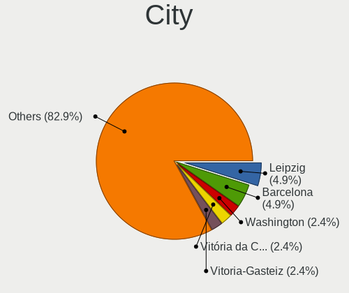
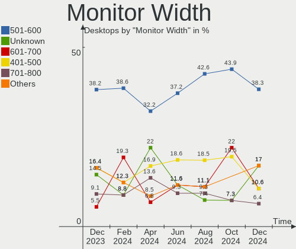
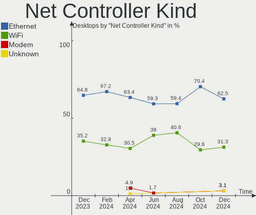

Manjaro Hardware Trends (Desktop)
---------------------------------

A project to identify most popular hardware characteristics and track their change
over time based on data collected by Manjaro users at https://Linux-Hardware.org.

Anyone can contribute to the study by uploading probes of their computers by
the [hw-probe](https://github.com/linuxhw/hw-probe) tool:

    sudo hw-probe -all -upload

Full-feature report is available here: https://linux-hardware.org/?view=trends&formfactor=desktop

Period: Apr, 2020.

Contents
--------

- [ OS                       ](#os)
- [ OS Family                ](#os-family)
- [ Kernel                   ](#kernel)
- [ Kernel Family            ](#kernel-family)
- [ Kernel Major Ver.        ](#kernel-major-ver)
- [ Arch                     ](#arch)
- [ DE                       ](#de)
- [ Display Server           ](#display-server)
- [ Display Manager          ](#display-manager)
- [ OS Lang                  ](#os-lang)
- [ Boot Mode                ](#boot-mode)
- [ Filesystem               ](#filesystem)
- [ Dual Boot with Linux/BSD ](#dual-boot-with-linux/bsd)
- [ Dual Boot (Win)          ](#dual-boot-win)
- [ Country                  ](#country)
- [ City                     ](#city)
- [ Vendor                   ](#vendor)
- [ Model                    ](#model)
- [ Model Family             ](#model-family)
- [ MFG Year                 ](#mfg-year)
- [ Form Factor              ](#form-factor)
- [ Secure Boot              ](#secure-boot)
- [ Coreboot                 ](#coreboot)
- [ RAM Size                 ](#ram-size)
- [ RAM Used                 ](#ram-used)
- [ Drive Vendor             ](#drive-vendor)
- [ Drive Model              ](#drive-model)
- [ Drive Kind               ](#drive-kind)
- [ Drive Connector          ](#drive-connector)
- [ Drive Size               ](#drive-size)
- [ Space Total              ](#space-total)
- [ Space Used               ](#space-used)
- [ Malfunc. Drives          ](#malfunc-drives)
- [ Malfunc. Drive Vendor    ](#malfunc-drive-vendor)
- [ Malfunc. Drive Kind      ](#malfunc-drive-kind)
- [ Failed Drives            ](#failed-drives)
- [ Failed Drive Vendor      ](#failed-drive-vendor)
- [ Drive Status             ](#drive-status)
- [ Storage Vendor           ](#storage-vendor)
- [ Storage Model            ](#storage-model)
- [ Storage Kind             ](#storage-kind)
- [ CPU Vendor               ](#cpu-vendor)
- [ CPU Model                ](#cpu-model)
- [ CPU Model Family         ](#cpu-model-family)
- [ CPU Cores                ](#cpu-cores)
- [ CPU Sockets              ](#cpu-sockets)
- [ CPU Threads              ](#cpu-threads)
- [ CPU Op-Modes             ](#cpu-op-modes)
- [ CPU Microarch            ](#cpu-microarch)
- [ CPU Microcode            ](#cpu-microcode)
- [ GPU Vendor               ](#gpu-vendor)
- [ GPU Model                ](#gpu-model)
- [ GPU Combo                ](#gpu-combo)
- [ GPU Driver               ](#gpu-driver)
- [ GPU Memory               ](#gpu-memory)
- [ Monitor Vendor           ](#monitor-vendor)
- [ Monitor Model            ](#monitor-model)
- [ Monitor Resolution       ](#monitor-resolution)
- [ Monitor Diagonal         ](#monitor-diagonal)
- [ Monitor Width            ](#monitor-width)
- [ Aspect Ratio             ](#aspect-ratio)
- [ Monitor Area             ](#monitor-area)
- [ Pixel Density            ](#pixel-density)
- [ Multiple Monitors        ](#multiple-monitors)
- [ Net Controller Vendor    ](#net-controller-vendor)
- [ Net Controller Model     ](#net-controller-model)
- [ Net Controller Kind      ](#net-controller-kind)
- [ Used Controller          ](#used-controller)
- [ NICs                     ](#nics)
- [ Unsupported Devices      ](#unsupported-devices)
- [ Unsupported Device Types ](#unsupported-device-types)

OS
--

Installed operating systems

| Name             | Computers | Percent |
|------------------|-----------|---------|
| Manjaro 20.0     | 36        | 45.57%  |
| Manjaro          | 26        | 32.91%  |
| Manjaro 19.0.2   | 16        | 20.25%  |
| Manjaro 20.0-rc1 | 1         | 1.27%   |

OS Family
---------

OS without a version

| Name    | Computers | Percent |
|---------|-----------|---------|
| Manjaro | 79        | 100%    |

Kernel
------

Version of the Linux kernel

| Version             | Computers | Percent |
|---------------------|-----------|---------|
| 5.4.33-3-MANJARO    | 13        | 16.46%  |
| 5.6.5-3-MANJARO     | 8         | 10.13%  |
| 5.4.28-1-MANJARO    | 7         | 8.86%   |
| 5.6.7-1-MANJARO     | 6         | 7.59%   |
| 5.6.3-2-MANJARO     | 6         | 7.59%   |
| 5.4.31-1-MANJARO    | 6         | 7.59%   |
| 5.4.35-1-MANJARO    | 5         | 6.33%   |
| 5.6.6-1-MANJARO     | 4         | 5.06%   |
| 5.5.13-1-MANJARO    | 3         | 3.8%    |
| 5.4.34-1-MANJARO    | 3         | 3.8%    |
| 5.5.16-1-MANJARO    | 2         | 2.53%   |
| 5.4.33-1-MANJARO    | 2         | 2.53%   |
| 5.4.23-1-MANJARO    | 2         | 2.53%   |
| 4.19.118-1-MANJARO  | 2         | 2.53%   |
| 5.6.5-1-MANJARO     | 1         | 1.27%   |
| 5.6.2-5-tkg-pds     | 1         | 1.27%   |
| 5.6.2-1-MANJARO     | 1         | 1.27%   |
| 5.6.1-1-MANJARO     | 1         | 1.27%   |
| 5.6.0-1-MANJARO     | 1         | 1.27%   |
| 5.5.7-1-MANJARO     | 1         | 1.27%   |
| 5.5.19-1-MANJARO    | 1         | 1.27%   |
| 5.5.14-1-MANJARO    | 1         | 1.27%   |
| 5.4.28-rt19-MANJARO | 1         | 1.27%   |
| 4.14.175-1-MANJARO  | 1         | 1.27%   |

Kernel Family
-------------

Linux kernel without a distro release

| Version  | Computers | Percent |
|----------|-----------|---------|
| 5.4.33   | 15        | 18.99%  |
| 5.6.5    | 9         | 11.39%  |
| 5.4.28   | 8         | 10.13%  |
| 5.6.7    | 6         | 7.59%   |
| 5.6.3    | 6         | 7.59%   |
| 5.4.31   | 6         | 7.59%   |
| 5.4.35   | 5         | 6.33%   |
| 5.6.6    | 4         | 5.06%   |
| 5.5.13   | 3         | 3.8%    |
| 5.4.34   | 3         | 3.8%    |
| 5.6.2    | 2         | 2.53%   |
| 5.5.16   | 2         | 2.53%   |
| 5.4.23   | 2         | 2.53%   |
| 4.19.118 | 2         | 2.53%   |
| 5.6.1    | 1         | 1.27%   |
| 5.6.0    | 1         | 1.27%   |
| 5.5.7    | 1         | 1.27%   |
| 5.5.19   | 1         | 1.27%   |
| 5.5.14   | 1         | 1.27%   |
| 4.14.175 | 1         | 1.27%   |

Kernel Major Ver.
-----------------

Linux kernel major version

| Version | Computers | Percent |
|---------|-----------|---------|
| 5.4     | 39        | 49.37%  |
| 5.6     | 29        | 36.71%  |
| 5.5     | 8         | 10.13%  |
| 4.19    | 2         | 2.53%   |
| 4.14    | 1         | 1.27%   |

Arch
----

OS architecture (x86_64, i586, etc.)

| Name   | Computers | Percent |
|--------|-----------|---------|
| x86_64 | 79        | 100%    |

DE
--

Desktop Environment

| Name       | Computers | Percent |
|------------|-----------|---------|
| KDE5       | 26        | 32.91%  |
| XFCE       | 20        | 25.32%  |
| GNOME      | 15        | 18.99%  |
| KDE        | 11        | 13.92%  |
| X-Cinnamon | 2         | 2.53%   |
| Unknown    | 2         | 2.53%   |
| i3         | 1         | 1.27%   |
| Deepin     | 1         | 1.27%   |
| Cinnamon   | 1         | 1.27%   |

Display Server
--------------

X11 or Wayland

| Name    | Computers | Percent |
|---------|-----------|---------|
| X11     | 77        | 97.47%  |
| Wayland | 2         | 2.53%   |

Display Manager
---------------

SDDM, LightDM, etc.

| Name    | Computers | Percent |
|---------|-----------|---------|
| SDDM    | 26        | 32.91%  |
| Unknown | 25        | 31.65%  |
| LightDM | 18        | 22.78%  |
| GDM     | 9         | 11.39%  |
| XDM     | 1         | 1.27%   |

OS Lang
-------

Language

| Lang       | Computers | Percent |
|------------|-----------|---------|
| ru_RU      | 24        | 30.38%  |
| en_US      | 18        | 22.78%  |
| en_US.utf8 | 9         | 11.39%  |
| ru_RU.utf8 | 4         | 5.06%   |
| de_DE      | 3         | 3.8%    |
| ru_UA.utf8 | 2         | 2.53%   |
| it_IT      | 2         | 2.53%   |
| en_NZ      | 2         | 2.53%   |
| en_GB.utf8 | 2         | 2.53%   |
| en_CA      | 2         | 2.53%   |
| zh_CN      | 1         | 1.27%   |
| sv_SE      | 1         | 1.27%   |
| ru_UA      | 1         | 1.27%   |
| pt_BR.utf8 | 1         | 1.27%   |
| nl_NL      | 1         | 1.27%   |
| es_ES      | 1         | 1.27%   |
| en_CA.utf8 | 1         | 1.27%   |
| el_GR.utf8 | 1         | 1.27%   |
| el_GR      | 1         | 1.27%   |
| de_AT      | 1         | 1.27%   |
| bg_BG      | 1         | 1.27%   |

Boot Mode
---------

EFI or BIOS

| Mode | Computers | Percent |
|------|-----------|---------|
| BIOS | 48        | 60.76%  |
| EFI  | 31        | 39.24%  |

Filesystem
----------

Type of filesystem

| Type    | Computers | Percent |
|---------|-----------|---------|
| Ext4    | 69        | 87.34%  |
| Btrfs   | 5         | 6.33%   |
| Overlay | 2         | 2.53%   |
| F2fs    | 2         | 2.53%   |
| Ext2    | 1         | 1.27%   |

Dual Boot with Linux/BSD
------------------------

Hosting more than one Linux/BSD

| Dual boot | Computers | Percent |
|-----------|-----------|---------|
| No        | 58        | 73.42%  |
| Yes       | 21        | 26.58%  |

Dual Boot (Win)
---------------

Hosting Linux and Windows

| Dual boot | Computers | Percent |
|-----------|-----------|---------|
| Yes       | 45        | 56.96%  |
| No        | 34        | 43.04%  |

Country
-------

Geographic location (country)

| Country     | Computers | Percent |
|-------------|-----------|---------|
| Russia      | 30        | 37.97%  |
| USA         | 11        | 13.92%  |
| Ukraine     | 5         | 6.33%   |
| Canada      | 4         | 5.06%   |
| Italy       | 3         | 3.8%    |
| Germany     | 3         | 3.8%    |
| UK          | 2         | 2.53%   |
| Sweden      | 2         | 2.53%   |
| New Zealand | 2         | 2.53%   |
| Netherlands | 2         | 2.53%   |
| Greece      | 2         | 2.53%   |
| Belgium     | 2         | 2.53%   |
| Uzbekistan  | 1         | 1.27%   |
| Thailand    | 1         | 1.27%   |
| Spain       | 1         | 1.27%   |
| Mexico      | 1         | 1.27%   |
| Lithuania   | 1         | 1.27%   |
| Finland     | 1         | 1.27%   |
| Egypt       | 1         | 1.27%   |
| China       | 1         | 1.27%   |
| Bulgaria    | 1         | 1.27%   |
| Brazil      | 1         | 1.27%   |
| Austria     | 1         | 1.27%   |

City
----

Geographic location (city)

| City                | Computers | Percent |
|---------------------|-----------|---------|
| Moscow              | 9         | 11.39%  |
| St Petersburg       | 2         | 2.53%   |
| Rome                | 2         | 2.53%   |
| Ottawa              | 2         | 2.53%   |
| Omsk                | 2         | 2.53%   |
| Odesa               | 2         | 2.53%   |
| Auckland            | 2         | 2.53%   |
| Athens              | 2         | 2.53%   |
| Zlatoust            | 1         | 1.27%   |
| Yaroslavl           | 1         | 1.27%   |
| Wharton             | 1         | 1.27%   |
| Wedemark            | 1         | 1.27%   |
| Vilnius             | 1         | 1.27%   |
| Ulyanovsk           | 1         | 1.27%   |
| Ufa                 | 1         | 1.27%   |
| Trieste             | 1         | 1.27%   |
| Toronto             | 1         | 1.27%   |
| Tomsk               | 1         | 1.27%   |
| Tavier              | 1         | 1.27%   |
| Tashkent            | 1         | 1.27%   |
| Tambov              | 1         | 1.27%   |
| Strunino            | 1         | 1.27%   |
| Sofia               | 1         | 1.27%   |
| Sheboygan           | 1         | 1.27%   |
| Salzgitter          | 1         | 1.27%   |
| Saint-Constant      | 1         | 1.27%   |
| Saginaw             | 1         | 1.27%   |
| Saeffle             | 1         | 1.27%   |
| Rosmalen            | 1         | 1.27%   |
| Rokytne             | 1         | 1.27%   |
| Rock Hill           | 1         | 1.27%   |
| Port Richey         | 1         | 1.27%   |
| Petrozavodsk        | 1         | 1.27%   |
| Oryol               | 1         | 1.27%   |
| Nottingham          | 1         | 1.27%   |
| Nogales             | 1         | 1.27%   |
| Nizhny Tagil        | 1         | 1.27%   |
| Niles               | 1         | 1.27%   |
| Nijmegen            | 1         | 1.27%   |
| Naberezhnyye Chelny | 1         | 1.27%   |
| Murmansk            | 1         | 1.27%   |
| Miami               | 1         | 1.27%   |
| Melle               | 1         | 1.27%   |
| Martin              | 1         | 1.27%   |
| Lübeck             | 1         | 1.27%   |
| Lutsk               | 1         | 1.27%   |
| Los Angeles         | 1         | 1.27%   |
| London              | 1         | 1.27%   |
| Linz                | 1         | 1.27%   |
| Kyiv                | 1         | 1.27%   |
| Khabarovsk          | 1         | 1.27%   |
| Helsinki            | 1         | 1.27%   |
| Gävle              | 1         | 1.27%   |
| Ekaterinburg        | 1         | 1.27%   |
| Damanhur            | 1         | 1.27%   |
| Chelyabinsk         | 1         | 1.27%   |
| Cheboksary          | 1         | 1.27%   |
| Chaoyang Shi        | 1         | 1.27%   |
| Cartagena           | 1         | 1.27%   |
| Brasília           | 1         | 1.27%   |

Vendor
------

Motherboard manufacturer

| Name                | Computers | Percent |
|---------------------|-----------|---------|
| ASUSTek Computer    | 25        | 31.65%  |
| Gigabyte Technology | 15        | 18.99%  |
| MSI                 | 11        | 13.92%  |
| ASRock              | 9         | 11.39%  |
| Hewlett-Packard     | 6         | 7.59%   |
| Pegatron            | 2         | 2.53%   |
| Intel               | 2         | 2.53%   |
| Dell                | 2         | 2.53%   |
| Acer                | 2         | 2.53%   |
| Lenovo              | 1         | 1.27%   |
| Huanan              | 1         | 1.27%   |
| Foxconn             | 1         | 1.27%   |
| Biostar             | 1         | 1.27%   |
| Unknown             | 1         | 1.27%   |

Model
-----

Motherboard model

| Name                                                                  | Computers | Percent |
|-----------------------------------------------------------------------|-----------|---------|
| MSI MS-7693                                                           | 2         | 2.53%   |
| ASUS ROG STRIX X470-F GAMING                                          | 2         | 2.53%   |
| ASUS PRIME B350M-A                                                    | 2         | 2.53%   |
| ASUS P5LD2-X                                                          | 2         | 2.53%   |
| ASUS All Series                                                       | 2         | 2.53%   |
| Pegatron WL260AA-ABZ CQ5340IT                                         | 1         | 1.27%   |
| Pegatron Pro 3120 Microtower PC                                       | 1         | 1.27%   |
| MSI MS-7C52                                                           | 1         | 1.27%   |
| MSI MS-7B98                                                           | 1         | 1.27%   |
| MSI MS-7B36                                                           | 1         | 1.27%   |
| MSI MS-7A34                                                           | 1         | 1.27%   |
| MSI MS-7A32                                                           | 1         | 1.27%   |
| MSI MS-7978                                                           | 1         | 1.27%   |
| MSI MS-7895                                                           | 1         | 1.27%   |
| MSI MS-7721                                                           | 1         | 1.27%   |
| MSI GIGANT X4 9550/500                                                | 1         | 1.27%   |
| Lenovo ThinkCentre M93p 10A8S32X00                                    | 1         | 1.27%   |
| Intel X79 (INTEL Xeon E5/Corei7 DMI2 - C600/C200 Cipset V3.2S1        | 1         | 1.27%   |
| Intel DP55WB AAE64798-205                                             | 1         | 1.27%   |
| Huanan X79 INTEL (INTEL Xeon E5/Corei7 DMI2 - C600/C200 Cipset V2.49P | 1         | 1.27%   |
| HP Z820 Workstation                                                   | 1         | 1.27%   |
| HP Z440 Workstation                                                   | 1         | 1.27%   |
| HP ProDesk 400 G1 SFF                                                 | 1         | 1.27%   |
| HP Compaq dc5850 Small Form Factor                                    | 1         | 1.27%   |
| HP Compaq 8200 Elite SFF PC                                           | 1         | 1.27%   |
| HP 310-1033                                                           | 1         | 1.27%   |
| Gigabyte Z77X-UP5 TH-CF                                               | 1         | 1.27%   |
| Gigabyte Z77P-D3                                                      | 1         | 1.27%   |
| Gigabyte Z390 AORUS PRO WIFI                                          | 1         | 1.27%   |
| Gigabyte X570 AORUS MASTER                                            | 1         | 1.27%   |
| Gigabyte X570 AORUS ELITE                                             | 1         | 1.27%   |
| Gigabyte X470 AORUS ULTRA GAMING                                      | 1         | 1.27%   |
| Gigabyte PigDestroyer9000                                             | 1         | 1.27%   |
| Gigabyte P43-ES3G                                                     | 1         | 1.27%   |
| Gigabyte H61M-S2PV                                                    | 1         | 1.27%   |
| Gigabyte H61M-S1                                                      | 1         | 1.27%   |
| Gigabyte H55M-S2H                                                     | 1         | 1.27%   |
| Gigabyte GA-MA770-DS3                                                 | 1         | 1.27%   |
| Gigabyte F2A88XM-DS2-TE                                               | 1         | 1.27%   |
| Gigabyte B75M-D3H                                                     | 1         | 1.27%   |
| Gigabyte B450M DS3H                                                   | 1         | 1.27%   |
| Foxconn G5220nl                                                       | 1         | 1.27%   |
| Dell Inspiron 660                                                     | 1         | 1.27%   |
| Dell DM061                                                            | 1         | 1.27%   |
| Biostar GAMING H170T                                                  | 1         | 1.27%   |
| ASUS ROG STRIX X399-E GAMING                                          | 1         | 1.27%   |
| ASUS ROG STRIX B450-F GAMING                                          | 1         | 1.27%   |
| ASUS PRIME X470-PRO                                                   | 1         | 1.27%   |
| ASUS PRIME X370-PRO                                                   | 1         | 1.27%   |
| ASUS P8Z77-V LX                                                       | 1         | 1.27%   |
| ASUS P8Z77-V DELUXE                                                   | 1         | 1.27%   |
| ASUS P8Z77-M                                                          | 1         | 1.27%   |
| ASUS P8Z68-V LE                                                       | 1         | 1.27%   |
| ASUS P8P67 DELUXE                                                     | 1         | 1.27%   |
| ASUS P8B75-V                                                          | 1         | 1.27%   |
| ASUS P7H55                                                            | 1         | 1.27%   |
| ASUS P5QL PRO                                                         | 1         | 1.27%   |
| ASUS P5Q3                                                             | 1         | 1.27%   |
| ASUS M32CD_A_F_K20CD_K31CD                                            | 1         | 1.27%   |
| ASUS M2N-X Plus                                                       | 1         | 1.27%   |

Model Family
------------

Motherboard model prefix

| Name                      | Computers | Percent |
|---------------------------|-----------|---------|
| ASUS ROG                  | 4         | 5.06%   |
| ASUS PRIME                | 4         | 5.06%   |
| MSI MS-7693               | 2         | 2.53%   |
| HP Compaq                 | 2         | 2.53%   |
| Gigabyte X570             | 2         | 2.53%   |
| ASUS P8Z77-V              | 2         | 2.53%   |
| ASUS P5LD2-X              | 2         | 2.53%   |
| ASUS All                  | 2         | 2.53%   |
| Acer Aspire               | 2         | 2.53%   |
| Pegatron WL260AA-ABZ      | 1         | 1.27%   |
| Pegatron Pro              | 1         | 1.27%   |
| MSI MS-7C52               | 1         | 1.27%   |
| MSI MS-7B98               | 1         | 1.27%   |
| MSI MS-7B36               | 1         | 1.27%   |
| MSI MS-7A34               | 1         | 1.27%   |
| MSI MS-7A32               | 1         | 1.27%   |
| MSI MS-7978               | 1         | 1.27%   |
| MSI MS-7895               | 1         | 1.27%   |
| MSI MS-7721               | 1         | 1.27%   |
| MSI GIGANT                | 1         | 1.27%   |
| Lenovo ThinkCentre        | 1         | 1.27%   |
| Intel X79                 | 1         | 1.27%   |
| Intel DP55WB              | 1         | 1.27%   |
| Huanan X79                | 1         | 1.27%   |
| HP Z820                   | 1         | 1.27%   |
| HP Z440                   | 1         | 1.27%   |
| HP ProDesk                | 1         | 1.27%   |
| HP 310-1033               | 1         | 1.27%   |
| Gigabyte Z77X-UP5         | 1         | 1.27%   |
| Gigabyte Z77P-D3          | 1         | 1.27%   |
| Gigabyte Z390             | 1         | 1.27%   |
| Gigabyte X470             | 1         | 1.27%   |
| Gigabyte PigDestroyer9000 | 1         | 1.27%   |
| Gigabyte P43-ES3G         | 1         | 1.27%   |
| Gigabyte H61M-S2PV        | 1         | 1.27%   |
| Gigabyte H61M-S1          | 1         | 1.27%   |
| Gigabyte H55M-S2H         | 1         | 1.27%   |
| Gigabyte GA-MA770-DS3     | 1         | 1.27%   |
| Gigabyte F2A88XM-DS2-TE   | 1         | 1.27%   |
| Gigabyte B75M-D3H         | 1         | 1.27%   |
| Gigabyte B450M            | 1         | 1.27%   |
| Foxconn G5220nl           | 1         | 1.27%   |
| Dell Inspiron             | 1         | 1.27%   |
| Dell DM061                | 1         | 1.27%   |
| Biostar GAMING            | 1         | 1.27%   |
| ASUS P8Z77-M              | 1         | 1.27%   |
| ASUS P8Z68-V              | 1         | 1.27%   |
| ASUS P8P67                | 1         | 1.27%   |
| ASUS P8B75-V              | 1         | 1.27%   |
| ASUS P7H55                | 1         | 1.27%   |
| ASUS P5QL                 | 1         | 1.27%   |
| ASUS P5Q3                 | 1         | 1.27%   |
| ASUS M32CD                | 1         | 1.27%   |
| ASUS M2N-X                | 1         | 1.27%   |
| ASUS M2A-VM               | 1         | 1.27%   |
| ASUS H110M-C              | 1         | 1.27%   |
| ASRock Z77                | 1         | 1.27%   |
| ASRock Z68                | 1         | 1.27%   |
| ASRock Z170               | 1         | 1.27%   |
| ASRock X570               | 1         | 1.27%   |

MFG Year
--------

Motherboard manufacture year

| Year | Computers | Percent |
|------|-----------|---------|
| 2019 | 17        | 21.52%  |
| 2018 | 12        | 15.19%  |
| 2014 | 7         | 8.86%   |
| 2012 | 7         | 8.86%   |
| 2010 | 7         | 8.86%   |
| 2013 | 6         | 7.59%   |
| 2015 | 5         | 6.33%   |
| 2020 | 3         | 3.8%    |
| 2016 | 3         | 3.8%    |
| 2011 | 3         | 3.8%    |
| 2009 | 3         | 3.8%    |
| 2007 | 3         | 3.8%    |
| 2008 | 2         | 2.53%   |
| 2017 | 1         | 1.27%   |

Form Factor
-----------

Physical design of the computer

| Name    | Computers | Percent |
|---------|-----------|---------|
| Desktop | 79        | 100%    |

Secure Boot
-----------

Enabled or disabled

| State    | Computers | Percent |
|----------|-----------|---------|
| Disabled | 79        | 100%    |

Coreboot
--------

Have coreboot on board

| Used | Computers | Percent |
|------|-----------|---------|
| No   | 79        | 100%    |

RAM Size
--------

Total RAM memory

| Size in GB  | Computers | Percent |
|-------------|-----------|---------|
| 16.01-24.0  | 25        | 31.65%  |
| 4.01-8.0    | 14        | 17.72%  |
| 8.01-16.0   | 14        | 17.72%  |
| 3.01-4.0    | 12        | 15.19%  |
| 32.01-64.0  | 7         | 8.86%   |
| 64.01-256.0 | 4         | 5.06%   |
| 1.01-2.0    | 2         | 2.53%   |
| 24.01-32.0  | 1         | 1.27%   |

RAM Used
--------

Used RAM memory

| Used GB   | Computers | Percent |
|-----------|-----------|---------|
| 1.01-2.0  | 28        | 35.44%  |
| 2.01-3.0  | 22        | 27.85%  |
| 3.01-4.0  | 13        | 16.46%  |
| 4.01-8.0  | 10        | 12.66%  |
| 0.01-1.0  | 4         | 5.06%   |
| 8.01-16.0 | 2         | 2.53%   |

Drive Vendor
------------

Hard drive vendors

| Vendor              | Computers | Drives | Percent |
|---------------------|-----------|--------|---------|
| WDC                 | 41        | 51     | 24.7%   |
| Seagate             | 35        | 49     | 21.08%  |
| Samsung Electronics | 19        | 26     | 11.45%  |
| Toshiba             | 9         | 9      | 5.42%   |
| Kingston            | 7         | 7      | 4.22%   |
| Hitachi             | 7         | 8      | 4.22%   |
| Crucial             | 5         | 6      | 3.01%   |
| SanDisk             | 4         | 5      | 2.41%   |
| OCZ                 | 4         | 4      | 2.41%   |
| Transcend           | 3         | 3      | 1.81%   |
| SPCC                | 3         | 3      | 1.81%   |
| PLEXTOR             | 3         | 3      | 1.81%   |
| Intel               | 3         | 3      | 1.81%   |
| China               | 3         | 4      | 1.81%   |
| PNY                 | 2         | 2      | 1.2%    |
| MAXTOR              | 2         | 2      | 1.2%    |
| A-DATA Technology   | 2         | 2      | 1.2%    |
| Zheino              | 1         | 1      | 0.6%    |
| tigo                | 1         | 1      | 0.6%    |
| Silicon Motion      | 1         | 1      | 0.6%    |
| Phison              | 1         | 1      | 0.6%    |
| Patriot             | 1         | 1      | 0.6%    |
| LONDISK             | 1         | 1      | 0.6%    |
| LITEON              | 1         | 1      | 0.6%    |
| KINGMAX             | 1         | 1      | 0.6%    |
| KingDian            | 1         | 1      | 0.6%    |
| JMicron             | 1         | 1      | 0.6%    |
| Intenso             | 1         | 1      | 0.6%    |
| Gigabyte Technology | 1         | 1      | 0.6%    |
| Generic             | 1         | 1      | 0.6%    |
| GALAX               | 1         | 1      | 0.6%    |

Drive Model
-----------

Hard drive models

| Model                        | Computers | Percent |
|------------------------------|-----------|---------|
| SSD 860 EVO 500GB            | 5         | 2.49%   |
| WD10EZEX-08WN4A0 1TB         | 3         | 1.49%   |
| ST2000DM001-1CH164 2TB       | 3         | 1.49%   |
| ST1000DM010-2EP102 1TB       | 3         | 1.49%   |
| DT01ACA100 1TB               | 3         | 1.49%   |
| DT01ACA050 500GB             | 3         | 1.49%   |
| 120GB SSD                    | 3         | 1.49%   |
| WDS500G2B0A-00SM50 500GB SSD | 2         | 1%      |
| WD5002AALX-00J37A0 500GB     | 2         | 1%      |
| WD5000AAKX-00ERMA0 500GB     | 2         | 1%      |
| WD5000AAKX-001CA0 500GB      | 2         | 1%      |
| WD20EZRZ-00Z5HB0 2TB         | 2         | 1%      |
| VERTEX4 128GB SSD            | 2         | 1%      |
| Ultra II 960GB SSD           | 2         | 1%      |
| SUV500M8120G 120GB SSD       | 2         | 1%      |
| ST3500418AS 500GB            | 2         | 1%      |
| ST31000524AS 1TB             | 2         | 1%      |
| ST3000DM001-1CH166 3TB       | 2         | 1%      |
| ST2000DM001-1ER164 2TB       | 2         | 1%      |
| ST1000DM003-1SB10C 1TB       | 2         | 1%      |
| ST1000DM003-1ER162 1TB       | 2         | 1%      |
| SSD 860 EVO 250GB            | 2         | 1%      |
| SSD 120GB                    | 2         | 1%      |
| SA400S37240G 240GB SSD       | 2         | 1%      |
| HDS721010CLA332 1TB          | 2         | 1%      |
| HD502IJ 500GB                | 2         | 1%      |
| CT250MX500SSD1 250GB         | 2         | 1%      |
| CS900 120GB SSD              | 2         | 1%      |
| WDS500G3X0C-00SJG0 500GB     | 1         | 0.5%    |
| WDS500G1B0A-00H9H0 500GB SSD | 1         | 0.5%    |
| WDS100T3X0C-00SJG0 1TB       | 1         | 0.5%    |
| WD800AAJS-60PSA0 80GB        | 1         | 0.5%    |
| WD7501AALS-00J7B0 752GB      | 1         | 0.5%    |
| WD6400BPVT-60HXZT1 640GB     | 1         | 0.5%    |
| WD5003ABYZ-011FA0 500GB      | 1         | 0.5%    |
| WD5000BHTZ-04JCPV0 500GB     | 1         | 0.5%    |
| WD5000AZRX-00A8LB0 500GB     | 1         | 0.5%    |
| WD40EZRZ-00GXCB0 4TB         | 1         | 0.5%    |
| WD40EFRX-68N32N0 4TB         | 1         | 0.5%    |
| WD3200AAJS-60M0A1 320GB      | 1         | 0.5%    |
| WD3200AAJS-22B4A0 320GB      | 1         | 0.5%    |
| WD30EZRX-00DC0B0 3TB         | 1         | 0.5%    |
| WD30EZRX-00AZ6B0 3TB         | 1         | 0.5%    |
| WD30EZRS-42KEZB0 3TB         | 1         | 0.5%    |
| WD30EFRX-68EUZN0 3TB         | 1         | 0.5%    |
| WD2500AAKX-603CA0 250GB      | 1         | 0.5%    |
| WD2500AAKX-08U6AA0 250GB     | 1         | 0.5%    |
| WD20PURX-64P6ZY0 2TB         | 1         | 0.5%    |
| WD20EARX-00PASB0 2TB         | 1         | 0.5%    |
| WD15EURS-63S48Y0 1TB         | 1         | 0.5%    |
| WD10EZRZ-00HTKB0 1TB         | 1         | 0.5%    |
| WD10EZRX-00D8PB0 1TB         | 1         | 0.5%    |
| WD10EZRX-00A8LB0 1TB         | 1         | 0.5%    |
| WD10EZEX-60WN4A0 1TB         | 1         | 0.5%    |
| WD10EZEX-22BN5A0 1TB         | 1         | 0.5%    |
| WD10EZEX-21WN4A0 1TB         | 1         | 0.5%    |
| WD10EZEX-08M2NA0 1TB         | 1         | 0.5%    |
| WD10EZEX-00ZF5A0 1TB         | 1         | 0.5%    |
| WD10EFRX-68PJCN0 1TB         | 1         | 0.5%    |
| WD10EARS-00Y5B1 1TB          | 1         | 0.5%    |

Drive Kind
----------

HDD or SSD

| Kind    | Computers | Drives | Percent |
|---------|-----------|--------|---------|
| HDD     | 69        | 121    | 55.2%   |
| SSD     | 47        | 70     | 37.6%   |
| NVMe    | 8         | 9      | 6.4%    |
| Unknown | 1         | 1      | 0.8%    |

Drive Connector
---------------

SATA, SAS, NVMe, etc.

| Type | Computers | Drives | Percent |
|------|-----------|--------|---------|
| SATA | 75        | 187    | 85.23%  |
| NVMe | 8         | 9      | 9.09%   |
| SAS  | 5         | 5      | 5.68%   |

Drive Size
----------

Size of hard drive

| Size in TB | Computers | Drives | Percent |
|------------|-----------|--------|---------|
| 0.01-0.5   | 60        | 112    | 45.8%   |
| 0.51-1.0   | 44        | 60     | 33.59%  |
| 1.01-2.0   | 13        | 13     | 9.92%   |
| 2.01-3.0   | 9         | 11     | 6.87%   |
| 3.01-4.0   | 4         | 4      | 3.05%   |
| 10.01-20.0 | 1         | 1      | 0.76%   |

Space Total
-----------

Amount of disk space available on the file system

| Size in GB     | Computers | Percent |
|----------------|-----------|---------|
| 501-1000       | 17        | 21.52%  |
| 101-250        | 15        | 18.99%  |
| 251-500        | 13        | 16.46%  |
| More than 3000 | 9         | 11.39%  |
| 1001-2000      | 9         | 11.39%  |
| 2001-3000      | 5         | 6.33%   |
| 21-50          | 3         | 3.8%    |
| 1-20           | 3         | 3.8%    |
| 51-100         | 3         | 3.8%    |
| Unknown        | 2         | 2.53%   |

Space Used
----------

Amount of used disk space

| Used GB        | Computers | Percent |
|----------------|-----------|---------|
| 1-20           | 14        | 17.72%  |
| 251-500        | 11        | 13.92%  |
| 21-50          | 11        | 13.92%  |
| 101-250        | 11        | 13.92%  |
| 51-100         | 9         | 11.39%  |
| 1001-2000      | 7         | 8.86%   |
| 501-1000       | 6         | 7.59%   |
| More than 3000 | 4         | 5.06%   |
| 2001-3000      | 4         | 5.06%   |
| Unknown        | 2         | 2.53%   |

Malfunc. Drives
---------------

Drive models with a malfunction

| Model                    | Computers | Drives | Percent |
|--------------------------|-----------|--------|---------|
| ST2000DM001-1CH164 2TB   | 2         | 2      | 14.29%  |
| WD5002AALX-00J37A0 500GB | 1         | 1      | 7.14%   |
| WD5000AAKX-00ERMA0 500GB | 1         | 1      | 7.14%   |
| WD5000AAKX-001CA0 500GB  | 1         | 1      | 7.14%   |
| WD3200AAJS-60M0A1 320GB  | 1         | 1      | 7.14%   |
| WD3200AAJS-22B4A0 320GB  | 1         | 1      | 7.14%   |
| ST9250320AS 250GB        | 1         | 1      | 7.14%   |
| ST3750525AS 752GB        | 1         | 1      | 7.14%   |
| ST3250820AS 250GB        | 1         | 1      | 7.14%   |
| ST3250620AS 250GB        | 1         | 1      | 7.14%   |
| ST3000DM001-9YN166 3TB   | 1         | 1      | 7.14%   |
| SSD 960 EVO 250GB        | 1         | 1      | 7.14%   |
| Solid State Disk 56GB    | 1         | 1      | 7.14%   |

Malfunc. Drive Vendor
---------------------

Vendors of faulty drives

| Vendor              | Computers | Drives | Percent |
|---------------------|-----------|--------|---------|
| WDC                 | 5         | 5      | 41.67%  |
| Seagate             | 5         | 7      | 41.67%  |
| SPCC                | 1         | 1      | 8.33%   |
| Samsung Electronics | 1         | 1      | 8.33%   |

Malfunc. Drive Kind
-------------------

Kinds of faulty drives

| Kind | Computers | Drives | Percent |
|------|-----------|--------|---------|
| HDD  | 9         | 12     | 81.82%  |
| NVMe | 1         | 1      | 9.09%   |
| SSD  | 1         | 1      | 9.09%   |

Failed Drives
-------------

Failed drive models

| Model            | Computers | Drives | Percent |
|------------------|-----------|--------|---------|
| ST31000524AS 1TB | 1         | 1      | 100%    |

Failed Drive Vendor
-------------------

Failed drive vendors

| Vendor  | Computers | Drives | Percent |
|---------|-----------|--------|---------|
| Seagate | 1         | 1      | 100%    |

Drive Status
------------

Number of failed and malfunc. drives

| Status   | Computers | Drives | Percent |
|----------|-----------|--------|---------|
| Detected | 44        | 100    | 50%     |
| Works    | 32        | 86     | 36.36%  |
| Malfunc  | 11        | 14     | 12.5%   |
| Failed   | 1         | 1      | 1.14%   |

Storage Vendor
--------------

Storage controller vendors

| Vendor                   | Computers | Percent |
|--------------------------|-----------|---------|
| Intel                    | 44        | 39.64%  |
| AMD                      | 33        | 29.73%  |
| Samsung Electronics      | 5         | 4.5%    |
| ASMedia Technology       | 5         | 4.5%    |
| Silicon Motion           | 4         | 3.6%    |
| Sandisk                  | 4         | 3.6%    |
| Marvell Technology Group | 4         | 3.6%    |
| Phison Electronics       | 3         | 2.7%    |
| Nvidia                   | 3         | 2.7%    |
| JMicron Technology       | 3         | 2.7%    |
| Broadcom / LSI           | 2         | 1.8%    |
| ADATA Technology         | 1         | 0.9%    |

Storage Model
-------------

Storage controller models

| Model                                                                             | Computers | Percent |
|-----------------------------------------------------------------------------------|-----------|---------|
| FCH SATA Controller [AHCI mode]                                                   | 25        | 16.67%  |
| 7 Series/C210 Series Chipset Family 6-port SATA Controller [AHCI mode]            | 9         | 6%      |
| 400 Series Chipset SATA Controller                                                | 9         | 6%      |
| 6 Series/C200 Series Chipset Family 6 port Desktop SATA AHCI Controller           | 7         | 4.67%   |
| Q170/Q150/B150/H170/H110/Z170/CM236 Chipset SATA Controller [AHCI Mode]           | 5         | 3.33%   |
| Non-Volatile memory controller                                                    | 5         | 3.33%   |
| ASM1062 Serial ATA Controller                                                     | 5         | 3.33%   |
| NVMe SSD Controller SM981/PM981/PM983                                             | 4         | 2.67%   |
| NM10/ICH7 Family SATA Controller [IDE mode]                                       | 4         | 2.67%   |
| 8 Series/C220 Series Chipset Family 6-port SATA Controller 1 [AHCI mode]          | 4         | 2.67%   |
| 300 Series Chipset SATA Controller                                                | 4         | 2.67%   |
| WD Black 2018/PC SN720 NVMe SSD                                                   | 3         | 2%      |
| SB7x0/SB8x0/SB9x0 SATA Controller [AHCI mode]                                     | 3         | 2%      |
| 82801JI (ICH10 Family) SATA AHCI Controller                                       | 3         | 2%      |
| 82801G (ICH7 Family) IDE Controller                                               | 3         | 2%      |
| X370 Series Chipset SATA Controller                                               | 2         | 1.33%   |
| SB7x0/SB8x0/SB9x0 SATA Controller [IDE mode]                                      | 2         | 1.33%   |
| SB7x0/SB8x0/SB9x0 IDE Controller                                                  | 2         | 1.33%   |
| SB600 Non-Raid-5 SATA                                                             | 2         | 1.33%   |
| SB600 IDE                                                                         | 2         | 1.33%   |
| SAS2308 PCI-Express Fusion-MPT SAS-2                                              | 2         | 1.33%   |
| NVMe SSD Controller SM961/PM961                                                   | 2         | 1.33%   |
| MCP61 SATA Controller                                                             | 2         | 1.33%   |
| JMB368 IDE controller                                                             | 2         | 1.33%   |
| FCH SATA Controller D                                                             | 2         | 1.33%   |
| Cannon Lake PCH SATA AHCI Controller                                              | 2         | 1.33%   |
| 88SE9128 PCIe SATA 6 Gb/s RAID controller with HyperDuo                           | 2         | 1.33%   |
| 5 Series/3400 Series Chipset 6 port SATA AHCI Controller                          | 2         | 1.33%   |
| XPG SX8200 Pro PCIe Gen3x4 M.2 2280 Solid State Drive                             | 1         | 0.67%   |
| X399 Series Chipset SATA Controller                                               | 1         | 0.67%   |
| WD Black 2018/PC SN520 NVMe SSD                                                   | 1         | 0.67%   |
| SSD 660P Series                                                                   | 1         | 0.67%   |
| SB7x0/SB8x0/SB9x0 SATA Controller [RAID5 mode]                                    | 1         | 0.67%   |
| SATA Controller [RAID mode]                                                       | 1         | 0.67%   |
| MCP78S [GeForce 8200] SATA Controller (non-AHCI mode)                             | 1         | 0.67%   |
| MCP78S [GeForce 8200] IDE                                                         | 1         | 0.67%   |
| MCP61 IDE                                                                         | 1         | 0.67%   |
| JMB362 SATA Controller                                                            | 1         | 0.67%   |
| FCH IDE Controller                                                                | 1         | 0.67%   |
| E7 NVMe Controller                                                                | 1         | 0.67%   |
| E16 PCIe4 NVMe Controller                                                         | 1         | 0.67%   |
| C610/X99 series chipset sSATA Controller [AHCI mode]                              | 1         | 0.67%   |
| C610/X99 series chipset 6-Port SATA Controller [AHCI mode]                        | 1         | 0.67%   |
| C602 chipset 4-Port SATA Storage Control Unit                                     | 1         | 0.67%   |
| C600/X79 series chipset SATA RAID Controller                                      | 1         | 0.67%   |
| C600/X79 series chipset IDE-r Controller                                          | 1         | 0.67%   |
| 88SE9235 PCIe 2.0 x2 4-port SATA 6 Gb/s Controller                                | 1         | 0.67%   |
| 88SE9172 SATA 6Gb/s Controller                                                    | 1         | 0.67%   |
| 88SE6101/6102 single-port PATA133 interface                                       | 1         | 0.67%   |
| 82801JI (ICH10 Family) 4 port SATA IDE Controller #1                              | 1         | 0.67%   |
| 82801JI (ICH10 Family) 2 port SATA IDE Controller #2                              | 1         | 0.67%   |
| 82801HR/HO/HH (ICH8R/DO/DH) 2 port SATA Controller [IDE mode]                     | 1         | 0.67%   |
| 82801H (ICH8 Family) 4 port SATA Controller [IDE mode]                            | 1         | 0.67%   |
| 7 Series/C210 Series Chipset Family 4-port SATA Controller [IDE mode]             | 1         | 0.67%   |
| 7 Series/C210 Series Chipset Family 2-port SATA Controller [IDE mode]             | 1         | 0.67%   |
| 6 Series/C200 Series Chipset Family Desktop SATA Controller (IDE mode, ports 4-5) | 1         | 0.67%   |
| 6 Series/C200 Series Chipset Family Desktop SATA Controller (IDE mode, ports 0-3) | 1         | 0.67%   |
| 5 Series/3400 Series Chipset 4 port SATA IDE Controller                           | 1         | 0.67%   |
| 5 Series/3400 Series Chipset 2 port SATA IDE Controller                           | 1         | 0.67%   |

Storage Kind
------------

Kind of storage controller (IDE, SATA, NVMe, SAS, ...)

| Kind | Computers | Percent |
|------|-----------|---------|
| SATA | 65        | 61.9%   |
| IDE  | 19        | 18.1%   |
| NVMe | 16        | 15.24%  |
| RAID | 3         | 2.86%   |
| SAS  | 2         | 1.9%    |

CPU Vendor
----------

Processor vendors

| Vendor | Computers | Percent |
|--------|-----------|---------|
| Intel  | 43        | 54.43%  |
| AMD    | 36        | 45.57%  |

CPU Model
---------

Processor models

| Model                                          | Computers | Percent |
|------------------------------------------------|-----------|---------|
| AMD Ryzen 5 3600 6-Core Processor              | 4         | 5.06%   |
| Intel Core i7-3770 CPU @ 3.40GHz               | 3         | 3.8%    |
| AMD Ryzen 7 2700X Eight-Core Processor         | 3         | 3.8%    |
| AMD Ryzen 5 2400G with Radeon Vega Graphics    | 3         | 3.8%    |
| Intel Xeon CPU X5460 @ 3.16GHz                 | 2         | 2.53%   |
| Intel Pentium Dual-Core CPU E5500 @ 2.80GHz    | 2         | 2.53%   |
| Intel Pentium Dual CPU E2180 @ 2.00GHz         | 2         | 2.53%   |
| Intel Core i5-3470 CPU @ 3.20GHz               | 2         | 2.53%   |
| AMD Ryzen 5 1600X Six-Core Processor           | 2         | 2.53%   |
| AMD FX-8350 Eight-Core Processor               | 2         | 2.53%   |
| AMD A10-5800K APU with Radeon HD Graphics      | 2         | 2.53%   |
| Intel Xeon CPU E5-2650 0 @ 2.00GHz             | 1         | 1.27%   |
| Intel Xeon CPU E5-1650 0 @ 3.20GHz             | 1         | 1.27%   |
| Intel Xeon CPU E5-1620 v3 @ 3.50GHz            | 1         | 1.27%   |
| Intel Xeon CPU E5-1620 0 @ 3.60GHz             | 1         | 1.27%   |
| Intel Xeon CPU E3-1230 V2 @ 3.30GHz            | 1         | 1.27%   |
| Intel Pentium CPU G860 @ 3.00GHz               | 1         | 1.27%   |
| Intel Core i7-9700K CPU @ 3.60GHz              | 1         | 1.27%   |
| Intel Core i7-9700 CPU @ 3.00GHz               | 1         | 1.27%   |
| Intel Core i7-8700 CPU @ 3.20GHz               | 1         | 1.27%   |
| Intel Core i7-6700 CPU @ 3.40GHz               | 1         | 1.27%   |
| Intel Core i7-2600K CPU @ 3.40GHz              | 1         | 1.27%   |
| Intel Core i7 CPU 860 @ 2.80GHz                | 1         | 1.27%   |
| Intel Core i5-7500 CPU @ 3.40GHz               | 1         | 1.27%   |
| Intel Core i5-6600K CPU @ 3.50GHz              | 1         | 1.27%   |
| Intel Core i5-6600 CPU @ 3.30GHz               | 1         | 1.27%   |
| Intel Core i5-4590 CPU @ 3.30GHz               | 1         | 1.27%   |
| Intel Core i5-4570S CPU @ 2.90GHz              | 1         | 1.27%   |
| Intel Core i5-3570K CPU @ 3.40GHz              | 1         | 1.27%   |
| Intel Core i5-3330 CPU @ 3.00GHz               | 1         | 1.27%   |
| Intel Core i5-2500K CPU @ 3.30GHz              | 1         | 1.27%   |
| Intel Core i5-2500 CPU @ 3.30GHz               | 1         | 1.27%   |
| Intel Core i5-2400 CPU @ 3.10GHz               | 1         | 1.27%   |
| Intel Core i5-2320 CPU @ 3.00GHz               | 1         | 1.27%   |
| Intel Core i5 CPU 750 @ 2.67GHz                | 1         | 1.27%   |
| Intel Core i3-6100 CPU @ 3.70GHz               | 1         | 1.27%   |
| Intel Core i3-4150 CPU @ 3.50GHz               | 1         | 1.27%   |
| Intel Core i3-3225 CPU @ 3.30GHz               | 1         | 1.27%   |
| Intel Core i3 CPU 560 @ 3.33GHz                | 1         | 1.27%   |
| Intel Core 2 Quad CPU Q9400 @ 2.66GHz          | 1         | 1.27%   |
| Intel Core 2 CPU 6600 @ 2.40GHz                | 1         | 1.27%   |
| Intel Celeron CPU G1830 @ 2.80GHz              | 1         | 1.27%   |
| Intel Atom CPU D510 @ 1.66GHz                  | 1         | 1.27%   |
| AMD Ryzen Threadripper 2950X 16-Core Processor | 1         | 1.27%   |
| AMD Ryzen 9 3950X 16-Core Processor            | 1         | 1.27%   |
| AMD Ryzen 7 3700X 8-Core Processor             | 1         | 1.27%   |
| AMD Ryzen 7 2700 Eight-Core Processor          | 1         | 1.27%   |
| AMD Ryzen 7 1700 Eight-Core Processor          | 1         | 1.27%   |
| AMD Ryzen 5 3400G with Radeon Vega Graphics    | 1         | 1.27%   |
| AMD Ryzen 5 2600X Six-Core Processor           | 1         | 1.27%   |
| AMD Ryzen 3 3200G with Radeon Vega Graphics    | 1         | 1.27%   |
| AMD Ryzen 3 1200 Quad-Core Processor           | 1         | 1.27%   |
| AMD Phenom 9550 Quad-Core Processor            | 1         | 1.27%   |
| AMD Phenom 8650 Triple-Core Processor          | 1         | 1.27%   |
| AMD Phenom 8600B Triple-Core Processor         | 1         | 1.27%   |
| AMD FX-8320 Eight-Core Processor               | 1         | 1.27%   |
| AMD FX-4350 Quad-Core Processor                | 1         | 1.27%   |
| AMD Athlon X4 870K Quad Core Processor         | 1         | 1.27%   |
| AMD Athlon II X3 460 Processor                 | 1         | 1.27%   |
| AMD Athlon II X2 240e Processor                | 1         | 1.27%   |

CPU Model Family
----------------

Processor model prefix

| Model                   | Computers | Percent |
|-------------------------|-----------|---------|
| Intel Core i5           | 14        | 17.72%  |
| AMD Ryzen 5             | 11        | 13.92%  |
| Intel Core i7           | 9         | 11.39%  |
| Intel Xeon              | 7         | 8.86%   |
| AMD Ryzen 7             | 6         | 7.59%   |
| Intel Core i3           | 4         | 5.06%   |
| AMD FX                  | 4         | 5.06%   |
| AMD Phenom              | 3         | 3.8%    |
| AMD A10                 | 3         | 3.8%    |
| Intel Pentium Dual-Core | 2         | 2.53%   |
| Intel Pentium Dual      | 2         | 2.53%   |
| AMD Ryzen 3             | 2         | 2.53%   |
| AMD Athlon 64 X2        | 2         | 2.53%   |
| Intel Pentium           | 1         | 1.27%   |
| Intel Core 2 Quad       | 1         | 1.27%   |
| Intel Core 2            | 1         | 1.27%   |
| Intel Celeron           | 1         | 1.27%   |
| Intel Atom              | 1         | 1.27%   |
| AMD Ryzen Threadripper  | 1         | 1.27%   |
| AMD Ryzen 9             | 1         | 1.27%   |
| AMD Athlon X4           | 1         | 1.27%   |
| AMD Athlon II X3        | 1         | 1.27%   |
| AMD Athlon II X2        | 1         | 1.27%   |

CPU Cores
---------

Number of processor cores

| Number | Computers | Percent |
|--------|-----------|---------|
| 4      | 36        | 45.57%  |
| 2      | 20        | 25.32%  |
| 6      | 9         | 11.39%  |
| 8      | 8         | 10.13%  |
| 16     | 3         | 3.8%    |
| 3      | 3         | 3.8%    |

CPU Sockets
-----------

Number of sockets

| Number | Computers | Percent |
|--------|-----------|---------|
| 1      | 78        | 98.73%  |
| 2      | 1         | 1.27%   |

CPU Threads
-----------

Threads per core (Hyper-Threading)

| Number | Computers | Percent |
|--------|-----------|---------|
| 2      | 43        | 54.43%  |
| 1      | 36        | 45.57%  |

CPU Op-Modes
------------

CPU Operation Modes (32-bit, 64-bit)

| Op mode        | Computers | Percent |
|----------------|-----------|---------|
| 32-bit, 64-bit | 79        | 100%    |

CPU Microarch
-------------

Microarchitecture

| Name        | Computers | Percent |
|-------------|-----------|---------|
| SandyBridge | 9         | 11.39%  |
| IvyBridge   | 9         | 11.39%  |
| Zen+        | 8         | 10.13%  |
| Core        | 8         | 10.13%  |
| Zen         | 7         | 8.86%   |
| Piledriver  | 7         | 8.86%   |
| Zen 2       | 6         | 7.59%   |
| Skylake     | 6         | 7.59%   |
| K10         | 5         | 6.33%   |
| Haswell     | 5         | 6.33%   |
| Nehalem     | 2         | 2.53%   |
| KabyLake    | 2         | 2.53%   |
| K8 Hammer   | 2         | 2.53%   |
| Westmere    | 1         | 1.27%   |
| Steamroller | 1         | 1.27%   |
| Bonnell     | 1         | 1.27%   |

CPU Microcode
-------------

Microcode number

| Number     | Computers | Percent |
|------------|-----------|---------|
| Unknown    | 27        | 34.18%  |
| 0x306a9    | 6         | 7.59%   |
| 0x08701013 | 5         | 6.33%   |
| 0x206a7    | 4         | 5.06%   |
| 0x0800820d | 4         | 5.06%   |
| 0x1067a    | 3         | 3.8%    |
| 0x06000852 | 3         | 3.8%    |
| 0x506e3    | 2         | 2.53%   |
| 0x306c3    | 2         | 2.53%   |
| 0x206d7    | 2         | 2.53%   |
| 0x106e5    | 2         | 2.53%   |
| 0x10676    | 2         | 2.53%   |
| 0x08101016 | 2         | 2.53%   |
| 0x06001119 | 2         | 2.53%   |
| 0x01000083 | 2         | 2.53%   |
| 0x906ea    | 1         | 1.27%   |
| 0x906e9    | 1         | 1.27%   |
| 0x6fd      | 1         | 1.27%   |
| 0x306f2    | 1         | 1.27%   |
| 0x20655    | 1         | 1.27%   |
| 0x08108109 | 1         | 1.27%   |
| 0x0810100b | 1         | 1.27%   |
| 0x08001129 | 1         | 1.27%   |
| 0x06003106 | 1         | 1.27%   |
| 0x010000c8 | 1         | 1.27%   |
| 0x01000095 | 1         | 1.27%   |

GPU Vendor
----------

Vendors of graphics cards

| Vendor | Computers | Percent |
|--------|-----------|---------|
| Nvidia | 43        | 51.81%  |
| AMD    | 29        | 34.94%  |
| Intel  | 11        | 13.25%  |

GPU Model
---------

Graphics card models

| Model                                                                 | Computers | Percent |
|-----------------------------------------------------------------------|-----------|---------|
| Ellesmere [Radeon RX 470/480/570/570X/580/580X/590]                   | 9         | 10.47%  |
| GP107 [GeForce GTX 1050 Ti]                                           | 4         | 4.65%   |
| Xeon E3-1200 v2/3rd Gen Core processor Graphics Controller            | 3         | 3.49%   |
| Raven Ridge [Radeon Vega Series / Radeon Vega Mobile Series]          | 3         | 3.49%   |
| Cape Verde XT [Radeon HD 7770/8760 / R7 250X]                         | 3         | 3.49%   |
| 2nd Generation Core Processor Family Integrated Graphics Controller   | 3         | 3.49%   |
| Xeon E3-1200 v3/4th Gen Core Processor Integrated Graphics Controller | 2         | 2.33%   |
| TU116 [GeForce GTX 1660]                                              | 2         | 2.33%   |
| Navi 10 [Radeon RX 5600 OEM/5600 XT / 5700/5700 XT]                   | 2         | 2.33%   |
| GP106 [GeForce GTX 1060 3GB]                                          | 2         | 2.33%   |
| GM206 [GeForce GTX 960]                                               | 2         | 2.33%   |
| GM107 [GeForce GTX 750 Ti]                                            | 2         | 2.33%   |
| GK107 [GeForce GTX 650]                                               | 2         | 2.33%   |
| GK107 [GeForce GT 640]                                                | 2         | 2.33%   |
| GK104 [GeForce GTX 760]                                               | 2         | 2.33%   |
| GF119 [GeForce GT 520]                                                | 2         | 2.33%   |
| Vega 20 [Radeon VII]                                                  | 1         | 1.16%   |
| UHD Graphics 630 (Desktop)                                            | 1         | 1.16%   |
| TU104 [GeForce RTX 2070 SUPER]                                        | 1         | 1.16%   |
| TU102 [GeForce RTX 2080 Ti Rev. A]                                    | 1         | 1.16%   |
| Trinity [Radeon HD 7660D]                                             | 1         | 1.16%   |
| RV770 [Radeon HD 4870]                                                | 1         | 1.16%   |
| RV770 [Radeon HD 4850]                                                | 1         | 1.16%   |
| RV516 [Radeon X1300/X1550 Series] (Secondary)                         | 1         | 1.16%   |
| RV516 [Radeon X1300/X1550 Series]                                     | 1         | 1.16%   |
| RS880M [Mobility Radeon HD 4225/4250]                                 | 1         | 1.16%   |
| RS780C [Radeon 3100]                                                  | 1         | 1.16%   |
| Oland [Radeon HD 8570 / R7 240/340 / Radeon 520 OEM]                  | 1         | 1.16%   |
| Oland XT [Radeon HD 8670 / R7 250/350]                                | 1         | 1.16%   |
| HD Graphics 530                                                       | 1         | 1.16%   |
| GT218 [ION]                                                           | 1         | 1.16%   |
| GT218 [GeForce 8400 GS Rev. 3]                                        | 1         | 1.16%   |
| GT218 [GeForce 315]                                                   | 1         | 1.16%   |
| GT218 [GeForce 210]                                                   | 1         | 1.16%   |
| GT215 [GeForce GT 240]                                                | 1         | 1.16%   |
| GT215 [GeForce GT 220]                                                | 1         | 1.16%   |
| GP108 [GeForce GT 1030]                                               | 1         | 1.16%   |
| GP107 [GeForce GTX 1050]                                              | 1         | 1.16%   |
| GP106 [GeForce GTX 1060 6GB]                                          | 1         | 1.16%   |
| GP104 [GeForce GTX 1080]                                              | 1         | 1.16%   |
| GP104 [GeForce GTX 1070 Ti]                                           | 1         | 1.16%   |
| GM206 [GeForce GTX 950]                                               | 1         | 1.16%   |
| GM204 [GeForce GTX 970]                                               | 1         | 1.16%   |
| GM107 [GeForce GTX 750]                                               | 1         | 1.16%   |
| GK208B [GeForce GT 710]                                               | 1         | 1.16%   |
| GK106 [GeForce GTX 660]                                               | 1         | 1.16%   |
| GK106 [GeForce GTX 650 Ti]                                            | 1         | 1.16%   |
| GK106 [GeForce GTX 650 Ti Boost]                                      | 1         | 1.16%   |
| GK104 [GeForce GTX 660 Ti]                                            | 1         | 1.16%   |
| G96C [GeForce 9500 GT]                                                | 1         | 1.16%   |
| G92 [GeForce 9800 GT]                                                 | 1         | 1.16%   |
| Cypress XT [Radeon HD 5870]                                           | 1         | 1.16%   |
| Curacao PRO [Radeon R7 370 / R9 270/370 OEM]                          | 1         | 1.16%   |
| Caicos [Radeon HD 6450/7450/8450 / R5 230 OEM]                        | 1         | 1.16%   |
| Baffin [Radeon RX 550 640SP / RX 560/560X]                            | 1         | 1.16%   |
| Baffin [Radeon RX 460/560D / Pro 450/455/460/555/555X/560/560X]       | 1         | 1.16%   |
| 4th Generation Core Processor Family Integrated Graphics Controller   | 1         | 1.16%   |

GPU Combo
---------

Combinations of graphics cards

| Name         | Computers | Percent |
|--------------|-----------|---------|
| 1 x Nvidia   | 41        | 51.9%   |
| 1 x AMD      | 24        | 30.38%  |
| 1 x Intel    | 9         | 11.39%  |
| 2 x AMD      | 3         | 3.8%    |
| AMD + Nvidia | 2         | 2.53%   |

GPU Driver
----------

Free vs proprietary

| Driver      | Computers | Percent |
|-------------|-----------|---------|
| Free        | 44        | 55.7%   |
| Proprietary | 34        | 43.04%  |
| Unknown     | 1         | 1.27%   |

GPU Memory
----------

Total video memory

| Size in GB | Computers | Percent |
|------------|-----------|---------|
| Unknown    | 25        | 31.65%  |
| 1.01-2.0   | 17        | 21.52%  |
| 0.51-1.0   | 10        | 12.66%  |
| 3.01-4.0   | 9         | 11.39%  |
| 0.01-0.5   | 8         | 10.13%  |
| 7.01-8.0   | 5         | 6.33%   |
| 5.01-6.0   | 2         | 2.53%   |
| 2.01-3.0   | 2         | 2.53%   |
| 8.01-16.0  | 1         | 1.27%   |

Monitor Vendor
--------------

Monitor vendors

| Vendor               | Computers | Percent |
|----------------------|-----------|---------|
| Goldstar             | 20        | 20.62%  |
| Samsung Electronics  | 12        | 12.37%  |
| Acer                 | 11        | 11.34%  |
| Dell                 | 8         | 8.25%   |
| Philips              | 5         | 5.15%   |
| LG Electronics       | 5         | 5.15%   |
| Ancor Communications | 5         | 5.15%   |
| ViewSonic            | 4         | 4.12%   |
| Vizio                | 3         | 3.09%   |
| Iiyama               | 3         | 3.09%   |
| Hewlett-Packard      | 3         | 3.09%   |
| BenQ                 | 3         | 3.09%   |
| ASUSTek Computer     | 2         | 2.06%   |
| VIZ                  | 1         | 1.03%   |
| Vestel Elektronik    | 1         | 1.03%   |
| Unknown              | 1         | 1.03%   |
| Sony                 | 1         | 1.03%   |
| Pixio                | 1         | 1.03%   |
| NEC Computers        | 1         | 1.03%   |
| Medion               | 1         | 1.03%   |
| Lenovo               | 1         | 1.03%   |
| Idek Iiyama          | 1         | 1.03%   |
| Hitachi              | 1         | 1.03%   |
| DENON                | 1         | 1.03%   |
| AVX                  | 1         | 1.03%   |
| AOC                  | 1         | 1.03%   |

Monitor Model
-------------

Monitor models

| Model                                               | Computers | Percent |
|-----------------------------------------------------|-----------|---------|
| MP59G GSM5B35 1920x1080 480x270mm 21.7-inch         | 2         | 2%      |
| GW2270 BNQ78DB 1920x1080 476x268mm 21.5-inch        | 2         | 2%      |
| X203W ACR0008 1680x1050 430x270mm 20.0-inch         | 1         | 1%      |
| W2453 GSM56F4 1920x1080 531x299mm 24.0-inch         | 1         | 1%      |
| W2353 GSM56EF 1680x1050 510x290mm 23.1-inch         | 1         | 1%      |
| W2241 GSM56B3 1680x1050 474x296mm 22.0-inch         | 1         | 1%      |
| W2042 GSM4E7E 1680x1050 434x270mm 20.1-inch         | 1         | 1%      |
| W1943 GSM4BAD 1024x768 410x230mm 18.5-inch          | 1         | 1%      |
| VZ249 AUS24CC 1920x1080 527x296mm 23.8-inch         | 1         | 1%      |
| VX32L HDTV VIZ2100 1280x720 700x390mm 31.5-inch     | 1         | 1%      |
| VX3276 Series VSC6335 2560x1440 698x393mm 31.5-inch | 1         | 1%      |
| VX2453 Series VSC0C28 1920x1080 520x290mm 23.4-inch | 1         | 1%      |
| VN279 ACI27A4 1920x1080 597x336mm 27.0-inch         | 1         | 1%      |
| VG289 AUS28BA 3840x2160 620x340mm 27.8-inch         | 1         | 1%      |
| VG270 ACR06C0 1920x1080 598x336mm 27.0-inch         | 1         | 1%      |
| VA902 VSC1B1C 1280x1024 376x301mm 19.0-inch         | 1         | 1%      |
| VA2014 SERIES VSC6026 1600x900 443x249mm 20.0-inch  | 1         | 1%      |
| V193 ACR00F7 1280x1024 376x301mm 19.0-inch          | 1         | 1%      |
| Ultra HD GSM5B09 3840x2160 600x340mm 27.2-inch      | 1         | 1%      |
| U2415 DELA0BA 1920x1080 518x324mm 24.1-inch         | 1         | 1%      |
| TouchSmart HWP410B 1600x900 440x250mm 19.9-inch     | 1         | 1%      |
| T24C300 SAM0A9B 1920x1080 531x299mm 24.0-inch       | 1         | 1%      |
| SyncMaster SAM0596 1920x1200 518x324mm 24.1-inch    | 1         | 1%      |
| SyncMaster SAM0594 1680x1050 459x296mm 21.5-inch    | 1         | 1%      |
| SyncMaster SAM03E5 1680x1050 470x300mm 22.0-inch    | 1         | 1%      |
| SyncMaster SAM036F 1440x900 428x255mm 19.6-inch     | 1         | 1%      |
| SB220Q ACR06AB 1920x1080 476x268mm 21.5-inch        | 1         | 1%      |
| S2318H/HX DELD0BC 1920x1080 509x286mm 23.0-inch     | 1         | 1%      |
| S230HL ACR0280 1920x1080 509x286mm 23.0-inch        | 1         | 1%      |
| S222HQL ACR0204 1920x1080 477x268mm 21.5-inch       | 1         | 1%      |
| S220HQL ACR0347 1920x1080 477x268mm 21.5-inch       | 1         | 1%      |
| RL2460H BNQ7F34 1920x1080 531x299mm 24.0-inch       | 1         | 1%      |
| PW201        ACI20A1 1680x1050 430x270mm 20.0-inch  | 1         | 1%      |
| PLB2403WS IVM5601 1920x1200 519x324mm 24.1-inch     | 1         | 1%      |
| PL2288H IVM5633 1920x1080 480x270mm 21.7-inch       | 1         | 1%      |
| PHL 436M6VBP PHLC179 3840x2160 941x529mm 42.5-inch  | 1         | 1%      |
| PHL 346B1C PHL093E 3440x1440 797x334mm 34.0-inch    | 1         | 1%      |
| PHL 243V7 PHLC155 1920x1080 530x300mm 24.0-inch     | 1         | 1%      |
| PA246 ACIFF24 1920x1200 546x352mm 25.6-inch         | 1         | 1%      |
| P2414H DELA09B 1920x1080 530x300mm 24.0-inch        | 1         | 1%      |
| P2214H DELA097 1920x1080 480x270mm 21.7-inch        | 1         | 1%      |
| P193WA ACR000C 1440x900 410x256mm 19.0-inch         | 1         | 1%      |
| MP59G GSM5B34 1920x1080 480x270mm 21.7-inch         | 1         | 1%      |
| MD 20430 MED36A2 1920x1080 521x293mm 23.5-inch      | 1         | 1%      |
| M420VT VIZ4210 1920x1080 930x523mm 42.0-inch        | 1         | 1%      |
| M2280D GSM57B9 1920x1080 480x270mm 21.7-inch        | 1         | 1%      |
| LG ULTRAWIDE GSM59F2 1920x1080 800x340mm 34.2-inch  | 1         | 1%      |
| LG ULTRAWIDE GSM59F1 1920x1080 580x240mm 24.7-inch  | 1         | 1%      |
| LEN T23i-10 LEN61AB 1920x1080 509x286mm 23.0-inch   | 1         | 1%      |
| LCD Monitor W2043 1600x900                          | 1         | 1%      |
| LCD Monitor VW26L HDTV10F 1360x768                  | 1         | 1%      |
| LCD Monitor VIZ0026 1360x768 580x320mm 26.1-inch    | 1         | 1%      |
| LCD Monitor U3011 2560x1600                         | 1         | 1%      |
| LCD Monitor U28D590 6400x2160                       | 1         | 1%      |
| LCD Monitor TV  *00 3840x2160                       | 1         | 1%      |
| LCD Monitor SAM0FBE 3840x2160 950x540mm 43.0-inch   | 1         | 1%      |
| LCD Monitor SAM0FBD 3840x2160 950x540mm 43.0-inch   | 1         | 1%      |
| LCD Monitor SAM0BC9 1920x1080 600x340mm 27.2-inch   | 1         | 1%      |
| LCD Monitor SAM03BC 1920x1080                       | 1         | 1%      |
| LCD Monitor S27A950D 1920x1080                      | 1         | 1%      |

Monitor Resolution
------------------

Monitor screen resolution

| Resolution         | Computers | Percent |
|--------------------|-----------|---------|
| 1920x1080 (FHD)    | 42        | 45.65%  |
| 1680x1050 (WSXGA+) | 9         | 9.78%   |
| 3840x2160 (4K)     | 6         | 6.52%   |
| 1280x1024 (SXGA)   | 6         | 6.52%   |
| 1920x1200 (WUXGA)  | 5         | 5.43%   |
| 2560x1440 (QHD)    | 3         | 3.26%   |
| 2560x1080          | 3         | 3.26%   |
| 1600x900 (HD+)     | 3         | 3.26%   |
| Unknown            | 3         | 3.26%   |
| 1600x1200          | 2         | 2.17%   |
| 1440x900 (WXGA+)   | 2         | 2.17%   |
| 1360x768           | 2         | 2.17%   |
| 6400x2160          | 1         | 1.09%   |
| 3440x1440          | 1         | 1.09%   |
| 3200x1080          | 1         | 1.09%   |
| 2560x1600          | 1         | 1.09%   |
| 1920x1446          | 1         | 1.09%   |
| 1280x720 (HD)      | 1         | 1.09%   |

Monitor Diagonal
----------------

Diagonal size in inches

| Inches  | Computers | Percent |
|---------|-----------|---------|
| Unknown | 14        | 14.29%  |
| 23      | 13        | 13.27%  |
| 21      | 13        | 13.27%  |
| 24      | 11        | 11.22%  |
| 27      | 8         | 8.16%   |
| 19      | 8         | 8.16%   |
| 20      | 7         | 7.14%   |
| 34      | 3         | 3.06%   |
| 31      | 3         | 3.06%   |
| 22      | 3         | 3.06%   |
| 42      | 2         | 2.04%   |
| 32      | 2         | 2.04%   |
| 18      | 2         | 2.04%   |
| 17      | 2         | 2.04%   |
| 84      | 1         | 1.02%   |
| 54      | 1         | 1.02%   |
| 43      | 1         | 1.02%   |
| 36      | 1         | 1.02%   |
| 28      | 1         | 1.02%   |
| 26      | 1         | 1.02%   |
| 25      | 1         | 1.02%   |

Monitor Width
-------------

Physical width

| Width in mm | Computers | Percent |
|-------------|-----------|---------|
| 501-600     | 32        | 33.68%  |
| 401-500     | 26        | 27.37%  |
| Unknown     | 14        | 14.74%  |
| 351-400     | 7         | 7.37%   |
| 701-800     | 5         | 5.26%   |
| 601-700     | 5         | 5.26%   |
| 901-1000    | 3         | 3.16%   |
| 301-350     | 1         | 1.05%   |
| 1501-2000   | 1         | 1.05%   |
| 1001-1500   | 1         | 1.05%   |

Aspect Ratio
------------

Proportional relationship between the width and the height

| Ratio   | Computers | Percent |
|---------|-----------|---------|
| 16/9    | 51        | 56.04%  |
| 16/10   | 14        | 15.38%  |
| Unknown | 13        | 14.29%  |
| 5/4     | 5         | 5.49%   |
| 4/3     | 3         | 3.3%    |
| 21/9    | 3         | 3.3%    |
| 6/5     | 1         | 1.1%    |
| 3/2     | 1         | 1.1%    |

Monitor Area
------------

Area in inch²

| Area in inch² | Computers | Percent |
|----------------|-----------|---------|
| 201-250        | 28        | 29.47%  |
| 151-200        | 22        | 23.16%  |
| Unknown        | 14        | 14.74%  |
| 351-500        | 8         | 8.42%   |
| 301-350        | 8         | 8.42%   |
| 251-300        | 7         | 7.37%   |
| 501-1000       | 4         | 4.21%   |
| More than 1000 | 2         | 2.11%   |
| 141-150        | 2         | 2.11%   |

Pixel Density
-------------

Pixels per inch

| Density | Computers | Percent |
|---------|-----------|---------|
| 51-100  | 56        | 60.87%  |
| 101-120 | 17        | 18.48%  |
| Unknown | 14        | 15.22%  |
| 121-160 | 3         | 3.26%   |
| 1-50    | 1         | 1.09%   |
| 161-240 | 1         | 1.09%   |

Multiple Monitors
-----------------

Total monitors connected

| Total | Computers | Percent |
|-------|-----------|---------|
| 1     | 65        | 82.28%  |
| 2     | 12        | 15.19%  |
| 3     | 2         | 2.53%   |

Net Controller Vendor
---------------------

Controller vendors

| Vendor                | Computers | Percent |
|-----------------------|-----------|---------|
| Intel                 | 20        | 80%     |
| Realtek Semiconductor | 2         | 8%      |
| Nvidia                | 2         | 8%      |
| Samsung Electronics   | 1         | 4%      |

Net Controller Model
--------------------

Controller models

| Model                                                              | Computers | Percent |
|--------------------------------------------------------------------|-----------|---------|
| I211 Gigabit Network Connection                                    | 12        | 42.86%  |
| 82579V Gigabit Network Connection                                  | 3         | 10.71%  |
| Wi-Fi 6 AX200                                                      | 2         | 7.14%   |
| MCP61 Ethernet                                                     | 2         | 7.14%   |
| 82579LM Gigabit Network Connection (Lewisville)                    | 2         | 7.14%   |
| 82574L Gigabit Network Connection                                  | 2         | 7.14%   |
| RTL8153 Gigabit Ethernet Adapter                                   | 1         | 3.57%   |
| RTL8125 2.5GbE Controller                                          | 1         | 3.57%   |
| GT-I9500 [Galaxy S4] / GT-I9250 [Galaxy Nexus] (network tethering) | 1         | 3.57%   |
| 82578DC Gigabit Network Connection                                 | 1         | 3.57%   |
| 82562V 10/100 Network Connection                                   | 1         | 3.57%   |

Net Controller Kind
-------------------

Ethernet, WiFi or modem

| Kind     | Computers | Percent |
|----------|-----------|---------|
| Ethernet | 22        | 91.67%  |
| WiFi     | 2         | 8.33%   |

Used Controller
---------------

Currently used network controller

| Kind     | Computers | Percent |
|----------|-----------|---------|
| Ethernet | 17        | 100%    |

NICs
----

Total network controllers on board

| Total | Computers | Percent |
|-------|-----------|---------|
| 1     | 56        | 70.89%  |
| 2     | 19        | 24.05%  |
| 3     | 3         | 3.8%    |
| 0     | 1         | 1.27%   |

Unsupported Devices
-------------------

Total unsupported devices on board

| Total | Computers | Percent |
|-------|-----------|---------|
| 0     | 72        | 91.14%  |
| 1     | 6         | 7.59%   |
| 2     | 1         | 1.27%   |

Unsupported Device Types
------------------------

Types of unsupported devices

| Type             | Computers | Percent |
|------------------|-----------|---------|
| Net/wireless     | 3         | 33.33%  |
| Graphics card    | 3         | 33.33%  |
| Unassigned class | 1         | 11.11%  |
| Net/ethernet     | 1         | 11.11%  |
| Chipcard         | 1         | 11.11%  |

