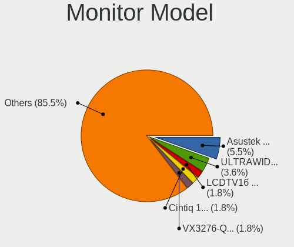
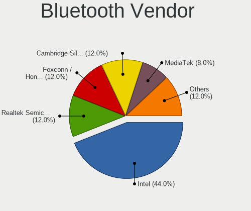
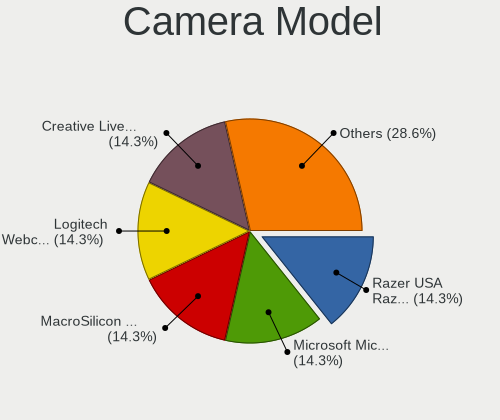

Manjaro - Hardware Trends (Desktops)
------------------------------------

A project to identify most popular hardware characteristics and track their change
over time based on data collected by Linux users at https://Linux-Hardware.org.

Anyone can contribute to this report by the [hw-probe](https://github.com/linuxhw/hw-probe) tool:

    sudo -E hw-probe -all -upload

This report is for one last month. Overall report since the beginning of time: [TestCoverage](https://github.com/linuxhw/TestCoverage)

Period: Oct, 2022.

Contents
--------

* [ System ](#system)
  - [ OS                       ](#os)
  - [ OS Family                ](#os-family)
  - [ Kernel                   ](#kernel)
  - [ Kernel Family            ](#kernel-family)
  - [ Kernel Major Ver.        ](#kernel-major-ver)
  - [ Arch                     ](#arch)
  - [ DE                       ](#de)
  - [ Display Server           ](#display-server)
  - [ Display Manager          ](#display-manager)
  - [ OS Lang                  ](#os-lang)
  - [ Boot Mode                ](#boot-mode)
  - [ Filesystem               ](#filesystem)
  - [ Part. scheme             ](#part-scheme)
  - [ Dual Boot with Linux/BSD ](#dual-boot-with-linuxbsd)
  - [ Dual Boot (Win)          ](#dual-boot-win)

* [ Board ](#board)
  - [ Vendor                   ](#vendor)
  - [ Model                    ](#model)
  - [ Model Family             ](#model-family)
  - [ MFG Year                 ](#mfg-year)
  - [ Form Factor              ](#form-factor)
  - [ Secure Boot              ](#secure-boot)
  - [ Coreboot                 ](#coreboot)
  - [ RAM Size                 ](#ram-size)
  - [ RAM Used                 ](#ram-used)
  - [ Total Drives             ](#total-drives)
  - [ Has CD-ROM               ](#has-cd-rom)
  - [ Has Ethernet             ](#has-ethernet)
  - [ Has WiFi                 ](#has-wifi)
  - [ Has Bluetooth            ](#has-bluetooth)

* [ Location ](#location)
  - [ Country                  ](#country)
  - [ City                     ](#city)

* [ Drives ](#drives)
  - [ Drive Vendor             ](#drive-vendor)
  - [ Drive Model              ](#drive-model)
  - [ HDD Vendor               ](#hdd-vendor)
  - [ SSD Vendor               ](#ssd-vendor)
  - [ Drive Kind               ](#drive-kind)
  - [ Drive Connector          ](#drive-connector)
  - [ Drive Size               ](#drive-size)
  - [ Space Total              ](#space-total)
  - [ Space Used               ](#space-used)
  - [ Malfunc. Drives          ](#malfunc-drives)
  - [ Malfunc. Drive Vendor    ](#malfunc-drive-vendor)
  - [ Malfunc. HDD Vendor      ](#malfunc-hdd-vendor)
  - [ Malfunc. Drive Kind      ](#malfunc-drive-kind)
  - [ Failed Drives            ](#failed-drives)
  - [ Failed Drive Vendor      ](#failed-drive-vendor)
  - [ Drive Status             ](#drive-status)

* [ Storage controller ](#storage-controller)
  - [ Storage Vendor           ](#storage-vendor)
  - [ Storage Model            ](#storage-model)
  - [ Storage Kind             ](#storage-kind)

* [ Processor ](#processor)
  - [ CPU Vendor               ](#cpu-vendor)
  - [ CPU Model                ](#cpu-model)
  - [ CPU Model Family         ](#cpu-model-family)
  - [ CPU Cores                ](#cpu-cores)
  - [ CPU Sockets              ](#cpu-sockets)
  - [ CPU Threads              ](#cpu-threads)
  - [ CPU Op-Modes             ](#cpu-op-modes)
  - [ CPU Microcode            ](#cpu-microcode)
  - [ CPU Microarch            ](#cpu-microarch)

* [ Graphics ](#graphics)
  - [ GPU Vendor               ](#gpu-vendor)
  - [ GPU Model                ](#gpu-model)
  - [ GPU Combo                ](#gpu-combo)
  - [ GPU Driver               ](#gpu-driver)
  - [ GPU Memory               ](#gpu-memory)

* [ Monitor ](#monitor)
  - [ Monitor Vendor           ](#monitor-vendor)
  - [ Monitor Model            ](#monitor-model)
  - [ Monitor Resolution       ](#monitor-resolution)
  - [ Monitor Diagonal         ](#monitor-diagonal)
  - [ Monitor Width            ](#monitor-width)
  - [ Aspect Ratio             ](#aspect-ratio)
  - [ Monitor Area             ](#monitor-area)
  - [ Pixel Density            ](#pixel-density)
  - [ Multiple Monitors        ](#multiple-monitors)

* [ Network ](#network)
  - [ Net Controller Vendor    ](#net-controller-vendor)
  - [ Net Controller Model     ](#net-controller-model)
  - [ Wireless Vendor          ](#wireless-vendor)
  - [ Wireless Model           ](#wireless-model)
  - [ Ethernet Vendor          ](#ethernet-vendor)
  - [ Ethernet Model           ](#ethernet-model)
  - [ Net Controller Kind      ](#net-controller-kind)
  - [ Used Controller          ](#used-controller)
  - [ NICs                     ](#nics)
  - [ IPv6                     ](#ipv6)

* [ Bluetooth ](#bluetooth)
  - [ Bluetooth Vendor         ](#bluetooth-vendor)
  - [ Bluetooth Model          ](#bluetooth-model)

* [ Sound ](#sound)
  - [ Sound Vendor             ](#sound-vendor)
  - [ Sound Model              ](#sound-model)

* [ Memory ](#memory)
  - [ Memory Vendor            ](#memory-vendor)
  - [ Memory Model             ](#memory-model)
  - [ Memory Kind              ](#memory-kind)
  - [ Memory Form Factor       ](#memory-form-factor)
  - [ Memory Size              ](#memory-size)
  - [ Memory Speed             ](#memory-speed)

* [ Printers & scanners ](#printers--scanners)
  - [ Printer Vendor           ](#printer-vendor)
  - [ Printer Model            ](#printer-model)
  - [ Scanner Vendor           ](#scanner-vendor)
  - [ Scanner Model            ](#scanner-model)

* [ Camera ](#camera)
  - [ Camera Vendor            ](#camera-vendor)
  - [ Camera Model             ](#camera-model)

* [ Security ](#security)
  - [ Fingerprint Vendor       ](#fingerprint-vendor)
  - [ Fingerprint Model        ](#fingerprint-model)
  - [ Chipcard Vendor          ](#chipcard-vendor)
  - [ Chipcard Model           ](#chipcard-model)

* [ Unsupported ](#unsupported)
  - [ Unsupported Devices      ](#unsupported-devices)
  - [ Unsupported Device Types ](#unsupported-device-types)

System
------

OS
--

Installed operating systems

| Name           | Desktops | Percent |
|----------------|----------|---------|
| Manjaro        | 31       | 50.82%  |
| Manjaro 22.0.0 | 30       | 49.18%  |

OS Family
---------

OS without a version

| Name    | Desktops | Percent |
|---------|----------|---------|
| Manjaro | 61       | 100%    |

Kernel
------

Version of the Linux kernel

| Version               | Desktops | Percent |
|-----------------------|----------|---------|
| 6.0.2-2-MANJARO       | 10       | 16.39%  |
| 5.15.74-3-MANJARO     | 9        | 14.75%  |
| 5.15.72-1-MANJARO     | 6        | 9.84%   |
| 5.19.7-1-MANJARO      | 5        | 8.2%    |
| 5.15.71-1-MANJARO     | 5        | 8.2%    |
| 5.15.65-1-MANJARO     | 5        | 8.2%    |
| 5.19.16-2-MANJARO     | 4        | 6.56%   |
| 6.0.0-1-MANJARO       | 3        | 4.92%   |
| 6.0.2-3-MANJARO       | 2        | 3.28%   |
| 5.19.0-3-rt10-MANJARO | 2        | 3.28%   |
| 5.15.60-1-MANJARO     | 2        | 3.28%   |
| 6.1.0-1-MANJARO       | 1        | 1.64%   |
| 5.4.217-1-MANJARO     | 1        | 1.64%   |
| 5.19.13-1-MANJARO     | 1        | 1.64%   |
| 5.19.10-1-MANJARO     | 1        | 1.64%   |
| 5.18.19-3-MANJARO     | 1        | 1.64%   |
| 5.18.0-4-rt11-MANJARO | 1        | 1.64%   |
| 5.10.146-1-MANJARO    | 1        | 1.64%   |
| 5.10.141-1-MANJARO    | 1        | 1.64%   |

Kernel Family
-------------

Linux kernel without a distro release

| Version  | Desktops | Percent |
|----------|----------|---------|
| 6.0.2    | 12       | 19.67%  |
| 5.15.74  | 9        | 14.75%  |
| 5.15.72  | 6        | 9.84%   |
| 5.19.7   | 5        | 8.2%    |
| 5.15.71  | 5        | 8.2%    |
| 5.15.65  | 5        | 8.2%    |
| 5.19.16  | 4        | 6.56%   |
| 6.0.0    | 3        | 4.92%   |
| 5.19.0   | 2        | 3.28%   |
| 5.15.60  | 2        | 3.28%   |
| 6.1.0    | 1        | 1.64%   |
| 5.4.217  | 1        | 1.64%   |
| 5.19.13  | 1        | 1.64%   |
| 5.19.10  | 1        | 1.64%   |
| 5.18.19  | 1        | 1.64%   |
| 5.18.0   | 1        | 1.64%   |
| 5.10.146 | 1        | 1.64%   |
| 5.10.141 | 1        | 1.64%   |

Kernel Major Ver.
-----------------

Linux kernel major version

| Version | Desktops | Percent |
|---------|----------|---------|
| 5.15    | 27       | 44.26%  |
| 6.0     | 15       | 24.59%  |
| 5.19    | 13       | 21.31%  |
| 5.18    | 2        | 3.28%   |
| 5.10    | 2        | 3.28%   |
| 6.1     | 1        | 1.64%   |
| 5.4     | 1        | 1.64%   |

Arch
----

OS architecture (x86_64, i586, etc.)

| Name   | Desktops | Percent |
|--------|----------|---------|
| x86_64 | 61       | 100%    |

DE
--

Desktop Environment

| Name       | Desktops | Percent |
|------------|----------|---------|
| KDE5       | 38       | 62.3%   |
| GNOME      | 9        | 14.75%  |
| X-Cinnamon | 6        | 9.84%   |
| XFCE       | 5        | 8.2%    |
| MATE       | 1        | 1.64%   |
| i3         | 1        | 1.64%   |
| Unknown    | 1        | 1.64%   |

Display Server
--------------

X11 or Wayland

| Name    | Desktops | Percent |
|---------|----------|---------|
| X11     | 54       | 88.52%  |
| Wayland | 6        | 9.84%   |
| Unknown | 1        | 1.64%   |

Display Manager
---------------

SDDM, LightDM, etc.

| Name    | Desktops | Percent |
|---------|----------|---------|
| Unknown | 31       | 50.82%  |
| SDDM    | 17       | 27.87%  |
| LightDM | 8        | 13.11%  |
| GDM     | 5        | 8.2%    |

OS Lang
-------

Language

| Lang  | Desktops | Percent |
|-------|----------|---------|
| en_US | 24       | 39.34%  |
| it_IT | 7        | 11.48%  |
| de_DE | 6        | 9.84%   |
| es_ES | 4        | 6.56%   |
| ru_RU | 2        | 3.28%   |
| nl_NL | 2        | 3.28%   |
| es_UY | 2        | 3.28%   |
| en_IE | 2        | 3.28%   |
| sl_SI | 1        | 1.64%   |
| fr_CA | 1        | 1.64%   |
| fr_BE | 1        | 1.64%   |
| es_MX | 1        | 1.64%   |
| es_HN | 1        | 1.64%   |
| es_CR | 1        | 1.64%   |
| es_AR | 1        | 1.64%   |
| en_ZA | 1        | 1.64%   |
| en_IN | 1        | 1.64%   |
| en_IL | 1        | 1.64%   |
| en_GB | 1        | 1.64%   |
| de_AT | 1        | 1.64%   |

Boot Mode
---------

EFI or BIOS

| Mode | Desktops | Percent |
|------|----------|---------|
| BIOS | 39       | 63.93%  |
| EFI  | 22       | 36.07%  |

Filesystem
----------

Type of filesystem

| Type    | Desktops | Percent |
|---------|----------|---------|
| Ext4    | 40       | 65.57%  |
| Btrfs   | 19       | 31.15%  |
| Xfs     | 1        | 1.64%   |
| Overlay | 1        | 1.64%   |

Part. scheme
------------

Scheme of partitioning

| Type    | Desktops | Percent |
|---------|----------|---------|
| Unknown | 31       | 50.82%  |
| GPT     | 27       | 44.26%  |
| MBR     | 3        | 4.92%   |

Dual Boot with Linux/BSD
------------------------

Hosting more than one Linux/BSD

| Dual boot | Desktops | Percent |
|-----------|----------|---------|
| No        | 51       | 83.61%  |
| Yes       | 10       | 16.39%  |

Dual Boot (Win)
---------------

Hosting Linux and Windows

| Dual boot | Desktops | Percent |
|-----------|----------|---------|
| No        | 44       | 72.13%  |
| Yes       | 17       | 27.87%  |

Board
-----

Vendor
------

Motherboard manufacturer

| Name                | Desktops | Percent |
|---------------------|----------|---------|
| ASUSTek Computer    | 19       | 31.15%  |
| Gigabyte Technology | 16       | 26.23%  |
| ASRock              | 7        | 11.48%  |
| Hewlett-Packard     | 6        | 9.84%   |
| Dell                | 5        | 8.2%    |
| MSI                 | 2        | 3.28%   |
| Acer                | 2        | 3.28%   |
| MACHINIST           | 1        | 1.64%   |
| Lenovo              | 1        | 1.64%   |
| Foxconn             | 1        | 1.64%   |
| Unknown             | 1        | 1.64%   |

Model
-----

Motherboard model

| Name                                 | Desktops | Percent |
|--------------------------------------|----------|---------|
| ASUS TUF Gaming B550M-PLUS           | 2        | 3.28%   |
| MSI MS-7850                          | 1        | 1.64%   |
| MSI MS-7676                          | 1        | 1.64%   |
| MACHINIST X79 V2.82H                 | 1        | 1.64%   |
| Lenovo ThinkCentre A57 9851CDF       | 1        | 1.64%   |
| HP Z240 SFF Workstation              | 1        | 1.64%   |
| HP ProDesk 600 G1 DM                 | 1        | 1.64%   |
| HP Pavilion Gaming Desktop TG01-1xxx | 1        | 1.64%   |
| HP EliteDesk 705 G4 MT               | 1        | 1.64%   |
| HP Compaq Elite 8300 SFF             | 1        | 1.64%   |
| HP 870-134ng                         | 1        | 1.64%   |
| Gigabyte Z77M-D3H                    | 1        | 1.64%   |
| Gigabyte Z690 AORUS PRO              | 1        | 1.64%   |
| Gigabyte Z370 HD3                    | 1        | 1.64%   |
| Gigabyte Z170X-Gaming GT             | 1        | 1.64%   |
| Gigabyte X570 AORUS ELITE            | 1        | 1.64%   |
| Gigabyte X470 AORUS ULTRA GAMING     | 1        | 1.64%   |
| Gigabyte X399 AORUS PRO              | 1        | 1.64%   |
| Gigabyte P55M-UD2                    | 1        | 1.64%   |
| Gigabyte H61M-S2V-B3                 | 1        | 1.64%   |
| Gigabyte H510M H                     | 1        | 1.64%   |
| Gigabyte H370AORUSGAMING3WIFI        | 1        | 1.64%   |
| Gigabyte B550M AORUS PRO-P           | 1        | 1.64%   |
| Gigabyte B450M H                     | 1        | 1.64%   |
| Gigabyte B450 GAMING X               | 1        | 1.64%   |
| Gigabyte B450 AORUS ELITE            | 1        | 1.64%   |
| Gigabyte B365M DS3H                  | 1        | 1.64%   |
| Foxconn Pro 3500 Series              | 1        | 1.64%   |
| Dell XPS 8500                        | 1        | 1.64%   |
| Dell OptiPlex 9010                   | 1        | 1.64%   |
| Dell OptiPlex 7050                   | 1        | 1.64%   |
| Dell OptiPlex 380                    | 1        | 1.64%   |
| Dell OptiPlex 3040                   | 1        | 1.64%   |
| ASUS TUF Gaming X570-PLUS            | 1        | 1.64%   |
| ASUS ROG STRIX X570-E GAMING WIFI II | 1        | 1.64%   |
| ASUS ROG STRIX X570-E GAMING         | 1        | 1.64%   |
| ASUS ROG STRIX B550-F GAMING         | 1        | 1.64%   |
| ASUS ROG STRIX B360-G GAMING         | 1        | 1.64%   |
| ASUS ROG Maximus XI HERO             | 1        | 1.64%   |
| ASUS ROG CROSSHAIR VIII HERO         | 1        | 1.64%   |

Model Family
------------

Motherboard model prefix

| Name                          | Desktops | Percent |
|-------------------------------|----------|---------|
| ASUS ROG                      | 6        | 9.84%   |
| Dell OptiPlex                 | 4        | 6.56%   |
| ASUS TUF                      | 3        | 4.92%   |
| Gigabyte B450                 | 2        | 3.28%   |
| ASUS PRIME                    | 2        | 3.28%   |
| ASRock X570                   | 2        | 3.28%   |
| ASRock B550M                  | 2        | 3.28%   |
| Acer Aspire                   | 2        | 3.28%   |
| MSI MS-7850                   | 1        | 1.64%   |
| MSI MS-7676                   | 1        | 1.64%   |
| MACHINIST X79                 | 1        | 1.64%   |
| Lenovo ThinkCentre            | 1        | 1.64%   |
| HP Z240                       | 1        | 1.64%   |
| HP ProDesk                    | 1        | 1.64%   |
| HP Pavilion                   | 1        | 1.64%   |
| HP EliteDesk                  | 1        | 1.64%   |
| HP Compaq                     | 1        | 1.64%   |
| HP 870-134ng                  | 1        | 1.64%   |
| Gigabyte Z77M-D3H             | 1        | 1.64%   |
| Gigabyte Z690                 | 1        | 1.64%   |
| Gigabyte Z370                 | 1        | 1.64%   |
| Gigabyte Z170X-Gaming         | 1        | 1.64%   |
| Gigabyte X570                 | 1        | 1.64%   |
| Gigabyte X470                 | 1        | 1.64%   |
| Gigabyte X399                 | 1        | 1.64%   |
| Gigabyte P55M-UD2             | 1        | 1.64%   |
| Gigabyte H61M-S2V-B3          | 1        | 1.64%   |
| Gigabyte H510M                | 1        | 1.64%   |
| Gigabyte H370AORUSGAMING3WIFI | 1        | 1.64%   |
| Gigabyte B550M                | 1        | 1.64%   |
| Gigabyte B450M                | 1        | 1.64%   |
| Gigabyte B365M                | 1        | 1.64%   |
| Foxconn Pro                   | 1        | 1.64%   |
| Dell XPS                      | 1        | 1.64%   |
| ASUS Pro                      | 1        | 1.64%   |
| ASUS P8Z68-V                  | 1        | 1.64%   |
| ASUS P8H77-V                  | 1        | 1.64%   |
| ASUS P6X58-E-WS               | 1        | 1.64%   |
| ASUS M5A78L-M                 | 1        | 1.64%   |
| ASUS H170                     | 1        | 1.64%   |

MFG Year
--------

Motherboard manufacture year

| Year | Desktops | Percent |
|------|----------|---------|
| 2020 | 11       | 18.03%  |
| 2019 | 9        | 14.75%  |
| 2018 | 8        | 13.11%  |
| 2012 | 7        | 11.48%  |
| 2021 | 5        | 8.2%    |
| 2016 | 5        | 8.2%    |
| 2011 | 4        | 6.56%   |
| 2022 | 3        | 4.92%   |
| 2017 | 2        | 3.28%   |
| 2014 | 2        | 3.28%   |
| 2009 | 2        | 3.28%   |
| 2015 | 1        | 1.64%   |
| 2013 | 1        | 1.64%   |
| 2008 | 1        | 1.64%   |

Form Factor
-----------

Physical design of the computer

| Name    | Desktops | Percent |
|---------|----------|---------|
| Desktop | 61       | 100%    |

Secure Boot
-----------

Enabled or disabled

| State    | Desktops | Percent |
|----------|----------|---------|
| Disabled | 61       | 100%    |

Coreboot
--------

Have coreboot on board

| Used | Desktops | Percent |
|------|----------|---------|
| No   | 61       | 100%    |

RAM Size
--------

Total RAM memory

| Size in GB  | Desktops | Percent |
|-------------|----------|---------|
| 16.01-24.0  | 19       | 31.15%  |
| 32.01-64.0  | 18       | 29.51%  |
| 64.01-256.0 | 8        | 13.11%  |
| 8.01-16.0   | 8        | 13.11%  |
| 4.01-8.0    | 5        | 8.2%    |
| 1.01-2.0    | 2        | 3.28%   |
| 3.01-4.0    | 1        | 1.64%   |

RAM Used
--------

Used RAM memory

| Used GB    | Desktops | Percent |
|------------|----------|---------|
| 4.01-8.0   | 19       | 31.15%  |
| 2.01-3.0   | 12       | 19.67%  |
| 3.01-4.0   | 9        | 14.75%  |
| 1.01-2.0   | 9        | 14.75%  |
| 8.01-16.0  | 9        | 14.75%  |
| 0.51-1.0   | 2        | 3.28%   |
| 16.01-24.0 | 1        | 1.64%   |

Total Drives
------------

Number of drives on board

| Drives | Desktops | Percent |
|--------|----------|---------|
| 3      | 16       | 26.23%  |
| 2      | 13       | 21.31%  |
| 5      | 11       | 18.03%  |
| 4      | 10       | 16.39%  |
| 1      | 10       | 16.39%  |
| 7      | 1        | 1.64%   |

Has CD-ROM
----------

Has CD-ROM on board

| Presented | Desktops | Percent |
|-----------|----------|---------|
| No        | 40       | 65.57%  |
| Yes       | 21       | 34.43%  |

Has Ethernet
------------

Has Ethernet on board

| Presented | Desktops | Percent |
|-----------|----------|---------|
| Yes       | 61       | 100%    |

Has WiFi
--------

Has WiFi module

| Presented | Desktops | Percent |
|-----------|----------|---------|
| No        | 39       | 63.93%  |
| Yes       | 22       | 36.07%  |

Has Bluetooth
-------------

Has Bluetooth module

| Presented | Desktops | Percent |
|-----------|----------|---------|
| Yes       | 31       | 50.82%  |
| No        | 30       | 49.18%  |

Location
--------

Country
-------

Geographic location (country)

| Country      | Desktops | Percent |
|--------------|----------|---------|
| USA          | 15       | 24.59%  |
| Italy        | 9        | 14.75%  |
| Germany      | 4        | 6.56%   |
| Uruguay      | 3        | 4.92%   |
| Spain        | 3        | 4.92%   |
| Russia       | 3        | 4.92%   |
| Norway       | 2        | 3.28%   |
| Netherlands  | 2        | 3.28%   |
| Mexico       | 2        | 3.28%   |
| Ireland      | 2        | 3.28%   |
| Belgium      | 2        | 3.28%   |
| UK           | 1        | 1.64%   |
| South Africa | 1        | 1.64%   |
| Slovenia     | 1        | 1.64%   |
| Romania      | 1        | 1.64%   |
| Israel       | 1        | 1.64%   |
| India        | 1        | 1.64%   |
| Honduras     | 1        | 1.64%   |
| Greece       | 1        | 1.64%   |
| France       | 1        | 1.64%   |
| Costa Rica   | 1        | 1.64%   |
| Canada       | 1        | 1.64%   |
| Brazil       | 1        | 1.64%   |
| Austria      | 1        | 1.64%   |
| Argentina    | 1        | 1.64%   |

City
----

Geographic location (city)

| City             | Desktops | Percent |
|------------------|----------|---------|
| Montevideo       | 3        | 4.92%   |
| St Louis         | 2        | 3.28%   |
| Madrid           | 2        | 3.28%   |
| Jackson          | 2        | 3.28%   |
| Zaandam          | 1        | 1.64%   |
| Wymondham        | 1        | 1.64%   |
| Wetteren         | 1        | 1.64%   |
| Weitramsdorf     | 1        | 1.64%   |
| Wakefield        | 1        | 1.64%   |
| Viggianello      | 1        | 1.64%   |
| Vienna           | 1        | 1.64%   |
| Texcoco          | 1        | 1.64%   |
| Tegucigalpa      | 1        | 1.64%   |
| Statesboro       | 1        | 1.64%   |
| Sligo            | 1        | 1.64%   |
| Rome             | 1        | 1.64%   |
| Pune             | 1        | 1.64%   |
| Pretoria         | 1        | 1.64%   |
| Portland         | 1        | 1.64%   |
| Piombino         | 1        | 1.64%   |
| Petaẖ Tiqwa    | 1        | 1.64%   |
| Pavia di Udine   | 1        | 1.64%   |
| Otterburn Park   | 1        | 1.64%   |
| Oslo             | 1        | 1.64%   |
| Natal            | 1        | 1.64%   |
| Moscow           | 1        | 1.64%   |
| Milwaukee        | 1        | 1.64%   |
| Milan            | 1        | 1.64%   |
| Meta             | 1        | 1.64%   |
| Mainz            | 1        | 1.64%   |
| Lüdenscheid     | 1        | 1.64%   |
| Lille            | 1        | 1.64%   |
| Kranj            | 1        | 1.64%   |
| Korolyov         | 1        | 1.64%   |
| Kenosha          | 1        | 1.64%   |
| Harleysville     | 1        | 1.64%   |
| Hagen            | 1        | 1.64%   |
| Grecia           | 1        | 1.64%   |
| Galati Mamertino | 1        | 1.64%   |
| Fabrica di Roma  | 1        | 1.64%   |

Drives
------

Drive Vendor
------------

Hard drive vendors

| Vendor                      | Desktops | Drives | Percent |
|-----------------------------|----------|--------|---------|
| Samsung Electronics         | 26       | 42     | 17.69%  |
| Seagate                     | 19       | 25     | 12.93%  |
| WDC                         | 18       | 29     | 12.24%  |
| Kingston                    | 10       | 10     | 6.8%    |
| SanDisk                     | 9        | 10     | 6.12%   |
| Crucial                     | 9        | 10     | 6.12%   |
| Toshiba                     | 8        | 9      | 5.44%   |
| Hitachi                     | 5        | 6      | 3.4%    |
| Unknown                     | 3        | 3      | 2.04%   |
| Realtek Semiconductor       | 3        | 3      | 2.04%   |
| PNY                         | 3        | 3      | 2.04%   |
| Phison Electronics          | 3        | 3      | 2.04%   |
| Micron/Crucial Technology   | 3        | 3      | 2.04%   |
| SK hynix                    | 2        | 3      | 1.36%   |
| Silicon Motion              | 2        | 2      | 1.36%   |
| OCZ                         | 2        | 2      | 1.36%   |
| Lexar                       | 2        | 2      | 1.36%   |
| Intel                       | 2        | 2      | 1.36%   |
| GOODRAM                     | 2        | 2      | 1.36%   |
| BUFFALO                     | 2        | 2      | 1.36%   |
| Verbatim                    | 1        | 1      | 0.68%   |
| USB                         | 1        | 1      | 0.68%   |
| Union Memory                | 1        | 1      | 0.68%   |
| Team                        | 1        | 2      | 0.68%   |
| SABRENT                     | 1        | 1      | 0.68%   |
| Maxone                      | 1        | 1      | 0.68%   |
| KIOXIA-EXCERIA              | 1        | 1      | 0.68%   |
| Kingston Technology Company | 1        | 1      | 0.68%   |
| Hoodisk                     | 1        | 1      | 0.68%   |
| Gigabyte Technology         | 1        | 1      | 0.68%   |
| China                       | 1        | 1      | 0.68%   |
| Biwin Storage Technology    | 1        | 1      | 0.68%   |
| ADATA Technology            | 1        | 1      | 0.68%   |
| A-DATA Technology           | 1        | 1      | 0.68%   |

Drive Model
-----------

Hard drive models

| Model                                                | Desktops | Percent |
|------------------------------------------------------|----------|---------|
| Samsung NVMe SSD Controller SM981/PM981/PM983 500GB  | 7        | 3.95%   |
| Samsung SSD 980 1TB                                  | 5        | 2.82%   |
| Seagate ST4000DM000-1F2168 4TB                       | 3        | 1.69%   |
| Samsung NVMe SSD Controller PM9A1/PM9A3/980PRO 250GB | 3        | 1.69%   |
| Phison E16 PCIe4 NVMe Controller 1TB                 | 3        | 1.69%   |
| Kingston SA400S37480G 480GB SSD                      | 3        | 1.69%   |
| WDC WD10EZEX-08WN4A0 1TB                             | 2        | 1.13%   |
| Unknown SD/MMC/MS PRO 1TB                            | 2        | 1.13%   |
| Toshiba DT01ACA300 3TB                               | 2        | 1.13%   |
| Toshiba DT01ACA100 1TB                               | 2        | 1.13%   |
| Seagate ST4000DM004-2CV104 4TB                       | 2        | 1.13%   |
| Seagate ST1000DM010-2EP102 1TB                       | 2        | 1.13%   |
| SanDisk SSD PLUS 480GB                               | 2        | 1.13%   |
| Samsung SSD 870 QVO 2TB                              | 2        | 1.13%   |
| Samsung SSD 870 QVO 1TB                              | 2        | 1.13%   |
| Samsung SSD 850 EVO 500GB                            | 2        | 1.13%   |
| Samsung SSD 840 EVO 250GB                            | 2        | 1.13%   |
| Realtek SPCC M.2 PCIe SSD 1024GB                     | 2        | 1.13%   |
| PNY CS900 240GB SSD                                  | 2        | 1.13%   |
| Micron/Crucial P1 NVMe PCIe SSD 1TB                  | 2        | 1.13%   |
| Lexar SSD 256GB                                      | 2        | 1.13%   |
| Kingston SV300S37A120G 120GB SSD                     | 2        | 1.13%   |
| Kingston SA400S37240G 240GB SSD                      | 2        | 1.13%   |
| Intel SSD 660P Series 1024GB                         | 2        | 1.13%   |
| Crucial CT1050MX300SSD1 1050GB                       | 2        | 1.13%   |
| Crucial CT1000BX500SSD1 1TB                          | 2        | 1.13%   |
| BUFFALO SSD-PUTA 500GB                               | 2        | 1.13%   |
| WDC WDS500G2B0A-00SM50 500GB SSD                     | 1        | 0.56%   |
| WDC WDS240G2G0B-00EPW0 240GB SSD                     | 1        | 0.56%   |
| WDC WDS240G2G0A-00JH30 240GB SSD                     | 1        | 0.56%   |
| WDC WDS200T2B0A-00SM50 2TB SSD                       | 1        | 0.56%   |
| WDC WDS120G2G0A-00JH30 120GB SSD                     | 1        | 0.56%   |
| WDC WDS100T2B0A-00SM50 1TB SSD                       | 1        | 0.56%   |
| WDC WD80EMAZ-00WJTA0 8TB                             | 1        | 0.56%   |
| WDC WD5002ABYS-02B1B0 500GB                          | 1        | 0.56%   |
| WDC WD5001FZWX-00ZHUA0 5TB                           | 1        | 0.56%   |
| WDC WD5000AAKX-75U6AA0 500GB                         | 1        | 0.56%   |
| WDC WD5000AAKX-603CA0 500GB                          | 1        | 0.56%   |
| WDC WD5000AAKX-00ERMA0 500GB                         | 1        | 0.56%   |
| WDC WD5000AAKS-00UU3A0 500GB                         | 1        | 0.56%   |

HDD Vendor
----------

Hard disk drive vendors

| Vendor              | Desktops | Drives | Percent |
|---------------------|----------|--------|---------|
| Seagate             | 19       | 25     | 33.93%  |
| WDC                 | 16       | 23     | 28.57%  |
| Toshiba             | 8        | 9      | 14.29%  |
| Hitachi             | 5        | 6      | 8.93%   |
| Unknown             | 3        | 3      | 5.36%   |
| Samsung Electronics | 2        | 4      | 3.57%   |
| USB                 | 1        | 1      | 1.79%   |
| SABRENT             | 1        | 1      | 1.79%   |
| Maxone              | 1        | 1      | 1.79%   |

SSD Vendor
----------

Solid state drive vendors

| Vendor              | Desktops | Drives | Percent |
|---------------------|----------|--------|---------|
| Samsung Electronics | 14       | 17     | 23.33%  |
| Kingston            | 10       | 10     | 16.67%  |
| Crucial             | 9        | 10     | 15%     |
| SanDisk             | 5        | 6      | 8.33%   |
| WDC                 | 4        | 6      | 6.67%   |
| PNY                 | 3        | 3      | 5%      |
| OCZ                 | 2        | 2      | 3.33%   |
| Lexar               | 2        | 2      | 3.33%   |
| GOODRAM             | 2        | 2      | 3.33%   |
| BUFFALO             | 2        | 2      | 3.33%   |
| Verbatim            | 1        | 1      | 1.67%   |
| Team                | 1        | 2      | 1.67%   |
| KIOXIA-EXCERIA      | 1        | 1      | 1.67%   |
| Hoodisk             | 1        | 1      | 1.67%   |
| Gigabyte Technology | 1        | 1      | 1.67%   |
| China               | 1        | 1      | 1.67%   |
| A-DATA Technology   | 1        | 1      | 1.67%   |

Drive Kind
----------

HDD or SSD

| Kind | Desktops | Drives | Percent |
|------|----------|--------|---------|
| SSD  | 43       | 68     | 38.74%  |
| HDD  | 38       | 73     | 34.23%  |
| NVMe | 30       | 45     | 27.03%  |

Drive Connector
---------------

SATA, SAS, NVMe, etc.

| Type | Desktops | Drives | Percent |
|------|----------|--------|---------|
| SATA | 56       | 131    | 58.95%  |
| NVMe | 30       | 45     | 31.58%  |
| SAS  | 9        | 10     | 9.47%   |

Drive Size
----------

Size of hard drive

| Size in TB | Desktops | Drives | Percent |
|------------|----------|--------|---------|
| 0.01-0.5   | 45       | 67     | 42.86%  |
| 0.51-1.0   | 30       | 39     | 28.57%  |
| 1.01-2.0   | 13       | 16     | 12.38%  |
| 3.01-4.0   | 7        | 7      | 6.67%   |
| 4.01-10.0  | 7        | 9      | 6.67%   |
| 2.01-3.0   | 3        | 3      | 2.86%   |

Space Total
-----------

Amount of disk space available on the file system

| Size in GB     | Desktops | Percent |
|----------------|----------|---------|
| More than 3000 | 16       | 26.23%  |
| 501-1000       | 14       | 22.95%  |
| 101-250        | 9        | 14.75%  |
| 1001-2000      | 9        | 14.75%  |
| Unknown        | 6        | 9.84%   |
| 251-500        | 3        | 4.92%   |
| 2001-3000      | 2        | 3.28%   |
| 21-50          | 1        | 1.64%   |
| 51-100         | 1        | 1.64%   |

Space Used
----------

Amount of used disk space

| Used GB        | Desktops | Percent |
|----------------|----------|---------|
| 101-250        | 12       | 19.67%  |
| 501-1000       | 8        | 13.11%  |
| 251-500        | 7        | 11.48%  |
| More than 3000 | 6        | 9.84%   |
| Unknown        | 6        | 9.84%   |
| 1001-2000      | 5        | 8.2%    |
| 51-100         | 5        | 8.2%    |
| 21-50          | 4        | 6.56%   |
| 2001-3000      | 4        | 6.56%   |
| 1-20           | 4        | 6.56%   |

Malfunc. Drives
---------------

Drive models with a malfunction

| Model                          | Desktops | Drives | Percent |
|--------------------------------|----------|--------|---------|
| Seagate ST4000DM000-1F2168 4TB | 2        | 2      | 33.33%  |
| WDC WD5000AADS-00S9B0 500GB    | 1        | 1      | 16.67%  |
| WDC WD20EFRX-68EUZN0 2TB       | 1        | 1      | 16.67%  |
| Toshiba HDWE140 4TB            | 1        | 1      | 16.67%  |
| Hitachi HDT725050VLA360 500GB  | 1        | 1      | 16.67%  |

Malfunc. Drive Vendor
---------------------

Vendors of faulty drives

| Vendor  | Desktops | Drives | Percent |
|---------|----------|--------|---------|
| WDC     | 2        | 2      | 33.33%  |
| Seagate | 2        | 2      | 33.33%  |
| Toshiba | 1        | 1      | 16.67%  |
| Hitachi | 1        | 1      | 16.67%  |

Malfunc. HDD Vendor
-------------------

Vendors of faulty HDD drives

| Vendor  | Desktops | Drives | Percent |
|---------|----------|--------|---------|
| WDC     | 2        | 2      | 33.33%  |
| Seagate | 2        | 2      | 33.33%  |
| Toshiba | 1        | 1      | 16.67%  |
| Hitachi | 1        | 1      | 16.67%  |

Malfunc. Drive Kind
-------------------

Kinds of faulty drives

| Kind | Desktops | Drives | Percent |
|------|----------|--------|---------|
| HDD  | 6        | 6      | 100%    |

Failed Drives
-------------

Failed drive models

Zero info for selected period =(

Failed Drive Vendor
-------------------

Failed drive vendors

Zero info for selected period =(

Drive Status
------------

Number of failed and malfunc. drives

| Status   | Desktops | Drives | Percent |
|----------|----------|--------|---------|
| Detected | 44       | 128    | 63.77%  |
| Works    | 19       | 52     | 27.54%  |
| Malfunc  | 6        | 6      | 8.7%    |

Storage controller
------------------

Storage Vendor
--------------

Storage controller vendors

| Vendor                      | Desktops | Percent |
|-----------------------------|----------|---------|
| Intel                       | 38       | 35.85%  |
| AMD                         | 25       | 23.58%  |
| Samsung Electronics         | 17       | 16.04%  |
| SanDisk                     | 4        | 3.77%   |
| Realtek Semiconductor       | 3        | 2.83%   |
| Phison Electronics          | 3        | 2.83%   |
| Micron/Crucial Technology   | 3        | 2.83%   |
| ASMedia Technology          | 3        | 2.83%   |
| SK hynix                    | 2        | 1.89%   |
| Silicon Motion              | 2        | 1.89%   |
| Union Memory (Shenzhen)     | 1        | 0.94%   |
| Marvell Technology Group    | 1        | 0.94%   |
| Kingston Technology Company | 1        | 0.94%   |
| JMicron Technology          | 1        | 0.94%   |
| Biwin Storage Technology    | 1        | 0.94%   |
| ADATA Technology            | 1        | 0.94%   |

Storage Model
-------------

Storage controller models

| Model                                                                          | Desktops | Percent |
|--------------------------------------------------------------------------------|----------|---------|
| AMD FCH SATA Controller [AHCI mode]                                            | 17       | 14.17%  |
| Samsung NVMe SSD Controller SM981/PM981/PM983                                  | 7        | 5.83%   |
| Samsung NVMe SSD Controller 980                                                | 6        | 5%      |
| AMD 500 Series Chipset SATA Controller                                         | 6        | 5%      |
| AMD 400 Series Chipset SATA Controller                                         | 6        | 5%      |
| Intel 7 Series/C210 Series Chipset Family 6-port SATA Controller [AHCI mode]   | 5        | 4.17%   |
| Intel 200 Series PCH SATA controller [AHCI mode]                               | 5        | 4.17%   |
| Intel Q170/Q150/B150/H170/H110/Z170/CM236 Chipset SATA Controller [AHCI Mode]  | 4        | 3.33%   |
| Intel Cannon Lake PCH SATA AHCI Controller                                     | 4        | 3.33%   |
| Intel 6 Series/C200 Series Chipset Family 6 port Desktop SATA AHCI Controller  | 4        | 3.33%   |
| Samsung NVMe SSD Controller PM9A1/PM9A3/980PRO                                 | 3        | 2.5%    |
| Phison E16 PCIe4 NVMe Controller                                               | 3        | 2.5%    |
| SanDisk Non-Volatile memory controller                                         | 2        | 1.67%   |
| Realtek Realtek Non-Volatile memory controller                                 | 2        | 1.67%   |
| Micron/Crucial P1 NVMe PCIe SSD                                                | 2        | 1.67%   |
| Intel SSD 660P Series                                                          | 2        | 1.67%   |
| Intel SATA Controller [RAID mode]                                              | 2        | 1.67%   |
| Intel NM10/ICH7 Family SATA Controller [IDE mode]                              | 2        | 1.67%   |
| Intel C600/X79 series chipset 6-Port SATA AHCI Controller                      | 2        | 1.67%   |
| Intel 82801G (ICH7 Family) IDE Controller                                      | 2        | 1.67%   |
| ASMedia ASM1062 Serial ATA Controller                                          | 2        | 1.67%   |
| Union Memory (Shenzhen) Non-Volatile memory controller                         | 1        | 0.83%   |
| SK hynix Non-Volatile memory controller                                        | 1        | 0.83%   |
| SK hynix Gold P31 SSD                                                          | 1        | 0.83%   |
| Silicon Motion SM2263EN/SM2263XT SSD Controller                                | 1        | 0.83%   |
| Silicon Motion SM2262/SM2262EN SSD Controller                                  | 1        | 0.83%   |
| SanDisk WD Blue SN550 NVMe SSD                                                 | 1        | 0.83%   |
| SanDisk WD Black 2018/SN750 / PC SN720 NVMe SSD                                | 1        | 0.83%   |
| Samsung NVMe SSD Controller SM961/PM961/SM963                                  | 1        | 0.83%   |
| Samsung NVMe SSD Controller SM951/PM951                                        | 1        | 0.83%   |
| Realtek RTS5763DL NVMe SSD Controller                                          | 1        | 0.83%   |
| Micron/Crucial P2 NVMe PCIe SSD                                                | 1        | 0.83%   |
| Marvell Group 88SE9123 PCIe SATA 6.0 Gb/s controller                           | 1        | 0.83%   |
| Kingston Company KC2000 NVMe SSD                                               | 1        | 0.83%   |
| JMicron JMB362 SATA Controller                                                 | 1        | 0.83%   |
| Intel Celeron N3350/Pentium N4200/Atom E3900 Series SATA AHCI Controller       | 1        | 0.83%   |
| Intel Alder Lake-S PCH SATA Controller [AHCI Mode]                             | 1        | 0.83%   |
| Intel 9 Series Chipset Family SATA Controller [AHCI Mode]                      | 1        | 0.83%   |
| Intel 82801JI (ICH10 Family) SATA AHCI Controller                              | 1        | 0.83%   |
| Intel 8 Series/C220 Series Chipset Family 6-port SATA Controller 1 [AHCI mode] | 1        | 0.83%   |

Storage Kind
------------

Kind of storage controller (IDE, SATA, NVMe, SAS, ...)

| Kind | Desktops | Percent |
|------|----------|---------|
| SATA | 57       | 61.29%  |
| NVMe | 30       | 32.26%  |
| IDE  | 4        | 4.3%    |
| RAID | 2        | 2.15%   |

Processor
---------

CPU Vendor
----------

Processor vendors

| Vendor | Desktops | Percent |
|--------|----------|---------|
| Intel  | 36       | 59.02%  |
| AMD    | 25       | 40.98%  |

CPU Model
---------

Processor models

| Model                                          | Desktops | Percent |
|------------------------------------------------|----------|---------|
| AMD Ryzen 7 3700X 8-Core Processor             | 3        | 4.92%   |
| AMD Ryzen 7 2700X Eight-Core Processor         | 3        | 4.92%   |
| Intel Core i7-8700 CPU @ 3.20GHz               | 2        | 3.28%   |
| Intel Core i7-7700 CPU @ 3.60GHz               | 2        | 3.28%   |
| Intel Core i7-6700 CPU @ 3.40GHz               | 2        | 3.28%   |
| Intel Core i7-3770 CPU @ 3.40GHz               | 2        | 3.28%   |
| Intel Core i5-3450 CPU @ 3.10GHz               | 2        | 3.28%   |
| AMD Ryzen 9 3900X 12-Core Processor            | 2        | 3.28%   |
| AMD Ryzen 7 5700G with Radeon Graphics         | 2        | 3.28%   |
| AMD Ryzen 5 3600 6-Core Processor              | 2        | 3.28%   |
| Intel Xeon CPU X5680 @ 3.33GHz                 | 1        | 1.64%   |
| Intel Xeon CPU E5-2650 v2 @ 2.60GHz            | 1        | 1.64%   |
| Intel Core i7-9700K CPU @ 3.60GHz              | 1        | 1.64%   |
| Intel Core i7-9700 CPU @ 3.00GHz               | 1        | 1.64%   |
| Intel Core i7-6700K CPU @ 4.00GHz              | 1        | 1.64%   |
| Intel Core i7-4820K CPU @ 3.70GHz              | 1        | 1.64%   |
| Intel Core i7-10700F CPU @ 2.90GHz             | 1        | 1.64%   |
| Intel Core i5-9400F CPU @ 2.90GHz              | 1        | 1.64%   |
| Intel Core i5-9400 CPU @ 2.90GHz               | 1        | 1.64%   |
| Intel Core i5-8600 CPU @ 3.10GHz               | 1        | 1.64%   |
| Intel Core i5-6500 CPU @ 3.20GHz               | 1        | 1.64%   |
| Intel Core i5-6400 CPU @ 2.70GHz               | 1        | 1.64%   |
| Intel Core i5-4690 CPU @ 3.50GHz               | 1        | 1.64%   |
| Intel Core i5-3570 CPU @ 3.40GHz               | 1        | 1.64%   |
| Intel Core i5-3470 CPU @ 3.20GHz               | 1        | 1.64%   |
| Intel Core i5-2500K CPU @ 3.30GHz              | 1        | 1.64%   |
| Intel Core i5-2500 CPU @ 3.30GHz               | 1        | 1.64%   |
| Intel Core i5-2400 CPU @ 3.10GHz               | 1        | 1.64%   |
| Intel Core i5 CPU 750 @ 2.67GHz                | 1        | 1.64%   |
| Intel Core i3-8100 CPU @ 3.60GHz               | 1        | 1.64%   |
| Intel Core i3-4130 CPU @ 3.40GHz               | 1        | 1.64%   |
| Intel Core i3-3240 CPU @ 3.40GHz               | 1        | 1.64%   |
| Intel Core 2 Duo CPU E8200 @ 2.66GHz           | 1        | 1.64%   |
| Intel Core 2 Duo CPU E7500 @ 2.93GHz           | 1        | 1.64%   |
| Intel Celeron CPU J3455E @ 1.50GHz             | 1        | 1.64%   |
| Intel 12th Gen Core i7-12700K                  | 1        | 1.64%   |
| AMD Ryzen Threadripper 1950X 16-Core Processor | 1        | 1.64%   |
| AMD Ryzen 9 5950X 16-Core Processor            | 1        | 1.64%   |
| AMD Ryzen 9 5900X 12-Core Processor            | 1        | 1.64%   |
| AMD Ryzen 7 PRO 2700 Eight-Core Processor      | 1        | 1.64%   |

CPU Model Family
----------------

Processor model prefix

| Model                  | Desktops | Percent |
|------------------------|----------|---------|
| Intel Core i5          | 14       | 22.95%  |
| Intel Core i7          | 13       | 21.31%  |
| AMD Ryzen 7            | 10       | 16.39%  |
| AMD Ryzen 5            | 7        | 11.48%  |
| AMD Ryzen 9            | 4        | 6.56%   |
| Intel Core i3          | 3        | 4.92%   |
| Intel Xeon             | 2        | 3.28%   |
| Intel Core 2 Duo       | 2        | 3.28%   |
| Other                  | 1        | 1.64%   |
| Intel Celeron          | 1        | 1.64%   |
| AMD Ryzen Threadripper | 1        | 1.64%   |
| AMD Ryzen 7 PRO        | 1        | 1.64%   |
| AMD Ryzen 3            | 1        | 1.64%   |
| AMD FX                 | 1        | 1.64%   |

CPU Cores
---------

Number of processor cores

| Number | Desktops | Percent |
|--------|----------|---------|
| 4      | 22       | 36.07%  |
| 8      | 15       | 24.59%  |
| 6      | 13       | 21.31%  |
| 12     | 4        | 6.56%   |
| 2      | 4        | 6.56%   |
| 16     | 2        | 3.28%   |
| 3      | 1        | 1.64%   |

CPU Sockets
-----------

Number of sockets

| Number | Desktops | Percent |
|--------|----------|---------|
| 1      | 61       | 100%    |

CPU Threads
-----------

Threads per core (Hyper-Threading)

| Number | Desktops | Percent |
|--------|----------|---------|
| 2      | 39       | 63.93%  |
| 1      | 22       | 36.07%  |

CPU Op-Modes
------------

CPU Operation Modes (32-bit, 64-bit)

| Op mode        | Desktops | Percent |
|----------------|----------|---------|
| 32-bit, 64-bit | 61       | 100%    |

CPU Microcode
-------------

Microcode number

| Number     | Desktops | Percent |
|------------|----------|---------|
| Unknown    | 38       | 62.3%   |
| 0x08701021 | 4        | 6.56%   |
| 0x306a9    | 3        | 4.92%   |
| 0x906ea    | 2        | 3.28%   |
| 0x306e4    | 2        | 3.28%   |
| 0x0a201009 | 2        | 3.28%   |
| 0x0800820d | 2        | 3.28%   |
| 0x506e3    | 1        | 1.64%   |
| 0x506ca    | 1        | 1.64%   |
| 0x306c3    | 1        | 1.64%   |
| 0x206a7    | 1        | 1.64%   |
| 0x106e5    | 1        | 1.64%   |
| 0x0a50000d | 1        | 1.64%   |
| 0x08701013 | 1        | 1.64%   |
| 0x08001137 | 1        | 1.64%   |

CPU Microarch
-------------

Microarchitecture

| Name        | Desktops | Percent |
|-------------|----------|---------|
| Zen 2       | 11       | 18.03%  |
| KabyLake    | 10       | 16.39%  |
| IvyBridge   | 9        | 14.75%  |
| Zen 3       | 6        | 9.84%   |
| Zen+        | 5        | 8.2%    |
| Skylake     | 5        | 8.2%    |
| SandyBridge | 3        | 4.92%   |
| Penryn      | 2        | 3.28%   |
| Haswell     | 2        | 3.28%   |
| Unknown     | 2        | 3.28%   |
| Zen         | 1        | 1.64%   |
| Westmere    | 1        | 1.64%   |
| Nehalem     | 1        | 1.64%   |
| Goldmont    | 1        | 1.64%   |
| CometLake   | 1        | 1.64%   |
| Bulldozer   | 1        | 1.64%   |

Graphics
--------

GPU Vendor
----------

Vendors of graphics cards

| Vendor | Desktops | Percent |
|--------|----------|---------|
| Nvidia | 26       | 41.27%  |
| AMD    | 25       | 39.68%  |
| Intel  | 12       | 19.05%  |

GPU Model
---------

Graphics card models

| Model                                                                     | Desktops | Percent |
|---------------------------------------------------------------------------|----------|---------|
| AMD Ellesmere [Radeon RX 470/480/570/570X/580/580X/590]                   | 4        | 6.35%   |
| Intel CoffeeLake-S GT2 [UHD Graphics 630]                                 | 3        | 4.76%   |
| Nvidia TU117 [GeForce GTX 1650]                                           | 2        | 3.17%   |
| Nvidia GP107 [GeForce GTX 1050 Ti]                                        | 2        | 3.17%   |
| Nvidia GP104 [GeForce GTX 1070]                                           | 2        | 3.17%   |
| Nvidia GM206 [GeForce GTX 960]                                            | 2        | 3.17%   |
| Intel HD Graphics 530                                                     | 2        | 3.17%   |
| AMD Tonga PRO [Radeon R9 285/380]                                         | 2        | 3.17%   |
| AMD Oland [Radeon HD 8570 / R5 430 OEM / R7 240/340 / Radeon 520 OEM]     | 2        | 3.17%   |
| AMD Navi 23 [Radeon RX 6600/6600 XT/6600M]                                | 2        | 3.17%   |
| AMD Navi 10 [Radeon RX 5600 OEM/5600 XT / 5700/5700 XT]                   | 2        | 3.17%   |
| Nvidia TU116 [GeForce GTX 1660 SUPER]                                     | 1        | 1.59%   |
| Nvidia TU106 [GeForce RTX 2070]                                           | 1        | 1.59%   |
| Nvidia TU106 [GeForce RTX 2060 Rev. A]                                    | 1        | 1.59%   |
| Nvidia TU104 [GeForce RTX 2080 Rev. A]                                    | 1        | 1.59%   |
| Nvidia TU104 [GeForce RTX 2070 SUPER]                                     | 1        | 1.59%   |
| Nvidia GT218 [GeForce G210]                                               | 1        | 1.59%   |
| Nvidia GP106 [GeForce GTX 1060 6GB]                                       | 1        | 1.59%   |
| Nvidia GP104 [GeForce GTX 1080]                                           | 1        | 1.59%   |
| Nvidia GM204 [GeForce GTX 970]                                            | 1        | 1.59%   |
| Nvidia GM107 [GeForce GTX 750 Ti]                                         | 1        | 1.59%   |
| Nvidia GK208B [GeForce GT 730]                                            | 1        | 1.59%   |
| Nvidia GK107 [GeForce GT 640]                                             | 1        | 1.59%   |
| Nvidia GF119 [GeForce GT 620 OEM]                                         | 1        | 1.59%   |
| Nvidia GF114 [GeForce GTX 560 Ti]                                         | 1        | 1.59%   |
| Nvidia GF104 [GeForce GTX 460]                                            | 1        | 1.59%   |
| Nvidia GA104 [GeForce RTX 3070 Ti]                                        | 1        | 1.59%   |
| Nvidia GA104 [GeForce RTX 3070 Lite Hash Rate]                            | 1        | 1.59%   |
| Nvidia G84GL [Quadro FX 1700]                                             | 1        | 1.59%   |
| Intel Xeon E3-1200 v2/3rd Gen Core processor Graphics Controller          | 1        | 1.59%   |
| Intel HD Graphics 630                                                     | 1        | 1.59%   |
| Intel HD Graphics 500                                                     | 1        | 1.59%   |
| Intel AlderLake-S GT1                                                     | 1        | 1.59%   |
| Intel 4th Generation Core Processor Family Integrated Graphics Controller | 1        | 1.59%   |
| Intel 4 Series Chipset Integrated Graphics Controller                     | 1        | 1.59%   |
| Intel 2nd Generation Core Processor Family Integrated Graphics Controller | 1        | 1.59%   |
| AMD Vega 10 XL/XT [Radeon RX Vega 56/64]                                  | 1        | 1.59%   |
| AMD RS780L [Radeon 3000]                                                  | 1        | 1.59%   |
| AMD Renoir                                                                | 1        | 1.59%   |
| AMD Oland PRO [Radeon R7 240/340 / Radeon 520]                            | 1        | 1.59%   |

GPU Combo
---------

Combinations of graphics cards

| Name           | Desktops | Percent |
|----------------|----------|---------|
| 1 x Nvidia     | 25       | 40.98%  |
| 1 x AMD        | 25       | 40.98%  |
| 1 x Intel      | 10       | 16.39%  |
| Intel + Nvidia | 1        | 1.64%   |

GPU Driver
----------

Free vs proprietary

| Driver      | Desktops | Percent |
|-------------|----------|---------|
| Free        | 38       | 62.3%   |
| Proprietary | 23       | 37.7%   |

GPU Memory
----------

Total video memory

| Size in GB | Desktops | Percent |
|------------|----------|---------|
| Unknown    | 24       | 39.34%  |
| 7.01-8.0   | 10       | 16.39%  |
| 3.01-4.0   | 10       | 16.39%  |
| 1.01-2.0   | 9        | 14.75%  |
| 0.51-1.0   | 4        | 6.56%   |
| 5.01-6.0   | 3        | 4.92%   |
| 8.01-16.0  | 1        | 1.64%   |

Monitor
-------

Monitor Vendor
--------------

Monitor vendors

| Vendor               | Desktops | Percent |
|----------------------|----------|---------|
| Samsung Electronics  | 16       | 21.05%  |
| Goldstar             | 11       | 14.47%  |
| AOC                  | 7        | 9.21%   |
| Dell                 | 6        | 7.89%   |
| BenQ                 | 6        | 7.89%   |
| Ancor Communications | 4        | 5.26%   |
| Unknown              | 3        | 3.95%   |
| LG Electronics       | 3        | 3.95%   |
| Philips              | 2        | 2.63%   |
| Hewlett-Packard      | 2        | 2.63%   |
| ASUSTek Computer     | 2        | 2.63%   |
| Acer                 | 2        | 2.63%   |
| ___                  | 1        | 1.32%   |
| Vizio                | 1        | 1.32%   |
| Plain Tree Systems   | 1        | 1.32%   |
| Microstep            | 1        | 1.32%   |
| Medion               | 1        | 1.32%   |
| Lenovo Group Limited | 1        | 1.32%   |
| Lenovo               | 1        | 1.32%   |
| HPN                  | 1        | 1.32%   |
| HannStar             | 1        | 1.32%   |
| Haier                | 1        | 1.32%   |
| FUS                  | 1        | 1.32%   |
| AGO                  | 1        | 1.32%   |

Monitor Model
-------------

Monitor models

| Model                                                                 | Desktops | Percent |
|-----------------------------------------------------------------------|----------|---------|
| Samsung Electronics U28E590 SAM0C4D 3840x2160 607x345mm 27.5-inch     | 2        | 2.47%   |
| Goldstar ULTRAWIDE GSM59F1 2560x1080 798x334mm 34.1-inch              | 2        | 2.47%   |
| Goldstar LG HDR 4K GSM7707 3840x2160 600x340mm 27.2-inch              | 2        | 2.47%   |
| Goldstar IPS QHD GSM5BC4 2560x1440 527x296mm 23.8-inch                | 2        | 2.47%   |
| Goldstar FULL HD GSM5B55 1920x1080 480x270mm 21.7-inch                | 2        | 2.47%   |
| AOC Q3279WG5B AOC3279 2560x1440 725x428mm 33.1-inch                   | 2        | 2.47%   |
| ___ LCD TV ___0101 1366x768                                           | 1        | 1.23%   |
| Vizio D24h-G9 VIZ1028 1366x768 521x293mm 23.5-inch                    | 1        | 1.23%   |
| Unknown LCD TV 0101 1920x1080 1600x900mm 72.3-inch                    | 1        | 1.23%   |
| Unknown LCD Monitor Toshiba TSB-TV 1920x1080                          | 1        | 1.23%   |
| Unknown LCD Monitor RTK                                               | 1        | 1.23%   |
| Samsung Electronics SyncMaster SAM05B0 1920x1080                      | 1        | 1.23%   |
| Samsung Electronics SyncMaster SAM03E5 1680x1050 474x296mm 22.0-inch  | 1        | 1.23%   |
| Samsung Electronics SyncMaster SAM0304 1680x1050 494x320mm 23.2-inch  | 1        | 1.23%   |
| Samsung Electronics SyncMaster SAM02E3 1440x900 367x229mm 17.0-inch   | 1        | 1.23%   |
| Samsung Electronics SMXL2370HD SAM072A 1920x1080 510x290mm 23.1-inch  | 1        | 1.23%   |
| Samsung Electronics S34J55x SAM0F70 3440x1440 797x333mm 34.0-inch     | 1        | 1.23%   |
| Samsung Electronics S24D590 SAM0B47 1920x1080 521x293mm 23.5-inch     | 1        | 1.23%   |
| Samsung Electronics S22C650 SAM0A05 1920x1080 477x268mm 21.5-inch     | 1        | 1.23%   |
| Samsung Electronics LCD Monitor SAM07BA 1920x1080 480x270mm 21.7-inch | 1        | 1.23%   |
| Samsung Electronics LCD Monitor SAM03BC 1920x1080                     | 1        | 1.23%   |
| Samsung Electronics LCD Monitor S22F350                               | 1        | 1.23%   |
| Samsung Electronics LCD Monitor LS27A800U 3840x2160                   | 1        | 1.23%   |
| Samsung Electronics C49RG9x SAM0F9C 3840x1080 1193x336mm 48.8-inch    | 1        | 1.23%   |
| Samsung Electronics C27F390 SAM0D32 1920x1080 598x336mm 27.0-inch     | 1        | 1.23%   |
| Plain Tree Systems TLU-02241W PTS08F6 1680x1050 474x296mm 22.0-inch   | 1        | 1.23%   |
| Philips PHL 241V8 PHLC212 1920x1080 530x300mm 24.0-inch               | 1        | 1.23%   |
| Philips FTV PHL04C4 1920x1080 1440x810mm 65.0-inch                    | 1        | 1.23%   |
| Microstep LCD Monitor AIO PC 3520x1080                                | 1        | 1.23%   |
| Medion MD 20430 MED36A3 1920x1080 521x293mm 23.5-inch                 | 1        | 1.23%   |
| LG Electronics LCD Monitor LG ULTRAWIDE 2560x1080                     | 1        | 1.23%   |
| LG Electronics LCD Monitor LG ULTRAGEAR 2560x1440                     | 1        | 1.23%   |
| LG Electronics LCD Monitor 24MB56                                     | 1        | 1.23%   |
| Lenovo LEN L28u-30 LEN65FA 3840x2160 621x341mm 27.9-inch              | 1        | 1.23%   |
| Lenovo Group Limited LCD Monitor P24q-10 2560x1440                    | 1        | 1.23%   |
| HPN LCD Monitor HP V270 3840x1080                                     | 1        | 1.23%   |
| HPN LCD Monitor HP V270 1920x1080                                     | 1        | 1.23%   |
| Hewlett-Packard E232 HWP3279 1920x1080 509x286mm 23.0-inch            | 1        | 1.23%   |
| Hewlett-Packard 2009 HWP2827 1600x900 442x249mm 20.0-inch             | 1        | 1.23%   |
| HannStar HL225D HSD6311 1920x1080 477x268mm 21.5-inch                 | 1        | 1.23%   |

Monitor Resolution
------------------

Monitor screen resolution

| Resolution         | Desktops | Percent |
|--------------------|----------|---------|
| 1920x1080 (FHD)    | 28       | 38.36%  |
| 3840x2160 (4K)     | 11       | 15.07%  |
| 2560x1440 (QHD)    | 7        | 9.59%   |
| 1680x1050 (WSXGA+) | 5        | 6.85%   |
| Unknown            | 5        | 6.85%   |
| 2560x1080          | 4        | 5.48%   |
| 3840x1080          | 3        | 4.11%   |
| 3440x1440          | 2        | 2.74%   |
| 1440x900 (WXGA+)   | 2        | 2.74%   |
| 5504x1440          | 1        | 1.37%   |
| 5120x1440          | 1        | 1.37%   |
| 3520x1080          | 1        | 1.37%   |
| 1600x900 (HD+)     | 1        | 1.37%   |
| 1366x768 (WXGA)    | 1        | 1.37%   |
| 1280x1024 (SXGA)   | 1        | 1.37%   |

Monitor Diagonal
----------------

Diagonal size in inches

| Inches  | Desktops | Percent |
|---------|----------|---------|
| Unknown | 16       | 21.92%  |
| 24      | 9        | 12.33%  |
| 23      | 9        | 12.33%  |
| 21      | 9        | 12.33%  |
| 27      | 8        | 10.96%  |
| 34      | 5        | 6.85%   |
| 22      | 4        | 5.48%   |
| 72      | 2        | 2.74%   |
| 33      | 2        | 2.74%   |
| 19      | 2        | 2.74%   |
| 65      | 1        | 1.37%   |
| 48      | 1        | 1.37%   |
| 46      | 1        | 1.37%   |
| 31      | 1        | 1.37%   |
| 20      | 1        | 1.37%   |
| 17      | 1        | 1.37%   |
| 12      | 1        | 1.37%   |

Monitor Width
-------------

Physical width

| Width in mm | Desktops | Percent |
|-------------|----------|---------|
| 501-600     | 21       | 30.43%  |
| Unknown     | 16       | 23.19%  |
| 401-500     | 14       | 20.29%  |
| 701-800     | 7        | 10.14%  |
| 601-700     | 4        | 5.8%    |
| 351-400     | 2        | 2.9%    |
| 1501-2000   | 2        | 2.9%    |
| 1001-1500   | 2        | 2.9%    |
| 201-300     | 1        | 1.45%   |

Aspect Ratio
------------

Proportional relationship between the width and the height

| Ratio   | Desktops | Percent |
|---------|----------|---------|
| 16/9    | 38       | 56.72%  |
| Unknown | 14       | 20.9%   |
| 16/10   | 6        | 8.96%   |
| 21/9    | 5        | 7.46%   |
| 5/4     | 1        | 1.49%   |
| 4/3     | 1        | 1.49%   |
| 32/9    | 1        | 1.49%   |
| 3/2     | 1        | 1.49%   |

Monitor Area
------------

Area in inch²

| Area in inch² | Desktops | Percent |
|----------------|----------|---------|
| 201-250        | 20       | 28.57%  |
| Unknown        | 16       | 22.86%  |
| 351-500        | 8        | 11.43%  |
| 301-350        | 8        | 11.43%  |
| 151-200        | 7        | 10%     |
| 251-300        | 4        | 5.71%   |
| More than 1000 | 3        | 4.29%   |
| 501-1000       | 2        | 2.86%   |
| 71-80          | 1        | 1.43%   |
| 131-140        | 1        | 1.43%   |

Pixel Density
-------------

Pixels per inch

| Density | Desktops | Percent |
|---------|----------|---------|
| 51-100  | 30       | 42.25%  |
| Unknown | 16       | 22.54%  |
| 101-120 | 12       | 16.9%   |
| 121-160 | 5        | 7.04%   |
| 1-50    | 4        | 5.63%   |
| 161-240 | 4        | 5.63%   |

Multiple Monitors
-----------------

Total monitors connected

| Total | Desktops | Percent |
|-------|----------|---------|
| 1     | 44       | 72.13%  |
| 2     | 14       | 22.95%  |
| 3     | 3        | 4.92%   |

Network
-------

Net Controller Vendor
---------------------

Controller vendors

| Vendor                   | Desktops | Percent |
|--------------------------|----------|---------|
| Realtek Semiconductor    | 36       | 41.38%  |
| Intel                    | 33       | 37.93%  |
| TP-Link                  | 5        | 5.75%   |
| Qualcomm Atheros         | 4        | 4.6%    |
| Samsung Electronics      | 1        | 1.15%   |
| Ralink Technology        | 1        | 1.15%   |
| NetGear                  | 1        | 1.15%   |
| Microsoft                | 1        | 1.15%   |
| Mercucys                 | 1        | 1.15%   |
| Mellanox Technologies    | 1        | 1.15%   |
| MediaTek                 | 1        | 1.15%   |
| Marvell Technology Group | 1        | 1.15%   |
| Broadcom                 | 1        | 1.15%   |

Net Controller Model
--------------------

Controller models

| Model                                                             | Desktops | Percent |
|-------------------------------------------------------------------|----------|---------|
| Realtek RTL8111/8168/8411 PCI Express Gigabit Ethernet Controller | 27       | 27.84%  |
| Intel I211 Gigabit Network Connection                             | 9        | 9.28%   |
| Realtek RTL8125 2.5GbE Controller                                 | 8        | 8.25%   |
| Intel Ethernet Connection (2) I219-V                              | 4        | 4.12%   |
| Intel Wi-Fi 6 AX200                                               | 3        | 3.09%   |
| Intel Ethernet Connection (7) I219-V                              | 3        | 3.09%   |
| Realtek RTL8169 PCI Gigabit Ethernet Controller                   | 2        | 2.06%   |
| Intel Wireless 7265                                               | 2        | 2.06%   |
| Intel Ethernet Controller I225-V                                  | 2        | 2.06%   |
| Intel Cannon Lake PCH CNVi WiFi                                   | 2        | 2.06%   |
| Intel 82579V Gigabit Network Connection                           | 2        | 2.06%   |
| Intel 82579LM Gigabit Network Connection (Lewisville)             | 2        | 2.06%   |
| Intel 82574L Gigabit Network Connection                           | 2        | 2.06%   |
| TP-Link TL-WN823N v2/v3 [Realtek RTL8192EU]                       | 1        | 1.03%   |
| TP-Link TL-WN821N v5/v6 [RTL8192EU]                               | 1        | 1.03%   |
| TP-Link Archer T4U ver.3                                          | 1        | 1.03%   |
| TP-Link Archer T3U [Realtek RTL8812BU]                            | 1        | 1.03%   |
| TP-Link AC600 wireless Realtek RTL8811AU [Archer T2U Nano]        | 1        | 1.03%   |
| Samsung GT-I9070 (network tethering, USB debugging enabled)       | 1        | 1.03%   |
| Realtek RTL88x2bu [AC1200 Techkey]                                | 1        | 1.03%   |
| Realtek RTL8822CE 802.11ac PCIe Wireless Network Adapter          | 1        | 1.03%   |
| Realtek 802.11ac NIC                                              | 1        | 1.03%   |
| Ralink MT7601U Wireless Adapter                                   | 1        | 1.03%   |
| Qualcomm Atheros Killer E2400 Gigabit Ethernet Controller         | 1        | 1.03%   |
| Qualcomm Atheros AR9287 Wireless Network Adapter (PCI-Express)    | 1        | 1.03%   |
| Qualcomm Atheros AR8161 Gigabit Ethernet                          | 1        | 1.03%   |
| Qualcomm Atheros AR8151 v2.0 Gigabit Ethernet                     | 1        | 1.03%   |
| NetGear A6210                                                     | 1        | 1.03%   |
| Microsoft XBOX ACC                                                | 1        | 1.03%   |
| Mercucys 802.11n NIC                                              | 1        | 1.03%   |
| Mellanox MT27500 Family [ConnectX-3]                              | 1        | 1.03%   |
| MediaTek MT7921K (RZ608) Wi-Fi 6E 80MHz                           | 1        | 1.03%   |
| Marvell Group 88E8056 PCI-E Gigabit Ethernet Controller           | 1        | 1.03%   |
| Intel Wireless-AC 9260                                            | 1        | 1.03%   |
| Intel Wireless 8265 / 8275                                        | 1        | 1.03%   |
| Intel Wireless 3165                                               | 1        | 1.03%   |
| Intel Wi-Fi 6 AX210/AX211/AX411 160MHz                            | 1        | 1.03%   |
| Intel Ethernet Connection I217-LM                                 | 1        | 1.03%   |
| Intel Ethernet Connection (5) I219-LM                             | 1        | 1.03%   |
| Intel Ethernet Connection (2) I219-LM                             | 1        | 1.03%   |

Wireless Vendor
---------------

Wireless vendors

| Vendor                | Desktops | Percent |
|-----------------------|----------|---------|
| Intel                 | 12       | 46.15%  |
| TP-Link               | 5        | 19.23%  |
| Realtek Semiconductor | 3        | 11.54%  |
| Ralink Technology     | 1        | 3.85%   |
| Qualcomm Atheros      | 1        | 3.85%   |
| NetGear               | 1        | 3.85%   |
| Microsoft             | 1        | 3.85%   |
| Mercucys              | 1        | 3.85%   |
| MediaTek              | 1        | 3.85%   |

Wireless Model
--------------

Wireless models

| Model                                                          | Desktops | Percent |
|----------------------------------------------------------------|----------|---------|
| Intel Wi-Fi 6 AX200                                            | 3        | 11.54%  |
| Intel Wireless 7265                                            | 2        | 7.69%   |
| Intel Cannon Lake PCH CNVi WiFi                                | 2        | 7.69%   |
| TP-Link TL-WN823N v2/v3 [Realtek RTL8192EU]                    | 1        | 3.85%   |
| TP-Link TL-WN821N v5/v6 [RTL8192EU]                            | 1        | 3.85%   |
| TP-Link Archer T4U ver.3                                       | 1        | 3.85%   |
| TP-Link Archer T3U [Realtek RTL8812BU]                         | 1        | 3.85%   |
| TP-Link AC600 wireless Realtek RTL8811AU [Archer T2U Nano]     | 1        | 3.85%   |
| Realtek RTL88x2bu [AC1200 Techkey]                             | 1        | 3.85%   |
| Realtek RTL8822CE 802.11ac PCIe Wireless Network Adapter       | 1        | 3.85%   |
| Realtek 802.11ac NIC                                           | 1        | 3.85%   |
| Ralink MT7601U Wireless Adapter                                | 1        | 3.85%   |
| Qualcomm Atheros AR9287 Wireless Network Adapter (PCI-Express) | 1        | 3.85%   |
| NetGear A6210                                                  | 1        | 3.85%   |
| Microsoft XBOX ACC                                             | 1        | 3.85%   |
| Mercucys 802.11n NIC                                           | 1        | 3.85%   |
| MediaTek MT7921K (RZ608) Wi-Fi 6E 80MHz                        | 1        | 3.85%   |
| Intel Wireless-AC 9260                                         | 1        | 3.85%   |
| Intel Wireless 8265 / 8275                                     | 1        | 3.85%   |
| Intel Wireless 3165                                            | 1        | 3.85%   |
| Intel Wi-Fi 6 AX210/AX211/AX411 160MHz                         | 1        | 3.85%   |
| Intel Dual Band Wireless-AC 3168NGW [Stone Peak]               | 1        | 3.85%   |

Ethernet Vendor
---------------

Ethernet vendors

| Vendor                   | Desktops | Percent |
|--------------------------|----------|---------|
| Realtek Semiconductor    | 35       | 51.47%  |
| Intel                    | 26       | 38.24%  |
| Qualcomm Atheros         | 3        | 4.41%   |
| Samsung Electronics      | 1        | 1.47%   |
| Mellanox Technologies    | 1        | 1.47%   |
| Marvell Technology Group | 1        | 1.47%   |
| Broadcom                 | 1        | 1.47%   |

Ethernet Model
--------------

Ethernet models

| Model                                                             | Desktops | Percent |
|-------------------------------------------------------------------|----------|---------|
| Realtek RTL8111/8168/8411 PCI Express Gigabit Ethernet Controller | 27       | 38.03%  |
| Intel I211 Gigabit Network Connection                             | 9        | 12.68%  |
| Realtek RTL8125 2.5GbE Controller                                 | 8        | 11.27%  |
| Intel Ethernet Connection (2) I219-V                              | 4        | 5.63%   |
| Intel Ethernet Connection (7) I219-V                              | 3        | 4.23%   |
| Realtek RTL8169 PCI Gigabit Ethernet Controller                   | 2        | 2.82%   |
| Intel Ethernet Controller I225-V                                  | 2        | 2.82%   |
| Intel 82579V Gigabit Network Connection                           | 2        | 2.82%   |
| Intel 82579LM Gigabit Network Connection (Lewisville)             | 2        | 2.82%   |
| Intel 82574L Gigabit Network Connection                           | 2        | 2.82%   |
| Samsung GT-I9070 (network tethering, USB debugging enabled)       | 1        | 1.41%   |
| Qualcomm Atheros Killer E2400 Gigabit Ethernet Controller         | 1        | 1.41%   |
| Qualcomm Atheros AR8161 Gigabit Ethernet                          | 1        | 1.41%   |
| Qualcomm Atheros AR8151 v2.0 Gigabit Ethernet                     | 1        | 1.41%   |
| Mellanox MT27500 Family [ConnectX-3]                              | 1        | 1.41%   |
| Marvell Group 88E8056 PCI-E Gigabit Ethernet Controller           | 1        | 1.41%   |
| Intel Ethernet Connection I217-LM                                 | 1        | 1.41%   |
| Intel Ethernet Connection (5) I219-LM                             | 1        | 1.41%   |
| Intel Ethernet Connection (2) I219-LM                             | 1        | 1.41%   |
| Broadcom NetLink BCM57780 Gigabit Ethernet PCIe                   | 1        | 1.41%   |

Net Controller Kind
-------------------

Ethernet, WiFi or modem

| Kind     | Desktops | Percent |
|----------|----------|---------|
| Ethernet | 61       | 73.49%  |
| WiFi     | 22       | 26.51%  |

Used Controller
---------------

Currently used network controller

| Kind     | Desktops | Percent |
|----------|----------|---------|
| Ethernet | 50       | 79.37%  |
| WiFi     | 13       | 20.63%  |

NICs
----

Total network controllers on board

| Total | Desktops | Percent |
|-------|----------|---------|
| 1     | 38       | 62.3%   |
| 2     | 21       | 34.43%  |
| 3     | 2        | 3.28%   |

IPv6
----

IPv6 vs IPv4

| Used | Desktops | Percent |
|------|----------|---------|
| No   | 43       | 70.49%  |
| Yes  | 18       | 29.51%  |

Bluetooth
---------

Bluetooth Vendor
----------------

Controller vendors

| Vendor                  | Desktops | Percent |
|-------------------------|----------|---------|
| Intel                   | 11       | 34.38%  |
| Cambridge Silicon Radio | 9        | 28.13%  |
| Realtek Semiconductor   | 5        | 15.63%  |
| Broadcom                | 2        | 6.25%   |
| ASUSTek Computer        | 2        | 6.25%   |
| TP-Link                 | 1        | 3.13%   |
| MediaTek                | 1        | 3.13%   |
| Dynex                   | 1        | 3.13%   |

Bluetooth Model
---------------

Controller models

| Model                                                    | Desktops | Percent |
|----------------------------------------------------------|----------|---------|
| Cambridge Silicon Radio Bluetooth Dongle (HCI mode)      | 9        | 28.13%  |
| Realtek Bluetooth Radio                                  | 5        | 15.63%  |
| Intel Bluetooth wireless interface                       | 4        | 12.5%   |
| Intel AX200 Bluetooth                                    | 3        | 9.38%   |
| Intel Bluetooth 9460/9560 Jefferson Peak (JfP)           | 2        | 6.25%   |
| Broadcom BCM20702A0 Bluetooth 4.0                        | 2        | 6.25%   |
| TP-Link TPuLink UB500 Adapter                            | 1        | 3.13%   |
| MediaTek Wireless_Device                                 | 1        | 3.13%   |
| Intel Wireless-AC 9260 Bluetooth Adapter                 | 1        | 3.13%   |
| Intel Wireless-AC 3168 Bluetooth                         | 1        | 3.13%   |
| Dynex Bluetooth 4.0 Adapter [Broadcom, 1.12, BCM20702A0] | 1        | 3.13%   |
| ASUS Bluetooth Adapter                                   | 1        | 3.13%   |
| ASUS ASUS USB-BT500                                      | 1        | 3.13%   |

Sound
-----

Sound Vendor
------------

Sound card vendors

| Vendor                    | Desktops | Percent |
|---------------------------|----------|---------|
| Intel                     | 35       | 28.93%  |
| AMD                       | 31       | 25.62%  |
| Nvidia                    | 25       | 20.66%  |
| C-Media Electronics       | 7        | 5.79%   |
| Logitech                  | 2        | 1.65%   |
| Generalplus Technology    | 2        | 1.65%   |
| Creative Labs             | 2        | 1.65%   |
| VIA Technologies          | 1        | 0.83%   |
| Texas Instruments         | 1        | 0.83%   |
| SteelSeries ApS           | 1        | 0.83%   |
| Soundprese                | 1        | 0.83%   |
| Sennheiser Communications | 1        | 0.83%   |
| RODE Microphones          | 1        | 0.83%   |
| miniDSP                   | 1        | 0.83%   |
| JMTek                     | 1        | 0.83%   |
| GYROCOM C&C               | 1        | 0.83%   |
| Giga-Byte Technology      | 1        | 0.83%   |
| Focusrite-Novation        | 1        | 0.83%   |
| DSEA A/S                  | 1        | 0.83%   |
| Creative Technology       | 1        | 0.83%   |
| Compal Electronics        | 1        | 0.83%   |
| Blue Microphones          | 1        | 0.83%   |
| BEHRINGER International   | 1        | 0.83%   |
| Alesis                    | 1        | 0.83%   |

Sound Model
-----------

Sound card models

| Model                                                                      | Desktops | Percent |
|----------------------------------------------------------------------------|----------|---------|
| AMD Starship/Matisse HD Audio Controller                                   | 12       | 8.51%   |
| Intel 100 Series/C230 Series Chipset Family HD Audio Controller            | 6        | 4.26%   |
| AMD Family 17h (Models 00h-0fh) HD Audio Controller                        | 6        | 4.26%   |
| Intel 7 Series/C216 Chipset Family High Definition Audio Controller        | 5        | 3.55%   |
| Intel 200 Series PCH HD Audio                                              | 5        | 3.55%   |
| AMD Navi 21/23 HDMI/DP Audio Controller                                    | 5        | 3.55%   |
| Intel Cannon Lake PCH cAVS                                                 | 4        | 2.84%   |
| Intel 6 Series/C200 Series Chipset Family High Definition Audio Controller | 4        | 2.84%   |
| AMD Oland/Hainan/Cape Verde/Pitcairn HDMI Audio [Radeon HD 7000 Series]    | 4        | 2.84%   |
| AMD Family 17h/19h HD Audio Controller                                     | 4        | 2.84%   |
| AMD Ellesmere HDMI Audio [Radeon RX 470/480 / 570/580/590]                 | 4        | 2.84%   |
| Nvidia GP104 High Definition Audio Controller                              | 3        | 2.13%   |
| AMD Renoir Radeon High Definition Audio Controller                         | 3        | 2.13%   |
| AMD Baffin HDMI/DP Audio [Radeon RX 550 640SP / RX 560/560X]               | 3        | 2.13%   |
| Nvidia TU107 GeForce GTX 1650 High Definition Audio Controller             | 2        | 1.42%   |
| Nvidia TU106 High Definition Audio Controller                              | 2        | 1.42%   |
| Nvidia TU104 HD Audio Controller                                           | 2        | 1.42%   |
| Nvidia GP107GL High Definition Audio Controller                            | 2        | 1.42%   |
| Nvidia GM206 High Definition Audio Controller                              | 2        | 1.42%   |
| Nvidia GA104 High Definition Audio Controller                              | 2        | 1.42%   |
| Intel NM10/ICH7 Family High Definition Audio Controller                    | 2        | 1.42%   |
| Intel C600/X79 series chipset High Definition Audio Controller             | 2        | 1.42%   |
| Generalplus Technology USB Audio Device                                    | 2        | 1.42%   |
| C-Media Electronics Blue Snowball                                          | 2        | 1.42%   |
| C-Media Electronics Audio Adapter (Unitek Y-247A)                          | 2        | 1.42%   |
| AMD Tonga HDMI Audio [Radeon R9 285/380]                                   | 2        | 1.42%   |
| AMD Navi 10 HDMI Audio                                                     | 2        | 1.42%   |
| VIA Technologies USB Audio Device                                          | 1        | 0.71%   |
| Texas Instruments PCM2902 Audio Codec                                      | 1        | 0.71%   |
| SteelSeries ApS SteelSeries Siberia 840                                    | 1        | 0.71%   |
| Soundprese HD-II                                                           | 1        | 0.71%   |
| Sennheiser Communications Headset [PC 8]                                   | 1        | 0.71%   |
| RODE Microphones RODE NT-USB                                               | 1        | 0.71%   |
| Nvidia TU116 High Definition Audio Controller                              | 1        | 0.71%   |
| Nvidia High Definition Audio Controller                                    | 1        | 0.71%   |
| Nvidia GP106 High Definition Audio Controller                              | 1        | 0.71%   |
| Nvidia GM204 High Definition Audio Controller                              | 1        | 0.71%   |
| Nvidia GM107 High Definition Audio Controller [GeForce 940MX]              | 1        | 0.71%   |
| Nvidia GK208 HDMI/DP Audio Controller                                      | 1        | 0.71%   |
| Nvidia GK107 HDMI Audio Controller                                         | 1        | 0.71%   |

Memory
------

Memory Vendor
-------------

Memory module vendors

| Vendor              | Desktops | Percent |
|---------------------|----------|---------|
| Corsair             | 8        | 26.67%  |
| G.Skill             | 6        | 20%     |
| Crucial             | 4        | 13.33%  |
| Team                | 2        | 6.67%   |
| Samsung Electronics | 2        | 6.67%   |
| Kingston            | 2        | 6.67%   |
| Unknown (ABCD)      | 1        | 3.33%   |
| Unknown (AB)        | 1        | 3.33%   |
| Unknown             | 1        | 3.33%   |
| SK hynix            | 1        | 3.33%   |
| Micron Technology   | 1        | 3.33%   |
| A-DATA Technology   | 1        | 3.33%   |

Memory Model
------------

Memory module models

| Model                                                        | Desktops | Percent |
|--------------------------------------------------------------|----------|---------|
| Unknown RAM Module 4GB DIMM 1333MT/s                         | 1        | 3.13%   |
| Unknown RAM Module 2GB DIMM 1333MT/s                         | 1        | 3.13%   |
| Unknown (ABCD) RAM 123456789012345678 8GB DIMM DDR4 2400MT/s | 1        | 3.13%   |
| Unknown (AB) RAM Module 3GB DIMM LPDDR3 1600MT/s             | 1        | 3.13%   |
| Team RAM TEAMGROUP-UD4-2666 8GB DIMM DDR4 2667MT/s           | 1        | 3.13%   |
| Team RAM Elite-1600 8GB DIMM DDR3 1600MT/s                   | 1        | 3.13%   |
| SK hynix RAM Module 8GB DIMM DDR4 2666MT/s                   | 1        | 3.13%   |
| Samsung RAM M393B2G70BH0 16GB DIMM DDR3 1866MT/s             | 1        | 3.13%   |
| Samsung RAM M378B5673FH0-CH9 2GB DIMM DDR3 1600MT/s          | 1        | 3.13%   |
| Micron RAM 8JTF51264AZ-1G6E1 4GB DIMM DDR3 1600MT/s          | 1        | 3.13%   |
| Kingston RAM 99U5471-020.A00LF 4GB DIMM DDR3 1600MT/s        | 1        | 3.13%   |
| Kingston RAM 9905713-030.A00G 8GB DIMM DDR4 2667MT/s         | 1        | 3.13%   |
| G.Skill RAM F4-3600C16-8GTZN 8GB DIMM DDR4 3666MT/s          | 1        | 3.13%   |
| G.Skill RAM F4-3200C16-8GVGB 8GB DIMM DDR4 3200MT/s          | 1        | 3.13%   |
| G.Skill RAM F4-3200C16-8GTZRX 8GB DIMM DDR4 3200MT/s         | 1        | 3.13%   |
| G.Skill RAM F4-3000C16-8GTZR 8GB DIMM DDR4 3200MT/s          | 1        | 3.13%   |
| G.Skill RAM F4-3000C16-8GSXKB 8GB DIMM DDR4 2133MT/s         | 1        | 3.13%   |
| G.Skill RAM F4-2400C15-8GNT 8GB DIMM DDR4 2666MT/s           | 1        | 3.13%   |
| G.Skill RAM F4-2400C15-8GIS 8GB DIMM DDR4 2400MT/s           | 1        | 3.13%   |
| Crucial RAM CT16G4DFD824A.C16FDD 16GB DIMM DDR4 2400MT/s     | 1        | 3.13%   |
| Crucial RAM BLS16G4D30CEST.16FD 16GB DIMM DDR4 3000MT/s      | 1        | 3.13%   |
| Crucial RAM BL8G32C16U4W.M8FE 8GB DIMM DDR4 3600MT/s         | 1        | 3.13%   |
| Crucial RAM BL16G32C16U4B.16FE 16GB DIMM DDR4 3200MT/s       | 1        | 3.13%   |
| Corsair RAM CMZ8GX3M1A1600C10 8GB DIMM DDR3 1600MT/s         | 1        | 3.13%   |
| Corsair RAM CMZ16GX3M2A1600C9 8GB DIMM DDR3 1600MT/s         | 1        | 3.13%   |
| Corsair RAM CMW32GX4M2C3200C16 16GB DIMM DDR4 3200MT/s       | 1        | 3.13%   |
| Corsair RAM CMV8GX3M1A1600C11 8GB DIMM DDR3 1600MT/s         | 1        | 3.13%   |
| Corsair RAM CMK64GX4M2E3200C16 32GB DIMM DDR4 3200MT/s       | 1        | 3.13%   |
| Corsair RAM CMK32GX4M2A2133C13 16GB DIMM DDR4 2133MT/s       | 1        | 3.13%   |
| Corsair RAM CMK16GX4M2B3200C16 8192MB DIMM DDR4 3600MT/s     | 1        | 3.13%   |
| Corsair RAM CM4X16GE2400Z16K4 16GB DIMM DDR4 2400MT/s        | 1        | 3.13%   |
| A-DATA RAM DDR4 3200 16GB DIMM DDR4 3400MT/s                 | 1        | 3.13%   |

Memory Kind
-----------

Memory module kinds

| Kind    | Desktops | Percent |
|---------|----------|---------|
| DDR4    | 18       | 62.07%  |
| DDR3    | 7        | 24.14%  |
| SDRAM   | 1        | 3.45%   |
| LPDDR4  | 1        | 3.45%   |
| LPDDR3  | 1        | 3.45%   |
| Unknown | 1        | 3.45%   |

Memory Form Factor
------------------

Physical design of the memory module

| Name | Desktops | Percent |
|------|----------|---------|
| DIMM | 27       | 100%    |

Memory Size
-----------

Memory module size

| Size  | Desktops | Percent |
|-------|----------|---------|
| 8192  | 13       | 43.33%  |
| 16384 | 9        | 30%     |
| 4096  | 3        | 10%     |
| 32768 | 2        | 6.67%   |
| 2048  | 2        | 6.67%   |
| 3072  | 1        | 3.33%   |

Memory Speed
------------

Memory module speed

| Speed | Desktops | Percent |
|-------|----------|---------|
| 3200  | 6        | 20%     |
| 1600  | 6        | 20%     |
| 2400  | 4        | 13.33%  |
| 3600  | 2        | 6.67%   |
| 2667  | 2        | 6.67%   |
| 2666  | 2        | 6.67%   |
| 2133  | 2        | 6.67%   |
| 3666  | 1        | 3.33%   |
| 3400  | 1        | 3.33%   |
| 3000  | 1        | 3.33%   |
| 1867  | 1        | 3.33%   |
| 1866  | 1        | 3.33%   |
| 1333  | 1        | 3.33%   |

Printers & scanners
-------------------

Printer Vendor
--------------

Printer device vendors

| Vendor | Desktops | Percent |
|--------|----------|---------|
| Ricoh  | 1        | 50%     |
| Canon  | 1        | 50%     |

Printer Model
-------------

Printer device models

| Model               | Desktops | Percent |
|---------------------|----------|---------|
| Ricoh SP 112SU      | 1        | 50%     |
| Canon TS3500 series | 1        | 50%     |

Scanner Vendor
--------------

Scanner device vendors

| Vendor         | Desktops | Percent |
|----------------|----------|---------|
| Mustek Systems | 1        | 100%    |

Scanner Model
-------------

Scanner device models

| Model                                      | Desktops | Percent |
|--------------------------------------------|----------|---------|
| Mustek Systems ScanExpress A3 USB 1200 PRO | 1        | 100%    |

Camera
------

Camera Vendor
-------------

Camera device vendors

| Vendor                        | Desktops | Percent |
|-------------------------------|----------|---------|
| Logitech                      | 6        | 31.58%  |
| Microsoft                     | 2        | 10.53%  |
| Microdia                      | 2        | 10.53%  |
| Sunplus Innovation Technology | 1        | 5.26%   |
| Sonix Technology              | 1        | 5.26%   |
| SHENZHEN EMEET TECHNOLOGY     | 1        | 5.26%   |
| Philips (or NXP)              | 1        | 5.26%   |
| Owon                          | 1        | 5.26%   |
| Jieli Technology              | 1        | 5.26%   |
| GEMBIRD                       | 1        | 5.26%   |
| Creative Technology           | 1        | 5.26%   |
| ARC International             | 1        | 5.26%   |

Camera Model
------------

Camera device models

| Model                                             | Desktops | Percent |
|---------------------------------------------------|----------|---------|
| Logitech C922 Pro Stream Webcam                   | 3        | 15.79%  |
| Sunplus Full HD webcam                            | 1        | 5.26%   |
| Sonix USB Camera                                  | 1        | 5.26%   |
| SHENZHEN EMEET TECHNOLOGY HD Webcam eMeet C960    | 1        | 5.26%   |
| Philips (or NXP) Webcam SPC530NC                  | 1        | 5.26%   |
| Owon USB CAMERA                                   | 1        | 5.26%   |
| Microsoft LifeCam HD-5000                         | 1        | 5.26%   |
| Microsoft LifeCam Cinema                          | 1        | 5.26%   |
| Microdia Webcam Vitade AF                         | 1        | 5.26%   |
| Microdia USB 2.0 Camera                           | 1        | 5.26%   |
| Logitech HD Webcam C510                           | 1        | 5.26%   |
| Logitech HD Pro Webcam C920                       | 1        | 5.26%   |
| Logitech C920 PRO HD Webcam                       | 1        | 5.26%   |
| Jieli USB PHY 2.0                                 | 1        | 5.26%   |
| GEMBIRD Generic UVC 1.00 camera [AppoTech AX2311] | 1        | 5.26%   |
| Creative Live! Cam Chat HD [VF0700]               | 1        | 5.26%   |
| ARC International Camera                          | 1        | 5.26%   |

Security
--------

Fingerprint Vendor
------------------

Fingerprint sensor vendors

Zero info for selected period =(

Fingerprint Model
-----------------

Fingerprint sensor models

Zero info for selected period =(

Chipcard Vendor
---------------

Chipcard module vendors

| Vendor                | Desktops | Percent |
|-----------------------|----------|---------|
| Gemalto (was Gemplus) | 1        | 100%    |

Chipcard Model
--------------

Chipcard module models

| Model                                             | Desktops | Percent |
|---------------------------------------------------|----------|---------|
| Gemalto (was Gemplus) GemPC Twin SmartCard Reader | 1        | 100%    |

Unsupported
-----------

Unsupported Devices
-------------------

Total unsupported devices on board

| Total | Desktops | Percent |
|-------|----------|---------|
| 0     | 53       | 86.89%  |
| 1     | 6        | 9.84%   |
| 2     | 2        | 3.28%   |

Unsupported Device Types
------------------------

Types of unsupported devices

| Type             | Desktops | Percent |
|------------------|----------|---------|
| Net/wireless     | 6        | 60%     |
| Dvb card         | 2        | 20%     |
| Unassigned class | 1        | 10%     |
| Bluetooth        | 1        | 10%     |

