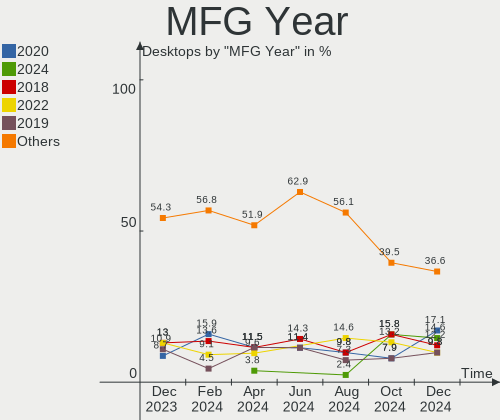
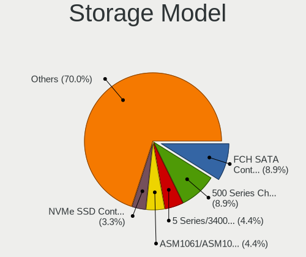
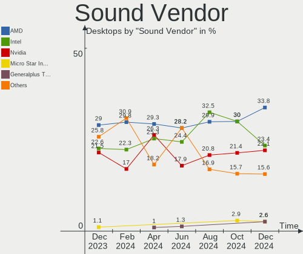
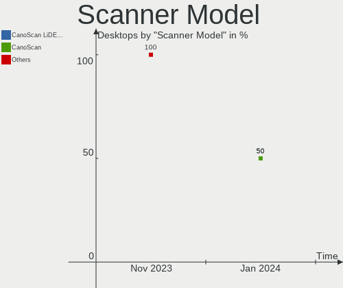

Manjaro - Hardware Trends (Desktops)
------------------------------------

A project to identify most popular hardware characteristics and track their change
over time based on data collected by Linux users at https://Linux-Hardware.org.

Anyone can contribute to this report by the [hw-probe](https://github.com/linuxhw/hw-probe) tool:

    sudo -E hw-probe -all -upload

This report is for one last month. Overall report since the beginning of time: [TestDays](https://github.com/linuxhw/TestDays)

Period: Jan, 2024.

Contents
--------

* [ System ](#system)
  - [ OS                       ](#os)
  - [ OS Family                ](#os-family)
  - [ Kernel                   ](#kernel)
  - [ Kernel Family            ](#kernel-family)
  - [ Kernel Major Ver.        ](#kernel-major-ver)
  - [ Arch                     ](#arch)
  - [ DE                       ](#de)
  - [ Display Server           ](#display-server)
  - [ Display Manager          ](#display-manager)
  - [ OS Lang                  ](#os-lang)
  - [ Boot Mode                ](#boot-mode)
  - [ Filesystem               ](#filesystem)
  - [ Part. scheme             ](#part-scheme)
  - [ Dual Boot with Linux/BSD ](#dual-boot-with-linuxbsd)
  - [ Dual Boot (Win)          ](#dual-boot-win)

* [ Board ](#board)
  - [ Vendor                   ](#vendor)
  - [ Model                    ](#model)
  - [ Model Family             ](#model-family)
  - [ MFG Year                 ](#mfg-year)
  - [ Form Factor              ](#form-factor)
  - [ Secure Boot              ](#secure-boot)
  - [ Coreboot                 ](#coreboot)
  - [ RAM Size                 ](#ram-size)
  - [ RAM Used                 ](#ram-used)
  - [ Total Drives             ](#total-drives)
  - [ Has CD-ROM               ](#has-cd-rom)
  - [ Has Ethernet             ](#has-ethernet)
  - [ Has WiFi                 ](#has-wifi)
  - [ Has Bluetooth            ](#has-bluetooth)

* [ Location ](#location)
  - [ Country                  ](#country)
  - [ City                     ](#city)

* [ Drives ](#drives)
  - [ Drive Vendor             ](#drive-vendor)
  - [ Drive Model              ](#drive-model)
  - [ HDD Vendor               ](#hdd-vendor)
  - [ SSD Vendor               ](#ssd-vendor)
  - [ Drive Kind               ](#drive-kind)
  - [ Drive Connector          ](#drive-connector)
  - [ Drive Size               ](#drive-size)
  - [ Space Total              ](#space-total)
  - [ Space Used               ](#space-used)
  - [ Malfunc. Drives          ](#malfunc-drives)
  - [ Malfunc. Drive Vendor    ](#malfunc-drive-vendor)
  - [ Malfunc. HDD Vendor      ](#malfunc-hdd-vendor)
  - [ Malfunc. Drive Kind      ](#malfunc-drive-kind)
  - [ Failed Drives            ](#failed-drives)
  - [ Failed Drive Vendor      ](#failed-drive-vendor)
  - [ Drive Status             ](#drive-status)

* [ Storage controller ](#storage-controller)
  - [ Storage Vendor           ](#storage-vendor)
  - [ Storage Model            ](#storage-model)
  - [ Storage Kind             ](#storage-kind)

* [ Processor ](#processor)
  - [ CPU Vendor               ](#cpu-vendor)
  - [ CPU Model                ](#cpu-model)
  - [ CPU Model Family         ](#cpu-model-family)
  - [ CPU Cores                ](#cpu-cores)
  - [ CPU Sockets              ](#cpu-sockets)
  - [ CPU Threads              ](#cpu-threads)
  - [ CPU Op-Modes             ](#cpu-op-modes)
  - [ CPU Microcode            ](#cpu-microcode)
  - [ CPU Microarch            ](#cpu-microarch)

* [ Graphics ](#graphics)
  - [ GPU Vendor               ](#gpu-vendor)
  - [ GPU Model                ](#gpu-model)
  - [ GPU Combo                ](#gpu-combo)
  - [ GPU Driver               ](#gpu-driver)
  - [ GPU Memory               ](#gpu-memory)

* [ Monitor ](#monitor)
  - [ Monitor Vendor           ](#monitor-vendor)
  - [ Monitor Model            ](#monitor-model)
  - [ Monitor Resolution       ](#monitor-resolution)
  - [ Monitor Diagonal         ](#monitor-diagonal)
  - [ Monitor Width            ](#monitor-width)
  - [ Aspect Ratio             ](#aspect-ratio)
  - [ Monitor Area             ](#monitor-area)
  - [ Pixel Density            ](#pixel-density)
  - [ Multiple Monitors        ](#multiple-monitors)

* [ Network ](#network)
  - [ Net Controller Vendor    ](#net-controller-vendor)
  - [ Net Controller Model     ](#net-controller-model)
  - [ Wireless Vendor          ](#wireless-vendor)
  - [ Wireless Model           ](#wireless-model)
  - [ Ethernet Vendor          ](#ethernet-vendor)
  - [ Ethernet Model           ](#ethernet-model)
  - [ Net Controller Kind      ](#net-controller-kind)
  - [ Used Controller          ](#used-controller)
  - [ NICs                     ](#nics)
  - [ IPv6                     ](#ipv6)

* [ Bluetooth ](#bluetooth)
  - [ Bluetooth Vendor         ](#bluetooth-vendor)
  - [ Bluetooth Model          ](#bluetooth-model)

* [ Sound ](#sound)
  - [ Sound Vendor             ](#sound-vendor)
  - [ Sound Model              ](#sound-model)

* [ Memory ](#memory)
  - [ Memory Vendor            ](#memory-vendor)
  - [ Memory Model             ](#memory-model)
  - [ Memory Kind              ](#memory-kind)
  - [ Memory Form Factor       ](#memory-form-factor)
  - [ Memory Size              ](#memory-size)
  - [ Memory Speed             ](#memory-speed)

* [ Printers & scanners ](#printers--scanners)
  - [ Printer Vendor           ](#printer-vendor)
  - [ Printer Model            ](#printer-model)
  - [ Scanner Vendor           ](#scanner-vendor)
  - [ Scanner Model            ](#scanner-model)

* [ Camera ](#camera)
  - [ Camera Vendor            ](#camera-vendor)
  - [ Camera Model             ](#camera-model)

* [ Security ](#security)
  - [ Fingerprint Vendor       ](#fingerprint-vendor)
  - [ Fingerprint Model        ](#fingerprint-model)
  - [ Chipcard Vendor          ](#chipcard-vendor)
  - [ Chipcard Model           ](#chipcard-model)

* [ Unsupported ](#unsupported)
  - [ Unsupported Devices      ](#unsupported-devices)
  - [ Unsupported Device Types ](#unsupported-device-types)

System
------

OS
--

Installed operating systems

| Name           | Desktops | Percent |
|----------------|----------|---------|
| Manjaro        | 30       | 65.22%  |
| Manjaro 23.1.3 | 8        | 17.39%  |
| Manjaro 23.1.2 | 6        | 13.04%  |
| Manjaro 23.1.1 | 1        | 2.17%   |
| Manjaro 23.1.0 | 1        | 2.17%   |

OS Family
---------

OS without a version

| Name    | Desktops | Percent |
|---------|----------|---------|
| Manjaro | 46       | 100%    |

Kernel
------

Version of the Linux kernel

| Version               | Desktops | Percent |
|-----------------------|----------|---------|
| 6.6.10-1-MANJARO      | 13       | 28.26%  |
| 6.6.8-2-MANJARO       | 8        | 17.39%  |
| 6.7.0-0-MANJARO       | 7        | 15.22%  |
| 6.5.13-7-MANJARO      | 7        | 15.22%  |
| 6.1.71-1-MANJARO      | 2        | 4.35%   |
| 6.1.69-1-MANJARO      | 2        | 4.35%   |
| 6.6.8-x64v2-xanmod1-1 | 1        | 2.17%   |
| 6.6.10-zen1-1-zen     | 1        | 2.17%   |
| 6.6.10-lqx1-1-lqx     | 1        | 2.17%   |
| 6.5.2-1-rt8-MANJARO   | 1        | 2.17%   |
| 6.1.60-1-MANJARO      | 1        | 2.17%   |
| 6.1.49-1-MANJARO      | 1        | 2.17%   |
| 5.15.144-1-MANJARO    | 1        | 2.17%   |

Kernel Family
-------------

Linux kernel without a distro release

| Version  | Desktops | Percent |
|----------|----------|---------|
| 6.6.10   | 15       | 32.61%  |
| 6.6.8    | 9        | 19.57%  |
| 6.7.0    | 7        | 15.22%  |
| 6.5.13   | 7        | 15.22%  |
| 6.1.71   | 2        | 4.35%   |
| 6.1.69   | 2        | 4.35%   |
| 6.5.2    | 1        | 2.17%   |
| 6.1.60   | 1        | 2.17%   |
| 6.1.49   | 1        | 2.17%   |
| 5.15.144 | 1        | 2.17%   |

Kernel Major Ver.
-----------------

Linux kernel major version

| Version | Desktops | Percent |
|---------|----------|---------|
| 6.6     | 24       | 52.17%  |
| 6.5     | 8        | 17.39%  |
| 6.7     | 7        | 15.22%  |
| 6.1     | 6        | 13.04%  |
| 5.15    | 1        | 2.17%   |

Arch
----

OS architecture (x86_64, i586, etc.)

| Name   | Desktops | Percent |
|--------|----------|---------|
| x86_64 | 46       | 100%    |

DE
--

Desktop Environment

| Name       | Desktops | Percent |
|------------|----------|---------|
| KDE5       | 26       | 56.52%  |
| XFCE       | 7        | 15.22%  |
| GNOME      | 7        | 15.22%  |
| X-Cinnamon | 2        | 4.35%   |
| MATE       | 2        | 4.35%   |
| KDE        | 1        | 2.17%   |
| Unknown    | 1        | 2.17%   |

Display Server
--------------

X11 or Wayland

| Name    | Desktops | Percent |
|---------|----------|---------|
| X11     | 35       | 76.09%  |
| Wayland | 10       | 21.74%  |
| Tty     | 1        | 2.17%   |

Display Manager
---------------

SDDM, LightDM, etc.

| Name    | Desktops | Percent |
|---------|----------|---------|
| Unknown | 30       | 65.22%  |
| SDDM    | 9        | 19.57%  |
| LightDM | 7        | 15.22%  |

OS Lang
-------

Language

| Lang    | Desktops | Percent |
|---------|----------|---------|
| en_US   | 13       | 28.26%  |
| ru_RU   | 8        | 17.39%  |
| de_DE   | 6        | 13.04%  |
| it_IT   | 3        | 6.52%   |
| tr_TR   | 2        | 4.35%   |
| pt_BR   | 2        | 4.35%   |
| fr_FR   | 2        | 4.35%   |
| en_GB   | 2        | 4.35%   |
| en_CA   | 2        | 4.35%   |
| pt_PT   | 1        | 2.17%   |
| pl_PL   | 1        | 2.17%   |
| es_BO   | 1        | 2.17%   |
| de_CH   | 1        | 2.17%   |
| cs_CZ   | 1        | 2.17%   |
| Unknown | 1        | 2.17%   |

Boot Mode
---------

EFI or BIOS

| Mode | Desktops | Percent |
|------|----------|---------|
| BIOS | 37       | 80.43%  |
| EFI  | 9        | 19.57%  |

Filesystem
----------

Type of filesystem

| Type     | Desktops | Percent |
|----------|----------|---------|
| Ext4     | 37       | 80.43%  |
| Tmpfs    | 4        | 8.7%    |
| Btrfs    | 4        | 8.7%    |
| Reiserfs | 1        | 2.17%   |

Part. scheme
------------

Scheme of partitioning

| Type    | Desktops | Percent |
|---------|----------|---------|
| Unknown | 29       | 63.04%  |
| GPT     | 15       | 32.61%  |
| MBR     | 2        | 4.35%   |

Dual Boot with Linux/BSD
------------------------

Hosting more than one Linux/BSD

| Dual boot | Desktops | Percent |
|-----------|----------|---------|
| No        | 41       | 89.13%  |
| Yes       | 5        | 10.87%  |

Dual Boot (Win)
---------------

Hosting Linux and Windows

| Dual boot | Desktops | Percent |
|-----------|----------|---------|
| No        | 34       | 73.91%  |
| Yes       | 12       | 26.09%  |

Board
-----

Vendor
------

Motherboard manufacturer

| Name                | Desktops | Percent |
|---------------------|----------|---------|
| ASUSTek Computer    | 15       | 32.61%  |
| MSI                 | 11       | 23.91%  |
| ASRock              | 7        | 15.22%  |
| Gigabyte Technology | 6        | 13.04%  |
| Hewlett-Packard     | 2        | 4.35%   |
| Dell                | 2        | 4.35%   |
| Lenovo              | 1        | 2.17%   |
| Intel               | 1        | 2.17%   |
| Apple               | 1        | 2.17%   |

Model
-----

Motherboard model

| Name                                   | Desktops | Percent |
|----------------------------------------|----------|---------|
| ASUS All Series                        | 4        | 8.7%    |
| MSI MS-7E12                            | 1        | 2.17%   |
| MSI MS-7D22                            | 1        | 2.17%   |
| MSI MS-7D20                            | 1        | 2.17%   |
| MSI MS-7C91                            | 1        | 2.17%   |
| MSI MS-7C52                            | 1        | 2.17%   |
| MSI MS-7B86                            | 1        | 2.17%   |
| MSI MS-7A37                            | 1        | 2.17%   |
| MSI MS-7971                            | 1        | 2.17%   |
| MSI MS-7693                            | 1        | 2.17%   |
| MSI H310 Gaming Infinite S (MS-B928)   | 1        | 2.17%   |
| MSI DIAMONDDEX600                      | 1        | 2.17%   |
| Lenovo IdeaCentre 720-18APR 90HY002APG | 1        | 2.17%   |
| Intel H81                              | 1        | 2.17%   |
| HP EliteDesk 800 G3 TWR                | 1        | 2.17%   |
| HP 700-567nz                           | 1        | 2.17%   |
| Gigabyte Z790 GAMING X AX              | 1        | 2.17%   |
| Gigabyte GA-MA770T-UD3P                | 1        | 2.17%   |
| Gigabyte CUSTOM                        | 1        | 2.17%   |
| Gigabyte B450M DS3H                    | 1        | 2.17%   |
| Gigabyte B450 I AORUS PRO WIFI         | 1        | 2.17%   |
| Gigabyte A520M S2H                     | 1        | 2.17%   |
| Dell Precision 3650 Tower              | 1        | 2.17%   |
| Dell OptiPlex 7010                     | 1        | 2.17%   |
| ASUS TUF Gaming B550M-PLUS             | 1        | 2.17%   |
| ASUS ROG STRIX B650E-I GAMING WIFI     | 1        | 2.17%   |
| ASUS ROG STRIX B550-XE GAMING WIFI     | 1        | 2.17%   |
| ASUS PRIME X670-P WIFI                 | 1        | 2.17%   |
| ASUS PRIME X570-PRO                    | 1        | 2.17%   |
| ASUS PRIME B550M-K                     | 1        | 2.17%   |
| ASUS PRIME A320M-K                     | 1        | 2.17%   |
| ASUS P8H61-MX                          | 1        | 2.17%   |
| ASUS Maximus V FORMULA                 | 1        | 2.17%   |
| ASUS M5A97 PLUS                        | 1        | 2.17%   |
| ASUS A55BM-E                           | 1        | 2.17%   |
| ASRock X300M-STX                       | 1        | 2.17%   |
| ASRock B550M Pro SE                    | 1        | 2.17%   |
| ASRock B460M Pro4                      | 1        | 2.17%   |
| ASRock B450M Pro4-F                    | 1        | 2.17%   |
| ASRock B450 Gaming K4                  | 1        | 2.17%   |

Model Family
------------

Motherboard model prefix

| Name                    | Desktops | Percent |
|-------------------------|----------|---------|
| ASUS PRIME              | 4        | 8.7%    |
| ASUS All                | 4        | 8.7%    |
| ASUS ROG                | 2        | 4.35%   |
| MSI MS-7E12             | 1        | 2.17%   |
| MSI MS-7D22             | 1        | 2.17%   |
| MSI MS-7D20             | 1        | 2.17%   |
| MSI MS-7C91             | 1        | 2.17%   |
| MSI MS-7C52             | 1        | 2.17%   |
| MSI MS-7B86             | 1        | 2.17%   |
| MSI MS-7A37             | 1        | 2.17%   |
| MSI MS-7971             | 1        | 2.17%   |
| MSI MS-7693             | 1        | 2.17%   |
| MSI H310                | 1        | 2.17%   |
| MSI DIAMONDDEX600       | 1        | 2.17%   |
| Lenovo IdeaCentre       | 1        | 2.17%   |
| Intel H81               | 1        | 2.17%   |
| HP EliteDesk            | 1        | 2.17%   |
| HP 700-567nz            | 1        | 2.17%   |
| Gigabyte Z790           | 1        | 2.17%   |
| Gigabyte GA-MA770T-UD3P | 1        | 2.17%   |
| Gigabyte CUSTOM         | 1        | 2.17%   |
| Gigabyte B450M          | 1        | 2.17%   |
| Gigabyte B450           | 1        | 2.17%   |
| Gigabyte A520M          | 1        | 2.17%   |
| Dell Precision          | 1        | 2.17%   |
| Dell OptiPlex           | 1        | 2.17%   |
| ASUS TUF                | 1        | 2.17%   |
| ASUS P8H61-MX           | 1        | 2.17%   |
| ASUS Maximus            | 1        | 2.17%   |
| ASUS M5A97              | 1        | 2.17%   |
| ASUS A55BM-E            | 1        | 2.17%   |
| ASRock X300M-STX        | 1        | 2.17%   |
| ASRock B550M            | 1        | 2.17%   |
| ASRock B460M            | 1        | 2.17%   |
| ASRock B450M            | 1        | 2.17%   |
| ASRock B450             | 1        | 2.17%   |
| ASRock AB350M           | 1        | 2.17%   |
| ASRock 970              | 1        | 2.17%   |
| Apple MacPro5           | 1        | 2.17%   |

MFG Year
--------

Motherboard manufacture year

| Year | Desktops | Percent |
|------|----------|---------|
| 2020 | 8        | 17.39%  |
| 2013 | 6        | 13.04%  |
| 2019 | 5        | 10.87%  |
| 2018 | 5        | 10.87%  |
| 2023 | 4        | 8.7%    |
| 2022 | 3        | 6.52%   |
| 2021 | 3        | 6.52%   |
| 2017 | 3        | 6.52%   |
| 2015 | 3        | 6.52%   |
| 2016 | 1        | 2.17%   |
| 2014 | 1        | 2.17%   |
| 2012 | 1        | 2.17%   |
| 2011 | 1        | 2.17%   |
| 2010 | 1        | 2.17%   |
| 2009 | 1        | 2.17%   |

Form Factor
-----------

Physical design of the computer

| Name    | Desktops | Percent |
|---------|----------|---------|
| Desktop | 46       | 100%    |

Secure Boot
-----------

Enabled or disabled

| State    | Desktops | Percent |
|----------|----------|---------|
| Disabled | 46       | 100%    |

Coreboot
--------

Have coreboot on board

| Used | Desktops | Percent |
|------|----------|---------|
| No   | 46       | 100%    |

RAM Size
--------

Total RAM memory

| Size in GB  | Desktops | Percent |
|-------------|----------|---------|
| 16.01-24.0  | 15       | 32.61%  |
| 32.01-64.0  | 12       | 26.09%  |
| 64.01-256.0 | 6        | 13.04%  |
| 8.01-16.0   | 6        | 13.04%  |
| 4.01-8.0    | 5        | 10.87%  |
| 3.01-4.0    | 1        | 2.17%   |
| 24.01-32.0  | 1        | 2.17%   |

RAM Used
--------

Used RAM memory

| Used GB    | Desktops | Percent |
|------------|----------|---------|
| 4.01-8.0   | 17       | 36.96%  |
| 2.01-3.0   | 9        | 19.57%  |
| 8.01-16.0  | 7        | 15.22%  |
| 3.01-4.0   | 6        | 13.04%  |
| 1.01-2.0   | 5        | 10.87%  |
| 16.01-24.0 | 2        | 4.35%   |

Total Drives
------------

Number of drives on board

| Drives | Desktops | Percent |
|--------|----------|---------|
| 2      | 14       | 30.43%  |
| 3      | 11       | 23.91%  |
| 4      | 7        | 15.22%  |
| 1      | 6        | 13.04%  |
| 6      | 3        | 6.52%   |
| 5      | 3        | 6.52%   |
| 7      | 2        | 4.35%   |

Has CD-ROM
----------

Has CD-ROM on board

| Presented | Desktops | Percent |
|-----------|----------|---------|
| No        | 32       | 69.57%  |
| Yes       | 14       | 30.43%  |

Has Ethernet
------------

Has Ethernet on board

| Presented | Desktops | Percent |
|-----------|----------|---------|
| Yes       | 44       | 95.65%  |
| No        | 2        | 4.35%   |

Has WiFi
--------

Has WiFi module

| Presented | Desktops | Percent |
|-----------|----------|---------|
| No        | 28       | 60.87%  |
| Yes       | 18       | 39.13%  |

Has Bluetooth
-------------

Has Bluetooth module

| Presented | Desktops | Percent |
|-----------|----------|---------|
| No        | 25       | 54.35%  |
| Yes       | 21       | 45.65%  |

Location
--------

Country
-------

Geographic location (country)

| Country     | Desktops | Percent |
|-------------|----------|---------|
| Germany     | 7        | 15.22%  |
| USA         | 6        | 13.04%  |
| Russia      | 6        | 13.04%  |
| Italy       | 4        | 8.7%    |
| Turkey      | 2        | 4.35%   |
| Switzerland | 2        | 4.35%   |
| France      | 2        | 4.35%   |
| Canada      | 2        | 4.35%   |
| Brazil      | 2        | 4.35%   |
| Bangladesh  | 2        | 4.35%   |
| UK          | 1        | 2.17%   |
| Sweden      | 1        | 2.17%   |
| Singapore   | 1        | 2.17%   |
| Serbia      | 1        | 2.17%   |
| Portugal    | 1        | 2.17%   |
| Poland      | 1        | 2.17%   |
| Mexico      | 1        | 2.17%   |
| Iran        | 1        | 2.17%   |
| Czechia     | 1        | 2.17%   |
| Croatia     | 1        | 2.17%   |
| Bolivia     | 1        | 2.17%   |

City
----

Geographic location (city)

| City                   | Desktops | Percent |
|------------------------|----------|---------|
| St Petersburg          | 2        | 4.35%   |
| Ooltewah               | 2        | 4.35%   |
| Dhaka                  | 2        | 4.35%   |
| Yzeure                 | 1        | 2.17%   |
| Yorktown               | 1        | 2.17%   |
| Winnipeg               | 1        | 2.17%   |
| Waldshut-Tiengen       | 1        | 2.17%   |
| Volduchy               | 1        | 2.17%   |
| Venice                 | 1        | 2.17%   |
| Tver                   | 1        | 2.17%   |
| Thun                   | 1        | 2.17%   |
| Tehran                 | 1        | 2.17%   |
| Tambov                 | 1        | 2.17%   |
| Stockholm              | 1        | 2.17%   |
| Split                  | 1        | 2.17%   |
| Singapore              | 1        | 2.17%   |
| Siegen                 | 1        | 2.17%   |
| Roubaix                | 1        | 2.17%   |
| Rio de Janeiro         | 1        | 2.17%   |
| Nizhniy Novgorod       | 1        | 2.17%   |
| Munich                 | 1        | 2.17%   |
| Moscow                 | 1        | 2.17%   |
| Milano                 | 1        | 2.17%   |
| Malbork                | 1        | 2.17%   |
| Malatya                | 1        | 2.17%   |
| Livorno                | 1        | 2.17%   |
| Lisbon                 | 1        | 2.17%   |
| Linkenheim-Hochstetten | 1        | 2.17%   |
| Leipzig                | 1        | 2.17%   |
| La Paz                 | 1        | 2.17%   |
| Jacui                  | 1        | 2.17%   |
| Homosassa              | 1        | 2.17%   |
| Henderson              | 1        | 2.17%   |
| Guadalajara            | 1        | 2.17%   |
| Grossenhausen          | 1        | 2.17%   |
| Burnaby                | 1        | 2.17%   |
| Borgo San Lorenzo      | 1        | 2.17%   |
| Birmingham             | 1        | 2.17%   |
| Bemidji                | 1        | 2.17%   |
| Basel                  | 1        | 2.17%   |

Drives
------

Drive Vendor
------------

Hard drive vendors

| Vendor                       | Desktops | Drives | Percent |
|------------------------------|----------|--------|---------|
| WDC                          | 18       | 25     | 15%     |
| Samsung Electronics          | 16       | 22     | 13.33%  |
| Seagate                      | 10       | 14     | 8.33%   |
| Kingston                     | 9        | 11     | 7.5%    |
| SanDisk                      | 7        | 7      | 5.83%   |
| Toshiba                      | 6        | 6      | 5%      |
| Crucial                      | 6        | 7      | 5%      |
| Phison Electronics           | 5        | 5      | 4.17%   |
| Micron/Crucial Technology    | 4        | 4      | 3.33%   |
| Hitachi                      | 4        | 4      | 3.33%   |
| SPCC                         | 2        | 2      | 1.67%   |
| Patriot                      | 2        | 2      | 1.67%   |
| MAXIO Technology (Hangzhou)  | 2        | 2      | 1.67%   |
| Kingston Technology Company  | 2        | 2      | 1.67%   |
| Intenso                      | 2        | 2      | 1.67%   |
| Intel                        | 2        | 2      | 1.67%   |
| Gigabyte Technology          | 2        | 2      | 1.67%   |
| ADATA Technology             | 2        | 2      | 1.67%   |
| A-DATA Technology            | 2        | 2      | 1.67%   |
| Unknown                      | 2        | 2      | 1.67%   |
| XrayDisk                     | 1        | 1      | 0.83%   |
| Unknown                      | 1        | 3      | 0.83%   |
| Transcend                    | 1        | 1      | 0.83%   |
| T-FORCE                      | 1        | 1      | 0.83%   |
| Shenzhen Longsys Electronics | 1        | 1      | 0.83%   |
| Realtek Semiconductor        | 1        | 1      | 0.83%   |
| Realtek                      | 1        | 1      | 0.83%   |
| PNY                          | 1        | 1      | 0.83%   |
| Netac                        | 1        | 1      | 0.83%   |
| Micron Technology            | 1        | 1      | 0.83%   |
| HGST                         | 1        | 1      | 0.83%   |
| GOODRAM                      | 1        | 1      | 0.83%   |
| Fujitsu                      | 1        | 1      | 0.83%   |
| China                        | 1        | 1      | 0.83%   |
| BAITITON                     | 1        | 1      | 0.83%   |

Drive Model
-----------

Hard drive models

| Model                                              | Desktops | Percent |
|----------------------------------------------------|----------|---------|
| Samsung NVMe SSD Controller SM981/PM981/PM983 1TB  | 5        | 3.65%   |
| Micron/Crucial P2 NVMe PCIe SSD 1TB                | 3        | 2.19%   |
| WDC WD30EFRX-68EUZN0 3TB                           | 2        | 1.46%   |
| WDC WD20EFRX-68EUZN0 2TB                           | 2        | 1.46%   |
| Toshiba HDWD130 3TB                                | 2        | 1.46%   |
| Seagate ST1000LM024 HN-M101MBB 1TB                 | 2        | 1.46%   |
| Sandisk WD Blue SN570 1TB                          | 2        | 1.46%   |
| SanDisk SSD PLUS 1000GB                            | 2        | 1.46%   |
| Samsung SSD 840 PRO Series 128GB                   | 2        | 1.46%   |
| Samsung NVMe SSD Controller PM9A1/PM9A3/980PRO 2TB | 2        | 1.46%   |
| Kingston SA400S37480G 480GB SSD                    | 2        | 1.46%   |
| Kingston SA400S37120G 120GB SSD                    | 2        | 1.46%   |
| Gigabyte GP-GSTFS31120GNTD 120GB SSD               | 2        | 1.46%   |
| Unknown                                            | 2        | 1.46%   |
| XrayDisk 256GB SSD                                 | 1        | 0.73%   |
| WDC WDS480G2G0A-00JH30 480GB SSD                   | 1        | 0.73%   |
| WDC WDS250G1B0A-00H9H0 250GB SSD                   | 1        | 0.73%   |
| WDC WD80EFZX-68UW8N0 8TB                           | 1        | 0.73%   |
| WDC WD7500KPVT-00HT5T0 752GB                       | 1        | 0.73%   |
| WDC WD6401AALS-00L3B2 640GB                        | 1        | 0.73%   |
| WDC WD5000BPKX-75HPJT0 500GB                       | 1        | 0.73%   |
| WDC WD3200BPVT-22JJ5T0 320GB                       | 1        | 0.73%   |
| WDC WD20EZRX-00DC0B0 2TB                           | 1        | 0.73%   |
| WDC WD20EARX-00PASB0 2TB                           | 1        | 0.73%   |
| WDC WD20EARS-00S8B1 2TB                            | 1        | 0.73%   |
| WDC WD10EZRZ-00HTKB0 1TB                           | 1        | 0.73%   |
| WDC WD10EZEX-75WN4A0 1TB                           | 1        | 0.73%   |
| WDC WD10EZEX-60WN4A0 1TB                           | 1        | 0.73%   |
| WDC WD10EZEX-08M2NA0 1TB                           | 1        | 0.73%   |
| WDC WD10EZEX-00BN5A0 1TB                           | 1        | 0.73%   |
| WDC WD10EZEX-00BBHA0 1TB                           | 1        | 0.73%   |
| WDC WD10EURX-63FH1Y0 1TB                           | 1        | 0.73%   |
| WDC WD1003FZEX-00MK2A0 1TB                         | 1        | 0.73%   |
| Unknown SD/MMC 2GB                                 | 1        | 0.73%   |
| Unknown M.S./M.S.Pro/HG 16GB                       | 1        | 0.73%   |
| Unknown Compact Flash 977MB                        | 1        | 0.73%   |
| Transcend TS240GMTS820S 240GB SSD                  | 1        | 0.73%   |
| Toshiba MK3265GSXN 320GB                           | 1        | 0.73%   |
| Toshiba MK2576GSX HR 160GB                         | 1        | 0.73%   |
| Toshiba HDWD120 2TB                                | 1        | 0.73%   |

HDD Vendor
----------

Hard disk drive vendors

| Vendor              | Desktops | Drives | Percent |
|---------------------|----------|--------|---------|
| WDC                 | 18       | 23     | 41.86%  |
| Seagate             | 10       | 14     | 23.26%  |
| Toshiba             | 6        | 6      | 13.95%  |
| Hitachi             | 4        | 4      | 9.3%    |
| Samsung Electronics | 1        | 2      | 2.33%   |
| Intenso             | 1        | 1      | 2.33%   |
| HGST                | 1        | 1      | 2.33%   |
| Fujitsu             | 1        | 1      | 2.33%   |
| Unknown             | 1        | 1      | 2.33%   |

SSD Vendor
----------

Solid state drive vendors

| Vendor              | Desktops | Drives | Percent |
|---------------------|----------|--------|---------|
| Samsung Electronics | 9        | 9      | 19.57%  |
| Kingston            | 7        | 8      | 15.22%  |
| Crucial             | 6        | 7      | 13.04%  |
| SanDisk             | 5        | 5      | 10.87%  |
| WDC                 | 2        | 2      | 4.35%   |
| SPCC                | 2        | 2      | 4.35%   |
| Patriot             | 2        | 2      | 4.35%   |
| Gigabyte Technology | 2        | 2      | 4.35%   |
| A-DATA Technology   | 2        | 2      | 4.35%   |
| XrayDisk            | 1        | 1      | 2.17%   |
| Transcend           | 1        | 1      | 2.17%   |
| T-FORCE             | 1        | 1      | 2.17%   |
| PNY                 | 1        | 1      | 2.17%   |
| Intenso             | 1        | 1      | 2.17%   |
| Intel               | 1        | 1      | 2.17%   |
| GOODRAM             | 1        | 1      | 2.17%   |
| China               | 1        | 1      | 2.17%   |
| BAITITON            | 1        | 1      | 2.17%   |

Drive Kind
----------

HDD or SSD

| Kind    | Desktops | Drives | Percent |
|---------|----------|--------|---------|
| SSD     | 32       | 48     | 34.78%  |
| HDD     | 31       | 53     | 33.7%   |
| NVMe    | 27       | 37     | 29.35%  |
| Unknown | 2        | 4      | 2.17%   |

Drive Connector
---------------

SATA, SAS, NVMe, etc.

| Type | Desktops | Drives | Percent |
|------|----------|--------|---------|
| SATA | 41       | 97     | 55.41%  |
| NVMe | 27       | 36     | 36.49%  |
| SAS  | 6        | 9      | 8.11%   |

Drive Size
----------

Size of hard drive

| Size in TB | Desktops | Drives | Percent |
|------------|----------|--------|---------|
| 0.01-0.5   | 28       | 45     | 38.89%  |
| 0.51-1.0   | 23       | 28     | 31.94%  |
| 1.01-2.0   | 10       | 15     | 13.89%  |
| 2.01-3.0   | 5        | 6      | 6.94%   |
| 4.01-10.0  | 3        | 4      | 4.17%   |
| 3.01-4.0   | 2        | 2      | 2.78%   |
| 10.01-20.0 | 1        | 1      | 1.39%   |

Space Total
-----------

Amount of disk space available on the file system

| Size in GB     | Desktops | Percent |
|----------------|----------|---------|
| More than 3000 | 11       | 23.91%  |
| 251-500        | 11       | 23.91%  |
| 1001-2000      | 11       | 23.91%  |
| 101-250        | 5        | 10.87%  |
| 501-1000       | 4        | 8.7%    |
| Unknown        | 2        | 4.35%   |
| 21-50          | 1        | 2.17%   |
| 2001-3000      | 1        | 2.17%   |

Space Used
----------

Amount of used disk space

| Used GB        | Desktops | Percent |
|----------------|----------|---------|
| 251-500        | 9        | 19.57%  |
| 501-1000       | 8        | 17.39%  |
| 101-250        | 6        | 13.04%  |
| 1001-2000      | 6        | 13.04%  |
| 1-20           | 4        | 8.7%    |
| 51-100         | 4        | 8.7%    |
| 21-50          | 3        | 6.52%   |
| More than 3000 | 2        | 4.35%   |
| 2001-3000      | 2        | 4.35%   |
| Unknown        | 2        | 4.35%   |

Malfunc. Drives
---------------

Drive models with a malfunction

| Model                              | Desktops | Drives | Percent |
|------------------------------------|----------|--------|---------|
| WDC WD20EFRX-68EUZN0 2TB           | 1        | 1      | 20%     |
| Seagate ST3500418AS 500GB          | 1        | 1      | 20%     |
| Seagate ST2000LM007-1R8174 2TB     | 1        | 1      | 20%     |
| Seagate ST1000LM024 HN-M101MBB 1TB | 1        | 1      | 20%     |
| Unknown                            | 1        | 1      | 20%     |

Malfunc. Drive Vendor
---------------------

Vendors of faulty drives

| Vendor  | Desktops | Drives | Percent |
|---------|----------|--------|---------|
| Seagate | 3        | 3      | 60%     |
| WDC     | 1        | 1      | 20%     |
| Unknown | 1        | 1      | 20%     |

Malfunc. HDD Vendor
-------------------

Vendors of faulty HDD drives

| Vendor  | Desktops | Drives | Percent |
|---------|----------|--------|---------|
| Seagate | 3        | 3      | 60%     |
| WDC     | 1        | 1      | 20%     |
| Unknown | 1        | 1      | 20%     |

Malfunc. Drive Kind
-------------------

Kinds of faulty drives

| Kind | Desktops | Drives | Percent |
|------|----------|--------|---------|
| HDD  | 4        | 5      | 100%    |

Failed Drives
-------------

Failed drive models

Zero info for selected period =(

Failed Drive Vendor
-------------------

Failed drive vendors

Zero info for selected period =(

Drive Status
------------

Number of failed and malfunc. drives

| Status   | Desktops | Drives | Percent |
|----------|----------|--------|---------|
| Detected | 34       | 107    | 68%     |
| Works    | 12       | 30     | 24%     |
| Malfunc  | 4        | 5      | 8%      |

Storage controller
------------------

Storage Vendor
--------------

Storage controller vendors

| Vendor                       | Desktops | Percent |
|------------------------------|----------|---------|
| AMD                          | 26       | 31.71%  |
| Intel                        | 19       | 23.17%  |
| Samsung Electronics          | 10       | 12.2%   |
| Phison Electronics           | 5        | 6.1%    |
| Kingston Technology Company  | 5        | 6.1%    |
| Micron/Crucial Technology    | 4        | 4.88%   |
| ASMedia Technology           | 3        | 3.66%   |
| SanDisk                      | 2        | 2.44%   |
| MAXIO Technology (Hangzhou)  | 2        | 2.44%   |
| ADATA Technology             | 2        | 2.44%   |
| Shenzhen Longsys Electronics | 1        | 1.22%   |
| Realtek Semiconductor        | 1        | 1.22%   |
| Netac Technology             | 1        | 1.22%   |
| Micron Technology            | 1        | 1.22%   |

Storage Model
-------------

Storage controller models

| Model                                                                          | Desktops | Percent |
|--------------------------------------------------------------------------------|----------|---------|
| AMD FCH SATA Controller [AHCI mode]                                            | 8        | 8.7%    |
| AMD 500 Series Chipset SATA Controller                                         | 7        | 7.61%   |
| AMD 400 Series Chipset SATA Controller                                         | 6        | 6.52%   |
| Samsung NVMe SSD Controller SM981/PM981/PM983                                  | 5        | 5.43%   |
| Intel 8 Series/C220 Series Chipset Family 6-port SATA Controller 1 [AHCI mode] | 4        | 4.35%   |
| Intel 500 Series Chipset Family SATA AHCI Controller                           | 4        | 4.35%   |
| Samsung NVMe SSD Controller PM9A1/PM9A3/980PRO                                 | 3        | 3.26%   |
| Micron/Crucial P2 [Nick P2] / P3 / P3 Plus NVMe PCIe SSD (DRAM-less)           | 3        | 3.26%   |
| ASMedia ASM1061/ASM1062 Serial ATA Controller                                  | 3        | 3.26%   |
| AMD SB7x0/SB8x0/SB9x0 SATA Controller [AHCI mode]                              | 3        | 3.26%   |
| AMD 600 Series Chipset SATA Controller                                         | 3        | 3.26%   |
| SanDisk Ultra 3D / WD Blue SN570 NVMe SSD (DRAM-less)                          | 2        | 2.17%   |
| Samsung NVMe SSD Controller 980 (DRAM-less)                                    | 2        | 2.17%   |
| Kingston Company KC3000/FURY Renegade NVMe SSD E18                             | 2        | 2.17%   |
| Intel 7 Series/C210 Series Chipset Family 6-port SATA Controller [AHCI mode]   | 2        | 2.17%   |
| Intel 200 Series PCH SATA controller [AHCI mode]                               | 2        | 2.17%   |
| AMD SB7x0/SB8x0/SB9x0 IDE Controller                                           | 2        | 2.17%   |
| AMD 300 Series Chipset SATA Controller                                         | 2        | 2.17%   |
| Shenzhen Longsys Lexar NM790 NVME SSD (DRAM-less)                              | 1        | 1.09%   |
| Realtek RTS5763DL NVMe SSD Controller (DRAM-less)                              | 1        | 1.09%   |
| Phison PS5021-E21 PCIe4 NVMe Controller (DRAM-less)                            | 1        | 1.09%   |
| Phison PS5013-E13 PCIe3 NVMe Controller (DRAM-less)                            | 1        | 1.09%   |
| Phison E18 PCIe4 NVMe Controller                                               | 1        | 1.09%   |
| Phison E16 PCIe4 NVMe Controller                                               | 1        | 1.09%   |
| Phison E12 NVMe Controller                                                     | 1        | 1.09%   |
| Netac PCIe 3 NVMe SSD (DRAM-less)                                              | 1        | 1.09%   |
| Micron/Crucial P1 NVMe PCIe SSD[Frampton]                                      | 1        | 1.09%   |
| Micron 2300 NVMe SSD [Santana]                                                 | 1        | 1.09%   |
| MAXIO (Hangzhou) NVMe SSD Controller MAP1602 (DRAM-less)                       | 1        | 1.09%   |
| MAXIO (Hangzhou) NVMe SSD Controller MAP1202 (DRAM-less)                       | 1        | 1.09%   |
| Kingston Company NV2 NVMe SSD SM2267XT (DRAM-less)                             | 1        | 1.09%   |
| Kingston Company NV1 NVMe SSD SM2263XT (DRAM-less)                             | 1        | 1.09%   |
| Kingston Company A2000 NVMe SSD SM2263EN                                       | 1        | 1.09%   |
| Intel SSD 660P Series                                                          | 1        | 1.09%   |
| Intel Raptor Lake SATA AHCI Controller                                         | 1        | 1.09%   |
| Intel Q170/Q150/B150/H170/H110/Z170/CM236 Chipset SATA Controller [AHCI Mode]  | 1        | 1.09%   |
| Intel C610/X99 series chipset sSATA Controller [AHCI mode]                     | 1        | 1.09%   |
| Intel 9 Series Chipset Family SATA Controller [AHCI Mode]                      | 1        | 1.09%   |
| Intel 82801JI (ICH10 Family) SATA AHCI Controller                              | 1        | 1.09%   |
| Intel 7 Series/C210 Series Chipset Family IDE-r Controller                     | 1        | 1.09%   |

Storage Kind
------------

Kind of storage controller (IDE, SATA, NVMe, SAS, ...)

| Kind | Desktops | Percent |
|------|----------|---------|
| SATA | 44       | 58.67%  |
| NVMe | 27       | 36%     |
| IDE  | 3        | 4%      |
| RAID | 1        | 1.33%   |

Processor
---------

CPU Vendor
----------

Processor vendors

| Vendor | Desktops | Percent |
|--------|----------|---------|
| AMD    | 27       | 58.7%   |
| Intel  | 19       | 41.3%   |

CPU Model
---------

Processor models

| Model                                       | Desktops | Percent |
|---------------------------------------------|----------|---------|
| AMD Ryzen 5 5600G with Radeon Graphics      | 4        | 8.7%    |
| Intel 11th Gen Core i5-11400 @ 2.60GHz      | 2        | 4.35%   |
| AMD Ryzen 9 7900X 12-Core Processor         | 2        | 4.35%   |
| AMD Ryzen 7 5700X 8-Core Processor          | 2        | 4.35%   |
| Intel Xeon CPU X5690 @ 3.47GHz              | 1        | 2.17%   |
| Intel Xeon CPU E5-2699 v4 @ 2.20GHz         | 1        | 2.17%   |
| Intel Core i7-7700 CPU @ 3.60GHz            | 1        | 2.17%   |
| Intel Core i7-6700 CPU @ 3.40GHz            | 1        | 2.17%   |
| Intel Core i7-4790 CPU @ 3.60GHz            | 1        | 2.17%   |
| Intel Core i7-4770K CPU @ 3.50GHz           | 1        | 2.17%   |
| Intel Core i7-3770K CPU @ 3.50GHz           | 1        | 2.17%   |
| Intel Core i5-9400F CPU @ 2.90GHz           | 1        | 2.17%   |
| Intel Core i5-4590 CPU @ 3.30GHz            | 1        | 2.17%   |
| Intel Core i5-4440 CPU @ 3.10GHz            | 1        | 2.17%   |
| Intel Core i5-3470 CPU @ 3.20GHz            | 1        | 2.17%   |
| Intel Core i5-10400F CPU @ 2.90GHz          | 1        | 2.17%   |
| Intel Core i3-4160 CPU @ 3.60GHz            | 1        | 2.17%   |
| Intel Core i3-2100 CPU @ 3.10GHz            | 1        | 2.17%   |
| Intel 13th Gen Core i5-13600K               | 1        | 2.17%   |
| Intel 11th Gen Core i7-11700K @ 3.60GHz     | 1        | 2.17%   |
| Intel 11th Gen Core i5-11500 @ 2.70GHz      | 1        | 2.17%   |
| AMD Ryzen 9 5950X 16-Core Processor         | 1        | 2.17%   |
| AMD Ryzen 7 7800X3D 8-Core Processor        | 1        | 2.17%   |
| AMD Ryzen 7 3800X 8-Core Processor          | 1        | 2.17%   |
| AMD Ryzen 7 3700X 8-Core Processor          | 1        | 2.17%   |
| AMD Ryzen 5 5600X 6-Core Processor          | 1        | 2.17%   |
| AMD Ryzen 5 5600 6-Core Processor           | 1        | 2.17%   |
| AMD Ryzen 5 5500                            | 1        | 2.17%   |
| AMD Ryzen 5 3600 6-Core Processor           | 1        | 2.17%   |
| AMD Ryzen 5 3500X 6-Core Processor          | 1        | 2.17%   |
| AMD Ryzen 5 3400G with Radeon Vega Graphics | 1        | 2.17%   |
| AMD Ryzen 5 3350G with Radeon Vega Graphics | 1        | 2.17%   |
| AMD Ryzen 5 2400G with Radeon Vega Graphics | 1        | 2.17%   |
| AMD Ryzen 5 1600 Six-Core Processor         | 1        | 2.17%   |
| AMD Ryzen 3 2200G with Radeon Vega Graphics | 1        | 2.17%   |
| AMD Phenom II X4 955 Processor              | 1        | 2.17%   |
| AMD FX-8350 Eight-Core Processor            | 1        | 2.17%   |
| AMD FX-8300 Eight-Core Processor            | 1        | 2.17%   |
| AMD FX-6300 Six-Core Processor              | 1        | 2.17%   |
| AMD A4-4000 APU with Radeon HD Graphics     | 1        | 2.17%   |

CPU Model Family
----------------

Processor model prefix

| Model            | Desktops | Percent |
|------------------|----------|---------|
| AMD Ryzen 5      | 13       | 28.26%  |
| Other            | 5        | 10.87%  |
| Intel Core i7    | 5        | 10.87%  |
| Intel Core i5    | 5        | 10.87%  |
| AMD Ryzen 7      | 5        | 10.87%  |
| AMD Ryzen 9      | 3        | 6.52%   |
| AMD FX           | 3        | 6.52%   |
| Intel Xeon       | 2        | 4.35%   |
| Intel Core i3    | 2        | 4.35%   |
| AMD Ryzen 3      | 1        | 2.17%   |
| AMD Phenom II X4 | 1        | 2.17%   |
| AMD A4           | 1        | 2.17%   |

CPU Cores
---------

Number of processor cores

| Number | Desktops | Percent |
|--------|----------|---------|
| 6      | 16       | 34.78%  |
| 4      | 14       | 30.43%  |
| 8      | 6        | 13.04%  |
| 12     | 2        | 4.35%   |
| 2      | 2        | 4.35%   |
| 1      | 2        | 4.35%   |
| 22     | 1        | 2.17%   |
| 16     | 1        | 2.17%   |
| 14     | 1        | 2.17%   |
| 3      | 1        | 2.17%   |

CPU Sockets
-----------

Number of sockets

| Number | Desktops | Percent |
|--------|----------|---------|
| 1      | 46       | 100%    |

CPU Threads
-----------

Threads per core (Hyper-Threading)

| Number | Desktops | Percent |
|--------|----------|---------|
| 2      | 39       | 84.78%  |
| 1      | 7        | 15.22%  |

CPU Op-Modes
------------

CPU Operation Modes (32-bit, 64-bit)

| Op mode        | Desktops | Percent |
|----------------|----------|---------|
| 32-bit, 64-bit | 46       | 100%    |

CPU Microcode
-------------

Microcode number

| Number     | Desktops | Percent |
|------------|----------|---------|
| Unknown    | 38       | 82.61%  |
| 0x0a601206 | 1        | 2.17%   |
| 0x0a50000f | 1        | 2.17%   |
| 0x0a50000d | 1        | 2.17%   |
| 0x0a20120e | 1        | 2.17%   |
| 0x08701030 | 1        | 2.17%   |
| 0x08701021 | 1        | 2.17%   |
| 0x08108109 | 1        | 2.17%   |
| 0x06000852 | 1        | 2.17%   |

CPU Microarch
-------------

Microarchitecture

| Name        | Desktops | Percent |
|-------------|----------|---------|
| Zen 3       | 10       | 21.74%  |
| Unknown     | 8        | 17.39%  |
| Haswell     | 5        | 10.87%  |
| Zen 2       | 4        | 8.7%    |
| Piledriver  | 4        | 8.7%    |
| Zen         | 3        | 6.52%   |
| Zen+        | 2        | 4.35%   |
| KabyLake    | 2        | 4.35%   |
| IvyBridge   | 2        | 4.35%   |
| Westmere    | 1        | 2.17%   |
| Skylake     | 1        | 2.17%   |
| SandyBridge | 1        | 2.17%   |
| K10         | 1        | 2.17%   |
| CometLake   | 1        | 2.17%   |
| Broadwell   | 1        | 2.17%   |

Graphics
--------

GPU Vendor
----------

Vendors of graphics cards

| Vendor | Desktops | Percent |
|--------|----------|---------|
| AMD    | 26       | 48.15%  |
| Nvidia | 18       | 33.33%  |
| Intel  | 10       | 18.52%  |

GPU Model
---------

Graphics card models

| Model                                                                       | Desktops | Percent |
|-----------------------------------------------------------------------------|----------|---------|
| AMD Ellesmere [Radeon RX 470/480/570/570X/580/580X/590]                     | 8        | 14.55%  |
| AMD Cezanne [Radeon Vega Series / Radeon Vega Mobile Series]                | 3        | 5.45%   |
| Nvidia GP104 [GeForce GTX 1070]                                             | 2        | 3.64%   |
| Nvidia AD104 [GeForce RTX 4070]                                             | 2        | 3.64%   |
| Intel Xeon E3-1200 v3/4th Gen Core Processor Integrated Graphics Controller | 2        | 3.64%   |
| Intel RocketLake-S GT1 [UHD Graphics 750]                                   | 2        | 3.64%   |
| Intel RocketLake-S GT1 [UHD Graphics 730]                                   | 2        | 3.64%   |
| AMD Raphael                                                                 | 2        | 3.64%   |
| AMD Navi 23 [Radeon RX 6600/6600 XT/6600M]                                  | 2        | 3.64%   |
| Nvidia TU117 [GeForce GTX 1650]                                             | 1        | 1.82%   |
| Nvidia TU106 [GeForce RTX 2070 Rev. A]                                      | 1        | 1.82%   |
| Nvidia TU102 [GeForce RTX 2080 Ti Rev. A]                                   | 1        | 1.82%   |
| Nvidia GP108 [GeForce GT 1030]                                              | 1        | 1.82%   |
| Nvidia GP106 [GeForce GTX 1060 6GB]                                         | 1        | 1.82%   |
| Nvidia GP106 [GeForce GTX 1060 3GB]                                         | 1        | 1.82%   |
| Nvidia GM107 [GeForce GTX 750 Ti]                                           | 1        | 1.82%   |
| Nvidia GM107 [GeForce GTX 745]                                              | 1        | 1.82%   |
| Nvidia GF108 [GeForce GT 630]                                               | 1        | 1.82%   |
| Nvidia GF106 [GeForce GTS 450]                                              | 1        | 1.82%   |
| Nvidia GA106 [RTX A2000]                                                    | 1        | 1.82%   |
| Nvidia GA106 [GeForce RTX 3060 Lite Hash Rate]                              | 1        | 1.82%   |
| Nvidia AD106 [GeForce RTX 4060 Ti 16GB]                                     | 1        | 1.82%   |
| Nvidia AD104 [GeForce RTX 4070 Ti]                                          | 1        | 1.82%   |
| Nvidia AD102 [GeForce RTX 4090]                                             | 1        | 1.82%   |
| Intel Raptor Lake-S GT1 [UHD Graphics 770]                                  | 1        | 1.82%   |
| Intel IvyBridge GT2 [HD Graphics 4000]                                      | 1        | 1.82%   |
| Intel 4th Generation Core Processor Family Integrated Graphics Controller   | 1        | 1.82%   |
| Intel 2nd Generation Core Processor Family Integrated Graphics Controller   | 1        | 1.82%   |
| AMD Trinity 2 [Radeon HD 7480D]                                             | 1        | 1.82%   |
| AMD RV770 [Radeon HD 4850]                                                  | 1        | 1.82%   |
| AMD Raven Ridge [Radeon Vega Series / Radeon Vega Mobile Series]            | 1        | 1.82%   |
| AMD Picasso/Raven 2 [Radeon Vega Series / Radeon Vega Mobile Series]        | 1        | 1.82%   |
| AMD Navi 22 [Radeon RX 6700/6700 XT/6750 XT / 6800M/6850M XT]               | 1        | 1.82%   |
| AMD Navi 14 [Radeon RX 5500/5500M / Pro 5500M]                              | 1        | 1.82%   |
| AMD Lexa PRO [Radeon 540/540X/550/550X / RX 540X/550/550X]                  | 1        | 1.82%   |
| AMD Curacao PRO [Radeon R7 370 / R9 270/370 OEM]                            | 1        | 1.82%   |
| AMD Cedar [Radeon HD 5000/6000/7350/8350 Series]                            | 1        | 1.82%   |
| AMD Bonaire XTX [Radeon R7 260X/360]                                        | 1        | 1.82%   |
| AMD Barts XT [Radeon HD 6870]                                               | 1        | 1.82%   |

GPU Combo
---------

Combinations of graphics cards

| Name           | Desktops | Percent |
|----------------|----------|---------|
| 1 x AMD        | 23       | 50%     |
| 1 x Nvidia     | 9        | 19.57%  |
| Intel + Nvidia | 5        | 10.87%  |
| 1 x Intel      | 4        | 8.7%    |
| 2 x Nvidia     | 2        | 4.35%   |
| AMD + Nvidia   | 2        | 4.35%   |
| Intel + AMD    | 1        | 2.17%   |

GPU Driver
----------

Free vs proprietary

| Driver      | Desktops | Percent |
|-------------|----------|---------|
| Free        | 30       | 65.22%  |
| Proprietary | 16       | 34.78%  |

GPU Memory
----------

Total video memory

| Size in GB | Desktops | Percent |
|------------|----------|---------|
| Unknown    | 24       | 52.17%  |
| 7.01-8.0   | 8        | 17.39%  |
| 8.01-16.0  | 5        | 10.87%  |
| 3.01-4.0   | 2        | 4.35%   |
| 0.01-0.5   | 2        | 4.35%   |
| 5.01-6.0   | 1        | 2.17%   |
| 2.01-3.0   | 1        | 2.17%   |
| 16.01-24.0 | 1        | 2.17%   |
| 1.01-2.0   | 1        | 2.17%   |
| 0.51-1.0   | 1        | 2.17%   |

Monitor
-------

Monitor Vendor
--------------

Monitor vendors

| Vendor               | Desktops | Percent |
|----------------------|----------|---------|
| Samsung Electronics  | 14       | 23.33%  |
| Dell                 | 7        | 11.67%  |
| Goldstar             | 6        | 10%     |
| Acer                 | 5        | 8.33%   |
| Unknown              | 3        | 5%      |
| ASUSTek Computer     | 3        | 5%      |
| Philips              | 2        | 3.33%   |
| LG Electronics       | 2        | 3.33%   |
| Hewlett-Packard      | 2        | 3.33%   |
| Ancor Communications | 2        | 3.33%   |
| Unknown              | 2        | 3.33%   |
| ViewSonic            | 1        | 1.67%   |
| VIE                  | 1        | 1.67%   |
| Unknown (XXX)        | 1        | 1.67%   |
| TCL                  | 1        | 1.67%   |
| SAC                  | 1        | 1.67%   |
| Lenovo               | 1        | 1.67%   |
| Idek Iiyama          | 1        | 1.67%   |
| HUAWEI               | 1        | 1.67%   |
| Eizo                 | 1        | 1.67%   |
| BenQ                 | 1        | 1.67%   |
| AOC                  | 1        | 1.67%   |
| AGO                  | 1        | 1.67%   |

Monitor Model
-------------

Monitor models

| Model                                                                  | Desktops | Percent |
|------------------------------------------------------------------------|----------|---------|
| Unknown LCD Monitor FFFF 2288x1287 2550x2550mm 142.0-inch              | 2        | 3.17%   |
| Acer V223W ACR001B 1680x1050 474x296mm 22.0-inch                       | 2        | 3.17%   |
| Unknown                                                                | 2        | 3.17%   |
| ViewSonic VG2448 VSC3B35 1920x1080 527x296mm 23.8-inch                 | 1        | 1.59%   |
| VIE EZCOOL EZ24 VIE2380 1920x1080 598x336mm 27.0-inch                  | 1        | 1.59%   |
| Unknown LCD Monitor SAMSUNG 3840x2160                                  | 1        | 1.59%   |
| Unknown (XXX) Beyond TV XXX2851 2560x1440 1209x680mm 54.6-inch         | 1        | 1.59%   |
| TCL SMART TV TCL6586 3840x2160 1209x680mm 54.6-inch                    | 1        | 1.59%   |
| Samsung Electronics SyncMaster SAM011D 1024x768 300x230mm 14.9-inch    | 1        | 1.59%   |
| Samsung Electronics S27F350 SAM0D22 1920x1080 598x336mm 27.0-inch      | 1        | 1.59%   |
| Samsung Electronics S24R35x SAM100F 1920x1080 527x296mm 23.8-inch      | 1        | 1.59%   |
| Samsung Electronics S24F350 SAM0D20 1920x1080 521x293mm 23.5-inch      | 1        | 1.59%   |
| Samsung Electronics S22R35x SAM103A 1920x1080 476x268mm 21.5-inch      | 1        | 1.59%   |
| Samsung Electronics S22C450 SAM09C7 1680x1050 473x291mm 21.9-inch      | 1        | 1.59%   |
| Samsung Electronics LF27T35 SAM707F 1920x1080 598x337mm 27.0-inch      | 1        | 1.59%   |
| Samsung Electronics LCD Monitor SMBX2450                               | 1        | 1.59%   |
| Samsung Electronics LCD Monitor SAM0D3B 3840x2160 1020x570mm 46.0-inch | 1        | 1.59%   |
| Samsung Electronics LCD Monitor SAM0503 1920x1080                      | 1        | 1.59%   |
| Samsung Electronics LCD Monitor S24E650 3200x1200                      | 1        | 1.59%   |
| Samsung Electronics LCD Monitor S19F350 1366x768                       | 1        | 1.59%   |
| Samsung Electronics LCD Monitor LS32AG55x 6400x2160                    | 1        | 1.59%   |
| Samsung Electronics LCD Monitor LS32A70                                | 1        | 1.59%   |
| Samsung Electronics C34H89x SAM0E25 3440x1440 797x333mm 34.0-inch      | 1        | 1.59%   |
| SAC LED MONITOR SAC952D 1920x1080 480x270mm 21.7-inch                  | 1        | 1.59%   |
| Philips PHL 328P6V PHL090B 3840x2160 698x398mm 31.6-inch               | 1        | 1.59%   |
| Philips PHL 220V8 PHLC218 1920x1080 477x268mm 21.5-inch                | 1        | 1.59%   |
| LG Electronics LCD Monitor LG ULTRAFINE 3840x2160                      | 1        | 1.59%   |
| LG Electronics LCD Monitor LG HDR QHD 2560x1440                        | 1        | 1.59%   |
| Lenovo Q24i-10 LEN65F3 1920x1080 527x296mm 23.8-inch                   | 1        | 1.59%   |
| Idek Iiyama LCD Monitor PL2273HD 3840x1080                             | 1        | 1.59%   |
| HUAWEI AD80HW HWV2402 1920x1080 527x296mm 23.8-inch                    | 1        | 1.59%   |
| Hewlett-Packard Z23n HWP3284 1920x1080 509x286mm 23.0-inch             | 1        | 1.59%   |
| Hewlett-Packard 23xw HWP318A 1920x1080 510x290mm 23.1-inch             | 1        | 1.59%   |
| Goldstar W2252 GSM567E 1680x1050 474x296mm 22.0-inch                   | 1        | 1.59%   |
| Goldstar W2240 GSM57A0 1920x1080 477x268mm 21.5-inch                   | 1        | 1.59%   |
| Goldstar ULTRAGEAR GSM7766 2560x1440 697x392mm 31.5-inch               | 1        | 1.59%   |
| Goldstar ULTRAGEAR GSM5BB4 2560x1440 597x336mm 27.0-inch               | 1        | 1.59%   |
| Goldstar TV GSM2411 1366x768 700x390mm 31.5-inch                       | 1        | 1.59%   |
| Goldstar L1753T GSM4477 1280x1024 340x270mm 17.1-inch                  | 1        | 1.59%   |
| Goldstar 20EN33 GSM4EE1 1600x900 440x250mm 19.9-inch                   | 1        | 1.59%   |

Monitor Resolution
------------------

Monitor screen resolution

| Resolution         | Desktops | Percent |
|--------------------|----------|---------|
| 1920x1080 (FHD)    | 19       | 31.67%  |
| 3840x2160 (4K)     | 8        | 13.33%  |
| 2560x1440 (QHD)    | 7        | 11.67%  |
| 1680x1050 (WSXGA+) | 5        | 8.33%   |
| Unknown            | 4        | 6.67%   |
| 1366x768 (WXGA)    | 3        | 5%      |
| 2288x1287          | 2        | 3.33%   |
| 1920x1200 (WUXGA)  | 2        | 3.33%   |
| 1280x1024 (SXGA)   | 2        | 3.33%   |
| 6400x2160          | 1        | 1.67%   |
| 3840x1080          | 1        | 1.67%   |
| 3600x1080          | 1        | 1.67%   |
| 3440x1440          | 1        | 1.67%   |
| 3200x1200          | 1        | 1.67%   |
| 2560x1600          | 1        | 1.67%   |
| 1600x900 (HD+)     | 1        | 1.67%   |
| 1024x768 (XGA)     | 1        | 1.67%   |

Monitor Diagonal
----------------

Diagonal size in inches

| Inches  | Desktops | Percent |
|---------|----------|---------|
| Unknown | 10       | 17.54%  |
| 27      | 9        | 15.79%  |
| 23      | 6        | 10.53%  |
| 31      | 5        | 8.77%   |
| 24      | 5        | 8.77%   |
| 21      | 5        | 8.77%   |
| 22      | 3        | 5.26%   |
| 142     | 2        | 3.51%   |
| 54      | 2        | 3.51%   |
| 18      | 2        | 3.51%   |
| 17      | 2        | 3.51%   |
| 84      | 1        | 1.75%   |
| 34      | 1        | 1.75%   |
| 29      | 1        | 1.75%   |
| 20      | 1        | 1.75%   |
| 15      | 1        | 1.75%   |
| 12      | 1        | 1.75%   |

Monitor Width
-------------

Physical width

| Width in mm    | Desktops | Percent |
|----------------|----------|---------|
| 501-600        | 18       | 32.14%  |
| 401-500        | 12       | 21.43%  |
| Unknown        | 10       | 17.86%  |
| 601-700        | 6        | 10.71%  |
| 301-350        | 3        | 5.36%   |
| More than 2000 | 2        | 3.57%   |
| 1001-1500      | 2        | 3.57%   |
| 701-800        | 1        | 1.79%   |
| 201-300        | 1        | 1.79%   |
| 1501-2000      | 1        | 1.79%   |

Aspect Ratio
------------

Proportional relationship between the width and the height

| Ratio   | Desktops | Percent |
|---------|----------|---------|
| 16/9    | 29       | 55.77%  |
| Unknown | 9        | 17.31%  |
| 16/10   | 6        | 11.54%  |
| 5/4     | 2        | 3.85%   |
| 4/3     | 2        | 3.85%   |
| 1.00    | 2        | 3.85%   |
| 3/2     | 1        | 1.92%   |
| 21/9    | 1        | 1.92%   |

Monitor Area
------------

Area in inch

| Area in inch | Desktops | Percent |
|----------------|----------|---------|
| 201-250        | 17       | 30.36%  |
| Unknown        | 10       | 17.86%  |
| 301-350        | 9        | 16.07%  |
| 351-500        | 7        | 12.5%   |
| More than 1000 | 5        | 8.93%   |
| 141-150        | 4        | 7.14%   |
| 71-80          | 1        | 1.79%   |
| 251-300        | 1        | 1.79%   |
| 151-200        | 1        | 1.79%   |
| 101-110        | 1        | 1.79%   |

Pixel Density
-------------

Pixels per inch

| Density | Desktops | Percent |
|---------|----------|---------|
| 51-100  | 24       | 48%     |
| 101-120 | 10       | 20%     |
| Unknown | 10       | 20%     |
| 1-50    | 3        | 6%      |
| 121-160 | 2        | 4%      |
| 161-240 | 1        | 2%      |

Multiple Monitors
-----------------

Total monitors connected

| Total | Desktops | Percent |
|-------|----------|---------|
| 1     | 27       | 58.7%   |
| 2     | 15       | 32.61%  |
| 3     | 3        | 6.52%   |
| 0     | 1        | 2.17%   |

Network
-------

Net Controller Vendor
---------------------

Controller vendors

| Vendor                | Desktops | Percent |
|-----------------------|----------|---------|
| Realtek Semiconductor | 31       | 55.36%  |
| Intel                 | 17       | 30.36%  |
| MediaTek              | 3        | 5.36%   |
| Broadcom              | 2        | 3.57%   |
| TP-Link               | 1        | 1.79%   |
| Ralink Technology     | 1        | 1.79%   |
| Qualcomm Atheros      | 1        | 1.79%   |

Net Controller Model
--------------------

Controller models

| Model                                                                  | Desktops | Percent |
|------------------------------------------------------------------------|----------|---------|
| Realtek RTL8111/8168/8211/8411 PCI Express Gigabit Ethernet Controller | 21       | 33.33%  |
| Realtek RTL8125 2.5GbE Controller                                      | 7        | 11.11%  |
| MediaTek MT7922 802.11ax PCI Express Wireless Network Adapter          | 2        | 3.17%   |
| Intel Wi-Fi 6 AX200                                                    | 2        | 3.17%   |
| Intel I211 Gigabit Network Connection                                  | 2        | 3.17%   |
| Intel Ethernet Controller I225-V                                       | 2        | 3.17%   |
| Intel Ethernet Connection (10) I219-V                                  | 2        | 3.17%   |
| TP-Link TL-WN823N v2/v3 [Realtek RTL8192EU]                            | 1        | 1.59%   |
| Realtek RTL8821CE 802.11ac PCIe Wireless Network Adapter               | 1        | 1.59%   |
| Realtek RTL8723BU 802.11b/g/n WLAN Adapter                             | 1        | 1.59%   |
| Realtek RTL8188FTV 802.11b/g/n 1T1R 2.4G WLAN Adapter                  | 1        | 1.59%   |
| Realtek RTL8188EE Wireless Network Adapter                             | 1        | 1.59%   |
| Realtek RTL-8100/8101L/8139 PCI Fast Ethernet Adapter                  | 1        | 1.59%   |
| Ralink RT5572 Wireless Adapter                                         | 1        | 1.59%   |
| Qualcomm Atheros Killer E220x Gigabit Ethernet Controller              | 1        | 1.59%   |
| MediaTek MT7612U 802.11a/b/g/n/ac Wireless Adapter                     | 1        | 1.59%   |
| Intel Wi-Fi 6E(802.11ax) AX210/AX1675* 2x2 [Typhoon Peak]              | 1        | 1.59%   |
| Intel Wi-Fi 5(802.11ac) Wireless-AC 9x6x [Thunder Peak]                | 1        | 1.59%   |
| Intel Ultimate N WiFi Link 5300                                        | 1        | 1.59%   |
| Intel Raptor Lake-S PCH CNVi WiFi                                      | 1        | 1.59%   |
| Intel Ethernet Connection I217-V                                       | 1        | 1.59%   |
| Intel Ethernet Connection (5) I219-LM                                  | 1        | 1.59%   |
| Intel Ethernet Connection (2) I219-V                                   | 1        | 1.59%   |
| Intel Ethernet Connection (2) I218-V                                   | 1        | 1.59%   |
| Intel Ethernet Connection (14) I219-LM                                 | 1        | 1.59%   |
| Intel Ethernet Connection (12) I219-V                                  | 1        | 1.59%   |
| Intel Dual Band Wireless-AC 3168NGW [Stone Peak]                       | 1        | 1.59%   |
| Intel 82579V Gigabit Network Connection                                | 1        | 1.59%   |
| Intel 82579LM Gigabit Network Connection (Lewisville)                  | 1        | 1.59%   |
| Intel 82574L Gigabit Network Connection                                | 1        | 1.59%   |
| Broadcom BCM43228 802.11a/b/g/n                                        | 1        | 1.59%   |
| Broadcom BCM4322 802.11a/b/g/n Wireless LAN Controller                 | 1        | 1.59%   |

Wireless Vendor
---------------

Wireless vendors

| Vendor                | Desktops | Percent |
|-----------------------|----------|---------|
| Intel                 | 7        | 38.89%  |
| Realtek Semiconductor | 4        | 22.22%  |
| MediaTek              | 3        | 16.67%  |
| Broadcom              | 2        | 11.11%  |
| TP-Link               | 1        | 5.56%   |
| Ralink Technology     | 1        | 5.56%   |

Wireless Model
--------------

Wireless models

| Model                                                         | Desktops | Percent |
|---------------------------------------------------------------|----------|---------|
| MediaTek MT7922 802.11ax PCI Express Wireless Network Adapter | 2        | 11.11%  |
| Intel Wi-Fi 6 AX200                                           | 2        | 11.11%  |
| TP-Link TL-WN823N v2/v3 [Realtek RTL8192EU]                   | 1        | 5.56%   |
| Realtek RTL8821CE 802.11ac PCIe Wireless Network Adapter      | 1        | 5.56%   |
| Realtek RTL8723BU 802.11b/g/n WLAN Adapter                    | 1        | 5.56%   |
| Realtek RTL8188FTV 802.11b/g/n 1T1R 2.4G WLAN Adapter         | 1        | 5.56%   |
| Realtek RTL8188EE Wireless Network Adapter                    | 1        | 5.56%   |
| Ralink RT5572 Wireless Adapter                                | 1        | 5.56%   |
| MediaTek MT7612U 802.11a/b/g/n/ac Wireless Adapter            | 1        | 5.56%   |
| Intel Wi-Fi 6E(802.11ax) AX210/AX1675* 2x2 [Typhoon Peak]     | 1        | 5.56%   |
| Intel Wi-Fi 5(802.11ac) Wireless-AC 9x6x [Thunder Peak]       | 1        | 5.56%   |
| Intel Ultimate N WiFi Link 5300                               | 1        | 5.56%   |
| Intel Raptor Lake-S PCH CNVi WiFi                             | 1        | 5.56%   |
| Intel Dual Band Wireless-AC 3168NGW [Stone Peak]              | 1        | 5.56%   |
| Broadcom BCM43228 802.11a/b/g/n                               | 1        | 5.56%   |
| Broadcom BCM4322 802.11a/b/g/n Wireless LAN Controller        | 1        | 5.56%   |

Ethernet Vendor
---------------

Ethernet vendors

| Vendor                | Desktops | Percent |
|-----------------------|----------|---------|
| Realtek Semiconductor | 29       | 64.44%  |
| Intel                 | 15       | 33.33%  |
| Qualcomm Atheros      | 1        | 2.22%   |

Ethernet Model
--------------

Ethernet models

| Model                                                                  | Desktops | Percent |
|------------------------------------------------------------------------|----------|---------|
| Realtek RTL8111/8168/8211/8411 PCI Express Gigabit Ethernet Controller | 21       | 46.67%  |
| Realtek RTL8125 2.5GbE Controller                                      | 7        | 15.56%  |
| Intel I211 Gigabit Network Connection                                  | 2        | 4.44%   |
| Intel Ethernet Controller I225-V                                       | 2        | 4.44%   |
| Intel Ethernet Connection (10) I219-V                                  | 2        | 4.44%   |
| Realtek RTL-8100/8101L/8139 PCI Fast Ethernet Adapter                  | 1        | 2.22%   |
| Qualcomm Atheros Killer E220x Gigabit Ethernet Controller              | 1        | 2.22%   |
| Intel Ethernet Connection I217-V                                       | 1        | 2.22%   |
| Intel Ethernet Connection (5) I219-LM                                  | 1        | 2.22%   |
| Intel Ethernet Connection (2) I219-V                                   | 1        | 2.22%   |
| Intel Ethernet Connection (2) I218-V                                   | 1        | 2.22%   |
| Intel Ethernet Connection (14) I219-LM                                 | 1        | 2.22%   |
| Intel Ethernet Connection (12) I219-V                                  | 1        | 2.22%   |
| Intel 82579V Gigabit Network Connection                                | 1        | 2.22%   |
| Intel 82579LM Gigabit Network Connection (Lewisville)                  | 1        | 2.22%   |
| Intel 82574L Gigabit Network Connection                                | 1        | 2.22%   |

Net Controller Kind
-------------------

Ethernet, WiFi or modem

| Kind     | Desktops | Percent |
|----------|----------|---------|
| Ethernet | 44       | 70.97%  |
| WiFi     | 18       | 29.03%  |

Used Controller
---------------

Currently used network controller

| Kind     | Desktops | Percent |
|----------|----------|---------|
| Ethernet | 39       | 79.59%  |
| WiFi     | 10       | 20.41%  |

NICs
----

Total network controllers on board

| Total | Desktops | Percent |
|-------|----------|---------|
| 1     | 35       | 76.09%  |
| 2     | 9        | 19.57%  |
| 3     | 2        | 4.35%   |

IPv6
----

IPv6 vs IPv4

| Used | Desktops | Percent |
|------|----------|---------|
| No   | 29       | 63.04%  |
| Yes  | 17       | 36.96%  |

Bluetooth
---------

Bluetooth Vendor
----------------

Controller vendors

| Vendor                  | Desktops | Percent |
|-------------------------|----------|---------|
| Intel                   | 6        | 27.27%  |
| Cambridge Silicon Radio | 3        | 13.64%  |
| TP-Link                 | 2        | 9.09%   |
| Realtek Semiconductor   | 2        | 9.09%   |
| ASUSTek Computer        | 2        | 9.09%   |
| MediaTek                | 1        | 4.55%   |
| IMC Networks            | 1        | 4.55%   |
| Foxconn / Hon Hai       | 1        | 4.55%   |
| Edimax Technology       | 1        | 4.55%   |
| Broadcom                | 1        | 4.55%   |
| Belkin Components       | 1        | 4.55%   |
| Apple                   | 1        | 4.55%   |

Bluetooth Model
---------------

Controller models

| Model                                               | Desktops | Percent |
|-----------------------------------------------------|----------|---------|
| Cambridge Silicon Radio Bluetooth Dongle (HCI mode) | 3        | 13.64%  |
| TP-Link UB500 Adapter                               | 2        | 9.09%   |
| Realtek Bluetooth Radio                             | 2        | 9.09%   |
| Intel AX200 Bluetooth                               | 2        | 9.09%   |
| MediaTek Wireless_Device                            | 1        | 4.55%   |
| Intel Wireless-AC 9260 Bluetooth Adapter            | 1        | 4.55%   |
| Intel Wireless-AC 3168 Bluetooth                    | 1        | 4.55%   |
| Intel Bluetooth Device                              | 1        | 4.55%   |
| Intel AX210 Bluetooth                               | 1        | 4.55%   |
| IMC Networks Bluetooth Radio                        | 1        | 4.55%   |
| Foxconn / Hon Hai Wireless_Device                   | 1        | 4.55%   |
| Edimax Bluetooth Adapter                            | 1        | 4.55%   |
| Broadcom Bluetooth 3.0 Dongle                       | 1        | 4.55%   |
| Belkin Components Bluetooth Mini Dongle             | 1        | 4.55%   |
| ASUS BCM20702A0                                     | 1        | 4.55%   |
| ASUS ASUS USB-BT500                                 | 1        | 4.55%   |
| Apple Built-in Bluetooth 2.0+EDR HCI                | 1        | 4.55%   |

Sound
-----

Sound Vendor
------------

Sound card vendors

| Vendor                               | Desktops | Percent |
|--------------------------------------|----------|---------|
| AMD                                  | 32       | 37.21%  |
| Nvidia                               | 18       | 20.93%  |
| Intel                                | 17       | 19.77%  |
| Yamaha                               | 2        | 2.33%   |
| Thesycon Systemsoftware & Consulting | 2        | 2.33%   |
| Generalplus Technology               | 2        | 2.33%   |
| C-Media Electronics                  | 2        | 2.33%   |
| Weltrend Semiconductor               | 1        | 1.16%   |
| Realtek Semiconductor                | 1        | 1.16%   |
| Medeli Electronics                   | 1        | 1.16%   |
| Logitech                             | 1        | 1.16%   |
| JMTek                                | 1        | 1.16%   |
| Focusrite-Novation                   | 1        | 1.16%   |
| Creative Labs                        | 1        | 1.16%   |
| BR23                                 | 1        | 1.16%   |
| BEHRINGER International              | 1        | 1.16%   |
| ASUSTek Computer                     | 1        | 1.16%   |
| Arturia                              | 1        | 1.16%   |

Sound Model
-----------

Sound card models

| Model                                                                      | Desktops | Percent |
|----------------------------------------------------------------------------|----------|---------|
| AMD Family 17h/19h HD Audio Controller                                     | 11       | 10.09%  |
| AMD Starship/Matisse HD Audio Controller                                   | 8        | 7.34%   |
| AMD Ellesmere HDMI Audio [Radeon RX 470/480 / 570/580/590]                 | 8        | 7.34%   |
| AMD Renoir Radeon High Definition Audio Controller                         | 5        | 4.59%   |
| Nvidia Audio device                                                        | 4        | 3.67%   |
| AMD SBx00 Azalia (Intel HDA)                                               | 4        | 3.67%   |
| Intel Tiger Lake-H HD Audio Controller                                     | 3        | 2.75%   |
| Intel 8 Series/C220 Series Chipset High Definition Audio Controller        | 3        | 2.75%   |
| AMD Navi 21/23 HDMI/DP Audio Controller                                    | 3        | 2.75%   |
| Thesycon Systemsoftware & Consulting D50s                                  | 2        | 1.83%   |
| Nvidia GP106 High Definition Audio Controller                              | 2        | 1.83%   |
| Nvidia GP104 High Definition Audio Controller                              | 2        | 1.83%   |
| Nvidia GM107 High Definition Audio Controller [GeForce 940MX]              | 2        | 1.83%   |
| Nvidia GA106 High Definition Audio Controller                              | 2        | 1.83%   |
| Intel Xeon E3-1200 v3/4th Gen Core Processor HD Audio Controller           | 2        | 1.83%   |
| Intel 7 Series/C216 Chipset Family High Definition Audio Controller        | 2        | 1.83%   |
| Intel 200 Series PCH HD Audio                                              | 2        | 1.83%   |
| AMD Rembrandt Radeon High Definition Audio Controller                      | 2        | 1.83%   |
| AMD Raven/Raven2/Fenghuang HDMI/DP Audio Controller                        | 2        | 1.83%   |
| Yamaha Steinberg UR22C                                                     | 1        | 0.92%   |
| Yamaha Steinberg UR12                                                      | 1        | 0.92%   |
| Weltrend Semiconductor H838 Wireless headset                               | 1        | 0.92%   |
| Realtek Semiconductor USB Audio                                            | 1        | 0.92%   |
| Nvidia TU107 GeForce GTX 1650 High Definition Audio Controller             | 1        | 0.92%   |
| Nvidia TU106 High Definition Audio Controller                              | 1        | 0.92%   |
| Nvidia TU102 High Definition Audio Controller                              | 1        | 0.92%   |
| Nvidia GP108 High Definition Audio Controller                              | 1        | 0.92%   |
| Nvidia GF108 High Definition Audio Controller                              | 1        | 0.92%   |
| Nvidia GF106 High Definition Audio Controller                              | 1        | 0.92%   |
| Nvidia AD102 High Definition Audio Controller                              | 1        | 0.92%   |
| Medeli Electronics USB LCS Audio                                           | 1        | 0.92%   |
| Logitech G733 Gaming Headset                                               | 1        | 0.92%   |
| JMTek USB PnP Audio Device                                                 | 1        | 0.92%   |
| Intel Raptor Lake High Definition Audio Controller                         | 1        | 0.92%   |
| Intel Comet Lake PCH-V cAVS                                                | 1        | 0.92%   |
| Intel C610/X99 series chipset HD Audio Controller                          | 1        | 0.92%   |
| Intel 9 Series Chipset Family HD Audio Controller                          | 1        | 0.92%   |
| Intel 82801JI (ICH10 Family) HD Audio Controller                           | 1        | 0.92%   |
| Intel 6 Series/C200 Series Chipset Family High Definition Audio Controller | 1        | 0.92%   |
| Intel 100 Series/C230 Series Chipset Family HD Audio Controller            | 1        | 0.92%   |

Memory
------

Memory Vendor
-------------

Memory module vendors

| Vendor              | Desktops | Percent |
|---------------------|----------|---------|
| Kingston            | 4        | 25%     |
| Corsair             | 4        | 25%     |
| Team                | 2        | 12.5%   |
| Samsung Electronics | 2        | 12.5%   |
| KLEVV               | 1        | 6.25%   |
| Kingmax             | 1        | 6.25%   |
| GOODRAM             | 1        | 6.25%   |
| G.Skill             | 1        | 6.25%   |

Memory Model
------------

Memory module models

| Model                                                   | Desktops | Percent |
|---------------------------------------------------------|----------|---------|
| Team RAM TEAMGROUP-UD4-4133 8GB DIMM DDR4 4000MT/s      | 1        | 5.26%   |
| Team RAM TEAMGROUP-UD4-3600 8GB DIMM DDR4 3733MT/s      | 1        | 5.26%   |
| Samsung RAM Module 8GB DIMM DDR4 2400MT/s               | 1        | 5.26%   |
| Samsung RAM M378B5773SB0-CK0 2GB DIMM DDR3 1600MT/s     | 1        | 5.26%   |
| KLEVV RAM KD4AGUA8M-32N220A 16GB DIMM DDR4 3200MT/s     | 1        | 5.26%   |
| Kingston RAM Module 8GB DIMM DDR3 1600MT/s              | 1        | 5.26%   |
| Kingston RAM KHX318C10F/4 4GB DIMM DDR3 933MT/s         | 1        | 5.26%   |
| Kingston RAM KHX3000C15D4/8GX 8GB DIMM DDR4 3400MT/s    | 1        | 5.26%   |
| Kingston RAM KHX1866C10D3/4G 4GB DIMM DDR3 1923MT/s     | 1        | 5.26%   |
| Kingston RAM KHX1600C10D3/4G 4096MB DIMM DDR3 1600MT/s  | 1        | 5.26%   |
| Kingston RAM KF3600C18D4/16GX 16GB DIMM DDR4 3733MT/s   | 1        | 5.26%   |
| Kingmax RAM FLGG45F-D8KMBG 8GB DIMM DDR3 1600MT/s       | 1        | 5.26%   |
| GOODRAM RAM IRX3200D464L16A/16G 16GB DIMM DDR4 3200MT/s | 1        | 5.26%   |
| G.Skill RAM F5-6000J3636F16G 16GB DIMM DDR5 6400MT/s    | 1        | 5.26%   |
| Corsair RAM CML8GX3M2A1600C9 4GB DIMM DDR3 1867MT/s     | 1        | 5.26%   |
| Corsair RAM CMK8GX4M1E3200C16 8GB DIMM DDR4 3200MT/s    | 1        | 5.26%   |
| Corsair RAM CMK8GX4M1A2666C16 8GB DIMM DDR4 3066MT/s    | 1        | 5.26%   |
| Corsair RAM CMK8GX4M1A2400C16 8GB DIMM DDR4 3066MT/s    | 1        | 5.26%   |
| Corsair RAM CMK32GX4M2Z3600C18 16GB DIMM DDR4 3800MT/s  | 1        | 5.26%   |

Memory Kind
-----------

Memory module kinds

| Kind | Desktops | Percent |
|------|----------|---------|
| DDR4 | 10       | 66.67%  |
| DDR3 | 4        | 26.67%  |
| DDR5 | 1        | 6.67%   |

Memory Form Factor
------------------

Physical design of the memory module

| Name | Desktops | Percent |
|------|----------|---------|
| DIMM | 15       | 100%    |

Memory Size
-----------

Memory module size

| Size  | Desktops | Percent |
|-------|----------|---------|
| 8192  | 8        | 47.06%  |
| 16384 | 5        | 29.41%  |
| 4096  | 2        | 11.76%  |
| 32768 | 1        | 5.88%   |
| 2048  | 1        | 5.88%   |

Memory Speed
------------

Memory module speed

| Speed | Desktops | Percent |
|-------|----------|---------|
| 3200  | 3        | 17.65%  |
| 3733  | 2        | 11.76%  |
| 1600  | 2        | 11.76%  |
| 6400  | 1        | 5.88%   |
| 4000  | 1        | 5.88%   |
| 3800  | 1        | 5.88%   |
| 3400  | 1        | 5.88%   |
| 3066  | 1        | 5.88%   |
| 2400  | 1        | 5.88%   |
| 2133  | 1        | 5.88%   |
| 1867  | 1        | 5.88%   |
| 1866  | 1        | 5.88%   |
| 933   | 1        | 5.88%   |

Printers & scanners
-------------------

Printer Vendor
--------------

Printer device vendors

| Vendor          | Desktops | Percent |
|-----------------|----------|---------|
| Hewlett-Packard | 1        | 100%    |

Printer Model
-------------

Printer device models

| Model            | Desktops | Percent |
|------------------|----------|---------|
| HP LaserJet 3020 | 1        | 100%    |

Scanner Vendor
--------------

Scanner device vendors

| Vendor | Desktops | Percent |
|--------|----------|---------|
| Canon  | 2        | 100%    |

Scanner Model
-------------

Scanner device models

| Model                   | Desktops | Percent |
|-------------------------|----------|---------|
| Canon CanoScan LiDE 210 | 1        | 50%     |
| Canon CanoScan          | 1        | 50%     |

Camera
------

Camera Vendor
-------------

Camera device vendors

| Vendor                        | Desktops | Percent |
|-------------------------------|----------|---------|
| Sunplus Innovation Technology | 2        | 20%     |
| Logitech                      | 2        | 20%     |
| Samsung Electronics           | 1        | 10%     |
| Razer USA                     | 1        | 10%     |
| MacroSilicon                  | 1        | 10%     |
| Cubeternet                    | 1        | 10%     |
| Creative Technology           | 1        | 10%     |
| Aveo Technology               | 1        | 10%     |

Camera Model
------------

Camera device models

| Model                                   | Desktops | Percent |
|-----------------------------------------|----------|---------|
| Sunplus HD 720P webcam                  | 1        | 10%     |
| Sunplus FHD Camera Microphone           | 1        | 10%     |
| Samsung Galaxy series, misc. (MTP mode) | 1        | 10%     |
| Razer USA Razer Kiyo Pro                | 1        | 10%     |
| MacroSilicon USB3. 0 capture            | 1        | 10%     |
| Logitech HD Webcam C910                 | 1        | 10%     |
| Logitech C920 PRO HD Webcam             | 1        | 10%     |
| Cubeternet WebCam                       | 1        | 10%     |
| Creative Live! Cam Sync V3              | 1        | 10%     |
| Aveo Camera                             | 1        | 10%     |

Security
--------

Fingerprint Vendor
------------------

Fingerprint sensor vendors

Zero info for selected period =(

Fingerprint Model
-----------------

Fingerprint sensor models

Zero info for selected period =(

Chipcard Vendor
---------------

Chipcard module vendors

Zero info for selected period =(

Chipcard Model
--------------

Chipcard module models

Zero info for selected period =(

Unsupported
-----------

Unsupported Devices
-------------------

Total unsupported devices on board

| Total | Desktops | Percent |
|-------|----------|---------|
| 0     | 40       | 86.96%  |
| 1     | 5        | 10.87%  |
| 5     | 1        | 2.17%   |

Unsupported Device Types
------------------------

Types of unsupported devices

| Type                  | Desktops | Percent |
|-----------------------|----------|---------|
| Graphics card         | 2        | 33.33%  |
| Unassigned class      | 1        | 16.67%  |
| Storage/raid          | 1        | 16.67%  |
| Multimedia controller | 1        | 16.67%  |
| Dvb card              | 1        | 16.67%  |

