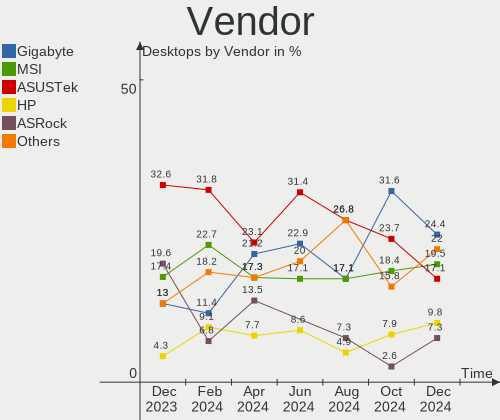
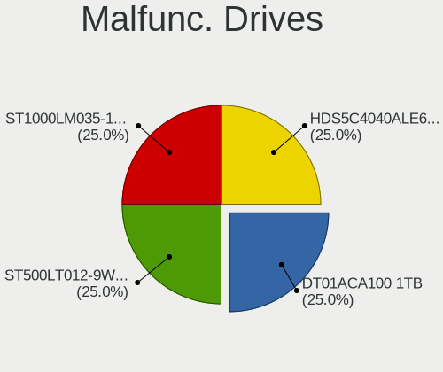
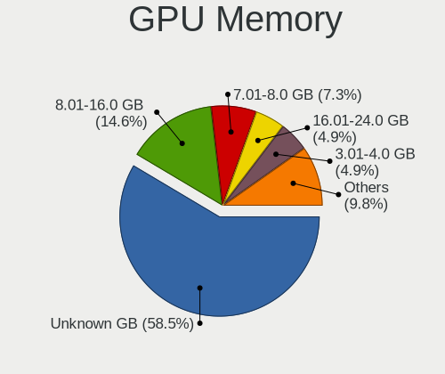

Manjaro Hardware Trends (Desktop)
---------------------------------

A project to identify most popular hardware characteristics and track their change
over time based on data collected by Manjaro users at https://Linux-Hardware.org.

Anyone can contribute to the study by uploading probes of their computers by
the [hw-probe](https://github.com/linuxhw/hw-probe) tool:

    sudo hw-probe -all -upload

Full-feature report is available here: https://linux-hardware.org/?view=trends&formfactor=desktop

Period: Mar, 2020.

Contents
--------

- [ OS                       ](#os)
- [ OS Family                ](#os-family)
- [ Kernel                   ](#kernel)
- [ Kernel Family            ](#kernel-family)
- [ Kernel Major Ver.        ](#kernel-major-ver)
- [ Arch                     ](#arch)
- [ DE                       ](#de)
- [ Display Server           ](#display-server)
- [ OS Lang                  ](#os-lang)
- [ Boot Mode                ](#boot-mode)
- [ Filesystem               ](#filesystem)
- [ Dual Boot with Linux     ](#dual-boot-with-linux)
- [ Dual Boot (Win)          ](#dual-boot-win)
- [ Country                  ](#country)
- [ City                     ](#city)
- [ Vendor                   ](#vendor)
- [ Model                    ](#model)
- [ Model Family             ](#model-family)
- [ MFG Year                 ](#mfg-year)
- [ Form Factor              ](#form-factor)
- [ Secure Boot              ](#secure-boot)
- [ Coreboot                 ](#coreboot)
- [ RAM Size                 ](#ram-size)
- [ RAM Used                 ](#ram-used)
- [ Drive Vendor             ](#drive-vendor)
- [ Drive Model              ](#drive-model)
- [ Drive Kind               ](#drive-kind)
- [ Drive Connector          ](#drive-connector)
- [ Drive Size               ](#drive-size)
- [ Space Total              ](#space-total)
- [ Space Used               ](#space-used)
- [ Malfunc. Drives          ](#malfunc-drives)
- [ Malfunc. Drive Vendor    ](#malfunc-drive-vendor)
- [ Malfunc. Drive Kind      ](#malfunc-drive-kind)
- [ Failed Drives            ](#failed-drives)
- [ Failed Drive Vendor      ](#failed-drive-vendor)
- [ Drive Status             ](#drive-status)
- [ Storage Vendor           ](#storage-vendor)
- [ Storage Model            ](#storage-model)
- [ Storage Kind             ](#storage-kind)
- [ CPU Vendor               ](#cpu-vendor)
- [ CPU Model                ](#cpu-model)
- [ CPU Model Family         ](#cpu-model-family)
- [ CPU Cores                ](#cpu-cores)
- [ CPU Sockets              ](#cpu-sockets)
- [ CPU Threads              ](#cpu-threads)
- [ CPU Op-Modes             ](#cpu-op-modes)
- [ CPU Microarch            ](#cpu-microarch)
- [ CPU Microcode            ](#cpu-microcode)
- [ GPU Vendor               ](#gpu-vendor)
- [ GPU Model                ](#gpu-model)
- [ GPU Combo                ](#gpu-combo)
- [ GPU Driver               ](#gpu-driver)
- [ GPU Memory               ](#gpu-memory)
- [ Monitor Vendor           ](#monitor-vendor)
- [ Monitor Model            ](#monitor-model)
- [ Monitor Resolution       ](#monitor-resolution)
- [ Monitor Diagonal         ](#monitor-diagonal)
- [ Monitor Width            ](#monitor-width)
- [ Aspect Ratio             ](#aspect-ratio)
- [ Monitor Area             ](#monitor-area)
- [ Pixel Density            ](#pixel-density)
- [ Multiple Monitors        ](#multiple-monitors)
- [ Net Controller Vendor    ](#net-controller-vendor)
- [ Net Controller Model     ](#net-controller-model)
- [ Net Controller Kind      ](#net-controller-kind)
- [ Used Controller          ](#used-controller)
- [ NICs                     ](#nics)
- [ Unsupported Devices      ](#unsupported-devices)
- [ Unsupported Device Types ](#unsupported-device-types)

OS
--

Installed operating systems

| Name           | Computers | Percent |
|----------------|-----------|---------|
| Manjaro        | 25        | 56.82%  |
| Manjaro 19.0.2 | 15        | 34.09%  |
| Manjaro 19.0.1 | 3         | 6.82%   |
| Manjaro 19.0   | 1         | 2.27%   |

OS Family
---------

OS without a version

| Name    | Computers | Percent |
|---------|-----------|---------|
| Manjaro | 44        | 100%    |

Kernel
------

Version of the Linux kernel

| Version                   | Computers | Percent |
|---------------------------|-----------|---------|
| 5.4.23-1-MANJARO          | 7         | 15.91%  |
| 5.4.24-1-MANJARO          | 6         | 13.64%  |
| 5.5.8-1-MANJARO           | 4         | 9.09%   |
| 5.5.7-1-MANJARO           | 4         | 9.09%   |
| 5.4.22-1-MANJARO          | 4         | 9.09%   |
| 5.5.6-1-MANJARO           | 3         | 6.82%   |
| 5.6.0-2-MANJARO           | 2         | 4.55%   |
| 5.5.13-1-MANJARO          | 2         | 4.55%   |
| 5.4.28-1-MANJARO          | 2         | 4.55%   |
| 5.4.27-1-MANJARO          | 2         | 4.55%   |
| 5.4.18-1-MANJARO          | 2         | 4.55%   |
| 5.6.0-rc4-1-clear-current | 1         | 2.27%   |
| 5.5.3-14-tkg-pds          | 1         | 2.27%   |
| 5.4.19-rt11-MANJARO       | 1         | 2.27%   |
| 5.3.18-1-MANJARO          | 1         | 2.27%   |
| 4.19.112-1-MANJARO        | 1         | 2.27%   |
| 4.19.107-1-MANJARO        | 1         | 2.27%   |

Kernel Family
-------------

Linux kernel without a distro release

| Version  | Computers | Percent |
|----------|-----------|---------|
| 5.4.23   | 7         | 15.91%  |
| 5.4.24   | 6         | 13.64%  |
| 5.5.8    | 4         | 9.09%   |
| 5.5.7    | 4         | 9.09%   |
| 5.4.22   | 4         | 9.09%   |
| 5.6.0    | 3         | 6.82%   |
| 5.5.6    | 3         | 6.82%   |
| 5.5.13   | 2         | 4.55%   |
| 5.4.28   | 2         | 4.55%   |
| 5.4.27   | 2         | 4.55%   |
| 5.4.18   | 2         | 4.55%   |
| 5.5.3    | 1         | 2.27%   |
| 5.4.19   | 1         | 2.27%   |
| 5.3.18   | 1         | 2.27%   |
| 4.19.112 | 1         | 2.27%   |
| 4.19.107 | 1         | 2.27%   |

Kernel Major Ver.
-----------------

Linux kernel major version

| Version | Computers | Percent |
|---------|-----------|---------|
| 5.4     | 24        | 54.55%  |
| 5.5     | 14        | 31.82%  |
| 5.6     | 3         | 6.82%   |
| 4.19    | 2         | 4.55%   |
| 5.3     | 1         | 2.27%   |

Arch
----

OS architecture (x86_64, i586, etc.)

| Name   | Computers | Percent |
|--------|-----------|---------|
| x86_64 | 44        | 100%    |

DE
--

Desktop Environment

| Name       | Computers | Percent |
|------------|-----------|---------|
| XFCE       | 13        | 29.55%  |
| KDE        | 10        | 22.73%  |
| GNOME      | 9         | 20.45%  |
| KDE5       | 6         | 13.64%  |
| X-Cinnamon | 2         | 4.55%   |
| Unknown    | 2         | 4.55%   |
| MATE       | 1         | 2.27%   |
| Budgie     | 1         | 2.27%   |

Display Server
--------------

X11 or Wayland

| Name    | Computers | Percent |
|---------|-----------|---------|
| X11     | 42        | 95.45%  |
| Tty     | 1         | 2.27%   |
| Unknown | 1         | 2.27%   |

OS Lang
-------

Language

| Lang       | Computers | Percent |
|------------|-----------|---------|
| en_US      | 14        | 31.82%  |
| en_US.utf8 | 7         | 15.91%  |
| ru_RU      | 4         | 9.09%   |
| sv_SE      | 2         | 4.55%   |
| ru_RU.utf8 | 2         | 4.55%   |
| pt_BR      | 2         | 4.55%   |
| es_ES      | 2         | 4.55%   |
| en_GB.utf8 | 2         | 4.55%   |
| en_CA.utf8 | 2         | 4.55%   |
| zh_CN      | 1         | 2.27%   |
| ru_UA      | 1         | 2.27%   |
| pl_PL      | 1         | 2.27%   |
| es_ES.utf8 | 1         | 2.27%   |
| en_CA      | 1         | 2.27%   |
| de_DE      | 1         | 2.27%   |
| da_DK.utf8 | 1         | 2.27%   |

Boot Mode
---------

EFI or BIOS

| Mode | Computers | Percent |
|------|-----------|---------|
| BIOS | 32        | 72.73%  |
| EFI  | 12        | 27.27%  |

Filesystem
----------

Type of filesystem

| Type    | Computers | Percent |
|---------|-----------|---------|
| Ext4    | 38        | 86.36%  |
| Btrfs   | 3         | 6.82%   |
| Xfs     | 1         | 2.27%   |
| Overlay | 1         | 2.27%   |
| Unknown | 1         | 2.27%   |

Dual Boot with Linux
--------------------

Hosting more than one Linux

| Dual boot | Computers | Percent |
|-----------|-----------|---------|
| No        | 39        | 88.64%  |
| Yes       | 5         | 11.36%  |

Dual Boot (Win)
---------------

Hosting Linux and Windows

| Dual boot | Computers | Percent |
|-----------|-----------|---------|
| No        | 28        | 63.64%  |
| Yes       | 16        | 36.36%  |

Country
-------

Geographic location (country)

| Country      | Computers | Percent |
|--------------|-----------|---------|
| USA          | 10        | 22.73%  |
| Russia       | 5         | 11.36%  |
| Sweden       | 3         | 6.82%   |
| Spain        | 3         | 6.82%   |
| Canada       | 3         | 6.82%   |
| Poland       | 2         | 4.55%   |
| Germany      | 2         | 4.55%   |
| France       | 2         | 4.55%   |
| Brazil       | 2         | 4.55%   |
| Ukraine      | 1         | 2.27%   |
| UK           | 1         | 2.27%   |
| South Africa | 1         | 2.27%   |
| Romania      | 1         | 2.27%   |
| Norway       | 1         | 2.27%   |
| Mexico       | 1         | 2.27%   |
| Lithuania    | 1         | 2.27%   |
| Italy        | 1         | 2.27%   |
| Greece       | 1         | 2.27%   |
| Denmark      | 1         | 2.27%   |
| China        | 1         | 2.27%   |
| Bulgaria     | 1         | 2.27%   |

City
----

Geographic location (city)

| City              | Computers | Percent |
|-------------------|-----------|---------|
| Seattle           | 2         | 4.55%   |
| Madrid            | 2         | 4.55%   |
| West Branch       | 1         | 2.27%   |
| Warsaw            | 1         | 2.27%   |
| Vladikavkaz       | 1         | 2.27%   |
| Vilnius           | 1         | 2.27%   |
| Uppsala           | 1         | 2.27%   |
| Timișoara        | 1         | 2.27%   |
| Södertälje      | 1         | 2.27%   |
| St Petersburg     | 1         | 2.27%   |
| Sofia             | 1         | 2.27%   |
| Sault Ste. Marie  | 1         | 2.27%   |
| Sao Jose          | 1         | 2.27%   |
| Santo André      | 1         | 2.27%   |
| Saeffle           | 1         | 2.27%   |
| Ruelle-sur-Touvre | 1         | 2.27%   |
| Rome              | 1         | 2.27%   |
| Qujing            | 1         | 2.27%   |
| Port Elizabeth    | 1         | 2.27%   |
| Ottawa            | 1         | 2.27%   |
| Oslo              | 1         | 2.27%   |
| Orsay             | 1         | 2.27%   |
| Orenburg          | 1         | 2.27%   |
| Nizhniy Novgorod  | 1         | 2.27%   |
| Montreal          | 1         | 2.27%   |
| Mexico City       | 1         | 2.27%   |
| Marki             | 1         | 2.27%   |
| Madison Heights   | 1         | 2.27%   |
| Kyiv              | 1         | 2.27%   |
| Kobenhavn N       | 1         | 2.27%   |
| Huntington Beach  | 1         | 2.27%   |
| Grand Junction    | 1         | 2.27%   |
| Erateini          | 1         | 2.27%   |
| Ekaterinburg      | 1         | 2.27%   |
| Edinburgh         | 1         | 2.27%   |
| Chicopee          | 1         | 2.27%   |
| Cherry Hill       | 1         | 2.27%   |
| Chemnitz          | 1         | 2.27%   |
| Champaign         | 1         | 2.27%   |
| Berlin            | 1         | 2.27%   |
| Barcelona         | 1         | 2.27%   |
| Austin            | 1         | 2.27%   |

Vendor
------

Motherboard manufacturer

| Name                | Computers | Percent |
|---------------------|-----------|---------|
| Gigabyte Technology | 10        | 22.73%  |
| ASUSTek Computer    | 10        | 22.73%  |
| MSI                 | 7         | 15.91%  |
| ASRock              | 5         | 11.36%  |
| Lenovo              | 3         | 6.82%   |
| Hewlett-Packard     | 2         | 4.55%   |
| Dell                | 2         | 4.55%   |
| Shuttle             | 1         | 2.27%   |
| Medion              | 1         | 2.27%   |
| IntegralTech        | 1         | 2.27%   |
| Biostar             | 1         | 2.27%   |
| Unknown             | 1         | 2.27%   |

Model
-----

Motherboard model

| Name                                | Computers | Percent |
|-------------------------------------|-----------|---------|
| MSI MS-7B79                         | 2         | 4.55%   |
| Gigabyte B450M DS3H                 | 2         | 4.55%   |
| Shuttle SH87R                       | 1         | 2.27%   |
| MSI MS-7A63                         | 1         | 2.27%   |
| MSI MS-7996                         | 1         | 2.27%   |
| MSI MS-7979                         | 1         | 2.27%   |
| MSI MS-7977                         | 1         | 2.27%   |
| MSI MS-7821                         | 1         | 2.27%   |
| Medion MS-7621                      | 1         | 2.27%   |
| Lenovo ThinkCentre M93p 10A6S0RN00  | 1         | 2.27%   |
| Lenovo ThinkCentre M920s 10SJ001JPB | 1         | 2.27%   |
| Lenovo ThinkCentre M91p 0266RZ1     | 1         | 2.27%   |
| IntegralTech 35404V4C4D0S           | 1         | 2.27%   |
| HP Pavilion Gaming Desktop 690-00xx | 1         | 2.27%   |
| HP 500-480nr                        | 1         | 2.27%   |
| Gigabyte Z87X-UD7 TH                | 1         | 2.27%   |
| Gigabyte Z370P D3                   | 1         | 2.27%   |
| Gigabyte Z270X-Ultra Gaming         | 1         | 2.27%   |
| Gigabyte X570 AORUS MASTER          | 1         | 2.27%   |
| Gigabyte Q270M-D3H                  | 1         | 2.27%   |
| Gigabyte H170-HD3-CF                | 1         | 2.27%   |
| Gigabyte B250M-DS3H                 | 1         | 2.27%   |
| Gigabyte AB350-Gaming               | 1         | 2.27%   |
| Dell OptiPlex 3020                  | 1         | 2.27%   |
| Dell OptiPlex 3010                  | 1         | 2.27%   |
| Biostar B350ET2                     | 1         | 2.27%   |
| ASUS TUF Z370-PLUS GAMING           | 1         | 2.27%   |
| ASUS ROG STRIX Z390-E GAMING        | 1         | 2.27%   |
| ASUS ROG STRIX X399-E GAMING        | 1         | 2.27%   |
| ASUS ROG STRIX B450-E GAMING        | 1         | 2.27%   |
| ASUS ROG CROSSHAIR VIII HERO        | 1         | 2.27%   |
| ASUS PRIME Z370-A                   | 1         | 2.27%   |
| ASUS P5G41T-M LX                    | 1         | 2.27%   |
| ASUS M5A97 PLUS                     | 1         | 2.27%   |
| ASUS M4N78 PRO                      | 1         | 2.27%   |
| ASUS All Series                     | 1         | 2.27%   |
| ASRock X570 Steel Legend WiFi ax    | 1         | 2.27%   |
| ASRock B450M Pro4                   | 1         | 2.27%   |
| ASRock B450 Steel Legend            | 1         | 2.27%   |
| ASRock AB350M Pro4                  | 1         | 2.27%   |
| ASRock A320M-HD                     | 1         | 2.27%   |
| Unknown                             | 1         | 2.27%   |

Model Family
------------

Motherboard model prefix

| Name                      | Computers | Percent |
|---------------------------|-----------|---------|
| ASUS ROG                  | 4         | 9.09%   |
| Lenovo ThinkCentre        | 3         | 6.82%   |
| MSI MS-7B79               | 2         | 4.55%   |
| Gigabyte B450M            | 2         | 4.55%   |
| Dell OptiPlex             | 2         | 4.55%   |
| Shuttle SH87R             | 1         | 2.27%   |
| MSI MS-7A63               | 1         | 2.27%   |
| MSI MS-7996               | 1         | 2.27%   |
| MSI MS-7979               | 1         | 2.27%   |
| MSI MS-7977               | 1         | 2.27%   |
| MSI MS-7821               | 1         | 2.27%   |
| Medion MS-7621            | 1         | 2.27%   |
| IntegralTech 35404V4C4D0S | 1         | 2.27%   |
| HP Pavilion               | 1         | 2.27%   |
| HP 500-480nr              | 1         | 2.27%   |
| Gigabyte Z87X-UD7         | 1         | 2.27%   |
| Gigabyte Z370P            | 1         | 2.27%   |
| Gigabyte Z270X-Ultra      | 1         | 2.27%   |
| Gigabyte X570             | 1         | 2.27%   |
| Gigabyte Q270M-D3H        | 1         | 2.27%   |
| Gigabyte H170-HD3-CF      | 1         | 2.27%   |
| Gigabyte B250M-DS3H       | 1         | 2.27%   |
| Gigabyte AB350-Gaming     | 1         | 2.27%   |
| Biostar B350ET2           | 1         | 2.27%   |
| ASUS TUF                  | 1         | 2.27%   |
| ASUS PRIME                | 1         | 2.27%   |
| ASUS P5G41T-M             | 1         | 2.27%   |
| ASUS M5A97                | 1         | 2.27%   |
| ASUS M4N78                | 1         | 2.27%   |
| ASUS All                  | 1         | 2.27%   |
| ASRock X570               | 1         | 2.27%   |
| ASRock B450M              | 1         | 2.27%   |
| ASRock B450               | 1         | 2.27%   |
| ASRock AB350M             | 1         | 2.27%   |
| ASRock A320M-HD           | 1         | 2.27%   |
| Unknown                   | 1         | 2.27%   |

MFG Year
--------

Motherboard manufacture year

| Year | Computers | Percent |
|------|-----------|---------|
| 2019 | 23        | 52.27%  |
| 2018 | 5         | 11.36%  |
| 2016 | 4         | 9.09%   |
| 2013 | 3         | 6.82%   |
| 2015 | 2         | 4.55%   |
| 2014 | 2         | 4.55%   |
| 2012 | 2         | 4.55%   |
| 2011 | 1         | 2.27%   |
| 2010 | 1         | 2.27%   |
| 2008 | 1         | 2.27%   |

Form Factor
-----------

Physical design of the computer

| Name    | Computers | Percent |
|---------|-----------|---------|
| Desktop | 44        | 100%    |

Secure Boot
-----------

Enabled or disabled

| State    | Computers | Percent |
|----------|-----------|---------|
| Disabled | 44        | 100%    |

Coreboot
--------

Have coreboot on board

| Used | Computers | Percent |
|------|-----------|---------|
| No   | 44        | 100%    |

RAM Size
--------

Total RAM memory

| Size in GB  | Computers | Percent |
|-------------|-----------|---------|
| 16.01-24.0  | 22        | 50%     |
| 8.01-16.0   | 7         | 15.91%  |
| 4.01-8.0    | 6         | 13.64%  |
| 32.01-64.0  | 4         | 9.09%   |
| 3.01-4.0    | 4         | 9.09%   |
| 64.01-256.0 | 1         | 2.27%   |

RAM Used
--------

Used RAM memory

| Used GB   | Computers | Percent |
|-----------|-----------|---------|
| 2.01-3.0  | 18        | 40.91%  |
| 1.01-2.0  | 10        | 22.73%  |
| 3.01-4.0  | 8         | 18.18%  |
| 4.01-8.0  | 7         | 15.91%  |
| 8.01-16.0 | 1         | 2.27%   |

Drive Vendor
------------

Hard drive vendors

| Vendor              | Computers | Drives | Percent |
|---------------------|-----------|--------|---------|
| Seagate             | 19        | 22     | 23.17%  |
| WDC                 | 16        | 18     | 19.51%  |
| Samsung Electronics | 16        | 19     | 19.51%  |
| Toshiba             | 5         | 6      | 6.1%    |
| Kingston            | 5         | 6      | 6.1%    |
| SanDisk             | 4         | 5      | 4.88%   |
| Crucial             | 3         | 3      | 3.66%   |
| SPCC                | 2         | 2      | 2.44%   |
| Intenso             | 2         | 2      | 2.44%   |
| A-DATA Technology   | 2         | 3      | 2.44%   |
| XPG                 | 1         | 1      | 1.22%   |
| SK Hynix            | 1         | 1      | 1.22%   |
| PNY                 | 1         | 1      | 1.22%   |
| LITEONIT            | 1         | 1      | 1.22%   |
| Intel               | 1         | 1      | 1.22%   |
| Hitachi             | 1         | 1      | 1.22%   |
| China               | 1         | 1      | 1.22%   |
| Apacer              | 1         | 1      | 1.22%   |

Drive Model
-----------

Hard drive models

| Model                        | Computers | Percent |
|------------------------------|-----------|---------|
| WDS240G2G0B-00EPW0 240GB SSD | 2         | 2.17%   |
| SV300S37A120G 120GB SSD      | 2         | 2.17%   |
| ST3000DM001-1ER166 3TB       | 2         | 2.17%   |
| ST3000DM001-1CH166 3TB       | 2         | 2.17%   |
| ST1000DM003-1SB102 1TB       | 2         | 2.17%   |
| ST1000DM003-1CH162 1TB       | 2         | 2.17%   |
| SSD 860 EVO 250GB            | 2         | 2.17%   |
| SSD 850 EVO 250GB            | 2         | 2.17%   |
| SSD 840 EVO 250GB            | 2         | 2.17%   |
| SA400S37120G 120GB SSD       | 2         | 2.17%   |
| DT01ACA200 2TB               | 2         | 2.17%   |
| WD5001AALS-00E3A0 500GB      | 1         | 1.09%   |
| WD5000AAKX-75U6AA0 500GB     | 1         | 1.09%   |
| WD40EFRX-68N32N0 4TB         | 1         | 1.09%   |
| WD4005FZBX-00K5WB0 4TB       | 1         | 1.09%   |
| WD3200KS-00PFB0 320GB        | 1         | 1.09%   |
| WD3200AAKX-221CA1 320GB      | 1         | 1.09%   |
| WD2500AAKX-083CA1 250GB      | 1         | 1.09%   |
| WD20EARX-00PASB0 2TB         | 1         | 1.09%   |
| WD1600AAJS-65WAA0 160GB      | 1         | 1.09%   |
| WD1600AAJS-00B4A0 160GB      | 1         | 1.09%   |
| WD10EZEX-22BN5A0 1TB         | 1         | 1.09%   |
| WD10EZEX-08M2NA0 1TB         | 1         | 1.09%   |
| WD10EZEX-00WN4A0 1TB         | 1         | 1.09%   |
| WD10EZEX-00RKKA0 1TB         | 1         | 1.09%   |
| WD10EARX-00N0YB0 1TB         | 1         | 1.09%   |
| WD10EARS-00Y5B1 1TB          | 1         | 1.09%   |
| VT180 480GB SSD              | 1         | 1.09%   |
| SV300S37A240G 240GB SSD      | 1         | 1.09%   |
| SU650 120GB SSD              | 1         | 1.09%   |
| ST8000DM004-2CX188 8TB       | 1         | 1.09%   |
| ST500LT012-9WS142 500GB      | 1         | 1.09%   |
| ST5000AS0011-1L5178 5TB      | 1         | 1.09%   |
| ST4000VN000-1H4168 4TB       | 1         | 1.09%   |
| ST3500414CS 500GB            | 1         | 1.09%   |
| ST31500341AS 1TB             | 1         | 1.09%   |
| ST2000LX001-1RG174 2TB       | 1         | 1.09%   |
| ST2000LM003 HN-M201RAD 2TB   | 1         | 1.09%   |
| ST2000DX001-1NS164 2TB       | 1         | 1.09%   |
| ST2000DM001-1ER164 2TB       | 1         | 1.09%   |
| ST2000DL004 HD204UI 2TB      | 1         | 1.09%   |
| ST1000LM049-2GH172 1TB       | 1         | 1.09%   |
| ST1000DX001-1CM162 1TB       | 1         | 1.09%   |
| SSDSC2CT240A3 240GB          | 1         | 1.09%   |
| SSD Sata III 120GB           | 1         | 1.09%   |
| SSD PLUS 480GB               | 1         | 1.09%   |
| SSD PLUS 120 GB              | 1         | 1.09%   |
| SSD 970 EVO 500GB            | 1         | 1.09%   |
| SSD 860 EVO 500GB            | 1         | 1.09%   |
| SSD 860 EVO 1TB              | 1         | 1.09%   |
| SSD 850 PRO 256GB            | 1         | 1.09%   |
| SSD 840 EVO 500GB            | 1         | 1.09%   |
| SSD 750 EVO 120GB            | 1         | 1.09%   |
| SSD 240GB                    | 1         | 1.09%   |
| SP900 128GB SSD              | 1         | 1.09%   |
| Solid State Disk 256GB       | 1         | 1.09%   |
| Solid State Disk 240GB       | 1         | 1.09%   |
| SDSSDX480GG25 480GB          | 1         | 1.09%   |
| SDSSDHP256G 256GB            | 1         | 1.09%   |
| SDSSDH3512G 512GB            | 1         | 1.09%   |

Drive Kind
----------

HDD or SSD

| Kind    | Computers | Drives | Percent |
|---------|-----------|--------|---------|
| SSD     | 31        | 41     | 47.69%  |
| HDD     | 31        | 50     | 47.69%  |
| NVMe    | 2         | 2      | 3.08%   |
| Unknown | 1         | 1      | 1.54%   |

Drive Connector
---------------

SATA, SAS, NVMe, etc.

| Type | Computers | Drives | Percent |
|------|-----------|--------|---------|
| SATA | 43        | 90     | 91.49%  |
| SAS  | 2         | 2      | 4.26%   |
| NVMe | 2         | 2      | 4.26%   |

Drive Size
----------

Size of hard drive

| Size in TB | Computers | Drives | Percent |
|------------|-----------|--------|---------|
| 0.01-0.5   | 36        | 52     | 49.32%  |
| 0.51-1.0   | 18        | 21     | 24.66%  |
| 1.01-2.0   | 8         | 9      | 10.96%  |
| 2.01-3.0   | 6         | 7      | 8.22%   |
| 3.01-4.0   | 3         | 3      | 4.11%   |
| 4.01-10.0  | 2         | 2      | 2.74%   |

Space Total
-----------

Amount of disk space available on the file system

| Size in GB     | Computers | Percent |
|----------------|-----------|---------|
| 501-1000       | 12        | 27.27%  |
| 251-500        | 10        | 22.73%  |
| 101-250        | 8         | 18.18%  |
| More than 3000 | 4         | 9.09%   |
| 1001-2000      | 4         | 9.09%   |
| 51-100         | 2         | 4.55%   |
| Unknown        | 2         | 4.55%   |
| 21-50          | 1         | 2.27%   |
| 2001-3000      | 1         | 2.27%   |

Space Used
----------

Amount of used disk space

| Used GB        | Computers | Percent |
|----------------|-----------|---------|
| 1-20           | 11        | 25%     |
| 1001-2000      | 6         | 13.64%  |
| 251-500        | 5         | 11.36%  |
| 101-250        | 5         | 11.36%  |
| 501-1000       | 5         | 11.36%  |
| 51-100         | 5         | 11.36%  |
| 21-50          | 4         | 9.09%   |
| Unknown        | 2         | 4.55%   |
| More than 3000 | 1         | 2.27%   |

Malfunc. Drives
---------------

Drive models with a malfunction

| Model                   | Computers | Drives | Percent |
|-------------------------|-----------|--------|---------|
| ST5000AS0011-1L5178 5TB | 1         | 1      | 33.33%  |
| ST1000DX001-1CM162 1TB  | 1         | 1      | 33.33%  |
| CT525MX300SSD1 528GB    | 1         | 1      | 33.33%  |

Malfunc. Drive Vendor
---------------------

Vendors of faulty drives

| Vendor  | Computers | Drives | Percent |
|---------|-----------|--------|---------|
| Seagate | 2         | 2      | 66.67%  |
| Crucial | 1         | 1      | 33.33%  |

Malfunc. Drive Kind
-------------------

Kinds of faulty drives

| Kind | Computers | Drives | Percent |
|------|-----------|--------|---------|
| HDD  | 2         | 2      | 66.67%  |
| SSD  | 1         | 1      | 33.33%  |

Failed Drives
-------------

Failed drive models

| Model                   | Computers | Drives | Percent |
|-------------------------|-----------|--------|---------|
| WD1600AAJS-65WAA0 160GB | 1         | 1      | 50%     |
| HD321HJ 320GB           | 1         | 1      | 50%     |

Failed Drive Vendor
-------------------

Failed drive vendors

| Vendor              | Computers | Drives | Percent |
|---------------------|-----------|--------|---------|
| WDC                 | 1         | 1      | 50%     |
| Samsung Electronics | 1         | 1      | 50%     |

Drive Status
------------

Number of failed and malfunc. drives

| Status   | Computers | Drives | Percent |
|----------|-----------|--------|---------|
| Detected | 32        | 68     | 64%     |
| Works    | 13        | 21     | 26%     |
| Malfunc  | 3         | 3      | 6%      |
| Failed   | 2         | 2      | 4%      |

Storage Vendor
--------------

Storage controller vendors

| Vendor                        | Computers | Percent |
|-------------------------------|-----------|---------|
| Intel                         | 25        | 43.1%   |
| AMD                           | 17        | 29.31%  |
| Samsung Electronics           | 5         | 8.62%   |
| Sandisk                       | 2         | 3.45%   |
| Phison Electronics            | 2         | 3.45%   |
| Nvidia                        | 2         | 3.45%   |
| Silicon Motion                | 1         | 1.72%   |
| Silicon Image                 | 1         | 1.72%   |
| Realtek Semiconductor         | 1         | 1.72%   |
| Integrated Technology Express | 1         | 1.72%   |
| ASMedia Technology            | 1         | 1.72%   |

Storage Model
-------------

Storage controller models

| Model                                                                             | Computers | Percent |
|-----------------------------------------------------------------------------------|-----------|---------|
| FCH SATA Controller [AHCI mode]                                                   | 16        | 21.33%  |
| 400 Series Chipset SATA Controller                                                | 7         | 9.33%   |
| 8 Series/C220 Series Chipset Family 6-port SATA Controller 1 [AHCI mode]          | 6         | 8%      |
| 200 Series PCH SATA controller [AHCI mode]                                        | 6         | 8%      |
| NVMe SSD Controller SM981/PM981/PM983                                             | 5         | 6.67%   |
| Q170/Q150/B150/H170/H110/Z170/CM236 Chipset SATA Controller [AHCI Mode]           | 4         | 5.33%   |
| 300 Series Chipset SATA Controller                                                | 4         | 5.33%   |
| Non-Volatile memory controller                                                    | 2         | 2.67%   |
| Cannon Lake PCH SATA AHCI Controller                                              | 2         | 2.67%   |
| X399 Series Chipset SATA Controller                                               | 1         | 1.33%   |
| WD Black 2018/PC SN720 NVMe SSD                                                   | 1         | 1.33%   |
| SSD 660P Series                                                                   | 1         | 1.33%   |
| SB7x0/SB8x0/SB9x0 SATA Controller [AHCI mode]                                     | 1         | 1.33%   |
| SATA Controller [RAID mode]                                                       | 1         | 1.33%   |
| Realtek Non-Volatile memory controller                                            | 1         | 1.33%   |
| PCI0680 Ultra ATA-133 Host Controller                                             | 1         | 1.33%   |
| NM10/ICH7 Family SATA Controller [IDE mode]                                       | 1         | 1.33%   |
| MCP79 AHCI Controller                                                             | 1         | 1.33%   |
| MCP78S [GeForce 8200] SATA Controller (non-AHCI mode)                             | 1         | 1.33%   |
| MCP78S [GeForce 8200] IDE                                                         | 1         | 1.33%   |
| IT8213 IDE Controller                                                             | 1         | 1.33%   |
| FCH SATA Controller D                                                             | 1         | 1.33%   |
| E16 PCIe4 NVMe Controller                                                         | 1         | 1.33%   |
| E12 NVMe Controller                                                               | 1         | 1.33%   |
| ASM1062 Serial ATA Controller                                                     | 1         | 1.33%   |
| 9 Series Chipset Family SATA Controller [AHCI Mode]                               | 1         | 1.33%   |
| 82801IR/IO/IH (ICH9R/DO/DH) 6 port SATA Controller [AHCI mode]                    | 1         | 1.33%   |
| 82801G (ICH7 Family) IDE Controller                                               | 1         | 1.33%   |
| 7 Series/C210 Series Chipset Family 6-port SATA Controller [AHCI mode]            | 1         | 1.33%   |
| 6 Series/C200 Series Chipset Family Desktop SATA Controller (IDE mode, ports 4-5) | 1         | 1.33%   |
| 6 Series/C200 Series Chipset Family Desktop SATA Controller (IDE mode, ports 0-3) | 1         | 1.33%   |
| 6 Series/C200 Series Chipset Family 6 port Desktop SATA AHCI Controller           | 1         | 1.33%   |

Storage Kind
------------

Kind of storage controller (IDE, SATA, NVMe, SAS, ...)

| Kind | Computers | Percent |
|------|-----------|---------|
| SATA | 40        | 70.18%  |
| NVMe | 11        | 19.3%   |
| IDE  | 4         | 7.02%   |
| RAID | 2         | 3.51%   |

CPU Vendor
----------

Processor vendors

| Vendor | Computers | Percent |
|--------|-----------|---------|
| Intel  | 26        | 59.09%  |
| AMD    | 18        | 40.91%  |

CPU Model
---------

Processor models

| Model                                          | Computers | Percent |
|------------------------------------------------|-----------|---------|
| Intel Core i7-6700K CPU @ 4.00GHz              | 3         | 6.82%   |
| AMD Ryzen 5 3600 6-Core Processor              | 3         | 6.82%   |
| Intel Core i5-4570 CPU @ 3.20GHz               | 2         | 4.55%   |
| AMD Ryzen 7 2700X Eight-Core Processor         | 2         | 4.55%   |
| AMD Ryzen 7 2700 Eight-Core Processor          | 2         | 4.55%   |
| Intel Xeon CPU E5-2689 0 @ 2.60GHz             | 1         | 2.27%   |
| Intel Pentium Dual-Core CPU T4400 @ 2.20GHz    | 1         | 2.27%   |
| Intel Pentium Dual-Core CPU E5300 @ 2.60GHz    | 1         | 2.27%   |
| Intel Core i7-9700K CPU @ 3.60GHz              | 1         | 2.27%   |
| Intel Core i7-8700K CPU @ 3.70GHz              | 1         | 2.27%   |
| Intel Core i7-6700T CPU @ 2.80GHz              | 1         | 2.27%   |
| Intel Core i7-4790S CPU @ 3.20GHz              | 1         | 2.27%   |
| Intel Core i7-4770S CPU @ 3.10GHz              | 1         | 2.27%   |
| Intel Core i5-8600K CPU @ 3.60GHz              | 1         | 2.27%   |
| Intel Core i5-8500 CPU @ 3.00GHz               | 1         | 2.27%   |
| Intel Core i5-8400 CPU @ 2.80GHz               | 1         | 2.27%   |
| Intel Core i5-7400 CPU @ 3.00GHz               | 1         | 2.27%   |
| Intel Core i5-6600K CPU @ 3.50GHz              | 1         | 2.27%   |
| Intel Core i5-4690 CPU @ 3.50GHz               | 1         | 2.27%   |
| Intel Core i5-4670K CPU @ 3.40GHz              | 1         | 2.27%   |
| Intel Core i5-4590 CPU @ 3.30GHz               | 1         | 2.27%   |
| Intel Core i5-2400S CPU @ 2.50GHz              | 1         | 2.27%   |
| Intel Core i3-6100 CPU @ 3.70GHz               | 1         | 2.27%   |
| Intel Core i3-3220 CPU @ 3.30GHz               | 1         | 2.27%   |
| Intel Core 2 Quad CPU @ 2.66GHz                | 1         | 2.27%   |
| Intel Celeron CPU G3900 @ 2.80GHz              | 1         | 2.27%   |
| AMD Ryzen Threadripper 2950X 16-Core Processor | 1         | 2.27%   |
| AMD Ryzen 9 3900X 12-Core Processor            | 1         | 2.27%   |
| AMD Ryzen 7 3800X 8-Core Processor             | 1         | 2.27%   |
| AMD Ryzen 5 2600X Six-Core Processor           | 1         | 2.27%   |
| AMD Ryzen 5 2600 Six-Core Processor            | 1         | 2.27%   |
| AMD Ryzen 5 2400G with Radeon Vega Graphics    | 1         | 2.27%   |
| AMD Ryzen 5 1600 Six-Core Processor            | 1         | 2.27%   |
| AMD Ryzen 5 1500X Quad-Core Processor          | 1         | 2.27%   |
| AMD Phenom II X4 905e Processor                | 1         | 2.27%   |
| AMD FX-8300 Eight-Core Processor               | 1         | 2.27%   |
| AMD Athlon 3000G with Radeon Vega Graphics     | 1         | 2.27%   |

CPU Model Family
----------------

Processor model prefix

| Model                   | Computers | Percent |
|-------------------------|-----------|---------|
| Intel Core i5           | 11        | 25%     |
| Intel Core i7           | 8         | 18.18%  |
| AMD Ryzen 5             | 8         | 18.18%  |
| AMD Ryzen 7             | 5         | 11.36%  |
| Intel Pentium Dual-Core | 2         | 4.55%   |
| Intel Core i3           | 2         | 4.55%   |
| Intel Xeon              | 1         | 2.27%   |
| Intel Core 2 Quad       | 1         | 2.27%   |
| Intel Celeron           | 1         | 2.27%   |
| AMD Ryzen Threadripper  | 1         | 2.27%   |
| AMD Ryzen 9             | 1         | 2.27%   |
| AMD Phenom II X4        | 1         | 2.27%   |
| AMD FX                  | 1         | 2.27%   |
| AMD Athlon              | 1         | 2.27%   |

CPU Cores
---------

Number of processor cores

| Number | Computers | Percent |
|--------|-----------|---------|
| 4      | 19        | 43.18%  |
| 6      | 10        | 22.73%  |
| 8      | 7         | 15.91%  |
| 2      | 6         | 13.64%  |
| 16     | 1         | 2.27%   |
| 12     | 1         | 2.27%   |

CPU Sockets
-----------

Number of sockets

| Number | Computers | Percent |
|--------|-----------|---------|
| 1      | 44        | 100%    |

CPU Threads
-----------

Threads per core (Hyper-Threading)

| Number | Computers | Percent |
|--------|-----------|---------|
| 2      | 26        | 59.09%  |
| 1      | 18        | 40.91%  |

CPU Op-Modes
------------

CPU Operation Modes (32-bit, 64-bit)

| Op mode        | Computers | Percent |
|----------------|-----------|---------|
| 32-bit, 64-bit | 44        | 100%    |

CPU Microarch
-------------

Microarchitecture

| Name        | Computers | Percent |
|-------------|-----------|---------|
| Skylake     | 10        | 22.73%  |
| Zen+        | 8         | 18.18%  |
| Haswell     | 7         | 15.91%  |
| Zen 2       | 5         | 11.36%  |
| Zen         | 3         | 6.82%   |
| KabyLake    | 3         | 6.82%   |
| SandyBridge | 2         | 4.55%   |
| Penryn      | 2         | 4.55%   |
| Piledriver  | 1         | 2.27%   |
| K10         | 1         | 2.27%   |
| IvyBridge   | 1         | 2.27%   |
| Core        | 1         | 2.27%   |

CPU Microcode
-------------

Microcode number

| Number     | Computers | Percent |
|------------|-----------|---------|
| Unknown    | 27        | 61.36%  |
| 0x906ea    | 3         | 6.82%   |
| 0x306c3    | 3         | 6.82%   |
| 0x0800820d | 3         | 6.82%   |
| 0x08701013 | 2         | 4.55%   |
| 0x506e3    | 1         | 2.27%   |
| 0x206d7    | 1         | 2.27%   |
| 0x0810100b | 1         | 2.27%   |
| 0x08001138 | 1         | 2.27%   |
| 0x08001137 | 1         | 2.27%   |
| 0x06000852 | 1         | 2.27%   |

GPU Vendor
----------

Vendors of graphics cards

| Vendor | Computers | Percent |
|--------|-----------|---------|
| Nvidia | 24        | 51.06%  |
| AMD    | 17        | 36.17%  |
| Intel  | 6         | 12.77%  |

GPU Model
---------

Graphics card models

| Model                                                                 | Computers | Percent |
|-----------------------------------------------------------------------|-----------|---------|
| Ellesmere [Radeon RX 470/480/570/570X/580/580X/590]                   | 7         | 14.89%  |
| GP106 [GeForce GTX 1060 6GB]                                          | 3         | 6.38%   |
| Xeon E3-1200 v3/4th Gen Core Processor Integrated Graphics Controller | 2         | 4.26%   |
| TU116 [GeForce GTX 1660]                                              | 2         | 4.26%   |
| Navi 10 [Radeon RX 5600 OEM/5600 XT / 5700/5700 XT]                   | 2         | 4.26%   |
| GP104 [GeForce GTX 1070]                                              | 2         | 4.26%   |
| GP104 [GeForce GTX 1070 Ti]                                           | 2         | 4.26%   |
| GM206 [GeForce GTX 960]                                               | 2         | 4.26%   |
| Xeon E3-1200 v2/3rd Gen Core processor Graphics Controller            | 1         | 2.13%   |
| Vega 20 [Radeon VII]                                                  | 1         | 2.13%   |
| Vega 10 XL/XT [Radeon RX Vega 56/64]                                  | 1         | 2.13%   |
| UHD Graphics 630 (Desktop)                                            | 1         | 2.13%   |
| Turks PRO [Radeon HD 6570/7570/8550]                                  | 1         | 2.13%   |
| Raven Ridge [Radeon Vega Series / Radeon Vega Mobile Series]          | 1         | 2.13%   |
| Pitcairn PRO [Radeon HD 7850 / R7 265 / R9 270 1024SP]                | 1         | 2.13%   |
| Picasso                                                               | 1         | 2.13%   |
| GP107 [GeForce GTX 1050]                                              | 1         | 2.13%   |
| GP107 [GeForce GTX 1050 Ti]                                           | 1         | 2.13%   |
| GP104 [GeForce GTX 1080]                                              | 1         | 2.13%   |
| GP104 [GeForce GTX 1060 6GB]                                          | 1         | 2.13%   |
| GM107 [GeForce GTX 750 Ti]                                            | 1         | 2.13%   |
| GM107 [GeForce GTX 745]                                               | 1         | 2.13%   |
| GK106 [GeForce GTX 660]                                               | 1         | 2.13%   |
| GK104 [GeForce GTX 760]                                               | 1         | 2.13%   |
| GF119 [GeForce GT 705]                                                | 1         | 2.13%   |
| GF114 [GeForce GTX 560 Ti]                                            | 1         | 2.13%   |
| G84 [GeForce 8600 GT]                                                 | 1         | 2.13%   |
| Curacao PRO [Radeon R7 370 / R9 270/370 OEM]                          | 1         | 2.13%   |
| C79 [GeForce 9100M G]                                                 | 1         | 2.13%   |
| C77 [GeForce 8300]                                                    | 1         | 2.13%   |
| Baffin [Radeon RX 550 640SP / RX 560/560X]                            | 1         | 2.13%   |
| 82Q35 Express Integrated Graphics Controller                          | 1         | 2.13%   |
| 2nd Generation Core Processor Family Integrated Graphics Controller   | 1         | 2.13%   |

GPU Combo
---------

Combinations of graphics cards

| Name         | Computers | Percent |
|--------------|-----------|---------|
| 1 x Nvidia   | 21        | 47.73%  |
| 1 x AMD      | 14        | 31.82%  |
| 1 x Intel    | 6         | 13.64%  |
| AMD + Nvidia | 3         | 6.82%   |

GPU Driver
----------

Free vs proprietary

| Driver      | Computers | Percent |
|-------------|-----------|---------|
| Free        | 28        | 63.64%  |
| Proprietary | 16        | 36.36%  |

GPU Memory
----------

Total video memory

| Size in GB | Computers | Percent |
|------------|-----------|---------|
| Unknown    | 19        | 43.18%  |
| 7.01-8.0   | 11        | 25%     |
| 1.01-2.0   | 6         | 13.64%  |
| 5.01-6.0   | 5         | 11.36%  |
| 3.01-4.0   | 1         | 2.27%   |
| 0.51-1.0   | 1         | 2.27%   |
| 0.01-0.5   | 1         | 2.27%   |

Monitor Vendor
--------------

Monitor vendors

| Vendor               | Computers | Percent |
|----------------------|-----------|---------|
| Samsung Electronics  | 11        | 20.75%  |
| Philips              | 5         | 9.43%   |
| Acer                 | 5         | 9.43%   |
| Goldstar             | 4         | 7.55%   |
| Dell                 | 4         | 7.55%   |
| ASUSTek Computer     | 4         | 7.55%   |
| BenQ                 | 3         | 5.66%   |
| Ancor Communications | 3         | 5.66%   |
| LG Electronics       | 2         | 3.77%   |
| ViewSonic            | 1         | 1.89%   |
| Tech Concepts        | 1         | 1.89%   |
| Plain Tree Systems   | 1         | 1.89%   |
| Nvidia               | 1         | 1.89%   |
| Lenovo               | 1         | 1.89%   |
| KTC                  | 1         | 1.89%   |
| Idek Iiyama          | 1         | 1.89%   |
| HPN                  | 1         | 1.89%   |
| Hewlett-Packard      | 1         | 1.89%   |
| eMachines            | 1         | 1.89%   |
| AUS                  | 1         | 1.89%   |
| AOC                  | 1         | 1.89%   |

Monitor Model
-------------

Monitor models

| Model                                               | Computers | Percent |
|-----------------------------------------------------|-----------|---------|
| VG289 AUS28BA 3840x2160 620x340mm 27.8-inch         | 2         | 3.39%   |
| VZ229 AUS22CC 1920x1080 476x268mm 21.5-inch         | 1         | 1.69%   |
| VX2776 Series VSC3E32 1920x1080 598x336mm 27.0-inch | 1         | 1.69%   |
| VG248 ACI24A4 1920x1080 530x300mm 24.0-inch         | 1         | 1.69%   |
| VG240Y ACR0673 1920x1080 527x296mm 23.8-inch        | 1         | 1.69%   |
| VA326 AUS32FA 1920x1080 698x393mm 31.5-inch         | 1         | 1.69%   |
| SyncMaster SAM0524 1920x1080 477x268mm 21.5-inch    | 1         | 1.69%   |
| SyncMaster SAM0304 1680x1050 494x320mm 23.2-inch    | 1         | 1.69%   |
| SE2717H/HX DELD0A1 1920x1080 600x340mm 27.2-inch    | 1         | 1.69%   |
| S34J55x SAM0F71 3440x1440 797x333mm 34.0-inch       | 1         | 1.69%   |
| S24D590 SAM0B47 1920x1080 520x290mm 23.4-inch       | 1         | 1.69%   |
| S24D330 SAM0D92 1920x1080 531x299mm 24.0-inch       | 1         | 1.69%   |
| S230HL ACR0280 1920x1080 509x286mm 23.0-inch        | 1         | 1.69%   |
| S22C650 SAM0A05 1920x1080 477x268mm 21.5-inch       | 1         | 1.69%   |
| S19B300 SAM08A6 1366x768 410x230mm 18.5-inch        | 1         | 1.69%   |
| S-9005L12-N KTC1990 1280x1024 338x270mm 17.0-inch   | 1         | 1.69%   |
| RT280K ACR065F 3840x2160 621x341mm 27.9-inch        | 1         | 1.69%   |
| PHL BDM4065 PHL08E1 1920x1080 880x490mm 39.7-inch   | 1         | 1.69%   |
| PHL 436M6VBP PHLC179 3840x2160 941x529mm 42.5-inch  | 1         | 1.69%   |
| PHL 246E9Q PHLC17C 1920x1080 527x296mm 23.8-inch    | 1         | 1.69%   |
| P2214H DELA097 1920x1080 480x270mm 21.7-inch        | 1         | 1.69%   |
| Monitor PTS0899 1680x1050 474x296mm 22.0-inch       | 1         | 1.69%   |
| LG ULTRAWIDE GSM59F1 1920x1080 580x240mm 24.7-inch  | 1         | 1.69%   |
| LEN T23i-10 LEN61AB 1920x1080 509x286mm 23.0-inch   | 1         | 1.69%   |
| LCD Monitor W2240                                   | 1         | 1.69%   |
| LCD Monitor VG248 1920x1080                         | 1         | 1.69%   |
| LCD Monitor SMB2330H                                | 1         | 1.69%   |
| LCD Monitor SAM0F14 3840x2160 1872x1053mm 84.6-inch | 1         | 1.69%   |
| LCD Monitor SAM0BC9 1920x1080 600x340mm 27.2-inch   | 1         | 1.69%   |
| LCD Monitor SAM07BA 1920x1080 890x500mm 40.2-inch   | 1         | 1.69%   |
| LCD Monitor PLX2783H 1920x1080                      | 1         | 1.69%   |
| LCD Monitor PHL 243V7 1920x1080                     | 1         | 1.69%   |
| LCD Monitor IPS236 1920x1080                        | 1         | 1.69%   |
| LCD Monitor HP 25x 1920x1080                        | 1         | 1.69%   |
| LCD Monitor H213H 5760x1080                         | 1         | 1.69%   |
| LCD Monitor GN246HL 4480x1440                       | 1         | 1.69%   |
| LCD Monitor GN246HL 1920x1080                       | 1         | 1.69%   |
| LCD Monitor GN246HL                                 | 1         | 1.69%   |
| LCD Monitor E2215HV 1920x1080                       | 1         | 1.69%   |
| LCD Monitor Default Flat Panel 1920x1080            | 1         | 1.69%   |
| LCD Monitor ASUS VG289 6400x2160                    | 1         | 1.69%   |
| LCD Monitor ASUS VG289 3840x2160                    | 1         | 1.69%   |
| LCD Monitor ASUS PB277                              | 1         | 1.69%   |
| LCD Monitor 55S405 3840x2160                        | 1         | 1.69%   |
| IPS FULLHD GSM5AB6 1920x1080 480x270mm 21.7-inch    | 1         | 1.69%   |
| GW2760HS BNQ78CA 1920x1080 598x336mm 27.0-inch      | 1         | 1.69%   |
| GN246HL ACR02FA 1920x1080 530x300mm 24.0-inch       | 1         | 1.69%   |
| GN246HL ACR02F9 1920x1080 531x299mm 24.0-inch       | 1         | 1.69%   |
| GL955 BNQ78C7 1280x720 410x230mm 18.5-inch          | 1         | 1.69%   |
| GL2450H BNQ78A7 1920x1080 530x300mm 24.0-inch       | 1         | 1.69%   |
| GL2240 BNQ7887 1920x1080 480x270mm 21.7-inch        | 1         | 1.69%   |
| E2350 GSM5791 1920x1080 510x290mm 23.1-inch         | 1         | 1.69%   |
| E2242 GSM58BE 1680x1050 480x270mm 21.7-inch         | 1         | 1.69%   |
| E19T6W EMA0786 1440x900 408x255mm 18.9-inch         | 1         | 1.69%   |
| E176FP DELA014 1280x1024 340x270mm 17.1-inch        | 1         | 1.69%   |
| 25es HWP3323 1920x1080 553x309mm 24.9-inch          | 1         | 1.69%   |
| 2460 AOC2460 1920x1080 531x299mm 24.0-inch          | 1         | 1.69%   |
| 220CW PHLC024 1680x1050 474x296mm 22.0-inch         | 1         | 1.69%   |

Monitor Resolution
------------------

Monitor screen resolution

| Resolution         | Computers | Percent |
|--------------------|-----------|---------|
| 1920x1080 (FHD)    | 27        | 54%     |
| 3840x2160 (4K)     | 7         | 14%     |
| 1680x1050 (WSXGA+) | 3         | 6%      |
| 1366x768 (WXGA)    | 2         | 4%      |
| 1280x1024 (SXGA)   | 2         | 4%      |
| Unknown            | 2         | 4%      |
| 6400x2160          | 1         | 2%      |
| 5760x1080          | 1         | 2%      |
| 4480x1440          | 1         | 2%      |
| 3440x1440          | 1         | 2%      |
| 2560x1440 (QHD)    | 1         | 2%      |
| 2560x1080          | 1         | 2%      |
| 1440x900 (WXGA+)   | 1         | 2%      |

Monitor Diagonal
----------------

Diagonal size in inches

| Inches  | Computers | Percent |
|---------|-----------|---------|
| Unknown | 10        | 20%     |
| 21      | 8         | 16%     |
| 27      | 7         | 14%     |
| 23      | 7         | 14%     |
| 24      | 5         | 10%     |
| 18      | 3         | 6%      |
| 17      | 2         | 4%      |
| 84      | 1         | 2%      |
| 42      | 1         | 2%      |
| 40      | 1         | 2%      |
| 39      | 1         | 2%      |
| 34      | 1         | 2%      |
| 31      | 1         | 2%      |
| 28      | 1         | 2%      |
| 22      | 1         | 2%      |

Monitor Width
-------------

Physical width

| Width in mm | Computers | Percent |
|-------------|-----------|---------|
| 501-600     | 14        | 28.57%  |
| 401-500     | 12        | 24.49%  |
| Unknown     | 10        | 20.41%  |
| 601-700     | 5         | 10.2%   |
| 801-900     | 2         | 4.08%   |
| 301-350     | 2         | 4.08%   |
| 701-800     | 1         | 2.04%   |
| 351-400     | 1         | 2.04%   |
| 1501-2000   | 1         | 2.04%   |
| 901-1000    | 1         | 2.04%   |

Aspect Ratio
------------

Proportional relationship between the width and the height

| Ratio   | Computers | Percent |
|---------|-----------|---------|
| 16/9    | 26        | 59.09%  |
| Unknown | 10        | 22.73%  |
| 16/10   | 3         | 6.82%   |
| 5/4     | 2         | 4.55%   |
| 21/9    | 2         | 4.55%   |
| 3/2     | 1         | 2.27%   |

Monitor Area
------------

Area in inch²

| Area in inch² | Computers | Percent |
|----------------|-----------|---------|
| 201-250        | 13        | 26.53%  |
| Unknown        | 10        | 20.41%  |
| 301-350        | 7         | 14.29%  |
| 151-200        | 7         | 14.29%  |
| 141-150        | 4         | 8.16%   |
| 501-1000       | 3         | 6.12%   |
| 351-500        | 2         | 4.08%   |
| 251-300        | 2         | 4.08%   |
| More than 1000 | 1         | 2.04%   |

Pixel Density
-------------

Pixels per inch

| Density | Computers | Percent |
|---------|-----------|---------|
| 51-100  | 23        | 50%     |
| 101-120 | 10        | 21.74%  |
| Unknown | 10        | 21.74%  |
| 121-160 | 3         | 6.52%   |

Multiple Monitors
-----------------

Total monitors connected

| Total | Computers | Percent |
|-------|-----------|---------|
| 1     | 34        | 77.27%  |
| 2     | 8         | 18.18%  |
| 3     | 2         | 4.55%   |

Net Controller Vendor
---------------------

Controller vendors

| Vendor                | Computers | Percent |
|-----------------------|-----------|---------|
| Intel                 | 8         | 72.73%  |
| Realtek Semiconductor | 1         | 9.09%   |
| Microchip Technology  | 1         | 9.09%   |
| Mellanox Technologies | 1         | 9.09%   |

Net Controller Model
--------------------

Controller models

| Model                                           | Computers | Percent |
|-------------------------------------------------|-----------|---------|
| I211 Gigabit Network Connection                 | 5         | 38.46%  |
| Wi-Fi 6 AX200                                   | 2         | 15.38%  |
| RTL8125 2.5GbE Controller                       | 1         | 7.69%   |
| MT26448 [ConnectX EN 10GigE, PCIe 2.0 5GT/s]    | 1         | 7.69%   |
| I210 Gigabit Network Connection                 | 1         | 7.69%   |
| HTC Hub Controller                              | 1         | 7.69%   |
| 82579LM Gigabit Network Connection (Lewisville) | 1         | 7.69%   |
| 82566DM-2 Gigabit Network Connection            | 1         | 7.69%   |

Net Controller Kind
-------------------

Ethernet, WiFi or modem

| Kind     | Computers | Percent |
|----------|-----------|---------|
| Ethernet | 9         | 75%     |
| WiFi     | 2         | 16.67%  |
| Modem    | 1         | 8.33%   |

Used Controller
---------------

Currently used network controller

| Kind     | Computers | Percent |
|----------|-----------|---------|
| Ethernet | 8         | 88.89%  |
| WiFi     | 1         | 11.11%  |

NICs
----

Total network controllers on board

| Total | Computers | Percent |
|-------|-----------|---------|
| 1     | 30        | 68.18%  |
| 2     | 10        | 22.73%  |
| 3     | 4         | 9.09%   |

Unsupported Devices
-------------------

Total unsupported devices on board

| Total | Computers | Percent |
|-------|-----------|---------|
| 0     | 38        | 86.36%  |
| 1     | 5         | 11.36%  |
| 3     | 1         | 2.27%   |

Unsupported Device Types
------------------------

Types of unsupported devices

| Type                  | Computers | Percent |
|-----------------------|-----------|---------|
| Multimedia controller | 2         | 28.57%  |
| Sound                 | 1         | 14.29%  |
| Net/ethernet          | 1         | 14.29%  |
| Graphics card         | 1         | 14.29%  |
| Chipcard              | 1         | 14.29%  |
| Camera                | 1         | 14.29%  |

