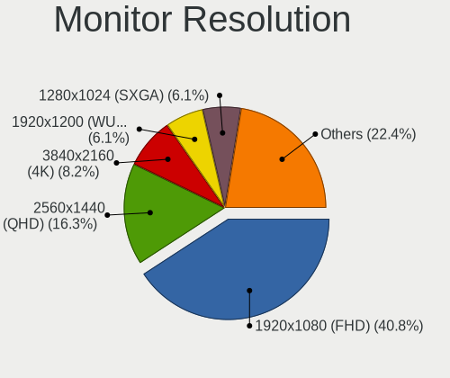
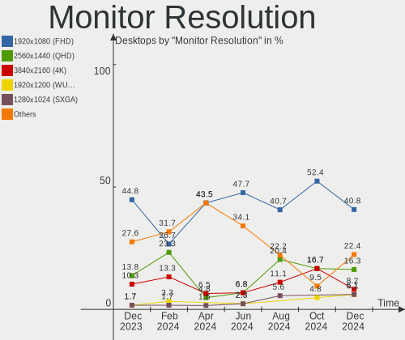

Manjaro Hardware Trends (Desktop)
---------------------------------

A project to identify most popular hardware characteristics and track their change
over time based on data collected by Manjaro users at https://Linux-Hardware.org.

Anyone can contribute to the study by uploading probes of their computers by
the [hw-probe](https://github.com/linuxhw/hw-probe) tool:

    sudo -E hw-probe -all -upload

Full-feature report is available here: https://linux-hardware.org/?view=trends&formfactor=desktop

Period: Feb, 2021.

Contents
--------

- [ OS                       ](#os)
- [ OS Family                ](#os-family)
- [ Kernel                   ](#kernel)
- [ Kernel Family            ](#kernel-family)
- [ Kernel Major Ver.        ](#kernel-major-ver)
- [ Arch                     ](#arch)
- [ DE                       ](#de)
- [ Display Server           ](#display-server)
- [ Display Manager          ](#display-manager)
- [ OS Lang                  ](#os-lang)
- [ Boot Mode                ](#boot-mode)
- [ Filesystem               ](#filesystem)
- [ Part. scheme             ](#part-scheme)
- [ Dual Boot with Linux/BSD ](#dual-boot-with-linux/bsd)
- [ Dual Boot (Win)          ](#dual-boot-win)
- [ Country                  ](#country)
- [ City                     ](#city)
- [ Vendor                   ](#vendor)
- [ Model                    ](#model)
- [ Model Family             ](#model-family)
- [ MFG Year                 ](#mfg-year)
- [ Form Factor              ](#form-factor)
- [ Secure Boot              ](#secure-boot)
- [ Coreboot                 ](#coreboot)
- [ RAM Size                 ](#ram-size)
- [ RAM Used                 ](#ram-used)
- [ Has CD-ROM               ](#has-cd-rom)
- [ Total Drives             ](#total-drives)
- [ Has Ethernet             ](#has-ethernet)
- [ Drive Vendor             ](#drive-vendor)
- [ Drive Model              ](#drive-model)
- [ HDD Vendor               ](#hdd-vendor)
- [ SSD Vendor               ](#ssd-vendor)
- [ Drive Kind               ](#drive-kind)
- [ Drive Connector          ](#drive-connector)
- [ Drive Size               ](#drive-size)
- [ Space Total              ](#space-total)
- [ Space Used               ](#space-used)
- [ Malfunc. Drives          ](#malfunc-drives)
- [ Malfunc. Drive Vendor    ](#malfunc-drive-vendor)
- [ Malfunc. HDD Vendor      ](#malfunc-hdd-vendor)
- [ Malfunc. Drive Kind      ](#malfunc-drive-kind)
- [ Failed Drives            ](#failed-drives)
- [ Failed Drive Vendor      ](#failed-drive-vendor)
- [ Drive Status             ](#drive-status)
- [ Storage Vendor           ](#storage-vendor)
- [ Storage Model            ](#storage-model)
- [ Storage Kind             ](#storage-kind)
- [ CPU Vendor               ](#cpu-vendor)
- [ CPU Model                ](#cpu-model)
- [ CPU Model Family         ](#cpu-model-family)
- [ CPU Cores                ](#cpu-cores)
- [ CPU Sockets              ](#cpu-sockets)
- [ CPU Threads              ](#cpu-threads)
- [ CPU Op-Modes             ](#cpu-op-modes)
- [ CPU Microcode            ](#cpu-microcode)
- [ CPU Microarch            ](#cpu-microarch)
- [ GPU Vendor               ](#gpu-vendor)
- [ GPU Model                ](#gpu-model)
- [ GPU Combo                ](#gpu-combo)
- [ GPU Driver               ](#gpu-driver)
- [ GPU Memory               ](#gpu-memory)
- [ Monitor Vendor           ](#monitor-vendor)
- [ Monitor Model            ](#monitor-model)
- [ Monitor Resolution       ](#monitor-resolution)
- [ Monitor Diagonal         ](#monitor-diagonal)
- [ Monitor Width            ](#monitor-width)
- [ Aspect Ratio             ](#aspect-ratio)
- [ Monitor Area             ](#monitor-area)
- [ Pixel Density            ](#pixel-density)
- [ Multiple Monitors        ](#multiple-monitors)
- [ Net Controller Vendor    ](#net-controller-vendor)
- [ Net Controller Model     ](#net-controller-model)
- [ Wireless Vendor          ](#wireless-vendor)
- [ Wireless Model           ](#wireless-model)
- [ Ethernet Vendor          ](#ethernet-vendor)
- [ Ethernet Model           ](#ethernet-model)
- [ Net Controller Kind      ](#net-controller-kind)
- [ Used Controller          ](#used-controller)
- [ NICs                     ](#nics)
- [ Memory Vendor            ](#memory-vendor)
- [ Memory Model             ](#memory-model)
- [ Memory Kind              ](#memory-kind)
- [ Memory Form Factor       ](#memory-form-factor)
- [ Memory Size              ](#memory-size)
- [ Memory Speed             ](#memory-speed)
- [ Sound Vendor             ](#sound-vendor)
- [ Sound Model              ](#sound-model)
- [ Camera Vendor            ](#camera-vendor)
- [ Camera Model             ](#camera-model)
- [ Fingerprint Vendor       ](#fingerprint-vendor)
- [ Fingerprint Model        ](#fingerprint-model)
- [ Chipcard Vendor          ](#chipcard-vendor)
- [ Chipcard Model           ](#chipcard-model)
- [ Printer Vendor           ](#printer-vendor)
- [ Printer Model            ](#printer-model)
- [ Scanner Vendor           ](#scanner-vendor)
- [ Scanner Model            ](#scanner-model)
- [ Bluetooth Vendor         ](#bluetooth-vendor)
- [ Bluetooth Model          ](#bluetooth-model)
- [ Unsupported Devices      ](#unsupported-devices)
- [ Unsupported Device Types ](#unsupported-device-types)

OS
--

Installed operating systems

| Name           | Desktops | Percent |
|----------------|----------|---------|
| Manjaro        | 41       | 52.56%  |
| Manjaro 20.2.1 | 37       | 47.44%  |

OS Family
---------

OS without a version

| Name    | Desktops | Percent |
|---------|----------|---------|
| Manjaro | 78       | 100%    |

Kernel
------

Version of the Linux kernel

| Version              | Desktops | Percent |
|----------------------|----------|---------|
| 5.9.16-1-MANJARO     | 34       | 43.59%  |
| 5.10.15-1-MANJARO    | 18       | 23.08%  |
| 5.10.7-3-MANJARO     | 7        | 8.97%   |
| 5.11.0-1-MANJARO     | 4        | 5.13%   |
| 5.10.13-2-MANJARO    | 3        | 3.85%   |
| 5.4.95-1-MANJARO     | 2        | 2.56%   |
| 5.4.85-1-MANJARO     | 2        | 2.56%   |
| 5.8.18-1-MANJARO     | 1        | 1.28%   |
| 5.4.80-2-MANJARO     | 1        | 1.28%   |
| 5.4.64-1-MANJARO     | 1        | 1.28%   |
| 5.11.0-126-tkg-MuQSS | 1        | 1.28%   |
| 5.10.2-2-MANJARO     | 1        | 1.28%   |
| 5.10.18-1-MANJARO    | 1        | 1.28%   |
| 5.10.17-1-MANJARO    | 1        | 1.28%   |
| 5.10.14-arch1-1-vfio | 1        | 1.28%   |

Kernel Family
-------------

Linux kernel without a distro release

| Version | Desktops | Percent |
|---------|----------|---------|
| 5.9.16  | 34       | 43.59%  |
| 5.10.15 | 18       | 23.08%  |
| 5.10.7  | 7        | 8.97%   |
| 5.11.0  | 5        | 6.41%   |
| 5.10.13 | 3        | 3.85%   |
| 5.4.95  | 2        | 2.56%   |
| 5.4.85  | 2        | 2.56%   |
| 5.8.18  | 1        | 1.28%   |
| 5.4.80  | 1        | 1.28%   |
| 5.4.64  | 1        | 1.28%   |
| 5.10.2  | 1        | 1.28%   |
| 5.10.18 | 1        | 1.28%   |
| 5.10.17 | 1        | 1.28%   |
| 5.10.14 | 1        | 1.28%   |

Kernel Major Ver.
-----------------

Linux kernel major version

| Version | Desktops | Percent |
|---------|----------|---------|
| 5.9     | 34       | 43.59%  |
| 5.10    | 32       | 41.03%  |
| 5.4     | 6        | 7.69%   |
| 5.11    | 5        | 6.41%   |
| 5.8     | 1        | 1.28%   |

Arch
----

OS architecture (x86_64, i586, etc.)

| Name   | Desktops | Percent |
|--------|----------|---------|
| x86_64 | 78       | 100%    |

DE
--

Desktop Environment

| Name       | Desktops | Percent |
|------------|----------|---------|
| KDE        | 20       | 25.64%  |
| GNOME      | 17       | 21.79%  |
| XFCE       | 16       | 20.51%  |
| KDE5       | 16       | 20.51%  |
| X-Cinnamon | 2        | 2.56%   |
| MATE       | 2        | 2.56%   |
| Deepin     | 2        | 2.56%   |
| Unknown    | 2        | 2.56%   |
| Budgie     | 1        | 1.28%   |

Display Server
--------------

X11 or Wayland

| Name    | Desktops | Percent |
|---------|----------|---------|
| X11     | 67       | 85.9%   |
| Wayland | 10       | 12.82%  |
| Unknown | 1        | 1.28%   |

Display Manager
---------------

SDDM, LightDM, etc.

| Name    | Desktops | Percent |
|---------|----------|---------|
| Unknown | 41       | 52.56%  |
| SDDM    | 17       | 21.79%  |
| LightDM | 11       | 14.1%   |
| GDM     | 9        | 11.54%  |

OS Lang
-------

Language

| Lang    | Desktops | Percent |
|---------|----------|---------|
| en_US   | 35       | 44.87%  |
| ru_RU   | 6        | 7.69%   |
| pt_BR   | 5        | 6.41%   |
| fr_FR   | 5        | 6.41%   |
| de_DE   | 5        | 6.41%   |
| it_IT   | 4        | 5.13%   |
| en_GB   | 4        | 5.13%   |
| Unknown | 2        | 2.56%   |
| sv_SE   | 1        | 1.28%   |
| ko_KR   | 1        | 1.28%   |
| hu_HU   | 1        | 1.28%   |
| fi_FI   | 1        | 1.28%   |
| es_SV   | 1        | 1.28%   |
| es_MX   | 1        | 1.28%   |
| es_ES   | 1        | 1.28%   |
| en_NZ   | 1        | 1.28%   |
| en_IN   | 1        | 1.28%   |
| en_CA   | 1        | 1.28%   |
| en_AU   | 1        | 1.28%   |
| bg_BG   | 1        | 1.28%   |

Boot Mode
---------

EFI or BIOS

| Mode | Desktops | Percent |
|------|----------|---------|
| BIOS | 49       | 62.82%  |
| EFI  | 29       | 37.18%  |

Filesystem
----------

Type of filesystem

| Type | Desktops | Percent |
|------|----------|---------|
| Ext4 | 76       | 97.44%  |
| Zfs  | 1        | 1.28%   |
| Xfs  | 1        | 1.28%   |

Part. scheme
------------

Scheme of partitioning

| Type    | Desktops | Percent |
|---------|----------|---------|
| Unknown | 40       | 51.28%  |
| GPT     | 33       | 42.31%  |
| MBR     | 5        | 6.41%   |

Dual Boot with Linux/BSD
------------------------

Hosting more than one Linux/BSD

| Dual boot | Desktops | Percent |
|-----------|----------|---------|
| No        | 70       | 89.74%  |
| Yes       | 8        | 10.26%  |

Dual Boot (Win)
---------------

Hosting Linux and Windows

| Dual boot | Desktops | Percent |
|-----------|----------|---------|
| No        | 48       | 61.54%  |
| Yes       | 30       | 38.46%  |

Country
-------

Geographic location (country)

| Country            | Desktops | Percent |
|--------------------|----------|---------|
| USA                | 12       | 15.38%  |
| Germany            | 8        | 10.26%  |
| Brazil             | 7        | 8.97%   |
| France             | 6        | 7.69%   |
| Russia             | 5        | 6.41%   |
| Italy              | 4        | 5.13%   |
| UK                 | 3        | 3.85%   |
| Romania            | 3        | 3.85%   |
| Mexico             | 3        | 3.85%   |
| Ukraine            | 2        | 2.56%   |
| Sweden             | 2        | 2.56%   |
| Finland            | 2        | 2.56%   |
| Canada             | 2        | 2.56%   |
| Bulgaria           | 2        | 2.56%   |
| Venezuela          | 1        | 1.28%   |
| Turkey             | 1        | 1.28%   |
| Spain              | 1        | 1.28%   |
| Slovenia           | 1        | 1.28%   |
| Puerto Rico        | 1        | 1.28%   |
| Poland             | 1        | 1.28%   |
| Norway             | 1        | 1.28%   |
| New Zealand        | 1        | 1.28%   |
| Netherlands        | 1        | 1.28%   |
| Lithuania          | 1        | 1.28%   |
| Korea, Republic of | 1        | 1.28%   |
| Indonesia          | 1        | 1.28%   |
| India              | 1        | 1.28%   |
| Hungary            | 1        | 1.28%   |
| Greece             | 1        | 1.28%   |
| El Salvador        | 1        | 1.28%   |
| Australia          | 1        | 1.28%   |

City
----

Geographic location (city)

| City                | Desktops | Percent |
|---------------------|----------|---------|
| Florianópolis      | 2        | 2.56%   |
| Zakotnoye           | 1        | 1.28%   |
| Worksop             | 1        | 1.28%   |
| Vilnius             | 1        | 1.28%   |
| Ville-Houdlemont    | 1        | 1.28%   |
| Vigo                | 1        | 1.28%   |
| Varna               | 1        | 1.28%   |
| Vantaa              | 1        | 1.28%   |
| Uppsala             | 1        | 1.28%   |
| Tywyn               | 1        | 1.28%   |
| Trondheim           | 1        | 1.28%   |
| Stockholm           | 1        | 1.28%   |
| St Petersburg       | 1        | 1.28%   |
| St Louis            | 1        | 1.28%   |
| Sofia               | 1        | 1.28%   |
| Shotts              | 1        | 1.28%   |
| Serrone             | 1        | 1.28%   |
| Sergach             | 1        | 1.28%   |
| Sao Jose            | 1        | 1.28%   |
| San Salvador        | 1        | 1.28%   |
| San Cristóbal      | 1        | 1.28%   |
| Rio de Janeiro      | 1        | 1.28%   |
| Naaldwijk           | 1        | 1.28%   |
| Moscow              | 1        | 1.28%   |
| Monistrol-sur-Loire | 1        | 1.28%   |
| Mińsk Mazowiecki   | 1        | 1.28%   |
| Minneapolis         | 1        | 1.28%   |
| Miami               | 1        | 1.28%   |
| Mexico City         | 1        | 1.28%   |
| Marília            | 1        | 1.28%   |
| Lyon                | 1        | 1.28%   |
| Los Angeles         | 1        | 1.28%   |
| Lancenigo           | 1        | 1.28%   |
| Kyiv                | 1        | 1.28%   |
| Korolyov            | 1        | 1.28%   |
| Konstanz            | 1        | 1.28%   |
| Kitchener           | 1        | 1.28%   |
| Karlsruhe           | 1        | 1.28%   |
| Jaszbereny          | 1        | 1.28%   |
| Jakarta             | 1        | 1.28%   |
| Helsinki            | 1        | 1.28%   |
| Haiger              | 1        | 1.28%   |
| Gwangju             | 1        | 1.28%   |
| Guaynabo            | 1        | 1.28%   |
| Greeley             | 1        | 1.28%   |
| Gladbeck            | 1        | 1.28%   |
| Ghaziabad           | 1        | 1.28%   |
| Gervans             | 1        | 1.28%   |
| Geelong             | 1        | 1.28%   |
| Galati              | 1        | 1.28%   |
| Fort Smith          | 1        | 1.28%   |
| Edmond              | 1        | 1.28%   |
| Dumbravita          | 1        | 1.28%   |
| Dresden             | 1        | 1.28%   |
| Culiacán           | 1        | 1.28%   |
| Conroe              | 1        | 1.28%   |
| Colomiers           | 1        | 1.28%   |
| Christchurch        | 1        | 1.28%   |
| Chickasha           | 1        | 1.28%   |
| Caxias do Sul       | 1        | 1.28%   |

Vendor
------

Motherboard manufacturer

| Name                | Desktops | Percent |
|---------------------|----------|---------|
| ASUSTek Computer    | 25       | 32.05%  |
| Gigabyte Technology | 16       | 20.51%  |
| MSI                 | 10       | 12.82%  |
| Lenovo              | 7        | 8.97%   |
| ASRock              | 7        | 8.97%   |
| Hewlett-Packard     | 3        | 3.85%   |
| Dell                | 3        | 3.85%   |
| Packard Bell        | 1        | 1.28%   |
| Intel               | 1        | 1.28%   |
| Huanan              | 1        | 1.28%   |
| Gateway             | 1        | 1.28%   |
| ECS                 | 1        | 1.28%   |
| Biostar             | 1        | 1.28%   |
| Acer                | 1        | 1.28%   |

Model
-----

Motherboard model

| Name                                | Desktops | Percent |
|-------------------------------------|----------|---------|
| ASUS All Series                     | 2        | 2.56%   |
| Packard Bell ipower G5800           | 1        | 1.28%   |
| MSI MS-7C96                         | 1        | 1.28%   |
| MSI MS-7C94                         | 1        | 1.28%   |
| MSI MS-7C89                         | 1        | 1.28%   |
| MSI MS-7C51                         | 1        | 1.28%   |
| MSI MS-7C02                         | 1        | 1.28%   |
| MSI MS-7B86                         | 1        | 1.28%   |
| MSI MS-7B45                         | 1        | 1.28%   |
| MSI MS-7A68                         | 1        | 1.28%   |
| MSI MS-7979                         | 1        | 1.28%   |
| MSI MS-7758                         | 1        | 1.28%   |
| Lenovo ThinkStation D20 415892G     | 1        | 1.28%   |
| Lenovo ThinkCentre M93p 10A8        | 1        | 1.28%   |
| Lenovo ThinkCentre M920s 10SJ001JPB | 1        | 1.28%   |
| Lenovo ThinkCentre M77 2209A12      | 1        | 1.28%   |
| Lenovo H520e 10159                  | 1        | 1.28%   |
| Lenovo Board                        | 1        | 1.28%   |
| Lenovo 7033EW4                      | 1        | 1.28%   |
| Intel X99                           | 1        | 1.28%   |
| Huanan X99-F8                       | 1        | 1.28%   |
| HP Z600 Workstation                 | 1        | 1.28%   |
| HP EliteDesk 800 G1 TWR             | 1        | 1.28%   |
| HP Compaq Elite 8300 SFF            | 1        | 1.28%   |
| Gigabyte Z87X-OC                    | 1        | 1.28%   |
| Gigabyte X99-UD4-CF                 | 1        | 1.28%   |
| Gigabyte M61PME-S2                  | 1        | 1.28%   |
| Gigabyte H81M-H                     | 1        | 1.28%   |
| Gigabyte H370M-DS3H                 | 1        | 1.28%   |
| Gigabyte F2A78M-D3H                 | 1        | 1.28%   |
| Gigabyte B550M DS3H                 | 1        | 1.28%   |
| Gigabyte B550 AORUS ELITE           | 1        | 1.28%   |
| Gigabyte B460MDS3H                  | 1        | 1.28%   |
| Gigabyte B450M DS3H V2              | 1        | 1.28%   |
| Gigabyte B450M DS3H                 | 1        | 1.28%   |
| Gigabyte B450 AORUS M               | 1        | 1.28%   |
| Gigabyte B450 AORUS ELITE           | 1        | 1.28%   |
| Gigabyte AB350M-DS3H V2             | 1        | 1.28%   |
| Gigabyte AB350-Gaming 3             | 1        | 1.28%   |
| Gigabyte 990FXA-UD3                 | 1        | 1.28%   |
| Gateway SX2110G                     | 1        | 1.28%   |
| ECS B332                            | 1        | 1.28%   |
| Dell Vostro 3681                    | 1        | 1.28%   |
| Dell OptiPlex 990                   | 1        | 1.28%   |
| Dell OptiPlex 9020                  | 1        | 1.28%   |
| Biostar AM1ML                       | 1        | 1.28%   |
| ASUS TUF GAMING X570-PRO            | 1        | 1.28%   |
| ASUS TUF GAMING X570-PLUS           | 1        | 1.28%   |
| ASUS TUF GAMING B550M-PLUS          | 1        | 1.28%   |
| ASUS SABERTOOTH 990FX R2.0          | 1        | 1.28%   |
| ASUS ROG STRIX X570-E GAMING        | 1        | 1.28%   |
| ASUS ROG STRIX B450-F GAMING        | 1        | 1.28%   |
| ASUS ROG STRIX B360-H GAMING        | 1        | 1.28%   |
| ASUS ROG Maximus XI FORMULA         | 1        | 1.28%   |
| ASUS ROG CROSSHAIR VI EXTREME       | 1        | 1.28%   |
| ASUS PRIME B460M-A                  | 1        | 1.28%   |
| ASUS PRIME B350-PLUS                | 1        | 1.28%   |
| ASUS PRIME A320M-K                  | 1        | 1.28%   |
| ASUS P8Z77-V LK                     | 1        | 1.28%   |
| ASUS P8P67 LE                       | 1        | 1.28%   |

Model Family
------------

Motherboard model prefix

| Name                  | Desktops | Percent |
|-----------------------|----------|---------|
| ASUS ROG              | 5        | 6.41%   |
| Lenovo ThinkCentre    | 3        | 3.85%   |
| ASUS TUF              | 3        | 3.85%   |
| ASUS PRIME            | 3        | 3.85%   |
| Gigabyte B450M        | 2        | 2.56%   |
| Gigabyte B450         | 2        | 2.56%   |
| Dell OptiPlex         | 2        | 2.56%   |
| ASUS Maximus          | 2        | 2.56%   |
| ASUS M5A97            | 2        | 2.56%   |
| ASUS All              | 2        | 2.56%   |
| Packard Bell ipower   | 1        | 1.28%   |
| MSI MS-7C96           | 1        | 1.28%   |
| MSI MS-7C94           | 1        | 1.28%   |
| MSI MS-7C89           | 1        | 1.28%   |
| MSI MS-7C51           | 1        | 1.28%   |
| MSI MS-7C02           | 1        | 1.28%   |
| MSI MS-7B86           | 1        | 1.28%   |
| MSI MS-7B45           | 1        | 1.28%   |
| MSI MS-7A68           | 1        | 1.28%   |
| MSI MS-7979           | 1        | 1.28%   |
| MSI MS-7758           | 1        | 1.28%   |
| Lenovo ThinkStation   | 1        | 1.28%   |
| Lenovo H520e          | 1        | 1.28%   |
| Lenovo Board          | 1        | 1.28%   |
| Lenovo 7033EW4        | 1        | 1.28%   |
| Intel X99             | 1        | 1.28%   |
| Huanan X99-F8         | 1        | 1.28%   |
| HP Z600               | 1        | 1.28%   |
| HP EliteDesk          | 1        | 1.28%   |
| HP Compaq             | 1        | 1.28%   |
| Gigabyte Z87X-OC      | 1        | 1.28%   |
| Gigabyte X99-UD4-CF   | 1        | 1.28%   |
| Gigabyte M61PME-S2    | 1        | 1.28%   |
| Gigabyte H81M-H       | 1        | 1.28%   |
| Gigabyte H370M-DS3H   | 1        | 1.28%   |
| Gigabyte F2A78M-D3H   | 1        | 1.28%   |
| Gigabyte B550M        | 1        | 1.28%   |
| Gigabyte B550         | 1        | 1.28%   |
| Gigabyte B460MDS3H    | 1        | 1.28%   |
| Gigabyte AB350M-DS3H  | 1        | 1.28%   |
| Gigabyte AB350-Gaming | 1        | 1.28%   |
| Gigabyte 990FXA-UD3   | 1        | 1.28%   |
| Gateway SX2110G       | 1        | 1.28%   |
| ECS B332              | 1        | 1.28%   |
| Dell Vostro           | 1        | 1.28%   |
| Biostar AM1ML         | 1        | 1.28%   |
| ASUS SABERTOOTH       | 1        | 1.28%   |
| ASUS P8Z77-V          | 1        | 1.28%   |
| ASUS P8P67            | 1        | 1.28%   |
| ASUS P8H77-V          | 1        | 1.28%   |
| ASUS P5K              | 1        | 1.28%   |
| ASUS M5A99X           | 1        | 1.28%   |
| ASUS M11BB            | 1        | 1.28%   |
| ASUS EX-A320M-GAMING  | 1        | 1.28%   |
| ASRock Z97E-ITX       | 1        | 1.28%   |
| ASRock X570           | 1        | 1.28%   |
| ASRock X399           | 1        | 1.28%   |
| ASRock H55M           | 1        | 1.28%   |
| ASRock G41M-VS3       | 1        | 1.28%   |
| ASRock B450M          | 1        | 1.28%   |

MFG Year
--------

Motherboard manufacture year

| Year | Desktops | Percent |
|------|----------|---------|
| 2020 | 25       | 32.05%  |
| 2018 | 11       | 14.1%   |
| 2019 | 7        | 8.97%   |
| 2013 | 7        | 8.97%   |
| 2014 | 6        | 7.69%   |
| 2017 | 4        | 5.13%   |
| 2012 | 4        | 5.13%   |
| 2015 | 3        | 3.85%   |
| 2011 | 3        | 3.85%   |
| 2010 | 3        | 3.85%   |
| 2016 | 2        | 2.56%   |
| 2008 | 2        | 2.56%   |
| 2009 | 1        | 1.28%   |

Form Factor
-----------

Physical design of the computer

| Name    | Desktops | Percent |
|---------|----------|---------|
| Desktop | 78       | 100%    |

Secure Boot
-----------

Enabled or disabled

| State    | Desktops | Percent |
|----------|----------|---------|
| Disabled | 78       | 100%    |

Coreboot
--------

Have coreboot on board

| Used | Desktops | Percent |
|------|----------|---------|
| No   | 78       | 100%    |

RAM Size
--------

Total RAM memory

| Size in GB  | Desktops | Percent |
|-------------|----------|---------|
| 16.01-24.0  | 24       | 30.77%  |
| 8.01-16.0   | 16       | 20.51%  |
| 32.01-64.0  | 15       | 19.23%  |
| 3.01-4.0    | 7        | 8.97%   |
| 4.01-8.0    | 6        | 7.69%   |
| 64.01-256.0 | 5        | 6.41%   |
| 24.01-32.0  | 4        | 5.13%   |
| 1.01-2.0    | 1        | 1.28%   |

RAM Used
--------

Used RAM memory

| Used GB    | Desktops | Percent |
|------------|----------|---------|
| 1.01-2.0   | 24       | 30.77%  |
| 2.01-3.0   | 16       | 20.51%  |
| 3.01-4.0   | 14       | 17.95%  |
| 4.01-8.0   | 12       | 15.38%  |
| 8.01-16.0  | 7        | 8.97%   |
| 0.51-1.0   | 3        | 3.85%   |
| 32.01-64.0 | 1        | 1.28%   |
| 16.01-24.0 | 1        | 1.28%   |

Has CD-ROM
----------

Has CD-ROM on board

| Presented | Desktops | Percent |
|-----------|----------|---------|
| No        | 48       | 61.54%  |
| Yes       | 30       | 38.46%  |

Total Drives
------------

Number of drives on board

| Drives | Desktops | Percent |
|--------|----------|---------|
| 1      | 22       | 28.21%  |
| 3      | 19       | 24.36%  |
| 2      | 17       | 21.79%  |
| 4      | 10       | 12.82%  |
| 5      | 6        | 7.69%   |
| 6      | 4        | 5.13%   |

Has Ethernet
------------

Has Ethernet on board

| Presented | Desktops | Percent |
|-----------|----------|---------|
| Yes       | 77       | 98.72%  |
| No        | 1        | 1.28%   |

Drive Vendor
------------

Hard drive vendors

| Vendor                    | Desktops | Drives | Percent |
|---------------------------|----------|--------|---------|
| Seagate                   | 34       | 46     | 20%     |
| WDC                       | 33       | 42     | 19.41%  |
| Samsung Electronics       | 26       | 33     | 15.29%  |
| Kingston                  | 13       | 14     | 7.65%   |
| Crucial                   | 12       | 18     | 7.06%   |
| Toshiba                   | 9        | 11     | 5.29%   |
| SanDisk                   | 9        | 10     | 5.29%   |
| A-DATA Technology         | 6        | 6      | 3.53%   |
| Hitachi                   | 5        | 5      | 2.94%   |
| HGST                      | 4        | 5      | 2.35%   |
| XPG                       | 3        | 3      | 1.76%   |
| Intel                     | 3        | 3      | 1.76%   |
| Silicon Motion            | 2        | 2      | 1.18%   |
| Micron Technology         | 2        | 2      | 1.18%   |
| SPCC                      | 1        | 1      | 0.59%   |
| SK Hynix                  | 1        | 1      | 0.59%   |
| Micron/Crucial Technology | 1        | 1      | 0.59%   |
| KingDian                  | 1        | 1      | 0.59%   |
| JMicron                   | 1        | 1      | 0.59%   |
| GOODRAM                   | 1        | 1      | 0.59%   |
| China                     | 1        | 1      | 0.59%   |
| ATOM                      | 1        | 1      | 0.59%   |
| Apacer                    | 1        | 1      | 0.59%   |

Drive Model
-----------

Hard drive models

| Model                            | Desktops | Percent |
|----------------------------------|----------|---------|
| Crucial CT500MX500SSD1 500GB     | 4        | 1.99%   |
| Toshiba HDWD110 1TB              | 3        | 1.49%   |
| Seagate ST2000DX002-2DV164 2TB   | 3        | 1.49%   |
| Seagate ST1000DM010-2EP102 1TB   | 3        | 1.49%   |
| Samsung SSD 860 EVO 500GB        | 3        | 1.49%   |
| Crucial CT240BX500SSD1 240GB     | 3        | 1.49%   |
| A-DATA SU650 240GB SSD           | 3        | 1.49%   |
| WDC WDS500G3X0C-00SJG0 500GB     | 2        | 1%      |
| WDC WD40EFRX-68WT0N0 4TB         | 2        | 1%      |
| WDC WD3200AAJS-00L7A0 320GB      | 2        | 1%      |
| WDC WD20EZRZ-00Z5HB0 2TB         | 2        | 1%      |
| Toshiba DT01ACA200 2TB           | 2        | 1%      |
| Seagate ST500DM002-1BD142 500GB  | 2        | 1%      |
| Seagate ST3500418AS 500GB        | 2        | 1%      |
| Seagate ST3000DM001-1CH166 3TB   | 2        | 1%      |
| Seagate ST1000DM003-1SB102 1TB   | 2        | 1%      |
| Sandisk NVMe SSD Drive 500GB     | 2        | 1%      |
| Samsung SSD 850 EVO 500GB        | 2        | 1%      |
| Samsung SSD 840 EVO 250GB        | 2        | 1%      |
| Samsung SSD 830 Series 128GB     | 2        | 1%      |
| Samsung NVMe SSD Drive 500GB     | 2        | 1%      |
| Samsung NVMe SSD Drive 1TB       | 2        | 1%      |
| Kingston SV300S37A120G 120GB SSD | 2        | 1%      |
| Kingston SA400S37240G 240GB SSD  | 2        | 1%      |
| HGST HTS725050A7E630 500GB       | 2        | 1%      |
| Crucial CT500MX200SSD1 500GB     | 2        | 1%      |
| XPG SPECTRIX S40G 512GB          | 1        | 0.5%    |
| XPG NVMe SSD Drive 512GB         | 1        | 0.5%    |
| XPG NVMe SSD Drive 1024GB        | 1        | 0.5%    |
| WDC WDS250G2B0A-00SM50 250GB SSD | 1        | 0.5%    |
| WDC WDS100T2B0C-00PXH0 1TB       | 1        | 0.5%    |
| WDC WDS100T2B0A-00SM50 1TB SSD   | 1        | 0.5%    |
| WDC WD7500AALX-009BA0 752GB      | 1        | 0.5%    |
| WDC WD5000AAKX-60U6AA0 500GB     | 1        | 0.5%    |
| WDC WD5000AAKS-75V0A0 500GB      | 1        | 0.5%    |
| WDC WD5000AAKS-00A7B2 500GB      | 1        | 0.5%    |
| WDC WD2500KS-00MJB0 250GB        | 1        | 0.5%    |
| WDC WD2500AAKX-753CA1 250GB      | 1        | 0.5%    |
| WDC WD2500AAJS-07M0A0 250GB      | 1        | 0.5%    |
| WDC WD20EZRX-00DC0B0 2TB         | 1        | 0.5%    |
| WDC WD20EZRX-00D8PB0 2TB         | 1        | 0.5%    |
| WDC WD20EURS-63SPKY0 2TB         | 1        | 0.5%    |
| WDC WD2002FAEX-007BA0 2TB        | 1        | 0.5%    |
| WDC WD10PURZ-85U8XY0 1TB         | 1        | 0.5%    |
| WDC WD10EZRX-00L4HB0 1TB         | 1        | 0.5%    |
| WDC WD10EZEX-60WN4A0 1TB         | 1        | 0.5%    |
| WDC WD10EZEX-60M2NA0 1TB         | 1        | 0.5%    |
| WDC WD10EZEX-22MFCA0 1TB         | 1        | 0.5%    |
| WDC WD10EZEX-21WN4A0 1TB         | 1        | 0.5%    |
| WDC WD10EZEX-21M2NA0 1TB         | 1        | 0.5%    |
| WDC WD10EZEX-00WN4A0 1TB         | 1        | 0.5%    |
| WDC WD10EZEX-00UD2A0 1TB         | 1        | 0.5%    |
| WDC WD10EZEX-00BN5A0 1TB         | 1        | 0.5%    |
| WDC WD10EURX-62FH1Y0 1TB         | 1        | 0.5%    |
| WDC WD10EARS-22Y5B1 1TB          | 1        | 0.5%    |
| WDC WD10EADS-11M2B2 1TB          | 1        | 0.5%    |
| WDC WD10EADS-00L5B1 1TB          | 1        | 0.5%    |
| WDC WD1003FZEX-00K3CA0 1TB       | 1        | 0.5%    |
| WDC WD1003FBYX-05Y7B0 1TB        | 1        | 0.5%    |
| WDC WD1002FAEX-00Z3A0 1TB        | 1        | 0.5%    |

HDD Vendor
----------

Hard disk drive vendors

| Vendor              | Desktops | Drives | Percent |
|---------------------|----------|--------|---------|
| Seagate             | 32       | 42     | 39.02%  |
| WDC                 | 28       | 36     | 34.15%  |
| Toshiba             | 9        | 9      | 10.98%  |
| Hitachi             | 5        | 5      | 6.1%    |
| Samsung Electronics | 4        | 6      | 4.88%   |
| HGST                | 4        | 5      | 4.88%   |

SSD Vendor
----------

Solid state drive vendors

| Vendor              | Desktops | Drives | Percent |
|---------------------|----------|--------|---------|
| Samsung Electronics | 16       | 19     | 27.12%  |
| Kingston            | 11       | 12     | 18.64%  |
| Crucial             | 11       | 17     | 18.64%  |
| SanDisk             | 6        | 6      | 10.17%  |
| A-DATA Technology   | 4        | 4      | 6.78%   |
| WDC                 | 2        | 2      | 3.39%   |
| Micron Technology   | 2        | 2      | 3.39%   |
| Toshiba             | 1        | 2      | 1.69%   |
| SK Hynix            | 1        | 1      | 1.69%   |
| KingDian            | 1        | 1      | 1.69%   |
| Intel               | 1        | 1      | 1.69%   |
| GOODRAM             | 1        | 1      | 1.69%   |
| China               | 1        | 1      | 1.69%   |
| Apacer              | 1        | 1      | 1.69%   |

Drive Kind
----------

HDD or SSD

| Kind    | Desktops | Drives | Percent |
|---------|----------|--------|---------|
| HDD     | 57       | 103    | 42.22%  |
| SSD     | 46       | 70     | 34.07%  |
| NVMe    | 28       | 31     | 20.74%  |
| Unknown | 4        | 5      | 2.96%   |

Drive Connector
---------------

SATA, SAS, NVMe, etc.

| Type | Desktops | Drives | Percent |
|------|----------|--------|---------|
| SATA | 71       | 171    | 68.27%  |
| NVMe | 28       | 31     | 26.92%  |
| SAS  | 5        | 7      | 4.81%   |

Drive Size
----------

Size of hard drive

| Size in TB | Desktops | Drives | Percent |
|------------|----------|--------|---------|
| 0.01-0.5   | 59       | 93     | 49.17%  |
| 0.51-1.0   | 38       | 48     | 31.67%  |
| 1.01-2.0   | 14       | 19     | 11.67%  |
| 4.01-10.0  | 5        | 7      | 4.17%   |
| 3.01-4.0   | 2        | 4      | 1.67%   |
| 2.01-3.0   | 2        | 2      | 1.67%   |

Space Total
-----------

Amount of disk space available on the file system

| Size in GB     | Desktops | Percent |
|----------------|----------|---------|
| 251-500        | 17       | 21.79%  |
| 101-250        | 12       | 15.38%  |
| 1001-2000      | 12       | 15.38%  |
| 501-1000       | 12       | 15.38%  |
| More than 3000 | 10       | 12.82%  |
| 51-100         | 8        | 10.26%  |
| 2001-3000      | 6        | 7.69%   |
| Unknown        | 1        | 1.28%   |

Space Used
----------

Amount of used disk space

| Used GB        | Desktops | Percent |
|----------------|----------|---------|
| 1-20           | 19       | 24.36%  |
| 21-50          | 12       | 15.38%  |
| 251-500        | 11       | 14.1%   |
| 101-250        | 11       | 14.1%   |
| 501-1000       | 7        | 8.97%   |
| More than 3000 | 6        | 7.69%   |
| 51-100         | 5        | 6.41%   |
| 2001-3000      | 3        | 3.85%   |
| 1001-2000      | 3        | 3.85%   |
| Unknown        | 1        | 1.28%   |

Malfunc. Drives
---------------

Drive models with a malfunction

| Model                             | Desktops | Drives | Percent |
|-----------------------------------|----------|--------|---------|
| WDC WD3200AAJS-00L7A0 320GB       | 1        | 1      | 12.5%   |
| WDC WD10EARS-22Y5B1 1TB           | 1        | 1      | 12.5%   |
| WDC WD1001FALS-00J7B0 1TB         | 1        | 1      | 12.5%   |
| Seagate ST8000VN0022-2EL112 8TB   | 1        | 1      | 12.5%   |
| Seagate ST2000DM001-9YN164 2TB    | 1        | 1      | 12.5%   |
| Hitachi HDS721050CLA660 500GB     | 1        | 1      | 12.5%   |
| Crucial CT240M500SSD1 240GB       | 1        | 1      | 12.5%   |
| A-DATA Technology SU650 240GB SSD | 1        | 1      | 12.5%   |

Malfunc. Drive Vendor
---------------------

Vendors of faulty drives

| Vendor            | Desktops | Drives | Percent |
|-------------------|----------|--------|---------|
| WDC               | 3        | 3      | 37.5%   |
| Seagate           | 2        | 2      | 25%     |
| Hitachi           | 1        | 1      | 12.5%   |
| Crucial           | 1        | 1      | 12.5%   |
| A-DATA Technology | 1        | 1      | 12.5%   |

Malfunc. HDD Vendor
-------------------

Vendors of faulty HDD drives

| Vendor  | Desktops | Drives | Percent |
|---------|----------|--------|---------|
| WDC     | 3        | 3      | 50%     |
| Seagate | 2        | 2      | 33.33%  |
| Hitachi | 1        | 1      | 16.67%  |

Malfunc. Drive Kind
-------------------

Kinds of faulty drives

| Kind | Desktops | Drives | Percent |
|------|----------|--------|---------|
| HDD  | 6        | 6      | 75%     |
| SSD  | 2        | 2      | 25%     |

Failed Drives
-------------

Failed drive models

Zero info for selected period =(

Failed Drive Vendor
-------------------

Failed drive vendors

Zero info for selected period =(

Drive Status
------------

Number of failed and malfunc. drives

| Status   | Desktops | Drives | Percent |
|----------|----------|--------|---------|
| Detected | 55       | 130    | 63.22%  |
| Works    | 25       | 71     | 28.74%  |
| Malfunc  | 7        | 8      | 8.05%   |

Storage Vendor
--------------

Storage controller vendors

| Vendor                      | Desktops | Percent |
|-----------------------------|----------|---------|
| Intel                       | 42       | 35.59%  |
| AMD                         | 36       | 30.51%  |
| Sandisk                     | 8        | 6.78%   |
| Samsung Electronics         | 6        | 5.08%   |
| Marvell Technology Group    | 5        | 4.24%   |
| JMicron Technology          | 4        | 3.39%   |
| ADATA Technology            | 3        | 2.54%   |
| Silicon Motion              | 2        | 1.69%   |
| Realtek Semiconductor       | 2        | 1.69%   |
| Micron/Crucial Technology   | 2        | 1.69%   |
| Kingston Technology Company | 2        | 1.69%   |
| ASMedia Technology          | 2        | 1.69%   |
| Seagate Technology          | 1        | 0.85%   |
| Phison Electronics          | 1        | 0.85%   |
| Nvidia                      | 1        | 0.85%   |
| Adaptec                     | 1        | 0.85%   |

Storage Model
-------------

Storage controller models

| Model                                                                          | Desktops | Percent |
|--------------------------------------------------------------------------------|----------|---------|
| AMD FCH SATA Controller [AHCI mode]                                            | 21       | 14.48%  |
| AMD 400 Series Chipset SATA Controller                                         | 8        | 5.52%   |
| Intel 8 Series/C220 Series Chipset Family 6-port SATA Controller 1 [AHCI mode] | 6        | 4.14%   |
| AMD SB7x0/SB8x0/SB9x0 SATA Controller [AHCI mode]                              | 6        | 4.14%   |
| Samsung NVMe SSD Controller SM981/PM981/PM983                                  | 5        | 3.45%   |
| Intel C610/X99 series chipset sSATA Controller [AHCI mode]                     | 4        | 2.76%   |
| Intel 7 Series/C210 Series Chipset Family 6-port SATA Controller [AHCI mode]   | 4        | 2.76%   |
| Intel 400 Series Chipset Family SATA AHCI Controller                           | 4        | 2.76%   |
| AMD SATA controller                                                            | 4        | 2.76%   |
| AMD FCH SATA Controller D                                                      | 4        | 2.76%   |
| Intel SATA Controller [RAID mode]                                              | 3        | 2.07%   |
| Intel Cannon Lake PCH SATA AHCI Controller                                     | 3        | 2.07%   |
| Intel C610/X99 series chipset 6-Port SATA Controller [AHCI mode]               | 3        | 2.07%   |
| Intel 6 Series/C200 Series Chipset Family 6 port Desktop SATA AHCI Controller  | 3        | 2.07%   |
| AMD 300 Series Chipset SATA Controller                                         | 3        | 2.07%   |
| ADATA XPG SX8200 Pro PCIe Gen3x4 M.2 2280 Solid State Drive                    | 3        | 2.07%   |
| Silicon Motion SM2263EN/SM2263XT SSD Controller                                | 2        | 1.38%   |
| Sandisk WD Blue SN550 NVMe SSD                                                 | 2        | 1.38%   |
| Sandisk WD Black SN750 / PC SN730 NVMe SSD                                     | 2        | 1.38%   |
| Sandisk WD Black 2018/SN750 / PC SN720 NVMe SSD                                | 2        | 1.38%   |
| Realtek RTS5763DL NVMe SSD Controller                                          | 2        | 1.38%   |
| Kingston Company A2000 NVMe SSD                                                | 2        | 1.38%   |
| JMicron JMB362 SATA Controller                                                 | 2        | 1.38%   |
| Intel Q170/Q150/B150/H170/H110/Z170/CM236 Chipset SATA Controller [AHCI Mode]  | 2        | 1.38%   |
| Intel NM10/ICH7 Family SATA Controller [IDE mode]                              | 2        | 1.38%   |
| Intel 9 Series Chipset Family SATA Controller [AHCI Mode]                      | 2        | 1.38%   |
| Intel 82801JI (ICH10 Family) SATA AHCI Controller                              | 2        | 1.38%   |
| Intel 82801IR/IO/IH (ICH9R/DO/DH) 4 port SATA Controller [IDE mode]            | 2        | 1.38%   |
| Intel 82801I (ICH9 Family) 2 port SATA Controller [IDE mode]                   | 2        | 1.38%   |
| Intel 5 Series/3400 Series Chipset 6 port SATA AHCI Controller                 | 2        | 1.38%   |
| ASMedia ASM1062 Serial ATA Controller                                          | 2        | 1.38%   |
| Seagate Non-Volatile memory controller                                         | 1        | 0.69%   |
| Sandisk WD Black SN850                                                         | 1        | 0.69%   |
| Sandisk PC SN520 NVMe SSD                                                      | 1        | 0.69%   |
| Samsung NVMe SSD Controller PM9A1/980PRO                                       | 1        | 0.69%   |
| Phison PS5013 E13 NVMe Controller                                              | 1        | 0.69%   |
| Nvidia MCP61 SATA Controller                                                   | 1        | 0.69%   |
| Nvidia MCP61 IDE                                                               | 1        | 0.69%   |
| Micron/Crucial P1 NVMe PCIe SSD                                                | 1        | 0.69%   |
| Micron/Crucial Non-Volatile memory controller                                  | 1        | 0.69%   |
| Marvell Group MV64460/64461/64462 System Controller, Revision B                | 1        | 0.69%   |
| Marvell Group 88SE9230 PCIe 2.0 x2 4-port SATA 6 Gb/s RAID Controller          | 1        | 0.69%   |
| Marvell Group 88SE9172 SATA 6Gb/s Controller                                   | 1        | 0.69%   |
| Marvell Group 88SE912x IDE Controller                                          | 1        | 0.69%   |
| Marvell Group 88SE9128 PCIe SATA 6 Gb/s RAID controller with HyperDuo          | 1        | 0.69%   |
| Marvell Group 88SE6101/6102 single-port PATA133 interface                      | 1        | 0.69%   |
| JMicron JMB368 IDE controller                                                  | 1        | 0.69%   |
| JMicron JMB363 SATA/IDE Controller                                             | 1        | 0.69%   |
| Intel SSD 660P Series                                                          | 1        | 0.69%   |
| Intel Optane SSD 900P Series                                                   | 1        | 0.69%   |
| Intel 82801JI (ICH10 Family) 4 port SATA IDE Controller #1                     | 1        | 0.69%   |
| Intel 82801JI (ICH10 Family) 2 port SATA IDE Controller #2                     | 1        | 0.69%   |
| Intel 82801G (ICH7 Family) IDE Controller                                      | 1        | 0.69%   |
| Intel 200 Series PCH SATA controller [AHCI mode]                               | 1        | 0.69%   |
| AMD X399 Series Chipset SATA Controller                                        | 1        | 0.69%   |
| AMD X370 Series Chipset SATA Controller                                        | 1        | 0.69%   |
| AMD SB7x0/SB8x0/SB9x0 SATA Controller [RAID5 mode]                             | 1        | 0.69%   |
| AMD SB7x0/SB8x0/SB9x0 IDE Controller                                           | 1        | 0.69%   |
| AMD FCH SATA Controller [IDE mode]                                             | 1        | 0.69%   |
| AMD FCH RAID Controller                                                        | 1        | 0.69%   |

Storage Kind
------------

Kind of storage controller (IDE, SATA, NVMe, SAS, ...)

| Kind | Desktops | Percent |
|------|----------|---------|
| SATA | 68       | 61.26%  |
| NVMe | 27       | 24.32%  |
| IDE  | 10       | 9.01%   |
| RAID | 6        | 5.41%   |

CPU Vendor
----------

Processor vendors

| Vendor | Desktops | Percent |
|--------|----------|---------|
| Intel  | 41       | 52.56%  |
| AMD    | 37       | 47.44%  |

CPU Model
---------

Processor models

| Model                                          | Desktops | Percent |
|------------------------------------------------|----------|---------|
| AMD Ryzen 5 3600 6-Core Processor              | 6        | 7.69%   |
| AMD Ryzen 5 2600 Six-Core Processor            | 3        | 3.85%   |
| Intel Core i5-4570 CPU @ 3.20GHz               | 2        | 2.56%   |
| Intel Core i5-2400 CPU @ 3.10GHz               | 2        | 2.56%   |
| AMD Ryzen 7 3800X 8-Core Processor             | 2        | 2.56%   |
| AMD Ryzen 7 3700X 8-Core Processor             | 2        | 2.56%   |
| AMD Ryzen 5 5600X 6-Core Processor             | 2        | 2.56%   |
| AMD Ryzen 5 1600X Six-Core Processor           | 2        | 2.56%   |
| Intel Xeon CPU X5670 @ 2.93GHz                 | 1        | 1.28%   |
| Intel Xeon CPU X5570 @ 2.93GHz                 | 1        | 1.28%   |
| Intel Xeon CPU E5-2680 v4 @ 2.40GHz            | 1        | 1.28%   |
| Intel Xeon CPU E5-2620 v3 @ 2.40GHz            | 1        | 1.28%   |
| Intel Pentium Dual-Core CPU E5700 @ 3.00GHz    | 1        | 1.28%   |
| Intel Pentium CPU G3258 @ 3.20GHz              | 1        | 1.28%   |
| Intel Pentium CPU G3220 @ 3.00GHz              | 1        | 1.28%   |
| Intel Core i9-10900 CPU @ 2.80GHz              | 1        | 1.28%   |
| Intel Core i7-8700K CPU @ 3.70GHz              | 1        | 1.28%   |
| Intel Core i7-8700 CPU @ 3.20GHz               | 1        | 1.28%   |
| Intel Core i7-8086K CPU @ 4.00GHz              | 1        | 1.28%   |
| Intel Core i7-7700K CPU @ 4.20GHz              | 1        | 1.28%   |
| Intel Core i7-6700K CPU @ 4.00GHz              | 1        | 1.28%   |
| Intel Core i7-5930K CPU @ 3.50GHz              | 1        | 1.28%   |
| Intel Core i7-5820K CPU @ 3.30GHz              | 1        | 1.28%   |
| Intel Core i7-4790 CPU @ 3.60GHz               | 1        | 1.28%   |
| Intel Core i7-4770K CPU @ 3.50GHz              | 1        | 1.28%   |
| Intel Core i7-3770K CPU @ 3.50GHz              | 1        | 1.28%   |
| Intel Core i7-2600K CPU @ 3.40GHz              | 1        | 1.28%   |
| Intel Core i7 CPU 920 @ 2.67GHz                | 1        | 1.28%   |
| Intel Core i7 CPU 860 @ 2.80GHz                | 1        | 1.28%   |
| Intel Core i5-9400 CPU @ 2.90GHz               | 1        | 1.28%   |
| Intel Core i5-8500 CPU @ 3.00GHz               | 1        | 1.28%   |
| Intel Core i5-6600K CPU @ 3.50GHz              | 1        | 1.28%   |
| Intel Core i5-4690K CPU @ 3.50GHz              | 1        | 1.28%   |
| Intel Core i5-4460 CPU @ 3.20GHz               | 1        | 1.28%   |
| Intel Core i5-3470 CPU @ 3.20GHz               | 1        | 1.28%   |
| Intel Core i5-2500 CPU @ 3.30GHz               | 1        | 1.28%   |
| Intel Core i5-10500 CPU @ 3.10GHz              | 1        | 1.28%   |
| Intel Core i5-10400 CPU @ 2.90GHz              | 1        | 1.28%   |
| Intel Core i3-2120 CPU @ 3.30GHz               | 1        | 1.28%   |
| Intel Core i3-10100F CPU @ 3.60GHz             | 1        | 1.28%   |
| Intel Core i3 CPU 540 @ 3.07GHz                | 1        | 1.28%   |
| Intel Core 2 Quad CPU Q9550 @ 2.83GHz          | 1        | 1.28%   |
| Intel Core 2 Quad CPU Q8300 @ 2.50GHz          | 1        | 1.28%   |
| Intel Core 2 Duo CPU E7600 @ 3.06GHz           | 1        | 1.28%   |
| Intel Celeron CPU G1620T @ 2.40GHz             | 1        | 1.28%   |
| AMD Ryzen Threadripper 2950X 16-Core Processor | 1        | 1.28%   |
| AMD Ryzen 9 3900X 12-Core Processor            | 1        | 1.28%   |
| AMD Ryzen 7 PRO 1700 Eight-Core Processor      | 1        | 1.28%   |
| AMD Ryzen 7 5800X 8-Core Processor             | 1        | 1.28%   |
| AMD Ryzen 7 1700X Eight-Core Processor         | 1        | 1.28%   |
| AMD Ryzen 5 3600X 6-Core Processor             | 1        | 1.28%   |
| AMD Ryzen 5 3400G with Radeon Vega Graphics    | 1        | 1.28%   |
| AMD Ryzen 5 1600 Six-Core Processor            | 1        | 1.28%   |
| AMD FX-8350 Eight-Core Processor               | 1        | 1.28%   |
| AMD FX-8320 Eight-Core Processor               | 1        | 1.28%   |
| AMD FX-8150 Eight-Core Processor               | 1        | 1.28%   |
| AMD FX-6100 Six-Core Processor                 | 1        | 1.28%   |
| AMD FX-4330 Quad-Core Processor                | 1        | 1.28%   |
| AMD E1-1500 APU with Radeon HD Graphics        | 1        | 1.28%   |
| AMD Athlon X4 760K Quad Core Processor         | 1        | 1.28%   |

CPU Model Family
----------------

Processor model prefix

| Model                   | Desktops | Percent |
|-------------------------|----------|---------|
| AMD Ryzen 5             | 16       | 20.51%  |
| Intel Core i7           | 13       | 16.67%  |
| Intel Core i5           | 13       | 16.67%  |
| AMD Ryzen 7             | 6        | 7.69%   |
| AMD FX                  | 5        | 6.41%   |
| Intel Xeon              | 4        | 5.13%   |
| Intel Core i3           | 3        | 3.85%   |
| Intel Pentium           | 2        | 2.56%   |
| Intel Core 2 Quad       | 2        | 2.56%   |
| AMD Athlon              | 2        | 2.56%   |
| Intel Pentium Dual-Core | 1        | 1.28%   |
| Intel Core i9           | 1        | 1.28%   |
| Intel Core 2 Duo        | 1        | 1.28%   |
| Intel Celeron           | 1        | 1.28%   |
| AMD Ryzen Threadripper  | 1        | 1.28%   |
| AMD Ryzen 9             | 1        | 1.28%   |
| AMD Ryzen 7 PRO         | 1        | 1.28%   |
| AMD E1                  | 1        | 1.28%   |
| AMD Athlon X4           | 1        | 1.28%   |
| AMD Athlon II X4        | 1        | 1.28%   |
| AMD Athlon 64 X2        | 1        | 1.28%   |
| AMD A4                  | 1        | 1.28%   |

CPU Cores
---------

Number of processor cores

| Number | Desktops | Percent |
|--------|----------|---------|
| 4      | 26       | 33.33%  |
| 6      | 25       | 32.05%  |
| 2      | 12       | 15.38%  |
| 8      | 8        | 10.26%  |
| 12     | 2        | 2.56%   |
| 16     | 1        | 1.28%   |
| 14     | 1        | 1.28%   |
| 10     | 1        | 1.28%   |
| 3      | 1        | 1.28%   |
| 1      | 1        | 1.28%   |

CPU Sockets
-----------

Number of sockets

| Number | Desktops | Percent |
|--------|----------|---------|
| 1      | 76       | 97.44%  |
| 2      | 2        | 2.56%   |

CPU Threads
-----------

Threads per core (Hyper-Threading)

| Number | Desktops | Percent |
|--------|----------|---------|
| 2      | 56       | 71.79%  |
| 1      | 22       | 28.21%  |

CPU Op-Modes
------------

CPU Operation Modes (32-bit, 64-bit)

| Op mode        | Desktops | Percent |
|----------------|----------|---------|
| 32-bit, 64-bit | 78       | 100%    |

CPU Microcode
-------------

Microcode number

| Number     | Desktops | Percent |
|------------|----------|---------|
| Unknown    | 40       | 51.28%  |
| 0x08701021 | 9        | 11.54%  |
| 0x306c3    | 3        | 3.85%   |
| 0x206a7    | 3        | 3.85%   |
| 0xa0653    | 2        | 2.56%   |
| 0x906ea    | 2        | 2.56%   |
| 0x306f2    | 2        | 2.56%   |
| 0x1067a    | 2        | 2.56%   |
| 0x0a201009 | 2        | 2.56%   |
| 0x506e3    | 1        | 1.28%   |
| 0x406f1    | 1        | 1.28%   |
| 0x306a9    | 1        | 1.28%   |
| 0x20655    | 1        | 1.28%   |
| 0x106e5    | 1        | 1.28%   |
| 0x08701013 | 1        | 1.28%   |
| 0x08108109 | 1        | 1.28%   |
| 0x0800820d | 1        | 1.28%   |
| 0x08001138 | 1        | 1.28%   |
| 0x0700010f | 1        | 1.28%   |
| 0x06000852 | 1        | 1.28%   |
| 0x06000629 | 1        | 1.28%   |
| 0x05000119 | 1        | 1.28%   |

CPU Microarch
-------------

Microarchitecture

| Name        | Desktops | Percent |
|-------------|----------|---------|
| Zen 2       | 12       | 15.38%  |
| Haswell     | 11       | 14.1%   |
| Zen+        | 6        | 7.69%   |
| KabyLake    | 6        | 7.69%   |
| Zen         | 5        | 6.41%   |
| SandyBridge | 5        | 6.41%   |
| Piledriver  | 5        | 6.41%   |
| Penryn      | 4        | 5.13%   |
| CometLake   | 4        | 5.13%   |
| Nehalem     | 3        | 3.85%   |
| IvyBridge   | 3        | 3.85%   |
| Unknown     | 3        | 3.85%   |
| Westmere    | 2        | 2.56%   |
| Skylake     | 2        | 2.56%   |
| Bulldozer   | 2        | 2.56%   |
| K8 Hammer   | 1        | 1.28%   |
| K10         | 1        | 1.28%   |
| Jaguar      | 1        | 1.28%   |
| Broadwell   | 1        | 1.28%   |
| Bobcat      | 1        | 1.28%   |

GPU Vendor
----------

Vendors of graphics cards

| Vendor | Desktops | Percent |
|--------|----------|---------|
| Nvidia | 38       | 45.78%  |
| AMD    | 28       | 33.73%  |
| Intel  | 17       | 20.48%  |

GPU Model
---------

Graphics card models

| Model                                                                       | Desktops | Percent |
|-----------------------------------------------------------------------------|----------|---------|
| Intel CometLake-S GT2 [UHD Graphics 630]                                    | 6        | 7.06%   |
| AMD Ellesmere [Radeon RX 470/480/570/570X/580/580X/590]                     | 6        | 7.06%   |
| Intel Xeon E3-1200 v3/4th Gen Core Processor Integrated Graphics Controller | 5        | 5.88%   |
| Nvidia GK208B [GeForce GT 710]                                              | 4        | 4.71%   |
| AMD Navi 10 [Radeon RX 5600 OEM/5600 XT / 5700/5700 XT]                     | 4        | 4.71%   |
| Nvidia GP108 [GeForce GT 1030]                                              | 3        | 3.53%   |
| Nvidia GP104 [GeForce GTX 1080]                                             | 3        | 3.53%   |
| Nvidia TU117 [GeForce GTX 1650]                                             | 2        | 2.35%   |
| Nvidia TU106 [GeForce RTX 2060 SUPER]                                       | 2        | 2.35%   |
| Nvidia GT218 [GeForce 8400 GS Rev. 3]                                       | 2        | 2.35%   |
| Nvidia GP107 [GeForce GTX 1050 Ti]                                          | 2        | 2.35%   |
| Nvidia GP106 [GeForce GTX 1060 3GB]                                         | 2        | 2.35%   |
| Nvidia GP102 [GeForce GTX 1080 Ti]                                          | 2        | 2.35%   |
| Nvidia GM206 [GeForce GTX 950]                                              | 2        | 2.35%   |
| Nvidia GA104 [GeForce RTX 3070]                                             | 2        | 2.35%   |
| Intel Xeon E3-1200 v2/3rd Gen Core processor Graphics Controller            | 2        | 2.35%   |
| Intel 4 Series Chipset Integrated Graphics Controller                       | 2        | 2.35%   |
| AMD Vega 10 XL/XT [Radeon RX Vega 56/64]                                    | 2        | 2.35%   |
| AMD Lexa PRO [Radeon 540/540X/550/550X / RX 540X/550/550X]                  | 2        | 2.35%   |
| Nvidia TU116 [GeForce GTX 1660 Ti]                                          | 1        | 1.18%   |
| Nvidia TU116 [GeForce GTX 1660 SUPER]                                       | 1        | 1.18%   |
| Nvidia GT218 [GeForce 210]                                                  | 1        | 1.18%   |
| Nvidia GT216 [GeForce GT 220]                                               | 1        | 1.18%   |
| Nvidia GP106 [GeForce GTX 1060 6GB]                                         | 1        | 1.18%   |
| Nvidia GP104 [GeForce GTX 1070]                                             | 1        | 1.18%   |
| Nvidia GM204 [GeForce GTX 970]                                              | 1        | 1.18%   |
| Nvidia GM200 [GeForce GTX 980 Ti]                                           | 1        | 1.18%   |
| Nvidia GK106 [GeForce GTX 650 Ti Boost]                                     | 1        | 1.18%   |
| Nvidia GK104 [GeForce GTX 770]                                              | 1        | 1.18%   |
| Nvidia GK104 [GeForce GTX 670]                                              | 1        | 1.18%   |
| Nvidia GF108 [GeForce GT 630]                                               | 1        | 1.18%   |
| Nvidia G94 [GeForce 9600 GT]                                                | 1        | 1.18%   |
| Nvidia G92 [GeForce GT 330]                                                 | 1        | 1.18%   |
| Intel Core Processor Integrated Graphics Controller                         | 1        | 1.18%   |
| Intel 2nd Generation Core Processor Family Integrated Graphics Controller   | 1        | 1.18%   |
| AMD Wrestler [Radeon HD 7310]                                               | 1        | 1.18%   |
| AMD Trinity 2 [Radeon HD 7480D]                                             | 1        | 1.18%   |
| AMD Tahiti PRO [Radeon HD 7950/8950 OEM / R9 280]                           | 1        | 1.18%   |
| AMD RV635 [Radeon HD 3650/3750/4570/4580]                                   | 1        | 1.18%   |
| AMD RS880 [Radeon HD 4250]                                                  | 1        | 1.18%   |
| AMD Oland PRO [Radeon R7 240/340]                                           | 1        | 1.18%   |
| AMD Navi 21 [Radeon RX 6800/6800 XT / 6900 XT]                              | 1        | 1.18%   |
| AMD Hawaii XT / Grenada XT [Radeon R9 290X/390X]                            | 1        | 1.18%   |
| AMD Hawaii PRO [Radeon R9 290/390]                                          | 1        | 1.18%   |
| AMD Cedar [Radeon HD 5000/6000/7350/8350 Series]                            | 1        | 1.18%   |
| AMD Cape Verde XT [Radeon HD 7770/8760 / R7 250X]                           | 1        | 1.18%   |
| AMD Cape Verde PRO [Radeon HD 7750/8740 / R7 250E]                          | 1        | 1.18%   |
| AMD Caicos [Radeon HD 6450/7450/8450 / R5 230 OEM]                          | 1        | 1.18%   |
| AMD Barts PRO [Radeon HD 6850]                                              | 1        | 1.18%   |

GPU Combo
---------

Combinations of graphics cards

| Name           | Desktops | Percent |
|----------------|----------|---------|
| 1 x Nvidia     | 34       | 43.59%  |
| 1 x AMD        | 24       | 30.77%  |
| 1 x Intel      | 14       | 17.95%  |
| 2 x Nvidia     | 2        | 2.56%   |
| Intel + AMD    | 2        | 2.56%   |
| Intel + Nvidia | 1        | 1.28%   |
| AMD + Nvidia   | 1        | 1.28%   |

GPU Driver
----------

Free vs proprietary

| Driver      | Desktops | Percent |
|-------------|----------|---------|
| Free        | 51       | 65.38%  |
| Proprietary | 27       | 34.62%  |

GPU Memory
----------

Total video memory

| Size in GB | Desktops | Percent |
|------------|----------|---------|
| Unknown    | 36       | 46.15%  |
| 1.01-2.0   | 13       | 16.67%  |
| 7.01-8.0   | 11       | 14.1%   |
| 3.01-4.0   | 10       | 12.82%  |
| 5.01-6.0   | 3        | 3.85%   |
| 0.51-1.0   | 3        | 3.85%   |
| 0.01-0.5   | 2        | 2.56%   |

Monitor Vendor
--------------

Monitor vendors

| Vendor               | Desktops | Percent |
|----------------------|----------|---------|
| Samsung Electronics  | 18       | 18.75%  |
| Goldstar             | 11       | 11.46%  |
| BenQ                 | 8        | 8.33%   |
| Acer                 | 6        | 6.25%   |
| Philips              | 5        | 5.21%   |
| AOC                  | 5        | 5.21%   |
| Hewlett-Packard      | 4        | 4.17%   |
| Dell                 | 4        | 4.17%   |
| Ancor Communications | 4        | 4.17%   |
| ASUSTek Computer     | 3        | 3.13%   |
| ViewSonic            | 2        | 2.08%   |
| MSI                  | 2        | 2.08%   |
| LG Electronics       | 2        | 2.08%   |
| Lenovo               | 2        | 2.08%   |
| IBM                  | 2        | 2.08%   |
| ___                  | 1        | 1.04%   |
| Vizio                | 1        | 1.04%   |
| Vestel               | 1        | 1.04%   |
| Unknown              | 1        | 1.04%   |
| Sony                 | 1        | 1.04%   |
| Sceptre Tech         | 1        | 1.04%   |
| PKB                  | 1        | 1.04%   |
| Panasonic            | 1        | 1.04%   |
| Microstep            | 1        | 1.04%   |
| Medion               | 1        | 1.04%   |
| KTC                  | 1        | 1.04%   |
| HPN                  | 1        | 1.04%   |
| HannStar             | 1        | 1.04%   |
| FUS                  | 1        | 1.04%   |
| Fujitsu Siemens      | 1        | 1.04%   |
| Belinea              | 1        | 1.04%   |
| AUS                  | 1        | 1.04%   |
| ALP                  | 1        | 1.04%   |

Monitor Model
-------------

Monitor models

| Model                                                                                 | Desktops | Percent |
|---------------------------------------------------------------------------------------|----------|---------|
| Samsung Electronics C32F391 SAM0D35 1920x1080 698x393mm 31.5-inch                     | 2        | 1.92%   |
| Samsung Electronics C24F390 SAM0D2C 1920x1080 520x290mm 23.4-inch                     | 2        | 1.92%   |
| MSI Optix AG32C MSI1462 1920x1080 700x390mm 31.5-inch                                 | 2        | 1.92%   |
| Goldstar FULL HD GSM5B55 1920x1080 480x270mm 21.7-inch                                | 2        | 1.92%   |
| ___ Monitor ranges (GTF): 48-62Hz V, 14-68kHz H, max dotclock 150MHz ___9000 1440x900 | 1        | 0.96%   |
| Vizio E371VL VIZ0090 1920x1080 820x460mm 37.0-inch                                    | 1        | 0.96%   |
| ViewSonic LCD Monitor VX2457                                                          | 1        | 0.96%   |
| ViewSonic LCD Monitor VX2450 SERIES 1920x1080                                         | 1        | 0.96%   |
| Vestel LCD Monitor 55UHD_LCD_TV 3840x2160                                             | 1        | 0.96%   |
| Unknown LCDTV16 9000 1360x768 1600x900mm 72.3-inch                                    | 1        | 0.96%   |
| Sony TV *00 SNY4B04 3840x2160 1600x900mm 72.3-inch                                    | 1        | 0.96%   |
| Sceptre Tech E275W-1920 SPT0ABF 1920x1080 443x249mm 20.0-inch                         | 1        | 0.96%   |
| Samsung Electronics U32H85x SAM0E3C 3840x2160 697x392mm 31.5-inch                     | 1        | 0.96%   |
| Samsung Electronics T23C350 SAM0ABC 1920x1080 510x287mm 23.0-inch                     | 1        | 0.96%   |
| Samsung Electronics SyncMaster SAM05C4 1920x1080 510x287mm 23.0-inch                  | 1        | 0.96%   |
| Samsung Electronics SyncMaster SAM0472 1440x900 367x229mm 17.0-inch                   | 1        | 0.96%   |
| Samsung Electronics SyncMaster SAM030D 1680x1050 474x296mm 22.0-inch                  | 1        | 0.96%   |
| Samsung Electronics SMS23A350H SAM07D4 1920x1080 510x290mm 23.1-inch                  | 1        | 0.96%   |
| Samsung Electronics SMFX2490HD SAM074A 1920x1080 530x300mm 24.0-inch                  | 1        | 0.96%   |
| Samsung Electronics SMB2270HD SAM070C 1920x1080 476x268mm 21.5-inch                   | 1        | 0.96%   |
| Samsung Electronics SMB2230HD SAM070B 1920x1080 476x268mm 21.5-inch                   | 1        | 0.96%   |
| Samsung Electronics S24R35x SAM100E 1920x1080 530x300mm 24.0-inch                     | 1        | 0.96%   |
| Samsung Electronics S24C450 SAM09CA 1920x1080 531x299mm 24.0-inch                     | 1        | 0.96%   |
| Samsung Electronics LCD Monitor SyncMaster 3200x1080                                  | 1        | 0.96%   |
| Samsung Electronics LCD Monitor SAM065D 1920x1080                                     | 1        | 0.96%   |
| Samsung Electronics LC27RG50 SAM100A 1920x1080 532x304mm 24.1-inch                    | 1        | 0.96%   |
| Samsung Electronics LC27RG50 SAM1009 1920x1080 530x300mm 24.0-inch                    | 1        | 0.96%   |
| Samsung Electronics C27F390 SAM0D32 1920x1080 600x340mm 27.2-inch                     | 1        | 0.96%   |
| PKB LCD Monitor Viseo 223Ws                                                           | 1        | 0.96%   |
| Philips PHL 277E7 PHLC0FE 1920x1080 600x340mm 27.2-inch                               | 1        | 0.96%   |
| Philips PHL 247E6 PHLC0E7 1920x1080 521x293mm 23.5-inch                               | 1        | 0.96%   |
| Philips LCD Monitor 247ELPH 5760x1080                                                 | 1        | 0.96%   |
| Philips 247ELPH PHLC086 1920x1080 521x293mm 23.5-inch                                 | 1        | 0.96%   |
| Philips 236VL PHLC082 1920x1080 509x286mm 23.0-inch                                   | 1        | 0.96%   |
| Philips 206V4 PHLC0B4 1600x900 443x249mm 20.0-inch                                    | 1        | 0.96%   |
| Panasonic LCD Monitor TV 1920x1080                                                    | 1        | 0.96%   |
| MSI MAG241C MSI3EA2 1920x1080 520x290mm 23.4-inch                                     | 1        | 0.96%   |
| Microstep LCD Monitor Optix G24C                                                      | 1        | 0.96%   |
| Medion LCD Monitor MD30999PD 1440x900                                                 | 1        | 0.96%   |
| LG Electronics LCD Monitor W2242 2640x1050                                            | 1        | 0.96%   |
| LG Electronics LCD Monitor W2242                                                      | 1        | 0.96%   |
| LG Electronics LCD Monitor E2060 1600x900                                             | 1        | 0.96%   |
| Lenovo LEN T23i-10 LEN61AB 1920x1080 509x286mm 23.0-inch                              | 1        | 0.96%   |
| Lenovo LEN L201p LEN2468 1600x1200 400x300mm 19.7-inch                                | 1        | 0.96%   |
| KTC 32T55-H-CS KTC3200 1360x768 698x392mm 31.5-inch                                   | 1        | 0.96%   |
| IBM LCD Monitor L190 2720x1024                                                        | 1        | 0.96%   |
| IBM IBM9512 T541 IBM2528 1024x768 304x228mm 15.0-inch                                 | 1        | 0.96%   |
| HPN LCD Monitor HP 24o 3840x1080                                                      | 1        | 0.96%   |
| Hewlett-Packard X27i HPN3679 2560x1440 597x336mm 27.0-inch                            | 1        | 0.96%   |
| Hewlett-Packard w1907 HWP26A2 1440x900 408x255mm 18.9-inch                            | 1        | 0.96%   |
| Hewlett-Packard LCD Monitor Compaq Q2022 3280x1050                                    | 1        | 0.96%   |
| Hewlett-Packard 1825 HWP0721 1280x1024 360x290mm 18.2-inch                            | 1        | 0.96%   |
| HannStar HF199H HSD1843 1440x900 453x255mm 20.5-inch                                  | 1        | 0.96%   |
| Goldstar Ultra HD GSM5B09 3840x2160 600x340mm 27.2-inch                               | 1        | 0.96%   |
| Goldstar MP59HT GSM5B44 1920x1080 480x270mm 21.7-inch                                 | 1        | 0.96%   |
| Goldstar LG ULTRAWIDE GSM59F1 1920x1080 580x240mm 24.7-inch                           | 1        | 0.96%   |
| Goldstar L204W GSM4E7D 1680x1050 434x270mm 20.1-inch                                  | 1        | 0.96%   |
| Goldstar L1972H GSM4B66 1280x1024 376x301mm 19.0-inch                                 | 1        | 0.96%   |
| Goldstar HDR WFHD GSM7714 2560x1080 798x334mm 34.1-inch                               | 1        | 0.96%   |
| Goldstar HDR 4K GSM7750 3840x2160 697x392mm 31.5-inch                                 | 1        | 0.96%   |

Monitor Resolution
------------------

Monitor screen resolution

| Resolution         | Desktops | Percent |
|--------------------|----------|---------|
| 1920x1080 (FHD)    | 40       | 43.48%  |
| 2560x1440 (QHD)    | 7        | 7.61%   |
| Unknown            | 7        | 7.61%   |
| 3840x2160 (4K)     | 6        | 6.52%   |
| 1440x900 (WXGA+)   | 5        | 5.43%   |
| 3440x1440          | 4        | 4.35%   |
| 1680x1050 (WSXGA+) | 3        | 3.26%   |
| 1280x1024 (SXGA)   | 3        | 3.26%   |
| 3840x1080          | 2        | 2.17%   |
| 2560x1080          | 2        | 2.17%   |
| 1920x1200 (WUXGA)  | 2        | 2.17%   |
| 1600x900 (HD+)     | 2        | 2.17%   |
| 5760x1080          | 1        | 1.09%   |
| 3280x1050          | 1        | 1.09%   |
| 3200x1080          | 1        | 1.09%   |
| 2720x1024          | 1        | 1.09%   |
| 2640x1050          | 1        | 1.09%   |
| 1600x1200          | 1        | 1.09%   |
| 1366x768 (WXGA)    | 1        | 1.09%   |
| 1360x768           | 1        | 1.09%   |
| 1024x768 (XGA)     | 1        | 1.09%   |

Monitor Diagonal
----------------

Diagonal size in inches

| Inches  | Desktops | Percent |
|---------|----------|---------|
| 24      | 16       | 17.39%  |
| Unknown | 15       | 16.3%   |
| 23      | 13       | 14.13%  |
| 27      | 10       | 10.87%  |
| 21      | 8        | 8.7%    |
| 34      | 6        | 6.52%   |
| 31      | 5        | 5.43%   |
| 32      | 3        | 3.26%   |
| 20      | 3        | 3.26%   |
| 19      | 3        | 3.26%   |
| 72      | 2        | 2.17%   |
| 22      | 2        | 2.17%   |
| 18      | 2        | 2.17%   |
| 17      | 2        | 2.17%   |
| 37      | 1        | 1.09%   |
| 15      | 1        | 1.09%   |

Monitor Width
-------------

Physical width

| Width in mm | Desktops | Percent |
|-------------|----------|---------|
| 501-600     | 33       | 38.82%  |
| 401-500     | 15       | 17.65%  |
| Unknown     | 15       | 17.65%  |
| 701-800     | 9        | 10.59%  |
| 601-700     | 5        | 5.88%   |
| 351-400     | 3        | 3.53%   |
| 301-350     | 2        | 2.35%   |
| 1501-2000   | 2        | 2.35%   |
| 801-900     | 1        | 1.18%   |

Aspect Ratio
------------

Proportional relationship between the width and the height

| Ratio   | Desktops | Percent |
|---------|----------|---------|
| 16/9    | 48       | 60%     |
| Unknown | 13       | 16.25%  |
| 16/10   | 8        | 10%     |
| 21/9    | 6        | 7.5%    |
| 5/4     | 2        | 2.5%    |
| 4/3     | 2        | 2.5%    |
| 6/5     | 1        | 1.25%   |

Monitor Area
------------

Area in inch²

| Area in inch² | Desktops | Percent |
|----------------|----------|---------|
| 201-250        | 28       | 32.56%  |
| Unknown        | 15       | 17.44%  |
| 351-500        | 14       | 16.28%  |
| 301-350        | 10       | 11.63%  |
| 151-200        | 7        | 8.14%   |
| 251-300        | 5        | 5.81%   |
| More than 1000 | 2        | 2.33%   |
| 141-150        | 2        | 2.33%   |
| 131-140        | 1        | 1.16%   |
| 101-110        | 1        | 1.16%   |
| 501-1000       | 1        | 1.16%   |

Pixel Density
-------------

Pixels per inch

| Density | Desktops | Percent |
|---------|----------|---------|
| 51-100  | 46       | 55.42%  |
| 101-120 | 17       | 20.48%  |
| Unknown | 15       | 18.07%  |
| 121-160 | 3        | 3.61%   |
| 1-50    | 1        | 1.2%    |
| 161-240 | 1        | 1.2%    |

Multiple Monitors
-----------------

Total monitors connected

| Total | Desktops | Percent |
|-------|----------|---------|
| 1     | 54       | 69.23%  |
| 2     | 19       | 24.36%  |
| 3     | 5        | 6.41%   |

Net Controller Vendor
---------------------

Controller vendors

| Vendor                          | Desktops | Percent |
|---------------------------------|----------|---------|
| Realtek Semiconductor           | 50       | 45.45%  |
| Intel                           | 32       | 29.09%  |
| Broadcom Inc. and subsidiaries  | 6        | 5.45%   |
| TP-Link                         | 3        | 2.73%   |
| Qualcomm Atheros                | 3        | 2.73%   |
| Marvell Technology Group        | 2        | 1.82%   |
| Broadcom Limited                | 2        | 1.82%   |
| Ralink Technology               | 1        | 0.91%   |
| Ralink                          | 1        | 0.91%   |
| Qualcomm Atheros Communications | 1        | 0.91%   |
| Nvidia                          | 1        | 0.91%   |
| Motorola PCS                    | 1        | 0.91%   |
| Microsoft                       | 1        | 0.91%   |
| Linksys                         | 1        | 0.91%   |
| Google                          | 1        | 0.91%   |
| D-Link System                   | 1        | 0.91%   |
| Broadcom                        | 1        | 0.91%   |
| ASUSTek Computer                | 1        | 0.91%   |
| Aquantia                        | 1        | 0.91%   |

Net Controller Model
--------------------

Controller models

| Model                                                                         | Desktops | Percent |
|-------------------------------------------------------------------------------|----------|---------|
| Realtek RTL8111/8168/8411 PCI Express Gigabit Ethernet Controller             | 39       | 31.71%  |
| Intel Wi-Fi 6 AX200                                                           | 8        | 6.5%    |
| Intel I211 Gigabit Network Connection                                         | 5        | 4.07%   |
| Realtek RTL8125 2.5GbE Controller                                             | 4        | 3.25%   |
| Intel Ethernet Connection (2) I219-V                                          | 4        | 3.25%   |
| Realtek RTL88x2bu [AC1200 Techkey]                                            | 3        | 2.44%   |
| Intel Ethernet Connection I217-LM                                             | 3        | 2.44%   |
| Intel Ethernet Connection (7) I219-V                                          | 3        | 2.44%   |
| Intel Ethernet Connection (2) I218-V                                          | 3        | 2.44%   |
| Intel 82579LM Gigabit Network Connection (Lewisville)                         | 3        | 2.44%   |
| Broadcom Inc. and subsidiaries BCM4352 802.11ac Wireless Network Adapter      | 3        | 2.44%   |
| Realtek RTL810xE PCI Express Fast Ethernet controller                         | 2        | 1.63%   |
| Marvell Group 88E8056 PCI-E Gigabit Ethernet Controller                       | 2        | 1.63%   |
| TP-Link TL-WN821N v5/v6 [RTL8192EU]                                           | 1        | 0.81%   |
| TP-Link Archer T3U [Realtek RTL8812BU]                                        | 1        | 0.81%   |
| TP-Link 802.11ac NIC                                                          | 1        | 0.81%   |
| Realtek RTL8822BE 802.11a/b/g/n/ac WiFi adapter                               | 1        | 0.81%   |
| Realtek RTL8813AE 802.11ac PCIe Wireless Network Adapter                      | 1        | 0.81%   |
| Realtek RTL8812AE 802.11ac PCIe Wireless Network Adapter                      | 1        | 0.81%   |
| Realtek RTL8192CE PCIe Wireless Network Adapter                               | 1        | 0.81%   |
| Realtek RTL8188EUS 802.11n Wireless Network Adapter                           | 1        | 0.81%   |
| Ralink MT7601U Wireless Adapter                                               | 1        | 0.81%   |
| Ralink RT3090 Wireless 802.11n 1T/1R PCIe                                     | 1        | 0.81%   |
| Qualcomm Atheros AR9271 802.11n                                               | 1        | 0.81%   |
| Qualcomm Atheros AR93xx Wireless Network Adapter                              | 1        | 0.81%   |
| Qualcomm Atheros AR928X Wireless Network Adapter (PCI-Express)                | 1        | 0.81%   |
| Qualcomm Atheros AR8152 v2.0 Fast Ethernet                                    | 1        | 0.81%   |
| Qualcomm Atheros AR2417 Wireless Network Adapter [AR5007G 802.11bg]           | 1        | 0.81%   |
| Nvidia MCP61 Ethernet                                                         | 1        | 0.81%   |
| Motorola PCS Moto C                                                           | 1        | 0.81%   |
| Microsoft Xbox 360 Wireless Adapter                                           | 1        | 0.81%   |
| Linksys AE3000 802.11abgn (3x3) Wireless Adapter [Ralink RT3573]              | 1        | 0.81%   |
| Intel Wireless-AC 9560 [Jefferson Peak]                                       | 1        | 0.81%   |
| Intel Wireless 8265 / 8275                                                    | 1        | 0.81%   |
| Intel Wireless 7260                                                           | 1        | 0.81%   |
| Intel Wireless 3165                                                           | 1        | 0.81%   |
| Intel Ethernet Controller I225-V                                              | 1        | 0.81%   |
| Intel Ethernet Connection I217-V                                              | 1        | 0.81%   |
| Intel Ethernet Connection (7) I219-LM                                         | 1        | 0.81%   |
| Intel Ethernet Connection (12) I219-V                                         | 1        | 0.81%   |
| Intel Dual Band Wireless-AC 3168NGW [Stone Peak]                              | 1        | 0.81%   |
| Intel 82574L Gigabit Network Connection                                       | 1        | 0.81%   |
| Intel 82571EB/82571GB Gigabit Ethernet Controller D0/D1 (copper applications) | 1        | 0.81%   |
| Intel 82567LF-2 Gigabit Network Connection                                    | 1        | 0.81%   |
| Google Nexus/Pixel Device (tether)                                            | 1        | 0.81%   |
| D-Link System AirPlus G DWL-G122 Wireless Adapter(rev.E1) [Ralink RT2070]     | 1        | 0.81%   |
| Broadcom Limited NetXtreme BCM5755 Gigabit Ethernet PCI Express               | 1        | 0.81%   |
| Broadcom Limited BCM43225 802.11b/g/n                                         | 1        | 0.81%   |
| Broadcom Inc. and subsidiaries NetXtreme BCM5764M Gigabit Ethernet PCIe       | 1        | 0.81%   |
| Broadcom Inc. and subsidiaries NetXtreme BCM5761 Gigabit Ethernet PCIe        | 1        | 0.81%   |
| Broadcom Inc. and subsidiaries NetXtreme BCM5754 Gigabit Ethernet PCI Express | 1        | 0.81%   |
| Broadcom BCM4306 802.11b/g Wireless LAN Controller                            | 1        | 0.81%   |
| ASUS 802.11ac NIC                                                             | 1        | 0.81%   |
| Aquantia AQC111 NBase-T/IEEE 802.3bz Ethernet Controller [AQtion]             | 1        | 0.81%   |

Wireless Vendor
---------------

Wireless vendors

| Vendor                          | Desktops | Percent |
|---------------------------------|----------|---------|
| Intel                           | 13       | 33.33%  |
| Realtek Semiconductor           | 8        | 20.51%  |
| TP-Link                         | 3        | 7.69%   |
| Qualcomm Atheros                | 3        | 7.69%   |
| Broadcom Inc. and subsidiaries  | 3        | 7.69%   |
| Ralink Technology               | 1        | 2.56%   |
| Ralink                          | 1        | 2.56%   |
| Qualcomm Atheros Communications | 1        | 2.56%   |
| Microsoft                       | 1        | 2.56%   |
| Linksys                         | 1        | 2.56%   |
| D-Link System                   | 1        | 2.56%   |
| Broadcom Limited                | 1        | 2.56%   |
| Broadcom                        | 1        | 2.56%   |
| ASUSTek Computer                | 1        | 2.56%   |

Wireless Model
--------------

Wireless models

| Model                                                                     | Desktops | Percent |
|---------------------------------------------------------------------------|----------|---------|
| Intel Wi-Fi 6 AX200                                                       | 8        | 20.51%  |
| Realtek RTL88x2bu [AC1200 Techkey]                                        | 3        | 7.69%   |
| Broadcom Inc. and subsidiaries BCM4352 802.11ac Wireless Network Adapter  | 3        | 7.69%   |
| TP-Link TL-WN821N v5/v6 [RTL8192EU]                                       | 1        | 2.56%   |
| TP-Link Archer T3U [Realtek RTL8812BU]                                    | 1        | 2.56%   |
| TP-Link 802.11ac NIC                                                      | 1        | 2.56%   |
| Realtek RTL8822BE 802.11a/b/g/n/ac WiFi adapter                           | 1        | 2.56%   |
| Realtek RTL8813AE 802.11ac PCIe Wireless Network Adapter                  | 1        | 2.56%   |
| Realtek RTL8812AE 802.11ac PCIe Wireless Network Adapter                  | 1        | 2.56%   |
| Realtek RTL8192CE PCIe Wireless Network Adapter                           | 1        | 2.56%   |
| Realtek RTL8188EUS 802.11n Wireless Network Adapter                       | 1        | 2.56%   |
| Ralink MT7601U Wireless Adapter                                           | 1        | 2.56%   |
| Ralink RT3090 Wireless 802.11n 1T/1R PCIe                                 | 1        | 2.56%   |
| Qualcomm Atheros AR9271 802.11n                                           | 1        | 2.56%   |
| Qualcomm Atheros AR93xx Wireless Network Adapter                          | 1        | 2.56%   |
| Qualcomm Atheros AR928X Wireless Network Adapter (PCI-Express)            | 1        | 2.56%   |
| Qualcomm Atheros AR2417 Wireless Network Adapter [AR5007G 802.11bg]       | 1        | 2.56%   |
| Microsoft Xbox 360 Wireless Adapter                                       | 1        | 2.56%   |
| Linksys AE3000 802.11abgn (3x3) Wireless Adapter [Ralink RT3573]          | 1        | 2.56%   |
| Intel Wireless-AC 9560 [Jefferson Peak]                                   | 1        | 2.56%   |
| Intel Wireless 8265 / 8275                                                | 1        | 2.56%   |
| Intel Wireless 7260                                                       | 1        | 2.56%   |
| Intel Wireless 3165                                                       | 1        | 2.56%   |
| Intel Dual Band Wireless-AC 3168NGW [Stone Peak]                          | 1        | 2.56%   |
| D-Link System AirPlus G DWL-G122 Wireless Adapter(rev.E1) [Ralink RT2070] | 1        | 2.56%   |
| Broadcom Limited BCM43225 802.11b/g/n                                     | 1        | 2.56%   |
| Broadcom BCM4306 802.11b/g Wireless LAN Controller                        | 1        | 2.56%   |
| ASUS 802.11ac NIC                                                         | 1        | 2.56%   |

Ethernet Vendor
---------------

Ethernet vendors

| Vendor                         | Desktops | Percent |
|--------------------------------|----------|---------|
| Realtek Semiconductor          | 45       | 54.88%  |
| Intel                          | 27       | 32.93%  |
| Broadcom Inc. and subsidiaries | 3        | 3.66%   |
| Marvell Technology Group       | 2        | 2.44%   |
| Qualcomm Atheros               | 1        | 1.22%   |
| Nvidia                         | 1        | 1.22%   |
| Google                         | 1        | 1.22%   |
| Broadcom Limited               | 1        | 1.22%   |
| Aquantia                       | 1        | 1.22%   |

Ethernet Model
--------------

Ethernet models

| Model                                                                         | Desktops | Percent |
|-------------------------------------------------------------------------------|----------|---------|
| Realtek RTL8111/8168/8411 PCI Express Gigabit Ethernet Controller             | 39       | 46.99%  |
| Intel I211 Gigabit Network Connection                                         | 5        | 6.02%   |
| Realtek RTL8125 2.5GbE Controller                                             | 4        | 4.82%   |
| Intel Ethernet Connection (2) I219-V                                          | 4        | 4.82%   |
| Intel Ethernet Connection I217-LM                                             | 3        | 3.61%   |
| Intel Ethernet Connection (7) I219-V                                          | 3        | 3.61%   |
| Intel Ethernet Connection (2) I218-V                                          | 3        | 3.61%   |
| Intel 82579LM Gigabit Network Connection (Lewisville)                         | 3        | 3.61%   |
| Realtek RTL810xE PCI Express Fast Ethernet controller                         | 2        | 2.41%   |
| Marvell Group 88E8056 PCI-E Gigabit Ethernet Controller                       | 2        | 2.41%   |
| Qualcomm Atheros AR8152 v2.0 Fast Ethernet                                    | 1        | 1.2%    |
| Nvidia MCP61 Ethernet                                                         | 1        | 1.2%    |
| Intel Ethernet Controller I225-V                                              | 1        | 1.2%    |
| Intel Ethernet Connection I217-V                                              | 1        | 1.2%    |
| Intel Ethernet Connection (7) I219-LM                                         | 1        | 1.2%    |
| Intel Ethernet Connection (12) I219-V                                         | 1        | 1.2%    |
| Intel 82574L Gigabit Network Connection                                       | 1        | 1.2%    |
| Intel 82571EB/82571GB Gigabit Ethernet Controller D0/D1 (copper applications) | 1        | 1.2%    |
| Intel 82567LF-2 Gigabit Network Connection                                    | 1        | 1.2%    |
| Google Nexus/Pixel Device (tether)                                            | 1        | 1.2%    |
| Broadcom Limited NetXtreme BCM5755 Gigabit Ethernet PCI Express               | 1        | 1.2%    |
| Broadcom Inc. and subsidiaries NetXtreme BCM5764M Gigabit Ethernet PCIe       | 1        | 1.2%    |
| Broadcom Inc. and subsidiaries NetXtreme BCM5761 Gigabit Ethernet PCIe        | 1        | 1.2%    |
| Broadcom Inc. and subsidiaries NetXtreme BCM5754 Gigabit Ethernet PCI Express | 1        | 1.2%    |
| Aquantia AQC111 NBase-T/IEEE 802.3bz Ethernet Controller [AQtion]             | 1        | 1.2%    |

Net Controller Kind
-------------------

Ethernet, WiFi or modem

| Kind     | Desktops | Percent |
|----------|----------|---------|
| Ethernet | 77       | 66.38%  |
| WiFi     | 38       | 32.76%  |
| Unknown  | 1        | 0.86%   |

Used Controller
---------------

Currently used network controller

| Kind     | Desktops | Percent |
|----------|----------|---------|
| Ethernet | 65       | 72.22%  |
| WiFi     | 25       | 27.78%  |

NICs
----

Total network controllers on board

| Total | Desktops | Percent |
|-------|----------|---------|
| 1     | 47       | 60.26%  |
| 2     | 26       | 33.33%  |
| 3     | 4        | 5.13%   |
| 0     | 1        | 1.28%   |

Memory Vendor
-------------

Memory module vendors

| Vendor              | Desktops | Percent |
|---------------------|----------|---------|
| Kingston            | 9        | 20.93%  |
| Unknown             | 7        | 16.28%  |
| G.Skill             | 7        | 16.28%  |
| Corsair             | 5        | 11.63%  |
| Samsung Electronics | 4        | 9.3%    |
| Crucial             | 4        | 9.3%    |
| A-DATA Technology   | 3        | 6.98%   |
| SK Hynix            | 2        | 4.65%   |
| Neo Forza           | 1        | 2.33%   |
| Micron Technology   | 1        | 2.33%   |

Memory Model
------------

Memory module models

| Model                                                    | Desktops | Percent |
|----------------------------------------------------------|----------|---------|
| Unknown RAM Module 4GB DIMM SDRAM                        | 2        | 3.92%   |
| Unknown RAM Module 2GB DIMM DDR3 1333MT/s                | 1        | 1.96%   |
| Unknown RAM Module 2GB DIMM DDR3 1067MT/s                | 1        | 1.96%   |
| Unknown RAM HNMI8GD4240D0 8GB DIMM DDR4 2400MT/s         | 1        | 1.96%   |
| Unknown RAM DDR4 3200 16GB DIMM DDR4 2933MT/s            | 1        | 1.96%   |
| Unknown RAM 6 6 6 8GB DIMM DDR4 2667MT/s                 | 1        | 1.96%   |
| SK Hynix RAM HMT41GU6MFR8C-PB 8192MB DIMM DDR3 1600MT/s  | 1        | 1.96%   |
| SK Hynix RAM HMT41GU6BFR8C-PB 8GB DIMM DDR3 1600MT/s     | 1        | 1.96%   |
| SK Hynix RAM HMT41GU6AFR8C-PB 8GB DIMM DDR3 1600MT/s     | 1        | 1.96%   |
| SK Hynix RAM HMA81GU6DJR8N-XN 8GB DIMM DDR4 3200MT/s     | 1        | 1.96%   |
| Samsung RAM Module 2GB DIMM DDR3 1333MT/s                | 1        | 1.96%   |
| Samsung RAM M378B5273DH0-CH9 4GB DIMM DDR3 2133MT/s      | 1        | 1.96%   |
| Samsung RAM M378A2K43BB1-CRC 16GB DIMM DDR4 3200MT/s     | 1        | 1.96%   |
| Samsung RAM M378A1K43CB2-CTD 8GB DIMM DDR4 3200MT/s      | 1        | 1.96%   |
| Samsung RAM M378A1K43CB2-CRC 8GB DIMM DDR4 3500MT/s      | 1        | 1.96%   |
| Neo Forza RAM NMUD480E82-3000D 8GB DIMM DDR4 2400MT/s    | 1        | 1.96%   |
| Micron RAM 16ATF1G64AZ-2G1A2 8GB DIMM DDR4 2400MT/s      | 1        | 1.96%   |
| Kingston RAM Module 4GB DIMM DDR3 1066MT/s               | 1        | 1.96%   |
| Kingston RAM Module 2GB DIMM DDR3 1066MT/s               | 1        | 1.96%   |
| Kingston RAM KHX3200C16D4/32GX 32GB DIMM DDR4 3200MT/s   | 1        | 1.96%   |
| Kingston RAM KHX2666C16D4/16GX 16GB DIMM DDR4 2667MT/s   | 1        | 1.96%   |
| Kingston RAM KHX1866C9D3/4 4GB DIMM DDR3 1333MT/s        | 1        | 1.96%   |
| Kingston RAM KHX1866C10D3/ 4GB DIMM DDR3 1866MT/s        | 1        | 1.96%   |
| Kingston RAM KHX1600C9D3/4GX 4GB DIMM DDR3 2400MT/s      | 1        | 1.96%   |
| Kingston RAM 99U5474-041.A00LF 4GB DIMM DDR3 1333MT/s    | 1        | 1.96%   |
| Kingston RAM 99U5471-056.A00LF 8GB DIMM DDR3 1600MT/s    | 1        | 1.96%   |
| Kingston RAM 99U5471-020.A00LF 4096MB DIMM DDR3 1600MT/s | 1        | 1.96%   |
| Kingston RAM 9905702-120.A00G 8192MB DIMM DDR4 2667MT/s  | 1        | 1.96%   |
| Kingston RAM 9905471-011.A00LF 4GB DIMM DDR3 1600MT/s    | 1        | 1.96%   |
| Kingston RAM 9905403-149.A00LF 4GB DIMM DDR3 1600MT/s    | 1        | 1.96%   |
| G.Skill RAM F4-3600C16-8GVK 8GB DIMM DDR4 3600MT/s       | 1        | 1.96%   |
| G.Skill RAM F4-3200C16-8GTZR 8GB DIMM DDR4 3200MT/s      | 1        | 1.96%   |
| G.Skill RAM F4-3200C16-16GTZN 16GB DIMM DDR4 3200MT/s    | 1        | 1.96%   |
| G.Skill RAM F4-3200C15-16GTZR 16GB DIMM DDR4 3200MT/s    | 1        | 1.96%   |
| G.Skill RAM F4-3200C14-16GTZN 16GB DIMM DDR4 3200MT/s    | 1        | 1.96%   |
| G.Skill RAM F4-2800C17-8GVR 8GB DIMM DDR4 2133MT/s       | 1        | 1.96%   |
| G.Skill RAM F4-2400C15-8GVR 8GB DIMM DDR4 3200MT/s       | 1        | 1.96%   |
| G.Skill RAM F3-2133C10-4GXM 4GB DIMM DDR3 1867MT/s       | 1        | 1.96%   |
| Crucial RAM BLS8G3D1609ES2LX0. 8GB DIMM DDR3 1600MT/s    | 1        | 1.96%   |
| Crucial RAM BLS16G4D32AESE.M16FE 16GB DIMM DDR4 3200MT/s | 1        | 1.96%   |
| Crucial RAM BL16G36C16U4RL.M8FB1 16GB DIMM DDR4 3600MT/s | 1        | 1.96%   |
| Crucial RAM BL16G30C15U4B.M16FE1 16GB DIMM DDR4 2667MT/s | 1        | 1.96%   |
| Corsair RAM CMW32GX4M2D3600C18 16GB DIMM DDR4 3600MT/s   | 1        | 1.96%   |
| Corsair RAM CMK32GX4M4Z3200C16 8GB DIMM DDR4 3200MT/s    | 1        | 1.96%   |
| Corsair RAM CMK16GX4M2Z3600C18 8GB DIMM DDR4 3600MT/s    | 1        | 1.96%   |
| Corsair RAM CMK16GX4M2B3200C16 8GB DIMM DDR4 3266MT/s    | 1        | 1.96%   |
| Corsair RAM CMK16GX4M2B3000C15 8GB DIMM DDR4 3466MT/s    | 1        | 1.96%   |
| A-DATA RAM DDR4 3200 8192MB DIMM DDR4 3200MT/s           | 1        | 1.96%   |
| A-DATA RAM DDR4 3200 2OZ 16GB DIMM DDR4 3200MT/s         | 1        | 1.96%   |
| A-DATA RAM DDR4 3000 8GB DIMM DDR4 3200MT/s              | 1        | 1.96%   |

Memory Kind
-----------

Memory module kinds

| Kind  | Desktops | Percent |
|-------|----------|---------|
| DDR4  | 25       | 64.1%   |
| DDR3  | 12       | 30.77%  |
| SDRAM | 2        | 5.13%   |

Memory Form Factor
------------------

Physical design of the memory module

| Name | Desktops | Percent |
|------|----------|---------|
| DIMM | 39       | 100%    |

Memory Size
-----------

Memory module size

| Size  | Desktops | Percent |
|-------|----------|---------|
| 8192  | 18       | 40%     |
| 16384 | 13       | 28.89%  |
| 4096  | 9        | 20%     |
| 2048  | 4        | 8.89%   |
| 32768 | 1        | 2.22%   |

Memory Speed
------------

Memory module speed

| Speed   | Desktops | Percent |
|---------|----------|---------|
| 3200    | 12       | 26.67%  |
| 1600    | 5        | 11.11%  |
| 3600    | 4        | 8.89%   |
| 2667    | 4        | 8.89%   |
| 2400    | 4        | 8.89%   |
| 1333    | 4        | 8.89%   |
| 2133    | 2        | 4.44%   |
| Unknown | 2        | 4.44%   |
| 3500    | 1        | 2.22%   |
| 3466    | 1        | 2.22%   |
| 3266    | 1        | 2.22%   |
| 2933    | 1        | 2.22%   |
| 1867    | 1        | 2.22%   |
| 1866    | 1        | 2.22%   |
| 1067    | 1        | 2.22%   |
| 1066    | 1        | 2.22%   |

Sound Vendor
------------

Sound card vendors

| Vendor                      | Desktops | Percent |
|-----------------------------|----------|---------|
| AMD                         | 45       | 30.41%  |
| Intel                       | 40       | 27.03%  |
| Nvidia                      | 35       | 23.65%  |
| C-Media Electronics         | 6        | 4.05%   |
| Logitech                    | 4        | 2.7%    |
| Creative Labs               | 3        | 2.03%   |
| Samson Technologies         | 2        | 1.35%   |
| JMTek                       | 2        | 1.35%   |
| Tenx Technology             | 1        | 0.68%   |
| SteelSeries ApS             | 1        | 0.68%   |
| Sony                        | 1        | 0.68%   |
| Razer USA                   | 1        | 0.68%   |
| Plantronics                 | 1        | 0.68%   |
| Logic3                      | 1        | 0.68%   |
| Kingston Technology         | 1        | 0.68%   |
| FiiO Electronics Technology | 1        | 0.68%   |
| Elgato Systems              | 1        | 0.68%   |
| Creative Technology         | 1        | 0.68%   |
| Corsair                     | 1        | 0.68%   |

Sound Model
-----------

Sound card models

| Model                                                                      | Desktops | Percent |
|----------------------------------------------------------------------------|----------|---------|
| AMD Starship/Matisse HD Audio Controller                                   | 15       | 8.67%   |
| AMD Family 17h (Models 00h-0fh) HD Audio Controller                        | 9        | 5.2%    |
| Intel 8 Series/C220 Series Chipset High Definition Audio Controller        | 6        | 3.47%   |
| AMD SBx00 Azalia (Intel HDA)                                               | 6        | 3.47%   |
| AMD Ellesmere HDMI Audio [Radeon RX 470/480 / 570/580/590]                 | 6        | 3.47%   |
| Intel Xeon E3-1200 v3/4th Gen Core Processor HD Audio Controller           | 5        | 2.89%   |
| Nvidia GP104 High Definition Audio Controller                              | 4        | 2.31%   |
| Nvidia GK208 HDMI/DP Audio Controller                                      | 4        | 2.31%   |
| Intel Cannon Lake PCH cAVS                                                 | 4        | 2.31%   |
| Intel C610/X99 series chipset HD Audio Controller                          | 4        | 2.31%   |
| Intel Audio device                                                         | 4        | 2.31%   |
| Intel 7 Series/C216 Chipset Family High Definition Audio Controller        | 4        | 2.31%   |
| Intel 6 Series/C200 Series Chipset Family High Definition Audio Controller | 4        | 2.31%   |
| AMD Navi 10 HDMI Audio                                                     | 4        | 2.31%   |
| Nvidia High Definition Audio Controller                                    | 3        | 1.73%   |
| Nvidia GP108 High Definition Audio Controller                              | 3        | 1.73%   |
| Nvidia GP106 High Definition Audio Controller                              | 3        | 1.73%   |
| Intel 82801JI (ICH10 Family) HD Audio Controller                           | 3        | 1.73%   |
| C-Media Electronics CMI8738/CMI8768 PCI Audio                              | 3        | 1.73%   |
| AMD Oland/Hainan/Cape Verde/Pitcairn HDMI Audio [Radeon HD 7000 Series]    | 3        | 1.73%   |
| AMD FCH Azalia Controller                                                  | 3        | 1.73%   |
| Nvidia TU116 High Definition Audio Controller                              | 2        | 1.16%   |
| Nvidia TU107 GeForce GTX 1650 High Definition Audio Controller             | 2        | 1.16%   |
| Nvidia TU106 High Definition Audio Controller                              | 2        | 1.16%   |
| Nvidia GM206 High Definition Audio Controller                              | 2        | 1.16%   |
| Nvidia GK104 HDMI Audio Controller                                         | 2        | 1.16%   |
| Nvidia GA104 High Definition Audio Controller                              | 2        | 1.16%   |
| Intel NM10/ICH7 Family High Definition Audio Controller                    | 2        | 1.16%   |
| Intel 9 Series Chipset Family HD Audio Controller                          | 2        | 1.16%   |
| Intel 82801I (ICH9 Family) HD Audio Controller                             | 2        | 1.16%   |
| Intel 5 Series/3400 Series Chipset High Definition Audio                   | 2        | 1.16%   |
| Intel 200 Series PCH HD Audio                                              | 2        | 1.16%   |
| AMD Vega 10 HDMI Audio [Radeon Vega 56/64]                                 | 2        | 1.16%   |
| AMD Hawaii HDMI Audio [Radeon R9 290/290X / 390/390X]                      | 2        | 1.16%   |
| AMD Family 17h (Models 10h-1fh) HD Audio Controller                        | 2        | 1.16%   |
| AMD Baffin HDMI/DP Audio [Radeon RX 550 640SP / RX 560/560X]               | 2        | 1.16%   |
| Tenx Technology USB AUDIO                                                  | 1        | 0.58%   |
| SteelSeries ApS SteelSeries Arctis 7                                       | 1        | 0.58%   |
| Sony Wireless Controller                                                   | 1        | 0.58%   |
| Samson Technologies Q1U dynamic microphone                                 | 1        | 0.58%   |
| Samson Technologies GoMic compact condenser mic                            | 1        | 0.58%   |
| Razer USA Nari (Wireless)                                                  | 1        | 0.58%   |
| Plantronics RIG 800HD                                                      | 1        | 0.58%   |
| Nvidia MCP61 High Definition Audio                                         | 1        | 0.58%   |
| Nvidia GT216 HDMI Audio Controller                                         | 1        | 0.58%   |
| Nvidia GP107GL High Definition Audio Controller                            | 1        | 0.58%   |
| Nvidia GP102 HDMI Audio Controller                                         | 1        | 0.58%   |
| Nvidia GM204 High Definition Audio Controller                              | 1        | 0.58%   |
| Nvidia GM200 High Definition Audio                                         | 1        | 0.58%   |
| Nvidia GK106 HDMI Audio Controller                                         | 1        | 0.58%   |
| Nvidia GF116 High Definition Audio Controller                              | 1        | 0.58%   |
| Nvidia GF108 High Definition Audio Controller                              | 1        | 0.58%   |
| Logitech [G533 Wireless Headset Dongle]                                    | 1        | 0.58%   |
| Logitech Headset H340                                                      | 1        | 0.58%   |
| Logitech G933 Wireless Headset Dongle                                      | 1        | 0.58%   |
| Logitech EasyCall Speakerphone                                             | 1        | 0.58%   |
| Logic3 PDP Audio Device                                                    | 1        | 0.58%   |
| Kingston Technology HyperX Virtual Surround Sound                          | 1        | 0.58%   |
| JMTek USB PnP Audio Device                                                 | 1        | 0.58%   |
| JMTek DRELANMIC                                                            | 1        | 0.58%   |

Camera Vendor
-------------

Camera device vendors

| Vendor                        | Desktops | Percent |
|-------------------------------|----------|---------|
| Logitech                      | 7        | 46.67%  |
| Microsoft                     | 3        | 20%     |
| Sunplus Innovation Technology | 1        | 6.67%   |
| Microdia                      | 1        | 6.67%   |
| Google                        | 1        | 6.67%   |
| Chicony Electronics           | 1        | 6.67%   |
| Asuscom Network               | 1        | 6.67%   |

Camera Model
------------

Camera device models

| Model                                   | Desktops | Percent |
|-----------------------------------------|----------|---------|
| Logitech HD Pro Webcam C920             | 3        | 20%     |
| Sunplus FHD Camera Microphone           | 1        | 6.67%   |
| Microsoft Microsoft LifeCam Studio    | 1        | 6.67%   |
| Microsoft LifeCam VX-2000               | 1        | 6.67%   |
| Microsoft LifeCam HD-3000               | 1        | 6.67%   |
| Microdia Integrated Camera              | 1        | 6.67%   |
| Logitech Webcam C270                    | 1        | 6.67%   |
| Logitech Webcam C170                    | 1        | 6.67%   |
| Logitech QuickCam Orbit/Sphere AF       | 1        | 6.67%   |
| Logitech HD Webcam C510                 | 1        | 6.67%   |
| Google Nexus/Pixel Device (MTP + debug) | 1        | 6.67%   |
| Chicony USB 2.0 Camera                  | 1        | 6.67%   |
| Asuscom Network REDRAGON Live Camera    | 1        | 6.67%   |

Fingerprint Vendor
------------------

Fingerprint sensor vendors

Zero info for selected period =(

Fingerprint Model
-----------------

Fingerprint sensor models

Zero info for selected period =(

Chipcard Vendor
---------------

Chipcard module vendors

Zero info for selected period =(

Chipcard Model
--------------

Chipcard module models

Zero info for selected period =(

Printer Vendor
--------------

Printer device vendors

| Vendor          | Desktops | Percent |
|-----------------|----------|---------|
| Hewlett-Packard | 1        | 50%     |
| Canon           | 1        | 50%     |

Printer Model
-------------

Printer device models

| Model               | Desktops | Percent |
|---------------------|----------|---------|
| HP DeskJet 930c     | 1        | 50%     |
| Canon MG5700 series | 1        | 50%     |

Scanner Vendor
--------------

Scanner device vendors

Zero info for selected period =(

Scanner Model
-------------

Scanner device models

Zero info for selected period =(

Bluetooth Vendor
----------------

Controller vendors

| Vendor                  | Desktops | Percent |
|-------------------------|----------|---------|
| Intel                   | 12       | 38.71%  |
| Cambridge Silicon Radio | 10       | 32.26%  |
| Realtek Semiconductor   | 4        | 12.9%   |
| ASUSTek Computer        | 2        | 6.45%   |
| IMC Networks            | 1        | 3.23%   |
| Broadcom                | 1        | 3.23%   |
| Belkin Components       | 1        | 3.23%   |

Bluetooth Model
---------------

Controller models

| Model                                               | Desktops | Percent |
|-----------------------------------------------------|----------|---------|
| Cambridge Silicon Radio Bluetooth Dongle (HCI mode) | 10       | 32.26%  |
| Intel AX200 Bluetooth                               | 8        | 25.81%  |
| Realtek Bluetooth Radio                             | 4        | 12.9%   |
| Intel Bluetooth wireless interface                  | 2        | 6.45%   |
| Intel Wireless-AC 3168 Bluetooth                    | 1        | 3.23%   |
| Intel Bluetooth 9460/9560 Jefferson Peak (JfP)      | 1        | 3.23%   |
| IMC Networks BCM20702A0                             | 1        | 3.23%   |
| Broadcom BCM20702A0 Bluetooth 4.0                   | 1        | 3.23%   |
| Belkin Components Bluetooth Mini Dongle             | 1        | 3.23%   |
| ASUS Bluetooth Radio                                | 1        | 3.23%   |
| ASUS BCM20702A0                                     | 1        | 3.23%   |

Unsupported Devices
-------------------

Total unsupported devices on board

| Total | Desktops | Percent |
|-------|----------|---------|
| 0     | 64       | 82.05%  |
| 1     | 13       | 16.67%  |
| 2     | 1        | 1.28%   |

Unsupported Device Types
------------------------

Types of unsupported devices

| Type                  | Desktops | Percent |
|-----------------------|----------|---------|
| Net/wireless          | 7        | 46.67%  |
| Unassigned class      | 4        | 26.67%  |
| Storage/raid          | 1        | 6.67%   |
| Net/ethernet          | 1        | 6.67%   |
| Multimedia controller | 1        | 6.67%   |
| Graphics card         | 1        | 6.67%   |

