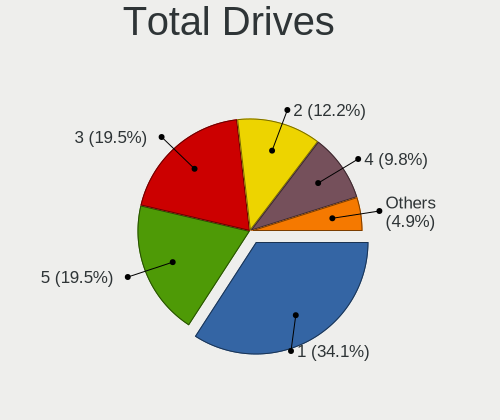
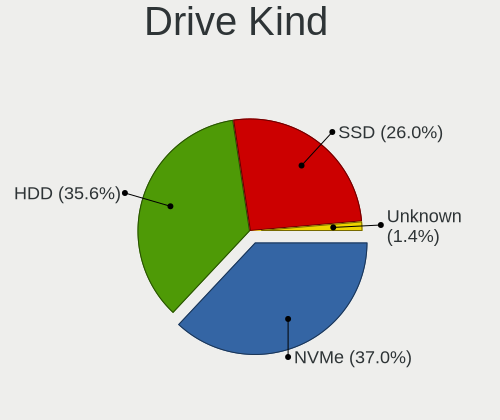
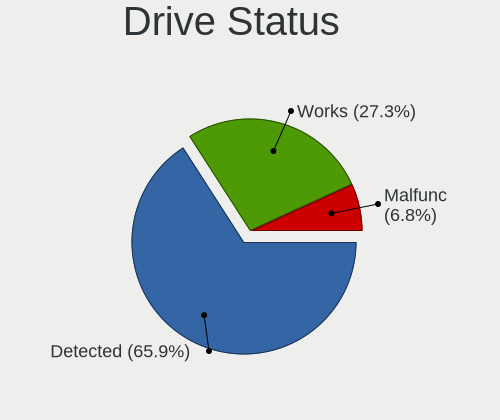
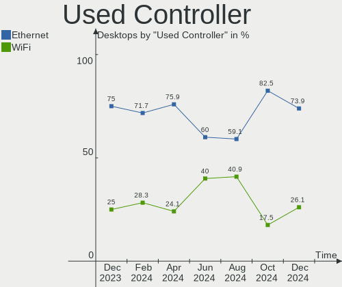
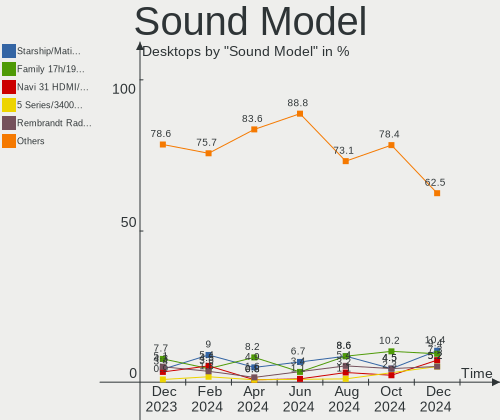

Manjaro - Hardware Trends (Desktops)
------------------------------------

A project to identify most popular hardware characteristics and track their change
over time based on data collected by Linux users at https://Linux-Hardware.org.

Anyone can contribute to this report by the [hw-probe](https://github.com/linuxhw/hw-probe) tool:

    sudo -E hw-probe -all -upload

This report is for one last month. Overall report since the beginning of time: [TestDays](https://github.com/linuxhw/TestDays)

Period: Apr, 2023.

Contents
--------

* [ System ](#system)
  - [ OS                       ](#os)
  - [ OS Family                ](#os-family)
  - [ Kernel                   ](#kernel)
  - [ Kernel Family            ](#kernel-family)
  - [ Kernel Major Ver.        ](#kernel-major-ver)
  - [ Arch                     ](#arch)
  - [ DE                       ](#de)
  - [ Display Server           ](#display-server)
  - [ Display Manager          ](#display-manager)
  - [ OS Lang                  ](#os-lang)
  - [ Boot Mode                ](#boot-mode)
  - [ Filesystem               ](#filesystem)
  - [ Part. scheme             ](#part-scheme)
  - [ Dual Boot with Linux/BSD ](#dual-boot-with-linuxbsd)
  - [ Dual Boot (Win)          ](#dual-boot-win)

* [ Board ](#board)
  - [ Vendor                   ](#vendor)
  - [ Model                    ](#model)
  - [ Model Family             ](#model-family)
  - [ MFG Year                 ](#mfg-year)
  - [ Form Factor              ](#form-factor)
  - [ Secure Boot              ](#secure-boot)
  - [ Coreboot                 ](#coreboot)
  - [ RAM Size                 ](#ram-size)
  - [ RAM Used                 ](#ram-used)
  - [ Total Drives             ](#total-drives)
  - [ Has CD-ROM               ](#has-cd-rom)
  - [ Has Ethernet             ](#has-ethernet)
  - [ Has WiFi                 ](#has-wifi)
  - [ Has Bluetooth            ](#has-bluetooth)

* [ Location ](#location)
  - [ Country                  ](#country)
  - [ City                     ](#city)

* [ Drives ](#drives)
  - [ Drive Vendor             ](#drive-vendor)
  - [ Drive Model              ](#drive-model)
  - [ HDD Vendor               ](#hdd-vendor)
  - [ SSD Vendor               ](#ssd-vendor)
  - [ Drive Kind               ](#drive-kind)
  - [ Drive Connector          ](#drive-connector)
  - [ Drive Size               ](#drive-size)
  - [ Space Total              ](#space-total)
  - [ Space Used               ](#space-used)
  - [ Malfunc. Drives          ](#malfunc-drives)
  - [ Malfunc. Drive Vendor    ](#malfunc-drive-vendor)
  - [ Malfunc. HDD Vendor      ](#malfunc-hdd-vendor)
  - [ Malfunc. Drive Kind      ](#malfunc-drive-kind)
  - [ Failed Drives            ](#failed-drives)
  - [ Failed Drive Vendor      ](#failed-drive-vendor)
  - [ Drive Status             ](#drive-status)

* [ Storage controller ](#storage-controller)
  - [ Storage Vendor           ](#storage-vendor)
  - [ Storage Model            ](#storage-model)
  - [ Storage Kind             ](#storage-kind)

* [ Processor ](#processor)
  - [ CPU Vendor               ](#cpu-vendor)
  - [ CPU Model                ](#cpu-model)
  - [ CPU Model Family         ](#cpu-model-family)
  - [ CPU Cores                ](#cpu-cores)
  - [ CPU Sockets              ](#cpu-sockets)
  - [ CPU Threads              ](#cpu-threads)
  - [ CPU Op-Modes             ](#cpu-op-modes)
  - [ CPU Microcode            ](#cpu-microcode)
  - [ CPU Microarch            ](#cpu-microarch)

* [ Graphics ](#graphics)
  - [ GPU Vendor               ](#gpu-vendor)
  - [ GPU Model                ](#gpu-model)
  - [ GPU Combo                ](#gpu-combo)
  - [ GPU Driver               ](#gpu-driver)
  - [ GPU Memory               ](#gpu-memory)

* [ Monitor ](#monitor)
  - [ Monitor Vendor           ](#monitor-vendor)
  - [ Monitor Model            ](#monitor-model)
  - [ Monitor Resolution       ](#monitor-resolution)
  - [ Monitor Diagonal         ](#monitor-diagonal)
  - [ Monitor Width            ](#monitor-width)
  - [ Aspect Ratio             ](#aspect-ratio)
  - [ Monitor Area             ](#monitor-area)
  - [ Pixel Density            ](#pixel-density)
  - [ Multiple Monitors        ](#multiple-monitors)

* [ Network ](#network)
  - [ Net Controller Vendor    ](#net-controller-vendor)
  - [ Net Controller Model     ](#net-controller-model)
  - [ Wireless Vendor          ](#wireless-vendor)
  - [ Wireless Model           ](#wireless-model)
  - [ Ethernet Vendor          ](#ethernet-vendor)
  - [ Ethernet Model           ](#ethernet-model)
  - [ Net Controller Kind      ](#net-controller-kind)
  - [ Used Controller          ](#used-controller)
  - [ NICs                     ](#nics)
  - [ IPv6                     ](#ipv6)

* [ Bluetooth ](#bluetooth)
  - [ Bluetooth Vendor         ](#bluetooth-vendor)
  - [ Bluetooth Model          ](#bluetooth-model)

* [ Sound ](#sound)
  - [ Sound Vendor             ](#sound-vendor)
  - [ Sound Model              ](#sound-model)

* [ Memory ](#memory)
  - [ Memory Vendor            ](#memory-vendor)
  - [ Memory Model             ](#memory-model)
  - [ Memory Kind              ](#memory-kind)
  - [ Memory Form Factor       ](#memory-form-factor)
  - [ Memory Size              ](#memory-size)
  - [ Memory Speed             ](#memory-speed)

* [ Printers & scanners ](#printers--scanners)
  - [ Printer Vendor           ](#printer-vendor)
  - [ Printer Model            ](#printer-model)
  - [ Scanner Vendor           ](#scanner-vendor)
  - [ Scanner Model            ](#scanner-model)

* [ Camera ](#camera)
  - [ Camera Vendor            ](#camera-vendor)
  - [ Camera Model             ](#camera-model)

* [ Security ](#security)
  - [ Fingerprint Vendor       ](#fingerprint-vendor)
  - [ Fingerprint Model        ](#fingerprint-model)
  - [ Chipcard Vendor          ](#chipcard-vendor)
  - [ Chipcard Model           ](#chipcard-model)

* [ Unsupported ](#unsupported)
  - [ Unsupported Devices      ](#unsupported-devices)
  - [ Unsupported Device Types ](#unsupported-device-types)

System
------

OS
--

Installed operating systems

| Name           | Desktops | Percent |
|----------------|----------|---------|
| Manjaro        | 43       | 65.15%  |
| Manjaro 22.1.0 | 23       | 34.85%  |

OS Family
---------

OS without a version

| Name    | Desktops | Percent |
|---------|----------|---------|
| Manjaro | 66       | 100%    |

Kernel
------

Version of the Linux kernel

| Version                     | Desktops | Percent |
|-----------------------------|----------|---------|
| 6.1.23-1-MANJARO            | 13       | 19.7%   |
| 6.2.12-1-MANJARO            | 7        | 10.61%  |
| 6.2.10-1-MANJARO            | 5        | 7.58%   |
| 6.1.25-1-MANJARO            | 5        | 7.58%   |
| 5.15.106-1-MANJARO          | 5        | 7.58%   |
| 5.15.104-2-MANJARO          | 5        | 7.58%   |
| 6.1.22-1-MANJARO            | 4        | 6.06%   |
| 6.2.8-1-MANJARO             | 3        | 4.55%   |
| 6.1.21-1-MANJARO            | 3        | 4.55%   |
| 6.3.0-1-MANJARO             | 2        | 3.03%   |
| 5.15.108-1-MANJARO          | 2        | 3.03%   |
| 5.15.105-1-MANJARO          | 2        | 3.03%   |
| 6.1.26-1-MANJARO            | 1        | 1.52%   |
| 6.1.20-x64v2-xanmod1-1-lts  | 1        | 1.52%   |
| 6.1.19-1-MANJARO            | 1        | 1.52%   |
| 6.1.14-zen3-xanmod1-MANJARO | 1        | 1.52%   |
| 6.0.6-1-MANJARO             | 1        | 1.52%   |
| 5.9.16-1-MANJARO            | 1        | 1.52%   |
| 5.9.11-3-MANJARO            | 1        | 1.52%   |
| 5.13.19-2-MANJARO           | 1        | 1.52%   |
| 5.10.177-1-MANJARO          | 1        | 1.52%   |
| 5.10.154-1-MANJARO          | 1        | 1.52%   |

Kernel Family
-------------

Linux kernel without a distro release

| Version  | Desktops | Percent |
|----------|----------|---------|
| 6.1.23   | 13       | 19.7%   |
| 6.2.12   | 7        | 10.61%  |
| 6.2.10   | 5        | 7.58%   |
| 6.1.25   | 5        | 7.58%   |
| 5.15.106 | 5        | 7.58%   |
| 5.15.104 | 5        | 7.58%   |
| 6.1.22   | 4        | 6.06%   |
| 6.2.8    | 3        | 4.55%   |
| 6.1.21   | 3        | 4.55%   |
| 6.3.0    | 2        | 3.03%   |
| 5.15.108 | 2        | 3.03%   |
| 5.15.105 | 2        | 3.03%   |
| 6.1.26   | 1        | 1.52%   |
| 6.1.20   | 1        | 1.52%   |
| 6.1.19   | 1        | 1.52%   |
| 6.1.14   | 1        | 1.52%   |
| 6.0.6    | 1        | 1.52%   |
| 5.9.16   | 1        | 1.52%   |
| 5.9.11   | 1        | 1.52%   |
| 5.13.19  | 1        | 1.52%   |
| 5.10.177 | 1        | 1.52%   |
| 5.10.154 | 1        | 1.52%   |

Kernel Major Ver.
-----------------

Linux kernel major version

| Version | Desktops | Percent |
|---------|----------|---------|
| 6.1     | 29       | 43.94%  |
| 6.2     | 15       | 22.73%  |
| 5.15    | 14       | 21.21%  |
| 6.3     | 2        | 3.03%   |
| 5.9     | 2        | 3.03%   |
| 5.10    | 2        | 3.03%   |
| 6.0     | 1        | 1.52%   |
| 5.13    | 1        | 1.52%   |

Arch
----

OS architecture (x86_64, i586, etc.)

| Name   | Desktops | Percent |
|--------|----------|---------|
| x86_64 | 66       | 100%    |

DE
--

Desktop Environment

| Name       | Desktops | Percent |
|------------|----------|---------|
| KDE5       | 36       | 54.55%  |
| GNOME      | 15       | 22.73%  |
| XFCE       | 8        | 12.12%  |
| X-Cinnamon | 2        | 3.03%   |
| sway       | 1        | 1.52%   |
| i3         | 1        | 1.52%   |
| Budgie     | 1        | 1.52%   |
| awesome    | 1        | 1.52%   |
| Unknown    | 1        | 1.52%   |

Display Server
--------------

X11 or Wayland

| Name    | Desktops | Percent |
|---------|----------|---------|
| X11     | 55       | 83.33%  |
| Wayland | 9        | 13.64%  |
| Unknown | 2        | 3.03%   |

Display Manager
---------------

SDDM, LightDM, etc.

| Name    | Desktops | Percent |
|---------|----------|---------|
| Unknown | 43       | 65.15%  |
| LightDM | 9        | 13.64%  |
| SDDM    | 8        | 12.12%  |
| GDM     | 5        | 7.58%   |
| GREETD  | 1        | 1.52%   |

OS Lang
-------

Language

| Lang    | Desktops | Percent |
|---------|----------|---------|
| en_US   | 18       | 27.27%  |
| de_DE   | 10       | 15.15%  |
| pt_BR   | 6        | 9.09%   |
| ru_RU   | 5        | 7.58%   |
| en_GB   | 4        | 6.06%   |
| fr_FR   | 3        | 4.55%   |
| es_ES   | 3        | 4.55%   |
| en_CA   | 3        | 4.55%   |
| it_IT   | 2        | 3.03%   |
| es_MX   | 2        | 3.03%   |
| en_IN   | 2        | 3.03%   |
| en_AU   | 2        | 3.03%   |
| pl_PL   | 1        | 1.52%   |
| fr_CA   | 1        | 1.52%   |
| fi_FI   | 1        | 1.52%   |
| en_IE   | 1        | 1.52%   |
| cs_CZ   | 1        | 1.52%   |
| Unknown | 1        | 1.52%   |

Boot Mode
---------

EFI or BIOS

| Mode | Desktops | Percent |
|------|----------|---------|
| BIOS | 44       | 66.67%  |
| EFI  | 22       | 33.33%  |

Filesystem
----------

Type of filesystem

| Type  | Desktops | Percent |
|-------|----------|---------|
| Ext4  | 41       | 62.12%  |
| Btrfs | 22       | 33.33%  |
| Tmpfs | 3        | 4.55%   |

Part. scheme
------------

Scheme of partitioning

| Type    | Desktops | Percent |
|---------|----------|---------|
| Unknown | 41       | 62.12%  |
| GPT     | 24       | 36.36%  |
| MBR     | 1        | 1.52%   |

Dual Boot with Linux/BSD
------------------------

Hosting more than one Linux/BSD

| Dual boot | Desktops | Percent |
|-----------|----------|---------|
| No        | 59       | 89.39%  |
| Yes       | 7        | 10.61%  |

Dual Boot (Win)
---------------

Hosting Linux and Windows

| Dual boot | Desktops | Percent |
|-----------|----------|---------|
| No        | 55       | 83.33%  |
| Yes       | 11       | 16.67%  |

Board
-----

Vendor
------

Motherboard manufacturer

| Name                | Desktops | Percent |
|---------------------|----------|---------|
| ASUSTek Computer    | 19       | 28.79%  |
| MSI                 | 10       | 15.15%  |
| Gigabyte Technology | 10       | 15.15%  |
| Hewlett-Packard     | 6        | 9.09%   |
| Dell                | 5        | 7.58%   |
| ASRock              | 5        | 7.58%   |
| Shuttle             | 1        | 1.52%   |
| Positivo            | 1        | 1.52%   |
| Pegatron            | 1        | 1.52%   |
| Lenovo              | 1        | 1.52%   |
| Intel               | 1        | 1.52%   |
| HUAWEI              | 1        | 1.52%   |
| Huanan              | 1        | 1.52%   |
| Foxconn             | 1        | 1.52%   |
| Daten Tecnologia    | 1        | 1.52%   |
| Biostar             | 1        | 1.52%   |
| Apple               | 1        | 1.52%   |

Model
-----

Motherboard model

| Name                                | Desktops | Percent |
|-------------------------------------|----------|---------|
| MSI MS-7B86                         | 2        | 3.03%   |
| ASUS PRIME A320M-K                  | 2        | 3.03%   |
| ASUS All Series                     | 2        | 3.03%   |
| Shuttle DL20N                       | 1        | 1.52%   |
| Positivo POS-EIQ87CY                | 1        | 1.52%   |
| Pegatron NY591AA-ABA p6267c         | 1        | 1.52%   |
| MSI PRO H510 DP21 (MS-B0A4)         | 1        | 1.52%   |
| MSI MS-7C37                         | 1        | 1.52%   |
| MSI MS-7B89                         | 1        | 1.52%   |
| MSI MS-7B09                         | 1        | 1.52%   |
| MSI MS-7917                         | 1        | 1.52%   |
| MSI MS-7817                         | 1        | 1.52%   |
| MSI MS-7816                         | 1        | 1.52%   |
| MSI MS-7597                         | 1        | 1.52%   |
| Lenovo ThinkStation P410 30B3003SUS | 1        | 1.52%   |
| Intel H61 V1.1                      | 1        | 1.52%   |
| HUAWEI PUM-WDX9                     | 1        | 1.52%   |
| Huanan X99-F8                       | 1        | 1.52%   |
| HP Z620 Workstation                 | 1        | 1.52%   |
| HP Z240 SFF Workstation             | 1        | 1.52%   |
| HP ProDesk 600 G1 DM                | 1        | 1.52%   |
| HP OMEN by Obelisk Desktop 875-0xxx | 1        | 1.52%   |
| HP EliteDesk 800 G4 DM 65W          | 1        | 1.52%   |
| HP Compaq 8200 Elite SFF PC         | 1        | 1.52%   |
| Gigabyte X570S UD                   | 1        | 1.52%   |
| Gigabyte X399 DESIGNARE EX          | 1        | 1.52%   |
| Gigabyte H61MA-D3V                  | 1        | 1.52%   |
| Gigabyte F2A68HM-S1                 | 1        | 1.52%   |
| Gigabyte B550M AORUS PRO-P          | 1        | 1.52%   |
| Gigabyte B550 GAMING X              | 1        | 1.52%   |
| Gigabyte B550 AORUS PRO V2          | 1        | 1.52%   |
| Gigabyte B450M DS3H                 | 1        | 1.52%   |
| Gigabyte B450 AORUS ELITE           | 1        | 1.52%   |
| Gigabyte A320M-H                    | 1        | 1.52%   |
| Foxconn 400-034                     | 1        | 1.52%   |
| Dell Precision Tower 5810           | 1        | 1.52%   |
| Dell Precision T5610                | 1        | 1.52%   |
| Dell OptiPlex 780                   | 1        | 1.52%   |
| Dell OptiPlex 5070                  | 1        | 1.52%   |
| Dell OptiPlex 3010                  | 1        | 1.52%   |

Model Family
------------

Motherboard model prefix

| Name                      | Desktops | Percent |
|---------------------------|----------|---------|
| ASUS ROG                  | 5        | 7.58%   |
| ASUS PRIME                | 4        | 6.06%   |
| Dell OptiPlex             | 3        | 4.55%   |
| ASUS TUF                  | 3        | 4.55%   |
| MSI MS-7B86               | 2        | 3.03%   |
| Gigabyte B550             | 2        | 3.03%   |
| Dell Precision            | 2        | 3.03%   |
| ASUS All                  | 2        | 3.03%   |
| Shuttle DL20N             | 1        | 1.52%   |
| Positivo POS-EIQ87CY      | 1        | 1.52%   |
| Pegatron NY591AA-ABA      | 1        | 1.52%   |
| MSI PRO                   | 1        | 1.52%   |
| MSI MS-7C37               | 1        | 1.52%   |
| MSI MS-7B89               | 1        | 1.52%   |
| MSI MS-7B09               | 1        | 1.52%   |
| MSI MS-7917               | 1        | 1.52%   |
| MSI MS-7817               | 1        | 1.52%   |
| MSI MS-7816               | 1        | 1.52%   |
| MSI MS-7597               | 1        | 1.52%   |
| Lenovo ThinkStation       | 1        | 1.52%   |
| Intel H61                 | 1        | 1.52%   |
| HUAWEI PUM-WDX9           | 1        | 1.52%   |
| Huanan X99-F8             | 1        | 1.52%   |
| HP Z620                   | 1        | 1.52%   |
| HP Z240                   | 1        | 1.52%   |
| HP ProDesk                | 1        | 1.52%   |
| HP OMEN                   | 1        | 1.52%   |
| HP EliteDesk              | 1        | 1.52%   |
| HP Compaq                 | 1        | 1.52%   |
| Gigabyte X570S            | 1        | 1.52%   |
| Gigabyte X399             | 1        | 1.52%   |
| Gigabyte H61MA-D3V        | 1        | 1.52%   |
| Gigabyte F2A68HM-S1       | 1        | 1.52%   |
| Gigabyte B550M            | 1        | 1.52%   |
| Gigabyte B450M            | 1        | 1.52%   |
| Gigabyte B450             | 1        | 1.52%   |
| Gigabyte A320M-H          | 1        | 1.52%   |
| Foxconn 400-034           | 1        | 1.52%   |
| Daten Tecnologia DH110MXV | 1        | 1.52%   |
| Biostar B450MX-S          | 1        | 1.52%   |

MFG Year
--------

Motherboard manufacture year

| Year | Desktops | Percent |
|------|----------|---------|
| 2020 | 10       | 15.15%  |
| 2018 | 9        | 13.64%  |
| 2019 | 6        | 9.09%   |
| 2014 | 6        | 9.09%   |
| 2016 | 5        | 7.58%   |
| 2015 | 5        | 7.58%   |
| 2012 | 4        | 6.06%   |
| 2022 | 3        | 4.55%   |
| 2021 | 3        | 4.55%   |
| 2017 | 3        | 4.55%   |
| 2013 | 3        | 4.55%   |
| 2023 | 2        | 3.03%   |
| 2011 | 2        | 3.03%   |
| 2010 | 2        | 3.03%   |
| 2009 | 2        | 3.03%   |
| 2007 | 1        | 1.52%   |

Form Factor
-----------

Physical design of the computer

| Name    | Desktops | Percent |
|---------|----------|---------|
| Desktop | 66       | 100%    |

Secure Boot
-----------

Enabled or disabled

| State    | Desktops | Percent |
|----------|----------|---------|
| Disabled | 66       | 100%    |

Coreboot
--------

Have coreboot on board

| Used | Desktops | Percent |
|------|----------|---------|
| No   | 66       | 100%    |

RAM Size
--------

Total RAM memory

| Size in GB  | Desktops | Percent |
|-------------|----------|---------|
| 32.01-64.0  | 20       | 30.3%   |
| 16.01-24.0  | 16       | 24.24%  |
| 4.01-8.0    | 10       | 15.15%  |
| 8.01-16.0   | 9        | 13.64%  |
| 64.01-256.0 | 8        | 12.12%  |
| 3.01-4.0    | 2        | 3.03%   |
| 2.01-3.0    | 1        | 1.52%   |

RAM Used
--------

Used RAM memory

| Used GB    | Desktops | Percent |
|------------|----------|---------|
| 4.01-8.0   | 20       | 30.3%   |
| 3.01-4.0   | 14       | 21.21%  |
| 2.01-3.0   | 14       | 21.21%  |
| 1.01-2.0   | 8        | 12.12%  |
| 8.01-16.0  | 6        | 9.09%   |
| 16.01-24.0 | 3        | 4.55%   |
| 0.51-1.0   | 1        | 1.52%   |

Total Drives
------------

Number of drives on board

| Drives | Desktops | Percent |
|--------|----------|---------|
| 2      | 26       | 39.39%  |
| 1      | 17       | 25.76%  |
| 3      | 13       | 19.7%   |
| 4      | 6        | 9.09%   |
| 5      | 2        | 3.03%   |
| 10     | 1        | 1.52%   |
| 6      | 1        | 1.52%   |

Has CD-ROM
----------

Has CD-ROM on board

| Presented | Desktops | Percent |
|-----------|----------|---------|
| No        | 48       | 72.73%  |
| Yes       | 18       | 27.27%  |

Has Ethernet
------------

Has Ethernet on board

| Presented | Desktops | Percent |
|-----------|----------|---------|
| Yes       | 66       | 100%    |

Has WiFi
--------

Has WiFi module

| Presented | Desktops | Percent |
|-----------|----------|---------|
| Yes       | 36       | 54.55%  |
| No        | 30       | 45.45%  |

Has Bluetooth
-------------

Has Bluetooth module

| Presented | Desktops | Percent |
|-----------|----------|---------|
| Yes       | 36       | 54.55%  |
| No        | 30       | 45.45%  |

Location
--------

Country
-------

Geographic location (country)

| Country         | Desktops | Percent |
|-----------------|----------|---------|
| USA             | 13       | 19.7%   |
| Germany         | 11       | 16.67%  |
| Brazil          | 6        | 9.09%   |
| Canada          | 4        | 6.06%   |
| UK              | 3        | 4.55%   |
| Spain           | 3        | 4.55%   |
| Russia          | 3        | 4.55%   |
| France          | 3        | 4.55%   |
| Poland          | 2        | 3.03%   |
| Italy           | 2        | 3.03%   |
| India           | 2        | 3.03%   |
| Australia       | 2        | 3.03%   |
| Serbia          | 1        | 1.52%   |
| Panama          | 1        | 1.52%   |
| North Macedonia | 1        | 1.52%   |
| Netherlands     | 1        | 1.52%   |
| Kazakhstan      | 1        | 1.52%   |
| Israel          | 1        | 1.52%   |
| Ireland         | 1        | 1.52%   |
| Indonesia       | 1        | 1.52%   |
| Greece          | 1        | 1.52%   |
| Finland         | 1        | 1.52%   |
| Czechia         | 1        | 1.52%   |
| Argentina       | 1        | 1.52%   |

City
----

Geographic location (city)

| City                   | Desktops | Percent |
|------------------------|----------|---------|
| Mississauga            | 2        | 3.03%   |
| London                 | 2        | 3.03%   |
| Juazeiro do Norte      | 2        | 3.03%   |
| Bellheim               | 2        | 3.03%   |
| Westville              | 1        | 1.52%   |
| Warsaw                 | 1        | 1.52%   |
| Trois-Rivières        | 1        | 1.52%   |
| Thessaloniki           | 1        | 1.52%   |
| Tempe                  | 1        | 1.52%   |
| Tampere                | 1        | 1.52%   |
| Sremska Mitrovica      | 1        | 1.52%   |
| Sprockhoevel           | 1        | 1.52%   |
| Skopje                 | 1        | 1.52%   |
| Sedavi                 | 1        | 1.52%   |
| Schwenningen am Neckar | 1        | 1.52%   |
| Schwarzenberg          | 1        | 1.52%   |
| Sao Vicente            | 1        | 1.52%   |
| San Miguel de Tucumán | 1        | 1.52%   |
| Salvador               | 1        | 1.52%   |
| Rome                   | 1        | 1.52%   |
| Redding                | 1        | 1.52%   |
| Panama City            | 1        | 1.52%   |
| Palencia               | 1        | 1.52%   |
| Orlando                | 1        | 1.52%   |
| Nizhniy Novgorod       | 1        | 1.52%   |
| Moscow                 | 1        | 1.52%   |
| Montreal               | 1        | 1.52%   |
| Melbourne              | 1        | 1.52%   |
| Marseille              | 1        | 1.52%   |
| Mafra                  | 1        | 1.52%   |
| Liberec                | 1        | 1.52%   |
| Lewiston               | 1        | 1.52%   |
| Lengede                | 1        | 1.52%   |
| Lehi                   | 1        | 1.52%   |
| Langenfeld             | 1        | 1.52%   |
| Lancaster              | 1        | 1.52%   |
| Lake Isabella          | 1        | 1.52%   |
| Kostrzyn               | 1        | 1.52%   |
| Kolkata                | 1        | 1.52%   |
| Kharino                | 1        | 1.52%   |

Drives
------

Drive Vendor
------------

Hard drive vendors

| Vendor                       | Desktops | Drives | Percent |
|------------------------------|----------|--------|---------|
| Seagate                      | 22       | 31     | 18.64%  |
| Samsung Electronics          | 22       | 30     | 18.64%  |
| WDC                          | 16       | 30     | 13.56%  |
| Sandisk                      | 7        | 10     | 5.93%   |
| Phison Electronics           | 7        | 7      | 5.93%   |
| Kingston                     | 5        | 6      | 4.24%   |
| Toshiba                      | 4        | 5      | 3.39%   |
| Intel                        | 4        | 4      | 3.39%   |
| Micron/Crucial Technology    | 3        | 3      | 2.54%   |
| China                        | 3        | 4      | 2.54%   |
| Transcend                    | 2        | 2      | 1.69%   |
| Silicon Motion               | 2        | 3      | 1.69%   |
| Patriot                      | 2        | 2      | 1.69%   |
| Crucial                      | 2        | 2      | 1.69%   |
| A-DATA Technology            | 2        | 2      | 1.69%   |
| Yangtze Memory Technologies  | 1        | 1      | 0.85%   |
| Shenzhen Longsys Electronics | 1        | 1      | 0.85%   |
| Realtek Semiconductor        | 1        | 1      | 0.85%   |
| Plextor                      | 1        | 1      | 0.85%   |
| Phison                       | 1        | 1      | 0.85%   |
| MicroFrom                    | 1        | 1      | 0.85%   |
| MAXIO Technology (Hangzhou)  | 1        | 1      | 0.85%   |
| LITEONIT                     | 1        | 1      | 0.85%   |
| Lite-On Technology           | 1        | 1      | 0.85%   |
| KingFast                     | 1        | 1      | 0.85%   |
| JMicron Technology           | 1        | 1      | 0.85%   |
| HS-SSD-E100                  | 1        | 1      | 0.85%   |
| HGST                         | 1        | 1      | 0.85%   |
| Gigabyte Technology          | 1        | 1      | 0.85%   |
| ADATA Technology             | 1        | 1      | 0.85%   |

Drive Model
-----------

Hard drive models

| Model                                                  | Desktops | Percent |
|--------------------------------------------------------|----------|---------|
| Phison E12 NVMe Controller 512GB                       | 6        | 4.2%    |
| Samsung NVMe SSD Controller SM981/PM981/PM983 1TB      | 5        | 3.5%    |
| Samsung SSD 860 EVO 500GB                              | 4        | 2.8%    |
| Samsung SSD 980 1TB                                    | 3        | 2.1%    |
| Micron/Crucial P2 NVMe PCIe SSD 1TB                    | 3        | 2.1%    |
| WDC WD5000BPKX-00HPJT0 500GB                           | 2        | 1.4%    |
| WDC WD3200LPVX-22V0TT0 320GB                           | 2        | 1.4%    |
| WDC WD3200BPVT-22JJ5T0 320GB                           | 2        | 1.4%    |
| Transcend TS256GSSD370BM 256GB                         | 2        | 1.4%    |
| Toshiba DT01ACA100 1TB                                 | 2        | 1.4%    |
| Silicon Motion SM2263EN/SM2263XT SSD Controller 1024GB | 2        | 1.4%    |
| Seagate ST500DM002-1BD142 500GB                        | 2        | 1.4%    |
| Seagate ST1000DM010-2EP102 1TB                         | 2        | 1.4%    |
| Seagate ST1000DM003-1SB10C 1TB                         | 2        | 1.4%    |
| Seagate ST1000DM003-1ER162 1TB                         | 2        | 1.4%    |
| Samsung SSD 840 EVO 120GB                              | 2        | 1.4%    |
| Samsung NVMe SSD Controller SM961/PM961/SM963 500GB    | 2        | 1.4%    |
| Kingston SA400S37240G 240GB SSD                        | 2        | 1.4%    |
| Intel SSD Pro 7600p/760p/E 6100p Series 128GB          | 2        | 1.4%    |
| Yangtze Memory YMTC PC005 256GB                        | 1        | 0.7%    |
| WDC WDS240G2G0B-00EPW0 240GB SSD                       | 1        | 0.7%    |
| WDC WDBNCE5000PNC 500GB SSD                            | 1        | 0.7%    |
| WDC WD80EFZX-68UW8N0 8TB                               | 1        | 0.7%    |
| WDC WD6401AALS-00L3B2 640GB                            | 1        | 0.7%    |
| WDC WD60EFRX-68L0BN1 6TB                               | 1        | 0.7%    |
| WDC WD4003FZEX-00Z4SA0 4TB                             | 1        | 0.7%    |
| WDC WD4000FYYZ-01UL1B2 4TB                             | 1        | 0.7%    |
| WDC WD3200AAKS-75L9A0 320GB                            | 1        | 0.7%    |
| WDC WD20EZAZ-00L9GB0 2TB                               | 1        | 0.7%    |
| WDC WD1600AAJS-75M0A0 160GB                            | 1        | 0.7%    |
| WDC WD1600AAJS-00YZCA0 160GB                           | 1        | 0.7%    |
| WDC WD121KFBX-68EF5N0 12TB                             | 1        | 0.7%    |
| WDC WD1200JD-00HBB0 120GB                              | 1        | 0.7%    |
| WDC WD10PURZ-85U8XY0 1TB                               | 1        | 0.7%    |
| WDC WD10EZRX-22A3KB0 1TB                               | 1        | 0.7%    |
| WDC WD10EZEX-08WN4A0 1TB                               | 1        | 0.7%    |
| WDC WD10EZEX-00KUWA0 1TB                               | 1        | 0.7%    |
| WDC WD10EZEX-00BN5A0 1TB                               | 1        | 0.7%    |
| WDC WD10EFRX-68PJCN0 1TB                               | 1        | 0.7%    |
| Toshiba PX04SMB040 400GB                               | 1        | 0.7%    |

HDD Vendor
----------

Hard disk drive vendors

| Vendor              | Desktops | Drives | Percent |
|---------------------|----------|--------|---------|
| Seagate             | 21       | 30     | 48.84%  |
| WDC                 | 15       | 28     | 34.88%  |
| Toshiba             | 3        | 3      | 6.98%   |
| Samsung Electronics | 2        | 2      | 4.65%   |
| JMicron Technology  | 1        | 1      | 2.33%   |
| HGST                | 1        | 1      | 2.33%   |

SSD Vendor
----------

Solid state drive vendors

| Vendor              | Desktops | Drives | Percent |
|---------------------|----------|--------|---------|
| Samsung Electronics | 11       | 16     | 28.21%  |
| Kingston            | 5        | 6      | 12.82%  |
| SanDisk             | 3        | 3      | 7.69%   |
| China               | 3        | 4      | 7.69%   |
| WDC                 | 2        | 2      | 5.13%   |
| Transcend           | 2        | 2      | 5.13%   |
| Patriot             | 2        | 2      | 5.13%   |
| Crucial             | 2        | 2      | 5.13%   |
| A-DATA Technology   | 2        | 2      | 5.13%   |
| Toshiba             | 1        | 2      | 2.56%   |
| Plextor             | 1        | 1      | 2.56%   |
| MicroFrom           | 1        | 1      | 2.56%   |
| LITEONIT            | 1        | 1      | 2.56%   |
| KingFast            | 1        | 1      | 2.56%   |
| Intel               | 1        | 1      | 2.56%   |
| Gigabyte Technology | 1        | 1      | 2.56%   |

Drive Kind
----------

HDD or SSD

| Kind    | Desktops | Drives | Percent |
|---------|----------|--------|---------|
| SSD     | 35       | 47     | 33.33%  |
| HDD     | 35       | 65     | 33.33%  |
| NVMe    | 33       | 42     | 31.43%  |
| Unknown | 2        | 2      | 1.9%    |

Drive Connector
---------------

SATA, SAS, NVMe, etc.

| Type | Desktops | Drives | Percent |
|------|----------|--------|---------|
| SATA | 55       | 111    | 60.44%  |
| NVMe | 33       | 42     | 36.26%  |
| SAS  | 3        | 3      | 3.3%    |

Drive Size
----------

Size of hard drive

| Size in TB | Desktops | Drives | Percent |
|------------|----------|--------|---------|
| 0.01-0.5   | 35       | 59     | 47.3%   |
| 0.51-1.0   | 25       | 31     | 33.78%  |
| 3.01-4.0   | 6        | 7      | 8.11%   |
| 1.01-2.0   | 6        | 7      | 8.11%   |
| 10.01-20.0 | 1        | 1      | 1.35%   |
| 4.01-10.0  | 1        | 7      | 1.35%   |

Space Total
-----------

Amount of disk space available on the file system

| Size in GB     | Desktops | Percent |
|----------------|----------|---------|
| 501-1000       | 15       | 22.73%  |
| 101-250        | 11       | 16.67%  |
| 1001-2000      | 11       | 16.67%  |
| More than 3000 | 10       | 15.15%  |
| 251-500        | 10       | 15.15%  |
| 2001-3000      | 5        | 7.58%   |
| 51-100         | 2        | 3.03%   |
| 21-50          | 1        | 1.52%   |
| Unknown        | 1        | 1.52%   |

Space Used
----------

Amount of used disk space

| Used GB        | Desktops | Percent |
|----------------|----------|---------|
| 251-500        | 12       | 18.18%  |
| 101-250        | 12       | 18.18%  |
| 21-50          | 11       | 16.67%  |
| 501-1000       | 9        | 13.64%  |
| 1001-2000      | 7        | 10.61%  |
| 51-100         | 7        | 10.61%  |
| More than 3000 | 3        | 4.55%   |
| 1-20           | 3        | 4.55%   |
| 2001-3000      | 1        | 1.52%   |
| Unknown        | 1        | 1.52%   |

Malfunc. Drives
---------------

Drive models with a malfunction

| Model                               | Desktops | Drives | Percent |
|-------------------------------------|----------|--------|---------|
| Seagate ST4000NM0033-9ZM170 4TB     | 1        | 1      | 33.33%  |
| Seagate ST2000DM006-2DM164 2TB      | 1        | 1      | 33.33%  |
| Samsung Electronics SSD 870 EVO 1TB | 1        | 1      | 33.33%  |

Malfunc. Drive Vendor
---------------------

Vendors of faulty drives

| Vendor              | Desktops | Drives | Percent |
|---------------------|----------|--------|---------|
| Seagate             | 2        | 2      | 66.67%  |
| Samsung Electronics | 1        | 1      | 33.33%  |

Malfunc. HDD Vendor
-------------------

Vendors of faulty HDD drives

| Vendor  | Desktops | Drives | Percent |
|---------|----------|--------|---------|
| Seagate | 2        | 2      | 100%    |

Malfunc. Drive Kind
-------------------

Kinds of faulty drives

| Kind | Desktops | Drives | Percent |
|------|----------|--------|---------|
| HDD  | 2        | 2      | 66.67%  |
| SSD  | 1        | 1      | 33.33%  |

Failed Drives
-------------

Failed drive models

Zero info for selected period =(

Failed Drive Vendor
-------------------

Failed drive vendors

Zero info for selected period =(

Drive Status
------------

Number of failed and malfunc. drives

| Status   | Desktops | Drives | Percent |
|----------|----------|--------|---------|
| Detected | 53       | 128    | 76.81%  |
| Works    | 13       | 25     | 18.84%  |
| Malfunc  | 3        | 3      | 4.35%   |

Storage controller
------------------

Storage Vendor
--------------

Storage controller vendors

| Vendor                       | Desktops | Percent |
|------------------------------|----------|---------|
| Intel                        | 37       | 33.64%  |
| AMD                          | 29       | 26.36%  |
| Samsung Electronics          | 11       | 10%     |
| Phison Electronics           | 8        | 7.27%   |
| SanDisk                      | 5        | 4.55%   |
| Micron/Crucial Technology    | 3        | 2.73%   |
| Silicon Motion               | 2        | 1.82%   |
| JMicron Technology           | 2        | 1.82%   |
| Broadcom / LSI               | 2        | 1.82%   |
| ASMedia Technology           | 2        | 1.82%   |
| Yangtze Memory Technologies  | 1        | 0.91%   |
| Shenzhen Longsys Electronics | 1        | 0.91%   |
| Realtek Semiconductor        | 1        | 0.91%   |
| Nvidia                       | 1        | 0.91%   |
| MAXIO Technology (Hangzhou)  | 1        | 0.91%   |
| Marvell Technology Group     | 1        | 0.91%   |
| LSI Logic / Symbios Logic    | 1        | 0.91%   |
| Lite-On Technology           | 1        | 0.91%   |
| ADATA Technology             | 1        | 0.91%   |

Storage Model
-------------

Storage controller models

| Model                                                                          | Desktops | Percent |
|--------------------------------------------------------------------------------|----------|---------|
| AMD FCH SATA Controller [AHCI mode]                                            | 13       | 9.35%   |
| AMD 500 Series Chipset SATA Controller                                         | 8        | 5.76%   |
| AMD 400 Series Chipset SATA Controller                                         | 8        | 5.76%   |
| Phison E12 NVMe Controller                                                     | 6        | 4.32%   |
| Samsung NVMe SSD Controller SM981/PM981/PM983                                  | 5        | 3.6%    |
| Samsung NVMe SSD Controller 980                                                | 4        | 2.88%   |
| Intel SATA Controller [RAID mode]                                              | 4        | 2.88%   |
| Intel 8 Series/C220 Series Chipset Family 6-port SATA Controller 1 [AHCI mode] | 4        | 2.88%   |
| Intel 6 Series/C200 Series Chipset Family 6 port Desktop SATA AHCI Controller  | 4        | 2.88%   |
| Micron/Crucial P2 NVMe PCIe SSD                                                | 3        | 2.16%   |
| Intel Q170/Q150/B150/H170/H110/Z170/CM236 Chipset SATA Controller [AHCI Mode]  | 3        | 2.16%   |
| Intel C610/X99 series chipset sSATA Controller [AHCI mode]                     | 3        | 2.16%   |
| Intel C610/X99 series chipset 6-Port SATA Controller [AHCI mode]               | 3        | 2.16%   |
| AMD SB7x0/SB8x0/SB9x0 IDE Controller                                           | 3        | 2.16%   |
| AMD FCH SATA Controller D                                                      | 3        | 2.16%   |
| Silicon Motion SM2263EN/SM2263XT SSD Controller                                | 2        | 1.44%   |
| SanDisk Non-Volatile memory controller                                         | 2        | 1.44%   |
| Samsung NVMe SSD Controller SM961/PM961/SM963                                  | 2        | 1.44%   |
| Intel SSD Pro 7600p/760p/E 6100p Series                                        | 2        | 1.44%   |
| Intel Comet Lake PCH-H RAID                                                    | 2        | 1.44%   |
| Intel Cannon Lake PCH SATA AHCI Controller                                     | 2        | 1.44%   |
| Intel C610/X99 series chipset IDE-r Controller                                 | 2        | 1.44%   |
| Intel C600/X79 series chipset SATA RAID Controller                             | 2        | 1.44%   |
| Intel C600/X79 series chipset IDE-r Controller                                 | 2        | 1.44%   |
| Intel 700 Series Chipset Family SATA AHCI Controller                           | 2        | 1.44%   |
| ASMedia ASM1062 Serial ATA Controller                                          | 2        | 1.44%   |
| AMD X399 Series Chipset SATA Controller                                        | 2        | 1.44%   |
| AMD SB7x0/SB8x0/SB9x0 SATA Controller [IDE mode]                               | 2        | 1.44%   |
| AMD FCH SATA Controller [IDE mode]                                             | 2        | 1.44%   |
| Yangtze Memory Non-Volatile memory controller                                  | 1        | 0.72%   |
| Shenzhen Longsys Non-Volatile memory controller                                | 1        | 0.72%   |
| Sandisk Western Digital WD Black SN850X NVMe SSD                               | 1        | 0.72%   |
| SanDisk WD PC SN810 / Black SN850 NVMe SSD                                     | 1        | 0.72%   |
| SanDisk WD Blue SN550 NVMe SSD                                                 | 1        | 0.72%   |
| SanDisk WD Black SN750 / PC SN730 NVMe SSD                                     | 1        | 0.72%   |
| Samsung NVMe SSD Controller PM9A1/PM9A3/980PRO                                 | 1        | 0.72%   |
| Realtek NVMe Controller                                                        | 1        | 0.72%   |
| Phison E18 PCIe4 NVMe Controller                                               | 1        | 0.72%   |
| Phison E16 PCIe4 NVMe Controller                                               | 1        | 0.72%   |
| Nvidia MCP61 SATA Controller                                                   | 1        | 0.72%   |

Storage Kind
------------

Kind of storage controller (IDE, SATA, NVMe, SAS, ...)

| Kind | Desktops | Percent |
|------|----------|---------|
| SATA | 57       | 49.57%  |
| NVMe | 33       | 28.7%   |
| RAID | 12       | 10.43%  |
| IDE  | 10       | 8.7%    |
| SAS  | 3        | 2.61%   |

Processor
---------

CPU Vendor
----------

Processor vendors

| Vendor | Desktops | Percent |
|--------|----------|---------|
| Intel  | 36       | 54.55%  |
| AMD    | 30       | 45.45%  |

CPU Model
---------

Processor models

| Model                                      | Desktops | Percent |
|--------------------------------------------|----------|---------|
| Intel Xeon CPU E5-2678 v3 @ 2.50GHz        | 2        | 3.03%   |
| AMD Ryzen 9 5900X 12-Core Processor        | 2        | 3.03%   |
| AMD Ryzen 7 5800X 8-Core Processor         | 2        | 3.03%   |
| AMD Ryzen 5 5600X 6-Core Processor         | 2        | 3.03%   |
| AMD Ryzen 5 4600G with Radeon Graphics     | 2        | 3.03%   |
| AMD Ryzen 5 3600 6-Core Processor          | 2        | 3.03%   |
| AMD Ryzen 5 1600 Six-Core Processor        | 2        | 3.03%   |
| AMD Athlon 200GE with Radeon Vega Graphics | 2        | 3.03%   |
| Intel Xeon CPU X5675 @ 3.07GHz             | 1        | 1.52%   |
| Intel Xeon CPU E5-2680 v2 @ 2.80GHz        | 1        | 1.52%   |
| Intel Xeon CPU E5-2670 0 @ 2.60GHz         | 1        | 1.52%   |
| Intel Xeon CPU E5-1630 v4 @ 3.70GHz        | 1        | 1.52%   |
| Intel Pentium Silver N6005 @ 2.00GHz       | 1        | 1.52%   |
| Intel Pentium CPU G2020 @ 2.90GHz          | 1        | 1.52%   |
| Intel Core i7-8700K CPU @ 3.70GHz          | 1        | 1.52%   |
| Intel Core i7-6900K CPU @ 3.20GHz          | 1        | 1.52%   |
| Intel Core i7-6700 CPU @ 3.40GHz           | 1        | 1.52%   |
| Intel Core i7-5820K CPU @ 3.30GHz          | 1        | 1.52%   |
| Intel Core i7-10700K CPU @ 3.80GHz         | 1        | 1.52%   |
| Intel Core i5-8500 CPU @ 3.00GHz           | 1        | 1.52%   |
| Intel Core i5-8400 CPU @ 2.80GHz           | 1        | 1.52%   |
| Intel Core i5-6500 CPU @ 3.20GHz           | 1        | 1.52%   |
| Intel Core i5-6400 CPU @ 2.70GHz           | 1        | 1.52%   |
| Intel Core i5-5200U CPU @ 2.20GHz          | 1        | 1.52%   |
| Intel Core i5-4690K CPU @ 3.50GHz          | 1        | 1.52%   |
| Intel Core i5-4590 CPU @ 3.30GHz           | 1        | 1.52%   |
| Intel Core i5-4460 CPU @ 3.20GHz           | 1        | 1.52%   |
| Intel Core i5-3570K CPU @ 3.40GHz          | 1        | 1.52%   |
| Intel Core i5-3470S CPU @ 2.90GHz          | 1        | 1.52%   |
| Intel Core i5-2400 CPU @ 3.10GHz           | 1        | 1.52%   |
| Intel Core i5-10400F CPU @ 2.90GHz         | 1        | 1.52%   |
| Intel Core i3-9100T CPU @ 3.10GHz          | 1        | 1.52%   |
| Intel Core i3-6100 CPU @ 3.70GHz           | 1        | 1.52%   |
| Intel Core i3-4170 CPU @ 3.70GHz           | 1        | 1.52%   |
| Intel Core i3-4130 CPU @ 3.40GHz           | 1        | 1.52%   |
| Intel Core i3-3240 CPU @ 3.40GHz           | 1        | 1.52%   |
| Intel Core 2 Quad CPU Q8300 @ 2.50GHz      | 1        | 1.52%   |
| Intel Core 2 Duo CPU E7500 @ 2.93GHz       | 1        | 1.52%   |
| Intel 13th Gen Core i9-13900K              | 1        | 1.52%   |
| Intel 13th Gen Core i7-13700               | 1        | 1.52%   |

CPU Model Family
----------------

Processor model prefix

| Model                  | Desktops | Percent |
|------------------------|----------|---------|
| Intel Core i5          | 12       | 18.18%  |
| AMD Ryzen 5            | 11       | 16.67%  |
| Intel Xeon             | 6        | 9.09%   |
| Intel Core i7          | 5        | 7.58%   |
| Intel Core i3          | 5        | 7.58%   |
| AMD Ryzen 7            | 5        | 7.58%   |
| Other                  | 4        | 6.06%   |
| AMD Ryzen 9            | 3        | 4.55%   |
| AMD Ryzen Threadripper | 2        | 3.03%   |
| AMD FX                 | 2        | 3.03%   |
| AMD Athlon             | 2        | 3.03%   |
| Intel Pentium Silver   | 1        | 1.52%   |
| Intel Pentium          | 1        | 1.52%   |
| Intel Core 2 Quad      | 1        | 1.52%   |
| Intel Core 2 Duo       | 1        | 1.52%   |
| AMD Sempron            | 1        | 1.52%   |
| AMD Ryzen 3            | 1        | 1.52%   |
| AMD Athlon X4          | 1        | 1.52%   |
| AMD Athlon II X2       | 1        | 1.52%   |
| AMD A4                 | 1        | 1.52%   |

CPU Cores
---------

Number of processor cores

| Number | Desktops | Percent |
|--------|----------|---------|
| 6      | 16       | 24.24%  |
| 4      | 14       | 21.21%  |
| 2      | 12       | 18.18%  |
| 8      | 8        | 12.12%  |
| 12     | 6        | 9.09%   |
| 16     | 4        | 6.06%   |
| 24     | 2        | 3.03%   |
| 1      | 2        | 3.03%   |
| 20     | 1        | 1.52%   |
| 3      | 1        | 1.52%   |

CPU Sockets
-----------

Number of sockets

| Number | Desktops | Percent |
|--------|----------|---------|
| 1      | 63       | 95.45%  |
| 2      | 3        | 4.55%   |

CPU Threads
-----------

Threads per core (Hyper-Threading)

| Number | Desktops | Percent |
|--------|----------|---------|
| 2      | 48       | 72.73%  |
| 1      | 18       | 27.27%  |

CPU Op-Modes
------------

CPU Operation Modes (32-bit, 64-bit)

| Op mode        | Desktops | Percent |
|----------------|----------|---------|
| 32-bit, 64-bit | 66       | 100%    |

CPU Microcode
-------------

Microcode number

| Number     | Desktops | Percent |
|------------|----------|---------|
| Unknown    | 45       | 68.18%  |
| 0x08701021 | 3        | 4.55%   |
| 0x0a201016 | 2        | 3.03%   |
| 0x08101016 | 2        | 3.03%   |
| 0xb0671    | 1        | 1.52%   |
| 0x906ea    | 1        | 1.52%   |
| 0x306f2    | 1        | 1.52%   |
| 0x306d4    | 1        | 1.52%   |
| 0x306c3    | 1        | 1.52%   |
| 0x306a9    | 1        | 1.52%   |
| 0x206a7    | 1        | 1.52%   |
| 0x1067a    | 1        | 1.52%   |
| 0x0a20120a | 1        | 1.52%   |
| 0x0a201205 | 1        | 1.52%   |
| 0x08600106 | 1        | 1.52%   |
| 0x0800820d | 1        | 1.52%   |
| 0x06001119 | 1        | 1.52%   |
| 0x010000c8 | 1        | 1.52%   |

CPU Microarch
-------------

Microarchitecture

| Name             | Desktops | Percent |
|------------------|----------|---------|
| Zen 3            | 8        | 12.12%  |
| Haswell          | 8        | 12.12%  |
| Zen 2            | 7        | 10.61%  |
| Zen              | 5        | 7.58%   |
| IvyBridge        | 5        | 7.58%   |
| Zen+             | 4        | 6.06%   |
| Skylake          | 4        | 6.06%   |
| KabyLake         | 4        | 6.06%   |
| Unknown          | 4        | 6.06%   |
| Broadwell        | 3        | 4.55%   |
| SandyBridge      | 2        | 3.03%   |
| Piledriver       | 2        | 3.03%   |
| Penryn           | 2        | 3.03%   |
| K10              | 2        | 3.03%   |
| CometLake        | 2        | 3.03%   |
| Westmere         | 1        | 1.52%   |
| Steamroller      | 1        | 1.52%   |
| Bulldozer        | 1        | 1.52%   |
| Alderlake Hybrid | 1        | 1.52%   |

Graphics
--------

GPU Vendor
----------

Vendors of graphics cards

| Vendor | Desktops | Percent |
|--------|----------|---------|
| Nvidia | 28       | 39.44%  |
| AMD    | 25       | 35.21%  |
| Intel  | 18       | 25.35%  |

GPU Model
---------

Graphics card models

| Model                                                                       | Desktops | Percent |
|-----------------------------------------------------------------------------|----------|---------|
| AMD Ellesmere [Radeon RX 470/480/570/570X/580/580X/590]                     | 5        | 6.94%   |
| Nvidia GP107 [GeForce GTX 1050 Ti]                                          | 3        | 4.17%   |
| Intel Xeon E3-1200 v2/3rd Gen Core processor Graphics Controller            | 3        | 4.17%   |
| Intel CoffeeLake-S GT2 [UHD Graphics 630]                                   | 3        | 4.17%   |
| AMD Lexa PRO [Radeon 540/540X/550/550X / RX 540X/550/550X]                  | 3        | 4.17%   |
| Nvidia GP102 [GeForce GTX 1080 Ti]                                          | 2        | 2.78%   |
| Nvidia GA104 [GeForce RTX 3060]                                             | 2        | 2.78%   |
| Intel Xeon E3-1200 v3/4th Gen Core Processor Integrated Graphics Controller | 2        | 2.78%   |
| Intel HD Graphics 530                                                       | 2        | 2.78%   |
| Intel 4th Generation Core Processor Family Integrated Graphics Controller   | 2        | 2.78%   |
| AMD Renoir                                                                  | 2        | 2.78%   |
| AMD Navi 23 [Radeon RX 6650 XT / 6700S / 6800S]                             | 2        | 2.78%   |
| AMD Navi 10 [Radeon RX 5600 OEM/5600 XT / 5700/5700 XT]                     | 2        | 2.78%   |
| AMD Baffin [Radeon RX 460/560D / Pro 450/455/460/555/555X/560/560X]         | 2        | 2.78%   |
| Nvidia TU116 [GeForce GTX 1660]                                             | 1        | 1.39%   |
| Nvidia TU116 [GeForce GTX 1650 SUPER]                                       | 1        | 1.39%   |
| Nvidia TU106 [GeForce RTX 2070]                                             | 1        | 1.39%   |
| Nvidia TU106 [GeForce RTX 2070 Rev. A]                                      | 1        | 1.39%   |
| Nvidia TU102 [GeForce RTX 2080 Ti Rev. A]                                   | 1        | 1.39%   |
| Nvidia GP106 [GeForce GTX 1060 3GB]                                         | 1        | 1.39%   |
| Nvidia GP104 [GeForce GTX 1080]                                             | 1        | 1.39%   |
| Nvidia GM206GL [Quadro M2000]                                               | 1        | 1.39%   |
| Nvidia GM204 [GeForce GTX 970]                                              | 1        | 1.39%   |
| Nvidia GM107M [GeForce GTX 960M]                                            | 1        | 1.39%   |
| Nvidia GM107 [GeForce GTX 750 Ti]                                           | 1        | 1.39%   |
| Nvidia GK208B [GeForce GT 730]                                              | 1        | 1.39%   |
| Nvidia GK208B [GeForce GT 710]                                              | 1        | 1.39%   |
| Nvidia GK104 [GeForce GTX 670]                                              | 1        | 1.39%   |
| Nvidia GF108GL [Quadro 600]                                                 | 1        | 1.39%   |
| Nvidia GA106 [GeForce RTX 3060 Lite Hash Rate]                              | 1        | 1.39%   |
| Nvidia GA104 [GeForce RTX 3070]                                             | 1        | 1.39%   |
| Nvidia GA104 [GeForce RTX 3060 Ti Lite Hash Rate]                           | 1        | 1.39%   |
| Nvidia GA102 [GeForce RTX 3090 Ti]                                          | 1        | 1.39%   |
| Nvidia GA102 [GeForce RTX 3080]                                             | 1        | 1.39%   |
| Nvidia GA102 [GeForce RTX 3080 Lite Hash Rate]                              | 1        | 1.39%   |
| Intel RocketLake-S GT1 [UHD Graphics 750]                                   | 1        | 1.39%   |
| Intel JasperLake [UHD Graphics]                                             | 1        | 1.39%   |
| Intel HD Graphics 5500                                                      | 1        | 1.39%   |
| Intel DG2 [Arc A770]                                                        | 1        | 1.39%   |
| Intel 4 Series Chipset Integrated Graphics Controller                       | 1        | 1.39%   |

GPU Combo
---------

Combinations of graphics cards

| Name           | Desktops | Percent |
|----------------|----------|---------|
| 1 x Nvidia     | 25       | 37.88%  |
| 1 x AMD        | 24       | 36.36%  |
| 1 x Intel      | 13       | 19.7%   |
| Intel + Nvidia | 3        | 4.55%   |
| 2 x AMD        | 1        | 1.52%   |

GPU Driver
----------

Free vs proprietary

| Driver      | Desktops | Percent |
|-------------|----------|---------|
| Free        | 43       | 65.15%  |
| Proprietary | 23       | 34.85%  |

GPU Memory
----------

Total video memory

| Size in GB | Desktops | Percent |
|------------|----------|---------|
| Unknown    | 36       | 54.55%  |
| 3.01-4.0   | 8        | 12.12%  |
| 8.01-16.0  | 7        | 10.61%  |
| 7.01-8.0   | 6        | 9.09%   |
| 1.01-2.0   | 4        | 6.06%   |
| 0.51-1.0   | 3        | 4.55%   |
| 2.01-3.0   | 1        | 1.52%   |
| 0.01-0.5   | 1        | 1.52%   |

Monitor
-------

Monitor Vendor
--------------

Monitor vendors

| Vendor               | Desktops | Percent |
|----------------------|----------|---------|
| Samsung Electronics  | 15       | 19.74%  |
| Goldstar             | 7        | 9.21%   |
| AOC                  | 6        | 7.89%   |
| Dell                 | 5        | 6.58%   |
| Acer                 | 5        | 6.58%   |
| Hewlett-Packard      | 4        | 5.26%   |
| Unknown              | 4        | 5.26%   |
| LG Electronics       | 3        | 3.95%   |
| Gigabyte Technology  | 3        | 3.95%   |
| BenQ                 | 3        | 3.95%   |
| Ancor Communications | 3        | 3.95%   |
| MSI                  | 2        | 2.63%   |
| Lenovo               | 2        | 2.63%   |
| Eizo                 | 2        | 2.63%   |
| VIZ                  | 1        | 1.32%   |
| ViewSonic            | 1        | 1.32%   |
| THT                  | 1        | 1.32%   |
| Sony                 | 1        | 1.32%   |
| Philips              | 1        | 1.32%   |
| KUP                  | 1        | 1.32%   |
| Iiyama               | 1        | 1.32%   |
| HannStar             | 1        | 1.32%   |
| GDH                  | 1        | 1.32%   |
| Element              | 1        | 1.32%   |
| ASUSTek Computer     | 1        | 1.32%   |
| AGO                  | 1        | 1.32%   |

Monitor Model
-------------

Monitor models

| Model                                                                | Desktops | Percent |
|----------------------------------------------------------------------|----------|---------|
| Unknown                                                              | 4        | 4.88%   |
| Samsung Electronics SMBX2450L SAM0720 1920x1080 521x293mm 23.5-inch  | 2        | 2.44%   |
| Samsung Electronics C27F390 SAM0D32 1920x1080 598x336mm 27.0-inch    | 2        | 2.44%   |
| VIZ LCD Monitor M320SL 1920x1080                                     | 1        | 1.22%   |
| ViewSonic VX2450 SERIES VSCE226 1920x1080 525x297mm 23.7-inch        | 1        | 1.22%   |
| THT LCD TV THT4208 1600x1200 480x300mm 22.3-inch                     | 1        | 1.22%   |
| Sony TV *02 SNYC603 1920x1080 952x535mm 43.0-inch                    | 1        | 1.22%   |
| Samsung Electronics SyncMaster SAM0573 1280x1024 376x301mm 19.0-inch | 1        | 1.22%   |
| Samsung Electronics SyncMaster SAM014C 1280x1024 338x270mm 17.0-inch | 1        | 1.22%   |
| Samsung Electronics S24D300 SAM0B43 1920x1080 531x299mm 24.0-inch    | 1        | 1.22%   |
| Samsung Electronics S19B300 SAM08A6 1366x768 410x230mm 18.5-inch     | 1        | 1.22%   |
| Samsung Electronics LF24T35 SAM707D 1920x1080 528x297mm 23.9-inch    | 1        | 1.22%   |
| Samsung Electronics LCD Monitor SyncMaster                           | 1        | 1.22%   |
| Samsung Electronics LCD Monitor SAM0C3C 1366x768 609x347mm 27.6-inch | 1        | 1.22%   |
| Samsung Electronics LCD Monitor S34J55x 3440x1440                    | 1        | 1.22%   |
| Samsung Electronics LCD Monitor S27E390                              | 1        | 1.22%   |
| Samsung Electronics LCD Monitor S27C350 1920x1080                    | 1        | 1.22%   |
| Samsung Electronics LCD Monitor S24F350 3840x1080                    | 1        | 1.22%   |
| Samsung Electronics LCD Monitor S24F350                              | 1        | 1.22%   |
| Samsung Electronics LCD Monitor S24D332 1920x1080                    | 1        | 1.22%   |
| Samsung Electronics LCD Monitor C27F390 3840x1080                    | 1        | 1.22%   |
| Samsung Electronics LCD Monitor C27F390                              | 1        | 1.22%   |
| Philips PHL 278E1 PHLC217 3840x2160 597x336mm 27.0-inch              | 1        | 1.22%   |
| MSI MP271 MSI30A2 1920x1080 598x336mm 27.0-inch                      | 1        | 1.22%   |
| MSI G27CQ4 MSI3CB0 2560x1440 597x336mm 27.0-inch                     | 1        | 1.22%   |
| LG Electronics LCD Monitor LG ULTRAWIDE 2560x1080                    | 1        | 1.22%   |
| LG Electronics LCD Monitor LG HDR 4K 3840x2160                       | 1        | 1.22%   |
| LG Electronics LCD Monitor 22M35 1920x1080                           | 1        | 1.22%   |
| Lenovo LEN LT3053pwA LEN60A4 2560x1600 641x401mm 29.8-inch           | 1        | 1.22%   |
| Lenovo LEN LT2252pwA LEN0A0C 1680x1050 474x296mm 22.0-inch           | 1        | 1.22%   |
| KUP K50DLG12US KUP0001 3840x2160                                     | 1        | 1.22%   |
| Iiyama PL2730Q IVM6643 2560x1440 597x336mm 27.0-inch                 | 1        | 1.22%   |
| Hewlett-Packard W2271d HWP3101 1920x1080 477x268mm 21.5-inch         | 1        | 1.22%   |
| Hewlett-Packard M27ha HPN3700 1920x1080 598x336mm 27.0-inch          | 1        | 1.22%   |
| Hewlett-Packard LE1901w HWP2842 1440x900 410x256mm 19.0-inch         | 1        | 1.22%   |
| Hewlett-Packard LCD Monitor ZR2240w 3840x1080                        | 1        | 1.22%   |
| HannStar HL225D HSD6311 1920x1080 477x268mm 21.5-inch                | 1        | 1.22%   |
| Goldstar W1752 GSM4490 1440x900 370x232mm 17.2-inch                  | 1        | 1.22%   |
| Goldstar M2450D GSM5850 1920x1080 531x299mm 24.0-inch                | 1        | 1.22%   |
| Goldstar IPS FULLHD GSM5AB8 1920x1080 480x270mm 21.7-inch            | 1        | 1.22%   |

Monitor Resolution
------------------

Monitor screen resolution

| Resolution         | Desktops | Percent |
|--------------------|----------|---------|
| 1920x1080 (FHD)    | 27       | 36.99%  |
| 3840x2160 (4K)     | 11       | 15.07%  |
| 2560x1440 (QHD)    | 10       | 13.7%   |
| Unknown            | 5        | 6.85%   |
| 1440x900 (WXGA+)   | 4        | 5.48%   |
| 3840x1080          | 3        | 4.11%   |
| 3440x1440          | 2        | 2.74%   |
| 1680x1050 (WSXGA+) | 2        | 2.74%   |
| 1366x768 (WXGA)    | 2        | 2.74%   |
| 5760x1080          | 1        | 1.37%   |
| 5120x1440          | 1        | 1.37%   |
| 2560x1600          | 1        | 1.37%   |
| 2560x1080          | 1        | 1.37%   |
| 1920x1200 (WUXGA)  | 1        | 1.37%   |
| 1600x1200          | 1        | 1.37%   |
| 1280x1024 (SXGA)   | 1        | 1.37%   |

Monitor Diagonal
----------------

Diagonal size in inches

| Inches  | Desktops | Percent |
|---------|----------|---------|
| Unknown | 19       | 26.03%  |
| 27      | 12       | 16.44%  |
| 21      | 8        | 10.96%  |
| 24      | 6        | 8.22%   |
| 31      | 5        | 6.85%   |
| 23      | 5        | 6.85%   |
| 22      | 3        | 4.11%   |
| 19      | 3        | 4.11%   |
| 52      | 2        | 2.74%   |
| 40      | 2        | 2.74%   |
| 17      | 2        | 2.74%   |
| 49      | 1        | 1.37%   |
| 33      | 1        | 1.37%   |
| 32      | 1        | 1.37%   |
| 29      | 1        | 1.37%   |
| 18      | 1        | 1.37%   |
| 12      | 1        | 1.37%   |

Monitor Width
-------------

Physical width

| Width in mm | Desktops | Percent |
|-------------|----------|---------|
| 501-600     | 23       | 31.51%  |
| Unknown     | 19       | 26.03%  |
| 401-500     | 14       | 19.18%  |
| 601-700     | 6        | 8.22%   |
| 1001-1500   | 3        | 4.11%   |
| 801-900     | 2        | 2.74%   |
| 701-800     | 2        | 2.74%   |
| 351-400     | 2        | 2.74%   |
| 301-350     | 1        | 1.37%   |
| 201-300     | 1        | 1.37%   |

Aspect Ratio
------------

Proportional relationship between the width and the height

| Ratio   | Desktops | Percent |
|---------|----------|---------|
| 16/9    | 38       | 57.58%  |
| Unknown | 18       | 27.27%  |
| 16/10   | 7        | 10.61%  |
| 5/4     | 2        | 3.03%   |
| 4/3     | 1        | 1.52%   |

Monitor Area
------------

Area in inch²

| Area in inch² | Desktops | Percent |
|----------------|----------|---------|
| Unknown        | 19       | 26.39%  |
| 201-250        | 18       | 25%     |
| 301-350        | 12       | 16.67%  |
| 351-500        | 7        | 9.72%   |
| 151-200        | 5        | 6.94%   |
| More than 1000 | 3        | 4.17%   |
| 251-300        | 2        | 2.78%   |
| 141-150        | 2        | 2.78%   |
| 501-1000       | 2        | 2.78%   |
| 71-80          | 1        | 1.39%   |
| 131-140        | 1        | 1.39%   |

Pixel Density
-------------

Pixels per inch

| Density | Desktops | Percent |
|---------|----------|---------|
| 51-100  | 26       | 37.68%  |
| Unknown | 19       | 27.54%  |
| 101-120 | 15       | 21.74%  |
| 161-240 | 4        | 5.8%    |
| 1-50    | 3        | 4.35%   |
| 121-160 | 2        | 2.9%    |

Multiple Monitors
-----------------

Total monitors connected

| Total | Desktops | Percent |
|-------|----------|---------|
| 1     | 47       | 71.21%  |
| 2     | 18       | 27.27%  |
| 3     | 1        | 1.52%   |

Network
-------

Net Controller Vendor
---------------------

Controller vendors

| Vendor                            | Desktops | Percent |
|-----------------------------------|----------|---------|
| Realtek Semiconductor             | 42       | 41.18%  |
| Intel                             | 36       | 35.29%  |
| Qualcomm Atheros                  | 4        | 3.92%   |
| Broadcom                          | 4        | 3.92%   |
| Ralink Technology                 | 3        | 2.94%   |
| MediaTek                          | 3        | 2.94%   |
| TP-Link                           | 2        | 1.96%   |
| Xiaomi                            | 1        | 0.98%   |
| Sundance Technology Inc / IC Plus | 1        | 0.98%   |
| Samsung Electronics               | 1        | 0.98%   |
| Qualcomm Atheros Communications   | 1        | 0.98%   |
| Generic                           | 1        | 0.98%   |
| D-Link System                     | 1        | 0.98%   |
| ASUSTek Computer                  | 1        | 0.98%   |
| Aquantia                          | 1        | 0.98%   |

Net Controller Model
--------------------

Controller models

| Model                                                                      | Desktops | Percent |
|----------------------------------------------------------------------------|----------|---------|
| Realtek RTL8111/8168/8411 PCI Express Gigabit Ethernet Controller          | 32       | 27.12%  |
| Intel Wi-Fi 6 AX200                                                        | 5        | 4.24%   |
| Intel Ethernet Controller I225-V                                           | 5        | 4.24%   |
| Realtek RTL8125 2.5GbE Controller                                          | 4        | 3.39%   |
| Intel I211 Gigabit Network Connection                                      | 4        | 3.39%   |
| Intel Ethernet Connection I217-LM                                          | 3        | 2.54%   |
| Intel 82579LM Gigabit Network Connection (Lewisville)                      | 3        | 2.54%   |
| Realtek RTL8822BE 802.11a/b/g/n/ac WiFi adapter                            | 2        | 1.69%   |
| Realtek RTL8192EE PCIe Wireless Network Adapter                            | 2        | 1.69%   |
| Realtek RTL8153 Gigabit Ethernet Adapter                                   | 2        | 1.69%   |
| Realtek 802.11ac NIC                                                       | 2        | 1.69%   |
| Ralink MT7601U Wireless Adapter                                            | 2        | 1.69%   |
| Intel Wireless 8265 / 8275                                                 | 2        | 1.69%   |
| Intel Ethernet Connection (2) I219-V                                       | 2        | 1.69%   |
| Intel Ethernet Connection (2) I219-LM                                      | 2        | 1.69%   |
| Intel 82574L Gigabit Network Connection                                    | 2        | 1.69%   |
| Intel 700 Series Chipset Family Wi-Fi                                      | 2        | 1.69%   |
| Broadcom BCM4352 802.11ac Wireless Network Adapter                         | 2        | 1.69%   |
| Xiaomi Mi/Redmi series (RNDIS)                                             | 1        | 0.85%   |
| TP-Link Archer T2U PLUS [RTL8821AU]                                        | 1        | 0.85%   |
| TP-Link 802.11ac WLAN Adapter                                              | 1        | 0.85%   |
| Sundance Inc / IC Plus IC Plus IP100A Integrated 10/100 Ethernet MAC + PHY | 1        | 0.85%   |
| Samsung WIS09ABGN LinkStick Wireless LAN Adapter                           | 1        | 0.85%   |
| Realtek RTL88x2bu [AC1200 Techkey]                                         | 1        | 0.85%   |
| Realtek RTL8822CE 802.11ac PCIe Wireless Network Adapter                   | 1        | 0.85%   |
| Realtek RTL8811AU 802.11a/b/g/n/ac WLAN Adapter                            | 1        | 0.85%   |
| Realtek Killer E3000 2.5GbE Controller                                     | 1        | 0.85%   |
| Realtek 802.11ac WLAN Adapter                                              | 1        | 0.85%   |
| Ralink RT5370 Wireless Adapter                                             | 1        | 0.85%   |
| Qualcomm Atheros QCA9377 802.11ac Wireless Network Adapter                 | 1        | 0.85%   |
| Qualcomm Atheros QCA6174 802.11ac Wireless Network Adapter                 | 1        | 0.85%   |
| Qualcomm Atheros Killer E220x Gigabit Ethernet Controller                  | 1        | 0.85%   |
| Qualcomm Atheros AR9271 802.11n                                            | 1        | 0.85%   |
| Qualcomm Atheros AR9485 Wireless Network Adapter                           | 1        | 0.85%   |
| MediaTek MT7612U 802.11a/b/g/n/ac Wireless Adapter                         | 1        | 0.85%   |
| MediaTek MT6227 phone                                                      | 1        | 0.85%   |
| MediaTek BL8800Pro                                                         | 1        | 0.85%   |
| Intel Wireless-AC 9260                                                     | 1        | 0.85%   |
| Intel Tiger Lake PCH CNVi WiFi                                             | 1        | 0.85%   |
| Intel I350 Gigabit Network Connection                                      | 1        | 0.85%   |

Wireless Vendor
---------------

Wireless vendors

| Vendor                          | Desktops | Percent |
|---------------------------------|----------|---------|
| Intel                           | 12       | 30.77%  |
| Realtek Semiconductor           | 10       | 25.64%  |
| Broadcom                        | 4        | 10.26%  |
| Ralink Technology               | 3        | 7.69%   |
| Qualcomm Atheros                | 3        | 7.69%   |
| TP-Link                         | 2        | 5.13%   |
| Samsung Electronics             | 1        | 2.56%   |
| Qualcomm Atheros Communications | 1        | 2.56%   |
| MediaTek                        | 1        | 2.56%   |
| D-Link System                   | 1        | 2.56%   |
| ASUSTek Computer                | 1        | 2.56%   |

Wireless Model
--------------

Wireless models

| Model                                                                | Desktops | Percent |
|----------------------------------------------------------------------|----------|---------|
| Intel Wi-Fi 6 AX200                                                  | 5        | 12.82%  |
| Realtek RTL8822BE 802.11a/b/g/n/ac WiFi adapter                      | 2        | 5.13%   |
| Realtek RTL8192EE PCIe Wireless Network Adapter                      | 2        | 5.13%   |
| Realtek 802.11ac NIC                                                 | 2        | 5.13%   |
| Ralink MT7601U Wireless Adapter                                      | 2        | 5.13%   |
| Intel Wireless 8265 / 8275                                           | 2        | 5.13%   |
| Intel 700 Series Chipset Family Wi-Fi                                | 2        | 5.13%   |
| Broadcom BCM4352 802.11ac Wireless Network Adapter                   | 2        | 5.13%   |
| TP-Link Archer T2U PLUS [RTL8821AU]                                  | 1        | 2.56%   |
| TP-Link 802.11ac WLAN Adapter                                        | 1        | 2.56%   |
| Samsung WIS09ABGN LinkStick Wireless LAN Adapter                     | 1        | 2.56%   |
| Realtek RTL88x2bu [AC1200 Techkey]                                   | 1        | 2.56%   |
| Realtek RTL8822CE 802.11ac PCIe Wireless Network Adapter             | 1        | 2.56%   |
| Realtek RTL8811AU 802.11a/b/g/n/ac WLAN Adapter                      | 1        | 2.56%   |
| Realtek 802.11ac WLAN Adapter                                        | 1        | 2.56%   |
| Ralink RT5370 Wireless Adapter                                       | 1        | 2.56%   |
| Qualcomm Atheros QCA9377 802.11ac Wireless Network Adapter           | 1        | 2.56%   |
| Qualcomm Atheros QCA6174 802.11ac Wireless Network Adapter           | 1        | 2.56%   |
| Qualcomm Atheros AR9271 802.11n                                      | 1        | 2.56%   |
| Qualcomm Atheros AR9485 Wireless Network Adapter                     | 1        | 2.56%   |
| MediaTek MT7612U 802.11a/b/g/n/ac Wireless Adapter                   | 1        | 2.56%   |
| Intel Wireless-AC 9260                                               | 1        | 2.56%   |
| Intel Tiger Lake PCH CNVi WiFi                                       | 1        | 2.56%   |
| Intel Alder Lake-S PCH CNVi WiFi                                     | 1        | 2.56%   |
| D-Link System DWA-140 RangeBooster N Adapter(rev.B2) [Ralink RT3072] | 1        | 2.56%   |
| Broadcom BCM4360 802.11ac Wireless Network Adapter                   | 1        | 2.56%   |
| Broadcom BCM4322 802.11a/b/g/n Wireless LAN Controller               | 1        | 2.56%   |
| ASUS ASUS USB-AC58 USB Wireless adapter                              | 1        | 2.56%   |

Ethernet Vendor
---------------

Ethernet vendors

| Vendor                            | Desktops | Percent |
|-----------------------------------|----------|---------|
| Realtek Semiconductor             | 38       | 51.35%  |
| Intel                             | 31       | 41.89%  |
| Xiaomi                            | 1        | 1.35%   |
| Sundance Technology Inc / IC Plus | 1        | 1.35%   |
| Qualcomm Atheros                  | 1        | 1.35%   |
| MediaTek                          | 1        | 1.35%   |
| Aquantia                          | 1        | 1.35%   |

Ethernet Model
--------------

Ethernet models

| Model                                                                      | Desktops | Percent |
|----------------------------------------------------------------------------|----------|---------|
| Realtek RTL8111/8168/8411 PCI Express Gigabit Ethernet Controller          | 32       | 41.56%  |
| Intel Ethernet Controller I225-V                                           | 5        | 6.49%   |
| Realtek RTL8125 2.5GbE Controller                                          | 4        | 5.19%   |
| Intel I211 Gigabit Network Connection                                      | 4        | 5.19%   |
| Intel Ethernet Connection I217-LM                                          | 3        | 3.9%    |
| Intel 82579LM Gigabit Network Connection (Lewisville)                      | 3        | 3.9%    |
| Realtek RTL8153 Gigabit Ethernet Adapter                                   | 2        | 2.6%    |
| Intel Ethernet Connection (2) I219-V                                       | 2        | 2.6%    |
| Intel Ethernet Connection (2) I219-LM                                      | 2        | 2.6%    |
| Intel 82574L Gigabit Network Connection                                    | 2        | 2.6%    |
| Xiaomi Mi/Redmi series (RNDIS)                                             | 1        | 1.3%    |
| Sundance Inc / IC Plus IC Plus IP100A Integrated 10/100 Ethernet MAC + PHY | 1        | 1.3%    |
| Realtek Killer E3000 2.5GbE Controller                                     | 1        | 1.3%    |
| Qualcomm Atheros Killer E220x Gigabit Ethernet Controller                  | 1        | 1.3%    |
| MediaTek BL8800Pro                                                         | 1        | 1.3%    |
| Intel I350 Gigabit Network Connection                                      | 1        | 1.3%    |
| Intel Ethernet Controller I226-V                                           | 1        | 1.3%    |
| Intel Ethernet Controller I219-V                                           | 1        | 1.3%    |
| Intel Ethernet Connection I218-V                                           | 1        | 1.3%    |
| Intel Ethernet Connection (7) I219-V                                       | 1        | 1.3%    |
| Intel Ethernet Connection (7) I219-LM                                      | 1        | 1.3%    |
| Intel Ethernet Connection (2) I218-V                                       | 1        | 1.3%    |
| Intel Ethernet Connection (2) I218-LM                                      | 1        | 1.3%    |
| Intel Ethernet Connection (11) I219-V                                      | 1        | 1.3%    |
| Intel 82580 Gigabit Network Connection                                     | 1        | 1.3%    |
| Intel 82576 Gigabit Network Connection                                     | 1        | 1.3%    |
| Intel 82567LM-3 Gigabit Network Connection                                 | 1        | 1.3%    |
| Aquantia AQC100 10G Ethernet MAC controller [AQtion]                       | 1        | 1.3%    |

Net Controller Kind
-------------------

Ethernet, WiFi or modem

| Kind     | Desktops | Percent |
|----------|----------|---------|
| Ethernet | 66       | 63.46%  |
| WiFi     | 36       | 34.62%  |
| Modem    | 2        | 1.92%   |

Used Controller
---------------

Currently used network controller

| Kind     | Desktops | Percent |
|----------|----------|---------|
| Ethernet | 50       | 73.53%  |
| WiFi     | 18       | 26.47%  |

NICs
----

Total network controllers on board

| Total | Desktops | Percent |
|-------|----------|---------|
| 1     | 36       | 54.55%  |
| 2     | 23       | 34.85%  |
| 3     | 5        | 7.58%   |
| 5     | 1        | 1.52%   |
| 4     | 1        | 1.52%   |

IPv6
----

IPv6 vs IPv4

| Used | Desktops | Percent |
|------|----------|---------|
| No   | 46       | 69.7%   |
| Yes  | 20       | 30.3%   |

Bluetooth
---------

Bluetooth Vendor
----------------

Controller vendors

| Vendor                          | Desktops | Percent |
|---------------------------------|----------|---------|
| Intel                           | 12       | 30.77%  |
| Cambridge Silicon Radio         | 12       | 30.77%  |
| Realtek Semiconductor           | 4        | 10.26%  |
| ASUSTek Computer                | 4        | 10.26%  |
| TP-Link                         | 3        | 7.69%   |
| Realtek                         | 1        | 2.56%   |
| Qualcomm Atheros Communications | 1        | 2.56%   |
| Broadcom                        | 1        | 2.56%   |
| Apple                           | 1        | 2.56%   |

Bluetooth Model
---------------

Controller models

| Model                                               | Desktops | Percent |
|-----------------------------------------------------|----------|---------|
| Cambridge Silicon Radio Bluetooth Dongle (HCI mode) | 12       | 30.77%  |
| Intel AX200 Bluetooth                               | 6        | 15.38%  |
| TP-Link UB500 Adapter                               | 3        | 7.69%   |
| Realtek Bluetooth Radio                             | 3        | 7.69%   |
| Intel Bluetooth Device                              | 2        | 5.13%   |
| Intel AX201 Bluetooth                               | 2        | 5.13%   |
| Realtek  Bluetooth 4.2 Adapter                      | 1        | 2.56%   |
| Realtek 802.11ac WLAN Adapter                       | 1        | 2.56%   |
| Qualcomm Atheros  Bluetooth Device                  | 1        | 2.56%   |
| Intel Wireless-AC 9260 Bluetooth Adapter            | 1        | 2.56%   |
| Intel Bluetooth wireless interface                  | 1        | 2.56%   |
| Broadcom Bluetooth 2.0+eDR dongle                   | 1        | 2.56%   |
| ASUS Qualcomm Bluetooth 4.1                         | 1        | 2.56%   |
| ASUS Broadcom BCM20702A0 Bluetooth                  | 1        | 2.56%   |
| ASUS BCM20702A0                                     | 1        | 2.56%   |
| ASUS ASUS USB-BT500                                 | 1        | 2.56%   |
| Apple Built-in Bluetooth 2.0+EDR HCI                | 1        | 2.56%   |

Sound
-----

Sound Vendor
------------

Sound card vendors

| Vendor                         | Desktops | Percent |
|--------------------------------|----------|---------|
| Intel                          | 37       | 30.08%  |
| AMD                            | 37       | 30.08%  |
| Nvidia                         | 27       | 21.95%  |
| C-Media Electronics            | 3        | 2.44%   |
| DCMT Technology                | 2        | 1.63%   |
| ZOOM                           | 1        | 0.81%   |
| Texas Instruments              | 1        | 0.81%   |
| Sony                           | 1        | 0.81%   |
| Samsung Electronics            | 1        | 0.81%   |
| Razer USA                      | 1        | 0.81%   |
| Nordic Semiconductor ASA       | 1        | 0.81%   |
| Logitech                       | 1        | 0.81%   |
| Kingston Technology            | 1        | 0.81%   |
| Kawai Musical Instruments Mfg. | 1        | 0.81%   |
| JMTek                          | 1        | 0.81%   |
| Generalplus Technology         | 1        | 0.81%   |
| Dell                           | 1        | 0.81%   |
| Creative Technology            | 1        | 0.81%   |
| Corsair                        | 1        | 0.81%   |
| Cambridge Silicon Radio        | 1        | 0.81%   |
| Barco Display Systems          | 1        | 0.81%   |
| ASRock                         | 1        | 0.81%   |

Sound Model
-----------

Sound card models

| Model                                                                      | Desktops | Percent |
|----------------------------------------------------------------------------|----------|---------|
| AMD Starship/Matisse HD Audio Controller                                   | 13       | 8.84%   |
| AMD Family 17h (Models 00h-0fh) HD Audio Controller                        | 7        | 4.76%   |
| Intel C610/X99 series chipset HD Audio Controller                          | 5        | 3.4%    |
| Intel 6 Series/C200 Series Chipset Family High Definition Audio Controller | 5        | 3.4%    |
| AMD Navi 21/23 HDMI/DP Audio Controller                                    | 5        | 3.4%    |
| AMD Ellesmere HDMI Audio [Radeon RX 470/480 / 570/580/590]                 | 5        | 3.4%    |
| AMD Baffin HDMI/DP Audio [Radeon RX 550 640SP / RX 560/560X]               | 5        | 3.4%    |
| Nvidia GA104 High Definition Audio Controller                              | 4        | 2.72%   |
| Intel Xeon E3-1200 v3/4th Gen Core Processor HD Audio Controller           | 4        | 2.72%   |
| Intel 8 Series/C220 Series Chipset High Definition Audio Controller        | 4        | 2.72%   |
| Intel 100 Series/C230 Series Chipset Family HD Audio Controller            | 4        | 2.72%   |
| AMD Family 17h/19h HD Audio Controller                                     | 4        | 2.72%   |
| Nvidia GP107GL High Definition Audio Controller                            | 3        | 2.04%   |
| Nvidia GA102 High Definition Audio Controller                              | 3        | 2.04%   |
| Intel Cannon Lake PCH cAVS                                                 | 3        | 2.04%   |
| AMD SBx00 Azalia (Intel HDA)                                               | 3        | 2.04%   |
| Nvidia TU116 High Definition Audio Controller                              | 2        | 1.36%   |
| Nvidia TU106 High Definition Audio Controller                              | 2        | 1.36%   |
| Nvidia GP102 HDMI Audio Controller                                         | 2        | 1.36%   |
| Nvidia GK208 HDMI/DP Audio Controller                                      | 2        | 1.36%   |
| Intel Comet Lake PCH cAVS                                                  | 2        | 1.36%   |
| Intel C600/X79 series chipset High Definition Audio Controller             | 2        | 1.36%   |
| Intel 700 Series Chipset Family Precise Touch and Stylus Port #1           | 2        | 1.36%   |
| DCMT Technology USB Condenser Microphone                                   | 2        | 1.36%   |
| C-Media Electronics USB Audio Device                                       | 2        | 1.36%   |
| AMD Renoir Radeon High Definition Audio Controller                         | 2        | 1.36%   |
| AMD Navi 10 HDMI Audio                                                     | 2        | 1.36%   |
| AMD FCH Azalia Controller                                                  | 2        | 1.36%   |
| ZOOM Handy Recorder stereo mix                                             | 1        | 0.68%   |
| Texas Instruments PCM2902 Audio Codec                                      | 1        | 0.68%   |
| Sony DualShock 4 [CUH-ZCT2x]                                               | 1        | 0.68%   |
| Samsung Electronics USBC Headset                                           | 1        | 0.68%   |
| Razer USA Razer Kraken X USB                                               | 1        | 0.68%   |
| Nvidia TU102 High Definition Audio Controller                              | 1        | 0.68%   |
| Nvidia MCP61 High Definition Audio                                         | 1        | 0.68%   |
| Nvidia GP106 High Definition Audio Controller                              | 1        | 0.68%   |
| Nvidia GP104 High Definition Audio Controller                              | 1        | 0.68%   |
| Nvidia GM206 High Definition Audio Controller                              | 1        | 0.68%   |
| Nvidia GM204 High Definition Audio Controller                              | 1        | 0.68%   |
| Nvidia GM107 High Definition Audio Controller [GeForce 940MX]              | 1        | 0.68%   |

Memory
------

Memory Vendor
-------------

Memory module vendors

| Vendor              | Desktops | Percent |
|---------------------|----------|---------|
| Samsung Electronics | 4        | 14.81%  |
| G.Skill             | 4        | 14.81%  |
| Corsair             | 4        | 14.81%  |
| Micron Technology   | 3        | 11.11%  |
| Kingston            | 3        | 11.11%  |
| Crucial             | 3        | 11.11%  |
| Team                | 2        | 7.41%   |
| SK hynix            | 2        | 7.41%   |
| Unknown             | 1        | 3.7%    |
| Golden Empire       | 1        | 3.7%    |

Memory Model
------------

Memory module models

| Model                                                    | Desktops | Percent |
|----------------------------------------------------------|----------|---------|
| Unknown RAM Module 8GB DIMM DDR3                         | 1        | 3.23%   |
| Team RAM TEAMGROUP-UD4-3000 8GB DIMM DDR4 3200MT/s       | 1        | 3.23%   |
| Team RAM Module 16GB SODIMM DDR4 2667MT/s                | 1        | 3.23%   |
| SK hynix RAM HMT42GR7MFR4A-PB 16GB DIMM DDR3 1600MT/s    | 1        | 3.23%   |
| SK hynix RAM HMA42GR7AFR4N-UH 16GB DIMM DDR4 2400MT/s    | 1        | 3.23%   |
| SK hynix RAM HMA41GR7AFR8N-UH 8GB DIMM DDR4 2400MT/s     | 1        | 3.23%   |
| Samsung RAM M471B1G73EB0-YK0 8GB SODIMM DDR3 1600MT/s    | 1        | 3.23%   |
| Samsung RAM M471A1K43EB1-CWE 8GB SODIMM DDR4 3200MT/s    | 1        | 3.23%   |
| Samsung RAM M393A1G43DB0-CPB 8GB RIMM DDR4 2133MT/s      | 1        | 3.23%   |
| Samsung RAM M378B5273DH0-CH9 4GB DIMM DDR3 2133MT/s      | 1        | 3.23%   |
| Micron RAM 8JTF51264AZ-1G6E1 4GB DIMM DDR3 1600MT/s      | 1        | 3.23%   |
| Micron RAM 4ATF1G64HZ-3G2E2 8GB SODIMM DDR4 3200MT/s     | 1        | 3.23%   |
| Micron RAM 16HTF25664AZ-800H1 2GB DIMM DDR2 800MT/s      | 1        | 3.23%   |
| Kingston RAM KHX3200C16D4/8GX 8GB DIMM DDR4 3600MT/s     | 1        | 3.23%   |
| Kingston RAM KHX3200C16.4/8GX 8GB DIMM DDR4 3200MT/s     | 1        | 3.23%   |
| Kingston RAM 99U5403-159.A01LF 8GB DIMM DDR3 1600MT/s    | 1        | 3.23%   |
| Kingston RAM 9965516-138.A00LF 16GB DIMM DDR3 1600MT/s   | 1        | 3.23%   |
| Golden Empire RAM MD4U3236181DCW 32GB DIMM DDR4 2666MT/s | 1        | 3.23%   |
| G.Skill RAM F5-6000J3238F16G 16GB DIMM DDR5 6000MT/s     | 1        | 3.23%   |
| G.Skill RAM F4-3600C16-16GVKC 16GB DIMM DDR4 3866MT/s    | 1        | 3.23%   |
| G.Skill RAM F4-3200C16-16GVK 16GB DIMM DDR4 3600MT/s     | 1        | 3.23%   |
| G.Skill RAM F4-3200C16-16GTZR 16GB DIMM DDR4 3333MT/s    | 1        | 3.23%   |
| Crucial RAM CT8G4DFS824A.M8FE 8GB DIMM DDR4 2933MT/s     | 1        | 3.23%   |
| Crucial RAM CT8G4DFS824A.C8FJ 8GB DIMM DDR4 2667MT/s     | 1        | 3.23%   |
| Crucial RAM BL8G32C16U4W.M8FE 8GB DIMM DDR4 3600MT/s     | 1        | 3.23%   |
| Crucial RAM BL8G32C16U4R.M8FE1 8GB DIMM DDR4 3400MT/s    | 1        | 3.23%   |
| Corsair RAM CMW32GX4M2E3200C16 16GB DIMM DDR4 3200MT/s   | 1        | 3.23%   |
| Corsair RAM CMV8GX4M1A2133C15 8GB DIMM DDR4 2733MT/s     | 1        | 3.23%   |
| Corsair RAM CMK32GX4M2Z3600C18 16GB DIMM DDR4 3800MT/s   | 1        | 3.23%   |
| Corsair RAM CMK16GX4M2B3200C16 8GB DIMM DDR4 3600MT/s    | 1        | 3.23%   |
| Corsair RAM CM4X16GE2400Z16K4 16GB DIMM DDR4 2400MT/s    | 1        | 3.23%   |

Memory Kind
-----------

Memory module kinds

| Kind | Desktops | Percent |
|------|----------|---------|
| DDR4 | 17       | 73.91%  |
| DDR3 | 4        | 17.39%  |
| DDR5 | 1        | 4.35%   |
| DDR2 | 1        | 4.35%   |

Memory Form Factor
------------------

Physical design of the memory module

| Name   | Desktops | Percent |
|--------|----------|---------|
| DIMM   | 18       | 78.26%  |
| SODIMM | 4        | 17.39%  |
| RIMM   | 1        | 4.35%   |

Memory Size
-----------

Memory module size

| Size  | Desktops | Percent |
|-------|----------|---------|
| 16384 | 11       | 44%     |
| 8192  | 11       | 44%     |
| 32768 | 1        | 4%      |
| 4096  | 1        | 4%      |
| 2048  | 1        | 4%      |

Memory Speed
------------

Memory module speed

| Speed   | Desktops | Percent |
|---------|----------|---------|
| 3200    | 5        | 17.86%  |
| 1600    | 4        | 14.29%  |
| 3600    | 3        | 10.71%  |
| 2667    | 2        | 7.14%   |
| 2400    | 2        | 7.14%   |
| 2133    | 2        | 7.14%   |
| 6000    | 1        | 3.57%   |
| 3866    | 1        | 3.57%   |
| 3800    | 1        | 3.57%   |
| 3400    | 1        | 3.57%   |
| 3333    | 1        | 3.57%   |
| 2933    | 1        | 3.57%   |
| 2733    | 1        | 3.57%   |
| 2666    | 1        | 3.57%   |
| 800     | 1        | 3.57%   |
| Unknown | 1        | 3.57%   |

Printers & scanners
-------------------

Printer Vendor
--------------

Printer device vendors

| Vendor             | Desktops | Percent |
|--------------------|----------|---------|
| Hewlett-Packard    | 2        | 40%     |
| Seiko Epson        | 1        | 20%     |
| Canon              | 1        | 20%     |
| Brother Industries | 1        | 20%     |

Printer Model
-------------

Printer device models

| Model                      | Desktops | Percent |
|----------------------------|----------|---------|
| Seiko Epson XP-4100 Series | 1        | 20%     |
| HP DeskJet 4100 series     | 1        | 20%     |
| HP DeskJet 3630 series     | 1        | 20%     |
| Canon PIXMA MX340          | 1        | 20%     |
| Brother MFC-J4440DW        | 1        | 20%     |

Scanner Vendor
--------------

Scanner device vendors

Zero info for selected period =(

Scanner Model
-------------

Scanner device models

Zero info for selected period =(

Camera
------

Camera Vendor
-------------

Camera device vendors

| Vendor                        | Desktops | Percent |
|-------------------------------|----------|---------|
| Logitech                      | 4        | 23.53%  |
| Sunplus Innovation Technology | 2        | 11.76%  |
| Microdia                      | 2        | 11.76%  |
| GEMBIRD                       | 2        | 11.76%  |
| Pixart Imaging                | 1        | 5.88%   |
| Philips (or NXP)              | 1        | 5.88%   |
| KYE Systems (Mouse Systems)   | 1        | 5.88%   |
| Jieli Technology              | 1        | 5.88%   |
| Huawei Technologies           | 1        | 5.88%   |
| Elgato Systems                | 1        | 5.88%   |
| Alcorlink                     | 1        | 5.88%   |

Camera Model
------------

Camera device models

| Model                                      | Desktops | Percent |
|--------------------------------------------|----------|---------|
| Logitech B525 HD Webcam                    | 2        | 11.11%  |
| GEMBIRD USB2.0 PC CAMERA                   | 2        | 11.11%  |
| Sunplus USB camera                         | 1        | 5.56%   |
| Sunplus Canyon CNS-CWC5 Webcam             | 1        | 5.56%   |
| Pixart Imaging GE 1.3 MP MiniCam Pro       | 1        | 5.56%   |
| Philips (or NXP) Webcam SPC530NC           | 1        | 5.56%   |
| Microdia Sonix USB 2.0 Camera              | 1        | 5.56%   |
| Microdia Integrated Camera                 | 1        | 5.56%   |
| Logitech Webcam C270                       | 1        | 5.56%   |
| Logitech HD Webcam C525                    | 1        | 5.56%   |
| KYE Systems (Mouse Systems) PC-LM1E Camera | 1        | 5.56%   |
| Jieli USB PHY 2.0                          | 1        | 5.56%   |
| Huawei HiCamera                            | 1        | 5.56%   |
| Elgato Systems Game Capture HD60 X         | 1        | 5.56%   |
| Elgato Systems Elgato Facecam              | 1        | 5.56%   |
| Alcorlink USB 2.0 Camera                   | 1        | 5.56%   |

Security
--------

Fingerprint Vendor
------------------

Fingerprint sensor vendors

Zero info for selected period =(

Fingerprint Model
-----------------

Fingerprint sensor models

Zero info for selected period =(

Chipcard Vendor
---------------

Chipcard module vendors

Zero info for selected period =(

Chipcard Model
--------------

Chipcard module models

Zero info for selected period =(

Unsupported
-----------

Unsupported Devices
-------------------

Total unsupported devices on board

| Total | Desktops | Percent |
|-------|----------|---------|
| 0     | 52       | 78.79%  |
| 1     | 14       | 21.21%  |

Unsupported Device Types
------------------------

Types of unsupported devices

| Type                  | Desktops | Percent |
|-----------------------|----------|---------|
| Unassigned class      | 5        | 35.71%  |
| Net/wireless          | 4        | 28.57%  |
| Multimedia controller | 2        | 14.29%  |
| Sound                 | 1        | 7.14%   |
| Net/ethernet          | 1        | 7.14%   |
| Graphics card         | 1        | 7.14%   |

