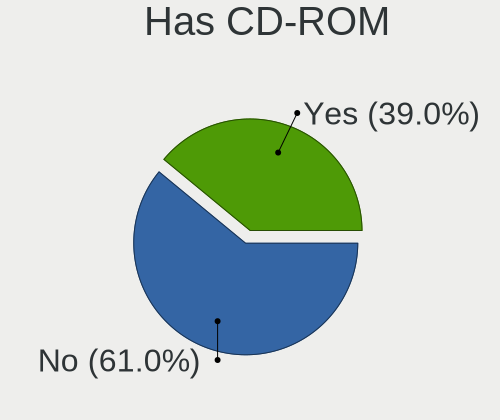
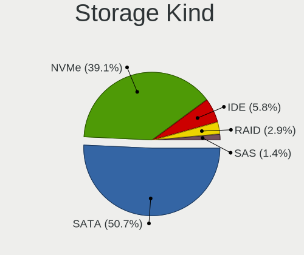
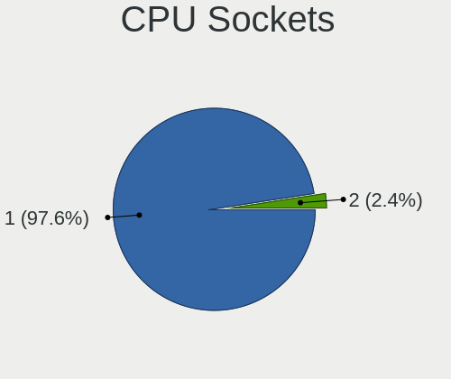
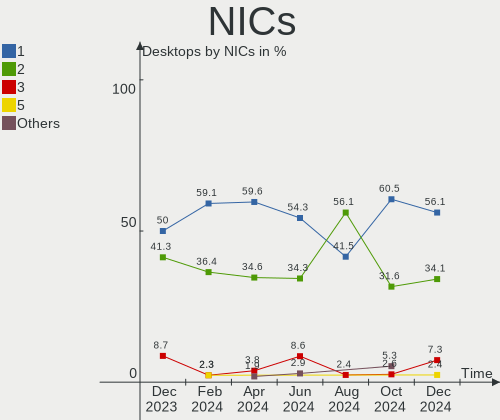
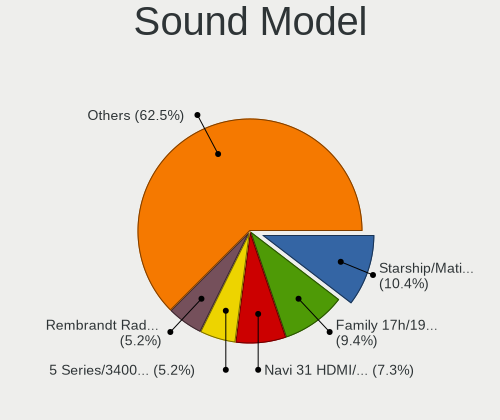
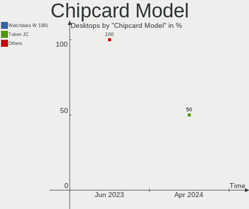
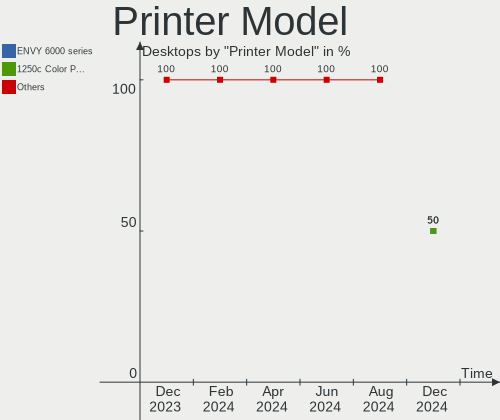

Manjaro Hardware Trends (Desktop)
---------------------------------

A project to identify most popular hardware characteristics and track their change
over time based on data collected by Manjaro users at https://Linux-Hardware.org.

Anyone can contribute to the study by uploading probes of their computers by
the [hw-probe](https://github.com/linuxhw/hw-probe) tool:

    sudo -E hw-probe -all -upload

Full-feature report is available here: https://linux-hardware.org/?view=trends&formfactor=desktop

Period: Oct, 2020.

Contents
--------

- [ OS                       ](#os)
- [ OS Family                ](#os-family)
- [ Kernel                   ](#kernel)
- [ Kernel Family            ](#kernel-family)
- [ Kernel Major Ver.        ](#kernel-major-ver)
- [ Arch                     ](#arch)
- [ DE                       ](#de)
- [ Display Server           ](#display-server)
- [ Display Manager          ](#display-manager)
- [ OS Lang                  ](#os-lang)
- [ Boot Mode                ](#boot-mode)
- [ Filesystem               ](#filesystem)
- [ Part. scheme             ](#part-scheme)
- [ Dual Boot with Linux/BSD ](#dual-boot-with-linux/bsd)
- [ Dual Boot (Win)          ](#dual-boot-win)
- [ Country                  ](#country)
- [ City                     ](#city)
- [ Vendor                   ](#vendor)
- [ Model                    ](#model)
- [ Model Family             ](#model-family)
- [ MFG Year                 ](#mfg-year)
- [ Form Factor              ](#form-factor)
- [ Secure Boot              ](#secure-boot)
- [ Coreboot                 ](#coreboot)
- [ RAM Size                 ](#ram-size)
- [ RAM Used                 ](#ram-used)
- [ Has CD-ROM               ](#has-cd-rom)
- [ Total Drives             ](#total-drives)
- [ Has Ethernet             ](#has-ethernet)
- [ Drive Vendor             ](#drive-vendor)
- [ HDD Vendor               ](#hdd-vendor)
- [ SSD Vendor               ](#ssd-vendor)
- [ Drive Model              ](#drive-model)
- [ Drive Kind               ](#drive-kind)
- [ Drive Connector          ](#drive-connector)
- [ Drive Size               ](#drive-size)
- [ Space Total              ](#space-total)
- [ Space Used               ](#space-used)
- [ Malfunc. Drives          ](#malfunc-drives)
- [ Malfunc. Drive Vendor    ](#malfunc-drive-vendor)
- [ Malfunc. HDD Vendor      ](#malfunc-hdd-vendor)
- [ Malfunc. Drive Kind      ](#malfunc-drive-kind)
- [ Failed Drives            ](#failed-drives)
- [ Failed Drive Vendor      ](#failed-drive-vendor)
- [ Drive Status             ](#drive-status)
- [ Storage Vendor           ](#storage-vendor)
- [ Storage Model            ](#storage-model)
- [ Storage Kind             ](#storage-kind)
- [ CPU Vendor               ](#cpu-vendor)
- [ CPU Model                ](#cpu-model)
- [ CPU Model Family         ](#cpu-model-family)
- [ CPU Cores                ](#cpu-cores)
- [ CPU Sockets              ](#cpu-sockets)
- [ CPU Threads              ](#cpu-threads)
- [ CPU Op-Modes             ](#cpu-op-modes)
- [ CPU Microcode            ](#cpu-microcode)
- [ CPU Microarch            ](#cpu-microarch)
- [ GPU Vendor               ](#gpu-vendor)
- [ GPU Model                ](#gpu-model)
- [ GPU Combo                ](#gpu-combo)
- [ GPU Driver               ](#gpu-driver)
- [ GPU Memory               ](#gpu-memory)
- [ Monitor Vendor           ](#monitor-vendor)
- [ Monitor Model            ](#monitor-model)
- [ Monitor Resolution       ](#monitor-resolution)
- [ Monitor Diagonal         ](#monitor-diagonal)
- [ Monitor Width            ](#monitor-width)
- [ Aspect Ratio             ](#aspect-ratio)
- [ Monitor Area             ](#monitor-area)
- [ Pixel Density            ](#pixel-density)
- [ Multiple Monitors        ](#multiple-monitors)
- [ Net Controller Vendor    ](#net-controller-vendor)
- [ Net Controller Model     ](#net-controller-model)
- [ Wireless Vendor          ](#wireless-vendor)
- [ Wireless Model           ](#wireless-model)
- [ Ethernet Vendor          ](#ethernet-vendor)
- [ Ethernet Model           ](#ethernet-model)
- [ Net Controller Kind      ](#net-controller-kind)
- [ Used Controller          ](#used-controller)
- [ NICs                     ](#nics)
- [ Memory Vendor            ](#memory-vendor)
- [ Memory Model             ](#memory-model)
- [ Memory Kind              ](#memory-kind)
- [ Memory Form Factor       ](#memory-form-factor)
- [ Memory Size              ](#memory-size)
- [ Memory Speed             ](#memory-speed)
- [ Sound Vendor             ](#sound-vendor)
- [ Sound Model              ](#sound-model)
- [ Camera Vendor            ](#camera-vendor)
- [ Camera Model             ](#camera-model)
- [ Fingerprint Vendor       ](#fingerprint-vendor)
- [ Fingerprint Model        ](#fingerprint-model)
- [ Chipcard Vendor          ](#chipcard-vendor)
- [ Chipcard Model           ](#chipcard-model)
- [ Printer Vendor           ](#printer-vendor)
- [ Printer Model            ](#printer-model)
- [ Scanner Vendor           ](#scanner-vendor)
- [ Scanner Model            ](#scanner-model)
- [ Bluetooth Vendor         ](#bluetooth-vendor)
- [ Bluetooth Model          ](#bluetooth-model)
- [ Unsupported Devices      ](#unsupported-devices)
- [ Unsupported Device Types ](#unsupported-device-types)

OS
--

Installed operating systems

| Name           | Desktops | Percent |
|----------------|----------|---------|
| Manjaro        | 50       | 47.17%  |
| Manjaro 20.1.1 | 24       | 22.64%  |
| Manjaro 20.1.2 | 21       | 19.81%  |
| Manjaro 20.1   | 7        | 6.6%    |
| Manjaro 20.2   | 2        | 1.89%   |
| Manjaro 20.0.3 | 1        | 0.94%   |
| Manjaro 18.1.5 | 1        | 0.94%   |

OS Family
---------

OS without a version

| Name    | Desktops | Percent |
|---------|----------|---------|
| Manjaro | 106      | 100%    |

Kernel
------

Version of the Linux kernel

| Version               | Desktops | Percent |
|-----------------------|----------|---------|
| 5.8.11-1-MANJARO      | 45       | 42.45%  |
| 5.9.1-1-MANJARO       | 15       | 14.15%  |
| 5.8.16-2-MANJARO      | 14       | 13.21%  |
| 5.4.67-1-MANJARO      | 6        | 5.66%   |
| 5.8.6-1-MANJARO       | 4        | 3.77%   |
| 5.4.72-1-MANJARO      | 4        | 3.77%   |
| 5.6.19-3-rt12-MANJARO | 3        | 2.83%   |
| 5.9.0-1-MANJARO       | 2        | 1.89%   |
| 5.4.64-1-MANJARO      | 2        | 1.89%   |
| 5.9.2-1-MANJARO       | 1        | 0.94%   |
| 5.9.1-3-MANJARO       | 1        | 0.94%   |
| 5.8.5-arch1-1         | 1        | 0.94%   |
| 5.8.17-1-MANJARO      | 1        | 0.94%   |
| 5.8.14-1-MANJARO      | 1        | 0.94%   |
| 5.8.13-3-MANJARO      | 1        | 0.94%   |
| 5.7.19-2-MANJARO      | 1        | 0.94%   |
| 5.6.15-1-MANJARO      | 1        | 0.94%   |
| 5.4.13-3-MANJARO      | 1        | 0.94%   |
| 4.7.2-MANJARO         | 1        | 0.94%   |
| 4.14.199-1-MANJARO    | 1        | 0.94%   |

Kernel Family
-------------

Linux kernel without a distro release

| Version  | Desktops | Percent |
|----------|----------|---------|
| 5.8.11   | 45       | 42.45%  |
| 5.9.1    | 16       | 15.09%  |
| 5.8.16   | 14       | 13.21%  |
| 5.4.67   | 6        | 5.66%   |
| 5.8.6    | 4        | 3.77%   |
| 5.4.72   | 4        | 3.77%   |
| 5.6.19   | 3        | 2.83%   |
| 5.9.0    | 2        | 1.89%   |
| 5.4.64   | 2        | 1.89%   |
| 5.9.2    | 1        | 0.94%   |
| 5.8.5    | 1        | 0.94%   |
| 5.8.17   | 1        | 0.94%   |
| 5.8.14   | 1        | 0.94%   |
| 5.8.13   | 1        | 0.94%   |
| 5.7.19   | 1        | 0.94%   |
| 5.6.15   | 1        | 0.94%   |
| 5.4.13   | 1        | 0.94%   |
| 4.7.2    | 1        | 0.94%   |
| 4.14.199 | 1        | 0.94%   |

Kernel Major Ver.
-----------------

Linux kernel major version

| Version | Desktops | Percent |
|---------|----------|---------|
| 5.8     | 67       | 63.21%  |
| 5.9     | 19       | 17.92%  |
| 5.4     | 13       | 12.26%  |
| 5.6     | 4        | 3.77%   |
| 5.7     | 1        | 0.94%   |
| 4.7     | 1        | 0.94%   |
| 4.14    | 1        | 0.94%   |

Arch
----

OS architecture (x86_64, i586, etc.)

| Name   | Desktops | Percent |
|--------|----------|---------|
| x86_64 | 106      | 100%    |

DE
--

Desktop Environment

| Name       | Desktops | Percent |
|------------|----------|---------|
| XFCE       | 24       | 22.64%  |
| KDE5       | 24       | 22.64%  |
| KDE        | 24       | 22.64%  |
| GNOME      | 21       | 19.81%  |
| X-Cinnamon | 6        | 5.66%   |
| i3         | 3        | 2.83%   |
| MATE       | 1        | 0.94%   |
| LXQt       | 1        | 0.94%   |
| Cinnamon   | 1        | 0.94%   |
| Unknown    | 1        | 0.94%   |

Display Server
--------------

X11 or Wayland

| Name    | Desktops | Percent |
|---------|----------|---------|
| X11     | 103      | 97.17%  |
| Tty     | 2        | 1.89%   |
| Wayland | 1        | 0.94%   |

Display Manager
---------------

SDDM, LightDM, etc.

| Name    | Desktops | Percent |
|---------|----------|---------|
| Unknown | 48       | 45.28%  |
| SDDM    | 24       | 22.64%  |
| LightDM | 16       | 15.09%  |
| GDM     | 15       | 14.15%  |
| TDM     | 1        | 0.94%   |
| LXDM    | 1        | 0.94%   |
| GREETD  | 1        | 0.94%   |

OS Lang
-------

Language

| Lang       | Desktops | Percent |
|------------|----------|---------|
| en_US      | 41       | 38.68%  |
| en_US.utf8 | 8        | 7.55%   |
| de_DE      | 7        | 6.6%    |
| pt_BR      | 5        | 4.72%   |
| en_GB      | 5        | 4.72%   |
| de_DE.utf8 | 5        | 4.72%   |
| ru_RU      | 4        | 3.77%   |
| es_ES      | 4        | 3.77%   |
| fr_FR      | 3        | 2.83%   |
| en_AU      | 3        | 2.83%   |
| pl_PL      | 2        | 1.89%   |
| cs_CZ.utf8 | 2        | 1.89%   |
| sk_SK      | 1        | 0.94%   |
| ru_UA      | 1        | 0.94%   |
| ru_RU.utf8 | 1        | 0.94%   |
| nl_NL      | 1        | 0.94%   |
| it_IT.utf8 | 1        | 0.94%   |
| it_IT      | 1        | 0.94%   |
| fr_FR.utf8 | 1        | 0.94%   |
| fr_CA      | 1        | 0.94%   |
| es_MX      | 1        | 0.94%   |
| es_AR.utf8 | 1        | 0.94%   |
| es_AR      | 1        | 0.94%   |
| en_IN      | 1        | 0.94%   |
| en_IE.utf8 | 1        | 0.94%   |
| en_DK      | 1        | 0.94%   |
| en_CA.utf8 | 1        | 0.94%   |
| en_AU.utf8 | 1        | 0.94%   |
| de_AT.utf8 | 1        | 0.94%   |

Boot Mode
---------

EFI or BIOS

| Mode | Desktops | Percent |
|------|----------|---------|
| BIOS | 71       | 66.98%  |
| EFI  | 35       | 33.02%  |

Filesystem
----------

Type of filesystem

| Type    | Desktops | Percent |
|---------|----------|---------|
| Ext4    | 92       | 86.79%  |
| Xfs     | 5        | 4.72%   |
| Btrfs   | 5        | 4.72%   |
| Overlay | 2        | 1.89%   |
| Zfs     | 1        | 0.94%   |
| F2fs    | 1        | 0.94%   |

Part. scheme
------------

Scheme of partitioning

| Type    | Desktops | Percent |
|---------|----------|---------|
| Unknown | 50       | 47.17%  |
| GPT     | 42       | 39.62%  |
| MBR     | 14       | 13.21%  |

Dual Boot with Linux/BSD
------------------------

Hosting more than one Linux/BSD

| Dual boot | Desktops | Percent |
|-----------|----------|---------|
| No        | 92       | 86.79%  |
| Yes       | 14       | 13.21%  |

Dual Boot (Win)
---------------

Hosting Linux and Windows

| Dual boot | Desktops | Percent |
|-----------|----------|---------|
| No        | 68       | 64.15%  |
| Yes       | 38       | 35.85%  |

Country
-------

Geographic location (country)

| Country        | Desktops | Percent |
|----------------|----------|---------|
| USA            | 22       | 20.75%  |
| Germany        | 13       | 12.26%  |
| Russia         | 6        | 5.66%   |
| France         | 5        | 4.72%   |
| Brazil         | 5        | 4.72%   |
| Australia      | 4        | 3.77%   |
| UK             | 3        | 2.83%   |
| Poland         | 3        | 2.83%   |
| Canada         | 3        | 2.83%   |
| Argentina      | 3        | 2.83%   |
| Ukraine        | 2        | 1.89%   |
| Spain          | 2        | 1.89%   |
| Portugal       | 2        | 1.89%   |
| Norway         | 2        | 1.89%   |
| Italy          | 2        | 1.89%   |
| Greece         | 2        | 1.89%   |
| Czech Republic | 2        | 1.89%   |
| Bulgaria       | 2        | 1.89%   |
| Bangladesh     | 2        | 1.89%   |
| Switzerland    | 1        | 0.94%   |
| Sweden         | 1        | 0.94%   |
| Slovakia       | 1        | 0.94%   |
| Serbia         | 1        | 0.94%   |
| Saudi Arabia   | 1        | 0.94%   |
| Romania        | 1        | 0.94%   |
| Puerto Rico    | 1        | 0.94%   |
| Panama         | 1        | 0.94%   |
| Netherlands    | 1        | 0.94%   |
| Montenegro     | 1        | 0.94%   |
| Mexico         | 1        | 0.94%   |
| Mauritius      | 1        | 0.94%   |
| Malaysia       | 1        | 0.94%   |
| Kazakhstan     | 1        | 0.94%   |
| Japan          | 1        | 0.94%   |
| Ireland        | 1        | 0.94%   |
| India          | 1        | 0.94%   |
| Finland        | 1        | 0.94%   |
| Denmark        | 1        | 0.94%   |
| Botswana       | 1        | 0.94%   |
| Austria        | 1        | 0.94%   |

City
----

Geographic location (city)

| City               | Desktops | Percent |
|--------------------|----------|---------|
| Portland           | 2        | 1.89%   |
| Glassport          | 2        | 1.89%   |
| Zurich             | 1        | 0.94%   |
| Wuppertal          | 1        | 0.94%   |
| Watertown          | 1        | 0.94%   |
| Wadsworth          | 1        | 0.94%   |
| Ville-Houdlemont   | 1        | 0.94%   |
| Vienna             | 1        | 0.94%   |
| Toruń             | 1        | 0.94%   |
| Tilburg            | 1        | 0.94%   |
| São Leopoldo      | 1        | 0.94%   |
| Sydney             | 1        | 0.94%   |
| Stockholm          | 1        | 0.94%   |
| St Petersburg      | 1        | 0.94%   |
| Sofia              | 1        | 0.94%   |
| Smolenice          | 1        | 0.94%   |
| Shankill           | 1        | 0.94%   |
| Seattle            | 1        | 0.94%   |
| Schweinfurt        | 1        | 0.94%   |
| Sassnitz           | 1        | 0.94%   |
| Rousse             | 1        | 0.94%   |
| Rio Rancho         | 1        | 0.94%   |
| Repentigny         | 1        | 0.94%   |
| Renton             | 1        | 0.94%   |
| Radolfzell         | 1        | 0.94%   |
| Queluz             | 1        | 0.94%   |
| Quartier Militaire | 1        | 0.94%   |
| Pátrai            | 1        | 0.94%   |
| Poznan             | 1        | 0.94%   |
| Poplar             | 1        | 0.94%   |
| Pisa               | 1        | 0.94%   |
| Pikovice           | 1        | 0.94%   |
| Perth              | 1        | 0.94%   |
| Perm               | 1        | 0.94%   |
| Othis              | 1        | 0.94%   |
| Oslo               | 1        | 0.94%   |
| Odense             | 1        | 0.94%   |
| Nizhniy Novgorod   | 1        | 0.94%   |
| Niederwerrn        | 1        | 0.94%   |
| Nagano             | 1        | 0.94%   |
| Marrickville       | 1        | 0.94%   |
| Mar del Tuyu       | 1        | 0.94%   |
| Mannheim           | 1        | 0.94%   |
| Magdeburg          | 1        | 0.94%   |
| Louisville         | 1        | 0.94%   |
| Los Angeles        | 1        | 0.94%   |
| London             | 1        | 0.94%   |
| Llavallol          | 1        | 0.94%   |
| Litoměřice       | 1        | 0.94%   |
| Lins               | 1        | 0.94%   |
| Leiria             | 1        | 0.94%   |
| Lehigh Acres       | 1        | 0.94%   |
| Lefkada            | 1        | 0.94%   |
| Le Kremlin-Bicetre | 1        | 0.94%   |
| Las Vegas          | 1        | 0.94%   |
| La Ciotat          | 1        | 0.94%   |
| Kyiv               | 1        | 0.94%   |
| Krakow             | 1        | 0.94%   |
| Kirzhach           | 1        | 0.94%   |
| King George        | 1        | 0.94%   |

Vendor
------

Motherboard manufacturer

| Name                | Desktops | Percent |
|---------------------|----------|---------|
| ASUSTek Computer    | 35       | 33.02%  |
| Gigabyte Technology | 25       | 23.58%  |
| ASRock              | 14       | 13.21%  |
| MSI                 | 11       | 10.38%  |
| Dell                | 8        | 7.55%   |
| Intel               | 4        | 3.77%   |
| Hewlett-Packard     | 2        | 1.89%   |
| Supermicro          | 1        | 0.94%   |
| Lenovo              | 1        | 0.94%   |
| Huanan              | 1        | 0.94%   |
| Fujitsu             | 1        | 0.94%   |
| Foxconn             | 1        | 0.94%   |
| AMD                 | 1        | 0.94%   |
| Unknown             | 1        | 0.94%   |

Model
-----

Motherboard model

| Name                                                                   | Desktops | Percent |
|------------------------------------------------------------------------|----------|---------|
| ASUS All Series                                                        | 4        | 3.77%   |
| ASRock B450 Pro4                                                       | 3        | 2.83%   |
| Gigabyte Z390 I AORUS PRO WIFI                                         | 2        | 1.89%   |
| Gigabyte X570 GAMING X                                                 | 2        | 1.89%   |
| Gigabyte X570 AORUS MASTER                                             | 2        | 1.89%   |
| Gigabyte B450M DS3H                                                    | 2        | 1.89%   |
| Gigabyte B450 AORUS M                                                  | 2        | 1.89%   |
| Dell Studio XPS 8100                                                   | 2        | 1.89%   |
| Dell OptiPlex 7010                                                     | 2        | 1.89%   |
| Supermicro C7B75                                                       | 1        | 0.94%   |
| MSI MS-7C81                                                            | 1        | 0.94%   |
| MSI MS-7C37                                                            | 1        | 0.94%   |
| MSI MS-7B85                                                            | 1        | 0.94%   |
| MSI MS-7B78                                                            | 1        | 0.94%   |
| MSI MS-7A38                                                            | 1        | 0.94%   |
| MSI MS-7A33                                                            | 1        | 0.94%   |
| MSI MS-7998                                                            | 1        | 0.94%   |
| MSI MS-7978                                                            | 1        | 0.94%   |
| MSI MS-7916                                                            | 1        | 0.94%   |
| MSI MS-7721                                                            | 1        | 0.94%   |
| MSI MS-7592                                                            | 1        | 0.94%   |
| Lenovo ThinkCentre M73 10AXS66Y00                                      | 1        | 0.94%   |
| Intel DH55HC AAE70933-506                                              | 1        | 0.94%   |
| Intel D946GZIS AAD66165-301                                            | 1        | 0.94%   |
| Intel D945GCPE AAD97209-201                                            | 1        | 0.94%   |
| Intel AIO 2300 ID 6185                                                 | 1        | 0.94%   |
| Huanan X79 INTEL (INTEL Xeon E5/Corei7 DMI2 - C600/C200 Cipset V2.49PB | 1        | 0.94%   |
| HP Compaq 8200 Elite SFF PC                                            | 1        | 0.94%   |
| HP 290 G2 MT Business PC                                               | 1        | 0.94%   |
| Gigabyte Z97MX-Gaming 5                                                | 1        | 0.94%   |
| Gigabyte Z68A-D3-B3                                                    | 1        | 0.94%   |
| Gigabyte Z390 AORUS MASTER                                             | 1        | 0.94%   |
| Gigabyte X79-UP4                                                       | 1        | 0.94%   |
| Gigabyte X470 AORUS ULTRA GAMING                                       | 1        | 0.94%   |
| Gigabyte H81ND2H                                                       | 1        | 0.94%   |
| Gigabyte GB-BXi5-5200                                                  | 1        | 0.94%   |
| Gigabyte GA-890GPA-UD3H                                                | 1        | 0.94%   |
| Gigabyte GA-790FXTA-UD5                                                | 1        | 0.94%   |
| Gigabyte GA-78LMT-USB3 6.0                                             | 1        | 0.94%   |
| Gigabyte B85M-D3H                                                      | 1        | 0.94%   |
| Gigabyte B460M DS3H AC-Y1                                              | 1        | 0.94%   |
| Gigabyte B450 I AORUS PRO WIFI                                         | 1        | 0.94%   |
| Gigabyte B450 AORUS PRO WIFI                                           | 1        | 0.94%   |
| Gigabyte 970A-DS3P                                                     | 1        | 0.94%   |
| Fujitsu ESPRIMO P720                                                   | 1        | 0.94%   |
| Foxconn p7-1423w                                                       | 1        | 0.94%   |
| Dell Precision T3600                                                   | 1        | 0.94%   |
| Dell OptiPlex 9020                                                     | 1        | 0.94%   |
| Dell OptiPlex 7040                                                     | 1        | 0.94%   |
| Dell OptiPlex 3020                                                     | 1        | 0.94%   |
| ASUS TUF GAMING X570-PLUS                                              | 1        | 0.94%   |
| ASUS TUF B450-PLUS GAMING                                              | 1        | 0.94%   |
| ASUS ROG STRIX Z390-E GAMING                                           | 1        | 0.94%   |
| ASUS ROG STRIX X570-E GAMING                                           | 1        | 0.94%   |
| ASUS ROG STRIX B550-I GAMING                                           | 1        | 0.94%   |
| ASUS ROG STRIX B450-I GAMING                                           | 1        | 0.94%   |
| ASUS ROG STRIX B450-F GAMING                                           | 1        | 0.94%   |
| ASUS ROG CROSSHAIR VIII HERO                                           | 1        | 0.94%   |
| ASUS ROG CROSSHAIR VI EXTREME                                          | 1        | 0.94%   |
| ASUS PRIME Z490M-PLUS                                                  | 1        | 0.94%   |

Model Family
------------

Motherboard model prefix

| Name                    | Desktops | Percent |
|-------------------------|----------|---------|
| ASUS ROG                | 7        | 6.6%    |
| ASUS PRIME              | 7        | 6.6%    |
| Dell OptiPlex           | 5        | 4.72%   |
| Gigabyte X570           | 4        | 3.77%   |
| Gigabyte B450           | 4        | 3.77%   |
| ASUS All                | 4        | 3.77%   |
| ASRock B450             | 4        | 3.77%   |
| Gigabyte Z390           | 3        | 2.83%   |
| Gigabyte B450M          | 2        | 1.89%   |
| Dell Studio             | 2        | 1.89%   |
| ASUS TUF                | 2        | 1.89%   |
| ASRock AB350            | 2        | 1.89%   |
| Supermicro C7B75        | 1        | 0.94%   |
| MSI MS-7C81             | 1        | 0.94%   |
| MSI MS-7C37             | 1        | 0.94%   |
| MSI MS-7B85             | 1        | 0.94%   |
| MSI MS-7B78             | 1        | 0.94%   |
| MSI MS-7A38             | 1        | 0.94%   |
| MSI MS-7A33             | 1        | 0.94%   |
| MSI MS-7998             | 1        | 0.94%   |
| MSI MS-7978             | 1        | 0.94%   |
| MSI MS-7916             | 1        | 0.94%   |
| MSI MS-7721             | 1        | 0.94%   |
| MSI MS-7592             | 1        | 0.94%   |
| Lenovo ThinkCentre      | 1        | 0.94%   |
| Intel DH55HC            | 1        | 0.94%   |
| Intel D946GZIS          | 1        | 0.94%   |
| Intel D945GCPE          | 1        | 0.94%   |
| Intel AIO               | 1        | 0.94%   |
| Huanan X79              | 1        | 0.94%   |
| HP Compaq               | 1        | 0.94%   |
| HP 290                  | 1        | 0.94%   |
| Gigabyte Z97MX-Gaming   | 1        | 0.94%   |
| Gigabyte Z68A-D3-B3     | 1        | 0.94%   |
| Gigabyte X79-UP4        | 1        | 0.94%   |
| Gigabyte X470           | 1        | 0.94%   |
| Gigabyte H81ND2H        | 1        | 0.94%   |
| Gigabyte GB-BXi5-5200   | 1        | 0.94%   |
| Gigabyte GA-890GPA-UD3H | 1        | 0.94%   |
| Gigabyte GA-790FXTA-UD5 | 1        | 0.94%   |
| Gigabyte GA-78LMT-USB3  | 1        | 0.94%   |
| Gigabyte B85M-D3H       | 1        | 0.94%   |
| Gigabyte B460M          | 1        | 0.94%   |
| Gigabyte 970A-DS3P      | 1        | 0.94%   |
| Fujitsu ESPRIMO         | 1        | 0.94%   |
| Foxconn p7-1423w        | 1        | 0.94%   |
| Dell Precision          | 1        | 0.94%   |
| ASUS P8Z68-V            | 1        | 0.94%   |
| ASUS P8P67              | 1        | 0.94%   |
| ASUS P8H77-V            | 1        | 0.94%   |
| ASUS P7P55D-E           | 1        | 0.94%   |
| ASUS P5P43TD            | 1        | 0.94%   |
| ASUS P10S-V             | 1        | 0.94%   |
| ASUS M5A78L-M           | 1        | 0.94%   |
| ASUS M5A78L             | 1        | 0.94%   |
| ASUS M4N78              | 1        | 0.94%   |
| ASUS M4A78LT-M          | 1        | 0.94%   |
| ASUS M2A74-AM           | 1        | 0.94%   |
| ASUS H110M-C            | 1        | 0.94%   |
| ASUS F2A55-M            | 1        | 0.94%   |

MFG Year
--------

Motherboard manufacture year

| Year | Desktops | Percent |
|------|----------|---------|
| 2020 | 23       | 21.7%   |
| 2019 | 23       | 21.7%   |
| 2014 | 10       | 9.43%   |
| 2015 | 9        | 8.49%   |
| 2018 | 8        | 7.55%   |
| 2010 | 8        | 7.55%   |
| 2012 | 6        | 5.66%   |
| 2013 | 5        | 4.72%   |
| 2011 | 5        | 4.72%   |
| 2016 | 4        | 3.77%   |
| 2017 | 2        | 1.89%   |
| 2009 | 1        | 0.94%   |
| 2007 | 1        | 0.94%   |
| 2006 | 1        | 0.94%   |

Form Factor
-----------

Physical design of the computer

| Name    | Desktops | Percent |
|---------|----------|---------|
| Desktop | 106      | 100%    |

Secure Boot
-----------

Enabled or disabled

| State    | Desktops | Percent |
|----------|----------|---------|
| Disabled | 106      | 100%    |

Coreboot
--------

Have coreboot on board

| Used | Desktops | Percent |
|------|----------|---------|
| No   | 106      | 100%    |

RAM Size
--------

Total RAM memory

| Size in GB  | Desktops | Percent |
|-------------|----------|---------|
| 16.01-24.0  | 42       | 39.62%  |
| 32.01-64.0  | 20       | 18.87%  |
| 8.01-16.0   | 20       | 18.87%  |
| 3.01-4.0    | 8        | 7.55%   |
| 4.01-8.0    | 7        | 6.6%    |
| 64.01-256.0 | 7        | 6.6%    |
| 24.01-32.0  | 2        | 1.89%   |

RAM Used
--------

Used RAM memory

| Used GB    | Desktops | Percent |
|------------|----------|---------|
| 1.01-2.0   | 29       | 27.36%  |
| 4.01-8.0   | 26       | 24.53%  |
| 2.01-3.0   | 19       | 17.92%  |
| 3.01-4.0   | 16       | 15.09%  |
| 8.01-16.0  | 10       | 9.43%   |
| 0.01-1.0   | 3        | 2.83%   |
| 16.01-24.0 | 2        | 1.89%   |
| 32.01-64.0 | 1        | 0.94%   |

Has CD-ROM
----------

Has CD-ROM on board

| Presented | Desktops | Percent |
|-----------|----------|---------|
| No        | 66       | 62.26%  |
| Yes       | 40       | 37.74%  |

Total Drives
------------

Number of drives on board

| Drives | Desktops | Percent |
|--------|----------|---------|
| 1      | 29       | 27.36%  |
| 2      | 28       | 26.42%  |
| 3      | 24       | 22.64%  |
| 4      | 17       | 16.04%  |
| 5      | 4        | 3.77%   |
| 6      | 2        | 1.89%   |
| 8      | 1        | 0.94%   |
| 7      | 1        | 0.94%   |

Has Ethernet
------------

Has Ethernet on board

| Presented | Desktops | Percent |
|-----------|----------|---------|
| Yes       | 104      | 98.11%  |
| No        | 2        | 1.89%   |

Drive Vendor
------------

Hard drive vendors

| Vendor                    | Desktops | Drives | Percent |
|---------------------------|----------|--------|---------|
| WDC                       | 50       | 73     | 22.94%  |
| Samsung Electronics       | 42       | 50     | 19.27%  |
| Seagate                   | 37       | 50     | 16.97%  |
| Kingston                  | 14       | 16     | 6.42%   |
| Crucial                   | 13       | 16     | 5.96%   |
| Toshiba                   | 9        | 10     | 4.13%   |
| SanDisk                   | 6        | 6      | 2.75%   |
| Intel                     | 4        | 5      | 1.83%   |
| Silicon Motion            | 3        | 3      | 1.38%   |
| PLEXTOR                   | 3        | 3      | 1.38%   |
| Patriot                   | 3        | 3      | 1.38%   |
| OCZ                       | 3        | 3      | 1.38%   |
| HGST                      | 3        | 4      | 1.38%   |
| Team                      | 2        | 2      | 0.92%   |
| SK Hynix                  | 2        | 2      | 0.92%   |
| PNY                       | 2        | 2      | 0.92%   |
| Phison                    | 2        | 2      | 0.92%   |
| Micron/Crucial Technology | 2        | 3      | 0.92%   |
| Hitachi                   | 2        | 2      | 0.92%   |
| Fujitsu                   | 2        | 2      | 0.92%   |
| Corsair                   | 2        | 3      | 0.92%   |
| WD MediaMax               | 1        | 1      | 0.46%   |
| Unknown                   | 1        | 1      | 0.46%   |
| TEUTONS                   | 1        | 1      | 0.46%   |
| Sabrent                   | 1        | 1      | 0.46%   |
| MAXTOR                    | 1        | 1      | 0.46%   |
| Lexar                     | 1        | 1      | 0.46%   |
| Kingmax                   | 1        | 1      | 0.46%   |
| JMicron                   | 1        | 1      | 0.46%   |
| Gigabyte Technology       | 1        | 1      | 0.46%   |
| Drevo                     | 1        | 1      | 0.46%   |
| Apacer                    | 1        | 1      | 0.46%   |
| A-DATA Technology         | 1        | 1      | 0.46%   |

HDD Vendor
----------

Hard disk drive vendors

| Vendor              | Desktops | Drives | Percent |
|---------------------|----------|--------|---------|
| WDC                 | 46       | 66     | 42.99%  |
| Seagate             | 36       | 47     | 33.64%  |
| Toshiba             | 8        | 9      | 7.48%   |
| Samsung Electronics | 8        | 9      | 7.48%   |
| HGST                | 3        | 4      | 2.8%    |
| Hitachi             | 2        | 2      | 1.87%   |
| Fujitsu             | 2        | 2      | 1.87%   |
| Sabrent             | 1        | 1      | 0.93%   |
| MAXTOR              | 1        | 1      | 0.93%   |

SSD Vendor
----------

Solid state drive vendors

| Vendor              | Desktops | Drives | Percent |
|---------------------|----------|--------|---------|
| Samsung Electronics | 27       | 30     | 31.4%   |
| Kingston            | 12       | 14     | 13.95%  |
| Crucial             | 11       | 13     | 12.79%  |
| WDC                 | 7        | 7      | 8.14%   |
| SanDisk             | 6        | 6      | 6.98%   |
| PLEXTOR             | 3        | 3      | 3.49%   |
| Patriot             | 3        | 3      | 3.49%   |
| OCZ                 | 3        | 3      | 3.49%   |
| Team                | 2        | 2      | 2.33%   |
| PNY                 | 2        | 2      | 2.33%   |
| TEUTONS             | 1        | 1      | 1.16%   |
| SK Hynix            | 1        | 1      | 1.16%   |
| Seagate             | 1        | 3      | 1.16%   |
| Lexar               | 1        | 1      | 1.16%   |
| Kingmax             | 1        | 1      | 1.16%   |
| Intel               | 1        | 1      | 1.16%   |
| Gigabyte Technology | 1        | 1      | 1.16%   |
| Corsair             | 1        | 1      | 1.16%   |
| Apacer              | 1        | 1      | 1.16%   |
| A-DATA Technology   | 1        | 1      | 1.16%   |

Drive Model
-----------

Hard drive models

| Model                        | Desktops | Percent |
|------------------------------|----------|---------|
| CT240BX500SSD1 240GB         | 6        | 2.37%   |
| SSD 850 EVO 500GB            | 5        | 1.98%   |
| WD10EZEX-08WN4A0 1TB         | 4        | 1.58%   |
| ST1000DM010-2EP102 1TB       | 4        | 1.58%   |
| SSD 860 EVO 500GB            | 4        | 1.58%   |
| NVMe SSD Drive 1TB           | 4        | 1.58%   |
| WD5000AAKX-001CA0 500GB      | 3        | 1.19%   |
| WD20EARX-00PASB0 2TB         | 3        | 1.19%   |
| SSD 860 QVO 1TB              | 3        | 1.19%   |
| SSD 850 EVO 250GB            | 3        | 1.19%   |
| SA400S37240G 240GB SSD       | 3        | 1.19%   |
| NVMe SSD Drive 500GB         | 3        | 1.19%   |
| NVMe SSD Drive 1024GB        | 3        | 1.19%   |
| WDS240G2G0A-00JH30 240GB SSD | 2        | 0.79%   |
| WD5000AAKX-75U6AA0 500GB     | 2        | 0.79%   |
| WD40EFRX-68N32N0 4TB         | 2        | 0.79%   |
| WD20EZRZ-00Z5HB0 2TB         | 2        | 0.79%   |
| WD10EZEX-00RKKA0 1TB         | 2        | 0.79%   |
| WD10EZEX-00BN5A0 1TB         | 2        | 0.79%   |
| WD10EADS-00L5B1 1TB          | 2        | 0.79%   |
| WD1003FZEX-00MK2A0 1TB       | 2        | 0.79%   |
| WD1001FAES-75W7A0 1TB        | 2        | 0.79%   |
| ST3500418AS 500GB            | 2        | 0.79%   |
| ST3000DM001-1ER166 3TB       | 2        | 0.79%   |
| ST2000DX002-2DV164 2TB       | 2        | 0.79%   |
| ST1000DM003-1ER162 1TB       | 2        | 0.79%   |
| ST1000DM003-1CH162 1TB       | 2        | 0.79%   |
| SSD 970 PRO 512GB            | 2        | 0.79%   |
| SSD 970 EVO Plus 250GB       | 2        | 0.79%   |
| SSD 860 EVO 250GB            | 2        | 0.79%   |
| SSD 860 EVO 1TB              | 2        | 0.79%   |
| SSD 840 EVO 250GB            | 2        | 0.79%   |
| SSD 840 EVO 120GB            | 2        | 0.79%   |
| SA400S37480G 480GB SSD       | 2        | 0.79%   |
| NVMe SSD Drive 250GB         | 2        | 0.79%   |
| HD502HJ 500GB                | 2        | 0.79%   |
| HD103SJ 1TB                  | 2        | 0.79%   |
| Expansion 4TB                | 2        | 0.79%   |
| CT500MX500SSD1 500GB         | 2        | 0.79%   |
| CT1000MX500SSD1 1TB          | 2        | 0.79%   |
| Burst 120GB SSD              | 2        | 0.79%   |
| X1 pro 256G                  | 1        | 0.4%    |
| WL300GLSA3210000 304GB       | 1        | 0.4%    |
| WDS500G2B0B-00YS70 500GB SSD | 1        | 0.4%    |
| WDS500G2B0A-00SM50 500GB SSD | 1        | 0.4%    |
| WDS250G2B0A-00SM50 250GB SSD | 1        | 0.4%    |
| WDS120G2G0A-00JH30 120GB SSD | 1        | 0.4%    |
| WDS100T2B0A-00SM50 1TB SSD   | 1        | 0.4%    |
| WD80EFAX-68KNBN0 8TB         | 1        | 0.4%    |
| WD60EFRX-68MYMN1 6TB         | 1        | 0.4%    |
| WD5003AZEX-00K1GA0 500GB     | 1        | 0.4%    |
| WD5000AZLX-60K2TA0 500GB     | 1        | 0.4%    |
| WD5000AVDS-63U7B1 500GB      | 1        | 0.4%    |
| WD5000AAKX-00U6AA0 500GB     | 1        | 0.4%    |
| WD5000AAKS-60Z1A0 500GB      | 1        | 0.4%    |
| WD5000AAKS-00A7B0 500GB      | 1        | 0.4%    |
| WD5000AADS-00S9B0 500GB      | 1        | 0.4%    |
| WD5000AADS-00L4B1 500GB      | 1        | 0.4%    |
| WD40EZRZ-22GXCB0 4TB         | 1        | 0.4%    |
| WD40EZRZ-00GXCB0 4TB         | 1        | 0.4%    |

Drive Kind
----------

HDD or SSD

| Kind    | Desktops | Drives | Percent |
|---------|----------|--------|---------|
| HDD     | 84       | 141    | 47.46%  |
| SSD     | 66       | 95     | 37.29%  |
| NVMe    | 24       | 33     | 13.56%  |
| Unknown | 3        | 3      | 1.69%   |

Drive Connector
---------------

SATA, SAS, NVMe, etc.

| Type | Desktops | Drives | Percent |
|------|----------|--------|---------|
| SATA | 100      | 232    | 76.92%  |
| NVMe | 24       | 33     | 18.46%  |
| SAS  | 6        | 7      | 4.62%   |

Drive Size
----------

Size of hard drive

| Size in TB | Desktops | Drives | Percent |
|------------|----------|--------|---------|
| 0.01-0.5   | 72       | 113    | 43.64%  |
| 0.51-1.0   | 52       | 69     | 31.52%  |
| 1.01-2.0   | 21       | 27     | 12.73%  |
| 3.01-4.0   | 8        | 11     | 4.85%   |
| 2.01-3.0   | 6        | 7      | 3.64%   |
| 4.01-10.0  | 6        | 9      | 3.64%   |

Space Total
-----------

Amount of disk space available on the file system

| Size in GB     | Desktops | Percent |
|----------------|----------|---------|
| 501-1000       | 22       | 20.75%  |
| 251-500        | 19       | 17.92%  |
| 101-250        | 18       | 16.98%  |
| 1001-2000      | 17       | 16.04%  |
| More than 3000 | 14       | 13.21%  |
| 2001-3000      | 9        | 8.49%   |
| Unknown        | 4        | 3.77%   |
| 21-50          | 2        | 1.89%   |
| 1-20           | 1        | 0.94%   |

Space Used
----------

Amount of used disk space

| Used GB        | Desktops | Percent |
|----------------|----------|---------|
| 101-250        | 22       | 20.75%  |
| 251-500        | 14       | 13.21%  |
| 501-1000       | 14       | 13.21%  |
| 21-50          | 12       | 11.32%  |
| 1-20           | 12       | 11.32%  |
| 1001-2000      | 9        | 8.49%   |
| 51-100         | 9        | 8.49%   |
| More than 3000 | 5        | 4.72%   |
| 2001-3000      | 5        | 4.72%   |
| Unknown        | 4        | 3.77%   |

Malfunc. Drives
---------------

Drive models with a malfunction

| Model                        | Desktops | Drives | Percent |
|------------------------------|----------|--------|---------|
| WD5000AAKX-001CA0 500GB      | 1        | 1      | 6.67%   |
| WD5000AAKS-60Z1A0 500GB      | 1        | 1      | 6.67%   |
| WD20EARX-00PASB0 2TB         | 1        | 1      | 6.67%   |
| WD20EARS-00MVWB0 2TB         | 1        | 1      | 6.67%   |
| WD10EZEX-22MFCA0 1TB         | 1        | 1      | 6.67%   |
| WD10EZEX-00RKKA0 1TB         | 1        | 1      | 6.67%   |
| ST500DM002-1BD142 500GB      | 1        | 1      | 6.67%   |
| ST2000LM007-1R8174 2TB       | 1        | 1      | 6.67%   |
| ST1000LM024 HN-M101MBB 1TB   | 1        | 1      | 6.67%   |
| ST1000DX001-1NS162 1TB       | 1        | 1      | 6.67%   |
| ST1000DX001-1CM162 1TB       | 1        | 1      | 6.67%   |
| SSD PLUS 240GB               | 1        | 1      | 6.67%   |
| HFS128G39TND-N210A 128GB SSD | 1        | 1      | 6.67%   |
| HDWE140 4TB                  | 1        | 1      | 6.67%   |
| 2E256-TU2-510B00 176GB SSD   | 1        | 3      | 6.67%   |

Malfunc. Drive Vendor
---------------------

Vendors of faulty drives

| Vendor   | Desktops | Drives | Percent |
|----------|----------|--------|---------|
| WDC      | 5        | 6      | 38.46%  |
| Seagate  | 5        | 8      | 38.46%  |
| Toshiba  | 1        | 1      | 7.69%   |
| SK Hynix | 1        | 1      | 7.69%   |
| SanDisk  | 1        | 1      | 7.69%   |

Malfunc. HDD Vendor
-------------------

Vendors of faulty HDD drives

| Vendor  | Desktops | Drives | Percent |
|---------|----------|--------|---------|
| WDC     | 5        | 6      | 50%     |
| Seagate | 4        | 5      | 40%     |
| Toshiba | 1        | 1      | 10%     |

Malfunc. Drive Kind
-------------------

Kinds of faulty drives

| Kind | Desktops | Drives | Percent |
|------|----------|--------|---------|
| HDD  | 10       | 12     | 76.92%  |
| SSD  | 3        | 5      | 23.08%  |

Failed Drives
-------------

Failed drive models

Zero info for selected period =(

Failed Drive Vendor
-------------------

Failed drive vendors

Zero info for selected period =(

Drive Status
------------

Number of failed and malfunc. drives

| Status   | Desktops | Drives | Percent |
|----------|----------|--------|---------|
| Detected | 65       | 162    | 54.17%  |
| Works    | 42       | 93     | 35%     |
| Malfunc  | 13       | 17     | 10.83%  |

Storage Vendor
--------------

Storage controller vendors

| Vendor                       | Desktops | Percent |
|------------------------------|----------|---------|
| Intel                        | 55       | 35.03%  |
| AMD                          | 52       | 33.12%  |
| ASMedia Technology           | 13       | 8.28%   |
| Samsung Electronics          | 8        | 5.1%    |
| Marvell Technology Group     | 5        | 3.18%   |
| JMicron Technology           | 5        | 3.18%   |
| Micron/Crucial Technology    | 4        | 2.55%   |
| Silicon Motion               | 3        | 1.91%   |
| Phison Electronics           | 3        | 1.91%   |
| Kingston Technology Company  | 2        | 1.27%   |
| Toshiba America Info Systems | 1        | 0.64%   |
| SK Hynix                     | 1        | 0.64%   |
| Silicon Image                | 1        | 0.64%   |
| Nvidia                       | 1        | 0.64%   |
| Broadcom / LSI               | 1        | 0.64%   |
| ADATA Technology             | 1        | 0.64%   |
| Adaptec                      | 1        | 0.64%   |

Storage Model
-------------

Storage controller models

| Model                                                                             | Desktops | Percent |
|-----------------------------------------------------------------------------------|----------|---------|
| FCH SATA Controller [AHCI mode]                                                   | 40       | 19.42%  |
| 400 Series Chipset SATA Controller                                                | 19       | 9.22%   |
| ASM1062 Serial ATA Controller                                                     | 13       | 6.31%   |
| 8 Series/C220 Series Chipset Family 6-port SATA Controller 1 [AHCI mode]          | 10       | 4.85%   |
| NVMe SSD Controller SM981/PM981/PM983                                             | 8        | 3.88%   |
| SB7x0/SB8x0/SB9x0 SATA Controller [AHCI mode]                                     | 7        | 3.4%    |
| SB7x0/SB8x0/SB9x0 IDE Controller                                                  | 7        | 3.4%    |
| SATA Controller [RAID mode]                                                       | 7        | 3.4%    |
| 6 Series/C200 Series Chipset Family 6 port Desktop SATA AHCI Controller           | 6        | 2.91%   |
| Q170/Q150/B150/H170/H110/Z170/CM236 Chipset SATA Controller [AHCI Mode]           | 5        | 2.43%   |
| 7 Series/C210 Series Chipset Family 6-port SATA Controller [AHCI mode]            | 5        | 2.43%   |
| 300 Series Chipset SATA Controller                                                | 5        | 2.43%   |
| SB7x0/SB8x0/SB9x0 SATA Controller [IDE mode]                                      | 4        | 1.94%   |
| Non-Volatile memory controller                                                    | 4        | 1.94%   |
| JMB363 SATA/IDE Controller                                                        | 4        | 1.94%   |
| 400 Series Chipset Family SATA AHCI Controller                                    | 4        | 1.94%   |
| P1 NVMe PCIe SSD                                                                  | 3        | 1.46%   |
| NM10/ICH7 Family SATA Controller [IDE mode]                                       | 3        | 1.46%   |
| 9 Series Chipset Family SATA Controller [AHCI Mode]                               | 3        | 1.46%   |
| X370 Series Chipset SATA Controller                                               | 2        | 0.97%   |
| SSD 660P Series                                                                   | 2        | 0.97%   |
| FCH SATA Controller D                                                             | 2        | 0.97%   |
| E16 PCIe4 NVMe Controller                                                         | 2        | 0.97%   |
| E12 NVMe Controller                                                               | 2        | 0.97%   |
| Cannon Lake PCH SATA AHCI Controller                                              | 2        | 0.97%   |
| A2000, M.2, 500GB                                                                 | 2        | 0.97%   |
| 88SE9172 SATA 6Gb/s Controller                                                    | 2        | 0.97%   |
| 82801G (ICH7 Family) IDE Controller                                               | 2        | 0.97%   |
| XPG SX8200 Pro PCIe Gen3x4 M.2 2280 Solid State Drive                             | 1        | 0.49%   |
| XG4 NVMe SSD Controller                                                           | 1        | 0.49%   |
| X399 Series Chipset SATA Controller                                               | 1        | 0.49%   |
| Wildcat Point-LP SATA Controller [AHCI Mode]                                      | 1        | 0.49%   |
| SSS6200 PCI-Express Flash SSD                                                     | 1        | 0.49%   |
| SSD 600P Series                                                                   | 1        | 0.49%   |
| SM2262/SM2262EN SSD Controller                                                    | 1        | 0.49%   |
| Series 6 - 6G SAS/PCIe 2                                                          | 1        | 0.49%   |
| SATA controller                                                                   | 1        | 0.49%   |
| RS690 PCI to PCI Bridge (PCI Express Port 2)                                      | 1        | 0.49%   |
| PCI0680 Ultra ATA-133 Host Controller                                             | 1        | 0.49%   |
| Optane SSD 900P Series                                                            | 1        | 0.49%   |
| MCP78S [GeForce 8200] SATA Controller (non-AHCI mode)                             | 1        | 0.49%   |
| MCP78S [GeForce 8200] IDE                                                         | 1        | 0.49%   |
| JMB362 SATA Controller                                                            | 1        | 0.49%   |
| C602 chipset 4-Port SATA Storage Control Unit                                     | 1        | 0.49%   |
| C600/X79 series chipset 6-Port SATA AHCI Controller                               | 1        | 0.49%   |
| C600/X79 series chipset 4-Port SATA IDE Controller                                | 1        | 0.49%   |
| C600/X79 series chipset 2-Port SATA IDE Controller                                | 1        | 0.49%   |
| BC501 NVMe Solid State Drive 512GB                                                | 1        | 0.49%   |
| 88SE9172 SATA III 6Gb/s RAID Controller                                           | 1        | 0.49%   |
| 88SE914D SATA-600 Controller                                                      | 1        | 0.49%   |
| 88SE9128 PCIe SATA 6 Gb/s RAID controller                                         | 1        | 0.49%   |
| 82801JI (ICH10 Family) SATA AHCI Controller                                       | 1        | 0.49%   |
| 6 Series/C200 Series Chipset Family Desktop SATA Controller (IDE mode, ports 4-5) | 1        | 0.49%   |
| 6 Series/C200 Series Chipset Family Desktop SATA Controller (IDE mode, ports 0-3) | 1        | 0.49%   |
| 5 Series/3400 Series Chipset PT IDER Controller                                   | 1        | 0.49%   |
| 5 Series/3400 Series Chipset 6 port SATA AHCI Controller                          | 1        | 0.49%   |
| 5 Series/3400 Series Chipset 4 port SATA IDE Controller                           | 1        | 0.49%   |
| 5 Series/3400 Series Chipset 2 port SATA IDE Controller                           | 1        | 0.49%   |
| 200 Series PCH SATA controller [AHCI mode]                                        | 1        | 0.49%   |

Storage Kind
------------

Kind of storage controller (IDE, SATA, NVMe, SAS, ...)

| Kind | Desktops | Percent |
|------|----------|---------|
| SATA | 91       | 63.64%  |
| NVMe | 24       | 16.78%  |
| IDE  | 16       | 11.19%  |
| RAID | 10       | 6.99%   |
| SAS  | 2        | 1.4%    |

CPU Vendor
----------

Processor vendors

| Vendor | Desktops | Percent |
|--------|----------|---------|
| Intel  | 53       | 50%     |
| AMD    | 53       | 50%     |

CPU Model
---------

Processor models

| Model                                          | Desktops | Percent |
|------------------------------------------------|----------|---------|
| AMD Ryzen 5 2600 Six-Core Processor            | 7        | 6.6%    |
| AMD Ryzen 7 3700X 8-Core Processor             | 6        | 5.66%   |
| Intel Core i7-4790K CPU @ 4.00GHz              | 4        | 3.77%   |
| AMD Ryzen 5 1600 Six-Core Processor            | 4        | 3.77%   |
| AMD Ryzen 5 3600 6-Core Processor              | 3        | 2.83%   |
| Intel Core i7-3770 CPU @ 3.40GHz               | 2        | 1.89%   |
| Intel Core i5-8600K CPU @ 3.60GHz              | 2        | 1.89%   |
| Intel Core i5-3570 CPU @ 3.40GHz               | 2        | 1.89%   |
| Intel Core i5 CPU 650 @ 3.20GHz                | 2        | 1.89%   |
| Intel Core i3-10100 CPU @ 3.60GHz              | 2        | 1.89%   |
| AMD Ryzen 9 3900X 12-Core Processor            | 2        | 1.89%   |
| AMD Ryzen 7 2700 Eight-Core Processor          | 2        | 1.89%   |
| AMD Ryzen 7 1700X Eight-Core Processor         | 2        | 1.89%   |
| AMD Ryzen 5 3600X 6-Core Processor             | 2        | 1.89%   |
| AMD Ryzen 5 1500X Quad-Core Processor          | 2        | 1.89%   |
| AMD FX-6300 Six-Core Processor                 | 2        | 1.89%   |
| Intel Xeon CPU E5-2689 0 @ 2.60GHz             | 1        | 0.94%   |
| Intel Xeon CPU E5-1620 0 @ 3.60GHz             | 1        | 0.94%   |
| Intel Xeon CPU E3-1220 v5 @ 3.00GHz            | 1        | 0.94%   |
| Intel Pentium Dual-Core CPU E5700 @ 3.00GHz    | 1        | 0.94%   |
| Intel Pentium Dual CPU E2140 @ 1.60GHz         | 1        | 0.94%   |
| Intel Pentium CPU G630 @ 2.70GHz               | 1        | 0.94%   |
| Intel Pentium CPU G620 @ 2.60GHz               | 1        | 0.94%   |
| Intel Pentium CPU G3420 @ 3.20GHz              | 1        | 0.94%   |
| Intel Pentium CPU G3220 @ 3.00GHz              | 1        | 0.94%   |
| Intel Core i9-9900K CPU @ 3.60GHz              | 1        | 0.94%   |
| Intel Core i7-9700T CPU @ 2.00GHz              | 1        | 0.94%   |
| Intel Core i7-9700K CPU @ 3.60GHz              | 1        | 0.94%   |
| Intel Core i7-4770K CPU @ 3.50GHz              | 1        | 0.94%   |
| Intel Core i7-3820 CPU @ 3.60GHz               | 1        | 0.94%   |
| Intel Core i7-2600K CPU @ 3.40GHz              | 1        | 0.94%   |
| Intel Core i7-10700 CPU @ 2.90GHz              | 1        | 0.94%   |
| Intel Core i5-6600K CPU @ 3.50GHz              | 1        | 0.94%   |
| Intel Core i5-6600 CPU @ 3.30GHz               | 1        | 0.94%   |
| Intel Core i5-6500T CPU @ 2.50GHz              | 1        | 0.94%   |
| Intel Core i5-6400 CPU @ 2.70GHz               | 1        | 0.94%   |
| Intel Core i5-5200U CPU @ 2.20GHz              | 1        | 0.94%   |
| Intel Core i5-4670K CPU @ 3.40GHz              | 1        | 0.94%   |
| Intel Core i5-4670 CPU @ 3.40GHz               | 1        | 0.94%   |
| Intel Core i5-4590 CPU @ 3.30GHz               | 1        | 0.94%   |
| Intel Core i5-4460 CPU @ 3.20GHz               | 1        | 0.94%   |
| Intel Core i5-4430 CPU @ 3.00GHz               | 1        | 0.94%   |
| Intel Core i5-3470 CPU @ 3.20GHz               | 1        | 0.94%   |
| Intel Core i5-2500K CPU @ 3.30GHz              | 1        | 0.94%   |
| Intel Core i5-2500 CPU @ 3.30GHz               | 1        | 0.94%   |
| Intel Core i5-2320 CPU @ 3.00GHz               | 1        | 0.94%   |
| Intel Core i5-10500 CPU @ 3.10GHz              | 1        | 0.94%   |
| Intel Core i5 CPU 750 @ 2.67GHz                | 1        | 0.94%   |
| Intel Core i3-8100 CPU @ 3.60GHz               | 1        | 0.94%   |
| Intel Core i3-4160T CPU @ 3.10GHz              | 1        | 0.94%   |
| Intel Core i3-4130 CPU @ 3.40GHz               | 1        | 0.94%   |
| Intel Core i3-2120 CPU @ 3.30GHz               | 1        | 0.94%   |
| Intel Core i3 CPU 560 @ 3.33GHz                | 1        | 0.94%   |
| Intel Core 2 Duo CPU E8400 @ 3.00GHz           | 1        | 0.94%   |
| Intel Core 2 CPU 6300 @ 1.86GHz                | 1        | 0.94%   |
| AMD Ryzen Threadripper 2950X 16-Core Processor | 1        | 0.94%   |
| AMD Ryzen 9 3950X 16-Core Processor            | 1        | 0.94%   |
| AMD Ryzen 7 PRO 4750G with Radeon Graphics     | 1        | 0.94%   |
| AMD Ryzen 7 3800X 8-Core Processor             | 1        | 0.94%   |
| AMD Ryzen 7 1700 Eight-Core Processor          | 1        | 0.94%   |

CPU Model Family
----------------

Processor model prefix

| Model                   | Desktops | Percent |
|-------------------------|----------|---------|
| Intel Core i5           | 22       | 20.75%  |
| AMD Ryzen 5             | 20       | 18.87%  |
| Intel Core i7           | 12       | 11.32%  |
| AMD Ryzen 7             | 12       | 11.32%  |
| Intel Core i3           | 7        | 6.6%    |
| AMD Phenom II X4        | 5        | 4.72%   |
| AMD FX                  | 5        | 4.72%   |
| Intel Pentium           | 4        | 3.77%   |
| Intel Xeon              | 3        | 2.83%   |
| AMD Ryzen 9             | 3        | 2.83%   |
| Intel Pentium Dual-Core | 1        | 0.94%   |
| Intel Pentium Dual      | 1        | 0.94%   |
| Intel Core i9           | 1        | 0.94%   |
| Intel Core 2 Duo        | 1        | 0.94%   |
| Intel Core 2            | 1        | 0.94%   |
| AMD Ryzen Threadripper  | 1        | 0.94%   |
| AMD Ryzen 7 PRO         | 1        | 0.94%   |
| AMD Ryzen 3             | 1        | 0.94%   |
| AMD Phenom II X6        | 1        | 0.94%   |
| AMD Athlon II X2        | 1        | 0.94%   |
| AMD Athlon              | 1        | 0.94%   |
| AMD A4                  | 1        | 0.94%   |
| AMD A10                 | 1        | 0.94%   |

CPU Cores
---------

Number of processor cores

| Number | Desktops | Percent |
|--------|----------|---------|
| 4      | 41       | 38.68%  |
| 6      | 21       | 19.81%  |
| 2      | 19       | 17.92%  |
| 8      | 18       | 16.98%  |
| 16     | 2        | 1.89%   |
| 12     | 2        | 1.89%   |
| 3      | 2        | 1.89%   |
| 1      | 1        | 0.94%   |

CPU Sockets
-----------

Number of sockets

| Number | Desktops | Percent |
|--------|----------|---------|
| 1      | 106      | 100%    |

CPU Threads
-----------

Threads per core (Hyper-Threading)

| Number | Desktops | Percent |
|--------|----------|---------|
| 2      | 64       | 60.38%  |
| 1      | 42       | 39.62%  |

CPU Op-Modes
------------

CPU Operation Modes (32-bit, 64-bit)

| Op mode        | Desktops | Percent |
|----------------|----------|---------|
| 32-bit, 64-bit | 106      | 100%    |

CPU Microcode
-------------

Microcode number

| Number     | Desktops | Percent |
|------------|----------|---------|
| Unknown    | 56       | 52.83%  |
| 0x08701021 | 6        | 5.66%   |
| 0x08701013 | 6        | 5.66%   |
| 0x506e3    | 4        | 3.77%   |
| 0x08001138 | 4        | 3.77%   |
| 0x306c3    | 3        | 2.83%   |
| 0x206a7    | 3        | 2.83%   |
| 0x0800820d | 3        | 2.83%   |
| 0x306a9    | 2        | 1.89%   |
| 0x206d7    | 2        | 1.89%   |
| 0x1067a    | 2        | 1.89%   |
| 0x010000db | 2        | 1.89%   |
| 0xa0653    | 1        | 0.94%   |
| 0x906ec    | 1        | 0.94%   |
| 0x6fd      | 1        | 0.94%   |
| 0x6f6      | 1        | 0.94%   |
| 0x306d4    | 1        | 0.94%   |
| 0x08600106 | 1        | 0.94%   |
| 0x08108109 | 1        | 0.94%   |
| 0x08001137 | 1        | 0.94%   |
| 0x08001129 | 1        | 0.94%   |
| 0x06001119 | 1        | 0.94%   |
| 0x06000852 | 1        | 0.94%   |
| 0x06000822 | 1        | 0.94%   |
| 0x010000c8 | 1        | 0.94%   |

CPU Microarch
-------------

Microarchitecture

| Name        | Desktops | Percent |
|-------------|----------|---------|
| Zen 2       | 17       | 16.04%  |
| Haswell     | 14       | 13.21%  |
| Zen+        | 12       | 11.32%  |
| Zen         | 10       | 9.43%   |
| SandyBridge | 10       | 9.43%   |
| Piledriver  | 7        | 6.6%    |
| K10         | 7        | 6.6%    |
| KabyLake    | 6        | 5.66%   |
| Skylake     | 5        | 4.72%   |
| IvyBridge   | 5        | 4.72%   |
| CometLake   | 4        | 3.77%   |
| Westmere    | 3        | 2.83%   |
| Penryn      | 2        | 1.89%   |
| Core        | 2        | 1.89%   |
| Nehalem     | 1        | 0.94%   |
| Broadwell   | 1        | 0.94%   |

GPU Vendor
----------

Vendors of graphics cards

| Vendor | Desktops | Percent |
|--------|----------|---------|
| Nvidia | 56       | 51.85%  |
| AMD    | 34       | 31.48%  |
| Intel  | 18       | 16.67%  |

GPU Model
---------

Graphics card models

| Model                                                                 | Desktops | Percent |
|-----------------------------------------------------------------------|----------|---------|
| TU116 [GeForce GTX 1660 SUPER]                                        | 7        | 6.42%   |
| Ellesmere [Radeon RX 470/480/570/570X/580/580X/590]                   | 7        | 6.42%   |
| Xeon E3-1200 v3/4th Gen Core Processor Integrated Graphics Controller | 6        | 5.5%    |
| Navi 10 [Radeon RX 5600 OEM/5600 XT / 5700/5700 XT]                   | 6        | 5.5%    |
| GP106 [GeForce GTX 1060 6GB]                                          | 6        | 5.5%    |
| GM204 [GeForce GTX 970]                                               | 6        | 5.5%    |
| GP107 [GeForce GTX 1050 Ti]                                           | 5        | 4.59%   |
| GK106 [GeForce GTX 660]                                               | 4        | 3.67%   |
| Xeon E3-1200 v2/3rd Gen Core processor Graphics Controller            | 3        | 2.75%   |
| Vega 10 XL/XT [Radeon RX Vega 56/64]                                  | 2        | 1.83%   |
| TU102 [GeForce RTX 2080 Ti Rev. A]                                    | 2        | 1.83%   |
| RV670 [Radeon HD 3690/3850]                                           | 2        | 1.83%   |
| RS780L [Radeon 3000]                                                  | 2        | 1.83%   |
| GP107 [GeForce GTX 1050]                                              | 2        | 1.83%   |
| GM107 [GeForce GTX 750 Ti]                                            | 2        | 1.83%   |
| GK208B [GeForce GT 710]                                               | 2        | 1.83%   |
| GF116 [GeForce GTX 550 Ti]                                            | 2        | 1.83%   |
| 4th Generation Core Processor Family Integrated Graphics Controller   | 2        | 1.83%   |
| UHD Graphics 630 (Desktop 9 Series)                                   | 1        | 0.92%   |
| TU117 [GeForce GTX 1650]                                              | 1        | 0.92%   |
| TU116 [GeForce GTX 1660 Ti]                                           | 1        | 0.92%   |
| TU106 [GeForce RTX 2070]                                              | 1        | 0.92%   |
| TU106 [GeForce RTX 2070 Rev. A]                                       | 1        | 0.92%   |
| TU106 [GeForce RTX 2060 Rev. A]                                       | 1        | 0.92%   |
| TU104 [GeForce RTX 2070 SUPER]                                        | 1        | 0.92%   |
| Trinity [Radeon HD 7660D]                                             | 1        | 0.92%   |
| Trinity 2 [Radeon HD 7480D]                                           | 1        | 0.92%   |
| Tahiti XT [Radeon HD 7970/8970 OEM / R9 280X]                         | 1        | 0.92%   |
| Renoir                                                                | 1        | 0.92%   |
| Radeon R7 240 Series                                                  | 1        | 0.92%   |
| Picasso                                                               | 1        | 0.92%   |
| Park [Mobility Radeon HD 5430]                                        | 1        | 0.92%   |
| Oland PRO [Radeon R7 240/340]                                         | 1        | 0.92%   |
| HD Graphics 5500                                                      | 1        | 0.92%   |
| HD Graphics 530                                                       | 1        | 0.92%   |
| GT218 [GeForce 210]                                                   | 1        | 0.92%   |
| GT216 [GeForce GT 220]                                                | 1        | 0.92%   |
| GP104 [GeForce GTX 1080]                                              | 1        | 0.92%   |
| GP104 [GeForce GTX 1070]                                              | 1        | 0.92%   |
| GP102 [GeForce GTX 1080 Ti]                                           | 1        | 0.92%   |
| GM206 [GeForce GTX 950]                                               | 1        | 0.92%   |
| GK107 [GeForce GT 640]                                                | 1        | 0.92%   |
| GK104 [GeForce GTX 760]                                               | 1        | 0.92%   |
| GF108 [GeForce GT 630]                                                | 1        | 0.92%   |
| GF108 [GeForce GT 620]                                                | 1        | 0.92%   |
| GF106 [GeForce GTS 450]                                               | 1        | 0.92%   |
| G86 [GeForce 8500 GT]                                                 | 1        | 0.92%   |
| Cypress PRO [Radeon HD 5850]                                          | 1        | 0.92%   |
| Cedar [Radeon HD 5000/6000/7350/8350 Series]                          | 1        | 0.92%   |
| Cape Verde PRO [Radeon HD 7750/8740 / R7 250E]                        | 1        | 0.92%   |
| Caicos PRO [Radeon HD 7450]                                           | 1        | 0.92%   |
| C77 [GeForce 8300]                                                    | 1        | 0.92%   |
| Barts PRO [Radeon HD 6850]                                            | 1        | 0.92%   |
| Baffin [Radeon RX 550 640SP / RX 560/560X]                            | 1        | 0.92%   |
| Baffin [Radeon RX 460/560D / Pro 450/455/460/555/555X/560/560X]       | 1        | 0.92%   |
| 8th Gen Core Processor Gaussian Mixture Model                         | 1        | 0.92%   |
| 82945G/GZ Integrated Graphics Controller                              | 1        | 0.92%   |
| 4 Series Chipset Integrated Graphics Controller                       | 1        | 0.92%   |
| 2nd Generation Core Processor Family Integrated Graphics Controller   | 1        | 0.92%   |

GPU Combo
---------

Combinations of graphics cards

| Name           | Desktops | Percent |
|----------------|----------|---------|
| 1 x Nvidia     | 54       | 50.94%  |
| 1 x AMD        | 33       | 31.13%  |
| 1 x Intel      | 16       | 15.09%  |
| 2 x Nvidia     | 1        | 0.94%   |
| 2 x AMD        | 1        | 0.94%   |
| Intel + Nvidia | 1        | 0.94%   |

GPU Driver
----------

Free vs proprietary

| Driver      | Desktops | Percent |
|-------------|----------|---------|
| Free        | 61       | 57.55%  |
| Proprietary | 45       | 42.45%  |

GPU Memory
----------

Total video memory

| Size in GB | Desktops | Percent |
|------------|----------|---------|
| Unknown    | 40       | 37.74%  |
| 1.01-2.0   | 15       | 14.15%  |
| 3.01-4.0   | 14       | 13.21%  |
| 5.01-6.0   | 13       | 12.26%  |
| 7.01-8.0   | 9        | 8.49%   |
| 0.51-1.0   | 7        | 6.6%    |
| 0.01-0.5   | 5        | 4.72%   |
| 8.01-16.0  | 3        | 2.83%   |

Monitor Vendor
--------------

Monitor vendors

| Vendor               | Desktops | Percent |
|----------------------|----------|---------|
| Goldstar             | 21       | 17.21%  |
| Dell                 | 16       | 13.11%  |
| Samsung Electronics  | 10       | 8.2%    |
| Acer                 | 9        | 7.38%   |
| AOC                  | 7        | 5.74%   |
| Hewlett-Packard      | 6        | 4.92%   |
| BenQ                 | 6        | 4.92%   |
| Ancor Communications | 6        | 4.92%   |
| Philips              | 5        | 4.1%    |
| Unknown              | 3        | 2.46%   |
| Sceptre Tech         | 3        | 2.46%   |
| LG Electronics       | 3        | 2.46%   |
| ASUSTek Computer     | 3        | 2.46%   |
| ViewSonic            | 2        | 1.64%   |
| Sony                 | 2        | 1.64%   |
| Belinea              | 2        | 1.64%   |
| Vizio                | 1        | 0.82%   |
| VIZ                  | 1        | 0.82%   |
| Vestel               | 1        | 0.82%   |
| RTK                  | 1        | 0.82%   |
| Panasonic            | 1        | 0.82%   |
| MiTAC                | 1        | 0.82%   |
| Medion               | 1        | 0.82%   |
| Lenovo Group Limited | 1        | 0.82%   |
| Lenovo               | 1        | 0.82%   |
| Iiyama               | 1        | 0.82%   |
| Hitachi              | 1        | 0.82%   |
| Grundig              | 1        | 0.82%   |
| Gigabyte Technology  | 1        | 0.82%   |
| Gateway              | 1        | 0.82%   |
| Eizo                 | 1        | 0.82%   |
| DMT                  | 1        | 0.82%   |
| AUS                  | 1        | 0.82%   |
| AMW                  | 1        | 0.82%   |

Monitor Model
-------------

Monitor models

| Model                                              | Desktops | Percent |
|----------------------------------------------------|----------|---------|
| GL2450H BNQ78A7 1920x1080 530x300mm 24.0-inch      | 3        | 2.29%   |
| FULL HD GSM5B55 1920x1080 480x270mm 21.7-inch      | 3        | 2.29%   |
| FULL HD GSM5ABA 1920x1080 480x270mm 21.7-inch      | 2        | 1.53%   |
| Z22i HWP308C 1920x1080 477x268mm 21.5-inch         | 1        | 0.76%   |
| XL2411T BNQ7F10 1920x1080 531x298mm 24.0-inch      | 1        | 0.76%   |
| XG27VQ AUS27A6 1920x1080 595x336mm 26.9-inch       | 1        | 0.76%   |
| X27 P ACR070B 3840x2160 598x336mm 27.0-inch        | 1        | 0.76%   |
| W2443 GSM571C 1920x1080 510x290mm 23.1-inch        | 1        | 0.76%   |
| W2242 GSM5677 1680x1050 474x296mm 22.0-inch        | 1        | 0.76%   |
| W2241 GSM56B3 1680x1050 474x296mm 22.0-inch        | 1        | 0.76%   |
| VX3211-4K VSCC336 3840x2160 698x393mm 31.5-inch    | 1        | 0.76%   |
| VP2458 VSC5337 1920x1080 527x296mm 23.8-inch       | 1        | 0.76%   |
| VG27A AUS2722 2560x1440 597x336mm 27.0-inch        | 1        | 0.76%   |
| V206HQLB ACR051A 1366x768 434x236mm 19.4-inch      | 1        | 0.76%   |
| ULTRAWIDE GSM76F9 2560x1080 531x298mm 24.0-inch    | 1        | 0.76%   |
| ULTRAWIDE GSM76E4 3440x1440 800x335mm 34.1-inch    | 1        | 0.76%   |
| U34G2G4R3 AOC3402 3440x1440 797x334mm 34.0-inch    | 1        | 0.76%   |
| U2719DC DEL417E 2560x1440 597x336mm 27.0-inch      | 1        | 0.76%   |
| U2717D DEL40EA 2560x1440 600x340mm 27.2-inch       | 1        | 0.76%   |
| U2715H DELD065 2560x1440 597x336mm 27.0-inch       | 1        | 0.76%   |
| U2417H DEL40E7 1920x1080 527x296mm 23.8-inch       | 1        | 0.76%   |
| U2410 DELF015 1920x1200 520x320mm 24.0-inch        | 1        | 0.76%   |
| TV SNYEE01 1920x1080 1600x900mm 72.3-inch          | 1        | 0.76%   |
| TV SNY4302 1920x1080 1600x900mm 72.3-inch          | 1        | 0.76%   |
| TV MEIC313 1280x720 698x392mm 31.5-inch            | 1        | 0.76%   |
| SyncMaster SAM04EA 1680x1050 478x300mm 22.2-inch   | 1        | 0.76%   |
| SyncMaster SAM036D 1920x1080                       | 1        | 0.76%   |
| SyncMaster SAM021A 1280x1024 376x301mm 19.0-inch   | 1        | 0.76%   |
| ST2310 DELF01C 1920x1080 510x287mm 23.0-inch       | 1        | 0.76%   |
| SMT22A300 SAM087B 1920x1080 477x268mm 21.5-inch    | 1        | 0.76%   |
| SE2417HG DELD08D 1920x1080 521x293mm 23.5-inch     | 1        | 0.76%   |
| S34J55x SAM0F70 3440x1440 797x333mm 34.0-inch      | 1        | 0.76%   |
| S3220DGF DELD0F4 2560x1440 697x392mm 31.5-inch     | 1        | 0.76%   |
| S24B350 SAM08DA 1920x1080 531x299mm 24.0-inch      | 1        | 0.76%   |
| S22C650 SAM0A05 1920x1080 477x268mm 21.5-inch      | 1        | 0.76%   |
| ROG PG278QR AUS27B1 2560x1440 600x340mm 27.2-inch  | 1        | 0.76%   |
| PL3270Q IVM7608 2560x1440 698x393mm 31.5-inch      | 1        | 0.76%   |
| PHL BDM4065 PHL08E1 1920x1080 880x490mm 39.7-inch  | 1        | 0.76%   |
| PHL 243V5 PHLC0D1 1920x1080 521x293mm 23.5-inch    | 1        | 0.76%   |
| PHL 223V5 PHLC0CF 1920x1080 480x270mm 21.7-inch    | 1        | 0.76%   |
| P2419HC DELA11D 1920x1080 527x296mm 23.8-inch      | 1        | 0.76%   |
| P2217H DELA0D9 1920x1080 476x267mm 21.5-inch       | 1        | 0.76%   |
| P2217H DELA0D8 1920x1080 476x267mm 21.5-inch       | 1        | 0.76%   |
| N43 SPT110C 3840x2160 575x323mm 26.0-inch          | 1        | 0.76%   |
| Mystery TV MTC9527 1920x1080 1150x650mm 52.0-inch  | 1        | 0.76%   |
| MX279 ACI27C3 1920x1080 600x340mm 27.2-inch        | 1        | 0.76%   |
| MP59HT GSM5B44 1920x1080 480x270mm 21.7-inch       | 1        | 0.76%   |
| MP59G GSM5B34 1920x1080 480x270mm 21.7-inch        | 1        | 0.76%   |
| MD 20122 MED3602 1680x1050 474x296mm 22.0-inch     | 1        | 0.76%   |
| M422i-B1 VIZ1006 1920x1080 930x523mm 42.0-inch     | 1        | 0.76%   |
| M179D AMW73D7 1280x1024 337x270mm 17.0-inch        | 1        | 0.76%   |
| LP2475w HWP26F7 1920x1200 546x352mm 25.6-inch      | 1        | 0.76%   |
| LEN LT1913pA LEN60AA 1280x1024 376x301mm 19.0-inch | 1        | 0.76%   |
| LCD Monitor VG270U 2560x1440                       | 1        | 0.76%   |
| LCD Monitor V206HQLB 1366x768                      | 1        | 0.76%   |
| LCD Monitor SyncMaster 3600x1080                   | 1        | 0.76%   |
| LCD Monitor SyncMaster 1920x1080                   | 1        | 0.76%   |
| LCD Monitor SAMSUNG 1366x768                       | 1        | 0.76%   |
| LCD Monitor S271HL                                 | 1        | 0.76%   |
| LCD Monitor RTK2136 1280x800 473x296mm 22.0-inch   | 1        | 0.76%   |

Monitor Resolution
------------------

Monitor screen resolution

| Resolution         | Desktops | Percent |
|--------------------|----------|---------|
| 1920x1080 (FHD)    | 55       | 46.22%  |
| 2560x1440 (QHD)    | 11       | 9.24%   |
| 1280x1024 (SXGA)   | 8        | 6.72%   |
| Unknown            | 7        | 5.88%   |
| 3840x2160 (4K)     | 6        | 5.04%   |
| 1680x1050 (WSXGA+) | 6        | 5.04%   |
| 1366x768 (WXGA)    | 5        | 4.2%    |
| 3440x1440          | 3        | 2.52%   |
| 1920x1200 (WUXGA)  | 3        | 2.52%   |
| 1440x900 (WXGA+)   | 3        | 2.52%   |
| 3600x1080          | 2        | 1.68%   |
| 1600x900 (HD+)     | 2        | 1.68%   |
| 7680x1440          | 1        | 0.84%   |
| 7040x1440          | 1        | 0.84%   |
| 5760x2160          | 1        | 0.84%   |
| 3840x1080          | 1        | 0.84%   |
| 3200x1080          | 1        | 0.84%   |
| 2560x1080          | 1        | 0.84%   |
| 1920x540           | 1        | 0.84%   |
| 1280x720 (HD)      | 1        | 0.84%   |

Monitor Diagonal
----------------

Diagonal size in inches

| Inches  | Desktops | Percent |
|---------|----------|---------|
| Unknown | 21       | 17.95%  |
| 24      | 17       | 14.53%  |
| 21      | 17       | 14.53%  |
| 23      | 13       | 11.11%  |
| 27      | 10       | 8.55%   |
| 19      | 6        | 5.13%   |
| 31      | 5        | 4.27%   |
| 22      | 5        | 4.27%   |
| 34      | 4        | 3.42%   |
| 18      | 4        | 3.42%   |
| 72      | 3        | 2.56%   |
| 17      | 3        | 2.56%   |
| 20      | 2        | 1.71%   |
| 64      | 1        | 0.85%   |
| 52      | 1        | 0.85%   |
| 48      | 1        | 0.85%   |
| 39      | 1        | 0.85%   |
| 32      | 1        | 0.85%   |
| 26      | 1        | 0.85%   |
| 25      | 1        | 0.85%   |

Monitor Width
-------------

Physical width

| Width in mm | Desktops | Percent |
|-------------|----------|---------|
| 501-600     | 37       | 32.46%  |
| 401-500     | 30       | 26.32%  |
| Unknown     | 21       | 18.42%  |
| 601-700     | 6        | 5.26%   |
| 701-800     | 5        | 4.39%   |
| 351-400     | 5        | 4.39%   |
| 301-350     | 3        | 2.63%   |
| 1501-2000   | 3        | 2.63%   |
| 1001-1500   | 3        | 2.63%   |
| 801-900     | 1        | 0.88%   |

Aspect Ratio
------------

Proportional relationship between the width and the height

| Ratio   | Desktops | Percent |
|---------|----------|---------|
| 16/9    | 63       | 57.8%   |
| Unknown | 20       | 18.35%  |
| 16/10   | 11       | 10.09%  |
| 5/4     | 7        | 6.42%   |
| 21/9    | 4        | 3.67%   |
| 3/2     | 2        | 1.83%   |
| 6/5     | 1        | 0.92%   |
| 1.96    | 1        | 0.92%   |

Monitor Area
------------

Area in inch²

| Area in inch² | Desktops | Percent |
|----------------|----------|---------|
| 201-250        | 38       | 33.63%  |
| Unknown        | 21       | 18.58%  |
| 151-200        | 15       | 13.27%  |
| 351-500        | 10       | 8.85%   |
| 301-350        | 10       | 8.85%   |
| 251-300        | 7        | 6.19%   |
| More than 1000 | 5        | 4.42%   |
| 141-150        | 5        | 4.42%   |
| 501-1000       | 2        | 1.77%   |

Pixel Density
-------------

Pixels per inch

| Density | Desktops | Percent |
|---------|----------|---------|
| 51-100  | 58       | 50.88%  |
| 101-120 | 25       | 21.93%  |
| Unknown | 21       | 18.42%  |
| 1-50    | 7        | 6.14%   |
| 161-240 | 2        | 1.75%   |
| 121-160 | 1        | 0.88%   |

Multiple Monitors
-----------------

Total monitors connected

| Total | Desktops | Percent |
|-------|----------|---------|
| 1     | 86       | 81.13%  |
| 2     | 14       | 13.21%  |
| 3     | 5        | 4.72%   |
| 0     | 1        | 0.94%   |

Net Controller Vendor
---------------------

Controller vendors

| Vendor                                | Desktops | Percent |
|---------------------------------------|----------|---------|
| Realtek Semiconductor                 | 63       | 42%     |
| Intel                                 | 49       | 32.67%  |
| Qualcomm Atheros                      | 8        | 5.33%   |
| Broadcom Inc. and subsidiaries        | 6        | 4%      |
| Ralink Technology                     | 4        | 2.67%   |
| Qualcomm Atheros Communications       | 4        | 2.67%   |
| TP-Link                               | 2        | 1.33%   |
| Microsoft                             | 2        | 1.33%   |
| Xiaomi                                | 1        | 0.67%   |
| Texas Instruments                     | 1        | 0.67%   |
| SEGGER                                | 1        | 0.67%   |
| Samsung Electronics                   | 1        | 0.67%   |
| Ralink                                | 1        | 0.67%   |
| Nvidia                                | 1        | 0.67%   |
| Mellanox Technologies                 | 1        | 0.67%   |
| MediaTek                              | 1        | 0.67%   |
| Edimax Technology                     | 1        | 0.67%   |
| D-Link                                | 1        | 0.67%   |
| Accton Technology                     | 1        | 0.67%   |
| 802.11g Adapter [Linksys WUSB54GC v3] | 1        | 0.67%   |

Net Controller Model
--------------------

Controller models

| Model                                                         | Desktops | Percent |
|---------------------------------------------------------------|----------|---------|
| RTL8111/8168/8411 PCI Express Gigabit Ethernet Controller     | 49       | 28.49%  |
| I211 Gigabit Network Connection                               | 15       | 8.72%   |
| Ethernet Connection I217-V                                    | 5        | 2.91%   |
| Dual Band Wireless-AC 3168NGW [Stone Peak]                    | 5        | 2.91%   |
| 82579LM Gigabit Network Connection (Lewisville)               | 5        | 2.91%   |
| Wireless-AC 9560 [Jefferson Peak]                             | 4        | 2.33%   |
| RTL8125 2.5GbE Controller                                     | 4        | 2.33%   |
| Ethernet Connection (7) I219-V                                | 4        | 2.33%   |
| AR9271 802.11n                                                | 4        | 2.33%   |
| Wireless-AC 9260                                              | 3        | 1.74%   |
| Wi-Fi 6 AX200                                                 | 3        | 1.74%   |
| BCM4352 802.11ac Wireless Network Adapter                     | 3        | 1.74%   |
| AR93xx Wireless Network Adapter                               | 3        | 1.74%   |
| 802.11ac NIC                                                  | 3        | 1.74%   |
| Wireless 3160                                                 | 2        | 1.16%   |
| RTL8822BE 802.11a/b/g/n/ac WiFi adapter                       | 2        | 1.16%   |
| RTL8192EE PCIe Wireless Network Adapter                       | 2        | 1.16%   |
| RTL810xE PCI Express Fast Ethernet controller                 | 2        | 1.16%   |
| RT2870/RT3070 Wireless Adapter                                | 2        | 1.16%   |
| NetLink BCM57780 Gigabit Ethernet PCIe                        | 2        | 1.16%   |
| MT7601U Wireless Adapter                                      | 2        | 1.16%   |
| Killer E220x Gigabit Ethernet Controller                      | 2        | 1.16%   |
| Ethernet Connection (2) I219-V                                | 2        | 1.16%   |
| Ethernet Connection (11) I219-V                               | 2        | 1.16%   |
| AR8151 v2.0 Gigabit Ethernet                                  | 2        | 1.16%   |
| 82579V Gigabit Network Connection                             | 2        | 1.16%   |
| 802.11n WLAN Adapter                                          | 2        | 1.16%   |
| XBOX ACC                                                      | 1        | 0.58%   |
| Xbox 360 Wireless Adapter                                     | 1        | 0.58%   |
| WUSB100 v2 RangePlus Wireless Network Adapter [Ralink RT3070] | 1        | 0.58%   |
| SMC2-1211TX                                                   | 1        | 0.58%   |
| RTL8812AU 802.11a/b/g/n/ac 2T2R DB WLAN Adapter               | 1        | 0.58%   |
| RTL8812AE 802.11ac PCIe Wireless Network Adapter              | 1        | 0.58%   |
| RTL8192CU 802.11n WLAN Adapter                                | 1        | 0.58%   |
| RTL8188EUS 802.11n Wireless Network Adapter                   | 1        | 0.58%   |
| RTL8188CUS 802.11n WLAN Adapter                               | 1        | 0.58%   |
| RTL8187B Wireless 802.11g 54Mbps Network Adapter              | 1        | 0.58%   |
| RTL8169 PCI Gigabit Ethernet Controller                       | 1        | 0.58%   |
| RTL-8029(AS)                                                  | 1        | 0.58%   |
| RT5390R 802.11bgn PCIe Wireless Network Adapter               | 1        | 0.58%   |
| PRO/100 VE Network Connection                                 | 1        | 0.58%   |
| MT6227 phone                                                  | 1        | 0.58%   |
| MT27500 Family [ConnectX-3]                                   | 1        | 0.58%   |
| MSP-FET                                                       | 1        | 0.58%   |
| Mi/Redmi series (RNDIS)                                       | 1        | 0.58%   |
| MCP77 Ethernet                                                | 1        | 0.58%   |
| Killer E2400 Gigabit Ethernet Controller                      | 1        | 0.58%   |
| J-Link                                                        | 1        | 0.58%   |
| I210 Gigabit Network Connection                               | 1        | 0.58%   |
| GT-I9070 (network tethering, USB debugging enabled)           | 1        | 0.58%   |
| EW-7612UAn V2 802.11n Wireless Adapter [Realtek RTL8192CU]    | 1        | 0.58%   |
| Ethernet Controller I225-V                                    | 1        | 0.58%   |
| Ethernet Connection I217-LM                                   | 1        | 0.58%   |
| Ethernet Connection (2) I219-LM                               | 1        | 0.58%   |
| Ethernet Connection (2) I218-V                                | 1        | 0.58%   |
| Ethernet Connection (12) I219-V                               | 1        | 0.58%   |
| DWA-131 Wireless N Nano Adapter (Rev. E1) [Realtek RTL8192EU] | 1        | 0.58%   |
| BCM43142 802.11b/g/n                                          | 1        | 0.58%   |
| Archer T4U v2 [Realtek RTL8812AU]                             | 1        | 0.58%   |
| AR8121/AR8113/AR8114 Gigabit or Fast Ethernet                 | 1        | 0.58%   |

Wireless Vendor
---------------

Wireless vendors

| Vendor                                | Desktops | Percent |
|---------------------------------------|----------|---------|
| Intel                                 | 17       | 30.91%  |
| Realtek Semiconductor                 | 15       | 27.27%  |
| Ralink Technology                     | 4        | 7.27%   |
| Qualcomm Atheros Communications       | 4        | 7.27%   |
| Broadcom Inc. and subsidiaries        | 4        | 7.27%   |
| Qualcomm Atheros                      | 3        | 5.45%   |
| TP-Link                               | 2        | 3.64%   |
| Microsoft                             | 2        | 3.64%   |
| Ralink                                | 1        | 1.82%   |
| Edimax Technology                     | 1        | 1.82%   |
| D-Link                                | 1        | 1.82%   |
| 802.11g Adapter [Linksys WUSB54GC v3] | 1        | 1.82%   |

Wireless Model
--------------

Wireless models

| Model                                                         | Desktops | Percent |
|---------------------------------------------------------------|----------|---------|
| Dual Band Wireless-AC 3168NGW [Stone Peak]                    | 5        | 9.09%   |
| Wireless-AC 9560 [Jefferson Peak]                             | 4        | 7.27%   |
| AR9271 802.11n                                                | 4        | 7.27%   |
| Wireless-AC 9260                                              | 3        | 5.45%   |
| Wi-Fi 6 AX200                                                 | 3        | 5.45%   |
| BCM4352 802.11ac Wireless Network Adapter                     | 3        | 5.45%   |
| AR93xx Wireless Network Adapter                               | 3        | 5.45%   |
| 802.11ac NIC                                                  | 3        | 5.45%   |
| Wireless 3160                                                 | 2        | 3.64%   |
| RTL8822BE 802.11a/b/g/n/ac WiFi adapter                       | 2        | 3.64%   |
| RTL8192EE PCIe Wireless Network Adapter                       | 2        | 3.64%   |
| RT2870/RT3070 Wireless Adapter                                | 2        | 3.64%   |
| MT7601U Wireless Adapter                                      | 2        | 3.64%   |
| 802.11n WLAN Adapter                                          | 2        | 3.64%   |
| XBOX ACC                                                      | 1        | 1.82%   |
| Xbox 360 Wireless Adapter                                     | 1        | 1.82%   |
| WUSB100 v2 RangePlus Wireless Network Adapter [Ralink RT3070] | 1        | 1.82%   |
| RTL8812AU 802.11a/b/g/n/ac 2T2R DB WLAN Adapter               | 1        | 1.82%   |
| RTL8812AE 802.11ac PCIe Wireless Network Adapter              | 1        | 1.82%   |
| RTL8192CU 802.11n WLAN Adapter                                | 1        | 1.82%   |
| RTL8188EUS 802.11n Wireless Network Adapter                   | 1        | 1.82%   |
| RTL8188CUS 802.11n WLAN Adapter                               | 1        | 1.82%   |
| RTL8187B Wireless 802.11g 54Mbps Network Adapter              | 1        | 1.82%   |
| RT5390R 802.11bgn PCIe Wireless Network Adapter               | 1        | 1.82%   |
| EW-7612UAn V2 802.11n Wireless Adapter [Realtek RTL8192CU]    | 1        | 1.82%   |
| DWA-131 Wireless N Nano Adapter (Rev. E1) [Realtek RTL8192EU] | 1        | 1.82%   |
| BCM43142 802.11b/g/n                                          | 1        | 1.82%   |
| Archer T4U v2 [Realtek RTL8812AU]                             | 1        | 1.82%   |
| 802.11ac WLAN Adapter                                         | 1        | 1.82%   |

Ethernet Vendor
---------------

Ethernet vendors

| Vendor                         | Desktops | Percent |
|--------------------------------|----------|---------|
| Realtek Semiconductor          | 57       | 50.44%  |
| Intel                          | 43       | 38.05%  |
| Qualcomm Atheros               | 6        | 5.31%   |
| Broadcom Inc. and subsidiaries | 2        | 1.77%   |
| Xiaomi                         | 1        | 0.88%   |
| Samsung Electronics            | 1        | 0.88%   |
| Nvidia                         | 1        | 0.88%   |
| Mellanox Technologies          | 1        | 0.88%   |
| Accton Technology              | 1        | 0.88%   |

Ethernet Model
--------------

Ethernet models

| Model                                                     | Desktops | Percent |
|-----------------------------------------------------------|----------|---------|
| RTL8111/8168/8411 PCI Express Gigabit Ethernet Controller | 49       | 42.98%  |
| I211 Gigabit Network Connection                           | 15       | 13.16%  |
| Ethernet Connection I217-V                                | 5        | 4.39%   |
| 82579LM Gigabit Network Connection (Lewisville)           | 5        | 4.39%   |
| RTL8125 2.5GbE Controller                                 | 4        | 3.51%   |
| Ethernet Connection (7) I219-V                            | 4        | 3.51%   |
| RTL810xE PCI Express Fast Ethernet controller             | 2        | 1.75%   |
| NetLink BCM57780 Gigabit Ethernet PCIe                    | 2        | 1.75%   |
| Killer E220x Gigabit Ethernet Controller                  | 2        | 1.75%   |
| Ethernet Connection (2) I219-V                            | 2        | 1.75%   |
| Ethernet Connection (11) I219-V                           | 2        | 1.75%   |
| AR8151 v2.0 Gigabit Ethernet                              | 2        | 1.75%   |
| 82579V Gigabit Network Connection                         | 2        | 1.75%   |
| SMC2-1211TX                                               | 1        | 0.88%   |
| RTL8169 PCI Gigabit Ethernet Controller                   | 1        | 0.88%   |
| RTL-8029(AS)                                              | 1        | 0.88%   |
| PRO/100 VE Network Connection                             | 1        | 0.88%   |
| MT27500 Family [ConnectX-3]                               | 1        | 0.88%   |
| Mi/Redmi series (RNDIS)                                   | 1        | 0.88%   |
| MCP77 Ethernet                                            | 1        | 0.88%   |
| Killer E2400 Gigabit Ethernet Controller                  | 1        | 0.88%   |
| I210 Gigabit Network Connection                           | 1        | 0.88%   |
| GT-I9070 (network tethering, USB debugging enabled)       | 1        | 0.88%   |
| Ethernet Controller I225-V                                | 1        | 0.88%   |
| Ethernet Connection I217-LM                               | 1        | 0.88%   |
| Ethernet Connection (2) I219-LM                           | 1        | 0.88%   |
| Ethernet Connection (2) I218-V                            | 1        | 0.88%   |
| Ethernet Connection (12) I219-V                           | 1        | 0.88%   |
| AR8121/AR8113/AR8114 Gigabit or Fast Ethernet             | 1        | 0.88%   |
| 82583V Gigabit Network Connection                         | 1        | 0.88%   |
| 82578DC Gigabit Network Connection                        | 1        | 0.88%   |

Net Controller Kind
-------------------

Ethernet, WiFi or modem

| Kind     | Desktops | Percent |
|----------|----------|---------|
| Ethernet | 104      | 65.82%  |
| WiFi     | 52       | 32.91%  |
| Modem    | 2        | 1.27%   |

Used Controller
---------------

Currently used network controller

| Kind     | Desktops | Percent |
|----------|----------|---------|
| Ethernet | 85       | 71.43%  |
| WiFi     | 34       | 28.57%  |

NICs
----

Total network controllers on board

| Total | Desktops | Percent |
|-------|----------|---------|
| 1     | 70       | 66.04%  |
| 2     | 30       | 28.3%   |
| 3     | 5        | 4.72%   |
| 0     | 1        | 0.94%   |

Memory Vendor
-------------

Memory module vendors

| Vendor                       | Desktops | Percent |
|------------------------------|----------|---------|
| G.Skill                      | 12       | 17.91%  |
| Kingston                     | 11       | 16.42%  |
| Corsair                      | 10       | 14.93%  |
| Unknown                      | 8        | 11.94%  |
| Team                         | 4        | 5.97%   |
| A-DATA Technology            | 4        | 5.97%   |
| Samsung Electronics          | 3        | 4.48%   |
| Crucial                      | 3        | 4.48%   |
| SK Hynix                     | 2        | 2.99%   |
| Patriot                      | 2        | 2.99%   |
| Unknown (0xAD44594E45540000) | 1        | 1.49%   |
| Transcend                    | 1        | 1.49%   |
| PNY                          | 1        | 1.49%   |
| Nanya Technology             | 1        | 1.49%   |
| Micron Technology            | 1        | 1.49%   |
| Magnum Tech                  | 1        | 1.49%   |
| GOODRAM                      | 1        | 1.49%   |
| GeIL                         | 1        | 1.49%   |

Memory Model
------------

Memory module models

| Model                                               | Desktops | Percent |
|-----------------------------------------------------|----------|---------|
| RAM Module 2048MB DIMM DDR2 667MT/s                 | 3        | 4.35%   |
| RAM Module 4096MB DIMM DDR3 1600MT/s                | 2        | 2.9%    |
| RAM Module 2048MB DIMM 1333MT/s                     | 2        | 2.9%    |
| RAM KHX2666C16/8G 8192MB DIMM DDR4 2800MT/s         | 2        | 2.9%    |
| RAM KHX2133C14D4/8G 8192MB DIMM DDR4 2667MT/s       | 2        | 2.9%    |
| RAM F4-3200C16-8GVGB 8192MB DIMM DDR4 3200MT/s      | 2        | 2.9%    |
| RAM CMK16GX4M2B3200C16 8192MB DIMM DDR4 3266MT/s    | 2        | 2.9%    |
| RAM TEAMGROUP-UD4-3200 8192MB DIMM DDR4 3200MT/s    | 1        | 1.45%   |
| RAM TEAMGROUP-UD4-3000 8192MB DIMM DDR4 3000MT/s    | 1        | 1.45%   |
| RAM TEAMGROUP-SD4-2666 16384MB SODIMM DDR4 2667MT/s | 1        | 1.45%   |
| RAM Module 8192MB DIMM DDR3 800MT/s                 | 1        | 1.45%   |
| RAM Module 4096MB DIMM SDRAM 1066MT/s               | 1        | 1.45%   |
| RAM Module 4096MB DIMM 1333MT/s                     | 1        | 1.45%   |
| RAM Module 2048MB DIMM DDR3 1333MT/s                | 1        | 1.45%   |
| RAM Module 2048MB DIMM 800MT/s                      | 1        | 1.45%   |
| RAM Module 1024MB DIMM DDR2 667MT/s                 | 1        | 1.45%   |
| RAM MAGNUMTECH 4096MB SODIMM DDR3 1600MT/s          | 1        | 1.45%   |
| RAM M393B1K70BH1-CF8 8192MB DIMM DDR3 1067MT/s      | 1        | 1.45%   |
| RAM M378B5173DB0-CK0 4096MB DIMM DDR3 1600MT/s      | 1        | 1.45%   |
| RAM M378B1G73QH0-CK0 8GB DIMM DDR3 1600MT/s         | 1        | 1.45%   |
| RAM M2F2G64CB88B7 2048MB DIMM DDR3 667MT/s          | 1        | 1.45%   |
| RAM KN2M64-ETB 8GB SODIMM DDR3 1600MT/s             | 1        | 1.45%   |
| RAM KHX2666C16/16G 16384MB DIMM DDR4 2667MT/s       | 1        | 1.45%   |
| RAM KHX2666C15D4/4G 4096MB DIMM DDR4 3000MT/s       | 1        | 1.45%   |
| RAM KHX2400C15/8G 8192MB DIMM DDR4 2933MT/s         | 1        | 1.45%   |
| RAM KHX2400C11D3/8GX 8192MB DIMM DDR3 2400MT/s      | 1        | 1.45%   |
| RAM KHX2133C14/8G 8192MB DIMM DDR4 2133MT/s         | 1        | 1.45%   |
| RAM KHX1600C10D3/8G 8192MB DIMM 1867MT/s            | 1        | 1.45%   |
| RAM JM1333KLN-4G 4096MB DIMM DDR3 1333MT/s          | 1        | 1.45%   |
| RAM HMT42GR7AFR4C 16384MB DIMM DDR3 1866MT/s        | 1        | 1.45%   |
| RAM HMT351U6EFR8C-PB 4096MB DIMM DDR3 1800MT/s      | 1        | 1.45%   |
| RAM GR1333D364L9/ 4096MB DIMM DDR3 667MT/s          | 1        | 1.45%   |
| RAM F4-3600C16-8GVKC 8GB DIMM DDR4 3600MT/s         | 1        | 1.45%   |
| RAM F4-3600C16-16GTZNC 16384MB DIMM DDR4 3600MT/s   | 1        | 1.45%   |
| RAM F4-3200C16-8GVKB 8192MB DIMM DDR4 3200MT/s      | 1        | 1.45%   |
| RAM F4-3200C16-8GTZR 8GB DIMM DDR4 2133MT/s         | 1        | 1.45%   |
| RAM F4-3200C16-8GFX 8GB DIMM DDR4 3200MT/s          | 1        | 1.45%   |
| RAM F4-3200C16-16GVK 16384MB DIMM DDR4 3600MT/s     | 1        | 1.45%   |
| RAM F4-3000C16-8GISB 8GB DIMM DDR4 3200MT/s         | 1        | 1.45%   |
| RAM F4-2400C17-8GVR 8192MB DIMM DDR4 2400MT/s       | 1        | 1.45%   |
| RAM F4-2400C15-16GIS 16384MB DIMM DDR4 2400MT/s     | 1        | 1.45%   |
| RAM F3-12800CL9-2GBXL 2048MB DIMM DDR3 1600MT/s     | 1        | 1.45%   |
| RAM Elite-1600 8192MB DIMM DDR3 1600MT/s            | 1        | 1.45%   |
| RAM DDR4 3000 8192MB DIMM DDR4 3066MT/s             | 1        | 1.45%   |
| RAM DDR4 2666 2OZ 16GB DIMM DDR4 3200MT/s           | 1        | 1.45%   |
| RAM DDR4 2666 16384MB DIMM DDR4 2666MT/s            | 1        | 1.45%   |
| RAM CMZ4GX3M1A160 4096MB DIMM DDR3 1333MT/s         | 1        | 1.45%   |
| RAM CMX8GX3M2A1600C9 4096MB DIMM DDR3 1800MT/s      | 1        | 1.45%   |
| RAM CMK8GX4M1A2666C16 8192MB DIMM DDR4 3000MT/s     | 1        | 1.45%   |
| RAM CMK64GX4M4C3200C16 16384MB DIMM DDR4 3200MT/s   | 1        | 1.45%   |
| RAM CMK64GX4M4B3200C16 16384MB DIMM DDR4 3200MT/s   | 1        | 1.45%   |
| RAM CMK32GX4M2B3200C16 16GB DIMM DDR4 3400MT/s      | 1        | 1.45%   |
| RAM CMK16GX4M2A2666C16 8192MB DIMM DDR4 3200MT/s    | 1        | 1.45%   |
| RAM CL9-9-9 D3-1333 8192MB DIMM DDR3 1333MT/s       | 1        | 1.45%   |
| RAM CL18-20-20 D4-3600 8192MB DIMM DDR4 3600MT/s    | 1        | 1.45%   |
| RAM BLS8G4D30BESBK.8FD 8192MB DIMM DDR4 3000MT/s    | 1        | 1.45%   |
| RAM BL8G26C16U4B.8FE 8192MB DIMM DDR4 2667MT/s      | 1        | 1.45%   |
| RAM 9965639-002.A02G 8192MB DIMM DDR4 2133MT/s      | 1        | 1.45%   |
| RAM 8GBH2X04F1AA28-15 8192MB DIMM DDR3 1333MT/s     | 1        | 1.45%   |
| RAM 3000 C16 Series 4096MB DIMM DDR4 3000MT/s       | 1        | 1.45%   |

Memory Kind
-----------

Memory module kinds

| Kind    | Desktops | Percent |
|---------|----------|---------|
| DDR4    | 35       | 59.32%  |
| DDR3    | 17       | 28.81%  |
| DDR2    | 3        | 5.08%   |
| Unknown | 3        | 5.08%   |
| SDRAM   | 1        | 1.69%   |

Memory Form Factor
------------------

Physical design of the memory module

| Name   | Desktops | Percent |
|--------|----------|---------|
| DIMM   | 56       | 94.92%  |
| SODIMM | 3        | 5.08%   |

Memory Size
-----------

Memory module size

| Size  | Desktops | Percent |
|-------|----------|---------|
| 8192  | 31       | 47.69%  |
| 16384 | 13       | 20%     |
| 4096  | 10       | 15.38%  |
| 2048  | 9        | 13.85%  |
| 32768 | 1        | 1.54%   |
| 1024  | 1        | 1.54%   |

Memory Speed
------------

Memory module speed

| Speed | Desktops | Percent |
|-------|----------|---------|
| 3200  | 10       | 15.63%  |
| 1600  | 8        | 12.5%   |
| 1333  | 6        | 9.38%   |
| 3600  | 5        | 7.81%   |
| 3000  | 5        | 7.81%   |
| 2667  | 5        | 7.81%   |
| 667   | 4        | 6.25%   |
| 2400  | 3        | 4.69%   |
| 3266  | 2        | 3.13%   |
| 2800  | 2        | 3.13%   |
| 2133  | 2        | 3.13%   |
| 1800  | 2        | 3.13%   |
| 800   | 2        | 3.13%   |
| 3400  | 1        | 1.56%   |
| 3066  | 1        | 1.56%   |
| 2933  | 1        | 1.56%   |
| 2666  | 1        | 1.56%   |
| 1867  | 1        | 1.56%   |
| 1866  | 1        | 1.56%   |
| 1067  | 1        | 1.56%   |
| 1066  | 1        | 1.56%   |

Sound Vendor
------------

Sound card vendors

| Vendor                                          | Desktops | Percent |
|-------------------------------------------------|----------|---------|
| AMD                                             | 62       | 30.39%  |
| Nvidia                                          | 54       | 26.47%  |
| Intel                                           | 50       | 24.51%  |
| C-Media Electronics                             | 7        | 3.43%   |
| Texas Instruments                               | 3        | 1.47%   |
| Logitech                                        | 3        | 1.47%   |
| Yamaha                                          | 2        | 0.98%   |
| Realtek Semiconductor                           | 2        | 0.98%   |
| Kingston Technology                             | 2        | 0.98%   |
| Generalplus Technology                          | 2        | 0.98%   |
| VIA Technologies                                | 1        | 0.49%   |
| USB MICROPHONE                                  | 1        | 0.49%   |
| Sony                                            | 1        | 0.49%   |
| Samson Technologies                             | 1        | 0.49%   |
| Razer USA                                       | 1        | 0.49%   |
| Plantronics                                     | 1        | 0.49%   |
| Nintendo                                        | 1        | 0.49%   |
| M-Audio                                         | 1        | 0.49%   |
| Licensed by Sony Computer Entertainment America | 1        | 0.49%   |
| GYROCOM C&C                                     | 1        | 0.49%   |
| FiiO                                            | 1        | 0.49%   |
| Creative Technology                             | 1        | 0.49%   |
| Creative Labs                                   | 1        | 0.49%   |
| Corsair                                         | 1        | 0.49%   |
| Cambridge Audio                                 | 1        | 0.49%   |
| Audient                                         | 1        | 0.49%   |
| ASUSTek Computer                                | 1        | 0.49%   |

Sound Model
-----------

Sound card models

| Model                                                                | Desktops | Percent |
|----------------------------------------------------------------------|----------|---------|
| Family 17h (Models 00h-0fh) HD Audio Controller                      | 19       | 8.09%   |
| Starship/Matisse HD Audio Controller                                 | 16       | 6.81%   |
| SBx00 Azalia (Intel HDA)                                             | 11       | 4.68%   |
| 8 Series/C220 Series Chipset High Definition Audio Controller        | 11       | 4.68%   |
| TU116 High Definition Audio Controller                               | 8        | 3.4%    |
| 6 Series/C200 Series Chipset Family High Definition Audio Controller | 8        | 3.4%    |
| Xeon E3-1200 v3/4th Gen Core Processor HD Audio Controller           | 7        | 2.98%   |
| GP107GL High Definition Audio Controller                             | 7        | 2.98%   |
| Ellesmere HDMI Audio [Radeon RX 470/480 / 570/580/590]               | 7        | 2.98%   |
| Navi 10 HDMI Audio                                                   | 6        | 2.55%   |
| GP106 High Definition Audio Controller                               | 6        | 2.55%   |
| GM204 High Definition Audio Controller                               | 6        | 2.55%   |
| Cannon Lake PCH cAVS                                                 | 5        | 2.13%   |
| GK106 HDMI Audio Controller                                          | 4        | 1.7%    |
| 7 Series/C216 Chipset Family High Definition Audio Controller        | 4        | 1.7%    |
| 100 Series/C230 Series Chipset Family HD Audio Controller            | 4        | 1.7%    |
| TU106 High Definition Audio Controller                               | 3        | 1.28%   |
| Oland/Hainan/Cape Verde/Pitcairn HDMI Audio [Radeon HD 7000 Series]  | 3        | 1.28%   |
| NM10/ICH7 Family High Definition Audio Controller                    | 3        | 1.28%   |
| Family 17h (Models 10h-1fh) HD Audio Controller                      | 3        | 1.28%   |
| Audio device                                                         | 3        | 1.28%   |
| 9 Series Chipset Family HD Audio Controller                          | 3        | 1.28%   |
| 5 Series/3400 Series Chipset High Definition Audio                   | 3        | 1.28%   |
| Vega 10 HDMI Audio [Radeon Vega 56/64]                               | 2        | 0.85%   |
| USB Audio Device                                                     | 2        | 0.85%   |
| TU102 High Definition Audio Controller                               | 2        | 0.85%   |
| RV670/680 HDMI Audio [Radeon HD 3690/3800 Series]                    | 2        | 0.85%   |
| RS780 HDMI Audio [Radeon 3000/3100 / HD 3200/3300]                   | 2        | 0.85%   |
| PCM2902 Audio Codec                                                  | 2        | 0.85%   |
| HyperX 7.1 Audio                                                     | 2        | 0.85%   |
| GP104 High Definition Audio Controller                               | 2        | 0.85%   |
| GM107 High Definition Audio Controller [GeForce 940MX]               | 2        | 0.85%   |
| GF116 High Definition Audio Controller                               | 2        | 0.85%   |
| GF108 High Definition Audio Controller                               | 2        | 0.85%   |
| FCH Azalia Controller                                                | 2        | 0.85%   |
| Cedar HDMI Audio [Radeon HD 5400/6300/7300 Series]                   | 2        | 0.85%   |
| C600/X79 series chipset High Definition Audio Controller             | 2        | 0.85%   |
| Baffin HDMI/DP Audio [Radeon RX 550 640SP / RX 560/560X]             | 2        | 0.85%   |
| Audio Adapter (Unitek Y-247A)                                        | 2        | 0.85%   |
| WUP-021-0                                                            | 1        | 0.43%   |
| Wildcat Point-LP High Definition Audio Controller                    | 1        | 0.43%   |
| VIRTUOSO SE Wireless Gaming Headset                                  | 1        | 0.43%   |
| USB Audio 2.0                                                        | 1        | 0.43%   |
| USB Audio                                                            | 1        | 0.43%   |
| TU107 GeForce GTX 1650 High Definition Audio Controller              | 1        | 0.43%   |
| TU104 HD Audio Controller                                            | 1        | 0.43%   |
| Trinity HDMI Audio Controller                                        | 1        | 0.43%   |
| Tahiti HDMI Audio [Radeon HD 7870 XT / 7950/7970]                    | 1        | 0.43%   |
| Steinberg UR44                                                       | 1        | 0.43%   |
| Steinberg UR242                                                      | 1        | 0.43%   |
| SB X-Fi Surround 5.1 Pro                                             | 1        | 0.43%   |
| Rocksmith Guitar Adapter                                             | 1        | 0.43%   |
| Renoir Radeon High Definition Audio Controller                       | 1        | 0.43%   |
| Raven/Raven2/Fenghuang HDMI/DP Audio Controller                      | 1        | 0.43%   |
| PCM2904 Audio Codec                                                  | 1        | 0.43%   |
| MCP72XE/MCP72P/MCP78U/MCP78S High Definition Audio                   | 1        | 0.43%   |
| M-Audio JamLab                                                       | 1        | 0.43%   |
| K3                                                                   | 1        | 0.43%   |
| iD14                                                                 | 1        | 0.43%   |
| ICE1712 [Envy24] PCI Multi-Channel I/O Controller                    | 1        | 0.43%   |

Camera Vendor
-------------

Camera device vendors

| Vendor            | Desktops | Percent |
|-------------------|----------|---------|
| Logitech          | 7        | 46.67%  |
| Microdia          | 3        | 20%     |
| WCM_USB           | 1        | 6.67%   |
| SJ-180517-N       | 1        | 6.67%   |
| Silicon Motion    | 1        | 6.67%   |
| Microsoft         | 1        | 6.67%   |
| ARC International | 1        | 6.67%   |

Camera Model
------------

Camera device models

| Model                | Desktops | Percent |
|----------------------|----------|---------|
| Webcam C310          | 2        | 13.33%  |
| Webcam Vitade AF     | 1        | 6.67%   |
| Webcam Pro 9000      | 1        | 6.67%   |
| Webcam C300          | 1        | 6.67%   |
| Webcam C270          | 1        | 6.67%   |
| Webcam C210          | 1        | 6.67%   |
| Webcam C170          | 1        | 6.67%   |
| WEB CAM              | 1        | 6.67%   |
| Sonix USB 2.0 Camera | 1        | 6.67%   |
| LifeCam HD-3000      | 1        | 6.67%   |
| HD Web Camera        | 1        | 6.67%   |
| Endoscope camera     | 1        | 6.67%   |
| Camera               | 1        | 6.67%   |
| 1080P Webcam         | 1        | 6.67%   |

Fingerprint Vendor
------------------

Fingerprint sensor vendors

| Vendor              | Desktops | Percent |
|---------------------|----------|---------|
| Futronic Technology | 1        | 100%    |

Fingerprint Model
-----------------

Fingerprint sensor models

| Model                           | Desktops | Percent |
|---------------------------------|----------|---------|
| FS81 Fingerprint Scanner Module | 1        | 100%    |

Chipcard Vendor
---------------

Chipcard module vendors

| Vendor                | Desktops | Percent |
|-----------------------|----------|---------|
| Gemalto (was Gemplus) | 1        | 50%     |
| Alcor Micro           | 1        | 50%     |

Chipcard Model
--------------

Chipcard module models

| Model                       | Desktops | Percent |
|-----------------------------|----------|---------|
| Watchdata W 1981            | 1        | 50%     |
| GemPC Twin SmartCard Reader | 1        | 50%     |

Printer Vendor
--------------

Printer device vendors

| Vendor              | Desktops | Percent |
|---------------------|----------|---------|
| Hewlett-Packard     | 3        | 37.5%   |
| Samsung Electronics | 2        | 25%     |
| Xerox               | 1        | 12.5%   |
| Canon               | 1        | 12.5%   |
| Brother Industries  | 1        | 12.5%   |

Printer Model
-------------

Printer device models

| Model                     | Desktops | Percent |
|---------------------------|----------|---------|
| PIXMA MG2500 Series       | 1        | 12.5%   |
| Phaser 3020               | 1        | 12.5%   |
| Officejet 2620 series     | 1        | 12.5%   |
| ML-1660 Series            | 1        | 12.5%   |
| M2020 Series              | 1        | 12.5%   |
| HL-L5102DW                | 1        | 12.5%   |
| DeskJet 2130 series       | 1        | 12.5%   |
| Color LaserJet Pro M453-4 | 1        | 12.5%   |

Scanner Vendor
--------------

Scanner device vendors

| Vendor      | Desktops | Percent |
|-------------|----------|---------|
| Canon       | 4        | 80%     |
| Seiko Epson | 1        | 20%     |

Scanner Model
-------------

Scanner device models

| Model                     | Desktops | Percent |
|---------------------------|----------|---------|
| CanoScan LiDE 110         | 2        | 40%     |
| GT-X770 [Perfection V500] | 1        | 20%     |
| CanoScan LIDE 25          | 1        | 20%     |
| CanoScan LiDE 120         | 1        | 20%     |

Bluetooth Vendor
----------------

Controller vendors

| Vendor                  | Desktops | Percent |
|-------------------------|----------|---------|
| Intel                   | 17       | 44.74%  |
| Cambridge Silicon Radio | 10       | 26.32%  |
| ASUSTek Computer        | 8        | 21.05%  |
| Foxconn / Hon Hai       | 1        | 2.63%   |
| Edimax Technology       | 1        | 2.63%   |
| Broadcom                | 1        | 2.63%   |

Bluetooth Model
---------------

Controller models

| Model                                            | Desktops | Percent |
|--------------------------------------------------|----------|---------|
| Bluetooth Dongle (HCI mode)                      | 10       | 26.32%  |
| Wireless-AC 3168 Bluetooth                       | 5        | 13.16%  |
| Bluetooth 9460/9560 Jefferson Peak (JfP)         | 4        | 10.53%  |
| Bluetooth Device                                 | 3        | 7.89%   |
| AX200 Bluetooth                                  | 3        | 7.89%   |
| Broadcom BCM20702A0 Bluetooth                    | 2        | 5.26%   |
| Bluetooth wireless interface                     | 2        | 5.26%   |
| Bluetooth Radio                                  | 2        | 5.26%   |
| Bluetooth Adapter                                | 2        | 5.26%   |
| BCM20702A0                                       | 2        | 5.26%   |
| EW-7611ULB 802.11b/g/n and Bluetooth 4.0 Adapter | 1        | 2.63%   |
| BCM43142A0                                       | 1        | 2.63%   |
| BCM20702A0 Bluetooth 4.0                         | 1        | 2.63%   |

Unsupported Devices
-------------------

Total unsupported devices on board

| Total | Desktops | Percent |
|-------|----------|---------|
| 0     | 94       | 88.68%  |
| 1     | 12       | 11.32%  |

Unsupported Device Types
------------------------

Types of unsupported devices

| Type                  | Desktops | Percent |
|-----------------------|----------|---------|
| Net/wireless          | 7        | 53.85%  |
| Dvb card              | 2        | 15.38%  |
| Storage/ide           | 1        | 7.69%   |
| Sound                 | 1        | 7.69%   |
| Multimedia controller | 1        | 7.69%   |
| Chipcard              | 1        | 7.69%   |

