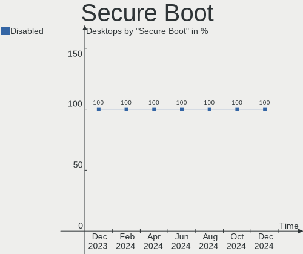
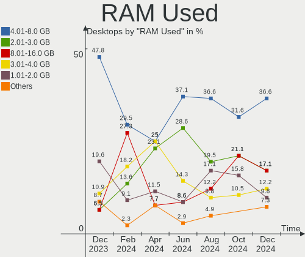
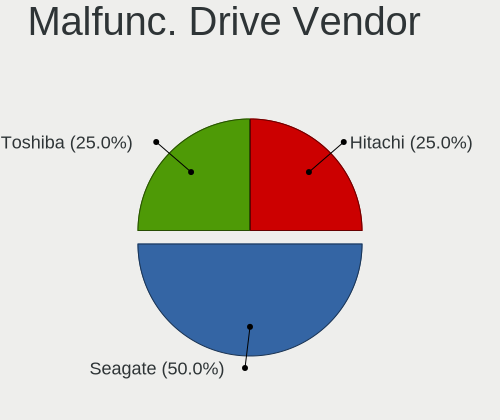
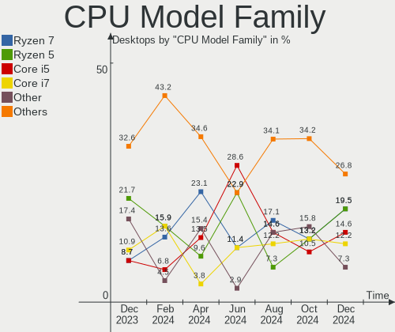
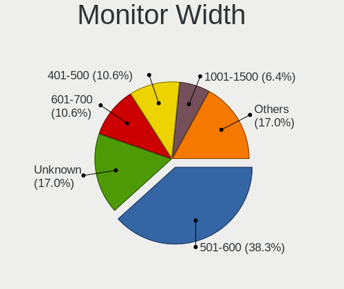
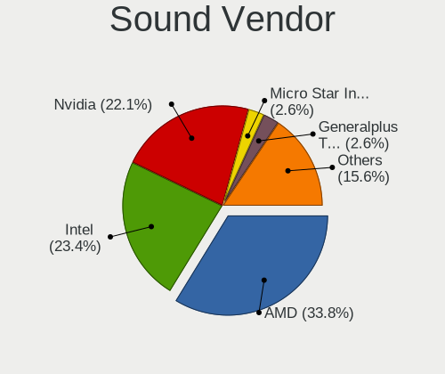

Manjaro Hardware Trends (Desktops)
----------------------------------

A project to identify most popular hardware characteristics and track their change
over time based on data collected by Manjaro users at https://Linux-Hardware.org.

Anyone can contribute to this report by the [hw-probe](https://github.com/linuxhw/hw-probe) tool:

    sudo -E hw-probe -all -upload

Full-feature report is available here: https://linux-hardware.org/?view=trends&formfactor=desktop

Period: Aug, 2021.

Contents
--------

* [ System ](#system)
  - [ OS                       ](#os)
  - [ OS Family                ](#os-family)
  - [ Kernel                   ](#kernel)
  - [ Kernel Family            ](#kernel-family)
  - [ Kernel Major Ver.        ](#kernel-major-ver)
  - [ Arch                     ](#arch)
  - [ DE                       ](#de)
  - [ Display Server           ](#display-server)
  - [ Display Manager          ](#display-manager)
  - [ OS Lang                  ](#os-lang)
  - [ Boot Mode                ](#boot-mode)
  - [ Filesystem               ](#filesystem)
  - [ Part. scheme             ](#part-scheme)
  - [ Dual Boot with Linux/BSD ](#dual-boot-with-linuxbsd)
  - [ Dual Boot (Win)          ](#dual-boot-win)

* [ Board ](#board)
  - [ Vendor                   ](#vendor)
  - [ Model                    ](#model)
  - [ Model Family             ](#model-family)
  - [ MFG Year                 ](#mfg-year)
  - [ Form Factor              ](#form-factor)
  - [ Secure Boot              ](#secure-boot)
  - [ Coreboot                 ](#coreboot)
  - [ RAM Size                 ](#ram-size)
  - [ RAM Used                 ](#ram-used)
  - [ Total Drives             ](#total-drives)
  - [ Has CD-ROM               ](#has-cd-rom)
  - [ Has Ethernet             ](#has-ethernet)
  - [ Has WiFi                 ](#has-wifi)
  - [ Has Bluetooth            ](#has-bluetooth)

* [ Location ](#location)
  - [ Country                  ](#country)
  - [ City                     ](#city)

* [ Drives ](#drives)
  - [ Drive Vendor             ](#drive-vendor)
  - [ Drive Model              ](#drive-model)
  - [ HDD Vendor               ](#hdd-vendor)
  - [ SSD Vendor               ](#ssd-vendor)
  - [ Drive Kind               ](#drive-kind)
  - [ Drive Connector          ](#drive-connector)
  - [ Drive Size               ](#drive-size)
  - [ Space Total              ](#space-total)
  - [ Space Used               ](#space-used)
  - [ Malfunc. Drives          ](#malfunc-drives)
  - [ Malfunc. Drive Vendor    ](#malfunc-drive-vendor)
  - [ Malfunc. HDD Vendor      ](#malfunc-hdd-vendor)
  - [ Malfunc. Drive Kind      ](#malfunc-drive-kind)
  - [ Failed Drives            ](#failed-drives)
  - [ Failed Drive Vendor      ](#failed-drive-vendor)
  - [ Drive Status             ](#drive-status)

* [ Storage controller ](#storage-controller)
  - [ Storage Vendor           ](#storage-vendor)
  - [ Storage Model            ](#storage-model)
  - [ Storage Kind             ](#storage-kind)

* [ Processor ](#processor)
  - [ CPU Vendor               ](#cpu-vendor)
  - [ CPU Model                ](#cpu-model)
  - [ CPU Model Family         ](#cpu-model-family)
  - [ CPU Cores                ](#cpu-cores)
  - [ CPU Sockets              ](#cpu-sockets)
  - [ CPU Threads              ](#cpu-threads)
  - [ CPU Op-Modes             ](#cpu-op-modes)
  - [ CPU Microcode            ](#cpu-microcode)
  - [ CPU Microarch            ](#cpu-microarch)

* [ Graphics ](#graphics)
  - [ GPU Vendor               ](#gpu-vendor)
  - [ GPU Model                ](#gpu-model)
  - [ GPU Combo                ](#gpu-combo)
  - [ GPU Driver               ](#gpu-driver)
  - [ GPU Memory               ](#gpu-memory)

* [ Monitor ](#monitor)
  - [ Monitor Vendor           ](#monitor-vendor)
  - [ Monitor Model            ](#monitor-model)
  - [ Monitor Resolution       ](#monitor-resolution)
  - [ Monitor Diagonal         ](#monitor-diagonal)
  - [ Monitor Width            ](#monitor-width)
  - [ Aspect Ratio             ](#aspect-ratio)
  - [ Monitor Area             ](#monitor-area)
  - [ Pixel Density            ](#pixel-density)
  - [ Multiple Monitors        ](#multiple-monitors)

* [ Network ](#network)
  - [ Net Controller Vendor    ](#net-controller-vendor)
  - [ Net Controller Model     ](#net-controller-model)
  - [ Wireless Vendor          ](#wireless-vendor)
  - [ Wireless Model           ](#wireless-model)
  - [ Ethernet Vendor          ](#ethernet-vendor)
  - [ Ethernet Model           ](#ethernet-model)
  - [ Net Controller Kind      ](#net-controller-kind)
  - [ Used Controller          ](#used-controller)
  - [ NICs                     ](#nics)
  - [ IPv6                     ](#ipv6)

* [ Bluetooth ](#bluetooth)
  - [ Bluetooth Vendor         ](#bluetooth-vendor)
  - [ Bluetooth Model          ](#bluetooth-model)

* [ Sound ](#sound)
  - [ Sound Vendor             ](#sound-vendor)
  - [ Sound Model              ](#sound-model)

* [ Memory ](#memory)
  - [ Memory Vendor            ](#memory-vendor)
  - [ Memory Model             ](#memory-model)
  - [ Memory Kind              ](#memory-kind)
  - [ Memory Form Factor       ](#memory-form-factor)
  - [ Memory Size              ](#memory-size)
  - [ Memory Speed             ](#memory-speed)

* [ Printers & scanners ](#printers--scanners)
  - [ Printer Vendor           ](#printer-vendor)
  - [ Printer Model            ](#printer-model)
  - [ Scanner Vendor           ](#scanner-vendor)
  - [ Scanner Model            ](#scanner-model)

* [ Camera ](#camera)
  - [ Camera Vendor            ](#camera-vendor)
  - [ Camera Model             ](#camera-model)

* [ Security ](#security)
  - [ Fingerprint Vendor       ](#fingerprint-vendor)
  - [ Fingerprint Model        ](#fingerprint-model)
  - [ Chipcard Vendor          ](#chipcard-vendor)
  - [ Chipcard Model           ](#chipcard-model)

* [ Unsupported ](#unsupported)
  - [ Unsupported Devices      ](#unsupported-devices)
  - [ Unsupported Device Types ](#unsupported-device-types)

System
------

OS
--

Installed operating systems

| Name           | Desktops | Percent |
|----------------|----------|---------|
| Manjaro        | 38       | 50.67%  |
| Manjaro 21.1.0 | 32       | 42.67%  |
| Manjaro 21.1.1 | 3        | 4%      |
| Manjaro 21.0.7 | 2        | 2.67%   |

OS Family
---------

OS without a version

| Name    | Desktops | Percent |
|---------|----------|---------|
| Manjaro | 75       | 100%    |

Kernel
------

Version of the Linux kernel

| Version                | Desktops | Percent |
|------------------------|----------|---------|
| 5.10.53-1-MANJARO      | 14       | 18.67%  |
| 5.13.11-1-MANJARO      | 13       | 17.33%  |
| 5.10.56-1-MANJARO      | 11       | 14.67%  |
| 5.10.59-1-MANJARO      | 10       | 13.33%  |
| 5.13.12-1-MANJARO      | 6        | 8%      |
| 5.14.0-1-MANJARO       | 4        | 5.33%   |
| 5.13.5-1-MANJARO       | 3        | 4%      |
| 5.12.19-1-MANJARO      | 3        | 4%      |
| 5.13.8-1-MANJARO       | 2        | 2.67%   |
| 5.11.22-2-MANJARO      | 2        | 2.67%   |
| 5.10.42-1-MANJARO      | 2        | 2.67%   |
| 5.9.16-1-MANJARO       | 1        | 1.33%   |
| 5.4.140-1-MANJARO      | 1        | 1.33%   |
| 5.13.9-1-MANJARO       | 1        | 1.33%   |
| 5.13.6-xanmod2-MANJARO | 1        | 1.33%   |
| 5.10.49-1-MANJARO      | 1        | 1.33%   |

Kernel Family
-------------

Linux kernel without a distro release

| Version | Desktops | Percent |
|---------|----------|---------|
| 5.10.53 | 14       | 18.67%  |
| 5.13.11 | 13       | 17.33%  |
| 5.10.56 | 11       | 14.67%  |
| 5.10.59 | 10       | 13.33%  |
| 5.13.12 | 6        | 8%      |
| 5.14.0  | 4        | 5.33%   |
| 5.13.5  | 3        | 4%      |
| 5.12.19 | 3        | 4%      |
| 5.13.8  | 2        | 2.67%   |
| 5.11.22 | 2        | 2.67%   |
| 5.10.42 | 2        | 2.67%   |
| 5.9.16  | 1        | 1.33%   |
| 5.4.140 | 1        | 1.33%   |
| 5.13.9  | 1        | 1.33%   |
| 5.13.6  | 1        | 1.33%   |
| 5.10.49 | 1        | 1.33%   |

Kernel Major Ver.
-----------------

Linux kernel major version

| Version | Desktops | Percent |
|---------|----------|---------|
| 5.10    | 38       | 50.67%  |
| 5.13    | 26       | 34.67%  |
| 5.14    | 4        | 5.33%   |
| 5.12    | 3        | 4%      |
| 5.11    | 2        | 2.67%   |
| 5.9     | 1        | 1.33%   |
| 5.4     | 1        | 1.33%   |

Arch
----

OS architecture (x86_64, i586, etc.)

| Name   | Desktops | Percent |
|--------|----------|---------|
| x86_64 | 75       | 100%    |

DE
--

Desktop Environment

| Name       | Desktops | Percent |
|------------|----------|---------|
| XFCE       | 21       | 28%     |
| KDE5       | 17       | 22.67%  |
| KDE        | 16       | 21.33%  |
| GNOME      | 15       | 20%     |
| X-Cinnamon | 5        | 6.67%   |
| i3         | 1        | 1.33%   |

Display Server
--------------

X11 or Wayland

| Name    | Desktops | Percent |
|---------|----------|---------|
| X11     | 68       | 90.67%  |
| Wayland | 6        | 8%      |
| Unknown | 1        | 1.33%   |

Display Manager
---------------

SDDM, LightDM, etc.

| Name    | Desktops | Percent |
|---------|----------|---------|
| Unknown | 37       | 49.33%  |
| SDDM    | 17       | 22.67%  |
| LightDM | 13       | 17.33%  |
| GDM     | 6        | 8%      |
| TDM     | 1        | 1.33%   |
| LXDM    | 1        | 1.33%   |

OS Lang
-------

Language

| Lang  | Desktops | Percent |
|-------|----------|---------|
| en_US | 28       | 37.33%  |
| de_DE | 13       | 17.33%  |
| ru_RU | 10       | 13.33%  |
| pt_BR | 3        | 4%      |
| fr_FR | 3        | 4%      |
| en_GB | 3        | 4%      |
| ru_UA | 2        | 2.67%   |
| es_ES | 2        | 2.67%   |
| en_IN | 2        | 2.67%   |
| zh_CN | 1        | 1.33%   |
| pl_PL | 1        | 1.33%   |
| hu_HU | 1        | 1.33%   |
| fi_FI | 1        | 1.33%   |
| en_ZA | 1        | 1.33%   |
| en_IE | 1        | 1.33%   |
| en_CA | 1        | 1.33%   |
| en_AU | 1        | 1.33%   |
| bg_BG | 1        | 1.33%   |

Boot Mode
---------

EFI or BIOS

| Mode | Desktops | Percent |
|------|----------|---------|
| BIOS | 46       | 61.33%  |
| EFI  | 29       | 38.67%  |

Filesystem
----------

Type of filesystem

| Type    | Desktops | Percent |
|---------|----------|---------|
| Ext4    | 69       | 92%     |
| Tmpfs   | 2        | 2.67%   |
| Btrfs   | 2        | 2.67%   |
| Xfs     | 1        | 1.33%   |
| Overlay | 1        | 1.33%   |

Part. scheme
------------

Scheme of partitioning

| Type    | Desktops | Percent |
|---------|----------|---------|
| Unknown | 38       | 50.67%  |
| GPT     | 31       | 41.33%  |
| MBR     | 6        | 8%      |

Dual Boot with Linux/BSD
------------------------

Hosting more than one Linux/BSD

| Dual boot | Desktops | Percent |
|-----------|----------|---------|
| No        | 62       | 82.67%  |
| Yes       | 13       | 17.33%  |

Dual Boot (Win)
---------------

Hosting Linux and Windows

| Dual boot | Desktops | Percent |
|-----------|----------|---------|
| No        | 48       | 64%     |
| Yes       | 27       | 36%     |

Board
-----

Vendor
------

Motherboard manufacturer

| Name                | Desktops | Percent |
|---------------------|----------|---------|
| Gigabyte Technology | 26       | 34.67%  |
| ASUSTek Computer    | 14       | 18.67%  |
| MSI                 | 12       | 16%     |
| ASRock              | 9        | 12%     |
| Intel               | 3        | 4%      |
| Hewlett-Packard     | 3        | 4%      |
| Dell                | 2        | 2.67%   |
| XFX                 | 1        | 1.33%   |
| Lenovo              | 1        | 1.33%   |
| Huanan              | 1        | 1.33%   |
| ECS                 | 1        | 1.33%   |
| Acer                | 1        | 1.33%   |
| Unknown             | 1        | 1.33%   |

Model
-----

Motherboard model

| Name                                 | Desktops | Percent |
|--------------------------------------|----------|---------|
| MSI MS-7C37                          | 2        | 2.67%   |
| Gigabyte B550M DS3H                  | 2        | 2.67%   |
| ASUS PRIME B450M-A                   | 2        | 2.67%   |
| ASUS All Series                      | 2        | 2.67%   |
| XFX MI-A78S-8209 Ver1.1              | 1        | 1.33%   |
| MSI p7-1421                          | 1        | 1.33%   |
| MSI MS-7D22                          | 1        | 1.33%   |
| MSI MS-7C91                          | 1        | 1.33%   |
| MSI MS-7C34                          | 1        | 1.33%   |
| MSI MS-7C09                          | 1        | 1.33%   |
| MSI MS-7B94                          | 1        | 1.33%   |
| MSI MS-7B86                          | 1        | 1.33%   |
| MSI MS-7A35                          | 1        | 1.33%   |
| MSI MS-7A32                          | 1        | 1.33%   |
| MSI MS-7758                          | 1        | 1.33%   |
| Lenovo ThinkCentre E73 10DS0015GE    | 1        | 1.33%   |
| Intel DH77EB AAG39073-304            | 1        | 1.33%   |
| Intel DH61WW AAG23116-300            | 1        | 1.33%   |
| Intel DB75EN AAG39650-302            | 1        | 1.33%   |
| Huanan X99-F8                        | 1        | 1.33%   |
| HP Pavilion Gaming Desktop TG01-1xxx | 1        | 1.33%   |
| HP Compaq dc7700 Ultra-slim Desktop  | 1        | 1.33%   |
| HP 550-153w                          | 1        | 1.33%   |
| Gigabyte Z77X-UD5H                   | 1        | 1.33%   |
| Gigabyte Z77M-D3H                    | 1        | 1.33%   |
| Gigabyte X570 AORUS PRO              | 1        | 1.33%   |
| Gigabyte X470 AORUS ULTRA GAMING     | 1        | 1.33%   |
| Gigabyte P55-USB3                    | 1        | 1.33%   |
| Gigabyte J3455N-D3H                  | 1        | 1.33%   |
| Gigabyte H97-HD3                     | 1        | 1.33%   |
| Gigabyte H87-HD3                     | 1        | 1.33%   |
| Gigabyte H410M H V2                  | 1        | 1.33%   |
| Gigabyte H310M S2V 2.0               | 1        | 1.33%   |
| Gigabyte H110M-S2                    | 1        | 1.33%   |
| Gigabyte GA-A75M-UD2H                | 1        | 1.33%   |
| Gigabyte GA-880GM-UD2H               | 1        | 1.33%   |
| Gigabyte B85-HD3                     | 1        | 1.33%   |
| Gigabyte B460MDS3HV2                 | 1        | 1.33%   |
| Gigabyte B450M S2H V2                | 1        | 1.33%   |
| Gigabyte B450M DS3H V2               | 1        | 1.33%   |
| Gigabyte B450 AORUS PRO WIFI         | 1        | 1.33%   |
| Gigabyte B450 AORUS PRO              | 1        | 1.33%   |
| Gigabyte B450 AORUS M                | 1        | 1.33%   |
| Gigabyte B250M-D2V                   | 1        | 1.33%   |
| Gigabyte AB350M-DS3H V2              | 1        | 1.33%   |
| Gigabyte A320M-H                     | 1        | 1.33%   |
| Gigabyte 970A-UD3                    | 1        | 1.33%   |
| ECS GU605AA-AB9 a6220.pt             | 1        | 1.33%   |
| Dell OptiPlex 7071                   | 1        | 1.33%   |
| Dell OptiPlex 7010                   | 1        | 1.33%   |
| ASUS VM62                            | 1        | 1.33%   |
| ASUS ROG STRIX Z370-E GAMING         | 1        | 1.33%   |
| ASUS ROG STRIX B450-F GAMING         | 1        | 1.33%   |
| ASUS Rampage III Extreme             | 1        | 1.33%   |
| ASUS PRIME H310M-E R2.0/BR           | 1        | 1.33%   |
| ASUS PRIME B350-PLUS                 | 1        | 1.33%   |
| ASUS M5A99FX PRO R2.0                | 1        | 1.33%   |
| ASUS M4A78-E                         | 1        | 1.33%   |
| ASUS M3A78-EM                        | 1        | 1.33%   |
| ASUS A88XM-A                         | 1        | 1.33%   |

Model Family
------------

Motherboard model prefix

| Name                   | Desktops | Percent |
|------------------------|----------|---------|
| ASUS PRIME             | 4        | 5.33%   |
| Gigabyte B450          | 3        | 4%      |
| MSI MS-7C37            | 2        | 2.67%   |
| Gigabyte B550M         | 2        | 2.67%   |
| Gigabyte B450M         | 2        | 2.67%   |
| Dell OptiPlex          | 2        | 2.67%   |
| ASUS ROG               | 2        | 2.67%   |
| ASUS All               | 2        | 2.67%   |
| XFX MI-A78S-8209       | 1        | 1.33%   |
| MSI p7-1421            | 1        | 1.33%   |
| MSI MS-7D22            | 1        | 1.33%   |
| MSI MS-7C91            | 1        | 1.33%   |
| MSI MS-7C34            | 1        | 1.33%   |
| MSI MS-7C09            | 1        | 1.33%   |
| MSI MS-7B94            | 1        | 1.33%   |
| MSI MS-7B86            | 1        | 1.33%   |
| MSI MS-7A35            | 1        | 1.33%   |
| MSI MS-7A32            | 1        | 1.33%   |
| MSI MS-7758            | 1        | 1.33%   |
| Lenovo ThinkCentre     | 1        | 1.33%   |
| Intel DH77EB           | 1        | 1.33%   |
| Intel DH61WW           | 1        | 1.33%   |
| Intel DB75EN           | 1        | 1.33%   |
| Huanan X99-F8          | 1        | 1.33%   |
| HP Pavilion            | 1        | 1.33%   |
| HP Compaq              | 1        | 1.33%   |
| HP 550-153w            | 1        | 1.33%   |
| Gigabyte Z77X-UD5H     | 1        | 1.33%   |
| Gigabyte Z77M-D3H      | 1        | 1.33%   |
| Gigabyte X570          | 1        | 1.33%   |
| Gigabyte X470          | 1        | 1.33%   |
| Gigabyte P55-USB3      | 1        | 1.33%   |
| Gigabyte J3455N-D3H    | 1        | 1.33%   |
| Gigabyte H97-HD3       | 1        | 1.33%   |
| Gigabyte H87-HD3       | 1        | 1.33%   |
| Gigabyte H410M         | 1        | 1.33%   |
| Gigabyte H310M         | 1        | 1.33%   |
| Gigabyte H110M-S2      | 1        | 1.33%   |
| Gigabyte GA-A75M-UD2H  | 1        | 1.33%   |
| Gigabyte GA-880GM-UD2H | 1        | 1.33%   |
| Gigabyte B85-HD3       | 1        | 1.33%   |
| Gigabyte B460MDS3HV2   | 1        | 1.33%   |
| Gigabyte B250M-D2V     | 1        | 1.33%   |
| Gigabyte AB350M-DS3H   | 1        | 1.33%   |
| Gigabyte A320M-H       | 1        | 1.33%   |
| Gigabyte 970A-UD3      | 1        | 1.33%   |
| ECS GU605AA-AB9        | 1        | 1.33%   |
| ASUS VM62              | 1        | 1.33%   |
| ASUS Rampage           | 1        | 1.33%   |
| ASUS M5A99FX           | 1        | 1.33%   |
| ASUS M4A78-E           | 1        | 1.33%   |
| ASUS M3A78-EM          | 1        | 1.33%   |
| ASUS A88XM-A           | 1        | 1.33%   |
| ASRock X570            | 1        | 1.33%   |
| ASRock H81M-HDS        | 1        | 1.33%   |
| ASRock H61M-ITX        | 1        | 1.33%   |
| ASRock H110M-DGS       | 1        | 1.33%   |
| ASRock FM2A68M-DG3+    | 1        | 1.33%   |
| ASRock B550M           | 1        | 1.33%   |
| ASRock B550            | 1        | 1.33%   |

MFG Year
--------

Motherboard manufacture year

| Year | Desktops | Percent |
|------|----------|---------|
| 2020 | 16       | 21.33%  |
| 2019 | 14       | 18.67%  |
| 2021 | 9        | 12%     |
| 2013 | 6        | 8%      |
| 2012 | 5        | 6.67%   |
| 2015 | 4        | 5.33%   |
| 2014 | 4        | 5.33%   |
| 2009 | 4        | 5.33%   |
| 2018 | 3        | 4%      |
| 2017 | 2        | 2.67%   |
| 2016 | 2        | 2.67%   |
| 2011 | 2        | 2.67%   |
| 2010 | 2        | 2.67%   |
| 2007 | 2        | 2.67%   |

Form Factor
-----------

Physical design of the computer

| Name    | Desktops | Percent |
|---------|----------|---------|
| Desktop | 75       | 100%    |

Secure Boot
-----------

Enabled or disabled

| State    | Desktops | Percent |
|----------|----------|---------|
| Disabled | 75       | 100%    |

Coreboot
--------

Have coreboot on board

| Used | Desktops | Percent |
|------|----------|---------|
| No   | 75       | 100%    |

RAM Size
--------

Total RAM memory

| Size in GB  | Desktops | Percent |
|-------------|----------|---------|
| 16.01-24.0  | 24       | 32%     |
| 8.01-16.0   | 19       | 25.33%  |
| 32.01-64.0  | 12       | 16%     |
| 4.01-8.0    | 11       | 14.67%  |
| 3.01-4.0    | 6        | 8%      |
| 64.01-256.0 | 2        | 2.67%   |
| 2.01-3.0    | 1        | 1.33%   |

RAM Used
--------

Used RAM memory

| Used GB   | Desktops | Percent |
|-----------|----------|---------|
| 2.01-3.0  | 22       | 29.33%  |
| 1.01-2.0  | 20       | 26.67%  |
| 4.01-8.0  | 14       | 18.67%  |
| 3.01-4.0  | 12       | 16%     |
| 8.01-16.0 | 5        | 6.67%   |
| 0.51-1.0  | 2        | 2.67%   |

Total Drives
------------

Number of drives on board

| Drives | Desktops | Percent |
|--------|----------|---------|
| 2      | 23       | 30.67%  |
| 3      | 20       | 26.67%  |
| 1      | 18       | 24%     |
| 4      | 8        | 10.67%  |
| 5      | 4        | 5.33%   |
| 6      | 2        | 2.67%   |

Has CD-ROM
----------

Has CD-ROM on board

| Presented | Desktops | Percent |
|-----------|----------|---------|
| No        | 54       | 72%     |
| Yes       | 21       | 28%     |

Has Ethernet
------------

Has Ethernet on board

| Presented | Desktops | Percent |
|-----------|----------|---------|
| Yes       | 74       | 98.67%  |
| No        | 1        | 1.33%   |

Has WiFi
--------

Has WiFi module

| Presented | Desktops | Percent |
|-----------|----------|---------|
| No        | 41       | 54.67%  |
| Yes       | 34       | 45.33%  |

Has Bluetooth
-------------

Has Bluetooth module

| Presented | Desktops | Percent |
|-----------|----------|---------|
| No        | 44       | 58.67%  |
| Yes       | 31       | 41.33%  |

Location
--------

Country
-------

Geographic location (country)

| Country      | Desktops | Percent |
|--------------|----------|---------|
| Germany      | 18       | 24%     |
| USA          | 12       | 16%     |
| Russia       | 8        | 10.67%  |
| Brazil       | 5        | 6.67%   |
| France       | 4        | 5.33%   |
| Ukraine      | 2        | 2.67%   |
| UK           | 2        | 2.67%   |
| India        | 2        | 2.67%   |
| Canada       | 2        | 2.67%   |
| Bulgaria     | 2        | 2.67%   |
| Spain        | 1        | 1.33%   |
| South Africa | 1        | 1.33%   |
| Romania      | 1        | 1.33%   |
| Portugal     | 1        | 1.33%   |
| Poland       | 1        | 1.33%   |
| Moldova      | 1        | 1.33%   |
| Malaysia     | 1        | 1.33%   |
| Latvia       | 1        | 1.33%   |
| Kazakhstan   | 1        | 1.33%   |
| Ireland      | 1        | 1.33%   |
| Hungary      | 1        | 1.33%   |
| Hong Kong    | 1        | 1.33%   |
| Finland      | 1        | 1.33%   |
| Estonia      | 1        | 1.33%   |
| Ecuador      | 1        | 1.33%   |
| Belarus      | 1        | 1.33%   |
| Australia    | 1        | 1.33%   |
| Argentina    | 1        | 1.33%   |

City
----

Geographic location (city)

| City                 | Desktops | Percent |
|----------------------|----------|---------|
| S??o Paulo           | 2        | 2.67%   |
| Moscow               | 2        | 2.67%   |
| Frankfurt am Main    | 2        | 2.67%   |
| Weitramsdorf         | 1        | 1.33%   |
| Weilmuenster         | 1        | 1.33%   |
| Vidnoye              | 1        | 1.33%   |
| Versailles           | 1        | 1.33%   |
| Ulan-Ude             | 1        | 1.33%   |
| Uelsen               | 1        | 1.33%   |
| Trenton              | 1        | 1.33%   |
| Temirtau             | 1        | 1.33%   |
| Taylor               | 1        | 1.33%   |
| Tartu                | 1        | 1.33%   |
| Tadepallegudem       | 1        | 1.33%   |
| St Petersburg        | 1        | 1.33%   |
| Sovata               | 1        | 1.33%   |
| Sofia                | 1        | 1.33%   |
| Sligo                | 1        | 1.33%   |
| Seattle              | 1        | 1.33%   |
| Schmoelln            | 1        | 1.33%   |
| San Jose             | 1        | 1.33%   |
| Rivne                | 1        | 1.33%   |
| Riga                 | 1        | 1.33%   |
| Recife               | 1        | 1.33%   |
| R??sselsheim am Main | 1        | 1.33%   |
| Queens               | 1        | 1.33%   |
| Pinxton              | 1        | 1.33%   |
| Petaling Jaya        | 1        | 1.33%   |
| Paris                | 1        | 1.33%   |
| Ocala                | 1        | 1.33%   |
| Nozdrzec             | 1        | 1.33%   |
| Musquodoboit Harbour | 1        | 1.33%   |
| Murr                 | 1        | 1.33%   |
| Munich               | 1        | 1.33%   |
| Monte Grande         | 1        | 1.33%   |
| Mogi das Cruzes      | 1        | 1.33%   |
| Minsk                | 1        | 1.33%   |
| Miami                | 1        | 1.33%   |
| Mezofalva            | 1        | 1.33%   |
| Marl                 | 1        | 1.33%   |
| Magnitogorsk         | 1        | 1.33%   |
| Madrid               | 1        | 1.33%   |
| Lisbon               | 1        | 1.33%   |
| Lille                | 1        | 1.33%   |
| Le Mans              | 1        | 1.33%   |
| Kisel?«vsk           | 1        | 1.33%   |
| Karlsruhe            | 1        | 1.33%   |
| Herne                | 1        | 1.33%   |
| H?¤meenlinna         | 1        | 1.33%   |
| Hawthorne            | 1        | 1.33%   |
| Guayaquil            | 1        | 1.33%   |
| Grafenau             | 1        | 1.33%   |
| Gera                 | 1        | 1.33%   |
| G??tersloh           | 1        | 1.33%   |
| G?¶ppingen           | 1        | 1.33%   |
| Dnipropetrovsk       | 1        | 1.33%   |
| Dayton               | 1        | 1.33%   |
| Cotia                | 1        | 1.33%   |
| Compi??gne           | 1        | 1.33%   |
| Chernogorsk          | 1        | 1.33%   |

Drives
------

Drive Vendor
------------

Hard drive vendors

| Vendor                    | Desktops | Drives | Percent |
|---------------------------|----------|--------|---------|
| Seagate                   | 35       | 39     | 21.08%  |
| WDC                       | 33       | 38     | 19.88%  |
| Samsung Electronics       | 23       | 31     | 13.86%  |
| Kingston                  | 15       | 18     | 9.04%   |
| SanDisk                   | 9        | 10     | 5.42%   |
| Crucial                   | 7        | 11     | 4.22%   |
| Toshiba                   | 6        | 6      | 3.61%   |
| Hitachi                   | 5        | 5      | 3.01%   |
| Intel                     | 4        | 4      | 2.41%   |
| PNY                       | 3        | 4      | 1.81%   |
| Phison                    | 3        | 3      | 1.81%   |
| A-DATA Technology         | 3        | 3      | 1.81%   |
| Transcend                 | 2        | 2      | 1.2%    |
| XPG                       | 1        | 1      | 0.6%    |
| Unknown                   | 1        | 1      | 0.6%    |
| Team                      | 1        | 1      | 0.6%    |
| SPCC                      | 1        | 1      | 0.6%    |
| Realtek Semiconductor     | 1        | 1      | 0.6%    |
| PLEXTOR                   | 1        | 1      | 0.6%    |
| Pioneer                   | 1        | 1      | 0.6%    |
| Patriot                   | 1        | 1      | 0.6%    |
| OCZ                       | 1        | 1      | 0.6%    |
| Micron/Crucial Technology | 1        | 1      | 0.6%    |
| Lexar                     | 1        | 1      | 0.6%    |
| KingSpec                  | 1        | 1      | 0.6%    |
| Intenso                   | 1        | 1      | 0.6%    |
| HGST                      | 1        | 1      | 0.6%    |
| FOXLINE                   | 1        | 1      | 0.6%    |
| China                     | 1        | 1      | 0.6%    |
| ASMT                      | 1        | 1      | 0.6%    |
| Apacer                    | 1        | 1      | 0.6%    |

Drive Model
-----------

Hard drive models

| Model                             | Desktops | Percent |
|-----------------------------------|----------|---------|
| WDC WD10EZEX-00BN5A0 1TB          | 4        | 2.16%   |
| Seagate ST2000DM008-2FR102 2TB    | 4        | 2.16%   |
| Kingston SA400S37120G 120GB SSD   | 4        | 2.16%   |
| Toshiba HDWD110 1TB               | 3        | 1.62%   |
| Seagate ST1000DM010-2EP102 1TB    | 3        | 1.62%   |
| Seagate Expansion 2TB             | 3        | 1.62%   |
| Sandisk NVMe SSD Drive 1TB        | 3        | 1.62%   |
| Samsung SSD 860 EVO 500GB         | 3        | 1.62%   |
| Kingston SA400S37480G 480GB SSD   | 3        | 1.62%   |
| Kingston SA400S37240G 240GB SSD   | 3        | 1.62%   |
| WDC WD5000AAKX-001CA0 500GB       | 2        | 1.08%   |
| Toshiba MQ01ABD050V 500GB         | 2        | 1.08%   |
| Seagate ST8000DM004-2CX188 8TB    | 2        | 1.08%   |
| Seagate ST500DM002-1BD142 500GB   | 2        | 1.08%   |
| Seagate ST3500413AS 500GB         | 2        | 1.08%   |
| Seagate Backup+ Hub BK 10TB       | 2        | 1.08%   |
| Samsung SSD 870 QVO 1TB           | 2        | 1.08%   |
| Samsung SSD 860 EVO 1TB           | 2        | 1.08%   |
| Samsung SSD 850 EVO 250GB         | 2        | 1.08%   |
| Phison NVMe SSD Drive 256GB       | 2        | 1.08%   |
| Kingston SHFS37A120G 120GB SSD    | 2        | 1.08%   |
| Crucial CT500MX200SSD1 500GB      | 2        | 1.08%   |
| XPG NVMe SSD Drive 256GB          | 1        | 0.54%   |
| WDC WDS500G3X0C-00SJG0 500GB      | 1        | 0.54%   |
| WDC WDS500G2B0B-00YS70 500GB SSD  | 1        | 0.54%   |
| WDC WDS500G2B0A-00SM50 500GB SSD  | 1        | 0.54%   |
| WDC WDS500G1B0A-00H9H0 500GB SSD  | 1        | 0.54%   |
| WDC WDS200T2B0C-00PXH0 2TB        | 1        | 0.54%   |
| WDC WDS120G2G0A-00JH30 120GB SSD  | 1        | 0.54%   |
| WDC WDS100T3X0C-00SJG0 1TB        | 1        | 0.54%   |
| WDC WDS100T2B0C-00PXH0 1TB        | 1        | 0.54%   |
| WDC WD800JD-08LSA0 80GB           | 1        | 0.54%   |
| WDC WD7500AZEX-00RKKA0 752GB      | 1        | 0.54%   |
| WDC WD5003AZEX-00K1GA0 500GB      | 1        | 0.54%   |
| WDC WD5000LUCT-63RC2Y0 500GB      | 1        | 0.54%   |
| WDC WD5000AADS-56S9B0 500GB       | 1        | 0.54%   |
| WDC WD5000AADS-00L4B1 500GB       | 1        | 0.54%   |
| WDC WD5000AACS-00G8B1 500GB       | 1        | 0.54%   |
| WDC WD3200AAKS-75SBA0 320GB       | 1        | 0.54%   |
| WDC WD2500AAJS-07M0A0 250GB       | 1        | 0.54%   |
| WDC WD2500AAJS-00YZCA0 250GB      | 1        | 0.54%   |
| WDC WD20EFRX-68EUZN0 2TB          | 1        | 0.54%   |
| WDC WD2002FAEX-00MJRA0 2TB        | 1        | 0.54%   |
| WDC WD2000FYYZ-01UL1B0 2TB        | 1        | 0.54%   |
| WDC WD15EARS-00MVWB0 1TB          | 1        | 0.54%   |
| WDC WD121KRYZ-01W0RB0 12TB        | 1        | 0.54%   |
| WDC WD10SPZX-21Z10T0 1TB          | 1        | 0.54%   |
| WDC WD10EZRX-00A8LB0 1TB          | 1        | 0.54%   |
| WDC WD10EZEX-60M2NA0 1TB          | 1        | 0.54%   |
| WDC WD10EZEX-21M2NA0 1TB          | 1        | 0.54%   |
| WDC WD10EZEX-00WN4A0 1TB          | 1        | 0.54%   |
| WDC WD10EFRX-68JCSN0 1TB          | 1        | 0.54%   |
| WDC WD10EALX-009BA0 1TB           | 1        | 0.54%   |
| WDC WD10EADS-00L5B1 1TB           | 1        | 0.54%   |
| Unknown SD/MMC/MS PRO 128GB       | 1        | 0.54%   |
| Transcend TS512GSSD370S 512GB     | 1        | 0.54%   |
| Transcend TS120GMTS820S 120GB SSD | 1        | 0.54%   |
| Toshiba DT01ACA200 2TB            | 1        | 0.54%   |
| Team T2535T240G 240GB SSD         | 1        | 0.54%   |
| SPCC Solid State Disk 512GB       | 1        | 0.54%   |

HDD Vendor
----------

Hard disk drive vendors

| Vendor              | Desktops | Drives | Percent |
|---------------------|----------|--------|---------|
| Seagate             | 33       | 36     | 41.25%  |
| WDC                 | 28       | 30     | 35%     |
| Samsung Electronics | 7        | 8      | 8.75%   |
| Toshiba             | 6        | 6      | 7.5%    |
| Hitachi             | 5        | 5      | 6.25%   |
| HGST                | 1        | 1      | 1.25%   |

SSD Vendor
----------

Solid state drive vendors

| Vendor              | Desktops | Drives | Percent |
|---------------------|----------|--------|---------|
| Kingston            | 14       | 17     | 23.73%  |
| Samsung Electronics | 12       | 15     | 20.34%  |
| Crucial             | 6        | 10     | 10.17%  |
| WDC                 | 4        | 4      | 6.78%   |
| SanDisk             | 3        | 3      | 5.08%   |
| Transcend           | 2        | 2      | 3.39%   |
| PNY                 | 2        | 3      | 3.39%   |
| Intel               | 2        | 2      | 3.39%   |
| Team                | 1        | 1      | 1.69%   |
| SPCC                | 1        | 1      | 1.69%   |
| Seagate             | 1        | 1      | 1.69%   |
| PLEXTOR             | 1        | 1      | 1.69%   |
| Pioneer             | 1        | 1      | 1.69%   |
| Patriot             | 1        | 1      | 1.69%   |
| OCZ                 | 1        | 1      | 1.69%   |
| Lexar               | 1        | 1      | 1.69%   |
| KingSpec            | 1        | 1      | 1.69%   |
| FOXLINE             | 1        | 1      | 1.69%   |
| China               | 1        | 1      | 1.69%   |
| ASMT                | 1        | 1      | 1.69%   |
| Apacer              | 1        | 1      | 1.69%   |
| A-DATA Technology   | 1        | 1      | 1.69%   |

Drive Kind
----------

HDD or SSD

| Kind    | Desktops | Drives | Percent |
|---------|----------|--------|---------|
| HDD     | 56       | 86     | 43.75%  |
| SSD     | 45       | 70     | 35.16%  |
| NVMe    | 23       | 32     | 17.97%  |
| Unknown | 4        | 4      | 3.13%   |

Drive Connector
---------------

SATA, SAS, NVMe, etc.

| Type | Desktops | Drives | Percent |
|------|----------|--------|---------|
| SATA | 69       | 151    | 68.32%  |
| NVMe | 23       | 32     | 22.77%  |
| SAS  | 9        | 9      | 8.91%   |

Drive Size
----------

Size of hard drive

| Size in TB | Desktops | Drives | Percent |
|------------|----------|--------|---------|
| 0.01-0.5   | 54       | 89     | 47.79%  |
| 0.51-1.0   | 37       | 43     | 32.74%  |
| 1.01-2.0   | 16       | 17     | 14.16%  |
| 2.01-3.0   | 2        | 3      | 1.77%   |
| 4.01-10.0  | 2        | 2      | 1.77%   |
| 3.01-4.0   | 1        | 1      | 0.88%   |
| 10.01-20.0 | 1        | 1      | 0.88%   |

Space Total
-----------

Amount of disk space available on the file system

| Size in GB     | Desktops | Percent |
|----------------|----------|---------|
| 101-250        | 22       | 29.33%  |
| 501-1000       | 15       | 20%     |
| 251-500        | 11       | 14.67%  |
| 1001-2000      | 10       | 13.33%  |
| More than 3000 | 6        | 8%      |
| 2001-3000      | 3        | 4%      |
| Unknown        | 3        | 4%      |
| 1-20           | 2        | 2.67%   |
| 51-100         | 2        | 2.67%   |
| 21-50          | 1        | 1.33%   |

Space Used
----------

Amount of used disk space

| Used GB        | Desktops | Percent |
|----------------|----------|---------|
| 1-20           | 14       | 18.67%  |
| 21-50          | 12       | 16%     |
| 101-250        | 11       | 14.67%  |
| 251-500        | 9        | 12%     |
| 51-100         | 9        | 12%     |
| 501-1000       | 8        | 10.67%  |
| More than 3000 | 5        | 6.67%   |
| 1001-2000      | 4        | 5.33%   |
| Unknown        | 3        | 4%      |

Malfunc. Drives
---------------

Drive models with a malfunction

| Model                           | Desktops | Drives | Percent |
|---------------------------------|----------|--------|---------|
| WDC WD5000AACS-00G8B1 500GB     | 1        | 1      | 14.29%  |
| WDC WD15EARS-00MVWB0 1TB        | 1        | 1      | 14.29%  |
| Seagate ST3500630NS 500GB       | 1        | 1      | 14.29%  |
| Seagate ST3500413AS 500GB       | 1        | 1      | 14.29%  |
| Samsung Electronics HD103UJ 1TB | 1        | 1      | 14.29%  |
| Patriot P200 512GB SSD          | 1        | 1      | 14.29%  |
| Hitachi HUS724030ALA640 3TB     | 1        | 1      | 14.29%  |

Malfunc. Drive Vendor
---------------------

Vendors of faulty drives

| Vendor              | Desktops | Drives | Percent |
|---------------------|----------|--------|---------|
| Seagate             | 2        | 2      | 33.33%  |
| WDC                 | 1        | 2      | 16.67%  |
| Samsung Electronics | 1        | 1      | 16.67%  |
| Patriot             | 1        | 1      | 16.67%  |
| Hitachi             | 1        | 1      | 16.67%  |

Malfunc. HDD Vendor
-------------------

Vendors of faulty HDD drives

| Vendor              | Desktops | Drives | Percent |
|---------------------|----------|--------|---------|
| Seagate             | 2        | 2      | 40%     |
| WDC                 | 1        | 2      | 20%     |
| Samsung Electronics | 1        | 1      | 20%     |
| Hitachi             | 1        | 1      | 20%     |

Malfunc. Drive Kind
-------------------

Kinds of faulty drives

| Kind | Desktops | Drives | Percent |
|------|----------|--------|---------|
| HDD  | 5        | 6      | 83.33%  |
| SSD  | 1        | 1      | 16.67%  |

Failed Drives
-------------

Failed drive models

Zero info for selected period =(

Failed Drive Vendor
-------------------

Failed drive vendors

Zero info for selected period =(

Drive Status
------------

Number of failed and malfunc. drives

| Status   | Desktops | Drives | Percent |
|----------|----------|--------|---------|
| Detected | 48       | 106    | 56.47%  |
| Works    | 31       | 79     | 36.47%  |
| Malfunc  | 6        | 7      | 7.06%   |

Storage controller
------------------

Storage Vendor
--------------

Storage controller vendors

| Vendor                      | Desktops | Percent |
|-----------------------------|----------|---------|
| Intel                       | 38       | 34.55%  |
| AMD                         | 36       | 32.73%  |
| Sandisk                     | 8        | 7.27%   |
| Samsung Electronics         | 7        | 6.36%   |
| ASMedia Technology          | 6        | 5.45%   |
| Phison Electronics          | 4        | 3.64%   |
| Realtek Semiconductor       | 2        | 1.82%   |
| Micron/Crucial Technology   | 2        | 1.82%   |
| Marvell Technology Group    | 2        | 1.82%   |
| ADATA Technology            | 2        | 1.82%   |
| Nvidia                      | 1        | 0.91%   |
| Kingston Technology Company | 1        | 0.91%   |
| JMicron Technology          | 1        | 0.91%   |

Storage Model
-------------

Storage controller models

| Model                                                                          | Desktops | Percent |
|--------------------------------------------------------------------------------|----------|---------|
| AMD FCH SATA Controller [AHCI mode]                                            | 24       | 18.05%  |
| AMD 400 Series Chipset SATA Controller                                         | 11       | 8.27%   |
| Intel 200 Series PCH SATA controller [AHCI mode]                               | 7        | 5.26%   |
| Intel 8 Series/C220 Series Chipset Family 6-port SATA Controller 1 [AHCI mode] | 6        | 4.51%   |
| Intel 7 Series/C210 Series Chipset Family 6-port SATA Controller [AHCI mode]   | 6        | 4.51%   |
| ASMedia ASM1062 Serial ATA Controller                                          | 6        | 4.51%   |
| Sandisk WD Blue SN550 NVMe SSD                                                 | 5        | 3.76%   |
| Samsung NVMe SSD Controller SM981/PM981/PM983                                  | 4        | 3.01%   |
| AMD Starship/Matisse Chipset SATA Controller [AHCI mode]                       | 4        | 3.01%   |
| AMD SB7x0/SB8x0/SB9x0 SATA Controller [IDE mode]                               | 4        | 3.01%   |
| AMD SB7x0/SB8x0/SB9x0 IDE Controller                                           | 4        | 3.01%   |
| Sandisk WD Black SN750 / PC SN730 NVMe SSD                                     | 3        | 2.26%   |
| Phison PS5013 E13 NVMe Controller                                              | 2        | 1.5%    |
| Phison E12 NVMe Controller                                                     | 2        | 1.5%    |
| Intel SSD 660P Series                                                          | 2        | 1.5%    |
| Intel Q170/Q150/B150/H170/H110/Z170/CM236 Chipset SATA Controller [AHCI Mode]  | 2        | 1.5%    |
| Intel Comet Lake SATA AHCI Controller                                          | 2        | 1.5%    |
| Intel 82801JI (ICH10 Family) SATA AHCI Controller                              | 2        | 1.5%    |
| Intel 6 Series/C200 Series Chipset Family 6 port Desktop SATA AHCI Controller  | 2        | 1.5%    |
| AMD X370 Series Chipset SATA Controller                                        | 2        | 1.5%    |
| AMD SB7x0/SB8x0/SB9x0 SATA Controller [AHCI mode]                              | 2        | 1.5%    |
| AMD 300 Series Chipset SATA Controller                                         | 2        | 1.5%    |
| ADATA XPG SX8200 Pro PCIe Gen3x4 M.2 2280 Solid State Drive                    | 2        | 1.5%    |
| Sandisk WD Black 2018/SN750 / PC SN720 NVMe SSD                                | 1        | 0.75%   |
| Sandisk Non-Volatile memory controller                                         | 1        | 0.75%   |
| Samsung NVMe SSD Controller SM951/PM951                                        | 1        | 0.75%   |
| Samsung NVMe SSD Controller PM9A1/PM9A3/980PRO                                 | 1        | 0.75%   |
| Samsung NVMe Controller                                                        | 1        | 0.75%   |
| Realtek RTS5763DL NVMe SSD Controller                                          | 1        | 0.75%   |
| Realtek Realtek Non-Volatile memory controller                                 | 1        | 0.75%   |
| Nvidia MCP78S [GeForce 8200] SATA Controller (non-AHCI mode)                   | 1        | 0.75%   |
| Micron/Crucial P2 NVMe PCIe SSD                                                | 1        | 0.75%   |
| Micron/Crucial P1 NVMe PCIe SSD                                                | 1        | 0.75%   |
| Marvell Group 88SE9230 PCIe 2.0 x2 4-port SATA 6 Gb/s RAID Controller          | 1        | 0.75%   |
| Marvell Group 88SE9172 SATA 6Gb/s Controller                                   | 1        | 0.75%   |
| Kingston Company KC2000 NVMe SSD                                               | 1        | 0.75%   |
| JMicron JMB363 SATA/IDE Controller                                             | 1        | 0.75%   |
| Intel SATA Controller [RAID mode]                                              | 1        | 0.75%   |
| Intel NM10/ICH7 Family SATA Controller [IDE mode]                              | 1        | 0.75%   |
| Intel Celeron N3350/Pentium N4200/Atom E3900 Series SATA AHCI Controller       | 1        | 0.75%   |
| Intel Cannon Lake PCH SATA AHCI Controller                                     | 1        | 0.75%   |
| Intel C610/X99 series chipset 6-Port SATA Controller [AHCI mode]               | 1        | 0.75%   |
| Intel 9 Series Chipset Family SATA Controller [AHCI Mode]                      | 1        | 0.75%   |
| Intel 82801H (ICH8 Family) 4 port SATA Controller [IDE mode]                   | 1        | 0.75%   |
| Intel 82801G (ICH7 Family) IDE Controller                                      | 1        | 0.75%   |
| Intel 8 Series SATA Controller 1 [AHCI mode]                                   | 1        | 0.75%   |
| Intel 500 Series Chipset Family SATA AHCI Controller                           | 1        | 0.75%   |
| Intel 5 Series/3400 Series Chipset 6 port SATA AHCI Controller                 | 1        | 0.75%   |
| AMD FCH SATA Controller D                                                      | 1        | 0.75%   |
| AMD FCH RAID Controller                                                        | 1        | 0.75%   |

Storage Kind
------------

Kind of storage controller (IDE, SATA, NVMe, SAS, ...)

| Kind | Desktops | Percent |
|------|----------|---------|
| SATA | 70       | 67.96%  |
| NVMe | 23       | 22.33%  |
| IDE  | 8        | 7.77%   |
| RAID | 2        | 1.94%   |

Processor
---------

CPU Vendor
----------

Processor vendors

| Vendor | Desktops | Percent |
|--------|----------|---------|
| Intel  | 38       | 50.67%  |
| AMD    | 37       | 49.33%  |

CPU Model
---------

Processor models

| Model                                         | Desktops | Percent |
|-----------------------------------------------|----------|---------|
| AMD Ryzen 7 2700X Eight-Core Processor        | 4        | 5.33%   |
| Intel Core i5-3450 CPU @ 3.10GHz              | 3        | 4%      |
| AMD Ryzen 5 3600 6-Core Processor             | 3        | 4%      |
| AMD Ryzen 5 2600X Six-Core Processor          | 3        | 4%      |
| Intel Core i5-9400F CPU @ 2.90GHz             | 2        | 2.67%   |
| Intel Core i3-4170 CPU @ 3.70GHz              | 2        | 2.67%   |
| AMD Ryzen 5 3600X 6-Core Processor            | 2        | 2.67%   |
| AMD Phenom II X6 1100T Processor              | 2        | 2.67%   |
| Intel Xeon CPU X5450 @ 3.00GHz                | 1        | 1.33%   |
| Intel Xeon CPU X3470 @ 2.93GHz                | 1        | 1.33%   |
| Intel Xeon CPU E5-2680 v3 @ 2.50GHz           | 1        | 1.33%   |
| Intel Xeon CPU E3-1240 v3 @ 3.40GHz           | 1        | 1.33%   |
| Intel Pentium Gold G5420 CPU @ 3.80GHz        | 1        | 1.33%   |
| Intel Pentium Gold G5400 CPU @ 3.70GHz        | 1        | 1.33%   |
| Intel Pentium Dual CPU E2160 @ 1.80GHz        | 1        | 1.33%   |
| Intel Pentium Dual CPU E2140 @ 1.60GHz        | 1        | 1.33%   |
| Intel Pentium CPU G3220 @ 3.00GHz             | 1        | 1.33%   |
| Intel Genuine CPU 0000 @ 2.40GHz              | 1        | 1.33%   |
| Intel Core i9-10900X CPU @ 3.70GHz            | 1        | 1.33%   |
| Intel Core i7-9700 CPU @ 3.00GHz              | 1        | 1.33%   |
| Intel Core i7-8700K CPU @ 3.70GHz             | 1        | 1.33%   |
| Intel Core i7-7700 CPU @ 3.60GHz              | 1        | 1.33%   |
| Intel Core i7-4770K CPU @ 3.50GHz             | 1        | 1.33%   |
| Intel Core i7-3770 CPU @ 3.40GHz              | 1        | 1.33%   |
| Intel Core i7 CPU X 980 @ 3.33GHz             | 1        | 1.33%   |
| Intel Core i5-6500 CPU @ 3.20GHz              | 1        | 1.33%   |
| Intel Core i5-4690K CPU @ 3.50GHz             | 1        | 1.33%   |
| Intel Core i5-4440 CPU @ 3.10GHz              | 1        | 1.33%   |
| Intel Core i5-3570K CPU @ 3.40GHz             | 1        | 1.33%   |
| Intel Core i5-3570 CPU @ 3.40GHz              | 1        | 1.33%   |
| Intel Core i5-2500 CPU @ 3.30GHz              | 1        | 1.33%   |
| Intel Core i5-10600K CPU @ 4.10GHz            | 1        | 1.33%   |
| Intel Core i5-10400F CPU @ 2.90GHz            | 1        | 1.33%   |
| Intel Core i5-10400 CPU @ 2.90GHz             | 1        | 1.33%   |
| Intel Core i3-4360 CPU @ 3.70GHz              | 1        | 1.33%   |
| Intel Core i3-4005U CPU @ 1.70GHz             | 1        | 1.33%   |
| Intel Core i3-3220 CPU @ 3.30GHz              | 1        | 1.33%   |
| Intel Core i3-10100F CPU @ 3.60GHz            | 1        | 1.33%   |
| Intel Celeron CPU J3455 @ 1.50GHz             | 1        | 1.33%   |
| AMD Ryzen 9 5900X 12-Core Processor           | 1        | 1.33%   |
| AMD Ryzen 9 3950X 16-Core Processor           | 1        | 1.33%   |
| AMD Ryzen 9 3900X 12-Core Processor           | 1        | 1.33%   |
| AMD Ryzen 7 5800X 8-Core Processor            | 1        | 1.33%   |
| AMD Ryzen 7 5700G with Radeon Graphics        | 1        | 1.33%   |
| AMD Ryzen 7 3700X 8-Core Processor            | 1        | 1.33%   |
| AMD Ryzen 7 2700 Eight-Core Processor         | 1        | 1.33%   |
| AMD Ryzen 7 1700 Eight-Core Processor         | 1        | 1.33%   |
| AMD Ryzen 5 3600XT 6-Core Processor           | 1        | 1.33%   |
| AMD Ryzen 5 2600 Six-Core Processor           | 1        | 1.33%   |
| AMD Ryzen 5 2400G with Radeon Vega Graphics   | 1        | 1.33%   |
| AMD Ryzen 5 1600 Six-Core Processor           | 1        | 1.33%   |
| AMD Ryzen 3 PRO 4350G with Radeon Graphics    | 1        | 1.33%   |
| AMD Ryzen 3 3200G with Radeon Vega Graphics   | 1        | 1.33%   |
| AMD Phenom II X4 970 Processor                | 1        | 1.33%   |
| AMD Phenom II X4 945 Processor                | 1        | 1.33%   |
| AMD FX-6300 Six-Core Processor                | 1        | 1.33%   |
| AMD Athlon II X4 651 Quad-Core Processor      | 1        | 1.33%   |
| AMD Athlon Dual Core Processor 5400B          | 1        | 1.33%   |
| AMD Athlon 64 X2 Dual Core Processor 3600+    | 1        | 1.33%   |
| AMD A8-7680 Radeon R7, 10 Compute Cores 4C+6G | 1        | 1.33%   |

CPU Model Family
----------------

Processor model prefix

| Model                | Desktops | Percent |
|----------------------|----------|---------|
| Intel Core i5        | 14       | 18.67%  |
| AMD Ryzen 5          | 12       | 16%     |
| AMD Ryzen 7          | 9        | 12%     |
| Intel Core i7        | 6        | 8%      |
| Intel Core i3        | 6        | 8%      |
| Intel Xeon           | 4        | 5.33%   |
| AMD Ryzen 9          | 3        | 4%      |
| AMD A8               | 3        | 4%      |
| Intel Pentium Gold   | 2        | 2.67%   |
| Intel Pentium Dual   | 2        | 2.67%   |
| AMD Phenom II X6     | 2        | 2.67%   |
| AMD Phenom II X4     | 2        | 2.67%   |
| Intel Pentium        | 1        | 1.33%   |
| Intel Genuine        | 1        | 1.33%   |
| Intel Core i9        | 1        | 1.33%   |
| Intel Celeron        | 1        | 1.33%   |
| AMD Ryzen 3 PRO      | 1        | 1.33%   |
| AMD Ryzen 3          | 1        | 1.33%   |
| AMD FX               | 1        | 1.33%   |
| AMD Athlon II X4     | 1        | 1.33%   |
| AMD Athlon Dual Core | 1        | 1.33%   |
| AMD Athlon 64 X2     | 1        | 1.33%   |

CPU Cores
---------

Number of processor cores

| Number | Desktops | Percent |
|--------|----------|---------|
| 4      | 24       | 32%     |
| 6      | 20       | 26.67%  |
| 2      | 15       | 20%     |
| 8      | 10       | 13.33%  |
| 12     | 3        | 4%      |
| 16     | 1        | 1.33%   |
| 10     | 1        | 1.33%   |
| 3      | 1        | 1.33%   |

CPU Sockets
-----------

Number of sockets

| Number | Desktops | Percent |
|--------|----------|---------|
| 1      | 75       | 100%    |

CPU Threads
-----------

Threads per core (Hyper-Threading)

| Number | Desktops | Percent |
|--------|----------|---------|
| 2      | 50       | 66.67%  |
| 1      | 25       | 33.33%  |

CPU Op-Modes
------------

CPU Operation Modes (32-bit, 64-bit)

| Op mode        | Desktops | Percent |
|----------------|----------|---------|
| 32-bit, 64-bit | 75       | 100%    |

CPU Microcode
-------------

Microcode number

| Number     | Desktops | Percent |
|------------|----------|---------|
| Unknown    | 37       | 49.33%  |
| 0x08701021 | 5        | 6.67%   |
| 0x0800820d | 4        | 5.33%   |
| 0x906ea    | 3        | 4%      |
| 0x306c3    | 3        | 4%      |
| 0xa0655    | 2        | 2.67%   |
| 0x306a9    | 2        | 2.67%   |
| 0x0a201016 | 2        | 2.67%   |
| 0x08701013 | 2        | 2.67%   |
| 0x906e9    | 1        | 1.33%   |
| 0x506e8    | 1        | 1.33%   |
| 0x506e3    | 1        | 1.33%   |
| 0x50657    | 1        | 1.33%   |
| 0x206c2    | 1        | 1.33%   |
| 0x206a7    | 1        | 1.33%   |
| 0x1067a    | 1        | 1.33%   |
| 0x08600106 | 1        | 1.33%   |
| 0x08108109 | 1        | 1.33%   |
| 0x08101013 | 1        | 1.33%   |
| 0x08001138 | 1        | 1.33%   |
| 0x08001137 | 1        | 1.33%   |
| 0x06003106 | 1        | 1.33%   |
| 0x03000027 | 1        | 1.33%   |
| 0x010000c8 | 1        | 1.33%   |

CPU Microarch
-------------

Microarchitecture

| Name        | Desktops | Percent |
|-------------|----------|---------|
| Zen+        | 10       | 13.33%  |
| Zen 2       | 10       | 13.33%  |
| Haswell     | 10       | 13.33%  |
| KabyLake    | 7        | 9.33%   |
| IvyBridge   | 7        | 9.33%   |
| K10         | 4        | 5.33%   |
| CometLake   | 4        | 5.33%   |
| Zen 3       | 3        | 4%      |
| Zen         | 3        | 4%      |
| Skylake     | 3        | 4%      |
| Piledriver  | 2        | 2.67%   |
| K8 Hammer   | 2        | 2.67%   |
| Core        | 2        | 2.67%   |
| Westmere    | 1        | 1.33%   |
| Steamroller | 1        | 1.33%   |
| SandyBridge | 1        | 1.33%   |
| Penryn      | 1        | 1.33%   |
| Nehalem     | 1        | 1.33%   |
| K10 Llano   | 1        | 1.33%   |
| Goldmont    | 1        | 1.33%   |
| Excavator   | 1        | 1.33%   |

Graphics
--------

GPU Vendor
----------

Vendors of graphics cards

| Vendor | Desktops | Percent |
|--------|----------|---------|
| Nvidia | 40       | 50%     |
| AMD    | 23       | 28.75%  |
| Intel  | 17       | 21.25%  |

GPU Model
---------

Graphics card models

| Model                                                                       | Desktops | Percent |
|-----------------------------------------------------------------------------|----------|---------|
| Nvidia GM107 [GeForce GTX 750 Ti]                                           | 4        | 4.88%   |
| Nvidia GK208B [GeForce GT 710]                                              | 4        | 4.88%   |
| AMD Ellesmere [Radeon RX 470/480/570/570X/580/580X/590]                     | 4        | 4.88%   |
| Nvidia GP104 [GeForce GTX 1070 Ti]                                          | 3        | 3.66%   |
| Intel Xeon E3-1200 v2/3rd Gen Core processor Graphics Controller            | 3        | 3.66%   |
| AMD Baffin [Radeon RX 550 640SP / RX 560/560X]                              | 3        | 3.66%   |
| Nvidia TU117 [GeForce GTX 1650]                                             | 2        | 2.44%   |
| Nvidia TU116 [GeForce GTX 1660 SUPER]                                       | 2        | 2.44%   |
| Nvidia TU104 [GeForce RTX 2080]                                             | 2        | 2.44%   |
| Nvidia GP108 [GeForce GT 1030]                                              | 2        | 2.44%   |
| Nvidia GP107 [GeForce GTX 1050 Ti]                                          | 2        | 2.44%   |
| Nvidia GM206 [GeForce GTX 960]                                              | 2        | 2.44%   |
| Nvidia GM204 [GeForce GTX 970]                                              | 2        | 2.44%   |
| Nvidia GF119 [GeForce GT 610]                                               | 2        | 2.44%   |
| Intel Xeon E3-1200 v3/4th Gen Core Processor Integrated Graphics Controller | 2        | 2.44%   |
| Intel CometLake-S GT2 [UHD Graphics 630]                                    | 2        | 2.44%   |
| Intel CoffeeLake-S GT1 [UHD Graphics 610]                                   | 2        | 2.44%   |
| Intel 4th Generation Core Processor Family Integrated Graphics Controller   | 2        | 2.44%   |
| AMD Lexa PRO [Radeon 540/540X/550/550X / RX 540X/550/550X]                  | 2        | 2.44%   |
| Nvidia TU116 [GeForce GTX 1660 Ti]                                          | 1        | 1.22%   |
| Nvidia TU116 [GeForce GTX 1650 SUPER]                                       | 1        | 1.22%   |
| Nvidia TU106 [GeForce RTX 2060 Rev. A]                                      | 1        | 1.22%   |
| Nvidia GP106 [GeForce GTX 1060 6GB]                                         | 1        | 1.22%   |
| Nvidia GP104 [GeForce GTX 1080]                                             | 1        | 1.22%   |
| Nvidia GP102 [GeForce GTX 1080 Ti]                                          | 1        | 1.22%   |
| Nvidia GM107 [GeForce GTX 750]                                              | 1        | 1.22%   |
| Nvidia GK208B [GeForce GT 730]                                              | 1        | 1.22%   |
| Nvidia GK107 [GeForce GTX 650]                                              | 1        | 1.22%   |
| Nvidia GF108 [GeForce GT 730]                                               | 1        | 1.22%   |
| Nvidia GF108 [GeForce GT 440]                                               | 1        | 1.22%   |
| Nvidia GA104 [GeForce RTX 3070]                                             | 1        | 1.22%   |
| Nvidia GA104 [GeForce RTX 3060 Ti Lite Hash Rate]                           | 1        | 1.22%   |
| Nvidia G94 [GeForce 9600 GT]                                                | 1        | 1.22%   |
| Nvidia C77 [GeForce 8200]                                                   | 1        | 1.22%   |
| Intel HD Graphics 630                                                       | 1        | 1.22%   |
| Intel HD Graphics 500                                                       | 1        | 1.22%   |
| Intel Haswell-ULT Integrated Graphics Controller                            | 1        | 1.22%   |
| Intel CoffeeLake-S GT2 [UHD Graphics 630]                                   | 1        | 1.22%   |
| Intel 82Q963/Q965 Integrated Graphics Controller                            | 1        | 1.22%   |
| Intel 82945G/GZ Integrated Graphics Controller                              | 1        | 1.22%   |
| AMD Vega 10 XL/XT [Radeon RX Vega 56/64]                                    | 1        | 1.22%   |
| AMD Trinity [Radeon HD 7560D]                                               | 1        | 1.22%   |
| AMD Tonga PRO [Radeon R9 285/380]                                           | 1        | 1.22%   |
| AMD RV730 PRO [Radeon HD 4650]                                              | 1        | 1.22%   |
| AMD RV710 [Radeon HD 4350/4550]                                             | 1        | 1.22%   |
| AMD Raven Ridge [Radeon Vega Series / Radeon Vega Mobile Series]            | 1        | 1.22%   |
| AMD Picasso                                                                 | 1        | 1.22%   |
| AMD Park [Mobility Radeon HD 5430]                                          | 1        | 1.22%   |
| AMD Navi 21 [Radeon RX 6800/6800 XT / 6900 XT]                              | 1        | 1.22%   |
| AMD Kaveri [Radeon R7 Graphics]                                             | 1        | 1.22%   |
| AMD Juniper XT [Radeon HD 5770]                                             | 1        | 1.22%   |
| AMD Hawaii PRO [Radeon R9 290/390]                                          | 1        | 1.22%   |
| AMD Cezanne                                                                 | 1        | 1.22%   |
| AMD Cedar [Radeon HD 5000/6000/7350/8350 Series]                            | 1        | 1.22%   |

GPU Combo
---------

Combinations of graphics cards

| Name           | Desktops | Percent |
|----------------|----------|---------|
| 1 x Nvidia     | 35       | 46.67%  |
| 1 x AMD        | 20       | 26.67%  |
| 1 x Intel      | 15       | 20%     |
| AMD + Nvidia   | 3        | 4%      |
| 2 x Nvidia     | 1        | 1.33%   |
| Intel + Nvidia | 1        | 1.33%   |

GPU Driver
----------

Free vs proprietary

| Driver      | Desktops | Percent |
|-------------|----------|---------|
| Free        | 42       | 56%     |
| Proprietary | 33       | 44%     |

GPU Memory
----------

Total video memory

| Size in GB | Desktops | Percent |
|------------|----------|---------|
| Unknown    | 35       | 46.67%  |
| 1.01-2.0   | 11       | 14.67%  |
| 7.01-8.0   | 10       | 13.33%  |
| 3.01-4.0   | 9        | 12%     |
| 0.51-1.0   | 4        | 5.33%   |
| 5.01-6.0   | 3        | 4%      |
| 8.01-16.0  | 2        | 2.67%   |
| 0.01-0.5   | 1        | 1.33%   |

Monitor
-------

Monitor Vendor
--------------

Monitor vendors

| Vendor               | Desktops | Percent |
|----------------------|----------|---------|
| Samsung Electronics  | 13       | 14.77%  |
| Dell                 | 12       | 13.64%  |
| Goldstar             | 10       | 11.36%  |
| Hewlett-Packard      | 9        | 10.23%  |
| Acer                 | 8        | 9.09%   |
| LG Electronics       | 5        | 5.68%   |
| BenQ                 | 5        | 5.68%   |
| Philips              | 4        | 4.55%   |
| AOC                  | 3        | 3.41%   |
| Ancor Communications | 3        | 3.41%   |
| Lenovo               | 2        | 2.27%   |
| Iiyama               | 2        | 2.27%   |
| ASUSTek Computer     | 2        | 2.27%   |
| Unknown              | 1        | 1.14%   |
| UGD                  | 1        | 1.14%   |
| Toshiba              | 1        | 1.14%   |
| Sony                 | 1        | 1.14%   |
| RTK                  | 1        | 1.14%   |
| MSI                  | 1        | 1.14%   |
| LOE                  | 1        | 1.14%   |
| FUS                  | 1        | 1.14%   |
| Dinner               | 1        | 1.14%   |
| AUS                  | 1        | 1.14%   |

Monitor Model
-------------

Monitor models

| Model                                                                 | Desktops | Percent |
|-----------------------------------------------------------------------|----------|---------|
| Goldstar FULL HD GSM5B55 1920x1080 480x270mm 21.7-inch                | 2        | 2.11%   |
| Unknown LCD Monitor MEC MD20491 1920x1080                             | 1        | 1.05%   |
| UGD Artist 15.6 UGD1501 1920x1080 340x190mm 15.3-inch                 | 1        | 1.05%   |
| Toshiba LCD 22W LCD2160 1920x1080 473x296mm 22.0-inch                 | 1        | 1.05%   |
| Sony TV *00 SNY7C04 3840x2160 1218x685mm 55.0-inch                    | 1        | 1.05%   |
| Sony LCD Monitor TV  *00 3840x2160                                    | 1        | 1.05%   |
| Samsung Electronics SyncMaster SAM05FB 1920x1080 510x287mm 23.0-inch  | 1        | 1.05%   |
| Samsung Electronics SyncMaster SAM0376 1680x1050 494x320mm 23.2-inch  | 1        | 1.05%   |
| Samsung Electronics SyncMaster SAM030C 1680x1050 474x296mm 22.0-inch  | 1        | 1.05%   |
| Samsung Electronics SMB2230 SAM063F 1920x1080 477x268mm 21.5-inch     | 1        | 1.05%   |
| Samsung Electronics S27D360 SAM0B27 1920x1080 598x336mm 27.0-inch     | 1        | 1.05%   |
| Samsung Electronics S27B350 SAM08DB 1920x1080 598x336mm 27.0-inch     | 1        | 1.05%   |
| Samsung Electronics S24F350 SAM0D21 1680x1050 520x290mm 23.4-inch     | 1        | 1.05%   |
| Samsung Electronics LCD Monitor SyncMaster 1680x1050                  | 1        | 1.05%   |
| Samsung Electronics LCD Monitor SMB2430L 1920x1080                    | 1        | 1.05%   |
| Samsung Electronics LCD Monitor SAM07C0 1920x1080 700x390mm 31.5-inch | 1        | 1.05%   |
| Samsung Electronics LCD Monitor SAM0668 1920x1080 886x498mm 40.0-inch | 1        | 1.05%   |
| Samsung Electronics LCD Monitor S19A10N 3286x1080                     | 1        | 1.05%   |
| Samsung Electronics LCD Monitor C27F398                               | 1        | 1.05%   |
| RTK LCD Monitor RTK1D1A 1920x1080 1020x570mm 46.0-inch                | 1        | 1.05%   |
| Philips PHL 247E6 PHLC0E7 1920x1080 521x293mm 23.5-inch               | 1        | 1.05%   |
| Philips PHL 223V5 PHLC0CF 1920x1080 480x270mm 21.7-inch               | 1        | 1.05%   |
| Philips LCD Monitor PHL 273V7                                         | 1        | 1.05%   |
| Philips LCD Monitor PHILIPS FTV 1920x1080                             | 1        | 1.05%   |
| MSI MAG272CQR MSI3CA6 2560x1440 598x336mm 27.0-inch                   | 1        | 1.05%   |
| LOE LOEWE TV LOEF409 1360x768 700x394mm 31.6-inch                     | 1        | 1.05%   |
| LG Electronics LCD Monitor LG TV 3840x2160                            | 1        | 1.05%   |
| LG Electronics LCD Monitor LG IPS FULLHD 1920x1080                    | 1        | 1.05%   |
| LG Electronics LCD Monitor LG HDR 4K 6400x2160                        | 1        | 1.05%   |
| LG Electronics LCD Monitor LG FULL HD 1920x1080                       | 1        | 1.05%   |
| LG Electronics LCD Monitor D2342P 1920x1080                           | 1        | 1.05%   |
| Lenovo LEN T22i-10 LEN61A9 1920x1080 476x268mm 21.5-inch              | 1        | 1.05%   |
| Lenovo G27q-20 LEN66C3 2560x1440 597x336mm 27.0-inch                  | 1        | 1.05%   |
| Iiyama PLX2483H IVM6114 1920x1080 531x299mm 24.0-inch                 | 1        | 1.05%   |
| Iiyama PLX2481H IVM611D 1920x1080 521x293mm 23.5-inch                 | 1        | 1.05%   |
| Iiyama PL3461WQ IVM7615 3440x1440 800x335mm 34.1-inch                 | 1        | 1.05%   |
| Hewlett-Packard V206hz HWP3139 1600x900 443x249mm 20.0-inch           | 1        | 1.05%   |
| Hewlett-Packard S2031 HWP2903 1600x900 443x249mm 20.0-inch            | 1        | 1.05%   |
| Hewlett-Packard LP2465 HWP2676 1920x1200 520x330mm 24.2-inch          | 1        | 1.05%   |
| Hewlett-Packard LCD Monitor w2408 1920x1200                           | 1        | 1.05%   |
| Hewlett-Packard L2245w HWP26FC 1680x1050 470x300mm 22.0-inch          | 1        | 1.05%   |
| Hewlett-Packard E243i HPN3462 1920x1200 518x324mm 24.1-inch           | 1        | 1.05%   |
| Hewlett-Packard 27f HPN354B 1920x1080 598x336mm 27.0-inch             | 1        | 1.05%   |
| Hewlett-Packard 24x HPN3635 1920x1080 527x297mm 23.8-inch             | 1        | 1.05%   |
| Hewlett-Packard 2010 HWP2888 1600x900 442x249mm 20.0-inch             | 1        | 1.05%   |
| Goldstar W2443 GSM571C 1920x1080 510x290mm 23.1-inch                  | 1        | 1.05%   |
| Goldstar W1934 GSM4B7A 1440x900 410x260mm 19.1-inch                   | 1        | 1.05%   |
| Goldstar Ultra HD GSM5B09 3840x2160 600x340mm 27.2-inch               | 1        | 1.05%   |
| Goldstar LG ULTRAWIDE GSM59F1 1920x1080 580x240mm 24.7-inch           | 1        | 1.05%   |
| Goldstar IPS235 GSM587D 1920x1080 510x290mm 23.1-inch                 | 1        | 1.05%   |
| Goldstar E2290 GSM580A 1920x1080 477x268mm 21.5-inch                  | 1        | 1.05%   |
| Goldstar E2290 GSM5809 1920x1080 477x268mm 21.5-inch                  | 1        | 1.05%   |
| Goldstar E1950 GSM4BDA 1360x768 406x229mm 18.4-inch                   | 1        | 1.05%   |
| Goldstar E1950 GSM4BD9 1360x768 406x229mm 18.4-inch                   | 1        | 1.05%   |
| Goldstar 23MP55 GSM5A23 1920x1080 510x290mm 23.1-inch                 | 1        | 1.05%   |
| FUS LCD Monitor X22W-1 1680x1050                                      | 1        | 1.05%   |
| Dinner TEW215FHG1 DIC2409 1920x1080 478x269mm 21.6-inch               | 1        | 1.05%   |
| Dell U2211H DEL405E 1920x1080 475x267mm 21.5-inch                     | 1        | 1.05%   |
| Dell SE2417HG DELD08D 1920x1080 521x293mm 23.5-inch                   | 1        | 1.05%   |
| Dell S2740L DELA08E 1920x1080 600x340mm 27.2-inch                     | 1        | 1.05%   |

Monitor Resolution
------------------

Monitor screen resolution

| Resolution         | Desktops | Percent |
|--------------------|----------|---------|
| 1920x1080 (FHD)    | 43       | 50.59%  |
| 1680x1050 (WSXGA+) | 8        | 9.41%   |
| 2560x1440 (QHD)    | 6        | 7.06%   |
| 3840x2160 (4K)     | 5        | 5.88%   |
| Unknown            | 5        | 5.88%   |
| 1600x900 (HD+)     | 3        | 3.53%   |
| 3840x1080          | 2        | 2.35%   |
| 1920x1200 (WUXGA)  | 2        | 2.35%   |
| 1360x768           | 2        | 2.35%   |
| 6400x2160          | 1        | 1.18%   |
| 5760x1080          | 1        | 1.18%   |
| 5360x1440          | 1        | 1.18%   |
| 3440x1440          | 1        | 1.18%   |
| 3286x1080          | 1        | 1.18%   |
| 2560x1080          | 1        | 1.18%   |
| 1440x900 (WXGA+)   | 1        | 1.18%   |
| 1366x768 (WXGA)    | 1        | 1.18%   |
| 1280x1024 (SXGA)   | 1        | 1.18%   |

Monitor Diagonal
----------------

Diagonal size in inches

| Inches  | Desktops | Percent |
|---------|----------|---------|
| Unknown | 17       | 20.48%  |
| 21      | 14       | 16.87%  |
| 23      | 12       | 14.46%  |
| 27      | 11       | 13.25%  |
| 22      | 7        | 8.43%   |
| 24      | 6        | 7.23%   |
| 20      | 3        | 3.61%   |
| 40      | 2        | 2.41%   |
| 34      | 2        | 2.41%   |
| 18      | 2        | 2.41%   |
| 65      | 1        | 1.2%    |
| 49      | 1        | 1.2%    |
| 46      | 1        | 1.2%    |
| 31      | 1        | 1.2%    |
| 19      | 1        | 1.2%    |
| 17      | 1        | 1.2%    |
| 15      | 1        | 1.2%    |

Monitor Width
-------------

Physical width

| Width in mm | Desktops | Percent |
|-------------|----------|---------|
| 501-600     | 28       | 34.57%  |
| 401-500     | 26       | 32.1%   |
| Unknown     | 17       | 20.99%  |
| 1001-1500   | 3        | 3.7%    |
| 801-900     | 2        | 2.47%   |
| 701-800     | 2        | 2.47%   |
| 301-350     | 2        | 2.47%   |
| 601-700     | 1        | 1.23%   |

Aspect Ratio
------------

Proportional relationship between the width and the height

| Ratio   | Desktops | Percent |
|---------|----------|---------|
| 16/9    | 48       | 60.76%  |
| Unknown | 17       | 21.52%  |
| 16/10   | 9        | 11.39%  |
| 21/9    | 2        | 2.53%   |
| 5/4     | 1        | 1.27%   |
| 32/9    | 1        | 1.27%   |
| 3/2     | 1        | 1.27%   |

Monitor Area
------------

Area in inch²

| Area in inch² | Desktops | Percent |
|----------------|----------|---------|
| 201-250        | 35       | 41.18%  |
| Unknown        | 17       | 20%     |
| 301-350        | 11       | 12.94%  |
| 151-200        | 8        | 9.41%   |
| 501-1000       | 4        | 4.71%   |
| 351-500        | 3        | 3.53%   |
| 141-150        | 3        | 3.53%   |
| 251-300        | 2        | 2.35%   |
| More than 1000 | 1        | 1.18%   |
| 91-100         | 1        | 1.18%   |

Pixel Density
-------------

Pixels per inch

| Density | Desktops | Percent |
|---------|----------|---------|
| 51-100  | 40       | 49.38%  |
| 101-120 | 19       | 23.46%  |
| Unknown | 17       | 20.99%  |
| 1-50    | 2        | 2.47%   |
| 121-160 | 2        | 2.47%   |
| 161-240 | 1        | 1.23%   |

Multiple Monitors
-----------------

Total monitors connected

| Total | Desktops | Percent |
|-------|----------|---------|
| 1     | 56       | 74.67%  |
| 2     | 14       | 18.67%  |
| 3     | 4        | 5.33%   |
| 0     | 1        | 1.33%   |

Network
-------

Net Controller Vendor
---------------------

Controller vendors

| Vendor                          | Desktops | Percent |
|---------------------------------|----------|---------|
| Realtek Semiconductor           | 50       | 45.87%  |
| Intel                           | 27       | 24.77%  |
| TP-Link                         | 6        | 5.5%    |
| Qualcomm Atheros                | 6        | 5.5%    |
| Ralink Technology               | 5        | 4.59%   |
| Microsoft                       | 4        | 3.67%   |
| Broadcom                        | 3        | 2.75%   |
| Ralink                          | 2        | 1.83%   |
| Marvell Technology Group        | 2        | 1.83%   |
| Qualcomm Atheros Communications | 1        | 0.92%   |
| OPPO                            | 1        | 0.92%   |
| NetGear                         | 1        | 0.92%   |
| D-Link                          | 1        | 0.92%   |

Net Controller Model
--------------------

Controller models

| Model                                                             | Desktops | Percent |
|-------------------------------------------------------------------|----------|---------|
| Realtek RTL8111/8168/8411 PCI Express Gigabit Ethernet Controller | 44       | 35.77%  |
| Intel I211 Gigabit Network Connection                             | 7        | 5.69%   |
| Intel Wi-Fi 6 AX200                                               | 5        | 4.07%   |
| Intel 82579V Gigabit Network Connection                           | 4        | 3.25%   |
| Realtek RTL8125 2.5GbE Controller                                 | 3        | 2.44%   |
| Intel Ethernet Connection (2) I219-V                              | 3        | 2.44%   |
| TP-Link TL-WN722N v2/v3 [Realtek RTL8188EUS]                      | 2        | 1.63%   |
| Ralink RT5370 Wireless Adapter                                    | 2        | 1.63%   |
| Ralink MT7601U Wireless Adapter                                   | 2        | 1.63%   |
| Qualcomm Atheros AR8151 v2.0 Gigabit Ethernet                     | 2        | 1.63%   |
| Microsoft XBOX ACC                                                | 2        | 1.63%   |
| Intel Ethernet Connection (11) I219-V                             | 2        | 1.63%   |
| Broadcom BCM4360 802.11ac Wireless Network Adapter                | 2        | 1.63%   |
| TP-Link TL-WN823N v2/v3 [Realtek RTL8192EU]                       | 1        | 0.81%   |
| TP-Link TL-WN821N Version 5 RTL8192EU                             | 1        | 0.81%   |
| TP-Link Archer T3U [Realtek RTL8812BU]                            | 1        | 0.81%   |
| TP-Link 802.11ac WLAN Adapter                                     | 1        | 0.81%   |
| Realtek RTL88x2bu [AC1200 Techkey]                                | 1        | 0.81%   |
| Realtek RTL8822BE 802.11a/b/g/n/ac WiFi adapter                   | 1        | 0.81%   |
| Realtek RTL8821CE 802.11ac PCIe Wireless Network Adapter          | 1        | 0.81%   |
| Realtek RTL8821AE 802.11ac PCIe Wireless Network Adapter          | 1        | 0.81%   |
| Realtek RTL8812AE 802.11ac PCIe Wireless Network Adapter          | 1        | 0.81%   |
| Realtek RTL8192CE PCIe Wireless Network Adapter                   | 1        | 0.81%   |
| Realtek RTL8188EUS 802.11n Wireless Network Adapter               | 1        | 0.81%   |
| Realtek RTL810xE PCI Express Fast Ethernet controller             | 1        | 0.81%   |
| Realtek RTL-8100/8101L/8139 PCI Fast Ethernet Adapter             | 1        | 0.81%   |
| Realtek Realtek Ethernet controller                               | 1        | 0.81%   |
| Realtek Killer E3000 2.5GbE Controller                            | 1        | 0.81%   |
| Realtek Killer E2600 Gigabit Ethernet Controller                  | 1        | 0.81%   |
| Realtek 802.11ac NIC                                              | 1        | 0.81%   |
| Ralink RT5572 Wireless Adapter                                    | 1        | 0.81%   |
| Ralink RT5390R 802.11bgn PCIe Wireless Network Adapter            | 1        | 0.81%   |
| Ralink RT2760 Wireless 802.11n 1T/2R                              | 1        | 0.81%   |
| Qualcomm Atheros QCA6174 802.11ac Wireless Network Adapter        | 1        | 0.81%   |
| Qualcomm Atheros Killer E2500 Gigabit Ethernet Controller         | 1        | 0.81%   |
| Qualcomm Atheros AR9271 802.11n                                   | 1        | 0.81%   |
| Qualcomm Atheros AR9462 Wireless Network Adapter                  | 1        | 0.81%   |
| Qualcomm Atheros AR93xx Wireless Network Adapter                  | 1        | 0.81%   |
| Qualcomm Atheros AR8161 Gigabit Ethernet                          | 1        | 0.81%   |
| Qualcomm Atheros AR8121/AR8113/AR8114 Gigabit or Fast Ethernet    | 1        | 0.81%   |
| OPPO Find X2 Pro                                                  | 1        | 0.81%   |
| NetGear WG111v3 54 Mbps Wireless [realtek RTL8187B]               | 1        | 0.81%   |
| Microsoft Xbox 360 Wireless Adapter                               | 1        | 0.81%   |
| Microsoft Wireless XBox Controller Dongle                         | 1        | 0.81%   |
| Marvell Group 88E8071 PCI-E Gigabit Ethernet Controller           | 1        | 0.81%   |
| Marvell Group 88E8056 PCI-E Gigabit Ethernet Controller           | 1        | 0.81%   |
| Intel Ethernet Controller I225-V                                  | 1        | 0.81%   |
| Intel Ethernet Connection I217-V                                  | 1        | 0.81%   |
| Intel Ethernet Connection (7) I219-LM                             | 1        | 0.81%   |
| Intel Ethernet Connection (10) I219-V                             | 1        | 0.81%   |
| Intel Dual Band Wireless-AC 3168NGW [Stone Peak]                  | 1        | 0.81%   |
| Intel 82579LM Gigabit Network Connection (Lewisville)             | 1        | 0.81%   |
| Intel 82567V-2 Gigabit Network Connection                         | 1        | 0.81%   |
| Intel 82566DM Gigabit Network Connection                          | 1        | 0.81%   |
| D-Link DWA-140 RangeBooster N Adapter(rev.B3) [Ralink RT5372]     | 1        | 0.81%   |
| Broadcom BCM43142 802.11b/g/n                                     | 1        | 0.81%   |

Wireless Vendor
---------------

Wireless vendors

| Vendor                          | Desktops | Percent |
|---------------------------------|----------|---------|
| Realtek Semiconductor           | 8        | 20%     |
| TP-Link                         | 6        | 15%     |
| Intel                           | 6        | 15%     |
| Ralink Technology               | 5        | 12.5%   |
| Microsoft                       | 4        | 10%     |
| Qualcomm Atheros                | 3        | 7.5%    |
| Broadcom                        | 3        | 7.5%    |
| Ralink                          | 2        | 5%      |
| Qualcomm Atheros Communications | 1        | 2.5%    |
| NetGear                         | 1        | 2.5%    |
| D-Link                          | 1        | 2.5%    |

Wireless Model
--------------

Wireless models

| Model                                                         | Desktops | Percent |
|---------------------------------------------------------------|----------|---------|
| Intel Wi-Fi 6 AX200                                           | 5        | 12.5%   |
| TP-Link TL-WN722N v2/v3 [Realtek RTL8188EUS]                  | 2        | 5%      |
| Ralink RT5370 Wireless Adapter                                | 2        | 5%      |
| Ralink MT7601U Wireless Adapter                               | 2        | 5%      |
| Microsoft XBOX ACC                                            | 2        | 5%      |
| Broadcom BCM4360 802.11ac Wireless Network Adapter            | 2        | 5%      |
| TP-Link TL-WN823N v2/v3 [Realtek RTL8192EU]                   | 1        | 2.5%    |
| TP-Link TL-WN821N Version 5 RTL8192EU                         | 1        | 2.5%    |
| TP-Link Archer T3U [Realtek RTL8812BU]                        | 1        | 2.5%    |
| TP-Link 802.11ac WLAN Adapter                                 | 1        | 2.5%    |
| Realtek RTL88x2bu [AC1200 Techkey]                            | 1        | 2.5%    |
| Realtek RTL8822BE 802.11a/b/g/n/ac WiFi adapter               | 1        | 2.5%    |
| Realtek RTL8821CE 802.11ac PCIe Wireless Network Adapter      | 1        | 2.5%    |
| Realtek RTL8821AE 802.11ac PCIe Wireless Network Adapter      | 1        | 2.5%    |
| Realtek RTL8812AE 802.11ac PCIe Wireless Network Adapter      | 1        | 2.5%    |
| Realtek RTL8192CE PCIe Wireless Network Adapter               | 1        | 2.5%    |
| Realtek RTL8188EUS 802.11n Wireless Network Adapter           | 1        | 2.5%    |
| Realtek 802.11ac NIC                                          | 1        | 2.5%    |
| Ralink RT5572 Wireless Adapter                                | 1        | 2.5%    |
| Ralink RT5390R 802.11bgn PCIe Wireless Network Adapter        | 1        | 2.5%    |
| Ralink RT2760 Wireless 802.11n 1T/2R                          | 1        | 2.5%    |
| Qualcomm Atheros QCA6174 802.11ac Wireless Network Adapter    | 1        | 2.5%    |
| Qualcomm Atheros AR9271 802.11n                               | 1        | 2.5%    |
| Qualcomm Atheros AR9462 Wireless Network Adapter              | 1        | 2.5%    |
| Qualcomm Atheros AR93xx Wireless Network Adapter              | 1        | 2.5%    |
| NetGear WG111v3 54 Mbps Wireless [realtek RTL8187B]           | 1        | 2.5%    |
| Microsoft Xbox 360 Wireless Adapter                           | 1        | 2.5%    |
| Microsoft Wireless XBox Controller Dongle                     | 1        | 2.5%    |
| Intel Dual Band Wireless-AC 3168NGW [Stone Peak]              | 1        | 2.5%    |
| D-Link DWA-140 RangeBooster N Adapter(rev.B3) [Ralink RT5372] | 1        | 2.5%    |
| Broadcom BCM43142 802.11b/g/n                                 | 1        | 2.5%    |

Ethernet Vendor
---------------

Ethernet vendors

| Vendor                   | Desktops | Percent |
|--------------------------|----------|---------|
| Realtek Semiconductor    | 48       | 60.76%  |
| Intel                    | 23       | 29.11%  |
| Qualcomm Atheros         | 5        | 6.33%   |
| Marvell Technology Group | 2        | 2.53%   |
| OPPO                     | 1        | 1.27%   |

Ethernet Model
--------------

Ethernet models

| Model                                                             | Desktops | Percent |
|-------------------------------------------------------------------|----------|---------|
| Realtek RTL8111/8168/8411 PCI Express Gigabit Ethernet Controller | 44       | 53.01%  |
| Intel I211 Gigabit Network Connection                             | 7        | 8.43%   |
| Intel 82579V Gigabit Network Connection                           | 4        | 4.82%   |
| Realtek RTL8125 2.5GbE Controller                                 | 3        | 3.61%   |
| Intel Ethernet Connection (2) I219-V                              | 3        | 3.61%   |
| Qualcomm Atheros AR8151 v2.0 Gigabit Ethernet                     | 2        | 2.41%   |
| Intel Ethernet Connection (11) I219-V                             | 2        | 2.41%   |
| Realtek RTL810xE PCI Express Fast Ethernet controller             | 1        | 1.2%    |
| Realtek RTL-8100/8101L/8139 PCI Fast Ethernet Adapter             | 1        | 1.2%    |
| Realtek Realtek Ethernet controller                               | 1        | 1.2%    |
| Realtek Killer E3000 2.5GbE Controller                            | 1        | 1.2%    |
| Realtek Killer E2600 Gigabit Ethernet Controller                  | 1        | 1.2%    |
| Qualcomm Atheros Killer E2500 Gigabit Ethernet Controller         | 1        | 1.2%    |
| Qualcomm Atheros AR8161 Gigabit Ethernet                          | 1        | 1.2%    |
| Qualcomm Atheros AR8121/AR8113/AR8114 Gigabit or Fast Ethernet    | 1        | 1.2%    |
| OPPO Find X2 Pro                                                  | 1        | 1.2%    |
| Marvell Group 88E8071 PCI-E Gigabit Ethernet Controller           | 1        | 1.2%    |
| Marvell Group 88E8056 PCI-E Gigabit Ethernet Controller           | 1        | 1.2%    |
| Intel Ethernet Controller I225-V                                  | 1        | 1.2%    |
| Intel Ethernet Connection I217-V                                  | 1        | 1.2%    |
| Intel Ethernet Connection (7) I219-LM                             | 1        | 1.2%    |
| Intel Ethernet Connection (10) I219-V                             | 1        | 1.2%    |
| Intel 82579LM Gigabit Network Connection (Lewisville)             | 1        | 1.2%    |
| Intel 82567V-2 Gigabit Network Connection                         | 1        | 1.2%    |
| Intel 82566DM Gigabit Network Connection                          | 1        | 1.2%    |

Net Controller Kind
-------------------

Ethernet, WiFi or modem

| Kind     | Desktops | Percent |
|----------|----------|---------|
| Ethernet | 74       | 68.52%  |
| WiFi     | 34       | 31.48%  |

Used Controller
---------------

Currently used network controller

| Kind     | Desktops | Percent |
|----------|----------|---------|
| Ethernet | 63       | 70.79%  |
| WiFi     | 26       | 29.21%  |

NICs
----

Total network controllers on board

| Total | Desktops | Percent |
|-------|----------|---------|
| 1     | 52       | 69.33%  |
| 2     | 19       | 25.33%  |
| 3     | 4        | 5.33%   |

IPv6
----

IPv6 vs IPv4

| Used | Desktops | Percent |
|------|----------|---------|
| No   | 52       | 69.33%  |
| Yes  | 23       | 30.67%  |

Bluetooth
---------

Bluetooth Vendor
----------------

Controller vendors

| Vendor                          | Desktops | Percent |
|---------------------------------|----------|---------|
| Cambridge Silicon Radio         | 15       | 46.88%  |
| Intel                           | 5        | 15.63%  |
| Realtek Semiconductor           | 4        | 12.5%   |
| ASUSTek Computer                | 4        | 12.5%   |
| Broadcom                        | 2        | 6.25%   |
| Qualcomm Atheros Communications | 1        | 3.13%   |
| Apple                           | 1        | 3.13%   |

Bluetooth Model
---------------

Controller models

| Model                                               | Desktops | Percent |
|-----------------------------------------------------|----------|---------|
| Cambridge Silicon Radio Bluetooth Dongle (HCI mode) | 15       | 46.88%  |
| Realtek Bluetooth Radio                             | 4        | 12.5%   |
| Intel AX200 Bluetooth                               | 4        | 12.5%   |
| ASUS Broadcom BCM20702A0 Bluetooth                  | 2        | 6.25%   |
| Qualcomm Atheros QCA61x4 Bluetooth 4.0              | 1        | 3.13%   |
| Intel Wireless-AC 3168 Bluetooth                    | 1        | 3.13%   |
| Broadcom BCM43142A0 Bluetooth Device                | 1        | 3.13%   |
| Broadcom BCM20702A0 Bluetooth 4.0                   | 1        | 3.13%   |
| ASUS Bluetooth Radio                                | 1        | 3.13%   |
| ASUS Bluetooth Device                               | 1        | 3.13%   |
| Apple Bluetooth USB Host Controller                 | 1        | 3.13%   |

Sound
-----

Sound Vendor
------------

Sound card vendors

| Vendor                 | Desktops | Percent |
|------------------------|----------|---------|
| AMD                    | 42       | 31.34%  |
| Nvidia                 | 38       | 28.36%  |
| Intel                  | 37       | 27.61%  |
| C-Media Electronics    | 3        | 2.24%   |
| RODE Microphones       | 2        | 1.49%   |
| Blue Microphones       | 2        | 1.49%   |
| USB MICROPHONE         | 1        | 0.75%   |
| Turtle Beach           | 1        | 0.75%   |
| SteelSeries ApS        | 1        | 0.75%   |
| M-Audio                | 1        | 0.75%   |
| Logitech               | 1        | 0.75%   |
| JMTek                  | 1        | 0.75%   |
| GN Netcom              | 1        | 0.75%   |
| Corsair                | 1        | 0.75%   |
| ASUSTek Computer       | 1        | 0.75%   |
| AlfaPlus Semiconductor | 1        | 0.75%   |

Sound Model
-----------

Sound card models

| Model                                                                      | Desktops | Percent |
|----------------------------------------------------------------------------|----------|---------|
| AMD Starship/Matisse HD Audio Controller                                   | 11       | 6.96%   |
| AMD Family 17h (Models 00h-0fh) HD Audio Controller                        | 11       | 6.96%   |
| Intel 8 Series/C220 Series Chipset High Definition Audio Controller        | 7        | 4.43%   |
| Intel 7 Series/C216 Chipset Family High Definition Audio Controller        | 6        | 3.8%    |
| Intel 200 Series PCH HD Audio                                              | 6        | 3.8%    |
| AMD SBx00 Azalia (Intel HDA)                                               | 6        | 3.8%    |
| Nvidia GM107 High Definition Audio Controller [GeForce 940MX]              | 5        | 3.16%   |
| Nvidia GK208 HDMI/DP Audio Controller                                      | 5        | 3.16%   |
| AMD Baffin HDMI/DP Audio [Radeon RX 550 640SP / RX 560/560X]               | 5        | 3.16%   |
| Nvidia TU116 High Definition Audio Controller                              | 4        | 2.53%   |
| Nvidia GP104 High Definition Audio Controller                              | 4        | 2.53%   |
| Intel Xeon E3-1200 v3/4th Gen Core Processor HD Audio Controller           | 4        | 2.53%   |
| AMD FCH Azalia Controller                                                  | 4        | 2.53%   |
| AMD Family 17h (Models 10h-1fh) HD Audio Controller                        | 4        | 2.53%   |
| AMD Ellesmere HDMI Audio [Radeon RX 470/480 / 570/580/590]                 | 4        | 2.53%   |
| Intel Comet Lake PCH cAVS                                                  | 3        | 1.9%    |
| RODE Microphones RODE NT-USB Mini                                          | 2        | 1.27%   |
| Nvidia TU107 GeForce GTX 1650 High Definition Audio Controller             | 2        | 1.27%   |
| Nvidia TU104 HD Audio Controller                                           | 2        | 1.27%   |
| Nvidia GP108 High Definition Audio Controller                              | 2        | 1.27%   |
| Nvidia GP107GL High Definition Audio Controller                            | 2        | 1.27%   |
| Nvidia GM204 High Definition Audio Controller                              | 2        | 1.27%   |
| Nvidia GF119 HDMI Audio Controller                                         | 2        | 1.27%   |
| Nvidia GF108 High Definition Audio Controller                              | 2        | 1.27%   |
| Nvidia GA104 High Definition Audio Controller                              | 2        | 1.27%   |
| Intel 82801JI (ICH10 Family) HD Audio Controller                           | 2        | 1.27%   |
| Intel 6 Series/C200 Series Chipset Family High Definition Audio Controller | 2        | 1.27%   |
| Intel 100 Series/C230 Series Chipset Family HD Audio Controller            | 2        | 1.27%   |
| C-Media Electronics Blue Snowball                                          | 2        | 1.27%   |
| Blue Microphones Yeti Stereo Microphone                                    | 2        | 1.27%   |
| AMD RV710/730 HDMI Audio [Radeon HD 4000 series]                           | 2        | 1.27%   |
| AMD Renoir Radeon High Definition Audio Controller                         | 2        | 1.27%   |
| AMD Raven/Raven2/Fenghuang HDMI/DP Audio Controller                        | 2        | 1.27%   |
| AMD Cedar HDMI Audio [Radeon HD 5400/6300/7300 Series]                     | 2        | 1.27%   |
| USB MICROPHONE USB MICROPHONE                                              | 1        | 0.63%   |
| Turtle Beach Elite 800 Chat                                                | 1        | 0.63%   |
| SteelSeries ApS Arctis Pro Wireless                                        | 1        | 0.63%   |
| Nvidia TU106 High Definition Audio Controller                              | 1        | 0.63%   |
| Nvidia MCP72XE/MCP72P/MCP78U/MCP78S High Definition Audio                  | 1        | 0.63%   |
| Nvidia GP106 High Definition Audio Controller                              | 1        | 0.63%   |
| Nvidia GP102 HDMI Audio Controller                                         | 1        | 0.63%   |
| Nvidia GM206 High Definition Audio Controller                              | 1        | 0.63%   |
| Nvidia GK107 HDMI Audio Controller                                         | 1        | 0.63%   |
| M-Audio M-Audio RunTime DFU                                                | 1        | 0.63%   |
| Logitech G733 Gaming Headset                                               | 1        | 0.63%   |
| JMTek USB PnP Audio Device(EEPROM)                                         | 1        | 0.63%   |
| Intel NM10/ICH7 Family High Definition Audio Controller                    | 1        | 0.63%   |
| Intel Haswell-ULT HD Audio Controller                                      | 1        | 0.63%   |
| Intel Celeron N3350/Pentium N4200/Atom E3900 Series Audio Cluster          | 1        | 0.63%   |
| Intel Cannon Lake PCH cAVS                                                 | 1        | 0.63%   |
| Intel C610/X99 series chipset HD Audio Controller                          | 1        | 0.63%   |
| Intel Audio device                                                         | 1        | 0.63%   |
| Intel 9 Series Chipset Family HD Audio Controller                          | 1        | 0.63%   |
| Intel 82801H (ICH8 Family) HD Audio Controller                             | 1        | 0.63%   |
| Intel 8 Series HD Audio Controller                                         | 1        | 0.63%   |
| Intel 5 Series/3400 Series Chipset High Definition Audio                   | 1        | 0.63%   |
| GN Netcom Alienware Wireless Gaming Headset AW988                          | 1        | 0.63%   |
| Corsair Corsair VOID PRO Surround USB Adapter                              | 1        | 0.63%   |
| C-Media Electronics Schiit Modi 3                                          | 1        | 0.63%   |
| ASUSTek Computer XONAR SOUND CARD                                          | 1        | 0.63%   |

Memory
------

Memory Vendor
-------------

Memory module vendors

| Vendor              | Desktops | Percent |
|---------------------|----------|---------|
| Corsair             | 13       | 27.08%  |
| G.Skill             | 8        | 16.67%  |
| Unknown             | 5        | 10.42%  |
| Kingston            | 5        | 10.42%  |
| Crucial             | 4        | 8.33%   |
| SK Hynix            | 2        | 4.17%   |
| Samsung Electronics | 2        | 4.17%   |
| A-DATA Technology   | 2        | 4.17%   |
| Team                | 1        | 2.08%   |
| Silicon Power       | 1        | 2.08%   |
| PNY                 | 1        | 2.08%   |
| Patriot             | 1        | 2.08%   |
| Micron Technology   | 1        | 2.08%   |
| GOODRAM             | 1        | 2.08%   |
| AMD                 | 1        | 2.08%   |

Memory Model
------------

Memory module models

| Model                                                     | Desktops | Percent |
|-----------------------------------------------------------|----------|---------|
| G.Skill RAM F4-3200C16-8GVKB 8GB DIMM DDR4 3200MT/s       | 2        | 3.64%   |
| G.Skill RAM F4-3200C16-16GVK 16GB DIMM DDR4 3600MT/s      | 2        | 3.64%   |
| Corsair RAM CMK16GX4M2B3200C16 8GB DIMM DDR4 3600MT/s     | 2        | 3.64%   |
| Unknown RAM Module 8GB DIMM DDR4 3200MT/s                 | 1        | 1.82%   |
| Unknown RAM Module 8GB DIMM DDR3 1600MT/s                 | 1        | 1.82%   |
| Unknown RAM Module 4GB DIMM DDR 800MT/s                   | 1        | 1.82%   |
| Unknown RAM Module 4GB DIMM 1333MT/s                      | 1        | 1.82%   |
| Unknown RAM Module 4GB DIMM                               | 1        | 1.82%   |
| Team RAM TEAMGROUP-UD4-3600 16384MB DIMM DDR4 3600MT/s    | 1        | 1.82%   |
| SK Hynix RAM MPPU4GBPC1333 N0. 4GB DIMM DDR3 1333MT/s     | 1        | 1.82%   |
| SK Hynix RAM HMT451U6DFR8A-PB 4GB DIMM DDR3 1600MT/s      | 1        | 1.82%   |
| SK Hynix RAM HMT451U6BFR8A-PB 4GB DIMM DDR3 1600MT/s      | 1        | 1.82%   |
| SK Hynix RAM 4GBPC1333512*8 N0 4096MB DIMM DDR3 1600MT/s  | 1        | 1.82%   |
| Silicon Power RAM SP008GXLZU320BSA 8GB DIMM DDR4 3200MT/s | 1        | 1.82%   |
| Samsung RAM M378B5273DH0-CH9 4GB DIMM DDR3 2133MT/s       | 1        | 1.82%   |
| Samsung RAM M3 78T5663EH3-CF7 2GB DIMM DDR2 2048MT/s      | 1        | 1.82%   |
| Samsung RAM M3 78T2863RZS-CF7 1GB DIMM DDR2 800MT/s       | 1        | 1.82%   |
| PNY RAM 8GBF1X08LFHH35-12-K 8GB DIMM DDR4 2667MT/s        | 1        | 1.82%   |
| Patriot RAM PSD48G240082 8192MB DIMM DDR4 2400MT/s        | 1        | 1.82%   |
| Micron RAM 18KSF51272AZ-1G4K1 4GB DIMM DDR3 1067MT/s      | 1        | 1.82%   |
| Kingston RAM Module 2GB DIMM DDR2 800MT/s                 | 1        | 1.82%   |
| Kingston RAM KHX2400C15/8G 8GB DIMM DDR4 2933MT/s         | 1        | 1.82%   |
| Kingston RAM KHX2133C14D4/4G 4GB DIMM DDR4 2933MT/s       | 1        | 1.82%   |
| Kingston RAM KHX2133C14/8G 8GB DIMM DDR4 2400MT/s         | 1        | 1.82%   |
| Kingston RAM 99U5584-009.A00LF 4GB DIMM DDR3 1600MT/s     | 1        | 1.82%   |
| Kingston RAM 99U5471-020.A00LF 4096MB DIMM DDR3 1600MT/s  | 1        | 1.82%   |
| Kingston RAM 9905471-011.A00LF 4GB DIMM DDR3 1600MT/s     | 1        | 1.82%   |
| GOODRAM RAM IR2400D464L17/16G 16GB DIMM DDR4 2933MT/s     | 1        | 1.82%   |
| G.Skill RAM F4-3600C16-8GTZ 8GB DIMM DDR4 3333MT/s        | 1        | 1.82%   |
| G.Skill RAM F4-3000C16-8GTZR 8GB DIMM DDR4 3000MT/s       | 1        | 1.82%   |
| G.Skill RAM F4-3000C16-8GISB 8192MB DIMM DDR4 3200MT/s    | 1        | 1.82%   |
| G.Skill RAM F3-1600C9-8GXM 8GB DIMM DDR3 1600MT/s         | 1        | 1.82%   |
| Crucial RAM CT8G4DFS832A.M8FJ 8GB DIMM DDR4 3200MT/s      | 1        | 1.82%   |
| Crucial RAM CT8G4DFS8266.C8FD1 8GB DIMM DDR4 2667MT/s     | 1        | 1.82%   |
| Crucial RAM CT4G4DFS824A.M8FG 4GB DIMM DDR4 2400MT/s      | 1        | 1.82%   |
| Crucial RAM BLS8G3D1609ES2LX0. 8GB DIMM DDR3 1600MT/s     | 1        | 1.82%   |
| Crucial RAM BL16G36C16U4R.M8FB1 16GB DIMM DDR4 3600MT/s   | 1        | 1.82%   |
| Corsair RAM CMZ8GX3M2A1600C9 4GB DIMM DDR3 1600MT/s       | 1        | 1.82%   |
| Corsair RAM CMZ16GX3M4A1600C9 4GB DIMM DDR3 1600MT/s      | 1        | 1.82%   |
| Corsair RAM CMX4GX3M1A1333C9 4GB DIMM DDR3 1333MT/s       | 1        | 1.82%   |
| Corsair RAM CMW32GX4M2Z3600C18 16GB DIMM DDR4 3733MT/s    | 1        | 1.82%   |
| Corsair RAM CMW16GX4M2C3200C16 8GB DIMM DDR4 3266MT/s     | 1        | 1.82%   |
| Corsair RAM CMW16GX4M2C3000C15 8GB DIMM DDR4 3200MT/s     | 1        | 1.82%   |
| Corsair RAM CMV8GX3M1A1600C11 8GB DIMM DDR3 1600MT/s      | 1        | 1.82%   |
| Corsair RAM CMK8GX4M1A2400C14 8GB DIMM DDR4 2667MT/s      | 1        | 1.82%   |
| Corsair RAM CMK16GX4M4B3000C15 4GB DIMM DDR4 3000MT/s     | 1        | 1.82%   |
| Corsair RAM CMK16GX4M2Z3600C18 8GB DIMM DDR4 3600MT/s     | 1        | 1.82%   |
| Corsair RAM CMK16GX4M2D3000C16 8192MB DIMM DDR4 3200MT/s  | 1        | 1.82%   |
| Corsair RAM CMK16GX4M2B3000C15 8GB DIMM DDR4 3466MT/s     | 1        | 1.82%   |
| AMD RAM R748G2606U2S 8GB DIMM DDR4 3200MT/s               | 1        | 1.82%   |
| A-DATA RAM Module 4GB DIMM DDR4 2400MT/s                  | 1        | 1.82%   |
| A-DATA RAM DDR4 3000 8GB DIMM DDR4 3600MT/s               | 1        | 1.82%   |

Memory Kind
-----------

Memory module kinds

| Kind    | Desktops | Percent |
|---------|----------|---------|
| DDR4    | 27       | 64.29%  |
| DDR3    | 10       | 23.81%  |
| Unknown | 2        | 4.76%   |
| SDRAM   | 1        | 2.38%   |
| DDR2    | 1        | 2.38%   |
| DDR     | 1        | 2.38%   |

Memory Form Factor
------------------

Physical design of the memory module

| Name | Desktops | Percent |
|------|----------|---------|
| DIMM | 41       | 100%    |

Memory Size
-----------

Memory module size

| Size  | Desktops | Percent |
|-------|----------|---------|
| 8192  | 23       | 51.11%  |
| 4096  | 13       | 28.89%  |
| 16384 | 7        | 15.56%  |
| 2048  | 1        | 2.22%   |
| 1024  | 1        | 2.22%   |

Memory Speed
------------

Memory module speed

| Speed   | Desktops | Percent |
|---------|----------|---------|
| 3200    | 9        | 17.65%  |
| 1600    | 9        | 17.65%  |
| 3600    | 8        | 15.69%  |
| 2400    | 4        | 7.84%   |
| 2933    | 3        | 5.88%   |
| 2667    | 3        | 5.88%   |
| 1333    | 3        | 5.88%   |
| 3000    | 2        | 3.92%   |
| 800     | 2        | 3.92%   |
| 3733    | 1        | 1.96%   |
| 3466    | 1        | 1.96%   |
| 3333    | 1        | 1.96%   |
| 3266    | 1        | 1.96%   |
| 2133    | 1        | 1.96%   |
| 2048    | 1        | 1.96%   |
| 1067    | 1        | 1.96%   |
| Unknown | 1        | 1.96%   |

Printers & scanners
-------------------

Printer Vendor
--------------

Printer device vendors

| Vendor              | Desktops | Percent |
|---------------------|----------|---------|
| Samsung Electronics | 1        | 100%    |

Printer Model
-------------

Printer device models

| Model                   | Desktops | Percent |
|-------------------------|----------|---------|
| Samsung CLX-3300 Series | 1        | 100%    |

Scanner Vendor
--------------

Scanner device vendors

| Vendor      | Desktops | Percent |
|-------------|----------|---------|
| Seiko Epson | 1        | 100%    |

Scanner Model
-------------

Scanner device models

| Model                                        | Desktops | Percent |
|----------------------------------------------|----------|---------|
| Seiko Epson GT-9700F [Perfection 2450 PHOTO] | 1        | 100%    |

Camera
------

Camera Vendor
-------------

Camera device vendors

| Vendor                        | Desktops | Percent |
|-------------------------------|----------|---------|
| Logitech                      | 7        | 53.85%  |
| Microsoft                     | 2        | 15.38%  |
| Microdia                      | 2        | 15.38%  |
| Sunplus Innovation Technology | 1        | 7.69%   |
| AVerMedia Technologies        | 1        | 7.69%   |

Camera Model
------------

Camera device models

| Model                                 | Desktops | Percent |
|---------------------------------------|----------|---------|
| Logitech HD Pro Webcam C920           | 2        | 15.38%  |
| Sunplus Integrated_Webcam_HD          | 1        | 7.69%   |
| Microsoft Microsoft?‚ LifeCam VX-5500 | 1        | 7.69%   |
| Microsoft LifeCam VX-2000             | 1        | 7.69%   |
| Microdia NexiGo HD Webcam             | 1        | 7.69%   |
| Microdia Camera                       | 1        | 7.69%   |
| Logitech Webcam C270                  | 1        | 7.69%   |
| Logitech StreamCam                    | 1        | 7.69%   |
| Logitech HD Webcam C615               | 1        | 7.69%   |
| Logitech HD Webcam C525               | 1        | 7.69%   |
| Logitech HD Webcam C510               | 1        | 7.69%   |
| AVerMedia USB Device                  | 1        | 7.69%   |

Security
--------

Fingerprint Vendor
------------------

Fingerprint sensor vendors

| Vendor             | Desktops | Percent |
|--------------------|----------|---------|
| STMicroelectronics | 1        | 100%    |

Fingerprint Model
-----------------

Fingerprint sensor models

| Model                                 | Desktops | Percent |
|---------------------------------------|----------|---------|
| STMicroelectronics Fingerprint Reader | 1        | 100%    |

Chipcard Vendor
---------------

Chipcard module vendors

Zero info for selected period =(

Chipcard Model
--------------

Chipcard module models

Zero info for selected period =(

Unsupported
-----------

Unsupported Devices
-------------------

Total unsupported devices on board

| Total | Desktops | Percent |
|-------|----------|---------|
| 0     | 65       | 86.67%  |
| 1     | 9        | 12%     |
| 2     | 1        | 1.33%   |

Unsupported Device Types
------------------------

Types of unsupported devices

| Type                     | Desktops | Percent |
|--------------------------|----------|---------|
| Net/wireless             | 3        | 30%     |
| Graphics card            | 2        | 20%     |
| Unassigned class         | 1        | 10%     |
| Storage/raid             | 1        | 10%     |
| Net/ethernet             | 1        | 10%     |
| Fingerprint reader       | 1        | 10%     |
| Communication controller | 1        | 10%     |

