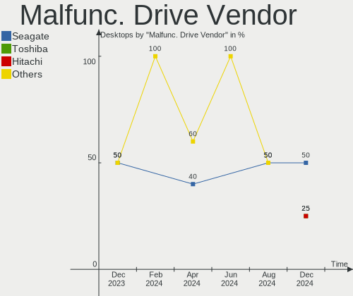
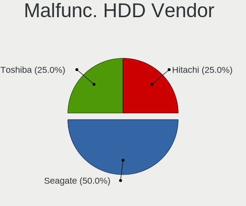
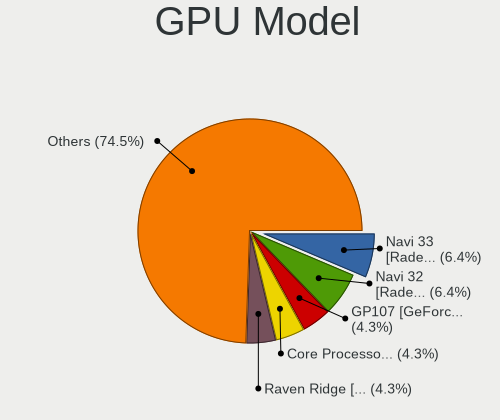
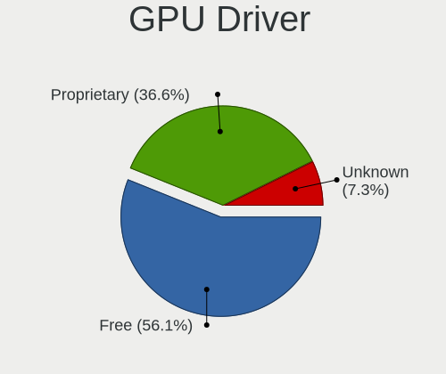
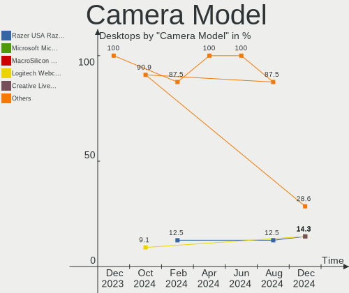
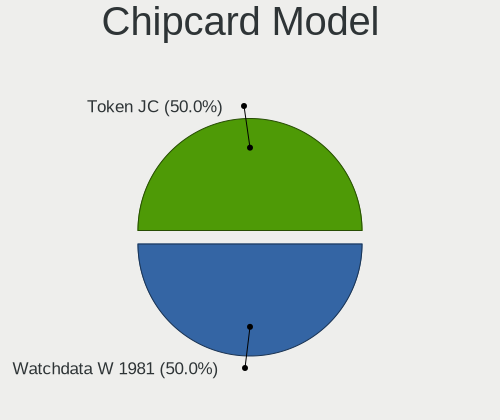

Manjaro Hardware Trends (Desktops)
----------------------------------

A project to identify most popular hardware characteristics and track their change
over time based on data collected by Manjaro users at https://Linux-Hardware.org.

Anyone can contribute to this report by the [hw-probe](https://github.com/linuxhw/hw-probe) tool:

    sudo -E hw-probe -all -upload

This report is for one last month. Overall report since the beginning of time: [TestCoverage](https://github.com/linuxhw/TestCoverage)

Period: Apr, 2022.

Contents
--------

* [ System ](#system)
  - [ OS                       ](#os)
  - [ OS Family                ](#os-family)
  - [ Kernel                   ](#kernel)
  - [ Kernel Family            ](#kernel-family)
  - [ Kernel Major Ver.        ](#kernel-major-ver)
  - [ Arch                     ](#arch)
  - [ DE                       ](#de)
  - [ Display Server           ](#display-server)
  - [ Display Manager          ](#display-manager)
  - [ OS Lang                  ](#os-lang)
  - [ Boot Mode                ](#boot-mode)
  - [ Filesystem               ](#filesystem)
  - [ Part. scheme             ](#part-scheme)
  - [ Dual Boot with Linux/BSD ](#dual-boot-with-linuxbsd)
  - [ Dual Boot (Win)          ](#dual-boot-win)

* [ Board ](#board)
  - [ Vendor                   ](#vendor)
  - [ Model                    ](#model)
  - [ Model Family             ](#model-family)
  - [ MFG Year                 ](#mfg-year)
  - [ Form Factor              ](#form-factor)
  - [ Secure Boot              ](#secure-boot)
  - [ Coreboot                 ](#coreboot)
  - [ RAM Size                 ](#ram-size)
  - [ RAM Used                 ](#ram-used)
  - [ Total Drives             ](#total-drives)
  - [ Has CD-ROM               ](#has-cd-rom)
  - [ Has Ethernet             ](#has-ethernet)
  - [ Has WiFi                 ](#has-wifi)
  - [ Has Bluetooth            ](#has-bluetooth)

* [ Location ](#location)
  - [ Country                  ](#country)
  - [ City                     ](#city)

* [ Drives ](#drives)
  - [ Drive Vendor             ](#drive-vendor)
  - [ Drive Model              ](#drive-model)
  - [ HDD Vendor               ](#hdd-vendor)
  - [ SSD Vendor               ](#ssd-vendor)
  - [ Drive Kind               ](#drive-kind)
  - [ Drive Connector          ](#drive-connector)
  - [ Drive Size               ](#drive-size)
  - [ Space Total              ](#space-total)
  - [ Space Used               ](#space-used)
  - [ Malfunc. Drives          ](#malfunc-drives)
  - [ Malfunc. Drive Vendor    ](#malfunc-drive-vendor)
  - [ Malfunc. HDD Vendor      ](#malfunc-hdd-vendor)
  - [ Malfunc. Drive Kind      ](#malfunc-drive-kind)
  - [ Failed Drives            ](#failed-drives)
  - [ Failed Drive Vendor      ](#failed-drive-vendor)
  - [ Drive Status             ](#drive-status)

* [ Storage controller ](#storage-controller)
  - [ Storage Vendor           ](#storage-vendor)
  - [ Storage Model            ](#storage-model)
  - [ Storage Kind             ](#storage-kind)

* [ Processor ](#processor)
  - [ CPU Vendor               ](#cpu-vendor)
  - [ CPU Model                ](#cpu-model)
  - [ CPU Model Family         ](#cpu-model-family)
  - [ CPU Cores                ](#cpu-cores)
  - [ CPU Sockets              ](#cpu-sockets)
  - [ CPU Threads              ](#cpu-threads)
  - [ CPU Op-Modes             ](#cpu-op-modes)
  - [ CPU Microcode            ](#cpu-microcode)
  - [ CPU Microarch            ](#cpu-microarch)

* [ Graphics ](#graphics)
  - [ GPU Vendor               ](#gpu-vendor)
  - [ GPU Model                ](#gpu-model)
  - [ GPU Combo                ](#gpu-combo)
  - [ GPU Driver               ](#gpu-driver)
  - [ GPU Memory               ](#gpu-memory)

* [ Monitor ](#monitor)
  - [ Monitor Vendor           ](#monitor-vendor)
  - [ Monitor Model            ](#monitor-model)
  - [ Monitor Resolution       ](#monitor-resolution)
  - [ Monitor Diagonal         ](#monitor-diagonal)
  - [ Monitor Width            ](#monitor-width)
  - [ Aspect Ratio             ](#aspect-ratio)
  - [ Monitor Area             ](#monitor-area)
  - [ Pixel Density            ](#pixel-density)
  - [ Multiple Monitors        ](#multiple-monitors)

* [ Network ](#network)
  - [ Net Controller Vendor    ](#net-controller-vendor)
  - [ Net Controller Model     ](#net-controller-model)
  - [ Wireless Vendor          ](#wireless-vendor)
  - [ Wireless Model           ](#wireless-model)
  - [ Ethernet Vendor          ](#ethernet-vendor)
  - [ Ethernet Model           ](#ethernet-model)
  - [ Net Controller Kind      ](#net-controller-kind)
  - [ Used Controller          ](#used-controller)
  - [ NICs                     ](#nics)
  - [ IPv6                     ](#ipv6)

* [ Bluetooth ](#bluetooth)
  - [ Bluetooth Vendor         ](#bluetooth-vendor)
  - [ Bluetooth Model          ](#bluetooth-model)

* [ Sound ](#sound)
  - [ Sound Vendor             ](#sound-vendor)
  - [ Sound Model              ](#sound-model)

* [ Memory ](#memory)
  - [ Memory Vendor            ](#memory-vendor)
  - [ Memory Model             ](#memory-model)
  - [ Memory Kind              ](#memory-kind)
  - [ Memory Form Factor       ](#memory-form-factor)
  - [ Memory Size              ](#memory-size)
  - [ Memory Speed             ](#memory-speed)

* [ Printers & scanners ](#printers--scanners)
  - [ Printer Vendor           ](#printer-vendor)
  - [ Printer Model            ](#printer-model)
  - [ Scanner Vendor           ](#scanner-vendor)
  - [ Scanner Model            ](#scanner-model)

* [ Camera ](#camera)
  - [ Camera Vendor            ](#camera-vendor)
  - [ Camera Model             ](#camera-model)

* [ Security ](#security)
  - [ Fingerprint Vendor       ](#fingerprint-vendor)
  - [ Fingerprint Model        ](#fingerprint-model)
  - [ Chipcard Vendor          ](#chipcard-vendor)
  - [ Chipcard Model           ](#chipcard-model)

* [ Unsupported ](#unsupported)
  - [ Unsupported Devices      ](#unsupported-devices)
  - [ Unsupported Device Types ](#unsupported-device-types)

System
------

OS
--

Installed operating systems

| Name           | Desktops | Percent |
|----------------|----------|---------|
| Manjaro        | 55       | 61.11%  |
| Manjaro 21.2.5 | 22       | 24.44%  |
| Manjaro 21.2.6 | 12       | 13.33%  |
| Manjaro 21.2.2 | 1        | 1.11%   |

OS Family
---------

OS without a version

| Name    | Desktops | Percent |
|---------|----------|---------|
| Manjaro | 90       | 100%    |

Kernel
------

Version of the Linux kernel

| Version               | Desktops | Percent |
|-----------------------|----------|---------|
| 5.15.32-1-MANJARO     | 20       | 22.22%  |
| 5.15.28-1-MANJARO     | 20       | 22.22%  |
| 5.16.14-1-MANJARO     | 11       | 12.22%  |
| 5.17.1-3-MANJARO      | 10       | 11.11%  |
| 5.10.105-1-MANJARO    | 6        | 6.67%   |
| 5.4.184-1-MANJARO     | 3        | 3.33%   |
| 5.17.0-1-MANJARO      | 3        | 3.33%   |
| 5.16.2-2-rt19-MANJARO | 3        | 3.33%   |
| 5.16.18-1-MANJARO     | 3        | 3.33%   |
| 5.10.109-1-MANJARO    | 2        | 2.22%   |
| 5.17.3-lqx1-1-lqx     | 1        | 1.11%   |
| 5.17.1-zen1-1-zen     | 1        | 1.11%   |
| 5.17.1-1-rt16-MANJARO | 1        | 1.11%   |
| 5.16.19-1-MANJARO     | 1        | 1.11%   |
| 5.15.6-2-MANJARO      | 1        | 1.11%   |
| 5.15.16-1-MANJARO     | 1        | 1.11%   |
| 5.14.21-2-MANJARO     | 1        | 1.11%   |
| 5.13.19-2-MANJARO     | 1        | 1.11%   |
| 5.10.98-1-MANJARO     | 1        | 1.11%   |

Kernel Family
-------------

Linux kernel without a distro release

| Version  | Desktops | Percent |
|----------|----------|---------|
| 5.15.32  | 20       | 22.22%  |
| 5.15.28  | 20       | 22.22%  |
| 5.17.1   | 12       | 13.33%  |
| 5.16.14  | 11       | 12.22%  |
| 5.10.105 | 6        | 6.67%   |
| 5.4.184  | 3        | 3.33%   |
| 5.17.0   | 3        | 3.33%   |
| 5.16.2   | 3        | 3.33%   |
| 5.16.18  | 3        | 3.33%   |
| 5.10.109 | 2        | 2.22%   |
| 5.17.3   | 1        | 1.11%   |
| 5.16.19  | 1        | 1.11%   |
| 5.15.6   | 1        | 1.11%   |
| 5.15.16  | 1        | 1.11%   |
| 5.14.21  | 1        | 1.11%   |
| 5.13.19  | 1        | 1.11%   |
| 5.10.98  | 1        | 1.11%   |

Kernel Major Ver.
-----------------

Linux kernel major version

| Version | Desktops | Percent |
|---------|----------|---------|
| 5.15    | 42       | 46.67%  |
| 5.16    | 18       | 20%     |
| 5.17    | 16       | 17.78%  |
| 5.10    | 9        | 10%     |
| 5.4     | 3        | 3.33%   |
| 5.14    | 1        | 1.11%   |
| 5.13    | 1        | 1.11%   |

Arch
----

OS architecture (x86_64, i586, etc.)

| Name   | Desktops | Percent |
|--------|----------|---------|
| x86_64 | 90       | 100%    |

DE
--

Desktop Environment

| Name       | Desktops | Percent |
|------------|----------|---------|
| KDE5       | 46       | 51.11%  |
| GNOME      | 21       | 23.33%  |
| XFCE       | 16       | 17.78%  |
| X-Cinnamon | 4        | 4.44%   |
| Unknown    | 2        | 2.22%   |
| i3         | 1        | 1.11%   |

Display Server
--------------

X11 or Wayland

| Name    | Desktops | Percent |
|---------|----------|---------|
| X11     | 80       | 88.89%  |
| Wayland | 9        | 10%     |
| Tty     | 1        | 1.11%   |

Display Manager
---------------

SDDM, LightDM, etc.

| Name    | Desktops | Percent |
|---------|----------|---------|
| Unknown | 55       | 61.11%  |
| LightDM | 13       | 14.44%  |
| SDDM    | 12       | 13.33%  |
| GDM     | 10       | 11.11%  |

OS Lang
-------

Language

| Lang    | Desktops | Percent |
|---------|----------|---------|
| en_US   | 43       | 47.78%  |
| ru_RU   | 8        | 8.89%   |
| en_GB   | 8        | 8.89%   |
| de_DE   | 6        | 6.67%   |
| fr_FR   | 5        | 5.56%   |
| es_ES   | 3        | 3.33%   |
| en_CA   | 3        | 3.33%   |
| nl_NL   | 2        | 2.22%   |
| zh_TW   | 1        | 1.11%   |
| zh_CN   | 1        | 1.11%   |
| sv_SE   | 1        | 1.11%   |
| pt_BR   | 1        | 1.11%   |
| it_IT   | 1        | 1.11%   |
| fi_FI   | 1        | 1.11%   |
| es_MX   | 1        | 1.11%   |
| en_ZA   | 1        | 1.11%   |
| en_AU   | 1        | 1.11%   |
| de_AT   | 1        | 1.11%   |
| cs_CZ   | 1        | 1.11%   |
| Unknown | 1        | 1.11%   |

Boot Mode
---------

EFI or BIOS

| Mode | Desktops | Percent |
|------|----------|---------|
| BIOS | 74       | 82.22%  |
| EFI  | 16       | 17.78%  |

Filesystem
----------

Type of filesystem

| Type    | Desktops | Percent |
|---------|----------|---------|
| Ext4    | 73       | 81.11%  |
| Btrfs   | 13       | 14.44%  |
| Xfs     | 2        | 2.22%   |
| Tmpfs   | 1        | 1.11%   |
| Unknown | 1        | 1.11%   |

Part. scheme
------------

Scheme of partitioning

| Type    | Desktops | Percent |
|---------|----------|---------|
| Unknown | 65       | 72.22%  |
| GPT     | 19       | 21.11%  |
| MBR     | 6        | 6.67%   |

Dual Boot with Linux/BSD
------------------------

Hosting more than one Linux/BSD

| Dual boot | Desktops | Percent |
|-----------|----------|---------|
| No        | 87       | 96.67%  |
| Yes       | 3        | 3.33%   |

Dual Boot (Win)
---------------

Hosting Linux and Windows

| Dual boot | Desktops | Percent |
|-----------|----------|---------|
| No        | 71       | 78.89%  |
| Yes       | 19       | 21.11%  |

Board
-----

Vendor
------

Motherboard manufacturer

| Name                | Desktops | Percent |
|---------------------|----------|---------|
| ASUSTek Computer    | 27       | 30%     |
| ASRock              | 16       | 17.78%  |
| MSI                 | 14       | 15.56%  |
| Gigabyte Technology | 11       | 12.22%  |
| Dell                | 8        | 8.89%   |
| Intel               | 2        | 2.22%   |
| Hewlett-Packard     | 2        | 2.22%   |
| Alienware           | 2        | 2.22%   |
| Acer                | 2        | 2.22%   |
| Lenovo              | 1        | 1.11%   |
| Foxconn             | 1        | 1.11%   |
| ECS                 | 1        | 1.11%   |
| Biostar             | 1        | 1.11%   |
| BESSTAR Tech        | 1        | 1.11%   |
| AZW                 | 1        | 1.11%   |

Model
-----

Motherboard model

| Name                                      | Desktops | Percent |
|-------------------------------------------|----------|---------|
| ASUS All Series                           | 5        | 5.56%   |
| ASUS ROG CROSSHAIR VIII HERO              | 2        | 2.22%   |
| ASRock B550M Pro4                         | 2        | 2.22%   |
| MSI MS-7D13                               | 1        | 1.11%   |
| MSI MS-7D03                               | 1        | 1.11%   |
| MSI MS-7C35                               | 1        | 1.11%   |
| MSI MS-7C09                               | 1        | 1.11%   |
| MSI MS-7C02                               | 1        | 1.11%   |
| MSI MS-7B84                               | 1        | 1.11%   |
| MSI MS-7B79                               | 1        | 1.11%   |
| MSI MS-7B49                               | 1        | 1.11%   |
| MSI MS-7B48                               | 1        | 1.11%   |
| MSI MS-7A38                               | 1        | 1.11%   |
| MSI MS-7A37                               | 1        | 1.11%   |
| MSI MS-7A31                               | 1        | 1.11%   |
| MSI MS-7641                               | 1        | 1.11%   |
| MSI MS-6638                               | 1        | 1.11%   |
| Lenovo IdeaCentre T540-15ICK G 90LW0069RS | 1        | 1.11%   |
| Intel SHARKBAY                            | 1        | 1.11%   |
| Intel DH67BL AAG10189-207                 | 1        | 1.11%   |
| HP EliteDesk 800 G1 TWR                   | 1        | 1.11%   |
| HP EliteDesk 800 G1 SFF                   | 1        | 1.11%   |
| Gigabyte Z97X-Gaming 3                    | 1        | 1.11%   |
| Gigabyte Z590 D                           | 1        | 1.11%   |
| Gigabyte X570S AORUS PRO AX               | 1        | 1.11%   |
| Gigabyte X570 UD                          | 1        | 1.11%   |
| Gigabyte X470 AORUS GAMING 7 WIFI         | 1        | 1.11%   |
| Gigabyte H61M-S2PV                        | 1        | 1.11%   |
| Gigabyte H310N 2.0                        | 1        | 1.11%   |
| Gigabyte B550M AORUS ELITE                | 1        | 1.11%   |
| Gigabyte B450M DS3H                       | 1        | 1.11%   |
| Gigabyte B450 AORUS M                     | 1        | 1.11%   |
| Gigabyte 970A-DS3P                        | 1        | 1.11%   |
| Foxconn Pro 3400 Series MT                | 1        | 1.11%   |
| ECS H61H2-M13                             | 1        | 1.11%   |
| Dell Vostro 320                           | 1        | 1.11%   |
| Dell Precision T3610                      | 1        | 1.11%   |
| Dell OptiPlex 980                         | 1        | 1.11%   |
| Dell OptiPlex 9020                        | 1        | 1.11%   |
| Dell OptiPlex 7050                        | 1        | 1.11%   |
| Dell OptiPlex 330                         | 1        | 1.11%   |
| Dell OptiPlex 3010                        | 1        | 1.11%   |
| Dell ASM100                               | 1        | 1.11%   |
| Biostar TB250-BTC                         | 1        | 1.11%   |
| BESSTAR Tech UM250                        | 1        | 1.11%   |
| AZW U59                                   | 1        | 1.11%   |
| ASUS TUF Z390-PLUS GAMING                 | 1        | 1.11%   |
| ASUS TUF Gaming Z690-PLUS D4              | 1        | 1.11%   |
| ASUS TUF Gaming X570-PRO                  | 1        | 1.11%   |
| ASUS TUF Gaming B550M-PLUS                | 1        | 1.11%   |
| ASUS STRIX Z270G GAMING                   | 1        | 1.11%   |
| ASUS ROG STRIX Z370-G GAMING              | 1        | 1.11%   |
| ASUS ROG STRIX B450-F GAMING II           | 1        | 1.11%   |
| ASUS ROG STRIX B450-F GAMING              | 1        | 1.11%   |
| ASUS PRIME X570-P                         | 1        | 1.11%   |
| ASUS PRIME H410M-E                        | 1        | 1.11%   |
| ASUS PRIME B360M-C                        | 1        | 1.11%   |
| ASUS PRIME B350M-A                        | 1        | 1.11%   |
| ASUS PRIME B350-PLUS                      | 1        | 1.11%   |
| ASUS PRIME A320M-K                        | 1        | 1.11%   |

Model Family
------------

Motherboard model prefix

| Name                 | Desktops | Percent |
|----------------------|----------|---------|
| ASUS PRIME           | 6        | 6.67%   |
| Dell OptiPlex        | 5        | 5.56%   |
| ASUS ROG             | 5        | 5.56%   |
| ASUS All             | 5        | 5.56%   |
| ASUS TUF             | 4        | 4.44%   |
| ASRock B550M         | 3        | 3.33%   |
| HP EliteDesk         | 2        | 2.22%   |
| ASUS P8Z77-V         | 2        | 2.22%   |
| ASRock AB350M        | 2        | 2.22%   |
| Alienware Aurora     | 2        | 2.22%   |
| MSI MS-7D13          | 1        | 1.11%   |
| MSI MS-7D03          | 1        | 1.11%   |
| MSI MS-7C35          | 1        | 1.11%   |
| MSI MS-7C09          | 1        | 1.11%   |
| MSI MS-7C02          | 1        | 1.11%   |
| MSI MS-7B84          | 1        | 1.11%   |
| MSI MS-7B79          | 1        | 1.11%   |
| MSI MS-7B49          | 1        | 1.11%   |
| MSI MS-7B48          | 1        | 1.11%   |
| MSI MS-7A38          | 1        | 1.11%   |
| MSI MS-7A37          | 1        | 1.11%   |
| MSI MS-7A31          | 1        | 1.11%   |
| MSI MS-7641          | 1        | 1.11%   |
| MSI MS-6638          | 1        | 1.11%   |
| Lenovo IdeaCentre    | 1        | 1.11%   |
| Intel SHARKBAY       | 1        | 1.11%   |
| Intel DH67BL         | 1        | 1.11%   |
| Gigabyte Z97X-Gaming | 1        | 1.11%   |
| Gigabyte Z590        | 1        | 1.11%   |
| Gigabyte X570S       | 1        | 1.11%   |
| Gigabyte X570        | 1        | 1.11%   |
| Gigabyte X470        | 1        | 1.11%   |
| Gigabyte H61M-S2PV   | 1        | 1.11%   |
| Gigabyte H310N       | 1        | 1.11%   |
| Gigabyte B550M       | 1        | 1.11%   |
| Gigabyte B450M       | 1        | 1.11%   |
| Gigabyte B450        | 1        | 1.11%   |
| Gigabyte 970A-DS3P   | 1        | 1.11%   |
| Foxconn Pro          | 1        | 1.11%   |
| ECS H61H2-M13        | 1        | 1.11%   |
| Dell Vostro          | 1        | 1.11%   |
| Dell Precision       | 1        | 1.11%   |
| Dell ASM100          | 1        | 1.11%   |
| Biostar TB250-BTC    | 1        | 1.11%   |
| BESSTAR Tech UM250   | 1        | 1.11%   |
| AZW U59              | 1        | 1.11%   |
| ASUS STRIX           | 1        | 1.11%   |
| ASUS P5K             | 1        | 1.11%   |
| ASUS Maximus         | 1        | 1.11%   |
| ASUS GZ727AA-A2L     | 1        | 1.11%   |
| ASUS A8N-VM          | 1        | 1.11%   |
| ASRock Z77           | 1        | 1.11%   |
| ASRock Z370          | 1        | 1.11%   |
| ASRock X570M         | 1        | 1.11%   |
| ASRock H97           | 1        | 1.11%   |
| ASRock H110          | 1        | 1.11%   |
| ASRock B550          | 1        | 1.11%   |
| ASRock B450          | 1        | 1.11%   |
| ASRock B250M         | 1        | 1.11%   |
| ASRock AB350M-HDV    | 1        | 1.11%   |

MFG Year
--------

Motherboard manufacture year

| Year | Desktops | Percent |
|------|----------|---------|
| 2017 | 17       | 18.89%  |
| 2020 | 12       | 13.33%  |
| 2018 | 12       | 13.33%  |
| 2021 | 7        | 7.78%   |
| 2013 | 7        | 7.78%   |
| 2019 | 6        | 6.67%   |
| 2014 | 6        | 6.67%   |
| 2012 | 6        | 6.67%   |
| 2011 | 5        | 5.56%   |
| 2007 | 3        | 3.33%   |
| 2022 | 2        | 2.22%   |
| 2015 | 2        | 2.22%   |
| 2009 | 2        | 2.22%   |
| 2016 | 1        | 1.11%   |
| 2010 | 1        | 1.11%   |
| 2005 | 1        | 1.11%   |

Form Factor
-----------

Physical design of the computer

| Name    | Desktops | Percent |
|---------|----------|---------|
| Desktop | 90       | 100%    |

Secure Boot
-----------

Enabled or disabled

| State    | Desktops | Percent |
|----------|----------|---------|
| Disabled | 90       | 100%    |

Coreboot
--------

Have coreboot on board

| Used | Desktops | Percent |
|------|----------|---------|
| No   | 90       | 100%    |

RAM Size
--------

Total RAM memory

| Size in GB  | Desktops | Percent |
|-------------|----------|---------|
| 16.01-24.0  | 42       | 46.67%  |
| 32.01-64.0  | 22       | 24.44%  |
| 8.01-16.0   | 10       | 11.11%  |
| 4.01-8.0    | 5        | 5.56%   |
| 3.01-4.0    | 5        | 5.56%   |
| 1.01-2.0    | 3        | 3.33%   |
| 64.01-256.0 | 2        | 2.22%   |
| 24.01-32.0  | 1        | 1.11%   |

RAM Used
--------

Used RAM memory

| Used GB    | Desktops | Percent |
|------------|----------|---------|
| 1.01-2.0   | 22       | 24.44%  |
| 4.01-8.0   | 21       | 23.33%  |
| 2.01-3.0   | 20       | 22.22%  |
| 3.01-4.0   | 15       | 16.67%  |
| 8.01-16.0  | 8        | 8.89%   |
| 0.51-1.0   | 3        | 3.33%   |
| 24.01-32.0 | 1        | 1.11%   |

Total Drives
------------

Number of drives on board

| Drives | Desktops | Percent |
|--------|----------|---------|
| 2      | 28       | 31.11%  |
| 1      | 23       | 25.56%  |
| 4      | 12       | 13.33%  |
| 3      | 10       | 11.11%  |
| 5      | 9        | 10%     |
| 6      | 6        | 6.67%   |
| 8      | 1        | 1.11%   |
| 7      | 1        | 1.11%   |

Has CD-ROM
----------

Has CD-ROM on board

| Presented | Desktops | Percent |
|-----------|----------|---------|
| No        | 65       | 72.22%  |
| Yes       | 25       | 27.78%  |

Has Ethernet
------------

Has Ethernet on board

| Presented | Desktops | Percent |
|-----------|----------|---------|
| Yes       | 89       | 98.89%  |
| No        | 1        | 1.11%   |

Has WiFi
--------

Has WiFi module

| Presented | Desktops | Percent |
|-----------|----------|---------|
| Yes       | 48       | 53.33%  |
| No        | 42       | 46.67%  |

Has Bluetooth
-------------

Has Bluetooth module

| Presented | Desktops | Percent |
|-----------|----------|---------|
| No        | 47       | 52.22%  |
| Yes       | 43       | 47.78%  |

Location
--------

Country
-------

Geographic location (country)

| Country      | Desktops | Percent |
|--------------|----------|---------|
| USA          | 27       | 30%     |
| Russia       | 8        | 8.89%   |
| Germany      | 6        | 6.67%   |
| France       | 6        | 6.67%   |
| Spain        | 5        | 5.56%   |
| Canada       | 5        | 5.56%   |
| Finland      | 4        | 4.44%   |
| Netherlands  | 3        | 3.33%   |
| Sweden       | 2        | 2.22%   |
| Poland       | 2        | 2.22%   |
| Brazil       | 2        | 2.22%   |
| Argentina    | 2        | 2.22%   |
| Ukraine      | 1        | 1.11%   |
| UK           | 1        | 1.11%   |
| Thailand     | 1        | 1.11%   |
| Taiwan       | 1        | 1.11%   |
| Switzerland  | 1        | 1.11%   |
| South Africa | 1        | 1.11%   |
| Norway       | 1        | 1.11%   |
| Mexico       | 1        | 1.11%   |
| Jamaica      | 1        | 1.11%   |
| Italy        | 1        | 1.11%   |
| Hungary      | 1        | 1.11%   |
| Czechia      | 1        | 1.11%   |
| Croatia      | 1        | 1.11%   |
| Costa Rica   | 1        | 1.11%   |
| China        | 1        | 1.11%   |
| Bulgaria     | 1        | 1.11%   |
| Austria      | 1        | 1.11%   |
| Australia    | 1        | 1.11%   |

City
----

Geographic location (city)

| City                | Desktops | Percent |
|---------------------|----------|---------|
| Toronto             | 4        | 4.44%   |
| Tampere             | 2        | 2.22%   |
| St Petersburg       | 2        | 2.22%   |
| Seville             | 2        | 2.22%   |
| Moscow              | 2        | 2.22%   |
| Zaandam             | 1        | 1.11%   |
| Wichita             | 1        | 1.11%   |
| Webster             | 1        | 1.11%   |
| Warsaw              | 1        | 1.11%   |
| Villahermosa        | 1        | 1.11%   |
| Velke Losiny        | 1        | 1.11%   |
| Vannes              | 1        | 1.11%   |
| Sundsvall           | 1        | 1.11%   |
| Split               | 1        | 1.11%   |
| Sora                | 1        | 1.11%   |
| Senonches           | 1        | 1.11%   |
| Seattle             | 1        | 1.11%   |
| Scottsdale          | 1        | 1.11%   |
| Sao Paulo           | 1        | 1.11%   |
| San Jose            | 1        | 1.11%   |
| Salt Lake City      | 1        | 1.11%   |
| Rotterdam           | 1        | 1.11%   |
| Racine              | 1        | 1.11%   |
| Portland            | 1        | 1.11%   |
| Pittsburgh          | 1        | 1.11%   |
| Pearland            | 1        | 1.11%   |
| Peachtree Corners   | 1        | 1.11%   |
| Oudtshoorn          | 1        | 1.11%   |
| Oslo                | 1        | 1.11%   |
| Ocho Rios           | 1        | 1.11%   |
| O'Fallon            | 1        | 1.11%   |
| Novosibirsk         | 1        | 1.11%   |
| Niort               | 1        | 1.11%   |
| Nijmegen            | 1        | 1.11%   |
| Newtown             | 1        | 1.11%   |
| New Taipei          | 1        | 1.11%   |
| New Church          | 1        | 1.11%   |
| Murom               | 1        | 1.11%   |
| Murfreesboro        | 1        | 1.11%   |
| Mittelbuch          | 1        | 1.11%   |
| Merrill             | 1        | 1.11%   |
| Melbourne           | 1        | 1.11%   |
| Mantes-la-Jolie     | 1        | 1.11%   |
| Manchester          | 1        | 1.11%   |
| Madrid              | 1        | 1.11%   |
| Los Polvorines      | 1        | 1.11%   |
| Lebanon             | 1        | 1.11%   |
| Las Rozas de Madrid | 1        | 1.11%   |
| Landing             | 1        | 1.11%   |
| Lakewood            | 1        | 1.11%   |
| Kyustendil          | 1        | 1.11%   |
| Kyiv                | 1        | 1.11%   |
| Kirov               | 1        | 1.11%   |
| Joensuu             | 1        | 1.11%   |
| Jinniu              | 1        | 1.11%   |
| Jaú                | 1        | 1.11%   |
| Indianapolis        | 1        | 1.11%   |
| Hughes              | 1        | 1.11%   |
| Helsinki            | 1        | 1.11%   |
| Heidelberg          | 1        | 1.11%   |

Drives
------

Drive Vendor
------------

Hard drive vendors

| Vendor                    | Desktops | Drives | Percent |
|---------------------------|----------|--------|---------|
| Seagate                   | 37       | 41     | 17.87%  |
| WDC                       | 35       | 49     | 16.91%  |
| Samsung Electronics       | 35       | 45     | 16.91%  |
| Toshiba                   | 14       | 14     | 6.76%   |
| SanDisk                   | 13       | 14     | 6.28%   |
| Crucial                   | 13       | 23     | 6.28%   |
| A-DATA Technology         | 9        | 11     | 4.35%   |
| Kingston                  | 8        | 11     | 3.86%   |
| XPG                       | 4        | 4      | 1.93%   |
| Phison                    | 4        | 5      | 1.93%   |
| Intel                     | 4        | 4      | 1.93%   |
| SK Hynix                  | 3        | 3      | 1.45%   |
| Hitachi                   | 3        | 3      | 1.45%   |
| Silicon Motion            | 2        | 2      | 0.97%   |
| PNY                       | 2        | 2      | 0.97%   |
| OCZ                       | 2        | 2      | 0.97%   |
| Micron/Crucial Technology | 2        | 2      | 0.97%   |
| Unknown                   | 1        | 2      | 0.48%   |
| SABRENT                   | 1        | 1      | 0.48%   |
| Realtek Semiconductor     | 1        | 1      | 0.48%   |
| Patriot                   | 1        | 1      | 0.48%   |
| NGFF                      | 1        | 1      | 0.48%   |
| MAXTOR                    | 1        | 1      | 0.48%   |
| LITEONIT                  | 1        | 1      | 0.48%   |
| Leven                     | 1        | 1      | 0.48%   |
| KingFast                  | 1        | 1      | 0.48%   |
| JMicron                   | 1        | 1      | 0.48%   |
| HGST                      | 1        | 1      | 0.48%   |
| Hewlett-Packard           | 1        | 2      | 0.48%   |
| Gigabyte Technology       | 1        | 1      | 0.48%   |
| Corsair                   | 1        | 1      | 0.48%   |
| China                     | 1        | 1      | 0.48%   |
| ASMT                      | 1        | 1      | 0.48%   |
| Unknown                   | 1        | 1      | 0.48%   |

Drive Model
-----------

Hard drive models

| Model                             | Desktops | Percent |
|-----------------------------------|----------|---------|
| Seagate ST2000DM008-2FR102 2TB    | 5        | 2.06%   |
| Seagate ST1000DM010-2EP102 1TB    | 5        | 2.06%   |
| Samsung SSD 860 EVO 500GB         | 5        | 2.06%   |
| Samsung NVMe SSD Drive 250GB      | 5        | 2.06%   |
| Samsung NVMe SSD Drive 1TB        | 5        | 2.06%   |
| Samsung SSD 850 EVO 500GB         | 4        | 1.65%   |
| Toshiba DT01ACA100 1TB            | 3        | 1.23%   |
| Samsung SSD 870 EVO 1TB           | 3        | 1.23%   |
| Kingston SA400S37120G 120GB SSD   | 3        | 1.23%   |
| Crucial CT1000MX500SSD1 1TB       | 3        | 1.23%   |
| XPG NVMe SSD Drive 512GB          | 2        | 0.82%   |
| WDC WDS240G2G0B-00EPW0 240GB SSD  | 2        | 0.82%   |
| WDC WD5000AAKX-001CA0 500GB       | 2        | 0.82%   |
| WDC WD40EZAZ-00SF3B0 4TB          | 2        | 0.82%   |
| WDC WD20EZBX-00AYRA0 2TB          | 2        | 0.82%   |
| WDC WD10EARS-00Y5B1 1TB           | 2        | 0.82%   |
| Seagate ST2000DM005-2CW102 2TB    | 2        | 0.82%   |
| Seagate ST1000LM014-1EJ164 1TB    | 2        | 0.82%   |
| Seagate ST1000DM003-1CH162 1TB    | 2        | 0.82%   |
| SanDisk SSD PLUS 480GB            | 2        | 0.82%   |
| SanDisk SDSSDA240G 240GB          | 2        | 0.82%   |
| Sandisk NVMe SSD Drive 500GB      | 2        | 0.82%   |
| Samsung SSD 860 EVO 1TB           | 2        | 0.82%   |
| Samsung SSD 850 EVO 250GB         | 2        | 0.82%   |
| Samsung PSSD T7 500GB             | 2        | 0.82%   |
| Micron/Crucial NVMe SSD Drive 1TB | 2        | 0.82%   |
| Kingston NVMe SSD Drive 500GB     | 2        | 0.82%   |
| Crucial CT525MX300SSD1 528GB      | 2        | 0.82%   |
| Crucial CT275MX300SSD1 275GB      | 2        | 0.82%   |
| A-DATA SU800 128GB SSD            | 2        | 0.82%   |
| A-DATA SU760 512GB SSD            | 2        | 0.82%   |
| XPG NVMe SSD Drive 2TB            | 1        | 0.41%   |
| XPG NVMe SSD Drive 1024GB         | 1        | 0.41%   |
| WDC WDS500G2B0A-00SM50 500GB SSD  | 1        | 0.41%   |
| WDC WDS120G2G0A-00JH30 120GB SSD  | 1        | 0.41%   |
| WDC WDS100T3X0C-00SJG0 1TB        | 1        | 0.41%   |
| WDC WDS100T2B0C-00PXH0 1TB        | 1        | 0.41%   |
| WDC WDS100T2B0C 1TB               | 1        | 0.41%   |
| WDC WDS100T2B0A-00SM50 1TB SSD    | 1        | 0.41%   |
| WDC WD800AAJS-75M0A0 80GB         | 1        | 0.41%   |
| WDC WD6401AALS-00L3B2 640GB       | 1        | 0.41%   |
| WDC WD5002ABYS-02B1B0 500GB       | 1        | 0.41%   |
| WDC WD5000AAKS-402AA0 500GB       | 1        | 0.41%   |
| WDC WD5000AAKS-00A7B0 500GB       | 1        | 0.41%   |
| WDC WD40EZRZ-00WN9B0 4TB          | 1        | 0.41%   |
| WDC WD40EZRX-22SPEB0 4TB          | 1        | 0.41%   |
| WDC WD40EFRX-68N32N0 4TB          | 1        | 0.41%   |
| WDC WD30EFRX-68EUZN0 3TB          | 1        | 0.41%   |
| WDC WD3003FZEX-00Z4SA0 3TB        | 1        | 0.41%   |
| WDC WD2500KS-00MJB0 250GB         | 1        | 0.41%   |
| WDC WD2500JS-22NCB1 250GB         | 1        | 0.41%   |
| WDC WD2500BEVT-24A23T0 250GB      | 1        | 0.41%   |
| WDC WD20EZRX-00D8PB0 2TB          | 1        | 0.41%   |
| WDC WD20EARX-00PASB0 2TB          | 1        | 0.41%   |
| WDC WD2003FZEX-00SRLA0 2TB        | 1        | 0.41%   |
| WDC WD1500ADFS-00SLR5 150GB       | 1        | 0.41%   |
| WDC WD10PURZ-85U8XY0 1TB          | 1        | 0.41%   |
| WDC WD10JPVX-00JC3T0 1TB          | 1        | 0.41%   |
| WDC WD10EZEX-75WN4A0 1TB          | 1        | 0.41%   |
| WDC WD10EZEX-22MFCA0 1TB          | 1        | 0.41%   |

HDD Vendor
----------

Hard disk drive vendors

| Vendor              | Desktops | Drives | Percent |
|---------------------|----------|--------|---------|
| Seagate             | 35       | 39     | 43.21%  |
| WDC                 | 28       | 39     | 34.57%  |
| Toshiba             | 10       | 10     | 12.35%  |
| Hitachi             | 3        | 3      | 3.7%    |
| Samsung Electronics | 1        | 1      | 1.23%   |
| SABRENT             | 1        | 1      | 1.23%   |
| MAXTOR              | 1        | 1      | 1.23%   |
| HGST                | 1        | 1      | 1.23%   |
| ASMT                | 1        | 1      | 1.23%   |

SSD Vendor
----------

Solid state drive vendors

| Vendor              | Desktops | Drives | Percent |
|---------------------|----------|--------|---------|
| Samsung Electronics | 21       | 25     | 26.58%  |
| Crucial             | 13       | 23     | 16.46%  |
| SanDisk             | 10       | 10     | 12.66%  |
| A-DATA Technology   | 8        | 10     | 10.13%  |
| Kingston            | 6        | 8      | 7.59%   |
| WDC                 | 4        | 5      | 5.06%   |
| Toshiba             | 2        | 2      | 2.53%   |
| PNY                 | 2        | 2      | 2.53%   |
| OCZ                 | 2        | 2      | 2.53%   |
| Intel               | 2        | 2      | 2.53%   |
| SK Hynix            | 1        | 1      | 1.27%   |
| Seagate             | 1        | 1      | 1.27%   |
| Patriot             | 1        | 1      | 1.27%   |
| NGFF                | 1        | 1      | 1.27%   |
| LITEONIT            | 1        | 1      | 1.27%   |
| JMicron             | 1        | 1      | 1.27%   |
| Gigabyte Technology | 1        | 1      | 1.27%   |
| Corsair             | 1        | 1      | 1.27%   |
| China               | 1        | 1      | 1.27%   |

Drive Kind
----------

HDD or SSD

| Kind    | Desktops | Drives | Percent |
|---------|----------|--------|---------|
| HDD     | 58       | 96     | 36.25%  |
| SSD     | 55       | 98     | 34.38%  |
| NVMe    | 42       | 54     | 26.25%  |
| Unknown | 5        | 6      | 3.13%   |

Drive Connector
---------------

SATA, SAS, NVMe, etc.

| Type | Desktops | Drives | Percent |
|------|----------|--------|---------|
| SATA | 84       | 189    | 61.76%  |
| NVMe | 42       | 54     | 30.88%  |
| SAS  | 10       | 11     | 7.35%   |

Drive Size
----------

Size of hard drive

| Size in TB | Desktops | Drives | Percent |
|------------|----------|--------|---------|
| 0.01-0.5   | 60       | 90     | 41.96%  |
| 0.51-1.0   | 47       | 66     | 32.87%  |
| 1.01-2.0   | 20       | 20     | 13.99%  |
| 3.01-4.0   | 9        | 9      | 6.29%   |
| 4.01-10.0  | 4        | 4      | 2.8%    |
| 2.01-3.0   | 3        | 5      | 2.1%    |

Space Total
-----------

Amount of disk space available on the file system

| Size in GB     | Desktops | Percent |
|----------------|----------|---------|
| 251-500        | 18       | 20%     |
| 501-1000       | 18       | 20%     |
| More than 3000 | 15       | 16.67%  |
| 1001-2000      | 12       | 13.33%  |
| 101-250        | 11       | 12.22%  |
| 2001-3000      | 10       | 11.11%  |
| Unknown        | 5        | 5.56%   |
| 51-100         | 1        | 1.11%   |

Space Used
----------

Amount of used disk space

| Used GB        | Desktops | Percent |
|----------------|----------|---------|
| 101-250        | 13       | 14.44%  |
| 1-20           | 12       | 13.33%  |
| 501-1000       | 12       | 13.33%  |
| 51-100         | 12       | 13.33%  |
| 251-500        | 11       | 12.22%  |
| 1001-2000      | 8        | 8.89%   |
| More than 3000 | 7        | 7.78%   |
| 21-50          | 7        | 7.78%   |
| Unknown        | 5        | 5.56%   |
| 2001-3000      | 3        | 3.33%   |

Malfunc. Drives
---------------

Drive models with a malfunction

| Model                               | Desktops | Drives | Percent |
|-------------------------------------|----------|--------|---------|
| WDC WD5000AAKX-001CA0 500GB         | 2        | 2      | 28.57%  |
| WDC WD2500KS-00MJB0 250GB           | 1        | 1      | 14.29%  |
| WDC WD1500ADFS-00SLR5 150GB         | 1        | 1      | 14.29%  |
| WDC WD10EZEX-00RKKA0 1TB            | 1        | 1      | 14.29%  |
| Seagate ST2000DM008-2FR102 2TB      | 1        | 1      | 14.29%  |
| Samsung Electronics SSD 870 EVO 1TB | 1        | 1      | 14.29%  |

Malfunc. Drive Vendor
---------------------

Vendors of faulty drives

| Vendor              | Desktops | Drives | Percent |
|---------------------|----------|--------|---------|
| WDC                 | 4        | 5      | 66.67%  |
| Seagate             | 1        | 1      | 16.67%  |
| Samsung Electronics | 1        | 1      | 16.67%  |

Malfunc. HDD Vendor
-------------------

Vendors of faulty HDD drives

| Vendor  | Desktops | Drives | Percent |
|---------|----------|--------|---------|
| WDC     | 4        | 5      | 80%     |
| Seagate | 1        | 1      | 20%     |

Malfunc. Drive Kind
-------------------

Kinds of faulty drives

| Kind | Desktops | Drives | Percent |
|------|----------|--------|---------|
| HDD  | 5        | 6      | 83.33%  |
| SSD  | 1        | 1      | 16.67%  |

Failed Drives
-------------

Failed drive models

Zero info for selected period =(

Failed Drive Vendor
-------------------

Failed drive vendors

Zero info for selected period =(

Drive Status
------------

Number of failed and malfunc. drives

| Status   | Desktops | Drives | Percent |
|----------|----------|--------|---------|
| Detected | 74       | 209    | 77.08%  |
| Works    | 16       | 38     | 16.67%  |
| Malfunc  | 6        | 7      | 6.25%   |

Storage controller
------------------

Storage Vendor
--------------

Storage controller vendors

| Vendor                      | Desktops | Percent |
|-----------------------------|----------|---------|
| Intel                       | 50       | 34.48%  |
| AMD                         | 39       | 26.9%   |
| Samsung Electronics         | 17       | 11.72%  |
| Sandisk                     | 6        | 4.14%   |
| ASMedia Technology          | 5        | 3.45%   |
| Phison Electronics          | 4        | 2.76%   |
| ADATA Technology            | 4        | 2.76%   |
| Silicon Motion              | 3        | 2.07%   |
| Kingston Technology Company | 3        | 2.07%   |
| SK Hynix                    | 2        | 1.38%   |
| Realtek Semiconductor       | 2        | 1.38%   |
| Nvidia                      | 2        | 1.38%   |
| Micron/Crucial Technology   | 2        | 1.38%   |
| Silicon Image               | 1        | 0.69%   |
| Seagate Technology          | 1        | 0.69%   |
| OCZ Technology Group        | 1        | 0.69%   |
| Marvell Technology Group    | 1        | 0.69%   |
| KIOXIA                      | 1        | 0.69%   |
| JMicron Technology          | 1        | 0.69%   |

Storage Model
-------------

Storage controller models

| Model                                                                          | Desktops | Percent |
|--------------------------------------------------------------------------------|----------|---------|
| AMD FCH SATA Controller [AHCI mode]                                            | 28       | 15.82%  |
| Intel 200 Series PCH SATA controller [AHCI mode]                               | 12       | 6.78%   |
| AMD 400 Series Chipset SATA Controller                                         | 9        | 5.08%   |
| AMD 300 Series Chipset SATA Controller                                         | 8        | 4.52%   |
| Intel 8 Series/C220 Series Chipset Family 6-port SATA Controller 1 [AHCI mode] | 7        | 3.95%   |
| AMD 500 Series Chipset SATA Controller                                         | 7        | 3.95%   |
| Samsung NVMe SSD Controller 980                                                | 6        | 3.39%   |
| Samsung NVMe SSD Controller SM961/PM961/SM963                                  | 5        | 2.82%   |
| Intel 6 Series/C200 Series Chipset Family 6 port Desktop SATA AHCI Controller  | 5        | 2.82%   |
| ASMedia ASM1062 Serial ATA Controller                                          | 5        | 2.82%   |
| Samsung NVMe SSD Controller SM981/PM981/PM983                                  | 4        | 2.26%   |
| Intel SATA Controller [RAID mode]                                              | 4        | 2.26%   |
| Intel 9 Series Chipset Family SATA Controller [AHCI Mode]                      | 4        | 2.26%   |
| ADATA XPG SX8200 Pro PCIe Gen3x4 M.2 2280 Solid State Drive                    | 4        | 2.26%   |
| Samsung NVMe SSD Controller PM9A1/PM9A3/980PRO                                 | 3        | 1.69%   |
| Phison E12 NVMe Controller                                                     | 3        | 1.69%   |
| Intel 7 Series/C210 Series Chipset Family 6-port SATA Controller [AHCI mode]   | 3        | 1.69%   |
| Silicon Motion SM2263EN/SM2263XT SSD Controller                                | 2        | 1.13%   |
| Sandisk WD Blue SN550 NVMe SSD                                                 | 2        | 1.13%   |
| Sandisk WD Black SN750 / PC SN730 NVMe SSD                                     | 2        | 1.13%   |
| Kingston Company A2000 NVMe SSD                                                | 2        | 1.13%   |
| Intel SSD Pro 7600p/760p/E 6100p Series                                        | 2        | 1.13%   |
| Intel NM10/ICH7 Family SATA Controller [IDE mode]                              | 2        | 1.13%   |
| Intel 82801G (ICH7 Family) IDE Controller                                      | 2        | 1.13%   |
| Intel 500 Series Chipset Family SATA AHCI Controller                           | 2        | 1.13%   |
| AMD SB7x0/SB8x0/SB9x0 SATA Controller [AHCI mode]                              | 2        | 1.13%   |
| AMD SB7x0/SB8x0/SB9x0 IDE Controller                                           | 2        | 1.13%   |
| SK Hynix Gold P31 SSD                                                          | 1        | 0.56%   |
| SK Hynix BC501 NVMe Solid State Drive                                          | 1        | 0.56%   |
| Silicon Motion SM2262/SM2262EN SSD Controller                                  | 1        | 0.56%   |
| Silicon Image SiI 3132 Serial ATA Raid II Controller                           | 1        | 0.56%   |
| Seagate FireCuda 520 SSD                                                       | 1        | 0.56%   |
| Sandisk WD PC SN810 / Black SN850 NVMe SSD                                     | 1        | 0.56%   |
| Sandisk WD Black 2018/SN750 / PC SN720 NVMe SSD                                | 1        | 0.56%   |
| Sandisk Non-Volatile memory controller                                         | 1        | 0.56%   |
| Realtek RTS5763DL NVMe SSD Controller                                          | 1        | 0.56%   |
| Realtek Realtek Non-Volatile memory controller                                 | 1        | 0.56%   |
| Phison E16 PCIe4 NVMe Controller                                               | 1        | 0.56%   |
| OCZ Group RD400/400A SSD                                                       | 1        | 0.56%   |
| Nvidia MCP61 SATA Controller                                                   | 1        | 0.56%   |
| Nvidia MCP61 IDE                                                               | 1        | 0.56%   |
| Nvidia MCP51 Serial ATA Controller                                             | 1        | 0.56%   |
| Nvidia MCP51 IDE                                                               | 1        | 0.56%   |
| Micron/Crucial P2 NVMe PCIe SSD                                                | 1        | 0.56%   |
| Micron/Crucial P1 NVMe PCIe SSD                                                | 1        | 0.56%   |
| Marvell Group 88SE9128 PCIe SATA 6 Gb/s RAID controller with HyperDuo          | 1        | 0.56%   |
| KIOXIA NVMe SSD                                                                | 1        | 0.56%   |
| Kingston Company KC2000 NVMe SSD                                               | 1        | 0.56%   |
| JMicron JMB58x AHCI SATA controller                                            | 1        | 0.56%   |
| Intel Volume Management Device NVMe RAID Controller                            | 1        | 0.56%   |
| Intel Q170/Q150/B150/H170/H110/Z170/CM236 Chipset SATA Controller [AHCI Mode]  | 1        | 0.56%   |
| Intel NM10/ICH7 Family SATA Controller [AHCI mode]                             | 1        | 0.56%   |
| Intel Jasper Lake SATA AHCI Controller                                         | 1        | 0.56%   |
| Intel Cannon Lake PCH SATA AHCI Controller                                     | 1        | 0.56%   |
| Intel C600/X79 series chipset IDE-r Controller                                 | 1        | 0.56%   |
| Intel C600/X79 series chipset 4-Port SATA IDE Controller                       | 1        | 0.56%   |
| Intel C600/X79 series chipset 2-Port SATA IDE Controller                       | 1        | 0.56%   |
| Intel Alder Lake-S PCH SATA Controller [AHCI Mode]                             | 1        | 0.56%   |
| Intel 82801IR/IO/IH (ICH9R/DO/DH) 6 port SATA Controller [AHCI mode]           | 1        | 0.56%   |
| Intel 8 Series SATA Controller 1 [AHCI mode]                                   | 1        | 0.56%   |

Storage Kind
------------

Kind of storage controller (IDE, SATA, NVMe, SAS, ...)

| Kind | Desktops | Percent |
|------|----------|---------|
| SATA | 80       | 57.97%  |
| NVMe | 42       | 30.43%  |
| IDE  | 10       | 7.25%   |
| RAID | 6        | 4.35%   |

Processor
---------

CPU Vendor
----------

Processor vendors

| Vendor | Desktops | Percent |
|--------|----------|---------|
| Intel  | 49       | 54.44%  |
| AMD    | 41       | 45.56%  |

CPU Model
---------

Processor models

| Model                                          | Desktops | Percent |
|------------------------------------------------|----------|---------|
| AMD Ryzen 9 3900X 12-Core Processor            | 5        | 5.56%   |
| AMD Ryzen 5 3600 6-Core Processor              | 5        | 5.56%   |
| Intel Core i7-7700K CPU @ 4.20GHz              | 3        | 3.33%   |
| AMD Ryzen 7 2700X Eight-Core Processor         | 3        | 3.33%   |
| Intel Xeon CPU E3-1231 v3 @ 3.40GHz            | 2        | 2.22%   |
| Intel Core i7-4790 CPU @ 3.60GHz               | 2        | 2.22%   |
| Intel Core i5-8600K CPU @ 3.60GHz              | 2        | 2.22%   |
| Intel Core i3-2120 CPU @ 3.30GHz               | 2        | 2.22%   |
| AMD Ryzen 7 3700X 8-Core Processor             | 2        | 2.22%   |
| AMD Ryzen 7 1700X Eight-Core Processor         | 2        | 2.22%   |
| AMD Ryzen 5 2600 Six-Core Processor            | 2        | 2.22%   |
| AMD Ryzen 3 3100 4-Core Processor              | 2        | 2.22%   |
| Intel Xeon CPU E5-1650 v2 @ 3.50GHz            | 1        | 1.11%   |
| Intel Pentium Gold G5400 CPU @ 3.70GHz         | 1        | 1.11%   |
| Intel Pentium Dual-Core CPU E5700 @ 3.00GHz    | 1        | 1.11%   |
| Intel Genuine CPU 0000 @ 3.40GHz               | 1        | 1.11%   |
| Intel Core i9-9900KF CPU @ 3.60GHz             | 1        | 1.11%   |
| Intel Core i7-9700K CPU @ 3.60GHz              | 1        | 1.11%   |
| Intel Core i7-8700 CPU @ 3.20GHz               | 1        | 1.11%   |
| Intel Core i7-7700 CPU @ 3.60GHz               | 1        | 1.11%   |
| Intel Core i7-6700K CPU @ 4.00GHz              | 1        | 1.11%   |
| Intel Core i7-6700 CPU @ 3.40GHz               | 1        | 1.11%   |
| Intel Core i7-4790K CPU @ 4.00GHz              | 1        | 1.11%   |
| Intel Core i7-4770S CPU @ 3.10GHz              | 1        | 1.11%   |
| Intel Core i7-4770 CPU @ 3.40GHz               | 1        | 1.11%   |
| Intel Core i7-4765T CPU @ 2.00GHz              | 1        | 1.11%   |
| Intel Core i7-4500U CPU @ 1.80GHz              | 1        | 1.11%   |
| Intel Core i7-3770K CPU @ 3.50GHz              | 1        | 1.11%   |
| Intel Core i7-2600K CPU @ 3.40GHz              | 1        | 1.11%   |
| Intel Core i7-2600 CPU @ 3.40GHz               | 1        | 1.11%   |
| Intel Core i7-10700KF CPU @ 3.80GHz            | 1        | 1.11%   |
| Intel Core i7-10700F CPU @ 2.90GHz             | 1        | 1.11%   |
| Intel Core i5-9600K CPU @ 3.70GHz              | 1        | 1.11%   |
| Intel Core i5-9400F CPU @ 2.90GHz              | 1        | 1.11%   |
| Intel Core i5-8400 CPU @ 2.80GHz               | 1        | 1.11%   |
| Intel Core i5-4670K CPU @ 3.40GHz              | 1        | 1.11%   |
| Intel Core i5-4590 CPU @ 3.30GHz               | 1        | 1.11%   |
| Intel Core i5-3470 CPU @ 3.20GHz               | 1        | 1.11%   |
| Intel Core i5-3330 CPU @ 3.00GHz               | 1        | 1.11%   |
| Intel Core i5-2500 CPU @ 3.30GHz               | 1        | 1.11%   |
| Intel Core i5 CPU 670 @ 3.47GHz                | 1        | 1.11%   |
| Intel Core i3-9100 CPU @ 3.60GHz               | 1        | 1.11%   |
| Intel Core i3-4160 CPU @ 3.60GHz               | 1        | 1.11%   |
| Intel Core i3-3220 CPU @ 3.30GHz               | 1        | 1.11%   |
| Intel Core 2 Quad CPU Q9650 @ 3.00GHz          | 1        | 1.11%   |
| Intel Core 2 Duo CPU E8600 @ 3.33GHz           | 1        | 1.11%   |
| Intel Celeron N5095 @ 2.00GHz                  | 1        | 1.11%   |
| Intel Atom CPU 230 @ 1.60GHz                   | 1        | 1.11%   |
| Intel 12th Gen Core i5-12600K                  | 1        | 1.11%   |
| Intel 11th Gen Core i9-11900F @ 2.50GHz        | 1        | 1.11%   |
| AMD Ryzen Embedded V1605B with Radeon Vega Gfx | 1        | 1.11%   |
| AMD Ryzen 9 5950X 16-Core Processor            | 1        | 1.11%   |
| AMD Ryzen 9 5900X 12-Core Processor            | 1        | 1.11%   |
| AMD Ryzen 9 3950X 16-Core Processor            | 1        | 1.11%   |
| AMD Ryzen 7 1800X Eight-Core Processor         | 1        | 1.11%   |
| AMD Ryzen 7 1700 Eight-Core Processor          | 1        | 1.11%   |
| AMD Ryzen 5 5600X 6-Core Processor             | 1        | 1.11%   |
| AMD Ryzen 5 5600G with Radeon Graphics         | 1        | 1.11%   |
| AMD Ryzen 5 3600X 6-Core Processor             | 1        | 1.11%   |
| AMD Ryzen 5 2400GE with Radeon Vega Graphics   | 1        | 1.11%   |

CPU Model Family
----------------

Processor model prefix

| Model                   | Desktops | Percent |
|-------------------------|----------|---------|
| Intel Core i7           | 20       | 22.22%  |
| AMD Ryzen 5             | 13       | 14.44%  |
| Intel Core i5           | 11       | 12.22%  |
| AMD Ryzen 7             | 9        | 10%     |
| AMD Ryzen 9             | 8        | 8.89%   |
| Intel Core i3           | 5        | 5.56%   |
| Intel Xeon              | 3        | 3.33%   |
| AMD Ryzen 3             | 3        | 3.33%   |
| Other                   | 2        | 2.22%   |
| Intel Pentium Gold      | 1        | 1.11%   |
| Intel Pentium Dual-Core | 1        | 1.11%   |
| Intel Genuine           | 1        | 1.11%   |
| Intel Core i9           | 1        | 1.11%   |
| Intel Core 2 Quad       | 1        | 1.11%   |
| Intel Core 2 Duo        | 1        | 1.11%   |
| Intel Celeron           | 1        | 1.11%   |
| Intel Atom              | 1        | 1.11%   |
| AMD Ryzen Embedded      | 1        | 1.11%   |
| AMD Phenom II X4        | 1        | 1.11%   |
| AMD FX                  | 1        | 1.11%   |
| AMD Dual Core Opteron   | 1        | 1.11%   |
| AMD Athlon II X4        | 1        | 1.11%   |
| AMD Athlon 64 X2        | 1        | 1.11%   |
| AMD Athlon              | 1        | 1.11%   |
| AMD A10                 | 1        | 1.11%   |

CPU Cores
---------

Number of processor cores

| Number | Desktops | Percent |
|--------|----------|---------|
| 4      | 33       | 36.67%  |
| 6      | 20       | 22.22%  |
| 8      | 14       | 15.56%  |
| 2      | 13       | 14.44%  |
| 12     | 6        | 6.67%   |
| 16     | 2        | 2.22%   |
| 10     | 1        | 1.11%   |
| 1      | 1        | 1.11%   |

CPU Sockets
-----------

Number of sockets

| Number | Desktops | Percent |
|--------|----------|---------|
| 1      | 90       | 100%    |

CPU Threads
-----------

Threads per core (Hyper-Threading)

| Number | Desktops | Percent |
|--------|----------|---------|
| 2      | 68       | 75.56%  |
| 1      | 22       | 24.44%  |

CPU Op-Modes
------------

CPU Operation Modes (32-bit, 64-bit)

| Op mode        | Desktops | Percent |
|----------------|----------|---------|
| 32-bit, 64-bit | 90       | 100%    |

CPU Microcode
-------------

Microcode number

| Number     | Desktops | Percent |
|------------|----------|---------|
| Unknown    | 70       | 77.78%  |
| 0x906ea    | 3        | 3.33%   |
| 0x306c3    | 3        | 3.33%   |
| 0x08701021 | 3        | 3.33%   |
| 0x306a9    | 2        | 2.22%   |
| 0x906e9    | 1        | 1.11%   |
| 0x206a7    | 1        | 1.11%   |
| 0x1067a    | 1        | 1.11%   |
| 0x0a50000c | 1        | 1.11%   |
| 0x0a201205 | 1        | 1.11%   |
| 0x0800820d | 1        | 1.11%   |
| 0x0800111c | 1        | 1.11%   |
| 0x06000852 | 1        | 1.11%   |
| 0x00000000 | 1        | 1.11%   |

CPU Microarch
-------------

Microarchitecture

| Name        | Desktops | Percent |
|-------------|----------|---------|
| Zen 2       | 16       | 17.78%  |
| KabyLake    | 15       | 16.67%  |
| Haswell     | 12       | 13.33%  |
| Zen         | 10       | 11.11%  |
| Zen+        | 5        | 5.56%   |
| SandyBridge | 5        | 5.56%   |
| IvyBridge   | 5        | 5.56%   |
| Zen 3       | 4        | 4.44%   |
| Penryn      | 3        | 3.33%   |
| Unknown     | 3        | 3.33%   |
| Skylake     | 2        | 2.22%   |
| K8 Hammer   | 2        | 2.22%   |
| K10         | 2        | 2.22%   |
| CometLake   | 2        | 2.22%   |
| Westmere    | 1        | 1.11%   |
| Steamroller | 1        | 1.11%   |
| Piledriver  | 1        | 1.11%   |
| Bonnell     | 1        | 1.11%   |

Graphics
--------

GPU Vendor
----------

Vendors of graphics cards

| Vendor | Desktops | Percent |
|--------|----------|---------|
| Nvidia | 50       | 50.51%  |
| AMD    | 29       | 29.29%  |
| Intel  | 20       | 20.2%   |

GPU Model
---------

Graphics card models

| Model                                                                       | Desktops | Percent |
|-----------------------------------------------------------------------------|----------|---------|
| AMD Ellesmere [Radeon RX 470/480/570/570X/580/580X/590]                     | 7        | 7%      |
| Intel Xeon E3-1200 v3/4th Gen Core Processor Integrated Graphics Controller | 4        | 4%      |
| AMD Navi 10 [Radeon RX 5600 OEM/5600 XT / 5700/5700 XT]                     | 4        | 4%      |
| Nvidia GP108 [GeForce GT 1030]                                              | 3        | 3%      |
| Nvidia GP106 [GeForce GTX 1060 6GB]                                         | 3        | 3%      |
| Nvidia GM204 [GeForce GTX 970]                                              | 3        | 3%      |
| Nvidia GK208B [GeForce GT 710]                                              | 3        | 3%      |
| Intel HD Graphics 630                                                       | 3        | 3%      |
| Intel CoffeeLake-S GT2 [UHD Graphics 630]                                   | 3        | 3%      |
| Nvidia TU116 [GeForce GTX 1660 Ti]                                          | 2        | 2%      |
| Nvidia TU106 [GeForce RTX 2070]                                             | 2        | 2%      |
| Nvidia TU106 [GeForce RTX 2060 Rev. A]                                      | 2        | 2%      |
| Nvidia TU102 [GeForce RTX 2080 Ti Rev. A]                                   | 2        | 2%      |
| Nvidia GP107 [GeForce GTX 1050 Ti]                                          | 2        | 2%      |
| Nvidia GP104 [GeForce GTX 1080]                                             | 2        | 2%      |
| Nvidia GP104 [GeForce GTX 1070 Ti]                                          | 2        | 2%      |
| Nvidia GM206 [GeForce GTX 960]                                              | 2        | 2%      |
| Nvidia GA104 [GeForce RTX 3060]                                             | 2        | 2%      |
| Nvidia GA102 [GeForce RTX 3090]                                             | 2        | 2%      |
| Intel 2nd Generation Core Processor Family Integrated Graphics Controller   | 2        | 2%      |
| AMD Raven Ridge [Radeon Vega Series / Radeon Vega Mobile Series]            | 2        | 2%      |
| AMD Navi 14 [Radeon RX 5500/5500M / Pro 5500M]                              | 2        | 2%      |
| AMD Caicos [Radeon HD 6450/7450/8450 / R5 230 OEM]                          | 2        | 2%      |
| Nvidia TU117 [GeForce GTX 1650]                                             | 1        | 1%      |
| Nvidia TU104 [GeForce RTX 2060]                                             | 1        | 1%      |
| Nvidia TU102 [GeForce RTX 2080 Ti]                                          | 1        | 1%      |
| Nvidia GT218 [GeForce G210]                                                 | 1        | 1%      |
| Nvidia GT218 [GeForce 8400 GS Rev. 3]                                       | 1        | 1%      |
| Nvidia GP106 [GeForce GTX 1060 3GB]                                         | 1        | 1%      |
| Nvidia GP104 [GeForce GTX 1070]                                             | 1        | 1%      |
| Nvidia GP102 [GeForce GTX 1080 Ti]                                          | 1        | 1%      |
| Nvidia GM107M [GeForce GTX 860M]                                            | 1        | 1%      |
| Nvidia GM107 [GeForce GTX 750]                                              | 1        | 1%      |
| Nvidia GM107 [GeForce GTX 750 Ti]                                           | 1        | 1%      |
| Nvidia GM107 [GeForce GTX 745]                                              | 1        | 1%      |
| Nvidia GK104 [GeForce GTX 770]                                              | 1        | 1%      |
| Nvidia GK104 [GeForce GTX 670]                                              | 1        | 1%      |
| Nvidia GA106 [GeForce RTX 3060 Lite Hash Rate]                              | 1        | 1%      |
| Nvidia GA104 [GeForce RTX 3060 Ti Lite Hash Rate]                           | 1        | 1%      |
| Nvidia GA102 [GeForce RTX 3080]                                             | 1        | 1%      |
| Nvidia GA102 [GeForce RTX 3080 Ti]                                          | 1        | 1%      |
| Nvidia C61 [GeForce 6150SE nForce 430]                                      | 1        | 1%      |
| Intel Xeon E3-1200 v2/3rd Gen Core processor Graphics Controller            | 1        | 1%      |
| Intel JasperLake [UHD Graphics]                                             | 1        | 1%      |
| Intel Haswell-ULT Integrated Graphics Controller                            | 1        | 1%      |
| Intel Core Processor Integrated Graphics Controller                         | 1        | 1%      |
| Intel CoffeeLake-S GT2 [UHD Graphics P630]                                  | 1        | 1%      |
| Intel 82945G/GZ Integrated Graphics Controller                              | 1        | 1%      |
| Intel 4th Generation Core Processor Family Integrated Graphics Controller   | 1        | 1%      |
| Intel 4 Series Chipset Integrated Graphics Controller                       | 1        | 1%      |
| AMD Redwood PRO [Radeon HD 5550/5570/5630/6510/6610/7570]                   | 1        | 1%      |
| AMD Pitcairn XT [Radeon HD 7870 GHz Edition]                                | 1        | 1%      |
| AMD Oland PRO [Radeon R7 240/340 / Radeon 520]                              | 1        | 1%      |
| AMD Navi 24 [Radeon RX 6400 / 6500 XT]                                      | 1        | 1%      |
| AMD Navi 23 [Radeon RX 6600/6600 XT/6600M]                                  | 1        | 1%      |
| AMD Navi 22 [Radeon RX 6700/6700 XT/6750 XT / 6800M]                        | 1        | 1%      |
| AMD Lexa PRO [Radeon 540/540X/550/550X / RX 540X/550/550X]                  | 1        | 1%      |
| AMD Cezanne                                                                 | 1        | 1%      |
| AMD Cayman XT [Radeon HD 6970]                                              | 1        | 1%      |
| AMD Cape Verde XT [Radeon HD 7770/8760 / R7 250X]                           | 1        | 1%      |

GPU Combo
---------

Combinations of graphics cards

| Name           | Desktops | Percent |
|----------------|----------|---------|
| 1 x Nvidia     | 45       | 50%     |
| 1 x AMD        | 27       | 30%     |
| 1 x Intel      | 13       | 14.44%  |
| Intel + Nvidia | 2        | 2.22%   |
| 2 x Nvidia     | 1        | 1.11%   |
| Intel + AMD    | 1        | 1.11%   |
| AMD + Nvidia   | 1        | 1.11%   |

GPU Driver
----------

Free vs proprietary

| Driver      | Desktops | Percent |
|-------------|----------|---------|
| Free        | 50       | 55.56%  |
| Proprietary | 40       | 44.44%  |

GPU Memory
----------

Total video memory

| Size in GB | Desktops | Percent |
|------------|----------|---------|
| Unknown    | 48       | 53.33%  |
| 1.01-2.0   | 11       | 12.22%  |
| 7.01-8.0   | 8        | 8.89%   |
| 5.01-6.0   | 7        | 7.78%   |
| 8.01-16.0  | 7        | 7.78%   |
| 3.01-4.0   | 5        | 5.56%   |
| 16.01-24.0 | 2        | 2.22%   |
| 2.01-3.0   | 1        | 1.11%   |
| 0.01-0.5   | 1        | 1.11%   |

Monitor
-------

Monitor Vendor
--------------

Monitor vendors

| Vendor               | Desktops | Percent |
|----------------------|----------|---------|
| Samsung Electronics  | 17       | 16.04%  |
| Acer                 | 11       | 10.38%  |
| AOC                  | 8        | 7.55%   |
| Hewlett-Packard      | 7        | 6.6%    |
| Goldstar             | 7        | 6.6%    |
| BenQ                 | 7        | 6.6%    |
| ViewSonic            | 5        | 4.72%   |
| Lenovo               | 5        | 4.72%   |
| Dell                 | 4        | 3.77%   |
| Unknown              | 3        | 2.83%   |
| Philips              | 3        | 2.83%   |
| LG Electronics       | 3        | 2.83%   |
| Vizio                | 2        | 1.89%   |
| Sony                 | 2        | 1.89%   |
| Iiyama               | 2        | 1.89%   |
| AUS                  | 2        | 1.89%   |
| ASUSTek Computer     | 2        | 1.89%   |
| Ancor Communications | 2        | 1.89%   |
| VMO                  | 1        | 0.94%   |
| Viotek               | 1        | 0.94%   |
| Razer                | 1        | 0.94%   |
| Pioneer Electronic   | 1        | 0.94%   |
| Packard Bell         | 1        | 0.94%   |
| NEC Computers        | 1        | 0.94%   |
| Microstep            | 1        | 0.94%   |
| Idek Iiyama          | 1        | 0.94%   |
| HUAWEI               | 1        | 0.94%   |
| HannStar             | 1        | 0.94%   |
| Gigabyte Technology  | 1        | 0.94%   |
| Gateway              | 1        | 0.94%   |
| BOE                  | 1        | 0.94%   |
| Unknown              | 1        | 0.94%   |

Monitor Model
-------------

Monitor models

| Model                                                                   | Desktops | Percent |
|-------------------------------------------------------------------------|----------|---------|
| Samsung Electronics LCD Monitor SAM7003 3840x2160 1872x1053mm 84.6-inch | 2        | 1.87%   |
| Philips FTV PHL01EA 1920x1080 640x360mm 28.9-inch                       | 2        | 1.87%   |
| AOC 27G2G3 AOC2702 1920x1080 598x336mm 27.0-inch                        | 2        | 1.87%   |
| VMO QHD DVI VMO1501 2560x1440                                           | 1        | 0.93%   |
| Vizio E320-B2 VIZ0095 1360x768 700x400mm 31.7-inch                      | 1        | 0.93%   |
| Vizio D32x-D1 VIZ1005 1920x1080 700x390mm 31.5-inch                     | 1        | 0.93%   |
| Viotek GN32DB VTK3200 2560x1440 698x393mm 31.5-inch                     | 1        | 0.93%   |
| ViewSonic VX2457 VSCB931 1920x1080 521x293mm 23.5-inch                  | 1        | 0.93%   |
| ViewSonic VG1655 VSCD239 1920x1080 344x194mm 15.5-inch                  | 1        | 0.93%   |
| ViewSonic VA2465 SERIES VSCB731 1920x1080 521x293mm 23.5-inch           | 1        | 0.93%   |
| ViewSonic LCD Monitor VX3258 series 2560x1440                           | 1        | 0.93%   |
| ViewSonic LCD Monitor VSC6C2E 1920x1080 520x290mm 23.4-inch             | 1        | 0.93%   |
| Unknown LCD Monitor VTK GN32DB 2560x1440                                | 1        | 0.93%   |
| Unknown LCD Monitor SAMSUNG 1920x1080                                   | 1        | 0.93%   |
| Unknown LCD Monitor Dell D3218HN 1920x1080                              | 1        | 0.93%   |
| Sony TV *00 SNYF303 1920x1080 952x535mm 43.0-inch                       | 1        | 0.93%   |
| Sony LCD Monitor TV 1360x768                                            | 1        | 0.93%   |
| Samsung Electronics SyncMaster SAM0613 1920x1080                        | 1        | 0.93%   |
| Samsung Electronics SyncMaster SAM0522 1600x900 443x249mm 20.0-inch     | 1        | 0.93%   |
| Samsung Electronics SMS27A850 SAM083C 2560x1440 520x320mm 24.0-inch     | 1        | 0.93%   |
| Samsung Electronics SMS24A350H SAM07D5 1920x1080 531x299mm 24.0-inch    | 1        | 0.93%   |
| Samsung Electronics SME1920 SAM06B7 1366x768 410x230mm 18.5-inch        | 1        | 0.93%   |
| Samsung Electronics S24D330 SAM0D92 1920x1080 531x299mm 24.0-inch       | 1        | 0.93%   |
| Samsung Electronics LCD Monitor V32F390 3200x1080                       | 1        | 0.93%   |
| Samsung Electronics LCD Monitor SAM0FB9 3840x2160 950x540mm 43.0-inch   | 1        | 0.93%   |
| Samsung Electronics LCD Monitor SAM0FA1 3840x2160 1872x1053mm 84.6-inch | 1        | 0.93%   |
| Samsung Electronics LCD Monitor SAM094E 1920x1080 1210x680mm 54.6-inch  | 1        | 0.93%   |
| Samsung Electronics LCD Monitor SAM04FD 1280x720                        | 1        | 0.93%   |
| Samsung Electronics LCD Monitor C49HG9x 3840x1080                       | 1        | 0.93%   |
| Samsung Electronics LC27RG50 SAM100A 1920x1080 530x300mm 24.0-inch      | 1        | 0.93%   |
| Samsung Electronics C49RG9x SAM0F9C 3840x1080 1190x340mm 48.7-inch      | 1        | 0.93%   |
| Samsung Electronics C27FG7x SAM0E41 1920x1080 598x337mm 27.0-inch       | 1        | 0.93%   |
| Razer RZ39-0276 RZR1400 2560x1440 597x336mm 27.0-inch                   | 1        | 0.93%   |
| Pioneer Electronic LCD Monitor AV Receiver                              | 1        | 0.93%   |
| Philips LCD Monitor PHLC052 1920x1080 480x270mm 21.7-inch               | 1        | 0.93%   |
| Packard Bell Viseo 230Ws PKB00C1 1920x1080 509x286mm 23.0-inch          | 1        | 0.93%   |
| NEC Computers LCD Monitor LCD72VM                                       | 1        | 0.93%   |
| Microstep LCD Monitor MSI MAG274QRF 3840x2160                           | 1        | 0.93%   |
| LG Electronics LCD Monitor LG ULTRAWIDE 2560x1080                       | 1        | 0.93%   |
| LG Electronics LCD Monitor LG HDR WFHD                                  | 1        | 0.93%   |
| LG Electronics LCD Monitor LG HDR 4K 3840x2160                          | 1        | 0.93%   |
| Lenovo T23d-10 LEN61C3 1920x1200 518x324mm 24.1-inch                    | 1        | 0.93%   |
| Lenovo LEN T24i-20 LEN61F7 1920x1080 527x296mm 23.8-inch                | 1        | 0.93%   |
| Lenovo LEN G24-10 LEN65FD 1920x1080 520x290mm 23.4-inch                 | 1        | 0.93%   |
| Lenovo L24q-10 LEN65CF 2560x1440 527x296mm 23.8-inch                    | 1        | 0.93%   |
| Lenovo L2250p Wide LEN0A0C 1680x1050 474x296mm 22.0-inch                | 1        | 0.93%   |
| Iiyama PLE2483H-DP IVM611E 1920x1080 531x299mm 24.0-inch                | 1        | 0.93%   |
| Iiyama PLE2483H IVM6113 1920x1080 530x300mm 24.0-inch                   | 1        | 0.93%   |
| Idek Iiyama LCD Monitor PL2792Q 2560x1440                               | 1        | 0.93%   |
| HUAWEI AD80HW HWV2402 1920x1080 527x296mm 23.8-inch                     | 1        | 0.93%   |
| Hewlett-Packard w2007 HWP26A6 1680x1050 433x271mm 20.1-inch             | 1        | 0.93%   |
| Hewlett-Packard w1858 HWP2835 1366x768 413x234mm 18.7-inch              | 1        | 0.93%   |
| Hewlett-Packard M27ha HPN36FF 1920x1080 598x336mm 27.0-inch             | 1        | 0.93%   |
| Hewlett-Packard M27fe FHD HPN378E 1920x1080 597x336mm 27.0-inch         | 1        | 0.93%   |
| Hewlett-Packard LCD Monitor S2031 3520x1080                             | 1        | 0.93%   |
| Hewlett-Packard LCD Monitor 27vx 5760x2160                              | 1        | 0.93%   |
| Hewlett-Packard E242 HWP326F 1920x1200 518x324mm 24.1-inch              | 1        | 0.93%   |
| Hewlett-Packard 24m HPN3577 1920x1080 527x297mm 23.8-inch               | 1        | 0.93%   |
| HannStar HW191D HSD8991 1440x900 408x255mm 18.9-inch                    | 1        | 0.93%   |
| Goldstar LG QHD GSM772A 2560x1440 700x390mm 31.5-inch                   | 1        | 0.93%   |

Monitor Resolution
------------------

Monitor screen resolution

| Resolution         | Desktops | Percent |
|--------------------|----------|---------|
| 1920x1080 (FHD)    | 46       | 45.1%   |
| 2560x1440 (QHD)    | 16       | 15.69%  |
| 3840x2160 (4K)     | 9        | 8.82%   |
| Unknown            | 6        | 5.88%   |
| 3840x1080          | 5        | 4.9%    |
| 1680x1050 (WSXGA+) | 3        | 2.94%   |
| 1366x768 (WXGA)    | 3        | 2.94%   |
| 1920x1200 (WUXGA)  | 2        | 1.96%   |
| 1600x900 (HD+)     | 2        | 1.96%   |
| 5760x2160          | 1        | 0.98%   |
| 4480x1080          | 1        | 0.98%   |
| 3520x1080          | 1        | 0.98%   |
| 3440x1440          | 1        | 0.98%   |
| 3200x1080          | 1        | 0.98%   |
| 2560x1600          | 1        | 0.98%   |
| 2560x1080          | 1        | 0.98%   |
| 1440x900 (WXGA+)   | 1        | 0.98%   |
| 1360x768           | 1        | 0.98%   |
| 1280x1024 (SXGA)   | 1        | 0.98%   |

Monitor Diagonal
----------------

Diagonal size in inches

| Inches  | Desktops | Percent |
|---------|----------|---------|
| Unknown | 25       | 25.77%  |
| 24      | 18       | 18.56%  |
| 27      | 14       | 14.43%  |
| 23      | 7        | 7.22%   |
| 21      | 6        | 6.19%   |
| 84      | 4        | 4.12%   |
| 31      | 4        | 4.12%   |
| 20      | 3        | 3.09%   |
| 19      | 3        | 3.09%   |
| 65      | 2        | 2.06%   |
| 18      | 2        | 2.06%   |
| 75      | 1        | 1.03%   |
| 54      | 1        | 1.03%   |
| 48      | 1        | 1.03%   |
| 35      | 1        | 1.03%   |
| 33      | 1        | 1.03%   |
| 32      | 1        | 1.03%   |
| 29      | 1        | 1.03%   |
| 22      | 1        | 1.03%   |
| 15      | 1        | 1.03%   |

Monitor Width
-------------

Physical width

| Width in mm | Desktops | Percent |
|-------------|----------|---------|
| 501-600     | 37       | 39.36%  |
| Unknown     | 25       | 26.6%   |
| 401-500     | 12       | 12.77%  |
| 601-700     | 5        | 5.32%   |
| 1501-2000   | 5        | 5.32%   |
| 1001-1500   | 4        | 4.26%   |
| 701-800     | 2        | 2.13%   |
| 351-400     | 2        | 2.13%   |
| 801-900     | 1        | 1.06%   |
| 301-350     | 1        | 1.06%   |

Aspect Ratio
------------

Proportional relationship between the width and the height

| Ratio   | Desktops | Percent |
|---------|----------|---------|
| 16/9    | 54       | 60%     |
| Unknown | 23       | 25.56%  |
| 16/10   | 9        | 10%     |
| 5/4     | 2        | 2.22%   |
| 32/9    | 1        | 1.11%   |
| 21/9    | 1        | 1.11%   |

Monitor Area
------------

Area in inch²

| Area in inch² | Desktops | Percent |
|----------------|----------|---------|
| Unknown        | 25       | 26.04%  |
| 201-250        | 22       | 22.92%  |
| 301-350        | 14       | 14.58%  |
| 151-200        | 9        | 9.38%   |
| More than 1000 | 8        | 8.33%   |
| 351-500        | 8        | 8.33%   |
| 251-300        | 6        | 6.25%   |
| 141-150        | 2        | 2.08%   |
| 101-110        | 1        | 1.04%   |
| 501-1000       | 1        | 1.04%   |

Pixel Density
-------------

Pixels per inch

| Density | Desktops | Percent |
|---------|----------|---------|
| 51-100  | 44       | 47.83%  |
| Unknown | 25       | 27.17%  |
| 101-120 | 14       | 15.22%  |
| 1-50    | 5        | 5.43%   |
| 161-240 | 2        | 2.17%   |
| 121-160 | 2        | 2.17%   |

Multiple Monitors
-----------------

Total monitors connected

| Total | Desktops | Percent |
|-------|----------|---------|
| 1     | 68       | 75.56%  |
| 2     | 21       | 23.33%  |
| 0     | 1        | 1.11%   |

Network
-------

Net Controller Vendor
---------------------

Controller vendors

| Vendor                        | Desktops | Percent |
|-------------------------------|----------|---------|
| Realtek Semiconductor         | 56       | 40%     |
| Intel                         | 46       | 32.86%  |
| Qualcomm Atheros              | 7        | 5%      |
| Broadcom                      | 5        | 3.57%   |
| Ralink Technology             | 2        | 1.43%   |
| Ralink                        | 2        | 1.43%   |
| Nvidia                        | 2        | 1.43%   |
| MEDIATEK                      | 2        | 1.43%   |
| Broadcom Limited              | 2        | 1.43%   |
| Aquantia                      | 2        | 1.43%   |
| Xiaomi                        | 1        | 0.71%   |
| Wacom                         | 1        | 0.71%   |
| TP-Link                       | 1        | 0.71%   |
| Samsung Electronics           | 1        | 0.71%   |
| OnePlus Technology (Shenzhen) | 1        | 0.71%   |
| Oculus VR                     | 1        | 0.71%   |
| NetXen Incorporated           | 1        | 0.71%   |
| Microsoft                     | 1        | 0.71%   |
| Mellanox Technologies         | 1        | 0.71%   |
| Marvell Technology Group      | 1        | 0.71%   |
| Edimax Technology             | 1        | 0.71%   |
| D-Link System                 | 1        | 0.71%   |
| D-Link                        | 1        | 0.71%   |
| ASUSTek Computer              | 1        | 0.71%   |

Net Controller Model
--------------------

Controller models

| Model                                                                   | Desktops | Percent |
|-------------------------------------------------------------------------|----------|---------|
| Realtek RTL8111/8168/8411 PCI Express Gigabit Ethernet Controller       | 46       | 28.93%  |
| Intel Wi-Fi 6 AX200                                                     | 9        | 5.66%   |
| Intel I211 Gigabit Network Connection                                   | 8        | 5.03%   |
| Intel Ethernet Connection (2) I219-V                                    | 8        | 5.03%   |
| Intel Ethernet Controller I225-V                                        | 6        | 3.77%   |
| Realtek RTL8125 2.5GbE Controller                                       | 5        | 3.14%   |
| Realtek 802.11ac NIC                                                    | 3        | 1.89%   |
| Intel Wireless 8265 / 8275                                              | 3        | 1.89%   |
| Intel Wireless 7265                                                     | 3        | 1.89%   |
| Intel Ethernet Connection I217-LM                                       | 3        | 1.89%   |
| Intel Ethernet Connection (2) I218-V                                    | 3        | 1.89%   |
| Realtek RTL88x2bu [AC1200 Techkey]                                      | 2        | 1.26%   |
| Intel Wireless-AC 9260                                                  | 2        | 1.26%   |
| Intel Wireless 3165                                                     | 2        | 1.26%   |
| Intel Ethernet Connection (7) I219-V                                    | 2        | 1.26%   |
| Intel 82579V Gigabit Network Connection                                 | 2        | 1.26%   |
| Broadcom BCM4352 802.11ac Wireless Network Adapter                      | 2        | 1.26%   |
| Aquantia AQC107 NBase-T/IEEE 802.3bz Ethernet Controller [AQtion]       | 2        | 1.26%   |
| Xiaomi Mi/Redmi series (RNDIS)                                          | 1        | 0.63%   |
| Wacom ACK-40401 [Wireless Accessory Kit]                                | 1        | 0.63%   |
| TP-Link 802.11ac NIC                                                    | 1        | 0.63%   |
| Samsung GT-I9070 (network tethering, USB debugging enabled)             | 1        | 0.63%   |
| Realtek RTL8822BE 802.11a/b/g/n/ac WiFi adapter                         | 1        | 0.63%   |
| Realtek RTL8812AU 802.11a/b/g/n/ac 2T2R DB WLAN Adapter                 | 1        | 0.63%   |
| Realtek RTL8187 Wireless Adapter                                        | 1        | 0.63%   |
| Realtek RTL8169 PCI Gigabit Ethernet Controller                         | 1        | 0.63%   |
| Realtek RTL810xE PCI Express Fast Ethernet controller                   | 1        | 0.63%   |
| Realtek RTL-8110SC/8169SC Gigabit Ethernet                              | 1        | 0.63%   |
| Ralink RT5572 Wireless Adapter                                          | 1        | 0.63%   |
| Ralink RT2870/RT3070 Wireless Adapter                                   | 1        | 0.63%   |
| Ralink RT2800 802.11n PCI                                               | 1        | 0.63%   |
| Ralink RT2790 Wireless 802.11n 1T/2R PCIe                               | 1        | 0.63%   |
| Qualcomm Atheros QCA9565 / AR9565 Wireless Network Adapter              | 1        | 0.63%   |
| Qualcomm Atheros QCA9377 802.11ac Wireless Network Adapter              | 1        | 0.63%   |
| Qualcomm Atheros QCA6174 802.11ac Wireless Network Adapter              | 1        | 0.63%   |
| Qualcomm Atheros Killer E2500 Gigabit Ethernet Controller               | 1        | 0.63%   |
| Qualcomm Atheros Killer E2400 Gigabit Ethernet Controller               | 1        | 0.63%   |
| Qualcomm Atheros Killer E220x Gigabit Ethernet Controller               | 1        | 0.63%   |
| Qualcomm Atheros AR9287 Wireless Network Adapter (PCI-Express)          | 1        | 0.63%   |
| Qualcomm Atheros AR9227 Wireless Network Adapter                        | 1        | 0.63%   |
| OnePlus (Shenzhen) AC2001                                               | 1        | 0.63%   |
| Oculus VR Rift S                                                        | 1        | 0.63%   |
| Nvidia MCP61 Ethernet                                                   | 1        | 0.63%   |
| Nvidia MCP51 Ethernet Controller                                        | 1        | 0.63%   |
| NetXen Incorporated NX3031 Multifunction 1/10-Gigabit Server Adapter    | 1        | 0.63%   |
| Microsoft XBOX ACC                                                      | 1        | 0.63%   |
| Microsoft Xbox 360 Wireless Adapter                                     | 1        | 0.63%   |
| Mellanox MT26448 [ConnectX EN 10GigE, PCIe 2.0 5GT/s]                   | 1        | 0.63%   |
| MEDIATEK RZ608 Wi-Fi 6E 80MHz                                           | 1        | 0.63%   |
| MEDIATEK MT7921 802.11ax PCI Express Wireless Network Adapter           | 1        | 0.63%   |
| Marvell Group 88E8056 PCI-E Gigabit Ethernet Controller                 | 1        | 0.63%   |
| Intel Wireless 7260                                                     | 1        | 0.63%   |
| Intel Ethernet Connection I217-V                                        | 1        | 0.63%   |
| Intel Ethernet Connection (5) I219-LM                                   | 1        | 0.63%   |
| Intel Cannon Lake PCH CNVi WiFi                                         | 1        | 0.63%   |
| Intel 82579LM Gigabit Network Connection (Lewisville)                   | 1        | 0.63%   |
| Intel 82578DM Gigabit Network Connection                                | 1        | 0.63%   |
| Edimax EW-7811Un 802.11n Wireless Adapter [Realtek RTL8188CUS]          | 1        | 0.63%   |
| D-Link System DGE-528T Gigabit Ethernet Adapter                         | 1        | 0.63%   |
| D-Link DWA-121 802.11n Wireless N 150 Pico Adapter [Realtek RTL8188CUS] | 1        | 0.63%   |

Wireless Vendor
---------------

Wireless vendors

| Vendor                | Desktops | Percent |
|-----------------------|----------|---------|
| Intel                 | 21       | 40.38%  |
| Realtek Semiconductor | 8        | 15.38%  |
| Qualcomm Atheros      | 5        | 9.62%   |
| Broadcom              | 5        | 9.62%   |
| Ralink Technology     | 2        | 3.85%   |
| Ralink                | 2        | 3.85%   |
| MEDIATEK              | 2        | 3.85%   |
| Wacom                 | 1        | 1.92%   |
| TP-Link               | 1        | 1.92%   |
| Microsoft             | 1        | 1.92%   |
| Edimax Technology     | 1        | 1.92%   |
| D-Link                | 1        | 1.92%   |
| Broadcom Limited      | 1        | 1.92%   |
| ASUSTek Computer      | 1        | 1.92%   |

Wireless Model
--------------

Wireless models

| Model                                                                   | Desktops | Percent |
|-------------------------------------------------------------------------|----------|---------|
| Intel Wi-Fi 6 AX200                                                     | 9        | 16.98%  |
| Realtek 802.11ac NIC                                                    | 3        | 5.66%   |
| Intel Wireless 8265 / 8275                                              | 3        | 5.66%   |
| Intel Wireless 7265                                                     | 3        | 5.66%   |
| Realtek RTL88x2bu [AC1200 Techkey]                                      | 2        | 3.77%   |
| Intel Wireless-AC 9260                                                  | 2        | 3.77%   |
| Intel Wireless 3165                                                     | 2        | 3.77%   |
| Broadcom BCM4352 802.11ac Wireless Network Adapter                      | 2        | 3.77%   |
| Wacom ACK-40401 [Wireless Accessory Kit]                                | 1        | 1.89%   |
| TP-Link 802.11ac NIC                                                    | 1        | 1.89%   |
| Realtek RTL8822BE 802.11a/b/g/n/ac WiFi adapter                         | 1        | 1.89%   |
| Realtek RTL8812AU 802.11a/b/g/n/ac 2T2R DB WLAN Adapter                 | 1        | 1.89%   |
| Realtek RTL8187 Wireless Adapter                                        | 1        | 1.89%   |
| Ralink RT5572 Wireless Adapter                                          | 1        | 1.89%   |
| Ralink RT2870/RT3070 Wireless Adapter                                   | 1        | 1.89%   |
| Ralink RT2800 802.11n PCI                                               | 1        | 1.89%   |
| Ralink RT2790 Wireless 802.11n 1T/2R PCIe                               | 1        | 1.89%   |
| Qualcomm Atheros QCA9565 / AR9565 Wireless Network Adapter              | 1        | 1.89%   |
| Qualcomm Atheros QCA9377 802.11ac Wireless Network Adapter              | 1        | 1.89%   |
| Qualcomm Atheros QCA6174 802.11ac Wireless Network Adapter              | 1        | 1.89%   |
| Qualcomm Atheros AR9287 Wireless Network Adapter (PCI-Express)          | 1        | 1.89%   |
| Qualcomm Atheros AR9227 Wireless Network Adapter                        | 1        | 1.89%   |
| Microsoft XBOX ACC                                                      | 1        | 1.89%   |
| Microsoft Xbox 360 Wireless Adapter                                     | 1        | 1.89%   |
| MEDIATEK RZ608 Wi-Fi 6E 80MHz                                           | 1        | 1.89%   |
| MEDIATEK MT7921 802.11ax PCI Express Wireless Network Adapter           | 1        | 1.89%   |
| Intel Wireless 7260                                                     | 1        | 1.89%   |
| Intel Cannon Lake PCH CNVi WiFi                                         | 1        | 1.89%   |
| Edimax EW-7811Un 802.11n Wireless Adapter [Realtek RTL8188CUS]          | 1        | 1.89%   |
| D-Link DWA-121 802.11n Wireless N 150 Pico Adapter [Realtek RTL8188CUS] | 1        | 1.89%   |
| Broadcom Limited BCM4312 802.11b/g LP-PHY                               | 1        | 1.89%   |
| Broadcom BCM4360 802.11ac Wireless Network Adapter                      | 1        | 1.89%   |
| Broadcom BCM43228 802.11a/b/g/n                                         | 1        | 1.89%   |
| Broadcom BCM4322 802.11a/b/g/n Wireless LAN Controller                  | 1        | 1.89%   |
| ASUS USB-N13 802.11n Network Adapter (rev. B1) [Realtek RTL8192CU]      | 1        | 1.89%   |

Ethernet Vendor
---------------

Ethernet vendors

| Vendor                        | Desktops | Percent |
|-------------------------------|----------|---------|
| Realtek Semiconductor         | 53       | 51.46%  |
| Intel                         | 35       | 33.98%  |
| Qualcomm Atheros              | 3        | 2.91%   |
| Nvidia                        | 2        | 1.94%   |
| Aquantia                      | 2        | 1.94%   |
| Xiaomi                        | 1        | 0.97%   |
| Samsung Electronics           | 1        | 0.97%   |
| OnePlus Technology (Shenzhen) | 1        | 0.97%   |
| NetXen Incorporated           | 1        | 0.97%   |
| Mellanox Technologies         | 1        | 0.97%   |
| Marvell Technology Group      | 1        | 0.97%   |
| D-Link System                 | 1        | 0.97%   |
| Broadcom Limited              | 1        | 0.97%   |

Ethernet Model
--------------

Ethernet models

| Model                                                                | Desktops | Percent |
|----------------------------------------------------------------------|----------|---------|
| Realtek RTL8111/8168/8411 PCI Express Gigabit Ethernet Controller    | 46       | 43.81%  |
| Intel I211 Gigabit Network Connection                                | 8        | 7.62%   |
| Intel Ethernet Connection (2) I219-V                                 | 8        | 7.62%   |
| Intel Ethernet Controller I225-V                                     | 6        | 5.71%   |
| Realtek RTL8125 2.5GbE Controller                                    | 5        | 4.76%   |
| Intel Ethernet Connection I217-LM                                    | 3        | 2.86%   |
| Intel Ethernet Connection (2) I218-V                                 | 3        | 2.86%   |
| Intel Ethernet Connection (7) I219-V                                 | 2        | 1.9%    |
| Intel 82579V Gigabit Network Connection                              | 2        | 1.9%    |
| Aquantia AQC107 NBase-T/IEEE 802.3bz Ethernet Controller [AQtion]    | 2        | 1.9%    |
| Xiaomi Mi/Redmi series (RNDIS)                                       | 1        | 0.95%   |
| Samsung GT-I9070 (network tethering, USB debugging enabled)          | 1        | 0.95%   |
| Realtek RTL8169 PCI Gigabit Ethernet Controller                      | 1        | 0.95%   |
| Realtek RTL810xE PCI Express Fast Ethernet controller                | 1        | 0.95%   |
| Realtek RTL-8110SC/8169SC Gigabit Ethernet                           | 1        | 0.95%   |
| Qualcomm Atheros Killer E2500 Gigabit Ethernet Controller            | 1        | 0.95%   |
| Qualcomm Atheros Killer E2400 Gigabit Ethernet Controller            | 1        | 0.95%   |
| Qualcomm Atheros Killer E220x Gigabit Ethernet Controller            | 1        | 0.95%   |
| OnePlus (Shenzhen) AC2001                                            | 1        | 0.95%   |
| Nvidia MCP61 Ethernet                                                | 1        | 0.95%   |
| Nvidia MCP51 Ethernet Controller                                     | 1        | 0.95%   |
| NetXen Incorporated NX3031 Multifunction 1/10-Gigabit Server Adapter | 1        | 0.95%   |
| Mellanox MT26448 [ConnectX EN 10GigE, PCIe 2.0 5GT/s]                | 1        | 0.95%   |
| Marvell Group 88E8056 PCI-E Gigabit Ethernet Controller              | 1        | 0.95%   |
| Intel Ethernet Connection I217-V                                     | 1        | 0.95%   |
| Intel Ethernet Connection (5) I219-LM                                | 1        | 0.95%   |
| Intel 82579LM Gigabit Network Connection (Lewisville)                | 1        | 0.95%   |
| Intel 82578DM Gigabit Network Connection                             | 1        | 0.95%   |
| D-Link System DGE-528T Gigabit Ethernet Adapter                      | 1        | 0.95%   |
| Broadcom Limited NetLink BCM5787 Gigabit Ethernet PCI Express        | 1        | 0.95%   |

Net Controller Kind
-------------------

Ethernet, WiFi or modem

| Kind     | Desktops | Percent |
|----------|----------|---------|
| Ethernet | 89       | 64.49%  |
| WiFi     | 48       | 34.78%  |
| Modem    | 1        | 0.72%   |

Used Controller
---------------

Currently used network controller

| Kind     | Desktops | Percent |
|----------|----------|---------|
| Ethernet | 70       | 76.09%  |
| WiFi     | 22       | 23.91%  |

NICs
----

Total network controllers on board

| Total | Desktops | Percent |
|-------|----------|---------|
| 1     | 46       | 51.11%  |
| 2     | 38       | 42.22%  |
| 3     | 6        | 6.67%   |

IPv6
----

IPv6 vs IPv4

| Used | Desktops | Percent |
|------|----------|---------|
| No   | 67       | 74.44%  |
| Yes  | 23       | 25.56%  |

Bluetooth
---------

Bluetooth Vendor
----------------

Controller vendors

| Vendor                          | Desktops | Percent |
|---------------------------------|----------|---------|
| Intel                           | 20       | 46.51%  |
| Cambridge Silicon Radio         | 10       | 23.26%  |
| Realtek Semiconductor           | 3        | 6.98%   |
| Broadcom                        | 3        | 6.98%   |
| ASUSTek Computer                | 3        | 6.98%   |
| MediaTek                        | 2        | 4.65%   |
| Qualcomm Atheros Communications | 1        | 2.33%   |
| Lite-On Technology              | 1        | 2.33%   |

Bluetooth Model
---------------

Controller models

| Model                                               | Desktops | Percent |
|-----------------------------------------------------|----------|---------|
| Cambridge Silicon Radio Bluetooth Dongle (HCI mode) | 10       | 23.26%  |
| Intel Bluetooth wireless interface                  | 9        | 20.93%  |
| Intel AX200 Bluetooth                               | 8        | 18.6%   |
| Realtek Bluetooth Radio                             | 3        | 6.98%   |
| MediaTek Wireless_Device                            | 2        | 4.65%   |
| Intel Wireless-AC 9260 Bluetooth Adapter            | 2        | 4.65%   |
| Qualcomm Atheros  Bluetooth Device                  | 1        | 2.33%   |
| Lite-On Atheros AR3012 Bluetooth                    | 1        | 2.33%   |
| Intel Bluetooth 9460/9560 Jefferson Peak (JfP)      | 1        | 2.33%   |
| Broadcom Bluetooth 3.0 Device                       | 1        | 2.33%   |
| Broadcom BCM20702A0 Bluetooth 4.0                   | 1        | 2.33%   |
| Broadcom BCM2045 Bluetooth                          | 1        | 2.33%   |
| ASUS Qualcomm Bluetooth 4.1                         | 1        | 2.33%   |
| ASUS Bluetooth Radio                                | 1        | 2.33%   |
| ASUS BCM20702A0                                     | 1        | 2.33%   |

Sound
-----

Sound Vendor
------------

Sound card vendors

| Vendor                    | Desktops | Percent |
|---------------------------|----------|---------|
| Nvidia                    | 49       | 26.2%   |
| Intel                     | 49       | 26.2%   |
| AMD                       | 49       | 26.2%   |
| C-Media Electronics       | 5        | 2.67%   |
| SteelSeries ApS           | 3        | 1.6%    |
| Kingston Technology       | 3        | 1.6%    |
| Razer USA                 | 2        | 1.07%   |
| Logitech                  | 2        | 1.07%   |
| Creative Labs             | 2        | 1.07%   |
| Corsair                   | 2        | 1.07%   |
| ASUSTek Computer          | 2        | 1.07%   |
| Valve Software            | 1        | 0.53%   |
| USB-MIC                   | 1        | 0.53%   |
| Texas Instruments         | 1        | 0.53%   |
| Sennheiser Communications | 1        | 0.53%   |
| Samson Technologies       | 1        | 0.53%   |
| Realtek Semiconductor     | 1        | 0.53%   |
| Plantronics               | 1        | 0.53%   |
| Microsoft                 | 1        | 0.53%   |
| Micro Star International  | 1        | 0.53%   |
| KTMicro                   | 1        | 0.53%   |
| JMTek                     | 1        | 0.53%   |
| GYROCOM C&C               | 1        | 0.53%   |
| Generalplus Technology    | 1        | 0.53%   |
| Focusrite-Novation        | 1        | 0.53%   |
| Creative Technology       | 1        | 0.53%   |
| Cooler Master             | 1        | 0.53%   |
| BEHRINGER International   | 1        | 0.53%   |
| Audient                   | 1        | 0.53%   |
| Astro Gaming              | 1        | 0.53%   |

Sound Model
-----------

Sound card models

| Model                                                                             | Desktops | Percent |
|-----------------------------------------------------------------------------------|----------|---------|
| AMD Starship/Matisse HD Audio Controller                                          | 18       | 8.57%   |
| Intel 200 Series PCH HD Audio                                                     | 14       | 6.67%   |
| AMD Family 17h (Models 00h-0fh) HD Audio Controller                               | 11       | 5.24%   |
| Intel 8 Series/C220 Series Chipset High Definition Audio Controller               | 7        | 3.33%   |
| AMD Ellesmere HDMI Audio [Radeon RX 470/480 / 570/580/590]                        | 7        | 3.33%   |
| Intel 6 Series/C200 Series Chipset Family High Definition Audio Controller        | 6        | 2.86%   |
| AMD Navi 10 HDMI Audio                                                            | 6        | 2.86%   |
| Nvidia GP104 High Definition Audio Controller                                     | 5        | 2.38%   |
| Nvidia TU106 High Definition Audio Controller                                     | 4        | 1.9%    |
| Nvidia GP106 High Definition Audio Controller                                     | 4        | 1.9%    |
| Nvidia GM107 High Definition Audio Controller [GeForce 940MX]                     | 4        | 1.9%    |
| Nvidia GA102 High Definition Audio Controller                                     | 4        | 1.9%    |
| Intel Xeon E3-1200 v3/4th Gen Core Processor HD Audio Controller                  | 4        | 1.9%    |
| Intel 9 Series Chipset Family HD Audio Controller                                 | 4        | 1.9%    |
| AMD Family 17h/19h HD Audio Controller                                            | 4        | 1.9%    |
| Nvidia TU102 High Definition Audio Controller                                     | 3        | 1.43%   |
| Nvidia GP108 High Definition Audio Controller                                     | 3        | 1.43%   |
| Nvidia GK208 HDMI/DP Audio Controller                                             | 3        | 1.43%   |
| Nvidia GA104 High Definition Audio Controller                                     | 3        | 1.43%   |
| Intel NM10/ICH7 Family High Definition Audio Controller                           | 3        | 1.43%   |
| Intel 7 Series/C216 Chipset Family High Definition Audio Controller               | 3        | 1.43%   |
| AMD Oland/Hainan/Cape Verde/Pitcairn HDMI Audio [Radeon HD 7000 Series]           | 3        | 1.43%   |
| AMD Navi 21/23 HDMI/DP Audio Controller                                           | 3        | 1.43%   |
| Nvidia TU116 High Definition Audio Controller                                     | 2        | 0.95%   |
| Nvidia High Definition Audio Controller                                           | 2        | 0.95%   |
| Nvidia GP107GL High Definition Audio Controller                                   | 2        | 0.95%   |
| Nvidia GM206 High Definition Audio Controller                                     | 2        | 0.95%   |
| Nvidia GM204 High Definition Audio Controller                                     | 2        | 0.95%   |
| Nvidia GK104 HDMI Audio Controller                                                | 2        | 0.95%   |
| Intel Cannon Lake PCH cAVS                                                        | 2        | 0.95%   |
| Creative Labs Sound Core3D [Sound Blaster Recon3D / Z-Series]                     | 2        | 0.95%   |
| C-Media Electronics Audio Adapter (Unitek Y-247A)                                 | 2        | 0.95%   |
| AMD SBx00 Azalia (Intel HDA)                                                      | 2        | 0.95%   |
| AMD Raven/Raven2/Fenghuang HDMI/DP Audio Controller                               | 2        | 0.95%   |
| AMD Caicos HDMI Audio [Radeon HD 6450 / 7450/8450/8490 OEM / R5 230/235/235X OEM] | 2        | 0.95%   |
| AMD Baffin HDMI/DP Audio [Radeon RX 550 640SP / RX 560/560X]                      | 2        | 0.95%   |
| Valve Software Valve VR Radio & HMD Mic                                           | 1        | 0.48%   |
| USB-MIC USB-MIC                                                                   | 1        | 0.48%   |
| Texas Instruments PCM2902 Audio Codec                                             | 1        | 0.48%   |
| SteelSeries ApS SteelSeries Siberia 800                                           | 1        | 0.48%   |
| SteelSeries ApS SteelSeries H Wireless                                            | 1        | 0.48%   |
| SteelSeries ApS SteelSeries Arctis 1 Wireless                                     | 1        | 0.48%   |
| Sennheiser Communications Sennheiser SC660 for Lync                               | 1        | 0.48%   |
| Samson Technologies Q2U handheld mic with XLR                                     | 1        | 0.48%   |
| Realtek Semiconductor TX-Hifi Type_C Audio                                        | 1        | 0.48%   |
| Razer USA Razer Barracuda X                                                       | 1        | 0.48%   |
| Razer USA Kraken Tournament Edition                                               | 1        | 0.48%   |
| Plantronics GameCom 818                                                           | 1        | 0.48%   |
| Nvidia TU107 GeForce GTX 1650 High Definition Audio Controller                    | 1        | 0.48%   |
| Nvidia TU104 HD Audio Controller                                                  | 1        | 0.48%   |
| Nvidia MCP61 High Definition Audio                                                | 1        | 0.48%   |
| Nvidia MCP51 High Definition Audio                                                | 1        | 0.48%   |
| Nvidia GP102 HDMI Audio Controller                                                | 1        | 0.48%   |
| Nvidia Audio device                                                               | 1        | 0.48%   |
| Microsoft LifeChat LX-3000 Headset                                                | 1        | 0.48%   |
| Micro Star International USB Audio                                                | 1        | 0.48%   |
| Logitech Headset H390                                                             | 1        | 0.48%   |
| Logitech G433 Gaming Headset                                                      | 1        | 0.48%   |
| KTMicro KT USB Audio                                                              | 1        | 0.48%   |
| Kingston Technology HyperX QuadCast                                               | 1        | 0.48%   |

Memory
------

Memory Vendor
-------------

Memory module vendors

| Vendor              | Desktops | Percent |
|---------------------|----------|---------|
| Corsair             | 7        | 24.14%  |
| Kingston            | 6        | 20.69%  |
| G.Skill             | 6        | 20.69%  |
| Crucial             | 4        | 13.79%  |
| Unknown             | 2        | 6.9%    |
| SK Hynix            | 2        | 6.9%    |
| Team                | 1        | 3.45%   |
| Samsung Electronics | 1        | 3.45%   |

Memory Model
------------

Memory module models

| Model                                                  | Desktops | Percent |
|--------------------------------------------------------|----------|---------|
| Corsair RAM CMK32GX4M2Z3600C18 16GB DIMM DDR4 3800MT/s | 2        | 6.67%   |
| Unknown RAM Module 2GB DIMM DDR 800MT/s                | 1        | 3.33%   |
| Unknown RAM Module 1GB DIMM DDR 333MT/s                | 1        | 3.33%   |
| Team RAM TEAMGROUP-UD4-3200 8GB DIMM DDR4 3200MT/s     | 1        | 3.33%   |
| SK Hynix RAM Module 4GB DIMM DDR3 1333MT/s             | 1        | 3.33%   |
| SK Hynix RAM HMT41GS6AFR8A-PB 8GB SODIMM DDR3 1600MT/s | 1        | 3.33%   |
| Samsung RAM M378B5173EB0-YK0 4GB DIMM DDR3 1600MT/s    | 1        | 3.33%   |
| Kingston RAM Module 4GB DIMM DDR3 1333MT/s             | 1        | 3.33%   |
| Kingston RAM KHX3200C16D4/16GX 16GB DIMM DDR4 3600MT/s | 1        | 3.33%   |
| Kingston RAM KHX1600C10D3/8G 8GB DIMM DDR3 1600MT/s    | 1        | 3.33%   |
| Kingston RAM KF3200C16D4/8GX 8GB DIMM DDR4 3200MT/s    | 1        | 3.33%   |
| Kingston RAM 99U5471-020.A 4GB DIMM DDR3 667MT/s       | 1        | 3.33%   |
| Kingston RAM 99U5471-012.A 4GB DIMM DDR3 1333MT/s      | 1        | 3.33%   |
| Kingston RAM 9905734-415.A00G 16GB DIMM DDR4 3200MT/s  | 1        | 3.33%   |
| G.Skill RAM F4-3200C16-8GVRB 8GB DIMM DDR4 3200MT/s    | 1        | 3.33%   |
| G.Skill RAM F4-3200C16-8GVKB 8192MB DIMM DDR4 3200MT/s | 1        | 3.33%   |
| G.Skill RAM F4-3200C16-8GFX 8GB DIMM DDR4 3200MT/s     | 1        | 3.33%   |
| G.Skill RAM F4-3200C14-16GTZN 16GB DIMM DDR4 3200MT/s  | 1        | 3.33%   |
| G.Skill RAM F4-3000C16-8GISB 8GB DIMM DDR4 3200MT/s    | 1        | 3.33%   |
| G.Skill RAM F3-12800CL9-4GBXL 4GB DIMM DDR3 1867MT/s   | 1        | 3.33%   |
| Crucial RAM CT8G4DFD8213.C16FHP 8GB DIMM DDR4 2133MT/s | 1        | 3.33%   |
| Crucial RAM CT102464BA160B.C16 8GB DIMM DDR3 1600MT/s  | 1        | 3.33%   |
| Crucial RAM BLS8G4D240FSE.16FBD 8GB DIMM DDR4 2400MT/s | 1        | 3.33%   |
| Crucial RAM BLE8G4D26AFEA.16FBD 8GB DIMM DDR4 2400MT/s | 1        | 3.33%   |
| Corsair RAM CMZ8GX3M1A1600C9 8GB DIMM DDR3 1866MT/s    | 1        | 3.33%   |
| Corsair RAM CMK32GX4M2D3600C18 16GB DIMM DDR4 3600MT/s | 1        | 3.33%   |
| Corsair RAM CMK16GX4M2B3000C15 8GB DIMM DDR4 3000MT/s  | 1        | 3.33%   |
| Corsair RAM CMK16GX4M1D3000C16 16GB DIMM DDR4 3000MT/s | 1        | 3.33%   |
| Corsair RAM CMK16GX4M1B3000C15 16GB DIMM DDR4 3400MT/s | 1        | 3.33%   |

Memory Kind
-----------

Memory module kinds

| Kind | Desktops | Percent |
|------|----------|---------|
| DDR4 | 17       | 62.96%  |
| DDR3 | 8        | 29.63%  |
| DDR  | 2        | 7.41%   |

Memory Form Factor
------------------

Physical design of the memory module

| Name   | Desktops | Percent |
|--------|----------|---------|
| DIMM   | 26       | 96.3%   |
| SODIMM | 1        | 3.7%    |

Memory Size
-----------

Memory module size

| Size  | Desktops | Percent |
|-------|----------|---------|
| 8192  | 12       | 44.44%  |
| 16384 | 8        | 29.63%  |
| 4096  | 4        | 14.81%  |
| 32768 | 1        | 3.7%    |
| 2048  | 1        | 3.7%    |
| 1024  | 1        | 3.7%    |

Memory Speed
------------

Memory module speed

| Speed | Desktops | Percent |
|-------|----------|---------|
| 3200  | 6        | 21.43%  |
| 1600  | 3        | 10.71%  |
| 3800  | 2        | 7.14%   |
| 3600  | 2        | 7.14%   |
| 3466  | 2        | 7.14%   |
| 2400  | 2        | 7.14%   |
| 1867  | 2        | 7.14%   |
| 1333  | 2        | 7.14%   |
| 3400  | 1        | 3.57%   |
| 3000  | 1        | 3.57%   |
| 2133  | 1        | 3.57%   |
| 1866  | 1        | 3.57%   |
| 800   | 1        | 3.57%   |
| 667   | 1        | 3.57%   |
| 333   | 1        | 3.57%   |

Printers & scanners
-------------------

Printer Vendor
--------------

Printer device vendors

| Vendor             | Desktops | Percent |
|--------------------|----------|---------|
| Hewlett-Packard    | 1        | 50%     |
| Brother Industries | 1        | 50%     |

Printer Model
-------------

Printer device models

| Model                           | Desktops | Percent |
|---------------------------------|----------|---------|
| HP LaserJet 200 colorMFP M276nw | 1        | 50%     |
| Brother DCP-L3551CDW            | 1        | 50%     |

Scanner Vendor
--------------

Scanner device vendors

Zero info for selected period =(

Scanner Model
-------------

Scanner device models

Zero info for selected period =(

Camera
------

Camera Vendor
-------------

Camera device vendors

| Vendor                        | Desktops | Percent |
|-------------------------------|----------|---------|
| Logitech                      | 13       | 50%     |
| Samsung Electronics           | 2        | 7.69%   |
| Valve Software                | 1        | 3.85%   |
| Sunplus Innovation Technology | 1        | 3.85%   |
| Silicon Motion                | 1        | 3.85%   |
| Oculus VR                     | 1        | 3.85%   |
| Microsoft                     | 1        | 3.85%   |
| MacroSilicon                  | 1        | 3.85%   |
| Huawei Technologies           | 1        | 3.85%   |
| GEMBIRD                       | 1        | 3.85%   |
| Chicony Electronics           | 1        | 3.85%   |
| Apple                         | 1        | 3.85%   |
| Acer                          | 1        | 3.85%   |

Camera Model
------------

Camera device models

| Model                                             | Desktops | Percent |
|---------------------------------------------------|----------|---------|
| Logitech Webcam C270                              | 5        | 19.23%  |
| Samsung Galaxy A5 (MTP)                           | 2        | 7.69%   |
| Logitech Webcam C310                              | 2        | 7.69%   |
| Logitech HD Pro Webcam C920                       | 2        | 7.69%   |
| Valve Software 3D Camera                          | 1        | 3.85%   |
| Sunplus Live Camera                               | 1        | 3.85%   |
| Silicon Motion 300k Pixel Camera                  | 1        | 3.85%   |
| Oculus VR Quest                                   | 1        | 3.85%   |
| Microsoft LifeCam VX-500 [1357]                   | 1        | 3.85%   |
| MacroSilicon USB Video                            | 1        | 3.85%   |
| Logitech Webcam C930e                             | 1        | 3.85%   |
| Logitech StreamCam                                | 1        | 3.85%   |
| Logitech HD Webcam C910                           | 1        | 3.85%   |
| Logitech C505e HD Webcam                          | 1        | 3.85%   |
| Huawei UVC Camera                                 | 1        | 3.85%   |
| GEMBIRD Generic UVC 1.00 camera [AppoTech AX2311] | 1        | 3.85%   |
| Chicony Integrated_Webcam_1.3M                    | 1        | 3.85%   |
| Apple iPhone 5/5C/5S/6/SE                         | 1        | 3.85%   |
| Acer BisonCam, NB Pro                             | 1        | 3.85%   |

Security
--------

Fingerprint Vendor
------------------

Fingerprint sensor vendors

Zero info for selected period =(

Fingerprint Model
-----------------

Fingerprint sensor models

Zero info for selected period =(

Chipcard Vendor
---------------

Chipcard module vendors

| Vendor                | Desktops | Percent |
|-----------------------|----------|---------|
| OmniKey               | 1        | 50%     |
| Gemalto (was Gemplus) | 1        | 50%     |

Chipcard Model
--------------

Chipcard module models

| Model                                             | Desktops | Percent |
|---------------------------------------------------|----------|---------|
| OmniKey 3x21 Smart Card Reader                    | 1        | 50%     |
| Gemalto (was Gemplus) GemPC Twin SmartCard Reader | 1        | 50%     |

Unsupported
-----------

Unsupported Devices
-------------------

Total unsupported devices on board

| Total | Desktops | Percent |
|-------|----------|---------|
| 0     | 77       | 85.56%  |
| 1     | 10       | 11.11%  |
| 2     | 3        | 3.33%   |

Unsupported Device Types
------------------------

Types of unsupported devices

| Type                     | Desktops | Percent |
|--------------------------|----------|---------|
| Net/wireless             | 7        | 46.67%  |
| Chipcard                 | 2        | 13.33%  |
| Storage                  | 1        | 6.67%   |
| Net/ethernet             | 1        | 6.67%   |
| Dvb card                 | 1        | 6.67%   |
| Communication controller | 1        | 6.67%   |
| Camera                   | 1        | 6.67%   |
| Bluetooth                | 1        | 6.67%   |

