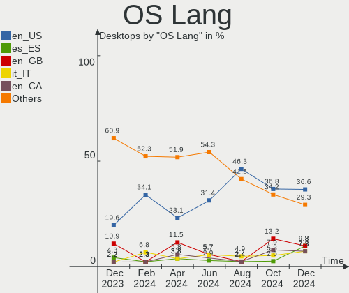
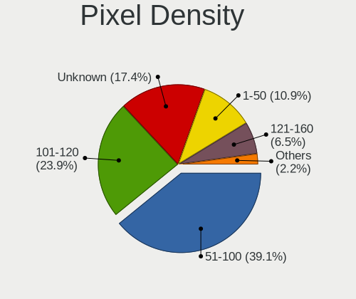
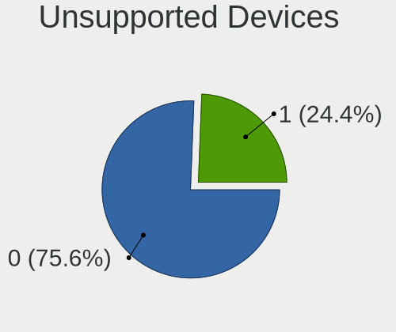

Manjaro - Hardware Trends (Desktops)
------------------------------------

A project to identify most popular hardware characteristics and track their change
over time based on data collected by Linux users at https://Linux-Hardware.org.

Anyone can contribute to this report by the [hw-probe](https://github.com/linuxhw/hw-probe) tool:

    sudo -E hw-probe -all -upload

This report is for one last month. Overall report since the beginning of time: [TestDays](https://github.com/linuxhw/TestDays)

Period: Jul, 2023.

Contents
--------

* [ System ](#system)
  - [ OS                       ](#os)
  - [ OS Family                ](#os-family)
  - [ Kernel                   ](#kernel)
  - [ Kernel Family            ](#kernel-family)
  - [ Kernel Major Ver.        ](#kernel-major-ver)
  - [ Arch                     ](#arch)
  - [ DE                       ](#de)
  - [ Display Server           ](#display-server)
  - [ Display Manager          ](#display-manager)
  - [ OS Lang                  ](#os-lang)
  - [ Boot Mode                ](#boot-mode)
  - [ Filesystem               ](#filesystem)
  - [ Part. scheme             ](#part-scheme)
  - [ Dual Boot with Linux/BSD ](#dual-boot-with-linuxbsd)
  - [ Dual Boot (Win)          ](#dual-boot-win)

* [ Board ](#board)
  - [ Vendor                   ](#vendor)
  - [ Model                    ](#model)
  - [ Model Family             ](#model-family)
  - [ MFG Year                 ](#mfg-year)
  - [ Form Factor              ](#form-factor)
  - [ Secure Boot              ](#secure-boot)
  - [ Coreboot                 ](#coreboot)
  - [ RAM Size                 ](#ram-size)
  - [ RAM Used                 ](#ram-used)
  - [ Total Drives             ](#total-drives)
  - [ Has CD-ROM               ](#has-cd-rom)
  - [ Has Ethernet             ](#has-ethernet)
  - [ Has WiFi                 ](#has-wifi)
  - [ Has Bluetooth            ](#has-bluetooth)

* [ Location ](#location)
  - [ Country                  ](#country)
  - [ City                     ](#city)

* [ Drives ](#drives)
  - [ Drive Vendor             ](#drive-vendor)
  - [ Drive Model              ](#drive-model)
  - [ HDD Vendor               ](#hdd-vendor)
  - [ SSD Vendor               ](#ssd-vendor)
  - [ Drive Kind               ](#drive-kind)
  - [ Drive Connector          ](#drive-connector)
  - [ Drive Size               ](#drive-size)
  - [ Space Total              ](#space-total)
  - [ Space Used               ](#space-used)
  - [ Malfunc. Drives          ](#malfunc-drives)
  - [ Malfunc. Drive Vendor    ](#malfunc-drive-vendor)
  - [ Malfunc. HDD Vendor      ](#malfunc-hdd-vendor)
  - [ Malfunc. Drive Kind      ](#malfunc-drive-kind)
  - [ Failed Drives            ](#failed-drives)
  - [ Failed Drive Vendor      ](#failed-drive-vendor)
  - [ Drive Status             ](#drive-status)

* [ Storage controller ](#storage-controller)
  - [ Storage Vendor           ](#storage-vendor)
  - [ Storage Model            ](#storage-model)
  - [ Storage Kind             ](#storage-kind)

* [ Processor ](#processor)
  - [ CPU Vendor               ](#cpu-vendor)
  - [ CPU Model                ](#cpu-model)
  - [ CPU Model Family         ](#cpu-model-family)
  - [ CPU Cores                ](#cpu-cores)
  - [ CPU Sockets              ](#cpu-sockets)
  - [ CPU Threads              ](#cpu-threads)
  - [ CPU Op-Modes             ](#cpu-op-modes)
  - [ CPU Microcode            ](#cpu-microcode)
  - [ CPU Microarch            ](#cpu-microarch)

* [ Graphics ](#graphics)
  - [ GPU Vendor               ](#gpu-vendor)
  - [ GPU Model                ](#gpu-model)
  - [ GPU Combo                ](#gpu-combo)
  - [ GPU Driver               ](#gpu-driver)
  - [ GPU Memory               ](#gpu-memory)

* [ Monitor ](#monitor)
  - [ Monitor Vendor           ](#monitor-vendor)
  - [ Monitor Model            ](#monitor-model)
  - [ Monitor Resolution       ](#monitor-resolution)
  - [ Monitor Diagonal         ](#monitor-diagonal)
  - [ Monitor Width            ](#monitor-width)
  - [ Aspect Ratio             ](#aspect-ratio)
  - [ Monitor Area             ](#monitor-area)
  - [ Pixel Density            ](#pixel-density)
  - [ Multiple Monitors        ](#multiple-monitors)

* [ Network ](#network)
  - [ Net Controller Vendor    ](#net-controller-vendor)
  - [ Net Controller Model     ](#net-controller-model)
  - [ Wireless Vendor          ](#wireless-vendor)
  - [ Wireless Model           ](#wireless-model)
  - [ Ethernet Vendor          ](#ethernet-vendor)
  - [ Ethernet Model           ](#ethernet-model)
  - [ Net Controller Kind      ](#net-controller-kind)
  - [ Used Controller          ](#used-controller)
  - [ NICs                     ](#nics)
  - [ IPv6                     ](#ipv6)

* [ Bluetooth ](#bluetooth)
  - [ Bluetooth Vendor         ](#bluetooth-vendor)
  - [ Bluetooth Model          ](#bluetooth-model)

* [ Sound ](#sound)
  - [ Sound Vendor             ](#sound-vendor)
  - [ Sound Model              ](#sound-model)

* [ Memory ](#memory)
  - [ Memory Vendor            ](#memory-vendor)
  - [ Memory Model             ](#memory-model)
  - [ Memory Kind              ](#memory-kind)
  - [ Memory Form Factor       ](#memory-form-factor)
  - [ Memory Size              ](#memory-size)
  - [ Memory Speed             ](#memory-speed)

* [ Printers & scanners ](#printers--scanners)
  - [ Printer Vendor           ](#printer-vendor)
  - [ Printer Model            ](#printer-model)
  - [ Scanner Vendor           ](#scanner-vendor)
  - [ Scanner Model            ](#scanner-model)

* [ Camera ](#camera)
  - [ Camera Vendor            ](#camera-vendor)
  - [ Camera Model             ](#camera-model)

* [ Security ](#security)
  - [ Fingerprint Vendor       ](#fingerprint-vendor)
  - [ Fingerprint Model        ](#fingerprint-model)
  - [ Chipcard Vendor          ](#chipcard-vendor)
  - [ Chipcard Model           ](#chipcard-model)

* [ Unsupported ](#unsupported)
  - [ Unsupported Devices      ](#unsupported-devices)
  - [ Unsupported Device Types ](#unsupported-device-types)

System
------

OS
--

Installed operating systems

| Name           | Desktops | Percent |
|----------------|----------|---------|
| Manjaro        | 33       | 75%     |
| Manjaro 23.0.0 | 10       | 22.73%  |
| Manjaro 22.1.3 | 1        | 2.27%   |

OS Family
---------

OS without a version

| Name    | Desktops | Percent |
|---------|----------|---------|
| Manjaro | 44       | 100%    |

Kernel
------

Version of the Linux kernel

| Version            | Desktops | Percent |
|--------------------|----------|---------|
| 6.1.38-1-MANJARO   | 7        | 15.91%  |
| 6.1.31-2-MANJARO   | 7        | 15.91%  |
| 6.2.16-2-MANJARO   | 5        | 11.36%  |
| 6.4.3-1-MANJARO    | 4        | 9.09%   |
| 6.4.2-3-MANJARO    | 4        | 9.09%   |
| 6.3.5-2-MANJARO    | 3        | 6.82%   |
| 6.3.12-1-MANJARO   | 3        | 6.82%   |
| 6.1.41-1-MANJARO   | 2        | 4.55%   |
| 5.15.120-1-MANJARO | 2        | 4.55%   |
| 6.4.6-1-MANJARO    | 1        | 2.27%   |
| 6.4.3-lqx1-1-lqx   | 1        | 2.27%   |
| 6.4.1-273-tkg-pds  | 1        | 2.27%   |
| 6.1.30-1-MANJARO   | 1        | 2.27%   |
| 5.9.16-1-MANJARO   | 1        | 2.27%   |
| 5.15.55-1-MANJARO  | 1        | 2.27%   |
| 5.10.181-2-MANJARO | 1        | 2.27%   |

Kernel Family
-------------

Linux kernel without a distro release

| Version  | Desktops | Percent |
|----------|----------|---------|
| 6.1.38   | 7        | 15.91%  |
| 6.1.31   | 7        | 15.91%  |
| 6.4.3    | 5        | 11.36%  |
| 6.2.16   | 5        | 11.36%  |
| 6.4.2    | 4        | 9.09%   |
| 6.3.5    | 3        | 6.82%   |
| 6.3.12   | 3        | 6.82%   |
| 6.1.41   | 2        | 4.55%   |
| 5.15.120 | 2        | 4.55%   |
| 6.4.6    | 1        | 2.27%   |
| 6.4.1    | 1        | 2.27%   |
| 6.1.30   | 1        | 2.27%   |
| 5.9.16   | 1        | 2.27%   |
| 5.15.55  | 1        | 2.27%   |
| 5.10.181 | 1        | 2.27%   |

Kernel Major Ver.
-----------------

Linux kernel major version

| Version | Desktops | Percent |
|---------|----------|---------|
| 6.1     | 17       | 38.64%  |
| 6.4     | 11       | 25%     |
| 6.3     | 6        | 13.64%  |
| 6.2     | 5        | 11.36%  |
| 5.15    | 3        | 6.82%   |
| 5.9     | 1        | 2.27%   |
| 5.10    | 1        | 2.27%   |

Arch
----

OS architecture (x86_64, i586, etc.)

| Name   | Desktops | Percent |
|--------|----------|---------|
| x86_64 | 44       | 100%    |

DE
--

Desktop Environment

| Name       | Desktops | Percent |
|------------|----------|---------|
| KDE5       | 31       | 70.45%  |
| XFCE       | 5        | 11.36%  |
| GNOME      | 4        | 9.09%   |
| X-Cinnamon | 1        | 2.27%   |
| MATE       | 1        | 2.27%   |
| i3         | 1        | 2.27%   |
| Unknown    | 1        | 2.27%   |

Display Server
--------------

X11 or Wayland

| Name    | Desktops | Percent |
|---------|----------|---------|
| X11     | 34       | 77.27%  |
| Wayland | 10       | 22.73%  |

Display Manager
---------------

SDDM, LightDM, etc.

| Name    | Desktops | Percent |
|---------|----------|---------|
| Unknown | 33       | 75%     |
| SDDM    | 7        | 15.91%  |
| LightDM | 3        | 6.82%   |
| GDM     | 1        | 2.27%   |

OS Lang
-------

Language

| Lang    | Desktops | Percent |
|---------|----------|---------|
| en_US   | 19       | 43.18%  |
| de_DE   | 7        | 15.91%  |
| en_GB   | 4        | 9.09%   |
| ru_RU   | 2        | 4.55%   |
| pt_BR   | 2        | 4.55%   |
| pl_PL   | 2        | 4.55%   |
| fr_FR   | 2        | 4.55%   |
| es_ES   | 1        | 2.27%   |
| es_AR   | 1        | 2.27%   |
| en_PH   | 1        | 2.27%   |
| en_IN   | 1        | 2.27%   |
| de_CH   | 1        | 2.27%   |
| Unknown | 1        | 2.27%   |

Boot Mode
---------

EFI or BIOS

| Mode | Desktops | Percent |
|------|----------|---------|
| BIOS | 32       | 72.73%  |
| EFI  | 12       | 27.27%  |

Filesystem
----------

Type of filesystem

| Type  | Desktops | Percent |
|-------|----------|---------|
| Ext4  | 32       | 72.73%  |
| Btrfs | 9        | 20.45%  |
| Tmpfs | 2        | 4.55%   |
| Xfs   | 1        | 2.27%   |

Part. scheme
------------

Scheme of partitioning

| Type    | Desktops | Percent |
|---------|----------|---------|
| Unknown | 32       | 72.73%  |
| GPT     | 12       | 27.27%  |

Dual Boot with Linux/BSD
------------------------

Hosting more than one Linux/BSD

| Dual boot | Desktops | Percent |
|-----------|----------|---------|
| No        | 41       | 93.18%  |
| Yes       | 3        | 6.82%   |

Dual Boot (Win)
---------------

Hosting Linux and Windows

| Dual boot | Desktops | Percent |
|-----------|----------|---------|
| No        | 38       | 86.36%  |
| Yes       | 6        | 13.64%  |

Board
-----

Vendor
------

Motherboard manufacturer

| Name                | Desktops | Percent |
|---------------------|----------|---------|
| ASUSTek Computer    | 17       | 38.64%  |
| Gigabyte Technology | 9        | 20.45%  |
| MSI                 | 8        | 18.18%  |
| Hewlett-Packard     | 3        | 6.82%   |
| ASRock              | 3        | 6.82%   |
| Dell                | 2        | 4.55%   |
| Lenovo              | 1        | 2.27%   |
| AMI                 | 1        | 2.27%   |

Model
-----

Motherboard model

| Name                                    | Desktops | Percent |
|-----------------------------------------|----------|---------|
| ASUS ROG STRIX B650E-I GAMING WIFI      | 2        | 4.55%   |
| ASUS PRIME X570-P                       | 2        | 4.55%   |
| MSI Silent Gamer GTX 550 R2             | 1        | 2.27%   |
| MSI MS-7D70                             | 1        | 2.27%   |
| MSI MS-7D67                             | 1        | 2.27%   |
| MSI MS-7D25                             | 1        | 2.27%   |
| MSI MS-7C84                             | 1        | 2.27%   |
| MSI MS-7C02                             | 1        | 2.27%   |
| MSI MS-7A35                             | 1        | 2.27%   |
| MSI MS-7758                             | 1        | 2.27%   |
| Lenovo ThinkCentre M58e 7303AZ2         | 1        | 2.27%   |
| HP OMEN by 40L Gaming Desktop GT21-0xxx | 1        | 2.27%   |
| HP EliteDesk 800 G4 TWR                 | 1        | 2.27%   |
| HP Compaq Elite 8300 MT                 | 1        | 2.27%   |
| Gigabyte Z390 AORUS PRO                 | 1        | 2.27%   |
| Gigabyte X570 GAMING X                  | 1        | 2.27%   |
| Gigabyte X570 AORUS ELITE               | 1        | 2.27%   |
| Gigabyte P55M-UD2                       | 1        | 2.27%   |
| Gigabyte B650M AORUS ELITE AX           | 1        | 2.27%   |
| Gigabyte B650 AORUS ELITE AX            | 1        | 2.27%   |
| Gigabyte B450 I AORUS PRO WIFI          | 1        | 2.27%   |
| Gigabyte B360M-HD3                      | 1        | 2.27%   |
| Gigabyte AB350-Gaming 3                 | 1        | 2.27%   |
| Dell OptiPlex 755                       | 1        | 2.27%   |
| Dell OptiPlex 3010                      | 1        | 2.27%   |
| ASUS TUF Gaming X570-PLUS               | 1        | 2.27%   |
| ASUS TUF Gaming B550-PLUS WIFI II       | 1        | 2.27%   |
| ASUS ROG STRIX Z690-E GAMING WIFI       | 1        | 2.27%   |
| ASUS ROG STRIX B450-F GAMING II         | 1        | 2.27%   |
| ASUS ROG STRIX B450-F GAMING            | 1        | 2.27%   |
| ASUS PRIME Z690-P D4                    | 1        | 2.27%   |
| ASUS PRIME X570-PRO                     | 1        | 2.27%   |
| ASUS P8Z77-V                            | 1        | 2.27%   |
| ASUS P5Q PRO TURBO                      | 1        | 2.27%   |
| ASUS M5A97 LE R2.0                      | 1        | 2.27%   |
| ASUS Crosshair V Formula                | 1        | 2.27%   |
| ASUS B75M-A                             | 1        | 2.27%   |
| ASUS All Series                         | 1        | 2.27%   |
| ASRock X570 Pro4                        | 1        | 2.27%   |
| ASRock B760M PG Riptide                 | 1        | 2.27%   |

Model Family
------------

Motherboard model prefix

| Name                  | Desktops | Percent |
|-----------------------|----------|---------|
| ASUS ROG              | 5        | 11.36%  |
| ASUS PRIME            | 4        | 9.09%   |
| Gigabyte X570         | 2        | 4.55%   |
| Dell OptiPlex         | 2        | 4.55%   |
| ASUS TUF              | 2        | 4.55%   |
| MSI Silent            | 1        | 2.27%   |
| MSI MS-7D70           | 1        | 2.27%   |
| MSI MS-7D67           | 1        | 2.27%   |
| MSI MS-7D25           | 1        | 2.27%   |
| MSI MS-7C84           | 1        | 2.27%   |
| MSI MS-7C02           | 1        | 2.27%   |
| MSI MS-7A35           | 1        | 2.27%   |
| MSI MS-7758           | 1        | 2.27%   |
| Lenovo ThinkCentre    | 1        | 2.27%   |
| HP OMEN               | 1        | 2.27%   |
| HP EliteDesk          | 1        | 2.27%   |
| HP Compaq             | 1        | 2.27%   |
| Gigabyte Z390         | 1        | 2.27%   |
| Gigabyte P55M-UD2     | 1        | 2.27%   |
| Gigabyte B650M        | 1        | 2.27%   |
| Gigabyte B650         | 1        | 2.27%   |
| Gigabyte B450         | 1        | 2.27%   |
| Gigabyte B360M-HD3    | 1        | 2.27%   |
| Gigabyte AB350-Gaming | 1        | 2.27%   |
| ASUS P8Z77-V          | 1        | 2.27%   |
| ASUS P5Q              | 1        | 2.27%   |
| ASUS M5A97            | 1        | 2.27%   |
| ASUS Crosshair        | 1        | 2.27%   |
| ASUS B75M-A           | 1        | 2.27%   |
| ASUS All              | 1        | 2.27%   |
| ASRock X570           | 1        | 2.27%   |
| ASRock B760M          | 1        | 2.27%   |
| ASRock B450           | 1        | 2.27%   |
| AMI Intel             | 1        | 2.27%   |

MFG Year
--------

Motherboard manufacture year

| Year | Desktops | Percent |
|------|----------|---------|
| 2019 | 7        | 15.91%  |
| 2018 | 7        | 15.91%  |
| 2022 | 6        | 13.64%  |
| 2012 | 6        | 13.64%  |
| 2021 | 5        | 11.36%  |
| 2009 | 3        | 6.82%   |
| 2023 | 2        | 4.55%   |
| 2020 | 2        | 4.55%   |
| 2017 | 2        | 4.55%   |
| 2016 | 1        | 2.27%   |
| 2013 | 1        | 2.27%   |
| 2011 | 1        | 2.27%   |
| 2007 | 1        | 2.27%   |

Form Factor
-----------

Physical design of the computer

| Name    | Desktops | Percent |
|---------|----------|---------|
| Desktop | 44       | 100%    |

Secure Boot
-----------

Enabled or disabled

| State    | Desktops | Percent |
|----------|----------|---------|
| Disabled | 44       | 100%    |

Coreboot
--------

Have coreboot on board

| Used | Desktops | Percent |
|------|----------|---------|
| No   | 44       | 100%    |

RAM Size
--------

Total RAM memory

| Size in GB  | Desktops | Percent |
|-------------|----------|---------|
| 32.01-64.0  | 14       | 31.82%  |
| 16.01-24.0  | 10       | 22.73%  |
| 64.01-256.0 | 7        | 15.91%  |
| 8.01-16.0   | 5        | 11.36%  |
| 4.01-8.0    | 3        | 6.82%   |
| 24.01-32.0  | 3        | 6.82%   |
| 3.01-4.0    | 1        | 2.27%   |
| 2.01-3.0    | 1        | 2.27%   |

RAM Used
--------

Used RAM memory

| Used GB    | Desktops | Percent |
|------------|----------|---------|
| 4.01-8.0   | 21       | 47.73%  |
| 2.01-3.0   | 8        | 18.18%  |
| 3.01-4.0   | 5        | 11.36%  |
| 1.01-2.0   | 3        | 6.82%   |
| 8.01-16.0  | 3        | 6.82%   |
| 16.01-24.0 | 2        | 4.55%   |
| 0.51-1.0   | 2        | 4.55%   |

Total Drives
------------

Number of drives on board

| Drives | Desktops | Percent |
|--------|----------|---------|
| 1      | 11       | 25%     |
| 3      | 9        | 20.45%  |
| 4      | 8        | 18.18%  |
| 2      | 8        | 18.18%  |
| 5      | 5        | 11.36%  |
| 6      | 2        | 4.55%   |
| 8      | 1        | 2.27%   |

Has CD-ROM
----------

Has CD-ROM on board

| Presented | Desktops | Percent |
|-----------|----------|---------|
| No        | 31       | 70.45%  |
| Yes       | 13       | 29.55%  |

Has Ethernet
------------

Has Ethernet on board

| Presented | Desktops | Percent |
|-----------|----------|---------|
| Yes       | 44       | 100%    |

Has WiFi
--------

Has WiFi module

| Presented | Desktops | Percent |
|-----------|----------|---------|
| Yes       | 23       | 52.27%  |
| No        | 21       | 47.73%  |

Has Bluetooth
-------------

Has Bluetooth module

| Presented | Desktops | Percent |
|-----------|----------|---------|
| Yes       | 25       | 56.82%  |
| No        | 19       | 43.18%  |

Location
--------

Country
-------

Geographic location (country)

| Country      | Desktops | Percent |
|--------------|----------|---------|
| USA          | 12       | 27.27%  |
| Germany      | 8        | 18.18%  |
| Switzerland  | 2        | 4.55%   |
| Russia       | 2        | 4.55%   |
| Netherlands  | 2        | 4.55%   |
| France       | 2        | 4.55%   |
| Brazil       | 2        | 4.55%   |
| Argentina    | 2        | 4.55%   |
| Vietnam      | 1        | 2.27%   |
| UK           | 1        | 2.27%   |
| Spain        | 1        | 2.27%   |
| South Africa | 1        | 2.27%   |
| Poland       | 1        | 2.27%   |
| Philippines  | 1        | 2.27%   |
| Italy        | 1        | 2.27%   |
| India        | 1        | 2.27%   |
| Denmark      | 1        | 2.27%   |
| Czechia      | 1        | 2.27%   |
| Canada       | 1        | 2.27%   |
| Armenia      | 1        | 2.27%   |

City
----

Geographic location (city)

| City                 | Desktops | Percent |
|----------------------|----------|---------|
| St Petersburg        | 2        | 4.55%   |
| Yerevan              | 1        | 2.27%   |
| Wiesbaden            | 1        | 2.27%   |
| Wangen               | 1        | 2.27%   |
| Vriezenveen          | 1        | 2.27%   |
| Untergruppenbach     | 1        | 2.27%   |
| Stuttgart            | 1        | 2.27%   |
| Stockton             | 1        | 2.27%   |
| Spokane              | 1        | 2.27%   |
| Sohlde               | 1        | 2.27%   |
| Snedsted             | 1        | 2.27%   |
| Seattle              | 1        | 2.27%   |
| San Francisco        | 1        | 2.27%   |
| Rotterdam            | 1        | 2.27%   |
| Ribeirao das Neves   | 1        | 2.27%   |
| Reno                 | 1        | 2.27%   |
| Reda                 | 1        | 2.27%   |
| Quezon City          | 1        | 2.27%   |
| Potchefstroom        | 1        | 2.27%   |
| Pesaro               | 1        | 2.27%   |
| Pardubice            | 1        | 2.27%   |
| Osterholz-Scharmbeck | 1        | 2.27%   |
| Mississauga          | 1        | 2.27%   |
| Mar del Plata        | 1        | 2.27%   |
| Londrina             | 1        | 2.27%   |
| Lenoir               | 1        | 2.27%   |
| Leeds                | 1        | 2.27%   |
| Köthen              | 1        | 2.27%   |
| Jegenstorf           | 1        | 2.27%   |
| Hyderabad            | 1        | 2.27%   |
| Holly Springs        | 1        | 2.27%   |
| Ho Chi Minh City     | 1        | 2.27%   |
| Hewitt               | 1        | 2.27%   |
| Henderson            | 1        | 2.27%   |
| Hannoversch Münden  | 1        | 2.27%   |
| Gueret               | 1        | 2.27%   |
| Freiburg im Breisgau | 1        | 2.27%   |
| Dijon                | 1        | 2.27%   |
| Crescent City        | 1        | 2.27%   |
| Cleburne             | 1        | 2.27%   |

Drives
------

Drive Vendor
------------

Hard drive vendors

| Vendor                      | Desktops | Drives | Percent |
|-----------------------------|----------|--------|---------|
| WDC                         | 21       | 31     | 21.43%  |
| Samsung Electronics         | 20       | 32     | 20.41%  |
| Seagate                     | 11       | 14     | 11.22%  |
| Toshiba                     | 7        | 10     | 7.14%   |
| Sandisk                     | 6        | 8      | 6.12%   |
| Crucial                     | 4        | 5      | 4.08%   |
| Phison Electronics          | 3        | 3      | 3.06%   |
| HGST                        | 3        | 3      | 3.06%   |
| Silicon Motion              | 2        | 2      | 2.04%   |
| Kingston Technology Company | 2        | 2      | 2.04%   |
| Kingston                    | 2        | 2      | 2.04%   |
| Fujitsu                     | 2        | 2      | 2.04%   |
| XrayDisk                    | 1        | 1      | 1.02%   |
| Team                        | 1        | 1      | 1.02%   |
| PNY                         | 1        | 1      | 1.02%   |
| OCZ-VERT                    | 1        | 1      | 1.02%   |
| OCZ                         | 1        | 2      | 1.02%   |
| Mushkin                     | 1        | 1      | 1.02%   |
| Micron/Crucial Technology   | 1        | 1      | 1.02%   |
| MaxDigital                  | 1        | 1      | 1.02%   |
| Lexar                       | 1        | 1      | 1.02%   |
| Intel                       | 1        | 1      | 1.02%   |
| Hitachi                     | 1        | 1      | 1.02%   |
| GOODRAM                     | 1        | 1      | 1.02%   |
| China                       | 1        | 1      | 1.02%   |
| ADATA Technology            | 1        | 1      | 1.02%   |
| A-DATA Technology           | 1        | 2      | 1.02%   |

Drive Model
-----------

Hard drive models

| Model                                               | Desktops | Percent |
|-----------------------------------------------------|----------|---------|
| Samsung NVMe SSD Controller PM9A1/PM9A3/980PRO 1TB  | 6        | 5%      |
| Samsung SSD 850 EVO 500GB                           | 4        | 3.33%   |
| Samsung SSD 860 EVO 500GB                           | 3        | 2.5%    |
| WDC WDS100T2B0A-00SM50 1TB SSD                      | 2        | 1.67%   |
| WDC WD40EZRZ-22GXCB0 4TB                            | 2        | 1.67%   |
| WDC WD20EARS-00MVWB0 2TB                            | 2        | 1.67%   |
| WDC WD1003FZEX-00K3CA0 1TB                          | 2        | 1.67%   |
| Toshiba DT01ACA100 1TB                              | 2        | 1.67%   |
| Seagate ST500LT012-9WS142 500GB                     | 2        | 1.67%   |
| Sandisk WD_BLACK SN850X 2000GB                      | 2        | 1.67%   |
| Sandisk WD Black SN750 / PC SN730 NVMe SSD 1024GB   | 2        | 1.67%   |
| Samsung SSD 870 QVO 1TB                             | 2        | 1.67%   |
| Samsung SSD 860 EVO 1TB                             | 2        | 1.67%   |
| Samsung NVMe SSD Controller SM981/PM981/PM983 500GB | 2        | 1.67%   |
| Samsung HD103SJ 1TB                                 | 2        | 1.67%   |
| Phison E12 NVMe Controller 2TB                      | 2        | 1.67%   |
| Crucial CT240BX500SSD1 240GB                        | 2        | 1.67%   |
| Crucial CT2000MX500SSD1 2TB                         | 2        | 1.67%   |
| XrayDisk NVMe SSD Drive 1024GB                      | 1        | 0.83%   |
| WDC WDS500G2B0A-00SM50 500GB SSD                    | 1        | 0.83%   |
| WDC WD7500AADS-00M2B0 752GB                         | 1        | 0.83%   |
| WDC WD5003ABYZ-011FA0 500GB                         | 1        | 0.83%   |
| WDC WD5000AAKS-00D2B0 500GB                         | 1        | 0.83%   |
| WDC WD40EZAZ-00SF3B0 4TB                            | 1        | 0.83%   |
| WDC WD40EFPX-68C6CN0 4TB                            | 1        | 0.83%   |
| WDC WD3200AAJS-00L7A0 320GB                         | 1        | 0.83%   |
| WDC WD2500AAJS-07M0A0 250GB                         | 1        | 0.83%   |
| WDC WD20SPZX-00UA7T0 2TB                            | 1        | 0.83%   |
| WDC WD1600AAJS-00L7A0 160GB                         | 1        | 0.83%   |
| WDC WD1200BEVS-75RST0 120GB                         | 1        | 0.83%   |
| WDC WD10JPVX-22JC3T0 1TB                            | 1        | 0.83%   |
| WDC WD10EZRX-00D8PB0 1TB                            | 1        | 0.83%   |
| WDC WD10EZRX-00A3KB0 1TB                            | 1        | 0.83%   |
| WDC WD10EZEX-60WN4A0 1TB                            | 1        | 0.83%   |
| WDC WD10EZEX-08WN4A0 1TB                            | 1        | 0.83%   |
| WDC WD10EZEX-00KUWA0 1TB                            | 1        | 0.83%   |
| WDC WD10EADS-114BB1 1TB                             | 1        | 0.83%   |
| WDC WD1003FZEX-00MK2A0 1TB                          | 1        | 0.83%   |
| WDC WD1002FBYS-05A6B0 1TB                           | 1        | 0.83%   |
| Toshiba MK3255GSX 320GB                             | 1        | 0.83%   |

HDD Vendor
----------

Hard disk drive vendors

| Vendor              | Desktops | Drives | Percent |
|---------------------|----------|--------|---------|
| WDC                 | 18       | 28     | 40%     |
| Seagate             | 10       | 13     | 22.22%  |
| Toshiba             | 7        | 10     | 15.56%  |
| Samsung Electronics | 3        | 3      | 6.67%   |
| HGST                | 3        | 3      | 6.67%   |
| Fujitsu             | 2        | 2      | 4.44%   |
| MaxDigital          | 1        | 1      | 2.22%   |
| Hitachi             | 1        | 1      | 2.22%   |

SSD Vendor
----------

Solid state drive vendors

| Vendor              | Desktops | Drives | Percent |
|---------------------|----------|--------|---------|
| Samsung Electronics | 13       | 18     | 44.83%  |
| Crucial             | 4        | 5      | 13.79%  |
| WDC                 | 3        | 3      | 10.34%  |
| Team                | 1        | 1      | 3.45%   |
| PNY                 | 1        | 1      | 3.45%   |
| OCZ-VERT            | 1        | 1      | 3.45%   |
| OCZ                 | 1        | 2      | 3.45%   |
| Lexar               | 1        | 1      | 3.45%   |
| Kingston            | 1        | 1      | 3.45%   |
| GOODRAM             | 1        | 1      | 3.45%   |
| China               | 1        | 1      | 3.45%   |
| A-DATA Technology   | 1        | 2      | 3.45%   |

Drive Kind
----------

HDD or SSD

| Kind    | Desktops | Drives | Percent |
|---------|----------|--------|---------|
| HDD     | 30       | 61     | 38.96%  |
| NVMe    | 23       | 32     | 29.87%  |
| SSD     | 23       | 37     | 29.87%  |
| Unknown | 1        | 1      | 1.3%    |

Drive Connector
---------------

SATA, SAS, NVMe, etc.

| Type | Desktops | Drives | Percent |
|------|----------|--------|---------|
| SATA | 38       | 93     | 59.38%  |
| NVMe | 23       | 32     | 35.94%  |
| SAS  | 3        | 6      | 4.69%   |

Drive Size
----------

Size of hard drive

| Size in TB | Desktops | Drives | Percent |
|------------|----------|--------|---------|
| 0.51-1.0   | 27       | 36     | 40.91%  |
| 0.01-0.5   | 18       | 34     | 27.27%  |
| 1.01-2.0   | 9        | 10     | 13.64%  |
| 3.01-4.0   | 5        | 9      | 7.58%   |
| 4.01-10.0  | 5        | 7      | 7.58%   |
| 2.01-3.0   | 1        | 1      | 1.52%   |
| 10.01-20.0 | 1        | 1      | 1.52%   |

Space Total
-----------

Amount of disk space available on the file system

| Size in GB     | Desktops | Percent |
|----------------|----------|---------|
| 501-1000       | 13       | 29.55%  |
| 1001-2000      | 10       | 22.73%  |
| More than 3000 | 8        | 18.18%  |
| 251-500        | 6        | 13.64%  |
| 2001-3000      | 3        | 6.82%   |
| 101-250        | 2        | 4.55%   |
| 51-100         | 1        | 2.27%   |
| Unknown        | 1        | 2.27%   |

Space Used
----------

Amount of used disk space

| Used GB        | Desktops | Percent |
|----------------|----------|---------|
| 251-500        | 12       | 27.27%  |
| 101-250        | 7        | 15.91%  |
| 1-20           | 6        | 13.64%  |
| 1001-2000      | 4        | 9.09%   |
| 51-100         | 4        | 9.09%   |
| More than 3000 | 3        | 6.82%   |
| 501-1000       | 3        | 6.82%   |
| 21-50          | 2        | 4.55%   |
| 2001-3000      | 2        | 4.55%   |
| Unknown        | 1        | 2.27%   |

Malfunc. Drives
---------------

Drive models with a malfunction

| Model                      | Desktops | Drives | Percent |
|----------------------------|----------|--------|---------|
| WDC WD20EARS-00MVWB0 2TB   | 1        | 1      | 33.33%  |
| WDC WD10EZRX-00A3KB0 1TB   | 1        | 1      | 33.33%  |
| WDC WD1003FZEX-00K3CA0 1TB | 1        | 1      | 33.33%  |

Malfunc. Drive Vendor
---------------------

Vendors of faulty drives

| Vendor | Desktops | Drives | Percent |
|--------|----------|--------|---------|
| WDC    | 3        | 3      | 100%    |

Malfunc. HDD Vendor
-------------------

Vendors of faulty HDD drives

| Vendor | Desktops | Drives | Percent |
|--------|----------|--------|---------|
| WDC    | 3        | 3      | 100%    |

Malfunc. Drive Kind
-------------------

Kinds of faulty drives

| Kind | Desktops | Drives | Percent |
|------|----------|--------|---------|
| HDD  | 3        | 3      | 100%    |

Failed Drives
-------------

Failed drive models

Zero info for selected period =(

Failed Drive Vendor
-------------------

Failed drive vendors

Zero info for selected period =(

Drive Status
------------

Number of failed and malfunc. drives

| Status   | Desktops | Drives | Percent |
|----------|----------|--------|---------|
| Detected | 34       | 96     | 72.34%  |
| Works    | 10       | 32     | 21.28%  |
| Malfunc  | 3        | 3      | 6.38%   |

Storage controller
------------------

Storage Vendor
--------------

Storage controller vendors

| Vendor                      | Desktops | Percent |
|-----------------------------|----------|---------|
| AMD                         | 24       | 29.63%  |
| Intel                       | 20       | 24.69%  |
| Samsung Electronics         | 9        | 11.11%  |
| SanDisk                     | 6        | 7.41%   |
| ASMedia Technology          | 6        | 7.41%   |
| Silicon Motion              | 3        | 3.7%    |
| Phison Electronics          | 3        | 3.7%    |
| Kingston Technology Company | 3        | 3.7%    |
| JMicron Technology          | 2        | 2.47%   |
| Micron/Crucial Technology   | 1        | 1.23%   |
| Marvell Technology Group    | 1        | 1.23%   |
| LSI Logic / Symbios Logic   | 1        | 1.23%   |
| INNOGRIT                    | 1        | 1.23%   |
| ADATA Technology            | 1        | 1.23%   |

Storage Model
-------------

Storage controller models

| Model                                                                         | Desktops | Percent |
|-------------------------------------------------------------------------------|----------|---------|
| AMD FCH SATA Controller [AHCI mode]                                           | 18       | 19.35%  |
| Samsung NVMe SSD Controller PM9A1/PM9A3/980PRO                                | 6        | 6.45%   |
| ASMedia ASM1062 Serial ATA Controller                                         | 5        | 5.38%   |
| AMD 400 Series Chipset SATA Controller                                        | 5        | 5.38%   |
| Intel Alder Lake-S PCH SATA Controller [AHCI Mode]                            | 4        | 4.3%    |
| Intel 7 Series/C210 Series Chipset Family 6-port SATA Controller [AHCI mode]  | 4        | 4.3%    |
| Samsung NVMe SSD Controller SM981/PM981/PM983                                 | 3        | 3.23%   |
| Intel Volume Management Device NVMe RAID Controller                           | 3        | 3.23%   |
| Silicon Motion SM2263EN/SM2263XT (DRAM-less) NVMe SSD Controllers             | 2        | 2.15%   |
| Sandisk Western Digital WD Black SN850X NVMe SSD                              | 2        | 2.15%   |
| SanDisk WD Black SN750 / PC SN730 NVMe SSD                                    | 2        | 2.15%   |
| Phison E12 NVMe Controller                                                    | 2        | 2.15%   |
| Kingston Company Company Non-Volatile memory controller                       | 2        | 2.15%   |
| Intel Cannon Lake PCH SATA AHCI Controller                                    | 2        | 2.15%   |
| Intel 6 Series/C200 Series Chipset Family 6 port Desktop SATA AHCI Controller | 2        | 2.15%   |
| AMD SB7x0/SB8x0/SB9x0 SATA Controller [AHCI mode]                             | 2        | 2.15%   |
| Silicon Motion SM2262/SM2262EN SSD Controller                                 | 1        | 1.08%   |
| SanDisk WD PC SN810 / Black SN850 NVMe SSD                                    | 1        | 1.08%   |
| SanDisk WD Blue SN570 NVMe SSD 1TB                                            | 1        | 1.08%   |
| SanDisk WD Black SN770 / PC SN740 256GB / PC SN560 (DRAM-less) NVMe SSD       | 1        | 1.08%   |
| Samsung NVMe SSD Controller 980                                               | 1        | 1.08%   |
| Phison PS5013 E13 NVMe Controller                                             | 1        | 1.08%   |
| Micron/Crucial P2 [Nick P2] / P3 / P3 Plus NVMe PCIe SSD (DRAM-less)          | 1        | 1.08%   |
| Marvell Group 88SE9215 PCIe 2.0 x1 4-port SATA 6 Gb/s Controller              | 1        | 1.08%   |
| LSI Logic / Symbios Logic SAS2008 PCI-Express Fusion-MPT SAS-2 [Falcon]       | 1        | 1.08%   |
| Kingston Company A2000 NVMe SSD                                               | 1        | 1.08%   |
| JMicron JMB363 SATA/IDE Controller                                            | 1        | 1.08%   |
| JMicron JMB361 AHCI/IDE                                                       | 1        | 1.08%   |
| Intel Tiger Lake-LP SATA Controller                                           | 1        | 1.08%   |
| Intel SSD 660P Series                                                         | 1        | 1.08%   |
| Intel SATA Controller [RAID mode]                                             | 1        | 1.08%   |
| Intel NM10/ICH7 Family SATA Controller [IDE mode]                             | 1        | 1.08%   |
| Intel C610/X99 series chipset sSATA Controller [AHCI mode]                    | 1        | 1.08%   |
| Intel 82Q35 Express PT IDER Controller                                        | 1        | 1.08%   |
| Intel 82801JI (ICH10 Family) SATA AHCI Controller                             | 1        | 1.08%   |
| Intel 82801IR/IO/IH (ICH9R/DO/DH) 6 port SATA Controller [AHCI mode]          | 1        | 1.08%   |
| Intel 700 Series Chipset Family SATA AHCI Controller                          | 1        | 1.08%   |
| Intel 5 Series/3400 Series Chipset 4 port SATA IDE Controller                 | 1        | 1.08%   |
| Intel 5 Series/3400 Series Chipset 2 port SATA IDE Controller                 | 1        | 1.08%   |
| INNOGRIT NVMe SSD Controller IG5216 (DRAM-less)                               | 1        | 1.08%   |

Storage Kind
------------

Kind of storage controller (IDE, SATA, NVMe, SAS, ...)

| Kind | Desktops | Percent |
|------|----------|---------|
| SATA | 41       | 55.41%  |
| NVMe | 24       | 32.43%  |
| RAID | 4        | 5.41%   |
| IDE  | 4        | 5.41%   |
| SAS  | 1        | 1.35%   |

Processor
---------

CPU Vendor
----------

Processor vendors

| Vendor | Desktops | Percent |
|--------|----------|---------|
| AMD    | 24       | 54.55%  |
| Intel  | 20       | 45.45%  |

CPU Model
---------

Processor models

| Model                                       | Desktops | Percent |
|---------------------------------------------|----------|---------|
| AMD Ryzen 7 7700X 8-Core Processor          | 3        | 6.82%   |
| Intel Core i5-3470 CPU @ 3.20GHz            | 2        | 4.55%   |
| Intel Core 2 Quad CPU Q6600 @ 2.40GHz       | 2        | 4.55%   |
| AMD Ryzen 7 5700X 8-Core Processor          | 2        | 4.55%   |
| AMD Ryzen 7 3700X 8-Core Processor          | 2        | 4.55%   |
| AMD Ryzen 5 3600 6-Core Processor           | 2        | 4.55%   |
| AMD Ryzen 5 1600 Six-Core Processor         | 2        | 4.55%   |
| Intel Xeon CPU E5-2690 v3 @ 2.60GHz         | 1        | 2.27%   |
| Intel Xeon CPU E3-1240 V2 @ 3.40GHz         | 1        | 2.27%   |
| Intel Core i9-9900KF CPU @ 3.60GHz          | 1        | 2.27%   |
| Intel Core i5-8500 CPU @ 3.00GHz            | 1        | 2.27%   |
| Intel Core i5-8400 CPU @ 2.80GHz            | 1        | 2.27%   |
| Intel Core i5-3570K CPU @ 3.40GHz           | 1        | 2.27%   |
| Intel Core i5-3570 CPU @ 3.40GHz            | 1        | 2.27%   |
| Intel Core i5 CPU 750 @ 2.67GHz             | 1        | 2.27%   |
| Intel Core i3-2100 CPU @ 3.10GHz            | 1        | 2.27%   |
| Intel Core 2 Duo CPU E4500 @ 2.20GHz        | 1        | 2.27%   |
| Intel 13th Gen Core i5-13600KF              | 1        | 2.27%   |
| Intel 12th Gen Core i9-12900K               | 1        | 2.27%   |
| Intel 12th Gen Core i9-12900F               | 1        | 2.27%   |
| Intel 12th Gen Core i7-12700F               | 1        | 2.27%   |
| Intel 12th Gen Core i7-12700                | 1        | 2.27%   |
| Intel 11th Gen Core i5-1145G7 @ 2.60GHz     | 1        | 2.27%   |
| AMD Ryzen 9 7950X3D 16-Core Processor       | 1        | 2.27%   |
| AMD Ryzen 9 5950X 16-Core Processor         | 1        | 2.27%   |
| AMD Ryzen 9 3950X 16-Core Processor         | 1        | 2.27%   |
| AMD Ryzen 7 7800X3D 8-Core Processor        | 1        | 2.27%   |
| AMD Ryzen 7 7700 8-Core Processor           | 1        | 2.27%   |
| AMD Ryzen 7 5800X 8-Core Processor          | 1        | 2.27%   |
| AMD Ryzen 7 3800X 8-Core Processor          | 1        | 2.27%   |
| AMD Ryzen 7 2700X Eight-Core Processor      | 1        | 2.27%   |
| AMD Ryzen 5 5500                            | 1        | 2.27%   |
| AMD Ryzen 5 3500 6-Core Processor           | 1        | 2.27%   |
| AMD Ryzen 5 3400G with Radeon Vega Graphics | 1        | 2.27%   |
| AMD FX-8350 Eight-Core Processor            | 1        | 2.27%   |
| AMD FX-6300 Six-Core Processor              | 1        | 2.27%   |

CPU Model Family
----------------

Processor model prefix

| Model             | Desktops | Percent |
|-------------------|----------|---------|
| AMD Ryzen 7       | 12       | 27.27%  |
| Intel Core i5     | 7        | 15.91%  |
| AMD Ryzen 5       | 7        | 15.91%  |
| Other             | 6        | 13.64%  |
| AMD Ryzen 9       | 3        | 6.82%   |
| Intel Xeon        | 2        | 4.55%   |
| Intel Core 2 Quad | 2        | 4.55%   |
| AMD FX            | 2        | 4.55%   |
| Intel Core i9     | 1        | 2.27%   |
| Intel Core i3     | 1        | 2.27%   |
| Intel Core 2 Duo  | 1        | 2.27%   |

CPU Cores
---------

Number of processor cores

| Number | Desktops | Percent |
|--------|----------|---------|
| 8      | 13       | 29.55%  |
| 4      | 11       | 25%     |
| 6      | 8        | 18.18%  |
| 16     | 5        | 11.36%  |
| 12     | 3        | 6.82%   |
| 2      | 2        | 4.55%   |
| 14     | 1        | 2.27%   |
| 3      | 1        | 2.27%   |

CPU Sockets
-----------

Number of sockets

| Number | Desktops | Percent |
|--------|----------|---------|
| 1      | 44       | 100%    |

CPU Threads
-----------

Threads per core (Hyper-Threading)

| Number | Desktops | Percent |
|--------|----------|---------|
| 2      | 32       | 72.73%  |
| 1      | 12       | 27.27%  |

CPU Op-Modes
------------

CPU Operation Modes (32-bit, 64-bit)

| Op mode        | Desktops | Percent |
|----------------|----------|---------|
| 32-bit, 64-bit | 44       | 100%    |

CPU Microcode
-------------

Microcode number

| Number     | Desktops | Percent |
|------------|----------|---------|
| Unknown    | 31       | 70.45%  |
| 0x0a601203 | 4        | 9.09%   |
| 0x08701021 | 2        | 4.55%   |
| 0x90672    | 1        | 2.27%   |
| 0x6fb      | 1        | 2.27%   |
| 0x306a9    | 1        | 2.27%   |
| 0x0a20120a | 1        | 2.27%   |
| 0x0a201025 | 1        | 2.27%   |
| 0x08001137 | 1        | 2.27%   |
| 0x06000852 | 1        | 2.27%   |

CPU Microarch
-------------

Microarchitecture

| Name             | Desktops | Percent |
|------------------|----------|---------|
| Unknown          | 9        | 20.45%  |
| Zen 2            | 7        | 15.91%  |
| Zen 3            | 5        | 11.36%  |
| IvyBridge        | 5        | 11.36%  |
| KabyLake         | 3        | 6.82%   |
| Core             | 3        | 6.82%   |
| Zen+             | 2        | 4.55%   |
| Zen              | 2        | 4.55%   |
| Piledriver       | 2        | 4.55%   |
| Alderlake Hybrid | 2        | 4.55%   |
| TigerLake        | 1        | 2.27%   |
| SandyBridge      | 1        | 2.27%   |
| Nehalem          | 1        | 2.27%   |
| Haswell          | 1        | 2.27%   |

Graphics
--------

GPU Vendor
----------

Vendors of graphics cards

| Vendor | Desktops | Percent |
|--------|----------|---------|
| AMD    | 23       | 47.92%  |
| Nvidia | 19       | 39.58%  |
| Intel  | 6        | 12.5%   |

GPU Model
---------

Graphics card models

| Model                                                                | Desktops | Percent |
|----------------------------------------------------------------------|----------|---------|
| AMD Raphael                                                          | 5        | 9.8%    |
| AMD Ellesmere [Radeon RX 470/480/570/570X/580/580X/590]              | 5        | 9.8%    |
| Nvidia GA106 [GeForce RTX 3060 Lite Hash Rate]                       | 3        | 5.88%   |
| AMD Hawaii PRO [Radeon R9 290/390]                                   | 3        | 5.88%   |
| Nvidia TU102 [GeForce RTX 2080 Ti Rev. A]                            | 2        | 3.92%   |
| Nvidia GP107 [GeForce GTX 1050 Ti]                                   | 2        | 3.92%   |
| Nvidia GA104 [GeForce RTX 3070 Ti]                                   | 2        | 3.92%   |
| Nvidia GA104 [GeForce RTX 3060 Ti Lite Hash Rate]                    | 2        | 3.92%   |
| Intel CoffeeLake-S GT2 [UHD Graphics 630]                            | 2        | 3.92%   |
| Nvidia TU106 [GeForce RTX 2070 Rev. A]                               | 1        | 1.96%   |
| Nvidia TU104 [GeForce RTX 2080]                                      | 1        | 1.96%   |
| Nvidia TU104 [GeForce RTX 2080 SUPER]                                | 1        | 1.96%   |
| Nvidia GP104 [GeForce GTX 1070]                                      | 1        | 1.96%   |
| Nvidia GF119 [NVS 310]                                               | 1        | 1.96%   |
| Nvidia GF116 [GeForce GTX 550 Ti]                                    | 1        | 1.96%   |
| Nvidia GF108 [GeForce GT 430]                                        | 1        | 1.96%   |
| Nvidia AD103 [GeForce RTX 4080]                                      | 1        | 1.96%   |
| Nvidia AD102 [GeForce RTX 4090]                                      | 1        | 1.96%   |
| Intel Xeon E3-1200 v2/3rd Gen Core processor Graphics Controller     | 1        | 1.96%   |
| Intel TigerLake-LP GT2 [Iris Xe Graphics]                            | 1        | 1.96%   |
| Intel AlderLake-S GT1                                                | 1        | 1.96%   |
| Intel 4 Series Chipset Integrated Graphics Controller                | 1        | 1.96%   |
| AMD Polaris 20 XL [Radeon RX 580 2048SP]                             | 1        | 1.96%   |
| AMD Picasso/Raven 2 [Radeon Vega Series / Radeon Vega Mobile Series] | 1        | 1.96%   |
| AMD Oland PRO [Radeon R7 240/340 / Radeon 520]                       | 1        | 1.96%   |
| AMD Navi 31 [Radeon RX 7900 XT/7900 XTX]                             | 1        | 1.96%   |
| AMD Navi 23 [Radeon RX 6600/6600 XT/6600M]                           | 1        | 1.96%   |
| AMD Navi 22 [Radeon RX 6700/6700 XT/6750 XT / 6800M/6850M XT]        | 1        | 1.96%   |
| AMD Navi 21 [Radeon RX 6800/6800 XT / 6900 XT]                       | 1        | 1.96%   |
| AMD Lexa PRO [Radeon 540/540X/550/550X / RX 540X/550/550X]           | 1        | 1.96%   |
| AMD Juniper PRO [Radeon HD 5750]                                     | 1        | 1.96%   |
| AMD Hawaii XT / Grenada XT [Radeon R9 290X/390X]                     | 1        | 1.96%   |
| AMD Bonaire XTX [Radeon R7 260X/360]                                 | 1        | 1.96%   |
| AMD Baffin [Radeon RX 460/560D / Pro 450/455/460/555/555X/560/560X]  | 1        | 1.96%   |

GPU Combo
---------

Combinations of graphics cards

| Name         | Desktops | Percent |
|--------------|----------|---------|
| 1 x AMD      | 17       | 38.64%  |
| 1 x Nvidia   | 15       | 34.09%  |
| 1 x Intel    | 6        | 13.64%  |
| AMD + Nvidia | 4        | 9.09%   |
| 2 x AMD      | 2        | 4.55%   |

GPU Driver
----------

Free vs proprietary

| Driver      | Desktops | Percent |
|-------------|----------|---------|
| Free        | 28       | 63.64%  |
| Proprietary | 16       | 36.36%  |

GPU Memory
----------

Total video memory

| Size in GB | Desktops | Percent |
|------------|----------|---------|
| Unknown    | 21       | 47.73%  |
| 7.01-8.0   | 9        | 20.45%  |
| 8.01-16.0  | 5        | 11.36%  |
| 3.01-4.0   | 4        | 9.09%   |
| 16.01-24.0 | 2        | 4.55%   |
| 1.01-2.0   | 1        | 2.27%   |
| 0.51-1.0   | 1        | 2.27%   |
| 0.01-0.5   | 1        | 2.27%   |

Monitor
-------

Monitor Vendor
--------------

Monitor vendors

| Vendor               | Desktops | Percent |
|----------------------|----------|---------|
| Goldstar             | 8        | 14.81%  |
| Samsung Electronics  | 7        | 12.96%  |
| Acer                 | 5        | 9.26%   |
| Unknown              | 4        | 7.41%   |
| ViewSonic            | 3        | 5.56%   |
| Philips              | 3        | 5.56%   |
| LG Electronics       | 3        | 5.56%   |
| Dell                 | 3        | 5.56%   |
| BenQ                 | 3        | 5.56%   |
| Viotek               | 1        | 1.85%   |
| Unknown              | 1        | 1.85%   |
| UGD                  | 1        | 1.85%   |
| Sceptre Tech         | 1        | 1.85%   |
| Roku                 | 1        | 1.85%   |
| MPI                  | 1        | 1.85%   |
| Lenovo               | 1        | 1.85%   |
| Iiyama               | 1        | 1.85%   |
| Idek Iiyama          | 1        | 1.85%   |
| Hewlett-Packard      | 1        | 1.85%   |
| Fujitsu Siemens      | 1        | 1.85%   |
| CMT                  | 1        | 1.85%   |
| ASUSTek Computer     | 1        | 1.85%   |
| AOC                  | 1        | 1.85%   |
| Ancor Communications | 1        | 1.85%   |

Monitor Model
-------------

Monitor models

| Model                                                                | Desktops | Percent |
|----------------------------------------------------------------------|----------|---------|
| Unknown                                                              | 4        | 7.14%   |
| Viotek GNV27DB VTK2700 2560x1440 597x336mm 27.0-inch                 | 1        | 1.79%   |
| ViewSonic VX2480-2K VSC7B3B 2560x1440 527x296mm 23.8-inch            | 1        | 1.79%   |
| ViewSonic VP2365 SERIES VSC7C28 1920x1080 509x286mm 23.0-inch        | 1        | 1.79%   |
| ViewSonic LCD Monitor XG270QG 2560x1440                              | 1        | 1.79%   |
| Unknown LCD Monitor VTK FI24D                                        | 1        | 1.79%   |
| UGD Artist15.6Pro UGD1503 1920x1080 344x193mm 15.5-inch              | 1        | 1.79%   |
| Sceptre Tech Sceptre Y32 SPT0CAD 2560x1440 697x392mm 31.5-inch       | 1        | 1.79%   |
| Samsung Electronics U32J59x SAM0F35 3840x2160 697x392mm 31.5-inch    | 1        | 1.79%   |
| Samsung Electronics T24B350 SAM093E 1920x1080 530x300mm 24.0-inch    | 1        | 1.79%   |
| Samsung Electronics SyncMaster SAM0194 1280x1024 376x301mm 19.0-inch | 1        | 1.79%   |
| Samsung Electronics SMS27A350H SAM07CE 1920x1080 598x336mm 27.0-inch | 1        | 1.79%   |
| Samsung Electronics LS32B30 SAM7247 1920x1080 698x393mm 31.5-inch    | 1        | 1.79%   |
| Samsung Electronics LS32B30 SAM7246 1920x1080 698x393mm 31.5-inch    | 1        | 1.79%   |
| Samsung Electronics LCD Monitor SyncMaster 1280x1024                 | 1        | 1.79%   |
| Samsung Electronics LCD Monitor LC27T55 1920x1080                    | 1        | 1.79%   |
| Samsung Electronics C24F390 SAM0D2C 1920x1080 521x293mm 23.5-inch    | 1        | 1.79%   |
| Roku 100068372 RKU0B01 1920x1080 698x392mm 31.5-inch                 | 1        | 1.79%   |
| Philips PHL 272B7QU PHL0926 2560x1440 597x336mm 27.0-inch            | 1        | 1.79%   |
| Philips PHL 220V8 PHLC218 1920x1080 477x268mm 21.5-inch              | 1        | 1.79%   |
| Philips 190S PHL086B 1280x1024 376x301mm 19.0-inch                   | 1        | 1.79%   |
| MPI MPI5008 MPI5008 800x480 255x255mm 14.2-inch                      | 1        | 1.79%   |
| LG Electronics LCD Monitor LG ULTRAGEAR 2560x1440                    | 1        | 1.79%   |
| LG Electronics LCD Monitor 24MB56                                    | 1        | 1.79%   |
| LG Electronics LCD Monitor 22MP55 1920x1080                          | 1        | 1.79%   |
| Lenovo G27q-20 LEN66C3 2560x1440 597x336mm 27.0-inch                 | 1        | 1.79%   |
| Iiyama PL4071UH IVM000A 3840x2160 878x485mm 39.5-inch                | 1        | 1.79%   |
| Idek Iiyama LCD Monitor PL2740HS 4480x1440                           | 1        | 1.79%   |
| Hewlett-Packard Z27i HWP3095 2560x1440 600x340mm 27.2-inch           | 1        | 1.79%   |
| Goldstar W2240 GSM57A0 1920x1080 477x268mm 21.5-inch                 | 1        | 1.79%   |
| Goldstar ULTRAWIDE GSM76F9 2560x1080 531x298mm 24.0-inch             | 1        | 1.79%   |
| Goldstar ULTRAWIDE GSM59F1 2560x1080 673x284mm 28.8-inch             | 1        | 1.79%   |
| Goldstar Ultra HD GSM5B09 3840x2160 600x340mm 27.2-inch              | 1        | 1.79%   |
| Goldstar MP59G GSM5B35 1920x1080 480x270mm 21.7-inch                 | 1        | 1.79%   |
| Goldstar LG ULTRAWIDE GSM5AE2 3440x1440 800x340mm 34.2-inch          | 1        | 1.79%   |
| Goldstar LG HDR WFHD GSM7714 2560x1080 800x340mm 34.2-inch           | 1        | 1.79%   |
| Goldstar 19EN33 GSM4C1D 1366x768 410x230mm 18.5-inch                 | 1        | 1.79%   |
| Fujitsu Siemens P27-8 TS Pro FUS088B 2560x1440 600x340mm 27.2-inch   | 1        | 1.79%   |
| Dell LCD Monitor U2311H 3840x1080                                    | 1        | 1.79%   |
| Dell 1708FP DEL4024 1280x1024 338x270mm 17.0-inch                    | 1        | 1.79%   |

Monitor Resolution
------------------

Monitor screen resolution

| Resolution       | Desktops | Percent |
|------------------|----------|---------|
| 1920x1080 (FHD)  | 17       | 32.69%  |
| 2560x1440 (QHD)  | 10       | 19.23%  |
| 3840x2160 (4K)   | 5        | 9.62%   |
| 1280x1024 (SXGA) | 5        | 9.62%   |
| Unknown          | 5        | 9.62%   |
| 2560x1080        | 3        | 5.77%   |
| 1366x768 (WXGA)  | 2        | 3.85%   |
| 800x480          | 1        | 1.92%   |
| 6000x1440        | 1        | 1.92%   |
| 4480x1440        | 1        | 1.92%   |
| 3840x1080        | 1        | 1.92%   |
| 3440x1440        | 1        | 1.92%   |

Monitor Diagonal
----------------

Diagonal size in inches

| Inches  | Desktops | Percent |
|---------|----------|---------|
| 27      | 11       | 22.92%  |
| Unknown | 10       | 20.83%  |
| 34      | 4        | 8.33%   |
| 31      | 4        | 8.33%   |
| 24      | 4        | 8.33%   |
| 23      | 4        | 8.33%   |
| 21      | 2        | 4.17%   |
| 19      | 2        | 4.17%   |
| 18      | 2        | 4.17%   |
| 17      | 2        | 4.17%   |
| 39      | 1        | 2.08%   |
| 15      | 1        | 2.08%   |
| 14      | 1        | 2.08%   |

Monitor Width
-------------

Physical width

| Width in mm | Desktops | Percent |
|-------------|----------|---------|
| 501-600     | 17       | 36.96%  |
| Unknown     | 10       | 21.74%  |
| 701-800     | 4        | 8.7%    |
| 601-700     | 4        | 8.7%    |
| 401-500     | 4        | 8.7%    |
| 301-350     | 3        | 6.52%   |
| 351-400     | 2        | 4.35%   |
| 801-900     | 1        | 2.17%   |
| 201-300     | 1        | 2.17%   |

Aspect Ratio
------------

Proportional relationship between the width and the height

| Ratio   | Desktops | Percent |
|---------|----------|---------|
| 16/9    | 25       | 55.56%  |
| Unknown | 10       | 22.22%  |
| 5/4     | 4        | 8.89%   |
| 21/9    | 4        | 8.89%   |
| 16/10   | 1        | 2.22%   |
| 1.00    | 1        | 2.22%   |

Monitor Area
------------

Area in inch²

| Area in inch² | Desktops | Percent |
|----------------|----------|---------|
| 301-350        | 11       | 22.92%  |
| Unknown        | 10       | 20.83%  |
| 351-500        | 8        | 16.67%  |
| 201-250        | 8        | 16.67%  |
| 151-200        | 4        | 8.33%   |
| 141-150        | 4        | 8.33%   |
| 101-110        | 2        | 4.17%   |
| 501-1000       | 1        | 2.08%   |

Pixel Density
-------------

Pixels per inch

| Density | Desktops | Percent |
|---------|----------|---------|
| 51-100  | 22       | 48.89%  |
| Unknown | 10       | 22.22%  |
| 101-120 | 9        | 20%     |
| 121-160 | 4        | 8.89%   |

Multiple Monitors
-----------------

Total monitors connected

| Total | Desktops | Percent |
|-------|----------|---------|
| 1     | 32       | 72.73%  |
| 2     | 8        | 18.18%  |
| 3     | 4        | 9.09%   |

Network
-------

Net Controller Vendor
---------------------

Controller vendors

| Vendor                   | Desktops | Percent |
|--------------------------|----------|---------|
| Realtek Semiconductor    | 26       | 39.39%  |
| Intel                    | 20       | 30.3%   |
| MediaTek                 | 8        | 12.12%  |
| Qualcomm Atheros         | 3        | 4.55%   |
| TP-Link                  | 2        | 3.03%   |
| Samsung Electronics      | 2        | 3.03%   |
| Ralink Technology        | 1        | 1.52%   |
| Novatel Wireless         | 1        | 1.52%   |
| Mellanox Technologies    | 1        | 1.52%   |
| Marvell Technology Group | 1        | 1.52%   |
| 3Com                     | 1        | 1.52%   |

Net Controller Model
--------------------

Controller models

| Model                                                             | Desktops | Percent |
|-------------------------------------------------------------------|----------|---------|
| Realtek RTL8111/8168/8411 PCI Express Gigabit Ethernet Controller | 17       | 22.97%  |
| Realtek RTL8125 2.5GbE Controller                                 | 8        | 10.81%  |
| MediaTek MT7922 802.11ax PCI Express Wireless Network Adapter     | 6        | 8.11%   |
| Intel I211 Gigabit Network Connection                             | 6        | 8.11%   |
| Intel Ethernet Controller I225-V                                  | 4        | 5.41%   |
| TP-Link TL-WN823N v2/v3 [Realtek RTL8192EU]                       | 2        | 2.7%    |
| Intel Wireless-AC 9260                                            | 2        | 2.7%    |
| Intel Wi-Fi 6 AX210/AX211/AX411 160MHz                            | 2        | 2.7%    |
| Intel Wi-Fi 6 AX200                                               | 2        | 2.7%    |
| Intel Alder Lake-S PCH CNVi WiFi                                  | 2        | 2.7%    |
| Samsung GT-I9070 (network tethering, USB debugging enabled)       | 1        | 1.35%   |
| Samsung Galaxy series, misc. (tethering mode)                     | 1        | 1.35%   |
| Realtek USB 10/100/1G/2.5G LAN                                    | 1        | 1.35%   |
| Realtek RTL8852BE PCIe 802.11ax Wireless Network Controller       | 1        | 1.35%   |
| Realtek RTL8192EE PCIe Wireless Network Adapter                   | 1        | 1.35%   |
| Ralink RT2870/RT3070 Wireless Adapter                             | 1        | 1.35%   |
| Qualcomm Atheros Killer E2500 Gigabit Ethernet Controller         | 1        | 1.35%   |
| Qualcomm Atheros AR9485 Wireless Network Adapter                  | 1        | 1.35%   |
| Qualcomm Atheros AR922X Wireless Network Adapter                  | 1        | 1.35%   |
| Qualcomm Atheros AR8121/AR8113/AR8114 Gigabit or Fast Ethernet    | 1        | 1.35%   |
| Novatel Wireless USB800                                           | 1        | 1.35%   |
| Mellanox MT27710 Family [ConnectX-4 Lx]                           | 1        | 1.35%   |
| MediaTek MT7921K (RZ608) Wi-Fi 6E 80MHz                           | 1        | 1.35%   |
| MediaTek MT7921 802.11ax PCI Express Wireless Network Adapter     | 1        | 1.35%   |
| Marvell Group 88E8057 PCI-E Gigabit Ethernet Controller           | 1        | 1.35%   |
| Intel Ethernet Connection (7) I219-V                              | 1        | 1.35%   |
| Intel Ethernet Connection (7) I219-LM                             | 1        | 1.35%   |
| Intel Ethernet Connection (2) I218-V                              | 1        | 1.35%   |
| Intel 82583V Gigabit Network Connection                           | 1        | 1.35%   |
| Intel 82579V Gigabit Network Connection                           | 1        | 1.35%   |
| Intel 82579LM Gigabit Network Connection (Lewisville)             | 1        | 1.35%   |
| Intel 82566DM-2 Gigabit Network Connection                        | 1        | 1.35%   |
| 3Com 3c905 100BaseTX [Boomerang]                                  | 1        | 1.35%   |

Wireless Vendor
---------------

Wireless vendors

| Vendor                | Desktops | Percent |
|-----------------------|----------|---------|
| MediaTek              | 8        | 34.78%  |
| Intel                 | 8        | 34.78%  |
| TP-Link               | 2        | 8.7%    |
| Realtek Semiconductor | 2        | 8.7%    |
| Qualcomm Atheros      | 2        | 8.7%    |
| Ralink Technology     | 1        | 4.35%   |

Wireless Model
--------------

Wireless models

| Model                                                         | Desktops | Percent |
|---------------------------------------------------------------|----------|---------|
| MediaTek MT7922 802.11ax PCI Express Wireless Network Adapter | 6        | 26.09%  |
| TP-Link TL-WN823N v2/v3 [Realtek RTL8192EU]                   | 2        | 8.7%    |
| Intel Wireless-AC 9260                                        | 2        | 8.7%    |
| Intel Wi-Fi 6 AX210/AX211/AX411 160MHz                        | 2        | 8.7%    |
| Intel Wi-Fi 6 AX200                                           | 2        | 8.7%    |
| Intel Alder Lake-S PCH CNVi WiFi                              | 2        | 8.7%    |
| Realtek RTL8852BE PCIe 802.11ax Wireless Network Controller   | 1        | 4.35%   |
| Realtek RTL8192EE PCIe Wireless Network Adapter               | 1        | 4.35%   |
| Ralink RT2870/RT3070 Wireless Adapter                         | 1        | 4.35%   |
| Qualcomm Atheros AR9485 Wireless Network Adapter              | 1        | 4.35%   |
| Qualcomm Atheros AR922X Wireless Network Adapter              | 1        | 4.35%   |
| MediaTek MT7921K (RZ608) Wi-Fi 6E 80MHz                       | 1        | 4.35%   |
| MediaTek MT7921 802.11ax PCI Express Wireless Network Adapter | 1        | 4.35%   |

Ethernet Vendor
---------------

Ethernet vendors

| Vendor                   | Desktops | Percent |
|--------------------------|----------|---------|
| Realtek Semiconductor    | 26       | 53.06%  |
| Intel                    | 17       | 34.69%  |
| Qualcomm Atheros         | 2        | 4.08%   |
| Samsung Electronics      | 1        | 2.04%   |
| Mellanox Technologies    | 1        | 2.04%   |
| Marvell Technology Group | 1        | 2.04%   |
| 3Com                     | 1        | 2.04%   |

Ethernet Model
--------------

Ethernet models

| Model                                                             | Desktops | Percent |
|-------------------------------------------------------------------|----------|---------|
| Realtek RTL8111/8168/8411 PCI Express Gigabit Ethernet Controller | 17       | 34.69%  |
| Realtek RTL8125 2.5GbE Controller                                 | 8        | 16.33%  |
| Intel I211 Gigabit Network Connection                             | 6        | 12.24%  |
| Intel Ethernet Controller I225-V                                  | 4        | 8.16%   |
| Samsung Galaxy series, misc. (tethering mode)                     | 1        | 2.04%   |
| Realtek USB 10/100/1G/2.5G LAN                                    | 1        | 2.04%   |
| Qualcomm Atheros Killer E2500 Gigabit Ethernet Controller         | 1        | 2.04%   |
| Qualcomm Atheros AR8121/AR8113/AR8114 Gigabit or Fast Ethernet    | 1        | 2.04%   |
| Mellanox MT27710 Family [ConnectX-4 Lx]                           | 1        | 2.04%   |
| Marvell Group 88E8057 PCI-E Gigabit Ethernet Controller           | 1        | 2.04%   |
| Intel Ethernet Connection (7) I219-V                              | 1        | 2.04%   |
| Intel Ethernet Connection (7) I219-LM                             | 1        | 2.04%   |
| Intel Ethernet Connection (2) I218-V                              | 1        | 2.04%   |
| Intel 82583V Gigabit Network Connection                           | 1        | 2.04%   |
| Intel 82579V Gigabit Network Connection                           | 1        | 2.04%   |
| Intel 82579LM Gigabit Network Connection (Lewisville)             | 1        | 2.04%   |
| Intel 82566DM-2 Gigabit Network Connection                        | 1        | 2.04%   |
| 3Com 3c905 100BaseTX [Boomerang]                                  | 1        | 2.04%   |

Net Controller Kind
-------------------

Ethernet, WiFi or modem

| Kind     | Desktops | Percent |
|----------|----------|---------|
| Ethernet | 44       | 63.77%  |
| WiFi     | 23       | 33.33%  |
| Modem    | 2        | 2.9%    |

Used Controller
---------------

Currently used network controller

| Kind     | Desktops | Percent |
|----------|----------|---------|
| Ethernet | 35       | 74.47%  |
| WiFi     | 11       | 23.4%   |
| Modem    | 1        | 2.13%   |

NICs
----

Total network controllers on board

| Total | Desktops | Percent |
|-------|----------|---------|
| 1     | 23       | 52.27%  |
| 2     | 19       | 43.18%  |
| 4     | 1        | 2.27%   |
| 3     | 1        | 2.27%   |

IPv6
----

IPv6 vs IPv4

| Used | Desktops | Percent |
|------|----------|---------|
| No   | 33       | 75%     |
| Yes  | 11       | 25%     |

Bluetooth
---------

Bluetooth Vendor
----------------

Controller vendors

| Vendor                  | Desktops | Percent |
|-------------------------|----------|---------|
| Intel                   | 8        | 30.77%  |
| Cambridge Silicon Radio | 8        | 30.77%  |
| MediaTek                | 4        | 15.38%  |
| Realtek Semiconductor   | 2        | 7.69%   |
| Foxconn / Hon Hai       | 2        | 7.69%   |
| IMC Networks            | 1        | 3.85%   |
| ASUSTek Computer        | 1        | 3.85%   |

Bluetooth Model
---------------

Controller models

| Model                                               | Desktops | Percent |
|-----------------------------------------------------|----------|---------|
| Cambridge Silicon Radio Bluetooth Dongle (HCI mode) | 8        | 30.77%  |
| MediaTek Wireless_Device                            | 4        | 15.38%  |
| Intel Wireless-AC 9260 Bluetooth Adapter            | 2        | 7.69%   |
| Intel AX210 Bluetooth                               | 2        | 7.69%   |
| Intel AX200 Bluetooth                               | 2        | 7.69%   |
| Foxconn / Hon Hai Wireless_Device                   | 2        | 7.69%   |
| Realtek Bluetooth Radio                             | 1        | 3.85%   |
| Realtek Bluetooth 5.1 Radio                         | 1        | 3.85%   |
| Intel Bluetooth Device                              | 1        | 3.85%   |
| Intel AX201 Bluetooth                               | 1        | 3.85%   |
| IMC Networks Wireless_Device                        | 1        | 3.85%   |
| ASUS ASUS USB-BT500                                 | 1        | 3.85%   |

Sound
-----

Sound Vendor
------------

Sound card vendors

| Vendor                   | Desktops | Percent |
|--------------------------|----------|---------|
| AMD                      | 29       | 32.95%  |
| Intel                    | 20       | 22.73%  |
| Nvidia                   | 19       | 21.59%  |
| ASUSTek Computer         | 3        | 3.41%   |
| Texas Instruments        | 2        | 2.27%   |
| Micro Star International | 2        | 2.27%   |
| Logitech                 | 2        | 2.27%   |
| TC Electronic            | 1        | 1.14%   |
| RODE Microphones         | 1        | 1.14%   |
| Razer USA                | 1        | 1.14%   |
| Lautsprecher Teufel      | 1        | 1.14%   |
| JMTek                    | 1        | 1.14%   |
| FIFINE 683 Microphone    | 1        | 1.14%   |
| FDUCE PRO AUDIO MADE     | 1        | 1.14%   |
| Creative Technology      | 1        | 1.14%   |
| Corsair                  | 1        | 1.14%   |
| C-Media Electronics      | 1        | 1.14%   |
| Audio-Technica           | 1        | 1.14%   |

Sound Model
-----------

Sound card models

| Model                                                                      | Desktops | Percent |
|----------------------------------------------------------------------------|----------|---------|
| AMD Starship/Matisse HD Audio Controller                                   | 9        | 8.49%   |
| AMD Family 17h/19h HD Audio Controller                                     | 6        | 5.66%   |
| AMD Ellesmere HDMI Audio [Radeon RX 470/480 / 570/580/590]                 | 6        | 5.66%   |
| AMD Rembrandt Radeon High Definition Audio Controller                      | 5        | 4.72%   |
| Nvidia GA104 High Definition Audio Controller                              | 4        | 3.77%   |
| Intel Alder Lake-S HD Audio Controller                                     | 4        | 3.77%   |
| Intel 7 Series/C216 Chipset Family High Definition Audio Controller        | 4        | 3.77%   |
| AMD Hawaii HDMI Audio [Radeon R9 290/290X / 390/390X]                      | 4        | 3.77%   |
| Nvidia GA106 High Definition Audio Controller                              | 3        | 2.83%   |
| Intel Cannon Lake PCH cAVS                                                 | 3        | 2.83%   |
| ASUSTek Computer USB Audio                                                 | 3        | 2.83%   |
| AMD Navi 21/23 HDMI/DP Audio Controller                                    | 3        | 2.83%   |
| AMD Family 17h (Models 00h-0fh) HD Audio Controller                        | 3        | 2.83%   |
| Nvidia TU104 HD Audio Controller                                           | 2        | 1.89%   |
| Nvidia TU102 High Definition Audio Controller                              | 2        | 1.89%   |
| Nvidia GP107GL High Definition Audio Controller                            | 2        | 1.89%   |
| Micro Star International USB Audio                                         | 2        | 1.89%   |
| Intel 6 Series/C200 Series Chipset Family High Definition Audio Controller | 2        | 1.89%   |
| AMD SBx00 Azalia (Intel HDA)                                               | 2        | 1.89%   |
| AMD Baffin HDMI/DP Audio [Radeon RX 550 640SP / RX 560/560X]               | 2        | 1.89%   |
| Texas Instruments PCM2902 Audio Codec                                      | 1        | 0.94%   |
| Texas Instruments PCM2707C stereo audio DAC                                | 1        | 0.94%   |
| TC Electronic GoXLRMini                                                    | 1        | 0.94%   |
| RODE Microphones RODE NT-USB                                               | 1        | 0.94%   |
| Razer USA Razer Kraken X USB                                               | 1        | 0.94%   |
| Nvidia TU106 High Definition Audio Controller                              | 1        | 0.94%   |
| Nvidia GP104 High Definition Audio Controller                              | 1        | 0.94%   |
| Nvidia GF119 HDMI Audio Controller                                         | 1        | 0.94%   |
| Nvidia GF116 High Definition Audio Controller                              | 1        | 0.94%   |
| Nvidia GF108 High Definition Audio Controller                              | 1        | 0.94%   |
| Nvidia Audio device                                                        | 1        | 0.94%   |
| Nvidia AD102 High Definition Audio Controller                              | 1        | 0.94%   |
| Logitech Logitech G PRO X Gaming Headset                                   | 1        | 0.94%   |
| Logitech G733 Gaming Headset                                               | 1        | 0.94%   |
| Lautsprecher Teufel Teufel Gaming Headset                                  | 1        | 0.94%   |
| JMTek USB PnP Audio Device                                                 | 1        | 0.94%   |
| Intel Tiger Lake-LP Smart Sound Technology Audio Controller                | 1        | 0.94%   |
| Intel NM10/ICH7 Family High Definition Audio Controller                    | 1        | 0.94%   |
| Intel C610/X99 series chipset HD Audio Controller                          | 1        | 0.94%   |
| Intel 82801JI (ICH10 Family) HD Audio Controller                           | 1        | 0.94%   |

Memory
------

Memory Vendor
-------------

Memory module vendors

| Vendor              | Desktops | Percent |
|---------------------|----------|---------|
| G.Skill             | 4        | 33.33%  |
| Corsair             | 4        | 33.33%  |
| Team                | 1        | 8.33%   |
| Samsung Electronics | 1        | 8.33%   |
| Kingston            | 1        | 8.33%   |
| Crucial             | 1        | 8.33%   |

Memory Model
------------

Memory module models

| Model                                                  | Desktops | Percent |
|--------------------------------------------------------|----------|---------|
| Team RAM TEAMGROUP-UD4-3200 16GB DIMM DDR4 3733MT/s    | 1        | 7.69%   |
| Samsung RAM M378B5273DH0-CH9 4GB DIMM DDR3 2133MT/s    | 1        | 7.69%   |
| Kingston RAM 99U5471-020.A00LF 4GB DIMM DDR3 1600MT/s  | 1        | 7.69%   |
| Kingston RAM 9905471-011.A00LF 4GB DIMM DDR3 1600MT/s  | 1        | 7.69%   |
| G.Skill RAM F5-6400J3239G16G 16GB DIMM DDR5 6400MT/s   | 1        | 7.69%   |
| G.Skill RAM F5-6000J3636F16G 16GB DIMM DDR5 6400MT/s   | 1        | 7.69%   |
| G.Skill RAM F5-6000J3038F16G 16GB DIMM DDR5 6000MT/s   | 1        | 7.69%   |
| G.Skill RAM F4-3000C16-8GISB 8GB DIMM DDR4 3200MT/s    | 1        | 7.69%   |
| Crucial RAM BL8G36C16U4B.M8FE1 8GB DIMM DDR4 3733MT/s  | 1        | 7.69%   |
| Corsair RAM CMK8GX4M1A2400C14 8GB DIMM DDR4 2800MT/s   | 1        | 7.69%   |
| Corsair RAM CMK64GX5M2B5200Z40 32GB DIMM DDR5 4800MT/s | 1        | 7.69%   |
| Corsair RAM CMK32GX5M2B5600C36 16GB DIMM DDR5 5800MT/s | 1        | 7.69%   |
| Corsair RAM CMK32GX5M2B5200C40 16GB DIMM 5200MT/s      | 1        | 7.69%   |

Memory Kind
-----------

Memory module kinds

| Kind | Desktops | Percent |
|------|----------|---------|
| DDR5 | 6        | 54.55%  |
| DDR4 | 4        | 36.36%  |
| DDR3 | 1        | 9.09%   |

Memory Form Factor
------------------

Physical design of the memory module

| Name | Desktops | Percent |
|------|----------|---------|
| DIMM | 11       | 100%    |

Memory Size
-----------

Memory module size

| Size  | Desktops | Percent |
|-------|----------|---------|
| 16384 | 5        | 45.45%  |
| 8192  | 3        | 27.27%  |
| 32768 | 2        | 18.18%  |
| 4096  | 1        | 9.09%   |

Memory Speed
------------

Memory module speed

| Speed | Desktops | Percent |
|-------|----------|---------|
| 6400  | 2        | 16.67%  |
| 3733  | 2        | 16.67%  |
| 6000  | 1        | 8.33%   |
| 5800  | 1        | 8.33%   |
| 5200  | 1        | 8.33%   |
| 4800  | 1        | 8.33%   |
| 3200  | 1        | 8.33%   |
| 2800  | 1        | 8.33%   |
| 2133  | 1        | 8.33%   |
| 1600  | 1        | 8.33%   |

Printers & scanners
-------------------

Printer Vendor
--------------

Printer device vendors

| Vendor             | Desktops | Percent |
|--------------------|----------|---------|
| Brother Industries | 1        | 100%    |

Printer Model
-------------

Printer device models

| Model           | Desktops | Percent |
|-----------------|----------|---------|
| Brother Printer | 1        | 100%    |

Scanner Vendor
--------------

Scanner device vendors

Zero info for selected period =(

Scanner Model
-------------

Scanner device models

Zero info for selected period =(

Camera
------

Camera Vendor
-------------

Camera device vendors

| Vendor        | Desktops | Percent |
|---------------|----------|---------|
| Logitech      | 2        | 50%     |
| A4Tech        | 1        | 25%     |
| 2M UVC CAMERA | 1        | 25%     |

Camera Model
------------

Camera device models

| Model                       | Desktops | Percent |
|-----------------------------|----------|---------|
| Logitech HD Pro Webcam C920 | 1        | 25%     |
| Logitech C920 PRO HD Webcam | 1        | 25%     |
| A4Tech HD 720P PC Camera    | 1        | 25%     |
| 2M UVC CAMERA Web Camera    | 1        | 25%     |

Security
--------

Fingerprint Vendor
------------------

Fingerprint sensor vendors

Zero info for selected period =(

Fingerprint Model
-----------------

Fingerprint sensor models

Zero info for selected period =(

Chipcard Vendor
---------------

Chipcard module vendors

Zero info for selected period =(

Chipcard Model
--------------

Chipcard module models

Zero info for selected period =(

Unsupported
-----------

Unsupported Devices
-------------------

Total unsupported devices on board

| Total | Desktops | Percent |
|-------|----------|---------|
| 0     | 39       | 88.64%  |
| 1     | 4        | 9.09%   |
| 2     | 1        | 2.27%   |

Unsupported Device Types
------------------------

Types of unsupported devices

| Type                     | Desktops | Percent |
|--------------------------|----------|---------|
| Graphics card            | 2        | 33.33%  |
| Unassigned class         | 1        | 16.67%  |
| Network                  | 1        | 16.67%  |
| Net/wireless             | 1        | 16.67%  |
| Communication controller | 1        | 16.67%  |

