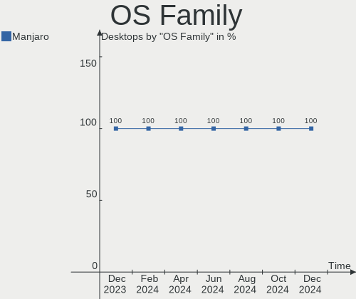
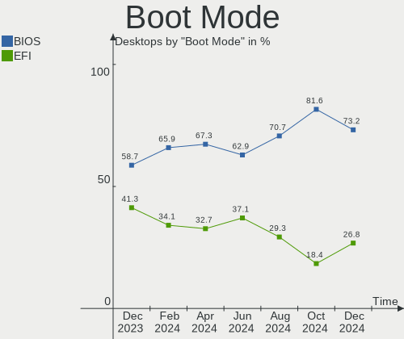
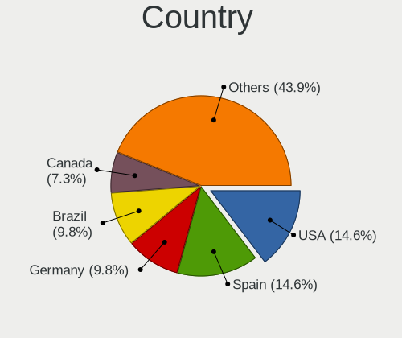
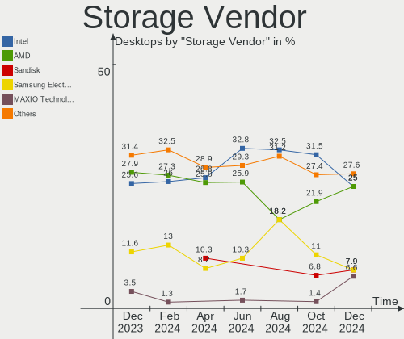
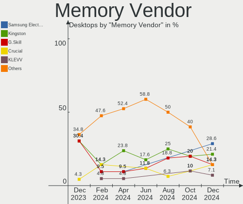

Manjaro - Hardware Trends (Desktops)
------------------------------------

A project to identify most popular hardware characteristics and track their change
over time based on data collected by Linux users at https://Linux-Hardware.org.

Anyone can contribute to this report by the [hw-probe](https://github.com/linuxhw/hw-probe) tool:

    sudo -E hw-probe -all -upload

This report is for one last month. Overall report since the beginning of time: [TestDays](https://github.com/linuxhw/TestDays)

Period: Aug, 2023.

Contents
--------

* [ System ](#system)
  - [ OS                       ](#os)
  - [ OS Family                ](#os-family)
  - [ Kernel                   ](#kernel)
  - [ Kernel Family            ](#kernel-family)
  - [ Kernel Major Ver.        ](#kernel-major-ver)
  - [ Arch                     ](#arch)
  - [ DE                       ](#de)
  - [ Display Server           ](#display-server)
  - [ Display Manager          ](#display-manager)
  - [ OS Lang                  ](#os-lang)
  - [ Boot Mode                ](#boot-mode)
  - [ Filesystem               ](#filesystem)
  - [ Part. scheme             ](#part-scheme)
  - [ Dual Boot with Linux/BSD ](#dual-boot-with-linuxbsd)
  - [ Dual Boot (Win)          ](#dual-boot-win)

* [ Board ](#board)
  - [ Vendor                   ](#vendor)
  - [ Model                    ](#model)
  - [ Model Family             ](#model-family)
  - [ MFG Year                 ](#mfg-year)
  - [ Form Factor              ](#form-factor)
  - [ Secure Boot              ](#secure-boot)
  - [ Coreboot                 ](#coreboot)
  - [ RAM Size                 ](#ram-size)
  - [ RAM Used                 ](#ram-used)
  - [ Total Drives             ](#total-drives)
  - [ Has CD-ROM               ](#has-cd-rom)
  - [ Has Ethernet             ](#has-ethernet)
  - [ Has WiFi                 ](#has-wifi)
  - [ Has Bluetooth            ](#has-bluetooth)

* [ Location ](#location)
  - [ Country                  ](#country)
  - [ City                     ](#city)

* [ Drives ](#drives)
  - [ Drive Vendor             ](#drive-vendor)
  - [ Drive Model              ](#drive-model)
  - [ HDD Vendor               ](#hdd-vendor)
  - [ SSD Vendor               ](#ssd-vendor)
  - [ Drive Kind               ](#drive-kind)
  - [ Drive Connector          ](#drive-connector)
  - [ Drive Size               ](#drive-size)
  - [ Space Total              ](#space-total)
  - [ Space Used               ](#space-used)
  - [ Malfunc. Drives          ](#malfunc-drives)
  - [ Malfunc. Drive Vendor    ](#malfunc-drive-vendor)
  - [ Malfunc. HDD Vendor      ](#malfunc-hdd-vendor)
  - [ Malfunc. Drive Kind      ](#malfunc-drive-kind)
  - [ Failed Drives            ](#failed-drives)
  - [ Failed Drive Vendor      ](#failed-drive-vendor)
  - [ Drive Status             ](#drive-status)

* [ Storage controller ](#storage-controller)
  - [ Storage Vendor           ](#storage-vendor)
  - [ Storage Model            ](#storage-model)
  - [ Storage Kind             ](#storage-kind)

* [ Processor ](#processor)
  - [ CPU Vendor               ](#cpu-vendor)
  - [ CPU Model                ](#cpu-model)
  - [ CPU Model Family         ](#cpu-model-family)
  - [ CPU Cores                ](#cpu-cores)
  - [ CPU Sockets              ](#cpu-sockets)
  - [ CPU Threads              ](#cpu-threads)
  - [ CPU Op-Modes             ](#cpu-op-modes)
  - [ CPU Microcode            ](#cpu-microcode)
  - [ CPU Microarch            ](#cpu-microarch)

* [ Graphics ](#graphics)
  - [ GPU Vendor               ](#gpu-vendor)
  - [ GPU Model                ](#gpu-model)
  - [ GPU Combo                ](#gpu-combo)
  - [ GPU Driver               ](#gpu-driver)
  - [ GPU Memory               ](#gpu-memory)

* [ Monitor ](#monitor)
  - [ Monitor Vendor           ](#monitor-vendor)
  - [ Monitor Model            ](#monitor-model)
  - [ Monitor Resolution       ](#monitor-resolution)
  - [ Monitor Diagonal         ](#monitor-diagonal)
  - [ Monitor Width            ](#monitor-width)
  - [ Aspect Ratio             ](#aspect-ratio)
  - [ Monitor Area             ](#monitor-area)
  - [ Pixel Density            ](#pixel-density)
  - [ Multiple Monitors        ](#multiple-monitors)

* [ Network ](#network)
  - [ Net Controller Vendor    ](#net-controller-vendor)
  - [ Net Controller Model     ](#net-controller-model)
  - [ Wireless Vendor          ](#wireless-vendor)
  - [ Wireless Model           ](#wireless-model)
  - [ Ethernet Vendor          ](#ethernet-vendor)
  - [ Ethernet Model           ](#ethernet-model)
  - [ Net Controller Kind      ](#net-controller-kind)
  - [ Used Controller          ](#used-controller)
  - [ NICs                     ](#nics)
  - [ IPv6                     ](#ipv6)

* [ Bluetooth ](#bluetooth)
  - [ Bluetooth Vendor         ](#bluetooth-vendor)
  - [ Bluetooth Model          ](#bluetooth-model)

* [ Sound ](#sound)
  - [ Sound Vendor             ](#sound-vendor)
  - [ Sound Model              ](#sound-model)

* [ Memory ](#memory)
  - [ Memory Vendor            ](#memory-vendor)
  - [ Memory Model             ](#memory-model)
  - [ Memory Kind              ](#memory-kind)
  - [ Memory Form Factor       ](#memory-form-factor)
  - [ Memory Size              ](#memory-size)
  - [ Memory Speed             ](#memory-speed)

* [ Printers & scanners ](#printers--scanners)
  - [ Printer Vendor           ](#printer-vendor)
  - [ Printer Model            ](#printer-model)
  - [ Scanner Vendor           ](#scanner-vendor)
  - [ Scanner Model            ](#scanner-model)

* [ Camera ](#camera)
  - [ Camera Vendor            ](#camera-vendor)
  - [ Camera Model             ](#camera-model)

* [ Security ](#security)
  - [ Fingerprint Vendor       ](#fingerprint-vendor)
  - [ Fingerprint Model        ](#fingerprint-model)
  - [ Chipcard Vendor          ](#chipcard-vendor)
  - [ Chipcard Model           ](#chipcard-model)

* [ Unsupported ](#unsupported)
  - [ Unsupported Devices      ](#unsupported-devices)
  - [ Unsupported Device Types ](#unsupported-device-types)

System
------

OS
--

Installed operating systems

| Name           | Desktops | Percent |
|----------------|----------|---------|
| Manjaro        | 26       | 56.52%  |
| Manjaro 23.0.0 | 20       | 43.48%  |

OS Family
---------

OS without a version

| Name    | Desktops | Percent |
|---------|----------|---------|
| Manjaro | 46       | 100%    |

Kernel
------

Version of the Linux kernel

| Version              | Desktops | Percent |
|----------------------|----------|---------|
| 6.1.44-1-MANJARO     | 11       | 23.91%  |
| 6.4.6-1-MANJARO      | 7        | 15.22%  |
| 6.1.41-1-MANJARO     | 6        | 13.04%  |
| 6.4.9-1-MANJARO      | 4        | 8.7%    |
| 5.15.125-1-MANJARO   | 4        | 8.7%    |
| 6.5.0-1-MANJARO      | 2        | 4.35%   |
| 6.3.13-2-MANJARO     | 2        | 4.35%   |
| 6.1.30-1-MANJARO     | 2        | 4.35%   |
| 6.4.7-zen3-xanmod1-1 | 1        | 2.17%   |
| 6.4.12-lqx1-1-lqx    | 1        | 2.17%   |
| 6.4.11-1-MANJARO     | 1        | 2.17%   |
| 6.4.0-2-rt6-MANJARO  | 1        | 2.17%   |
| 6.2.0-2-rt3-MANJARO  | 1        | 2.17%   |
| 6.1.49-1-MANJARO     | 1        | 2.17%   |
| 5.15.114-2-MANJARO   | 1        | 2.17%   |
| 5.10.187-1-MANJARO   | 1        | 2.17%   |

Kernel Family
-------------

Linux kernel without a distro release

| Version  | Desktops | Percent |
|----------|----------|---------|
| 6.1.44   | 11       | 23.91%  |
| 6.4.6    | 7        | 15.22%  |
| 6.1.41   | 6        | 13.04%  |
| 6.4.9    | 4        | 8.7%    |
| 5.15.125 | 4        | 8.7%    |
| 6.5.0    | 2        | 4.35%   |
| 6.3.13   | 2        | 4.35%   |
| 6.1.30   | 2        | 4.35%   |
| 6.4.7    | 1        | 2.17%   |
| 6.4.12   | 1        | 2.17%   |
| 6.4.11   | 1        | 2.17%   |
| 6.4.0    | 1        | 2.17%   |
| 6.2.0    | 1        | 2.17%   |
| 6.1.49   | 1        | 2.17%   |
| 5.15.114 | 1        | 2.17%   |
| 5.10.187 | 1        | 2.17%   |

Kernel Major Ver.
-----------------

Linux kernel major version

| Version | Desktops | Percent |
|---------|----------|---------|
| 6.1     | 20       | 43.48%  |
| 6.4     | 15       | 32.61%  |
| 5.15    | 5        | 10.87%  |
| 6.5     | 2        | 4.35%   |
| 6.3     | 2        | 4.35%   |
| 6.2     | 1        | 2.17%   |
| 5.10    | 1        | 2.17%   |

Arch
----

OS architecture (x86_64, i586, etc.)

| Name   | Desktops | Percent |
|--------|----------|---------|
| x86_64 | 46       | 100%    |

DE
--

Desktop Environment

| Name  | Desktops | Percent |
|-------|----------|---------|
| KDE5  | 35       | 76.09%  |
| XFCE  | 6        | 13.04%  |
| GNOME | 4        | 8.7%    |
| MATE  | 1        | 2.17%   |

Display Server
--------------

X11 or Wayland

| Name    | Desktops | Percent |
|---------|----------|---------|
| X11     | 37       | 80.43%  |
| Wayland | 9        | 19.57%  |

Display Manager
---------------

SDDM, LightDM, etc.

| Name    | Desktops | Percent |
|---------|----------|---------|
| Unknown | 26       | 56.52%  |
| SDDM    | 15       | 32.61%  |
| LightDM | 4        | 8.7%    |
| GDM     | 1        | 2.17%   |

OS Lang
-------

Language

| Lang  | Desktops | Percent |
|-------|----------|---------|
| en_US | 23       | 50%     |
| ru_RU | 3        | 6.52%   |
| pt_BR | 3        | 6.52%   |
| fr_FR | 3        | 6.52%   |
| en_GB | 3        | 6.52%   |
| de_DE | 3        | 6.52%   |
| pl_PL | 2        | 4.35%   |
| it_IT | 2        | 4.35%   |
| es_ES | 1        | 2.17%   |
| es_AR | 1        | 2.17%   |
| en_ZA | 1        | 2.17%   |
| el_GR | 1        | 2.17%   |

Boot Mode
---------

EFI or BIOS

| Mode | Desktops | Percent |
|------|----------|---------|
| BIOS | 33       | 71.74%  |
| EFI  | 13       | 28.26%  |

Filesystem
----------

Type of filesystem

| Type  | Desktops | Percent |
|-------|----------|---------|
| Ext4  | 36       | 78.26%  |
| Tmpfs | 4        | 8.7%    |
| Btrfs | 4        | 8.7%    |
| Xfs   | 2        | 4.35%   |

Part. scheme
------------

Scheme of partitioning

| Type    | Desktops | Percent |
|---------|----------|---------|
| Unknown | 26       | 56.52%  |
| GPT     | 18       | 39.13%  |
| MBR     | 2        | 4.35%   |

Dual Boot with Linux/BSD
------------------------

Hosting more than one Linux/BSD

| Dual boot | Desktops | Percent |
|-----------|----------|---------|
| No        | 38       | 82.61%  |
| Yes       | 8        | 17.39%  |

Dual Boot (Win)
---------------

Hosting Linux and Windows

| Dual boot | Desktops | Percent |
|-----------|----------|---------|
| No        | 37       | 80.43%  |
| Yes       | 9        | 19.57%  |

Board
-----

Vendor
------

Motherboard manufacturer

| Name                | Desktops | Percent |
|---------------------|----------|---------|
| Gigabyte Technology | 15       | 32.61%  |
| ASUSTek Computer    | 10       | 21.74%  |
| MSI                 | 7        | 15.22%  |
| ASRock              | 7        | 15.22%  |
| Dell                | 3        | 6.52%   |
| Lenovo              | 1        | 2.17%   |
| Intel               | 1        | 2.17%   |
| Hewlett-Packard     | 1        | 2.17%   |
| AZW                 | 1        | 2.17%   |

Model
-----

Motherboard model

| Name                               | Desktops | Percent |
|------------------------------------|----------|---------|
| Gigabyte B450 AORUS ELITE          | 3        | 6.52%   |
| MSI MS-7D43                        | 1        | 2.17%   |
| MSI MS-7C91                        | 1        | 2.17%   |
| MSI MS-7C56                        | 1        | 2.17%   |
| MSI MS-7C37                        | 1        | 2.17%   |
| MSI MS-7B93                        | 1        | 2.17%   |
| MSI MS-7A35                        | 1        | 2.17%   |
| MSI MS-7693                        | 1        | 2.17%   |
| Lenovo ThinkCentre M58e 7303AZ2    | 1        | 2.17%   |
| Intel DH61CR AAG14064-204          | 1        | 2.17%   |
| HP EliteDesk 705 G4 SFF            | 1        | 2.17%   |
| Gigabyte Z370 HD3                  | 1        | 2.17%   |
| Gigabyte X570S AERO G              | 1        | 2.17%   |
| Gigabyte X570 GAMING X             | 1        | 2.17%   |
| Gigabyte X570 AORUS ELITE          | 1        | 2.17%   |
| Gigabyte X470 AORUS ULTRA GAMING   | 1        | 2.17%   |
| Gigabyte P55-UD4                   | 1        | 2.17%   |
| Gigabyte M720-US3                  | 1        | 2.17%   |
| Gigabyte GA-78LMT-S2P              | 1        | 2.17%   |
| Gigabyte F2A68HM-H                 | 1        | 2.17%   |
| Gigabyte B550M DS3H                | 1        | 2.17%   |
| Gigabyte B550 GAMING X V2          | 1        | 2.17%   |
| Gigabyte B550 AORUS ELITE          | 1        | 2.17%   |
| Dell OptiPlex 7060                 | 1        | 2.17%   |
| Dell OptiPlex 3040                 | 1        | 2.17%   |
| Dell Inspiron 3668                 | 1        | 2.17%   |
| AZW U59                            | 1        | 2.17%   |
| ASUS TUF Gaming X570-PLUS          | 1        | 2.17%   |
| ASUS TUF Gaming B550-PLUS          | 1        | 2.17%   |
| ASUS ROG STRIX X670E-F GAMING WIFI | 1        | 2.17%   |
| ASUS ROG Strix G15CE_G15CE         | 1        | 2.17%   |
| ASUS ROG STRIX B550-F GAMING       | 1        | 2.17%   |
| ASUS ROG STRIX B550-A GAMING       | 1        | 2.17%   |
| ASUS PRIME X570-PRO                | 1        | 2.17%   |
| ASUS PRIME B450M-A II              | 1        | 2.17%   |
| ASUS M5A97 PLUS                    | 1        | 2.17%   |
| ASUS H61M-K                        | 1        | 2.17%   |
| ASRock H61M-HG4                    | 1        | 2.17%   |
| ASRock B760M PG Riptide            | 1        | 2.17%   |
| ASRock B650M PG Riptide            | 1        | 2.17%   |

Model Family
------------

Motherboard model prefix

| Name                  | Desktops | Percent |
|-----------------------|----------|---------|
| ASUS ROG              | 4        | 8.7%    |
| Gigabyte B450         | 3        | 6.52%   |
| Gigabyte X570         | 2        | 4.35%   |
| Gigabyte B550         | 2        | 4.35%   |
| Dell OptiPlex         | 2        | 4.35%   |
| ASUS TUF              | 2        | 4.35%   |
| ASUS PRIME            | 2        | 4.35%   |
| MSI MS-7D43           | 1        | 2.17%   |
| MSI MS-7C91           | 1        | 2.17%   |
| MSI MS-7C56           | 1        | 2.17%   |
| MSI MS-7C37           | 1        | 2.17%   |
| MSI MS-7B93           | 1        | 2.17%   |
| MSI MS-7A35           | 1        | 2.17%   |
| MSI MS-7693           | 1        | 2.17%   |
| Lenovo ThinkCentre    | 1        | 2.17%   |
| Intel DH61CR          | 1        | 2.17%   |
| HP EliteDesk          | 1        | 2.17%   |
| Gigabyte Z370         | 1        | 2.17%   |
| Gigabyte X570S        | 1        | 2.17%   |
| Gigabyte X470         | 1        | 2.17%   |
| Gigabyte P55-UD4      | 1        | 2.17%   |
| Gigabyte M720-US3     | 1        | 2.17%   |
| Gigabyte GA-78LMT-S2P | 1        | 2.17%   |
| Gigabyte F2A68HM-H    | 1        | 2.17%   |
| Gigabyte B550M        | 1        | 2.17%   |
| Dell Inspiron         | 1        | 2.17%   |
| AZW U59               | 1        | 2.17%   |
| ASUS M5A97            | 1        | 2.17%   |
| ASUS H61M-K           | 1        | 2.17%   |
| ASRock H61M-HG4       | 1        | 2.17%   |
| ASRock B760M          | 1        | 2.17%   |
| ASRock B650M          | 1        | 2.17%   |
| ASRock B550M-ITX      | 1        | 2.17%   |
| ASRock B550M          | 1        | 2.17%   |
| ASRock B450           | 1        | 2.17%   |
| ASRock 970            | 1        | 2.17%   |

MFG Year
--------

Motherboard manufacture year

| Year | Desktops | Percent |
|------|----------|---------|
| 2020 | 11       | 23.91%  |
| 2018 | 7        | 15.22%  |
| 2019 | 6        | 13.04%  |
| 2022 | 3        | 6.52%   |
| 2021 | 3        | 6.52%   |
| 2017 | 3        | 6.52%   |
| 2009 | 3        | 6.52%   |
| 2013 | 2        | 4.35%   |
| 2012 | 2        | 4.35%   |
| 2011 | 2        | 4.35%   |
| 2023 | 1        | 2.17%   |
| 2016 | 1        | 2.17%   |
| 2015 | 1        | 2.17%   |
| 2014 | 1        | 2.17%   |

Form Factor
-----------

Physical design of the computer

| Name    | Desktops | Percent |
|---------|----------|---------|
| Desktop | 46       | 100%    |

Secure Boot
-----------

Enabled or disabled

| State    | Desktops | Percent |
|----------|----------|---------|
| Disabled | 46       | 100%    |

Coreboot
--------

Have coreboot on board

| Used | Desktops | Percent |
|------|----------|---------|
| No   | 46       | 100%    |

RAM Size
--------

Total RAM memory

| Size in GB  | Desktops | Percent |
|-------------|----------|---------|
| 16.01-24.0  | 12       | 26.09%  |
| 32.01-64.0  | 11       | 23.91%  |
| 8.01-16.0   | 10       | 21.74%  |
| 3.01-4.0    | 4        | 8.7%    |
| 64.01-256.0 | 4        | 8.7%    |
| 4.01-8.0    | 3        | 6.52%   |
| 24.01-32.0  | 2        | 4.35%   |

RAM Used
--------

Used RAM memory

| Used GB    | Desktops | Percent |
|------------|----------|---------|
| 4.01-8.0   | 16       | 34.78%  |
| 3.01-4.0   | 8        | 17.39%  |
| 1.01-2.0   | 8        | 17.39%  |
| 2.01-3.0   | 6        | 13.04%  |
| 8.01-16.0  | 5        | 10.87%  |
| 16.01-24.0 | 2        | 4.35%   |
| 0.51-1.0   | 1        | 2.17%   |

Total Drives
------------

Number of drives on board

| Drives | Desktops | Percent |
|--------|----------|---------|
| 2      | 16       | 34.78%  |
| 4      | 7        | 15.22%  |
| 3      | 7        | 15.22%  |
| 1      | 7        | 15.22%  |
| 5      | 5        | 10.87%  |
| 6      | 2        | 4.35%   |
| 11     | 1        | 2.17%   |
| 8      | 1        | 2.17%   |

Has CD-ROM
----------

Has CD-ROM on board

| Presented | Desktops | Percent |
|-----------|----------|---------|
| No        | 37       | 80.43%  |
| Yes       | 9        | 19.57%  |

Has Ethernet
------------

Has Ethernet on board

| Presented | Desktops | Percent |
|-----------|----------|---------|
| Yes       | 46       | 100%    |

Has WiFi
--------

Has WiFi module

| Presented | Desktops | Percent |
|-----------|----------|---------|
| Yes       | 25       | 54.35%  |
| No        | 21       | 45.65%  |

Has Bluetooth
-------------

Has Bluetooth module

| Presented | Desktops | Percent |
|-----------|----------|---------|
| Yes       | 28       | 60.87%  |
| No        | 18       | 39.13%  |

Location
--------

Country
-------

Geographic location (country)

| Country         | Desktops | Percent |
|-----------------|----------|---------|
| USA             | 12       | 26.09%  |
| Poland          | 3        | 6.52%   |
| Germany         | 3        | 6.52%   |
| France          | 3        | 6.52%   |
| Brazil          | 3        | 6.52%   |
| UK              | 2        | 4.35%   |
| Russia          | 2        | 4.35%   |
| Italy           | 2        | 4.35%   |
| Hungary         | 2        | 4.35%   |
| Spain           | 1        | 2.17%   |
| South Africa    | 1        | 2.17%   |
| Romania         | 1        | 2.17%   |
| North Macedonia | 1        | 2.17%   |
| Netherlands     | 1        | 2.17%   |
| Iran            | 1        | 2.17%   |
| Indonesia       | 1        | 2.17%   |
| Denmark         | 1        | 2.17%   |
| Croatia         | 1        | 2.17%   |
| Canada          | 1        | 2.17%   |
| Bulgaria        | 1        | 2.17%   |
| Bolivia         | 1        | 2.17%   |
| Bangladesh      | 1        | 2.17%   |
| Argentina       | 1        | 2.17%   |

City
----

Geographic location (city)

| City                 | Desktops | Percent |
|----------------------|----------|---------|
| Marysville           | 2        | 4.35%   |
| Karlsruhe            | 2        | 4.35%   |
| Wroclaw              | 1        | 2.17%   |
| Warsaw               | 1        | 2.17%   |
| Venice               | 1        | 2.17%   |
| Valencia             | 1        | 2.17%   |
| Thisted              | 1        | 2.17%   |
| Tehran               | 1        | 2.17%   |
| Spokane              | 1        | 2.17%   |
| Skopje               | 1        | 2.17%   |
| Seattle              | 1        | 2.17%   |
| Saint-Denis          | 1        | 2.17%   |
| Rijeka               | 1        | 2.17%   |
| Plovdiv              | 1        | 2.17%   |
| Plainwell            | 1        | 2.17%   |
| Oroshaza             | 1        | 2.17%   |
| Orlando              | 1        | 2.17%   |
| Norwich              | 1        | 2.17%   |
| Nizhniy Novgorod     | 1        | 2.17%   |
| Nice                 | 1        | 2.17%   |
| Moscow               | 1        | 2.17%   |
| Montreal             | 1        | 2.17%   |
| Le Landreau          | 1        | 2.17%   |
| La Paz               | 1        | 2.17%   |
| Johannesburg         | 1        | 2.17%   |
| Homosassa            | 1        | 2.17%   |
| Harleysville         | 1        | 2.17%   |
| Gdynia               | 1        | 2.17%   |
| Frederico Westphalen | 1        | 2.17%   |
| Dundee               | 1        | 2.17%   |
| Dinajpur             | 1        | 2.17%   |
| Corrientes           | 1        | 2.17%   |
| Colorado Springs     | 1        | 2.17%   |
| Catania              | 1        | 2.17%   |
| Calabash             | 1        | 2.17%   |
| Budapest             | 1        | 2.17%   |
| Bucharest            | 1        | 2.17%   |
| Bogor                | 1        | 2.17%   |
| Böblingen           | 1        | 2.17%   |
| Belo Horizonte       | 1        | 2.17%   |

Drives
------

Drive Vendor
------------

Hard drive vendors

| Vendor                      | Desktops | Drives | Percent |
|-----------------------------|----------|--------|---------|
| WDC                         | 16       | 19     | 13.56%  |
| Samsung Electronics         | 15       | 24     | 12.71%  |
| Seagate                     | 14       | 21     | 11.86%  |
| Toshiba                     | 7        | 8      | 5.93%   |
| SanDisk                     | 7        | 8      | 5.93%   |
| Kingston                    | 6        | 7      | 5.08%   |
| Crucial                     | 5        | 5      | 4.24%   |
| SK hynix                    | 4        | 4      | 3.39%   |
| Micron/Crucial Technology   | 4        | 4      | 3.39%   |
| A-DATA Technology           | 4        | 4      | 3.39%   |
| Phison Electronics          | 3        | 3      | 2.54%   |
| Intel                       | 3        | 4      | 2.54%   |
| GOODRAM                     | 3        | 3      | 2.54%   |
| Patriot                     | 2        | 2      | 1.69%   |
| Fujitsu                     | 2        | 2      | 1.69%   |
| XrayDisk                    | 1        | 1      | 0.85%   |
| TO Exter                    | 1        | 1      | 0.85%   |
| Teutons                     | 1        | 1      | 0.85%   |
| Realtek Semiconductor       | 1        | 1      | 0.85%   |
| PNY                         | 1        | 1      | 0.85%   |
| OCZ-VERT                    | 1        | 1      | 0.85%   |
| NGFF                        | 1        | 1      | 0.85%   |
| Micron Technology           | 1        | 1      | 0.85%   |
| Maxtor                      | 1        | 1      | 0.85%   |
| Maxone                      | 1        | 1      | 0.85%   |
| LITEON                      | 1        | 5      | 0.85%   |
| Lexar                       | 1        | 1      | 0.85%   |
| Leven                       | 1        | 1      | 0.85%   |
| Kingston Technology Company | 1        | 1      | 0.85%   |
| KingFast                    | 1        | 1      | 0.85%   |
| JMicron Technology          | 1        | 1      | 0.85%   |
| Intenso                     | 1        | 1      | 0.85%   |
| Hitachi                     | 1        | 1      | 0.85%   |
| HGST                        | 1        | 1      | 0.85%   |
| Gigabyte Technology         | 1        | 1      | 0.85%   |
| China                       | 1        | 1      | 0.85%   |
| BAITITON                    | 1        | 1      | 0.85%   |
| ADATA Technology            | 1        | 1      | 0.85%   |

Drive Model
-----------

Hard drive models

| Model                                                 | Desktops | Percent |
|-------------------------------------------------------|----------|---------|
| Samsung NVMe SSD Controller SM981/PM981/PM983 500GB   | 4        | 2.86%   |
| Samsung NVMe SSD Controller PM9A1/PM9A3/980PRO 1024GB | 4        | 2.86%   |
| Sandisk WD Black SN750 / PC SN730 NVMe SSD 1024GB     | 3        | 2.14%   |
| WDC WD5000LPVX-22V0TT0 500GB                          | 2        | 1.43%   |
| Seagate ST4000DM004-2CV104 4TB                        | 2        | 1.43%   |
| Seagate ST2000DM008-2FR102 2TB                        | 2        | 1.43%   |
| Samsung SSD 980 1TB                                   | 2        | 1.43%   |
| Samsung SSD 840 PRO Series 128GB                      | 2        | 1.43%   |
| Phison PS5013 E13 NVMe Controller 512GB               | 2        | 1.43%   |
| Micron/Crucial P2 NVMe PCIe SSD 1TB                   | 2        | 1.43%   |
| Kingston SUV400S37240G 240GB SSD                      | 2        | 1.43%   |
| XrayDisk NVMe SSD Drive 1024GB                        | 1        | 0.71%   |
| WDC WDS500G2B0A-00SM50 500GB SSD                      | 1        | 0.71%   |
| WDC WD6401AALS-00L3B2 640GB                           | 1        | 0.71%   |
| WDC WD5000AAKX-22ERMA0 500GB                          | 1        | 0.71%   |
| WDC WD3003FZEX-00Z4SA0 3TB                            | 1        | 0.71%   |
| WDC WD20EVDS-63T3B0 2TB                               | 1        | 0.71%   |
| WDC WD20EARX-00PASB0 2TB                              | 1        | 0.71%   |
| WDC WD20EARX-00MMMB0 2TB                              | 1        | 0.71%   |
| WDC WD2003FYYS-05T9B0 2TB                             | 1        | 0.71%   |
| WDC WD140EFGX-68B0GN0 14TB                            | 1        | 0.71%   |
| WDC WD10JFCX-68N6GN0 1TB                              | 1        | 0.71%   |
| WDC WD10EZEX-21WN4A0 1TB                              | 1        | 0.71%   |
| WDC WD10EZEX-08WN4A0 1TB                              | 1        | 0.71%   |
| WDC WD10EZEX-08M2NA0 1TB                              | 1        | 0.71%   |
| WDC WD10EZEX-07WN4A0 1TB                              | 1        | 0.71%   |
| WDC WD10EZEX-07M2NA0 1TB                              | 1        | 0.71%   |
| WDC WD10EZEX-00WN4A0 1TB                              | 1        | 0.71%   |
| WDC WD1003FZEX-00K3CA0 1TB                            | 1        | 0.71%   |
| Toshiba MK2576GSX HR 160GB                            | 1        | 0.71%   |
| Toshiba HDWN160 6TB                                   | 1        | 0.71%   |
| Toshiba HDWD120 2TB                                   | 1        | 0.71%   |
| Toshiba DT01ACA300 3TB                                | 1        | 0.71%   |
| Toshiba DT01ACA100 1TB                                | 1        | 0.71%   |
| Toshiba DT01ACA050 500GB                              | 1        | 0.71%   |
| Toshiba BG3 NVMe SSD Controller 256GB                 | 1        | 0.71%   |
| TO Exter nal USB 3.0 2TB                              | 1        | 0.71%   |
| Teutons Platinum SSD 128GB                            | 1        | 0.71%   |
| SK hynix SHPP41-2000GM 2TB                            | 1        | 0.71%   |
| SK hynix SHGS31-1000GS-2 1TB SSD                      | 1        | 0.71%   |

HDD Vendor
----------

Hard disk drive vendors

| Vendor              | Desktops | Drives | Percent |
|---------------------|----------|--------|---------|
| WDC                 | 15       | 18     | 35.71%  |
| Seagate             | 14       | 20     | 33.33%  |
| Toshiba             | 6        | 7      | 14.29%  |
| Fujitsu             | 2        | 2      | 4.76%   |
| Samsung Electronics | 1        | 1      | 2.38%   |
| Maxtor              | 1        | 1      | 2.38%   |
| Maxone              | 1        | 1      | 2.38%   |
| Hitachi             | 1        | 1      | 2.38%   |
| HGST                | 1        | 1      | 2.38%   |

SSD Vendor
----------

Solid state drive vendors

| Vendor              | Desktops | Drives | Percent |
|---------------------|----------|--------|---------|
| Samsung Electronics | 9        | 11     | 18%     |
| Kingston            | 5        | 5      | 10%     |
| Crucial             | 5        | 5      | 10%     |
| A-DATA Technology   | 4        | 4      | 8%      |
| Intel               | 3        | 4      | 6%      |
| GOODRAM             | 3        | 3      | 6%      |
| SK hynix            | 2        | 2      | 4%      |
| SanDisk             | 2        | 2      | 4%      |
| Patriot             | 2        | 2      | 4%      |
| WDC                 | 1        | 1      | 2%      |
| TO Exter            | 1        | 1      | 2%      |
| Teutons             | 1        | 1      | 2%      |
| PNY                 | 1        | 1      | 2%      |
| OCZ-VERT            | 1        | 1      | 2%      |
| NGFF                | 1        | 1      | 2%      |
| LITEON              | 1        | 5      | 2%      |
| Lexar               | 1        | 1      | 2%      |
| Leven               | 1        | 1      | 2%      |
| KingFast            | 1        | 1      | 2%      |
| JMicron Technology  | 1        | 1      | 2%      |
| Intenso             | 1        | 1      | 2%      |
| Gigabyte Technology | 1        | 1      | 2%      |
| China               | 1        | 1      | 2%      |
| BAITITON            | 1        | 1      | 2%      |

Drive Kind
----------

HDD or SSD

| Kind | Desktops | Drives | Percent |
|------|----------|--------|---------|
| SSD  | 34       | 57     | 37.78%  |
| HDD  | 30       | 52     | 33.33%  |
| NVMe | 26       | 36     | 28.89%  |

Drive Connector
---------------

SATA, SAS, NVMe, etc.

| Type | Desktops | Drives | Percent |
|------|----------|--------|---------|
| SATA | 42       | 102    | 56.76%  |
| NVMe | 26       | 36     | 35.14%  |
| SAS  | 6        | 7      | 8.11%   |

Drive Size
----------

Size of hard drive

| Size in TB | Desktops | Drives | Percent |
|------------|----------|--------|---------|
| 0.01-0.5   | 29       | 50     | 37.18%  |
| 0.51-1.0   | 21       | 28     | 26.92%  |
| 1.01-2.0   | 13       | 14     | 16.67%  |
| 3.01-4.0   | 5        | 6      | 6.41%   |
| 2.01-3.0   | 4        | 4      | 5.13%   |
| 4.01-10.0  | 4        | 5      | 5.13%   |
| 10.01-20.0 | 2        | 2      | 2.56%   |

Space Total
-----------

Amount of disk space available on the file system

| Size in GB     | Desktops | Percent |
|----------------|----------|---------|
| 501-1000       | 12       | 26.09%  |
| More than 3000 | 7        | 15.22%  |
| 251-500        | 7        | 15.22%  |
| 1001-2000      | 7        | 15.22%  |
| 101-250        | 6        | 13.04%  |
| 51-100         | 3        | 6.52%   |
| Unknown        | 2        | 4.35%   |
| 2001-3000      | 1        | 2.17%   |
| 1-20           | 1        | 2.17%   |

Space Used
----------

Amount of used disk space

| Used GB        | Desktops | Percent |
|----------------|----------|---------|
| 51-100         | 10       | 21.74%  |
| 501-1000       | 8        | 17.39%  |
| More than 3000 | 6        | 13.04%  |
| 1-20           | 6        | 13.04%  |
| 21-50          | 5        | 10.87%  |
| 101-250        | 4        | 8.7%    |
| 251-500        | 3        | 6.52%   |
| Unknown        | 2        | 4.35%   |
| 2001-3000      | 1        | 2.17%   |
| 1001-2000      | 1        | 2.17%   |

Malfunc. Drives
---------------

Drive models with a malfunction

| Model                          | Desktops | Drives | Percent |
|--------------------------------|----------|--------|---------|
| WDC WD10JFCX-68N6GN0 1TB       | 1        | 1      | 25%     |
| WDC WD10EZEX-21WN4A0 1TB       | 1        | 1      | 25%     |
| Seagate ST4000DM000-1F2168 4TB | 1        | 1      | 25%     |
| JMicron Technology Generic 1TB | 1        | 1      | 25%     |

Malfunc. Drive Vendor
---------------------

Vendors of faulty drives

| Vendor             | Desktops | Drives | Percent |
|--------------------|----------|--------|---------|
| WDC                | 2        | 2      | 50%     |
| Seagate            | 1        | 1      | 25%     |
| JMicron Technology | 1        | 1      | 25%     |

Malfunc. HDD Vendor
-------------------

Vendors of faulty HDD drives

| Vendor  | Desktops | Drives | Percent |
|---------|----------|--------|---------|
| WDC     | 2        | 2      | 66.67%  |
| Seagate | 1        | 1      | 33.33%  |

Malfunc. Drive Kind
-------------------

Kinds of faulty drives

| Kind | Desktops | Drives | Percent |
|------|----------|--------|---------|
| HDD  | 3        | 3      | 75%     |
| SSD  | 1        | 1      | 25%     |

Failed Drives
-------------

Failed drive models

Zero info for selected period =(

Failed Drive Vendor
-------------------

Failed drive vendors

Zero info for selected period =(

Drive Status
------------

Number of failed and malfunc. drives

| Status   | Desktops | Drives | Percent |
|----------|----------|--------|---------|
| Detected | 34       | 107    | 66.67%  |
| Works    | 13       | 34     | 25.49%  |
| Malfunc  | 4        | 4      | 7.84%   |

Storage controller
------------------

Storage Vendor
--------------

Storage controller vendors

| Vendor                       | Desktops | Percent |
|------------------------------|----------|---------|
| AMD                          | 32       | 38.55%  |
| Intel                        | 13       | 15.66%  |
| Samsung Electronics          | 9        | 10.84%  |
| SanDisk                      | 5        | 6.02%   |
| Micron/Crucial Technology    | 4        | 4.82%   |
| Phison Electronics           | 3        | 3.61%   |
| Kingston Technology Company  | 3        | 3.61%   |
| ASMedia Technology           | 3        | 3.61%   |
| SK hynix                     | 2        | 2.41%   |
| JMicron Technology           | 2        | 2.41%   |
| Toshiba America Info Systems | 1        | 1.2%    |
| Seagate Technology           | 1        | 1.2%    |
| Realtek Semiconductor        | 1        | 1.2%    |
| Nvidia                       | 1        | 1.2%    |
| Micron Technology            | 1        | 1.2%    |
| INNOGRIT                     | 1        | 1.2%    |
| ADATA Technology             | 1        | 1.2%    |

Storage Model
-------------

Storage controller models

| Model                                                                         | Desktops | Percent |
|-------------------------------------------------------------------------------|----------|---------|
| AMD FCH SATA Controller [AHCI mode]                                           | 17       | 17%     |
| AMD 500 Series Chipset SATA Controller                                        | 10       | 10%     |
| AMD 400 Series Chipset SATA Controller                                        | 6        | 6%      |
| Samsung NVMe SSD Controller SM981/PM981/PM983                                 | 4        | 4%      |
| Samsung NVMe SSD Controller PM9A1/PM9A3/980PRO                                | 4        | 4%      |
| SanDisk WD Black SN750 / PC SN730 NVMe SSD                                    | 3        | 3%      |
| Intel 6 Series/C200 Series Chipset Family 6 port Desktop SATA AHCI Controller | 3        | 3%      |
| ASMedia ASM1062 Serial ATA Controller                                         | 3        | 3%      |
| AMD SB7x0/SB8x0/SB9x0 IDE Controller                                          | 3        | 3%      |
| Samsung NVMe SSD Controller 980                                               | 2        | 2%      |
| Phison PS5013 E13 NVMe Controller                                             | 2        | 2%      |
| Micron/Crucial P2 [Nick P2] / P3 / P3 Plus NVMe PCIe SSD (DRAM-less)          | 2        | 2%      |
| Intel Q170/Q150/B150/H170/H110/Z170/CM236 Chipset SATA Controller [AHCI Mode] | 2        | 2%      |
| AMD SB7x0/SB8x0/SB9x0 SATA Controller [IDE mode]                              | 2        | 2%      |
| AMD SB7x0/SB8x0/SB9x0 SATA Controller [AHCI mode]                             | 2        | 2%      |
| Toshiba America Info Systems BG3 NVMe SSD Controller                          | 1        | 1%      |
| SK hynix Platinum P41/PC801 NVMe Solid State Drive                            | 1        | 1%      |
| SK hynix PC401 NVMe Solid State Drive 256GB                                   | 1        | 1%      |
| Seagate BarraCuda Q5 NVMe SSD (DRAM-less)                                     | 1        | 1%      |
| SanDisk WD Blue SN570 NVMe SSD 2TB                                            | 1        | 1%      |
| SanDisk WD Blue SN570 NVMe SSD 1TB                                            | 1        | 1%      |
| SanDisk WD Blue SN550 NVMe SSD                                                | 1        | 1%      |
| Samsung NVMe SSD Controller SM961/PM961/SM963                                 | 1        | 1%      |
| Samsung NVMe SSD Controller S4LV008[Pascal]                                   | 1        | 1%      |
| Realtek RTS5765DL NVMe SSD Controller (DRAM-less)                             | 1        | 1%      |
| Phison E12 NVMe Controller                                                    | 1        | 1%      |
| Nvidia MCP78S [GeForce 8200] IDE                                              | 1        | 1%      |
| Nvidia MCP78S [GeForce 8200] AHCI Controller                                  | 1        | 1%      |
| Micron/Crucial P1 NVMe PCIe SSD[Frampton]                                     | 1        | 1%      |
| Micron/Crucial P1 NVMe PCIe SSD[Frampton2]                                    | 1        | 1%      |
| Micron 2300 NVMe SSD [Santana]                                                | 1        | 1%      |
| Kingston Company Company Non-Volatile memory controller                       | 1        | 1%      |
| Kingston Company KC3000/Renegade NVMe SSD                                     | 1        | 1%      |
| Kingston Company A2000 NVMe SSD                                               | 1        | 1%      |
| JMicron JMB58x AHCI SATA controller                                           | 1        | 1%      |
| JMicron JMB363 SATA/IDE Controller                                            | 1        | 1%      |
| Intel SATA Controller [RAID mode]                                             | 1        | 1%      |
| Intel NM10/ICH7 Family SATA Controller [IDE mode]                             | 1        | 1%      |
| Intel Jasper Lake SATA AHCI Controller                                        | 1        | 1%      |
| Intel Alder Lake-S PCH SATA Controller [AHCI Mode]                            | 1        | 1%      |

Storage Kind
------------

Kind of storage controller (IDE, SATA, NVMe, SAS, ...)

| Kind | Desktops | Percent |
|------|----------|---------|
| SATA | 44       | 57.14%  |
| NVMe | 26       | 33.77%  |
| IDE  | 6        | 7.79%   |
| RAID | 1        | 1.3%    |

Processor
---------

CPU Vendor
----------

Processor vendors

| Vendor | Desktops | Percent |
|--------|----------|---------|
| AMD    | 33       | 71.74%  |
| Intel  | 13       | 28.26%  |

CPU Model
---------

Processor models

| Model                                           | Desktops | Percent |
|-------------------------------------------------|----------|---------|
| AMD Ryzen 7 3700X 8-Core Processor              | 5        | 10.87%  |
| AMD Ryzen 7 5800X 8-Core Processor              | 4        | 8.7%    |
| AMD Ryzen 5 5600X 6-Core Processor              | 3        | 6.52%   |
| Intel Core i7-8700 CPU @ 3.20GHz                | 2        | 4.35%   |
| AMD Ryzen 7 5700G with Radeon Graphics          | 2        | 4.35%   |
| AMD Ryzen 5 5500                                | 2        | 4.35%   |
| AMD FX-4100 Quad-Core Processor                 | 2        | 4.35%   |
| Intel Pentium CPU G640 @ 2.80GHz                | 1        | 2.17%   |
| Intel Pentium CPU G620 @ 2.60GHz                | 1        | 2.17%   |
| Intel Core i7-3770K CPU @ 3.50GHz               | 1        | 2.17%   |
| Intel Core i7 CPU 860 @ 2.80GHz                 | 1        | 2.17%   |
| Intel Core i5-7400 CPU @ 3.00GHz                | 1        | 2.17%   |
| Intel Core i5-6500 CPU @ 3.20GHz                | 1        | 2.17%   |
| Intel Core 2 Quad CPU Q6600 @ 2.40GHz           | 1        | 2.17%   |
| Intel Celeron N5095 @ 2.00GHz                   | 1        | 2.17%   |
| Intel 13th Gen Core i5-13400                    | 1        | 2.17%   |
| Intel 12th Gen Core i7-12700F                   | 1        | 2.17%   |
| Intel 11th Gen Core i7-11700KF @ 3.60GHz        | 1        | 2.17%   |
| AMD Ryzen 9 7900X 12-Core Processor             | 1        | 2.17%   |
| AMD Ryzen 9 5900X 12-Core Processor             | 1        | 2.17%   |
| AMD Ryzen 7 2700X Eight-Core Processor          | 1        | 2.17%   |
| AMD Ryzen 7 2700 Eight-Core Processor           | 1        | 2.17%   |
| AMD Ryzen 5 PRO 2400G with Radeon Vega Graphics | 1        | 2.17%   |
| AMD Ryzen 5 7600X 6-Core Processor              | 1        | 2.17%   |
| AMD Ryzen 5 5600G with Radeon Graphics          | 1        | 2.17%   |
| AMD Ryzen 5 5600 6-Core Processor               | 1        | 2.17%   |
| AMD Ryzen 5 2600 Six-Core Processor             | 1        | 2.17%   |
| AMD Ryzen 5 1600 Six-Core Processor             | 1        | 2.17%   |
| AMD Ryzen 3 3100 4-Core Processor               | 1        | 2.17%   |
| AMD FX-8350 Eight-Core Processor                | 1        | 2.17%   |
| AMD FX-6300 Six-Core Processor                  | 1        | 2.17%   |
| AMD Athlon 64 X2 Dual Core Processor 6000+      | 1        | 2.17%   |
| AMD A8-7600 Radeon R7, 10 Compute Cores 4C+6G   | 1        | 2.17%   |

CPU Model Family
----------------

Processor model prefix

| Model             | Desktops | Percent |
|-------------------|----------|---------|
| AMD Ryzen 7       | 13       | 28.26%  |
| AMD Ryzen 5       | 10       | 21.74%  |
| Intel Core i7     | 4        | 8.7%    |
| AMD FX            | 4        | 8.7%    |
| Other             | 3        | 6.52%   |
| Intel Pentium     | 2        | 4.35%   |
| Intel Core i5     | 2        | 4.35%   |
| AMD Ryzen 9       | 2        | 4.35%   |
| Intel Core 2 Quad | 1        | 2.17%   |
| Intel Celeron     | 1        | 2.17%   |
| AMD Ryzen 5 PRO   | 1        | 2.17%   |
| AMD Ryzen 3       | 1        | 2.17%   |
| AMD Athlon 64 X2  | 1        | 2.17%   |
| AMD A8            | 1        | 2.17%   |

CPU Cores
---------

Number of processor cores

| Number | Desktops | Percent |
|--------|----------|---------|
| 8      | 14       | 30.43%  |
| 6      | 12       | 26.09%  |
| 4      | 9        | 19.57%  |
| 2      | 6        | 13.04%  |
| 12     | 3        | 6.52%   |
| 10     | 1        | 2.17%   |
| 3      | 1        | 2.17%   |

CPU Sockets
-----------

Number of sockets

| Number | Desktops | Percent |
|--------|----------|---------|
| 1      | 46       | 100%    |

CPU Threads
-----------

Threads per core (Hyper-Threading)

| Number | Desktops | Percent |
|--------|----------|---------|
| 2      | 39       | 84.78%  |
| 1      | 7        | 15.22%  |

CPU Op-Modes
------------

CPU Operation Modes (32-bit, 64-bit)

| Op mode        | Desktops | Percent |
|----------------|----------|---------|
| 32-bit, 64-bit | 46       | 100%    |

CPU Microcode
-------------

Microcode number

| Number     | Desktops | Percent |
|------------|----------|---------|
| Unknown    | 31       | 67.39%  |
| 0x08701021 | 3        | 6.52%   |
| 0x0a50000d | 2        | 4.35%   |
| 0x0a20120a | 2        | 4.35%   |
| 0x906ea    | 1        | 2.17%   |
| 0x90672    | 1        | 2.17%   |
| 0x6fb      | 1        | 2.17%   |
| 0x106e5    | 1        | 2.17%   |
| 0x0a50000c | 1        | 2.17%   |
| 0x0a201016 | 1        | 2.17%   |
| 0x0800820d | 1        | 2.17%   |
| 0x06003106 | 1        | 2.17%   |

CPU Microarch
-------------

Microarchitecture

| Name             | Desktops | Percent |
|------------------|----------|---------|
| Zen 3            | 14       | 30.43%  |
| Zen 2            | 6        | 13.04%  |
| Unknown          | 5        | 10.87%  |
| Zen+             | 3        | 6.52%   |
| KabyLake         | 3        | 6.52%   |
| Zen              | 2        | 4.35%   |
| SandyBridge      | 2        | 4.35%   |
| Piledriver       | 2        | 4.35%   |
| Bulldozer        | 2        | 4.35%   |
| Steamroller      | 1        | 2.17%   |
| Skylake          | 1        | 2.17%   |
| Nehalem          | 1        | 2.17%   |
| K8 Hammer        | 1        | 2.17%   |
| IvyBridge        | 1        | 2.17%   |
| Core             | 1        | 2.17%   |
| Alderlake Hybrid | 1        | 2.17%   |

Graphics
--------

GPU Vendor
----------

Vendors of graphics cards

| Vendor | Desktops | Percent |
|--------|----------|---------|
| AMD    | 22       | 46.81%  |
| Nvidia | 17       | 36.17%  |
| Intel  | 8        | 17.02%  |

GPU Model
---------

Graphics card models

| Model                                                                     | Desktops | Percent |
|---------------------------------------------------------------------------|----------|---------|
| AMD Ellesmere [Radeon RX 470/480/570/570X/580/580X/590]                   | 4        | 8.16%   |
| AMD Navi 10 [Radeon RX 5600 OEM/5600 XT / 5700/5700 XT]                   | 3        | 6.12%   |
| AMD Cezanne [Radeon Vega Series / Radeon Vega Mobile Series]              | 3        | 6.12%   |
| Nvidia GM206 [GeForce GTX 960]                                            | 2        | 4.08%   |
| Nvidia GA102 [GeForce RTX 3080]                                           | 2        | 4.08%   |
| AMD Raphael                                                               | 2        | 4.08%   |
| AMD Navi 22 [Radeon RX 6700/6700 XT/6750 XT / 6800M/6850M XT]             | 2        | 4.08%   |
| AMD Caicos [Radeon HD 6450/7450/8450 / R5 230 OEM]                        | 2        | 4.08%   |
| Nvidia TU117 [GeForce GTX 1650]                                           | 1        | 2.04%   |
| Nvidia TU106 [GeForce RTX 2070 Rev. A]                                    | 1        | 2.04%   |
| Nvidia GT218 [GeForce 210]                                                | 1        | 2.04%   |
| Nvidia GP106 [GeForce GTX 1060 6GB]                                       | 1        | 2.04%   |
| Nvidia GM107 [GeForce GTX 750 Ti]                                         | 1        | 2.04%   |
| Nvidia GK208B [GeForce GT 710]                                            | 1        | 2.04%   |
| Nvidia GK106 [GeForce GTX 650 Ti]                                         | 1        | 2.04%   |
| Nvidia GA104 [GeForce RTX 3060]                                           | 1        | 2.04%   |
| Nvidia GA104 [GeForce RTX 3060 Ti Lite Hash Rate]                         | 1        | 2.04%   |
| Nvidia GA102 [GeForce RTX 3090]                                           | 1        | 2.04%   |
| Nvidia GA102 [GeForce RTX 3080 Ti]                                        | 1        | 2.04%   |
| Nvidia G86 [GeForce 8500 GT]                                              | 1        | 2.04%   |
| Nvidia AD102 [GeForce RTX 4090]                                           | 1        | 2.04%   |
| Intel JasperLake [UHD Graphics]                                           | 1        | 2.04%   |
| Intel IvyBridge GT2 [HD Graphics 4000]                                    | 1        | 2.04%   |
| Intel HD Graphics 630                                                     | 1        | 2.04%   |
| Intel HD Graphics 530                                                     | 1        | 2.04%   |
| Intel CoffeeLake-S GT2 [UHD Graphics 630]                                 | 1        | 2.04%   |
| Intel Alder Lake-S GT1 [UHD Graphics 730]                                 | 1        | 2.04%   |
| Intel 4 Series Chipset Integrated Graphics Controller                     | 1        | 2.04%   |
| Intel 2nd Generation Core Processor Family Integrated Graphics Controller | 1        | 2.04%   |
| AMD Raven Ridge [Radeon Vega Series / Radeon Vega Mobile Series]          | 1        | 2.04%   |
| AMD Navi 31 [Radeon RX 7900 XT/7900 XTX]                                  | 1        | 2.04%   |
| AMD Navi 23 [Radeon RX 6600/6600 XT/6600M]                                | 1        | 2.04%   |
| AMD Navi 21 [Radeon RX 6950 XT]                                           | 1        | 2.04%   |
| AMD Navi 21 [Radeon RX 6800/6800 XT / 6900 XT]                            | 1        | 2.04%   |
| AMD Curacao PRO [Radeon R7 370 / R9 270/370 OEM]                          | 1        | 2.04%   |
| AMD Bonaire XTX [Radeon R7 260X/360]                                      | 1        | 2.04%   |
| AMD Baffin [Radeon RX 460/560D / Pro 450/455/460/555/555X/560/560X]       | 1        | 2.04%   |

GPU Combo
---------

Combinations of graphics cards

| Name         | Desktops | Percent |
|--------------|----------|---------|
| 1 x AMD      | 19       | 41.3%   |
| 1 x Nvidia   | 16       | 34.78%  |
| 1 x Intel    | 8        | 17.39%  |
| 2 x AMD      | 2        | 4.35%   |
| AMD + Nvidia | 1        | 2.17%   |

GPU Driver
----------

Free vs proprietary

| Driver      | Desktops | Percent |
|-------------|----------|---------|
| Free        | 33       | 71.74%  |
| Proprietary | 13       | 28.26%  |

GPU Memory
----------

Total video memory

| Size in GB | Desktops | Percent |
|------------|----------|---------|
| Unknown    | 26       | 56.52%  |
| 8.01-16.0  | 6        | 13.04%  |
| 7.01-8.0   | 3        | 6.52%   |
| 1.01-2.0   | 3        | 6.52%   |
| 0.51-1.0   | 3        | 6.52%   |
| 5.01-6.0   | 2        | 4.35%   |
| 16.01-24.0 | 2        | 4.35%   |
| 3.01-4.0   | 1        | 2.17%   |

Monitor
-------

Monitor Vendor
--------------

Monitor vendors

| Vendor               | Desktops | Percent |
|----------------------|----------|---------|
| Samsung Electronics  | 9        | 15%     |
| Goldstar             | 7        | 11.67%  |
| Acer                 | 5        | 8.33%   |
| Hewlett-Packard      | 4        | 6.67%   |
| Dell                 | 4        | 6.67%   |
| Unknown              | 4        | 6.67%   |
| AOC                  | 3        | 5%      |
| ViewSonic            | 2        | 3.33%   |
| Philips              | 2        | 3.33%   |
| LG Electronics       | 2        | 3.33%   |
| ASUSTek Computer     | 2        | 3.33%   |
| Ancor Communications | 2        | 3.33%   |
| Vizio                | 1        | 1.67%   |
| Vestel Elektronik    | 1        | 1.67%   |
| Unknown (XXX)        | 1        | 1.67%   |
| Unknown              | 1        | 1.67%   |
| TCL                  | 1        | 1.67%   |
| Sony                 | 1        | 1.67%   |
| MSI                  | 1        | 1.67%   |
| Microstep            | 1        | 1.67%   |
| Medion               | 1        | 1.67%   |
| Lenovo               | 1        | 1.67%   |
| Gigabyte Technology  | 1        | 1.67%   |
| Fujitsu Siemens      | 1        | 1.67%   |
| BenQ                 | 1        | 1.67%   |
| AGO                  | 1        | 1.67%   |

Monitor Model
-------------

Monitor models

| Model                                                                | Desktops | Percent |
|----------------------------------------------------------------------|----------|---------|
| Unknown                                                              | 4        | 6.45%   |
| Vizio D32h-G9 VIZ1028 1366x768 520x290mm 23.4-inch                   | 1        | 1.61%   |
| ViewSonic VX3276-QHD VSCE635 2560x1440 698x393mm 31.5-inch           | 1        | 1.61%   |
| ViewSonic VA2359 Series VSC6332 1920x1080 509x286mm 23.0-inch        | 1        | 1.61%   |
| Vestel Elektronik 40W_LCD_TV VES3700 1920x540                        | 1        | 1.61%   |
| Unknown LCD Monitor ONN ONA18HO015                                   | 1        | 1.61%   |
| Unknown (XXX) Beyond TV XXX2851 1920x1080 1209x680mm 54.6-inch       | 1        | 1.61%   |
| TCL 55S555 TCL5335 3840x2160 1220x680mm 55.0-inch                    | 1        | 1.61%   |
| Sony TV *00 SNY3705 3840x2160 1218x685mm 55.0-inch                   | 1        | 1.61%   |
| Samsung Electronics SyncMaster SAM014C 1280x1024 338x270mm 17.0-inch | 1        | 1.61%   |
| Samsung Electronics SMBX2235 SAM06FF 1920x1080 477x268mm 21.5-inch   | 1        | 1.61%   |
| Samsung Electronics S27E450 SAM0CA6 1920x1080 598x336mm 27.0-inch    | 1        | 1.61%   |
| Samsung Electronics S27D590C SAM0BEA 1920x1080 598x336mm 27.0-inch   | 1        | 1.61%   |
| Samsung Electronics S19B150 SAM08A2 1366x768 410x230mm 18.5-inch     | 1        | 1.61%   |
| Samsung Electronics LU28R55 SAM1016 3840x2160 632x360mm 28.6-inch    | 1        | 1.61%   |
| Samsung Electronics LS27B61x SAM71EA 2560x1440 598x336mm 27.0-inch   | 1        | 1.61%   |
| Samsung Electronics LF27T35 SAM707F 1920x1080 598x337mm 27.0-inch    | 1        | 1.61%   |
| Samsung Electronics LCD Monitor LC49G95T 3840x1080                   | 1        | 1.61%   |
| Philips PHL 220V8 PHLC218 1920x1080 477x268mm 21.5-inch              | 1        | 1.61%   |
| Philips FTV PHL3200 1360x768 700x390mm 31.5-inch                     | 1        | 1.61%   |
| MSI MAG342CQ MSI3DB6 3440x1440 797x333mm 34.0-inch                   | 1        | 1.61%   |
| Microstep LCD Monitor Optix MAG271R 3840x1080                        | 1        | 1.61%   |
| Medion MD 20889 MED3688 1920x1080 509x286mm 23.0-inch                | 1        | 1.61%   |
| LG Electronics LCD Monitor LG ULTRAGEAR 2560x1440                    | 1        | 1.61%   |
| LG Electronics LCD Monitor LG IPS FULLHD 4960x1080                   | 1        | 1.61%   |
| Lenovo L1951p Wide LEN0990 1440x900 408x255mm 18.9-inch              | 1        | 1.61%   |
| Hewlett-Packard LE1901w HWP2842 1440x900 410x256mm 19.0-inch         | 1        | 1.61%   |
| Hewlett-Packard L1950 HWP26E7 1280x1024 380x300mm 19.1-inch          | 1        | 1.61%   |
| Hewlett-Packard E232 HWP3279 1920x1080 509x286mm 23.0-inch           | 1        | 1.61%   |
| Hewlett-Packard E221c HWP3092 1920x1080 500x290mm 22.8-inch          | 1        | 1.61%   |
| Goldstar ULTRAWIDE GSM76F9 2560x1080 798x334mm 34.1-inch             | 1        | 1.61%   |
| Goldstar ULTRAWIDE GSM5BF8 2560x1080 673x284mm 28.8-inch             | 1        | 1.61%   |
| Goldstar ULTRAWIDE GSM59F1 2560x1080 673x284mm 28.8-inch             | 1        | 1.61%   |
| Goldstar ULTRAGEAR+ GSM779A 3840x2160 700x390mm 31.5-inch            | 1        | 1.61%   |
| Goldstar LG ULTRAGEAR GSM775C 1920x1080 700x390mm 31.5-inch          | 1        | 1.61%   |
| Goldstar IPS226 GSM5807 1920x1080 477x268mm 21.5-inch                | 1        | 1.61%   |
| Goldstar FULL HD GSM5B55 1920x1080 480x270mm 21.7-inch               | 1        | 1.61%   |
| Gigabyte Technology M27F GBT270C 1920x1080 597x336mm 27.0-inch       | 1        | 1.61%   |
| Fujitsu Siemens P22W-5 FUS07BA 1680x1050 473x296mm 22.0-inch         | 1        | 1.61%   |
| Dell U2410 DELF015 1920x1200 518x324mm 24.1-inch                     | 1        | 1.61%   |

Monitor Resolution
------------------

Monitor screen resolution

| Resolution         | Desktops | Percent |
|--------------------|----------|---------|
| 1920x1080 (FHD)    | 19       | 33.33%  |
| 3840x2160 (4K)     | 9        | 15.79%  |
| 2560x1440 (QHD)    | 6        | 10.53%  |
| 2560x1080          | 3        | 5.26%   |
| Unknown            | 3        | 5.26%   |
| 5120x1440          | 2        | 3.51%   |
| 3840x1080          | 2        | 3.51%   |
| 1680x1050 (WSXGA+) | 2        | 3.51%   |
| 1440x900 (WXGA+)   | 2        | 3.51%   |
| 1366x768 (WXGA)    | 2        | 3.51%   |
| 1280x1024 (SXGA)   | 2        | 3.51%   |
| 4960x1080          | 1        | 1.75%   |
| 3440x1440          | 1        | 1.75%   |
| 1920x1200 (WUXGA)  | 1        | 1.75%   |
| 1600x900 (HD+)     | 1        | 1.75%   |
| 1360x768           | 1        | 1.75%   |

Monitor Diagonal
----------------

Diagonal size in inches

| Inches  | Desktops | Percent |
|---------|----------|---------|
| 31      | 7        | 12.5%   |
| 21      | 7        | 12.5%   |
| Unknown | 7        | 12.5%   |
| 27      | 6        | 10.71%  |
| 23      | 6        | 10.71%  |
| 19      | 4        | 7.14%   |
| 34      | 3        | 5.36%   |
| 24      | 3        | 5.36%   |
| 28      | 2        | 3.57%   |
| 22      | 2        | 3.57%   |
| 20      | 2        | 3.57%   |
| 85      | 1        | 1.79%   |
| 84      | 1        | 1.79%   |
| 74      | 1        | 1.79%   |
| 54      | 1        | 1.79%   |
| 18      | 1        | 1.79%   |
| 17      | 1        | 1.79%   |
| 12      | 1        | 1.79%   |

Monitor Width
-------------

Physical width

| Width in mm | Desktops | Percent |
|-------------|----------|---------|
| 501-600     | 14       | 26.42%  |
| 401-500     | 13       | 24.53%  |
| 601-700     | 9        | 16.98%  |
| Unknown     | 7        | 13.21%  |
| 701-800     | 3        | 5.66%   |
| 1501-2000   | 3        | 5.66%   |
| 351-400     | 1        | 1.89%   |
| 301-350     | 1        | 1.89%   |
| 201-300     | 1        | 1.89%   |
| 1001-1500   | 1        | 1.89%   |

Aspect Ratio
------------

Proportional relationship between the width and the height

| Ratio   | Desktops | Percent |
|---------|----------|---------|
| 16/9    | 31       | 63.27%  |
| Unknown | 7        | 14.29%  |
| 21/9    | 4        | 8.16%   |
| 16/10   | 4        | 8.16%   |
| 5/4     | 2        | 4.08%   |
| 4/3     | 1        | 2.04%   |

Monitor Area
------------

Area in inch²

| Area in inch² | Desktops | Percent |
|----------------|----------|---------|
| 201-250        | 14       | 25.93%  |
| 351-500        | 11       | 20.37%  |
| 151-200        | 7        | 12.96%  |
| Unknown        | 7        | 12.96%  |
| 301-350        | 6        | 11.11%  |
| More than 1000 | 4        | 7.41%   |
| 251-300        | 2        | 3.7%    |
| 141-150        | 2        | 3.7%    |
| 71-80          | 1        | 1.85%   |

Pixel Density
-------------

Pixels per inch

| Density | Desktops | Percent |
|---------|----------|---------|
| 51-100  | 25       | 51.02%  |
| 101-120 | 10       | 20.41%  |
| Unknown | 7        | 14.29%  |
| 121-160 | 4        | 8.16%   |
| 1-50    | 2        | 4.08%   |
| 161-240 | 1        | 2.04%   |

Multiple Monitors
-----------------

Total monitors connected

| Total | Desktops | Percent |
|-------|----------|---------|
| 1     | 31       | 67.39%  |
| 2     | 11       | 23.91%  |
| 3     | 4        | 8.7%    |

Network
-------

Net Controller Vendor
---------------------

Controller vendors

| Vendor                   | Desktops | Percent |
|--------------------------|----------|---------|
| Realtek Semiconductor    | 31       | 44.29%  |
| Intel                    | 21       | 30%     |
| TP-Link                  | 4        | 5.71%   |
| Qualcomm Atheros         | 4        | 5.71%   |
| Ralink Technology        | 2        | 2.86%   |
| MediaTek                 | 2        | 2.86%   |
| Xiaomi                   | 1        | 1.43%   |
| Samsung Electronics      | 1        | 1.43%   |
| QinHeng Electronics      | 1        | 1.43%   |
| OPPO Electronics         | 1        | 1.43%   |
| Marvell Technology Group | 1        | 1.43%   |
| Edimax Technology        | 1        | 1.43%   |

Net Controller Model
--------------------

Controller models

| Model                                                             | Desktops | Percent |
|-------------------------------------------------------------------|----------|---------|
| Realtek RTL8111/8168/8411 PCI Express Gigabit Ethernet Controller | 26       | 32.91%  |
| Realtek RTL8125 2.5GbE Controller                                 | 6        | 7.59%   |
| Intel Ethernet Controller I225-V                                  | 5        | 6.33%   |
| Intel I211 Gigabit Network Connection                             | 4        | 5.06%   |
| Intel Wi-Fi 6 AX200                                               | 3        | 3.8%    |
| TP-Link Archer T3U [Realtek RTL8812BU]                            | 2        | 2.53%   |
| Intel Wi-Fi 6 AX210/AX211/AX411 160MHz                            | 2        | 2.53%   |
| Xiaomi Mi/Redmi series (RNDIS)                                    | 1        | 1.27%   |
| TP-Link TL-WN823N v2/v3 [Realtek RTL8192EU]                       | 1        | 1.27%   |
| TP-Link Archer T2U PLUS [RTL8821AU]                               | 1        | 1.27%   |
| Samsung Galaxy series, misc. (tethering mode)                     | 1        | 1.27%   |
| Realtek RTL8811AU 802.11a/b/g/n/ac WLAN Adapter                   | 1        | 1.27%   |
| Realtek RTL8188EUS 802.11n Wireless Network Adapter               | 1        | 1.27%   |
| Realtek RTL8188ETV Wireless LAN 802.11n Network Adapter           | 1        | 1.27%   |
| Realtek RTL8153 Gigabit Ethernet Adapter                          | 1        | 1.27%   |
| Realtek 802.11ac NIC                                              | 1        | 1.27%   |
| Ralink RT2870/RT3070 Wireless Adapter                             | 1        | 1.27%   |
| Ralink MT7601U Wireless Adapter                                   | 1        | 1.27%   |
| Qualcomm Atheros QCA9565 / AR9565 Wireless Network Adapter        | 1        | 1.27%   |
| Qualcomm Atheros Killer E2500 Gigabit Ethernet Controller         | 1        | 1.27%   |
| Qualcomm Atheros AR9485 Wireless Network Adapter                  | 1        | 1.27%   |
| Qualcomm Atheros AR8151 v2.0 Gigabit Ethernet                     | 1        | 1.27%   |
| QinHeng SONOFF Zigbee 3.0 USB Dongle Plus V2                      | 1        | 1.27%   |
| OPPO OnePlus Nord                                                 | 1        | 1.27%   |
| MediaTek MT7922 802.11ax PCI Express Wireless Network Adapter     | 1        | 1.27%   |
| MediaTek MT7921K (RZ608) Wi-Fi 6E 80MHz                           | 1        | 1.27%   |
| Marvell Group 88E8057 PCI-E Gigabit Ethernet Controller           | 1        | 1.27%   |
| Intel Wireless-AC 9260                                            | 1        | 1.27%   |
| Intel Wireless 7265                                               | 1        | 1.27%   |
| Intel Wireless 3165                                               | 1        | 1.27%   |
| Intel Tiger Lake PCH CNVi WiFi                                    | 1        | 1.27%   |
| Intel Ethernet Controller 10G X550T                               | 1        | 1.27%   |
| Intel Ethernet Connection (7) I219-LM                             | 1        | 1.27%   |
| Intel Ethernet Connection (2) I219-V                              | 1        | 1.27%   |
| Intel Dual Band Wireless-AC 3168NGW [Stone Peak]                  | 1        | 1.27%   |
| Intel Alder Lake-S PCH CNVi WiFi                                  | 1        | 1.27%   |
| Intel 82579V Gigabit Network Connection                           | 1        | 1.27%   |
| Edimax EW-7811Un 802.11n Wireless Adapter [Realtek RTL8188CUS]    | 1        | 1.27%   |

Wireless Vendor
---------------

Wireless vendors

| Vendor                | Desktops | Percent |
|-----------------------|----------|---------|
| Intel                 | 11       | 44%     |
| TP-Link               | 4        | 16%     |
| Realtek Semiconductor | 3        | 12%     |
| Ralink Technology     | 2        | 8%      |
| Qualcomm Atheros      | 2        | 8%      |
| MediaTek              | 2        | 8%      |
| Edimax Technology     | 1        | 4%      |

Wireless Model
--------------

Wireless models

| Model                                                          | Desktops | Percent |
|----------------------------------------------------------------|----------|---------|
| Intel Wi-Fi 6 AX200                                            | 3        | 11.54%  |
| TP-Link Archer T3U [Realtek RTL8812BU]                         | 2        | 7.69%   |
| Intel Wi-Fi 6 AX210/AX211/AX411 160MHz                         | 2        | 7.69%   |
| TP-Link TL-WN823N v2/v3 [Realtek RTL8192EU]                    | 1        | 3.85%   |
| TP-Link Archer T2U PLUS [RTL8821AU]                            | 1        | 3.85%   |
| Realtek RTL8811AU 802.11a/b/g/n/ac WLAN Adapter                | 1        | 3.85%   |
| Realtek RTL8188EUS 802.11n Wireless Network Adapter            | 1        | 3.85%   |
| Realtek RTL8188ETV Wireless LAN 802.11n Network Adapter        | 1        | 3.85%   |
| Realtek 802.11ac NIC                                           | 1        | 3.85%   |
| Ralink RT2870/RT3070 Wireless Adapter                          | 1        | 3.85%   |
| Ralink MT7601U Wireless Adapter                                | 1        | 3.85%   |
| Qualcomm Atheros QCA9565 / AR9565 Wireless Network Adapter     | 1        | 3.85%   |
| Qualcomm Atheros AR9485 Wireless Network Adapter               | 1        | 3.85%   |
| MediaTek MT7922 802.11ax PCI Express Wireless Network Adapter  | 1        | 3.85%   |
| MediaTek MT7921K (RZ608) Wi-Fi 6E 80MHz                        | 1        | 3.85%   |
| Intel Wireless-AC 9260                                         | 1        | 3.85%   |
| Intel Wireless 7265                                            | 1        | 3.85%   |
| Intel Wireless 3165                                            | 1        | 3.85%   |
| Intel Tiger Lake PCH CNVi WiFi                                 | 1        | 3.85%   |
| Intel Dual Band Wireless-AC 3168NGW [Stone Peak]               | 1        | 3.85%   |
| Intel Alder Lake-S PCH CNVi WiFi                               | 1        | 3.85%   |
| Edimax EW-7811Un 802.11n Wireless Adapter [Realtek RTL8188CUS] | 1        | 3.85%   |

Ethernet Vendor
---------------

Ethernet vendors

| Vendor                   | Desktops | Percent |
|--------------------------|----------|---------|
| Realtek Semiconductor    | 30       | 61.22%  |
| Intel                    | 13       | 26.53%  |
| Qualcomm Atheros         | 2        | 4.08%   |
| Xiaomi                   | 1        | 2.04%   |
| Samsung Electronics      | 1        | 2.04%   |
| OPPO Electronics         | 1        | 2.04%   |
| Marvell Technology Group | 1        | 2.04%   |

Ethernet Model
--------------

Ethernet models

| Model                                                             | Desktops | Percent |
|-------------------------------------------------------------------|----------|---------|
| Realtek RTL8111/8168/8411 PCI Express Gigabit Ethernet Controller | 26       | 50%     |
| Realtek RTL8125 2.5GbE Controller                                 | 6        | 11.54%  |
| Intel Ethernet Controller I225-V                                  | 5        | 9.62%   |
| Intel I211 Gigabit Network Connection                             | 4        | 7.69%   |
| Xiaomi Mi/Redmi series (RNDIS)                                    | 1        | 1.92%   |
| Samsung Galaxy series, misc. (tethering mode)                     | 1        | 1.92%   |
| Realtek RTL8153 Gigabit Ethernet Adapter                          | 1        | 1.92%   |
| Qualcomm Atheros Killer E2500 Gigabit Ethernet Controller         | 1        | 1.92%   |
| Qualcomm Atheros AR8151 v2.0 Gigabit Ethernet                     | 1        | 1.92%   |
| OPPO OnePlus Nord                                                 | 1        | 1.92%   |
| Marvell Group 88E8057 PCI-E Gigabit Ethernet Controller           | 1        | 1.92%   |
| Intel Ethernet Controller 10G X550T                               | 1        | 1.92%   |
| Intel Ethernet Connection (7) I219-LM                             | 1        | 1.92%   |
| Intel Ethernet Connection (2) I219-V                              | 1        | 1.92%   |
| Intel 82579V Gigabit Network Connection                           | 1        | 1.92%   |

Net Controller Kind
-------------------

Ethernet, WiFi or modem

| Kind     | Desktops | Percent |
|----------|----------|---------|
| Ethernet | 46       | 63.89%  |
| WiFi     | 25       | 34.72%  |
| Modem    | 1        | 1.39%   |

Used Controller
---------------

Currently used network controller

| Kind     | Desktops | Percent |
|----------|----------|---------|
| Ethernet | 34       | 68%     |
| WiFi     | 16       | 32%     |

NICs
----

Total network controllers on board

| Total | Desktops | Percent |
|-------|----------|---------|
| 1     | 29       | 63.04%  |
| 2     | 16       | 34.78%  |
| 3     | 1        | 2.17%   |

IPv6
----

IPv6 vs IPv4

| Used | Desktops | Percent |
|------|----------|---------|
| No   | 33       | 71.74%  |
| Yes  | 13       | 28.26%  |

Bluetooth
---------

Bluetooth Vendor
----------------

Controller vendors

| Vendor                          | Desktops | Percent |
|---------------------------------|----------|---------|
| Cambridge Silicon Radio         | 12       | 41.38%  |
| Intel                           | 10       | 34.48%  |
| TP-Link                         | 2        | 6.9%    |
| ASUSTek Computer                | 2        | 6.9%    |
| Realtek                         | 1        | 3.45%   |
| Qualcomm Atheros Communications | 1        | 3.45%   |
| Foxconn / Hon Hai               | 1        | 3.45%   |

Bluetooth Model
---------------

Controller models

| Model                                               | Desktops | Percent |
|-----------------------------------------------------|----------|---------|
| Cambridge Silicon Radio Bluetooth Dongle (HCI mode) | 12       | 41.38%  |
| Intel AX200 Bluetooth                               | 3        | 10.34%  |
| TP-Link UB5A Adapter                                | 2        | 6.9%    |
| Intel Bluetooth wireless interface                  | 2        | 6.9%    |
| Intel AX201 Bluetooth                               | 2        | 6.9%    |
| ASUS ASUS USB-BT500                                 | 2        | 6.9%    |
| Realtek Bluetooth Radio                             | 1        | 3.45%   |
| Qualcomm Atheros  Bluetooth Device                  | 1        | 3.45%   |
| Intel Wireless-AC 9260 Bluetooth Adapter            | 1        | 3.45%   |
| Intel Bluetooth Device                              | 1        | 3.45%   |
| Intel AX210 Bluetooth                               | 1        | 3.45%   |
| Foxconn / Hon Hai Wireless_Device                   | 1        | 3.45%   |

Sound
-----

Sound Vendor
------------

Sound card vendors

| Vendor                  | Desktops | Percent |
|-------------------------|----------|---------|
| AMD                     | 34       | 40%     |
| Nvidia                  | 17       | 20%     |
| Intel                   | 13       | 15.29%  |
| C-Media Electronics     | 5        | 5.88%   |
| Texas Instruments       | 2        | 2.35%   |
| Samsung Electronics     | 2        | 2.35%   |
| BEHRINGER International | 2        | 2.35%   |
| USB MICROPHONE          | 1        | 1.18%   |
| RODE Microphones        | 1        | 1.18%   |
| Kingston Technology     | 1        | 1.18%   |
| GN Netcom               | 1        | 1.18%   |
| Focusrite-Novation      | 1        | 1.18%   |
| Elgato Systems          | 1        | 1.18%   |
| DCMT Technology         | 1        | 1.18%   |
| Corsair                 | 1        | 1.18%   |
| AudioQuest              | 1        | 1.18%   |
| ASUSTek Computer        | 1        | 1.18%   |

Sound Model
-----------

Sound card models

| Model                                                                             | Desktops | Percent |
|-----------------------------------------------------------------------------------|----------|---------|
| AMD Starship/Matisse HD Audio Controller                                          | 14       | 13.08%  |
| AMD Family 17h/19h HD Audio Controller                                            | 7        | 6.54%   |
| AMD Renoir Radeon High Definition Audio Controller                                | 5        | 4.67%   |
| AMD Navi 21/23 HDMI/DP Audio Controller                                           | 5        | 4.67%   |
| Nvidia GA102 High Definition Audio Controller                                     | 4        | 3.74%   |
| AMD SBx00 Azalia (Intel HDA)                                                      | 4        | 3.74%   |
| AMD Family 17h (Models 00h-0fh) HD Audio Controller                               | 4        | 3.74%   |
| AMD Ellesmere HDMI Audio [Radeon RX 470/480 / 570/580/590]                        | 4        | 3.74%   |
| Intel 6 Series/C200 Series Chipset Family High Definition Audio Controller        | 3        | 2.8%    |
| AMD Navi 10 HDMI Audio                                                            | 3        | 2.8%    |
| Samsung Electronics USBC Headset                                                  | 2        | 1.87%   |
| Nvidia GM206 High Definition Audio Controller                                     | 2        | 1.87%   |
| Nvidia GA104 High Definition Audio Controller                                     | 2        | 1.87%   |
| Intel 100 Series/C230 Series Chipset Family HD Audio Controller                   | 2        | 1.87%   |
| C-Media Electronics USB PnP Audio Device                                          | 2        | 1.87%   |
| BEHRINGER International UMC404HD 192k                                             | 2        | 1.87%   |
| AMD Rembrandt Radeon High Definition Audio Controller                             | 2        | 1.87%   |
| AMD Caicos HDMI Audio [Radeon HD 6450 / 7450/8450/8490 OEM / R5 230/235/235X OEM] | 2        | 1.87%   |
| USB MICROPHONE USB MICROPHONE                                                     | 1        | 0.93%   |
| Texas Instruments PCM2902 Audio Codec                                             | 1        | 0.93%   |
| Texas Instruments PCM2704 16-bit stereo audio DAC                                 | 1        | 0.93%   |
| RODE Microphones RODE NT-USB                                                      | 1        | 0.93%   |
| Nvidia TU107 GeForce GTX 1650 High Definition Audio Controller                    | 1        | 0.93%   |
| Nvidia TU106 High Definition Audio Controller                                     | 1        | 0.93%   |
| Nvidia MCP72XE/MCP72P/MCP78U/MCP78S High Definition Audio                         | 1        | 0.93%   |
| Nvidia High Definition Audio Controller                                           | 1        | 0.93%   |
| Nvidia GP106 High Definition Audio Controller                                     | 1        | 0.93%   |
| Nvidia GM107 High Definition Audio Controller [GeForce 940MX]                     | 1        | 0.93%   |
| Nvidia GK208 HDMI/DP Audio Controller                                             | 1        | 0.93%   |
| Nvidia GK106 HDMI Audio Controller                                                | 1        | 0.93%   |
| Nvidia AD102 High Definition Audio Controller                                     | 1        | 0.93%   |
| Kingston Technology HyperX Cloud Flight Wireless Headset                          | 1        | 0.93%   |
| Intel Tiger Lake-H HD Audio Controller                                            | 1        | 0.93%   |
| Intel NM10/ICH7 Family High Definition Audio Controller                           | 1        | 0.93%   |
| Intel Jasper Lake HD Audio                                                        | 1        | 0.93%   |
| Intel Cannon Lake PCH cAVS                                                        | 1        | 0.93%   |
| Intel Alder Lake-S HD Audio Controller                                            | 1        | 0.93%   |
| Intel 700 Series Chipset Family Precise Touch and Stylus Port #1                  | 1        | 0.93%   |
| Intel 5 Series/3400 Series Chipset High Definition Audio                          | 1        | 0.93%   |
| Intel 200 Series PCH HD Audio                                                     | 1        | 0.93%   |

Memory
------

Memory Vendor
-------------

Memory module vendors

| Vendor              | Desktops | Percent |
|---------------------|----------|---------|
| Kingston            | 5        | 26.32%  |
| G.Skill             | 3        | 15.79%  |
| Corsair             | 3        | 15.79%  |
| Unknown             | 2        | 10.53%  |
| Team                | 1        | 5.26%   |
| SemsoTai            | 1        | 5.26%   |
| Samsung Electronics | 1        | 5.26%   |
| KANMEIQi            | 1        | 5.26%   |
| Elpida              | 1        | 5.26%   |
| Avant               | 1        | 5.26%   |

Memory Model
------------

Memory module models

| Model                                                   | Desktops | Percent |
|---------------------------------------------------------|----------|---------|
| Corsair RAM CMK32GX4M2E3200C16 16GB DIMM DDR4 3534MT/s  | 2        | 10%     |
| Unknown RAM Module 4GB DIMM 1333MT/s                    | 1        | 5%      |
| Unknown RAM Module 2GB DIMM 1333MT/s                    | 1        | 5%      |
| Unknown RAM Module 1GB DIMM 800MT/s                     | 1        | 5%      |
| Team RAM TEAMGROUP-UD4-3200 8GB DIMM DDR4 3800MT/s      | 1        | 5%      |
| SemsoTai RAM Module 8GB DIMM DDR4 2666MT/s              | 1        | 5%      |
| Samsung RAM M378A1K43DB2-CTD 8GB DIMM DDR4 4333MT/s     | 1        | 5%      |
| Kingston RAM KHX3466C16D4/8GX 8GB DIMM DDR4 3466MT/s    | 1        | 5%      |
| Kingston RAM KHX3200C16D4/8GX 8192MB DIMM DDR4 3600MT/s | 1        | 5%      |
| Kingston RAM KHX1866C10D3/ 8GB DIMM DDR3 1866MT/s       | 1        | 5%      |
| Kingston RAM KF3600C16D4/16GX 16GB DIMM DDR4 3600MT/s   | 1        | 5%      |
| Kingston RAM KF3200C16D4/8GX 8192MB DIMM DDR4 3600MT/s  | 1        | 5%      |
| KANMEIQi RAM KAi-D3ZU1600M 8GB DIMM DDR3 1067MT/s       | 1        | 5%      |
| G.Skill RAM F4-3600C18-32GVK 32GB DIMM DDR4 3600MT/s    | 1        | 5%      |
| G.Skill RAM F4-3200C16-16GTZR 16GB DIMM DDR4 3333MT/s   | 1        | 5%      |
| G.Skill RAM F4-3000C16-8GSXKB 8GB DIMM DDR4 2133MT/s    | 1        | 5%      |
| Elpida RAM EBJ21UE8BDF0-DJ-F 2GB DIMM DDR3 1333MT/s     | 1        | 5%      |
| Corsair RAM CMK16GX4M2B3000C15 8GB DIMM DDR4 3533MT/s   | 1        | 5%      |
| Avant RAM F6451U66F1600 4GB DIMM DDR3 1600MT/s          | 1        | 5%      |

Memory Kind
-----------

Memory module kinds

| Kind    | Desktops | Percent |
|---------|----------|---------|
| DDR4    | 13       | 72.22%  |
| DDR3    | 2        | 11.11%  |
| Unknown | 2        | 11.11%  |
| SDRAM   | 1        | 5.56%   |

Memory Form Factor
------------------

Physical design of the memory module

| Name | Desktops | Percent |
|------|----------|---------|
| DIMM | 18       | 100%    |

Memory Size
-----------

Memory module size

| Size  | Desktops | Percent |
|-------|----------|---------|
| 8192  | 9        | 45%     |
| 16384 | 4        | 20%     |
| 32768 | 2        | 10%     |
| 4096  | 2        | 10%     |
| 2048  | 2        | 10%     |
| 1024  | 1        | 5%      |

Memory Speed
------------

Memory module speed

| Speed | Desktops | Percent |
|-------|----------|---------|
| 3600  | 4        | 21.05%  |
| 3534  | 2        | 10.53%  |
| 1600  | 2        | 10.53%  |
| 1333  | 2        | 10.53%  |
| 4333  | 1        | 5.26%   |
| 3800  | 1        | 5.26%   |
| 3533  | 1        | 5.26%   |
| 3466  | 1        | 5.26%   |
| 3333  | 1        | 5.26%   |
| 2666  | 1        | 5.26%   |
| 2133  | 1        | 5.26%   |
| 1866  | 1        | 5.26%   |
| 800   | 1        | 5.26%   |

Printers & scanners
-------------------

Printer Vendor
--------------

Printer device vendors

| Vendor          | Desktops | Percent |
|-----------------|----------|---------|
| Hewlett-Packard | 1        | 50%     |
| Canon           | 1        | 50%     |

Printer Model
-------------

Printer device models

| Model                  | Desktops | Percent |
|------------------------|----------|---------|
| HP DeskJet 2700 series | 1        | 50%     |
| Canon MP160            | 1        | 50%     |

Scanner Vendor
--------------

Scanner device vendors

| Vendor      | Desktops | Percent |
|-------------|----------|---------|
| Seiko Epson | 1        | 50%     |
| Canon       | 1        | 50%     |

Scanner Model
-------------

Scanner device models

| Model                                       | Desktops | Percent |
|---------------------------------------------|----------|---------|
| Seiko Epson GT-X750 [Perfection 4490 Photo] | 1        | 50%     |
| Canon CanoScan LiDE 210                     | 1        | 50%     |

Camera
------

Camera Vendor
-------------

Camera device vendors

| Vendor                        | Desktops | Percent |
|-------------------------------|----------|---------|
| Logitech                      | 5        | 38.46%  |
| Sunplus Innovation Technology | 1        | 7.69%   |
| Samsung Electronics           | 1        | 7.69%   |
| Microsoft                     | 1        | 7.69%   |
| Microdia                      | 1        | 7.69%   |
| KYE Systems (Mouse Systems)   | 1        | 7.69%   |
| Cubeternet                    | 1        | 7.69%   |
| Chicony Electronics           | 1        | 7.69%   |
| ARC International             | 1        | 7.69%   |

Camera Model
------------

Camera device models

| Model                                     | Desktops | Percent |
|-------------------------------------------|----------|---------|
| Logitech HD Pro Webcam C920               | 2        | 15.38%  |
| Sunplus HD 720P webcam                    | 1        | 7.69%   |
| Samsung Galaxy series, misc. (MTP mode)   | 1        | 7.69%   |
| Microsoft LifeCam Cinema                  | 1        | 7.69%   |
| Microdia Camera                           | 1        | 7.69%   |
| Logitech Webcam C270                      | 1        | 7.69%   |
| Logitech Webcam C170                      | 1        | 7.69%   |
| Logitech C922 Pro Stream Webcam           | 1        | 7.69%   |
| KYE Systems (Mouse Systems) Genius Webcam | 1        | 7.69%   |
| Cubeternet USB2.0 Camera                  | 1        | 7.69%   |
| Chicony HP 720p HD Monitor Webcam         | 1        | 7.69%   |
| ARC International Camera                  | 1        | 7.69%   |

Security
--------

Fingerprint Vendor
------------------

Fingerprint sensor vendors

Zero info for selected period =(

Fingerprint Model
-----------------

Fingerprint sensor models

Zero info for selected period =(

Chipcard Vendor
---------------

Chipcard module vendors

Zero info for selected period =(

Chipcard Model
--------------

Chipcard module models

Zero info for selected period =(

Unsupported
-----------

Unsupported Devices
-------------------

Total unsupported devices on board

| Total | Desktops | Percent |
|-------|----------|---------|
| 0     | 41       | 89.13%  |
| 1     | 5        | 10.87%  |

Unsupported Device Types
------------------------

Types of unsupported devices

| Type          | Desktops | Percent |
|---------------|----------|---------|
| Net/wireless  | 2        | 50%     |
| Graphics card | 1        | 25%     |
| Camera        | 1        | 25%     |

