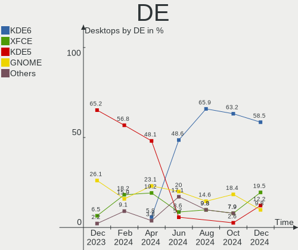
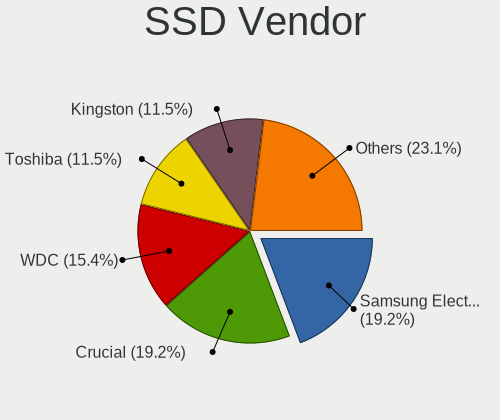

Manjaro Hardware Trends (Desktop)
---------------------------------

A project to identify most popular hardware characteristics and track their change
over time based on data collected by Manjaro users at https://Linux-Hardware.org.

Anyone can contribute to the study by uploading probes of their computers by
the [hw-probe](https://github.com/linuxhw/hw-probe) tool:

    sudo -E hw-probe -all -upload

Full-feature report is available here: https://linux-hardware.org/?view=trends&formfactor=desktop

Period: Mar, 2021.

Contents
--------

- [ OS                       ](#os)
- [ OS Family                ](#os-family)
- [ Kernel                   ](#kernel)
- [ Kernel Family            ](#kernel-family)
- [ Kernel Major Ver.        ](#kernel-major-ver)
- [ Arch                     ](#arch)
- [ DE                       ](#de)
- [ Display Server           ](#display-server)
- [ Display Manager          ](#display-manager)
- [ OS Lang                  ](#os-lang)
- [ Boot Mode                ](#boot-mode)
- [ Filesystem               ](#filesystem)
- [ Part. scheme             ](#part-scheme)
- [ Dual Boot with Linux/BSD ](#dual-boot-with-linux/bsd)
- [ Dual Boot (Win)          ](#dual-boot-win)
- [ Country                  ](#country)
- [ City                     ](#city)
- [ Vendor                   ](#vendor)
- [ Model                    ](#model)
- [ Model Family             ](#model-family)
- [ MFG Year                 ](#mfg-year)
- [ Form Factor              ](#form-factor)
- [ Secure Boot              ](#secure-boot)
- [ Coreboot                 ](#coreboot)
- [ RAM Size                 ](#ram-size)
- [ RAM Used                 ](#ram-used)
- [ Has CD-ROM               ](#has-cd-rom)
- [ Total Drives             ](#total-drives)
- [ Has Ethernet             ](#has-ethernet)
- [ Has WiFi                 ](#has-wifi)
- [ Has Bluetooth            ](#has-bluetooth)
- [ Drive Vendor             ](#drive-vendor)
- [ Drive Model              ](#drive-model)
- [ HDD Vendor               ](#hdd-vendor)
- [ SSD Vendor               ](#ssd-vendor)
- [ Drive Kind               ](#drive-kind)
- [ Drive Connector          ](#drive-connector)
- [ Drive Size               ](#drive-size)
- [ Space Total              ](#space-total)
- [ Space Used               ](#space-used)
- [ Malfunc. Drives          ](#malfunc-drives)
- [ Malfunc. Drive Vendor    ](#malfunc-drive-vendor)
- [ Malfunc. HDD Vendor      ](#malfunc-hdd-vendor)
- [ Malfunc. Drive Kind      ](#malfunc-drive-kind)
- [ Failed Drives            ](#failed-drives)
- [ Failed Drive Vendor      ](#failed-drive-vendor)
- [ Drive Status             ](#drive-status)
- [ Storage Vendor           ](#storage-vendor)
- [ Storage Model            ](#storage-model)
- [ Storage Kind             ](#storage-kind)
- [ CPU Vendor               ](#cpu-vendor)
- [ CPU Model                ](#cpu-model)
- [ CPU Model Family         ](#cpu-model-family)
- [ CPU Cores                ](#cpu-cores)
- [ CPU Sockets              ](#cpu-sockets)
- [ CPU Threads              ](#cpu-threads)
- [ CPU Op-Modes             ](#cpu-op-modes)
- [ CPU Microcode            ](#cpu-microcode)
- [ CPU Microarch            ](#cpu-microarch)
- [ GPU Vendor               ](#gpu-vendor)
- [ GPU Model                ](#gpu-model)
- [ GPU Combo                ](#gpu-combo)
- [ GPU Driver               ](#gpu-driver)
- [ GPU Memory               ](#gpu-memory)
- [ Monitor Vendor           ](#monitor-vendor)
- [ Monitor Model            ](#monitor-model)
- [ Monitor Resolution       ](#monitor-resolution)
- [ Monitor Diagonal         ](#monitor-diagonal)
- [ Monitor Width            ](#monitor-width)
- [ Aspect Ratio             ](#aspect-ratio)
- [ Monitor Area             ](#monitor-area)
- [ Pixel Density            ](#pixel-density)
- [ Multiple Monitors        ](#multiple-monitors)
- [ Net Controller Vendor    ](#net-controller-vendor)
- [ Net Controller Model     ](#net-controller-model)
- [ Wireless Vendor          ](#wireless-vendor)
- [ Wireless Model           ](#wireless-model)
- [ Ethernet Vendor          ](#ethernet-vendor)
- [ Ethernet Model           ](#ethernet-model)
- [ Net Controller Kind      ](#net-controller-kind)
- [ Used Controller          ](#used-controller)
- [ NICs                     ](#nics)
- [ IPv6                     ](#ipv6)
- [ Memory Vendor            ](#memory-vendor)
- [ Memory Model             ](#memory-model)
- [ Memory Kind              ](#memory-kind)
- [ Memory Form Factor       ](#memory-form-factor)
- [ Memory Size              ](#memory-size)
- [ Memory Speed             ](#memory-speed)
- [ Sound Vendor             ](#sound-vendor)
- [ Sound Model              ](#sound-model)
- [ Camera Vendor            ](#camera-vendor)
- [ Camera Model             ](#camera-model)
- [ Fingerprint Vendor       ](#fingerprint-vendor)
- [ Fingerprint Model        ](#fingerprint-model)
- [ Chipcard Vendor          ](#chipcard-vendor)
- [ Chipcard Model           ](#chipcard-model)
- [ Printer Vendor           ](#printer-vendor)
- [ Printer Model            ](#printer-model)
- [ Scanner Vendor           ](#scanner-vendor)
- [ Scanner Model            ](#scanner-model)
- [ Bluetooth Vendor         ](#bluetooth-vendor)
- [ Bluetooth Model          ](#bluetooth-model)
- [ Unsupported Devices      ](#unsupported-devices)
- [ Unsupported Device Types ](#unsupported-device-types)

OS
--

Installed operating systems

| Name           | Desktops | Percent |
|----------------|----------|---------|
| Manjaro        | 52       | 49.06%  |
| Manjaro 20.2.1 | 34       | 32.08%  |
| Manjaro 21.0   | 18       | 16.98%  |
| Manjaro 20.0.1 | 1        | 0.94%   |
| Manjaro 20.0   | 1        | 0.94%   |

OS Family
---------

OS without a version

| Name    | Desktops | Percent |
|---------|----------|---------|
| Manjaro | 106      | 100%    |

Kernel
------

Version of the Linux kernel

| Version              | Desktops | Percent |
|----------------------|----------|---------|
| 5.9.16-1-MANJARO     | 36       | 33.96%  |
| 5.11.2-1-MANJARO     | 17       | 16.04%  |
| 5.11.6-1-MANJARO     | 12       | 11.32%  |
| 5.10.23-1-MANJARO    | 9        | 8.49%   |
| 5.4.105-1-MANJARO    | 6        | 5.66%   |
| 5.10.19-1-MANJARO    | 4        | 3.77%   |
| 5.10.18-1-MANJARO    | 3        | 2.83%   |
| 5.9.1-1-rt19-MANJARO | 2        | 1.89%   |
| 5.4.101-1-MANJARO    | 2        | 1.89%   |
| 5.12.0-1-MANJARO     | 2        | 1.89%   |
| 5.11.1-1-MANJARO     | 2        | 1.89%   |
| 5.9.11-3-MANJARO     | 1        | 0.94%   |
| 5.6.7-1-MANJARO      | 1        | 0.94%   |
| 5.11.4-1-MANJARO     | 1        | 0.94%   |
| 5.11.10-1-MANJARO    | 1        | 0.94%   |
| 5.11.1-xanmod1-1     | 1        | 0.94%   |
| 5.10.22-1-MANJARO    | 1        | 0.94%   |
| 5.10.2-2-MANJARO     | 1        | 0.94%   |
| 4.19.177-1-MANJARO   | 1        | 0.94%   |
| 4.14.222-1-MANJARO   | 1        | 0.94%   |
| 4.14.221-1-MANJARO   | 1        | 0.94%   |
| 4.14.179-1-MANJARO   | 1        | 0.94%   |

Kernel Family
-------------

Linux kernel without a distro release

| Version  | Desktops | Percent |
|----------|----------|---------|
| 5.9.16   | 36       | 33.96%  |
| 5.11.2   | 17       | 16.04%  |
| 5.11.6   | 12       | 11.32%  |
| 5.10.23  | 9        | 8.49%   |
| 5.4.105  | 6        | 5.66%   |
| 5.10.19  | 4        | 3.77%   |
| 5.11.1   | 3        | 2.83%   |
| 5.10.18  | 3        | 2.83%   |
| 5.9.1    | 2        | 1.89%   |
| 5.4.101  | 2        | 1.89%   |
| 5.12.0   | 2        | 1.89%   |
| 5.9.11   | 1        | 0.94%   |
| 5.6.7    | 1        | 0.94%   |
| 5.11.4   | 1        | 0.94%   |
| 5.11.10  | 1        | 0.94%   |
| 5.10.22  | 1        | 0.94%   |
| 5.10.2   | 1        | 0.94%   |
| 4.19.177 | 1        | 0.94%   |
| 4.14.222 | 1        | 0.94%   |
| 4.14.221 | 1        | 0.94%   |
| 4.14.179 | 1        | 0.94%   |

Kernel Major Ver.
-----------------

Linux kernel major version

| Version | Desktops | Percent |
|---------|----------|---------|
| 5.9     | 39       | 36.79%  |
| 5.11    | 34       | 32.08%  |
| 5.10    | 18       | 16.98%  |
| 5.4     | 8        | 7.55%   |
| 4.14    | 3        | 2.83%   |
| 5.12    | 2        | 1.89%   |
| 5.6     | 1        | 0.94%   |
| 4.19    | 1        | 0.94%   |

Arch
----

OS architecture (x86_64, i586, etc.)

| Name   | Desktops | Percent |
|--------|----------|---------|
| x86_64 | 106      | 100%    |

DE
--

Desktop Environment

| Name       | Desktops | Percent |
|------------|----------|---------|
| XFCE       | 27       | 25.47%  |
| GNOME      | 25       | 23.58%  |
| KDE5       | 24       | 22.64%  |
| KDE        | 22       | 20.75%  |
| Unknown    | 4        | 3.77%   |
| X-Cinnamon | 3        | 2.83%   |
| i3         | 1        | 0.94%   |

Display Server
--------------

X11 or Wayland

| Name    | Desktops | Percent |
|---------|----------|---------|
| X11     | 94       | 88.68%  |
| Wayland | 7        | 6.6%    |
| Unknown | 3        | 2.83%   |
| Tty     | 2        | 1.89%   |

Display Manager
---------------

SDDM, LightDM, etc.

| Name    | Desktops | Percent |
|---------|----------|---------|
| Unknown | 53       | 50%     |
| SDDM    | 22       | 20.75%  |
| LightDM | 15       | 14.15%  |
| GDM     | 15       | 14.15%  |
| TDM     | 1        | 0.94%   |

OS Lang
-------

Language

| Lang   | Desktops | Percent |
|--------|----------|---------|
| en_US  | 46       | 43.4%   |
| ru_RU  | 13       | 12.26%  |
| en_GB  | 12       | 11.32%  |
| de_DE  | 6        | 5.66%   |
| pl_PL  | 4        | 3.77%   |
| fr_FR  | 4        | 3.77%   |
| es_CL  | 3        | 2.83%   |
| pt_BR  | 2        | 1.89%   |
| it_IT  | 2        | 1.89%   |
| zh_CN  | 1        | 0.94%   |
| szl_PL | 1        | 0.94%   |
| sv_SE  | 1        | 0.94%   |
| ru_UA  | 1        | 0.94%   |
| quc_GT | 1        | 0.94%   |
| pt_PT  | 1        | 0.94%   |
| li_BE  | 1        | 0.94%   |
| es_MX  | 1        | 0.94%   |
| es_ES  | 1        | 0.94%   |
| en_ZA  | 1        | 0.94%   |
| en_CA  | 1        | 0.94%   |
| de_AT  | 1        | 0.94%   |
| cs_CZ  | 1        | 0.94%   |
| C      | 1        | 0.94%   |

Boot Mode
---------

EFI or BIOS

| Mode | Desktops | Percent |
|------|----------|---------|
| BIOS | 82       | 77.36%  |
| EFI  | 24       | 22.64%  |

Filesystem
----------

Type of filesystem

| Type  | Desktops | Percent |
|-------|----------|---------|
| Ext4  | 98       | 92.45%  |
| Btrfs | 6        | 5.66%   |
| Zfs   | 1        | 0.94%   |
| Ext3  | 1        | 0.94%   |

Part. scheme
------------

Scheme of partitioning

| Type    | Desktops | Percent |
|---------|----------|---------|
| Unknown | 51       | 48.11%  |
| GPT     | 39       | 36.79%  |
| MBR     | 16       | 15.09%  |

Dual Boot with Linux/BSD
------------------------

Hosting more than one Linux/BSD

| Dual boot | Desktops | Percent |
|-----------|----------|---------|
| No        | 92       | 86.79%  |
| Yes       | 14       | 13.21%  |

Dual Boot (Win)
---------------

Hosting Linux and Windows

| Dual boot | Desktops | Percent |
|-----------|----------|---------|
| No        | 71       | 66.98%  |
| Yes       | 35       | 33.02%  |

Country
-------

Geographic location (country)

| Country      | Desktops | Percent |
|--------------|----------|---------|
| USA          | 18       | 16.98%  |
| Russia       | 16       | 15.09%  |
| Germany      | 10       | 9.43%   |
| UK           | 6        | 5.66%   |
| France       | 6        | 5.66%   |
| Ukraine      | 4        | 3.77%   |
| Poland       | 4        | 3.77%   |
| Lithuania    | 4        | 3.77%   |
| Finland      | 3        | 2.83%   |
| Chile        | 3        | 2.83%   |
| Canada       | 3        | 2.83%   |
| Sweden       | 2        | 1.89%   |
| Hungary      | 2        | 1.89%   |
| Brazil       | 2        | 1.89%   |
| Belgium      | 2        | 1.89%   |
| Austria      | 2        | 1.89%   |
| Thailand     | 1        | 0.94%   |
| Spain        | 1        | 0.94%   |
| South Africa | 1        | 0.94%   |
| Portugal     | 1        | 0.94%   |
| Norway       | 1        | 0.94%   |
| Mexico       | 1        | 0.94%   |
| Latvia       | 1        | 0.94%   |
| Italy        | 1        | 0.94%   |
| Guatemala    | 1        | 0.94%   |
| Greece       | 1        | 0.94%   |
| Estonia      | 1        | 0.94%   |
| Egypt        | 1        | 0.94%   |
| Czechia      | 1        | 0.94%   |
| China        | 1        | 0.94%   |
| Bulgaria     | 1        | 0.94%   |
| Belarus      | 1        | 0.94%   |
| Bangladesh   | 1        | 0.94%   |
| Argentina    | 1        | 0.94%   |
| Algeria      | 1        | 0.94%   |

City
----

Geographic location (city)

| City                          | Desktops | Percent |
|-------------------------------|----------|---------|
| Moscow                        | 6        | 5.66%   |
| Vilnius                       | 2        | 1.89%   |
| Santiago                      | 2        | 1.89%   |
| Mosedis                       | 2        | 1.89%   |
| Le Mans                       | 2        | 1.89%   |
| Hagen                         | 2        | 1.89%   |
| Gyomro                        | 2        | 1.89%   |
| Eugene                        | 2        | 1.89%   |
| Yaroslavl                     | 1        | 0.94%   |
| Worksop                       | 1        | 0.94%   |
| Wetteren                      | 1        | 0.94%   |
| Vologda                       | 1        | 0.94%   |
| Vinnytsia                     | 1        | 0.94%   |
| Vienna                        | 1        | 0.94%   |
| Vernon                        | 1        | 0.94%   |
| Vandalia                      | 1        | 0.94%   |
| Ustron                        | 1        | 0.94%   |
| Ufa                           | 1        | 0.94%   |
| Tultitlan de Mariano Escobedo | 1        | 0.94%   |
| Tongeren                      | 1        | 0.94%   |
| Tolyatti                      | 1        | 0.94%   |
| The Bronx                     | 1        | 0.94%   |
| Starobesheve                  | 1        | 0.94%   |
| St Petersburg                 | 1        | 0.94%   |
| Spring                        | 1        | 0.94%   |
| Shinnston                     | 1        | 0.94%   |
| Sevastopol'                   | 1        | 0.94%   |
| Schwerte                      | 1        | 0.94%   |
| Santa Fe                      | 1        | 0.94%   |
| San Miguel                    | 1        | 0.94%   |
| San Antonio                   | 1        | 0.94%   |
| Sainte-Sigolene               | 1        | 0.94%   |
| Rzeszów                      | 1        | 0.94%   |
| Rousse                        | 1        | 0.94%   |
| Rosenheim                     | 1        | 0.94%   |
| Rockland                      | 1        | 0.94%   |
| Riga                          | 1        | 0.94%   |
| Requena                       | 1        | 0.94%   |
| Rapla                         | 1        | 0.94%   |
| Ramenskoye                    | 1        | 0.94%   |
| Radziszow                     | 1        | 0.94%   |
| Petersberg                    | 1        | 0.94%   |
| Ouargla                       | 1        | 0.94%   |
| Oberursel                     | 1        | 0.94%   |
| New York                      | 1        | 0.94%   |
| Neath                         | 1        | 0.94%   |
| Minsk                         | 1        | 0.94%   |
| Minden                        | 1        | 0.94%   |
| Milwaukee                     | 1        | 0.94%   |
| Manchester                    | 1        | 0.94%   |
| Magalas                       | 1        | 0.94%   |
| Machynlleth                   | 1        | 0.94%   |
| Luhansk                       | 1        | 0.94%   |
| Los Angeles                   | 1        | 0.94%   |
| LIsle-dEspagnac               | 1        | 0.94%   |
| Kryvyi Rih                    | 1        | 0.94%   |
| Krokstadelva                  | 1        | 0.94%   |
| Krasnodar                     | 1        | 0.94%   |
| Kerava                        | 1        | 0.94%   |
| Katowice                      | 1        | 0.94%   |

Vendor
------

Motherboard manufacturer

| Name                | Desktops | Percent |
|---------------------|----------|---------|
| ASUSTek Computer    | 27       | 25.47%  |
| Gigabyte Technology | 21       | 19.81%  |
| MSI                 | 17       | 16.04%  |
| ASRock              | 11       | 10.38%  |
| Dell                | 9        | 8.49%   |
| Hewlett-Packard     | 6        | 5.66%   |
| Intel               | 4        | 3.77%   |
| Acer                | 4        | 3.77%   |
| Lenovo              | 3        | 2.83%   |
| SYWZ                | 1        | 0.94%   |
| Fujitsu             | 1        | 0.94%   |
| ECS                 | 1        | 0.94%   |
| Unknown             | 1        | 0.94%   |

Model
-----

Motherboard model

| Name                           | Desktops | Percent |
|--------------------------------|----------|---------|
| ASUS All Series                | 4        | 3.77%   |
| MSI MS-7C37                    | 2        | 1.89%   |
| Gigabyte B450M DS3H            | 2        | 1.89%   |
| Dell OptiPlex 9020             | 2        | 1.89%   |
| ASRock X570 Taichi             | 2        | 1.89%   |
| ASRock B450M Pro4              | 2        | 1.89%   |
| SYWZ S210H Series              | 1        | 0.94%   |
| MSI MS-7C91                    | 1        | 0.94%   |
| MSI MS-7C79                    | 1        | 0.94%   |
| MSI MS-7C52                    | 1        | 0.94%   |
| MSI MS-7C02                    | 1        | 0.94%   |
| MSI MS-7B79                    | 1        | 0.94%   |
| MSI MS-7B48                    | 1        | 0.94%   |
| MSI MS-7B18                    | 1        | 0.94%   |
| MSI MS-7A38                    | 1        | 0.94%   |
| MSI MS-7A37                    | 1        | 0.94%   |
| MSI MS-7971                    | 1        | 0.94%   |
| MSI MS-7900                    | 1        | 0.94%   |
| MSI MS-7885                    | 1        | 0.94%   |
| MSI MS-7821                    | 1        | 0.94%   |
| MSI MS-7680                    | 1        | 0.94%   |
| MSI A320M-HDV R4.0             | 1        | 0.94%   |
| Lenovo ThinkCentre M77 2209A12 | 1        | 0.94%   |
| Lenovo H520 10094              | 1        | 0.94%   |
| Lenovo 7033EW4                 | 1        | 0.94%   |
| Intel X99                      | 1        | 0.94%   |
| Intel X64                      | 1        | 0.94%   |
| Intel DH67BL AAG10189-208      | 1        | 0.94%   |
| Intel DH55HC AAE70933-501      | 1        | 0.94%   |
| HP ProLiant ML10               | 1        | 0.94%   |
| HP ProDesk 400 G1 SFF          | 1        | 0.94%   |
| HP EliteDesk 705 G1 SFF        | 1        | 0.94%   |
| HP Compaq 6200 Pro MT PC       | 1        | 0.94%   |
| HP Compaq 6005 Pro SFF PC      | 1        | 0.94%   |
| HP 500-501ng                   | 1        | 0.94%   |
| Gigabyte Z87X-OC               | 1        | 0.94%   |
| Gigabyte Z68M-D2H              | 1        | 0.94%   |
| Gigabyte Z390 AORUS PRO WIFI   | 1        | 0.94%   |
| Gigabyte Z370 HD3              | 1        | 0.94%   |
| Gigabyte X570 AORUS XTREME     | 1        | 0.94%   |
| Gigabyte X570 AORUS MASTER     | 1        | 0.94%   |
| Gigabyte P35C-DS3R             | 1        | 0.94%   |
| Gigabyte M61PME-S2P            | 1        | 0.94%   |
| Gigabyte H55M-UD2H             | 1        | 0.94%   |
| Gigabyte GA-H81M-D2V           | 1        | 0.94%   |
| Gigabyte GA-880GM-USB3         | 1        | 0.94%   |
| Gigabyte F2A78M-D3H            | 1        | 0.94%   |
| Gigabyte B75M-D3H              | 1        | 0.94%   |
| Gigabyte B550M DS3H            | 1        | 0.94%   |
| Gigabyte B550I AORUS PRO AX    | 1        | 0.94%   |
| Gigabyte B550 AORUS PRO V2     | 1        | 0.94%   |
| Gigabyte B450 AORUS ELITE V2   | 1        | 0.94%   |
| Gigabyte A320M-S2H V2          | 1        | 0.94%   |
| Gigabyte 970A-D3               | 1        | 0.94%   |
| Fujitsu ESPRIMO E420           | 1        | 0.94%   |
| ECS H61H2-MV                   | 1        | 0.94%   |
| Dell Precision T3600           | 1        | 0.94%   |
| Dell OptiPlex GX620            | 1        | 0.94%   |
| Dell OptiPlex 9010             | 1        | 0.94%   |
| Dell OptiPlex 3010             | 1        | 0.94%   |

Model Family
------------

Motherboard model prefix

| Name                   | Desktops | Percent |
|------------------------|----------|---------|
| Dell OptiPlex          | 5        | 4.72%   |
| ASUS PRIME             | 5        | 4.72%   |
| ASUS All               | 4        | 3.77%   |
| Dell Inspiron          | 3        | 2.83%   |
| ASUS ROG               | 3        | 2.83%   |
| ASRock B450M           | 3        | 2.83%   |
| Acer Aspire            | 3        | 2.83%   |
| MSI MS-7C37            | 2        | 1.89%   |
| HP Compaq              | 2        | 1.89%   |
| Gigabyte X570          | 2        | 1.89%   |
| Gigabyte B450M         | 2        | 1.89%   |
| ASUS TUF               | 2        | 1.89%   |
| ASUS Maximus           | 2        | 1.89%   |
| ASRock X570            | 2        | 1.89%   |
| SYWZ S210H             | 1        | 0.94%   |
| MSI MS-7C91            | 1        | 0.94%   |
| MSI MS-7C79            | 1        | 0.94%   |
| MSI MS-7C52            | 1        | 0.94%   |
| MSI MS-7C02            | 1        | 0.94%   |
| MSI MS-7B79            | 1        | 0.94%   |
| MSI MS-7B48            | 1        | 0.94%   |
| MSI MS-7B18            | 1        | 0.94%   |
| MSI MS-7A38            | 1        | 0.94%   |
| MSI MS-7A37            | 1        | 0.94%   |
| MSI MS-7971            | 1        | 0.94%   |
| MSI MS-7900            | 1        | 0.94%   |
| MSI MS-7885            | 1        | 0.94%   |
| MSI MS-7821            | 1        | 0.94%   |
| MSI MS-7680            | 1        | 0.94%   |
| MSI A320M-HDV          | 1        | 0.94%   |
| Lenovo ThinkCentre     | 1        | 0.94%   |
| Lenovo H520            | 1        | 0.94%   |
| Lenovo 7033EW4         | 1        | 0.94%   |
| Intel X99              | 1        | 0.94%   |
| Intel X64              | 1        | 0.94%   |
| Intel DH67BL           | 1        | 0.94%   |
| Intel DH55HC           | 1        | 0.94%   |
| HP ProLiant            | 1        | 0.94%   |
| HP ProDesk             | 1        | 0.94%   |
| HP EliteDesk           | 1        | 0.94%   |
| HP 500-501ng           | 1        | 0.94%   |
| Gigabyte Z87X-OC       | 1        | 0.94%   |
| Gigabyte Z68M-D2H      | 1        | 0.94%   |
| Gigabyte Z390          | 1        | 0.94%   |
| Gigabyte Z370          | 1        | 0.94%   |
| Gigabyte P35C-DS3R     | 1        | 0.94%   |
| Gigabyte M61PME-S2P    | 1        | 0.94%   |
| Gigabyte H55M-UD2H     | 1        | 0.94%   |
| Gigabyte GA-H81M-D2V   | 1        | 0.94%   |
| Gigabyte GA-880GM-USB3 | 1        | 0.94%   |
| Gigabyte F2A78M-D3H    | 1        | 0.94%   |
| Gigabyte B75M-D3H      | 1        | 0.94%   |
| Gigabyte B550M         | 1        | 0.94%   |
| Gigabyte B550I         | 1        | 0.94%   |
| Gigabyte B550          | 1        | 0.94%   |
| Gigabyte B450          | 1        | 0.94%   |
| Gigabyte A320M-S2H     | 1        | 0.94%   |
| Gigabyte 970A-D3       | 1        | 0.94%   |
| Fujitsu ESPRIMO        | 1        | 0.94%   |
| ECS H61H2-MV           | 1        | 0.94%   |

MFG Year
--------

Motherboard manufacture year

| Year | Desktops | Percent |
|------|----------|---------|
| 2020 | 19       | 17.92%  |
| 2019 | 17       | 16.04%  |
| 2018 | 12       | 11.32%  |
| 2011 | 9        | 8.49%   |
| 2021 | 7        | 6.6%    |
| 2014 | 7        | 6.6%    |
| 2013 | 6        | 5.66%   |
| 2012 | 6        | 5.66%   |
| 2017 | 5        | 4.72%   |
| 2016 | 5        | 4.72%   |
| 2015 | 4        | 3.77%   |
| 2009 | 4        | 3.77%   |
| 2010 | 3        | 2.83%   |
| 2008 | 1        | 0.94%   |
| 2006 | 1        | 0.94%   |

Form Factor
-----------

Physical design of the computer

| Name    | Desktops | Percent |
|---------|----------|---------|
| Desktop | 106      | 100%    |

Secure Boot
-----------

Enabled or disabled

| State    | Desktops | Percent |
|----------|----------|---------|
| Disabled | 106      | 100%    |

Coreboot
--------

Have coreboot on board

| Used | Desktops | Percent |
|------|----------|---------|
| No   | 106      | 100%    |

RAM Size
--------

Total RAM memory

| Size in GB  | Desktops | Percent |
|-------------|----------|---------|
| 16.01-24.0  | 33       | 31.13%  |
| 8.01-16.0   | 29       | 27.36%  |
| 32.01-64.0  | 19       | 17.92%  |
| 4.01-8.0    | 9        | 8.49%   |
| 64.01-256.0 | 6        | 5.66%   |
| 3.01-4.0    | 5        | 4.72%   |
| 24.01-32.0  | 4        | 3.77%   |
| 1.01-2.0    | 1        | 0.94%   |

RAM Used
--------

Used RAM memory

| Used GB    | Desktops | Percent |
|------------|----------|---------|
| 1.01-2.0   | 27       | 25.47%  |
| 4.01-8.0   | 23       | 21.7%   |
| 2.01-3.0   | 22       | 20.75%  |
| 3.01-4.0   | 18       | 16.98%  |
| 8.01-16.0  | 9        | 8.49%   |
| 0.01-0.5   | 3        | 2.83%   |
| 16.01-24.0 | 2        | 1.89%   |
| 0.51-1.0   | 2        | 1.89%   |

Has CD-ROM
----------

Has CD-ROM on board

| Presented | Desktops | Percent |
|-----------|----------|---------|
| No        | 71       | 66.98%  |
| Yes       | 35       | 33.02%  |

Total Drives
------------

Number of drives on board

| Drives | Desktops | Percent |
|--------|----------|---------|
| 2      | 34       | 32.08%  |
| 1      | 32       | 30.19%  |
| 3      | 17       | 16.04%  |
| 4      | 11       | 10.38%  |
| 5      | 9        | 8.49%   |
| 6      | 2        | 1.89%   |
| 8      | 1        | 0.94%   |

Has Ethernet
------------

Has Ethernet on board

| Presented | Desktops | Percent |
|-----------|----------|---------|
| Yes       | 104      | 98.11%  |
| No        | 2        | 1.89%   |

Has WiFi
--------

Has WiFi module

| Presented | Desktops | Percent |
|-----------|----------|---------|
| No        | 60       | 56.6%   |
| Yes       | 46       | 43.4%   |

Has Bluetooth
-------------

Has Bluetooth module

| Presented | Desktops | Percent |
|-----------|----------|---------|
| No        | 62       | 58.49%  |
| Yes       | 44       | 41.51%  |

Drive Vendor
------------

Hard drive vendors

| Vendor                    | Desktops | Drives | Percent |
|---------------------------|----------|--------|---------|
| Samsung Electronics       | 40       | 50     | 18.02%  |
| Seagate                   | 37       | 47     | 16.67%  |
| WDC                       | 33       | 43     | 14.86%  |
| Kingston                  | 21       | 21     | 9.46%   |
| Toshiba                   | 20       | 21     | 9.01%   |
| Crucial                   | 12       | 15     | 5.41%   |
| Sandisk                   | 7        | 8      | 3.15%   |
| Hitachi                   | 7        | 7      | 3.15%   |
| China                     | 4        | 4      | 1.8%    |
| A-DATA Technology         | 4        | 4      | 1.8%    |
| SPCC                      | 3        | 4      | 1.35%   |
| Phison                    | 3        | 3      | 1.35%   |
| Intel                     | 3        | 3      | 1.35%   |
| HGST                      | 3        | 4      | 1.35%   |
| Unknown                   | 2        | 2      | 0.9%    |
| Silicon Motion            | 2        | 2      | 0.9%    |
| PNY                       | 2        | 3      | 0.9%    |
| Intenso                   | 2        | 2      | 0.9%    |
| Hewlett-Packard           | 2        | 2      | 0.9%    |
| XPG                       | 1        | 1      | 0.45%   |
| USB3.1                    | 1        | 1      | 0.45%   |
| USB3.0                    | 1        | 1      | 0.45%   |
| PNY USB                   | 1        | 1      | 0.45%   |
| Patriot                   | 1        | 1      | 0.45%   |
| Mushkin                   | 1        | 1      | 0.45%   |
| Micron/Crucial Technology | 1        | 1      | 0.45%   |
| Micron Technology         | 1        | 1      | 0.45%   |
| JMicron                   | 1        | 1      | 0.45%   |
| HS-SSD-E100               | 1        | 1      | 0.45%   |
| HGST HTS                  | 1        | 1      | 0.45%   |
| Fujitsu                   | 1        | 1      | 0.45%   |
| External                  | 1        | 1      | 0.45%   |
| ATOM                      | 1        | 1      | 0.45%   |
| ASMT                      | 1        | 1      | 0.45%   |

Drive Model
-----------

Hard drive models

| Model                            | Desktops | Percent |
|----------------------------------|----------|---------|
| Toshiba DT01ACA100 1TB           | 6        | 2.35%   |
| Toshiba HDWD110 1TB              | 5        | 1.96%   |
| Kingston SA400S37120G 120GB SSD  | 5        | 1.96%   |
| Seagate ST3500418AS 500GB        | 4        | 1.57%   |
| Toshiba DT01ACA050 500GB         | 3        | 1.18%   |
| Seagate ST2000DM001-1ER164 2TB   | 3        | 1.18%   |
| Samsung SSD 860 EVO 500GB        | 3        | 1.18%   |
| Samsung SSD 860 EVO 250GB        | 3        | 1.18%   |
| Samsung NVMe SSD Drive 250GB     | 3        | 1.18%   |
| Kingston SA400S37240G 240GB SSD  | 3        | 1.18%   |
| Crucial CT500MX500SSD1 500GB     | 3        | 1.18%   |
| China SATA SSD 240GB             | 3        | 1.18%   |
| WDC WDS240G2G0A-00JH30 240GB SSD | 2        | 0.78%   |
| WDC WD5000AAKX-08U6AA0 500GB     | 2        | 0.78%   |
| WDC WD10EZEX-08WN4A0 1TB         | 2        | 0.78%   |
| Seagate ST500LT012-1DG142 500GB  | 2        | 0.78%   |
| Seagate ST500DM002-1BD142 500GB  | 2        | 0.78%   |
| Seagate ST4000DM000-1F2168 4TB   | 2        | 0.78%   |
| Seagate ST31000524NS 1TB         | 2        | 0.78%   |
| Seagate ST2000DM008-2FR102 2TB   | 2        | 0.78%   |
| Seagate ST2000DM006-2DM164 2TB   | 2        | 0.78%   |
| Seagate ST1000DX002-2DV162 1TB   | 2        | 0.78%   |
| Seagate ST1000DM010-2EP102 1TB   | 2        | 0.78%   |
| Seagate ST1000DM003-9YN162 1TB   | 2        | 0.78%   |
| Seagate Expansion 1TB            | 2        | 0.78%   |
| Samsung SSD PM851 2.5 7mm 128GB  | 2        | 0.78%   |
| Samsung SSD 970 PRO 512GB        | 2        | 0.78%   |
| Samsung SSD 970 EVO Plus 500GB   | 2        | 0.78%   |
| Samsung SSD 840 EVO 1TB          | 2        | 0.78%   |
| Samsung SSD 840 EVO 120GB        | 2        | 0.78%   |
| Samsung NVMe SSD Drive 500GB     | 2        | 0.78%   |
| Samsung HD502IJ 500GB            | 2        | 0.78%   |
| Kingston SV300S37A120G 120GB SSD | 2        | 0.78%   |
| Kingston SHFS37A120G 120GB SSD   | 2        | 0.78%   |
| Kingston NVMe SSD Drive 250GB    | 2        | 0.78%   |
| Crucial M4-CT064M4SSD2 64GB      | 2        | 0.78%   |
| XPG NVMe SSD Drive 256GB         | 1        | 0.39%   |
| WDC WDS500G3X0C-00SJG0 500GB     | 1        | 0.39%   |
| WDC WDS500G2B0C-00PXH0 500GB     | 1        | 0.39%   |
| WDC WDS250G2B0A-00SM50 250GB SSD | 1        | 0.39%   |
| WDC WDS120G2G0A-00JH30 120GB SSD | 1        | 0.39%   |
| WDC WDS100T2B0C-00PXH0 1TB       | 1        | 0.39%   |
| WDC WD7501AALS-00J7B0 752GB      | 1        | 0.39%   |
| WDC WD5001AALS-00E3A0 500GB      | 1        | 0.39%   |
| WDC WD5000LPCX-21VHAT0 500GB     | 1        | 0.39%   |
| WDC WD5000BPVT-24HXZT1 500GB     | 1        | 0.39%   |
| WDC WD5000AAKX-22ERMA0 500GB     | 1        | 0.39%   |
| WDC WD5000AAKX-07U6AA0 500GB     | 1        | 0.39%   |
| WDC WD5000AAKX-00ERMA0 500GB     | 1        | 0.39%   |
| WDC WD5000AAKX-001CA0 500GB      | 1        | 0.39%   |
| WDC WD5000AAKS-00UU3A0 500GB     | 1        | 0.39%   |
| WDC WD3200BPVT-24ZEST0 320GB     | 1        | 0.39%   |
| WDC WD2500AAKS-00L9A0 250GB      | 1        | 0.39%   |
| WDC WD20PURZ-85GU6Y0 2TB         | 1        | 0.39%   |
| WDC WD20EZRZ-00Z5HB0 2TB         | 1        | 0.39%   |
| WDC WD20EZRX-00DC0B0 2TB         | 1        | 0.39%   |
| WDC WD20EFRX-68EUZN0 2TB         | 1        | 0.39%   |
| WDC WD2003FZEX-00SRLA0 2TB       | 1        | 0.39%   |
| WDC WD2003FYPS-27W9B0 2TB        | 1        | 0.39%   |
| WDC WD2002FAEX-007BA0 2TB        | 1        | 0.39%   |

HDD Vendor
----------

Hard disk drive vendors

| Vendor              | Desktops | Drives | Percent |
|---------------------|----------|--------|---------|
| Seagate             | 36       | 46     | 34.95%  |
| WDC                 | 29       | 36     | 28.16%  |
| Toshiba             | 19       | 20     | 18.45%  |
| Hitachi             | 7        | 7      | 6.8%    |
| Samsung Electronics | 5        | 6      | 4.85%   |
| HGST                | 3        | 4      | 2.91%   |
| USB3.0              | 1        | 1      | 0.97%   |
| HGST HTS            | 1        | 1      | 0.97%   |
| Fujitsu             | 1        | 1      | 0.97%   |
| ASMT                | 1        | 1      | 0.97%   |

SSD Vendor
----------

Solid state drive vendors

| Vendor              | Desktops | Drives | Percent |
|---------------------|----------|--------|---------|
| Samsung Electronics | 24       | 28     | 28.92%  |
| Kingston            | 19       | 19     | 22.89%  |
| Crucial             | 11       | 14     | 13.25%  |
| SanDisk             | 5        | 6      | 6.02%   |
| WDC                 | 4        | 4      | 4.82%   |
| China               | 4        | 4      | 4.82%   |
| A-DATA Technology   | 3        | 3      | 3.61%   |
| SPCC                | 2        | 3      | 2.41%   |
| PNY                 | 2        | 3      | 2.41%   |
| Toshiba             | 1        | 1      | 1.2%    |
| Seagate             | 1        | 1      | 1.2%    |
| PNY USB             | 1        | 1      | 1.2%    |
| Patriot             | 1        | 1      | 1.2%    |
| Mushkin             | 1        | 1      | 1.2%    |
| Micron Technology   | 1        | 1      | 1.2%    |
| Intenso             | 1        | 1      | 1.2%    |
| Intel               | 1        | 1      | 1.2%    |
| External            | 1        | 1      | 1.2%    |

Drive Kind
----------

HDD or SSD

| Kind    | Desktops | Drives | Percent |
|---------|----------|--------|---------|
| HDD     | 78       | 123    | 42.86%  |
| SSD     | 65       | 93     | 35.71%  |
| NVMe    | 32       | 37     | 17.58%  |
| Unknown | 7        | 7      | 3.85%   |

Drive Connector
---------------

SATA, SAS, NVMe, etc.

| Type | Desktops | Drives | Percent |
|------|----------|--------|---------|
| SATA | 97       | 212    | 69.78%  |
| NVMe | 32       | 37     | 23.02%  |
| SAS  | 10       | 11     | 7.19%   |

Drive Size
----------

Size of hard drive

| Size in TB | Desktops | Drives | Percent |
|------------|----------|--------|---------|
| 0.01-0.5   | 76       | 121    | 51.35%  |
| 0.51-1.0   | 45       | 61     | 30.41%  |
| 1.01-2.0   | 20       | 26     | 13.51%  |
| 2.01-3.0   | 3        | 3      | 2.03%   |
| 3.01-4.0   | 2        | 2      | 1.35%   |
| 4.01-10.0  | 2        | 3      | 1.35%   |

Space Total
-----------

Amount of disk space available on the file system

| Size in GB     | Desktops | Percent |
|----------------|----------|---------|
| 251-500        | 19       | 17.92%  |
| 1001-2000      | 19       | 17.92%  |
| 501-1000       | 18       | 16.98%  |
| 101-250        | 16       | 15.09%  |
| More than 3000 | 14       | 13.21%  |
| 51-100         | 7        | 6.6%    |
| Unknown        | 6        | 5.66%   |
| 2001-3000      | 4        | 3.77%   |
| 21-50          | 3        | 2.83%   |

Space Used
----------

Amount of used disk space

| Used GB        | Desktops | Percent |
|----------------|----------|---------|
| 101-250        | 19       | 17.92%  |
| 1-20           | 16       | 15.09%  |
| 21-50          | 15       | 14.15%  |
| 1001-2000      | 11       | 10.38%  |
| 501-1000       | 11       | 10.38%  |
| 251-500        | 10       | 9.43%   |
| 51-100         | 9        | 8.49%   |
| Unknown        | 6        | 5.66%   |
| 2001-3000      | 5        | 4.72%   |
| More than 3000 | 4        | 3.77%   |

Malfunc. Drives
---------------

Drive models with a malfunction

| Model                            | Desktops | Drives | Percent |
|----------------------------------|----------|--------|---------|
| WDC WDS240G2G0A-00JH30 240GB SSD | 1        | 1      | 7.14%   |
| WDC WD5000AAKX-001CA0 500GB      | 1        | 1      | 7.14%   |
| WDC WD3200BPVT-24ZEST0 320GB     | 1        | 1      | 7.14%   |
| Toshiba MK3265GSX 320GB          | 1        | 1      | 7.14%   |
| Seagate ST4000DM000-1F2168 4TB   | 1        | 1      | 7.14%   |
| Seagate ST3320613AS 320GB        | 1        | 1      | 7.14%   |
| Seagate ST2000DM001-1ER164 2TB   | 1        | 1      | 7.14%   |
| Seagate ST1000LM035-1RK172 1TB   | 1        | 1      | 7.14%   |
| Seagate ST1000DX001-1NS162 1TB   | 1        | 1      | 7.14%   |
| Samsung Electronics HD103SJ 1TB  | 1        | 1      | 7.14%   |
| Kingston SA400S37120G 120GB SSD  | 1        | 1      | 7.14%   |
| Hitachi HTS545050B9A300 500GB    | 1        | 1      | 7.14%   |
| Hitachi HDS721010CLA332 1TB      | 1        | 1      | 7.14%   |
| HGST HTS541010A9E680 1TB         | 1        | 1      | 7.14%   |

Malfunc. Drive Vendor
---------------------

Vendors of faulty drives

| Vendor              | Desktops | Drives | Percent |
|---------------------|----------|--------|---------|
| Seagate             | 4        | 5      | 30.77%  |
| WDC                 | 3        | 3      | 23.08%  |
| Hitachi             | 2        | 2      | 15.38%  |
| Toshiba             | 1        | 1      | 7.69%   |
| Samsung Electronics | 1        | 1      | 7.69%   |
| Kingston            | 1        | 1      | 7.69%   |
| HGST                | 1        | 1      | 7.69%   |

Malfunc. HDD Vendor
-------------------

Vendors of faulty HDD drives

| Vendor              | Desktops | Drives | Percent |
|---------------------|----------|--------|---------|
| Seagate             | 4        | 5      | 36.36%  |
| WDC                 | 2        | 2      | 18.18%  |
| Hitachi             | 2        | 2      | 18.18%  |
| Toshiba             | 1        | 1      | 9.09%   |
| Samsung Electronics | 1        | 1      | 9.09%   |
| HGST                | 1        | 1      | 9.09%   |

Malfunc. Drive Kind
-------------------

Kinds of faulty drives

| Kind | Desktops | Drives | Percent |
|------|----------|--------|---------|
| HDD  | 11       | 12     | 84.62%  |
| SSD  | 2        | 2      | 15.38%  |

Failed Drives
-------------

Failed drive models

| Model                     | Desktops | Drives | Percent |
|---------------------------|----------|--------|---------|
| Toshiba MQ01ABF050 500GB  | 1        | 1      | 50%     |
| Seagate ST3250318AS 250GB | 1        | 1      | 50%     |

Failed Drive Vendor
-------------------

Failed drive vendors

| Vendor  | Desktops | Drives | Percent |
|---------|----------|--------|---------|
| Toshiba | 1        | 1      | 50%     |
| Seagate | 1        | 1      | 50%     |

Drive Status
------------

Number of failed and malfunc. drives

| Status   | Desktops | Drives | Percent |
|----------|----------|--------|---------|
| Detected | 70       | 163    | 57.38%  |
| Works    | 38       | 81     | 31.15%  |
| Malfunc  | 12       | 14     | 9.84%   |
| Failed   | 2        | 2      | 1.64%   |

Storage Vendor
--------------

Storage controller vendors

| Vendor                      | Desktops | Percent |
|-----------------------------|----------|---------|
| Intel                       | 58       | 38.16%  |
| AMD                         | 47       | 30.92%  |
| Samsung Electronics         | 15       | 9.87%   |
| Sandisk                     | 5        | 3.29%   |
| Silicon Motion              | 4        | 2.63%   |
| Phison Electronics          | 4        | 2.63%   |
| JMicron Technology          | 4        | 2.63%   |
| Nvidia                      | 3        | 1.97%   |
| Marvell Technology Group    | 3        | 1.97%   |
| ASMedia Technology          | 3        | 1.97%   |
| Micron/Crucial Technology   | 2        | 1.32%   |
| Kingston Technology Company | 2        | 1.32%   |
| ADATA Technology            | 2        | 1.32%   |

Storage Model
-------------

Storage controller models

| Model                                                                                   | Desktops | Percent |
|-----------------------------------------------------------------------------------------|----------|---------|
| AMD FCH SATA Controller [AHCI mode]                                                     | 31       | 16.23%  |
| AMD 400 Series Chipset SATA Controller                                                  | 14       | 7.33%   |
| Samsung NVMe SSD Controller SM981/PM981/PM983                                           | 13       | 6.81%   |
| Intel 8 Series/C220 Series Chipset Family 6-port SATA Controller 1 [AHCI mode]          | 8        | 4.19%   |
| Intel 6 Series/C200 Series Chipset Family 6 port Desktop SATA AHCI Controller           | 7        | 3.66%   |
| Intel Q170/Q150/B150/H170/H110/Z170/CM236 Chipset SATA Controller [AHCI Mode]           | 6        | 3.14%   |
| Intel Cannon Lake PCH SATA AHCI Controller                                              | 6        | 3.14%   |
| Intel 6 Series/C200 Series Chipset Family Desktop SATA Controller (IDE mode, ports 4-5) | 5        | 2.62%   |
| Intel 6 Series/C200 Series Chipset Family Desktop SATA Controller (IDE mode, ports 0-3) | 5        | 2.62%   |
| AMD Starship/Matisse Chipset SATA Controller [AHCI mode]                                | 5        | 2.62%   |
| AMD 300 Series Chipset SATA Controller                                                  | 5        | 2.62%   |
| AMD SB7x0/SB8x0/SB9x0 SATA Controller [AHCI mode]                                       | 4        | 2.09%   |
| Silicon Motion SM2263EN/SM2263XT SSD Controller                                         | 3        | 1.57%   |
| Sandisk WD Blue SN550 NVMe SSD                                                          | 3        | 1.57%   |
| Phison E12 NVMe Controller                                                              | 3        | 1.57%   |
| Intel SATA Controller [RAID mode]                                                       | 3        | 1.57%   |
| Intel 9 Series Chipset Family SATA Controller [AHCI Mode]                               | 3        | 1.57%   |
| Intel 200 Series PCH SATA controller [AHCI mode]                                        | 3        | 1.57%   |
| ASMedia ASM1062 Serial ATA Controller                                                   | 3        | 1.57%   |
| AMD FCH SATA Controller D                                                               | 3        | 1.57%   |
| Marvell Group 88SE9172 SATA 6Gb/s Controller                                            | 2        | 1.05%   |
| Kingston Company A2000 NVMe SSD                                                         | 2        | 1.05%   |
| JMicron JMB368 IDE controller                                                           | 2        | 1.05%   |
| JMicron JMB363 SATA/IDE Controller                                                      | 2        | 1.05%   |
| Intel C610/X99 series chipset 6-Port SATA Controller [AHCI mode]                        | 2        | 1.05%   |
| Intel C600/X79 series chipset 6-Port SATA AHCI Controller                               | 2        | 1.05%   |
| Intel 7 Series/C210 Series Chipset Family 6-port SATA Controller [AHCI mode]            | 2        | 1.05%   |
| AMD X370 Series Chipset SATA Controller                                                 | 2        | 1.05%   |
| AMD SB7x0/SB8x0/SB9x0 IDE Controller                                                    | 2        | 1.05%   |
| ADATA XPG SX8200 Pro PCIe Gen3x4 M.2 2280 Solid State Drive                             | 2        | 1.05%   |
| Silicon Motion SM2262/SM2262EN SSD Controller                                           | 1        | 0.52%   |
| Sandisk WD Black SN750 / PC SN730 NVMe SSD                                              | 1        | 0.52%   |
| Sandisk WD Black 2018/SN750 / PC SN720 NVMe SSD                                         | 1        | 0.52%   |
| Samsung NVMe SSD Controller SM961/PM961/SM963                                           | 1        | 0.52%   |
| Samsung NVMe SSD Controller SM951/PM951                                                 | 1        | 0.52%   |
| Phison E16 PCIe4 NVMe Controller                                                        | 1        | 0.52%   |
| Nvidia MCP78S [GeForce 8200] IDE                                                        | 1        | 0.52%   |
| Nvidia MCP78S [GeForce 8200] AHCI Controller                                            | 1        | 0.52%   |
| Nvidia MCP61 SATA Controller                                                            | 1        | 0.52%   |
| Nvidia MCP61 IDE                                                                        | 1        | 0.52%   |
| Nvidia MCP55 SATA Controller                                                            | 1        | 0.52%   |
| Nvidia MCP55 IDE                                                                        | 1        | 0.52%   |
| Micron/Crucial NVMe Controller                                                          | 1        | 0.52%   |
| Micron/Crucial Non-Volatile memory controller                                           | 1        | 0.52%   |
| Marvell Group 88SE9230 PCIe 2.0 x2 4-port SATA 6 Gb/s RAID Controller                   | 1        | 0.52%   |
| JMicron JMB362 SATA Controller                                                          | 1        | 0.52%   |
| Intel SSD Pro 7600p/760p/E 6100p Series                                                 | 1        | 0.52%   |
| Intel Optane SSD 900P Series                                                            | 1        | 0.52%   |
| Intel NM10/ICH7 Family SATA Controller [IDE mode]                                       | 1        | 0.52%   |
| Intel NM10/ICH7 Family SATA Controller [AHCI mode]                                      | 1        | 0.52%   |
| Intel Comet Lake SATA AHCI Controller                                                   | 1        | 0.52%   |
| Intel C610/X99 series chipset sSATA Controller [AHCI mode]                              | 1        | 0.52%   |
| Intel C602 chipset 4-Port SATA Storage Control Unit                                     | 1        | 0.52%   |
| Intel 82801JI (ICH10 Family) SATA AHCI Controller                                       | 1        | 0.52%   |
| Intel 82801IR/IO/IH (ICH9R/DO/DH) 6 port SATA Controller [AHCI mode]                    | 1        | 0.52%   |
| Intel 82801IR/IO/IH (ICH9R/DO/DH) 4 port SATA Controller [IDE mode]                     | 1        | 0.52%   |
| Intel 82801I (ICH9 Family) 2 port SATA Controller [IDE mode]                            | 1        | 0.52%   |
| Intel 82801G (ICH7 Family) IDE Controller                                               | 1        | 0.52%   |
| Intel 8 Series/C220 Series Chipset Family 4-port SATA Controller 1 [IDE mode]           | 1        | 0.52%   |
| Intel 8 Series/C220 Series Chipset Family 2-port SATA Controller 2 [IDE mode]           | 1        | 0.52%   |

Storage Kind
------------

Kind of storage controller (IDE, SATA, NVMe, SAS, ...)

| Kind | Desktops | Percent |
|------|----------|---------|
| SATA | 90       | 62.5%   |
| NVMe | 32       | 22.22%  |
| IDE  | 16       | 11.11%  |
| RAID | 5        | 3.47%   |
| SAS  | 1        | 0.69%   |

CPU Vendor
----------

Processor vendors

| Vendor | Desktops | Percent |
|--------|----------|---------|
| Intel  | 57       | 53.77%  |
| AMD    | 49       | 46.23%  |

CPU Model
---------

Processor models

| Model                                          | Desktops | Percent |
|------------------------------------------------|----------|---------|
| AMD Ryzen 5 3600 6-Core Processor              | 7        | 6.6%    |
| Intel Core i7-4790 CPU @ 3.60GHz               | 3        | 2.83%   |
| Intel Core i3-2120 CPU @ 3.30GHz               | 3        | 2.83%   |
| AMD Ryzen 9 5950X 16-Core Processor            | 3        | 2.83%   |
| AMD Ryzen 7 2700 Eight-Core Processor          | 3        | 2.83%   |
| AMD Ryzen 5 1600 Six-Core Processor            | 3        | 2.83%   |
| Intel Core i7-8700K CPU @ 3.70GHz              | 2        | 1.89%   |
| Intel Core i7-8700 CPU @ 3.20GHz               | 2        | 1.89%   |
| Intel Core i5-7400 CPU @ 3.00GHz               | 2        | 1.89%   |
| Intel Core i5-4690K CPU @ 3.50GHz              | 2        | 1.89%   |
| Intel Core i5-4570 CPU @ 3.20GHz               | 2        | 1.89%   |
| Intel Core i5-4460 CPU @ 3.20GHz               | 2        | 1.89%   |
| Intel Core i3-7100 CPU @ 3.90GHz               | 2        | 1.89%   |
| AMD Ryzen 5 5600X 6-Core Processor             | 2        | 1.89%   |
| AMD Ryzen 5 2600 Six-Core Processor            | 2        | 1.89%   |
| AMD FX-8350 Eight-Core Processor               | 2        | 1.89%   |
| Intel Xeon CPU E5440 @ 2.83GHz                 | 1        | 0.94%   |
| Intel Xeon CPU E5-2689 0 @ 2.60GHz             | 1        | 0.94%   |
| Intel Xeon CPU E5-2660 v3 @ 2.60GHz            | 1        | 0.94%   |
| Intel Xeon CPU E5-1620 0 @ 3.60GHz             | 1        | 0.94%   |
| Intel Xeon CPU E3-1220 V2 @ 3.10GHz            | 1        | 0.94%   |
| Intel Pentium D CPU 3.00GHz                    | 1        | 0.94%   |
| Intel Pentium CPU G3220 @ 3.00GHz              | 1        | 0.94%   |
| Intel Core i9-9980HK CPU @ 2.40GHz             | 1        | 0.94%   |
| Intel Core i9-9900KF CPU @ 3.60GHz             | 1        | 0.94%   |
| Intel Core i7-9700 CPU @ 3.00GHz               | 1        | 0.94%   |
| Intel Core i7-7700K CPU @ 4.20GHz              | 1        | 0.94%   |
| Intel Core i7-6800K CPU @ 3.40GHz              | 1        | 0.94%   |
| Intel Core i7-4770K CPU @ 3.50GHz              | 1        | 0.94%   |
| Intel Core i7-4770 CPU @ 3.40GHz               | 1        | 0.94%   |
| Intel Core i7-2600 CPU @ 3.40GHz               | 1        | 0.94%   |
| Intel Core i7-10700K CPU @ 3.80GHz             | 1        | 0.94%   |
| Intel Core i7 CPU 920 @ 2.67GHz                | 1        | 0.94%   |
| Intel Core i5-6600 CPU @ 3.30GHz               | 1        | 0.94%   |
| Intel Core i5-6400 CPU @ 2.70GHz               | 1        | 0.94%   |
| Intel Core i5-4590 CPU @ 3.30GHz               | 1        | 0.94%   |
| Intel Core i5-3470 CPU @ 3.20GHz               | 1        | 0.94%   |
| Intel Core i5-3340S CPU @ 2.80GHz              | 1        | 0.94%   |
| Intel Core i5-3330 CPU @ 3.00GHz               | 1        | 0.94%   |
| Intel Core i5-2500K CPU @ 3.30GHz              | 1        | 0.94%   |
| Intel Core i5-2500 CPU @ 3.30GHz               | 1        | 0.94%   |
| Intel Core i5-2400 CPU @ 3.10GHz               | 1        | 0.94%   |
| Intel Core i5 CPU 661 @ 3.33GHz                | 1        | 0.94%   |
| Intel Core i5 CPU 660 @ 3.33GHz                | 1        | 0.94%   |
| Intel Core i3-9100F CPU @ 3.60GHz              | 1        | 0.94%   |
| Intel Core i3-4170 CPU @ 3.70GHz               | 1        | 0.94%   |
| Intel Core i3-3245 CPU @ 3.40GHz               | 1        | 0.94%   |
| Intel Core i3-3240 CPU @ 3.40GHz               | 1        | 0.94%   |
| Intel Core i3-3210 CPU @ 3.20GHz               | 1        | 0.94%   |
| Intel Core i3-2100 CPU @ 3.10GHz               | 1        | 0.94%   |
| Intel Core 2 Quad CPU Q9550 @ 2.83GHz          | 1        | 0.94%   |
| Intel Core 2 Quad CPU @ 2.40GHz                | 1        | 0.94%   |
| Intel Atom CPU N550 @ 1.50GHz                  | 1        | 0.94%   |
| AMD Ryzen Threadripper 2950X 16-Core Processor | 1        | 0.94%   |
| AMD Ryzen 9 3900X 12-Core Processor            | 1        | 0.94%   |
| AMD Ryzen 7 5800X 8-Core Processor             | 1        | 0.94%   |
| AMD Ryzen 7 3800X 8-Core Processor             | 1        | 0.94%   |
| AMD Ryzen 7 3700X 8-Core Processor             | 1        | 0.94%   |
| AMD Ryzen 7 2700X Eight-Core Processor         | 1        | 0.94%   |
| AMD Ryzen 7 1800X Eight-Core Processor         | 1        | 0.94%   |

CPU Model Family
----------------

Processor model prefix

| Model                  | Desktops | Percent |
|------------------------|----------|---------|
| Intel Core i5          | 19       | 17.92%  |
| AMD Ryzen 5            | 18       | 16.98%  |
| Intel Core i7          | 15       | 14.15%  |
| Intel Core i3          | 11       | 10.38%  |
| AMD Ryzen 7            | 9        | 8.49%   |
| Intel Xeon             | 5        | 4.72%   |
| AMD Ryzen 9            | 4        | 3.77%   |
| AMD A8                 | 3        | 2.83%   |
| Intel Core i9          | 2        | 1.89%   |
| Intel Core 2 Quad      | 2        | 1.89%   |
| AMD Ryzen 3            | 2        | 1.89%   |
| AMD FX                 | 2        | 1.89%   |
| AMD Athlon II X2       | 2        | 1.89%   |
| Intel Pentium D        | 1        | 0.94%   |
| Intel Pentium          | 1        | 0.94%   |
| Intel Atom             | 1        | 0.94%   |
| AMD Ryzen Threadripper | 1        | 0.94%   |
| AMD Ryzen 3 PRO        | 1        | 0.94%   |
| AMD Phenom II X6       | 1        | 0.94%   |
| AMD Phenom II X2       | 1        | 0.94%   |
| AMD Phenom             | 1        | 0.94%   |
| AMD Athlon X4          | 1        | 0.94%   |
| AMD Athlon II X4       | 1        | 0.94%   |
| AMD Athlon             | 1        | 0.94%   |
| AMD A4                 | 1        | 0.94%   |

CPU Cores
---------

Number of processor cores

| Number | Desktops | Percent |
|--------|----------|---------|
| 4      | 39       | 36.79%  |
| 2      | 24       | 22.64%  |
| 6      | 22       | 20.75%  |
| 8      | 14       | 13.21%  |
| 16     | 4        | 3.77%   |
| 12     | 1        | 0.94%   |
| 10     | 1        | 0.94%   |
| 3      | 1        | 0.94%   |

CPU Sockets
-----------

Number of sockets

| Number | Desktops | Percent |
|--------|----------|---------|
| 1      | 106      | 100%    |

CPU Threads
-----------

Threads per core (Hyper-Threading)

| Number | Desktops | Percent |
|--------|----------|---------|
| 2      | 72       | 67.92%  |
| 1      | 34       | 32.08%  |

CPU Op-Modes
------------

CPU Operation Modes (32-bit, 64-bit)

| Op mode        | Desktops | Percent |
|----------------|----------|---------|
| 32-bit, 64-bit | 106      | 100%    |

CPU Microcode
-------------

Microcode number

| Number     | Desktops | Percent |
|------------|----------|---------|
| Unknown    | 59       | 55.66%  |
| 0x306c3    | 6        | 5.66%   |
| 0x206a7    | 5        | 4.72%   |
| 0x08701021 | 5        | 4.72%   |
| 0x906ea    | 3        | 2.83%   |
| 0x0a201009 | 3        | 2.83%   |
| 0x0800820d | 3        | 2.83%   |
| 0x906e9    | 2        | 1.89%   |
| 0x306a9    | 2        | 1.89%   |
| 0x206d7    | 2        | 1.89%   |
| 0x08001138 | 2        | 1.89%   |
| 0x906ed    | 1        | 0.94%   |
| 0x406f1    | 1        | 0.94%   |
| 0x306f2    | 1        | 0.94%   |
| 0x20652    | 1        | 0.94%   |
| 0x106ca    | 1        | 0.94%   |
| 0x1067a    | 1        | 0.94%   |
| 0x08701013 | 1        | 0.94%   |
| 0x08600106 | 1        | 0.94%   |
| 0x08108109 | 1        | 0.94%   |
| 0x08101016 | 1        | 0.94%   |
| 0x08001137 | 1        | 0.94%   |
| 0x06000852 | 1        | 0.94%   |
| 0x03000027 | 1        | 0.94%   |
| 0x01000095 | 1        | 0.94%   |

CPU Microarch
-------------

Microarchitecture

| Name        | Desktops | Percent |
|-------------|----------|---------|
| Haswell     | 15       | 14.15%  |
| KabyLake    | 13       | 12.26%  |
| Zen 2       | 12       | 11.32%  |
| Zen+        | 11       | 10.38%  |
| SandyBridge | 10       | 9.43%   |
| Zen         | 7        | 6.6%    |
| IvyBridge   | 7        | 6.6%    |
| Zen 3       | 6        | 5.66%   |
| K10         | 6        | 5.66%   |
| Piledriver  | 4        | 3.77%   |
| Westmere    | 2        | 1.89%   |
| Skylake     | 2        | 1.89%   |
| Penryn      | 2        | 1.89%   |
| Steamroller | 1        | 0.94%   |
| NetBurst    | 1        | 0.94%   |
| Nehalem     | 1        | 0.94%   |
| K10 Llano   | 1        | 0.94%   |
| Excavator   | 1        | 0.94%   |
| Core        | 1        | 0.94%   |
| CometLake   | 1        | 0.94%   |
| Broadwell   | 1        | 0.94%   |
| Bonnell     | 1        | 0.94%   |

GPU Vendor
----------

Vendors of graphics cards

| Vendor                     | Desktops | Percent |
|----------------------------|----------|---------|
| Nvidia                     | 53       | 46.9%   |
| AMD                        | 37       | 32.74%  |
| Intel                      | 22       | 19.47%  |
| Matrox Electronics Systems | 1        | 0.88%   |

GPU Model
---------

Graphics card models

| Model                                                                       | Desktops | Percent |
|-----------------------------------------------------------------------------|----------|---------|
| AMD Ellesmere [Radeon RX 470/480/570/570X/580/580X/590]                     | 8        | 7.02%   |
| Nvidia GP107 [GeForce GTX 1050 Ti]                                          | 4        | 3.51%   |
| Intel Xeon E3-1200 v3/4th Gen Core Processor Integrated Graphics Controller | 4        | 3.51%   |
| Intel HD Graphics 630                                                       | 4        | 3.51%   |
| Intel 2nd Generation Core Processor Family Integrated Graphics Controller   | 4        | 3.51%   |
| Nvidia GP108 [GeForce GT 1030]                                              | 3        | 2.63%   |
| Nvidia GK208B [GeForce GT 710]                                              | 3        | 2.63%   |
| Nvidia GF108 [GeForce GT 730]                                               | 3        | 2.63%   |
| Intel Xeon E3-1200 v2/3rd Gen Core processor Graphics Controller            | 3        | 2.63%   |
| AMD Caicos [Radeon HD 6450/7450/8450 / R5 230 OEM]                          | 3        | 2.63%   |
| AMD Baffin [Radeon RX 550 640SP / RX 560/560X]                              | 3        | 2.63%   |
| Nvidia TU116 [GeForce GTX 1660 SUPER]                                       | 2        | 1.75%   |
| Nvidia GP106 [GeForce GTX 1060 6GB]                                         | 2        | 1.75%   |
| Nvidia GP106 [GeForce GTX 1060 3GB]                                         | 2        | 1.75%   |
| Nvidia GM204 [GeForce GTX 970]                                              | 2        | 1.75%   |
| Nvidia GM107 [GeForce GTX 750]                                              | 2        | 1.75%   |
| Nvidia GK208B [GeForce GT 720]                                              | 2        | 1.75%   |
| Nvidia GK104 [GeForce GTX 770]                                              | 2        | 1.75%   |
| Intel Core Processor Integrated Graphics Controller                         | 2        | 1.75%   |
| Intel CometLake-S GT2 [UHD Graphics 630]                                    | 2        | 1.75%   |
| AMD Vega 10 XL/XT [Radeon RX Vega 56/64]                                    | 2        | 1.75%   |
| AMD RS880 [Radeon HD 4250]                                                  | 2        | 1.75%   |
| AMD Cape Verde XT [Radeon HD 7770/8760 / R7 250X]                           | 2        | 1.75%   |
| Nvidia TU117 [GeForce GTX 1650]                                             | 1        | 0.88%   |
| Nvidia TU116 [GeForce GTX 1660]                                             | 1        | 0.88%   |
| Nvidia TU116 [GeForce GTX 1650 SUPER]                                       | 1        | 0.88%   |
| Nvidia TU106 [GeForce RTX 2070]                                             | 1        | 0.88%   |
| Nvidia TU106 [GeForce RTX 2060 Rev. A]                                      | 1        | 0.88%   |
| Nvidia TU104 [GeForce RTX 2070 SUPER]                                       | 1        | 0.88%   |
| Nvidia TU104 [GeForce RTX 2060]                                             | 1        | 0.88%   |
| Nvidia TU102 [GeForce RTX 2080 Ti Rev. A]                                   | 1        | 0.88%   |
| Nvidia GP107 [GeForce GTX 1050]                                             | 1        | 0.88%   |
| Nvidia GP104 [GeForce GTX 1080]                                             | 1        | 0.88%   |
| Nvidia GP104 [GeForce GTX 1070]                                             | 1        | 0.88%   |
| Nvidia GP102 [GeForce GTX 1080 Ti]                                          | 1        | 0.88%   |
| Nvidia GM206 [GeForce GTX 960]                                              | 1        | 0.88%   |
| Nvidia GM200 [GeForce GTX 980 Ti]                                           | 1        | 0.88%   |
| Nvidia GM107 [GeForce GTX 750 Ti]                                           | 1        | 0.88%   |
| Nvidia GM107 [GeForce GTX 745]                                              | 1        | 0.88%   |
| Nvidia GK208B [GeForce GT 730]                                              | 1        | 0.88%   |
| Nvidia GK106 [GeForce GTX 650 Ti Boost]                                     | 1        | 0.88%   |
| Nvidia GK104 [GeForce GTX 760]                                              | 1        | 0.88%   |
| Nvidia GK104 [GeForce GTX 670]                                              | 1        | 0.88%   |
| Nvidia GK104 [GeForce GTX 660 OEM]                                          | 1        | 0.88%   |
| Nvidia GF119 [GeForce GT 610]                                               | 1        | 0.88%   |
| Nvidia GF119 [GeForce GT 520]                                               | 1        | 0.88%   |
| Nvidia GF114 [GeForce GTX 560]                                              | 1        | 0.88%   |
| Nvidia GF114 [GeForce GTX 560 Ti]                                           | 1        | 0.88%   |
| Nvidia G92 [GeForce 9800 GT]                                                | 1        | 0.88%   |
| Nvidia G80 [GeForce 8800 GTS]                                               | 1        | 0.88%   |
| Matrox Electronics Systems MGA G200EH                                       | 1        | 0.88%   |
| Intel HD Graphics 530                                                       | 1        | 0.88%   |
| Intel CoffeeLake-H GT2 [UHD Graphics 630]                                   | 1        | 0.88%   |
| Intel Atom Processor D4xx/D5xx/N4xx/N5xx Integrated Graphics Controller     | 1        | 0.88%   |
| AMD Wani [Radeon R5/R6/R7 Graphics]                                         | 1        | 0.88%   |
| AMD Tahiti PRO [Radeon HD 7950/8950 OEM / R9 280]                           | 1        | 0.88%   |
| AMD SuperSumo [Radeon HD 6410D]                                             | 1        | 0.88%   |
| AMD RV770 [Radeon HD 4870]                                                  | 1        | 0.88%   |
| AMD RS880 [Radeon HD 4200]                                                  | 1        | 0.88%   |
| AMD Renoir                                                                  | 1        | 0.88%   |

GPU Combo
---------

Combinations of graphics cards

| Name           | Desktops | Percent |
|----------------|----------|---------|
| 1 x Nvidia     | 49       | 46.23%  |
| 1 x AMD        | 35       | 33.02%  |
| 1 x Intel      | 16       | 15.09%  |
| Intel + Nvidia | 3        | 2.83%   |
| 1 x Matrox     | 1        | 0.94%   |
| Intel + AMD    | 1        | 0.94%   |
| AMD + Nvidia   | 1        | 0.94%   |

GPU Driver
----------

Free vs proprietary

| Driver      | Desktops | Percent |
|-------------|----------|---------|
| Free        | 65       | 61.32%  |
| Proprietary | 40       | 37.74%  |
| Unknown     | 1        | 0.94%   |

GPU Memory
----------

Total video memory

| Size in GB | Desktops | Percent |
|------------|----------|---------|
| Unknown    | 50       | 47.17%  |
| 1.01-2.0   | 21       | 19.81%  |
| 3.01-4.0   | 9        | 8.49%   |
| 5.01-6.0   | 8        | 7.55%   |
| 0.51-1.0   | 8        | 7.55%   |
| 7.01-8.0   | 5        | 4.72%   |
| 8.01-16.0  | 2        | 1.89%   |
| 0.01-0.5   | 2        | 1.89%   |
| 2.01-3.0   | 1        | 0.94%   |

Monitor Vendor
--------------

Monitor vendors

| Vendor               | Desktops | Percent |
|----------------------|----------|---------|
| Goldstar             | 18       | 15.52%  |
| Samsung Electronics  | 10       | 8.62%   |
| BenQ                 | 10       | 8.62%   |
| AOC                  | 9        | 7.76%   |
| Acer                 | 8        | 6.9%    |
| Philips              | 7        | 6.03%   |
| Dell                 | 6        | 5.17%   |
| Ancor Communications | 6        | 5.17%   |
| Hewlett-Packard      | 5        | 4.31%   |
| ViewSonic            | 4        | 3.45%   |
| LG Electronics       | 4        | 3.45%   |
| ASUSTek Computer     | 3        | 2.59%   |
| Unknown              | 2        | 1.72%   |
| Sony                 | 2        | 1.72%   |
| Sceptre              | 2        | 1.72%   |
| Medion               | 2        | 1.72%   |
| Lenovo               | 2        | 1.72%   |
| Vestel               | 1        | 0.86%   |
| TUP                  | 1        | 0.86%   |
| Sharp                | 1        | 0.86%   |
| Sceptre Tech         | 1        | 0.86%   |
| Plain Tree Systems   | 1        | 0.86%   |
| PKB                  | 1        | 0.86%   |
| NEC Computers        | 1        | 0.86%   |
| Mi                   | 1        | 0.86%   |
| JRY                  | 1        | 0.86%   |
| Iiyama               | 1        | 0.86%   |
| HPN                  | 1        | 0.86%   |
| HKC                  | 1        | 0.86%   |
| HannStar Display     | 1        | 0.86%   |
| HannStar             | 1        | 0.86%   |
| AUS                  | 1        | 0.86%   |
| Achieva Shimian      | 1        | 0.86%   |

Monitor Model
-------------

Monitor models

| Model                                                                | Desktops | Percent |
|----------------------------------------------------------------------|----------|---------|
| Samsung Electronics SMS23A350H SAM07D4 1920x1080 510x290mm 23.1-inch | 2        | 1.55%   |
| Philips 190P PHL0831 1280x1024 376x301mm 19.0-inch                   | 2        | 1.55%   |
| Lenovo LEN T2324pA LEN60C7 1920x1080 509x286mm 23.0-inch             | 2        | 1.55%   |
| Goldstar LG ULTRAWIDE GSM59F1 1920x1080 580x240mm 24.7-inch          | 2        | 1.55%   |
| Dell U2713HM DEL4080 2560x1440 597x336mm 27.0-inch                   | 2        | 1.55%   |
| BenQ GL2450H BNQ78A7 1920x1080 530x300mm 24.0-inch                   | 2        | 1.55%   |
| BenQ EW3270U BNQ7950 3840x2160 698x393mm 31.5-inch                   | 2        | 1.55%   |
| ViewSonic XG2401 SERIES VSCBB31 1920x1080 531x299mm 24.0-inch        | 1        | 0.78%   |
| ViewSonic VX3276-FHD VSCE735 1920x1080 698x393mm 31.5-inch           | 1        | 0.78%   |
| ViewSonic VX2450 SERIES VSCE226 1920x1080 525x297mm 23.7-inch        | 1        | 0.78%   |
| ViewSonic LCD Monitor VX2457                                         | 1        | 0.78%   |
| Vestel LCD Monitor 32W_LCD_TV 1920x1080                              | 1        | 0.78%   |
| Unknown LCD Monitor MEC MD20491 1920x1080                            | 1        | 0.78%   |
| Unknown LCD Monitor ARG LE-20GTG01 1600x900                          | 1        | 0.78%   |
| TUP D270H TUP2700 3840x2160 598x336mm 27.0-inch                      | 1        | 0.78%   |
| Sony TV SNYE903 1920x1080 1600x900mm 72.3-inch                       | 1        | 0.78%   |
| Sony TV SNYC901 1920x1080 1600x900mm 72.3-inch                       | 1        | 0.78%   |
| Sharp LC55LBU591C SHP4353 3840x2160 800x450mm 36.1-inch              | 1        | 0.78%   |
| Sceptre Tech E248W-1920 SPT099D 1920x1080 443x249mm 20.0-inch        | 1        | 0.78%   |
| Sceptre LCD Monitor F27 3840x1080                                    | 1        | 0.78%   |
| Sceptre LCD Monitor E225W-1920 1920x1080                             | 1        | 0.78%   |
| Samsung Electronics SyncMaster SAM036F 1440x900 428x255mm 19.6-inch  | 1        | 0.78%   |
| Samsung Electronics SyncMaster SAM0304 1680x1050 494x320mm 23.2-inch | 1        | 0.78%   |
| Samsung Electronics SyncMaster SAM01E1 1280x1024 376x301mm 19.0-inch | 1        | 0.78%   |
| Samsung Electronics SMFX2490HD SAM074A 1920x1080 530x300mm 24.0-inch | 1        | 0.78%   |
| Samsung Electronics SMFX2490HD SAM0749 1920x1080 531x299mm 24.0-inch | 1        | 0.78%   |
| Samsung Electronics S24F350 SAM0D20 1920x1080 521x293mm 23.5-inch    | 1        | 0.78%   |
| Samsung Electronics LCD Monitor T22C300                              | 1        | 0.78%   |
| Samsung Electronics LCD Monitor SyncMaster 3200x1080                 | 1        | 0.78%   |
| Samsung Electronics LCD Monitor SyncMaster                           | 1        | 0.78%   |
| Samsung Electronics LCD Monitor SAM03BC 1920x1080                    | 1        | 0.78%   |
| Plain Tree Systems LCD Monitor PTS076F 1440x900 410x256mm 19.0-inch  | 1        | 0.78%   |
| PKB LCD Monitor Viseo243D 5760x1080                                  | 1        | 0.78%   |
| PKB LCD Monitor Viseo243D                                            | 1        | 0.78%   |
| Philips PHL BDM4037U PHLC142 3840x2160 885x498mm 40.0-inch           | 1        | 0.78%   |
| Philips PHL 277E6 PHLC0E6 1920x1080 598x336mm 27.0-inch              | 1        | 0.78%   |
| Philips PHL 276E8V PHLC18F 3840x2160 597x336mm 27.0-inch             | 1        | 0.78%   |
| Philips LCD Monitor PHLC081 1920x1080 480x270mm 21.7-inch            | 1        | 0.78%   |
| Philips 220VW PHLC022 1680x1050 460x300mm 21.6-inch                  | 1        | 0.78%   |
| NEC Computers E224Wi NEC694F 1920x1080 476x267mm 21.5-inch           | 1        | 0.78%   |
| Mi Monitor XMI3444 3440x1440 797x334mm 34.0-inch                     | 1        | 0.78%   |
| Medion MD 20430 MED36A2 1920x1080 521x293mm 23.5-inch                | 1        | 0.78%   |
| Medion LCD Monitor MD30999PD 1440x900                                | 1        | 0.78%   |
| LG Electronics LCD Monitor LG ULTRAWIDE 5120x1080                    | 1        | 0.78%   |
| LG Electronics LCD Monitor LG ULTRAWIDE                              | 1        | 0.78%   |
| LG Electronics LCD Monitor LG IPS FULLHD 3840x1080                   | 1        | 0.78%   |
| LG Electronics LCD Monitor LG HDR QHD 2560x1440                      | 1        | 0.78%   |
| LG Electronics LCD Monitor 23EA53 3360x1080                          | 1        | 0.78%   |
| Lenovo LEN LT2323pwA LEN0BD0 1920x1080 510x287mm 23.0-inch           | 1        | 0.78%   |
| JRY Digital JRY0236 1600x1200 520x300mm 23.6-inch                    | 1        | 0.78%   |
| Iiyama PL2283H IVM562E 1920x1080 496x292mm 22.7-inch                 | 1        | 0.78%   |
| HPN LCD Monitor HP 24o 3840x1080                                     | 1        | 0.78%   |
| HKC LCD Monitor 1600x900                                             | 1        | 0.78%   |
| Hewlett-Packard ZR24w HWP2869 1920x1200 518x324mm 24.1-inch          | 1        | 0.78%   |
| Hewlett-Packard Z22i HWP308C 1920x1080 477x268mm 21.5-inch           | 1        | 0.78%   |
| Hewlett-Packard w2408 HWP26CF 1920x1200 518x324mm 24.1-inch          | 1        | 0.78%   |
| Hewlett-Packard LA2205 HWP2848 1680x1050 473x296mm 22.0-inch         | 1        | 0.78%   |
| Hewlett-Packard 27w HPN3494 1920x1080 598x336mm 27.0-inch            | 1        | 0.78%   |
| HannStar HF199H HSD1843 1440x900 453x255mm 20.5-inch                 | 1        | 0.78%   |
| HannStar Display LCD Monitor HL247HPB 1920x1080                      | 1        | 0.78%   |

Monitor Resolution
------------------

Monitor screen resolution

| Resolution         | Desktops | Percent |
|--------------------|----------|---------|
| 1920x1080 (FHD)    | 48       | 41.38%  |
| 3840x2160 (4K)     | 14       | 12.07%  |
| 1280x1024 (SXGA)   | 8        | 6.9%    |
| Unknown            | 8        | 6.9%    |
| 1440x900 (WXGA+)   | 7        | 6.03%   |
| 2560x1440 (QHD)    | 6        | 5.17%   |
| 3840x1080          | 5        | 4.31%   |
| 1920x1200 (WUXGA)  | 5        | 4.31%   |
| 1680x1050 (WSXGA+) | 5        | 4.31%   |
| 3440x1440          | 2        | 1.72%   |
| 2560x1080          | 2        | 1.72%   |
| 5760x1080          | 1        | 0.86%   |
| 5120x1080          | 1        | 0.86%   |
| 3360x1080          | 1        | 0.86%   |
| 3200x1080          | 1        | 0.86%   |
| 1600x900 (HD+)     | 1        | 0.86%   |
| 1366x768 (WXGA)    | 1        | 0.86%   |

Monitor Diagonal
----------------

Diagonal size in inches

| Inches  | Desktops | Percent |
|---------|----------|---------|
| Unknown | 19       | 16.81%  |
| 27      | 18       | 15.93%  |
| 24      | 17       | 15.04%  |
| 23      | 14       | 12.39%  |
| 19      | 12       | 10.62%  |
| 21      | 10       | 8.85%   |
| 31      | 6        | 5.31%   |
| 34      | 4        | 3.54%   |
| 22      | 3        | 2.65%   |
| 72      | 2        | 1.77%   |
| 20      | 2        | 1.77%   |
| 40      | 1        | 0.88%   |
| 36      | 1        | 0.88%   |
| 32      | 1        | 0.88%   |
| 25      | 1        | 0.88%   |
| 18      | 1        | 0.88%   |
| 17      | 1        | 0.88%   |

Monitor Width
-------------

Physical width

| Width in mm | Desktops | Percent |
|-------------|----------|---------|
| 501-600     | 43       | 39.81%  |
| 401-500     | 21       | 19.44%  |
| Unknown     | 19       | 17.59%  |
| 351-400     | 8        | 7.41%   |
| 601-700     | 7        | 6.48%   |
| 701-800     | 6        | 5.56%   |
| 1501-2000   | 2        | 1.85%   |
| 801-900     | 1        | 0.93%   |
| 301-350     | 1        | 0.93%   |

Aspect Ratio
------------

Proportional relationship between the width and the height

| Ratio   | Desktops | Percent |
|---------|----------|---------|
| 16/9    | 61       | 57.55%  |
| Unknown | 18       | 16.98%  |
| 16/10   | 12       | 11.32%  |
| 5/4     | 9        | 8.49%   |
| 21/9    | 4        | 3.77%   |
| 3/2     | 2        | 1.89%   |

Monitor Area
------------

Area in inch²

| Area in inch² | Desktops | Percent |
|----------------|----------|---------|
| 201-250        | 34       | 30.63%  |
| Unknown        | 19       | 17.12%  |
| 301-350        | 18       | 16.22%  |
| 151-200        | 17       | 15.32%  |
| 351-500        | 11       | 9.91%   |
| 251-300        | 6        | 5.41%   |
| More than 1000 | 2        | 1.8%    |
| 141-150        | 2        | 1.8%    |
| 501-1000       | 2        | 1.8%    |

Pixel Density
-------------

Pixels per inch

| Density | Desktops | Percent |
|---------|----------|---------|
| 51-100  | 63       | 57.8%   |
| Unknown | 19       | 17.43%  |
| 101-120 | 16       | 14.68%  |
| 121-160 | 5        | 4.59%   |
| 161-240 | 4        | 3.67%   |
| 1-50    | 2        | 1.83%   |

Multiple Monitors
-----------------

Total monitors connected

| Total | Desktops | Percent |
|-------|----------|---------|
| 1     | 80       | 75.47%  |
| 2     | 23       | 21.7%   |
| 3     | 3        | 2.83%   |

Net Controller Vendor
---------------------

Controller vendors

| Vendor                          | Desktops | Percent |
|---------------------------------|----------|---------|
| Realtek Semiconductor           | 62       | 42.18%  |
| Intel                           | 41       | 27.89%  |
| Broadcom Inc. and subsidiaries  | 9        | 6.12%   |
| Qualcomm Atheros                | 8        | 5.44%   |
| TP-Link                         | 4        | 2.72%   |
| Ralink Technology               | 4        | 2.72%   |
| Qualcomm Atheros Communications | 3        | 2.04%   |
| Nvidia                          | 3        | 2.04%   |
| Xiaomi                          | 2        | 1.36%   |
| Samsung Electronics             | 2        | 1.36%   |
| Huawei Technologies             | 2        | 1.36%   |
| Marvell Technology Group        | 1        | 0.68%   |
| Linksys                         | 1        | 0.68%   |
| Google                          | 1        | 0.68%   |
| Edimax Technology               | 1        | 0.68%   |
| D-Link                          | 1        | 0.68%   |
| Broadcom Limited                | 1        | 0.68%   |
| Aquantia                        | 1        | 0.68%   |

Net Controller Model
--------------------

Controller models

| Model                                                                                         | Desktops | Percent |
|-----------------------------------------------------------------------------------------------|----------|---------|
| Realtek RTL8111/8168/8411 PCI Express Gigabit Ethernet Controller                             | 53       | 31.36%  |
| Intel Wi-Fi 6 AX200                                                                           | 11       | 6.51%   |
| Intel I211 Gigabit Network Connection                                                         | 10       | 5.92%   |
| Realtek RTL8125 2.5GbE Controller                                                             | 6        | 3.55%   |
| Intel Ethernet Connection (2) I218-V                                                          | 5        | 2.96%   |
| Intel Ethernet Connection (7) I219-V                                                          | 4        | 2.37%   |
| Intel 82579LM Gigabit Network Connection (Lewisville)                                         | 4        | 2.37%   |
| Qualcomm Atheros AR9271 802.11n                                                               | 3        | 1.78%   |
| Intel Ethernet Connection (2) I219-V                                                          | 3        | 1.78%   |
| Xiaomi Mi/Redmi series (RNDIS)                                                                | 2        | 1.18%   |
| Realtek RTL88x2bu [AC1200 Techkey]                                                            | 2        | 1.18%   |
| Realtek RTL810xE PCI Express Fast Ethernet controller                                         | 2        | 1.18%   |
| Ralink MT7601U Wireless Adapter                                                               | 2        | 1.18%   |
| Qualcomm Atheros QCA9565 / AR9565 Wireless Network Adapter                                    | 2        | 1.18%   |
| Qualcomm Atheros Killer E220x Gigabit Ethernet Controller                                     | 2        | 1.18%   |
| Intel Wireless-AC 9560 [Jefferson Peak]                                                       | 2        | 1.18%   |
| Intel Ethernet Connection I217-V                                                              | 2        | 1.18%   |
| Intel Ethernet Connection I217-LM                                                             | 2        | 1.18%   |
| Intel 82579V Gigabit Network Connection                                                       | 2        | 1.18%   |
| Broadcom Inc. and subsidiaries NetXtreme BCM5761 Gigabit Ethernet PCIe                        | 2        | 1.18%   |
| Broadcom Inc. and subsidiaries BCM4360 802.11ac Wireless Network Adapter                      | 2        | 1.18%   |
| Broadcom Inc. and subsidiaries BCM4352 802.11ac Wireless Network Adapter                      | 2        | 1.18%   |
| TP-Link TL-WN821N Version 5 RTL8192EU                                                         | 1        | 0.59%   |
| TP-Link TL-WN722N v2/v3 [Realtek RTL8188EUS]                                                  | 1        | 0.59%   |
| TP-Link Archer T2U PLUS [RTL8821AU]                                                           | 1        | 0.59%   |
| TP-Link 802.11ac WLAN Adapter                                                                 | 1        | 0.59%   |
| Samsung GT-I9070 (network tethering, USB debugging enabled)                                   | 1        | 0.59%   |
| Samsung Galaxy series, misc. (tethering mode)                                                 | 1        | 0.59%   |
| Realtek RTL8821AE 802.11ac PCIe Wireless Network Adapter                                      | 1        | 0.59%   |
| Realtek RTL8813AE 802.11ac PCIe Wireless Network Adapter                                      | 1        | 0.59%   |
| Realtek RTL8812AE 802.11ac PCIe Wireless Network Adapter                                      | 1        | 0.59%   |
| Realtek RTL8811AU 802.11a/b/g/n/ac WLAN Adapter                                               | 1        | 0.59%   |
| Realtek RTL8188EUS 802.11n Wireless Network Adapter                                           | 1        | 0.59%   |
| Realtek RTL8188EE Wireless Network Adapter                                                    | 1        | 0.59%   |
| Realtek RTL-8100/8101L/8139 PCI Fast Ethernet Adapter                                         | 1        | 0.59%   |
| Realtek Realtek 8812AU/8821AU 802.11ac WLAN Adapter [USB Wireless Dual-Band Adapter 2.4/5Ghz] | 1        | 0.59%   |
| Ralink RT5370 Wireless Adapter                                                                | 1        | 0.59%   |
| Ralink RT2870/RT3070 Wireless Adapter                                                         | 1        | 0.59%   |
| Qualcomm Atheros AR9485 Wireless Network Adapter                                              | 1        | 0.59%   |
| Qualcomm Atheros AR9462 Wireless Network Adapter                                              | 1        | 0.59%   |
| Qualcomm Atheros AR8161 Gigabit Ethernet                                                      | 1        | 0.59%   |
| Qualcomm Atheros AR8152 v2.0 Fast Ethernet                                                    | 1        | 0.59%   |
| Nvidia MCP77 Ethernet                                                                         | 1        | 0.59%   |
| Nvidia MCP61 Ethernet                                                                         | 1        | 0.59%   |
| Nvidia MCP55 Ethernet                                                                         | 1        | 0.59%   |
| Marvell Group 88E8056 PCI-E Gigabit Ethernet Controller                                       | 1        | 0.59%   |
| Linksys WUSB6400M                                                                             | 1        | 0.59%   |
| Intel Wireless 7265                                                                           | 1        | 0.59%   |
| Intel Ethernet Controller I225-V                                                              | 1        | 0.59%   |
| Intel Dual Band Wireless-AC 3168NGW [Stone Peak]                                              | 1        | 0.59%   |
| Intel Dual Band Wireless-AC 3165 Plus Bluetooth                                               | 1        | 0.59%   |
| Intel Comet Lake PCH CNVi WiFi                                                                | 1        | 0.59%   |
| Intel 82578DC Gigabit Network Connection                                                      | 1        | 0.59%   |
| Intel 82574L Gigabit Network Connection                                                       | 1        | 0.59%   |
| Intel 82567LF-2 Gigabit Network Connection                                                    | 1        | 0.59%   |
| Intel 82541GI Gigabit Ethernet Controller                                                     | 1        | 0.59%   |
| Huawei FLA-LX3                                                                                | 1        | 0.59%   |
| Huawei E220 HSDPA Modem / E230/E270/E870 HSDPA/HSUPA Modem                                    | 1        | 0.59%   |
| Google Nexus/Pixel Device (tether)                                                            | 1        | 0.59%   |
| Edimax EW-7711UTn nLite Wireless Adapter [Ralink RT3070]                                      | 1        | 0.59%   |

Wireless Vendor
---------------

Wireless vendors

| Vendor                          | Desktops | Percent |
|---------------------------------|----------|---------|
| Intel                           | 16       | 32.65%  |
| Realtek Semiconductor           | 9        | 18.37%  |
| Broadcom Inc. and subsidiaries  | 5        | 10.2%   |
| TP-Link                         | 4        | 8.16%   |
| Ralink Technology               | 4        | 8.16%   |
| Qualcomm Atheros                | 4        | 8.16%   |
| Qualcomm Atheros Communications | 3        | 6.12%   |
| Linksys                         | 1        | 2.04%   |
| Edimax Technology               | 1        | 2.04%   |
| D-Link                          | 1        | 2.04%   |
| Broadcom Limited                | 1        | 2.04%   |

Wireless Model
--------------

Wireless models

| Model                                                                                         | Desktops | Percent |
|-----------------------------------------------------------------------------------------------|----------|---------|
| Intel Wi-Fi 6 AX200                                                                           | 11       | 22%     |
| Qualcomm Atheros AR9271 802.11n                                                               | 3        | 6%      |
| Realtek RTL88x2bu [AC1200 Techkey]                                                            | 2        | 4%      |
| Ralink MT7601U Wireless Adapter                                                               | 2        | 4%      |
| Qualcomm Atheros QCA9565 / AR9565 Wireless Network Adapter                                    | 2        | 4%      |
| Intel Wireless-AC 9560 [Jefferson Peak]                                                       | 2        | 4%      |
| Broadcom Inc. and subsidiaries BCM4360 802.11ac Wireless Network Adapter                      | 2        | 4%      |
| Broadcom Inc. and subsidiaries BCM4352 802.11ac Wireless Network Adapter                      | 2        | 4%      |
| TP-Link TL-WN821N Version 5 RTL8192EU                                                         | 1        | 2%      |
| TP-Link TL-WN722N v2/v3 [Realtek RTL8188EUS]                                                  | 1        | 2%      |
| TP-Link Archer T2U PLUS [RTL8821AU]                                                           | 1        | 2%      |
| TP-Link 802.11ac WLAN Adapter                                                                 | 1        | 2%      |
| Realtek RTL8821AE 802.11ac PCIe Wireless Network Adapter                                      | 1        | 2%      |
| Realtek RTL8813AE 802.11ac PCIe Wireless Network Adapter                                      | 1        | 2%      |
| Realtek RTL8812AE 802.11ac PCIe Wireless Network Adapter                                      | 1        | 2%      |
| Realtek RTL8811AU 802.11a/b/g/n/ac WLAN Adapter                                               | 1        | 2%      |
| Realtek RTL8188EUS 802.11n Wireless Network Adapter                                           | 1        | 2%      |
| Realtek RTL8188EE Wireless Network Adapter                                                    | 1        | 2%      |
| Realtek Realtek 8812AU/8821AU 802.11ac WLAN Adapter [USB Wireless Dual-Band Adapter 2.4/5Ghz] | 1        | 2%      |
| Ralink RT5370 Wireless Adapter                                                                | 1        | 2%      |
| Ralink RT2870/RT3070 Wireless Adapter                                                         | 1        | 2%      |
| Qualcomm Atheros AR9485 Wireless Network Adapter                                              | 1        | 2%      |
| Qualcomm Atheros AR9462 Wireless Network Adapter                                              | 1        | 2%      |
| Linksys WUSB6400M                                                                             | 1        | 2%      |
| Intel Wireless 7265                                                                           | 1        | 2%      |
| Intel Dual Band Wireless-AC 3168NGW [Stone Peak]                                              | 1        | 2%      |
| Intel Dual Band Wireless-AC 3165 Plus Bluetooth                                               | 1        | 2%      |
| Intel Comet Lake PCH CNVi WiFi                                                                | 1        | 2%      |
| Edimax EW-7711UTn nLite Wireless Adapter [Ralink RT3070]                                      | 1        | 2%      |
| D-Link DWA-171                                                                                | 1        | 2%      |
| Broadcom Limited BCM43228 802.11a/b/g/n                                                       | 1        | 2%      |
| Broadcom Inc. and subsidiaries BCM43228 802.11a/b/g/n                                         | 1        | 2%      |

Ethernet Vendor
---------------

Ethernet vendors

| Vendor                         | Desktops | Percent |
|--------------------------------|----------|---------|
| Realtek Semiconductor          | 60       | 52.63%  |
| Intel                          | 35       | 30.7%   |
| Qualcomm Atheros               | 4        | 3.51%   |
| Broadcom Inc. and subsidiaries | 4        | 3.51%   |
| Nvidia                         | 3        | 2.63%   |
| Xiaomi                         | 2        | 1.75%   |
| Samsung Electronics            | 2        | 1.75%   |
| Marvell Technology Group       | 1        | 0.88%   |
| Huawei Technologies            | 1        | 0.88%   |
| Google                         | 1        | 0.88%   |
| Aquantia                       | 1        | 0.88%   |

Ethernet Model
--------------

Ethernet models

| Model                                                                         | Desktops | Percent |
|-------------------------------------------------------------------------------|----------|---------|
| Realtek RTL8111/8168/8411 PCI Express Gigabit Ethernet Controller             | 53       | 44.92%  |
| Intel I211 Gigabit Network Connection                                         | 10       | 8.47%   |
| Realtek RTL8125 2.5GbE Controller                                             | 6        | 5.08%   |
| Intel Ethernet Connection (2) I218-V                                          | 5        | 4.24%   |
| Intel Ethernet Connection (7) I219-V                                          | 4        | 3.39%   |
| Intel 82579LM Gigabit Network Connection (Lewisville)                         | 4        | 3.39%   |
| Intel Ethernet Connection (2) I219-V                                          | 3        | 2.54%   |
| Xiaomi Mi/Redmi series (RNDIS)                                                | 2        | 1.69%   |
| Realtek RTL810xE PCI Express Fast Ethernet controller                         | 2        | 1.69%   |
| Qualcomm Atheros Killer E220x Gigabit Ethernet Controller                     | 2        | 1.69%   |
| Intel Ethernet Connection I217-V                                              | 2        | 1.69%   |
| Intel Ethernet Connection I217-LM                                             | 2        | 1.69%   |
| Intel 82579V Gigabit Network Connection                                       | 2        | 1.69%   |
| Broadcom Inc. and subsidiaries NetXtreme BCM5761 Gigabit Ethernet PCIe        | 2        | 1.69%   |
| Samsung GT-I9070 (network tethering, USB debugging enabled)                   | 1        | 0.85%   |
| Samsung Galaxy series, misc. (tethering mode)                                 | 1        | 0.85%   |
| Realtek RTL-8100/8101L/8139 PCI Fast Ethernet Adapter                         | 1        | 0.85%   |
| Qualcomm Atheros AR8161 Gigabit Ethernet                                      | 1        | 0.85%   |
| Qualcomm Atheros AR8152 v2.0 Fast Ethernet                                    | 1        | 0.85%   |
| Nvidia MCP77 Ethernet                                                         | 1        | 0.85%   |
| Nvidia MCP61 Ethernet                                                         | 1        | 0.85%   |
| Nvidia MCP55 Ethernet                                                         | 1        | 0.85%   |
| Marvell Group 88E8056 PCI-E Gigabit Ethernet Controller                       | 1        | 0.85%   |
| Intel Ethernet Controller I225-V                                              | 1        | 0.85%   |
| Intel 82578DC Gigabit Network Connection                                      | 1        | 0.85%   |
| Intel 82574L Gigabit Network Connection                                       | 1        | 0.85%   |
| Intel 82567LF-2 Gigabit Network Connection                                    | 1        | 0.85%   |
| Intel 82541GI Gigabit Ethernet Controller                                     | 1        | 0.85%   |
| Huawei FLA-LX3                                                                | 1        | 0.85%   |
| Google Nexus/Pixel Device (tether)                                            | 1        | 0.85%   |
| Broadcom Inc. and subsidiaries NetXtreme BCM5762 Gigabit Ethernet PCIe        | 1        | 0.85%   |
| Broadcom Inc. and subsidiaries NetXtreme BCM5751 Gigabit Ethernet PCI Express | 1        | 0.85%   |
| Aquantia AQC107 NBase-T/IEEE 802.3bz Ethernet Controller [AQtion]             | 1        | 0.85%   |

Net Controller Kind
-------------------

Ethernet, WiFi or modem

| Kind     | Desktops | Percent |
|----------|----------|---------|
| Ethernet | 104      | 68.87%  |
| WiFi     | 46       | 30.46%  |
| Modem    | 1        | 0.66%   |

Used Controller
---------------

Currently used network controller

| Kind     | Desktops | Percent |
|----------|----------|---------|
| Ethernet | 91       | 71.65%  |
| WiFi     | 36       | 28.35%  |

NICs
----

Total network controllers on board

| Total | Desktops | Percent |
|-------|----------|---------|
| 1     | 70       | 66.04%  |
| 2     | 27       | 25.47%  |
| 3     | 7        | 6.6%    |
| 5     | 1        | 0.94%   |
| 0     | 1        | 0.94%   |

IPv6
----

IPv6 vs IPv4

| Used | Desktops | Percent |
|------|----------|---------|
| No   | 82       | 77.36%  |
| Yes  | 24       | 22.64%  |

Memory Vendor
-------------

Memory module vendors

| Vendor              | Desktops | Percent |
|---------------------|----------|---------|
| Kingston            | 17       | 26.15%  |
| Unknown             | 11       | 16.92%  |
| Corsair             | 8        | 12.31%  |
| Samsung Electronics | 6        | 9.23%   |
| Crucial             | 6        | 9.23%   |
| G.Skill             | 5        | 7.69%   |
| SK Hynix            | 3        | 4.62%   |
| Unknown (09C8)      | 1        | 1.54%   |
| TwinMOS             | 1        | 1.54%   |
| Patriot Memory      | 1        | 1.54%   |
| Patriot             | 1        | 1.54%   |
| Micron Technology   | 1        | 1.54%   |
| Foxline             | 1        | 1.54%   |
| Elpida              | 1        | 1.54%   |
| atermiter           | 1        | 1.54%   |
| A-DATA Technology   | 1        | 1.54%   |

Memory Model
------------

Memory module models

| Model                                                      | Desktops | Percent |
|------------------------------------------------------------|----------|---------|
| Corsair RAM CMK16GX4M2B3000C15 8GB DIMM DDR4 3466MT/s      | 3        | 4.17%   |
| Unknown RAM Module 8GB DIMM DDR3 1600MT/s                  | 2        | 2.78%   |
| Unknown RAM Module 8GB DIMM DDR3 1333MT/s                  | 2        | 2.78%   |
| Unknown RAM Module 2GB DIMM 800MT/s                        | 2        | 2.78%   |
| Unknown RAM Module 4GB DIMM 1600MT/s                       | 1        | 1.39%   |
| Unknown RAM Module 4GB DIMM 1333MT/s                       | 1        | 1.39%   |
| Unknown RAM Module 2GB SODIMM DDR3 667MT/s                 | 1        | 1.39%   |
| Unknown RAM Module 2GB DIMM DDR3 1600MT/s                  | 1        | 1.39%   |
| Unknown RAM Module 2GB DIMM DDR3 1333MT/s                  | 1        | 1.39%   |
| Unknown RAM Module 2GB DIMM DDR2 800MT/s                   | 1        | 1.39%   |
| Unknown (09C8) RAM SemsoTai 4GB DIMM DDR4 2400MT/s         | 1        | 1.39%   |
| TwinMOS RAM 9DECBNZB-TATP 4GB DIMM DDR3 1333MT/s           | 1        | 1.39%   |
| SK Hynix RAM Module 8GB DIMM DDR4 2666MT/s                 | 1        | 1.39%   |
| SK Hynix RAM HMT41GU6MFR8C-PB 8GB DIMM DDR3 1600MT/s       | 1        | 1.39%   |
| SK Hynix RAM HMT41GS6BFR8A-PB 8192MB SODIMM DDR3 1600MT/s  | 1        | 1.39%   |
| Samsung RAM M471A4G43MB1-CTD 32GB SODIMM DDR4 2667MT/s     | 1        | 1.39%   |
| Samsung RAM M393B5170GB0 4GB DIMM DDR3 1866MT/s            | 1        | 1.39%   |
| Samsung RAM M393B1K70BH1-CF8 8GB DIMM DDR3 1067MT/s        | 1        | 1.39%   |
| Samsung RAM M378B5773DH0-CH9 2GB DIMM DDR3 1333MT/s        | 1        | 1.39%   |
| Samsung RAM M378B5273DH0-CH9 4096MB DIMM 2133MT/s          | 1        | 1.39%   |
| Samsung RAM M378B5173EB0-CK0 4GB DIMM DDR3 1600MT/s        | 1        | 1.39%   |
| Samsung RAM M378A5244CB0-CTD 4096MB DIMM DDR4 3334MT/s     | 1        | 1.39%   |
| Samsung RAM M378A5143TB2-CTD 4GB DIMM DDR4 3334MT/s        | 1        | 1.39%   |
| Patriot RAM 3200 C16 Series 8GB DIMM DDR4 3200MT/s         | 1        | 1.39%   |
| Patriot Memory RAM 3200 C16 Series 8GB DIMM DDR4 3200MT/s  | 1        | 1.39%   |
| Micron RAM 8JTF25664AZ-1G4D1 2GB DIMM DDR3 1333MT/s        | 1        | 1.39%   |
| Kingston RAM KHX3466C16D4/16GX 16GB DIMM DDR4 3466MT/s     | 1        | 1.39%   |
| Kingston RAM KHX3200C18D4/16G 16GB DIMM DDR4 3200MT/s      | 1        | 1.39%   |
| Kingston RAM KHX3200C16D4/8GX 8GB DIMM DDR4 3533MT/s       | 1        | 1.39%   |
| Kingston RAM KHX3200C16D4/32GX 32GB DIMM DDR4 3200MT/s     | 1        | 1.39%   |
| Kingston RAM KHX3200C16D4/16GX 16GB DIMM DDR4 3600MT/s     | 1        | 1.39%   |
| Kingston RAM KHX3000C15D4/8GX 8GB DIMM DDR4 3400MT/s       | 1        | 1.39%   |
| Kingston RAM KHX2933C17D4/8G 8GB DIMM DDR4 2933MT/s        | 1        | 1.39%   |
| Kingston RAM KHX2666C15D4/8G 8GB DIMM DDR4 2667MT/s        | 1        | 1.39%   |
| Kingston RAM KHX1866C10D3/ 4GB DIMM DDR3 1866MT/s          | 1        | 1.39%   |
| Kingston RAM KHX1600C10D3/8G 8192MB DIMM DDR3 1867MT/s     | 1        | 1.39%   |
| Kingston RAM 99U5471-054.A00LF 8GB DIMM DDR3 1600MT/s      | 1        | 1.39%   |
| Kingston RAM 99U5471-012.A00LF 4096MB DIMM DDR3 1600MT/s   | 1        | 1.39%   |
| Kingston RAM 9905713-030.A00G 8GB DIMM DDR4 2667MT/s       | 1        | 1.39%   |
| Kingston RAM 9905702-120.A00G 8192MB DIMM DDR4 2667MT/s    | 1        | 1.39%   |
| Kingston RAM 9905622-075.A00G 8GB DIMM DDR4 2133MT/s       | 1        | 1.39%   |
| Kingston RAM 9905474-057.A00LF 4GB DIMM DDR3 1333MT/s      | 1        | 1.39%   |
| Kingston RAM 9905471-017.A00LF 4096MB DIMM DDR3 1333MT/s   | 1        | 1.39%   |
| Kingston RAM 9905471-001.A01LF 2GB DIMM DDR3 1600MT/s      | 1        | 1.39%   |
| Kingston RAM 9905403-156.A00LF 2GB DIMM DDR3 1333MT/s      | 1        | 1.39%   |
| G.Skill RAM F4-3600C18-16GVK 16GB DIMM DDR4 3733MT/s       | 1        | 1.39%   |
| G.Skill RAM F4-3200C16-8GVKB 8GB DIMM DDR4 3200MT/s        | 1        | 1.39%   |
| G.Skill RAM F4-3000C16-16GVRB 16GB DIMM DDR4 3000MT/s      | 1        | 1.39%   |
| G.Skill RAM F4-3000C15-8GRBB 8GB DIMM DDR4 3000MT/s        | 1        | 1.39%   |
| G.Skill RAM F3-12800CL9-4GBXL 4GB DIMM DDR3 1600MT/s       | 1        | 1.39%   |
| Foxline RAM FL2400D4U17S-8G 8GB DIMM DDR4 2400MT/s         | 1        | 1.39%   |
| Elpida RAM EBJ21UE8BDF0-DJ-F 2GB DIMM DDR3 1333MT/s        | 1        | 1.39%   |
| Crucial RAM Module 4GB DIMM DDR3 1600MT/s                  | 1        | 1.39%   |
| Crucial RAM BLS8G4D32AESBK.M8FE1 8GB DIMM DDR4 3600MT/s    | 1        | 1.39%   |
| Crucial RAM BLS16G4D32AESE.M16FE 16GB DIMM DDR4 3200MT/s   | 1        | 1.39%   |
| Crucial RAM BL8G32C16U4B.M8FE1 8GB DIMM DDR4 3200MT/s      | 1        | 1.39%   |
| Crucial RAM BL16G36C16U4R.M8FB1 16384MB DIMM DDR4 3600MT/s | 1        | 1.39%   |
| Crucial RAM BL16G32C16U4B.M16FE 16384MB DIMM DDR4 3200MT/s | 1        | 1.39%   |
| Corsair RAM CMZ4GX3M1A1600C9 4GB DIMM DDR3 1600MT/s        | 1        | 1.39%   |
| Corsair RAM CMV8GX3M1A1600C11 8GB DIMM DDR3 1600MT/s       | 1        | 1.39%   |

Memory Kind
-----------

Memory module kinds

| Kind    | Desktops | Percent |
|---------|----------|---------|
| DDR4    | 34       | 58.62%  |
| DDR3    | 19       | 32.76%  |
| Unknown | 4        | 6.9%    |
| DDR2    | 1        | 1.72%   |

Memory Form Factor
------------------

Physical design of the memory module

| Name   | Desktops | Percent |
|--------|----------|---------|
| DIMM   | 55       | 94.83%  |
| SODIMM | 3        | 5.17%   |

Memory Size
-----------

Memory module size

| Size  | Desktops | Percent |
|-------|----------|---------|
| 8192  | 28       | 43.75%  |
| 4096  | 13       | 20.31%  |
| 16384 | 11       | 17.19%  |
| 2048  | 9        | 14.06%  |
| 32768 | 3        | 4.69%   |

Memory Speed
------------

Memory module speed

| Speed | Desktops | Percent |
|-------|----------|---------|
| 1600  | 12       | 18.46%  |
| 3200  | 8        | 12.31%  |
| 1333  | 8        | 12.31%  |
| 3466  | 5        | 7.69%   |
| 3600  | 4        | 6.15%   |
| 2667  | 4        | 6.15%   |
| 2400  | 3        | 4.62%   |
| 800   | 3        | 4.62%   |
| 3400  | 2        | 3.08%   |
| 3000  | 2        | 3.08%   |
| 2933  | 2        | 3.08%   |
| 2133  | 2        | 3.08%   |
| 1866  | 2        | 3.08%   |
| 3733  | 1        | 1.54%   |
| 3533  | 1        | 1.54%   |
| 3334  | 1        | 1.54%   |
| 3266  | 1        | 1.54%   |
| 2666  | 1        | 1.54%   |
| 1867  | 1        | 1.54%   |
| 1067  | 1        | 1.54%   |
| 667   | 1        | 1.54%   |

Sound Vendor
------------

Sound card vendors

| Vendor                    | Desktops | Percent |
|---------------------------|----------|---------|
| AMD                       | 59       | 30.89%  |
| Intel                     | 54       | 28.27%  |
| Nvidia                    | 51       | 26.7%   |
| C-Media Electronics       | 9        | 4.71%   |
| Turtle Beach              | 2        | 1.05%   |
| Samson Technologies       | 2        | 1.05%   |
| JMTek                     | 2        | 1.05%   |
| Generalplus Technology    | 2        | 1.05%   |
| Sennheiser Communications | 1        | 0.52%   |
| SAVITECH                  | 1        | 0.52%   |
| Razer USA                 | 1        | 0.52%   |
| Logitech                  | 1        | 0.52%   |
| Dell                      | 1        | 0.52%   |
| Creative Labs             | 1        | 0.52%   |
| Corsair                   | 1        | 0.52%   |
| Bose                      | 1        | 0.52%   |
| Barco Display Systems     | 1        | 0.52%   |
| Arturia                   | 1        | 0.52%   |

Sound Model
-----------

Sound card models

| Model                                                                             | Desktops | Percent |
|-----------------------------------------------------------------------------------|----------|---------|
| AMD Starship/Matisse HD Audio Controller                                          | 17       | 7.83%   |
| AMD Family 17h (Models 00h-0fh) HD Audio Controller                               | 15       | 6.91%   |
| Intel 6 Series/C200 Series Chipset Family High Definition Audio Controller        | 11       | 5.07%   |
| Intel 8 Series/C220 Series Chipset High Definition Audio Controller               | 10       | 4.61%   |
| AMD Ellesmere HDMI Audio [Radeon RX 470/480 / 570/580/590]                        | 8        | 3.69%   |
| Intel Cannon Lake PCH cAVS                                                        | 6        | 2.76%   |
| Intel 100 Series/C230 Series Chipset Family HD Audio Controller                   | 6        | 2.76%   |
| Nvidia GK208 HDMI/DP Audio Controller                                             | 5        | 2.3%    |
| Nvidia GK104 HDMI Audio Controller                                                | 5        | 2.3%    |
| AMD SBx00 Azalia (Intel HDA)                                                      | 5        | 2.3%    |
| AMD Baffin HDMI/DP Audio [Radeon RX 550 640SP / RX 560/560X]                      | 5        | 2.3%    |
| Nvidia TU116 High Definition Audio Controller                                     | 4        | 1.84%   |
| Nvidia GP107GL High Definition Audio Controller                                   | 4        | 1.84%   |
| Nvidia GP106 High Definition Audio Controller                                     | 4        | 1.84%   |
| Nvidia GM107 High Definition Audio Controller [GeForce 940MX]                     | 4        | 1.84%   |
| Intel 9 Series Chipset Family HD Audio Controller                                 | 4        | 1.84%   |
| AMD FCH Azalia Controller                                                         | 4        | 1.84%   |
| AMD Family 17h (Models 10h-1fh) HD Audio Controller                               | 4        | 1.84%   |
| AMD Caicos HDMI Audio [Radeon HD 6450 / 7450/8450/8490 OEM / R5 230/235/235X OEM] | 4        | 1.84%   |
| Nvidia GP108 High Definition Audio Controller                                     | 3        | 1.38%   |
| Nvidia GF108 High Definition Audio Controller                                     | 3        | 1.38%   |
| Intel Xeon E3-1200 v3/4th Gen Core Processor HD Audio Controller                  | 3        | 1.38%   |
| Intel 7 Series/C216 Chipset Family High Definition Audio Controller               | 3        | 1.38%   |
| Intel 200 Series PCH HD Audio                                                     | 3        | 1.38%   |
| C-Media Electronics XIBERIA                                                       | 3        | 1.38%   |
| AMD Oland/Hainan/Cape Verde/Pitcairn HDMI Audio [Radeon HD 7000 Series]           | 3        | 1.38%   |
| Turtle Beach Elite 800 Chat                                                       | 2        | 0.92%   |
| Samson Technologies GoMic compact condenser mic                                   | 2        | 0.92%   |
| Nvidia TU106 High Definition Audio Controller                                     | 2        | 0.92%   |
| Nvidia TU104 HD Audio Controller                                                  | 2        | 0.92%   |
| Nvidia GP104 High Definition Audio Controller                                     | 2        | 0.92%   |
| Nvidia GM204 High Definition Audio Controller                                     | 2        | 0.92%   |
| Nvidia GF119 HDMI Audio Controller                                                | 2        | 0.92%   |
| Nvidia GF114 HDMI Audio Controller                                                | 2        | 0.92%   |
| Intel C610/X99 series chipset HD Audio Controller                                 | 2        | 0.92%   |
| Intel C600/X79 series chipset High Definition Audio Controller                    | 2        | 0.92%   |
| Intel 5 Series/3400 Series Chipset High Definition Audio                          | 2        | 0.92%   |
| Generalplus Technology USB Audio Device                                           | 2        | 0.92%   |
| C-Media Electronics Audio Adapter (Unitek Y-247A)                                 | 2        | 0.92%   |
| AMD Vega 10 HDMI Audio [Radeon Vega 56/64]                                        | 2        | 0.92%   |
| AMD Juniper HDMI Audio [Radeon HD 5700 Series]                                    | 2        | 0.92%   |
| Sennheiser Communications Headset [PC 8]                                          | 1        | 0.46%   |
| SAVITECH SA9023 USB Audio                                                         | 1        | 0.46%   |
| Razer USA Razer BlackShark V2 Pro                                                 | 1        | 0.46%   |
| Nvidia TU107 GeForce GTX 1650 High Definition Audio Controller                    | 1        | 0.46%   |
| Nvidia TU102 High Definition Audio Controller                                     | 1        | 0.46%   |
| Nvidia MCP72XE/MCP72P/MCP78U/MCP78S High Definition Audio                         | 1        | 0.46%   |
| Nvidia MCP61 High Definition Audio                                                | 1        | 0.46%   |
| Nvidia MCP55 High Definition Audio                                                | 1        | 0.46%   |
| Nvidia GP102 HDMI Audio Controller                                                | 1        | 0.46%   |
| Nvidia GM206 High Definition Audio Controller                                     | 1        | 0.46%   |
| Nvidia GM200 High Definition Audio                                                | 1        | 0.46%   |
| Nvidia GK106 HDMI Audio Controller                                                | 1        | 0.46%   |
| Logitech G933 Wireless Headset Dongle                                             | 1        | 0.46%   |
| JMTek USB Speaker                                                                 | 1        | 0.46%   |
| JMTek TKGOU PnP USB Microphone                                                    | 1        | 0.46%   |
| Intel USB PnP Sound Device                                                        | 1        | 0.46%   |
| Intel Comet Lake PCH cAVS                                                         | 1        | 0.46%   |
| Intel 82801JI (ICH10 Family) HD Audio Controller                                  | 1        | 0.46%   |
| Intel 82801I (ICH9 Family) HD Audio Controller                                    | 1        | 0.46%   |

Camera Vendor
-------------

Camera device vendors

| Vendor                        | Desktops | Percent |
|-------------------------------|----------|---------|
| Logitech                      | 9        | 45%     |
| Microdia                      | 2        | 10%     |
| Z-Star Microelectronics       | 1        | 5%      |
| Sunplus Innovation Technology | 1        | 5%      |
| Sonix Technology              | 1        | 5%      |
| Samsung Electronics           | 1        | 5%      |
| Microsoft                     | 1        | 5%      |
| KYE Systems (Mouse Systems)   | 1        | 5%      |
| GEMBIRD                       | 1        | 5%      |
| Cubeternet                    | 1        | 5%      |
| ARC International             | 1        | 5%      |

Camera Model
------------

Camera device models

| Model                                          | Desktops | Percent |
|------------------------------------------------|----------|---------|
| Logitech HD Pro Webcam C920                    | 2        | 10%     |
| Z-Star Full HD 1080P PC Camera                 | 1        | 5%      |
| Sunplus FHD Camera Microphone                  | 1        | 5%      |
| Sonix USB 2.0 Camera                           | 1        | 5%      |
| Samsung Galaxy A5 (MTP)                        | 1        | 5%      |
| Microsoft LifeCam HD-3000                      | 1        | 5%      |
| Microdia Webcam Vitade AF                      | 1        | 5%      |
| Microdia USB 2.0 Camera                        | 1        | 5%      |
| Logitech Webcam C930e                          | 1        | 5%      |
| Logitech Webcam C310                           | 1        | 5%      |
| Logitech Webcam C270                           | 1        | 5%      |
| Logitech Webcam C170                           | 1        | 5%      |
| Logitech Webcam B500                           | 1        | 5%      |
| Logitech HD Webcam C910                        | 1        | 5%      |
| Logitech HD Webcam C615                        | 1        | 5%      |
| KYE Systems (Mouse Systems) Genius FaceCam 320 | 1        | 5%      |
| GEMBIRD USB2.0 PC CAMERA                       | 1        | 5%      |
| Cubeternet USB2.0 Camera                       | 1        | 5%      |
| ARC International Camera                       | 1        | 5%      |

Fingerprint Vendor
------------------

Fingerprint sensor vendors

Zero info for selected period =(

Fingerprint Model
-----------------

Fingerprint sensor models

Zero info for selected period =(

Chipcard Vendor
---------------

Chipcard module vendors

| Vendor | Desktops | Percent |
|--------|----------|---------|
| BIT4ID | 1        | 100%    |

Chipcard Model
--------------

Chipcard module models

| Model                 | Desktops | Percent |
|-----------------------|----------|---------|
| BIT4ID miniLector EVO | 1        | 100%    |

Printer Vendor
--------------

Printer device vendors

| Vendor                | Desktops | Percent |
|-----------------------|----------|---------|
| Hewlett-Packard       | 3        | 75%     |
| Lexmark International | 1        | 25%     |

Printer Model
-------------

Printer device models

| Model                                 | Desktops | Percent |
|---------------------------------------|----------|---------|
| Lexmark International Lexmark MS312dn | 1        | 25%     |
| HP ENVY 4520 series                   | 1        | 25%     |
| HP DeskJet 3630 series                | 1        | 25%     |
| HP Deskjet 1050 J410                  | 1        | 25%     |

Scanner Vendor
--------------

Scanner device vendors

| Vendor | Desktops | Percent |
|--------|----------|---------|
| Canon  | 1        | 100%    |

Scanner Model
-------------

Scanner device models

| Model                   | Desktops | Percent |
|-------------------------|----------|---------|
| Canon CanoScan LiDE 110 | 1        | 100%    |

Bluetooth Vendor
----------------

Controller vendors

| Vendor                          | Desktops | Percent |
|---------------------------------|----------|---------|
| Intel                           | 18       | 40%     |
| Cambridge Silicon Radio         | 14       | 31.11%  |
| Realtek Semiconductor           | 3        | 6.67%   |
| ASUSTek Computer                | 3        | 6.67%   |
| Qualcomm Atheros Communications | 2        | 4.44%   |
| Broadcom                        | 2        | 4.44%   |
| Lite-On Technology              | 1        | 2.22%   |
| IMC Networks                    | 1        | 2.22%   |
| Apple                           | 1        | 2.22%   |

Bluetooth Model
---------------

Controller models

| Model                                               | Desktops | Percent |
|-----------------------------------------------------|----------|---------|
| Cambridge Silicon Radio Bluetooth Dongle (HCI mode) | 14       | 31.11%  |
| Intel AX200 Bluetooth                               | 10       | 22.22%  |
| Realtek Bluetooth Radio                             | 3        | 6.67%   |
| Intel Bluetooth wireless interface                  | 3        | 6.67%   |
| Intel Bluetooth Device                              | 3        | 6.67%   |
| Qualcomm Atheros  Bluetooth Device                  | 2        | 4.44%   |
| Intel Bluetooth 9460/9560 Jefferson Peak (JfP)      | 2        | 4.44%   |
| ASUS Bluetooth Adapter                              | 2        | 4.44%   |
| Lite-On Bluetooth Device                            | 1        | 2.22%   |
| IMC Networks Bluetooth Radio                        | 1        | 2.22%   |
| Broadcom HP Portable Bumble Bee                     | 1        | 2.22%   |
| Broadcom BCM20702A0 Bluetooth 4.0                   | 1        | 2.22%   |
| ASUS BCM20702A0                                     | 1        | 2.22%   |
| Apple Bluetooth USB Host Controller                 | 1        | 2.22%   |

Unsupported Devices
-------------------

Total unsupported devices on board

| Total | Desktops | Percent |
|-------|----------|---------|
| 0     | 90       | 84.91%  |
| 1     | 13       | 12.26%  |
| 2     | 2        | 1.89%   |
| 3     | 1        | 0.94%   |

Unsupported Device Types
------------------------

Types of unsupported devices

| Type                     | Desktops | Percent |
|--------------------------|----------|---------|
| Net/wireless             | 6        | 31.58%  |
| Graphics card            | 4        | 21.05%  |
| Unassigned class         | 2        | 10.53%  |
| Communication controller | 2        | 10.53%  |
| Storage/raid             | 1        | 5.26%   |
| Sound                    | 1        | 5.26%   |
| Chipcard                 | 1        | 5.26%   |
| Camera                   | 1        | 5.26%   |
| Bluetooth                | 1        | 5.26%   |

