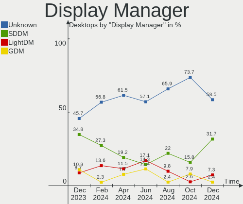
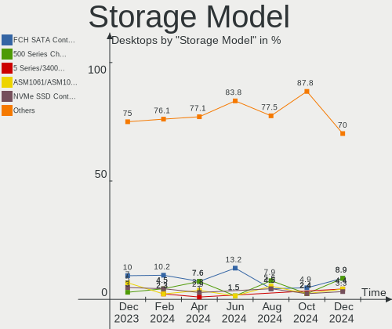
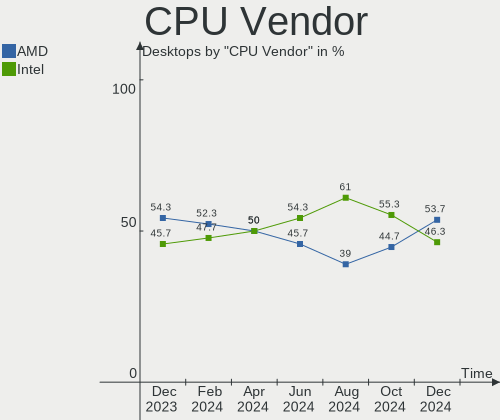
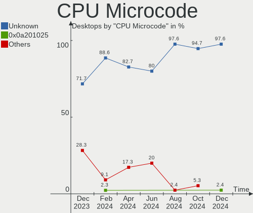

Manjaro Hardware Trends (Desktops)
----------------------------------

A project to identify most popular hardware characteristics and track their change
over time based on data collected by Manjaro users at https://Linux-Hardware.org.

Anyone can contribute to this report by the [hw-probe](https://github.com/linuxhw/hw-probe) tool:

    sudo -E hw-probe -all -upload

Full-feature report is available here: https://linux-hardware.org/?view=trends&formfactor=desktop

Period: Sep, 2021.

Contents
--------

* [ System ](#system)
  - [ OS                       ](#os)
  - [ OS Family                ](#os-family)
  - [ Kernel                   ](#kernel)
  - [ Kernel Family            ](#kernel-family)
  - [ Kernel Major Ver.        ](#kernel-major-ver)
  - [ Arch                     ](#arch)
  - [ DE                       ](#de)
  - [ Display Server           ](#display-server)
  - [ Display Manager          ](#display-manager)
  - [ OS Lang                  ](#os-lang)
  - [ Boot Mode                ](#boot-mode)
  - [ Filesystem               ](#filesystem)
  - [ Part. scheme             ](#part-scheme)
  - [ Dual Boot with Linux/BSD ](#dual-boot-with-linuxbsd)
  - [ Dual Boot (Win)          ](#dual-boot-win)

* [ Board ](#board)
  - [ Vendor                   ](#vendor)
  - [ Model                    ](#model)
  - [ Model Family             ](#model-family)
  - [ MFG Year                 ](#mfg-year)
  - [ Form Factor              ](#form-factor)
  - [ Secure Boot              ](#secure-boot)
  - [ Coreboot                 ](#coreboot)
  - [ RAM Size                 ](#ram-size)
  - [ RAM Used                 ](#ram-used)
  - [ Total Drives             ](#total-drives)
  - [ Has CD-ROM               ](#has-cd-rom)
  - [ Has Ethernet             ](#has-ethernet)
  - [ Has WiFi                 ](#has-wifi)
  - [ Has Bluetooth            ](#has-bluetooth)

* [ Location ](#location)
  - [ Country                  ](#country)
  - [ City                     ](#city)

* [ Drives ](#drives)
  - [ Drive Vendor             ](#drive-vendor)
  - [ Drive Model              ](#drive-model)
  - [ HDD Vendor               ](#hdd-vendor)
  - [ SSD Vendor               ](#ssd-vendor)
  - [ Drive Kind               ](#drive-kind)
  - [ Drive Connector          ](#drive-connector)
  - [ Drive Size               ](#drive-size)
  - [ Space Total              ](#space-total)
  - [ Space Used               ](#space-used)
  - [ Malfunc. Drives          ](#malfunc-drives)
  - [ Malfunc. Drive Vendor    ](#malfunc-drive-vendor)
  - [ Malfunc. HDD Vendor      ](#malfunc-hdd-vendor)
  - [ Malfunc. Drive Kind      ](#malfunc-drive-kind)
  - [ Failed Drives            ](#failed-drives)
  - [ Failed Drive Vendor      ](#failed-drive-vendor)
  - [ Drive Status             ](#drive-status)

* [ Storage controller ](#storage-controller)
  - [ Storage Vendor           ](#storage-vendor)
  - [ Storage Model            ](#storage-model)
  - [ Storage Kind             ](#storage-kind)

* [ Processor ](#processor)
  - [ CPU Vendor               ](#cpu-vendor)
  - [ CPU Model                ](#cpu-model)
  - [ CPU Model Family         ](#cpu-model-family)
  - [ CPU Cores                ](#cpu-cores)
  - [ CPU Sockets              ](#cpu-sockets)
  - [ CPU Threads              ](#cpu-threads)
  - [ CPU Op-Modes             ](#cpu-op-modes)
  - [ CPU Microcode            ](#cpu-microcode)
  - [ CPU Microarch            ](#cpu-microarch)

* [ Graphics ](#graphics)
  - [ GPU Vendor               ](#gpu-vendor)
  - [ GPU Model                ](#gpu-model)
  - [ GPU Combo                ](#gpu-combo)
  - [ GPU Driver               ](#gpu-driver)
  - [ GPU Memory               ](#gpu-memory)

* [ Monitor ](#monitor)
  - [ Monitor Vendor           ](#monitor-vendor)
  - [ Monitor Model            ](#monitor-model)
  - [ Monitor Resolution       ](#monitor-resolution)
  - [ Monitor Diagonal         ](#monitor-diagonal)
  - [ Monitor Width            ](#monitor-width)
  - [ Aspect Ratio             ](#aspect-ratio)
  - [ Monitor Area             ](#monitor-area)
  - [ Pixel Density            ](#pixel-density)
  - [ Multiple Monitors        ](#multiple-monitors)

* [ Network ](#network)
  - [ Net Controller Vendor    ](#net-controller-vendor)
  - [ Net Controller Model     ](#net-controller-model)
  - [ Wireless Vendor          ](#wireless-vendor)
  - [ Wireless Model           ](#wireless-model)
  - [ Ethernet Vendor          ](#ethernet-vendor)
  - [ Ethernet Model           ](#ethernet-model)
  - [ Net Controller Kind      ](#net-controller-kind)
  - [ Used Controller          ](#used-controller)
  - [ NICs                     ](#nics)
  - [ IPv6                     ](#ipv6)

* [ Bluetooth ](#bluetooth)
  - [ Bluetooth Vendor         ](#bluetooth-vendor)
  - [ Bluetooth Model          ](#bluetooth-model)

* [ Sound ](#sound)
  - [ Sound Vendor             ](#sound-vendor)
  - [ Sound Model              ](#sound-model)

* [ Memory ](#memory)
  - [ Memory Vendor            ](#memory-vendor)
  - [ Memory Model             ](#memory-model)
  - [ Memory Kind              ](#memory-kind)
  - [ Memory Form Factor       ](#memory-form-factor)
  - [ Memory Size              ](#memory-size)
  - [ Memory Speed             ](#memory-speed)

* [ Printers & scanners ](#printers--scanners)
  - [ Printer Vendor           ](#printer-vendor)
  - [ Printer Model            ](#printer-model)
  - [ Scanner Vendor           ](#scanner-vendor)
  - [ Scanner Model            ](#scanner-model)

* [ Camera ](#camera)
  - [ Camera Vendor            ](#camera-vendor)
  - [ Camera Model             ](#camera-model)

* [ Security ](#security)
  - [ Fingerprint Vendor       ](#fingerprint-vendor)
  - [ Fingerprint Model        ](#fingerprint-model)
  - [ Chipcard Vendor          ](#chipcard-vendor)
  - [ Chipcard Model           ](#chipcard-model)

* [ Unsupported ](#unsupported)
  - [ Unsupported Devices      ](#unsupported-devices)
  - [ Unsupported Device Types ](#unsupported-device-types)

System
------

OS
--

Installed operating systems

| Name           | Desktops | Percent |
|----------------|----------|---------|
| Manjaro        | 30       | 50.85%  |
| Manjaro 21.1.2 | 12       | 20.34%  |
| Manjaro 21.1.3 | 8        | 13.56%  |
| Manjaro 21.1.1 | 5        | 8.47%   |
| Manjaro 21.1.4 | 4        | 6.78%   |

OS Family
---------

OS without a version

| Name    | Desktops | Percent |
|---------|----------|---------|
| Manjaro | 59       | 100%    |

Kernel
------

Version of the Linux kernel

| Version           | Desktops | Percent |
|-------------------|----------|---------|
| 5.14.0-0-MANJARO  | 11       | 18.64%  |
| 5.13.13-1-MANJARO | 8        | 13.56%  |
| 5.13.12-1-MANJARO | 6        | 10.17%  |
| 5.14.2-1-MANJARO  | 5        | 8.47%   |
| 5.13.15-1-MANJARO | 5        | 8.47%   |
| 5.10.60-1-MANJARO | 5        | 8.47%   |
| 5.10.63-1-MANJARO | 3        | 5.08%   |
| 5.9.16-1-MANJARO  | 2        | 3.39%   |
| 5.13.19-2-MANJARO | 2        | 3.39%   |
| 5.12.19-1-MANJARO | 2        | 3.39%   |
| 5.11.22-2-MANJARO | 2        | 3.39%   |
| 5.10.68-1-MANJARO | 2        | 3.39%   |
| 5.14.5-AMD-znver2 | 1        | 1.69%   |
| 5.14.0-1-MANJARO  | 1        | 1.69%   |
| 5.10.64-1-MANJARO | 1        | 1.69%   |
| 5.10.61-1-MANJARO | 1        | 1.69%   |
| 5.10.2-2-MANJARO  | 1        | 1.69%   |
| 4.14.9-1-ARCH     | 1        | 1.69%   |

Kernel Family
-------------

Linux kernel without a distro release

| Version | Desktops | Percent |
|---------|----------|---------|
| 5.14.0  | 12       | 20.34%  |
| 5.13.13 | 8        | 13.56%  |
| 5.13.12 | 6        | 10.17%  |
| 5.14.2  | 5        | 8.47%   |
| 5.13.15 | 5        | 8.47%   |
| 5.10.60 | 5        | 8.47%   |
| 5.10.63 | 3        | 5.08%   |
| 5.9.16  | 2        | 3.39%   |
| 5.13.19 | 2        | 3.39%   |
| 5.12.19 | 2        | 3.39%   |
| 5.11.22 | 2        | 3.39%   |
| 5.10.68 | 2        | 3.39%   |
| 5.14.5  | 1        | 1.69%   |
| 5.10.64 | 1        | 1.69%   |
| 5.10.61 | 1        | 1.69%   |
| 5.10.2  | 1        | 1.69%   |
| 4.14.9  | 1        | 1.69%   |

Kernel Major Ver.
-----------------

Linux kernel major version

| Version | Desktops | Percent |
|---------|----------|---------|
| 5.13    | 21       | 35.59%  |
| 5.14    | 18       | 30.51%  |
| 5.10    | 13       | 22.03%  |
| 5.9     | 2        | 3.39%   |
| 5.12    | 2        | 3.39%   |
| 5.11    | 2        | 3.39%   |
| 4.14    | 1        | 1.69%   |

Arch
----

OS architecture (x86_64, i586, etc.)

| Name   | Desktops | Percent |
|--------|----------|---------|
| x86_64 | 59       | 100%    |

DE
--

Desktop Environment

| Name       | Desktops | Percent |
|------------|----------|---------|
| KDE5       | 16       | 27.12%  |
| GNOME      | 15       | 25.42%  |
| XFCE       | 10       | 16.95%  |
| KDE        | 8        | 13.56%  |
| MATE       | 3        | 5.08%   |
| X-Cinnamon | 2        | 3.39%   |
| Deepin     | 2        | 3.39%   |
| Unknown    | 2        | 3.39%   |
| i3         | 1        | 1.69%   |

Display Server
--------------

X11 or Wayland

| Name    | Desktops | Percent |
|---------|----------|---------|
| X11     | 52       | 88.14%  |
| Wayland | 7        | 11.86%  |

Display Manager
---------------

SDDM, LightDM, etc.

| Name    | Desktops | Percent |
|---------|----------|---------|
| Unknown | 29       | 49.15%  |
| SDDM    | 15       | 25.42%  |
| LightDM | 11       | 18.64%  |
| GDM     | 4        | 6.78%   |

OS Lang
-------

Language

| Lang  | Desktops | Percent |
|-------|----------|---------|
| en_US | 23       | 38.98%  |
| de_DE | 8        | 13.56%  |
| ru_RU | 6        | 10.17%  |
| en_GB | 4        | 6.78%   |
| pt_BR | 3        | 5.08%   |
| en_CA | 3        | 5.08%   |
| zh_CN | 1        | 1.69%   |
| ru_UA | 1        | 1.69%   |
| pt_PT | 1        | 1.69%   |
| nb_NO | 1        | 1.69%   |
| hu_HU | 1        | 1.69%   |
| fr_FR | 1        | 1.69%   |
| es_PE | 1        | 1.69%   |
| es_ES | 1        | 1.69%   |
| es_BO | 1        | 1.69%   |
| en_NZ | 1        | 1.69%   |
| en_IN | 1        | 1.69%   |
| en_AU | 1        | 1.69%   |

Boot Mode
---------

EFI or BIOS

| Mode | Desktops | Percent |
|------|----------|---------|
| BIOS | 40       | 67.8%   |
| EFI  | 19       | 32.2%   |

Filesystem
----------

Type of filesystem

| Type    | Desktops | Percent |
|---------|----------|---------|
| Ext4    | 48       | 81.36%  |
| Btrfs   | 6        | 10.17%  |
| Xfs     | 2        | 3.39%   |
| Overlay | 2        | 3.39%   |
| Zfs     | 1        | 1.69%   |

Part. scheme
------------

Scheme of partitioning

| Type    | Desktops | Percent |
|---------|----------|---------|
| Unknown | 31       | 52.54%  |
| GPT     | 23       | 38.98%  |
| MBR     | 5        | 8.47%   |

Dual Boot with Linux/BSD
------------------------

Hosting more than one Linux/BSD

| Dual boot | Desktops | Percent |
|-----------|----------|---------|
| No        | 46       | 77.97%  |
| Yes       | 13       | 22.03%  |

Dual Boot (Win)
---------------

Hosting Linux and Windows

| Dual boot | Desktops | Percent |
|-----------|----------|---------|
| No        | 30       | 50.85%  |
| Yes       | 29       | 49.15%  |

Board
-----

Vendor
------

Motherboard manufacturer

| Name                | Desktops | Percent |
|---------------------|----------|---------|
| ASUSTek Computer    | 20       | 33.9%   |
| Gigabyte Technology | 15       | 25.42%  |
| MSI                 | 8        | 13.56%  |
| ASRock              | 6        | 10.17%  |
| Lenovo              | 2        | 3.39%   |
| Intel               | 2        | 3.39%   |
| Hewlett-Packard     | 2        | 3.39%   |
| Pegatron            | 1        | 1.69%   |
| JGINYUE             | 1        | 1.69%   |
| Huanan              | 1        | 1.69%   |
| Dell                | 1        | 1.69%   |

Model
-----

Motherboard model

| Name                                   | Desktops | Percent |
|----------------------------------------|----------|---------|
| ASUS All Series                        | 5        | 8.47%   |
| ASUS A0000001                          | 2        | 3.39%   |
| Pegatron IPMSB-H61                     | 1        | 1.69%   |
| MSI MS-7C92                            | 1        | 1.69%   |
| MSI MS-7C09                            | 1        | 1.69%   |
| MSI MS-7B86                            | 1        | 1.69%   |
| MSI MS-7A58                            | 1        | 1.69%   |
| MSI MS-7A35                            | 1        | 1.69%   |
| MSI MS-7A34                            | 1        | 1.69%   |
| MSI MS-7900                            | 1        | 1.69%   |
| MSI MS-7693                            | 1        | 1.69%   |
| Lenovo IdeaCentre 720-18APR 90HY002APG | 1        | 1.69%   |
| Lenovo H50-55 90BF001SUK               | 1        | 1.69%   |
| JGINYUE H97I PLUS V2.0                 | 1        | 1.69%   |
| Intel DH77EB AAG39073-304              | 1        | 1.69%   |
| Intel DB75EN AAG39650-302              | 1        | 1.69%   |
| Huanan X99-F8                          | 1        | 1.69%   |
| HP Compaq Elite 8300 USDT              | 1        | 1.69%   |
| HP Compaq Elite 8300 MT                | 1        | 1.69%   |
| Gigabyte Z77X-UD5H                     | 1        | 1.69%   |
| Gigabyte X570 AORUS PRO                | 1        | 1.69%   |
| Gigabyte X570 AORUS ELITE              | 1        | 1.69%   |
| Gigabyte M68MT-D3P                     | 1        | 1.69%   |
| Gigabyte H61M-S1                       | 1        | 1.69%   |
| Gigabyte H61M-DS2 DVI                  | 1        | 1.69%   |
| Gigabyte H110M-S2V                     | 1        | 1.69%   |
| Gigabyte H110M-S2HP                    | 1        | 1.69%   |
| Gigabyte F2A58M-HD2                    | 1        | 1.69%   |
| Gigabyte B550M DS3H                    | 1        | 1.69%   |
| Gigabyte B550I AORUS PRO AX            | 1        | 1.69%   |
| Gigabyte B550 AORUS MASTER             | 1        | 1.69%   |
| Gigabyte B460MDS3HV2                   | 1        | 1.69%   |
| Gigabyte B450M DS3H                    | 1        | 1.69%   |
| Gigabyte A520M S2H                     | 1        | 1.69%   |
| Dell OptiPlex XE2                      | 1        | 1.69%   |
| ASUS TUF B450M-PLUS GAMING             | 1        | 1.69%   |
| ASUS TUF B450-PLUS GAMING              | 1        | 1.69%   |
| ASUS ROG STRIX B550-E GAMING           | 1        | 1.69%   |
| ASUS ROG STRIX B450-F GAMING           | 1        | 1.69%   |
| ASUS Rampage III Extreme               | 1        | 1.69%   |
| ASUS PRIME X570-P                      | 1        | 1.69%   |
| ASUS PRIME B550M-K                     | 1        | 1.69%   |
| ASUS PRIME B350-PLUS                   | 1        | 1.69%   |
| ASUS PRIME A320M-K                     | 1        | 1.69%   |
| ASUS P8H61-M LX2 R2.0                  | 1        | 1.69%   |
| ASUS Maximus Formula                   | 1        | 1.69%   |
| ASUS M3A78-EM                          | 1        | 1.69%   |
| ASUS A88XM-A                           | 1        | 1.69%   |
| ASRock X370 Killer SLI                 | 1        | 1.69%   |
| ASRock H81M-VG4 R2.0                   | 1        | 1.69%   |
| ASRock C Series                        | 1        | 1.69%   |
| ASRock B450 Steel Legend               | 1        | 1.69%   |
| ASRock B365 Pro4                       | 1        | 1.69%   |
| ASRock 880GM-LE FX                     | 1        | 1.69%   |

Model Family
------------

Motherboard model prefix

| Name                 | Desktops | Percent |
|----------------------|----------|---------|
| ASUS All             | 5        | 8.47%   |
| ASUS PRIME           | 4        | 6.78%   |
| HP Compaq            | 2        | 3.39%   |
| Gigabyte X570        | 2        | 3.39%   |
| ASUS TUF             | 2        | 3.39%   |
| ASUS ROG             | 2        | 3.39%   |
| ASUS A0000001        | 2        | 3.39%   |
| Pegatron IPMSB-H61   | 1        | 1.69%   |
| MSI MS-7C92          | 1        | 1.69%   |
| MSI MS-7C09          | 1        | 1.69%   |
| MSI MS-7B86          | 1        | 1.69%   |
| MSI MS-7A58          | 1        | 1.69%   |
| MSI MS-7A35          | 1        | 1.69%   |
| MSI MS-7A34          | 1        | 1.69%   |
| MSI MS-7900          | 1        | 1.69%   |
| MSI MS-7693          | 1        | 1.69%   |
| Lenovo IdeaCentre    | 1        | 1.69%   |
| Lenovo H50-55        | 1        | 1.69%   |
| JGINYUE H97I         | 1        | 1.69%   |
| Intel DH77EB         | 1        | 1.69%   |
| Intel DB75EN         | 1        | 1.69%   |
| Huanan X99-F8        | 1        | 1.69%   |
| Gigabyte Z77X-UD5H   | 1        | 1.69%   |
| Gigabyte M68MT-D3P   | 1        | 1.69%   |
| Gigabyte H61M-S1     | 1        | 1.69%   |
| Gigabyte H61M-DS2    | 1        | 1.69%   |
| Gigabyte H110M-S2V   | 1        | 1.69%   |
| Gigabyte H110M-S2HP  | 1        | 1.69%   |
| Gigabyte F2A58M-HD2  | 1        | 1.69%   |
| Gigabyte B550M       | 1        | 1.69%   |
| Gigabyte B550I       | 1        | 1.69%   |
| Gigabyte B550        | 1        | 1.69%   |
| Gigabyte B460MDS3HV2 | 1        | 1.69%   |
| Gigabyte B450M       | 1        | 1.69%   |
| Gigabyte A520M       | 1        | 1.69%   |
| Dell OptiPlex        | 1        | 1.69%   |
| ASUS Rampage         | 1        | 1.69%   |
| ASUS P8H61-M         | 1        | 1.69%   |
| ASUS Maximus         | 1        | 1.69%   |
| ASUS M3A78-EM        | 1        | 1.69%   |
| ASUS A88XM-A         | 1        | 1.69%   |
| ASRock X370          | 1        | 1.69%   |
| ASRock H81M-VG4      | 1        | 1.69%   |
| ASRock C             | 1        | 1.69%   |
| ASRock B450          | 1        | 1.69%   |
| ASRock B365          | 1        | 1.69%   |
| ASRock 880GM-LE      | 1        | 1.69%   |

MFG Year
--------

Motherboard manufacture year

| Year | Desktops | Percent |
|------|----------|---------|
| 2021 | 14       | 23.73%  |
| 2020 | 8        | 13.56%  |
| 2019 | 8        | 13.56%  |
| 2014 | 7        | 11.86%  |
| 2012 | 6        | 10.17%  |
| 2018 | 3        | 5.08%   |
| 2013 | 3        | 5.08%   |
| 2017 | 2        | 3.39%   |
| 2016 | 2        | 3.39%   |
| 2015 | 2        | 3.39%   |
| 2010 | 1        | 1.69%   |
| 2009 | 1        | 1.69%   |
| 2008 | 1        | 1.69%   |
| 2006 | 1        | 1.69%   |

Form Factor
-----------

Physical design of the computer

| Name    | Desktops | Percent |
|---------|----------|---------|
| Desktop | 59       | 100%    |

Secure Boot
-----------

Enabled or disabled

| State    | Desktops | Percent |
|----------|----------|---------|
| Disabled | 59       | 100%    |

Coreboot
--------

Have coreboot on board

| Used | Desktops | Percent |
|------|----------|---------|
| No   | 59       | 100%    |

RAM Size
--------

Total RAM memory

| Size in GB  | Desktops | Percent |
|-------------|----------|---------|
| 16.01-24.0  | 22       | 37.29%  |
| 8.01-16.0   | 15       | 25.42%  |
| 32.01-64.0  | 8        | 13.56%  |
| 4.01-8.0    | 5        | 8.47%   |
| 3.01-4.0    | 5        | 8.47%   |
| 64.01-256.0 | 2        | 3.39%   |
| 24.01-32.0  | 1        | 1.69%   |
| 1.01-2.0    | 1        | 1.69%   |

RAM Used
--------

Used RAM memory

| Used GB    | Desktops | Percent |
|------------|----------|---------|
| 2.01-3.0   | 19       | 32.2%   |
| 1.01-2.0   | 13       | 22.03%  |
| 4.01-8.0   | 12       | 20.34%  |
| 3.01-4.0   | 7        | 11.86%  |
| 8.01-16.0  | 3        | 5.08%   |
| 0.51-1.0   | 3        | 5.08%   |
| 16.01-24.0 | 2        | 3.39%   |

Total Drives
------------

Number of drives on board

| Drives | Desktops | Percent |
|--------|----------|---------|
| 2      | 17       | 28.81%  |
| 1      | 17       | 28.81%  |
| 3      | 14       | 23.73%  |
| 4      | 7        | 11.86%  |
| 5      | 2        | 3.39%   |
| 6      | 1        | 1.69%   |
| 0      | 1        | 1.69%   |

Has CD-ROM
----------

Has CD-ROM on board

| Presented | Desktops | Percent |
|-----------|----------|---------|
| No        | 38       | 64.41%  |
| Yes       | 21       | 35.59%  |

Has Ethernet
------------

Has Ethernet on board

| Presented | Desktops | Percent |
|-----------|----------|---------|
| Yes       | 57       | 96.61%  |
| No        | 2        | 3.39%   |

Has WiFi
--------

Has WiFi module

| Presented | Desktops | Percent |
|-----------|----------|---------|
| Yes       | 30       | 50.85%  |
| No        | 29       | 49.15%  |

Has Bluetooth
-------------

Has Bluetooth module

| Presented | Desktops | Percent |
|-----------|----------|---------|
| No        | 32       | 54.24%  |
| Yes       | 27       | 45.76%  |

Location
--------

Country
-------

Geographic location (country)

| Country                | Desktops | Percent |
|------------------------|----------|---------|
| Germany                | 9        | 15.25%  |
| USA                    | 8        | 13.56%  |
| Russia                 | 8        | 13.56%  |
| Brazil                 | 6        | 10.17%  |
| UK                     | 3        | 5.08%   |
| Canada                 | 3        | 5.08%   |
| New Zealand            | 2        | 3.39%   |
| Ukraine                | 1        | 1.69%   |
| Trinidad and Tobago    | 1        | 1.69%   |
| Thailand               | 1        | 1.69%   |
| Spain                  | 1        | 1.69%   |
| Portugal               | 1        | 1.69%   |
| Peru                   | 1        | 1.69%   |
| Norway                 | 1        | 1.69%   |
| Lithuania              | 1        | 1.69%   |
| Latvia                 | 1        | 1.69%   |
| Italy                  | 1        | 1.69%   |
| India                  | 1        | 1.69%   |
| Hungary                | 1        | 1.69%   |
| France                 | 1        | 1.69%   |
| Colombia               | 1        | 1.69%   |
| China                  | 1        | 1.69%   |
| Bosnia and Herzegovina | 1        | 1.69%   |
| Bolivia                | 1        | 1.69%   |
| Belgium                | 1        | 1.69%   |
| Belarus                | 1        | 1.69%   |
| Australia              | 1        | 1.69%   |

City
----

Geographic location (city)

| City             | Desktops | Percent |
|------------------|----------|---------|
| Moscow           | 4        | 6.78%   |
| Trenton          | 2        | 3.39%   |
| Auckland         | 2        | 3.39%   |
| Zaventem         | 1        | 1.69%   |
| Yekaterinburg    | 1        | 1.69%   |
| Vilnius          | 1        | 1.69%   |
| Urbana           | 1        | 1.69%   |
| Tualatin         | 1        | 1.69%   |
| Tadepallegudem   | 1        | 1.69%   |
| Szombathely      | 1        | 1.69%   |
| Stokmarknes      | 1        | 1.69%   |
| St Petersburg    | 1        | 1.69%   |
| Serra            | 1        | 1.69%   |
| Schwerte         | 1        | 1.69%   |
| Schifferstadt    | 1        | 1.69%   |
| Sarnia           | 1        | 1.69%   |
| Sao Teotonio     | 1        | 1.69%   |
| Sao Jose         | 1        | 1.69%   |
| Santos           | 1        | 1.69%   |
| Santo Amaro      | 1        | 1.69%   |
| Rivne            | 1        | 1.69%   |
| Rio de Janeiro   | 1        | 1.69%   |
| Riga             | 1        | 1.69%   |
| Paris            | 1        | 1.69%   |
| Ortenberg        | 1        | 1.69%   |
| Novosibirsk      | 1        | 1.69%   |
| Nashville        | 1        | 1.69%   |
| Minsk            | 1        | 1.69%   |
| Middlesbrough    | 1        | 1.69%   |
| Meerbusch        | 1        | 1.69%   |
| Medell?­n        | 1        | 1.69%   |
| Madrid           | 1        | 1.69%   |
| La Paz           | 1        | 1.69%   |
| Karlsruhe        | 1        | 1.69%   |
| Kamloops         | 1        | 1.69%   |
| Jaragu?? do Sul  | 1        | 1.69%   |
| Hartlepool       | 1        | 1.69%   |
| Halle            | 1        | 1.69%   |
| Hainau           | 1        | 1.69%   |
| Goryachiy Klyuch | 1        | 1.69%   |
| Fredericton      | 1        | 1.69%   |
| Fort Worth       | 1        | 1.69%   |
| Florence         | 1        | 1.69%   |
| Chengdu          | 1        | 1.69%   |
| Canberra         | 1        | 1.69%   |
| Bruchsal         | 1        | 1.69%   |
| Bismarck         | 1        | 1.69%   |
| Berlin           | 1        | 1.69%   |
| Banja Luka       | 1        | 1.69%   |
| Bangkok          | 1        | 1.69%   |
| Atlanta          | 1        | 1.69%   |
| Arima            | 1        | 1.69%   |
| Arequipa         | 1        | 1.69%   |
| Aberystwyth      | 1        | 1.69%   |

Drives
------

Drive Vendor
------------

Hard drive vendors

| Vendor              | Desktops | Drives | Percent |
|---------------------|----------|--------|---------|
| Seagate             | 26       | 33     | 24.07%  |
| WDC                 | 23       | 30     | 21.3%   |
| Samsung Electronics | 20       | 28     | 18.52%  |
| Kingston            | 10       | 12     | 9.26%   |
| Crucial             | 7        | 10     | 6.48%   |
| SanDisk             | 5        | 7      | 4.63%   |
| Toshiba             | 4        | 4      | 3.7%    |
| Hitachi             | 4        | 4      | 3.7%    |
| PNY                 | 2        | 2      | 1.85%   |
| Super Talent        | 1        | 1      | 0.93%   |
| SPCC                | 1        | 1      | 0.93%   |
| Phison              | 1        | 1      | 0.93%   |
| Intenso             | 1        | 1      | 0.93%   |
| Gigabyte Technology | 1        | 1      | 0.93%   |
| China               | 1        | 1      | 0.93%   |
| AMD-RAID            | 1        | 1      | 0.93%   |

Drive Model
-----------

Hard drive models

| Model                               | Desktops | Percent |
|-------------------------------------|----------|---------|
| Samsung SSD 860 EVO 500GB           | 5        | 3.76%   |
| Seagate Expansion Desk 4TB          | 4        | 3.01%   |
| Kingston SA400S37120G 120GB SSD     | 4        | 3.01%   |
| WDC WD10EZEX-00WN4A0 1TB            | 3        | 2.26%   |
| Seagate ST2000DM001-1ER164 2TB      | 3        | 2.26%   |
| Samsung SSD 860 EVO 1TB             | 3        | 2.26%   |
| Crucial CT500MX500SSD1 500GB        | 3        | 2.26%   |
| WDC WDS250G2B0B-00YS70 250GB SSD    | 2        | 1.5%    |
| WDC WDS240G2G0A-00JH30 240GB SSD    | 2        | 1.5%    |
| Seagate ST3500418AS 500GB           | 2        | 1.5%    |
| Seagate ST2000DM006-2DM164 2TB      | 2        | 1.5%    |
| Seagate ST1000DM010-2EP102 1TB      | 2        | 1.5%    |
| Seagate Expansion 1TB               | 2        | 1.5%    |
| SanDisk SDSSDA240G 240GB            | 2        | 1.5%    |
| Sandisk NVMe SSD Drive 500GB        | 2        | 1.5%    |
| Samsung SSD 950 PRO 512GB           | 2        | 1.5%    |
| Samsung NVMe SSD Drive 500GB        | 2        | 1.5%    |
| Kingston SA400S37240G 240GB SSD     | 2        | 1.5%    |
| WDC WDS500G2B0A-00SM50 500GB SSD    | 1        | 0.75%   |
| WDC WDS200T2B0A-00SM50 2TB SSD      | 1        | 0.75%   |
| WDC WDS100T2B0A-00SM50 1TB SSD      | 1        | 0.75%   |
| WDC WDBNCE5000PNC 500GB SSD         | 1        | 0.75%   |
| WDC WDBNCE2500PNC 250GB SSD         | 1        | 0.75%   |
| WDC WD5000AVDS-73U7B1 500GB         | 1        | 0.75%   |
| WDC WD5000AAKX-001CA0 500GB         | 1        | 0.75%   |
| WDC WD40EZRX-00SPEB0 4TB            | 1        | 0.75%   |
| WDC WD30EZRZ-00GXCB0 3TB            | 1        | 0.75%   |
| WDC WD3000F9YZ-09N20L0 3TB          | 1        | 0.75%   |
| WDC WD2500AAKX-00ERMA0 250GB        | 1        | 0.75%   |
| WDC WD20EZRZ-00Z5HB0 2TB            | 1        | 0.75%   |
| WDC WD2000FYYZ-01UL1B0 2TB          | 1        | 0.75%   |
| WDC WD121KRYZ-01W0RB0 12TB          | 1        | 0.75%   |
| WDC WD10SPZX-21Z10T0 1TB            | 1        | 0.75%   |
| WDC WD10EZRX-00A8LB0 1TB            | 1        | 0.75%   |
| WDC WD10EZEX-21M2NA0 1TB            | 1        | 0.75%   |
| WDC WD10EZEX-08WN4A0 1TB            | 1        | 0.75%   |
| WDC WD10EZEX-08M2NA0 1TB            | 1        | 0.75%   |
| WDC WD10EZEX-00BN5A0 1TB            | 1        | 0.75%   |
| WDC WD10EFRX-68FYTN0 1TB            | 1        | 0.75%   |
| WDC WD10EARS-22Y5B1 1TB             | 1        | 0.75%   |
| Toshiba HDWD130 3TB                 | 1        | 0.75%   |
| Toshiba HDWD110 1TB                 | 1        | 0.75%   |
| Toshiba DT01ACA200 LENOVO 2TB       | 1        | 0.75%   |
| Toshiba DT01ACA100 1TB              | 1        | 0.75%   |
| Super Talent FTM24N325H 240GB       | 1        | 0.75%   |
| SPCC Solid State Disk 512GB         | 1        | 0.75%   |
| Seagate ST9500325AS 500GB           | 1        | 0.75%   |
| Seagate ST500LM012 HN-M500MBB 500GB | 1        | 0.75%   |
| Seagate ST500DM005 HD502HJ 500GB    | 1        | 0.75%   |
| Seagate ST500DM002-1BD142 500GB     | 1        | 0.75%   |
| Seagate ST4000DM004-2CV104 4TB      | 1        | 0.75%   |
| Seagate ST4000DM000-1F2168 4TB      | 1        | 0.75%   |
| Seagate ST380815AS 80GB             | 1        | 0.75%   |
| Seagate ST3500630NS 500GB           | 1        | 0.75%   |
| Seagate ST3250318AS 250GB           | 1        | 0.75%   |
| Seagate ST31000524NS 1TB            | 1        | 0.75%   |
| Seagate ST3000NM0033-9ZM178 3TB     | 1        | 0.75%   |
| Seagate ST2000DX002-2DV164 2TB      | 1        | 0.75%   |
| Seagate ST2000DX001-1CM164 2TB      | 1        | 0.75%   |
| Seagate ST2000DM008-2FR102 2TB      | 1        | 0.75%   |

HDD Vendor
----------

Hard disk drive vendors

| Vendor              | Desktops | Drives | Percent |
|---------------------|----------|--------|---------|
| Seagate             | 26       | 33     | 48.15%  |
| WDC                 | 19       | 21     | 35.19%  |
| Toshiba             | 4        | 4      | 7.41%   |
| Hitachi             | 4        | 4      | 7.41%   |
| Samsung Electronics | 1        | 1      | 1.85%   |

SSD Vendor
----------

Solid state drive vendors

| Vendor              | Desktops | Drives | Percent |
|---------------------|----------|--------|---------|
| Samsung Electronics | 14       | 18     | 29.79%  |
| Kingston            | 9        | 10     | 19.15%  |
| WDC                 | 8        | 9      | 17.02%  |
| Crucial             | 7        | 9      | 14.89%  |
| SanDisk             | 3        | 4      | 6.38%   |
| SPCC                | 1        | 1      | 2.13%   |
| PNY                 | 1        | 1      | 2.13%   |
| Intenso             | 1        | 1      | 2.13%   |
| Gigabyte Technology | 1        | 1      | 2.13%   |
| China               | 1        | 1      | 2.13%   |
| AMD-RAID            | 1        | 1      | 2.13%   |

Drive Kind
----------

HDD or SSD

| Kind    | Desktops | Drives | Percent |
|---------|----------|--------|---------|
| HDD     | 43       | 63     | 43.88%  |
| SSD     | 39       | 56     | 39.8%   |
| NVMe    | 15       | 17     | 15.31%  |
| Unknown | 1        | 1      | 1.02%   |

Drive Connector
---------------

SATA, SAS, NVMe, etc.

| Type | Desktops | Drives | Percent |
|------|----------|--------|---------|
| SATA | 55       | 112    | 72.37%  |
| NVMe | 15       | 17     | 19.74%  |
| SAS  | 6        | 8      | 7.89%   |

Drive Size
----------

Size of hard drive

| Size in TB | Desktops | Drives | Percent |
|------------|----------|--------|---------|
| 0.01-0.5   | 42       | 61     | 45.16%  |
| 0.51-1.0   | 25       | 29     | 26.88%  |
| 1.01-2.0   | 13       | 15     | 13.98%  |
| 3.01-4.0   | 8        | 8      | 8.6%    |
| 2.01-3.0   | 4        | 5      | 4.3%    |
| 10.01-20.0 | 1        | 1      | 1.08%   |

Space Total
-----------

Amount of disk space available on the file system

| Size in GB     | Desktops | Percent |
|----------------|----------|---------|
| More than 3000 | 12       | 20.34%  |
| 101-250        | 12       | 20.34%  |
| 251-500        | 11       | 18.64%  |
| 501-1000       | 6        | 10.17%  |
| 1001-2000      | 5        | 8.47%   |
| 2001-3000      | 4        | 6.78%   |
| 51-100         | 3        | 5.08%   |
| Unknown        | 3        | 5.08%   |
| 1-20           | 2        | 3.39%   |
| 21-50          | 1        | 1.69%   |

Space Used
----------

Amount of used disk space

| Used GB        | Desktops | Percent |
|----------------|----------|---------|
| 51-100         | 13       | 22.03%  |
| 1-20           | 8        | 13.56%  |
| 21-50          | 7        | 11.86%  |
| More than 3000 | 6        | 10.17%  |
| 101-250        | 6        | 10.17%  |
| 501-1000       | 6        | 10.17%  |
| 251-500        | 5        | 8.47%   |
| 2001-3000      | 4        | 6.78%   |
| Unknown        | 3        | 5.08%   |
| 1001-2000      | 1        | 1.69%   |

Malfunc. Drives
---------------

Drive models with a malfunction

| Model                           | Desktops | Drives | Percent |
|---------------------------------|----------|--------|---------|
| WDC WD40EZRX-00SPEB0 4TB        | 1        | 1      | 16.67%  |
| Seagate ST3500630NS 500GB       | 1        | 1      | 16.67%  |
| Seagate ST2000DX001-1CM164 2TB  | 1        | 1      | 16.67%  |
| Samsung Electronics HD103SJ 1TB | 1        | 1      | 16.67%  |
| Kingston SA400S37480G 480GB SSD | 1        | 1      | 16.67%  |
| Intenso SSD 120GB               | 1        | 1      | 16.67%  |

Malfunc. Drive Vendor
---------------------

Vendors of faulty drives

| Vendor              | Desktops | Drives | Percent |
|---------------------|----------|--------|---------|
| Seagate             | 2        | 2      | 33.33%  |
| WDC                 | 1        | 1      | 16.67%  |
| Samsung Electronics | 1        | 1      | 16.67%  |
| Kingston            | 1        | 1      | 16.67%  |
| Intenso             | 1        | 1      | 16.67%  |

Malfunc. HDD Vendor
-------------------

Vendors of faulty HDD drives

| Vendor              | Desktops | Drives | Percent |
|---------------------|----------|--------|---------|
| Seagate             | 2        | 2      | 50%     |
| WDC                 | 1        | 1      | 25%     |
| Samsung Electronics | 1        | 1      | 25%     |

Malfunc. Drive Kind
-------------------

Kinds of faulty drives

| Kind | Desktops | Drives | Percent |
|------|----------|--------|---------|
| HDD  | 4        | 4      | 66.67%  |
| SSD  | 2        | 2      | 33.33%  |

Failed Drives
-------------

Failed drive models

Zero info for selected period =(

Failed Drive Vendor
-------------------

Failed drive vendors

Zero info for selected period =(

Drive Status
------------

Number of failed and malfunc. drives

| Status   | Desktops | Drives | Percent |
|----------|----------|--------|---------|
| Detected | 36       | 77     | 53.73%  |
| Works    | 25       | 54     | 37.31%  |
| Malfunc  | 6        | 6      | 8.96%   |

Storage controller
------------------

Storage Vendor
--------------

Storage controller vendors

| Vendor                      | Desktops | Percent |
|-----------------------------|----------|---------|
| AMD                         | 31       | 39.24%  |
| Intel                       | 27       | 34.18%  |
| Samsung Electronics         | 9        | 11.39%  |
| Sandisk                     | 2        | 2.53%   |
| Phison Electronics          | 2        | 2.53%   |
| Marvell Technology Group    | 2        | 2.53%   |
| ASMedia Technology          | 2        | 2.53%   |
| Nvidia                      | 1        | 1.27%   |
| Micron/Crucial Technology   | 1        | 1.27%   |
| Kingston Technology Company | 1        | 1.27%   |
| JMicron Technology          | 1        | 1.27%   |

Storage Model
-------------

Storage controller models

| Model                                                                                   | Desktops | Percent |
|-----------------------------------------------------------------------------------------|----------|---------|
| AMD FCH SATA Controller [AHCI mode]                                                     | 15       | 15.79%  |
| AMD Starship/Matisse Chipset SATA Controller [AHCI mode]                                | 7        | 7.37%   |
| AMD 400 Series Chipset SATA Controller                                                  | 7        | 7.37%   |
| Samsung NVMe SSD Controller SM981/PM981/PM983                                           | 6        | 6.32%   |
| Intel 7 Series/C210 Series Chipset Family 6-port SATA Controller [AHCI mode]            | 5        | 5.26%   |
| Intel C610/X99 series chipset 6-Port SATA Controller [AHCI mode]                        | 3        | 3.16%   |
| Intel 8 Series/C220 Series Chipset Family 6-port SATA Controller 1 [AHCI mode]          | 3        | 3.16%   |
| Intel 200 Series PCH SATA controller [AHCI mode]                                        | 3        | 3.16%   |
| Sandisk WD Black SN750 / PC SN730 NVMe SSD                                              | 2        | 2.11%   |
| Samsung NVMe SSD Controller SM951/PM951                                                 | 2        | 2.11%   |
| Intel SATA Controller [RAID mode]                                                       | 2        | 2.11%   |
| Intel Q170/Q150/B150/H170/H110/Z170/CM236 Chipset SATA Controller [AHCI Mode]           | 2        | 2.11%   |
| Intel C610/X99 series chipset sSATA Controller [AHCI mode]                              | 2        | 2.11%   |
| Intel 6 Series/C200 Series Chipset Family Desktop SATA Controller (IDE mode, ports 4-5) | 2        | 2.11%   |
| Intel 6 Series/C200 Series Chipset Family Desktop SATA Controller (IDE mode, ports 0-3) | 2        | 2.11%   |
| Intel 6 Series/C200 Series Chipset Family 6 port Desktop SATA AHCI Controller           | 2        | 2.11%   |
| ASMedia ASM1062 Serial ATA Controller                                                   | 2        | 2.11%   |
| AMD X370 Series Chipset SATA Controller                                                 | 2        | 2.11%   |
| AMD SB7x0/SB8x0/SB9x0 SATA Controller [IDE mode]                                        | 2        | 2.11%   |
| AMD SB7x0/SB8x0/SB9x0 IDE Controller                                                    | 2        | 2.11%   |
| AMD 300 Series Chipset SATA Controller                                                  | 2        | 2.11%   |
| Samsung NVMe SSD Controller SM961/PM961/SM963                                           | 1        | 1.05%   |
| Phison E7 NVMe Controller                                                               | 1        | 1.05%   |
| Phison E16 PCIe4 NVMe Controller                                                        | 1        | 1.05%   |
| Nvidia MCP61 SATA Controller                                                            | 1        | 1.05%   |
| Micron/Crucial P2 NVMe PCIe SSD                                                         | 1        | 1.05%   |
| Marvell Group 88SE9230 PCIe 2.0 x2 4-port SATA 6 Gb/s RAID Controller                   | 1        | 1.05%   |
| Marvell Group 88SE9172 SATA 6Gb/s Controller                                            | 1        | 1.05%   |
| Kingston Company A2000 NVMe SSD                                                         | 1        | 1.05%   |
| JMicron JMB368 IDE controller                                                           | 1        | 1.05%   |
| Intel Comet Lake SATA AHCI Controller                                                   | 1        | 1.05%   |
| Intel Cannon Lake PCH SATA AHCI Controller                                              | 1        | 1.05%   |
| Intel 9 Series Chipset Family SATA Controller [AHCI Mode]                               | 1        | 1.05%   |
| Intel 82801JI (ICH10 Family) SATA AHCI Controller                                       | 1        | 1.05%   |
| Intel 82801IR/IO/IH (ICH9R/DO/DH) 4 port SATA Controller [IDE mode]                     | 1        | 1.05%   |
| Intel 82801I (ICH9 Family) 2 port SATA Controller [IDE mode]                            | 1        | 1.05%   |
| AMD SB7x0/SB8x0/SB9x0 SATA Controller [AHCI mode]                                       | 1        | 1.05%   |
| AMD FCH SATA Controller [IDE mode]                                                      | 1        | 1.05%   |
| AMD FCH SATA Controller D                                                               | 1        | 1.05%   |
| AMD FCH RAID Controller                                                                 | 1        | 1.05%   |
| AMD FCH IDE Controller                                                                  | 1        | 1.05%   |

Storage Kind
------------

Kind of storage controller (IDE, SATA, NVMe, SAS, ...)

| Kind | Desktops | Percent |
|------|----------|---------|
| SATA | 52       | 67.53%  |
| NVMe | 15       | 19.48%  |
| IDE  | 7        | 9.09%   |
| RAID | 3        | 3.9%    |

Processor
---------

CPU Vendor
----------

Processor vendors

| Vendor | Desktops | Percent |
|--------|----------|---------|
| AMD    | 32       | 54.24%  |
| Intel  | 27       | 45.76%  |

CPU Model
---------

Processor models

| Model                                           | Desktops | Percent |
|-------------------------------------------------|----------|---------|
| AMD Ryzen 5 3600 6-Core Processor               | 4        | 6.78%   |
| Intel Core i5-9400F CPU @ 2.90GHz               | 3        | 5.08%   |
| AMD Ryzen 7 3700X 8-Core Processor              | 3        | 5.08%   |
| Intel Core i5-3450 CPU @ 3.10GHz                | 2        | 3.39%   |
| Intel Core i3-3220 CPU @ 3.30GHz                | 2        | 3.39%   |
| AMD Ryzen 5 5600X 6-Core Processor              | 2        | 3.39%   |
| AMD Ryzen 5 2600 Six-Core Processor             | 2        | 3.39%   |
| AMD Ryzen 5 1600 Six-Core Processor             | 2        | 3.39%   |
| Intel Xeon CPU E5-2680 v3 @ 2.50GHz             | 1        | 1.69%   |
| Intel Pentium CPU G4600 @ 3.60GHz               | 1        | 1.69%   |
| Intel Genuine CPU 0000 @ 2.40GHz                | 1        | 1.69%   |
| Intel Core i7-5930K CPU @ 3.50GHz               | 1        | 1.69%   |
| Intel Core i7-5820K CPU @ 3.30GHz               | 1        | 1.69%   |
| Intel Core i7-4770 CPU @ 3.40GHz                | 1        | 1.69%   |
| Intel Core i7 CPU X 980 @ 3.33GHz               | 1        | 1.69%   |
| Intel Core i5-7500 CPU @ 3.40GHz                | 1        | 1.69%   |
| Intel Core i5-4690K CPU @ 3.50GHz               | 1        | 1.69%   |
| Intel Core i5-4670K CPU @ 3.40GHz               | 1        | 1.69%   |
| Intel Core i5-4570S CPU @ 2.90GHz               | 1        | 1.69%   |
| Intel Core i5-4460 CPU @ 3.20GHz                | 1        | 1.69%   |
| Intel Core i5-3570K CPU @ 3.40GHz               | 1        | 1.69%   |
| Intel Core i5-3570 CPU @ 3.40GHz                | 1        | 1.69%   |
| Intel Core i5-3470S CPU @ 2.90GHz               | 1        | 1.69%   |
| Intel Core i5-2400 CPU @ 3.10GHz                | 1        | 1.69%   |
| Intel Core i3-4160 CPU @ 3.60GHz                | 1        | 1.69%   |
| Intel Core i3-2100 CPU @ 3.10GHz                | 1        | 1.69%   |
| Intel Core i3-10105 CPU @ 3.70GHz               | 1        | 1.69%   |
| Intel Core 2 Quad CPU Q9550 @ 2.83GHz           | 1        | 1.69%   |
| AMD Ryzen 9 5900X 12-Core Processor             | 1        | 1.69%   |
| AMD Ryzen 9 3900X 12-Core Processor             | 1        | 1.69%   |
| AMD Ryzen 7 5700G with Radeon Graphics          | 1        | 1.69%   |
| AMD Ryzen 7 2700 Eight-Core Processor           | 1        | 1.69%   |
| AMD Ryzen 7 1700X Eight-Core Processor          | 1        | 1.69%   |
| AMD Ryzen 5 PRO 4650G with Radeon Graphics      | 1        | 1.69%   |
| AMD Ryzen 5 5600G with Radeon Graphics          | 1        | 1.69%   |
| AMD Ryzen 5 3400G with Radeon Vega Graphics     | 1        | 1.69%   |
| AMD Ryzen 5 2600X Six-Core Processor            | 1        | 1.69%   |
| AMD Ryzen 5 2400G with Radeon Vega Graphics     | 1        | 1.69%   |
| AMD Phenom II X4 945 Processor                  | 1        | 1.69%   |
| AMD FX-8350 Eight-Core Processor                | 1        | 1.69%   |
| AMD Athlon II X2 270 Processor                  | 1        | 1.69%   |
| AMD Athlon II X2 260 Processor                  | 1        | 1.69%   |
| AMD Athlon 200GE with Radeon Vega Graphics      | 1        | 1.69%   |
| AMD A8-6600K APU with Radeon HD Graphics        | 1        | 1.69%   |
| AMD A6-6400K APU with Radeon HD Graphics        | 1        | 1.69%   |
| AMD A10-7850K Radeon R7, 12 Compute Cores 4C+8G | 1        | 1.69%   |
| AMD A10-7800 Radeon R7, 12 Compute Cores 4C+8G  | 1        | 1.69%   |

CPU Model Family
----------------

Processor model prefix

| Model             | Desktops | Percent |
|-------------------|----------|---------|
| Intel Core i5     | 14       | 23.73%  |
| AMD Ryzen 5       | 14       | 23.73%  |
| AMD Ryzen 7       | 6        | 10.17%  |
| Intel Core i3     | 5        | 8.47%   |
| Intel Core i7     | 4        | 6.78%   |
| AMD Ryzen 9       | 2        | 3.39%   |
| AMD Athlon II X2  | 2        | 3.39%   |
| AMD A10           | 2        | 3.39%   |
| Intel Xeon        | 1        | 1.69%   |
| Intel Pentium     | 1        | 1.69%   |
| Intel Genuine     | 1        | 1.69%   |
| Intel Core 2 Quad | 1        | 1.69%   |
| AMD Ryzen 5 PRO   | 1        | 1.69%   |
| AMD Phenom II X4  | 1        | 1.69%   |
| AMD FX            | 1        | 1.69%   |
| AMD Athlon        | 1        | 1.69%   |
| AMD A8            | 1        | 1.69%   |
| AMD A6            | 1        | 1.69%   |

CPU Cores
---------

Number of processor cores

| Number | Desktops | Percent |
|--------|----------|---------|
| 6      | 20       | 33.9%   |
| 4      | 18       | 30.51%  |
| 2      | 11       | 18.64%  |
| 8      | 6        | 10.17%  |
| 12     | 3        | 5.08%   |
| 1      | 1        | 1.69%   |

CPU Sockets
-----------

Number of sockets

| Number | Desktops | Percent |
|--------|----------|---------|
| 1      | 59       | 100%    |

CPU Threads
-----------

Threads per core (Hyper-Threading)

| Number | Desktops | Percent |
|--------|----------|---------|
| 2      | 41       | 69.49%  |
| 1      | 18       | 30.51%  |

CPU Op-Modes
------------

CPU Operation Modes (32-bit, 64-bit)

| Op mode        | Desktops | Percent |
|----------------|----------|---------|
| 32-bit, 64-bit | 59       | 100%    |

CPU Microcode
-------------

Microcode number

| Number     | Desktops | Percent |
|------------|----------|---------|
| Unknown    | 31       | 52.54%  |
| 0x306c3    | 3        | 5.08%   |
| 0x08701021 | 3        | 5.08%   |
| 0x0800820d | 3        | 5.08%   |
| 0x906e9    | 2        | 3.39%   |
| 0x306f2    | 2        | 3.39%   |
| 0x306a9    | 2        | 3.39%   |
| 0x0a201016 | 2        | 3.39%   |
| 0xa0653    | 1        | 1.69%   |
| 0x906ea    | 1        | 1.69%   |
| 0x206c2    | 1        | 1.69%   |
| 0x206a7    | 1        | 1.69%   |
| 0x0a50000c | 1        | 1.69%   |
| 0x0a201009 | 1        | 1.69%   |
| 0x08600106 | 1        | 1.69%   |
| 0x08108109 | 1        | 1.69%   |
| 0x08001138 | 1        | 1.69%   |
| 0x0800111c | 1        | 1.69%   |
| 0x010000c8 | 1        | 1.69%   |

CPU Microarch
-------------

Microarchitecture

| Name        | Desktops | Percent |
|-------------|----------|---------|
| Zen 2       | 9        | 15.25%  |
| Haswell     | 9        | 15.25%  |
| IvyBridge   | 7        | 11.86%  |
| KabyLake    | 6        | 10.17%  |
| Zen+        | 5        | 8.47%   |
| Zen 3       | 5        | 8.47%   |
| Zen         | 5        | 8.47%   |
| Piledriver  | 3        | 5.08%   |
| K10         | 3        | 5.08%   |
| Steamroller | 2        | 3.39%   |
| SandyBridge | 2        | 3.39%   |
| Westmere    | 1        | 1.69%   |
| Penryn      | 1        | 1.69%   |
| CometLake   | 1        | 1.69%   |

Graphics
--------

GPU Vendor
----------

Vendors of graphics cards

| Vendor | Desktops | Percent |
|--------|----------|---------|
| AMD    | 28       | 46.67%  |
| Nvidia | 25       | 41.67%  |
| Intel  | 7        | 11.67%  |

GPU Model
---------

Graphics card models

| Model                                                                       | Desktops | Percent |
|-----------------------------------------------------------------------------|----------|---------|
| AMD Ellesmere [Radeon RX 470/480/570/570X/580/580X/590]                     | 5        | 7.94%   |
| Nvidia GP106 [GeForce GTX 1060 6GB]                                         | 3        | 4.76%   |
| Intel Xeon E3-1200 v2/3rd Gen Core processor Graphics Controller            | 3        | 4.76%   |
| Nvidia GP107 [GeForce GTX 1050]                                             | 2        | 3.17%   |
| Nvidia GM206 [GeForce GTX 960]                                              | 2        | 3.17%   |
| Nvidia GM107 [GeForce GTX 750 Ti]                                           | 2        | 3.17%   |
| Intel HD Graphics 630                                                       | 2        | 3.17%   |
| AMD Vega 10 XL/XT [Radeon RX Vega 56/64]                                    | 2        | 3.17%   |
| AMD Raven Ridge [Radeon Vega Series / Radeon Vega Mobile Series]            | 2        | 3.17%   |
| AMD Curacao XT / Trinidad XT [Radeon R7 370 / R9 270X/370X]                 | 2        | 3.17%   |
| AMD Cezanne                                                                 | 2        | 3.17%   |
| Nvidia TU116 [GeForce GTX 1660]                                             | 1        | 1.59%   |
| Nvidia TU116 [GeForce GTX 1650]                                             | 1        | 1.59%   |
| Nvidia GP108 [GeForce GT 1030]                                              | 1        | 1.59%   |
| Nvidia GP106 [GeForce GTX 1060 3GB]                                         | 1        | 1.59%   |
| Nvidia GP104 [GeForce GTX 1080]                                             | 1        | 1.59%   |
| Nvidia GP104 [GeForce GTX 1070]                                             | 1        | 1.59%   |
| Nvidia GM204 [GeForce GTX 980]                                              | 1        | 1.59%   |
| Nvidia GM204 [GeForce GTX 970]                                              | 1        | 1.59%   |
| Nvidia GK208B [GeForce GT 730]                                              | 1        | 1.59%   |
| Nvidia GK208B [GeForce GT 710]                                              | 1        | 1.59%   |
| Nvidia GK104 [GeForce GTX 670]                                              | 1        | 1.59%   |
| Nvidia GF119 [GeForce GT 610]                                               | 1        | 1.59%   |
| Nvidia GF119 [GeForce 605]                                                  | 1        | 1.59%   |
| Nvidia GF116 [GeForce GTX 550 Ti]                                           | 1        | 1.59%   |
| Nvidia GF110 [GeForce GTX 580]                                              | 1        | 1.59%   |
| Nvidia GA104 [GeForce RTX 3070]                                             | 1        | 1.59%   |
| Nvidia C61 [GeForce 7025 / nForce 630a]                                     | 1        | 1.59%   |
| Intel Xeon E3-1200 v3/4th Gen Core Processor Integrated Graphics Controller | 1        | 1.59%   |
| Intel 4th Generation Core Processor Family Integrated Graphics Controller   | 1        | 1.59%   |
| AMD Vega 20 [Radeon VII]                                                    | 1        | 1.59%   |
| AMD Tonga PRO [Radeon R9 285/380]                                           | 1        | 1.59%   |
| AMD Tahiti XT [Radeon HD 7970/8970 OEM / R9 280X]                           | 1        | 1.59%   |
| AMD RV730 PRO [Radeon HD 4650]                                              | 1        | 1.59%   |
| AMD RS880 [Radeon HD 4250]                                                  | 1        | 1.59%   |
| AMD Richland [Radeon HD 8570D]                                              | 1        | 1.59%   |
| AMD Richland [Radeon HD 8470D]                                              | 1        | 1.59%   |
| AMD Renoir                                                                  | 1        | 1.59%   |
| AMD Oland [Radeon HD 8570 / R5 430 OEM / R7 240/340 / Radeon 520 OEM]       | 1        | 1.59%   |
| AMD Navi 21 [Radeon RX 6800/6800 XT / 6900 XT]                              | 1        | 1.59%   |
| AMD Navi 10 [Radeon RX 5600 OEM/5600 XT / 5700/5700 XT]                     | 1        | 1.59%   |
| AMD Kaveri [Radeon R7 Graphics]                                             | 1        | 1.59%   |
| AMD Juniper XT [Radeon HD 6770]                                             | 1        | 1.59%   |
| AMD Hawaii PRO [Radeon R9 290/390]                                          | 1        | 1.59%   |
| AMD Curacao PRO [Radeon R7 370 / R9 270/370 OEM]                            | 1        | 1.59%   |
| AMD Cape Verde PRO [Radeon HD 7750/8740 / R7 250E]                          | 1        | 1.59%   |
| AMD Baffin [Radeon Pro WX 4100]                                             | 1        | 1.59%   |

GPU Combo
---------

Combinations of graphics cards

| Name         | Desktops | Percent |
|--------------|----------|---------|
| 1 x AMD      | 25       | 42.37%  |
| 1 x Nvidia   | 23       | 38.98%  |
| 1 x Intel    | 7        | 11.86%  |
| 2 x AMD      | 2        | 3.39%   |
| 2 x Nvidia   | 1        | 1.69%   |
| AMD + Nvidia | 1        | 1.69%   |

GPU Driver
----------

Free vs proprietary

| Driver      | Desktops | Percent |
|-------------|----------|---------|
| Free        | 37       | 62.71%  |
| Proprietary | 22       | 37.29%  |

GPU Memory
----------

Total video memory

| Size in GB | Desktops | Percent |
|------------|----------|---------|
| Unknown    | 27       | 45.76%  |
| 1.01-2.0   | 8        | 13.56%  |
| 7.01-8.0   | 6        | 10.17%  |
| 3.01-4.0   | 5        | 8.47%   |
| 5.01-6.0   | 4        | 6.78%   |
| 0.01-0.5   | 3        | 5.08%   |
| 2.01-3.0   | 2        | 3.39%   |
| 8.01-16.0  | 2        | 3.39%   |
| 0.51-1.0   | 2        | 3.39%   |

Monitor
-------

Monitor Vendor
--------------

Monitor vendors

| Vendor               | Desktops | Percent |
|----------------------|----------|---------|
| Goldstar             | 12       | 17.91%  |
| Samsung Electronics  | 11       | 16.42%  |
| Hewlett-Packard      | 6        | 8.96%   |
| Dell                 | 6        | 8.96%   |
| AOC                  | 5        | 7.46%   |
| Ancor Communications | 5        | 7.46%   |
| BenQ                 | 4        | 5.97%   |
| Acer                 | 4        | 5.97%   |
| Lenovo               | 3        | 4.48%   |
| LG Electronics       | 2        | 2.99%   |
| Sony                 | 1        | 1.49%   |
| Sharp                | 1        | 1.49%   |
| Philips              | 1        | 1.49%   |
| Mi                   | 1        | 1.49%   |
| Grundig              | 1        | 1.49%   |
| Fujitsu Siemens      | 1        | 1.49%   |
| AUS                  | 1        | 1.49%   |
| ASUSTek Computer     | 1        | 1.49%   |
| AGO                  | 1        | 1.49%   |

Monitor Model
-------------

Monitor models

| Model                                                                   | Desktops | Percent |
|-------------------------------------------------------------------------|----------|---------|
| Sony TV SNYEF03 1680x1050 1600x900mm 72.3-inch                          | 1        | 1.41%   |
| Sharp LC55LBU591C SHP4353 3840x2160 800x450mm 36.1-inch                 | 1        | 1.41%   |
| Samsung Electronics SyncMaster SAM0564 1024x768 410x230mm 18.5-inch     | 1        | 1.41%   |
| Samsung Electronics SyncMaster SAM0373 1680x1050 459x296mm 21.5-inch    | 1        | 1.41%   |
| Samsung Electronics SyncMaster SAM0291 1280x1024 376x301mm 19.0-inch    | 1        | 1.41%   |
| Samsung Electronics S27F350 SAM0D23 1920x1080 598x336mm 27.0-inch       | 1        | 1.41%   |
| Samsung Electronics S27D360 SAM0B27 1920x1080 598x336mm 27.0-inch       | 1        | 1.41%   |
| Samsung Electronics LCD Monitor T20C310                                 | 1        | 1.41%   |
| Samsung Electronics LCD Monitor SyncMaster 3200x1080                    | 1        | 1.41%   |
| Samsung Electronics LCD Monitor SyncMaster 1680x1050                    | 1        | 1.41%   |
| Samsung Electronics LCD Monitor SAM0F13 3840x2160 1872x1053mm 84.6-inch | 1        | 1.41%   |
| Samsung Electronics LCD Monitor SAM04FD 1920x1080                       | 1        | 1.41%   |
| Samsung Electronics C27F390 SAM0D32 1920x1080 600x340mm 27.2-inch       | 1        | 1.41%   |
| Philips PHL 278E9Q PHLC17F 1920x1080 598x336mm 27.0-inch                | 1        | 1.41%   |
| Mi Redmi Monitor XMI23C3 1920x1080 527x293mm 23.7-inch                  | 1        | 1.41%   |
| LG Electronics LCD Monitor LG ULTRAWIDE 4160x1080                       | 1        | 1.41%   |
| LG Electronics LCD Monitor D2342P 1920x1080                             | 1        | 1.41%   |
| Lenovo Q24i-10 LEN65F3 1920x1080 527x296mm 23.8-inch                    | 1        | 1.41%   |
| Lenovo LEN P27h-10 LEN61AF 2560x1440 597x336mm 27.0-inch                | 1        | 1.41%   |
| Lenovo LEN LS2023wA LEN15B7 1600x900 440x250mm 19.9-inch                | 1        | 1.41%   |
| Hewlett-Packard Z23n HWP3284 1920x1080 509x286mm 23.0-inch              | 1        | 1.41%   |
| Hewlett-Packard LCD Monitor 25es 1920x1080                              | 1        | 1.41%   |
| Hewlett-Packard L2245w HWP26FC 1680x1050 470x300mm 22.0-inch            | 1        | 1.41%   |
| Hewlett-Packard 27fw HPN354A 1920x1080 598x336mm 27.0-inch              | 1        | 1.41%   |
| Hewlett-Packard 27f HPN354B 1920x1080 598x336mm 27.0-inch               | 1        | 1.41%   |
| Hewlett-Packard 22cwa HWP3183 1920x1080 476x268mm 21.5-inch             | 1        | 1.41%   |
| Grundig G2 1080p dig GRU4448 1920x1080 1600x900mm 72.3-inch             | 1        | 1.41%   |
| Goldstar W2443 GSM571C 1920x1080 510x290mm 23.1-inch                    | 1        | 1.41%   |
| Goldstar QHD GSM772A 2560x1440 697x392mm 31.5-inch                      | 1        | 1.41%   |
| Goldstar LG ULTRAWIDE GSM59F1 1920x1080 580x240mm 24.7-inch             | 1        | 1.41%   |
| Goldstar L1972H GSM4B66 1280x1024 376x301mm 19.0-inch                   | 1        | 1.41%   |
| Goldstar IPS FULLHD GSM5AB8 1920x1080 480x270mm 21.7-inch               | 1        | 1.41%   |
| Goldstar HDR WFHD GSM7715 2560x1080 798x334mm 34.1-inch                 | 1        | 1.41%   |
| Goldstar HDR WFHD GSM7714 2560x1080 798x334mm 34.1-inch                 | 1        | 1.41%   |
| Goldstar HDR 4K GSM7706 3840x2160 600x340mm 27.2-inch                   | 1        | 1.41%   |
| Goldstar E2290 GSM580A 1920x1080 477x268mm 21.5-inch                    | 1        | 1.41%   |
| Goldstar E2290 GSM5809 1920x1080 477x268mm 21.5-inch                    | 1        | 1.41%   |
| Goldstar 27GL650F GSM5B71 1920x1080 530x300mm 24.0-inch                 | 1        | 1.41%   |
| Goldstar 24GM79G GSM5B39 1920x1080 531x298mm 24.0-inch                  | 1        | 1.41%   |
| Goldstar 24EB23 GSM59B4 1920x1080 520x330mm 24.2-inch                   | 1        | 1.41%   |
| Goldstar 22MP55PJ GSM5B79 1920x1080 480x270mm 21.7-inch                 | 1        | 1.41%   |
| Goldstar 22MP55 GSM5A26 1920x1080 477x268mm 21.5-inch                   | 1        | 1.41%   |
| Goldstar 20M35 GSM4EED 1600x900 433x236mm 19.4-inch                     | 1        | 1.41%   |
| Fujitsu Siemens B22W-7 LED FUS0838 1680x1050 474x296mm 22.0-inch        | 1        | 1.41%   |
| Dell U2415 DELA0B8 1920x1080 520x320mm 24.0-inch                        | 1        | 1.41%   |
| Dell U2414H DELA0B2 1920x1080 530x300mm 24.0-inch                       | 1        | 1.41%   |
| Dell U2211H DEL405E 1920x1080 475x267mm 21.5-inch                       | 1        | 1.41%   |
| Dell S3220DGF DELD0F3 2560x1440 697x392mm 31.5-inch                     | 1        | 1.41%   |
| Dell P2317H DEL40F4 1920x1080 509x286mm 23.0-inch                       | 1        | 1.41%   |
| Dell IN1920 DELF021 1366x768 410x230mm 18.5-inch                        | 1        | 1.41%   |
| BenQ GW2270 BNQ78DB 1920x1080 476x268mm 21.5-inch                       | 1        | 1.41%   |
| BenQ GW2265 BNQ78D1 1920x1080 477x268mm 21.5-inch                       | 1        | 1.41%   |
| BenQ GW2255 BNQ78CD 1920x1080 480x270mm 21.7-inch                       | 1        | 1.41%   |
| BenQ GL2780 BNQ78EC 1920x1080 598x336mm 27.0-inch                       | 1        | 1.41%   |
| AUS LCD Monitor VX279                                                   | 1        | 1.41%   |
| ASUSTek Computer VA24E AUS24D1 1920x1080 527x296mm 23.8-inch            | 1        | 1.41%   |
| AOC U3277WB AOC3277 3840x2160 698x393mm 31.5-inch                       | 1        | 1.41%   |
| AOC LCD Monitor 24E1W1 1920x1080                                        | 1        | 1.41%   |
| AOC 27G2G4 AOC2702 1920x1080 600x340mm 27.2-inch                        | 1        | 1.41%   |
| AOC 2460G5 AOC0001 1920x1080 530x300mm 24.0-inch                        | 1        | 1.41%   |

Monitor Resolution
------------------

Monitor screen resolution

| Resolution         | Desktops | Percent |
|--------------------|----------|---------|
| 1920x1080 (FHD)    | 32       | 49.23%  |
| 2560x1440 (QHD)    | 6        | 9.23%   |
| 3840x2160 (4K)     | 5        | 7.69%   |
| 1680x1050 (WSXGA+) | 4        | 6.15%   |
| 2560x1080          | 3        | 4.62%   |
| 1920x1200 (WUXGA)  | 3        | 4.62%   |
| 1600x900 (HD+)     | 3        | 4.62%   |
| 1366x768 (WXGA)    | 2        | 3.08%   |
| 1280x1024 (SXGA)   | 2        | 3.08%   |
| Unknown            | 2        | 3.08%   |
| 4160x1080          | 1        | 1.54%   |
| 3200x1080          | 1        | 1.54%   |
| 1360x768           | 1        | 1.54%   |

Monitor Diagonal
----------------

Diagonal size in inches

| Inches  | Desktops | Percent |
|---------|----------|---------|
| 27      | 12       | 18.46%  |
| 21      | 9        | 13.85%  |
| 24      | 8        | 12.31%  |
| 23      | 7        | 10.77%  |
| Unknown | 7        | 10.77%  |
| 19      | 5        | 7.69%   |
| 34      | 3        | 4.62%   |
| 22      | 3        | 4.62%   |
| 18      | 3        | 4.62%   |
| 72      | 2        | 3.08%   |
| 31      | 2        | 3.08%   |
| 84      | 1        | 1.54%   |
| 43      | 1        | 1.54%   |
| 32      | 1        | 1.54%   |
| 12      | 1        | 1.54%   |

Monitor Width
-------------

Physical width

| Width in mm | Desktops | Percent |
|-------------|----------|---------|
| 501-600     | 26       | 41.27%  |
| 401-500     | 16       | 25.4%   |
| Unknown     | 7        | 11.11%  |
| 701-800     | 4        | 6.35%   |
| 351-400     | 3        | 4.76%   |
| 1501-2000   | 3        | 4.76%   |
| 601-700     | 2        | 3.17%   |
| 201-300     | 1        | 1.59%   |
| 901-1000    | 1        | 1.59%   |

Aspect Ratio
------------

Proportional relationship between the width and the height

| Ratio   | Desktops | Percent |
|---------|----------|---------|
| 16/9    | 40       | 66.67%  |
| Unknown | 7        | 11.67%  |
| 16/10   | 6        | 10%     |
| 5/4     | 3        | 5%      |
| 21/9    | 3        | 5%      |
| 4/3     | 1        | 1.67%   |

Monitor Area
------------

Area in inch²

| Area in inch² | Desktops | Percent |
|----------------|----------|---------|
| 201-250        | 24       | 36.36%  |
| 301-350        | 12       | 18.18%  |
| Unknown        | 7        | 10.61%  |
| 351-500        | 6        | 9.09%   |
| 151-200        | 6        | 9.09%   |
| More than 1000 | 3        | 4.55%   |
| 251-300        | 3        | 4.55%   |
| 141-150        | 3        | 4.55%   |
| 71-80          | 1        | 1.52%   |
| 501-1000       | 1        | 1.52%   |

Pixel Density
-------------

Pixels per inch

| Density | Desktops | Percent |
|---------|----------|---------|
| 51-100  | 38       | 62.3%   |
| 101-120 | 12       | 19.67%  |
| Unknown | 7        | 11.48%  |
| 1-50    | 2        | 3.28%   |
| 161-240 | 2        | 3.28%   |

Multiple Monitors
-----------------

Total monitors connected

| Total | Desktops | Percent |
|-------|----------|---------|
| 1     | 47       | 79.66%  |
| 2     | 10       | 16.95%  |
| 4     | 1        | 1.69%   |
| 3     | 1        | 1.69%   |

Network
-------

Net Controller Vendor
---------------------

Controller vendors

| Vendor                          | Desktops | Percent |
|---------------------------------|----------|---------|
| Realtek Semiconductor           | 36       | 42.35%  |
| Intel                           | 26       | 30.59%  |
| Qualcomm Atheros                | 5        | 5.88%   |
| Ralink Technology               | 4        | 4.71%   |
| TP-Link                         | 2        | 2.35%   |
| Huawei Technologies             | 2        | 2.35%   |
| Broadcom                        | 2        | 2.35%   |
| Tenda                           | 1        | 1.18%   |
| T & A Mobile Phones             | 1        | 1.18%   |
| Ralink                          | 1        | 1.18%   |
| Qualcomm Atheros Communications | 1        | 1.18%   |
| Nvidia                          | 1        | 1.18%   |
| Motorola PCS                    | 1        | 1.18%   |
| Mercucys                        | 1        | 1.18%   |
| Marvell Technology Group        | 1        | 1.18%   |

Net Controller Model
--------------------

Controller models

| Model                                                               | Desktops | Percent |
|---------------------------------------------------------------------|----------|---------|
| Realtek RTL8111/8168/8411 PCI Express Gigabit Ethernet Controller   | 30       | 31.25%  |
| Intel Wi-Fi 6 AX200                                                 | 8        | 8.33%   |
| Intel I211 Gigabit Network Connection                               | 6        | 6.25%   |
| Realtek RTL8125 2.5GbE Controller                                   | 3        | 3.13%   |
| Intel Ethernet Connection (2) I218-V                                | 3        | 3.13%   |
| Intel 82579V Gigabit Network Connection                             | 3        | 3.13%   |
| Realtek 802.11ac NIC                                                | 2        | 2.08%   |
| Ralink RT2870/RT3070 Wireless Adapter                               | 2        | 2.08%   |
| Ralink MT7601U Wireless Adapter                                     | 2        | 2.08%   |
| Qualcomm Atheros Killer E220x Gigabit Ethernet Controller           | 2        | 2.08%   |
| Intel Ethernet Connection (2) I219-V                                | 2        | 2.08%   |
| Intel 82579LM Gigabit Network Connection (Lewisville)               | 2        | 2.08%   |
| TP-Link TL-WN822N Version 4 RTL8192EU                               | 1        | 1.04%   |
| TP-Link 802.11ac WLAN Adapter                                       | 1        | 1.04%   |
| Tenda U12                                                           | 1        | 1.04%   |
| T & A Mobile Phones Alcatel_5002R                                   | 1        | 1.04%   |
| Realtek RTL8821CE 802.11ac PCIe Wireless Network Adapter            | 1        | 1.04%   |
| Realtek RTL8821AE 802.11ac PCIe Wireless Network Adapter            | 1        | 1.04%   |
| Realtek RTL8192EU 802.11b/g/n WLAN Adapter                          | 1        | 1.04%   |
| Realtek RTL8188EUS 802.11n Wireless Network Adapter                 | 1        | 1.04%   |
| Realtek RTL-8100/8101L/8139 PCI Fast Ethernet Adapter               | 1        | 1.04%   |
| Ralink RT2760 Wireless 802.11n 1T/2R                                | 1        | 1.04%   |
| Qualcomm Atheros QCA6174 802.11ac Wireless Network Adapter          | 1        | 1.04%   |
| Qualcomm Atheros Killer E2500 Gigabit Ethernet Controller           | 1        | 1.04%   |
| Qualcomm Atheros AR9271 802.11n                                     | 1        | 1.04%   |
| Qualcomm Atheros AR8161 Gigabit Ethernet                            | 1        | 1.04%   |
| Qualcomm Atheros AR2417 Wireless Network Adapter [AR5007G 802.11bg] | 1        | 1.04%   |
| Nvidia MCP61 Ethernet                                               | 1        | 1.04%   |
| Motorola PCS Moto G (5)                                             | 1        | 1.04%   |
| Mercucys 802.11n NIC                                                | 1        | 1.04%   |
| Marvell Group 88E8056 PCI-E Gigabit Ethernet Controller             | 1        | 1.04%   |
| Intel Wireless 7265                                                 | 1        | 1.04%   |
| Intel Wi-Fi 6 AX210/AX211/AX411 160MHz                              | 1        | 1.04%   |
| Intel Ethernet Controller I225-V                                    | 1        | 1.04%   |
| Intel Ethernet Connection I217-LM                                   | 1        | 1.04%   |
| Intel Ethernet Connection (7) I219-V                                | 1        | 1.04%   |
| Intel Ethernet Connection (11) I219-V                               | 1        | 1.04%   |
| Intel Cannon Lake PCH CNVi WiFi                                     | 1        | 1.04%   |
| Intel 82567V-2 Gigabit Network Connection                           | 1        | 1.04%   |
| Huawei Broadband stick                                              | 1        | 1.04%   |
| Huawei ANE-LX1                                                      | 1        | 1.04%   |
| Broadcom BCM4360 802.11ac Wireless Network Adapter                  | 1        | 1.04%   |
| Broadcom BCM4352 802.11ac Wireless Network Adapter                  | 1        | 1.04%   |

Wireless Vendor
---------------

Wireless vendors

| Vendor                          | Desktops | Percent |
|---------------------------------|----------|---------|
| Intel                           | 11       | 35.48%  |
| Realtek Semiconductor           | 6        | 19.35%  |
| Ralink Technology               | 4        | 12.9%   |
| TP-Link                         | 2        | 6.45%   |
| Qualcomm Atheros                | 2        | 6.45%   |
| Broadcom                        | 2        | 6.45%   |
| Tenda                           | 1        | 3.23%   |
| Ralink                          | 1        | 3.23%   |
| Qualcomm Atheros Communications | 1        | 3.23%   |
| Mercucys                        | 1        | 3.23%   |

Wireless Model
--------------

Wireless models

| Model                                                               | Desktops | Percent |
|---------------------------------------------------------------------|----------|---------|
| Intel Wi-Fi 6 AX200                                                 | 8        | 25.81%  |
| Realtek 802.11ac NIC                                                | 2        | 6.45%   |
| Ralink RT2870/RT3070 Wireless Adapter                               | 2        | 6.45%   |
| Ralink MT7601U Wireless Adapter                                     | 2        | 6.45%   |
| TP-Link TL-WN822N Version 4 RTL8192EU                               | 1        | 3.23%   |
| TP-Link 802.11ac WLAN Adapter                                       | 1        | 3.23%   |
| Tenda U12                                                           | 1        | 3.23%   |
| Realtek RTL8821CE 802.11ac PCIe Wireless Network Adapter            | 1        | 3.23%   |
| Realtek RTL8821AE 802.11ac PCIe Wireless Network Adapter            | 1        | 3.23%   |
| Realtek RTL8192EU 802.11b/g/n WLAN Adapter                          | 1        | 3.23%   |
| Realtek RTL8188EUS 802.11n Wireless Network Adapter                 | 1        | 3.23%   |
| Ralink RT2760 Wireless 802.11n 1T/2R                                | 1        | 3.23%   |
| Qualcomm Atheros QCA6174 802.11ac Wireless Network Adapter          | 1        | 3.23%   |
| Qualcomm Atheros AR9271 802.11n                                     | 1        | 3.23%   |
| Qualcomm Atheros AR2417 Wireless Network Adapter [AR5007G 802.11bg] | 1        | 3.23%   |
| Mercucys 802.11n NIC                                                | 1        | 3.23%   |
| Intel Wireless 7265                                                 | 1        | 3.23%   |
| Intel Wi-Fi 6 AX210/AX211/AX411 160MHz                              | 1        | 3.23%   |
| Intel Cannon Lake PCH CNVi WiFi                                     | 1        | 3.23%   |
| Broadcom BCM4360 802.11ac Wireless Network Adapter                  | 1        | 3.23%   |
| Broadcom BCM4352 802.11ac Wireless Network Adapter                  | 1        | 3.23%   |

Ethernet Vendor
---------------

Ethernet vendors

| Vendor                   | Desktops | Percent |
|--------------------------|----------|---------|
| Realtek Semiconductor    | 33       | 55%     |
| Intel                    | 20       | 33.33%  |
| Qualcomm Atheros         | 4        | 6.67%   |
| Nvidia                   | 1        | 1.67%   |
| Marvell Technology Group | 1        | 1.67%   |
| Huawei Technologies      | 1        | 1.67%   |

Ethernet Model
--------------

Ethernet models

| Model                                                             | Desktops | Percent |
|-------------------------------------------------------------------|----------|---------|
| Realtek RTL8111/8168/8411 PCI Express Gigabit Ethernet Controller | 30       | 48.39%  |
| Intel I211 Gigabit Network Connection                             | 6        | 9.68%   |
| Realtek RTL8125 2.5GbE Controller                                 | 3        | 4.84%   |
| Intel Ethernet Connection (2) I218-V                              | 3        | 4.84%   |
| Intel 82579V Gigabit Network Connection                           | 3        | 4.84%   |
| Qualcomm Atheros Killer E220x Gigabit Ethernet Controller         | 2        | 3.23%   |
| Intel Ethernet Connection (2) I219-V                              | 2        | 3.23%   |
| Intel 82579LM Gigabit Network Connection (Lewisville)             | 2        | 3.23%   |
| Realtek RTL-8100/8101L/8139 PCI Fast Ethernet Adapter             | 1        | 1.61%   |
| Qualcomm Atheros Killer E2500 Gigabit Ethernet Controller         | 1        | 1.61%   |
| Qualcomm Atheros AR8161 Gigabit Ethernet                          | 1        | 1.61%   |
| Nvidia MCP61 Ethernet                                             | 1        | 1.61%   |
| Marvell Group 88E8056 PCI-E Gigabit Ethernet Controller           | 1        | 1.61%   |
| Intel Ethernet Controller I225-V                                  | 1        | 1.61%   |
| Intel Ethernet Connection I217-LM                                 | 1        | 1.61%   |
| Intel Ethernet Connection (7) I219-V                              | 1        | 1.61%   |
| Intel Ethernet Connection (11) I219-V                             | 1        | 1.61%   |
| Intel 82567V-2 Gigabit Network Connection                         | 1        | 1.61%   |
| Huawei ANE-LX1                                                    | 1        | 1.61%   |

Net Controller Kind
-------------------

Ethernet, WiFi or modem

| Kind     | Desktops | Percent |
|----------|----------|---------|
| Ethernet | 57       | 63.33%  |
| WiFi     | 30       | 33.33%  |
| Modem    | 2        | 2.22%   |
| Unknown  | 1        | 1.11%   |

Used Controller
---------------

Currently used network controller

| Kind     | Desktops | Percent |
|----------|----------|---------|
| Ethernet | 47       | 68.12%  |
| WiFi     | 22       | 31.88%  |

NICs
----

Total network controllers on board

| Total | Desktops | Percent |
|-------|----------|---------|
| 1     | 39       | 66.1%   |
| 2     | 16       | 27.12%  |
| 3     | 3        | 5.08%   |
| 0     | 1        | 1.69%   |

IPv6
----

IPv6 vs IPv4

| Used | Desktops | Percent |
|------|----------|---------|
| No   | 37       | 62.71%  |
| Yes  | 22       | 37.29%  |

Bluetooth
---------

Bluetooth Vendor
----------------

Controller vendors

| Vendor                          | Desktops | Percent |
|---------------------------------|----------|---------|
| Cambridge Silicon Radio         | 11       | 39.29%  |
| Intel                           | 9        | 32.14%  |
| Realtek Semiconductor           | 4        | 14.29%  |
| Broadcom                        | 2        | 7.14%   |
| Qualcomm Atheros Communications | 1        | 3.57%   |
| ASUSTek Computer                | 1        | 3.57%   |

Bluetooth Model
---------------

Controller models

| Model                                               | Desktops | Percent |
|-----------------------------------------------------|----------|---------|
| Cambridge Silicon Radio Bluetooth Dongle (HCI mode) | 11       | 39.29%  |
| Intel AX200 Bluetooth                               | 7        | 25%     |
| Realtek Bluetooth Radio                             | 4        | 14.29%  |
| Broadcom BCM20702A0 Bluetooth 4.0                   | 2        | 7.14%   |
| Qualcomm Atheros QCA61x4 Bluetooth 4.0              | 1        | 3.57%   |
| Intel Bluetooth Device                              | 1        | 3.57%   |
| Intel Bluetooth 9460/9560 Jefferson Peak (JfP)      | 1        | 3.57%   |
| ASUS Broadcom BCM20702A0 Bluetooth                  | 1        | 3.57%   |

Sound
-----

Sound Vendor
------------

Sound card vendors

| Vendor                     | Desktops | Percent |
|----------------------------|----------|---------|
| AMD                        | 38       | 34.86%  |
| Intel                      | 26       | 23.85%  |
| Nvidia                     | 24       | 22.02%  |
| C-Media Electronics        | 5        | 4.59%   |
| Logitech                   | 2        | 1.83%   |
| VIA Technologies           | 1        | 0.92%   |
| Silicon Labs               | 1        | 0.92%   |
| Realtek Semiconductor      | 1        | 0.92%   |
| PreSonus Audio Electronics | 1        | 0.92%   |
| Plantronics                | 1        | 0.92%   |
| M-Audio                    | 1        | 0.92%   |
| Kingston Technology        | 1        | 0.92%   |
| Generalplus Technology     | 1        | 0.92%   |
| Focusrite-Novation         | 1        | 0.92%   |
| Elgato Systems             | 1        | 0.92%   |
| Dell                       | 1        | 0.92%   |
| Cooler Master              | 1        | 0.92%   |
| Blue Microphones           | 1        | 0.92%   |
| Barco Display Systems      | 1        | 0.92%   |

Sound Model
-----------

Sound card models

| Model                                                                       | Desktops | Percent |
|-----------------------------------------------------------------------------|----------|---------|
| AMD Starship/Matisse HD Audio Controller                                    | 11       | 8.15%   |
| AMD Family 17h (Models 00h-0fh) HD Audio Controller                         | 7        | 5.19%   |
| AMD Family 17h (Models 10h-1fh) HD Audio Controller                         | 6        | 4.44%   |
| Intel 7 Series/C216 Chipset Family High Definition Audio Controller         | 5        | 3.7%    |
| AMD Oland/Hainan/Cape Verde/Pitcairn HDMI Audio [Radeon HD 7000 Series]     | 5        | 3.7%    |
| AMD Ellesmere HDMI Audio [Radeon RX 470/480 / 570/580/590]                  | 5        | 3.7%    |
| Nvidia GP106 High Definition Audio Controller                               | 4        | 2.96%   |
| Intel 8 Series/C220 Series Chipset High Definition Audio Controller         | 4        | 2.96%   |
| Intel 6 Series/C200 Series Chipset Family High Definition Audio Controller  | 4        | 2.96%   |
| AMD FCH Azalia Controller                                                   | 4        | 2.96%   |
| Intel 200 Series PCH HD Audio                                               | 3        | 2.22%   |
| C-Media Electronics Q9-1                                                    | 3        | 2.22%   |
| AMD SBx00 Azalia (Intel HDA)                                                | 3        | 2.22%   |
| AMD Renoir Radeon High Definition Audio Controller                          | 3        | 2.22%   |
| Nvidia TU116 High Definition Audio Controller                               | 2        | 1.48%   |
| Nvidia GP107GL High Definition Audio Controller                             | 2        | 1.48%   |
| Nvidia GP104 High Definition Audio Controller                               | 2        | 1.48%   |
| Nvidia GM204 High Definition Audio Controller                               | 2        | 1.48%   |
| Nvidia GM107 High Definition Audio Controller [GeForce 940MX]               | 2        | 1.48%   |
| Nvidia GK208 HDMI/DP Audio Controller                                       | 2        | 1.48%   |
| Nvidia GF119 HDMI Audio Controller                                          | 2        | 1.48%   |
| Intel Xeon E3-1200 v3/4th Gen Core Processor HD Audio Controller            | 2        | 1.48%   |
| Intel C610/X99 series chipset HD Audio Controller                           | 2        | 1.48%   |
| Intel 9 Series Chipset Family HD Audio Controller                           | 2        | 1.48%   |
| Intel 100 Series/C230 Series Chipset Family HD Audio Controller             | 2        | 1.48%   |
| AMD Vega 10 HDMI Audio [Radeon Vega 56/64]                                  | 2        | 1.48%   |
| AMD Trinity HDMI Audio Controller                                           | 2        | 1.48%   |
| AMD Raven/Raven2/Fenghuang HDMI/DP Audio Controller                         | 2        | 1.48%   |
| VIA Technologies VT1720/24 [Envy24PT/HT] PCI Multi-Channel Audio Controller | 1        | 0.74%   |
| Silicon Labs HIRESFI USB DAC 5102A                                          | 1        | 0.74%   |
| Realtek Semiconductor Realtek Audio USB                                     | 1        | 0.74%   |
| PreSonus Audio Electronics AudioBox USB                                     | 1        | 0.74%   |
| Plantronics C320-M                                                          | 1        | 0.74%   |
| Nvidia MCP61 High Definition Audio                                          | 1        | 0.74%   |
| Nvidia GP108 High Definition Audio Controller                               | 1        | 0.74%   |
| Nvidia GM206 High Definition Audio Controller                               | 1        | 0.74%   |
| Nvidia GK104 HDMI Audio Controller                                          | 1        | 0.74%   |
| Nvidia GF116 High Definition Audio Controller                               | 1        | 0.74%   |
| Nvidia GF110 High Definition Audio Controller                               | 1        | 0.74%   |
| Nvidia GA104 High Definition Audio Controller                               | 1        | 0.74%   |
| M-Audio M-Audio RunTime DFU                                                 | 1        | 0.74%   |
| Logitech [G533 Wireless Headset Dongle]                                     | 1        | 0.74%   |
| Logitech G733 Gaming Headset                                                | 1        | 0.74%   |
| Kingston Technology HyperX Cloud Alpha S                                    | 1        | 0.74%   |
| Intel Comet Lake PCH cAVS                                                   | 1        | 0.74%   |
| Intel Cannon Lake PCH cAVS                                                  | 1        | 0.74%   |
| Intel 82801JI (ICH10 Family) HD Audio Controller                            | 1        | 0.74%   |
| Intel 82801I (ICH9 Family) HD Audio Controller                              | 1        | 0.74%   |
| Generalplus Technology USB Microphone                                       | 1        | 0.74%   |
| Focusrite-Novation Scarlett 2i2 Camera                                      | 1        | 0.74%   |
| Elgato Systems Elgato Wave:3                                                | 1        | 0.74%   |
| Dell AC511 Sound Bar                                                        | 1        | 0.74%   |
| Cooler Master MH752                                                         | 1        | 0.74%   |
| C-Media Electronics TONOR TC30 Audio Device                                 | 1        | 0.74%   |
| C-Media Electronics CMI8738/CMI8768 PCI Audio                               | 1        | 0.74%   |
| Blue Microphones Yeti Stereo Microphone                                     | 1        | 0.74%   |
| Barco Display Systems Tronsmart Glary                                       | 1        | 0.74%   |
| AMD Vega 20 HDMI Audio [Radeon VII]                                         | 1        | 0.74%   |
| AMD Tonga HDMI Audio [Radeon R9 285/380]                                    | 1        | 0.74%   |
| AMD Tahiti HDMI Audio [Radeon HD 7870 XT / 7950/7970]                       | 1        | 0.74%   |

Memory
------

Memory Vendor
-------------

Memory module vendors

| Vendor              | Desktops | Percent |
|---------------------|----------|---------|
| Corsair             | 7        | 19.44%  |
| Unknown             | 5        | 13.89%  |
| Kingston            | 5        | 13.89%  |
| G.Skill             | 5        | 13.89%  |
| Crucial             | 3        | 8.33%   |
| SK Hynix            | 2        | 5.56%   |
| Samsung Electronics | 2        | 5.56%   |
| Patriot             | 2        | 5.56%   |
| Thermaltake         | 1        | 2.78%   |
| Team                | 1        | 2.78%   |
| Kllisre             | 1        | 2.78%   |
| KLEVV               | 1        | 2.78%   |
| Kingmax             | 1        | 2.78%   |

Memory Model
------------

Memory module models

| Model                                                     | Desktops | Percent |
|-----------------------------------------------------------|----------|---------|
| Unknown RAM Module 8192MB DIMM DDR4 2133MT/s              | 1        | 2.44%   |
| Unknown RAM Module 4GB DIMM DDR4 2133MT/s                 | 1        | 2.44%   |
| Unknown RAM Module 4GB DIMM DDR3 1333MT/s                 | 1        | 2.44%   |
| Unknown RAM Module 4GB DIMM                               | 1        | 2.44%   |
| Unknown RAM Module 2GB DIMM 1333MT/s                      | 1        | 2.44%   |
| Thermaltake RAM zp-4G2666 4GB DIMM DDR4 2666MT/s          | 1        | 2.44%   |
| Team RAM TEAMGROUP-UD4-3200 8192MB DIMM DDR4 3200MT/s     | 1        | 2.44%   |
| SK Hynix RAM HMA81GU6AFR8N-UH 8GB DIMM DDR4 2400MT/s      | 1        | 2.44%   |
| SK Hynix RAM HMA41GR7MFR8N-TF 8GB DIMM DDR4 2133MT/s      | 1        | 2.44%   |
| Samsung RAM M471B5173DB0-YK0 4GB SODIMM DDR3 1600MT/s     | 1        | 2.44%   |
| Samsung RAM M378B5273CH0-CH9 4096MB DIMM DDR3 1867MT/s    | 1        | 2.44%   |
| Samsung RAM M378B5173DB0-CK0 4GB DIMM DDR3 1600MT/s       | 1        | 2.44%   |
| Patriot RAM PSD44G240081 4GB DIMM DDR4 2400MT/s           | 1        | 2.44%   |
| Patriot RAM PSD38G16002 8192MB DIMM DDR3 1600MT/s         | 1        | 2.44%   |
| Kllisre RAM KRE-D3U1600M/8G 8GB DIMM DDR3 1600MT/s        | 1        | 2.44%   |
| KLEVV RAM KD4AGUA8M-32N220A 16GB DIMM DDR4 3200MT/s       | 1        | 2.44%   |
| Kingston RAM KHX3733C19D4/16GX 16384MB DIMM DDR4 3733MT/s | 1        | 2.44%   |
| Kingston RAM KHX2666C16/8G 8GB DIMM DDR4 3200MT/s         | 1        | 2.44%   |
| Kingston RAM KHX2133C14D4/4G 4096MB DIMM DDR4 2933MT/s    | 1        | 2.44%   |
| Kingston RAM KHX1600C10D3/8G 8192MB DIMM DDR3 1867MT/s    | 1        | 2.44%   |
| Kingston RAM HX316C10F/8 8GB DIMM DDR3 1600MT/s           | 1        | 2.44%   |
| Kingston RAM 9905713-030.A00G 8GB DIMM DDR4 2667MT/s      | 1        | 2.44%   |
| Kingmax RAM FLFE85F-C8KF9 2GB DIMM DDR3 1333MT/s          | 1        | 2.44%   |
| Kingmax RAM FLFE85F-B8HH9 2GB DIMM DDR3 1333MT/s          | 1        | 2.44%   |
| G.Skill RAM F4-3200C16-16GVK 16384MB DIMM DDR4 3600MT/s   | 1        | 2.44%   |
| G.Skill RAM F4-3200C16-16GIS 16GB DIMM DDR4 3600MT/s      | 1        | 2.44%   |
| G.Skill RAM F4-3000C16-8GISB 8GB DIMM DDR4 3200MT/s       | 1        | 2.44%   |
| G.Skill RAM F4-2400C15-8GVR 8192MB DIMM DDR4 3200MT/s     | 1        | 2.44%   |
| G.Skill RAM F4-2133C15-8GNT 8GB DIMM DDR4 2133MT/s        | 1        | 2.44%   |
| Crucial RAM CT4G4DFS8213.C8FHP 4GB DIMM DDR4 2133MT/s     | 1        | 2.44%   |
| Crucial RAM BLS8G4D32AESBK.M8FE1 8GB DIMM DDR4 3600MT/s   | 1        | 2.44%   |
| Crucial RAM BLS8G4D240FSA.16FAD 8GB DIMM DDR4 2400MT/s    | 1        | 2.44%   |
| Corsair RAM CMZ8GX3M1A1600C10 8GB DIMM DDR3 1600MT/s      | 1        | 2.44%   |
| Corsair RAM CMZ16GX3M2A1600C10 8GB DIMM DDR3 1600MT/s     | 1        | 2.44%   |
| Corsair RAM CMK8GX4M1A2400C14 8GB DIMM DDR4 2667MT/s      | 1        | 2.44%   |
| Corsair RAM CMK32GX4M2B3200C16 16GB DIMM DDR4 3400MT/s    | 1        | 2.44%   |
| Corsair RAM CMK32GX4M2A2400C16 16GB DIMM DDR4 2400MT/s    | 1        | 2.44%   |
| Corsair RAM CMK16GX4M2B3200C16 8192MB DIMM DDR4 3600MT/s  | 1        | 2.44%   |
| Corsair RAM CMK16GX4M1D3000C16 16GB DIMM DDR4 3000MT/s    | 1        | 2.44%   |
| Corsair RAM CMK16GX4M1A2400C14 16384MB DIMM DDR4 2400MT/s | 1        | 2.44%   |
| Corsair RAM CM4X16GE2400C16K2 16GB DIMM DDR4 2400MT/s     | 1        | 2.44%   |

Memory Kind
-----------

Memory module kinds

| Kind    | Desktops | Percent |
|---------|----------|---------|
| DDR4    | 23       | 69.7%   |
| DDR3    | 8        | 24.24%  |
| Unknown | 2        | 6.06%   |

Memory Form Factor
------------------

Physical design of the memory module

| Name   | Desktops | Percent |
|--------|----------|---------|
| DIMM   | 33       | 97.06%  |
| SODIMM | 1        | 2.94%   |

Memory Size
-----------

Memory module size

| Size  | Desktops | Percent |
|-------|----------|---------|
| 8192  | 16       | 47.06%  |
| 4096  | 8        | 23.53%  |
| 16384 | 7        | 20.59%  |
| 2048  | 2        | 5.88%   |
| 32768 | 1        | 2.94%   |

Memory Speed
------------

Memory module speed

| Speed   | Desktops | Percent |
|---------|----------|---------|
| 1600    | 6        | 15.79%  |
| 3200    | 5        | 13.16%  |
| 2400    | 5        | 13.16%  |
| 2133    | 5        | 13.16%  |
| 3600    | 4        | 10.53%  |
| 1333    | 3        | 7.89%   |
| 2667    | 2        | 5.26%   |
| 1867    | 2        | 5.26%   |
| 3733    | 1        | 2.63%   |
| 3400    | 1        | 2.63%   |
| 3000    | 1        | 2.63%   |
| 2933    | 1        | 2.63%   |
| 2666    | 1        | 2.63%   |
| Unknown | 1        | 2.63%   |

Printers & scanners
-------------------

Printer Vendor
--------------

Printer device vendors

| Vendor             | Desktops | Percent |
|--------------------|----------|---------|
| Brother Industries | 2        | 50%     |
| Pantum             | 1        | 25%     |
| Canon              | 1        | 25%     |

Printer Model
-------------

Printer device models

| Model                  | Desktops | Percent |
|------------------------|----------|---------|
| Pantum P2500W series   | 1        | 25%     |
| Canon MF4800 Series    | 1        | 25%     |
| Brother HL-1110 series | 1        | 25%     |
| Brother DCP-1610W      | 1        | 25%     |

Scanner Vendor
--------------

Scanner device vendors

Zero info for selected period =(

Scanner Model
-------------

Scanner device models

Zero info for selected period =(

Camera
------

Camera Vendor
-------------

Camera device vendors

| Vendor              | Desktops | Percent |
|---------------------|----------|---------|
| Logitech            | 5        | 41.67%  |
| Microsoft           | 2        | 16.67%  |
| SHENZHEN Fullhan    | 1        | 8.33%   |
| Samsung Electronics | 1        | 8.33%   |
| Microdia            | 1        | 8.33%   |
| Genesys Logic       | 1        | 8.33%   |
| Apple               | 1        | 8.33%   |

Camera Model
------------

Camera device models

| Model                                       | Desktops | Percent |
|---------------------------------------------|----------|---------|
| Microsoft LifeCam HD-3000                   | 2        | 16.67%  |
| Logitech HD Pro Webcam C920                 | 2        | 16.67%  |
| SHENZHEN Fullhan webcam                     | 1        | 8.33%   |
| Samsung Galaxy A5 (MTP)                     | 1        | 8.33%   |
| Microdia Defender G-Lens 2577 HD720p Camera | 1        | 8.33%   |
| Logitech Webcam Pro 9000                    | 1        | 8.33%   |
| Logitech Webcam C270                        | 1        | 8.33%   |
| Logitech Webcam B500                        | 1        | 8.33%   |
| Genesys Logic Digital Microscope            | 1        | 8.33%   |
| Apple iPhone5/5C/5S/6                       | 1        | 8.33%   |

Security
--------

Fingerprint Vendor
------------------

Fingerprint sensor vendors

Zero info for selected period =(

Fingerprint Model
-----------------

Fingerprint sensor models

Zero info for selected period =(

Chipcard Vendor
---------------

Chipcard module vendors

Zero info for selected period =(

Chipcard Model
--------------

Chipcard module models

Zero info for selected period =(

Unsupported
-----------

Unsupported Devices
-------------------

Total unsupported devices on board

| Total | Desktops | Percent |
|-------|----------|---------|
| 0     | 51       | 86.44%  |
| 1     | 7        | 11.86%  |
| 2     | 1        | 1.69%   |

Unsupported Device Types
------------------------

Types of unsupported devices

| Type             | Desktops | Percent |
|------------------|----------|---------|
| Unassigned class | 3        | 37.5%   |
| Net/wireless     | 3        | 37.5%   |
| Network          | 1        | 12.5%   |
| Dvb card         | 1        | 12.5%   |

