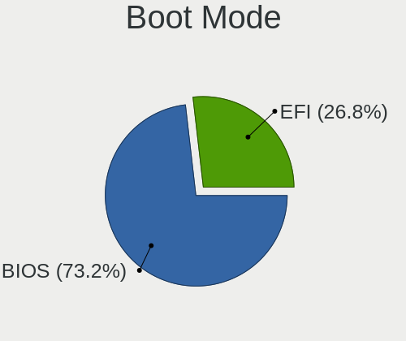
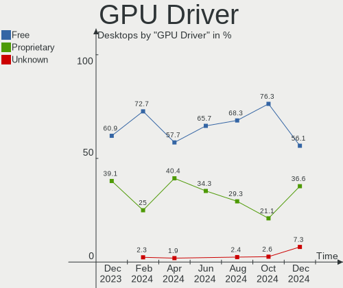
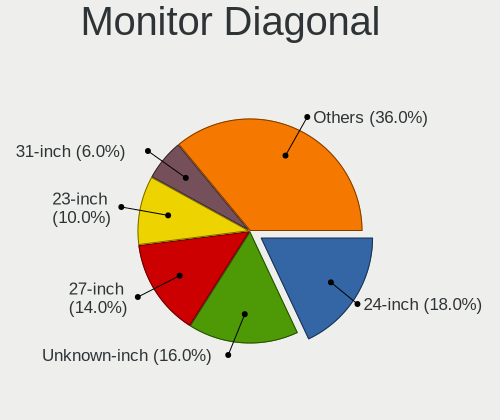
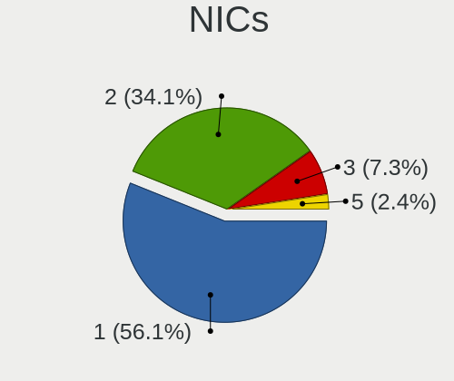

Manjaro Hardware Trends (Desktop)
---------------------------------

A project to identify most popular hardware characteristics and track their change
over time based on data collected by Manjaro users at https://Linux-Hardware.org.

Anyone can contribute to the study by uploading probes of their computers by
the [hw-probe](https://github.com/linuxhw/hw-probe) tool:

    sudo -E hw-probe -all -upload

Full-feature report is available here: https://linux-hardware.org/?view=trends&formfactor=desktop

Period: Apr, 2021.

Contents
--------

- [ OS                       ](#os)
- [ OS Family                ](#os-family)
- [ Kernel                   ](#kernel)
- [ Kernel Family            ](#kernel-family)
- [ Kernel Major Ver.        ](#kernel-major-ver)
- [ Arch                     ](#arch)
- [ DE                       ](#de)
- [ Display Server           ](#display-server)
- [ Display Manager          ](#display-manager)
- [ OS Lang                  ](#os-lang)
- [ Boot Mode                ](#boot-mode)
- [ Filesystem               ](#filesystem)
- [ Part. scheme             ](#part-scheme)
- [ Dual Boot with Linux/BSD ](#dual-boot-with-linux/bsd)
- [ Dual Boot (Win)          ](#dual-boot-win)
- [ Country                  ](#country)
- [ City                     ](#city)
- [ Vendor                   ](#vendor)
- [ Model                    ](#model)
- [ Model Family             ](#model-family)
- [ MFG Year                 ](#mfg-year)
- [ Form Factor              ](#form-factor)
- [ Secure Boot              ](#secure-boot)
- [ Coreboot                 ](#coreboot)
- [ RAM Size                 ](#ram-size)
- [ RAM Used                 ](#ram-used)
- [ Has CD-ROM               ](#has-cd-rom)
- [ Total Drives             ](#total-drives)
- [ Has Ethernet             ](#has-ethernet)
- [ Has WiFi                 ](#has-wifi)
- [ Has Bluetooth            ](#has-bluetooth)
- [ Drive Vendor             ](#drive-vendor)
- [ Drive Model              ](#drive-model)
- [ HDD Vendor               ](#hdd-vendor)
- [ SSD Vendor               ](#ssd-vendor)
- [ Drive Kind               ](#drive-kind)
- [ Drive Connector          ](#drive-connector)
- [ Drive Size               ](#drive-size)
- [ Space Total              ](#space-total)
- [ Space Used               ](#space-used)
- [ Malfunc. Drives          ](#malfunc-drives)
- [ Malfunc. Drive Vendor    ](#malfunc-drive-vendor)
- [ Malfunc. HDD Vendor      ](#malfunc-hdd-vendor)
- [ Malfunc. Drive Kind      ](#malfunc-drive-kind)
- [ Failed Drives            ](#failed-drives)
- [ Failed Drive Vendor      ](#failed-drive-vendor)
- [ Drive Status             ](#drive-status)
- [ Storage Vendor           ](#storage-vendor)
- [ Storage Model            ](#storage-model)
- [ Storage Kind             ](#storage-kind)
- [ CPU Vendor               ](#cpu-vendor)
- [ CPU Model                ](#cpu-model)
- [ CPU Model Family         ](#cpu-model-family)
- [ CPU Cores                ](#cpu-cores)
- [ CPU Sockets              ](#cpu-sockets)
- [ CPU Threads              ](#cpu-threads)
- [ CPU Op-Modes             ](#cpu-op-modes)
- [ CPU Microcode            ](#cpu-microcode)
- [ CPU Microarch            ](#cpu-microarch)
- [ GPU Vendor               ](#gpu-vendor)
- [ GPU Model                ](#gpu-model)
- [ GPU Combo                ](#gpu-combo)
- [ GPU Driver               ](#gpu-driver)
- [ GPU Memory               ](#gpu-memory)
- [ Monitor Vendor           ](#monitor-vendor)
- [ Monitor Model            ](#monitor-model)
- [ Monitor Resolution       ](#monitor-resolution)
- [ Monitor Diagonal         ](#monitor-diagonal)
- [ Monitor Width            ](#monitor-width)
- [ Aspect Ratio             ](#aspect-ratio)
- [ Monitor Area             ](#monitor-area)
- [ Pixel Density            ](#pixel-density)
- [ Multiple Monitors        ](#multiple-monitors)
- [ Net Controller Vendor    ](#net-controller-vendor)
- [ Net Controller Model     ](#net-controller-model)
- [ Wireless Vendor          ](#wireless-vendor)
- [ Wireless Model           ](#wireless-model)
- [ Ethernet Vendor          ](#ethernet-vendor)
- [ Ethernet Model           ](#ethernet-model)
- [ Net Controller Kind      ](#net-controller-kind)
- [ Used Controller          ](#used-controller)
- [ NICs                     ](#nics)
- [ IPv6                     ](#ipv6)
- [ Memory Vendor            ](#memory-vendor)
- [ Memory Model             ](#memory-model)
- [ Memory Kind              ](#memory-kind)
- [ Memory Form Factor       ](#memory-form-factor)
- [ Memory Size              ](#memory-size)
- [ Memory Speed             ](#memory-speed)
- [ Sound Vendor             ](#sound-vendor)
- [ Sound Model              ](#sound-model)
- [ Camera Vendor            ](#camera-vendor)
- [ Camera Model             ](#camera-model)
- [ Fingerprint Vendor       ](#fingerprint-vendor)
- [ Fingerprint Model        ](#fingerprint-model)
- [ Chipcard Vendor          ](#chipcard-vendor)
- [ Chipcard Model           ](#chipcard-model)
- [ Printer Vendor           ](#printer-vendor)
- [ Printer Model            ](#printer-model)
- [ Scanner Vendor           ](#scanner-vendor)
- [ Scanner Model            ](#scanner-model)
- [ Bluetooth Vendor         ](#bluetooth-vendor)
- [ Bluetooth Model          ](#bluetooth-model)
- [ Unsupported Devices      ](#unsupported-devices)
- [ Unsupported Device Types ](#unsupported-device-types)

OS
--

Installed operating systems

| Name           | Desktops | Percent |
|----------------|----------|---------|
| Manjaro        | 33       | 39.76%  |
| Manjaro 21.0   | 16       | 19.28%  |
| Manjaro 21.0.1 | 14       | 16.87%  |
| Manjaro 21.0.2 | 13       | 15.66%  |
| Manjaro 21.0.3 | 6        | 7.23%   |
| Manjaro 20.2.1 | 1        | 1.2%    |

OS Family
---------

OS without a version

| Name    | Desktops | Percent |
|---------|----------|---------|
| Manjaro | 83       | 100%    |

Kernel
------

Version of the Linux kernel

| Version               | Desktops | Percent |
|-----------------------|----------|---------|
| 5.9.16-1-MANJARO      | 11       | 13.25%  |
| 5.11.10-1-MANJARO     | 10       | 12.05%  |
| 5.10.23-1-MANJARO     | 10       | 12.05%  |
| 5.11.6-1-MANJARO      | 9        | 10.84%  |
| 5.11.14-1-MANJARO     | 7        | 8.43%   |
| 5.10.30-1-MANJARO     | 7        | 8.43%   |
| 5.10.26-1-MANJARO     | 6        | 7.23%   |
| 5.12.0-1-MANJARO      | 4        | 4.82%   |
| 5.4.108-1-MANJARO     | 3        | 3.61%   |
| 5.11.16-2-MANJARO     | 3        | 3.61%   |
| 5.10.32-1-MANJARO     | 3        | 3.61%   |
| 5.9.1-1-rt19-MANJARO  | 2        | 2.41%   |
| 5.4.105-1-MANJARO     | 2        | 2.41%   |
| 5.6.19-3-rt12-MANJARO | 1        | 1.2%    |
| 5.4.97-1-MANJARO      | 1        | 1.2%    |
| 5.4.100-1-MANJARO     | 1        | 1.2%    |
| 5.11.8-1-MANJARO      | 1        | 1.2%    |
| 5.11.16-lqx1-1-lqx    | 1        | 1.2%    |
| 5.11.15-MANJARO       | 1        | 1.2%    |

Kernel Family
-------------

Linux kernel without a distro release

| Version | Desktops | Percent |
|---------|----------|---------|
| 5.9.16  | 11       | 13.25%  |
| 5.11.10 | 10       | 12.05%  |
| 5.10.23 | 10       | 12.05%  |
| 5.11.6  | 9        | 10.84%  |
| 5.11.14 | 7        | 8.43%   |
| 5.10.30 | 7        | 8.43%   |
| 5.10.26 | 6        | 7.23%   |
| 5.12.0  | 4        | 4.82%   |
| 5.11.16 | 4        | 4.82%   |
| 5.4.108 | 3        | 3.61%   |
| 5.10.32 | 3        | 3.61%   |
| 5.9.1   | 2        | 2.41%   |
| 5.4.105 | 2        | 2.41%   |
| 5.6.19  | 1        | 1.2%    |
| 5.4.97  | 1        | 1.2%    |
| 5.4.100 | 1        | 1.2%    |
| 5.11.8  | 1        | 1.2%    |
| 5.11.15 | 1        | 1.2%    |

Kernel Major Ver.
-----------------

Linux kernel major version

| Version | Desktops | Percent |
|---------|----------|---------|
| 5.11    | 32       | 38.55%  |
| 5.10    | 26       | 31.33%  |
| 5.9     | 13       | 15.66%  |
| 5.4     | 7        | 8.43%   |
| 5.12    | 4        | 4.82%   |
| 5.6     | 1        | 1.2%    |

Arch
----

OS architecture (x86_64, i586, etc.)

| Name   | Desktops | Percent |
|--------|----------|---------|
| x86_64 | 83       | 100%    |

DE
--

Desktop Environment

| Name       | Desktops | Percent |
|------------|----------|---------|
| KDE5       | 27       | 32.53%  |
| XFCE       | 23       | 27.71%  |
| GNOME      | 17       | 20.48%  |
| KDE        | 11       | 13.25%  |
| X-Cinnamon | 2        | 2.41%   |
| MATE       | 1        | 1.2%    |
| Bspwm      | 1        | 1.2%    |
| Unknown    | 1        | 1.2%    |

Display Server
--------------

X11 or Wayland

| Name    | Desktops | Percent |
|---------|----------|---------|
| X11     | 77       | 92.77%  |
| Wayland | 4        | 4.82%   |
| Tty     | 1        | 1.2%    |
| Unknown | 1        | 1.2%    |

Display Manager
---------------

SDDM, LightDM, etc.

| Name    | Desktops | Percent |
|---------|----------|---------|
| Unknown | 33       | 39.76%  |
| SDDM    | 27       | 32.53%  |
| LightDM | 12       | 14.46%  |
| GDM     | 11       | 13.25%  |

OS Lang
-------

Language

| Lang    | Desktops | Percent |
|---------|----------|---------|
| en_US   | 34       | 40.96%  |
| ru_RU   | 10       | 12.05%  |
| es_ES   | 8        | 9.64%   |
| de_DE   | 8        | 9.64%   |
| en_GB   | 5        | 6.02%   |
| pl_PL   | 2        | 2.41%   |
| es_CO   | 2        | 2.41%   |
| en_AU   | 2        | 2.41%   |
| de_AT   | 2        | 2.41%   |
| vi_VN   | 1        | 1.2%    |
| nl_NL   | 1        | 1.2%    |
| it_IT   | 1        | 1.2%    |
| fi_FI   | 1        | 1.2%    |
| eu_ES   | 1        | 1.2%    |
| es_PA   | 1        | 1.2%    |
| es_CL   | 1        | 1.2%    |
| en_CA   | 1        | 1.2%    |
| C       | 1        | 1.2%    |
| Unknown | 1        | 1.2%    |

Boot Mode
---------

EFI or BIOS

| Mode | Desktops | Percent |
|------|----------|---------|
| BIOS | 45       | 54.22%  |
| EFI  | 38       | 45.78%  |

Filesystem
----------

Type of filesystem

| Type    | Desktops | Percent |
|---------|----------|---------|
| Ext4    | 76       | 91.57%  |
| Overlay | 2        | 2.41%   |
| F2fs    | 2        | 2.41%   |
| Btrfs   | 2        | 2.41%   |
| Xfs     | 1        | 1.2%    |

Part. scheme
------------

Scheme of partitioning

| Type    | Desktops | Percent |
|---------|----------|---------|
| GPT     | 41       | 49.4%   |
| Unknown | 32       | 38.55%  |
| MBR     | 10       | 12.05%  |

Dual Boot with Linux/BSD
------------------------

Hosting more than one Linux/BSD

| Dual boot | Desktops | Percent |
|-----------|----------|---------|
| No        | 67       | 80.72%  |
| Yes       | 16       | 19.28%  |

Dual Boot (Win)
---------------

Hosting Linux and Windows

| Dual boot | Desktops | Percent |
|-----------|----------|---------|
| No        | 50       | 60.24%  |
| Yes       | 33       | 39.76%  |

Country
-------

Geographic location (country)

| Country      | Desktops | Percent |
|--------------|----------|---------|
| Germany      | 13       | 15.66%  |
| USA          | 11       | 13.25%  |
| Russia       | 11       | 13.25%  |
| Spain        | 9        | 10.84%  |
| UK           | 4        | 4.82%   |
| Poland       | 4        | 4.82%   |
| Austria      | 3        | 3.61%   |
| Turkey       | 2        | 2.41%   |
| Italy        | 2        | 2.41%   |
| France       | 2        | 2.41%   |
| Colombia     | 2        | 2.41%   |
| Canada       | 2        | 2.41%   |
| Australia    | 2        | 2.41%   |
| Vietnam      | 1        | 1.2%    |
| Sweden       | 1        | 1.2%    |
| Slovenia     | 1        | 1.2%    |
| Saudi Arabia | 1        | 1.2%    |
| Portugal     | 1        | 1.2%    |
| Panama       | 1        | 1.2%    |
| Netherlands  | 1        | 1.2%    |
| Moldova      | 1        | 1.2%    |
| Lithuania    | 1        | 1.2%    |
| Indonesia    | 1        | 1.2%    |
| Hungary      | 1        | 1.2%    |
| Finland      | 1        | 1.2%    |
| Czechia      | 1        | 1.2%    |
| Chile        | 1        | 1.2%    |
| Brazil       | 1        | 1.2%    |
| Belgium      | 1        | 1.2%    |

City
----

Geographic location (city)

| City                       | Desktops | Percent |
|----------------------------|----------|---------|
| St Petersburg              | 2        | 2.41%   |
| Moscow                     | 2        | 2.41%   |
| Istanbul                   | 2        | 2.41%   |
| Barakaldo                  | 2        | 2.41%   |
| Yogyakarta                 | 1        | 1.2%    |
| Yekaterinburg              | 1        | 1.2%    |
| Wooster                    | 1        | 1.2%    |
| Wimbledon                  | 1        | 1.2%    |
| Warsaw                     | 1        | 1.2%    |
| Vrhnika                    | 1        | 1.2%    |
| Voronezh                   | 1        | 1.2%    |
| Vitoria-Gasteiz            | 1        | 1.2%    |
| Vilnius                    | 1        | 1.2%    |
| Valladolid                 | 1        | 1.2%    |
| Urbana                     | 1        | 1.2%    |
| Uelsen                     | 1        | 1.2%    |
| Twinsburg                  | 1        | 1.2%    |
| Turin                      | 1        | 1.2%    |
| Toulouse                   | 1        | 1.2%    |
| Tattendorf                 | 1        | 1.2%    |
| Sydney                     | 1        | 1.2%    |
| Sierning                   | 1        | 1.2%    |
| Schwerte                   | 1        | 1.2%    |
| Santiago de Cali           | 1        | 1.2%    |
| San Diego                  | 1        | 1.2%    |
| Rzeszów                   | 1        | 1.2%    |
| Ryazan                     | 1        | 1.2%    |
| Rostov-on-Don              | 1        | 1.2%    |
| Riyadh                     | 1        | 1.2%    |
| Ramenskoye                 | 1        | 1.2%    |
| Portland                   | 1        | 1.2%    |
| Pittsburgh                 | 1        | 1.2%    |
| Panama City                | 1        | 1.2%    |
| Orlando                    | 1        | 1.2%    |
| Ojai                       | 1        | 1.2%    |
| Oberkirch                  | 1        | 1.2%    |
| Nijmegen                   | 1        | 1.2%    |
| Murr                       | 1        | 1.2%    |
| Montegalda                 | 1        | 1.2%    |
| Missoula                   | 1        | 1.2%    |
| Malmo                      | 1        | 1.2%    |
| Madrid                     | 1        | 1.2%    |
| Machern                    | 1        | 1.2%    |
| Loppi                      | 1        | 1.2%    |
| LIsle-dEspagnac            | 1        | 1.2%    |
| Las Palmas de Gran Canaria | 1        | 1.2%    |
| Lannach                    | 1        | 1.2%    |
| Kaluga                     | 1        | 1.2%    |
| Ingolstadt                 | 1        | 1.2%    |
| Gross Reken                | 1        | 1.2%    |
| Ghent                      | 1        | 1.2%    |
| Gadzhiyevo                 | 1        | 1.2%    |
| Fussgonheim                | 1        | 1.2%    |
| Essen                      | 1        | 1.2%    |
| El Monte                   | 1        | 1.2%    |
| Eden Prairie               | 1        | 1.2%    |
| Dover                      | 1        | 1.2%    |
| Dolni Kounice              | 1        | 1.2%    |
| Dillenburg                 | 1        | 1.2%    |
| Daimiel                    | 1        | 1.2%    |

Vendor
------

Motherboard manufacturer

| Name                | Desktops | Percent |
|---------------------|----------|---------|
| ASUSTek Computer    | 26       | 31.33%  |
| Gigabyte Technology | 24       | 28.92%  |
| MSI                 | 9        | 10.84%  |
| ASRock              | 8        | 9.64%   |
| Dell                | 5        | 6.02%   |
| Pegatron            | 2        | 2.41%   |
| Hewlett-Packard     | 2        | 2.41%   |
| Medion              | 1        | 1.2%    |
| Intel               | 1        | 1.2%    |
| Huanan              | 1        | 1.2%    |
| HC                  | 1        | 1.2%    |
| Biostar             | 1        | 1.2%    |
| Acer                | 1        | 1.2%    |
| Unknown             | 1        | 1.2%    |

Model
-----

Motherboard model

| Name                                 | Desktops | Percent |
|--------------------------------------|----------|---------|
| Gigabyte B450M DS3H                  | 3        | 3.61%   |
| MSI MS-7816                          | 2        | 2.41%   |
| Gigabyte B450M S2H                   | 2        | 2.41%   |
| ASUS TUF B450M-PLUS GAMING           | 2        | 2.41%   |
| ASUS Maximus VIII HERO               | 2        | 2.41%   |
| Pegatron IPMSB-H61                   | 1        | 1.2%    |
| Pegatron Compaq dx2450 Microtower PC | 1        | 1.2%    |
| MSI WC854AA-ABE p6365es              | 1        | 1.2%    |
| MSI MS-7C91                          | 1        | 1.2%    |
| MSI MS-7C84                          | 1        | 1.2%    |
| MSI MS-7B47                          | 1        | 1.2%    |
| MSI MS-7A38                          | 1        | 1.2%    |
| MSI MS-7A12                          | 1        | 1.2%    |
| MSI MS-7900                          | 1        | 1.2%    |
| Medion MD34186/C728                  | 1        | 1.2%    |
| Intel X99 V1.0                       | 1        | 1.2%    |
| Huanan X99-TF                        | 1        | 1.2%    |
| HP ENVY Desktop 795-00xx             | 1        | 1.2%    |
| HP Compaq 6005 Pro SFF PC            | 1        | 1.2%    |
| HC HCAR357-MI                        | 1        | 1.2%    |
| Gigabyte Z97X-Gaming 3               | 1        | 1.2%    |
| Gigabyte Z68A-D3-B3                  | 1        | 1.2%    |
| Gigabyte Z490 AORUS XTREME           | 1        | 1.2%    |
| Gigabyte Z390 GAMING SLI             | 1        | 1.2%    |
| Gigabyte Z390 AORUS ULTRA            | 1        | 1.2%    |
| Gigabyte X99-UD4-CF                  | 1        | 1.2%    |
| Gigabyte X570 AORUS XTREME           | 1        | 1.2%    |
| Gigabyte X570 AORUS ELITE            | 1        | 1.2%    |
| Gigabyte P67A-D3-B3                  | 1        | 1.2%    |
| Gigabyte P35-DS3L                    | 1        | 1.2%    |
| Gigabyte H97-D3H                     | 1        | 1.2%    |
| Gigabyte H61M-USB3V                  | 1        | 1.2%    |
| Gigabyte H110M-DS2                   | 1        | 1.2%    |
| Gigabyte EU1001302_2120202           | 1        | 1.2%    |
| Gigabyte C1037UN-EU                  | 1        | 1.2%    |
| Gigabyte B450 AORUS ELITE            | 1        | 1.2%    |
| Gigabyte AX370-Gaming                | 1        | 1.2%    |
| Gigabyte 990FXA-UD7                  | 1        | 1.2%    |
| Gigabyte 970A-DS3P                   | 1        | 1.2%    |
| Dell XPS 8940                        | 1        | 1.2%    |
| Dell Vostro 320                      | 1        | 1.2%    |
| Dell Precision T3610                 | 1        | 1.2%    |
| Dell OptiPlex 9020                   | 1        | 1.2%    |
| Dell OptiPlex 7071                   | 1        | 1.2%    |
| Biostar A58MD                        | 1        | 1.2%    |
| ASUS Z170M-PLUS                      | 1        | 1.2%    |
| ASUS TUF GAMING B550M-PLUS           | 1        | 1.2%    |
| ASUS ROG STRIX Z370-F GAMING         | 1        | 1.2%    |
| ASUS ROG STRIX X570-E GAMING         | 1        | 1.2%    |
| ASUS ROG STRIX B450-I GAMING         | 1        | 1.2%    |
| ASUS Pro WS C621-64L SAGE Series     | 1        | 1.2%    |
| ASUS PRIME Z270-A                    | 1        | 1.2%    |
| ASUS PRIME H410M-A                   | 1        | 1.2%    |
| ASUS PRIME B450M-A                   | 1        | 1.2%    |
| ASUS PRIME B350M-A                   | 1        | 1.2%    |
| ASUS PRIME A320M-K                   | 1        | 1.2%    |
| ASUS P8Z77-V PRO                     | 1        | 1.2%    |
| ASUS P8Z68-V GEN3                    | 1        | 1.2%    |
| ASUS P8P67 WS REVOLUTION             | 1        | 1.2%    |
| ASUS P8H67                           | 1        | 1.2%    |

Model Family
------------

Motherboard model prefix

| Name                  | Desktops | Percent |
|-----------------------|----------|---------|
| Gigabyte B450M        | 5        | 6.02%   |
| ASUS PRIME            | 5        | 6.02%   |
| ASUS TUF              | 3        | 3.61%   |
| ASUS ROG              | 3        | 3.61%   |
| ASUS Maximus          | 3        | 3.61%   |
| MSI MS-7816           | 2        | 2.41%   |
| Gigabyte Z390         | 2        | 2.41%   |
| Gigabyte X570         | 2        | 2.41%   |
| Dell OptiPlex         | 2        | 2.41%   |
| Pegatron IPMSB-H61    | 1        | 1.2%    |
| Pegatron Compaq       | 1        | 1.2%    |
| MSI WC854AA-ABE       | 1        | 1.2%    |
| MSI MS-7C91           | 1        | 1.2%    |
| MSI MS-7C84           | 1        | 1.2%    |
| MSI MS-7B47           | 1        | 1.2%    |
| MSI MS-7A38           | 1        | 1.2%    |
| MSI MS-7A12           | 1        | 1.2%    |
| MSI MS-7900           | 1        | 1.2%    |
| Medion MD34186        | 1        | 1.2%    |
| Intel X99             | 1        | 1.2%    |
| Huanan X99-TF         | 1        | 1.2%    |
| HP ENVY               | 1        | 1.2%    |
| HP Compaq             | 1        | 1.2%    |
| HC HCAR357-MI         | 1        | 1.2%    |
| Gigabyte Z97X-Gaming  | 1        | 1.2%    |
| Gigabyte Z68A-D3-B3   | 1        | 1.2%    |
| Gigabyte Z490         | 1        | 1.2%    |
| Gigabyte X99-UD4-CF   | 1        | 1.2%    |
| Gigabyte P67A-D3-B3   | 1        | 1.2%    |
| Gigabyte P35-DS3L     | 1        | 1.2%    |
| Gigabyte H97-D3H      | 1        | 1.2%    |
| Gigabyte H61M-USB3V   | 1        | 1.2%    |
| Gigabyte H110M-DS2    | 1        | 1.2%    |
| Gigabyte EU1001302    | 1        | 1.2%    |
| Gigabyte C1037UN-EU   | 1        | 1.2%    |
| Gigabyte B450         | 1        | 1.2%    |
| Gigabyte AX370-Gaming | 1        | 1.2%    |
| Gigabyte 990FXA-UD7   | 1        | 1.2%    |
| Gigabyte 970A-DS3P    | 1        | 1.2%    |
| Dell XPS              | 1        | 1.2%    |
| Dell Vostro           | 1        | 1.2%    |
| Dell Precision        | 1        | 1.2%    |
| Biostar A58MD         | 1        | 1.2%    |
| ASUS Z170M-PLUS       | 1        | 1.2%    |
| ASUS Pro              | 1        | 1.2%    |
| ASUS P8Z77-V          | 1        | 1.2%    |
| ASUS P8Z68-V          | 1        | 1.2%    |
| ASUS P8P67            | 1        | 1.2%    |
| ASUS P8H67            | 1        | 1.2%    |
| ASUS M4N78            | 1        | 1.2%    |
| ASUS M4A77T           | 1        | 1.2%    |
| ASUS M3N78-EMH        | 1        | 1.2%    |
| ASUS H110M-R          | 1        | 1.2%    |
| ASUS All              | 1        | 1.2%    |
| ASUS A88XM-E          | 1        | 1.2%    |
| ASRock Z97M           | 1        | 1.2%    |
| ASRock X570           | 1        | 1.2%    |
| ASRock H110           | 1        | 1.2%    |
| ASRock B560           | 1        | 1.2%    |
| ASRock B550M          | 1        | 1.2%    |

MFG Year
--------

Motherboard manufacture year

| Year | Desktops | Percent |
|------|----------|---------|
| 2020 | 17       | 20.48%  |
| 2021 | 11       | 13.25%  |
| 2019 | 10       | 12.05%  |
| 2018 | 9        | 10.84%  |
| 2015 | 7        | 8.43%   |
| 2012 | 6        | 7.23%   |
| 2014 | 5        | 6.02%   |
| 2013 | 5        | 6.02%   |
| 2016 | 3        | 3.61%   |
| 2017 | 2        | 2.41%   |
| 2010 | 2        | 2.41%   |
| 2009 | 2        | 2.41%   |
| 2008 | 2        | 2.41%   |
| 2011 | 1        | 1.2%    |
| 2007 | 1        | 1.2%    |

Form Factor
-----------

Physical design of the computer

| Name    | Desktops | Percent |
|---------|----------|---------|
| Desktop | 83       | 100%    |

Secure Boot
-----------

Enabled or disabled

| State    | Desktops | Percent |
|----------|----------|---------|
| Disabled | 83       | 100%    |

Coreboot
--------

Have coreboot on board

| Used | Desktops | Percent |
|------|----------|---------|
| No   | 83       | 100%    |

RAM Size
--------

Total RAM memory

| Size in GB  | Desktops | Percent |
|-------------|----------|---------|
| 16.01-24.0  | 24       | 28.92%  |
| 32.01-64.0  | 16       | 19.28%  |
| 8.01-16.0   | 14       | 16.87%  |
| 4.01-8.0    | 8        | 9.64%   |
| 3.01-4.0    | 7        | 8.43%   |
| 64.01-256.0 | 7        | 8.43%   |
| 24.01-32.0  | 4        | 4.82%   |
| 1.01-2.0    | 2        | 2.41%   |
| 2.01-3.0    | 1        | 1.2%    |

RAM Used
--------

Used RAM memory

| Used GB    | Desktops | Percent |
|------------|----------|---------|
| 4.01-8.0   | 27       | 32.53%  |
| 2.01-3.0   | 23       | 27.71%  |
| 1.01-2.0   | 15       | 18.07%  |
| 8.01-16.0  | 7        | 8.43%   |
| 3.01-4.0   | 6        | 7.23%   |
| 0.51-1.0   | 3        | 3.61%   |
| 32.01-64.0 | 1        | 1.2%    |
| 16.01-24.0 | 1        | 1.2%    |

Has CD-ROM
----------

Has CD-ROM on board

| Presented | Desktops | Percent |
|-----------|----------|---------|
| No        | 50       | 60.24%  |
| Yes       | 33       | 39.76%  |

Total Drives
------------

Number of drives on board

| Drives | Desktops | Percent |
|--------|----------|---------|
| 1      | 25       | 30.12%  |
| 2      | 20       | 24.1%   |
| 3      | 16       | 19.28%  |
| 4      | 11       | 13.25%  |
| 5      | 8        | 9.64%   |
| 9      | 1        | 1.2%    |
| 7      | 1        | 1.2%    |
| 0      | 1        | 1.2%    |

Has Ethernet
------------

Has Ethernet on board

| Presented | Desktops | Percent |
|-----------|----------|---------|
| Yes       | 83       | 100%    |

Has WiFi
--------

Has WiFi module

| Presented | Desktops | Percent |
|-----------|----------|---------|
| Yes       | 45       | 54.22%  |
| No        | 38       | 45.78%  |

Has Bluetooth
-------------

Has Bluetooth module

| Presented | Desktops | Percent |
|-----------|----------|---------|
| No        | 50       | 60.24%  |
| Yes       | 33       | 39.76%  |

Drive Vendor
------------

Hard drive vendors

| Vendor                    | Desktops | Drives | Percent |
|---------------------------|----------|--------|---------|
| Samsung Electronics       | 35       | 45     | 20.11%  |
| WDC                       | 31       | 41     | 17.82%  |
| Seagate                   | 27       | 36     | 15.52%  |
| Kingston                  | 12       | 12     | 6.9%    |
| SanDisk                   | 11       | 12     | 6.32%   |
| Crucial                   | 10       | 13     | 5.75%   |
| Hitachi                   | 6        | 7      | 3.45%   |
| Toshiba                   | 5        | 5      | 2.87%   |
| Intel                     | 4        | 6      | 2.3%    |
| HGST                      | 4        | 6      | 2.3%    |
| XPG                       | 3        | 3      | 1.72%   |
| Phison                    | 3        | 3      | 1.72%   |
| Unknown                   | 2        | 3      | 1.15%   |
| KingDian                  | 2        | 2      | 1.15%   |
| Vaseky                    | 1        | 1      | 0.57%   |
| TrekStor                  | 1        | 1      | 0.57%   |
| Silicon Motion            | 1        | 1      | 0.57%   |
| PNY                       | 1        | 1      | 0.57%   |
| Patriot                   | 1        | 1      | 0.57%   |
| OCZ                       | 1        | 1      | 0.57%   |
| Micron/Crucial Technology | 1        | 1      | 0.57%   |
| Micron Technology         | 1        | 1      | 0.57%   |
| Lexar                     | 1        | 1      | 0.57%   |
| KINGBANK                  | 1        | 1      | 0.57%   |
| JMicron                   | 1        | 1      | 0.57%   |
| Intenso                   | 1        | 1      | 0.57%   |
| INDMEM                    | 1        | 1      | 0.57%   |
| GOODRAM                   | 1        | 1      | 0.57%   |
| Gigabyte Technology       | 1        | 2      | 0.57%   |
| Fujitsu                   | 1        | 1      | 0.57%   |
| Corsair                   | 1        | 1      | 0.57%   |
| China                     | 1        | 1      | 0.57%   |
| A-DATA Technology         | 1        | 1      | 0.57%   |

Drive Model
-----------

Hard drive models

| Model                             | Desktops | Percent |
|-----------------------------------|----------|---------|
| Samsung SSD 860 EVO 1TB           | 5        | 2.5%    |
| Samsung NVMe SSD Drive 500GB      | 4        | 2%      |
| WDC WD20EARX-00PASB0 2TB          | 3        | 1.5%    |
| Seagate ST500DM002-1BD142 500GB   | 3        | 1.5%    |
| Seagate ST3500418AS 500GB         | 3        | 1.5%    |
| Seagate ST1000DM010-2EP102 1TB    | 3        | 1.5%    |
| Samsung SSD 860 EVO 500GB         | 3        | 1.5%    |
| Samsung SSD 850 EVO 250GB         | 3        | 1.5%    |
| Samsung NVMe SSD Drive 1TB        | 3        | 1.5%    |
| XPG GAMMIX S11 Pro 2TB            | 2        | 1%      |
| WDC WDS500G2B0A-00SM50 500GB SSD  | 2        | 1%      |
| WDC WDS100T2B0C-00PXH0 1TB        | 2        | 1%      |
| WDC WDS100T2B0A-00SM50 1TB SSD    | 2        | 1%      |
| WDC WD10EZEX-08WN4A0 1TB          | 2        | 1%      |
| WDC WD10EZEX-00BN5A0 1TB          | 2        | 1%      |
| WDC WD1003FZEX-00MK2A0 1TB        | 2        | 1%      |
| Seagate ST3000DM001-1ER166 3TB    | 2        | 1%      |
| Seagate ST2000DM006-2DM164 2TB    | 2        | 1%      |
| Seagate ST1000DM003-1ER162 1TB    | 2        | 1%      |
| Seagate Expansion Desk 6TB        | 2        | 1%      |
| SanDisk SSD PLUS 480GB            | 2        | 1%      |
| SanDisk SSD PLUS 240GB            | 2        | 1%      |
| SanDisk Extreme SSD 2TB           | 2        | 1%      |
| Samsung SSD 840 EVO 1TB           | 2        | 1%      |
| Kingston SV300S37A60G 64GB SSD    | 2        | 1%      |
| Kingston SUV400S37240G 240GB SSD  | 2        | 1%      |
| Kingston SA400S37240G 240GB SSD   | 2        | 1%      |
| Crucial CT500P2SSD8 500GB         | 2        | 1%      |
| XPG NVMe SSD Drive 512GB          | 1        | 0.5%    |
| WDC WDS250G3X0C-00SJG0 250GB      | 1        | 0.5%    |
| WDC WDS100T3X0C-00SJG0 1TB        | 1        | 0.5%    |
| WDC WD5001AALS-00E3A0 500GB       | 1        | 0.5%    |
| WDC WD5000AAKX-603CA0 500GB       | 1        | 0.5%    |
| WDC WD5000AAKS-65V0A0 500GB       | 1        | 0.5%    |
| WDC WD3200BEKT-60F3T1 320GB       | 1        | 0.5%    |
| WDC WD3200AVJS-63B6A0 320GB       | 1        | 0.5%    |
| WDC WD30EZRS-11J99B1 3TB          | 1        | 0.5%    |
| WDC WD30EFRX-68EUZN0 3TB          | 1        | 0.5%    |
| WDC WD3000GLFS-01F8U0 304GB       | 1        | 0.5%    |
| WDC WD20EZRZ-00Z5HB0 2TB          | 1        | 0.5%    |
| WDC WD20EZAZ-00GGJB0 2TB          | 1        | 0.5%    |
| WDC WD20EARS-14MVWB0 2TB          | 1        | 0.5%    |
| WDC WD2003FZEX-00SRLA0 2TB        | 1        | 0.5%    |
| WDC WD1600BEVS-22RST0 160GB       | 1        | 0.5%    |
| WDC WD15EADS-00P8B0 1TB           | 1        | 0.5%    |
| WDC WD1200JD-00HBB0 120GB         | 1        | 0.5%    |
| WDC WD10EZRX-00D8PB0 1TB          | 1        | 0.5%    |
| WDC WD10EZEX-75WN4A1 1TB          | 1        | 0.5%    |
| WDC WD10EFRX-68PJCN0 1TB          | 1        | 0.5%    |
| WDC WD10EARS-00Y5B1 1TB           | 1        | 0.5%    |
| WDC WD10EADS-00L5B1 1TB           | 1        | 0.5%    |
| WDC PC SN720 SED SDAQNTW-1T00 1TB | 1        | 0.5%    |
| Vaseky V800/128G 128GB            | 1        | 0.5%    |
| Unknown SD/MMC 64GB               | 1        | 0.5%    |
| Unknown M10C 128GB SSD            | 1        | 0.5%    |
| Unknown M.S./M.S.Pro/HG 16GB      | 1        | 0.5%    |
| TrekStor DS pocket pace 3 1TB     | 1        | 0.5%    |
| Toshiba TR200 240GB SSD           | 1        | 0.5%    |
| Toshiba RC100 240GB               | 1        | 0.5%    |
| Toshiba MK7559GSXP 752GB          | 1        | 0.5%    |

HDD Vendor
----------

Hard disk drive vendors

| Vendor              | Desktops | Drives | Percent |
|---------------------|----------|--------|---------|
| Seagate             | 27       | 36     | 36.49%  |
| WDC                 | 25       | 30     | 33.78%  |
| Samsung Electronics | 7        | 7      | 9.46%   |
| Hitachi             | 6        | 7      | 8.11%   |
| HGST                | 4        | 6      | 5.41%   |
| Toshiba             | 3        | 3      | 4.05%   |
| Intenso             | 1        | 1      | 1.35%   |
| Fujitsu             | 1        | 1      | 1.35%   |

SSD Vendor
----------

Solid state drive vendors

| Vendor              | Desktops | Drives | Percent |
|---------------------|----------|--------|---------|
| Samsung Electronics | 18       | 23     | 28.13%  |
| Kingston            | 11       | 11     | 17.19%  |
| SanDisk             | 10       | 11     | 15.63%  |
| Crucial             | 7        | 10     | 10.94%  |
| WDC                 | 4        | 6      | 6.25%   |
| KingDian            | 2        | 2      | 3.13%   |
| Vaseky              | 1        | 1      | 1.56%   |
| Unknown             | 1        | 1      | 1.56%   |
| Toshiba             | 1        | 1      | 1.56%   |
| Patriot             | 1        | 1      | 1.56%   |
| OCZ                 | 1        | 1      | 1.56%   |
| Lexar               | 1        | 1      | 1.56%   |
| Intel               | 1        | 1      | 1.56%   |
| INDMEM              | 1        | 1      | 1.56%   |
| GOODRAM             | 1        | 1      | 1.56%   |
| Corsair             | 1        | 1      | 1.56%   |
| China               | 1        | 1      | 1.56%   |
| A-DATA Technology   | 1        | 1      | 1.56%   |

Drive Kind
----------

HDD or SSD

| Kind    | Desktops | Drives | Percent |
|---------|----------|--------|---------|
| HDD     | 56       | 91     | 38.62%  |
| SSD     | 49       | 75     | 33.79%  |
| NVMe    | 38       | 44     | 26.21%  |
| Unknown | 2        | 4      | 1.38%   |

Drive Connector
---------------

SATA, SAS, NVMe, etc.

| Type | Desktops | Drives | Percent |
|------|----------|--------|---------|
| SATA | 72       | 159    | 61.02%  |
| NVMe | 38       | 44     | 32.2%   |
| SAS  | 8        | 11     | 6.78%   |

Drive Size
----------

Size of hard drive

| Size in TB | Desktops | Drives | Percent |
|------------|----------|--------|---------|
| 0.01-0.5   | 52       | 88     | 46.43%  |
| 0.51-1.0   | 31       | 40     | 27.68%  |
| 1.01-2.0   | 16       | 20     | 14.29%  |
| 4.01-10.0  | 5        | 8      | 4.46%   |
| 3.01-4.0   | 4        | 5      | 3.57%   |
| 2.01-3.0   | 4        | 5      | 3.57%   |

Space Total
-----------

Amount of disk space available on the file system

| Size in GB     | Desktops | Percent |
|----------------|----------|---------|
| 101-250        | 18       | 21.69%  |
| 251-500        | 16       | 19.28%  |
| 501-1000       | 14       | 16.87%  |
| 2001-3000      | 11       | 13.25%  |
| More than 3000 | 9        | 10.84%  |
| 1001-2000      | 7        | 8.43%   |
| Unknown        | 3        | 3.61%   |
| 21-50          | 2        | 2.41%   |
| 51-100         | 2        | 2.41%   |
| 1-20           | 1        | 1.2%    |

Space Used
----------

Amount of used disk space

| Used GB        | Desktops | Percent |
|----------------|----------|---------|
| 21-50          | 16       | 19.28%  |
| 101-250        | 13       | 15.66%  |
| 51-100         | 12       | 14.46%  |
| 501-1000       | 11       | 13.25%  |
| 1001-2000      | 9        | 10.84%  |
| 1-20           | 7        | 8.43%   |
| 251-500        | 6        | 7.23%   |
| 2001-3000      | 5        | 6.02%   |
| Unknown        | 3        | 3.61%   |
| More than 3000 | 1        | 1.2%    |

Malfunc. Drives
---------------

Drive models with a malfunction

| Model                               | Desktops | Drives | Percent |
|-------------------------------------|----------|--------|---------|
| WDC WD30EZRS-11J99B1 3TB            | 1        | 1      | 10%     |
| WDC WD20EARX-00PASB0 2TB            | 1        | 1      | 10%     |
| Toshiba MK7559GSXP 752GB            | 1        | 1      | 10%     |
| Seagate ST3500630AS 500GB           | 1        | 1      | 10%     |
| Seagate ST3250310AS 250GB           | 1        | 1      | 10%     |
| Seagate ST1000DX001-1CM162-SSHD 1TB | 1        | 1      | 10%     |
| SanDisk SDSSDP256G 256GB            | 1        | 1      | 10%     |
| Intel SSDSC2CW120A3 120GB           | 1        | 1      | 10%     |
| Fujitsu MHW2160BH PL 160GB          | 1        | 1      | 10%     |
| Crucial CT120M500SSD1 120GB         | 1        | 1      | 10%     |

Malfunc. Drive Vendor
---------------------

Vendors of faulty drives

| Vendor  | Desktops | Drives | Percent |
|---------|----------|--------|---------|
| Seagate | 3        | 3      | 30%     |
| WDC     | 2        | 2      | 20%     |
| Toshiba | 1        | 1      | 10%     |
| SanDisk | 1        | 1      | 10%     |
| Intel   | 1        | 1      | 10%     |
| Fujitsu | 1        | 1      | 10%     |
| Crucial | 1        | 1      | 10%     |

Malfunc. HDD Vendor
-------------------

Vendors of faulty HDD drives

| Vendor  | Desktops | Drives | Percent |
|---------|----------|--------|---------|
| Seagate | 3        | 3      | 42.86%  |
| WDC     | 2        | 2      | 28.57%  |
| Toshiba | 1        | 1      | 14.29%  |
| Fujitsu | 1        | 1      | 14.29%  |

Malfunc. Drive Kind
-------------------

Kinds of faulty drives

| Kind | Desktops | Drives | Percent |
|------|----------|--------|---------|
| HDD  | 6        | 7      | 66.67%  |
| SSD  | 3        | 3      | 33.33%  |

Failed Drives
-------------

Failed drive models

Zero info for selected period =(

Failed Drive Vendor
-------------------

Failed drive vendors

Zero info for selected period =(

Drive Status
------------

Number of failed and malfunc. drives

| Status   | Desktops | Drives | Percent |
|----------|----------|--------|---------|
| Detected | 48       | 117    | 51.06%  |
| Works    | 38       | 87     | 40.43%  |
| Malfunc  | 8        | 10     | 8.51%   |

Storage Vendor
--------------

Storage controller vendors

| Vendor                       | Desktops | Percent |
|------------------------------|----------|---------|
| Intel                        | 47       | 35.34%  |
| AMD                          | 34       | 25.56%  |
| Samsung Electronics          | 14       | 10.53%  |
| Sandisk                      | 6        | 4.51%   |
| Phison Electronics           | 5        | 3.76%   |
| Micron/Crucial Technology    | 4        | 3.01%   |
| ASMedia Technology           | 4        | 3.01%   |
| Nvidia                       | 3        | 2.26%   |
| Marvell Technology Group     | 3        | 2.26%   |
| JMicron Technology           | 3        | 2.26%   |
| ADATA Technology             | 3        | 2.26%   |
| Silicon Motion               | 2        | 1.5%    |
| Silicon Image                | 2        | 1.5%    |
| Toshiba America Info Systems | 1        | 0.75%   |
| Micron Technology            | 1        | 0.75%   |
| Kingston Technology Company  | 1        | 0.75%   |

Storage Model
-------------

Storage controller models

| Model                                                                                   | Desktops | Percent |
|-----------------------------------------------------------------------------------------|----------|---------|
| AMD FCH SATA Controller [AHCI mode]                                                     | 20       | 12.5%   |
| AMD 400 Series Chipset SATA Controller                                                  | 13       | 8.13%   |
| Samsung NVMe SSD Controller SM981/PM981/PM983                                           | 11       | 6.88%   |
| Intel Q170/Q150/B150/H170/H110/Z170/CM236 Chipset SATA Controller [AHCI Mode]           | 7        | 4.38%   |
| Intel SATA Controller [RAID mode]                                                       | 5        | 3.13%   |
| Intel 9 Series Chipset Family SATA Controller [AHCI Mode]                               | 4        | 2.5%    |
| Intel 8 Series/C220 Series Chipset Family 6-port SATA Controller 1 [AHCI mode]          | 4        | 2.5%    |
| ASMedia ASM1062 Serial ATA Controller                                                   | 4        | 2.5%    |
| Sandisk WD Blue SN550 NVMe SSD                                                          | 3        | 1.88%   |
| Phison E16 PCIe4 NVMe Controller                                                        | 3        | 1.88%   |
| Intel Cannon Lake PCH SATA AHCI Controller                                              | 3        | 1.88%   |
| Intel 6 Series/C200 Series Chipset Family Desktop SATA Controller (IDE mode, ports 4-5) | 3        | 1.88%   |
| Intel 6 Series/C200 Series Chipset Family Desktop SATA Controller (IDE mode, ports 0-3) | 3        | 1.88%   |
| Intel 6 Series/C200 Series Chipset Family 6 port Desktop SATA AHCI Controller           | 3        | 1.88%   |
| Intel 200 Series PCH SATA controller [AHCI mode]                                        | 3        | 1.88%   |
| AMD Starship/Matisse Chipset SATA Controller [AHCI mode]                                | 3        | 1.88%   |
| AMD SB7x0/SB8x0/SB9x0 IDE Controller                                                    | 3        | 1.88%   |
| ADATA XPG SX8200 Pro PCIe Gen3x4 M.2 2280 Solid State Drive                             | 3        | 1.88%   |
| Silicon Motion SM2263EN/SM2263XT SSD Controller                                         | 2        | 1.25%   |
| Sandisk WD Black SN750 / PC SN730 NVMe SSD                                              | 2        | 1.25%   |
| Samsung NVMe SSD Controller PM9A1/980PRO                                                | 2        | 1.25%   |
| Phison E12 NVMe Controller                                                              | 2        | 1.25%   |
| Nvidia MCP78S [GeForce 8200] SATA Controller (non-AHCI mode)                            | 2        | 1.25%   |
| Nvidia MCP78S [GeForce 8200] IDE                                                        | 2        | 1.25%   |
| Micron/Crucial NVMe Controller                                                          | 2        | 1.25%   |
| Micron/Crucial Non-Volatile memory controller                                           | 2        | 1.25%   |
| JMicron JMB368 IDE controller                                                           | 2        | 1.25%   |
| Intel SSD 600P Series                                                                   | 2        | 1.25%   |
| Intel C610/X99 series chipset 6-Port SATA Controller [AHCI mode]                        | 2        | 1.25%   |
| Intel 82801I (ICH9 Family) 2 port SATA Controller [IDE mode]                            | 2        | 1.25%   |
| AMD SB7x0/SB8x0/SB9x0 SATA Controller [IDE mode]                                        | 2        | 1.25%   |
| AMD SB7x0/SB8x0/SB9x0 SATA Controller [AHCI mode]                                       | 2        | 1.25%   |
| AMD FCH SATA Controller D                                                               | 2        | 1.25%   |
| Toshiba America Info Systems BG3 NVMe SSD Controller                                    | 1        | 0.63%   |
| Silicon Image SiI 3132 Serial ATA Raid II Controller                                    | 1        | 0.63%   |
| Silicon Image PCI0680 Ultra ATA-133 Host Controller                                     | 1        | 0.63%   |
| Sandisk WD Black 2018/SN750 / PC SN720 NVMe SSD                                         | 1        | 0.63%   |
| Samsung NVMe SSD Controller SM961/PM961/SM963                                           | 1        | 0.63%   |
| Samsung NVMe SSD Controller SM951/PM951                                                 | 1        | 0.63%   |
| Nvidia MCP61 SATA Controller                                                            | 1        | 0.63%   |
| Micron Non-Volatile memory controller                                                   | 1        | 0.63%   |
| Marvell Group 88SE9172 SATA 6Gb/s Controller                                            | 1        | 0.63%   |
| Marvell Group 88SE9128 PCIe SATA 6 Gb/s RAID controller with HyperDuo                   | 1        | 0.63%   |
| Marvell Group 88SE9128 PCIe SATA 6 Gb/s RAID controller                                 | 1        | 0.63%   |
| Kingston Company A2000 NVMe SSD                                                         | 1        | 0.63%   |
| JMicron JMB362 SATA Controller                                                          | 1        | 0.63%   |
| Intel Sunrise Point-LP SATA Controller [AHCI mode]                                      | 1        | 0.63%   |
| Intel SSD 660P Series                                                                   | 1        | 0.63%   |
| Intel NM10/ICH7 Family SATA Controller [IDE mode]                                       | 1        | 0.63%   |
| Intel Comet Lake SATA AHCI Controller                                                   | 1        | 0.63%   |
| Intel C620 Series Chipset Family SATA Controller [AHCI mode]                            | 1        | 0.63%   |
| Intel C620 Series Chipset Family IDE Redirection                                        | 1        | 0.63%   |
| Intel C610/X99 series chipset sSATA Controller [AHCI mode]                              | 1        | 0.63%   |
| Intel C600/X79 series chipset SATA RAID Controller                                      | 1        | 0.63%   |
| Intel 82801IR/IO/IH (ICH9R/DO/DH) 4 port SATA Controller [IDE mode]                     | 1        | 0.63%   |
| Intel 82801IB (ICH9) 2 port SATA Controller [IDE mode]                                  | 1        | 0.63%   |
| Intel 7 Series/C210 Series Chipset Family 6-port SATA Controller [AHCI mode]            | 1        | 0.63%   |
| Intel 7 Series Chipset Family 6-port SATA Controller [AHCI mode]                        | 1        | 0.63%   |
| Intel 500 Series Chipset Family SATA AHCI Controller                                    | 1        | 0.63%   |
| Intel 400 Series Chipset Family SATA RAID Controller                                    | 1        | 0.63%   |

Storage Kind
------------

Kind of storage controller (IDE, SATA, NVMe, SAS, ...)

| Kind | Desktops | Percent |
|------|----------|---------|
| SATA | 67       | 52.34%  |
| NVMe | 38       | 29.69%  |
| IDE  | 13       | 10.16%  |
| RAID | 10       | 7.81%   |

CPU Vendor
----------

Processor vendors

| Vendor | Desktops | Percent |
|--------|----------|---------|
| Intel  | 46       | 55.42%  |
| AMD    | 37       | 44.58%  |

CPU Model
---------

Processor models

| Model                                           | Desktops | Percent |
|-------------------------------------------------|----------|---------|
| AMD Ryzen 5 3600 6-Core Processor               | 4        | 4.82%   |
| Intel Core i7-8700 CPU @ 3.20GHz                | 3        | 3.61%   |
| Intel Core i7-2600K CPU @ 3.40GHz               | 3        | 3.61%   |
| AMD Ryzen 9 3900X 12-Core Processor             | 3        | 3.61%   |
| AMD Ryzen 5 2600 Six-Core Processor             | 3        | 3.61%   |
| Intel Core i7-6700 CPU @ 3.40GHz                | 2        | 2.41%   |
| Intel Core i5-4690 CPU @ 3.50GHz                | 2        | 2.41%   |
| AMD Ryzen 7 3800X 8-Core Processor              | 2        | 2.41%   |
| AMD Ryzen 7 2700X Eight-Core Processor          | 2        | 2.41%   |
| AMD Ryzen 3 2200G with Radeon Vega Graphics     | 2        | 2.41%   |
| Intel Xeon W-3223 CPU @ 3.50GHz                 | 1        | 1.2%    |
| Intel Xeon CPU E5-2678 v3 @ 2.50GHz             | 1        | 1.2%    |
| Intel Xeon CPU E5-2620 v3 @ 2.40GHz             | 1        | 1.2%    |
| Intel Xeon CPU E5-1650 0 @ 3.20GHz              | 1        | 1.2%    |
| Intel Xeon CPU E3-1231 v3 @ 3.40GHz             | 1        | 1.2%    |
| Intel Pentium Dual-Core CPU E5700 @ 3.00GHz     | 1        | 1.2%    |
| Intel Pentium CPU G4400 @ 3.30GHz               | 1        | 1.2%    |
| Intel Core i9-9900K CPU @ 3.60GHz               | 1        | 1.2%    |
| Intel Core i9-10900K CPU @ 3.70GHz              | 1        | 1.2%    |
| Intel Core i7-9700K CPU @ 3.60GHz               | 1        | 1.2%    |
| Intel Core i7-9700 CPU @ 3.00GHz                | 1        | 1.2%    |
| Intel Core i7-8700K CPU @ 3.70GHz               | 1        | 1.2%    |
| Intel Core i7-7700K CPU @ 4.20GHz               | 1        | 1.2%    |
| Intel Core i7-6850K CPU @ 3.60GHz               | 1        | 1.2%    |
| Intel Core i7-6700K CPU @ 4.00GHz               | 1        | 1.2%    |
| Intel Core i7-4790K CPU @ 4.00GHz               | 1        | 1.2%    |
| Intel Core i5-8400 CPU @ 2.80GHz                | 1        | 1.2%    |
| Intel Core i5-6600K CPU @ 3.50GHz               | 1        | 1.2%    |
| Intel Core i5-6400 CPU @ 2.70GHz                | 1        | 1.2%    |
| Intel Core i5-4690K CPU @ 3.50GHz               | 1        | 1.2%    |
| Intel Core i5-4590 CPU @ 3.30GHz                | 1        | 1.2%    |
| Intel Core i5-4460 CPU @ 3.20GHz                | 1        | 1.2%    |
| Intel Core i5-3570K CPU @ 3.40GHz               | 1        | 1.2%    |
| Intel Core i5-2500K CPU @ 3.30GHz               | 1        | 1.2%    |
| Intel Core i5-2320 CPU @ 3.00GHz                | 1        | 1.2%    |
| Intel Core i5-10600K CPU @ 4.10GHz              | 1        | 1.2%    |
| Intel Core i5-10400 CPU @ 2.90GHz               | 1        | 1.2%    |
| Intel Core i3-7167U CPU @ 2.80GHz               | 1        | 1.2%    |
| Intel Core i3-7100 CPU @ 3.90GHz                | 1        | 1.2%    |
| Intel Core i3-2120 CPU @ 3.30GHz                | 1        | 1.2%    |
| Intel Core i3-2100 CPU @ 3.10GHz                | 1        | 1.2%    |
| Intel Core i3 CPU 530 @ 2.93GHz                 | 1        | 1.2%    |
| Intel Core 2 Quad CPU Q9550 @ 2.83GHz           | 1        | 1.2%    |
| Intel Core 2 Duo CPU E6550 @ 2.33GHz            | 1        | 1.2%    |
| Intel Celeron CPU 1037U @ 1.80GHz               | 1        | 1.2%    |
| Intel 11th Gen Core i7-11700 @ 2.50GHz          | 1        | 1.2%    |
| AMD Ryzen 9 5950X 16-Core Processor             | 1        | 1.2%    |
| AMD Ryzen 9 5900X 12-Core Processor             | 1        | 1.2%    |
| AMD Ryzen 7 5800X 8-Core Processor              | 1        | 1.2%    |
| AMD Ryzen 7 3800XT 8-Core Processor             | 1        | 1.2%    |
| AMD Ryzen 7 2700U with Radeon Vega Mobile Gfx   | 1        | 1.2%    |
| AMD Ryzen 7 1700X Eight-Core Processor          | 1        | 1.2%    |
| AMD Ryzen 5 PRO 3400G with Radeon Vega Graphics | 1        | 1.2%    |
| AMD Ryzen 5 3500X 6-Core Processor              | 1        | 1.2%    |
| AMD Ryzen 5 3400G with Radeon Vega Graphics     | 1        | 1.2%    |
| AMD Ryzen 5 2600X Six-Core Processor            | 1        | 1.2%    |
| AMD Phenom II X6 1090T Processor                | 1        | 1.2%    |
| AMD Phenom II X4 905e Processor                 | 1        | 1.2%    |
| AMD Phenom II X2 B55 Processor                  | 1        | 1.2%    |
| AMD Phenom 8450 Triple-Core Processor           | 1        | 1.2%    |

CPU Model Family
----------------

Processor model prefix

| Model                   | Desktops | Percent |
|-------------------------|----------|---------|
| Intel Core i7           | 15       | 18.07%  |
| Intel Core i5           | 13       | 15.66%  |
| AMD Ryzen 5             | 10       | 12.05%  |
| AMD Ryzen 7             | 8        | 9.64%   |
| Intel Xeon              | 5        | 6.02%   |
| Intel Core i3           | 5        | 6.02%   |
| AMD Ryzen 9             | 5        | 6.02%   |
| Intel Core i9           | 2        | 2.41%   |
| AMD Ryzen 3             | 2        | 2.41%   |
| AMD FX                  | 2        | 2.41%   |
| Other                   | 1        | 1.2%    |
| Intel Pentium Dual-Core | 1        | 1.2%    |
| Intel Pentium           | 1        | 1.2%    |
| Intel Core 2 Quad       | 1        | 1.2%    |
| Intel Core 2 Duo        | 1        | 1.2%    |
| Intel Celeron           | 1        | 1.2%    |
| AMD Ryzen 5 PRO         | 1        | 1.2%    |
| AMD Phenom II X6        | 1        | 1.2%    |
| AMD Phenom II X4        | 1        | 1.2%    |
| AMD Phenom II X2        | 1        | 1.2%    |
| AMD Phenom              | 1        | 1.2%    |
| AMD Athlon X4           | 1        | 1.2%    |
| AMD Athlon II X2        | 1        | 1.2%    |
| AMD Athlon 64 X2        | 1        | 1.2%    |
| AMD A8                  | 1        | 1.2%    |
| AMD A4                  | 1        | 1.2%    |

CPU Cores
---------

Number of processor cores

| Number | Desktops | Percent |
|--------|----------|---------|
| 4      | 28       | 33.73%  |
| 6      | 20       | 24.1%   |
| 2      | 14       | 16.87%  |
| 8      | 12       | 14.46%  |
| 12     | 5        | 6.02%   |
| 16     | 1        | 1.2%    |
| 10     | 1        | 1.2%    |
| 3      | 1        | 1.2%    |
| 1      | 1        | 1.2%    |

CPU Sockets
-----------

Number of sockets

| Number | Desktops | Percent |
|--------|----------|---------|
| 1      | 83       | 100%    |

CPU Threads
-----------

Threads per core (Hyper-Threading)

| Number | Desktops | Percent |
|--------|----------|---------|
| 2      | 55       | 66.27%  |
| 1      | 28       | 33.73%  |

CPU Op-Modes
------------

CPU Operation Modes (32-bit, 64-bit)

| Op mode        | Desktops | Percent |
|----------------|----------|---------|
| 32-bit, 64-bit | 83       | 100%    |

CPU Microcode
-------------

Microcode number

| Number     | Desktops | Percent |
|------------|----------|---------|
| Unknown    | 41       | 49.4%   |
| 0x08701021 | 9        | 10.84%  |
| 0x0800820d | 5        | 6.02%   |
| 0x306c3    | 4        | 4.82%   |
| 0x906ea    | 3        | 3.61%   |
| 0xa0655    | 2        | 2.41%   |
| 0x506e3    | 2        | 2.41%   |
| 0x206a7    | 2        | 2.41%   |
| 0xa0671    | 1        | 1.2%    |
| 0x906ec    | 1        | 1.2%    |
| 0x6fb      | 1        | 1.2%    |
| 0x50657    | 1        | 1.2%    |
| 0x306f2    | 1        | 1.2%    |
| 0x306a9    | 1        | 1.2%    |
| 0x206d7    | 1        | 1.2%    |
| 0x20652    | 1        | 1.2%    |
| 0x0a201009 | 1        | 1.2%    |
| 0x08701013 | 1        | 1.2%    |
| 0x08108109 | 1        | 1.2%    |
| 0x08001126 | 1        | 1.2%    |
| 0x06000852 | 1        | 1.2%    |
| 0x010000dc | 1        | 1.2%    |
| 0x01000083 | 1        | 1.2%    |

CPU Microarch
-------------

Microarchitecture

| Name        | Desktops | Percent |
|-------------|----------|---------|
| Zen 2       | 11       | 13.25%  |
| KabyLake    | 11       | 13.25%  |
| Haswell     | 9        | 10.84%  |
| Zen+        | 8        | 9.64%   |
| SandyBridge | 8        | 9.64%   |
| Skylake     | 7        | 8.43%   |
| K10         | 5        | 6.02%   |
| Zen         | 4        | 4.82%   |
| Piledriver  | 4        | 4.82%   |
| Zen 3       | 3        | 3.61%   |
| CometLake   | 3        | 3.61%   |
| Penryn      | 2        | 2.41%   |
| IvyBridge   | 2        | 2.41%   |
| Westmere    | 1        | 1.2%    |
| Steamroller | 1        | 1.2%    |
| K8 Hammer   | 1        | 1.2%    |
| Core        | 1        | 1.2%    |
| Broadwell   | 1        | 1.2%    |
| Unknown     | 1        | 1.2%    |

GPU Vendor
----------

Vendors of graphics cards

| Vendor | Desktops | Percent |
|--------|----------|---------|
| Nvidia | 50       | 54.35%  |
| AMD    | 29       | 31.52%  |
| Intel  | 13       | 14.13%  |

GPU Model
---------

Graphics card models

| Model                                                                       | Desktops | Percent |
|-----------------------------------------------------------------------------|----------|---------|
| Nvidia GP107 [GeForce GTX 1050 Ti]                                          | 8        | 8.6%    |
| AMD Ellesmere [Radeon RX 470/480/570/570X/580/580X/590]                     | 8        | 8.6%    |
| Nvidia GP106 [GeForce GTX 1060 6GB]                                         | 4        | 4.3%    |
| Nvidia GK208B [GeForce GT 710]                                              | 4        | 4.3%    |
| Nvidia GM204 [GeForce GTX 970]                                              | 3        | 3.23%   |
| Nvidia GM107 [GeForce GTX 750 Ti]                                           | 3        | 3.23%   |
| Intel CometLake-S GT2 [UHD Graphics 630]                                    | 3        | 3.23%   |
| Nvidia TU116 [GeForce GTX 1660 SUPER]                                       | 2        | 2.15%   |
| Nvidia TU104 [GeForce RTX 2080]                                             | 2        | 2.15%   |
| Nvidia GP108 [GeForce GT 1030]                                              | 2        | 2.15%   |
| Nvidia GM206 [GeForce GTX 960]                                              | 2        | 2.15%   |
| Intel Xeon E3-1200 v3/4th Gen Core Processor Integrated Graphics Controller | 2        | 2.15%   |
| AMD Picasso                                                                 | 2        | 2.15%   |
| AMD Navi 21 [Radeon RX 6800/6800 XT / 6900 XT]                              | 2        | 2.15%   |
| AMD Navi 10 [Radeon RX 5600 OEM/5600 XT / 5700/5700 XT]                     | 2        | 2.15%   |
| AMD Baffin [Radeon RX 460/560D / Pro 450/455/460/555/555X/560/560X]         | 2        | 2.15%   |
| Nvidia TU117 [GeForce GTX 1650]                                             | 1        | 1.08%   |
| Nvidia TU106 [GeForce RTX 2070 Rev. A]                                      | 1        | 1.08%   |
| Nvidia TU106 [GeForce RTX 2060 SUPER]                                       | 1        | 1.08%   |
| Nvidia TU104 [GeForce RTX 2080 Rev. A]                                      | 1        | 1.08%   |
| Nvidia GP107GL [Quadro P400]                                                | 1        | 1.08%   |
| Nvidia GP107 [GeForce GTX 1050]                                             | 1        | 1.08%   |
| Nvidia GP106 [GeForce GTX 1060 3GB]                                         | 1        | 1.08%   |
| Nvidia GP104 [GeForce GTX 1080]                                             | 1        | 1.08%   |
| Nvidia GP104 [GeForce GTX 1070]                                             | 1        | 1.08%   |
| Nvidia GM206 [GeForce GTX 950]                                              | 1        | 1.08%   |
| Nvidia GM200 [GeForce GTX 980 Ti]                                           | 1        | 1.08%   |
| Nvidia GM107 [GeForce GTX 750]                                              | 1        | 1.08%   |
| Nvidia GK208B [GeForce GT 730]                                              | 1        | 1.08%   |
| Nvidia GK107 [NVS 510]                                                      | 1        | 1.08%   |
| Nvidia GK107 [GeForce GTX 650]                                              | 1        | 1.08%   |
| Nvidia GK104 [GeForce GTX 760]                                              | 1        | 1.08%   |
| Nvidia GF116 [GeForce GTX 550 Ti]                                           | 1        | 1.08%   |
| Nvidia GF108 [GeForce GT 630]                                               | 1        | 1.08%   |
| Nvidia GF106 [GeForce GTS 450]                                              | 1        | 1.08%   |
| Nvidia G92 [GeForce 8800 GTS 512]                                           | 1        | 1.08%   |
| Nvidia C77 [GeForce 8300]                                                   | 1        | 1.08%   |
| Intel RocketLake-S GT1 [UHD Graphics 750]                                   | 1        | 1.08%   |
| Intel Iris Plus Graphics 650                                                | 1        | 1.08%   |
| Intel HD Graphics 630                                                       | 1        | 1.08%   |
| Intel HD Graphics 510                                                       | 1        | 1.08%   |
| Intel CoffeeLake-S GT2 [UHD Graphics 630]                                   | 1        | 1.08%   |
| Intel 4 Series Chipset Integrated Graphics Controller                       | 1        | 1.08%   |
| Intel 3rd Gen Core processor Graphics Controller                            | 1        | 1.08%   |
| Intel 2nd Generation Core Processor Family Integrated Graphics Controller   | 1        | 1.08%   |
| AMD Trinity 2 [Radeon HD 7480D]                                             | 1        | 1.08%   |
| AMD RV710 [Radeon HD 4350/4550]                                             | 1        | 1.08%   |
| AMD RS880 [Radeon HD 4200]                                                  | 1        | 1.08%   |
| AMD Raven Ridge [Radeon Vega Series / Radeon Vega Mobile Series]            | 1        | 1.08%   |
| AMD Navi 14 [Radeon RX 5500/5500M / Pro 5500M]                              | 1        | 1.08%   |
| AMD Lexa PRO [Radeon 540/540X/550/550X / RX 540X/550/550X]                  | 1        | 1.08%   |
| AMD Juniper XT [Radeon HD 6770]                                             | 1        | 1.08%   |
| AMD Juniper XT [Radeon HD 5770]                                             | 1        | 1.08%   |
| AMD Cayman PRO [Radeon HD 6950]                                             | 1        | 1.08%   |
| AMD Cape Verde XT [Radeon HD 7770/8760 / R7 250X]                           | 1        | 1.08%   |
| AMD Cape Verde PRO [Radeon HD 7750/8740 / R7 250E]                          | 1        | 1.08%   |
| AMD Caicos [Radeon HD 6450/7450/8450 / R5 230 OEM]                          | 1        | 1.08%   |
| AMD Caicos XT [Radeon HD 7470/8470 / R5 235/310 OEM]                        | 1        | 1.08%   |

GPU Combo
---------

Combinations of graphics cards

| Name               | Desktops | Percent |
|--------------------|----------|---------|
| 1 x Nvidia         | 43       | 51.81%  |
| 1 x AMD            | 28       | 33.73%  |
| 1 x Intel          | 6        | 7.23%   |
| Intel + Nvidia     | 3        | 3.61%   |
| 2 x Nvidia         | 1        | 1.2%    |
| Intel + 2 x Nvidia | 1        | 1.2%    |
| AMD + Nvidia       | 1        | 1.2%    |

GPU Driver
----------

Free vs proprietary

| Driver      | Desktops | Percent |
|-------------|----------|---------|
| Free        | 45       | 54.22%  |
| Proprietary | 38       | 45.78%  |

GPU Memory
----------

Total video memory

| Size in GB | Desktops | Percent |
|------------|----------|---------|
| Unknown    | 32       | 38.55%  |
| 3.01-4.0   | 14       | 16.87%  |
| 7.01-8.0   | 11       | 13.25%  |
| 5.01-6.0   | 8        | 9.64%   |
| 1.01-2.0   | 8        | 9.64%   |
| 0.51-1.0   | 7        | 8.43%   |
| 2.01-3.0   | 1        | 1.2%    |
| 8.01-16.0  | 1        | 1.2%    |
| 0.01-0.5   | 1        | 1.2%    |

Monitor Vendor
--------------

Monitor vendors

| Vendor               | Desktops | Percent |
|----------------------|----------|---------|
| Dell                 | 16       | 16.49%  |
| Samsung Electronics  | 14       | 14.43%  |
| Goldstar             | 9        | 9.28%   |
| BenQ                 | 9        | 9.28%   |
| Ancor Communications | 9        | 9.28%   |
| Acer                 | 8        | 8.25%   |
| LG Electronics       | 5        | 5.15%   |
| Philips              | 4        | 4.12%   |
| Hewlett-Packard      | 4        | 4.12%   |
| AOC                  | 4        | 4.12%   |
| ViewSonic            | 2        | 2.06%   |
| Lenovo               | 2        | 2.06%   |
| Eizo                 | 2        | 2.06%   |
| Wacom Tech           | 1        | 1.03%   |
| Vestel Elektronik    | 1        | 1.03%   |
| Unknown (XXX)        | 1        | 1.03%   |
| Unknown (DAC)        | 1        | 1.03%   |
| Unknown              | 1        | 1.03%   |
| MSI                  | 1        | 1.03%   |
| Iiyama               | 1        | 1.03%   |
| Hitachi              | 1        | 1.03%   |
| ASUSTek Computer     | 1        | 1.03%   |

Monitor Model
-------------

Monitor models

| Model                                                                   | Desktops | Percent |
|-------------------------------------------------------------------------|----------|---------|
| LG Electronics LCD Monitor LG FULL HD 1920x1080                         | 2        | 1.94%   |
| Goldstar HDR 4K GSM7706 3840x2160 600x340mm 27.2-inch                   | 2        | 1.94%   |
| Wacom Tech LCD Monitor Cintiq 16                                        | 1        | 0.97%   |
| ViewSonic VX2476 Series VSCD332 1920x1080 527x296mm 23.8-inch           | 1        | 0.97%   |
| ViewSonic VA2201-FHD VSC683B 1920x1080 480x260mm 21.5-inch              | 1        | 0.97%   |
| Vestel Elektronik 50UHD_LCD_TV VES3700 3840x2160 1872x1053mm 84.6-inch  | 1        | 0.97%   |
| Unknown LCD Monitor HISENSE                                             | 1        | 0.97%   |
| Unknown (XXX) Beyond TV XXX2851 3840x2160 1209x680mm 54.6-inch          | 1        | 0.97%   |
| Unknown (DAC) Moniter DAC0270 1920x1080 600x330mm 27.0-inch             | 1        | 0.97%   |
| Samsung Electronics U28E570 SAM0D6F 3840x2160 607x345mm 27.5-inch       | 1        | 0.97%   |
| Samsung Electronics SyncMaster SAM0613 1920x1080                        | 1        | 0.97%   |
| Samsung Electronics SyncMaster SAM0304 1680x1050 494x320mm 23.2-inch    | 1        | 0.97%   |
| Samsung Electronics SyncMaster SAM0273 1440x900 410x257mm 19.1-inch     | 1        | 0.97%   |
| Samsung Electronics SyncMaster SAM01D4 1440x900 410x260mm 19.1-inch     | 1        | 0.97%   |
| Samsung Electronics SMS24A650 SAM082B 1920x1080 531x299mm 24.0-inch     | 1        | 0.97%   |
| Samsung Electronics S24E650 SAM0CB7 1920x1080 521x293mm 23.5-inch       | 1        | 0.97%   |
| Samsung Electronics S24D330 SAM0D92 1920x1080 531x299mm 24.0-inch       | 1        | 0.97%   |
| Samsung Electronics S24D300 SAM0B43 1920x1080 531x299mm 24.0-inch       | 1        | 0.97%   |
| Samsung Electronics S22C300 SAM0A20 1920x1080 477x268mm 21.5-inch       | 1        | 0.97%   |
| Samsung Electronics LF24T40 SAM703D 1920x1080 521x293mm 23.5-inch       | 1        | 0.97%   |
| Samsung Electronics LCD Monitor SME1920NR 1280x1024                     | 1        | 0.97%   |
| Samsung Electronics LCD Monitor SAM7017 3840x2160 1872x1053mm 84.6-inch | 1        | 0.97%   |
| Samsung Electronics LCD Monitor SAM0D42 1920x540                        | 1        | 0.97%   |
| Samsung Electronics LCD Monitor SAM0A7D 1920x1080 1060x626mm 48.5-inch  | 1        | 0.97%   |
| Samsung Electronics LCD Monitor S24E650 5760x2160                       | 1        | 0.97%   |
| Philips PHL 243V7 PHLC155 1920x1080 530x300mm 24.0-inch                 | 1        | 0.97%   |
| Philips PHL 242V8 PHLC219 1920x1080 527x296mm 23.8-inch                 | 1        | 0.97%   |
| Philips PHL 223V5 PHLC0CF 1920x1080 480x270mm 21.7-inch                 | 1        | 0.97%   |
| Philips 244E PHLC036 1920x1080 521x293mm 23.5-inch                      | 1        | 0.97%   |
| MSI Optix MAG27CQ MSI1462 2560x1440 597x336mm 27.0-inch                 | 1        | 0.97%   |
| LG Electronics LCD Monitor W2242 3360x1050                              | 1        | 0.97%   |
| LG Electronics LCD Monitor W2242                                        | 1        | 0.97%   |
| LG Electronics LCD Monitor LG ULTRAGEAR 1920x1080                       | 1        | 0.97%   |
| LG Electronics LCD Monitor LG HDR WQHD 5760x1600                        | 1        | 0.97%   |
| Lenovo LEN P27h-10 LEN61AF 2560x1440 597x336mm 27.0-inch                | 1        | 0.97%   |
| Lenovo LEN G25-10 LEN65FE 1920x1080 544x303mm 24.5-inch                 | 1        | 0.97%   |
| Iiyama PL2390 IVM562D 1920x1080 509x286mm 23.0-inch                     | 1        | 0.97%   |
| Hitachi HDMI HEC0030 4096x2160 1150x650mm 52.0-inch                     | 1        | 0.97%   |
| Hewlett-Packard VH240a HPN3499 1920x1080 527x296mm 23.8-inch            | 1        | 0.97%   |
| Hewlett-Packard V24 HPN36B5 1920x1080 531x299mm 24.0-inch               | 1        | 0.97%   |
| Hewlett-Packard S2231 HWP2906 1920x1080 477x268mm 21.5-inch             | 1        | 0.97%   |
| Hewlett-Packard 25es HWP3323 1920x1080 553x309mm 24.9-inch              | 1        | 0.97%   |
| Goldstar M2762D GSM576E 1920x1080 598x336mm 27.0-inch                   | 1        | 0.97%   |
| Goldstar LG ULTRAWIDE GSM59F1 1920x1080 580x240mm 24.7-inch             | 1        | 0.97%   |
| Goldstar L1972H GSM4B66 1280x1024 376x301mm 19.0-inch                   | 1        | 0.97%   |
| Goldstar HDR WFHD GSM5B9F 2560x1080 798x334mm 34.1-inch                 | 1        | 0.97%   |
| Goldstar HD PLUS GSM5AC5 1600x900 440x250mm 19.9-inch                   | 1        | 0.97%   |
| Goldstar HD GSM5ACB 1366x768 410x230mm 18.5-inch                        | 1        | 0.97%   |
| Goldstar FULL HD GSM5B55 1920x1080 480x270mm 21.7-inch                  | 1        | 0.97%   |
| Goldstar 27GN950 GSM5B9A 3840x2160 600x340mm 27.2-inch                  | 1        | 0.97%   |
| Eizo EV2785 ENC2908 3840x2160 597x336mm 27.0-inch                       | 1        | 0.97%   |
| Eizo EV2316W ENC2395 1920x1080 510x287mm 23.0-inch                      | 1        | 0.97%   |
| Dell UP2718Q DEL4116 3840x2160 600x340mm 27.2-inch                      | 1        | 0.97%   |
| Dell UP2716D DEL40DD 2560x1440 597x336mm 27.0-inch                      | 1        | 0.97%   |
| Dell U2414H DELA0A4 1920x1080 530x300mm 24.0-inch                       | 1        | 0.97%   |
| Dell U2412M DELA07A 1920x1200 518x324mm 24.1-inch                       | 1        | 0.97%   |
| Dell U2312HM DEL4072 1920x1080 510x290mm 23.1-inch                      | 1        | 0.97%   |
| Dell S3221QS DELD105 3840x2160 697x392mm 31.5-inch                      | 1        | 0.97%   |
| Dell S2716DG DELA0D1 2560x1440 598x336mm 27.0-inch                      | 1        | 0.97%   |
| Dell P3221D DEL41E9 2560x1440 698x393mm 31.5-inch                       | 1        | 0.97%   |

Monitor Resolution
------------------

Monitor screen resolution

| Resolution         | Desktops | Percent |
|--------------------|----------|---------|
| 1920x1080 (FHD)    | 47       | 48.96%  |
| 3840x2160 (4K)     | 16       | 16.67%  |
| 2560x1440 (QHD)    | 8        | 8.33%   |
| 1920x1200 (WUXGA)  | 4        | 4.17%   |
| Unknown            | 4        | 4.17%   |
| 1440x900 (WXGA+)   | 3        | 3.13%   |
| 1280x1024 (SXGA)   | 3        | 3.13%   |
| 2560x1080          | 2        | 2.08%   |
| 1366x768 (WXGA)    | 2        | 2.08%   |
| 5760x2160          | 1        | 1.04%   |
| 5760x1600          | 1        | 1.04%   |
| 3440x1440          | 1        | 1.04%   |
| 3360x1050          | 1        | 1.04%   |
| 2720x1024          | 1        | 1.04%   |
| 1680x1050 (WSXGA+) | 1        | 1.04%   |
| 1600x900 (HD+)     | 1        | 1.04%   |

Monitor Diagonal
----------------

Diagonal size in inches

| Inches  | Desktops | Percent |
|---------|----------|---------|
| 24      | 20       | 20.83%  |
| 27      | 17       | 17.71%  |
| 21      | 16       | 16.67%  |
| Unknown | 13       | 13.54%  |
| 23      | 10       | 10.42%  |
| 19      | 6        | 6.25%   |
| 84      | 4        | 4.17%   |
| 34      | 3        | 3.13%   |
| 31      | 2        | 2.08%   |
| 18      | 2        | 2.08%   |
| 54      | 1        | 1.04%   |
| 48      | 1        | 1.04%   |
| 25      | 1        | 1.04%   |

Monitor Width
-------------

Physical width

| Width in mm | Desktops | Percent |
|-------------|----------|---------|
| 501-600     | 41       | 45.05%  |
| 401-500     | 23       | 25.27%  |
| Unknown     | 13       | 14.29%  |
| 1501-2000   | 4        | 4.4%    |
| 701-800     | 3        | 3.3%    |
| 601-700     | 3        | 3.3%    |
| 351-400     | 2        | 2.2%    |
| 1001-1500   | 2        | 2.2%    |

Aspect Ratio
------------

Proportional relationship between the width and the height

| Ratio   | Desktops | Percent |
|---------|----------|---------|
| 16/9    | 62       | 71.26%  |
| Unknown | 12       | 13.79%  |
| 16/10   | 7        | 8.05%   |
| 21/9    | 3        | 3.45%   |
| 5/4     | 2        | 2.3%    |
| 3/2     | 1        | 1.15%   |

Monitor Area
------------

Area in inch²

| Area in inch² | Desktops | Percent |
|----------------|----------|---------|
| 201-250        | 38       | 39.58%  |
| 301-350        | 17       | 17.71%  |
| Unknown        | 13       | 13.54%  |
| 151-200        | 9        | 9.38%   |
| More than 1000 | 6        | 6.25%   |
| 251-300        | 6        | 6.25%   |
| 351-500        | 5        | 5.21%   |
| 141-150        | 2        | 2.08%   |

Pixel Density
-------------

Pixels per inch

| Density | Desktops | Percent |
|---------|----------|---------|
| 51-100  | 44       | 50.57%  |
| 101-120 | 20       | 22.99%  |
| Unknown | 13       | 14.94%  |
| 161-240 | 6        | 6.9%    |
| 121-160 | 3        | 3.45%   |
| 1-50    | 1        | 1.15%   |

Multiple Monitors
-----------------

Total monitors connected

| Total | Desktops | Percent |
|-------|----------|---------|
| 1     | 62       | 74.7%   |
| 2     | 19       | 22.89%  |
| 3     | 2        | 2.41%   |

Net Controller Vendor
---------------------

Controller vendors

| Vendor                          | Desktops | Percent |
|---------------------------------|----------|---------|
| Realtek Semiconductor           | 51       | 39.23%  |
| Intel                           | 36       | 27.69%  |
| Qualcomm Atheros                | 8        | 6.15%   |
| Ralink Technology               | 4        | 3.08%   |
| Broadcom                        | 4        | 3.08%   |
| Xiaomi                          | 3        | 2.31%   |
| Nvidia                          | 3        | 2.31%   |
| TP-Link                         | 2        | 1.54%   |
| Qualcomm Atheros Communications | 2        | 1.54%   |
| Microsoft                       | 2        | 1.54%   |
| D-Link System                   | 2        | 1.54%   |
| ASUSTek Computer                | 2        | 1.54%   |
| Aquantia                        | 2        | 1.54%   |
| Winbond Electronics             | 1        | 0.77%   |
| SEGGER                          | 1        | 0.77%   |
| Ralink                          | 1        | 0.77%   |
| OPPO Electronics                | 1        | 0.77%   |
| Marvell Technology Group        | 1        | 0.77%   |
| InterBiometrics                 | 1        | 0.77%   |
| Broadcom Limited                | 1        | 0.77%   |
| Arduino SA                      | 1        | 0.77%   |
| Accton Technology               | 1        | 0.77%   |

Net Controller Model
--------------------

Controller models

| Model                                                                     | Desktops | Percent |
|---------------------------------------------------------------------------|----------|---------|
| Realtek RTL8111/8168/8411 PCI Express Gigabit Ethernet Controller         | 43       | 29.66%  |
| Intel Wi-Fi 6 AX200                                                       | 11       | 7.59%   |
| Intel Ethernet Connection (2) I219-V                                      | 8        | 5.52%   |
| Realtek RTL8125 2.5GbE Controller                                         | 5        | 3.45%   |
| Intel I211 Gigabit Network Connection                                     | 5        | 3.45%   |
| Qualcomm Atheros Killer E220x Gigabit Ethernet Controller                 | 4        | 2.76%   |
| Xiaomi Mi/Redmi series (RNDIS)                                            | 3        | 2.07%   |
| Realtek RTL8188EUS 802.11n Wireless Network Adapter                       | 3        | 2.07%   |
| Realtek RTL8821CE 802.11ac PCIe Wireless Network Adapter                  | 2        | 1.38%   |
| Ralink RT5370 Wireless Adapter                                            | 2        | 1.38%   |
| Qualcomm Atheros AR9271 802.11n                                           | 2        | 1.38%   |
| Qualcomm Atheros AR93xx Wireless Network Adapter                          | 2        | 1.38%   |
| Nvidia MCP77 Ethernet                                                     | 2        | 1.38%   |
| Microsoft Xbox 360 Wireless Adapter                                       | 2        | 1.38%   |
| Intel Wireless-AC 9560 [Jefferson Peak]                                   | 2        | 1.38%   |
| Intel Ethernet Connection I217-V                                          | 2        | 1.38%   |
| Intel Ethernet Connection (7) I219-V                                      | 2        | 1.38%   |
| Intel 82579V Gigabit Network Connection                                   | 2        | 1.38%   |
| Aquantia AQC107 NBase-T/IEEE 802.3bz Ethernet Controller [AQtion]         | 2        | 1.38%   |
| Winbond Virtual Com Port                                                  | 1        | 0.69%   |
| TP-Link TL-WN822N Version 4 RTL8192EU                                     | 1        | 0.69%   |
| TP-Link TL-WN821N v5/v6 [RTL8192EU]                                       | 1        | 0.69%   |
| SEGGER J-Link Pro OB                                                      | 1        | 0.69%   |
| Realtek RTL88x2bu [AC1200 Techkey]                                        | 1        | 0.69%   |
| Realtek RTL8822BE 802.11a/b/g/n/ac WiFi adapter                           | 1        | 0.69%   |
| Realtek RTL8192EE PCIe Wireless Network Adapter                           | 1        | 0.69%   |
| Realtek RTL8192CE PCIe Wireless Network Adapter                           | 1        | 0.69%   |
| Realtek RTL8188CE 802.11b/g/n WiFi Adapter                                | 1        | 0.69%   |
| Realtek Killer E2600 Gigabit Ethernet Controller                          | 1        | 0.69%   |
| Ralink RT2870/RT3070 Wireless Adapter                                     | 1        | 0.69%   |
| Ralink MT7601U Wireless Adapter                                           | 1        | 0.69%   |
| Ralink RT5392 PCIe Wireless Network Adapter                               | 1        | 0.69%   |
| Qualcomm Atheros AR9485 Wireless Network Adapter                          | 1        | 0.69%   |
| Qualcomm Atheros AR9227 Wireless Network Adapter                          | 1        | 0.69%   |
| Qualcomm Atheros AR5416 Wireless Network Adapter [AR5008 802.11(a)bgn]    | 1        | 0.69%   |
| OPPO SDM710-MTP _SN:EB6ADC93                                              | 1        | 0.69%   |
| Nvidia MCP61 Ethernet                                                     | 1        | 0.69%   |
| Marvell Group 88E8056 PCI-E Gigabit Ethernet Controller                   | 1        | 0.69%   |
| InterBiometrics Dygma Shortcut Keyboard                                   | 1        | 0.69%   |
| Intel Wireless 8260                                                       | 1        | 0.69%   |
| Intel I210 Gigabit Network Connection                                     | 1        | 0.69%   |
| Intel Ethernet Controller I225-V                                          | 1        | 0.69%   |
| Intel Ethernet Connection I217-LM                                         | 1        | 0.69%   |
| Intel Ethernet Connection (7) I219-LM                                     | 1        | 0.69%   |
| Intel Ethernet Connection (2) I218-V                                      | 1        | 0.69%   |
| Intel Ethernet Connection (14) I219-V                                     | 1        | 0.69%   |
| Intel Comet Lake PCH CNVi WiFi                                            | 1        | 0.69%   |
| Intel 82579LM Gigabit Network Connection (Lewisville)                     | 1        | 0.69%   |
| Intel 82574L Gigabit Network Connection                                   | 1        | 0.69%   |
| D-Link System DWA-126 802.11n Wireless Adapter [Atheros AR9271]           | 1        | 0.69%   |
| D-Link System AirPlus G DWL-G122 Wireless Adapter(rev.E1) [Ralink RT2070] | 1        | 0.69%   |
| Broadcom NetXtreme II BCM5709 Gigabit Ethernet                            | 1        | 0.69%   |
| Broadcom NetXtreme BCM5761 Gigabit Ethernet PCIe                          | 1        | 0.69%   |
| Broadcom Limited BCM4312 802.11b/g LP-PHY                                 | 1        | 0.69%   |
| Broadcom BCM4360 802.11ac Wireless Network Adapter                        | 1        | 0.69%   |
| Broadcom BCM4352 802.11ac Wireless Network Adapter                        | 1        | 0.69%   |
| ASUS USB-AC68 802.11a/b/g/n/ac (4x4) Wireless Adapter [Realtek RTL8814AU] | 1        | 0.69%   |
| ASUS N10 Nano 802.11n Network Adapter [Realtek RTL8192CU]                 | 1        | 0.69%   |
| Arduino SA Uno R3 (CDC ACM)                                               | 1        | 0.69%   |
| Accton SMC2-1211TX                                                        | 1        | 0.69%   |

Wireless Vendor
---------------

Wireless vendors

| Vendor                          | Desktops | Percent |
|---------------------------------|----------|---------|
| Intel                           | 15       | 31.25%  |
| Realtek Semiconductor           | 10       | 20.83%  |
| Qualcomm Atheros                | 5        | 10.42%  |
| Ralink Technology               | 4        | 8.33%   |
| TP-Link                         | 2        | 4.17%   |
| Qualcomm Atheros Communications | 2        | 4.17%   |
| Microsoft                       | 2        | 4.17%   |
| D-Link System                   | 2        | 4.17%   |
| Broadcom                        | 2        | 4.17%   |
| ASUSTek Computer                | 2        | 4.17%   |
| Ralink                          | 1        | 2.08%   |
| Broadcom Limited                | 1        | 2.08%   |

Wireless Model
--------------

Wireless models

| Model                                                                     | Desktops | Percent |
|---------------------------------------------------------------------------|----------|---------|
| Intel Wi-Fi 6 AX200                                                       | 11       | 22.92%  |
| Realtek RTL8188EUS 802.11n Wireless Network Adapter                       | 3        | 6.25%   |
| Realtek RTL8821CE 802.11ac PCIe Wireless Network Adapter                  | 2        | 4.17%   |
| Ralink RT5370 Wireless Adapter                                            | 2        | 4.17%   |
| Qualcomm Atheros AR9271 802.11n                                           | 2        | 4.17%   |
| Qualcomm Atheros AR93xx Wireless Network Adapter                          | 2        | 4.17%   |
| Microsoft Xbox 360 Wireless Adapter                                       | 2        | 4.17%   |
| Intel Wireless-AC 9560 [Jefferson Peak]                                   | 2        | 4.17%   |
| TP-Link TL-WN822N Version 4 RTL8192EU                                     | 1        | 2.08%   |
| TP-Link TL-WN821N v5/v6 [RTL8192EU]                                       | 1        | 2.08%   |
| Realtek RTL88x2bu [AC1200 Techkey]                                        | 1        | 2.08%   |
| Realtek RTL8822BE 802.11a/b/g/n/ac WiFi adapter                           | 1        | 2.08%   |
| Realtek RTL8192EE PCIe Wireless Network Adapter                           | 1        | 2.08%   |
| Realtek RTL8192CE PCIe Wireless Network Adapter                           | 1        | 2.08%   |
| Realtek RTL8188CE 802.11b/g/n WiFi Adapter                                | 1        | 2.08%   |
| Ralink RT2870/RT3070 Wireless Adapter                                     | 1        | 2.08%   |
| Ralink MT7601U Wireless Adapter                                           | 1        | 2.08%   |
| Ralink RT5392 PCIe Wireless Network Adapter                               | 1        | 2.08%   |
| Qualcomm Atheros AR9485 Wireless Network Adapter                          | 1        | 2.08%   |
| Qualcomm Atheros AR9227 Wireless Network Adapter                          | 1        | 2.08%   |
| Qualcomm Atheros AR5416 Wireless Network Adapter [AR5008 802.11(a)bgn]    | 1        | 2.08%   |
| Intel Wireless 8260                                                       | 1        | 2.08%   |
| Intel Comet Lake PCH CNVi WiFi                                            | 1        | 2.08%   |
| D-Link System DWA-126 802.11n Wireless Adapter [Atheros AR9271]           | 1        | 2.08%   |
| D-Link System AirPlus G DWL-G122 Wireless Adapter(rev.E1) [Ralink RT2070] | 1        | 2.08%   |
| Broadcom Limited BCM4312 802.11b/g LP-PHY                                 | 1        | 2.08%   |
| Broadcom BCM4360 802.11ac Wireless Network Adapter                        | 1        | 2.08%   |
| Broadcom BCM4352 802.11ac Wireless Network Adapter                        | 1        | 2.08%   |
| ASUS USB-AC68 802.11a/b/g/n/ac (4x4) Wireless Adapter [Realtek RTL8814AU] | 1        | 2.08%   |
| ASUS N10 Nano 802.11n Network Adapter [Realtek RTL8192CU]                 | 1        | 2.08%   |

Ethernet Vendor
---------------

Ethernet vendors

| Vendor                   | Desktops | Percent |
|--------------------------|----------|---------|
| Realtek Semiconductor    | 48       | 52.17%  |
| Intel                    | 27       | 29.35%  |
| Qualcomm Atheros         | 4        | 4.35%   |
| Xiaomi                   | 3        | 3.26%   |
| Nvidia                   | 3        | 3.26%   |
| Broadcom                 | 2        | 2.17%   |
| Aquantia                 | 2        | 2.17%   |
| OPPO Electronics         | 1        | 1.09%   |
| Marvell Technology Group | 1        | 1.09%   |
| Accton Technology        | 1        | 1.09%   |

Ethernet Model
--------------

Ethernet models

| Model                                                             | Desktops | Percent |
|-------------------------------------------------------------------|----------|---------|
| Realtek RTL8111/8168/8411 PCI Express Gigabit Ethernet Controller | 43       | 46.24%  |
| Intel Ethernet Connection (2) I219-V                              | 8        | 8.6%    |
| Realtek RTL8125 2.5GbE Controller                                 | 5        | 5.38%   |
| Intel I211 Gigabit Network Connection                             | 5        | 5.38%   |
| Qualcomm Atheros Killer E220x Gigabit Ethernet Controller         | 4        | 4.3%    |
| Xiaomi Mi/Redmi series (RNDIS)                                    | 3        | 3.23%   |
| Nvidia MCP77 Ethernet                                             | 2        | 2.15%   |
| Intel Ethernet Connection I217-V                                  | 2        | 2.15%   |
| Intel Ethernet Connection (7) I219-V                              | 2        | 2.15%   |
| Intel 82579V Gigabit Network Connection                           | 2        | 2.15%   |
| Aquantia AQC107 NBase-T/IEEE 802.3bz Ethernet Controller [AQtion] | 2        | 2.15%   |
| Realtek Killer E2600 Gigabit Ethernet Controller                  | 1        | 1.08%   |
| OPPO SDM710-MTP _SN:EB6ADC93                                      | 1        | 1.08%   |
| Nvidia MCP61 Ethernet                                             | 1        | 1.08%   |
| Marvell Group 88E8056 PCI-E Gigabit Ethernet Controller           | 1        | 1.08%   |
| Intel I210 Gigabit Network Connection                             | 1        | 1.08%   |
| Intel Ethernet Controller I225-V                                  | 1        | 1.08%   |
| Intel Ethernet Connection I217-LM                                 | 1        | 1.08%   |
| Intel Ethernet Connection (7) I219-LM                             | 1        | 1.08%   |
| Intel Ethernet Connection (2) I218-V                              | 1        | 1.08%   |
| Intel Ethernet Connection (14) I219-V                             | 1        | 1.08%   |
| Intel 82579LM Gigabit Network Connection (Lewisville)             | 1        | 1.08%   |
| Intel 82574L Gigabit Network Connection                           | 1        | 1.08%   |
| Broadcom NetXtreme II BCM5709 Gigabit Ethernet                    | 1        | 1.08%   |
| Broadcom NetXtreme BCM5761 Gigabit Ethernet PCIe                  | 1        | 1.08%   |
| Accton SMC2-1211TX                                                | 1        | 1.08%   |

Net Controller Kind
-------------------

Ethernet, WiFi or modem

| Kind     | Desktops | Percent |
|----------|----------|---------|
| Ethernet | 83       | 63.36%  |
| WiFi     | 45       | 34.35%  |
| Modem    | 3        | 2.29%   |

Used Controller
---------------

Currently used network controller

| Kind     | Desktops | Percent |
|----------|----------|---------|
| Ethernet | 69       | 71.13%  |
| WiFi     | 28       | 28.87%  |

NICs
----

Total network controllers on board

| Total | Desktops | Percent |
|-------|----------|---------|
| 1     | 47       | 56.63%  |
| 2     | 31       | 37.35%  |
| 3     | 5        | 6.02%   |

IPv6
----

IPv6 vs IPv4

| Used | Desktops | Percent |
|------|----------|---------|
| No   | 62       | 74.7%   |
| Yes  | 21       | 25.3%   |

Memory Vendor
-------------

Memory module vendors

| Vendor              | Desktops | Percent |
|---------------------|----------|---------|
| Kingston            | 11       | 18.03%  |
| Crucial             | 10       | 16.39%  |
| Corsair             | 10       | 16.39%  |
| Unknown             | 5        | 8.2%    |
| Samsung Electronics | 5        | 8.2%    |
| G.Skill             | 5        | 8.2%    |
| Micron Technology   | 4        | 6.56%   |
| SK Hynix            | 3        | 4.92%   |
| Unknown (07FB)      | 1        | 1.64%   |
| PNY                 | 1        | 1.64%   |
| Patriot             | 1        | 1.64%   |
| Neo Forza           | 1        | 1.64%   |
| Gigabyte Technology | 1        | 1.64%   |
| Exceleram           | 1        | 1.64%   |
| Elpida              | 1        | 1.64%   |
| A-DATA Technology   | 1        | 1.64%   |

Memory Model
------------

Memory module models

| Model                                                          | Desktops | Percent |
|----------------------------------------------------------------|----------|---------|
| Corsair RAM CMK16GX4M2B3200C16 8GB DIMM DDR4 3266MT/s          | 3        | 4.69%   |
| Kingston RAM KHX1600C10D3/8G 4096MB DIMM DDR3 1867MT/s         | 2        | 3.13%   |
| Unknown RAM Ramsta-2666MHz-8G 8GB DIMM DDR4 2667MT/s           | 1        | 1.56%   |
| Unknown RAM Module 4GB DIMM 1333MT/s                           | 1        | 1.56%   |
| Unknown RAM Module 2GB DIMM DDR2 667MT/s                       | 1        | 1.56%   |
| Unknown RAM Module 2GB DIMM 667MT/s                            | 1        | 1.56%   |
| Unknown RAM Module 1GB DIMM DDR2 667MT/s                       | 1        | 1.56%   |
| Unknown RAM Module 1GB DIMM 667MT/s                            | 1        | 1.56%   |
| Unknown RAM BAPC08G3000D4T8 8192MB DIMM DDR4 2133MT/s          | 1        | 1.56%   |
| Unknown (07FB) RAM GMT8G04SCL116P-PBA 8GB SODIMM DDR3 1600MT/s | 1        | 1.56%   |
| SK Hynix RAM HMT42GR7BFR4C-RD 16GB DIMM DDR3 1867MT/s          | 1        | 1.56%   |
| SK Hynix RAM HMT425U6AFR6C-PB 2GB DIMM DDR3 1600MT/s           | 1        | 1.56%   |
| SK Hynix RAM HMT351U6CFR8C-PB 4096MB DIMM DDR3 1800MT/s        | 1        | 1.56%   |
| Samsung RAM Module 8GB DIMM DDR4 2666MT/s                      | 1        | 1.56%   |
| Samsung RAM M378B5273DH0-CH9 4GB DIMM DDR3 2133MT/s            | 1        | 1.56%   |
| Samsung RAM M378B5273CH0-CH9 4GB DIMM DDR3 1867MT/s            | 1        | 1.56%   |
| Samsung RAM M378B5173DB0-CK0 4096MB DIMM DDR3 1600MT/s         | 1        | 1.56%   |
| Samsung RAM M378A1K43CB2-CRC 8GB DIMM DDR4 3500MT/s            | 1        | 1.56%   |
| PNY RAM 8GBF1X08QFHH38-135-K 8GB DIMM DDR4 3200MT/s            | 1        | 1.56%   |
| Patriot RAM 3200 C16 Series 8GB DIMM DDR4 3200MT/s             | 1        | 1.56%   |
| Neo Forza RAM NMUD480E82-3200D 8GB DIMM DDR4 3200MT/s          | 1        | 1.56%   |
| Micron RAM 8JTF51264AZ-1G6E1 4GB DIMM DDR3 1600MT/s            | 1        | 1.56%   |
| Micron RAM 18ASF2G72PDZ-2G9E1 16GB DIMM DDR4 2933MT/s          | 1        | 1.56%   |
| Micron RAM 16JTF1G64AZ-1G6E1 8GB DIMM DDR3 1600MT/s            | 1        | 1.56%   |
| Micron RAM 16JTF1G64AZ-1 8GB DIMM DDR3 933MT/s                 | 1        | 1.56%   |
| Kingston RAM Module 8GB DIMM DDR4 2400MT/s                     | 1        | 1.56%   |
| Kingston RAM KTC1G-UDIMM 1GB DIMM DDR2 800MT/s                 | 1        | 1.56%   |
| Kingston RAM KHX3000C15D4/8GX 8GB DIMM DDR4 3400MT/s           | 1        | 1.56%   |
| Kingston RAM KHX2400C15/8G 8192MB DIMM DDR4 2933MT/s           | 1        | 1.56%   |
| Kingston RAM KHX2133C14/16G 16GB DIMM DDR4 2176MT/s            | 1        | 1.56%   |
| Kingston RAM KHX1600C9D3/4GX 4096MB DIMM DDR3 2400MT/s         | 1        | 1.56%   |
| Kingston RAM K531R8-MIN 4GB DIMM DDR3 1600MT/s                 | 1        | 1.56%   |
| Kingston RAM ACR512X64D3U13C9G 4096MB DIMM DDR3 1333MT/s       | 1        | 1.56%   |
| Kingston RAM ACR512X64D3S1333C 4GB DIMM DDR3 1333MT/s          | 1        | 1.56%   |
| Kingston RAM 99U5403-034.A00LF 4096MB DIMM DDR3 1333MT/s       | 1        | 1.56%   |
| Gigabyte RAM GP-DSG64G32 32GB DIMM DDR4 3200MT/s               | 1        | 1.56%   |
| G.Skill RAM F4-3600C19-16GTRS 16GB DIMM DDR4 3600MT/s          | 1        | 1.56%   |
| G.Skill RAM F4-3200C16-8GVKB 8GB DIMM DDR4 3200MT/s            | 1        | 1.56%   |
| G.Skill RAM F4-3200C16-16GVK 16GB DIMM DDR4 3600MT/s           | 1        | 1.56%   |
| G.Skill RAM F4-3000C15-16GTZ 16GB DIMM DDR4 3200MT/s           | 1        | 1.56%   |
| G.Skill RAM F3-12800CL9-4GBXL 4GB DIMM DDR3 1600MT/s           | 1        | 1.56%   |
| Exceleram RAM E30124A 2GB DIMM DDR3 1333MT/s                   | 1        | 1.56%   |
| Elpida RAM EBJ21UE8BDF0-DJ-F 2GB DIMM DDR3 1333MT/s            | 1        | 1.56%   |
| Crucial RAM CT8G4DFS824A.C8FBD1 8192MB DIMM DDR4 2400MT/s      | 1        | 1.56%   |
| Crucial RAM CT8G4DFD824A.C16FHP 8GB DIMM DDR4 2400MT/s         | 1        | 1.56%   |
| Crucial RAM CT102464BD160B.M16 8GB DIMM DDR3 1600MT/s          | 1        | 1.56%   |
| Crucial RAM BLS8G4D32AESBK.M8FE1 8GB DIMM DDR4 3600MT/s        | 1        | 1.56%   |
| Crucial RAM BLS4G3D1609DS1S00. 4GB DIMM 1600MT/s               | 1        | 1.56%   |
| Crucial RAM BLS16G4D32AESC.M16FE 16384MB DIMM DDR4 3200MT/s    | 1        | 1.56%   |
| Crucial RAM BL8G30C15U4B.M8FE1 8GB DIMM DDR4 3000MT/s          | 1        | 1.56%   |
| Crucial RAM BL8G26C16U4W.8FE 8GB DIMM DDR4 2666MT/s            | 1        | 1.56%   |
| Crucial RAM BL16G36C16U4B.M16FE1 16GB DIMM DDR4 3600MT/s       | 1        | 1.56%   |
| Crucial RAM BL16G30C15U4B.M16FE1 16384MB DIMM DDR4 2667MT/s    | 1        | 1.56%   |
| Corsair RAM VS1GB533D2 1GB DIMM DDR2 533MT/s                   | 1        | 1.56%   |
| Corsair RAM CMZ8GX3M2A1866C9 4096MB DIMM DDR3 1867MT/s         | 1        | 1.56%   |
| Corsair RAM CMY8GX3M2A1600C9 4GB DIMM DDR3 1600MT/s            | 1        | 1.56%   |
| Corsair RAM CMK64GX4M4B3333C16 16GB DIMM DDR4 2933MT/s         | 1        | 1.56%   |
| Corsair RAM CMK32GX4M2B3200C16 16384MB DIMM DDR4 3400MT/s      | 1        | 1.56%   |
| Corsair RAM CMK32GX4M2B3000C15 16384MB DIMM DDR4 3000MT/s      | 1        | 1.56%   |
| Corsair RAM CMK16GX4M2A2400C14 8GB DIMM DDR4 2800MT/s          | 1        | 1.56%   |

Memory Kind
-----------

Memory module kinds

| Kind    | Desktops | Percent |
|---------|----------|---------|
| DDR4    | 31       | 62%     |
| DDR3    | 14       | 28%     |
| DDR2    | 2        | 4%      |
| Unknown | 2        | 4%      |
| SDRAM   | 1        | 2%      |

Memory Form Factor
------------------

Physical design of the memory module

| Name   | Desktops | Percent |
|--------|----------|---------|
| DIMM   | 49       | 98%     |
| SODIMM | 1        | 2%      |

Memory Size
-----------

Memory module size

| Size  | Desktops | Percent |
|-------|----------|---------|
| 8192  | 22       | 40.74%  |
| 16384 | 13       | 24.07%  |
| 4096  | 10       | 18.52%  |
| 2048  | 4        | 7.41%   |
| 1024  | 3        | 5.56%   |
| 32768 | 2        | 3.7%    |

Memory Speed
------------

Memory module speed

| Speed | Desktops | Percent |
|-------|----------|---------|
| 3200  | 8        | 14.29%  |
| 1600  | 6        | 10.71%  |
| 1867  | 5        | 8.93%   |
| 1333  | 5        | 8.93%   |
| 3600  | 4        | 7.14%   |
| 3266  | 3        | 5.36%   |
| 2933  | 3        | 5.36%   |
| 2400  | 3        | 5.36%   |
| 3400  | 2        | 3.57%   |
| 3000  | 2        | 3.57%   |
| 2667  | 2        | 3.57%   |
| 2666  | 2        | 3.57%   |
| 2133  | 2        | 3.57%   |
| 667   | 2        | 3.57%   |
| 3500  | 1        | 1.79%   |
| 2800  | 1        | 1.79%   |
| 2176  | 1        | 1.79%   |
| 1800  | 1        | 1.79%   |
| 933   | 1        | 1.79%   |
| 800   | 1        | 1.79%   |
| 533   | 1        | 1.79%   |

Sound Vendor
------------

Sound card vendors

| Vendor                              | Desktops | Percent |
|-------------------------------------|----------|---------|
| Nvidia                              | 46       | 27.54%  |
| Intel                               | 46       | 27.54%  |
| AMD                                 | 44       | 26.35%  |
| Creative Labs                       | 5        | 2.99%   |
| C-Media Electronics                 | 4        | 2.4%    |
| Texas Instruments                   | 2        | 1.2%    |
| Plantronics                         | 2        | 1.2%    |
| Logitech                            | 2        | 1.2%    |
| Generalplus Technology              | 2        | 1.2%    |
| XMOS                                | 1        | 0.6%    |
| Turtle Beach                        | 1        | 0.6%    |
| Sennheiser Communications           | 1        | 0.6%    |
| Razer USA                           | 1        | 0.6%    |
| Kingston Technology                 | 1        | 0.6%    |
| JMTek                               | 1        | 0.6%    |
| Harman                              | 1        | 0.6%    |
| Fuzhou Rockchip Electronics Company | 1        | 0.6%    |
| Dell                                | 1        | 0.6%    |
| Creative Technology                 | 1        | 0.6%    |
| Bose                                | 1        | 0.6%    |
| Barco Display Systems               | 1        | 0.6%    |
| ASUSTek Computer                    | 1        | 0.6%    |
| Arturia                             | 1        | 0.6%    |

Sound Model
-----------

Sound card models

| Model                                                                             | Desktops | Percent |
|-----------------------------------------------------------------------------------|----------|---------|
| AMD Starship/Matisse HD Audio Controller                                          | 14       | 7.41%   |
| Nvidia GP107GL High Definition Audio Controller                                   | 9        | 4.76%   |
| AMD Ellesmere HDMI Audio [Radeon RX 470/480 / 570/580/590]                        | 8        | 4.23%   |
| Intel 6 Series/C200 Series Chipset Family High Definition Audio Controller        | 7        | 3.7%    |
| Intel 100 Series/C230 Series Chipset Family HD Audio Controller                   | 7        | 3.7%    |
| AMD Family 17h (Models 00h-0fh) HD Audio Controller                               | 7        | 3.7%    |
| Nvidia GP106 High Definition Audio Controller                                     | 5        | 2.65%   |
| Intel Cannon Lake PCH cAVS                                                        | 5        | 2.65%   |
| AMD SBx00 Azalia (Intel HDA)                                                      | 5        | 2.65%   |
| AMD Family 17h (Models 10h-1fh) HD Audio Controller                               | 5        | 2.65%   |
| Nvidia GM107 High Definition Audio Controller [GeForce 940MX]                     | 4        | 2.12%   |
| Nvidia GK208 HDMI/DP Audio Controller                                             | 4        | 2.12%   |
| Intel 9 Series Chipset Family HD Audio Controller                                 | 4        | 2.12%   |
| Intel 8 Series/C220 Series Chipset High Definition Audio Controller               | 4        | 2.12%   |
| Intel 200 Series PCH HD Audio                                                     | 4        | 2.12%   |
| Nvidia TU104 HD Audio Controller                                                  | 3        | 1.59%   |
| Nvidia GM206 High Definition Audio Controller                                     | 3        | 1.59%   |
| AMD Raven/Raven2/Fenghuang HDMI/DP Audio Controller                               | 3        | 1.59%   |
| AMD Navi 10 HDMI Audio                                                            | 3        | 1.59%   |
| AMD FCH Azalia Controller                                                         | 3        | 1.59%   |
| AMD Baffin HDMI/DP Audio [Radeon RX 550 640SP / RX 560/560X]                      | 3        | 1.59%   |
| Texas Instruments PCM2902 Audio Codec                                             | 2        | 1.06%   |
| Plantronics BT600                                                                 | 2        | 1.06%   |
| Nvidia TU116 High Definition Audio Controller                                     | 2        | 1.06%   |
| Nvidia TU106 High Definition Audio Controller                                     | 2        | 1.06%   |
| Nvidia MCP72XE/MCP72P/MCP78U/MCP78S High Definition Audio                         | 2        | 1.06%   |
| Nvidia GP108 High Definition Audio Controller                                     | 2        | 1.06%   |
| Nvidia GP104 High Definition Audio Controller                                     | 2        | 1.06%   |
| Nvidia GM204 High Definition Audio Controller                                     | 2        | 1.06%   |
| Nvidia GK107 HDMI Audio Controller                                                | 2        | 1.06%   |
| Intel Xeon E3-1200 v3/4th Gen Core Processor HD Audio Controller                  | 2        | 1.06%   |
| Intel Comet Lake PCH cAVS                                                         | 2        | 1.06%   |
| Intel C610/X99 series chipset HD Audio Controller                                 | 2        | 1.06%   |
| Intel 82801I (ICH9 Family) HD Audio Controller                                    | 2        | 1.06%   |
| Intel 7 Series/C216 Chipset Family High Definition Audio Controller               | 2        | 1.06%   |
| Generalplus Technology USB Audio Device                                           | 2        | 1.06%   |
| Creative Labs CA0110 [Sound Blaster X-Fi Xtreme Audio]                            | 2        | 1.06%   |
| C-Media Electronics Blue Snowball                                                 | 2        | 1.06%   |
| AMD Oland/Hainan/Cape Verde/Pitcairn HDMI Audio [Radeon HD 7000 Series]           | 2        | 1.06%   |
| AMD Navi 21 HDMI Audio [Radeon RX 6800/6800 XT / 6900 XT]                         | 2        | 1.06%   |
| AMD Juniper HDMI Audio [Radeon HD 5700 Series]                                    | 2        | 1.06%   |
| AMD Caicos HDMI Audio [Radeon HD 6450 / 7450/8450/8490 OEM / R5 230/235/235X OEM] | 2        | 1.06%   |
| XMOS nubert xCore USB Audio                                                       | 1        | 0.53%   |
| Turtle Beach Elite Atlas Aero                                                     | 1        | 0.53%   |
| Sennheiser Communications Sennheiser SDW 5 BS - EU                                | 1        | 0.53%   |
| Razer USA Razer Seiren Mini                                                       | 1        | 0.53%   |
| Nvidia TU107 GeForce GTX 1650 High Definition Audio Controller                    | 1        | 0.53%   |
| Nvidia MCP61 High Definition Audio                                                | 1        | 0.53%   |
| Nvidia GM200 High Definition Audio                                                | 1        | 0.53%   |
| Nvidia GF116 High Definition Audio Controller                                     | 1        | 0.53%   |
| Nvidia GF108 High Definition Audio Controller                                     | 1        | 0.53%   |
| Nvidia GF106 High Definition Audio Controller                                     | 1        | 0.53%   |
| Logitech H600 [Wireless Headset]                                                  | 1        | 0.53%   |
| Logitech G433 Gaming Headset                                                      | 1        | 0.53%   |
| Kingston Technology HyperX Cloud Alpha S                                          | 1        | 0.53%   |
| JMTek USB Speaker                                                                 | 1        | 0.53%   |
| Intel Tiger Lake-H HD Audio Controller                                            | 1        | 0.53%   |
| Intel Sunrise Point-LP HD Audio                                                   | 1        | 0.53%   |
| Intel NM10/ICH7 Family High Definition Audio Controller                           | 1        | 0.53%   |
| Intel Lewisburg MROM 0                                                            | 1        | 0.53%   |

Camera Vendor
-------------

Camera device vendors

| Vendor                                 | Desktops | Percent |
|----------------------------------------|----------|---------|
| Logitech                               | 5        | 25%     |
| Microsoft                              | 3        | 15%     |
| Samsung Electronics                    | 2        | 10%     |
| Sunplus Innovation Technology          | 1        | 5%      |
| Sonix Technology                       | 1        | 5%      |
| Pixart Imaging                         | 1        | 5%      |
| Microdia                               | 1        | 5%      |
| Huawei Technologies                    | 1        | 5%      |
| Genesys Logic                          | 1        | 5%      |
| Creative Technology                    | 1        | 5%      |
| Chicony Electronics                    | 1        | 5%      |
| Cheng Uei Precision Industry (Foxlink) | 1        | 5%      |
| A4Tech                                 | 1        | 5%      |

Camera Model
------------

Camera device models

| Model                                            | Desktops | Percent |
|--------------------------------------------------|----------|---------|
| Samsung Galaxy A5 (MTP)                          | 2        | 10%     |
| Logitech HD Pro Webcam C920                      | 2        | 10%     |
| Sunplus papalook AF 925                          | 1        | 5%      |
| Sonix USB Camera                                 | 1        | 5%      |
| Pixart Imaging GE 1.3 MP MiniCam Pro             | 1        | 5%      |
| Microsoft LifeCam VX-500 [1357]                  | 1        | 5%      |
| Microsoft LifeCam VX-2000                        | 1        | 5%      |
| Microsoft LifeCam HD-3000                        | 1        | 5%      |
| Microdia Webcam Vitade AF                        | 1        | 5%      |
| Logitech Webcam B500                             | 1        | 5%      |
| Logitech StreamCam                               | 1        | 5%      |
| Logitech HD Webcam C525                          | 1        | 5%      |
| Huawei HiCamera                                  | 1        | 5%      |
| Genesys Logic Integrated Camera                  | 1        | 5%      |
| Creative Live! Cam Sync 1080p                    | 1        | 5%      |
| Chicony Integrated_Webcam_1.3M                   | 1        | 5%      |
| Cheng Uei Precision Industry (Foxlink) HD Camera | 1        | 5%      |
| A4Tech HD 720P PC Camera                         | 1        | 5%      |

Fingerprint Vendor
------------------

Fingerprint sensor vendors

Zero info for selected period =(

Fingerprint Model
-----------------

Fingerprint sensor models

Zero info for selected period =(

Chipcard Vendor
---------------

Chipcard module vendors

Zero info for selected period =(

Chipcard Model
--------------

Chipcard module models

Zero info for selected period =(

Printer Vendor
--------------

Printer device vendors

| Vendor             | Desktops | Percent |
|--------------------|----------|---------|
| Brother Industries | 3        | 50%     |
| Hewlett-Packard    | 2        | 33.33%  |
| Seiko Epson        | 1        | 16.67%  |

Printer Model
-------------

Printer device models

| Model                           | Desktops | Percent |
|---------------------------------|----------|---------|
| Seiko Epson L805 Series         | 1        | 16.67%  |
| HP DeskJet F2100 Printer series | 1        | 16.67%  |
| HP Color LaserJet Pro M453-4    | 1        | 16.67%  |
| Brother MFC-L2710DW series      | 1        | 16.67%  |
| Brother HL-3142CW series        | 1        | 16.67%  |
| Brother DCP-L2520DW             | 1        | 16.67%  |

Scanner Vendor
--------------

Scanner device vendors

| Vendor      | Desktops | Percent |
|-------------|----------|---------|
| Seiko Epson | 1        | 100%    |

Scanner Model
-------------

Scanner device models

| Model                                             | Desktops | Percent |
|---------------------------------------------------|----------|---------|
| Seiko Epson GT-7200U [Perfection 1250/1250 PHOTO] | 1        | 100%    |

Bluetooth Vendor
----------------

Controller vendors

| Vendor                  | Desktops | Percent |
|-------------------------|----------|---------|
| Intel                   | 13       | 39.39%  |
| Cambridge Silicon Radio | 10       | 30.3%   |
| Realtek Semiconductor   | 4        | 12.12%  |
| ASUSTek Computer        | 4        | 12.12%  |
| Broadcom                | 1        | 3.03%   |
| Belkin Components       | 1        | 3.03%   |

Bluetooth Model
---------------

Controller models

| Model                                                 | Desktops | Percent |
|-------------------------------------------------------|----------|---------|
| Intel Bluetooth Device                                | 11       | 32.35%  |
| Cambridge Silicon Radio Bluetooth Dongle (HCI mode)   | 10       | 29.41%  |
| Realtek Bluetooth Radio                               | 4        | 11.76%  |
| Intel Bluetooth 9460/9560 Jefferson Peak (JfP)        | 2        | 5.88%   |
| ASUS Broadcom BCM20702A0 Bluetooth                    | 2        | 5.88%   |
| Broadcom BCM20702A0 Bluetooth 4.0                     | 1        | 2.94%   |
| Belkin Components F8T065BF Mini Bluetooth 4.0 Adapter | 1        | 2.94%   |
| ASUS Bluetooth Radio                                  | 1        | 2.94%   |
| ASUS Bluetooth Adapter                                | 1        | 2.94%   |
| ASUS As}ueUSB-BT500                                   | 1        | 2.94%   |

Unsupported Devices
-------------------

Total unsupported devices on board

| Total | Desktops | Percent |
|-------|----------|---------|
| 0     | 74       | 89.16%  |
| 1     | 7        | 8.43%   |
| 2     | 2        | 2.41%   |

Unsupported Device Types
------------------------

Types of unsupported devices

| Type                  | Desktops | Percent |
|-----------------------|----------|---------|
| Unassigned class      | 3        | 30%     |
| Net/wireless          | 3        | 30%     |
| Camera                | 2        | 20%     |
| Storage               | 1        | 10%     |
| Multimedia controller | 1        | 10%     |

