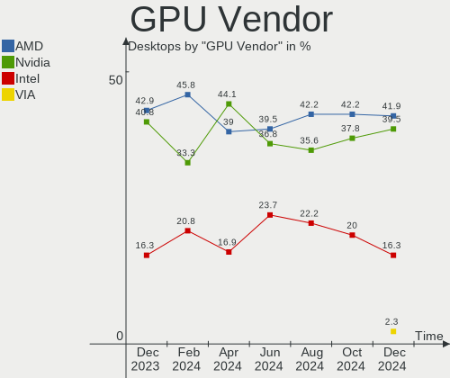
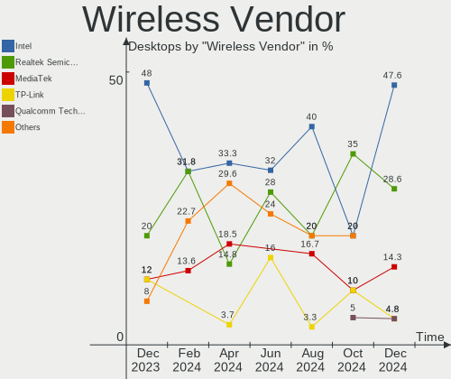
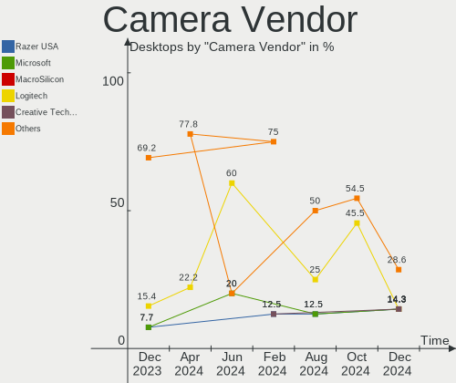

Manjaro - Hardware Trends (Desktops)
------------------------------------

A project to identify most popular hardware characteristics and track their change
over time based on data collected by Linux users at https://Linux-Hardware.org.

Anyone can contribute to this report by the [hw-probe](https://github.com/linuxhw/hw-probe) tool:

    sudo -E hw-probe -all -upload

This report is for one last month. Overall report since the beginning of time: [TestDays](https://github.com/linuxhw/TestDays)

Period: Dec, 2024.

Contents
--------

* [ System ](#system)
  - [ OS                       ](#os)
  - [ OS Family                ](#os-family)
  - [ Kernel                   ](#kernel)
  - [ Kernel Family            ](#kernel-family)
  - [ Kernel Major Ver.        ](#kernel-major-ver)
  - [ Arch                     ](#arch)
  - [ DE                       ](#de)
  - [ Display Server           ](#display-server)
  - [ Display Manager          ](#display-manager)
  - [ OS Lang                  ](#os-lang)
  - [ Boot Mode                ](#boot-mode)
  - [ Filesystem               ](#filesystem)
  - [ Part. scheme             ](#part-scheme)
  - [ Dual Boot with Linux/BSD ](#dual-boot-with-linuxbsd)
  - [ Dual Boot (Win)          ](#dual-boot-win)

* [ Board ](#board)
  - [ Vendor                   ](#vendor)
  - [ Model                    ](#model)
  - [ Model Family             ](#model-family)
  - [ MFG Year                 ](#mfg-year)
  - [ Form Factor              ](#form-factor)
  - [ Secure Boot              ](#secure-boot)
  - [ Coreboot                 ](#coreboot)
  - [ RAM Size                 ](#ram-size)
  - [ RAM Used                 ](#ram-used)
  - [ Total Drives             ](#total-drives)
  - [ Has CD-ROM               ](#has-cd-rom)
  - [ Has Ethernet             ](#has-ethernet)
  - [ Has WiFi                 ](#has-wifi)
  - [ Has Bluetooth            ](#has-bluetooth)

* [ Location ](#location)
  - [ Country                  ](#country)
  - [ City                     ](#city)

* [ Drives ](#drives)
  - [ Drive Vendor             ](#drive-vendor)
  - [ Drive Model              ](#drive-model)
  - [ HDD Vendor               ](#hdd-vendor)
  - [ SSD Vendor               ](#ssd-vendor)
  - [ Drive Kind               ](#drive-kind)
  - [ Drive Connector          ](#drive-connector)
  - [ Drive Size               ](#drive-size)
  - [ Space Total              ](#space-total)
  - [ Space Used               ](#space-used)
  - [ Malfunc. Drives          ](#malfunc-drives)
  - [ Malfunc. Drive Vendor    ](#malfunc-drive-vendor)
  - [ Malfunc. HDD Vendor      ](#malfunc-hdd-vendor)
  - [ Malfunc. Drive Kind      ](#malfunc-drive-kind)
  - [ Failed Drives            ](#failed-drives)
  - [ Failed Drive Vendor      ](#failed-drive-vendor)
  - [ Drive Status             ](#drive-status)

* [ Storage controller ](#storage-controller)
  - [ Storage Vendor           ](#storage-vendor)
  - [ Storage Model            ](#storage-model)
  - [ Storage Kind             ](#storage-kind)

* [ Processor ](#processor)
  - [ CPU Vendor               ](#cpu-vendor)
  - [ CPU Model                ](#cpu-model)
  - [ CPU Model Family         ](#cpu-model-family)
  - [ CPU Cores                ](#cpu-cores)
  - [ CPU Sockets              ](#cpu-sockets)
  - [ CPU Threads              ](#cpu-threads)
  - [ CPU Op-Modes             ](#cpu-op-modes)
  - [ CPU Microcode            ](#cpu-microcode)
  - [ CPU Microarch            ](#cpu-microarch)

* [ Graphics ](#graphics)
  - [ GPU Vendor               ](#gpu-vendor)
  - [ GPU Model                ](#gpu-model)
  - [ GPU Combo                ](#gpu-combo)
  - [ GPU Driver               ](#gpu-driver)
  - [ GPU Memory               ](#gpu-memory)

* [ Monitor ](#monitor)
  - [ Monitor Vendor           ](#monitor-vendor)
  - [ Monitor Model            ](#monitor-model)
  - [ Monitor Resolution       ](#monitor-resolution)
  - [ Monitor Diagonal         ](#monitor-diagonal)
  - [ Monitor Width            ](#monitor-width)
  - [ Aspect Ratio             ](#aspect-ratio)
  - [ Monitor Area             ](#monitor-area)
  - [ Pixel Density            ](#pixel-density)
  - [ Multiple Monitors        ](#multiple-monitors)

* [ Network ](#network)
  - [ Net Controller Vendor    ](#net-controller-vendor)
  - [ Net Controller Model     ](#net-controller-model)
  - [ Wireless Vendor          ](#wireless-vendor)
  - [ Wireless Model           ](#wireless-model)
  - [ Ethernet Vendor          ](#ethernet-vendor)
  - [ Ethernet Model           ](#ethernet-model)
  - [ Net Controller Kind      ](#net-controller-kind)
  - [ Used Controller          ](#used-controller)
  - [ NICs                     ](#nics)
  - [ IPv6                     ](#ipv6)

* [ Bluetooth ](#bluetooth)
  - [ Bluetooth Vendor         ](#bluetooth-vendor)
  - [ Bluetooth Model          ](#bluetooth-model)

* [ Sound ](#sound)
  - [ Sound Vendor             ](#sound-vendor)
  - [ Sound Model              ](#sound-model)

* [ Memory ](#memory)
  - [ Memory Vendor            ](#memory-vendor)
  - [ Memory Model             ](#memory-model)
  - [ Memory Kind              ](#memory-kind)
  - [ Memory Form Factor       ](#memory-form-factor)
  - [ Memory Size              ](#memory-size)
  - [ Memory Speed             ](#memory-speed)

* [ Printers & scanners ](#printers--scanners)
  - [ Printer Vendor           ](#printer-vendor)
  - [ Printer Model            ](#printer-model)
  - [ Scanner Vendor           ](#scanner-vendor)
  - [ Scanner Model            ](#scanner-model)

* [ Camera ](#camera)
  - [ Camera Vendor            ](#camera-vendor)
  - [ Camera Model             ](#camera-model)

* [ Security ](#security)
  - [ Fingerprint Vendor       ](#fingerprint-vendor)
  - [ Fingerprint Model        ](#fingerprint-model)
  - [ Chipcard Vendor          ](#chipcard-vendor)
  - [ Chipcard Model           ](#chipcard-model)

* [ Unsupported ](#unsupported)
  - [ Unsupported Devices      ](#unsupported-devices)
  - [ Unsupported Device Types ](#unsupported-device-types)

System
------

OS
--

Installed operating systems

| Name            | Desktops | Percent |
|-----------------|----------|---------|
| Manjaro         | 22       | 53.66%  |
| Manjaro 24.2.1  | 10       | 24.39%  |
| Manjaro 24.2.0  | 6        | 14.63%  |
| Manjaro Rolling | 2        | 4.88%   |
| Manjaro 24.1.2  | 1        | 2.44%   |

OS Family
---------

OS without a version

| Name    | Desktops | Percent |
|---------|----------|---------|
| Manjaro | 41       | 100%    |

Kernel
------

Version of the Linux kernel

| Version            | Desktops | Percent |
|--------------------|----------|---------|
| 6.12.4-1-MANJARO   | 16       | 39.02%  |
| 6.11.10-2-MANJARO  | 8        | 19.51%  |
| 6.6.63-1-MANJARO   | 5        | 12.2%   |
| 6.11.11-1-MANJARO  | 4        | 9.76%   |
| 6.6.65-1-MANJARO   | 3        | 7.32%   |
| 6.6.54-2-MANJARO   | 1        | 2.44%   |
| 6.12.5-lqx1-1-lqx  | 1        | 2.44%   |
| 6.10.9-zen1-2-zen  | 1        | 2.44%   |
| 5.15.55-1-MANJARO  | 1        | 2.44%   |
| 5.10.226-1-MANJARO | 1        | 2.44%   |

Kernel Family
-------------

Linux kernel without a distro release

| Version  | Desktops | Percent |
|----------|----------|---------|
| 6.12.4   | 16       | 39.02%  |
| 6.11.10  | 8        | 19.51%  |
| 6.6.63   | 5        | 12.2%   |
| 6.11.11  | 4        | 9.76%   |
| 6.6.65   | 3        | 7.32%   |
| 6.6.54   | 1        | 2.44%   |
| 6.12.5   | 1        | 2.44%   |
| 6.10.9   | 1        | 2.44%   |
| 5.15.55  | 1        | 2.44%   |
| 5.10.226 | 1        | 2.44%   |

Kernel Major Ver.
-----------------

Linux kernel major version

| Version | Desktops | Percent |
|---------|----------|---------|
| 6.12    | 17       | 41.46%  |
| 6.11    | 12       | 29.27%  |
| 6.6     | 9        | 21.95%  |
| 6.10    | 1        | 2.44%   |
| 5.15    | 1        | 2.44%   |
| 5.10    | 1        | 2.44%   |

Arch
----

OS architecture (x86_64, i586, etc.)

| Name   | Desktops | Percent |
|--------|----------|---------|
| x86_64 | 41       | 100%    |

DE
--

Desktop Environment

| Name  | Desktops | Percent |
|-------|----------|---------|
| KDE6  | 24       | 58.54%  |
| XFCE  | 8        | 19.51%  |
| KDE5  | 5        | 12.2%   |
| GNOME | 4        | 9.76%   |

Display Server
--------------

X11 or Wayland

| Name    | Desktops | Percent |
|---------|----------|---------|
| X11     | 33       | 80.49%  |
| Wayland | 6        | 14.63%  |
| Unknown | 2        | 4.88%   |

Display Manager
---------------

SDDM, LightDM, etc.

| Name    | Desktops | Percent |
|---------|----------|---------|
| Unknown | 24       | 58.54%  |
| SDDM    | 13       | 31.71%  |
| LightDM | 3        | 7.32%   |
| GDM     | 1        | 2.44%   |

OS Lang
-------

Language

| Lang  | Desktops | Percent |
|-------|----------|---------|
| en_US | 15       | 36.59%  |
| es_ES | 4        | 9.76%   |
| en_GB | 4        | 9.76%   |
| it_IT | 3        | 7.32%   |
| en_CA | 3        | 7.32%   |
| de_DE | 3        | 7.32%   |
| pt_BR | 2        | 4.88%   |
| pl_PL | 2        | 4.88%   |
| ja_JP | 1        | 2.44%   |
| es_MX | 1        | 2.44%   |
| en_ZA | 1        | 2.44%   |
| en_HK | 1        | 2.44%   |
| de_CH | 1        | 2.44%   |

Boot Mode
---------

EFI or BIOS

| Mode | Desktops | Percent |
|------|----------|---------|
| BIOS | 30       | 73.17%  |
| EFI  | 11       | 26.83%  |

Filesystem
----------

Type of filesystem

| Type  | Desktops | Percent |
|-------|----------|---------|
| Ext4  | 30       | 73.17%  |
| Btrfs | 6        | 14.63%  |
| Tmpfs | 4        | 9.76%   |
| Xfs   | 1        | 2.44%   |

Part. scheme
------------

Scheme of partitioning

| Type    | Desktops | Percent |
|---------|----------|---------|
| Unknown | 24       | 58.54%  |
| GPT     | 15       | 36.59%  |
| MBR     | 2        | 4.88%   |

Dual Boot with Linux/BSD
------------------------

Hosting more than one Linux/BSD

| Dual boot | Desktops | Percent |
|-----------|----------|---------|
| No        | 36       | 87.8%   |
| Yes       | 5        | 12.2%   |

Dual Boot (Win)
---------------

Hosting Linux and Windows

| Dual boot | Desktops | Percent |
|-----------|----------|---------|
| No        | 34       | 82.93%  |
| Yes       | 7        | 17.07%  |

Board
-----

Vendor
------

Motherboard manufacturer

| Name                                 | Desktops | Percent |
|--------------------------------------|----------|---------|
| Gigabyte Technology                  | 10       | 24.39%  |
| MSI                                  | 8        | 19.51%  |
| ASUSTek Computer                     | 7        | 17.07%  |
| Hewlett-Packard                      | 4        | 9.76%   |
| ASRock                               | 3        | 7.32%   |
| Lenovo                               | 2        | 4.88%   |
| Intel                                | 2        | 4.88%   |
| Tianbei                              | 1        | 2.44%   |
| Shenzhen Meigao Electronic Equipment | 1        | 2.44%   |
| Dell                                 | 1        | 2.44%   |
| AMI                                  | 1        | 2.44%   |
| Acer                                 | 1        | 2.44%   |

Model
-----

Motherboard model

| Name                                                | Desktops | Percent |
|-----------------------------------------------------|----------|---------|
| MSI MS-7C56                                         | 2        | 4.88%   |
| Tianbei GEM10                                       | 1        | 2.44%   |
| Shenzhen Meigao Electronic Equipment Mercury series | 1        | 2.44%   |
| MSI MS-7E25                                         | 1        | 2.44%   |
| MSI MS-7D77                                         | 1        | 2.44%   |
| MSI MS-7D67                                         | 1        | 2.44%   |
| MSI MS-7C37                                         | 1        | 2.44%   |
| MSI MS-7A38                                         | 1        | 2.44%   |
| MSI MS-7253                                         | 1        | 2.44%   |
| Lenovo ThinkCentre M79 10CTA00VLS                   | 1        | 2.44%   |
| Lenovo Legion T7 34IAZ7 90S1000JUS                  | 1        | 2.44%   |
| Intel X108                                          | 1        | 2.44%   |
| Intel H55                                           | 1        | 2.44%   |
| HP Z840 Workstation                                 | 1        | 2.44%   |
| HP Z440 Workstation                                 | 1        | 2.44%   |
| HP Elite Slice                                      | 1        | 2.44%   |
| HP Compaq 8100 Elite SFF Brazil PC                  | 1        | 2.44%   |
| Gigabyte Z790 AORUS PRO X                           | 1        | 2.44%   |
| Gigabyte Z390 UD                                    | 1        | 2.44%   |
| Gigabyte X470 AORUS ULTRA GAMING                    | 1        | 2.44%   |
| Gigabyte P55M-UD2                                   | 1        | 2.44%   |
| Gigabyte P55-UD4                                    | 1        | 2.44%   |
| Gigabyte H97M-D3H                                   | 1        | 2.44%   |
| Gigabyte B550M AORUS ELITE                          | 1        | 2.44%   |
| Gigabyte B550 AORUS ELITE V2                        | 1        | 2.44%   |
| Gigabyte B550 AORUS ELITE AX V3                     | 1        | 2.44%   |
| Gigabyte B550 AORUS ELITE                           | 1        | 2.44%   |
| Dell OptiPlex 3040                                  | 1        | 2.44%   |
| ASUS ROG STRIX X570-E GAMING                        | 1        | 2.44%   |
| ASUS ROG STRIX B550-F GAMING                        | 1        | 2.44%   |
| ASUS ROG Rampage VI EXTREME ENCORE                  | 1        | 2.44%   |
| ASUS ProArt X870E-CREATOR WIFI                      | 1        | 2.44%   |
| ASUS Pro WS X299 SAGE II                            | 1        | 2.44%   |
| ASUS PRIME B760M-A D4                               | 1        | 2.44%   |
| ASUS PRIME A320M-K                                  | 1        | 2.44%   |
| ASRock X570 Steel Legend                            | 1        | 2.44%   |
| ASRock B550M-HDV                                    | 1        | 2.44%   |
| ASRock B450 Gaming K4                               | 1        | 2.44%   |
| AMI Intel                                           | 1        | 2.44%   |
| Acer Aspire TC-885                                  | 1        | 2.44%   |

Model Family
------------

Motherboard model prefix

| Name                                         | Desktops | Percent |
|----------------------------------------------|----------|---------|
| Gigabyte B550                                | 3        | 7.32%   |
| ASUS ROG                                     | 3        | 7.32%   |
| MSI MS-7C56                                  | 2        | 4.88%   |
| ASUS PRIME                                   | 2        | 4.88%   |
| Tianbei GEM10                                | 1        | 2.44%   |
| Shenzhen Meigao Electronic Equipment Mercury | 1        | 2.44%   |
| MSI MS-7E25                                  | 1        | 2.44%   |
| MSI MS-7D77                                  | 1        | 2.44%   |
| MSI MS-7D67                                  | 1        | 2.44%   |
| MSI MS-7C37                                  | 1        | 2.44%   |
| MSI MS-7A38                                  | 1        | 2.44%   |
| MSI MS-7253                                  | 1        | 2.44%   |
| Lenovo ThinkCentre                           | 1        | 2.44%   |
| Lenovo Legion                                | 1        | 2.44%   |
| Intel X108                                   | 1        | 2.44%   |
| Intel H55                                    | 1        | 2.44%   |
| HP Z840                                      | 1        | 2.44%   |
| HP Z440                                      | 1        | 2.44%   |
| HP Elite                                     | 1        | 2.44%   |
| HP Compaq                                    | 1        | 2.44%   |
| Gigabyte Z790                                | 1        | 2.44%   |
| Gigabyte Z390                                | 1        | 2.44%   |
| Gigabyte X470                                | 1        | 2.44%   |
| Gigabyte P55M-UD2                            | 1        | 2.44%   |
| Gigabyte P55-UD4                             | 1        | 2.44%   |
| Gigabyte H97M-D3H                            | 1        | 2.44%   |
| Gigabyte B550M                               | 1        | 2.44%   |
| Dell OptiPlex                                | 1        | 2.44%   |
| ASUS ProArt                                  | 1        | 2.44%   |
| ASUS Pro                                     | 1        | 2.44%   |
| ASRock X570                                  | 1        | 2.44%   |
| ASRock B550M-HDV                             | 1        | 2.44%   |
| ASRock B450                                  | 1        | 2.44%   |
| AMI Intel                                    | 1        | 2.44%   |
| Acer Aspire                                  | 1        | 2.44%   |

MFG Year
--------

Motherboard manufacture year

| Year | Desktops | Percent |
|------|----------|---------|
| 2020 | 7        | 17.07%  |
| 2024 | 6        | 14.63%  |
| 2018 | 5        | 12.2%   |
| 2022 | 4        | 9.76%   |
| 2019 | 4        | 9.76%   |
| 2014 | 4        | 9.76%   |
| 2023 | 3        | 7.32%   |
| 2010 | 2        | 4.88%   |
| 2009 | 2        | 4.88%   |
| 2017 | 1        | 2.44%   |
| 2016 | 1        | 2.44%   |
| 2015 | 1        | 2.44%   |
| 2007 | 1        | 2.44%   |

Form Factor
-----------

Physical design of the computer

| Name    | Desktops | Percent |
|---------|----------|---------|
| Desktop | 41       | 100%    |

Secure Boot
-----------

Enabled or disabled

| State    | Desktops | Percent |
|----------|----------|---------|
| Disabled | 41       | 100%    |

Coreboot
--------

Have coreboot on board

| Used | Desktops | Percent |
|------|----------|---------|
| No   | 41       | 100%    |

RAM Size
--------

Total RAM memory

| Size in GB  | Desktops | Percent |
|-------------|----------|---------|
| 32.01-64.0  | 14       | 34.15%  |
| 64.01-256.0 | 10       | 24.39%  |
| 16.01-24.0  | 5        | 12.2%   |
| 8.01-16.0   | 5        | 12.2%   |
| 24.01-32.0  | 3        | 7.32%   |
| 4.01-8.0    | 2        | 4.88%   |
| 3.01-4.0    | 1        | 2.44%   |
| 1.01-2.0    | 1        | 2.44%   |

RAM Used
--------

Used RAM memory

| Used GB    | Desktops | Percent |
|------------|----------|---------|
| 4.01-8.0   | 15       | 36.59%  |
| 2.01-3.0   | 7        | 17.07%  |
| 8.01-16.0  | 7        | 17.07%  |
| 3.01-4.0   | 5        | 12.2%   |
| 1.01-2.0   | 4        | 9.76%   |
| 32.01-64.0 | 1        | 2.44%   |
| 16.01-24.0 | 1        | 2.44%   |
| 0.51-1.0   | 1        | 2.44%   |

Total Drives
------------

Number of drives on board

| Drives | Desktops | Percent |
|--------|----------|---------|
| 1      | 14       | 34.15%  |
| 5      | 8        | 19.51%  |
| 3      | 8        | 19.51%  |
| 2      | 5        | 12.2%   |
| 4      | 4        | 9.76%   |
| 8      | 1        | 2.44%   |
| 6      | 1        | 2.44%   |

Has CD-ROM
----------

Has CD-ROM on board

| Presented | Desktops | Percent |
|-----------|----------|---------|
| No        | 25       | 60.98%  |
| Yes       | 16       | 39.02%  |

Has Ethernet
------------

Has Ethernet on board

| Presented | Desktops | Percent |
|-----------|----------|---------|
| Yes       | 40       | 97.56%  |
| No        | 1        | 2.44%   |

Has WiFi
--------

Has WiFi module

| Presented | Desktops | Percent |
|-----------|----------|---------|
| No        | 21       | 51.22%  |
| Yes       | 20       | 48.78%  |

Has Bluetooth
-------------

Has Bluetooth module

| Presented | Desktops | Percent |
|-----------|----------|---------|
| Yes       | 24       | 58.54%  |
| No        | 17       | 41.46%  |

Location
--------

Country
-------

Geographic location (country)

| Country      | Desktops | Percent |
|--------------|----------|---------|
| USA          | 6        | 14.63%  |
| Spain        | 6        | 14.63%  |
| Germany      | 4        | 9.76%   |
| Brazil       | 4        | 9.76%   |
| Canada       | 3        | 7.32%   |
| UK           | 2        | 4.88%   |
| Poland       | 2        | 4.88%   |
| Mexico       | 2        | 4.88%   |
| Japan        | 2        | 4.88%   |
| Italy        | 2        | 4.88%   |
| Switzerland  | 1        | 2.44%   |
| South Africa | 1        | 2.44%   |
| Netherlands  | 1        | 2.44%   |
| Israel       | 1        | 2.44%   |
| Hong Kong    | 1        | 2.44%   |
| Greece       | 1        | 2.44%   |
| France       | 1        | 2.44%   |
| Belgium      | 1        | 2.44%   |

City
----

Geographic location (city)

| City                       | Desktops | Percent |
|----------------------------|----------|---------|
| Leipzig                    | 2        | 4.88%   |
| Barcelona                  | 2        | 4.88%   |
| Washington                 | 1        | 2.44%   |
| Vitoria-Gasteiz            | 1        | 2.44%   |
| Vitória da Conquista      | 1        | 2.44%   |
| Vignola                    | 1        | 2.44%   |
| Turin                      | 1        | 2.44%   |
| Toronto                    | 1        | 2.44%   |
| Tel Aviv                   | 1        | 2.44%   |
| Stanchfield                | 1        | 2.44%   |
| St. Petersburg             | 1        | 2.44%   |
| Sapporo                    | 1        | 2.44%   |
| San Luis Potosí City      | 1        | 2.44%   |
| Reda                       | 1        | 2.44%   |
| Peterborough               | 1        | 2.44%   |
| Paris                      | 1        | 2.44%   |
| Mexico City                | 1        | 2.44%   |
| Merelbeke                  | 1        | 2.44%   |
| London                     | 1        | 2.44%   |
| Las Palmas de Gran Canaria | 1        | 2.44%   |
| La Broquerie               | 1        | 2.44%   |
| Kitakyushu                 | 1        | 2.44%   |
| Johannesburg               | 1        | 2.44%   |
| Homburg                    | 1        | 2.44%   |
| Gdansk                     | 1        | 2.44%   |
| Enschede                   | 1        | 2.44%   |
| El Vendrell                | 1        | 2.44%   |
| Decatur                    | 1        | 2.44%   |
| Columbus                   | 1        | 2.44%   |
| Central                    | 1        | 2.44%   |
| Campinas                   | 1        | 2.44%   |
| Cambridge                  | 1        | 2.44%   |
| Bruchsal                   | 1        | 2.44%   |
| Bern                       | 1        | 2.44%   |
| Belford Roxo               | 1        | 2.44%   |
| Barueri                    | 1        | 2.44%   |
| Atherstone                 | 1        | 2.44%   |
| Athens                     | 1        | 2.44%   |
| Argamasilla de Alba        | 1        | 2.44%   |

Drives
------

Drive Vendor
------------

Hard drive vendors

| Vendor                       | Desktops | Drives | Percent |
|------------------------------|----------|--------|---------|
| WDC                          | 15       | 24     | 15.63%  |
| Seagate                      | 12       | 16     | 12.5%   |
| Samsung Electronics          | 12       | 14     | 12.5%   |
| Toshiba                      | 8        | 10     | 8.33%   |
| Sandisk                      | 7        | 7      | 7.29%   |
| Kingston                     | 6        | 6      | 6.25%   |
| MAXIO Technology (Hangzhou)  | 5        | 5      | 5.21%   |
| Crucial                      | 5        | 5      | 5.21%   |
| Intel                        | 4        | 5      | 4.17%   |
| Hitachi                      | 4        | 4      | 4.17%   |
| Unknown                      | 1        | 1      | 1.04%   |
| Union Memory (Shenzhen)      | 1        | 1      | 1.04%   |
| Team                         | 1        | 2      | 1.04%   |
| SK hynix                     | 1        | 4      | 1.04%   |
| Shenzhen Longsys Electronics | 1        | 1      | 1.04%   |
| Realtek Semiconductor        | 1        | 1      | 1.04%   |
| Realtek                      | 1        | 1      | 1.04%   |
| Phison Electronics           | 1        | 1      | 1.04%   |
| Patriot                      | 1        | 1      | 1.04%   |
| Micron/Crucial Technology    | 1        | 1      | 1.04%   |
| Lexar                        | 1        | 1      | 1.04%   |
| Kingston Technology Company  | 1        | 1      | 1.04%   |
| KingSpec                     | 1        | 1      | 1.04%   |
| HGST                         | 1        | 1      | 1.04%   |
| Hewlett-Packard              | 1        | 1      | 1.04%   |
| GOODRAM                      | 1        | 1      | 1.04%   |
| Fanxiang                     | 1        | 1      | 1.04%   |
| ACASIS                       | 1        | 1      | 1.04%   |

Drive Model
-----------

Hard drive models

| Model                                                | Desktops | Percent |
|------------------------------------------------------|----------|---------|
| Samsung NVMe SSD Controller PM9A1/PM9A3/980PRO 512GB | 3        | 2.73%   |
| WDC WDS500G2B0A-00SM50 500GB SSD                     | 2        | 1.82%   |
| WDC WDS100T2B0A-00SM50 1TB SSD                       | 2        | 1.82%   |
| Toshiba DT01ACA100 1TB                               | 2        | 1.82%   |
| Seagate ST4000DM004-2CV104 4TB                       | 2        | 1.82%   |
| Sandisk WD_BLACK SN850X 4000GB                       | 2        | 1.82%   |
| Sandisk WD Blue SN570 1TB                            | 2        | 1.82%   |
| MAXIO (Hangzhou) NVMe SSD Controller MAP1202 512GB   | 2        | 1.82%   |
| WDC WDS480G2G0A-00JH30 480GB SSD                     | 1        | 0.91%   |
| WDC WDS200T2B0A-00SM50 2TB SSD                       | 1        | 0.91%   |
| WDC WDS120G2G0A-00JH30 120GB SSD                     | 1        | 0.91%   |
| WDC WD7500AADS-00M2B0 752GB                          | 1        | 0.91%   |
| WDC WD6401AALS-00L3B2 640GB                          | 1        | 0.91%   |
| WDC WD6400AAVS-00G9B1 640GB                          | 1        | 0.91%   |
| WDC WD60EZRZ-00GZ5B1 6TB                             | 1        | 0.91%   |
| WDC WD60EDAZ-11U78B0 6TB                             | 1        | 0.91%   |
| WDC WD5000AAKX-00U6AA0 500GB                         | 1        | 0.91%   |
| WDC WD40EFAX-68JH4N1 4TB                             | 1        | 0.91%   |
| WDC WD4003FRYZ-01F0DB0 4TB                           | 1        | 0.91%   |
| WDC WD30EZRZ-00GXCB0 3TB                             | 1        | 0.91%   |
| WDC WD2500JS-00NCB1 250GB                            | 1        | 0.91%   |
| WDC WD2003FYPS-27W9B0 2TB                            | 1        | 0.91%   |
| WDC WD10EZEX-75ZF5A0 1TB                             | 1        | 0.91%   |
| WDC WD10EZEX-00RKKA0 1TB                             | 1        | 0.91%   |
| WDC WD10EZEX-00BN5A0 1TB                             | 1        | 0.91%   |
| WDC WD10EFRX-68FYTN0 1TB                             | 1        | 0.91%   |
| WDC WD Blue SA510 2.5 1000GB SSD                     | 1        | 0.91%   |
| Unknown NVMe SSD Drive 1024GB                        | 1        | 0.91%   |
| Union Memory (Shenzhen) UMIS RPETJ512MGE2QDQ 512GB   | 1        | 0.91%   |
| Toshiba TR200 480GB SSD                              | 1        | 0.91%   |
| Toshiba TR200 240GB SSD                              | 1        | 0.91%   |
| Toshiba THNSFC128GBSJ SSD                            | 1        | 0.91%   |
| Toshiba MQ04ABF100 1TB                               | 1        | 0.91%   |
| Toshiba MQ01ABD100 1TB                               | 1        | 0.91%   |
| Toshiba MG09ACA18TE 18TB                             | 1        | 0.91%   |
| Toshiba BG3 NVMe SSD Controller 128GB                | 1        | 0.91%   |
| Team T253512GB SSD                                   | 1        | 0.91%   |
| Team T2534TB SSD                                     | 1        | 0.91%   |
| SK hynix SHPP41-2000GM 2TB                           | 1        | 0.91%   |
| Shenzhen Longsys Lexar SSD 256GB                     | 1        | 0.91%   |

HDD Vendor
----------

Hard disk drive vendors

| Vendor              | Desktops | Drives | Percent |
|---------------------|----------|--------|---------|
| Seagate             | 12       | 16     | 34.29%  |
| WDC                 | 11       | 16     | 31.43%  |
| Toshiba             | 5        | 6      | 14.29%  |
| Hitachi             | 4        | 4      | 11.43%  |
| Samsung Electronics | 1        | 2      | 2.86%   |
| HGST                | 1        | 1      | 2.86%   |
| Hewlett-Packard     | 1        | 1      | 2.86%   |

SSD Vendor
----------

Solid state drive vendors

| Vendor              | Desktops | Drives | Percent |
|---------------------|----------|--------|---------|
| Samsung Electronics | 5        | 5      | 19.23%  |
| Crucial             | 5        | 5      | 19.23%  |
| WDC                 | 4        | 8      | 15.38%  |
| Toshiba             | 3        | 3      | 11.54%  |
| Kingston            | 3        | 3      | 11.54%  |
| Team                | 1        | 2      | 3.85%   |
| SanDisk             | 1        | 1      | 3.85%   |
| Patriot             | 1        | 1      | 3.85%   |
| Lexar               | 1        | 1      | 3.85%   |
| KingSpec            | 1        | 1      | 3.85%   |
| GOODRAM             | 1        | 1      | 3.85%   |

Drive Kind
----------

HDD or SSD

| Kind    | Desktops | Drives | Percent |
|---------|----------|--------|---------|
| NVMe    | 27       | 40     | 36.99%  |
| HDD     | 26       | 46     | 35.62%  |
| SSD     | 19       | 31     | 26.03%  |
| Unknown | 1        | 1      | 1.37%   |

Drive Connector
---------------

SATA, SAS, NVMe, etc.

| Type | Desktops | Drives | Percent |
|------|----------|--------|---------|
| SATA | 31       | 75     | 50%     |
| NVMe | 27       | 39     | 43.55%  |
| SAS  | 4        | 4      | 6.45%   |

Drive Size
----------

Size of hard drive

| Size in TB | Desktops | Drives | Percent |
|------------|----------|--------|---------|
| 0.01-0.5   | 22       | 29     | 41.51%  |
| 0.51-1.0   | 14       | 27     | 26.42%  |
| 3.01-4.0   | 7        | 8      | 13.21%  |
| 1.01-2.0   | 6        | 8      | 11.32%  |
| 4.01-10.0  | 2        | 3      | 3.77%   |
| 2.01-3.0   | 1        | 1      | 1.89%   |
| 10.01-20.0 | 1        | 1      | 1.89%   |

Space Total
-----------

Amount of disk space available on the file system

| Size in GB     | Desktops | Percent |
|----------------|----------|---------|
| More than 3000 | 11       | 26.83%  |
| 1001-2000      | 11       | 26.83%  |
| 501-1000       | 7        | 17.07%  |
| 101-250        | 6        | 14.63%  |
| 251-500        | 3        | 7.32%   |
| 2001-3000      | 2        | 4.88%   |
| Unknown        | 1        | 2.44%   |

Space Used
----------

Amount of used disk space

| Used GB        | Desktops | Percent |
|----------------|----------|---------|
| 1001-2000      | 7        | 17.07%  |
| More than 3000 | 5        | 12.2%   |
| 101-250        | 5        | 12.2%   |
| 1-20           | 5        | 12.2%   |
| 501-1000       | 5        | 12.2%   |
| 251-500        | 4        | 9.76%   |
| 21-50          | 4        | 9.76%   |
| 51-100         | 3        | 7.32%   |
| 2001-3000      | 2        | 4.88%   |
| Unknown        | 1        | 2.44%   |

Malfunc. Drives
---------------

Drive models with a malfunction

| Model                           | Desktops | Drives | Percent |
|---------------------------------|----------|--------|---------|
| Toshiba DT01ACA100 1TB          | 1        | 1      | 25%     |
| Seagate ST500LT012-9WS142 500GB | 1        | 1      | 25%     |
| Seagate ST1000LM035-1RK172 1TB  | 1        | 1      | 25%     |
| Hitachi HDS5C4040ALE630 4TB     | 1        | 1      | 25%     |

Malfunc. Drive Vendor
---------------------

Vendors of faulty drives

| Vendor  | Desktops | Drives | Percent |
|---------|----------|--------|---------|
| Seagate | 2        | 2      | 50%     |
| Toshiba | 1        | 1      | 25%     |
| Hitachi | 1        | 1      | 25%     |

Malfunc. HDD Vendor
-------------------

Vendors of faulty HDD drives

| Vendor  | Desktops | Drives | Percent |
|---------|----------|--------|---------|
| Seagate | 2        | 2      | 50%     |
| Toshiba | 1        | 1      | 25%     |
| Hitachi | 1        | 1      | 25%     |

Malfunc. Drive Kind
-------------------

Kinds of faulty drives

| Kind | Desktops | Drives | Percent |
|------|----------|--------|---------|
| HDD  | 3        | 4      | 100%    |

Failed Drives
-------------

Failed drive models

Zero info for selected period =(

Failed Drive Vendor
-------------------

Failed drive vendors

Zero info for selected period =(

Drive Status
------------

Number of failed and malfunc. drives

| Status   | Desktops | Drives | Percent |
|----------|----------|--------|---------|
| Detected | 29       | 88     | 65.91%  |
| Works    | 12       | 26     | 27.27%  |
| Malfunc  | 3        | 4      | 6.82%   |

Storage controller
------------------

Storage Vendor
--------------

Storage controller vendors

| Vendor                       | Desktops | Percent |
|------------------------------|----------|---------|
| Intel                        | 19       | 25%     |
| AMD                          | 19       | 25%     |
| Sandisk                      | 6        | 7.89%   |
| Samsung Electronics          | 6        | 7.89%   |
| MAXIO Technology (Hangzhou)  | 5        | 6.58%   |
| Kingston Technology Company  | 4        | 5.26%   |
| ASMedia Technology           | 4        | 5.26%   |
| JMicron Technology           | 2        | 2.63%   |
| VIA Technologies             | 1        | 1.32%   |
| Union Memory (Shenzhen)      | 1        | 1.32%   |
| Toshiba America Info Systems | 1        | 1.32%   |
| Solidigm                     | 1        | 1.32%   |
| SK hynix                     | 1        | 1.32%   |
| Shenzhen Longsys Electronics | 1        | 1.32%   |
| Realtek Semiconductor        | 1        | 1.32%   |
| Phison Electronics           | 1        | 1.32%   |
| Micron/Crucial Technology    | 1        | 1.32%   |
| INNOGRIT                     | 1        | 1.32%   |
| Broadcom / LSI               | 1        | 1.32%   |

Storage Model
-------------

Storage controller models

| Model                                                                         | Desktops | Percent |
|-------------------------------------------------------------------------------|----------|---------|
| AMD FCH SATA Controller [AHCI mode]                                           | 8        | 8.89%   |
| AMD 500 Series Chipset SATA Controller                                        | 8        | 8.89%   |
| Intel 5 Series/3400 Series Chipset 6 port SATA AHCI Controller                | 4        | 4.44%   |
| ASMedia ASM1061/ASM1062 Serial ATA Controller                                 | 4        | 4.44%   |
| Samsung NVMe SSD Controller PM9A1/PM9A3/980PRO                                | 3        | 3.33%   |
| MAXIO (Hangzhou) NVMe SSD Controller MAP1602 (DRAM-less)                      | 3        | 3.33%   |
| Intel Raptor Lake SATA AHCI Controller                                        | 3        | 3.33%   |
| AMD 600 Series Chipset SATA Controller                                        | 3        | 3.33%   |
| AMD 400 Series Chipset SATA Controller                                        | 3        | 3.33%   |
| Sandisk WD Black SN850X NVMe SSD                                              | 2        | 2.22%   |
| SanDisk Ultra 3D / WD Blue SN570 NVMe SSD (DRAM-less)                         | 2        | 2.22%   |
| MAXIO (Hangzhou) NVMe SSD Controller MAP1202 (DRAM-less)                      | 2        | 2.22%   |
| JMicron JMB363 SATA/IDE Controller                                            | 2        | 2.22%   |
| Intel Q170/Q150/B150/H170/H110/Z170/CM236 Chipset SATA Controller [AHCI Mode] | 2        | 2.22%   |
| Intel Cannon Lake PCH SATA AHCI Controller                                    | 2        | 2.22%   |
| Intel 200 Series PCH SATA controller [AHCI mode]                              | 2        | 2.22%   |
| VIA VT82C586A/B/VT82C686/A/B/VT823x/A/C PIPC Bus Master IDE                   | 1        | 1.11%   |
| VIA VT8237A SATA 2-Port Controller                                            | 1        | 1.11%   |
| Union Memory (Shenzhen) AM630 PCIe 4.0 x4 NVMe SSD Controller                 | 1        | 1.11%   |
| Toshiba America Info Systems BG3 x2 NVMe SSD Controller (DRAM-less)           | 1        | 1.11%   |
| Solidigm P44 Pro NVMe SSD [Hollywood Beach]                                   | 1        | 1.11%   |
| SK hynix Platinum P41/PC801 NVMe Solid State Drive                            | 1        | 1.11%   |
| Shenzhen Longsys FORESEE P900 BGA NVMe SSD (DRAM-less)                        | 1        | 1.11%   |
| SanDisk WD Green SN350 240GB (DRAM-less) / SN560E NVMe SSD                    | 1        | 1.11%   |
| Sandisk WD Blue SN580 NVMe SSD (DRAM-less)                                    | 1        | 1.11%   |
| Samsung NVMe SSD Controller SM981/PM981/PM983                                 | 1        | 1.11%   |
| Samsung NVMe SSD Controller SM961/PM961/SM963                                 | 1        | 1.11%   |
| Samsung NVMe SSD Controller PM9C1a (DRAM-less)                                | 1        | 1.11%   |
| Samsung NVMe SSD Controller PM9B1 (DRAM-less)                                 | 1        | 1.11%   |
| Realtek RTS5763DL NVMe SSD Controller (DRAM-less)                             | 1        | 1.11%   |
| Phison E12 NVMe Controller                                                    | 1        | 1.11%   |
| Micron/Crucial P5 Plus NVMe PCIe SSD                                          | 1        | 1.11%   |
| Kingston Company OM3PGP4 NVMe SSD                                             | 1        | 1.11%   |
| Kingston Company NV2 NVMe SSD [E21T] (DRAM-less)                              | 1        | 1.11%   |
| Kingston Company KC3000/FURY Renegade NVMe SSD [E18]                          | 1        | 1.11%   |
| Kingston Company A2000 NVMe SSD [SM2263EN]                                    | 1        | 1.11%   |
| Intel Volume Management Device NVMe RAID Controller                           | 1        | 1.11%   |
| Intel SSD DC P4101/Pro 7600p/760p/E 6100p Series                              | 1        | 1.11%   |
| Intel SSD 670p Series [Keystone Harbor]                                       | 1        | 1.11%   |
| Intel SSD 660P Series                                                         | 1        | 1.11%   |

Storage Kind
------------

Kind of storage controller (IDE, SATA, NVMe, SAS, ...)

| Kind | Desktops | Percent |
|------|----------|---------|
| SATA | 35       | 50.72%  |
| NVMe | 27       | 39.13%  |
| IDE  | 4        | 5.8%    |
| RAID | 2        | 2.9%    |
| SAS  | 1        | 1.45%   |

Processor
---------

CPU Vendor
----------

Processor vendors

| Vendor | Desktops | Percent |
|--------|----------|---------|
| AMD    | 22       | 53.66%  |
| Intel  | 19       | 46.34%  |

CPU Model
---------

Processor models

| Model                                       | Desktops | Percent |
|---------------------------------------------|----------|---------|
| Intel Core i5 CPU 650 @ 3.20GHz             | 3        | 7.32%   |
| AMD Ryzen 7 5800X 8-Core Processor          | 3        | 7.32%   |
| AMD Ryzen 5 3600 6-Core Processor           | 3        | 7.32%   |
| AMD Ryzen 5 5500                            | 2        | 4.88%   |
| Intel Xeon CPU E5-2690 v4 @ 2.60GHz         | 1        | 2.44%   |
| Intel Xeon CPU E5-1620 v4 @ 3.50GHz         | 1        | 2.44%   |
| Intel Core i9-9940X CPU @ 3.30GHz           | 1        | 2.44%   |
| Intel Core i9-14900K                        | 1        | 2.44%   |
| Intel Core i9-10920X CPU @ 3.50GHz          | 1        | 2.44%   |
| Intel Core i7-9700F CPU @ 3.00GHz           | 1        | 2.44%   |
| Intel Core i7-8700 CPU @ 3.20GHz            | 1        | 2.44%   |
| Intel Core i7-7700T CPU @ 2.90GHz           | 1        | 2.44%   |
| Intel Core i7-4790S CPU @ 3.20GHz           | 1        | 2.44%   |
| Intel Core i7 CPU 860 @ 2.80GHz             | 1        | 2.44%   |
| Intel Core i5-6500 CPU @ 3.20GHz            | 1        | 2.44%   |
| Intel Core i5-1030NG7 CPU @ 1.10GHz         | 1        | 2.44%   |
| Intel Core i5 CPU 750 @ 2.67GHz             | 1        | 2.44%   |
| Intel 13th Gen Core i5-13400F               | 1        | 2.44%   |
| Intel 12th Gen Core i9-12900K               | 1        | 2.44%   |
| Intel 12th Gen Core i5-12400F               | 1        | 2.44%   |
| AMD Sempron Processor LE-1100               | 1        | 2.44%   |
| AMD Ryzen 9 9950X 16-Core Processor         | 1        | 2.44%   |
| AMD Ryzen 9 7950X 16-Core Processor         | 1        | 2.44%   |
| AMD Ryzen 9 5900X 12-Core Processor         | 1        | 2.44%   |
| AMD Ryzen 7 7840HS w/ Radeon 780M Graphics  | 1        | 2.44%   |
| AMD Ryzen 7 6800U with Radeon Graphics      | 1        | 2.44%   |
| AMD Ryzen 7 5700X3D 8-Core Processor        | 1        | 2.44%   |
| AMD Ryzen 7 3800X 8-Core Processor          | 1        | 2.44%   |
| AMD Ryzen 7 2700X Eight-Core Processor      | 1        | 2.44%   |
| AMD Ryzen 5 7600X 6-Core Processor          | 1        | 2.44%   |
| AMD Ryzen 5 5600X 6-Core Processor          | 1        | 2.44%   |
| AMD Ryzen 5 2400G with Radeon Vega Graphics | 1        | 2.44%   |
| AMD Ryzen 3 2200G with Radeon Vega Graphics | 1        | 2.44%   |
| AMD Athlon X4 850 Quad Core Processor       | 1        | 2.44%   |

CPU Model Family
----------------

Processor model prefix

| Model         | Desktops | Percent |
|---------------|----------|---------|
| AMD Ryzen 7   | 8        | 19.51%  |
| AMD Ryzen 5   | 8        | 19.51%  |
| Intel Core i5 | 6        | 14.63%  |
| Intel Core i7 | 5        | 12.2%   |
| Other         | 3        | 7.32%   |
| Intel Core i9 | 3        | 7.32%   |
| AMD Ryzen 9   | 3        | 7.32%   |
| Intel Xeon    | 2        | 4.88%   |
| AMD Sempron   | 1        | 2.44%   |
| AMD Ryzen 3   | 1        | 2.44%   |
| AMD Athlon X4 | 1        | 2.44%   |

CPU Cores
---------

Number of processor cores

| Number | Desktops | Percent |
|--------|----------|---------|
| 4      | 10       | 24.39%  |
| 8      | 9        | 21.95%  |
| 6      | 9        | 21.95%  |
| 16     | 3        | 7.32%   |
| 2      | 3        | 7.32%   |
| 12     | 2        | 4.88%   |
| 28     | 1        | 2.44%   |
| 24     | 1        | 2.44%   |
| 14     | 1        | 2.44%   |
| 10     | 1        | 2.44%   |
| 1      | 1        | 2.44%   |

CPU Sockets
-----------

Number of sockets

| Number | Desktops | Percent |
|--------|----------|---------|
| 1      | 40       | 97.56%  |
| 2      | 1        | 2.44%   |

CPU Threads
-----------

Threads per core (Hyper-Threading)

| Number | Desktops | Percent |
|--------|----------|---------|
| 2      | 35       | 85.37%  |
| 1      | 6        | 14.63%  |

CPU Op-Modes
------------

CPU Operation Modes (32-bit, 64-bit)

| Op mode        | Desktops | Percent |
|----------------|----------|---------|
| 32-bit, 64-bit | 41       | 100%    |

CPU Microcode
-------------

Microcode number

| Number     | Desktops | Percent |
|------------|----------|---------|
| Unknown    | 40       | 97.56%  |
| 0x0a201025 | 1        | 2.44%   |

CPU Microarch
-------------

Microarchitecture

| Name             | Desktops | Percent |
|------------------|----------|---------|
| Zen 3            | 8        | 19.51%  |
| Unknown          | 6        | 14.63%  |
| Zen 2            | 4        | 9.76%   |
| Westmere         | 3        | 7.32%   |
| Skylake          | 3        | 7.32%   |
| KabyLake         | 3        | 7.32%   |
| Alderlake Hybrid | 3        | 7.32%   |
| Zen              | 2        | 4.88%   |
| Nehalem          | 2        | 4.88%   |
| Broadwell        | 2        | 4.88%   |
| Zen+             | 1        | 2.44%   |
| Steamroller      | 1        | 2.44%   |
| K8 Hammer        | 1        | 2.44%   |
| IceLake          | 1        | 2.44%   |
| Haswell          | 1        | 2.44%   |

Graphics
--------

GPU Vendor
----------

Vendors of graphics cards

| Vendor           | Desktops | Percent |
|------------------|----------|---------|
| AMD              | 18       | 41.86%  |
| Nvidia           | 17       | 39.53%  |
| Intel            | 7        | 16.28%  |
| VIA Technologies | 1        | 2.33%   |

GPU Model
---------

Graphics card models

| Model                                                                 | Desktops | Percent |
|-----------------------------------------------------------------------|----------|---------|
| AMD Navi 33 [Radeon RX 7600/7600 XT/7600M XT/7600S/7700S / PRO W7600] | 3        | 6.38%   |
| AMD Navi 32 [Radeon RX 7700 XT / 7800 XT]                             | 3        | 6.38%   |
| Nvidia GP107 [GeForce GTX 1050 Ti]                                    | 2        | 4.26%   |
| Intel Core Processor Integrated Graphics Controller                   | 2        | 4.26%   |
| AMD Raven Ridge [Radeon Vega Series / Radeon Vega Mobile Series]      | 2        | 4.26%   |
| AMD Raphael                                                           | 2        | 4.26%   |
| AMD Bonaire XTX [Radeon R7 260X/360]                                  | 2        | 4.26%   |
| VIA Technologies K8M890CE/K8N890CE [Chrome 9]                         | 1        | 2.13%   |
| Nvidia TU106 [GeForce RTX 2070]                                       | 1        | 2.13%   |
| Nvidia TU106 [GeForce RTX 2060 Rev. A]                                | 1        | 2.13%   |
| Nvidia GP107GL [Quadro P400]                                          | 1        | 2.13%   |
| Nvidia GP104GL [Quadro P4000]                                         | 1        | 2.13%   |
| Nvidia GM206GL [Quadro M2000]                                         | 1        | 2.13%   |
| Nvidia GK208B [GeForce GT 710]                                        | 1        | 2.13%   |
| Nvidia GA106 [GeForce RTX 3060]                                       | 1        | 2.13%   |
| Nvidia GA106 [GeForce RTX 3060 Lite Hash Rate]                        | 1        | 2.13%   |
| Nvidia GA104 [GeForce RTX 3070]                                       | 1        | 2.13%   |
| Nvidia GA102 [GeForce RTX 3090]                                       | 1        | 2.13%   |
| Nvidia GA102 [GeForce RTX 3080 Ti]                                    | 1        | 2.13%   |
| Nvidia GA102 [GeForce RTX 3080 Lite Hash Rate]                        | 1        | 2.13%   |
| Nvidia AD106 [GeForce RTX 4060 Ti]                                    | 1        | 2.13%   |
| Nvidia AD104 [GeForce RTX 4070 SUPER]                                 | 1        | 2.13%   |
| Nvidia AD103 [GeForce RTX 4080]                                       | 1        | 2.13%   |
| Intel Raptor Lake-S GT1 [UHD Graphics 770]                            | 1        | 2.13%   |
| Intel Iris Plus Graphics G7 (Ice Lake)                                | 1        | 2.13%   |
| Intel HD Graphics 630                                                 | 1        | 2.13%   |
| Intel HD Graphics 530                                                 | 1        | 2.13%   |
| Intel CoffeeLake-S GT2 [UHD Graphics 630]                             | 1        | 2.13%   |
| AMD RV730 XT [Radeon HD 4670]                                         | 1        | 2.13%   |
| AMD Rembrandt [Radeon 680M]                                           | 1        | 2.13%   |
| AMD Phoenix1                                                          | 1        | 2.13%   |
| AMD Oland PRO [Radeon R7 240/340 / Radeon 520]                        | 1        | 2.13%   |
| AMD Navi 31 [Radeon RX 7900 XT/7900 XTX/7900 GRE/7900M]               | 1        | 2.13%   |
| AMD Navi 22 [Radeon RX 6700/6700 XT/6750 XT / 6800M/6850M XT]         | 1        | 2.13%   |
| AMD Navi 10 [Radeon RX 5600 OEM/5600 XT / 5700/5700 XT]               | 1        | 2.13%   |
| AMD Granite Ridge [Radeon Graphics]                                   | 1        | 2.13%   |
| AMD Ellesmere [Radeon RX 470/480/570/570X/580/580X/590]               | 1        | 2.13%   |
| AMD Baffin [Radeon RX 550 640SP / RX 560/560X]                        | 1        | 2.13%   |

GPU Combo
---------

Combinations of graphics cards

| Name       | Desktops | Percent |
|------------|----------|---------|
| 1 x Nvidia | 17       | 41.46%  |
| 1 x AMD    | 14       | 34.15%  |
| 1 x Intel  | 6        | 14.63%  |
| 2 x AMD    | 3        | 7.32%   |
| 1 x VIA    | 1        | 2.44%   |

GPU Driver
----------

Free vs proprietary

| Driver      | Desktops | Percent |
|-------------|----------|---------|
| Free        | 23       | 56.1%   |
| Proprietary | 15       | 36.59%  |
| Unknown     | 3        | 7.32%   |

GPU Memory
----------

Total video memory

| Size in GB | Desktops | Percent |
|------------|----------|---------|
| Unknown    | 24       | 58.54%  |
| 8.01-16.0  | 6        | 14.63%  |
| 7.01-8.0   | 3        | 7.32%   |
| 3.01-4.0   | 2        | 4.88%   |
| 16.01-24.0 | 2        | 4.88%   |
| 0.51-1.0   | 2        | 4.88%   |
| 5.01-6.0   | 1        | 2.44%   |
| 1.01-2.0   | 1        | 2.44%   |

Monitor
-------

Monitor Vendor
--------------

Monitor vendors

| Vendor               | Desktops | Percent |
|----------------------|----------|---------|
| Goldstar             | 5        | 9.8%    |
| Samsung Electronics  | 4        | 7.84%   |
| Philips              | 4        | 7.84%   |
| MSI                  | 4        | 7.84%   |
| AOC                  | 4        | 7.84%   |
| Acer                 | 4        | 7.84%   |
| Hewlett-Packard      | 3        | 5.88%   |
| Dell                 | 3        | 5.88%   |
| Unknown              | 3        | 5.88%   |
| ViewSonic            | 2        | 3.92%   |
| Unknown              | 2        | 3.92%   |
| Iiyama               | 2        | 3.92%   |
| ASUSTek Computer     | 2        | 3.92%   |
| Ancor Communications | 2        | 3.92%   |
| ___                  | 1        | 1.96%   |
| Wacom                | 1        | 1.96%   |
| Medion               | 1        | 1.96%   |
| Lenovo               | 1        | 1.96%   |
| Idek Iiyama          | 1        | 1.96%   |
| Fujitsu Siemens      | 1        | 1.96%   |
| DENON                | 1        | 1.96%   |

Monitor Model
-------------

Monitor models

| Model                                                                 | Desktops | Percent |
|-----------------------------------------------------------------------|----------|---------|
| Unknown                                                               | 3        | 5.45%   |
| Goldstar ULTRAWIDE GSM7768 3440x1440 800x334mm 34.1-inch              | 2        | 3.64%   |
| ___ LCDTV16 ___3393 1920x1080                                         | 1        | 1.82%   |
| Wacom Cintiq 13HD WAC1040 1920x1080 293x165mm 13.2-inch               | 1        | 1.82%   |
| ViewSonic VX3276-QHD VSCE635 2560x1440 698x393mm 31.5-inch            | 1        | 1.82%   |
| ViewSonic VA2256 Series VSC3136 1920x1080 476x268mm 21.5-inch         | 1        | 1.82%   |
| Unknown LCDTV16 3393 1920x1080 1600x900mm 72.3-inch                   | 1        | 1.82%   |
| Unknown LCD Monitor FFFF 2288x1287 2550x2550mm 142.0-inch             | 1        | 1.82%   |
| Samsung Electronics SMFX2490HD SAM074A 1920x1080 531x299mm 24.0-inch  | 1        | 1.82%   |
| Samsung Electronics S24F350 SAM0D20 1920x1080 521x293mm 23.5-inch     | 1        | 1.82%   |
| Samsung Electronics LCD Monitor SAM0B60 1920x1080 887x500mm 40.1-inch | 1        | 1.82%   |
| Samsung Electronics LCD Monitor SAM0659 1920x1080                     | 1        | 1.82%   |
| Samsung Electronics LCD Monitor SAM03BC 1920x1080                     | 1        | 1.82%   |
| Philips PHL 243V7 PHLC155 1920x1080 527x296mm 23.8-inch               | 1        | 1.82%   |
| Philips PHL 221V8 PHLC211 1920x1080 477x268mm 21.5-inch               | 1        | 1.82%   |
| Philips PHL 220V8 PHLC218 1920x1080 477x268mm 21.5-inch               | 1        | 1.82%   |
| Philips FTV PHL04C4 1920x1080 1440x810mm 65.0-inch                    | 1        | 1.82%   |
| MSI MP243X MSI40B5 1920x1080 530x290mm 23.8-inch                      | 1        | 1.82%   |
| MSI MAG271C MSI3FA6 1920x1080 598x336mm 27.0-inch                     | 1        | 1.82%   |
| MSI G272QPF MSI3CD3 2560x1440 597x336mm 27.0-inch                     | 1        | 1.82%   |
| MSI G243CV MSI3BB5 1920x1080 521x293mm 23.5-inch                      | 1        | 1.82%   |
| Medion MD 20430 MED36A4 1920x1080 521x293mm 23.5-inch                 | 1        | 1.82%   |
| Lenovo LEN L28u-30 LEN65FA 3840x2160 621x341mm 27.9-inch              | 1        | 1.82%   |
| Iiyama PL3070WQ IVM7601 2560x1600 641x401mm 29.8-inch                 | 1        | 1.82%   |
| Iiyama PL2783Q IVM661F 2560x1440 597x336mm 27.0-inch                  | 1        | 1.82%   |
| Idek Iiyama LCD Monitor PL2470H 1920x1080                             | 1        | 1.82%   |
| Hewlett-Packard ZR24w HWP2869 1920x1200 546x352mm 25.6-inch           | 1        | 1.82%   |
| Hewlett-Packard E24i G4 HPN368F 1920x1200 518x324mm 24.1-inch         | 1        | 1.82%   |
| Hewlett-Packard E243i HPN3463 1920x1200 518x324mm 24.1-inch           | 1        | 1.82%   |
| Hewlett-Packard 27mq HPN3671 2560x1440 597x336mm 27.0-inch            | 1        | 1.82%   |
| Hewlett-Packard 24o HPN337B 1920x1080 531x299mm 24.0-inch             | 1        | 1.82%   |
| Goldstar ULTRAFINE GSM5BC2 3840x2160 697x392mm 31.5-inch              | 1        | 1.82%   |
| Goldstar HDR 4K GSM7750 3840x2160 697x392mm 31.5-inch                 | 1        | 1.82%   |
| Goldstar E2341 GSM581C 1920x1080 510x290mm 23.1-inch                  | 1        | 1.82%   |
| Fujitsu Siemens P22W-5 FUS07B9 1680x1050 473x296mm 22.0-inch          | 1        | 1.82%   |
| DENON AVR DON0066 3840x2160 1428x804mm 64.5-inch                      | 1        | 1.82%   |
| Dell U2412M DELA07B 1920x1200 518x324mm 24.1-inch                     | 1        | 1.82%   |
| Dell U2410 DELF015 1920x1200 518x324mm 24.1-inch                      | 1        | 1.82%   |
| Dell P190S DEL405B 1280x1024 376x301mm 19.0-inch                      | 1        | 1.82%   |
| Dell 1908FP DEL4026 1280x1024 376x301mm 19.0-inch                     | 1        | 1.82%   |

Monitor Resolution
------------------

Monitor screen resolution

| Resolution         | Desktops | Percent |
|--------------------|----------|---------|
| 1920x1080 (FHD)    | 20       | 40.82%  |
| 2560x1440 (QHD)    | 8        | 16.33%  |
| 3840x2160 (4K)     | 4        | 8.16%   |
| 1920x1200 (WUXGA)  | 3        | 6.12%   |
| 1280x1024 (SXGA)   | 3        | 6.12%   |
| 3440x1440          | 2        | 4.08%   |
| Unknown            | 2        | 4.08%   |
| 6400x2160          | 1        | 2.04%   |
| 4480x1440          | 1        | 2.04%   |
| 2560x1600          | 1        | 2.04%   |
| 2288x1287          | 1        | 2.04%   |
| 1680x1050 (WSXGA+) | 1        | 2.04%   |
| 1366x768 (WXGA)    | 1        | 2.04%   |
| 1360x768           | 1        | 2.04%   |

Monitor Diagonal
----------------

Diagonal size in inches

| Inches  | Desktops | Percent |
|---------|----------|---------|
| 24      | 9        | 18%     |
| Unknown | 8        | 16%     |
| 27      | 7        | 14%     |
| 23      | 5        | 10%     |
| 31      | 3        | 6%      |
| 21      | 3        | 6%      |
| 34      | 2        | 4%      |
| 19      | 2        | 4%      |
| 142     | 1        | 2%      |
| 72      | 1        | 2%      |
| 65      | 1        | 2%      |
| 64      | 1        | 2%      |
| 47      | 1        | 2%      |
| 32      | 1        | 2%      |
| 29      | 1        | 2%      |
| 25      | 1        | 2%      |
| 22      | 1        | 2%      |
| 18      | 1        | 2%      |
| 13      | 1        | 2%      |

Monitor Width
-------------

Physical width

| Width in mm    | Desktops | Percent |
|----------------|----------|---------|
| 501-600        | 18       | 38.3%   |
| Unknown        | 8        | 17.02%  |
| 601-700        | 5        | 10.64%  |
| 401-500        | 5        | 10.64%  |
| 701-800        | 3        | 6.38%   |
| 1001-1500      | 3        | 6.38%   |
| 351-400        | 2        | 4.26%   |
| More than 2000 | 1        | 2.13%   |
| 201-300        | 1        | 2.13%   |
| 1501-2000      | 1        | 2.13%   |

Aspect Ratio
------------

Proportional relationship between the width and the height

| Ratio   | Desktops | Percent |
|---------|----------|---------|
| 16/9    | 24       | 60%     |
| 16/10   | 6        | 15%     |
| Unknown | 5        | 12.5%   |
| 5/4     | 2        | 5%      |
| 21/9    | 2        | 5%      |
| 1.00    | 1        | 2.5%    |

Monitor Area
------------

Area in inch²

| Area in inch² | Desktops | Percent |
|----------------|----------|---------|
| 201-250        | 11       | 22.45%  |
| Unknown        | 8        | 16.33%  |
| 351-500        | 7        | 14.29%  |
| 301-350        | 7        | 14.29%  |
| 251-300        | 7        | 14.29%  |
| More than 1000 | 4        | 8.16%   |
| 151-200        | 2        | 4.08%   |
| 71-80          | 1        | 2.04%   |
| 141-150        | 1        | 2.04%   |
| 501-1000       | 1        | 2.04%   |

Pixel Density
-------------

Pixels per inch

| Density | Desktops | Percent |
|---------|----------|---------|
| 51-100  | 18       | 39.13%  |
| 101-120 | 11       | 23.91%  |
| Unknown | 8        | 17.39%  |
| 1-50    | 5        | 10.87%  |
| 121-160 | 3        | 6.52%   |
| 161-240 | 1        | 2.17%   |

Multiple Monitors
-----------------

Total monitors connected

| Total | Desktops | Percent |
|-------|----------|---------|
| 1     | 25       | 60.98%  |
| 2     | 9        | 21.95%  |
| 3     | 4        | 9.76%   |
| 0     | 3        | 7.32%   |

Network
-------

Net Controller Vendor
---------------------

Controller vendors

| Vendor                | Desktops | Percent |
|-----------------------|----------|---------|
| Realtek Semiconductor | 26       | 44.83%  |
| Intel                 | 17       | 29.31%  |
| MediaTek              | 5        | 8.62%   |
| Mellanox Technologies | 2        | 3.45%   |
| Aquantia              | 2        | 3.45%   |
| VIA Technologies      | 1        | 1.72%   |
| TP-Link               | 1        | 1.72%   |
| Samsung Electronics   | 1        | 1.72%   |
| Qualcomm Technologies | 1        | 1.72%   |
| Huawei Technologies   | 1        | 1.72%   |
| Broadcom              | 1        | 1.72%   |

Net Controller Model
--------------------

Controller models

| Model                                                                           | Desktops | Percent |
|---------------------------------------------------------------------------------|----------|---------|
| Realtek RTL8111/8168/8211/8411 PCI Express Gigabit Ethernet Controller          | 16       | 22.22%  |
| Realtek RTL8125 2.5GbE Controller                                               | 8        | 11.11%  |
| Intel Wi-Fi 6 AX200                                                             | 6        | 8.33%   |
| Intel I211 Gigabit Network Connection                                           | 3        | 4.17%   |
| MediaTek Network controller                                                     | 2        | 2.78%   |
| MediaTek MT7922 802.11ax PCI Express Wireless Network Adapter                   | 2        | 2.78%   |
| Intel Wi-Fi 6E(802.11ax) AX210/AX1675* 2x2 [Typhoon Peak]                       | 2        | 2.78%   |
| Intel Ethernet Controller I226-V                                                | 2        | 2.78%   |
| Intel Ethernet Controller I225-V                                                | 2        | 2.78%   |
| Intel Ethernet Connection (2) I218-LM                                           | 2        | 2.78%   |
| Intel 82578DM Gigabit Network Connection                                        | 2        | 2.78%   |
| VIA VT6102/VT6103 [Rhine-II]                                                    | 1        | 1.39%   |
| TP-Link TL-WN823N v2/v3 [Realtek RTL8192EU]                                     | 1        | 1.39%   |
| Samsung GT-I9070 (network tethering, USB debugging enabled)                     | 1        | 1.39%   |
| Realtek RTL88x2bu [AC1200 Techkey]                                              | 1        | 1.39%   |
| Realtek RTL8821CE 802.11ac PCIe Wireless Network Adapter                        | 1        | 1.39%   |
| Realtek RTL8811AU 802.11a/b/g/n/ac WLAN Adapter                                 | 1        | 1.39%   |
| Realtek RTL8188FTV 802.11b/g/n 1T1R 2.4G WLAN Adapter                           | 1        | 1.39%   |
| Realtek RTL8153 Gigabit Ethernet Adapter                                        | 1        | 1.39%   |
| Realtek RTL810xE PCI Express Fast Ethernet controller                           | 1        | 1.39%   |
| Realtek RT8126 PCIe Ethernet Controller                                         | 1        | 1.39%   |
| Realtek Realtek WLAN controller                                                 | 1        | 1.39%   |
| Realtek 802.11ac NIC                                                            | 1        | 1.39%   |
| Qualcomm WCN785x Wi-Fi 7(802.11be) 320MHz 2x2 [FastConnect 7800]                | 1        | 1.39%   |
| Mellanox MT27520 Family [ConnectX-3 Pro]                                        | 1        | 1.39%   |
| Mellanox MT27500 Family [ConnectX-3]                                            | 1        | 1.39%   |
| MediaTek MT7612U 802.11a/b/g/n/ac Wireless Adapter                              | 1        | 1.39%   |
| Intel Wireless 8260                                                             | 1        | 1.39%   |
| Intel I210 Gigabit Network Connection                                           | 1        | 1.39%   |
| Intel Ethernet Connection (2) I219-V                                            | 1        | 1.39%   |
| Intel Ethernet Connection (2) I219-LM                                           | 1        | 1.39%   |
| Intel Alder Lake-S PCH CNVi WiFi                                                | 1        | 1.39%   |
| Huawei Broadband stick                                                          | 1        | 1.39%   |
| Broadcom NetXtreme II BCM57810 10 Gigabit Ethernet                              | 1        | 1.39%   |
| Aquantia AQtion AQC113CS NBase-T/IEEE 802.3an Ethernet Controller [Antigua 10G] | 1        | 1.39%   |
| Aquantia AQtion AQC107 NBase-T/IEEE 802.3an Ethernet Controller [Atlantic 10G]  | 1        | 1.39%   |

Wireless Vendor
---------------

Wireless vendors

| Vendor                | Desktops | Percent |
|-----------------------|----------|---------|
| Intel                 | 10       | 47.62%  |
| Realtek Semiconductor | 6        | 28.57%  |
| MediaTek              | 3        | 14.29%  |
| TP-Link               | 1        | 4.76%   |
| Qualcomm Technologies | 1        | 4.76%   |

Wireless Model
--------------

Wireless models

| Model                                                            | Desktops | Percent |
|------------------------------------------------------------------|----------|---------|
| Intel Wi-Fi 6 AX200                                              | 6        | 28.57%  |
| MediaTek MT7922 802.11ax PCI Express Wireless Network Adapter    | 2        | 9.52%   |
| Intel Wi-Fi 6E(802.11ax) AX210/AX1675* 2x2 [Typhoon Peak]        | 2        | 9.52%   |
| TP-Link TL-WN823N v2/v3 [Realtek RTL8192EU]                      | 1        | 4.76%   |
| Realtek RTL88x2bu [AC1200 Techkey]                               | 1        | 4.76%   |
| Realtek RTL8821CE 802.11ac PCIe Wireless Network Adapter         | 1        | 4.76%   |
| Realtek RTL8811AU 802.11a/b/g/n/ac WLAN Adapter                  | 1        | 4.76%   |
| Realtek RTL8188FTV 802.11b/g/n 1T1R 2.4G WLAN Adapter            | 1        | 4.76%   |
| Realtek Realtek WLAN controller                                  | 1        | 4.76%   |
| Realtek 802.11ac NIC                                             | 1        | 4.76%   |
| Qualcomm WCN785x Wi-Fi 7(802.11be) 320MHz 2x2 [FastConnect 7800] | 1        | 4.76%   |
| MediaTek MT7612U 802.11a/b/g/n/ac Wireless Adapter               | 1        | 4.76%   |
| Intel Wireless 8260                                              | 1        | 4.76%   |
| Intel Alder Lake-S PCH CNVi WiFi                                 | 1        | 4.76%   |

Ethernet Vendor
---------------

Ethernet vendors

| Vendor                | Desktops | Percent |
|-----------------------|----------|---------|
| Realtek Semiconductor | 26       | 57.78%  |
| Intel                 | 13       | 28.89%  |
| Mellanox Technologies | 2        | 4.44%   |
| Aquantia              | 2        | 4.44%   |
| VIA Technologies      | 1        | 2.22%   |
| Broadcom              | 1        | 2.22%   |

Ethernet Model
--------------

Ethernet models

| Model                                                                           | Desktops | Percent |
|---------------------------------------------------------------------------------|----------|---------|
| Realtek RTL8111/8168/8211/8411 PCI Express Gigabit Ethernet Controller          | 16       | 34.04%  |
| Realtek RTL8125 2.5GbE Controller                                               | 8        | 17.02%  |
| Intel I211 Gigabit Network Connection                                           | 3        | 6.38%   |
| Intel Ethernet Controller I226-V                                                | 2        | 4.26%   |
| Intel Ethernet Controller I225-V                                                | 2        | 4.26%   |
| Intel Ethernet Connection (2) I218-LM                                           | 2        | 4.26%   |
| Intel 82578DM Gigabit Network Connection                                        | 2        | 4.26%   |
| VIA VT6102/VT6103 [Rhine-II]                                                    | 1        | 2.13%   |
| Realtek RTL8153 Gigabit Ethernet Adapter                                        | 1        | 2.13%   |
| Realtek RTL810xE PCI Express Fast Ethernet controller                           | 1        | 2.13%   |
| Realtek RT8126 PCIe Ethernet Controller                                         | 1        | 2.13%   |
| Mellanox MT27520 Family [ConnectX-3 Pro]                                        | 1        | 2.13%   |
| Mellanox MT27500 Family [ConnectX-3]                                            | 1        | 2.13%   |
| Intel I210 Gigabit Network Connection                                           | 1        | 2.13%   |
| Intel Ethernet Connection (2) I219-V                                            | 1        | 2.13%   |
| Intel Ethernet Connection (2) I219-LM                                           | 1        | 2.13%   |
| Broadcom NetXtreme II BCM57810 10 Gigabit Ethernet                              | 1        | 2.13%   |
| Aquantia AQtion AQC113CS NBase-T/IEEE 802.3an Ethernet Controller [Antigua 10G] | 1        | 2.13%   |
| Aquantia AQtion AQC107 NBase-T/IEEE 802.3an Ethernet Controller [Atlantic 10G]  | 1        | 2.13%   |

Net Controller Kind
-------------------

Ethernet, WiFi or modem

| Kind     | Desktops | Percent |
|----------|----------|---------|
| Ethernet | 40       | 62.5%   |
| WiFi     | 20       | 31.25%  |
| Modem    | 2        | 3.13%   |
| Unknown  | 2        | 3.13%   |

Used Controller
---------------

Currently used network controller

| Kind     | Desktops | Percent |
|----------|----------|---------|
| Ethernet | 34       | 73.91%  |
| WiFi     | 12       | 26.09%  |

NICs
----

Total network controllers on board

| Total | Desktops | Percent |
|-------|----------|---------|
| 1     | 23       | 56.1%   |
| 2     | 14       | 34.15%  |
| 3     | 3        | 7.32%   |
| 5     | 1        | 2.44%   |

IPv6
----

IPv6 vs IPv4

| Used | Desktops | Percent |
|------|----------|---------|
| No   | 30       | 73.17%  |
| Yes  | 11       | 26.83%  |

Bluetooth
---------

Bluetooth Vendor
----------------

Controller vendors

| Vendor                  | Desktops | Percent |
|-------------------------|----------|---------|
| Intel                   | 11       | 44%     |
| Realtek Semiconductor   | 3        | 12%     |
| Foxconn / Hon Hai       | 3        | 12%     |
| Cambridge Silicon Radio | 3        | 12%     |
| MediaTek                | 2        | 8%      |
| TP-Link                 | 1        | 4%      |
| Edimax Technology       | 1        | 4%      |
| ASUSTek Computer        | 1        | 4%      |

Bluetooth Model
---------------

Controller models

| Model                                               | Desktops | Percent |
|-----------------------------------------------------|----------|---------|
| Intel AX200 Bluetooth                               | 6        | 24%     |
| Realtek Bluetooth Radio                             | 3        | 12%     |
| Intel AX210 Bluetooth                               | 3        | 12%     |
| Cambridge Silicon Radio Bluetooth Dongle (HCI mode) | 3        | 12%     |
| MediaTek Wireless_Device                            | 2        | 8%      |
| Foxconn / Hon Hai Wireless_Device                   | 2        | 8%      |
| TP-Link TP-Link Bluetooth USB Adapter               | 1        | 4%      |
| Intel Bluetooth wireless interface                  | 1        | 4%      |
| Intel AX211 Bluetooth                               | 1        | 4%      |
| Foxconn / Hon Hai Bluetooth Device                  | 1        | 4%      |
| Edimax Bluetooth Adapter                            | 1        | 4%      |
| ASUS ASUS USB-BT500                                 | 1        | 4%      |

Sound
-----

Sound Vendor
------------

Sound card vendors

| Vendor                               | Desktops | Percent |
|--------------------------------------|----------|---------|
| AMD                                  | 26       | 33.77%  |
| Intel                                | 18       | 23.38%  |
| Nvidia                               | 17       | 22.08%  |
| Micro Star International             | 2        | 2.6%    |
| Generalplus Technology               | 2        | 2.6%    |
| Yamaha                               | 1        | 1.3%    |
| VIA Technologies                     | 1        | 1.3%    |
| Turtle Beach                         | 1        | 1.3%    |
| Thesycon Systemsoftware & Consulting | 1        | 1.3%    |
| Texas Instruments                    | 1        | 1.3%    |
| SAVITECH                             | 1        | 1.3%    |
| RODE Microphones                     | 1        | 1.3%    |
| MAG Technology                       | 1        | 1.3%    |
| JMTek                                | 1        | 1.3%    |
| Hewlett-Packard                      | 1        | 1.3%    |
| Creative Technology                  | 1        | 1.3%    |
| Cambridge Audio                      | 1        | 1.3%    |

Sound Model
-----------

Sound card models

| Model                                                           | Desktops | Percent |
|-----------------------------------------------------------------|----------|---------|
| AMD Starship/Matisse HD Audio Controller                        | 10       | 10.42%  |
| AMD Family 17h/19h/1ah HD Audio Controller                      | 9        | 9.38%   |
| AMD Navi 31 HDMI/DP Audio                                       | 7        | 7.29%   |
| Intel 5 Series/3400 Series Chipset High Definition Audio        | 5        | 5.21%   |
| AMD Rembrandt Radeon High Definition Audio Controller           | 5        | 5.21%   |
| Nvidia GP107GL High Definition Audio Controller                 | 3        | 3.13%   |
| Nvidia GA102 High Definition Audio Controller                   | 3        | 3.13%   |
| Intel Raptor Lake High Definition Audio Controller              | 3        | 3.13%   |
| Nvidia TU106 High Definition Audio Controller                   | 2        | 2.08%   |
| Nvidia GA106 High Definition Audio Controller                   | 2        | 2.08%   |
| Micro Star International USB Audio                              | 2        | 2.08%   |
| Intel Cannon Lake PCH cAVS                                      | 2        | 2.08%   |
| Intel C610/X99 series chipset HD Audio Controller               | 2        | 2.08%   |
| Intel 100 Series/C230 Series Chipset Family HD Audio Controller | 2        | 2.08%   |
| Generalplus Technology USB Audio Device                         | 2        | 2.08%   |
| AMD Tobago HDMI Audio [Radeon R7 360 / R9 360 OEM]              | 2        | 2.08%   |
| AMD Renoir Radeon High Definition Audio Controller              | 2        | 2.08%   |
| AMD Raven/Raven2/Fenghuang HDMI/DP Audio Controller             | 2        | 2.08%   |
| Yamaha AG03MK2                                                  | 1        | 1.04%   |
| VIA Technologies VX900/VT8xxx High Definition Audio Controller  | 1        | 1.04%   |
| Turtle Beach Atlas Air                                          | 1        | 1.04%   |
| Thesycon Systemsoftware & Consulting E70                        | 1        | 1.04%   |
| Texas Instruments PCM2902 Audio Codec                           | 1        | 1.04%   |
| SAVITECH SA9027 Audio Streaming Controller                      | 1        | 1.04%   |
| RODE Microphones RODE NT-USB Mini                               | 1        | 1.04%   |
| Nvidia GP104 High Definition Audio Controller                   | 1        | 1.04%   |
| Nvidia GM206 High Definition Audio Controller                   | 1        | 1.04%   |
| Nvidia GK208 HDMI/DP Audio Controller                           | 1        | 1.04%   |
| Nvidia GA104 High Definition Audio Controller                   | 1        | 1.04%   |
| Nvidia Audio device                                             | 1        | 1.04%   |
| Nvidia AD106M High Definition Audio Controller                  | 1        | 1.04%   |
| Nvidia AD104 High Definition Audio Controller                   | 1        | 1.04%   |
| MAG Technology ARC AMP DAC                                      | 1        | 1.04%   |
| JMTek USB PnP Audio Device                                      | 1        | 1.04%   |
| Intel Ice Lake-LP Smart Sound Technology Audio Controller       | 1        | 1.04%   |
| Intel Alder Lake-S HD Audio Controller                          | 1        | 1.04%   |
| Intel 9 Series Chipset Family HD Audio Controller               | 1        | 1.04%   |
| Intel 200 Series PCH HD Audio                                   | 1        | 1.04%   |
| Hewlett-Packard HyperX Cloud III                                | 1        | 1.04%   |
| Creative Technology Sound Blaster Play! 3                       | 1        | 1.04%   |

Memory
------

Memory Vendor
-------------

Memory module vendors

| Vendor              | Desktops | Percent |
|---------------------|----------|---------|
| Samsung Electronics | 4        | 28.57%  |
| Kingston            | 3        | 21.43%  |
| G.Skill             | 2        | 14.29%  |
| Crucial             | 2        | 14.29%  |
| KLEVV               | 1        | 7.14%   |
| GOODRAM             | 1        | 7.14%   |
| Corsair             | 1        | 7.14%   |

Memory Model
------------

Memory module models

| Model                                                            | Desktops | Percent |
|------------------------------------------------------------------|----------|---------|
| G.Skill RAM F5-6400J3239F48G 48GB DIMM DDR5 6400MT/s             | 2        | 13.33%  |
| Samsung RAM MT53D512M64D4RQ-046 8GB Row Of Chips LPDDR4 3733MT/s | 1        | 6.67%   |
| Samsung RAM M378B5173QH0-YK0 4GB DIMM DDR3                       | 1        | 6.67%   |
| Samsung RAM M378B1G73DB0-CK0 8GB DIMM DDR3 2133MT/s              | 1        | 6.67%   |
| Samsung RAM M323R2GA3BB0-CQKOD 16GB DIMM 4800MT/s                | 1        | 6.67%   |
| KLEVV RAM KD4AGU880-36A180U 16GB DIMM DDR4 3600MT/s              | 1        | 6.67%   |
| Kingston RAM Module 32GB DIMM DDR4 2666MT/s                      | 1        | 6.67%   |
| Kingston RAM KF560C36-16 16GB DIMM DDR5 6000MT/s                 | 1        | 6.67%   |
| Kingston RAM 99U5584-009.A00LF 4GB DIMM DDR3 1600MT/s            | 1        | 6.67%   |
| GOODRAM RAM IRX3200D464L16A/16G 16GB DIMM DDR4 3466MT/s          | 1        | 6.67%   |
| Crucial RAM CT51264BD160B.M16F 4GB DIMM DDR3 1600MT/s            | 1        | 6.67%   |
| Crucial RAM CT51264BD160B.C16F 4GB DIMM DDR3 1600MT/s            | 1        | 6.67%   |
| Crucial RAM BLS8G4D240FSA.M16FAD 8GB DIMM DDR4 2800MT/s          | 1        | 6.67%   |
| Corsair RAM CMK16GX4M2D3000C16 8GB DIMM DDR4 3200MT/s            | 1        | 6.67%   |

Memory Kind
-----------

Memory module kinds

| Kind   | Desktops | Percent |
|--------|----------|---------|
| DDR4   | 5        | 38.46%  |
| DDR5   | 4        | 30.77%  |
| DDR3   | 3        | 23.08%  |
| LPDDR4 | 1        | 7.69%   |

Memory Form Factor
------------------

Physical design of the memory module

| Name         | Desktops | Percent |
|--------------|----------|---------|
| DIMM         | 12       | 92.31%  |
| Row Of Chips | 1        | 7.69%   |

Memory Size
-----------

Memory module size

| Size  | Desktops | Percent |
|-------|----------|---------|
| 16384 | 4        | 30.77%  |
| 8192  | 4        | 30.77%  |
| 49152 | 2        | 15.38%  |
| 4096  | 2        | 15.38%  |
| 32768 | 1        | 7.69%   |

Memory Speed
------------

Memory module speed

| Speed | Desktops | Percent |
|-------|----------|---------|
| 6400  | 2        | 15.38%  |
| 1600  | 2        | 15.38%  |
| 6000  | 1        | 7.69%   |
| 4800  | 1        | 7.69%   |
| 3733  | 1        | 7.69%   |
| 3600  | 1        | 7.69%   |
| 3466  | 1        | 7.69%   |
| 3200  | 1        | 7.69%   |
| 2800  | 1        | 7.69%   |
| 2666  | 1        | 7.69%   |
| 2133  | 1        | 7.69%   |

Printers & scanners
-------------------

Printer Vendor
--------------

Printer device vendors

| Vendor          | Desktops | Percent |
|-----------------|----------|---------|
| Hewlett-Packard | 1        | 50%     |
| Dell            | 1        | 50%     |

Printer Model
-------------

Printer device models

| Model                    | Desktops | Percent |
|--------------------------|----------|---------|
| HP ENVY 6000 series      | 1        | 50%     |
| Dell 1250c Color Printer | 1        | 50%     |

Scanner Vendor
--------------

Scanner device vendors

Zero info for selected period =(

Scanner Model
-------------

Scanner device models

Zero info for selected period =(

Camera
------

Camera Vendor
-------------

Camera device vendors

| Vendor                 | Desktops | Percent |
|------------------------|----------|---------|
| Razer USA              | 1        | 14.29%  |
| Microsoft              | 1        | 14.29%  |
| MacroSilicon           | 1        | 14.29%  |
| Logitech               | 1        | 14.29%  |
| Creative Technology    | 1        | 14.29%  |
| AVerMedia Technologies | 1        | 14.29%  |
| Apple                  | 1        | 14.29%  |

Camera Model
------------

Camera device models

| Model                                 | Desktops | Percent |
|---------------------------------------|----------|---------|
| Razer USA Razer Kiyo X                | 1        | 14.29%  |
| Microsoft Microsoft LifeCam HD-5001 | 1        | 14.29%  |
| MacroSilicon USB Video                | 1        | 14.29%  |
| Logitech Webcam C930e                 | 1        | 14.29%  |
| Creative Live! Cam Sync 1080p V2      | 1        | 14.29%  |
| AVerMedia Live Gamer 4K 2.1           | 1        | 14.29%  |
| Apple iPhone 5/5C/5S/6/SE/7/8/X/XR    | 1        | 14.29%  |

Security
--------

Fingerprint Vendor
------------------

Fingerprint sensor vendors

| Vendor           | Desktops | Percent |
|------------------|----------|---------|
| Validity Sensors | 1        | 100%    |

Fingerprint Model
-----------------

Fingerprint sensor models

| Model                                                       | Desktops | Percent |
|-------------------------------------------------------------|----------|---------|
| Validity Sensors Synaptics VFS7552 Touch Fingerprint Sensor | 1        | 100%    |

Chipcard Vendor
---------------

Chipcard module vendors

Zero info for selected period =(

Chipcard Model
--------------

Chipcard module models

Zero info for selected period =(

Unsupported
-----------

Unsupported Devices
-------------------

Total unsupported devices on board

| Total | Desktops | Percent |
|-------|----------|---------|
| 0     | 31       | 75.61%  |
| 1     | 10       | 24.39%  |

Unsupported Device Types
------------------------

Types of unsupported devices

| Type               | Desktops | Percent |
|--------------------|----------|---------|
| Graphics card      | 5        | 50%     |
| Unassigned class   | 2        | 20%     |
| Network            | 2        | 20%     |
| Fingerprint reader | 1        | 10%     |

