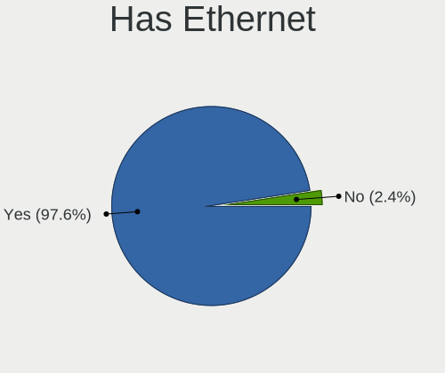
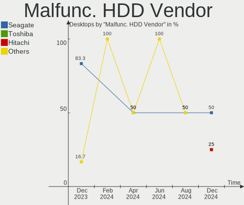
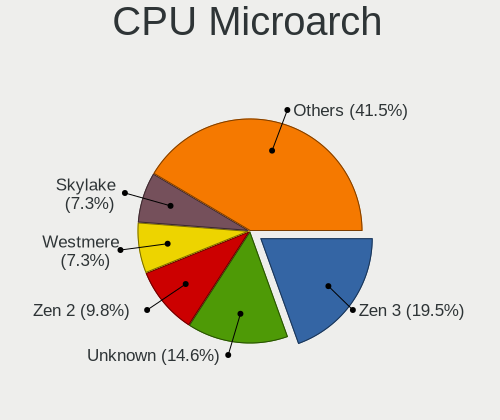
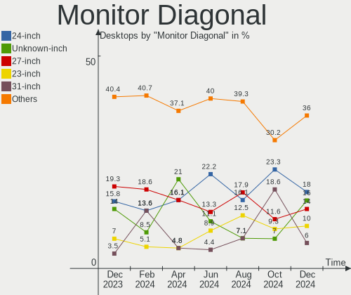

Manjaro - Hardware Trends (Desktops)
------------------------------------

A project to identify most popular hardware characteristics and track their change
over time based on data collected by Linux users at https://Linux-Hardware.org.

Anyone can contribute to this report by the [hw-probe](https://github.com/linuxhw/hw-probe) tool:

    sudo -E hw-probe -all -upload

This report is for one last month. Overall report since the beginning of time: [TestCoverage](https://github.com/linuxhw/TestCoverage)

Period: Nov, 2022.

Contents
--------

* [ System ](#system)
  - [ OS                       ](#os)
  - [ OS Family                ](#os-family)
  - [ Kernel                   ](#kernel)
  - [ Kernel Family            ](#kernel-family)
  - [ Kernel Major Ver.        ](#kernel-major-ver)
  - [ Arch                     ](#arch)
  - [ DE                       ](#de)
  - [ Display Server           ](#display-server)
  - [ Display Manager          ](#display-manager)
  - [ OS Lang                  ](#os-lang)
  - [ Boot Mode                ](#boot-mode)
  - [ Filesystem               ](#filesystem)
  - [ Part. scheme             ](#part-scheme)
  - [ Dual Boot with Linux/BSD ](#dual-boot-with-linuxbsd)
  - [ Dual Boot (Win)          ](#dual-boot-win)

* [ Board ](#board)
  - [ Vendor                   ](#vendor)
  - [ Model                    ](#model)
  - [ Model Family             ](#model-family)
  - [ MFG Year                 ](#mfg-year)
  - [ Form Factor              ](#form-factor)
  - [ Secure Boot              ](#secure-boot)
  - [ Coreboot                 ](#coreboot)
  - [ RAM Size                 ](#ram-size)
  - [ RAM Used                 ](#ram-used)
  - [ Total Drives             ](#total-drives)
  - [ Has CD-ROM               ](#has-cd-rom)
  - [ Has Ethernet             ](#has-ethernet)
  - [ Has WiFi                 ](#has-wifi)
  - [ Has Bluetooth            ](#has-bluetooth)

* [ Location ](#location)
  - [ Country                  ](#country)
  - [ City                     ](#city)

* [ Drives ](#drives)
  - [ Drive Vendor             ](#drive-vendor)
  - [ Drive Model              ](#drive-model)
  - [ HDD Vendor               ](#hdd-vendor)
  - [ SSD Vendor               ](#ssd-vendor)
  - [ Drive Kind               ](#drive-kind)
  - [ Drive Connector          ](#drive-connector)
  - [ Drive Size               ](#drive-size)
  - [ Space Total              ](#space-total)
  - [ Space Used               ](#space-used)
  - [ Malfunc. Drives          ](#malfunc-drives)
  - [ Malfunc. Drive Vendor    ](#malfunc-drive-vendor)
  - [ Malfunc. HDD Vendor      ](#malfunc-hdd-vendor)
  - [ Malfunc. Drive Kind      ](#malfunc-drive-kind)
  - [ Failed Drives            ](#failed-drives)
  - [ Failed Drive Vendor      ](#failed-drive-vendor)
  - [ Drive Status             ](#drive-status)

* [ Storage controller ](#storage-controller)
  - [ Storage Vendor           ](#storage-vendor)
  - [ Storage Model            ](#storage-model)
  - [ Storage Kind             ](#storage-kind)

* [ Processor ](#processor)
  - [ CPU Vendor               ](#cpu-vendor)
  - [ CPU Model                ](#cpu-model)
  - [ CPU Model Family         ](#cpu-model-family)
  - [ CPU Cores                ](#cpu-cores)
  - [ CPU Sockets              ](#cpu-sockets)
  - [ CPU Threads              ](#cpu-threads)
  - [ CPU Op-Modes             ](#cpu-op-modes)
  - [ CPU Microcode            ](#cpu-microcode)
  - [ CPU Microarch            ](#cpu-microarch)

* [ Graphics ](#graphics)
  - [ GPU Vendor               ](#gpu-vendor)
  - [ GPU Model                ](#gpu-model)
  - [ GPU Combo                ](#gpu-combo)
  - [ GPU Driver               ](#gpu-driver)
  - [ GPU Memory               ](#gpu-memory)

* [ Monitor ](#monitor)
  - [ Monitor Vendor           ](#monitor-vendor)
  - [ Monitor Model            ](#monitor-model)
  - [ Monitor Resolution       ](#monitor-resolution)
  - [ Monitor Diagonal         ](#monitor-diagonal)
  - [ Monitor Width            ](#monitor-width)
  - [ Aspect Ratio             ](#aspect-ratio)
  - [ Monitor Area             ](#monitor-area)
  - [ Pixel Density            ](#pixel-density)
  - [ Multiple Monitors        ](#multiple-monitors)

* [ Network ](#network)
  - [ Net Controller Vendor    ](#net-controller-vendor)
  - [ Net Controller Model     ](#net-controller-model)
  - [ Wireless Vendor          ](#wireless-vendor)
  - [ Wireless Model           ](#wireless-model)
  - [ Ethernet Vendor          ](#ethernet-vendor)
  - [ Ethernet Model           ](#ethernet-model)
  - [ Net Controller Kind      ](#net-controller-kind)
  - [ Used Controller          ](#used-controller)
  - [ NICs                     ](#nics)
  - [ IPv6                     ](#ipv6)

* [ Bluetooth ](#bluetooth)
  - [ Bluetooth Vendor         ](#bluetooth-vendor)
  - [ Bluetooth Model          ](#bluetooth-model)

* [ Sound ](#sound)
  - [ Sound Vendor             ](#sound-vendor)
  - [ Sound Model              ](#sound-model)

* [ Memory ](#memory)
  - [ Memory Vendor            ](#memory-vendor)
  - [ Memory Model             ](#memory-model)
  - [ Memory Kind              ](#memory-kind)
  - [ Memory Form Factor       ](#memory-form-factor)
  - [ Memory Size              ](#memory-size)
  - [ Memory Speed             ](#memory-speed)

* [ Printers & scanners ](#printers--scanners)
  - [ Printer Vendor           ](#printer-vendor)
  - [ Printer Model            ](#printer-model)
  - [ Scanner Vendor           ](#scanner-vendor)
  - [ Scanner Model            ](#scanner-model)

* [ Camera ](#camera)
  - [ Camera Vendor            ](#camera-vendor)
  - [ Camera Model             ](#camera-model)

* [ Security ](#security)
  - [ Fingerprint Vendor       ](#fingerprint-vendor)
  - [ Fingerprint Model        ](#fingerprint-model)
  - [ Chipcard Vendor          ](#chipcard-vendor)
  - [ Chipcard Model           ](#chipcard-model)

* [ Unsupported ](#unsupported)
  - [ Unsupported Devices      ](#unsupported-devices)
  - [ Unsupported Device Types ](#unsupported-device-types)

System
------

OS
--

Installed operating systems

| Name           | Desktops | Percent |
|----------------|----------|---------|
| Manjaro        | 29       | 54.72%  |
| Manjaro 22.0.0 | 23       | 43.4%   |
| Manjaro 21.3.7 | 1        | 1.89%   |

OS Family
---------

OS without a version

| Name    | Desktops | Percent |
|---------|----------|---------|
| Manjaro | 53       | 100%    |

Kernel
------

Version of the Linux kernel

| Version                     | Desktops | Percent |
|-----------------------------|----------|---------|
| 5.15.78-1-MANJARO           | 8        | 15.09%  |
| 6.0.8-1-MANJARO             | 7        | 13.21%  |
| 5.15.76-1-MANJARO           | 6        | 11.32%  |
| 6.0.6-1-MANJARO             | 5        | 9.43%   |
| 5.15.74-3-MANJARO           | 5        | 9.43%   |
| 6.1.0-1-MANJARO             | 3        | 5.66%   |
| 6.0.2-2-MANJARO             | 3        | 5.66%   |
| 5.15.60-1-MANJARO           | 3        | 5.66%   |
| 5.19.17-1-MANJARO           | 2        | 3.77%   |
| 6.0.9-1-MANJARO             | 1        | 1.89%   |
| 6.0.7-x64v1-xanmod1-MANJARO | 1        | 1.89%   |
| 6.0.7-x64v1-xanmod1-1       | 1        | 1.89%   |
| 6.0.6-zen1-1-zen            | 1        | 1.89%   |
| 5.9.16-1-MANJARO            | 1        | 1.89%   |
| 5.19.17-2-MANJARO           | 1        | 1.89%   |
| 5.19.16-2-MANJARO           | 1        | 1.89%   |
| 5.19.0-3-rt10-MANJARO       | 1        | 1.89%   |
| 5.18.19-3-MANJARO           | 1        | 1.89%   |
| 5.15.71-1-MANJARO           | 1        | 1.89%   |
| 5.10.148-1-MANJARO          | 1        | 1.89%   |

Kernel Family
-------------

Linux kernel without a distro release

| Version  | Desktops | Percent |
|----------|----------|---------|
| 5.15.78  | 8        | 15.09%  |
| 6.0.8    | 7        | 13.21%  |
| 6.0.6    | 6        | 11.32%  |
| 5.15.76  | 6        | 11.32%  |
| 5.15.74  | 5        | 9.43%   |
| 6.1.0    | 3        | 5.66%   |
| 6.0.2    | 3        | 5.66%   |
| 5.19.17  | 3        | 5.66%   |
| 5.15.60  | 3        | 5.66%   |
| 6.0.7    | 2        | 3.77%   |
| 6.0.9    | 1        | 1.89%   |
| 5.9.16   | 1        | 1.89%   |
| 5.19.16  | 1        | 1.89%   |
| 5.19.0   | 1        | 1.89%   |
| 5.18.19  | 1        | 1.89%   |
| 5.15.71  | 1        | 1.89%   |
| 5.10.148 | 1        | 1.89%   |

Kernel Major Ver.
-----------------

Linux kernel major version

| Version | Desktops | Percent |
|---------|----------|---------|
| 5.15    | 23       | 43.4%   |
| 6.0     | 19       | 35.85%  |
| 5.19    | 5        | 9.43%   |
| 6.1     | 3        | 5.66%   |
| 5.9     | 1        | 1.89%   |
| 5.18    | 1        | 1.89%   |
| 5.10    | 1        | 1.89%   |

Arch
----

OS architecture (x86_64, i586, etc.)

| Name   | Desktops | Percent |
|--------|----------|---------|
| x86_64 | 53       | 100%    |

DE
--

Desktop Environment

| Name  | Desktops | Percent |
|-------|----------|---------|
| KDE5  | 28       | 52.83%  |
| XFCE  | 12       | 22.64%  |
| GNOME | 12       | 22.64%  |
| KDE   | 1        | 1.89%   |

Display Server
--------------

X11 or Wayland

| Name    | Desktops | Percent |
|---------|----------|---------|
| X11     | 46       | 86.79%  |
| Wayland | 7        | 13.21%  |

Display Manager
---------------

SDDM, LightDM, etc.

| Name    | Desktops | Percent |
|---------|----------|---------|
| Unknown | 29       | 54.72%  |
| SDDM    | 12       | 22.64%  |
| LightDM | 7        | 13.21%  |
| GDM     | 5        | 9.43%   |

OS Lang
-------

Language

| Lang  | Desktops | Percent |
|-------|----------|---------|
| en_US | 20       | 37.74%  |
| de_DE | 7        | 13.21%  |
| it_IT | 5        | 9.43%   |
| ru_RU | 2        | 3.77%   |
| pt_BR | 2        | 3.77%   |
| es_ES | 2        | 3.77%   |
| en_CA | 2        | 3.77%   |
| en_AU | 2        | 3.77%   |
| zh_TW | 1        | 1.89%   |
| pl_PL | 1        | 1.89%   |
| nl_NL | 1        | 1.89%   |
| fr_FR | 1        | 1.89%   |
| fr_CA | 1        | 1.89%   |
| fi_FI | 1        | 1.89%   |
| es_UY | 1        | 1.89%   |
| es_AR | 1        | 1.89%   |
| en_ZA | 1        | 1.89%   |
| en_HK | 1        | 1.89%   |
| en_GB | 1        | 1.89%   |

Boot Mode
---------

EFI or BIOS

| Mode | Desktops | Percent |
|------|----------|---------|
| BIOS | 36       | 67.92%  |
| EFI  | 17       | 32.08%  |

Filesystem
----------

Type of filesystem

| Type    | Desktops | Percent |
|---------|----------|---------|
| Ext4    | 48       | 90.57%  |
| Btrfs   | 4        | 7.55%   |
| Overlay | 1        | 1.89%   |

Part. scheme
------------

Scheme of partitioning

| Type    | Desktops | Percent |
|---------|----------|---------|
| Unknown | 29       | 54.72%  |
| GPT     | 22       | 41.51%  |
| MBR     | 2        | 3.77%   |

Dual Boot with Linux/BSD
------------------------

Hosting more than one Linux/BSD

| Dual boot | Desktops | Percent |
|-----------|----------|---------|
| No        | 48       | 90.57%  |
| Yes       | 5        | 9.43%   |

Dual Boot (Win)
---------------

Hosting Linux and Windows

| Dual boot | Desktops | Percent |
|-----------|----------|---------|
| No        | 41       | 77.36%  |
| Yes       | 12       | 22.64%  |

Board
-----

Vendor
------

Motherboard manufacturer

| Name                | Desktops | Percent |
|---------------------|----------|---------|
| ASUSTek Computer    | 16       | 30.19%  |
| Gigabyte Technology | 12       | 22.64%  |
| MSI                 | 9        | 16.98%  |
| ASRock              | 6        | 11.32%  |
| Hewlett-Packard     | 4        | 7.55%   |
| Lenovo              | 2        | 3.77%   |
| Pegatron            | 1        | 1.89%   |
| Intel               | 1        | 1.89%   |
| Dell                | 1        | 1.89%   |
| Acer                | 1        | 1.89%   |

Model
-----

Motherboard model

| Name                                    | Desktops | Percent |
|-----------------------------------------|----------|---------|
| Gigabyte X570 AORUS ULTRA               | 2        | 3.77%   |
| ASUS ROG STRIX B550-F GAMING            | 2        | 3.77%   |
| ASUS PRIME A320M-K                      | 2        | 3.77%   |
| ASRock B550M Pro4                       | 2        | 3.77%   |
| Pegatron p7-1016de                      | 1        | 1.89%   |
| MSI MS-7D42                             | 1        | 1.89%   |
| MSI MS-7D25                             | 1        | 1.89%   |
| MSI MS-7C91                             | 1        | 1.89%   |
| MSI MS-7C56                             | 1        | 1.89%   |
| MSI MS-7B61                             | 1        | 1.89%   |
| MSI MS-7916                             | 1        | 1.89%   |
| MSI MS-7846                             | 1        | 1.89%   |
| MSI MS-7760                             | 1        | 1.89%   |
| MSI MS-7693                             | 1        | 1.89%   |
| Lenovo Legion T5 28IMB05 90NC00JBUS     | 1        | 1.89%   |
| Lenovo IdeaCentre G5 14AMR05 90Q1001TIX | 1        | 1.89%   |
| Intel DH55PJ AAE93812-303               | 1        | 1.89%   |
| HP ENVY 795-0137c Desktop Rfrbd PC      | 1        | 1.89%   |
| HP EliteDesk 800 G2 SFF                 | 1        | 1.89%   |
| HP Compaq Elite 8300 SFF                | 1        | 1.89%   |
| HP 870-134ng                            | 1        | 1.89%   |
| Gigabyte Z690 AORUS PRO                 | 1        | 1.89%   |
| Gigabyte Z370 HD3                       | 1        | 1.89%   |
| Gigabyte M61PME-S2P                     | 1        | 1.89%   |
| Gigabyte GA-A75M-UD2H                   | 1        | 1.89%   |
| Gigabyte GA-78LMT-USB3                  | 1        | 1.89%   |
| Gigabyte B550M S2H                      | 1        | 1.89%   |
| Gigabyte B550M AORUS PRO-P              | 1        | 1.89%   |
| Gigabyte A320M-H                        | 1        | 1.89%   |
| Gigabyte 970A-DS3P FX                   | 1        | 1.89%   |
| Gigabyte 4604                           | 1        | 1.89%   |
| Dell Precision Tower 3620               | 1        | 1.89%   |
| ASUS TUF Gaming X570-PLUS               | 1        | 1.89%   |
| ASUS ROG STRIX X670E-F GAMING WIFI      | 1        | 1.89%   |
| ASUS ROG Maximus XI HERO                | 1        | 1.89%   |
| ASUS PRIME X470-PRO                     | 1        | 1.89%   |
| ASUS PRIME B350M-A                      | 1        | 1.89%   |
| ASUS P8H67                              | 1        | 1.89%   |
| ASUS P8H61-M LE/CSM                     | 1        | 1.89%   |
| ASUS P5K-E                              | 1        | 1.89%   |

Model Family
------------

Motherboard model prefix

| Name                   | Desktops | Percent |
|------------------------|----------|---------|
| ASUS ROG               | 4        | 7.55%   |
| ASUS PRIME             | 4        | 7.55%   |
| Gigabyte X570          | 2        | 3.77%   |
| Gigabyte B550M         | 2        | 3.77%   |
| ASRock B550M           | 2        | 3.77%   |
| Pegatron p7-1016de     | 1        | 1.89%   |
| MSI MS-7D42            | 1        | 1.89%   |
| MSI MS-7D25            | 1        | 1.89%   |
| MSI MS-7C91            | 1        | 1.89%   |
| MSI MS-7C56            | 1        | 1.89%   |
| MSI MS-7B61            | 1        | 1.89%   |
| MSI MS-7916            | 1        | 1.89%   |
| MSI MS-7846            | 1        | 1.89%   |
| MSI MS-7760            | 1        | 1.89%   |
| MSI MS-7693            | 1        | 1.89%   |
| Lenovo Legion          | 1        | 1.89%   |
| Lenovo IdeaCentre      | 1        | 1.89%   |
| Intel DH55PJ           | 1        | 1.89%   |
| HP ENVY                | 1        | 1.89%   |
| HP EliteDesk           | 1        | 1.89%   |
| HP Compaq              | 1        | 1.89%   |
| HP 870-134ng           | 1        | 1.89%   |
| Gigabyte Z690          | 1        | 1.89%   |
| Gigabyte Z370          | 1        | 1.89%   |
| Gigabyte M61PME-S2P    | 1        | 1.89%   |
| Gigabyte GA-A75M-UD2H  | 1        | 1.89%   |
| Gigabyte GA-78LMT-USB3 | 1        | 1.89%   |
| Gigabyte A320M-H       | 1        | 1.89%   |
| Gigabyte 970A-DS3P     | 1        | 1.89%   |
| Gigabyte 4604          | 1        | 1.89%   |
| Dell Precision         | 1        | 1.89%   |
| ASUS TUF               | 1        | 1.89%   |
| ASUS P8H67             | 1        | 1.89%   |
| ASUS P8H61-M           | 1        | 1.89%   |
| ASUS P5K-E             | 1        | 1.89%   |
| ASUS Maximus           | 1        | 1.89%   |
| ASUS M5A97             | 1        | 1.89%   |
| ASUS G470              | 1        | 1.89%   |
| ASUS All               | 1        | 1.89%   |
| ASRock X300M-STX       | 1        | 1.89%   |

MFG Year
--------

Motherboard manufacture year

| Year | Desktops | Percent |
|------|----------|---------|
| 2020 | 10       | 18.87%  |
| 2017 | 7        | 13.21%  |
| 2021 | 6        | 11.32%  |
| 2018 | 5        | 9.43%   |
| 2012 | 5        | 9.43%   |
| 2019 | 4        | 7.55%   |
| 2022 | 3        | 5.66%   |
| 2011 | 3        | 5.66%   |
| 2016 | 2        | 3.77%   |
| 2015 | 2        | 3.77%   |
| 2010 | 2        | 3.77%   |
| 2014 | 1        | 1.89%   |
| 2013 | 1        | 1.89%   |
| 2008 | 1        | 1.89%   |
| 2007 | 1        | 1.89%   |

Form Factor
-----------

Physical design of the computer

| Name    | Desktops | Percent |
|---------|----------|---------|
| Desktop | 53       | 100%    |

Secure Boot
-----------

Enabled or disabled

| State    | Desktops | Percent |
|----------|----------|---------|
| Disabled | 53       | 100%    |

Coreboot
--------

Have coreboot on board

| Used | Desktops | Percent |
|------|----------|---------|
| No   | 53       | 100%    |

RAM Size
--------

Total RAM memory

| Size in GB  | Desktops | Percent |
|-------------|----------|---------|
| 16.01-24.0  | 18       | 33.96%  |
| 8.01-16.0   | 13       | 24.53%  |
| 32.01-64.0  | 10       | 18.87%  |
| 4.01-8.0    | 6        | 11.32%  |
| 24.01-32.0  | 3        | 5.66%   |
| 64.01-256.0 | 2        | 3.77%   |
| 3.01-4.0    | 1        | 1.89%   |

RAM Used
--------

Used RAM memory

| Used GB    | Desktops | Percent |
|------------|----------|---------|
| 4.01-8.0   | 19       | 35.85%  |
| 2.01-3.0   | 15       | 28.3%   |
| 3.01-4.0   | 11       | 20.75%  |
| 1.01-2.0   | 3        | 5.66%   |
| 8.01-16.0  | 3        | 5.66%   |
| 24.01-32.0 | 1        | 1.89%   |
| 16.01-24.0 | 1        | 1.89%   |

Total Drives
------------

Number of drives on board

| Drives | Desktops | Percent |
|--------|----------|---------|
| 2      | 15       | 28.3%   |
| 1      | 13       | 24.53%  |
| 3      | 12       | 22.64%  |
| 4      | 5        | 9.43%   |
| 5      | 4        | 7.55%   |
| 7      | 2        | 3.77%   |
| 12     | 1        | 1.89%   |
| 6      | 1        | 1.89%   |

Has CD-ROM
----------

Has CD-ROM on board

| Presented | Desktops | Percent |
|-----------|----------|---------|
| No        | 40       | 75.47%  |
| Yes       | 13       | 24.53%  |

Has Ethernet
------------

Has Ethernet on board

| Presented | Desktops | Percent |
|-----------|----------|---------|
| Yes       | 53       | 100%    |

Has WiFi
--------

Has WiFi module

| Presented | Desktops | Percent |
|-----------|----------|---------|
| Yes       | 30       | 56.6%   |
| No        | 23       | 43.4%   |

Has Bluetooth
-------------

Has Bluetooth module

| Presented | Desktops | Percent |
|-----------|----------|---------|
| No        | 28       | 52.83%  |
| Yes       | 25       | 47.17%  |

Location
--------

Country
-------

Geographic location (country)

| Country      | Desktops | Percent |
|--------------|----------|---------|
| USA          | 8        | 15.09%  |
| Germany      | 8        | 15.09%  |
| Italy        | 6        | 11.32%  |
| Russia       | 3        | 5.66%   |
| Spain        | 2        | 3.77%   |
| Canada       | 2        | 3.77%   |
| Brazil       | 2        | 3.77%   |
| Austria      | 2        | 3.77%   |
| Australia    | 2        | 3.77%   |
| UK           | 1        | 1.89%   |
| Taiwan       | 1        | 1.89%   |
| Switzerland  | 1        | 1.89%   |
| Sweden       | 1        | 1.89%   |
| South Africa | 1        | 1.89%   |
| Romania      | 1        | 1.89%   |
| Poland       | 1        | 1.89%   |
| Netherlands  | 1        | 1.89%   |
| Iran         | 1        | 1.89%   |
| Indonesia    | 1        | 1.89%   |
| India        | 1        | 1.89%   |
| Hungary      | 1        | 1.89%   |
| Hong Kong    | 1        | 1.89%   |
| Greece       | 1        | 1.89%   |
| France       | 1        | 1.89%   |
| Finland      | 1        | 1.89%   |
| Chile        | 1        | 1.89%   |
| Argentina    | 1        | 1.89%   |

City
----

Geographic location (city)

| City                     | Desktops | Percent |
|--------------------------|----------|---------|
| Rome                     | 2        | 3.77%   |
| Zollikofen               | 1        | 1.89%   |
| Zaandam                  | 1        | 1.89%   |
| Wroclaw                  | 1        | 1.89%   |
| Weilburg                 | 1        | 1.89%   |
| Vienna                   | 1        | 1.89%   |
| Tupos                    | 1        | 1.89%   |
| Thessaloniki             | 1        | 1.89%   |
| Sydney                   | 1        | 1.89%   |
| Stockholm                | 1        | 1.89%   |
| Sommerein                | 1        | 1.89%   |
| Shelby                   | 1        | 1.89%   |
| Seattle                  | 1        | 1.89%   |
| Santiago                 | 1        | 1.89%   |
| Salzhausen               | 1        | 1.89%   |
| Saint-Jean-sur-Richelieu | 1        | 1.89%   |
| Ramsar                   | 1        | 1.89%   |
| Pretoria                 | 1        | 1.89%   |
| Olathe                   | 1        | 1.89%   |
| New Taipei               | 1        | 1.89%   |
| Neu-Ulm                  | 1        | 1.89%   |
| Necochea                 | 1        | 1.89%   |
| Mytishchi                | 1        | 1.89%   |
| Milan                    | 1        | 1.89%   |
| Merano                   | 1        | 1.89%   |
| Melbourne                | 1        | 1.89%   |
| Martorell                | 1        | 1.89%   |
| Mansfield                | 1        | 1.89%   |
| Kirchzarten              | 1        | 1.89%   |
| Jakarta                  | 1        | 1.89%   |
| Ipeuna                   | 1        | 1.89%   |
| Homburg                  | 1        | 1.89%   |
| Frankfurt am Main        | 1        | 1.89%   |
| Florence                 | 1        | 1.89%   |
| Fidenza                  | 1        | 1.89%   |
| Farroupilha              | 1        | 1.89%   |
| Dallas                   | 1        | 1.89%   |
| Cranston                 | 1        | 1.89%   |
| Colorado Springs         | 1        | 1.89%   |
| Coimbatore               | 1        | 1.89%   |

Drives
------

Drive Vendor
------------

Hard drive vendors

| Vendor                      | Desktops | Drives | Percent |
|-----------------------------|----------|--------|---------|
| Samsung Electronics         | 27       | 39     | 23.68%  |
| WDC                         | 21       | 37     | 18.42%  |
| Seagate                     | 17       | 21     | 14.91%  |
| Sandisk                     | 8        | 10     | 7.02%   |
| Kingston                    | 6        | 7      | 5.26%   |
| Crucial                     | 6        | 6      | 5.26%   |
| Toshiba                     | 5        | 7      | 4.39%   |
| Kingston Technology Company | 3        | 3      | 2.63%   |
| Phison Electronics          | 2        | 3      | 1.75%   |
| Patriot                     | 2        | 2      | 1.75%   |
| OCZ                         | 2        | 2      | 1.75%   |
| Micron Technology           | 2        | 2      | 1.75%   |
| Hitachi                     | 2        | 2      | 1.75%   |
| ADATA Technology            | 2        | 2      | 1.75%   |
| A-DATA Technology           | 2        | 2      | 1.75%   |
| Unknown                     | 1        | 1      | 0.88%   |
| SK hynix                    | 1        | 1      | 0.88%   |
| PNY                         | 1        | 1      | 0.88%   |
| JMicron Technology          | 1        | 1      | 0.88%   |
| HGST                        | 1        | 1      | 0.88%   |
| Corsair                     | 1        | 1      | 0.88%   |
| Colorful                    | 1        | 1      | 0.88%   |

Drive Model
-----------

Hard drive models

| Model                                                             | Desktops | Percent |
|-------------------------------------------------------------------|----------|---------|
| Samsung NVMe SSD Controller SM981/PM981/PM983 1TB                 | 7        | 4.96%   |
| Samsung SSD 980 1TB                                               | 4        | 2.84%   |
| Crucial CT500MX500SSD1 500GB                                      | 4        | 2.84%   |
| Seagate ST1000DM010-2EP102 1TB                                    | 3        | 2.13%   |
| WDC WDS240G2G0B-00EPW0 240GB SSD                                  | 2        | 1.42%   |
| Toshiba DT01ACA100 1TB                                            | 2        | 1.42%   |
| Seagate ST3500418AS 500GB                                         | 2        | 1.42%   |
| Seagate ST2000DX001-1CM164 2TB                                    | 2        | 1.42%   |
| Seagate ST2000DM008-2FR102 2TB                                    | 2        | 1.42%   |
| Samsung SSD 870 QVO 1TB                                           | 2        | 1.42%   |
| Samsung SSD 860 EVO 500GB                                         | 2        | 1.42%   |
| Samsung SSD 860 EVO 250GB                                         | 2        | 1.42%   |
| Samsung SSD 860 EVO 1TB                                           | 2        | 1.42%   |
| Samsung NVMe SSD Controller PM9A1/PM9A3/980PRO 250GB              | 2        | 1.42%   |
| Patriot Burst 240GB SSD                                           | 2        | 1.42%   |
| Kingston Company A2000 NVMe SSD 500GB                             | 2        | 1.42%   |
| Kingston SNVS500G 500GB                                           | 2        | 1.42%   |
| Kingston SA400S37240G 240GB SSD                                   | 2        | 1.42%   |
| ADATA XPG SX8200 Pro PCIe Gen3x4 M.2 2280 Solid State Drive 512GB | 2        | 1.42%   |
| WDC WDS500G2B0A-00SM50 500GB SSD                                  | 1        | 0.71%   |
| WDC WDS240G2G0A-00JH30 240GB SSD                                  | 1        | 0.71%   |
| WDC WDS120G1G0A-00SS50 120GB SSD                                  | 1        | 0.71%   |
| WDC WDS100T2B0A-00SM50 1TB SSD                                    | 1        | 0.71%   |
| WDC WDBNCE0010PNC 1TB SSD                                         | 1        | 0.71%   |
| WDC WD80EFAX-68KNBN0 8TB                                          | 1        | 0.71%   |
| WDC WD60EZRZ-00RWYB1 6TB                                          | 1        | 0.71%   |
| WDC WD60EZAZ-00ZGHB0 6TB                                          | 1        | 0.71%   |
| WDC WD6001FZWX-00A2VA0 6TB                                        | 1        | 0.71%   |
| WDC WD5002ABYS-02B1B0 500GB                                       | 1        | 0.71%   |
| WDC WD5000AZLX-00K2TA0 500GB                                      | 1        | 0.71%   |
| WDC WD5000AAKX-60U6AA0 500GB                                      | 1        | 0.71%   |
| WDC WD5000AAKX-001CA0 500GB                                       | 1        | 0.71%   |
| WDC WD5000AAKS-00A7B0 500GB                                       | 1        | 0.71%   |
| WDC WD3200AAKS-00YGA0 320GB                                       | 1        | 0.71%   |
| WDC WD30PURX-64P6ZY0 3TB                                          | 1        | 0.71%   |
| WDC WD30EZRX-00D8PB0 3TB                                          | 1        | 0.71%   |
| WDC WD20SPZX-00UA7T0 2TB                                          | 1        | 0.71%   |
| WDC WD20EZRZ-00Z5HB0 2TB                                          | 1        | 0.71%   |
| WDC WD20EARX-00PASB0 2TB                                          | 1        | 0.71%   |
| WDC WD20EARS-00MVWB0 2TB                                          | 1        | 0.71%   |

HDD Vendor
----------

Hard disk drive vendors

| Vendor              | Desktops | Drives | Percent |
|---------------------|----------|--------|---------|
| Seagate             | 17       | 21     | 36.96%  |
| WDC                 | 16       | 30     | 34.78%  |
| Toshiba             | 5        | 7      | 10.87%  |
| Samsung Electronics | 4        | 4      | 8.7%    |
| Hitachi             | 2        | 2      | 4.35%   |
| Unknown             | 1        | 1      | 2.17%   |
| HGST                | 1        | 1      | 2.17%   |

SSD Vendor
----------

Solid state drive vendors

| Vendor              | Desktops | Drives | Percent |
|---------------------|----------|--------|---------|
| Samsung Electronics | 17       | 17     | 36.17%  |
| WDC                 | 7        | 7      | 14.89%  |
| Crucial             | 6        | 6      | 12.77%  |
| Kingston            | 4        | 5      | 8.51%   |
| SanDisk             | 2        | 2      | 4.26%   |
| Patriot             | 2        | 2      | 4.26%   |
| OCZ                 | 2        | 2      | 4.26%   |
| Micron Technology   | 2        | 2      | 4.26%   |
| A-DATA Technology   | 2        | 2      | 4.26%   |
| PNY                 | 1        | 1      | 2.13%   |
| Corsair             | 1        | 1      | 2.13%   |
| Colorful            | 1        | 1      | 2.13%   |

Drive Kind
----------

HDD or SSD

| Kind    | Desktops | Drives | Percent |
|---------|----------|--------|---------|
| SSD     | 36       | 48     | 37.89%  |
| HDD     | 32       | 66     | 33.68%  |
| NVMe    | 26       | 37     | 27.37%  |
| Unknown | 1        | 1      | 1.05%   |

Drive Connector
---------------

SATA, SAS, NVMe, etc.

| Type | Desktops | Drives | Percent |
|------|----------|--------|---------|
| SATA | 45       | 110    | 59.21%  |
| NVMe | 26       | 37     | 34.21%  |
| SAS  | 5        | 5      | 6.58%   |

Drive Size
----------

Size of hard drive

| Size in TB | Desktops | Drives | Percent |
|------------|----------|--------|---------|
| 0.01-0.5   | 34       | 54     | 43.04%  |
| 0.51-1.0   | 21       | 28     | 26.58%  |
| 1.01-2.0   | 10       | 11     | 12.66%  |
| 4.01-10.0  | 6        | 11     | 7.59%   |
| 3.01-4.0   | 4        | 5      | 5.06%   |
| 2.01-3.0   | 4        | 5      | 5.06%   |

Space Total
-----------

Amount of disk space available on the file system

| Size in GB     | Desktops | Percent |
|----------------|----------|---------|
| 251-500        | 16       | 30.19%  |
| More than 3000 | 11       | 20.75%  |
| 501-1000       | 7        | 13.21%  |
| 101-250        | 6        | 11.32%  |
| 1001-2000      | 5        | 9.43%   |
| 2001-3000      | 3        | 5.66%   |
| Unknown        | 3        | 5.66%   |
| 1-20           | 1        | 1.89%   |
| 51-100         | 1        | 1.89%   |

Space Used
----------

Amount of used disk space

| Used GB        | Desktops | Percent |
|----------------|----------|---------|
| 101-250        | 12       | 22.64%  |
| 51-100         | 8        | 15.09%  |
| 1001-2000      | 6        | 11.32%  |
| More than 3000 | 5        | 9.43%   |
| 251-500        | 5        | 9.43%   |
| 21-50          | 5        | 9.43%   |
| 1-20           | 5        | 9.43%   |
| Unknown        | 3        | 5.66%   |
| 2001-3000      | 2        | 3.77%   |
| 501-1000       | 2        | 3.77%   |

Malfunc. Drives
---------------

Drive models with a malfunction

| Model                                                         | Desktops | Drives | Percent |
|---------------------------------------------------------------|----------|--------|---------|
| WDC WD60EZRZ-00RWYB1 6TB                                      | 1        | 2      | 12.5%   |
| WDC WD30PURX-64P6ZY0 3TB                                      | 1        | 2      | 12.5%   |
| Toshiba HDWD130 3TB                                           | 1        | 1      | 12.5%   |
| Seagate ST4000DM000-1F2168 4TB                                | 1        | 1      | 12.5%   |
| Seagate ST2000DX001-1CM164 2TB                                | 1        | 1      | 12.5%   |
| Samsung Electronics NVMe SSD Controller SM981/PM981/PM983 1TB | 1        | 1      | 12.5%   |
| Samsung Electronics HD502HJ 500GB                             | 1        | 1      | 12.5%   |
| OCZ AGILITY3 120GB SSD                                        | 1        | 1      | 12.5%   |

Malfunc. Drive Vendor
---------------------

Vendors of faulty drives

| Vendor              | Desktops | Drives | Percent |
|---------------------|----------|--------|---------|
| WDC                 | 2        | 4      | 25%     |
| Seagate             | 2        | 2      | 25%     |
| Samsung Electronics | 2        | 2      | 25%     |
| Toshiba             | 1        | 1      | 12.5%   |
| OCZ                 | 1        | 1      | 12.5%   |

Malfunc. HDD Vendor
-------------------

Vendors of faulty HDD drives

| Vendor              | Desktops | Drives | Percent |
|---------------------|----------|--------|---------|
| WDC                 | 2        | 4      | 33.33%  |
| Seagate             | 2        | 2      | 33.33%  |
| Toshiba             | 1        | 1      | 16.67%  |
| Samsung Electronics | 1        | 1      | 16.67%  |

Malfunc. Drive Kind
-------------------

Kinds of faulty drives

| Kind | Desktops | Drives | Percent |
|------|----------|--------|---------|
| HDD  | 5        | 8      | 71.43%  |
| NVMe | 1        | 1      | 14.29%  |
| SSD  | 1        | 1      | 14.29%  |

Failed Drives
-------------

Failed drive models

Zero info for selected period =(

Failed Drive Vendor
-------------------

Failed drive vendors

Zero info for selected period =(

Drive Status
------------

Number of failed and malfunc. drives

| Status   | Desktops | Drives | Percent |
|----------|----------|--------|---------|
| Detected | 36       | 89     | 60%     |
| Works    | 17       | 53     | 28.33%  |
| Malfunc  | 7        | 10     | 11.67%  |

Storage controller
------------------

Storage Vendor
--------------

Storage controller vendors

| Vendor                      | Desktops | Percent |
|-----------------------------|----------|---------|
| Intel                       | 26       | 28.89%  |
| AMD                         | 26       | 28.89%  |
| Samsung Electronics         | 14       | 15.56%  |
| SanDisk                     | 6        | 6.67%   |
| Kingston Technology Company | 5        | 5.56%   |
| ASMedia Technology          | 3        | 3.33%   |
| Phison Electronics          | 2        | 2.22%   |
| JMicron Technology          | 2        | 2.22%   |
| ADATA Technology            | 2        | 2.22%   |
| VIA Technologies            | 1        | 1.11%   |
| SK hynix                    | 1        | 1.11%   |
| Nvidia                      | 1        | 1.11%   |
| Marvell Technology Group    | 1        | 1.11%   |

Storage Model
-------------

Storage controller models

| Model                                                                          | Desktops | Percent |
|--------------------------------------------------------------------------------|----------|---------|
| AMD FCH SATA Controller [AHCI mode]                                            | 11       | 10.38%  |
| AMD 500 Series Chipset SATA Controller                                         | 9        | 8.49%   |
| Samsung NVMe SSD Controller SM981/PM981/PM983                                  | 7        | 6.6%    |
| Samsung NVMe SSD Controller 980                                                | 6        | 5.66%   |
| Intel Q170/Q150/B150/H170/H110/Z170/CM236 Chipset SATA Controller [AHCI Mode]  | 4        | 3.77%   |
| Intel Alder Lake-S PCH SATA Controller [AHCI Mode]                             | 4        | 3.77%   |
| AMD FCH SATA Controller D                                                      | 4        | 3.77%   |
| SanDisk Non-Volatile memory controller                                         | 3        | 2.83%   |
| Intel 200 Series PCH SATA controller [AHCI mode]                               | 3        | 2.83%   |
| ASMedia ASM1062 Serial ATA Controller                                          | 3        | 2.83%   |
| AMD SB7x0/SB8x0/SB9x0 SATA Controller [AHCI mode]                              | 3        | 2.83%   |
| Samsung NVMe SSD Controller PM9A1/PM9A3/980PRO                                 | 2        | 1.89%   |
| Kingston Company SNVS2000G [NV1 NVMe PCIe SSD 2TB]                             | 2        | 1.89%   |
| Kingston Company A2000 NVMe SSD                                                | 2        | 1.89%   |
| Intel 8 Series/C220 Series Chipset Family 6-port SATA Controller 1 [AHCI mode] | 2        | 1.89%   |
| Intel 6 Series/C200 Series Chipset Family 6 port Desktop SATA AHCI Controller  | 2        | 1.89%   |
| Intel 400 Series Chipset Family SATA AHCI Controller                           | 2        | 1.89%   |
| AMD SB7x0/SB8x0/SB9x0 IDE Controller                                           | 2        | 1.89%   |
| AMD 300 Series Chipset SATA Controller                                         | 2        | 1.89%   |
| ADATA XPG SX8200 Pro PCIe Gen3x4 M.2 2280 Solid State Drive                    | 2        | 1.89%   |
| VIA VT6415 PATA IDE Host Controller                                            | 1        | 0.94%   |
| SK hynix BC511                                                                 | 1        | 0.94%   |
| SanDisk WD PC SN810 / Black SN850 NVMe SSD                                     | 1        | 0.94%   |
| SanDisk WD Blue SN570 NVMe SSD                                                 | 1        | 0.94%   |
| SanDisk WD Blue SN550 NVMe SSD                                                 | 1        | 0.94%   |
| SanDisk WD Black SN750 / PC SN730 NVMe SSD                                     | 1        | 0.94%   |
| Samsung NVMe SSD Controller SM961/PM961/SM963                                  | 1        | 0.94%   |
| Samsung Electronics SATA controller                                            | 1        | 0.94%   |
| Phison E16 PCIe4 NVMe Controller                                               | 1        | 0.94%   |
| Phison E12 NVMe Controller                                                     | 1        | 0.94%   |
| Nvidia MCP61 SATA Controller                                                   | 1        | 0.94%   |
| Nvidia MCP61 IDE                                                               | 1        | 0.94%   |
| Marvell Group 88SE912x IDE Controller                                          | 1        | 0.94%   |
| Marvell Group 88SE9128 PCIe SATA 6 Gb/s RAID controller                        | 1        | 0.94%   |
| Kingston Company Company Non-Volatile memory controller                        | 1        | 0.94%   |
| JMicron JMB58x AHCI SATA controller                                            | 1        | 0.94%   |
| JMicron JMB363 SATA/IDE Controller                                             | 1        | 0.94%   |
| Intel SATA Controller [RAID mode]                                              | 1        | 0.94%   |
| Intel Cannon Lake PCH SATA AHCI Controller                                     | 1        | 0.94%   |
| Intel C600/X79 series chipset 6-Port SATA AHCI Controller                      | 1        | 0.94%   |

Storage Kind
------------

Kind of storage controller (IDE, SATA, NVMe, SAS, ...)

| Kind | Desktops | Percent |
|------|----------|---------|
| SATA | 50       | 58.82%  |
| NVMe | 26       | 30.59%  |
| IDE  | 8        | 9.41%   |
| RAID | 1        | 1.18%   |

Processor
---------

CPU Vendor
----------

Processor vendors

| Vendor | Desktops | Percent |
|--------|----------|---------|
| AMD    | 27       | 50.94%  |
| Intel  | 26       | 49.06%  |

CPU Model
---------

Processor models

| Model                                       | Desktops | Percent |
|---------------------------------------------|----------|---------|
| AMD Ryzen 5 5600G with Radeon Graphics      | 4        | 7.55%   |
| Intel Core i7-8700 CPU @ 3.20GHz            | 2        | 3.77%   |
| Intel Core i5-10400 CPU @ 2.90GHz           | 2        | 3.77%   |
| AMD Ryzen 9 5900X 12-Core Processor         | 2        | 3.77%   |
| AMD Ryzen 5 3600 6-Core Processor           | 2        | 3.77%   |
| AMD Ryzen 5 1600 Six-Core Processor         | 2        | 3.77%   |
| AMD Ryzen 3 3100 4-Core Processor           | 2        | 3.77%   |
| Intel Xeon CPU E3-1220 v5 @ 3.00GHz         | 1        | 1.89%   |
| Intel Core i7-9700K CPU @ 3.60GHz           | 1        | 1.89%   |
| Intel Core i7-4790K CPU @ 4.00GHz           | 1        | 1.89%   |
| Intel Core i7-4790 CPU @ 3.60GHz            | 1        | 1.89%   |
| Intel Core i7-4770K CPU @ 3.50GHz           | 1        | 1.89%   |
| Intel Core i7-3930K CPU @ 3.20GHz           | 1        | 1.89%   |
| Intel Core i7-2600 CPU @ 3.40GHz            | 1        | 1.89%   |
| Intel Core i5-9400F CPU @ 2.90GHz           | 1        | 1.89%   |
| Intel Core i5-9400 CPU @ 2.90GHz            | 1        | 1.89%   |
| Intel Core i5-6600 CPU @ 3.30GHz            | 1        | 1.89%   |
| Intel Core i5-6500 CPU @ 3.20GHz            | 1        | 1.89%   |
| Intel Core i5-6400 CPU @ 2.70GHz            | 1        | 1.89%   |
| Intel Core i5-3470 CPU @ 3.20GHz            | 1        | 1.89%   |
| Intel Core i5-2500 CPU @ 3.30GHz            | 1        | 1.89%   |
| Intel Core i5-2310 CPU @ 2.90GHz            | 1        | 1.89%   |
| Intel Core i5-10400F CPU @ 2.90GHz          | 1        | 1.89%   |
| Intel Core i5 CPU 661 @ 3.33GHz             | 1        | 1.89%   |
| Intel Core 2 Quad CPU Q9450 @ 2.66GHz       | 1        | 1.89%   |
| Intel 12th Gen Core i9-12900KF              | 1        | 1.89%   |
| Intel 12th Gen Core i7-12700KF              | 1        | 1.89%   |
| Intel 12th Gen Core i7-12700K               | 1        | 1.89%   |
| Intel 12th Gen Core i5-12600K               | 1        | 1.89%   |
| AMD Ryzen 7 7700X 8-Core Processor          | 1        | 1.89%   |
| AMD Ryzen 7 5800X 8-Core Processor          | 1        | 1.89%   |
| AMD Ryzen 7 3700X 8-Core Processor          | 1        | 1.89%   |
| AMD Ryzen 5 5600 6-Core Processor           | 1        | 1.89%   |
| AMD Ryzen 5 3600X 6-Core Processor          | 1        | 1.89%   |
| AMD Ryzen 5 3500X 6-Core Processor          | 1        | 1.89%   |
| AMD Ryzen 5 3400G with Radeon Vega Graphics | 1        | 1.89%   |
| AMD Ryzen 5 2600 Six-Core Processor         | 1        | 1.89%   |
| AMD FX-8370 Eight-Core Processor            | 1        | 1.89%   |
| AMD FX-8350 Eight-Core Processor            | 1        | 1.89%   |
| AMD FX-4130 Quad-Core Processor             | 1        | 1.89%   |

CPU Model Family
----------------

Processor model prefix

| Model             | Desktops | Percent |
|-------------------|----------|---------|
| AMD Ryzen 5       | 13       | 24.53%  |
| Intel Core i5     | 12       | 22.64%  |
| Intel Core i7     | 8        | 15.09%  |
| Other             | 4        | 7.55%   |
| AMD Ryzen 7       | 3        | 5.66%   |
| AMD FX            | 3        | 5.66%   |
| AMD Ryzen 9       | 2        | 3.77%   |
| AMD Ryzen 3       | 2        | 3.77%   |
| Intel Xeon        | 1        | 1.89%   |
| Intel Core 2 Quad | 1        | 1.89%   |
| AMD Athlon X2     | 1        | 1.89%   |
| AMD Athlon II X4  | 1        | 1.89%   |
| AMD Athlon        | 1        | 1.89%   |
| AMD A8            | 1        | 1.89%   |

CPU Cores
---------

Number of processor cores

| Number | Desktops | Percent |
|--------|----------|---------|
| 6      | 20       | 37.74%  |
| 4      | 19       | 35.85%  |
| 12     | 4        | 7.55%   |
| 8      | 4        | 7.55%   |
| 2      | 4        | 7.55%   |
| 16     | 1        | 1.89%   |
| 10     | 1        | 1.89%   |

CPU Sockets
-----------

Number of sockets

| Number | Desktops | Percent |
|--------|----------|---------|
| 1      | 53       | 100%    |

CPU Threads
-----------

Threads per core (Hyper-Threading)

| Number | Desktops | Percent |
|--------|----------|---------|
| 2      | 37       | 69.81%  |
| 1      | 16       | 30.19%  |

CPU Op-Modes
------------

CPU Operation Modes (32-bit, 64-bit)

| Op mode        | Desktops | Percent |
|----------------|----------|---------|
| 32-bit, 64-bit | 53       | 100%    |

CPU Microcode
-------------

Microcode number

| Number     | Desktops | Percent |
|------------|----------|---------|
| Unknown    | 33       | 62.26%  |
| 0x08701021 | 4        | 7.55%   |
| 0x90672    | 2        | 3.77%   |
| 0x0a50000d | 2        | 3.77%   |
| 0x906ea    | 1        | 1.89%   |
| 0x506e3    | 1        | 1.89%   |
| 0x306c3    | 1        | 1.89%   |
| 0x306a9    | 1        | 1.89%   |
| 0x206d7    | 1        | 1.89%   |
| 0x206a7    | 1        | 1.89%   |
| 0x10677    | 1        | 1.89%   |
| 0x0a20120a | 1        | 1.89%   |
| 0x0a201016 | 1        | 1.89%   |
| 0x08001138 | 1        | 1.89%   |
| 0x06000852 | 1        | 1.89%   |
| 0x03000027 | 1        | 1.89%   |

CPU Microarch
-------------

Microarchitecture

| Name             | Desktops | Percent |
|------------------|----------|---------|
| Zen 3            | 8        | 15.09%  |
| Zen 2            | 7        | 13.21%  |
| KabyLake         | 5        | 9.43%   |
| Zen+             | 4        | 7.55%   |
| Skylake          | 4        | 7.55%   |
| SandyBridge      | 4        | 7.55%   |
| Haswell          | 3        | 5.66%   |
| CometLake        | 3        | 5.66%   |
| Unknown          | 3        | 5.66%   |
| Piledriver       | 2        | 3.77%   |
| K10              | 2        | 3.77%   |
| Alderlake Hybrid | 2        | 3.77%   |
| Zen              | 1        | 1.89%   |
| Westmere         | 1        | 1.89%   |
| Penryn           | 1        | 1.89%   |
| K10 Llano        | 1        | 1.89%   |
| IvyBridge        | 1        | 1.89%   |
| Bulldozer        | 1        | 1.89%   |

Graphics
--------

GPU Vendor
----------

Vendors of graphics cards

| Vendor | Desktops | Percent |
|--------|----------|---------|
| AMD    | 27       | 46.55%  |
| Nvidia | 24       | 41.38%  |
| Intel  | 7        | 12.07%  |

GPU Model
---------

Graphics card models

| Model                                                                | Desktops | Percent |
|----------------------------------------------------------------------|----------|---------|
| AMD Ellesmere [Radeon RX 470/480/570/570X/580/580X/590]              | 6        | 10.17%  |
| AMD Cezanne [Radeon Vega Series / Radeon Vega Mobile Series]         | 4        | 6.78%   |
| AMD Navi 23 [Radeon RX 6600/6600 XT/6600M]                           | 3        | 5.08%   |
| Nvidia TU116 [GeForce GTX 1660 SUPER]                                | 2        | 3.39%   |
| Nvidia TU106 [GeForce RTX 2070]                                      | 2        | 3.39%   |
| Nvidia GP104 [GeForce GTX 1070]                                      | 2        | 3.39%   |
| Nvidia GM204 [GeForce GTX 970]                                       | 2        | 3.39%   |
| Intel AlderLake-S GT1                                                | 2        | 3.39%   |
| AMD Picasso/Raven 2 [Radeon Vega Series / Radeon Vega Mobile Series] | 2        | 3.39%   |
| AMD Navi 22 [Radeon RX 6700/6700 XT/6750 XT / 6800M]                 | 2        | 3.39%   |
| Nvidia TU106 [GeForce RTX 2060 SUPER]                                | 1        | 1.69%   |
| Nvidia TU104 [GeForce RTX 2080 Rev. A]                               | 1        | 1.69%   |
| Nvidia GT216GL [Quadro 400]                                          | 1        | 1.69%   |
| Nvidia GP106 [GeForce GTX 1060 6GB]                                  | 1        | 1.69%   |
| Nvidia GP104 [GeForce GTX 1070 Ti]                                   | 1        | 1.69%   |
| Nvidia GP104 [GeForce GTX 1060 6GB]                                  | 1        | 1.69%   |
| Nvidia GM206 [GeForce GTX 960]                                       | 1        | 1.69%   |
| Nvidia GK208B [GeForce GT 730]                                       | 1        | 1.69%   |
| Nvidia GK208B [GeForce GT 710]                                       | 1        | 1.69%   |
| Nvidia GK104GL [Tesla K10]                                           | 1        | 1.69%   |
| Nvidia GF104 [GeForce GTX 460]                                       | 1        | 1.69%   |
| Nvidia GA106 [GeForce RTX 3060]                                      | 1        | 1.69%   |
| Nvidia GA104 [GeForce RTX 3060 Ti Lite Hash Rate]                    | 1        | 1.69%   |
| Nvidia GA102 [GeForce RTX 3090]                                      | 1        | 1.69%   |
| Nvidia GA102 [GeForce RTX 3080 Ti]                                   | 1        | 1.69%   |
| Nvidia G92 [GeForce 9600 GSO]                                        | 1        | 1.69%   |
| Intel Xeon E3-1200 v2/3rd Gen Core processor Graphics Controller     | 1        | 1.69%   |
| Intel HD Graphics 530                                                | 1        | 1.69%   |
| Intel Core Processor Integrated Graphics Controller                  | 1        | 1.69%   |
| Intel CometLake-S GT2 [UHD Graphics 630]                             | 1        | 1.69%   |
| Intel CoffeeLake-S GT2 [UHD Graphics 630]                            | 1        | 1.69%   |
| AMD Sumo [Radeon HD 6550D]                                           | 1        | 1.69%   |
| AMD RS780L [Radeon 3000]                                             | 1        | 1.69%   |
| AMD Raphael                                                          | 1        | 1.69%   |
| AMD Navi 24 [Radeon RX 6400/6500 XT/6500M]                           | 1        | 1.69%   |
| AMD Navi 14 [Radeon RX 5500/5500M / Pro 5500M]                       | 1        | 1.69%   |
| AMD Lexa PRO [Radeon 540/540X/550/550X / RX 540X/550/550X]           | 1        | 1.69%   |
| AMD Cayman PRO [Radeon HD 6950]                                      | 1        | 1.69%   |
| AMD Cape Verde PRO [Radeon HD 7750/8740 / R7 250E]                   | 1        | 1.69%   |
| AMD Bonaire XT [Radeon HD 7790/8770 / R7 360 / R9 260/360 OEM]       | 1        | 1.69%   |

GPU Combo
---------

Combinations of graphics cards

| Name           | Desktops | Percent |
|----------------|----------|---------|
| 1 x AMD        | 24       | 45.28%  |
| 1 x Nvidia     | 20       | 37.74%  |
| 1 x Intel      | 5        | 9.43%   |
| AMD + Nvidia   | 3        | 5.66%   |
| Intel + Nvidia | 1        | 1.89%   |

GPU Driver
----------

Free vs proprietary

| Driver      | Desktops | Percent |
|-------------|----------|---------|
| Free        | 33       | 62.26%  |
| Proprietary | 20       | 37.74%  |

GPU Memory
----------

Total video memory

| Size in GB | Desktops | Percent |
|------------|----------|---------|
| Unknown    | 23       | 43.4%   |
| 7.01-8.0   | 9        | 16.98%  |
| 3.01-4.0   | 5        | 9.43%   |
| 5.01-6.0   | 4        | 7.55%   |
| 8.01-16.0  | 4        | 7.55%   |
| 1.01-2.0   | 3        | 5.66%   |
| 0.01-0.5   | 3        | 5.66%   |
| 16.01-24.0 | 1        | 1.89%   |
| 0.51-1.0   | 1        | 1.89%   |

Monitor
-------

Monitor Vendor
--------------

Monitor vendors

| Vendor               | Desktops | Percent |
|----------------------|----------|---------|
| Samsung Electronics  | 15       | 24.19%  |
| Acer                 | 8        | 12.9%   |
| BenQ                 | 7        | 11.29%  |
| LG Electronics       | 5        | 8.06%   |
| Dell                 | 5        | 8.06%   |
| AOC                  | 4        | 6.45%   |
| Goldstar             | 3        | 4.84%   |
| Philips              | 2        | 3.23%   |
| Vizio                | 1        | 1.61%   |
| Sceptre Tech         | 1        | 1.61%   |
| QBell                | 1        | 1.61%   |
| ONN                  | 1        | 1.61%   |
| InnoView             | 1        | 1.61%   |
| Iiyama               | 1        | 1.61%   |
| Idek Iiyama          | 1        | 1.61%   |
| Hewlett-Packard      | 1        | 1.61%   |
| Fujitsu Siemens      | 1        | 1.61%   |
| DENON                | 1        | 1.61%   |
| ASUSTek Computer     | 1        | 1.61%   |
| Ancor Communications | 1        | 1.61%   |
| Unknown              | 1        | 1.61%   |

Monitor Model
-------------

Monitor models

| Model                                                                 | Desktops | Percent |
|-----------------------------------------------------------------------|----------|---------|
| Samsung Electronics C34H89x SAM0E25 3440x1440 800x330mm 34.1-inch     | 2        | 2.99%   |
| Vizio V320M-TW VIZ0058 1920x1080 700x390mm 31.5-inch                  | 1        | 1.49%   |
| Sceptre Tech E27 SPT0ABF 1920x1080 521x293mm 23.5-inch                | 1        | 1.49%   |
| Samsung Electronics SyncMaster SAM05CD 1920x1080                      | 1        | 1.49%   |
| Samsung Electronics SyncMaster SAM05CC 1920x1080 530x300mm 24.0-inch  | 1        | 1.49%   |
| Samsung Electronics SyncMaster SAM03E5 1680x1050 474x296mm 22.0-inch  | 1        | 1.49%   |
| Samsung Electronics SMBX2231 SAM076D 1920x1080 477x268mm 21.5-inch    | 1        | 1.49%   |
| Samsung Electronics S27A950D SAM079F 1920x1080 598x336mm 27.0-inch    | 1        | 1.49%   |
| Samsung Electronics S24F350 SAM0D21 1920x1080 521x293mm 23.5-inch     | 1        | 1.49%   |
| Samsung Electronics S24F350 SAM0D20 1920x1080 521x293mm 23.5-inch     | 1        | 1.49%   |
| Samsung Electronics LCD Monitor SME2320 1920x1080                     | 1        | 1.49%   |
| Samsung Electronics LCD Monitor SAM0C3C 1366x768 609x347mm 27.6-inch  | 1        | 1.49%   |
| Samsung Electronics LCD Monitor SAM0C39 1920x1080 885x498mm 40.0-inch | 1        | 1.49%   |
| Samsung Electronics LCD Monitor LS27A800U                             | 1        | 1.49%   |
| Samsung Electronics LCD Monitor C34H89x 6880x1440                     | 1        | 1.49%   |
| Samsung Electronics LCD Monitor C32F391 1920x1080                     | 1        | 1.49%   |
| Samsung Electronics C27HG7x SAM0E16 2560x1440 600x340mm 27.2-inch     | 1        | 1.49%   |
| Samsung Electronics C27F390 SAM0D32 1920x1080 598x336mm 27.0-inch     | 1        | 1.49%   |
| QBell QXV.23WA QBL8012 1920x1080 300x230mm 14.9-inch                  | 1        | 1.49%   |
| Philips TV PHL5035 1920x1080 640x360mm 28.9-inch                      | 1        | 1.49%   |
| Philips PHL 272B7QU PHL0926 2560x1440 597x336mm 27.0-inch             | 1        | 1.49%   |
| ONN 100002480 ONN0101 1920x1080 474x296mm 22.0-inch                   | 1        | 1.49%   |
| LG Electronics LCD Monitor LG ULTRAWIDE 2560x1080                     | 1        | 1.49%   |
| LG Electronics LCD Monitor LG TV SSCR2 3840x2160                      | 1        | 1.49%   |
| LG Electronics LCD Monitor LG TV SSCR2                                | 1        | 1.49%   |
| LG Electronics LCD Monitor LG FULL HD                                 | 1        | 1.49%   |
| LG Electronics LCD Monitor 24EB23                                     | 1        | 1.49%   |
| InnoView M156F22 YCT16CB 1920x1080 348x201mm 15.8-inch                | 1        | 1.49%   |
| Iiyama PL2776HD IVM6605 1920x1080 598x336mm 27.0-inch                 | 1        | 1.49%   |
| Idek Iiyama LCD Monitor PL2770QS 4480x1440                            | 1        | 1.49%   |
| Hewlett-Packard LE1901w HWP2842 1440x900 410x256mm 19.0-inch          | 1        | 1.49%   |
| Goldstar TV SSCR2 GSMC0C8 3840x2160                                   | 1        | 1.49%   |
| Goldstar LG ULTRAWIDE GSM59F1 2560x1080 670x280mm 28.6-inch           | 1        | 1.49%   |
| Goldstar HDR 4K GSM7707 3840x2160 600x340mm 27.2-inch                 | 1        | 1.49%   |
| Fujitsu Siemens P24-8 WS Neo FUS088C 1920x1200 518x324mm 24.1-inch    | 1        | 1.49%   |
| DENON AVR DON004B 1920x1080 1330x750mm 60.1-inch                      | 1        | 1.49%   |
| Dell U3014 DEL4081 2560x1600 641x401mm 29.8-inch                      | 1        | 1.49%   |
| Dell U2417H DEL40E8 1920x1080 527x296mm 23.8-inch                     | 1        | 1.49%   |
| Dell LCD Monitor U3417W 7280x2160                                     | 1        | 1.49%   |
| Dell LCD Monitor DELA1E4 3440x1440 810x350mm 34.7-inch                | 1        | 1.49%   |

Monitor Resolution
------------------

Monitor screen resolution

| Resolution         | Desktops | Percent |
|--------------------|----------|---------|
| 1920x1080 (FHD)    | 25       | 40.98%  |
| 3840x2160 (4K)     | 7        | 11.48%  |
| 2560x1440 (QHD)    | 5        | 8.2%    |
| Unknown            | 5        | 8.2%    |
| 3440x1440          | 4        | 6.56%   |
| 2560x1080          | 2        | 3.28%   |
| 1920x1200 (WUXGA)  | 2        | 3.28%   |
| 1680x1050 (WSXGA+) | 2        | 3.28%   |
| 1440x900 (WXGA+)   | 2        | 3.28%   |
| 1366x768 (WXGA)    | 2        | 3.28%   |
| 7280x2160          | 1        | 1.64%   |
| 6880x1440          | 1        | 1.64%   |
| 5760x2160          | 1        | 1.64%   |
| 4480x1440          | 1        | 1.64%   |
| 2560x1600          | 1        | 1.64%   |

Monitor Diagonal
----------------

Diagonal size in inches

| Inches  | Desktops | Percent |
|---------|----------|---------|
| Unknown | 14       | 23.73%  |
| 27      | 12       | 20.34%  |
| 24      | 5        | 8.47%   |
| 34      | 4        | 6.78%   |
| 21      | 4        | 6.78%   |
| 31      | 3        | 5.08%   |
| 32      | 2        | 3.39%   |
| 23      | 2        | 3.39%   |
| 18      | 2        | 3.39%   |
| 72      | 1        | 1.69%   |
| 60      | 1        | 1.69%   |
| 47      | 1        | 1.69%   |
| 35      | 1        | 1.69%   |
| 33      | 1        | 1.69%   |
| 29      | 1        | 1.69%   |
| 28      | 1        | 1.69%   |
| 22      | 1        | 1.69%   |
| 19      | 1        | 1.69%   |
| 15      | 1        | 1.69%   |
| 14      | 1        | 1.69%   |

Monitor Width
-------------

Physical width

| Width in mm | Desktops | Percent |
|-------------|----------|---------|
| 501-600     | 19       | 31.67%  |
| Unknown     | 14       | 23.33%  |
| 401-500     | 8        | 13.33%  |
| 701-800     | 7        | 11.67%  |
| 601-700     | 5        | 8.33%   |
| 801-900     | 2        | 3.33%   |
| 1001-1500   | 2        | 3.33%   |
| 301-350     | 1        | 1.67%   |
| 201-300     | 1        | 1.67%   |
| 1501-2000   | 1        | 1.67%   |

Aspect Ratio
------------

Proportional relationship between the width and the height

| Ratio   | Desktops | Percent |
|---------|----------|---------|
| 16/9    | 31       | 55.36%  |
| Unknown | 13       | 23.21%  |
| 16/10   | 6        | 10.71%  |
| 21/9    | 5        | 8.93%   |
| 4/3     | 1        | 1.79%   |

Monitor Area
------------

Area in inch

| Area in inch | Desktops | Percent |
|----------------|----------|---------|
| Unknown        | 14       | 23.73%  |
| 351-500        | 13       | 22.03%  |
| 301-350        | 12       | 20.34%  |
| 201-250        | 9        | 15.25%  |
| 151-200        | 3        | 5.08%   |
| More than 1000 | 2        | 3.39%   |
| 251-300        | 2        | 3.39%   |
| 101-110        | 2        | 3.39%   |
| 141-150        | 1        | 1.69%   |
| 501-1000       | 1        | 1.69%   |

Pixel Density
-------------

Pixels per inch

| Density | Desktops | Percent |
|---------|----------|---------|
| 51-100  | 24       | 41.38%  |
| Unknown | 14       | 24.14%  |
| 101-120 | 12       | 20.69%  |
| 1-50    | 3        | 5.17%   |
| 121-160 | 3        | 5.17%   |
| 161-240 | 2        | 3.45%   |

Multiple Monitors
-----------------

Total monitors connected

| Total | Desktops | Percent |
|-------|----------|---------|
| 1     | 37       | 69.81%  |
| 2     | 16       | 30.19%  |

Network
-------

Net Controller Vendor
---------------------

Controller vendors

| Vendor                   | Desktops | Percent |
|--------------------------|----------|---------|
| Realtek Semiconductor    | 34       | 43.04%  |
| Intel                    | 26       | 32.91%  |
| TP-Link                  | 2        | 2.53%   |
| Microsoft                | 2        | 2.53%   |
| ZyDAS                    | 1        | 1.27%   |
| Samsung Electronics      | 1        | 1.27%   |
| Ralink Technology        | 1        | 1.27%   |
| Ralink                   | 1        | 1.27%   |
| Qualcomm Atheros         | 1        | 1.27%   |
| Philips (or NXP)         | 1        | 1.27%   |
| Nvidia                   | 1        | 1.27%   |
| Mercucys                 | 1        | 1.27%   |
| MediaTek                 | 1        | 1.27%   |
| Marvell Technology Group | 1        | 1.27%   |
| Linksys                  | 1        | 1.27%   |
| DisplayLink              | 1        | 1.27%   |
| D-Link                   | 1        | 1.27%   |
| Broadcom                 | 1        | 1.27%   |
| AVM                      | 1        | 1.27%   |

Net Controller Model
--------------------

Controller models

| Model                                                             | Desktops | Percent |
|-------------------------------------------------------------------|----------|---------|
| Realtek RTL8111/8168/8411 PCI Express Gigabit Ethernet Controller | 29       | 31.52%  |
| Intel Wi-Fi 6 AX200                                               | 8        | 8.7%    |
| Intel Ethernet Controller I225-V                                  | 6        | 6.52%   |
| Realtek RTL8125 2.5GbE Controller                                 | 3        | 3.26%   |
| Intel I211 Gigabit Network Connection                             | 3        | 3.26%   |
| Intel Ethernet Connection (2) I219-V                              | 3        | 3.26%   |
| Microsoft Xbox 360 Wireless Adapter                               | 2        | 2.17%   |
| Intel Ethernet Connection (2) I219-LM                             | 2        | 2.17%   |
| Intel Alder Lake-S PCH CNVi WiFi                                  | 2        | 2.17%   |
| ZyDAS ZD1211B 802.11g                                             | 1        | 1.09%   |
| TP-Link Archer T4U ver.3                                          | 1        | 1.09%   |
| TP-Link Archer T2U PLUS [RTL8821AU]                               | 1        | 1.09%   |
| Samsung Galaxy series, misc. (tethering mode)                     | 1        | 1.09%   |
| Realtek RTL88x2bu [AC1200 Techkey]                                | 1        | 1.09%   |
| Realtek RTL8822CE 802.11ac PCIe Wireless Network Adapter          | 1        | 1.09%   |
| Realtek RTL8821CE 802.11ac PCIe Wireless Network Adapter          | 1        | 1.09%   |
| Realtek RTL8812AE 802.11ac PCIe Wireless Network Adapter          | 1        | 1.09%   |
| Realtek RTL8187 Wireless Adapter                                  | 1        | 1.09%   |
| Realtek RTL-8100/8101L/8139 PCI Fast Ethernet Adapter             | 1        | 1.09%   |
| Realtek 802.11n WLAN Adapter                                      | 1        | 1.09%   |
| Realtek 802.11ac NIC                                              | 1        | 1.09%   |
| Ralink RT5370 Wireless Adapter                                    | 1        | 1.09%   |
| Ralink RT2561/RT61 802.11g PCI                                    | 1        | 1.09%   |
| Qualcomm Atheros Killer E220x Gigabit Ethernet Controller         | 1        | 1.09%   |
| Philips (or NXP) PTA01 Wireless Adapter                           | 1        | 1.09%   |
| Nvidia MCP61 Ethernet                                             | 1        | 1.09%   |
| Mercucys 802.11n NIC                                              | 1        | 1.09%   |
| MediaTek MT7922 802.11ax PCI Express Wireless Network Adapter     | 1        | 1.09%   |
| Marvell Group 88E8056 PCI-E Gigabit Ethernet Controller           | 1        | 1.09%   |
| Linksys AE1000 v1 802.11n [Ralink RT3572]                         | 1        | 1.09%   |
| Intel Ethernet Connection I217-V                                  | 1        | 1.09%   |
| Intel Ethernet Connection (7) I219-V                              | 1        | 1.09%   |
| Intel Dual Band Wireless-AC 3168NGW [Stone Peak]                  | 1        | 1.09%   |
| Intel Centrino Wireless-N 1000 [Condor Peak]                      | 1        | 1.09%   |
| Intel Cannon Lake PCH CNVi WiFi                                   | 1        | 1.09%   |
| Intel 82579V Gigabit Network Connection                           | 1        | 1.09%   |
| Intel 82579LM Gigabit Network Connection (Lewisville)             | 1        | 1.09%   |
| Intel 82578DC Gigabit Network Connection                          | 1        | 1.09%   |
| Intel 82541PI Gigabit Ethernet Controller                         | 1        | 1.09%   |
| DisplayLink USB 3.0 DOCK                                          | 1        | 1.09%   |

Wireless Vendor
---------------

Wireless vendors

| Vendor                | Desktops | Percent |
|-----------------------|----------|---------|
| Intel                 | 13       | 38.24%  |
| Realtek Semiconductor | 7        | 20.59%  |
| TP-Link               | 2        | 5.88%   |
| Microsoft             | 2        | 5.88%   |
| ZyDAS                 | 1        | 2.94%   |
| Ralink Technology     | 1        | 2.94%   |
| Ralink                | 1        | 2.94%   |
| Philips (or NXP)      | 1        | 2.94%   |
| Mercucys              | 1        | 2.94%   |
| MediaTek              | 1        | 2.94%   |
| Linksys               | 1        | 2.94%   |
| D-Link                | 1        | 2.94%   |
| Broadcom              | 1        | 2.94%   |
| AVM                   | 1        | 2.94%   |

Wireless Model
--------------

Wireless models

| Model                                                         | Desktops | Percent |
|---------------------------------------------------------------|----------|---------|
| Intel Wi-Fi 6 AX200                                           | 8        | 23.53%  |
| Microsoft Xbox 360 Wireless Adapter                           | 2        | 5.88%   |
| Intel Alder Lake-S PCH CNVi WiFi                              | 2        | 5.88%   |
| ZyDAS ZD1211B 802.11g                                         | 1        | 2.94%   |
| TP-Link Archer T4U ver.3                                      | 1        | 2.94%   |
| TP-Link Archer T2U PLUS [RTL8821AU]                           | 1        | 2.94%   |
| Realtek RTL88x2bu [AC1200 Techkey]                            | 1        | 2.94%   |
| Realtek RTL8822CE 802.11ac PCIe Wireless Network Adapter      | 1        | 2.94%   |
| Realtek RTL8821CE 802.11ac PCIe Wireless Network Adapter      | 1        | 2.94%   |
| Realtek RTL8812AE 802.11ac PCIe Wireless Network Adapter      | 1        | 2.94%   |
| Realtek RTL8187 Wireless Adapter                              | 1        | 2.94%   |
| Realtek 802.11n WLAN Adapter                                  | 1        | 2.94%   |
| Realtek 802.11ac NIC                                          | 1        | 2.94%   |
| Ralink RT5370 Wireless Adapter                                | 1        | 2.94%   |
| Ralink RT2561/RT61 802.11g PCI                                | 1        | 2.94%   |
| Philips (or NXP) PTA01 Wireless Adapter                       | 1        | 2.94%   |
| Mercucys 802.11n NIC                                          | 1        | 2.94%   |
| MediaTek MT7922 802.11ax PCI Express Wireless Network Adapter | 1        | 2.94%   |
| Linksys AE1000 v1 802.11n [Ralink RT3572]                     | 1        | 2.94%   |
| Intel Dual Band Wireless-AC 3168NGW [Stone Peak]              | 1        | 2.94%   |
| Intel Centrino Wireless-N 1000 [Condor Peak]                  | 1        | 2.94%   |
| Intel Cannon Lake PCH CNVi WiFi                               | 1        | 2.94%   |
| D-Link DWA-125 Wireless N 150 Adapter(rev.A3) [Ralink RT5370] | 1        | 2.94%   |
| Broadcom BCM4352 802.11ac Wireless Network Adapter            | 1        | 2.94%   |
| AVM FRITZ!WLAN AC 860                                         | 1        | 2.94%   |

Ethernet Vendor
---------------

Ethernet vendors

| Vendor                   | Desktops | Percent |
|--------------------------|----------|---------|
| Realtek Semiconductor    | 32       | 57.14%  |
| Intel                    | 19       | 33.93%  |
| Samsung Electronics      | 1        | 1.79%   |
| Qualcomm Atheros         | 1        | 1.79%   |
| Nvidia                   | 1        | 1.79%   |
| Marvell Technology Group | 1        | 1.79%   |
| DisplayLink              | 1        | 1.79%   |

Ethernet Model
--------------

Ethernet models

| Model                                                             | Desktops | Percent |
|-------------------------------------------------------------------|----------|---------|
| Realtek RTL8111/8168/8411 PCI Express Gigabit Ethernet Controller | 29       | 50%     |
| Intel Ethernet Controller I225-V                                  | 6        | 10.34%  |
| Realtek RTL8125 2.5GbE Controller                                 | 3        | 5.17%   |
| Intel I211 Gigabit Network Connection                             | 3        | 5.17%   |
| Intel Ethernet Connection (2) I219-V                              | 3        | 5.17%   |
| Intel Ethernet Connection (2) I219-LM                             | 2        | 3.45%   |
| Samsung Galaxy series, misc. (tethering mode)                     | 1        | 1.72%   |
| Realtek RTL-8100/8101L/8139 PCI Fast Ethernet Adapter             | 1        | 1.72%   |
| Qualcomm Atheros Killer E220x Gigabit Ethernet Controller         | 1        | 1.72%   |
| Nvidia MCP61 Ethernet                                             | 1        | 1.72%   |
| Marvell Group 88E8056 PCI-E Gigabit Ethernet Controller           | 1        | 1.72%   |
| Intel Ethernet Connection I217-V                                  | 1        | 1.72%   |
| Intel Ethernet Connection (7) I219-V                              | 1        | 1.72%   |
| Intel 82579V Gigabit Network Connection                           | 1        | 1.72%   |
| Intel 82579LM Gigabit Network Connection (Lewisville)             | 1        | 1.72%   |
| Intel 82578DC Gigabit Network Connection                          | 1        | 1.72%   |
| Intel 82541PI Gigabit Ethernet Controller                         | 1        | 1.72%   |
| DisplayLink USB 3.0 DOCK                                          | 1        | 1.72%   |

Net Controller Kind
-------------------

Ethernet, WiFi or modem

| Kind     | Desktops | Percent |
|----------|----------|---------|
| Ethernet | 53       | 63.1%   |
| WiFi     | 31       | 36.9%   |

Used Controller
---------------

Currently used network controller

| Kind     | Desktops | Percent |
|----------|----------|---------|
| Ethernet | 43       | 78.18%  |
| WiFi     | 12       | 21.82%  |

NICs
----

Total network controllers on board

| Total | Desktops | Percent |
|-------|----------|---------|
| 1     | 31       | 58.49%  |
| 2     | 21       | 39.62%  |
| 3     | 1        | 1.89%   |

IPv6
----

IPv6 vs IPv4

| Used | Desktops | Percent |
|------|----------|---------|
| No   | 42       | 79.25%  |
| Yes  | 11       | 20.75%  |

Bluetooth
---------

Bluetooth Vendor
----------------

Controller vendors

| Vendor                  | Desktops | Percent |
|-------------------------|----------|---------|
| Intel                   | 12       | 48%     |
| Cambridge Silicon Radio | 5        | 20%     |
| Realtek Semiconductor   | 2        | 8%      |
| Broadcom                | 2        | 8%      |
| TP-Link                 | 1        | 4%      |
| SINO WEALTH             | 1        | 4%      |
| Foxconn / Hon Hai       | 1        | 4%      |
| ASUSTek Computer        | 1        | 4%      |

Bluetooth Model
---------------

Controller models

| Model                                               | Desktops | Percent |
|-----------------------------------------------------|----------|---------|
| Intel AX200 Bluetooth                               | 8        | 32%     |
| Cambridge Silicon Radio Bluetooth Dongle (HCI mode) | 5        | 20%     |
| Broadcom BCM20702A0 Bluetooth 4.0                   | 2        | 8%      |
| TP-Link UB500 Adapter                               | 1        | 4%      |
| SINO WEALTH RK Bluetooth Keyboar                    | 1        | 4%      |
| Realtek  Bluetooth 4.2 Adapter                      | 1        | 4%      |
| Realtek Bluetooth Radio                             | 1        | 4%      |
| Intel Wireless-AC 3168 Bluetooth                    | 1        | 4%      |
| Intel Bluetooth Device                              | 1        | 4%      |
| Intel Bluetooth 9460/9560 Jefferson Peak (JfP)      | 1        | 4%      |
| Intel AX201 Bluetooth                               | 1        | 4%      |
| Foxconn / Hon Hai Wireless_Device                   | 1        | 4%      |
| ASUS ASUS USB-BT500                                 | 1        | 4%      |

Sound
-----

Sound Vendor
------------

Sound card vendors

| Vendor                  | Desktops | Percent |
|-------------------------|----------|---------|
| AMD                     | 32       | 31.07%  |
| Intel                   | 24       | 23.3%   |
| Nvidia                  | 23       | 22.33%  |
| C-Media Electronics     | 3        | 2.91%   |
| Kingston Technology     | 2        | 1.94%   |
| Creative Technology     | 2        | 1.94%   |
| Creative Labs           | 2        | 1.94%   |
| Corsair                 | 2        | 1.94%   |
| SteelSeries ApS         | 1        | 0.97%   |
| Razer USA               | 1        | 0.97%   |
| M-Audio                 | 1        | 0.97%   |
| Logitech                | 1        | 0.97%   |
| JMTek                   | 1        | 0.97%   |
| Harman                  | 1        | 0.97%   |
| Giga-Byte Technology    | 1        | 0.97%   |
| DEXP BK-20              | 1        | 0.97%   |
| BEHRINGER International | 1        | 0.97%   |
| Barco Display Systems   | 1        | 0.97%   |
| Audio-Technica          | 1        | 0.97%   |
| ASUSTek Computer        | 1        | 0.97%   |
| Alesis                  | 1        | 0.97%   |

Sound Model
-----------

Sound card models

| Model                                                                                           | Desktops | Percent |
|-------------------------------------------------------------------------------------------------|----------|---------|
| AMD Starship/Matisse HD Audio Controller                                                        | 11       | 8.87%   |
| AMD Navi 21/23 HDMI/DP Audio Controller                                                         | 6        | 4.84%   |
| AMD Family 17h/19h HD Audio Controller                                                          | 6        | 4.84%   |
| AMD Ellesmere HDMI Audio [Radeon RX 470/480 / 570/580/590]                                      | 6        | 4.84%   |
| Nvidia GP104 High Definition Audio Controller                                                   | 4        | 3.23%   |
| AMD SBx00 Azalia (Intel HDA)                                                                    | 4        | 3.23%   |
| AMD Renoir Radeon High Definition Audio Controller                                              | 4        | 3.23%   |
| Nvidia TU106 High Definition Audio Controller                                                   | 3        | 2.42%   |
| Intel Alder Lake-S HD Audio Controller                                                          | 3        | 2.42%   |
| Intel 6 Series/C200 Series Chipset Family High Definition Audio Controller                      | 3        | 2.42%   |
| Intel 200 Series PCH HD Audio                                                                   | 3        | 2.42%   |
| Intel 100 Series/C230 Series Chipset Family HD Audio Controller                                 | 3        | 2.42%   |
| AMD Family 17h (Models 00h-0fh) HD Audio Controller                                             | 3        | 2.42%   |
| Nvidia TU116 High Definition Audio Controller                                                   | 2        | 1.61%   |
| Nvidia GM204 High Definition Audio Controller                                                   | 2        | 1.61%   |
| Nvidia GK208 HDMI/DP Audio Controller                                                           | 2        | 1.61%   |
| Nvidia GA102 High Definition Audio Controller                                                   | 2        | 1.61%   |
| Intel Comet Lake PCH-V cAVS                                                                     | 2        | 1.61%   |
| Intel Cannon Lake PCH cAVS                                                                      | 2        | 1.61%   |
| Intel 8 Series/C220 Series Chipset High Definition Audio Controller                             | 2        | 1.61%   |
| Creative Labs CA0132 Sound Core3D [Sound Blaster Recon3D / Z-Series / Sound BlasterX AE-5 Plus] | 2        | 1.61%   |
| AMD Raven/Raven2/Fenghuang HDMI/DP Audio Controller                                             | 2        | 1.61%   |
| AMD Baffin HDMI/DP Audio [Radeon RX 550 640SP / RX 560/560X]                                    | 2        | 1.61%   |
| SteelSeries ApS SteelSeries Arctis 5                                                            | 1        | 0.81%   |
| Razer USA Razer BlackShark V2 Pro                                                               | 1        | 0.81%   |
| Nvidia TU104 HD Audio Controller                                                                | 1        | 0.81%   |
| Nvidia MCP61 High Definition Audio                                                              | 1        | 0.81%   |
| Nvidia GT216 HDMI Audio Controller                                                              | 1        | 0.81%   |
| Nvidia GP106 High Definition Audio Controller                                                   | 1        | 0.81%   |
| Nvidia GM206 High Definition Audio Controller                                                   | 1        | 0.81%   |
| Nvidia GF104 High Definition Audio Controller                                                   | 1        | 0.81%   |
| Nvidia GA106 High Definition Audio Controller                                                   | 1        | 0.81%   |
| Nvidia GA104 High Definition Audio Controller                                                   | 1        | 0.81%   |
| M-Audio M-Track                                                                                 | 1        | 0.81%   |
| Logitech Blue Microphones                                                                       | 1        | 0.81%   |
| Kingston Technology HyperX Cloud Orbit S Hi-Res 2Ch                                             | 1        | 0.81%   |
| Kingston Technology HyperX 7.1 Audio                                                            | 1        | 0.81%   |
| JMTek G600                                                                                      | 1        | 0.81%   |
| Intel C600/X79 series chipset High Definition Audio Controller                                  | 1        | 0.81%   |
| Intel Audio device                                                                              | 1        | 0.81%   |

Memory
------

Memory Vendor
-------------

Memory module vendors

| Vendor            | Desktops | Percent |
|-------------------|----------|---------|
| Corsair           | 6        | 26.09%  |
| Kingston          | 4        | 17.39%  |
| G.Skill           | 4        | 17.39%  |
| Unknown           | 2        | 8.7%    |
| Crucial           | 2        | 8.7%    |
| Team              | 1        | 4.35%   |
| SK hynix          | 1        | 4.35%   |
| Micron Technology | 1        | 4.35%   |
| GeIL              | 1        | 4.35%   |
| Unknown           | 1        | 4.35%   |

Memory Model
------------

Memory module models

| Model                                                    | Desktops | Percent |
|----------------------------------------------------------|----------|---------|
| Unknown RAM Module 4GB DIMM 1333MT/s                     | 1        | 4.17%   |
| Unknown RAM Module 2GB DIMM DDR 1066MT/s                 | 1        | 4.17%   |
| Team RAM TEAMGROUP-UD4-3000 8GB DIMM DDR4 3200MT/s       | 1        | 4.17%   |
| SK hynix RAM HMT41GU6BFR8C-PB 8192MB DIMM DDR3 1600MT/s  | 1        | 4.17%   |
| Micron RAM 8ATF1G64AZ-2G3H1 8GB DIMM DDR4 2448MT/s       | 1        | 4.17%   |
| Micron RAM 8ATF1G64AZ-2G3B1 8GB DIMM DDR4 2448MT/s       | 1        | 4.17%   |
| Kingston RAM KHX2400C11D3/8GX 8GB DIMM DDR3 2400MT/s     | 1        | 4.17%   |
| Kingston RAM KHX1866C9D3/8 8GB DIMM DDR3 1600MT/s        | 1        | 4.17%   |
| Kingston RAM KF556C40-8 8GB DIMM DDR5 4800MT/s           | 1        | 4.17%   |
| Kingston RAM KF3200C16D4/16GX 16GB DIMM DDR4 3200MT/s    | 1        | 4.17%   |
| GeIL RAM CL9-9-9 DDR3 1600 4GB DIMM DDR3 1600MT/s        | 1        | 4.17%   |
| G.Skill RAM F4-3200C16-8GTZRX 8GB DIMM DDR4 3200MT/s     | 1        | 4.17%   |
| G.Skill RAM F4-3000C16-8GSXKB 8GB DIMM DDR4 2133MT/s     | 1        | 4.17%   |
| G.Skill RAM F3-17000CL9-4 4GB DIMM DDR3 1600MT/s         | 1        | 4.17%   |
| G.Skill RAM F3-10666CL9-4GBXL 4GB DIMM DDR3 1333MT/s     | 1        | 4.17%   |
| Crucial RAM CT8G4DFRA32A.C8FP 8GB DIMM DDR4 3200MT/s     | 1        | 4.17%   |
| Crucial RAM BL8G32C16U4W.M8FE 8GB DIMM DDR4 3600MT/s     | 1        | 4.17%   |
| Corsair RAM CMV4GX3M1A1600C11 4GB DIMM DDR3 1600MT/s     | 1        | 4.17%   |
| Corsair RAM CMT32GX4M2C3600C18 16GB DIMM DDR4 3600MT/s   | 1        | 4.17%   |
| Corsair RAM CMSX16GX4M2A3000C16 8GB SODIMM DDR4 3400MT/s | 1        | 4.17%   |
| Corsair RAM CMK8GX4M2A2666C16 4GB DIMM DDR4 2747MT/s     | 1        | 4.17%   |
| Corsair RAM CMK32GX4M2B3200C16 16GB DIMM DDR4 3400MT/s   | 1        | 4.17%   |
| Corsair RAM CMK16GX4M2E3200C16 8GB DIMM DDR4 3200MT/s    | 1        | 4.17%   |
| Unknown                                                  | 1        | 4.17%   |

Memory Kind
-----------

Memory module kinds

| Kind    | Desktops | Percent |
|---------|----------|---------|
| DDR4    | 13       | 61.9%   |
| DDR3    | 5        | 23.81%  |
| DDR5    | 1        | 4.76%   |
| DDR     | 1        | 4.76%   |
| Unknown | 1        | 4.76%   |

Memory Form Factor
------------------

Physical design of the memory module

| Name   | Desktops | Percent |
|--------|----------|---------|
| DIMM   | 20       | 95.24%  |
| SODIMM | 1        | 4.76%   |

Memory Size
-----------

Memory module size

| Size  | Desktops | Percent |
|-------|----------|---------|
| 8192  | 11       | 52.38%  |
| 16384 | 4        | 19.05%  |
| 4096  | 4        | 19.05%  |
| 32768 | 1        | 4.76%   |
| 2048  | 1        | 4.76%   |

Memory Speed
------------

Memory module speed

| Speed | Desktops | Percent |
|-------|----------|---------|
| 3200  | 6        | 27.27%  |
| 1600  | 4        | 18.18%  |
| 3600  | 2        | 9.09%   |
| 3400  | 2        | 9.09%   |
| 1333  | 2        | 9.09%   |
| 4800  | 1        | 4.55%   |
| 2747  | 1        | 4.55%   |
| 2448  | 1        | 4.55%   |
| 2400  | 1        | 4.55%   |
| 2133  | 1        | 4.55%   |
| 1066  | 1        | 4.55%   |

Printers & scanners
-------------------

Printer Vendor
--------------

Printer device vendors

| Vendor             | Desktops | Percent |
|--------------------|----------|---------|
| Hewlett-Packard    | 2        | 50%     |
| Canon              | 1        | 25%     |
| Brother Industries | 1        | 25%     |

Printer Model
-------------

Printer device models

| Model                     | Desktops | Percent |
|---------------------------|----------|---------|
| HP Smart Install          | 1        | 25%     |
| HP Laserjet P1505         | 1        | 25%     |
| Canon PIXMA MG3000 series | 1        | 25%     |
| Brother DCP-7040          | 1        | 25%     |

Scanner Vendor
--------------

Scanner device vendors

| Vendor | Desktops | Percent |
|--------|----------|---------|
| Canon  | 1        | 100%    |

Scanner Model
-------------

Scanner device models

| Model                  | Desktops | Percent |
|------------------------|----------|---------|
| Canon CanoScan LiDE 90 | 1        | 100%    |

Camera
------

Camera Vendor
-------------

Camera device vendors

| Vendor                        | Desktops | Percent |
|-------------------------------|----------|---------|
| Logitech                      | 4        | 33.33%  |
| Realtek Semiconductor         | 2        | 16.67%  |
| Sunplus Innovation Technology | 1        | 8.33%   |
| Samsung Electronics           | 1        | 8.33%   |
| Microsoft                     | 1        | 8.33%   |
| Microdia                      | 1        | 8.33%   |
| Elgato Systems                | 1        | 8.33%   |
| ARC International             | 1        | 8.33%   |

Camera Model
------------

Camera device models

| Model                                   | Desktops | Percent |
|-----------------------------------------|----------|---------|
| Logitech Webcam C270                    | 2        | 16.67%  |
| Sunplus Canyon CNS-CWC5 Webcam          | 1        | 8.33%   |
| Samsung Galaxy series, misc. (MTP mode) | 1        | 8.33%   |
| Realtek WEB CAMERA M9 Pro               | 1        | 8.33%   |
| Realtek USB Camera                      | 1        | 8.33%   |
| Microsoft LifeCam Studio                | 1        | 8.33%   |
| Microdia USB 2.0 Camera                 | 1        | 8.33%   |
| Logitech HD Pro Webcam C920             | 1        | 8.33%   |
| Logitech BRIO                           | 1        | 8.33%   |
| Elgato Systems Elgato Facecam           | 1        | 8.33%   |
| ARC International Camera                | 1        | 8.33%   |

Security
--------

Fingerprint Vendor
------------------

Fingerprint sensor vendors

Zero info for selected period =(

Fingerprint Model
-----------------

Fingerprint sensor models

Zero info for selected period =(

Chipcard Vendor
---------------

Chipcard module vendors

Zero info for selected period =(

Chipcard Model
--------------

Chipcard module models

Zero info for selected period =(

Unsupported
-----------

Unsupported Devices
-------------------

Total unsupported devices on board

| Total | Desktops | Percent |
|-------|----------|---------|
| 0     | 46       | 86.79%  |
| 1     | 7        | 13.21%  |

Unsupported Device Types
------------------------

Types of unsupported devices

| Type          | Desktops | Percent |
|---------------|----------|---------|
| Net/wireless  | 2        | 28.57%  |
| Storage/ata   | 1        | 14.29%  |
| Net/ethernet  | 1        | 14.29%  |
| Graphics card | 1        | 14.29%  |
| Dvb card      | 1        | 14.29%  |
| Bluetooth     | 1        | 14.29%  |

