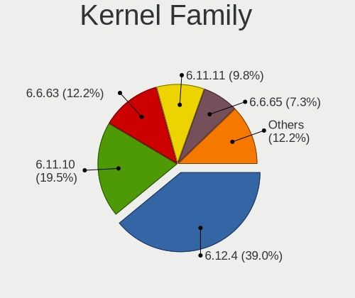
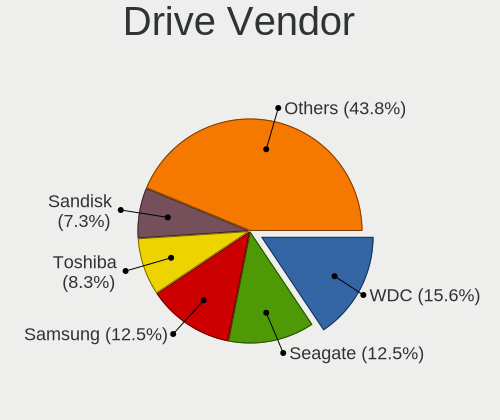
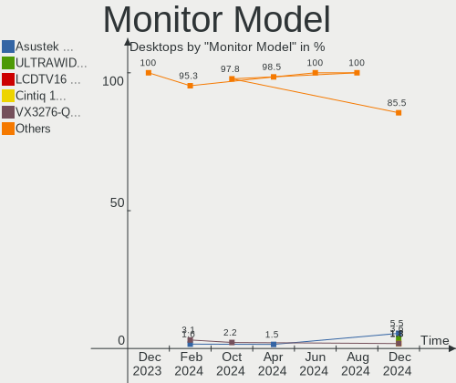

Manjaro - Hardware Trends (Desktops)
------------------------------------

A project to identify most popular hardware characteristics and track their change
over time based on data collected by Linux users at https://Linux-Hardware.org.

Anyone can contribute to this report by the [hw-probe](https://github.com/linuxhw/hw-probe) tool:

    sudo -E hw-probe -all -upload

This report is for one last month. Overall report since the beginning of time: [TestDays](https://github.com/linuxhw/TestDays)

Period: Dec, 2023.

Contents
--------

* [ System ](#system)
  - [ OS                       ](#os)
  - [ OS Family                ](#os-family)
  - [ Kernel                   ](#kernel)
  - [ Kernel Family            ](#kernel-family)
  - [ Kernel Major Ver.        ](#kernel-major-ver)
  - [ Arch                     ](#arch)
  - [ DE                       ](#de)
  - [ Display Server           ](#display-server)
  - [ Display Manager          ](#display-manager)
  - [ OS Lang                  ](#os-lang)
  - [ Boot Mode                ](#boot-mode)
  - [ Filesystem               ](#filesystem)
  - [ Part. scheme             ](#part-scheme)
  - [ Dual Boot with Linux/BSD ](#dual-boot-with-linuxbsd)
  - [ Dual Boot (Win)          ](#dual-boot-win)

* [ Board ](#board)
  - [ Vendor                   ](#vendor)
  - [ Model                    ](#model)
  - [ Model Family             ](#model-family)
  - [ MFG Year                 ](#mfg-year)
  - [ Form Factor              ](#form-factor)
  - [ Secure Boot              ](#secure-boot)
  - [ Coreboot                 ](#coreboot)
  - [ RAM Size                 ](#ram-size)
  - [ RAM Used                 ](#ram-used)
  - [ Total Drives             ](#total-drives)
  - [ Has CD-ROM               ](#has-cd-rom)
  - [ Has Ethernet             ](#has-ethernet)
  - [ Has WiFi                 ](#has-wifi)
  - [ Has Bluetooth            ](#has-bluetooth)

* [ Location ](#location)
  - [ Country                  ](#country)
  - [ City                     ](#city)

* [ Drives ](#drives)
  - [ Drive Vendor             ](#drive-vendor)
  - [ Drive Model              ](#drive-model)
  - [ HDD Vendor               ](#hdd-vendor)
  - [ SSD Vendor               ](#ssd-vendor)
  - [ Drive Kind               ](#drive-kind)
  - [ Drive Connector          ](#drive-connector)
  - [ Drive Size               ](#drive-size)
  - [ Space Total              ](#space-total)
  - [ Space Used               ](#space-used)
  - [ Malfunc. Drives          ](#malfunc-drives)
  - [ Malfunc. Drive Vendor    ](#malfunc-drive-vendor)
  - [ Malfunc. HDD Vendor      ](#malfunc-hdd-vendor)
  - [ Malfunc. Drive Kind      ](#malfunc-drive-kind)
  - [ Failed Drives            ](#failed-drives)
  - [ Failed Drive Vendor      ](#failed-drive-vendor)
  - [ Drive Status             ](#drive-status)

* [ Storage controller ](#storage-controller)
  - [ Storage Vendor           ](#storage-vendor)
  - [ Storage Model            ](#storage-model)
  - [ Storage Kind             ](#storage-kind)

* [ Processor ](#processor)
  - [ CPU Vendor               ](#cpu-vendor)
  - [ CPU Model                ](#cpu-model)
  - [ CPU Model Family         ](#cpu-model-family)
  - [ CPU Cores                ](#cpu-cores)
  - [ CPU Sockets              ](#cpu-sockets)
  - [ CPU Threads              ](#cpu-threads)
  - [ CPU Op-Modes             ](#cpu-op-modes)
  - [ CPU Microcode            ](#cpu-microcode)
  - [ CPU Microarch            ](#cpu-microarch)

* [ Graphics ](#graphics)
  - [ GPU Vendor               ](#gpu-vendor)
  - [ GPU Model                ](#gpu-model)
  - [ GPU Combo                ](#gpu-combo)
  - [ GPU Driver               ](#gpu-driver)
  - [ GPU Memory               ](#gpu-memory)

* [ Monitor ](#monitor)
  - [ Monitor Vendor           ](#monitor-vendor)
  - [ Monitor Model            ](#monitor-model)
  - [ Monitor Resolution       ](#monitor-resolution)
  - [ Monitor Diagonal         ](#monitor-diagonal)
  - [ Monitor Width            ](#monitor-width)
  - [ Aspect Ratio             ](#aspect-ratio)
  - [ Monitor Area             ](#monitor-area)
  - [ Pixel Density            ](#pixel-density)
  - [ Multiple Monitors        ](#multiple-monitors)

* [ Network ](#network)
  - [ Net Controller Vendor    ](#net-controller-vendor)
  - [ Net Controller Model     ](#net-controller-model)
  - [ Wireless Vendor          ](#wireless-vendor)
  - [ Wireless Model           ](#wireless-model)
  - [ Ethernet Vendor          ](#ethernet-vendor)
  - [ Ethernet Model           ](#ethernet-model)
  - [ Net Controller Kind      ](#net-controller-kind)
  - [ Used Controller          ](#used-controller)
  - [ NICs                     ](#nics)
  - [ IPv6                     ](#ipv6)

* [ Bluetooth ](#bluetooth)
  - [ Bluetooth Vendor         ](#bluetooth-vendor)
  - [ Bluetooth Model          ](#bluetooth-model)

* [ Sound ](#sound)
  - [ Sound Vendor             ](#sound-vendor)
  - [ Sound Model              ](#sound-model)

* [ Memory ](#memory)
  - [ Memory Vendor            ](#memory-vendor)
  - [ Memory Model             ](#memory-model)
  - [ Memory Kind              ](#memory-kind)
  - [ Memory Form Factor       ](#memory-form-factor)
  - [ Memory Size              ](#memory-size)
  - [ Memory Speed             ](#memory-speed)

* [ Printers & scanners ](#printers--scanners)
  - [ Printer Vendor           ](#printer-vendor)
  - [ Printer Model            ](#printer-model)
  - [ Scanner Vendor           ](#scanner-vendor)
  - [ Scanner Model            ](#scanner-model)

* [ Camera ](#camera)
  - [ Camera Vendor            ](#camera-vendor)
  - [ Camera Model             ](#camera-model)

* [ Security ](#security)
  - [ Fingerprint Vendor       ](#fingerprint-vendor)
  - [ Fingerprint Model        ](#fingerprint-model)
  - [ Chipcard Vendor          ](#chipcard-vendor)
  - [ Chipcard Model           ](#chipcard-model)

* [ Unsupported ](#unsupported)
  - [ Unsupported Devices      ](#unsupported-devices)
  - [ Unsupported Device Types ](#unsupported-device-types)

System
------

OS
--

Installed operating systems

| Name           | Desktops | Percent |
|----------------|----------|---------|
| Manjaro        | 21       | 45.65%  |
| Manjaro 23.1.0 | 20       | 43.48%  |
| Manjaro 23.1.1 | 5        | 10.87%  |

OS Family
---------

OS without a version

| Name    | Desktops | Percent |
|---------|----------|---------|
| Manjaro | 46       | 100%    |

Kernel
------

Version of the Linux kernel

| Version            | Desktops | Percent |
|--------------------|----------|---------|
| 6.5.13-1-MANJARO   | 8        | 17.39%  |
| 6.6.8-2-MANJARO    | 7        | 15.22%  |
| 6.6.3-1-MANJARO    | 5        | 10.87%  |
| 6.6.7-4-MANJARO    | 4        | 8.7%    |
| 6.6.7-1-MANJARO    | 3        | 6.52%   |
| 6.5.13-6-MANJARO   | 2        | 4.35%   |
| 6.1.68-1-MANJARO   | 2        | 4.35%   |
| 6.7.0-1-MANJARO    | 1        | 2.17%   |
| 6.6.5-3-MANJARO    | 1        | 2.17%   |
| 6.6.5-1-MANJARO    | 1        | 2.17%   |
| 6.6.4-6-MANJARO    | 1        | 2.17%   |
| 6.6.4-4-MANJARO    | 1        | 2.17%   |
| 6.6.2-1-MANJARO    | 1        | 2.17%   |
| 6.5.13-7-MANJARO   | 1        | 2.17%   |
| 6.5.13-4-MANJARO   | 1        | 2.17%   |
| 6.5.11-1-MANJARO   | 1        | 2.17%   |
| 6.1.69-1-MANJARO   | 1        | 2.17%   |
| 6.1.64-1-MANJARO   | 1        | 2.17%   |
| 5.15.144-1-MANJARO | 1        | 2.17%   |
| 5.15.143-1-MANJARO | 1        | 2.17%   |
| 5.15.138-1-MANJARO | 1        | 2.17%   |
| 5.10.199-1-MANJARO | 1        | 2.17%   |

Kernel Family
-------------

Linux kernel without a distro release

| Version  | Desktops | Percent |
|----------|----------|---------|
| 6.5.13   | 12       | 26.09%  |
| 6.6.8    | 7        | 15.22%  |
| 6.6.7    | 7        | 15.22%  |
| 6.6.3    | 5        | 10.87%  |
| 6.6.5    | 2        | 4.35%   |
| 6.6.4    | 2        | 4.35%   |
| 6.1.68   | 2        | 4.35%   |
| 6.7.0    | 1        | 2.17%   |
| 6.6.2    | 1        | 2.17%   |
| 6.5.11   | 1        | 2.17%   |
| 6.1.69   | 1        | 2.17%   |
| 6.1.64   | 1        | 2.17%   |
| 5.15.144 | 1        | 2.17%   |
| 5.15.143 | 1        | 2.17%   |
| 5.15.138 | 1        | 2.17%   |
| 5.10.199 | 1        | 2.17%   |

Kernel Major Ver.
-----------------

Linux kernel major version

| Version | Desktops | Percent |
|---------|----------|---------|
| 6.6     | 24       | 52.17%  |
| 6.5     | 13       | 28.26%  |
| 6.1     | 4        | 8.7%    |
| 5.15    | 3        | 6.52%   |
| 6.7     | 1        | 2.17%   |
| 5.10    | 1        | 2.17%   |

Arch
----

OS architecture (x86_64, i586, etc.)

| Name   | Desktops | Percent |
|--------|----------|---------|
| x86_64 | 46       | 100%    |

DE
--

Desktop Environment

| Name  | Desktops | Percent |
|-------|----------|---------|
| KDE5  | 30       | 65.22%  |
| GNOME | 12       | 26.09%  |
| XFCE  | 3        | 6.52%   |
| KDE   | 1        | 2.17%   |

Display Server
--------------

X11 or Wayland

| Name    | Desktops | Percent |
|---------|----------|---------|
| X11     | 36       | 78.26%  |
| Wayland | 8        | 17.39%  |
| Tty     | 2        | 4.35%   |

Display Manager
---------------

SDDM, LightDM, etc.

| Name    | Desktops | Percent |
|---------|----------|---------|
| Unknown | 21       | 45.65%  |
| SDDM    | 16       | 34.78%  |
| GDM     | 5        | 10.87%  |
| LightDM | 4        | 8.7%    |

OS Lang
-------

Language

| Lang  | Desktops | Percent |
|-------|----------|---------|
| en_US | 9        | 19.57%  |
| de_DE | 6        | 13.04%  |
| en_GB | 5        | 10.87%  |
| ru_RU | 4        | 8.7%    |
| fr_FR | 3        | 6.52%   |
| zh_CN | 2        | 4.35%   |
| pt_BR | 2        | 4.35%   |
| pl_PL | 2        | 4.35%   |
| es_ES | 2        | 4.35%   |
| en_AU | 2        | 4.35%   |
| cs_CZ | 2        | 4.35%   |
| sk_SK | 1        | 2.17%   |
| it_IT | 1        | 2.17%   |
| fi_FI | 1        | 2.17%   |
| es_UY | 1        | 2.17%   |
| en_ZA | 1        | 2.17%   |
| en_DK | 1        | 2.17%   |
| en_CA | 1        | 2.17%   |

Boot Mode
---------

EFI or BIOS

| Mode | Desktops | Percent |
|------|----------|---------|
| BIOS | 28       | 60.87%  |
| EFI  | 18       | 39.13%  |

Filesystem
----------

Type of filesystem

| Type  | Desktops | Percent |
|-------|----------|---------|
| Ext4  | 34       | 73.91%  |
| Btrfs | 7        | 15.22%  |
| Tmpfs | 4        | 8.7%    |
| Xfs   | 1        | 2.17%   |

Part. scheme
------------

Scheme of partitioning

| Type    | Desktops | Percent |
|---------|----------|---------|
| GPT     | 23       | 50%     |
| Unknown | 21       | 45.65%  |
| MBR     | 2        | 4.35%   |

Dual Boot with Linux/BSD
------------------------

Hosting more than one Linux/BSD

| Dual boot | Desktops | Percent |
|-----------|----------|---------|
| No        | 39       | 84.78%  |
| Yes       | 7        | 15.22%  |

Dual Boot (Win)
---------------

Hosting Linux and Windows

| Dual boot | Desktops | Percent |
|-----------|----------|---------|
| No        | 28       | 60.87%  |
| Yes       | 18       | 39.13%  |

Board
-----

Vendor
------

Motherboard manufacturer

| Name                | Desktops | Percent |
|---------------------|----------|---------|
| ASUSTek Computer    | 15       | 32.61%  |
| ASRock              | 9        | 19.57%  |
| MSI                 | 8        | 17.39%  |
| Gigabyte Technology | 6        | 13.04%  |
| Lenovo              | 2        | 4.35%   |
| Hewlett-Packard     | 2        | 4.35%   |
| Dell                | 2        | 4.35%   |
| Unknown             | 2        | 4.35%   |

Model
-----

Motherboard model

| Name                                    | Desktops | Percent |
|-----------------------------------------|----------|---------|
| MSI MS-7A38                             | 2        | 4.35%   |
| ASUS All Series                         | 2        | 4.35%   |
| Unknown                                 | 2        | 4.35%   |
| MSI MS-7E26                             | 1        | 2.17%   |
| MSI MS-7D32                             | 1        | 2.17%   |
| MSI MS-7D22                             | 1        | 2.17%   |
| MSI MS-7D20                             | 1        | 2.17%   |
| MSI MS-7C84                             | 1        | 2.17%   |
| MSI MS-7597                             | 1        | 2.17%   |
| Lenovo ThinkStation P620 30E000GMMT     | 1        | 2.17%   |
| Lenovo Legion T530-28ICB 90L300QPGE     | 1        | 2.17%   |
| HP OMEN by 40L Gaming Desktop GT21-0xxx | 1        | 2.17%   |
| HP EliteDesk 800 G4 TWR                 | 1        | 2.17%   |
| Gigabyte Z97N-WIFI                      | 1        | 2.17%   |
| Gigabyte Z790 GAMING X AX               | 1        | 2.17%   |
| Gigabyte Z370 HD3                       | 1        | 2.17%   |
| Gigabyte X-DIABLO GAMER                 | 1        | 2.17%   |
| Gigabyte B550M DS3H                     | 1        | 2.17%   |
| Gigabyte B450M DS3H                     | 1        | 2.17%   |
| Dell Precision 3650 Tower               | 1        | 2.17%   |
| Dell OptiPlex 3020                      | 1        | 2.17%   |
| ASUS TUF Gaming Z690-PLUS WIFI D4       | 1        | 2.17%   |
| ASUS TUF Gaming X570-PLUS               | 1        | 2.17%   |
| ASUS ROG STRIX X670E-F GAMING WIFI      | 1        | 2.17%   |
| ASUS ROG STRIX X670E-A GAMING WIFI      | 1        | 2.17%   |
| ASUS ROG STRIX X570-E GAMING            | 1        | 2.17%   |
| ASUS ROG CROSSHAIR X670E EXTREME        | 1        | 2.17%   |
| ASUS ROG CROSSHAIR VIII HERO            | 1        | 2.17%   |
| ASUS Pro WS X570-ACE                    | 1        | 2.17%   |
| ASUS PRIME Z790-P WIFI                  | 1        | 2.17%   |
| ASUS PRIME Z370-A II                    | 1        | 2.17%   |
| ASUS PRIME B350-PLUS                    | 1        | 2.17%   |
| ASUS M5A97 EVO R2.0                     | 1        | 2.17%   |
| ASUS H170-PRO                           | 1        | 2.17%   |
| ASRock X670E Taichi                     | 1        | 2.17%   |
| ASRock H310CM-HG4                       | 1        | 2.17%   |
| ASRock B75M-DGS                         | 1        | 2.17%   |
| ASRock B650E PG Riptide WiFi            | 1        | 2.17%   |
| ASRock B550M Steel Legend               | 1        | 2.17%   |
| ASRock B450 Pro4                        | 1        | 2.17%   |

Model Family
------------

Motherboard model prefix

| Name                | Desktops | Percent |
|---------------------|----------|---------|
| ASUS ROG            | 5        | 10.87%  |
| ASUS PRIME          | 3        | 6.52%   |
| MSI MS-7A38         | 2        | 4.35%   |
| ASUS TUF            | 2        | 4.35%   |
| ASUS All            | 2        | 4.35%   |
| ASRock B450         | 2        | 4.35%   |
| Unknown             | 2        | 4.35%   |
| MSI MS-7E26         | 1        | 2.17%   |
| MSI MS-7D32         | 1        | 2.17%   |
| MSI MS-7D22         | 1        | 2.17%   |
| MSI MS-7D20         | 1        | 2.17%   |
| MSI MS-7C84         | 1        | 2.17%   |
| MSI MS-7597         | 1        | 2.17%   |
| Lenovo ThinkStation | 1        | 2.17%   |
| Lenovo Legion       | 1        | 2.17%   |
| HP OMEN             | 1        | 2.17%   |
| HP EliteDesk        | 1        | 2.17%   |
| Gigabyte Z97N-WIFI  | 1        | 2.17%   |
| Gigabyte Z790       | 1        | 2.17%   |
| Gigabyte Z370       | 1        | 2.17%   |
| Gigabyte X-DIABLO   | 1        | 2.17%   |
| Gigabyte B550M      | 1        | 2.17%   |
| Gigabyte B450M      | 1        | 2.17%   |
| Dell Precision      | 1        | 2.17%   |
| Dell OptiPlex       | 1        | 2.17%   |
| ASUS Pro            | 1        | 2.17%   |
| ASUS M5A97          | 1        | 2.17%   |
| ASUS H170-PRO       | 1        | 2.17%   |
| ASRock X670E        | 1        | 2.17%   |
| ASRock H310CM-HG4   | 1        | 2.17%   |
| ASRock B75M-DGS     | 1        | 2.17%   |
| ASRock B650E        | 1        | 2.17%   |
| ASRock B550M        | 1        | 2.17%   |
| ASRock 970          | 1        | 2.17%   |
| ASRock 760GM-HDV    | 1        | 2.17%   |

MFG Year
--------

Motherboard manufacture year

| Year | Desktops | Percent |
|------|----------|---------|
| 2022 | 6        | 13.04%  |
| 2021 | 6        | 13.04%  |
| 2018 | 6        | 13.04%  |
| 2023 | 5        | 10.87%  |
| 2020 | 5        | 10.87%  |
| 2019 | 4        | 8.7%    |
| 2017 | 4        | 8.7%    |
| 2014 | 3        | 6.52%   |
| 2012 | 3        | 6.52%   |
| 2015 | 1        | 2.17%   |
| 2013 | 1        | 2.17%   |
| 2010 | 1        | 2.17%   |
| 2009 | 1        | 2.17%   |

Form Factor
-----------

Physical design of the computer

| Name    | Desktops | Percent |
|---------|----------|---------|
| Desktop | 46       | 100%    |

Secure Boot
-----------

Enabled or disabled

| State    | Desktops | Percent |
|----------|----------|---------|
| Disabled | 46       | 100%    |

Coreboot
--------

Have coreboot on board

| Used | Desktops | Percent |
|------|----------|---------|
| No   | 46       | 100%    |

RAM Size
--------

Total RAM memory

| Size in GB  | Desktops | Percent |
|-------------|----------|---------|
| 16.01-24.0  | 17       | 36.96%  |
| 32.01-64.0  | 10       | 21.74%  |
| 64.01-256.0 | 8        | 17.39%  |
| 24.01-32.0  | 4        | 8.7%    |
| 8.01-16.0   | 4        | 8.7%    |
| 4.01-8.0    | 3        | 6.52%   |

RAM Used
--------

Used RAM memory

| Used GB    | Desktops | Percent |
|------------|----------|---------|
| 4.01-8.0   | 21       | 45.65%  |
| 1.01-2.0   | 9        | 19.57%  |
| 3.01-4.0   | 6        | 13.04%  |
| 2.01-3.0   | 3        | 6.52%   |
| 8.01-16.0  | 3        | 6.52%   |
| 32.01-64.0 | 2        | 4.35%   |
| 24.01-32.0 | 1        | 2.17%   |
| 16.01-24.0 | 1        | 2.17%   |

Total Drives
------------

Number of drives on board

| Drives | Desktops | Percent |
|--------|----------|---------|
| 4      | 12       | 26.09%  |
| 3      | 12       | 26.09%  |
| 2      | 9        | 19.57%  |
| 1      | 6        | 13.04%  |
| 5      | 5        | 10.87%  |
| 9      | 1        | 2.17%   |
| 7      | 1        | 2.17%   |

Has CD-ROM
----------

Has CD-ROM on board

| Presented | Desktops | Percent |
|-----------|----------|---------|
| No        | 37       | 80.43%  |
| Yes       | 9        | 19.57%  |

Has Ethernet
------------

Has Ethernet on board

| Presented | Desktops | Percent |
|-----------|----------|---------|
| Yes       | 46       | 100%    |

Has WiFi
--------

Has WiFi module

| Presented | Desktops | Percent |
|-----------|----------|---------|
| Yes       | 27       | 58.7%   |
| No        | 19       | 41.3%   |

Has Bluetooth
-------------

Has Bluetooth module

| Presented | Desktops | Percent |
|-----------|----------|---------|
| Yes       | 27       | 58.7%   |
| No        | 19       | 41.3%   |

Location
--------

Country
-------

Geographic location (country)

| Country      | Desktops | Percent |
|--------------|----------|---------|
| Germany      | 9        | 19.57%  |
| Russia       | 5        | 10.87%  |
| USA          | 4        | 8.7%    |
| France       | 3        | 6.52%   |
| Czechia      | 3        | 6.52%   |
| Spain        | 2        | 4.35%   |
| Poland       | 2        | 4.35%   |
| Hong Kong    | 2        | 4.35%   |
| Canada       | 2        | 4.35%   |
| Brazil       | 2        | 4.35%   |
| Australia    | 2        | 4.35%   |
| Uruguay      | 1        | 2.17%   |
| Thailand     | 1        | 2.17%   |
| Switzerland  | 1        | 2.17%   |
| Sweden       | 1        | 2.17%   |
| South Africa | 1        | 2.17%   |
| Slovakia     | 1        | 2.17%   |
| Italy        | 1        | 2.17%   |
| Finland      | 1        | 2.17%   |
| Denmark      | 1        | 2.17%   |
| Croatia      | 1        | 2.17%   |

City
----

Geographic location (city)

| City                   | Desktops | Percent |
|------------------------|----------|---------|
| Sydney                 | 2        | 4.35%   |
| Zagreb                 | 1        | 2.17%   |
| Yekaterinburg          | 1        | 2.17%   |
| Vodnany                | 1        | 2.17%   |
| Vendenheim             | 1        | 2.17%   |
| Vancouver              | 1        | 2.17%   |
| Torrejón de Ardoz     | 1        | 2.17%   |
| Toronto                | 1        | 2.17%   |
| Tambov                 | 1        | 2.17%   |
| Stockholm              | 1        | 2.17%   |
| Stavropol              | 1        | 2.17%   |
| Sobeslav               | 1        | 2.17%   |
| Siegen                 | 1        | 2.17%   |
| Sao Paulo              | 1        | 2.17%   |
| Pretoria               | 1        | 2.17%   |
| Old Lyme               | 1        | 2.17%   |
| Nové Mesto nad Váhom | 1        | 2.17%   |
| Nizhniy Novgorod       | 1        | 2.17%   |
| New Richmond           | 1        | 2.17%   |
| Moscow                 | 1        | 2.17%   |
| Montevideo             | 1        | 2.17%   |
| Malbork                | 1        | 2.17%   |
| Málaga                | 1        | 2.17%   |
| Mainhausen             | 1        | 2.17%   |
| Limeira                | 1        | 2.17%   |
| Liberec                | 1        | 2.17%   |
| Kowloon                | 1        | 2.17%   |
| Konstanz               | 1        | 2.17%   |
| Juelsminde             | 1        | 2.17%   |
| Joensuu                | 1        | 2.17%   |
| Hamburg                | 1        | 2.17%   |
| Halle                  | 1        | 2.17%   |
| Gdansk                 | 1        | 2.17%   |
| Freiburg im Breisgau   | 1        | 2.17%   |
| Fayetteville           | 1        | 2.17%   |
| Ebertswil              | 1        | 2.17%   |
| Dortmund               | 1        | 2.17%   |
| Dayton                 | 1        | 2.17%   |
| Central                | 1        | 2.17%   |
| Castions di Strada     | 1        | 2.17%   |

Drives
------

Drive Vendor
------------

Hard drive vendors

| Vendor                      | Desktops | Drives | Percent |
|-----------------------------|----------|--------|---------|
| Seagate                     | 18       | 28     | 16.07%  |
| WDC                         | 17       | 26     | 15.18%  |
| Samsung Electronics         | 16       | 30     | 14.29%  |
| Kingston                    | 9        | 11     | 8.04%   |
| Toshiba                     | 6        | 7      | 5.36%   |
| Crucial                     | 6        | 6      | 5.36%   |
| SanDisk                     | 5        | 5      | 4.46%   |
| Phison Electronics          | 5        | 5      | 4.46%   |
| MAXIO Technology (Hangzhou) | 3        | 3      | 2.68%   |
| A-DATA Technology           | 3        | 3      | 2.68%   |
| Silicon Motion              | 2        | 2      | 1.79%   |
| Patriot                     | 2        | 2      | 1.79%   |
| Hitachi                     | 2        | 2      | 1.79%   |
| ADATA Technology            | 2        | 2      | 1.79%   |
| Transcend                   | 1        | 1      | 0.89%   |
| SK hynix                    | 1        | 1      | 0.89%   |
| PNY                         | 1        | 1      | 0.89%   |
| OWC                         | 1        | 1      | 0.89%   |
| Micron/Crucial Technology   | 1        | 1      | 0.89%   |
| Micron Technology           | 1        | 1      | 0.89%   |
| Maxtor                      | 1        | 1      | 0.89%   |
| LITEON                      | 1        | 1      | 0.89%   |
| Lexar                       | 1        | 1      | 0.89%   |
| Kingston Technology Company | 1        | 1      | 0.89%   |
| Intel                       | 1        | 2      | 0.89%   |
| GOODRAM                     | 1        | 1      | 0.89%   |
| Fujitsu                     | 1        | 1      | 0.89%   |
| Corsair                     | 1        | 1      | 0.89%   |
| China                       | 1        | 1      | 0.89%   |
| Unknown                     | 1        | 1      | 0.89%   |

Drive Model
-----------

Hard drive models

| Model                                                 | Desktops | Percent |
|-------------------------------------------------------|----------|---------|
| Samsung NVMe SSD Controller PM9A1/PM9A3/980PRO 2TB    | 5        | 3.7%    |
| Seagate ST2000DM008-2FR102 2TB                        | 3        | 2.22%   |
| Samsung NVMe SSD Controller SM981/PM981/PM983 512GB   | 3        | 2.22%   |
| Kingston SA400S37480G 480GB SSD                       | 3        | 2.22%   |
| Silicon Motion SM2263EN/SM2263XT SSD Controller 500GB | 2        | 1.48%   |
| Seagate ST4000DM004-2CV104 4TB                        | 2        | 1.48%   |
| Sandisk WD Blue SN550 NVMe SSD 1TB                    | 2        | 1.48%   |
| Samsung SSD 860 EVO 500GB                             | 2        | 1.48%   |
| Samsung NVMe SSD Controller SM961/PM961/SM963 250GB   | 2        | 1.48%   |
| Phison E12 NVMe Controller 1TB                        | 2        | 1.48%   |
| MAXIO (Hangzhou) NVMe SSD Controller MAP1202 256GB    | 2        | 1.48%   |
| Kingston SKC3000S1024G 1024GB                         | 2        | 1.48%   |
| Kingston SA400S37120G 120GB SSD                       | 2        | 1.48%   |
| Crucial CT240BX500SSD1 240GB                          | 2        | 1.48%   |
| WDC WDS500G2B0A-00SM50 500GB SSD                      | 1        | 0.74%   |
| WDC WDS120G2G0A-00JH30 120GB SSD                      | 1        | 0.74%   |
| WDC WD6401AALS-00L3B2 640GB                           | 1        | 0.74%   |
| WDC WD6003FFBX-68MU3N0 6TB                            | 1        | 0.74%   |
| WDC WD5002ABYS-02B1B0 500GB                           | 1        | 0.74%   |
| WDC WD40EZRZ-00WN9B0 4TB                              | 1        | 0.74%   |
| WDC WD40EZRZ-00GXCB0 4TB                              | 1        | 0.74%   |
| WDC WD32 00BPVT-55ZEST0 320GB                         | 1        | 0.74%   |
| WDC WD30EZRZ-00Z5HB0 3TB                              | 1        | 0.74%   |
| WDC WD30EFRX-68E 3TB                                  | 1        | 0.74%   |
| WDC WD20SPZX-00UA7T0 2TB                              | 1        | 0.74%   |
| WDC WD20EZRX-00DC0B0 2TB                              | 1        | 0.74%   |
| WDC WD20EZBX-00AYRA0 2TB                              | 1        | 0.74%   |
| WDC WD20EZAZ-00L9GB0 2TB                              | 1        | 0.74%   |
| WDC WD2003FYYS-02W0B1 2TB                             | 1        | 0.74%   |
| WDC WD2002FAEX-007BA0 2TB                             | 1        | 0.74%   |
| WDC WD1600AAJS-00YZCA0 160GB                          | 1        | 0.74%   |
| WDC WD10EZEX-22MFCA0 1TB                              | 1        | 0.74%   |
| WDC WD10EZEX-08WN4A0 1TB                              | 1        | 0.74%   |
| WDC WD10EZEX-08M2NA0 1TB                              | 1        | 0.74%   |
| WDC WD10EURX-63UY4Y0 1TB                              | 1        | 0.74%   |
| WDC WD1003FZEX-00MK2A0 1TB                            | 1        | 0.74%   |
| WDC WD1003FZEX-00K3CA0 1TB                            | 1        | 0.74%   |
| WDC WD1002FBYS-02A6B0 1TB                             | 1        | 0.74%   |
| WDC WD1001FALS-403AA0 1TB                             | 1        | 0.74%   |
| Transcend TS256GSSD370S 256GB                         | 1        | 0.74%   |

HDD Vendor
----------

Hard disk drive vendors

| Vendor              | Desktops | Drives | Percent |
|---------------------|----------|--------|---------|
| Seagate             | 18       | 28     | 39.13%  |
| WDC                 | 17       | 24     | 36.96%  |
| Toshiba             | 6        | 7      | 13.04%  |
| Hitachi             | 2        | 2      | 4.35%   |
| Samsung Electronics | 1        | 1      | 2.17%   |
| Maxtor              | 1        | 1      | 2.17%   |
| Fujitsu             | 1        | 1      | 2.17%   |

SSD Vendor
----------

Solid state drive vendors

| Vendor              | Desktops | Drives | Percent |
|---------------------|----------|--------|---------|
| Samsung Electronics | 10       | 14     | 24.39%  |
| Kingston            | 7        | 8      | 17.07%  |
| Crucial             | 6        | 6      | 14.63%  |
| A-DATA Technology   | 3        | 3      | 7.32%   |
| WDC                 | 2        | 2      | 4.88%   |
| Patriot             | 2        | 2      | 4.88%   |
| Transcend           | 1        | 1      | 2.44%   |
| SK hynix            | 1        | 1      | 2.44%   |
| SanDisk             | 1        | 1      | 2.44%   |
| PNY                 | 1        | 1      | 2.44%   |
| OWC                 | 1        | 1      | 2.44%   |
| LITEON              | 1        | 1      | 2.44%   |
| Lexar               | 1        | 1      | 2.44%   |
| GOODRAM             | 1        | 1      | 2.44%   |
| Corsair             | 1        | 1      | 2.44%   |
| China               | 1        | 1      | 2.44%   |
| Unknown             | 1        | 1      | 2.44%   |

Drive Kind
----------

HDD or SSD

| Kind | Desktops | Drives | Percent |
|------|----------|--------|---------|
| HDD  | 33       | 64     | 37.93%  |
| NVMe | 28       | 39     | 32.18%  |
| SSD  | 26       | 46     | 29.89%  |

Drive Connector
---------------

SATA, SAS, NVMe, etc.

| Type | Desktops | Drives | Percent |
|------|----------|--------|---------|
| SATA | 40       | 108    | 56.34%  |
| NVMe | 28       | 38     | 39.44%  |
| SAS  | 3        | 3      | 4.23%   |

Drive Size
----------

Size of hard drive

| Size in TB | Desktops | Drives | Percent |
|------------|----------|--------|---------|
| 0.01-0.5   | 25       | 53     | 39.06%  |
| 0.51-1.0   | 16       | 21     | 25%     |
| 1.01-2.0   | 11       | 14     | 17.19%  |
| 3.01-4.0   | 5        | 6      | 7.81%   |
| 2.01-3.0   | 3        | 5      | 4.69%   |
| 10.01-20.0 | 2        | 9      | 3.13%   |
| 4.01-10.0  | 2        | 2      | 3.13%   |

Space Total
-----------

Amount of disk space available on the file system

| Size in GB     | Desktops | Percent |
|----------------|----------|---------|
| More than 3000 | 13       | 28.26%  |
| 1001-2000      | 11       | 23.91%  |
| 501-1000       | 9        | 19.57%  |
| 101-250        | 5        | 10.87%  |
| 251-500        | 4        | 8.7%    |
| 2001-3000      | 3        | 6.52%   |
| 51-100         | 1        | 2.17%   |

Space Used
----------

Amount of used disk space

| Used GB        | Desktops | Percent |
|----------------|----------|---------|
| 251-500        | 9        | 19.57%  |
| 101-250        | 9        | 19.57%  |
| 501-1000       | 8        | 17.39%  |
| 21-50          | 6        | 13.04%  |
| More than 3000 | 4        | 8.7%    |
| 1001-2000      | 4        | 8.7%    |
| 2001-3000      | 3        | 6.52%   |
| 51-100         | 2        | 4.35%   |
| 1-20           | 1        | 2.17%   |

Malfunc. Drives
---------------

Drive models with a malfunction

| Model                                 | Desktops | Drives | Percent |
|---------------------------------------|----------|--------|---------|
| Seagate ST2000DM008-2FR102 2TB        | 2        | 2      | 20%     |
| WDC WD1002FBYS-02A6B0 1TB             | 1        | 1      | 10%     |
| SK hynix HFS256G32TND-N210A 256GB SSD | 1        | 1      | 10%     |
| Seagate ST500LT012-9WS142 500GB       | 1        | 1      | 10%     |
| Seagate ST500DM002-1BD142 500GB       | 1        | 2      | 10%     |
| Seagate ST4000DM000-1F2168 4TB        | 1        | 1      | 10%     |
| Kingston SV300S37A120G 120GB SSD      | 1        | 1      | 10%     |
| Intel SSD 600P Series 128GB           | 1        | 1      | 10%     |
| Unknown                               | 1        | 1      | 10%     |

Malfunc. Drive Vendor
---------------------

Vendors of faulty drives

| Vendor   | Desktops | Drives | Percent |
|----------|----------|--------|---------|
| Seagate  | 5        | 6      | 50%     |
| WDC      | 1        | 1      | 10%     |
| SK hynix | 1        | 1      | 10%     |
| Kingston | 1        | 1      | 10%     |
| Intel    | 1        | 1      | 10%     |
| Unknown  | 1        | 1      | 10%     |

Malfunc. HDD Vendor
-------------------

Vendors of faulty HDD drives

| Vendor  | Desktops | Drives | Percent |
|---------|----------|--------|---------|
| Seagate | 5        | 6      | 83.33%  |
| WDC     | 1        | 1      | 16.67%  |

Malfunc. Drive Kind
-------------------

Kinds of faulty drives

| Kind | Desktops | Drives | Percent |
|------|----------|--------|---------|
| HDD  | 6        | 7      | 60%     |
| SSD  | 3        | 3      | 30%     |
| NVMe | 1        | 1      | 10%     |

Failed Drives
-------------

Failed drive models

Zero info for selected period =(

Failed Drive Vendor
-------------------

Failed drive vendors

Zero info for selected period =(

Drive Status
------------

Number of failed and malfunc. drives

| Status   | Desktops | Drives | Percent |
|----------|----------|--------|---------|
| Detected | 29       | 90     | 50.88%  |
| Works    | 19       | 48     | 33.33%  |
| Malfunc  | 9        | 11     | 15.79%  |

Storage controller
------------------

Storage Vendor
--------------

Storage controller vendors

| Vendor                      | Desktops | Percent |
|-----------------------------|----------|---------|
| AMD                         | 24       | 27.91%  |
| Intel                       | 22       | 25.58%  |
| Samsung Electronics         | 10       | 11.63%  |
| ASMedia Technology          | 8        | 9.3%    |
| Phison Electronics          | 5        | 5.81%   |
| SanDisk                     | 4        | 4.65%   |
| MAXIO Technology (Hangzhou) | 3        | 3.49%   |
| Kingston Technology Company | 3        | 3.49%   |
| Silicon Motion              | 2        | 2.33%   |
| ADATA Technology            | 2        | 2.33%   |
| Nvidia                      | 1        | 1.16%   |
| Micron/Crucial Technology   | 1        | 1.16%   |
| Micron Technology           | 1        | 1.16%   |

Storage Model
-------------

Storage controller models

| Model                                                                          | Desktops | Percent |
|--------------------------------------------------------------------------------|----------|---------|
| AMD FCH SATA Controller [AHCI mode]                                            | 16       | 16%     |
| ASMedia ASM1062 Serial ATA Controller                                          | 7        | 7%      |
| Samsung NVMe SSD Controller PM9A1/PM9A3/980PRO                                 | 5        | 5%      |
| Intel 200 Series PCH SATA controller [AHCI mode]                               | 4        | 4%      |
| AMD 400 Series Chipset SATA Controller                                         | 4        | 4%      |
| Samsung NVMe SSD Controller SM981/PM981/PM983                                  | 3        | 3%      |
| Kingston Company KC3000/FURY Renegade NVMe SSD E18                             | 3        | 3%      |
| AMD SB7x0/SB8x0/SB9x0 SATA Controller [AHCI mode]                              | 3        | 3%      |
| AMD 500 Series Chipset SATA Controller                                         | 3        | 3%      |
| Silicon Motion SM2263EN/SM2263XT (DRAM-less) NVMe SSD Controllers              | 2        | 2%      |
| SanDisk Ultra 3D / WD Blue SN550 NVMe SSD                                      | 2        | 2%      |
| Samsung NVMe SSD Controller SM961/PM961/SM963                                  | 2        | 2%      |
| Phison E18 PCIe4 NVMe Controller                                               | 2        | 2%      |
| Phison E12 NVMe Controller                                                     | 2        | 2%      |
| MAXIO (Hangzhou) NVMe SSD Controller MAP1202                                   | 2        | 2%      |
| Intel Cannon Lake PCH SATA AHCI Controller                                     | 2        | 2%      |
| Intel Alder Lake-S PCH SATA Controller [AHCI Mode]                             | 2        | 2%      |
| Intel 9 Series Chipset Family SATA Controller [AHCI Mode]                      | 2        | 2%      |
| Intel 8 Series/C220 Series Chipset Family 6-port SATA Controller 1 [AHCI mode] | 2        | 2%      |
| Intel 700 Series Chipset Family SATA AHCI Controller                           | 2        | 2%      |
| Intel 500 Series Chipset Family SATA AHCI Controller                           | 2        | 2%      |
| AMD SB7x0/SB8x0/SB9x0 IDE Controller                                           | 2        | 2%      |
| AMD 300 Series Chipset SATA Controller                                         | 2        | 2%      |
| SanDisk Ultra 3D / WD Blue SN570 NVMe SSD (DRAM-less)                          | 1        | 1%      |
| SanDisk Extreme Pro / WD Black SN750 / PC SN730 / Red SN700 NVMe SSD           | 1        | 1%      |
| Samsung NVMe SSD Controller S4LV008[Pascal]                                    | 1        | 1%      |
| Samsung NVMe SSD Controller 980 (DRAM-less)                                    | 1        | 1%      |
| Phison E16 PCIe4 NVMe Controller                                               | 1        | 1%      |
| Nvidia MCP61 SATA Controller                                                   | 1        | 1%      |
| Nvidia MCP61 IDE                                                               | 1        | 1%      |
| Micron/Crucial P1 NVMe PCIe SSD[Frampton2]                                     | 1        | 1%      |
| Micron 2550 NVMe SSD (DRAM-less)                                               | 1        | 1%      |
| MAXIO (Hangzhou) NVMe SSD Controller MAP1602                                   | 1        | 1%      |
| Kingston Company NV2 NVMe SSD E21T                                             | 1        | 1%      |
| Intel Volume Management Device NVMe RAID Controller Intel Corporation          | 1        | 1%      |
| Intel Volume Management Device NVMe RAID Controller                            | 1        | 1%      |
| Intel SSD 600P Series                                                          | 1        | 1%      |
| Intel SATA controller                                                          | 1        | 1%      |
| Intel Q170/Q150/B150/H170/H110/Z170/CM236 Chipset SATA Controller [AHCI Mode]  | 1        | 1%      |
| Intel NVMe Datacenter SSD [3DNAND, Beta Rock Controller]                       | 1        | 1%      |

Storage Kind
------------

Kind of storage controller (IDE, SATA, NVMe, SAS, ...)

| Kind | Desktops | Percent |
|------|----------|---------|
| SATA | 43       | 54.43%  |
| NVMe | 28       | 35.44%  |
| IDE  | 5        | 6.33%   |
| RAID | 3        | 3.8%    |

Processor
---------

CPU Vendor
----------

Processor vendors

| Vendor | Desktops | Percent |
|--------|----------|---------|
| AMD    | 25       | 54.35%  |
| Intel  | 21       | 45.65%  |

CPU Model
---------

Processor models

| Model                                       | Desktops | Percent |
|---------------------------------------------|----------|---------|
| AMD Ryzen 9 7950X 16-Core Processor         | 2        | 4.35%   |
| AMD Ryzen 5 5600X 6-Core Processor          | 2        | 4.35%   |
| AMD Ryzen 5 5600G with Radeon Graphics      | 2        | 4.35%   |
| AMD Ryzen 5 2600X Six-Core Processor        | 2        | 4.35%   |
| Intel Xeon CPU E3-1231 v3 @ 3.40GHz         | 1        | 2.17%   |
| Intel N95                                   | 1        | 2.17%   |
| Intel Core i7-9700 CPU @ 3.00GHz            | 1        | 2.17%   |
| Intel Core i7-8700 CPU @ 3.20GHz            | 1        | 2.17%   |
| Intel Core i7-7700K CPU @ 4.20GHz           | 1        | 2.17%   |
| Intel Core i7-4790K CPU @ 4.00GHz           | 1        | 2.17%   |
| Intel Core i7 CPU 860 @ 2.80GHz             | 1        | 2.17%   |
| Intel Core i5-9600K CPU @ 3.70GHz           | 1        | 2.17%   |
| Intel Core i5-8500 CPU @ 3.00GHz            | 1        | 2.17%   |
| Intel Core i5-4690K CPU @ 3.50GHz           | 1        | 2.17%   |
| Intel Core i5-4570 CPU @ 3.20GHz            | 1        | 2.17%   |
| Intel Core i3-6300 CPU @ 3.80GHz            | 1        | 2.17%   |
| Intel Core i3-3220 CPU @ 3.30GHz            | 1        | 2.17%   |
| Intel Celeron G4930 CPU @ 3.20GHz           | 1        | 2.17%   |
| Intel 13th Gen Core i7-13700KF              | 1        | 2.17%   |
| Intel 13th Gen Core i5-13600K               | 1        | 2.17%   |
| Intel 12th Gen Core i9-12900K               | 1        | 2.17%   |
| Intel 12th Gen Core i7-12700K               | 1        | 2.17%   |
| Intel 11th Gen Core i7-11700 @ 2.50GHz      | 1        | 2.17%   |
| Intel 11th Gen Core i5-11500 @ 2.70GHz      | 1        | 2.17%   |
| Intel 11th Gen Core i5-11400 @ 2.60GHz      | 1        | 2.17%   |
| AMD Ryzen Threadripper PRO 5945WX 12-Cores  | 1        | 2.17%   |
| AMD Ryzen 9 7900X 12-Core Processor         | 1        | 2.17%   |
| AMD Ryzen 9 7900 12-Core Processor          | 1        | 2.17%   |
| AMD Ryzen 9 3900X 12-Core Processor         | 1        | 2.17%   |
| AMD Ryzen 7 7700X 8-Core Processor          | 1        | 2.17%   |
| AMD Ryzen 7 5800X3D 8-Core Processor        | 1        | 2.17%   |
| AMD Ryzen 7 5800X 8-Core Processor          | 1        | 2.17%   |
| AMD Ryzen 7 2700X Eight-Core Processor      | 1        | 2.17%   |
| AMD Ryzen 5 7600X 6-Core Processor          | 1        | 2.17%   |
| AMD Ryzen 5 5500                            | 1        | 2.17%   |
| AMD Ryzen 5 3400G with Radeon Vega Graphics | 1        | 2.17%   |
| AMD Ryzen 5 2400G with Radeon Vega Graphics | 1        | 2.17%   |
| AMD Ryzen 3 2200G with Radeon Vega Graphics | 1        | 2.17%   |
| AMD FX-8350 Eight-Core Processor            | 1        | 2.17%   |
| AMD FX-8320 Eight-Core Processor            | 1        | 2.17%   |

CPU Model Family
----------------

Processor model prefix

| Model                  | Desktops | Percent |
|------------------------|----------|---------|
| AMD Ryzen 5            | 10       | 21.74%  |
| Other                  | 8        | 17.39%  |
| Intel Core i7          | 5        | 10.87%  |
| AMD Ryzen 9            | 5        | 10.87%  |
| Intel Core i5          | 4        | 8.7%    |
| AMD Ryzen 7            | 4        | 8.7%    |
| AMD FX                 | 3        | 6.52%   |
| Intel Core i3          | 2        | 4.35%   |
| Intel Xeon             | 1        | 2.17%   |
| Intel Celeron          | 1        | 2.17%   |
| AMD Ryzen Threadripper | 1        | 2.17%   |
| AMD Ryzen 3            | 1        | 2.17%   |
| AMD Athlon II X2       | 1        | 2.17%   |

CPU Cores
---------

Number of processor cores

| Number | Desktops | Percent |
|--------|----------|---------|
| 6      | 13       | 28.26%  |
| 4      | 12       | 26.09%  |
| 8      | 6        | 13.04%  |
| 12     | 5        | 10.87%  |
| 16     | 4        | 8.7%    |
| 2      | 4        | 8.7%    |
| 14     | 1        | 2.17%   |
| 3      | 1        | 2.17%   |

CPU Sockets
-----------

Number of sockets

| Number | Desktops | Percent |
|--------|----------|---------|
| 1      | 46       | 100%    |

CPU Threads
-----------

Threads per core (Hyper-Threading)

| Number | Desktops | Percent |
|--------|----------|---------|
| 2      | 37       | 80.43%  |
| 1      | 9        | 19.57%  |

CPU Op-Modes
------------

CPU Operation Modes (32-bit, 64-bit)

| Op mode        | Desktops | Percent |
|----------------|----------|---------|
| 32-bit, 64-bit | 46       | 100%    |

CPU Microcode
-------------

Microcode number

| Number     | Desktops | Percent |
|------------|----------|---------|
| Unknown    | 33       | 71.74%  |
| 0x0a601203 | 3        | 6.52%   |
| 0x906ea    | 1        | 2.17%   |
| 0x90672    | 1        | 2.17%   |
| 0x0a50000d | 1        | 2.17%   |
| 0x0a201016 | 1        | 2.17%   |
| 0x0a008204 | 1        | 2.17%   |
| 0x08701021 | 1        | 2.17%   |
| 0x08108109 | 1        | 2.17%   |
| 0x08101016 | 1        | 2.17%   |
| 0x0810100b | 1        | 2.17%   |
| 0x0800820d | 1        | 2.17%   |

CPU Microarch
-------------

Microarchitecture

| Name             | Desktops | Percent |
|------------------|----------|---------|
| Unknown          | 13       | 28.26%  |
| Zen 3            | 7        | 15.22%  |
| KabyLake         | 6        | 13.04%  |
| Zen+             | 4        | 8.7%    |
| Haswell          | 4        | 8.7%    |
| Piledriver       | 3        | 6.52%   |
| Zen              | 2        | 4.35%   |
| Alderlake Hybrid | 2        | 4.35%   |
| Zen 2            | 1        | 2.17%   |
| Skylake          | 1        | 2.17%   |
| Nehalem          | 1        | 2.17%   |
| K10              | 1        | 2.17%   |
| IvyBridge        | 1        | 2.17%   |

Graphics
--------

GPU Vendor
----------

Vendors of graphics cards

| Vendor | Desktops | Percent |
|--------|----------|---------|
| AMD    | 21       | 42.86%  |
| Nvidia | 20       | 40.82%  |
| Intel  | 8        | 16.33%  |

GPU Model
---------

Graphics card models

| Model                                                                       | Desktops | Percent |
|-----------------------------------------------------------------------------|----------|---------|
| AMD Raphael                                                                 | 6        | 10.91%  |
| AMD Navi 31 [Radeon RX 7900 XT/7900 XTX]                                    | 3        | 5.45%   |
| AMD Ellesmere [Radeon RX 470/480/570/570X/580/580X/590]                     | 3        | 5.45%   |
| Nvidia GP107 [GeForce GTX 1050]                                             | 2        | 3.64%   |
| Nvidia GP107 [GeForce GTX 1050 Ti]                                          | 2        | 3.64%   |
| Intel RocketLake-S GT1 [UHD Graphics 750]                                   | 2        | 3.64%   |
| AMD Navi 22 [Radeon RX 6700/6700 XT/6750 XT / 6800M/6850M XT]               | 2        | 3.64%   |
| Nvidia TU116 [GeForce GTX 1660]                                             | 1        | 1.82%   |
| Nvidia TU106 [GeForce RTX 2060 SUPER]                                       | 1        | 1.82%   |
| Nvidia GP104 [GeForce GTX 1080]                                             | 1        | 1.82%   |
| Nvidia GP104 [GeForce GTX 1070]                                             | 1        | 1.82%   |
| Nvidia GP102 [GeForce GTX 1080 Ti]                                          | 1        | 1.82%   |
| Nvidia GM206 [GeForce GTX 960]                                              | 1        | 1.82%   |
| Nvidia GM200 [GeForce GTX 980 Ti]                                           | 1        | 1.82%   |
| Nvidia GM107 [GeForce GTX 750]                                              | 1        | 1.82%   |
| Nvidia GM107 [GeForce GTX 750 Ti]                                           | 1        | 1.82%   |
| Nvidia GK104 [GeForce GTX 760]                                              | 1        | 1.82%   |
| Nvidia GK104 [GeForce GTX 670]                                              | 1        | 1.82%   |
| Nvidia GA106 [GeForce RTX 3060 Lite Hash Rate]                              | 1        | 1.82%   |
| Nvidia GA106 [Geforce RTX 3050]                                             | 1        | 1.82%   |
| Nvidia GA102 [GeForce RTX 3080 Ti]                                          | 1        | 1.82%   |
| Nvidia AD103 [GeForce RTX 4080]                                             | 1        | 1.82%   |
| Nvidia AD102 [GeForce RTX 4090]                                             | 1        | 1.82%   |
| Intel Xeon E3-1200 v3/4th Gen Core Processor Integrated Graphics Controller | 1        | 1.82%   |
| Intel RocketLake-S GT1 [UHD Graphics 730]                                   | 1        | 1.82%   |
| Intel Raptor Lake-S GT1 [UHD Graphics 770]                                  | 1        | 1.82%   |
| Intel DG2 [Arc A770]                                                        | 1        | 1.82%   |
| Intel CoffeeLake-S GT2 [UHD Graphics 630]                                   | 1        | 1.82%   |
| Intel AlderLake-S GT1                                                       | 1        | 1.82%   |
| Intel Alder Lake-N [UHD Graphics]                                           | 1        | 1.82%   |
| AMD Vega 10 XL/XT [Radeon RX Vega 56/64]                                    | 1        | 1.82%   |
| AMD RS780L [Radeon 3000]                                                    | 1        | 1.82%   |
| AMD Picasso/Raven 2 [Radeon Vega Series / Radeon Vega Mobile Series]        | 1        | 1.82%   |
| AMD Navi 32 [Radeon RX 7700 XT / 7800 XT]                                   | 1        | 1.82%   |
| AMD Navi 23 [Radeon RX 6600/6600 XT/6600M]                                  | 1        | 1.82%   |
| AMD Navi 21 [Radeon RX 6950 XT]                                             | 1        | 1.82%   |
| AMD Navi 21 [Radeon RX 6800/6800 XT / 6900 XT]                              | 1        | 1.82%   |
| AMD Navi 10 [Radeon RX 5600 OEM/5600 XT / 5700/5700 XT]                     | 1        | 1.82%   |
| AMD Lexa XT [Radeon PRO WX 3200]                                            | 1        | 1.82%   |
| AMD Cezanne [Radeon Vega Series / Radeon Vega Mobile Series]                | 1        | 1.82%   |

GPU Combo
---------

Combinations of graphics cards

| Name         | Desktops | Percent |
|--------------|----------|---------|
| 1 x Nvidia   | 18       | 39.13%  |
| 1 x AMD      | 13       | 28.26%  |
| 2 x AMD      | 5        | 10.87%  |
| 1 x Intel    | 5        | 10.87%  |
| Intel + AMD  | 2        | 4.35%   |
| 2 x Nvidia   | 1        | 2.17%   |
| 2 x Intel    | 1        | 2.17%   |
| AMD + Nvidia | 1        | 2.17%   |

GPU Driver
----------

Free vs proprietary

| Driver      | Desktops | Percent |
|-------------|----------|---------|
| Free        | 28       | 60.87%  |
| Proprietary | 18       | 39.13%  |

GPU Memory
----------

Total video memory

| Size in GB | Desktops | Percent |
|------------|----------|---------|
| Unknown    | 21       | 45.65%  |
| 1.01-2.0   | 7        | 15.22%  |
| 7.01-8.0   | 5        | 10.87%  |
| 8.01-16.0  | 5        | 10.87%  |
| 16.01-24.0 | 4        | 8.7%    |
| 5.01-6.0   | 2        | 4.35%   |
| 3.01-4.0   | 1        | 2.17%   |
| 0.51-1.0   | 1        | 2.17%   |

Monitor
-------

Monitor Vendor
--------------

Monitor vendors

| Vendor               | Desktops | Percent |
|----------------------|----------|---------|
| Samsung Electronics  | 12       | 20%     |
| Philips              | 4        | 6.67%   |
| Hewlett-Packard      | 4        | 6.67%   |
| Dell                 | 4        | 6.67%   |
| BenQ                 | 4        | 6.67%   |
| AOC                  | 4        | 6.67%   |
| Acer                 | 4        | 6.67%   |
| LG Electronics       | 3        | 5%      |
| Goldstar             | 3        | 5%      |
| Gigabyte Technology  | 3        | 5%      |
| ViewSonic            | 2        | 3.33%   |
| Iiyama               | 2        | 3.33%   |
| ASUSTek Computer     | 2        | 3.33%   |
| Unknown              | 1        | 1.67%   |
| Sceptre              | 1        | 1.67%   |
| MSI                  | 1        | 1.67%   |
| Lenovo               | 1        | 1.67%   |
| JRY                  | 1        | 1.67%   |
| Fujitsu Siemens      | 1        | 1.67%   |
| Eizo                 | 1        | 1.67%   |
| Ancor Communications | 1        | 1.67%   |
| AGO                  | 1        | 1.67%   |

Monitor Model
-------------

Monitor models

| Model                                                                  | Desktops | Percent |
|------------------------------------------------------------------------|----------|---------|
| Samsung Electronics C24F390 SAM0D2C 1920x1080 521x293mm 23.5-inch      | 2        | 3.13%   |
| ViewSonic VG2448 VSC3B35 1920x1080 527x296mm 23.8-inch                 | 1        | 1.56%   |
| ViewSonic VA2212 Series VSCBD2B 1920x1080 477x268mm 21.5-inch          | 1        | 1.56%   |
| Unknown LCD Monitor FFFF 2288x1287 2550x2550mm 142.0-inch              | 1        | 1.56%   |
| Sceptre LCD Monitor E22 7680x1080                                      | 1        | 1.56%   |
| Samsung Electronics U28E590 SAM0C4D 3840x2160 610x350mm 27.7-inch      | 1        | 1.56%   |
| Samsung Electronics SMT24A350 SAM07AD 1920x1080 530x300mm 24.0-inch    | 1        | 1.56%   |
| Samsung Electronics SMB2030N SAM0634 1600x900 443x249mm 20.0-inch      | 1        | 1.56%   |
| Samsung Electronics S34J55x SAM0F70 3440x1440 797x333mm 34.0-inch      | 1        | 1.56%   |
| Samsung Electronics S27E500 SAM0D0D 1920x1080 598x336mm 27.0-inch      | 1        | 1.56%   |
| Samsung Electronics S24R35x SAM100F 1920x1080 527x296mm 23.8-inch      | 1        | 1.56%   |
| Samsung Electronics LS49AG95 SAM71AC 3840x1080 1193x336mm 48.8-inch    | 1        | 1.56%   |
| Samsung Electronics LCD Monitor SAM0FBA 3840x2160 950x540mm 43.0-inch  | 1        | 1.56%   |
| Samsung Electronics LCD Monitor SAM0A7D 1920x1080 1020x570mm 46.0-inch | 1        | 1.56%   |
| Samsung Electronics LCD Monitor SAM03BB 1920x1080 886x498mm 40.0-inch  | 1        | 1.56%   |
| Samsung Electronics LCD Monitor Odyssey Ark                            | 1        | 1.56%   |
| Philips PHL 436M6VBP PHLC179 3840x2160 941x529mm 42.5-inch             | 1        | 1.56%   |
| Philips PHL 272B7QU PHL0926 2560x1440 597x336mm 27.0-inch              | 1        | 1.56%   |
| Philips PHL 220V8 PHLC218 1920x1080 480x270mm 21.7-inch                | 1        | 1.56%   |
| Philips LCD Monitor PHL 240V5A 7680x1080                               | 1        | 1.56%   |
| Philips LCD Monitor PHL 240V5                                          | 1        | 1.56%   |
| MSI G27CQ4 E2 MSI4CB0 2560x1440 597x336mm 27.0-inch                    | 1        | 1.56%   |
| LG Electronics LCD Monitor LG ULTRAWIDE                                | 1        | 1.56%   |
| LG Electronics LCD Monitor E1942 1366x768                              | 1        | 1.56%   |
| LG Electronics LCD Monitor 22MP55 1920x1080                            | 1        | 1.56%   |
| Lenovo P24h-2L LEN62B2 2560x1440 530x300mm 24.0-inch                   | 1        | 1.56%   |
| JRY QM2708 JRY2700 3840x2160 597x336mm 27.0-inch                       | 1        | 1.56%   |
| Iiyama PL2791Q IVM6647 2560x1440 597x336mm 27.0-inch                   | 1        | 1.56%   |
| Iiyama PL2530H IVM6132 1920x1080 544x303mm 24.5-inch                   | 1        | 1.56%   |
| Hewlett-Packard X27i HPN3679 2560x1440 597x336mm 27.0-inch             | 1        | 1.56%   |
| Hewlett-Packard V27i HPN36B1 1920x1080 600x340mm 27.2-inch             | 1        | 1.56%   |
| Hewlett-Packard LCD Monitor Inc. HP X24c 1920x1080                     | 1        | 1.56%   |
| Hewlett-Packard 25x HPN357F 1920x1080 544x303mm 24.5-inch              | 1        | 1.56%   |
| Goldstar ULTRAWIDE GSM7795 2560x1080 800x335mm 34.1-inch               | 1        | 1.56%   |
| Goldstar ULTRAWIDE GSM59F1 2560x1080 673x284mm 28.8-inch               | 1        | 1.56%   |
| Goldstar LG ULTRAGEAR+ GSM5BBF 3840x2160 600x340mm 27.2-inch           | 1        | 1.56%   |
| Gigabyte Technology G34WQC GBT3400 3440x1440 800x330mm 34.1-inch       | 1        | 1.56%   |
| Gigabyte Technology G32QC A GBT3206 2560x1440 697x392mm 31.5-inch      | 1        | 1.56%   |
| Gigabyte Technology AORUS FO48U GBT4800 3840x2160 697x392mm 31.5-inch  | 1        | 1.56%   |
| Fujitsu Siemens E22W-5 FUS07D0 1680x1050 474x296mm 22.0-inch           | 1        | 1.56%   |

Monitor Resolution
------------------

Monitor screen resolution

| Resolution         | Desktops | Percent |
|--------------------|----------|---------|
| 1920x1080 (FHD)    | 26       | 44.83%  |
| 2560x1440 (QHD)    | 8        | 13.79%  |
| 3840x2160 (4K)     | 6        | 10.34%  |
| 3440x1440          | 3        | 5.17%   |
| 7680x1080          | 2        | 3.45%   |
| 2560x1080          | 2        | 3.45%   |
| 1366x768 (WXGA)    | 2        | 3.45%   |
| Unknown            | 2        | 3.45%   |
| 3840x1080          | 1        | 1.72%   |
| 2288x1287          | 1        | 1.72%   |
| 1920x1200 (WUXGA)  | 1        | 1.72%   |
| 1680x1050 (WSXGA+) | 1        | 1.72%   |
| 1600x900 (HD+)     | 1        | 1.72%   |
| 1440x900 (WXGA+)   | 1        | 1.72%   |
| 1280x1024 (SXGA)   | 1        | 1.72%   |

Monitor Diagonal
----------------

Diagonal size in inches

| Inches  | Desktops | Percent |
|---------|----------|---------|
| 27      | 11       | 19.3%   |
| 24      | 9        | 15.79%  |
| Unknown | 8        | 14.04%  |
| 34      | 5        | 8.77%   |
| 21      | 5        | 8.77%   |
| 23      | 4        | 7.02%   |
| 48      | 2        | 3.51%   |
| 42      | 2        | 3.51%   |
| 31      | 2        | 3.51%   |
| 19      | 2        | 3.51%   |
| 142     | 1        | 1.75%   |
| 84      | 1        | 1.75%   |
| 40      | 1        | 1.75%   |
| 22      | 1        | 1.75%   |
| 20      | 1        | 1.75%   |
| 18      | 1        | 1.75%   |
| 12      | 1        | 1.75%   |

Monitor Width
-------------

Physical width

| Width in mm    | Desktops | Percent |
|----------------|----------|---------|
| 501-600        | 21       | 38.18%  |
| 401-500        | 9        | 16.36%  |
| Unknown        | 8        | 14.55%  |
| 701-800        | 5        | 9.09%   |
| 601-700        | 3        | 5.45%   |
| 1001-1500      | 2        | 3.64%   |
| 901-1000       | 2        | 3.64%   |
| More than 2000 | 1        | 1.82%   |
| 801-900        | 1        | 1.82%   |
| 351-400        | 1        | 1.82%   |
| 201-300        | 1        | 1.82%   |
| 1501-2000      | 1        | 1.82%   |

Aspect Ratio
------------

Proportional relationship between the width and the height

| Ratio   | Desktops | Percent |
|---------|----------|---------|
| 16/9    | 31       | 62%     |
| Unknown | 8        | 16%     |
| 21/9    | 5        | 10%     |
| 16/10   | 2        | 4%      |
| 5/4     | 1        | 2%      |
| 4/3     | 1        | 2%      |
| 32/9    | 1        | 2%      |
| 1.00    | 1        | 2%      |

Monitor Area
------------

Area in inch²

| Area in inch² | Desktops | Percent |
|----------------|----------|---------|
| 201-250        | 15       | 26.79%  |
| 301-350        | 11       | 19.64%  |
| Unknown        | 8        | 14.29%  |
| 351-500        | 7        | 12.5%   |
| 151-200        | 4        | 7.14%   |
| 501-1000       | 4        | 7.14%   |
| More than 1000 | 3        | 5.36%   |
| 251-300        | 2        | 3.57%   |
| 71-80          | 1        | 1.79%   |
| 141-150        | 1        | 1.79%   |

Pixel Density
-------------

Pixels per inch

| Density | Desktops | Percent |
|---------|----------|---------|
| 51-100  | 25       | 47.17%  |
| 101-120 | 14       | 26.42%  |
| Unknown | 8        | 15.09%  |
| 1-50    | 2        | 3.77%   |
| 161-240 | 2        | 3.77%   |
| 121-160 | 2        | 3.77%   |

Multiple Monitors
-----------------

Total monitors connected

| Total | Desktops | Percent |
|-------|----------|---------|
| 1     | 30       | 65.22%  |
| 2     | 12       | 26.09%  |
| 3     | 3        | 6.52%   |
| 4     | 1        | 2.17%   |

Network
-------

Net Controller Vendor
---------------------

Controller vendors

| Vendor                | Desktops | Percent |
|-----------------------|----------|---------|
| Realtek Semiconductor | 31       | 44.93%  |
| Intel                 | 23       | 33.33%  |
| MediaTek              | 5        | 7.25%   |
| TP-Link               | 3        | 4.35%   |
| Qualcomm Atheros      | 3        | 4.35%   |
| Aquantia              | 2        | 2.9%    |
| ZyXEL Communications  | 1        | 1.45%   |
| Qualcomm              | 1        | 1.45%   |

Net Controller Model
--------------------

Controller models

| Model                                                                                         | Desktops | Percent |
|-----------------------------------------------------------------------------------------------|----------|---------|
| Realtek RTL8111/8168/8411 PCI Express Gigabit Ethernet Controller                             | 21       | 25.93%  |
| Realtek RTL8125 2.5GbE Controller                                                             | 8        | 9.88%   |
| Intel Ethernet Controller I225-V                                                              | 5        | 6.17%   |
| Intel Wi-Fi 6 AX200                                                                           | 4        | 4.94%   |
| Intel Wi-Fi 6 AX210/AX211/AX411 160MHz                                                        | 3        | 3.7%    |
| Intel I211 Gigabit Network Connection                                                         | 3        | 3.7%    |
| Realtek RTL8821CE 802.11ac PCIe Wireless Network Adapter                                      | 2        | 2.47%   |
| Realtek Killer E3000 2.5GbE Controller                                                        | 2        | 2.47%   |
| MediaTek MT7922 802.11ax PCI Express Wireless Network Adapter                                 | 2        | 2.47%   |
| MediaTek MT7921K (RZ608) Wi-Fi 6E 80MHz                                                       | 2        | 2.47%   |
| Intel Ethernet Connection I217-V                                                              | 2        | 2.47%   |
| Intel Ethernet Connection (2) I219-V                                                          | 2        | 2.47%   |
| Intel Alder Lake-S PCH CNVi WiFi                                                              | 2        | 2.47%   |
| Intel 700 Series Chipset Family Wi-Fi                                                         | 2        | 2.47%   |
| ZyXEL NWD2205 802.11n Wireless N Adapter [Realtek RTL8192CU]                                  | 1        | 1.23%   |
| TP-Link TL-WN823N v2/v3 [Realtek RTL8192EU]                                                   | 1        | 1.23%   |
| TP-Link Archer T3U [Realtek RTL8812BU]                                                        | 1        | 1.23%   |
| TP-Link 802.11ac NIC                                                                          | 1        | 1.23%   |
| Realtek RTL8852AE 802.11ax PCIe Wireless Network Adapter                                      | 1        | 1.23%   |
| Realtek Realtek 8812AU/8821AU 802.11ac WLAN Adapter [USB Wireless Dual-Band Adapter 2.4/5Ghz] | 1        | 1.23%   |
| Realtek 802.11ac NIC                                                                          | 1        | 1.23%   |
| Qualcomm CAPE-MTP _SN:14677F87                                                                | 1        | 1.23%   |
| Qualcomm Atheros Killer E2500 Gigabit Ethernet Controller                                     | 1        | 1.23%   |
| Qualcomm Atheros AR93xx Wireless Network Adapter                                              | 1        | 1.23%   |
| Qualcomm Atheros AR8161 Gigabit Ethernet                                                      | 1        | 1.23%   |
| MediaTek MT7612U 802.11a/b/g/n/ac Wireless Adapter                                            | 1        | 1.23%   |
| Intel Wireless-AC 9260                                                                        | 1        | 1.23%   |
| Intel Ethernet Connection (7) I219-LM                                                         | 1        | 1.23%   |
| Intel Ethernet Connection (2) I218-V                                                          | 1        | 1.23%   |
| Intel Ethernet Connection (14) I219-LM                                                        | 1        | 1.23%   |
| Intel Ethernet Connection (10) I219-V                                                         | 1        | 1.23%   |
| Intel 82578DM Gigabit Network Connection                                                      | 1        | 1.23%   |
| Intel 82574L Gigabit Network Connection                                                       | 1        | 1.23%   |
| Aquantia AQC113CS NBase-T/IEEE 802.3bz Ethernet Controller [AQtion]                           | 1        | 1.23%   |
| Aquantia AQC107 NBase-T/IEEE 802.3bz Ethernet Controller [AQtion]                             | 1        | 1.23%   |

Wireless Vendor
---------------

Wireless vendors

| Vendor                | Desktops | Percent |
|-----------------------|----------|---------|
| Intel                 | 12       | 44.44%  |
| Realtek Semiconductor | 5        | 18.52%  |
| MediaTek              | 5        | 18.52%  |
| TP-Link               | 3        | 11.11%  |
| ZyXEL Communications  | 1        | 3.7%    |
| Qualcomm Atheros      | 1        | 3.7%    |

Wireless Model
--------------

Wireless models

| Model                                                                                         | Desktops | Percent |
|-----------------------------------------------------------------------------------------------|----------|---------|
| Intel Wi-Fi 6 AX200                                                                           | 4        | 14.81%  |
| Intel Wi-Fi 6 AX210/AX211/AX411 160MHz                                                        | 3        | 11.11%  |
| Realtek RTL8821CE 802.11ac PCIe Wireless Network Adapter                                      | 2        | 7.41%   |
| MediaTek MT7922 802.11ax PCI Express Wireless Network Adapter                                 | 2        | 7.41%   |
| MediaTek MT7921K (RZ608) Wi-Fi 6E 80MHz                                                       | 2        | 7.41%   |
| Intel Alder Lake-S PCH CNVi WiFi                                                              | 2        | 7.41%   |
| Intel 700 Series Chipset Family Wi-Fi                                                         | 2        | 7.41%   |
| ZyXEL NWD2205 802.11n Wireless N Adapter [Realtek RTL8192CU]                                  | 1        | 3.7%    |
| TP-Link TL-WN823N v2/v3 [Realtek RTL8192EU]                                                   | 1        | 3.7%    |
| TP-Link Archer T3U [Realtek RTL8812BU]                                                        | 1        | 3.7%    |
| TP-Link 802.11ac NIC                                                                          | 1        | 3.7%    |
| Realtek RTL8852AE 802.11ax PCIe Wireless Network Adapter                                      | 1        | 3.7%    |
| Realtek Realtek 8812AU/8821AU 802.11ac WLAN Adapter [USB Wireless Dual-Band Adapter 2.4/5Ghz] | 1        | 3.7%    |
| Realtek 802.11ac NIC                                                                          | 1        | 3.7%    |
| Qualcomm Atheros AR93xx Wireless Network Adapter                                              | 1        | 3.7%    |
| MediaTek MT7612U 802.11a/b/g/n/ac Wireless Adapter                                            | 1        | 3.7%    |
| Intel Wireless-AC 9260                                                                        | 1        | 3.7%    |

Ethernet Vendor
---------------

Ethernet vendors

| Vendor                | Desktops | Percent |
|-----------------------|----------|---------|
| Realtek Semiconductor | 31       | 58.49%  |
| Intel                 | 17       | 32.08%  |
| Qualcomm Atheros      | 2        | 3.77%   |
| Aquantia              | 2        | 3.77%   |
| Qualcomm              | 1        | 1.89%   |

Ethernet Model
--------------

Ethernet models

| Model                                                               | Desktops | Percent |
|---------------------------------------------------------------------|----------|---------|
| Realtek RTL8111/8168/8411 PCI Express Gigabit Ethernet Controller   | 21       | 38.89%  |
| Realtek RTL8125 2.5GbE Controller                                   | 8        | 14.81%  |
| Intel Ethernet Controller I225-V                                    | 5        | 9.26%   |
| Intel I211 Gigabit Network Connection                               | 3        | 5.56%   |
| Realtek Killer E3000 2.5GbE Controller                              | 2        | 3.7%    |
| Intel Ethernet Connection I217-V                                    | 2        | 3.7%    |
| Intel Ethernet Connection (2) I219-V                                | 2        | 3.7%    |
| Qualcomm CAPE-MTP _SN:14677F87                                      | 1        | 1.85%   |
| Qualcomm Atheros Killer E2500 Gigabit Ethernet Controller           | 1        | 1.85%   |
| Qualcomm Atheros AR8161 Gigabit Ethernet                            | 1        | 1.85%   |
| Intel Ethernet Connection (7) I219-LM                               | 1        | 1.85%   |
| Intel Ethernet Connection (2) I218-V                                | 1        | 1.85%   |
| Intel Ethernet Connection (14) I219-LM                              | 1        | 1.85%   |
| Intel Ethernet Connection (10) I219-V                               | 1        | 1.85%   |
| Intel 82578DM Gigabit Network Connection                            | 1        | 1.85%   |
| Intel 82574L Gigabit Network Connection                             | 1        | 1.85%   |
| Aquantia AQC113CS NBase-T/IEEE 802.3bz Ethernet Controller [AQtion] | 1        | 1.85%   |
| Aquantia AQC107 NBase-T/IEEE 802.3bz Ethernet Controller [AQtion]   | 1        | 1.85%   |

Net Controller Kind
-------------------

Ethernet, WiFi or modem

| Kind     | Desktops | Percent |
|----------|----------|---------|
| Ethernet | 46       | 63.01%  |
| WiFi     | 27       | 36.99%  |

Used Controller
---------------

Currently used network controller

| Kind     | Desktops | Percent |
|----------|----------|---------|
| Ethernet | 39       | 73.58%  |
| WiFi     | 14       | 26.42%  |

NICs
----

Total network controllers on board

| Total | Desktops | Percent |
|-------|----------|---------|
| 1     | 23       | 50%     |
| 2     | 19       | 41.3%   |
| 3     | 4        | 8.7%    |

IPv6
----

IPv6 vs IPv4

| Used | Desktops | Percent |
|------|----------|---------|
| No   | 30       | 65.22%  |
| Yes  | 16       | 34.78%  |

Bluetooth
---------

Bluetooth Vendor
----------------

Controller vendors

| Vendor                  | Desktops | Percent |
|-------------------------|----------|---------|
| Intel                   | 12       | 41.38%  |
| TP-Link                 | 4        | 13.79%  |
| Realtek Semiconductor   | 4        | 13.79%  |
| Cambridge Silicon Radio | 4        | 13.79%  |
| MediaTek                | 2        | 6.9%    |
| Foxconn / Hon Hai       | 2        | 6.9%    |
| Broadcom                | 1        | 3.45%   |

Bluetooth Model
---------------

Controller models

| Model                                               | Desktops | Percent |
|-----------------------------------------------------|----------|---------|
| TP-Link UB500 Adapter                               | 4        | 13.79%  |
| Realtek Bluetooth Radio                             | 4        | 13.79%  |
| Intel Bluetooth Device                              | 4        | 13.79%  |
| Intel AX200 Bluetooth                               | 4        | 13.79%  |
| Cambridge Silicon Radio Bluetooth Dongle (HCI mode) | 4        | 13.79%  |
| Intel AX210 Bluetooth                               | 3        | 10.34%  |
| MediaTek Wireless_Device                            | 2        | 6.9%    |
| Foxconn / Hon Hai Wireless_Device                   | 2        | 6.9%    |
| Intel Wireless-AC 9260 Bluetooth Adapter            | 1        | 3.45%   |
| Broadcom ANYCOM Blue USB-UHE 200/250                | 1        | 3.45%   |

Sound
-----

Sound Vendor
------------

Sound card vendors

| Vendor                                       | Desktops | Percent |
|----------------------------------------------|----------|---------|
| AMD                                          | 27       | 29.03%  |
| Intel                                        | 21       | 22.58%  |
| Nvidia                                       | 20       | 21.51%  |
| ASUSTek Computer                             | 3        | 3.23%   |
| Razer USA                                    | 2        | 2.15%   |
| Logitech                                     | 2        | 2.15%   |
| JMTek                                        | 2        | 2.15%   |
| Zoran Co. Personal Media Division (Nogatech) | 1        | 1.08%   |
| Weltrend Semiconductor                       | 1        | 1.08%   |
| Setek Elektronik                             | 1        | 1.08%   |
| Schiit Audio                                 | 1        | 1.08%   |
| Samson Technologies                          | 1        | 1.08%   |
| Realtek Semiconductor                        | 1        | 1.08%   |
| Plantronics                                  | 1        | 1.08%   |
| Micro Star International                     | 1        | 1.08%   |
| Kingston Technology                          | 1        | 1.08%   |
| Focusrite-Novation                           | 1        | 1.08%   |
| Creative Technology                          | 1        | 1.08%   |
| Blue Microphones                             | 1        | 1.08%   |
| Betop                                        | 1        | 1.08%   |
| BEHRINGER International                      | 1        | 1.08%   |
| ASRock                                       | 1        | 1.08%   |
| Antlion Audio                                | 1        | 1.08%   |

Sound Model
-----------

Sound card models

| Model                                                               | Desktops | Percent |
|---------------------------------------------------------------------|----------|---------|
| AMD Family 17h/19h HD Audio Controller                              | 9        | 7.69%   |
| AMD Rembrandt Radeon High Definition Audio Controller               | 6        | 5.13%   |
| AMD Starship/Matisse HD Audio Controller                            | 5        | 4.27%   |
| AMD Navi 21/23 HDMI/DP Audio Controller                             | 5        | 4.27%   |
| Nvidia GP107GL High Definition Audio Controller                     | 4        | 3.42%   |
| Intel 200 Series PCH HD Audio                                       | 4        | 3.42%   |
| AMD Navi 31 HDMI/DP Audio                                           | 4        | 3.42%   |
| Intel Tiger Lake-H HD Audio Controller                              | 3        | 2.56%   |
| ASUSTek Computer USB Audio                                          | 3        | 2.56%   |
| AMD SBx00 Azalia (Intel HDA)                                        | 3        | 2.56%   |
| AMD Family 17h (Models 00h-0fh) HD Audio Controller                 | 3        | 2.56%   |
| AMD Ellesmere HDMI Audio [Radeon RX 470/480 / 570/580/590]          | 3        | 2.56%   |
| Razer USA Kraken Tournament Edition                                 | 2        | 1.71%   |
| Nvidia GP104 High Definition Audio Controller                       | 2        | 1.71%   |
| Nvidia GM107 High Definition Audio Controller [GeForce 940MX]       | 2        | 1.71%   |
| Nvidia GK104 HDMI Audio Controller                                  | 2        | 1.71%   |
| Nvidia GA106 High Definition Audio Controller                       | 2        | 1.71%   |
| JMTek USB PnP Audio Device                                          | 2        | 1.71%   |
| Intel Cannon Lake PCH cAVS                                          | 2        | 1.71%   |
| Intel Alder Lake-S HD Audio Controller                              | 2        | 1.71%   |
| Intel 9 Series Chipset Family HD Audio Controller                   | 2        | 1.71%   |
| Intel 8 Series/C220 Series Chipset High Definition Audio Controller | 2        | 1.71%   |
| Intel 700 Series Chipset Family Precise Touch and Stylus Port #1    | 2        | 1.71%   |
| AMD Renoir Radeon High Definition Audio Controller                  | 2        | 1.71%   |
| Zoran Co. Personal Media Division (Nogatech) USB Audio and HID      | 1        | 0.85%   |
| Weltrend Semiconductor H838 Wireless headset                        | 1        | 0.85%   |
| Setek Elektronik Realtek USB Audio Rear                             | 1        | 0.85%   |
| Setek Elektronik Realtek USB Audio Front                            | 1        | 0.85%   |
| Schiit Audio Schiit Modi 3+                                         | 1        | 0.85%   |
| Samson Technologies Q2U handheld mic with XLR                       | 1        | 0.85%   |
| Realtek Semiconductor UACDemoV1.0                                   | 1        | 0.85%   |
| Plantronics RIG 800HD                                               | 1        | 0.85%   |
| Nvidia TU116 High Definition Audio Controller                       | 1        | 0.85%   |
| Nvidia TU106 High Definition Audio Controller                       | 1        | 0.85%   |
| Nvidia MCP61 High Definition Audio                                  | 1        | 0.85%   |
| Nvidia GP102 HDMI Audio Controller                                  | 1        | 0.85%   |
| Nvidia GM206 High Definition Audio Controller                       | 1        | 0.85%   |
| Nvidia GM200 High Definition Audio                                  | 1        | 0.85%   |
| Nvidia GA102 High Definition Audio Controller                       | 1        | 0.85%   |
| Nvidia Audio device                                                 | 1        | 0.85%   |

Memory
------

Memory Vendor
-------------

Memory module vendors

| Vendor                       | Desktops | Percent |
|------------------------------|----------|---------|
| Kingston                     | 7        | 30.43%  |
| G.Skill                      | 7        | 30.43%  |
| Unknown (0x0E9D)             | 1        | 4.35%   |
| SK hynix                     | 1        | 4.35%   |
| Patriot Memory (PDP Systems) | 1        | 4.35%   |
| Micron Technology            | 1        | 4.35%   |
| GOODRAM                      | 1        | 4.35%   |
| CUSO                         | 1        | 4.35%   |
| Crucial                      | 1        | 4.35%   |
| Corsair                      | 1        | 4.35%   |
| A-DATA Technology            | 1        | 4.35%   |

Memory Model
------------

Memory module models

| Model                                                                    | Desktops | Percent |
|--------------------------------------------------------------------------|----------|---------|
| Unknown (0x0E9D) RAM KINSOTIN16GB2666MHZ 16GB SODIMM DDR4 2667MT/s       | 1        | 3.7%    |
| SK hynix RAM HMT451U6AFR8C-PB 4GB DIMM DDR3 1600MT/s                     | 1        | 3.7%    |
| SK hynix RAM HMT351U6EFR8C-PB 4GB DIMM DDR3 1800MT/s                     | 1        | 3.7%    |
| Patriot Memory (PDP Systems) RAM 3600 C18 Series 32GB DIMM DDR4 3600MT/s | 1        | 3.7%    |
| Micron RAM 18ASF2G72PDZ-3G2R1 16GB DIMM DDR4 3200MT/s                    | 1        | 3.7%    |
| Kingston RAM KHX3200C16D4/8GX 8GB DIMM DDR4 3733MT/s                     | 1        | 3.7%    |
| Kingston RAM KHX2666C16/8G 8GB DIMM DDR4 3466MT/s                        | 1        | 3.7%    |
| Kingston RAM KHX2400C15D4/8G 8GB DIMM DDR4 2400MT/s                      | 1        | 3.7%    |
| Kingston RAM KHX2400C15/8G 8GB DIMM DDR4 3400MT/s                        | 1        | 3.7%    |
| Kingston RAM KHX2400C15/16G 16GB DIMM DDR4 3334MT/s                      | 1        | 3.7%    |
| Kingston RAM KF560C36-16 16GB DIMM DDR5 6000MT/s                         | 1        | 3.7%    |
| Kingston RAM KF3600C18D4/32GX 32GB DIMM DDR4 3600MT/s                    | 1        | 3.7%    |
| Kingston RAM KF3600C18D4/16GX 16GB DIMM DDR4 3733MT/s                    | 1        | 3.7%    |
| Kingston RAM KF2666C16D4/8G 8GB DIMM DDR4 2667MT/s                       | 1        | 3.7%    |
| GOODRAM RAM IRX3200D464L16A/16G 16GB DIMM DDR4 3200MT/s                  | 1        | 3.7%    |
| G.Skill RAM F5-6000J3238G32G 32GB DIMM DDR5 4800MT/s                     | 1        | 3.7%    |
| G.Skill RAM F5-6000J3038F16G 16GB DIMM DDR5 6000MT/s                     | 1        | 3.7%    |
| G.Skill RAM F4-3200C14-16GTZN 16GB DIMM DDR4 3200MT/s                    | 1        | 3.7%    |
| G.Skill RAM F4-3200C14-16GTZ 16GB DIMM DDR4 3600MT/s                     | 1        | 3.7%    |
| G.Skill RAM F4-3000C16-8GSXKB 8GB DIMM DDR4 2133MT/s                     | 1        | 3.7%    |
| G.Skill RAM F3-2400C11-8GAB 8GB DIMM DDR3 1600MT/s                       | 1        | 3.7%    |
| G.Skill RAM F3-2133C9-4GXL 4GB DIMM DDR3 2133MT/s                        | 1        | 3.7%    |
| CUSO RAM YX4U2666D19161C 16GB DIMM DDR4 2666MT/s                         | 1        | 3.7%    |
| Crucial RAM CT102464BD160B.C16 8GB DIMM DDR3 1600MT/s                    | 1        | 3.7%    |
| Crucial RAM BLS8G3D1609DS1S00. 8GB DIMM DDR3 1800MT/s                    | 1        | 3.7%    |
| Corsair RAM CMK64GX5M2B5600C40 32GB DIMM DDR5 5600MT/s                   | 1        | 3.7%    |
| A-DATA RAM AO2P32NC8W1-BD3SHC 8GB DIMM DDR4 3200MT/s                     | 1        | 3.7%    |

Memory Kind
-----------

Memory module kinds

| Kind | Desktops | Percent |
|------|----------|---------|
| DDR4 | 15       | 65.22%  |
| DDR5 | 4        | 17.39%  |
| DDR3 | 4        | 17.39%  |

Memory Form Factor
------------------

Physical design of the memory module

| Name   | Desktops | Percent |
|--------|----------|---------|
| DIMM   | 22       | 95.65%  |
| SODIMM | 1        | 4.35%   |

Memory Size
-----------

Memory module size

| Size  | Desktops | Percent |
|-------|----------|---------|
| 16384 | 10       | 41.67%  |
| 8192  | 8        | 33.33%  |
| 32768 | 4        | 16.67%  |
| 4096  | 2        | 8.33%   |

Memory Speed
------------

Memory module speed

| Speed | Desktops | Percent |
|-------|----------|---------|
| 3200  | 4        | 14.81%  |
| 3600  | 3        | 11.11%  |
| 1800  | 3        | 11.11%  |
| 6000  | 2        | 7.41%   |
| 3733  | 2        | 7.41%   |
| 2667  | 2        | 7.41%   |
| 2133  | 2        | 7.41%   |
| 1600  | 2        | 7.41%   |
| 5600  | 1        | 3.7%    |
| 4800  | 1        | 3.7%    |
| 3466  | 1        | 3.7%    |
| 3400  | 1        | 3.7%    |
| 3334  | 1        | 3.7%    |
| 2666  | 1        | 3.7%    |
| 2400  | 1        | 3.7%    |

Printers & scanners
-------------------

Printer Vendor
--------------

Printer device vendors

| Vendor      | Desktops | Percent |
|-------------|----------|---------|
| Canon       | 3        | 75%     |
| Seiko Epson | 1        | 25%     |

Printer Model
-------------

Printer device models

| Model                    | Desktops | Percent |
|--------------------------|----------|---------|
| Seiko Epson L3150 Series | 1        | 25%     |
| Canon PIXMA MX340        | 1        | 25%     |
| Canon PIXMA MP250        | 1        | 25%     |
| Canon LiDE 400           | 1        | 25%     |

Scanner Vendor
--------------

Scanner device vendors

Zero info for selected period =(

Scanner Model
-------------

Scanner device models

Zero info for selected period =(

Camera
------

Camera Vendor
-------------

Camera device vendors

| Vendor                        | Desktops | Percent |
|-------------------------------|----------|---------|
| Microdia                      | 4        | 30.77%  |
| Logitech                      | 2        | 15.38%  |
| Sunplus Innovation Technology | 1        | 7.69%   |
| Samsung Electronics           | 1        | 7.69%   |
| Razer USA                     | 1        | 7.69%   |
| Microsoft                     | 1        | 7.69%   |
| GEMBIRD                       | 1        | 7.69%   |
| Cubeternet                    | 1        | 7.69%   |
| Aveo Technology               | 1        | 7.69%   |

Camera Model
------------

Camera device models

| Model                                             | Desktops | Percent |
|---------------------------------------------------|----------|---------|
| Sunplus Aluratek UHD 4K Camera                    | 1        | 7.69%   |
| Samsung Galaxy series, misc. (MTP mode)           | 1        | 7.69%   |
| Razer USA Razer Kiyo Pro                          | 1        | 7.69%   |
| Microsoft Microsoft LifeCam Studio              | 1        | 7.69%   |
| Microdia Webcam Vitade AF                         | 1        | 7.69%   |
| Microdia USB Camera                               | 1        | 7.69%   |
| Microdia USB 2.0 Camera                           | 1        | 7.69%   |
| Microdia Sonix USB 2.0 Camera                     | 1        | 7.69%   |
| Logitech Webcam C170                              | 1        | 7.69%   |
| Logitech HD Pro Webcam C920                       | 1        | 7.69%   |
| GEMBIRD Generic UVC 1.00 camera [AppoTech AX2311] | 1        | 7.69%   |
| Cubeternet GL-UPC822 UVC WebCam                   | 1        | 7.69%   |
| Aveo Camera                                       | 1        | 7.69%   |

Security
--------

Fingerprint Vendor
------------------

Fingerprint sensor vendors

Zero info for selected period =(

Fingerprint Model
-----------------

Fingerprint sensor models

Zero info for selected period =(

Chipcard Vendor
---------------

Chipcard module vendors

Zero info for selected period =(

Chipcard Model
--------------

Chipcard module models

Zero info for selected period =(

Unsupported
-----------

Unsupported Devices
-------------------

Total unsupported devices on board

| Total | Desktops | Percent |
|-------|----------|---------|
| 0     | 42       | 91.3%   |
| 1     | 3        | 6.52%   |
| 2     | 1        | 2.17%   |

Unsupported Device Types
------------------------

Types of unsupported devices

| Type             | Desktops | Percent |
|------------------|----------|---------|
| Unassigned class | 1        | 25%     |
| Sound            | 1        | 25%     |
| Net/ethernet     | 1        | 25%     |
| Bluetooth        | 1        | 25%     |

