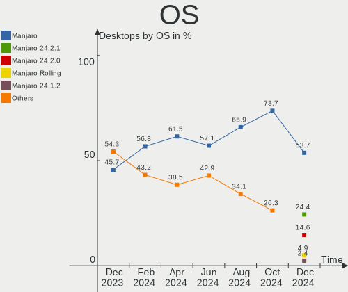
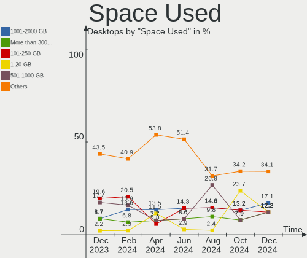
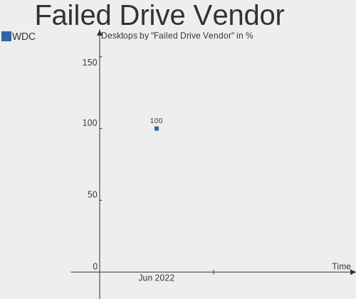
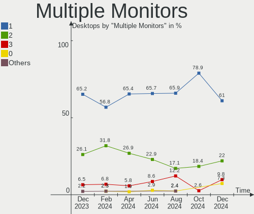
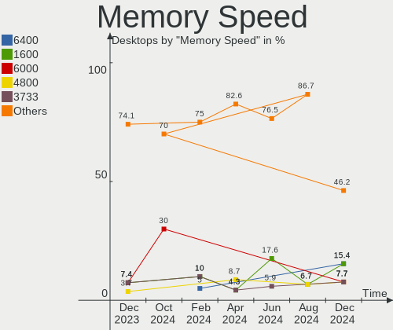

Manjaro - Hardware Trends (Desktops)
------------------------------------

A project to identify most popular hardware characteristics and track their change
over time based on data collected by Linux users at https://Linux-Hardware.org.

Anyone can contribute to this report by the [hw-probe](https://github.com/linuxhw/hw-probe) tool:

    sudo -E hw-probe -all -upload

This report is for one last month. Overall report since the beginning of time: [TestCoverage](https://github.com/linuxhw/TestCoverage)

Period: Jun, 2022.

Contents
--------

* [ System ](#system)
  - [ OS                       ](#os)
  - [ OS Family                ](#os-family)
  - [ Kernel                   ](#kernel)
  - [ Kernel Family            ](#kernel-family)
  - [ Kernel Major Ver.        ](#kernel-major-ver)
  - [ Arch                     ](#arch)
  - [ DE                       ](#de)
  - [ Display Server           ](#display-server)
  - [ Display Manager          ](#display-manager)
  - [ OS Lang                  ](#os-lang)
  - [ Boot Mode                ](#boot-mode)
  - [ Filesystem               ](#filesystem)
  - [ Part. scheme             ](#part-scheme)
  - [ Dual Boot with Linux/BSD ](#dual-boot-with-linuxbsd)
  - [ Dual Boot (Win)          ](#dual-boot-win)

* [ Board ](#board)
  - [ Vendor                   ](#vendor)
  - [ Model                    ](#model)
  - [ Model Family             ](#model-family)
  - [ MFG Year                 ](#mfg-year)
  - [ Form Factor              ](#form-factor)
  - [ Secure Boot              ](#secure-boot)
  - [ Coreboot                 ](#coreboot)
  - [ RAM Size                 ](#ram-size)
  - [ RAM Used                 ](#ram-used)
  - [ Total Drives             ](#total-drives)
  - [ Has CD-ROM               ](#has-cd-rom)
  - [ Has Ethernet             ](#has-ethernet)
  - [ Has WiFi                 ](#has-wifi)
  - [ Has Bluetooth            ](#has-bluetooth)

* [ Location ](#location)
  - [ Country                  ](#country)
  - [ City                     ](#city)

* [ Drives ](#drives)
  - [ Drive Vendor             ](#drive-vendor)
  - [ Drive Model              ](#drive-model)
  - [ HDD Vendor               ](#hdd-vendor)
  - [ SSD Vendor               ](#ssd-vendor)
  - [ Drive Kind               ](#drive-kind)
  - [ Drive Connector          ](#drive-connector)
  - [ Drive Size               ](#drive-size)
  - [ Space Total              ](#space-total)
  - [ Space Used               ](#space-used)
  - [ Malfunc. Drives          ](#malfunc-drives)
  - [ Malfunc. Drive Vendor    ](#malfunc-drive-vendor)
  - [ Malfunc. HDD Vendor      ](#malfunc-hdd-vendor)
  - [ Malfunc. Drive Kind      ](#malfunc-drive-kind)
  - [ Failed Drives            ](#failed-drives)
  - [ Failed Drive Vendor      ](#failed-drive-vendor)
  - [ Drive Status             ](#drive-status)

* [ Storage controller ](#storage-controller)
  - [ Storage Vendor           ](#storage-vendor)
  - [ Storage Model            ](#storage-model)
  - [ Storage Kind             ](#storage-kind)

* [ Processor ](#processor)
  - [ CPU Vendor               ](#cpu-vendor)
  - [ CPU Model                ](#cpu-model)
  - [ CPU Model Family         ](#cpu-model-family)
  - [ CPU Cores                ](#cpu-cores)
  - [ CPU Sockets              ](#cpu-sockets)
  - [ CPU Threads              ](#cpu-threads)
  - [ CPU Op-Modes             ](#cpu-op-modes)
  - [ CPU Microcode            ](#cpu-microcode)
  - [ CPU Microarch            ](#cpu-microarch)

* [ Graphics ](#graphics)
  - [ GPU Vendor               ](#gpu-vendor)
  - [ GPU Model                ](#gpu-model)
  - [ GPU Combo                ](#gpu-combo)
  - [ GPU Driver               ](#gpu-driver)
  - [ GPU Memory               ](#gpu-memory)

* [ Monitor ](#monitor)
  - [ Monitor Vendor           ](#monitor-vendor)
  - [ Monitor Model            ](#monitor-model)
  - [ Monitor Resolution       ](#monitor-resolution)
  - [ Monitor Diagonal         ](#monitor-diagonal)
  - [ Monitor Width            ](#monitor-width)
  - [ Aspect Ratio             ](#aspect-ratio)
  - [ Monitor Area             ](#monitor-area)
  - [ Pixel Density            ](#pixel-density)
  - [ Multiple Monitors        ](#multiple-monitors)

* [ Network ](#network)
  - [ Net Controller Vendor    ](#net-controller-vendor)
  - [ Net Controller Model     ](#net-controller-model)
  - [ Wireless Vendor          ](#wireless-vendor)
  - [ Wireless Model           ](#wireless-model)
  - [ Ethernet Vendor          ](#ethernet-vendor)
  - [ Ethernet Model           ](#ethernet-model)
  - [ Net Controller Kind      ](#net-controller-kind)
  - [ Used Controller          ](#used-controller)
  - [ NICs                     ](#nics)
  - [ IPv6                     ](#ipv6)

* [ Bluetooth ](#bluetooth)
  - [ Bluetooth Vendor         ](#bluetooth-vendor)
  - [ Bluetooth Model          ](#bluetooth-model)

* [ Sound ](#sound)
  - [ Sound Vendor             ](#sound-vendor)
  - [ Sound Model              ](#sound-model)

* [ Memory ](#memory)
  - [ Memory Vendor            ](#memory-vendor)
  - [ Memory Model             ](#memory-model)
  - [ Memory Kind              ](#memory-kind)
  - [ Memory Form Factor       ](#memory-form-factor)
  - [ Memory Size              ](#memory-size)
  - [ Memory Speed             ](#memory-speed)

* [ Printers & scanners ](#printers--scanners)
  - [ Printer Vendor           ](#printer-vendor)
  - [ Printer Model            ](#printer-model)
  - [ Scanner Vendor           ](#scanner-vendor)
  - [ Scanner Model            ](#scanner-model)

* [ Camera ](#camera)
  - [ Camera Vendor            ](#camera-vendor)
  - [ Camera Model             ](#camera-model)

* [ Security ](#security)
  - [ Fingerprint Vendor       ](#fingerprint-vendor)
  - [ Fingerprint Model        ](#fingerprint-model)
  - [ Chipcard Vendor          ](#chipcard-vendor)
  - [ Chipcard Model           ](#chipcard-model)

* [ Unsupported ](#unsupported)
  - [ Unsupported Devices      ](#unsupported-devices)
  - [ Unsupported Device Types ](#unsupported-device-types)

System
------

OS
--

Installed operating systems

| Name           | Desktops | Percent |
|----------------|----------|---------|
| Manjaro        | 32       | 50%     |
| Manjaro 21.2.6 | 12       | 18.75%  |
| Manjaro 21.3.1 | 10       | 15.63%  |
| Manjaro 21.3.0 | 10       | 15.63%  |

OS Family
---------

OS without a version

| Name    | Desktops | Percent |
|---------|----------|---------|
| Manjaro | 64       | 100%    |

Kernel
------

Version of the Linux kernel

| Version                | Desktops | Percent |
|------------------------|----------|---------|
| 5.15.48-1-MANJARO      | 10       | 15.63%  |
| 5.15.41-1-MANJARO      | 9        | 14.06%  |
| 5.18.3-1-MANJARO       | 7        | 10.94%  |
| 5.17.9-1-MANJARO       | 7        | 10.94%  |
| 5.15.49-1-MANJARO      | 7        | 10.94%  |
| 5.15.46-1-MANJARO      | 4        | 6.25%   |
| 5.18.5-1-MANJARO       | 3        | 4.69%   |
| 5.18.0-1-MANJARO       | 3        | 4.69%   |
| 5.17.1-3-rt17-MANJARO  | 3        | 4.69%   |
| 5.18.6-1-MANJARO       | 2        | 3.13%   |
| 5.17.15-1-MANJARO      | 2        | 3.13%   |
| 5.10.123-1-MANJARO     | 2        | 3.13%   |
| 5.4.195-1-MANJARO      | 1        | 1.56%   |
| 5.18.0-1-rt11-MANJARO  | 1        | 1.56%   |
| 5.17.7-xanmod1-MANJARO | 1        | 1.56%   |
| 5.15.32-1-MANJARO      | 1        | 1.56%   |
| 5.10.124-1-MANJARO     | 1        | 1.56%   |

Kernel Family
-------------

Linux kernel without a distro release

| Version  | Desktops | Percent |
|----------|----------|---------|
| 5.15.48  | 10       | 15.63%  |
| 5.15.41  | 9        | 14.06%  |
| 5.18.3   | 7        | 10.94%  |
| 5.17.9   | 7        | 10.94%  |
| 5.15.49  | 7        | 10.94%  |
| 5.18.0   | 4        | 6.25%   |
| 5.15.46  | 4        | 6.25%   |
| 5.18.5   | 3        | 4.69%   |
| 5.17.1   | 3        | 4.69%   |
| 5.18.6   | 2        | 3.13%   |
| 5.17.15  | 2        | 3.13%   |
| 5.10.123 | 2        | 3.13%   |
| 5.4.195  | 1        | 1.56%   |
| 5.17.7   | 1        | 1.56%   |
| 5.15.32  | 1        | 1.56%   |
| 5.10.124 | 1        | 1.56%   |

Kernel Major Ver.
-----------------

Linux kernel major version

| Version | Desktops | Percent |
|---------|----------|---------|
| 5.15    | 31       | 48.44%  |
| 5.18    | 16       | 25%     |
| 5.17    | 13       | 20.31%  |
| 5.10    | 3        | 4.69%   |
| 5.4     | 1        | 1.56%   |

Arch
----

OS architecture (x86_64, i586, etc.)

| Name   | Desktops | Percent |
|--------|----------|---------|
| x86_64 | 64       | 100%    |

DE
--

Desktop Environment

| Name    | Desktops | Percent |
|---------|----------|---------|
| KDE5    | 39       | 60.94%  |
| XFCE    | 12       | 18.75%  |
| GNOME   | 7        | 10.94%  |
| MATE    | 2        | 3.13%   |
| i3      | 2        | 3.13%   |
| Budgie  | 1        | 1.56%   |
| Unknown | 1        | 1.56%   |

Display Server
--------------

X11 or Wayland

| Name    | Desktops | Percent |
|---------|----------|---------|
| X11     | 56       | 87.5%   |
| Wayland | 5        | 7.81%   |
| Tty     | 2        | 3.13%   |
| Unknown | 1        | 1.56%   |

Display Manager
---------------

SDDM, LightDM, etc.

| Name    | Desktops | Percent |
|---------|----------|---------|
| Unknown | 32       | 50%     |
| LightDM | 14       | 21.88%  |
| SDDM    | 13       | 20.31%  |
| GDM     | 5        | 7.81%   |

OS Lang
-------

Language

| Lang  | Desktops | Percent |
|-------|----------|---------|
| en_US | 25       | 39.06%  |
| de_DE | 7        | 10.94%  |
| fr_FR | 5        | 7.81%   |
| ru_RU | 4        | 6.25%   |
| en_GB | 4        | 6.25%   |
| en_CA | 4        | 6.25%   |
| en_PH | 2        | 3.13%   |
| tr_TR | 1        | 1.56%   |
| pt_BR | 1        | 1.56%   |
| pl_PL | 1        | 1.56%   |
| es_VE | 1        | 1.56%   |
| es_MX | 1        | 1.56%   |
| es_GT | 1        | 1.56%   |
| es_ES | 1        | 1.56%   |
| en_ZA | 1        | 1.56%   |
| en_MY | 1        | 1.56%   |
| en_AU | 1        | 1.56%   |
| en_AG | 1        | 1.56%   |
| de_CH | 1        | 1.56%   |
| de_AT | 1        | 1.56%   |

Boot Mode
---------

EFI or BIOS

| Mode | Desktops | Percent |
|------|----------|---------|
| BIOS | 43       | 67.19%  |
| EFI  | 21       | 32.81%  |

Filesystem
----------

Type of filesystem

| Type  | Desktops | Percent |
|-------|----------|---------|
| Ext4  | 52       | 81.25%  |
| Btrfs | 9        | 14.06%  |
| Xfs   | 3        | 4.69%   |

Part. scheme
------------

Scheme of partitioning

| Type    | Desktops | Percent |
|---------|----------|---------|
| Unknown | 37       | 57.81%  |
| GPT     | 24       | 37.5%   |
| MBR     | 3        | 4.69%   |

Dual Boot with Linux/BSD
------------------------

Hosting more than one Linux/BSD

| Dual boot | Desktops | Percent |
|-----------|----------|---------|
| No        | 56       | 87.5%   |
| Yes       | 8        | 12.5%   |

Dual Boot (Win)
---------------

Hosting Linux and Windows

| Dual boot | Desktops | Percent |
|-----------|----------|---------|
| No        | 45       | 70.31%  |
| Yes       | 19       | 29.69%  |

Board
-----

Vendor
------

Motherboard manufacturer

| Name                | Desktops | Percent |
|---------------------|----------|---------|
| Gigabyte Technology | 20       | 31.25%  |
| ASUSTek Computer    | 13       | 20.31%  |
| MSI                 | 10       | 15.63%  |
| ASRock              | 6        | 9.38%   |
| Hewlett-Packard     | 5        | 7.81%   |
| Dell                | 2        | 3.13%   |
| Unknown             | 2        | 3.13%   |
| Minix               | 1        | 1.56%   |
| Lenovo              | 1        | 1.56%   |
| Huanan              | 1        | 1.56%   |
| ECS                 | 1        | 1.56%   |
| BESSTAR Tech        | 1        | 1.56%   |
| AZW                 | 1        | 1.56%   |

Model
-----

Motherboard model

| Name                               | Desktops | Percent |
|------------------------------------|----------|---------|
| Unknown                            | 2        | 3.13%   |
| MSI MS-7C84                        | 1        | 1.56%   |
| MSI MS-7C37                        | 1        | 1.56%   |
| MSI MS-7C36                        | 1        | 1.56%   |
| MSI MS-7B84                        | 1        | 1.56%   |
| MSI MS-7B53                        | 1        | 1.56%   |
| MSI MS-7B00                        | 1        | 1.56%   |
| MSI MS-7A38                        | 1        | 1.56%   |
| MSI MS-7A34                        | 1        | 1.56%   |
| MSI MS-7851                        | 1        | 1.56%   |
| MSI MS-7817                        | 1        | 1.56%   |
| Minix Z83-4 Pro                    | 1        | 1.56%   |
| Lenovo V520S-08IKL 10NM0064UK      | 1        | 1.56%   |
| Huanan X99-TF                      | 1        | 1.56%   |
| HP Z600 Workstation                | 1        | 1.56%   |
| HP Z440 Workstation                | 1        | 1.56%   |
| HP xw6600 Workstation              | 1        | 1.56%   |
| HP EliteDesk 800 G2 TWR            | 1        | 1.56%   |
| HP EliteDesk 800 G1 SFF            | 1        | 1.56%   |
| Gigabyte Z97X-SLI                  | 1        | 1.56%   |
| Gigabyte Z690 AORUS PRO DDR4       | 1        | 1.56%   |
| Gigabyte Z68P-DS3                  | 1        | 1.56%   |
| Gigabyte X570 AORUS ELITE WIFI     | 1        | 1.56%   |
| Gigabyte X399 AORUS Gaming 7       | 1        | 1.56%   |
| Gigabyte H510M H                   | 1        | 1.56%   |
| Gigabyte H370M-DS3H                | 1        | 1.56%   |
| Gigabyte GB-BXi5-5200              | 1        | 1.56%   |
| Gigabyte B560M AORUS PRO AX        | 1        | 1.56%   |
| Gigabyte B550M DS3H                | 1        | 1.56%   |
| Gigabyte B550M AORUS ELITE         | 1        | 1.56%   |
| Gigabyte B550 AORUS MASTER         | 1        | 1.56%   |
| Gigabyte B550 AORUS ELITE AX V2    | 1        | 1.56%   |
| Gigabyte B450M S2H V2              | 1        | 1.56%   |
| Gigabyte B450M DS3H                | 1        | 1.56%   |
| Gigabyte B450 AORUS M              | 1        | 1.56%   |
| Gigabyte B450 AORUS ELITE          | 1        | 1.56%   |
| Gigabyte AB350M-Gaming 3           | 1        | 1.56%   |
| Gigabyte A520M DS3H                | 1        | 1.56%   |
| Gigabyte 970A-DS3P                 | 1        | 1.56%   |
| ECS H61H2-MV                       | 1        | 1.56%   |
| Dell OptiPlex 790                  | 1        | 1.56%   |
| Dell Inspiron 3847                 | 1        | 1.56%   |
| BESSTAR Tech UM700                 | 1        | 1.56%   |
| AZW U59                            | 1        | 1.56%   |
| ASUS TUF Z390-PLUS GAMING          | 1        | 1.56%   |
| ASUS TUF Gaming X570-PLUS          | 1        | 1.56%   |
| ASUS TUF Gaming B660M-PLUS WIFI D4 | 1        | 1.56%   |
| ASUS TUF Gaming B550M-PLUS         | 1        | 1.56%   |
| ASUS ROG STRIX X570-E GAMING       | 1        | 1.56%   |
| ASUS ROG STRIX B550-F GAMING       | 1        | 1.56%   |
| ASUS ROG STRIX B360-I GAMING       | 1        | 1.56%   |
| ASUS ROG CROSSHAIR VIII HERO       | 1        | 1.56%   |
| ASUS PRIME Z690-P WIFI             | 1        | 1.56%   |
| ASUS PRIME Z390-P                  | 1        | 1.56%   |
| ASUS PRIME B450M-K                 | 1        | 1.56%   |
| ASUS M5A97 R2.0                    | 1        | 1.56%   |
| ASUS M5A78L-M PLUS/USB3            | 1        | 1.56%   |
| ASRock Z77 Extreme4                | 1        | 1.56%   |
| ASRock H61M-ITX                    | 1        | 1.56%   |
| ASRock H510M-ITX/ac                | 1        | 1.56%   |

Model Family
------------

Motherboard model prefix

| Name                   | Desktops | Percent |
|------------------------|----------|---------|
| ASUS TUF               | 4        | 6.25%   |
| ASUS ROG               | 4        | 6.25%   |
| ASUS PRIME             | 3        | 4.69%   |
| HP EliteDesk           | 2        | 3.13%   |
| Gigabyte B550M         | 2        | 3.13%   |
| Gigabyte B550          | 2        | 3.13%   |
| Gigabyte B450M         | 2        | 3.13%   |
| Gigabyte B450          | 2        | 3.13%   |
| Unknown                | 2        | 3.13%   |
| MSI MS-7C84            | 1        | 1.56%   |
| MSI MS-7C37            | 1        | 1.56%   |
| MSI MS-7C36            | 1        | 1.56%   |
| MSI MS-7B84            | 1        | 1.56%   |
| MSI MS-7B53            | 1        | 1.56%   |
| MSI MS-7B00            | 1        | 1.56%   |
| MSI MS-7A38            | 1        | 1.56%   |
| MSI MS-7A34            | 1        | 1.56%   |
| MSI MS-7851            | 1        | 1.56%   |
| MSI MS-7817            | 1        | 1.56%   |
| Minix Z83-4            | 1        | 1.56%   |
| Lenovo V520S-08IKL     | 1        | 1.56%   |
| Huanan X99-TF          | 1        | 1.56%   |
| HP Z600                | 1        | 1.56%   |
| HP Z440                | 1        | 1.56%   |
| HP xw6600              | 1        | 1.56%   |
| Gigabyte Z97X-SLI      | 1        | 1.56%   |
| Gigabyte Z690          | 1        | 1.56%   |
| Gigabyte Z68P-DS3      | 1        | 1.56%   |
| Gigabyte X570          | 1        | 1.56%   |
| Gigabyte X399          | 1        | 1.56%   |
| Gigabyte H510M         | 1        | 1.56%   |
| Gigabyte H370M-DS3H    | 1        | 1.56%   |
| Gigabyte GB-BXi5-5200  | 1        | 1.56%   |
| Gigabyte B560M         | 1        | 1.56%   |
| Gigabyte AB350M-Gaming | 1        | 1.56%   |
| Gigabyte A520M         | 1        | 1.56%   |
| Gigabyte 970A-DS3P     | 1        | 1.56%   |
| ECS H61H2-MV           | 1        | 1.56%   |
| Dell OptiPlex          | 1        | 1.56%   |
| Dell Inspiron          | 1        | 1.56%   |
| BESSTAR Tech UM700     | 1        | 1.56%   |
| AZW U59                | 1        | 1.56%   |
| ASUS M5A97             | 1        | 1.56%   |
| ASUS M5A78L-M          | 1        | 1.56%   |
| ASRock Z77             | 1        | 1.56%   |
| ASRock H61M-ITX        | 1        | 1.56%   |
| ASRock H510M-ITX       | 1        | 1.56%   |
| ASRock B550M           | 1        | 1.56%   |
| ASRock AB350M-HDV      | 1        | 1.56%   |
| ASRock A320M-HDV       | 1        | 1.56%   |

MFG Year
--------

Motherboard manufacture year

| Year | Desktops | Percent |
|------|----------|---------|
| 2020 | 13       | 20.31%  |
| 2018 | 11       | 17.19%  |
| 2021 | 9        | 14.06%  |
| 2017 | 7        | 10.94%  |
| 2013 | 5        | 7.81%   |
| 2019 | 4        | 6.25%   |
| 2012 | 4        | 6.25%   |
| 2022 | 2        | 3.13%   |
| 2016 | 2        | 3.13%   |
| 2014 | 2        | 3.13%   |
| 2011 | 2        | 3.13%   |
| 2015 | 1        | 1.56%   |
| 2010 | 1        | 1.56%   |
| 2008 | 1        | 1.56%   |

Form Factor
-----------

Physical design of the computer

| Name    | Desktops | Percent |
|---------|----------|---------|
| Desktop | 64       | 100%    |

Secure Boot
-----------

Enabled or disabled

| State    | Desktops | Percent |
|----------|----------|---------|
| Disabled | 64       | 100%    |

Coreboot
--------

Have coreboot on board

| Used | Desktops | Percent |
|------|----------|---------|
| No   | 64       | 100%    |

RAM Size
--------

Total RAM memory

| Size in GB  | Desktops | Percent |
|-------------|----------|---------|
| 16.01-24.0  | 23       | 35.94%  |
| 32.01-64.0  | 22       | 34.38%  |
| 8.01-16.0   | 8        | 12.5%   |
| 4.01-8.0    | 4        | 6.25%   |
| 64.01-256.0 | 4        | 6.25%   |
| 3.01-4.0    | 2        | 3.13%   |
| 24.01-32.0  | 1        | 1.56%   |

RAM Used
--------

Used RAM memory

| Used GB    | Desktops | Percent |
|------------|----------|---------|
| 4.01-8.0   | 17       | 26.56%  |
| 3.01-4.0   | 14       | 21.88%  |
| 2.01-3.0   | 13       | 20.31%  |
| 1.01-2.0   | 10       | 15.63%  |
| 8.01-16.0  | 8        | 12.5%   |
| 32.01-64.0 | 1        | 1.56%   |
| 24.01-32.0 | 1        | 1.56%   |

Total Drives
------------

Number of drives on board

| Drives | Desktops | Percent |
|--------|----------|---------|
| 2      | 22       | 34.38%  |
| 1      | 15       | 23.44%  |
| 3      | 11       | 17.19%  |
| 4      | 9        | 14.06%  |
| 5      | 5        | 7.81%   |
| 7      | 2        | 3.13%   |

Has CD-ROM
----------

Has CD-ROM on board

| Presented | Desktops | Percent |
|-----------|----------|---------|
| No        | 47       | 73.44%  |
| Yes       | 17       | 26.56%  |

Has Ethernet
------------

Has Ethernet on board

| Presented | Desktops | Percent |
|-----------|----------|---------|
| Yes       | 64       | 100%    |

Has WiFi
--------

Has WiFi module

| Presented | Desktops | Percent |
|-----------|----------|---------|
| Yes       | 39       | 60.94%  |
| No        | 25       | 39.06%  |

Has Bluetooth
-------------

Has Bluetooth module

| Presented | Desktops | Percent |
|-----------|----------|---------|
| Yes       | 32       | 50%     |
| No        | 32       | 50%     |

Location
--------

Country
-------

Geographic location (country)

| Country      | Desktops | Percent |
|--------------|----------|---------|
| USA          | 9        | 14.06%  |
| Russia       | 7        | 10.94%  |
| Germany      | 7        | 10.94%  |
| France       | 7        | 10.94%  |
| Canada       | 4        | 6.25%   |
| UK           | 3        | 4.69%   |
| Poland       | 3        | 4.69%   |
| Philippines  | 2        | 3.13%   |
| Malaysia     | 2        | 3.13%   |
| Iran         | 2        | 3.13%   |
| Austria      | 2        | 3.13%   |
| Venezuela    | 1        | 1.56%   |
| Uzbekistan   | 1        | 1.56%   |
| Turkey       | 1        | 1.56%   |
| Switzerland  | 1        | 1.56%   |
| Sweden       | 1        | 1.56%   |
| Spain        | 1        | 1.56%   |
| South Africa | 1        | 1.56%   |
| Netherlands  | 1        | 1.56%   |
| Moldova      | 1        | 1.56%   |
| Mexico       | 1        | 1.56%   |
| Kazakhstan   | 1        | 1.56%   |
| Italy        | 1        | 1.56%   |
| Indonesia    | 1        | 1.56%   |
| Guatemala    | 1        | 1.56%   |
| Brazil       | 1        | 1.56%   |
| Australia    | 1        | 1.56%   |

City
----

Geographic location (city)

| City               | Desktops | Percent |
|--------------------|----------|---------|
| Toronto            | 2        | 3.13%   |
| Kuala Lumpur       | 2        | 3.13%   |
| Greoux-les-Bains   | 2        | 3.13%   |
| Combs-la-Ville     | 2        | 3.13%   |
| Worcester          | 1        | 1.56%   |
| Woburn             | 1        | 1.56%   |
| Weimar             | 1        | 1.56%   |
| Walsall            | 1        | 1.56%   |
| Villa Rica         | 1        | 1.56%   |
| Vienna             | 1        | 1.56%   |
| Unieszewo          | 1        | 1.56%   |
| The Bronx          | 1        | 1.56%   |
| Tehran             | 1        | 1.56%   |
| Tashkent           | 1        | 1.56%   |
| St Petersburg      | 1        | 1.56%   |
| Smiths Falls       | 1        | 1.56%   |
| Sarrion            | 1        | 1.56%   |
| Salisbury          | 1        | 1.56%   |
| Salford            | 1        | 1.56%   |
| Rouen              | 1        | 1.56%   |
| Passos             | 1        | 1.56%   |
| Paranaque City     | 1        | 1.56%   |
| Oryol              | 1        | 1.56%   |
| Novokuznetsk       | 1        | 1.56%   |
| Naz̧arābād      | 1        | 1.56%   |
| Nashville          | 1        | 1.56%   |
| Mossel Bay         | 1        | 1.56%   |
| Moscow             | 1        | 1.56%   |
| Milan              | 1        | 1.56%   |
| Maracay            | 1        | 1.56%   |
| Mannheim           | 1        | 1.56%   |
| Les Herbiers       | 1        | 1.56%   |
| Lansing            | 1        | 1.56%   |
| Ladera Ranch       | 1        | 1.56%   |
| Kostanay           | 1        | 1.56%   |
| Kazan’           | 1        | 1.56%   |
| Katrineholm        | 1        | 1.56%   |
| Karlsruhe          | 1        | 1.56%   |
| Jawor              | 1        | 1.56%   |
| Jakarta            | 1        | 1.56%   |
| Ixtacomitan        | 1        | 1.56%   |
| Istanbul           | 1        | 1.56%   |
| Innsbruck          | 1        | 1.56%   |
| Hamburg            | 1        | 1.56%   |
| Guatemala City     | 1        | 1.56%   |
| Gdansk             | 1        | 1.56%   |
| Erlangen           | 1        | 1.56%   |
| Dogern             | 1        | 1.56%   |
| Chisinau           | 1        | 1.56%   |
| Chelyabinsk        | 1        | 1.56%   |
| Chandler           | 1        | 1.56%   |
| Centralia          | 1        | 1.56%   |
| Cebu City          | 1        | 1.56%   |
| Calgary            | 1        | 1.56%   |
| Blankenfelde       | 1        | 1.56%   |
| Berezovka          | 1        | 1.56%   |
| Benken             | 1        | 1.56%   |
| Asnieres-sur-Seine | 1        | 1.56%   |
| Amsterdam          | 1        | 1.56%   |
| Adelaide           | 1        | 1.56%   |

Drives
------

Drive Vendor
------------

Hard drive vendors

| Vendor                    | Desktops | Drives | Percent |
|---------------------------|----------|--------|---------|
| WDC                       | 26       | 33     | 18.31%  |
| Seagate                   | 21       | 26     | 14.79%  |
| Samsung Electronics       | 17       | 25     | 11.97%  |
| SanDisk                   | 9        | 11     | 6.34%   |
| Kingston                  | 9        | 10     | 6.34%   |
| Toshiba                   | 8        | 10     | 5.63%   |
| Phison                    | 6        | 7      | 4.23%   |
| Crucial                   | 6        | 7      | 4.23%   |
| Hitachi                   | 4        | 4      | 2.82%   |
| A-DATA Technology         | 4        | 5      | 2.82%   |
| Team                      | 3        | 3      | 2.11%   |
| XPG                       | 2        | 2      | 1.41%   |
| Realtek Semiconductor     | 2        | 2      | 1.41%   |
| PNY                       | 2        | 2      | 1.41%   |
| Micron/Crucial Technology | 2        | 2      | 1.41%   |
| HGST                      | 2        | 2      | 1.41%   |
| Goodram                   | 2        | 2      | 1.41%   |
| XUM                       | 1        | 1      | 0.7%    |
| USB3.0                    | 1        | 1      | 0.7%    |
| Unknown                   | 1        | 1      | 0.7%    |
| Transcend                 | 1        | 1      | 0.7%    |
| Silicon Motion            | 1        | 1      | 0.7%    |
| OSCOO                     | 1        | 1      | 0.7%    |
| NGFF                      | 1        | 1      | 0.7%    |
| Micron Technology         | 1        | 1      | 0.7%    |
| Lexar                     | 1        | 1      | 0.7%    |
| Leven                     | 1        | 1      | 0.7%    |
| Intenso                   | 1        | 1      | 0.7%    |
| Intel                     | 1        | 1      | 0.7%    |
| HS-SSD-E100               | 1        | 1      | 0.7%    |
| Hewlett-Packard           | 1        | 1      | 0.7%    |
| Gigabyte Technology       | 1        | 1      | 0.7%    |
| Apacer                    | 1        | 1      | 0.7%    |
| Unknown                   | 1        | 1      | 0.7%    |

Drive Model
-----------

Hard drive models

| Model                                  | Desktops | Percent |
|----------------------------------------|----------|---------|
| Samsung SSD 860 EVO 1TB                | 4        | 2.41%   |
| WDC WD10EZEX-08WN4A0 1TB               | 3        | 1.81%   |
| Kingston SA400S37120G 120GB SSD        | 3        | 1.81%   |
| WDC WD20EZRZ-00Z5HB0 2TB               | 2        | 1.2%    |
| WDC WD20EZRX-00D8PB0 2TB               | 2        | 1.2%    |
| WDC WD1003FZEX-00MK2A0 1TB             | 2        | 1.2%    |
| Toshiba HDWD110 1TB                    | 2        | 1.2%    |
| Seagate ST4000DM004-2CV104 4TB         | 2        | 1.2%    |
| Seagate ST1000DM010-2EP102 1TB         | 2        | 1.2%    |
| Seagate ST1000DM003-1ER162 1TB         | 2        | 1.2%    |
| Seagate ST1000DM003-1CH162 1TB         | 2        | 1.2%    |
| SanDisk SSD PLUS 1000GB                | 2        | 1.2%    |
| Samsung SSD 860 EVO 500GB              | 2        | 1.2%    |
| Samsung SSD 850 EVO 500GB              | 2        | 1.2%    |
| Samsung SM963 2.5" NVMe PCIe SSD 500GB | 2        | 1.2%    |
| Samsung NVMe SSD Drive 2TB             | 2        | 1.2%    |
| Phison NVMe SSD Drive 1TB              | 2        | 1.2%    |
| Micron/Crucial NVMe SSD Drive 500GB    | 2        | 1.2%    |
| Kingston SV300S37A 60G SSD             | 2        | 1.2%    |
| XUM HX256GSSDSATA3 256GB               | 1        | 0.6%    |
| XPG NVMe SSD Drive 512GB               | 1        | 0.6%    |
| XPG NVMe SSD Drive 2TB                 | 1        | 0.6%    |
| WDC WDS240G2G0B-00EPW0 240GB SSD       | 1        | 0.6%    |
| WDC WDS100T2B0B-00YS70 1TB SSD         | 1        | 0.6%    |
| WDC WDS100T2B0A-00SM50 1TB SSD         | 1        | 0.6%    |
| WDC WDBNCE5000PNC 500GB SSD            | 1        | 0.6%    |
| WDC WDBA3V0010BNC-WRSN 1TB             | 1        | 0.6%    |
| WDC WD7500AARS-003BB1 752GB            | 1        | 0.6%    |
| WDC WD5000AZLX-75K2TA0 500GB           | 1        | 0.6%    |
| WDC WD5000AAKS-00UU3A0 500GB           | 1        | 0.6%    |
| WDC WD40EZRZ-00GXCB0 4TB               | 1        | 0.6%    |
| WDC WD3200BPVT-24ZEST0 320GB           | 1        | 0.6%    |
| WDC WD30EZRX-00SPEB0 3TB               | 1        | 0.6%    |
| WDC WD30EZRX-00D8PB0 3TB               | 1        | 0.6%    |
| WDC WD20SPZX-00UA7T0 2TB               | 1        | 0.6%    |
| WDC WD20EZBX-00AYRA0 2TB               | 1        | 0.6%    |
| WDC WD20EZAZ-00GGJB0 2TB               | 1        | 0.6%    |
| WDC WD1600AAJS-75PSA0 160GB            | 1        | 0.6%    |
| WDC WD10SPZX-00Z10T0 1TB               | 1        | 0.6%    |
| WDC WD10EZEX-00RKKA0 1TB               | 1        | 0.6%    |
| WDC WD10EZEX-00BBHA0 1TB               | 1        | 0.6%    |
| WDC WD10EARS-00MVWB0 1TB               | 1        | 0.6%    |
| WDC WD1005FBYZ-01YCBB2 1TB             | 1        | 0.6%    |
| WDC WD1002FBYS-05A6B0 1TB              | 1        | 0.6%    |
| USB3.0 Super Speed 320GB               | 1        | 0.6%    |
| Unknown BJTD4R  32GB                   | 1        | 0.6%    |
| Transcend TS64GSSD720 64GB             | 1        | 0.6%    |
| Toshiba MQ04ABF100 1TB                 | 1        | 0.6%    |
| Toshiba MQ01ACF050 500GB               | 1        | 0.6%    |
| Toshiba MD04ACA400 4TB                 | 1        | 0.6%    |
| Toshiba MD04ABA400V 4TB                | 1        | 0.6%    |
| Toshiba HDWR160 6TB                    | 1        | 0.6%    |
| Toshiba HDWQ140 4TB                    | 1        | 0.6%    |
| Toshiba HDWD105 500GB                  | 1        | 0.6%    |
| Team T253X6002T 2TB SSD                | 1        | 0.6%    |
| Team T253X2256G 256GB SSD              | 1        | 0.6%    |
| Team L3 EVO SSD 120GB                  | 1        | 0.6%    |
| Silicon Motion NVMe SSD Drive 256GB    | 1        | 0.6%    |
| Seagate ST_M13FQBL QNR 4GB             | 1        | 0.6%    |
| Seagate ST9320325AS 320GB              | 1        | 0.6%    |

HDD Vendor
----------

Hard disk drive vendors

| Vendor              | Desktops | Drives | Percent |
|---------------------|----------|--------|---------|
| WDC                 | 23       | 28     | 39.66%  |
| Seagate             | 19       | 24     | 32.76%  |
| Toshiba             | 8        | 10     | 13.79%  |
| Hitachi             | 4        | 4      | 6.9%    |
| Samsung Electronics | 2        | 2      | 3.45%   |
| HGST                | 2        | 2      | 3.45%   |

SSD Vendor
----------

Solid state drive vendors

| Vendor              | Desktops | Drives | Percent |
|---------------------|----------|--------|---------|
| Samsung Electronics | 12       | 14     | 22.64%  |
| Kingston            | 6        | 6      | 11.32%  |
| Crucial             | 6        | 7      | 11.32%  |
| SanDisk             | 4        | 6      | 7.55%   |
| A-DATA Technology   | 4        | 5      | 7.55%   |
| WDC                 | 3        | 4      | 5.66%   |
| Team                | 3        | 3      | 5.66%   |
| Goodram             | 2        | 2      | 3.77%   |
| XUM                 | 1        | 1      | 1.89%   |
| USB3.0              | 1        | 1      | 1.89%   |
| Transcend           | 1        | 1      | 1.89%   |
| PNY                 | 1        | 1      | 1.89%   |
| OSCOO               | 1        | 1      | 1.89%   |
| NGFF                | 1        | 1      | 1.89%   |
| Lexar               | 1        | 1      | 1.89%   |
| Leven               | 1        | 1      | 1.89%   |
| Intel               | 1        | 1      | 1.89%   |
| HS-SSD-E100         | 1        | 1      | 1.89%   |
| Gigabyte Technology | 1        | 1      | 1.89%   |
| Apacer              | 1        | 1      | 1.89%   |
| Unknown             | 1        | 1      | 1.89%   |

Drive Kind
----------

HDD or SSD

| Kind    | Desktops | Drives | Percent |
|---------|----------|--------|---------|
| HDD     | 41       | 70     | 36.28%  |
| SSD     | 40       | 60     | 35.4%   |
| NVMe    | 27       | 35     | 23.89%  |
| Unknown | 3        | 3      | 2.65%   |
| MMC     | 2        | 2      | 1.77%   |

Drive Connector
---------------

SATA, SAS, NVMe, etc.

| Type | Desktops | Drives | Percent |
|------|----------|--------|---------|
| SATA | 58       | 129    | 63.74%  |
| NVMe | 27       | 35     | 29.67%  |
| SAS  | 4        | 4      | 4.4%    |
| MMC  | 2        | 2      | 2.2%    |

Drive Size
----------

Size of hard drive

| Size in TB | Desktops | Drives | Percent |
|------------|----------|--------|---------|
| 0.51-1.0   | 39       | 49     | 39%     |
| 0.01-0.5   | 37       | 52     | 37%     |
| 1.01-2.0   | 13       | 13     | 13%     |
| 3.01-4.0   | 7        | 10     | 7%      |
| 2.01-3.0   | 2        | 3      | 2%      |
| 4.01-10.0  | 2        | 3      | 2%      |

Space Total
-----------

Amount of disk space available on the file system

| Size in GB     | Desktops | Percent |
|----------------|----------|---------|
| 501-1000       | 15       | 23.44%  |
| 1001-2000      | 13       | 20.31%  |
| More than 3000 | 9        | 14.06%  |
| 251-500        | 8        | 12.5%   |
| 2001-3000      | 7        | 10.94%  |
| 51-100         | 4        | 6.25%   |
| Unknown        | 4        | 6.25%   |
| 101-250        | 3        | 4.69%   |
| 21-50          | 1        | 1.56%   |

Space Used
----------

Amount of used disk space

| Used GB        | Desktops | Percent |
|----------------|----------|---------|
| 501-1000       | 13       | 20.31%  |
| 251-500        | 12       | 18.75%  |
| 101-250        | 12       | 18.75%  |
| 1001-2000      | 6        | 9.38%   |
| 1-20           | 5        | 7.81%   |
| 21-50          | 4        | 6.25%   |
| 51-100         | 4        | 6.25%   |
| Unknown        | 4        | 6.25%   |
| More than 3000 | 2        | 3.13%   |
| 2001-3000      | 2        | 3.13%   |

Malfunc. Drives
---------------

Drive models with a malfunction

| Model                           | Desktops | Drives | Percent |
|---------------------------------|----------|--------|---------|
| WDC WD7500AARS-003BB1 752GB     | 1        | 1      | 16.67%  |
| Transcend TS64GSSD720 64GB      | 1        | 1      | 16.67%  |
| Seagate ST9320325AS 320GB       | 1        | 1      | 16.67%  |
| Samsung Electronics HD103UJ 1TB | 1        | 1      | 16.67%  |
| Hewlett-Packard SSD EX900 250GB | 1        | 1      | 16.67%  |
| Apacer AS350 128GB SSD          | 1        | 1      | 16.67%  |

Malfunc. Drive Vendor
---------------------

Vendors of faulty drives

| Vendor              | Desktops | Drives | Percent |
|---------------------|----------|--------|---------|
| WDC                 | 1        | 1      | 16.67%  |
| Transcend           | 1        | 1      | 16.67%  |
| Seagate             | 1        | 1      | 16.67%  |
| Samsung Electronics | 1        | 1      | 16.67%  |
| Hewlett-Packard     | 1        | 1      | 16.67%  |
| Apacer              | 1        | 1      | 16.67%  |

Malfunc. HDD Vendor
-------------------

Vendors of faulty HDD drives

| Vendor              | Desktops | Drives | Percent |
|---------------------|----------|--------|---------|
| WDC                 | 1        | 1      | 33.33%  |
| Seagate             | 1        | 1      | 33.33%  |
| Samsung Electronics | 1        | 1      | 33.33%  |

Malfunc. Drive Kind
-------------------

Kinds of faulty drives

| Kind | Desktops | Drives | Percent |
|------|----------|--------|---------|
| HDD  | 3        | 3      | 50%     |
| SSD  | 2        | 2      | 33.33%  |
| NVMe | 1        | 1      | 16.67%  |

Failed Drives
-------------

Failed drive models

| Model                        | Desktops | Drives | Percent |
|------------------------------|----------|--------|---------|
| WDC WD3200BPVT-24ZEST0 320GB | 1        | 1      | 100%    |

Failed Drive Vendor
-------------------

Failed drive vendors

| Vendor | Desktops | Drives | Percent |
|--------|----------|--------|---------|
| WDC    | 1        | 1      | 100%    |

Drive Status
------------

Number of failed and malfunc. drives

| Status   | Desktops | Drives | Percent |
|----------|----------|--------|---------|
| Detected | 49       | 121    | 67.12%  |
| Works    | 19       | 42     | 26.03%  |
| Malfunc  | 4        | 6      | 5.48%   |
| Failed   | 1        | 1      | 1.37%   |

Storage controller
------------------

Storage Vendor
--------------

Storage controller vendors

| Vendor                      | Desktops | Percent |
|-----------------------------|----------|---------|
| AMD                         | 32       | 32.65%  |
| Intel                       | 31       | 31.63%  |
| Samsung Electronics         | 7        | 7.14%   |
| Phison Electronics          | 7        | 7.14%   |
| SanDisk                     | 5        | 5.1%    |
| ASMedia Technology          | 4        | 4.08%   |
| Kingston Technology Company | 3        | 3.06%   |
| Silicon Motion              | 2        | 2.04%   |
| Realtek Semiconductor       | 2        | 2.04%   |
| Micron/Crucial Technology   | 2        | 2.04%   |
| ADATA Technology            | 2        | 2.04%   |
| Micron Technology           | 1        | 1.02%   |

Storage Model
-------------

Storage controller models

| Model                                                                                   | Desktops | Percent |
|-----------------------------------------------------------------------------------------|----------|---------|
| AMD FCH SATA Controller [AHCI mode]                                                     | 18       | 15.38%  |
| AMD 500 Series Chipset SATA Controller                                                  | 8        | 6.84%   |
| Phison E12 NVMe Controller                                                              | 5        | 4.27%   |
| AMD 400 Series Chipset SATA Controller                                                  | 5        | 4.27%   |
| AMD 300 Series Chipset SATA Controller                                                  | 5        | 4.27%   |
| Samsung NVMe SSD Controller SM961/PM961/SM963                                           | 4        | 3.42%   |
| Samsung NVMe SSD Controller PM9A1/PM9A3/980PRO                                          | 4        | 3.42%   |
| Intel 8 Series/C220 Series Chipset Family 6-port SATA Controller 1 [AHCI mode]          | 4        | 3.42%   |
| Intel SATA Controller [RAID mode]                                                       | 3        | 2.56%   |
| Intel Cannon Lake PCH SATA AHCI Controller                                              | 3        | 2.56%   |
| Intel Alder Lake-S PCH SATA Controller [AHCI Mode]                                      | 3        | 2.56%   |
| Intel 6 Series/C200 Series Chipset Family 6 port Desktop SATA AHCI Controller           | 3        | 2.56%   |
| Intel 500 Series Chipset Family SATA AHCI Controller                                    | 3        | 2.56%   |
| ASMedia ASM1062 Serial ATA Controller                                                   | 3        | 2.56%   |
| AMD SB7x0/SB8x0/SB9x0 SATA Controller [AHCI mode]                                       | 3        | 2.56%   |
| Silicon Motion SM2263EN/SM2263XT SSD Controller                                         | 2        | 1.71%   |
| Phison E16 PCIe4 NVMe Controller                                                        | 2        | 1.71%   |
| Intel Volume Management Device NVMe RAID Controller                                     | 2        | 1.71%   |
| Intel C610/X99 series chipset sSATA Controller [AHCI mode]                              | 2        | 1.71%   |
| AMD FCH SATA Controller D                                                               | 2        | 1.71%   |
| ADATA XPG SX8200 Pro PCIe Gen3x4 M.2 2280 Solid State Drive                             | 2        | 1.71%   |
| SanDisk WD Blue SN570 NVMe SSD                                                          | 1        | 0.85%   |
| SanDisk WD Blue SN550 NVMe SSD                                                          | 1        | 0.85%   |
| SanDisk WD Black SN750 / PC SN730 NVMe SSD                                              | 1        | 0.85%   |
| SanDisk WD Black 2018/SN750 / PC SN720 NVMe SSD                                         | 1        | 0.85%   |
| SanDisk Non-Volatile memory controller                                                  | 1        | 0.85%   |
| Samsung NVMe SSD Controller SM981/PM981/PM983                                           | 1        | 0.85%   |
| Realtek RTS5763DL NVMe SSD Controller                                                   | 1        | 0.85%   |
| Realtek Realtek Non-Volatile memory controller                                          | 1        | 0.85%   |
| Micron/Crucial P2 NVMe PCIe SSD                                                         | 1        | 0.85%   |
| Micron/Crucial P1 NVMe PCIe SSD                                                         | 1        | 0.85%   |
| Micron Non-Volatile memory controller                                                   | 1        | 0.85%   |
| Kingston Company Company Non-Volatile memory controller                                 | 1        | 0.85%   |
| Kingston Company OM3PDP3 NVMe SSD                                                       | 1        | 0.85%   |
| Kingston Company A2000 NVMe SSD                                                         | 1        | 0.85%   |
| Intel Wildcat Point-LP SATA Controller [AHCI Mode]                                      | 1        | 0.85%   |
| Intel Q170/Q150/B150/H170/H110/Z170/CM236 Chipset SATA Controller [AHCI Mode]           | 1        | 0.85%   |
| Intel Jasper Lake SATA AHCI Controller                                                  | 1        | 0.85%   |
| Intel Celeron/Pentium Silver Processor SATA Controller                                  | 1        | 0.85%   |
| Intel Celeron N3350/Pentium N4200/Atom E3900 Series SATA AHCI Controller                | 1        | 0.85%   |
| Intel C610/X99 series chipset 6-Port SATA Controller [AHCI mode]                        | 1        | 0.85%   |
| Intel C600/X79 series chipset SATA RAID Controller                                      | 1        | 0.85%   |
| Intel 9 Series Chipset Family SATA Controller [AHCI Mode]                               | 1        | 0.85%   |
| Intel 7 Series/C210 Series Chipset Family 6-port SATA Controller [AHCI mode]            | 1        | 0.85%   |
| Intel 631xESB/632xESB SATA RAID Controller                                              | 1        | 0.85%   |
| Intel 631xESB/632xESB IDE Controller                                                    | 1        | 0.85%   |
| Intel 6 Series/C200 Series Chipset Family Desktop SATA Controller (IDE mode, ports 4-5) | 1        | 0.85%   |
| Intel 6 Series/C200 Series Chipset Family Desktop SATA Controller (IDE mode, ports 0-3) | 1        | 0.85%   |
| Intel 200 Series PCH SATA controller [AHCI mode]                                        | 1        | 0.85%   |
| ASMedia ASM1061 SATA IDE Controller                                                     | 1        | 0.85%   |
| AMD X399 Series Chipset SATA Controller                                                 | 1        | 0.85%   |
| AMD SB7x0/SB8x0/SB9x0 IDE Controller                                                    | 1        | 0.85%   |

Storage Kind
------------

Kind of storage controller (IDE, SATA, NVMe, SAS, ...)

| Kind | Desktops | Percent |
|------|----------|---------|
| SATA | 58       | 60.42%  |
| NVMe | 27       | 28.13%  |
| RAID | 7        | 7.29%   |
| IDE  | 4        | 4.17%   |

Processor
---------

CPU Vendor
----------

Processor vendors

| Vendor | Desktops | Percent |
|--------|----------|---------|
| Intel  | 32       | 50%     |
| AMD    | 32       | 50%     |

CPU Model
---------

Processor models

| Model                                          | Desktops | Percent |
|------------------------------------------------|----------|---------|
| AMD Ryzen 9 3900X 12-Core Processor            | 4        | 6.25%   |
| Intel Core i5-4460 CPU @ 3.20GHz               | 2        | 3.13%   |
| AMD Ryzen 9 5950X 16-Core Processor            | 2        | 3.13%   |
| AMD Ryzen 7 3700X 8-Core Processor             | 2        | 3.13%   |
| AMD Ryzen 5 3600 6-Core Processor              | 2        | 3.13%   |
| AMD Ryzen 5 3400G with Radeon Vega Graphics    | 2        | 3.13%   |
| AMD FX-8300 Eight-Core Processor               | 2        | 3.13%   |
| Intel Xeon CPU X5570 @ 2.93GHz                 | 1        | 1.56%   |
| Intel Xeon CPU E5450 @ 3.00GHz                 | 1        | 1.56%   |
| Intel Xeon CPU E5-2678 v3 @ 2.50GHz            | 1        | 1.56%   |
| Intel Xeon CPU E5-1620 v3 @ 3.50GHz            | 1        | 1.56%   |
| Intel Pentium Gold G5400 CPU @ 3.70GHz         | 1        | 1.56%   |
| Intel Pentium CPU G2030 @ 3.00GHz              | 1        | 1.56%   |
| Intel Core i9-9900KF CPU @ 3.60GHz             | 1        | 1.56%   |
| Intel Core i7-8700 CPU @ 3.20GHz               | 1        | 1.56%   |
| Intel Core i7-6700 CPU @ 3.40GHz               | 1        | 1.56%   |
| Intel Core i7-4790K CPU @ 4.00GHz              | 1        | 1.56%   |
| Intel Core i7-4770 CPU @ 3.40GHz               | 1        | 1.56%   |
| Intel Core i7-3770 CPU @ 3.40GHz               | 1        | 1.56%   |
| Intel Core i7-2600 CPU @ 3.40GHz               | 1        | 1.56%   |
| Intel Core i7-10700T CPU @ 2.00GHz             | 1        | 1.56%   |
| Intel Core i5-8400 CPU @ 2.80GHz               | 1        | 1.56%   |
| Intel Core i5-5200U CPU @ 2.20GHz              | 1        | 1.56%   |
| Intel Core i5-4570 CPU @ 3.20GHz               | 1        | 1.56%   |
| Intel Core i5-2400 CPU @ 3.10GHz               | 1        | 1.56%   |
| Intel Core i5-2320 CPU @ 3.00GHz               | 1        | 1.56%   |
| Intel Core i5-10600 CPU @ 3.30GHz              | 1        | 1.56%   |
| Intel Core i3-9100 CPU @ 3.60GHz               | 1        | 1.56%   |
| Intel Core i3-7100 CPU @ 3.90GHz               | 1        | 1.56%   |
| Intel Celeron N5095 @ 2.00GHz                  | 1        | 1.56%   |
| Intel Celeron J4125 CPU @ 2.00GHz              | 1        | 1.56%   |
| Intel Celeron CPU N3350 @ 1.10GHz              | 1        | 1.56%   |
| Intel Atom x5-Z8350 CPU @ 1.44GHz              | 1        | 1.56%   |
| Intel 12th Gen Core i7-12700K                  | 1        | 1.56%   |
| Intel 12th Gen Core i7-12700                   | 1        | 1.56%   |
| Intel 12th Gen Core i5-12600K                  | 1        | 1.56%   |
| Intel 11th Gen Core i5-11400 @ 2.60GHz         | 1        | 1.56%   |
| AMD Ryzen Threadripper 1950X 16-Core Processor | 1        | 1.56%   |
| AMD Ryzen 9 3950X 16-Core Processor            | 1        | 1.56%   |
| AMD Ryzen 7 5800X3D 8-Core Processor           | 1        | 1.56%   |
| AMD Ryzen 7 5800X 8-Core Processor             | 1        | 1.56%   |
| AMD Ryzen 7 5700G with Radeon Graphics         | 1        | 1.56%   |
| AMD Ryzen 7 3750H with Radeon Vega Mobile Gfx  | 1        | 1.56%   |
| AMD Ryzen 7 1700 Eight-Core Processor          | 1        | 1.56%   |
| AMD Ryzen 5 5600X 6-Core Processor             | 1        | 1.56%   |
| AMD Ryzen 5 3600X 6-Core Processor             | 1        | 1.56%   |
| AMD Ryzen 5 2600X Six-Core Processor           | 1        | 1.56%   |
| AMD Ryzen 5 2600 Six-Core Processor            | 1        | 1.56%   |
| AMD Ryzen 5 1600X Six-Core Processor           | 1        | 1.56%   |
| AMD Ryzen 5 1500X Quad-Core Processor          | 1        | 1.56%   |
| AMD Ryzen 3 4300GE with Radeon Graphics        | 1        | 1.56%   |
| AMD Ryzen 3 3200G with Radeon Vega Graphics    | 1        | 1.56%   |
| AMD Ryzen 3 3100 4-Core Processor              | 1        | 1.56%   |
| AMD FX-6300 Six-Core Processor                 | 1        | 1.56%   |
| AMD Athlon 200GE with Radeon Vega Graphics     | 1        | 1.56%   |

CPU Model Family
----------------

Processor model prefix

| Model                  | Desktops | Percent |
|------------------------|----------|---------|
| AMD Ryzen 5            | 10       | 15.63%  |
| Intel Core i5          | 8        | 12.5%   |
| Intel Core i7          | 7        | 10.94%  |
| AMD Ryzen 9            | 7        | 10.94%  |
| AMD Ryzen 7            | 7        | 10.94%  |
| Other                  | 4        | 6.25%   |
| Intel Xeon             | 4        | 6.25%   |
| Intel Celeron          | 3        | 4.69%   |
| AMD Ryzen 3            | 3        | 4.69%   |
| AMD FX                 | 3        | 4.69%   |
| Intel Core i3          | 2        | 3.13%   |
| Intel Pentium Gold     | 1        | 1.56%   |
| Intel Pentium          | 1        | 1.56%   |
| Intel Core i9          | 1        | 1.56%   |
| Intel Atom             | 1        | 1.56%   |
| AMD Ryzen Threadripper | 1        | 1.56%   |
| AMD Athlon             | 1        | 1.56%   |

CPU Cores
---------

Number of processor cores

| Number | Desktops | Percent |
|--------|----------|---------|
| 4      | 24       | 37.5%   |
| 6      | 11       | 17.19%  |
| 8      | 10       | 15.63%  |
| 12     | 7        | 10.94%  |
| 2      | 6        | 9.38%   |
| 16     | 4        | 6.25%   |
| 10     | 1        | 1.56%   |
| 3      | 1        | 1.56%   |

CPU Sockets
-----------

Number of sockets

| Number | Desktops | Percent |
|--------|----------|---------|
| 1      | 62       | 96.88%  |
| 2      | 2        | 3.13%   |

CPU Threads
-----------

Threads per core (Hyper-Threading)

| Number | Desktops | Percent |
|--------|----------|---------|
| 2      | 50       | 78.13%  |
| 1      | 14       | 21.88%  |

CPU Op-Modes
------------

CPU Operation Modes (32-bit, 64-bit)

| Op mode        | Desktops | Percent |
|----------------|----------|---------|
| 32-bit, 64-bit | 64       | 100%    |

CPU Microcode
-------------

Microcode number

| Number     | Desktops | Percent |
|------------|----------|---------|
| Unknown    | 41       | 64.06%  |
| 0x08701021 | 4        | 6.25%   |
| 0x08108109 | 3        | 4.69%   |
| 0x906ea    | 2        | 3.13%   |
| 0x906c0    | 1        | 1.56%   |
| 0x90672    | 1        | 1.56%   |
| 0x706a8    | 1        | 1.56%   |
| 0x506c9    | 1        | 1.56%   |
| 0x406c4    | 1        | 1.56%   |
| 0x306f2    | 1        | 1.56%   |
| 0x306c3    | 1        | 1.56%   |
| 0x306a9    | 1        | 1.56%   |
| 0x0a20120a | 1        | 1.56%   |
| 0x08600106 | 1        | 1.56%   |
| 0x08101102 | 1        | 1.56%   |
| 0x0800820d | 1        | 1.56%   |
| 0x08001138 | 1        | 1.56%   |
| 0x08001137 | 1        | 1.56%   |

CPU Microarch
-------------

Microarchitecture

| Name             | Desktops | Percent |
|------------------|----------|---------|
| Zen 2            | 12       | 18.75%  |
| Haswell          | 7        | 10.94%  |
| Zen+             | 6        | 9.38%   |
| Zen 3            | 6        | 9.38%   |
| KabyLake         | 6        | 9.38%   |
| Zen              | 5        | 7.81%   |
| SandyBridge      | 3        | 4.69%   |
| Piledriver       | 3        | 4.69%   |
| Unknown          | 3        | 4.69%   |
| IvyBridge        | 2        | 3.13%   |
| CometLake        | 2        | 3.13%   |
| Tremont          | 1        | 1.56%   |
| Skylake          | 1        | 1.56%   |
| Silvermont       | 1        | 1.56%   |
| Penryn           | 1        | 1.56%   |
| Nehalem          | 1        | 1.56%   |
| Goldmont plus    | 1        | 1.56%   |
| Goldmont         | 1        | 1.56%   |
| Broadwell        | 1        | 1.56%   |
| Alderlake Hybrid | 1        | 1.56%   |

Graphics
--------

GPU Vendor
----------

Vendors of graphics cards

| Vendor | Desktops | Percent |
|--------|----------|---------|
| Nvidia | 30       | 43.48%  |
| AMD    | 21       | 30.43%  |
| Intel  | 18       | 26.09%  |

GPU Model
---------

Graphics card models

| Model                                                                                    | Desktops | Percent |
|------------------------------------------------------------------------------------------|----------|---------|
| Intel Xeon E3-1200 v3/4th Gen Core Processor Integrated Graphics Controller              | 3        | 4.35%   |
| Nvidia GP108 [GeForce GT 1030]                                                           | 2        | 2.9%    |
| Nvidia GM204 [GeForce GTX 970]                                                           | 2        | 2.9%    |
| Nvidia GA102 [GeForce RTX 3090]                                                          | 2        | 2.9%    |
| Nvidia GA102 [GeForce RTX 3080 Lite Hash Rate]                                           | 2        | 2.9%    |
| Intel CoffeeLake-S GT2 [UHD Graphics 630]                                                | 2        | 2.9%    |
| AMD Turks XT [Radeon HD 6670/7670]                                                       | 2        | 2.9%    |
| AMD Picasso/Raven 2 [Radeon Vega Series / Radeon Vega Mobile Series]                     | 2        | 2.9%    |
| AMD Navi 22 [Radeon RX 6700/6700 XT/6750 XT / 6800M]                                     | 2        | 2.9%    |
| AMD Ellesmere [Radeon RX 470/480/570/570X/580/580X/590]                                  | 2        | 2.9%    |
| Nvidia TU116 [GeForce GTX 1660 SUPER]                                                    | 1        | 1.45%   |
| Nvidia TU116 [GeForce GTX 1650]                                                          | 1        | 1.45%   |
| Nvidia TU106 [GeForce RTX 2070]                                                          | 1        | 1.45%   |
| Nvidia TU106 [GeForce RTX 2060 SUPER]                                                    | 1        | 1.45%   |
| Nvidia TU106 [GeForce RTX 2060 Rev. A]                                                   | 1        | 1.45%   |
| Nvidia TU102 [GeForce RTX 2080 Ti Rev. A]                                                | 1        | 1.45%   |
| Nvidia GP106 [GeForce GTX 1060 6GB]                                                      | 1        | 1.45%   |
| Nvidia GP104 [GeForce GTX 1080]                                                          | 1        | 1.45%   |
| Nvidia GP104 [GeForce GTX 1070 Ti]                                                       | 1        | 1.45%   |
| Nvidia GP104 [GeForce GTX 1060 6GB]                                                      | 1        | 1.45%   |
| Nvidia GP102 [GeForce GTX 1080 Ti]                                                       | 1        | 1.45%   |
| Nvidia GM107 [GeForce GTX 745]                                                           | 1        | 1.45%   |
| Nvidia GK104 [GeForce GTX 770]                                                           | 1        | 1.45%   |
| Nvidia GF119 [GeForce GT 705]                                                            | 1        | 1.45%   |
| Nvidia GF119 [GeForce GT 610]                                                            | 1        | 1.45%   |
| Nvidia GF100GL [Quadro 4000]                                                             | 1        | 1.45%   |
| Nvidia GA106 [GeForce RTX 3060]                                                          | 1        | 1.45%   |
| Nvidia GA106 [GeForce RTX 3060 Lite Hash Rate]                                           | 1        | 1.45%   |
| Nvidia GA106 [Geforce RTX 3050]                                                          | 1        | 1.45%   |
| Nvidia GA104 [GeForce RTX 3070 Ti]                                                       | 1        | 1.45%   |
| Nvidia GA102 [GeForce RTX 3080 Ti]                                                       | 1        | 1.45%   |
| Nvidia G96C [GeForce 9500 GT]                                                            | 1        | 1.45%   |
| Intel Xeon E3-1200 v2/3rd Gen Core processor Graphics Controller                         | 1        | 1.45%   |
| Intel RocketLake-S GT1 [UHD Graphics 730]                                                | 1        | 1.45%   |
| Intel JasperLake [UHD Graphics]                                                          | 1        | 1.45%   |
| Intel IvyBridge GT2 [HD Graphics 4000]                                                   | 1        | 1.45%   |
| Intel HD Graphics 630                                                                    | 1        | 1.45%   |
| Intel HD Graphics 5500                                                                   | 1        | 1.45%   |
| Intel HD Graphics 530                                                                    | 1        | 1.45%   |
| Intel HD Graphics 500                                                                    | 1        | 1.45%   |
| Intel GeminiLake [UHD Graphics 600]                                                      | 1        | 1.45%   |
| Intel CometLake-S GT2 [UHD Graphics 630]                                                 | 1        | 1.45%   |
| Intel Atom/Celeron/Pentium Processor x5-E8000/J3xxx/N3xxx Integrated Graphics Controller | 1        | 1.45%   |
| Intel AlderLake-S GT1                                                                    | 1        | 1.45%   |
| Intel 2nd Generation Core Processor Family Integrated Graphics Controller                | 1        | 1.45%   |
| AMD Tahiti XT [Radeon HD 7970/8970 OEM / R9 280X]                                        | 1        | 1.45%   |
| AMD Tahiti PRO [Radeon HD 7950/8950 OEM / R9 280]                                        | 1        | 1.45%   |
| AMD Renoir                                                                               | 1        | 1.45%   |
| AMD Raven Ridge [Radeon Vega Series / Radeon Vega Mobile Series]                         | 1        | 1.45%   |
| AMD Pitcairn PRO [Radeon HD 7850 / R7 265 / R9 270 1024SP]                               | 1        | 1.45%   |
| AMD Navi 23 [Radeon RX 6600/6600 XT/6600M]                                               | 1        | 1.45%   |
| AMD Navi 21 [Radeon RX 6800/6800 XT / 6900 XT]                                           | 1        | 1.45%   |
| AMD Navi 14 [Radeon RX 5500/5500M / Pro 5500M]                                           | 1        | 1.45%   |
| AMD Curacao XT / Trinidad XT [Radeon R7 370 / R9 270X/370X]                              | 1        | 1.45%   |
| AMD Cezanne                                                                              | 1        | 1.45%   |
| AMD Cedar [Radeon HD 5000/6000/7350/8350 Series]                                         | 1        | 1.45%   |
| AMD Baffin [Radeon RX 550 640SP / RX 560/560X]                                           | 1        | 1.45%   |
| AMD Baffin [Radeon RX 460/560D / Pro 450/455/460/555/555X/560/560X]                      | 1        | 1.45%   |

GPU Combo
---------

Combinations of graphics cards

| Name           | Desktops | Percent |
|----------------|----------|---------|
| 1 x Nvidia     | 27       | 42.19%  |
| 1 x AMD        | 20       | 31.25%  |
| 1 x Intel      | 15       | 23.44%  |
| Intel + Nvidia | 2        | 3.13%   |

GPU Driver
----------

Free vs proprietary

| Driver      | Desktops | Percent |
|-------------|----------|---------|
| Free        | 39       | 60.94%  |
| Proprietary | 25       | 39.06%  |

GPU Memory
----------

Total video memory

| Size in GB | Desktops | Percent |
|------------|----------|---------|
| Unknown    | 33       | 51.56%  |
| 8.01-16.0  | 8        | 12.5%   |
| 7.01-8.0   | 6        | 9.38%   |
| 3.01-4.0   | 5        | 7.81%   |
| 1.01-2.0   | 5        | 7.81%   |
| 5.01-6.0   | 2        | 3.13%   |
| 0.01-0.5   | 2        | 3.13%   |
| 2.01-3.0   | 1        | 1.56%   |
| 16.01-24.0 | 1        | 1.56%   |
| 0.51-1.0   | 1        | 1.56%   |

Monitor
-------

Monitor Vendor
--------------

Monitor vendors

| Vendor               | Desktops | Percent |
|----------------------|----------|---------|
| Samsung Electronics  | 12       | 15.38%  |
| Goldstar             | 8        | 10.26%  |
| Dell                 | 8        | 10.26%  |
| AOC                  | 7        | 8.97%   |
| Acer                 | 4        | 5.13%   |
| Philips              | 3        | 3.85%   |
| LG Electronics       | 3        | 3.85%   |
| Hewlett-Packard      | 3        | 3.85%   |
| BenQ                 | 3        | 3.85%   |
| Ancor Communications | 3        | 3.85%   |
| Unknown              | 3        | 3.85%   |
| Lenovo               | 2        | 2.56%   |
| Iiyama               | 2        | 2.56%   |
| Fujitsu Siemens      | 2        | 2.56%   |
| CHD                  | 2        | 2.56%   |
| ASUSTek Computer     | 2        | 2.56%   |
| Westinghouse         | 1        | 1.28%   |
| ViewSonic            | 1        | 1.28%   |
| Unknown              | 1        | 1.28%   |
| Toshiba              | 1        | 1.28%   |
| NEC Computers        | 1        | 1.28%   |
| Mi                   | 1        | 1.28%   |
| Medion               | 1        | 1.28%   |
| Idek Iiyama          | 1        | 1.28%   |
| FUS                  | 1        | 1.28%   |
| Eizo                 | 1        | 1.28%   |
| AUS                  | 1        | 1.28%   |

Monitor Model
-------------

Monitor models

| Model                                                                 | Desktops | Percent |
|-----------------------------------------------------------------------|----------|---------|
| Unknown                                                               | 3        | 3.26%   |
| Samsung Electronics S22C300 SAM0A20 1920x1080 480x270mm 21.7-inch     | 2        | 2.17%   |
| Samsung Electronics C24F390 SAM0D2C 1920x1080 521x293mm 23.5-inch     | 2        | 2.17%   |
| CHD GDM-245JN CHD0240 1920x1080 530x300mm 24.0-inch                   | 2        | 2.17%   |
| BenQ GL2460 BNQ78CE 1920x1080 531x299mm 24.0-inch                     | 2        | 2.17%   |
| Westinghouse WD32HB1120-C WET0029 1366x768 700x390mm 31.5-inch        | 1        | 1.09%   |
| ViewSonic XG2405 VSC0D39 1920x1080 530x300mm 24.0-inch                | 1        | 1.09%   |
| Unknown LCD Monitor SAMSUNG                                           | 1        | 1.09%   |
| Toshiba TV TSB0200 1360x768 409x230mm 18.5-inch                       | 1        | 1.09%   |
| Samsung Electronics U32R59x SAM0F96 3840x2160 697x392mm 31.5-inch     | 1        | 1.09%   |
| Samsung Electronics SyncMaster SAM011E 1280x1024 338x270mm 17.0-inch  | 1        | 1.09%   |
| Samsung Electronics SE790C SAM0BFD 3440x1440 797x333mm 34.0-inch      | 1        | 1.09%   |
| Samsung Electronics S22B350 SAM08D4 1920x1080 477x268mm 21.5-inch     | 1        | 1.09%   |
| Samsung Electronics S22B300 SAM08C8 1920x1080 477x268mm 21.5-inch     | 1        | 1.09%   |
| Samsung Electronics S22B150 SAM08A3 1920x1080 477x268mm 21.5-inch     | 1        | 1.09%   |
| Samsung Electronics LCD Monitor SAM07C0 1920x1080 890x500mm 40.2-inch | 1        | 1.09%   |
| Samsung Electronics LCD Monitor S22B350                               | 1        | 1.09%   |
| Samsung Electronics LCD Monitor S22B300                               | 1        | 1.09%   |
| Samsung Electronics LCD Monitor S22B150 5760x1080                     | 1        | 1.09%   |
| Samsung Electronics LCD Monitor Q90A                                  | 1        | 1.09%   |
| Samsung Electronics LC27G5xT SAM707A 2560x1440 597x336mm 27.0-inch    | 1        | 1.09%   |
| Samsung Electronics F27G3xTF SAM710E 1920x1080 600x330mm 27.0-inch    | 1        | 1.09%   |
| Samsung Electronics C32F391 SAM0D34 1920x1080 698x393mm 31.5-inch     | 1        | 1.09%   |
| Philips PHL 499P9 PHL092A 3840x1080 1193x336mm 48.8-inch              | 1        | 1.09%   |
| Philips PHL 223V5 PHLC0CF 1920x1080 477x268mm 21.5-inch               | 1        | 1.09%   |
| Philips LCD Monitor PHL 224E5 1920x1080                               | 1        | 1.09%   |
| NEC Computers LCD1970GX NEC6685 1280x1024 376x301mm 19.0-inch         | 1        | 1.09%   |
| Mi Monitor XMI23C3 1920x1080 527x293mm 23.7-inch                      | 1        | 1.09%   |
| Medion MD 20110 MED3604 1920x1080 521x293mm 23.5-inch                 | 1        | 1.09%   |
| LG Electronics LCD Monitor LG TV SSCR2                                | 1        | 1.09%   |
| LG Electronics LCD Monitor LG FULL HD                                 | 1        | 1.09%   |
| LG Electronics LCD Monitor 27GL850 5120x1440                          | 1        | 1.09%   |
| Lenovo Q24h-10 LEN66A8 2560x1440 526x296mm 23.8-inch                  | 1        | 1.09%   |
| Lenovo LEN L174 LEN240B 1280x1024 340x270mm 17.1-inch                 | 1        | 1.09%   |
| Iiyama X2483/2481 IVM6128 1920x1080 530x300mm 24.0-inch               | 1        | 1.09%   |
| Iiyama PL2792Q IVM6630 2560x1440 597x336mm 27.0-inch                  | 1        | 1.09%   |
| Idek Iiyama LCD Monitor PL2770QS 4480x1440                            | 1        | 1.09%   |
| Hewlett-Packard V24 HPN36B5 1920x1080 531x299mm 24.0-inch             | 1        | 1.09%   |
| Hewlett-Packard L1950 HWP26E7 1280x1024 380x300mm 19.1-inch           | 1        | 1.09%   |
| Hewlett-Packard 24w HPN3431 1920x1080 527x296mm 23.8-inch             | 1        | 1.09%   |
| Goldstar W2452 GSM5694 1920x1200 518x324mm 24.1-inch                  | 1        | 1.09%   |
| Goldstar ULTRAGEAR GSM774B 3440x1440 800x335mm 34.1-inch              | 1        | 1.09%   |
| Goldstar MP59G GSM5B35 1920x1080 480x270mm 21.7-inch                  | 1        | 1.09%   |
| Goldstar LG TV SSCR2 GSMC0C8 3840x2160                                | 1        | 1.09%   |
| Goldstar L226W GSM566B 1680x1050 474x296mm 22.0-inch                  | 1        | 1.09%   |
| Goldstar HDR WFHD GSM7714 2560x1080 798x334mm 34.1-inch               | 1        | 1.09%   |
| Goldstar 2D HD TV GSM59CA 1366x768 509x286mm 23.0-inch                | 1        | 1.09%   |
| Goldstar 23MP55 GSM5A23 1920x1080 510x290mm 23.1-inch                 | 1        | 1.09%   |
| Goldstar 20EN33 GSM4EE1 1600x900 443x249mm 20.0-inch                  | 1        | 1.09%   |
| FUS LCD Monitor B24T-7 LED PG 5760x1080                               | 1        | 1.09%   |
| FUS LCD Monitor B24-9 TS                                              | 1        | 1.09%   |
| Fujitsu Siemens P22W-5 ECO FUS06A6 1920x1080 473x296mm 22.0-inch      | 1        | 1.09%   |
| Fujitsu Siemens L24W-2 FUS077A 1920x1200 518x324mm 24.1-inch          | 1        | 1.09%   |
| Eizo EV2750 ENC2682 2560x1440 597x336mm 27.0-inch                     | 1        | 1.09%   |
| Dell U3415W DELA0A6 3440x1440 800x330mm 34.1-inch                     | 1        | 1.09%   |
| Dell U2715H DELD065 2560x1440 597x336mm 27.0-inch                     | 1        | 1.09%   |
| Dell U2415 DELA0B8 1920x1200 520x320mm 24.0-inch                      | 1        | 1.09%   |
| Dell U2211H DEL405E 1920x1080 475x267mm 21.5-inch                     | 1        | 1.09%   |
| Dell SE2717H/HX DELD0A1 1920x1080 598x336mm 27.0-inch                 | 1        | 1.09%   |
| Dell P2419H DELD0D9 1920x1080 527x296mm 23.8-inch                     | 1        | 1.09%   |

Monitor Resolution
------------------

Monitor screen resolution

| Resolution         | Desktops | Percent |
|--------------------|----------|---------|
| 1920x1080 (FHD)    | 29       | 36.25%  |
| Unknown            | 10       | 12.5%   |
| 2560x1440 (QHD)    | 9        | 11.25%  |
| 3840x2160 (4K)     | 4        | 5%      |
| 1280x1024 (SXGA)   | 4        | 5%      |
| 5120x1440          | 3        | 3.75%   |
| 3440x1440          | 3        | 3.75%   |
| 1920x1200 (WUXGA)  | 3        | 3.75%   |
| 1366x768 (WXGA)    | 3        | 3.75%   |
| 5760x1080          | 2        | 2.5%    |
| 3840x1080          | 2        | 2.5%    |
| 1680x1050 (WSXGA+) | 2        | 2.5%    |
| 7680x2160          | 1        | 1.25%   |
| 6400x2160          | 1        | 1.25%   |
| 4480x1440          | 1        | 1.25%   |
| 3200x1080          | 1        | 1.25%   |
| 2560x1080          | 1        | 1.25%   |
| 1600x900 (HD+)     | 1        | 1.25%   |

Monitor Diagonal
----------------

Diagonal size in inches

| Inches  | Desktops | Percent |
|---------|----------|---------|
| Unknown | 15       | 20.27%  |
| 24      | 13       | 17.57%  |
| 23      | 10       | 13.51%  |
| 27      | 8        | 10.81%  |
| 21      | 8        | 10.81%  |
| 31      | 5        | 6.76%   |
| 34      | 4        | 5.41%   |
| 19      | 2        | 2.7%    |
| 17      | 2        | 2.7%    |
| 72      | 1        | 1.35%   |
| 54      | 1        | 1.35%   |
| 48      | 1        | 1.35%   |
| 46      | 1        | 1.35%   |
| 22      | 1        | 1.35%   |
| 20      | 1        | 1.35%   |
| 15      | 1        | 1.35%   |

Monitor Width
-------------

Physical width

| Width in mm | Desktops | Percent |
|-------------|----------|---------|
| 501-600     | 27       | 38.57%  |
| Unknown     | 15       | 21.43%  |
| 401-500     | 10       | 14.29%  |
| 601-700     | 5        | 7.14%   |
| 701-800     | 4        | 5.71%   |
| 301-350     | 3        | 4.29%   |
| 1001-1500   | 3        | 4.29%   |
| 351-400     | 2        | 2.86%   |
| 1501-2000   | 1        | 1.43%   |

Aspect Ratio
------------

Proportional relationship between the width and the height

| Ratio   | Desktops | Percent |
|---------|----------|---------|
| 16/9    | 36       | 55.38%  |
| Unknown | 15       | 23.08%  |
| 5/4     | 4        | 6.15%   |
| 21/9    | 4        | 6.15%   |
| 16/10   | 4        | 6.15%   |
| 32/9    | 1        | 1.54%   |
| 3/2     | 1        | 1.54%   |

Monitor Area
------------

Area in inch²

| Area in inch² | Desktops | Percent |
|----------------|----------|---------|
| 201-250        | 24       | 33.8%   |
| Unknown        | 15       | 21.13%  |
| 351-500        | 9        | 12.68%  |
| 301-350        | 8        | 11.27%  |
| 151-200        | 5        | 7.04%   |
| 251-300        | 3        | 4.23%   |
| More than 1000 | 2        | 2.82%   |
| 141-150        | 2        | 2.82%   |
| 501-1000       | 2        | 2.82%   |
| 101-110        | 1        | 1.41%   |

Pixel Density
-------------

Pixels per inch

| Density | Desktops | Percent |
|---------|----------|---------|
| 51-100  | 36       | 50.7%   |
| Unknown | 15       | 21.13%  |
| 101-120 | 14       | 19.72%  |
| 1-50    | 3        | 4.23%   |
| 121-160 | 2        | 2.82%   |
| 161-240 | 1        | 1.41%   |

Multiple Monitors
-----------------

Total monitors connected

| Total | Desktops | Percent |
|-------|----------|---------|
| 1     | 38       | 59.38%  |
| 2     | 23       | 35.94%  |
| 3     | 2        | 3.13%   |
| 0     | 1        | 1.56%   |

Network
-------

Net Controller Vendor
---------------------

Controller vendors

| Vendor                | Desktops | Percent |
|-----------------------|----------|---------|
| Realtek Semiconductor | 45       | 45.92%  |
| Intel                 | 29       | 29.59%  |
| TP-Link               | 6        | 6.12%   |
| Broadcom              | 4        | 4.08%   |
| Microsoft             | 3        | 3.06%   |
| Xiaomi                | 2        | 2.04%   |
| Qualcomm Atheros      | 2        | 2.04%   |
| Aquantia              | 2        | 2.04%   |
| Wacom                 | 1        | 1.02%   |
| Ralink Technology     | 1        | 1.02%   |
| MediaTek              | 1        | 1.02%   |
| Huawei Technologies   | 1        | 1.02%   |
| AVM                   | 1        | 1.02%   |

Net Controller Model
--------------------

Controller models

| Model                                                             | Desktops | Percent |
|-------------------------------------------------------------------|----------|---------|
| Realtek RTL8111/8168/8411 PCI Express Gigabit Ethernet Controller | 34       | 28.57%  |
| Realtek RTL8125 2.5GbE Controller                                 | 8        | 6.72%   |
| Intel Wi-Fi 6 AX200                                               | 7        | 5.88%   |
| Intel Ethernet Controller I225-V                                  | 5        | 4.2%    |
| Intel I211 Gigabit Network Connection                             | 4        | 3.36%   |
| Realtek 802.11ac NIC                                              | 3        | 2.52%   |
| Intel Wireless 7265                                               | 3        | 2.52%   |
| Intel Ethernet Connection (7) I219-V                              | 3        | 2.52%   |
| TP-Link Archer T4U ver.3                                          | 2        | 1.68%   |
| TP-Link 802.11ac WLAN Adapter                                     | 2        | 1.68%   |
| Realtek RTL8153 Gigabit Ethernet Adapter                          | 2        | 1.68%   |
| Microsoft XBOX ACC                                                | 2        | 1.68%   |
| Microsoft Xbox 360 Wireless Adapter                               | 2        | 1.68%   |
| Intel Wireless-AC 9260                                            | 2        | 1.68%   |
| Intel Wireless 8265 / 8275                                        | 2        | 1.68%   |
| Intel Dual Band Wireless-AC 3168NGW [Stone Peak]                  | 2        | 1.68%   |
| Intel Cannon Lake PCH CNVi WiFi                                   | 2        | 1.68%   |
| Intel Alder Lake-S PCH CNVi WiFi                                  | 2        | 1.68%   |
| Broadcom BCM4360 802.11ac Wireless Network Adapter                | 2        | 1.68%   |
| Xiaomi Mi/Redmi series (RNDIS)                                    | 1        | 0.84%   |
| Xiaomi Mi/Redmi series (RNDIS + ADB)                              | 1        | 0.84%   |
| Wacom ACK-40401 [Wireless Accessory Kit]                          | 1        | 0.84%   |
| TP-Link TL-WN822N Version 4 RTL8192EU                             | 1        | 0.84%   |
| TP-Link 802.11ac NIC                                              | 1        | 0.84%   |
| Realtek RTL8821CE 802.11ac PCIe Wireless Network Adapter          | 1        | 0.84%   |
| Realtek RTL8188FTV 802.11b/g/n 1T1R 2.4G WLAN Adapter             | 1        | 0.84%   |
| Realtek RTL8188EUS 802.11n Wireless Network Adapter               | 1        | 0.84%   |
| Realtek RTL8188CUS 802.11n WLAN Adapter                           | 1        | 0.84%   |
| Realtek RTL8188CE 802.11b/g/n WiFi Adapter                        | 1        | 0.84%   |
| Realtek RTL-8100/8101L/8139 PCI Fast Ethernet Adapter             | 1        | 0.84%   |
| Ralink RT3072 Wireless Adapter                                    | 1        | 0.84%   |
| Qualcomm Atheros QCA9565 / AR9565 Wireless Network Adapter        | 1        | 0.84%   |
| Qualcomm Atheros Killer E2500 Gigabit Ethernet Controller         | 1        | 0.84%   |
| MediaTek MT7921K (RZ608) Wi-Fi 6E 80MHz                           | 1        | 0.84%   |
| Intel Wireless 3165                                               | 1        | 0.84%   |
| Intel Wireless 3160                                               | 1        | 0.84%   |
| Intel Ethernet Connection I217-V                                  | 1        | 0.84%   |
| Intel Ethernet Connection I217-LM                                 | 1        | 0.84%   |
| Intel Ethernet Connection (2) I219-LM                             | 1        | 0.84%   |
| Intel Ethernet Connection (2) I218-LM                             | 1        | 0.84%   |
| Intel Ethernet Connection (14) I219-V                             | 1        | 0.84%   |
| Intel 82579LM Gigabit Network Connection (Lewisville)             | 1        | 0.84%   |
| Huawei COL-L29                                                    | 1        | 0.84%   |
| Broadcom NetXtreme BCM5764M Gigabit Ethernet PCIe                 | 1        | 0.84%   |
| Broadcom NetXtreme BCM5755 Gigabit Ethernet PCI Express           | 1        | 0.84%   |
| Broadcom NetLink BCM57781 Gigabit Ethernet PCIe                   | 1        | 0.84%   |
| AVM FRITZ!WLAN AC 860                                             | 1        | 0.84%   |
| Aquantia AQC107 NBase-T/IEEE 802.3bz Ethernet Controller [AQtion] | 1        | 0.84%   |
| Aquantia AQC100 10G Ethernet MAC controller [AQtion]              | 1        | 0.84%   |

Wireless Vendor
---------------

Wireless vendors

| Vendor                | Desktops | Percent |
|-----------------------|----------|---------|
| Intel                 | 22       | 48.89%  |
| Realtek Semiconductor | 7        | 15.56%  |
| TP-Link               | 6        | 13.33%  |
| Microsoft             | 3        | 6.67%   |
| Broadcom              | 2        | 4.44%   |
| Wacom                 | 1        | 2.22%   |
| Ralink Technology     | 1        | 2.22%   |
| Qualcomm Atheros      | 1        | 2.22%   |
| MediaTek              | 1        | 2.22%   |
| AVM                   | 1        | 2.22%   |

Wireless Model
--------------

Wireless models

| Model                                                      | Desktops | Percent |
|------------------------------------------------------------|----------|---------|
| Intel Wi-Fi 6 AX200                                        | 7        | 14.89%  |
| Realtek 802.11ac NIC                                       | 3        | 6.38%   |
| Intel Wireless 7265                                        | 3        | 6.38%   |
| TP-Link Archer T4U ver.3                                   | 2        | 4.26%   |
| TP-Link 802.11ac WLAN Adapter                              | 2        | 4.26%   |
| Microsoft XBOX ACC                                         | 2        | 4.26%   |
| Microsoft Xbox 360 Wireless Adapter                        | 2        | 4.26%   |
| Intel Wireless-AC 9260                                     | 2        | 4.26%   |
| Intel Wireless 8265 / 8275                                 | 2        | 4.26%   |
| Intel Dual Band Wireless-AC 3168NGW [Stone Peak]           | 2        | 4.26%   |
| Intel Cannon Lake PCH CNVi WiFi                            | 2        | 4.26%   |
| Intel Alder Lake-S PCH CNVi WiFi                           | 2        | 4.26%   |
| Broadcom BCM4360 802.11ac Wireless Network Adapter         | 2        | 4.26%   |
| Wacom ACK-40401 [Wireless Accessory Kit]                   | 1        | 2.13%   |
| TP-Link TL-WN822N Version 4 RTL8192EU                      | 1        | 2.13%   |
| TP-Link 802.11ac NIC                                       | 1        | 2.13%   |
| Realtek RTL8821CE 802.11ac PCIe Wireless Network Adapter   | 1        | 2.13%   |
| Realtek RTL8188FTV 802.11b/g/n 1T1R 2.4G WLAN Adapter      | 1        | 2.13%   |
| Realtek RTL8188EUS 802.11n Wireless Network Adapter        | 1        | 2.13%   |
| Realtek RTL8188CUS 802.11n WLAN Adapter                    | 1        | 2.13%   |
| Realtek RTL8188CE 802.11b/g/n WiFi Adapter                 | 1        | 2.13%   |
| Ralink RT3072 Wireless Adapter                             | 1        | 2.13%   |
| Qualcomm Atheros QCA9565 / AR9565 Wireless Network Adapter | 1        | 2.13%   |
| MediaTek MT7921K (RZ608) Wi-Fi 6E 80MHz                    | 1        | 2.13%   |
| Intel Wireless 3165                                        | 1        | 2.13%   |
| Intel Wireless 3160                                        | 1        | 2.13%   |
| AVM FRITZ!WLAN AC 860                                      | 1        | 2.13%   |

Ethernet Vendor
---------------

Ethernet vendors

| Vendor                | Desktops | Percent |
|-----------------------|----------|---------|
| Realtek Semiconductor | 44       | 61.97%  |
| Intel                 | 18       | 25.35%  |
| Broadcom              | 3        | 4.23%   |
| Xiaomi                | 2        | 2.82%   |
| Aquantia              | 2        | 2.82%   |
| Qualcomm Atheros      | 1        | 1.41%   |
| Huawei Technologies   | 1        | 1.41%   |

Ethernet Model
--------------

Ethernet models

| Model                                                             | Desktops | Percent |
|-------------------------------------------------------------------|----------|---------|
| Realtek RTL8111/8168/8411 PCI Express Gigabit Ethernet Controller | 34       | 47.22%  |
| Realtek RTL8125 2.5GbE Controller                                 | 8        | 11.11%  |
| Intel Ethernet Controller I225-V                                  | 5        | 6.94%   |
| Intel I211 Gigabit Network Connection                             | 4        | 5.56%   |
| Intel Ethernet Connection (7) I219-V                              | 3        | 4.17%   |
| Realtek RTL8153 Gigabit Ethernet Adapter                          | 2        | 2.78%   |
| Xiaomi Mi/Redmi series (RNDIS)                                    | 1        | 1.39%   |
| Xiaomi Mi/Redmi series (RNDIS + ADB)                              | 1        | 1.39%   |
| Realtek RTL-8100/8101L/8139 PCI Fast Ethernet Adapter             | 1        | 1.39%   |
| Qualcomm Atheros Killer E2500 Gigabit Ethernet Controller         | 1        | 1.39%   |
| Intel Ethernet Connection I217-V                                  | 1        | 1.39%   |
| Intel Ethernet Connection I217-LM                                 | 1        | 1.39%   |
| Intel Ethernet Connection (2) I219-LM                             | 1        | 1.39%   |
| Intel Ethernet Connection (2) I218-LM                             | 1        | 1.39%   |
| Intel Ethernet Connection (14) I219-V                             | 1        | 1.39%   |
| Intel 82579LM Gigabit Network Connection (Lewisville)             | 1        | 1.39%   |
| Huawei COL-L29                                                    | 1        | 1.39%   |
| Broadcom NetXtreme BCM5764M Gigabit Ethernet PCIe                 | 1        | 1.39%   |
| Broadcom NetXtreme BCM5755 Gigabit Ethernet PCI Express           | 1        | 1.39%   |
| Broadcom NetLink BCM57781 Gigabit Ethernet PCIe                   | 1        | 1.39%   |
| Aquantia AQC107 NBase-T/IEEE 802.3bz Ethernet Controller [AQtion] | 1        | 1.39%   |
| Aquantia AQC100 10G Ethernet MAC controller [AQtion]              | 1        | 1.39%   |

Net Controller Kind
-------------------

Ethernet, WiFi or modem

| Kind     | Desktops | Percent |
|----------|----------|---------|
| Ethernet | 64       | 62.14%  |
| WiFi     | 39       | 37.86%  |

Used Controller
---------------

Currently used network controller

| Kind     | Desktops | Percent |
|----------|----------|---------|
| Ethernet | 48       | 69.57%  |
| WiFi     | 21       | 30.43%  |

NICs
----

Total network controllers on board

| Total | Desktops | Percent |
|-------|----------|---------|
| 1     | 36       | 56.25%  |
| 2     | 25       | 39.06%  |
| 3     | 3        | 4.69%   |

IPv6
----

IPv6 vs IPv4

| Used | Desktops | Percent |
|------|----------|---------|
| No   | 43       | 67.19%  |
| Yes  | 21       | 32.81%  |

Bluetooth
---------

Bluetooth Vendor
----------------

Controller vendors

| Vendor                          | Desktops | Percent |
|---------------------------------|----------|---------|
| Intel                           | 23       | 69.7%   |
| Cambridge Silicon Radio         | 6        | 18.18%  |
| SINO WEALTH                     | 1        | 3.03%   |
| Realtek Semiconductor           | 1        | 3.03%   |
| Qualcomm Atheros Communications | 1        | 3.03%   |
| MediaTek                        | 1        | 3.03%   |

Bluetooth Model
---------------

Controller models

| Model                                               | Desktops | Percent |
|-----------------------------------------------------|----------|---------|
| Intel AX200 Bluetooth                               | 8        | 24.24%  |
| Intel Bluetooth wireless interface                  | 7        | 21.21%  |
| Cambridge Silicon Radio Bluetooth Dongle (HCI mode) | 6        | 18.18%  |
| Intel Wireless-AC 9260 Bluetooth Adapter            | 2        | 6.06%   |
| Intel Wireless-AC 3168 Bluetooth                    | 2        | 6.06%   |
| Intel Bluetooth Device                              | 2        | 6.06%   |
| Intel Bluetooth 9460/9560 Jefferson Peak (JfP)      | 2        | 6.06%   |
| SINO WEALTH RK Bluetooth Keyboar                    | 1        | 3.03%   |
| Realtek Bluetooth Radio                             | 1        | 3.03%   |
| Qualcomm Atheros AR9462 Bluetooth                   | 1        | 3.03%   |
| MediaTek Wireless_Device                            | 1        | 3.03%   |

Sound
-----

Sound Vendor
------------

Sound card vendors

| Vendor                      | Desktops | Percent |
|-----------------------------|----------|---------|
| AMD                         | 35       | 26.72%  |
| Intel                       | 31       | 23.66%  |
| Nvidia                      | 29       | 22.14%  |
| C-Media Electronics         | 7        | 5.34%   |
| Texas Instruments           | 2        | 1.53%   |
| SteelSeries ApS             | 2        | 1.53%   |
| Logitech                    | 2        | 1.53%   |
| Kingston Technology         | 2        | 1.53%   |
| JMTek                       | 2        | 1.53%   |
| Creative Labs               | 2        | 1.53%   |
| BEHRINGER International     | 2        | 1.53%   |
| ASUSTek Computer            | 2        | 1.53%   |
| USB-MIC                     | 1        | 0.76%   |
| RME                         | 1        | 0.76%   |
| GN Netcom                   | 1        | 0.76%   |
| Giga-Byte Technology        | 1        | 0.76%   |
| Generalplus Technology      | 1        | 0.76%   |
| FiiO Electronics Technology | 1        | 0.76%   |
| DEXP BK-20                  | 1        | 0.76%   |
| Dell                        | 1        | 0.76%   |
| DCMT Technology             | 1        | 0.76%   |
| Creative Technology         | 1        | 0.76%   |
| Corsair                     | 1        | 0.76%   |
| AKAI                        | 1        | 0.76%   |
| A4Tech                      | 1        | 0.76%   |

Sound Model
-----------

Sound card models

| Model                                                                      | Desktops | Percent |
|----------------------------------------------------------------------------|----------|---------|
| AMD Starship/Matisse HD Audio Controller                                   | 16       | 10.53%  |
| AMD Family 17h/19h HD Audio Controller                                     | 7        | 4.61%   |
| AMD Family 17h (Models 00h-0fh) HD Audio Controller                        | 6        | 3.95%   |
| Nvidia GA102 High Definition Audio Controller                              | 5        | 3.29%   |
| Intel Cannon Lake PCH cAVS                                                 | 5        | 3.29%   |
| Intel 8 Series/C220 Series Chipset High Definition Audio Controller        | 4        | 2.63%   |
| C-Media Electronics Audio Adapter (Unitek Y-247A)                          | 4        | 2.63%   |
| Nvidia TU106 High Definition Audio Controller                              | 3        | 1.97%   |
| Nvidia GP104 High Definition Audio Controller                              | 3        | 1.97%   |
| Nvidia Audio device                                                        | 3        | 1.97%   |
| Intel Xeon E3-1200 v3/4th Gen Core Processor HD Audio Controller           | 3        | 1.97%   |
| Intel Alder Lake-S HD Audio Controller                                     | 3        | 1.97%   |
| Intel 6 Series/C200 Series Chipset Family High Definition Audio Controller | 3        | 1.97%   |
| AMD SBx00 Azalia (Intel HDA)                                               | 3        | 1.97%   |
| AMD Raven/Raven2/Fenghuang HDMI/DP Audio Controller                        | 3        | 1.97%   |
| AMD Navi 21/23 HDMI/DP Audio Controller                                    | 3        | 1.97%   |
| Nvidia TU116 High Definition Audio Controller                              | 2        | 1.32%   |
| Nvidia GP108 High Definition Audio Controller                              | 2        | 1.32%   |
| Nvidia GM204 High Definition Audio Controller                              | 2        | 1.32%   |
| Nvidia GF119 HDMI Audio Controller                                         | 2        | 1.32%   |
| Kingston Technology HyperX 7.1 Audio                                       | 2        | 1.32%   |
| JMTek USB PnP Audio Device                                                 | 2        | 1.32%   |
| Intel C610/X99 series chipset HD Audio Controller                          | 2        | 1.32%   |
| Intel Audio device                                                         | 2        | 1.32%   |
| AMD Turks HDMI Audio [Radeon HD 6500/6600 / 6700M Series]                  | 2        | 1.32%   |
| AMD Tahiti HDMI Audio [Radeon HD 7870 XT / 7950/7970]                      | 2        | 1.32%   |
| AMD Renoir Radeon High Definition Audio Controller                         | 2        | 1.32%   |
| AMD Oland/Hainan/Cape Verde/Pitcairn HDMI Audio [Radeon HD 7000 Series]    | 2        | 1.32%   |
| AMD Ellesmere HDMI Audio [Radeon RX 470/480 / 570/580/590]                 | 2        | 1.32%   |
| AMD Baffin HDMI/DP Audio [Radeon RX 550 640SP / RX 560/560X]               | 2        | 1.32%   |
| USB-MIC USB-MIC                                                            | 1        | 0.66%   |
| Texas Instruments PCM2902 Audio Codec                                      | 1        | 0.66%   |
| Texas Instruments PCM2900 Audio Codec                                      | 1        | 0.66%   |
| SteelSeries ApS SteelSeries Arctis 7                                       | 1        | 0.66%   |
| SteelSeries ApS SteelSeries Arctis 5                                       | 1        | 0.66%   |
| RME ADI-2 DAC (51080238)                                                   | 1        | 0.66%   |
| Nvidia TU102 High Definition Audio Controller                              | 1        | 0.66%   |
| Nvidia GP106 High Definition Audio Controller                              | 1        | 0.66%   |
| Nvidia GP102 HDMI Audio Controller                                         | 1        | 0.66%   |
| Nvidia GM107 High Definition Audio Controller [GeForce 940MX]              | 1        | 0.66%   |
| Nvidia GK104 HDMI Audio Controller                                         | 1        | 0.66%   |
| Nvidia GF100 High Definition Audio Controller                              | 1        | 0.66%   |
| Nvidia GA104 High Definition Audio Controller                              | 1        | 0.66%   |
| Logitech USB Headset                                                       | 1        | 0.66%   |
| Logitech G432 Gaming Headset                                               | 1        | 0.66%   |
| Intel Wildcat Point-LP High Definition Audio Controller                    | 1        | 0.66%   |
| Intel USB PnP Sound Device                                                 | 1        | 0.66%   |
| Intel Tiger Lake-H HD Audio Controller                                     | 1        | 0.66%   |
| Intel Jasper Lake HD Audio                                                 | 1        | 0.66%   |
| Intel Celeron/Pentium Silver Processor High Definition Audio               | 1        | 0.66%   |
| Intel Celeron N3350/Pentium N4200/Atom E3900 Series Audio Cluster          | 1        | 0.66%   |
| Intel Broadwell-U Audio Controller                                         | 1        | 0.66%   |
| Intel 9 Series Chipset Family HD Audio Controller                          | 1        | 0.66%   |
| Intel 82801JI (ICH10 Family) HD Audio Controller                           | 1        | 0.66%   |
| Intel 7 Series/C216 Chipset Family High Definition Audio Controller        | 1        | 0.66%   |
| Intel 631xESB/632xESB High Definition Audio Controller                     | 1        | 0.66%   |
| Intel 200 Series PCH HD Audio                                              | 1        | 0.66%   |
| Intel 100 Series/C230 Series Chipset Family HD Audio Controller            | 1        | 0.66%   |
| GN Netcom Jabra Link 370                                                   | 1        | 0.66%   |
| GN Netcom Jabra Engage 75 Stereo                                           | 1        | 0.66%   |

Memory
------

Memory Vendor
-------------

Memory module vendors

| Vendor            | Desktops | Percent |
|-------------------|----------|---------|
| Kingston          | 8        | 22.86%  |
| Corsair           | 6        | 17.14%  |
| G.Skill           | 4        | 11.43%  |
| Crucial           | 4        | 11.43%  |
| Unknown (ABCD)    | 2        | 5.71%   |
| Team              | 2        | 5.71%   |
| Micron Technology | 2        | 5.71%   |
| Unknown           | 2        | 5.71%   |
| Unknown           | 1        | 2.86%   |
| SK hynix          | 1        | 2.86%   |
| Qumo              | 1        | 2.86%   |
| Patriot           | 1        | 2.86%   |
| GIGA-BYTE         | 1        | 2.86%   |

Memory Model
------------

Memory module models

| Model                                                          | Desktops | Percent |
|----------------------------------------------------------------|----------|---------|
| Unknown (ABCD) RAM 123456789012345678 2GB DIMM LPDDR4 2400MT/s | 2        | 5.56%   |
| Unknown                                                        | 2        | 5.56%   |
| Unknown RAM DDR4 NB 8G 2666 8GB SODIMM DDR4 2667MT/s           | 1        | 2.78%   |
| Team RAM TEAMGROUP-UD4-3200 32GB DIMM DDR4 3200MT/s            | 1        | 2.78%   |
| Team RAM TEAMGROUP-UD4-2666 16GB DIMM DDR4 3000MT/s            | 1        | 2.78%   |
| SK hynix RAM Module 4GB DIMM DDR3 1600MT/s                     | 1        | 2.78%   |
| Qumo RAM QUM4U-8G2400P16 8GB DIMM DDR4 2400MT/s                | 1        | 2.78%   |
| Patriot RAM 3200 C16 Series 8GB DIMM DDR4 3200MT/s             | 1        | 2.78%   |
| Micron RAM 36ASF2G72PZ-2G1A2 16GB DIMM DDR4 2133MT/s           | 1        | 2.78%   |
| Micron RAM 18KSF51272AZ-1G4K1 4GB DIMM DDR3 1067MT/s           | 1        | 2.78%   |
| Kingston RAM KN2M64-ETB 8GB SODIMM DDR3 1600MT/s               | 1        | 2.78%   |
| Kingston RAM KHX3200C16D4/8GX 8192MB DIMM DDR4 3533MT/s        | 1        | 2.78%   |
| Kingston RAM KHX2666C16/8G 8GB DIMM DDR4 3466MT/s              | 1        | 2.78%   |
| Kingston RAM KHX2400C15/16G 16GB DIMM DDR4 3334MT/s            | 1        | 2.78%   |
| Kingston RAM KHX1600C9D3/8GX 8GB DIMM DDR3 2133MT/s            | 1        | 2.78%   |
| Kingston RAM KHX1600C10D3/8G 8GB DIMM DDR3 1600MT/s            | 1        | 2.78%   |
| Kingston RAM KF3200C16D4/32GX 32GB DIMM DDR4 3200MT/s          | 1        | 2.78%   |
| Kingston RAM CBD26D4S9S8K1C-8 8GB SODIMM DDR4 2667MT/s         | 1        | 2.78%   |
| GIGA-BYTE RAM ARS32G52D5 16GB DIMM 4800MT/s                    | 1        | 2.78%   |
| G.Skill RAM F4-3800C14-8GTZN 8GB DIMM DDR4 3800MT/s            | 1        | 2.78%   |
| G.Skill RAM F4-3200C16-8GIS 8192MB DIMM DDR4 3200MT/s          | 1        | 2.78%   |
| G.Skill RAM F4-3200C16-16GVK 16GB DIMM DDR4 3600MT/s           | 1        | 2.78%   |
| G.Skill RAM F4-2666C19-32GNT 32GB DIMM DDR4 2667MT/s           | 1        | 2.78%   |
| Crucial RAM CT8G4DFS8266.M8FD 8GB DIMM DDR4 2667MT/s           | 1        | 2.78%   |
| Crucial RAM BLS8G4D30BESBK.8FD 8GB DIMM DDR4 3000MT/s          | 1        | 2.78%   |
| Crucial RAM BLS8G4D240FSE.16FBD 8GB DIMM DDR4 2400MT/s         | 1        | 2.78%   |
| Crucial RAM BLS16G4D26BFSB.16FD 16GB DIMM DDR4 2667MT/s        | 1        | 2.78%   |
| Corsair RAM CMX4GX3M1A1333C9 4GB DIMM DDR3 1333MT/s            | 1        | 2.78%   |
| Corsair RAM CMV8GX3M1A1600C11 8GB DIMM DDR3 1600MT/s           | 1        | 2.78%   |
| Corsair RAM CMK8GX4M1A2400C16 8GB DIMM DDR4 2800MT/s           | 1        | 2.78%   |
| Corsair RAM CMK32GX4M2B3200C16 16GB DIMM DDR4 3400MT/s         | 1        | 2.78%   |
| Corsair RAM CMK32GX4M2B3000C15 16GB DIMM DDR4 3000MT/s         | 1        | 2.78%   |
| Corsair RAM CMK32GX4M2A2400C16 16GB DIMM DDR4 2400MT/s         | 1        | 2.78%   |
| Corsair RAM CMK16GX4M2B3200C16 8GB DIMM DDR4 3600MT/s          | 1        | 2.78%   |

Memory Kind
-----------

Memory module kinds

| Kind    | Desktops | Percent |
|---------|----------|---------|
| DDR4    | 21       | 65.63%  |
| DDR3    | 7        | 21.88%  |
| LPDDR4  | 2        | 6.25%   |
| DRAM    | 1        | 3.13%   |
| Unknown | 1        | 3.13%   |

Memory Form Factor
------------------

Physical design of the memory module

| Name   | Desktops | Percent |
|--------|----------|---------|
| DIMM   | 29       | 90.63%  |
| SODIMM | 3        | 9.38%   |

Memory Size
-----------

Memory module size

| Size  | Desktops | Percent |
|-------|----------|---------|
| 8192  | 14       | 43.75%  |
| 16384 | 10       | 31.25%  |
| 32768 | 4        | 12.5%   |
| 4096  | 4        | 12.5%   |

Memory Speed
------------

Memory module speed

| Speed | Desktops | Percent |
|-------|----------|---------|
| 2667  | 5        | 13.89%  |
| 2400  | 5        | 13.89%  |
| 3200  | 4        | 11.11%  |
| 3000  | 3        | 8.33%   |
| 1600  | 3        | 8.33%   |
| 3600  | 2        | 5.56%   |
| 2133  | 2        | 5.56%   |
| 4800  | 1        | 2.78%   |
| 3800  | 1        | 2.78%   |
| 3533  | 1        | 2.78%   |
| 3466  | 1        | 2.78%   |
| 3400  | 1        | 2.78%   |
| 3334  | 1        | 2.78%   |
| 2800  | 1        | 2.78%   |
| 2666  | 1        | 2.78%   |
| 1867  | 1        | 2.78%   |
| 1866  | 1        | 2.78%   |
| 1333  | 1        | 2.78%   |
| 1067  | 1        | 2.78%   |

Printers & scanners
-------------------

Printer Vendor
--------------

Printer device vendors

| Vendor             | Desktops | Percent |
|--------------------|----------|---------|
| Hewlett-Packard    | 1        | 50%     |
| Brother Industries | 1        | 50%     |

Printer Model
-------------

Printer device models

| Model                  | Desktops | Percent |
|------------------------|----------|---------|
| HP DeskJet 2700 series | 1        | 50%     |
| Brother DCP-7040       | 1        | 50%     |

Scanner Vendor
--------------

Scanner device vendors

Zero info for selected period =(

Scanner Model
-------------

Scanner device models

Zero info for selected period =(

Camera
------

Camera Vendor
-------------

Camera device vendors

| Vendor                  | Desktops | Percent |
|-------------------------|----------|---------|
| Logitech                | 11       | 73.33%  |
| Z-Star Microelectronics | 1        | 6.67%   |
| Microsoft               | 1        | 6.67%   |
| Microdia                | 1        | 6.67%   |
| Creative Technology     | 1        | 6.67%   |

Camera Model
------------

Camera device models

| Model                               | Desktops | Percent |
|-------------------------------------|----------|---------|
| Logitech Webcam C270                | 3        | 20%     |
| Logitech Webcam C925e               | 2        | 13.33%  |
| Z-Star A4 tech USB2.0 Camera        | 1        | 6.67%   |
| Microsoft LifeCam VX-2000           | 1        | 6.67%   |
| Microdia USB 2.0 Camera             | 1        | 6.67%   |
| Logitech Logi 4K Stream Edition     | 1        | 6.67%   |
| Logitech HD Webcam C615             | 1        | 6.67%   |
| Logitech HD Pro Webcam C920         | 1        | 6.67%   |
| Logitech C922 Pro Stream Webcam     | 1        | 6.67%   |
| Logitech BRIO Ultra HD Webcam       | 1        | 6.67%   |
| Logitech B525 HD Webcam             | 1        | 6.67%   |
| Creative Live! Cam Chat HD [VF0700] | 1        | 6.67%   |

Security
--------

Fingerprint Vendor
------------------

Fingerprint sensor vendors

Zero info for selected period =(

Fingerprint Model
-----------------

Fingerprint sensor models

Zero info for selected period =(

Chipcard Vendor
---------------

Chipcard module vendors

Zero info for selected period =(

Chipcard Model
--------------

Chipcard module models

Zero info for selected period =(

Unsupported
-----------

Unsupported Devices
-------------------

Total unsupported devices on board

| Total | Desktops | Percent |
|-------|----------|---------|
| 0     | 57       | 89.06%  |
| 1     | 5        | 7.81%   |
| 2     | 2        | 3.13%   |

Unsupported Device Types
------------------------

Types of unsupported devices

| Type                     | Desktops | Percent |
|--------------------------|----------|---------|
| Net/wireless             | 3        | 37.5%   |
| Unassigned class         | 2        | 25%     |
| Communication controller | 2        | 25%     |
| Graphics card            | 1        | 12.5%   |

