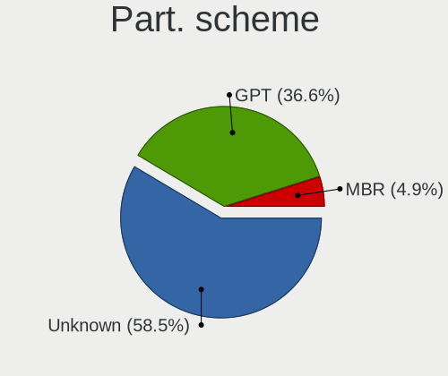
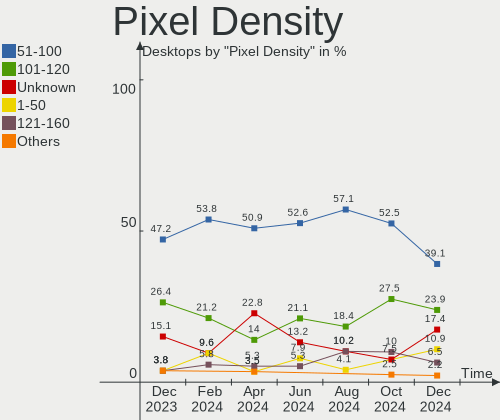
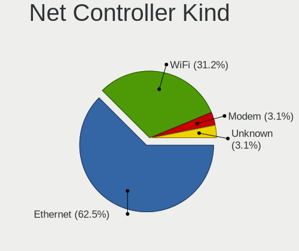
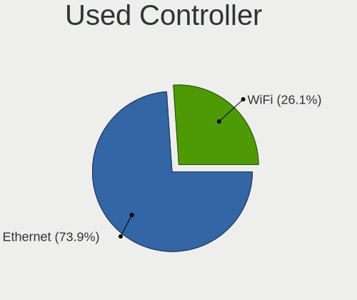

Manjaro Hardware Trends (Desktops)
----------------------------------

A project to identify most popular hardware characteristics and track their change
over time based on data collected by Manjaro users at https://Linux-Hardware.org.

Anyone can contribute to this report by the [hw-probe](https://github.com/linuxhw/hw-probe) tool:

    sudo -E hw-probe -all -upload

Full-feature report is available here: https://linux-hardware.org/?view=trends

Period: Mar, 2022.

Contents
--------

* [ System ](#system)
  - [ OS                       ](#os)
  - [ OS Family                ](#os-family)
  - [ Kernel                   ](#kernel)
  - [ Kernel Family            ](#kernel-family)
  - [ Kernel Major Ver.        ](#kernel-major-ver)
  - [ Arch                     ](#arch)
  - [ DE                       ](#de)
  - [ Display Server           ](#display-server)
  - [ Display Manager          ](#display-manager)
  - [ OS Lang                  ](#os-lang)
  - [ Boot Mode                ](#boot-mode)
  - [ Filesystem               ](#filesystem)
  - [ Part. scheme             ](#part-scheme)
  - [ Dual Boot with Linux/BSD ](#dual-boot-with-linuxbsd)
  - [ Dual Boot (Win)          ](#dual-boot-win)

* [ Board ](#board)
  - [ Vendor                   ](#vendor)
  - [ Model                    ](#model)
  - [ Model Family             ](#model-family)
  - [ MFG Year                 ](#mfg-year)
  - [ Form Factor              ](#form-factor)
  - [ Secure Boot              ](#secure-boot)
  - [ Coreboot                 ](#coreboot)
  - [ RAM Size                 ](#ram-size)
  - [ RAM Used                 ](#ram-used)
  - [ Total Drives             ](#total-drives)
  - [ Has CD-ROM               ](#has-cd-rom)
  - [ Has Ethernet             ](#has-ethernet)
  - [ Has WiFi                 ](#has-wifi)
  - [ Has Bluetooth            ](#has-bluetooth)

* [ Location ](#location)
  - [ Country                  ](#country)
  - [ City                     ](#city)

* [ Drives ](#drives)
  - [ Drive Vendor             ](#drive-vendor)
  - [ Drive Model              ](#drive-model)
  - [ HDD Vendor               ](#hdd-vendor)
  - [ SSD Vendor               ](#ssd-vendor)
  - [ Drive Kind               ](#drive-kind)
  - [ Drive Connector          ](#drive-connector)
  - [ Drive Size               ](#drive-size)
  - [ Space Total              ](#space-total)
  - [ Space Used               ](#space-used)
  - [ Malfunc. Drives          ](#malfunc-drives)
  - [ Malfunc. Drive Vendor    ](#malfunc-drive-vendor)
  - [ Malfunc. HDD Vendor      ](#malfunc-hdd-vendor)
  - [ Malfunc. Drive Kind      ](#malfunc-drive-kind)
  - [ Failed Drives            ](#failed-drives)
  - [ Failed Drive Vendor      ](#failed-drive-vendor)
  - [ Drive Status             ](#drive-status)

* [ Storage controller ](#storage-controller)
  - [ Storage Vendor           ](#storage-vendor)
  - [ Storage Model            ](#storage-model)
  - [ Storage Kind             ](#storage-kind)

* [ Processor ](#processor)
  - [ CPU Vendor               ](#cpu-vendor)
  - [ CPU Model                ](#cpu-model)
  - [ CPU Model Family         ](#cpu-model-family)
  - [ CPU Cores                ](#cpu-cores)
  - [ CPU Sockets              ](#cpu-sockets)
  - [ CPU Threads              ](#cpu-threads)
  - [ CPU Op-Modes             ](#cpu-op-modes)
  - [ CPU Microcode            ](#cpu-microcode)
  - [ CPU Microarch            ](#cpu-microarch)

* [ Graphics ](#graphics)
  - [ GPU Vendor               ](#gpu-vendor)
  - [ GPU Model                ](#gpu-model)
  - [ GPU Combo                ](#gpu-combo)
  - [ GPU Driver               ](#gpu-driver)
  - [ GPU Memory               ](#gpu-memory)

* [ Monitor ](#monitor)
  - [ Monitor Vendor           ](#monitor-vendor)
  - [ Monitor Model            ](#monitor-model)
  - [ Monitor Resolution       ](#monitor-resolution)
  - [ Monitor Diagonal         ](#monitor-diagonal)
  - [ Monitor Width            ](#monitor-width)
  - [ Aspect Ratio             ](#aspect-ratio)
  - [ Monitor Area             ](#monitor-area)
  - [ Pixel Density            ](#pixel-density)
  - [ Multiple Monitors        ](#multiple-monitors)

* [ Network ](#network)
  - [ Net Controller Vendor    ](#net-controller-vendor)
  - [ Net Controller Model     ](#net-controller-model)
  - [ Wireless Vendor          ](#wireless-vendor)
  - [ Wireless Model           ](#wireless-model)
  - [ Ethernet Vendor          ](#ethernet-vendor)
  - [ Ethernet Model           ](#ethernet-model)
  - [ Net Controller Kind      ](#net-controller-kind)
  - [ Used Controller          ](#used-controller)
  - [ NICs                     ](#nics)
  - [ IPv6                     ](#ipv6)

* [ Bluetooth ](#bluetooth)
  - [ Bluetooth Vendor         ](#bluetooth-vendor)
  - [ Bluetooth Model          ](#bluetooth-model)

* [ Sound ](#sound)
  - [ Sound Vendor             ](#sound-vendor)
  - [ Sound Model              ](#sound-model)

* [ Memory ](#memory)
  - [ Memory Vendor            ](#memory-vendor)
  - [ Memory Model             ](#memory-model)
  - [ Memory Kind              ](#memory-kind)
  - [ Memory Form Factor       ](#memory-form-factor)
  - [ Memory Size              ](#memory-size)
  - [ Memory Speed             ](#memory-speed)

* [ Printers & scanners ](#printers--scanners)
  - [ Printer Vendor           ](#printer-vendor)
  - [ Printer Model            ](#printer-model)
  - [ Scanner Vendor           ](#scanner-vendor)
  - [ Scanner Model            ](#scanner-model)

* [ Camera ](#camera)
  - [ Camera Vendor            ](#camera-vendor)
  - [ Camera Model             ](#camera-model)

* [ Security ](#security)
  - [ Fingerprint Vendor       ](#fingerprint-vendor)
  - [ Fingerprint Model        ](#fingerprint-model)
  - [ Chipcard Vendor          ](#chipcard-vendor)
  - [ Chipcard Model           ](#chipcard-model)

* [ Unsupported ](#unsupported)
  - [ Unsupported Devices      ](#unsupported-devices)
  - [ Unsupported Device Types ](#unsupported-device-types)

System
------

OS
--

Installed operating systems

| Name           | Desktops | Percent |
|----------------|----------|---------|
| Manjaro        | 40       | 47.62%  |
| Manjaro 21.2.5 | 31       | 36.9%   |
| Manjaro 21.2.4 | 12       | 14.29%  |
| Manjaro 21.2.3 | 1        | 1.19%   |

OS Family
---------

OS without a version

| Name    | Desktops | Percent |
|---------|----------|---------|
| Manjaro | 84       | 100%    |

Kernel
------

Version of the Linux kernel

| Version               | Desktops | Percent |
|-----------------------|----------|---------|
| 5.15.28-1-MANJARO     | 30       | 35.71%  |
| 5.15.25-1-MANJARO     | 14       | 16.67%  |
| 5.16.14-1-MANJARO     | 11       | 13.1%   |
| 5.16.11-2-MANJARO     | 9        | 10.71%  |
| 5.10.105-1-MANJARO    | 4        | 4.76%   |
| 5.10.102-1-MANJARO    | 3        | 3.57%   |
| 5.9.16-1-MANJARO      | 2        | 2.38%   |
| 5.17.0-1-MANJARO      | 2        | 2.38%   |
| 5.16.2-2-rt19-MANJARO | 2        | 2.38%   |
| 5.13.19-2-MANJARO     | 2        | 2.38%   |
| 5.4.181-2-MANJARO     | 1        | 1.19%   |
| 5.16.15-zen1-1-zen    | 1        | 1.19%   |
| 5.15.26-xanmod1-1     | 1        | 1.19%   |
| 5.15.12-1-MANJARO     | 1        | 1.19%   |
| 5.10.42-1-MANJARO     | 1        | 1.19%   |

Kernel Family
-------------

Linux kernel without a distro release

| Version  | Desktops | Percent |
|----------|----------|---------|
| 5.15.28  | 30       | 35.71%  |
| 5.15.25  | 14       | 16.67%  |
| 5.16.14  | 11       | 13.1%   |
| 5.16.11  | 9        | 10.71%  |
| 5.10.105 | 4        | 4.76%   |
| 5.10.102 | 3        | 3.57%   |
| 5.9.16   | 2        | 2.38%   |
| 5.17.0   | 2        | 2.38%   |
| 5.16.2   | 2        | 2.38%   |
| 5.13.19  | 2        | 2.38%   |
| 5.4.181  | 1        | 1.19%   |
| 5.16.15  | 1        | 1.19%   |
| 5.15.26  | 1        | 1.19%   |
| 5.15.12  | 1        | 1.19%   |
| 5.10.42  | 1        | 1.19%   |

Kernel Major Ver.
-----------------

Linux kernel major version

| Version | Desktops | Percent |
|---------|----------|---------|
| 5.15    | 46       | 54.76%  |
| 5.16    | 23       | 27.38%  |
| 5.10    | 8        | 9.52%   |
| 5.9     | 2        | 2.38%   |
| 5.17    | 2        | 2.38%   |
| 5.13    | 2        | 2.38%   |
| 5.4     | 1        | 1.19%   |

Arch
----

OS architecture (x86_64, i586, etc.)

| Name   | Desktops | Percent |
|--------|----------|---------|
| x86_64 | 84       | 100%    |

DE
--

Desktop Environment

| Name       | Desktops | Percent |
|------------|----------|---------|
| KDE5       | 41       | 48.81%  |
| XFCE       | 22       | 26.19%  |
| GNOME      | 14       | 16.67%  |
| X-Cinnamon | 2        | 2.38%   |
| MATE       | 1        | 1.19%   |
| KDE        | 1        | 1.19%   |
| i3         | 1        | 1.19%   |
| Deepin     | 1        | 1.19%   |
| Unknown    | 1        | 1.19%   |

Display Server
--------------

X11 or Wayland

| Name    | Desktops | Percent |
|---------|----------|---------|
| X11     | 77       | 91.67%  |
| Wayland | 6        | 7.14%   |
| Tty     | 1        | 1.19%   |

Display Manager
---------------

SDDM, LightDM, etc.

| Name    | Desktops | Percent |
|---------|----------|---------|
| Unknown | 40       | 47.62%  |
| SDDM    | 21       | 25%     |
| LightDM | 19       | 22.62%  |
| GDM     | 4        | 4.76%   |

OS Lang
-------

Language

| Lang  | Desktops | Percent |
|-------|----------|---------|
| en_US | 31       | 36.9%   |
| de_DE | 10       | 11.9%   |
| en_GB | 7        | 8.33%   |
| ru_RU | 5        | 5.95%   |
| en_CA | 4        | 4.76%   |
| pl_PL | 3        | 3.57%   |
| fr_FR | 3        | 3.57%   |
| pt_BR | 2        | 2.38%   |
| it_IT | 2        | 2.38%   |
| fr_CA | 2        | 2.38%   |
| es_ES | 2        | 2.38%   |
| en_IN | 2        | 2.38%   |
| pt_PT | 1        | 1.19%   |
| nl_BE | 1        | 1.19%   |
| hu_HU | 1        | 1.19%   |
| es_MX | 1        | 1.19%   |
| es_EC | 1        | 1.19%   |
| es_CL | 1        | 1.19%   |
| en_SE | 1        | 1.19%   |
| en_PH | 1        | 1.19%   |
| en_IL | 1        | 1.19%   |
| en_IE | 1        | 1.19%   |
| en_DK | 1        | 1.19%   |

Boot Mode
---------

EFI or BIOS

| Mode | Desktops | Percent |
|------|----------|---------|
| BIOS | 62       | 73.81%  |
| EFI  | 22       | 26.19%  |

Filesystem
----------

Type of filesystem

| Type  | Desktops | Percent |
|-------|----------|---------|
| Ext4  | 68       | 80.95%  |
| Btrfs | 12       | 14.29%  |
| Xfs   | 4        | 4.76%   |

Part. scheme
------------

Scheme of partitioning

| Type    | Desktops | Percent |
|---------|----------|---------|
| Unknown | 55       | 65.48%  |
| GPT     | 24       | 28.57%  |
| MBR     | 5        | 5.95%   |

Dual Boot with Linux/BSD
------------------------

Hosting more than one Linux/BSD

| Dual boot | Desktops | Percent |
|-----------|----------|---------|
| No        | 73       | 86.9%   |
| Yes       | 11       | 13.1%   |

Dual Boot (Win)
---------------

Hosting Linux and Windows

| Dual boot | Desktops | Percent |
|-----------|----------|---------|
| No        | 58       | 69.05%  |
| Yes       | 26       | 30.95%  |

Board
-----

Vendor
------

Motherboard manufacturer

| Name                | Desktops | Percent |
|---------------------|----------|---------|
| ASUSTek Computer    | 22       | 26.19%  |
| Gigabyte Technology | 19       | 22.62%  |
| MSI                 | 15       | 17.86%  |
| ASRock              | 11       | 13.1%   |
| Hewlett-Packard     | 4        | 4.76%   |
| Dell                | 3        | 3.57%   |
| TPV-INVENTA         | 1        | 1.19%   |
| System76            | 1        | 1.19%   |
| Lenovo              | 1        | 1.19%   |
| Intel               | 1        | 1.19%   |
| Fujitsu             | 1        | 1.19%   |
| Apple               | 1        | 1.19%   |
| AMD                 | 1        | 1.19%   |
| Alienware           | 1        | 1.19%   |
| Acer                | 1        | 1.19%   |
| Unknown             | 1        | 1.19%   |

Model
-----

Motherboard model

| Name                                | Desktops | Percent |
|-------------------------------------|----------|---------|
| MSI MS-7C37                         | 2        | 2.38%   |
| MSI MS-7A38                         | 2        | 2.38%   |
| MSI MS-7817                         | 2        | 2.38%   |
| ASUS ROG STRIX B550-F GAMING        | 2        | 2.38%   |
| ASUS ROG STRIX B450-F GAMING        | 2        | 2.38%   |
| ASUS M5A78L-M PLUS/USB3             | 2        | 2.38%   |
| Unknown                             | 2        | 2.38%   |
| TPV-INVENTA 2AF2 A01                | 1        | 1.19%   |
| System76 Thelio                     | 1        | 1.19%   |
| MSI MS-7C94                         | 1        | 1.19%   |
| MSI MS-7C91                         | 1        | 1.19%   |
| MSI MS-7C87                         | 1        | 1.19%   |
| MSI MS-7C35                         | 1        | 1.19%   |
| MSI MS-7C09                         | 1        | 1.19%   |
| MSI MS-7B86                         | 1        | 1.19%   |
| MSI MS-7A11                         | 1        | 1.19%   |
| MSI MS-7885                         | 1        | 1.19%   |
| MSI MS-7798                         | 1        | 1.19%   |
| Lenovo Legion T530-28ICB 90L3007YMW | 1        | 1.19%   |
| HP EliteDesk 800 G1 SFF             | 1        | 1.19%   |
| HP Compaq Pro 6305 SFF              | 1        | 1.19%   |
| HP Compaq Elite 8300 CMT            | 1        | 1.19%   |
| HP Compaq 6200 Pro SFF PC           | 1        | 1.19%   |
| Gigabyte Z87MX-D3H                  | 1        | 1.19%   |
| Gigabyte Z68P-DS3                   | 1        | 1.19%   |
| Gigabyte X58A-UD3R                  | 1        | 1.19%   |
| Gigabyte X570 GAMING X              | 1        | 1.19%   |
| Gigabyte X570 AORUS ELITE WIFI      | 1        | 1.19%   |
| Gigabyte X470 AORUS ULTRA GAMING    | 1        | 1.19%   |
| Gigabyte X470 AORUS GAMING 7 WIFI   | 1        | 1.19%   |
| Gigabyte TERRA_PC                   | 1        | 1.19%   |
| Gigabyte M68MT-D3P                  | 1        | 1.19%   |
| Gigabyte h8-1414                    | 1        | 1.19%   |
| Gigabyte H61M-S2PV                  | 1        | 1.19%   |
| Gigabyte H310M H 2.0                | 1        | 1.19%   |
| Gigabyte GA-MA74GM-S2               | 1        | 1.19%   |
| Gigabyte G31M-ES2L                  | 1        | 1.19%   |
| Gigabyte B550 AORUS PRO V2          | 1        | 1.19%   |
| Gigabyte B450M DS3H                 | 1        | 1.19%   |
| Gigabyte B450 I AORUS PRO WIFI      | 1        | 1.19%   |
| Gigabyte A320M-H                    | 1        | 1.19%   |
| Gigabyte 990XA-UD3                  | 1        | 1.19%   |
| Fujitsu ESPRIMO_P556                | 1        | 1.19%   |
| Dell XPS 8940                       | 1        | 1.19%   |
| Dell OptiPlex 7010                  | 1        | 1.19%   |
| Dell OptiPlex 3020                  | 1        | 1.19%   |
| ASUS TUF Gaming X570-PLUS           | 1        | 1.19%   |
| ASUS TUF B360M-PLUS GAMING S        | 1        | 1.19%   |
| ASUS ROG STRIX X570-F GAMING        | 1        | 1.19%   |
| ASUS ROG Maximus X HERO             | 1        | 1.19%   |
| ASUS PRIME Z490M-PLUS               | 1        | 1.19%   |
| ASUS PRIME Z370-P                   | 1        | 1.19%   |
| ASUS PRIME H410M-R                  | 1        | 1.19%   |
| ASUS PRIME B460M-A                  | 1        | 1.19%   |
| ASUS PRIME B350-PLUS                | 1        | 1.19%   |
| ASUS P8H61-M LE/BR                  | 1        | 1.19%   |
| ASUS M5A99FX PRO R2.0               | 1        | 1.19%   |
| ASUS M4A89GTD-PRO/USB3              | 1        | 1.19%   |
| ASUS H170 PRO GAMING                | 1        | 1.19%   |
| ASUS Custom Motherboard Bundle      | 1        | 1.19%   |

Model Family
------------

Motherboard model prefix

| Name                  | Desktops | Percent |
|-----------------------|----------|---------|
| ASUS ROG              | 6        | 7.14%   |
| ASUS PRIME            | 5        | 5.95%   |
| HP Compaq             | 3        | 3.57%   |
| MSI MS-7C37           | 2        | 2.38%   |
| MSI MS-7A38           | 2        | 2.38%   |
| MSI MS-7817           | 2        | 2.38%   |
| Gigabyte X570         | 2        | 2.38%   |
| Gigabyte X470         | 2        | 2.38%   |
| Dell OptiPlex         | 2        | 2.38%   |
| ASUS TUF              | 2        | 2.38%   |
| ASUS M5A78L-M         | 2        | 2.38%   |
| ASRock Z77            | 2        | 2.38%   |
| ASRock B550           | 2        | 2.38%   |
| Unknown               | 2        | 2.38%   |
| TPV-INVENTA 2AF2      | 1        | 1.19%   |
| System76 Thelio       | 1        | 1.19%   |
| MSI MS-7C94           | 1        | 1.19%   |
| MSI MS-7C91           | 1        | 1.19%   |
| MSI MS-7C87           | 1        | 1.19%   |
| MSI MS-7C35           | 1        | 1.19%   |
| MSI MS-7C09           | 1        | 1.19%   |
| MSI MS-7B86           | 1        | 1.19%   |
| MSI MS-7A11           | 1        | 1.19%   |
| MSI MS-7885           | 1        | 1.19%   |
| MSI MS-7798           | 1        | 1.19%   |
| Lenovo Legion         | 1        | 1.19%   |
| HP EliteDesk          | 1        | 1.19%   |
| Gigabyte Z87MX-D3H    | 1        | 1.19%   |
| Gigabyte Z68P-DS3     | 1        | 1.19%   |
| Gigabyte X58A-UD3R    | 1        | 1.19%   |
| Gigabyte TERRA        | 1        | 1.19%   |
| Gigabyte M68MT-D3P    | 1        | 1.19%   |
| Gigabyte h8-1414      | 1        | 1.19%   |
| Gigabyte H61M-S2PV    | 1        | 1.19%   |
| Gigabyte H310M        | 1        | 1.19%   |
| Gigabyte GA-MA74GM-S2 | 1        | 1.19%   |
| Gigabyte G31M-ES2L    | 1        | 1.19%   |
| Gigabyte B550         | 1        | 1.19%   |
| Gigabyte B450M        | 1        | 1.19%   |
| Gigabyte B450         | 1        | 1.19%   |
| Gigabyte A320M-H      | 1        | 1.19%   |
| Gigabyte 990XA-UD3    | 1        | 1.19%   |
| Fujitsu ESPRIMO       | 1        | 1.19%   |
| Dell XPS              | 1        | 1.19%   |
| ASUS P8H61-M          | 1        | 1.19%   |
| ASUS M5A99FX          | 1        | 1.19%   |
| ASUS M4A89GTD-PRO     | 1        | 1.19%   |
| ASUS H170             | 1        | 1.19%   |
| ASUS Custom           | 1        | 1.19%   |
| ASUS CROSSHAIR        | 1        | 1.19%   |
| ASUS B150I            | 1        | 1.19%   |
| ASRock Z390           | 1        | 1.19%   |
| ASRock X370           | 1        | 1.19%   |
| ASRock H97            | 1        | 1.19%   |
| ASRock H81M-VG4       | 1        | 1.19%   |
| ASRock H61            | 1        | 1.19%   |
| ASRock B550M          | 1        | 1.19%   |
| ASRock AB350M         | 1        | 1.19%   |
| Apple MacPro5         | 1        | 1.19%   |
| AMD 970A-D3           | 1        | 1.19%   |

MFG Year
--------

Motherboard manufacture year

| Year | Desktops | Percent |
|------|----------|---------|
| 2020 | 18       | 21.43%  |
| 2019 | 12       | 14.29%  |
| 2018 | 12       | 14.29%  |
| 2012 | 11       | 13.1%   |
| 2013 | 7        | 8.33%   |
| 2014 | 5        | 5.95%   |
| 2017 | 4        | 4.76%   |
| 2016 | 4        | 4.76%   |
| 2015 | 3        | 3.57%   |
| 2011 | 2        | 2.38%   |
| 2010 | 2        | 2.38%   |
| 2008 | 2        | 2.38%   |
| 2021 | 1        | 1.19%   |
| 2009 | 1        | 1.19%   |

Form Factor
-----------

Physical design of the computer

| Name    | Desktops | Percent |
|---------|----------|---------|
| Desktop | 84       | 100%    |

Secure Boot
-----------

Enabled or disabled

| State    | Desktops | Percent |
|----------|----------|---------|
| Disabled | 84       | 100%    |

Coreboot
--------

Have coreboot on board

| Used | Desktops | Percent |
|------|----------|---------|
| No   | 84       | 100%    |

RAM Size
--------

Total RAM memory

| Size in GB  | Desktops | Percent |
|-------------|----------|---------|
| 16.01-24.0  | 35       | 41.67%  |
| 32.01-64.0  | 18       | 21.43%  |
| 4.01-8.0    | 9        | 10.71%  |
| 8.01-16.0   | 8        | 9.52%   |
| 64.01-256.0 | 7        | 8.33%   |
| 3.01-4.0    | 4        | 4.76%   |
| 1.01-2.0    | 2        | 2.38%   |
| 24.01-32.0  | 1        | 1.19%   |

RAM Used
--------

Used RAM memory

| Used GB    | Desktops | Percent |
|------------|----------|---------|
| 2.01-3.0   | 21       | 25%     |
| 4.01-8.0   | 20       | 23.81%  |
| 1.01-2.0   | 16       | 19.05%  |
| 3.01-4.0   | 15       | 17.86%  |
| 8.01-16.0  | 7        | 8.33%   |
| 16.01-24.0 | 3        | 3.57%   |
| 24.01-32.0 | 1        | 1.19%   |
| 0.51-1.0   | 1        | 1.19%   |

Total Drives
------------

Number of drives on board

| Drives | Desktops | Percent |
|--------|----------|---------|
| 3      | 24       | 28.57%  |
| 2      | 23       | 27.38%  |
| 1      | 20       | 23.81%  |
| 5      | 6        | 7.14%   |
| 4      | 6        | 7.14%   |
| 6      | 3        | 3.57%   |
| 9      | 1        | 1.19%   |
| 7      | 1        | 1.19%   |

Has CD-ROM
----------

Has CD-ROM on board

| Presented | Desktops | Percent |
|-----------|----------|---------|
| No        | 53       | 63.1%   |
| Yes       | 31       | 36.9%   |

Has Ethernet
------------

Has Ethernet on board

| Presented | Desktops | Percent |
|-----------|----------|---------|
| Yes       | 82       | 97.62%  |
| No        | 2        | 2.38%   |

Has WiFi
--------

Has WiFi module

| Presented | Desktops | Percent |
|-----------|----------|---------|
| Yes       | 43       | 51.19%  |
| No        | 41       | 48.81%  |

Has Bluetooth
-------------

Has Bluetooth module

| Presented | Desktops | Percent |
|-----------|----------|---------|
| No        | 43       | 51.19%  |
| Yes       | 41       | 48.81%  |

Location
--------

Country
-------

Geographic location (country)

| Country     | Desktops | Percent |
|-------------|----------|---------|
| USA         | 19       | 22.62%  |
| Germany     | 12       | 14.29%  |
| Russia      | 6        | 7.14%   |
| Canada      | 5        | 5.95%   |
| Poland      | 4        | 4.76%   |
| France      | 4        | 4.76%   |
| Romania     | 3        | 3.57%   |
| Italy       | 3        | 3.57%   |
| UK          | 2        | 2.38%   |
| Sweden      | 2        | 2.38%   |
| Spain       | 2        | 2.38%   |
| India       | 2        | 2.38%   |
| Finland     | 2        | 2.38%   |
| Brazil      | 2        | 2.38%   |
| Sri Lanka   | 1        | 1.19%   |
| Portugal    | 1        | 1.19%   |
| Philippines | 1        | 1.19%   |
| Netherlands | 1        | 1.19%   |
| Mexico      | 1        | 1.19%   |
| Jamaica     | 1        | 1.19%   |
| Israel      | 1        | 1.19%   |
| Hungary     | 1        | 1.19%   |
| Greece      | 1        | 1.19%   |
| Ecuador     | 1        | 1.19%   |
| Denmark     | 1        | 1.19%   |
| Croatia     | 1        | 1.19%   |
| Chile       | 1        | 1.19%   |
| Belgium     | 1        | 1.19%   |
| Bangladesh  | 1        | 1.19%   |
| Algeria     | 1        | 1.19%   |

City
----

Geographic location (city)

| City                | Desktops | Percent |
|---------------------|----------|---------|
| Meckenheim          | 2        | 2.38%   |
| Lafayette           | 2        | 2.38%   |
| Yekaterinburg       | 1        | 1.19%   |
| Wimberley           | 1        | 1.19%   |
| Whitley Bay         | 1        | 1.19%   |
| Warsaw              | 1        | 1.19%   |
| Virginia Beach      | 1        | 1.19%   |
| Vancouver           | 1        | 1.19%   |
| Union City          | 1        | 1.19%   |
| Ulm                 | 1        | 1.19%   |
| Turin               | 1        | 1.19%   |
| Tarragona           | 1        | 1.19%   |
| Sydney              | 1        | 1.19%   |
| Strasbourg          | 1        | 1.19%   |
| Stockholm           | 1        | 1.19%   |
| St. John's          | 1        | 1.19%   |
| St. Francois Xavier | 1        | 1.19%   |
| St Petersburg       | 1        | 1.19%   |
| Split               | 1        | 1.19%   |
| Sioux Falls         | 1        | 1.19%   |
| San Jose            | 1        | 1.19%   |
| San Bernardo        | 1        | 1.19%   |
| Samara              | 1        | 1.19%   |
| Rogers              | 1        | 1.19%   |
| Quezon City         | 1        | 1.19%   |
| Queretaro           | 1        | 1.19%   |
| Queens              | 1        | 1.19%   |
| Porto               | 1        | 1.19%   |
| Pori                | 1        | 1.19%   |
| Passos              | 1        | 1.19%   |
| Paris               | 1        | 1.19%   |
| Ozd                 | 1        | 1.19%   |
| Oklahoma City       | 1        | 1.19%   |
| Ocho Rios           | 1        | 1.19%   |
| Nuremberg           | 1        | 1.19%   |
| Nugegoda            | 1        | 1.19%   |
| Nijmegen            | 1        | 1.19%   |
| Nibe                | 1        | 1.19%   |
| New York            | 1        | 1.19%   |
| Narayanganj         | 1        | 1.19%   |
| Naples              | 1        | 1.19%   |
| Mittelbuch          | 1        | 1.19%   |
| Miramichi           | 1        | 1.19%   |
| Milan               | 1        | 1.19%   |
| Lawndale            | 1        | 1.19%   |
| Laken               | 1        | 1.19%   |
| Krefeld             | 1        | 1.19%   |
| Krasnodar           | 1        | 1.19%   |
| Kolkata             | 1        | 1.19%   |
| Koblenz             | 1        | 1.19%   |
| Karlstad            | 1        | 1.19%   |
| Karlsruhe           | 1        | 1.19%   |
| Jena                | 1        | 1.19%   |
| Iasi                | 1        | 1.19%   |
| Hod HaSharon        | 1        | 1.19%   |
| Helsinki            | 1        | 1.19%   |
| Harrisonburg        | 1        | 1.19%   |
| Gurgaon             | 1        | 1.19%   |
| Guayaquil           | 1        | 1.19%   |
| Grand Junction      | 1        | 1.19%   |

Drives
------

Drive Vendor
------------

Hard drive vendors

| Vendor                       | Desktops | Drives | Percent |
|------------------------------|----------|--------|---------|
| WDC                          | 32       | 47     | 17.11%  |
| Seagate                      | 32       | 40     | 17.11%  |
| Samsung Electronics          | 32       | 38     | 17.11%  |
| Crucial                      | 13       | 13     | 6.95%   |
| SanDisk                      | 11       | 11     | 5.88%   |
| Kingston                     | 11       | 15     | 5.88%   |
| Toshiba                      | 10       | 11     | 5.35%   |
| Phison                       | 5        | 5      | 2.67%   |
| Micron/Crucial Technology    | 3        | 3      | 1.6%    |
| Intel                        | 3        | 3      | 1.6%    |
| Hitachi                      | 3        | 3      | 1.6%    |
| China                        | 3        | 3      | 1.6%    |
| XPG                          | 2        | 2      | 1.07%   |
| SK Hynix                     | 2        | 2      | 1.07%   |
| Patriot                      | 2        | 2      | 1.07%   |
| HGST                         | 2        | 2      | 1.07%   |
| Gigabyte Technology          | 2        | 2      | 1.07%   |
| A-DATA Technology            | 2        | 2      | 1.07%   |
| USB3.0                       | 1        | 1      | 0.53%   |
| Unknown                      | 1        | 3      | 0.53%   |
| Team                         | 1        | 2      | 0.53%   |
| SPCC                         | 1        | 1      | 0.53%   |
| Silicon Motion               | 1        | 1      | 0.53%   |
| Shenzhen Longsys Electronics | 1        | 1      | 0.53%   |
| SABRENT                      | 1        | 1      | 0.53%   |
| PNY                          | 1        | 4      | 0.53%   |
| PLEXTOR                      | 1        | 1      | 0.53%   |
| LITEON                       | 1        | 1      | 0.53%   |
| Lexar                        | 1        | 1      | 0.53%   |
| Leven                        | 1        | 1      | 0.53%   |
| JUHOR                        | 1        | 1      | 0.53%   |
| JMicron                      | 1        | 1      | 0.53%   |
| Hewlett-Packard              | 1        | 1      | 0.53%   |
| External                     | 1        | 1      | 0.53%   |
| Apple                        | 1        | 1      | 0.53%   |

Drive Model
-----------

Hard drive models

| Model                             | Desktops | Percent |
|-----------------------------------|----------|---------|
| Seagate ST2000DM008-2FR102 2TB    | 4        | 1.85%   |
| Samsung NVMe SSD Drive 1TB        | 4        | 1.85%   |
| Seagate ST3250318AS 250GB         | 3        | 1.39%   |
| Seagate ST2000DM001-1CH164 2TB    | 3        | 1.39%   |
| Samsung SSD 840 EVO 120GB         | 3        | 1.39%   |
| Kingston SA400S37240G 240GB SSD   | 3        | 1.39%   |
| Kingston SA400S37120G 120GB SSD   | 3        | 1.39%   |
| Crucial CT500MX500SSD1 500GB      | 3        | 1.39%   |
| Crucial CT240BX500SSD1 240GB      | 3        | 1.39%   |
| Crucial CT1000MX500SSD1 1TB       | 3        | 1.39%   |
| WDC WDS500G2B0A-00SM50 500GB SSD  | 2        | 0.93%   |
| WDC WD5000AAKX-001CA0 500GB       | 2        | 0.93%   |
| WDC WD10EZEX-08WN4A0 1TB          | 2        | 0.93%   |
| Toshiba DT01ACA200 2TB            | 2        | 0.93%   |
| Seagate ST3000DM008-2DM166 3TB    | 2        | 0.93%   |
| Seagate ST2000DL004 HD204UI 2TB   | 2        | 0.93%   |
| Seagate ST1000DM010-2EP102 1TB    | 2        | 0.93%   |
| Seagate ST1000DM003-1ER162 1TB    | 2        | 0.93%   |
| SanDisk SDSSDH3512G 512GB         | 2        | 0.93%   |
| Sandisk NVMe SSD Drive 500GB      | 2        | 0.93%   |
| Sandisk NVMe SSD Drive 1TB        | 2        | 0.93%   |
| Samsung SSD 970 EVO Plus 500GB    | 2        | 0.93%   |
| Samsung SSD 970 EVO Plus 1TB      | 2        | 0.93%   |
| Samsung SSD 850 EVO 500GB         | 2        | 0.93%   |
| Samsung NVMe SSD Drive 500GB      | 2        | 0.93%   |
| Micron/Crucial NVMe SSD Drive 1TB | 2        | 0.93%   |
| Kingston SUV400S37240G 240GB SSD  | 2        | 0.93%   |
| Kingston NVMe SSD Drive 500GB     | 2        | 0.93%   |
| Hitachi HUA723030ALA640 3TB       | 2        | 0.93%   |
| Crucial CT480BX500SSD1 480GB      | 2        | 0.93%   |
| XPG NVMe SSD Drive 1TB            | 1        | 0.46%   |
| XPG NVMe SSD Drive 1024GB         | 1        | 0.46%   |
| WDC WDS240G2G0A-00JH30 240GB SSD  | 1        | 0.46%   |
| WDC WDS100T2B0A-00SM50 1TB SSD    | 1        | 0.46%   |
| WDC WD50EZRZ-32RWYB1 5TB          | 1        | 0.46%   |
| WDC WD5003AZEX-00K3CA0 500GB      | 1        | 0.46%   |
| WDC WD5000LPCX-24C6HT0 500GB      | 1        | 0.46%   |
| WDC WD5000AZLX-00CL5A0 500GB      | 1        | 0.46%   |
| WDC WD5000AAKX-60U6AA0 500GB      | 1        | 0.46%   |
| WDC WD5000AAKX-22ERMA0 500GB      | 1        | 0.46%   |
| WDC WD5000AAKX-00KJ3A0 500GB      | 1        | 0.46%   |
| WDC WD5000AAKX-00ERMA0 500GB      | 1        | 0.46%   |
| WDC WD5000AAKS-07YGA0 500GB       | 1        | 0.46%   |
| WDC WD5000AAKS-00A7B0 500GB       | 1        | 0.46%   |
| WDC WD40EZRX-22SPEB0 4TB          | 1        | 0.46%   |
| WDC WD40EFRX-68N32N0 4TB          | 1        | 0.46%   |
| WDC WD3200AVVS-63L2B0 320GB       | 1        | 0.46%   |
| WDC WD30EFRX-68EUZN0 3TB          | 1        | 0.46%   |
| WDC WD20PURZ-85GU6Y0 2TB          | 1        | 0.46%   |
| WDC WD20EZRX-00D8PB0 2TB          | 1        | 0.46%   |
| WDC WD20EZBX-00AYRA0 2TB          | 1        | 0.46%   |
| WDC WD20EZAZ-00L9GB0 2TB          | 1        | 0.46%   |
| WDC WD20EZAZ-00GGJB0 2TB          | 1        | 0.46%   |
| WDC WD20EFRX-68EUZN0 2TB          | 1        | 0.46%   |
| WDC WD20EARX-22PASB0 2TB          | 1        | 0.46%   |
| WDC WD2003FZEX-00Z4SA0 2TB        | 1        | 0.46%   |
| WDC WD2003FZEX-00SRLA0 2TB        | 1        | 0.46%   |
| WDC WD1600BEVS-60RST0 160GB       | 1        | 0.46%   |
| WDC WD10PURZ-85U8XY0 1TB          | 1        | 0.46%   |
| WDC WD10EZEX-75WN4A1 1TB          | 1        | 0.46%   |

HDD Vendor
----------

Hard disk drive vendors

| Vendor              | Desktops | Drives | Percent |
|---------------------|----------|--------|---------|
| Seagate             | 31       | 39     | 38.75%  |
| WDC                 | 29       | 43     | 36.25%  |
| Toshiba             | 9        | 10     | 11.25%  |
| Samsung Electronics | 5        | 5      | 6.25%   |
| Hitachi             | 3        | 3      | 3.75%   |
| HGST                | 2        | 2      | 2.5%    |
| SABRENT             | 1        | 1      | 1.25%   |

SSD Vendor
----------

Solid state drive vendors

| Vendor              | Desktops | Drives | Percent |
|---------------------|----------|--------|---------|
| Samsung Electronics | 18       | 19     | 25%     |
| Crucial             | 12       | 12     | 16.67%  |
| Kingston            | 10       | 12     | 13.89%  |
| SanDisk             | 6        | 6      | 8.33%   |
| WDC                 | 3        | 4      | 4.17%   |
| Intel               | 3        | 3      | 4.17%   |
| China               | 3        | 3      | 4.17%   |
| Patriot             | 2        | 2      | 2.78%   |
| A-DATA Technology   | 2        | 2      | 2.78%   |
| USB3.0              | 1        | 1      | 1.39%   |
| Toshiba             | 1        | 1      | 1.39%   |
| Team                | 1        | 2      | 1.39%   |
| SPCC                | 1        | 1      | 1.39%   |
| PNY                 | 1        | 4      | 1.39%   |
| PLEXTOR             | 1        | 1      | 1.39%   |
| LITEON              | 1        | 1      | 1.39%   |
| Lexar               | 1        | 1      | 1.39%   |
| Leven               | 1        | 1      | 1.39%   |
| JUHOR               | 1        | 1      | 1.39%   |
| JMicron             | 1        | 1      | 1.39%   |
| Gigabyte Technology | 1        | 1      | 1.39%   |
| Apple               | 1        | 1      | 1.39%   |

Drive Kind
----------

HDD or SSD

| Kind    | Desktops | Drives | Percent |
|---------|----------|--------|---------|
| HDD     | 62       | 103    | 40.26%  |
| SSD     | 60       | 80     | 38.96%  |
| NVMe    | 30       | 40     | 19.48%  |
| Unknown | 2        | 4      | 1.3%    |

Drive Connector
---------------

SATA, SAS, NVMe, etc.

| Type | Desktops | Drives | Percent |
|------|----------|--------|---------|
| SATA | 77       | 178    | 68.75%  |
| NVMe | 29       | 39     | 25.89%  |
| SAS  | 6        | 10     | 5.36%   |

Drive Size
----------

Size of hard drive

| Size in TB | Desktops | Drives | Percent |
|------------|----------|--------|---------|
| 0.01-0.5   | 58       | 85     | 43.61%  |
| 0.51-1.0   | 37       | 50     | 27.82%  |
| 1.01-2.0   | 21       | 29     | 15.79%  |
| 3.01-4.0   | 8        | 8      | 6.02%   |
| 2.01-3.0   | 6        | 8      | 4.51%   |
| 4.01-10.0  | 3        | 3      | 2.26%   |

Space Total
-----------

Amount of disk space available on the file system

| Size in GB     | Desktops | Percent |
|----------------|----------|---------|
| More than 3000 | 20       | 23.81%  |
| 251-500        | 18       | 21.43%  |
| 101-250        | 11       | 13.1%   |
| 501-1000       | 10       | 11.9%   |
| 2001-3000      | 9        | 10.71%  |
| 1001-2000      | 9        | 10.71%  |
| 51-100         | 4        | 4.76%   |
| 21-50          | 3        | 3.57%   |

Space Used
----------

Amount of used disk space

| Used GB        | Desktops | Percent |
|----------------|----------|---------|
| 101-250        | 15       | 17.86%  |
| 21-50          | 11       | 13.1%   |
| 501-1000       | 10       | 11.9%   |
| 251-500        | 9        | 10.71%  |
| 1001-2000      | 9        | 10.71%  |
| 1-20           | 9        | 10.71%  |
| 51-100         | 8        | 9.52%   |
| 2001-3000      | 7        | 8.33%   |
| More than 3000 | 6        | 7.14%   |

Malfunc. Drives
---------------

Drive models with a malfunction

| Model                             | Desktops | Drives | Percent |
|-----------------------------------|----------|--------|---------|
| WDC WD50EZRZ-32RWYB1 5TB          | 1        | 1      | 20%     |
| Seagate ST3250318AS 250GB         | 1        | 1      | 20%     |
| Seagate ST1000DX001-1CM162 1TB    | 1        | 1      | 20%     |
| Samsung Electronics HD501LJ 500GB | 1        | 1      | 20%     |
| Kingston SA400S37240G 240GB SSD   | 1        | 1      | 20%     |

Malfunc. Drive Vendor
---------------------

Vendors of faulty drives

| Vendor              | Desktops | Drives | Percent |
|---------------------|----------|--------|---------|
| Seagate             | 2        | 2      | 40%     |
| WDC                 | 1        | 1      | 20%     |
| Samsung Electronics | 1        | 1      | 20%     |
| Kingston            | 1        | 1      | 20%     |

Malfunc. HDD Vendor
-------------------

Vendors of faulty HDD drives

| Vendor              | Desktops | Drives | Percent |
|---------------------|----------|--------|---------|
| Seagate             | 2        | 2      | 50%     |
| WDC                 | 1        | 1      | 25%     |
| Samsung Electronics | 1        | 1      | 25%     |

Malfunc. Drive Kind
-------------------

Kinds of faulty drives

| Kind | Desktops | Drives | Percent |
|------|----------|--------|---------|
| HDD  | 4        | 4      | 80%     |
| SSD  | 1        | 1      | 20%     |

Failed Drives
-------------

Failed drive models

Zero info for selected period =(

Failed Drive Vendor
-------------------

Failed drive vendors

Zero info for selected period =(

Drive Status
------------

Number of failed and malfunc. drives

| Status   | Desktops | Drives | Percent |
|----------|----------|--------|---------|
| Detected | 66       | 179    | 71.74%  |
| Works    | 21       | 43     | 22.83%  |
| Malfunc  | 5        | 5      | 5.43%   |

Storage controller
------------------

Storage Vendor
--------------

Storage controller vendors

| Vendor                       | Desktops | Percent |
|------------------------------|----------|---------|
| AMD                          | 42       | 32.06%  |
| Intel                        | 40       | 30.53%  |
| Samsung Electronics          | 12       | 9.16%   |
| ASMedia Technology           | 8        | 6.11%   |
| Sandisk                      | 5        | 3.82%   |
| Phison Electronics           | 5        | 3.82%   |
| Micron/Crucial Technology    | 4        | 3.05%   |
| Kingston Technology Company  | 3        | 2.29%   |
| JMicron Technology           | 3        | 2.29%   |
| SK Hynix                     | 2        | 1.53%   |
| Marvell Technology Group     | 2        | 1.53%   |
| ADATA Technology             | 2        | 1.53%   |
| Silicon Motion               | 1        | 0.76%   |
| Shenzhen Longsys Electronics | 1        | 0.76%   |
| Nvidia                       | 1        | 0.76%   |

Storage Model
-------------

Storage controller models

| Model                                                                                   | Desktops | Percent |
|-----------------------------------------------------------------------------------------|----------|---------|
| AMD FCH SATA Controller [AHCI mode]                                                     | 22       | 14.38%  |
| AMD 400 Series Chipset SATA Controller                                                  | 11       | 7.19%   |
| Samsung NVMe SSD Controller SM981/PM981/PM983                                           | 9        | 5.88%   |
| ASMedia ASM1062 Serial ATA Controller                                                   | 8        | 5.23%   |
| AMD 500 Series Chipset SATA Controller                                                  | 8        | 5.23%   |
| Intel 7 Series/C210 Series Chipset Family 6-port SATA Controller [AHCI mode]            | 7        | 4.58%   |
| Intel 8 Series/C220 Series Chipset Family 6-port SATA Controller 1 [AHCI mode]          | 6        | 3.92%   |
| AMD SB7x0/SB8x0/SB9x0 SATA Controller [AHCI mode]                                       | 6        | 3.92%   |
| Intel Q170/Q150/B150/H170/H110/Z170/CM236 Chipset SATA Controller [AHCI Mode]           | 4        | 2.61%   |
| Intel 6 Series/C200 Series Chipset Family 6 port Desktop SATA AHCI Controller           | 4        | 2.61%   |
| Intel 200 Series PCH SATA controller [AHCI mode]                                        | 4        | 2.61%   |
| AMD SB7x0/SB8x0/SB9x0 IDE Controller                                                    | 4        | 2.61%   |
| Samsung NVMe SSD Controller SM961/PM961/SM963                                           | 3        | 1.96%   |
| Phison E12 NVMe Controller                                                              | 3        | 1.96%   |
| Micron/Crucial P2 NVMe PCIe SSD                                                         | 3        | 1.96%   |
| Kingston Company A2000 NVMe SSD                                                         | 3        | 1.96%   |
| Intel Cannon Lake PCH SATA AHCI Controller                                              | 3        | 1.96%   |
| Sandisk WD PC SN810 / Black SN850 NVMe SSD                                              | 2        | 1.31%   |
| Intel SATA Controller [RAID mode]                                                       | 2        | 1.31%   |
| Intel Comet Lake SATA AHCI Controller                                                   | 2        | 1.31%   |
| Intel 82801JI (ICH10 Family) SATA AHCI Controller                                       | 2        | 1.31%   |
| Intel 400 Series Chipset Family SATA AHCI Controller                                    | 2        | 1.31%   |
| AMD SB7x0/SB8x0/SB9x0 SATA Controller [IDE mode]                                        | 2        | 1.31%   |
| AMD 300 Series Chipset SATA Controller                                                  | 2        | 1.31%   |
| ADATA XPG SX8200 Pro PCIe Gen3x4 M.2 2280 Solid State Drive                             | 2        | 1.31%   |
| SK Hynix BC511                                                                          | 1        | 0.65%   |
| SK Hynix BC501 NVMe Solid State Drive                                                   | 1        | 0.65%   |
| Silicon Motion SM2262/SM2262EN SSD Controller                                           | 1        | 0.65%   |
| Shenzhen Longsys Electronics Non-Volatile memory controller                             | 1        | 0.65%   |
| Sandisk WD Blue SN550 NVMe SSD                                                          | 1        | 0.65%   |
| Sandisk WD Black SN750 / PC SN730 NVMe SSD                                              | 1        | 0.65%   |
| Sandisk WD Black 2018/SN750 / PC SN720 NVMe SSD                                         | 1        | 0.65%   |
| Samsung NVMe SSD Controller SM951/PM951                                                 | 1        | 0.65%   |
| Samsung Electronics SATA controller                                                     | 1        | 0.65%   |
| Phison PS5013 E13 NVMe Controller                                                       | 1        | 0.65%   |
| Phison E16 PCIe4 NVMe Controller                                                        | 1        | 0.65%   |
| Nvidia MCP61 SATA Controller                                                            | 1        | 0.65%   |
| Micron/Crucial P1 NVMe PCIe SSD                                                         | 1        | 0.65%   |
| Marvell Group 88SE912x IDE Controller                                                   | 1        | 0.65%   |
| Marvell Group 88SE9128 PCIe SATA 6 Gb/s RAID controller                                 | 1        | 0.65%   |
| Marvell Group 88SE9123 PCIe SATA 6.0 Gb/s controller                                    | 1        | 0.65%   |
| JMicron JMB58x AHCI SATA controller                                                     | 1        | 0.65%   |
| JMicron JMB368 IDE controller                                                           | 1        | 0.65%   |
| JMicron JMB363 SATA/IDE Controller                                                      | 1        | 0.65%   |
| JMicron JMB361 AHCI/IDE                                                                 | 1        | 0.65%   |
| Intel NM10/ICH7 Family SATA Controller [IDE mode]                                       | 1        | 0.65%   |
| Intel 9 Series Chipset Family SATA Controller [AHCI Mode]                               | 1        | 0.65%   |
| Intel 6 Series/C200 Series Chipset Family Desktop SATA Controller (IDE mode, ports 4-5) | 1        | 0.65%   |
| Intel 6 Series/C200 Series Chipset Family Desktop SATA Controller (IDE mode, ports 0-3) | 1        | 0.65%   |
| Intel 5 Series/3400 Series Chipset 4 port SATA IDE Controller                           | 1        | 0.65%   |
| Intel 5 Series/3400 Series Chipset 2 port SATA IDE Controller                           | 1        | 0.65%   |
| AMD X370 Series Chipset SATA Controller                                                 | 1        | 0.65%   |
| AMD SB7x0/SB8x0/SB9x0 SATA Controller [RAID5 mode]                                      | 1        | 0.65%   |
| AMD FCH SATA Controller D                                                               | 1        | 0.65%   |

Storage Kind
------------

Kind of storage controller (IDE, SATA, NVMe, SAS, ...)

| Kind | Desktops | Percent |
|------|----------|---------|
| SATA | 76       | 64.96%  |
| NVMe | 28       | 23.93%  |
| IDE  | 10       | 8.55%   |
| RAID | 3        | 2.56%   |

Processor
---------

CPU Vendor
----------

Processor vendors

| Vendor | Desktops | Percent |
|--------|----------|---------|
| AMD    | 43       | 51.19%  |
| Intel  | 41       | 48.81%  |

CPU Model
---------

Processor models

| Model                                         | Desktops | Percent |
|-----------------------------------------------|----------|---------|
| AMD Ryzen 9 5900X 12-Core Processor           | 4        | 4.76%   |
| AMD Ryzen 9 5950X 16-Core Processor           | 3        | 3.57%   |
| AMD Ryzen 5 3600 6-Core Processor             | 3        | 3.57%   |
| AMD Ryzen 5 1600 Six-Core Processor           | 3        | 3.57%   |
| Intel Core i7-8700K CPU @ 3.70GHz             | 2        | 2.38%   |
| Intel Core i7-8700 CPU @ 3.20GHz              | 2        | 2.38%   |
| Intel Core i7-4790 CPU @ 3.60GHz              | 2        | 2.38%   |
| Intel Core i7-3770 CPU @ 3.40GHz              | 2        | 2.38%   |
| Intel Core i5-9400F CPU @ 2.90GHz             | 2        | 2.38%   |
| Intel Core i5-6500 CPU @ 3.20GHz              | 2        | 2.38%   |
| Intel Core i5-4590 CPU @ 3.30GHz              | 2        | 2.38%   |
| Intel Core i5-3470 CPU @ 3.20GHz              | 2        | 2.38%   |
| Intel Core i5-2500 CPU @ 3.30GHz              | 2        | 2.38%   |
| AMD Ryzen 7 3800X 8-Core Processor            | 2        | 2.38%   |
| AMD Ryzen 7 3700X 8-Core Processor            | 2        | 2.38%   |
| AMD Ryzen 7 2700X Eight-Core Processor        | 2        | 2.38%   |
| AMD Ryzen 5 5600G with Radeon Graphics        | 2        | 2.38%   |
| AMD FX-8320 Eight-Core Processor              | 2        | 2.38%   |
| Intel Xeon CPU X5670 @ 2.93GHz                | 1        | 1.19%   |
| Intel Pentium Gold G5400 CPU @ 3.70GHz        | 1        | 1.19%   |
| Intel Pentium CPU G630 @ 2.70GHz              | 1        | 1.19%   |
| Intel Core i9-10900 CPU @ 2.80GHz             | 1        | 1.19%   |
| Intel Core i7-6800K CPU @ 3.40GHz             | 1        | 1.19%   |
| Intel Core i7-4770 CPU @ 3.40GHz              | 1        | 1.19%   |
| Intel Core i7-2600K CPU @ 3.40GHz             | 1        | 1.19%   |
| Intel Core i7 CPU 970 @ 3.20GHz               | 1        | 1.19%   |
| Intel Core i7 CPU 860 @ 2.80GHz               | 1        | 1.19%   |
| Intel Core i5-8500 CPU @ 3.00GHz              | 1        | 1.19%   |
| Intel Core i5-8400 CPU @ 2.80GHz              | 1        | 1.19%   |
| Intel Core i5-6600K CPU @ 3.50GHz             | 1        | 1.19%   |
| Intel Core i5-6400 CPU @ 2.70GHz              | 1        | 1.19%   |
| Intel Core i5-4570 CPU @ 3.20GHz              | 1        | 1.19%   |
| Intel Core i5-3570K CPU @ 3.40GHz             | 1        | 1.19%   |
| Intel Core i5-3340 CPU @ 3.10GHz              | 1        | 1.19%   |
| Intel Core i5-2500K CPU @ 3.30GHz             | 1        | 1.19%   |
| Intel Core i5-10400F CPU @ 2.90GHz            | 1        | 1.19%   |
| Intel Core i5-10400 CPU @ 2.90GHz             | 1        | 1.19%   |
| Intel Core i3-4160 CPU @ 3.60GHz              | 1        | 1.19%   |
| Intel Core i3-2100 CPU @ 3.10GHz              | 1        | 1.19%   |
| Intel Core 2 CPU 6400 @ 2.13GHz               | 1        | 1.19%   |
| Intel 11th Gen Core i7-11700K @ 3.60GHz       | 1        | 1.19%   |
| AMD Sempron 140 Processor                     | 1        | 1.19%   |
| AMD Ryzen 9 3900X 12-Core Processor           | 1        | 1.19%   |
| AMD Ryzen 7 2700 Eight-Core Processor         | 1        | 1.19%   |
| AMD Ryzen 5 5600X 6-Core Processor            | 1        | 1.19%   |
| AMD Ryzen 5 3600X 6-Core Processor            | 1        | 1.19%   |
| AMD Ryzen 5 3500X 6-Core Processor            | 1        | 1.19%   |
| AMD Ryzen 5 2600 Six-Core Processor           | 1        | 1.19%   |
| AMD Ryzen 5 1600X Six-Core Processor          | 1        | 1.19%   |
| AMD Ryzen 3 1300X Quad-Core Processor         | 1        | 1.19%   |
| AMD Phenom II X6 1075T Processor              | 1        | 1.19%   |
| AMD Phenom II X4 965 Processor                | 1        | 1.19%   |
| AMD FX-8300 Eight-Core Processor              | 1        | 1.19%   |
| AMD FX-6120 Six-Core Processor                | 1        | 1.19%   |
| AMD FX-6100 Six-Core Processor                | 1        | 1.19%   |
| AMD FX-4300 Quad-Core Processor               | 1        | 1.19%   |
| AMD E1-1200 APU with Radeon HD Graphics       | 1        | 1.19%   |
| AMD Athlon II X2 260 Processor                | 1        | 1.19%   |
| AMD Athlon 200GE with Radeon Vega Graphics    | 1        | 1.19%   |
| AMD A8-9600 RADEON R7, 10 COMPUTE CORES 4C+6G | 1        | 1.19%   |

CPU Model Family
----------------

Processor model prefix

| Model              | Desktops | Percent |
|--------------------|----------|---------|
| Intel Core i5      | 20       | 23.81%  |
| Intel Core i7      | 13       | 15.48%  |
| AMD Ryzen 5        | 13       | 15.48%  |
| AMD Ryzen 9        | 8        | 9.52%   |
| AMD Ryzen 7        | 7        | 8.33%   |
| AMD FX             | 6        | 7.14%   |
| Intel Core i3      | 2        | 2.38%   |
| Other              | 1        | 1.19%   |
| Intel Xeon         | 1        | 1.19%   |
| Intel Pentium Gold | 1        | 1.19%   |
| Intel Pentium      | 1        | 1.19%   |
| Intel Core i9      | 1        | 1.19%   |
| Intel Core 2       | 1        | 1.19%   |
| AMD Sempron        | 1        | 1.19%   |
| AMD Ryzen 3        | 1        | 1.19%   |
| AMD Phenom II X6   | 1        | 1.19%   |
| AMD Phenom II X4   | 1        | 1.19%   |
| AMD E1             | 1        | 1.19%   |
| AMD Athlon II X2   | 1        | 1.19%   |
| AMD Athlon         | 1        | 1.19%   |
| AMD A8             | 1        | 1.19%   |
| AMD A10            | 1        | 1.19%   |

CPU Cores
---------

Number of processor cores

| Number | Desktops | Percent |
|--------|----------|---------|
| 6      | 26       | 30.95%  |
| 4      | 26       | 30.95%  |
| 2      | 11       | 13.1%   |
| 8      | 8        | 9.52%   |
| 12     | 6        | 7.14%   |
| 16     | 3        | 3.57%   |
| 3      | 2        | 2.38%   |
| 10     | 1        | 1.19%   |
| 1      | 1        | 1.19%   |

CPU Sockets
-----------

Number of sockets

| Number | Desktops | Percent |
|--------|----------|---------|
| 1      | 83       | 98.81%  |
| 2      | 1        | 1.19%   |

CPU Threads
-----------

Threads per core (Hyper-Threading)

| Number | Desktops | Percent |
|--------|----------|---------|
| 2      | 57       | 67.86%  |
| 1      | 27       | 32.14%  |

CPU Op-Modes
------------

CPU Operation Modes (32-bit, 64-bit)

| Op mode        | Desktops | Percent |
|----------------|----------|---------|
| 32-bit, 64-bit | 84       | 100%    |

CPU Microcode
-------------

Microcode number

| Number     | Desktops | Percent |
|------------|----------|---------|
| Unknown    | 56       | 66.67%  |
| 0x08701021 | 4        | 4.76%   |
| 0x06000852 | 4        | 4.76%   |
| 0x0a201016 | 3        | 3.57%   |
| 0x306c3    | 2        | 2.38%   |
| 0x206a7    | 2        | 2.38%   |
| 0x0800820d | 2        | 2.38%   |
| 0x906ea    | 1        | 1.19%   |
| 0x506e3    | 1        | 1.19%   |
| 0x306a9    | 1        | 1.19%   |
| 0x106e5    | 1        | 1.19%   |
| 0x0a50000c | 1        | 1.19%   |
| 0x0a201204 | 1        | 1.19%   |
| 0x0a201009 | 1        | 1.19%   |
| 0x08101016 | 1        | 1.19%   |
| 0x0600111f | 1        | 1.19%   |
| 0x010000dc | 1        | 1.19%   |
| 0x010000c8 | 1        | 1.19%   |

CPU Microarch
-------------

Microarchitecture

| Name        | Desktops | Percent |
|-------------|----------|---------|
| Zen 3       | 10       | 11.9%   |
| Zen 2       | 10       | 11.9%   |
| KabyLake    | 9        | 10.71%  |
| Haswell     | 7        | 8.33%   |
| SandyBridge | 6        | 7.14%   |
| IvyBridge   | 6        | 7.14%   |
| Zen+        | 5        | 5.95%   |
| Zen         | 5        | 5.95%   |
| Piledriver  | 5        | 5.95%   |
| Skylake     | 4        | 4.76%   |
| K10         | 4        | 4.76%   |
| CometLake   | 3        | 3.57%   |
| Westmere    | 2        | 2.38%   |
| Bulldozer   | 2        | 2.38%   |
| Nehalem     | 1        | 1.19%   |
| Excavator   | 1        | 1.19%   |
| Core        | 1        | 1.19%   |
| Broadwell   | 1        | 1.19%   |
| Bobcat      | 1        | 1.19%   |
| Unknown     | 1        | 1.19%   |

Graphics
--------

GPU Vendor
----------

Vendors of graphics cards

| Vendor | Desktops | Percent |
|--------|----------|---------|
| Nvidia | 43       | 44.79%  |
| AMD    | 29       | 30.21%  |
| Intel  | 24       | 25%     |

GPU Model
---------

Graphics card models

| Model                                                                       | Desktops | Percent |
|-----------------------------------------------------------------------------|----------|---------|
| AMD Ellesmere [Radeon RX 470/480/570/570X/580/580X/590]                     | 9        | 9.09%   |
| Nvidia TU106 [GeForce RTX 2060 Rev. A]                                      | 5        | 5.05%   |
| Intel CoffeeLake-S GT2 [UHD Graphics 630]                                   | 5        | 5.05%   |
| Nvidia GK208B [GeForce GT 710]                                              | 4        | 4.04%   |
| Intel Xeon E3-1200 v3/4th Gen Core Processor Integrated Graphics Controller | 4        | 4.04%   |
| Nvidia GP106 [GeForce GTX 1060 6GB]                                         | 3        | 3.03%   |
| Nvidia GP102 [GeForce GTX 1080 Ti]                                          | 3        | 3.03%   |
| Intel Xeon E3-1200 v2/3rd Gen Core processor Graphics Controller            | 3        | 3.03%   |
| Intel 2nd Generation Core Processor Family Integrated Graphics Controller   | 3        | 3.03%   |
| AMD Lexa PRO [Radeon 540/540X/550/550X / RX 540X/550/550X]                  | 3        | 3.03%   |
| Nvidia GK104 [GeForce GTX 670]                                              | 2        | 2.02%   |
| Intel IvyBridge GT2 [HD Graphics 4000]                                      | 2        | 2.02%   |
| Intel HD Graphics 530                                                       | 2        | 2.02%   |
| Intel CometLake-S GT2 [UHD Graphics 630]                                    | 2        | 2.02%   |
| AMD Turks PRO [Radeon HD 6570/7570/8550 / R5 230]                           | 2        | 2.02%   |
| AMD Navi 22 [Radeon RX 6700/6700 XT/6750 XT / 6800M]                        | 2        | 2.02%   |
| AMD Baffin [Radeon RX 550 640SP / RX 560/560X]                              | 2        | 2.02%   |
| Nvidia TU117GLM [Quadro T400 Mobile]                                        | 1        | 1.01%   |
| Nvidia TU116 [GeForce GTX 1660 SUPER]                                       | 1        | 1.01%   |
| Nvidia TU116 [GeForce GTX 1650]                                             | 1        | 1.01%   |
| Nvidia TU104 [GeForce RTX 2080]                                             | 1        | 1.01%   |
| Nvidia TU104 [GeForce RTX 2080 SUPER]                                       | 1        | 1.01%   |
| Nvidia TU104 [GeForce RTX 2070 SUPER]                                       | 1        | 1.01%   |
| Nvidia TU102 [GeForce RTX 2080 Ti Rev. A]                                   | 1        | 1.01%   |
| Nvidia GT200 [GeForce GTX 260]                                              | 1        | 1.01%   |
| Nvidia GP108 [GeForce GT 1030]                                              | 1        | 1.01%   |
| Nvidia GP107 [GeForce GTX 1050]                                             | 1        | 1.01%   |
| Nvidia GP107 [GeForce GTX 1050 Ti]                                          | 1        | 1.01%   |
| Nvidia GP106 [GeForce GTX 1060 3GB]                                         | 1        | 1.01%   |
| Nvidia GM206 [GeForce GTX 960]                                              | 1        | 1.01%   |
| Nvidia GM206 [GeForce GTX 950]                                              | 1        | 1.01%   |
| Nvidia GM204 [GeForce GTX 980]                                              | 1        | 1.01%   |
| Nvidia GM204 [GeForce GTX 970]                                              | 1        | 1.01%   |
| Nvidia GM107 [GeForce GTX 750 Ti]                                           | 1        | 1.01%   |
| Nvidia GK208B [GeForce GT 730]                                              | 1        | 1.01%   |
| Nvidia GK107 [GeForce GT 640]                                               | 1        | 1.01%   |
| Nvidia GK104 [GeForce GTX 760]                                              | 1        | 1.01%   |
| Nvidia GA106 [GeForce RTX 3060]                                             | 1        | 1.01%   |
| Nvidia GA106 [GeForce RTX 3060 Lite Hash Rate]                              | 1        | 1.01%   |
| Nvidia GA104 [GeForce RTX 3070 Lite Hash Rate]                              | 1        | 1.01%   |
| Nvidia GA104 [GeForce RTX 3060 Ti Lite Hash Rate]                           | 1        | 1.01%   |
| Nvidia G96C [GeForce 9400 GT]                                               | 1        | 1.01%   |
| Nvidia C61 [GeForce 7025 / nForce 630a]                                     | 1        | 1.01%   |
| Intel RocketLake-S GT1 [UHD Graphics 750]                                   | 1        | 1.01%   |
| Intel 82G33/G31 Express Integrated Graphics Controller                      | 1        | 1.01%   |
| Intel 4th Generation Core Processor Family Integrated Graphics Controller   | 1        | 1.01%   |
| AMD Wrestler [Radeon HD 7310]                                               | 1        | 1.01%   |
| AMD Wani [Radeon R5/R6/R7 Graphics]                                         | 1        | 1.01%   |
| AMD Vega 10 XTX [Radeon Vega Frontier Edition]                              | 1        | 1.01%   |
| AMD Raven Ridge [Radeon Vega Series / Radeon Vega Mobile Series]            | 1        | 1.01%   |
| AMD Oland PRO [Radeon R7 240/340 / Radeon 520]                              | 1        | 1.01%   |
| AMD Oland GL [FirePro W2100]                                                | 1        | 1.01%   |
| AMD Navi 23 [Radeon RX 6600/6600 XT/6600M]                                  | 1        | 1.01%   |
| AMD Navi 21 [Radeon RX 6800/6800 XT / 6900 XT]                              | 1        | 1.01%   |
| AMD Navi 14 [Radeon RX 5500/5500M / Pro 5500M]                              | 1        | 1.01%   |
| AMD Navi 10 [Radeon RX 5600 OEM/5600 XT / 5700/5700 XT]                     | 1        | 1.01%   |
| AMD Curacao XT / Trinidad XT [Radeon R7 370 / R9 270X/370X]                 | 1        | 1.01%   |
| AMD Cezanne                                                                 | 1        | 1.01%   |
| AMD Caicos PRO [Radeon HD 7450]                                             | 1        | 1.01%   |
| AMD Baffin [Radeon RX 460/560D / Pro 450/455/460/555/555X/560/560X]         | 1        | 1.01%   |

GPU Combo
---------

Combinations of graphics cards

| Name           | Desktops | Percent |
|----------------|----------|---------|
| 1 x Nvidia     | 39       | 46.43%  |
| 1 x AMD        | 23       | 27.38%  |
| 1 x Intel      | 14       | 16.67%  |
| 2 x AMD        | 3        | 3.57%   |
| Intel + Nvidia | 3        | 3.57%   |
| Intel + AMD    | 1        | 1.19%   |
| AMD + Nvidia   | 1        | 1.19%   |

GPU Driver
----------

Free vs proprietary

| Driver      | Desktops | Percent |
|-------------|----------|---------|
| Free        | 50       | 59.52%  |
| Proprietary | 34       | 40.48%  |

GPU Memory
----------

Total video memory

| Size in GB | Desktops | Percent |
|------------|----------|---------|
| Unknown    | 42       | 50%     |
| 1.01-2.0   | 12       | 14.29%  |
| 5.01-6.0   | 9        | 10.71%  |
| 3.01-4.0   | 8        | 9.52%   |
| 7.01-8.0   | 5        | 5.95%   |
| 8.01-16.0  | 4        | 4.76%   |
| 0.01-0.5   | 2        | 2.38%   |
| 2.01-3.0   | 1        | 1.19%   |
| 0.51-1.0   | 1        | 1.19%   |

Monitor
-------

Monitor Vendor
--------------

Monitor vendors

| Vendor               | Desktops | Percent |
|----------------------|----------|---------|
| Samsung Electronics  | 15       | 16.3%   |
| Acer                 | 12       | 13.04%  |
| Goldstar             | 8        | 8.7%    |
| Philips              | 5        | 5.43%   |
| LG Electronics       | 5        | 5.43%   |
| Hewlett-Packard      | 5        | 5.43%   |
| Dell                 | 5        | 5.43%   |
| Sony                 | 3        | 3.26%   |
| BenQ                 | 3        | 3.26%   |
| ASUSTek Computer     | 3        | 3.26%   |
| Ancor Communications | 3        | 3.26%   |
| Vizio                | 2        | 2.17%   |
| AUS                  | 2        | 2.17%   |
| AOC                  | 2        | 2.17%   |
| Wacom                | 1        | 1.09%   |
| Vita                 | 1        | 1.09%   |
| ViewSonic            | 1        | 1.09%   |
| Vestel Elektronik    | 1        | 1.09%   |
| Unknown              | 1        | 1.09%   |
| TVT                  | 1        | 1.09%   |
| RTD                  | 1        | 1.09%   |
| Planar               | 1        | 1.09%   |
| Pioneer              | 1        | 1.09%   |
| ONN                  | 1        | 1.09%   |
| NEC Computers        | 1        | 1.09%   |
| Microstep            | 1        | 1.09%   |
| Lenovo               | 1        | 1.09%   |
| Iiyama               | 1        | 1.09%   |
| Idek Iiyama          | 1        | 1.09%   |
| Gateway              | 1        | 1.09%   |
| Fujitsu Siemens      | 1        | 1.09%   |
| Eizo                 | 1        | 1.09%   |
| Unknown              | 1        | 1.09%   |

Monitor Model
-------------

Monitor models

| Model                                                                 | Desktops | Percent |
|-----------------------------------------------------------------------|----------|---------|
| Samsung Electronics SyncMaster SAM011E 1280x1024 338x270mm 17.0-inch  | 2        | 2.02%   |
| Samsung Electronics S27C350 SAM0A3E 1920x1080 598x336mm 27.0-inch     | 2        | 2.02%   |
| Philips FTV PHL01EA 1920x1080 1440x810mm 65.0-inch                    | 2        | 2.02%   |
| BenQ GW2480 BNQ78E7 1920x1080 527x296mm 23.8-inch                     | 2        | 2.02%   |
| Wacom Cintiq 16 WAC1064 1920x1080 344x193mm 15.5-inch                 | 1        | 1.01%   |
| Vizio E471VLE VIZ0090 1920x1080 1040x590mm 47.1-inch                  | 1        | 1.01%   |
| Vizio D39h-D0 VIZ1002 1366x768 853x479mm 38.5-inch                    | 1        | 1.01%   |
| Vita 988V VIT03DE 1280x1024 376x301mm 19.0-inch                       | 1        | 1.01%   |
| ViewSonic VA2246 Series VSC6F2E 1920x1080 477x268mm 21.5-inch         | 1        | 1.01%   |
| Vestel Elektronik 22W_LCD_TV VES3700 1920x540                         | 1        | 1.01%   |
| Unknown LCD Monitor XXX AAA                                           | 1        | 1.01%   |
| TVT LCD Monitor TVT0005 1024x768 300x230mm 14.9-inch                  | 1        | 1.01%   |
| Sony TV SNYF301 1920x1080                                             | 1        | 1.01%   |
| Sony TV *00 SNYF303 1920x1080 1439x809mm 65.0-inch                    | 1        | 1.01%   |
| Sony SDM-HX73 SNY2870 1280x1024 338x270mm 17.0-inch                   | 1        | 1.01%   |
| Samsung Electronics U32J59x SAM0F35 3840x2160 700x390mm 31.5-inch     | 1        | 1.01%   |
| Samsung Electronics U28H75x SAM0E00 3840x2160 610x350mm 27.7-inch     | 1        | 1.01%   |
| Samsung Electronics SyncMaster SAM02AD 1440x900 410x257mm 19.1-inch   | 1        | 1.01%   |
| Samsung Electronics SyncMaster SAM00A1 1280x1024 338x270mm 17.0-inch  | 1        | 1.01%   |
| Samsung Electronics S24D330 SAM0D92 1920x1080 531x299mm 24.0-inch     | 1        | 1.01%   |
| Samsung Electronics LU28R55 SAM1017 3840x2160 632x360mm 28.6-inch     | 1        | 1.01%   |
| Samsung Electronics LCD Monitor SyncMaster                            | 1        | 1.01%   |
| Samsung Electronics LCD Monitor SAM0FB9 3840x2160 950x540mm 43.0-inch | 1        | 1.01%   |
| Samsung Electronics LCD Monitor LC32G5xT 4480x1440                    | 1        | 1.01%   |
| Samsung Electronics LCD Monitor C32JG5x 2560x1440                     | 1        | 1.01%   |
| Samsung Electronics LC27RG50 SAM100A 1920x1080 530x300mm 24.0-inch    | 1        | 1.01%   |
| Samsung Electronics C27R50x SAM0F9D 1920x1080 598x336mm 27.0-inch     | 1        | 1.01%   |
| Samsung Electronics C24F390 SAM0D2C 1920x1080 521x293mm 23.5-inch     | 1        | 1.01%   |
| RTD LR762 RTD2023 1280x1024 307x230mm 15.1-inch                       | 1        | 1.01%   |
| Planar PLL2210W PLN2210 1920x1080 476x268mm 21.5-inch                 | 1        | 1.01%   |
| Pioneer TV PIO2019 3840x2160                                          | 1        | 1.01%   |
| Philips PHL 272E1 PHLC210 1920x1080 598x336mm 27.0-inch               | 1        | 1.01%   |
| Philips PHL 243V7 PHLC155 1920x1080 527x296mm 23.8-inch               | 1        | 1.01%   |
| Philips PHL 242M8 PHLC253 1920x1080 527x296mm 23.8-inch               | 1        | 1.01%   |
| Philips PHL 227E7 PHLC100 1920x1080 476x268mm 21.5-inch               | 1        | 1.01%   |
| ONN ONA18HO015 ONN0101 1920x1080 698x393mm 31.5-inch                  | 1        | 1.01%   |
| NEC Computers EA244WMi NEC68D6 1920x1200 519x324mm 24.1-inch          | 1        | 1.01%   |
| Microstep LCD Monitor MSI MAG272CQR 2560x1440                         | 1        | 1.01%   |
| Microstep LCD Monitor MSI MAG271CQR                                   | 1        | 1.01%   |
| LG Electronics LCD Monitor W2363D 3840x1080                           | 1        | 1.01%   |
| LG Electronics LCD Monitor LG ULTRAWIDE 2560x1080                     | 1        | 1.01%   |
| LG Electronics LCD Monitor LG HDR 4K 3840x2160                        | 1        | 1.01%   |
| LG Electronics LCD Monitor E2211 1920x1080                            | 1        | 1.01%   |
| LG Electronics LCD Monitor BK550Y 1920x1080                           | 1        | 1.01%   |
| Lenovo LCD Monitor LEN60A1 1920x1080 480x270mm 21.7-inch              | 1        | 1.01%   |
| Iiyama PL2466H IVM614C 1920x1080 522x294mm 23.6-inch                  | 1        | 1.01%   |
| Idek Iiyama LCD Monitor PL2792Q 2560x1440                             | 1        | 1.01%   |
| Hewlett-Packard Z27n G2 HPN3489 2560x1440 600x340mm 27.2-inch         | 1        | 1.01%   |
| Hewlett-Packard LP2475w HWP26F7 1920x1200 540x350mm 25.3-inch         | 1        | 1.01%   |
| Hewlett-Packard L1710 HWP26EB 1280x1024 340x270mm 17.1-inch           | 1        | 1.01%   |
| Hewlett-Packard All in One HWP410E 1366x768 410x230mm 18.5-inch       | 1        | 1.01%   |
| Hewlett-Packard 2511 HWP293E 1920x1080 553x311mm 25.0-inch            | 1        | 1.01%   |
| Hewlett-Packard 22cwa HWP3183 1920x1080 476x268mm 21.5-inch           | 1        | 1.01%   |
| Goldstar ULTRAGEAR GSM774B 3440x1440 800x335mm 34.1-inch              | 1        | 1.01%   |
| Goldstar Ultra HD GSM5B09 3840x2160 600x340mm 27.2-inch               | 1        | 1.01%   |
| Goldstar LG ULTRAGEAR GSM5BD3 2560x1440 700x390mm 31.5-inch           | 1        | 1.01%   |
| Goldstar IPS FULLHD GSM5AB8 1920x1080 480x270mm 21.7-inch             | 1        | 1.01%   |
| Goldstar HDR WFHD GSM5B9F 2560x1080 798x334mm 34.1-inch               | 1        | 1.01%   |
| Goldstar HD GSM5ACB 1366x768 410x230mm 18.5-inch                      | 1        | 1.01%   |
| Goldstar FULL HD GSM5ABB 1920x1080 480x270mm 21.7-inch                | 1        | 1.01%   |

Monitor Resolution
------------------

Monitor screen resolution

| Resolution         | Desktops | Percent |
|--------------------|----------|---------|
| 1920x1080 (FHD)    | 43       | 47.25%  |
| 3840x2160 (4K)     | 9        | 9.89%   |
| 2560x1440 (QHD)    | 9        | 9.89%   |
| 1920x1200 (WUXGA)  | 5        | 5.49%   |
| 1280x1024 (SXGA)   | 5        | 5.49%   |
| 1366x768 (WXGA)    | 4        | 4.4%    |
| Unknown            | 4        | 4.4%    |
| 2560x1080          | 2        | 2.2%    |
| 1680x1050 (WSXGA+) | 2        | 2.2%    |
| 1440x900 (WXGA+)   | 2        | 2.2%    |
| 5120x1440          | 1        | 1.1%    |
| 4480x1440          | 1        | 1.1%    |
| 3840x1080          | 1        | 1.1%    |
| 3440x1440          | 1        | 1.1%    |
| 1600x900 (HD+)     | 1        | 1.1%    |
| 1024x768 (XGA)     | 1        | 1.1%    |

Monitor Diagonal
----------------

Diagonal size in inches

| Inches  | Desktops | Percent |
|---------|----------|---------|
| Unknown | 18       | 19.78%  |
| 27      | 17       | 18.68%  |
| 24      | 13       | 14.29%  |
| 21      | 7        | 7.69%   |
| 23      | 4        | 4.4%    |
| 17      | 4        | 4.4%    |
| 31      | 3        | 3.3%    |
| 19      | 3        | 3.3%    |
| 18      | 3        | 3.3%    |
| 84      | 2        | 2.2%    |
| 65      | 2        | 2.2%    |
| 34      | 2        | 2.2%    |
| 25      | 2        | 2.2%    |
| 22      | 2        | 2.2%    |
| 75      | 1        | 1.1%    |
| 72      | 1        | 1.1%    |
| 47      | 1        | 1.1%    |
| 38      | 1        | 1.1%    |
| 33      | 1        | 1.1%    |
| 28      | 1        | 1.1%    |
| 20      | 1        | 1.1%    |
| 15      | 1        | 1.1%    |
| 14      | 1        | 1.1%    |

Monitor Width
-------------

Physical width

| Width in mm | Desktops | Percent |
|-------------|----------|---------|
| 501-600     | 32       | 36.36%  |
| Unknown     | 18       | 20.45%  |
| 401-500     | 14       | 15.91%  |
| 601-700     | 6        | 6.82%   |
| 301-350     | 5        | 5.68%   |
| 1501-2000   | 4        | 4.55%   |
| 701-800     | 3        | 3.41%   |
| 1001-1500   | 3        | 3.41%   |
| 801-900     | 1        | 1.14%   |
| 351-400     | 1        | 1.14%   |
| 201-300     | 1        | 1.14%   |

Aspect Ratio
------------

Proportional relationship between the width and the height

| Ratio   | Desktops | Percent |
|---------|----------|---------|
| 16/9    | 52       | 60.47%  |
| Unknown | 17       | 19.77%  |
| 16/10   | 8        | 9.3%    |
| 5/4     | 5        | 5.81%   |
| 21/9    | 2        | 2.33%   |
| 4/3     | 1        | 1.16%   |
| 3/2     | 1        | 1.16%   |

Monitor Area
------------

Area in inch

| Area in inch | Desktops | Percent |
|----------------|----------|---------|
| Unknown        | 18       | 19.78%  |
| 301-350        | 17       | 18.68%  |
| 201-250        | 17       | 18.68%  |
| 251-300        | 8        | 8.79%   |
| 351-500        | 7        | 7.69%   |
| 151-200        | 7        | 7.69%   |
| 141-150        | 7        | 7.69%   |
| More than 1000 | 6        | 6.59%   |
| 101-110        | 2        | 2.2%    |
| 501-1000       | 2        | 2.2%    |

Pixel Density
-------------

Pixels per inch

| Density | Desktops | Percent |
|---------|----------|---------|
| 51-100  | 48       | 54.55%  |
| Unknown | 18       | 20.45%  |
| 101-120 | 11       | 12.5%   |
| 1-50    | 6        | 6.82%   |
| 121-160 | 4        | 4.55%   |
| 161-240 | 1        | 1.14%   |

Multiple Monitors
-----------------

Total monitors connected

| Total | Desktops | Percent |
|-------|----------|---------|
| 1     | 62       | 73.81%  |
| 2     | 19       | 22.62%  |
| 3     | 2        | 2.38%   |
| 0     | 1        | 1.19%   |

Network
-------

Net Controller Vendor
---------------------

Controller vendors

| Vendor                                 | Desktops | Percent |
|----------------------------------------|----------|---------|
| Realtek Semiconductor                  | 52       | 45.61%  |
| Intel                                  | 38       | 33.33%  |
| Qualcomm Atheros                       | 6        | 5.26%   |
| TP-Link                                | 3        | 2.63%   |
| Broadcom                               | 3        | 2.63%   |
| Qualcomm Atheros Communications        | 2        | 1.75%   |
| MediaTek                               | 2        | 1.75%   |
| Sony Ericsson Mobile Communications AB | 1        | 0.88%   |
| Ralink Technology                      | 1        | 0.88%   |
| Ralink                                 | 1        | 0.88%   |
| Nvidia                                 | 1        | 0.88%   |
| Mercucys                               | 1        | 0.88%   |
| InterBiometrics                        | 1        | 0.88%   |
| D-Link                                 | 1        | 0.88%   |
| Broadcom Limited                       | 1        | 0.88%   |

Net Controller Model
--------------------

Controller models

| Model                                                                   | Desktops | Percent |
|-------------------------------------------------------------------------|----------|---------|
| Realtek RTL8111/8168/8411 PCI Express Gigabit Ethernet Controller       | 39       | 29.32%  |
| Intel I211 Gigabit Network Connection                                   | 11       | 8.27%   |
| Intel Wi-Fi 6 AX200                                                     | 7        | 5.26%   |
| Intel Dual Band Wireless-AC 3168NGW [Stone Peak]                        | 6        | 4.51%   |
| Realtek RTL8125 2.5GbE Controller                                       | 5        | 3.76%   |
| Intel Wireless-AC 9260                                                  | 4        | 3.01%   |
| Intel Ethernet Connection (2) I219-V                                    | 4        | 3.01%   |
| Realtek RTL810xE PCI Express Fast Ethernet controller                   | 3        | 2.26%   |
| Realtek RTL-8100/8101L/8139 PCI Fast Ethernet Adapter                   | 3        | 2.26%   |
| Intel Ethernet Controller I225-V                                        | 3        | 2.26%   |
| Intel 82579LM Gigabit Network Connection (Lewisville)                   | 3        | 2.26%   |
| Realtek RTL8822BE 802.11a/b/g/n/ac WiFi adapter                         | 2        | 1.5%    |
| Qualcomm Atheros AR9271 802.11n                                         | 2        | 1.5%    |
| Qualcomm Atheros AR9287 Wireless Network Adapter (PCI-Express)          | 2        | 1.5%    |
| Intel Ethernet Connection (7) I219-V                                    | 2        | 1.5%    |
| Intel Ethernet Connection (2) I218-V                                    | 2        | 1.5%    |
| Broadcom BCM4360 802.11ac Wireless Network Adapter                      | 2        | 1.5%    |
| TP-Link TL-WN722N v2/v3 [Realtek RTL8188EUS]                            | 1        | 0.75%   |
| TP-Link Archer T4UH v2 [Realtek RTL8812AU]                              | 1        | 0.75%   |
| TP-Link Archer T3U [Realtek RTL8812BU]                                  | 1        | 0.75%   |
| Sony Ericsson Mobile AB E5823                                           | 1        | 0.75%   |
| Realtek RTL88x2bu [AC1200 Techkey]                                      | 1        | 0.75%   |
| Realtek RTL8814AU 802.11a/b/g/n/ac Wireless Adapter                     | 1        | 0.75%   |
| Realtek RTL8192EU 802.11b/g/n WLAN Adapter                              | 1        | 0.75%   |
| Realtek RTL8191SU 802.11n WLAN Adapter                                  | 1        | 0.75%   |
| Realtek Killer E2600 Gigabit Ethernet Controller                        | 1        | 0.75%   |
| Realtek 802.11ac NIC                                                    | 1        | 0.75%   |
| Ralink MT7610U ("Archer T2U" 2.4G+5G WLAN Adapter                       | 1        | 0.75%   |
| Ralink RT3290 Wireless 802.11n 1T/1R PCIe                               | 1        | 0.75%   |
| Qualcomm Atheros Killer E2500 Gigabit Ethernet Controller               | 1        | 0.75%   |
| Qualcomm Atheros AR928X Wireless Network Adapter (PCI-Express)          | 1        | 0.75%   |
| Qualcomm Atheros AR9285 Wireless Network Adapter (PCI-Express)          | 1        | 0.75%   |
| Qualcomm Atheros AR8131 Gigabit Ethernet                                | 1        | 0.75%   |
| Nvidia MCP61 Ethernet                                                   | 1        | 0.75%   |
| Mercucys 802.11n NIC                                                    | 1        | 0.75%   |
| MediaTek WiFi                                                           | 1        | 0.75%   |
| MediaTek MT7612U 802.11a/b/g/n/ac Wireless Adapter                      | 1        | 0.75%   |
| InterBiometrics Io                                                      | 1        | 0.75%   |
| Intel Wireless 7260                                                     | 1        | 0.75%   |
| Intel Wi-Fi 6 AX210/AX211/AX411 160MHz                                  | 1        | 0.75%   |
| Intel Ethernet Connection I217-V                                        | 1        | 0.75%   |
| Intel Ethernet Connection I217-LM                                       | 1        | 0.75%   |
| Intel Ethernet Connection (11) I219-V                                   | 1        | 0.75%   |
| Intel Comet Lake PCH CNVi WiFi                                          | 1        | 0.75%   |
| Intel Cannon Lake PCH CNVi WiFi                                         | 1        | 0.75%   |
| Intel 82583V Gigabit Network Connection                                 | 1        | 0.75%   |
| Intel 82574L Gigabit Network Connection                                 | 1        | 0.75%   |
| D-Link DWA-121 802.11n Wireless N 150 Pico Adapter [Realtek RTL8188CUS] | 1        | 0.75%   |
| Broadcom NetLink BCM57781 Gigabit Ethernet PCIe                         | 1        | 0.75%   |
| Broadcom Limited NetXtreme BCM5761 Gigabit Ethernet PCIe                | 1        | 0.75%   |

Wireless Vendor
---------------

Wireless vendors

| Vendor                          | Desktops | Percent |
|---------------------------------|----------|---------|
| Intel                           | 21       | 46.67%  |
| Realtek Semiconductor           | 7        | 15.56%  |
| Qualcomm Atheros                | 4        | 8.89%   |
| TP-Link                         | 3        | 6.67%   |
| Qualcomm Atheros Communications | 2        | 4.44%   |
| MediaTek                        | 2        | 4.44%   |
| Broadcom                        | 2        | 4.44%   |
| Ralink Technology               | 1        | 2.22%   |
| Ralink                          | 1        | 2.22%   |
| Mercucys                        | 1        | 2.22%   |
| D-Link                          | 1        | 2.22%   |

Wireless Model
--------------

Wireless models

| Model                                                                   | Desktops | Percent |
|-------------------------------------------------------------------------|----------|---------|
| Intel Wi-Fi 6 AX200                                                     | 7        | 15.56%  |
| Intel Dual Band Wireless-AC 3168NGW [Stone Peak]                        | 6        | 13.33%  |
| Intel Wireless-AC 9260                                                  | 4        | 8.89%   |
| Realtek RTL8822BE 802.11a/b/g/n/ac WiFi adapter                         | 2        | 4.44%   |
| Qualcomm Atheros AR9271 802.11n                                         | 2        | 4.44%   |
| Qualcomm Atheros AR9287 Wireless Network Adapter (PCI-Express)          | 2        | 4.44%   |
| Broadcom BCM4360 802.11ac Wireless Network Adapter                      | 2        | 4.44%   |
| TP-Link TL-WN722N v2/v3 [Realtek RTL8188EUS]                            | 1        | 2.22%   |
| TP-Link Archer T4UH v2 [Realtek RTL8812AU]                              | 1        | 2.22%   |
| TP-Link Archer T3U [Realtek RTL8812BU]                                  | 1        | 2.22%   |
| Realtek RTL88x2bu [AC1200 Techkey]                                      | 1        | 2.22%   |
| Realtek RTL8814AU 802.11a/b/g/n/ac Wireless Adapter                     | 1        | 2.22%   |
| Realtek RTL8192EU 802.11b/g/n WLAN Adapter                              | 1        | 2.22%   |
| Realtek RTL8191SU 802.11n WLAN Adapter                                  | 1        | 2.22%   |
| Realtek 802.11ac NIC                                                    | 1        | 2.22%   |
| Ralink MT7610U ("Archer T2U" 2.4G+5G WLAN Adapter                       | 1        | 2.22%   |
| Ralink RT3290 Wireless 802.11n 1T/1R PCIe                               | 1        | 2.22%   |
| Qualcomm Atheros AR928X Wireless Network Adapter (PCI-Express)          | 1        | 2.22%   |
| Qualcomm Atheros AR9285 Wireless Network Adapter (PCI-Express)          | 1        | 2.22%   |
| Mercucys 802.11n NIC                                                    | 1        | 2.22%   |
| MediaTek WiFi                                                           | 1        | 2.22%   |
| MediaTek MT7612U 802.11a/b/g/n/ac Wireless Adapter                      | 1        | 2.22%   |
| Intel Wireless 7260                                                     | 1        | 2.22%   |
| Intel Wi-Fi 6 AX210/AX211/AX411 160MHz                                  | 1        | 2.22%   |
| Intel Comet Lake PCH CNVi WiFi                                          | 1        | 2.22%   |
| Intel Cannon Lake PCH CNVi WiFi                                         | 1        | 2.22%   |
| D-Link DWA-121 802.11n Wireless N 150 Pico Adapter [Realtek RTL8188CUS] | 1        | 2.22%   |

Ethernet Vendor
---------------

Ethernet vendors

| Vendor                                 | Desktops | Percent |
|----------------------------------------|----------|---------|
| Realtek Semiconductor                  | 49       | 58.33%  |
| Intel                                  | 29       | 34.52%  |
| Qualcomm Atheros                       | 2        | 2.38%   |
| Sony Ericsson Mobile Communications AB | 1        | 1.19%   |
| Nvidia                                 | 1        | 1.19%   |
| Broadcom Limited                       | 1        | 1.19%   |
| Broadcom                               | 1        | 1.19%   |

Ethernet Model
--------------

Ethernet models

| Model                                                             | Desktops | Percent |
|-------------------------------------------------------------------|----------|---------|
| Realtek RTL8111/8168/8411 PCI Express Gigabit Ethernet Controller | 39       | 44.83%  |
| Intel I211 Gigabit Network Connection                             | 11       | 12.64%  |
| Realtek RTL8125 2.5GbE Controller                                 | 5        | 5.75%   |
| Intel Ethernet Connection (2) I219-V                              | 4        | 4.6%    |
| Realtek RTL810xE PCI Express Fast Ethernet controller             | 3        | 3.45%   |
| Realtek RTL-8100/8101L/8139 PCI Fast Ethernet Adapter             | 3        | 3.45%   |
| Intel Ethernet Controller I225-V                                  | 3        | 3.45%   |
| Intel 82579LM Gigabit Network Connection (Lewisville)             | 3        | 3.45%   |
| Intel Ethernet Connection (7) I219-V                              | 2        | 2.3%    |
| Intel Ethernet Connection (2) I218-V                              | 2        | 2.3%    |
| Sony Ericsson Mobile AB E5823                                     | 1        | 1.15%   |
| Realtek Killer E2600 Gigabit Ethernet Controller                  | 1        | 1.15%   |
| Qualcomm Atheros Killer E2500 Gigabit Ethernet Controller         | 1        | 1.15%   |
| Qualcomm Atheros AR8131 Gigabit Ethernet                          | 1        | 1.15%   |
| Nvidia MCP61 Ethernet                                             | 1        | 1.15%   |
| Intel Ethernet Connection I217-V                                  | 1        | 1.15%   |
| Intel Ethernet Connection I217-LM                                 | 1        | 1.15%   |
| Intel Ethernet Connection (11) I219-V                             | 1        | 1.15%   |
| Intel 82583V Gigabit Network Connection                           | 1        | 1.15%   |
| Intel 82574L Gigabit Network Connection                           | 1        | 1.15%   |
| Broadcom NetLink BCM57781 Gigabit Ethernet PCIe                   | 1        | 1.15%   |
| Broadcom Limited NetXtreme BCM5761 Gigabit Ethernet PCIe          | 1        | 1.15%   |

Net Controller Kind
-------------------

Ethernet, WiFi or modem

| Kind     | Desktops | Percent |
|----------|----------|---------|
| Ethernet | 82       | 65.08%  |
| WiFi     | 43       | 34.13%  |
| Modem    | 1        | 0.79%   |

Used Controller
---------------

Currently used network controller

| Kind     | Desktops | Percent |
|----------|----------|---------|
| Ethernet | 67       | 70.53%  |
| WiFi     | 28       | 29.47%  |

NICs
----

Total network controllers on board

| Total | Desktops | Percent |
|-------|----------|---------|
| 1     | 49       | 58.33%  |
| 2     | 32       | 38.1%   |
| 0     | 2        | 2.38%   |
| 3     | 1        | 1.19%   |

IPv6
----

IPv6 vs IPv4

| Used | Desktops | Percent |
|------|----------|---------|
| No   | 58       | 69.05%  |
| Yes  | 26       | 30.95%  |

Bluetooth
---------

Bluetooth Vendor
----------------

Controller vendors

| Vendor                  | Desktops | Percent |
|-------------------------|----------|---------|
| Intel                   | 20       | 48.78%  |
| Cambridge Silicon Radio | 10       | 24.39%  |
| Realtek Semiconductor   | 3        | 7.32%   |
| Broadcom                | 3        | 7.32%   |
| ASUSTek Computer        | 3        | 7.32%   |
| Ralink                  | 1        | 2.44%   |
| Apple                   | 1        | 2.44%   |

Bluetooth Model
---------------

Controller models

| Model                                               | Desktops | Percent |
|-----------------------------------------------------|----------|---------|
| Cambridge Silicon Radio Bluetooth Dongle (HCI mode) | 10       | 24.39%  |
| Intel AX200 Bluetooth                               | 7        | 17.07%  |
| Intel Wireless-AC 3168 Bluetooth                    | 5        | 12.2%   |
| Intel Bluetooth Device                              | 4        | 9.76%   |
| Realtek Bluetooth Radio                             | 2        | 4.88%   |
| Realtek RTL8822BE Bluetooth 4.2 Adapter             | 1        | 2.44%   |
| Ralink RT3290 Bluetooth                             | 1        | 2.44%   |
| Intel Bluetooth wireless interface                  | 1        | 2.44%   |
| Intel Bluetooth 9460/9560 Jefferson Peak (JfP)      | 1        | 2.44%   |
| Intel AX210 Bluetooth                               | 1        | 2.44%   |
| Intel AX201 Bluetooth                               | 1        | 2.44%   |
| Broadcom Bluetooth 3.0 Device                       | 1        | 2.44%   |
| Broadcom BCM92046DG-CL1ROM Bluetooth 2.1 Adapter    | 1        | 2.44%   |
| Broadcom BCM20702A0 Bluetooth 4.0                   | 1        | 2.44%   |
| ASUS Broadcom BCM20702A0 Bluetooth                  | 1        | 2.44%   |
| ASUS Bluetooth Radio                                | 1        | 2.44%   |
| ASUS ASUS USB-BT500                                 | 1        | 2.44%   |
| Apple Bluetooth USB Host Controller                 | 1        | 2.44%   |

Sound
-----

Sound Vendor
------------

Sound card vendors

| Vendor                               | Desktops | Percent |
|--------------------------------------|----------|---------|
| AMD                                  | 48       | 29.45%  |
| Nvidia                               | 41       | 25.15%  |
| Intel                                | 41       | 25.15%  |
| C-Media Electronics                  | 6        | 3.68%   |
| Logitech                             | 4        | 2.45%   |
| Creative Labs                        | 3        | 1.84%   |
| Texas Instruments                    | 2        | 1.23%   |
| GYROCOM C&C                          | 2        | 1.23%   |
| Focusrite-Novation                   | 2        | 1.23%   |
| Astro Gaming                         | 2        | 1.23%   |
| Xilinx                               | 1        | 0.61%   |
| Thesycon Systemsoftware & Consulting | 1        | 0.61%   |
| ROCCAT                               | 1        | 0.61%   |
| Razer USA                            | 1        | 0.61%   |
| Plantronics                          | 1        | 0.61%   |
| Native Instruments                   | 1        | 0.61%   |
| Kingston Technology                  | 1        | 0.61%   |
| Elite Silicon                        | 1        | 0.61%   |
| DCMT Technology                      | 1        | 0.61%   |
| Blue Microphones                     | 1        | 0.61%   |
| BEHRINGER International              | 1        | 0.61%   |
| Arturia                              | 1        | 0.61%   |

Sound Model
-----------

Sound card models

| Model                                                                      | Desktops | Percent |
|----------------------------------------------------------------------------|----------|---------|
| AMD Starship/Matisse HD Audio Controller                                   | 18       | 9.38%   |
| AMD SBx00 Azalia (Intel HDA)                                               | 9        | 4.69%   |
| AMD Ellesmere HDMI Audio [Radeon RX 470/480 / 570/580/590]                 | 9        | 4.69%   |
| Intel 7 Series/C216 Chipset Family High Definition Audio Controller        | 7        | 3.65%   |
| AMD Family 17h (Models 00h-0fh) HD Audio Controller                        | 7        | 3.65%   |
| Intel 8 Series/C220 Series Chipset High Definition Audio Controller        | 6        | 3.13%   |
| AMD Baffin HDMI/DP Audio [Radeon RX 550 640SP / RX 560/560X]               | 6        | 3.13%   |
| Nvidia TU106 High Definition Audio Controller                              | 5        | 2.6%    |
| Nvidia GK208 HDMI/DP Audio Controller                                      | 5        | 2.6%    |
| Intel 6 Series/C200 Series Chipset Family High Definition Audio Controller | 5        | 2.6%    |
| Intel 200 Series PCH HD Audio                                              | 5        | 2.6%    |
| Nvidia GP106 High Definition Audio Controller                              | 4        | 2.08%   |
| Intel Xeon E3-1200 v3/4th Gen Core Processor HD Audio Controller           | 4        | 2.08%   |
| Intel Cannon Lake PCH cAVS                                                 | 4        | 2.08%   |
| Intel 100 Series/C230 Series Chipset Family HD Audio Controller            | 4        | 2.08%   |
| AMD Navi 21/23 HDMI/DP Audio Controller                                    | 4        | 2.08%   |
| Nvidia TU104 HD Audio Controller                                           | 3        | 1.56%   |
| Nvidia GP102 HDMI Audio Controller                                         | 3        | 1.56%   |
| Nvidia GK104 HDMI Audio Controller                                         | 3        | 1.56%   |
| AMD Oland/Hainan/Cape Verde/Pitcairn HDMI Audio [Radeon HD 7000 Series]    | 3        | 1.56%   |
| AMD Family 17h/19h HD Audio Controller                                     | 3        | 1.56%   |
| Texas Instruments PCM2902 Audio Codec                                      | 2        | 1.04%   |
| Nvidia TU116 High Definition Audio Controller                              | 2        | 1.04%   |
| Nvidia GP107GL High Definition Audio Controller                            | 2        | 1.04%   |
| Nvidia GM206 High Definition Audio Controller                              | 2        | 1.04%   |
| Nvidia GM204 High Definition Audio Controller                              | 2        | 1.04%   |
| Nvidia GA104 High Definition Audio Controller                              | 2        | 1.04%   |
| Nvidia Audio device                                                        | 2        | 1.04%   |
| Intel Comet Lake PCH-V cAVS                                                | 2        | 1.04%   |
| Intel 82801JI (ICH10 Family) HD Audio Controller                           | 2        | 1.04%   |
| GYROCOM C&C Fiio E10                                                       | 2        | 1.04%   |
| AMD Turks HDMI Audio [Radeon HD 6500/6600 / 6700M Series]                  | 2        | 1.04%   |
| AMD Renoir Radeon High Definition Audio Controller                         | 2        | 1.04%   |
| AMD Navi 10 HDMI Audio                                                     | 2        | 1.04%   |
| AMD FCH Azalia Controller                                                  | 2        | 1.04%   |
| Xilinx RME Hammerfall DSP MADI                                             | 1        | 0.52%   |
| Thesycon Systemsoftware & Consulting D30 Pro                               | 1        | 0.52%   |
| ROCCAT Elo 7.1 USB                                                         | 1        | 0.52%   |
| Razer USA RZ19-0229 Gaming Microphone                                      | 1        | 0.52%   |
| Plantronics GameCom 818                                                    | 1        | 0.52%   |
| Nvidia TU107 GeForce GTX 1650 High Definition Audio Controller             | 1        | 0.52%   |
| Nvidia TU102 High Definition Audio Controller                              | 1        | 0.52%   |
| Nvidia MCP61 High Definition Audio                                         | 1        | 0.52%   |
| Nvidia GP108 High Definition Audio Controller                              | 1        | 0.52%   |
| Nvidia GM107 High Definition Audio Controller [GeForce 940MX]              | 1        | 0.52%   |
| Nvidia GK107 HDMI Audio Controller                                         | 1        | 0.52%   |
| Native Instruments KOMPLETE KONTROL S49 MK2                                | 1        | 0.52%   |
| Logitech USB Headset                                                       | 1        | 0.52%   |
| Logitech PRO X Wireless Gaming Headset                                     | 1        | 0.52%   |
| Logitech H570e Stereo                                                      | 1        | 0.52%   |
| Logitech G560 Gaming Speaker                                               | 1        | 0.52%   |
| Kingston Technology HyperX Cloud Flight Wireless                           | 1        | 0.52%   |
| Intel NM10/ICH7 Family High Definition Audio Controller                    | 1        | 0.52%   |
| Intel Comet Lake PCH cAVS                                                  | 1        | 0.52%   |
| Intel C610/X99 series chipset HD Audio Controller                          | 1        | 0.52%   |
| Intel Audio device                                                         | 1        | 0.52%   |
| Intel 9 Series Chipset Family HD Audio Controller                          | 1        | 0.52%   |
| Intel 5 Series/3400 Series Chipset High Definition Audio                   | 1        | 0.52%   |
| Focusrite-Novation RemoteSL + ZeroSL                                       | 1        | 0.52%   |
| Focusrite-Novation Launch Control XL                                       | 1        | 0.52%   |

Memory
------

Memory Vendor
-------------

Memory module vendors

| Vendor            | Desktops | Percent |
|-------------------|----------|---------|
| Unknown           | 8        | 19.05%  |
| G.Skill           | 8        | 19.05%  |
| Kingston          | 7        | 16.67%  |
| Corsair           | 6        | 14.29%  |
| Crucial           | 2        | 4.76%   |
| A-DATA Technology | 2        | 4.76%   |
| Wilk Elektronik   | 1        | 2.38%   |
| Transcend         | 1        | 2.38%   |
| Team              | 1        | 2.38%   |
| SK Hynix          | 1        | 2.38%   |
| Nanya Technology  | 1        | 2.38%   |
| Micron Technology | 1        | 2.38%   |
| H                 | 1        | 2.38%   |
| GOODRAM           | 1        | 2.38%   |
| Unknown           | 1        | 2.38%   |

Memory Model
------------

Memory module models

| Model                                                           | Desktops | Percent |
|-----------------------------------------------------------------|----------|---------|
| Unknown RAM Module 8GB DIMM DDR3 1600MT/s                       | 2        | 4.65%   |
| Unknown RAM Module 4GB DIMM DDR3 1600MT/s                       | 2        | 4.65%   |
| Wilk Elektronik RAM IRP3600D4V64L17/16G 16GB DIMM DDR4 3600MT/s | 1        | 2.33%   |
| Unknown RAM Module 8GB DIMM DDR3 800MT/s                        | 1        | 2.33%   |
| Unknown RAM Module 4GB DIMM SDRAM                               | 1        | 2.33%   |
| Unknown RAM Module 2GB DIMM 1333MT/s                            | 1        | 2.33%   |
| Unknown RAM 1600 CL10 Series 8192MB DIMM DDR3 1600MT/s          | 1        | 2.33%   |
| Transcend RAM JM1600KLN-4GK 2048MB DIMM DDR3 1600MT/s           | 1        | 2.33%   |
| Team RAM TEAMGROUP-UD4-3600 16GB DIMM DDR4 3600MT/s             | 1        | 2.33%   |
| SK Hynix RAM HMT451U6BFR8C 4GB DIMM DDR3 1600MT/s               | 1        | 2.33%   |
| Nanya RAM M2F2G64CB88B7 2GB DIMM DDR3 667MT/s                   | 1        | 2.33%   |
| Micron RAM 8ATF2G64AZ-3G2B1 16GB DIMM DDR4 3200MT/s             | 1        | 2.33%   |
| Kingston RAM KHX3200C16D4/16GX 16384MB DIMM DDR4 3600MT/s       | 1        | 2.33%   |
| Kingston RAM KHX2133C14D4/8G 8GB DIMM DDR4 2667MT/s             | 1        | 2.33%   |
| Kingston RAM CL7-7-7 DDR3-1333 2GB DIMM DDR3 1333MT/s           | 1        | 2.33%   |
| Kingston RAM 99U5471-040.A00LF 8GB DIMM DDR3 1333MT/s           | 1        | 2.33%   |
| Kingston RAM 99U5469-046.A00LF 8GB DIMM DDR3 1600MT/s           | 1        | 2.33%   |
| Kingston RAM 99U5458-008.A00LF 4GB DIMM DDR3 1333MT/s           | 1        | 2.33%   |
| Kingston RAM 9905403-011.A02LF 2048MB DIMM DDR3 1333MT/s        | 1        | 2.33%   |
| H RAM Module 4GB DIMM DDR3 1600MT/s                             | 1        | 2.33%   |
| GOODRAM RAM GR1333D364L9/ 4GB DIMM DDR3 667MT/s                 | 1        | 2.33%   |
| G.Skill RAM F4-3600C16-16GTZNC 16384MB DIMM DDR4 3600MT/s       | 1        | 2.33%   |
| G.Skill RAM F4-3200C16-8GVKB 8GB DIMM DDR4 3200MT/s             | 1        | 2.33%   |
| G.Skill RAM F4-3200C16-8GIS 8192MB DIMM DDR4 3200MT/s           | 1        | 2.33%   |
| G.Skill RAM F4-3200C16-8GFX 8GB DIMM DDR4 3200MT/s              | 1        | 2.33%   |
| G.Skill RAM F4-3200C16-16GVK 16GB DIMM DDR4 3600MT/s            | 1        | 2.33%   |
| G.Skill RAM F4-3000C16-8GISB 8GB DIMM DDR4 3200MT/s             | 1        | 2.33%   |
| G.Skill RAM F4-2400C15-8GVR 8GB DIMM DDR4 3200MT/s              | 1        | 2.33%   |
| G.Skill RAM F3-12800CL9-4GBXL 4096MB DIMM DDR3 1867MT/s         | 1        | 2.33%   |
| Crucial RAM CT8G4DFS8266.C8FN 8GB DIMM DDR4 2666MT/s            | 1        | 2.33%   |
| Crucial RAM CT8G4DFS8266.C8FD1 8GB DIMM DDR4 2667MT/s           | 1        | 2.33%   |
| Crucial RAM CT4G4DFS824A.C8FF 4GB DIMM DDR4 2667MT/s            | 1        | 2.33%   |
| Corsair RAM CMX8GX3M2A1333C9 4GB DIMM DDR3 1333MT/s             | 1        | 2.33%   |
| Corsair RAM CMW32GX4M2Z3600C18 16GB DIMM DDR4 3733MT/s          | 1        | 2.33%   |
| Corsair RAM CMW32GX4M2E3200C16 16GB DIMM DDR4 3200MT/s          | 1        | 2.33%   |
| Corsair RAM CMK16GX4M2Z3200C16 8GB DIMM DDR4 3200MT/s           | 1        | 2.33%   |
| Corsair RAM CMK16GX4M2D3000C16 8192MB DIMM DDR4 3200MT/s        | 1        | 2.33%   |
| Corsair RAM CMK16GX4M2B3200C16 8192MB DIMM DDR4 3600MT/s        | 1        | 2.33%   |
| A-DATA RAM Module 2GB DIMM DDR3 1333MT/s                        | 1        | 2.33%   |
| A-DATA RAM DDR4 3600 16GB DIMM DDR4 3800MT/s                    | 1        | 2.33%   |
| Unknown                                                         | 1        | 2.33%   |

Memory Kind
-----------

Memory module kinds

| Kind    | Desktops | Percent |
|---------|----------|---------|
| DDR4    | 20       | 55.56%  |
| DDR3    | 13       | 36.11%  |
| Unknown | 2        | 5.56%   |
| SDRAM   | 1        | 2.78%   |

Memory Form Factor
------------------

Physical design of the memory module

| Name | Desktops | Percent |
|------|----------|---------|
| DIMM | 36       | 100%    |

Memory Size
-----------

Memory module size

| Size  | Desktops | Percent |
|-------|----------|---------|
| 8192  | 17       | 42.5%   |
| 4096  | 10       | 25%     |
| 16384 | 9        | 22.5%   |
| 2048  | 4        | 10%     |

Memory Speed
------------

Memory module speed

| Speed   | Desktops | Percent |
|---------|----------|---------|
| 3200    | 8        | 20.51%  |
| 1600    | 8        | 20.51%  |
| 3600    | 6        | 15.38%  |
| 1333    | 5        | 12.82%  |
| 2667    | 3        | 7.69%   |
| 800     | 2        | 5.13%   |
| 3800    | 1        | 2.56%   |
| 3733    | 1        | 2.56%   |
| 3466    | 1        | 2.56%   |
| 2666    | 1        | 2.56%   |
| 1867    | 1        | 2.56%   |
| 667     | 1        | 2.56%   |
| Unknown | 1        | 2.56%   |

Printers & scanners
-------------------

Printer Vendor
--------------

Printer device vendors

| Vendor          | Desktops | Percent |
|-----------------|----------|---------|
| Hewlett-Packard | 1        | 100%    |

Printer Model
-------------

Printer device models

| Model            | Desktops | Percent |
|------------------|----------|---------|
| HP LaserJet 1020 | 1        | 100%    |

Scanner Vendor
--------------

Scanner device vendors

| Vendor          | Desktops | Percent |
|-----------------|----------|---------|
| Hewlett-Packard | 1        | 100%    |

Scanner Model
-------------

Scanner device models

| Model            | Desktops | Percent |
|------------------|----------|---------|
| HP ScanJet 3500c | 1        | 100%    |

Camera
------

Camera Vendor
-------------

Camera device vendors

| Vendor                        | Desktops | Percent |
|-------------------------------|----------|---------|
| Logitech                      | 5        | 21.74%  |
| Microdia                      | 3        | 13.04%  |
| Xiongmai                      | 2        | 8.7%    |
| Sunplus Innovation Technology | 2        | 8.7%    |
| Microsoft                     | 2        | 8.7%    |
| WCM_USB                       | 1        | 4.35%   |
| SJ-180517-N                   | 1        | 4.35%   |
| Samsung Electronics           | 1        | 4.35%   |
| Razer USA                     | 1        | 4.35%   |
| MacroSilicon                  | 1        | 4.35%   |
| Genesys Logic                 | 1        | 4.35%   |
| Chicony Electronics           | 1        | 4.35%   |
| Arkmicro Technologies         | 1        | 4.35%   |
| ANYKA                         | 1        | 4.35%   |

Camera Model
------------

Camera device models

| Model                                   | Desktops | Percent |
|-----------------------------------------|----------|---------|
| Xiongmai web camera                     | 2        | 8.7%    |
| Microsoft LifeCam HD-3000               | 2        | 8.7%    |
| Logitech Webcam C270                    | 2        | 8.7%    |
| WCM_USB WEB CAM                         | 1        | 4.35%   |
| Sunplus Integrated_Webcam_HD            | 1        | 4.35%   |
| Sunplus FULL HD webcam                  | 1        | 4.35%   |
| SJ-180517-N 1080P Webcam                | 1        | 4.35%   |
| Samsung Galaxy series, misc. (MTP mode) | 1        | 4.35%   |
| Razer USA Gaming Webcam [Kiyo]          | 1        | 4.35%   |
| Microdia Webcam Vitade AF               | 1        | 4.35%   |
| Microdia USB Live camera                | 1        | 4.35%   |
| Microdia rapoo camera                   | 1        | 4.35%   |
| MacroSilicon MiraBox Capture            | 1        | 4.35%   |
| Logitech Webcam C930e                   | 1        | 4.35%   |
| Logitech Webcam C120                    | 1        | 4.35%   |
| Logitech C922 Pro Stream Webcam         | 1        | 4.35%   |
| Genesys Logic Digital Microscope        | 1        | 4.35%   |
| Chicony HP High Definition 1MP Webcam   | 1        | 4.35%   |
| Arkmicro USB2.0 PC CAMERA               | 1        | 4.35%   |
| ANYKA HD WebCam 2MP                     | 1        | 4.35%   |

Security
--------

Fingerprint Vendor
------------------

Fingerprint sensor vendors

Zero info for selected period =(

Fingerprint Model
-----------------

Fingerprint sensor models

Zero info for selected period =(

Chipcard Vendor
---------------

Chipcard module vendors

Zero info for selected period =(

Chipcard Model
--------------

Chipcard module models

Zero info for selected period =(

Unsupported
-----------

Unsupported Devices
-------------------

Total unsupported devices on board

| Total | Desktops | Percent |
|-------|----------|---------|
| 0     | 78       | 92.86%  |
| 1     | 5        | 5.95%   |
| 2     | 1        | 1.19%   |

Unsupported Device Types
------------------------

Types of unsupported devices

| Type             | Desktops | Percent |
|------------------|----------|---------|
| Net/wireless     | 2        | 28.57%  |
| Unassigned class | 1        | 14.29%  |
| Net/ethernet     | 1        | 14.29%  |
| Graphics card    | 1        | 14.29%  |
| Camera           | 1        | 14.29%  |
| Bluetooth        | 1        | 14.29%  |

