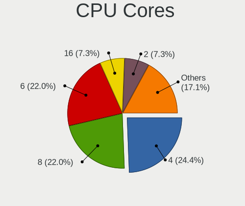
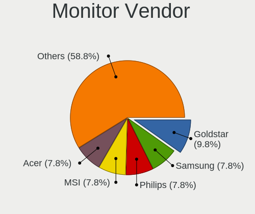
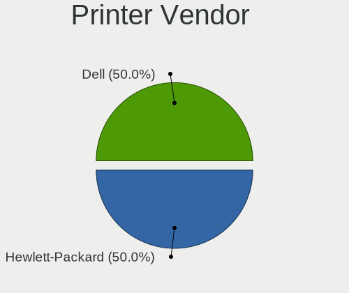

Manjaro - Hardware Trends (Desktops)
------------------------------------

A project to identify most popular hardware characteristics and track their change
over time based on data collected by Linux users at https://Linux-Hardware.org.

Anyone can contribute to this report by the [hw-probe](https://github.com/linuxhw/hw-probe) tool:

    sudo -E hw-probe -all -upload

This report is for one last month. Overall report since the beginning of time: [TestDays](https://github.com/linuxhw/TestDays)

Period: Mar, 2023.

Contents
--------

* [ System ](#system)
  - [ OS                       ](#os)
  - [ OS Family                ](#os-family)
  - [ Kernel                   ](#kernel)
  - [ Kernel Family            ](#kernel-family)
  - [ Kernel Major Ver.        ](#kernel-major-ver)
  - [ Arch                     ](#arch)
  - [ DE                       ](#de)
  - [ Display Server           ](#display-server)
  - [ Display Manager          ](#display-manager)
  - [ OS Lang                  ](#os-lang)
  - [ Boot Mode                ](#boot-mode)
  - [ Filesystem               ](#filesystem)
  - [ Part. scheme             ](#part-scheme)
  - [ Dual Boot with Linux/BSD ](#dual-boot-with-linuxbsd)
  - [ Dual Boot (Win)          ](#dual-boot-win)

* [ Board ](#board)
  - [ Vendor                   ](#vendor)
  - [ Model                    ](#model)
  - [ Model Family             ](#model-family)
  - [ MFG Year                 ](#mfg-year)
  - [ Form Factor              ](#form-factor)
  - [ Secure Boot              ](#secure-boot)
  - [ Coreboot                 ](#coreboot)
  - [ RAM Size                 ](#ram-size)
  - [ RAM Used                 ](#ram-used)
  - [ Total Drives             ](#total-drives)
  - [ Has CD-ROM               ](#has-cd-rom)
  - [ Has Ethernet             ](#has-ethernet)
  - [ Has WiFi                 ](#has-wifi)
  - [ Has Bluetooth            ](#has-bluetooth)

* [ Location ](#location)
  - [ Country                  ](#country)
  - [ City                     ](#city)

* [ Drives ](#drives)
  - [ Drive Vendor             ](#drive-vendor)
  - [ Drive Model              ](#drive-model)
  - [ HDD Vendor               ](#hdd-vendor)
  - [ SSD Vendor               ](#ssd-vendor)
  - [ Drive Kind               ](#drive-kind)
  - [ Drive Connector          ](#drive-connector)
  - [ Drive Size               ](#drive-size)
  - [ Space Total              ](#space-total)
  - [ Space Used               ](#space-used)
  - [ Malfunc. Drives          ](#malfunc-drives)
  - [ Malfunc. Drive Vendor    ](#malfunc-drive-vendor)
  - [ Malfunc. HDD Vendor      ](#malfunc-hdd-vendor)
  - [ Malfunc. Drive Kind      ](#malfunc-drive-kind)
  - [ Failed Drives            ](#failed-drives)
  - [ Failed Drive Vendor      ](#failed-drive-vendor)
  - [ Drive Status             ](#drive-status)

* [ Storage controller ](#storage-controller)
  - [ Storage Vendor           ](#storage-vendor)
  - [ Storage Model            ](#storage-model)
  - [ Storage Kind             ](#storage-kind)

* [ Processor ](#processor)
  - [ CPU Vendor               ](#cpu-vendor)
  - [ CPU Model                ](#cpu-model)
  - [ CPU Model Family         ](#cpu-model-family)
  - [ CPU Cores                ](#cpu-cores)
  - [ CPU Sockets              ](#cpu-sockets)
  - [ CPU Threads              ](#cpu-threads)
  - [ CPU Op-Modes             ](#cpu-op-modes)
  - [ CPU Microcode            ](#cpu-microcode)
  - [ CPU Microarch            ](#cpu-microarch)

* [ Graphics ](#graphics)
  - [ GPU Vendor               ](#gpu-vendor)
  - [ GPU Model                ](#gpu-model)
  - [ GPU Combo                ](#gpu-combo)
  - [ GPU Driver               ](#gpu-driver)
  - [ GPU Memory               ](#gpu-memory)

* [ Monitor ](#monitor)
  - [ Monitor Vendor           ](#monitor-vendor)
  - [ Monitor Model            ](#monitor-model)
  - [ Monitor Resolution       ](#monitor-resolution)
  - [ Monitor Diagonal         ](#monitor-diagonal)
  - [ Monitor Width            ](#monitor-width)
  - [ Aspect Ratio             ](#aspect-ratio)
  - [ Monitor Area             ](#monitor-area)
  - [ Pixel Density            ](#pixel-density)
  - [ Multiple Monitors        ](#multiple-monitors)

* [ Network ](#network)
  - [ Net Controller Vendor    ](#net-controller-vendor)
  - [ Net Controller Model     ](#net-controller-model)
  - [ Wireless Vendor          ](#wireless-vendor)
  - [ Wireless Model           ](#wireless-model)
  - [ Ethernet Vendor          ](#ethernet-vendor)
  - [ Ethernet Model           ](#ethernet-model)
  - [ Net Controller Kind      ](#net-controller-kind)
  - [ Used Controller          ](#used-controller)
  - [ NICs                     ](#nics)
  - [ IPv6                     ](#ipv6)

* [ Bluetooth ](#bluetooth)
  - [ Bluetooth Vendor         ](#bluetooth-vendor)
  - [ Bluetooth Model          ](#bluetooth-model)

* [ Sound ](#sound)
  - [ Sound Vendor             ](#sound-vendor)
  - [ Sound Model              ](#sound-model)

* [ Memory ](#memory)
  - [ Memory Vendor            ](#memory-vendor)
  - [ Memory Model             ](#memory-model)
  - [ Memory Kind              ](#memory-kind)
  - [ Memory Form Factor       ](#memory-form-factor)
  - [ Memory Size              ](#memory-size)
  - [ Memory Speed             ](#memory-speed)

* [ Printers & scanners ](#printers--scanners)
  - [ Printer Vendor           ](#printer-vendor)
  - [ Printer Model            ](#printer-model)
  - [ Scanner Vendor           ](#scanner-vendor)
  - [ Scanner Model            ](#scanner-model)

* [ Camera ](#camera)
  - [ Camera Vendor            ](#camera-vendor)
  - [ Camera Model             ](#camera-model)

* [ Security ](#security)
  - [ Fingerprint Vendor       ](#fingerprint-vendor)
  - [ Fingerprint Model        ](#fingerprint-model)
  - [ Chipcard Vendor          ](#chipcard-vendor)
  - [ Chipcard Model           ](#chipcard-model)

* [ Unsupported ](#unsupported)
  - [ Unsupported Devices      ](#unsupported-devices)
  - [ Unsupported Device Types ](#unsupported-device-types)

System
------

OS
--

Installed operating systems

| Name           | Desktops | Percent |
|----------------|----------|---------|
| Manjaro        | 48       | 71.64%  |
| Manjaro 22.0.4 | 10       | 14.93%  |
| Manjaro 22.0.5 | 9        | 13.43%  |

OS Family
---------

OS without a version

| Name    | Desktops | Percent |
|---------|----------|---------|
| Manjaro | 67       | 100%    |

Kernel
------

Version of the Linux kernel

| Version               | Desktops | Percent |
|-----------------------|----------|---------|
| 6.1.12-1-MANJARO      | 27       | 40.3%   |
| 6.1.19-1-MANJARO      | 11       | 16.42%  |
| 5.15.94-1-MANJARO     | 5        | 7.46%   |
| 5.15.102-1-MANJARO    | 5        | 7.46%   |
| 6.2.7-2-MANJARO       | 3        | 4.48%   |
| 6.2.6-1-MANJARO       | 3        | 4.48%   |
| 6.0.5-4-rt14-MANJARO  | 2        | 2.99%   |
| 5.9.16-1-MANJARO      | 2        | 2.99%   |
| 6.2.2-1-MANJARO       | 1        | 1.49%   |
| 6.2.0-1-MANJARO       | 1        | 1.49%   |
| 6.1.6-arch1-2-vfio    | 1        | 1.49%   |
| 6.0.6-x64v1-xanmod1-1 | 1        | 1.49%   |
| 6.0.19-4-MANJARO      | 1        | 1.49%   |
| 5.16.20-2-MANJARO     | 1        | 1.49%   |
| 5.15.93-1-MANJARO     | 1        | 1.49%   |
| 5.15.55-1-MANJARO     | 1        | 1.49%   |
| 5.10.154-1-MANJARO    | 1        | 1.49%   |

Kernel Family
-------------

Linux kernel without a distro release

| Version  | Desktops | Percent |
|----------|----------|---------|
| 6.1.12   | 27       | 40.3%   |
| 6.1.19   | 11       | 16.42%  |
| 5.15.94  | 5        | 7.46%   |
| 5.15.102 | 5        | 7.46%   |
| 6.2.7    | 3        | 4.48%   |
| 6.2.6    | 3        | 4.48%   |
| 6.0.5    | 2        | 2.99%   |
| 5.9.16   | 2        | 2.99%   |
| 6.2.2    | 1        | 1.49%   |
| 6.2.0    | 1        | 1.49%   |
| 6.1.6    | 1        | 1.49%   |
| 6.0.6    | 1        | 1.49%   |
| 6.0.19   | 1        | 1.49%   |
| 5.16.20  | 1        | 1.49%   |
| 5.15.93  | 1        | 1.49%   |
| 5.15.55  | 1        | 1.49%   |
| 5.10.154 | 1        | 1.49%   |

Kernel Major Ver.
-----------------

Linux kernel major version

| Version | Desktops | Percent |
|---------|----------|---------|
| 6.1     | 39       | 58.21%  |
| 5.15    | 12       | 17.91%  |
| 6.2     | 8        | 11.94%  |
| 6.0     | 4        | 5.97%   |
| 5.9     | 2        | 2.99%   |
| 5.16    | 1        | 1.49%   |
| 5.10    | 1        | 1.49%   |

Arch
----

OS architecture (x86_64, i586, etc.)

| Name   | Desktops | Percent |
|--------|----------|---------|
| x86_64 | 67       | 100%    |

DE
--

Desktop Environment

| Name              | Desktops | Percent |
|-------------------|----------|---------|
| KDE5              | 45       | 67.16%  |
| XFCE              | 11       | 16.42%  |
| GNOME             | 8        | 11.94%  |
| Yaru:ubuntu:GNOME | 1        | 1.49%   |
| X-Cinnamon        | 1        | 1.49%   |
| Unknown           | 1        | 1.49%   |

Display Server
--------------

X11 or Wayland

| Name    | Desktops | Percent |
|---------|----------|---------|
| X11     | 60       | 89.55%  |
| Wayland | 5        | 7.46%   |
| Tty     | 1        | 1.49%   |
| Unknown | 1        | 1.49%   |

Display Manager
---------------

SDDM, LightDM, etc.

| Name    | Desktops | Percent |
|---------|----------|---------|
| Unknown | 48       | 71.64%  |
| SDDM    | 12       | 17.91%  |
| LightDM | 4        | 5.97%   |
| GDM     | 3        | 4.48%   |

OS Lang
-------

Language

| Lang    | Desktops | Percent |
|---------|----------|---------|
| en_US   | 26       | 38.81%  |
| de_DE   | 10       | 14.93%  |
| en_GB   | 6        | 8.96%   |
| pt_BR   | 4        | 5.97%   |
| ru_RU   | 3        | 4.48%   |
| de_AT   | 2        | 2.99%   |
| zh_CN   | 1        | 1.49%   |
| uk_UA   | 1        | 1.49%   |
| pl_PL   | 1        | 1.49%   |
| nl_NL   | 1        | 1.49%   |
| it_IT   | 1        | 1.49%   |
| hu_HU   | 1        | 1.49%   |
| fr_CA   | 1        | 1.49%   |
| es_ES   | 1        | 1.49%   |
| en_ZA   | 1        | 1.49%   |
| en_SE   | 1        | 1.49%   |
| en_PH   | 1        | 1.49%   |
| en_AU   | 1        | 1.49%   |
| de_CH   | 1        | 1.49%   |
| da_DK   | 1        | 1.49%   |
| cs_CZ   | 1        | 1.49%   |
| Unknown | 1        | 1.49%   |

Boot Mode
---------

EFI or BIOS

| Mode | Desktops | Percent |
|------|----------|---------|
| BIOS | 49       | 73.13%  |
| EFI  | 18       | 26.87%  |

Filesystem
----------

Type of filesystem

| Type    | Desktops | Percent |
|---------|----------|---------|
| Ext4    | 53       | 79.1%   |
| Btrfs   | 13       | 19.4%   |
| Overlay | 1        | 1.49%   |

Part. scheme
------------

Scheme of partitioning

| Type    | Desktops | Percent |
|---------|----------|---------|
| Unknown | 47       | 70.15%  |
| GPT     | 19       | 28.36%  |
| MBR     | 1        | 1.49%   |

Dual Boot with Linux/BSD
------------------------

Hosting more than one Linux/BSD

| Dual boot | Desktops | Percent |
|-----------|----------|---------|
| No        | 57       | 85.07%  |
| Yes       | 10       | 14.93%  |

Dual Boot (Win)
---------------

Hosting Linux and Windows

| Dual boot | Desktops | Percent |
|-----------|----------|---------|
| No        | 55       | 82.09%  |
| Yes       | 12       | 17.91%  |

Board
-----

Vendor
------

Motherboard manufacturer

| Name                | Desktops | Percent |
|---------------------|----------|---------|
| ASUSTek Computer    | 22       | 32.84%  |
| MSI                 | 11       | 16.42%  |
| ASRock              | 8        | 11.94%  |
| Gigabyte Technology | 7        | 10.45%  |
| Hewlett-Packard     | 6        | 8.96%   |
| Dell                | 5        | 7.46%   |
| Intel               | 2        | 2.99%   |
| Biostar             | 2        | 2.99%   |
| OEM                 | 1        | 1.49%   |
| Lenovo              | 1        | 1.49%   |
| Huanan              | 1        | 1.49%   |
| EVGA                | 1        | 1.49%   |

Model
-----

Motherboard model

| Name                               | Desktops | Percent |
|------------------------------------|----------|---------|
| MSI MS-7C37                        | 2        | 2.99%   |
| HP Z440 Workstation                | 2        | 2.99%   |
| Dell OptiPlex 7010                 | 2        | 2.99%   |
| ASUS All Series                    | 2        | 2.99%   |
| OEM H110                           | 1        | 1.49%   |
| MSI MS-7D43                        | 1        | 1.49%   |
| MSI MS-7D32                        | 1        | 1.49%   |
| MSI MS-7C95                        | 1        | 1.49%   |
| MSI MS-7C02                        | 1        | 1.49%   |
| MSI MS-7B86                        | 1        | 1.49%   |
| MSI MS-7885                        | 1        | 1.49%   |
| MSI MS-7817                        | 1        | 1.49%   |
| MSI MS-7798                        | 1        | 1.49%   |
| MSI MS-7597                        | 1        | 1.49%   |
| Lenovo ThinkCentre M77 1996AB8     | 1        | 1.49%   |
| Intel X99 V1.0                     | 1        | 1.49%   |
| Intel H61 V1.1                     | 1        | 1.49%   |
| Huanan X99-F8                      | 1        | 1.49%   |
| HP ProDesk 600 G5 SFF              | 1        | 1.49%   |
| HP EliteDesk 800 G2 DM 65W         | 1        | 1.49%   |
| HP Compaq 8200 Elite SFF PC        | 1        | 1.49%   |
| HP 700-567nz                       | 1        | 1.49%   |
| Gigabyte Z370 HD3                  | 1        | 1.49%   |
| Gigabyte X470 AORUS ULTRA GAMING   | 1        | 1.49%   |
| Gigabyte P55M-UD2                  | 1        | 1.49%   |
| Gigabyte GA-970A-DS3               | 1        | 1.49%   |
| Gigabyte B550M DS3H                | 1        | 1.49%   |
| Gigabyte B550M AORUS PRO-P         | 1        | 1.49%   |
| Gigabyte B550M AORUS ELITE         | 1        | 1.49%   |
| EVGA X570 FTW WIFI                 | 1        | 1.49%   |
| Dell Precision T1650               | 1        | 1.49%   |
| Dell OptiPlex 3050                 | 1        | 1.49%   |
| Dell OptiPlex 3040                 | 1        | 1.49%   |
| Biostar B450MX-S                   | 1        | 1.49%   |
| Biostar A960D+V3                   | 1        | 1.49%   |
| ASUS Z170M-PLUS                    | 1        | 1.49%   |
| ASUS Z170 PRO GAMING               | 1        | 1.49%   |
| ASUS TUF Gaming B560M-PLUS         | 1        | 1.49%   |
| ASUS ROG STRIX Z370-F GAMING       | 1        | 1.49%   |
| ASUS ROG STRIX X670E-F GAMING WIFI | 1        | 1.49%   |

Model Family
------------

Motherboard model prefix

| Name                 | Desktops | Percent |
|----------------------|----------|---------|
| ASUS PRIME           | 7        | 10.45%  |
| ASUS ROG             | 6        | 8.96%   |
| Dell OptiPlex        | 4        | 5.97%   |
| Gigabyte B550M       | 3        | 4.48%   |
| MSI MS-7C37          | 2        | 2.99%   |
| HP Z440              | 2        | 2.99%   |
| ASUS All             | 2        | 2.99%   |
| OEM H110             | 1        | 1.49%   |
| MSI MS-7D43          | 1        | 1.49%   |
| MSI MS-7D32          | 1        | 1.49%   |
| MSI MS-7C95          | 1        | 1.49%   |
| MSI MS-7C02          | 1        | 1.49%   |
| MSI MS-7B86          | 1        | 1.49%   |
| MSI MS-7885          | 1        | 1.49%   |
| MSI MS-7817          | 1        | 1.49%   |
| MSI MS-7798          | 1        | 1.49%   |
| MSI MS-7597          | 1        | 1.49%   |
| Lenovo ThinkCentre   | 1        | 1.49%   |
| Intel X99            | 1        | 1.49%   |
| Intel H61            | 1        | 1.49%   |
| Huanan X99-F8        | 1        | 1.49%   |
| HP ProDesk           | 1        | 1.49%   |
| HP EliteDesk         | 1        | 1.49%   |
| HP Compaq            | 1        | 1.49%   |
| HP 700-567nz         | 1        | 1.49%   |
| Gigabyte Z370        | 1        | 1.49%   |
| Gigabyte X470        | 1        | 1.49%   |
| Gigabyte P55M-UD2    | 1        | 1.49%   |
| Gigabyte GA-970A-DS3 | 1        | 1.49%   |
| EVGA X570            | 1        | 1.49%   |
| Dell Precision       | 1        | 1.49%   |
| Biostar B450MX-S     | 1        | 1.49%   |
| Biostar A960D+V3     | 1        | 1.49%   |
| ASUS Z170M-PLUS      | 1        | 1.49%   |
| ASUS Z170            | 1        | 1.49%   |
| ASUS TUF             | 1        | 1.49%   |
| ASUS ProArt          | 1        | 1.49%   |
| ASUS PRO             | 1        | 1.49%   |
| ASUS P5Q             | 1        | 1.49%   |
| ASUS G470            | 1        | 1.49%   |

MFG Year
--------

Motherboard manufacture year

| Year | Desktops | Percent |
|------|----------|---------|
| 2020 | 9        | 13.43%  |
| 2019 | 9        | 13.43%  |
| 2018 | 9        | 13.43%  |
| 2015 | 8        | 11.94%  |
| 2022 | 6        | 8.96%   |
| 2017 | 5        | 7.46%   |
| 2021 | 4        | 5.97%   |
| 2013 | 4        | 5.97%   |
| 2012 | 4        | 5.97%   |
| 2009 | 3        | 4.48%   |
| 2016 | 2        | 2.99%   |
| 2014 | 2        | 2.99%   |
| 2011 | 2        | 2.99%   |

Form Factor
-----------

Physical design of the computer

| Name    | Desktops | Percent |
|---------|----------|---------|
| Desktop | 67       | 100%    |

Secure Boot
-----------

Enabled or disabled

| State    | Desktops | Percent |
|----------|----------|---------|
| Disabled | 67       | 100%    |

Coreboot
--------

Have coreboot on board

| Used | Desktops | Percent |
|------|----------|---------|
| No   | 67       | 100%    |

RAM Size
--------

Total RAM memory

| Size in GB  | Desktops | Percent |
|-------------|----------|---------|
| 32.01-64.0  | 20       | 29.85%  |
| 16.01-24.0  | 20       | 29.85%  |
| 4.01-8.0    | 10       | 14.93%  |
| 64.01-256.0 | 6        | 8.96%   |
| 24.01-32.0  | 5        | 7.46%   |
| 8.01-16.0   | 5        | 7.46%   |
| 3.01-4.0    | 1        | 1.49%   |

RAM Used
--------

Used RAM memory

| Used GB    | Desktops | Percent |
|------------|----------|---------|
| 4.01-8.0   | 21       | 31.34%  |
| 2.01-3.0   | 15       | 22.39%  |
| 3.01-4.0   | 13       | 19.4%   |
| 8.01-16.0  | 9        | 13.43%  |
| 1.01-2.0   | 7        | 10.45%  |
| 24.01-32.0 | 1        | 1.49%   |
| 16.01-24.0 | 1        | 1.49%   |

Total Drives
------------

Number of drives on board

| Drives | Desktops | Percent |
|--------|----------|---------|
| 2      | 20       | 29.85%  |
| 3      | 16       | 23.88%  |
| 4      | 14       | 20.9%   |
| 1      | 11       | 16.42%  |
| 5      | 4        | 5.97%   |
| 8      | 1        | 1.49%   |
| 6      | 1        | 1.49%   |

Has CD-ROM
----------

Has CD-ROM on board

| Presented | Desktops | Percent |
|-----------|----------|---------|
| No        | 47       | 70.15%  |
| Yes       | 20       | 29.85%  |

Has Ethernet
------------

Has Ethernet on board

| Presented | Desktops | Percent |
|-----------|----------|---------|
| Yes       | 67       | 100%    |

Has WiFi
--------

Has WiFi module

| Presented | Desktops | Percent |
|-----------|----------|---------|
| No        | 39       | 58.21%  |
| Yes       | 28       | 41.79%  |

Has Bluetooth
-------------

Has Bluetooth module

| Presented | Desktops | Percent |
|-----------|----------|---------|
| No        | 34       | 50.75%  |
| Yes       | 33       | 49.25%  |

Location
--------

Country
-------

Geographic location (country)

| Country      | Desktops | Percent |
|--------------|----------|---------|
| USA          | 15       | 22.39%  |
| Germany      | 12       | 17.91%  |
| Russia       | 4        | 5.97%   |
| Netherlands  | 4        | 5.97%   |
| Brazil       | 4        | 5.97%   |
| Austria      | 3        | 4.48%   |
| UK           | 2        | 2.99%   |
| Poland       | 2        | 2.99%   |
| Ukraine      | 1        | 1.49%   |
| Switzerland  | 1        | 1.49%   |
| Sri Lanka    | 1        | 1.49%   |
| Spain        | 1        | 1.49%   |
| South Africa | 1        | 1.49%   |
| Romania      | 1        | 1.49%   |
| Philippines  | 1        | 1.49%   |
| Panama       | 1        | 1.49%   |
| Italy        | 1        | 1.49%   |
| India        | 1        | 1.49%   |
| Hungary      | 1        | 1.49%   |
| France       | 1        | 1.49%   |
| Estonia      | 1        | 1.49%   |
| Denmark      | 1        | 1.49%   |
| Czechia      | 1        | 1.49%   |
| Croatia      | 1        | 1.49%   |
| Costa Rica   | 1        | 1.49%   |
| China        | 1        | 1.49%   |
| Canada       | 1        | 1.49%   |
| Bulgaria     | 1        | 1.49%   |
| Australia    | 1        | 1.49%   |

City
----

Geographic location (city)

| City                  | Desktops | Percent |
|-----------------------|----------|---------|
| Frankfurt am Main     | 2        | 2.99%   |
| Zaandam               | 1        | 1.49%   |
| Yonkers               | 1        | 1.49%   |
| Yekaterinburg         | 1        | 1.49%   |
| Warsaw                | 1        | 1.49%   |
| Vordingborg           | 1        | 1.49%   |
| Varna                 | 1        | 1.49%   |
| Tupi Paulista         | 1        | 1.49%   |
| Trois-Rivières       | 1        | 1.49%   |
| Thun                  | 1        | 1.49%   |
| Tallinn               | 1        | 1.49%   |
| Split                 | 1        | 1.49%   |
| Sohlde                | 1        | 1.49%   |
| Siena                 | 1        | 1.49%   |
| San José             | 1        | 1.49%   |
| Saarlouis             | 1        | 1.49%   |
| Reda                  | 1        | 1.49%   |
| Recife                | 1        | 1.49%   |
| Quezon City           | 1        | 1.49%   |
| Pretoria              | 1        | 1.49%   |
| Portland              | 1        | 1.49%   |
| Panama City           | 1        | 1.49%   |
| Novokuznetsk          | 1        | 1.49%   |
| Nilvange              | 1        | 1.49%   |
| Munich                | 1        | 1.49%   |
| Moscow                | 1        | 1.49%   |
| Minneapolis           | 1        | 1.49%   |
| Marl                  | 1        | 1.49%   |
| Lviv                  | 1        | 1.49%   |
| Ludwigshafen am Rhein | 1        | 1.49%   |
| Livonia               | 1        | 1.49%   |
| Linz                  | 1        | 1.49%   |
| Lindenhurst           | 1        | 1.49%   |
| Lehi                  | 1        | 1.49%   |
| Leeuwarden            | 1        | 1.49%   |
| Kings Lynn            | 1        | 1.49%   |
| Kharino               | 1        | 1.49%   |
| Katwijk               | 1        | 1.49%   |
| Juazeiro do Norte     | 1        | 1.49%   |
| Jinan                 | 1        | 1.49%   |

Drives
------

Drive Vendor
------------

Hard drive vendors

| Vendor                      | Desktops | Drives | Percent |
|-----------------------------|----------|--------|---------|
| Samsung Electronics         | 27       | 45     | 18.75%  |
| WDC                         | 24       | 31     | 16.67%  |
| Seagate                     | 21       | 27     | 14.58%  |
| Sandisk                     | 11       | 13     | 7.64%   |
| Kingston                    | 8        | 8      | 5.56%   |
| Toshiba                     | 4        | 5      | 2.78%   |
| Silicon Motion              | 4        | 6      | 2.78%   |
| Phison Electronics          | 4        | 4      | 2.78%   |
| Hitachi                     | 4        | 5      | 2.78%   |
| Crucial                     | 4        | 6      | 2.78%   |
| Intel                       | 3        | 4      | 2.08%   |
| A-DATA Technology           | 3        | 4      | 2.08%   |
| PNY                         | 2        | 2      | 1.39%   |
| Micron/Crucial Technology   | 2        | 2      | 1.39%   |
| Kingston Technology Company | 2        | 2      | 1.39%   |
| KingSpec                    | 2        | 2      | 1.39%   |
| HGST                        | 2        | 2      | 1.39%   |
| China                       | 2        | 2      | 1.39%   |
| XUM                         | 1        | 1      | 0.69%   |
| WD MediaMax                 | 1        | 1      | 0.69%   |
| Unknown                     | 1        | 2      | 0.69%   |
| SPCC                        | 1        | 1      | 0.69%   |
| SK hynix                    | 1        | 1      | 0.69%   |
| SETHRISE                    | 1        | 1      | 0.69%   |
| Realtek Semiconductor       | 1        | 1      | 0.69%   |
| Patriot                     | 1        | 1      | 0.69%   |
| OCZ                         | 1        | 2      | 0.69%   |
| Intenso                     | 1        | 1      | 0.69%   |
| HS-SSD-E100                 | 1        | 1      | 0.69%   |
| Gigabyte Technology         | 1        | 2      | 0.69%   |
| ASMT                        | 1        | 1      | 0.69%   |
| Apple                       | 1        | 1      | 0.69%   |
| Apacer                      | 1        | 1      | 0.69%   |

Drive Model
-----------

Hard drive models

| Model                                                  | Desktops | Percent |
|--------------------------------------------------------|----------|---------|
| Samsung NVMe SSD Controller SM981/PM981/PM983 250GB    | 8        | 4.6%    |
| Samsung NVMe SSD Controller PM9A1/PM9A3/980PRO 1TB     | 6        | 3.45%   |
| Silicon Motion SM2263EN/SM2263XT SSD Controller 1024GB | 3        | 1.72%   |
| Seagate ST1000DM010-2EP102 1TB                         | 3        | 1.72%   |
| WDC WD30EFRX-68EUZN0 3TB                               | 2        | 1.15%   |
| WDC WD10EZEX-08WN4A0 1TB                               | 2        | 1.15%   |
| Toshiba HDWD120 2TB                                    | 2        | 1.15%   |
| Seagate ST500DM002-1BD142 500GB                        | 2        | 1.15%   |
| Seagate ST4000DM000-1F2168 4TB                         | 2        | 1.15%   |
| Seagate ST3250318AS 250GB                              | 2        | 1.15%   |
| Sandisk WD Blue SN550 NVMe SSD 256GB                   | 2        | 1.15%   |
| Sandisk WD Black SN750 / PC SN730 NVMe SSD 1TB         | 2        | 1.15%   |
| SanDisk SSD PLUS 480GB                                 | 2        | 1.15%   |
| Samsung SSD 860 EVO 1TB                                | 2        | 1.15%   |
| Samsung NVMe SSD Controller SM961/PM961/SM963 256GB    | 2        | 1.15%   |
| Samsung MZ7LN256HMJP-000H1 256GB SSD                   | 2        | 1.15%   |
| Micron/Crucial P2 NVMe PCIe SSD 1TB                    | 2        | 1.15%   |
| Kingston SA400S37240G 240GB SSD                        | 2        | 1.15%   |
| Crucial CT1000MX500SSD1 1TB                            | 2        | 1.15%   |
| XUM HX256GSSDSATA3 256GB                               | 1        | 0.57%   |
| WDC WDS500G2B0A-00SM50 500GB SSD                       | 1        | 0.57%   |
| WDC WDS240G2G0B-00EPW0 240GB SSD                       | 1        | 0.57%   |
| WDC WDS240G2G0A-00JH30 240GB SSD                       | 1        | 0.57%   |
| WDC WD800JD-00JNC0 80GB                                | 1        | 0.57%   |
| WDC WD7500AADS-00M2B0 752GB                            | 1        | 0.57%   |
| WDC WD5000AAKS-22YGA0 500GB                            | 1        | 0.57%   |
| WDC WD5000AAKS-07YGA0 500GB                            | 1        | 0.57%   |
| WDC WD40EFRX-68N32N0 4TB                               | 1        | 0.57%   |
| WDC WD4003FZEX-00Z4SA0 4TB                             | 1        | 0.57%   |
| WDC WD4002FYYZ-01B7CB0 4TB                             | 1        | 0.57%   |
| WDC WD3200BEVT-22ZCT0 320GB                            | 1        | 0.57%   |
| WDC WD30EZRZ-00Z5HB0 3TB                               | 1        | 0.57%   |
| WDC WD20EFRX-68EUZN0 2TB                               | 1        | 0.57%   |
| WDC WD1600AAJS-00YZCA0 160GB                           | 1        | 0.57%   |
| WDC WD1200JD-00HBB0 120GB                              | 1        | 0.57%   |
| WDC WD10SPZX-60Z10T0 1TB                               | 1        | 0.57%   |
| WDC WD10EZRX-22A3KB0 1TB                               | 1        | 0.57%   |
| WDC WD10EZEX-00RKKA0 1TB                               | 1        | 0.57%   |
| WDC WD10EZEX-00BN5A0 1TB                               | 1        | 0.57%   |
| WDC WD10EFRX-68PJCN0 1TB                               | 1        | 0.57%   |

HDD Vendor
----------

Hard disk drive vendors

| Vendor              | Desktops | Drives | Percent |
|---------------------|----------|--------|---------|
| WDC                 | 23       | 28     | 41.82%  |
| Seagate             | 20       | 24     | 36.36%  |
| Hitachi             | 4        | 5      | 7.27%   |
| Toshiba             | 3        | 4      | 5.45%   |
| Samsung Electronics | 3        | 4      | 5.45%   |
| HGST                | 2        | 2      | 3.64%   |

SSD Vendor
----------

Solid state drive vendors

| Vendor              | Desktops | Drives | Percent |
|---------------------|----------|--------|---------|
| Samsung Electronics | 16       | 23     | 30.77%  |
| Kingston            | 7        | 7      | 13.46%  |
| Crucial             | 4        | 6      | 7.69%   |
| WDC                 | 3        | 3      | 5.77%   |
| SanDisk             | 3        | 3      | 5.77%   |
| A-DATA Technology   | 3        | 4      | 5.77%   |
| PNY                 | 2        | 2      | 3.85%   |
| KingSpec            | 2        | 2      | 3.85%   |
| China               | 2        | 2      | 3.85%   |
| XUM                 | 1        | 1      | 1.92%   |
| SPCC                | 1        | 1      | 1.92%   |
| SK hynix            | 1        | 1      | 1.92%   |
| Patriot             | 1        | 1      | 1.92%   |
| OCZ                 | 1        | 2      | 1.92%   |
| Intel               | 1        | 1      | 1.92%   |
| Gigabyte Technology | 1        | 2      | 1.92%   |
| ASMT                | 1        | 1      | 1.92%   |
| Apple               | 1        | 1      | 1.92%   |
| Apacer              | 1        | 1      | 1.92%   |

Drive Kind
----------

HDD or SSD

| Kind    | Desktops | Drives | Percent |
|---------|----------|--------|---------|
| SSD     | 44       | 64     | 35.2%   |
| HDD     | 40       | 67     | 32%     |
| NVMe    | 35       | 50     | 28%     |
| Unknown | 6        | 7      | 4.8%    |

Drive Connector
---------------

SATA, SAS, NVMe, etc.

| Type | Desktops | Drives | Percent |
|------|----------|--------|---------|
| SATA | 56       | 132    | 58.33%  |
| NVMe | 35       | 50     | 36.46%  |
| SAS  | 5        | 6      | 5.21%   |

Drive Size
----------

Size of hard drive

| Size in TB | Desktops | Drives | Percent |
|------------|----------|--------|---------|
| 0.01-0.5   | 39       | 68     | 42.39%  |
| 0.51-1.0   | 31       | 39     | 33.7%   |
| 1.01-2.0   | 11       | 12     | 11.96%  |
| 3.01-4.0   | 6        | 6      | 6.52%   |
| 2.01-3.0   | 4        | 5      | 4.35%   |
| 4.01-10.0  | 1        | 1      | 1.09%   |

Space Total
-----------

Amount of disk space available on the file system

| Size in GB     | Desktops | Percent |
|----------------|----------|---------|
| 1001-2000      | 16       | 23.88%  |
| 251-500        | 11       | 16.42%  |
| 101-250        | 11       | 16.42%  |
| 501-1000       | 11       | 16.42%  |
| More than 3000 | 9        | 13.43%  |
| 2001-3000      | 6        | 8.96%   |
| 1-20           | 1        | 1.49%   |
| 51-100         | 1        | 1.49%   |
| Unknown        | 1        | 1.49%   |

Space Used
----------

Amount of used disk space

| Used GB        | Desktops | Percent |
|----------------|----------|---------|
| 501-1000       | 17       | 25.37%  |
| 251-500        | 14       | 20.9%   |
| 51-100         | 10       | 14.93%  |
| 101-250        | 9        | 13.43%  |
| 21-50          | 5        | 7.46%   |
| 1-20           | 5        | 7.46%   |
| 1001-2000      | 4        | 5.97%   |
| More than 3000 | 1        | 1.49%   |
| 2001-3000      | 1        | 1.49%   |
| Unknown        | 1        | 1.49%   |

Malfunc. Drives
---------------

Drive models with a malfunction

| Model                                                           | Desktops | Drives | Percent |
|-----------------------------------------------------------------|----------|--------|---------|
| Seagate ST500LT012-1DG142 500GB                                 | 1        | 1      | 16.67%  |
| Seagate ST4000DM000-1F2168 4TB                                  | 1        | 1      | 16.67%  |
| Seagate ST250DM000-1BD141 250GB                                 | 1        | 1      | 16.67%  |
| SanDisk SSD PLUS 480GB                                          | 1        | 1      | 16.67%  |
| Samsung Electronics NVMe SSD Controller SM961/PM961/SM963 256GB | 1        | 1      | 16.67%  |
| KingSpec P3-128 128GB SSD                                       | 1        | 1      | 16.67%  |

Malfunc. Drive Vendor
---------------------

Vendors of faulty drives

| Vendor              | Desktops | Drives | Percent |
|---------------------|----------|--------|---------|
| Seagate             | 3        | 3      | 50%     |
| SanDisk             | 1        | 1      | 16.67%  |
| Samsung Electronics | 1        | 1      | 16.67%  |
| KingSpec            | 1        | 1      | 16.67%  |

Malfunc. HDD Vendor
-------------------

Vendors of faulty HDD drives

| Vendor  | Desktops | Drives | Percent |
|---------|----------|--------|---------|
| Seagate | 3        | 3      | 100%    |

Malfunc. Drive Kind
-------------------

Kinds of faulty drives

| Kind | Desktops | Drives | Percent |
|------|----------|--------|---------|
| HDD  | 3        | 3      | 50%     |
| SSD  | 2        | 2      | 33.33%  |
| NVMe | 1        | 1      | 16.67%  |

Failed Drives
-------------

Failed drive models

Zero info for selected period =(

Failed Drive Vendor
-------------------

Failed drive vendors

Zero info for selected period =(

Drive Status
------------

Number of failed and malfunc. drives

| Status   | Desktops | Drives | Percent |
|----------|----------|--------|---------|
| Detected | 50       | 134    | 70.42%  |
| Works    | 16       | 48     | 22.54%  |
| Malfunc  | 5        | 6      | 7.04%   |

Storage controller
------------------

Storage Vendor
--------------

Storage controller vendors

| Vendor                       | Desktops | Percent |
|------------------------------|----------|---------|
| Intel                        | 38       | 33.33%  |
| AMD                          | 28       | 24.56%  |
| Samsung Electronics          | 14       | 12.28%  |
| SanDisk                      | 8        | 7.02%   |
| ASMedia Technology           | 5        | 4.39%   |
| Silicon Motion               | 4        | 3.51%   |
| Phison Electronics           | 4        | 3.51%   |
| Kingston Technology Company  | 3        | 2.63%   |
| Micron/Crucial Technology    | 2        | 1.75%   |
| Marvell Technology Group     | 2        | 1.75%   |
| JMicron Technology           | 2        | 1.75%   |
| Toshiba America Info Systems | 1        | 0.88%   |
| Seagate Technology           | 1        | 0.88%   |
| Realtek Semiconductor        | 1        | 0.88%   |
| Nvidia                       | 1        | 0.88%   |

Storage Model
-------------

Storage controller models

| Model                                                                          | Desktops | Percent |
|--------------------------------------------------------------------------------|----------|---------|
| AMD FCH SATA Controller [AHCI mode]                                            | 14       | 10.37%  |
| Samsung NVMe SSD Controller SM981/PM981/PM983                                  | 9        | 6.67%   |
| AMD 500 Series Chipset SATA Controller                                         | 7        | 5.19%   |
| AMD 400 Series Chipset SATA Controller                                         | 7        | 5.19%   |
| Samsung NVMe SSD Controller PM9A1/PM9A3/980PRO                                 | 6        | 4.44%   |
| Intel Q170/Q150/B150/H170/H110/Z170/CM236 Chipset SATA Controller [AHCI Mode]  | 5        | 3.7%    |
| Intel Cannon Lake PCH SATA AHCI Controller                                     | 5        | 3.7%    |
| Intel 200 Series PCH SATA controller [AHCI mode]                               | 5        | 3.7%    |
| ASMedia ASM1062 Serial ATA Controller                                          | 5        | 3.7%    |
| Silicon Motion SM2263EN/SM2263XT SSD Controller                                | 3        | 2.22%   |
| Intel Alder Lake-S PCH SATA Controller [AHCI Mode]                             | 3        | 2.22%   |
| Intel 8 Series/C220 Series Chipset Family 6-port SATA Controller 1 [AHCI mode] | 3        | 2.22%   |
| Intel 7 Series/C210 Series Chipset Family 6-port SATA Controller [AHCI mode]   | 3        | 2.22%   |
| Intel 6 Series/C200 Series Chipset Family 6 port Desktop SATA AHCI Controller  | 3        | 2.22%   |
| SanDisk WD Blue SN550 NVMe SSD                                                 | 2        | 1.48%   |
| SanDisk WD Black SN750 / PC SN730 NVMe SSD                                     | 2        | 1.48%   |
| SanDisk Non-Volatile memory controller                                         | 2        | 1.48%   |
| Samsung NVMe SSD Controller SM961/PM961/SM963                                  | 2        | 1.48%   |
| Micron/Crucial P2 NVMe PCIe SSD                                                | 2        | 1.48%   |
| Marvell Group 88SE9215 PCIe 2.0 x1 4-port SATA 6 Gb/s Controller               | 2        | 1.48%   |
| Intel C610/X99 series chipset sSATA Controller [AHCI mode]                     | 2        | 1.48%   |
| Intel C610/X99 series chipset 6-Port SATA Controller [AHCI mode]               | 2        | 1.48%   |
| Intel C600/X79 series chipset SATA RAID Controller                             | 2        | 1.48%   |
| Intel 9 Series Chipset Family SATA Controller [AHCI Mode]                      | 2        | 1.48%   |
| AMD SB7x0/SB8x0/SB9x0 SATA Controller [AHCI mode]                              | 2        | 1.48%   |
| AMD SB7x0/SB8x0/SB9x0 IDE Controller                                           | 2        | 1.48%   |
| Toshiba America Info Systems BG3 NVMe SSD Controller                           | 1        | 0.74%   |
| Silicon Motion SM2262/SM2262EN SSD Controller                                  | 1        | 0.74%   |
| Seagate FireCuda 510 SSD                                                       | 1        | 0.74%   |
| Sandisk Western Digital WD Black SN850X NVMe SSD                               | 1        | 0.74%   |
| SanDisk WD PC SN810 / Black SN850 NVMe SSD                                     | 1        | 0.74%   |
| SanDisk WD Blue SN570 NVMe SSD 1TB                                             | 1        | 0.74%   |
| SanDisk NVMe Controller                                                        | 1        | 0.74%   |
| Samsung Electronics Non-Volatile memory controller                             | 1        | 0.74%   |
| Realtek RTS5763DL NVMe SSD Controller                                          | 1        | 0.74%   |
| Phison Electronics Non-Volatile memory controller                              | 1        | 0.74%   |
| Phison E18 PCIe4 NVMe Controller                                               | 1        | 0.74%   |
| Phison E16 PCIe4 NVMe Controller                                               | 1        | 0.74%   |
| Phison E12 NVMe Controller                                                     | 1        | 0.74%   |
| Nvidia MCP61 SATA Controller                                                   | 1        | 0.74%   |

Storage Kind
------------

Kind of storage controller (IDE, SATA, NVMe, SAS, ...)

| Kind | Desktops | Percent |
|------|----------|---------|
| SATA | 63       | 58.33%  |
| NVMe | 35       | 32.41%  |
| IDE  | 6        | 5.56%   |
| RAID | 4        | 3.7%    |

Processor
---------

CPU Vendor
----------

Processor vendors

| Vendor | Desktops | Percent |
|--------|----------|---------|
| Intel  | 38       | 56.72%  |
| AMD    | 29       | 43.28%  |

CPU Model
---------

Processor models

| Model                                  | Desktops | Percent |
|----------------------------------------|----------|---------|
| AMD Ryzen 5 3600 6-Core Processor      | 7        | 10.45%  |
| Intel Core i7-8700 CPU @ 3.20GHz       | 3        | 4.48%   |
| Intel Core i7-6700 CPU @ 3.40GHz       | 2        | 2.99%   |
| Intel Core i7-4790 CPU @ 3.60GHz       | 2        | 2.99%   |
| Intel Core i7-3770 CPU @ 3.40GHz       | 2        | 2.99%   |
| Intel Core i5-2500 CPU @ 3.30GHz       | 2        | 2.99%   |
| AMD Ryzen 9 5900X 12-Core Processor    | 2        | 2.99%   |
| AMD Ryzen 5 5600X 6-Core Processor     | 2        | 2.99%   |
| Intel Xeon CPU E5-2678 v3 @ 2.50GHz    | 1        | 1.49%   |
| Intel Xeon CPU E5-2670 v3 @ 2.30GHz    | 1        | 1.49%   |
| Intel Xeon CPU E5-2660 v3 @ 2.60GHz    | 1        | 1.49%   |
| Intel Xeon CPU E5-1620 v3 @ 3.50GHz    | 1        | 1.49%   |
| Intel Xeon CPU E3-1225 V2 @ 3.20GHz    | 1        | 1.49%   |
| Intel Core i9-9900K CPU @ 3.60GHz      | 1        | 1.49%   |
| Intel Core i9-9900 CPU @ 3.10GHz       | 1        | 1.49%   |
| Intel Core i7-9700K CPU @ 3.60GHz      | 1        | 1.49%   |
| Intel Core i7-8086K CPU @ 4.00GHz      | 1        | 1.49%   |
| Intel Core i7-6800K CPU @ 3.40GHz      | 1        | 1.49%   |
| Intel Core i7-5820K CPU @ 3.30GHz      | 1        | 1.49%   |
| Intel Core i5-9600K CPU @ 3.70GHz      | 1        | 1.49%   |
| Intel Core i5-7600 CPU @ 3.50GHz       | 1        | 1.49%   |
| Intel Core i5-7500 CPU @ 3.40GHz       | 1        | 1.49%   |
| Intel Core i5-6500 CPU @ 3.20GHz       | 1        | 1.49%   |
| Intel Core i5-6400 CPU @ 2.70GHz       | 1        | 1.49%   |
| Intel Core i5-4460 CPU @ 3.20GHz       | 1        | 1.49%   |
| Intel Core i5-3470S CPU @ 2.90GHz      | 1        | 1.49%   |
| Intel Core i5 CPU 750 @ 2.67GHz        | 1        | 1.49%   |
| Intel Core i3-6100T CPU @ 3.20GHz      | 1        | 1.49%   |
| Intel Core i3-4170 CPU @ 3.70GHz       | 1        | 1.49%   |
| Intel Core i3-2100 CPU @ 3.10GHz       | 1        | 1.49%   |
| Intel Core 2 Quad CPU Q6600 @ 2.40GHz  | 1        | 1.49%   |
| Intel 12th Gen Core i9-12900KF         | 1        | 1.49%   |
| Intel 12th Gen Core i7-12700K          | 1        | 1.49%   |
| Intel 12th Gen Core i5-12500           | 1        | 1.49%   |
| Intel 11th Gen Core i5-11400 @ 2.60GHz | 1        | 1.49%   |
| AMD Ryzen 9 7950X3D 16-Core Processor  | 1        | 1.49%   |
| AMD Ryzen 9 7900X 12-Core Processor    | 1        | 1.49%   |
| AMD Ryzen 9 3900X 12-Core Processor    | 1        | 1.49%   |
| AMD Ryzen 7 5800X 8-Core Processor     | 1        | 1.49%   |
| AMD Ryzen 7 5700G with Radeon Graphics | 1        | 1.49%   |

CPU Model Family
----------------

Processor model prefix

| Model             | Desktops | Percent |
|-------------------|----------|---------|
| AMD Ryzen 5       | 14       | 20.9%   |
| Intel Core i7     | 13       | 19.4%   |
| Intel Core i5     | 10       | 14.93%  |
| Intel Xeon        | 5        | 7.46%   |
| AMD Ryzen 9       | 5        | 7.46%   |
| Other             | 4        | 5.97%   |
| Intel Core i3     | 3        | 4.48%   |
| AMD Ryzen 7       | 3        | 4.48%   |
| AMD FX            | 3        | 4.48%   |
| Intel Core i9     | 2        | 2.99%   |
| AMD Ryzen 3       | 2        | 2.99%   |
| Intel Core 2 Quad | 1        | 1.49%   |
| AMD Athlon II X2  | 1        | 1.49%   |
| AMD A10           | 1        | 1.49%   |

CPU Cores
---------

Number of processor cores

| Number | Desktops | Percent |
|--------|----------|---------|
| 6      | 22       | 32.84%  |
| 4      | 22       | 32.84%  |
| 12     | 7        | 10.45%  |
| 8      | 6        | 8.96%   |
| 2      | 6        | 8.96%   |
| 16     | 2        | 2.99%   |
| 10     | 1        | 1.49%   |
| 3      | 1        | 1.49%   |

CPU Sockets
-----------

Number of sockets

| Number | Desktops | Percent |
|--------|----------|---------|
| 1      | 67       | 100%    |

CPU Threads
-----------

Threads per core (Hyper-Threading)

| Number | Desktops | Percent |
|--------|----------|---------|
| 2      | 52       | 77.61%  |
| 1      | 15       | 22.39%  |

CPU Op-Modes
------------

CPU Operation Modes (32-bit, 64-bit)

| Op mode        | Desktops | Percent |
|----------------|----------|---------|
| 32-bit, 64-bit | 67       | 100%    |

CPU Microcode
-------------

Microcode number

| Number     | Desktops | Percent |
|------------|----------|---------|
| Unknown    | 51       | 76.12%  |
| 0x08701021 | 3        | 4.48%   |
| 0x0a601203 | 2        | 2.99%   |
| 0x906ed    | 1        | 1.49%   |
| 0x906e9    | 1        | 1.49%   |
| 0x90672    | 1        | 1.49%   |
| 0x406f1    | 1        | 1.49%   |
| 0x306a9    | 1        | 1.49%   |
| 0x0a20120a | 1        | 1.49%   |
| 0x08701013 | 1        | 1.49%   |
| 0x08600106 | 1        | 1.49%   |
| 0x08101016 | 1        | 1.49%   |
| 0x08001138 | 1        | 1.49%   |
| 0x06000852 | 1        | 1.49%   |

CPU Microarch
-------------

Microarchitecture

| Name             | Desktops | Percent |
|------------------|----------|---------|
| Zen 2            | 11       | 16.42%  |
| KabyLake         | 10       | 14.93%  |
| Haswell          | 9        | 13.43%  |
| Zen 3            | 7        | 10.45%  |
| Skylake          | 5        | 7.46%   |
| IvyBridge        | 4        | 5.97%   |
| Unknown          | 4        | 5.97%   |
| SandyBridge      | 3        | 4.48%   |
| Zen+             | 2        | 2.99%   |
| Zen              | 2        | 2.99%   |
| Piledriver       | 2        | 2.99%   |
| Steamroller      | 1        | 1.49%   |
| Nehalem          | 1        | 1.49%   |
| K10              | 1        | 1.49%   |
| Icelake          | 1        | 1.49%   |
| Core             | 1        | 1.49%   |
| Bulldozer        | 1        | 1.49%   |
| Broadwell        | 1        | 1.49%   |
| Alderlake Hybrid | 1        | 1.49%   |

Graphics
--------

GPU Vendor
----------

Vendors of graphics cards

| Vendor | Desktops | Percent |
|--------|----------|---------|
| Nvidia | 33       | 45.83%  |
| AMD    | 26       | 36.11%  |
| Intel  | 13       | 18.06%  |

GPU Model
---------

Graphics card models

| Model                                                                     | Desktops | Percent |
|---------------------------------------------------------------------------|----------|---------|
| Nvidia GP106 [GeForce GTX 1060 6GB]                                       | 4        | 5.26%   |
| Intel HD Graphics 530                                                     | 4        | 5.26%   |
| AMD Ellesmere [Radeon RX 470/480/570/570X/580/580X/590]                   | 4        | 5.26%   |
| AMD Navi 10 [Radeon RX 5600 OEM/5600 XT / 5700/5700 XT]                   | 3        | 3.95%   |
| Nvidia TU117 [GeForce GTX 1650]                                           | 2        | 2.63%   |
| Nvidia TU104 [GeForce RTX 2080 Rev. A]                                    | 2        | 2.63%   |
| Nvidia GP107 [GeForce GTX 1050 Ti]                                        | 2        | 2.63%   |
| Nvidia GK208B [GeForce GT 730]                                            | 2        | 2.63%   |
| Nvidia GK208B [GeForce GT 710]                                            | 2        | 2.63%   |
| Nvidia GA102 [GeForce RTX 3090 Ti]                                        | 2        | 2.63%   |
| Intel 2nd Generation Core Processor Family Integrated Graphics Controller | 2        | 2.63%   |
| AMD Oland PRO [Radeon R7 240/340 / Radeon 520]                            | 2        | 2.63%   |
| AMD Navi 24 [Radeon RX 6400/6500 XT/6500M]                                | 2        | 2.63%   |
| AMD Lexa PRO [Radeon 540/540X/550/550X / RX 540X/550/550X]                | 2        | 2.63%   |
| AMD Cezanne [Radeon Vega Series / Radeon Vega Mobile Series]              | 2        | 2.63%   |
| Nvidia TU116 [GeForce GTX 1650]                                           | 1        | 1.32%   |
| Nvidia TU116 [GeForce GTX 1650 SUPER]                                     | 1        | 1.32%   |
| Nvidia TU106 [GeForce RTX 2060 SUPER]                                     | 1        | 1.32%   |
| Nvidia TU104 [GeForce RTX 2080 SUPER]                                     | 1        | 1.32%   |
| Nvidia GP108 [GeForce GT 1030]                                            | 1        | 1.32%   |
| Nvidia GP104GL [Quadro P4000]                                             | 1        | 1.32%   |
| Nvidia GP104 [GeForce GTX 1080]                                           | 1        | 1.32%   |
| Nvidia GM206 [GeForce GTX 960]                                            | 1        | 1.32%   |
| Nvidia GM107 [GeForce GTX 750 Ti]                                         | 1        | 1.32%   |
| Nvidia GM107 [GeForce GTX 745]                                            | 1        | 1.32%   |
| Nvidia GK106 [GeForce GTX 650 Ti]                                         | 1        | 1.32%   |
| Nvidia GK104 [GeForce GTX 670]                                            | 1        | 1.32%   |
| Nvidia GF108GL [Quadro 600]                                               | 1        | 1.32%   |
| Nvidia GA106 [GeForce RTX 3060 Lite Hash Rate]                            | 1        | 1.32%   |
| Nvidia GA104 [GeForce RTX 3060 Ti Lite Hash Rate]                         | 1        | 1.32%   |
| Nvidia GA102 [GeForce RTX 3080 Ti]                                        | 1        | 1.32%   |
| Nvidia GA102 [GeForce RTX 3080 Lite Hash Rate]                            | 1        | 1.32%   |
| Nvidia AD104 [GeForce RTX 4070 Ti]                                        | 1        | 1.32%   |
| Intel Xeon E3-1200 v2/3rd Gen Core processor Graphics Controller          | 1        | 1.32%   |
| Intel RocketLake-S GT1 [UHD Graphics 730]                                 | 1        | 1.32%   |
| Intel HD Graphics 630                                                     | 1        | 1.32%   |
| Intel CoffeeLake-S GT2 [UHD Graphics 630]                                 | 1        | 1.32%   |
| Intel AlderLake-S GT1                                                     | 1        | 1.32%   |
| Intel Alder Lake-S GT1 [UHD Graphics 770]                                 | 1        | 1.32%   |
| Intel 4th Generation Core Processor Family Integrated Graphics Controller | 1        | 1.32%   |

GPU Combo
---------

Combinations of graphics cards

| Name           | Desktops | Percent |
|----------------|----------|---------|
| 1 x Nvidia     | 27       | 40.3%   |
| 1 x AMD        | 21       | 31.34%  |
| 1 x Intel      | 10       | 14.93%  |
| 2 x AMD        | 3        | 4.48%   |
| Intel + Nvidia | 3        | 4.48%   |
| AMD + Nvidia   | 2        | 2.99%   |
| 2 x Nvidia     | 1        | 1.49%   |

GPU Driver
----------

Free vs proprietary

| Driver      | Desktops | Percent |
|-------------|----------|---------|
| Free        | 40       | 59.7%   |
| Proprietary | 27       | 40.3%   |

GPU Memory
----------

Total video memory

| Size in GB | Desktops | Percent |
|------------|----------|---------|
| Unknown    | 37       | 55.22%  |
| 7.01-8.0   | 10       | 14.93%  |
| 3.01-4.0   | 8        | 11.94%  |
| 8.01-16.0  | 4        | 5.97%   |
| 16.01-24.0 | 3        | 4.48%   |
| 1.01-2.0   | 2        | 2.99%   |
| 5.01-6.0   | 1        | 1.49%   |
| 0.51-1.0   | 1        | 1.49%   |
| 0.01-0.5   | 1        | 1.49%   |

Monitor
-------

Monitor Vendor
--------------

Monitor vendors

| Vendor               | Desktops | Percent |
|----------------------|----------|---------|
| Samsung Electronics  | 16       | 21.33%  |
| Dell                 | 8        | 10.67%  |
| Ancor Communications | 6        | 8%      |
| AOC                  | 5        | 6.67%   |
| LG Electronics       | 4        | 5.33%   |
| Hewlett-Packard      | 4        | 5.33%   |
| Goldstar             | 3        | 4%      |
| BenQ                 | 3        | 4%      |
| Unknown              | 3        | 4%      |
| Philips              | 2        | 2.67%   |
| Iiyama               | 2        | 2.67%   |
| Acer                 | 2        | 2.67%   |
| Wacom                | 1        | 1.33%   |
| Vizio                | 1        | 1.33%   |
| ViewSonic            | 1        | 1.33%   |
| Unknown              | 1        | 1.33%   |
| Lenovo Group Limited | 1        | 1.33%   |
| Lenovo               | 1        | 1.33%   |
| KTC                  | 1        | 1.33%   |
| JRY                  | 1        | 1.33%   |
| Insignia             | 1        | 1.33%   |
| Idek Iiyama          | 1        | 1.33%   |
| Gigabyte Technology  | 1        | 1.33%   |
| GDH                  | 1        | 1.33%   |
| Fujitsu Siemens      | 1        | 1.33%   |
| FHD                  | 1        | 1.33%   |
| Eizo                 | 1        | 1.33%   |
| CHO                  | 1        | 1.33%   |
| AOpen                | 1        | 1.33%   |

Monitor Model
-------------

Monitor models

| Model                                                                   | Desktops | Percent |
|-------------------------------------------------------------------------|----------|---------|
| Unknown                                                                 | 3        | 3.66%   |
| Wacom Cintiq 12WX WAC1019 1280x800 261x163mm 12.1-inch                  | 1        | 1.22%   |
| Vizio D24h-G9 VIZ1028 1366x768 521x293mm 23.5-inch                      | 1        | 1.22%   |
| ViewSonic LCD Monitor VA2342 SERIES 3600x1080                           | 1        | 1.22%   |
| Unknown LCD Monitor SAMSUNG 5760x2160                                   | 1        | 1.22%   |
| Unknown LCD Monitor Dell AW2518H                                        | 1        | 1.22%   |
| Samsung Electronics SyncMaster SAM0573 1280x1024 376x301mm 19.0-inch    | 1        | 1.22%   |
| Samsung Electronics SyncMaster SAM0564 1360x768 410x230mm 18.5-inch     | 1        | 1.22%   |
| Samsung Electronics SyncMaster SAM0440 1920x1200 518x324mm 24.1-inch    | 1        | 1.22%   |
| Samsung Electronics SyncMaster SAM043F 1920x1200 518x324mm 24.1-inch    | 1        | 1.22%   |
| Samsung Electronics SMS27A350H SAM07CE 1920x1080 598x336mm 27.0-inch    | 1        | 1.22%   |
| Samsung Electronics S27C350 SAM0A3E 1920x1080 598x336mm 27.0-inch       | 1        | 1.22%   |
| Samsung Electronics S22B300 SAM08C8 1920x1080 477x268mm 21.5-inch       | 1        | 1.22%   |
| Samsung Electronics LCD Monitor SAM0FB9 3840x2160 1872x1053mm 84.6-inch | 1        | 1.22%   |
| Samsung Electronics LCD Monitor S27E390                                 | 1        | 1.22%   |
| Samsung Electronics LCD Monitor S22B350                                 | 1        | 1.22%   |
| Samsung Electronics LCD Monitor S22B300                                 | 1        | 1.22%   |
| Samsung Electronics LCD Monitor S22B150 5760x1080                       | 1        | 1.22%   |
| Samsung Electronics LCD Monitor LS27A800U                               | 1        | 1.22%   |
| Samsung Electronics LCD Monitor LF24T35                                 | 1        | 1.22%   |
| Samsung Electronics LCD Monitor LC32G7xT 2560x1440                      | 1        | 1.22%   |
| Samsung Electronics LCD Monitor C27F390 3840x1080                       | 1        | 1.22%   |
| Samsung Electronics LCD Monitor C27F390                                 | 1        | 1.22%   |
| Samsung Electronics LC27G5xT SAM707A 2560x1440 698x393mm 31.5-inch      | 1        | 1.22%   |
| Samsung Electronics LC24RG50 SAM0F91 1920x1080 532x304mm 24.1-inch      | 1        | 1.22%   |
| Samsung Electronics C24F390 SAM0D2C 1920x1080 521x293mm 23.5-inch       | 1        | 1.22%   |
| Philips PHL 243S7 PHL090F 1920x1080 527x296mm 23.8-inch                 | 1        | 1.22%   |
| Philips LCD Monitor 220P4LPY                                            | 1        | 1.22%   |
| LG Electronics LCD Monitor LG ULTRAWIDE 5120x1080                       | 1        | 1.22%   |
| LG Electronics LCD Monitor LG ULTRAWIDE                                 | 1        | 1.22%   |
| LG Electronics LCD Monitor LG TV SSCR2 3840x2160                        | 1        | 1.22%   |
| LG Electronics LCD Monitor IPS234 1920x1080                             | 1        | 1.22%   |
| LG Electronics LCD Monitor 25UM58G 2560x1080                            | 1        | 1.22%   |
| Lenovo LEN D221 Wide LEN19DE 1680x1050 473x296mm 22.0-inch              | 1        | 1.22%   |
| Lenovo Group Limited LCD Monitor L24q-10 2560x1440                      | 1        | 1.22%   |
| KTC Q2711SH KTC2711 2560x1440 597x336mm 27.0-inch                       | 1        | 1.22%   |
| JRY HDMI JRY3200 1920x1080 368x207mm 16.6-inch                          | 1        | 1.22%   |
| Insignia NS-42L260A13A BBY4213 1920x1080 930x523mm 42.0-inch            | 1        | 1.22%   |
| Iiyama PL2779QQ IVM6641 3840x2160 595x335mm 26.9-inch                   | 1        | 1.22%   |
| Iiyama PL2492H IVM612F 1920x1080 527x296mm 23.8-inch                    | 1        | 1.22%   |

Monitor Resolution
------------------

Monitor screen resolution

| Resolution         | Desktops | Percent |
|--------------------|----------|---------|
| 1920x1080 (FHD)    | 25       | 32.47%  |
| 2560x1440 (QHD)    | 11       | 14.29%  |
| Unknown            | 10       | 12.99%  |
| 3840x2160 (4K)     | 9        | 11.69%  |
| 1680x1050 (WSXGA+) | 3        | 3.9%    |
| 5760x1080          | 2        | 2.6%    |
| 1366x768 (WXGA)    | 2        | 2.6%    |
| 7280x2160          | 1        | 1.3%    |
| 6400x1652          | 1        | 1.3%    |
| 5760x2160          | 1        | 1.3%    |
| 5120x1080          | 1        | 1.3%    |
| 4480x1440          | 1        | 1.3%    |
| 3840x1080          | 1        | 1.3%    |
| 3600x1080          | 1        | 1.3%    |
| 2560x1080          | 1        | 1.3%    |
| 1920x1200 (WUXGA)  | 1        | 1.3%    |
| 1600x900 (HD+)     | 1        | 1.3%    |
| 1600x1200          | 1        | 1.3%    |
| 1440x900 (WXGA+)   | 1        | 1.3%    |
| 1360x768           | 1        | 1.3%    |
| 1280x800 (WXGA)    | 1        | 1.3%    |
| 1280x1024 (SXGA)   | 1        | 1.3%    |

Monitor Diagonal
----------------

Diagonal size in inches

| Inches  | Desktops | Percent |
|---------|----------|---------|
| Unknown | 21       | 30.43%  |
| 27      | 12       | 17.39%  |
| 24      | 6        | 8.7%    |
| 21      | 6        | 8.7%    |
| 31      | 4        | 5.8%    |
| 23      | 4        | 5.8%    |
| 22      | 3        | 4.35%   |
| 19      | 2        | 2.9%    |
| 18      | 2        | 2.9%    |
| 84      | 1        | 1.45%   |
| 63      | 1        | 1.45%   |
| 52      | 1        | 1.45%   |
| 42      | 1        | 1.45%   |
| 29      | 1        | 1.45%   |
| 20      | 1        | 1.45%   |
| 17      | 1        | 1.45%   |
| 16      | 1        | 1.45%   |
| 12      | 1        | 1.45%   |

Monitor Width
-------------

Physical width

| Width in mm | Desktops | Percent |
|-------------|----------|---------|
| Unknown     | 21       | 30.43%  |
| 501-600     | 20       | 28.99%  |
| 401-500     | 13       | 18.84%  |
| 601-700     | 7        | 10.14%  |
| 351-400     | 2        | 2.9%    |
| 1001-1500   | 2        | 2.9%    |
| 301-350     | 1        | 1.45%   |
| 201-300     | 1        | 1.45%   |
| 1501-2000   | 1        | 1.45%   |
| 901-1000    | 1        | 1.45%   |

Aspect Ratio
------------

Proportional relationship between the width and the height

| Ratio   | Desktops | Percent |
|---------|----------|---------|
| 16/9    | 35       | 53.03%  |
| Unknown | 21       | 31.82%  |
| 16/10   | 8        | 12.12%  |
| 5/4     | 2        | 3.03%   |

Monitor Area
------------

Area in inch²

| Area in inch² | Desktops | Percent |
|----------------|----------|---------|
| Unknown        | 21       | 31.34%  |
| 201-250        | 13       | 19.4%   |
| 301-350        | 12       | 17.91%  |
| 351-500        | 5        | 7.46%   |
| 151-200        | 4        | 5.97%   |
| More than 1000 | 3        | 4.48%   |
| 251-300        | 3        | 4.48%   |
| 141-150        | 3        | 4.48%   |
| 71-80          | 1        | 1.49%   |
| 111-120        | 1        | 1.49%   |
| 501-1000       | 1        | 1.49%   |

Pixel Density
-------------

Pixels per inch

| Density | Desktops | Percent |
|---------|----------|---------|
| 51-100  | 29       | 43.94%  |
| Unknown | 21       | 31.82%  |
| 101-120 | 11       | 16.67%  |
| 1-50    | 2        | 3.03%   |
| 121-160 | 2        | 3.03%   |
| 161-240 | 1        | 1.52%   |

Multiple Monitors
-----------------

Total monitors connected

| Total | Desktops | Percent |
|-------|----------|---------|
| 1     | 47       | 70.15%  |
| 2     | 17       | 25.37%  |
| 3     | 2        | 2.99%   |
| 0     | 1        | 1.49%   |

Network
-------

Net Controller Vendor
---------------------

Controller vendors

| Vendor                            | Desktops | Percent |
|-----------------------------------|----------|---------|
| Realtek Semiconductor             | 39       | 43.82%  |
| Intel                             | 33       | 37.08%  |
| TP-Link                           | 3        | 3.37%   |
| Ralink Technology                 | 2        | 2.25%   |
| MediaTek                          | 2        | 2.25%   |
| Broadcom                          | 2        | 2.25%   |
| Aquantia                          | 2        | 2.25%   |
| Sundance Technology Inc / IC Plus | 1        | 1.12%   |
| Samsung Electronics               | 1        | 1.12%   |
| Qualcomm Atheros                  | 1        | 1.12%   |
| Loupedeck                         | 1        | 1.12%   |
| Huawei Technologies               | 1        | 1.12%   |
| D-Link                            | 1        | 1.12%   |

Net Controller Model
--------------------

Controller models

| Model                                                                      | Desktops | Percent |
|----------------------------------------------------------------------------|----------|---------|
| Realtek RTL8111/8168/8411 PCI Express Gigabit Ethernet Controller          | 31       | 28.97%  |
| Intel Wi-Fi 6 AX200                                                        | 7        | 6.54%   |
| Intel I211 Gigabit Network Connection                                      | 7        | 6.54%   |
| Realtek RTL8125 2.5GbE Controller                                          | 5        | 4.67%   |
| Intel Ethernet Controller I225-V                                           | 5        | 4.67%   |
| Intel Ethernet Connection (2) I219-V                                       | 5        | 4.67%   |
| Intel 82579LM Gigabit Network Connection (Lewisville)                      | 4        | 3.74%   |
| Intel Ethernet Connection (7) I219-V                                       | 3        | 2.8%    |
| Intel Ethernet Connection (2) I218-V                                       | 3        | 2.8%    |
| Intel Alder Lake-S PCH CNVi WiFi                                           | 3        | 2.8%    |
| Realtek RTL810xE PCI Express Fast Ethernet controller                      | 2        | 1.87%   |
| Ralink MT7601U Wireless Adapter                                            | 2        | 1.87%   |
| MediaTek MT7922 802.11ax PCI Express Wireless Network Adapter              | 2        | 1.87%   |
| Intel Ethernet Connection (2) I218-LM                                      | 2        | 1.87%   |
| Intel Cannon Lake PCH CNVi WiFi                                            | 2        | 1.87%   |
| TP-Link Archer T4U ver.3                                                   | 1        | 0.93%   |
| TP-Link Archer T3U [Realtek RTL8812BU]                                     | 1        | 0.93%   |
| TP-Link 802.11ac NIC                                                       | 1        | 0.93%   |
| Sundance Inc / IC Plus IC Plus IP100A Integrated 10/100 Ethernet MAC + PHY | 1        | 0.93%   |
| Samsung GT-I9070 (network tethering, USB debugging enabled)                | 1        | 0.93%   |
| Realtek RTL88x2bu [AC1200 Techkey]                                         | 1        | 0.93%   |
| Realtek RTL8821CE 802.11ac PCIe Wireless Network Adapter                   | 1        | 0.93%   |
| Realtek RTL8192EE PCIe Wireless Network Adapter                            | 1        | 0.93%   |
| Realtek RTL8188EE Wireless Network Adapter                                 | 1        | 0.93%   |
| Realtek RTL8153 Gigabit Ethernet Adapter                                   | 1        | 0.93%   |
| Realtek 802.11ac NIC                                                       | 1        | 0.93%   |
| Qualcomm Atheros AR922X Wireless Network Adapter                           | 1        | 0.93%   |
| Qualcomm Atheros AR8121/AR8113/AR8114 Gigabit or Fast Ethernet             | 1        | 0.93%   |
| Loupedeck Loupedeck+                                                       | 1        | 0.93%   |
| Intel Wireless 8260                                                        | 1        | 0.93%   |
| Intel Ethernet Connection (7) I219-LM                                      | 1        | 0.93%   |
| Intel Ethernet Connection (2) I219-LM                                      | 1        | 0.93%   |
| Intel Dual Band Wireless-AC 3168NGW [Stone Peak]                           | 1        | 0.93%   |
| Huawei ANA-NX9                                                             | 1        | 0.93%   |
| D-Link DWA-121 802.11n Wireless N 150 Pico Adapter [Realtek RTL8188CUS]    | 1        | 0.93%   |
| Broadcom NetXtreme BCM5761 Gigabit Ethernet PCIe                           | 1        | 0.93%   |
| Broadcom BCM4352 802.11ac Wireless Network Adapter                         | 1        | 0.93%   |
| Aquantia AQC113CS NBase-T/IEEE 802.3bz Ethernet Controller [AQtion]        | 1        | 0.93%   |
| Aquantia AQC100 10G Ethernet MAC controller [AQtion]                       | 1        | 0.93%   |

Wireless Vendor
---------------

Wireless vendors

| Vendor                | Desktops | Percent |
|-----------------------|----------|---------|
| Intel                 | 14       | 48.28%  |
| Realtek Semiconductor | 5        | 17.24%  |
| TP-Link               | 3        | 10.34%  |
| Ralink Technology     | 2        | 6.9%    |
| MediaTek              | 2        | 6.9%    |
| Qualcomm Atheros      | 1        | 3.45%   |
| D-Link                | 1        | 3.45%   |
| Broadcom              | 1        | 3.45%   |

Wireless Model
--------------

Wireless models

| Model                                                                   | Desktops | Percent |
|-------------------------------------------------------------------------|----------|---------|
| Intel Wi-Fi 6 AX200                                                     | 7        | 24.14%  |
| Intel Alder Lake-S PCH CNVi WiFi                                        | 3        | 10.34%  |
| Ralink MT7601U Wireless Adapter                                         | 2        | 6.9%    |
| MediaTek MT7922 802.11ax PCI Express Wireless Network Adapter           | 2        | 6.9%    |
| Intel Cannon Lake PCH CNVi WiFi                                         | 2        | 6.9%    |
| TP-Link Archer T4U ver.3                                                | 1        | 3.45%   |
| TP-Link Archer T3U [Realtek RTL8812BU]                                  | 1        | 3.45%   |
| TP-Link 802.11ac NIC                                                    | 1        | 3.45%   |
| Realtek RTL88x2bu [AC1200 Techkey]                                      | 1        | 3.45%   |
| Realtek RTL8821CE 802.11ac PCIe Wireless Network Adapter                | 1        | 3.45%   |
| Realtek RTL8192EE PCIe Wireless Network Adapter                         | 1        | 3.45%   |
| Realtek RTL8188EE Wireless Network Adapter                              | 1        | 3.45%   |
| Realtek 802.11ac NIC                                                    | 1        | 3.45%   |
| Qualcomm Atheros AR922X Wireless Network Adapter                        | 1        | 3.45%   |
| Intel Wireless 8260                                                     | 1        | 3.45%   |
| Intel Dual Band Wireless-AC 3168NGW [Stone Peak]                        | 1        | 3.45%   |
| D-Link DWA-121 802.11n Wireless N 150 Pico Adapter [Realtek RTL8188CUS] | 1        | 3.45%   |
| Broadcom BCM4352 802.11ac Wireless Network Adapter                      | 1        | 3.45%   |

Ethernet Vendor
---------------

Ethernet vendors

| Vendor                            | Desktops | Percent |
|-----------------------------------|----------|---------|
| Realtek Semiconductor             | 38       | 50.67%  |
| Intel                             | 30       | 40%     |
| Aquantia                          | 2        | 2.67%   |
| Sundance Technology Inc / IC Plus | 1        | 1.33%   |
| Samsung Electronics               | 1        | 1.33%   |
| Qualcomm Atheros                  | 1        | 1.33%   |
| Huawei Technologies               | 1        | 1.33%   |
| Broadcom                          | 1        | 1.33%   |

Ethernet Model
--------------

Ethernet models

| Model                                                                      | Desktops | Percent |
|----------------------------------------------------------------------------|----------|---------|
| Realtek RTL8111/8168/8411 PCI Express Gigabit Ethernet Controller          | 31       | 40.26%  |
| Intel I211 Gigabit Network Connection                                      | 7        | 9.09%   |
| Realtek RTL8125 2.5GbE Controller                                          | 5        | 6.49%   |
| Intel Ethernet Controller I225-V                                           | 5        | 6.49%   |
| Intel Ethernet Connection (2) I219-V                                       | 5        | 6.49%   |
| Intel 82579LM Gigabit Network Connection (Lewisville)                      | 4        | 5.19%   |
| Intel Ethernet Connection (7) I219-V                                       | 3        | 3.9%    |
| Intel Ethernet Connection (2) I218-V                                       | 3        | 3.9%    |
| Realtek RTL810xE PCI Express Fast Ethernet controller                      | 2        | 2.6%    |
| Intel Ethernet Connection (2) I218-LM                                      | 2        | 2.6%    |
| Sundance Inc / IC Plus IC Plus IP100A Integrated 10/100 Ethernet MAC + PHY | 1        | 1.3%    |
| Samsung GT-I9070 (network tethering, USB debugging enabled)                | 1        | 1.3%    |
| Realtek RTL8153 Gigabit Ethernet Adapter                                   | 1        | 1.3%    |
| Qualcomm Atheros AR8121/AR8113/AR8114 Gigabit or Fast Ethernet             | 1        | 1.3%    |
| Intel Ethernet Connection (7) I219-LM                                      | 1        | 1.3%    |
| Intel Ethernet Connection (2) I219-LM                                      | 1        | 1.3%    |
| Huawei ANA-NX9                                                             | 1        | 1.3%    |
| Broadcom NetXtreme BCM5761 Gigabit Ethernet PCIe                           | 1        | 1.3%    |
| Aquantia AQC113CS NBase-T/IEEE 802.3bz Ethernet Controller [AQtion]        | 1        | 1.3%    |
| Aquantia AQC100 10G Ethernet MAC controller [AQtion]                       | 1        | 1.3%    |

Net Controller Kind
-------------------

Ethernet, WiFi or modem

| Kind     | Desktops | Percent |
|----------|----------|---------|
| Ethernet | 67       | 69.79%  |
| WiFi     | 28       | 29.17%  |
| Modem    | 1        | 1.04%   |

Used Controller
---------------

Currently used network controller

| Kind     | Desktops | Percent |
|----------|----------|---------|
| Ethernet | 58       | 86.57%  |
| WiFi     | 9        | 13.43%  |

NICs
----

Total network controllers on board

| Total | Desktops | Percent |
|-------|----------|---------|
| 1     | 41       | 61.19%  |
| 2     | 22       | 32.84%  |
| 3     | 4        | 5.97%   |

IPv6
----

IPv6 vs IPv4

| Used | Desktops | Percent |
|------|----------|---------|
| No   | 42       | 62.69%  |
| Yes  | 25       | 37.31%  |

Bluetooth
---------

Bluetooth Vendor
----------------

Controller vendors

| Vendor                  | Desktops | Percent |
|-------------------------|----------|---------|
| Intel                   | 14       | 40%     |
| Cambridge Silicon Radio | 9        | 25.71%  |
| ASUSTek Computer        | 3        | 8.57%   |
| TP-Link                 | 2        | 5.71%   |
| Realtek Semiconductor   | 2        | 5.71%   |
| Foxconn / Hon Hai       | 2        | 5.71%   |
| Edimax Technology       | 2        | 5.71%   |
| Broadcom                | 1        | 2.86%   |

Bluetooth Model
---------------

Controller models

| Model                                               | Desktops | Percent |
|-----------------------------------------------------|----------|---------|
| Cambridge Silicon Radio Bluetooth Dongle (HCI mode) | 9        | 25%     |
| Intel AX200 Bluetooth                               | 7        | 19.44%  |
| Intel AX201 Bluetooth                               | 3        | 8.33%   |
| TP-Link UB500 Adapter                               | 2        | 5.56%   |
| Realtek Bluetooth Radio                             | 2        | 5.56%   |
| Intel Bluetooth 9460/9560 Jefferson Peak (JfP)      | 2        | 5.56%   |
| Foxconn / Hon Hai Wireless_Device                   | 2        | 5.56%   |
| Edimax Bluetooth Adapter                            | 2        | 5.56%   |
| Realtek Bluetooth 5.1 Radio                         | 1        | 2.78%   |
| Intel Wireless-AC 3168 Bluetooth                    | 1        | 2.78%   |
| Intel Bluetooth wireless interface                  | 1        | 2.78%   |
| Broadcom BCM20702A0 Bluetooth 4.0                   | 1        | 2.78%   |
| ASUS Bluetooth Radio                                | 1        | 2.78%   |
| ASUS BCM20702A0                                     | 1        | 2.78%   |
| ASUS ASUS USB-BT500                                 | 1        | 2.78%   |

Sound
-----

Sound Vendor
------------

Sound card vendors

| Vendor                   | Desktops | Percent |
|--------------------------|----------|---------|
| Intel                    | 36       | 28.13%  |
| AMD                      | 36       | 28.13%  |
| Nvidia                   | 33       | 25.78%  |
| Creative Labs            | 4        | 3.13%   |
| C-Media Electronics      | 4        | 3.13%   |
| Razer USA                | 3        | 2.34%   |
| ASUSTek Computer         | 2        | 1.56%   |
| Texas Instruments        | 1        | 0.78%   |
| Shure                    | 1        | 0.78%   |
| Micro Star International | 1        | 0.78%   |
| M-Audio                  | 1        | 0.78%   |
| Kingston Technology      | 1        | 0.78%   |
| Harman                   | 1        | 0.78%   |
| DSEA A/S                 | 1        | 0.78%   |
| Best Buy                 | 1        | 0.78%   |
| Astro Gaming             | 1        | 0.78%   |
| Apogee Electronics       | 1        | 0.78%   |

Sound Model
-----------

Sound card models

| Model                                                                                           | Desktops | Percent |
|-------------------------------------------------------------------------------------------------|----------|---------|
| AMD Starship/Matisse HD Audio Controller                                                        | 12       | 8.11%   |
| AMD Family 17h/19h HD Audio Controller                                                          | 6        | 4.05%   |
| Intel Cannon Lake PCH cAVS                                                                      | 5        | 3.38%   |
| Intel C610/X99 series chipset HD Audio Controller                                               | 5        | 3.38%   |
| Intel 100 Series/C230 Series Chipset Family HD Audio Controller                                 | 5        | 3.38%   |
| AMD Ellesmere HDMI Audio [Radeon RX 470/480 / 570/580/590]                                      | 5        | 3.38%   |
| Nvidia GP106 High Definition Audio Controller                                                   | 4        | 2.7%    |
| Nvidia GK208 HDMI/DP Audio Controller                                                           | 4        | 2.7%    |
| Nvidia GA102 High Definition Audio Controller                                                   | 4        | 2.7%    |
| Intel 200 Series PCH HD Audio                                                                   | 4        | 2.7%    |
| AMD Navi 21/23 HDMI/DP Audio Controller                                                         | 4        | 2.7%    |
| AMD Navi 10 HDMI Audio                                                                          | 4        | 2.7%    |
| Nvidia TU104 HD Audio Controller                                                                | 3        | 2.03%   |
| Intel Alder Lake-S HD Audio Controller                                                          | 3        | 2.03%   |
| Intel 8 Series/C220 Series Chipset High Definition Audio Controller                             | 3        | 2.03%   |
| Intel 7 Series/C216 Chipset Family High Definition Audio Controller                             | 3        | 2.03%   |
| Intel 6 Series/C200 Series Chipset Family High Definition Audio Controller                      | 3        | 2.03%   |
| Creative Labs CA0132 Sound Core3D [Sound Blaster Recon3D / Z-Series / Sound BlasterX AE-5 Plus] | 3        | 2.03%   |
| AMD SBx00 Azalia (Intel HDA)                                                                    | 3        | 2.03%   |
| AMD Renoir Radeon High Definition Audio Controller                                              | 3        | 2.03%   |
| AMD Baffin HDMI/DP Audio [Radeon RX 550 640SP / RX 560/560X]                                    | 3        | 2.03%   |
| Nvidia TU116 High Definition Audio Controller                                                   | 2        | 1.35%   |
| Nvidia TU107 GeForce GTX 1650 High Definition Audio Controller                                  | 2        | 1.35%   |
| Nvidia GP107GL High Definition Audio Controller                                                 | 2        | 1.35%   |
| Nvidia GP104 High Definition Audio Controller                                                   | 2        | 1.35%   |
| Nvidia GM107 High Definition Audio Controller [GeForce 940MX]                                   | 2        | 1.35%   |
| Intel 9 Series Chipset Family HD Audio Controller                                               | 2        | 1.35%   |
| AMD Oland/Hainan/Cape Verde/Pitcairn HDMI Audio [Radeon HD 7000 Series]                         | 2        | 1.35%   |
| AMD Family 17h (Models 00h-0fh) HD Audio Controller                                             | 2        | 1.35%   |
| Texas Instruments PCM2902 Audio Codec                                                           | 1        | 0.68%   |
| Shure MV7                                                                                       | 1        | 0.68%   |
| Razer USA RC30-026902, Gaming Headset [Nari Essential, Wireless, Receiver]                      | 1        | 0.68%   |
| Razer USA Razer USB Sound Card                                                                  | 1        | 0.68%   |
| Razer USA Razer Kraken X USB                                                                    | 1        | 0.68%   |
| Nvidia TU106 High Definition Audio Controller                                                   | 1        | 0.68%   |
| Nvidia MCP61 High Definition Audio                                                              | 1        | 0.68%   |
| Nvidia GP108 High Definition Audio Controller                                                   | 1        | 0.68%   |
| Nvidia GM206 High Definition Audio Controller                                                   | 1        | 0.68%   |
| Nvidia GK106 HDMI Audio Controller                                                              | 1        | 0.68%   |
| Nvidia GK104 HDMI Audio Controller                                                              | 1        | 0.68%   |

Memory
------

Memory Vendor
-------------

Memory module vendors

| Vendor              | Desktops | Percent |
|---------------------|----------|---------|
| Corsair             | 8        | 34.78%  |
| G.Skill             | 4        | 17.39%  |
| Unknown             | 3        | 13.04%  |
| Crucial             | 3        | 13.04%  |
| Samsung Electronics | 1        | 4.35%   |
| Micron Technology   | 1        | 4.35%   |
| Elpida              | 1        | 4.35%   |
| A-DATA Technology   | 1        | 4.35%   |
| Unknown             | 1        | 4.35%   |

Memory Model
------------

Memory module models

| Model                                                  | Desktops | Percent |
|--------------------------------------------------------|----------|---------|
| Unknown RAM Module 8GB DIMM DDR3 1600MT/s              | 1        | 4.17%   |
| Unknown RAM Module 4GB DIMM 1333MT/s                   | 1        | 4.17%   |
| Unknown RAM 3600 C18 Series 16GB DIMM DDR4 2933MT/s    | 1        | 4.17%   |
| Samsung RAM M378B5273CH0-CK0 4GB DIMM DDR3 2000MT/s    | 1        | 4.17%   |
| Micron RAM Module 2GB DIMM DDR3 1333MT/s               | 1        | 4.17%   |
| G.Skill RAM F5-6000J3038F16G 16GB DIMM DDR5 6000MT/s   | 1        | 4.17%   |
| G.Skill RAM F4-3200C16-8GIS 8GB DIMM DDR4 3200MT/s     | 1        | 4.17%   |
| G.Skill RAM F4-3200C16-16GTZN 16GB DIMM DDR4 3200MT/s  | 1        | 4.17%   |
| G.Skill RAM F4-3000C16-8GSXKB 8GB DIMM DDR4 2133MT/s   | 1        | 4.17%   |
| Elpida RAM Module 2GB DIMM DDR3 1333MT/s               | 1        | 4.17%   |
| Crucial RAM BLS8G4D30AESBK.M8FE 8GB DIMM DDR4 3600MT/s | 1        | 4.17%   |
| Crucial RAM BL8G32C16U4W.M8FE 8GB DIMM DDR4 3600MT/s   | 1        | 4.17%   |
| Crucial RAM BL8G32C16U4B.M8FE 8GB DIMM DDR4 3600MT/s   | 1        | 4.17%   |
| Corsair RAM CMK64GX5M2B6000Z40 32GB DIMM DDR5 4800MT/s | 1        | 4.17%   |
| Corsair RAM CMK32GX4M2Z3600C18 16GB DIMM DDR4 3800MT/s | 1        | 4.17%   |
| Corsair RAM CMK32GX4M2E3200C16 16GB DIMM DDR4 3534MT/s | 1        | 4.17%   |
| Corsair RAM CMK16GX4M2B3000C15 8GB DIMM DDR4 3200MT/s  | 1        | 4.17%   |
| Corsair RAM CMK16GX4M2A2666C16 8GB DIMM DDR4 3400MT/s  | 1        | 4.17%   |
| Corsair RAM CMK16GX4M2A2400C14 8GB DIMM DDR4 2800MT/s  | 1        | 4.17%   |
| Corsair RAM CMK16GX4M1E3200C16 16GB DIMM DDR4 3200MT/s | 1        | 4.17%   |
| Corsair RAM CM4X16GD3200C16K2E 16GB DIMM DDR4 2133MT/s | 1        | 4.17%   |
| Corsair RAM CM4X16GC3200C16K2E 16GB DIMM DDR4 3200MT/s | 1        | 4.17%   |
| A-DATA RAM DDR4 3200 8GB DIMM DDR4 3400MT/s            | 1        | 4.17%   |
| Unknown                                                | 1        | 4.17%   |

Memory Kind
-----------

Memory module kinds

| Kind    | Desktops | Percent |
|---------|----------|---------|
| DDR4    | 14       | 70%     |
| DDR3    | 3        | 15%     |
| DDR5    | 2        | 10%     |
| Unknown | 1        | 5%      |

Memory Form Factor
------------------

Physical design of the memory module

| Name | Desktops | Percent |
|------|----------|---------|
| DIMM | 20       | 100%    |

Memory Size
-----------

Memory module size

| Size  | Desktops | Percent |
|-------|----------|---------|
| 8192  | 10       | 45.45%  |
| 16384 | 6        | 27.27%  |
| 32768 | 3        | 13.64%  |
| 4096  | 2        | 9.09%   |
| 2048  | 1        | 4.55%   |

Memory Speed
------------

Memory module speed

| Speed | Desktops | Percent |
|-------|----------|---------|
| 3600  | 4        | 17.39%  |
| 3200  | 4        | 17.39%  |
| 4800  | 2        | 8.7%    |
| 3400  | 2        | 8.7%    |
| 2133  | 2        | 8.7%    |
| 1600  | 2        | 8.7%    |
| 1333  | 2        | 8.7%    |
| 3800  | 1        | 4.35%   |
| 3534  | 1        | 4.35%   |
| 3466  | 1        | 4.35%   |
| 2800  | 1        | 4.35%   |
| 2000  | 1        | 4.35%   |

Printers & scanners
-------------------

Printer Vendor
--------------

Printer device vendors

| Vendor             | Desktops | Percent |
|--------------------|----------|---------|
| STMicroelectronics | 1        | 20%     |
| Hewlett-Packard    | 1        | 20%     |
| Canon              | 1        | 20%     |
| Brother Industries | 1        | 20%     |
| Apple              | 1        | 20%     |

Printer Model
-------------

Printer device models

| Model                                                     | Desktops | Percent |
|-----------------------------------------------------------|----------|---------|
| STMicroelectronics LED badge -- mini LED display -- 11x44 | 1        | 20%     |
| HP LaserJet 3020                                          | 1        | 20%     |
| Canon TS3500 series                                       | 1        | 20%     |
| Brother MFC-J4440DW                                       | 1        | 20%     |
| Apple Gamesir-T1s 2.0b                                    | 1        | 20%     |

Scanner Vendor
--------------

Scanner device vendors

Zero info for selected period =(

Scanner Model
-------------

Scanner device models

Zero info for selected period =(

Camera
------

Camera Vendor
-------------

Camera device vendors

| Vendor                  | Desktops | Percent |
|-------------------------|----------|---------|
| Logitech                | 6        | 37.5%   |
| Creative Technology     | 2        | 12.5%   |
| Z-Star Microelectronics | 1        | 6.25%   |
| Xiaomi                  | 1        | 6.25%   |
| WCM_USB                 | 1        | 6.25%   |
| Samsung Electronics     | 1        | 6.25%   |
| Pixart Imaging          | 1        | 6.25%   |
| Microsoft               | 1        | 6.25%   |
| Jieli Technology        | 1        | 6.25%   |
| GEMBIRD                 | 1        | 6.25%   |

Camera Model
------------

Camera device models

| Model                                  | Desktops | Percent |
|----------------------------------------|----------|---------|
| Logitech Webcam C270                   | 2        | 12.5%   |
| Z-Star Venus USB2.0 Camera             | 1        | 6.25%   |
| Xiaomi Mi 9 Lite                       | 1        | 6.25%   |
| WCM_USB WEB CAM                        | 1        | 6.25%   |
| Samsung Galaxy A5 (MTP)                | 1        | 6.25%   |
| Pixart Imaging GE 1.3 MP MiniCam Pro   | 1        | 6.25%   |
| Microsoft LifeCam Cinema               | 1        | 6.25%   |
| Logitech Webcam C310                   | 1        | 6.25%   |
| Logitech QuickCam Communicate MP/S5500 | 1        | 6.25%   |
| Logitech HD Webcam C525                | 1        | 6.25%   |
| Logitech HD Webcam C510                | 1        | 6.25%   |
| Jieli USB PHY 2.0                      | 1        | 6.25%   |
| GEMBIRD USB2.0 PC CAMERA               | 1        | 6.25%   |
| Creative VF0610 Live! Cam Socialize HD | 1        | 6.25%   |
| Creative Live! Cam Sync 1080p          | 1        | 6.25%   |

Security
--------

Fingerprint Vendor
------------------

Fingerprint sensor vendors

Zero info for selected period =(

Fingerprint Model
-----------------

Fingerprint sensor models

Zero info for selected period =(

Chipcard Vendor
---------------

Chipcard module vendors

Zero info for selected period =(

Chipcard Model
--------------

Chipcard module models

Zero info for selected period =(

Unsupported
-----------

Unsupported Devices
-------------------

Total unsupported devices on board

| Total | Desktops | Percent |
|-------|----------|---------|
| 0     | 52       | 77.61%  |
| 1     | 14       | 20.9%   |
| 2     | 1        | 1.49%   |

Unsupported Device Types
------------------------

Types of unsupported devices

| Type                     | Desktops | Percent |
|--------------------------|----------|---------|
| Unassigned class         | 6        | 37.5%   |
| Net/wireless             | 6        | 37.5%   |
| Storage/raid             | 1        | 6.25%   |
| Graphics card            | 1        | 6.25%   |
| Communication controller | 1        | 6.25%   |
| Camera                   | 1        | 6.25%   |

