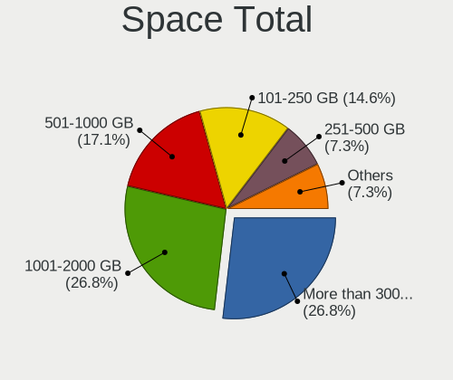
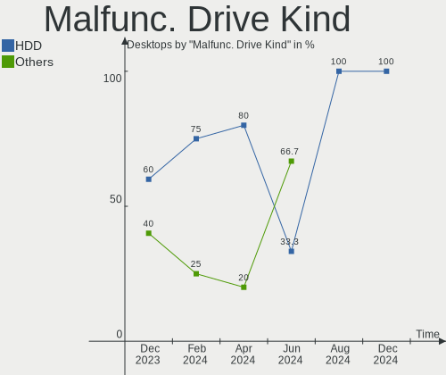
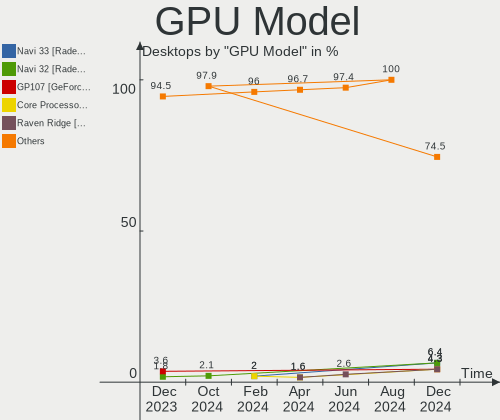
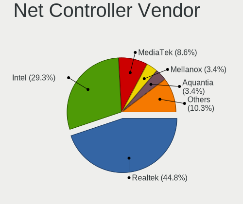
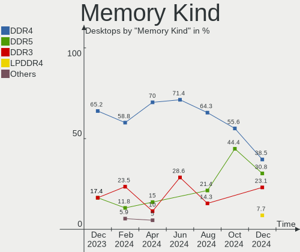

Manjaro Hardware Trends (Desktops)
----------------------------------

A project to identify most popular hardware characteristics and track their change
over time based on data collected by Manjaro users at https://Linux-Hardware.org.

Anyone can contribute to this report by the [hw-probe](https://github.com/linuxhw/hw-probe) tool:

    sudo -E hw-probe -all -upload

Full-feature report is available here: https://linux-hardware.org/?view=trends

Period: Jan, 2022.

Contents
--------

* [ System ](#system)
  - [ OS                       ](#os)
  - [ OS Family                ](#os-family)
  - [ Kernel                   ](#kernel)
  - [ Kernel Family            ](#kernel-family)
  - [ Kernel Major Ver.        ](#kernel-major-ver)
  - [ Arch                     ](#arch)
  - [ DE                       ](#de)
  - [ Display Server           ](#display-server)
  - [ Display Manager          ](#display-manager)
  - [ OS Lang                  ](#os-lang)
  - [ Boot Mode                ](#boot-mode)
  - [ Filesystem               ](#filesystem)
  - [ Part. scheme             ](#part-scheme)
  - [ Dual Boot with Linux/BSD ](#dual-boot-with-linuxbsd)
  - [ Dual Boot (Win)          ](#dual-boot-win)

* [ Board ](#board)
  - [ Vendor                   ](#vendor)
  - [ Model                    ](#model)
  - [ Model Family             ](#model-family)
  - [ MFG Year                 ](#mfg-year)
  - [ Form Factor              ](#form-factor)
  - [ Secure Boot              ](#secure-boot)
  - [ Coreboot                 ](#coreboot)
  - [ RAM Size                 ](#ram-size)
  - [ RAM Used                 ](#ram-used)
  - [ Total Drives             ](#total-drives)
  - [ Has CD-ROM               ](#has-cd-rom)
  - [ Has Ethernet             ](#has-ethernet)
  - [ Has WiFi                 ](#has-wifi)
  - [ Has Bluetooth            ](#has-bluetooth)

* [ Location ](#location)
  - [ Country                  ](#country)
  - [ City                     ](#city)

* [ Drives ](#drives)
  - [ Drive Vendor             ](#drive-vendor)
  - [ Drive Model              ](#drive-model)
  - [ HDD Vendor               ](#hdd-vendor)
  - [ SSD Vendor               ](#ssd-vendor)
  - [ Drive Kind               ](#drive-kind)
  - [ Drive Connector          ](#drive-connector)
  - [ Drive Size               ](#drive-size)
  - [ Space Total              ](#space-total)
  - [ Space Used               ](#space-used)
  - [ Malfunc. Drives          ](#malfunc-drives)
  - [ Malfunc. Drive Vendor    ](#malfunc-drive-vendor)
  - [ Malfunc. HDD Vendor      ](#malfunc-hdd-vendor)
  - [ Malfunc. Drive Kind      ](#malfunc-drive-kind)
  - [ Failed Drives            ](#failed-drives)
  - [ Failed Drive Vendor      ](#failed-drive-vendor)
  - [ Drive Status             ](#drive-status)

* [ Storage controller ](#storage-controller)
  - [ Storage Vendor           ](#storage-vendor)
  - [ Storage Model            ](#storage-model)
  - [ Storage Kind             ](#storage-kind)

* [ Processor ](#processor)
  - [ CPU Vendor               ](#cpu-vendor)
  - [ CPU Model                ](#cpu-model)
  - [ CPU Model Family         ](#cpu-model-family)
  - [ CPU Cores                ](#cpu-cores)
  - [ CPU Sockets              ](#cpu-sockets)
  - [ CPU Threads              ](#cpu-threads)
  - [ CPU Op-Modes             ](#cpu-op-modes)
  - [ CPU Microcode            ](#cpu-microcode)
  - [ CPU Microarch            ](#cpu-microarch)

* [ Graphics ](#graphics)
  - [ GPU Vendor               ](#gpu-vendor)
  - [ GPU Model                ](#gpu-model)
  - [ GPU Combo                ](#gpu-combo)
  - [ GPU Driver               ](#gpu-driver)
  - [ GPU Memory               ](#gpu-memory)

* [ Monitor ](#monitor)
  - [ Monitor Vendor           ](#monitor-vendor)
  - [ Monitor Model            ](#monitor-model)
  - [ Monitor Resolution       ](#monitor-resolution)
  - [ Monitor Diagonal         ](#monitor-diagonal)
  - [ Monitor Width            ](#monitor-width)
  - [ Aspect Ratio             ](#aspect-ratio)
  - [ Monitor Area             ](#monitor-area)
  - [ Pixel Density            ](#pixel-density)
  - [ Multiple Monitors        ](#multiple-monitors)

* [ Network ](#network)
  - [ Net Controller Vendor    ](#net-controller-vendor)
  - [ Net Controller Model     ](#net-controller-model)
  - [ Wireless Vendor          ](#wireless-vendor)
  - [ Wireless Model           ](#wireless-model)
  - [ Ethernet Vendor          ](#ethernet-vendor)
  - [ Ethernet Model           ](#ethernet-model)
  - [ Net Controller Kind      ](#net-controller-kind)
  - [ Used Controller          ](#used-controller)
  - [ NICs                     ](#nics)
  - [ IPv6                     ](#ipv6)

* [ Bluetooth ](#bluetooth)
  - [ Bluetooth Vendor         ](#bluetooth-vendor)
  - [ Bluetooth Model          ](#bluetooth-model)

* [ Sound ](#sound)
  - [ Sound Vendor             ](#sound-vendor)
  - [ Sound Model              ](#sound-model)

* [ Memory ](#memory)
  - [ Memory Vendor            ](#memory-vendor)
  - [ Memory Model             ](#memory-model)
  - [ Memory Kind              ](#memory-kind)
  - [ Memory Form Factor       ](#memory-form-factor)
  - [ Memory Size              ](#memory-size)
  - [ Memory Speed             ](#memory-speed)

* [ Printers & scanners ](#printers--scanners)
  - [ Printer Vendor           ](#printer-vendor)
  - [ Printer Model            ](#printer-model)
  - [ Scanner Vendor           ](#scanner-vendor)
  - [ Scanner Model            ](#scanner-model)

* [ Camera ](#camera)
  - [ Camera Vendor            ](#camera-vendor)
  - [ Camera Model             ](#camera-model)

* [ Security ](#security)
  - [ Fingerprint Vendor       ](#fingerprint-vendor)
  - [ Fingerprint Model        ](#fingerprint-model)
  - [ Chipcard Vendor          ](#chipcard-vendor)
  - [ Chipcard Model           ](#chipcard-model)

* [ Unsupported ](#unsupported)
  - [ Unsupported Devices      ](#unsupported-devices)
  - [ Unsupported Device Types ](#unsupported-device-types)

System
------

OS
--

Installed operating systems

| Name           | Desktops | Percent |
|----------------|----------|---------|
| Manjaro        | 25       | 43.1%   |
| Manjaro 21.2.1 | 23       | 39.66%  |
| Manjaro 21.2.2 | 6        | 10.34%  |
| Manjaro 21.2.0 | 4        | 6.9%    |

OS Family
---------

OS without a version

| Name    | Desktops | Percent |
|---------|----------|---------|
| Manjaro | 58       | 100%    |

Kernel
------

Version of the Linux kernel

| Version                | Desktops | Percent |
|------------------------|----------|---------|
| 5.15.12-1-MANJARO      | 28       | 48.28%  |
| 5.15.7-1-MANJARO       | 5        | 8.62%   |
| 5.13.19-2-MANJARO      | 4        | 6.9%    |
| 5.10.89-1-MANJARO      | 4        | 6.9%    |
| 5.16.2-1-MANJARO       | 3        | 5.17%   |
| 5.16.0-1-MANJARO       | 3        | 5.17%   |
| 5.15.16-1-MANJARO      | 2        | 3.45%   |
| 5.14.21-2-MANJARO      | 2        | 3.45%   |
| 5.15.6-2-MANJARO       | 1        | 1.72%   |
| 5.15.13-1-rt26-MANJARO | 1        | 1.72%   |
| 5.14.16-214-tkg-pds    | 1        | 1.72%   |
| 5.13.13-1-MANJARO      | 1        | 1.72%   |
| 5.10.90-1-MANJARO      | 1        | 1.72%   |
| 5.10.84-1-MANJARO      | 1        | 1.72%   |
| 4.19.225-1-MANJARO     | 1        | 1.72%   |

Kernel Family
-------------

Linux kernel without a distro release

| Version  | Desktops | Percent |
|----------|----------|---------|
| 5.15.12  | 28       | 48.28%  |
| 5.15.7   | 5        | 8.62%   |
| 5.13.19  | 4        | 6.9%    |
| 5.10.89  | 4        | 6.9%    |
| 5.16.2   | 3        | 5.17%   |
| 5.16.0   | 3        | 5.17%   |
| 5.15.16  | 2        | 3.45%   |
| 5.14.21  | 2        | 3.45%   |
| 5.15.6   | 1        | 1.72%   |
| 5.15.13  | 1        | 1.72%   |
| 5.14.16  | 1        | 1.72%   |
| 5.13.13  | 1        | 1.72%   |
| 5.10.90  | 1        | 1.72%   |
| 5.10.84  | 1        | 1.72%   |
| 4.19.225 | 1        | 1.72%   |

Kernel Major Ver.
-----------------

Linux kernel major version

| Version | Desktops | Percent |
|---------|----------|---------|
| 5.15    | 37       | 63.79%  |
| 5.16    | 6        | 10.34%  |
| 5.10    | 6        | 10.34%  |
| 5.13    | 5        | 8.62%   |
| 5.14    | 3        | 5.17%   |
| 4.19    | 1        | 1.72%   |

Arch
----

OS architecture (x86_64, i586, etc.)

| Name   | Desktops | Percent |
|--------|----------|---------|
| x86_64 | 58       | 100%    |

DE
--

Desktop Environment

| Name     | Desktops | Percent |
|----------|----------|---------|
| KDE5     | 25       | 43.1%   |
| XFCE     | 20       | 34.48%  |
| GNOME    | 10       | 17.24%  |
| i3       | 1        | 1.72%   |
| Cinnamon | 1        | 1.72%   |
| Unknown  | 1        | 1.72%   |

Display Server
--------------

X11 or Wayland

| Name    | Desktops | Percent |
|---------|----------|---------|
| X11     | 54       | 93.1%   |
| Wayland | 2        | 3.45%   |
| Tty     | 2        | 3.45%   |

Display Manager
---------------

SDDM, LightDM, etc.

| Name    | Desktops | Percent |
|---------|----------|---------|
| Unknown | 26       | 44.83%  |
| SDDM    | 13       | 22.41%  |
| LightDM | 13       | 22.41%  |
| GDM     | 6        | 10.34%  |

OS Lang
-------

Language

| Lang  | Desktops | Percent |
|-------|----------|---------|
| en_US | 25       | 43.1%   |
| pt_BR | 6        | 10.34%  |
| de_DE | 6        | 10.34%  |
| pl_PL | 4        | 6.9%    |
| en_CA | 4        | 6.9%    |
| fr_FR | 2        | 3.45%   |
| sv_SE | 1        | 1.72%   |
| ru_UA | 1        | 1.72%   |
| ru_RU | 1        | 1.72%   |
| ro_RO | 1        | 1.72%   |
| pt_PT | 1        | 1.72%   |
| nl_NL | 1        | 1.72%   |
| fr_BE | 1        | 1.72%   |
| es_CL | 1        | 1.72%   |
| es_BO | 1        | 1.72%   |
| en_IE | 1        | 1.72%   |
| en_GB | 1        | 1.72%   |

Boot Mode
---------

EFI or BIOS

| Mode | Desktops | Percent |
|------|----------|---------|
| BIOS | 42       | 72.41%  |
| EFI  | 16       | 27.59%  |

Filesystem
----------

Type of filesystem

| Type    | Desktops | Percent |
|---------|----------|---------|
| Ext4    | 50       | 86.21%  |
| Btrfs   | 5        | 8.62%   |
| Overlay | 2        | 3.45%   |
| Xfs     | 1        | 1.72%   |

Part. scheme
------------

Scheme of partitioning

| Type    | Desktops | Percent |
|---------|----------|---------|
| Unknown | 40       | 68.97%  |
| GPT     | 12       | 20.69%  |
| MBR     | 6        | 10.34%  |

Dual Boot with Linux/BSD
------------------------

Hosting more than one Linux/BSD

| Dual boot | Desktops | Percent |
|-----------|----------|---------|
| No        | 54       | 93.1%   |
| Yes       | 4        | 6.9%    |

Dual Boot (Win)
---------------

Hosting Linux and Windows

| Dual boot | Desktops | Percent |
|-----------|----------|---------|
| No        | 40       | 68.97%  |
| Yes       | 18       | 31.03%  |

Board
-----

Vendor
------

Motherboard manufacturer

| Name                | Desktops | Percent |
|---------------------|----------|---------|
| ASUSTek Computer    | 15       | 25.86%  |
| MSI                 | 13       | 22.41%  |
| Gigabyte Technology | 12       | 20.69%  |
| Dell                | 6        | 10.34%  |
| ASRock              | 3        | 5.17%   |
| Intel               | 2        | 3.45%   |
| Medion              | 1        | 1.72%   |
| Lenovo              | 1        | 1.72%   |
| Huanan              | 1        | 1.72%   |
| GALAX               | 1        | 1.72%   |
| Chatreey            | 1        | 1.72%   |
| Acidanthera         | 1        | 1.72%   |
| Acer                | 1        | 1.72%   |

Model
-----

Motherboard model

| Name                                | Desktops | Percent |
|-------------------------------------|----------|---------|
| MSI MS-7B79                         | 2        | 3.45%   |
| Gigabyte 970A-DS3P                  | 2        | 3.45%   |
| ASUS TUF GAMING X570-PLUS           | 2        | 3.45%   |
| MSI MS-7D30                         | 1        | 1.72%   |
| MSI MS-7C95                         | 1        | 1.72%   |
| MSI MS-7C91                         | 1        | 1.72%   |
| MSI MS-7C87                         | 1        | 1.72%   |
| MSI MS-7C79                         | 1        | 1.72%   |
| MSI MS-7C56                         | 1        | 1.72%   |
| MSI MS-7C37                         | 1        | 1.72%   |
| MSI MS-7A37                         | 1        | 1.72%   |
| MSI MS-7971                         | 1        | 1.72%   |
| MSI MS-7885                         | 1        | 1.72%   |
| MSI MS-7846                         | 1        | 1.72%   |
| Medion Akoya P5360 E MD8881/2478    | 1        | 1.72%   |
| Lenovo ThinkCentre M710e 10UQS08V00 | 1        | 1.72%   |
| Intel X99 V1.0                      | 1        | 1.72%   |
| Intel D2550MUD2 AAG73892-600        | 1        | 1.72%   |
| Huanan X99-TF GAMING V2.0           | 1        | 1.72%   |
| Gigabyte Z590 VISION D              | 1        | 1.72%   |
| Gigabyte Z390 AORUS PRO WIFI        | 1        | 1.72%   |
| Gigabyte P55A-UD3                   | 1        | 1.72%   |
| Gigabyte h8-1414                    | 1        | 1.72%   |
| Gigabyte H61M-S1                    | 1        | 1.72%   |
| Gigabyte B450M DS3H V2              | 1        | 1.72%   |
| Gigabyte B450M DS3H                 | 1        | 1.72%   |
| Gigabyte B450 AORUS PRO WIFI        | 1        | 1.72%   |
| Gigabyte AB350M-Gaming 3            | 1        | 1.72%   |
| Gigabyte 965P-S3                    | 1        | 1.72%   |
| GALAX B365M                         | 1        | 1.72%   |
| Dell Vostro 3681                    | 1        | 1.72%   |
| Dell Precision T3600                | 1        | 1.72%   |
| Dell OptiPlex 990                   | 1        | 1.72%   |
| Dell OptiPlex 760                   | 1        | 1.72%   |
| Dell OptiPlex 7010                  | 1        | 1.72%   |
| Dell OptiPlex 330                   | 1        | 1.72%   |
| Chatreey AC1-DP                     | 1        | 1.72%   |
| ASUS Z170 PRO GAMING                | 1        | 1.72%   |
| ASUS TUF GAMING X570-PRO            | 1        | 1.72%   |
| ASUS TUF GAMING B550M-PLUS          | 1        | 1.72%   |
| ASUS TUF GAMING A520M-PLUS II       | 1        | 1.72%   |
| ASUS ROG STRIX B550-E GAMING        | 1        | 1.72%   |
| ASUS ROG STRIX B450-F GAMING        | 1        | 1.72%   |
| ASUS PRIME B450M-A                  | 1        | 1.72%   |
| ASUS P5WDG2 WS PRO                  | 1        | 1.72%   |
| ASUS P5QL/EPU                       | 1        | 1.72%   |
| ASUS Maximus IV GENE-Z/GEN3         | 1        | 1.72%   |
| ASUS M5A99X EVO R2.0                | 1        | 1.72%   |
| ASUS M5A78L-M/USB3                  | 1        | 1.72%   |
| ASUS M5A78L-M PLUS/USB3             | 1        | 1.72%   |
| ASRock Z77 Pro4                     | 1        | 1.72%   |
| ASRock H81M-VG4                     | 1        | 1.72%   |
| ASRock H510M-ITX/ac                 | 1        | 1.72%   |
| Acidanthera MacPro7,1               | 1        | 1.72%   |
| Acer Aspire XC-230                  | 1        | 1.72%   |

Model Family
------------

Motherboard model prefix

| Name                   | Desktops | Percent |
|------------------------|----------|---------|
| ASUS TUF               | 5        | 8.62%   |
| Dell OptiPlex          | 4        | 6.9%    |
| MSI MS-7B79            | 2        | 3.45%   |
| Gigabyte B450M         | 2        | 3.45%   |
| Gigabyte 970A-DS3P     | 2        | 3.45%   |
| ASUS ROG               | 2        | 3.45%   |
| ASUS M5A78L-M          | 2        | 3.45%   |
| MSI MS-7D30            | 1        | 1.72%   |
| MSI MS-7C95            | 1        | 1.72%   |
| MSI MS-7C91            | 1        | 1.72%   |
| MSI MS-7C87            | 1        | 1.72%   |
| MSI MS-7C79            | 1        | 1.72%   |
| MSI MS-7C56            | 1        | 1.72%   |
| MSI MS-7C37            | 1        | 1.72%   |
| MSI MS-7A37            | 1        | 1.72%   |
| MSI MS-7971            | 1        | 1.72%   |
| MSI MS-7885            | 1        | 1.72%   |
| MSI MS-7846            | 1        | 1.72%   |
| Medion Akoya           | 1        | 1.72%   |
| Lenovo ThinkCentre     | 1        | 1.72%   |
| Intel X99              | 1        | 1.72%   |
| Intel D2550MUD2        | 1        | 1.72%   |
| Huanan X99-TF          | 1        | 1.72%   |
| Gigabyte Z590          | 1        | 1.72%   |
| Gigabyte Z390          | 1        | 1.72%   |
| Gigabyte P55A-UD3      | 1        | 1.72%   |
| Gigabyte h8-1414       | 1        | 1.72%   |
| Gigabyte H61M-S1       | 1        | 1.72%   |
| Gigabyte B450          | 1        | 1.72%   |
| Gigabyte AB350M-Gaming | 1        | 1.72%   |
| Gigabyte 965P-S3       | 1        | 1.72%   |
| GALAX B365M            | 1        | 1.72%   |
| Dell Vostro            | 1        | 1.72%   |
| Dell Precision         | 1        | 1.72%   |
| Chatreey AC1-DP        | 1        | 1.72%   |
| ASUS Z170              | 1        | 1.72%   |
| ASUS PRIME             | 1        | 1.72%   |
| ASUS P5WDG2            | 1        | 1.72%   |
| ASUS P5QL              | 1        | 1.72%   |
| ASUS Maximus           | 1        | 1.72%   |
| ASUS M5A99X            | 1        | 1.72%   |
| ASRock Z77             | 1        | 1.72%   |
| ASRock H81M-VG4        | 1        | 1.72%   |
| ASRock H510M-ITX       | 1        | 1.72%   |
| Acidanthera MacPro7    | 1        | 1.72%   |
| Acer Aspire            | 1        | 1.72%   |

MFG Year
--------

Motherboard manufacture year

| Year | Desktops | Percent |
|------|----------|---------|
| 2020 | 13       | 22.41%  |
| 2021 | 6        | 10.34%  |
| 2019 | 6        | 10.34%  |
| 2012 | 6        | 10.34%  |
| 2018 | 5        | 8.62%   |
| 2013 | 4        | 6.9%    |
| 2017 | 3        | 5.17%   |
| 2016 | 3        | 5.17%   |
| 2011 | 3        | 5.17%   |
| 2009 | 3        | 5.17%   |
| 2015 | 2        | 3.45%   |
| 2007 | 2        | 3.45%   |
| 2014 | 1        | 1.72%   |
| 2006 | 1        | 1.72%   |

Form Factor
-----------

Physical design of the computer

| Name    | Desktops | Percent |
|---------|----------|---------|
| Desktop | 58       | 100%    |

Secure Boot
-----------

Enabled or disabled

| State    | Desktops | Percent |
|----------|----------|---------|
| Disabled | 58       | 100%    |

Coreboot
--------

Have coreboot on board

| Used | Desktops | Percent |
|------|----------|---------|
| No   | 58       | 100%    |

RAM Size
--------

Total RAM memory

| Size in GB  | Desktops | Percent |
|-------------|----------|---------|
| 16.01-24.0  | 20       | 34.48%  |
| 32.01-64.0  | 14       | 24.14%  |
| 4.01-8.0    | 8        | 13.79%  |
| 8.01-16.0   | 8        | 13.79%  |
| 3.01-4.0    | 3        | 5.17%   |
| 24.01-32.0  | 3        | 5.17%   |
| 64.01-256.0 | 2        | 3.45%   |

RAM Used
--------

Used RAM memory

| Used GB    | Desktops | Percent |
|------------|----------|---------|
| 2.01-3.0   | 24       | 41.38%  |
| 3.01-4.0   | 12       | 20.69%  |
| 1.01-2.0   | 9        | 15.52%  |
| 4.01-8.0   | 8        | 13.79%  |
| 8.01-16.0  | 2        | 3.45%   |
| 0.51-1.0   | 2        | 3.45%   |
| 16.01-24.0 | 1        | 1.72%   |

Total Drives
------------

Number of drives on board

| Drives | Desktops | Percent |
|--------|----------|---------|
| 2      | 22       | 37.93%  |
| 1      | 11       | 18.97%  |
| 4      | 9        | 15.52%  |
| 3      | 8        | 13.79%  |
| 5      | 7        | 12.07%  |
| 6      | 1        | 1.72%   |

Has CD-ROM
----------

Has CD-ROM on board

| Presented | Desktops | Percent |
|-----------|----------|---------|
| No        | 45       | 77.59%  |
| Yes       | 13       | 22.41%  |

Has Ethernet
------------

Has Ethernet on board

| Presented | Desktops | Percent |
|-----------|----------|---------|
| Yes       | 58       | 100%    |

Has WiFi
--------

Has WiFi module

| Presented | Desktops | Percent |
|-----------|----------|---------|
| Yes       | 32       | 55.17%  |
| No        | 26       | 44.83%  |

Has Bluetooth
-------------

Has Bluetooth module

| Presented | Desktops | Percent |
|-----------|----------|---------|
| No        | 32       | 55.17%  |
| Yes       | 26       | 44.83%  |

Location
--------

Country
-------

Geographic location (country)

| Country     | Desktops | Percent |
|-------------|----------|---------|
| USA         | 16       | 27.59%  |
| Germany     | 6        | 10.34%  |
| Brazil      | 6        | 10.34%  |
| Poland      | 5        | 8.62%   |
| Canada      | 4        | 6.9%    |
| France      | 3        | 5.17%   |
| Sweden      | 2        | 3.45%   |
| Russia      | 2        | 3.45%   |
| Netherlands | 2        | 3.45%   |
| Ukraine     | 1        | 1.72%   |
| UK          | 1        | 1.72%   |
| Switzerland | 1        | 1.72%   |
| Romania     | 1        | 1.72%   |
| Portugal    | 1        | 1.72%   |
| Italy       | 1        | 1.72%   |
| Ireland     | 1        | 1.72%   |
| Greece      | 1        | 1.72%   |
| Chile       | 1        | 1.72%   |
| Bolivia     | 1        | 1.72%   |
| Belgium     | 1        | 1.72%   |
| Argentina   | 1        | 1.72%   |

City
----

Geographic location (city)

| City                   | Desktops | Percent |
|------------------------|----------|---------|
| Westhausen             | 1        | 1.72%   |
| Vaudreuil-Dorion       | 1        | 1.72%   |
| Valdivia               | 1        | 1.72%   |
| Toulouse               | 1        | 1.72%   |
| Swieszyno              | 1        | 1.72%   |
| Stuttgart              | 1        | 1.72%   |
| Stockholm              | 1        | 1.72%   |
| Stade                  | 1        | 1.72%   |
| St Petersburg          | 1        | 1.72%   |
| Southaven              | 1        | 1.72%   |
| Secaucus               | 1        | 1.72%   |
| Scott                  | 1        | 1.72%   |
| Sao Juliao do Tojal    | 1        | 1.72%   |
| San Francisco Solano   | 1        | 1.72%   |
| Reggio Emilia          | 1        | 1.72%   |
| Princeton              | 1        | 1.72%   |
| Portland               | 1        | 1.72%   |
| Ponta Grossa           | 1        | 1.72%   |
| Piripiri               | 1        | 1.72%   |
| Perth                  | 1        | 1.72%   |
| Perm                   | 1        | 1.72%   |
| Passos                 | 1        | 1.72%   |
| Paris                  | 1        | 1.72%   |
| Oshawa                 | 1        | 1.72%   |
| Ogden                  | 1        | 1.72%   |
| Oceanside              | 1        | 1.72%   |
| O'Fallon               | 1        | 1.72%   |
| Novomoskovsk           | 1        | 1.72%   |
| Muskogee               | 1        | 1.72%   |
| Mosina                 | 1        | 1.72%   |
| Minneapolis            | 1        | 1.72%   |
| Letterkenny            | 1        | 1.72%   |
| Legionowo              | 1        | 1.72%   |
| La Paz                 | 1        | 1.72%   |
| Krakow                 | 1        | 1.72%   |
| Kirchberg an der Iller | 1        | 1.72%   |
| Kingston               | 1        | 1.72%   |
| Kielce                 | 1        | 1.72%   |
| Ico                    | 1        | 1.72%   |
| Iasi                   | 1        | 1.72%   |
| Huy                    | 1        | 1.72%   |
| Harrisonburg           | 1        | 1.72%   |
| Gelsenkirchen          | 1        | 1.72%   |
| Edmonton               | 1        | 1.72%   |
| Dyltabruk              | 1        | 1.72%   |
| Dallas                 | 1        | 1.72%   |
| Curitiba               | 1        | 1.72%   |
| Campinas               | 1        | 1.72%   |
| Brooklyn               | 1        | 1.72%   |
| Bournemouth            | 1        | 1.72%   |
| Berlin                 | 1        | 1.72%   |
| Basking Ridge          | 1        | 1.72%   |
| Balerna                | 1        | 1.72%   |
| Austin                 | 1        | 1.72%   |
| Athens                 | 1        | 1.72%   |
| Arnhem                 | 1        | 1.72%   |
| Amsterdam              | 1        | 1.72%   |
| Ajaccio                | 1        | 1.72%   |

Drives
------

Drive Vendor
------------

Hard drive vendors

| Vendor                    | Desktops | Drives | Percent |
|---------------------------|----------|--------|---------|
| Seagate                   | 26       | 39     | 20.63%  |
| Samsung Electronics       | 19       | 27     | 15.08%  |
| WDC                       | 18       | 22     | 14.29%  |
| Kingston                  | 10       | 11     | 7.94%   |
| Crucial                   | 8        | 8      | 6.35%   |
| Toshiba                   | 4        | 5      | 3.17%   |
| Silicon Motion            | 3        | 3      | 2.38%   |
| SanDisk                   | 3        | 4      | 2.38%   |
| Intel                     | 3        | 4      | 2.38%   |
| Hitachi                   | 3        | 3      | 2.38%   |
| Corsair                   | 3        | 3      | 2.38%   |
| XPG                       | 2        | 2      | 1.59%   |
| Unknown                   | 2        | 2      | 1.59%   |
| SK Hynix                  | 2        | 2      | 1.59%   |
| PNY                       | 2        | 2      | 1.59%   |
| Phison                    | 2        | 2      | 1.59%   |
| OCZ                       | 2        | 2      | 1.59%   |
| Micron/Crucial Technology | 2        | 2      | 1.59%   |
| China                     | 2        | 3      | 1.59%   |
| Team                      | 1        | 1      | 0.79%   |
| Realtek Semiconductor     | 1        | 1      | 0.79%   |
| Patriot                   | 1        | 1      | 0.79%   |
| LuminouTek                | 1        | 1      | 0.79%   |
| GOODRAM                   | 1        | 1      | 0.79%   |
| ASMT                      | 1        | 1      | 0.79%   |
| Apacer                    | 1        | 1      | 0.79%   |
| ADROITLA                  | 1        | 1      | 0.79%   |
| A-DATA Technology         | 1        | 1      | 0.79%   |
| Unknown                   | 1        | 1      | 0.79%   |

Drive Model
-----------

Hard drive models

| Model                                 | Desktops | Percent |
|---------------------------------------|----------|---------|
| Samsung NVMe SSD Drive 500GB          | 5        | 3.4%    |
| Kingston SA400S37240G 240GB SSD       | 5        | 3.4%    |
| Crucial CT500MX500SSD1 500GB          | 3        | 2.04%   |
| Crucial CT1000MX500SSD1 1TB           | 3        | 2.04%   |
| Toshiba HDWD110 1TB                   | 2        | 1.36%   |
| Silicon Motion NVMe SSD Drive 256GB   | 2        | 1.36%   |
| Seagate ST4000DM004-2CV104 4TB        | 2        | 1.36%   |
| Seagate ST2000DM006-2DM164 2TB        | 2        | 1.36%   |
| Seagate ST2000DM001-1ER164 2TB        | 2        | 1.36%   |
| Seagate ST1000LM024 HN-M101MBB 1TB    | 2        | 1.36%   |
| Seagate ST1000DM010-2EP102 1TB        | 2        | 1.36%   |
| Seagate ST1000DM003-1ER162 1TB        | 2        | 1.36%   |
| Samsung SSD 850 EVO 500GB             | 2        | 1.36%   |
| Samsung SSD 850 EVO 250GB             | 2        | 1.36%   |
| Samsung NVMe SSD Drive 250GB          | 2        | 1.36%   |
| Samsung NVMe SSD Drive 1TB            | 2        | 1.36%   |
| XPG NVMe SSD Drive 2TB                | 1        | 0.68%   |
| XPG NVMe SSD Drive 256GB              | 1        | 0.68%   |
| WDC WDS200T2B0B-00YS70 2TB SSD        | 1        | 0.68%   |
| WDC WD800BD-22MRA1 80GB               | 1        | 0.68%   |
| WDC WD7501AALS-00J7B0 752GB           | 1        | 0.68%   |
| WDC WD5000LPVT-22G33T0 500GB          | 1        | 0.68%   |
| WDC WD5000LPCX-24C6HT0 500GB          | 1        | 0.68%   |
| WDC WD5000BEVT-00A0RT0 500GB          | 1        | 0.68%   |
| WDC WD5000AADS-00S9B0 500GB           | 1        | 0.68%   |
| WDC WD2500BEVS-22UST0 250GB           | 1        | 0.68%   |
| WDC WD20EZRX-00D8PB0 2TB              | 1        | 0.68%   |
| WDC WD20EZAZ-00L9GB0 2TB              | 1        | 0.68%   |
| WDC WD20EZAZ-00GGJB0 2TB              | 1        | 0.68%   |
| WDC WD20EARX-32PASB0 2TB              | 1        | 0.68%   |
| WDC WD2003FZEX-00Z4SA0 2TB            | 1        | 0.68%   |
| WDC WD10EZEX-21WN4A0 1TB              | 1        | 0.68%   |
| WDC WD10EZEX-08WN4A0 1TB              | 1        | 0.68%   |
| WDC WD10EZEX-00BN5A0 1TB              | 1        | 0.68%   |
| WDC WD10EZEX-00BBHA0 1TB              | 1        | 0.68%   |
| WDC WD1003FZEX-00MK2A0 1TB            | 1        | 0.68%   |
| WDC WD1002FAEX-00Z3A0 1TB             | 1        | 0.68%   |
| WDC WD1001FALS-00J7B1 1TB             | 1        | 0.68%   |
| Unknown SD/MMC/MS PRO 128GB           | 1        | 0.68%   |
| Unknown OOS12000G 12TB                | 1        | 0.68%   |
| Toshiba TR150 480GB SSD               | 1        | 0.68%   |
| Toshiba MQ01ABD050 500GB              | 1        | 0.68%   |
| Toshiba HDWL110 1TB                   | 1        | 0.68%   |
| Team TM8PS7256G 256GB SSD             | 1        | 0.68%   |
| SK Hynix SHGS31-500GS-2 500GB SSD     | 1        | 0.68%   |
| SK Hynix HFS128G3BMND-3210A 128GB SSD | 1        | 0.68%   |
| Silicon Motion NVMe SSD Drive 512GB   | 1        | 0.68%   |
| Seagate ST9250827AS 250GB             | 1        | 0.68%   |
| Seagate ST8000DM004-2CX188 8TB        | 1        | 0.68%   |
| Seagate ST750LM022 HN-M750MBB 752GB   | 1        | 0.68%   |
| Seagate ST500LT012-9WS142 500GB       | 1        | 0.68%   |
| Seagate ST500LM000-SSHD-8GB           | 1        | 0.68%   |
| Seagate ST500DM002-1BD142 500GB       | 1        | 0.68%   |
| Seagate ST4000VN008-2DR166 4TB        | 1        | 0.68%   |
| Seagate ST4000LM024-2AN17V 4TB        | 1        | 0.68%   |
| Seagate ST3250318AS 250GB             | 1        | 0.68%   |
| Seagate ST31000524AS 1TB              | 1        | 0.68%   |
| Seagate ST3000DM008-2DM166 3TB        | 1        | 0.68%   |
| Seagate ST3000DM001-1ER166 3TB        | 1        | 0.68%   |
| Seagate ST3000DM001-1CH166 3TB        | 1        | 0.68%   |

HDD Vendor
----------

Hard disk drive vendors

| Vendor              | Desktops | Drives | Percent |
|---------------------|----------|--------|---------|
| Seagate             | 26       | 38     | 49.06%  |
| WDC                 | 17       | 21     | 32.08%  |
| Toshiba             | 3        | 4      | 5.66%   |
| Hitachi             | 3        | 3      | 5.66%   |
| Unknown             | 2        | 2      | 3.77%   |
| Samsung Electronics | 2        | 2      | 3.77%   |

SSD Vendor
----------

Solid state drive vendors

| Vendor              | Desktops | Drives | Percent |
|---------------------|----------|--------|---------|
| Samsung Electronics | 9        | 11     | 18.37%  |
| Kingston            | 8        | 8      | 16.33%  |
| Crucial             | 7        | 7      | 14.29%  |
| SanDisk             | 3        | 3      | 6.12%   |
| Corsair             | 3        | 3      | 6.12%   |
| SK Hynix            | 2        | 2      | 4.08%   |
| PNY                 | 2        | 2      | 4.08%   |
| OCZ                 | 2        | 2      | 4.08%   |
| China               | 2        | 3      | 4.08%   |
| WDC                 | 1        | 1      | 2.04%   |
| Toshiba             | 1        | 1      | 2.04%   |
| Team                | 1        | 1      | 2.04%   |
| Seagate             | 1        | 1      | 2.04%   |
| Patriot             | 1        | 1      | 2.04%   |
| Intel               | 1        | 2      | 2.04%   |
| GOODRAM             | 1        | 1      | 2.04%   |
| ASMT                | 1        | 1      | 2.04%   |
| Apacer              | 1        | 1      | 2.04%   |
| ADROITLA            | 1        | 1      | 2.04%   |
| A-DATA Technology   | 1        | 1      | 2.04%   |

Drive Kind
----------

HDD or SSD

| Kind    | Desktops | Drives | Percent |
|---------|----------|--------|---------|
| HDD     | 43       | 70     | 38.74%  |
| SSD     | 39       | 53     | 35.14%  |
| NVMe    | 27       | 31     | 24.32%  |
| Unknown | 2        | 2      | 1.8%    |

Drive Connector
---------------

SATA, SAS, NVMe, etc.

| Type | Desktops | Drives | Percent |
|------|----------|--------|---------|
| SATA | 55       | 118    | 62.5%   |
| NVMe | 27       | 31     | 30.68%  |
| SAS  | 6        | 7      | 6.82%   |

Drive Size
----------

Size of hard drive

| Size in TB | Desktops | Drives | Percent |
|------------|----------|--------|---------|
| 0.01-0.5   | 40       | 60     | 43.96%  |
| 0.51-1.0   | 24       | 29     | 26.37%  |
| 1.01-2.0   | 17       | 22     | 18.68%  |
| 3.01-4.0   | 4        | 5      | 4.4%    |
| 2.01-3.0   | 3        | 3      | 3.3%    |
| 4.01-10.0  | 2        | 2      | 2.2%    |
| 10.01-20.0 | 1        | 2      | 1.1%    |

Space Total
-----------

Amount of disk space available on the file system

| Size in GB     | Desktops | Percent |
|----------------|----------|---------|
| 2001-3000      | 12       | 20.69%  |
| 1001-2000      | 10       | 17.24%  |
| 501-1000       | 10       | 17.24%  |
| 101-250        | 8        | 13.79%  |
| 251-500        | 7        | 12.07%  |
| More than 3000 | 5        | 8.62%   |
| 51-100         | 3        | 5.17%   |
| 21-50          | 1        | 1.72%   |
| 1-20           | 1        | 1.72%   |
| Unknown        | 1        | 1.72%   |

Space Used
----------

Amount of used disk space

| Used GB        | Desktops | Percent |
|----------------|----------|---------|
| 1001-2000      | 10       | 17.24%  |
| 51-100         | 10       | 17.24%  |
| 501-1000       | 9        | 15.52%  |
| 101-250        | 8        | 13.79%  |
| 251-500        | 6        | 10.34%  |
| 1-20           | 6        | 10.34%  |
| 21-50          | 5        | 8.62%   |
| 2001-3000      | 2        | 3.45%   |
| More than 3000 | 1        | 1.72%   |
| Unknown        | 1        | 1.72%   |

Malfunc. Drives
---------------

Drive models with a malfunction

| Model                            | Desktops | Drives | Percent |
|----------------------------------|----------|--------|---------|
| Toshiba HDWL110 1TB              | 1        | 1      | 16.67%  |
| Seagate ST3000DM001-1ER166 3TB   | 1        | 1      | 16.67%  |
| Seagate ST2000DM001-1ER164 2TB   | 1        | 2      | 16.67%  |
| Kingston SV300S37A120G 120GB SSD | 1        | 1      | 16.67%  |
| Crucial CT500MX500SSD1 500GB     | 1        | 1      | 16.67%  |
| Corsair Force LS SSD 64GB        | 1        | 1      | 16.67%  |

Malfunc. Drive Vendor
---------------------

Vendors of faulty drives

| Vendor   | Desktops | Drives | Percent |
|----------|----------|--------|---------|
| Seagate  | 2        | 3      | 33.33%  |
| Toshiba  | 1        | 1      | 16.67%  |
| Kingston | 1        | 1      | 16.67%  |
| Crucial  | 1        | 1      | 16.67%  |
| Corsair  | 1        | 1      | 16.67%  |

Malfunc. HDD Vendor
-------------------

Vendors of faulty HDD drives

| Vendor  | Desktops | Drives | Percent |
|---------|----------|--------|---------|
| Seagate | 2        | 3      | 66.67%  |
| Toshiba | 1        | 1      | 33.33%  |

Malfunc. Drive Kind
-------------------

Kinds of faulty drives

| Kind | Desktops | Drives | Percent |
|------|----------|--------|---------|
| SSD  | 3        | 3      | 50%     |
| HDD  | 3        | 4      | 50%     |

Failed Drives
-------------

Failed drive models

Zero info for selected period =(

Failed Drive Vendor
-------------------

Failed drive vendors

Zero info for selected period =(

Drive Status
------------

Number of failed and malfunc. drives

| Status   | Desktops | Drives | Percent |
|----------|----------|--------|---------|
| Detected | 46       | 130    | 71.88%  |
| Works    | 13       | 19     | 20.31%  |
| Malfunc  | 5        | 7      | 7.81%   |

Storage controller
------------------

Storage Vendor
--------------

Storage controller vendors

| Vendor                      | Desktops | Percent |
|-----------------------------|----------|---------|
| Intel                       | 32       | 34.04%  |
| AMD                         | 28       | 29.79%  |
| Samsung Electronics         | 12       | 12.77%  |
| ASMedia Technology          | 4        | 4.26%   |
| Silicon Motion              | 3        | 3.19%   |
| Phison Electronics          | 3        | 3.19%   |
| Micron/Crucial Technology   | 3        | 3.19%   |
| Kingston Technology Company | 2        | 2.13%   |
| JMicron Technology          | 2        | 2.13%   |
| ADATA Technology            | 2        | 2.13%   |
| Sandisk                     | 1        | 1.06%   |
| Realtek Semiconductor       | 1        | 1.06%   |
| Marvell Technology Group    | 1        | 1.06%   |

Storage Model
-------------

Storage controller models

| Model                                                                                   | Desktops | Percent |
|-----------------------------------------------------------------------------------------|----------|---------|
| AMD FCH SATA Controller [AHCI mode]                                                     | 12       | 10.91%  |
| AMD 400 Series Chipset SATA Controller                                                  | 9        | 8.18%   |
| Samsung NVMe SSD Controller SM981/PM981/PM983                                           | 6        | 5.45%   |
| AMD Starship/Matisse Chipset SATA Controller [AHCI mode]                                | 6        | 5.45%   |
| AMD SB7x0/SB8x0/SB9x0 SATA Controller [AHCI mode]                                       | 5        | 4.55%   |
| ASMedia ASM1062 Serial ATA Controller                                                   | 4        | 3.64%   |
| Silicon Motion SM2263EN/SM2263XT SSD Controller                                         | 3        | 2.73%   |
| Intel Q170/Q150/B150/H170/H110/Z170/CM236 Chipset SATA Controller [AHCI Mode]           | 3        | 2.73%   |
| Intel 8 Series/C220 Series Chipset Family 6-port SATA Controller 1 [AHCI mode]          | 3        | 2.73%   |
| AMD SB7x0/SB8x0/SB9x0 IDE Controller                                                    | 3        | 2.73%   |
| Samsung NVMe SSD Controller SM961/PM961/SM963                                           | 2        | 1.82%   |
| Samsung NVMe SSD Controller PM9A1/PM9A3/980PRO                                          | 2        | 1.82%   |
| Phison E12 NVMe Controller                                                              | 2        | 1.82%   |
| Micron/Crucial P1 NVMe PCIe SSD                                                         | 2        | 1.82%   |
| Intel NM10/ICH7 Family SATA Controller [AHCI mode]                                      | 2        | 1.82%   |
| Intel C610/X99 series chipset sSATA Controller [AHCI mode]                              | 2        | 1.82%   |
| Intel 82801G (ICH7 Family) IDE Controller                                               | 2        | 1.82%   |
| Intel 7 Series/C210 Series Chipset Family 6-port SATA Controller [AHCI mode]            | 2        | 1.82%   |
| Intel 6 Series/C200 Series Chipset Family 6 port Desktop SATA AHCI Controller           | 2        | 1.82%   |
| Intel 500 Series Chipset Family SATA AHCI Controller                                    | 2        | 1.82%   |
| Intel 200 Series PCH SATA controller [AHCI mode]                                        | 2        | 1.82%   |
| AMD 300 Series Chipset SATA Controller                                                  | 2        | 1.82%   |
| ADATA XPG SX8200 Pro PCIe Gen3x4 M.2 2280 Solid State Drive                             | 2        | 1.82%   |
| Sandisk WD Black 2018/SN750 / PC SN720 NVMe SSD                                         | 1        | 0.91%   |
| Samsung NVMe SSD Controller SM951/PM951                                                 | 1        | 0.91%   |
| Samsung NVMe SSD Controller 980                                                         | 1        | 0.91%   |
| Realtek RTS5763DL NVMe SSD Controller                                                   | 1        | 0.91%   |
| Phison E7 NVMe Controller                                                               | 1        | 0.91%   |
| Micron/Crucial P2 NVMe PCIe SSD                                                         | 1        | 0.91%   |
| Marvell Group 88SE6145 SATA II PCI-E controller                                         | 1        | 0.91%   |
| Kingston Company KC2000 NVMe SSD                                                        | 1        | 0.91%   |
| Kingston Company A2000 NVMe SSD                                                         | 1        | 0.91%   |
| JMicron JMB368 IDE controller                                                           | 1        | 0.91%   |
| JMicron JMB363 SATA/IDE Controller                                                      | 1        | 0.91%   |
| Intel SSD 660P Series                                                                   | 1        | 0.91%   |
| Intel SATA Controller [RAID mode]                                                       | 1        | 0.91%   |
| Intel Non-Volatile memory controller                                                    | 1        | 0.91%   |
| Intel NM10/ICH7 Family SATA Controller [IDE mode]                                       | 1        | 0.91%   |
| Intel Comet Lake SATA AHCI Controller                                                   | 1        | 0.91%   |
| Intel Celeron/Pentium Silver Processor SATA Controller                                  | 1        | 0.91%   |
| Intel C610/X99 series chipset 6-Port SATA Controller [AHCI mode]                        | 1        | 0.91%   |
| Intel C600/X79 series chipset 6-Port SATA AHCI Controller                               | 1        | 0.91%   |
| Intel Alder Lake-S PCH SATA Controller [AHCI Mode]                                      | 1        | 0.91%   |
| Intel 82801JI (ICH10 Family) SATA AHCI Controller                                       | 1        | 0.91%   |
| Intel 82801JD/DO (ICH10 Family) SATA AHCI Controller                                    | 1        | 0.91%   |
| Intel 82801HR/HO/HH (ICH8R/DO/DH) 2 port SATA Controller [IDE mode]                     | 1        | 0.91%   |
| Intel 82801H (ICH8 Family) 4 port SATA Controller [IDE mode]                            | 1        | 0.91%   |
| Intel 6 Series/C200 Series Chipset Family Desktop SATA Controller (IDE mode, ports 4-5) | 1        | 0.91%   |
| Intel 6 Series/C200 Series Chipset Family Desktop SATA Controller (IDE mode, ports 0-3) | 1        | 0.91%   |
| Intel 5 Series/3400 Series Chipset 6 port SATA AHCI Controller                          | 1        | 0.91%   |
| Intel 400 Series Chipset Family SATA AHCI Controller                                    | 1        | 0.91%   |
| Intel 4 Series Chipset PT IDER Controller                                               | 1        | 0.91%   |
| AMD SB7x0/SB8x0/SB9x0 SATA Controller [RAID5 mode]                                      | 1        | 0.91%   |

Storage Kind
------------

Kind of storage controller (IDE, SATA, NVMe, SAS, ...)

| Kind | Desktops | Percent |
|------|----------|---------|
| SATA | 53       | 56.99%  |
| NVMe | 28       | 30.11%  |
| IDE  | 9        | 9.68%   |
| RAID | 3        | 3.23%   |

Processor
---------

CPU Vendor
----------

Processor vendors

| Vendor | Desktops | Percent |
|--------|----------|---------|
| Intel  | 30       | 51.72%  |
| AMD    | 28       | 48.28%  |

CPU Model
---------

Processor models

| Model                                       | Desktops | Percent |
|---------------------------------------------|----------|---------|
| AMD Ryzen 5 3600 6-Core Processor           | 6        | 10.34%  |
| Intel Core 2 Duo CPU E8500 @ 3.16GHz        | 2        | 3.45%   |
| AMD Ryzen 9 3900X 12-Core Processor         | 2        | 3.45%   |
| AMD Ryzen 7 5700G with Radeon Graphics      | 2        | 3.45%   |
| AMD Ryzen 7 3700X 8-Core Processor          | 2        | 3.45%   |
| AMD Ryzen 5 5600X 6-Core Processor          | 2        | 3.45%   |
| AMD Ryzen 3 2200G with Radeon Vega Graphics | 2        | 3.45%   |
| AMD FX-8350 Eight-Core Processor            | 2        | 3.45%   |
| AMD FX-8300 Eight-Core Processor            | 2        | 3.45%   |
| Intel Xeon CPU E5-2690 0 @ 2.90GHz          | 1        | 1.72%   |
| Intel Xeon CPU E5-2680 v3 @ 2.50GHz         | 1        | 1.72%   |
| Intel Xeon CPU E5-2620 v3 @ 2.40GHz         | 1        | 1.72%   |
| Intel Pentium CPU G3220 @ 3.00GHz           | 1        | 1.72%   |
| Intel Core i7-6700K CPU @ 4.00GHz           | 1        | 1.72%   |
| Intel Core i7-5820K CPU @ 3.30GHz           | 1        | 1.72%   |
| Intel Core i7-4790 CPU @ 3.60GHz            | 1        | 1.72%   |
| Intel Core i7-2600K CPU @ 3.40GHz           | 1        | 1.72%   |
| Intel Core i5-9600K CPU @ 3.70GHz           | 1        | 1.72%   |
| Intel Core i5-9400 CPU @ 2.90GHz            | 1        | 1.72%   |
| Intel Core i5-7400 CPU @ 3.00GHz            | 1        | 1.72%   |
| Intel Core i5-6600K CPU @ 3.50GHz           | 1        | 1.72%   |
| Intel Core i5-6600 CPU @ 3.30GHz            | 1        | 1.72%   |
| Intel Core i5-3470 CPU @ 3.20GHz            | 1        | 1.72%   |
| Intel Core i5-3340 CPU @ 3.10GHz            | 1        | 1.72%   |
| Intel Core i5-2500 CPU @ 3.30GHz            | 1        | 1.72%   |
| Intel Core i5-2400 CPU @ 3.10GHz            | 1        | 1.72%   |
| Intel Core i5-10600 CPU @ 3.30GHz           | 1        | 1.72%   |
| Intel Core i5-10400 CPU @ 2.90GHz           | 1        | 1.72%   |
| Intel Core i5 CPU 750 @ 2.67GHz             | 1        | 1.72%   |
| Intel Core 2 Duo CPU E8600 @ 3.33GHz        | 1        | 1.72%   |
| Intel Core 2 Duo CPU E4400 @ 2.00GHz        | 1        | 1.72%   |
| Intel Core 2 CPU 6600 @ 2.40GHz             | 1        | 1.72%   |
| Intel Celeron J4125 CPU @ 2.00GHz           | 1        | 1.72%   |
| Intel Atom CPU D2550 @ 1.86GHz              | 1        | 1.72%   |
| Intel 12th Gen Core i9-12900K               | 1        | 1.72%   |
| Intel 11th Gen Core i9-11900F @ 2.50GHz     | 1        | 1.72%   |
| Intel 11th Gen Core i7-11700K @ 3.60GHz     | 1        | 1.72%   |
| AMD Ryzen 7 3800X 8-Core Processor          | 1        | 1.72%   |
| AMD Ryzen 7 2700X Eight-Core Processor      | 1        | 1.72%   |
| AMD Ryzen 5 2600 Six-Core Processor         | 1        | 1.72%   |
| AMD Ryzen 5 2400G with Radeon Vega Graphics | 1        | 1.72%   |
| AMD Ryzen 5 1600 Six-Core Processor         | 1        | 1.72%   |
| AMD FX-6120 Six-Core Processor              | 1        | 1.72%   |
| AMD FX-4300 Quad-Core Processor             | 1        | 1.72%   |
| AMD A6-7310 APU with AMD Radeon R4 Graphics | 1        | 1.72%   |

CPU Model Family
----------------

Processor model prefix

| Model            | Desktops | Percent |
|------------------|----------|---------|
| Intel Core i5    | 12       | 20.69%  |
| AMD Ryzen 5      | 11       | 18.97%  |
| AMD Ryzen 7      | 6        | 10.34%  |
| AMD FX           | 6        | 10.34%  |
| Intel Core i7    | 4        | 6.9%    |
| Intel Core 2 Duo | 4        | 6.9%    |
| Other            | 3        | 5.17%   |
| Intel Xeon       | 3        | 5.17%   |
| AMD Ryzen 9      | 2        | 3.45%   |
| AMD Ryzen 3      | 2        | 3.45%   |
| Intel Pentium    | 1        | 1.72%   |
| Intel Core 2     | 1        | 1.72%   |
| Intel Celeron    | 1        | 1.72%   |
| Intel Atom       | 1        | 1.72%   |
| AMD A6           | 1        | 1.72%   |

CPU Cores
---------

Number of processor cores

| Number | Desktops | Percent |
|--------|----------|---------|
| 4      | 20       | 34.48%  |
| 6      | 16       | 27.59%  |
| 8      | 9        | 15.52%  |
| 2      | 8        | 13.79%  |
| 12     | 3        | 5.17%   |
| 16     | 1        | 1.72%   |
| 3      | 1        | 1.72%   |

CPU Sockets
-----------

Number of sockets

| Number | Desktops | Percent |
|--------|----------|---------|
| 1      | 58       | 100%    |

CPU Threads
-----------

Threads per core (Hyper-Threading)

| Number | Desktops | Percent |
|--------|----------|---------|
| 2      | 37       | 63.79%  |
| 1      | 21       | 36.21%  |

CPU Op-Modes
------------

CPU Operation Modes (32-bit, 64-bit)

| Op mode        | Desktops | Percent |
|----------------|----------|---------|
| 32-bit, 64-bit | 58       | 100%    |

CPU Microcode
-------------

Microcode number

| Number     | Desktops | Percent |
|------------|----------|---------|
| Unknown    | 39       | 67.24%  |
| 0x08701021 | 3        | 5.17%   |
| 0x06000852 | 2        | 3.45%   |
| 0x906ed    | 1        | 1.72%   |
| 0x906e9    | 1        | 1.72%   |
| 0x706a8    | 1        | 1.72%   |
| 0x6fd      | 1        | 1.72%   |
| 0x6f6      | 1        | 1.72%   |
| 0x506e3    | 1        | 1.72%   |
| 0x306c3    | 1        | 1.72%   |
| 0x306a9    | 1        | 1.72%   |
| 0x106e5    | 1        | 1.72%   |
| 0x0a50000c | 1        | 1.72%   |
| 0x0a201016 | 1        | 1.72%   |
| 0x08701013 | 1        | 1.72%   |
| 0x08101016 | 1        | 1.72%   |
| 0x06000822 | 1        | 1.72%   |

CPU Microarch
-------------

Microarchitecture

| Name          | Desktops | Percent |
|---------------|----------|---------|
| Zen 2         | 11       | 18.97%  |
| Piledriver    | 5        | 8.62%   |
| Haswell       | 5        | 8.62%   |
| Zen 3         | 4        | 6.9%    |
| SandyBridge   | 4        | 6.9%    |
| Zen+          | 3        | 5.17%   |
| Zen           | 3        | 5.17%   |
| Skylake       | 3        | 5.17%   |
| Penryn        | 3        | 5.17%   |
| KabyLake      | 3        | 5.17%   |
| Unknown       | 3        | 5.17%   |
| IvyBridge     | 2        | 3.45%   |
| Core          | 2        | 3.45%   |
| CometLake     | 2        | 3.45%   |
| Puma          | 1        | 1.72%   |
| Nehalem       | 1        | 1.72%   |
| Goldmont plus | 1        | 1.72%   |
| Bulldozer     | 1        | 1.72%   |
| Bonnell       | 1        | 1.72%   |

Graphics
--------

GPU Vendor
----------

Vendors of graphics cards

| Vendor | Desktops | Percent |
|--------|----------|---------|
| Nvidia | 30       | 50%     |
| AMD    | 20       | 33.33%  |
| Intel  | 10       | 16.67%  |

GPU Model
---------

Graphics card models

| Model                                                                       | Desktops | Percent |
|-----------------------------------------------------------------------------|----------|---------|
| Nvidia GP106 [GeForce GTX 1060 6GB]                                         | 3        | 4.84%   |
| Nvidia GK208B [GeForce GT 710]                                              | 3        | 4.84%   |
| AMD Ellesmere [Radeon RX 470/480/570/570X/580/580X/590]                     | 3        | 4.84%   |
| Nvidia TU106 [GeForce RTX 2060 Rev. A]                                      | 2        | 3.23%   |
| Nvidia TU104 [GeForce RTX 2070 SUPER]                                       | 2        | 3.23%   |
| Nvidia GP108 [GeForce GT 1030]                                              | 2        | 3.23%   |
| Nvidia GM204 [GeForce GTX 980]                                              | 2        | 3.23%   |
| Intel Xeon E3-1200 v3/4th Gen Core Processor Integrated Graphics Controller | 2        | 3.23%   |
| Intel CometLake-S GT2 [UHD Graphics 630]                                    | 2        | 3.23%   |
| AMD Cezanne                                                                 | 2        | 3.23%   |
| AMD Caicos [Radeon HD 6450/7450/8450 / R5 230 OEM]                          | 2        | 3.23%   |
| AMD Baffin [Radeon RX 550 640SP / RX 560/560X]                              | 2        | 3.23%   |
| AMD Baffin [Radeon RX 460/560D / Pro 450/455/460/555/555X/560/560X]         | 2        | 3.23%   |
| Nvidia TU104 [GeForce RTX 2060]                                             | 1        | 1.61%   |
| Nvidia GP107 [GeForce GTX 1050 Ti]                                          | 1        | 1.61%   |
| Nvidia GP106 [GeForce GTX 1060 3GB]                                         | 1        | 1.61%   |
| Nvidia GP104 [GeForce GTX 1080]                                             | 1        | 1.61%   |
| Nvidia GP102 [GeForce GTX 1080 Ti]                                          | 1        | 1.61%   |
| Nvidia GM206 [GeForce GTX 960]                                              | 1        | 1.61%   |
| Nvidia GM206 [GeForce GTX 950]                                              | 1        | 1.61%   |
| Nvidia GM204 [GeForce GTX 970]                                              | 1        | 1.61%   |
| Nvidia GM107 [GeForce GTX 750 Ti]                                           | 1        | 1.61%   |
| Nvidia GK208B [GeForce GT 730]                                              | 1        | 1.61%   |
| Nvidia GK104 [GeForce GTX 760]                                              | 1        | 1.61%   |
| Nvidia GF114 [GeForce GTX 560]                                              | 1        | 1.61%   |
| Nvidia GF106 [GeForce GTS 450]                                              | 1        | 1.61%   |
| Nvidia GA106 [GeForce RTX 3060 Lite Hash Rate]                              | 1        | 1.61%   |
| Nvidia GA102 [GeForce RTX 3090]                                             | 1        | 1.61%   |
| Nvidia GA102 [GeForce RTX 3080 Lite Hash Rate]                              | 1        | 1.61%   |
| Nvidia G96C [GeForce 9500 GT]                                               | 1        | 1.61%   |
| Intel Xeon E3-1200 v2/3rd Gen Core processor Graphics Controller            | 1        | 1.61%   |
| Intel HD Graphics 530                                                       | 1        | 1.61%   |
| Intel GeminiLake [UHD Graphics 600]                                         | 1        | 1.61%   |
| Intel Atom Processor D2xxx/N2xxx Integrated Graphics Controller             | 1        | 1.61%   |
| Intel AlderLake-S GT1                                                       | 1        | 1.61%   |
| Intel 2nd Generation Core Processor Family Integrated Graphics Controller   | 1        | 1.61%   |
| AMD Tahiti PRO [Radeon HD 7950/8950 OEM / R9 280]                           | 1        | 1.61%   |
| AMD RV570 [Radeon X1950 PRO] (Secondary)                                    | 1        | 1.61%   |
| AMD RV570 [Radeon X1950 PRO]                                                | 1        | 1.61%   |
| AMD Raven Ridge [Radeon Vega Series / Radeon Vega Mobile Series]            | 1        | 1.61%   |
| AMD Navi 14 [Radeon RX 5500/5500M / Pro 5500M]                              | 1        | 1.61%   |
| AMD Navi 10 [Radeon RX 5600 OEM/5600 XT / 5700/5700 XT]                     | 1        | 1.61%   |
| AMD Mullins [Radeon R4/R5 Graphics]                                         | 1        | 1.61%   |
| AMD Lexa PRO [Radeon 540/540X/550/550X / RX 540X/550/550X]                  | 1        | 1.61%   |
| AMD Cape Verde PRO [Radeon HD 7750/8740 / R7 250E]                          | 1        | 1.61%   |
| AMD Caicos PRO [Radeon HD 7450]                                             | 1        | 1.61%   |

GPU Combo
---------

Combinations of graphics cards

| Name       | Desktops | Percent |
|------------|----------|---------|
| 1 x Nvidia | 29       | 50%     |
| 1 x AMD    | 19       | 32.76%  |
| 1 x Intel  | 8        | 13.79%  |
| 2 x Nvidia | 1        | 1.72%   |
| 2 x AMD    | 1        | 1.72%   |

GPU Driver
----------

Free vs proprietary

| Driver      | Desktops | Percent |
|-------------|----------|---------|
| Free        | 31       | 53.45%  |
| Proprietary | 27       | 46.55%  |

GPU Memory
----------

Total video memory

| Size in GB | Desktops | Percent |
|------------|----------|---------|
| Unknown    | 26       | 44.83%  |
| 5.01-6.0   | 6        | 10.34%  |
| 3.01-4.0   | 5        | 8.62%   |
| 1.01-2.0   | 5        | 8.62%   |
| 0.51-1.0   | 5        | 8.62%   |
| 7.01-8.0   | 4        | 6.9%    |
| 0.01-0.5   | 3        | 5.17%   |
| 8.01-16.0  | 2        | 3.45%   |
| 2.01-3.0   | 1        | 1.72%   |
| 16.01-24.0 | 1        | 1.72%   |

Monitor
-------

Monitor Vendor
--------------

Monitor vendors

| Vendor               | Desktops | Percent |
|----------------------|----------|---------|
| Samsung Electronics  | 9        | 15.25%  |
| Goldstar             | 8        | 13.56%  |
| LG Electronics       | 5        | 8.47%   |
| Dell                 | 4        | 6.78%   |
| BenQ                 | 4        | 6.78%   |
| AOC                  | 4        | 6.78%   |
| Acer                 | 4        | 6.78%   |
| Philips              | 3        | 5.08%   |
| Microstep            | 2        | 3.39%   |
| Hewlett-Packard      | 2        | 3.39%   |
| ASUSTek Computer     | 2        | 3.39%   |
| ViewSonic            | 1        | 1.69%   |
| Sanyo                | 1        | 1.69%   |
| Packard Bell         | 1        | 1.69%   |
| MSI                  | 1        | 1.69%   |
| Iiyama               | 1        | 1.69%   |
| HPN                  | 1        | 1.69%   |
| Fujitsu Siemens      | 1        | 1.69%   |
| Envision             | 1        | 1.69%   |
| Eizo                 | 1        | 1.69%   |
| BBY                  | 1        | 1.69%   |
| AUS                  | 1        | 1.69%   |
| Ancor Communications | 1        | 1.69%   |

Monitor Model
-------------

Monitor models

| Model                                                             | Desktops | Percent |
|-------------------------------------------------------------------|----------|---------|
| Samsung Electronics S24F350 SAM0D20 1920x1080 521x293mm 23.5-inch | 2        | 2.9%    |
| AOC 27B2 AOC2702 1920x1080 598x336mm 27.0-inch                    | 2        | 2.9%    |
| ViewSonic VX2265wm VSC7E22 1680x1050 474x296mm 22.0-inch          | 1        | 1.45%   |
| Sanyo LCD SAN0B75 1920x540                                        | 1        | 1.45%   |
| Samsung Electronics U28E570 SAM0D6F 3840x2160 607x345mm 27.5-inch | 1        | 1.45%   |
| Samsung Electronics S24D332 SAM0F5E 1920x1080 531x299mm 24.0-inch | 1        | 1.45%   |
| Samsung Electronics S22C300 SAM0A20 1920x1080 477x268mm 21.5-inch | 1        | 1.45%   |
| Samsung Electronics LU28R55 SAM1015 3840x2160 632x360mm 28.6-inch | 1        | 1.45%   |
| Samsung Electronics LCD Monitor S24F350 1920x1080                 | 1        | 1.45%   |
| Samsung Electronics C32F391 SAM0D34 1920x1080 700x390mm 31.5-inch | 1        | 1.45%   |
| Samsung Electronics C24F390 SAM0D2C 1920x1080 521x293mm 23.5-inch | 1        | 1.45%   |
| Philips PHL 243V5 PHLC0D1 1920x1080 521x293mm 23.5-inch           | 1        | 1.45%   |
| Philips 202EL PHLC05C 1600x900 443x249mm 20.0-inch                | 1        | 1.45%   |
| Philips 19S PHL0878 1280x1024 376x301mm 19.0-inch                 | 1        | 1.45%   |
| Packard Bell Viseo 240DX PKB0121 1920x1080 521x293mm 23.5-inch    | 1        | 1.45%   |
| MSI MAG241C MSI3EA2 1920x1080 520x290mm 23.4-inch                 | 1        | 1.45%   |
| Microstep LCD Monitor MSI MPG341CQR 3440x1440                     | 1        | 1.45%   |
| Microstep LCD Monitor MSI G32CQ4-1                                | 1        | 1.45%   |
| LG Electronics LCD Monitor LG TV 1360x768                         | 1        | 1.45%   |
| LG Electronics LCD Monitor LG IPS FULLHD 1920x1080                | 1        | 1.45%   |
| LG Electronics LCD Monitor LG HD 1366x768                         | 1        | 1.45%   |
| LG Electronics LCD Monitor E2350 1920x1080                        | 1        | 1.45%   |
| LG Electronics LCD Monitor 27GL850 5120x1440                      | 1        | 1.45%   |
| LG Electronics LCD Monitor 27GL850                                | 1        | 1.45%   |
| Iiyama PLX2483H IVM6114 1920x1080 531x299mm 24.0-inch             | 1        | 1.45%   |
| HPN LCD Monitor HP V22 1920x1080                                  | 1        | 1.45%   |
| Hewlett-Packard S2031 HWP2903 1600x900 443x249mm 20.0-inch        | 1        | 1.45%   |
| Hewlett-Packard N246v HPN350B 1920x1080 530x300mm 24.0-inch       | 1        | 1.45%   |
| Hewlett-Packard N246v HPN3509 1920x1080 530x300mm 24.0-inch       | 1        | 1.45%   |
| Goldstar ULTRAWIDE GSM76F9 2560x1080 531x298mm 24.0-inch          | 1        | 1.45%   |
| Goldstar ULTRAGEAR GSM776E 2560x1440 697x392mm 31.5-inch          | 1        | 1.45%   |
| Goldstar ULTRAGEAR GSM775C 1920x1080 698x393mm 31.5-inch          | 1        | 1.45%   |
| Goldstar ULTRAGEAR GSM5B72 1920x1080 531x298mm 24.0-inch          | 1        | 1.45%   |
| Goldstar IPS225 GSM587A 1920x1080 510x290mm 23.1-inch             | 1        | 1.45%   |
| Goldstar HDR WFHD GSM7715 2560x1080 798x334mm 34.1-inch           | 1        | 1.45%   |
| Goldstar HDR 4K GSM7706 3840x2160 600x340mm 27.2-inch             | 1        | 1.45%   |
| Goldstar 2D HD TV GSM59CA 1366x768 509x286mm 23.0-inch            | 1        | 1.45%   |
| Goldstar 27GL850 GSM5B7F 2560x1440 597x336mm 27.0-inch            | 1        | 1.45%   |
| Goldstar 20EN33 GSM4EE1 1600x900 443x249mm 20.0-inch              | 1        | 1.45%   |
| Fujitsu Siemens B22W-5 ECO FUS07C3 1680x1050 474x296mm 22.0-inch  | 1        | 1.45%   |
| Envision EPI2441 EPI2441 1360x768 525x297mm 23.7-inch             | 1        | 1.45%   |
| Eizo LCD Monitor FS2434 4480x1440                                 | 1        | 1.45%   |
| Dell P2719HC DEL4187 1920x1080 598x336mm 27.0-inch                | 1        | 1.45%   |
| Dell P2719H DEL4184 1920x1080 598x336mm 27.0-inch                 | 1        | 1.45%   |
| Dell P1913 DELA089 1440x900 410x260mm 19.1-inch                   | 1        | 1.45%   |
| Dell LCD Monitor S2409W 1920x1080                                 | 1        | 1.45%   |
| Dell LCD Monitor 2407WFP 1920x1200                                | 1        | 1.45%   |
| BenQ SW2700 BNQ7F47 2560x1440 596x335mm 26.9-inch                 | 1        | 1.45%   |
| BenQ LCD Monitor V2320H 3840x1080                                 | 1        | 1.45%   |
| BenQ LCD Monitor EX2710 3840x1080                                 | 1        | 1.45%   |
| BenQ LCD Monitor EX2710                                           | 1        | 1.45%   |
| BenQ LCD Monitor EW2775ZH                                         | 1        | 1.45%   |
| BenQ GL2460 BNQ78CE 1920x1080 531x299mm 24.0-inch                 | 1        | 1.45%   |
| BBY LCD Monitor NS-PMG248 3840x1080                               | 1        | 1.45%   |
| AUS LCD Monitor VG278 1920x1080                                   | 1        | 1.45%   |
| ASUSTek Computer VA279 AUS27D1 1920x1080 600x340mm 27.2-inch      | 1        | 1.45%   |
| ASUSTek Computer PA248QV AUS2400 1920x1200 518x324mm 24.1-inch    | 1        | 1.45%   |
| AOC LM520/LM520A AOCA562 1024x768 304x228mm 15.0-inch             | 1        | 1.45%   |
| AOC LCD Monitor Q27G2G4 5120x1440                                 | 1        | 1.45%   |
| AOC LCD Monitor Q27G1WG4                                          | 1        | 1.45%   |

Monitor Resolution
------------------

Monitor screen resolution

| Resolution         | Desktops | Percent |
|--------------------|----------|---------|
| 1920x1080 (FHD)    | 25       | 38.46%  |
| Unknown            | 6        | 9.23%   |
| 3840x2160 (4K)     | 5        | 7.69%   |
| 2560x1440 (QHD)    | 5        | 7.69%   |
| 3840x1080          | 3        | 4.62%   |
| 1600x900 (HD+)     | 3        | 4.62%   |
| 5120x1440          | 2        | 3.08%   |
| 2560x1080          | 2        | 3.08%   |
| 1920x1200 (WUXGA)  | 2        | 3.08%   |
| 1680x1050 (WSXGA+) | 2        | 3.08%   |
| 1366x768 (WXGA)    | 2        | 3.08%   |
| 1360x768           | 2        | 3.08%   |
| 4480x1440          | 1        | 1.54%   |
| 3440x1440          | 1        | 1.54%   |
| 1920x540           | 1        | 1.54%   |
| 1440x900 (WXGA+)   | 1        | 1.54%   |
| 1280x1024 (SXGA)   | 1        | 1.54%   |
| 1024x768 (XGA)     | 1        | 1.54%   |

Monitor Diagonal
----------------

Diagonal size in inches

| Inches  | Desktops | Percent |
|---------|----------|---------|
| Unknown | 19       | 32.2%   |
| 27      | 9        | 15.25%  |
| 23      | 9        | 15.25%  |
| 24      | 6        | 10.17%  |
| 31      | 3        | 5.08%   |
| 20      | 3        | 5.08%   |
| 34      | 2        | 3.39%   |
| 22      | 2        | 3.39%   |
| 19      | 2        | 3.39%   |
| 28      | 1        | 1.69%   |
| 21      | 1        | 1.69%   |
| 18      | 1        | 1.69%   |
| 15      | 1        | 1.69%   |

Monitor Width
-------------

Physical width

| Width in mm | Desktops | Percent |
|-------------|----------|---------|
| 501-600     | 23       | 39.66%  |
| Unknown     | 19       | 32.76%  |
| 401-500     | 8        | 13.79%  |
| 601-700     | 4        | 6.9%    |
| 701-800     | 2        | 3.45%   |
| 351-400     | 1        | 1.72%   |
| 301-350     | 1        | 1.72%   |

Aspect Ratio
------------

Proportional relationship between the width and the height

| Ratio   | Desktops | Percent |
|---------|----------|---------|
| 16/9    | 29       | 51.79%  |
| Unknown | 18       | 32.14%  |
| 16/10   | 4        | 7.14%   |
| 21/9    | 2        | 3.57%   |
| 5/4     | 1        | 1.79%   |
| 4/3     | 1        | 1.79%   |
| 32/9    | 1        | 1.79%   |

Monitor Area
------------

Area in inch

| Area in inch | Desktops | Percent |
|----------------|----------|---------|
| Unknown        | 19       | 33.33%  |
| 201-250        | 17       | 29.82%  |
| 301-350        | 9        | 15.79%  |
| 151-200        | 5        | 8.77%   |
| 351-500        | 4        | 7.02%   |
| 251-300        | 1        | 1.75%   |
| 141-150        | 1        | 1.75%   |
| 101-110        | 1        | 1.75%   |

Pixel Density
-------------

Pixels per inch

| Density | Desktops | Percent |
|---------|----------|---------|
| 51-100  | 31       | 55.36%  |
| Unknown | 19       | 33.93%  |
| 101-120 | 3        | 5.36%   |
| 121-160 | 2        | 3.57%   |
| 161-240 | 1        | 1.79%   |

Multiple Monitors
-----------------

Total monitors connected

| Total | Desktops | Percent |
|-------|----------|---------|
| 1     | 43       | 74.14%  |
| 2     | 12       | 20.69%  |
| 0     | 2        | 3.45%   |
| 3     | 1        | 1.72%   |

Network
-------

Net Controller Vendor
---------------------

Controller vendors

| Vendor                                | Desktops | Percent |
|---------------------------------------|----------|---------|
| Realtek Semiconductor                 | 39       | 49.37%  |
| Intel                                 | 25       | 31.65%  |
| Qualcomm Atheros                      | 3        | 3.8%    |
| TP-Link                               | 2        | 2.53%   |
| Ralink                                | 2        | 2.53%   |
| Marvell Technology Group              | 2        | 2.53%   |
| ZyXEL Communications                  | 1        | 1.27%   |
| Qualcomm Atheros Communications       | 1        | 1.27%   |
| Qualcomm                              | 1        | 1.27%   |
| Broadcom Limited                      | 1        | 1.27%   |
| Broadcom                              | 1        | 1.27%   |
| 802.11g Adapter [Linksys WUSB54GC v3] | 1        | 1.27%   |

Net Controller Model
--------------------

Controller models

| Model                                                                                                  | Desktops | Percent |
|--------------------------------------------------------------------------------------------------------|----------|---------|
| Realtek RTL8111/8168/8411 PCI Express Gigabit Ethernet Controller                                      | 35       | 37.63%  |
| Intel Wi-Fi 6 AX200                                                                                    | 6        | 6.45%   |
| Intel Dual Band Wireless-AC 3168NGW [Stone Peak]                                                       | 5        | 5.38%   |
| Intel Ethernet Controller I225-V                                                                       | 4        | 4.3%    |
| Realtek RTL8188EUS 802.11n Wireless Network Adapter                                                    | 3        | 3.23%   |
| Realtek RTL8125 2.5GbE Controller                                                                      | 3        | 3.23%   |
| Intel Wireless-AC 9260                                                                                 | 3        | 3.23%   |
| Intel 82579LM Gigabit Network Connection (Lewisville)                                                  | 3        | 3.23%   |
| Intel I211 Gigabit Network Connection                                                                  | 2        | 2.15%   |
| ZyXEL ZyXEL Dual-Band Wireless AC USB Adapter                                                          | 1        | 1.08%   |
| TP-Link TL-WN722N v2/v3 [Realtek RTL8188EUS]                                                           | 1        | 1.08%   |
| TP-Link Archer T4U ver.3                                                                               | 1        | 1.08%   |
| Realtek RTL8812AE 802.11ac PCIe Wireless Network Adapter                                               | 1        | 1.08%   |
| Realtek RTL8192EE PCIe Wireless Network Adapter                                                        | 1        | 1.08%   |
| Realtek RTL-8100/8101L/8139 PCI Fast Ethernet Adapter                                                  | 1        | 1.08%   |
| Ralink RT3290 Wireless 802.11n 1T/1R PCIe                                                              | 1        | 1.08%   |
| Ralink RT3090 Wireless 802.11n 1T/1R PCIe                                                              | 1        | 1.08%   |
| Qualcomm MDM9607-MTP _SN:309A4CFE                                                                      | 1        | 1.08%   |
| Qualcomm Atheros Killer E220x Gigabit Ethernet Controller                                              | 1        | 1.08%   |
| Qualcomm Atheros AR9271 802.11n                                                                        | 1        | 1.08%   |
| Qualcomm Atheros AR9285 Wireless Network Adapter (PCI-Express)                                         | 1        | 1.08%   |
| Qualcomm Atheros AR9227 Wireless Network Adapter                                                       | 1        | 1.08%   |
| Marvell Group 88E8056 PCI-E Gigabit Ethernet Controller                                                | 1        | 1.08%   |
| Marvell Group 88E8052 PCI-E ASF Gigabit Ethernet Controller                                            | 1        | 1.08%   |
| Marvell Group 88E8001 Gigabit Ethernet Controller                                                      | 1        | 1.08%   |
| Intel Wireless 7265                                                                                    | 1        | 1.08%   |
| Intel Wi-Fi 6 AX210/AX211/AX411 160MHz                                                                 | 1        | 1.08%   |
| Intel Ethernet Connection (7) I219-V                                                                   | 1        | 1.08%   |
| Intel Ethernet Connection (2) I219-V                                                                   | 1        | 1.08%   |
| Intel Ethernet Connection (14) I219-V                                                                  | 1        | 1.08%   |
| Intel Comet Lake PCH CNVi WiFi                                                                         | 1        | 1.08%   |
| Intel Cannon Lake PCH CNVi WiFi                                                                        | 1        | 1.08%   |
| Intel 82579V Gigabit Network Connection                                                                | 1        | 1.08%   |
| Intel 82574L Gigabit Network Connection                                                                | 1        | 1.08%   |
| Intel 82567LM-3 Gigabit Network Connection                                                             | 1        | 1.08%   |
| Broadcom Network controller                                                                            | 1        | 1.08%   |
| Broadcom Limited NetLink BCM5787 Gigabit Ethernet PCI Express                                          | 1        | 1.08%   |
| 802.11g Adapter [Linksys WUSB54GC v3] WUSB600N v2 Dual-Band Wireless-N Network Adapter [Ralink RT3572] | 1        | 1.08%   |

Wireless Vendor
---------------

Wireless vendors

| Vendor                                | Desktops | Percent |
|---------------------------------------|----------|---------|
| Intel                                 | 18       | 54.55%  |
| Realtek Semiconductor                 | 5        | 15.15%  |
| TP-Link                               | 2        | 6.06%   |
| Ralink                                | 2        | 6.06%   |
| Qualcomm Atheros                      | 2        | 6.06%   |
| ZyXEL Communications                  | 1        | 3.03%   |
| Qualcomm Atheros Communications       | 1        | 3.03%   |
| Broadcom                              | 1        | 3.03%   |
| 802.11g Adapter [Linksys WUSB54GC v3] | 1        | 3.03%   |

Wireless Model
--------------

Wireless models

| Model                                                                                                  | Desktops | Percent |
|--------------------------------------------------------------------------------------------------------|----------|---------|
| Intel Wi-Fi 6 AX200                                                                                    | 6        | 18.18%  |
| Intel Dual Band Wireless-AC 3168NGW [Stone Peak]                                                       | 5        | 15.15%  |
| Realtek RTL8188EUS 802.11n Wireless Network Adapter                                                    | 3        | 9.09%   |
| Intel Wireless-AC 9260                                                                                 | 3        | 9.09%   |
| ZyXEL ZyXEL Dual-Band Wireless AC USB Adapter                                                          | 1        | 3.03%   |
| TP-Link TL-WN722N v2/v3 [Realtek RTL8188EUS]                                                           | 1        | 3.03%   |
| TP-Link Archer T4U ver.3                                                                               | 1        | 3.03%   |
| Realtek RTL8812AE 802.11ac PCIe Wireless Network Adapter                                               | 1        | 3.03%   |
| Realtek RTL8192EE PCIe Wireless Network Adapter                                                        | 1        | 3.03%   |
| Ralink RT3290 Wireless 802.11n 1T/1R PCIe                                                              | 1        | 3.03%   |
| Ralink RT3090 Wireless 802.11n 1T/1R PCIe                                                              | 1        | 3.03%   |
| Qualcomm Atheros AR9271 802.11n                                                                        | 1        | 3.03%   |
| Qualcomm Atheros AR9285 Wireless Network Adapter (PCI-Express)                                         | 1        | 3.03%   |
| Qualcomm Atheros AR9227 Wireless Network Adapter                                                       | 1        | 3.03%   |
| Intel Wireless 7265                                                                                    | 1        | 3.03%   |
| Intel Wi-Fi 6 AX210/AX211/AX411 160MHz                                                                 | 1        | 3.03%   |
| Intel Comet Lake PCH CNVi WiFi                                                                         | 1        | 3.03%   |
| Intel Cannon Lake PCH CNVi WiFi                                                                        | 1        | 3.03%   |
| Broadcom Network controller                                                                            | 1        | 3.03%   |
| 802.11g Adapter [Linksys WUSB54GC v3] WUSB600N v2 Dual-Band Wireless-N Network Adapter [Ralink RT3572] | 1        | 3.03%   |

Ethernet Vendor
---------------

Ethernet vendors

| Vendor                   | Desktops | Percent |
|--------------------------|----------|---------|
| Realtek Semiconductor    | 39       | 67.24%  |
| Intel                    | 15       | 25.86%  |
| Marvell Technology Group | 2        | 3.45%   |
| Qualcomm Atheros         | 1        | 1.72%   |
| Broadcom Limited         | 1        | 1.72%   |

Ethernet Model
--------------

Ethernet models

| Model                                                             | Desktops | Percent |
|-------------------------------------------------------------------|----------|---------|
| Realtek RTL8111/8168/8411 PCI Express Gigabit Ethernet Controller | 35       | 59.32%  |
| Intel Ethernet Controller I225-V                                  | 4        | 6.78%   |
| Realtek RTL8125 2.5GbE Controller                                 | 3        | 5.08%   |
| Intel 82579LM Gigabit Network Connection (Lewisville)             | 3        | 5.08%   |
| Intel I211 Gigabit Network Connection                             | 2        | 3.39%   |
| Realtek RTL-8100/8101L/8139 PCI Fast Ethernet Adapter             | 1        | 1.69%   |
| Qualcomm Atheros Killer E220x Gigabit Ethernet Controller         | 1        | 1.69%   |
| Marvell Group 88E8056 PCI-E Gigabit Ethernet Controller           | 1        | 1.69%   |
| Marvell Group 88E8052 PCI-E ASF Gigabit Ethernet Controller       | 1        | 1.69%   |
| Marvell Group 88E8001 Gigabit Ethernet Controller                 | 1        | 1.69%   |
| Intel Ethernet Connection (7) I219-V                              | 1        | 1.69%   |
| Intel Ethernet Connection (2) I219-V                              | 1        | 1.69%   |
| Intel Ethernet Connection (14) I219-V                             | 1        | 1.69%   |
| Intel 82579V Gigabit Network Connection                           | 1        | 1.69%   |
| Intel 82574L Gigabit Network Connection                           | 1        | 1.69%   |
| Intel 82567LM-3 Gigabit Network Connection                        | 1        | 1.69%   |
| Broadcom Limited NetLink BCM5787 Gigabit Ethernet PCI Express     | 1        | 1.69%   |

Net Controller Kind
-------------------

Ethernet, WiFi or modem

| Kind     | Desktops | Percent |
|----------|----------|---------|
| Ethernet | 58       | 63.74%  |
| WiFi     | 32       | 35.16%  |
| Unknown  | 1        | 1.1%    |

Used Controller
---------------

Currently used network controller

| Kind     | Desktops | Percent |
|----------|----------|---------|
| Ethernet | 51       | 63.75%  |
| WiFi     | 29       | 36.25%  |

NICs
----

Total network controllers on board

| Total | Desktops | Percent |
|-------|----------|---------|
| 1     | 33       | 56.9%   |
| 2     | 23       | 39.66%  |
| 3     | 2        | 3.45%   |

IPv6
----

IPv6 vs IPv4

| Used | Desktops | Percent |
|------|----------|---------|
| No   | 39       | 67.24%  |
| Yes  | 19       | 32.76%  |

Bluetooth
---------

Bluetooth Vendor
----------------

Controller vendors

| Vendor                   | Desktops | Percent |
|--------------------------|----------|---------|
| Intel                    | 17       | 65.38%  |
| Cambridge Silicon Radio  | 5        | 19.23%  |
| ASUSTek Computer         | 2        | 7.69%   |
| Ralink                   | 1        | 3.85%   |
| HTC (High Tech Computer) | 1        | 3.85%   |

Bluetooth Model
---------------

Controller models

| Model                                                                | Desktops | Percent |
|----------------------------------------------------------------------|----------|---------|
| Intel Bluetooth Device                                               | 7        | 26.92%  |
| Intel Wireless-AC 3168 Bluetooth                                     | 5        | 19.23%  |
| Cambridge Silicon Radio Bluetooth Dongle (HCI mode)                  | 5        | 19.23%  |
| Intel Wireless-AC 9260 Bluetooth Adapter                             | 3        | 11.54%  |
| Ralink RT3290 Bluetooth                                              | 1        | 3.85%   |
| Intel Bluetooth 9460/9560 Jefferson Peak (JfP)                       | 1        | 3.85%   |
| Intel AX210 Bluetooth                                                | 1        | 3.85%   |
| HTC (High Tech Computer) Vive Hub Bluetooth 4.1 (Broadcom BCM920703) | 1        | 3.85%   |
| ASUS Broadcom BCM20702A0 Bluetooth                                   | 1        | 3.85%   |
| ASUS 2045 Bluetooth 2.0 Device with trace filter                     | 1        | 3.85%   |

Sound
-----

Sound Vendor
------------

Sound card vendors

| Vendor                   | Desktops | Percent |
|--------------------------|----------|---------|
| AMD                      | 32       | 27.35%  |
| Nvidia                   | 29       | 24.79%  |
| Intel                    | 29       | 24.79%  |
| Creative Labs            | 4        | 3.42%   |
| Texas Instruments        | 3        | 2.56%   |
| C-Media Electronics      | 3        | 2.56%   |
| Realtek Semiconductor    | 2        | 1.71%   |
| Generalplus Technology   | 2        | 1.71%   |
| Focusrite-Novation       | 2        | 1.71%   |
| VIA Technologies         | 1        | 0.85%   |
| Roland                   | 1        | 0.85%   |
| ROCCAT                   | 1        | 0.85%   |
| NZXT                     | 1        | 0.85%   |
| Micro Star International | 1        | 0.85%   |
| Kingston Technology      | 1        | 0.85%   |
| JMTek                    | 1        | 0.85%   |
| Giga-Byte Technology     | 1        | 0.85%   |
| Creative Technology      | 1        | 0.85%   |
| Corsair                  | 1        | 0.85%   |
| Blue Microphones         | 1        | 0.85%   |

Sound Model
-----------

Sound card models

| Model                                                                             | Desktops | Percent |
|-----------------------------------------------------------------------------------|----------|---------|
| AMD Starship/Matisse HD Audio Controller                                          | 13       | 9.7%    |
| AMD SBx00 Azalia (Intel HDA)                                                      | 6        | 4.48%   |
| AMD Family 17h (Models 10h-1fh) HD Audio Controller                               | 5        | 3.73%   |
| AMD Baffin HDMI/DP Audio [Radeon RX 550 640SP / RX 560/560X]                      | 5        | 3.73%   |
| Nvidia GP106 High Definition Audio Controller                                     | 4        | 2.99%   |
| Nvidia GK208 HDMI/DP Audio Controller                                             | 4        | 2.99%   |
| Nvidia TU104 HD Audio Controller                                                  | 3        | 2.24%   |
| Nvidia GM204 High Definition Audio Controller                                     | 3        | 2.24%   |
| Intel 8 Series/C220 Series Chipset High Definition Audio Controller               | 3        | 2.24%   |
| Intel 6 Series/C200 Series Chipset Family High Definition Audio Controller        | 3        | 2.24%   |
| Intel 100 Series/C230 Series Chipset Family HD Audio Controller                   | 3        | 2.24%   |
| Creative Labs Sound Core3D [Sound Blaster Recon3D / Z-Series]                     | 3        | 2.24%   |
| AMD Family 17h (Models 00h-0fh) HD Audio Controller                               | 3        | 2.24%   |
| AMD Ellesmere HDMI Audio [Radeon RX 470/480 / 570/580/590]                        | 3        | 2.24%   |
| AMD Caicos HDMI Audio [Radeon HD 6450 / 7450/8450/8490 OEM / R5 230/235/235X OEM] | 3        | 2.24%   |
| Texas Instruments PCM2902 Audio Codec                                             | 2        | 1.49%   |
| Realtek Semiconductor USB Audio                                                   | 2        | 1.49%   |
| Nvidia TU106 High Definition Audio Controller                                     | 2        | 1.49%   |
| Nvidia GP108 High Definition Audio Controller                                     | 2        | 1.49%   |
| Nvidia GM206 High Definition Audio Controller                                     | 2        | 1.49%   |
| Nvidia GA102 High Definition Audio Controller                                     | 2        | 1.49%   |
| Intel NM10/ICH7 Family High Definition Audio Controller                           | 2        | 1.49%   |
| Intel C610/X99 series chipset HD Audio Controller                                 | 2        | 1.49%   |
| Intel Audio device                                                                | 2        | 1.49%   |
| Intel 7 Series/C216 Chipset Family High Definition Audio Controller               | 2        | 1.49%   |
| Intel 200 Series PCH HD Audio                                                     | 2        | 1.49%   |
| Generalplus Technology Usb Audio Device                                           | 2        | 1.49%   |
| C-Media Electronics Blue Snowball                                                 | 2        | 1.49%   |
| AMD Renoir Radeon High Definition Audio Controller                                | 2        | 1.49%   |
| AMD Navi 10 HDMI Audio                                                            | 2        | 1.49%   |
| VIA Technologies VT1720/24 [Envy24PT/HT] PCI Multi-Channel Audio Controller       | 1        | 0.75%   |
| Texas Instruments PCM2900 Audio Codec                                             | 1        | 0.75%   |
| Roland EDIROL UA-25                                                               | 1        | 0.75%   |
| ROCCAT Elo 7.1 USB                                                                | 1        | 0.75%   |
| NZXT USB MIC                                                                      | 1        | 0.75%   |
| Nvidia GP107GL High Definition Audio Controller                                   | 1        | 0.75%   |
| Nvidia GP104 High Definition Audio Controller                                     | 1        | 0.75%   |
| Nvidia GP102 HDMI Audio Controller                                                | 1        | 0.75%   |
| Nvidia GM107 High Definition Audio Controller [GeForce 940MX]                     | 1        | 0.75%   |
| Nvidia GK104 HDMI Audio Controller                                                | 1        | 0.75%   |
| Nvidia GF114 HDMI Audio Controller                                                | 1        | 0.75%   |
| Nvidia GF106 High Definition Audio Controller                                     | 1        | 0.75%   |
| Nvidia Audio device                                                               | 1        | 0.75%   |
| Micro Star International USB Audio                                                | 1        | 0.75%   |
| Kingston Technology HyperX 7.1 Audio                                              | 1        | 0.75%   |
| JMTek USB PnP Device(Echo-058)                                                    | 1        | 0.75%   |
| Intel Xeon E3-1200 v3/4th Gen Core Processor HD Audio Controller                  | 1        | 0.75%   |
| Intel Tiger Lake-H HD Audio Controller                                            | 1        | 0.75%   |
| Intel Comet Lake PCH-V cAVS                                                       | 1        | 0.75%   |
| Intel Celeron/Pentium Silver Processor High Definition Audio                      | 1        | 0.75%   |
| Intel Cannon Lake PCH cAVS                                                        | 1        | 0.75%   |
| Intel C600/X79 series chipset High Definition Audio Controller                    | 1        | 0.75%   |
| Intel Alder Lake-S HD Audio Controller                                            | 1        | 0.75%   |
| Intel 82801JI (ICH10 Family) HD Audio Controller                                  | 1        | 0.75%   |
| Intel 82801JD/DO (ICH10 Family) HD Audio Controller                               | 1        | 0.75%   |
| Intel 82801H (ICH8 Family) HD Audio Controller                                    | 1        | 0.75%   |
| Intel 5 Series/3400 Series Chipset High Definition Audio                          | 1        | 0.75%   |
| Giga-Byte Technology USB Audio                                                    | 1        | 0.75%   |
| Focusrite-Novation Scarlett 2i4 USB                                               | 1        | 0.75%   |
| Focusrite-Novation Scarlett 2i2 Camera                                            | 1        | 0.75%   |

Memory
------

Memory Vendor
-------------

Memory module vendors

| Vendor             | Desktops | Percent |
|--------------------|----------|---------|
| Corsair            | 5        | 20%     |
| Unknown            | 4        | 16%     |
| G.Skill            | 4        | 16%     |
| Patriot            | 2        | 8%      |
| Kingston           | 2        | 8%      |
| Unknown            | 2        | 8%      |
| Unknown (ABCD)     | 1        | 4%      |
| Super Talent       | 1        | 4%      |
| Ramaxel Technology | 1        | 4%      |
| Micron Technology  | 1        | 4%      |
| GOODRAM            | 1        | 4%      |
| Crucial            | 1        | 4%      |

Memory Model
------------

Memory module models

| Model                                                          | Desktops | Percent |
|----------------------------------------------------------------|----------|---------|
| Corsair RAM CMK16GX4M2B3000C15 8192MB DIMM DDR4 2400MT/s       | 2        | 7.14%   |
| Unknown                                                        | 2        | 7.14%   |
| Unknown RAM Module 8GB DIMM DDR3 1600MT/s                      | 1        | 3.57%   |
| Unknown RAM Module 8GB DIMM 1600MT/s                           | 1        | 3.57%   |
| Unknown RAM Module 2GB DIMM SDRAM                              | 1        | 3.57%   |
| Unknown RAM Module 1GB DIMM SDRAM                              | 1        | 3.57%   |
| Unknown RAM Module 1GB DIMM 800MT/s                            | 1        | 3.57%   |
| Unknown (ABCD) RAM 123456789012345678 4GB DIMM LPDDR4 2400MT/s | 1        | 3.57%   |
| Super Talent RAM SUPERTALENT02 4GB DIMM DDR3 1333MT/s          | 1        | 3.57%   |
| Ramaxel RAM RMUA5120ME86H9F-2666 4GB DIMM DDR4 2667MT/s        | 1        | 3.57%   |
| Patriot RAM PSD416G26662 16GB DIMM DDR4 2667MT/s               | 1        | 3.57%   |
| Patriot RAM 3200 C18 Series 8GB DIMM DDR4 3200MT/s             | 1        | 3.57%   |
| Micron RAM 8ATF1G64AZ-2G6H1 8GB DIMM DDR4 2667MT/s             | 1        | 3.57%   |
| Micron RAM 8ATF1G64AZ-2G6E1 8GB DIMM DDR4 2667MT/s             | 1        | 3.57%   |
| Kingston RAM KF3200C16D4/8GX 8GB DIMM DDR4 3200MT/s            | 1        | 3.57%   |
| Kingston RAM 9905403-02X.A00LF 8GB DIMM DDR3 1600MT/s          | 1        | 3.57%   |
| GOODRAM RAM GR2666D464L19/16G 16GB DIMM DDR4 2667MT/s          | 1        | 3.57%   |
| G.Skill RAM F4-3600C16-16GVKC 16384MB DIMM DDR4 3866MT/s       | 1        | 3.57%   |
| G.Skill RAM F4-3200C16-32GVK 32GB DIMM DDR4 3200MT/s           | 1        | 3.57%   |
| G.Skill RAM F4-3200C14-8GFX 8GB DIMM DDR4 3733MT/s             | 1        | 3.57%   |
| G.Skill RAM F4-2666C19-32GNT 32GB DIMM DDR4 2667MT/s           | 1        | 3.57%   |
| Crucial RAM BL8G32C16U4R.M8FE1 8GB DIMM DDR4 3400MT/s          | 1        | 3.57%   |
| Corsair RAM CMY8GX3M2A1600C9 4GB DIMM DDR3 1600MT/s            | 1        | 3.57%   |
| Corsair RAM CML8GX3M1A160 8GB DIMM DDR3 1600MT/s               | 1        | 3.57%   |
| Corsair RAM CMK32GX4M2Z3200C16 16GB DIMM DDR4 3200MT/s         | 1        | 3.57%   |
| Corsair RAM CMK32GX4M2E3200C16 16GB DIMM DDR4 3200MT/s         | 1        | 3.57%   |

Memory Kind
-----------

Memory module kinds

| Kind    | Desktops | Percent |
|---------|----------|---------|
| DDR4    | 14       | 58.33%  |
| DDR3    | 5        | 20.83%  |
| Unknown | 3        | 12.5%   |
| SDRAM   | 1        | 4.17%   |
| LPDDR4  | 1        | 4.17%   |

Memory Form Factor
------------------

Physical design of the memory module

| Name | Desktops | Percent |
|------|----------|---------|
| DIMM | 24       | 100%    |

Memory Size
-----------

Memory module size

| Size  | Desktops | Percent |
|-------|----------|---------|
| 8192  | 11       | 39.29%  |
| 16384 | 6        | 21.43%  |
| 4096  | 5        | 17.86%  |
| 32768 | 2        | 7.14%   |
| 2048  | 2        | 7.14%   |
| 1024  | 2        | 7.14%   |

Memory Speed
------------

Memory module speed

| Speed   | Desktops | Percent |
|---------|----------|---------|
| 3200    | 5        | 20%     |
| 2667    | 5        | 20%     |
| 1600    | 5        | 20%     |
| 3466    | 2        | 8%      |
| 3866    | 1        | 4%      |
| 3733    | 1        | 4%      |
| 3400    | 1        | 4%      |
| 2400    | 1        | 4%      |
| 1866    | 1        | 4%      |
| 1280    | 1        | 4%      |
| 800     | 1        | 4%      |
| Unknown | 1        | 4%      |

Printers & scanners
-------------------

Printer Vendor
--------------

Printer device vendors

| Vendor              | Desktops | Percent |
|---------------------|----------|---------|
| QinHeng Electronics | 1        | 50%     |
| Brother Industries  | 1        | 50%     |

Printer Model
-------------

Printer device models

| Model                  | Desktops | Percent |
|------------------------|----------|---------|
| QinHeng CH340S         | 1        | 50%     |
| Brother HL-1200 series | 1        | 50%     |

Scanner Vendor
--------------

Scanner device vendors

Zero info for selected period =(

Scanner Model
-------------

Scanner device models

Zero info for selected period =(

Camera
------

Camera Vendor
-------------

Camera device vendors

| Vendor                  | Desktops | Percent |
|-------------------------|----------|---------|
| Logitech                | 6        | 35.29%  |
| Microdia                | 4        | 23.53%  |
| Z-Star Microelectronics | 1        | 5.88%   |
| Microsoft               | 1        | 5.88%   |
| MacroSilicon            | 1        | 5.88%   |
| LG Electronics          | 1        | 5.88%   |
| Creative Technology     | 1        | 5.88%   |
| Alcor Micro             | 1        | 5.88%   |
| Acer                    | 1        | 5.88%   |

Camera Model
------------

Camera device models

| Model                                                 | Desktops | Percent |
|-------------------------------------------------------|----------|---------|
| Microdia Webcam Vitade AF                             | 2        | 11.76%  |
| Logitech Webcam C270                                  | 2        | 11.76%  |
| Logitech HD Pro Webcam C920                           | 2        | 11.76%  |
| Z-Star Vimicro USB Camera (Altair)                    | 1        | 5.88%   |
| Microsoft Microsoft? LifeCam HD-6000 for Notebooks   | 1        | 5.88%   |
| Microdia USB Live camera                              | 1        | 5.88%   |
| Microdia Integrated Camera                            | 1        | 5.88%   |
| MacroSilicon MiraBox Capture                          | 1        | 5.88%   |
| Logitech HD Webcam C615                               | 1        | 5.88%   |
| Logitech C922 Pro Stream Webcam                       | 1        | 5.88%   |
| LG LM-X420xxx/G2/G3 Android Phone (MTP/download mode) | 1        | 5.88%   |
| Creative Live! Cam Sync 1080p                         | 1        | 5.88%   |
| Alcor Micro USB 2.0 PC Camera                         | 1        | 5.88%   |
| Acer HD Webcam                                        | 1        | 5.88%   |

Security
--------

Fingerprint Vendor
------------------

Fingerprint sensor vendors

Zero info for selected period =(

Fingerprint Model
-----------------

Fingerprint sensor models

Zero info for selected period =(

Chipcard Vendor
---------------

Chipcard module vendors

Zero info for selected period =(

Chipcard Model
--------------

Chipcard module models

Zero info for selected period =(

Unsupported
-----------

Unsupported Devices
-------------------

Total unsupported devices on board

| Total | Desktops | Percent |
|-------|----------|---------|
| 0     | 55       | 94.83%  |
| 1     | 3        | 5.17%   |

Unsupported Device Types
------------------------

Types of unsupported devices

| Type             | Desktops | Percent |
|------------------|----------|---------|
| Unassigned class | 2        | 66.67%  |
| Bluetooth        | 1        | 33.33%  |

