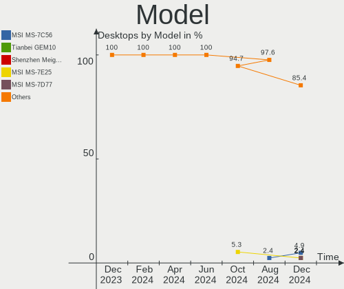

Manjaro Hardware Trends (Desktop)
---------------------------------

A project to identify most popular hardware characteristics and track their change
over time based on data collected by Manjaro users at https://Linux-Hardware.org.

Anyone can contribute to the study by uploading probes of their computers by
the [hw-probe](https://github.com/linuxhw/hw-probe) tool:

    sudo -E hw-probe -all -upload

Full-feature report is available here: https://linux-hardware.org/?view=trends&formfactor=desktop

Period: Jun, 2021.

Contents
--------

- [ OS                       ](#os)
- [ OS Family                ](#os-family)
- [ Kernel                   ](#kernel)
- [ Kernel Family            ](#kernel-family)
- [ Kernel Major Ver.        ](#kernel-major-ver)
- [ Arch                     ](#arch)
- [ DE                       ](#de)
- [ Display Server           ](#display-server)
- [ Display Manager          ](#display-manager)
- [ OS Lang                  ](#os-lang)
- [ Boot Mode                ](#boot-mode)
- [ Filesystem               ](#filesystem)
- [ Part. scheme             ](#part-scheme)
- [ Dual Boot with Linux/BSD ](#dual-boot-with-linux/bsd)
- [ Dual Boot (Win)          ](#dual-boot-win)
- [ Country                  ](#country)
- [ City                     ](#city)
- [ Vendor                   ](#vendor)
- [ Model                    ](#model)
- [ Model Family             ](#model-family)
- [ MFG Year                 ](#mfg-year)
- [ Form Factor              ](#form-factor)
- [ Secure Boot              ](#secure-boot)
- [ Coreboot                 ](#coreboot)
- [ RAM Size                 ](#ram-size)
- [ RAM Used                 ](#ram-used)
- [ Has CD-ROM               ](#has-cd-rom)
- [ Total Drives             ](#total-drives)
- [ Has Ethernet             ](#has-ethernet)
- [ Has WiFi                 ](#has-wifi)
- [ Has Bluetooth            ](#has-bluetooth)
- [ Drive Vendor             ](#drive-vendor)
- [ Drive Model              ](#drive-model)
- [ HDD Vendor               ](#hdd-vendor)
- [ SSD Vendor               ](#ssd-vendor)
- [ Drive Kind               ](#drive-kind)
- [ Drive Connector          ](#drive-connector)
- [ Drive Size               ](#drive-size)
- [ Space Total              ](#space-total)
- [ Space Used               ](#space-used)
- [ Malfunc. Drives          ](#malfunc-drives)
- [ Malfunc. Drive Vendor    ](#malfunc-drive-vendor)
- [ Malfunc. HDD Vendor      ](#malfunc-hdd-vendor)
- [ Malfunc. Drive Kind      ](#malfunc-drive-kind)
- [ Failed Drives            ](#failed-drives)
- [ Failed Drive Vendor      ](#failed-drive-vendor)
- [ Drive Status             ](#drive-status)
- [ Storage Vendor           ](#storage-vendor)
- [ Storage Model            ](#storage-model)
- [ Storage Kind             ](#storage-kind)
- [ CPU Vendor               ](#cpu-vendor)
- [ CPU Model                ](#cpu-model)
- [ CPU Model Family         ](#cpu-model-family)
- [ CPU Cores                ](#cpu-cores)
- [ CPU Sockets              ](#cpu-sockets)
- [ CPU Threads              ](#cpu-threads)
- [ CPU Op-Modes             ](#cpu-op-modes)
- [ CPU Microcode            ](#cpu-microcode)
- [ CPU Microarch            ](#cpu-microarch)
- [ GPU Vendor               ](#gpu-vendor)
- [ GPU Model                ](#gpu-model)
- [ GPU Combo                ](#gpu-combo)
- [ GPU Driver               ](#gpu-driver)
- [ GPU Memory               ](#gpu-memory)
- [ Monitor Vendor           ](#monitor-vendor)
- [ Monitor Model            ](#monitor-model)
- [ Monitor Resolution       ](#monitor-resolution)
- [ Monitor Diagonal         ](#monitor-diagonal)
- [ Monitor Width            ](#monitor-width)
- [ Aspect Ratio             ](#aspect-ratio)
- [ Monitor Area             ](#monitor-area)
- [ Pixel Density            ](#pixel-density)
- [ Multiple Monitors        ](#multiple-monitors)
- [ Net Controller Vendor    ](#net-controller-vendor)
- [ Net Controller Model     ](#net-controller-model)
- [ Wireless Vendor          ](#wireless-vendor)
- [ Wireless Model           ](#wireless-model)
- [ Ethernet Vendor          ](#ethernet-vendor)
- [ Ethernet Model           ](#ethernet-model)
- [ Net Controller Kind      ](#net-controller-kind)
- [ Used Controller          ](#used-controller)
- [ NICs                     ](#nics)
- [ IPv6                     ](#ipv6)
- [ Memory Vendor            ](#memory-vendor)
- [ Memory Model             ](#memory-model)
- [ Memory Kind              ](#memory-kind)
- [ Memory Form Factor       ](#memory-form-factor)
- [ Memory Size              ](#memory-size)
- [ Memory Speed             ](#memory-speed)
- [ Sound Vendor             ](#sound-vendor)
- [ Sound Model              ](#sound-model)
- [ Camera Vendor            ](#camera-vendor)
- [ Camera Model             ](#camera-model)
- [ Fingerprint Vendor       ](#fingerprint-vendor)
- [ Fingerprint Model        ](#fingerprint-model)
- [ Chipcard Vendor          ](#chipcard-vendor)
- [ Chipcard Model           ](#chipcard-model)
- [ Printer Vendor           ](#printer-vendor)
- [ Printer Model            ](#printer-model)
- [ Scanner Vendor           ](#scanner-vendor)
- [ Scanner Model            ](#scanner-model)
- [ Bluetooth Vendor         ](#bluetooth-vendor)
- [ Bluetooth Model          ](#bluetooth-model)
- [ Unsupported Devices      ](#unsupported-devices)
- [ Unsupported Device Types ](#unsupported-device-types)

OS
--

Installed operating systems

| Name           | Desktops | Percent |
|----------------|----------|---------|
| Manjaro        | 31       | 55.36%  |
| Manjaro 21.0.7 | 12       | 21.43%  |
| Manjaro 21.0.5 | 7        | 12.5%   |
| Manjaro 21.0.6 | 6        | 10.71%  |

OS Family
---------

OS without a version

| Name    | Desktops | Percent |
|---------|----------|---------|
| Manjaro | 56       | 100%    |

Kernel
------

Version of the Linux kernel

| Version                 | Desktops | Percent |
|-------------------------|----------|---------|
| 5.10.42-1-MANJARO       | 18       | 32.14%  |
| 5.10.36-2-MANJARO       | 9        | 16.07%  |
| 5.12.2-1-MANJARO        | 7        | 12.5%   |
| 5.10.41-1-MANJARO       | 5        | 8.93%   |
| 5.13.0-1-MANJARO        | 3        | 5.36%   |
| 5.12.9-1-MANJARO        | 3        | 5.36%   |
| 5.12.8-1-MANJARO        | 3        | 5.36%   |
| 5.11.22-2-MANJARO       | 2        | 3.57%   |
| 5.4.105-1-MANJARO       | 1        | 1.79%   |
| 5.11.19-1-MANJARO       | 1        | 1.79%   |
| 5.11.0-zen1-1-zen-anbox | 1        | 1.79%   |
| 5.10.26-1-MANJARO       | 1        | 1.79%   |
| 4.14.235-1-MANJARO      | 1        | 1.79%   |
| 4.14.234-1-MANJARO      | 1        | 1.79%   |

Kernel Family
-------------

Linux kernel without a distro release

| Version  | Desktops | Percent |
|----------|----------|---------|
| 5.10.42  | 18       | 32.14%  |
| 5.10.36  | 9        | 16.07%  |
| 5.12.2   | 7        | 12.5%   |
| 5.10.41  | 5        | 8.93%   |
| 5.13.0   | 3        | 5.36%   |
| 5.12.9   | 3        | 5.36%   |
| 5.12.8   | 3        | 5.36%   |
| 5.11.22  | 2        | 3.57%   |
| 5.4.105  | 1        | 1.79%   |
| 5.11.19  | 1        | 1.79%   |
| 5.11.0   | 1        | 1.79%   |
| 5.10.26  | 1        | 1.79%   |
| 4.14.235 | 1        | 1.79%   |
| 4.14.234 | 1        | 1.79%   |

Kernel Major Ver.
-----------------

Linux kernel major version

| Version | Desktops | Percent |
|---------|----------|---------|
| 5.10    | 33       | 58.93%  |
| 5.12    | 13       | 23.21%  |
| 5.11    | 4        | 7.14%   |
| 5.13    | 3        | 5.36%   |
| 4.14    | 2        | 3.57%   |
| 5.4     | 1        | 1.79%   |

Arch
----

OS architecture (x86_64, i586, etc.)

| Name   | Desktops | Percent |
|--------|----------|---------|
| x86_64 | 56       | 100%    |

DE
--

Desktop Environment

| Name       | Desktops | Percent |
|------------|----------|---------|
| XFCE       | 13       | 23.21%  |
| KDE        | 12       | 21.43%  |
| GNOME      | 12       | 21.43%  |
| KDE5       | 8        | 14.29%  |
| X-Cinnamon | 3        | 5.36%   |
| i3         | 3        | 5.36%   |
| Unknown    | 2        | 3.57%   |
| MATE       | 1        | 1.79%   |
| Deepin     | 1        | 1.79%   |
| Bspwm      | 1        | 1.79%   |

Display Server
--------------

X11 or Wayland

| Name    | Desktops | Percent |
|---------|----------|---------|
| X11     | 49       | 87.5%   |
| Wayland | 5        | 8.93%   |
| Unknown | 2        | 3.57%   |

Display Manager
---------------

SDDM, LightDM, etc.

| Name    | Desktops | Percent |
|---------|----------|---------|
| Unknown | 31       | 55.36%  |
| LightDM | 10       | 17.86%  |
| SDDM    | 9        | 16.07%  |
| GDM     | 5        | 8.93%   |
| TDM     | 1        | 1.79%   |

OS Lang
-------

Language

| Lang  | Desktops | Percent |
|-------|----------|---------|
| en_US | 23       | 41.07%  |
| en_GB | 6        | 10.71%  |
| ru_RU | 4        | 7.14%   |
| de_DE | 4        | 7.14%   |
| it_IT | 3        | 5.36%   |
| zh_CN | 2        | 3.57%   |
| pt_BR | 2        | 3.57%   |
| en_IN | 2        | 3.57%   |
| en_AU | 2        | 3.57%   |
| pt_PT | 1        | 1.79%   |
| pl_PL | 1        | 1.79%   |
| nl_NL | 1        | 1.79%   |
| en_ZA | 1        | 1.79%   |
| en_TT | 1        | 1.79%   |
| en_PH | 1        | 1.79%   |
| en_HK | 1        | 1.79%   |
| de_CH | 1        | 1.79%   |

Boot Mode
---------

EFI or BIOS

| Mode | Desktops | Percent |
|------|----------|---------|
| BIOS | 40       | 71.43%  |
| EFI  | 16       | 28.57%  |

Filesystem
----------

Type of filesystem

| Type    | Desktops | Percent |
|---------|----------|---------|
| Ext4    | 50       | 89.29%  |
| Btrfs   | 4        | 7.14%   |
| XXXfs   | 1        | 1.79%   |
| Overlay | 1        | 1.79%   |

Part. scheme
------------

Scheme of partitioning

| Type    | Desktops | Percent |
|---------|----------|---------|
| Unknown | 30       | 53.57%  |
| GPT     | 19       | 33.93%  |
| MBR     | 7        | 12.5%   |

Dual Boot with Linux/BSD
------------------------

Hosting more than one Linux/BSD

| Dual boot | Desktops | Percent |
|-----------|----------|---------|
| No        | 46       | 82.14%  |
| Yes       | 10       | 17.86%  |

Dual Boot (Win)
---------------

Hosting Linux and Windows

| Dual boot | Desktops | Percent |
|-----------|----------|---------|
| No        | 39       | 69.64%  |
| Yes       | 17       | 30.36%  |

Country
-------

Geographic location (country)

| Country             | Desktops | Percent |
|---------------------|----------|---------|
| USA                 | 12       | 21.43%  |
| Germany             | 8        | 14.29%  |
| UK                  | 4        | 7.14%   |
| Russia              | 3        | 5.36%   |
| Netherlands         | 3        | 5.36%   |
| Italy               | 3        | 5.36%   |
| Brazil              | 3        | 5.36%   |
| India               | 2        | 3.57%   |
| China               | 2        | 3.57%   |
| Australia           | 2        | 3.57%   |
| Ukraine             | 1        | 1.79%   |
| Trinidad and Tobago | 1        | 1.79%   |
| Switzerland         | 1        | 1.79%   |
| South Africa        | 1        | 1.79%   |
| Portugal            | 1        | 1.79%   |
| Poland              | 1        | 1.79%   |
| Philippines         | 1        | 1.79%   |
| Malaysia            | 1        | 1.79%   |
| Indonesia           | 1        | 1.79%   |
| Hong Kong           | 1        | 1.79%   |
| Croatia             | 1        | 1.79%   |
| Belgium             | 1        | 1.79%   |
| Belarus             | 1        | 1.79%   |
| Austria             | 1        | 1.79%   |

City
----

Geographic location (city)

| City           | Desktops | Percent |
|----------------|----------|---------|
| Yogyakarta     | 1        | 1.79%   |
| Urbana         | 1        | 1.79%   |
| Uelsen         | 1        | 1.79%   |
| Trenton        | 1        | 1.79%   |
| The Bronx      | 1        | 1.79%   |
| São Paulo     | 1        | 1.79%   |
| St Petersburg  | 1        | 1.79%   |
| South Yarra    | 1        | 1.79%   |
| Shanghai       | 1        | 1.79%   |
| Schwerte       | 1        | 1.79%   |
| Rostov-on-Don  | 1        | 1.79%   |
| Rockwall       | 1        | 1.79%   |
| Rockville      | 1        | 1.79%   |
| Rimpar         | 1        | 1.79%   |
| Portland       | 1        | 1.79%   |
| Poreč         | 1        | 1.79%   |
| Ouddorp        | 1        | 1.79%   |
| Nijmegen       | 1        | 1.79%   |
| Minsk          | 1        | 1.79%   |
| Middleton      | 1        | 1.79%   |
| Makiivka       | 1        | 1.79%   |
| Mahanoy City   | 1        | 1.79%   |
| Lucca          | 1        | 1.79%   |
| Los Banos      | 1        | 1.79%   |
| Liverpool      | 1        | 1.79%   |
| Limavady       | 1        | 1.79%   |
| Laurel         | 1        | 1.79%   |
| Langenzersdorf | 1        | 1.79%   |
| Kuala Lumpur   | 1        | 1.79%   |
| Krakow         | 1        | 1.79%   |
| Korolyov       | 1        | 1.79%   |
| Kirkcudbright  | 1        | 1.79%   |
| Johannesburg   | 1        | 1.79%   |
| Heinsberg      | 1        | 1.79%   |
| Havre de Grace | 1        | 1.79%   |
| Hamburg        | 1        | 1.79%   |
| Halifax        | 1        | 1.79%   |
| Ghent          | 1        | 1.79%   |
| Foshan         | 1        | 1.79%   |
| Felgueiras     | 1        | 1.79%   |
| Eindhoven      | 1        | 1.79%   |
| Delhi          | 1        | 1.79%   |
| Cottbus        | 1        | 1.79%   |
| Contagem       | 1        | 1.79%   |
| Coburg         | 1        | 1.79%   |
| Chiaravalle    | 1        | 1.79%   |
| Chaguanas      | 1        | 1.79%   |
| Central        | 1        | 1.79%   |
| Cambridge      | 1        | 1.79%   |
| Cabo Verde     | 1        | 1.79%   |
| Bulach         | 1        | 1.79%   |
| Brisbane       | 1        | 1.79%   |
| Berlin         | 1        | 1.79%   |
| Bengaluru      | 1        | 1.79%   |
| Bacolod City   | 1        | 1.79%   |
| Ascoli Piceno  | 1        | 1.79%   |

Vendor
------

Motherboard manufacturer

| Name                | Desktops | Percent |
|---------------------|----------|---------|
| ASUSTek Computer    | 17       | 30.36%  |
| MSI                 | 10       | 17.86%  |
| Gigabyte Technology | 10       | 17.86%  |
| ASRock              | 7        | 12.5%   |
| Hewlett-Packard     | 4        | 7.14%   |
| Intel               | 2        | 3.57%   |
| Dell                | 2        | 3.57%   |
| Packard Bell        | 1        | 1.79%   |
| Lenovo              | 1        | 1.79%   |
| Apple               | 1        | 1.79%   |
| Unknown             | 1        | 1.79%   |

Model
-----

Motherboard model

| Name                          | Desktops | Percent |
|-------------------------------|----------|---------|
| ASUS ROG STRIX X570-E GAMING  | 3        | 5.36%   |
| ASUS All Series               | 3        | 5.36%   |
| MSI MS-7816                   | 2        | 3.57%   |
| ASUS TUF GAMING Z490-PLUS     | 2        | 3.57%   |
| Packard Bell ipower G5800     | 1        | 1.79%   |
| MSI MS-7B98                   | 1        | 1.79%   |
| MSI MS-7B93                   | 1        | 1.79%   |
| MSI MS-7B89                   | 1        | 1.79%   |
| MSI MS-7B86                   | 1        | 1.79%   |
| MSI MS-7A34                   | 1        | 1.79%   |
| MSI MS-7998                   | 1        | 1.79%   |
| MSI MS-7900                   | 1        | 1.79%   |
| MSI MS-7817                   | 1        | 1.79%   |
| Lenovo H310                   | 1        | 1.79%   |
| Intel H55 INTEL               | 1        | 1.79%   |
| Intel DQ67SW AAG12527-310     | 1        | 1.79%   |
| HP Z440 Workstation           | 1        | 1.79%   |
| HP Pavilion Desktop 590-a0xxx | 1        | 1.79%   |
| HP Compaq Pro 6300 SFF        | 1        | 1.79%   |
| HP 570-p017c                  | 1        | 1.79%   |
| Gigabyte Z390 AORUS PRO       | 1        | 1.79%   |
| Gigabyte Z370 HD3             | 1        | 1.79%   |
| Gigabyte P31-DS3L             | 1        | 1.79%   |
| Gigabyte H61MA-D2V            | 1        | 1.79%   |
| Gigabyte GA-990XA-UD3         | 1        | 1.79%   |
| Gigabyte B85M-D3H-A           | 1        | 1.79%   |
| Gigabyte B450M S2H            | 1        | 1.79%   |
| Gigabyte B450M DS3H V2        | 1        | 1.79%   |
| Gigabyte AX370M-DS3H          | 1        | 1.79%   |
| Gigabyte 7200-0024A           | 1        | 1.79%   |
| Dell Precision T3600          | 1        | 1.79%   |
| Dell OptiPlex 7010            | 1        | 1.79%   |
| ASUS Z170I PRO GAMING         | 1        | 1.79%   |
| ASUS TUF GAMING X570-PLUS     | 1        | 1.79%   |
| ASUS PRIME Z390-P             | 1        | 1.79%   |
| ASUS PRIME B460M-A            | 1        | 1.79%   |
| ASUS P8P67 LE                 | 1        | 1.79%   |
| ASUS P8H67                    | 1        | 1.79%   |
| ASUS P5QL PRO                 | 1        | 1.79%   |
| ASUS M5A97 R2.0               | 1        | 1.79%   |
| ASUS M3A78-EM                 | 1        | 1.79%   |
| ASRock Z97E-ITX/ac            | 1        | 1.79%   |
| ASRock X470 Taichi            | 1        | 1.79%   |
| ASRock X300M-STX              | 1        | 1.79%   |
| ASRock H97M Pro4              | 1        | 1.79%   |
| ASRock C Series               | 1        | 1.79%   |
| ASRock B450M Steel Legend     | 1        | 1.79%   |
| ASRock B450 Pro4              | 1        | 1.79%   |
| Apple MacPro3,1               | 1        | 1.79%   |
| Unknown                       | 1        | 1.79%   |

Model Family
------------

Motherboard model prefix

| Name                  | Desktops | Percent |
|-----------------------|----------|---------|
| ASUS TUF              | 3        | 5.36%   |
| ASUS ROG              | 3        | 5.36%   |
| ASUS All              | 3        | 5.36%   |
| MSI MS-7816           | 2        | 3.57%   |
| Gigabyte B450M        | 2        | 3.57%   |
| ASUS PRIME            | 2        | 3.57%   |
| Packard Bell ipower   | 1        | 1.79%   |
| MSI MS-7B98           | 1        | 1.79%   |
| MSI MS-7B93           | 1        | 1.79%   |
| MSI MS-7B89           | 1        | 1.79%   |
| MSI MS-7B86           | 1        | 1.79%   |
| MSI MS-7A34           | 1        | 1.79%   |
| MSI MS-7998           | 1        | 1.79%   |
| MSI MS-7900           | 1        | 1.79%   |
| MSI MS-7817           | 1        | 1.79%   |
| Lenovo H310           | 1        | 1.79%   |
| Intel H55             | 1        | 1.79%   |
| Intel DQ67SW          | 1        | 1.79%   |
| HP Z440               | 1        | 1.79%   |
| HP Pavilion           | 1        | 1.79%   |
| HP Compaq             | 1        | 1.79%   |
| HP 570-p017c          | 1        | 1.79%   |
| Gigabyte Z390         | 1        | 1.79%   |
| Gigabyte Z370         | 1        | 1.79%   |
| Gigabyte P31-DS3L     | 1        | 1.79%   |
| Gigabyte H61MA-D2V    | 1        | 1.79%   |
| Gigabyte GA-990XA-UD3 | 1        | 1.79%   |
| Gigabyte B85M-D3H-A   | 1        | 1.79%   |
| Gigabyte AX370M-DS3H  | 1        | 1.79%   |
| Gigabyte 7200-0024A   | 1        | 1.79%   |
| Dell Precision        | 1        | 1.79%   |
| Dell OptiPlex         | 1        | 1.79%   |
| ASUS Z170I            | 1        | 1.79%   |
| ASUS P8P67            | 1        | 1.79%   |
| ASUS P8H67            | 1        | 1.79%   |
| ASUS P5QL             | 1        | 1.79%   |
| ASUS M5A97            | 1        | 1.79%   |
| ASUS M3A78-EM         | 1        | 1.79%   |
| ASRock Z97E-ITX       | 1        | 1.79%   |
| ASRock X470           | 1        | 1.79%   |
| ASRock X300M-STX      | 1        | 1.79%   |
| ASRock H97M           | 1        | 1.79%   |
| ASRock C              | 1        | 1.79%   |
| ASRock B450M          | 1        | 1.79%   |
| ASRock B450           | 1        | 1.79%   |
| Apple MacPro3         | 1        | 1.79%   |
| Unknown               | 1        | 1.79%   |

MFG Year
--------

Motherboard manufacture year

| Year | Desktops | Percent |
|------|----------|---------|
| 2020 | 16       | 28.57%  |
| 2018 | 7        | 12.5%   |
| 2015 | 7        | 12.5%   |
| 2014 | 4        | 7.14%   |
| 2021 | 3        | 5.36%   |
| 2019 | 3        | 5.36%   |
| 2012 | 3        | 5.36%   |
| 2017 | 2        | 3.57%   |
| 2016 | 2        | 3.57%   |
| 2011 | 2        | 3.57%   |
| 2010 | 2        | 3.57%   |
| 2009 | 2        | 3.57%   |
| 2008 | 2        | 3.57%   |
| 2013 | 1        | 1.79%   |

Form Factor
-----------

Physical design of the computer

| Name    | Desktops | Percent |
|---------|----------|---------|
| Desktop | 56       | 100%    |

Secure Boot
-----------

Enabled or disabled

| State    | Desktops | Percent |
|----------|----------|---------|
| Disabled | 56       | 100%    |

Coreboot
--------

Have coreboot on board

| Used | Desktops | Percent |
|------|----------|---------|
| No   | 56       | 100%    |

RAM Size
--------

Total RAM memory

| Size in GB  | Desktops | Percent |
|-------------|----------|---------|
| 16.01-24.0  | 21       | 37.5%   |
| 32.01-64.0  | 12       | 21.43%  |
| 8.01-16.0   | 8        | 14.29%  |
| 4.01-8.0    | 6        | 10.71%  |
| 3.01-4.0    | 3        | 5.36%   |
| 64.01-256.0 | 3        | 5.36%   |
| 24.01-32.0  | 2        | 3.57%   |
| 2.01-3.0    | 1        | 1.79%   |

RAM Used
--------

Used RAM memory

| Used GB    | Desktops | Percent |
|------------|----------|---------|
| 1.01-2.0   | 14       | 25%     |
| 4.01-8.0   | 13       | 23.21%  |
| 2.01-3.0   | 12       | 21.43%  |
| 3.01-4.0   | 8        | 14.29%  |
| 8.01-16.0  | 4        | 7.14%   |
| 0.51-1.0   | 3        | 5.36%   |
| 16.01-24.0 | 2        | 3.57%   |

Has CD-ROM
----------

Has CD-ROM on board

| Presented | Desktops | Percent |
|-----------|----------|---------|
| No        | 38       | 67.86%  |
| Yes       | 18       | 32.14%  |

Total Drives
------------

Number of drives on board

| Drives | Desktops | Percent |
|--------|----------|---------|
| 3      | 19       | 33.93%  |
| 1      | 16       | 28.57%  |
| 2      | 11       | 19.64%  |
| 4      | 5        | 8.93%   |
| 5      | 3        | 5.36%   |
| 6      | 1        | 1.79%   |
| 0      | 1        | 1.79%   |

Has Ethernet
------------

Has Ethernet on board

| Presented | Desktops | Percent |
|-----------|----------|---------|
| Yes       | 55       | 98.21%  |
| No        | 1        | 1.79%   |

Has WiFi
--------

Has WiFi module

| Presented | Desktops | Percent |
|-----------|----------|---------|
| No        | 30       | 53.57%  |
| Yes       | 26       | 46.43%  |

Has Bluetooth
-------------

Has Bluetooth module

| Presented | Desktops | Percent |
|-----------|----------|---------|
| No        | 35       | 62.5%   |
| Yes       | 21       | 37.5%   |

Drive Vendor
------------

Hard drive vendors

| Vendor                | Desktops | Drives | Percent |
|-----------------------|----------|--------|---------|
| WDC                   | 23       | 34     | 20%     |
| Samsung Electronics   | 23       | 28     | 20%     |
| Seagate               | 19       | 24     | 16.52%  |
| Crucial               | 9        | 9      | 7.83%   |
| Toshiba               | 8        | 8      | 6.96%   |
| SanDisk               | 7        | 8      | 6.09%   |
| Kingston              | 4        | 4      | 3.48%   |
| Hitachi               | 4        | 4      | 3.48%   |
| XPG                   | 3        | 3      | 2.61%   |
| Phison                | 2        | 2      | 1.74%   |
| Intenso               | 2        | 2      | 1.74%   |
| China                 | 2        | 2      | 1.74%   |
| A-DATA Technology     | 2        | 3      | 1.74%   |
| Unknown               | 1        | 1      | 0.87%   |
| SPCC                  | 1        | 1      | 0.87%   |
| SK Hynix              | 1        | 1      | 0.87%   |
| Realtek Semiconductor | 1        | 1      | 0.87%   |
| Patriot               | 1        | 1      | 0.87%   |
| Hewlett-Packard       | 1        | 1      | 0.87%   |
| ADATA Technology      | 1        | 1      | 0.87%   |

Drive Model
-----------

Hard drive models

| Model                              | Desktops | Percent |
|------------------------------------|----------|---------|
| WDC WD10EZEX-00WN4A0 1TB           | 3        | 2.24%   |
| Toshiba DT01ACA100 1TB             | 3        | 2.24%   |
| Seagate ST4000DM004-2CV104 4TB     | 3        | 2.24%   |
| Crucial CT240BX500SSD1 240GB       | 3        | 2.24%   |
| WDC WD6400AAKS-65A7B2 640GB        | 2        | 1.49%   |
| WDC WD20EARX-00PASB0 2TB           | 2        | 1.49%   |
| WDC WD10EZEX-60M2NA0 1TB           | 2        | 1.49%   |
| WDC WD10EZEX-08WN4A0 1TB           | 2        | 1.49%   |
| Seagate ST1000DM003-1ER162 1TB     | 2        | 1.49%   |
| SanDisk SDSSDA120G 120GB           | 2        | 1.49%   |
| Samsung SSD 850 EVO 250GB          | 2        | 1.49%   |
| Samsung SSD 840 EVO 120GB          | 2        | 1.49%   |
| Samsung NVMe SSD Drive 1TB         | 2        | 1.49%   |
| XPG NVMe SSD Drive 2TB             | 1        | 0.75%   |
| XPG NVMe SSD Drive 1TB             | 1        | 0.75%   |
| XPG NVMe SSD Drive 1024GB          | 1        | 0.75%   |
| WDC WDS500G2B0C-00PXH0 500GB       | 1        | 0.75%   |
| WDC WDS240G2G0B-00EPW0 240GB SSD   | 1        | 0.75%   |
| WDC WDS240G2G0A-00JH30 240GB SSD   | 1        | 0.75%   |
| WDC WDBNCE5000PNC 500GB SSD        | 1        | 0.75%   |
| WDC WD60EZRX-00MVLB1 6TB           | 1        | 0.75%   |
| WDC WD40PURZ-85AKKY0 4TB           | 1        | 0.75%   |
| WDC WD40EZRZ-75GXCB0 4TB           | 1        | 0.75%   |
| WDC WD40EFRX-68WT0N0 4TB           | 1        | 0.75%   |
| WDC WD30EZRS-00J99B0 3TB           | 1        | 0.75%   |
| WDC WD30EFRX-68EUZN0 3TB           | 1        | 0.75%   |
| WDC WD2500JS-41SGB0 250GB          | 1        | 0.75%   |
| WDC WD2500AAKX-603CA0 250GB        | 1        | 0.75%   |
| WDC WD2003FYPS-27W9B0 2TB          | 1        | 0.75%   |
| WDC WD1600AAJS-00WAA0 160GB        | 1        | 0.75%   |
| WDC WD10SPZX-35Z10T0 1TB           | 1        | 0.75%   |
| WDC WD10EZEX-75ZF5A0 1TB           | 1        | 0.75%   |
| WDC WD10EZEX-08M2NA0 1TB           | 1        | 0.75%   |
| WDC WD10EZEX-00BN5A0 1TB           | 1        | 0.75%   |
| WDC WD10EURX-63C57Y0 1TB           | 1        | 0.75%   |
| WDC WD10EARS-22Y5B1 1TB            | 1        | 0.75%   |
| WDC WD1003FBYX-01Y7B1 1TB          | 1        | 0.75%   |
| WDC WD1000CHTZ-04JCPV1 1TB         | 1        | 0.75%   |
| WDC WD Elements 500GB              | 1        | 0.75%   |
| Unknown SD/MMC/MS PRO 128GB        | 1        | 0.75%   |
| Toshiba MG04ACA400N 4TB            | 1        | 0.75%   |
| Toshiba MD04ACA400 4TB             | 1        | 0.75%   |
| Toshiba HDWD120 2TB                | 1        | 0.75%   |
| Toshiba HDWD110 1TB                | 1        | 0.75%   |
| Toshiba DT01ACA300 3TB             | 1        | 0.75%   |
| SPCC Solid State Disk 256GB        | 1        | 0.75%   |
| SK Hynix NVMe SSD Drive 256GB      | 1        | 0.75%   |
| Seagate ST500DM002-1BD142 500GB    | 1        | 0.75%   |
| Seagate ST5000VX0011-1T317X 5TB    | 1        | 0.75%   |
| Seagate ST4000DM000-1F2168 4TB     | 1        | 0.75%   |
| Seagate ST3500413AS 500GB          | 1        | 0.75%   |
| Seagate ST3500320AS 500GB          | 1        | 0.75%   |
| Seagate ST3320413AS 320GB          | 1        | 0.75%   |
| Seagate ST3250318AS 250GB          | 1        | 0.75%   |
| Seagate ST3000DM008-2DM166 3TB     | 1        | 0.75%   |
| Seagate ST2000LM003 HN-M201RAD 2TB | 1        | 0.75%   |
| Seagate ST2000DM008-2FR102 2TB     | 1        | 0.75%   |
| Seagate ST2000DM001-1ER164 2TB     | 1        | 0.75%   |
| Seagate ST2000DL003-9VT166 2TB     | 1        | 0.75%   |
| Seagate ST2000DL001-9VT156 2TB     | 1        | 0.75%   |

HDD Vendor
----------

Hard disk drive vendors

| Vendor              | Desktops | Drives | Percent |
|---------------------|----------|--------|---------|
| WDC                 | 21       | 29     | 38.18%  |
| Seagate             | 18       | 23     | 32.73%  |
| Toshiba             | 8        | 8      | 14.55%  |
| Hitachi             | 4        | 4      | 7.27%   |
| Samsung Electronics | 3        | 4      | 5.45%   |
| Intenso             | 1        | 1      | 1.82%   |

SSD Vendor
----------

Solid state drive vendors

| Vendor              | Desktops | Drives | Percent |
|---------------------|----------|--------|---------|
| Samsung Electronics | 14       | 14     | 35%     |
| Crucial             | 8        | 8      | 20%     |
| SanDisk             | 6        | 7      | 15%     |
| WDC                 | 3        | 3      | 7.5%    |
| China               | 2        | 2      | 5%      |
| A-DATA Technology   | 2        | 3      | 5%      |
| SPCC                | 1        | 1      | 2.5%    |
| Patriot             | 1        | 1      | 2.5%    |
| Kingston            | 1        | 1      | 2.5%    |
| Intenso             | 1        | 1      | 2.5%    |
| Hewlett-Packard     | 1        | 1      | 2.5%    |

Drive Kind
----------

HDD or SSD

| Kind    | Desktops | Drives | Percent |
|---------|----------|--------|---------|
| HDD     | 42       | 69     | 42.86%  |
| SSD     | 33       | 42     | 33.67%  |
| NVMe    | 20       | 24     | 20.41%  |
| Unknown | 3        | 3      | 3.06%   |

Drive Connector
---------------

SATA, SAS, NVMe, etc.

| Type | Desktops | Drives | Percent |
|------|----------|--------|---------|
| SATA | 53       | 110    | 68.83%  |
| NVMe | 20       | 24     | 25.97%  |
| SAS  | 4        | 4      | 5.19%   |

Drive Size
----------

Size of hard drive

| Size in TB | Desktops | Drives | Percent |
|------------|----------|--------|---------|
| 0.01-0.5   | 31       | 43     | 35.63%  |
| 0.51-1.0   | 30       | 39     | 34.48%  |
| 1.01-2.0   | 12       | 14     | 13.79%  |
| 3.01-4.0   | 9        | 9      | 10.34%  |
| 2.01-3.0   | 3        | 4      | 3.45%   |
| 4.01-10.0  | 2        | 2      | 2.3%    |

Space Total
-----------

Amount of disk space available on the file system

| Size in GB     | Desktops | Percent |
|----------------|----------|---------|
| 101-250        | 17       | 30.36%  |
| 1001-2000      | 10       | 17.86%  |
| 251-500        | 9        | 16.07%  |
| 501-1000       | 9        | 16.07%  |
| More than 3000 | 8        | 14.29%  |
| 1-20           | 1        | 1.79%   |
| 51-100         | 1        | 1.79%   |
| Unknown        | 1        | 1.79%   |

Space Used
----------

Amount of used disk space

| Used GB        | Desktops | Percent |
|----------------|----------|---------|
| 1-20           | 11       | 19.64%  |
| 51-100         | 9        | 16.07%  |
| 21-50          | 8        | 14.29%  |
| 101-250        | 7        | 12.5%   |
| 501-1000       | 6        | 10.71%  |
| More than 3000 | 4        | 7.14%   |
| 251-500        | 4        | 7.14%   |
| 1001-2000      | 4        | 7.14%   |
| 2001-3000      | 2        | 3.57%   |
| Unknown        | 1        | 1.79%   |

Malfunc. Drives
---------------

Drive models with a malfunction

| Model                          | Desktops | Drives | Percent |
|--------------------------------|----------|--------|---------|
| Seagate ST4000DM000-1F2168 4TB | 1        | 1      | 50%     |
| Seagate ST2000DL003-9VT166 2TB | 1        | 1      | 50%     |

Malfunc. Drive Vendor
---------------------

Vendors of faulty drives

| Vendor  | Desktops | Drives | Percent |
|---------|----------|--------|---------|
| Seagate | 2        | 2      | 100%    |

Malfunc. HDD Vendor
-------------------

Vendors of faulty HDD drives

| Vendor  | Desktops | Drives | Percent |
|---------|----------|--------|---------|
| Seagate | 2        | 2      | 100%    |

Malfunc. Drive Kind
-------------------

Kinds of faulty drives

| Kind | Desktops | Drives | Percent |
|------|----------|--------|---------|
| HDD  | 2        | 2      | 100%    |

Failed Drives
-------------

Failed drive models

Zero info for selected period =(

Failed Drive Vendor
-------------------

Failed drive vendors

Zero info for selected period =(

Drive Status
------------

Number of failed and malfunc. drives

| Status   | Desktops | Drives | Percent |
|----------|----------|--------|---------|
| Detected | 41       | 101    | 70.69%  |
| Works    | 15       | 35     | 25.86%  |
| Malfunc  | 2        | 2      | 3.45%   |

Storage Vendor
--------------

Storage controller vendors

| Vendor                      | Desktops | Percent |
|-----------------------------|----------|---------|
| Intel                       | 36       | 43.9%   |
| AMD                         | 20       | 24.39%  |
| Samsung Electronics         | 9        | 10.98%  |
| Kingston Technology Company | 3        | 3.66%   |
| ASMedia Technology          | 3        | 3.66%   |
| ADATA Technology            | 3        | 3.66%   |
| Sandisk                     | 2        | 2.44%   |
| SK Hynix                    | 1        | 1.22%   |
| Seagate Technology          | 1        | 1.22%   |
| Realtek Semiconductor       | 1        | 1.22%   |
| Phison Electronics          | 1        | 1.22%   |
| Micron/Crucial Technology   | 1        | 1.22%   |
| Marvell Technology Group    | 1        | 1.22%   |

Storage Model
-------------

Storage controller models

| Model                                                                                   | Desktops | Percent |
|-----------------------------------------------------------------------------------------|----------|---------|
| AMD FCH SATA Controller [AHCI mode]                                                     | 16       | 16.16%  |
| AMD 400 Series Chipset SATA Controller                                                  | 7        | 7.07%   |
| Samsung NVMe SSD Controller SM981/PM981/PM983                                           | 5        | 5.05%   |
| Intel 8 Series/C220 Series Chipset Family 6-port SATA Controller 1 [AHCI mode]          | 5        | 5.05%   |
| Intel Cannon Lake PCH SATA AHCI Controller                                              | 4        | 4.04%   |
| Intel 9 Series Chipset Family SATA Controller [AHCI Mode]                               | 4        | 4.04%   |
| Kingston Company A2000 NVMe SSD                                                         | 3        | 3.03%   |
| Intel 6 Series/C200 Series Chipset Family 6 port Desktop SATA AHCI Controller           | 3        | 3.03%   |
| ASMedia ASM1062 Serial ATA Controller                                                   | 3        | 3.03%   |
| ADATA XPG SX8200 Pro PCIe Gen3x4 M.2 2280 Solid State Drive                             | 3        | 3.03%   |
| Samsung NVMe SSD Controller PM9A1/PM9A3/980PRO                                          | 2        | 2.02%   |
| Intel Q170/Q150/B150/H170/H110/Z170/CM236 Chipset SATA Controller [AHCI Mode]           | 2        | 2.02%   |
| Intel NM10/ICH7 Family SATA Controller [IDE mode]                                       | 2        | 2.02%   |
| Intel Comet Lake SATA AHCI Controller                                                   | 2        | 2.02%   |
| Intel 7 Series/C210 Series Chipset Family 6-port SATA Controller [AHCI mode]            | 2        | 2.02%   |
| Intel 200 Series PCH SATA controller [AHCI mode]                                        | 2        | 2.02%   |
| AMD SB7x0/SB8x0/SB9x0 SATA Controller [IDE mode]                                        | 2        | 2.02%   |
| AMD SB7x0/SB8x0/SB9x0 IDE Controller                                                    | 2        | 2.02%   |
| SK Hynix BC501 NVMe Solid State Drive                                                   | 1        | 1.01%   |
| Seagate FireCuda 520 SSD                                                                | 1        | 1.01%   |
| Sandisk WD Blue SN550 NVMe SSD                                                          | 1        | 1.01%   |
| Sandisk WD Black NVMe SSD                                                               | 1        | 1.01%   |
| Samsung NVMe SSD Controller SM961/PM961/SM963                                           | 1        | 1.01%   |
| Samsung NVMe SSD Controller SM951/PM951                                                 | 1        | 1.01%   |
| Realtek RTS5763DL NVMe SSD Controller                                                   | 1        | 1.01%   |
| Phison E12 NVMe Controller                                                              | 1        | 1.01%   |
| Micron/Crucial P2 NVMe PCIe SSD                                                         | 1        | 1.01%   |
| Marvell Group 88SE6101/6102 single-port PATA133 interface                               | 1        | 1.01%   |
| Intel SATA Controller [RAID mode]                                                       | 1        | 1.01%   |
| Intel C610/X99 series chipset sSATA Controller [RAID mode]                              | 1        | 1.01%   |
| Intel C602 chipset 4-Port SATA Storage Control Unit                                     | 1        | 1.01%   |
| Intel C600/X79 series chipset SATA RAID Controller                                      | 1        | 1.01%   |
| Intel C600/X79 series chipset 6-Port SATA AHCI Controller                               | 1        | 1.01%   |
| Intel 82801JI (ICH10 Family) SATA AHCI Controller                                       | 1        | 1.01%   |
| Intel 82801IBM/IEM (ICH9M/ICH9M-E) 4 port SATA Controller [AHCI mode]                   | 1        | 1.01%   |
| Intel 631xESB/632xESB SATA AHCI Controller                                              | 1        | 1.01%   |
| Intel 631xESB/632xESB IDE Controller                                                    | 1        | 1.01%   |
| Intel 6 Series/C200 Series Chipset Family IDE-r Controller                              | 1        | 1.01%   |
| Intel 6 Series/C200 Series Chipset Family Desktop SATA Controller (IDE mode, ports 4-5) | 1        | 1.01%   |
| Intel 6 Series/C200 Series Chipset Family Desktop SATA Controller (IDE mode, ports 0-3) | 1        | 1.01%   |
| Intel 5 Series/3400 Series Chipset 6 port SATA AHCI Controller                          | 1        | 1.01%   |
| Intel 5 Series/3400 Series Chipset 4 port SATA IDE Controller                           | 1        | 1.01%   |
| Intel 5 Series/3400 Series Chipset 2 port SATA IDE Controller                           | 1        | 1.01%   |
| Intel 400 Series Chipset Family SATA AHCI Controller                                    | 1        | 1.01%   |
| AMD X370 Series Chipset SATA Controller                                                 | 1        | 1.01%   |
| AMD SB7x0/SB8x0/SB9x0 SATA Controller [AHCI mode]                                       | 1        | 1.01%   |
| AMD 300 Series Chipset SATA Controller                                                  | 1        | 1.01%   |
| ADATA Non-Volatile memory controller                                                    | 1        | 1.01%   |

Storage Kind
------------

Kind of storage controller (IDE, SATA, NVMe, SAS, ...)

| Kind | Desktops | Percent |
|------|----------|---------|
| SATA | 50       | 60.98%  |
| NVMe | 20       | 24.39%  |
| IDE  | 9        | 10.98%  |
| RAID | 2        | 2.44%   |
| SAS  | 1        | 1.22%   |

CPU Vendor
----------

Processor vendors

| Vendor | Desktops | Percent |
|--------|----------|---------|
| Intel  | 36       | 64.29%  |
| AMD    | 20       | 35.71%  |

CPU Model
---------

Processor models

| Model                                        | Desktops | Percent |
|----------------------------------------------|----------|---------|
| AMD Ryzen 9 3900X 12-Core Processor          | 4        | 7.14%   |
| Intel Core i7-9700K CPU @ 3.60GHz            | 2        | 3.57%   |
| Intel Core i7-10700K CPU @ 3.80GHz           | 2        | 3.57%   |
| Intel Core i5-4690 CPU @ 3.50GHz             | 2        | 3.57%   |
| Intel Core i5-4460 CPU @ 3.20GHz             | 2        | 3.57%   |
| AMD Ryzen 5 5600X 6-Core Processor           | 2        | 3.57%   |
| AMD Ryzen 3 2200G with Radeon Vega Graphics  | 2        | 3.57%   |
| Intel Xeon CPU E5462 @ 2.80GHz               | 1        | 1.79%   |
| Intel Xeon CPU E5-2670 v3 @ 2.30GHz          | 1        | 1.79%   |
| Intel Xeon CPU E5-1620 0 @ 3.60GHz           | 1        | 1.79%   |
| Intel Xeon CPU E3-1220 v3 @ 3.10GHz          | 1        | 1.79%   |
| Intel Pentium Dual-Core CPU T4500 @ 2.30GHz  | 1        | 1.79%   |
| Intel Pentium Dual-Core CPU E5800 @ 3.20GHz  | 1        | 1.79%   |
| Intel Pentium CPU G840 @ 2.80GHz             | 1        | 1.79%   |
| Intel Pentium CPU G3220 @ 3.00GHz            | 1        | 1.79%   |
| Intel Core i9-10900 CPU @ 2.80GHz            | 1        | 1.79%   |
| Intel Core i7-8700 CPU @ 3.20GHz             | 1        | 1.79%   |
| Intel Core i7-4790K CPU @ 4.00GHz            | 1        | 1.79%   |
| Intel Core i7-4790 CPU @ 3.60GHz             | 1        | 1.79%   |
| Intel Core i7-4770S CPU @ 3.10GHz            | 1        | 1.79%   |
| Intel Core i7-4770 CPU @ 3.40GHz             | 1        | 1.79%   |
| Intel Core i7-3770 CPU @ 3.40GHz             | 1        | 1.79%   |
| Intel Core i7-2600K CPU @ 3.40GHz            | 1        | 1.79%   |
| Intel Core i7 CPU 860 @ 2.80GHz              | 1        | 1.79%   |
| Intel Core i5-9400F CPU @ 2.90GHz            | 1        | 1.79%   |
| Intel Core i5-8600K CPU @ 3.60GHz            | 1        | 1.79%   |
| Intel Core i5-7400 CPU @ 3.00GHz             | 1        | 1.79%   |
| Intel Core i5-6600T CPU @ 2.70GHz            | 1        | 1.79%   |
| Intel Core i5-3470 CPU @ 3.20GHz             | 1        | 1.79%   |
| Intel Core i5-2400 CPU @ 3.10GHz             | 1        | 1.79%   |
| Intel Core i5 CPU 650 @ 3.20GHz              | 1        | 1.79%   |
| Intel Core i3-6100 CPU @ 3.70GHz             | 1        | 1.79%   |
| Intel Core i3-3220 CPU @ 3.30GHz             | 1        | 1.79%   |
| Intel Core 2 Quad CPU Q9300 @ 2.50GHz        | 1        | 1.79%   |
| Intel Core 2 Duo CPU E8600 @ 3.33GHz         | 1        | 1.79%   |
| AMD Ryzen 7 PRO 4750G with Radeon Graphics   | 1        | 1.79%   |
| AMD Ryzen 7 3700X 8-Core Processor           | 1        | 1.79%   |
| AMD Ryzen 7 2700X Eight-Core Processor       | 1        | 1.79%   |
| AMD Ryzen 7 2700 Eight-Core Processor        | 1        | 1.79%   |
| AMD Ryzen 5 3600 6-Core Processor            | 1        | 1.79%   |
| AMD Ryzen 5 1600 Six-Core Processor          | 1        | 1.79%   |
| AMD Ryzen 3 3200G with Radeon Vega Graphics  | 1        | 1.79%   |
| AMD Phenom II X4 965 Processor               | 1        | 1.79%   |
| AMD Phenom II X4 945 Processor               | 1        | 1.79%   |
| AMD FX-8370 Eight-Core Processor             | 1        | 1.79%   |
| AMD A9-9425 RADEON R5, 5 COMPUTE CORES 2C+3G | 1        | 1.79%   |
| AMD A8-6600K APU with Radeon HD Graphics     | 1        | 1.79%   |

CPU Model Family
----------------

Processor model prefix

| Model                   | Desktops | Percent |
|-------------------------|----------|---------|
| Intel Core i7           | 12       | 21.43%  |
| Intel Core i5           | 11       | 19.64%  |
| Intel Xeon              | 4        | 7.14%   |
| AMD Ryzen 9             | 4        | 7.14%   |
| AMD Ryzen 5             | 4        | 7.14%   |
| AMD Ryzen 7             | 3        | 5.36%   |
| AMD Ryzen 3             | 3        | 5.36%   |
| Intel Pentium Dual-Core | 2        | 3.57%   |
| Intel Pentium           | 2        | 3.57%   |
| Intel Core i3           | 2        | 3.57%   |
| AMD Phenom II X4        | 2        | 3.57%   |
| Other                   | 1        | 1.79%   |
| Intel Core i9           | 1        | 1.79%   |
| Intel Core 2 Quad       | 1        | 1.79%   |
| Intel Core 2 Duo        | 1        | 1.79%   |
| AMD Ryzen 7 PRO         | 1        | 1.79%   |
| AMD FX                  | 1        | 1.79%   |
| AMD A8                  | 1        | 1.79%   |

CPU Cores
---------

Number of processor cores

| Number | Desktops | Percent |
|--------|----------|---------|
| 4      | 24       | 42.86%  |
| 2      | 10       | 17.86%  |
| 8      | 9        | 16.07%  |
| 6      | 7        | 12.5%   |
| 12     | 5        | 8.93%   |
| 10     | 1        | 1.79%   |

CPU Sockets
-----------

Number of sockets

| Number | Desktops | Percent |
|--------|----------|---------|
| 1      | 55       | 98.21%  |
| 2      | 1        | 1.79%   |

CPU Threads
-----------

Threads per core (Hyper-Threading)

| Number | Desktops | Percent |
|--------|----------|---------|
| 2      | 30       | 53.57%  |
| 1      | 26       | 46.43%  |

CPU Op-Modes
------------

CPU Operation Modes (32-bit, 64-bit)

| Op mode        | Desktops | Percent |
|----------------|----------|---------|
| 32-bit, 64-bit | 56       | 100%    |

CPU Microcode
-------------

Microcode number

| Number     | Desktops | Percent |
|------------|----------|---------|
| Unknown    | 30       | 53.57%  |
| 0x306c3    | 5        | 8.93%   |
| 0x08701021 | 3        | 5.36%   |
| 0xa0655    | 2        | 3.57%   |
| 0x0800820d | 2        | 3.57%   |
| 0x906ed    | 1        | 1.79%   |
| 0x906ea    | 1        | 1.79%   |
| 0x506e3    | 1        | 1.79%   |
| 0x306a9    | 1        | 1.79%   |
| 0x206d7    | 1        | 1.79%   |
| 0x20652    | 1        | 1.79%   |
| 0x1067a    | 1        | 1.79%   |
| 0x10677    | 1        | 1.79%   |
| 0x0a201009 | 1        | 1.79%   |
| 0x08701013 | 1        | 1.79%   |
| 0x08600103 | 1        | 1.79%   |
| 0x08101016 | 1        | 1.79%   |
| 0x06006705 | 1        | 1.79%   |
| 0x010000c8 | 1        | 1.79%   |

CPU Microarch
-------------

Microarchitecture

| Name        | Desktops | Percent |
|-------------|----------|---------|
| Haswell     | 11       | 19.64%  |
| Zen 2       | 7        | 12.5%   |
| KabyLake    | 6        | 10.71%  |
| Penryn      | 5        | 8.93%   |
| SandyBridge | 4        | 7.14%   |
| Zen+        | 3        | 5.36%   |
| Zen         | 3        | 5.36%   |
| IvyBridge   | 3        | 5.36%   |
| CometLake   | 3        | 5.36%   |
| Zen 3       | 2        | 3.57%   |
| Skylake     | 2        | 3.57%   |
| Piledriver  | 2        | 3.57%   |
| K10         | 2        | 3.57%   |
| Westmere    | 1        | 1.79%   |
| Nehalem     | 1        | 1.79%   |
| Excavator   | 1        | 1.79%   |

GPU Vendor
----------

Vendors of graphics cards

| Vendor | Desktops | Percent |
|--------|----------|---------|
| Nvidia | 28       | 43.75%  |
| AMD    | 23       | 35.94%  |
| Intel  | 13       | 20.31%  |

GPU Model
---------

Graphics card models

| Model                                                                             | Desktops | Percent |
|-----------------------------------------------------------------------------------|----------|---------|
| Intel Xeon E3-1200 v3/4th Gen Core Processor Integrated Graphics Controller       | 5        | 7.81%   |
| AMD Ellesmere [Radeon RX 470/480/570/570X/580/580X/590]                           | 5        | 7.81%   |
| Nvidia GP107 [GeForce GTX 1050 Ti]                                                | 4        | 6.25%   |
| Nvidia GM206 [GeForce GTX 960]                                                    | 3        | 4.69%   |
| Nvidia TU117 [GeForce GTX 1650]                                                   | 2        | 3.13%   |
| Nvidia TU104 [GeForce RTX 2070 SUPER]                                             | 2        | 3.13%   |
| Nvidia GP106 [GeForce GTX 1060 6GB]                                               | 2        | 3.13%   |
| Nvidia GM204 [GeForce GTX 970]                                                    | 2        | 3.13%   |
| Nvidia GK208B [GeForce GT 730]                                                    | 2        | 3.13%   |
| Nvidia GK104 [GeForce GTX 760]                                                    | 2        | 3.13%   |
| Intel Xeon E3-1200 v2/3rd Gen Core processor Graphics Controller                  | 2        | 3.13%   |
| Intel CometLake-S GT2 [UHD Graphics 630]                                          | 2        | 3.13%   |
| Intel CoffeeLake-S GT2 [UHD Graphics 630]                                         | 2        | 3.13%   |
| AMD Vega 10 XL/XT [Radeon RX Vega 56/64]                                          | 2        | 3.13%   |
| Nvidia TU116 [GeForce GTX 1650 SUPER]                                             | 1        | 1.56%   |
| Nvidia GP107GL [Quadro P400]                                                      | 1        | 1.56%   |
| Nvidia GM107 [GeForce GTX 750]                                                    | 1        | 1.56%   |
| Nvidia GM107 [GeForce GTX 750 Ti]                                                 | 1        | 1.56%   |
| Nvidia GK208B [GeForce GT 710]                                                    | 1        | 1.56%   |
| Nvidia GF108 [GeForce GT 440]                                                     | 1        | 1.56%   |
| Nvidia GA104 [GeForce RTX 3070]                                                   | 1        | 1.56%   |
| Nvidia G94 [GeForce 9600 GT]                                                      | 1        | 1.56%   |
| Nvidia G92 [GeForce GT 330]                                                       | 1        | 1.56%   |
| Intel Mobile 4 Series Chipset Integrated Graphics Controller                      | 1        | 1.56%   |
| Intel 4 Series Chipset Integrated Graphics Controller                             | 1        | 1.56%   |
| AMD Tonga PRO [Radeon R9 285/380]                                                 | 1        | 1.56%   |
| AMD Tobago PRO [Radeon R7 360 / R9 360 OEM]                                       | 1        | 1.56%   |
| AMD Stoney [Radeon R2/R3/R4/R5 Graphics]                                          | 1        | 1.56%   |
| AMD RV730 PRO [Radeon HD 4650]                                                    | 1        | 1.56%   |
| AMD Richland [Radeon HD 8570D]                                                    | 1        | 1.56%   |
| AMD Renoir                                                                        | 1        | 1.56%   |
| AMD Picasso                                                                       | 1        | 1.56%   |
| AMD Navi 10 [Radeon RX 5600 OEM/5600 XT / 5700/5700 XT]                           | 1        | 1.56%   |
| AMD Lexa PRO [Radeon 540/540X/550/550X / RX 540X/550/550X]                        | 1        | 1.56%   |
| AMD Juniper XT [Radeon HD 6770]                                                   | 1        | 1.56%   |
| AMD Hemlock [Radeon HD 5970]                                                      | 1        | 1.56%   |
| AMD Hawaii PRO [Radeon R9 290/390]                                                | 1        | 1.56%   |
| AMD Cypress XT [Radeon HD 5870]                                                   | 1        | 1.56%   |
| AMD Curacao XT / Trinidad XT [Radeon R7 370 / R9 270X/370X]                       | 1        | 1.56%   |
| AMD Cape Verde PRO / Venus LE / Tropo PRO-L [Radeon HD 8830M / R7 250 / R7 M465X] | 1        | 1.56%   |
| AMD Baffin [Radeon RX 460/560D / Pro 450/455/460/555/555X/560/560X]               | 1        | 1.56%   |

GPU Combo
---------

Combinations of graphics cards

| Name            | Desktops | Percent |
|-----------------|----------|---------|
| 1 x Nvidia      | 23       | 41.07%  |
| 1 x AMD         | 21       | 37.5%   |
| 1 x Intel       | 6        | 10.71%  |
| Intel + Nvidia  | 4        | 7.14%   |
| Intel + 2 x AMD | 1        | 1.79%   |
| AMD + Nvidia    | 1        | 1.79%   |

GPU Driver
----------

Free vs proprietary

| Driver      | Desktops | Percent |
|-------------|----------|---------|
| Free        | 36       | 64.29%  |
| Proprietary | 19       | 33.93%  |
| Unknown     | 1        | 1.79%   |

GPU Memory
----------

Total video memory

| Size in GB | Desktops | Percent |
|------------|----------|---------|
| Unknown    | 30       | 53.57%  |
| 3.01-4.0   | 9        | 16.07%  |
| 7.01-8.0   | 7        | 12.5%   |
| 0.51-1.0   | 5        | 8.93%   |
| 1.01-2.0   | 4        | 7.14%   |
| 0.01-0.5   | 1        | 1.79%   |

Monitor Vendor
--------------

Monitor vendors

| Vendor               | Desktops | Percent |
|----------------------|----------|---------|
| Samsung Electronics  | 10       | 17.54%  |
| Dell                 | 8        | 14.04%  |
| AOC                  | 5        | 8.77%   |
| Acer                 | 5        | 8.77%   |
| Goldstar             | 4        | 7.02%   |
| LG Electronics       | 3        | 5.26%   |
| BenQ                 | 3        | 5.26%   |
| Ancor Communications | 3        | 5.26%   |
| Unknown              | 2        | 3.51%   |
| Philips              | 2        | 3.51%   |
| ViewSonic            | 1        | 1.75%   |
| TCT                  | 1        | 1.75%   |
| Targa                | 1        | 1.75%   |
| Sony                 | 1        | 1.75%   |
| Sceptre Tech         | 1        | 1.75%   |
| Lenovo               | 1        | 1.75%   |
| KJT                  | 1        | 1.75%   |
| Iiyama               | 1        | 1.75%   |
| Huion                | 1        | 1.75%   |
| Hewlett-Packard      | 1        | 1.75%   |
| AUS                  | 1        | 1.75%   |
| Apple                | 1        | 1.75%   |

Monitor Model
-------------

Monitor models

| Model                                                                   | Desktops | Percent |
|-------------------------------------------------------------------------|----------|---------|
| Goldstar HDR 4K GSM7707 3840x2160 600x340mm 27.2-inch                   | 2        | 3.23%   |
| Dell U2720Q DEL41B3 3840x2160 597x336mm 27.0-inch                       | 2        | 3.23%   |
| Dell U2412M DELA07B 1920x1200 518x324mm 24.1-inch                       | 2        | 3.23%   |
| ViewSonic VP2771 VSCCC32 2560x1440 597x336mm 27.0-inch                  | 1        | 1.61%   |
| Unknown LCD Monitor SPV Sunplus TV                                      | 1        | 1.61%   |
| Unknown LCD Monitor SAMSUNG                                             | 1        | 1.61%   |
| TCT DP1080P60 TCT0270 2560x1600 520x290mm 23.4-inch                     | 1        | 1.61%   |
| Targa LCD Monitor Visionary LCD 19-3 1280x1024                          | 1        | 1.61%   |
| Sony LCD Monitor TV                                                     | 1        | 1.61%   |
| Sceptre Tech Sceptre T27 SPT0AD7 1920x1080 600x330mm 27.0-inch          | 1        | 1.61%   |
| Samsung Electronics SyncMaster SAM0588 1920x1080 521x293mm 23.5-inch    | 1        | 1.61%   |
| Samsung Electronics SyncMaster SAM03E5 1680x1050 470x300mm 22.0-inch    | 1        | 1.61%   |
| Samsung Electronics SyncMaster SAM034F 1440x900 428x255mm 19.6-inch     | 1        | 1.61%   |
| Samsung Electronics SMFX2490HD SAM074A 1920x1080 530x300mm 24.0-inch    | 1        | 1.61%   |
| Samsung Electronics S34J55x SAM0F72 3440x1440 797x333mm 34.0-inch       | 1        | 1.61%   |
| Samsung Electronics LU28R55 SAM1017 3840x2160 630x360mm 28.6-inch       | 1        | 1.61%   |
| Samsung Electronics LCD Monitor SyncMaster 2640x1024                    | 1        | 1.61%   |
| Samsung Electronics LCD Monitor SAM7017 3840x2160 1872x1053mm 84.6-inch | 1        | 1.61%   |
| Samsung Electronics LC49G95T SAM7053 3840x1080 1193x336mm 48.8-inch     | 1        | 1.61%   |
| Samsung Electronics C27JG5x SAM0F57 2560x1440 600x340mm 27.2-inch       | 1        | 1.61%   |
| Philips PHL 273V7 PHLC156 1920x1080 598x336mm 27.0-inch                 | 1        | 1.61%   |
| Philips PHL 243V5 PHLC0D1 1920x1080 521x293mm 23.5-inch                 | 1        | 1.61%   |
| LG Electronics LCD Monitor LG ULTRAWIDE 5120x1080                       | 1        | 1.61%   |
| LG Electronics LCD Monitor LG ULTRAWIDE                                 | 1        | 1.61%   |
| LG Electronics LCD Monitor LG TV 1920x1080                              | 1        | 1.61%   |
| LG Electronics LCD Monitor LG FULL HD 1920x1080                         | 1        | 1.61%   |
| Lenovo LI2032 Wide LEN65A8 1600x900 443x249mm 20.0-inch                 | 1        | 1.61%   |
| KJT KJT4K2K60DP KJT5AFD 3840x2160 600x340mm 27.2-inch                   | 1        | 1.61%   |
| Iiyama PL2779QQ IVM6641 3840x2160 595x335mm 26.9-inch                   | 1        | 1.61%   |
| Huion Kamvas Pro 12 HAT1160 1920x1080 256x144mm 11.6-inch               | 1        | 1.61%   |
| Hewlett-Packard 25es HWP3323 1920x1080 553x309mm 24.9-inch              | 1        | 1.61%   |
| Goldstar ULTRAWIDE GSM76FA 2560x1080 798x334mm 34.1-inch                | 1        | 1.61%   |
| Goldstar HDR 4K GSM7750 3840x2160 697x392mm 31.5-inch                   | 1        | 1.61%   |
| Dell U2515H DELD06E 1920x1080 550x310mm 24.9-inch                       | 1        | 1.61%   |
| Dell S3220DGF DELD0F4 2560x1440 697x392mm 31.5-inch                     | 1        | 1.61%   |
| Dell P2417H DELA0DC 1920x1080 527x296mm 23.8-inch                       | 1        | 1.61%   |
| Dell P2414H DELA09A 1920x1080 527x297mm 23.8-inch                       | 1        | 1.61%   |
| Dell E228WFP DELD015 1680x1050 473x296mm 22.0-inch                      | 1        | 1.61%   |
| Dell E2215HV DELF05F 1920x1080 476x268mm 21.5-inch                      | 1        | 1.61%   |
| Dell DEL 1908FPBLK DEL4047 1280x1024 376x301mm 19.0-inch                | 1        | 1.61%   |
| BenQ LCD Monitor GW2270 1920x1080                                       | 1        | 1.61%   |
| BenQ GW2270 BNQ78DB 1920x1080 476x268mm 21.5-inch                       | 1        | 1.61%   |
| BenQ GL2450H BNQ78A7 1920x1080 530x300mm 24.0-inch                      | 1        | 1.61%   |
| AUS LCD Monitor ASUS VA27EHE 1920x1080                                  | 1        | 1.61%   |
| Apple LED Cinema APP9236 1920x1200 518x324mm 24.1-inch                  | 1        | 1.61%   |
| AOC LCD Monitor LM965 4640x1080                                         | 1        | 1.61%   |
| AOC 966W AOC1966 1366x768 410x230mm 18.5-inch                           | 1        | 1.61%   |
| AOC 27G2G4 AOC2702 1920x1080 598x336mm 27.0-inch                        | 1        | 1.61%   |
| AOC 2460 AOC2460 1920x1080 531x299mm 24.0-inch                          | 1        | 1.61%   |
| AOC 2269WM AOC2269 1920x1080 477x268mm 21.5-inch                        | 1        | 1.61%   |
| AOC 2260WG5 AOC2260 1920x1080 477x268mm 21.5-inch                       | 1        | 1.61%   |
| Ancor Communications PB248 ACI24A3 1920x1200 518x324mm 24.1-inch        | 1        | 1.61%   |
| Ancor Communications ASUS VS229 ACI22D3 1920x1080 480x270mm 21.7-inch   | 1        | 1.61%   |
| Ancor Communications ASUS MK241 ACI24A1 1920x1200 550x350mm 25.7-inch   | 1        | 1.61%   |
| Acer X223W ACR0050 1680x1050 474x296mm 22.0-inch                        | 1        | 1.61%   |
| Acer VG271U ACR06D7 2560x1440 597x336mm 27.0-inch                       | 1        | 1.61%   |
| Acer S220HQL ACR0281 1920x1080 477x268mm 21.5-inch                      | 1        | 1.61%   |
| Acer K242HL ACR03E3 1920x1080 531x299mm 24.0-inch                       | 1        | 1.61%   |
| Acer H236HL ACR0318 1920x1080 509x286mm 23.0-inch                       | 1        | 1.61%   |

Monitor Resolution
------------------

Monitor screen resolution

| Resolution         | Desktops | Percent |
|--------------------|----------|---------|
| 1920x1080 (FHD)    | 22       | 36.67%  |
| 3840x2160 (4K)     | 10       | 16.67%  |
| 2560x1440 (QHD)    | 5        | 8.33%   |
| 1920x1200 (WUXGA)  | 5        | 8.33%   |
| 1680x1050 (WSXGA+) | 3        | 5%      |
| Unknown            | 3        | 5%      |
| 1280x1024 (SXGA)   | 2        | 3.33%   |
| 5120x1080          | 1        | 1.67%   |
| 4640x1080          | 1        | 1.67%   |
| 3840x1080          | 1        | 1.67%   |
| 3440x1440          | 1        | 1.67%   |
| 2640x1024          | 1        | 1.67%   |
| 2560x1600          | 1        | 1.67%   |
| 2560x1080          | 1        | 1.67%   |
| 1600x900 (HD+)     | 1        | 1.67%   |
| 1440x900 (WXGA+)   | 1        | 1.67%   |
| 1366x768 (WXGA)    | 1        | 1.67%   |

Monitor Diagonal
----------------

Diagonal size in inches

| Inches  | Desktops | Percent |
|---------|----------|---------|
| 27      | 11       | 19.3%   |
| 24      | 10       | 17.54%  |
| Unknown | 8        | 14.04%  |
| 21      | 5        | 8.77%   |
| 23      | 4        | 7.02%   |
| 22      | 4        | 7.02%   |
| 34      | 2        | 3.51%   |
| 31      | 2        | 3.51%   |
| 25      | 2        | 3.51%   |
| 19      | 2        | 3.51%   |
| 84      | 1        | 1.75%   |
| 48      | 1        | 1.75%   |
| 28      | 1        | 1.75%   |
| 26      | 1        | 1.75%   |
| 20      | 1        | 1.75%   |
| 18      | 1        | 1.75%   |
| 11      | 1        | 1.75%   |

Monitor Width
-------------

Physical width

| Width in mm | Desktops | Percent |
|-------------|----------|---------|
| 501-600     | 26       | 48.15%  |
| 401-500     | 11       | 20.37%  |
| Unknown     | 8        | 14.81%  |
| 601-700     | 3        | 5.56%   |
| 701-800     | 2        | 3.7%    |
| 351-400     | 1        | 1.85%   |
| 201-300     | 1        | 1.85%   |
| 1501-2000   | 1        | 1.85%   |
| 1001-1500   | 1        | 1.85%   |

Aspect Ratio
------------

Proportional relationship between the width and the height

| Ratio   | Desktops | Percent |
|---------|----------|---------|
| 16/9    | 35       | 61.4%   |
| 16/10   | 10       | 17.54%  |
| Unknown | 8        | 14.04%  |
| 21/9    | 2        | 3.51%   |
| 5/4     | 1        | 1.75%   |
| 32/9    | 1        | 1.75%   |

Monitor Area
------------

Area in inch²

| Area in inch² | Desktops | Percent |
|----------------|----------|---------|
| 201-250        | 17       | 29.82%  |
| 301-350        | 12       | 21.05%  |
| Unknown        | 8        | 14.04%  |
| 251-300        | 7        | 12.28%  |
| 351-500        | 5        | 8.77%   |
| 151-200        | 4        | 7.02%   |
| More than 1000 | 1        | 1.75%   |
| 51-60          | 1        | 1.75%   |
| 141-150        | 1        | 1.75%   |
| 501-1000       | 1        | 1.75%   |

Pixel Density
-------------

Pixels per inch

| Density | Desktops | Percent |
|---------|----------|---------|
| 51-100  | 26       | 48.15%  |
| 101-120 | 10       | 18.52%  |
| Unknown | 8        | 14.81%  |
| 161-240 | 7        | 12.96%  |
| 121-160 | 3        | 5.56%   |

Multiple Monitors
-----------------

Total monitors connected

| Total | Desktops | Percent |
|-------|----------|---------|
| 1     | 44       | 78.57%  |
| 2     | 7        | 12.5%   |
| 0     | 3        | 5.36%   |
| 3     | 2        | 3.57%   |

Net Controller Vendor
---------------------

Controller vendors

| Vendor                            | Desktops | Percent |
|-----------------------------------|----------|---------|
| Realtek Semiconductor             | 30       | 37.04%  |
| Intel                             | 26       | 32.1%   |
| Qualcomm Atheros                  | 7        | 8.64%   |
| Ralink Technology                 | 4        | 4.94%   |
| Ralink                            | 4        | 4.94%   |
| TP-Link                           | 2        | 2.47%   |
| Sundance Technology Inc / IC Plus | 1        | 1.23%   |
| SEGGER                            | 1        | 1.23%   |
| Samsung Electronics               | 1        | 1.23%   |
| PEAK-System Technik               | 1        | 1.23%   |
| Microsoft                         | 1        | 1.23%   |
| JMicron Technology                | 1        | 1.23%   |
| Aquantia                          | 1        | 1.23%   |
| Apple                             | 1        | 1.23%   |

Net Controller Model
--------------------

Controller models

| Model                                                                      | Desktops | Percent |
|----------------------------------------------------------------------------|----------|---------|
| Realtek RTL8111/8168/8411 PCI Express Gigabit Ethernet Controller          | 25       | 26.88%  |
| Intel Wi-Fi 6 AX200                                                        | 5        | 5.38%   |
| Intel I211 Gigabit Network Connection                                      | 4        | 4.3%    |
| Intel 82579LM Gigabit Network Connection (Lewisville)                      | 4        | 4.3%    |
| Realtek RTL8125 2.5GbE Controller                                          | 3        | 3.23%   |
| Qualcomm Atheros Killer E220x Gigabit Ethernet Controller                  | 3        | 3.23%   |
| Intel Ethernet Connection (7) I219-V                                       | 3        | 3.23%   |
| Intel Ethernet Connection (2) I219-V                                       | 3        | 3.23%   |
| Intel Ethernet Connection (2) I218-V                                       | 3        | 3.23%   |
| Realtek RTL810xE PCI Express Fast Ethernet controller                      | 2        | 2.15%   |
| Ralink MT7601U Wireless Adapter                                            | 2        | 2.15%   |
| Intel Ethernet Connection (11) I219-V                                      | 2        | 2.15%   |
| Intel Dual Band Wireless-AC 3168NGW [Stone Peak]                           | 2        | 2.15%   |
| TP-Link Archer T2U PLUS [RTL8821AU]                                        | 1        | 1.08%   |
| TP-Link 802.11ac NIC                                                       | 1        | 1.08%   |
| Sundance Inc / IC Plus IC Plus IP100A Integrated 10/100 Ethernet MAC + PHY | 1        | 1.08%   |
| SEGGER J-Link Ultra                                                        | 1        | 1.08%   |
| Samsung Galaxy series, misc. (tethering mode)                              | 1        | 1.08%   |
| Realtek RTL8821CE 802.11ac PCIe Wireless Network Adapter                   | 1        | 1.08%   |
| Realtek RTL8188CUS 802.11n WLAN Adapter                                    | 1        | 1.08%   |
| Realtek RTL-8100/8101L/8139 PCI Fast Ethernet Adapter                      | 1        | 1.08%   |
| Realtek 802.11ac NIC                                                       | 1        | 1.08%   |
| Ralink RT5572 Wireless Adapter                                             | 1        | 1.08%   |
| Ralink RT5370 Wireless Adapter                                             | 1        | 1.08%   |
| Ralink RT5392 PCIe Wireless Network Adapter                                | 1        | 1.08%   |
| Ralink RT3090 Wireless 802.11n 1T/1R PCIe                                  | 1        | 1.08%   |
| Ralink RT2760 Wireless 802.11n 1T/2R                                       | 1        | 1.08%   |
| Ralink RT2561/RT61 802.11g PCI                                             | 1        | 1.08%   |
| Qualcomm Atheros QCA6174 802.11ac Wireless Network Adapter                 | 1        | 1.08%   |
| Qualcomm Atheros AR9462 Wireless Network Adapter                           | 1        | 1.08%   |
| Qualcomm Atheros AR928X Wireless Network Adapter (PCI-Express)             | 1        | 1.08%   |
| Qualcomm Atheros AR9227 Wireless Network Adapter                           | 1        | 1.08%   |
| Qualcomm Atheros AR8121/AR8113/AR8114 Gigabit or Fast Ethernet             | 1        | 1.08%   |
| PEAK-System Technik Network controller                                     | 1        | 1.08%   |
| Microsoft Xbox 360 Wireless Adapter                                        | 1        | 1.08%   |
| JMicron JMC260 PCI Express Fast Ethernet Controller                        | 1        | 1.08%   |
| Intel Wireless-AC 9260                                                     | 1        | 1.08%   |
| Intel Ethernet Connection (2) I218-LM                                      | 1        | 1.08%   |
| Intel Comet Lake PCH CNVi WiFi                                             | 1        | 1.08%   |
| Intel Cannon Lake PCH CNVi WiFi                                            | 1        | 1.08%   |
| Intel 82576 Gigabit Network Connection                                     | 1        | 1.08%   |
| Intel 82572EI Gigabit Ethernet Controller (Copper)                         | 1        | 1.08%   |
| Intel 80003ES2LAN Gigabit Ethernet Controller (Copper)                     | 1        | 1.08%   |
| Aquantia AQC107 NBase-T/IEEE 802.3bz Ethernet Controller [AQtion]          | 1        | 1.08%   |
| Apple iPad 4/Mini1                                                         | 1        | 1.08%   |

Wireless Vendor
---------------

Wireless vendors

| Vendor                | Desktops | Percent |
|-----------------------|----------|---------|
| Intel                 | 10       | 35.71%  |
| Ralink Technology     | 4        | 14.29%  |
| Ralink                | 4        | 14.29%  |
| Qualcomm Atheros      | 4        | 14.29%  |
| Realtek Semiconductor | 3        | 10.71%  |
| TP-Link               | 2        | 7.14%   |
| Microsoft             | 1        | 3.57%   |

Wireless Model
--------------

Wireless models

| Model                                                          | Desktops | Percent |
|----------------------------------------------------------------|----------|---------|
| Intel Wi-Fi 6 AX200                                            | 5        | 17.86%  |
| Ralink MT7601U Wireless Adapter                                | 2        | 7.14%   |
| Intel Dual Band Wireless-AC 3168NGW [Stone Peak]               | 2        | 7.14%   |
| TP-Link Archer T2U PLUS [RTL8821AU]                            | 1        | 3.57%   |
| TP-Link 802.11ac NIC                                           | 1        | 3.57%   |
| Realtek RTL8821CE 802.11ac PCIe Wireless Network Adapter       | 1        | 3.57%   |
| Realtek RTL8188CUS 802.11n WLAN Adapter                        | 1        | 3.57%   |
| Realtek 802.11ac NIC                                           | 1        | 3.57%   |
| Ralink RT5572 Wireless Adapter                                 | 1        | 3.57%   |
| Ralink RT5370 Wireless Adapter                                 | 1        | 3.57%   |
| Ralink RT5392 PCIe Wireless Network Adapter                    | 1        | 3.57%   |
| Ralink RT3090 Wireless 802.11n 1T/1R PCIe                      | 1        | 3.57%   |
| Ralink RT2760 Wireless 802.11n 1T/2R                           | 1        | 3.57%   |
| Ralink RT2561/RT61 802.11g PCI                                 | 1        | 3.57%   |
| Qualcomm Atheros QCA6174 802.11ac Wireless Network Adapter     | 1        | 3.57%   |
| Qualcomm Atheros AR9462 Wireless Network Adapter               | 1        | 3.57%   |
| Qualcomm Atheros AR928X Wireless Network Adapter (PCI-Express) | 1        | 3.57%   |
| Qualcomm Atheros AR9227 Wireless Network Adapter               | 1        | 3.57%   |
| Microsoft Xbox 360 Wireless Adapter                            | 1        | 3.57%   |
| Intel Wireless-AC 9260                                         | 1        | 3.57%   |
| Intel Comet Lake PCH CNVi WiFi                                 | 1        | 3.57%   |
| Intel Cannon Lake PCH CNVi WiFi                                | 1        | 3.57%   |

Ethernet Vendor
---------------

Ethernet vendors

| Vendor                            | Desktops | Percent |
|-----------------------------------|----------|---------|
| Realtek Semiconductor             | 29       | 48.33%  |
| Intel                             | 22       | 36.67%  |
| Qualcomm Atheros                  | 4        | 6.67%   |
| Sundance Technology Inc / IC Plus | 1        | 1.67%   |
| Samsung Electronics               | 1        | 1.67%   |
| JMicron Technology                | 1        | 1.67%   |
| Aquantia                          | 1        | 1.67%   |
| Apple                             | 1        | 1.67%   |

Ethernet Model
--------------

Ethernet models

| Model                                                                      | Desktops | Percent |
|----------------------------------------------------------------------------|----------|---------|
| Realtek RTL8111/8168/8411 PCI Express Gigabit Ethernet Controller          | 25       | 39.68%  |
| Intel I211 Gigabit Network Connection                                      | 4        | 6.35%   |
| Intel 82579LM Gigabit Network Connection (Lewisville)                      | 4        | 6.35%   |
| Realtek RTL8125 2.5GbE Controller                                          | 3        | 4.76%   |
| Qualcomm Atheros Killer E220x Gigabit Ethernet Controller                  | 3        | 4.76%   |
| Intel Ethernet Connection (7) I219-V                                       | 3        | 4.76%   |
| Intel Ethernet Connection (2) I219-V                                       | 3        | 4.76%   |
| Intel Ethernet Connection (2) I218-V                                       | 3        | 4.76%   |
| Realtek RTL810xE PCI Express Fast Ethernet controller                      | 2        | 3.17%   |
| Intel Ethernet Connection (11) I219-V                                      | 2        | 3.17%   |
| Sundance Inc / IC Plus IC Plus IP100A Integrated 10/100 Ethernet MAC + PHY | 1        | 1.59%   |
| Samsung Galaxy series, misc. (tethering mode)                              | 1        | 1.59%   |
| Realtek RTL-8100/8101L/8139 PCI Fast Ethernet Adapter                      | 1        | 1.59%   |
| Qualcomm Atheros AR8121/AR8113/AR8114 Gigabit or Fast Ethernet             | 1        | 1.59%   |
| JMicron JMC260 PCI Express Fast Ethernet Controller                        | 1        | 1.59%   |
| Intel Ethernet Connection (2) I218-LM                                      | 1        | 1.59%   |
| Intel 82576 Gigabit Network Connection                                     | 1        | 1.59%   |
| Intel 82572EI Gigabit Ethernet Controller (Copper)                         | 1        | 1.59%   |
| Intel 80003ES2LAN Gigabit Ethernet Controller (Copper)                     | 1        | 1.59%   |
| Aquantia AQC107 NBase-T/IEEE 802.3bz Ethernet Controller [AQtion]          | 1        | 1.59%   |
| Apple iPad 4/Mini1                                                         | 1        | 1.59%   |

Net Controller Kind
-------------------

Ethernet, WiFi or modem

| Kind     | Desktops | Percent |
|----------|----------|---------|
| Ethernet | 55       | 66.27%  |
| WiFi     | 26       | 31.33%  |
| Modem    | 1        | 1.2%    |
| Unknown  | 1        | 1.2%    |

Used Controller
---------------

Currently used network controller

| Kind     | Desktops | Percent |
|----------|----------|---------|
| Ethernet | 51       | 77.27%  |
| WiFi     | 15       | 22.73%  |

NICs
----

Total network controllers on board

| Total | Desktops | Percent |
|-------|----------|---------|
| 1     | 33       | 58.93%  |
| 2     | 18       | 32.14%  |
| 3     | 3        | 5.36%   |
| 8     | 1        | 1.79%   |
| 0     | 1        | 1.79%   |

IPv6
----

IPv6 vs IPv4

| Used | Desktops | Percent |
|------|----------|---------|
| No   | 38       | 67.86%  |
| Yes  | 18       | 32.14%  |

Memory Vendor
-------------

Memory module vendors

| Vendor              | Desktops | Percent |
|---------------------|----------|---------|
| Kingston            | 7        | 20%     |
| G.Skill             | 7        | 20%     |
| Corsair             | 6        | 17.14%  |
| Unknown             | 3        | 8.57%   |
| Samsung Electronics | 3        | 8.57%   |
| SK Hynix            | 2        | 5.71%   |
| Crucial             | 2        | 5.71%   |
| Unknown (0x8551)    | 1        | 2.86%   |
| Unknown (0x0416)    | 1        | 2.86%   |
| Smart               | 1        | 2.86%   |
| Patriot             | 1        | 2.86%   |
| A-DATA Technology   | 1        | 2.86%   |

Memory Model
------------

Memory module models

| Model                                                     | Desktops | Percent |
|-----------------------------------------------------------|----------|---------|
| Kingston RAM KHX1600C10D3/8GX 8192MB DIMM DDR3 1600MT/s   | 2        | 5.56%   |
| Unknown RAM Module 4GB DIMM 1333MT/s                      | 1        | 2.78%   |
| Unknown RAM Module 2GB DIMM SDRAM                         | 1        | 2.78%   |
| Unknown RAM Module 2GB DIMM 800MT/s                       | 1        | 2.78%   |
| Unknown (0x8551) RAM Module 2GB FB-DIMM DDR2 667MT/s      | 1        | 2.78%   |
| Unknown (0x0416) RAM Module 1GB FB-DIMM DDR2 667MT/s      | 1        | 2.78%   |
| Smart RAM SH564128FH8NZPHSCR 4GB SODIMM DDR2              | 1        | 2.78%   |
| SK Hynix RAM Module 1GB FB-DIMM DDR2 667MT/s              | 1        | 2.78%   |
| SK Hynix RAM HMT351U6EFR8C-PB 4096MB DIMM DDR3 1800MT/s   | 1        | 2.78%   |
| SK Hynix RAM HMT351U6CFR8C-PB 4096MB DIMM DDR3 1800MT/s   | 1        | 2.78%   |
| Samsung RAM Module 2GB DIMM DDR3 1333MT/s                 | 1        | 2.78%   |
| Samsung RAM M393B1K70BH1-CF8 8GB DIMM DDR3 1067MT/s       | 1        | 2.78%   |
| Samsung RAM M378A1K43CB2-CTD 8GB DIMM DDR4 3200MT/s       | 1        | 2.78%   |
| Patriot RAM 1600 CL9 Series 4GB DIMM DDR3 1600MT/s        | 1        | 2.78%   |
| Kingston RAM Module 4GB FB-DIMM DDR2 667MT/s              | 1        | 2.78%   |
| Kingston RAM KHX4000C19D4/8GX 8GB DIMM DDR4 3600MT/s      | 1        | 2.78%   |
| Kingston RAM KHX2666C16/8G 8GB DIMM DDR4 3200MT/s         | 1        | 2.78%   |
| Kingston RAM KHX2666C15D4/8G 8GB DIMM DDR4 2667MT/s       | 1        | 2.78%   |
| Kingston RAM KHX1600C10D3/8G 8GB DIMM DDR3 1867MT/s       | 1        | 2.78%   |
| G.Skill RAM F4-3600C18-16GTZN 16GB DIMM DDR4 3666MT/s     | 1        | 2.78%   |
| G.Skill RAM F4-3600C16-16GTZNC 16GB DIMM DDR4 3600MT/s    | 1        | 2.78%   |
| G.Skill RAM F4-3200C16-8GVKB 8GB DIMM DDR4 3200MT/s       | 1        | 2.78%   |
| G.Skill RAM F4-3000C16-8GSXKB 8GB DIMM DDR4 2133MT/s      | 1        | 2.78%   |
| G.Skill RAM F4-3000C16-8GISB 8192MB DIMM DDR4 3200MT/s    | 1        | 2.78%   |
| G.Skill RAM F3-1600C9-8GAR 8GB DIMM DDR3 1600MT/s         | 1        | 2.78%   |
| G.Skill RAM F3-12800CL9-4GBRL 4GB DIMM DDR3 1600MT/s      | 1        | 2.78%   |
| Crucial RAM BL8G32C16U4B.M8FE1 8GB DIMM DDR4 3200MT/s     | 1        | 2.78%   |
| Crucial RAM BL16G32C16S4B.M16FE 16GB SODIMM DDR4 3200MT/s | 1        | 2.78%   |
| Corsair RAM CMY8GX3M2A1600C9 4GB DIMM DDR3 1600MT/s       | 1        | 2.78%   |
| Corsair RAM CMW32GX4M2C3200C16 16384MB DIMM DDR4 3200MT/s | 1        | 2.78%   |
| Corsair RAM CMK8GX4M1E3200C16 8GB DIMM DDR4 3200MT/s      | 1        | 2.78%   |
| Corsair RAM CMK8GX4M1A2666C16 8GB DIMM DDR4 3000MT/s      | 1        | 2.78%   |
| Corsair RAM CMK16GX4M2B3200C16 8GB DIMM DDR4 3600MT/s     | 1        | 2.78%   |
| Corsair RAM CMK128GX4M4A2666C16 32GB DIMM DDR4 2133MT/s   | 1        | 2.78%   |
| A-DATA RAM DDR4 3600 16GB DIMM DDR4 3800MT/s              | 1        | 2.78%   |

Memory Kind
-----------

Memory module kinds

| Kind    | Desktops | Percent |
|---------|----------|---------|
| DDR4    | 16       | 53.33%  |
| DDR3    | 10       | 33.33%  |
| Unknown | 2        | 6.67%   |
| SDRAM   | 1        | 3.33%   |
| DDR2    | 1        | 3.33%   |

Memory Form Factor
------------------

Physical design of the memory module

| Name    | Desktops | Percent |
|---------|----------|---------|
| DIMM    | 27       | 90%     |
| SODIMM  | 2        | 6.67%   |
| FB-DIMM | 1        | 3.33%   |

Memory Size
-----------

Memory module size

| Size  | Desktops | Percent |
|-------|----------|---------|
| 8192  | 17       | 53.13%  |
| 4096  | 5        | 15.63%  |
| 16384 | 4        | 12.5%   |
| 2048  | 4        | 12.5%   |
| 32768 | 1        | 3.13%   |
| 1024  | 1        | 3.13%   |

Memory Speed
------------

Memory module speed

| Speed   | Desktops | Percent |
|---------|----------|---------|
| 3200    | 8        | 25.81%  |
| 1600    | 5        | 16.13%  |
| 3600    | 3        | 9.68%   |
| 2133    | 2        | 6.45%   |
| 1333    | 2        | 6.45%   |
| 3800    | 1        | 3.23%   |
| 3666    | 1        | 3.23%   |
| 3000    | 1        | 3.23%   |
| 2667    | 1        | 3.23%   |
| 1867    | 1        | 3.23%   |
| 1800    | 1        | 3.23%   |
| 1334    | 1        | 3.23%   |
| 1067    | 1        | 3.23%   |
| 800     | 1        | 3.23%   |
| 667     | 1        | 3.23%   |
| Unknown | 1        | 3.23%   |

Sound Vendor
------------

Sound card vendors

| Vendor                | Desktops | Percent |
|-----------------------|----------|---------|
| Intel                 | 35       | 32.41%  |
| AMD                   | 30       | 27.78%  |
| Nvidia                | 24       | 22.22%  |
| JMTek                 | 2        | 1.85%   |
| Creative Labs         | 2        | 1.85%   |
| WinChipHead           | 1        | 0.93%   |
| Sony                  | 1        | 0.93%   |
| Samson Technologies   | 1        | 0.93%   |
| RODE Microphones      | 1        | 0.93%   |
| OPPO Electronics      | 1        | 0.93%   |
| Microchip Technology  | 1        | 0.93%   |
| M-Audio               | 1        | 0.93%   |
| Logitech              | 1        | 0.93%   |
| Kingston Technology   | 1        | 0.93%   |
| GYROCOM C&C           | 1        | 0.93%   |
| Evolution Electronics | 1        | 0.93%   |
| Creative Technology   | 1        | 0.93%   |
| Corsair               | 1        | 0.93%   |
| C-Media Electronics   | 1        | 0.93%   |
| Apple                 | 1        | 0.93%   |

Sound Model
-----------

Sound card models

| Model                                                                      | Desktops | Percent |
|----------------------------------------------------------------------------|----------|---------|
| AMD Starship/Matisse HD Audio Controller                                   | 8        | 6.2%    |
| Nvidia GP107GL High Definition Audio Controller                            | 5        | 3.88%   |
| Intel Xeon E3-1200 v3/4th Gen Core Processor HD Audio Controller           | 5        | 3.88%   |
| Intel 8 Series/C220 Series Chipset High Definition Audio Controller        | 5        | 3.88%   |
| AMD Ellesmere HDMI Audio [Radeon RX 470/480 / 570/580/590]                 | 5        | 3.88%   |
| Intel Cannon Lake PCH cAVS                                                 | 4        | 3.1%    |
| Intel 9 Series Chipset Family HD Audio Controller                          | 4        | 3.1%    |
| Intel 6 Series/C200 Series Chipset Family High Definition Audio Controller | 4        | 3.1%    |
| AMD Family 17h (Models 10h-1fh) HD Audio Controller                        | 4        | 3.1%    |
| Nvidia GM206 High Definition Audio Controller                              | 3        | 2.33%   |
| AMD SBx00 Azalia (Intel HDA)                                               | 3        | 2.33%   |
| AMD Family 17h (Models 00h-0fh) HD Audio Controller                        | 3        | 2.33%   |
| Nvidia TU107 GeForce GTX 1650 High Definition Audio Controller             | 2        | 1.55%   |
| Nvidia TU104 HD Audio Controller                                           | 2        | 1.55%   |
| Nvidia GP106 High Definition Audio Controller                              | 2        | 1.55%   |
| Nvidia GM204 High Definition Audio Controller                              | 2        | 1.55%   |
| Nvidia GM107 High Definition Audio Controller [GeForce 940MX]              | 2        | 1.55%   |
| Nvidia GK208 HDMI/DP Audio Controller                                      | 2        | 1.55%   |
| Intel NM10/ICH7 Family High Definition Audio Controller                    | 2        | 1.55%   |
| Intel Comet Lake PCH cAVS                                                  | 2        | 1.55%   |
| Intel 7 Series/C216 Chipset Family High Definition Audio Controller        | 2        | 1.55%   |
| Intel 5 Series/3400 Series Chipset High Definition Audio                   | 2        | 1.55%   |
| Intel 200 Series PCH HD Audio                                              | 2        | 1.55%   |
| Intel 100 Series/C230 Series Chipset Family HD Audio Controller            | 2        | 1.55%   |
| AMD Vega 10 HDMI Audio [Radeon Vega 56/64]                                 | 2        | 1.55%   |
| AMD Oland/Hainan/Cape Verde/Pitcairn HDMI Audio [Radeon HD 7000 Series]    | 2        | 1.55%   |
| AMD Cypress HDMI Audio [Radeon HD 5830/5850/5870 / 6850/6870 Rebrand]      | 2        | 1.55%   |
| AMD Baffin HDMI/DP Audio [Radeon RX 550 640SP / RX 560/560X]               | 2        | 1.55%   |
| WinChipHead USB Midi                                                       | 1        | 0.78%   |
| Sony DualShock 4 [CUH-ZCT2x]                                               | 1        | 0.78%   |
| Samson Technologies Meteor condenser microphone                            | 1        | 0.78%   |
| RODE Microphones RODE NT-USB                                               | 1        | 0.78%   |
| OPPO Electronics CPH2021                                                   | 1        | 0.78%   |
| Nvidia TU116 High Definition Audio Controller                              | 1        | 0.78%   |
| Nvidia GK104 HDMI Audio Controller                                         | 1        | 0.78%   |
| Nvidia GF108 High Definition Audio Controller                              | 1        | 0.78%   |
| Nvidia GA104 High Definition Audio Controller                              | 1        | 0.78%   |
| Microchip Technology Babyface (23634105)                                   | 1        | 0.78%   |
| M-Audio M-Audio Transit                                                    | 1        | 0.78%   |
| Logitech G635 Gaming Headset                                               | 1        | 0.78%   |
| Kingston Technology HyperX Cloud Alpha S                                   | 1        | 0.78%   |
| JMTek USB PnP Audio Device                                                 | 1        | 0.78%   |
| JMTek TKGOU PnP USB Microphone                                             | 1        | 0.78%   |
| Intel Comet Lake PCH-V Smart Sound Technology Audio Controller             | 1        | 0.78%   |
| Intel C610/X99 series chipset HD Audio Controller                          | 1        | 0.78%   |
| Intel C600/X79 series chipset High Definition Audio Controller             | 1        | 0.78%   |
| Intel 82801JI (ICH10 Family) HD Audio Controller                           | 1        | 0.78%   |
| Intel 82801I (ICH9 Family) HD Audio Controller                             | 1        | 0.78%   |
| Intel 631xESB/632xESB High Definition Audio Controller                     | 1        | 0.78%   |
| GYROCOM C&C Fiio E10                                                       | 1        | 0.78%   |
| Evolution Electronics Keystation 61es Driver                               | 1        | 0.78%   |
| Evolution Electronics E-Keys Driver                                        | 1        | 0.78%   |
| Creative Technology Xmod                                                   | 1        | 0.78%   |
| Creative Labs CA0110 [Sound Blaster X-Fi Xtreme Audio]                     | 1        | 0.78%   |
| Creative Labs CA0106/CA0111 [SB Live!/Audigy/X-Fi Series]                  | 1        | 0.78%   |
| Corsair VOID PRO Wireless Gaming Headset                                   | 1        | 0.78%   |
| Corsair ST100 Headset Output                                              | 1        | 0.78%   |
| C-Media Electronics Blue Snowball                                          | 1        | 0.78%   |
| C-Media Electronics Audio Adapter                                          | 1        | 0.78%   |
| Apple USB audio device                                                     | 1        | 0.78%   |

Camera Vendor
-------------

Camera device vendors

| Vendor                        | Desktops | Percent |
|-------------------------------|----------|---------|
| Logitech                      | 5        | 31.25%  |
| LG Electronics                | 2        | 12.5%   |
| Creative Technology           | 2        | 12.5%   |
| Sunplus Innovation Technology | 1        | 6.25%   |
| Samsung Electronics           | 1        | 6.25%   |
| Microsoft                     | 1        | 6.25%   |
| Microdia                      | 1        | 6.25%   |
| GEMBIRD                       | 1        | 6.25%   |
| Apple                         | 1        | 6.25%   |
| A4Tech                        | 1        | 6.25%   |

Camera Model
------------

Camera device models

| Model                                                 | Desktops | Percent |
|-------------------------------------------------------|----------|---------|
| Logitech Webcam C270                                  | 2        | 12.5%   |
| Sunplus FHD Camera Microphone                         | 1        | 6.25%   |
| Samsung Galaxy A5 (MTP)                               | 1        | 6.25%   |
| Microsoft LifeCam HD-3000                             | 1        | 6.25%   |
| Microdia Webcam Vitade AF                             | 1        | 6.25%   |
| Logitech Webcam B500                                  | 1        | 6.25%   |
| Logitech HD Webcam C525                               | 1        | 6.25%   |
| Logitech C922 Pro Stream Webcam                       | 1        | 6.25%   |
| LG Optimus Android Phone [LG Software mode]           | 1        | 6.25%   |
| LG LM-X420xxx/G2/G3 Android Phone (MTP/download mode) | 1        | 6.25%   |
| GEMBIRD USB2.0 PC CAMERA                              | 1        | 6.25%   |
| Creative Live! Cam Sync 1080p                         | 1        | 6.25%   |
| Creative Live! Cam Connect HD VF0750                  | 1        | 6.25%   |
| Apple iSight in LED Cinema Display                    | 1        | 6.25%   |
| A4Tech HD 720P PC Camera                              | 1        | 6.25%   |

Fingerprint Vendor
------------------

Fingerprint sensor vendors

Zero info for selected period =(

Fingerprint Model
-----------------

Fingerprint sensor models

Zero info for selected period =(

Chipcard Vendor
---------------

Chipcard module vendors

| Vendor      | Desktops | Percent |
|-------------|----------|---------|
| Alcor Micro | 1        | 100%    |

Chipcard Model
--------------

Chipcard module models

| Model                               | Desktops | Percent |
|-------------------------------------|----------|---------|
| Alcor Micro AU9540 Smartcard Reader | 1        | 100%    |

Printer Vendor
--------------

Printer device vendors

| Vendor             | Desktops | Percent |
|--------------------|----------|---------|
| Hewlett-Packard    | 1        | 50%     |
| Brother Industries | 1        | 50%     |

Printer Model
-------------

Printer device models

| Model                        | Desktops | Percent |
|------------------------------|----------|---------|
| HP Color LaserJet Pro M453-4 | 1        | 50%     |
| Brother DCP-T700W            | 1        | 50%     |

Scanner Vendor
--------------

Scanner device vendors

Zero info for selected period =(

Scanner Model
-------------

Scanner device models

Zero info for selected period =(

Bluetooth Vendor
----------------

Controller vendors

| Vendor                  | Desktops | Percent |
|-------------------------|----------|---------|
| Intel                   | 10       | 45.45%  |
| Cambridge Silicon Radio | 6        | 27.27%  |
| Realtek Semiconductor   | 2        | 9.09%   |
| ASUSTek Computer        | 2        | 9.09%   |
| Foxconn / Hon Hai       | 1        | 4.55%   |
| Apple                   | 1        | 4.55%   |

Bluetooth Model
---------------

Controller models

| Model                                               | Desktops | Percent |
|-----------------------------------------------------|----------|---------|
| Cambridge Silicon Radio Bluetooth Dongle (HCI mode) | 6        | 27.27%  |
| Intel AX200 Bluetooth                               | 5        | 22.73%  |
| Realtek Bluetooth Radio                             | 2        | 9.09%   |
| Intel Wireless-AC 3168 Bluetooth                    | 2        | 9.09%   |
| Intel Wireless-AC 9260 Bluetooth Adapter            | 1        | 4.55%   |
| Intel Bluetooth Device                              | 1        | 4.55%   |
| Intel Bluetooth 9460/9560 Jefferson Peak (JfP)      | 1        | 4.55%   |
| Foxconn / Hon Hai Bluetooth Device                  | 1        | 4.55%   |
| ASUS Qualcomm Bluetooth 4.1                         | 1        | 4.55%   |
| ASUS Broadcom BCM20702A0 Bluetooth                  | 1        | 4.55%   |
| Apple Bluetooth HCI MacBookPro (HID mode)           | 1        | 4.55%   |

Unsupported Devices
-------------------

Total unsupported devices on board

| Total | Desktops | Percent |
|-------|----------|---------|
| 0     | 51       | 91.07%  |
| 1     | 5        | 8.93%   |

Unsupported Device Types
------------------------

Types of unsupported devices

| Type             | Desktops | Percent |
|------------------|----------|---------|
| Net/wireless     | 2        | 40%     |
| Unassigned class | 1        | 20%     |
| Graphics card    | 1        | 20%     |
| Camera           | 1        | 20%     |

