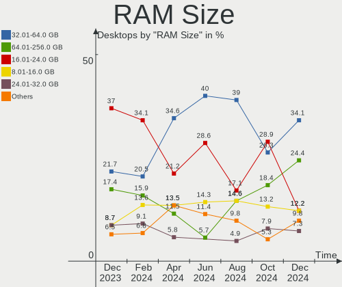
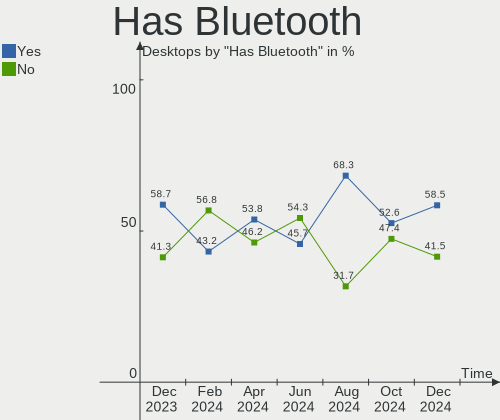
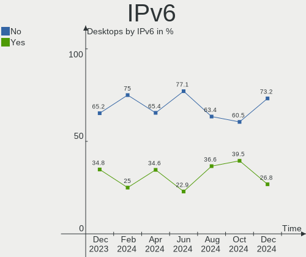

Manjaro - Hardware Trends (Desktops)
------------------------------------

A project to identify most popular hardware characteristics and track their change
over time based on data collected by Linux users at https://Linux-Hardware.org.

Anyone can contribute to this report by the [hw-probe](https://github.com/linuxhw/hw-probe) tool:

    sudo -E hw-probe -all -upload

This report is for one last month. Overall report since the beginning of time: [TestDays](https://github.com/linuxhw/TestDays)

Period: Oct, 2023.

Contents
--------

* [ System ](#system)
  - [ OS                       ](#os)
  - [ OS Family                ](#os-family)
  - [ Kernel                   ](#kernel)
  - [ Kernel Family            ](#kernel-family)
  - [ Kernel Major Ver.        ](#kernel-major-ver)
  - [ Arch                     ](#arch)
  - [ DE                       ](#de)
  - [ Display Server           ](#display-server)
  - [ Display Manager          ](#display-manager)
  - [ OS Lang                  ](#os-lang)
  - [ Boot Mode                ](#boot-mode)
  - [ Filesystem               ](#filesystem)
  - [ Part. scheme             ](#part-scheme)
  - [ Dual Boot with Linux/BSD ](#dual-boot-with-linuxbsd)
  - [ Dual Boot (Win)          ](#dual-boot-win)

* [ Board ](#board)
  - [ Vendor                   ](#vendor)
  - [ Model                    ](#model)
  - [ Model Family             ](#model-family)
  - [ MFG Year                 ](#mfg-year)
  - [ Form Factor              ](#form-factor)
  - [ Secure Boot              ](#secure-boot)
  - [ Coreboot                 ](#coreboot)
  - [ RAM Size                 ](#ram-size)
  - [ RAM Used                 ](#ram-used)
  - [ Total Drives             ](#total-drives)
  - [ Has CD-ROM               ](#has-cd-rom)
  - [ Has Ethernet             ](#has-ethernet)
  - [ Has WiFi                 ](#has-wifi)
  - [ Has Bluetooth            ](#has-bluetooth)

* [ Location ](#location)
  - [ Country                  ](#country)
  - [ City                     ](#city)

* [ Drives ](#drives)
  - [ Drive Vendor             ](#drive-vendor)
  - [ Drive Model              ](#drive-model)
  - [ HDD Vendor               ](#hdd-vendor)
  - [ SSD Vendor               ](#ssd-vendor)
  - [ Drive Kind               ](#drive-kind)
  - [ Drive Connector          ](#drive-connector)
  - [ Drive Size               ](#drive-size)
  - [ Space Total              ](#space-total)
  - [ Space Used               ](#space-used)
  - [ Malfunc. Drives          ](#malfunc-drives)
  - [ Malfunc. Drive Vendor    ](#malfunc-drive-vendor)
  - [ Malfunc. HDD Vendor      ](#malfunc-hdd-vendor)
  - [ Malfunc. Drive Kind      ](#malfunc-drive-kind)
  - [ Failed Drives            ](#failed-drives)
  - [ Failed Drive Vendor      ](#failed-drive-vendor)
  - [ Drive Status             ](#drive-status)

* [ Storage controller ](#storage-controller)
  - [ Storage Vendor           ](#storage-vendor)
  - [ Storage Model            ](#storage-model)
  - [ Storage Kind             ](#storage-kind)

* [ Processor ](#processor)
  - [ CPU Vendor               ](#cpu-vendor)
  - [ CPU Model                ](#cpu-model)
  - [ CPU Model Family         ](#cpu-model-family)
  - [ CPU Cores                ](#cpu-cores)
  - [ CPU Sockets              ](#cpu-sockets)
  - [ CPU Threads              ](#cpu-threads)
  - [ CPU Op-Modes             ](#cpu-op-modes)
  - [ CPU Microcode            ](#cpu-microcode)
  - [ CPU Microarch            ](#cpu-microarch)

* [ Graphics ](#graphics)
  - [ GPU Vendor               ](#gpu-vendor)
  - [ GPU Model                ](#gpu-model)
  - [ GPU Combo                ](#gpu-combo)
  - [ GPU Driver               ](#gpu-driver)
  - [ GPU Memory               ](#gpu-memory)

* [ Monitor ](#monitor)
  - [ Monitor Vendor           ](#monitor-vendor)
  - [ Monitor Model            ](#monitor-model)
  - [ Monitor Resolution       ](#monitor-resolution)
  - [ Monitor Diagonal         ](#monitor-diagonal)
  - [ Monitor Width            ](#monitor-width)
  - [ Aspect Ratio             ](#aspect-ratio)
  - [ Monitor Area             ](#monitor-area)
  - [ Pixel Density            ](#pixel-density)
  - [ Multiple Monitors        ](#multiple-monitors)

* [ Network ](#network)
  - [ Net Controller Vendor    ](#net-controller-vendor)
  - [ Net Controller Model     ](#net-controller-model)
  - [ Wireless Vendor          ](#wireless-vendor)
  - [ Wireless Model           ](#wireless-model)
  - [ Ethernet Vendor          ](#ethernet-vendor)
  - [ Ethernet Model           ](#ethernet-model)
  - [ Net Controller Kind      ](#net-controller-kind)
  - [ Used Controller          ](#used-controller)
  - [ NICs                     ](#nics)
  - [ IPv6                     ](#ipv6)

* [ Bluetooth ](#bluetooth)
  - [ Bluetooth Vendor         ](#bluetooth-vendor)
  - [ Bluetooth Model          ](#bluetooth-model)

* [ Sound ](#sound)
  - [ Sound Vendor             ](#sound-vendor)
  - [ Sound Model              ](#sound-model)

* [ Memory ](#memory)
  - [ Memory Vendor            ](#memory-vendor)
  - [ Memory Model             ](#memory-model)
  - [ Memory Kind              ](#memory-kind)
  - [ Memory Form Factor       ](#memory-form-factor)
  - [ Memory Size              ](#memory-size)
  - [ Memory Speed             ](#memory-speed)

* [ Printers & scanners ](#printers--scanners)
  - [ Printer Vendor           ](#printer-vendor)
  - [ Printer Model            ](#printer-model)
  - [ Scanner Vendor           ](#scanner-vendor)
  - [ Scanner Model            ](#scanner-model)

* [ Camera ](#camera)
  - [ Camera Vendor            ](#camera-vendor)
  - [ Camera Model             ](#camera-model)

* [ Security ](#security)
  - [ Fingerprint Vendor       ](#fingerprint-vendor)
  - [ Fingerprint Model        ](#fingerprint-model)
  - [ Chipcard Vendor          ](#chipcard-vendor)
  - [ Chipcard Model           ](#chipcard-model)

* [ Unsupported ](#unsupported)
  - [ Unsupported Devices      ](#unsupported-devices)
  - [ Unsupported Device Types ](#unsupported-device-types)

System
------

OS
--

Installed operating systems

| Name           | Desktops | Percent |
|----------------|----------|---------|
| Manjaro        | 42       | 67.74%  |
| Manjaro 23.0.4 | 10       | 16.13%  |
| Manjaro 23.0.3 | 6        | 9.68%   |
| Manjaro 23.0.2 | 2        | 3.23%   |
| Manjaro 23.1.0 | 1        | 1.61%   |
| Manjaro 23.0.1 | 1        | 1.61%   |

OS Family
---------

OS without a version

| Name    | Desktops | Percent |
|---------|----------|---------|
| Manjaro | 62       | 100%    |

Kernel
------

Version of the Linux kernel

| Version                                                      | Desktops | Percent |
|--------------------------------------------------------------|----------|---------|
| 6.5.5-1-MANJARO                                              | 26       | 41.94%  |
| 6.6.0-1-MANJARO                                              | 6        | 9.68%   |
| 6.5.3-1-MANJARO                                              | 6        | 9.68%   |
| 6.1.55-1-MANJARO                                             | 5        | 8.06%   |
| 5.15.133-1-MANJARO                                           | 3        | 4.84%   |
| 6.5.2-1-rt8-MANJARO                                          | 2        | 3.23%   |
| 6.1.53-1-MANJARO                                             | 2        | 3.23%   |
| 6.6.0-rc5-next-20231009-1-next-git-10591-g2a860505b617-dirty | 1        | 1.61%   |
| 6.5.8-1-MANJARO                                              | 1        | 1.61%   |
| 6.5.7-273-tkg-bmq-llvm                                       | 1        | 1.61%   |
| 6.5.5-lqx1-1-lqx                                             | 1        | 1.61%   |
| 6.4.16-5-MANJARO                                             | 1        | 1.61%   |
| 6.1.51-1-MANJARO                                             | 1        | 1.61%   |
| 6.1.31-2-MANJARO                                             | 1        | 1.61%   |
| 6.1.25-1-MANJARO                                             | 1        | 1.61%   |
| 5.19.17-2-MANJARO                                            | 1        | 1.61%   |
| 5.10.194-1-MANJARO                                           | 1        | 1.61%   |
| 5.10.179-1-MANJARO                                           | 1        | 1.61%   |
| 4.19.295-1-MANJARO                                           | 1        | 1.61%   |

Kernel Family
-------------

Linux kernel without a distro release

| Version  | Desktops | Percent |
|----------|----------|---------|
| 6.5.5    | 27       | 43.55%  |
| 6.6.0    | 7        | 11.29%  |
| 6.5.3    | 6        | 9.68%   |
| 6.1.55   | 5        | 8.06%   |
| 5.15.133 | 3        | 4.84%   |
| 6.5.2    | 2        | 3.23%   |
| 6.1.53   | 2        | 3.23%   |
| 6.5.8    | 1        | 1.61%   |
| 6.5.7    | 1        | 1.61%   |
| 6.4.16   | 1        | 1.61%   |
| 6.1.51   | 1        | 1.61%   |
| 6.1.31   | 1        | 1.61%   |
| 6.1.25   | 1        | 1.61%   |
| 5.19.17  | 1        | 1.61%   |
| 5.10.194 | 1        | 1.61%   |
| 5.10.179 | 1        | 1.61%   |
| 4.19.295 | 1        | 1.61%   |

Kernel Major Ver.
-----------------

Linux kernel major version

| Version | Desktops | Percent |
|---------|----------|---------|
| 6.5     | 37       | 59.68%  |
| 6.1     | 10       | 16.13%  |
| 6.6     | 7        | 11.29%  |
| 5.15    | 3        | 4.84%   |
| 5.10    | 2        | 3.23%   |
| 6.4     | 1        | 1.61%   |
| 5.19    | 1        | 1.61%   |
| 4.19    | 1        | 1.61%   |

Arch
----

OS architecture (x86_64, i586, etc.)

| Name   | Desktops | Percent |
|--------|----------|---------|
| x86_64 | 62       | 100%    |

DE
--

Desktop Environment

| Name       | Desktops | Percent |
|------------|----------|---------|
| KDE5       | 36       | 58.06%  |
| GNOME      | 13       | 20.97%  |
| XFCE       | 7        | 11.29%  |
| i3         | 2        | 3.23%   |
| X-Cinnamon | 1        | 1.61%   |
| sway       | 1        | 1.61%   |
| MATE       | 1        | 1.61%   |
| Unknown    | 1        | 1.61%   |

Display Server
--------------

X11 or Wayland

| Name    | Desktops | Percent |
|---------|----------|---------|
| X11     | 49       | 79.03%  |
| Wayland | 13       | 20.97%  |

Display Manager
---------------

SDDM, LightDM, etc.

| Name    | Desktops | Percent |
|---------|----------|---------|
| Unknown | 42       | 67.74%  |
| SDDM    | 10       | 16.13%  |
| LightDM | 6        | 9.68%   |
| GDM     | 4        | 6.45%   |

OS Lang
-------

Language

| Lang    | Desktops | Percent |
|---------|----------|---------|
| en_US   | 27       | 43.55%  |
| de_DE   | 11       | 17.74%  |
| ru_RU   | 5        | 8.06%   |
| en_GB   | 5        | 8.06%   |
| it_IT   | 4        | 6.45%   |
| pl_PL   | 2        | 3.23%   |
| en_AU   | 2        | 3.23%   |
| en_PH   | 1        | 1.61%   |
| en_DK   | 1        | 1.61%   |
| en_CA   | 1        | 1.61%   |
| el_GR   | 1        | 1.61%   |
| cs_CZ   | 1        | 1.61%   |
| Unknown | 1        | 1.61%   |

Boot Mode
---------

EFI or BIOS

| Mode | Desktops | Percent |
|------|----------|---------|
| BIOS | 46       | 74.19%  |
| EFI  | 16       | 25.81%  |

Filesystem
----------

Type of filesystem

| Type  | Desktops | Percent |
|-------|----------|---------|
| Ext4  | 39       | 62.9%   |
| Btrfs | 18       | 29.03%  |
| Tmpfs | 3        | 4.84%   |
| Xfs   | 2        | 3.23%   |

Part. scheme
------------

Scheme of partitioning

| Type    | Desktops | Percent |
|---------|----------|---------|
| Unknown | 41       | 66.13%  |
| GPT     | 20       | 32.26%  |
| MBR     | 1        | 1.61%   |

Dual Boot with Linux/BSD
------------------------

Hosting more than one Linux/BSD

| Dual boot | Desktops | Percent |
|-----------|----------|---------|
| No        | 54       | 87.1%   |
| Yes       | 8        | 12.9%   |

Dual Boot (Win)
---------------

Hosting Linux and Windows

| Dual boot | Desktops | Percent |
|-----------|----------|---------|
| No        | 50       | 80.65%  |
| Yes       | 12       | 19.35%  |

Board
-----

Vendor
------

Motherboard manufacturer

| Name                | Desktops | Percent |
|---------------------|----------|---------|
| ASUSTek Computer    | 19       | 30.65%  |
| Gigabyte Technology | 12       | 19.35%  |
| MSI                 | 11       | 17.74%  |
| ASRock              | 11       | 17.74%  |
| Lenovo              | 3        | 4.84%   |
| Hewlett-Packard     | 3        | 4.84%   |
| GEEKOM              | 1        | 1.61%   |
| Dell                | 1        | 1.61%   |
| Biostar             | 1        | 1.61%   |

Model
-----

Motherboard model

| Name                                   | Desktops | Percent |
|----------------------------------------|----------|---------|
| Gigabyte B450M DS3H                    | 2        | 3.23%   |
| ASUS PRIME X370-PRO                    | 2        | 3.23%   |
| ASUS PRIME B450M-A II                  | 2        | 3.23%   |
| ASRock B760M PG Riptide                | 2        | 3.23%   |
| ASRock B550M Pro4                      | 2        | 3.23%   |
| ASRock A320M-HDV R4.0                  | 2        | 3.23%   |
| MSI MS-7D75                            | 1        | 1.61%   |
| MSI MS-7D40                            | 1        | 1.61%   |
| MSI MS-7D20                            | 1        | 1.61%   |
| MSI MS-7C91                            | 1        | 1.61%   |
| MSI MS-7C08                            | 1        | 1.61%   |
| MSI MS-7C02                            | 1        | 1.61%   |
| MSI MS-7B98                            | 1        | 1.61%   |
| MSI MS-7B93                            | 1        | 1.61%   |
| MSI MS-7B89                            | 1        | 1.61%   |
| MSI MS-7B86                            | 1        | 1.61%   |
| MSI MS-7597                            | 1        | 1.61%   |
| Lenovo ThinkStation P620 30E000GMMT    | 1        | 1.61%   |
| Lenovo ThinkCentre A70z 0401G6G        | 1        | 1.61%   |
| Lenovo IdeaCentre 3 07IMB05 90NB004WRS | 1        | 1.61%   |
| HP Z440 Workstation                    | 1        | 1.61%   |
| HP ProDesk 600 G4 DM (TAA)             | 1        | 1.61%   |
| HP EliteDesk 705 G4 SFF                | 1        | 1.61%   |
| Gigabyte X670 AORUS ELITE AX           | 1        | 1.61%   |
| Gigabyte X570S UD                      | 1        | 1.61%   |
| Gigabyte X570 AORUS PRO WIFI           | 1        | 1.61%   |
| Gigabyte X570 AORUS ELITE WIFI         | 1        | 1.61%   |
| Gigabyte B760 GAMING X DDR4            | 1        | 1.61%   |
| Gigabyte B660M DS3H AX DDR4            | 1        | 1.61%   |
| Gigabyte B550 AORUS PRO V2             | 1        | 1.61%   |
| Gigabyte B550 AORUS ELITE AX V2        | 1        | 1.61%   |
| Gigabyte B365M DS3H                    | 1        | 1.61%   |
| Gigabyte A520M DS3H                    | 1        | 1.61%   |
| GEEKOM Mini IT12                       | 1        | 1.61%   |
| Dell Precision Tower 3620              | 1        | 1.61%   |
| Biostar A320MH                         | 1        | 1.61%   |
| ASUS Z170-P                            | 1        | 1.61%   |
| ASUS TUF Gaming X670E-PLUS WIFI        | 1        | 1.61%   |
| ASUS TUF Gaming B650M-PLUS             | 1        | 1.61%   |
| ASUS TUF Gaming B550-PLUS WIFI II      | 1        | 1.61%   |

Model Family
------------

Motherboard model prefix

| Name                | Desktops | Percent |
|---------------------|----------|---------|
| ASUS PRIME          | 10       | 16.13%  |
| ASUS TUF            | 3        | 4.84%   |
| ASRock B550M        | 3        | 4.84%   |
| Gigabyte X570       | 2        | 3.23%   |
| Gigabyte B550       | 2        | 3.23%   |
| Gigabyte B450M      | 2        | 3.23%   |
| ASUS M5A97          | 2        | 3.23%   |
| ASRock B760M        | 2        | 3.23%   |
| ASRock A320M-HDV    | 2        | 3.23%   |
| MSI MS-7D75         | 1        | 1.61%   |
| MSI MS-7D40         | 1        | 1.61%   |
| MSI MS-7D20         | 1        | 1.61%   |
| MSI MS-7C91         | 1        | 1.61%   |
| MSI MS-7C08         | 1        | 1.61%   |
| MSI MS-7C02         | 1        | 1.61%   |
| MSI MS-7B98         | 1        | 1.61%   |
| MSI MS-7B93         | 1        | 1.61%   |
| MSI MS-7B89         | 1        | 1.61%   |
| MSI MS-7B86         | 1        | 1.61%   |
| MSI MS-7597         | 1        | 1.61%   |
| Lenovo ThinkStation | 1        | 1.61%   |
| Lenovo ThinkCentre  | 1        | 1.61%   |
| Lenovo IdeaCentre   | 1        | 1.61%   |
| HP Z440             | 1        | 1.61%   |
| HP ProDesk          | 1        | 1.61%   |
| HP EliteDesk        | 1        | 1.61%   |
| Gigabyte X670       | 1        | 1.61%   |
| Gigabyte X570S      | 1        | 1.61%   |
| Gigabyte B760       | 1        | 1.61%   |
| Gigabyte B660M      | 1        | 1.61%   |
| Gigabyte B365M      | 1        | 1.61%   |
| Gigabyte A520M      | 1        | 1.61%   |
| GEEKOM Mini         | 1        | 1.61%   |
| Dell Precision      | 1        | 1.61%   |
| Biostar A320MH      | 1        | 1.61%   |
| ASUS Z170-P         | 1        | 1.61%   |
| ASUS SABERTOOTH     | 1        | 1.61%   |
| ASUS P8H67-M        | 1        | 1.61%   |
| ASUS All            | 1        | 1.61%   |
| ASRock Z390         | 1        | 1.61%   |

MFG Year
--------

Motherboard manufacture year

| Year | Desktops | Percent |
|------|----------|---------|
| 2018 | 14       | 22.58%  |
| 2022 | 9        | 14.52%  |
| 2020 | 8        | 12.9%   |
| 2021 | 6        | 9.68%   |
| 2019 | 5        | 8.06%   |
| 2023 | 4        | 6.45%   |
| 2017 | 4        | 6.45%   |
| 2015 | 3        | 4.84%   |
| 2014 | 3        | 4.84%   |
| 2012 | 2        | 3.23%   |
| 2009 | 2        | 3.23%   |
| 2011 | 1        | 1.61%   |
| 2007 | 1        | 1.61%   |

Form Factor
-----------

Physical design of the computer

| Name    | Desktops | Percent |
|---------|----------|---------|
| Desktop | 62       | 100%    |

Secure Boot
-----------

Enabled or disabled

| State    | Desktops | Percent |
|----------|----------|---------|
| Disabled | 62       | 100%    |

Coreboot
--------

Have coreboot on board

| Used | Desktops | Percent |
|------|----------|---------|
| No   | 62       | 100%    |

RAM Size
--------

Total RAM memory

| Size in GB  | Desktops | Percent |
|-------------|----------|---------|
| 16.01-24.0  | 25       | 40.32%  |
| 32.01-64.0  | 20       | 32.26%  |
| 8.01-16.0   | 8        | 12.9%   |
| 64.01-256.0 | 5        | 8.06%   |
| 4.01-8.0    | 2        | 3.23%   |
| 3.01-4.0    | 1        | 1.61%   |
| 24.01-32.0  | 1        | 1.61%   |

RAM Used
--------

Used RAM memory

| Used GB    | Desktops | Percent |
|------------|----------|---------|
| 4.01-8.0   | 21       | 33.87%  |
| 3.01-4.0   | 15       | 24.19%  |
| 2.01-3.0   | 9        | 14.52%  |
| 1.01-2.0   | 7        | 11.29%  |
| 8.01-16.0  | 7        | 11.29%  |
| 32.01-64.0 | 1        | 1.61%   |
| 24.01-32.0 | 1        | 1.61%   |
| 16.01-24.0 | 1        | 1.61%   |

Total Drives
------------

Number of drives on board

| Drives | Desktops | Percent |
|--------|----------|---------|
| 2      | 24       | 38.71%  |
| 3      | 18       | 29.03%  |
| 1      | 10       | 16.13%  |
| 4      | 7        | 11.29%  |
| 5      | 2        | 3.23%   |
| 6      | 1        | 1.61%   |

Has CD-ROM
----------

Has CD-ROM on board

| Presented | Desktops | Percent |
|-----------|----------|---------|
| No        | 51       | 82.26%  |
| Yes       | 11       | 17.74%  |

Has Ethernet
------------

Has Ethernet on board

| Presented | Desktops | Percent |
|-----------|----------|---------|
| Yes       | 62       | 100%    |

Has WiFi
--------

Has WiFi module

| Presented | Desktops | Percent |
|-----------|----------|---------|
| No        | 33       | 53.23%  |
| Yes       | 29       | 46.77%  |

Has Bluetooth
-------------

Has Bluetooth module

| Presented | Desktops | Percent |
|-----------|----------|---------|
| No        | 33       | 53.23%  |
| Yes       | 29       | 46.77%  |

Location
--------

Country
-------

Geographic location (country)

| Country     | Desktops | Percent |
|-------------|----------|---------|
| USA         | 15       | 24.19%  |
| Germany     | 14       | 22.58%  |
| Russia      | 7        | 11.29%  |
| Italy       | 3        | 4.84%   |
| Denmark     | 3        | 4.84%   |
| UK          | 2        | 3.23%   |
| Poland      | 2        | 3.23%   |
| Canada      | 2        | 3.23%   |
| Australia   | 2        | 3.23%   |
| Turkey      | 1        | 1.61%   |
| Thailand    | 1        | 1.61%   |
| Sweden      | 1        | 1.61%   |
| Serbia      | 1        | 1.61%   |
| Philippines | 1        | 1.61%   |
| Netherlands | 1        | 1.61%   |
| Indonesia   | 1        | 1.61%   |
| Hungary     | 1        | 1.61%   |
| Greece      | 1        | 1.61%   |
| France      | 1        | 1.61%   |
| Czechia     | 1        | 1.61%   |
| Belarus     | 1        | 1.61%   |

City
----

Geographic location (city)

| City             | Desktops | Percent |
|------------------|----------|---------|
| Sydney           | 2        | 3.23%   |
| Williamstown     | 1        | 1.61%   |
| Weilmuenster     | 1        | 1.61%   |
| Vlotho           | 1        | 1.61%   |
| Venice           | 1        | 1.61%   |
| Vaals            | 1        | 1.61%   |
| Trieste          | 1        | 1.61%   |
| Toronto          | 1        | 1.61%   |
| Thisted          | 1        | 1.61%   |
| Sutton Coldfield | 1        | 1.61%   |
| Stollberg        | 1        | 1.61%   |
| Siegen           | 1        | 1.61%   |
| Shutino          | 1        | 1.61%   |
| San Juan         | 1        | 1.61%   |
| Samara           | 1        | 1.61%   |
| Saint Paul       | 1        | 1.61%   |
| Rostov-on-Don    | 1        | 1.61%   |
| Riverside        | 1        | 1.61%   |
| Reading          | 1        | 1.61%   |
| Portland         | 1        | 1.61%   |
| Penticton        | 1        | 1.61%   |
| Paris            | 1        | 1.61%   |
| Paoli            | 1        | 1.61%   |
| Obninsk          | 1        | 1.61%   |
| Nuremberg        | 1        | 1.61%   |
| Neuss            | 1        | 1.61%   |
| Moscow Oblast    | 1        | 1.61%   |
| Minsk            | 1        | 1.61%   |
| Miami            | 1        | 1.61%   |
| Mettmann         | 1        | 1.61%   |
| Mersin           | 1        | 1.61%   |
| Merced           | 1        | 1.61%   |
| Marburg          | 1        | 1.61%   |
| Mannheim         | 1        | 1.61%   |
| Liberec          | 1        | 1.61%   |
| Lexington        | 1        | 1.61%   |
| Karlskrona       | 1        | 1.61%   |
| Kansas City      | 1        | 1.61%   |
| Juelsminde       | 1        | 1.61%   |
| Iowa City        | 1        | 1.61%   |

Drives
------

Drive Vendor
------------

Hard drive vendors

| Vendor                       | Desktops | Drives | Percent |
|------------------------------|----------|--------|---------|
| Samsung Electronics          | 30       | 43     | 22.56%  |
| Seagate                      | 18       | 20     | 13.53%  |
| SanDisk                      | 13       | 15     | 9.77%   |
| WDC                          | 12       | 13     | 9.02%   |
| Toshiba                      | 8        | 10     | 6.02%   |
| Kingston                     | 8        | 10     | 6.02%   |
| Crucial                      | 8        | 9      | 6.02%   |
| Phison Electronics           | 3        | 3      | 2.26%   |
| Intel                        | 3        | 3      | 2.26%   |
| Hitachi                      | 2        | 2      | 1.5%    |
| A-DATA Technology            | 2        | 2      | 1.5%    |
| Union Memory                 | 1        | 1      | 0.75%   |
| Transcend                    | 1        | 1      | 0.75%   |
| SPCC                         | 1        | 1      | 0.75%   |
| SK hynix                     | 1        | 1      | 0.75%   |
| Silicon Motion               | 1        | 1      | 0.75%   |
| Shenzhen Longsys Electronics | 1        | 1      | 0.75%   |
| Realtek Semiconductor        | 1        | 1      | 0.75%   |
| PNY                          | 1        | 1      | 0.75%   |
| Patriot                      | 1        | 1      | 0.75%   |
| Micron/Crucial Technology    | 1        | 1      | 0.75%   |
| MENGMI                       | 1        | 1      | 0.75%   |
| Lexar                        | 1        | 1      | 0.75%   |
| Kingston Technology Company  | 1        | 1      | 0.75%   |
| JMicron Technology           | 1        | 1      | 0.75%   |
| Intenso                      | 1        | 1      | 0.75%   |
| HPE                          | 1        | 1      | 0.75%   |
| HGST                         | 1        | 1      | 0.75%   |
| GOODRAM                      | 1        | 1      | 0.75%   |
| Fujitsu                      | 1        | 1      | 0.75%   |
| FIKWOT                       | 1        | 1      | 0.75%   |
| Colorful                     | 1        | 1      | 0.75%   |
| China                        | 1        | 1      | 0.75%   |
| BAITITON                     | 1        | 1      | 0.75%   |
| Apacer                       | 1        | 1      | 0.75%   |
| ADATA Technology             | 1        | 1      | 0.75%   |
| 2.5                          | 1        | 1      | 0.75%   |

Drive Model
-----------

Hard drive models

| Model                                              | Desktops | Percent |
|----------------------------------------------------|----------|---------|
| Samsung SSD 980 1TB                                | 6        | 3.97%   |
| Seagate ST2000DM008-2FR102 2TB                     | 4        | 2.65%   |
| Samsung SSD 860 EVO 500GB                          | 4        | 2.65%   |
| Samsung NVMe SSD Controller SM981/PM981/PM983 1TB  | 4        | 2.65%   |
| Samsung NVMe SSD Controller PM9A1/PM9A3/980PRO 1TB | 4        | 2.65%   |
| Seagate ST1000DM010-2EP102 1TB                     | 3        | 1.99%   |
| Samsung SSD 990 PRO 2TB                            | 3        | 1.99%   |
| Samsung SSD 870 EVO 500GB                          | 3        | 1.99%   |
| Toshiba BG3 NVMe SSD Controller 128GB              | 2        | 1.32%   |
| Sandisk WD Blue SN550 NVMe SSD 1TB                 | 2        | 1.32%   |
| SanDisk SDSSDH3 1T00 1TB                           | 2        | 1.32%   |
| Samsung SSD 870 EVO 1TB                            | 2        | 1.32%   |
| Samsung SSD 860 EVO 1TB                            | 2        | 1.32%   |
| Phison E16 PCIe4 NVMe Controller 500GB             | 2        | 1.32%   |
| Kingston SUV400S37240G 240GB SSD                   | 2        | 1.32%   |
| Kingston SNV2S500G 500GB                           | 2        | 1.32%   |
| Kingston SA400S37240G 240GB SSD                    | 2        | 1.32%   |
| Crucial CT500MX500SSD1 500GB                       | 2        | 1.32%   |
| WDC WD5000BEVT-00ZAT0 500GB                        | 1        | 0.66%   |
| WDC WD40EZRZ-22GXCB0 4TB                           | 1        | 0.66%   |
| WDC WD30EZRZ-00GXCB0 3TB                           | 1        | 0.66%   |
| WDC WD20EZRX-00DC0B0 2TB                           | 1        | 0.66%   |
| WDC WD20EARX-00MMMB0 2TB                           | 1        | 0.66%   |
| WDC WD1600AAJS-00YZCA0 160GB                       | 1        | 0.66%   |
| WDC WD15EARX-00PASB0 1TB                           | 1        | 0.66%   |
| WDC WD15EARS-22Z5B1 1TB                            | 1        | 0.66%   |
| WDC WD10JPVX-22JC3T0 1TB                           | 1        | 0.66%   |
| WDC WD10EZEX-00BN5A0 1TB                           | 1        | 0.66%   |
| WDC WD10EFRX-68JCSN0 1TB                           | 1        | 0.66%   |
| WDC WD10EALX-759BA1 1TB                            | 1        | 0.66%   |
| Union Memory UMIS RPJTJ256MEE1OWX 256GB            | 1        | 0.66%   |
| Transcend TS64GSSD340 64GB                         | 1        | 0.66%   |
| Toshiba MQ04ABF100 1TB                             | 1        | 0.66%   |
| Toshiba MK2576GSX HR 160GB                         | 1        | 0.66%   |
| Toshiba MD04ACA400 4TB                             | 1        | 0.66%   |
| Toshiba HDWD110 1TB                                | 1        | 0.66%   |
| Toshiba HDWD105 500GB                              | 1        | 0.66%   |
| Toshiba DT01ACA300 3TB                             | 1        | 0.66%   |
| Toshiba DT01ACA200 2TB                             | 1        | 0.66%   |
| Toshiba DT01ACA100 1TB                             | 1        | 0.66%   |

HDD Vendor
----------

Hard disk drive vendors

| Vendor              | Desktops | Drives | Percent |
|---------------------|----------|--------|---------|
| Seagate             | 15       | 17     | 38.46%  |
| WDC                 | 12       | 13     | 30.77%  |
| Toshiba             | 7        | 8      | 17.95%  |
| Hitachi             | 2        | 2      | 5.13%   |
| Samsung Electronics | 1        | 1      | 2.56%   |
| HPE                 | 1        | 1      | 2.56%   |
| Fujitsu             | 1        | 1      | 2.56%   |

SSD Vendor
----------

Solid state drive vendors

| Vendor              | Desktops | Drives | Percent |
|---------------------|----------|--------|---------|
| Samsung Electronics | 15       | 19     | 30.61%  |
| Crucial             | 8        | 9      | 16.33%  |
| SanDisk             | 7        | 8      | 14.29%  |
| Kingston            | 4        | 4      | 8.16%   |
| A-DATA Technology   | 2        | 2      | 4.08%   |
| Transcend           | 1        | 1      | 2.04%   |
| SPCC                | 1        | 1      | 2.04%   |
| Seagate             | 1        | 1      | 2.04%   |
| PNY                 | 1        | 1      | 2.04%   |
| Patriot             | 1        | 1      | 2.04%   |
| MENGMI              | 1        | 1      | 2.04%   |
| Lexar               | 1        | 1      | 2.04%   |
| Intel               | 1        | 1      | 2.04%   |
| GOODRAM             | 1        | 1      | 2.04%   |
| China               | 1        | 1      | 2.04%   |
| BAITITON            | 1        | 1      | 2.04%   |
| Apacer              | 1        | 1      | 2.04%   |
| 2.5                 | 1        | 1      | 2.04%   |

Drive Kind
----------

HDD or SSD

| Kind    | Desktops | Drives | Percent |
|---------|----------|--------|---------|
| NVMe    | 41       | 53     | 34.75%  |
| SSD     | 38       | 55     | 32.2%   |
| HDD     | 34       | 43     | 28.81%  |
| Unknown | 5        | 5      | 4.24%   |

Drive Connector
---------------

SATA, SAS, NVMe, etc.

| Type | Desktops | Drives | Percent |
|------|----------|--------|---------|
| SATA | 53       | 100    | 54.08%  |
| NVMe | 41       | 52     | 41.84%  |
| SAS  | 4        | 4      | 4.08%   |

Drive Size
----------

Size of hard drive

| Size in TB | Desktops | Drives | Percent |
|------------|----------|--------|---------|
| 0.01-0.5   | 32       | 44     | 41.56%  |
| 0.51-1.0   | 29       | 35     | 37.66%  |
| 1.01-2.0   | 10       | 12     | 12.99%  |
| 3.01-4.0   | 4        | 4      | 5.19%   |
| 2.01-3.0   | 2        | 3      | 2.6%    |

Space Total
-----------

Amount of disk space available on the file system

| Size in GB     | Desktops | Percent |
|----------------|----------|---------|
| 251-500        | 16       | 25.81%  |
| More than 3000 | 14       | 22.58%  |
| 2001-3000      | 8        | 12.9%   |
| 1001-2000      | 8        | 12.9%   |
| 501-1000       | 7        | 11.29%  |
| 101-250        | 6        | 9.68%   |
| Unknown        | 2        | 3.23%   |
| 1-20           | 1        | 1.61%   |

Space Used
----------

Amount of used disk space

| Used GB        | Desktops | Percent |
|----------------|----------|---------|
| 101-250        | 15       | 24.19%  |
| 251-500        | 11       | 17.74%  |
| 1001-2000      | 9        | 14.52%  |
| 501-1000       | 8        | 12.9%   |
| More than 3000 | 5        | 8.06%   |
| 51-100         | 5        | 8.06%   |
| 1-20           | 4        | 6.45%   |
| 21-50          | 3        | 4.84%   |
| Unknown        | 2        | 3.23%   |

Malfunc. Drives
---------------

Drive models with a malfunction

| Model                    | Desktops | Drives | Percent |
|--------------------------|----------|--------|---------|
| WDC WD20EZRX-00DC0B0 2TB | 1        | 1      | 100%    |

Malfunc. Drive Vendor
---------------------

Vendors of faulty drives

| Vendor | Desktops | Drives | Percent |
|--------|----------|--------|---------|
| WDC    | 1        | 1      | 100%    |

Malfunc. HDD Vendor
-------------------

Vendors of faulty HDD drives

| Vendor | Desktops | Drives | Percent |
|--------|----------|--------|---------|
| WDC    | 1        | 1      | 100%    |

Malfunc. Drive Kind
-------------------

Kinds of faulty drives

| Kind | Desktops | Drives | Percent |
|------|----------|--------|---------|
| HDD  | 1        | 1      | 100%    |

Failed Drives
-------------

Failed drive models

Zero info for selected period =(

Failed Drive Vendor
-------------------

Failed drive vendors

Zero info for selected period =(

Drive Status
------------

Number of failed and malfunc. drives

| Status   | Desktops | Drives | Percent |
|----------|----------|--------|---------|
| Detected | 49       | 119    | 76.56%  |
| Works    | 14       | 36     | 21.88%  |
| Malfunc  | 1        | 1      | 1.56%   |

Storage controller
------------------

Storage Vendor
--------------

Storage controller vendors

| Vendor                       | Desktops | Percent |
|------------------------------|----------|---------|
| AMD                          | 37       | 32.46%  |
| Intel                        | 25       | 21.93%  |
| Samsung Electronics          | 19       | 16.67%  |
| Kingston Technology Company  | 7        | 6.14%   |
| SanDisk                      | 6        | 5.26%   |
| ASMedia Technology           | 5        | 4.39%   |
| Phison Electronics           | 3        | 2.63%   |
| Toshiba America Info Systems | 2        | 1.75%   |
| Union Memory (Shenzhen)      | 1        | 0.88%   |
| SK hynix                     | 1        | 0.88%   |
| Silicon Motion               | 1        | 0.88%   |
| Shenzhen Longsys Electronics | 1        | 0.88%   |
| Realtek Semiconductor        | 1        | 0.88%   |
| Nvidia                       | 1        | 0.88%   |
| Micron/Crucial Technology    | 1        | 0.88%   |
| Marvell Technology Group     | 1        | 0.88%   |
| HGST                         | 1        | 0.88%   |
| ADATA Technology             | 1        | 0.88%   |

Storage Model
-------------

Storage controller models

| Model                                                                   | Desktops | Percent |
|-------------------------------------------------------------------------|----------|---------|
| AMD FCH SATA Controller [AHCI mode]                                     | 23       | 17.29%  |
| AMD 400 Series Chipset SATA Controller                                  | 9        | 6.77%   |
| AMD 500 Series Chipset SATA Controller                                  | 8        | 6.02%   |
| Samsung NVMe SSD Controller 980 (DRAM-less)                             | 7        | 5.26%   |
| Intel 700 Series Chipset Family SATA AHCI Controller                    | 5        | 3.76%   |
| ASMedia ASM1062 Serial ATA Controller                                   | 5        | 3.76%   |
| Samsung NVMe SSD Controller SM981/PM981/PM983                           | 4        | 3.01%   |
| Samsung NVMe SSD Controller PM9A1/PM9A3/980PRO                          | 4        | 3.01%   |
| Samsung NVMe SSD Controller S4LV008[Pascal]                             | 3        | 2.26%   |
| Kingston Company KC3000/FURY Renegade NVMe SSD E18                      | 3        | 2.26%   |
| Intel Cannon Lake PCH SATA AHCI Controller                              | 3        | 2.26%   |
| AMD FCH SATA Controller D                                               | 3        | 2.26%   |
| AMD 300 Series Chipset SATA Controller                                  | 3        | 2.26%   |
| Toshiba America Info Systems BG3 x2 NVMe SSD Controller (DRAM-less)     | 2        | 1.5%    |
| SanDisk WD Black SN770 / PC SN740 256GB / PC SN560 (DRAM-less) NVMe SSD | 2        | 1.5%    |
| SanDisk Ultra 3D / WD Blue SN550 NVMe SSD                               | 2        | 1.5%    |
| Samsung NVMe SSD Controller SM961/PM961/SM963                           | 2        | 1.5%    |
| Phison E16 PCIe4 NVMe Controller                                        | 2        | 1.5%    |
| Kingston Company NV2 NVMe SSD SM2267XT                                  | 2        | 1.5%    |
| Intel Alder Lake-S PCH SATA Controller [AHCI Mode]                      | 2        | 1.5%    |
| Intel 200 Series PCH SATA controller [AHCI mode]                        | 2        | 1.5%    |
| AMD X370 Series Chipset SATA Controller                                 | 2        | 1.5%    |
| AMD SB7x0/SB8x0/SB9x0 SATA Controller [AHCI mode]                       | 2        | 1.5%    |
| Union Memory (Shenzhen) AM620 PCIe 3.0 NVMe SSD 256GB                   | 1        | 0.75%   |
| SK hynix BC501 NVMe Solid State Drive                                   | 1        | 0.75%   |
| Silicon Motion SM2263EN/SM2263XT (DRAM-less) NVMe SSD Controllers       | 1        | 0.75%   |
| Shenzhen Longsys Non-Volatile memory controller                         | 1        | 0.75%   |
| Sandisk WD Black SN850X NVMe SSD                                        | 1        | 0.75%   |
| SanDisk Ultra 3D / WD Blue SN570 NVMe SSD (DRAM-less)                   | 1        | 0.75%   |
| SanDisk Extreme Pro / WD Black 2018/SN750/PC SN720 NVMe SSD             | 1        | 0.75%   |
| Realtek RTS5765DL NVMe SSD Controller (DRAM-less)                       | 1        | 0.75%   |
| Phison PS5013-E13 PCIe3 NVMe Controller (DRAM-less)                     | 1        | 0.75%   |
| Nvidia MCP61 SATA Controller                                            | 1        | 0.75%   |
| Nvidia MCP61 IDE                                                        | 1        | 0.75%   |
| Micron/Crucial P2 [Nick P2] / P3 / P3 Plus NVMe PCIe SSD (DRAM-less)    | 1        | 0.75%   |
| Marvell Group 88SE6111/6121 SATA II / PATA Controller                   | 1        | 0.75%   |
| Kingston Company NV2 NVMe SSD E21T                                      | 1        | 0.75%   |
| Kingston Company NV1 NVMe SSD SM2263XT                                  | 1        | 0.75%   |
| Intel Volume Management Device NVMe RAID Controller Intel Corporation   | 1        | 0.75%   |
| Intel Volume Management Device NVMe RAID Controller                     | 1        | 0.75%   |

Storage Kind
------------

Kind of storage controller (IDE, SATA, NVMe, SAS, ...)

| Kind | Desktops | Percent |
|------|----------|---------|
| SATA | 57       | 54.29%  |
| NVMe | 41       | 39.05%  |
| RAID | 4        | 3.81%   |
| IDE  | 3        | 2.86%   |

Processor
---------

CPU Vendor
----------

Processor vendors

| Vendor | Desktops | Percent |
|--------|----------|---------|
| AMD    | 39       | 62.9%   |
| Intel  | 23       | 37.1%   |

CPU Model
---------

Processor models

| Model                                       | Desktops | Percent |
|---------------------------------------------|----------|---------|
| AMD Ryzen 5 5600X 6-Core Processor          | 4        | 6.45%   |
| AMD Ryzen 5 5500                            | 3        | 4.84%   |
| AMD Ryzen 5 3600 6-Core Processor           | 3        | 4.84%   |
| AMD Ryzen 9 5900X 12-Core Processor         | 2        | 3.23%   |
| AMD Ryzen 7 5800X3D 8-Core Processor        | 2        | 3.23%   |
| AMD Ryzen 7 2700X Eight-Core Processor      | 2        | 3.23%   |
| AMD Ryzen 5 2600X Six-Core Processor        | 2        | 3.23%   |
| AMD Ryzen 5 1400 Quad-Core Processor        | 2        | 3.23%   |
| AMD Ryzen 3 3100 4-Core Processor           | 2        | 3.23%   |
| AMD FX-8350 Eight-Core Processor            | 2        | 3.23%   |
| Intel Xeon CPU E5-1620 v4 @ 3.50GHz         | 1        | 1.61%   |
| Intel Pentium Dual-Core CPU E5700 @ 3.00GHz | 1        | 1.61%   |
| Intel Core i7-9700K CPU @ 3.60GHz           | 1        | 1.61%   |
| Intel Core i7-9700 CPU @ 3.00GHz            | 1        | 1.61%   |
| Intel Core i7-6700 CPU @ 3.40GHz            | 1        | 1.61%   |
| Intel Core i7-4790 CPU @ 3.60GHz            | 1        | 1.61%   |
| Intel Core i7-3770K CPU @ 3.50GHz           | 1        | 1.61%   |
| Intel Core i7-2600K CPU @ 3.40GHz           | 1        | 1.61%   |
| Intel Core i5-9600K CPU @ 3.70GHz           | 1        | 1.61%   |
| Intel Core i5-9400F CPU @ 2.90GHz           | 1        | 1.61%   |
| Intel Core i5-8500T CPU @ 2.10GHz           | 1        | 1.61%   |
| Intel Core i5-7600K CPU @ 3.80GHz           | 1        | 1.61%   |
| Intel Core i5-4460 CPU @ 3.20GHz            | 1        | 1.61%   |
| Intel Core i3-10100 CPU @ 3.60GHz           | 1        | 1.61%   |
| Intel 13th Gen Core i9-13900K               | 1        | 1.61%   |
| Intel 13th Gen Core i7-13700KF              | 1        | 1.61%   |
| Intel 13th Gen Core i5-13600KF              | 1        | 1.61%   |
| Intel 13th Gen Core i5-13400                | 1        | 1.61%   |
| Intel 12th Gen Core i9-12900F               | 1        | 1.61%   |
| Intel 12th Gen Core i7-12650H               | 1        | 1.61%   |
| Intel 12th Gen Core i5-12600K               | 1        | 1.61%   |
| Intel 12th Gen Core i5-12400F               | 1        | 1.61%   |
| Intel 11th Gen Core i5-11500 @ 2.70GHz      | 1        | 1.61%   |
| AMD Ryzen Threadripper PRO 5945WX 12-Cores  | 1        | 1.61%   |
| AMD Ryzen 9 7950X 16-Core Processor         | 1        | 1.61%   |
| AMD Ryzen 9 7900X 12-Core Processor         | 1        | 1.61%   |
| AMD Ryzen 9 3900X 12-Core Processor         | 1        | 1.61%   |
| AMD Ryzen 7 5800X 8-Core Processor          | 1        | 1.61%   |
| AMD Ryzen 7 5700X 8-Core Processor          | 1        | 1.61%   |
| AMD Ryzen 7 3700X 8-Core Processor          | 1        | 1.61%   |

CPU Model Family
----------------

Processor model prefix

| Model                   | Desktops | Percent |
|-------------------------|----------|---------|
| AMD Ryzen 5             | 19       | 30.65%  |
| Other                   | 9        | 14.52%  |
| AMD Ryzen 7             | 7        | 11.29%  |
| Intel Core i7           | 6        | 9.68%   |
| Intel Core i5           | 5        | 8.06%   |
| AMD Ryzen 9             | 5        | 8.06%   |
| AMD Ryzen 3             | 3        | 4.84%   |
| AMD FX                  | 2        | 3.23%   |
| Intel Xeon              | 1        | 1.61%   |
| Intel Pentium Dual-Core | 1        | 1.61%   |
| Intel Core i3           | 1        | 1.61%   |
| AMD Ryzen Threadripper  | 1        | 1.61%   |
| AMD Ryzen 5 PRO         | 1        | 1.61%   |
| AMD Athlon II X2        | 1        | 1.61%   |

CPU Cores
---------

Number of processor cores

| Number | Desktops | Percent |
|--------|----------|---------|
| 6      | 22       | 35.48%  |
| 4      | 16       | 25.81%  |
| 8      | 9        | 14.52%  |
| 12     | 5        | 8.06%   |
| 16     | 3        | 4.84%   |
| 10     | 3        | 4.84%   |
| 2      | 2        | 3.23%   |
| 24     | 1        | 1.61%   |
| 14     | 1        | 1.61%   |

CPU Sockets
-----------

Number of sockets

| Number | Desktops | Percent |
|--------|----------|---------|
| 1      | 62       | 100%    |

CPU Threads
-----------

Threads per core (Hyper-Threading)

| Number | Desktops | Percent |
|--------|----------|---------|
| 2      | 52       | 83.87%  |
| 1      | 10       | 16.13%  |

CPU Op-Modes
------------

CPU Operation Modes (32-bit, 64-bit)

| Op mode        | Desktops | Percent |
|----------------|----------|---------|
| 32-bit, 64-bit | 62       | 100%    |

CPU Microcode
-------------

Microcode number

| Number     | Desktops | Percent |
|------------|----------|---------|
| Unknown    | 47       | 75.81%  |
| 0x0a20120a | 2        | 3.23%   |
| 0x906ea    | 1        | 1.61%   |
| 0x906a3    | 1        | 1.61%   |
| 0x306c3    | 1        | 1.61%   |
| 0x306a9    | 1        | 1.61%   |
| 0x0a601203 | 1        | 1.61%   |
| 0x0a50000d | 1        | 1.61%   |
| 0x0a50000c | 1        | 1.61%   |
| 0x0a008204 | 1        | 1.61%   |
| 0x08701021 | 1        | 1.61%   |
| 0x08101016 | 1        | 1.61%   |
| 0x0800820d | 1        | 1.61%   |
| 0x08001138 | 1        | 1.61%   |
| 0x06000852 | 1        | 1.61%   |

CPU Microarch
-------------

Microarchitecture

| Name             | Desktops | Percent |
|------------------|----------|---------|
| Zen 3            | 14       | 22.58%  |
| Unknown          | 11       | 17.74%  |
| Zen 2            | 7        | 11.29%  |
| KabyLake         | 6        | 9.68%   |
| Zen+             | 5        | 8.06%   |
| Zen              | 5        | 8.06%   |
| Alderlake Hybrid | 3        | 4.84%   |
| Piledriver       | 2        | 3.23%   |
| Haswell          | 2        | 3.23%   |
| Skylake          | 1        | 1.61%   |
| SandyBridge      | 1        | 1.61%   |
| Penryn           | 1        | 1.61%   |
| K10              | 1        | 1.61%   |
| IvyBridge        | 1        | 1.61%   |
| CometLake        | 1        | 1.61%   |
| Broadwell        | 1        | 1.61%   |

Graphics
--------

GPU Vendor
----------

Vendors of graphics cards

| Vendor | Desktops | Percent |
|--------|----------|---------|
| Nvidia | 30       | 45.45%  |
| AMD    | 25       | 37.88%  |
| Intel  | 11       | 16.67%  |

GPU Model
---------

Graphics card models

| Model                                                                       | Desktops | Percent |
|-----------------------------------------------------------------------------|----------|---------|
| Nvidia TU117 [GeForce GTX 1650]                                             | 3        | 4.55%   |
| AMD Navi 22 [Radeon RX 6700/6700 XT/6750 XT / 6800M/6850M XT]               | 3        | 4.55%   |
| Nvidia TU106 [GeForce RTX 2060 SUPER]                                       | 2        | 3.03%   |
| Nvidia TU104 [GeForce RTX 2070 SUPER]                                       | 2        | 3.03%   |
| Nvidia GP108 [GeForce GT 1030]                                              | 2        | 3.03%   |
| Nvidia GP107 [GeForce GTX 1050 Ti]                                          | 2        | 3.03%   |
| Nvidia GP104 [GeForce GTX 1070]                                             | 2        | 3.03%   |
| Nvidia GK208B [GeForce GT 730]                                              | 2        | 3.03%   |
| Nvidia GK208B [GeForce GT 710]                                              | 2        | 3.03%   |
| Nvidia GA106 [GeForce RTX 3060 Lite Hash Rate]                              | 2        | 3.03%   |
| Intel Xeon E3-1200 v3/4th Gen Core Processor Integrated Graphics Controller | 2        | 3.03%   |
| AMD Raven Ridge [Radeon Vega Series / Radeon Vega Mobile Series]            | 2        | 3.03%   |
| AMD Navi 31 [Radeon RX 7900 XT/7900 XTX]                                    | 2        | 3.03%   |
| AMD Navi 21 [Radeon RX 6800/6800 XT / 6900 XT]                              | 2        | 3.03%   |
| AMD Navi 14 [Radeon RX 5500/5500M / Pro 5500M]                              | 2        | 3.03%   |
| AMD Ellesmere [Radeon RX 470/480/570/570X/580/580X/590]                     | 2        | 3.03%   |
| Nvidia TU116 [GeForce GTX 1660]                                             | 1        | 1.52%   |
| Nvidia TU116 [GeForce GTX 1660 SUPER]                                       | 1        | 1.52%   |
| Nvidia TU102 [GeForce RTX 2080 Ti Rev. A]                                   | 1        | 1.52%   |
| Nvidia GP104GL [Quadro P4000]                                               | 1        | 1.52%   |
| Nvidia GP104 [GeForce GTX 1080]                                             | 1        | 1.52%   |
| Nvidia GK104 [GeForce GTX 680]                                              | 1        | 1.52%   |
| Nvidia GK104 [GeForce GTX 670]                                              | 1        | 1.52%   |
| Nvidia GA104 [GeForce RTX 3070 Lite Hash Rate]                              | 1        | 1.52%   |
| Nvidia GA104 [GeForce RTX 3060 Ti Lite Hash Rate]                           | 1        | 1.52%   |
| Nvidia G96C [GeForce GT 120]                                                | 1        | 1.52%   |
| Nvidia AD103 [GeForce RTX 4080]                                             | 1        | 1.52%   |
| Intel RocketLake-S GT1 [UHD Graphics 750]                                   | 1        | 1.52%   |
| Intel Raptor Lake-S GT1 [UHD Graphics 770]                                  | 1        | 1.52%   |
| Intel CometLake-S GT2 [UHD Graphics 630]                                    | 1        | 1.52%   |
| Intel CoffeeLake-S GT2 [UHD Graphics 630]                                   | 1        | 1.52%   |
| Intel AlderLake-S GT1                                                       | 1        | 1.52%   |
| Intel Alder Lake-S GT1 [UHD Graphics 730]                                   | 1        | 1.52%   |
| Intel Alder Lake-P GT1 [UHD Graphics]                                       | 1        | 1.52%   |
| Intel 4 Series Chipset Integrated Graphics Controller                       | 1        | 1.52%   |
| Intel 2nd Generation Core Processor Family Integrated Graphics Controller   | 1        | 1.52%   |
| AMD Tonga PRO [Radeon R9 285/380]                                           | 1        | 1.52%   |
| AMD Raphael                                                                 | 1        | 1.52%   |
| AMD Polaris 20 XL [Radeon RX 580 2048SP]                                    | 1        | 1.52%   |
| AMD Navi 32 [Radeon RX 7700 XT / 7800 XT]                                   | 1        | 1.52%   |

GPU Combo
---------

Combinations of graphics cards

| Name           | Desktops | Percent |
|----------------|----------|---------|
| 1 x Nvidia     | 26       | 41.94%  |
| 1 x AMD        | 22       | 35.48%  |
| 1 x Intel      | 10       | 16.13%  |
| AMD + Nvidia   | 3        | 4.84%   |
| Intel + Nvidia | 1        | 1.61%   |

GPU Driver
----------

Free vs proprietary

| Driver      | Desktops | Percent |
|-------------|----------|---------|
| Free        | 36       | 58.06%  |
| Proprietary | 26       | 41.94%  |

GPU Memory
----------

Total video memory

| Size in GB | Desktops | Percent |
|------------|----------|---------|
| Unknown    | 30       | 48.39%  |
| 7.01-8.0   | 9        | 14.52%  |
| 3.01-4.0   | 7        | 11.29%  |
| 1.01-2.0   | 7        | 11.29%  |
| 8.01-16.0  | 5        | 8.06%   |
| 5.01-6.0   | 2        | 3.23%   |
| 16.01-24.0 | 1        | 1.61%   |
| 0.01-0.5   | 1        | 1.61%   |

Monitor
-------

Monitor Vendor
--------------

Monitor vendors

| Vendor              | Desktops | Percent |
|---------------------|----------|---------|
| Samsung Electronics | 15       | 20%     |
| Hewlett-Packard     | 8        | 10.67%  |
| Goldstar            | 8        | 10.67%  |
| LG Electronics      | 7        | 9.33%   |
| Dell                | 4        | 5.33%   |
| BenQ                | 4        | 5.33%   |
| ViewSonic           | 3        | 4%      |
| AOC                 | 3        | 4%      |
| Acer                | 3        | 4%      |
| Unknown             | 3        | 4%      |
| Iiyama              | 2        | 2.67%   |
| Viotek              | 1        | 1.33%   |
| Vestel Elektronik   | 1        | 1.33%   |
| Unknown             | 1        | 1.33%   |
| Seiko/Epson         | 1        | 1.33%   |
| Sceptre Tech        | 1        | 1.33%   |
| Philips             | 1        | 1.33%   |
| OEM                 | 1        | 1.33%   |
| Mi                  | 1        | 1.33%   |
| Medion Akoya        | 1        | 1.33%   |
| Lenovo              | 1        | 1.33%   |
| HUAWEI              | 1        | 1.33%   |
| HCT                 | 1        | 1.33%   |
| Gigabyte Technology | 1        | 1.33%   |
| Eizo                | 1        | 1.33%   |
| CMT                 | 1        | 1.33%   |

Monitor Model
-------------

Monitor models

| Model                                                                | Desktops | Percent |
|----------------------------------------------------------------------|----------|---------|
| Unknown                                                              | 3        | 3.66%   |
| Viotek GNV27DB VTK2700 2560x1440 597x336mm 27.0-inch                 | 1        | 1.22%   |
| ViewSonic VX2776 Series VSC3E32 1920x1080 598x336mm 27.0-inch        | 1        | 1.22%   |
| ViewSonic VG2448 VSC3B35 1920x1080 527x296mm 23.8-inch               | 1        | 1.22%   |
| ViewSonic VA2446 SERIES VSC732E 1920x1080 520x290mm 23.4-inch        | 1        | 1.22%   |
| Vestel Elektronik 42 FHD_LCD-TV VES3700 1920x540                     | 1        | 1.22%   |
| Unknown LCD Monitor FFFF 2288x1287 2550x2550mm 142.0-inch            | 1        | 1.22%   |
| Seiko/Epson LCD Monitor EPSON PJ 1920x1080                           | 1        | 1.22%   |
| Sceptre Tech Sceptre F24 SPT09AB 1920x1080 530x290mm 23.8-inch       | 1        | 1.22%   |
| Sceptre Tech Sceptre E24 SPT099D 1920x1080 521x293mm 23.5-inch       | 1        | 1.22%   |
| Samsung Electronics U32J59x SAM0F35 3840x2160 697x392mm 31.5-inch    | 1        | 1.22%   |
| Samsung Electronics U28E590 SAM0C4D 3840x2160 610x350mm 27.7-inch    | 1        | 1.22%   |
| Samsung Electronics SyncMaster SAM0587 1920x1200 518x324mm 24.1-inch | 1        | 1.22%   |
| Samsung Electronics SyncMaster SAM0586 1920x1200 518x324mm 24.1-inch | 1        | 1.22%   |
| Samsung Electronics SA300/SA350 SAM078B 1600x900 443x249mm 20.0-inch | 1        | 1.22%   |
| Samsung Electronics S27D390 SAM0B67 1920x1080 598x336mm 27.0-inch    | 1        | 1.22%   |
| Samsung Electronics S24D330 SAM0D92 1920x1080 530x300mm 24.0-inch    | 1        | 1.22%   |
| Samsung Electronics S24D300 SAM0B43 1920x1080 531x299mm 24.0-inch    | 1        | 1.22%   |
| Samsung Electronics LU28R55 SAM1018 3840x2160 632x360mm 28.6-inch    | 1        | 1.22%   |
| Samsung Electronics LS49AG95 SAM71AC 2560x1440 1193x336mm 48.8-inch  | 1        | 1.22%   |
| Samsung Electronics LS32B30 SAM7247 1920x1080 698x393mm 31.5-inch    | 1        | 1.22%   |
| Samsung Electronics LS32B30 SAM7246 1920x1080 698x393mm 31.5-inch    | 1        | 1.22%   |
| Samsung Electronics LS27A600U SAM7173 2560x1440 597x337mm 27.0-inch  | 1        | 1.22%   |
| Samsung Electronics LF27T35 SAM707F 1920x1080 598x337mm 27.0-inch    | 1        | 1.22%   |
| Samsung Electronics LCD Monitor C32HG7x 9600x1440                    | 1        | 1.22%   |
| Samsung Electronics LCD Monitor C24F390 1920x1080                    | 1        | 1.22%   |
| Samsung Electronics C34H89x SAM0E25 3440x1440 797x333mm 34.0-inch    | 1        | 1.22%   |
| Samsung Electronics C27F390 SAM0D32 1920x1080 598x336mm 27.0-inch    | 1        | 1.22%   |
| Philips PHL 220V8 PHLC218 1920x1080 477x268mm 21.5-inch              | 1        | 1.22%   |
| OEM 22W_LCD_TV OEM3700 1920x1080                                     | 1        | 1.22%   |
| Mi Monitor XMI3446 3440x1440 800x330mm 34.1-inch                     | 1        | 1.22%   |
| Medion Akoya MD20491 MEC5201 1920x1080 521x293mm 23.5-inch           | 1        | 1.22%   |
| LG Electronics LCD Monitor LG ULTRAGEAR 9600x1440                    | 1        | 1.22%   |
| LG Electronics LCD Monitor LG ULTRAGEAR 4480x1440                    | 1        | 1.22%   |
| LG Electronics LCD Monitor LG ULTRAGEAR 3840x1080                    | 1        | 1.22%   |
| LG Electronics LCD Monitor LG ULTRAGEAR 2560x1440                    | 1        | 1.22%   |
| LG Electronics LCD Monitor LG TV 1920x1080                           | 1        | 1.22%   |
| LG Electronics LCD Monitor 2D HD LG TV 1366x768                      | 1        | 1.22%   |
| LG Electronics LCD Monitor 2D FHD LG TV 3840x1080                    | 1        | 1.22%   |
| Lenovo LEN LT3053pwA LEN60A4 2560x1600 641x401mm 29.8-inch           | 1        | 1.22%   |

Monitor Resolution
------------------

Monitor screen resolution

| Resolution        | Desktops | Percent |
|-------------------|----------|---------|
| 1920x1080 (FHD)   | 30       | 42.25%  |
| 2560x1440 (QHD)   | 9        | 12.68%  |
| 3840x2160 (4K)    | 7        | 9.86%   |
| 3440x1440         | 5        | 7.04%   |
| 1280x1024 (SXGA)  | 4        | 5.63%   |
| 3840x1080         | 3        | 4.23%   |
| Unknown           | 3        | 4.23%   |
| 1600x900 (HD+)    | 2        | 2.82%   |
| 1366x768 (WXGA)   | 2        | 2.82%   |
| 9600x1440         | 1        | 1.41%   |
| 4480x1440         | 1        | 1.41%   |
| 2560x1600         | 1        | 1.41%   |
| 2288x1287         | 1        | 1.41%   |
| 1920x1200 (WUXGA) | 1        | 1.41%   |
| 1440x900 (WXGA+)  | 1        | 1.41%   |

Monitor Diagonal
----------------

Diagonal size in inches

| Inches  | Desktops | Percent |
|---------|----------|---------|
| Unknown | 16       | 22.86%  |
| 27      | 13       | 18.57%  |
| 24      | 9        | 12.86%  |
| 21      | 6        | 8.57%   |
| 23      | 4        | 5.71%   |
| 34      | 3        | 4.29%   |
| 31      | 3        | 4.29%   |
| 19      | 2        | 2.86%   |
| 17      | 2        | 2.86%   |
| 142     | 1        | 1.43%   |
| 84      | 1        | 1.43%   |
| 72      | 1        | 1.43%   |
| 48      | 1        | 1.43%   |
| 40      | 1        | 1.43%   |
| 35      | 1        | 1.43%   |
| 32      | 1        | 1.43%   |
| 29      | 1        | 1.43%   |
| 28      | 1        | 1.43%   |
| 25      | 1        | 1.43%   |
| 20      | 1        | 1.43%   |
| 18      | 1        | 1.43%   |

Monitor Width
-------------

Physical width

| Width in mm    | Desktops | Percent |
|----------------|----------|---------|
| 501-600        | 23       | 33.82%  |
| Unknown        | 16       | 23.53%  |
| 401-500        | 9        | 13.24%  |
| 601-700        | 7        | 10.29%  |
| 701-800        | 4        | 5.88%   |
| 801-900        | 2        | 2.94%   |
| 301-350        | 2        | 2.94%   |
| 1501-2000      | 2        | 2.94%   |
| More than 2000 | 1        | 1.47%   |
| 351-400        | 1        | 1.47%   |
| 1001-1500      | 1        | 1.47%   |

Aspect Ratio
------------

Proportional relationship between the width and the height

| Ratio   | Desktops | Percent |
|---------|----------|---------|
| 16/9    | 39       | 59.09%  |
| Unknown | 15       | 22.73%  |
| 21/9    | 4        | 6.06%   |
| 5/4     | 3        | 4.55%   |
| 16/10   | 3        | 4.55%   |
| 32/9    | 1        | 1.52%   |
| 1.00    | 1        | 1.52%   |

Monitor Area
------------

Area in inch

| Area in inch | Desktops | Percent |
|----------------|----------|---------|
| 201-250        | 16       | 22.86%  |
| Unknown        | 16       | 22.86%  |
| 301-350        | 13       | 18.57%  |
| 351-500        | 10       | 14.29%  |
| 151-200        | 4        | 5.71%   |
| More than 1000 | 3        | 4.29%   |
| 251-300        | 3        | 4.29%   |
| 141-150        | 3        | 4.29%   |
| 501-1000       | 2        | 2.86%   |

Pixel Density
-------------

Pixels per inch

| Density | Desktops | Percent |
|---------|----------|---------|
| 51-100  | 32       | 47.76%  |
| Unknown | 16       | 23.88%  |
| 101-120 | 15       | 22.39%  |
| 121-160 | 3        | 4.48%   |
| 1-50    | 1        | 1.49%   |

Multiple Monitors
-----------------

Total monitors connected

| Total | Desktops | Percent |
|-------|----------|---------|
| 1     | 44       | 70.97%  |
| 2     | 14       | 22.58%  |
| 3     | 3        | 4.84%   |
| 4     | 1        | 1.61%   |

Network
-------

Net Controller Vendor
---------------------

Controller vendors

| Vendor                          | Desktops | Percent |
|---------------------------------|----------|---------|
| Realtek Semiconductor           | 46       | 52.87%  |
| Intel                           | 23       | 26.44%  |
| MediaTek                        | 8        | 9.2%    |
| Ralink Technology               | 3        | 3.45%   |
| TP-Link                         | 2        | 2.3%    |
| Qualcomm Atheros Communications | 1        | 1.15%   |
| Microsoft                       | 1        | 1.15%   |
| HMD Global                      | 1        | 1.15%   |
| Broadcom                        | 1        | 1.15%   |
| Aquantia                        | 1        | 1.15%   |

Net Controller Model
--------------------

Controller models

| Model                                                             | Desktops | Percent |
|-------------------------------------------------------------------|----------|---------|
| Realtek RTL8111/8168/8411 PCI Express Gigabit Ethernet Controller | 28       | 29.17%  |
| Realtek RTL8125 2.5GbE Controller                                 | 18       | 18.75%  |
| Intel I211 Gigabit Network Connection                             | 6        | 6.25%   |
| Intel Wi-Fi 6 AX200                                               | 4        | 4.17%   |
| MediaTek MT7921K (RZ608) Wi-Fi 6E 80MHz                           | 3        | 3.13%   |
| MediaTek MT7922 802.11ax PCI Express Wireless Network Adapter     | 2        | 2.08%   |
| MediaTek MT7921 802.11ax PCI Express Wireless Network Adapter     | 2        | 2.08%   |
| Intel Wi-Fi 6 AX210/AX211/AX411 160MHz                            | 2        | 2.08%   |
| Intel Ethernet Connection (7) I219-V                              | 2        | 2.08%   |
| Intel 700 Series Chipset Family Wi-Fi                             | 2        | 2.08%   |
| TP-Link TL-WN823N v2/v3 [Realtek RTL8192EU]                       | 1        | 1.04%   |
| TP-Link 802.11ac WLAN Adapter                                     | 1        | 1.04%   |
| Realtek RTL88x2bu [AC1200 Techkey]                                | 1        | 1.04%   |
| Realtek RTL8723BU 802.11b/g/n WLAN Adapter                        | 1        | 1.04%   |
| Realtek RTL8188CE 802.11b/g/n WiFi Adapter                        | 1        | 1.04%   |
| Ralink RT5572 Wireless Adapter                                    | 1        | 1.04%   |
| Ralink RT5370 Wireless Adapter                                    | 1        | 1.04%   |
| Ralink MT7601U Wireless Adapter                                   | 1        | 1.04%   |
| Qualcomm Atheros AR9271 802.11n                                   | 1        | 1.04%   |
| Microsoft Xbox 360 Wireless Adapter                               | 1        | 1.04%   |
| MediaTek MT7612U 802.11a/b/g/n/ac Wireless Adapter                | 1        | 1.04%   |
| Intel Wireless 7260                                               | 1        | 1.04%   |
| Intel Ethernet Controller I226-V                                  | 1        | 1.04%   |
| Intel Ethernet Controller I225-V                                  | 1        | 1.04%   |
| Intel Ethernet Connection I217-V                                  | 1        | 1.04%   |
| Intel Ethernet Connection (7) I219-LM                             | 1        | 1.04%   |
| Intel Ethernet Connection (2) I219-V                              | 1        | 1.04%   |
| Intel Ethernet Connection (2) I219-LM                             | 1        | 1.04%   |
| Intel Ethernet Connection (2) I218-V                              | 1        | 1.04%   |
| Intel Ethernet Connection (2) I218-LM                             | 1        | 1.04%   |
| Intel Dual Band Wireless-AC 3168NGW [Stone Peak]                  | 1        | 1.04%   |
| Intel Cannon Lake PCH CNVi WiFi                                   | 1        | 1.04%   |
| Intel Alder Lake-P PCH CNVi WiFi                                  | 1        | 1.04%   |
| Intel 82579V Gigabit Network Connection                           | 1        | 1.04%   |
| HMD Global Nokia7.2                                               | 1        | 1.04%   |
| Broadcom BCM4360 802.11ac Dual Band Wireless Network Adapter      | 1        | 1.04%   |
| Aquantia AQC107 NBase-T/IEEE 802.3bz Ethernet Controller [AQtion] | 1        | 1.04%   |

Wireless Vendor
---------------

Wireless vendors

| Vendor                          | Desktops | Percent |
|---------------------------------|----------|---------|
| Intel                           | 12       | 38.71%  |
| MediaTek                        | 8        | 25.81%  |
| Realtek Semiconductor           | 3        | 9.68%   |
| Ralink Technology               | 3        | 9.68%   |
| TP-Link                         | 2        | 6.45%   |
| Qualcomm Atheros Communications | 1        | 3.23%   |
| Microsoft                       | 1        | 3.23%   |
| Broadcom                        | 1        | 3.23%   |

Wireless Model
--------------

Wireless models

| Model                                                         | Desktops | Percent |
|---------------------------------------------------------------|----------|---------|
| Intel Wi-Fi 6 AX200                                           | 4        | 12.9%   |
| MediaTek MT7921K (RZ608) Wi-Fi 6E 80MHz                       | 3        | 9.68%   |
| MediaTek MT7922 802.11ax PCI Express Wireless Network Adapter | 2        | 6.45%   |
| MediaTek MT7921 802.11ax PCI Express Wireless Network Adapter | 2        | 6.45%   |
| Intel Wi-Fi 6 AX210/AX211/AX411 160MHz                        | 2        | 6.45%   |
| Intel 700 Series Chipset Family Wi-Fi                         | 2        | 6.45%   |
| TP-Link TL-WN823N v2/v3 [Realtek RTL8192EU]                   | 1        | 3.23%   |
| TP-Link 802.11ac WLAN Adapter                                 | 1        | 3.23%   |
| Realtek RTL88x2bu [AC1200 Techkey]                            | 1        | 3.23%   |
| Realtek RTL8723BU 802.11b/g/n WLAN Adapter                    | 1        | 3.23%   |
| Realtek RTL8188CE 802.11b/g/n WiFi Adapter                    | 1        | 3.23%   |
| Ralink RT5572 Wireless Adapter                                | 1        | 3.23%   |
| Ralink RT5370 Wireless Adapter                                | 1        | 3.23%   |
| Ralink MT7601U Wireless Adapter                               | 1        | 3.23%   |
| Qualcomm Atheros AR9271 802.11n                               | 1        | 3.23%   |
| Microsoft Xbox 360 Wireless Adapter                           | 1        | 3.23%   |
| MediaTek MT7612U 802.11a/b/g/n/ac Wireless Adapter            | 1        | 3.23%   |
| Intel Wireless 7260                                           | 1        | 3.23%   |
| Intel Dual Band Wireless-AC 3168NGW [Stone Peak]              | 1        | 3.23%   |
| Intel Cannon Lake PCH CNVi WiFi                               | 1        | 3.23%   |
| Intel Alder Lake-P PCH CNVi WiFi                              | 1        | 3.23%   |
| Broadcom BCM4360 802.11ac Dual Band Wireless Network Adapter  | 1        | 3.23%   |

Ethernet Vendor
---------------

Ethernet vendors

| Vendor                | Desktops | Percent |
|-----------------------|----------|---------|
| Realtek Semiconductor | 45       | 70.31%  |
| Intel                 | 17       | 26.56%  |
| HMD Global            | 1        | 1.56%   |
| Aquantia              | 1        | 1.56%   |

Ethernet Model
--------------

Ethernet models

| Model                                                             | Desktops | Percent |
|-------------------------------------------------------------------|----------|---------|
| Realtek RTL8111/8168/8411 PCI Express Gigabit Ethernet Controller | 28       | 43.08%  |
| Realtek RTL8125 2.5GbE Controller                                 | 18       | 27.69%  |
| Intel I211 Gigabit Network Connection                             | 6        | 9.23%   |
| Intel Ethernet Connection (7) I219-V                              | 2        | 3.08%   |
| Intel Ethernet Controller I226-V                                  | 1        | 1.54%   |
| Intel Ethernet Controller I225-V                                  | 1        | 1.54%   |
| Intel Ethernet Connection I217-V                                  | 1        | 1.54%   |
| Intel Ethernet Connection (7) I219-LM                             | 1        | 1.54%   |
| Intel Ethernet Connection (2) I219-V                              | 1        | 1.54%   |
| Intel Ethernet Connection (2) I219-LM                             | 1        | 1.54%   |
| Intel Ethernet Connection (2) I218-V                              | 1        | 1.54%   |
| Intel Ethernet Connection (2) I218-LM                             | 1        | 1.54%   |
| Intel 82579V Gigabit Network Connection                           | 1        | 1.54%   |
| HMD Global Nokia7.2                                               | 1        | 1.54%   |
| Aquantia AQC107 NBase-T/IEEE 802.3bz Ethernet Controller [AQtion] | 1        | 1.54%   |

Net Controller Kind
-------------------

Ethernet, WiFi or modem

| Kind     | Desktops | Percent |
|----------|----------|---------|
| Ethernet | 62       | 68.13%  |
| WiFi     | 29       | 31.87%  |

Used Controller
---------------

Currently used network controller

| Kind     | Desktops | Percent |
|----------|----------|---------|
| Ethernet | 51       | 77.27%  |
| WiFi     | 15       | 22.73%  |

NICs
----

Total network controllers on board

| Total | Desktops | Percent |
|-------|----------|---------|
| 1     | 40       | 64.52%  |
| 2     | 21       | 33.87%  |
| 3     | 1        | 1.61%   |

IPv6
----

IPv6 vs IPv4

| Used | Desktops | Percent |
|------|----------|---------|
| No   | 36       | 58.06%  |
| Yes  | 26       | 41.94%  |

Bluetooth
---------

Bluetooth Vendor
----------------

Controller vendors

| Vendor                     | Desktops | Percent |
|----------------------------|----------|---------|
| Intel                      | 13       | 43.33%  |
| Cambridge Silicon Radio    | 6        | 20%     |
| MediaTek                   | 4        | 13.33%  |
| TP-Link                    | 2        | 6.67%   |
| Edimax Technology          | 2        | 6.67%   |
| Realtek Semiconductor      | 1        | 3.33%   |
| Integrated System Solution | 1        | 3.33%   |
| IMC Networks               | 1        | 3.33%   |

Bluetooth Model
---------------

Controller models

| Model                                               | Desktops | Percent |
|-----------------------------------------------------|----------|---------|
| Cambridge Silicon Radio Bluetooth Dongle (HCI mode) | 6        | 20%     |
| Intel AX200 Bluetooth                               | 5        | 16.67%  |
| MediaTek Wireless_Device                            | 4        | 13.33%  |
| Intel Bluetooth Device                              | 3        | 10%     |
| TP-Link UB500 Adapter                               | 2        | 6.67%   |
| Intel AX210 Bluetooth                               | 2        | 6.67%   |
| Edimax Bluetooth Adapter                            | 2        | 6.67%   |
| Realtek Bluetooth Radio                             | 1        | 3.33%   |
| Intel Wireless-AC 3168 Bluetooth                    | 1        | 3.33%   |
| Intel Bluetooth wireless interface                  | 1        | 3.33%   |
| Intel Bluetooth 9460/9560 Jefferson Peak (JfP)      | 1        | 3.33%   |
| Integrated System Solution Bluetooth Device         | 1        | 3.33%   |
| IMC Networks Wireless_Device                        | 1        | 3.33%   |

Sound
-----

Sound Vendor
------------

Sound card vendors

| Vendor                   | Desktops | Percent |
|--------------------------|----------|---------|
| AMD                      | 40       | 34.19%  |
| Nvidia                   | 29       | 24.79%  |
| Intel                    | 23       | 19.66%  |
| Logitech                 | 4        | 3.42%   |
| JMTek                    | 3        | 2.56%   |
| Hewlett-Packard          | 2        | 1.71%   |
| Focusrite-Novation       | 2        | 1.71%   |
| C-Media Electronics      | 2        | 1.71%   |
| Setek Elektronik         | 1        | 0.85%   |
| Samsung Electronics      | 1        | 0.85%   |
| Micro Star International | 1        | 0.85%   |
| GN Netcom                | 1        | 0.85%   |
| FDUCE PRO AUDIO MADE     | 1        | 0.85%   |
| Elgato Systems           | 1        | 0.85%   |
| Creative Technology      | 1        | 0.85%   |
| Corsair                  | 1        | 0.85%   |
| Beyerdynamic             | 1        | 0.85%   |
| BEHRINGER International  | 1        | 0.85%   |
| AKG C44-USB Microphone   | 1        | 0.85%   |
| A4Tech                   | 1        | 0.85%   |

Sound Model
-----------

Sound card models

| Model                                                            | Desktops | Percent |
|------------------------------------------------------------------|----------|---------|
| AMD Starship/Matisse HD Audio Controller                         | 17       | 11.64%  |
| AMD Family 17h/19h HD Audio Controller                           | 10       | 6.85%   |
| AMD Family 17h (Models 00h-0fh) HD Audio Controller              | 8        | 5.48%   |
| AMD Navi 21/23 HDMI/DP Audio Controller                          | 7        | 4.79%   |
| Intel 700 Series Chipset Family Precise Touch and Stylus Port #1 | 5        | 3.42%   |
| Nvidia GP104 High Definition Audio Controller                    | 4        | 2.74%   |
| Nvidia GK208 HDMI/DP Audio Controller                            | 4        | 2.74%   |
| AMD Renoir Radeon High Definition Audio Controller               | 4        | 2.74%   |
| Nvidia TU107 GeForce GTX 1650 High Definition Audio Controller   | 3        | 2.05%   |
| Intel Cannon Lake PCH cAVS                                       | 3        | 2.05%   |
| AMD Navi 31 HDMI/DP Audio                                        | 3        | 2.05%   |
| AMD Navi 10 HDMI Audio                                           | 3        | 2.05%   |
| AMD Ellesmere HDMI Audio [Radeon RX 470/480 / 570/580/590]       | 3        | 2.05%   |
| Nvidia TU116 High Definition Audio Controller                    | 2        | 1.37%   |
| Nvidia TU106 High Definition Audio Controller                    | 2        | 1.37%   |
| Nvidia TU104 HD Audio Controller                                 | 2        | 1.37%   |
| Nvidia GP108 High Definition Audio Controller                    | 2        | 1.37%   |
| Nvidia GP107GL High Definition Audio Controller                  | 2        | 1.37%   |
| Nvidia GK104 HDMI Audio Controller                               | 2        | 1.37%   |
| Nvidia GA106 High Definition Audio Controller                    | 2        | 1.37%   |
| Nvidia GA104 High Definition Audio Controller                    | 2        | 1.37%   |
| JMTek USB PnP Audio Device                                       | 2        | 1.37%   |
| Intel Xeon E3-1200 v3/4th Gen Core Processor HD Audio Controller | 2        | 1.37%   |
| Intel Alder Lake-S HD Audio Controller                           | 2        | 1.37%   |
| Intel 200 Series PCH HD Audio                                    | 2        | 1.37%   |
| Intel 100 Series/C230 Series Chipset Family HD Audio Controller  | 2        | 1.37%   |
| AMD SBx00 Azalia (Intel HDA)                                     | 2        | 1.37%   |
| AMD Raven/Raven2/Fenghuang HDMI/DP Audio Controller              | 2        | 1.37%   |
| AMD Baffin HDMI/DP Audio [Radeon RX 550 640SP / RX 560/560X]     | 2        | 1.37%   |
| Setek Elektronik Realtek USB Audio Rear                          | 1        | 0.68%   |
| Setek Elektronik Realtek USB Audio Front                         | 1        | 0.68%   |
| Samsung Electronics USBC Headset                                 | 1        | 0.68%   |
| Nvidia TU102 High Definition Audio Controller                    | 1        | 0.68%   |
| Nvidia MCP61 High Definition Audio                               | 1        | 0.68%   |
| Nvidia Audio device                                              | 1        | 0.68%   |
| Micro Star International USB Audio                               | 1        | 0.68%   |
| Logitech [G533 Wireless Headset Dongle]                          | 1        | 0.68%   |
| Logitech PRO X Wireless Gaming Headset                           | 1        | 0.68%   |
| Logitech Headset H390                                            | 1        | 0.68%   |
| Logitech G435 Wireless Gaming Headset                            | 1        | 0.68%   |

Memory
------

Memory Vendor
-------------

Memory module vendors

| Vendor            | Desktops | Percent |
|-------------------|----------|---------|
| Kingston          | 10       | 45.45%  |
| Micron Technology | 3        | 13.64%  |
| G.Skill           | 2        | 9.09%   |
| Corsair           | 2        | 9.09%   |
| Unknown           | 1        | 4.55%   |
| Team              | 1        | 4.55%   |
| SK hynix          | 1        | 4.55%   |
| Lexar Co Limited  | 1        | 4.55%   |
| Crucial           | 1        | 4.55%   |

Memory Model
------------

Memory module models

| Model                                                           | Desktops | Percent |
|-----------------------------------------------------------------|----------|---------|
| Unknown RAM Module 8GB DIMM DDR3 1600MT/s                       | 1        | 4.17%   |
| Team RAM TEAMGROUP-UD4-3600 8GB DIMM DDR4 3600MT/s              | 1        | 4.17%   |
| SK hynix RAM Module 8GB SODIMM DDR4 2400MT/s                    | 1        | 4.17%   |
| Micron RAM Module 8GB SODIMM DDR4 2667MT/s                      | 1        | 4.17%   |
| Micron RAM 8ATF1G64AZ-3G2R1 8GB DIMM DDR4 3200MT/s              | 1        | 4.17%   |
| Micron RAM 18ASF2G72PDZ-3G2R1 16GB DIMM DDR4 3200MT/s           | 1        | 4.17%   |
| Lexar Co Limited RAM LD4AS016G-3200ST 16GB SODIMM DDR4 3200MT/s | 1        | 4.17%   |
| Kingston RAM KHX3200C16D4/8GX 8GB DIMM DDR4 3733MT/s            | 1        | 4.17%   |
| Kingston RAM KHX3200C16D4/16GX 16GB DIMM DDR4 3600MT/s          | 1        | 4.17%   |
| Kingston RAM KHX2666C16D4/4G 4GB DIMM DDR4 2667MT/s             | 1        | 4.17%   |
| Kingston RAM KF564C32-16 16GB DIMM DDR5 6400MT/s                | 1        | 4.17%   |
| Kingston RAM KF552C40-16 16GB DIMM DDR5 5200MT/s                | 1        | 4.17%   |
| Kingston RAM KF3600C18D4/16GX 16GB DIMM DDR4 3600MT/s           | 1        | 4.17%   |
| Kingston RAM KF3600C17D4/8GX 8GB DIMM DDR4 3600MT/s             | 1        | 4.17%   |
| Kingston RAM KF3200C16D4/8GX 8GB DIMM DDR4 3600MT/s             | 1        | 4.17%   |
| Kingston RAM KF3200C16D4/16GX 16GB DIMM DDR4 3200MT/s           | 1        | 4.17%   |
| Kingston RAM 99U5474-029.A00LF 4GB DIMM DDR3 1333MT/s           | 1        | 4.17%   |
| Kingston RAM 99U5474-020.A00LF 4GB DIMM DDR3 1333MT/s           | 1        | 4.17%   |
| Kingston RAM 9905471-084.A00LF 8GB DIMM DDR3 1600MT/s           | 1        | 4.17%   |
| G.Skill RAM F4-3600C18-16GVK 16GB DIMM DDR4 3733MT/s            | 1        | 4.17%   |
| G.Skill RAM F4-3200C16-8GIS 8GB DIMM DDR4 3200MT/s              | 1        | 4.17%   |
| Crucial RAM CT8G4DFRA32A.M4FB 8GB DIMM DDR4 3200MT/s            | 1        | 4.17%   |
| Corsair RAM CML16GX3M2A1600C10 8GB DIMM DDR3 1600MT/s           | 1        | 4.17%   |
| Corsair RAM CMK16GX4M2B3200C16 8GB DIMM DDR4 3600MT/s           | 1        | 4.17%   |

Memory Kind
-----------

Memory module kinds

| Kind | Desktops | Percent |
|------|----------|---------|
| DDR4 | 15       | 75%     |
| DDR3 | 3        | 15%     |
| DDR5 | 2        | 10%     |

Memory Form Factor
------------------

Physical design of the memory module

| Name   | Desktops | Percent |
|--------|----------|---------|
| DIMM   | 18       | 90%     |
| SODIMM | 2        | 10%     |

Memory Size
-----------

Memory module size

| Size  | Desktops | Percent |
|-------|----------|---------|
| 8192  | 11       | 50%     |
| 16384 | 8        | 36.36%  |
| 4096  | 2        | 9.09%   |
| 32768 | 1        | 4.55%   |

Memory Speed
------------

Memory module speed

| Speed | Desktops | Percent |
|-------|----------|---------|
| 3600  | 6        | 26.09%  |
| 3200  | 6        | 26.09%  |
| 1600  | 3        | 13.04%  |
| 3733  | 2        | 8.7%    |
| 2667  | 2        | 8.7%    |
| 6400  | 1        | 4.35%   |
| 5200  | 1        | 4.35%   |
| 2400  | 1        | 4.35%   |
| 1333  | 1        | 4.35%   |

Printers & scanners
-------------------

Printer Vendor
--------------

Printer device vendors

| Vendor             | Desktops | Percent |
|--------------------|----------|---------|
| Seiko Epson        | 1        | 50%     |
| Brother Industries | 1        | 50%     |

Printer Model
-------------

Printer device models

| Model                      | Desktops | Percent |
|----------------------------|----------|---------|
| Seiko Epson XP-3100 Series | 1        | 50%     |
| Brother Printer            | 1        | 50%     |

Scanner Vendor
--------------

Scanner device vendors

Zero info for selected period =(

Scanner Model
-------------

Scanner device models

Zero info for selected period =(

Camera
------

Camera Vendor
-------------

Camera device vendors

| Vendor                      | Desktops | Percent |
|-----------------------------|----------|---------|
| Logitech                    | 7        | 53.85%  |
| Samsung Electronics         | 2        | 15.38%  |
| Microdia                    | 1        | 7.69%   |
| KYE Systems (Mouse Systems) | 1        | 7.69%   |
| HD 2MP WEBCAM               | 1        | 7.69%   |
| Chicony Electronics         | 1        | 7.69%   |

Camera Model
------------

Camera device models

| Model                                      | Desktops | Percent |
|--------------------------------------------|----------|---------|
| Samsung Galaxy series, misc. (MTP mode)    | 2        | 15.38%  |
| Microdia Webcam Vitade AF                  | 1        | 7.69%   |
| Logitech Webcam C270                       | 1        | 7.69%   |
| Logitech Webcam C250                       | 1        | 7.69%   |
| Logitech Webcam C170                       | 1        | 7.69%   |
| Logitech HD Webcam C615                    | 1        | 7.69%   |
| Logitech C922 Pro Stream Webcam            | 1        | 7.69%   |
| Logitech C920 PRO HD Webcam                | 1        | 7.69%   |
| Logitech BRIO Ultra HD Webcam              | 1        | 7.69%   |
| KYE Systems (Mouse Systems) PC-LM1E Camera | 1        | 7.69%   |
| HD 2MP WEBCAM HD 2MP WEBCAM                | 1        | 7.69%   |
| Chicony USB 2.0 Camera                     | 1        | 7.69%   |

Security
--------

Fingerprint Vendor
------------------

Fingerprint sensor vendors

Zero info for selected period =(

Fingerprint Model
-----------------

Fingerprint sensor models

Zero info for selected period =(

Chipcard Vendor
---------------

Chipcard module vendors

Zero info for selected period =(

Chipcard Model
--------------

Chipcard module models

Zero info for selected period =(

Unsupported
-----------

Unsupported Devices
-------------------

Total unsupported devices on board

| Total | Desktops | Percent |
|-------|----------|---------|
| 0     | 55       | 88.71%  |
| 1     | 7        | 11.29%  |

Unsupported Device Types
------------------------

Types of unsupported devices

| Type             | Desktops | Percent |
|------------------|----------|---------|
| Net/wireless     | 3        | 42.86%  |
| Unassigned class | 1        | 14.29%  |
| Net/ethernet     | 1        | 14.29%  |
| Graphics card    | 1        | 14.29%  |
| Camera           | 1        | 14.29%  |

