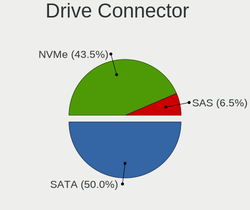
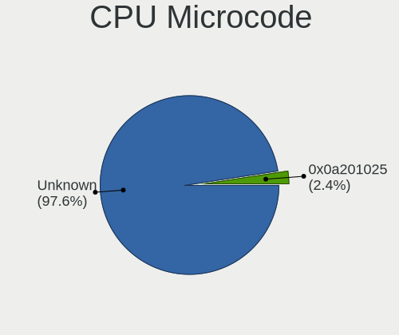
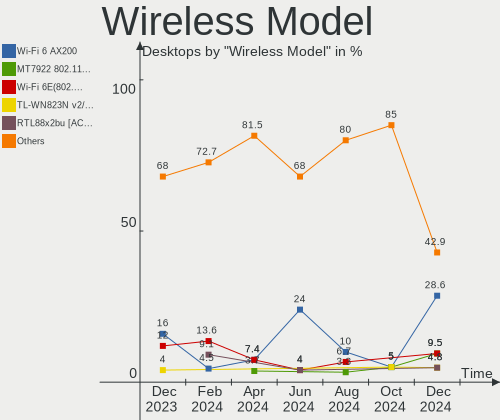
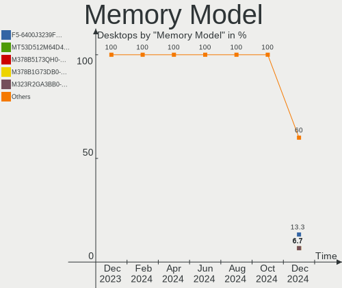
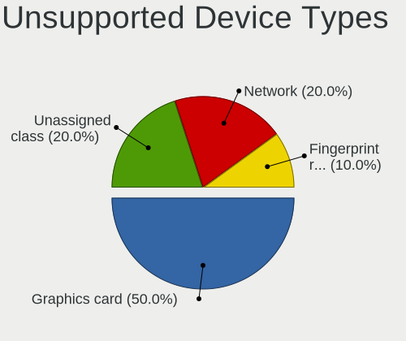

Manjaro - Hardware Trends (Desktops)
------------------------------------

A project to identify most popular hardware characteristics and track their change
over time based on data collected by Linux users at https://Linux-Hardware.org.

Anyone can contribute to this report by the [hw-probe](https://github.com/linuxhw/hw-probe) tool:

    sudo -E hw-probe -all -upload

This report is for one last month. Overall report since the beginning of time: [TestDays](https://github.com/linuxhw/TestDays)

Period: Sep, 2023.

Contents
--------

* [ System ](#system)
  - [ OS                       ](#os)
  - [ OS Family                ](#os-family)
  - [ Kernel                   ](#kernel)
  - [ Kernel Family            ](#kernel-family)
  - [ Kernel Major Ver.        ](#kernel-major-ver)
  - [ Arch                     ](#arch)
  - [ DE                       ](#de)
  - [ Display Server           ](#display-server)
  - [ Display Manager          ](#display-manager)
  - [ OS Lang                  ](#os-lang)
  - [ Boot Mode                ](#boot-mode)
  - [ Filesystem               ](#filesystem)
  - [ Part. scheme             ](#part-scheme)
  - [ Dual Boot with Linux/BSD ](#dual-boot-with-linuxbsd)
  - [ Dual Boot (Win)          ](#dual-boot-win)

* [ Board ](#board)
  - [ Vendor                   ](#vendor)
  - [ Model                    ](#model)
  - [ Model Family             ](#model-family)
  - [ MFG Year                 ](#mfg-year)
  - [ Form Factor              ](#form-factor)
  - [ Secure Boot              ](#secure-boot)
  - [ Coreboot                 ](#coreboot)
  - [ RAM Size                 ](#ram-size)
  - [ RAM Used                 ](#ram-used)
  - [ Total Drives             ](#total-drives)
  - [ Has CD-ROM               ](#has-cd-rom)
  - [ Has Ethernet             ](#has-ethernet)
  - [ Has WiFi                 ](#has-wifi)
  - [ Has Bluetooth            ](#has-bluetooth)

* [ Location ](#location)
  - [ Country                  ](#country)
  - [ City                     ](#city)

* [ Drives ](#drives)
  - [ Drive Vendor             ](#drive-vendor)
  - [ Drive Model              ](#drive-model)
  - [ HDD Vendor               ](#hdd-vendor)
  - [ SSD Vendor               ](#ssd-vendor)
  - [ Drive Kind               ](#drive-kind)
  - [ Drive Connector          ](#drive-connector)
  - [ Drive Size               ](#drive-size)
  - [ Space Total              ](#space-total)
  - [ Space Used               ](#space-used)
  - [ Malfunc. Drives          ](#malfunc-drives)
  - [ Malfunc. Drive Vendor    ](#malfunc-drive-vendor)
  - [ Malfunc. HDD Vendor      ](#malfunc-hdd-vendor)
  - [ Malfunc. Drive Kind      ](#malfunc-drive-kind)
  - [ Failed Drives            ](#failed-drives)
  - [ Failed Drive Vendor      ](#failed-drive-vendor)
  - [ Drive Status             ](#drive-status)

* [ Storage controller ](#storage-controller)
  - [ Storage Vendor           ](#storage-vendor)
  - [ Storage Model            ](#storage-model)
  - [ Storage Kind             ](#storage-kind)

* [ Processor ](#processor)
  - [ CPU Vendor               ](#cpu-vendor)
  - [ CPU Model                ](#cpu-model)
  - [ CPU Model Family         ](#cpu-model-family)
  - [ CPU Cores                ](#cpu-cores)
  - [ CPU Sockets              ](#cpu-sockets)
  - [ CPU Threads              ](#cpu-threads)
  - [ CPU Op-Modes             ](#cpu-op-modes)
  - [ CPU Microcode            ](#cpu-microcode)
  - [ CPU Microarch            ](#cpu-microarch)

* [ Graphics ](#graphics)
  - [ GPU Vendor               ](#gpu-vendor)
  - [ GPU Model                ](#gpu-model)
  - [ GPU Combo                ](#gpu-combo)
  - [ GPU Driver               ](#gpu-driver)
  - [ GPU Memory               ](#gpu-memory)

* [ Monitor ](#monitor)
  - [ Monitor Vendor           ](#monitor-vendor)
  - [ Monitor Model            ](#monitor-model)
  - [ Monitor Resolution       ](#monitor-resolution)
  - [ Monitor Diagonal         ](#monitor-diagonal)
  - [ Monitor Width            ](#monitor-width)
  - [ Aspect Ratio             ](#aspect-ratio)
  - [ Monitor Area             ](#monitor-area)
  - [ Pixel Density            ](#pixel-density)
  - [ Multiple Monitors        ](#multiple-monitors)

* [ Network ](#network)
  - [ Net Controller Vendor    ](#net-controller-vendor)
  - [ Net Controller Model     ](#net-controller-model)
  - [ Wireless Vendor          ](#wireless-vendor)
  - [ Wireless Model           ](#wireless-model)
  - [ Ethernet Vendor          ](#ethernet-vendor)
  - [ Ethernet Model           ](#ethernet-model)
  - [ Net Controller Kind      ](#net-controller-kind)
  - [ Used Controller          ](#used-controller)
  - [ NICs                     ](#nics)
  - [ IPv6                     ](#ipv6)

* [ Bluetooth ](#bluetooth)
  - [ Bluetooth Vendor         ](#bluetooth-vendor)
  - [ Bluetooth Model          ](#bluetooth-model)

* [ Sound ](#sound)
  - [ Sound Vendor             ](#sound-vendor)
  - [ Sound Model              ](#sound-model)

* [ Memory ](#memory)
  - [ Memory Vendor            ](#memory-vendor)
  - [ Memory Model             ](#memory-model)
  - [ Memory Kind              ](#memory-kind)
  - [ Memory Form Factor       ](#memory-form-factor)
  - [ Memory Size              ](#memory-size)
  - [ Memory Speed             ](#memory-speed)

* [ Printers & scanners ](#printers--scanners)
  - [ Printer Vendor           ](#printer-vendor)
  - [ Printer Model            ](#printer-model)
  - [ Scanner Vendor           ](#scanner-vendor)
  - [ Scanner Model            ](#scanner-model)

* [ Camera ](#camera)
  - [ Camera Vendor            ](#camera-vendor)
  - [ Camera Model             ](#camera-model)

* [ Security ](#security)
  - [ Fingerprint Vendor       ](#fingerprint-vendor)
  - [ Fingerprint Model        ](#fingerprint-model)
  - [ Chipcard Vendor          ](#chipcard-vendor)
  - [ Chipcard Model           ](#chipcard-model)

* [ Unsupported ](#unsupported)
  - [ Unsupported Devices      ](#unsupported-devices)
  - [ Unsupported Device Types ](#unsupported-device-types)

System
------

OS
--

Installed operating systems

| Name           | Desktops | Percent |
|----------------|----------|---------|
| Manjaro        | 35       | 59.32%  |
| Manjaro 23.0.0 | 12       | 20.34%  |
| Manjaro 23.0.2 | 5        | 8.47%   |
| Manjaro 23.0.1 | 5        | 8.47%   |
| Manjaro 23.0   | 1        | 1.69%   |
| Manjaro 18.0   | 1        | 1.69%   |

OS Family
---------

OS without a version

| Name    | Desktops | Percent |
|---------|----------|---------|
| Manjaro | 59       | 100%    |

Kernel
------

Version of the Linux kernel

| Version             | Desktops | Percent |
|---------------------|----------|---------|
| 6.5.3-1-MANJARO     | 9        | 15.25%  |
| 6.5.1-1-MANJARO     | 9        | 15.25%  |
| 6.5.0-1-MANJARO     | 8        | 13.56%  |
| 6.1.49-1-MANJARO    | 8        | 13.56%  |
| 6.1.53-1-MANJARO    | 6        | 10.17%  |
| 6.1.51-1-MANJARO    | 5        | 8.47%   |
| 5.15.128-1-MANJARO  | 3        | 5.08%   |
| 6.5.3-lqx1-1-lqx    | 1        | 1.69%   |
| 6.5.2-1-MANJARO     | 1        | 1.69%   |
| 6.4.6-3-rt8-MANJARO | 1        | 1.69%   |
| 6.4.12-1-MANJARO    | 1        | 1.69%   |
| 6.1.44-1-MANJARO    | 1        | 1.69%   |
| 6.1.38-1-MANJARO    | 1        | 1.69%   |
| 6.1.30-1-MANJARO    | 1        | 1.69%   |
| 5.15.131-1-MANJARO  | 1        | 1.69%   |
| 5.15.114-2-MANJARO  | 1        | 1.69%   |
| 5.13.19-2-MANJARO   | 1        | 1.69%   |
| 4.19.0-3-MANJARO    | 1        | 1.69%   |

Kernel Family
-------------

Linux kernel without a distro release

| Version  | Desktops | Percent |
|----------|----------|---------|
| 6.5.3    | 10       | 16.95%  |
| 6.5.1    | 9        | 15.25%  |
| 6.5.0    | 8        | 13.56%  |
| 6.1.49   | 8        | 13.56%  |
| 6.1.53   | 6        | 10.17%  |
| 6.1.51   | 5        | 8.47%   |
| 5.15.128 | 3        | 5.08%   |
| 6.5.2    | 1        | 1.69%   |
| 6.4.6    | 1        | 1.69%   |
| 6.4.12   | 1        | 1.69%   |
| 6.1.44   | 1        | 1.69%   |
| 6.1.38   | 1        | 1.69%   |
| 6.1.30   | 1        | 1.69%   |
| 5.15.131 | 1        | 1.69%   |
| 5.15.114 | 1        | 1.69%   |
| 5.13.19  | 1        | 1.69%   |
| 4.19.0   | 1        | 1.69%   |

Kernel Major Ver.
-----------------

Linux kernel major version

| Version | Desktops | Percent |
|---------|----------|---------|
| 6.5     | 28       | 47.46%  |
| 6.1     | 22       | 37.29%  |
| 5.15    | 5        | 8.47%   |
| 6.4     | 2        | 3.39%   |
| 5.13    | 1        | 1.69%   |
| 4.19    | 1        | 1.69%   |

Arch
----

OS architecture (x86_64, i586, etc.)

| Name   | Desktops | Percent |
|--------|----------|---------|
| x86_64 | 59       | 100%    |

DE
--

Desktop Environment

| Name    | Desktops | Percent |
|---------|----------|---------|
| KDE5    | 37       | 62.71%  |
| XFCE    | 10       | 16.95%  |
| GNOME   | 8        | 13.56%  |
| KDE     | 3        | 5.08%   |
| Unknown | 1        | 1.69%   |

Display Server
--------------

X11 or Wayland

| Name    | Desktops | Percent |
|---------|----------|---------|
| X11     | 47       | 79.66%  |
| Wayland | 12       | 20.34%  |

Display Manager
---------------

SDDM, LightDM, etc.

| Name    | Desktops | Percent |
|---------|----------|---------|
| Unknown | 35       | 59.32%  |
| SDDM    | 15       | 25.42%  |
| LightDM | 7        | 11.86%  |
| GDM     | 2        | 3.39%   |

OS Lang
-------

Language

| Lang    | Desktops | Percent |
|---------|----------|---------|
| en_US   | 16       | 27.12%  |
| de_DE   | 8        | 13.56%  |
| ru_RU   | 6        | 10.17%  |
| pt_BR   | 5        | 8.47%   |
| en_GB   | 5        | 8.47%   |
| fr_FR   | 4        | 6.78%   |
| pl_PL   | 3        | 5.08%   |
| it_IT   | 2        | 3.39%   |
| de_CH   | 2        | 3.39%   |
| zh_TW   | 1        | 1.69%   |
| sk_SK   | 1        | 1.69%   |
| pt_PT   | 1        | 1.69%   |
| es_ES   | 1        | 1.69%   |
| es_CL   | 1        | 1.69%   |
| es_AR   | 1        | 1.69%   |
| el_GR   | 1        | 1.69%   |
| Unknown | 1        | 1.69%   |

Boot Mode
---------

EFI or BIOS

| Mode | Desktops | Percent |
|------|----------|---------|
| BIOS | 41       | 69.49%  |
| EFI  | 18       | 30.51%  |

Filesystem
----------

Type of filesystem

| Type    | Desktops | Percent |
|---------|----------|---------|
| Ext4    | 46       | 77.97%  |
| Btrfs   | 8        | 13.56%  |
| Tmpfs   | 4        | 6.78%   |
| Overlay | 1        | 1.69%   |

Part. scheme
------------

Scheme of partitioning

| Type    | Desktops | Percent |
|---------|----------|---------|
| Unknown | 33       | 55.93%  |
| GPT     | 23       | 38.98%  |
| MBR     | 3        | 5.08%   |

Dual Boot with Linux/BSD
------------------------

Hosting more than one Linux/BSD

| Dual boot | Desktops | Percent |
|-----------|----------|---------|
| No        | 51       | 86.44%  |
| Yes       | 8        | 13.56%  |

Dual Boot (Win)
---------------

Hosting Linux and Windows

| Dual boot | Desktops | Percent |
|-----------|----------|---------|
| No        | 46       | 77.97%  |
| Yes       | 13       | 22.03%  |

Board
-----

Vendor
------

Motherboard manufacturer

| Name                                 | Desktops | Percent |
|--------------------------------------|----------|---------|
| MSI                                  | 12       | 20.34%  |
| Hewlett-Packard                      | 11       | 18.64%  |
| Gigabyte Technology                  | 10       | 16.95%  |
| ASUSTek Computer                     | 9        | 15.25%  |
| ASRock                               | 8        | 13.56%  |
| Lenovo                               | 3        | 5.08%   |
| Dell                                 | 2        | 3.39%   |
| Biostar                              | 2        | 3.39%   |
| Shenzhen Meigao Electronic Equipment | 1        | 1.69%   |
| Foxconn                              | 1        | 1.69%   |

Model
-----

Motherboard model

| Name                                       | Desktops | Percent |
|--------------------------------------------|----------|---------|
| ASUS ROG STRIX B550-F GAMING               | 2        | 3.39%   |
| ASRock A320M-HD                            | 2        | 3.39%   |
| Shenzhen Meigao Electronic Equipment F7BSC | 1        | 1.69%   |
| MSI PRO ADL-U Cubi 5 (MS-B0A8)             | 1        | 1.69%   |
| MSI MS-7D45                                | 1        | 1.69%   |
| MSI MS-7D20                                | 1        | 1.69%   |
| MSI MS-7C95                                | 1        | 1.69%   |
| MSI MS-7C94                                | 1        | 1.69%   |
| MSI MS-7C91                                | 1        | 1.69%   |
| MSI MS-7C56                                | 1        | 1.69%   |
| MSI MS-7C02                                | 1        | 1.69%   |
| MSI MS-7B19                                | 1        | 1.69%   |
| MSI MS-7A38                                | 1        | 1.69%   |
| MSI MS-7918                                | 1        | 1.69%   |
| MSI Elite 7100 Microtower PC               | 1        | 1.69%   |
| Lenovo ThinkCentre M93p 10AB0030US         | 1        | 1.69%   |
| Lenovo ThinkCentre M58e 7303AZ2            | 1        | 1.69%   |
| Lenovo IdeaCentre 720-18APR 90HY002APG     | 1        | 1.69%   |
| HP Z440 Workstation                        | 1        | 1.69%   |
| HP Z230 Tower Workstation                  | 1        | 1.69%   |
| HP OMEN by Desktop PC 870-2XX              | 1        | 1.69%   |
| HP OMEN by 40L Gaming Desktop GT21-0xxx    | 1        | 1.69%   |
| HP EliteDesk 800 G6 Tower PC               | 1        | 1.69%   |
| HP EliteDesk 800 G2 DM 35W                 | 1        | 1.69%   |
| HP Compaq Pro 6300 MT                      | 1        | 1.69%   |
| HP Compaq dc5700 Small Form Factor         | 1        | 1.69%   |
| HP Compaq 8000 Elite CMT PC                | 1        | 1.69%   |
| HP Compaq 6005 Pro SFF PC                  | 1        | 1.69%   |
| HP 700-567nz                               | 1        | 1.69%   |
| Gigabyte X570 AORUS ELITE                  | 1        | 1.69%   |
| Gigabyte H61MA-D3V                         | 1        | 1.69%   |
| Gigabyte H610M S2H DDR4                    | 1        | 1.69%   |
| Gigabyte GA-880GMA-UD2H                    | 1        | 1.69%   |
| Gigabyte B550 AORUS ELITE AX V2            | 1        | 1.69%   |
| Gigabyte B550 AORUS ELITE                  | 1        | 1.69%   |
| Gigabyte B460MAORUSPRO                     | 1        | 1.69%   |
| Gigabyte B450M S2H                         | 1        | 1.69%   |
| Gigabyte B450M DS3H                        | 1        | 1.69%   |
| Gigabyte 990FXA-UD3                        | 1        | 1.69%   |
| Foxconn G41MXE/G41MXE-K                    | 1        | 1.69%   |

Model Family
------------

Motherboard model prefix

| Name                                       | Desktops | Percent |
|--------------------------------------------|----------|---------|
| ASUS ROG                                   | 5        | 8.47%   |
| HP Compaq                                  | 4        | 6.78%   |
| Lenovo ThinkCentre                         | 2        | 3.39%   |
| HP OMEN                                    | 2        | 3.39%   |
| HP EliteDesk                               | 2        | 3.39%   |
| Gigabyte B550                              | 2        | 3.39%   |
| Gigabyte B450M                             | 2        | 3.39%   |
| Dell OptiPlex                              | 2        | 3.39%   |
| ASRock A320M-HD                            | 2        | 3.39%   |
| Shenzhen Meigao Electronic Equipment F7BSC | 1        | 1.69%   |
| MSI PRO                                    | 1        | 1.69%   |
| MSI MS-7D45                                | 1        | 1.69%   |
| MSI MS-7D20                                | 1        | 1.69%   |
| MSI MS-7C95                                | 1        | 1.69%   |
| MSI MS-7C94                                | 1        | 1.69%   |
| MSI MS-7C91                                | 1        | 1.69%   |
| MSI MS-7C56                                | 1        | 1.69%   |
| MSI MS-7C02                                | 1        | 1.69%   |
| MSI MS-7B19                                | 1        | 1.69%   |
| MSI MS-7A38                                | 1        | 1.69%   |
| MSI MS-7918                                | 1        | 1.69%   |
| MSI Elite                                  | 1        | 1.69%   |
| Lenovo IdeaCentre                          | 1        | 1.69%   |
| HP Z440                                    | 1        | 1.69%   |
| HP Z230                                    | 1        | 1.69%   |
| HP 700-567nz                               | 1        | 1.69%   |
| Gigabyte X570                              | 1        | 1.69%   |
| Gigabyte H61MA-D3V                         | 1        | 1.69%   |
| Gigabyte H610M                             | 1        | 1.69%   |
| Gigabyte GA-880GMA-UD2H                    | 1        | 1.69%   |
| Gigabyte B460MAORUSPRO                     | 1        | 1.69%   |
| Gigabyte 990FXA-UD3                        | 1        | 1.69%   |
| Foxconn G41MXE                             | 1        | 1.69%   |
| Biostar X370GTN                            | 1        | 1.69%   |
| Biostar A320MH                             | 1        | 1.69%   |
| ASUS TUF                                   | 1        | 1.69%   |
| ASUS PRIME                                 | 1        | 1.69%   |
| ASUS P5G41T-M                              | 1        | 1.69%   |
| ASUS All                                   | 1        | 1.69%   |
| ASRock Z790                                | 1        | 1.69%   |

MFG Year
--------

Motherboard manufacture year

| Year | Desktops | Percent |
|------|----------|---------|
| 2020 | 11       | 18.64%  |
| 2018 | 10       | 16.95%  |
| 2021 | 7        | 11.86%  |
| 2013 | 4        | 6.78%   |
| 2012 | 4        | 6.78%   |
| 2009 | 4        | 6.78%   |
| 2023 | 3        | 5.08%   |
| 2022 | 3        | 5.08%   |
| 2015 | 3        | 5.08%   |
| 2010 | 3        | 5.08%   |
| 2019 | 2        | 3.39%   |
| 2017 | 2        | 3.39%   |
| 2014 | 2        | 3.39%   |
| 2006 | 1        | 1.69%   |

Form Factor
-----------

Physical design of the computer

| Name    | Desktops | Percent |
|---------|----------|---------|
| Desktop | 59       | 100%    |

Secure Boot
-----------

Enabled or disabled

| State    | Desktops | Percent |
|----------|----------|---------|
| Disabled | 59       | 100%    |

Coreboot
--------

Have coreboot on board

| Used | Desktops | Percent |
|------|----------|---------|
| No   | 59       | 100%    |

RAM Size
--------

Total RAM memory

| Size in GB  | Desktops | Percent |
|-------------|----------|---------|
| 32.01-64.0  | 20       | 33.9%   |
| 16.01-24.0  | 20       | 33.9%   |
| 8.01-16.0   | 7        | 11.86%  |
| 4.01-8.0    | 4        | 6.78%   |
| 3.01-4.0    | 4        | 6.78%   |
| 24.01-32.0  | 3        | 5.08%   |
| 64.01-256.0 | 1        | 1.69%   |

RAM Used
--------

Used RAM memory

| Used GB    | Desktops | Percent |
|------------|----------|---------|
| 4.01-8.0   | 23       | 38.98%  |
| 2.01-3.0   | 9        | 15.25%  |
| 1.01-2.0   | 9        | 15.25%  |
| 3.01-4.0   | 8        | 13.56%  |
| 8.01-16.0  | 7        | 11.86%  |
| 16.01-24.0 | 3        | 5.08%   |

Total Drives
------------

Number of drives on board

| Drives | Desktops | Percent |
|--------|----------|---------|
| 2      | 21       | 35.59%  |
| 1      | 15       | 25.42%  |
| 3      | 8        | 13.56%  |
| 4      | 7        | 11.86%  |
| 5      | 5        | 8.47%   |
| 6      | 3        | 5.08%   |

Has CD-ROM
----------

Has CD-ROM on board

| Presented | Desktops | Percent |
|-----------|----------|---------|
| No        | 45       | 76.27%  |
| Yes       | 14       | 23.73%  |

Has Ethernet
------------

Has Ethernet on board

| Presented | Desktops | Percent |
|-----------|----------|---------|
| Yes       | 56       | 94.92%  |
| No        | 3        | 5.08%   |

Has WiFi
--------

Has WiFi module

| Presented | Desktops | Percent |
|-----------|----------|---------|
| No        | 30       | 50.85%  |
| Yes       | 29       | 49.15%  |

Has Bluetooth
-------------

Has Bluetooth module

| Presented | Desktops | Percent |
|-----------|----------|---------|
| No        | 31       | 52.54%  |
| Yes       | 28       | 47.46%  |

Location
--------

Country
-------

Geographic location (country)

| Country     | Desktops | Percent |
|-------------|----------|---------|
| USA         | 8        | 13.56%  |
| Germany     | 8        | 13.56%  |
| Russia      | 7        | 11.86%  |
| France      | 5        | 8.47%   |
| Brazil      | 5        | 8.47%   |
| UK          | 4        | 6.78%   |
| Sweden      | 3        | 5.08%   |
| Switzerland | 2        | 3.39%   |
| Poland      | 2        | 3.39%   |
| Bulgaria    | 2        | 3.39%   |
| Taiwan      | 1        | 1.69%   |
| Spain       | 1        | 1.69%   |
| Slovakia    | 1        | 1.69%   |
| Singapore   | 1        | 1.69%   |
| Serbia      | 1        | 1.69%   |
| Portugal    | 1        | 1.69%   |
| Netherlands | 1        | 1.69%   |
| Italy       | 1        | 1.69%   |
| Greece      | 1        | 1.69%   |
| Georgia     | 1        | 1.69%   |
| Denmark     | 1        | 1.69%   |
| Chile       | 1        | 1.69%   |
| Argentina   | 1        | 1.69%   |

City
----

Geographic location (city)

| City             | Desktops | Percent |
|------------------|----------|---------|
| Paris            | 4        | 6.78%   |
| Sofia            | 2        | 3.39%   |
| Zurich           | 1        | 1.69%   |
| Zagorz           | 1        | 1.69%   |
| Volos            | 1        | 1.69%   |
| Ulyanovsk        | 1        | 1.69%   |
| Trenton          | 1        | 1.69%   |
| Tikhoretsk       | 1        | 1.69%   |
| Thun             | 1        | 1.69%   |
| Thisted          | 1        | 1.69%   |
| Tbilisi          | 1        | 1.69%   |
| Taitung          | 1        | 1.69%   |
| Stuttgart        | 1        | 1.69%   |
| Stockholm        | 1        | 1.69%   |
| Singapore        | 1        | 1.69%   |
| Siegen           | 1        | 1.69%   |
| Schwelm          | 1        | 1.69%   |
| Sao Luís        | 1        | 1.69%   |
| Santo André     | 1        | 1.69%   |
| Rome             | 1        | 1.69%   |
| Ritzville        | 1        | 1.69%   |
| Portage          | 1        | 1.69%   |
| Paoli            | 1        | 1.69%   |
| Nuremberg        | 1        | 1.69%   |
| Novosibirsk      | 1        | 1.69%   |
| Novokuznetsk     | 1        | 1.69%   |
| Nizhniy Novgorod | 1        | 1.69%   |
| Niš             | 1        | 1.69%   |
| Moscow Oblast    | 1        | 1.69%   |
| Marysville       | 1        | 1.69%   |
| Mar del Plata    | 1        | 1.69%   |
| Malmo            | 1        | 1.69%   |
| London           | 1        | 1.69%   |
| Lisbon           | 1        | 1.69%   |
| Lenoir           | 1        | 1.69%   |
| Lasarte          | 1        | 1.69%   |
| Krasnoyarsk      | 1        | 1.69%   |
| Kassel           | 1        | 1.69%   |
| Karlskrona       | 1        | 1.69%   |
| Hamburg          | 1        | 1.69%   |

Drives
------

Drive Vendor
------------

Hard drive vendors

| Vendor                      | Desktops | Drives | Percent |
|-----------------------------|----------|--------|---------|
| Samsung Electronics         | 27       | 33     | 21.26%  |
| Seagate                     | 21       | 27     | 16.54%  |
| WDC                         | 13       | 18     | 10.24%  |
| SanDisk                     | 9        | 10     | 7.09%   |
| Kingston                    | 8        | 8      | 6.3%    |
| Toshiba                     | 7        | 8      | 5.51%   |
| Crucial                     | 6        | 6      | 4.72%   |
| Kingston Technology Company | 4        | 4      | 3.15%   |
| Phison Electronics          | 3        | 6      | 2.36%   |
| Fujitsu                     | 3        | 3      | 2.36%   |
| Micron Technology           | 2        | 2      | 1.57%   |
| China                       | 2        | 3      | 1.57%   |
| WALRAM                      | 1        | 1      | 0.79%   |
| Unknown                     | 1        | 2      | 0.79%   |
| SPCC Sol                    | 1        | 1      | 0.79%   |
| SPCC                        | 1        | 1      | 0.79%   |
| Realtek Semiconductor       | 1        | 1      | 0.79%   |
| PNY                         | 1        | 1      | 0.79%   |
| Phison                      | 1        | 1      | 0.79%   |
| Patriot                     | 1        | 1      | 0.79%   |
| Micron/Crucial Technology   | 1        | 1      | 0.79%   |
| MAXIO Technology (Hangzhou) | 1        | 1      | 0.79%   |
| Lenovo                      | 1        | 1      | 0.79%   |
| KingFast                    | 1        | 1      | 0.79%   |
| Intenso                     | 1        | 1      | 0.79%   |
| Intel                       | 1        | 1      | 0.79%   |
| IB-377U3                    | 1        | 1      | 0.79%   |
| Hitachi                     | 1        | 1      | 0.79%   |
| HGST                        | 1        | 1      | 0.79%   |
| GOODRAM                     | 1        | 1      | 0.79%   |
| Gigabyte Technology         | 1        | 1      | 0.79%   |
| Drevo                       | 1        | 1      | 0.79%   |
| ADATA Technology            | 1        | 1      | 0.79%   |
| A-DATA Technology           | 1        | 1      | 0.79%   |

Drive Model
-----------

Hard drive models

| Model                                               | Desktops | Percent |
|-----------------------------------------------------|----------|---------|
| Samsung NVMe SSD Controller SM981/PM981/PM983 256GB | 5        | 3.4%    |
| Samsung NVMe SSD Controller PM9A1/PM9A3/980PRO 1TB  | 5        | 3.4%    |
| Seagate ST1000DM003-9YN162 1TB                      | 3        | 2.04%   |
| Samsung SSD 860 EVO 500GB                           | 3        | 2.04%   |
| WDC WD10EZEX-08WN4A0 1TB                            | 2        | 1.36%   |
| Seagate ST31000524AS 1TB                            | 2        | 1.36%   |
| Seagate ST2000DM001-1ER164 2TB                      | 2        | 1.36%   |
| Seagate ST1000DM003-1ER162 1TB                      | 2        | 1.36%   |
| Sandisk WD Blue SN550 NVMe SSD 512GB                | 2        | 1.36%   |
| Samsung SSD 980 1TB                                 | 2        | 1.36%   |
| Samsung NVMe SSD Controller SM961/PM961/SM963 500GB | 2        | 1.36%   |
| Samsung MZ7LN128HCHP-000L1 128GB SSD                | 2        | 1.36%   |
| Kingston Company SNV2S1000G 1TB                     | 2        | 1.36%   |
| Kingston SA400S37480G 480GB SSD                     | 2        | 1.36%   |
| Kingston SA400S37240G 240GB SSD                     | 2        | 1.36%   |
| Crucial CT240BX500SSD1 240GB                        | 2        | 1.36%   |
| WDC WDS500G1B0A-00H9H0 500GB SSD                    | 1        | 0.68%   |
| WDC WDS200T2B0A-00SM50 2TB SSD                      | 1        | 0.68%   |
| WDC WD6401AALS-00L3B2 640GB                         | 1        | 0.68%   |
| WDC WD5000LPVX-22V0TT0 500GB                        | 1        | 0.68%   |
| WDC WD5000BEVT-22A0RT0 500GB                        | 1        | 0.68%   |
| WDC WD5000AAKX-60U6AA0 500GB                        | 1        | 0.68%   |
| WDC WD5000AAKX-08U6AA0 500GB                        | 1        | 0.68%   |
| WDC WD5000AAKX-00U6AA0 500GB                        | 1        | 0.68%   |
| WDC WD5000AAKX-001CA0 500GB                         | 1        | 0.68%   |
| WDC WD20EZBX-00AYRA0 2TB                            | 1        | 0.68%   |
| WDC WD20EZAZ-00L9GB0 2TB                            | 1        | 0.68%   |
| WDC WD1600AABS-00PRA0 160GB                         | 1        | 0.68%   |
| WDC WD10SPZX-00Z10T0 1TB                            | 1        | 0.68%   |
| WDC WD10EZEX-75WN4A0 1TB                            | 1        | 0.68%   |
| WDC WD10EZEX-08M2NA0 1TB                            | 1        | 0.68%   |
| WDC WD10EFRX-68FYTN0 1TB                            | 1        | 0.68%   |
| WALRAM SSD 480G                                     | 1        | 0.68%   |
| Unknown SD/MMC 2GB                                  | 1        | 0.68%   |
| Unknown M.S./M.S.Pro/HG 16GB                        | 1        | 0.68%   |
| Toshiba MQ01ABB200 2TB                              | 1        | 0.68%   |
| Toshiba MK2576GSX HR 160GB                          | 1        | 0.68%   |
| Toshiba MG06ACA10TE 10TB                            | 1        | 0.68%   |
| Toshiba HDWD130 3TB                                 | 1        | 0.68%   |
| Toshiba HDWD110 1TB                                 | 1        | 0.68%   |

HDD Vendor
----------

Hard disk drive vendors

| Vendor              | Desktops | Drives | Percent |
|---------------------|----------|--------|---------|
| Seagate             | 21       | 27     | 42.86%  |
| WDC                 | 13       | 16     | 26.53%  |
| Toshiba             | 7        | 8      | 14.29%  |
| Fujitsu             | 3        | 3      | 6.12%   |
| Samsung Electronics | 1        | 1      | 2.04%   |
| Intenso             | 1        | 1      | 2.04%   |
| IB-377U3            | 1        | 1      | 2.04%   |
| Hitachi             | 1        | 1      | 2.04%   |
| HGST                | 1        | 1      | 2.04%   |

SSD Vendor
----------

Solid state drive vendors

| Vendor              | Desktops | Drives | Percent |
|---------------------|----------|--------|---------|
| Samsung Electronics | 15       | 17     | 32.61%  |
| Kingston            | 7        | 7      | 15.22%  |
| Crucial             | 6        | 6      | 13.04%  |
| SanDisk             | 4        | 4      | 8.7%    |
| WDC                 | 2        | 2      | 4.35%   |
| China               | 2        | 3      | 4.35%   |
| WALRAM              | 1        | 1      | 2.17%   |
| SPCC Sol            | 1        | 1      | 2.17%   |
| SPCC                | 1        | 1      | 2.17%   |
| PNY                 | 1        | 1      | 2.17%   |
| Patriot             | 1        | 1      | 2.17%   |
| Micron Technology   | 1        | 1      | 2.17%   |
| GOODRAM             | 1        | 1      | 2.17%   |
| Gigabyte Technology | 1        | 1      | 2.17%   |
| Drevo               | 1        | 1      | 2.17%   |
| A-DATA Technology   | 1        | 1      | 2.17%   |

Drive Kind
----------

HDD or SSD

| Kind    | Desktops | Drives | Percent |
|---------|----------|--------|---------|
| SSD     | 35       | 49     | 34.65%  |
| HDD     | 33       | 59     | 32.67%  |
| NVMe    | 31       | 40     | 30.69%  |
| Unknown | 2        | 3      | 1.98%   |

Drive Connector
---------------

SATA, SAS, NVMe, etc.

| Type | Desktops | Drives | Percent |
|------|----------|--------|---------|
| SATA | 50       | 102    | 56.82%  |
| NVMe | 31       | 40     | 35.23%  |
| SAS  | 7        | 9      | 7.95%   |

Drive Size
----------

Size of hard drive

| Size in TB | Desktops | Drives | Percent |
|------------|----------|--------|---------|
| 0.01-0.5   | 37       | 59     | 46.84%  |
| 0.51-1.0   | 22       | 26     | 27.85%  |
| 1.01-2.0   | 12       | 14     | 15.19%  |
| 4.01-10.0  | 4        | 4      | 5.06%   |
| 2.01-3.0   | 2        | 2      | 2.53%   |
| 3.01-4.0   | 1        | 2      | 1.27%   |
| 10.01-20.0 | 1        | 1      | 1.27%   |

Space Total
-----------

Amount of disk space available on the file system

| Size in GB     | Desktops | Percent |
|----------------|----------|---------|
| More than 3000 | 12       | 20.34%  |
| 1001-2000      | 12       | 20.34%  |
| 251-500        | 10       | 16.95%  |
| 101-250        | 10       | 16.95%  |
| 501-1000       | 9        | 15.25%  |
| 2001-3000      | 3        | 5.08%   |
| Unknown        | 3        | 5.08%   |

Space Used
----------

Amount of used disk space

| Used GB        | Desktops | Percent |
|----------------|----------|---------|
| 101-250        | 9        | 15.25%  |
| 251-500        | 8        | 13.56%  |
| 1-20           | 8        | 13.56%  |
| 1001-2000      | 7        | 11.86%  |
| 501-1000       | 7        | 11.86%  |
| More than 3000 | 5        | 8.47%   |
| 2001-3000      | 5        | 8.47%   |
| 51-100         | 4        | 6.78%   |
| 21-50          | 3        | 5.08%   |
| Unknown        | 3        | 5.08%   |

Malfunc. Drives
---------------

Drive models with a malfunction

| Model                                                     | Desktops | Drives | Percent |
|-----------------------------------------------------------|----------|--------|---------|
| Seagate ST1000DM003-9YN162 1TB                            | 2        | 2      | 22.22%  |
| WDC WD5000AAKX-001CA0 500GB                               | 1        | 1      | 11.11%  |
| Seagate ST2000DX001-1CM164 2TB                            | 1        | 1      | 11.11%  |
| Seagate ST1000VX000-1CU162 1TB                            | 1        | 1      | 11.11%  |
| Seagate ST10000VX0004-1ZE101 10TB                         | 1        | 1      | 11.11%  |
| Realtek Semiconductor RTS5763DL NVMe SSD Controller 256GB | 1        | 1      | 11.11%  |
| Micron Technology MTFDDAK256MAY-1AH1ZABHA 256GB SSD       | 1        | 1      | 11.11%  |
| China SSD 120GB                                           | 1        | 1      | 11.11%  |

Malfunc. Drive Vendor
---------------------

Vendors of faulty drives

| Vendor                | Desktops | Drives | Percent |
|-----------------------|----------|--------|---------|
| Seagate               | 4        | 5      | 50%     |
| WDC                   | 1        | 1      | 12.5%   |
| Realtek Semiconductor | 1        | 1      | 12.5%   |
| Micron Technology     | 1        | 1      | 12.5%   |
| China                 | 1        | 1      | 12.5%   |

Malfunc. HDD Vendor
-------------------

Vendors of faulty HDD drives

| Vendor  | Desktops | Drives | Percent |
|---------|----------|--------|---------|
| Seagate | 4        | 5      | 80%     |
| WDC     | 1        | 1      | 20%     |

Malfunc. Drive Kind
-------------------

Kinds of faulty drives

| Kind | Desktops | Drives | Percent |
|------|----------|--------|---------|
| HDD  | 5        | 6      | 62.5%   |
| SSD  | 2        | 2      | 25%     |
| NVMe | 1        | 1      | 12.5%   |

Failed Drives
-------------

Failed drive models

Zero info for selected period =(

Failed Drive Vendor
-------------------

Failed drive vendors

Zero info for selected period =(

Drive Status
------------

Number of failed and malfunc. drives

| Status   | Desktops | Drives | Percent |
|----------|----------|--------|---------|
| Detected | 39       | 94     | 57.35%  |
| Works    | 21       | 48     | 30.88%  |
| Malfunc  | 8        | 9      | 11.76%  |

Storage controller
------------------

Storage Vendor
--------------

Storage controller vendors

| Vendor                      | Desktops | Percent |
|-----------------------------|----------|---------|
| AMD                         | 30       | 30.93%  |
| Intel                       | 29       | 29.9%   |
| Samsung Electronics         | 13       | 13.4%   |
| SanDisk                     | 5        | 5.15%   |
| Kingston Technology Company | 5        | 5.15%   |
| Phison Electronics          | 3        | 3.09%   |
| Marvell Technology Group    | 2        | 2.06%   |
| JMicron Technology          | 2        | 2.06%   |
| Realtek Semiconductor       | 1        | 1.03%   |
| Micron/Crucial Technology   | 1        | 1.03%   |
| Micron Technology           | 1        | 1.03%   |
| MAXIO Technology (Hangzhou) | 1        | 1.03%   |
| Lenovo                      | 1        | 1.03%   |
| HighPoint Technologies      | 1        | 1.03%   |
| ASMedia Technology          | 1        | 1.03%   |
| ADATA Technology            | 1        | 1.03%   |

Storage Model
-------------

Storage controller models

| Model                                                                          | Desktops | Percent |
|--------------------------------------------------------------------------------|----------|---------|
| AMD FCH SATA Controller [AHCI mode]                                            | 15       | 12.4%   |
| AMD 500 Series Chipset SATA Controller                                         | 10       | 8.26%   |
| Samsung NVMe SSD Controller PM9A1/PM9A3/980PRO                                 | 6        | 4.96%   |
| AMD 400 Series Chipset SATA Controller                                         | 6        | 4.96%   |
| Samsung NVMe SSD Controller SM981/PM981/PM983                                  | 5        | 4.13%   |
| AMD FCH SATA Controller D                                                      | 5        | 4.13%   |
| Intel NM10/ICH7 Family SATA Controller [IDE mode]                              | 3        | 2.48%   |
| Intel Alder Lake-S PCH SATA Controller [AHCI Mode]                             | 3        | 2.48%   |
| Intel 82801G (ICH7 Family) IDE Controller                                      | 3        | 2.48%   |
| Intel 8 Series/C220 Series Chipset Family 6-port SATA Controller 1 [AHCI mode] | 3        | 2.48%   |
| SanDisk WD Blue SN550 NVMe SSD                                                 | 2        | 1.65%   |
| Samsung NVMe SSD Controller SM961/PM961/SM963                                  | 2        | 1.65%   |
| Samsung NVMe SSD Controller 980                                                | 2        | 1.65%   |
| Marvell Group 88SE9172 SATA 6Gb/s Controller                                   | 2        | 1.65%   |
| Kingston Company Company Non-Volatile memory controller                        | 2        | 1.65%   |
| Intel Q170/Q150/B150/H170/H110/Z170/CM236 Chipset SATA Controller [AHCI Mode]  | 2        | 1.65%   |
| Intel Cannon Lake PCH SATA AHCI Controller                                     | 2        | 1.65%   |
| Intel 9 Series Chipset Family SATA Controller [AHCI Mode]                      | 2        | 1.65%   |
| AMD SB7x0/SB8x0/SB9x0 SATA Controller [AHCI mode]                              | 2        | 1.65%   |
| AMD SB7x0/SB8x0/SB9x0 IDE Controller                                           | 2        | 1.65%   |
| Sandisk Western Digital WD Black SN850X NVMe SSD                               | 1        | 0.83%   |
| SanDisk WD Blue SN570 NVMe SSD 2TB                                             | 1        | 0.83%   |
| SanDisk WD Blue SN570 NVMe SSD 1TB                                             | 1        | 0.83%   |
| SanDisk WD Black SN750 / PC SN730 NVMe SSD                                     | 1        | 0.83%   |
| Realtek RTS5763DL NVMe SSD Controller                                          | 1        | 0.83%   |
| Phison PS5021-E21 PCIe4 NVMe Controller (DRAM-less)                            | 1        | 0.83%   |
| Phison E18 PCIe4 NVMe Controller                                               | 1        | 0.83%   |
| Phison E16 PCIe4 NVMe Controller                                               | 1        | 0.83%   |
| Phison E12 NVMe Controller                                                     | 1        | 0.83%   |
| Micron/Crucial P1 NVMe PCIe SSD[Frampton]                                      | 1        | 0.83%   |
| Micron 2210 NVMe SSD [Cobain]                                                  | 1        | 0.83%   |
| MAXIO (Hangzhou) NVMe SSD Controller MAP1202                                   | 1        | 0.83%   |
| Lenovo LENSE30512GMSP34MEAT3TA                                                 | 1        | 0.83%   |
| Kingston Company OM8PGP4 NVMe PCIe SSD (DRAM-less)                             | 1        | 0.83%   |
| Kingston Company KC3000/Renegade NVMe SSD                                      | 1        | 0.83%   |
| Kingston Company A2000 NVMe SSD                                                | 1        | 0.83%   |
| JMicron JMB368 IDE controller                                                  | 1        | 0.83%   |
| JMicron JMB363 SATA/IDE Controller                                             | 1        | 0.83%   |
| Intel SSD DC P4101/Pro 7600p/760p/E 6100p Series                               | 1        | 0.83%   |
| Intel SATA Controller [RAID mode]                                              | 1        | 0.83%   |

Storage Kind
------------

Kind of storage controller (IDE, SATA, NVMe, SAS, ...)

| Kind | Desktops | Percent |
|------|----------|---------|
| SATA | 50       | 53.19%  |
| NVMe | 31       | 32.98%  |
| IDE  | 9        | 9.57%   |
| RAID | 4        | 4.26%   |

Processor
---------

CPU Vendor
----------

Processor vendors

| Vendor | Desktops | Percent |
|--------|----------|---------|
| AMD    | 31       | 52.54%  |
| Intel  | 28       | 47.46%  |

CPU Model
---------

Processor models

| Model                                       | Desktops | Percent |
|---------------------------------------------|----------|---------|
| AMD Ryzen 5 3600 6-Core Processor           | 4        | 6.78%   |
| Intel Core i7-4790 CPU @ 3.60GHz            | 3        | 5.08%   |
| Intel Core 2 Quad CPU Q6600 @ 2.40GHz       | 2        | 3.39%   |
| AMD Ryzen 7 5800X 8-Core Processor          | 2        | 3.39%   |
| AMD Ryzen 7 1700 Eight-Core Processor       | 2        | 3.39%   |
| AMD Ryzen 5 5600X 6-Core Processor          | 2        | 3.39%   |
| AMD Ryzen 5 5600G with Radeon Graphics      | 2        | 3.39%   |
| AMD Ryzen 5 1600 Six-Core Processor         | 2        | 3.39%   |
| AMD Ryzen 3 2200G with Radeon Vega Graphics | 2        | 3.39%   |
| AMD FX-6300 Six-Core Processor              | 2        | 3.39%   |
| Intel Xeon CPU E5-1620 v4 @ 3.50GHz         | 1        | 1.69%   |
| Intel Xeon CPU E3-1245 v3 @ 3.40GHz         | 1        | 1.69%   |
| Intel Pentium Dual CPU E2180 @ 2.00GHz      | 1        | 1.69%   |
| Intel Core i9-9900KF CPU @ 3.60GHz          | 1        | 1.69%   |
| Intel Core i7-9700K CPU @ 3.60GHz           | 1        | 1.69%   |
| Intel Core i7-4765T CPU @ 2.00GHz           | 1        | 1.69%   |
| Intel Core i5-7400 CPU @ 3.00GHz            | 1        | 1.69%   |
| Intel Core i5-6500T CPU @ 2.50GHz           | 1        | 1.69%   |
| Intel Core i5-4570 CPU @ 3.20GHz            | 1        | 1.69%   |
| Intel Core i5-4460 CPU @ 3.20GHz            | 1        | 1.69%   |
| Intel Core i5-3570K CPU @ 3.40GHz           | 1        | 1.69%   |
| Intel Core i5-10500 CPU @ 3.10GHz           | 1        | 1.69%   |
| Intel Core i5-10400F CPU @ 2.90GHz          | 1        | 1.69%   |
| Intel Core i5 CPU 650 @ 3.20GHz             | 1        | 1.69%   |
| Intel Core i3-3220 CPU @ 3.30GHz            | 1        | 1.69%   |
| Intel Core 2 Duo CPU E8400 @ 3.00GHz        | 1        | 1.69%   |
| Intel Celeron CPU E3400 @ 2.60GHz           | 1        | 1.69%   |
| Intel 13th Gen Core i9-13900KS              | 1        | 1.69%   |
| Intel 13th Gen Core i7-13700KF              | 1        | 1.69%   |
| Intel 13th Gen Core i5-13600K               | 1        | 1.69%   |
| Intel 12th Gen Core i7-1255U                | 1        | 1.69%   |
| Intel 12th Gen Core i3-12100F               | 1        | 1.69%   |
| Intel 11th Gen Core i5-11500 @ 2.70GHz      | 1        | 1.69%   |
| AMD Ryzen 9 7950X 16-Core Processor         | 1        | 1.69%   |
| AMD Ryzen 9 7940HS w/ Radeon 780M Graphics  | 1        | 1.69%   |
| AMD Ryzen 9 3900X 12-Core Processor         | 1        | 1.69%   |
| AMD Ryzen 7 7700 8-Core Processor           | 1        | 1.69%   |
| AMD Ryzen 7 3800X 8-Core Processor          | 1        | 1.69%   |
| AMD Ryzen 7 2700X Eight-Core Processor      | 1        | 1.69%   |
| AMD Ryzen 7 2700 Eight-Core Processor       | 1        | 1.69%   |

CPU Model Family
----------------

Processor model prefix

| Model              | Desktops | Percent |
|--------------------|----------|---------|
| AMD Ryzen 5        | 13       | 22.03%  |
| Intel Core i5      | 8        | 13.56%  |
| AMD Ryzen 7        | 8        | 13.56%  |
| Other              | 6        | 10.17%  |
| Intel Core i7      | 5        | 8.47%   |
| AMD Ryzen 9        | 3        | 5.08%   |
| Intel Xeon         | 2        | 3.39%   |
| Intel Core 2 Quad  | 2        | 3.39%   |
| AMD Ryzen 3        | 2        | 3.39%   |
| AMD FX             | 2        | 3.39%   |
| Intel Pentium Dual | 1        | 1.69%   |
| Intel Core i9      | 1        | 1.69%   |
| Intel Core i3      | 1        | 1.69%   |
| Intel Core 2 Duo   | 1        | 1.69%   |
| Intel Celeron      | 1        | 1.69%   |
| AMD Phenom II X6   | 1        | 1.69%   |
| AMD Phenom II X2   | 1        | 1.69%   |
| AMD Athlon         | 1        | 1.69%   |

CPU Cores
---------

Number of processor cores

| Number | Desktops | Percent |
|--------|----------|---------|
| 4      | 17       | 28.81%  |
| 6      | 16       | 27.12%  |
| 8      | 11       | 18.64%  |
| 2      | 7        | 11.86%  |
| 16     | 2        | 3.39%   |
| 3      | 2        | 3.39%   |
| 24     | 1        | 1.69%   |
| 14     | 1        | 1.69%   |
| 12     | 1        | 1.69%   |
| 10     | 1        | 1.69%   |

CPU Sockets
-----------

Number of sockets

| Number | Desktops | Percent |
|--------|----------|---------|
| 1      | 59       | 100%    |

CPU Threads
-----------

Threads per core (Hyper-Threading)

| Number | Desktops | Percent |
|--------|----------|---------|
| 2      | 43       | 72.88%  |
| 1      | 16       | 27.12%  |

CPU Op-Modes
------------

CPU Operation Modes (32-bit, 64-bit)

| Op mode        | Desktops | Percent |
|----------------|----------|---------|
| 32-bit, 64-bit | 59       | 100%    |

CPU Microcode
-------------

Microcode number

| Number     | Desktops | Percent |
|------------|----------|---------|
| Unknown    | 42       | 71.19%  |
| 0x306c3    | 2        | 3.39%   |
| 0x0a201025 | 2        | 3.39%   |
| 0x08701021 | 2        | 3.39%   |
| 0xa0653    | 1        | 1.69%   |
| 0x6fb      | 1        | 1.69%   |
| 0x0a704101 | 1        | 1.69%   |
| 0x0a50000d | 1        | 1.69%   |
| 0x0a201016 | 1        | 1.69%   |
| 0x08701030 | 1        | 1.69%   |
| 0x08101016 | 1        | 1.69%   |
| 0x0800820d | 1        | 1.69%   |
| 0x08001126 | 1        | 1.69%   |
| 0x06000852 | 1        | 1.69%   |
| 0x010000dc | 1        | 1.69%   |

CPU Microarch
-------------

Microarchitecture

| Name             | Desktops | Percent |
|------------------|----------|---------|
| Zen              | 8        | 13.56%  |
| Zen 3            | 7        | 11.86%  |
| Haswell          | 7        | 11.86%  |
| Zen 2            | 6        | 10.17%  |
| Unknown          | 6        | 10.17%  |
| Zen+             | 3        | 5.08%   |
| KabyLake         | 3        | 5.08%   |
| Core             | 3        | 5.08%   |
| Piledriver       | 2        | 3.39%   |
| Penryn           | 2        | 3.39%   |
| K10              | 2        | 3.39%   |
| IvyBridge        | 2        | 3.39%   |
| CometLake        | 2        | 3.39%   |
| Alderlake Hybrid | 2        | 3.39%   |
| Westmere         | 1        | 1.69%   |
| Skylake          | 1        | 1.69%   |
| Icelake          | 1        | 1.69%   |
| Broadwell        | 1        | 1.69%   |

Graphics
--------

GPU Vendor
----------

Vendors of graphics cards

| Vendor | Desktops | Percent |
|--------|----------|---------|
| Nvidia | 31       | 49.21%  |
| AMD    | 18       | 28.57%  |
| Intel  | 14       | 22.22%  |

GPU Model
---------

Graphics card models

| Model                                                                       | Desktops | Percent |
|-----------------------------------------------------------------------------|----------|---------|
| Nvidia GP107 [GeForce GTX 1050 Ti]                                          | 3        | 4.76%   |
| Intel Xeon E3-1200 v3/4th Gen Core Processor Integrated Graphics Controller | 3        | 4.76%   |
| Nvidia TU106 [GeForce GTX 1650]                                             | 2        | 3.17%   |
| Nvidia GP108 [GeForce GT 1030]                                              | 2        | 3.17%   |
| Nvidia GA106 [GeForce RTX 3060 Lite Hash Rate]                              | 2        | 3.17%   |
| Nvidia GA102 [GeForce RTX 3080 Ti]                                          | 2        | 3.17%   |
| Intel Raptor Lake-S GT1 [UHD Graphics 770]                                  | 2        | 3.17%   |
| Intel 4 Series Chipset Integrated Graphics Controller                       | 2        | 3.17%   |
| AMD Polaris 20 XL [Radeon RX 580 2048SP]                                    | 2        | 3.17%   |
| AMD Navi 31 [Radeon RX 7900 XT/7900 XTX]                                    | 2        | 3.17%   |
| AMD Navi 22 [Radeon RX 6700/6700 XT/6750 XT / 6800M/6850M XT]               | 2        | 3.17%   |
| AMD Bonaire XTX [Radeon R7 260X/360]                                        | 2        | 3.17%   |
| Nvidia TU117 [GeForce GTX 1650]                                             | 1        | 1.59%   |
| Nvidia TU116 [GeForce GTX 1660 Ti]                                          | 1        | 1.59%   |
| Nvidia TU106 [GeForce RTX 2060 SUPER]                                       | 1        | 1.59%   |
| Nvidia TU104 [GeForce RTX 2080 Rev. A]                                      | 1        | 1.59%   |
| Nvidia GP106 [GeForce GTX 1060 6GB]                                         | 1        | 1.59%   |
| Nvidia GP106 [GeForce GTX 1060 3GB]                                         | 1        | 1.59%   |
| Nvidia GP104GL [Quadro P4000]                                               | 1        | 1.59%   |
| Nvidia GP104 [GeForce GTX 1080]                                             | 1        | 1.59%   |
| Nvidia GP102 [GeForce GTX 1080 Ti]                                          | 1        | 1.59%   |
| Nvidia GM107 [GeForce GTX 745]                                              | 1        | 1.59%   |
| Nvidia GK208B [GeForce GT 730]                                              | 1        | 1.59%   |
| Nvidia GK110 [GeForce GTX 780]                                              | 1        | 1.59%   |
| Nvidia GK107 [NVS 510]                                                      | 1        | 1.59%   |
| Nvidia GK104 [GeForce GTX 670]                                              | 1        | 1.59%   |
| Nvidia GA106 [Geforce RTX 3050]                                             | 1        | 1.59%   |
| Nvidia GA104 [GeForce RTX 3070 Lite Hash Rate]                              | 1        | 1.59%   |
| Nvidia GA104 [GeForce RTX 3060]                                             | 1        | 1.59%   |
| Nvidia GA104 [GeForce RTX 3060 Ti Lite Hash Rate]                           | 1        | 1.59%   |
| Nvidia GA102 [GeForce RTX 3080]                                             | 1        | 1.59%   |
| Nvidia G92 [GeForce 9800 GT]                                                | 1        | 1.59%   |
| Intel Xeon E3-1200 v3 Processor Integrated Graphics Controller              | 1        | 1.59%   |
| Intel RocketLake-S GT1 [UHD Graphics 750]                                   | 1        | 1.59%   |
| Intel HD Graphics 530                                                       | 1        | 1.59%   |
| Intel Core Processor Integrated Graphics Controller                         | 1        | 1.59%   |
| Intel CometLake-S GT2 [UHD Graphics 630]                                    | 1        | 1.59%   |
| Intel Alder Lake-UP3 GT2 [Iris Xe Graphics]                                 | 1        | 1.59%   |
| Intel 82Q963/Q965 Integrated Graphics Controller                            | 1        | 1.59%   |
| AMD Raven Ridge [Radeon Vega Series / Radeon Vega Mobile Series]            | 1        | 1.59%   |

GPU Combo
---------

Combinations of graphics cards

| Name         | Desktops | Percent |
|--------------|----------|---------|
| 1 x Nvidia   | 29       | 49.15%  |
| 1 x AMD      | 16       | 27.12%  |
| 1 x Intel    | 12       | 20.34%  |
| AMD + Nvidia | 2        | 3.39%   |

GPU Driver
----------

Free vs proprietary

| Driver      | Desktops | Percent |
|-------------|----------|---------|
| Free        | 34       | 57.63%  |
| Proprietary | 25       | 42.37%  |

GPU Memory
----------

Total video memory

| Size in GB | Desktops | Percent |
|------------|----------|---------|
| Unknown    | 28       | 47.46%  |
| 8.01-16.0  | 8        | 13.56%  |
| 7.01-8.0   | 7        | 11.86%  |
| 3.01-4.0   | 6        | 10.17%  |
| 1.01-2.0   | 6        | 10.17%  |
| 5.01-6.0   | 2        | 3.39%   |
| 2.01-3.0   | 1        | 1.69%   |
| 16.01-24.0 | 1        | 1.69%   |

Monitor
-------

Monitor Vendor
--------------

Monitor vendors

| Vendor               | Desktops | Percent |
|----------------------|----------|---------|
| Samsung Electronics  | 13       | 20%     |
| Goldstar             | 8        | 12.31%  |
| AOC                  | 7        | 10.77%  |
| Philips              | 5        | 7.69%   |
| Acer                 | 5        | 7.69%   |
| ASUSTek Computer     | 4        | 6.15%   |
| Dell                 | 3        | 4.62%   |
| BenQ                 | 3        | 4.62%   |
| ViewSonic            | 2        | 3.08%   |
| Unknown              | 2        | 3.08%   |
| Gigabyte Technology  | 2        | 3.08%   |
| Ancor Communications | 2        | 3.08%   |
| Seiko/Epson          | 1        | 1.54%   |
| Sangyo               | 1        | 1.54%   |
| LG Electronics       | 1        | 1.54%   |
| Lenovo               | 1        | 1.54%   |
| Iiyama               | 1        | 1.54%   |
| HUAWEI               | 1        | 1.54%   |
| DZM                  | 1        | 1.54%   |
| AGO                  | 1        | 1.54%   |
| Unknown              | 1        | 1.54%   |

Monitor Model
-------------

Monitor models

| Model                                                                 | Desktops | Percent |
|-----------------------------------------------------------------------|----------|---------|
| Goldstar IPS FULLHD GSM5AB8 1920x1080 480x270mm 21.7-inch             | 2        | 2.86%   |
| ViewSonic VX2480-2K VSC7B3B 2560x1440 530x300mm 24.0-inch             | 1        | 1.43%   |
| ViewSonic VG2448 VSC3B35 1920x1080 527x296mm 23.8-inch                | 1        | 1.43%   |
| Unknown LCD Monitor UGD Artist 12                                     | 1        | 1.43%   |
| Unknown LCD Monitor FFFF 2288x1287 2550x2550mm 142.0-inch             | 1        | 1.43%   |
| Seiko/Epson LCD Monitor EPSON PJ 1920x1080                            | 1        | 1.43%   |
| Sangyo LCD Monitor M27A3 1920x1080                                    | 1        | 1.43%   |
| Samsung Electronics SyncMaster SAM02AD 1440x900 410x257mm 19.1-inch   | 1        | 1.43%   |
| Samsung Electronics SyncMaster SAM027D 1680x1050 430x270mm 20.0-inch  | 1        | 1.43%   |
| Samsung Electronics LS27A600U SAM7173 2560x1440 597x337mm 27.0-inch   | 1        | 1.43%   |
| Samsung Electronics LF24T35 SAM707D 1920x1080 528x297mm 23.9-inch     | 1        | 1.43%   |
| Samsung Electronics LCD Monitor SE790C 3440x1440                      | 1        | 1.43%   |
| Samsung Electronics LCD Monitor SAM0B60 1920x1080 887x500mm 40.1-inch | 1        | 1.43%   |
| Samsung Electronics LCD Monitor SAM090B 1920x1080 890x500mm 40.2-inch | 1        | 1.43%   |
| Samsung Electronics LCD Monitor SAM03BB 1920x1080 886x498mm 40.0-inch | 1        | 1.43%   |
| Samsung Electronics LCD Monitor S27C350 1920x1080                     | 1        | 1.43%   |
| Samsung Electronics LCD Monitor LS27A800U 3840x2160                   | 1        | 1.43%   |
| Samsung Electronics LCD Monitor LC49G95T 3840x1080                    | 1        | 1.43%   |
| Samsung Electronics C32F391 SAM0D34 1920x1080 698x393mm 31.5-inch     | 1        | 1.43%   |
| Samsung Electronics C27F591 SAM0D36 1920x1080 600x340mm 27.2-inch     | 1        | 1.43%   |
| Samsung Electronics C24F390 SAM0D2C 1920x1080 521x293mm 23.5-inch     | 1        | 1.43%   |
| Philips PHL 241B8Q PHL0929 1920x1080 527x296mm 23.8-inch              | 1        | 1.43%   |
| Philips PHL 220V8 PHLC218 1920x1080 477x268mm 21.5-inch               | 1        | 1.43%   |
| Philips FTV PHL01EA 1920x1080 1440x810mm 65.0-inch                    | 1        | 1.43%   |
| Philips 226VL PHLC081 1920x1080 480x268mm 21.6-inch                   | 1        | 1.43%   |
| Philips 150B PHL0821 1024x768 307x230mm 15.1-inch                     | 1        | 1.43%   |
| LG Electronics LCD Monitor L1953S 1280x1024                           | 1        | 1.43%   |
| Lenovo Q24i-10 LEN65F3 1920x1080 527x296mm 23.8-inch                  | 1        | 1.43%   |
| Iiyama PL2893UH IVM7114 3840x2160 621x341mm 27.9-inch                 | 1        | 1.43%   |
| HUAWEI ZQE-CBA HWV6A25 3440x1440 797x334mm 34.0-inch                  | 1        | 1.43%   |
| Goldstar WX942 GSM4B80 1440x900 408x255mm 18.9-inch                   | 1        | 1.43%   |
| Goldstar ULTRAGEAR GSM7766 2560x1440 697x392mm 31.5-inch              | 1        | 1.43%   |
| Goldstar HDR 5K GSM7720 3440x1440 800x330mm 34.1-inch                 | 1        | 1.43%   |
| Goldstar HDR 4K GSM7707 3840x2160 600x340mm 27.2-inch                 | 1        | 1.43%   |
| Goldstar 2D HD TV GSM59CA 1366x768 509x286mm 23.0-inch                | 1        | 1.43%   |
| Goldstar 22EA63 GSM598F 1920x1080 477x268mm 21.5-inch                 | 1        | 1.43%   |
| Gigabyte Technology M27Q GBT270D 2560x1440 700x390mm 31.5-inch        | 1        | 1.43%   |
| Gigabyte Technology AORUS FO48U GBT4800 3840x2160 697x392mm 31.5-inch | 1        | 1.43%   |
| DZM M24HVIB DZM2392 1920x1080 527x296mm 23.8-inch                     | 1        | 1.43%   |
| Dell U2412M DELA07B 1920x1200 518x324mm 24.1-inch                     | 1        | 1.43%   |

Monitor Resolution
------------------

Monitor screen resolution

| Resolution         | Desktops | Percent |
|--------------------|----------|---------|
| 1920x1080 (FHD)    | 29       | 45.31%  |
| 3840x2160 (4K)     | 8        | 12.5%   |
| 2560x1440 (QHD)    | 6        | 9.38%   |
| 1440x900 (WXGA+)   | 4        | 6.25%   |
| 1680x1050 (WSXGA+) | 3        | 4.69%   |
| Unknown            | 3        | 4.69%   |
| 5120x1440          | 2        | 3.13%   |
| 3440x1440          | 2        | 3.13%   |
| 1280x1024 (SXGA)   | 2        | 3.13%   |
| 4920x1920          | 1        | 1.56%   |
| 3840x1080          | 1        | 1.56%   |
| 2288x1287          | 1        | 1.56%   |
| 1920x1200 (WUXGA)  | 1        | 1.56%   |
| 1024x768 (XGA)     | 1        | 1.56%   |

Monitor Diagonal
----------------

Diagonal size in inches

| Inches  | Desktops | Percent |
|---------|----------|---------|
| Unknown | 16       | 25%     |
| 24      | 10       | 15.63%  |
| 27      | 6        | 9.38%   |
| 21      | 6        | 9.38%   |
| 31      | 4        | 6.25%   |
| 23      | 3        | 4.69%   |
| 40      | 2        | 3.13%   |
| 34      | 2        | 3.13%   |
| 20      | 2        | 3.13%   |
| 19      | 2        | 3.13%   |
| 18      | 2        | 3.13%   |
| 142     | 1        | 1.56%   |
| 65      | 1        | 1.56%   |
| 54      | 1        | 1.56%   |
| 33      | 1        | 1.56%   |
| 32      | 1        | 1.56%   |
| 26      | 1        | 1.56%   |
| 22      | 1        | 1.56%   |
| 15      | 1        | 1.56%   |
| 12      | 1        | 1.56%   |

Monitor Width
-------------

Physical width

| Width in mm    | Desktops | Percent |
|----------------|----------|---------|
| 501-600        | 17       | 27.42%  |
| Unknown        | 16       | 25.81%  |
| 401-500        | 12       | 19.35%  |
| 601-700        | 5        | 8.06%   |
| 701-800        | 4        | 6.45%   |
| 801-900        | 2        | 3.23%   |
| 1001-1500      | 2        | 3.23%   |
| More than 2000 | 1        | 1.61%   |
| 351-400        | 1        | 1.61%   |
| 301-350        | 1        | 1.61%   |
| 201-300        | 1        | 1.61%   |

Aspect Ratio
------------

Proportional relationship between the width and the height

| Ratio   | Desktops | Percent |
|---------|----------|---------|
| 16/9    | 29       | 49.15%  |
| Unknown | 15       | 25.42%  |
| 16/10   | 7        | 11.86%  |
| 4/3     | 3        | 5.08%   |
| 21/9    | 2        | 3.39%   |
| 5/4     | 1        | 1.69%   |
| 3/2     | 1        | 1.69%   |
| 1.00    | 1        | 1.69%   |

Monitor Area
------------

Area in inch²

| Area in inch² | Desktops | Percent |
|----------------|----------|---------|
| Unknown        | 16       | 25.4%   |
| 201-250        | 15       | 23.81%  |
| 351-500        | 8        | 12.7%   |
| 151-200        | 8        | 12.7%   |
| 301-350        | 7        | 11.11%  |
| More than 1000 | 3        | 4.76%   |
| 251-300        | 2        | 3.17%   |
| 501-1000       | 2        | 3.17%   |
| 71-80          | 1        | 1.59%   |
| 101-110        | 1        | 1.59%   |

Pixel Density
-------------

Pixels per inch

| Density | Desktops | Percent |
|---------|----------|---------|
| 51-100  | 27       | 43.55%  |
| Unknown | 16       | 25.81%  |
| 101-120 | 10       | 16.13%  |
| 121-160 | 4        | 6.45%   |
| 1-50    | 3        | 4.84%   |
| 161-240 | 2        | 3.23%   |

Multiple Monitors
-----------------

Total monitors connected

| Total | Desktops | Percent |
|-------|----------|---------|
| 1     | 45       | 76.27%  |
| 2     | 11       | 18.64%  |
| 4     | 1        | 1.69%   |
| 3     | 1        | 1.69%   |
| 0     | 1        | 1.69%   |

Network
-------

Net Controller Vendor
---------------------

Controller vendors

| Vendor                   | Desktops | Percent |
|--------------------------|----------|---------|
| Realtek Semiconductor    | 38       | 45.78%  |
| Intel                    | 23       | 27.71%  |
| MediaTek                 | 3        | 3.61%   |
| TP-Link                  | 2        | 2.41%   |
| Ralink Technology        | 2        | 2.41%   |
| Ralink                   | 2        | 2.41%   |
| Qualcomm Atheros         | 2        | 2.41%   |
| Broadcom                 | 2        | 2.41%   |
| Xiaomi                   | 1        | 1.2%    |
| Marvell Technology Group | 1        | 1.2%    |
| Mad Catz                 | 1        | 1.2%    |
| Google                   | 1        | 1.2%    |
| DisplayLink              | 1        | 1.2%    |
| D-Link                   | 1        | 1.2%    |
| Broadcom Limited         | 1        | 1.2%    |
| AVM                      | 1        | 1.2%    |
| ASUSTek Computer         | 1        | 1.2%    |

Net Controller Model
--------------------

Controller models

| Model                                                             | Desktops | Percent |
|-------------------------------------------------------------------|----------|---------|
| Realtek RTL8111/8168/8411 PCI Express Gigabit Ethernet Controller | 29       | 31.52%  |
| Realtek RTL8125 2.5GbE Controller                                 | 9        | 9.78%   |
| Intel Wi-Fi 6 AX210/AX211/AX411 160MHz                            | 4        | 4.35%   |
| Intel Ethernet Controller I225-V                                  | 4        | 4.35%   |
| Intel Ethernet Connection I217-LM                                 | 3        | 3.26%   |
| MediaTek MT7921K (RZ608) Wi-Fi 6E 80MHz                           | 2        | 2.17%   |
| Intel Ethernet Connection (7) I219-V                              | 2        | 2.17%   |
| Intel Dual Band Wireless-AC 3168NGW [Stone Peak]                  | 2        | 2.17%   |
| Xiaomi MediaTek MT7601U [MI WiFi]                                 | 1        | 1.09%   |
| TP-Link TL-WN823N v2/v3 [Realtek RTL8192EU]                       | 1        | 1.09%   |
| TP-Link Archer T3U [Realtek RTL8812BU]                            | 1        | 1.09%   |
| Realtek RTL8852AE 802.11ax PCIe Wireless Network Adapter          | 1        | 1.09%   |
| Realtek RTL8821CE 802.11ac PCIe Wireless Network Adapter          | 1        | 1.09%   |
| Realtek RTL8812AU 802.11a/b/g/n/ac 2T2R DB WLAN Adapter           | 1        | 1.09%   |
| Realtek RTL8188EE Wireless Network Adapter                        | 1        | 1.09%   |
| Realtek Killer E3000 2.5GbE Controller                            | 1        | 1.09%   |
| Ralink RT2870/RT3070 Wireless Adapter                             | 1        | 1.09%   |
| Ralink MT7601U Wireless Adapter                                   | 1        | 1.09%   |
| Ralink RT2561/RT61 rev B 802.11g                                  | 1        | 1.09%   |
| Ralink RT2561/RT61 802.11g PCI                                    | 1        | 1.09%   |
| Qualcomm Atheros Killer E220x Gigabit Ethernet Controller         | 1        | 1.09%   |
| Qualcomm Atheros AR9285 Wireless Network Adapter (PCI-Express)    | 1        | 1.09%   |
| MediaTek MT7612U 802.11a/b/g/n/ac Wireless Adapter                | 1        | 1.09%   |
| Marvell Group 88E8057 PCI-E Gigabit Ethernet Controller           | 1        | 1.09%   |
| Mad Catz Saitek Heavy Eqpt. Wheel & Pedal                         | 1        | 1.09%   |
| Intel Wireless 7260                                               | 1        | 1.09%   |
| Intel Wi-Fi 6 AX200                                               | 1        | 1.09%   |
| Intel I211 Gigabit Network Connection                             | 1        | 1.09%   |
| Intel Ethernet Connection (2) I218-LM                             | 1        | 1.09%   |
| Intel Ethernet Connection (17) I219-V                             | 1        | 1.09%   |
| Intel Ethernet Connection (12) I219-V                             | 1        | 1.09%   |
| Intel Ethernet Connection (11) I219-LM                            | 1        | 1.09%   |
| Intel Cannon Lake PCH CNVi WiFi                                   | 1        | 1.09%   |
| Intel Alder Lake-P PCH CNVi WiFi                                  | 1        | 1.09%   |
| Intel 82579LM Gigabit Network Connection (Lewisville)             | 1        | 1.09%   |
| Intel 82567LM-3 Gigabit Network Connection                        | 1        | 1.09%   |
| Intel 700 Series Chipset Family Wi-Fi                             | 1        | 1.09%   |
| Google Pixel 6                                                    | 1        | 1.09%   |
| DisplayLink USB-C Triple-4K Dock                                  | 1        | 1.09%   |
| D-Link 802.11ac NIC                                               | 1        | 1.09%   |

Wireless Vendor
---------------

Wireless vendors

| Vendor                | Desktops | Percent |
|-----------------------|----------|---------|
| Intel                 | 11       | 36.67%  |
| Realtek Semiconductor | 4        | 13.33%  |
| MediaTek              | 3        | 10%     |
| TP-Link               | 2        | 6.67%   |
| Ralink Technology     | 2        | 6.67%   |
| Ralink                | 2        | 6.67%   |
| Xiaomi                | 1        | 3.33%   |
| Qualcomm Atheros      | 1        | 3.33%   |
| D-Link                | 1        | 3.33%   |
| Broadcom              | 1        | 3.33%   |
| AVM                   | 1        | 3.33%   |
| ASUSTek Computer      | 1        | 3.33%   |

Wireless Model
--------------

Wireless models

| Model                                                          | Desktops | Percent |
|----------------------------------------------------------------|----------|---------|
| Intel Wi-Fi 6 AX210/AX211/AX411 160MHz                         | 4        | 13.33%  |
| MediaTek MT7921K (RZ608) Wi-Fi 6E 80MHz                        | 2        | 6.67%   |
| Intel Dual Band Wireless-AC 3168NGW [Stone Peak]               | 2        | 6.67%   |
| Xiaomi MediaTek MT7601U [MI WiFi]                              | 1        | 3.33%   |
| TP-Link TL-WN823N v2/v3 [Realtek RTL8192EU]                    | 1        | 3.33%   |
| TP-Link Archer T3U [Realtek RTL8812BU]                         | 1        | 3.33%   |
| Realtek RTL8852AE 802.11ax PCIe Wireless Network Adapter       | 1        | 3.33%   |
| Realtek RTL8821CE 802.11ac PCIe Wireless Network Adapter       | 1        | 3.33%   |
| Realtek RTL8812AU 802.11a/b/g/n/ac 2T2R DB WLAN Adapter        | 1        | 3.33%   |
| Realtek RTL8188EE Wireless Network Adapter                     | 1        | 3.33%   |
| Ralink RT2870/RT3070 Wireless Adapter                          | 1        | 3.33%   |
| Ralink MT7601U Wireless Adapter                                | 1        | 3.33%   |
| Ralink RT2561/RT61 rev B 802.11g                               | 1        | 3.33%   |
| Ralink RT2561/RT61 802.11g PCI                                 | 1        | 3.33%   |
| Qualcomm Atheros AR9285 Wireless Network Adapter (PCI-Express) | 1        | 3.33%   |
| MediaTek MT7612U 802.11a/b/g/n/ac Wireless Adapter             | 1        | 3.33%   |
| Intel Wireless 7260                                            | 1        | 3.33%   |
| Intel Wi-Fi 6 AX200                                            | 1        | 3.33%   |
| Intel Cannon Lake PCH CNVi WiFi                                | 1        | 3.33%   |
| Intel Alder Lake-P PCH CNVi WiFi                               | 1        | 3.33%   |
| Intel 700 Series Chipset Family Wi-Fi                          | 1        | 3.33%   |
| D-Link 802.11ac NIC                                            | 1        | 3.33%   |
| Broadcom BCM4352 802.11ac Wireless Network Adapter             | 1        | 3.33%   |
| AVM FRITZ WLAN N v2 [RT5572/rt2870.bin]                        | 1        | 3.33%   |
| ASUS 802.11ac NIC                                              | 1        | 3.33%   |

Ethernet Vendor
---------------

Ethernet vendors

| Vendor                   | Desktops | Percent |
|--------------------------|----------|---------|
| Realtek Semiconductor    | 37       | 62.71%  |
| Intel                    | 16       | 27.12%  |
| Qualcomm Atheros         | 1        | 1.69%   |
| Marvell Technology Group | 1        | 1.69%   |
| Google                   | 1        | 1.69%   |
| DisplayLink              | 1        | 1.69%   |
| Broadcom Limited         | 1        | 1.69%   |
| Broadcom                 | 1        | 1.69%   |

Ethernet Model
--------------

Ethernet models

| Model                                                             | Desktops | Percent |
|-------------------------------------------------------------------|----------|---------|
| Realtek RTL8111/8168/8411 PCI Express Gigabit Ethernet Controller | 29       | 47.54%  |
| Realtek RTL8125 2.5GbE Controller                                 | 9        | 14.75%  |
| Intel Ethernet Controller I225-V                                  | 4        | 6.56%   |
| Intel Ethernet Connection I217-LM                                 | 3        | 4.92%   |
| Intel Ethernet Connection (7) I219-V                              | 2        | 3.28%   |
| Realtek Killer E3000 2.5GbE Controller                            | 1        | 1.64%   |
| Qualcomm Atheros Killer E220x Gigabit Ethernet Controller         | 1        | 1.64%   |
| Marvell Group 88E8057 PCI-E Gigabit Ethernet Controller           | 1        | 1.64%   |
| Intel I211 Gigabit Network Connection                             | 1        | 1.64%   |
| Intel Ethernet Connection (2) I218-LM                             | 1        | 1.64%   |
| Intel Ethernet Connection (17) I219-V                             | 1        | 1.64%   |
| Intel Ethernet Connection (12) I219-V                             | 1        | 1.64%   |
| Intel Ethernet Connection (11) I219-LM                            | 1        | 1.64%   |
| Intel 82579LM Gigabit Network Connection (Lewisville)             | 1        | 1.64%   |
| Intel 82567LM-3 Gigabit Network Connection                        | 1        | 1.64%   |
| Google Pixel 6                                                    | 1        | 1.64%   |
| DisplayLink USB-C Triple-4K Dock                                  | 1        | 1.64%   |
| Broadcom NetXtreme BCM5761 Gigabit Ethernet PCIe                  | 1        | 1.64%   |
| Broadcom Limited NetXtreme BCM5755 Gigabit Ethernet PCI Express   | 1        | 1.64%   |

Net Controller Kind
-------------------

Ethernet, WiFi or modem

| Kind     | Desktops | Percent |
|----------|----------|---------|
| Ethernet | 56       | 65.12%  |
| WiFi     | 29       | 33.72%  |
| Unknown  | 1        | 1.16%   |

Used Controller
---------------

Currently used network controller

| Kind     | Desktops | Percent |
|----------|----------|---------|
| Ethernet | 43       | 71.67%  |
| WiFi     | 17       | 28.33%  |

NICs
----

Total network controllers on board

| Total | Desktops | Percent |
|-------|----------|---------|
| 1     | 39       | 66.1%   |
| 2     | 17       | 28.81%  |
| 3     | 2        | 3.39%   |
| 0     | 1        | 1.69%   |

IPv6
----

IPv6 vs IPv4

| Used | Desktops | Percent |
|------|----------|---------|
| No   | 42       | 71.19%  |
| Yes  | 17       | 28.81%  |

Bluetooth
---------

Bluetooth Vendor
----------------

Controller vendors

| Vendor                  | Desktops | Percent |
|-------------------------|----------|---------|
| Intel                   | 11       | 39.29%  |
| Cambridge Silicon Radio | 7        | 25%     |
| TP-Link                 | 3        | 10.71%  |
| Realtek Semiconductor   | 3        | 10.71%  |
| MediaTek                | 2        | 7.14%   |
| Broadcom                | 1        | 3.57%   |
| ASUSTek Computer        | 1        | 3.57%   |

Bluetooth Model
---------------

Controller models

| Model                                               | Desktops | Percent |
|-----------------------------------------------------|----------|---------|
| Cambridge Silicon Radio Bluetooth Dongle (HCI mode) | 7        | 25%     |
| Intel AX210 Bluetooth                               | 4        | 14.29%  |
| TP-Link UB5A Adapter                                | 3        | 10.71%  |
| Realtek Bluetooth Radio                             | 3        | 10.71%  |
| MediaTek Wireless_Device                            | 2        | 7.14%   |
| Intel Wireless-AC 3168 Bluetooth                    | 2        | 7.14%   |
| Intel Bluetooth Device                              | 2        | 7.14%   |
| Intel Bluetooth wireless interface                  | 1        | 3.57%   |
| Intel Bluetooth 9460/9560 Jefferson Peak (JfP)      | 1        | 3.57%   |
| Intel AX200 Bluetooth                               | 1        | 3.57%   |
| Broadcom BCM20702A0 Bluetooth 4.0                   | 1        | 3.57%   |
| ASUS ASUS USB-BT500                                 | 1        | 3.57%   |

Sound
-----

Sound Vendor
------------

Sound card vendors

| Vendor                               | Desktops | Percent |
|--------------------------------------|----------|---------|
| AMD                                  | 34       | 28.57%  |
| Nvidia                               | 30       | 25.21%  |
| Intel                                | 29       | 24.37%  |
| Logitech                             | 2        | 1.68%   |
| Kingston Technology                  | 2        | 1.68%   |
| JMTek                                | 2        | 1.68%   |
| Creative Labs                        | 2        | 1.68%   |
| Yealink Network Technology           | 1        | 0.84%   |
| Thesycon Systemsoftware & Consulting | 1        | 0.84%   |
| Texas Instruments                    | 1        | 0.84%   |
| Samsung Electronics                  | 1        | 0.84%   |
| Microsoft                            | 1        | 0.84%   |
| Medeli Electronics                   | 1        | 0.84%   |
| JBL                                  | 1        | 0.84%   |
| Hewlett-Packard                      | 1        | 0.84%   |
| GN Netcom                            | 1        | 0.84%   |
| FIFINE Microphones                   | 1        | 0.84%   |
| Dell                                 | 1        | 0.84%   |
| DCMT Technology                      | 1        | 0.84%   |
| Creative Technology                  | 1        | 0.84%   |
| Corsair                              | 1        | 0.84%   |
| C-Media Electronics                  | 1        | 0.84%   |
| BEHRINGER International              | 1        | 0.84%   |
| ASUSTek Computer                     | 1        | 0.84%   |
| ASRock                               | 1        | 0.84%   |

Sound Model
-----------

Sound card models

| Model                                                               | Desktops | Percent |
|---------------------------------------------------------------------|----------|---------|
| AMD Starship/Matisse HD Audio Controller                            | 10       | 7.3%    |
| AMD Family 17h/19h HD Audio Controller                              | 8        | 5.84%   |
| AMD Family 17h (Models 00h-0fh) HD Audio Controller                 | 7        | 5.11%   |
| Intel 8 Series/C220 Series Chipset High Definition Audio Controller | 5        | 3.65%   |
| Intel Xeon E3-1200 v3/4th Gen Core Processor HD Audio Controller    | 4        | 2.92%   |
| AMD SBx00 Azalia (Intel HDA)                                        | 4        | 2.92%   |
| AMD Navi 21/23 HDMI/DP Audio Controller                             | 4        | 2.92%   |
| Nvidia TU106 High Definition Audio Controller                       | 3        | 2.19%   |
| Nvidia GP107GL High Definition Audio Controller                     | 3        | 2.19%   |
| Nvidia GA106 High Definition Audio Controller                       | 3        | 2.19%   |
| Nvidia GA104 High Definition Audio Controller                       | 3        | 2.19%   |
| Nvidia GA102 High Definition Audio Controller                       | 3        | 2.19%   |
| Intel NM10/ICH7 Family High Definition Audio Controller             | 3        | 2.19%   |
| Intel Alder Lake-S HD Audio Controller                              | 3        | 2.19%   |
| AMD Ellesmere HDMI Audio [Radeon RX 470/480 / 570/580/590]          | 3        | 2.19%   |
| Nvidia GP108 High Definition Audio Controller                       | 2        | 1.46%   |
| Nvidia GP106 High Definition Audio Controller                       | 2        | 1.46%   |
| Nvidia GP104 High Definition Audio Controller                       | 2        | 1.46%   |
| Intel Cannon Lake PCH cAVS                                          | 2        | 1.46%   |
| Intel 9 Series Chipset Family HD Audio Controller                   | 2        | 1.46%   |
| Intel 100 Series/C230 Series Chipset Family HD Audio Controller     | 2        | 1.46%   |
| Creative Labs CA0110 [Sound Blaster X-Fi Xtreme Audio]              | 2        | 1.46%   |
| AMD Tobago HDMI Audio [Radeon R7 360 / R9 360 OEM]                  | 2        | 1.46%   |
| AMD Renoir Radeon High Definition Audio Controller                  | 2        | 1.46%   |
| AMD Rembrandt Radeon High Definition Audio Controller               | 2        | 1.46%   |
| AMD Navi 31 HDMI/DP Audio                                           | 2        | 1.46%   |
| AMD Navi 10 HDMI Audio                                              | 2        | 1.46%   |
| Yealink Network Technology Yealink UH36                             | 1        | 0.73%   |
| Thesycon Systemsoftware & Consulting DX3 Pro+                       | 1        | 0.73%   |
| Texas Instruments SMSL AD18 AMP                                     | 1        | 0.73%   |
| Samsung Electronics USBC Headset                                    | 1        | 0.73%   |
| Nvidia TU116 High Definition Audio Controller                       | 1        | 0.73%   |
| Nvidia TU107 GeForce GTX 1650 High Definition Audio Controller      | 1        | 0.73%   |
| Nvidia TU104 HD Audio Controller                                    | 1        | 0.73%   |
| Nvidia GP102 HDMI Audio Controller                                  | 1        | 0.73%   |
| Nvidia GM107 High Definition Audio Controller [GeForce 940MX]       | 1        | 0.73%   |
| Nvidia GK208 HDMI/DP Audio Controller                               | 1        | 0.73%   |
| Nvidia GK110 High Definition Audio Controller                       | 1        | 0.73%   |
| Nvidia GK107 HDMI Audio Controller                                  | 1        | 0.73%   |
| Nvidia GK104 HDMI Audio Controller                                  | 1        | 0.73%   |

Memory
------

Memory Vendor
-------------

Memory module vendors

| Vendor           | Desktops | Percent |
|------------------|----------|---------|
| Kingston         | 9        | 34.62%  |
| Corsair          | 7        | 26.92%  |
| SK hynix         | 3        | 11.54%  |
| G.Skill          | 2        | 7.69%   |
| Unknown (0x7FFF) | 1        | 3.85%   |
| Neo Forza        | 1        | 3.85%   |
| Hewlett-Packard  | 1        | 3.85%   |
| Crucial          | 1        | 3.85%   |
| Unknown          | 1        | 3.85%   |

Memory Model
------------

Memory module models

| Model                                                        | Desktops | Percent |
|--------------------------------------------------------------|----------|---------|
| Kingston RAM KF3200C16D4/16GX 16GB DIMM DDR4 3200MT/s        | 2        | 7.14%   |
| Unknown (0x7FFF) RAM 3600 C20 Series 16GB DIMM DDR4 2667MT/s | 1        | 3.57%   |
| SK hynix RAM HMT451U6AFR8C-PB 4GB DIMM DDR3 1600MT/s         | 1        | 3.57%   |
| SK hynix RAM HMT41GU6BFR8C-PB 8GB DIMM DDR3 1600MT/s         | 1        | 3.57%   |
| SK hynix RAM HMT351U6EFR8C-PB 4GB DIMM DDR3 1800MT/s         | 1        | 3.57%   |
| SK hynix RAM HMT125U6TFR8C-H9 2GB DIMM 1333MT/s              | 1        | 3.57%   |
| Neo Forza RAM NMUD480E82-2666E 8GB DIMM DDR4 2667MT/s        | 1        | 3.57%   |
| Kingston RAM KHX3200C16D4/8GX 8GB DIMM DDR4 3600MT/s         | 1        | 3.57%   |
| Kingston RAM KHX3200C16.4/8GX 8GB DIMM DDR4 3200MT/s         | 1        | 3.57%   |
| Kingston RAM KHX2400C15D4/4G 4GB DIMM DDR4 3151MT/s          | 1        | 3.57%   |
| Kingston RAM KHX1600C10D3/8G 8GB DIMM DDR3 1648MT/s          | 1        | 3.57%   |
| Kingston RAM KF3200C16D4/8GX 8GB DIMM DDR4 3600MT/s          | 1        | 3.57%   |
| Kingston RAM CBD56S46BS8HA-16 16GB SODIMM DDR5 5600MT/s      | 1        | 3.57%   |
| Kingston RAM ACR512X64D3S1333C 4GB DIMM DDR3 1333MT/s        | 1        | 3.57%   |
| Kingston RAM 9905700-110.A00G 16GB SODIMM DDR4 3200MT/s      | 1        | 3.57%   |
| HP RAM 7EH61AA# 8GB DIMM DDR4 2667MT/s                       | 1        | 3.57%   |
| G.Skill RAM Module 8GB DIMM DDR4 2133MT/s                    | 1        | 3.57%   |
| G.Skill RAM F4-3200C16-8GIS 8GB DIMM DDR4 3200MT/s           | 1        | 3.57%   |
| Crucial RAM BL8G30C15U4B.M8FE1 8GB DIMM DDR4 3000MT/s        | 1        | 3.57%   |
| Corsair RAM CMN16GX4M2Z3200C16 8GB DIMM DDR4 3200MT/s        | 1        | 3.57%   |
| Corsair RAM CML8GX3M2A1600C9 4GB DIMM DDR3 1867MT/s          | 1        | 3.57%   |
| Corsair RAM CMK32GX5M2B5200C40 16GB DIMM 5200MT/s            | 1        | 3.57%   |
| Corsair RAM CMK32GX4M4Z2933C16 8GB DIMM DDR4 2933MT/s        | 1        | 3.57%   |
| Corsair RAM CMK32GX4M2A2666C16 16GB DIMM DDR4 3100MT/s       | 1        | 3.57%   |
| Corsair RAM CMK16GX4M2D3600C18 8GB DIMM DDR4 3600MT/s        | 1        | 3.57%   |
| Corsair RAM CMK16GX4M2B3000C15 8GB DIMM DDR4 3533MT/s        | 1        | 3.57%   |
| Unknown                                                      | 1        | 3.57%   |

Memory Kind
-----------

Memory module kinds

| Kind  | Desktops | Percent |
|-------|----------|---------|
| DDR4  | 16       | 64%     |
| DDR3  | 6        | 24%     |
| DDR5  | 2        | 8%      |
| SDRAM | 1        | 4%      |

Memory Form Factor
------------------

Physical design of the memory module

| Name   | Desktops | Percent |
|--------|----------|---------|
| DIMM   | 22       | 91.67%  |
| SODIMM | 2        | 8.33%   |

Memory Size
-----------

Memory module size

| Size  | Desktops | Percent |
|-------|----------|---------|
| 8192  | 13       | 52%     |
| 16384 | 7        | 28%     |
| 4096  | 4        | 16%     |
| 2048  | 1        | 4%      |

Memory Speed
------------

Memory module speed

| Speed | Desktops | Percent |
|-------|----------|---------|
| 3200  | 6        | 22.22%  |
| 3600  | 2        | 7.41%   |
| 2667  | 2        | 7.41%   |
| 1867  | 2        | 7.41%   |
| 1600  | 2        | 7.41%   |
| 1333  | 2        | 7.41%   |
| 5600  | 1        | 3.7%    |
| 5200  | 1        | 3.7%    |
| 3666  | 1        | 3.7%    |
| 3533  | 1        | 3.7%    |
| 3151  | 1        | 3.7%    |
| 3100  | 1        | 3.7%    |
| 3000  | 1        | 3.7%    |
| 2933  | 1        | 3.7%    |
| 2133  | 1        | 3.7%    |
| 1800  | 1        | 3.7%    |
| 800   | 1        | 3.7%    |

Printers & scanners
-------------------

Printer Vendor
--------------

Printer device vendors

| Vendor             | Desktops | Percent |
|--------------------|----------|---------|
| Hewlett-Packard    | 2        | 66.67%  |
| Brother Industries | 1        | 33.33%  |

Printer Model
-------------

Printer device models

| Model                    | Desktops | Percent |
|--------------------------|----------|---------|
| HP OfficeJet 5200 series | 1        | 33.33%  |
| HP LaserJet 3020         | 1        | 33.33%  |
| Brother DCP-T500W        | 1        | 33.33%  |

Scanner Vendor
--------------

Scanner device vendors

Zero info for selected period =(

Scanner Model
-------------

Scanner device models

Zero info for selected period =(

Camera
------

Camera Vendor
-------------

Camera device vendors

| Vendor           | Desktops | Percent |
|------------------|----------|---------|
| Logitech         | 5        | 45.45%  |
| SunplusIT        | 1        | 9.09%   |
| Sonix Technology | 1        | 9.09%   |
| Razer USA        | 1        | 9.09%   |
| MacroSilicon     | 1        | 9.09%   |
| Cubeternet       | 1        | 9.09%   |
| A4Tech           | 1        | 9.09%   |

Camera Model
------------

Camera device models

| Model                            | Desktops | Percent |
|----------------------------------|----------|---------|
| Logitech HD Pro Webcam C920      | 2        | 18.18%  |
| SunplusIT L01 HD Webcam          | 1        | 9.09%   |
| Sonix GENERAL WEBCAM             | 1        | 9.09%   |
| Razer USA Razer Kiyo Pro         | 1        | 9.09%   |
| MacroSilicon USB3. 0 capture     | 1        | 9.09%   |
| Logitech QuickCam Pro 4000       | 1        | 9.09%   |
| Logitech C922 Pro Stream Webcam  | 1        | 9.09%   |
| Logitech BRIO                    | 1        | 9.09%   |
| Cubeternet MiraBox Video Capture | 1        | 9.09%   |
| A4Tech TERRA Webcam Easy         | 1        | 9.09%   |

Security
--------

Fingerprint Vendor
------------------

Fingerprint sensor vendors

| Vendor | Desktops | Percent |
|--------|----------|---------|
| Dell   | 1        | 100%    |

Fingerprint Model
-----------------

Fingerprint sensor models

| Model                                          | Desktops | Percent |
|------------------------------------------------|----------|---------|
| Dell MS819 Wired Mouse With Fingerprint Reader | 1        | 100%    |

Chipcard Vendor
---------------

Chipcard module vendors

Zero info for selected period =(

Chipcard Model
--------------

Chipcard module models

Zero info for selected period =(

Unsupported
-----------

Unsupported Devices
-------------------

Total unsupported devices on board

| Total | Desktops | Percent |
|-------|----------|---------|
| 0     | 55       | 93.22%  |
| 1     | 3        | 5.08%   |
| 3     | 1        | 1.69%   |

Unsupported Device Types
------------------------

Types of unsupported devices

| Type             | Desktops | Percent |
|------------------|----------|---------|
| Net/wireless     | 2        | 33.33%  |
| Graphics card    | 2        | 33.33%  |
| Unassigned class | 1        | 16.67%  |
| Storage/raid     | 1        | 16.67%  |

