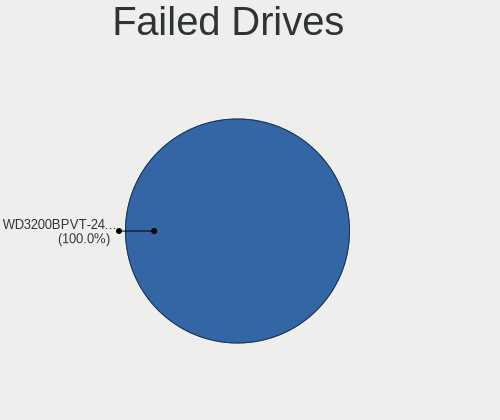

Manjaro Hardware Trends (Desktop)
---------------------------------

A project to identify most popular hardware characteristics and track their change
over time based on data collected by Manjaro users at https://Linux-Hardware.org.

Anyone can contribute to the study by uploading probes of their computers by
the [hw-probe](https://github.com/linuxhw/hw-probe) tool:

    sudo hw-probe -all -upload

Full-feature report is available here: https://linux-hardware.org/?view=trends&formfactor=desktop

Period: Feb, 2020.

Contents
--------

- [ OS                       ](#os)
- [ OS Family                ](#os-family)
- [ Kernel                   ](#kernel)
- [ Kernel Family            ](#kernel-family)
- [ Kernel Major Ver.        ](#kernel-major-ver)
- [ Arch                     ](#arch)
- [ DE                       ](#de)
- [ Display Server           ](#display-server)
- [ OS Lang                  ](#os-lang)
- [ Boot Mode                ](#boot-mode)
- [ Filesystem               ](#filesystem)
- [ Dual Boot with Linux     ](#dual-boot-with-linux)
- [ Dual Boot (Win)          ](#dual-boot-win)
- [ Country                  ](#country)
- [ City                     ](#city)
- [ Vendor                   ](#vendor)
- [ Model                    ](#model)
- [ Model Family             ](#model-family)
- [ MFG Year                 ](#mfg-year)
- [ Form Factor              ](#form-factor)
- [ Secure Boot              ](#secure-boot)
- [ Coreboot                 ](#coreboot)
- [ RAM Size                 ](#ram-size)
- [ RAM Used                 ](#ram-used)
- [ Drive Vendor             ](#drive-vendor)
- [ Drive Model              ](#drive-model)
- [ Drive Kind               ](#drive-kind)
- [ Drive Connector          ](#drive-connector)
- [ Drive Size               ](#drive-size)
- [ Space Total              ](#space-total)
- [ Space Used               ](#space-used)
- [ Malfunc. Drives          ](#malfunc-drives)
- [ Malfunc. Drive Vendor    ](#malfunc-drive-vendor)
- [ Malfunc. Drive Kind      ](#malfunc-drive-kind)
- [ Failed Drives            ](#failed-drives)
- [ Failed Drive Vendor      ](#failed-drive-vendor)
- [ Drive Status             ](#drive-status)
- [ Storage Vendor           ](#storage-vendor)
- [ Storage Model            ](#storage-model)
- [ Storage Kind             ](#storage-kind)
- [ CPU Vendor               ](#cpu-vendor)
- [ CPU Model                ](#cpu-model)
- [ CPU Model Family         ](#cpu-model-family)
- [ CPU Cores                ](#cpu-cores)
- [ CPU Sockets              ](#cpu-sockets)
- [ CPU Threads              ](#cpu-threads)
- [ CPU Op-Modes             ](#cpu-op-modes)
- [ CPU Microarch            ](#cpu-microarch)
- [ CPU Microcode            ](#cpu-microcode)
- [ GPU Vendor               ](#gpu-vendor)
- [ GPU Model                ](#gpu-model)
- [ GPU Combo                ](#gpu-combo)
- [ GPU Driver               ](#gpu-driver)
- [ GPU Memory               ](#gpu-memory)
- [ Monitor Vendor           ](#monitor-vendor)
- [ Monitor Model            ](#monitor-model)
- [ Monitor Resolution       ](#monitor-resolution)
- [ Monitor Diagonal         ](#monitor-diagonal)
- [ Monitor Width            ](#monitor-width)
- [ Aspect Ratio             ](#aspect-ratio)
- [ Monitor Area             ](#monitor-area)
- [ Pixel Density            ](#pixel-density)
- [ Multiple Monitors        ](#multiple-monitors)
- [ Net Controller Vendor    ](#net-controller-vendor)
- [ Net Controller Model     ](#net-controller-model)
- [ Net Controller Kind      ](#net-controller-kind)
- [ Used Controller          ](#used-controller)
- [ NICs                     ](#nics)
- [ Unsupported Devices      ](#unsupported-devices)
- [ Unsupported Device Types ](#unsupported-device-types)

OS
--

Installed operating systems

| Name           | Computers | Percent |
|----------------|-----------|---------|
| Manjaro 18.1.5 | 27        | 48.21%  |
| Manjaro        | 22        | 39.29%  |
| Manjaro 19.0   | 4         | 7.14%   |
| Manjaro 19.0.0 | 3         | 5.36%   |

OS Family
---------

OS without a version

| Name    | Computers | Percent |
|---------|-----------|---------|
| Manjaro | 56        | 100%    |

Kernel
------

Version of the Linux kernel

| Version            | Computers | Percent |
|--------------------|-----------|---------|
| 5.4.15-2-MANJARO   | 19        | 33.93%  |
| 5.4.18-1-MANJARO   | 11        | 19.64%  |
| 5.5.2-1-MANJARO    | 7         | 12.5%   |
| 5.5.0-1-MANJARO    | 6         | 10.71%  |
| 5.4.6-2-MANJARO    | 3         | 5.36%   |
| 4.19.102-1-MANJARO | 3         | 5.36%   |
| 5.4.14-2-MANJARO   | 2         | 3.57%   |
| 5.6.0-2-MANJARO    | 1         | 1.79%   |
| 5.4.22-1-MANJARO   | 1         | 1.79%   |
| 5.4.16-1-MANJARO   | 1         | 1.79%   |
| 5.4.13-rt7-MANJARO | 1         | 1.79%   |
| 5.3.18-1-MANJARO   | 1         | 1.79%   |

Kernel Family
-------------

Linux kernel without a distro release

| Version  | Computers | Percent |
|----------|-----------|---------|
| 5.4.15   | 19        | 33.93%  |
| 5.4.18   | 11        | 19.64%  |
| 5.5.2    | 7         | 12.5%   |
| 5.5.0    | 6         | 10.71%  |
| 5.4.6    | 3         | 5.36%   |
| 4.19.102 | 3         | 5.36%   |
| 5.4.14   | 2         | 3.57%   |
| 5.6.0    | 1         | 1.79%   |
| 5.4.22   | 1         | 1.79%   |
| 5.4.16   | 1         | 1.79%   |
| 5.4.13   | 1         | 1.79%   |
| 5.3.18   | 1         | 1.79%   |

Kernel Major Ver.
-----------------

Linux kernel major version

| Version | Computers | Percent |
|---------|-----------|---------|
| 5.4     | 38        | 67.86%  |
| 5.5     | 13        | 23.21%  |
| 4.19    | 3         | 5.36%   |
| 5.6     | 1         | 1.79%   |
| 5.3     | 1         | 1.79%   |

Arch
----

OS architecture (x86_64, i586, etc.)

| Name   | Computers | Percent |
|--------|-----------|---------|
| x86_64 | 56        | 100%    |

DE
--

Desktop Environment

| Name       | Computers | Percent |
|------------|-----------|---------|
| KDE5       | 18        | 32.14%  |
| KDE        | 12        | 21.43%  |
| XFCE       | 9         | 16.07%  |
| GNOME      | 9         | 16.07%  |
| i3         | 2         | 3.57%   |
| X-Cinnamon | 1         | 1.79%   |
| MATE       | 1         | 1.79%   |
| Deepin     | 1         | 1.79%   |
| Budgie     | 1         | 1.79%   |
| Awesome    | 1         | 1.79%   |
| Unknown    | 1         | 1.79%   |

Display Server
--------------

X11 or Wayland

| Name    | Computers | Percent |
|---------|-----------|---------|
| X11     | 52        | 92.86%  |
| Wayland | 2         | 3.57%   |
| Tty     | 2         | 3.57%   |

OS Lang
-------

Language

| Lang       | Computers | Percent |
|------------|-----------|---------|
| en_US      | 22        | 39.29%  |
| en_GB      | 4         | 7.14%   |
| en_CA      | 4         | 7.14%   |
| de_DE      | 4         | 7.14%   |
| ru_RU      | 3         | 5.36%   |
| pl_PL      | 3         | 5.36%   |
| en_US.utf8 | 3         | 5.36%   |
| fi_FI      | 2         | 3.57%   |
| uk_UA      | 1         | 1.79%   |
| sv_SE      | 1         | 1.79%   |
| ru_RU.utf8 | 1         | 1.79%   |
| pt_BR      | 1         | 1.79%   |
| et_EE      | 1         | 1.79%   |
| en_ZA      | 1         | 1.79%   |
| en_GB.utf8 | 1         | 1.79%   |
| de_DE.utf8 | 1         | 1.79%   |
| de_AT      | 1         | 1.79%   |
| da_DK.utf8 | 1         | 1.79%   |
| bg_BG      | 1         | 1.79%   |

Boot Mode
---------

EFI or BIOS

| Mode | Computers | Percent |
|------|-----------|---------|
| BIOS | 39        | 69.64%  |
| EFI  | 17        | 30.36%  |

Filesystem
----------

Type of filesystem

| Type  | Computers | Percent |
|-------|-----------|---------|
| Ext4  | 52        | 92.86%  |
| Btrfs | 3         | 5.36%   |
| Tmpfs | 1         | 1.79%   |

Dual Boot with Linux
--------------------

Hosting more than one Linux

| Dual boot | Computers | Percent |
|-----------|-----------|---------|
| No        | 44        | 78.57%  |
| Yes       | 12        | 21.43%  |

Dual Boot (Win)
---------------

Hosting Linux and Windows

| Dual boot | Computers | Percent |
|-----------|-----------|---------|
| No        | 31        | 55.36%  |
| Yes       | 25        | 44.64%  |

Country
-------

Geographic location (country)

| Country        | Computers | Percent |
|----------------|-----------|---------|
| USA            | 12        | 21.43%  |
| Germany        | 5         | 8.93%   |
| Canada         | 5         | 8.93%   |
| Ukraine        | 3         | 5.36%   |
| Russia         | 3         | 5.36%   |
| Poland         | 3         | 5.36%   |
| UK             | 2         | 3.57%   |
| Sweden         | 2         | 3.57%   |
| Finland        | 2         | 3.57%   |
| Estonia        | 2         | 3.57%   |
| Denmark        | 2         | 3.57%   |
| Austria        | 2         | 3.57%   |
| South Africa   | 1         | 1.79%   |
| Romania        | 1         | 1.79%   |
| Portugal       | 1         | 1.79%   |
| Norway         | 1         | 1.79%   |
| Netherlands    | 1         | 1.79%   |
| Lithuania      | 1         | 1.79%   |
| Italy          | 1         | 1.79%   |
| Iceland        | 1         | 1.79%   |
| Hungary        | 1         | 1.79%   |
| France         | 1         | 1.79%   |
| Czech Republic | 1         | 1.79%   |
| Brazil         | 1         | 1.79%   |
| Argentina      | 1         | 1.79%   |

City
----

Geographic location (city)

| City                | Computers | Percent |
|---------------------|-----------|---------|
| Warsaw              | 2         | 3.57%   |
| Yorktown            | 1         | 1.79%   |
| Wrocław            | 1         | 1.79%   |
| Vilnius             | 1         | 1.79%   |
| Vienna              | 1         | 1.79%   |
| Tallinn             | 1         | 1.79%   |
| Stockholm           | 1         | 1.79%   |
| St Petersburg       | 1         | 1.79%   |
| Singsas             | 1         | 1.79%   |
| Sikeston            | 1         | 1.79%   |
| Shepherds Bush      | 1         | 1.79%   |
| Sheboygan           | 1         | 1.79%   |
| Seattle             | 1         | 1.79%   |
| Santo André        | 1         | 1.79%   |
| Rome                | 1         | 1.79%   |
| Richmond            | 1         | 1.79%   |
| Reykjavik           | 1         | 1.79%   |
| Revelstoke          | 1         | 1.79%   |
| Prague              | 1         | 1.79%   |
| Povoa de Santa Iria | 1         | 1.79%   |
| Paris               | 1         | 1.79%   |
| North York          | 1         | 1.79%   |
| Netishyn            | 1         | 1.79%   |
| Moscow              | 1         | 1.79%   |
| Merefa              | 1         | 1.79%   |
| Manchester          | 1         | 1.79%   |
| Lviv                | 1         | 1.79%   |
| Linz                | 1         | 1.79%   |
| Kohtla-Järve       | 1         | 1.79%   |
| Kecskemét          | 1         | 1.79%   |
| Jyväskylä         | 1         | 1.79%   |
| Johannesburg        | 1         | 1.79%   |
| Helsinki            | 1         | 1.79%   |
| Hellerup            | 1         | 1.79%   |
| Hanover             | 1         | 1.79%   |
| Halle               | 1         | 1.79%   |
| Gävle              | 1         | 1.79%   |
| Fredericton         | 1         | 1.79%   |
| Frankfurt am Main   | 1         | 1.79%   |
| Denton              | 1         | 1.79%   |
| Colorado Springs    | 1         | 1.79%   |
| Cluj-Napoca         | 1         | 1.79%   |
| Chicopee            | 1         | 1.79%   |
| Cherry Hill         | 1         | 1.79%   |
| Chemnitz            | 1         | 1.79%   |
| Champaign           | 1         | 1.79%   |
| Calgary             | 1         | 1.79%   |
| Buenos Aires        | 1         | 1.79%   |
| Brooklyn            | 1         | 1.79%   |
| Bluefield           | 1         | 1.79%   |
| Berlin              | 1         | 1.79%   |
| Belgorod            | 1         | 1.79%   |
| Arup                | 1         | 1.79%   |
| Arthur              | 1         | 1.79%   |
| Alblasserdam        | 1         | 1.79%   |

Vendor
------

Motherboard manufacturer

| Name                | Computers | Percent |
|---------------------|-----------|---------|
| ASUSTek Computer    | 26        | 46.43%  |
| MSI                 | 10        | 17.86%  |
| Gigabyte Technology | 9         | 16.07%  |
| ASRock              | 4         | 7.14%   |
| Hewlett-Packard     | 3         | 5.36%   |
| Lenovo              | 1         | 1.79%   |
| Intel               | 1         | 1.79%   |
| Dell                | 1         | 1.79%   |
| Biostar             | 1         | 1.79%   |

Model
-----

Motherboard model

| Name                                   | Computers | Percent |
|----------------------------------------|-----------|---------|
| ASUS All Series                        | 3         | 5.36%   |
| MSI MS-7C37                            | 2         | 3.57%   |
| ASUS Rampage IV EXTREME                | 2         | 3.57%   |
| MSI MS-7B98                            | 1         | 1.79%   |
| MSI MS-7B79                            | 1         | 1.79%   |
| MSI MS-7B38                            | 1         | 1.79%   |
| MSI MS-7A59                            | 1         | 1.79%   |
| MSI MS-7A32                            | 1         | 1.79%   |
| MSI MS-7821                            | 1         | 1.79%   |
| MSI MS-7640                            | 1         | 1.79%   |
| MSI MS-7360                            | 1         | 1.79%   |
| Lenovo ThinkCentre M600 10G9000NUS     | 1         | 1.79%   |
| Intel DH61WW AAG23116-303              | 1         | 1.79%   |
| HP Z420 Workstation                    | 1         | 1.79%   |
| HP Z400 Workstation                    | 1         | 1.79%   |
| HP OMEN by HP Obelisk Desktop 875-1xxx | 1         | 1.79%   |
| Gigabyte Z87X-UD7 TH                   | 1         | 1.79%   |
| Gigabyte X570 AORUS MASTER             | 1         | 1.79%   |
| Gigabyte H61M-S2PV                     | 1         | 1.79%   |
| Gigabyte G1.Sniper B6                  | 1         | 1.79%   |
| Gigabyte EP35-DS3                      | 1         | 1.79%   |
| Gigabyte B450 AORUS ELITE              | 1         | 1.79%   |
| Gigabyte B250M-DS3H                    | 1         | 1.79%   |
| Gigabyte A320M-S2H V2                  | 1         | 1.79%   |
| Gigabyte 970A-DS3P                     | 1         | 1.79%   |
| Dell OptiPlex 7020                     | 1         | 1.79%   |
| Biostar NF61D-A2                       | 1         | 1.79%   |
| ASUS Z170-P                            | 1         | 1.79%   |
| ASUS TUF GAMING X570-PLUS              | 1         | 1.79%   |
| ASUS ROG STRIX X470-F GAMING           | 1         | 1.79%   |
| ASUS ROG Maximus XI HERO               | 1         | 1.79%   |
| ASUS ROG CROSSHAIR VII HERO            | 1         | 1.79%   |
| ASUS PRIME Z390-A                      | 1         | 1.79%   |
| ASUS PRIME X470-PRO                    | 1         | 1.79%   |
| ASUS PRIME X370-PRO                    | 1         | 1.79%   |
| ASUS P9X79 DELUXE                      | 1         | 1.79%   |
| ASUS P8H61                             | 1         | 1.79%   |
| ASUS P5Q SE                            | 1         | 1.79%   |
| ASUS Maximus IX HERO                   | 1         | 1.79%   |
| ASUS Maximus IX FORMULA                | 1         | 1.79%   |
| ASUS M5A78L LE                         | 1         | 1.79%   |
| ASUS M51BC                             | 1         | 1.79%   |
| ASUS M4N78 PRO                         | 1         | 1.79%   |
| ASUS M11BB                             | 1         | 1.79%   |
| ASUS H110M-K                           | 1         | 1.79%   |
| ASUS H110-PLUS                         | 1         | 1.79%   |
| ASUS CROSSHAIR VI HERO                 | 1         | 1.79%   |
| ASUS A58M-A/BR                         | 1         | 1.79%   |
| ASRock Z170 Pro4S                      | 1         | 1.79%   |
| ASRock X570 Phantom Gaming 4           | 1         | 1.79%   |
| ASRock X470 Taichi                     | 1         | 1.79%   |
| ASRock B75M                            | 1         | 1.79%   |

Model Family
------------

Motherboard model prefix

| Name                | Computers | Percent |
|---------------------|-----------|---------|
| ASUS ROG            | 3         | 5.36%   |
| ASUS PRIME          | 3         | 5.36%   |
| ASUS All            | 3         | 5.36%   |
| MSI MS-7C37         | 2         | 3.57%   |
| ASUS Rampage        | 2         | 3.57%   |
| ASUS Maximus        | 2         | 3.57%   |
| MSI MS-7B98         | 1         | 1.79%   |
| MSI MS-7B79         | 1         | 1.79%   |
| MSI MS-7B38         | 1         | 1.79%   |
| MSI MS-7A59         | 1         | 1.79%   |
| MSI MS-7A32         | 1         | 1.79%   |
| MSI MS-7821         | 1         | 1.79%   |
| MSI MS-7640         | 1         | 1.79%   |
| MSI MS-7360         | 1         | 1.79%   |
| Lenovo ThinkCentre  | 1         | 1.79%   |
| Intel DH61WW        | 1         | 1.79%   |
| HP Z420             | 1         | 1.79%   |
| HP Z400             | 1         | 1.79%   |
| HP OMEN             | 1         | 1.79%   |
| Gigabyte Z87X-UD7   | 1         | 1.79%   |
| Gigabyte X570       | 1         | 1.79%   |
| Gigabyte H61M-S2PV  | 1         | 1.79%   |
| Gigabyte G1.Sniper  | 1         | 1.79%   |
| Gigabyte EP35-DS3   | 1         | 1.79%   |
| Gigabyte B450       | 1         | 1.79%   |
| Gigabyte B250M-DS3H | 1         | 1.79%   |
| Gigabyte A320M-S2H  | 1         | 1.79%   |
| Gigabyte 970A-DS3P  | 1         | 1.79%   |
| Dell OptiPlex       | 1         | 1.79%   |
| Biostar NF61D-A2    | 1         | 1.79%   |
| ASUS Z170-P         | 1         | 1.79%   |
| ASUS TUF            | 1         | 1.79%   |
| ASUS P9X79          | 1         | 1.79%   |
| ASUS P8H61          | 1         | 1.79%   |
| ASUS P5Q            | 1         | 1.79%   |
| ASUS M5A78L         | 1         | 1.79%   |
| ASUS M51BC          | 1         | 1.79%   |
| ASUS M4N78          | 1         | 1.79%   |
| ASUS M11BB          | 1         | 1.79%   |
| ASUS H110M-K        | 1         | 1.79%   |
| ASUS H110-PLUS      | 1         | 1.79%   |
| ASUS CROSSHAIR      | 1         | 1.79%   |
| ASUS A58M-A         | 1         | 1.79%   |
| ASRock Z170         | 1         | 1.79%   |
| ASRock X570         | 1         | 1.79%   |
| ASRock X470         | 1         | 1.79%   |
| ASRock B75M         | 1         | 1.79%   |

MFG Year
--------

Motherboard manufacture year

| Year | Computers | Percent |
|------|-----------|---------|
| 2019 | 17        | 30.36%  |
| 2013 | 7         | 12.5%   |
| 2018 | 6         | 10.71%  |
| 2014 | 6         | 10.71%  |
| 2016 | 5         | 8.93%   |
| 2017 | 4         | 7.14%   |
| 2015 | 4         | 7.14%   |
| 2012 | 2         | 3.57%   |
| 2008 | 2         | 3.57%   |
| 2011 | 1         | 1.79%   |
| 2009 | 1         | 1.79%   |
| 2007 | 1         | 1.79%   |

Form Factor
-----------

Physical design of the computer

| Name    | Computers | Percent |
|---------|-----------|---------|
| Desktop | 56        | 100%    |

Secure Boot
-----------

Enabled or disabled

| State    | Computers | Percent |
|----------|-----------|---------|
| Disabled | 56        | 100%    |

Coreboot
--------

Have coreboot on board

| Used | Computers | Percent |
|------|-----------|---------|
| No   | 56        | 100%    |

RAM Size
--------

Total RAM memory

| Size in GB  | Computers | Percent |
|-------------|-----------|---------|
| 16.01-24.0  | 25        | 44.64%  |
| 8.01-16.0   | 10        | 17.86%  |
| 32.01-64.0  | 9         | 16.07%  |
| 3.01-4.0    | 4         | 7.14%   |
| 4.01-8.0    | 3         | 5.36%   |
| 64.01-256.0 | 3         | 5.36%   |
| 24.01-32.0  | 2         | 3.57%   |

RAM Used
--------

Used RAM memory

| Used GB   | Computers | Percent |
|-----------|-----------|---------|
| 4.01-8.0  | 18        | 32.14%  |
| 1.01-2.0  | 14        | 25%     |
| 3.01-4.0  | 10        | 17.86%  |
| 2.01-3.0  | 10        | 17.86%  |
| 8.01-16.0 | 4         | 7.14%   |

Drive Vendor
------------

Hard drive vendors

| Vendor              | Computers | Drives | Percent |
|---------------------|-----------|--------|---------|
| WDC                 | 23        | 36     | 21.3%   |
| Seagate             | 22        | 28     | 20.37%  |
| Samsung Electronics | 20        | 32     | 18.52%  |
| Kingston            | 10        | 12     | 9.26%   |
| Toshiba             | 8         | 9      | 7.41%   |
| Crucial             | 7         | 12     | 6.48%   |
| Patriot             | 2         | 2      | 1.85%   |
| Intel               | 2         | 3      | 1.85%   |
| Hewlett-Packard     | 2         | 1      | 1.85%   |
| Corsair             | 2         | 2      | 1.85%   |
| Verbatim            | 1         | 1      | 0.93%   |
| Unknown             | 1         | 1      | 0.93%   |
| Transcend           | 1         | 1      | 0.93%   |
| SK Hynix            | 1         | 1      | 0.93%   |
| SanDisk             | 1         | 2      | 0.93%   |
| PNY                 | 1         | 1      | 0.93%   |
| JMicron             | 1         | 1      | 0.93%   |
| Intenso             | 1         | 1      | 0.93%   |
| Hitachi             | 1         | 1      | 0.93%   |
| A-DATA Technology   | 1         | 1      | 0.93%   |

Drive Model
-----------

Hard drive models

| Model                        | Computers | Percent |
|------------------------------|-----------|---------|
| ST1000DM003-1CH162 1TB       | 3         | 2.13%   |
| SSD 850 EVO 500GB            | 3         | 2.13%   |
| SA400S37240G 240GB SSD       | 3         | 2.13%   |
| SA400S37120G 120GB SSD       | 3         | 2.13%   |
| DT01ACA100 1TB               | 3         | 2.13%   |
| CT1000MX500SSD1 1TB          | 3         | 2.13%   |
| WD10EZEX-08M2NA0 1TB         | 2         | 1.42%   |
| WD10EZEX-00RKKA0 1TB         | 2         | 1.42%   |
| SV300S37A240G 240GB SSD      | 2         | 1.42%   |
| ST2000LX001-1RG174 2TB       | 2         | 1.42%   |
| ST2000DM008-2FR102 2TB       | 2         | 1.42%   |
| ST1000DM010-2EP102 1TB       | 2         | 1.42%   |
| SSD 860 EVO 500GB            | 2         | 1.42%   |
| SSD 860 EVO 1TB              | 2         | 1.42%   |
| SSD 840 EVO 250GB            | 2         | 1.42%   |
| SSD 750 EVO 250GB            | 2         | 1.42%   |
| MQ01ABD100 1TB               | 2         | 1.42%   |
| HD322HJ 320GB                | 2         | 1.42%   |
| CT500MX500SSD1 500GB         | 2         | 1.42%   |
| WDS500G2B0A 500GB SSD        | 1         | 0.71%   |
| WDS256G1X0C-00ENX0 256GB     | 1         | 0.71%   |
| WDS120G2G0A-00JH30 120GB SSD | 1         | 0.71%   |
| WDBNCE2500PNC 250GB SSD      | 1         | 0.71%   |
| WD800JD-75MSA3 80GB          | 1         | 0.71%   |
| WD6400AAKS-65A7B2 640GB      | 1         | 0.71%   |
| WD6400AACS-00G8B1 640GB      | 1         | 0.71%   |
| WD50EZRZ-32RWYB1 5TB         | 1         | 0.71%   |
| WD5000AZLX-60K2TA0 500GB     | 1         | 0.71%   |
| WD5000AAKX-60U6AA0 500GB     | 1         | 0.71%   |
| WD5000AAKX-004EA0 500GB      | 1         | 0.71%   |
| WD5000AAKX-001CA0 500GB      | 1         | 0.71%   |
| WD5000AAKS-65V0A0 500GB      | 1         | 0.71%   |
| WD5000AAKS-00A7B0 500GB      | 1         | 0.71%   |
| WD30EFRX-68AX9N0 3TB         | 1         | 0.71%   |
| WD2500AAJS-07VWA0 250GB      | 1         | 0.71%   |
| WD2003FZEX-00SRLA0 2TB       | 1         | 0.71%   |
| WD2002FAEX-007BA0 2TB        | 1         | 0.71%   |
| WD10EZEX-00ZF5A0 1TB         | 1         | 0.71%   |
| WD10EZEX-00WN4A0 1TB         | 1         | 0.71%   |
| WD10EZEX-00KUWA0 1TB         | 1         | 0.71%   |
| WD10EARX-00N0YB0 1TB         | 1         | 0.71%   |
| WD10EARS-00Y5B1 1TB          | 1         | 0.71%   |
| WD10EARS-00MVWB0 1TB         | 1         | 0.71%   |
| WD10EADX-22TDHB0 1TB         | 1         | 0.71%   |
| WD10EADS-00M2B0 1TB          | 1         | 0.71%   |
| WD1003FZEX-00MK2A0 1TB       | 1         | 0.71%   |
| WD1002FAEX-00Y9A0 1TB        | 1         | 0.71%   |
| WD My Passport 25F3 512GB    | 1         | 0.71%   |
| TS128GMTS400S 128GB SSD      | 1         | 0.71%   |
| THNSNJ256GCSU 256GB SSD      | 1         | 0.71%   |
| Tech 250GB                   | 1         | 0.71%   |
| SX6000LNP 512GB              | 1         | 0.71%   |
| SV300S37A120G 120GB SSD      | 1         | 0.71%   |
| ST8000DM0004-1ZC11G 8TB      | 1         | 0.71%   |
| ST750LM022 HN-M750MBB 752GB  | 1         | 0.71%   |
| ST500LM021-1KJ152 500GB      | 1         | 0.71%   |
| ST500DM002-1BC142 500GB      | 1         | 0.71%   |
| ST4000DX001-1CE168 4TB       | 1         | 0.71%   |
| ST4000DM004-2CV104 4TB       | 1         | 0.71%   |
| ST3250310AS 250GB            | 1         | 0.71%   |

Drive Kind
----------

HDD or SSD

| Kind    | Computers | Drives | Percent |
|---------|-----------|--------|---------|
| HDD     | 44        | 76     | 49.44%  |
| SSD     | 35        | 61     | 39.33%  |
| NVMe    | 7         | 9      | 7.87%   |
| Unknown | 3         | 2      | 3.37%   |

Drive Connector
---------------

SATA, SAS, NVMe, etc.

| Type | Computers | Drives | Percent |
|------|-----------|--------|---------|
| SATA | 52        | 136    | 82.54%  |
| NVMe | 7         | 9      | 11.11%  |
| SAS  | 4         | 3      | 6.35%   |

Drive Size
----------

Size of hard drive

| Size in TB | Computers | Drives | Percent |
|------------|-----------|--------|---------|
| 0.01-0.5   | 45        | 73     | 45%     |
| 0.51-1.0   | 37        | 52     | 37%     |
| 1.01-2.0   | 10        | 13     | 10%     |
| 3.01-4.0   | 3         | 3      | 3%      |
| 2.01-3.0   | 3         | 4      | 3%      |
| 4.01-10.0  | 2         | 3      | 2%      |

Space Total
-----------

Amount of disk space available on the file system

| Size in GB     | Computers | Percent |
|----------------|-----------|---------|
| 101-250        | 14        | 25%     |
| 1001-2000      | 10        | 17.86%  |
| 501-1000       | 9         | 16.07%  |
| 251-500        | 8         | 14.29%  |
| 2001-3000      | 8         | 14.29%  |
| More than 3000 | 5         | 8.93%   |
| 51-100         | 2         | 3.57%   |

Space Used
----------

Amount of used disk space

| Used GB        | Computers | Percent |
|----------------|-----------|---------|
| 1001-2000      | 10        | 17.86%  |
| 1-20           | 9         | 16.07%  |
| 501-1000       | 8         | 14.29%  |
| 21-50          | 7         | 12.5%   |
| 251-500        | 6         | 10.71%  |
| 101-250        | 6         | 10.71%  |
| 51-100         | 6         | 10.71%  |
| More than 3000 | 4         | 7.14%   |

Malfunc. Drives
---------------

Drive models with a malfunction

| Model                   | Computers | Drives | Percent |
|-------------------------|-----------|--------|---------|
| HD322HJ 320GB           | 2         | 2      | 33.33%  |
| WD5000AAKX-004EA0 500GB | 1         | 1      | 16.67%  |
| WD5000AAKX-001CA0 500GB | 1         | 1      | 16.67%  |
| WD5000AAKS-00A7B0 500GB | 1         | 2      | 16.67%  |
| MK3252GSX 320GB         | 1         | 1      | 16.67%  |

Malfunc. Drive Vendor
---------------------

Vendors of faulty drives

| Vendor              | Computers | Drives | Percent |
|---------------------|-----------|--------|---------|
| WDC                 | 3         | 4      | 50%     |
| Samsung Electronics | 2         | 2      | 33.33%  |
| Toshiba             | 1         | 1      | 16.67%  |

Malfunc. Drive Kind
-------------------

Kinds of faulty drives

| Kind | Computers | Drives | Percent |
|------|-----------|--------|---------|
| HDD  | 5         | 7      | 100%    |

Failed Drives
-------------

Failed drive models

| Model                    | Computers | Drives | Percent |
|--------------------------|-----------|--------|---------|
| WDS256G1X0C-00ENX0 256GB | 1         | 1      | 100%    |

Failed Drive Vendor
-------------------

Failed drive vendors

| Vendor | Computers | Drives | Percent |
|--------|-----------|--------|---------|
| WDC    | 1         | 1      | 100%    |

Drive Status
------------

Number of failed and malfunc. drives

| Status   | Computers | Drives | Percent |
|----------|-----------|--------|---------|
| Detected | 29        | 70     | 48.33%  |
| Works    | 25        | 70     | 41.67%  |
| Malfunc  | 5         | 7      | 8.33%   |
| Failed   | 1         | 1      | 1.67%   |

Storage Vendor
--------------

Storage controller vendors

| Vendor                   | Computers | Percent |
|--------------------------|-----------|---------|
| Intel                    | 35        | 41.18%  |
| AMD                      | 23        | 27.06%  |
| ASMedia Technology       | 8         | 9.41%   |
| Samsung Electronics      | 5         | 5.88%   |
| Phison Electronics       | 3         | 3.53%   |
| Marvell Technology Group | 3         | 3.53%   |
| Nvidia                   | 2         | 2.35%   |
| VIA Technologies         | 1         | 1.18%   |
| SK Hynix                 | 1         | 1.18%   |
| Silicon Motion           | 1         | 1.18%   |
| Silicon Image            | 1         | 1.18%   |
| Sandisk                  | 1         | 1.18%   |
| Realtek Semiconductor    | 1         | 1.18%   |

Storage Model
-------------

Storage controller models

| Model                                                                             | Computers | Percent |
|-----------------------------------------------------------------------------------|-----------|---------|
| FCH SATA Controller [AHCI mode]                                                   | 19        | 17.43%  |
| ASM1062 Serial ATA Controller                                                     | 8         | 7.34%   |
| 8 Series/C220 Series Chipset Family 6-port SATA Controller 1 [AHCI mode]          | 7         | 6.42%   |
| 400 Series Chipset SATA Controller                                                | 7         | 6.42%   |
| SSD 660P Series                                                                   | 4         | 3.67%   |
| SB7x0/SB8x0/SB9x0 SATA Controller [AHCI mode]                                     | 4         | 3.67%   |
| Q170/Q150/B150/H170/H110/Z170/CM236 Chipset SATA Controller [AHCI Mode]           | 4         | 3.67%   |
| NVMe SSD Controller SM981/PM981/PM983                                             | 4         | 3.67%   |
| 200 Series PCH SATA controller [AHCI mode]                                        | 4         | 3.67%   |
| X370 Series Chipset SATA Controller                                               | 3         | 2.75%   |
| NVMe SSD Controller SM961/PM961                                                   | 3         | 2.75%   |
| Cannon Lake PCH SATA AHCI Controller                                              | 3         | 2.75%   |
| C600/X79 series chipset 6-Port SATA AHCI Controller                               | 3         | 2.75%   |
| Non-Volatile memory controller                                                    | 2         | 1.83%   |
| 82801IB (ICH9) 2 port SATA Controller [IDE mode]                                  | 2         | 1.83%   |
| 82801I (ICH9 Family) 2 port SATA Controller [IDE mode]                            | 2         | 1.83%   |
| 6 Series/C200 Series Chipset Family Desktop SATA Controller (IDE mode, ports 4-5) | 2         | 1.83%   |
| 6 Series/C200 Series Chipset Family Desktop SATA Controller (IDE mode, ports 0-3) | 2         | 1.83%   |
| WD Black NVMe SSD                                                                 | 1         | 0.92%   |
| VT6421 IDE/SATA Controller                                                        | 1         | 0.92%   |
| SB7x0/SB8x0/SB9x0 IDE Controller                                                  | 1         | 0.92%   |
| SATA Controller [RAID mode]                                                       | 1         | 0.92%   |
| Realtek Non-Volatile memory controller                                            | 1         | 0.92%   |
| PCI0680 Ultra ATA-133 Host Controller                                             | 1         | 0.92%   |
| MCP78S [GeForce 8200] SATA Controller (non-AHCI mode)                             | 1         | 0.92%   |
| MCP78S [GeForce 8200] IDE                                                         | 1         | 0.92%   |
| MCP61 SATA Controller                                                             | 1         | 0.92%   |
| MCP61 IDE                                                                         | 1         | 0.92%   |
| FCH SATA Controller D                                                             | 1         | 0.92%   |
| FCH IDE Controller                                                                | 1         | 0.92%   |
| E7 NVMe Controller                                                                | 1         | 0.92%   |
| E16 PCIe4 NVMe Controller                                                         | 1         | 0.92%   |
| E12 NVMe Controller                                                               | 1         | 0.92%   |
| C602 chipset 4-Port SATA Storage Control Unit                                     | 1         | 0.92%   |
| C600/X79 series chipset SATA RAID Controller                                      | 1         | 0.92%   |
| C600/X79 series chipset IDE-r Controller                                          | 1         | 0.92%   |
| Atom/Celeron/Pentium Processor x5-E8000/J3xxx/N3xxx Series SATA Controller        | 1         | 0.92%   |
| 88SE9128 PCIe SATA 6 Gb/s RAID controller with HyperDuo                           | 1         | 0.92%   |
| 88SE6111/6121 SATA II / PATA Controller                                           | 1         | 0.92%   |
| 88SE6101/6102 single-port PATA133 interface                                       | 1         | 0.92%   |
| 82801JI (ICH10 Family) SATA AHCI Controller                                       | 1         | 0.92%   |
| 7 Series/C210 Series Chipset Family 6-port SATA Controller [AHCI mode]            | 1         | 0.92%   |
| 6 Series/C200 Series Chipset Family 6 port Desktop SATA AHCI Controller           | 1         | 0.92%   |
| 300 Series Chipset SATA Controller                                                | 1         | 0.92%   |

Storage Kind
------------

Kind of storage controller (IDE, SATA, NVMe, SAS, ...)

| Kind | Computers | Percent |
|------|-----------|---------|
| SATA | 48        | 62.34%  |
| NVMe | 14        | 18.18%  |
| IDE  | 10        | 12.99%  |
| RAID | 4         | 5.19%   |
| SAS  | 1         | 1.3%    |

CPU Vendor
----------

Processor vendors

| Vendor | Computers | Percent |
|--------|-----------|---------|
| Intel  | 31        | 55.36%  |
| AMD    | 25        | 44.64%  |

CPU Model
---------

Processor models

| Model                                       | Computers | Percent |
|---------------------------------------------|-----------|---------|
| AMD Ryzen 7 3700X 8-Core Processor          | 4         | 7.14%   |
| Intel Core i5-4670K CPU @ 3.40GHz           | 3         | 5.36%   |
| AMD Ryzen 7 2700X Eight-Core Processor      | 3         | 5.36%   |
| Intel Core i7-7700K CPU @ 4.20GHz           | 2         | 3.57%   |
| Intel Core i7-6700K CPU @ 4.00GHz           | 2         | 3.57%   |
| Intel Core i7-3930K CPU @ 3.20GHz           | 2         | 3.57%   |
| AMD Ryzen 9 3950X 16-Core Processor         | 2         | 3.57%   |
| AMD Ryzen 5 3600 6-Core Processor           | 2         | 3.57%   |
| Intel Xeon CPU X5650 @ 2.67GHz              | 1         | 1.79%   |
| Intel Xeon CPU E5-1650 v2 @ 3.50GHz         | 1         | 1.79%   |
| Intel Pentium Dual-Core CPU E5200 @ 2.50GHz | 1         | 1.79%   |
| Intel Pentium CPU N3700 @ 1.60GHz           | 1         | 1.79%   |
| Intel Pentium CPU G2030 @ 3.00GHz           | 1         | 1.79%   |
| Intel Core i9-9900K CPU @ 3.60GHz           | 1         | 1.79%   |
| Intel Core i7-9700 CPU @ 3.00GHz            | 1         | 1.79%   |
| Intel Core i7-6700T CPU @ 2.80GHz           | 1         | 1.79%   |
| Intel Core i7-4790 CPU @ 3.60GHz            | 1         | 1.79%   |
| Intel Core i7-4770 CPU @ 3.40GHz            | 1         | 1.79%   |
| Intel Core i7-3820 CPU @ 3.60GHz            | 1         | 1.79%   |
| Intel Core i5-9600K CPU @ 3.70GHz           | 1         | 1.79%   |
| Intel Core i5-6500 CPU @ 3.20GHz            | 1         | 1.79%   |
| Intel Core i5-6400 CPU @ 2.70GHz            | 1         | 1.79%   |
| Intel Core i5-4570 CPU @ 3.20GHz            | 1         | 1.79%   |
| Intel Core i5-4460 CPU @ 3.20GHz            | 1         | 1.79%   |
| Intel Core i5-3330 CPU @ 3.00GHz            | 1         | 1.79%   |
| Intel Core i5-2300 CPU @ 2.80GHz            | 1         | 1.79%   |
| Intel Core i3-7100 CPU @ 3.90GHz            | 1         | 1.79%   |
| Intel Core i3-2120 CPU @ 3.30GHz            | 1         | 1.79%   |
| Intel Core 2 Duo CPU E8400 @ 3.00GHz        | 1         | 1.79%   |
| Intel Core 2 Duo CPU E7300 @ 2.66GHz        | 1         | 1.79%   |
| AMD Ryzen 9 3900X 12-Core Processor         | 1         | 1.79%   |
| AMD Ryzen 7 2700 Eight-Core Processor       | 1         | 1.79%   |
| AMD Ryzen 5 3600X 6-Core Processor          | 1         | 1.79%   |
| AMD Ryzen 5 2600X Six-Core Processor        | 1         | 1.79%   |
| AMD Ryzen 5 1600X Six-Core Processor        | 1         | 1.79%   |
| AMD Ryzen 3 1300X Quad-Core Processor       | 1         | 1.79%   |
| AMD Phenom II X4 905e Processor             | 1         | 1.79%   |
| AMD FX-8370 Eight-Core Processor            | 1         | 1.79%   |
| AMD FX-8350 Eight-Core Processor            | 1         | 1.79%   |
| AMD FX-6300 Six-Core Processor              | 1         | 1.79%   |
| AMD FX-6100 Six-Core Processor              | 1         | 1.79%   |
| AMD Athlon 64 X2 Dual Core Processor 4200+  | 1         | 1.79%   |
| AMD A4-4000 APU with Radeon HD Graphics     | 1         | 1.79%   |
| AMD A10-6700 APU with Radeon HD Graphics    | 1         | 1.79%   |

CPU Model Family
----------------

Processor model prefix

| Model                   | Computers | Percent |
|-------------------------|-----------|---------|
| Intel Core i7           | 11        | 19.64%  |
| Intel Core i5           | 10        | 17.86%  |
| AMD Ryzen 7             | 8         | 14.29%  |
| AMD Ryzen 5             | 5         | 8.93%   |
| AMD FX                  | 4         | 7.14%   |
| AMD Ryzen 9             | 3         | 5.36%   |
| Intel Xeon              | 2         | 3.57%   |
| Intel Pentium           | 2         | 3.57%   |
| Intel Core i3           | 2         | 3.57%   |
| Intel Core 2 Duo        | 2         | 3.57%   |
| Intel Pentium Dual-Core | 1         | 1.79%   |
| Intel Core i9           | 1         | 1.79%   |
| AMD Ryzen 3             | 1         | 1.79%   |
| AMD Phenom II X4        | 1         | 1.79%   |
| AMD Athlon 64 X2        | 1         | 1.79%   |
| AMD A4                  | 1         | 1.79%   |
| AMD A10                 | 1         | 1.79%   |

CPU Cores
---------

Number of processor cores

| Number | Computers | Percent |
|--------|-----------|---------|
| 4      | 22        | 39.29%  |
| 8      | 10        | 17.86%  |
| 6      | 10        | 17.86%  |
| 2      | 8         | 14.29%  |
| 16     | 2         | 3.57%   |
| 3      | 2         | 3.57%   |
| 12     | 1         | 1.79%   |
| 1      | 1         | 1.79%   |

CPU Sockets
-----------

Number of sockets

| Number | Computers | Percent |
|--------|-----------|---------|
| 1      | 56        | 100%    |

CPU Threads
-----------

Threads per core (Hyper-Threading)

| Number | Computers | Percent |
|--------|-----------|---------|
| 2      | 36        | 64.29%  |
| 1      | 20        | 35.71%  |

CPU Op-Modes
------------

CPU Operation Modes (32-bit, 64-bit)

| Op mode        | Computers | Percent |
|----------------|-----------|---------|
| 32-bit, 64-bit | 56        | 100%    |

CPU Microarch
-------------

Microarchitecture

| Name        | Computers | Percent |
|-------------|-----------|---------|
| Zen 2       | 10        | 17.86%  |
| Skylake     | 9         | 16.07%  |
| Haswell     | 7         | 12.5%   |
| Zen+        | 5         | 8.93%   |
| SandyBridge | 5         | 8.93%   |
| Piledriver  | 5         | 8.93%   |
| IvyBridge   | 3         | 5.36%   |
| Zen         | 2         | 3.57%   |
| KabyLake    | 2         | 3.57%   |
| Core        | 2         | 3.57%   |
| Westmere    | 1         | 1.79%   |
| Silvermont  | 1         | 1.79%   |
| Penryn      | 1         | 1.79%   |
| K8 Hammer   | 1         | 1.79%   |
| K10         | 1         | 1.79%   |
| Bulldozer   | 1         | 1.79%   |

CPU Microcode
-------------

Microcode number

| Number     | Computers | Percent |
|------------|-----------|---------|
| Unknown    | 24        | 42.86%  |
| 0x08701013 | 6         | 10.71%  |
| 0x0800820d | 4         | 7.14%   |
| 0x906e9    | 3         | 5.36%   |
| 0x306c3    | 3         | 5.36%   |
| 0x906ed    | 2         | 3.57%   |
| 0x506e3    | 2         | 3.57%   |
| 0x206d7    | 2         | 3.57%   |
| 0x10676    | 2         | 3.57%   |
| 0x906ec    | 1         | 1.79%   |
| 0x306a9    | 1         | 1.79%   |
| 0x206d6    | 1         | 1.79%   |
| 0x206c2    | 1         | 1.79%   |
| 0x206a7    | 1         | 1.79%   |
| 0x08008206 | 1         | 1.79%   |
| 0x08001126 | 1         | 1.79%   |
| 0x06000852 | 1         | 1.79%   |

GPU Vendor
----------

Vendors of graphics cards

| Vendor | Computers | Percent |
|--------|-----------|---------|
| Nvidia | 35        | 61.4%   |
| AMD    | 17        | 29.82%  |
| Intel  | 5         | 8.77%   |

GPU Model
---------

Graphics card models

| Model                                                                              | Computers | Percent |
|------------------------------------------------------------------------------------|-----------|---------|
| Ellesmere [Radeon RX 470/480/570/570X/580/580X/590]                                | 7         | 12.28%  |
| GP106 [GeForce GTX 1060 6GB]                                                       | 4         | 7.02%   |
| GP104 [GeForce GTX 1070]                                                           | 3         | 5.26%   |
| TU106 [GeForce RTX 2060 Rev. A]                                                    | 2         | 3.51%   |
| TU104 [GeForce RTX 2070 SUPER]                                                     | 2         | 3.51%   |
| Navi 10 [Radeon RX 5600 OEM/5600 XT / 5700/5700 XT]                                | 2         | 3.51%   |
| HD Graphics 530                                                                    | 2         | 3.51%   |
| GP107 [GeForce GTX 1050 Ti]                                                        | 2         | 3.51%   |
| GP104 [GeForce GTX 1080]                                                           | 2         | 3.51%   |
| GP102 [GeForce GTX 1080 Ti]                                                        | 2         | 3.51%   |
| G96C [GeForce 9500 GT]                                                             | 2         | 3.51%   |
| Xeon E3-1200 v3/4th Gen Core Processor Integrated Graphics Controller              | 1         | 1.75%   |
| Vega 20 [Radeon VII]                                                               | 1         | 1.75%   |
| Vega 10 XL/XT [Radeon RX Vega 56/64]                                               | 1         | 1.75%   |
| Turks PRO [Radeon HD 7570]                                                         | 1         | 1.75%   |
| TU117 [GeForce GTX 1650]                                                           | 1         | 1.75%   |
| TU106 [GeForce RTX 2070]                                                           | 1         | 1.75%   |
| TU106 [GeForce RTX 2070 Rev. A]                                                    | 1         | 1.75%   |
| Trinity 2 [Radeon HD 7480D]                                                        | 1         | 1.75%   |
| Richland [Radeon HD 8670D]                                                         | 1         | 1.75%   |
| NV44 [GeForce 6200 TurboCache]                                                     | 1         | 1.75%   |
| HD Graphics 630                                                                    | 1         | 1.75%   |
| GT218 [GeForce 210]                                                                | 1         | 1.75%   |
| GP107 [GeForce GTX 1050]                                                           | 1         | 1.75%   |
| GP104 [GeForce GTX 1070 Ti]                                                        | 1         | 1.75%   |
| GP104 [GeForce GTX 1060 6GB]                                                       | 1         | 1.75%   |
| GM206 [GeForce GTX 960]                                                            | 1         | 1.75%   |
| GM204 [GeForce GTX 980]                                                            | 1         | 1.75%   |
| GM204 [GeForce GTX 970]                                                            | 1         | 1.75%   |
| GK107 [GeForce GT 640 OEM]                                                         | 1         | 1.75%   |
| GK104 [GeForce GTX 660 Ti]                                                         | 1         | 1.75%   |
| GF108 [GeForce GT 730]                                                             | 1         | 1.75%   |
| GF108 [GeForce GT 620]                                                             | 1         | 1.75%   |
| Cape Verde XT [Radeon HD 7770/8760 / R7 250X]                                      | 1         | 1.75%   |
| C77 [GeForce 8300]                                                                 | 1         | 1.75%   |
| Barts PRO [Radeon HD 6850]                                                         | 1         | 1.75%   |
| Baffin [Radeon RX 460/560D / Pro 450/455/460/555/555X/560/560X]                    | 1         | 1.75%   |
| Atom/Celeron/Pentium Processor x5-E8000/J3xxx/N3xxx Integrated Graphics Controller | 1         | 1.75%   |

GPU Combo
---------

Combinations of graphics cards

| Name       | Computers | Percent |
|------------|-----------|---------|
| 1 x Nvidia | 35        | 62.5%   |
| 1 x AMD    | 17        | 30.36%  |
| 1 x Intel  | 4         | 7.14%   |

GPU Driver
----------

Free vs proprietary

| Driver      | Computers | Percent |
|-------------|-----------|---------|
| Proprietary | 28        | 50%     |
| Free        | 28        | 50%     |

GPU Memory
----------

Total video memory

| Size in GB | Computers | Percent |
|------------|-----------|---------|
| Unknown    | 19        | 33.93%  |
| 7.01-8.0   | 14        | 25%     |
| 3.01-4.0   | 8         | 14.29%  |
| 5.01-6.0   | 7         | 12.5%   |
| 1.01-2.0   | 3         | 5.36%   |
| 8.01-16.0  | 2         | 3.57%   |
| 0.01-0.5   | 2         | 3.57%   |
| 2.01-3.0   | 1         | 1.79%   |

Monitor Vendor
--------------

Monitor vendors

| Vendor               | Computers | Percent |
|----------------------|-----------|---------|
| Dell                 | 11        | 17.19%  |
| Acer                 | 9         | 14.06%  |
| Goldstar             | 8         | 12.5%   |
| Samsung Electronics  | 6         | 9.38%   |
| BenQ                 | 6         | 9.38%   |
| AOC                  | 6         | 9.38%   |
| Ancor Communications | 4         | 6.25%   |
| Philips              | 3         | 4.69%   |
| Hewlett-Packard      | 3         | 4.69%   |
| ASUSTek Computer     | 2         | 3.13%   |
| VIZ                  | 1         | 1.56%   |
| Sony                 | 1         | 1.56%   |
| Mecer                | 1         | 1.56%   |
| Lenovo               | 1         | 1.56%   |
| Gateway              | 1         | 1.56%   |
| eMachines            | 1         | 1.56%   |

Monitor Model
-------------

Monitor models

| Model                                             | Computers | Percent |
|---------------------------------------------------|-----------|---------|
| U2412M DELA07A 1920x1200 518x324mm 24.1-inch      | 2         | 2.82%   |
| e2752Vq AOC2752 1920x1080 598x336mm 27.0-inch     | 2         | 2.82%   |
| 2460 AOC2460 1920x1080 531x299mm 24.0-inch        | 2         | 2.82%   |
| Z271 T ACR0532 1920x1080 600x340mm 27.2-inch      | 1         | 1.41%   |
| XG35V AUS3551 3440x1440 819x346mm 35.0-inch       | 1         | 1.41%   |
| VG270 ACR06C0 1920x1080 598x336mm 27.0-inch       | 1         | 1.41%   |
| VA326 AUS32FA 1920x1080 698x393mm 31.5-inch       | 1         | 1.41%   |
| U2718Q DELA0EC 3840x2160 609x349mm 27.6-inch      | 1         | 1.41%   |
| U2715H DELD065 2560x1440 597x336mm 27.0-inch      | 1         | 1.41%   |
| U2515H DELD06F 2560x1440 553x311mm 25.0-inch      | 1         | 1.41%   |
| U2515H DELD06E 1920x1080 550x310mm 24.9-inch      | 1         | 1.41%   |
| TW999 MUS9996 1440x900 408x255mm 18.9-inch        | 1         | 1.41%   |
| TV SNYC901 1920x1080 1600x900mm 72.3-inch         | 1         | 1.41%   |
| TinyinOne24 LEN10EF 1920x1080 509x286mm 23.0-inch | 1         | 1.41%   |
| SyncMaster SAM0524 1920x1080 477x268mm 21.5-inch  | 1         | 1.41%   |
| SA240Y ACR057F 1920x1080 527x296mm 23.8-inch      | 1         | 1.41%   |
| S2716DG DELA0D1 2560x1440 598x336mm 27.0-inch     | 1         | 1.41%   |
| S24E390 SAM0C19 1920x1080 521x293mm 23.5-inch     | 1         | 1.41%   |
| S24D300 SAM0B43 1920x1080 531x299mm 24.0-inch     | 1         | 1.41%   |
| S2231 HWP2905 1920x1080 477x268mm 21.5-inch       | 1         | 1.41%   |
| RT280K ACR065F 3840x2160 621x341mm 27.9-inch      | 1         | 1.41%   |
| ROG PG279Q ACI27EC 2560x1440 598x336mm 27.0-inch  | 1         | 1.41%   |
| RL2455 BNQ7F1C 1920x1080 531x298mm 24.0-inch      | 1         | 1.41%   |
| Q3279WG5B AOC3279 2560x1440 725x428mm 33.1-inch   | 1         | 1.41%   |
| M227WD GSM56D5 1920x1080 476x268mm 21.5-inch      | 1         | 1.41%   |
| LCD Monitor VW26L HDTV10F 1360x768                | 1         | 1.41%   |
| LCD Monitor VG248 1920x1080                       | 1         | 1.41%   |
| LCD Monitor U3818DW 3840x1600                     | 1         | 1.41%   |
| LCD Monitor U3011 2560x1600                       | 1         | 1.41%   |
| LCD Monitor U2412M 3840x1200                      | 1         | 1.41%   |
| LCD Monitor U2412M 1920x1200                      | 1         | 1.41%   |
| LCD Monitor SAM08FC 1366x768                      | 1         | 1.41%   |
| LCD Monitor SAM051A 1920x1080                     | 1         | 1.41%   |
| LCD Monitor SAM0505 1920x540                      | 1         | 1.41%   |
| LCD Monitor Pavilion32 2560x1440                  | 1         | 1.41%   |
| LCD Monitor P2214H                                | 1         | 1.41%   |
| LCD Monitor GN246HL 1920x1080                     | 1         | 1.41%   |
| LCD Monitor B326HUL 2560x1440                     | 1         | 1.41%   |
| LCD BNQ8024 2560x1440 597x336mm 27.0-inch         | 1         | 1.41%   |
| LCD BNQ8020 3840x2160 710x400mm 32.1-inch         | 1         | 1.41%   |
| L1942 GSM4B85 1280x1024 376x301mm 19.0-inch       | 1         | 1.41%   |
| GN246HL ACR02FA 1920x1080 530x300mm 24.0-inch     | 1         | 1.41%   |
| GL2580 BNQ78E5 1920x1080 544x303mm 24.5-inch      | 1         | 1.41%   |
| GL2450 BNQ78A4 1920x1080 531x298mm 24.0-inch      | 1         | 1.41%   |
| GF276 ACR0560 1920x1080 598x336mm 27.0-inch       | 1         | 1.41%   |
| G2420HD BNQ7840 1920x1080 530x300mm 24.0-inch     | 1         | 1.41%   |
| G2200W BNQ780D 1680x1050 474x296mm 22.0-inch      | 1         | 1.41%   |
| FULL HD GSM5B55 1920x1080 480x270mm 21.7-inch     | 1         | 1.41%   |
| FTV PHL04C4 1920x1080 1440x810mm 65.0-inch        | 1         | 1.41%   |
| FTV PHL01EA 1920x1080 1440x810mm 65.0-inch        | 1         | 1.41%   |
| FHD2401 GWY096F 1920x1200 520x320mm 24.0-inch     | 1         | 1.41%   |
| ED347CKR ACR0648 3440x1440 795x334mm 33.9-inch    | 1         | 1.41%   |
| E2350 GSM5791 1920x1080 510x290mm 23.1-inch       | 1         | 1.41%   |
| E2240 GSM57A3 1920x1080 477x268mm 21.5-inch       | 1         | 1.41%   |
| E2211H DELA072 1920x1080 477x268mm 21.5-inch      | 1         | 1.41%   |
| E19T6W EMA0786 1440x900 408x255mm 18.9-inch       | 1         | 1.41%   |
| BL2410 BNQ8301 1920x1080 477x268mm 21.5-inch      | 1         | 1.41%   |
| ASUS PB277 ACI27B5 2560x1440 600x340mm 27.2-inch  | 1         | 1.41%   |
| ASUS MG24U ACI24AD 3840x2160 521x293mm 23.5-inch  | 1         | 1.41%   |
| AL2216W ACRADA1 1600x1200 470x300mm 22.0-inch     | 1         | 1.41%   |

Monitor Resolution
------------------

Monitor screen resolution

| Resolution         | Computers | Percent |
|--------------------|-----------|---------|
| 1920x1080 (FHD)    | 29        | 46.77%  |
| 2560x1440 (QHD)    | 9         | 14.52%  |
| 3840x2160 (4K)     | 4         | 6.45%   |
| 1680x1050 (WSXGA+) | 4         | 6.45%   |
| 3440x1440          | 3         | 4.84%   |
| 1920x1200 (WUXGA)  | 3         | 4.84%   |
| 1440x900 (WXGA+)   | 2         | 3.23%   |
| 3840x1600          | 1         | 1.61%   |
| 3840x1200          | 1         | 1.61%   |
| 2560x1600          | 1         | 1.61%   |
| 1920x540           | 1         | 1.61%   |
| 1366x768 (WXGA)    | 1         | 1.61%   |
| 1360x768           | 1         | 1.61%   |
| 1280x1024 (SXGA)   | 1         | 1.61%   |
| Unknown            | 1         | 1.61%   |

Monitor Diagonal
----------------

Diagonal size in inches

| Inches  | Computers | Percent |
|---------|-----------|---------|
| 27      | 13        | 19.7%   |
| Unknown | 12        | 18.18%  |
| 24      | 11        | 16.67%  |
| 21      | 7         | 10.61%  |
| 23      | 6         | 9.09%   |
| 22      | 3         | 4.55%   |
| 65      | 2         | 3.03%   |
| 33      | 2         | 3.03%   |
| 18      | 2         | 3.03%   |
| 72      | 1         | 1.52%   |
| 35      | 1         | 1.52%   |
| 34      | 1         | 1.52%   |
| 32      | 1         | 1.52%   |
| 31      | 1         | 1.52%   |
| 25      | 1         | 1.52%   |
| 20      | 1         | 1.52%   |
| 19      | 1         | 1.52%   |

Monitor Width
-------------

Physical width

| Width in mm | Computers | Percent |
|-------------|-----------|---------|
| 501-600     | 24        | 39.34%  |
| 401-500     | 13        | 21.31%  |
| Unknown     | 12        | 19.67%  |
| 701-800     | 4         | 6.56%   |
| 601-700     | 3         | 4.92%   |
| 1001-1500   | 2         | 3.28%   |
| 801-900     | 1         | 1.64%   |
| 351-400     | 1         | 1.64%   |
| 1501-2000   | 1         | 1.64%   |

Aspect Ratio
------------

Proportional relationship between the width and the height

| Ratio   | Computers | Percent |
|---------|-----------|---------|
| 16/9    | 37        | 62.71%  |
| Unknown | 9         | 15.25%  |
| 16/10   | 8         | 13.56%  |
| 21/9    | 3         | 5.08%   |
| 5/4     | 1         | 1.69%   |
| 32/9    | 1         | 1.69%   |

Monitor Area
------------

Area in inch²

| Area in inch² | Computers | Percent |
|----------------|-----------|---------|
| 201-250        | 15        | 23.44%  |
| 301-350        | 13        | 20.31%  |
| Unknown        | 12        | 18.75%  |
| 151-200        | 10        | 15.63%  |
| 351-500        | 6         | 9.38%   |
| 251-300        | 5         | 7.81%   |
| More than 1000 | 3         | 4.69%   |

Pixel Density
-------------

Pixels per inch

| Density | Computers | Percent |
|---------|-----------|---------|
| 51-100  | 27        | 43.55%  |
| 101-120 | 16        | 25.81%  |
| Unknown | 12        | 19.35%  |
| 1-50    | 3         | 4.84%   |
| 121-160 | 3         | 4.84%   |
| 161-240 | 1         | 1.61%   |

Multiple Monitors
-----------------

Total monitors connected

| Total | Computers | Percent |
|-------|-----------|---------|
| 1     | 42        | 75%     |
| 2     | 11        | 19.64%  |
| 3     | 3         | 5.36%   |

Net Controller Vendor
---------------------

Controller vendors

| Vendor                | Computers | Percent |
|-----------------------|-----------|---------|
| Intel                 | 15        | 83.33%  |
| Realtek Semiconductor | 1         | 5.56%   |
| Nvidia                | 1         | 5.56%   |
| Huawei Technologies   | 1         | 5.56%   |

Net Controller Model
--------------------

Controller models

| Model                                           | Computers | Percent |
|-------------------------------------------------|-----------|---------|
| I211 Gigabit Network Connection                 | 9         | 47.37%  |
| 82579V Gigabit Network Connection               | 4         | 21.05%  |
| Wi-Fi 6 AX200                                   | 1         | 5.26%   |
| RTL8125 2.5GbE Controller                       | 1         | 5.26%   |
| MCP61 Ethernet                                  | 1         | 5.26%   |
| I210 Gigabit Network Connection                 | 1         | 5.26%   |
| DLI-TL20                                        | 1         | 5.26%   |
| 82579LM Gigabit Network Connection (Lewisville) | 1         | 5.26%   |

Net Controller Kind
-------------------

Ethernet, WiFi or modem

| Kind     | Computers | Percent |
|----------|-----------|---------|
| Ethernet | 17        | 94.44%  |
| WiFi     | 1         | 5.56%   |

Used Controller
---------------

Currently used network controller

| Kind     | Computers | Percent |
|----------|-----------|---------|
| Ethernet | 15        | 100%    |

NICs
----

Total network controllers on board

| Total | Computers | Percent |
|-------|-----------|---------|
| 1     | 41        | 73.21%  |
| 2     | 11        | 19.64%  |
| 3     | 4         | 7.14%   |

Unsupported Devices
-------------------

Total unsupported devices on board

| Total | Computers | Percent |
|-------|-----------|---------|
| 0     | 55        | 98.21%  |
| 1     | 1         | 1.79%   |

Unsupported Device Types
------------------------

Types of unsupported devices

| Type                  | Computers | Percent |
|-----------------------|-----------|---------|
| Multimedia controller | 1         | 100%    |

