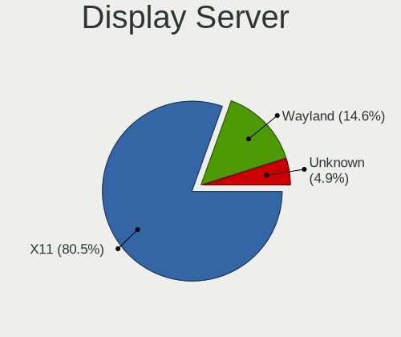
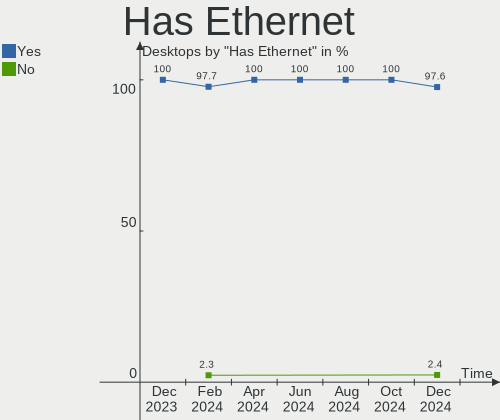
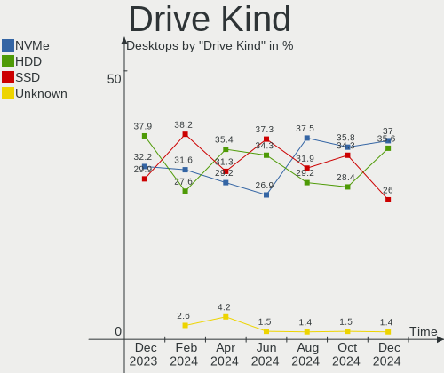
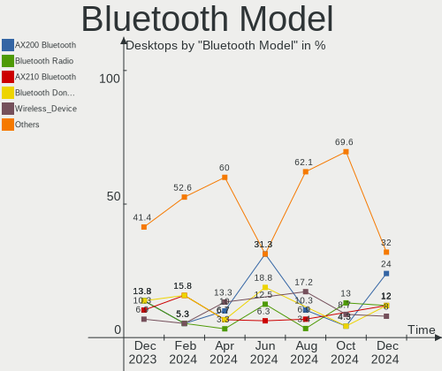

Manjaro - Hardware Trends (Desktops)
------------------------------------

A project to identify most popular hardware characteristics and track their change
over time based on data collected by Linux users at https://Linux-Hardware.org.

Anyone can contribute to this report by the [hw-probe](https://github.com/linuxhw/hw-probe) tool:

    sudo -E hw-probe -all -upload

This report is for one last month. Overall report since the beginning of time: [TestCoverage](https://github.com/linuxhw/TestCoverage)

Period: Jul, 2022.

Contents
--------

* [ System ](#system)
  - [ OS                       ](#os)
  - [ OS Family                ](#os-family)
  - [ Kernel                   ](#kernel)
  - [ Kernel Family            ](#kernel-family)
  - [ Kernel Major Ver.        ](#kernel-major-ver)
  - [ Arch                     ](#arch)
  - [ DE                       ](#de)
  - [ Display Server           ](#display-server)
  - [ Display Manager          ](#display-manager)
  - [ OS Lang                  ](#os-lang)
  - [ Boot Mode                ](#boot-mode)
  - [ Filesystem               ](#filesystem)
  - [ Part. scheme             ](#part-scheme)
  - [ Dual Boot with Linux/BSD ](#dual-boot-with-linuxbsd)
  - [ Dual Boot (Win)          ](#dual-boot-win)

* [ Board ](#board)
  - [ Vendor                   ](#vendor)
  - [ Model                    ](#model)
  - [ Model Family             ](#model-family)
  - [ MFG Year                 ](#mfg-year)
  - [ Form Factor              ](#form-factor)
  - [ Secure Boot              ](#secure-boot)
  - [ Coreboot                 ](#coreboot)
  - [ RAM Size                 ](#ram-size)
  - [ RAM Used                 ](#ram-used)
  - [ Total Drives             ](#total-drives)
  - [ Has CD-ROM               ](#has-cd-rom)
  - [ Has Ethernet             ](#has-ethernet)
  - [ Has WiFi                 ](#has-wifi)
  - [ Has Bluetooth            ](#has-bluetooth)

* [ Location ](#location)
  - [ Country                  ](#country)
  - [ City                     ](#city)

* [ Drives ](#drives)
  - [ Drive Vendor             ](#drive-vendor)
  - [ Drive Model              ](#drive-model)
  - [ HDD Vendor               ](#hdd-vendor)
  - [ SSD Vendor               ](#ssd-vendor)
  - [ Drive Kind               ](#drive-kind)
  - [ Drive Connector          ](#drive-connector)
  - [ Drive Size               ](#drive-size)
  - [ Space Total              ](#space-total)
  - [ Space Used               ](#space-used)
  - [ Malfunc. Drives          ](#malfunc-drives)
  - [ Malfunc. Drive Vendor    ](#malfunc-drive-vendor)
  - [ Malfunc. HDD Vendor      ](#malfunc-hdd-vendor)
  - [ Malfunc. Drive Kind      ](#malfunc-drive-kind)
  - [ Failed Drives            ](#failed-drives)
  - [ Failed Drive Vendor      ](#failed-drive-vendor)
  - [ Drive Status             ](#drive-status)

* [ Storage controller ](#storage-controller)
  - [ Storage Vendor           ](#storage-vendor)
  - [ Storage Model            ](#storage-model)
  - [ Storage Kind             ](#storage-kind)

* [ Processor ](#processor)
  - [ CPU Vendor               ](#cpu-vendor)
  - [ CPU Model                ](#cpu-model)
  - [ CPU Model Family         ](#cpu-model-family)
  - [ CPU Cores                ](#cpu-cores)
  - [ CPU Sockets              ](#cpu-sockets)
  - [ CPU Threads              ](#cpu-threads)
  - [ CPU Op-Modes             ](#cpu-op-modes)
  - [ CPU Microcode            ](#cpu-microcode)
  - [ CPU Microarch            ](#cpu-microarch)

* [ Graphics ](#graphics)
  - [ GPU Vendor               ](#gpu-vendor)
  - [ GPU Model                ](#gpu-model)
  - [ GPU Combo                ](#gpu-combo)
  - [ GPU Driver               ](#gpu-driver)
  - [ GPU Memory               ](#gpu-memory)

* [ Monitor ](#monitor)
  - [ Monitor Vendor           ](#monitor-vendor)
  - [ Monitor Model            ](#monitor-model)
  - [ Monitor Resolution       ](#monitor-resolution)
  - [ Monitor Diagonal         ](#monitor-diagonal)
  - [ Monitor Width            ](#monitor-width)
  - [ Aspect Ratio             ](#aspect-ratio)
  - [ Monitor Area             ](#monitor-area)
  - [ Pixel Density            ](#pixel-density)
  - [ Multiple Monitors        ](#multiple-monitors)

* [ Network ](#network)
  - [ Net Controller Vendor    ](#net-controller-vendor)
  - [ Net Controller Model     ](#net-controller-model)
  - [ Wireless Vendor          ](#wireless-vendor)
  - [ Wireless Model           ](#wireless-model)
  - [ Ethernet Vendor          ](#ethernet-vendor)
  - [ Ethernet Model           ](#ethernet-model)
  - [ Net Controller Kind      ](#net-controller-kind)
  - [ Used Controller          ](#used-controller)
  - [ NICs                     ](#nics)
  - [ IPv6                     ](#ipv6)

* [ Bluetooth ](#bluetooth)
  - [ Bluetooth Vendor         ](#bluetooth-vendor)
  - [ Bluetooth Model          ](#bluetooth-model)

* [ Sound ](#sound)
  - [ Sound Vendor             ](#sound-vendor)
  - [ Sound Model              ](#sound-model)

* [ Memory ](#memory)
  - [ Memory Vendor            ](#memory-vendor)
  - [ Memory Model             ](#memory-model)
  - [ Memory Kind              ](#memory-kind)
  - [ Memory Form Factor       ](#memory-form-factor)
  - [ Memory Size              ](#memory-size)
  - [ Memory Speed             ](#memory-speed)

* [ Printers & scanners ](#printers--scanners)
  - [ Printer Vendor           ](#printer-vendor)
  - [ Printer Model            ](#printer-model)
  - [ Scanner Vendor           ](#scanner-vendor)
  - [ Scanner Model            ](#scanner-model)

* [ Camera ](#camera)
  - [ Camera Vendor            ](#camera-vendor)
  - [ Camera Model             ](#camera-model)

* [ Security ](#security)
  - [ Fingerprint Vendor       ](#fingerprint-vendor)
  - [ Fingerprint Model        ](#fingerprint-model)
  - [ Chipcard Vendor          ](#chipcard-vendor)
  - [ Chipcard Model           ](#chipcard-model)

* [ Unsupported ](#unsupported)
  - [ Unsupported Devices      ](#unsupported-devices)
  - [ Unsupported Device Types ](#unsupported-device-types)

System
------

OS
--

Installed operating systems

| Name           | Desktops | Percent |
|----------------|----------|---------|
| Manjaro        | 34       | 56.67%  |
| Manjaro 21.3.5 | 6        | 10%     |
| Manjaro 21.3.3 | 6        | 10%     |
| Manjaro 21.3.2 | 6        | 10%     |
| Manjaro 21.3.4 | 3        | 5%      |
| Manjaro 21.3.6 | 2        | 3.33%   |
| Manjaro 21.3.1 | 1        | 1.67%   |
| Manjaro 21.3.0 | 1        | 1.67%   |
| Manjaro 21.1.5 | 1        | 1.67%   |

OS Family
---------

OS without a version

| Name    | Desktops | Percent |
|---------|----------|---------|
| Manjaro | 60       | 100%    |

Kernel
------

Version of the Linux kernel

| Version               | Desktops | Percent |
|-----------------------|----------|---------|
| 5.15.55-1-MANJARO     | 10       | 16.67%  |
| 5.18.12-3-MANJARO     | 8        | 13.33%  |
| 5.18.10-1-MANJARO     | 6        | 10%     |
| 5.15.53-1-MANJARO     | 6        | 10%     |
| 5.15.50-1-MANJARO     | 5        | 8.33%   |
| 5.18.14-1-MANJARO     | 4        | 6.67%   |
| 5.15.49-1-MANJARO     | 4        | 6.67%   |
| 5.18.7-1-MANJARO      | 3        | 5%      |
| 5.17.15-1-MANJARO     | 3        | 5%      |
| 5.19.0-1-MANJARO      | 2        | 3.33%   |
| 5.18.6-1-MANJARO      | 2        | 3.33%   |
| 5.9.16-1-MANJARO      | 1        | 1.67%   |
| 5.18.0-1-rt11-MANJARO | 1        | 1.67%   |
| 5.16.20-2-MANJARO     | 1        | 1.67%   |
| 5.15.48-1-MANJARO     | 1        | 1.67%   |
| 5.15.46-1-MANJARO     | 1        | 1.67%   |
| 5.13.19-2-MANJARO     | 1        | 1.67%   |
| 5.10.124-1-MANJARO    | 1        | 1.67%   |

Kernel Family
-------------

Linux kernel without a distro release

| Version  | Desktops | Percent |
|----------|----------|---------|
| 5.15.55  | 10       | 16.67%  |
| 5.18.12  | 8        | 13.33%  |
| 5.18.10  | 6        | 10%     |
| 5.15.53  | 6        | 10%     |
| 5.15.50  | 5        | 8.33%   |
| 5.18.14  | 4        | 6.67%   |
| 5.15.49  | 4        | 6.67%   |
| 5.18.7   | 3        | 5%      |
| 5.17.15  | 3        | 5%      |
| 5.19.0   | 2        | 3.33%   |
| 5.18.6   | 2        | 3.33%   |
| 5.9.16   | 1        | 1.67%   |
| 5.18.0   | 1        | 1.67%   |
| 5.16.20  | 1        | 1.67%   |
| 5.15.48  | 1        | 1.67%   |
| 5.15.46  | 1        | 1.67%   |
| 5.13.19  | 1        | 1.67%   |
| 5.10.124 | 1        | 1.67%   |

Kernel Major Ver.
-----------------

Linux kernel major version

| Version | Desktops | Percent |
|---------|----------|---------|
| 5.15    | 27       | 45%     |
| 5.18    | 24       | 40%     |
| 5.17    | 3        | 5%      |
| 5.19    | 2        | 3.33%   |
| 5.9     | 1        | 1.67%   |
| 5.16    | 1        | 1.67%   |
| 5.13    | 1        | 1.67%   |
| 5.10    | 1        | 1.67%   |

Arch
----

OS architecture (x86_64, i586, etc.)

| Name   | Desktops | Percent |
|--------|----------|---------|
| x86_64 | 60       | 100%    |

DE
--

Desktop Environment

| Name    | Desktops | Percent |
|---------|----------|---------|
| KDE5    | 35       | 58.33%  |
| XFCE    | 12       | 20%     |
| GNOME   | 9        | 15%     |
| Budgie  | 2        | 3.33%   |
| sway    | 1        | 1.67%   |
| Unknown | 1        | 1.67%   |

Display Server
--------------

X11 or Wayland

| Name    | Desktops | Percent |
|---------|----------|---------|
| X11     | 52       | 86.67%  |
| Wayland | 8        | 13.33%  |

Display Manager
---------------

SDDM, LightDM, etc.

| Name    | Desktops | Percent |
|---------|----------|---------|
| Unknown | 35       | 58.33%  |
| SDDM    | 12       | 20%     |
| LightDM | 9        | 15%     |
| GDM     | 4        | 6.67%   |

OS Lang
-------

Language

| Lang    | Desktops | Percent |
|---------|----------|---------|
| en_US   | 19       | 31.67%  |
| de_DE   | 10       | 16.67%  |
| en_GB   | 7        | 11.67%  |
| ru_RU   | 4        | 6.67%   |
| pt_BR   | 2        | 3.33%   |
| nl_NL   | 2        | 3.33%   |
| es_ES   | 2        | 3.33%   |
| en_CA   | 2        | 3.33%   |
| zh_CN   | 1        | 1.67%   |
| tr_TR   | 1        | 1.67%   |
| pt_PT   | 1        | 1.67%   |
| fr_FR   | 1        | 1.67%   |
| es_CR   | 1        | 1.67%   |
| es_CL   | 1        | 1.67%   |
| es_BO   | 1        | 1.67%   |
| en_IN   | 1        | 1.67%   |
| en_AU   | 1        | 1.67%   |
| de_AT   | 1        | 1.67%   |
| da_DK   | 1        | 1.67%   |
| Unknown | 1        | 1.67%   |

Boot Mode
---------

EFI or BIOS

| Mode | Desktops | Percent |
|------|----------|---------|
| BIOS | 45       | 75%     |
| EFI  | 15       | 25%     |

Filesystem
----------

Type of filesystem

| Type    | Desktops | Percent |
|---------|----------|---------|
| Ext4    | 44       | 73.33%  |
| Btrfs   | 10       | 16.67%  |
| Xfs     | 4        | 6.67%   |
| Tmpfs   | 1        | 1.67%   |
| Overlay | 1        | 1.67%   |

Part. scheme
------------

Scheme of partitioning

| Type    | Desktops | Percent |
|---------|----------|---------|
| Unknown | 45       | 75%     |
| GPT     | 15       | 25%     |

Dual Boot with Linux/BSD
------------------------

Hosting more than one Linux/BSD

| Dual boot | Desktops | Percent |
|-----------|----------|---------|
| No        | 57       | 95%     |
| Yes       | 3        | 5%      |

Dual Boot (Win)
---------------

Hosting Linux and Windows

| Dual boot | Desktops | Percent |
|-----------|----------|---------|
| No        | 41       | 68.33%  |
| Yes       | 19       | 31.67%  |

Board
-----

Vendor
------

Motherboard manufacturer

| Name                | Desktops | Percent |
|---------------------|----------|---------|
| ASUSTek Computer    | 19       | 31.67%  |
| MSI                 | 13       | 21.67%  |
| Gigabyte Technology | 10       | 16.67%  |
| ASRock              | 5        | 8.33%   |
| Dell                | 3        | 5%      |
| BESSTAR Tech        | 3        | 5%      |
| Lenovo              | 2        | 3.33%   |
| PCWare              | 1        | 1.67%   |
| MACHINIST           | 1        | 1.67%   |
| Inventec            | 1        | 1.67%   |
| Hewlett-Packard     | 1        | 1.67%   |
| Fujitsu             | 1        | 1.67%   |

Model
-----

Motherboard model

| Name                                     | Desktops | Percent |
|------------------------------------------|----------|---------|
| ASUS M5A97 R2.0                          | 3        | 5%      |
| MSI MS-7C91                              | 2        | 3.33%   |
| MSI MS-7B79                              | 2        | 3.33%   |
| ASUS TUF Gaming X570-PLUS                | 2        | 3.33%   |
| PCWare IPMH81G1                          | 1        | 1.67%   |
| MSI MS-7C94                              | 1        | 1.67%   |
| MSI MS-7C52                              | 1        | 1.67%   |
| MSI MS-7C02                              | 1        | 1.67%   |
| MSI MS-7B93                              | 1        | 1.67%   |
| MSI MS-7A70                              | 1        | 1.67%   |
| MSI MS-7A38                              | 1        | 1.67%   |
| MSI MS-7A32                              | 1        | 1.67%   |
| MSI MS-7A15                              | 1        | 1.67%   |
| MSI MS-7752                              | 1        | 1.67%   |
| MACHINIST X79 V2.82H                     | 1        | 1.67%   |
| Lenovo ThinkCentre M920t-N000 10SMCTO1WW | 1        | 1.67%   |
| Lenovo Legion T5 28IMB05 90NC007LUS      | 1        | 1.67%   |
| Inventec D CLASS                         | 1        | 1.67%   |
| HP xw6600 Workstation                    | 1        | 1.67%   |
| Gigabyte Z97-D3H                         | 1        | 1.67%   |
| Gigabyte Z68P-DS3                        | 1        | 1.67%   |
| Gigabyte X570 AORUS ULTRA                | 1        | 1.67%   |
| Gigabyte X570 AORUS MASTER               | 1        | 1.67%   |
| Gigabyte H97-Gaming 3                    | 1        | 1.67%   |
| Gigabyte H61M-D2P-B3                     | 1        | 1.67%   |
| Gigabyte GA-78LMT-USB3 R2                | 1        | 1.67%   |
| Gigabyte AB350-Gaming 3                  | 1        | 1.67%   |
| Gigabyte A520M S2H                       | 1        | 1.67%   |
| Gigabyte 990XA-UD3                       | 1        | 1.67%   |
| Fujitsu ESPRIMO P5645                    | 1        | 1.67%   |
| Dell Precision Tower 7910                | 1        | 1.67%   |
| Dell OptiPlex 755                        | 1        | 1.67%   |
| Dell OptiPlex 7050                       | 1        | 1.67%   |
| BESSTAR Tech UM350                       | 1        | 1.67%   |
| BESSTAR Tech TL50                        | 1        | 1.67%   |
| BESSTAR Tech HM90                        | 1        | 1.67%   |
| ASUS TUF Z390-PLUS GAMING                | 1        | 1.67%   |
| ASUS ROG STRIX Z490-E GAMING             | 1        | 1.67%   |
| ASUS ROG STRIX X570-I GAMING             | 1        | 1.67%   |
| ASUS ROG STRIX X470-F GAMING             | 1        | 1.67%   |
| ASUS ROG STRIX B550-I GAMING             | 1        | 1.67%   |
| ASUS ROG STRIX B550-F GAMING             | 1        | 1.67%   |
| ASUS PRIME Z590-P                        | 1        | 1.67%   |
| ASUS PRIME X570-P                        | 1        | 1.67%   |
| ASUS PRIME B550M-A                       | 1        | 1.67%   |
| ASUS PRIME B450-PLUS                     | 1        | 1.67%   |
| ASUS PRIME B350-PLUS                     | 1        | 1.67%   |
| ASUS PRIME A320M-K                       | 1        | 1.67%   |
| ASUS P9X79                               | 1        | 1.67%   |
| ASUS Maximus Formula                     | 1        | 1.67%   |
| ASRock Z77 Extreme4                      | 1        | 1.67%   |
| ASRock IMB-1213                          | 1        | 1.67%   |
| ASRock H81M-VG4                          | 1        | 1.67%   |
| ASRock B550M Pro4                        | 1        | 1.67%   |
| ASRock B450M Pro4 R2.0                   | 1        | 1.67%   |

Model Family
------------

Motherboard model prefix

| Name                   | Desktops | Percent |
|------------------------|----------|---------|
| ASUS PRIME             | 6        | 10%     |
| ASUS ROG               | 5        | 8.33%   |
| ASUS TUF               | 3        | 5%      |
| ASUS M5A97             | 3        | 5%      |
| MSI MS-7C91            | 2        | 3.33%   |
| MSI MS-7B79            | 2        | 3.33%   |
| Gigabyte X570          | 2        | 3.33%   |
| Dell OptiPlex          | 2        | 3.33%   |
| PCWare IPMH81G1        | 1        | 1.67%   |
| MSI MS-7C94            | 1        | 1.67%   |
| MSI MS-7C52            | 1        | 1.67%   |
| MSI MS-7C02            | 1        | 1.67%   |
| MSI MS-7B93            | 1        | 1.67%   |
| MSI MS-7A70            | 1        | 1.67%   |
| MSI MS-7A38            | 1        | 1.67%   |
| MSI MS-7A32            | 1        | 1.67%   |
| MSI MS-7A15            | 1        | 1.67%   |
| MSI MS-7752            | 1        | 1.67%   |
| MACHINIST X79          | 1        | 1.67%   |
| Lenovo ThinkCentre     | 1        | 1.67%   |
| Lenovo Legion          | 1        | 1.67%   |
| Inventec D             | 1        | 1.67%   |
| HP xw6600              | 1        | 1.67%   |
| Gigabyte Z97-D3H       | 1        | 1.67%   |
| Gigabyte Z68P-DS3      | 1        | 1.67%   |
| Gigabyte H97-Gaming    | 1        | 1.67%   |
| Gigabyte H61M-D2P-B3   | 1        | 1.67%   |
| Gigabyte GA-78LMT-USB3 | 1        | 1.67%   |
| Gigabyte AB350-Gaming  | 1        | 1.67%   |
| Gigabyte A520M         | 1        | 1.67%   |
| Gigabyte 990XA-UD3     | 1        | 1.67%   |
| Fujitsu ESPRIMO        | 1        | 1.67%   |
| Dell Precision         | 1        | 1.67%   |
| BESSTAR Tech UM350     | 1        | 1.67%   |
| BESSTAR Tech TL50      | 1        | 1.67%   |
| BESSTAR Tech HM90      | 1        | 1.67%   |
| ASUS P9X79             | 1        | 1.67%   |
| ASUS Maximus           | 1        | 1.67%   |
| ASRock Z77             | 1        | 1.67%   |
| ASRock IMB-1213        | 1        | 1.67%   |
| ASRock H81M-VG4        | 1        | 1.67%   |
| ASRock B550M           | 1        | 1.67%   |
| ASRock B450M           | 1        | 1.67%   |

MFG Year
--------

Motherboard manufacture year

| Year | Desktops | Percent |
|------|----------|---------|
| 2020 | 12       | 20%     |
| 2019 | 11       | 18.33%  |
| 2017 | 6        | 10%     |
| 2012 | 6        | 10%     |
| 2021 | 5        | 8.33%   |
| 2018 | 4        | 6.67%   |
| 2014 | 3        | 5%      |
| 2013 | 3        | 5%      |
| 2011 | 3        | 5%      |
| 2022 | 2        | 3.33%   |
| 2016 | 2        | 3.33%   |
| 2008 | 2        | 3.33%   |
| 2007 | 1        | 1.67%   |

Form Factor
-----------

Physical design of the computer

| Name    | Desktops | Percent |
|---------|----------|---------|
| Desktop | 60       | 100%    |

Secure Boot
-----------

Enabled or disabled

| State    | Desktops | Percent |
|----------|----------|---------|
| Disabled | 60       | 100%    |

Coreboot
--------

Have coreboot on board

| Used | Desktops | Percent |
|------|----------|---------|
| No   | 60       | 100%    |

RAM Size
--------

Total RAM memory

| Size in GB  | Desktops | Percent |
|-------------|----------|---------|
| 16.01-24.0  | 19       | 31.67%  |
| 32.01-64.0  | 15       | 25%     |
| 8.01-16.0   | 12       | 20%     |
| 64.01-256.0 | 7        | 11.67%  |
| 4.01-8.0    | 4        | 6.67%   |
| 3.01-4.0    | 1        | 1.67%   |
| 24.01-32.0  | 1        | 1.67%   |
| 1.01-2.0    | 1        | 1.67%   |

RAM Used
--------

Used RAM memory

| Used GB    | Desktops | Percent |
|------------|----------|---------|
| 4.01-8.0   | 17       | 28.33%  |
| 2.01-3.0   | 14       | 23.33%  |
| 3.01-4.0   | 13       | 21.67%  |
| 1.01-2.0   | 8        | 13.33%  |
| 8.01-16.0  | 3        | 5%      |
| 16.01-24.0 | 2        | 3.33%   |
| 0.51-1.0   | 2        | 3.33%   |
| 32.01-64.0 | 1        | 1.67%   |

Total Drives
------------

Number of drives on board

| Drives | Desktops | Percent |
|--------|----------|---------|
| 2      | 17       | 28.33%  |
| 1      | 16       | 26.67%  |
| 5      | 10       | 16.67%  |
| 4      | 8        | 13.33%  |
| 3      | 8        | 13.33%  |
| 6      | 1        | 1.67%   |

Has CD-ROM
----------

Has CD-ROM on board

| Presented | Desktops | Percent |
|-----------|----------|---------|
| No        | 38       | 63.33%  |
| Yes       | 22       | 36.67%  |

Has Ethernet
------------

Has Ethernet on board

| Presented | Desktops | Percent |
|-----------|----------|---------|
| Yes       | 59       | 98.33%  |
| No        | 1        | 1.67%   |

Has WiFi
--------

Has WiFi module

| Presented | Desktops | Percent |
|-----------|----------|---------|
| No        | 32       | 53.33%  |
| Yes       | 28       | 46.67%  |

Has Bluetooth
-------------

Has Bluetooth module

| Presented | Desktops | Percent |
|-----------|----------|---------|
| Yes       | 31       | 51.67%  |
| No        | 29       | 48.33%  |

Location
--------

Country
-------

Geographic location (country)

| Country     | Desktops | Percent |
|-------------|----------|---------|
| Germany     | 13       | 21.67%  |
| USA         | 6        | 10%     |
| UK          | 5        | 8.33%   |
| Russia      | 5        | 8.33%   |
| Spain       | 3        | 5%      |
| Poland      | 2        | 3.33%   |
| Netherlands | 2        | 3.33%   |
| Canada      | 2        | 3.33%   |
| Brazil      | 2        | 3.33%   |
| Turkey      | 1        | 1.67%   |
| Taiwan      | 1        | 1.67%   |
| Singapore   | 1        | 1.67%   |
| Portugal    | 1        | 1.67%   |
| Lithuania   | 1        | 1.67%   |
| Kazakhstan  | 1        | 1.67%   |
| Iran        | 1        | 1.67%   |
| India       | 1        | 1.67%   |
| Greece      | 1        | 1.67%   |
| France      | 1        | 1.67%   |
| Egypt       | 1        | 1.67%   |
| Denmark     | 1        | 1.67%   |
| Croatia     | 1        | 1.67%   |
| Costa Rica  | 1        | 1.67%   |
| China       | 1        | 1.67%   |
| Chile       | 1        | 1.67%   |
| Bolivia     | 1        | 1.67%   |
| Austria     | 1        | 1.67%   |
| Australia   | 1        | 1.67%   |
| Armenia     | 1        | 1.67%   |

City
----

Geographic location (city)

| City                   | Desktops | Percent |
|------------------------|----------|---------|
| Cologne                | 2        | 3.33%   |
| Chelyabinsk            | 2        | 3.33%   |
| Zagreb                 | 1        | 1.67%   |
| Yerevan                | 1        | 1.67%   |
| Wynantskill            | 1        | 1.67%   |
| Wolverhampton          | 1        | 1.67%   |
| Weimar                 | 1        | 1.67%   |
| Wakefield              | 1        | 1.67%   |
| Vilnius                | 1        | 1.67%   |
| Vienna                 | 1        | 1.67%   |
| Unieszewo              | 1        | 1.67%   |
| Ulverston              | 1        | 1.67%   |
| Ufa                    | 1        | 1.67%   |
| Tonbridge              | 1        | 1.67%   |
| Tonawanda              | 1        | 1.67%   |
| Thessaloniki           | 1        | 1.67%   |
| The Bronx              | 1        | 1.67%   |
| Tespe                  | 1        | 1.67%   |
| Taipei                 | 1        | 1.67%   |
| Sydney                 | 1        | 1.67%   |
| Southport              | 1        | 1.67%   |
| Singapore              | 1        | 1.67%   |
| Sarrion                | 1        | 1.67%   |
| Santa Cruz de Tenerife | 1        | 1.67%   |
| San José              | 1        | 1.67%   |
| Paris                  | 1        | 1.67%   |
| Novo Repartimento      | 1        | 1.67%   |
| Nackenheim             | 1        | 1.67%   |
| Moscow                 | 1        | 1.67%   |
| Mannheim               | 1        | 1.67%   |
| Leerdam                | 1        | 1.67%   |
| Lanzhou                | 1        | 1.67%   |
| La Paz                 | 1        | 1.67%   |
| Krefeld                | 1        | 1.67%   |
| Kostanay               | 1        | 1.67%   |
| Kelowna                | 1        | 1.67%   |
| Karsiyang              | 1        | 1.67%   |
| Izhevsk                | 1        | 1.67%   |
| Itajaí                | 1        | 1.67%   |
| Istanbul               | 1        | 1.67%   |
| Heide                  | 1        | 1.67%   |
| Hattiesburg            | 1        | 1.67%   |
| Hamadan                | 1        | 1.67%   |
| Georgsmarienhuette     | 1        | 1.67%   |
| Fredericton            | 1        | 1.67%   |
| Frankfurt am Main      | 1        | 1.67%   |
| Copenhagen             | 1        | 1.67%   |
| Cassville              | 1        | 1.67%   |
| Cambre                 | 1        | 1.67%   |
| Cairo                  | 1        | 1.67%   |
| Bueckeburg             | 1        | 1.67%   |
| Brzeziny               | 1        | 1.67%   |
| Bristol                | 1        | 1.67%   |
| Bad Duerrenberg        | 1        | 1.67%   |
| Asslar                 | 1        | 1.67%   |
| Antofagasta            | 1        | 1.67%   |
| Amsterdam              | 1        | 1.67%   |
| Amadora                | 1        | 1.67%   |

Drives
------

Drive Vendor
------------

Hard drive vendors

| Vendor                    | Desktops | Drives | Percent |
|---------------------------|----------|--------|---------|
| Samsung Electronics       | 26       | 40     | 20.31%  |
| WDC                       | 25       | 35     | 19.53%  |
| Seagate                   | 20       | 26     | 15.63%  |
| SanDisk                   | 10       | 12     | 7.81%   |
| Toshiba                   | 8        | 9      | 6.25%   |
| Kingston                  | 6        | 7      | 4.69%   |
| A-DATA Technology         | 5        | 5      | 3.91%   |
| Intel                     | 4        | 4      | 3.13%   |
| Crucial                   | 4        | 5      | 3.13%   |
| Phison                    | 2        | 2      | 1.56%   |
| OCZ                       | 2        | 2      | 1.56%   |
| China                     | 2        | 2      | 1.56%   |
| Unknown                   | 1        | 1      | 0.78%   |
| Team                      | 1        | 1      | 0.78%   |
| SK hynix                  | 1        | 1      | 0.78%   |
| PNY                       | 1        | 1      | 0.78%   |
| Mushkin                   | 1        | 1      | 0.78%   |
| Micron/Crucial Technology | 1        | 1      | 0.78%   |
| Micron Technology         | 1        | 1      | 0.78%   |
| JMicron Technology        | 1        | 1      | 0.78%   |
| Intenso                   | 1        | 1      | 0.78%   |
| Hitachi                   | 1        | 1      | 0.78%   |
| HGST HTS                  | 1        | 1      | 0.78%   |
| GOODRAM                   | 1        | 1      | 0.78%   |
| Gigabyte Technology       | 1        | 1      | 0.78%   |
| Corsair                   | 1        | 1      | 0.78%   |

Drive Model
-----------

Hard drive models

| Model                                 | Desktops | Percent |
|---------------------------------------|----------|---------|
| Samsung SSD 860 EVO 500GB             | 6        | 3.87%   |
| Seagate ST2000DM008-2FR102 2TB        | 5        | 3.23%   |
| SanDisk NVMe SSD Drive 500GB          | 4        | 2.58%   |
| Samsung NVMe SSD Drive 1TB            | 4        | 2.58%   |
| WDC WDS240G2G0A-00JH30 240GB SSD      | 3        | 1.94%   |
| Toshiba DT01ACA050 500GB              | 3        | 1.94%   |
| Seagate ST1000DM010-2EP102 1TB        | 3        | 1.94%   |
| WDC WD10EZEX-08WN4A0 1TB              | 2        | 1.29%   |
| WDC WD10EARS-00MVWB0 1TB              | 2        | 1.29%   |
| Toshiba DT01ACA300 3TB                | 2        | 1.29%   |
| Seagate ST3500418AS 500GB             | 2        | 1.29%   |
| Seagate ST2000DM001-1ER164 2TB        | 2        | 1.29%   |
| Samsung SSD 970 EVO Plus 500GB        | 2        | 1.29%   |
| Samsung SSD 960 EVO 250GB             | 2        | 1.29%   |
| Samsung SSD 870 QVO 2TB               | 2        | 1.29%   |
| Samsung NVMe SSD Drive 500GB          | 2        | 1.29%   |
| Kingston SA400S37240G 240GB SSD       | 2        | 1.29%   |
| Crucial CT480BX500SSD1 480GB          | 2        | 1.29%   |
| WDC WDS500G1X0E-00AFY0 500GB          | 1        | 0.65%   |
| WDC WDS250G2B0B-00YS70 250GB SSD      | 1        | 0.65%   |
| WDC WDS240G2G0B-00EPW0 240GB SSD      | 1        | 0.65%   |
| WDC WDS240G1G0A-00SS50 240GB SSD      | 1        | 0.65%   |
| WDC WDS200T2B0B-00YS70 2TB SSD        | 1        | 0.65%   |
| WDC WDS100T2B0B-00YS70 1TB SSD        | 1        | 0.65%   |
| WDC WDS100T2B0A-00SM50 1TB SSD        | 1        | 0.65%   |
| WDC WD60EFRX-68L0BN1 6TB              | 1        | 0.65%   |
| WDC WD6003FRYZ-01F0DB0 6TB            | 1        | 0.65%   |
| WDC WD5001FZWX-00ZHUA0 5TB            | 1        | 0.65%   |
| WDC WD5000AZLX-22JKKA0 500GB          | 1        | 0.65%   |
| WDC WD5000AAKX-08U6AA0 500GB          | 1        | 0.65%   |
| WDC WD5000AAKS-00A7B0 500GB           | 1        | 0.65%   |
| WDC WD5000AADS-00M2B0 500GB           | 1        | 0.65%   |
| WDC WD40EZRX-22SPEB0 4TB              | 1        | 0.65%   |
| WDC WD2500AAJS-07M0A0 250GB           | 1        | 0.65%   |
| WDC WD20EZRZ-00Z5HB0 2TB              | 1        | 0.65%   |
| WDC WD20EZRX-00D8PB0 2TB              | 1        | 0.65%   |
| WDC WD20EZAZ-00GGJB0 2TB              | 1        | 0.65%   |
| WDC WD20EFRX-68EUZN0 2TB              | 1        | 0.65%   |
| WDC WD1600AAJS-75PSA0 160GB           | 1        | 0.65%   |
| WDC WD10EZEX-60ZF5A0 1TB              | 1        | 0.65%   |
| WDC WD10EZEX-00MFCA0 1TB              | 1        | 0.65%   |
| WDC WD10EARS-00Y5B1 1TB               | 1        | 0.65%   |
| WDC WD10EALX-009BA0 1TB               | 1        | 0.65%   |
| WDC WD100EFAX-68LHPN0 10TB            | 1        | 0.65%   |
| WDC PC SN730 SDBQNTY-1T00-1001 1TB    | 1        | 0.65%   |
| Unknown 2GB ATA Flash Disk            | 1        | 0.65%   |
| Toshiba NVMe SSD Drive 500GB          | 1        | 0.65%   |
| Toshiba HDWQ140 4TB                   | 1        | 0.65%   |
| Toshiba DT01ACA100 LENOVO 1TB         | 1        | 0.65%   |
| Team T253X6002T 2TB SSD               | 1        | 0.65%   |
| SK hynix HFS128G32MND-2200A 128GB SSD | 1        | 0.65%   |
| Seagate ST_M13FQBL QNR 4GB            | 1        | 0.65%   |
| Seagate ST600MP0036 600GB             | 1        | 0.65%   |
| Seagate ST4000DM004-2CV104 4TB        | 1        | 0.65%   |
| Seagate ST380815AS 80GB               | 1        | 0.65%   |
| Seagate ST3320620AS 320GB             | 1        | 0.65%   |
| Seagate ST31000524AS 1TB              | 1        | 0.65%   |
| Seagate ST3000DM001-1CH166 3TB        | 1        | 0.65%   |
| Seagate ST2000DM006-2DM164 2TB        | 1        | 0.65%   |
| Seagate ST2000DM001-1CH164 2TB        | 1        | 0.65%   |

HDD Vendor
----------

Hard disk drive vendors

| Vendor              | Desktops | Drives | Percent |
|---------------------|----------|--------|---------|
| WDC                 | 20       | 24     | 39.22%  |
| Seagate             | 19       | 25     | 37.25%  |
| Toshiba             | 7        | 8      | 13.73%  |
| Samsung Electronics | 2        | 3      | 3.92%   |
| Unknown             | 1        | 1      | 1.96%   |
| Hitachi             | 1        | 1      | 1.96%   |
| HGST HTS            | 1        | 1      | 1.96%   |

SSD Vendor
----------

Solid state drive vendors

| Vendor              | Desktops | Drives | Percent |
|---------------------|----------|--------|---------|
| Samsung Electronics | 16       | 20     | 32%     |
| WDC                 | 8        | 9      | 16%     |
| SanDisk             | 4        | 6      | 8%      |
| Kingston            | 4        | 5      | 8%      |
| Crucial             | 4        | 5      | 8%      |
| OCZ                 | 2        | 2      | 4%      |
| Intel               | 2        | 2      | 4%      |
| China               | 2        | 2      | 4%      |
| A-DATA Technology   | 2        | 2      | 4%      |
| Team                | 1        | 1      | 2%      |
| SK hynix            | 1        | 1      | 2%      |
| PNY                 | 1        | 1      | 2%      |
| GOODRAM             | 1        | 1      | 2%      |
| Gigabyte Technology | 1        | 1      | 2%      |
| Corsair             | 1        | 1      | 2%      |

Drive Kind
----------

HDD or SSD

| Kind    | Desktops | Drives | Percent |
|---------|----------|--------|---------|
| SSD     | 38       | 59     | 35.19%  |
| HDD     | 38       | 63     | 35.19%  |
| NVMe    | 30       | 39     | 27.78%  |
| Unknown | 2        | 2      | 1.85%   |

Drive Connector
---------------

SATA, SAS, NVMe, etc.

| Type | Desktops | Drives | Percent |
|------|----------|--------|---------|
| SATA | 52       | 121    | 61.18%  |
| NVMe | 29       | 38     | 34.12%  |
| SAS  | 4        | 4      | 4.71%   |

Drive Size
----------

Size of hard drive

| Size in TB | Desktops | Drives | Percent |
|------------|----------|--------|---------|
| 0.01-0.5   | 38       | 60     | 41.76%  |
| 0.51-1.0   | 24       | 26     | 26.37%  |
| 1.01-2.0   | 18       | 23     | 19.78%  |
| 4.01-10.0  | 5        | 5      | 5.49%   |
| 3.01-4.0   | 3        | 5      | 3.3%    |
| 2.01-3.0   | 3        | 3      | 3.3%    |

Space Total
-----------

Amount of disk space available on the file system

| Size in GB     | Desktops | Percent |
|----------------|----------|---------|
| More than 3000 | 15       | 25%     |
| 501-1000       | 11       | 18.33%  |
| 101-250        | 9        | 15%     |
| 251-500        | 8        | 13.33%  |
| 1001-2000      | 6        | 10%     |
| 2001-3000      | 4        | 6.67%   |
| 51-100         | 3        | 5%      |
| Unknown        | 3        | 5%      |
| 1-20           | 1        | 1.67%   |

Space Used
----------

Amount of used disk space

| Used GB        | Desktops | Percent |
|----------------|----------|---------|
| 51-100         | 10       | 16.67%  |
| More than 3000 | 8        | 13.33%  |
| 1-20           | 8        | 13.33%  |
| 21-50          | 7        | 11.67%  |
| 501-1000       | 7        | 11.67%  |
| 251-500        | 6        | 10%     |
| 1001-2000      | 6        | 10%     |
| 101-250        | 3        | 5%      |
| Unknown        | 3        | 5%      |
| 2001-3000      | 2        | 3.33%   |

Malfunc. Drives
---------------

Drive models with a malfunction

| Model                            | Desktops | Drives | Percent |
|----------------------------------|----------|--------|---------|
| WDC WD60EFRX-68L0BN1 6TB         | 1        | 1      | 33.33%  |
| SanDisk SDSSDA-2T00 2TB          | 1        | 1      | 33.33%  |
| A-DATA Technology SX8100NP 256GB | 1        | 1      | 33.33%  |

Malfunc. Drive Vendor
---------------------

Vendors of faulty drives

| Vendor            | Desktops | Drives | Percent |
|-------------------|----------|--------|---------|
| WDC               | 1        | 1      | 33.33%  |
| SanDisk           | 1        | 1      | 33.33%  |
| A-DATA Technology | 1        | 1      | 33.33%  |

Malfunc. HDD Vendor
-------------------

Vendors of faulty HDD drives

| Vendor | Desktops | Drives | Percent |
|--------|----------|--------|---------|
| WDC    | 1        | 1      | 100%    |

Malfunc. Drive Kind
-------------------

Kinds of faulty drives

| Kind | Desktops | Drives | Percent |
|------|----------|--------|---------|
| NVMe | 1        | 1      | 33.33%  |
| SSD  | 1        | 1      | 33.33%  |
| HDD  | 1        | 1      | 33.33%  |

Failed Drives
-------------

Failed drive models

Zero info for selected period =(

Failed Drive Vendor
-------------------

Failed drive vendors

Zero info for selected period =(

Drive Status
------------

Number of failed and malfunc. drives

| Status   | Desktops | Drives | Percent |
|----------|----------|--------|---------|
| Detected | 49       | 122    | 75.38%  |
| Works    | 13       | 38     | 20%     |
| Malfunc  | 3        | 3      | 4.62%   |

Storage controller
------------------

Storage Vendor
--------------

Storage controller vendors

| Vendor                      | Desktops | Percent |
|-----------------------------|----------|---------|
| AMD                         | 36       | 36.36%  |
| Intel                       | 26       | 26.26%  |
| Samsung Electronics         | 12       | 12.12%  |
| SanDisk                     | 7        | 7.07%   |
| ASMedia Technology          | 3        | 3.03%   |
| Silicon Motion              | 2        | 2.02%   |
| Phison Electronics          | 2        | 2.02%   |
| Kingston Technology Company | 2        | 2.02%   |
| Silicon Image               | 1        | 1.01%   |
| Realtek Semiconductor       | 1        | 1.01%   |
| Micron/Crucial Technology   | 1        | 1.01%   |
| Micron Technology           | 1        | 1.01%   |
| Marvell Technology Group    | 1        | 1.01%   |
| KIOXIA                      | 1        | 1.01%   |
| JMicron Technology          | 1        | 1.01%   |
| Broadcom / LSI              | 1        | 1.01%   |
| ADATA Technology            | 1        | 1.01%   |

Storage Model
-------------

Storage controller models

| Model                                                                                   | Desktops | Percent |
|-----------------------------------------------------------------------------------------|----------|---------|
| AMD FCH SATA Controller [AHCI mode]                                                     | 17       | 14.53%  |
| AMD 500 Series Chipset SATA Controller                                                  | 8        | 6.84%   |
| AMD 400 Series Chipset SATA Controller                                                  | 7        | 5.98%   |
| Samsung NVMe SSD Controller SM981/PM981/PM983                                           | 6        | 5.13%   |
| AMD SB7x0/SB8x0/SB9x0 SATA Controller [AHCI mode]                                       | 4        | 3.42%   |
| SanDisk Non-Volatile memory controller                                                  | 3        | 2.56%   |
| Samsung NVMe SSD Controller SM961/PM961/SM963                                           | 3        | 2.56%   |
| AMD SB7x0/SB8x0/SB9x0 SATA Controller [IDE mode]                                        | 3        | 2.56%   |
| AMD SB7x0/SB8x0/SB9x0 IDE Controller                                                    | 3        | 2.56%   |
| SanDisk WD Black SN750 / PC SN730 NVMe SSD                                              | 2        | 1.71%   |
| Samsung NVMe SSD Controller PM9A1/PM9A3/980PRO                                          | 2        | 1.71%   |
| Samsung NVMe SSD Controller 980                                                         | 2        | 1.71%   |
| Phison E12 NVMe Controller                                                              | 2        | 1.71%   |
| Intel Cannon Lake PCH SATA AHCI Controller                                              | 2        | 1.71%   |
| Intel C600/X79 series chipset 6-Port SATA AHCI Controller                               | 2        | 1.71%   |
| Intel 9 Series Chipset Family SATA Controller [AHCI Mode]                               | 2        | 1.71%   |
| Intel 8 Series/C220 Series Chipset Family 6-port SATA Controller 1 [AHCI mode]          | 2        | 1.71%   |
| Intel 200 Series PCH SATA controller [AHCI mode]                                        | 2        | 1.71%   |
| ASMedia ASM1062 Serial ATA Controller                                                   | 2        | 1.71%   |
| AMD FCH SATA Controller D                                                               | 2        | 1.71%   |
| AMD 300 Series Chipset SATA Controller                                                  | 2        | 1.71%   |
| Silicon Motion SM2263EN/SM2263XT SSD Controller                                         | 1        | 0.85%   |
| Silicon Motion Non-Volatile memory controller                                           | 1        | 0.85%   |
| Silicon Image PCI0680 Ultra ATA-133 Host Controller                                     | 1        | 0.85%   |
| SanDisk WD PC SN810 / Black SN850 NVMe SSD                                              | 1        | 0.85%   |
| SanDisk WD Blue SN570 NVMe SSD                                                          | 1        | 0.85%   |
| SanDisk WD Black 2018/SN750 / PC SN720 NVMe SSD                                         | 1        | 0.85%   |
| Realtek RTS5763DL NVMe SSD Controller                                                   | 1        | 0.85%   |
| Micron/Crucial P2 NVMe PCIe SSD                                                         | 1        | 0.85%   |
| Micron Non-Volatile memory controller                                                   | 1        | 0.85%   |
| Marvell Group 88SE9230 PCIe 2.0 x2 4-port SATA 6 Gb/s RAID Controller                   | 1        | 0.85%   |
| KIOXIA NVMe SSD                                                                         | 1        | 0.85%   |
| Kingston Company OM3PDP3 NVMe SSD                                                       | 1        | 0.85%   |
| Kingston Company KC2000 NVMe SSD                                                        | 1        | 0.85%   |
| JMicron JMB368 IDE controller                                                           | 1        | 0.85%   |
| Intel Tiger Lake-LP SATA Controller                                                     | 1        | 0.85%   |
| Intel SSD 660P Series                                                                   | 1        | 0.85%   |
| Intel SATA Controller [RAID mode]                                                       | 1        | 0.85%   |
| Intel Q170/Q150/B150/H170/H110/Z170/CM236 Chipset SATA Controller [AHCI Mode]           | 1        | 0.85%   |
| Intel Non-Volatile memory controller                                                    | 1        | 0.85%   |
| Intel Comet Lake SATA AHCI Controller                                                   | 1        | 0.85%   |
| Intel C610/X99 series chipset 6-Port SATA Controller [AHCI mode]                        | 1        | 0.85%   |
| Intel 82Q35 Express PT IDER Controller                                                  | 1        | 0.85%   |
| Intel 82801IR/IO/IH (ICH9R/DO/DH) 6 port SATA Controller [AHCI mode]                    | 1        | 0.85%   |
| Intel 82801IR/IO/IH (ICH9R/DO/DH) 4 port SATA Controller [IDE mode]                     | 1        | 0.85%   |
| Intel 82801I (ICH9 Family) 2 port SATA Controller [IDE mode]                            | 1        | 0.85%   |
| Intel 7 Series/C210 Series Chipset Family 6-port SATA Controller [AHCI mode]            | 1        | 0.85%   |
| Intel 7 Series/C210 Series Chipset Family 4-port SATA Controller [IDE mode]             | 1        | 0.85%   |
| Intel 7 Series/C210 Series Chipset Family 2-port SATA Controller [IDE mode]             | 1        | 0.85%   |
| Intel 631xESB/632xESB SATA RAID Controller                                              | 1        | 0.85%   |
| Intel 631xESB/632xESB IDE Controller                                                    | 1        | 0.85%   |
| Intel 6 Series/C200 Series Chipset Family Desktop SATA Controller (IDE mode, ports 4-5) | 1        | 0.85%   |
| Intel 6 Series/C200 Series Chipset Family Desktop SATA Controller (IDE mode, ports 0-3) | 1        | 0.85%   |
| Intel 6 Series/C200 Series Chipset Family 6 port Desktop SATA AHCI Controller           | 1        | 0.85%   |
| Intel 500 Series Chipset Family SATA AHCI Controller                                    | 1        | 0.85%   |
| Intel 400 Series Chipset Family SATA AHCI Controller                                    | 1        | 0.85%   |
| Broadcom / LSI SAS3008 PCI-Express Fusion-MPT SAS-3                                     | 1        | 0.85%   |
| ASMedia ASM1061 SATA IDE Controller                                                     | 1        | 0.85%   |
| AMD X370 Series Chipset SATA Controller                                                 | 1        | 0.85%   |
| ADATA XPG SX8200 Pro PCIe Gen3x4 M.2 2280 Solid State Drive                             | 1        | 0.85%   |

Storage Kind
------------

Kind of storage controller (IDE, SATA, NVMe, SAS, ...)

| Kind | Desktops | Percent |
|------|----------|---------|
| SATA | 55       | 57.29%  |
| NVMe | 29       | 30.21%  |
| IDE  | 8        | 8.33%   |
| RAID | 3        | 3.13%   |
| SAS  | 1        | 1.04%   |

Processor
---------

CPU Vendor
----------

Processor vendors

| Vendor | Desktops | Percent |
|--------|----------|---------|
| AMD    | 36       | 60%     |
| Intel  | 24       | 40%     |

CPU Model
---------

Processor models

| Model                                         | Desktops | Percent |
|-----------------------------------------------|----------|---------|
| AMD Ryzen 5 3600 6-Core Processor             | 5        | 8.33%   |
| AMD Ryzen 5 5600X 6-Core Processor            | 4        | 6.67%   |
| AMD Ryzen 9 5950X 16-Core Processor           | 2        | 3.33%   |
| AMD Ryzen 7 5800X 8-Core Processor            | 2        | 3.33%   |
| AMD Ryzen 7 3700X 8-Core Processor            | 2        | 3.33%   |
| AMD Ryzen 5 3600X 6-Core Processor            | 2        | 3.33%   |
| AMD Ryzen 5 3400G with Radeon Vega Graphics   | 2        | 3.33%   |
| Intel Xeon CPU E5450 @ 3.00GHz                | 1        | 1.67%   |
| Intel Xeon CPU E5-2695 v2 @ 2.40GHz           | 1        | 1.67%   |
| Intel Xeon CPU E5-2650 v4 @ 2.20GHz           | 1        | 1.67%   |
| Intel Xeon CPU E5-2650 v2 @ 2.60GHz           | 1        | 1.67%   |
| Intel Pentium CPU G4600 @ 3.60GHz             | 1        | 1.67%   |
| Intel Pentium CPU G3220 @ 3.00GHz             | 1        | 1.67%   |
| Intel Core i9-9900KF CPU @ 3.60GHz            | 1        | 1.67%   |
| Intel Core i9-10900K CPU @ 3.70GHz            | 1        | 1.67%   |
| Intel Core i7-9700T CPU @ 2.00GHz             | 1        | 1.67%   |
| Intel Core i7-8700 CPU @ 3.20GHz              | 1        | 1.67%   |
| Intel Core i7-7700 CPU @ 3.60GHz              | 1        | 1.67%   |
| Intel Core i7-4790 CPU @ 3.60GHz              | 1        | 1.67%   |
| Intel Core i7-3770 CPU @ 3.40GHz              | 1        | 1.67%   |
| Intel Core i7-2600 CPU @ 3.40GHz              | 1        | 1.67%   |
| Intel Core i5-7400 CPU @ 3.00GHz              | 1        | 1.67%   |
| Intel Core i5-4690K CPU @ 3.50GHz             | 1        | 1.67%   |
| Intel Core i5-2320 CPU @ 3.00GHz              | 1        | 1.67%   |
| Intel Core i5-10400F CPU @ 2.90GHz            | 1        | 1.67%   |
| Intel Core i3-2100 CPU @ 3.10GHz              | 1        | 1.67%   |
| Intel Core 2 Quad CPU Q9550 @ 2.83GHz         | 1        | 1.67%   |
| Intel Core 2 Duo CPU E7200 @ 2.53GHz          | 1        | 1.67%   |
| Intel Celeron CPU G1820 @ 2.70GHz             | 1        | 1.67%   |
| Intel 11th Gen Core i7-11700K @ 3.60GHz       | 1        | 1.67%   |
| Intel 11th Gen Core i5-1135G7 @ 2.40GHz       | 1        | 1.67%   |
| AMD Ryzen 9 5900X 12-Core Processor           | 1        | 1.67%   |
| AMD Ryzen 9 4900H with Radeon Graphics        | 1        | 1.67%   |
| AMD Ryzen 9 3900X 12-Core Processor           | 1        | 1.67%   |
| AMD Ryzen 7 1700 Eight-Core Processor         | 1        | 1.67%   |
| AMD Ryzen 5 5600G with Radeon Graphics        | 1        | 1.67%   |
| AMD Ryzen 5 3550H with Radeon Vega Mobile Gfx | 1        | 1.67%   |
| AMD Ryzen 5 2600 Six-Core Processor           | 1        | 1.67%   |
| AMD Ryzen 5 1600X Six-Core Processor          | 1        | 1.67%   |
| AMD Ryzen 3 3200G with Radeon Vega Graphics   | 1        | 1.67%   |
| AMD Ryzen 3 3100 4-Core Processor             | 1        | 1.67%   |
| AMD G-T48E Processor                          | 1        | 1.67%   |
| AMD FX-8350 Eight-Core Processor              | 1        | 1.67%   |
| AMD FX-8300 Eight-Core Processor              | 1        | 1.67%   |
| AMD FX-6300 Six-Core Processor                | 1        | 1.67%   |
| AMD FX-4350 Quad-Core Processor               | 1        | 1.67%   |
| AMD FX-4130 Quad-Core Processor               | 1        | 1.67%   |
| AMD Athlon II X2 220 Processor                | 1        | 1.67%   |

CPU Model Family
----------------

Processor model prefix

| Model             | Desktops | Percent |
|-------------------|----------|---------|
| AMD Ryzen 5       | 17       | 28.33%  |
| Intel Core i7     | 6        | 10%     |
| AMD Ryzen 9       | 5        | 8.33%   |
| AMD Ryzen 7       | 5        | 8.33%   |
| AMD FX            | 5        | 8.33%   |
| Intel Xeon        | 4        | 6.67%   |
| Intel Core i5     | 4        | 6.67%   |
| Other             | 2        | 3.33%   |
| Intel Pentium     | 2        | 3.33%   |
| Intel Core i9     | 2        | 3.33%   |
| AMD Ryzen 3       | 2        | 3.33%   |
| Intel Core i3     | 1        | 1.67%   |
| Intel Core 2 Quad | 1        | 1.67%   |
| Intel Core 2 Duo  | 1        | 1.67%   |
| Intel Celeron     | 1        | 1.67%   |
| AMD G             | 1        | 1.67%   |
| AMD Athlon II X2  | 1        | 1.67%   |

CPU Cores
---------

Number of processor cores

| Number | Desktops | Percent |
|--------|----------|---------|
| 6      | 16       | 26.67%  |
| 4      | 16       | 26.67%  |
| 8      | 11       | 18.33%  |
| 2      | 9        | 15%     |
| 12     | 3        | 5%      |
| 16     | 2        | 3.33%   |
| 24     | 1        | 1.67%   |
| 10     | 1        | 1.67%   |
| 3      | 1        | 1.67%   |

CPU Sockets
-----------

Number of sockets

| Number | Desktops | Percent |
|--------|----------|---------|
| 1      | 58       | 96.67%  |
| 2      | 2        | 3.33%   |

CPU Threads
-----------

Threads per core (Hyper-Threading)

| Number | Desktops | Percent |
|--------|----------|---------|
| 2      | 48       | 80%     |
| 1      | 12       | 20%     |

CPU Op-Modes
------------

CPU Operation Modes (32-bit, 64-bit)

| Op mode        | Desktops | Percent |
|----------------|----------|---------|
| 32-bit, 64-bit | 60       | 100%    |

CPU Microcode
-------------

Microcode number

| Number     | Desktops | Percent |
|------------|----------|---------|
| Unknown    | 46       | 76.67%  |
| 0x08701021 | 3        | 5%      |
| 0x306e4    | 2        | 3.33%   |
| 0x0a201016 | 2        | 3.33%   |
| 0xa0655    | 1        | 1.67%   |
| 0x306c3    | 1        | 1.67%   |
| 0x0a20120a | 1        | 1.67%   |
| 0x0a201205 | 1        | 1.67%   |
| 0x0a201009 | 1        | 1.67%   |
| 0x08600106 | 1        | 1.67%   |
| 0x08108109 | 1        | 1.67%   |

CPU Microarch
-------------

Microarchitecture

| Name        | Desktops | Percent |
|-------------|----------|---------|
| Zen 2       | 12       | 20%     |
| Zen 3       | 10       | 16.67%  |
| KabyLake    | 6        | 10%     |
| Zen+        | 5        | 8.33%   |
| Piledriver  | 4        | 6.67%   |
| Haswell     | 4        | 6.67%   |
| SandyBridge | 3        | 5%      |
| Penryn      | 3        | 5%      |
| IvyBridge   | 3        | 5%      |
| Zen         | 2        | 3.33%   |
| CometLake   | 2        | 3.33%   |
| TigerLake   | 1        | 1.67%   |
| K10         | 1        | 1.67%   |
| Bulldozer   | 1        | 1.67%   |
| Broadwell   | 1        | 1.67%   |
| Bobcat      | 1        | 1.67%   |
| Unknown     | 1        | 1.67%   |

Graphics
--------

GPU Vendor
----------

Vendors of graphics cards

| Vendor | Desktops | Percent |
|--------|----------|---------|
| AMD    | 30       | 47.62%  |
| Nvidia | 23       | 36.51%  |
| Intel  | 10       | 15.87%  |

GPU Model
---------

Graphics card models

| Model                                                                       | Desktops | Percent |
|-----------------------------------------------------------------------------|----------|---------|
| AMD Ellesmere [Radeon RX 470/480/570/570X/580/580X/590]                     | 6        | 9.52%   |
| Intel Xeon E3-1200 v3/4th Gen Core Processor Integrated Graphics Controller | 4        | 6.35%   |
| AMD Navi 10 [Radeon RX 5600 OEM/5600 XT / 5700/5700 XT]                     | 4        | 6.35%   |
| Nvidia GP107 [GeForce GTX 1050]                                             | 2        | 3.17%   |
| Nvidia GF119 [GeForce GT 610]                                               | 2        | 3.17%   |
| Intel HD Graphics 630                                                       | 2        | 3.17%   |
| Intel CoffeeLake-S GT2 [UHD Graphics 630]                                   | 2        | 3.17%   |
| AMD Picasso/Raven 2 [Radeon Vega Series / Radeon Vega Mobile Series]        | 2        | 3.17%   |
| AMD Navi 21 [Radeon RX 6800/6800 XT / 6900 XT]                              | 2        | 3.17%   |
| AMD Lexa PRO [Radeon 540/540X/550/550X / RX 540X/550/550X]                  | 2        | 3.17%   |
| Nvidia TU117 [GeForce GTX 1650]                                             | 1        | 1.59%   |
| Nvidia TU116 [GeForce GTX 1660]                                             | 1        | 1.59%   |
| Nvidia TU116 [GeForce GTX 1660 Ti]                                          | 1        | 1.59%   |
| Nvidia TU106 [GeForce RTX 2060 SUPER]                                       | 1        | 1.59%   |
| Nvidia TU104 [GeForce RTX 2060]                                             | 1        | 1.59%   |
| Nvidia TU102 [GeForce RTX 2080 Ti Rev. A]                                   | 1        | 1.59%   |
| Nvidia NV41GL [Quadro FX 1400]                                              | 1        | 1.59%   |
| Nvidia GT218 [GeForce G210]                                                 | 1        | 1.59%   |
| Nvidia GT216 [GeForce GT 220]                                               | 1        | 1.59%   |
| Nvidia GP108 [GeForce GT 1030]                                              | 1        | 1.59%   |
| Nvidia GP107 [GeForce GTX 1050 Ti]                                          | 1        | 1.59%   |
| Nvidia GP106 [GeForce GTX 1060 3GB]                                         | 1        | 1.59%   |
| Nvidia GP104 [GeForce GTX 1070]                                             | 1        | 1.59%   |
| Nvidia GP102 [GeForce GTX 1080 Ti]                                          | 1        | 1.59%   |
| Nvidia GM204GL [Quadro M5000]                                               | 1        | 1.59%   |
| Nvidia GK104 [GeForce GTX 660 Ti]                                           | 1        | 1.59%   |
| Nvidia GA106 [GeForce RTX 3060 Lite Hash Rate]                              | 1        | 1.59%   |
| Nvidia GA104 [GeForce RTX 3070 Ti]                                          | 1        | 1.59%   |
| Nvidia GA104 [GeForce RTX 3070 Lite Hash Rate]                              | 1        | 1.59%   |
| Intel TigerLake-LP GT2 [Iris Xe Graphics]                                   | 1        | 1.59%   |
| Intel 2nd Generation Core Processor Family Integrated Graphics Controller   | 1        | 1.59%   |
| AMD Wrestler [Radeon HD 6250]                                               | 1        | 1.59%   |
| AMD Turks XT [Radeon HD 6670/7670]                                          | 1        | 1.59%   |
| AMD RS880 [Radeon HD 4200]                                                  | 1        | 1.59%   |
| AMD Renoir                                                                  | 1        | 1.59%   |
| AMD Pitcairn XT GL [FirePro W7000]                                          | 1        | 1.59%   |
| AMD Navi 24 [Radeon RX 6400 / 6500 XT]                                      | 1        | 1.59%   |
| AMD Navi 22 [Radeon RX 6700/6700 XT/6750 XT / 6800M]                        | 1        | 1.59%   |
| AMD Navi 14 [Radeon RX 5500/5500M / Pro 5500M]                              | 1        | 1.59%   |
| AMD Juniper PRO [Radeon HD 5750]                                            | 1        | 1.59%   |
| AMD Curacao PRO [Radeon R7 370 / R9 270/370 OEM]                            | 1        | 1.59%   |
| AMD Cezanne                                                                 | 1        | 1.59%   |
| AMD Cape Verde PRO [Radeon HD 7750/8740 / R7 250E]                          | 1        | 1.59%   |
| AMD Bonaire XT [Radeon HD 7790/8770 / R7 360 / R9 260/360 OEM]              | 1        | 1.59%   |
| AMD Baffin [Radeon RX 550 640SP / RX 560/560X]                              | 1        | 1.59%   |

GPU Combo
---------

Combinations of graphics cards

| Name        | Desktops | Percent |
|-------------|----------|---------|
| 1 x AMD     | 27       | 45%     |
| 1 x Nvidia  | 23       | 38.33%  |
| 1 x Intel   | 8        | 13.33%  |
| 2 x AMD     | 1        | 1.67%   |
| Intel + AMD | 1        | 1.67%   |

GPU Driver
----------

Free vs proprietary

| Driver      | Desktops | Percent |
|-------------|----------|---------|
| Free        | 43       | 71.67%  |
| Proprietary | 17       | 28.33%  |

GPU Memory
----------

Total video memory

| Size in GB | Desktops | Percent |
|------------|----------|---------|
| Unknown    | 36       | 60%     |
| 7.01-8.0   | 7        | 11.67%  |
| 8.01-16.0  | 5        | 8.33%   |
| 3.01-4.0   | 4        | 6.67%   |
| 5.01-6.0   | 3        | 5%      |
| 1.01-2.0   | 3        | 5%      |
| 2.01-3.0   | 1        | 1.67%   |
| 0.01-0.5   | 1        | 1.67%   |

Monitor
-------

Monitor Vendor
--------------

Monitor vendors

| Vendor               | Desktops | Percent |
|----------------------|----------|---------|
| Samsung Electronics  | 12       | 16.22%  |
| Dell                 | 9        | 12.16%  |
| Goldstar             | 6        | 8.11%   |
| Acer                 | 6        | 8.11%   |
| Philips              | 5        | 6.76%   |
| BenQ                 | 4        | 5.41%   |
| Ancor Communications | 4        | 5.41%   |
| Unknown              | 3        | 4.05%   |
| ViewSonic            | 2        | 2.7%    |
| Iiyama               | 2        | 2.7%    |
| ASUSTek Computer     | 2        | 2.7%    |
| AOC                  | 2        | 2.7%    |
| Westinghouse         | 1        | 1.35%   |
| Vizio                | 1        | 1.35%   |
| Vestel Elektronik    | 1        | 1.35%   |
| Sony                 | 1        | 1.35%   |
| Pixio                | 1        | 1.35%   |
| Panasonic            | 1        | 1.35%   |
| OUT                  | 1        | 1.35%   |
| MSI                  | 1        | 1.35%   |
| LG Electronics       | 1        | 1.35%   |
| Lenovo Group Limited | 1        | 1.35%   |
| Idek Iiyama          | 1        | 1.35%   |
| Hewlett-Packard      | 1        | 1.35%   |
| HannStar Display     | 1        | 1.35%   |
| Gigabyte Technology  | 1        | 1.35%   |
| Fujitsu Siemens      | 1        | 1.35%   |
| Compal               | 1        | 1.35%   |
| AGO                  | 1        | 1.35%   |

Monitor Model
-------------

Monitor models

| Model                                                                  | Desktops | Percent |
|------------------------------------------------------------------------|----------|---------|
| BenQ GW2480 BNQ78E7 1920x1080 527x296mm 23.8-inch                      | 2        | 2.53%   |
| Westinghouse WD32HB1120-C WET0029 1366x768 700x390mm 31.5-inch         | 1        | 1.27%   |
| Vizio V705-H3 VIZ1039 3840x2160 1538x865mm 69.5-inch                   | 1        | 1.27%   |
| ViewSonic VA2446 Series VSC732E 1920x1080 521x293mm 23.5-inch          | 1        | 1.27%   |
| ViewSonic LCD Monitor VX2480-2K 2560x1440                              | 1        | 1.27%   |
| Vestel Elektronik 39FHD_LCD_TV VES3700 1920x1080 1280x720mm 57.8-inch  | 1        | 1.27%   |
| Unknown LCD Monitor XXX AAA 1366x768                                   | 1        | 1.27%   |
| Unknown LCD Monitor SAMSUNG 3840x2160                                  | 1        | 1.27%   |
| Unknown LCD Monitor RTK                                                | 1        | 1.27%   |
| Sony LCD Monitor TV 1920x1080                                          | 1        | 1.27%   |
| Samsung Electronics T24D391 SAM0B73 1920x1080 521x293mm 23.5-inch      | 1        | 1.27%   |
| Samsung Electronics SyncMaster SAM0304 1680x1050 494x320mm 23.2-inch   | 1        | 1.27%   |
| Samsung Electronics S27A950D SAM079F 1920x1080 598x336mm 27.0-inch     | 1        | 1.27%   |
| Samsung Electronics S24F350 SAM0D20 1920x1080 521x293mm 23.5-inch      | 1        | 1.27%   |
| Samsung Electronics S24D300 SAM0B42 1920x1080 531x299mm 24.0-inch      | 1        | 1.27%   |
| Samsung Electronics S22E450 SAM0C7C 1680x1050 473x291mm 21.9-inch      | 1        | 1.27%   |
| Samsung Electronics LF22T35 SAM707B 1920x1080 480x270mm 21.7-inch      | 1        | 1.27%   |
| Samsung Electronics LCD Monitor SME2220W                               | 1        | 1.27%   |
| Samsung Electronics LCD Monitor SAM0C26 1920x1080 1209x680mm 54.6-inch | 1        | 1.27%   |
| Samsung Electronics LCD Monitor LF22T35 1920x1080                      | 1        | 1.27%   |
| Samsung Electronics C27JG5x SAM0F58 2560x1440 597x336mm 27.0-inch      | 1        | 1.27%   |
| Samsung Electronics C27F390 SAM0D32 1920x1080 598x336mm 27.0-inch      | 1        | 1.27%   |
| Samsung Electronics C24FG7x SAM0E43 1920x1080 532x304mm 24.1-inch      | 1        | 1.27%   |
| Samsung Electronics C24F390 SAM0D2C 1920x1080 521x293mm 23.5-inch      | 1        | 1.27%   |
| Pixio HDMI1 ICB3500 3440x1440 609x348mm 27.6-inch                      | 1        | 1.27%   |
| Philips PHL 499P9 PHL092A 3840x1080 1193x336mm 48.8-inch               | 1        | 1.27%   |
| Philips PHL 346E2C PHLC247 3440x1440 797x334mm 34.0-inch               | 1        | 1.27%   |
| Philips PHL 246E9Q PHLC17C 1920x1080 527x296mm 23.8-inch               | 1        | 1.27%   |
| Philips FTV PHL01EA 1920x1080 1440x810mm 65.0-inch                     | 1        | 1.27%   |
| Philips 249CQH PHLC0A5 1920x1080 531x299mm 24.0-inch                   | 1        | 1.27%   |
| Panasonic TV MEIC302 1280x720 698x392mm 31.5-inch                      | 1        | 1.27%   |
| OUT Digital OUT0200 1600x900 368x207mm 16.6-inch                       | 1        | 1.27%   |
| MSI G27C4 MSI3CA9 1920x1080 598x336mm 27.0-inch                        | 1        | 1.27%   |
| LG Electronics LCD Monitor LG FULL HD                                  | 1        | 1.27%   |
| Lenovo Group Limited LCD Monitor LEN E2323swA 3600x1080                | 1        | 1.27%   |
| Iiyama PL2792Q IVM6630 2560x1440 597x336mm 27.0-inch                   | 1        | 1.27%   |
| Iiyama PL2288H IVM5633 1920x1080 477x268mm 21.5-inch                   | 1        | 1.27%   |
| Idek Iiyama LCD Monitor PL2770QS 4480x1440                             | 1        | 1.27%   |
| Hewlett-Packard E232 HWP3279 1920x1080 509x286mm 23.0-inch             | 1        | 1.27%   |
| HannStar Display LCD Monitor HE225DPB 1920x1080                        | 1        | 1.27%   |
| Goldstar LG ULTRAGEAR GSM5BB8 1920x1080 600x340mm 27.2-inch            | 1        | 1.27%   |
| Goldstar LG QHD GSM772A 2560x1440 700x390mm 31.5-inch                  | 1        | 1.27%   |
| Goldstar L1972H GSM4B66 1280x1024 376x301mm 19.0-inch                  | 1        | 1.27%   |
| Goldstar IPS FULLHD GSM5AB8 1920x1080 480x270mm 21.7-inch              | 1        | 1.27%   |
| Goldstar FULL HD GSM5B55 1920x1080 480x270mm 21.7-inch                 | 1        | 1.27%   |
| Goldstar 32inch FHD GSM76F5 1920x1080 698x392mm 31.5-inch              | 1        | 1.27%   |
| Goldstar 2D HD TV GSM59CA 1366x768 509x286mm 23.0-inch                 | 1        | 1.27%   |
| Goldstar 23MP65 GSM5A45 1920x1080 510x290mm 23.1-inch                  | 1        | 1.27%   |
| Gigabyte Technology AORUS FI32U GBT3202 3840x2160 698x392mm 31.5-inch  | 1        | 1.27%   |
| Fujitsu Siemens L24W-2 FUS077A 1920x1200 518x324mm 24.1-inch           | 1        | 1.27%   |
| Dell U3219Q DELA124 3840x2160 697x392mm 31.5-inch                      | 1        | 1.27%   |
| Dell U2311H DELA05F 1920x1080 509x286mm 23.0-inch                      | 1        | 1.27%   |
| Dell S2721DGF DEL41D9 2560x1440 597x336mm 27.0-inch                    | 1        | 1.27%   |
| Dell P2317H DEL40F4 1920x1080 509x286mm 23.0-inch                      | 1        | 1.27%   |
| Dell P2214H DELA098 1920x1080 477x268mm 21.5-inch                      | 1        | 1.27%   |
| Dell P2212H DELA07F 1920x1080 531x299mm 24.0-inch                      | 1        | 1.27%   |
| Dell LCD Monitor U2417H 1920x1080                                      | 1        | 1.27%   |
| Dell LCD Monitor S3220DGF 5504x1440                                    | 1        | 1.27%   |
| Dell 1909W DELA03C 1440x900 410x260mm 19.1-inch                        | 1        | 1.27%   |
| Compal TERRA 2450W WOR2450 1920x1080 341x256mm 16.8-inch               | 1        | 1.27%   |

Monitor Resolution
------------------

Monitor screen resolution

| Resolution         | Desktops | Percent |
|--------------------|----------|---------|
| 1920x1080 (FHD)    | 35       | 50%     |
| 3840x2160 (4K)     | 7        | 10%     |
| 2560x1440 (QHD)    | 7        | 10%     |
| 3440x1440          | 3        | 4.29%   |
| 1366x768 (WXGA)    | 3        | 4.29%   |
| Unknown            | 3        | 4.29%   |
| 3840x1080          | 2        | 2.86%   |
| 1680x1050 (WSXGA+) | 2        | 2.86%   |
| 5504x1440          | 1        | 1.43%   |
| 4480x1440          | 1        | 1.43%   |
| 3600x1080          | 1        | 1.43%   |
| 1920x1200 (WUXGA)  | 1        | 1.43%   |
| 1600x900 (HD+)     | 1        | 1.43%   |
| 1440x900 (WXGA+)   | 1        | 1.43%   |
| 1280x720 (HD)      | 1        | 1.43%   |
| 1280x1024 (SXGA)   | 1        | 1.43%   |

Monitor Diagonal
----------------

Diagonal size in inches

| Inches  | Desktops | Percent |
|---------|----------|---------|
| 24      | 14       | 19.44%  |
| Unknown | 11       | 15.28%  |
| 23      | 10       | 13.89%  |
| 27      | 9        | 12.5%   |
| 21      | 8        | 11.11%  |
| 31      | 6        | 8.33%   |
| 19      | 2        | 2.78%   |
| 84      | 1        | 1.39%   |
| 69      | 1        | 1.39%   |
| 65      | 1        | 1.39%   |
| 60      | 1        | 1.39%   |
| 49      | 1        | 1.39%   |
| 48      | 1        | 1.39%   |
| 35      | 1        | 1.39%   |
| 34      | 1        | 1.39%   |
| 32      | 1        | 1.39%   |
| 18      | 1        | 1.39%   |
| 16      | 1        | 1.39%   |
| 12      | 1        | 1.39%   |

Monitor Width
-------------

Physical width

| Width in mm | Desktops | Percent |
|-------------|----------|---------|
| 501-600     | 29       | 42.03%  |
| 401-500     | 11       | 15.94%  |
| Unknown     | 11       | 15.94%  |
| 601-700     | 6        | 8.7%    |
| 1001-1500   | 4        | 5.8%    |
| 701-800     | 2        | 2.9%    |
| 351-400     | 2        | 2.9%    |
| 1501-2000   | 2        | 2.9%    |
| 801-900     | 1        | 1.45%   |
| 201-300     | 1        | 1.45%   |

Aspect Ratio
------------

Proportional relationship between the width and the height

| Ratio   | Desktops | Percent |
|---------|----------|---------|
| 16/9    | 42       | 66.67%  |
| Unknown | 11       | 17.46%  |
| 16/10   | 3        | 4.76%   |
| 32/9    | 2        | 3.17%   |
| 21/9    | 2        | 3.17%   |
| 5/4     | 1        | 1.59%   |
| 4/3     | 1        | 1.59%   |
| 3/2     | 1        | 1.59%   |

Monitor Area
------------

Area in inch²

| Area in inch² | Desktops | Percent |
|----------------|----------|---------|
| 201-250        | 26       | 37.68%  |
| Unknown        | 11       | 15.94%  |
| 351-500        | 9        | 13.04%  |
| 301-350        | 9        | 13.04%  |
| More than 1000 | 4        | 5.8%    |
| 151-200        | 3        | 4.35%   |
| 251-300        | 2        | 2.9%    |
| 501-1000       | 2        | 2.9%    |
| 71-80          | 1        | 1.45%   |
| 141-150        | 1        | 1.45%   |
| 111-120        | 1        | 1.45%   |

Pixel Density
-------------

Pixels per inch

| Density | Desktops | Percent |
|---------|----------|---------|
| 51-100  | 35       | 51.47%  |
| 101-120 | 15       | 22.06%  |
| Unknown | 11       | 16.18%  |
| 1-50    | 4        | 5.88%   |
| 121-160 | 2        | 2.94%   |
| 161-240 | 1        | 1.47%   |

Multiple Monitors
-----------------

Total monitors connected

| Total | Desktops | Percent |
|-------|----------|---------|
| 1     | 41       | 68.33%  |
| 2     | 17       | 28.33%  |
| 3     | 1        | 1.67%   |
| 0     | 1        | 1.67%   |

Network
-------

Net Controller Vendor
---------------------

Controller vendors

| Vendor                   | Desktops | Percent |
|--------------------------|----------|---------|
| Realtek Semiconductor    | 38       | 50%     |
| Intel                    | 26       | 34.21%  |
| Broadcom                 | 2        | 2.63%   |
| Xiaomi                   | 1        | 1.32%   |
| TP-Link                  | 1        | 1.32%   |
| Ralink Technology        | 1        | 1.32%   |
| Qualcomm Atheros         | 1        | 1.32%   |
| Microsoft                | 1        | 1.32%   |
| Microchip Technology     | 1        | 1.32%   |
| MediaTek                 | 1        | 1.32%   |
| Marvell Technology Group | 1        | 1.32%   |
| Huawei Technologies      | 1        | 1.32%   |
| D-Link System            | 1        | 1.32%   |

Net Controller Model
--------------------

Controller models

| Model                                                                      | Desktops | Percent |
|----------------------------------------------------------------------------|----------|---------|
| Realtek RTL8111/8168/8411 PCI Express Gigabit Ethernet Controller          | 35       | 33.98%  |
| Intel Wi-Fi 6 AX200                                                        | 10       | 9.71%   |
| Intel I211 Gigabit Network Connection                                      | 6        | 5.83%   |
| Intel Ethernet Controller I225-V                                           | 6        | 5.83%   |
| Realtek RTL8125 2.5GbE Controller                                          | 5        | 4.85%   |
| Realtek RTL8153 Gigabit Ethernet Adapter                                   | 3        | 2.91%   |
| Realtek 802.11ac NIC                                                       | 2        | 1.94%   |
| Intel Wireless 8265 / 8275                                                 | 2        | 1.94%   |
| Intel Wireless 7265                                                        | 2        | 1.94%   |
| Intel I210 Gigabit Network Connection                                      | 2        | 1.94%   |
| Intel Ethernet Connection (7) I219-LM                                      | 2        | 1.94%   |
| Xiaomi Mi/Redmi series (RNDIS)                                             | 1        | 0.97%   |
| TP-Link TL-WN821N v5/v6 [RTL8192EU]                                        | 1        | 0.97%   |
| TP-Link TL-WN722N v2/v3 [Realtek RTL8188EUS]                               | 1        | 0.97%   |
| Realtek RTL8723BU 802.11b/g/n WLAN Adapter                                 | 1        | 0.97%   |
| Realtek RTL8192EE PCIe Wireless Network Adapter                            | 1        | 0.97%   |
| Ralink RT3072 Wireless Adapter                                             | 1        | 0.97%   |
| Qualcomm Atheros Killer E220x Gigabit Ethernet Controller                  | 1        | 0.97%   |
| Qualcomm Atheros AR9462 Wireless Network Adapter                           | 1        | 0.97%   |
| Microsoft XBOX ACC                                                         | 1        | 0.97%   |
| Microchip MCP2200 USB Serial Port Emulator                                 | 1        | 0.97%   |
| MediaTek MT7921K (RZ608) Wi-Fi 6E 80MHz                                    | 1        | 0.97%   |
| Marvell Group 88E8056 PCI-E Gigabit Ethernet Controller                    | 1        | 0.97%   |
| Intel Wireless-AC 9260                                                     | 1        | 0.97%   |
| Intel Wi-Fi 6 AX210/AX211/AX411 160MHz                                     | 1        | 0.97%   |
| Intel Ethernet Connection I217-V                                           | 1        | 0.97%   |
| Intel Ethernet Connection I217-LM                                          | 1        | 0.97%   |
| Intel Ethernet Connection (7) I219-V                                       | 1        | 0.97%   |
| Intel Ethernet Connection (5) I219-LM                                      | 1        | 0.97%   |
| Intel Comet Lake PCH CNVi WiFi                                             | 1        | 0.97%   |
| Intel Cannon Lake PCH CNVi WiFi                                            | 1        | 0.97%   |
| Intel 82579V Gigabit Network Connection                                    | 1        | 0.97%   |
| Intel 82574L Gigabit Network Connection                                    | 1        | 0.97%   |
| Intel 82566DM-2 Gigabit Network Connection                                 | 1        | 0.97%   |
| Huawei LYA-L09                                                             | 1        | 0.97%   |
| D-Link System AirPlus G DWL-G122 Wireless Adapter(rev.C1) [Ralink RT2571W] | 1        | 0.97%   |
| Broadcom NetXtreme BCM5755 Gigabit Ethernet PCI Express                    | 1        | 0.97%   |
| Broadcom NetLink BCM57781 Gigabit Ethernet PCIe                            | 1        | 0.97%   |
| Broadcom BCM4360 802.11ac Wireless Network Adapter                         | 1        | 0.97%   |

Wireless Vendor
---------------

Wireless vendors

| Vendor                | Desktops | Percent |
|-----------------------|----------|---------|
| Intel                 | 18       | 62.07%  |
| Realtek Semiconductor | 4        | 13.79%  |
| TP-Link               | 1        | 3.45%   |
| Ralink Technology     | 1        | 3.45%   |
| Qualcomm Atheros      | 1        | 3.45%   |
| Microsoft             | 1        | 3.45%   |
| MediaTek              | 1        | 3.45%   |
| D-Link System         | 1        | 3.45%   |
| Broadcom              | 1        | 3.45%   |

Wireless Model
--------------

Wireless models

| Model                                                                      | Desktops | Percent |
|----------------------------------------------------------------------------|----------|---------|
| Intel Wi-Fi 6 AX200                                                        | 10       | 33.33%  |
| Realtek 802.11ac NIC                                                       | 2        | 6.67%   |
| Intel Wireless 8265 / 8275                                                 | 2        | 6.67%   |
| Intel Wireless 7265                                                        | 2        | 6.67%   |
| TP-Link TL-WN821N v5/v6 [RTL8192EU]                                        | 1        | 3.33%   |
| TP-Link TL-WN722N v2/v3 [Realtek RTL8188EUS]                               | 1        | 3.33%   |
| Realtek RTL8723BU 802.11b/g/n WLAN Adapter                                 | 1        | 3.33%   |
| Realtek RTL8192EE PCIe Wireless Network Adapter                            | 1        | 3.33%   |
| Ralink RT3072 Wireless Adapter                                             | 1        | 3.33%   |
| Qualcomm Atheros AR9462 Wireless Network Adapter                           | 1        | 3.33%   |
| Microsoft XBOX ACC                                                         | 1        | 3.33%   |
| MediaTek MT7921K (RZ608) Wi-Fi 6E 80MHz                                    | 1        | 3.33%   |
| Intel Wireless-AC 9260                                                     | 1        | 3.33%   |
| Intel Wi-Fi 6 AX210/AX211/AX411 160MHz                                     | 1        | 3.33%   |
| Intel Comet Lake PCH CNVi WiFi                                             | 1        | 3.33%   |
| Intel Cannon Lake PCH CNVi WiFi                                            | 1        | 3.33%   |
| D-Link System AirPlus G DWL-G122 Wireless Adapter(rev.C1) [Ralink RT2571W] | 1        | 3.33%   |
| Broadcom BCM4360 802.11ac Wireless Network Adapter                         | 1        | 3.33%   |

Ethernet Vendor
---------------

Ethernet vendors

| Vendor                   | Desktops | Percent |
|--------------------------|----------|---------|
| Realtek Semiconductor    | 38       | 59.38%  |
| Intel                    | 20       | 31.25%  |
| Broadcom                 | 2        | 3.13%   |
| Xiaomi                   | 1        | 1.56%   |
| Qualcomm Atheros         | 1        | 1.56%   |
| Marvell Technology Group | 1        | 1.56%   |
| Huawei Technologies      | 1        | 1.56%   |

Ethernet Model
--------------

Ethernet models

| Model                                                             | Desktops | Percent |
|-------------------------------------------------------------------|----------|---------|
| Realtek RTL8111/8168/8411 PCI Express Gigabit Ethernet Controller | 35       | 48.61%  |
| Intel I211 Gigabit Network Connection                             | 6        | 8.33%   |
| Intel Ethernet Controller I225-V                                  | 6        | 8.33%   |
| Realtek RTL8125 2.5GbE Controller                                 | 5        | 6.94%   |
| Realtek RTL8153 Gigabit Ethernet Adapter                          | 3        | 4.17%   |
| Intel I210 Gigabit Network Connection                             | 2        | 2.78%   |
| Intel Ethernet Connection (7) I219-LM                             | 2        | 2.78%   |
| Xiaomi Mi/Redmi series (RNDIS)                                    | 1        | 1.39%   |
| Qualcomm Atheros Killer E220x Gigabit Ethernet Controller         | 1        | 1.39%   |
| Marvell Group 88E8056 PCI-E Gigabit Ethernet Controller           | 1        | 1.39%   |
| Intel Ethernet Connection I217-V                                  | 1        | 1.39%   |
| Intel Ethernet Connection I217-LM                                 | 1        | 1.39%   |
| Intel Ethernet Connection (7) I219-V                              | 1        | 1.39%   |
| Intel Ethernet Connection (5) I219-LM                             | 1        | 1.39%   |
| Intel 82579V Gigabit Network Connection                           | 1        | 1.39%   |
| Intel 82574L Gigabit Network Connection                           | 1        | 1.39%   |
| Intel 82566DM-2 Gigabit Network Connection                        | 1        | 1.39%   |
| Huawei LYA-L09                                                    | 1        | 1.39%   |
| Broadcom NetXtreme BCM5755 Gigabit Ethernet PCI Express           | 1        | 1.39%   |
| Broadcom NetLink BCM57781 Gigabit Ethernet PCIe                   | 1        | 1.39%   |

Net Controller Kind
-------------------

Ethernet, WiFi or modem

| Kind     | Desktops | Percent |
|----------|----------|---------|
| Ethernet | 59       | 67.05%  |
| WiFi     | 28       | 31.82%  |
| Modem    | 1        | 1.14%   |

Used Controller
---------------

Currently used network controller

| Kind     | Desktops | Percent |
|----------|----------|---------|
| Ethernet | 49       | 81.67%  |
| WiFi     | 11       | 18.33%  |

NICs
----

Total network controllers on board

| Total | Desktops | Percent |
|-------|----------|---------|
| 1     | 31       | 51.67%  |
| 2     | 24       | 40%     |
| 3     | 4        | 6.67%   |
| 0     | 1        | 1.67%   |

IPv6
----

IPv6 vs IPv4

| Used | Desktops | Percent |
|------|----------|---------|
| No   | 44       | 73.33%  |
| Yes  | 16       | 26.67%  |

Bluetooth
---------

Bluetooth Vendor
----------------

Controller vendors

| Vendor                  | Desktops | Percent |
|-------------------------|----------|---------|
| Intel                   | 17       | 53.13%  |
| Cambridge Silicon Radio | 6        | 18.75%  |
| SINO WEALTH             | 2        | 6.25%   |
| Realtek Semiconductor   | 2        | 6.25%   |
| Broadcom                | 2        | 6.25%   |
| MediaTek                | 1        | 3.13%   |
| Foxconn / Hon Hai       | 1        | 3.13%   |
| ASUSTek Computer        | 1        | 3.13%   |

Bluetooth Model
---------------

Controller models

| Model                                               | Desktops | Percent |
|-----------------------------------------------------|----------|---------|
| Intel AX200 Bluetooth                               | 9        | 28.13%  |
| Cambridge Silicon Radio Bluetooth Dongle (HCI mode) | 6        | 18.75%  |
| Intel Bluetooth wireless interface                  | 4        | 12.5%   |
| SINO WEALTH RK Bluetooth Keyboar                    | 2        | 6.25%   |
| Realtek Bluetooth Radio                             | 2        | 6.25%   |
| MediaTek Wireless_Device                            | 1        | 3.13%   |
| Intel Bluetooth Device                              | 1        | 3.13%   |
| Intel Bluetooth 9460/9560 Jefferson Peak (JfP)      | 1        | 3.13%   |
| Intel AX210 Bluetooth                               | 1        | 3.13%   |
| Intel AX201 Bluetooth                               | 1        | 3.13%   |
| Foxconn / Hon Hai Bluetooth Device                  | 1        | 3.13%   |
| Broadcom Bluetooth 3.0 USB Dongle                   | 1        | 3.13%   |
| Broadcom BCM20702A0 Bluetooth 4.0                   | 1        | 3.13%   |
| ASUS Broadcom BCM20702A0 Bluetooth                  | 1        | 3.13%   |

Sound
-----

Sound Vendor
------------

Sound card vendors

| Vendor                  | Desktops | Percent |
|-------------------------|----------|---------|
| AMD                     | 42       | 36.21%  |
| Nvidia                  | 22       | 18.97%  |
| Intel                   | 22       | 18.97%  |
| C-Media Electronics     | 5        | 4.31%   |
| Creative Labs           | 4        | 3.45%   |
| Logitech                | 2        | 1.72%   |
| GYROCOM C&C             | 2        | 1.72%   |
| ASUSTek Computer        | 2        | 1.72%   |
| Yamaha                  | 1        | 0.86%   |
| VIA Technologies        | 1        | 0.86%   |
| Thomann                 | 1        | 0.86%   |
| SteelSeries ApS         | 1        | 0.86%   |
| Samsung Electronics     | 1        | 0.86%   |
| Razer USA               | 1        | 0.86%   |
| Polycom                 | 1        | 0.86%   |
| M-Audio                 | 1        | 0.86%   |
| KORG                    | 1        | 0.86%   |
| Kingston Technology     | 1        | 0.86%   |
| Focusrite-Novation      | 1        | 0.86%   |
| Elgato Systems          | 1        | 0.86%   |
| DEXP BK-20              | 1        | 0.86%   |
| BEHRINGER International | 1        | 0.86%   |
| Barco Display Systems   | 1        | 0.86%   |

Sound Model
-----------

Sound card models

| Model                                                                       | Desktops | Percent |
|-----------------------------------------------------------------------------|----------|---------|
| AMD Starship/Matisse HD Audio Controller                                    | 20       | 13.99%  |
| AMD SBx00 Azalia (Intel HDA)                                                | 7        | 4.9%    |
| AMD Family 17h/19h HD Audio Controller                                      | 6        | 4.2%    |
| AMD Ellesmere HDMI Audio [Radeon RX 470/480 / 570/580/590]                  | 6        | 4.2%    |
| AMD Navi 10 HDMI Audio                                                      | 5        | 3.5%    |
| AMD Navi 21/23 HDMI/DP Audio Controller                                     | 4        | 2.8%    |
| Nvidia GP107GL High Definition Audio Controller                             | 3        | 2.1%    |
| Intel Xeon E3-1200 v3/4th Gen Core Processor HD Audio Controller            | 3        | 2.1%    |
| Intel Cannon Lake PCH cAVS                                                  | 3        | 2.1%    |
| Creative Labs Sound Core3D [Sound Blaster Recon3D / Z-Series]               | 3        | 2.1%    |
| AMD Oland/Hainan/Cape Verde/Pitcairn HDMI Audio [Radeon HD 7000 Series]     | 3        | 2.1%    |
| AMD Family 17h (Models 00h-0fh) HD Audio Controller                         | 3        | 2.1%    |
| AMD Baffin HDMI/DP Audio [Radeon RX 550 640SP / RX 560/560X]                | 3        | 2.1%    |
| Nvidia TU116 High Definition Audio Controller                               | 2        | 1.4%    |
| Nvidia GF119 HDMI Audio Controller                                          | 2        | 1.4%    |
| Nvidia GA104 High Definition Audio Controller                               | 2        | 1.4%    |
| Intel 9 Series Chipset Family HD Audio Controller                           | 2        | 1.4%    |
| Intel 82801I (ICH9 Family) HD Audio Controller                              | 2        | 1.4%    |
| Intel 8 Series/C220 Series Chipset High Definition Audio Controller         | 2        | 1.4%    |
| Intel 7 Series/C216 Chipset Family High Definition Audio Controller         | 2        | 1.4%    |
| Intel 200 Series PCH HD Audio                                               | 2        | 1.4%    |
| C-Media Electronics Audio Adapter (Unitek Y-247A)                           | 2        | 1.4%    |
| AMD Renoir Radeon High Definition Audio Controller                          | 2        | 1.4%    |
| AMD Raven/Raven2/Fenghuang HDMI/DP Audio Controller                         | 2        | 1.4%    |
| Yamaha Steinberg UR12                                                       | 1        | 0.7%    |
| VIA Technologies VT1720/24 [Envy24PT/HT] PCI Multi-Channel Audio Controller | 1        | 0.7%    |
| Thomann SC450USB                                                            | 1        | 0.7%    |
| SteelSeries ApS SteelSeries Arctis 5                                        | 1        | 0.7%    |
| Samsung Electronics USBC Headset                                            | 1        | 0.7%    |
| Razer USA Razer USB Sound Card                                              | 1        | 0.7%    |
| Polycom Communicator                                                        | 1        | 0.7%    |
| Nvidia TU107 GeForce GTX 1650 High Definition Audio Controller              | 1        | 0.7%    |
| Nvidia TU106 High Definition Audio Controller                               | 1        | 0.7%    |
| Nvidia TU104 HD Audio Controller                                            | 1        | 0.7%    |
| Nvidia TU102 High Definition Audio Controller                               | 1        | 0.7%    |
| Nvidia High Definition Audio Controller                                     | 1        | 0.7%    |
| Nvidia GT216 HDMI Audio Controller                                          | 1        | 0.7%    |
| Nvidia GP108 High Definition Audio Controller                               | 1        | 0.7%    |
| Nvidia GP106 High Definition Audio Controller                               | 1        | 0.7%    |
| Nvidia GP104 High Definition Audio Controller                               | 1        | 0.7%    |
| Nvidia GP102 HDMI Audio Controller                                          | 1        | 0.7%    |
| Nvidia GM204 High Definition Audio Controller                               | 1        | 0.7%    |
| Nvidia GK104 HDMI Audio Controller                                          | 1        | 0.7%    |
| Nvidia GA106 High Definition Audio Controller                               | 1        | 0.7%    |
| M-Audio M-Track                                                             | 1        | 0.7%    |
| Logitech [G533 Wireless Headset Dongle]                                     | 1        | 0.7%    |
| Logitech Yeti X                                                             | 1        | 0.7%    |
| KORG nanoKONTROL2 MIDI Controller                                           | 1        | 0.7%    |
| Kingston Technology HyperX Cloud II Wireless                                | 1        | 0.7%    |
| Intel Tiger Lake-LP Smart Sound Technology Audio Controller                 | 1        | 0.7%    |
| Intel Tiger Lake-H HD Audio Controller                                      | 1        | 0.7%    |
| Intel Comet Lake PCH-V cAVS                                                 | 1        | 0.7%    |
| Intel Comet Lake PCH cAVS                                                   | 1        | 0.7%    |
| Intel C610/X99 series chipset HD Audio Controller                           | 1        | 0.7%    |
| Intel C600/X79 series chipset High Definition Audio Controller              | 1        | 0.7%    |
| Intel 631xESB/632xESB High Definition Audio Controller                      | 1        | 0.7%    |
| Intel 6 Series/C200 Series Chipset Family High Definition Audio Controller  | 1        | 0.7%    |
| Intel 100 Series/C230 Series Chipset Family HD Audio Controller             | 1        | 0.7%    |
| GYROCOM C&C FiiO USB DAC E07K                                               | 1        | 0.7%    |
| GYROCOM C&C Fiio E10                                                        | 1        | 0.7%    |

Memory
------

Memory Vendor
-------------

Memory module vendors

| Vendor              | Desktops | Percent |
|---------------------|----------|---------|
| Kingston            | 5        | 23.81%  |
| Corsair             | 4        | 19.05%  |
| Samsung Electronics | 2        | 9.52%   |
| G.Skill             | 2        | 9.52%   |
| Crucial             | 2        | 9.52%   |
| Unknown (08C8)      | 1        | 4.76%   |
| Unknown             | 1        | 4.76%   |
| Super Talent        | 1        | 4.76%   |
| Micron Technology   | 1        | 4.76%   |
| A-DATA Technology   | 1        | 4.76%   |
| Unknown             | 1        | 4.76%   |

Memory Model
------------

Memory module models

| Model                                                       | Desktops | Percent |
|-------------------------------------------------------------|----------|---------|
| Unknown RAM 3600 C20 Series 32GB DIMM DDR4 3666MT/s         | 1        | 4.55%   |
| Unknown (08C8) RAM LMKU8G68AHFHD-32A 8GB DIMM DDR4 3200MT/s | 1        | 4.55%   |
| Super Talent RAM SUPERTALENT02 8GB DIMM DDR3 1600MT/s       | 1        | 4.55%   |
| Samsung RAM M393B2G70BH0 16GB DIMM DDR3 1866MT/s            | 1        | 4.55%   |
| Samsung RAM M378B5673EH1-CH9 2GB DIMM 1333MT/s              | 1        | 4.55%   |
| Micron RAM 16ATF2G64AZ-2G6E1 16GB DIMM DDR4 2667MT/s        | 1        | 4.55%   |
| Kingston RAM KHX3200C16D4/8GX 8GB DIMM DDR4 3600MT/s        | 1        | 4.55%   |
| Kingston RAM KHX3200C16D4/16GX 16GB DIMM DDR4 3600MT/s      | 1        | 4.55%   |
| Kingston RAM KF3200C16D4/16GX 16GB DIMM DDR4 3200MT/s       | 1        | 4.55%   |
| Kingston RAM 99U5471-031.A00LF 8GB DIMM DDR3 1333MT/s       | 1        | 4.55%   |
| Kingston RAM 9905403-02X.A00LF 8GB DIMM DDR3 1600MT/s       | 1        | 4.55%   |
| G.Skill RAM F4-3600C18-16GTZN 16GB DIMM DDR4 3666MT/s       | 1        | 4.55%   |
| G.Skill RAM F4-3200C16-16GVK 16GB DIMM DDR4 3600MT/s        | 1        | 4.55%   |
| Crucial RAM CT16G4SFD832A.C16FP 16GB SODIMM DDR4 3200MT/s   | 1        | 4.55%   |
| Crucial RAM BL8G32C16U4W.M8FE 8GB DIMM DDR4 3600MT/s        | 1        | 4.55%   |
| Corsair RAM CMW16GX4M2C3200C16 8GB DIMM DDR4 3266MT/s       | 1        | 4.55%   |
| Corsair RAM CMK8GX4M1A2666C16 8GB DIMM DDR4 3000MT/s        | 1        | 4.55%   |
| Corsair RAM CMK64GX4M2D3600C18 32GB DIMM DDR4 3600MT/s      | 1        | 4.55%   |
| Corsair RAM CMK32GX4M2E3200C16 16GB DIMM DDR4 3200MT/s      | 1        | 4.55%   |
| Corsair RAM CM4X8GE2666C16K2 8GB DIMM DDR4 2667MT/s         | 1        | 4.55%   |
| A-DATA RAM DDR4 3000 8GB DIMM DDR4 3600MT/s                 | 1        | 4.55%   |
| Unknown                                                     | 1        | 4.55%   |

Memory Kind
-----------

Memory module kinds

| Kind  | Desktops | Percent |
|-------|----------|---------|
| DDR4  | 15       | 78.95%  |
| DDR3  | 3        | 15.79%  |
| SDRAM | 1        | 5.26%   |

Memory Form Factor
------------------

Physical design of the memory module

| Name   | Desktops | Percent |
|--------|----------|---------|
| DIMM   | 17       | 94.44%  |
| SODIMM | 1        | 5.56%   |

Memory Size
-----------

Memory module size

| Size  | Desktops | Percent |
|-------|----------|---------|
| 16384 | 9        | 45%     |
| 8192  | 7        | 35%     |
| 32768 | 3        | 15%     |
| 2048  | 1        | 5%      |

Memory Speed
------------

Memory module speed

| Speed | Desktops | Percent |
|-------|----------|---------|
| 3600  | 6        | 30%     |
| 3200  | 5        | 25%     |
| 3666  | 2        | 10%     |
| 2667  | 2        | 10%     |
| 3266  | 1        | 5%      |
| 3000  | 1        | 5%      |
| 1866  | 1        | 5%      |
| 1600  | 1        | 5%      |
| 1333  | 1        | 5%      |

Printers & scanners
-------------------

Printer Vendor
--------------

Printer device vendors

| Vendor              | Desktops | Percent |
|---------------------|----------|---------|
| Prolific Technology | 1        | 100%    |

Printer Model
-------------

Printer device models

| Model                         | Desktops | Percent |
|-------------------------------|----------|---------|
| Prolific PL2305 Parallel Port | 1        | 100%    |

Scanner Vendor
--------------

Scanner device vendors

| Vendor | Desktops | Percent |
|--------|----------|---------|
| Canon  | 1        | 100%    |

Scanner Model
-------------

Scanner device models

| Model                   | Desktops | Percent |
|-------------------------|----------|---------|
| Canon CanoScan LiDE 220 | 1        | 100%    |

Camera
------

Camera Vendor
-------------

Camera device vendors

| Vendor                   | Desktops | Percent |
|--------------------------|----------|---------|
| Logitech                 | 4        | 40%     |
| Microsoft                | 2        | 20%     |
| WaveRider Communications | 1        | 10%     |
| Microdia                 | 1        | 10%     |
| Linux Foundation         | 1        | 10%     |
| ARC International        | 1        | 10%     |

Camera Model
------------

Camera device models

| Model                       | Desktops | Percent |
|-----------------------------|----------|---------|
| Logitech Webcam C270        | 3        | 30%     |
| WaveRider USB Live camera   | 1        | 10%     |
| Microsoft LifeCam Studio    | 1        | 10%     |
| Microsoft LifeCam HD-5000   | 1        | 10%     |
| Microdia USB 2.0 Camera     | 1        | 10%     |
| Logitech C920 PRO HD Webcam | 1        | 10%     |
| Linux Foundation EEM Gadget | 1        | 10%     |
| ARC International Camera    | 1        | 10%     |

Security
--------

Fingerprint Vendor
------------------

Fingerprint sensor vendors

Zero info for selected period =(

Fingerprint Model
-----------------

Fingerprint sensor models

Zero info for selected period =(

Chipcard Vendor
---------------

Chipcard module vendors

| Vendor  | Desktops | Percent |
|---------|----------|---------|
| OmniKey | 1        | 100%    |

Chipcard Model
--------------

Chipcard module models

| Model                          | Desktops | Percent |
|--------------------------------|----------|---------|
| OmniKey 3x21 Smart Card Reader | 1        | 100%    |

Unsupported
-----------

Unsupported Devices
-------------------

Total unsupported devices on board

| Total | Desktops | Percent |
|-------|----------|---------|
| 0     | 51       | 85%     |
| 1     | 9        | 15%     |

Unsupported Device Types
------------------------

Types of unsupported devices

| Type             | Desktops | Percent |
|------------------|----------|---------|
| Net/wireless     | 3        | 37.5%   |
| Sound            | 2        | 25%     |
| Video            | 1        | 12.5%   |
| Unassigned class | 1        | 12.5%   |
| Chipcard         | 1        | 12.5%   |

