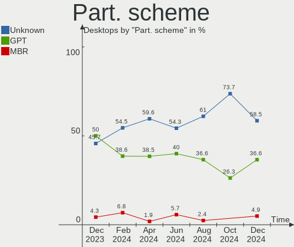
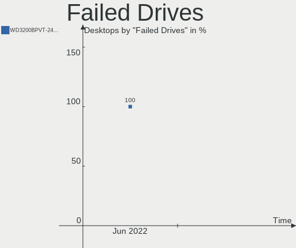
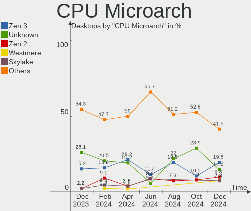
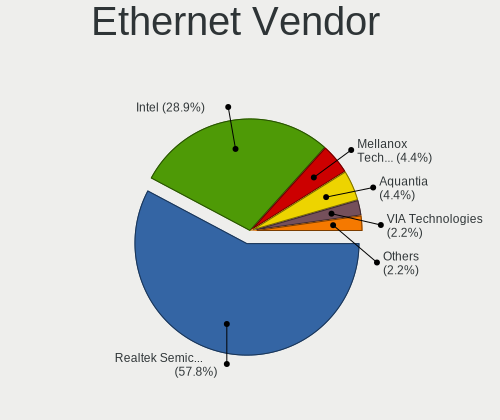
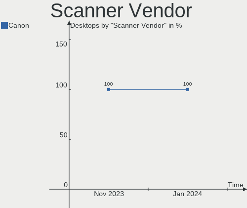

Manjaro Hardware Trends (Desktop)
---------------------------------

A project to identify most popular hardware characteristics and track their change
over time based on data collected by Manjaro users at https://Linux-Hardware.org.

Anyone can contribute to the study by uploading probes of their computers by
the [hw-probe](https://github.com/linuxhw/hw-probe) tool:

    sudo -E hw-probe -all -upload

Full-feature report is available here: https://linux-hardware.org/?view=trends&formfactor=desktop

Period: Dec, 2020.

Contents
--------

- [ OS                       ](#os)
- [ OS Family                ](#os-family)
- [ Kernel                   ](#kernel)
- [ Kernel Family            ](#kernel-family)
- [ Kernel Major Ver.        ](#kernel-major-ver)
- [ Arch                     ](#arch)
- [ DE                       ](#de)
- [ Display Server           ](#display-server)
- [ Display Manager          ](#display-manager)
- [ OS Lang                  ](#os-lang)
- [ Boot Mode                ](#boot-mode)
- [ Filesystem               ](#filesystem)
- [ Part. scheme             ](#part-scheme)
- [ Dual Boot with Linux/BSD ](#dual-boot-with-linux/bsd)
- [ Dual Boot (Win)          ](#dual-boot-win)
- [ Country                  ](#country)
- [ City                     ](#city)
- [ Vendor                   ](#vendor)
- [ Model                    ](#model)
- [ Model Family             ](#model-family)
- [ MFG Year                 ](#mfg-year)
- [ Form Factor              ](#form-factor)
- [ Secure Boot              ](#secure-boot)
- [ Coreboot                 ](#coreboot)
- [ RAM Size                 ](#ram-size)
- [ RAM Used                 ](#ram-used)
- [ Has CD-ROM               ](#has-cd-rom)
- [ Total Drives             ](#total-drives)
- [ Has Ethernet             ](#has-ethernet)
- [ Drive Vendor             ](#drive-vendor)
- [ Drive Model              ](#drive-model)
- [ HDD Vendor               ](#hdd-vendor)
- [ SSD Vendor               ](#ssd-vendor)
- [ Drive Kind               ](#drive-kind)
- [ Drive Connector          ](#drive-connector)
- [ Drive Size               ](#drive-size)
- [ Space Total              ](#space-total)
- [ Space Used               ](#space-used)
- [ Malfunc. Drives          ](#malfunc-drives)
- [ Malfunc. Drive Vendor    ](#malfunc-drive-vendor)
- [ Malfunc. HDD Vendor      ](#malfunc-hdd-vendor)
- [ Malfunc. Drive Kind      ](#malfunc-drive-kind)
- [ Failed Drives            ](#failed-drives)
- [ Failed Drive Vendor      ](#failed-drive-vendor)
- [ Drive Status             ](#drive-status)
- [ Storage Vendor           ](#storage-vendor)
- [ Storage Model            ](#storage-model)
- [ Storage Kind             ](#storage-kind)
- [ CPU Vendor               ](#cpu-vendor)
- [ CPU Model                ](#cpu-model)
- [ CPU Model Family         ](#cpu-model-family)
- [ CPU Cores                ](#cpu-cores)
- [ CPU Sockets              ](#cpu-sockets)
- [ CPU Threads              ](#cpu-threads)
- [ CPU Op-Modes             ](#cpu-op-modes)
- [ CPU Microcode            ](#cpu-microcode)
- [ CPU Microarch            ](#cpu-microarch)
- [ GPU Vendor               ](#gpu-vendor)
- [ GPU Model                ](#gpu-model)
- [ GPU Combo                ](#gpu-combo)
- [ GPU Driver               ](#gpu-driver)
- [ GPU Memory               ](#gpu-memory)
- [ Monitor Vendor           ](#monitor-vendor)
- [ Monitor Model            ](#monitor-model)
- [ Monitor Resolution       ](#monitor-resolution)
- [ Monitor Diagonal         ](#monitor-diagonal)
- [ Monitor Width            ](#monitor-width)
- [ Aspect Ratio             ](#aspect-ratio)
- [ Monitor Area             ](#monitor-area)
- [ Pixel Density            ](#pixel-density)
- [ Multiple Monitors        ](#multiple-monitors)
- [ Net Controller Vendor    ](#net-controller-vendor)
- [ Net Controller Model     ](#net-controller-model)
- [ Wireless Vendor          ](#wireless-vendor)
- [ Wireless Model           ](#wireless-model)
- [ Ethernet Vendor          ](#ethernet-vendor)
- [ Ethernet Model           ](#ethernet-model)
- [ Net Controller Kind      ](#net-controller-kind)
- [ Used Controller          ](#used-controller)
- [ NICs                     ](#nics)
- [ Memory Vendor            ](#memory-vendor)
- [ Memory Model             ](#memory-model)
- [ Memory Kind              ](#memory-kind)
- [ Memory Form Factor       ](#memory-form-factor)
- [ Memory Size              ](#memory-size)
- [ Memory Speed             ](#memory-speed)
- [ Sound Vendor             ](#sound-vendor)
- [ Sound Model              ](#sound-model)
- [ Camera Vendor            ](#camera-vendor)
- [ Camera Model             ](#camera-model)
- [ Fingerprint Vendor       ](#fingerprint-vendor)
- [ Fingerprint Model        ](#fingerprint-model)
- [ Chipcard Vendor          ](#chipcard-vendor)
- [ Chipcard Model           ](#chipcard-model)
- [ Printer Vendor           ](#printer-vendor)
- [ Printer Model            ](#printer-model)
- [ Scanner Vendor           ](#scanner-vendor)
- [ Scanner Model            ](#scanner-model)
- [ Bluetooth Vendor         ](#bluetooth-vendor)
- [ Bluetooth Model          ](#bluetooth-model)
- [ Unsupported Devices      ](#unsupported-devices)
- [ Unsupported Device Types ](#unsupported-device-types)

OS
--

Installed operating systems

| Name           | Desktops | Percent |
|----------------|----------|---------|
| Manjaro        | 46       | 56.1%   |
| Manjaro 20.2   | 34       | 41.46%  |
| Manjaro 20.1.2 | 1        | 1.22%   |
| Manjaro 20.0.3 | 1        | 1.22%   |

OS Family
---------

OS without a version

| Name    | Desktops | Percent |
|---------|----------|---------|
| Manjaro | 82       | 100%    |

Kernel
------

Version of the Linux kernel

| Version          | Desktops | Percent |
|------------------|----------|---------|
| 5.9.11-3-MANJARO | 40       | 48.78%  |
| 5.8.18-1-MANJARO | 16       | 19.51%  |
| 5.4.80-2-MANJARO | 10       | 12.2%   |
| 5.9.16-1-MANJARO | 2        | 2.44%   |
| 5.9.12-1-MANJARO | 2        | 2.44%   |
| 5.8.16-2-MANJARO | 2        | 2.44%   |
| 5.10.0-1-MANJARO | 2        | 2.44%   |
| 5.9.1-2-MANJARO  | 1        | 1.22%   |
| 5.8.11-1-MANJARO | 1        | 1.22%   |
| 5.7.19-2-MANJARO | 1        | 1.22%   |
| 5.7.17-2-MANJARO | 1        | 1.22%   |
| 5.6.15-1-MANJARO | 1        | 1.22%   |
| 5.4.74-1-MANJARO | 1        | 1.22%   |
| 5.10.2-2-MANJARO | 1        | 1.22%   |
| 5.10.1-4-MANJARO | 1        | 1.22%   |

Kernel Family
-------------

Linux kernel without a distro release

| Version | Desktops | Percent |
|---------|----------|---------|
| 5.9.11  | 40       | 48.78%  |
| 5.8.18  | 16       | 19.51%  |
| 5.4.80  | 10       | 12.2%   |
| 5.9.16  | 2        | 2.44%   |
| 5.9.12  | 2        | 2.44%   |
| 5.8.16  | 2        | 2.44%   |
| 5.10.0  | 2        | 2.44%   |
| 5.9.1   | 1        | 1.22%   |
| 5.8.11  | 1        | 1.22%   |
| 5.7.19  | 1        | 1.22%   |
| 5.7.17  | 1        | 1.22%   |
| 5.6.15  | 1        | 1.22%   |
| 5.4.74  | 1        | 1.22%   |
| 5.10.2  | 1        | 1.22%   |
| 5.10.1  | 1        | 1.22%   |

Kernel Major Ver.
-----------------

Linux kernel major version

| Version | Desktops | Percent |
|---------|----------|---------|
| 5.9     | 45       | 54.88%  |
| 5.8     | 19       | 23.17%  |
| 5.4     | 11       | 13.41%  |
| 5.10    | 4        | 4.88%   |
| 5.7     | 2        | 2.44%   |
| 5.6     | 1        | 1.22%   |

Arch
----

OS architecture (x86_64, i586, etc.)

| Name   | Desktops | Percent |
|--------|----------|---------|
| x86_64 | 82       | 100%    |

DE
--

Desktop Environment

| Name       | Desktops | Percent |
|------------|----------|---------|
| GNOME      | 22       | 26.83%  |
| XFCE       | 18       | 21.95%  |
| KDE        | 17       | 20.73%  |
| KDE5       | 12       | 14.63%  |
| X-Cinnamon | 7        | 8.54%   |
| MATE       | 1        | 1.22%   |
| i3         | 1        | 1.22%   |
| Deepin     | 1        | 1.22%   |
| Budgie     | 1        | 1.22%   |
| awesome    | 1        | 1.22%   |
| Unknown    | 1        | 1.22%   |

Display Server
--------------

X11 or Wayland

| Name    | Desktops | Percent |
|---------|----------|---------|
| X11     | 71       | 86.59%  |
| Wayland | 10       | 12.2%   |
| Unknown | 1        | 1.22%   |

Display Manager
---------------

SDDM, LightDM, etc.

| Name    | Desktops | Percent |
|---------|----------|---------|
| Unknown | 45       | 54.88%  |
| SDDM    | 13       | 15.85%  |
| LightDM | 12       | 14.63%  |
| GDM     | 11       | 13.41%  |
| TDM     | 1        | 1.22%   |

OS Lang
-------

Language

| Lang       | Desktops | Percent |
|------------|----------|---------|
| en_US      | 24       | 29.27%  |
| de_DE      | 14       | 17.07%  |
| en_US.utf8 | 12       | 14.63%  |
| ru_RU      | 4        | 4.88%   |
| pt_BR      | 4        | 4.88%   |
| pl_PL      | 3        | 3.66%   |
| pl_PL.utf8 | 2        | 2.44%   |
| it_IT      | 2        | 2.44%   |
| en_GB      | 2        | 2.44%   |
| ru_UA      | 1        | 1.22%   |
| ru_RU.utf8 | 1        | 1.22%   |
| ro_RO      | 1        | 1.22%   |
| nl_NL.utf8 | 1        | 1.22%   |
| fr_FR.utf8 | 1        | 1.22%   |
| fr_CA      | 1        | 1.22%   |
| es_PE.utf8 | 1        | 1.22%   |
| es_ES      | 1        | 1.22%   |
| es_AR      | 1        | 1.22%   |
| en_ZA      | 1        | 1.22%   |
| en_SG.utf8 | 1        | 1.22%   |
| en_IN      | 1        | 1.22%   |
| en_CA      | 1        | 1.22%   |
| el_GR      | 1        | 1.22%   |
| de_DE.utf8 | 1        | 1.22%   |

Boot Mode
---------

EFI or BIOS

| Mode | Desktops | Percent |
|------|----------|---------|
| BIOS | 58       | 70.73%  |
| EFI  | 24       | 29.27%  |

Filesystem
----------

Type of filesystem

| Type    | Desktops | Percent |
|---------|----------|---------|
| Ext4    | 71       | 86.59%  |
| Overlay | 4        | 4.88%   |
| Btrfs   | 4        | 4.88%   |
| Xfs     | 2        | 2.44%   |
| Zfs     | 1        | 1.22%   |

Part. scheme
------------

Scheme of partitioning

| Type    | Desktops | Percent |
|---------|----------|---------|
| Unknown | 46       | 56.1%   |
| GPT     | 28       | 34.15%  |
| MBR     | 8        | 9.76%   |

Dual Boot with Linux/BSD
------------------------

Hosting more than one Linux/BSD

| Dual boot | Desktops | Percent |
|-----------|----------|---------|
| No        | 69       | 84.15%  |
| Yes       | 13       | 15.85%  |

Dual Boot (Win)
---------------

Hosting Linux and Windows

| Dual boot | Desktops | Percent |
|-----------|----------|---------|
| No        | 53       | 64.63%  |
| Yes       | 29       | 35.37%  |

Country
-------

Geographic location (country)

| Country      | Desktops | Percent |
|--------------|----------|---------|
| USA          | 19       | 23.17%  |
| Germany      | 18       | 21.95%  |
| Poland       | 4        | 4.88%   |
| Canada       | 4        | 4.88%   |
| Brazil       | 4        | 4.88%   |
| Vietnam      | 3        | 3.66%   |
| Russia       | 3        | 3.66%   |
| Ukraine      | 2        | 2.44%   |
| Saudi Arabia | 2        | 2.44%   |
| Romania      | 2        | 2.44%   |
| Netherlands  | 2        | 2.44%   |
| Italy        | 2        | 2.44%   |
| Greece       | 2        | 2.44%   |
| Switzerland  | 1        | 1.22%   |
| Sweden       | 1        | 1.22%   |
| Spain        | 1        | 1.22%   |
| South Africa | 1        | 1.22%   |
| Singapore    | 1        | 1.22%   |
| Peru         | 1        | 1.22%   |
| Norway       | 1        | 1.22%   |
| Mexico       | 1        | 1.22%   |
| Iraq         | 1        | 1.22%   |
| India        | 1        | 1.22%   |
| France       | 1        | 1.22%   |
| China        | 1        | 1.22%   |
| Belarus      | 1        | 1.22%   |
| Austria      | 1        | 1.22%   |
| Argentina    | 1        | 1.22%   |

City
----

Geographic location (city)

| City                | Desktops | Percent |
|---------------------|----------|---------|
| Ho Chi Minh City    | 3        | 3.66%   |
| Riyadh              | 2        | 2.44%   |
| Montreal            | 2        | 2.44%   |
| Kyiv                | 2        | 2.44%   |
| Atlanta             | 2        | 2.44%   |
| Yuzhno-Sakhalinsk   | 1        | 1.22%   |
| Westfield           | 1        | 1.22%   |
| West Jordan         | 1        | 1.22%   |
| Voronezh            | 1        | 1.22%   |
| Vikesa              | 1        | 1.22%   |
| Vienna              | 1        | 1.22%   |
| Victoria            | 1        | 1.22%   |
| Versmold            | 1        | 1.22%   |
| Verona              | 1        | 1.22%   |
| Tandil              | 1        | 1.22%   |
| Syracuse            | 1        | 1.22%   |
| Staten Island       | 1        | 1.22%   |
| Sinzig              | 1        | 1.22%   |
| Singapore           | 1        | 1.22%   |
| Sindelfingen        | 1        | 1.22%   |
| Schiedam            | 1        | 1.22%   |
| San Diego           | 1        | 1.22%   |
| Rock Island         | 1        | 1.22%   |
| Rathenow            | 1        | 1.22%   |
| Portland            | 1        | 1.22%   |
| Piatra Neamţ       | 1        | 1.22%   |
| Pforzheim           | 1        | 1.22%   |
| Othis               | 1        | 1.22%   |
| Osinniki            | 1        | 1.22%   |
| Osasco              | 1        | 1.22%   |
| Okrajnik            | 1        | 1.22%   |
| Oberhaching         | 1        | 1.22%   |
| Neuss               | 1        | 1.22%   |
| Murr                | 1        | 1.22%   |
| Monterrey           | 1        | 1.22%   |
| Minsk               | 1        | 1.22%   |
| Minneapolis         | 1        | 1.22%   |
| Milan               | 1        | 1.22%   |
| Miehlen             | 1        | 1.22%   |
| Middletown          | 1        | 1.22%   |
| Madrid              | 1        | 1.22%   |
| Lublin              | 1        | 1.22%   |
| Los Angeles         | 1        | 1.22%   |
| Lins                | 1        | 1.22%   |
| Lexington           | 1        | 1.22%   |
| Laval               | 1        | 1.22%   |
| Konstancin-Jeziorna | 1        | 1.22%   |
| Kehl                | 1        | 1.22%   |
| Jaworzno            | 1        | 1.22%   |
| Hudson              | 1        | 1.22%   |
| Guenzburg           | 1        | 1.22%   |
| Guangzhou           | 1        | 1.22%   |
| Goiânia            | 1        | 1.22%   |
| Gilbert             | 1        | 1.22%   |
| Freital             | 1        | 1.22%   |
| Frankfurt am Main   | 1        | 1.22%   |
| Fort Worth          | 1        | 1.22%   |
| Düsseldorf         | 1        | 1.22%   |
| Diavata             | 1        | 1.22%   |
| Delano              | 1        | 1.22%   |

Vendor
------

Motherboard manufacturer

| Name                | Desktops | Percent |
|---------------------|----------|---------|
| Gigabyte Technology | 29       | 35.37%  |
| ASUSTek Computer    | 19       | 23.17%  |
| MSI                 | 13       | 15.85%  |
| ASRock              | 7        | 8.54%   |
| Hewlett-Packard     | 6        | 7.32%   |
| Dell                | 3        | 3.66%   |
| Biostar             | 2        | 2.44%   |
| Lenovo              | 1        | 1.22%   |
| Intel               | 1        | 1.22%   |
| Fujitsu             | 1        | 1.22%   |

Model
-----

Motherboard model

| Name                                | Desktops | Percent |
|-------------------------------------|----------|---------|
| MSI MS-7C02                         | 4        | 4.88%   |
| MSI MS-7C37                         | 2        | 2.44%   |
| Gigabyte G41M-ES2L                  | 2        | 2.44%   |
| Gigabyte B450M DS3H                 | 2        | 2.44%   |
| Gigabyte A320M-S2H                  | 2        | 2.44%   |
| MSI MS-7C84                         | 1        | 1.22%   |
| MSI MS-7B93                         | 1        | 1.22%   |
| MSI MS-7A38                         | 1        | 1.22%   |
| MSI MS-7977                         | 1        | 1.22%   |
| MSI MS-7924                         | 1        | 1.22%   |
| MSI MS-7721                         | 1        | 1.22%   |
| MSI MS-7592                         | 1        | 1.22%   |
| Lenovo ThinkStation P330 30CY002DGE | 1        | 1.22%   |
| Intel X79 V2.82                     | 1        | 1.22%   |
| HP Z820 Workstation                 | 1        | 1.22%   |
| HP Z620 Workstation                 | 1        | 1.22%   |
| HP ENVY te01-1177c Desktop Rfrbd PC | 1        | 1.22%   |
| HP Compaq 6005 Pro SFF PC           | 1        | 1.22%   |
| HP 2B5E                             | 1        | 1.22%   |
| HP 22-3013l                         | 1        | 1.22%   |
| Gigabyte Z390 AORUS PRO WIFI        | 1        | 1.22%   |
| Gigabyte Z390 AORUS ELITE           | 1        | 1.22%   |
| Gigabyte Z370 HD3                   | 1        | 1.22%   |
| Gigabyte X58A-UD3R                  | 1        | 1.22%   |
| Gigabyte X570 GAMING X              | 1        | 1.22%   |
| Gigabyte X570 AORUS PRO WIFI        | 1        | 1.22%   |
| Gigabyte X570 AORUS ELITE           | 1        | 1.22%   |
| Gigabyte Hyrican PC GA-H310M H      | 1        | 1.22%   |
| Gigabyte H77-DS3H                   | 1        | 1.22%   |
| Gigabyte GA-MA770T-UD3              | 1        | 1.22%   |
| Gigabyte GA-880GM-UD2H              | 1        | 1.22%   |
| Gigabyte GA-78LMT-USB3 6.0          | 1        | 1.22%   |
| Gigabyte G41M-Combo                 | 1        | 1.22%   |
| Gigabyte F2A78M-DS2                 | 1        | 1.22%   |
| Gigabyte B85M-D3H                   | 1        | 1.22%   |
| Gigabyte B550M DS3H                 | 1        | 1.22%   |
| Gigabyte B550 AORUS ELITE AX V2     | 1        | 1.22%   |
| Gigabyte B450 I AORUS PRO WIFI      | 1        | 1.22%   |
| Gigabyte B450 AORUS ELITE           | 1        | 1.22%   |
| Gigabyte B365M DS3H                 | 1        | 1.22%   |
| Gigabyte B250M-D3H                  | 1        | 1.22%   |
| Gigabyte A320M-S2H V2               | 1        | 1.22%   |
| Gigabyte 965P-DS3                   | 1        | 1.22%   |
| Fujitsu ESPRIMO E710                | 1        | 1.22%   |
| Dell Studio XPS 9100                | 1        | 1.22%   |
| Dell Precision T5600                | 1        | 1.22%   |
| Dell OptiPlex 3010                  | 1        | 1.22%   |
| Biostar J1800NH3                    | 1        | 1.22%   |
| Biostar AM1ML                       | 1        | 1.22%   |
| ASUS STRIX H270F GAMING             | 1        | 1.22%   |
| ASUS ROG STRIX Z390-F GAMING        | 1        | 1.22%   |
| ASUS ROG STRIX Z370-F GAMING        | 1        | 1.22%   |
| ASUS ROG STRIX X570-F GAMING        | 1        | 1.22%   |
| ASUS ROG STRIX X399-E GAMING        | 1        | 1.22%   |
| ASUS ROG STRIX B460-F GAMING        | 1        | 1.22%   |
| ASUS PRIME B250-PRO                 | 1        | 1.22%   |
| ASUS PRIME A520M-K                  | 1        | 1.22%   |
| ASUS PRIME A320M-K                  | 1        | 1.22%   |
| ASUS P8Z77-V LE PLUS                | 1        | 1.22%   |
| ASUS P8Z77-V                        | 1        | 1.22%   |

Model Family
------------

Motherboard model prefix

| Name                   | Desktops | Percent |
|------------------------|----------|---------|
| ASUS ROG               | 5        | 6.1%    |
| MSI MS-7C02            | 4        | 4.88%   |
| Gigabyte X570          | 3        | 3.66%   |
| Gigabyte A320M-S2H     | 3        | 3.66%   |
| ASUS PRIME             | 3        | 3.66%   |
| MSI MS-7C37            | 2        | 2.44%   |
| Gigabyte Z390          | 2        | 2.44%   |
| Gigabyte G41M-ES2L     | 2        | 2.44%   |
| Gigabyte B450M         | 2        | 2.44%   |
| Gigabyte B450          | 2        | 2.44%   |
| ASUS P8Z77-V           | 2        | 2.44%   |
| MSI MS-7C84            | 1        | 1.22%   |
| MSI MS-7B93            | 1        | 1.22%   |
| MSI MS-7A38            | 1        | 1.22%   |
| MSI MS-7977            | 1        | 1.22%   |
| MSI MS-7924            | 1        | 1.22%   |
| MSI MS-7721            | 1        | 1.22%   |
| MSI MS-7592            | 1        | 1.22%   |
| Lenovo ThinkStation    | 1        | 1.22%   |
| Intel X79              | 1        | 1.22%   |
| HP Z820                | 1        | 1.22%   |
| HP Z620                | 1        | 1.22%   |
| HP ENVY                | 1        | 1.22%   |
| HP Compaq              | 1        | 1.22%   |
| HP 2B5E                | 1        | 1.22%   |
| HP 22-3013l            | 1        | 1.22%   |
| Gigabyte Z370          | 1        | 1.22%   |
| Gigabyte X58A-UD3R     | 1        | 1.22%   |
| Gigabyte Hyrican       | 1        | 1.22%   |
| Gigabyte H77-DS3H      | 1        | 1.22%   |
| Gigabyte GA-MA770T-UD3 | 1        | 1.22%   |
| Gigabyte GA-880GM-UD2H | 1        | 1.22%   |
| Gigabyte GA-78LMT-USB3 | 1        | 1.22%   |
| Gigabyte G41M-Combo    | 1        | 1.22%   |
| Gigabyte F2A78M-DS2    | 1        | 1.22%   |
| Gigabyte B85M-D3H      | 1        | 1.22%   |
| Gigabyte B550M         | 1        | 1.22%   |
| Gigabyte B550          | 1        | 1.22%   |
| Gigabyte B365M         | 1        | 1.22%   |
| Gigabyte B250M-D3H     | 1        | 1.22%   |
| Gigabyte 965P-DS3      | 1        | 1.22%   |
| Fujitsu ESPRIMO        | 1        | 1.22%   |
| Dell Studio            | 1        | 1.22%   |
| Dell Precision         | 1        | 1.22%   |
| Dell OptiPlex          | 1        | 1.22%   |
| Biostar J1800NH3       | 1        | 1.22%   |
| Biostar AM1ML          | 1        | 1.22%   |
| ASUS STRIX             | 1        | 1.22%   |
| ASUS P8Z68-V           | 1        | 1.22%   |
| ASUS P8H61-M           | 1        | 1.22%   |
| ASUS P5QL-ASUS-SE      | 1        | 1.22%   |
| ASUS P5KPL-AM          | 1        | 1.22%   |
| ASUS M11AD             | 1        | 1.22%   |
| ASUS A88XM-A           | 1        | 1.22%   |
| ASUS A55M-E            | 1        | 1.22%   |
| ASUS 970               | 1        | 1.22%   |
| ASRock Z77             | 1        | 1.22%   |
| ASRock X570            | 1        | 1.22%   |
| ASRock X399            | 1        | 1.22%   |
| ASRock H97M            | 1        | 1.22%   |

MFG Year
--------

Motherboard manufacture year

| Year | Desktops | Percent |
|------|----------|---------|
| 2019 | 19       | 23.17%  |
| 2020 | 18       | 21.95%  |
| 2018 | 10       | 12.2%   |
| 2016 | 6        | 7.32%   |
| 2014 | 5        | 6.1%    |
| 2015 | 4        | 4.88%   |
| 2012 | 4        | 4.88%   |
| 2010 | 4        | 4.88%   |
| 2009 | 4        | 4.88%   |
| 2013 | 3        | 3.66%   |
| 2011 | 3        | 3.66%   |
| 2017 | 1        | 1.22%   |
| 2007 | 1        | 1.22%   |

Form Factor
-----------

Physical design of the computer

| Name    | Desktops | Percent |
|---------|----------|---------|
| Desktop | 82       | 100%    |

Secure Boot
-----------

Enabled or disabled

| State    | Desktops | Percent |
|----------|----------|---------|
| Disabled | 82       | 100%    |

Coreboot
--------

Have coreboot on board

| Used | Desktops | Percent |
|------|----------|---------|
| No   | 82       | 100%    |

RAM Size
--------

Total RAM memory

| Size in GB  | Desktops | Percent |
|-------------|----------|---------|
| 16.01-24.0  | 22       | 26.83%  |
| 32.01-64.0  | 18       | 21.95%  |
| 8.01-16.0   | 15       | 18.29%  |
| 3.01-4.0    | 11       | 13.41%  |
| 4.01-8.0    | 5        | 6.1%    |
| 64.01-256.0 | 5        | 6.1%    |
| 24.01-32.0  | 3        | 3.66%   |
| 1.01-2.0    | 3        | 3.66%   |

RAM Used
--------

Used RAM memory

| Used GB   | Desktops | Percent |
|-----------|----------|---------|
| 1.01-2.0  | 27       | 32.93%  |
| 2.01-3.0  | 20       | 24.39%  |
| 3.01-4.0  | 16       | 19.51%  |
| 4.01-8.0  | 11       | 13.41%  |
| 8.01-16.0 | 6        | 7.32%   |
| 0.51-1.0  | 2        | 2.44%   |

Has CD-ROM
----------

Has CD-ROM on board

| Presented | Desktops | Percent |
|-----------|----------|---------|
| No        | 47       | 57.32%  |
| Yes       | 35       | 42.68%  |

Total Drives
------------

Number of drives on board

| Drives | Desktops | Percent |
|--------|----------|---------|
| 2      | 23       | 28.05%  |
| 1      | 20       | 24.39%  |
| 3      | 16       | 19.51%  |
| 5      | 10       | 12.2%   |
| 4      | 8        | 9.76%   |
| 0      | 3        | 3.66%   |
| 6      | 2        | 2.44%   |

Has Ethernet
------------

Has Ethernet on board

| Presented | Desktops | Percent |
|-----------|----------|---------|
| Yes       | 81       | 98.78%  |
| No        | 1        | 1.22%   |

Drive Vendor
------------

Hard drive vendors

| Vendor                    | Desktops | Drives | Percent |
|---------------------------|----------|--------|---------|
| Seagate                   | 37       | 43     | 21.26%  |
| WDC                       | 31       | 41     | 17.82%  |
| Samsung Electronics       | 31       | 46     | 17.82%  |
| Toshiba                   | 10       | 10     | 5.75%   |
| Crucial                   | 8        | 9      | 4.6%    |
| Kingston                  | 6        | 6      | 3.45%   |
| SanDisk                   | 5        | 5      | 2.87%   |
| Intel                     | 5        | 6      | 2.87%   |
| Hitachi                   | 4        | 5      | 2.3%    |
| HGST                      | 4        | 5      | 2.3%    |
| OCZ                       | 3        | 3      | 1.72%   |
| Micron/Crucial Technology | 3        | 3      | 1.72%   |
| JMicron                   | 3        | 3      | 1.72%   |
| SABRENT                   | 2        | 2      | 1.15%   |
| Maxtor                    | 2        | 2      | 1.15%   |
| Intenso                   | 2        | 2      | 1.15%   |
| XPG                       | 1        | 1      | 0.57%   |
| Unknown                   | 1        | 1      | 0.57%   |
| Team                      | 1        | 1      | 0.57%   |
| SPCC                      | 1        | 1      | 0.57%   |
| Silicon Motion            | 1        | 1      | 0.57%   |
| PLEXTOR                   | 1        | 1      | 0.57%   |
| Phison                    | 1        | 1      | 0.57%   |
| Patriot                   | 1        | 1      | 0.57%   |
| Netac                     | 1        | 1      | 0.57%   |
| Micron Technology         | 1        | 1      | 0.57%   |
| Maxone                    | 1        | 1      | 0.57%   |
| Leven                     | 1        | 1      | 0.57%   |
| KingSpec                  | 1        | 1      | 0.57%   |
| KingDian                  | 1        | 1      | 0.57%   |
| GOODRAM                   | 1        | 1      | 0.57%   |
| Corsair                   | 1        | 1      | 0.57%   |
| China                     | 1        | 1      | 0.57%   |
| A-DATA Technology         | 1        | 1      | 0.57%   |

Drive Model
-----------

Hard drive models

| Model                             | Desktops | Percent |
|-----------------------------------|----------|---------|
| Seagate ST500DM002-1BD142 500GB   | 4        | 2.04%   |
| Samsung SSD 860 EVO 500GB         | 4        | 2.04%   |
| Samsung NVMe SSD Drive 500GB      | 4        | 2.04%   |
| WDC WD10EZEX-08WN4A0 1TB          | 3        | 1.53%   |
| Seagate ST1000DM010-2EP102 1TB    | 3        | 1.53%   |
| Samsung SSD 860 EVO 1TB           | 3        | 1.53%   |
| Samsung SSD 850 EVO 500GB         | 3        | 1.53%   |
| Samsung NVMe SSD Drive 1TB        | 3        | 1.53%   |
| WDC WDS100T2B0A-00SM50 1TB SSD    | 2        | 1.02%   |
| WDC WD20EARS-00MVWB0 2TB          | 2        | 1.02%   |
| Toshiba HDWD110 1TB               | 2        | 1.02%   |
| Toshiba DT01ACA200 2TB            | 2        | 1.02%   |
| Seagate ST2000DM008-2FR102 2TB    | 2        | 1.02%   |
| Seagate ST2000DM006-2DM164 2TB    | 2        | 1.02%   |
| Seagate ST1000DM003-1CH162 1TB    | 2        | 1.02%   |
| SanDisk SDSSDA120G 120GB          | 2        | 1.02%   |
| Samsung SSD 970 EVO Plus 250GB    | 2        | 1.02%   |
| Samsung SSD 850 EVO 250GB         | 2        | 1.02%   |
| Samsung SSD 850 EVO 120GB         | 2        | 1.02%   |
| Samsung SSD 840 EVO 250GB         | 2        | 1.02%   |
| SABRENT Disk 240GB                | 2        | 1.02%   |
| Micron/Crucial NVMe SSD Drive 1TB | 2        | 1.02%   |
| Kingston SA400S37240G 240GB SSD   | 2        | 1.02%   |
| JMicron Tech 250GB                | 2        | 1.02%   |
| Intel NVMe SSD Drive 512GB        | 2        | 1.02%   |
| HGST HTS545050A7E380 500GB        | 2        | 1.02%   |
| Crucial M4-CT256M4SSD2 256GB      | 2        | 1.02%   |
| XPG NVMe SSD Drive 512GB          | 1        | 0.51%   |
| WDC WDS250G3X0C-00SJG0 250GB      | 1        | 0.51%   |
| WDC WDS240G2G0B-00EPW0 240GB SSD  | 1        | 0.51%   |
| WDC WDS240G2G0A-00JH30 240GB SSD  | 1        | 0.51%   |
| WDC WDS100T2G0A-00JH30 1TB SSD    | 1        | 0.51%   |
| WDC WDS100T1B0A-00H9H0 1TB SSD    | 1        | 0.51%   |
| WDC WDBNCE2500PNC 250GB SSD       | 1        | 0.51%   |
| WDC WD800JB-00JJA0 80GB           | 1        | 0.51%   |
| WDC WD800BB-00JHC0 80GB           | 1        | 0.51%   |
| WDC WD6401AALS-00E8B0 640GB       | 1        | 0.51%   |
| WDC WD6400AAKS-65A7B2 640GB       | 1        | 0.51%   |
| WDC WD5000BPKX-60HPJT0 500GB      | 1        | 0.51%   |
| WDC WD5000AAKX-08U6AA0 500GB      | 1        | 0.51%   |
| WDC WD5000AAKX-00ERMA0 500GB      | 1        | 0.51%   |
| WDC WD5000AAKX-001CA0 500GB       | 1        | 0.51%   |
| WDC WD5000AAKS-75V0A0 500GB       | 1        | 0.51%   |
| WDC WD5000AAKS-00V1A0 500GB       | 1        | 0.51%   |
| WDC WD40EZRX-00SPEB0 4TB          | 1        | 0.51%   |
| WDC WD40EFRX-68N32N0 4TB          | 1        | 0.51%   |
| WDC WD400BD-75MRA3 40GB           | 1        | 0.51%   |
| WDC WD3200AAJS-00B4A0 320GB       | 1        | 0.51%   |
| WDC WD30EZRZ-00GXCB0 3TB          | 1        | 0.51%   |
| WDC WD30EZRX-00DC0B0 3TB          | 1        | 0.51%   |
| WDC WD2500BEVT-60ZCT1 250GB       | 1        | 0.51%   |
| WDC WD20EARX-00PASB0 2TB          | 1        | 0.51%   |
| WDC WD2003FZEX-00SRLA0 2TB        | 1        | 0.51%   |
| WDC WD15EARS-60MVWB0 1TB          | 1        | 0.51%   |
| WDC WD10EZRZ-22HTKB0 1TB          | 1        | 0.51%   |
| WDC WD10EARS-00Y5B1 1TB           | 1        | 0.51%   |
| WDC WD10EADS-00L5B1 1TB           | 1        | 0.51%   |
| WDC WD1001FAES-60Z2A0 1TB         | 1        | 0.51%   |
| Unknown 256GB QLC SATA SSD        | 1        | 0.51%   |
| Toshiba NVMe SSD Drive 240GB      | 1        | 0.51%   |

HDD Vendor
----------

Hard disk drive vendors

| Vendor              | Desktops | Drives | Percent |
|---------------------|----------|--------|---------|
| Seagate             | 36       | 41     | 41.38%  |
| WDC                 | 26       | 32     | 29.89%  |
| Toshiba             | 9        | 9      | 10.34%  |
| Samsung Electronics | 5        | 5      | 5.75%   |
| Hitachi             | 4        | 5      | 4.6%    |
| HGST                | 4        | 5      | 4.6%    |
| Maxtor              | 2        | 2      | 2.3%    |
| Maxone              | 1        | 1      | 1.15%   |

SSD Vendor
----------

Solid state drive vendors

| Vendor              | Desktops | Drives | Percent |
|---------------------|----------|--------|---------|
| Samsung Electronics | 19       | 26     | 30.65%  |
| Crucial             | 8        | 9      | 12.9%   |
| WDC                 | 7        | 8      | 11.29%  |
| Kingston            | 5        | 5      | 8.06%   |
| SanDisk             | 4        | 4      | 6.45%   |
| OCZ                 | 3        | 3      | 4.84%   |
| SABRENT             | 2        | 2      | 3.23%   |
| Unknown             | 1        | 1      | 1.61%   |
| Team                | 1        | 1      | 1.61%   |
| SPCC                | 1        | 1      | 1.61%   |
| Patriot             | 1        | 1      | 1.61%   |
| Netac               | 1        | 1      | 1.61%   |
| Leven               | 1        | 1      | 1.61%   |
| KingSpec            | 1        | 1      | 1.61%   |
| KingDian            | 1        | 1      | 1.61%   |
| JMicron             | 1        | 1      | 1.61%   |
| Intenso             | 1        | 1      | 1.61%   |
| Intel               | 1        | 1      | 1.61%   |
| GOODRAM             | 1        | 1      | 1.61%   |
| Corsair             | 1        | 1      | 1.61%   |
| China               | 1        | 1      | 1.61%   |

Drive Kind
----------

HDD or SSD

| Kind    | Desktops | Drives | Percent |
|---------|----------|--------|---------|
| HDD     | 63       | 100    | 45%     |
| SSD     | 47       | 71     | 33.57%  |
| NVMe    | 26       | 33     | 18.57%  |
| Unknown | 4        | 5      | 2.86%   |

Drive Connector
---------------

SATA, SAS, NVMe, etc.

| Type | Desktops | Drives | Percent |
|------|----------|--------|---------|
| SATA | 75       | 167    | 68.81%  |
| NVMe | 26       | 33     | 23.85%  |
| SAS  | 8        | 9      | 7.34%   |

Drive Size
----------

Size of hard drive

| Size in TB | Desktops | Drives | Percent |
|------------|----------|--------|---------|
| 0.01-0.5   | 55       | 96     | 49.11%  |
| 0.51-1.0   | 32       | 45     | 28.57%  |
| 1.01-2.0   | 12       | 15     | 10.71%  |
| 4.01-10.0  | 6        | 8      | 5.36%   |
| 3.01-4.0   | 4        | 4      | 3.57%   |
| 2.01-3.0   | 3        | 3      | 2.68%   |

Space Total
-----------

Amount of disk space available on the file system

| Size in GB     | Desktops | Percent |
|----------------|----------|---------|
| 1001-2000      | 19       | 23.17%  |
| 101-250        | 18       | 21.95%  |
| 251-500        | 11       | 13.41%  |
| 501-1000       | 10       | 12.2%   |
| More than 3000 | 8        | 9.76%   |
| 1-20           | 6        | 7.32%   |
| 51-100         | 5        | 6.1%    |
| Unknown        | 3        | 3.66%   |
| 2001-3000      | 2        | 2.44%   |

Space Used
----------

Amount of used disk space

| Used GB        | Desktops | Percent |
|----------------|----------|---------|
| 1-20           | 16       | 19.51%  |
| 21-50          | 14       | 17.07%  |
| 251-500        | 13       | 15.85%  |
| 501-1000       | 10       | 12.2%   |
| 51-100         | 9        | 10.98%  |
| 101-250        | 8        | 9.76%   |
| 1001-2000      | 5        | 6.1%    |
| Unknown        | 3        | 3.66%   |
| More than 3000 | 2        | 2.44%   |
| 2001-3000      | 1        | 1.22%   |
| 0              | 1        | 1.22%   |

Malfunc. Drives
---------------

Drive models with a malfunction

| Model                           | Desktops | Drives | Percent |
|---------------------------------|----------|--------|---------|
| WDC WD3200AAJS-00B4A0 320GB     | 1        | 1      | 11.11%  |
| Seagate ST500DM002-1BD142 500GB | 1        | 1      | 11.11%  |
| Seagate ST4000DM000-1F2168 4TB  | 1        | 1      | 11.11%  |
| Seagate ST3750630AS 752GB       | 1        | 1      | 11.11%  |
| Seagate ST3200820AS 200GB       | 1        | 1      | 11.11%  |
| Seagate ST3160811AS 160GB       | 1        | 1      | 11.11%  |
| Seagate ST1000DM010-2EP102 1TB  | 1        | 1      | 11.11%  |
| HGST HTS545050A7E380 500GB      | 1        | 1      | 11.11%  |
| Crucial M4-CT256M4SSD2 256GB    | 1        | 1      | 11.11%  |

Malfunc. Drive Vendor
---------------------

Vendors of faulty drives

| Vendor  | Desktops | Drives | Percent |
|---------|----------|--------|---------|
| Seagate | 6        | 6      | 66.67%  |
| WDC     | 1        | 1      | 11.11%  |
| HGST    | 1        | 1      | 11.11%  |
| Crucial | 1        | 1      | 11.11%  |

Malfunc. HDD Vendor
-------------------

Vendors of faulty HDD drives

| Vendor  | Desktops | Drives | Percent |
|---------|----------|--------|---------|
| Seagate | 6        | 6      | 75%     |
| WDC     | 1        | 1      | 12.5%   |
| HGST    | 1        | 1      | 12.5%   |

Malfunc. Drive Kind
-------------------

Kinds of faulty drives

| Kind | Desktops | Drives | Percent |
|------|----------|--------|---------|
| HDD  | 8        | 8      | 88.89%  |
| SSD  | 1        | 1      | 11.11%  |

Failed Drives
-------------

Failed drive models

| Model                     | Desktops | Drives | Percent |
|---------------------------|----------|--------|---------|
| Seagate ST9640320AS 640GB | 1        | 1      | 100%    |

Failed Drive Vendor
-------------------

Failed drive vendors

| Vendor  | Desktops | Drives | Percent |
|---------|----------|--------|---------|
| Seagate | 1        | 1      | 100%    |

Drive Status
------------

Number of failed and malfunc. drives

| Status   | Desktops | Drives | Percent |
|----------|----------|--------|---------|
| Detected | 57       | 143    | 64.04%  |
| Works    | 22       | 56     | 24.72%  |
| Malfunc  | 9        | 9      | 10.11%  |
| Failed   | 1        | 1      | 1.12%   |

Storage Vendor
--------------

Storage controller vendors

| Vendor                       | Desktops | Percent |
|------------------------------|----------|---------|
| Intel                        | 44       | 35.77%  |
| AMD                          | 39       | 31.71%  |
| Samsung Electronics          | 13       | 10.57%  |
| ASMedia Technology           | 5        | 4.07%   |
| JMicron Technology           | 4        | 3.25%   |
| Micron/Crucial Technology    | 3        | 2.44%   |
| Marvell Technology Group     | 3        | 2.44%   |
| Sandisk                      | 2        | 1.63%   |
| ADATA Technology             | 2        | 1.63%   |
| Toshiba America Info Systems | 1        | 0.81%   |
| Silicon Motion               | 1        | 0.81%   |
| Phison Electronics           | 1        | 0.81%   |
| Micron Technology            | 1        | 0.81%   |
| LSI Logic / Symbios Logic    | 1        | 0.81%   |
| Lite-On Technology           | 1        | 0.81%   |
| Kingston Technology Company  | 1        | 0.81%   |
| Broadcom / LSI               | 1        | 0.81%   |

Storage Model
-------------

Storage controller models

| Model                                                                          | Desktops | Percent |
|--------------------------------------------------------------------------------|----------|---------|
| AMD FCH SATA Controller [AHCI mode]                                            | 27       | 17.42%  |
| Samsung NVMe SSD Controller SM981/PM981/PM983                                  | 12       | 7.74%   |
| AMD 400 Series Chipset SATA Controller                                         | 10       | 6.45%   |
| Intel NM10/ICH7 Family SATA Controller [IDE mode]                              | 5        | 3.23%   |
| Intel Cannon Lake PCH SATA AHCI Controller                                     | 5        | 3.23%   |
| Intel 7 Series/C210 Series Chipset Family 6-port SATA Controller [AHCI mode]   | 5        | 3.23%   |
| Intel 200 Series PCH SATA controller [AHCI mode]                               | 5        | 3.23%   |
| ASMedia ASM1062 Serial ATA Controller                                          | 5        | 3.23%   |
| AMD SB7x0/SB8x0/SB9x0 IDE Controller                                           | 4        | 2.58%   |
| Intel C600/X79 series chipset IDE-r Controller                                 | 3        | 1.94%   |
| Intel 82801G (ICH7 Family) IDE Controller                                      | 3        | 1.94%   |
| Intel 8 Series/C220 Series Chipset Family 6-port SATA Controller 1 [AHCI mode] | 3        | 1.94%   |
| Intel 6 Series/C200 Series Chipset Family 6 port Desktop SATA AHCI Controller  | 3        | 1.94%   |
| AMD SB7x0/SB8x0/SB9x0 SATA Controller [IDE mode]                               | 3        | 1.94%   |
| AMD SATA controller                                                            | 3        | 1.94%   |
| AMD FCH SATA Controller D                                                      | 3        | 1.94%   |
| Samsung NVMe SSD Controller SM961/PM961/SM963                                  | 2        | 1.29%   |
| Micron/Crucial Non-Volatile memory controller                                  | 2        | 1.29%   |
| JMicron JMB363 SATA/IDE Controller                                             | 2        | 1.29%   |
| Intel SSD 660P Series                                                          | 2        | 1.29%   |
| Intel SATA Controller [RAID mode]                                              | 2        | 1.29%   |
| Intel Q170/Q150/B150/H170/H110/Z170/CM236 Chipset SATA Controller [AHCI Mode]  | 2        | 1.29%   |
| Intel C602 chipset 4-Port SATA Storage Control Unit                            | 2        | 1.29%   |
| Intel C600/X79 series chipset 6-Port SATA AHCI Controller                      | 2        | 1.29%   |
| Intel 9 Series Chipset Family SATA Controller [AHCI Mode]                      | 2        | 1.29%   |
| Intel 82801JI (ICH10 Family) 4 port SATA IDE Controller #1                     | 2        | 1.29%   |
| Intel 82801JI (ICH10 Family) 2 port SATA IDE Controller #2                     | 2        | 1.29%   |
| Intel 400 Series Chipset Family SATA AHCI Controller                           | 2        | 1.29%   |
| AMD X399 Series Chipset SATA Controller                                        | 2        | 1.29%   |
| AMD SB7x0/SB8x0/SB9x0 SATA Controller [AHCI mode]                              | 2        | 1.29%   |
| ADATA XPG SX8200 Pro PCIe Gen3x4 M.2 2280 Solid State Drive                    | 2        | 1.29%   |
| Toshiba America Info Systems BG3 NVMe SSD Controller                           | 1        | 0.65%   |
| Silicon Motion SM2263EN/SM2263XT SSD Controller                                | 1        | 0.65%   |
| Sandisk WD Blue SN550 NVMe SSD                                                 | 1        | 0.65%   |
| Sandisk WD Black SN750 / PC SN730 NVMe SSD                                     | 1        | 0.65%   |
| Phison E16 PCIe4 NVMe Controller                                               | 1        | 0.65%   |
| Micron/Crucial P1 NVMe PCIe SSD                                                | 1        | 0.65%   |
| Micron Non-Volatile memory controller                                          | 1        | 0.65%   |
| Marvell Group 88SE91A3 SATA-600 Controller                                     | 1        | 0.65%   |
| Marvell Group 88SE9172 SATA 6Gb/s Controller                                   | 1        | 0.65%   |
| Marvell Group 88SE9120 SATA 6Gb/s Controller                                   | 1        | 0.65%   |
| LSI Logic / Symbios Logic MegaRAID SAS 2008 [Falcon]                           | 1        | 0.65%   |
| Lite-On Non-Volatile memory controller                                         | 1        | 0.65%   |
| Kingston Company U-SNS8154P3 NVMe SSD                                          | 1        | 0.65%   |
| JMicron JMB368 IDE controller                                                  | 1        | 0.65%   |
| JMicron JMB362 SATA Controller                                                 | 1        | 0.65%   |
| Intel SSD Pro 7600p/760p/E 6100p Series                                        | 1        | 0.65%   |
| Intel Optane SSD 900P Series                                                   | 1        | 0.65%   |
| Intel C600/X79 series chipset SATA RAID Controller                             | 1        | 0.65%   |
| Intel Atom Processor E3800 Series SATA AHCI Controller                         | 1        | 0.65%   |
| Intel 82801JI (ICH10 Family) SATA AHCI Controller                              | 1        | 0.65%   |
| Intel 82801HR/HO/HH (ICH8R/DO/DH) 2 port SATA Controller [IDE mode]            | 1        | 0.65%   |
| Intel 82801H (ICH8 Family) 4 port SATA Controller [IDE mode]                   | 1        | 0.65%   |
| Broadcom / LSI SAS2308 PCI-Express Fusion-MPT SAS-2                            | 1        | 0.65%   |
| AMD SB7x0/SB8x0/SB9x0 SATA Controller [Non-RAID5 mode]                         | 1        | 0.65%   |
| AMD FCH SATA Controller [IDE mode]                                             | 1        | 0.65%   |
| AMD 300 Series Chipset SATA Controller                                         | 1        | 0.65%   |

Storage Kind
------------

Kind of storage controller (IDE, SATA, NVMe, SAS, ...)

| Kind | Desktops | Percent |
|------|----------|---------|
| SATA | 69       | 58.97%  |
| NVMe | 26       | 22.22%  |
| IDE  | 15       | 12.82%  |
| RAID | 5        | 4.27%   |
| SAS  | 2        | 1.71%   |

CPU Vendor
----------

Processor vendors

| Vendor | Desktops | Percent |
|--------|----------|---------|
| Intel  | 43       | 52.44%  |
| AMD    | 39       | 47.56%  |

CPU Model
---------

Processor models

| Model                                          | Desktops | Percent |
|------------------------------------------------|----------|---------|
| AMD Ryzen 5 3600 6-Core Processor              | 5        | 6.1%    |
| AMD Ryzen 7 3700X 8-Core Processor             | 3        | 3.66%   |
| AMD Ryzen 5 3400G with Radeon Vega Graphics    | 3        | 3.66%   |
| Intel Core i7-8700 CPU @ 3.20GHz               | 2        | 2.44%   |
| Intel Core i7 CPU 930 @ 2.80GHz                | 2        | 2.44%   |
| Intel Core i5-9400F CPU @ 2.90GHz              | 2        | 2.44%   |
| Intel Core i5-2500K CPU @ 3.30GHz              | 2        | 2.44%   |
| Intel Core 2 Duo CPU E7500 @ 2.93GHz           | 2        | 2.44%   |
| AMD Ryzen 9 3900X 12-Core Processor            | 2        | 2.44%   |
| AMD Ryzen 7 2700 Eight-Core Processor          | 2        | 2.44%   |
| AMD Ryzen 5 3600X 6-Core Processor             | 2        | 2.44%   |
| AMD A10-5800K APU with Radeon HD Graphics      | 2        | 2.44%   |
| Intel Xeon CPU X3360 @ 2.83GHz                 | 1        | 1.22%   |
| Intel Xeon CPU E5-2680 0 @ 2.70GHz             | 1        | 1.22%   |
| Intel Xeon CPU E5-2650 v2 @ 2.60GHz            | 1        | 1.22%   |
| Intel Xeon CPU E5-2650 0 @ 2.00GHz             | 1        | 1.22%   |
| Intel Xeon CPU E5-2630 0 @ 2.30GHz             | 1        | 1.22%   |
| Intel Pentium Dual-Core CPU E6500 @ 2.93GHz    | 1        | 1.22%   |
| Intel Pentium CPU G840 @ 2.80GHz               | 1        | 1.22%   |
| Intel Pentium CPU G4400 @ 3.30GHz              | 1        | 1.22%   |
| Intel Core i9-9900K CPU @ 3.60GHz              | 1        | 1.22%   |
| Intel Core i9-9900 CPU @ 3.10GHz               | 1        | 1.22%   |
| Intel Core i7-9700 CPU @ 3.00GHz               | 1        | 1.22%   |
| Intel Core i7-8700K CPU @ 3.70GHz              | 1        | 1.22%   |
| Intel Core i7-7700K CPU @ 4.20GHz              | 1        | 1.22%   |
| Intel Core i7-6700 CPU @ 3.40GHz               | 1        | 1.22%   |
| Intel Core i7-4790K CPU @ 4.00GHz              | 1        | 1.22%   |
| Intel Core i7-3770 CPU @ 3.40GHz               | 1        | 1.22%   |
| Intel Core i7-2600K CPU @ 3.40GHz              | 1        | 1.22%   |
| Intel Core i7-10700F CPU @ 2.90GHz             | 1        | 1.22%   |
| Intel Core i5-7400 CPU @ 3.00GHz               | 1        | 1.22%   |
| Intel Core i5-6500 CPU @ 3.20GHz               | 1        | 1.22%   |
| Intel Core i5-4590 CPU @ 3.30GHz               | 1        | 1.22%   |
| Intel Core i5-4460S CPU @ 2.90GHz              | 1        | 1.22%   |
| Intel Core i5-4430 CPU @ 3.00GHz               | 1        | 1.22%   |
| Intel Core i5-3570K CPU @ 3.40GHz              | 1        | 1.22%   |
| Intel Core i5-3470 CPU @ 3.20GHz               | 1        | 1.22%   |
| Intel Core i5-10600K CPU @ 4.10GHz             | 1        | 1.22%   |
| Intel Core i3-9100F CPU @ 3.60GHz              | 1        | 1.22%   |
| Intel Core i3-4170T CPU @ 3.20GHz              | 1        | 1.22%   |
| Intel Core i3-3220 CPU @ 3.30GHz               | 1        | 1.22%   |
| Intel Core 2 Duo CPU E8400 @ 3.00GHz           | 1        | 1.22%   |
| Intel Celeron CPU J1800 @ 2.41GHz              | 1        | 1.22%   |
| Intel Celeron CPU E3200 @ 2.40GHz              | 1        | 1.22%   |
| Intel Celeron CPU E1400 @ 2.00GHz              | 1        | 1.22%   |
| AMD Sempron 2650 APU with Radeon R3            | 1        | 1.22%   |
| AMD Ryzen Threadripper 2950X 16-Core Processor | 1        | 1.22%   |
| AMD Ryzen Threadripper 1950X 16-Core Processor | 1        | 1.22%   |
| AMD Ryzen 7 PRO 1700 Eight-Core Processor      | 1        | 1.22%   |
| AMD Ryzen 7 3800XT 8-Core Processor            | 1        | 1.22%   |
| AMD Ryzen 7 2700X Eight-Core Processor         | 1        | 1.22%   |
| AMD Ryzen 5 PRO 4650G with Radeon Graphics     | 1        | 1.22%   |
| AMD Ryzen 5 5600X 6-Core Processor             | 1        | 1.22%   |
| AMD Ryzen 5 2600 Six-Core Processor            | 1        | 1.22%   |
| AMD Ryzen 5 2400G with Radeon Vega Graphics    | 1        | 1.22%   |
| AMD Ryzen 3 3200G with Radeon Vega Graphics    | 1        | 1.22%   |
| AMD Ryzen 3 2200G with Radeon Vega Graphics    | 1        | 1.22%   |
| AMD Phenom II X2 B55 Processor                 | 1        | 1.22%   |
| AMD FX-8350 Eight-Core Processor               | 1        | 1.22%   |
| AMD FX-8320E Eight-Core Processor              | 1        | 1.22%   |

CPU Model Family
----------------

Processor model prefix

| Model                   | Desktops | Percent |
|-------------------------|----------|---------|
| AMD Ryzen 5             | 13       | 15.85%  |
| Intel Core i7           | 12       | 14.63%  |
| Intel Core i5           | 12       | 14.63%  |
| AMD Ryzen 7             | 7        | 8.54%   |
| Intel Xeon              | 5        | 6.1%    |
| Intel Core i3           | 3        | 3.66%   |
| Intel Core 2 Duo        | 3        | 3.66%   |
| Intel Celeron           | 3        | 3.66%   |
| AMD FX                  | 3        | 3.66%   |
| AMD A10                 | 3        | 3.66%   |
| Intel Pentium           | 2        | 2.44%   |
| Intel Core i9           | 2        | 2.44%   |
| AMD Ryzen Threadripper  | 2        | 2.44%   |
| AMD Ryzen 9             | 2        | 2.44%   |
| AMD Ryzen 3             | 2        | 2.44%   |
| AMD Athlon II X4        | 2        | 2.44%   |
| Intel Pentium Dual-Core | 1        | 1.22%   |
| AMD Sempron             | 1        | 1.22%   |
| AMD Ryzen 7 PRO         | 1        | 1.22%   |
| AMD Ryzen 5 PRO         | 1        | 1.22%   |
| AMD Phenom II X2        | 1        | 1.22%   |
| AMD A8                  | 1        | 1.22%   |

CPU Cores
---------

Number of processor cores

| Number | Desktops | Percent |
|--------|----------|---------|
| 4      | 28       | 34.15%  |
| 2      | 17       | 20.73%  |
| 6      | 16       | 19.51%  |
| 8      | 13       | 15.85%  |
| 16     | 4        | 4.88%   |
| 12     | 3        | 3.66%   |
| 3      | 1        | 1.22%   |

CPU Sockets
-----------

Number of sockets

| Number | Desktops | Percent |
|--------|----------|---------|
| 1      | 79       | 96.34%  |
| 2      | 3        | 3.66%   |

CPU Threads
-----------

Threads per core (Hyper-Threading)

| Number | Desktops | Percent |
|--------|----------|---------|
| 2      | 51       | 62.2%   |
| 1      | 31       | 37.8%   |

CPU Op-Modes
------------

CPU Operation Modes (32-bit, 64-bit)

| Op mode        | Desktops | Percent |
|----------------|----------|---------|
| 32-bit, 64-bit | 82       | 100%    |

CPU Microcode
-------------

Microcode number

| Number     | Desktops | Percent |
|------------|----------|---------|
| Unknown    | 45       | 54.88%  |
| 0x1067a    | 5        | 6.1%    |
| 0x08701021 | 5        | 6.1%    |
| 0x08701013 | 3        | 3.66%   |
| 0x906ea    | 2        | 2.44%   |
| 0x306a9    | 2        | 2.44%   |
| 0x206d7    | 2        | 2.44%   |
| 0x08108109 | 2        | 2.44%   |
| 0x06000852 | 2        | 2.44%   |
| 0x906ed    | 1        | 1.22%   |
| 0x906e9    | 1        | 1.22%   |
| 0x6fd      | 1        | 1.22%   |
| 0x506e3    | 1        | 1.22%   |
| 0x306c3    | 1        | 1.22%   |
| 0x30678    | 1        | 1.22%   |
| 0x206a7    | 1        | 1.22%   |
| 0x10677    | 1        | 1.22%   |
| 0x08101013 | 1        | 1.22%   |
| 0x0800820d | 1        | 1.22%   |
| 0x06003106 | 1        | 1.22%   |
| 0x06001119 | 1        | 1.22%   |
| 0x010000db | 1        | 1.22%   |
| 0x010000c8 | 1        | 1.22%   |

CPU Microarch
-------------

Microarchitecture

| Name        | Desktops | Percent |
|-------------|----------|---------|
| Zen 2       | 14       | 17.07%  |
| KabyLake    | 11       | 13.41%  |
| Zen+        | 9        | 10.98%  |
| SandyBridge | 7        | 8.54%   |
| Penryn      | 6        | 7.32%   |
| Piledriver  | 5        | 6.1%    |
| IvyBridge   | 5        | 6.1%    |
| Haswell     | 5        | 6.1%    |
| Zen         | 4        | 4.88%   |
| Skylake     | 3        | 3.66%   |
| K10         | 3        | 3.66%   |
| Steamroller | 2        | 2.44%   |
| Nehalem     | 2        | 2.44%   |
| CometLake   | 2        | 2.44%   |
| Silvermont  | 1        | 1.22%   |
| Jaguar      | 1        | 1.22%   |
| Core        | 1        | 1.22%   |
| Unknown     | 1        | 1.22%   |

GPU Vendor
----------

Vendors of graphics cards

| Vendor | Desktops | Percent |
|--------|----------|---------|
| AMD    | 43       | 48.31%  |
| Nvidia | 31       | 34.83%  |
| Intel  | 15       | 16.85%  |

GPU Model
---------

Graphics card models

| Model                                                                         | Desktops | Percent |
|-------------------------------------------------------------------------------|----------|---------|
| AMD Ellesmere [Radeon RX 470/480/570/570X/580/580X/590]                       | 20       | 22.22%  |
| AMD Picasso                                                                   | 4        | 4.44%   |
| Nvidia GP107 [GeForce GTX 1050 Ti]                                            | 3        | 3.33%   |
| Intel Xeon E3-1200 v2/3rd Gen Core processor Graphics Controller              | 3        | 3.33%   |
| Nvidia GP104 [GeForce GTX 1070]                                               | 2        | 2.22%   |
| Nvidia GM200 [GeForce GTX 980 Ti]                                             | 2        | 2.22%   |
| Intel Xeon E3-1200 v3/4th Gen Core Processor Integrated Graphics Controller   | 2        | 2.22%   |
| Intel 4 Series Chipset Integrated Graphics Controller                         | 2        | 2.22%   |
| AMD Redwood XT [Radeon HD 5670/5690/5730]                                     | 2        | 2.22%   |
| AMD Raven Ridge [Radeon Vega Series / Radeon Vega Mobile Series]              | 2        | 2.22%   |
| AMD Navi 14 [Radeon RX 5500/5500M / Pro 5500M]                                | 2        | 2.22%   |
| AMD Baffin [Radeon RX 460/560D / Pro 450/455/460/555/555X/560/560X]           | 2        | 2.22%   |
| Nvidia TU117 [GeForce GTX 1650]                                               | 1        | 1.11%   |
| Nvidia TU116 [GeForce GTX 1660 SUPER]                                         | 1        | 1.11%   |
| Nvidia TU106 [GeForce RTX 2060 Rev. A]                                        | 1        | 1.11%   |
| Nvidia TU104 [GeForce RTX 2070 SUPER]                                         | 1        | 1.11%   |
| Nvidia GT218 [GeForce 8400 GS Rev. 3]                                         | 1        | 1.11%   |
| Nvidia GT200b [GeForce GTX 285]                                               | 1        | 1.11%   |
| Nvidia GP107GL [Quadro P1000]                                                 | 1        | 1.11%   |
| Nvidia GP106 [GeForce GTX 1060 6GB]                                           | 1        | 1.11%   |
| Nvidia GP106 [GeForce GTX 1060 6GB Rev. 2]                                    | 1        | 1.11%   |
| Nvidia GP104 [GeForce GTX 1080]                                               | 1        | 1.11%   |
| Nvidia GP104 [GeForce GTX 1070 Ti]                                            | 1        | 1.11%   |
| Nvidia GM206 [GeForce GTX 960]                                                | 1        | 1.11%   |
| Nvidia GM206 [GeForce GTX 950]                                                | 1        | 1.11%   |
| Nvidia GM107 [GeForce GTX 750 Ti]                                             | 1        | 1.11%   |
| Nvidia GK208B [GeForce GT 730]                                                | 1        | 1.11%   |
| Nvidia GK208B [GeForce GT 710]                                                | 1        | 1.11%   |
| Nvidia GK106 [GeForce GTX 660]                                                | 1        | 1.11%   |
| Nvidia GK106 [GeForce GTX 650 Ti Boost]                                       | 1        | 1.11%   |
| Nvidia GF119 [GeForce GT 610]                                                 | 1        | 1.11%   |
| Nvidia GF116 [GeForce GTX 550 Ti]                                             | 1        | 1.11%   |
| Nvidia GF108 [GeForce GT 630]                                                 | 1        | 1.11%   |
| Nvidia GF104 [GeForce GTX 460 SE]                                             | 1        | 1.11%   |
| Nvidia G92 [GeForce 9800 GT]                                                  | 1        | 1.11%   |
| Nvidia G86 [GeForce 8300 GS]                                                  | 1        | 1.11%   |
| Intel UHD Graphics 630 (Desktop)                                              | 1        | 1.11%   |
| Intel UHD Graphics 630 (Desktop 9 Series)                                     | 1        | 1.11%   |
| Intel HD Graphics 630                                                         | 1        | 1.11%   |
| Intel HD Graphics 530                                                         | 1        | 1.11%   |
| Intel HD Graphics 510                                                         | 1        | 1.11%   |
| Intel Atom Processor Z36xxx/Z37xxx Series Graphics & Display                  | 1        | 1.11%   |
| Intel 82G33/G31 Express Integrated Graphics Controller                        | 1        | 1.11%   |
| Intel 4th Generation Core Processor Family Integrated Graphics Controller     | 1        | 1.11%   |
| AMD Vega 10 XL/XT [Radeon RX Vega 56/64]                                      | 1        | 1.11%   |
| AMD Trinity [Radeon HD 7660D]                                                 | 1        | 1.11%   |
| AMD Sun XT [Radeon HD 8670A/8670M/8690M / R5 M330 / M430 / Radeon 520 Mobile] | 1        | 1.11%   |
| AMD RS880 [Radeon HD 4250]                                                    | 1        | 1.11%   |
| AMD RS880 [Radeon HD 4200]                                                    | 1        | 1.11%   |
| AMD Renoir                                                                    | 1        | 1.11%   |
| AMD Navi 10 [Radeon RX 5600 OEM/5600 XT / 5700/5700 XT]                       | 1        | 1.11%   |
| AMD Kaveri [Radeon R7 Graphics]                                               | 1        | 1.11%   |
| AMD Hawaii PRO [Radeon R9 290/390]                                            | 1        | 1.11%   |
| AMD Cypress PRO [Radeon HD 5850]                                              | 1        | 1.11%   |
| AMD Cedar [Radeon HD 5000/6000/7350/8350 Series]                              | 1        | 1.11%   |
| AMD Cape Verde XT [Radeon HD 7770/8760 / R7 250X]                             | 1        | 1.11%   |

GPU Combo
---------

Combinations of graphics cards

| Name         | Desktops | Percent |
|--------------|----------|---------|
| 1 x AMD      | 39       | 47.56%  |
| 1 x Nvidia   | 30       | 36.59%  |
| 1 x Intel    | 9        | 10.98%  |
| Intel + AMD  | 2        | 2.44%   |
| 2 x AMD      | 1        | 1.22%   |
| AMD + Nvidia | 1        | 1.22%   |

GPU Driver
----------

Free vs proprietary

| Driver      | Desktops | Percent |
|-------------|----------|---------|
| Free        | 62       | 75.61%  |
| Proprietary | 20       | 24.39%  |

GPU Memory
----------

Total video memory

| Size in GB | Desktops | Percent |
|------------|----------|---------|
| Unknown    | 41       | 50%     |
| 7.01-8.0   | 11       | 13.41%  |
| 3.01-4.0   | 8        | 9.76%   |
| 0.51-1.0   | 8        | 9.76%   |
| 1.01-2.0   | 7        | 8.54%   |
| 5.01-6.0   | 5        | 6.1%    |
| 0.01-0.5   | 2        | 2.44%   |

Monitor Vendor
--------------

Monitor vendors

| Vendor               | Desktops | Percent |
|----------------------|----------|---------|
| Samsung Electronics  | 16       | 18.6%   |
| Goldstar             | 13       | 15.12%  |
| Hewlett-Packard      | 7        | 8.14%   |
| Dell                 | 7        | 8.14%   |
| BenQ                 | 7        | 8.14%   |
| Ancor Communications | 6        | 6.98%   |
| Acer                 | 5        | 5.81%   |
| AOC                  | 3        | 3.49%   |
| Unknown              | 2        | 2.33%   |
| LG Electronics       | 2        | 2.33%   |
| Idek Iiyama          | 2        | 2.33%   |
| Sharp                | 1        | 1.16%   |
| Sceptre Tech         | 1        | 1.16%   |
| Pixio                | 1        | 1.16%   |
| Philips              | 1        | 1.16%   |
| MStar                | 1        | 1.16%   |
| Medion               | 1        | 1.16%   |
| Lenovo               | 1        | 1.16%   |
| Iiyama               | 1        | 1.16%   |
| Grundig              | 1        | 1.16%   |
| FL_                  | 1        | 1.16%   |
| Element              | 1        | 1.16%   |
| Denver               | 1        | 1.16%   |
| Compal               | 1        | 1.16%   |
| CHD                  | 1        | 1.16%   |
| AUS                  | 1        | 1.16%   |
| AML                  | 1        | 1.16%   |

Monitor Model
-------------

Monitor models

| Model                                                                   | Desktops | Percent |
|-------------------------------------------------------------------------|----------|---------|
| Samsung Electronics SME1720NR SAM0696 1280x1024 338x270mm 17.0-inch     | 2        | 2.17%   |
| Goldstar IPS FULLHD GSM5AB8 1920x1080 480x270mm 21.7-inch               | 2        | 2.17%   |
| BenQ GL2450H BNQ78A7 1920x1080 530x300mm 24.0-inch                      | 2        | 2.17%   |
| Unknown SMART TV 6488 3840x2160 1209x680mm 54.6-inch                    | 1        | 1.09%   |
| Unknown LCD Monitor SAMSUNG 1366x768                                    | 1        | 1.09%   |
| Sharp HDMI SHP1009 1280x720 820x460mm 37.0-inch                         | 1        | 1.09%   |
| Sceptre Tech E248W-1920 SPT099D 1920x1080 443x249mm 20.0-inch           | 1        | 1.09%   |
| Samsung Electronics U28E590 SAM0C4D 3840x2160 607x345mm 27.5-inch       | 1        | 1.09%   |
| Samsung Electronics SyncMaster SAM0613 1920x1080                        | 1        | 1.09%   |
| Samsung Electronics SyncMaster SAM060D 1920x1080 531x299mm 24.0-inch    | 1        | 1.09%   |
| Samsung Electronics SyncMaster SAM0604 1920x1080                        | 1        | 1.09%   |
| Samsung Electronics SyncMaster SAM021B 1400x1050 408x300mm 19.9-inch    | 1        | 1.09%   |
| Samsung Electronics SMBX2431 SAM0771 1920x1080 531x299mm 24.0-inch      | 1        | 1.09%   |
| Samsung Electronics LCD Monitor SyncMaster                              | 1        | 1.09%   |
| Samsung Electronics LCD Monitor SMBX2440 3360x1080                      | 1        | 1.09%   |
| Samsung Electronics LCD Monitor SAM0F13 3840x2160 1872x1053mm 84.6-inch | 1        | 1.09%   |
| Samsung Electronics LCD Monitor SAM0E8C 1920x1080 885x498mm 40.0-inch   | 1        | 1.09%   |
| Samsung Electronics LCD Monitor SAM08FC 1366x768                        | 1        | 1.09%   |
| Samsung Electronics LCD Monitor SAM07C0 1920x1080 700x390mm 31.5-inch   | 1        | 1.09%   |
| Samsung Electronics LCD Monitor SAM0659 1920x1080                       | 1        | 1.09%   |
| Samsung Electronics C43J89x SAM0F5B 3840x1200 1052x329mm 43.4-inch      | 1        | 1.09%   |
| Samsung Electronics C24F390 SAM0D2C 1920x1080 520x290mm 23.4-inch       | 1        | 1.09%   |
| Pixio LCD Monitor ICB7D04 3840x2160 710x400mm 32.1-inch                 | 1        | 1.09%   |
| Philips LCD Monitor PHL0001 1920x1080 710x400mm 32.1-inch               | 1        | 1.09%   |
| MStar TV_MONITOR MST0030 1440x900 1150x650mm 52.0-inch                  | 1        | 1.09%   |
| Medion LCD Monitor MD 20888 1920x1080                                   | 1        | 1.09%   |
| LG Electronics LCD Monitor W2242 2640x1050                              | 1        | 1.09%   |
| LG Electronics LCD Monitor W2242                                        | 1        | 1.09%   |
| LG Electronics LCD Monitor LG FULL HD                                   | 1        | 1.09%   |
| LG Electronics LCD Monitor E2340 3840x1080                              | 1        | 1.09%   |
| Lenovo LEN C32q-20 LEN65F8 2560x1440 698x393mm 31.5-inch                | 1        | 1.09%   |
| Iiyama PL2730H IVM663B 1920x1080 598x336mm 27.0-inch                    | 1        | 1.09%   |
| Idek Iiyama LCD Monitor PL2792Q 2560x1440                               | 1        | 1.09%   |
| Idek Iiyama LCD Monitor PL2788H 1920x1080                               | 1        | 1.09%   |
| Hewlett-Packard P224 HPN361E 1920x1080 527x296mm 23.8-inch              | 1        | 1.09%   |
| Hewlett-Packard OMEN by HP 32 HPN3378 2560x1440 708x399mm 32.0-inch     | 1        | 1.09%   |
| Hewlett-Packard L1950 HWP26E8 1280x1024 380x300mm 19.1-inch             | 1        | 1.09%   |
| Hewlett-Packard E243i HPN3462 1920x1200 518x324mm 24.1-inch             | 1        | 1.09%   |
| Hewlett-Packard All-in-One HWP424E 1920x1080 477x268mm 21.5-inch        | 1        | 1.09%   |
| Hewlett-Packard 32 QHD HPN360C 2560x1440 710x400mm 32.1-inch            | 1        | 1.09%   |
| Hewlett-Packard 27ec HPN3387 1920x1080 598x336mm 27.0-inch              | 1        | 1.09%   |
| Grundig G2 1080p dig GRU4448 1920x1080 1600x900mm 72.3-inch             | 1        | 1.09%   |
| Goldstar LG ULTRAWIDE GSM59F2 1920x1080 800x340mm 34.2-inch             | 1        | 1.09%   |
| Goldstar LG ULTRAWIDE GSM59F1 1920x1080 580x240mm 24.7-inch             | 1        | 1.09%   |
| Goldstar L226WA GSM5635 1680x1050 473x296mm 22.0-inch                   | 1        | 1.09%   |
| Goldstar L204W GSM4E7D 1680x1050 434x270mm 20.1-inch                    | 1        | 1.09%   |
| Goldstar L1953T GSM4B46 1280x1024 338x270mm 17.0-inch                   | 1        | 1.09%   |
| Goldstar HDR 4K GSM7707 3840x2160 600x340mm 27.2-inch                   | 1        | 1.09%   |
| Goldstar FULL HD GSM5B55 1920x1080 480x270mm 21.7-inch                  | 1        | 1.09%   |
| Goldstar E2242 GSM58BF 1920x1080 477x268mm 21.5-inch                    | 1        | 1.09%   |
| Goldstar 32inch FHD GSM76F5 1920x1080 698x392mm 31.5-inch               | 1        | 1.09%   |
| Goldstar 24GL600F GSM5B72 1920x1080 531x298mm 24.0-inch                 | 1        | 1.09%   |
| Goldstar 20EN33 GSM4EE1 1600x900 443x249mm 20.0-inch                    | 1        | 1.09%   |
| FL_ HDMI2K FL_2701 2560x1600 480x270mm 21.7-inch                        | 1        | 1.09%   |
| Element ELEFW408 ELE1EA1 1920x1080 1210x680mm 54.6-inch                 | 1        | 1.09%   |
| Denver F240v LHC0236 1920x1080 530x280mm 23.6-inch                      | 1        | 1.09%   |
| Dell U2419H DEL4148 1920x1080 527x296mm 23.8-inch                       | 1        | 1.09%   |
| Dell U2413 DELF047 1920x1200 518x324mm 24.1-inch                        | 1        | 1.09%   |
| Dell S2440L DELA08B 1920x1080 530x300mm 24.0-inch                       | 1        | 1.09%   |
| Dell P2314H DEL4098 1920x1080 509x286mm 23.0-inch                       | 1        | 1.09%   |

Monitor Resolution
------------------

Monitor screen resolution

| Resolution         | Desktops | Percent |
|--------------------|----------|---------|
| 1920x1080 (FHD)    | 36       | 44.44%  |
| 3840x2160 (4K)     | 10       | 12.35%  |
| 1280x1024 (SXGA)   | 7        | 8.64%   |
| 2560x1440 (QHD)    | 6        | 7.41%   |
| 1366x768 (WXGA)    | 4        | 4.94%   |
| 1680x1050 (WSXGA+) | 3        | 3.7%    |
| Unknown            | 3        | 3.7%    |
| 2560x1080          | 2        | 2.47%   |
| 3840x1200          | 1        | 1.23%   |
| 3840x1080          | 1        | 1.23%   |
| 3440x1440          | 1        | 1.23%   |
| 3360x1080          | 1        | 1.23%   |
| 2640x1050          | 1        | 1.23%   |
| 1920x1200 (WUXGA)  | 1        | 1.23%   |
| 1600x900 (HD+)     | 1        | 1.23%   |
| 1440x900 (WXGA+)   | 1        | 1.23%   |
| 1400x1050          | 1        | 1.23%   |
| 1360x768           | 1        | 1.23%   |

Monitor Diagonal
----------------

Diagonal size in inches

| Inches  | Desktops | Percent |
|---------|----------|---------|
| 24      | 15       | 17.44%  |
| Unknown | 13       | 15.12%  |
| 27      | 9        | 10.47%  |
| 21      | 7        | 8.14%   |
| 23      | 6        | 6.98%   |
| 19      | 5        | 5.81%   |
| 17      | 4        | 4.65%   |
| 40      | 3        | 3.49%   |
| 34      | 3        | 3.49%   |
| 32      | 3        | 3.49%   |
| 31      | 3        | 3.49%   |
| 20      | 3        | 3.49%   |
| 54      | 2        | 2.33%   |
| 18      | 2        | 2.33%   |
| 84      | 1        | 1.16%   |
| 72      | 1        | 1.16%   |
| 52      | 1        | 1.16%   |
| 43      | 1        | 1.16%   |
| 37      | 1        | 1.16%   |
| 36      | 1        | 1.16%   |
| 22      | 1        | 1.16%   |
| 16      | 1        | 1.16%   |

Monitor Width
-------------

Physical width

| Width in mm | Desktops | Percent |
|-------------|----------|---------|
| 501-600     | 25       | 30.12%  |
| 401-500     | 14       | 16.87%  |
| Unknown     | 13       | 15.66%  |
| 701-800     | 7        | 8.43%   |
| 601-700     | 5        | 6.02%   |
| 351-400     | 5        | 6.02%   |
| 801-900     | 4        | 4.82%   |
| 301-350     | 4        | 4.82%   |
| 1001-1500   | 4        | 4.82%   |
| 1501-2000   | 2        | 2.41%   |

Aspect Ratio
------------

Proportional relationship between the width and the height

| Ratio   | Desktops | Percent |
|---------|----------|---------|
| 16/9    | 49       | 64.47%  |
| Unknown | 9        | 11.84%  |
| 5/4     | 8        | 10.53%  |
| 16/10   | 5        | 6.58%   |
| 21/9    | 3        | 3.95%   |
| 4/3     | 1        | 1.32%   |
| 3.20    | 1        | 1.32%   |

Monitor Area
------------

Area in inch²

| Area in inch² | Desktops | Percent |
|----------------|----------|---------|
| 201-250        | 23       | 27.38%  |
| Unknown        | 13       | 15.48%  |
| 151-200        | 10       | 11.9%   |
| 301-350        | 9        | 10.71%  |
| 351-500        | 8        | 9.52%   |
| 141-150        | 6        | 7.14%   |
| 501-1000       | 6        | 7.14%   |
| More than 1000 | 5        | 5.95%   |
| 251-300        | 3        | 3.57%   |
| 111-120        | 1        | 1.19%   |

Pixel Density
-------------

Pixels per inch

| Density | Desktops | Percent |
|---------|----------|---------|
| 51-100  | 48       | 59.26%  |
| Unknown | 13       | 16.05%  |
| 101-120 | 8        | 9.88%   |
| 121-160 | 6        | 7.41%   |
| 1-50    | 4        | 4.94%   |
| 161-240 | 2        | 2.47%   |

Multiple Monitors
-----------------

Total monitors connected

| Total | Desktops | Percent |
|-------|----------|---------|
| 1     | 62       | 75.61%  |
| 2     | 17       | 20.73%  |
| 0     | 2        | 2.44%   |
| 3     | 1        | 1.22%   |

Net Controller Vendor
---------------------

Controller vendors

| Vendor                         | Desktops | Percent |
|--------------------------------|----------|---------|
| Realtek Semiconductor          | 55       | 50.46%  |
| Intel                          | 30       | 27.52%  |
| Ralink Technology              | 5        | 4.59%   |
| Qualcomm Atheros               | 5        | 4.59%   |
| Broadcom Inc. and subsidiaries | 3        | 2.75%   |
| TP-Link                        | 2        | 1.83%   |
| Marvell Technology Group       | 2        | 1.83%   |
| ASIX Electronics               | 2        | 1.83%   |
| Microsoft                      | 1        | 0.92%   |
| Fitbit                         | 1        | 0.92%   |
| D-Link                         | 1        | 0.92%   |
| Belkin Components              | 1        | 0.92%   |
| ASUSTek Computer               | 1        | 0.92%   |

Net Controller Model
--------------------

Controller models

| Model                                                                    | Desktops | Percent |
|--------------------------------------------------------------------------|----------|---------|
| Realtek RTL8111/8168/8411 PCI Express Gigabit Ethernet Controller        | 47       | 37.9%   |
| Intel I211 Gigabit Network Connection                                    | 9        | 7.26%   |
| Intel Wi-Fi 6 AX200                                                      | 5        | 4.03%   |
| Intel Ethernet Connection (2) I219-V                                     | 5        | 4.03%   |
| Ralink RT2870/RT3070 Wireless Adapter                                    | 3        | 2.42%   |
| Intel Ethernet Connection (7) I219-V                                     | 3        | 2.42%   |
| Intel 82579V Gigabit Network Connection                                  | 3        | 2.42%   |
| Intel 82579LM Gigabit Network Connection (Lewisville)                    | 3        | 2.42%   |
| TP-Link TL-WN722N v2/v3 [Realtek RTL8188EUS]                             | 2        | 1.61%   |
| Realtek RTL88x2bu [AC1200 Techkey]                                       | 2        | 1.61%   |
| Realtek RTL8812AE 802.11ac PCIe Wireless Network Adapter                 | 2        | 1.61%   |
| Realtek RTL8125 2.5GbE Controller                                        | 2        | 1.61%   |
| Qualcomm Atheros AR8151 v2.0 Gigabit Ethernet                            | 2        | 1.61%   |
| Intel Dual Band Wireless-AC 3168NGW [Stone Peak]                         | 2        | 1.61%   |
| Intel 82574L Gigabit Network Connection                                  | 2        | 1.61%   |
| ASIX AX88772A Fast Ethernet                                              | 2        | 1.61%   |
| Realtek RTL8822CE 802.11ac PCIe Wireless Network Adapter                 | 1        | 0.81%   |
| Realtek RTL8822BE 802.11a/b/g/n/ac WiFi adapter                          | 1        | 0.81%   |
| Realtek RTL8814AU 802.11a/b/g/n/ac Wireless Adapter                      | 1        | 0.81%   |
| Realtek RTL8811AU 802.11a/b/g/n/ac WLAN Adapter                          | 1        | 0.81%   |
| Realtek RTL8192CE PCIe Wireless Network Adapter                          | 1        | 0.81%   |
| Realtek RTL8188CUS 802.11n WLAN Adapter                                  | 1        | 0.81%   |
| Realtek RTL810xE PCI Express Fast Ethernet controller                    | 1        | 0.81%   |
| Realtek RTL-8100/8101L/8139 PCI Fast Ethernet Adapter                    | 1        | 0.81%   |
| Realtek 802.11ac NIC                                                     | 1        | 0.81%   |
| Ralink RT5370 Wireless Adapter                                           | 1        | 0.81%   |
| Ralink MT7601U Wireless Adapter                                          | 1        | 0.81%   |
| Qualcomm Atheros Killer E2400 Gigabit Ethernet Controller                | 1        | 0.81%   |
| Qualcomm Atheros AR9485 Wireless Network Adapter                         | 1        | 0.81%   |
| Qualcomm Atheros AR93xx Wireless Network Adapter                         | 1        | 0.81%   |
| Microsoft Xbox 360 Wireless Adapter                                      | 1        | 0.81%   |
| Marvell Group 88w8335 [Libertas] 802.11b/g Wireless                      | 1        | 0.81%   |
| Marvell Group 88E8056 PCI-E Gigabit Ethernet Controller                  | 1        | 0.81%   |
| Intel Wireless-AC 9260                                                   | 1        | 0.81%   |
| Intel Wireless 8265 / 8275                                               | 1        | 0.81%   |
| Intel Wireless 7265                                                      | 1        | 0.81%   |
| Intel Ethernet Connection (7) I219-LM                                    | 1        | 0.81%   |
| Intel Ethernet Connection (2) I218-V                                     | 1        | 0.81%   |
| Intel Ethernet Connection (12) I219-V                                    | 1        | 0.81%   |
| Fitbit Versa 2                                                           | 1        | 0.81%   |
| D-Link 802.11 n WLAN                                                     | 1        | 0.81%   |
| Broadcom Inc. and subsidiaries NetXtreme BCM5761 Gigabit Ethernet PCIe   | 1        | 0.81%   |
| Broadcom Inc. and subsidiaries BCM4360 802.11ac Wireless Network Adapter | 1        | 0.81%   |
| Broadcom Inc. and subsidiaries BCM43142 802.11b/g/n                      | 1        | 0.81%   |
| Belkin Components F5D8053 N Wireless USB Adapter v3000 [Ralink RT2870]   | 1        | 0.81%   |
| ASUS 802.11ac NIC                                                        | 1        | 0.81%   |

Wireless Vendor
---------------

Wireless vendors

| Vendor                         | Desktops | Percent |
|--------------------------------|----------|---------|
| Realtek Semiconductor          | 10       | 27.78%  |
| Intel                          | 10       | 27.78%  |
| Ralink Technology              | 5        | 13.89%  |
| TP-Link                        | 2        | 5.56%   |
| Qualcomm Atheros               | 2        | 5.56%   |
| Broadcom Inc. and subsidiaries | 2        | 5.56%   |
| Microsoft                      | 1        | 2.78%   |
| Marvell Technology Group       | 1        | 2.78%   |
| D-Link                         | 1        | 2.78%   |
| Belkin Components              | 1        | 2.78%   |
| ASUSTek Computer               | 1        | 2.78%   |

Wireless Model
--------------

Wireless models

| Model                                                                    | Desktops | Percent |
|--------------------------------------------------------------------------|----------|---------|
| Intel Wi-Fi 6 AX200                                                      | 5        | 13.51%  |
| Ralink RT2870/RT3070 Wireless Adapter                                    | 3        | 8.11%   |
| TP-Link TL-WN722N v2/v3 [Realtek RTL8188EUS]                             | 2        | 5.41%   |
| Realtek RTL88x2bu [AC1200 Techkey]                                       | 2        | 5.41%   |
| Realtek RTL8812AE 802.11ac PCIe Wireless Network Adapter                 | 2        | 5.41%   |
| Intel Dual Band Wireless-AC 3168NGW [Stone Peak]                         | 2        | 5.41%   |
| Realtek RTL8822CE 802.11ac PCIe Wireless Network Adapter                 | 1        | 2.7%    |
| Realtek RTL8822BE 802.11a/b/g/n/ac WiFi adapter                          | 1        | 2.7%    |
| Realtek RTL8814AU 802.11a/b/g/n/ac Wireless Adapter                      | 1        | 2.7%    |
| Realtek RTL8811AU 802.11a/b/g/n/ac WLAN Adapter                          | 1        | 2.7%    |
| Realtek RTL8192CE PCIe Wireless Network Adapter                          | 1        | 2.7%    |
| Realtek RTL8188CUS 802.11n WLAN Adapter                                  | 1        | 2.7%    |
| Realtek 802.11ac NIC                                                     | 1        | 2.7%    |
| Ralink RT5370 Wireless Adapter                                           | 1        | 2.7%    |
| Ralink MT7601U Wireless Adapter                                          | 1        | 2.7%    |
| Qualcomm Atheros AR9485 Wireless Network Adapter                         | 1        | 2.7%    |
| Qualcomm Atheros AR93xx Wireless Network Adapter                         | 1        | 2.7%    |
| Microsoft Xbox 360 Wireless Adapter                                      | 1        | 2.7%    |
| Marvell Group 88w8335 [Libertas] 802.11b/g Wireless                      | 1        | 2.7%    |
| Intel Wireless-AC 9260                                                   | 1        | 2.7%    |
| Intel Wireless 8265 / 8275                                               | 1        | 2.7%    |
| Intel Wireless 7265                                                      | 1        | 2.7%    |
| D-Link 802.11 n WLAN                                                     | 1        | 2.7%    |
| Broadcom Inc. and subsidiaries BCM4360 802.11ac Wireless Network Adapter | 1        | 2.7%    |
| Broadcom Inc. and subsidiaries BCM43142 802.11b/g/n                      | 1        | 2.7%    |
| Belkin Components F5D8053 N Wireless USB Adapter v3000 [Ralink RT2870]   | 1        | 2.7%    |
| ASUS 802.11ac NIC                                                        | 1        | 2.7%    |

Ethernet Vendor
---------------

Ethernet vendors

| Vendor                         | Desktops | Percent |
|--------------------------------|----------|---------|
| Realtek Semiconductor          | 51       | 60.71%  |
| Intel                          | 26       | 30.95%  |
| Qualcomm Atheros               | 3        | 3.57%   |
| ASIX Electronics               | 2        | 2.38%   |
| Marvell Technology Group       | 1        | 1.19%   |
| Broadcom Inc. and subsidiaries | 1        | 1.19%   |

Ethernet Model
--------------

Ethernet models

| Model                                                                  | Desktops | Percent |
|------------------------------------------------------------------------|----------|---------|
| Realtek RTL8111/8168/8411 PCI Express Gigabit Ethernet Controller      | 47       | 54.65%  |
| Intel I211 Gigabit Network Connection                                  | 9        | 10.47%  |
| Intel Ethernet Connection (2) I219-V                                   | 5        | 5.81%   |
| Intel Ethernet Connection (7) I219-V                                   | 3        | 3.49%   |
| Intel 82579V Gigabit Network Connection                                | 3        | 3.49%   |
| Intel 82579LM Gigabit Network Connection (Lewisville)                  | 3        | 3.49%   |
| Realtek RTL8125 2.5GbE Controller                                      | 2        | 2.33%   |
| Qualcomm Atheros AR8151 v2.0 Gigabit Ethernet                          | 2        | 2.33%   |
| Intel 82574L Gigabit Network Connection                                | 2        | 2.33%   |
| ASIX AX88772A Fast Ethernet                                            | 2        | 2.33%   |
| Realtek RTL810xE PCI Express Fast Ethernet controller                  | 1        | 1.16%   |
| Realtek RTL-8100/8101L/8139 PCI Fast Ethernet Adapter                  | 1        | 1.16%   |
| Qualcomm Atheros Killer E2400 Gigabit Ethernet Controller              | 1        | 1.16%   |
| Marvell Group 88E8056 PCI-E Gigabit Ethernet Controller                | 1        | 1.16%   |
| Intel Ethernet Connection (7) I219-LM                                  | 1        | 1.16%   |
| Intel Ethernet Connection (2) I218-V                                   | 1        | 1.16%   |
| Intel Ethernet Connection (12) I219-V                                  | 1        | 1.16%   |
| Broadcom Inc. and subsidiaries NetXtreme BCM5761 Gigabit Ethernet PCIe | 1        | 1.16%   |

Net Controller Kind
-------------------

Ethernet, WiFi or modem

| Kind     | Desktops | Percent |
|----------|----------|---------|
| Ethernet | 81       | 69.83%  |
| WiFi     | 34       | 29.31%  |
| Modem    | 1        | 0.86%   |

Used Controller
---------------

Currently used network controller

| Kind     | Desktops | Percent |
|----------|----------|---------|
| Ethernet | 73       | 75.26%  |
| WiFi     | 24       | 24.74%  |

NICs
----

Total network controllers on board

| Total | Desktops | Percent |
|-------|----------|---------|
| 1     | 55       | 67.07%  |
| 2     | 24       | 29.27%  |
| 0     | 2        | 2.44%   |
| 3     | 1        | 1.22%   |

Memory Vendor
-------------

Memory module vendors

| Vendor              | Desktops | Percent |
|---------------------|----------|---------|
| Unknown             | 13       | 30.23%  |
| G.Skill             | 7        | 16.28%  |
| Corsair             | 7        | 16.28%  |
| Kingston            | 5        | 11.63%  |
| Crucial             | 3        | 6.98%   |
| Team                | 2        | 4.65%   |
| Samsung Electronics | 2        | 4.65%   |
| Micron Technology   | 2        | 4.65%   |
| Ramaxel Technology  | 1        | 2.33%   |
| PNY                 | 1        | 2.33%   |

Memory Model
------------

Memory module models

| Model                                                       | Desktops | Percent |
|-------------------------------------------------------------|----------|---------|
| Unknown RAM Module 2GB DIMM DDR2 800MT/s                    | 2        | 4.44%   |
| Unknown RAM Module 1GB DIMM 800MT/s                         | 2        | 4.44%   |
| Unknown RAM Module 8GB DIMM DDR4 2667MT/s                   | 1        | 2.22%   |
| Unknown RAM Module 8192MB DIMM DDR3 1600MT/s                | 1        | 2.22%   |
| Unknown RAM Module 512MB DIMM 667MT/s                       | 1        | 2.22%   |
| Unknown RAM Module 4GB DIMM DDR3 1333MT/s                   | 1        | 2.22%   |
| Unknown RAM Module 4GB DIMM 1600MT/s                        | 1        | 2.22%   |
| Unknown RAM Module 4GB DIMM 1333MT/s                        | 1        | 2.22%   |
| Unknown RAM Module 2GB DIMM SDRAM 667MT/s                   | 1        | 2.22%   |
| Unknown RAM Module 2GB DIMM 400MT/s                         | 1        | 2.22%   |
| Unknown RAM Module 1GB DIMM 667MT/s                         | 1        | 2.22%   |
| Unknown RAM 991586 2GB DIMM DDR3 1333MT/s                   | 1        | 2.22%   |
| Team RAM TEAMGROUP-UD4-3200 16GB DIMM DDR4 3200MT/s         | 1        | 2.22%   |
| Team RAM Dark-1600 4GB DIMM DDR3 1600MT/s                   | 1        | 2.22%   |
| Samsung RAM M393B2K70CM0-YF8 16GB DIMM DDR3 1066MT/s        | 1        | 2.22%   |
| Samsung RAM M393B1K70DH0-CK0 8GB DIMM DDR3 1333MT/s         | 1        | 2.22%   |
| Ramaxel RAM RMUA5110ME78HAF-2666 8GB DIMM DDR4 2667MT/s     | 1        | 2.22%   |
| PNY RAM 8GBF1X08LFHH35-12-K 8GB DIMM DDR4 2667MT/s          | 1        | 2.22%   |
| Micron RAM 8KTF51264HZ-1G6E1 4GB DIMM DDR3 1333MT/s         | 1        | 2.22%   |
| Micron RAM 36JSF1G72PZ-1G6K1 8GB DIMM DDR3 1333MT/s         | 1        | 2.22%   |
| Kingston RAM KHX3200C16D4/8GX 8192MB DIMM DDR4 3533MT/s     | 1        | 2.22%   |
| Kingston RAM KHX1866C10D3/ 4GB DIMM DDR3 1866MT/s           | 1        | 2.22%   |
| Kingston RAM 99U5471-002.A01LF 2GB DIMM DDR3 1333MT/s       | 1        | 2.22%   |
| Kingston RAM 99U5458-002.A00LF 2GB DIMM DDR3 1333MT/s       | 1        | 2.22%   |
| Kingston RAM 9905734-004.A00G 32GB DIMM DDR4 2667MT/s       | 1        | 2.22%   |
| Kingston RAM 9905702-204.A00G 8GB DIMM DDR4 2666MT/s        | 1        | 2.22%   |
| G.Skill RAM F4-3200C16-8GVKB 8192MB DIMM DDR4 3200MT/s      | 1        | 2.22%   |
| G.Skill RAM F4-3200C16-8GTZRX 8GB DIMM DDR4 3200MT/s        | 1        | 2.22%   |
| G.Skill RAM F4-3200C16-16GVR 16GB DIMM DDR4 3200MT/s        | 1        | 2.22%   |
| G.Skill RAM F4-3200C16-16GVK 16384MB DIMM DDR4 3600MT/s     | 1        | 2.22%   |
| G.Skill RAM F4-3000C16-8GSXKB 8GB DIMM DDR4 2133MT/s        | 1        | 2.22%   |
| G.Skill RAM F3-12800CL10-8GBXL 8GB DIMM DDR3 1600MT/s       | 1        | 2.22%   |
| G.Skill RAM F3-10666CL9-4GBRL 4GB DIMM DDR3 1333MT/s        | 1        | 2.22%   |
| Crucial RAM BLS8G3D1609DS1S00. 8GB DIMM DDR3 1600MT/s       | 1        | 2.22%   |
| Crucial RAM BLS16G4D26BFST.16FD 16GB DIMM DDR4 2667MT/s     | 1        | 2.22%   |
| Crucial RAM BL16G32C16U4R.M16FE1 16384MB DIMM DDR4 3200MT/s | 1        | 2.22%   |
| Corsair RAM CMZ8GX3M1A1600C9 8GB DIMM DDR3 1866MT/s         | 1        | 2.22%   |
| Corsair RAM CMW32GX4M2C3200C16 16GB DIMM DDR4 3200MT/s      | 1        | 2.22%   |
| Corsair RAM CMV4GX4M1A2133C15 4GB DIMM DDR4 2133MT/s        | 1        | 2.22%   |
| Corsair RAM CMK32GX4M2Z3200C16 16GB DIMM DDR4 3200MT/s      | 1        | 2.22%   |
| Corsair RAM CMK32GX4M2D3200C16 16384MB DIMM DDR4 3200MT/s   | 1        | 2.22%   |
| Corsair RAM CMK16GX4M2Z3200C16 8GB DIMM DDR4 3200MT/s       | 1        | 2.22%   |
| Corsair RAM CMK16GX4M2D3000C16 8192MB DIMM DDR4 3200MT/s    | 1        | 2.22%   |

Memory Kind
-----------

Memory module kinds

| Kind    | Desktops | Percent |
|---------|----------|---------|
| DDR4    | 18       | 47.37%  |
| DDR3    | 11       | 28.95%  |
| Unknown | 6        | 15.79%  |
| DDR2    | 2        | 5.26%   |
| SDRAM   | 1        | 2.63%   |

Memory Form Factor
------------------

Physical design of the memory module

| Name | Desktops | Percent |
|------|----------|---------|
| DIMM | 38       | 100%    |

Memory Size
-----------

Memory module size

| Size  | Desktops | Percent |
|-------|----------|---------|
| 8192  | 16       | 38.1%   |
| 16384 | 9        | 21.43%  |
| 4096  | 6        | 14.29%  |
| 2048  | 6        | 14.29%  |
| 1024  | 3        | 7.14%   |
| 32768 | 1        | 2.38%   |
| 512   | 1        | 2.38%   |

Memory Speed
------------

Memory module speed

| Speed | Desktops | Percent |
|-------|----------|---------|
| 3200  | 10       | 25%     |
| 1333  | 7        | 17.5%   |
| 1600  | 5        | 12.5%   |
| 800   | 4        | 10%     |
| 2667  | 3        | 7.5%    |
| 2133  | 2        | 5%      |
| 1866  | 2        | 5%      |
| 667   | 2        | 5%      |
| 3600  | 1        | 2.5%    |
| 3533  | 1        | 2.5%    |
| 2666  | 1        | 2.5%    |
| 1066  | 1        | 2.5%    |
| 400   | 1        | 2.5%    |

Sound Vendor
------------

Sound card vendors

| Vendor              | Desktops | Percent |
|---------------------|----------|---------|
| AMD                 | 52       | 37.96%  |
| Intel               | 41       | 29.93%  |
| Nvidia              | 28       | 20.44%  |
| Plantronics         | 3        | 2.19%   |
| Logitech            | 2        | 1.46%   |
| Creative Labs       | 2        | 1.46%   |
| VIA Technologies    | 1        | 0.73%   |
| Lautsprecher Teufel | 1        | 0.73%   |
| JMTek               | 1        | 0.73%   |
| GN Netcom           | 1        | 0.73%   |
| Focusrite-Novation  | 1        | 0.73%   |
| Corsair             | 1        | 0.73%   |
| C-Media Electronics | 1        | 0.73%   |
| AudioQuest          | 1        | 0.73%   |
| ASUSTek Computer    | 1        | 0.73%   |

Sound Model
-----------

Sound card models

| Model                                                                      | Desktops | Percent |
|----------------------------------------------------------------------------|----------|---------|
| AMD Ellesmere HDMI Audio [Radeon RX 470/480 / 570/580/590]                 | 20       | 11.9%   |
| AMD Starship/Matisse HD Audio Controller                                   | 14       | 8.33%   |
| Intel 200 Series PCH HD Audio                                              | 7        | 4.17%   |
| AMD Family 17h (Models 10h-1fh) HD Audio Controller                        | 7        | 4.17%   |
| AMD Family 17h (Models 00h-0fh) HD Audio Controller                        | 7        | 4.17%   |
| AMD SBx00 Azalia (Intel HDA)                                               | 6        | 3.57%   |
| AMD Raven/Raven2/Fenghuang HDMI/DP Audio Controller                        | 6        | 3.57%   |
| Intel NM10/ICH7 Family High Definition Audio Controller                    | 5        | 2.98%   |
| Intel Cannon Lake PCH cAVS                                                 | 5        | 2.98%   |
| AMD FCH Azalia Controller                                                  | 5        | 2.98%   |
| Nvidia GP107GL High Definition Audio Controller                            | 4        | 2.38%   |
| Nvidia GP104 High Definition Audio Controller                              | 4        | 2.38%   |
| Intel C600/X79 series chipset High Definition Audio Controller             | 4        | 2.38%   |
| Intel Xeon E3-1200 v3/4th Gen Core Processor HD Audio Controller           | 3        | 1.79%   |
| Intel 82801JI (ICH10 Family) HD Audio Controller                           | 3        | 1.79%   |
| Intel 8 Series/C220 Series Chipset High Definition Audio Controller        | 3        | 1.79%   |
| Intel 7 Series/C216 Chipset Family High Definition Audio Controller        | 3        | 1.79%   |
| Intel 6 Series/C200 Series Chipset Family High Definition Audio Controller | 3        | 1.79%   |
| AMD Navi 10 HDMI Audio                                                     | 3        | 1.79%   |
| Nvidia GP106 High Definition Audio Controller                              | 2        | 1.19%   |
| Nvidia GM206 High Definition Audio Controller                              | 2        | 1.19%   |
| Nvidia GM200 High Definition Audio                                         | 2        | 1.19%   |
| Nvidia GK208 HDMI/DP Audio Controller                                      | 2        | 1.19%   |
| Nvidia GK106 HDMI Audio Controller                                         | 2        | 1.19%   |
| Intel 9 Series Chipset Family HD Audio Controller                          | 2        | 1.19%   |
| Intel 100 Series/C230 Series Chipset Family HD Audio Controller            | 2        | 1.19%   |
| AMD Redwood HDMI Audio [Radeon HD 5000 Series]                             | 2        | 1.19%   |
| AMD Baffin HDMI/DP Audio [Radeon RX 550 640SP / RX 560/560X]               | 2        | 1.19%   |
| VIA Technologies ICE1712 [Envy24] PCI Multi-Channel I/O Controller         | 1        | 0.6%    |
| Plantronics RIG 800HD                                                      | 1        | 0.6%    |
| Plantronics C520-M                                                         | 1        | 0.6%    |
| Plantronics Blackwire 3220 Series                                          | 1        | 0.6%    |
| Nvidia TU116 High Definition Audio Controller                              | 1        | 0.6%    |
| Nvidia TU107 GeForce GTX 1650 High Definition Audio Controller             | 1        | 0.6%    |
| Nvidia TU106 High Definition Audio Controller                              | 1        | 0.6%    |
| Nvidia TU104 HD Audio Controller                                           | 1        | 0.6%    |
| Nvidia High Definition Audio Controller                                    | 1        | 0.6%    |
| Nvidia GM107 High Definition Audio Controller [GeForce 940MX]              | 1        | 0.6%    |
| Nvidia GF119 HDMI Audio Controller                                         | 1        | 0.6%    |
| Nvidia GF116 High Definition Audio Controller                              | 1        | 0.6%    |
| Nvidia GF108 High Definition Audio Controller                              | 1        | 0.6%    |
| Nvidia GF104 High Definition Audio Controller                              | 1        | 0.6%    |
| Logitech G933 Wireless Headset Dongle                                      | 1        | 0.6%    |
| Logitech Blue Microphones                                                  | 1        | 0.6%    |
| Lautsprecher Teufel Teufel Gaming Headset                                  | 1        | 0.6%    |
| JMTek USB Speaker                                                          | 1        | 0.6%    |
| Intel Comet Lake PCH cAVS                                                  | 1        | 0.6%    |
| Intel Audio device                                                         | 1        | 0.6%    |
| Intel Atom Processor Z36xxx/Z37xxx Series High Definition Audio Controller | 1        | 0.6%    |
| Intel 82801H (ICH8 Family) HD Audio Controller                             | 1        | 0.6%    |
| GN Netcom Jabra BIZ 2300                                                   | 1        | 0.6%    |
| Focusrite-Novation Scarlett Solo USB                                       | 1        | 0.6%    |
| Creative Labs CA0110 [Sound Blaster X-Fi Xtreme Audio]                     | 1        | 0.6%    |
| Creative Labs CA0106/CA0111 [SB Live!/Audigy/X-Fi Series]                  | 1        | 0.6%    |
| Corsair VOID PRO Wireless Gaming Headset                                   | 1        | 0.6%    |
| C-Media Electronics CM108 Audio Controller                                 | 1        | 0.6%    |
| AudioQuest DragonFly Cobalt v1.0                                           | 1        | 0.6%    |
| ASUSTek Computer ASUS ROG 7.1                                              | 1        | 0.6%    |
| AMD Vega 10 HDMI Audio [Radeon Vega 56/64]                                 | 1        | 0.6%    |
| AMD Trinity HDMI Audio Controller                                          | 1        | 0.6%    |

Camera Vendor
-------------

Camera device vendors

| Vendor                                 | Desktops | Percent |
|----------------------------------------|----------|---------|
| Logitech                               | 4        | 28.57%  |
| Microsoft                              | 3        | 21.43%  |
| Z-Star Microelectronics                | 1        | 7.14%   |
| Sunplus Innovation Technology          | 1        | 7.14%   |
| Realtek Semiconductor                  | 1        | 7.14%   |
| Microdia                               | 1        | 7.14%   |
| MACROSILICON                           | 1        | 7.14%   |
| Linux Foundation                       | 1        | 7.14%   |
| Cheng Uei Precision Industry (Foxlink) | 1        | 7.14%   |

Camera Model
------------

Camera device models

| Model                                                       | Desktops | Percent |
|-------------------------------------------------------------|----------|---------|
| Z-Star Venus USB2.0 Camera                                  | 1        | 7.14%   |
| Sunplus Full HD webcam                                      | 1        | 7.14%   |
| Realtek HD webcam                                           | 1        | 7.14%   |
| Microsoft Microsoft LifeCam Studio                        | 1        | 7.14%   |
| Microsoft LifeCam HD-3000                                   | 1        | 7.14%   |
| Microsoft LifeCam Cinema                                    | 1        | 7.14%   |
| Microdia USB 2.0 Camera                                     | 1        | 7.14%   |
| MACROSILICON USB Video                                      | 1        | 7.14%   |
| Logitech Webcam C925e                                       | 1        | 7.14%   |
| Logitech Webcam C200                                        | 1        | 7.14%   |
| Logitech Webcam C170                                        | 1        | 7.14%   |
| Logitech QuickCam Communicate Deluxe/S7500                  | 1        | 7.14%   |
| Linux Foundation USB Webcam gadget                          | 1        | 7.14%   |
| Cheng Uei Precision Industry (Foxlink) HP Integrated Webcam | 1        | 7.14%   |

Fingerprint Vendor
------------------

Fingerprint sensor vendors

Zero info for selected period =(

Fingerprint Model
-----------------

Fingerprint sensor models

Zero info for selected period =(

Chipcard Vendor
---------------

Chipcard module vendors

Zero info for selected period =(

Chipcard Model
--------------

Chipcard module models

Zero info for selected period =(

Printer Vendor
--------------

Printer device vendors

| Vendor          | Desktops | Percent |
|-----------------|----------|---------|
| Xerox           | 1        | 33.33%  |
| Seiko Epson     | 1        | 33.33%  |
| Hewlett-Packard | 1        | 33.33%  |

Printer Model
-------------

Printer device models

| Model                                  | Desktops | Percent |
|----------------------------------------|----------|---------|
| Xerox Phaser 3020                      | 1        | 33.33%  |
| Seiko Epson Stylus NX230/SX235W Series | 1        | 33.33%  |
| HP DeskJet 3830 series                 | 1        | 33.33%  |

Scanner Vendor
--------------

Scanner device vendors

| Vendor | Desktops | Percent |
|--------|----------|---------|
| Canon  | 1        | 100%    |

Scanner Model
-------------

Scanner device models

| Model                   | Desktops | Percent |
|-------------------------|----------|---------|
| Canon CanoScan LiDE 110 | 1        | 100%    |

Bluetooth Vendor
----------------

Controller vendors

| Vendor                  | Desktops | Percent |
|-------------------------|----------|---------|
| Intel                   | 10       | 32.26%  |
| Cambridge Silicon Radio | 6        | 19.35%  |
| Broadcom                | 5        | 16.13%  |
| ASUSTek Computer        | 4        | 12.9%   |
| Realtek Semiconductor   | 2        | 6.45%   |
| Dynex                   | 2        | 6.45%   |
| Belkin Components       | 1        | 3.23%   |
| Apple                   | 1        | 3.23%   |

Bluetooth Model
---------------

Controller models

| Model                                                    | Desktops | Percent |
|----------------------------------------------------------|----------|---------|
| Cambridge Silicon Radio Bluetooth Dongle (HCI mode)      | 6        | 19.35%  |
| Intel Bluetooth Device                                   | 5        | 16.13%  |
| Broadcom BCM20702A0 Bluetooth 4.0                        | 4        | 12.9%   |
| Intel Wireless-AC 3168 Bluetooth                         | 3        | 9.68%   |
| Realtek Bluetooth Radio                                  | 2        | 6.45%   |
| Dynex Bluetooth 4.0 Adapter [Broadcom, 1.12, BCM20702A0] | 2        | 6.45%   |
| ASUS Broadcom BCM20702A0 Bluetooth                       | 2        | 6.45%   |
| Intel Wireless-AC 9260 Bluetooth Adapter                 | 1        | 3.23%   |
| Intel Bluetooth wireless interface                       | 1        | 3.23%   |
| Broadcom BCM43142A0 Bluetooth 4.0                        | 1        | 3.23%   |
| Belkin Components Bluetooth Mini Dongle                  | 1        | 3.23%   |
| ASUS Bluetooth Radio                                     | 1        | 3.23%   |
| ASUS Bluetooth Adapter                                   | 1        | 3.23%   |
| Apple Bluetooth USB Host Controller                      | 1        | 3.23%   |

Unsupported Devices
-------------------

Total unsupported devices on board

| Total | Desktops | Percent |
|-------|----------|---------|
| 0     | 73       | 89.02%  |
| 1     | 8        | 9.76%   |
| 2     | 1        | 1.22%   |

Unsupported Device Types
------------------------

Types of unsupported devices

| Type          | Desktops | Percent |
|---------------|----------|---------|
| Net/wireless  | 6        | 66.67%  |
| Graphics card | 2        | 22.22%  |
| Network       | 1        | 11.11%  |

