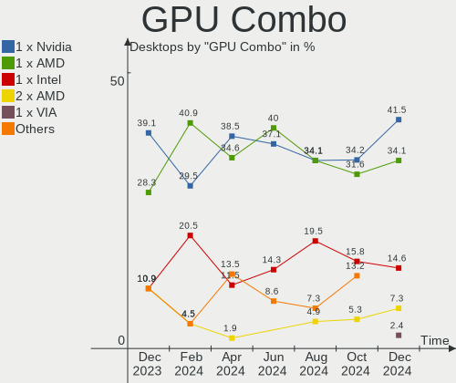
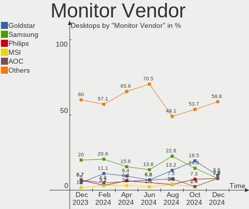

Manjaro - Hardware Trends (Desktops)
------------------------------------

A project to identify most popular hardware characteristics and track their change
over time based on data collected by Linux users at https://Linux-Hardware.org.

Anyone can contribute to this report by the [hw-probe](https://github.com/linuxhw/hw-probe) tool:

    sudo -E hw-probe -all -upload

This report is for one last month. Overall report since the beginning of time: [TestDays](https://github.com/linuxhw/TestDays)

Period: May, 2023.

Contents
--------

* [ System ](#system)
  - [ OS                       ](#os)
  - [ OS Family                ](#os-family)
  - [ Kernel                   ](#kernel)
  - [ Kernel Family            ](#kernel-family)
  - [ Kernel Major Ver.        ](#kernel-major-ver)
  - [ Arch                     ](#arch)
  - [ DE                       ](#de)
  - [ Display Server           ](#display-server)
  - [ Display Manager          ](#display-manager)
  - [ OS Lang                  ](#os-lang)
  - [ Boot Mode                ](#boot-mode)
  - [ Filesystem               ](#filesystem)
  - [ Part. scheme             ](#part-scheme)
  - [ Dual Boot with Linux/BSD ](#dual-boot-with-linuxbsd)
  - [ Dual Boot (Win)          ](#dual-boot-win)

* [ Board ](#board)
  - [ Vendor                   ](#vendor)
  - [ Model                    ](#model)
  - [ Model Family             ](#model-family)
  - [ MFG Year                 ](#mfg-year)
  - [ Form Factor              ](#form-factor)
  - [ Secure Boot              ](#secure-boot)
  - [ Coreboot                 ](#coreboot)
  - [ RAM Size                 ](#ram-size)
  - [ RAM Used                 ](#ram-used)
  - [ Total Drives             ](#total-drives)
  - [ Has CD-ROM               ](#has-cd-rom)
  - [ Has Ethernet             ](#has-ethernet)
  - [ Has WiFi                 ](#has-wifi)
  - [ Has Bluetooth            ](#has-bluetooth)

* [ Location ](#location)
  - [ Country                  ](#country)
  - [ City                     ](#city)

* [ Drives ](#drives)
  - [ Drive Vendor             ](#drive-vendor)
  - [ Drive Model              ](#drive-model)
  - [ HDD Vendor               ](#hdd-vendor)
  - [ SSD Vendor               ](#ssd-vendor)
  - [ Drive Kind               ](#drive-kind)
  - [ Drive Connector          ](#drive-connector)
  - [ Drive Size               ](#drive-size)
  - [ Space Total              ](#space-total)
  - [ Space Used               ](#space-used)
  - [ Malfunc. Drives          ](#malfunc-drives)
  - [ Malfunc. Drive Vendor    ](#malfunc-drive-vendor)
  - [ Malfunc. HDD Vendor      ](#malfunc-hdd-vendor)
  - [ Malfunc. Drive Kind      ](#malfunc-drive-kind)
  - [ Failed Drives            ](#failed-drives)
  - [ Failed Drive Vendor      ](#failed-drive-vendor)
  - [ Drive Status             ](#drive-status)

* [ Storage controller ](#storage-controller)
  - [ Storage Vendor           ](#storage-vendor)
  - [ Storage Model            ](#storage-model)
  - [ Storage Kind             ](#storage-kind)

* [ Processor ](#processor)
  - [ CPU Vendor               ](#cpu-vendor)
  - [ CPU Model                ](#cpu-model)
  - [ CPU Model Family         ](#cpu-model-family)
  - [ CPU Cores                ](#cpu-cores)
  - [ CPU Sockets              ](#cpu-sockets)
  - [ CPU Threads              ](#cpu-threads)
  - [ CPU Op-Modes             ](#cpu-op-modes)
  - [ CPU Microcode            ](#cpu-microcode)
  - [ CPU Microarch            ](#cpu-microarch)

* [ Graphics ](#graphics)
  - [ GPU Vendor               ](#gpu-vendor)
  - [ GPU Model                ](#gpu-model)
  - [ GPU Combo                ](#gpu-combo)
  - [ GPU Driver               ](#gpu-driver)
  - [ GPU Memory               ](#gpu-memory)

* [ Monitor ](#monitor)
  - [ Monitor Vendor           ](#monitor-vendor)
  - [ Monitor Model            ](#monitor-model)
  - [ Monitor Resolution       ](#monitor-resolution)
  - [ Monitor Diagonal         ](#monitor-diagonal)
  - [ Monitor Width            ](#monitor-width)
  - [ Aspect Ratio             ](#aspect-ratio)
  - [ Monitor Area             ](#monitor-area)
  - [ Pixel Density            ](#pixel-density)
  - [ Multiple Monitors        ](#multiple-monitors)

* [ Network ](#network)
  - [ Net Controller Vendor    ](#net-controller-vendor)
  - [ Net Controller Model     ](#net-controller-model)
  - [ Wireless Vendor          ](#wireless-vendor)
  - [ Wireless Model           ](#wireless-model)
  - [ Ethernet Vendor          ](#ethernet-vendor)
  - [ Ethernet Model           ](#ethernet-model)
  - [ Net Controller Kind      ](#net-controller-kind)
  - [ Used Controller          ](#used-controller)
  - [ NICs                     ](#nics)
  - [ IPv6                     ](#ipv6)

* [ Bluetooth ](#bluetooth)
  - [ Bluetooth Vendor         ](#bluetooth-vendor)
  - [ Bluetooth Model          ](#bluetooth-model)

* [ Sound ](#sound)
  - [ Sound Vendor             ](#sound-vendor)
  - [ Sound Model              ](#sound-model)

* [ Memory ](#memory)
  - [ Memory Vendor            ](#memory-vendor)
  - [ Memory Model             ](#memory-model)
  - [ Memory Kind              ](#memory-kind)
  - [ Memory Form Factor       ](#memory-form-factor)
  - [ Memory Size              ](#memory-size)
  - [ Memory Speed             ](#memory-speed)

* [ Printers & scanners ](#printers--scanners)
  - [ Printer Vendor           ](#printer-vendor)
  - [ Printer Model            ](#printer-model)
  - [ Scanner Vendor           ](#scanner-vendor)
  - [ Scanner Model            ](#scanner-model)

* [ Camera ](#camera)
  - [ Camera Vendor            ](#camera-vendor)
  - [ Camera Model             ](#camera-model)

* [ Security ](#security)
  - [ Fingerprint Vendor       ](#fingerprint-vendor)
  - [ Fingerprint Model        ](#fingerprint-model)
  - [ Chipcard Vendor          ](#chipcard-vendor)
  - [ Chipcard Model           ](#chipcard-model)

* [ Unsupported ](#unsupported)
  - [ Unsupported Devices      ](#unsupported-devices)
  - [ Unsupported Device Types ](#unsupported-device-types)

System
------

OS
--

Installed operating systems

| Name           | Desktops | Percent |
|----------------|----------|---------|
| Manjaro        | 35       | 58.33%  |
| Manjaro 22.1.1 | 12       | 20%     |
| Manjaro 22.1.2 | 6        | 10%     |
| Manjaro 22.1.3 | 3        | 5%      |
| Manjaro 22.1.0 | 2        | 3.33%   |
| Manjaro 23.0.0 | 1        | 1.67%   |
| Manjaro 21.3.6 | 1        | 1.67%   |

OS Family
---------

OS without a version

| Name    | Desktops | Percent |
|---------|----------|---------|
| Manjaro | 60       | 100%    |

Kernel
------

Version of the Linux kernel

| Version              | Desktops | Percent |
|----------------------|----------|---------|
| 6.1.26-1-MANJARO     | 14       | 23.33%  |
| 6.1.25-1-MANJARO     | 8        | 13.33%  |
| 6.3.0-1-MANJARO      | 7        | 11.67%  |
| 6.3.3-1-MANJARO      | 6        | 10%     |
| 6.1.29-1-MANJARO     | 5        | 8.33%   |
| 6.2.13-1-MANJARO     | 3        | 5%      |
| 6.2.12-1-MANJARO     | 3        | 5%      |
| 6.1.30-1-MANJARO     | 3        | 5%      |
| 5.15.109-1-MANJARO   | 3        | 5%      |
| 5.15.108-1-MANJARO   | 3        | 5%      |
| 6.3.1-3-MANJARO      | 1        | 1.67%   |
| 6.2.16-1-MANJARO     | 1        | 1.67%   |
| 6.1.22-1-MANJARO     | 1        | 1.67%   |
| 6.0.5-2-rt14-MANJARO | 1        | 1.67%   |
| 5.10.179-1-MANJARO   | 1        | 1.67%   |

Kernel Family
-------------

Linux kernel without a distro release

| Version  | Desktops | Percent |
|----------|----------|---------|
| 6.1.26   | 14       | 23.33%  |
| 6.1.25   | 8        | 13.33%  |
| 6.3.0    | 7        | 11.67%  |
| 6.3.3    | 6        | 10%     |
| 6.1.29   | 5        | 8.33%   |
| 6.2.13   | 3        | 5%      |
| 6.2.12   | 3        | 5%      |
| 6.1.30   | 3        | 5%      |
| 5.15.109 | 3        | 5%      |
| 5.15.108 | 3        | 5%      |
| 6.3.1    | 1        | 1.67%   |
| 6.2.16   | 1        | 1.67%   |
| 6.1.22   | 1        | 1.67%   |
| 6.0.5    | 1        | 1.67%   |
| 5.10.179 | 1        | 1.67%   |

Kernel Major Ver.
-----------------

Linux kernel major version

| Version | Desktops | Percent |
|---------|----------|---------|
| 6.1     | 31       | 51.67%  |
| 6.3     | 14       | 23.33%  |
| 6.2     | 7        | 11.67%  |
| 5.15    | 6        | 10%     |
| 6.0     | 1        | 1.67%   |
| 5.10    | 1        | 1.67%   |

Arch
----

OS architecture (x86_64, i586, etc.)

| Name   | Desktops | Percent |
|--------|----------|---------|
| x86_64 | 60       | 100%    |

DE
--

Desktop Environment

| Name       | Desktops | Percent |
|------------|----------|---------|
| KDE5       | 40       | 66.67%  |
| XFCE       | 10       | 16.67%  |
| GNOME      | 6        | 10%     |
| X-Cinnamon | 1        | 1.67%   |
| qtile      | 1        | 1.67%   |
| LXQt       | 1        | 1.67%   |
| i3         | 1        | 1.67%   |

Display Server
--------------

X11 or Wayland

| Name    | Desktops | Percent |
|---------|----------|---------|
| X11     | 53       | 88.33%  |
| Wayland | 5        | 8.33%   |
| Tty     | 1        | 1.67%   |
| Unknown | 1        | 1.67%   |

Display Manager
---------------

SDDM, LightDM, etc.

| Name    | Desktops | Percent |
|---------|----------|---------|
| Unknown | 35       | 58.33%  |
| SDDM    | 16       | 26.67%  |
| LightDM | 7        | 11.67%  |
| GDM     | 2        | 3.33%   |

OS Lang
-------

Language

| Lang  | Desktops | Percent |
|-------|----------|---------|
| en_US | 29       | 48.33%  |
| pt_BR | 6        | 10%     |
| en_GB | 4        | 6.67%   |
| de_DE | 3        | 5%      |
| ru_RU | 2        | 3.33%   |
| fr_FR | 2        | 3.33%   |
| es_UY | 2        | 3.33%   |
| en_CA | 2        | 3.33%   |
| en_AU | 2        | 3.33%   |
| pl_PL | 1        | 1.67%   |
| nl_NL | 1        | 1.67%   |
| it_IT | 1        | 1.67%   |
| es_PR | 1        | 1.67%   |
| en_DE | 1        | 1.67%   |
| de_CH | 1        | 1.67%   |
| cs_CZ | 1        | 1.67%   |
| ca_ES | 1        | 1.67%   |

Boot Mode
---------

EFI or BIOS

| Mode | Desktops | Percent |
|------|----------|---------|
| BIOS | 41       | 68.33%  |
| EFI  | 19       | 31.67%  |

Filesystem
----------

Type of filesystem

| Type  | Desktops | Percent |
|-------|----------|---------|
| Ext4  | 40       | 66.67%  |
| Tmpfs | 10       | 16.67%  |
| Btrfs | 8        | 13.33%  |
| Xfs   | 2        | 3.33%   |

Part. scheme
------------

Scheme of partitioning

| Type    | Desktops | Percent |
|---------|----------|---------|
| Unknown | 34       | 56.67%  |
| GPT     | 22       | 36.67%  |
| MBR     | 4        | 6.67%   |

Dual Boot with Linux/BSD
------------------------

Hosting more than one Linux/BSD

| Dual boot | Desktops | Percent |
|-----------|----------|---------|
| No        | 48       | 80%     |
| Yes       | 12       | 20%     |

Dual Boot (Win)
---------------

Hosting Linux and Windows

| Dual boot | Desktops | Percent |
|-----------|----------|---------|
| No        | 46       | 76.67%  |
| Yes       | 14       | 23.33%  |

Board
-----

Vendor
------

Motherboard manufacturer

| Name                | Desktops | Percent |
|---------------------|----------|---------|
| ASUSTek Computer    | 14       | 23.33%  |
| MSI                 | 11       | 18.33%  |
| Gigabyte Technology | 10       | 16.67%  |
| ASRock              | 6        | 10%     |
| Intel               | 5        | 8.33%   |
| Hewlett-Packard     | 4        | 6.67%   |
| Lenovo              | 3        | 5%      |
| Dell                | 2        | 3.33%   |
| Unknown             | 2        | 3.33%   |
| Positivo            | 1        | 1.67%   |
| Gateway             | 1        | 1.67%   |
| AMI                 | 1        | 1.67%   |

Model
-----

Motherboard model

| Name                                                        | Desktops | Percent |
|-------------------------------------------------------------|----------|---------|
| Unknown                                                     | 2        | 3.33%   |
| Positivo POS-EIQ87CY                                        | 1        | 1.67%   |
| MSI MS-7E07                                                 | 1        | 1.67%   |
| MSI MS-7D67                                                 | 1        | 1.67%   |
| MSI MS-7C96                                                 | 1        | 1.67%   |
| MSI MS-7C95                                                 | 1        | 1.67%   |
| MSI MS-7C37                                                 | 1        | 1.67%   |
| MSI MS-7C02                                                 | 1        | 1.67%   |
| MSI MS-7A35                                                 | 1        | 1.67%   |
| MSI MS-7816                                                 | 1        | 1.67%   |
| MSI MS-7641                                                 | 1        | 1.67%   |
| MSI MS-7597                                                 | 1        | 1.67%   |
| MSI MS-7589                                                 | 1        | 1.67%   |
| Lenovo ThinkCentre M71z 1761E4U                             | 1        | 1.67%   |
| Lenovo Legion T5 26IAB7 90SV00ACFR                          | 1        | 1.67%   |
| Lenovo IdeaCentre T540-15ICK G 90LW003JRS                   | 1        | 1.67%   |
| Intel X79F1 V2.0                                            | 1        | 1.67%   |
| Intel X79 (INTEL Xeon E5/Corei7 DMI2 - C600/C200 Cipset V31 | 1        | 1.67%   |
| Intel H61 V1.1                                              | 1        | 1.67%   |
| Intel H61                                                   | 1        | 1.67%   |
| Intel DN2820FYK H24582-204                                  | 1        | 1.67%   |
| HP Z600 Workstation                                         | 1        | 1.67%   |
| HP OMEN 30L Desktop GT13-1xxx                               | 1        | 1.67%   |
| HP Compaq 6005 Pro SFF PC                                   | 1        | 1.67%   |
| HP 700-567nz                                                | 1        | 1.67%   |
| Gigabyte Z97X-SLI                                           | 1        | 1.67%   |
| Gigabyte Z590 UD AC                                         | 1        | 1.67%   |
| Gigabyte X99-Gaming 5                                       | 1        | 1.67%   |
| Gigabyte X570 AORUS ELITE                                   | 1        | 1.67%   |
| Gigabyte B550 GAMING X V2                                   | 1        | 1.67%   |
| Gigabyte B450 AORUS M                                       | 1        | 1.67%   |
| Gigabyte AX370-Gaming 5                                     | 1        | 1.67%   |
| Gigabyte A520M H                                            | 1        | 1.67%   |
| Gigabyte A320M-S2H V2                                       | 1        | 1.67%   |
| Gigabyte 970A-DS3P                                          | 1        | 1.67%   |
| Gateway DX4300                                              | 1        | 1.67%   |
| Dell Precision T1700                                        | 1        | 1.67%   |
| Dell OptiPlex 3050                                          | 1        | 1.67%   |
| ASUS TUF Gaming X570-PLUS                                   | 1        | 1.67%   |
| ASUS TUF Gaming B650M-PLUS WIFI                             | 1        | 1.67%   |

Model Family
------------

Motherboard model prefix

| Name                  | Desktops | Percent |
|-----------------------|----------|---------|
| ASUS ROG              | 6        | 10%     |
| ASUS TUF              | 4        | 6.67%   |
| Intel H61             | 2        | 3.33%   |
| ASUS M5A78L-M         | 2        | 3.33%   |
| Unknown               | 2        | 3.33%   |
| Positivo POS-EIQ87CY  | 1        | 1.67%   |
| MSI MS-7E07           | 1        | 1.67%   |
| MSI MS-7D67           | 1        | 1.67%   |
| MSI MS-7C96           | 1        | 1.67%   |
| MSI MS-7C95           | 1        | 1.67%   |
| MSI MS-7C37           | 1        | 1.67%   |
| MSI MS-7C02           | 1        | 1.67%   |
| MSI MS-7A35           | 1        | 1.67%   |
| MSI MS-7816           | 1        | 1.67%   |
| MSI MS-7641           | 1        | 1.67%   |
| MSI MS-7597           | 1        | 1.67%   |
| MSI MS-7589           | 1        | 1.67%   |
| Lenovo ThinkCentre    | 1        | 1.67%   |
| Lenovo Legion         | 1        | 1.67%   |
| Lenovo IdeaCentre     | 1        | 1.67%   |
| Intel X79F1           | 1        | 1.67%   |
| Intel X79             | 1        | 1.67%   |
| Intel DN2820FYK       | 1        | 1.67%   |
| HP Z600               | 1        | 1.67%   |
| HP OMEN               | 1        | 1.67%   |
| HP Compaq             | 1        | 1.67%   |
| HP 700-567nz          | 1        | 1.67%   |
| Gigabyte Z97X-SLI     | 1        | 1.67%   |
| Gigabyte Z590         | 1        | 1.67%   |
| Gigabyte X99-Gaming   | 1        | 1.67%   |
| Gigabyte X570         | 1        | 1.67%   |
| Gigabyte B550         | 1        | 1.67%   |
| Gigabyte B450         | 1        | 1.67%   |
| Gigabyte AX370-Gaming | 1        | 1.67%   |
| Gigabyte A520M        | 1        | 1.67%   |
| Gigabyte A320M-S2H    | 1        | 1.67%   |
| Gigabyte 970A-DS3P    | 1        | 1.67%   |
| Gateway DX4300        | 1        | 1.67%   |
| Dell Precision        | 1        | 1.67%   |
| Dell OptiPlex         | 1        | 1.67%   |

MFG Year
--------

Motherboard manufacture year

| Year | Desktops | Percent |
|------|----------|---------|
| 2022 | 12       | 20%     |
| 2021 | 7        | 11.67%  |
| 2018 | 6        | 10%     |
| 2017 | 6        | 10%     |
| 2020 | 4        | 6.67%   |
| 2019 | 4        | 6.67%   |
| 2011 | 4        | 6.67%   |
| 2009 | 4        | 6.67%   |
| 2014 | 3        | 5%      |
| 2013 | 3        | 5%      |
| 2023 | 2        | 3.33%   |
| 2010 | 2        | 3.33%   |
| 2016 | 1        | 1.67%   |
| 2015 | 1        | 1.67%   |
| 2012 | 1        | 1.67%   |

Form Factor
-----------

Physical design of the computer

| Name    | Desktops | Percent |
|---------|----------|---------|
| Desktop | 60       | 100%    |

Secure Boot
-----------

Enabled or disabled

| State    | Desktops | Percent |
|----------|----------|---------|
| Disabled | 60       | 100%    |

Coreboot
--------

Have coreboot on board

| Used | Desktops | Percent |
|------|----------|---------|
| No   | 60       | 100%    |

RAM Size
--------

Total RAM memory

| Size in GB  | Desktops | Percent |
|-------------|----------|---------|
| 16.01-24.0  | 17       | 28.33%  |
| 32.01-64.0  | 15       | 25%     |
| 8.01-16.0   | 11       | 18.33%  |
| 4.01-8.0    | 6        | 10%     |
| 24.01-32.0  | 5        | 8.33%   |
| 64.01-256.0 | 4        | 6.67%   |
| 3.01-4.0    | 2        | 3.33%   |

RAM Used
--------

Used RAM memory

| Used GB    | Desktops | Percent |
|------------|----------|---------|
| 4.01-8.0   | 22       | 36.67%  |
| 2.01-3.0   | 15       | 25%     |
| 1.01-2.0   | 8        | 13.33%  |
| 8.01-16.0  | 7        | 11.67%  |
| 3.01-4.0   | 6        | 10%     |
| 24.01-32.0 | 2        | 3.33%   |

Total Drives
------------

Number of drives on board

| Drives | Desktops | Percent |
|--------|----------|---------|
| 2      | 20       | 33.33%  |
| 1      | 13       | 21.67%  |
| 3      | 12       | 20%     |
| 5      | 6        | 10%     |
| 4      | 5        | 8.33%   |
| 6      | 3        | 5%      |
| 8      | 1        | 1.67%   |

Has CD-ROM
----------

Has CD-ROM on board

| Presented | Desktops | Percent |
|-----------|----------|---------|
| No        | 40       | 66.67%  |
| Yes       | 20       | 33.33%  |

Has Ethernet
------------

Has Ethernet on board

| Presented | Desktops | Percent |
|-----------|----------|---------|
| Yes       | 58       | 96.67%  |
| No        | 2        | 3.33%   |

Has WiFi
--------

Has WiFi module

| Presented | Desktops | Percent |
|-----------|----------|---------|
| No        | 32       | 53.33%  |
| Yes       | 28       | 46.67%  |

Has Bluetooth
-------------

Has Bluetooth module

| Presented | Desktops | Percent |
|-----------|----------|---------|
| No        | 37       | 61.67%  |
| Yes       | 23       | 38.33%  |

Location
--------

Country
-------

Geographic location (country)

| Country         | Desktops | Percent |
|-----------------|----------|---------|
| USA             | 14       | 23.33%  |
| Brazil          | 8        | 13.33%  |
| Russia          | 5        | 8.33%   |
| Germany         | 5        | 8.33%   |
| Uruguay         | 3        | 5%      |
| Netherlands     | 3        | 5%      |
| France          | 3        | 5%      |
| Poland          | 2        | 3.33%   |
| Italy           | 2        | 3.33%   |
| Canada          | 2        | 3.33%   |
| Australia       | 2        | 3.33%   |
| Switzerland     | 1        | 1.67%   |
| Sweden          | 1        | 1.67%   |
| Spain           | 1        | 1.67%   |
| Romania         | 1        | 1.67%   |
| Puerto Rico     | 1        | 1.67%   |
| Norway          | 1        | 1.67%   |
| North Macedonia | 1        | 1.67%   |
| Myanmar         | 1        | 1.67%   |
| Lithuania       | 1        | 1.67%   |
| Finland         | 1        | 1.67%   |
| Czechia         | 1        | 1.67%   |

City
----

Geographic location (city)

| City               | Desktops | Percent |
|--------------------|----------|---------|
| Tacoma             | 2        | 3.33%   |
| Montevideo         | 2        | 3.33%   |
| Juazeiro do Norte  | 2        | 3.33%   |
| Yekaterinburg      | 1        | 1.67%   |
| Yangon             | 1        | 1.67%   |
| Wuppertal          | 1        | 1.67%   |
| Vilnius            | 1        | 1.67%   |
| Topeka             | 1        | 1.67%   |
| Thun               | 1        | 1.67%   |
| Tetovo             | 1        | 1.67%   |
| Sydney             | 1        | 1.67%   |
| Surgut             | 1        | 1.67%   |
| St Petersburg      | 1        | 1.67%   |
| Springdale         | 1        | 1.67%   |
| Spring             | 1        | 1.67%   |
| Spokane            | 1        | 1.67%   |
| Snappertuna        | 1        | 1.67%   |
| Skalbmierz         | 1        | 1.67%   |
| Saratov            | 1        | 1.67%   |
| Sao Paulo          | 1        | 1.67%   |
| Santa Quiteria     | 1        | 1.67%   |
| Rotterdam          | 1        | 1.67%   |
| Riverside          | 1        | 1.67%   |
| Rio Grande         | 1        | 1.67%   |
| Poitiers           | 1        | 1.67%   |
| Oslo               | 1        | 1.67%   |
| Oklahoma City      | 1        | 1.67%   |
| New Iberia         | 1        | 1.67%   |
| Nepean             | 1        | 1.67%   |
| Munich             | 1        | 1.67%   |
| Mockfjaerd         | 1        | 1.67%   |
| Maldonado          | 1        | 1.67%   |
| Mage               | 1        | 1.67%   |
| Mafra              | 1        | 1.67%   |
| Lyubertsy          | 1        | 1.67%   |
| Lezajsk            | 1        | 1.67%   |
| Launceston         | 1        | 1.67%   |
| Jablonec nad Nisou | 1        | 1.67%   |
| Hot Springs        | 1        | 1.67%   |
| Hamburg            | 1        | 1.67%   |

Drives
------

Drive Vendor
------------

Hard drive vendors

| Vendor                      | Desktops | Drives | Percent |
|-----------------------------|----------|--------|---------|
| Samsung Electronics         | 27       | 35     | 20.77%  |
| Seagate                     | 19       | 22     | 14.62%  |
| WDC                         | 16       | 26     | 12.31%  |
| Kingston                    | 8        | 9      | 6.15%   |
| Sandisk                     | 6        | 7      | 4.62%   |
| Crucial                     | 6        | 8      | 4.62%   |
| China                       | 6        | 7      | 4.62%   |
| Phison Electronics          | 5        | 6      | 3.85%   |
| Micron/Crucial Technology   | 5        | 5      | 3.85%   |
| Toshiba                     | 4        | 5      | 3.08%   |
| A-DATA Technology           | 4        | 4      | 3.08%   |
| Realtek Semiconductor       | 3        | 3      | 2.31%   |
| Team                        | 2        | 3      | 1.54%   |
| Silicon Motion              | 2        | 2      | 1.54%   |
| Micron Technology           | 2        | 3      | 1.54%   |
| Intel                       | 2        | 2      | 1.54%   |
| WD MediaMax                 | 1        | 2      | 0.77%   |
| USB3.0                      | 1        | 1      | 0.77%   |
| Unknown                     | 1        | 2      | 0.77%   |
| SPCC                        | 1        | 1      | 0.77%   |
| PNY                         | 1        | 1      | 0.77%   |
| Netac                       | 1        | 1      | 0.77%   |
| MAXIO Technology (Hangzhou) | 1        | 1      | 0.77%   |
| Intenso                     | 1        | 1      | 0.77%   |
| HS-SSD-E100                 | 1        | 1      | 0.77%   |
| Hitachi                     | 1        | 1      | 0.77%   |
| Hewlett-Packard             | 1        | 1      | 0.77%   |
| BAITITON                    | 1        | 2      | 0.77%   |
| Unknown                     | 1        | 1      | 0.77%   |

Drive Model
-----------

Hard drive models

| Model                                               | Desktops | Percent |
|-----------------------------------------------------|----------|---------|
| Samsung NVMe SSD Controller PM9A1/PM9A3/980PRO 1TB  | 6        | 4.14%   |
| Samsung NVMe SSD Controller SM981/PM981/PM983 256GB | 4        | 2.76%   |
| WDC WD10EZEX-08WN4A0 1TB                            | 3        | 2.07%   |
| Seagate ST2000DM008-2FR102 2TB                      | 3        | 2.07%   |
| Sandisk WD Black SN750 / PC SN730 NVMe SSD 256GB    | 3        | 2.07%   |
| Micron/Crucial P2 NVMe PCIe SSD 1TB                 | 3        | 2.07%   |
| Crucial CT1000MX500SSD1 1TB                         | 3        | 2.07%   |
| China SSD 1TB                                       | 3        | 2.07%   |
| WDC WD40EFRX-68N32N0 4TB                            | 2        | 1.38%   |
| Toshiba DT01ACA300 3TB                              | 2        | 1.38%   |
| Seagate ST500DM002-1BD142 500GB                     | 2        | 1.38%   |
| Seagate ST1000DM003-1CH162 1TB                      | 2        | 1.38%   |
| Samsung SSD 860 EVO 500GB                           | 2        | 1.38%   |
| Samsung SSD 860 EVO 1TB                             | 2        | 1.38%   |
| Realtek RTS5763DL NVMe SSD Controller 512GB         | 2        | 1.38%   |
| Phison E16 PCIe4 NVMe Controller 1TB                | 2        | 1.38%   |
| Kingston SV300S37A480G 480GB SSD                    | 2        | 1.38%   |
| Crucial CT500MX500SSD1 500GB                        | 2        | 1.38%   |
| WDC WDS200T1R0B-68A4Z0 2TB SSD                      | 1        | 0.69%   |
| WDC WDS100T2B0A-00SM50 1TB SSD                      | 1        | 0.69%   |
| WDC WD7500BPVT-55HXZT4 752GB                        | 1        | 0.69%   |
| WDC WD40PURZ-85TTDY0 4TB                            | 1        | 0.69%   |
| WDC WD4005FZBX-00K5WB0 4TB                          | 1        | 0.69%   |
| WDC WD30EZRZ-00GXCB0 3TB                            | 1        | 0.69%   |
| WDC WD30EZRS-00J99B0 3TB                            | 1        | 0.69%   |
| WDC WD30EFRX-68EUZN0 3TB                            | 1        | 0.69%   |
| WDC WD20EZRZ-22Z5HB0 2TB                            | 1        | 0.69%   |
| WDC WD20EZRZ-00Z5HB0 2TB                            | 1        | 0.69%   |
| WDC WD2003FZEX-00Z4SA0 2TB                          | 1        | 0.69%   |
| WDC WD2003FZEX-00SRLA0 2TB                          | 1        | 0.69%   |
| WDC WD1600AAJS-00YZCA0 160GB                        | 1        | 0.69%   |
| WDC WD10EZEX-60M2NA0 1TB                            | 1        | 0.69%   |
| WD MediaMax WL3000GSA6454 1 3TB                     | 1        | 0.69%   |
| WD MediaMax WL1000GSA6472 1TB                       | 1        | 0.69%   |
| USB3.0 Super Speed 1TB                              | 1        | 0.69%   |
| Unknown SD/MMC 2GB                                  | 1        | 0.69%   |
| Unknown M.S./M.S.Pro/HG 16GB                        | 1        | 0.69%   |
| Toshiba MQ01ABD100 1TB                              | 1        | 0.69%   |
| Toshiba HDWN160 6TB                                 | 1        | 0.69%   |
| Team T253X2001T 1024GB SSD                          | 1        | 0.69%   |

HDD Vendor
----------

Hard disk drive vendors

| Vendor              | Desktops | Drives | Percent |
|---------------------|----------|--------|---------|
| Seagate             | 18       | 21     | 41.86%  |
| WDC                 | 14       | 24     | 32.56%  |
| Toshiba             | 4        | 5      | 9.3%    |
| Samsung Electronics | 4        | 4      | 9.3%    |
| USB3.0              | 1        | 1      | 2.33%   |
| Hitachi             | 1        | 1      | 2.33%   |
| Hewlett-Packard     | 1        | 1      | 2.33%   |

SSD Vendor
----------

Solid state drive vendors

| Vendor              | Desktops | Drives | Percent |
|---------------------|----------|--------|---------|
| Samsung Electronics | 15       | 17     | 30%     |
| Crucial             | 6        | 8      | 12%     |
| China               | 6        | 7      | 12%     |
| Kingston            | 5        | 5      | 10%     |
| A-DATA Technology   | 4        | 4      | 8%      |
| WDC                 | 2        | 2      | 4%      |
| Team                | 2        | 3      | 4%      |
| SanDisk             | 2        | 3      | 4%      |
| Micron Technology   | 2        | 3      | 4%      |
| SPCC                | 1        | 1      | 2%      |
| PNY                 | 1        | 1      | 2%      |
| Netac               | 1        | 1      | 2%      |
| Intenso             | 1        | 1      | 2%      |
| Intel               | 1        | 1      | 2%      |
| BAITITON            | 1        | 2      | 2%      |

Drive Kind
----------

HDD or SSD

| Kind    | Desktops | Drives | Percent |
|---------|----------|--------|---------|
| SSD     | 39       | 59     | 35.78%  |
| HDD     | 37       | 57     | 33.94%  |
| NVMe    | 30       | 42     | 27.52%  |
| Unknown | 3        | 5      | 2.75%   |

Drive Connector
---------------

SATA, SAS, NVMe, etc.

| Type | Desktops | Drives | Percent |
|------|----------|--------|---------|
| SATA | 54       | 112    | 60%     |
| NVMe | 30       | 42     | 33.33%  |
| SAS  | 6        | 9      | 6.67%   |

Drive Size
----------

Size of hard drive

| Size in TB | Desktops | Drives | Percent |
|------------|----------|--------|---------|
| 0.01-0.5   | 32       | 41     | 37.21%  |
| 0.51-1.0   | 24       | 32     | 27.91%  |
| 1.01-2.0   | 18       | 24     | 20.93%  |
| 2.01-3.0   | 7        | 10     | 8.14%   |
| 3.01-4.0   | 4        | 7      | 4.65%   |
| 4.01-10.0  | 1        | 2      | 1.16%   |

Space Total
-----------

Amount of disk space available on the file system

| Size in GB     | Desktops | Percent |
|----------------|----------|---------|
| 251-500        | 13       | 21.67%  |
| 501-1000       | 11       | 18.33%  |
| 1001-2000      | 9        | 15%     |
| 101-250        | 8        | 13.33%  |
| More than 3000 | 7        | 11.67%  |
| 2001-3000      | 7        | 11.67%  |
| 51-100         | 4        | 6.67%   |
| Unknown        | 1        | 1.67%   |

Space Used
----------

Amount of used disk space

| Used GB        | Desktops | Percent |
|----------------|----------|---------|
| 21-50          | 12       | 20%     |
| 101-250        | 11       | 18.33%  |
| 251-500        | 9        | 15%     |
| 501-1000       | 7        | 11.67%  |
| 51-100         | 6        | 10%     |
| 1001-2000      | 5        | 8.33%   |
| 1-20           | 4        | 6.67%   |
| 2001-3000      | 3        | 5%      |
| More than 3000 | 2        | 3.33%   |
| Unknown        | 1        | 1.67%   |

Malfunc. Drives
---------------

Drive models with a malfunction

| Model                                         | Desktops | Drives | Percent |
|-----------------------------------------------|----------|--------|---------|
| Seagate ST31000528AS 1TB                      | 1        | 1      | 25%     |
| Samsung Electronics SSD 870 EVO 1TB           | 1        | 1      | 25%     |
| Micron Technology MTFDDAK512MAM-1K1 512GB SSD | 1        | 1      | 25%     |
| A-DATA Technology SU650 240GB SSD             | 1        | 1      | 25%     |

Malfunc. Drive Vendor
---------------------

Vendors of faulty drives

| Vendor              | Desktops | Drives | Percent |
|---------------------|----------|--------|---------|
| Seagate             | 1        | 1      | 25%     |
| Samsung Electronics | 1        | 1      | 25%     |
| Micron Technology   | 1        | 1      | 25%     |
| A-DATA Technology   | 1        | 1      | 25%     |

Malfunc. HDD Vendor
-------------------

Vendors of faulty HDD drives

| Vendor  | Desktops | Drives | Percent |
|---------|----------|--------|---------|
| Seagate | 1        | 1      | 100%    |

Malfunc. Drive Kind
-------------------

Kinds of faulty drives

| Kind | Desktops | Drives | Percent |
|------|----------|--------|---------|
| SSD  | 3        | 3      | 75%     |
| HDD  | 1        | 1      | 25%     |

Failed Drives
-------------

Failed drive models

Zero info for selected period =(

Failed Drive Vendor
-------------------

Failed drive vendors

Zero info for selected period =(

Drive Status
------------

Number of failed and malfunc. drives

| Status   | Desktops | Drives | Percent |
|----------|----------|--------|---------|
| Detected | 46       | 111    | 70.77%  |
| Works    | 15       | 48     | 23.08%  |
| Malfunc  | 4        | 4      | 6.15%   |

Storage controller
------------------

Storage Vendor
--------------

Storage controller vendors

| Vendor                      | Desktops | Percent |
|-----------------------------|----------|---------|
| AMD                         | 34       | 33.66%  |
| Intel                       | 24       | 23.76%  |
| Samsung Electronics         | 10       | 9.9%    |
| Phison Electronics          | 5        | 4.95%   |
| Micron/Crucial Technology   | 5        | 4.95%   |
| SanDisk                     | 4        | 3.96%   |
| Kingston Technology Company | 4        | 3.96%   |
| Realtek Semiconductor       | 3        | 2.97%   |
| ASMedia Technology          | 3        | 2.97%   |
| Silicon Motion              | 2        | 1.98%   |
| Nvidia                      | 2        | 1.98%   |
| VIA Technologies            | 1        | 0.99%   |
| Seagate Technology          | 1        | 0.99%   |
| MAXIO Technology (Hangzhou) | 1        | 0.99%   |
| Marvell Technology Group    | 1        | 0.99%   |
| Unknown                     | 1        | 0.99%   |

Storage Model
-------------

Storage controller models

| Model                                                                          | Desktops | Percent |
|--------------------------------------------------------------------------------|----------|---------|
| AMD FCH SATA Controller [AHCI mode]                                            | 18       | 15.52%  |
| AMD 500 Series Chipset SATA Controller                                         | 7        | 6.03%   |
| Samsung NVMe SSD Controller PM9A1/PM9A3/980PRO                                 | 6        | 5.17%   |
| AMD SB7x0/SB8x0/SB9x0 IDE Controller                                           | 5        | 4.31%   |
| Samsung NVMe SSD Controller SM981/PM981/PM983                                  | 4        | 3.45%   |
| Intel SATA Controller [RAID mode]                                              | 4        | 3.45%   |
| Intel 6 Series/C200 Series Chipset Family 6 port Desktop SATA AHCI Controller  | 4        | 3.45%   |
| SanDisk WD Black SN750 / PC SN730 NVMe SSD                                     | 3        | 2.59%   |
| Micron/Crucial P2 NVMe PCIe SSD                                                | 3        | 2.59%   |
| Kingston Company NVMe Controller                                               | 3        | 2.59%   |
| Intel 8 Series/C220 Series Chipset Family 6-port SATA Controller 1 [AHCI mode] | 3        | 2.59%   |
| ASMedia ASM1062 Serial ATA Controller                                          | 3        | 2.59%   |
| AMD SB7x0/SB8x0/SB9x0 SATA Controller [IDE mode]                               | 3        | 2.59%   |
| AMD SB7x0/SB8x0/SB9x0 SATA Controller [AHCI mode]                              | 3        | 2.59%   |
| AMD 400 Series Chipset SATA Controller                                         | 3        | 2.59%   |
| Realtek RTS5763DL NVMe SSD Controller                                          | 2        | 1.72%   |
| Phison E16 PCIe4 NVMe Controller                                               | 2        | 1.72%   |
| Nvidia MCP61 SATA Controller                                                   | 2        | 1.72%   |
| Nvidia MCP61 IDE                                                               | 2        | 1.72%   |
| Intel 500 Series Chipset Family SATA AHCI Controller                           | 2        | 1.72%   |
| AMD X370 Series Chipset SATA Controller                                        | 2        | 1.72%   |
| VIA VT6415 PATA IDE Host Controller                                            | 1        | 0.86%   |
| Silicon Motion SM2263EN/SM2263XT SSD Controller                                | 1        | 0.86%   |
| Silicon Motion SM2262/SM2262EN SSD Controller                                  | 1        | 0.86%   |
| Seagate FireCuda 530 SSD                                                       | 1        | 0.86%   |
| SanDisk WD Black SN770 NVMe SSD                                                | 1        | 0.86%   |
| Samsung Electronics Non-Volatile memory controller                             | 1        | 0.86%   |
| Realtek NVMe Controller                                                        | 1        | 0.86%   |
| Phison E7 NVMe Controller                                                      | 1        | 0.86%   |
| Phison E18 PCIe4 NVMe Controller                                               | 1        | 0.86%   |
| Phison E12 NVMe Controller                                                     | 1        | 0.86%   |
| Micron/Crucial P5 Plus NVMe PCIe SSD                                           | 1        | 0.86%   |
| Micron/Crucial NVMe Storage Controller                                         | 1        | 0.86%   |
| MAXIO (Hangzhou) NVMe SSD Controller MAP1202                                   | 1        | 0.86%   |
| Marvell Group 88SE912x SATA 6Gb/s Controller [IDE mode]                        | 1        | 0.86%   |
| Kingston Company Company Non-Volatile memory controller                        | 1        | 0.86%   |
| Intel Tiger Lake-LP SATA Controller                                            | 1        | 0.86%   |
| Intel Non-Volatile memory controller                                           | 1        | 0.86%   |
| Intel Cannon Lake PCH SATA AHCI Controller                                     | 1        | 0.86%   |
| Intel C610/X99 series chipset sSATA Controller [AHCI mode]                     | 1        | 0.86%   |

Storage Kind
------------

Kind of storage controller (IDE, SATA, NVMe, SAS, ...)

| Kind | Desktops | Percent |
|------|----------|---------|
| SATA | 52       | 54.74%  |
| NVMe | 30       | 31.58%  |
| IDE  | 8        | 8.42%   |
| RAID | 5        | 5.26%   |

Processor
---------

CPU Vendor
----------

Processor vendors

| Vendor | Desktops | Percent |
|--------|----------|---------|
| AMD    | 37       | 61.67%  |
| Intel  | 23       | 38.33%  |

CPU Model
---------

Processor models

| Model                                          | Desktops | Percent |
|------------------------------------------------|----------|---------|
| AMD Ryzen 9 7950X 16-Core Processor            | 3        | 5%      |
| AMD Ryzen 9 5900HX with Radeon Graphics        | 2        | 3.33%   |
| AMD Ryzen 7 3700X 8-Core Processor             | 2        | 3.33%   |
| AMD Ryzen 5 5600X 6-Core Processor             | 2        | 3.33%   |
| AMD Ryzen 5 3600 6-Core Processor              | 2        | 3.33%   |
| AMD FX-6300 Six-Core Processor                 | 2        | 3.33%   |
| AMD Athlon II X2 250 Processor                 | 2        | 3.33%   |
| Intel Xeon CPU E5620 @ 2.40GHz                 | 1        | 1.67%   |
| Intel Xeon CPU E5-2689 0 @ 2.60GHz             | 1        | 1.67%   |
| Intel Xeon CPU E5-2420 0 @ 1.90GHz             | 1        | 1.67%   |
| Intel Core i9-10940X CPU @ 3.30GHz             | 1        | 1.67%   |
| Intel Core i7-5820K CPU @ 3.30GHz              | 1        | 1.67%   |
| Intel Core i7-4790K CPU @ 4.00GHz              | 1        | 1.67%   |
| Intel Core i7-4790 CPU @ 3.60GHz               | 1        | 1.67%   |
| Intel Core i7-4770 CPU @ 3.40GHz               | 1        | 1.67%   |
| Intel Core i7-10700K CPU @ 3.80GHz             | 1        | 1.67%   |
| Intel Core i7 CPU 860 @ 2.80GHz                | 1        | 1.67%   |
| Intel Core i5-9400F CPU @ 2.90GHz              | 1        | 1.67%   |
| Intel Core i5-4590 CPU @ 3.30GHz               | 1        | 1.67%   |
| Intel Core i5-4460 CPU @ 3.20GHz               | 1        | 1.67%   |
| Intel Core i5-3470S CPU @ 2.90GHz              | 1        | 1.67%   |
| Intel Core i5-10600K CPU @ 4.10GHz             | 1        | 1.67%   |
| Intel Core i3-8100 CPU @ 3.60GHz               | 1        | 1.67%   |
| Intel Core i3-6100 CPU @ 3.70GHz               | 1        | 1.67%   |
| Intel Core i3-2120 CPU @ 3.30GHz               | 1        | 1.67%   |
| Intel Core i3-2100 CPU @ 3.10GHz               | 1        | 1.67%   |
| Intel Celeron CPU N2830 @ 2.16GHz              | 1        | 1.67%   |
| Intel 12th Gen Core i9-12900K                  | 1        | 1.67%   |
| Intel 12th Gen Core i7-12700F                  | 1        | 1.67%   |
| Intel 11th Gen Core i5-1145G7 @ 2.60GHz        | 1        | 1.67%   |
| AMD Ryzen Threadripper 2950X 16-Core Processor | 1        | 1.67%   |
| AMD Ryzen 9 7900X 12-Core Processor            | 1        | 1.67%   |
| AMD Ryzen 9 7900 12-Core Processor             | 1        | 1.67%   |
| AMD Ryzen 9 5950X 16-Core Processor            | 1        | 1.67%   |
| AMD Ryzen 9 5900X 12-Core Processor            | 1        | 1.67%   |
| AMD Ryzen 7 7700X 8-Core Processor             | 1        | 1.67%   |
| AMD Ryzen 7 5800X3D 8-Core Processor           | 1        | 1.67%   |
| AMD Ryzen 7 3800X 8-Core Processor             | 1        | 1.67%   |
| AMD Ryzen 7 1700X Eight-Core Processor         | 1        | 1.67%   |
| AMD Ryzen 5 7600X 6-Core Processor             | 1        | 1.67%   |

CPU Model Family
----------------

Processor model prefix

| Model                  | Desktops | Percent |
|------------------------|----------|---------|
| AMD Ryzen 5            | 10       | 16.67%  |
| AMD Ryzen 9            | 9        | 15%     |
| Intel Core i7          | 6        | 10%     |
| AMD Ryzen 7            | 6        | 10%     |
| Intel Core i5          | 5        | 8.33%   |
| Intel Core i3          | 4        | 6.67%   |
| Other                  | 3        | 5%      |
| Intel Xeon             | 3        | 5%      |
| AMD FX                 | 3        | 5%      |
| AMD Ryzen 3            | 2        | 3.33%   |
| AMD Phenom II X4       | 2        | 3.33%   |
| AMD Athlon II X2       | 2        | 3.33%   |
| Intel Core i9          | 1        | 1.67%   |
| Intel Celeron          | 1        | 1.67%   |
| AMD Ryzen Threadripper | 1        | 1.67%   |
| AMD Phenom II X6       | 1        | 1.67%   |
| AMD Phenom II X2       | 1        | 1.67%   |

CPU Cores
---------

Number of processor cores

| Number | Desktops | Percent |
|--------|----------|---------|
| 6      | 15       | 25%     |
| 4      | 13       | 21.67%  |
| 8      | 11       | 18.33%  |
| 2      | 8        | 13.33%  |
| 16     | 6        | 10%     |
| 12     | 4        | 6.67%   |
| 3      | 2        | 3.33%   |
| 14     | 1        | 1.67%   |

CPU Sockets
-----------

Number of sockets

| Number | Desktops | Percent |
|--------|----------|---------|
| 1      | 59       | 98.33%  |
| 2      | 1        | 1.67%   |

CPU Threads
-----------

Threads per core (Hyper-Threading)

| Number | Desktops | Percent |
|--------|----------|---------|
| 2      | 46       | 76.67%  |
| 1      | 14       | 23.33%  |

CPU Op-Modes
------------

CPU Operation Modes (32-bit, 64-bit)

| Op mode        | Desktops | Percent |
|----------------|----------|---------|
| 32-bit, 64-bit | 60       | 100%    |

CPU Microcode
-------------

Microcode number

| Number     | Desktops | Percent |
|------------|----------|---------|
| Unknown    | 41       | 68.33%  |
| 0x0a601203 | 4        | 6.67%   |
| 0x08701021 | 3        | 5%      |
| 0x0a50000c | 2        | 3.33%   |
| 0x906eb    | 1        | 1.67%   |
| 0x90672    | 1        | 1.67%   |
| 0x306c3    | 1        | 1.67%   |
| 0x206d7    | 1        | 1.67%   |
| 0x206c2    | 1        | 1.67%   |
| 0x206a7    | 1        | 1.67%   |
| 0x106e5    | 1        | 1.67%   |
| 0x08701030 | 1        | 1.67%   |
| 0x0800820d | 1        | 1.67%   |
| 0x010000c8 | 1        | 1.67%   |

CPU Microarch
-------------

Microarchitecture

| Name             | Desktops | Percent |
|------------------|----------|---------|
| Zen 3            | 8        | 13.33%  |
| Unknown          | 8        | 13.33%  |
| Zen 2            | 6        | 10%     |
| K10              | 6        | 10%     |
| Haswell          | 6        | 10%     |
| Zen+             | 4        | 6.67%   |
| SandyBridge      | 4        | 6.67%   |
| Zen              | 3        | 5%      |
| Piledriver       | 3        | 5%      |
| Skylake          | 2        | 3.33%   |
| KabyLake         | 2        | 3.33%   |
| CometLake        | 2        | 3.33%   |
| Westmere         | 1        | 1.67%   |
| TigerLake        | 1        | 1.67%   |
| Silvermont       | 1        | 1.67%   |
| Nehalem          | 1        | 1.67%   |
| IvyBridge        | 1        | 1.67%   |
| Alderlake Hybrid | 1        | 1.67%   |

Graphics
--------

GPU Vendor
----------

Vendors of graphics cards

| Vendor | Desktops | Percent |
|--------|----------|---------|
| Nvidia | 29       | 45.31%  |
| AMD    | 26       | 40.63%  |
| Intel  | 9        | 14.06%  |

GPU Model
---------

Graphics card models

| Model                                                                       | Desktops | Percent |
|-----------------------------------------------------------------------------|----------|---------|
| AMD Raphael                                                                 | 7        | 10.45%  |
| AMD Navi 23 [Radeon RX 6600/6600 XT/6600M]                                  | 6        | 8.96%   |
| Nvidia GA104 [GeForce RTX 3070]                                             | 3        | 4.48%   |
| AMD Navi 22 [Radeon RX 6700/6700 XT/6750 XT / 6800M/6850M XT]               | 3        | 4.48%   |
| AMD Ellesmere [Radeon RX 470/480/570/570X/580/580X/590]                     | 3        | 4.48%   |
| AMD Cezanne [Radeon Vega Series / Radeon Vega Mobile Series]                | 3        | 4.48%   |
| Nvidia TU117 [GeForce GTX 1650]                                             | 2        | 2.99%   |
| Nvidia GP106 [GeForce GTX 1060 3GB]                                         | 2        | 2.99%   |
| Nvidia GM204 [GeForce GTX 970]                                              | 2        | 2.99%   |
| Intel 2nd Generation Core Processor Family Integrated Graphics Controller   | 2        | 2.99%   |
| AMD Navi 10 [Radeon RX 5600 OEM/5600 XT / 5700/5700 XT]                     | 2        | 2.99%   |
| Nvidia TU106 [GeForce GTX 1650]                                             | 1        | 1.49%   |
| Nvidia GT218 [GeForce 210]                                                  | 1        | 1.49%   |
| Nvidia GP108 [GeForce GT 1030]                                              | 1        | 1.49%   |
| Nvidia GP107 [GeForce GTX 1050]                                             | 1        | 1.49%   |
| Nvidia GP107 [GeForce GTX 1050 Ti]                                          | 1        | 1.49%   |
| Nvidia GP106 [GeForce GTX 1060 6GB]                                         | 1        | 1.49%   |
| Nvidia GP106 [GeForce GTX 1060 5GB]                                         | 1        | 1.49%   |
| Nvidia GP104 [GeForce GTX 1080]                                             | 1        | 1.49%   |
| Nvidia GP104 [GeForce GTX 1070]                                             | 1        | 1.49%   |
| Nvidia GM200 [GeForce GTX TITAN X]                                          | 1        | 1.49%   |
| Nvidia GM107 [GeForce GTX 745]                                              | 1        | 1.49%   |
| Nvidia GK208B [GeForce GT 730]                                              | 1        | 1.49%   |
| Nvidia GK107 [NVS 510]                                                      | 1        | 1.49%   |
| Nvidia GK107 [GeForce GT 640 OEM]                                           | 1        | 1.49%   |
| Nvidia GF114 [GeForce GTX 560]                                              | 1        | 1.49%   |
| Nvidia GF108 [GeForce GT 630]                                               | 1        | 1.49%   |
| Nvidia GA104 [GeForce RTX 3060]                                             | 1        | 1.49%   |
| Nvidia GA104 [GeForce RTX 3060 Ti Lite Hash Rate]                           | 1        | 1.49%   |
| Nvidia G96C [GeForce 9500 GT]                                               | 1        | 1.49%   |
| Nvidia AD102 [GeForce RTX 4090]                                             | 1        | 1.49%   |
| Intel Xeon E3-1200 v3/4th Gen Core Processor Integrated Graphics Controller | 1        | 1.49%   |
| Intel Xeon E3-1200 v2/3rd Gen Core processor Graphics Controller            | 1        | 1.49%   |
| Intel TigerLake-LP GT2 [Iris Xe Graphics]                                   | 1        | 1.49%   |
| Intel HD Graphics 530                                                       | 1        | 1.49%   |
| Intel CometLake-S GT2 [UHD Graphics 630]                                    | 1        | 1.49%   |
| Intel Atom Processor Z36xxx/Z37xxx Series Graphics & Display                | 1        | 1.49%   |
| Intel AlderLake-S GT1                                                       | 1        | 1.49%   |
| AMD Tahiti XT [Radeon HD 7970/8970 OEM / R9 280X]                           | 1        | 1.49%   |
| AMD RV710 [Radeon HD 4350/4550]                                             | 1        | 1.49%   |

GPU Combo
---------

Combinations of graphics cards

| Name         | Desktops | Percent |
|--------------|----------|---------|
| 1 x Nvidia   | 25       | 41.67%  |
| 1 x AMD      | 20       | 33.33%  |
| 1 x Intel    | 9        | 15%     |
| 2 x AMD      | 3        | 5%      |
| AMD + Nvidia | 3        | 5%      |

GPU Driver
----------

Free vs proprietary

| Driver      | Desktops | Percent |
|-------------|----------|---------|
| Free        | 37       | 61.67%  |
| Proprietary | 22       | 36.67%  |
| Unknown     | 1        | 1.67%   |

GPU Memory
----------

Total video memory

| Size in GB | Desktops | Percent |
|------------|----------|---------|
| Unknown    | 32       | 53.33%  |
| 7.01-8.0   | 5        | 8.33%   |
| 3.01-4.0   | 5        | 8.33%   |
| 8.01-16.0  | 4        | 6.67%   |
| 0.51-1.0   | 4        | 6.67%   |
| 1.01-2.0   | 3        | 5%      |
| 5.01-6.0   | 2        | 3.33%   |
| 2.01-3.0   | 2        | 3.33%   |
| 0.01-0.5   | 2        | 3.33%   |
| 16.01-24.0 | 1        | 1.67%   |

Monitor
-------

Monitor Vendor
--------------

Monitor vendors

| Vendor               | Desktops | Percent |
|----------------------|----------|---------|
| Samsung Electronics  | 11       | 14.86%  |
| Dell                 | 9        | 12.16%  |
| Goldstar             | 7        | 9.46%   |
| AOC                  | 7        | 9.46%   |
| Hewlett-Packard      | 5        | 6.76%   |
| Philips              | 4        | 5.41%   |
| Lenovo               | 4        | 5.41%   |
| BenQ                 | 4        | 5.41%   |
| Acer                 | 3        | 4.05%   |
| Gigabyte Technology  | 2        | 2.7%    |
| Ancor Communications | 2        | 2.7%    |
| VIZ                  | 1        | 1.35%   |
| VIE                  | 1        | 1.35%   |
| Unknown              | 1        | 1.35%   |
| Pixio                | 1        | 1.35%   |
| NEC Computers        | 1        | 1.35%   |
| MSI                  | 1        | 1.35%   |
| LG Electronics       | 1        | 1.35%   |
| Insignia             | 1        | 1.35%   |
| INS                  | 1        | 1.35%   |
| Idek Iiyama          | 1        | 1.35%   |
| GDH                  | 1        | 1.35%   |
| Compaq Computer      | 1        | 1.35%   |
| CNC                  | 1        | 1.35%   |
| Chimei Innolux       | 1        | 1.35%   |
| ASUSTek Computer     | 1        | 1.35%   |
| Unknown              | 1        | 1.35%   |

Monitor Model
-------------

Monitor models

| Model                                                                | Desktops | Percent |
|----------------------------------------------------------------------|----------|---------|
| Goldstar FULL HD GSM5B55 1920x1080 480x270mm 21.7-inch               | 2        | 2.35%   |
| VIZ LCD Monitor V405-H9 3840x2160                                    | 1        | 1.18%   |
| VIE HORIZON Z27 VIE2700 1920x1080 600x330mm 27.0-inch                | 1        | 1.18%   |
| Unknown LCD Monitor XXX AAA 1920x1080                                | 1        | 1.18%   |
| Samsung Electronics T27B350 SAM0943 1920x1080 598x336mm 27.0-inch    | 1        | 1.18%   |
| Samsung Electronics SyncMaster SAM0656 1920x1080 510x287mm 23.0-inch | 1        | 1.18%   |
| Samsung Electronics S24F350 SAM0D20 1920x1080 521x293mm 23.5-inch    | 1        | 1.18%   |
| Samsung Electronics LS24AG30x SAM7179 1920x1080 527x296mm 23.8-inch  | 1        | 1.18%   |
| Samsung Electronics LF27T450F SAM7099 1920x1080 597x336mm 27.0-inch  | 1        | 1.18%   |
| Samsung Electronics LCD Monitor SyncMaster                           | 1        | 1.18%   |
| Samsung Electronics LCD Monitor SAM0C3C 1366x768 530x300mm 24.0-inch | 1        | 1.18%   |
| Samsung Electronics LCD Monitor LF27T450F 1920x1080                  | 1        | 1.18%   |
| Samsung Electronics LCD Monitor LC32G7xT 2560x1440                   | 1        | 1.18%   |
| Samsung Electronics LC34G55T SAM711A 3440x1440 800x340mm 34.2-inch   | 1        | 1.18%   |
| Samsung Electronics LC32G7xT SAM7058 2560x1440 698x393mm 31.5-inch   | 1        | 1.18%   |
| Samsung Electronics C27F390 SAM0D32 1920x1080 598x336mm 27.0-inch    | 1        | 1.18%   |
| Pixio PX277P PNS0277 2560x1440 697x392mm 31.5-inch                   | 1        | 1.18%   |
| Philips PHL 221V8 PHLC211 1920x1080 477x268mm 21.5-inch              | 1        | 1.18%   |
| Philips LCD Monitor PHL0001 1920x1080 886x498mm 40.0-inch            | 1        | 1.18%   |
| Philips LCD Monitor PHL 216V6 1920x1080                              | 1        | 1.18%   |
| Philips FTV PHL04C4 1920x1080 1440x810mm 65.0-inch                   | 1        | 1.18%   |
| NEC Computers V423 NEC68AD 1920x1080 930x523mm 42.0-inch             | 1        | 1.18%   |
| MSI MAG241C MSI3EA2 1920x1080 521x293mm 23.5-inch                    | 1        | 1.18%   |
| MSI G241 MSI3BA4 1920x1080 527x296mm 23.8-inch                       | 1        | 1.18%   |
| LG Electronics LCD Monitor 27EA53 3840x1080                          | 1        | 1.18%   |
| Lenovo LEN T24i-20 LEN61F7 1920x1080 527x296mm 23.8-inch             | 1        | 1.18%   |
| Lenovo LEN G34w-10 LEN66A1 3440x1440 797x334mm 34.0-inch             | 1        | 1.18%   |
| Lenovo H61 LEN520B 1600x900 410x230mm 18.5-inch                      | 1        | 1.18%   |
| Lenovo G27q-20 LEN66C3 2560x1440 597x336mm 27.0-inch                 | 1        | 1.18%   |
| Insignia NS-32D20SNA14 BBY0032 1360x768 544x326mm 25.0-inch          | 1        | 1.18%   |
| INS NS-50F301NA22 INS5013 3840x2160 800x450mm 36.1-inch              | 1        | 1.18%   |
| Idek Iiyama LCD Monitor PL2470H 3840x1080                            | 1        | 1.18%   |
| Hewlett-Packard vs17 HWP2647 1280x1024 340x270mm 17.1-inch           | 1        | 1.18%   |
| Hewlett-Packard VH240a HPN3499 1920x1080 527x296mm 23.8-inch         | 1        | 1.18%   |
| Hewlett-Packard LA2405 HWP284B 1920x1200 520x320mm 24.0-inch         | 1        | 1.18%   |
| Hewlett-Packard L1740 HWP2648 1280x1024 338x270mm 17.0-inch          | 1        | 1.18%   |
| Hewlett-Packard E190i HWP3118 1280x1024 380x300mm 19.1-inch          | 1        | 1.18%   |
| Goldstar W1943 GSM4BAD 1360x768 406x229mm 18.4-inch                  | 1        | 1.18%   |
| Goldstar ULTRAWIDE GSM76F9 2560x1080 531x298mm 24.0-inch             | 1        | 1.18%   |
| Goldstar LG ULTRAWIDE GSM76FE 2560x1080 800x340mm 34.2-inch          | 1        | 1.18%   |

Monitor Resolution
------------------

Monitor screen resolution

| Resolution        | Desktops | Percent |
|-------------------|----------|---------|
| 1920x1080 (FHD)   | 27       | 33.75%  |
| 2560x1440 (QHD)   | 10       | 12.5%   |
| 3840x2160 (4K)    | 9        | 11.25%  |
| Unknown           | 7        | 8.75%   |
| 3440x1440         | 4        | 5%      |
| 1280x1024 (SXGA)  | 4        | 5%      |
| 3840x1080         | 2        | 2.5%    |
| 2960x900          | 2        | 2.5%    |
| 2560x1080         | 2        | 2.5%    |
| 1920x1200 (WUXGA) | 2        | 2.5%    |
| 1366x768 (WXGA)   | 2        | 2.5%    |
| 1360x768          | 2        | 2.5%    |
| 7680x1080         | 1        | 1.25%   |
| 5120x1440         | 1        | 1.25%   |
| 3840x1600         | 1        | 1.25%   |
| 3360x1050         | 1        | 1.25%   |
| 1920x540          | 1        | 1.25%   |
| 1600x900 (HD+)    | 1        | 1.25%   |
| 1440x900 (WXGA+)  | 1        | 1.25%   |

Monitor Diagonal
----------------

Diagonal size in inches

| Inches  | Desktops | Percent |
|---------|----------|---------|
| Unknown | 13       | 18.06%  |
| 27      | 9        | 12.5%   |
| 21      | 8        | 11.11%  |
| 24      | 7        | 9.72%   |
| 23      | 6        | 8.33%   |
| 34      | 5        | 6.94%   |
| 31      | 5        | 6.94%   |
| 17      | 3        | 4.17%   |
| 42      | 2        | 2.78%   |
| 40      | 2        | 2.78%   |
| 19      | 2        | 2.78%   |
| 18      | 2        | 2.78%   |
| 65      | 1        | 1.39%   |
| 52      | 1        | 1.39%   |
| 48      | 1        | 1.39%   |
| 37      | 1        | 1.39%   |
| 36      | 1        | 1.39%   |
| 35      | 1        | 1.39%   |
| 26      | 1        | 1.39%   |
| 13      | 1        | 1.39%   |

Monitor Width
-------------

Physical width

| Width in mm | Desktops | Percent |
|-------------|----------|---------|
| 501-600     | 22       | 31.43%  |
| Unknown     | 13       | 18.57%  |
| 401-500     | 9        | 12.86%  |
| 701-800     | 6        | 8.57%   |
| 601-700     | 6        | 8.57%   |
| 801-900     | 4        | 5.71%   |
| 301-350     | 4        | 5.71%   |
| 1001-1500   | 3        | 4.29%   |
| 901-1000    | 2        | 2.86%   |
| 351-400     | 1        | 1.43%   |

Aspect Ratio
------------

Proportional relationship between the width and the height

| Ratio   | Desktops | Percent |
|---------|----------|---------|
| 16/9    | 40       | 59.7%   |
| Unknown | 13       | 19.4%   |
| 21/9    | 6        | 8.96%   |
| 5/4     | 4        | 5.97%   |
| 16/10   | 3        | 4.48%   |
| 1.96    | 1        | 1.49%   |

Monitor Area
------------

Area in inch

| Area in inch | Desktops | Percent |
|----------------|----------|---------|
| 201-250        | 17       | 23.61%  |
| Unknown        | 13       | 18.06%  |
| 351-500        | 11       | 15.28%  |
| 301-350        | 10       | 13.89%  |
| 501-1000       | 7        | 9.72%   |
| 141-150        | 5        | 6.94%   |
| 251-300        | 3        | 4.17%   |
| 151-200        | 3        | 4.17%   |
| More than 1000 | 2        | 2.78%   |
| 81-90          | 1        | 1.39%   |

Pixel Density
-------------

Pixels per inch

| Density | Desktops | Percent |
|---------|----------|---------|
| 51-100  | 32       | 46.38%  |
| 101-120 | 17       | 24.64%  |
| Unknown | 13       | 18.84%  |
| 1-50    | 5        | 7.25%   |
| 121-160 | 2        | 2.9%    |

Multiple Monitors
-----------------

Total monitors connected

| Total | Desktops | Percent |
|-------|----------|---------|
| 1     | 36       | 60%     |
| 2     | 20       | 33.33%  |
| 3     | 2        | 3.33%   |
| 4     | 1        | 1.67%   |
| 0     | 1        | 1.67%   |

Network
-------

Net Controller Vendor
---------------------

Controller vendors

| Vendor                          | Desktops | Percent |
|---------------------------------|----------|---------|
| Realtek Semiconductor           | 42       | 52.5%   |
| Intel                           | 18       | 22.5%   |
| MediaTek                        | 7        | 8.75%   |
| Qualcomm Atheros                | 3        | 3.75%   |
| Broadcom                        | 3        | 3.75%   |
| TP-Link                         | 1        | 1.25%   |
| Ralink Technology               | 1        | 1.25%   |
| Qualcomm Atheros Communications | 1        | 1.25%   |
| Oculus VR                       | 1        | 1.25%   |
| Nvidia                          | 1        | 1.25%   |
| NetGear                         | 1        | 1.25%   |
| D-Link                          | 1        | 1.25%   |

Net Controller Model
--------------------

Controller models

| Model                                                             | Desktops | Percent |
|-------------------------------------------------------------------|----------|---------|
| Realtek RTL8111/8168/8411 PCI Express Gigabit Ethernet Controller | 32       | 34.78%  |
| Realtek RTL8125 2.5GbE Controller                                 | 7        | 7.61%   |
| Intel I211 Gigabit Network Connection                             | 6        | 6.52%   |
| Intel Ethernet Controller I225-V                                  | 4        | 4.35%   |
| Realtek RTL8852BE PCIe 802.11ax Wireless Network Controller       | 3        | 3.26%   |
| MediaTek MT7922 802.11ax PCI Express Wireless Network Adapter     | 3        | 3.26%   |
| MediaTek MT7921K (RZ608) Wi-Fi 6E 80MHz                           | 3        | 3.26%   |
| Realtek RTL8822BE 802.11a/b/g/n/ac WiFi adapter                   | 2        | 2.17%   |
| Qualcomm Atheros Killer E2500 Gigabit Ethernet Controller         | 2        | 2.17%   |
| Intel Ethernet Connection I217-LM                                 | 2        | 2.17%   |
| Intel Ethernet Connection (2) I219-V                              | 2        | 2.17%   |
| TP-Link TL-WN823N v2/v3 [Realtek RTL8192EU]                       | 1        | 1.09%   |
| Realtek RTL8822CE 802.11ac PCIe Wireless Network Adapter          | 1        | 1.09%   |
| Realtek RTL8812AU 802.11a/b/g/n/ac 2T2R DB WLAN Adapter           | 1        | 1.09%   |
| Realtek RTL8192EU 802.11b/g/n WLAN Adapter                        | 1        | 1.09%   |
| Realtek RTL8192EE PCIe Wireless Network Adapter                   | 1        | 1.09%   |
| Realtek RTL8188EE Wireless Network Adapter                        | 1        | 1.09%   |
| Realtek RTL8153 Gigabit Ethernet Adapter                          | 1        | 1.09%   |
| Ralink RT5370 Wireless Adapter                                    | 1        | 1.09%   |
| Qualcomm Atheros Killer E220x Gigabit Ethernet Controller         | 1        | 1.09%   |
| Qualcomm Atheros AR9271 802.11n                                   | 1        | 1.09%   |
| Oculus VR Rift S                                                  | 1        | 1.09%   |
| Nvidia MCP61 Ethernet                                             | 1        | 1.09%   |
| NetGear WNA1100 Wireless-N 150 [Atheros AR9271]                   | 1        | 1.09%   |
| MediaTek MT7921 802.11ax PCI Express Wireless Network Adapter     | 1        | 1.09%   |
| Intel Wireless-AC 9260                                            | 1        | 1.09%   |
| Intel Wireless 8265 / 8275                                        | 1        | 1.09%   |
| Intel Wi-Fi 6 AX200                                               | 1        | 1.09%   |
| Intel Tiger Lake PCH CNVi WiFi                                    | 1        | 1.09%   |
| Intel Ethernet Connection I217-V                                  | 1        | 1.09%   |
| Intel Ethernet Connection (7) I219-V                              | 1        | 1.09%   |
| Intel Ethernet Connection (14) I219-V                             | 1        | 1.09%   |
| Intel Dual Band Wireless-AC 3168NGW [Stone Peak]                  | 1        | 1.09%   |
| D-Link 802.11ac WLAN Adapter                                      | 1        | 1.09%   |
| Broadcom NetXtreme BCM5764M Gigabit Ethernet PCIe                 | 1        | 1.09%   |
| Broadcom NetXtreme BCM5761 Gigabit Ethernet PCIe                  | 1        | 1.09%   |
| Broadcom BCM43227 802.11b/g/n                                     | 1        | 1.09%   |

Wireless Vendor
---------------

Wireless vendors

| Vendor                          | Desktops | Percent |
|---------------------------------|----------|---------|
| Realtek Semiconductor           | 10       | 35.71%  |
| MediaTek                        | 7        | 25%     |
| Intel                           | 5        | 17.86%  |
| TP-Link                         | 1        | 3.57%   |
| Ralink Technology               | 1        | 3.57%   |
| Qualcomm Atheros Communications | 1        | 3.57%   |
| NetGear                         | 1        | 3.57%   |
| D-Link                          | 1        | 3.57%   |
| Broadcom                        | 1        | 3.57%   |

Wireless Model
--------------

Wireless models

| Model                                                         | Desktops | Percent |
|---------------------------------------------------------------|----------|---------|
| Realtek RTL8852BE PCIe 802.11ax Wireless Network Controller   | 3        | 10.71%  |
| MediaTek MT7922 802.11ax PCI Express Wireless Network Adapter | 3        | 10.71%  |
| MediaTek MT7921K (RZ608) Wi-Fi 6E 80MHz                       | 3        | 10.71%  |
| Realtek RTL8822BE 802.11a/b/g/n/ac WiFi adapter               | 2        | 7.14%   |
| TP-Link TL-WN823N v2/v3 [Realtek RTL8192EU]                   | 1        | 3.57%   |
| Realtek RTL8822CE 802.11ac PCIe Wireless Network Adapter      | 1        | 3.57%   |
| Realtek RTL8812AU 802.11a/b/g/n/ac 2T2R DB WLAN Adapter       | 1        | 3.57%   |
| Realtek RTL8192EU 802.11b/g/n WLAN Adapter                    | 1        | 3.57%   |
| Realtek RTL8192EE PCIe Wireless Network Adapter               | 1        | 3.57%   |
| Realtek RTL8188EE Wireless Network Adapter                    | 1        | 3.57%   |
| Ralink RT5370 Wireless Adapter                                | 1        | 3.57%   |
| Qualcomm Atheros AR9271 802.11n                               | 1        | 3.57%   |
| NetGear WNA1100 Wireless-N 150 [Atheros AR9271]               | 1        | 3.57%   |
| MediaTek MT7921 802.11ax PCI Express Wireless Network Adapter | 1        | 3.57%   |
| Intel Wireless-AC 9260                                        | 1        | 3.57%   |
| Intel Wireless 8265 / 8275                                    | 1        | 3.57%   |
| Intel Wi-Fi 6 AX200                                           | 1        | 3.57%   |
| Intel Tiger Lake PCH CNVi WiFi                                | 1        | 3.57%   |
| Intel Dual Band Wireless-AC 3168NGW [Stone Peak]              | 1        | 3.57%   |
| D-Link 802.11ac WLAN Adapter                                  | 1        | 3.57%   |
| Broadcom BCM43227 802.11b/g/n                                 | 1        | 3.57%   |

Ethernet Vendor
---------------

Ethernet vendors

| Vendor                | Desktops | Percent |
|-----------------------|----------|---------|
| Realtek Semiconductor | 39       | 63.93%  |
| Intel                 | 16       | 26.23%  |
| Qualcomm Atheros      | 3        | 4.92%   |
| Broadcom              | 2        | 3.28%   |
| Nvidia                | 1        | 1.64%   |

Ethernet Model
--------------

Ethernet models

| Model                                                             | Desktops | Percent |
|-------------------------------------------------------------------|----------|---------|
| Realtek RTL8111/8168/8411 PCI Express Gigabit Ethernet Controller | 32       | 50.79%  |
| Realtek RTL8125 2.5GbE Controller                                 | 7        | 11.11%  |
| Intel I211 Gigabit Network Connection                             | 6        | 9.52%   |
| Intel Ethernet Controller I225-V                                  | 4        | 6.35%   |
| Qualcomm Atheros Killer E2500 Gigabit Ethernet Controller         | 2        | 3.17%   |
| Intel Ethernet Connection I217-LM                                 | 2        | 3.17%   |
| Intel Ethernet Connection (2) I219-V                              | 2        | 3.17%   |
| Realtek RTL8153 Gigabit Ethernet Adapter                          | 1        | 1.59%   |
| Qualcomm Atheros Killer E220x Gigabit Ethernet Controller         | 1        | 1.59%   |
| Nvidia MCP61 Ethernet                                             | 1        | 1.59%   |
| Intel Ethernet Connection I217-V                                  | 1        | 1.59%   |
| Intel Ethernet Connection (7) I219-V                              | 1        | 1.59%   |
| Intel Ethernet Connection (14) I219-V                             | 1        | 1.59%   |
| Broadcom NetXtreme BCM5764M Gigabit Ethernet PCIe                 | 1        | 1.59%   |
| Broadcom NetXtreme BCM5761 Gigabit Ethernet PCIe                  | 1        | 1.59%   |

Net Controller Kind
-------------------

Ethernet, WiFi or modem

| Kind     | Desktops | Percent |
|----------|----------|---------|
| Ethernet | 58       | 66.67%  |
| WiFi     | 28       | 32.18%  |
| Modem    | 1        | 1.15%   |

Used Controller
---------------

Currently used network controller

| Kind     | Desktops | Percent |
|----------|----------|---------|
| Ethernet | 49       | 80.33%  |
| WiFi     | 12       | 19.67%  |

NICs
----

Total network controllers on board

| Total | Desktops | Percent |
|-------|----------|---------|
| 1     | 34       | 56.67%  |
| 2     | 22       | 36.67%  |
| 3     | 2        | 3.33%   |
| 0     | 2        | 3.33%   |

IPv6
----

IPv6 vs IPv4

| Used | Desktops | Percent |
|------|----------|---------|
| No   | 37       | 61.67%  |
| Yes  | 23       | 38.33%  |

Bluetooth
---------

Bluetooth Vendor
----------------

Controller vendors

| Vendor                  | Desktops | Percent |
|-------------------------|----------|---------|
| Cambridge Silicon Radio | 7        | 30.43%  |
| Intel                   | 5        | 21.74%  |
| MediaTek                | 3        | 13.04%  |
| Realtek Semiconductor   | 2        | 8.7%    |
| IMC Networks            | 2        | 8.7%    |
| ASUSTek Computer        | 2        | 8.7%    |
| TP-Link                 | 1        | 4.35%   |
| Foxconn / Hon Hai       | 1        | 4.35%   |

Bluetooth Model
---------------

Controller models

| Model                                               | Desktops | Percent |
|-----------------------------------------------------|----------|---------|
| Cambridge Silicon Radio Bluetooth Dongle (HCI mode) | 7        | 30.43%  |
| MediaTek Wireless_Device                            | 3        | 13.04%  |
| Realtek Bluetooth Radio                             | 2        | 8.7%    |
| IMC Networks Bluetooth Radio                        | 2        | 8.7%    |
| TP-Link UB500 Adapter                               | 1        | 4.35%   |
| Intel Wireless-AC 9260 Bluetooth Adapter            | 1        | 4.35%   |
| Intel Wireless-AC 3168 Bluetooth                    | 1        | 4.35%   |
| Intel Bluetooth wireless interface                  | 1        | 4.35%   |
| Intel Bluetooth 9460/9560 Jefferson Peak (JfP)      | 1        | 4.35%   |
| Intel AX200 Bluetooth                               | 1        | 4.35%   |
| Foxconn / Hon Hai MediaTek Bluetooth Adapter        | 1        | 4.35%   |
| ASUS Bluetooth Radio                                | 1        | 4.35%   |
| ASUS ASUS USB-BT500                                 | 1        | 4.35%   |

Sound
-----

Sound Vendor
------------

Sound card vendors

| Vendor                     | Desktops | Percent |
|----------------------------|----------|---------|
| AMD                        | 39       | 31.71%  |
| Nvidia                     | 28       | 22.76%  |
| Intel                      | 23       | 18.7%   |
| C-Media Electronics        | 3        | 2.44%   |
| SteelSeries ApS            | 2        | 1.63%   |
| Razer USA                  | 2        | 1.63%   |
| Microsoft                  | 2        | 1.63%   |
| Logitech                   | 2        | 1.63%   |
| Kingston Technology        | 2        | 1.63%   |
| Focusrite-Novation         | 2        | 1.63%   |
| Creative Labs              | 2        | 1.63%   |
| Audio-Technica             | 2        | 1.63%   |
| ASUSTek Computer           | 2        | 1.63%   |
| XMOS                       | 1        | 0.81%   |
| USB MICROPHONE             | 1        | 0.81%   |
| Turtle Beach               | 1        | 0.81%   |
| Texas Instruments          | 1        | 0.81%   |
| Micro Star International   | 1        | 0.81%   |
| JMTek                      | 1        | 0.81%   |
| GYROCOM C&C                | 1        | 0.81%   |
| Generalplus Technology     | 1        | 0.81%   |
| FIFINE Microphones         | 1        | 0.81%   |
| Creative Technology        | 1        | 0.81%   |
| Comtrue                    | 1        | 0.81%   |
| American future Technology | 1        | 0.81%   |

Sound Model
-----------

Sound card models

| Model                                                                      | Desktops | Percent |
|----------------------------------------------------------------------------|----------|---------|
| AMD Starship/Matisse HD Audio Controller                                   | 10       | 6.71%   |
| AMD Family 17h/19h HD Audio Controller                                     | 10       | 6.71%   |
| AMD Navi 21/23 HDMI/DP Audio Controller                                    | 9        | 6.04%   |
| AMD SBx00 Azalia (Intel HDA)                                               | 7        | 4.7%    |
| AMD Rembrandt Radeon High Definition Audio Controller                      | 7        | 4.7%    |
| Nvidia GA104 High Definition Audio Controller                              | 5        | 3.36%   |
| AMD Family 17h (Models 00h-0fh) HD Audio Controller                        | 5        | 3.36%   |
| Nvidia GP106 High Definition Audio Controller                              | 4        | 2.68%   |
| Intel 6 Series/C200 Series Chipset Family High Definition Audio Controller | 4        | 2.68%   |
| Intel 8 Series/C220 Series Chipset High Definition Audio Controller        | 3        | 2.01%   |
| Intel 200 Series PCH HD Audio                                              | 3        | 2.01%   |
| AMD Renoir Radeon High Definition Audio Controller                         | 3        | 2.01%   |
| AMD Navi 10 HDMI Audio                                                     | 3        | 2.01%   |
| AMD Ellesmere HDMI Audio [Radeon RX 470/480 / 570/580/590]                 | 3        | 2.01%   |
| Nvidia TU107 GeForce GTX 1650 High Definition Audio Controller             | 2        | 1.34%   |
| Nvidia MCP61 High Definition Audio                                         | 2        | 1.34%   |
| Nvidia GP107GL High Definition Audio Controller                            | 2        | 1.34%   |
| Nvidia GP104 High Definition Audio Controller                              | 2        | 1.34%   |
| Nvidia GM204 High Definition Audio Controller                              | 2        | 1.34%   |
| Nvidia GK107 HDMI Audio Controller                                         | 2        | 1.34%   |
| Microsoft LifeChat LX-3000 Headset                                         | 2        | 1.34%   |
| Intel Smart Sound Technology (SST) Audio Controller                        | 2        | 1.34%   |
| Intel 9 Series Chipset Family HD Audio Controller                          | 2        | 1.34%   |
| ASUSTek Computer USB Audio                                                 | 2        | 1.34%   |
| XMOS iFi (by AMR) HD USB Audio                                             | 1        | 0.67%   |
| USB MICROPHONE USB MICROPHONE                                              | 1        | 0.67%   |
| Turtle Beach Ear Force P11 Headset                                         | 1        | 0.67%   |
| Texas Instruments PCM2902 Audio Codec                                      | 1        | 0.67%   |
| SteelSeries ApS SteelSeries Arctis 9                                       | 1        | 0.67%   |
| SteelSeries ApS Arctis Nova Pro                                            | 1        | 0.67%   |
| Razer USA RC30-026902, Gaming Headset [Nari Essential, Wireless, Receiver] | 1        | 0.67%   |
| Razer USA Razer Seiren V2 Pro                                              | 1        | 0.67%   |
| Razer USA Nommo Pro                                                        | 1        | 0.67%   |
| Nvidia TU106 High Definition Audio Controller                              | 1        | 0.67%   |
| Nvidia High Definition Audio Controller                                    | 1        | 0.67%   |
| Nvidia GP108 High Definition Audio Controller                              | 1        | 0.67%   |
| Nvidia GM200 High Definition Audio                                         | 1        | 0.67%   |
| Nvidia GM107 High Definition Audio Controller [GeForce 940MX]              | 1        | 0.67%   |
| Nvidia GK208 HDMI/DP Audio Controller                                      | 1        | 0.67%   |
| Nvidia GF114 HDMI Audio Controller                                         | 1        | 0.67%   |

Memory
------

Memory Vendor
-------------

Memory module vendors

| Vendor              | Desktops | Percent |
|---------------------|----------|---------|
| Kingston            | 6        | 27.27%  |
| Corsair             | 4        | 18.18%  |
| Crucial             | 3        | 13.64%  |
| G.Skill             | 2        | 9.09%   |
| Samsung Electronics | 1        | 4.55%   |
| Ramaxel Technology  | 1        | 4.55%   |
| Micron Technology   | 1        | 4.55%   |
| GOODRAM             | 1        | 4.55%   |
| Elpida              | 1        | 4.55%   |
| A-DATA Technology   | 1        | 4.55%   |
| Unknown             | 1        | 4.55%   |

Memory Model
------------

Memory module models

| Model                                                    | Desktops | Percent |
|----------------------------------------------------------|----------|---------|
| Corsair RAM CMK16GX4M2B3200C16 8GB DIMM DDR4 3600MT/s    | 2        | 8.7%    |
| Samsung RAM M323R2GA3BB0-CQKOL 16GB DIMM DDR5 4802MT/s   | 1        | 4.35%   |
| Ramaxel RAM RMT3020EC58E9F1333 4GB DIMM DDR3 1333MT/s    | 1        | 4.35%   |
| Micron RAM 36JSZF51272PZ 4GB DIMM DDR3 1600MT/s          | 1        | 4.35%   |
| Kingston RAM KHX3200C16D4/8GX 8GB DIMM DDR4 3600MT/s     | 1        | 4.35%   |
| Kingston RAM KF560C36-16 16GB DIMM 6000MT/s              | 1        | 4.35%   |
| Kingston RAM KF552C40-32 32GB DIMM DDR5 5200MT/s         | 1        | 4.35%   |
| Kingston RAM 9905734-417.A00G 32GB DIMM DDR4 2667MT/s    | 1        | 4.35%   |
| Kingston RAM 9905469-107.A00LF 4GB DIMM DDR3 1333MT/s    | 1        | 4.35%   |
| Kingston RAM 9905417-082.A00G 4GB DIMM DDR3 1600MT/s     | 1        | 4.35%   |
| GOODRAM RAM GR3200S464L22S/16G 16GB SODIMM DDR4 3200MT/s | 1        | 4.35%   |
| G.Skill RAM F5-6000J3040G32G 32GB DIMM DDR5 6000MT/s     | 1        | 4.35%   |
| G.Skill RAM F4-3200C16-8GVKB 8GB DIMM DDR4 3866MT/s      | 1        | 4.35%   |
| Elpida RAM EBJ41HE4BDFD-DJ-F 4GB DIMM DDR3 1333MT/s      | 1        | 4.35%   |
| Crucial RAM CT8G4DFS8266.C8FJ 8GB DIMM DDR4 2667MT/s     | 1        | 4.35%   |
| Crucial RAM CT8G4DFS824A.M8FD 8GB DIMM DDR4 3400MT/s     | 1        | 4.35%   |
| Crucial RAM CT8G4DFS824A.C8FJ 8GB DIMM DDR4 2667MT/s     | 1        | 4.35%   |
| Crucial RAM BLS8G3D1609DS1S00. 8GB DIMM DDR3 1800MT/s    | 1        | 4.35%   |
| Corsair RAM CMZ8GX3M2A1600C9 4GB DIMM DDR3 1600MT/s      | 1        | 4.35%   |
| Corsair RAM CMK32GX5M2B5600C36 16GB DIMM DDR5 5800MT/s   | 1        | 4.35%   |
| A-DATA RAM Module 16GB SODIMM DDR4 3200MT/s              | 1        | 4.35%   |
| Unknown                                                  | 1        | 4.35%   |

Memory Kind
-----------

Memory module kinds

| Kind  | Desktops | Percent |
|-------|----------|---------|
| DDR4  | 8        | 40%     |
| DDR3  | 6        | 30%     |
| DDR5  | 5        | 25%     |
| SDRAM | 1        | 5%      |

Memory Form Factor
------------------

Physical design of the memory module

| Name   | Desktops | Percent |
|--------|----------|---------|
| DIMM   | 18       | 90%     |
| SODIMM | 2        | 10%     |

Memory Size
-----------

Memory module size

| Size  | Desktops | Percent |
|-------|----------|---------|
| 8192  | 6        | 30%     |
| 16384 | 5        | 25%     |
| 4096  | 5        | 25%     |
| 32768 | 3        | 15%     |
| 2048  | 1        | 5%      |

Memory Speed
------------

Memory module speed

| Speed | Desktops | Percent |
|-------|----------|---------|
| 3600  | 3        | 13.64%  |
| 2667  | 3        | 13.64%  |
| 1600  | 3        | 13.64%  |
| 1333  | 3        | 13.64%  |
| 6000  | 2        | 9.09%   |
| 3200  | 2        | 9.09%   |
| 5800  | 1        | 4.55%   |
| 5200  | 1        | 4.55%   |
| 4802  | 1        | 4.55%   |
| 3866  | 1        | 4.55%   |
| 3400  | 1        | 4.55%   |
| 1800  | 1        | 4.55%   |

Printers & scanners
-------------------

Printer Vendor
--------------

Printer device vendors

| Vendor             | Desktops | Percent |
|--------------------|----------|---------|
| Hewlett-Packard    | 2        | 40%     |
| Zebra              | 1        | 20%     |
| Canon              | 1        | 20%     |
| Brother Industries | 1        | 20%     |

Printer Model
-------------

Printer device models

| Model                        | Desktops | Percent |
|------------------------------|----------|---------|
| Zebra ZTC ZC100              | 1        | 20%     |
| HP LaserJet 3020             | 1        | 20%     |
| HP DeskJet 6940 series       | 1        | 20%     |
| Canon G3010 series           | 1        | 20%     |
| Brother QL-570 Label Printer | 1        | 20%     |

Scanner Vendor
--------------

Scanner device vendors

Zero info for selected period =(

Scanner Model
-------------

Scanner device models

Zero info for selected period =(

Camera
------

Camera Vendor
-------------

Camera device vendors

| Vendor                  | Desktops | Percent |
|-------------------------|----------|---------|
| Logitech                | 13       | 46.43%  |
| Unknown                 | 2        | 7.14%   |
| Z-Star Microelectronics | 1        | 3.57%   |
| webcam                  | 1        | 3.57%   |
| Realtek Semiconductor   | 1        | 3.57%   |
| Microdia                | 1        | 3.57%   |
| Magewell                | 1        | 3.57%   |
| MacroSilicon            | 1        | 3.57%   |
| Linux Foundation        | 1        | 3.57%   |
| Jieli Technology        | 1        | 3.57%   |
| Huawei Technologies     | 1        | 3.57%   |
| Genesys Logic           | 1        | 3.57%   |
| Apple                   | 1        | 3.57%   |
| ALi                     | 1        | 3.57%   |
| AlcorMicroCorp          | 1        | 3.57%   |

Camera Model
------------

Camera device models

| Model                                   | Desktops | Percent |
|-----------------------------------------|----------|---------|
| Logitech HD Pro Webcam C920             | 4        | 13.79%  |
| Logitech C922 Pro Stream Webcam         | 2        | 6.9%    |
| Logitech BRIO Ultra HD Webcam           | 2        | 6.9%    |
| Unknown                                 | 2        | 6.9%    |
| Z-Star Integrated Camera                | 1        | 3.45%   |
| webcam webcam                           | 1        | 3.45%   |
| Realtek FULL HD WEB CAM                 | 1        | 3.45%   |
| Microdia Webcam Vitade AF               | 1        | 3.45%   |
| Magewell USB Capture HDMI+              | 1        | 3.45%   |
| MacroSilicon usb video                  | 1        | 3.45%   |
| Logitech Webcam C930e                   | 1        | 3.45%   |
| Logitech Webcam C600                    | 1        | 3.45%   |
| Logitech Webcam C270                    | 1        | 3.45%   |
| Logitech QuickCam Pro 4000              | 1        | 3.45%   |
| Logitech HD Webcam C615                 | 1        | 3.45%   |
| Logitech HD Webcam C510                 | 1        | 3.45%   |
| Linux Foundation EEM Gadget             | 1        | 3.45%   |
| Jieli USB PHY 2.0                       | 1        | 3.45%   |
| Huawei UVC Camera                       | 1        | 3.45%   |
| Genesys Logic GENERAL - UVC             | 1        | 3.45%   |
| Apple iPhone 5/5C/5S/6/SE/7/8/X         | 1        | 3.45%   |
| ALi M5606 Video Camera Controller [UVC] | 1        | 3.45%   |
| AlcorMicroCorp SHUNCCM                  | 1        | 3.45%   |

Security
--------

Fingerprint Vendor
------------------

Fingerprint sensor vendors

Zero info for selected period =(

Fingerprint Model
-----------------

Fingerprint sensor models

Zero info for selected period =(

Chipcard Vendor
---------------

Chipcard module vendors

Zero info for selected period =(

Chipcard Model
--------------

Chipcard module models

Zero info for selected period =(

Unsupported
-----------

Unsupported Devices
-------------------

Total unsupported devices on board

| Total | Desktops | Percent |
|-------|----------|---------|
| 0     | 51       | 85%     |
| 1     | 9        | 15%     |

Unsupported Device Types
------------------------

Types of unsupported devices

| Type                     | Desktops | Percent |
|--------------------------|----------|---------|
| Net/wireless             | 4        | 33.33%  |
| Graphics card            | 3        | 25%     |
| Unassigned class         | 1        | 8.33%   |
| Tv card                  | 1        | 8.33%   |
| Multimedia controller    | 1        | 8.33%   |
| Modem                    | 1        | 8.33%   |
| Communication controller | 1        | 8.33%   |

