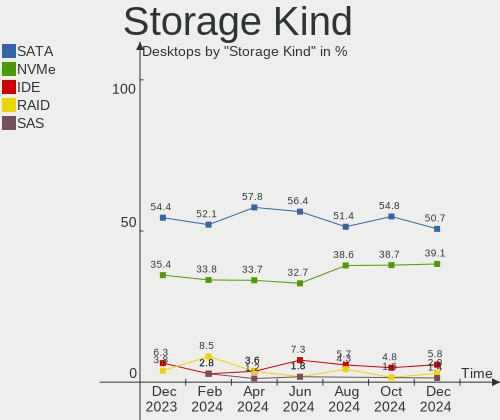
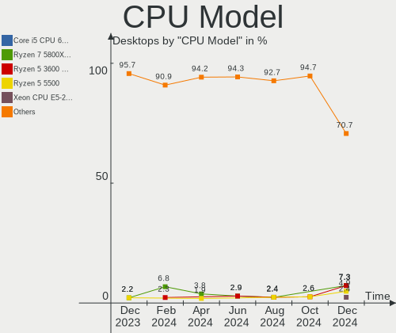
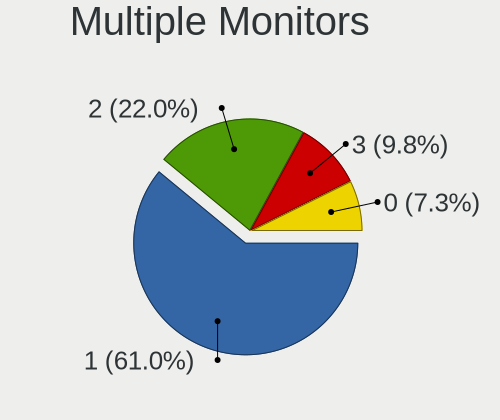
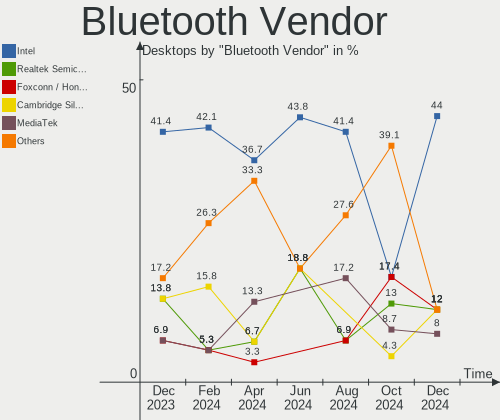
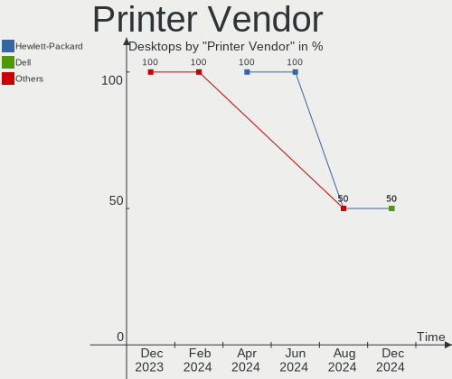
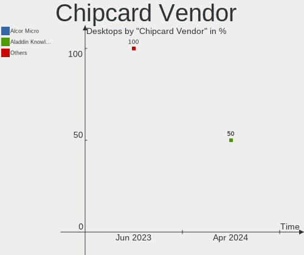

Manjaro - Hardware Trends (Desktops)
------------------------------------

A project to identify most popular hardware characteristics and track their change
over time based on data collected by Linux users at https://Linux-Hardware.org.

Anyone can contribute to this report by the [hw-probe](https://github.com/linuxhw/hw-probe) tool:

    sudo -E hw-probe -all -upload

This report is for one last month. Overall report since the beginning of time: [TestCoverage](https://github.com/linuxhw/TestCoverage)

Period: Jan, 2023.

Contents
--------

* [ System ](#system)
  - [ OS                       ](#os)
  - [ OS Family                ](#os-family)
  - [ Kernel                   ](#kernel)
  - [ Kernel Family            ](#kernel-family)
  - [ Kernel Major Ver.        ](#kernel-major-ver)
  - [ Arch                     ](#arch)
  - [ DE                       ](#de)
  - [ Display Server           ](#display-server)
  - [ Display Manager          ](#display-manager)
  - [ OS Lang                  ](#os-lang)
  - [ Boot Mode                ](#boot-mode)
  - [ Filesystem               ](#filesystem)
  - [ Part. scheme             ](#part-scheme)
  - [ Dual Boot with Linux/BSD ](#dual-boot-with-linuxbsd)
  - [ Dual Boot (Win)          ](#dual-boot-win)

* [ Board ](#board)
  - [ Vendor                   ](#vendor)
  - [ Model                    ](#model)
  - [ Model Family             ](#model-family)
  - [ MFG Year                 ](#mfg-year)
  - [ Form Factor              ](#form-factor)
  - [ Secure Boot              ](#secure-boot)
  - [ Coreboot                 ](#coreboot)
  - [ RAM Size                 ](#ram-size)
  - [ RAM Used                 ](#ram-used)
  - [ Total Drives             ](#total-drives)
  - [ Has CD-ROM               ](#has-cd-rom)
  - [ Has Ethernet             ](#has-ethernet)
  - [ Has WiFi                 ](#has-wifi)
  - [ Has Bluetooth            ](#has-bluetooth)

* [ Location ](#location)
  - [ Country                  ](#country)
  - [ City                     ](#city)

* [ Drives ](#drives)
  - [ Drive Vendor             ](#drive-vendor)
  - [ Drive Model              ](#drive-model)
  - [ HDD Vendor               ](#hdd-vendor)
  - [ SSD Vendor               ](#ssd-vendor)
  - [ Drive Kind               ](#drive-kind)
  - [ Drive Connector          ](#drive-connector)
  - [ Drive Size               ](#drive-size)
  - [ Space Total              ](#space-total)
  - [ Space Used               ](#space-used)
  - [ Malfunc. Drives          ](#malfunc-drives)
  - [ Malfunc. Drive Vendor    ](#malfunc-drive-vendor)
  - [ Malfunc. HDD Vendor      ](#malfunc-hdd-vendor)
  - [ Malfunc. Drive Kind      ](#malfunc-drive-kind)
  - [ Failed Drives            ](#failed-drives)
  - [ Failed Drive Vendor      ](#failed-drive-vendor)
  - [ Drive Status             ](#drive-status)

* [ Storage controller ](#storage-controller)
  - [ Storage Vendor           ](#storage-vendor)
  - [ Storage Model            ](#storage-model)
  - [ Storage Kind             ](#storage-kind)

* [ Processor ](#processor)
  - [ CPU Vendor               ](#cpu-vendor)
  - [ CPU Model                ](#cpu-model)
  - [ CPU Model Family         ](#cpu-model-family)
  - [ CPU Cores                ](#cpu-cores)
  - [ CPU Sockets              ](#cpu-sockets)
  - [ CPU Threads              ](#cpu-threads)
  - [ CPU Op-Modes             ](#cpu-op-modes)
  - [ CPU Microcode            ](#cpu-microcode)
  - [ CPU Microarch            ](#cpu-microarch)

* [ Graphics ](#graphics)
  - [ GPU Vendor               ](#gpu-vendor)
  - [ GPU Model                ](#gpu-model)
  - [ GPU Combo                ](#gpu-combo)
  - [ GPU Driver               ](#gpu-driver)
  - [ GPU Memory               ](#gpu-memory)

* [ Monitor ](#monitor)
  - [ Monitor Vendor           ](#monitor-vendor)
  - [ Monitor Model            ](#monitor-model)
  - [ Monitor Resolution       ](#monitor-resolution)
  - [ Monitor Diagonal         ](#monitor-diagonal)
  - [ Monitor Width            ](#monitor-width)
  - [ Aspect Ratio             ](#aspect-ratio)
  - [ Monitor Area             ](#monitor-area)
  - [ Pixel Density            ](#pixel-density)
  - [ Multiple Monitors        ](#multiple-monitors)

* [ Network ](#network)
  - [ Net Controller Vendor    ](#net-controller-vendor)
  - [ Net Controller Model     ](#net-controller-model)
  - [ Wireless Vendor          ](#wireless-vendor)
  - [ Wireless Model           ](#wireless-model)
  - [ Ethernet Vendor          ](#ethernet-vendor)
  - [ Ethernet Model           ](#ethernet-model)
  - [ Net Controller Kind      ](#net-controller-kind)
  - [ Used Controller          ](#used-controller)
  - [ NICs                     ](#nics)
  - [ IPv6                     ](#ipv6)

* [ Bluetooth ](#bluetooth)
  - [ Bluetooth Vendor         ](#bluetooth-vendor)
  - [ Bluetooth Model          ](#bluetooth-model)

* [ Sound ](#sound)
  - [ Sound Vendor             ](#sound-vendor)
  - [ Sound Model              ](#sound-model)

* [ Memory ](#memory)
  - [ Memory Vendor            ](#memory-vendor)
  - [ Memory Model             ](#memory-model)
  - [ Memory Kind              ](#memory-kind)
  - [ Memory Form Factor       ](#memory-form-factor)
  - [ Memory Size              ](#memory-size)
  - [ Memory Speed             ](#memory-speed)

* [ Printers & scanners ](#printers--scanners)
  - [ Printer Vendor           ](#printer-vendor)
  - [ Printer Model            ](#printer-model)
  - [ Scanner Vendor           ](#scanner-vendor)
  - [ Scanner Model            ](#scanner-model)

* [ Camera ](#camera)
  - [ Camera Vendor            ](#camera-vendor)
  - [ Camera Model             ](#camera-model)

* [ Security ](#security)
  - [ Fingerprint Vendor       ](#fingerprint-vendor)
  - [ Fingerprint Model        ](#fingerprint-model)
  - [ Chipcard Vendor          ](#chipcard-vendor)
  - [ Chipcard Model           ](#chipcard-model)

* [ Unsupported ](#unsupported)
  - [ Unsupported Devices      ](#unsupported-devices)
  - [ Unsupported Device Types ](#unsupported-device-types)

System
------

OS
--

Installed operating systems

| Name           | Desktops | Percent |
|----------------|----------|---------|
| Manjaro        | 37       | 53.62%  |
| Manjaro 22.0.0 | 16       | 23.19%  |
| Manjaro 22.0   | 9        | 13.04%  |
| Manjaro 22.0.1 | 7        | 10.14%  |

OS Family
---------

OS without a version

| Name    | Desktops | Percent |
|---------|----------|---------|
| Manjaro | 69       | 100%    |

Kernel
------

Version of the Linux kernel

| Version               | Desktops | Percent |
|-----------------------|----------|---------|
| 6.1.1-1-MANJARO       | 32       | 46.38%  |
| 5.15.85-1-MANJARO     | 11       | 15.94%  |
| 6.1.7-1-MANJARO       | 8        | 11.59%  |
| 6.0.19-3-MANJARO      | 2        | 2.9%    |
| 6.0.15-1-MANJARO      | 2        | 2.9%    |
| 5.19.17-2-MANJARO     | 2        | 2.9%    |
| 5.16.20-2-MANJARO     | 2        | 2.9%    |
| 5.15.89-1-MANJARO     | 2        | 2.9%    |
| 5.10.164-1-MANJARO    | 2        | 2.9%    |
| 6.1.5-lqx2-1-lqx      | 1        | 1.45%   |
| 5.9.16-1-MANJARO      | 1        | 1.45%   |
| 5.18.0-4-rt11-MANJARO | 1        | 1.45%   |
| 5.15.84-1-MANJARO     | 1        | 1.45%   |
| 5.15.65-1-MANJARO     | 1        | 1.45%   |
| 5.10.161-1-MANJARO    | 1        | 1.45%   |

Kernel Family
-------------

Linux kernel without a distro release

| Version  | Desktops | Percent |
|----------|----------|---------|
| 6.1.1    | 32       | 46.38%  |
| 5.15.85  | 11       | 15.94%  |
| 6.1.7    | 8        | 11.59%  |
| 6.0.19   | 2        | 2.9%    |
| 6.0.15   | 2        | 2.9%    |
| 5.19.17  | 2        | 2.9%    |
| 5.16.20  | 2        | 2.9%    |
| 5.15.89  | 2        | 2.9%    |
| 5.10.164 | 2        | 2.9%    |
| 6.1.5    | 1        | 1.45%   |
| 5.9.16   | 1        | 1.45%   |
| 5.18.0   | 1        | 1.45%   |
| 5.15.84  | 1        | 1.45%   |
| 5.15.65  | 1        | 1.45%   |
| 5.10.161 | 1        | 1.45%   |

Kernel Major Ver.
-----------------

Linux kernel major version

| Version | Desktops | Percent |
|---------|----------|---------|
| 6.1     | 41       | 59.42%  |
| 5.15    | 15       | 21.74%  |
| 6.0     | 4        | 5.8%    |
| 5.10    | 3        | 4.35%   |
| 5.19    | 2        | 2.9%    |
| 5.16    | 2        | 2.9%    |
| 5.9     | 1        | 1.45%   |
| 5.18    | 1        | 1.45%   |

Arch
----

OS architecture (x86_64, i586, etc.)

| Name   | Desktops | Percent |
|--------|----------|---------|
| x86_64 | 69       | 100%    |

DE
--

Desktop Environment

| Name       | Desktops | Percent |
|------------|----------|---------|
| KDE5       | 37       | 53.62%  |
| GNOME      | 16       | 23.19%  |
| XFCE       | 10       | 14.49%  |
| X-Cinnamon | 3        | 4.35%   |
| KDE        | 2        | 2.9%    |
| Unknown    | 1        | 1.45%   |

Display Server
--------------

X11 or Wayland

| Name    | Desktops | Percent |
|---------|----------|---------|
| X11     | 61       | 88.41%  |
| Wayland | 7        | 10.14%  |
| Tty     | 1        | 1.45%   |

Display Manager
---------------

SDDM, LightDM, etc.

| Name    | Desktops | Percent |
|---------|----------|---------|
| Unknown | 37       | 53.62%  |
| SDDM    | 17       | 24.64%  |
| LightDM | 8        | 11.59%  |
| GDM     | 6        | 8.7%    |
| LYNDE   | 1        | 1.45%   |

OS Lang
-------

Language

| Lang    | Desktops | Percent |
|---------|----------|---------|
| en_US   | 27       | 39.13%  |
| en_GB   | 6        | 8.7%    |
| de_DE   | 5        | 7.25%   |
| pl_PL   | 4        | 5.8%    |
| fr_FR   | 4        | 5.8%    |
| ru_RU   | 3        | 4.35%   |
| pt_BR   | 3        | 4.35%   |
| it_IT   | 2        | 2.9%    |
| es_MX   | 2        | 2.9%    |
| en_AU   | 2        | 2.9%    |
| sl_SI   | 1        | 1.45%   |
| nl_NL   | 1        | 1.45%   |
| fr_BE   | 1        | 1.45%   |
| es_PE   | 1        | 1.45%   |
| es_ES   | 1        | 1.45%   |
| es_CR   | 1        | 1.45%   |
| es_CO   | 1        | 1.45%   |
| es_AR   | 1        | 1.45%   |
| en_CA   | 1        | 1.45%   |
| de_AT   | 1        | 1.45%   |
| Unknown | 1        | 1.45%   |

Boot Mode
---------

EFI or BIOS

| Mode | Desktops | Percent |
|------|----------|---------|
| BIOS | 45       | 65.22%  |
| EFI  | 24       | 34.78%  |

Filesystem
----------

Type of filesystem

| Type  | Desktops | Percent |
|-------|----------|---------|
| Ext4  | 57       | 82.61%  |
| Btrfs | 10       | 14.49%  |
| Xfs   | 1        | 1.45%   |
| Tmpfs | 1        | 1.45%   |

Part. scheme
------------

Scheme of partitioning

| Type    | Desktops | Percent |
|---------|----------|---------|
| Unknown | 34       | 49.28%  |
| GPT     | 28       | 40.58%  |
| MBR     | 7        | 10.14%  |

Dual Boot with Linux/BSD
------------------------

Hosting more than one Linux/BSD

| Dual boot | Desktops | Percent |
|-----------|----------|---------|
| No        | 59       | 85.51%  |
| Yes       | 10       | 14.49%  |

Dual Boot (Win)
---------------

Hosting Linux and Windows

| Dual boot | Desktops | Percent |
|-----------|----------|---------|
| No        | 52       | 75.36%  |
| Yes       | 17       | 24.64%  |

Board
-----

Vendor
------

Motherboard manufacturer

| Name                                 | Desktops | Percent |
|--------------------------------------|----------|---------|
| ASUSTek Computer                     | 25       | 36.23%  |
| Gigabyte Technology                  | 14       | 20.29%  |
| MSI                                  | 8        | 11.59%  |
| ASRock                               | 6        | 8.7%    |
| Dell                                 | 5        | 7.25%   |
| Lenovo                               | 3        | 4.35%   |
| Intel                                | 2        | 2.9%    |
| Shuttle                              | 1        | 1.45%   |
| Shenzhen Meigao Electronic Equipment | 1        | 1.45%   |
| Hewlett-Packard                      | 1        | 1.45%   |
| Biostar                              | 1        | 1.45%   |
| AZW                                  | 1        | 1.45%   |
| Apple                                | 1        | 1.45%   |

Model
-----

Motherboard model

| Name                                       | Desktops | Percent |
|--------------------------------------------|----------|---------|
| MSI MS-7C37                                | 2        | 2.9%    |
| MSI MS-7C02                                | 2        | 2.9%    |
| Dell OptiPlex 755                          | 2        | 2.9%    |
| ASUS M5A97 R2.0                            | 2        | 2.9%    |
| ASUS All Series                            | 2        | 2.9%    |
| Shuttle DS61                               | 1        | 1.45%   |
| Shenzhen Meigao Electronic Equipment UM560 | 1        | 1.45%   |
| MSI MS-7C96                                | 1        | 1.45%   |
| MSI MS-7C95                                | 1        | 1.45%   |
| MSI MS-7C09                                | 1        | 1.45%   |
| MSI MS-7851                                | 1        | 1.45%   |
| Lenovo ThinkStation S30 43511K5            | 1        | 1.45%   |
| Lenovo ThinkCentre M77 1996AB8             | 1        | 1.45%   |
| Lenovo H535s 10119                         | 1        | 1.45%   |
| Intel Starmax Desktop                      | 1        | 1.45%   |
| Intel DG965SS AAD41678-306                 | 1        | 1.45%   |
| HP EliteDesk 705 G2 SFF                    | 1        | 1.45%   |
| Gigabyte Z97X-Gaming 7                     | 1        | 1.45%   |
| Gigabyte Z87N-WIFI                         | 1        | 1.45%   |
| Gigabyte Z390 DESIGNARE                    | 1        | 1.45%   |
| Gigabyte X670 AORUS ELITE AX               | 1        | 1.45%   |
| Gigabyte X470 AORUS ULTRA GAMING           | 1        | 1.45%   |
| Gigabyte H77-D3H                           | 1        | 1.45%   |
| Gigabyte GA-970A-UD3                       | 1        | 1.45%   |
| Gigabyte F2A68HM-H                         | 1        | 1.45%   |
| Gigabyte B550I AORUS PRO AX                | 1        | 1.45%   |
| Gigabyte B550 AORUS ELITE AX               | 1        | 1.45%   |
| Gigabyte B450M S2H                         | 1        | 1.45%   |
| Gigabyte A320M-S2H                         | 1        | 1.45%   |
| Gigabyte 990FXA-UD3                        | 1        | 1.45%   |
| Gigabyte 945GCM-S2C                        | 1        | 1.45%   |
| Dell OptiPlex 9020                         | 1        | 1.45%   |
| Dell OptiPlex 790                          | 1        | 1.45%   |
| Dell OptiPlex 3020                         | 1        | 1.45%   |
| Biostar A320MH                             | 1        | 1.45%   |
| AZW GTR                                    | 1        | 1.45%   |
| ASUS TUF Gaming X570-PLUS                  | 1        | 1.45%   |
| ASUS ROG STRIX X570-F GAMING               | 1        | 1.45%   |
| ASUS ROG STRIX B550-F GAMING               | 1        | 1.45%   |
| ASUS ROG STRIX B450-I GAMING               | 1        | 1.45%   |

Model Family
------------

Motherboard model prefix

| Name                                       | Desktops | Percent |
|--------------------------------------------|----------|---------|
| ASUS PRIME                                 | 8        | 11.59%  |
| Dell OptiPlex                              | 5        | 7.25%   |
| ASUS ROG                                   | 5        | 7.25%   |
| ASUS M5A97                                 | 3        | 4.35%   |
| MSI MS-7C37                                | 2        | 2.9%    |
| MSI MS-7C02                                | 2        | 2.9%    |
| ASUS All                                   | 2        | 2.9%    |
| Shuttle DS61                               | 1        | 1.45%   |
| Shenzhen Meigao Electronic Equipment UM560 | 1        | 1.45%   |
| MSI MS-7C96                                | 1        | 1.45%   |
| MSI MS-7C95                                | 1        | 1.45%   |
| MSI MS-7C09                                | 1        | 1.45%   |
| MSI MS-7851                                | 1        | 1.45%   |
| Lenovo ThinkStation                        | 1        | 1.45%   |
| Lenovo ThinkCentre                         | 1        | 1.45%   |
| Lenovo H535s                               | 1        | 1.45%   |
| Intel Starmax                              | 1        | 1.45%   |
| Intel DG965SS                              | 1        | 1.45%   |
| HP EliteDesk                               | 1        | 1.45%   |
| Gigabyte Z97X-Gaming                       | 1        | 1.45%   |
| Gigabyte Z87N-WIFI                         | 1        | 1.45%   |
| Gigabyte Z390                              | 1        | 1.45%   |
| Gigabyte X670                              | 1        | 1.45%   |
| Gigabyte X470                              | 1        | 1.45%   |
| Gigabyte H77-D3H                           | 1        | 1.45%   |
| Gigabyte GA-970A-UD3                       | 1        | 1.45%   |
| Gigabyte F2A68HM-H                         | 1        | 1.45%   |
| Gigabyte B550I                             | 1        | 1.45%   |
| Gigabyte B550                              | 1        | 1.45%   |
| Gigabyte B450M                             | 1        | 1.45%   |
| Gigabyte A320M-S2H                         | 1        | 1.45%   |
| Gigabyte 990FXA-UD3                        | 1        | 1.45%   |
| Gigabyte 945GCM-S2C                        | 1        | 1.45%   |
| Biostar A320MH                             | 1        | 1.45%   |
| AZW GTR                                    | 1        | 1.45%   |
| ASUS TUF                                   | 1        | 1.45%   |
| ASUS P5Q                                   | 1        | 1.45%   |
| ASUS M32CD                                 | 1        | 1.45%   |
| ASUS K30AD                                 | 1        | 1.45%   |
| ASUS GD30CI                                | 1        | 1.45%   |

MFG Year
--------

Motherboard manufacture year

| Year | Desktops | Percent |
|------|----------|---------|
| 2020 | 10       | 14.49%  |
| 2018 | 10       | 14.49%  |
| 2019 | 9        | 13.04%  |
| 2013 | 7        | 10.14%  |
| 2014 | 6        | 8.7%    |
| 2022 | 4        | 5.8%    |
| 2012 | 4        | 5.8%    |
| 2007 | 4        | 5.8%    |
| 2021 | 3        | 4.35%   |
| 2016 | 3        | 4.35%   |
| 2015 | 3        | 4.35%   |
| 2017 | 2        | 2.9%    |
| 2011 | 2        | 2.9%    |
| 2009 | 1        | 1.45%   |
| 2008 | 1        | 1.45%   |

Form Factor
-----------

Physical design of the computer

| Name    | Desktops | Percent |
|---------|----------|---------|
| Desktop | 69       | 100%    |

Secure Boot
-----------

Enabled or disabled

| State    | Desktops | Percent |
|----------|----------|---------|
| Disabled | 69       | 100%    |

Coreboot
--------

Have coreboot on board

| Used | Desktops | Percent |
|------|----------|---------|
| No   | 69       | 100%    |

RAM Size
--------

Total RAM memory

| Size in GB  | Desktops | Percent |
|-------------|----------|---------|
| 16.01-24.0  | 24       | 34.78%  |
| 32.01-64.0  | 15       | 21.74%  |
| 4.01-8.0    | 8        | 11.59%  |
| 24.01-32.0  | 7        | 10.14%  |
| 64.01-256.0 | 6        | 8.7%    |
| 8.01-16.0   | 6        | 8.7%    |
| 3.01-4.0    | 2        | 2.9%    |
| 1.01-2.0    | 1        | 1.45%   |

RAM Used
--------

Used RAM memory

| Used GB    | Desktops | Percent |
|------------|----------|---------|
| 4.01-8.0   | 18       | 26.09%  |
| 3.01-4.0   | 17       | 24.64%  |
| 1.01-2.0   | 12       | 17.39%  |
| 2.01-3.0   | 9        | 13.04%  |
| 8.01-16.0  | 8        | 11.59%  |
| 16.01-24.0 | 3        | 4.35%   |
| 32.01-64.0 | 1        | 1.45%   |
| 0.51-1.0   | 1        | 1.45%   |

Total Drives
------------

Number of drives on board

| Drives | Desktops | Percent |
|--------|----------|---------|
| 2      | 24       | 34.78%  |
| 1      | 14       | 20.29%  |
| 3      | 13       | 18.84%  |
| 4      | 8        | 11.59%  |
| 5      | 6        | 8.7%    |
| 9      | 2        | 2.9%    |
| 7      | 1        | 1.45%   |
| 6      | 1        | 1.45%   |

Has CD-ROM
----------

Has CD-ROM on board

| Presented | Desktops | Percent |
|-----------|----------|---------|
| No        | 47       | 68.12%  |
| Yes       | 22       | 31.88%  |

Has Ethernet
------------

Has Ethernet on board

| Presented | Desktops | Percent |
|-----------|----------|---------|
| Yes       | 69       | 100%    |

Has WiFi
--------

Has WiFi module

| Presented | Desktops | Percent |
|-----------|----------|---------|
| Yes       | 37       | 53.62%  |
| No        | 32       | 46.38%  |

Has Bluetooth
-------------

Has Bluetooth module

| Presented | Desktops | Percent |
|-----------|----------|---------|
| No        | 37       | 53.62%  |
| Yes       | 32       | 46.38%  |

Location
--------

Country
-------

Geographic location (country)

| Country     | Desktops | Percent |
|-------------|----------|---------|
| USA         | 16       | 23.19%  |
| Germany     | 7        | 10.14%  |
| UK          | 4        | 5.8%    |
| Russia      | 4        | 5.8%    |
| France      | 4        | 5.8%    |
| Brazil      | 4        | 5.8%    |
| Poland      | 3        | 4.35%   |
| Turkey      | 2        | 2.9%    |
| Italy       | 2        | 2.9%    |
| Colombia    | 2        | 2.9%    |
| Australia   | 2        | 2.9%    |
| Uzbekistan  | 1        | 1.45%   |
| Ukraine     | 1        | 1.45%   |
| Taiwan      | 1        | 1.45%   |
| Spain       | 1        | 1.45%   |
| Slovenia    | 1        | 1.45%   |
| Romania     | 1        | 1.45%   |
| Peru        | 1        | 1.45%   |
| Netherlands | 1        | 1.45%   |
| Mexico      | 1        | 1.45%   |
| Kenya       | 1        | 1.45%   |
| Iran        | 1        | 1.45%   |
| Indonesia   | 1        | 1.45%   |
| Costa Rica  | 1        | 1.45%   |
| Canada      | 1        | 1.45%   |
| Bulgaria    | 1        | 1.45%   |
| Belgium     | 1        | 1.45%   |
| Belarus     | 1        | 1.45%   |
| Austria     | 1        | 1.45%   |
| Argentina   | 1        | 1.45%   |

City
----

Geographic location (city)

| City                  | Desktops | Percent |
|-----------------------|----------|---------|
| New York              | 2        | 2.9%    |
| Leeds                 | 2        | 2.9%    |
| Istanbul              | 2        | 2.9%    |
| Zweibrücken          | 1        | 1.45%   |
| Yekaterinburg         | 1        | 1.45%   |
| Winston-Salem         | 1        | 1.45%   |
| Vienna                | 1        | 1.45%   |
| Varna                 | 1        | 1.45%   |
| Tübingen             | 1        | 1.45%   |
| Tehran                | 1        | 1.45%   |
| Tashkent              | 1        | 1.45%   |
| Syktyvkar             | 1        | 1.45%   |
| Sydney                | 1        | 1.45%   |
| St Petersburg         | 1        | 1.45%   |
| Simferopol            | 1        | 1.45%   |
| Sao Paulo             | 1        | 1.45%   |
| Santa Ana             | 1        | 1.45%   |
| San Antonio           | 1        | 1.45%   |
| Royal Oak             | 1        | 1.45%   |
| Roxbury Crossing      | 1        | 1.45%   |
| Rio de Janeiro        | 1        | 1.45%   |
| Ribeirao Preto        | 1        | 1.45%   |
| Rennes                | 1        | 1.45%   |
| Queen Creek           | 1        | 1.45%   |
| Port Victoria         | 1        | 1.45%   |
| Phoenix               | 1        | 1.45%   |
| Pasto                 | 1        | 1.45%   |
| Owings Mills          | 1        | 1.45%   |
| Oleggio               | 1        | 1.45%   |
| Nizhniy Novgorod      | 1        | 1.45%   |
| New Taipei            | 1        | 1.45%   |
| Nairobi               | 1        | 1.45%   |
| Monticello Conte Otto | 1        | 1.45%   |
| Minsk                 | 1        | 1.45%   |
| Mexico City           | 1        | 1.45%   |
| Malbork               | 1        | 1.45%   |
| Lima                  | 1        | 1.45%   |
| Krefeld               | 1        | 1.45%   |
| Krakow                | 1        | 1.45%   |
| Koper                 | 1        | 1.45%   |

Drives
------

Drive Vendor
------------

Hard drive vendors

| Vendor                      | Desktops | Drives | Percent |
|-----------------------------|----------|--------|---------|
| WDC                         | 25       | 35     | 16.34%  |
| Seagate                     | 22       | 30     | 14.38%  |
| Samsung Electronics         | 18       | 26     | 11.76%  |
| Sandisk                     | 9        | 11     | 5.88%   |
| Toshiba                     | 8        | 8      | 5.23%   |
| Kingston                    | 8        | 8      | 5.23%   |
| Crucial                     | 7        | 7      | 4.58%   |
| Intel                       | 6        | 6      | 3.92%   |
| Silicon Motion              | 5        | 6      | 3.27%   |
| Kingston Technology Company | 4        | 5      | 2.61%   |
| China                       | 4        | 4      | 2.61%   |
| GOODRAM                     | 3        | 4      | 1.96%   |
| A-DATA Technology           | 3        | 4      | 1.96%   |
| Patriot                     | 2        | 2      | 1.31%   |
| Micron/Crucial Technology   | 2        | 2      | 1.31%   |
| Leven                       | 2        | 2      | 1.31%   |
| Hitachi                     | 2        | 3      | 1.31%   |
| WD MediaMax                 | 1        | 1      | 0.65%   |
| Unknown                     | 1        | 3      | 0.65%   |
| TO Exter                    | 1        | 1      | 0.65%   |
| SPCC                        | 1        | 1      | 0.65%   |
| SK hynix                    | 1        | 1      | 0.65%   |
| Seagate Technology          | 1        | 1      | 0.65%   |
| Promise                     | 1        | 4      | 0.65%   |
| PNY                         | 1        | 1      | 0.65%   |
| Phison Electronics          | 1        | 1      | 0.65%   |
| Phison                      | 1        | 1      | 0.65%   |
| OCZ                         | 1        | 2      | 0.65%   |
| Maxtor                      | 1        | 1      | 0.65%   |
| KLEVV                       | 1        | 1      | 0.65%   |
| KingSpec                    | 1        | 1      | 0.65%   |
| JMicron Technology          | 1        | 1      | 0.65%   |
| Intenso                     | 1        | 1      | 0.65%   |
| Initio                      | 1        | 1      | 0.65%   |
| HGST                        | 1        | 1      | 0.65%   |
| Gigabyte Technology         | 1        | 1      | 0.65%   |
| Corsair                     | 1        | 1      | 0.65%   |
| ASMT                        | 1        | 1      | 0.65%   |
| Apple                       | 1        | 1      | 0.65%   |
| ADATA Technology            | 1        | 1      | 0.65%   |

Drive Model
-----------

Hard drive models

| Model                                                 | Desktops | Percent |
|-------------------------------------------------------|----------|---------|
| Samsung NVMe SSD Controller PM9A1/PM9A3/980PRO 512GB  | 5        | 2.86%   |
| Kingston SA400S37240G 240GB SSD                       | 4        | 2.29%   |
| WDC WD30EZRZ-00Z5HB0 3TB                              | 3        | 1.71%   |
| Samsung SSD 860 EVO 500GB                             | 3        | 1.71%   |
| Samsung NVMe SSD Controller SM981/PM981/PM983 500GB   | 3        | 1.71%   |
| Kingston Company A2000 NVMe SSD 1TB                   | 3        | 1.71%   |
| WDC WD40EZRZ-00WN9B0 4TB                              | 2        | 1.14%   |
| WDC WD40EFRX-68N32N0 4TB                              | 2        | 1.14%   |
| WDC WD10EZEX-08WN4A0 1TB                              | 2        | 1.14%   |
| Toshiba DT01ACA200 2TB                                | 2        | 1.14%   |
| Silicon Motion SM2263EN/SM2263XT SSD Controller 512GB | 2        | 1.14%   |
| Silicon Motion SM2262/SM2262EN SSD Controller 1TB     | 2        | 1.14%   |
| Seagate ST500DM002-1BD142 500GB                       | 2        | 1.14%   |
| Seagate ST4000DM004-2CV104 4TB                        | 2        | 1.14%   |
| Seagate ST2000DM008-2FR102 2TB                        | 2        | 1.14%   |
| Samsung SSD 980 1TB                                   | 2        | 1.14%   |
| Patriot Burst 240GB SSD                               | 2        | 1.14%   |
| Leven JAJS300M240C 240GB                              | 2        | 1.14%   |
| Intel SSD 660P Series 512GB                           | 2        | 1.14%   |
| GOODRAM SSDPR-CX400-128 128GB                         | 2        | 1.14%   |
| Crucial CT500MX500SSD1 500GB                          | 2        | 1.14%   |
| Crucial CT2000MX500SSD1 2TB                           | 2        | 1.14%   |
| WDC WDS500G2B0A 500GB SSD                             | 1        | 0.57%   |
| WDC WDS240G2G0A-00JH30 240GB SSD                      | 1        | 0.57%   |
| WDC WDS200T2B0A-00SM50 2TB SSD                        | 1        | 0.57%   |
| WDC WDS100T2B0A-00SM50 1TB SSD                        | 1        | 0.57%   |
| WDC WDBNCE0010PNC-WRSN 1TB SSD                        | 1        | 0.57%   |
| WDC WDBNCE0010PNC 1TB SSD                             | 1        | 0.57%   |
| WDC WD60EZAZ-00ZGHB0 6TB                              | 1        | 0.57%   |
| WDC WD60EFZX-68B3FN0 6TB                              | 1        | 0.57%   |
| WDC WD5000AZLX-60K2TA0 500GB                          | 1        | 0.57%   |
| WDC WD5000AAKX-60U6AA0 500GB                          | 1        | 0.57%   |
| WDC WD5000AAKX-001CA0 500GB                           | 1        | 0.57%   |
| WDC WD50 00AAVS-00ZTB0 500GB                          | 1        | 0.57%   |
| WDC WD40EZRZ-00GXCB0 4TB                              | 1        | 0.57%   |
| WDC WD30EFRX-68EUZN0 3TB                              | 1        | 0.57%   |
| WDC WD10SPZX-24Z10 1TB                                | 1        | 0.57%   |
| WDC WD10SPZX-21Z10T0 1TB                              | 1        | 0.57%   |
| WDC WD10JPVX-60JC3T0 1TB                              | 1        | 0.57%   |
| WDC WD10EZRX-00L4HB0 1TB                              | 1        | 0.57%   |

HDD Vendor
----------

Hard disk drive vendors

| Vendor              | Desktops | Drives | Percent |
|---------------------|----------|--------|---------|
| WDC                 | 22       | 29     | 37.93%  |
| Seagate             | 20       | 24     | 34.48%  |
| Toshiba             | 7        | 7      | 12.07%  |
| Samsung Electronics | 3        | 3      | 5.17%   |
| Hitachi             | 2        | 3      | 3.45%   |
| Maxtor              | 1        | 1      | 1.72%   |
| Intenso             | 1        | 1      | 1.72%   |
| HGST                | 1        | 1      | 1.72%   |
| ASMT                | 1        | 1      | 1.72%   |

SSD Vendor
----------

Solid state drive vendors

| Vendor              | Desktops | Drives | Percent |
|---------------------|----------|--------|---------|
| Samsung Electronics | 9        | 9      | 15.25%  |
| Kingston            | 7        | 7      | 11.86%  |
| Crucial             | 7        | 7      | 11.86%  |
| WDC                 | 4        | 6      | 6.78%   |
| SanDisk             | 4        | 6      | 6.78%   |
| China               | 4        | 4      | 6.78%   |
| GOODRAM             | 3        | 4      | 5.08%   |
| A-DATA Technology   | 3        | 4      | 5.08%   |
| Patriot             | 2        | 2      | 3.39%   |
| Leven               | 2        | 2      | 3.39%   |
| Intel               | 2        | 2      | 3.39%   |
| TO Exter            | 1        | 1      | 1.69%   |
| SPCC                | 1        | 1      | 1.69%   |
| SK hynix            | 1        | 1      | 1.69%   |
| Seagate             | 1        | 1      | 1.69%   |
| PNY                 | 1        | 1      | 1.69%   |
| OCZ                 | 1        | 2      | 1.69%   |
| KLEVV               | 1        | 1      | 1.69%   |
| KingSpec            | 1        | 1      | 1.69%   |
| Initio              | 1        | 1      | 1.69%   |
| Gigabyte Technology | 1        | 1      | 1.69%   |
| Corsair             | 1        | 1      | 1.69%   |
| Apple               | 1        | 1      | 1.69%   |

Drive Kind
----------

HDD or SSD

| Kind    | Desktops | Drives | Percent |
|---------|----------|--------|---------|
| SSD     | 48       | 66     | 36.36%  |
| HDD     | 45       | 70     | 34.09%  |
| NVMe    | 33       | 42     | 25%     |
| Unknown | 6        | 14     | 4.55%   |

Drive Connector
---------------

SATA, SAS, NVMe, etc.

| Type | Desktops | Drives | Percent |
|------|----------|--------|---------|
| SATA | 64       | 130    | 59.26%  |
| NVMe | 33       | 42     | 30.56%  |
| SAS  | 11       | 20     | 10.19%  |

Drive Size
----------

Size of hard drive

| Size in TB | Desktops | Drives | Percent |
|------------|----------|--------|---------|
| 0.01-0.5   | 39       | 63     | 40.21%  |
| 0.51-1.0   | 31       | 38     | 31.96%  |
| 1.01-2.0   | 9        | 11     | 9.28%   |
| 3.01-4.0   | 6        | 9      | 6.19%   |
| 2.01-3.0   | 6        | 7      | 6.19%   |
| 4.01-10.0  | 5        | 7      | 5.15%   |
| 10.01-20.0 | 1        | 1      | 1.03%   |

Space Total
-----------

Amount of disk space available on the file system

| Size in GB     | Desktops | Percent |
|----------------|----------|---------|
| 251-500        | 15       | 21.74%  |
| 1001-2000      | 13       | 18.84%  |
| More than 3000 | 12       | 17.39%  |
| 101-250        | 9        | 13.04%  |
| 501-1000       | 8        | 11.59%  |
| 2001-3000      | 5        | 7.25%   |
| Unknown        | 5        | 7.25%   |
| 1-20           | 1        | 1.45%   |
| 51-100         | 1        | 1.45%   |

Space Used
----------

Amount of used disk space

| Used GB        | Desktops | Percent |
|----------------|----------|---------|
| 251-500        | 12       | 17.39%  |
| 501-1000       | 9        | 13.04%  |
| 21-50          | 8        | 11.59%  |
| 101-250        | 8        | 11.59%  |
| 1-20           | 8        | 11.59%  |
| 51-100         | 6        | 8.7%    |
| More than 3000 | 5        | 7.25%   |
| 1001-2000      | 5        | 7.25%   |
| Unknown        | 5        | 7.25%   |
| 2001-3000      | 3        | 4.35%   |

Malfunc. Drives
---------------

Drive models with a malfunction

| Model                           | Desktops | Drives | Percent |
|---------------------------------|----------|--------|---------|
| WDC WD30EZRZ-00Z5HB0 3TB        | 1        | 1      | 14.29%  |
| WDC WD30EFRX-68EUZN0 3TB        | 1        | 1      | 14.29%  |
| Seagate ST500LT012-9WS142 500GB | 1        | 1      | 14.29%  |
| Seagate ST250DM000-1BD141 250GB | 1        | 1      | 14.29%  |
| SanDisk SSD PLUS 240 GB         | 1        | 1      | 14.29%  |
| KingSpec P3-128 128GB SSD       | 1        | 1      | 14.29%  |
| Crucial CT525MX300SSD1 528GB    | 1        | 1      | 14.29%  |

Malfunc. Drive Vendor
---------------------

Vendors of faulty drives

| Vendor   | Desktops | Drives | Percent |
|----------|----------|--------|---------|
| WDC      | 2        | 2      | 28.57%  |
| Seagate  | 2        | 2      | 28.57%  |
| SanDisk  | 1        | 1      | 14.29%  |
| KingSpec | 1        | 1      | 14.29%  |
| Crucial  | 1        | 1      | 14.29%  |

Malfunc. HDD Vendor
-------------------

Vendors of faulty HDD drives

| Vendor  | Desktops | Drives | Percent |
|---------|----------|--------|---------|
| WDC     | 2        | 2      | 50%     |
| Seagate | 2        | 2      | 50%     |

Malfunc. Drive Kind
-------------------

Kinds of faulty drives

| Kind | Desktops | Drives | Percent |
|------|----------|--------|---------|
| HDD  | 4        | 4      | 57.14%  |
| SSD  | 3        | 3      | 42.86%  |

Failed Drives
-------------

Failed drive models

Zero info for selected period =(

Failed Drive Vendor
-------------------

Failed drive vendors

Zero info for selected period =(

Drive Status
------------

Number of failed and malfunc. drives

| Status   | Desktops | Drives | Percent |
|----------|----------|--------|---------|
| Detected | 50       | 135    | 64.94%  |
| Works    | 21       | 50     | 27.27%  |
| Malfunc  | 6        | 7      | 7.79%   |

Storage controller
------------------

Storage Vendor
--------------

Storage controller vendors

| Vendor                       | Desktops | Percent |
|------------------------------|----------|---------|
| AMD                          | 37       | 32.74%  |
| Intel                        | 31       | 27.43%  |
| Samsung Electronics          | 12       | 10.62%  |
| Silicon Motion               | 5        | 4.42%   |
| SanDisk                      | 5        | 4.42%   |
| Kingston Technology Company  | 5        | 4.42%   |
| ASMedia Technology           | 4        | 3.54%   |
| Marvell Technology Group     | 3        | 2.65%   |
| Phison Electronics           | 2        | 1.77%   |
| Micron/Crucial Technology    | 2        | 1.77%   |
| JMicron Technology           | 2        | 1.77%   |
| Toshiba America Info Systems | 1        | 0.88%   |
| Silicon Image                | 1        | 0.88%   |
| Seagate Technology           | 1        | 0.88%   |
| Promise Technology           | 1        | 0.88%   |
| ADATA Technology             | 1        | 0.88%   |

Storage Model
-------------

Storage controller models

| Model                                                                          | Desktops | Percent |
|--------------------------------------------------------------------------------|----------|---------|
| AMD FCH SATA Controller [AHCI mode]                                            | 21       | 15.79%  |
| AMD 400 Series Chipset SATA Controller                                         | 8        | 6.02%   |
| Intel 8 Series/C220 Series Chipset Family 6-port SATA Controller 1 [AHCI mode] | 7        | 5.26%   |
| AMD 500 Series Chipset SATA Controller                                         | 7        | 5.26%   |
| Samsung NVMe SSD Controller PM9A1/PM9A3/980PRO                                 | 5        | 3.76%   |
| AMD SB7x0/SB8x0/SB9x0 SATA Controller [AHCI mode]                              | 5        | 3.76%   |
| Intel 200 Series PCH SATA controller [AHCI mode]                               | 4        | 3.01%   |
| ASMedia ASM1062 Serial ATA Controller                                          | 4        | 3.01%   |
| Silicon Motion SM2263EN/SM2263XT SSD Controller                                | 3        | 2.26%   |
| SanDisk Non-Volatile memory controller                                         | 3        | 2.26%   |
| Samsung NVMe SSD Controller SM981/PM981/PM983                                  | 3        | 2.26%   |
| Samsung NVMe SSD Controller 980                                                | 3        | 2.26%   |
| Kingston Company A2000 NVMe SSD                                                | 3        | 2.26%   |
| Intel 9 Series Chipset Family SATA Controller [AHCI Mode]                      | 3        | 2.26%   |
| Silicon Motion SM2262/SM2262EN SSD Controller                                  | 2        | 1.5%    |
| Kingston Company Company Non-Volatile memory controller                        | 2        | 1.5%    |
| Intel SSD Pro 7600p/760p/E 6100p Series                                        | 2        | 1.5%    |
| Intel SSD 660P Series                                                          | 2        | 1.5%    |
| Intel 82Q35 Express PT IDER Controller                                         | 2        | 1.5%    |
| Intel 82801IR/IO/IH (ICH9R/DO/DH) 6 port SATA Controller [AHCI mode]           | 2        | 1.5%    |
| Intel 82801HR/HO/HH (ICH8R/DO/DH) 2 port SATA Controller [IDE mode]            | 2        | 1.5%    |
| Intel 82801H (ICH8 Family) 4 port SATA Controller [IDE mode]                   | 2        | 1.5%    |
| Intel 6 Series/C200 Series Chipset Family 6 port Desktop SATA AHCI Controller  | 2        | 1.5%    |
| Intel 500 Series Chipset Family SATA AHCI Controller                           | 2        | 1.5%    |
| AMD FCH SATA Controller D                                                      | 2        | 1.5%    |
| Toshiba America Info Systems BG3 NVMe SSD Controller                           | 1        | 0.75%   |
| Silicon Image PCI0680 Ultra ATA-133 Host Controller                            | 1        | 0.75%   |
| Seagate FireCuda 510 SSD                                                       | 1        | 0.75%   |
| SanDisk WD Blue SN570 NVMe SSD                                                 | 1        | 0.75%   |
| SanDisk WD Black SN750 / PC SN730 NVMe SSD                                     | 1        | 0.75%   |
| Samsung NVMe SSD Controller SM961/PM961/SM963                                  | 1        | 0.75%   |
| Samsung Apple PCIe SSD                                                         | 1        | 0.75%   |
| Promise PM8010 [SuperTrak EX SAS and SATA 6G RAID Controller]                  | 1        | 0.75%   |
| Phison Electronics Non-Volatile memory controller                              | 1        | 0.75%   |
| Phison E16 PCIe4 NVMe Controller                                               | 1        | 0.75%   |
| Micron/Crucial P5 Plus NVMe PCIe SSD                                           | 1        | 0.75%   |
| Micron/Crucial NVMe Controller                                                 | 1        | 0.75%   |
| Marvell Group 88SE9215 PCIe 2.0 x1 4-port SATA 6 Gb/s Controller               | 1        | 0.75%   |
| Marvell Group 88SE9172 SATA 6Gb/s Controller                                   | 1        | 0.75%   |
| Marvell Group 88SE6101/6102 single-port PATA133 interface                      | 1        | 0.75%   |

Storage Kind
------------

Kind of storage controller (IDE, SATA, NVMe, SAS, ...)

| Kind | Desktops | Percent |
|------|----------|---------|
| SATA | 62       | 56.88%  |
| NVMe | 33       | 30.28%  |
| IDE  | 9        | 8.26%   |
| RAID | 4        | 3.67%   |
| SAS  | 1        | 0.92%   |

Processor
---------

CPU Vendor
----------

Processor vendors

| Vendor | Desktops | Percent |
|--------|----------|---------|
| AMD    | 39       | 56.52%  |
| Intel  | 30       | 43.48%  |

CPU Model
---------

Processor models

| Model                                   | Desktops | Percent |
|-----------------------------------------|----------|---------|
| AMD Ryzen 5 5600X 6-Core Processor      | 3        | 4.35%   |
| AMD Ryzen 5 3600 6-Core Processor       | 3        | 4.35%   |
| Intel Core i7-4790K CPU @ 4.00GHz       | 2        | 2.9%    |
| Intel Core 2 Quad CPU Q6600 @ 2.40GHz   | 2        | 2.9%    |
| AMD Ryzen 7 5800X 8-Core Processor      | 2        | 2.9%    |
| AMD Ryzen 7 5700G with Radeon Graphics  | 2        | 2.9%    |
| AMD Ryzen 7 3700X 8-Core Processor      | 2        | 2.9%    |
| AMD Ryzen 7 2700 Eight-Core Processor   | 2        | 2.9%    |
| AMD Ryzen 5 3600X 6-Core Processor      | 2        | 2.9%    |
| AMD Ryzen 5 2600 Six-Core Processor     | 2        | 2.9%    |
| AMD FX-8350 Eight-Core Processor        | 2        | 2.9%    |
| Intel Xeon CPU E5-2697 v2 @ 2.70GHz     | 1        | 1.45%   |
| Intel Xeon CPU E5-2620 0 @ 2.00GHz      | 1        | 1.45%   |
| Intel Xeon CPU E3-1246 v3 @ 3.50GHz     | 1        | 1.45%   |
| Intel Xeon CPU E3-1220 v3 @ 3.10GHz     | 1        | 1.45%   |
| Intel Core i9-9900K CPU @ 3.60GHz       | 1        | 1.45%   |
| Intel Core i7-8700K CPU @ 3.70GHz       | 1        | 1.45%   |
| Intel Core i7-7700K CPU @ 4.20GHz       | 1        | 1.45%   |
| Intel Core i7-7700 CPU @ 3.60GHz        | 1        | 1.45%   |
| Intel Core i7-6700 CPU @ 3.40GHz        | 1        | 1.45%   |
| Intel Core i7-4790 CPU @ 3.60GHz        | 1        | 1.45%   |
| Intel Core i7-4770S CPU @ 3.10GHz       | 1        | 1.45%   |
| Intel Core i7-3770S CPU @ 3.10GHz       | 1        | 1.45%   |
| Intel Core i7-3770K CPU @ 3.50GHz       | 1        | 1.45%   |
| Intel Core i7-2700K CPU @ 3.50GHz       | 1        | 1.45%   |
| Intel Core i5-9400F CPU @ 2.90GHz       | 1        | 1.45%   |
| Intel Core i5-4690 CPU @ 3.50GHz        | 1        | 1.45%   |
| Intel Core i5-4670K CPU @ 3.40GHz       | 1        | 1.45%   |
| Intel Core i5-4590 CPU @ 3.30GHz        | 1        | 1.45%   |
| Intel Core i5-4570 CPU @ 3.20GHz        | 1        | 1.45%   |
| Intel Core 2 Duo CPU E7500 @ 2.93GHz    | 1        | 1.45%   |
| Intel Core 2 Duo CPU E4500 @ 2.20GHz    | 1        | 1.45%   |
| Intel Core 2 Duo CPU E4400 @ 2.00GHz    | 1        | 1.45%   |
| Intel Core 2 CPU 6320 @ 1.86GHz         | 1        | 1.45%   |
| Intel 13th Gen Core i9-13900K           | 1        | 1.45%   |
| Intel 11th Gen Core i5-11600K @ 3.90GHz | 1        | 1.45%   |
| Intel 11th Gen Core i5-11500 @ 2.70GHz  | 1        | 1.45%   |
| AMD Ryzen 9 7950X 16-Core Processor     | 1        | 1.45%   |
| AMD Ryzen 9 6900HX with Radeon Graphics | 1        | 1.45%   |
| AMD Ryzen 9 5900X 12-Core Processor     | 1        | 1.45%   |

CPU Model Family
----------------

Processor model prefix

| Model             | Desktops | Percent |
|-------------------|----------|---------|
| AMD Ryzen 5       | 15       | 21.74%  |
| Intel Core i7     | 11       | 15.94%  |
| AMD Ryzen 7       | 8        | 11.59%  |
| Intel Core i5     | 5        | 7.25%   |
| AMD FX            | 5        | 7.25%   |
| Intel Xeon        | 4        | 5.8%    |
| AMD Ryzen 9       | 4        | 5.8%    |
| Other             | 3        | 4.35%   |
| Intel Core 2 Duo  | 3        | 4.35%   |
| Intel Core 2 Quad | 2        | 2.9%    |
| Intel Core i9     | 1        | 1.45%   |
| Intel Core 2      | 1        | 1.45%   |
| AMD Ryzen 3       | 1        | 1.45%   |
| AMD PRO A10       | 1        | 1.45%   |
| AMD Phenom II X4  | 1        | 1.45%   |
| AMD Athlon        | 1        | 1.45%   |
| AMD A8            | 1        | 1.45%   |
| AMD A6            | 1        | 1.45%   |
| AMD A10           | 1        | 1.45%   |

CPU Cores
---------

Number of processor cores

| Number | Desktops | Percent |
|--------|----------|---------|
| 4      | 24       | 34.78%  |
| 6      | 19       | 27.54%  |
| 8      | 10       | 14.49%  |
| 2      | 10       | 14.49%  |
| 12     | 3        | 4.35%   |
| 24     | 1        | 1.45%   |
| 16     | 1        | 1.45%   |
| 1      | 1        | 1.45%   |

CPU Sockets
-----------

Number of sockets

| Number | Desktops | Percent |
|--------|----------|---------|
| 1      | 69       | 100%    |

CPU Threads
-----------

Threads per core (Hyper-Threading)

| Number | Desktops | Percent |
|--------|----------|---------|
| 2      | 54       | 78.26%  |
| 1      | 15       | 21.74%  |

CPU Op-Modes
------------

CPU Operation Modes (32-bit, 64-bit)

| Op mode        | Desktops | Percent |
|----------------|----------|---------|
| 32-bit, 64-bit | 69       | 100%    |

CPU Microcode
-------------

Microcode number

| Number     | Desktops | Percent |
|------------|----------|---------|
| Unknown    | 42       | 60.87%  |
| 0x306c3    | 3        | 4.35%   |
| 0x08701021 | 3        | 4.35%   |
| 0x0a201016 | 2        | 2.9%    |
| 0x08600106 | 2        | 2.9%    |
| 0x06000852 | 2        | 2.9%    |
| 0xb0671    | 1        | 1.45%   |
| 0xa0671    | 1        | 1.45%   |
| 0x906ed    | 1        | 1.45%   |
| 0x906ea    | 1        | 1.45%   |
| 0x306e4    | 1        | 1.45%   |
| 0x0a601203 | 1        | 1.45%   |
| 0x0a50000d | 1        | 1.45%   |
| 0x0a50000c | 1        | 1.45%   |
| 0x0a50000b | 1        | 1.45%   |
| 0x0a404102 | 1        | 1.45%   |
| 0x0a201009 | 1        | 1.45%   |
| 0x08701013 | 1        | 1.45%   |
| 0x0800820d | 1        | 1.45%   |
| 0x06003106 | 1        | 1.45%   |
| 0x0600063e | 1        | 1.45%   |

CPU Microarch
-------------

Microarchitecture

| Name        | Desktops | Percent |
|-------------|----------|---------|
| Zen 2       | 11       | 15.94%  |
| Zen 3       | 10       | 14.49%  |
| Haswell     | 10       | 14.49%  |
| Zen+        | 6        | 8.7%    |
| Piledriver  | 6        | 8.7%    |
| KabyLake    | 5        | 7.25%   |
| Core        | 5        | 7.25%   |
| Unknown     | 4        | 5.8%    |
| IvyBridge   | 3        | 4.35%   |
| Steamroller | 2        | 2.9%    |
| SandyBridge | 2        | 2.9%    |
| Skylake     | 1        | 1.45%   |
| Penryn      | 1        | 1.45%   |
| K10         | 1        | 1.45%   |
| Icelake     | 1        | 1.45%   |
| Bulldozer   | 1        | 1.45%   |

Graphics
--------

GPU Vendor
----------

Vendors of graphics cards

| Vendor | Desktops | Percent |
|--------|----------|---------|
| Nvidia | 32       | 42.11%  |
| AMD    | 32       | 42.11%  |
| Intel  | 12       | 15.79%  |

GPU Model
---------

Graphics card models

| Model                                                                       | Desktops | Percent |
|-----------------------------------------------------------------------------|----------|---------|
| Intel Xeon E3-1200 v3/4th Gen Core Processor Integrated Graphics Controller | 6        | 7.23%   |
| AMD Ellesmere [Radeon RX 470/480/570/570X/580/580X/590]                     | 5        | 6.02%   |
| Nvidia GP107 [GeForce GTX 1050 Ti]                                          | 3        | 3.61%   |
| Nvidia GM107 [GeForce GTX 750]                                              | 3        | 3.61%   |
| Nvidia TU116 [GeForce GTX 1660]                                             | 2        | 2.41%   |
| Nvidia GP104 [GeForce GTX 1070]                                             | 2        | 2.41%   |
| Nvidia GK208B [GeForce GT 710]                                              | 2        | 2.41%   |
| Nvidia GF119 [NVS 310]                                                      | 2        | 2.41%   |
| Nvidia GA104 [GeForce RTX 3060 Ti Lite Hash Rate]                           | 2        | 2.41%   |
| AMD Navi 23 [Radeon RX 6600/6600 XT/6600M]                                  | 2        | 2.41%   |
| AMD Navi 22 [Radeon RX 6700/6700 XT/6750 XT / 6800M]                        | 2        | 2.41%   |
| AMD Navi 10 [Radeon RX 5600 OEM/5600 XT / 5700/5700 XT]                     | 2        | 2.41%   |
| AMD Cezanne [Radeon Vega Series / Radeon Vega Mobile Series]                | 2        | 2.41%   |
| Nvidia TU116 [GeForce GTX 1660 SUPER]                                       | 1        | 1.2%    |
| Nvidia TU116 [GeForce GTX 1650 SUPER]                                       | 1        | 1.2%    |
| Nvidia TU104 [GeForce RTX 2080 Rev. A]                                      | 1        | 1.2%    |
| Nvidia TU104 [GeForce RTX 2070 SUPER]                                       | 1        | 1.2%    |
| Nvidia GP108 [GeForce GT 1030]                                              | 1        | 1.2%    |
| Nvidia GP106 [GeForce GTX 1060 3GB]                                         | 1        | 1.2%    |
| Nvidia GP104 [GeForce GTX 1080]                                             | 1        | 1.2%    |
| Nvidia GM206 [GeForce GTX 960]                                              | 1        | 1.2%    |
| Nvidia GM107 [GeForce GTX 750 Ti]                                           | 1        | 1.2%    |
| Nvidia GK107GL [Quadro K600]                                                | 1        | 1.2%    |
| Nvidia GK107 [GeForce GTX 650]                                              | 1        | 1.2%    |
| Nvidia GK106GL [Quadro K4000]                                               | 1        | 1.2%    |
| Nvidia GK104 [GeForce GTX 760 OEM]                                          | 1        | 1.2%    |
| Nvidia GA106 [GeForce RTX 3060 Lite Hash Rate]                              | 1        | 1.2%    |
| Nvidia GA104 [GeForce RTX 3070 Lite Hash Rate]                              | 1        | 1.2%    |
| Nvidia GA102 [GeForce RTX 3080]                                             | 1        | 1.2%    |
| Nvidia G96C [GeForce 9500 GT]                                               | 1        | 1.2%    |
| Intel Xeon E3-1200 v3 Processor Integrated Graphics Controller              | 1        | 1.2%    |
| Intel IvyBridge GT2 [HD Graphics 4000]                                      | 1        | 1.2%    |
| Intel DG2 [Arc A750]                                                        | 1        | 1.2%    |
| Intel CoffeeLake-S GT2 [UHD Graphics 630]                                   | 1        | 1.2%    |
| Intel 82G965 Integrated Graphics Controller                                 | 1        | 1.2%    |
| Intel 82G35 Express Integrated Graphics Controller                          | 1        | 1.2%    |
| AMD Vega 10 XL/XT [Radeon RX Vega 56/64]                                    | 1        | 1.2%    |
| AMD Tahiti XT [Radeon HD 7970/8970 OEM / R9 280X]                           | 1        | 1.2%    |
| AMD Tahiti XT GL [FirePro W9000]                                            | 1        | 1.2%    |
| AMD RS880 [Radeon HD 4250]                                                  | 1        | 1.2%    |

GPU Combo
---------

Combinations of graphics cards

| Name           | Desktops | Percent |
|----------------|----------|---------|
| 1 x Nvidia     | 27       | 39.13%  |
| 1 x AMD        | 24       | 34.78%  |
| 2 x AMD        | 6        | 8.7%    |
| 1 x Intel      | 5        | 7.25%   |
| Intel + Nvidia | 4        | 5.8%    |
| Intel + AMD    | 2        | 2.9%    |
| 2 x Nvidia     | 1        | 1.45%   |

GPU Driver
----------

Free vs proprietary

| Driver      | Desktops | Percent |
|-------------|----------|---------|
| Free        | 41       | 59.42%  |
| Proprietary | 28       | 40.58%  |

GPU Memory
----------

Total video memory

| Size in GB | Desktops | Percent |
|------------|----------|---------|
| Unknown    | 28       | 40.58%  |
| 7.01-8.0   | 9        | 13.04%  |
| 3.01-4.0   | 7        | 10.14%  |
| 0.51-1.0   | 6        | 8.7%    |
| 2.01-3.0   | 4        | 5.8%    |
| 1.01-2.0   | 4        | 5.8%    |
| 0.01-0.5   | 4        | 5.8%    |
| 5.01-6.0   | 3        | 4.35%   |
| 8.01-16.0  | 3        | 4.35%   |
| 16.01-24.0 | 1        | 1.45%   |

Monitor
-------

Monitor Vendor
--------------

Monitor vendors

| Vendor               | Desktops | Percent |
|----------------------|----------|---------|
| Samsung Electronics  | 15       | 18.07%  |
| Hewlett-Packard      | 9        | 10.84%  |
| Goldstar             | 7        | 8.43%   |
| LG Electronics       | 6        | 7.23%   |
| Dell                 | 6        | 7.23%   |
| Acer                 | 6        | 7.23%   |
| AOC                  | 5        | 6.02%   |
| Ancor Communications | 3        | 3.61%   |
| Unknown              | 3        | 3.61%   |
| ViewSonic            | 2        | 2.41%   |
| Unknown              | 2        | 2.41%   |
| Toshiba              | 2        | 2.41%   |
| Sony                 | 2        | 2.41%   |
| Philips              | 2        | 2.41%   |
| Lenovo Group Limited | 2        | 2.41%   |
| BenQ                 | 2        | 2.41%   |
| ASUSTek Computer     | 2        | 2.41%   |
| Sharp                | 1        | 1.2%    |
| Mi                   | 1        | 1.2%    |
| Lenovo               | 1        | 1.2%    |
| Idek Iiyama          | 1        | 1.2%    |
| HPN                  | 1        | 1.2%    |
| HKC                  | 1        | 1.2%    |
| Hitachi              | 1        | 1.2%    |

Monitor Model
-------------

Monitor models

| Model                                                                 | Desktops | Percent |
|-----------------------------------------------------------------------|----------|---------|
| Unknown                                                               | 3        | 3.57%   |
| LG Electronics LCD Monitor 22MP55 1920x1080                           | 2        | 2.38%   |
| AOC AG322QWS4R4 AOC3220 2560x1440 697x392mm 31.5-inch                 | 2        | 2.38%   |
| ViewSonic VA2419 Series VSC7B32 1920x1080 527x296mm 23.8-inch         | 1        | 1.19%   |
| ViewSonic VA2359 Series VSC6332 1920x1080 509x286mm 23.0-inch         | 1        | 1.19%   |
| Unknown LCD Monitor TXD HDMI                                          | 1        | 1.19%   |
| Unknown LCD Monitor SAMSUNG                                           | 1        | 1.19%   |
| Toshiba TV TSB0200 1360x768 409x230mm 18.5-inch                       | 1        | 1.19%   |
| Toshiba TV TSB0105 1920x1080 708x398mm 32.0-inch                      | 1        | 1.19%   |
| Sony TV SNY9600 1920x540 735x420mm 33.3-inch                          | 1        | 1.19%   |
| Sony TV *06 SNYB203 1920x1080 1218x685mm 55.0-inch                    | 1        | 1.19%   |
| Sharp PN-K321 SHP21DD 3840x2160                                       | 1        | 1.19%   |
| Samsung Electronics T28C570 SAM0AFC 1920x1080 649x369mm 29.4-inch     | 1        | 1.19%   |
| Samsung Electronics T24D391 SAM0B73 1920x1080 521x293mm 23.5-inch     | 1        | 1.19%   |
| Samsung Electronics SyncMaster SAM022B 1280x1024 338x270mm 17.0-inch  | 1        | 1.19%   |
| Samsung Electronics SyncMaster SAM020D 1280x1024 338x270mm 17.0-inch  | 1        | 1.19%   |
| Samsung Electronics SMS27A350H SAM07CE 1920x1080 598x336mm 27.0-inch  | 1        | 1.19%   |
| Samsung Electronics S24R35x SAM100E 1920x1080 527x296mm 23.8-inch     | 1        | 1.19%   |
| Samsung Electronics S24F350 SAM0D20 1920x1080 521x293mm 23.5-inch     | 1        | 1.19%   |
| Samsung Electronics S22F350 SAM0D1A 1920x1080 477x268mm 21.5-inch     | 1        | 1.19%   |
| Samsung Electronics LCD Monitor T27B750 1920x1080                     | 1        | 1.19%   |
| Samsung Electronics LCD Monitor SyncMaster 1280x1024                  | 1        | 1.19%   |
| Samsung Electronics LCD Monitor SyncMaster                            | 1        | 1.19%   |
| Samsung Electronics LCD Monitor SAM0B30 1920x1080 480x270mm 21.7-inch | 1        | 1.19%   |
| Samsung Electronics LC27G5xT SAM707A 2560x1440 597x336mm 27.0-inch    | 1        | 1.19%   |
| Samsung Electronics C27FG7x SAM0E41 1920x1080 598x337mm 27.0-inch     | 1        | 1.19%   |
| Samsung Electronics C27F390 SAM0D32 1920x1080 598x336mm 27.0-inch     | 1        | 1.19%   |
| Philips PHL 275E2F PHLC23A 2560x1440 597x336mm 27.0-inch              | 1        | 1.19%   |
| Philips PHL 220V8 PHLC218 1920x1080 477x268mm 21.5-inch               | 1        | 1.19%   |
| Mi Monitor XMI2701 2560x1440 597x335mm 27.0-inch                      | 1        | 1.19%   |
| LG Electronics LCD Monitor W2443 1920x1080                            | 1        | 1.19%   |
| LG Electronics LCD Monitor LG ULTRAWIDE                               | 1        | 1.19%   |
| LG Electronics LCD Monitor LG IPS FULLHD                              | 1        | 1.19%   |
| LG Electronics LCD Monitor LG HDR 4K 7680x2160                        | 1        | 1.19%   |
| Lenovo LEN D221 Wide LEN19DE 1680x1050 473x296mm 22.0-inch            | 1        | 1.19%   |
| Lenovo Group Limited LCD Monitor Q24i-1L 3360x1080                    | 1        | 1.19%   |
| Lenovo Group Limited LCD Monitor LEN LT2223pwC 1920x1080              | 1        | 1.19%   |
| Idek Iiyama LCD Monitor PL2888UH 3840x2160                            | 1        | 1.19%   |
| HPN LCD Monitor HP V28 4K                                             | 1        | 1.19%   |
| HKC 27E6QC HKC274F 2560x1440 597x336mm 27.0-inch                      | 1        | 1.19%   |

Monitor Resolution
------------------

Monitor screen resolution

| Resolution         | Desktops | Percent |
|--------------------|----------|---------|
| 1920x1080 (FHD)    | 34       | 43.04%  |
| 2560x1440 (QHD)    | 10       | 12.66%  |
| 3840x2160 (4K)     | 7        | 8.86%   |
| Unknown            | 7        | 8.86%   |
| 1280x1024 (SXGA)   | 5        | 6.33%   |
| 1440x900 (WXGA+)   | 3        | 3.8%    |
| 7680x2160          | 2        | 2.53%   |
| 3360x1080          | 2        | 2.53%   |
| 6000x1440          | 1        | 1.27%   |
| 4960x1080          | 1        | 1.27%   |
| 3840x1080          | 1        | 1.27%   |
| 2944x1080          | 1        | 1.27%   |
| 2560x1080          | 1        | 1.27%   |
| 1920x540           | 1        | 1.27%   |
| 1680x1050 (WSXGA+) | 1        | 1.27%   |
| 1600x900 (HD+)     | 1        | 1.27%   |
| 1366x768 (WXGA)    | 1        | 1.27%   |

Monitor Diagonal
----------------

Diagonal size in inches

| Inches  | Desktops | Percent |
|---------|----------|---------|
| Unknown | 18       | 24.32%  |
| 27      | 12       | 16.22%  |
| 24      | 7        | 9.46%   |
| 23      | 7        | 9.46%   |
| 21      | 7        | 9.46%   |
| 31      | 5        | 6.76%   |
| 19      | 4        | 5.41%   |
| 17      | 4        | 5.41%   |
| 74      | 1        | 1.35%   |
| 55      | 1        | 1.35%   |
| 54      | 1        | 1.35%   |
| 40      | 1        | 1.35%   |
| 33      | 1        | 1.35%   |
| 32      | 1        | 1.35%   |
| 29      | 1        | 1.35%   |
| 28      | 1        | 1.35%   |
| 22      | 1        | 1.35%   |
| 20      | 1        | 1.35%   |

Monitor Width
-------------

Physical width

| Width in mm | Desktops | Percent |
|-------------|----------|---------|
| 501-600     | 22       | 30.99%  |
| Unknown     | 18       | 25.35%  |
| 401-500     | 13       | 18.31%  |
| 601-700     | 8        | 11.27%  |
| 301-350     | 4        | 5.63%   |
| 701-800     | 2        | 2.82%   |
| 1001-1500   | 2        | 2.82%   |
| 801-900     | 1        | 1.41%   |
| 1501-2000   | 1        | 1.41%   |

Aspect Ratio
------------

Proportional relationship between the width and the height

| Ratio   | Desktops | Percent |
|---------|----------|---------|
| 16/9    | 42       | 60%     |
| Unknown | 17       | 24.29%  |
| 16/10   | 6        | 8.57%   |
| 5/4     | 4        | 5.71%   |
| 21/9    | 1        | 1.43%   |

Monitor Area
------------

Area in inch²

| Area in inch² | Desktops | Percent |
|----------------|----------|---------|
| Unknown        | 18       | 25%     |
| 201-250        | 17       | 23.61%  |
| 301-350        | 12       | 16.67%  |
| 351-500        | 8        | 11.11%  |
| 151-200        | 6        | 8.33%   |
| 141-150        | 4        | 5.56%   |
| More than 1000 | 3        | 4.17%   |
| 251-300        | 3        | 4.17%   |
| 501-1000       | 1        | 1.39%   |

Pixel Density
-------------

Pixels per inch

| Density | Desktops | Percent |
|---------|----------|---------|
| 51-100  | 31       | 45.59%  |
| Unknown | 18       | 26.47%  |
| 101-120 | 12       | 17.65%  |
| 121-160 | 3        | 4.41%   |
| 1-50    | 2        | 2.94%   |
| 161-240 | 2        | 2.94%   |

Multiple Monitors
-----------------

Total monitors connected

| Total | Desktops | Percent |
|-------|----------|---------|
| 1     | 52       | 75.36%  |
| 2     | 15       | 21.74%  |
| 3     | 2        | 2.9%    |

Network
-------

Net Controller Vendor
---------------------

Controller vendors

| Vendor                | Desktops | Percent |
|-----------------------|----------|---------|
| Realtek Semiconductor | 43       | 43.43%  |
| Intel                 | 31       | 31.31%  |
| TP-Link               | 6        | 6.06%   |
| Qualcomm Atheros      | 6        | 6.06%   |
| Broadcom              | 5        | 5.05%   |
| Ralink Technology     | 2        | 2.02%   |
| MediaTek              | 2        | 2.02%   |
| Samsung Electronics   | 1        | 1.01%   |
| Microsoft             | 1        | 1.01%   |
| D-Link                | 1        | 1.01%   |
| Allwinner Technology  | 1        | 1.01%   |

Net Controller Model
--------------------

Controller models

| Model                                                             | Desktops | Percent |
|-------------------------------------------------------------------|----------|---------|
| Realtek RTL8111/8168/8411 PCI Express Gigabit Ethernet Controller | 32       | 27.35%  |
| Intel I211 Gigabit Network Connection                             | 8        | 6.84%   |
| Intel Wi-Fi 6 AX200                                               | 6        | 5.13%   |
| Realtek RTL8125 2.5GbE Controller                                 | 5        | 4.27%   |
| TP-Link Archer T2U PLUS [RTL8821AU]                               | 3        | 2.56%   |
| Intel Ethernet Controller I225-V                                  | 3        | 2.56%   |
| Intel Ethernet Connection I217-V                                  | 3        | 2.56%   |
| TP-Link Archer T3U [Realtek RTL8812BU]                            | 2        | 1.71%   |
| Realtek RTL8821AE 802.11ac PCIe Wireless Network Adapter          | 2        | 1.71%   |
| Realtek RTL8188FTV 802.11b/g/n 1T1R 2.4G WLAN Adapter             | 2        | 1.71%   |
| Ralink RT3072 Wireless Adapter                                    | 2        | 1.71%   |
| Qualcomm Atheros Killer E220x Gigabit Ethernet Controller         | 2        | 1.71%   |
| Qualcomm Atheros AR8161 Gigabit Ethernet                          | 2        | 1.71%   |
| Intel Ethernet Connection (2) I219-V                              | 2        | 1.71%   |
| Intel Ethernet Connection (14) I219-V                             | 2        | 1.71%   |
| Intel 82579LM Gigabit Network Connection (Lewisville)             | 2        | 1.71%   |
| Intel 82566DM-2 Gigabit Network Connection                        | 2        | 1.71%   |
| Intel 82566DC Gigabit Network Connection                          | 2        | 1.71%   |
| Broadcom BCM4360 802.11ac Wireless Network Adapter                | 2        | 1.71%   |
| TP-Link TL-WN722N v2/v3 [Realtek RTL8188EUS]                      | 1        | 0.85%   |
| Samsung Galaxy series, misc. (tethering mode)                     | 1        | 0.85%   |
| Realtek RTL88x2bu [AC1200 Techkey]                                | 1        | 0.85%   |
| Realtek RTL8822CE 802.11ac PCIe Wireless Network Adapter          | 1        | 0.85%   |
| Realtek RTL8822BE 802.11a/b/g/n/ac WiFi adapter                   | 1        | 0.85%   |
| Realtek RTL8192EE PCIe Wireless Network Adapter                   | 1        | 0.85%   |
| Realtek RTL8188EE Wireless Network Adapter                        | 1        | 0.85%   |
| Realtek RTL8188CE 802.11b/g/n WiFi Adapter                        | 1        | 0.85%   |
| Realtek RTL8153 Gigabit Ethernet Adapter                          | 1        | 0.85%   |
| Realtek RTL810xE PCI Express Fast Ethernet controller             | 1        | 0.85%   |
| Realtek 802.11ac NIC                                              | 1        | 0.85%   |
| Qualcomm Atheros AR93xx Wireless Network Adapter                  | 1        | 0.85%   |
| Qualcomm Atheros AR922X Wireless Network Adapter                  | 1        | 0.85%   |
| Qualcomm Atheros AR8121/AR8113/AR8114 Gigabit or Fast Ethernet    | 1        | 0.85%   |
| Microsoft Wireless XBox Controller Dongle                         | 1        | 0.85%   |
| MediaTek MT7922 802.11ax PCI Express Wireless Network Adapter     | 1        | 0.85%   |
| MediaTek MT7921K (RZ608) Wi-Fi 6E 80MHz                           | 1        | 0.85%   |
| Intel WLAN controller                                             | 1        | 0.85%   |
| Intel Wireless-AC 9260                                            | 1        | 0.85%   |
| Intel Tiger Lake PCH CNVi WiFi                                    | 1        | 0.85%   |
| Intel I210 Gigabit Network Connection                             | 1        | 0.85%   |

Wireless Vendor
---------------

Wireless vendors

| Vendor                | Desktops | Percent |
|-----------------------|----------|---------|
| Intel                 | 12       | 30.77%  |
| Realtek Semiconductor | 10       | 25.64%  |
| TP-Link               | 6        | 15.38%  |
| Broadcom              | 3        | 7.69%   |
| Ralink Technology     | 2        | 5.13%   |
| Qualcomm Atheros      | 2        | 5.13%   |
| MediaTek              | 2        | 5.13%   |
| Microsoft             | 1        | 2.56%   |
| D-Link                | 1        | 2.56%   |

Wireless Model
--------------

Wireless models

| Model                                                         | Desktops | Percent |
|---------------------------------------------------------------|----------|---------|
| Intel Wi-Fi 6 AX200                                           | 6        | 15%     |
| TP-Link Archer T2U PLUS [RTL8821AU]                           | 3        | 7.5%    |
| TP-Link Archer T3U [Realtek RTL8812BU]                        | 2        | 5%      |
| Realtek RTL8821AE 802.11ac PCIe Wireless Network Adapter      | 2        | 5%      |
| Realtek RTL8188FTV 802.11b/g/n 1T1R 2.4G WLAN Adapter         | 2        | 5%      |
| Ralink RT3072 Wireless Adapter                                | 2        | 5%      |
| Broadcom BCM4360 802.11ac Wireless Network Adapter            | 2        | 5%      |
| TP-Link TL-WN722N v2/v3 [Realtek RTL8188EUS]                  | 1        | 2.5%    |
| Realtek RTL88x2bu [AC1200 Techkey]                            | 1        | 2.5%    |
| Realtek RTL8822CE 802.11ac PCIe Wireless Network Adapter      | 1        | 2.5%    |
| Realtek RTL8822BE 802.11a/b/g/n/ac WiFi adapter               | 1        | 2.5%    |
| Realtek RTL8192EE PCIe Wireless Network Adapter               | 1        | 2.5%    |
| Realtek RTL8188EE Wireless Network Adapter                    | 1        | 2.5%    |
| Realtek RTL8188CE 802.11b/g/n WiFi Adapter                    | 1        | 2.5%    |
| Realtek 802.11ac NIC                                          | 1        | 2.5%    |
| Qualcomm Atheros AR93xx Wireless Network Adapter              | 1        | 2.5%    |
| Qualcomm Atheros AR922X Wireless Network Adapter              | 1        | 2.5%    |
| Microsoft Wireless XBox Controller Dongle                     | 1        | 2.5%    |
| MediaTek MT7922 802.11ax PCI Express Wireless Network Adapter | 1        | 2.5%    |
| MediaTek MT7921K (RZ608) Wi-Fi 6E 80MHz                       | 1        | 2.5%    |
| Intel WLAN controller                                         | 1        | 2.5%    |
| Intel Wireless-AC 9260                                        | 1        | 2.5%    |
| Intel Tiger Lake PCH CNVi WiFi                                | 1        | 2.5%    |
| Intel Dual Band Wireless-AC 3168NGW [Stone Peak]              | 1        | 2.5%    |
| Intel Centrino Wireless-N 2230                                | 1        | 2.5%    |
| Intel Cannon Lake PCH CNVi WiFi                               | 1        | 2.5%    |
| D-Link 802.11ac WLAN Adapter                                  | 1        | 2.5%    |
| Broadcom Network controller                                   | 1        | 2.5%    |

Ethernet Vendor
---------------

Ethernet vendors

| Vendor                | Desktops | Percent |
|-----------------------|----------|---------|
| Realtek Semiconductor | 38       | 52.05%  |
| Intel                 | 26       | 35.62%  |
| Qualcomm Atheros      | 5        | 6.85%   |
| Broadcom              | 3        | 4.11%   |
| Samsung Electronics   | 1        | 1.37%   |

Ethernet Model
--------------

Ethernet models

| Model                                                             | Desktops | Percent |
|-------------------------------------------------------------------|----------|---------|
| Realtek RTL8111/8168/8411 PCI Express Gigabit Ethernet Controller | 32       | 42.11%  |
| Intel I211 Gigabit Network Connection                             | 8        | 10.53%  |
| Realtek RTL8125 2.5GbE Controller                                 | 5        | 6.58%   |
| Intel Ethernet Controller I225-V                                  | 3        | 3.95%   |
| Intel Ethernet Connection I217-V                                  | 3        | 3.95%   |
| Qualcomm Atheros Killer E220x Gigabit Ethernet Controller         | 2        | 2.63%   |
| Qualcomm Atheros AR8161 Gigabit Ethernet                          | 2        | 2.63%   |
| Intel Ethernet Connection (2) I219-V                              | 2        | 2.63%   |
| Intel Ethernet Connection (14) I219-V                             | 2        | 2.63%   |
| Intel 82579LM Gigabit Network Connection (Lewisville)             | 2        | 2.63%   |
| Intel 82566DM-2 Gigabit Network Connection                        | 2        | 2.63%   |
| Intel 82566DC Gigabit Network Connection                          | 2        | 2.63%   |
| Samsung Galaxy series, misc. (tethering mode)                     | 1        | 1.32%   |
| Realtek RTL8153 Gigabit Ethernet Adapter                          | 1        | 1.32%   |
| Realtek RTL810xE PCI Express Fast Ethernet controller             | 1        | 1.32%   |
| Qualcomm Atheros AR8121/AR8113/AR8114 Gigabit or Fast Ethernet    | 1        | 1.32%   |
| Intel I210 Gigabit Network Connection                             | 1        | 1.32%   |
| Intel Ethernet Controller X550                                    | 1        | 1.32%   |
| Intel Ethernet Connection I217-LM                                 | 1        | 1.32%   |
| Intel Ethernet Connection (7) I219-V                              | 1        | 1.32%   |
| Broadcom NetXtreme BCM57762 Gigabit Ethernet PCIe                 | 1        | 1.32%   |
| Broadcom NetXtreme BCM5762 Gigabit Ethernet PCIe                  | 1        | 1.32%   |
| Broadcom NetXtreme BCM5761 Gigabit Ethernet PCIe                  | 1        | 1.32%   |

Net Controller Kind
-------------------

Ethernet, WiFi or modem

| Kind     | Desktops | Percent |
|----------|----------|---------|
| Ethernet | 69       | 64.49%  |
| WiFi     | 37       | 34.58%  |
| Unknown  | 1        | 0.93%   |

Used Controller
---------------

Currently used network controller

| Kind     | Desktops | Percent |
|----------|----------|---------|
| Ethernet | 55       | 77.46%  |
| WiFi     | 16       | 22.54%  |

NICs
----

Total network controllers on board

| Total | Desktops | Percent |
|-------|----------|---------|
| 1     | 43       | 62.32%  |
| 2     | 22       | 31.88%  |
| 5     | 2        | 2.9%    |
| 3     | 2        | 2.9%    |

IPv6
----

IPv6 vs IPv4

| Used | Desktops | Percent |
|------|----------|---------|
| No   | 47       | 68.12%  |
| Yes  | 22       | 31.88%  |

Bluetooth
---------

Bluetooth Vendor
----------------

Controller vendors

| Vendor                  | Desktops | Percent |
|-------------------------|----------|---------|
| Intel                   | 11       | 34.38%  |
| Cambridge Silicon Radio | 8        | 25%     |
| ASUSTek Computer        | 3        | 9.38%   |
| TP-Link                 | 2        | 6.25%   |
| Realtek Semiconductor   | 2        | 6.25%   |
| Apple                   | 2        | 6.25%   |
| Realtek                 | 1        | 3.13%   |
| MediaTek                | 1        | 3.13%   |
| IMC Networks            | 1        | 3.13%   |
| Edimax Technology       | 1        | 3.13%   |

Bluetooth Model
---------------

Controller models

| Model                                               | Desktops | Percent |
|-----------------------------------------------------|----------|---------|
| Cambridge Silicon Radio Bluetooth Dongle (HCI mode) | 8        | 25%     |
| Intel AX200 Bluetooth                               | 5        | 15.63%  |
| TP-Link TPuLink UB500 Adapter                       | 2        | 6.25%   |
| Realtek Bluetooth Radio                             | 2        | 6.25%   |
| Intel Bluetooth 9460/9560 Jefferson Peak (JfP)      | 2        | 6.25%   |
| ASUS ASUS USB-BT500                                 | 2        | 6.25%   |
| Apple Bluetooth USB Host Controller                 | 2        | 6.25%   |
| Realtek Bluetooth Radio                             | 1        | 3.13%   |
| MediaTek Wireless_Device                            | 1        | 3.13%   |
| Intel Wireless-AC 9260 Bluetooth Adapter            | 1        | 3.13%   |
| Intel Wireless-AC 3168 Bluetooth                    | 1        | 3.13%   |
| Intel Centrino Bluetooth Wireless Transceiver       | 1        | 3.13%   |
| Intel Bluetooth Device                              | 1        | 3.13%   |
| IMC Networks Bluetooth Radio                        | 1        | 3.13%   |
| Edimax Bluetooth Adapter                            | 1        | 3.13%   |
| ASUS Bluetooth Radio                                | 1        | 3.13%   |

Sound
-----

Sound Vendor
------------

Sound card vendors

| Vendor                      | Desktops | Percent |
|-----------------------------|----------|---------|
| AMD                         | 45       | 35.16%  |
| Nvidia                      | 31       | 24.22%  |
| Intel                       | 30       | 23.44%  |
| C-Media Electronics         | 4        | 3.13%   |
| ROCCAT                      | 2        | 1.56%   |
| Logitech                    | 2        | 1.56%   |
| Blue Microphones            | 2        | 1.56%   |
| BEHRINGER International     | 2        | 1.56%   |
| Other World Computing       | 1        | 0.78%   |
| Microsoft                   | 1        | 0.78%   |
| GN Netcom                   | 1        | 0.78%   |
| Generalplus Technology      | 1        | 0.78%   |
| Focusrite-Novation          | 1        | 0.78%   |
| FiiO Electronics Technology | 1        | 0.78%   |
| Dell                        | 1        | 0.78%   |
| Creative Technology         | 1        | 0.78%   |
| Corsair                     | 1        | 0.78%   |
| Astro Gaming                | 1        | 0.78%   |

Sound Model
-----------

Sound card models

| Model                                                                             | Desktops | Percent |
|-----------------------------------------------------------------------------------|----------|---------|
| AMD Starship/Matisse HD Audio Controller                                          | 15       | 8.93%   |
| AMD Family 17h/19h HD Audio Controller                                            | 10       | 5.95%   |
| Intel Xeon E3-1200 v3/4th Gen Core Processor HD Audio Controller                  | 7        | 4.17%   |
| Intel 8 Series/C220 Series Chipset High Definition Audio Controller               | 6        | 3.57%   |
| AMD SBx00 Azalia (Intel HDA)                                                      | 6        | 3.57%   |
| AMD Renoir Radeon High Definition Audio Controller                                | 6        | 3.57%   |
| AMD Navi 21/23 HDMI/DP Audio Controller                                           | 6        | 3.57%   |
| AMD Ellesmere HDMI Audio [Radeon RX 470/480 / 570/580/590]                        | 5        | 2.98%   |
| Nvidia TU116 High Definition Audio Controller                                     | 4        | 2.38%   |
| Nvidia GM107 High Definition Audio Controller [GeForce 940MX]                     | 4        | 2.38%   |
| Intel 200 Series PCH HD Audio                                                     | 4        | 2.38%   |
| AMD FCH Azalia Controller                                                         | 4        | 2.38%   |
| AMD Family 17h (Models 00h-0fh) HD Audio Controller                               | 4        | 2.38%   |
| Nvidia GP107GL High Definition Audio Controller                                   | 3        | 1.79%   |
| Nvidia GP104 High Definition Audio Controller                                     | 3        | 1.79%   |
| Nvidia GA104 High Definition Audio Controller                                     | 3        | 1.79%   |
| Intel 9 Series Chipset Family HD Audio Controller                                 | 3        | 1.79%   |
| AMD Oland/Hainan/Cape Verde/Pitcairn HDMI Audio [Radeon HD 7000 Series]           | 3        | 1.79%   |
| ROCCAT Elo 7.1 Air                                                                | 2        | 1.19%   |
| Nvidia TU104 HD Audio Controller                                                  | 2        | 1.19%   |
| Nvidia GK208 HDMI/DP Audio Controller                                             | 2        | 1.19%   |
| Nvidia GK107 HDMI Audio Controller                                                | 2        | 1.19%   |
| Nvidia GF119 HDMI Audio Controller                                                | 2        | 1.19%   |
| Intel Tiger Lake-H HD Audio Controller                                            | 2        | 1.19%   |
| Intel C600/X79 series chipset High Definition Audio Controller                    | 2        | 1.19%   |
| Intel Audio device                                                                | 2        | 1.19%   |
| Intel 82801I (ICH9 Family) HD Audio Controller                                    | 2        | 1.19%   |
| Intel 82801H (ICH8 Family) HD Audio Controller                                    | 2        | 1.19%   |
| Intel 6 Series/C200 Series Chipset Family High Definition Audio Controller        | 2        | 1.19%   |
| Blue Microphones Yeti Stereo Microphone                                           | 2        | 1.19%   |
| AMD Trinity HDMI Audio Controller                                                 | 2        | 1.19%   |
| AMD Rembrandt Radeon High Definition Audio Controller                             | 2        | 1.19%   |
| AMD Navi 10 HDMI Audio                                                            | 2        | 1.19%   |
| AMD Juniper HDMI Audio [Radeon HD 5700 Series]                                    | 2        | 1.19%   |
| AMD Caicos HDMI Audio [Radeon HD 6450 / 7450/8450/8490 OEM / R5 230/235/235X OEM] | 2        | 1.19%   |
| Other World Computing OWC Thunderbolt 3 Audio Device                              | 1        | 0.6%    |
| Nvidia GP108 High Definition Audio Controller                                     | 1        | 0.6%    |
| Nvidia GP106 High Definition Audio Controller                                     | 1        | 0.6%    |
| Nvidia GM206 High Definition Audio Controller                                     | 1        | 0.6%    |
| Nvidia GK106 HDMI Audio Controller                                                | 1        | 0.6%    |

Memory
------

Memory Vendor
-------------

Memory module vendors

| Vendor                       | Desktops | Percent |
|------------------------------|----------|---------|
| Kingston                     | 9        | 25%     |
| G.Skill                      | 4        | 11.11%  |
| GOODRAM                      | 3        | 8.33%   |
| Crucial                      | 3        | 8.33%   |
| Corsair                      | 3        | 8.33%   |
| Team                         | 2        | 5.56%   |
| Unknown                      | 2        | 5.56%   |
| Unknown                      | 1        | 2.78%   |
| TEXTORM                      | 1        | 2.78%   |
| Sesame                       | 1        | 2.78%   |
| Samsung Electronics          | 1        | 2.78%   |
| Ramaxel Technology           | 1        | 2.78%   |
| Patriot Memory (PDP Systems) | 1        | 2.78%   |
| Nanya Technology             | 1        | 2.78%   |
| Micron Technology            | 1        | 2.78%   |
| Elpida                       | 1        | 2.78%   |
| A-DATA Technology            | 1        | 2.78%   |

Memory Model
------------

Memory module models

| Model                                                                    | Desktops | Percent |
|--------------------------------------------------------------------------|----------|---------|
| Unknown                                                                  | 2        | 5%      |
| Unknown RAM Module 2GB DIMM DDR2 667MT/s                                 | 1        | 2.5%    |
| TEXTORM RAM TXU8G1M3200C16X 8GB DIMM DDR4 2666MT/s                       | 1        | 2.5%    |
| Team RAM TEAMGROUP-UD4-3200 8GB DIMM DDR4 3733MT/s                       | 1        | 2.5%    |
| Team RAM TEAMGROUP-UD4-3000 8GB DIMM DDR4 3200MT/s                       | 1        | 2.5%    |
| Sesame RAM S939A2UGS-ITR 8GB DIMM DDR3 1600MT/s                          | 1        | 2.5%    |
| Samsung RAM M378B5173DB0-CK0 4GB DIMM DDR3 1600MT/s                      | 1        | 2.5%    |
| Samsung RAM M378B1G73DB0-CK0 8GB DIMM DDR3 2133MT/s                      | 1        | 2.5%    |
| Ramaxel RAM RMR5030EF68F9W1600 4GB DIMM DDR3 1600MT/s                    | 1        | 2.5%    |
| Patriot Memory (PDP Systems) RAM 3600 C18 Series 16GB DIMM DDR4 3600MT/s | 1        | 2.5%    |
| Nanya RAM NT4GC64B8HG0NF-CG 4GB DIMM DDR3 1333MT/s                       | 1        | 2.5%    |
| Nanya RAM NT2GC64B88G0NF-CG 2GB DIMM DDR3 1333MT/s                       | 1        | 2.5%    |
| Micron RAM 4ATF51264HZ-2G3B1 32GB DIMM DDR4 2667MT/s                     | 1        | 2.5%    |
| Kingston RAM Module 2GB DIMM DDR2 667MT/s                                | 1        | 2.5%    |
| Kingston RAM KHX3200C16D4/16GX 16GB DIMM DDR4 3600MT/s                   | 1        | 2.5%    |
| Kingston RAM KHX2400C11D3/ 8GB DIMM DDR3 1600MT/s                        | 1        | 2.5%    |
| Kingston RAM KHX1866C9D3/4GX 4GB DIMM 1867MT/s                           | 1        | 2.5%    |
| Kingston RAM KHX1866C10D3/8G 8192MB DIMM DDR3 2133MT/s                   | 1        | 2.5%    |
| Kingston RAM KHX1866C10D3/4G 4GB DIMM DDR3 1867MT/s                      | 1        | 2.5%    |
| Kingston RAM KF556C40-32 32GB DIMM DDR5 5808MT/s                         | 1        | 2.5%    |
| Kingston RAM KF552C40-32 32GB DIMM DDR5 5200MT/s                         | 1        | 2.5%    |
| Kingston RAM KF3200C20S4/16G 16GB SODIMM DDR4 3200MT/s                   | 1        | 2.5%    |
| Kingston RAM HX318C10F/8 8GB DIMM DDR3 1600MT/s                          | 1        | 2.5%    |
| Kingston RAM 99U5428-052.A00LF 8GB SODIMM DDR3 1333MT/s                  | 1        | 2.5%    |
| GOODRAM RAM IRX3200D464L16A/16G 16GB DIMM DDR4 3200MT/s                  | 1        | 2.5%    |
| GOODRAM RAM IRX2666D464L16S/8G 8GB DIMM DDR4 3400MT/s                    | 1        | 2.5%    |
| GOODRAM RAM IRX2666D464L16/16G 16GB DIMM DDR4 3000MT/s                   | 1        | 2.5%    |
| G.Skill RAM F4-3600C18-16GTZR 16GB DIMM DDR4 3600MT/s                    | 1        | 2.5%    |
| G.Skill RAM F4-3200C16-16GIS 16GB DIMM DDR4 3600MT/s                     | 1        | 2.5%    |
| G.Skill RAM F4-3000C16-8GISB 8GB DIMM DDR4 3200MT/s                      | 1        | 2.5%    |
| G.Skill RAM F4-2400C15-8GTZR 8GB DIMM DDR4 2400MT/s                      | 1        | 2.5%    |
| Elpida RAM EBJ20UF8BCF0-DJ-F 2GB DIMM DDR3 1333MT/s                      | 1        | 2.5%    |
| Crucial RAM CT16G48C40S5.M8A1 16GB SODIMM DDR5 4800MT/s                  | 1        | 2.5%    |
| Crucial RAM BLS8G3D1609DS1S00. 8GB DIMM DDR3 1600MT/s                    | 1        | 2.5%    |
| Crucial RAM BL8G32C16U4W.M8FE 8GB DIMM DDR4 3600MT/s                     | 1        | 2.5%    |
| Corsair RAM CMZ8GX3M1A1600C10 8GB DIMM DDR3 1600MT/s                     | 1        | 2.5%    |
| Corsair RAM CMW16GX4M2C3200C16 8GB DIMM DDR4 3733MT/s                    | 1        | 2.5%    |
| Corsair RAM CMK16GX4M2B3200C16 8GB DIMM DDR4 3600MT/s                    | 1        | 2.5%    |
| A-DATA RAM DDR4 3200 8GB DIMM DDR4 3400MT/s                              | 1        | 2.5%    |

Memory Kind
-----------

Memory module kinds

| Kind | Desktops | Percent |
|------|----------|---------|
| DDR4 | 17       | 51.52%  |
| DDR3 | 12       | 36.36%  |
| DDR5 | 3        | 9.09%   |
| DDR2 | 1        | 3.03%   |

Memory Form Factor
------------------

Physical design of the memory module

| Name   | Desktops | Percent |
|--------|----------|---------|
| DIMM   | 30       | 90.91%  |
| SODIMM | 3        | 9.09%   |

Memory Size
-----------

Memory module size

| Size  | Desktops | Percent |
|-------|----------|---------|
| 8192  | 16       | 43.24%  |
| 16384 | 8        | 21.62%  |
| 32768 | 7        | 18.92%  |
| 4096  | 4        | 10.81%  |
| 2048  | 2        | 5.41%   |

Memory Speed
------------

Memory module speed

| Speed | Desktops | Percent |
|-------|----------|---------|
| 1600  | 8        | 21.62%  |
| 3600  | 6        | 16.22%  |
| 3200  | 4        | 10.81%  |
| 2133  | 3        | 8.11%   |
| 3733  | 2        | 5.41%   |
| 3400  | 2        | 5.41%   |
| 1333  | 2        | 5.41%   |
| 5808  | 1        | 2.7%    |
| 5200  | 1        | 2.7%    |
| 4800  | 1        | 2.7%    |
| 3000  | 1        | 2.7%    |
| 2667  | 1        | 2.7%    |
| 2666  | 1        | 2.7%    |
| 2400  | 1        | 2.7%    |
| 1867  | 1        | 2.7%    |
| 1066  | 1        | 2.7%    |
| 667   | 1        | 2.7%    |

Printers & scanners
-------------------

Printer Vendor
--------------

Printer device vendors

| Vendor              | Desktops | Percent |
|---------------------|----------|---------|
| Hewlett-Packard     | 2        | 40%     |
| Samsung Electronics | 1        | 20%     |
| Ricoh               | 1        | 20%     |
| Canon               | 1        | 20%     |

Printer Model
-------------

Printer device models

| Model                                | Desktops | Percent |
|--------------------------------------|----------|---------|
| Samsung ML-1640 Series Laser Printer | 1        | 20%     |
| Ricoh Printing Support               | 1        | 20%     |
| HP DeskJet 4530 series               | 1        | 20%     |
| HP DeskJet 2600 series               | 1        | 20%     |
| Canon PIXMA MX340                    | 1        | 20%     |

Scanner Vendor
--------------

Scanner device vendors

Zero info for selected period =(

Scanner Model
-------------

Scanner device models

Zero info for selected period =(

Camera
------

Camera Vendor
-------------

Camera device vendors

| Vendor                 | Desktops | Percent |
|------------------------|----------|---------|
| Logitech               | 9        | 42.86%  |
| Samsung Electronics    | 3        | 14.29%  |
| Microdia               | 3        | 14.29%  |
| Generalplus Technology | 2        | 9.52%   |
| TANDBERG               | 1        | 4.76%   |
| Microsoft              | 1        | 4.76%   |
| AVerMedia Technologies | 1        | 4.76%   |
| Apple                  | 1        | 4.76%   |

Camera Model
------------

Camera device models

| Model                                    | Desktops | Percent |
|------------------------------------------|----------|---------|
| Samsung Galaxy A5 (MTP)                  | 3        | 14.29%  |
| Microdia Webcam Vitade AF                | 2        | 9.52%   |
| Logitech HD Pro Webcam C920              | 2        | 9.52%   |
| Logitech C920 PRO HD Webcam              | 2        | 9.52%   |
| TANDBERG PrecisionHD Camera              | 1        | 4.76%   |
| Microsoft LifeCam HD-3000                | 1        | 4.76%   |
| Microdia USB 2.0 Camera                  | 1        | 4.76%   |
| Logitech Webcam C270                     | 1        | 4.76%   |
| Logitech Webcam C170                     | 1        | 4.76%   |
| Logitech QuickCam Zoom                   | 1        | 4.76%   |
| Logitech HD Webcam C615                  | 1        | 4.76%   |
| Logitech HD Webcam C510                  | 1        | 4.76%   |
| Generalplus GENERAL WEBCAM               | 1        | 4.76%   |
| Generalplus 808 Camera #9 (web-cam mode) | 1        | 4.76%   |
| AVerMedia Live Gamer Portable 2 Plus     | 1        | 4.76%   |
| Apple iPhone 5/5C/5S/6/SE                | 1        | 4.76%   |

Security
--------

Fingerprint Vendor
------------------

Fingerprint sensor vendors

| Vendor                | Desktops | Percent |
|-----------------------|----------|---------|
| LighTuning Technology | 1        | 100%    |

Fingerprint Model
-----------------

Fingerprint sensor models

| Model                         | Desktops | Percent |
|-------------------------------|----------|---------|
| LighTuning Fingerprint Sensor | 1        | 100%    |

Chipcard Vendor
---------------

Chipcard module vendors

| Vendor      | Desktops | Percent |
|-------------|----------|---------|
| Alcor Micro | 1        | 100%    |

Chipcard Model
--------------

Chipcard module models

| Model                               | Desktops | Percent |
|-------------------------------------|----------|---------|
| Alcor Micro AU9540 Smartcard Reader | 1        | 100%    |

Unsupported
-----------

Unsupported Devices
-------------------

Total unsupported devices on board

| Total | Desktops | Percent |
|-------|----------|---------|
| 0     | 52       | 75.36%  |
| 1     | 15       | 21.74%  |
| 2     | 2        | 2.9%    |

Unsupported Device Types
------------------------

Types of unsupported devices

| Type                  | Desktops | Percent |
|-----------------------|----------|---------|
| Net/wireless          | 7        | 41.18%  |
| Graphics card         | 3        | 17.65%  |
| Camera                | 2        | 11.76%  |
| Storage/raid          | 1        | 5.88%   |
| Network               | 1        | 5.88%   |
| Net/ethernet          | 1        | 5.88%   |
| Multimedia controller | 1        | 5.88%   |
| Fingerprint reader    | 1        | 5.88%   |

