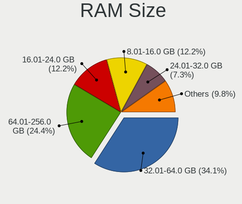
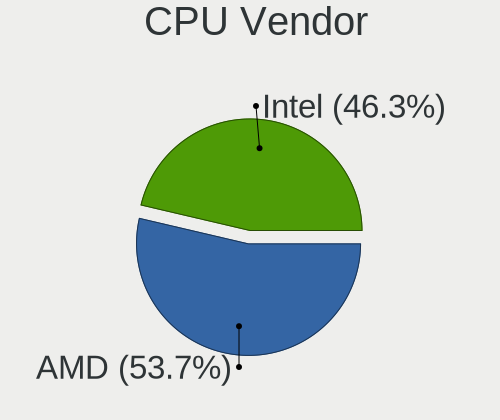
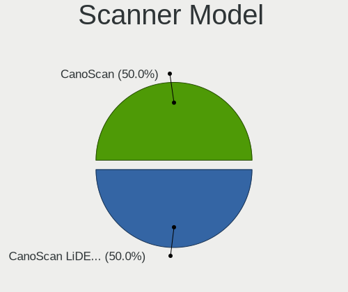
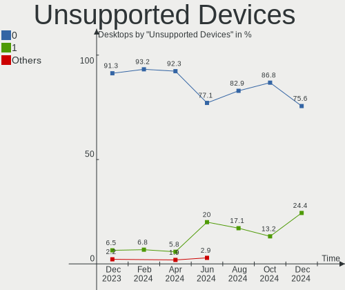

Manjaro Hardware Trends (Desktop)
---------------------------------

A project to identify most popular hardware characteristics and track their change
over time based on data collected by Manjaro users at https://Linux-Hardware.org.

Anyone can contribute to the study by uploading probes of their computers by
the [hw-probe](https://github.com/linuxhw/hw-probe) tool:

    sudo -E hw-probe -all -upload

Full-feature report is available here: https://linux-hardware.org/?view=trends&formfactor=desktop

Period: Jan, 2021.

Contents
--------

- [ OS                       ](#os)
- [ OS Family                ](#os-family)
- [ Kernel                   ](#kernel)
- [ Kernel Family            ](#kernel-family)
- [ Kernel Major Ver.        ](#kernel-major-ver)
- [ Arch                     ](#arch)
- [ DE                       ](#de)
- [ Display Server           ](#display-server)
- [ Display Manager          ](#display-manager)
- [ OS Lang                  ](#os-lang)
- [ Boot Mode                ](#boot-mode)
- [ Filesystem               ](#filesystem)
- [ Part. scheme             ](#part-scheme)
- [ Dual Boot with Linux/BSD ](#dual-boot-with-linux/bsd)
- [ Dual Boot (Win)          ](#dual-boot-win)
- [ Country                  ](#country)
- [ City                     ](#city)
- [ Vendor                   ](#vendor)
- [ Model                    ](#model)
- [ Model Family             ](#model-family)
- [ MFG Year                 ](#mfg-year)
- [ Form Factor              ](#form-factor)
- [ Secure Boot              ](#secure-boot)
- [ Coreboot                 ](#coreboot)
- [ RAM Size                 ](#ram-size)
- [ RAM Used                 ](#ram-used)
- [ Has CD-ROM               ](#has-cd-rom)
- [ Total Drives             ](#total-drives)
- [ Has Ethernet             ](#has-ethernet)
- [ Drive Vendor             ](#drive-vendor)
- [ Drive Model              ](#drive-model)
- [ HDD Vendor               ](#hdd-vendor)
- [ SSD Vendor               ](#ssd-vendor)
- [ Drive Kind               ](#drive-kind)
- [ Drive Connector          ](#drive-connector)
- [ Drive Size               ](#drive-size)
- [ Space Total              ](#space-total)
- [ Space Used               ](#space-used)
- [ Malfunc. Drives          ](#malfunc-drives)
- [ Malfunc. Drive Vendor    ](#malfunc-drive-vendor)
- [ Malfunc. HDD Vendor      ](#malfunc-hdd-vendor)
- [ Malfunc. Drive Kind      ](#malfunc-drive-kind)
- [ Failed Drives            ](#failed-drives)
- [ Failed Drive Vendor      ](#failed-drive-vendor)
- [ Drive Status             ](#drive-status)
- [ Storage Vendor           ](#storage-vendor)
- [ Storage Model            ](#storage-model)
- [ Storage Kind             ](#storage-kind)
- [ CPU Vendor               ](#cpu-vendor)
- [ CPU Model                ](#cpu-model)
- [ CPU Model Family         ](#cpu-model-family)
- [ CPU Cores                ](#cpu-cores)
- [ CPU Sockets              ](#cpu-sockets)
- [ CPU Threads              ](#cpu-threads)
- [ CPU Op-Modes             ](#cpu-op-modes)
- [ CPU Microcode            ](#cpu-microcode)
- [ CPU Microarch            ](#cpu-microarch)
- [ GPU Vendor               ](#gpu-vendor)
- [ GPU Model                ](#gpu-model)
- [ GPU Combo                ](#gpu-combo)
- [ GPU Driver               ](#gpu-driver)
- [ GPU Memory               ](#gpu-memory)
- [ Monitor Vendor           ](#monitor-vendor)
- [ Monitor Model            ](#monitor-model)
- [ Monitor Resolution       ](#monitor-resolution)
- [ Monitor Diagonal         ](#monitor-diagonal)
- [ Monitor Width            ](#monitor-width)
- [ Aspect Ratio             ](#aspect-ratio)
- [ Monitor Area             ](#monitor-area)
- [ Pixel Density            ](#pixel-density)
- [ Multiple Monitors        ](#multiple-monitors)
- [ Net Controller Vendor    ](#net-controller-vendor)
- [ Net Controller Model     ](#net-controller-model)
- [ Wireless Vendor          ](#wireless-vendor)
- [ Wireless Model           ](#wireless-model)
- [ Ethernet Vendor          ](#ethernet-vendor)
- [ Ethernet Model           ](#ethernet-model)
- [ Net Controller Kind      ](#net-controller-kind)
- [ Used Controller          ](#used-controller)
- [ NICs                     ](#nics)
- [ Memory Vendor            ](#memory-vendor)
- [ Memory Model             ](#memory-model)
- [ Memory Kind              ](#memory-kind)
- [ Memory Form Factor       ](#memory-form-factor)
- [ Memory Size              ](#memory-size)
- [ Memory Speed             ](#memory-speed)
- [ Sound Vendor             ](#sound-vendor)
- [ Sound Model              ](#sound-model)
- [ Camera Vendor            ](#camera-vendor)
- [ Camera Model             ](#camera-model)
- [ Fingerprint Vendor       ](#fingerprint-vendor)
- [ Fingerprint Model        ](#fingerprint-model)
- [ Chipcard Vendor          ](#chipcard-vendor)
- [ Chipcard Model           ](#chipcard-model)
- [ Printer Vendor           ](#printer-vendor)
- [ Printer Model            ](#printer-model)
- [ Scanner Vendor           ](#scanner-vendor)
- [ Scanner Model            ](#scanner-model)
- [ Bluetooth Vendor         ](#bluetooth-vendor)
- [ Bluetooth Model          ](#bluetooth-model)
- [ Unsupported Devices      ](#unsupported-devices)
- [ Unsupported Device Types ](#unsupported-device-types)

OS
--

Installed operating systems

| Name           | Desktops | Percent |
|----------------|----------|---------|
| Manjaro 20.2.1 | 41       | 45.05%  |
| Manjaro        | 35       | 38.46%  |
| Manjaro 20.2   | 14       | 15.38%  |
| Manjaro 20.1   | 1        | 1.1%    |

OS Family
---------

OS without a version

| Name    | Desktops | Percent |
|---------|----------|---------|
| Manjaro | 91       | 100%    |

Kernel
------

Version of the Linux kernel

| Version                  | Desktops | Percent |
|--------------------------|----------|---------|
| 5.9.16-1-MANJARO         | 33       | 36.26%  |
| 5.10.2-2-MANJARO         | 20       | 21.98%  |
| 5.10.7-3-MANJARO         | 13       | 14.29%  |
| 5.4.85-1-MANJARO         | 6        | 6.59%   |
| 5.9.11-3-MANJARO         | 4        | 4.4%    |
| 5.8.18-1-MANJARO         | 2        | 2.2%    |
| 5.4.89-1-MANJARO         | 2        | 2.2%    |
| 5.9.14-100-tkg-upds-llvm | 1        | 1.1%    |
| 5.4.80-2-MANJARO         | 1        | 1.1%    |
| 5.4.74-1-MANJARO         | 1        | 1.1%    |
| 5.10.9-arch1-1           | 1        | 1.1%    |
| 5.10.7-1-MANJARO         | 1        | 1.1%    |
| 5.10.6-lqx1-1-lqx        | 1        | 1.1%    |
| 5.10.6-1-ck-zen2         | 1        | 1.1%    |
| 5.10.4-2-MANJARO         | 1        | 1.1%    |
| 5.10.10-1-MANJARO        | 1        | 1.1%    |
| 5.10.1-103-tkg-bmq       | 1        | 1.1%    |
| 4.19.144-1-MANJARO       | 1        | 1.1%    |

Kernel Family
-------------

Linux kernel without a distro release

| Version  | Desktops | Percent |
|----------|----------|---------|
| 5.9.16   | 33       | 36.26%  |
| 5.10.2   | 20       | 21.98%  |
| 5.10.7   | 14       | 15.38%  |
| 5.4.85   | 6        | 6.59%   |
| 5.9.11   | 4        | 4.4%    |
| 5.8.18   | 2        | 2.2%    |
| 5.4.89   | 2        | 2.2%    |
| 5.10.6   | 2        | 2.2%    |
| 5.9.14   | 1        | 1.1%    |
| 5.4.80   | 1        | 1.1%    |
| 5.4.74   | 1        | 1.1%    |
| 5.10.9   | 1        | 1.1%    |
| 5.10.4   | 1        | 1.1%    |
| 5.10.10  | 1        | 1.1%    |
| 5.10.1   | 1        | 1.1%    |
| 4.19.144 | 1        | 1.1%    |

Kernel Major Ver.
-----------------

Linux kernel major version

| Version | Desktops | Percent |
|---------|----------|---------|
| 5.10    | 40       | 43.96%  |
| 5.9     | 38       | 41.76%  |
| 5.4     | 10       | 10.99%  |
| 5.8     | 2        | 2.2%    |
| 4.19    | 1        | 1.1%    |

Arch
----

OS architecture (x86_64, i586, etc.)

| Name   | Desktops | Percent |
|--------|----------|---------|
| x86_64 | 91       | 100%    |

DE
--

Desktop Environment

| Name       | Desktops | Percent |
|------------|----------|---------|
| KDE5       | 26       | 28.57%  |
| XFCE       | 25       | 27.47%  |
| GNOME      | 17       | 18.68%  |
| KDE        | 13       | 14.29%  |
| X-Cinnamon | 3        | 3.3%    |
| MATE       | 2        | 2.2%    |
| LXQt       | 1        | 1.1%    |
| i3         | 1        | 1.1%    |
| Cinnamon   | 1        | 1.1%    |
| Budgie     | 1        | 1.1%    |
| Unknown    | 1        | 1.1%    |

Display Server
--------------

X11 or Wayland

| Name    | Desktops | Percent |
|---------|----------|---------|
| X11     | 84       | 92.31%  |
| Wayland | 5        | 5.49%   |
| Unknown | 2        | 2.2%    |

Display Manager
---------------

SDDM, LightDM, etc.

| Name    | Desktops | Percent |
|---------|----------|---------|
| Unknown | 32       | 35.16%  |
| SDDM    | 25       | 27.47%  |
| LightDM | 18       | 19.78%  |
| GDM     | 11       | 12.09%  |
| TDM     | 5        | 5.49%   |

OS Lang
-------

Language

| Lang       | Desktops | Percent |
|------------|----------|---------|
| en_US      | 34       | 37.36%  |
| de_DE      | 15       | 16.48%  |
| ru_RU      | 7        | 7.69%   |
| en_GB      | 5        | 5.49%   |
| en_AU      | 4        | 4.4%    |
| pt_BR      | 3        | 3.3%    |
| it_IT      | 3        | 3.3%    |
| pl_PL      | 2        | 2.2%    |
| zh_CN      | 1        | 1.1%    |
| sv_SE      | 1        | 1.1%    |
| ru_UA      | 1        | 1.1%    |
| nl_NL      | 1        | 1.1%    |
| hu_HU      | 1        | 1.1%    |
| fr_FR      | 1        | 1.1%    |
| es_ES      | 1        | 1.1%    |
| es_AR      | 1        | 1.1%    |
| en_ZA      | 1        | 1.1%    |
| en_US.UTF8 | 1        | 1.1%    |
| en_SG      | 1        | 1.1%    |
| en_DE      | 1        | 1.1%    |
| en_CA      | 1        | 1.1%    |
| de_CH      | 1        | 1.1%    |
| de_AT      | 1        | 1.1%    |
| cs_CZ      | 1        | 1.1%    |
| bg_BG      | 1        | 1.1%    |
| Unknown    | 1        | 1.1%    |

Boot Mode
---------

EFI or BIOS

| Mode | Desktops | Percent |
|------|----------|---------|
| BIOS | 56       | 61.54%  |
| EFI  | 35       | 38.46%  |

Filesystem
----------

Type of filesystem

| Type    | Desktops | Percent |
|---------|----------|---------|
| Ext4    | 77       | 84.62%  |
| Btrfs   | 9        | 9.89%   |
| Overlay | 3        | 3.3%    |
| Xfs     | 2        | 2.2%    |

Part. scheme
------------

Scheme of partitioning

| Type    | Desktops | Percent |
|---------|----------|---------|
| GPT     | 40       | 43.96%  |
| Unknown | 34       | 37.36%  |
| MBR     | 17       | 18.68%  |

Dual Boot with Linux/BSD
------------------------

Hosting more than one Linux/BSD

| Dual boot | Desktops | Percent |
|-----------|----------|---------|
| No        | 73       | 80.22%  |
| Yes       | 18       | 19.78%  |

Dual Boot (Win)
---------------

Hosting Linux and Windows

| Dual boot | Desktops | Percent |
|-----------|----------|---------|
| No        | 50       | 54.95%  |
| Yes       | 41       | 45.05%  |

Country
-------

Geographic location (country)

| Country        | Desktops | Percent |
|----------------|----------|---------|
| Germany        | 20       | 21.98%  |
| USA            | 17       | 18.68%  |
| Russia         | 7        | 7.69%   |
| UK             | 6        | 6.59%   |
| Ukraine        | 4        | 4.4%    |
| Brazil         | 4        | 4.4%    |
| Australia      | 4        | 4.4%    |
| Italy          | 3        | 3.3%    |
| Canada         | 3        | 3.3%    |
| Sweden         | 2        | 2.2%    |
| Poland         | 2        | 2.2%    |
| Netherlands    | 2        | 2.2%    |
| Lithuania      | 2        | 2.2%    |
| Bulgaria       | 2        | 2.2%    |
| Switzerland    | 1        | 1.1%    |
| Spain          | 1        | 1.1%    |
| South Africa   | 1        | 1.1%    |
| Singapore      | 1        | 1.1%    |
| Mexico         | 1        | 1.1%    |
| Israel         | 1        | 1.1%    |
| Hungary        | 1        | 1.1%    |
| France         | 1        | 1.1%    |
| Egypt          | 1        | 1.1%    |
| Czech Republic | 1        | 1.1%    |
| Belgium        | 1        | 1.1%    |
| Austria        | 1        | 1.1%    |
| Argentina      | 1        | 1.1%    |

City
----

Geographic location (city)

| City                | Desktops | Percent |
|---------------------|----------|---------|
| Moscow              | 3        | 3.3%    |
| Omsk                | 2        | 2.2%    |
| Naples              | 2        | 2.2%    |
| Berlin              | 2        | 2.2%    |
| Zanesville          | 1        | 1.1%    |
| Wurzburg            | 1        | 1.1%    |
| Wolgast             | 1        | 1.1%    |
| West Jordan         | 1        | 1.1%    |
| Wałbrzych          | 1        | 1.1%    |
| Volonne             | 1        | 1.1%    |
| Vilnius             | 1        | 1.1%    |
| Venice              | 1        | 1.1%    |
| Varna               | 1        | 1.1%    |
| Tykocin             | 1        | 1.1%    |
| Toronto             | 1        | 1.1%    |
| Ternopil            | 1        | 1.1%    |
| Tel Aviv            | 1        | 1.1%    |
| Surrey              | 1        | 1.1%    |
| Stuttgart           | 1        | 1.1%    |
| Stockholm           | 1        | 1.1%    |
| Stavropol           | 1        | 1.1%    |
| Singapore           | 1        | 1.1%    |
| Schwarzenburg       | 1        | 1.1%    |
| Schneckenlohe       | 1        | 1.1%    |
| Schiedam            | 1        | 1.1%    |
| Saint Paul          | 1        | 1.1%    |
| Rimsting            | 1        | 1.1%    |
| Prague              | 1        | 1.1%    |
| Powell River        | 1        | 1.1%    |
| Portland            | 1        | 1.1%    |
| Pliezhausen         | 1        | 1.1%    |
| Pforzheim           | 1        | 1.1%    |
| Paraty              | 1        | 1.1%    |
| Papa                | 1        | 1.1%    |
| Palmdale            | 1        | 1.1%    |
| Pacifica            | 1        | 1.1%    |
| Nuremberg           | 1        | 1.1%    |
| Newcastle upon Tyne | 1        | 1.1%    |
| New York            | 1        | 1.1%    |
| Neubrandenburg      | 1        | 1.1%    |
| Much                | 1        | 1.1%    |
| Monterrey           | 1        | 1.1%    |
| Middletown          | 1        | 1.1%    |
| Marrickville        | 1        | 1.1%    |
| Manchester          | 1        | 1.1%    |
| Madrid              | 1        | 1.1%    |
| Londonderry         | 1        | 1.1%    |
| London              | 1        | 1.1%    |
| Linz                | 1        | 1.1%    |
| Lins                | 1        | 1.1%    |
| Leighton Buzzard    | 1        | 1.1%    |
| Laussnitz           | 1        | 1.1%    |
| Lancaster           | 1        | 1.1%    |
| Kyiv                | 1        | 1.1%    |
| Kharkiv             | 1        | 1.1%    |
| Kehl                | 1        | 1.1%    |
| Kaunas              | 1        | 1.1%    |
| Kansas City         | 1        | 1.1%    |
| Johannesburg        | 1        | 1.1%    |
| Isle of Palms       | 1        | 1.1%    |

Vendor
------

Motherboard manufacturer

| Name                | Desktops | Percent |
|---------------------|----------|---------|
| Gigabyte Technology | 24       | 26.37%  |
| ASUSTek Computer    | 22       | 24.18%  |
| MSI                 | 14       | 15.38%  |
| ASRock              | 14       | 15.38%  |
| Dell                | 5        | 5.49%   |
| Intel               | 3        | 3.3%    |
| Hewlett-Packard     | 3        | 3.3%    |
| SiYW                | 1        | 1.1%    |
| Medion              | 1        | 1.1%    |
| Foxconn             | 1        | 1.1%    |
| Biostar             | 1        | 1.1%    |
| ALDO                | 1        | 1.1%    |
| Acer                | 1        | 1.1%    |

Model
-----

Motherboard model

| Name                                  | Desktops | Percent |
|---------------------------------------|----------|---------|
| Gigabyte B450M DS3H                   | 3        | 3.3%    |
| MSI MS-7C84                           | 2        | 2.2%    |
| MSI MS-7C37                           | 2        | 2.2%    |
| ASRock H61M/U3S3                      | 2        | 2.2%    |
| ASRock B450M Pro4                     | 2        | 2.2%    |
| SiYW V200 Series                      | 1        | 1.1%    |
| MSI MS-7C94                           | 1        | 1.1%    |
| MSI MS-7C91                           | 1        | 1.1%    |
| MSI MS-7C02                           | 1        | 1.1%    |
| MSI MS-7B93                           | 1        | 1.1%    |
| MSI MS-7B86                           | 1        | 1.1%    |
| MSI MS-7A78                           | 1        | 1.1%    |
| MSI MS-7A39                           | 1        | 1.1%    |
| MSI MS-7924                           | 1        | 1.1%    |
| MSI MS-7751                           | 1        | 1.1%    |
| MSI MS-7641                           | 1        | 1.1%    |
| Medion MS-7800                        | 1        | 1.1%    |
| Intel X79 V1.61                       | 1        | 1.1%    |
| Intel DB43LD AAE60577-202             | 1        | 1.1%    |
| Intel AHV                             | 1        | 1.1%    |
| HP ENVY te01-1177c Desktop Rfrbd PC   | 1        | 1.1%    |
| HP Compaq 6005 Pro SFF PC             | 1        | 1.1%    |
| HP 400-314                            | 1        | 1.1%    |
| Gigabyte Z97X-UD3H-BK                 | 1        | 1.1%    |
| Gigabyte Z77M-D3H                     | 1        | 1.1%    |
| Gigabyte Z370 AORUS ULTRA GAMING WIFI | 1        | 1.1%    |
| Gigabyte Z370 AORUS Gaming 7          | 1        | 1.1%    |
| Gigabyte Z270-HD3P                    | 1        | 1.1%    |
| Gigabyte Z170-Gaming K3               | 1        | 1.1%    |
| Gigabyte X79-UP4                      | 1        | 1.1%    |
| Gigabyte X570 AORUS ULTRA             | 1        | 1.1%    |
| Gigabyte X570 AORUS MASTER            | 1        | 1.1%    |
| Gigabyte X570 AORUS ELITE             | 1        | 1.1%    |
| Gigabyte P55-USB3                     | 1        | 1.1%    |
| Gigabyte P55-UD3L                     | 1        | 1.1%    |
| Gigabyte GA-78LMT-USB3 R2             | 1        | 1.1%    |
| Gigabyte GA-78LMT-USB3 6.0            | 1        | 1.1%    |
| Gigabyte G41MT-S2PT                   | 1        | 1.1%    |
| Gigabyte G41M-Combo                   | 1        | 1.1%    |
| Gigabyte EP45-UD3LR                   | 1        | 1.1%    |
| Gigabyte B550 AORUS PRO AC            | 1        | 1.1%    |
| Gigabyte B460MDS3H                    | 1        | 1.1%    |
| Gigabyte B450 AORUS PRO               | 1        | 1.1%    |
| Gigabyte B365M DS3H                   | 1        | 1.1%    |
| Foxconn H67M-S/H67M-V/H67M            | 1        | 1.1%    |
| Dell Vostro 230                       | 1        | 1.1%    |
| Dell Precision T3600                  | 1        | 1.1%    |
| Dell OptiPlex 9020                    | 1        | 1.1%    |
| Dell OptiPlex 780                     | 1        | 1.1%    |
| Dell OptiPlex 7010                    | 1        | 1.1%    |
| Biostar TB250-BTC                     | 1        | 1.1%    |
| ASUS TUF B450-PLUS GAMING             | 1        | 1.1%    |
| ASUS STRIX H270F GAMING               | 1        | 1.1%    |
| ASUS ROG ZENITH II EXTREME            | 1        | 1.1%    |
| ASUS ROG STRIX B450-F GAMING          | 1        | 1.1%    |
| ASUS Pro WS X570-ACE                  | 1        | 1.1%    |
| ASUS PRIME Z490-P                     | 1        | 1.1%    |
| ASUS PRIME Z370-P                     | 1        | 1.1%    |
| ASUS PRIME Z270-AR                    | 1        | 1.1%    |
| ASUS PRIME X570-PRO                   | 1        | 1.1%    |

Model Family
------------

Motherboard model prefix

| Name                   | Desktops | Percent |
|------------------------|----------|---------|
| ASUS PRIME             | 8        | 8.79%   |
| Gigabyte X570          | 3        | 3.3%    |
| Gigabyte B450M         | 3        | 3.3%    |
| Dell OptiPlex          | 3        | 3.3%    |
| MSI MS-7C84            | 2        | 2.2%    |
| MSI MS-7C37            | 2        | 2.2%    |
| Gigabyte Z370          | 2        | 2.2%    |
| Gigabyte GA-78LMT-USB3 | 2        | 2.2%    |
| ASUS ROG               | 2        | 2.2%    |
| ASRock H61M            | 2        | 2.2%    |
| ASRock B450M           | 2        | 2.2%    |
| ASRock B450            | 2        | 2.2%    |
| SiYW V200              | 1        | 1.1%    |
| MSI MS-7C94            | 1        | 1.1%    |
| MSI MS-7C91            | 1        | 1.1%    |
| MSI MS-7C02            | 1        | 1.1%    |
| MSI MS-7B93            | 1        | 1.1%    |
| MSI MS-7B86            | 1        | 1.1%    |
| MSI MS-7A78            | 1        | 1.1%    |
| MSI MS-7A39            | 1        | 1.1%    |
| MSI MS-7924            | 1        | 1.1%    |
| MSI MS-7751            | 1        | 1.1%    |
| MSI MS-7641            | 1        | 1.1%    |
| Medion MS-7800         | 1        | 1.1%    |
| Intel X79              | 1        | 1.1%    |
| Intel DB43LD           | 1        | 1.1%    |
| Intel AHV              | 1        | 1.1%    |
| HP ENVY                | 1        | 1.1%    |
| HP Compaq              | 1        | 1.1%    |
| HP 400-314             | 1        | 1.1%    |
| Gigabyte Z97X-UD3H-BK  | 1        | 1.1%    |
| Gigabyte Z77M-D3H      | 1        | 1.1%    |
| Gigabyte Z270-HD3P     | 1        | 1.1%    |
| Gigabyte Z170-Gaming   | 1        | 1.1%    |
| Gigabyte X79-UP4       | 1        | 1.1%    |
| Gigabyte P55-USB3      | 1        | 1.1%    |
| Gigabyte P55-UD3L      | 1        | 1.1%    |
| Gigabyte G41MT-S2PT    | 1        | 1.1%    |
| Gigabyte G41M-Combo    | 1        | 1.1%    |
| Gigabyte EP45-UD3LR    | 1        | 1.1%    |
| Gigabyte B550          | 1        | 1.1%    |
| Gigabyte B460MDS3H     | 1        | 1.1%    |
| Gigabyte B450          | 1        | 1.1%    |
| Gigabyte B365M         | 1        | 1.1%    |
| Foxconn H67M-S         | 1        | 1.1%    |
| Dell Vostro            | 1        | 1.1%    |
| Dell Precision         | 1        | 1.1%    |
| Biostar TB250-BTC      | 1        | 1.1%    |
| ASUS TUF               | 1        | 1.1%    |
| ASUS STRIX             | 1        | 1.1%    |
| ASUS Pro               | 1        | 1.1%    |
| ASUS P8P67-M           | 1        | 1.1%    |
| ASUS P8H77-V           | 1        | 1.1%    |
| ASUS P5GC-MX           | 1        | 1.1%    |
| ASUS Maximus           | 1        | 1.1%    |
| ASUS M5A97             | 1        | 1.1%    |
| ASUS M5A78L-M          | 1        | 1.1%    |
| ASUS M4N68T-M-LE-V2    | 1        | 1.1%    |
| ASUS CROSSHAIR         | 1        | 1.1%    |
| ASUS All               | 1        | 1.1%    |

MFG Year
--------

Motherboard manufacture year

| Year | Desktops | Percent |
|------|----------|---------|
| 2020 | 24       | 26.37%  |
| 2019 | 18       | 19.78%  |
| 2018 | 10       | 10.99%  |
| 2013 | 7        | 7.69%   |
| 2011 | 7        | 7.69%   |
| 2010 | 6        | 6.59%   |
| 2016 | 4        | 4.4%    |
| 2014 | 3        | 3.3%    |
| 2012 | 3        | 3.3%    |
| 2017 | 2        | 2.2%    |
| 2015 | 2        | 2.2%    |
| 2009 | 2        | 2.2%    |
| 2021 | 1        | 1.1%    |
| 2008 | 1        | 1.1%    |
| 2007 | 1        | 1.1%    |

Form Factor
-----------

Physical design of the computer

| Name    | Desktops | Percent |
|---------|----------|---------|
| Desktop | 91       | 100%    |

Secure Boot
-----------

Enabled or disabled

| State    | Desktops | Percent |
|----------|----------|---------|
| Disabled | 91       | 100%    |

Coreboot
--------

Have coreboot on board

| Used | Desktops | Percent |
|------|----------|---------|
| No   | 91       | 100%    |

RAM Size
--------

Total RAM memory

| Size in GB  | Desktops | Percent |
|-------------|----------|---------|
| 16.01-24.0  | 37       | 40.66%  |
| 32.01-64.0  | 18       | 19.78%  |
| 8.01-16.0   | 15       | 16.48%  |
| 3.01-4.0    | 9        | 9.89%   |
| 4.01-8.0    | 6        | 6.59%   |
| 64.01-256.0 | 5        | 5.49%   |
| 24.01-32.0  | 1        | 1.1%    |

RAM Used
--------

Used RAM memory

| Used GB    | Desktops | Percent |
|------------|----------|---------|
| 2.01-3.0   | 26       | 28.57%  |
| 4.01-8.0   | 23       | 25.27%  |
| 1.01-2.0   | 21       | 23.08%  |
| 3.01-4.0   | 13       | 14.29%  |
| 8.01-16.0  | 6        | 6.59%   |
| 32.01-64.0 | 1        | 1.1%    |
| 0.51-1.0   | 1        | 1.1%    |

Has CD-ROM
----------

Has CD-ROM on board

| Presented | Desktops | Percent |
|-----------|----------|---------|
| No        | 55       | 60.44%  |
| Yes       | 36       | 39.56%  |

Total Drives
------------

Number of drives on board

| Drives | Desktops | Percent |
|--------|----------|---------|
| 2      | 30       | 32.97%  |
| 1      | 22       | 24.18%  |
| 3      | 20       | 21.98%  |
| 4      | 11       | 12.09%  |
| 5      | 3        | 3.3%    |
| 6      | 2        | 2.2%    |
| 11     | 1        | 1.1%    |
| 9      | 1        | 1.1%    |
| 7      | 1        | 1.1%    |

Has Ethernet
------------

Has Ethernet on board

| Presented | Desktops | Percent |
|-----------|----------|---------|
| Yes       | 91       | 100%    |

Drive Vendor
------------

Hard drive vendors

| Vendor              | Desktops | Drives | Percent |
|---------------------|----------|--------|---------|
| Samsung Electronics | 43       | 69     | 22.05%  |
| WDC                 | 39       | 47     | 20%     |
| Seagate             | 32       | 34     | 16.41%  |
| Crucial             | 12       | 13     | 6.15%   |
| Kingston            | 11       | 13     | 5.64%   |
| Toshiba             | 10       | 10     | 5.13%   |
| SanDisk             | 9        | 9      | 4.62%   |
| Intel               | 6        | 6      | 3.08%   |
| A-DATA Technology   | 4        | 7      | 2.05%   |
| Silicon Motion      | 3        | 3      | 1.54%   |
| Phison              | 3        | 3      | 1.54%   |
| JMicron             | 3        | 3      | 1.54%   |
| Unknown             | 2        | 2      | 1.03%   |
| Patriot             | 2        | 2      | 1.03%   |
| HGST                | 2        | 3      | 1.03%   |
| Transcend           | 1        | 1      | 0.51%   |
| SMI                 | 1        | 1      | 0.51%   |
| PNY                 | 1        | 1      | 0.51%   |
| OCZ                 | 1        | 1      | 0.51%   |
| NGFF                | 1        | 1      | 0.51%   |
| Micron Technology   | 1        | 1      | 0.51%   |
| Maxtor              | 1        | 1      | 0.51%   |
| Intenso             | 1        | 1      | 0.51%   |
| GOODRAM             | 1        | 1      | 0.51%   |
| Gigabyte Technology | 1        | 1      | 0.51%   |
| External            | 1        | 1      | 0.51%   |
| CT500P2S            | 1        | 1      | 0.51%   |
| Corsair             | 1        | 1      | 0.51%   |
| China               | 1        | 1      | 0.51%   |

Drive Model
-----------

Hard drive models

| Model                               | Desktops | Percent |
|-------------------------------------|----------|---------|
| Samsung SSD 860 EVO 500GB           | 5        | 2.21%   |
| Samsung SSD 850 EVO 500GB           | 5        | 2.21%   |
| Samsung SSD 970 EVO 1TB             | 4        | 1.77%   |
| Samsung SSD 960 EVO 250GB           | 4        | 1.77%   |
| Samsung SSD 850 EVO 250GB           | 4        | 1.77%   |
| WDC WD10EZEX-08WN4A0 1TB            | 3        | 1.33%   |
| WDC WD10EZEX-00BN5A0 1TB            | 3        | 1.33%   |
| Seagate ST1000DM010-2EP102 1TB      | 3        | 1.33%   |
| Samsung SSD 970 EVO 500GB           | 3        | 1.33%   |
| Samsung SSD 860 EVO 1TB             | 3        | 1.33%   |
| Samsung NVMe SSD Drive 500GB        | 3        | 1.33%   |
| Kingston SA400S37240G 240GB SSD     | 3        | 1.33%   |
| Kingston SA400S37120G 120GB SSD     | 3        | 1.33%   |
| Crucial CT240BX500SSD1 240GB        | 3        | 1.33%   |
| WDC WDS240G2G0A-00JH30 240GB SSD    | 2        | 0.88%   |
| WDC WD5000AAKX-00ERMA0 500GB        | 2        | 0.88%   |
| WDC WD5000AAKX-001CA0 500GB         | 2        | 0.88%   |
| WDC WD20EZRZ-00Z5HB0 2TB            | 2        | 0.88%   |
| WDC WD20EFRX-68EUZN0 2TB            | 2        | 0.88%   |
| Toshiba DT01ACA100 1TB              | 2        | 0.88%   |
| Silicon Motion NVMe SSD Drive 512GB | 2        | 0.88%   |
| Seagate ST500DM002-1BD142 500GB     | 2        | 0.88%   |
| Seagate ST31500341AS 1TB            | 2        | 0.88%   |
| Seagate ST2000DX002-2DV164 2TB      | 2        | 0.88%   |
| Seagate ST2000DM008-2FR102 2TB      | 2        | 0.88%   |
| Seagate ST2000DM006-2DM164 2TB      | 2        | 0.88%   |
| Kingston SA400S37480G 480GB SSD     | 2        | 0.88%   |
| Intel NVMe SSD Drive 2TB            | 2        | 0.88%   |
| Crucial CT1000BX500SSD1 1TB         | 2        | 0.88%   |
| WDC WDS500G2B0B 500GB SSD           | 1        | 0.44%   |
| WDC WDS500G2B0A-00SM50 500GB SSD    | 1        | 0.44%   |
| WDC WDS250G1B0A-00H9H0 250GB SSD    | 1        | 0.44%   |
| WDC WDS240G2G0B-00EPW0 240GB SSD    | 1        | 0.44%   |
| WDC WDS100T2B0A-00SM50 1TB SSD      | 1        | 0.44%   |
| WDC WD6401AALS-00E3A0 640GB         | 1        | 0.44%   |
| WDC WD6400AAKS-22A7B0 640GB         | 1        | 0.44%   |
| WDC WD6400AACS-00G8B1 640GB         | 1        | 0.44%   |
| WDC WD60EZRZ-00GZ5B1 6TB            | 1        | 0.44%   |
| WDC WD5000BEVT-26A0RT0 500GB        | 1        | 0.44%   |
| WDC WD5000AADS-67S9B1 500GB         | 1        | 0.44%   |
| WDC WD40EZRZ-00GXCB0 4TB            | 1        | 0.44%   |
| WDC WD40EZRX-00SPEB0 4TB            | 1        | 0.44%   |
| WDC WD20EZRX-00D8PB0 2TB            | 1        | 0.44%   |
| WDC WD20EARS-00MVWB0 2TB            | 1        | 0.44%   |
| WDC WD2003FZEX-00SRLA0 2TB          | 1        | 0.44%   |
| WDC WD2003FYPS-27W9B0 2TB           | 1        | 0.44%   |
| WDC WD2001FASS-00U0B0 2TB           | 1        | 0.44%   |
| WDC WD15EARS-00MVWB0 1TB            | 1        | 0.44%   |
| WDC WD10EZEX-75WN4A0 1TB            | 1        | 0.44%   |
| WDC WD10EZEX-75M2NA0 1TB            | 1        | 0.44%   |
| WDC WD10EZEX-60WN4A1 1TB            | 1        | 0.44%   |
| WDC WD10EZEX-60WN4A0 1TB            | 1        | 0.44%   |
| WDC WD10EZEX-22MFCA0 1TB            | 1        | 0.44%   |
| WDC WD10EZEX-08M2NA0 1TB            | 1        | 0.44%   |
| WDC WD10EZEX-00UD2A0 1TB            | 1        | 0.44%   |
| WDC WD10EFRX-68PJCN0 1TB            | 1        | 0.44%   |
| WDC WD10EARS-00Y5B1 1TB             | 1        | 0.44%   |
| WDC WD10EALX-009BA0 1TB             | 1        | 0.44%   |
| WDC WD1003FZEX-00MK2A0 1TB          | 1        | 0.44%   |
| Unknown SD/MMC/MS PRO 32GB          | 1        | 0.44%   |

HDD Vendor
----------

Hard disk drive vendors

| Vendor              | Desktops | Drives | Percent |
|---------------------|----------|--------|---------|
| WDC                 | 34       | 40     | 41.46%  |
| Seagate             | 32       | 34     | 39.02%  |
| Toshiba             | 7        | 7      | 8.54%   |
| Samsung Electronics | 6        | 10     | 7.32%   |
| HGST                | 2        | 3      | 2.44%   |
| Maxtor              | 1        | 1      | 1.22%   |

SSD Vendor
----------

Solid state drive vendors

| Vendor              | Desktops | Drives | Percent |
|---------------------|----------|--------|---------|
| Samsung Electronics | 25       | 31     | 31.25%  |
| Crucial             | 11       | 12     | 13.75%  |
| Kingston            | 10       | 11     | 12.5%   |
| SanDisk             | 7        | 7      | 8.75%   |
| WDC                 | 5        | 7      | 6.25%   |
| A-DATA Technology   | 4        | 7      | 5%      |
| Toshiba             | 2        | 2      | 2.5%    |
| Patriot             | 2        | 2      | 2.5%    |
| JMicron             | 2        | 2      | 2.5%    |
| Intel               | 2        | 2      | 2.5%    |
| Unknown             | 1        | 1      | 1.25%   |
| Transcend           | 1        | 1      | 1.25%   |
| PNY                 | 1        | 1      | 1.25%   |
| OCZ                 | 1        | 1      | 1.25%   |
| NGFF                | 1        | 1      | 1.25%   |
| Intenso             | 1        | 1      | 1.25%   |
| Gigabyte Technology | 1        | 1      | 1.25%   |
| External            | 1        | 1      | 1.25%   |
| Corsair             | 1        | 1      | 1.25%   |
| China               | 1        | 1      | 1.25%   |

Drive Kind
----------

HDD or SSD

| Kind    | Desktops | Drives | Percent |
|---------|----------|--------|---------|
| HDD     | 67       | 95     | 40.85%  |
| SSD     | 59       | 93     | 35.98%  |
| NVMe    | 34       | 46     | 20.73%  |
| Unknown | 4        | 4      | 2.44%   |

Drive Connector
---------------

SATA, SAS, NVMe, etc.

| Type | Desktops | Drives | Percent |
|------|----------|--------|---------|
| SATA | 89       | 186    | 68.99%  |
| NVMe | 34       | 46     | 26.36%  |
| SAS  | 6        | 6      | 4.65%   |

Drive Size
----------

Size of hard drive

| Size in TB | Desktops | Drives | Percent |
|------------|----------|--------|---------|
| 0.01-0.5   | 64       | 86     | 43.54%  |
| 0.51-1.0   | 48       | 59     | 32.65%  |
| 1.01-2.0   | 23       | 30     | 15.65%  |
| 3.01-4.0   | 6        | 7      | 4.08%   |
| 4.01-10.0  | 3        | 3      | 2.04%   |
| 2.01-3.0   | 2        | 2      | 1.36%   |
| 10.01-20.0 | 1        | 1      | 0.68%   |

Space Total
-----------

Amount of disk space available on the file system

| Size in GB     | Desktops | Percent |
|----------------|----------|---------|
| 251-500        | 19       | 20.88%  |
| 1001-2000      | 15       | 16.48%  |
| 101-250        | 12       | 13.19%  |
| More than 3000 | 11       | 12.09%  |
| 501-1000       | 9        | 9.89%   |
| 2001-3000      | 8        | 8.79%   |
| Unknown        | 6        | 6.59%   |
| 51-100         | 5        | 5.49%   |
| 21-50          | 3        | 3.3%    |
| 1-20           | 3        | 3.3%    |

Space Used
----------

Amount of used disk space

| Used GB        | Desktops | Percent |
|----------------|----------|---------|
| 1-20           | 16       | 17.58%  |
| 101-250        | 15       | 16.48%  |
| 251-500        | 11       | 12.09%  |
| 501-1000       | 11       | 12.09%  |
| 1001-2000      | 8        | 8.79%   |
| 21-50          | 7        | 7.69%   |
| 51-100         | 7        | 7.69%   |
| Unknown        | 6        | 6.59%   |
| More than 3000 | 5        | 5.49%   |
| 2001-3000      | 5        | 5.49%   |

Malfunc. Drives
---------------

Drive models with a malfunction

| Model                                 | Desktops | Drives | Percent |
|---------------------------------------|----------|--------|---------|
| Samsung Electronics SSD 960 EVO 250GB | 2        | 3      | 22.22%  |
| WDC WD6401AALS-00E3A0 640GB           | 1        | 1      | 11.11%  |
| WDC WD5000AAKX-00ERMA0 500GB          | 1        | 1      | 11.11%  |
| WDC WD15EARS-00MVWB0 1TB              | 1        | 1      | 11.11%  |
| Toshiba MK5055GSXF 500GB              | 1        | 1      | 11.11%  |
| Seagate ST500DM002-1BD142 500GB       | 1        | 1      | 11.11%  |
| Seagate ST3500312CS 500GB             | 1        | 1      | 11.11%  |
| Seagate ST31000333AS 1TB              | 1        | 1      | 11.11%  |

Malfunc. Drive Vendor
---------------------

Vendors of faulty drives

| Vendor              | Desktops | Drives | Percent |
|---------------------|----------|--------|---------|
| WDC                 | 3        | 3      | 33.33%  |
| Seagate             | 3        | 3      | 33.33%  |
| Samsung Electronics | 2        | 3      | 22.22%  |
| Toshiba             | 1        | 1      | 11.11%  |

Malfunc. HDD Vendor
-------------------

Vendors of faulty HDD drives

| Vendor  | Desktops | Drives | Percent |
|---------|----------|--------|---------|
| WDC     | 3        | 3      | 42.86%  |
| Seagate | 3        | 3      | 42.86%  |
| Toshiba | 1        | 1      | 14.29%  |

Malfunc. Drive Kind
-------------------

Kinds of faulty drives

| Kind | Desktops | Drives | Percent |
|------|----------|--------|---------|
| HDD  | 7        | 7      | 77.78%  |
| NVMe | 2        | 3      | 22.22%  |

Failed Drives
-------------

Failed drive models

Zero info for selected period =(

Failed Drive Vendor
-------------------

Failed drive vendors

Zero info for selected period =(

Drive Status
------------

Number of failed and malfunc. drives

| Status   | Desktops | Drives | Percent |
|----------|----------|--------|---------|
| Detected | 52       | 133    | 52.53%  |
| Works    | 38       | 95     | 38.38%  |
| Malfunc  | 9        | 10     | 9.09%   |

Storage Vendor
--------------

Storage controller vendors

| Vendor                       | Desktops | Percent |
|------------------------------|----------|---------|
| Intel                        | 50       | 34.97%  |
| AMD                          | 43       | 30.07%  |
| Samsung Electronics          | 20       | 13.99%  |
| ASMedia Technology           | 9        | 6.29%   |
| JMicron Technology           | 5        | 3.5%    |
| Silicon Motion               | 3        | 2.1%    |
| Phison Electronics           | 3        | 2.1%    |
| Sandisk                      | 2        | 1.4%    |
| Kingston Technology Company  | 2        | 1.4%    |
| Toshiba America Info Systems | 1        | 0.7%    |
| Shenzhen Longsys Electronics | 1        | 0.7%    |
| Nvidia                       | 1        | 0.7%    |
| Micron/Crucial Technology    | 1        | 0.7%    |
| Micron Technology            | 1        | 0.7%    |
| Marvell Technology Group     | 1        | 0.7%    |

Storage Model
-------------

Storage controller models

| Model                                                                            | Desktops | Percent |
|----------------------------------------------------------------------------------|----------|---------|
| AMD FCH SATA Controller [AHCI mode]                                              | 31       | 17.51%  |
| AMD 400 Series Chipset SATA Controller                                           | 13       | 7.34%   |
| Samsung NVMe SSD Controller SM981/PM981/PM983                                    | 12       | 6.78%   |
| Intel 200 Series PCH SATA controller [AHCI mode]                                 | 9        | 5.08%   |
| ASMedia ASM1062 Serial ATA Controller                                            | 8        | 4.52%   |
| Samsung NVMe SSD Controller SM961/PM961/SM963                                    | 7        | 3.95%   |
| AMD SB7x0/SB8x0/SB9x0 IDE Controller                                             | 5        | 2.82%   |
| AMD SATA controller                                                              | 5        | 2.82%   |
| Intel SATA Controller [RAID mode]                                                | 4        | 2.26%   |
| Intel NM10/ICH7 Family SATA Controller [IDE mode]                                | 4        | 2.26%   |
| Intel 7 Series/C210 Series Chipset Family 6-port SATA Controller [AHCI mode]     | 4        | 2.26%   |
| Intel 6 Series/C200 Series Chipset Family 6 port Desktop SATA AHCI Controller    | 4        | 2.26%   |
| Intel 400 Series Chipset Family SATA AHCI Controller                             | 4        | 2.26%   |
| AMD SB7x0/SB8x0/SB9x0 SATA Controller [IDE mode]                                 | 4        | 2.26%   |
| JMicron JMB368 IDE controller                                                    | 3        | 1.69%   |
| Intel SSD 660P Series                                                            | 3        | 1.69%   |
| Silicon Motion SM2263EN/SM2263XT SSD Controller                                  | 2        | 1.13%   |
| Samsung NVMe SSD Controller SM951/PM951                                          | 2        | 1.13%   |
| Phison E16 PCIe4 NVMe Controller                                                 | 2        | 1.13%   |
| Kingston Company A2000 NVMe SSD                                                  | 2        | 1.13%   |
| JMicron JMB363 SATA/IDE Controller                                               | 2        | 1.13%   |
| Intel C600/X79 series chipset 6-Port SATA AHCI Controller                        | 2        | 1.13%   |
| Intel 9 Series Chipset Family SATA Controller [AHCI Mode]                        | 2        | 1.13%   |
| Intel 8 Series/C220 Series Chipset Family 6-port SATA Controller 1 [AHCI mode]   | 2        | 1.13%   |
| Intel 5 Series/3400 Series Chipset 6 port SATA AHCI Controller                   | 2        | 1.13%   |
| AMD SB7x0/SB8x0/SB9x0 SATA Controller [AHCI mode]                                | 2        | 1.13%   |
| AMD 300 Series Chipset SATA Controller                                           | 2        | 1.13%   |
| Toshiba America Info Systems BG3 NVMe SSD Controller                             | 1        | 0.56%   |
| Silicon Motion SM2262/SM2262EN SSD Controller                                    | 1        | 0.56%   |
| Shenzhen Longsys Non-Volatile memory controller                                  | 1        | 0.56%   |
| Sandisk WD Black SN750 / PC SN730 NVMe SSD                                       | 1        | 0.56%   |
| Sandisk WD Black 2018 / PC SN720 NVMe SSD                                        | 1        | 0.56%   |
| Samsung Electronics Non-Volatile memory controller                               | 1        | 0.56%   |
| Phison PS5013 E13 NVMe Controller                                                | 1        | 0.56%   |
| Nvidia MCP61 SATA Controller                                                     | 1        | 0.56%   |
| Nvidia MCP61 IDE                                                                 | 1        | 0.56%   |
| Micron/Crucial P1 NVMe PCIe SSD                                                  | 1        | 0.56%   |
| Micron Non-Volatile memory controller                                            | 1        | 0.56%   |
| Marvell Group 88SE9172 SATA III 6Gb/s RAID Controller                            | 1        | 0.56%   |
| JMicron JMB361 AHCI/IDE                                                          | 1        | 0.56%   |
| Intel Sunrise Point-LP SATA Controller [AHCI mode]                               | 1        | 0.56%   |
| Intel SSD 600P Series                                                            | 1        | 0.56%   |
| Intel Q170/Q150/B150/H170/H110/Z170/CM236 Chipset SATA Controller [AHCI Mode]    | 1        | 0.56%   |
| Intel C610/X99 series chipset sSATA Controller [AHCI mode]                       | 1        | 0.56%   |
| Intel C602 chipset 4-Port SATA Storage Control Unit                              | 1        | 0.56%   |
| Intel C600/X79 series chipset 4-Port SATA IDE Controller                         | 1        | 0.56%   |
| Intel C600/X79 series chipset 2-Port SATA IDE Controller                         | 1        | 0.56%   |
| Intel Atom/Celeron/Pentium Processor x5-E8000/J3xxx/N3xxx Series SATA Controller | 1        | 0.56%   |
| Intel 82801JI (ICH10 Family) SATA AHCI Controller                                | 1        | 0.56%   |
| Intel 82801JD/DO (ICH10 Family) SATA AHCI Controller                             | 1        | 0.56%   |
| Intel 82801JD/DO (ICH10 Family) 2-port SATA IDE Controller                       | 1        | 0.56%   |
| Intel 82801IR/IO/IH (ICH9R/DO/DH) 4 port SATA Controller [IDE mode]              | 1        | 0.56%   |
| Intel 82801I (ICH9 Family) 2 port SATA Controller [IDE mode]                     | 1        | 0.56%   |
| Intel 82801G (ICH7 Family) IDE Controller                                        | 1        | 0.56%   |
| Intel 6 Series/C200 Series Chipset Family 6 port Mobile SATA AHCI Controller     | 1        | 0.56%   |
| Intel 5 Series/3400 Series Chipset 4 port SATA IDE Controller                    | 1        | 0.56%   |
| Intel 5 Series/3400 Series Chipset 2 port SATA IDE Controller                    | 1        | 0.56%   |
| ASMedia ASM1061 SATA IDE Controller                                              | 1        | 0.56%   |
| AMD X399 Series Chipset SATA Controller                                          | 1        | 0.56%   |
| AMD X370 Series Chipset SATA Controller                                          | 1        | 0.56%   |

Storage Kind
------------

Kind of storage controller (IDE, SATA, NVMe, SAS, ...)

| Kind | Desktops | Percent |
|------|----------|---------|
| SATA | 78       | 57.35%  |
| NVMe | 34       | 25%     |
| IDE  | 18       | 13.24%  |
| RAID | 5        | 3.68%   |
| SAS  | 1        | 0.74%   |

CPU Vendor
----------

Processor vendors

| Vendor | Desktops | Percent |
|--------|----------|---------|
| Intel  | 47       | 51.65%  |
| AMD    | 44       | 48.35%  |

CPU Model
---------

Processor models

| Model                                          | Desktops | Percent |
|------------------------------------------------|----------|---------|
| AMD Ryzen 5 3600 6-Core Processor              | 8        | 8.79%   |
| Intel Core i7-7700K CPU @ 4.20GHz              | 4        | 4.4%    |
| Intel Core 2 Duo CPU E8400 @ 3.00GHz           | 3        | 3.3%    |
| AMD Ryzen 9 3950X 16-Core Processor            | 3        | 3.3%    |
| AMD Ryzen 7 3700X 8-Core Processor             | 3        | 3.3%    |
| AMD Ryzen 5 3400G with Radeon Vega Graphics    | 3        | 3.3%    |
| Intel Core i7-2600K CPU @ 3.40GHz              | 2        | 2.2%    |
| Intel Core i5-4690K CPU @ 3.50GHz              | 2        | 2.2%    |
| Intel Core i5-10500 CPU @ 3.10GHz              | 2        | 2.2%    |
| Intel Core i5 CPU 760 @ 2.80GHz                | 2        | 2.2%    |
| Intel Core i3-2120 CPU @ 3.30GHz               | 2        | 2.2%    |
| AMD Ryzen 9 5900X 12-Core Processor            | 2        | 2.2%    |
| AMD Ryzen 7 1700 Eight-Core Processor          | 2        | 2.2%    |
| AMD Ryzen 5 5600X 6-Core Processor             | 2        | 2.2%    |
| AMD Ryzen 5 2600 Six-Core Processor            | 2        | 2.2%    |
| AMD FX-6300 Six-Core Processor                 | 2        | 2.2%    |
| Intel Xeon CPU X3360 @ 2.83GHz                 | 1        | 1.1%    |
| Intel Xeon CPU E5450 @ 3.00GHz                 | 1        | 1.1%    |
| Intel Xeon CPU E5-2660 v2 @ 2.20GHz            | 1        | 1.1%    |
| Intel Xeon CPU E5-1620 0 @ 3.60GHz             | 1        | 1.1%    |
| Intel Genuine CPU 0000 @ 3.40GHz               | 1        | 1.1%    |
| Intel Core i9-10900KF CPU @ 3.70GHz            | 1        | 1.1%    |
| Intel Core i7-9700 CPU @ 3.00GHz               | 1        | 1.1%    |
| Intel Core i7-8700K CPU @ 3.70GHz              | 1        | 1.1%    |
| Intel Core i7-8650U CPU @ 1.90GHz              | 1        | 1.1%    |
| Intel Core i7-6700K CPU @ 4.00GHz              | 1        | 1.1%    |
| Intel Core i7-5820K CPU @ 3.30GHz              | 1        | 1.1%    |
| Intel Core i7-4790K CPU @ 4.00GHz              | 1        | 1.1%    |
| Intel Core i7-3820 CPU @ 3.60GHz               | 1        | 1.1%    |
| Intel Core i7-10700F CPU @ 2.90GHz             | 1        | 1.1%    |
| Intel Core i5-9400 CPU @ 2.90GHz               | 1        | 1.1%    |
| Intel Core i5-8600K CPU @ 3.60GHz              | 1        | 1.1%    |
| Intel Core i5-8400 CPU @ 2.80GHz               | 1        | 1.1%    |
| Intel Core i5-4590 CPU @ 3.30GHz               | 1        | 1.1%    |
| Intel Core i5-3570 CPU @ 3.40GHz               | 1        | 1.1%    |
| Intel Core i5-3550 CPU @ 3.30GHz               | 1        | 1.1%    |
| Intel Core i5-3450 CPU @ 3.10GHz               | 1        | 1.1%    |
| Intel Core i3-9100F CPU @ 3.60GHz              | 1        | 1.1%    |
| Intel Core i3-4150 CPU @ 3.50GHz               | 1        | 1.1%    |
| Intel Core i3-2310M CPU @ 2.10GHz              | 1        | 1.1%    |
| Intel Core i3-2105 CPU @ 3.10GHz               | 1        | 1.1%    |
| Intel Core i3 CPU 540 @ 3.07GHz                | 1        | 1.1%    |
| Intel Core 2 Quad CPU Q9550 @ 2.83GHz          | 1        | 1.1%    |
| Intel Core 2 Quad CPU Q8400 @ 2.66GHz          | 1        | 1.1%    |
| Intel Core 2 Duo CPU E4400 @ 2.00GHz           | 1        | 1.1%    |
| Intel Celeron CPU J3060 @ 1.60GHz              | 1        | 1.1%    |
| AMD Ryzen Threadripper 3970X 32-Core Processor | 1        | 1.1%    |
| AMD Ryzen Threadripper 1950X 16-Core Processor | 1        | 1.1%    |
| AMD Ryzen 9 3900X 12-Core Processor            | 1        | 1.1%    |
| AMD Ryzen 7 3800X 8-Core Processor             | 1        | 1.1%    |
| AMD Ryzen 7 2700X Eight-Core Processor         | 1        | 1.1%    |
| AMD Ryzen 7 2700 Eight-Core Processor          | 1        | 1.1%    |
| AMD Ryzen 5 3600XT 6-Core Processor            | 1        | 1.1%    |
| AMD Ryzen 5 2600X Six-Core Processor           | 1        | 1.1%    |
| AMD Ryzen 5 1600X Six-Core Processor           | 1        | 1.1%    |
| AMD Phenom II X4 B50 Processor                 | 1        | 1.1%    |
| AMD Phenom II X4 965 Processor                 | 1        | 1.1%    |
| AMD Phenom II X2 B55 Processor                 | 1        | 1.1%    |
| AMD FX-8120 Eight-Core Processor               | 1        | 1.1%    |
| AMD E1-2500 APU with Radeon HD Graphics        | 1        | 1.1%    |

CPU Model Family
----------------

Processor model prefix

| Model                  | Desktops | Percent |
|------------------------|----------|---------|
| AMD Ryzen 5            | 18       | 19.78%  |
| Intel Core i7          | 14       | 15.38%  |
| Intel Core i5          | 13       | 14.29%  |
| AMD Ryzen 7            | 8        | 8.79%   |
| Intel Core i3          | 7        | 7.69%   |
| AMD Ryzen 9            | 6        | 6.59%   |
| Intel Xeon             | 4        | 4.4%    |
| Intel Core 2 Duo       | 4        | 4.4%    |
| AMD FX                 | 3        | 3.3%    |
| Intel Core 2 Quad      | 2        | 2.2%    |
| AMD Ryzen Threadripper | 2        | 2.2%    |
| AMD Phenom II X4       | 2        | 2.2%    |
| Intel Genuine          | 1        | 1.1%    |
| Intel Core i9          | 1        | 1.1%    |
| Intel Celeron          | 1        | 1.1%    |
| AMD Phenom II X2       | 1        | 1.1%    |
| AMD E1                 | 1        | 1.1%    |
| AMD Athlon II X3       | 1        | 1.1%    |
| AMD Athlon II X2       | 1        | 1.1%    |
| AMD A8                 | 1        | 1.1%    |

CPU Cores
---------

Number of processor cores

| Number | Desktops | Percent |
|--------|----------|---------|
| 4      | 29       | 31.87%  |
| 6      | 23       | 25.27%  |
| 2      | 15       | 16.48%  |
| 8      | 10       | 10.99%  |
| 16     | 4        | 4.4%    |
| 12     | 3        | 3.3%    |
| 3      | 3        | 3.3%    |
| 10     | 2        | 2.2%    |
| 32     | 1        | 1.1%    |
| 1      | 1        | 1.1%    |

CPU Sockets
-----------

Number of sockets

| Number | Desktops | Percent |
|--------|----------|---------|
| 1      | 91       | 100%    |

CPU Threads
-----------

Threads per core (Hyper-Threading)

| Number | Desktops | Percent |
|--------|----------|---------|
| 2      | 62       | 68.13%  |
| 1      | 29       | 31.87%  |

CPU Op-Modes
------------

CPU Operation Modes (32-bit, 64-bit)

| Op mode        | Desktops | Percent |
|----------------|----------|---------|
| 32-bit, 64-bit | 91       | 100%    |

CPU Microcode
-------------

Microcode number

| Number     | Desktops | Percent |
|------------|----------|---------|
| Unknown    | 42       | 46.15%  |
| 0x08701021 | 6        | 6.59%   |
| 0x1067a    | 4        | 4.4%    |
| 0x08701013 | 4        | 4.4%    |
| 0x906ea    | 3        | 3.3%    |
| 0x206a7    | 3        | 3.3%    |
| 0x0a201009 | 3        | 3.3%    |
| 0x0800820d | 3        | 3.3%    |
| 0x010000c8 | 3        | 3.3%    |
| 0xa0653    | 2        | 2.2%    |
| 0x906e9    | 2        | 2.2%    |
| 0x306c3    | 2        | 2.2%    |
| 0x08108109 | 2        | 2.2%    |
| 0x08001138 | 2        | 2.2%    |
| 0xa0655    | 1        | 1.1%    |
| 0x6fd      | 1        | 1.1%    |
| 0x506e3    | 1        | 1.1%    |
| 0x406c4    | 1        | 1.1%    |
| 0x306f2    | 1        | 1.1%    |
| 0x206d7    | 1        | 1.1%    |
| 0x20655    | 1        | 1.1%    |
| 0x106e5    | 1        | 1.1%    |
| 0x06001119 | 1        | 1.1%    |
| 0x0600063e | 1        | 1.1%    |

CPU Microarch
-------------

Microarchitecture

| Name        | Desktops | Percent |
|-------------|----------|---------|
| Zen 2       | 18       | 19.78%  |
| KabyLake    | 12       | 13.19%  |
| Zen+        | 8        | 8.79%   |
| SandyBridge | 8        | 8.79%   |
| Penryn      | 7        | 7.69%   |
| Haswell     | 6        | 6.59%   |
| K10         | 5        | 5.49%   |
| Zen         | 4        | 4.4%    |
| IvyBridge   | 4        | 4.4%    |
| CometLake   | 4        | 4.4%    |
| Unknown     | 4        | 4.4%    |
| Piledriver  | 3        | 3.3%    |
| Nehalem     | 2        | 2.2%    |
| Westmere    | 1        | 1.1%    |
| Skylake     | 1        | 1.1%    |
| Silvermont  | 1        | 1.1%    |
| Jaguar      | 1        | 1.1%    |
| Core        | 1        | 1.1%    |
| Bulldozer   | 1        | 1.1%    |

GPU Vendor
----------

Vendors of graphics cards

| Vendor | Desktops | Percent |
|--------|----------|---------|
| Nvidia | 49       | 50.52%  |
| AMD    | 30       | 30.93%  |
| Intel  | 18       | 18.56%  |

GPU Model
---------

Graphics card models

| Model                                                                                    | Desktops | Percent |
|------------------------------------------------------------------------------------------|----------|---------|
| AMD Ellesmere [Radeon RX 470/480/570/570X/580/580X/590]                                  | 12       | 12%     |
| Nvidia TU117 [GeForce GTX 1650]                                                          | 6        | 6%      |
| Nvidia GM204 [GeForce GTX 970]                                                           | 5        | 5%      |
| Nvidia GP106 [GeForce GTX 1060 6GB]                                                      | 4        | 4%      |
| Nvidia GP104 [GeForce GTX 1070]                                                          | 4        | 4%      |
| Intel Xeon E3-1200 v3/4th Gen Core Processor Integrated Graphics Controller              | 4        | 4%      |
| Nvidia TU116 [GeForce GTX 1660 SUPER]                                                    | 3        | 3%      |
| Nvidia TU104 [GeForce RTX 2070 SUPER]                                                    | 3        | 3%      |
| Intel 4 Series Chipset Integrated Graphics Controller                                    | 3        | 3%      |
| AMD Vega 10 XL/XT [Radeon RX Vega 56/64]                                                 | 3        | 3%      |
| AMD Navi 10 [Radeon RX 5600 OEM/5600 XT / 5700/5700 XT]                                  | 3        | 3%      |
| Nvidia GT218 [GeForce 210]                                                               | 2        | 2%      |
| Nvidia GP107 [GeForce GTX 1050 Ti]                                                       | 2        | 2%      |
| Nvidia GP104 [GeForce GTX 1080]                                                          | 2        | 2%      |
| Nvidia GM200 [GeForce GTX 980 Ti]                                                        | 2        | 2%      |
| Nvidia GF116 [GeForce GTX 550 Ti]                                                        | 2        | 2%      |
| Nvidia GA104 [GeForce RTX 3070]                                                          | 2        | 2%      |
| Intel Xeon E3-1200 v2/3rd Gen Core processor Graphics Controller                         | 2        | 2%      |
| Intel 2nd Generation Core Processor Family Integrated Graphics Controller                | 2        | 2%      |
| AMD Picasso                                                                              | 2        | 2%      |
| Nvidia TU116 [GeForce GTX 1660 Ti]                                                       | 1        | 1%      |
| Nvidia TU106 [GeForce RTX 2060 Rev. A]                                                   | 1        | 1%      |
| Nvidia TU102 [GeForce RTX 2080 Ti]                                                       | 1        | 1%      |
| Nvidia GT216 [GeForce GT 220]                                                            | 1        | 1%      |
| Nvidia GP102 [GeForce GTX 1080 Ti]                                                       | 1        | 1%      |
| Nvidia GM206 [GeForce GTX 950]                                                           | 1        | 1%      |
| Nvidia GM204 [GeForce GTX 980]                                                           | 1        | 1%      |
| Nvidia GK208B [GeForce GT 730]                                                           | 1        | 1%      |
| Nvidia GK208B [GeForce GT 710]                                                           | 1        | 1%      |
| Nvidia GK106 [GeForce GTX 650 Ti Boost]                                                  | 1        | 1%      |
| Nvidia GF119 [GeForce GT 610]                                                            | 1        | 1%      |
| Nvidia GF108 [GeForce GT 440]                                                            | 1        | 1%      |
| Nvidia G94 [GeForce 9600 GT]                                                             | 1        | 1%      |
| Nvidia G92 [GeForce 9800 GT]                                                             | 1        | 1%      |
| Intel UHD Graphics 630 (Desktop 9 Series)                                                | 1        | 1%      |
| Intel UHD Graphics 620                                                                   | 1        | 1%      |
| Intel HD Graphics P630                                                                   | 1        | 1%      |
| Intel Core Processor Integrated Graphics Controller                                      | 1        | 1%      |
| Intel CometLake-S GT2 [UHD Graphics 630]                                                 | 1        | 1%      |
| Intel Atom/Celeron/Pentium Processor x5-E8000/J3xxx/N3xxx Integrated Graphics Controller | 1        | 1%      |
| Intel 4th Generation Core Processor Family Integrated Graphics Controller                | 1        | 1%      |
| AMD Vega 20 [Radeon VII]                                                                 | 1        | 1%      |
| AMD Turks PRO [Radeon HD 6570/7570/8550]                                                 | 1        | 1%      |
| AMD Trinity [Radeon HD 7560D]                                                            | 1        | 1%      |
| AMD RV710 [Radeon HD 4550]                                                               | 1        | 1%      |
| AMD RS880 [Radeon HD 4200]                                                               | 1        | 1%      |
| AMD Pitcairn PRO [Radeon HD 7850 / R7 265 / R9 270 1024SP]                               | 1        | 1%      |
| AMD Navi 14 [Radeon RX 5500/5500M / Pro 5500M]                                           | 1        | 1%      |
| AMD Kabini [Radeon HD 8240 / R3 Series]                                                  | 1        | 1%      |
| AMD Hawaii PRO [Radeon R9 290/390]                                                       | 1        | 1%      |
| AMD Curacao PRO [Radeon R7 370 / R9 270/370 OEM]                                         | 1        | 1%      |
| AMD Baffin [Radeon RX 460/560D / Pro 450/455/460/555/555X/560/560X]                      | 1        | 1%      |

GPU Combo
---------

Combinations of graphics cards

| Name           | Desktops | Percent |
|----------------|----------|---------|
| 1 x Nvidia     | 44       | 48.35%  |
| 1 x AMD        | 28       | 30.77%  |
| 1 x Intel      | 12       | 13.19%  |
| 2 x Nvidia     | 3        | 3.3%    |
| Intel + Nvidia | 2        | 2.2%    |
| 2 x AMD        | 1        | 1.1%    |
| Intel + AMD    | 1        | 1.1%    |

GPU Driver
----------

Free vs proprietary

| Driver      | Desktops | Percent |
|-------------|----------|---------|
| Free        | 53       | 58.24%  |
| Proprietary | 38       | 41.76%  |

GPU Memory
----------

Total video memory

| Size in GB | Desktops | Percent |
|------------|----------|---------|
| Unknown    | 31       | 34.07%  |
| 7.01-8.0   | 18       | 19.78%  |
| 3.01-4.0   | 15       | 16.48%  |
| 5.01-6.0   | 10       | 10.99%  |
| 1.01-2.0   | 7        | 7.69%   |
| 0.51-1.0   | 4        | 4.4%    |
| 8.01-16.0  | 3        | 3.3%    |
| 0.01-0.5   | 3        | 3.3%    |

Monitor Vendor
--------------

Monitor vendors

| Vendor                  | Desktops | Percent |
|-------------------------|----------|---------|
| Goldstar                | 15       | 12.61%  |
| BenQ                    | 15       | 12.61%  |
| Samsung Electronics     | 14       | 11.76%  |
| Dell                    | 14       | 11.76%  |
| Acer                    | 9        | 7.56%   |
| Philips                 | 7        | 5.88%   |
| Ancor Communications    | 6        | 5.04%   |
| Unknown                 | 3        | 2.52%   |
| Medion                  | 3        | 2.52%   |
| ASUSTek Computer        | 3        | 2.52%   |
| ViewSonic               | 2        | 1.68%   |
| UGD                     | 2        | 1.68%   |
| MSI                     | 2        | 1.68%   |
| Hewlett-Packard         | 2        | 1.68%   |
| Eizo                    | 2        | 1.68%   |
| AOC                     | 2        | 1.68%   |
| VOXICON                 | 1        | 0.84%   |
| Sony                    | 1        | 0.84%   |
| Nixeus                  | 1        | 0.84%   |
| NCS                     | 1        | 0.84%   |
| Microstep               | 1        | 0.84%   |
| Lenovo                  | 1        | 0.84%   |
| Iiyama                  | 1        | 0.84%   |
| Idek Iiyama             | 1        | 0.84%   |
| HannStar                | 1        | 0.84%   |
| FUS                     | 1        | 0.84%   |
| Element                 | 1        | 0.84%   |
| Denver                  | 1        | 0.84%   |
| Compal                  | 1        | 0.84%   |
| Chimei Innolux          | 1        | 0.84%   |
| Chi Mei Optoelectronics | 1        | 0.84%   |
| AUS                     | 1        | 0.84%   |
| AMW                     | 1        | 0.84%   |
| Achieva Shimian         | 1        | 0.84%   |

Monitor Model
-------------

Monitor models

| Model                                                                   | Desktops | Percent |
|-------------------------------------------------------------------------|----------|---------|
| Eizo EV2316W ENC2393 1920x1080 510x287mm 23.0-inch                      | 2        | 1.57%   |
| BenQ GL2460 BNQ78CE 1920x1080 531x299mm 24.0-inch                       | 2        | 1.57%   |
| BenQ GL2450H BNQ78A7 1920x1080 530x300mm 24.0-inch                      | 2        | 1.57%   |
| VOXICON D27QO DUS2700 2560x1440 597x336mm 27.0-inch                     | 1        | 0.79%   |
| ViewSonic VX3209-2K VSC328E 2560x1440 698x393mm 31.5-inch               | 1        | 0.79%   |
| ViewSonic VA902 VSC1B1C 1280x1024 376x301mm 19.0-inch                   | 1        | 0.79%   |
| Unknown LCD Monitor SAMSUNG 3520x1080                                   | 1        | 0.79%   |
| Unknown LCD Monitor SAMSUNG 1366x768                                    | 1        | 0.79%   |
| Unknown LCD Monitor AML TV 1920x1080                                    | 1        | 0.79%   |
| UGD LCD Monitor UGD1503 1920x1080 340x190mm 15.3-inch                   | 1        | 0.79%   |
| UGD Artist 12 UGD1106 1920x1080 256x144mm 11.6-inch                     | 1        | 0.79%   |
| Sony TV SNYEE01 1920x1080 1600x900mm 72.3-inch                          | 1        | 0.79%   |
| Samsung Electronics U28E590 SAM0C4D 3840x2160 607x345mm 27.5-inch       | 1        | 0.79%   |
| Samsung Electronics SyncMaster SAM0524 1920x1080 477x268mm 21.5-inch    | 1        | 0.79%   |
| Samsung Electronics SyncMaster SAM04DE 1920x1080 477x268mm 21.5-inch    | 1        | 0.79%   |
| Samsung Electronics SyncMaster SAM0499 1600x900 443x249mm 20.0-inch     | 1        | 0.79%   |
| Samsung Electronics SMB2230HD SAM070B 1920x1080 476x268mm 21.5-inch     | 1        | 0.79%   |
| Samsung Electronics S27C650 SAM09E1 1920x1080 600x340mm 27.2-inch       | 1        | 0.79%   |
| Samsung Electronics S24B300 SAM08B2 1920x1080 531x299mm 24.0-inch       | 1        | 0.79%   |
| Samsung Electronics S22E390 SAM0C18 1920x1080 480x270mm 21.7-inch       | 1        | 0.79%   |
| Samsung Electronics S22D300 SAM0B3B 1920x1080 477x268mm 21.5-inch       | 1        | 0.79%   |
| Samsung Electronics LCD Monitor SAM0FF0 3840x2160 1872x1053mm 84.6-inch | 1        | 0.79%   |
| Samsung Electronics LCD Monitor SAM0B30 1920x1080 890x500mm 40.2-inch   | 1        | 0.79%   |
| Samsung Electronics LCD Monitor SAM04FB 1920x1080                       | 1        | 0.79%   |
| Samsung Electronics C32JG5x SAM0F54 2560x1440 697x392mm 31.5-inch       | 1        | 0.79%   |
| Samsung Electronics C27JG5x SAM0FDD 2560x1440 600x340mm 27.2-inch       | 1        | 0.79%   |
| Philips PHL 278E9Q PHLC17F 1920x1080 598x336mm 27.0-inch                | 1        | 0.79%   |
| Philips PHL 278E1 PHLC217 3840x2160 597x336mm 27.0-inch                 | 1        | 0.79%   |
| Philips PHL 246E9Q PHLC17C 1920x1080 527x296mm 23.8-inch                | 1        | 0.79%   |
| Philips PHL 245E1 PHLC20B 2560x1440 527x296mm 23.8-inch                 | 1        | 0.79%   |
| Philips PHL 243V7 PHLC155 1920x1080 530x300mm 24.0-inch                 | 1        | 0.79%   |
| Philips PHL 242E2F PHLC238 1920x1080 530x300mm 24.0-inch                | 1        | 0.79%   |
| Philips LCD Monitor 202E                                                | 1        | 0.79%   |
| Nixeus NX-EDG27 NIX2717 2560x1440 598x336mm 27.0-inch                   | 1        | 0.79%   |
| NCS LCD Monitor NCS2275 1920x1080 256x192mm 12.6-inch                   | 1        | 0.79%   |
| MSI Optix MAG27CQ MSI1462 2560x1440 597x336mm 27.0-inch                 | 1        | 0.79%   |
| MSI Optix AG32C MSI1462 1920x1080 700x390mm 31.5-inch                   | 1        | 0.79%   |
| Microstep LCD Monitor Optix AG32C                                       | 1        | 0.79%   |
| Microstep LCD Monitor MSI G32C4 3840x1080                               | 1        | 0.79%   |
| Medion MD 20119 MED3909 1440x900 409x256mm 19.0-inch                    | 1        | 0.79%   |
| Medion MD 20110 MED3605 1920x1080 520x300mm 23.6-inch                   | 1        | 0.79%   |
| Medion LCD Monitor MD 20888 1920x1080                                   | 1        | 0.79%   |
| Lenovo L2251p Wide LEN0A0C 1680x1050 474x296mm 22.0-inch                | 1        | 0.79%   |
| Iiyama PL2492H IVM612F 1920x1080 530x300mm 24.0-inch                    | 1        | 0.79%   |
| Idek Iiyama LCD Monitor PL2788H 1920x1080                               | 1        | 0.79%   |
| Hewlett-Packard w2007 HWP26A7 1680x1050 433x271mm 20.1-inch             | 1        | 0.79%   |
| Hewlett-Packard VH240a HPN3499 1920x1080 527x296mm 23.8-inch            | 1        | 0.79%   |
| Hewlett-Packard 25xw HWP3191 1920x1080 553x309mm 24.9-inch              | 1        | 0.79%   |
| HannStar Hanns.G HW173 HSD5A47 1440x900 408x255mm 18.9-inch             | 1        | 0.79%   |
| Goldstar W2353 GSM56F0 1920x1080 510x290mm 23.1-inch                    | 1        | 0.79%   |
| Goldstar W2253 GSM56DD 1920x1080 490x320mm 23.0-inch                    | 1        | 0.79%   |
| Goldstar W2242 GSM5678 1680x1050 474x296mm 22.0-inch                    | 1        | 0.79%   |
| Goldstar ULTRAWIDE GSM76FE 2560x1080 798x334mm 34.1-inch                | 1        | 0.79%   |
| Goldstar ULTRAWIDE GSM76FA 2560x1080 798x334mm 34.1-inch                | 1        | 0.79%   |
| Goldstar Ultra HD GSM5B08 3840x2160 600x340mm 27.2-inch                 | 1        | 0.79%   |
| Goldstar TV GSM75A2 1360x768 700x392mm 31.6-inch                        | 1        | 0.79%   |
| Goldstar M2450D GSM5850 1920x1080 531x299mm 24.0-inch                   | 1        | 0.79%   |
| Goldstar LG ULTRAWIDE GSM59F2 1920x1080 800x340mm 34.2-inch             | 1        | 0.79%   |
| Goldstar L1972H GSM4B66 1280x1024 376x301mm 19.0-inch                   | 1        | 0.79%   |
| Goldstar HDR 4K GSM7706 3840x2160 600x340mm 27.2-inch                   | 1        | 0.79%   |

Monitor Resolution
------------------

Monitor screen resolution

| Resolution         | Desktops | Percent |
|--------------------|----------|---------|
| 1920x1080 (FHD)    | 53       | 48.18%  |
| 2560x1440 (QHD)    | 10       | 9.09%   |
| 3840x2160 (4K)     | 7        | 6.36%   |
| 1680x1050 (WSXGA+) | 7        | 6.36%   |
| 3440x1440          | 5        | 4.55%   |
| 1280x1024 (SXGA)   | 5        | 4.55%   |
| Unknown            | 5        | 4.55%   |
| 3840x1080          | 3        | 2.73%   |
| 2560x1080          | 3        | 2.73%   |
| 1366x768 (WXGA)    | 3        | 2.73%   |
| 1920x1200 (WUXGA)  | 2        | 1.82%   |
| 1600x900 (HD+)     | 2        | 1.82%   |
| 1440x900 (WXGA+)   | 2        | 1.82%   |
| 3520x1080          | 1        | 0.91%   |
| 2560x1600          | 1        | 0.91%   |
| 1360x768           | 1        | 0.91%   |

Monitor Diagonal
----------------

Diagonal size in inches

| Inches  | Desktops | Percent |
|---------|----------|---------|
| 24      | 26       | 22.81%  |
| Unknown | 15       | 13.16%  |
| 27      | 14       | 12.28%  |
| 23      | 14       | 12.28%  |
| 21      | 9        | 7.89%   |
| 34      | 7        | 6.14%   |
| 22      | 4        | 3.51%   |
| 19      | 4        | 3.51%   |
| 31      | 3        | 2.63%   |
| 20      | 3        | 2.63%   |
| 25      | 2        | 1.75%   |
| 18      | 2        | 1.75%   |
| 17      | 2        | 1.75%   |
| 84      | 1        | 0.88%   |
| 72      | 1        | 0.88%   |
| 40      | 1        | 0.88%   |
| 35      | 1        | 0.88%   |
| 32      | 1        | 0.88%   |
| 15      | 1        | 0.88%   |
| 14      | 1        | 0.88%   |
| 12      | 1        | 0.88%   |
| 11      | 1        | 0.88%   |

Monitor Width
-------------

Physical width

| Width in mm | Desktops | Percent |
|-------------|----------|---------|
| 501-600     | 48       | 44.44%  |
| 401-500     | 20       | 18.52%  |
| Unknown     | 15       | 13.89%  |
| 701-800     | 8        | 7.41%   |
| 601-700     | 4        | 3.7%    |
| 301-350     | 4        | 3.7%    |
| 351-400     | 3        | 2.78%   |
| 801-900     | 2        | 1.85%   |
| 201-300     | 2        | 1.85%   |
| 1501-2000   | 2        | 1.85%   |

Aspect Ratio
------------

Proportional relationship between the width and the height

| Ratio   | Desktops | Percent |
|---------|----------|---------|
| 16/9    | 61       | 61%     |
| Unknown | 14       | 14%     |
| 16/10   | 10       | 10%     |
| 21/9    | 7        | 7%      |
| 5/4     | 5        | 5%      |
| 3/2     | 2        | 2%      |
| 4/3     | 1        | 1%      |

Monitor Area
------------

Area in inch²

| Area in inch² | Desktops | Percent |
|----------------|----------|---------|
| 201-250        | 43       | 39.81%  |
| Unknown        | 15       | 13.89%  |
| 301-350        | 14       | 12.96%  |
| 351-500        | 11       | 10.19%  |
| 151-200        | 9        | 8.33%   |
| 251-300        | 5        | 4.63%   |
| 141-150        | 3        | 2.78%   |
| More than 1000 | 2        | 1.85%   |
| 501-1000       | 2        | 1.85%   |
| 81-90          | 1        | 0.93%   |
| 71-80          | 1        | 0.93%   |
| 51-60          | 1        | 0.93%   |
| 91-100         | 1        | 0.93%   |

Pixel Density
-------------

Pixels per inch

| Density | Desktops | Percent |
|---------|----------|---------|
| 51-100  | 59       | 56.73%  |
| 101-120 | 19       | 18.27%  |
| Unknown | 15       | 14.42%  |
| 161-240 | 6        | 5.77%   |
| 121-160 | 3        | 2.88%   |
| 1-50    | 2        | 1.92%   |

Multiple Monitors
-----------------

Total monitors connected

| Total | Desktops | Percent |
|-------|----------|---------|
| 1     | 56       | 61.54%  |
| 2     | 28       | 30.77%  |
| 3     | 5        | 5.49%   |
| 4     | 1        | 1.1%    |
| 0     | 1        | 1.1%    |

Net Controller Vendor
---------------------

Controller vendors

| Vendor                         | Desktops | Percent |
|--------------------------------|----------|---------|
| Realtek Semiconductor          | 55       | 42.31%  |
| Intel                          | 41       | 31.54%  |
| Qualcomm Atheros               | 9        | 6.92%   |
| Broadcom Inc. and subsidiaries | 5        | 3.85%   |
| Ralink Technology              | 4        | 3.08%   |
| TP-Link                        | 3        | 2.31%   |
| Samsung Electronics            | 2        | 1.54%   |
| Nvidia                         | 1        | 0.77%   |
| Microsoft                      | 1        | 0.77%   |
| Marvell Technology Group       | 1        | 0.77%   |
| LG Electronics                 | 1        | 0.77%   |
| JMicron Technology             | 1        | 0.77%   |
| IMC Networks                   | 1        | 0.77%   |
| HMD Global                     | 1        | 0.77%   |
| Foxconn / Hon Hai              | 1        | 0.77%   |
| Broadcom                       | 1        | 0.77%   |
| ASIX Electronics               | 1        | 0.77%   |
| Aquantia                       | 1        | 0.77%   |

Net Controller Model
--------------------

Controller models

| Model                                                                    | Desktops | Percent |
|--------------------------------------------------------------------------|----------|---------|
| Realtek RTL8111/8168/8411 PCI Express Gigabit Ethernet Controller        | 44       | 31.88%  |
| Intel I211 Gigabit Network Connection                                    | 13       | 9.42%   |
| Intel Wi-Fi 6 AX200                                                      | 8        | 5.8%    |
| Realtek RTL8125 2.5GbE Controller                                        | 7        | 5.07%   |
| Intel Ethernet Connection (2) I219-V                                     | 5        | 3.62%   |
| Qualcomm Atheros AR8151 v2.0 Gigabit Ethernet                            | 4        | 2.9%    |
| Intel Dual Band Wireless-AC 3168NGW [Stone Peak]                         | 4        | 2.9%    |
| Intel 82579LM Gigabit Network Connection (Lewisville)                    | 3        | 2.17%   |
| Broadcom Inc. and subsidiaries BCM4360 802.11ac Wireless Network Adapter | 3        | 2.17%   |
| Ralink RT2870/RT3070 Wireless Adapter                                    | 2        | 1.45%   |
| Qualcomm Atheros Killer E2500 Gigabit Ethernet Controller                | 2        | 1.45%   |
| Intel Ethernet Connection I217-V                                         | 2        | 1.45%   |
| Intel Ethernet Connection (2) I218-V                                     | 2        | 1.45%   |
| Intel 82567LM-3 Gigabit Network Connection                               | 2        | 1.45%   |
| TP-Link TL-WN821N Version 5 RTL8192EU                                    | 1        | 0.72%   |
| TP-Link TL WN823N RTL8192EU                                              | 1        | 0.72%   |
| TP-Link AC600 wireless Realtek RTL8811AU [Archer T2U Nano]               | 1        | 0.72%   |
| Samsung GT-I9070 (network tethering, USB debugging enabled)              | 1        | 0.72%   |
| Samsung Galaxy series, misc. (tethering mode)                            | 1        | 0.72%   |
| Realtek RTL8822CE 802.11ac PCIe Wireless Network Adapter                 | 1        | 0.72%   |
| Realtek RTL8812AU 802.11a/b/g/n/ac 2T2R DB WLAN Adapter                  | 1        | 0.72%   |
| Realtek RTL8188EUS 802.11n Wireless Network Adapter                      | 1        | 0.72%   |
| Realtek RTL8188CE 802.11b/g/n WiFi Adapter                               | 1        | 0.72%   |
| Realtek RTL810xE PCI Express Fast Ethernet controller                    | 1        | 0.72%   |
| Realtek 802.11n WLAN Adapter                                             | 1        | 0.72%   |
| Realtek 802.11ac NIC                                                     | 1        | 0.72%   |
| Ralink RT5370 Wireless Adapter                                           | 1        | 0.72%   |
| Ralink MT7601U Wireless Adapter                                          | 1        | 0.72%   |
| Qualcomm Atheros Killer E2400 Gigabit Ethernet Controller                | 1        | 0.72%   |
| Qualcomm Atheros Attansic L2 Fast Ethernet                               | 1        | 0.72%   |
| Qualcomm Atheros AR9485 Wireless Network Adapter                         | 1        | 0.72%   |
| Nvidia MCP61 Ethernet                                                    | 1        | 0.72%   |
| Microsoft Wireless XBox Controller Dongle                                | 1        | 0.72%   |
| Marvell Group 88E8056 PCI-E Gigabit Ethernet Controller                  | 1        | 0.72%   |
| LG LM-X420xxx/G2 Android Phone (USB tethering mode)                      | 1        | 0.72%   |
| JMicron JMC250 PCI Express Gigabit Ethernet Controller                   | 1        | 0.72%   |
| Intel WLAN controller                                                    | 1        | 0.72%   |
| Intel Wireless-AC 9560 [Jefferson Peak]                                  | 1        | 0.72%   |
| Intel Wireless-AC 9260                                                   | 1        | 0.72%   |
| Intel Wireless 8265 / 8275                                               | 1        | 0.72%   |
| Intel Wireless 3165                                                      | 1        | 0.72%   |
| Intel Ethernet Controller I225-V                                         | 1        | 0.72%   |
| Intel Ethernet Connection I217-LM                                        | 1        | 0.72%   |
| IMC Networks Mediao 802.11n WLAN [Realtek RTL8191SU]                     | 1        | 0.72%   |
| HMD Global SDM439-QRD _SN:850DA899                                       | 1        | 0.72%   |
| Foxconn / Hon Hai Nokia 6.1                                              | 1        | 0.72%   |
| Broadcom NetLink BCM57788 Gigabit Ethernet PCIe                          | 1        | 0.72%   |
| Broadcom Inc. and subsidiaries NetXtreme BCM5761 Gigabit Ethernet PCIe   | 1        | 0.72%   |
| Broadcom Inc. and subsidiaries BCM4306 802.11b/g Wireless LAN Controller | 1        | 0.72%   |
| ASIX AX88772A Fast Ethernet                                              | 1        | 0.72%   |
| Aquantia AQC107 NBase-T/IEEE 802.3bz Ethernet Controller [AQtion]        | 1        | 0.72%   |

Wireless Vendor
---------------

Wireless vendors

| Vendor                         | Desktops | Percent |
|--------------------------------|----------|---------|
| Intel                          | 17       | 47.22%  |
| Realtek Semiconductor          | 5        | 13.89%  |
| Ralink Technology              | 4        | 11.11%  |
| Broadcom Inc. and subsidiaries | 4        | 11.11%  |
| TP-Link                        | 3        | 8.33%   |
| Qualcomm Atheros               | 1        | 2.78%   |
| Microsoft                      | 1        | 2.78%   |
| IMC Networks                   | 1        | 2.78%   |

Wireless Model
--------------

Wireless models

| Model                                                                    | Desktops | Percent |
|--------------------------------------------------------------------------|----------|---------|
| Intel Wi-Fi 6 AX200                                                      | 8        | 21.62%  |
| Intel Dual Band Wireless-AC 3168NGW [Stone Peak]                         | 4        | 10.81%  |
| Broadcom Inc. and subsidiaries BCM4360 802.11ac Wireless Network Adapter | 3        | 8.11%   |
| Ralink RT2870/RT3070 Wireless Adapter                                    | 2        | 5.41%   |
| TP-Link TL-WN821N Version 5 RTL8192EU                                    | 1        | 2.7%    |
| TP-Link TL WN823N RTL8192EU                                              | 1        | 2.7%    |
| TP-Link AC600 wireless Realtek RTL8811AU [Archer T2U Nano]               | 1        | 2.7%    |
| Realtek RTL8822CE 802.11ac PCIe Wireless Network Adapter                 | 1        | 2.7%    |
| Realtek RTL8812AU 802.11a/b/g/n/ac 2T2R DB WLAN Adapter                  | 1        | 2.7%    |
| Realtek RTL8188EUS 802.11n Wireless Network Adapter                      | 1        | 2.7%    |
| Realtek RTL8188CE 802.11b/g/n WiFi Adapter                               | 1        | 2.7%    |
| Realtek 802.11n WLAN Adapter                                             | 1        | 2.7%    |
| Realtek 802.11ac NIC                                                     | 1        | 2.7%    |
| Ralink RT5370 Wireless Adapter                                           | 1        | 2.7%    |
| Ralink MT7601U Wireless Adapter                                          | 1        | 2.7%    |
| Qualcomm Atheros AR9485 Wireless Network Adapter                         | 1        | 2.7%    |
| Microsoft Wireless XBox Controller Dongle                                | 1        | 2.7%    |
| Intel WLAN controller                                                    | 1        | 2.7%    |
| Intel Wireless-AC 9560 [Jefferson Peak]                                  | 1        | 2.7%    |
| Intel Wireless-AC 9260                                                   | 1        | 2.7%    |
| Intel Wireless 8265 / 8275                                               | 1        | 2.7%    |
| Intel Wireless 3165                                                      | 1        | 2.7%    |
| IMC Networks Mediao 802.11n WLAN [Realtek RTL8191SU]                     | 1        | 2.7%    |
| Broadcom Inc. and subsidiaries BCM4306 802.11b/g Wireless LAN Controller | 1        | 2.7%    |

Ethernet Vendor
---------------

Ethernet vendors

| Vendor                         | Desktops | Percent |
|--------------------------------|----------|---------|
| Realtek Semiconductor          | 52       | 51.49%  |
| Intel                          | 29       | 28.71%  |
| Qualcomm Atheros               | 8        | 7.92%   |
| Samsung Electronics            | 2        | 1.98%   |
| Nvidia                         | 1        | 0.99%   |
| Marvell Technology Group       | 1        | 0.99%   |
| LG Electronics                 | 1        | 0.99%   |
| JMicron Technology             | 1        | 0.99%   |
| HMD Global                     | 1        | 0.99%   |
| Foxconn / Hon Hai              | 1        | 0.99%   |
| Broadcom Inc. and subsidiaries | 1        | 0.99%   |
| Broadcom                       | 1        | 0.99%   |
| ASIX Electronics               | 1        | 0.99%   |
| Aquantia                       | 1        | 0.99%   |

Ethernet Model
--------------

Ethernet models

| Model                                                                  | Desktops | Percent |
|------------------------------------------------------------------------|----------|---------|
| Realtek RTL8111/8168/8411 PCI Express Gigabit Ethernet Controller      | 44       | 43.56%  |
| Intel I211 Gigabit Network Connection                                  | 13       | 12.87%  |
| Realtek RTL8125 2.5GbE Controller                                      | 7        | 6.93%   |
| Intel Ethernet Connection (2) I219-V                                   | 5        | 4.95%   |
| Qualcomm Atheros AR8151 v2.0 Gigabit Ethernet                          | 4        | 3.96%   |
| Intel 82579LM Gigabit Network Connection (Lewisville)                  | 3        | 2.97%   |
| Qualcomm Atheros Killer E2500 Gigabit Ethernet Controller              | 2        | 1.98%   |
| Intel Ethernet Connection I217-V                                       | 2        | 1.98%   |
| Intel Ethernet Connection (2) I218-V                                   | 2        | 1.98%   |
| Intel 82567LM-3 Gigabit Network Connection                             | 2        | 1.98%   |
| Samsung GT-I9070 (network tethering, USB debugging enabled)            | 1        | 0.99%   |
| Samsung Galaxy series, misc. (tethering mode)                          | 1        | 0.99%   |
| Realtek RTL810xE PCI Express Fast Ethernet controller                  | 1        | 0.99%   |
| Qualcomm Atheros Killer E2400 Gigabit Ethernet Controller              | 1        | 0.99%   |
| Qualcomm Atheros Attansic L2 Fast Ethernet                             | 1        | 0.99%   |
| Nvidia MCP61 Ethernet                                                  | 1        | 0.99%   |
| Marvell Group 88E8056 PCI-E Gigabit Ethernet Controller                | 1        | 0.99%   |
| LG LM-X420xxx/G2 Android Phone (USB tethering mode)                    | 1        | 0.99%   |
| JMicron JMC250 PCI Express Gigabit Ethernet Controller                 | 1        | 0.99%   |
| Intel Ethernet Controller I225-V                                       | 1        | 0.99%   |
| Intel Ethernet Connection I217-LM                                      | 1        | 0.99%   |
| HMD Global SDM439-QRD _SN:850DA899                                     | 1        | 0.99%   |
| Foxconn / Hon Hai Nokia 6.1                                            | 1        | 0.99%   |
| Broadcom NetLink BCM57788 Gigabit Ethernet PCIe                        | 1        | 0.99%   |
| Broadcom Inc. and subsidiaries NetXtreme BCM5761 Gigabit Ethernet PCIe | 1        | 0.99%   |
| ASIX AX88772A Fast Ethernet                                            | 1        | 0.99%   |
| Aquantia AQC107 NBase-T/IEEE 802.3bz Ethernet Controller [AQtion]      | 1        | 0.99%   |

Net Controller Kind
-------------------

Ethernet, WiFi or modem

| Kind     | Desktops | Percent |
|----------|----------|---------|
| Ethernet | 92       | 72.44%  |
| WiFi     | 35       | 27.56%  |

Used Controller
---------------

Currently used network controller

| Kind     | Desktops | Percent |
|----------|----------|---------|
| Ethernet | 79       | 81.44%  |
| WiFi     | 18       | 18.56%  |

NICs
----

Total network controllers on board

| Total | Desktops | Percent |
|-------|----------|---------|
| 1     | 63       | 69.23%  |
| 2     | 26       | 28.57%  |
| 3     | 2        | 2.2%    |

Memory Vendor
-------------

Memory module vendors

| Vendor              | Desktops | Percent |
|---------------------|----------|---------|
| Corsair             | 16       | 25.4%   |
| Kingston            | 11       | 17.46%  |
| Unknown             | 10       | 15.87%  |
| G.Skill             | 9        | 14.29%  |
| Crucial             | 6        | 9.52%   |
| Samsung Electronics | 3        | 4.76%   |
| A-DATA Technology   | 3        | 4.76%   |
| Patriot             | 2        | 3.17%   |
| OCZ                 | 1        | 1.59%   |
| ASint Technology    | 1        | 1.59%   |
| AMD                 | 1        | 1.59%   |

Memory Model
------------

Memory module models

| Model                                                      | Desktops | Percent |
|------------------------------------------------------------|----------|---------|
| G.Skill RAM F4-3000C16-8GISB 8GB DIMM DDR4 3200MT/s        | 3        | 4.62%   |
| Corsair RAM CMK16GX4M2B3200C16 8GB DIMM DDR4 3266MT/s      | 3        | 4.62%   |
| Samsung RAM M378B5673FH0-CH9 2GB DIMM DDR3 1600MT/s        | 2        | 3.08%   |
| Corsair RAM CMK32GX4M2B3200C16 16GB DIMM DDR4 3400MT/s     | 2        | 3.08%   |
| Corsair RAM CMK16GX4M2B3000C15 8192MB DIMM DDR4 3466MT/s   | 2        | 3.08%   |
| Unknown RAM Module 8GB DIMM 1600MT/s                       | 1        | 1.54%   |
| Unknown RAM Module 4GB SODIMM DDR3 1333MT/s                | 1        | 1.54%   |
| Unknown RAM Module 4GB DIMM SDRAM                          | 1        | 1.54%   |
| Unknown RAM Module 4GB DIMM DDR3 1600MT/s                  | 1        | 1.54%   |
| Unknown RAM Module 4GB DIMM DDR3 1066MT/s                  | 1        | 1.54%   |
| Unknown RAM Module 4GB DIMM 400MT/s                        | 1        | 1.54%   |
| Unknown RAM Module 4096MB DIMM DDR3 1600MT/s               | 1        | 1.54%   |
| Unknown RAM Module 4096MB DIMM 400MT/s                     | 1        | 1.54%   |
| Unknown RAM Module 2GB DIMM DDR2 333MT/s                   | 1        | 1.54%   |
| Unknown RAM Module 2GB DIMM 400MT/s                        | 1        | 1.54%   |
| Unknown RAM Module 2GB DIMM 1333MT/s                       | 1        | 1.54%   |
| Samsung RAM M393B1K70BH1-CF8 8GB DIMM DDR3 1067MT/s        | 1        | 1.54%   |
| Patriot RAM PSD34G13332 4096MB DIMM DDR3 1333MT/s          | 1        | 1.54%   |
| Patriot RAM 3200 C16 Series 8GB DIMM DDR4 3200MT/s         | 1        | 1.54%   |
| OCZ RAM OCZ3V10662G 2GB DIMM DDR3 1066MT/s                 | 1        | 1.54%   |
| Kingston RAM KP223C-ELD 2GB DIMM DDR3 1333MT/s             | 1        | 1.54%   |
| Kingston RAM KHX3200C16D4/32GX 32GB DIMM DDR4 3200MT/s     | 1        | 1.54%   |
| Kingston RAM KHX3200C16D4/16GX 16GB DIMM DDR4 3400MT/s     | 1        | 1.54%   |
| Kingston RAM KHX2666C16D4/16GX 16GB DIMM DDR4 2667MT/s     | 1        | 1.54%   |
| Kingston RAM KHX2666C16/8G 8192MB DIMM DDR4 2800MT/s       | 1        | 1.54%   |
| Kingston RAM KHX2400C15/8G 8192MB DIMM DDR4 2933MT/s       | 1        | 1.54%   |
| Kingston RAM KHX2133C13D4/8GX 8192MB DIMM DDR4 2133MT/s    | 1        | 1.54%   |
| Kingston RAM KHX1600C9D3/4GX 4GB DIMM DDR3 2400MT/s        | 1        | 1.54%   |
| Kingston RAM ACR512X64D3S1333C 4GB DIMM DDR3 1333MT/s      | 1        | 1.54%   |
| Kingston RAM 99U5471-031.A00LF 8192MB DIMM DDR3 1333MT/s   | 1        | 1.54%   |
| Kingston RAM 99U5402-137.A00LF 4GB DIMM 1333MT/s           | 1        | 1.54%   |
| G.Skill RAM F4-3600C18-8GVK 8GB DIMM DDR4 2133MT/s         | 1        | 1.54%   |
| G.Skill RAM F4-3600C16-16GTZNC 16GB DIMM DDR4 3600MT/s     | 1        | 1.54%   |
| G.Skill RAM F4-3200C16-8GIS 8192MB DIMM DDR4 3200MT/s      | 1        | 1.54%   |
| G.Skill RAM F4-3200C16-16GTZA 16GB DIMM DDR4 3600MT/s      | 1        | 1.54%   |
| G.Skill RAM F4-2133C15-8GVR 8GB DIMM DDR4 2133MT/s         | 1        | 1.54%   |
| G.Skill RAM F3-1600C9-8GXM 8GB DIMM DDR3 1600MT/s          | 1        | 1.54%   |
| Crucial RAM CT8G4DFS8266.M8FE 8GB DIMM DDR4 2667MT/s       | 1        | 1.54%   |
| Crucial RAM CT8G4DFS8266.C8FD1 8192MB DIMM DDR4 2667MT/s   | 1        | 1.54%   |
| Crucial RAM CT8G4DFS824A.M8FH 8192MB DIMM DDR4 2400MT/s    | 1        | 1.54%   |
| Crucial RAM CT16G4DFD8266.C16FE 16384MB DIMM DDR4 2667MT/s | 1        | 1.54%   |
| Crucial RAM BLS8G4D32AESEK.M8FE1 8GB DIMM DDR4 3200MT/s    | 1        | 1.54%   |
| Crucial RAM BLE8G4D36BEEAK.M8FE1 8GB DIMM DDR4 3800MT/s    | 1        | 1.54%   |
| Corsair RAM CMZ8GX3M2A1600C9 4096MB DIMM DDR3 1600MT/s     | 1        | 1.54%   |
| Corsair RAM CMZ16GX3M2A1600C10 8GB DIMM DDR3 1600MT/s      | 1        | 1.54%   |
| Corsair RAM CMW64GX4M2E3200C16 32GB DIMM DDR4 3200MT/s     | 1        | 1.54%   |
| Corsair RAM CMW16GX4M2Z3600C18 8GB DIMM DDR4 3600MT/s      | 1        | 1.54%   |
| Corsair RAM CMW16GX4M2C3200C16 8GB DIMM DDR4 3200MT/s      | 1        | 1.54%   |
| Corsair RAM CMV8GX3M1A1333C9 8GB DIMM DDR3 1333MT/s        | 1        | 1.54%   |
| Corsair RAM CMK16GX4M2D3000C16 8192MB DIMM DDR4 3200MT/s   | 1        | 1.54%   |
| Corsair RAM CMK16GX4M2A2666C16 8GB DIMM DDR4 3200MT/s      | 1        | 1.54%   |
| Corsair RAM CMK16GX4M2A2400C16 8192MB DIMM DDR4 2933MT/s   | 1        | 1.54%   |
| Corsair RAM CMK16GX4M1Z3600C18 16GB DIMM DDR4 3600MT/s     | 1        | 1.54%   |
| ASint RAM C1RE5LU4HN1 2GB DIMM DDR3 1066MT/s               | 1        | 1.54%   |
| AMD RAM R538G1601U2S-UO 8GB DIMM DDR3 1600MT/s             | 1        | 1.54%   |
| A-DATA RAM Module 4096MB DIMM 533MT/s                      | 1        | 1.54%   |
| A-DATA RAM DDR3 1600G 4GB DIMM DDR3 1600MT/s               | 1        | 1.54%   |
| A-DATA RAM AM2U139C2P1 2GB DIMM DDR3 1333MT/s              | 1        | 1.54%   |

Memory Kind
-----------

Memory module kinds

| Kind    | Desktops | Percent |
|---------|----------|---------|
| DDR4    | 34       | 59.65%  |
| DDR3    | 16       | 28.07%  |
| Unknown | 5        | 8.77%   |
| SDRAM   | 1        | 1.75%   |
| DDR2    | 1        | 1.75%   |

Memory Form Factor
------------------

Physical design of the memory module

| Name   | Desktops | Percent |
|--------|----------|---------|
| DIMM   | 56       | 98.25%  |
| SODIMM | 1        | 1.75%   |

Memory Size
-----------

Memory module size

| Size  | Desktops | Percent |
|-------|----------|---------|
| 8192  | 30       | 50%     |
| 4096  | 13       | 21.67%  |
| 16384 | 8        | 13.33%  |
| 2048  | 6        | 10%     |
| 32768 | 3        | 5%      |

Memory Speed
------------

Memory module speed

| Speed   | Desktops | Percent |
|---------|----------|---------|
| 3200    | 11       | 17.74%  |
| 1600    | 9        | 14.52%  |
| 1333    | 9        | 14.52%  |
| 3600    | 4        | 6.45%   |
| 2667    | 4        | 6.45%   |
| 3400    | 3        | 4.84%   |
| 3266    | 3        | 4.84%   |
| 2133    | 3        | 4.84%   |
| 3466    | 2        | 3.23%   |
| 2933    | 2        | 3.23%   |
| 2400    | 2        | 3.23%   |
| 1066    | 2        | 3.23%   |
| 400     | 2        | 3.23%   |
| 3800    | 1        | 1.61%   |
| 2800    | 1        | 1.61%   |
| 1067    | 1        | 1.61%   |
| 533     | 1        | 1.61%   |
| 333     | 1        | 1.61%   |
| Unknown | 1        | 1.61%   |

Sound Vendor
------------

Sound card vendors

| Vendor                | Desktops | Percent |
|-----------------------|----------|---------|
| AMD                   | 52       | 27.51%  |
| Intel                 | 48       | 25.4%   |
| Nvidia                | 46       | 24.34%  |
| C-Media Electronics   | 11       | 5.82%   |
| Logitech              | 4        | 2.12%   |
| Texas Instruments     | 3        | 1.59%   |
| JMTek                 | 3        | 1.59%   |
| GYROCOM C&C           | 3        | 1.59%   |
| Creative Labs         | 3        | 1.59%   |
| SteelSeries ApS       | 2        | 1.06%   |
| Razer USA             | 2        | 1.06%   |
| Creative Technology   | 2        | 1.06%   |
| Sony                  | 1        | 0.53%   |
| RODE Microphones      | 1        | 0.53%   |
| Realtek Semiconductor | 1        | 0.53%   |
| Plantronics           | 1        | 0.53%   |
| Lautsprecher Teufel   | 1        | 0.53%   |
| Kingston Technology   | 1        | 0.53%   |
| GN Netcom             | 1        | 0.53%   |
| Blue Microphones      | 1        | 0.53%   |
| BigBen Interactive    | 1        | 0.53%   |
| ASUSTek Computer      | 1        | 0.53%   |

Sound Model
-----------

Sound card models

| Model                                                                      | Desktops | Percent |
|----------------------------------------------------------------------------|----------|---------|
| AMD Starship/Matisse HD Audio Controller                                   | 22       | 10.19%  |
| AMD Ellesmere HDMI Audio [Radeon RX 470/480 / 570/580/590]                 | 12       | 5.56%   |
| Intel 200 Series PCH HD Audio                                              | 10       | 4.63%   |
| AMD Family 17h (Models 00h-0fh) HD Audio Controller                        | 9        | 4.17%   |
| AMD SBx00 Azalia (Intel HDA)                                               | 7        | 3.24%   |
| Nvidia GP104 High Definition Audio Controller                              | 6        | 2.78%   |
| Nvidia GM204 High Definition Audio Controller                              | 6        | 2.78%   |
| Nvidia TU107 GeForce GTX 1650 High Definition Audio Controller             | 5        | 2.31%   |
| Intel Xeon E3-1200 v3/4th Gen Core Processor HD Audio Controller           | 5        | 2.31%   |
| Intel 6 Series/C200 Series Chipset Family High Definition Audio Controller | 5        | 2.31%   |
| Nvidia TU116 High Definition Audio Controller                              | 4        | 1.85%   |
| Nvidia GP106 High Definition Audio Controller                              | 4        | 1.85%   |
| Intel NM10/ICH7 Family High Definition Audio Controller                    | 4        | 1.85%   |
| Intel 7 Series/C216 Chipset Family High Definition Audio Controller        | 4        | 1.85%   |
| C-Media Electronics Audio Adapter (Unitek Y-247A)                          | 4        | 1.85%   |
| AMD Navi 10 HDMI Audio                                                     | 4        | 1.85%   |
| Texas Instruments PCM2902 Audio Codec                                      | 3        | 1.39%   |
| Nvidia TU104 HD Audio Controller                                           | 3        | 1.39%   |
| Intel C600/X79 series chipset High Definition Audio Controller             | 3        | 1.39%   |
| Intel 9 Series Chipset Family HD Audio Controller                          | 3        | 1.39%   |
| Intel 5 Series/3400 Series Chipset High Definition Audio                   | 3        | 1.39%   |
| GYROCOM C&C DigiHug USB Audio                                              | 3        | 1.39%   |
| AMD Vega 10 HDMI Audio [Radeon Vega 56/64]                                 | 3        | 1.39%   |
| AMD Family 17h (Models 10h-1fh) HD Audio Controller                        | 3        | 1.39%   |
| Nvidia High Definition Audio Controller                                    | 2        | 0.93%   |
| Nvidia GP107GL High Definition Audio Controller                            | 2        | 0.93%   |
| Nvidia GK208 HDMI/DP Audio Controller                                      | 2        | 0.93%   |
| Nvidia GF116 High Definition Audio Controller                              | 2        | 0.93%   |
| Nvidia GA104 High Definition Audio Controller                              | 2        | 0.93%   |
| Logitech [G533 Wireless Headset Dongle]                                    | 2        | 0.93%   |
| JMTek USB PnP Audio Device                                                 | 2        | 0.93%   |
| Intel Comet Lake PCH cAVS                                                  | 2        | 0.93%   |
| Intel Audio device                                                         | 2        | 0.93%   |
| Intel 82801JD/DO (ICH10 Family) HD Audio Controller                        | 2        | 0.93%   |
| Intel 8 Series/C220 Series Chipset High Definition Audio Controller        | 2        | 0.93%   |
| Creative Labs Sound Core3D [Sound Blaster Recon3D / Z-Series]              | 2        | 0.93%   |
| C-Media Electronics TONOR TC-777 Audio Device                              | 2        | 0.93%   |
| AMD Raven/Raven2/Fenghuang HDMI/DP Audio Controller                        | 2        | 0.93%   |
| AMD Oland/Hainan/Cape Verde/Pitcairn HDMI Audio [Radeon HD 7000 Series]    | 2        | 0.93%   |
| AMD FCH Azalia Controller                                                  | 2        | 0.93%   |
| SteelSeries ApS SteelSeries GameDAC                                        | 1        | 0.46%   |
| SteelSeries ApS Arctis Pro Wireless                                        | 1        | 0.46%   |
| Sony DualShock 4 [CUH-ZCT2x]                                               | 1        | 0.46%   |
| RODE Microphones Podcaster                                                 | 1        | 0.46%   |
| Realtek Semiconductor USB Condenser Microphone                             | 1        | 0.46%   |
| Razer USA RZ04-0318 Gaming Headset [Kraken Ultimate]                       | 1        | 0.46%   |
| Razer USA Razer USB Sound Card                                             | 1        | 0.46%   |
| Plantronics Blackwire 5220 Series                                          | 1        | 0.46%   |
| Nvidia TU106 High Definition Audio Controller                              | 1        | 0.46%   |
| Nvidia TU102 High Definition Audio Controller                              | 1        | 0.46%   |
| Nvidia MCP61 High Definition Audio                                         | 1        | 0.46%   |
| Nvidia GT216 HDMI Audio Controller                                         | 1        | 0.46%   |
| Nvidia GP102 HDMI Audio Controller                                         | 1        | 0.46%   |
| Nvidia GM206 High Definition Audio Controller                              | 1        | 0.46%   |
| Nvidia GM200 High Definition Audio                                         | 1        | 0.46%   |
| Nvidia GK106 HDMI Audio Controller                                         | 1        | 0.46%   |
| Nvidia GF119 HDMI Audio Controller                                         | 1        | 0.46%   |
| Nvidia GF108 High Definition Audio Controller                              | 1        | 0.46%   |
| Logitech PRO                                                               | 1        | 0.46%   |
| Logitech G560 Gaming Speaker                                               | 1        | 0.46%   |

Camera Vendor
-------------

Camera device vendors

| Vendor                   | Desktops | Percent |
|--------------------------|----------|---------|
| Logitech                 | 10       | 45.45%  |
| Microdia                 | 2        | 9.09%   |
| HD 2MP WEBCAM            | 2        | 9.09%   |
| Genesys Logic            | 2        | 9.09%   |
| WaveRider Communications | 1        | 4.55%   |
| Quanta                   | 1        | 4.55%   |
| Microsoft                | 1        | 4.55%   |
| Huawei Technologies      | 1        | 4.55%   |
| Creative Technology      | 1        | 4.55%   |
| Apple                    | 1        | 4.55%   |

Camera Model
------------

Camera device models

| Model                                  | Desktops | Percent |
|----------------------------------------|----------|---------|
| Logitech Webcam C270                   | 5        | 22.73%  |
| HD 2MP WEBCAM HD 2MP WEBCAM            | 2        | 9.09%   |
| WaveRider USB Live camera              | 1        | 4.55%   |
| Quanta RGB-IR Camera                   | 1        | 4.55%   |
| Microsoft LifeCam HD-3000              | 1        | 4.55%   |
| Microdia Webcam Vitade AF              | 1        | 4.55%   |
| Microdia USB Live camera               | 1        | 4.55%   |
| Logitech Webcam Pro 9000               | 1        | 4.55%   |
| Logitech QuickCam Pro 9000             | 1        | 4.55%   |
| Logitech QuickCam Pro 4000             | 1        | 4.55%   |
| Logitech QuickCam Communicate MP/S5500 | 1        | 4.55%   |
| Logitech HD Webcam C525                | 1        | 4.55%   |
| Huawei UVC Camera                      | 1        | 4.55%   |
| Genesys Logic USB2.0 Digital Camera    | 1        | 4.55%   |
| Genesys Logic Camera                   | 1        | 4.55%   |
| Creative Live! Cam Chat HD [VF0700]    | 1        | 4.55%   |
| Apple iPhone 5/5C/5S/6/SE              | 1        | 4.55%   |

Fingerprint Vendor
------------------

Fingerprint sensor vendors

Zero info for selected period =(

Fingerprint Model
-----------------

Fingerprint sensor models

Zero info for selected period =(

Chipcard Vendor
---------------

Chipcard module vendors

Zero info for selected period =(

Chipcard Model
--------------

Chipcard module models

Zero info for selected period =(

Printer Vendor
--------------

Printer device vendors

| Vendor             | Desktops | Percent |
|--------------------|----------|---------|
| Hewlett-Packard    | 3        | 60%     |
| Seiko Epson        | 1        | 20%     |
| Brother Industries | 1        | 20%     |

Printer Model
-------------

Printer device models

| Model                     | Desktops | Percent |
|---------------------------|----------|---------|
| Seiko Epson L120 Series   | 1        | 20%     |
| HP LaserJet 1300          | 1        | 20%     |
| HP ENVY Photo 7100 series | 1        | 20%     |
| HP DeskJet F4200 series   | 1        | 20%     |
| Brother HL-1210W series   | 1        | 20%     |

Scanner Vendor
--------------

Scanner device vendors

| Vendor          | Desktops | Percent |
|-----------------|----------|---------|
| AGFA-Gevaert NV | 1        | 100%    |

Scanner Model
-------------

Scanner device models

| Model                        | Desktops | Percent |
|------------------------------|----------|---------|
| AGFA-Gevaert NV SnapScan e26 | 1        | 100%    |

Bluetooth Vendor
----------------

Controller vendors

| Vendor                          | Desktops | Percent |
|---------------------------------|----------|---------|
| Intel                           | 18       | 46.15%  |
| Cambridge Silicon Radio         | 14       | 35.9%   |
| Broadcom                        | 2        | 5.13%   |
| ASUSTek Computer                | 2        | 5.13%   |
| Realtek Semiconductor           | 1        | 2.56%   |
| Qualcomm Atheros Communications | 1        | 2.56%   |
| Micro Star International        | 1        | 2.56%   |

Bluetooth Model
---------------

Controller models

| Model                                                    | Desktops | Percent |
|----------------------------------------------------------|----------|---------|
| Cambridge Silicon Radio Bluetooth Dongle (HCI mode)      | 14       | 35.9%   |
| Intel AX200 Bluetooth                                    | 9        | 23.08%  |
| Intel Wireless-AC 3168 Bluetooth                         | 4        | 10.26%  |
| Intel Bluetooth wireless interface                       | 2        | 5.13%   |
| Broadcom BCM20702A0 Bluetooth 4.0                        | 2        | 5.13%   |
| ASUS Broadcom BCM20702A0 Bluetooth                       | 2        | 5.13%   |
| Realtek Bluetooth Radio                                  | 1        | 2.56%   |
| Qualcomm Atheros AR3011 Bluetooth                        | 1        | 2.56%   |
| Micro Star International MS-6970 BToes Bluetooth adapter | 1        | 2.56%   |
| Intel Wireless-AC 9260 Bluetooth Adapter                 | 1        | 2.56%   |
| Intel Bluetooth Device                                   | 1        | 2.56%   |
| Intel Bluetooth 9460/9560 Jefferson Peak (JfP)           | 1        | 2.56%   |

Unsupported Devices
-------------------

Total unsupported devices on board

| Total | Desktops | Percent |
|-------|----------|---------|
| 0     | 82       | 90.11%  |
| 1     | 8        | 8.79%   |
| 2     | 1        | 1.1%    |

Unsupported Device Types
------------------------

Types of unsupported devices

| Type                     | Desktops | Percent |
|--------------------------|----------|---------|
| Net/wireless             | 4        | 40%     |
| Unassigned class         | 2        | 20%     |
| Sound                    | 1        | 10%     |
| Network                  | 1        | 10%     |
| Multimedia controller    | 1        | 10%     |
| Communication controller | 1        | 10%     |

