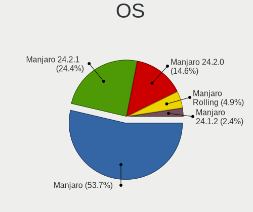
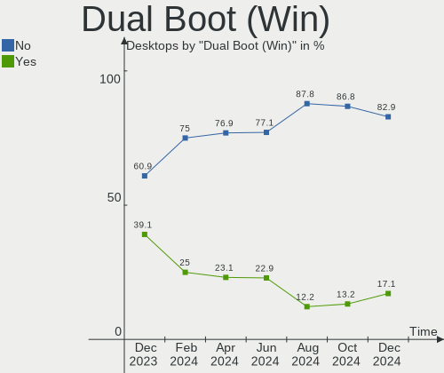
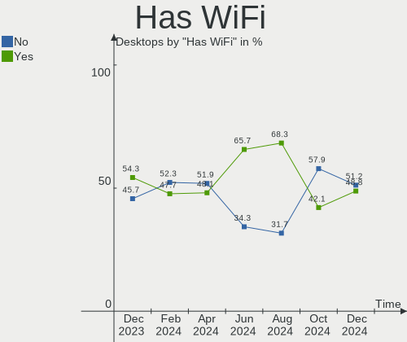
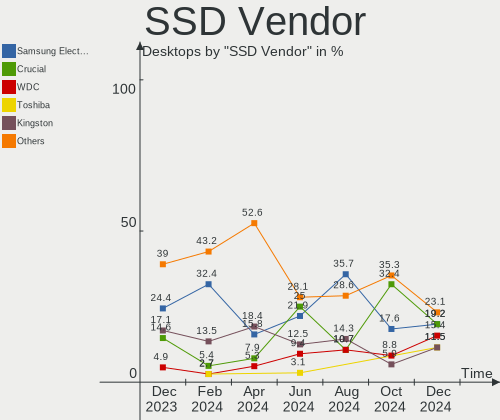
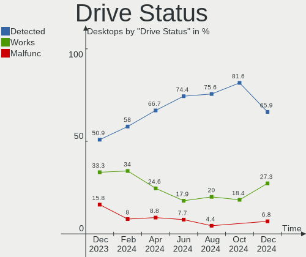
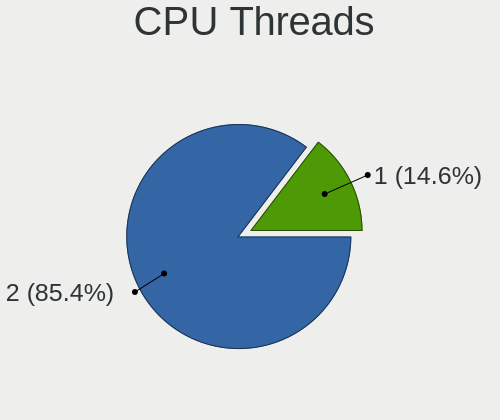

Manjaro Hardware Trends (Desktops)
----------------------------------

A project to identify most popular hardware characteristics and track their change
over time based on data collected by Manjaro users at https://Linux-Hardware.org.

Anyone can contribute to this report by the [hw-probe](https://github.com/linuxhw/hw-probe) tool:

    sudo -E hw-probe -all -upload

Full-feature report is available here: https://linux-hardware.org/?view=trends

Period: Dec, 2021.

Contents
--------

* [ System ](#system)
  - [ OS                       ](#os)
  - [ OS Family                ](#os-family)
  - [ Kernel                   ](#kernel)
  - [ Kernel Family            ](#kernel-family)
  - [ Kernel Major Ver.        ](#kernel-major-ver)
  - [ Arch                     ](#arch)
  - [ DE                       ](#de)
  - [ Display Server           ](#display-server)
  - [ Display Manager          ](#display-manager)
  - [ OS Lang                  ](#os-lang)
  - [ Boot Mode                ](#boot-mode)
  - [ Filesystem               ](#filesystem)
  - [ Part. scheme             ](#part-scheme)
  - [ Dual Boot with Linux/BSD ](#dual-boot-with-linuxbsd)
  - [ Dual Boot (Win)          ](#dual-boot-win)

* [ Board ](#board)
  - [ Vendor                   ](#vendor)
  - [ Model                    ](#model)
  - [ Model Family             ](#model-family)
  - [ MFG Year                 ](#mfg-year)
  - [ Form Factor              ](#form-factor)
  - [ Secure Boot              ](#secure-boot)
  - [ Coreboot                 ](#coreboot)
  - [ RAM Size                 ](#ram-size)
  - [ RAM Used                 ](#ram-used)
  - [ Total Drives             ](#total-drives)
  - [ Has CD-ROM               ](#has-cd-rom)
  - [ Has Ethernet             ](#has-ethernet)
  - [ Has WiFi                 ](#has-wifi)
  - [ Has Bluetooth            ](#has-bluetooth)

* [ Location ](#location)
  - [ Country                  ](#country)
  - [ City                     ](#city)

* [ Drives ](#drives)
  - [ Drive Vendor             ](#drive-vendor)
  - [ Drive Model              ](#drive-model)
  - [ HDD Vendor               ](#hdd-vendor)
  - [ SSD Vendor               ](#ssd-vendor)
  - [ Drive Kind               ](#drive-kind)
  - [ Drive Connector          ](#drive-connector)
  - [ Drive Size               ](#drive-size)
  - [ Space Total              ](#space-total)
  - [ Space Used               ](#space-used)
  - [ Malfunc. Drives          ](#malfunc-drives)
  - [ Malfunc. Drive Vendor    ](#malfunc-drive-vendor)
  - [ Malfunc. HDD Vendor      ](#malfunc-hdd-vendor)
  - [ Malfunc. Drive Kind      ](#malfunc-drive-kind)
  - [ Failed Drives            ](#failed-drives)
  - [ Failed Drive Vendor      ](#failed-drive-vendor)
  - [ Drive Status             ](#drive-status)

* [ Storage controller ](#storage-controller)
  - [ Storage Vendor           ](#storage-vendor)
  - [ Storage Model            ](#storage-model)
  - [ Storage Kind             ](#storage-kind)

* [ Processor ](#processor)
  - [ CPU Vendor               ](#cpu-vendor)
  - [ CPU Model                ](#cpu-model)
  - [ CPU Model Family         ](#cpu-model-family)
  - [ CPU Cores                ](#cpu-cores)
  - [ CPU Sockets              ](#cpu-sockets)
  - [ CPU Threads              ](#cpu-threads)
  - [ CPU Op-Modes             ](#cpu-op-modes)
  - [ CPU Microcode            ](#cpu-microcode)
  - [ CPU Microarch            ](#cpu-microarch)

* [ Graphics ](#graphics)
  - [ GPU Vendor               ](#gpu-vendor)
  - [ GPU Model                ](#gpu-model)
  - [ GPU Combo                ](#gpu-combo)
  - [ GPU Driver               ](#gpu-driver)
  - [ GPU Memory               ](#gpu-memory)

* [ Monitor ](#monitor)
  - [ Monitor Vendor           ](#monitor-vendor)
  - [ Monitor Model            ](#monitor-model)
  - [ Monitor Resolution       ](#monitor-resolution)
  - [ Monitor Diagonal         ](#monitor-diagonal)
  - [ Monitor Width            ](#monitor-width)
  - [ Aspect Ratio             ](#aspect-ratio)
  - [ Monitor Area             ](#monitor-area)
  - [ Pixel Density            ](#pixel-density)
  - [ Multiple Monitors        ](#multiple-monitors)

* [ Network ](#network)
  - [ Net Controller Vendor    ](#net-controller-vendor)
  - [ Net Controller Model     ](#net-controller-model)
  - [ Wireless Vendor          ](#wireless-vendor)
  - [ Wireless Model           ](#wireless-model)
  - [ Ethernet Vendor          ](#ethernet-vendor)
  - [ Ethernet Model           ](#ethernet-model)
  - [ Net Controller Kind      ](#net-controller-kind)
  - [ Used Controller          ](#used-controller)
  - [ NICs                     ](#nics)
  - [ IPv6                     ](#ipv6)

* [ Bluetooth ](#bluetooth)
  - [ Bluetooth Vendor         ](#bluetooth-vendor)
  - [ Bluetooth Model          ](#bluetooth-model)

* [ Sound ](#sound)
  - [ Sound Vendor             ](#sound-vendor)
  - [ Sound Model              ](#sound-model)

* [ Memory ](#memory)
  - [ Memory Vendor            ](#memory-vendor)
  - [ Memory Model             ](#memory-model)
  - [ Memory Kind              ](#memory-kind)
  - [ Memory Form Factor       ](#memory-form-factor)
  - [ Memory Size              ](#memory-size)
  - [ Memory Speed             ](#memory-speed)

* [ Printers & scanners ](#printers--scanners)
  - [ Printer Vendor           ](#printer-vendor)
  - [ Printer Model            ](#printer-model)
  - [ Scanner Vendor           ](#scanner-vendor)
  - [ Scanner Model            ](#scanner-model)

* [ Camera ](#camera)
  - [ Camera Vendor            ](#camera-vendor)
  - [ Camera Model             ](#camera-model)

* [ Security ](#security)
  - [ Fingerprint Vendor       ](#fingerprint-vendor)
  - [ Fingerprint Model        ](#fingerprint-model)
  - [ Chipcard Vendor          ](#chipcard-vendor)
  - [ Chipcard Model           ](#chipcard-model)

* [ Unsupported ](#unsupported)
  - [ Unsupported Devices      ](#unsupported-devices)
  - [ Unsupported Device Types ](#unsupported-device-types)

System
------

OS
--

Installed operating systems

| Name             | Desktops | Percent |
|------------------|----------|---------|
| Manjaro          | 32       | 46.38%  |
| Manjaro 21.2.0   | 22       | 31.88%  |
| Manjaro 21.2rc   | 12       | 17.39%  |
| Manjaro 21.2rc2  | 1        | 1.45%   |
| Manjaro 21.2rc1  | 1        | 1.45%   |
| Manjaro 21.2pre1 | 1        | 1.45%   |

OS Family
---------

OS without a version

| Name    | Desktops | Percent |
|---------|----------|---------|
| Manjaro | 69       | 100%    |

Kernel
------

Version of the Linux kernel

| Version               | Desktops | Percent |
|-----------------------|----------|---------|
| 5.15.7-1-MANJARO      | 11       | 15.94%  |
| 5.15.6-2-MANJARO      | 10       | 14.49%  |
| 5.13.19-2-MANJARO     | 10       | 14.49%  |
| 5.10.84-1-MANJARO     | 7        | 10.14%  |
| 5.15.2-2-MANJARO      | 6        | 8.7%    |
| 5.10.79-1-MANJARO     | 5        | 7.25%   |
| 5.14.18-1-MANJARO     | 3        | 4.35%   |
| 5.10.83-1-MANJARO     | 3        | 4.35%   |
| 5.15.5-1-rt22-MANJARO | 2        | 2.9%    |
| 5.15.11-1-MANJARO     | 2        | 2.9%    |
| 5.14.21-2-MANJARO     | 2        | 2.9%    |
| 5.13.13-1-MANJARO     | 2        | 2.9%    |
| 5.4.6-2-MANJARO       | 1        | 1.45%   |
| 5.4.159-1-MANJARO     | 1        | 1.45%   |
| 5.16.0-1-MANJARO      | 1        | 1.45%   |
| 5.15.6-225-tkg-pds    | 1        | 1.45%   |
| 5.15.5-xanmod1-tt-1   | 1        | 1.45%   |
| 5.10.15-1-MANJARO     | 1        | 1.45%   |

Kernel Family
-------------

Linux kernel without a distro release

| Version | Desktops | Percent |
|---------|----------|---------|
| 5.15.7  | 11       | 15.94%  |
| 5.15.6  | 11       | 15.94%  |
| 5.13.19 | 10       | 14.49%  |
| 5.10.84 | 7        | 10.14%  |
| 5.15.2  | 6        | 8.7%    |
| 5.10.79 | 5        | 7.25%   |
| 5.15.5  | 3        | 4.35%   |
| 5.14.18 | 3        | 4.35%   |
| 5.10.83 | 3        | 4.35%   |
| 5.15.11 | 2        | 2.9%    |
| 5.14.21 | 2        | 2.9%    |
| 5.13.13 | 2        | 2.9%    |
| 5.4.6   | 1        | 1.45%   |
| 5.4.159 | 1        | 1.45%   |
| 5.16.0  | 1        | 1.45%   |
| 5.10.15 | 1        | 1.45%   |

Kernel Major Ver.
-----------------

Linux kernel major version

| Version | Desktops | Percent |
|---------|----------|---------|
| 5.15    | 33       | 47.83%  |
| 5.10    | 16       | 23.19%  |
| 5.13    | 12       | 17.39%  |
| 5.14    | 5        | 7.25%   |
| 5.4     | 2        | 2.9%    |
| 5.16    | 1        | 1.45%   |

Arch
----

OS architecture (x86_64, i586, etc.)

| Name   | Desktops | Percent |
|--------|----------|---------|
| x86_64 | 69       | 100%    |

DE
--

Desktop Environment

| Name       | Desktops | Percent |
|------------|----------|---------|
| KDE5       | 30       | 43.48%  |
| GNOME      | 20       | 28.99%  |
| XFCE       | 14       | 20.29%  |
| i3         | 2        | 2.9%    |
| X-Cinnamon | 1        | 1.45%   |
| Budgie     | 1        | 1.45%   |
| Unknown    | 1        | 1.45%   |

Display Server
--------------

X11 or Wayland

| Name    | Desktops | Percent |
|---------|----------|---------|
| X11     | 62       | 89.86%  |
| Wayland | 7        | 10.14%  |

Display Manager
---------------

SDDM, LightDM, etc.

| Name    | Desktops | Percent |
|---------|----------|---------|
| Unknown | 31       | 44.93%  |
| SDDM    | 15       | 21.74%  |
| LightDM | 12       | 17.39%  |
| GDM     | 11       | 15.94%  |

OS Lang
-------

Language

| Lang  | Desktops | Percent |
|-------|----------|---------|
| en_US | 33       | 47.83%  |
| de_DE | 7        | 10.14%  |
| ru_RU | 3        | 4.35%   |
| pt_BR | 3        | 4.35%   |
| pl_PL | 3        | 4.35%   |
| en_GB | 3        | 4.35%   |
| es_ES | 2        | 2.9%    |
| en_CA | 2        | 2.9%    |
| da_DK | 2        | 2.9%    |
| th_TH | 1        | 1.45%   |
| ru_UA | 1        | 1.45%   |
| pt_PT | 1        | 1.45%   |
| it_IT | 1        | 1.45%   |
| fr_FR | 1        | 1.45%   |
| es_GT | 1        | 1.45%   |
| en_NZ | 1        | 1.45%   |
| en_IN | 1        | 1.45%   |
| en_IE | 1        | 1.45%   |
| en_AU | 1        | 1.45%   |
| de_AT | 1        | 1.45%   |

Boot Mode
---------

EFI or BIOS

| Mode | Desktops | Percent |
|------|----------|---------|
| BIOS | 47       | 68.12%  |
| EFI  | 22       | 31.88%  |

Filesystem
----------

Type of filesystem

| Type    | Desktops | Percent |
|---------|----------|---------|
| Ext4    | 60       | 86.96%  |
| Btrfs   | 5        | 7.25%   |
| XXXX    | 1        | 1.45%   |
| Xfs     | 1        | 1.45%   |
| Tmpfs   | 1        | 1.45%   |
| Overlay | 1        | 1.45%   |

Part. scheme
------------

Scheme of partitioning

| Type    | Desktops | Percent |
|---------|----------|---------|
| Unknown | 46       | 66.67%  |
| GPT     | 21       | 30.43%  |
| MBR     | 2        | 2.9%    |

Dual Boot with Linux/BSD
------------------------

Hosting more than one Linux/BSD

| Dual boot | Desktops | Percent |
|-----------|----------|---------|
| No        | 63       | 91.3%   |
| Yes       | 6        | 8.7%    |

Dual Boot (Win)
---------------

Hosting Linux and Windows

| Dual boot | Desktops | Percent |
|-----------|----------|---------|
| No        | 46       | 66.67%  |
| Yes       | 23       | 33.33%  |

Board
-----

Vendor
------

Motherboard manufacturer

| Name                | Desktops | Percent |
|---------------------|----------|---------|
| ASUSTek Computer    | 19       | 27.54%  |
| Gigabyte Technology | 15       | 21.74%  |
| MSI                 | 11       | 15.94%  |
| Hewlett-Packard     | 5        | 7.25%   |
| ASRock              | 5        | 7.25%   |
| Dell                | 4        | 5.8%    |
| Intel               | 3        | 4.35%   |
| Pegatron            | 2        | 2.9%    |
| Lenovo              | 2        | 2.9%    |
| Samsung Electronics | 1        | 1.45%   |
| Huanan              | 1        | 1.45%   |
| Acer                | 1        | 1.45%   |

Model
-----

Motherboard model

| Name                                   | Desktops | Percent |
|----------------------------------------|----------|---------|
| MSI MS-7B86                            | 2        | 2.9%    |
| Gigabyte B450M DS3H                    | 2        | 2.9%    |
| Samsung DeskTop System                 | 1        | 1.45%   |
| Pegatron s5-1120br                     | 1        | 1.45%   |
| Pegatron IPPPV-D3G                     | 1        | 1.45%   |
| MSI MS-7D09                            | 1        | 1.45%   |
| MSI MS-7C95                            | 1        | 1.45%   |
| MSI MS-7C91                            | 1        | 1.45%   |
| MSI MS-7C51                            | 1        | 1.45%   |
| MSI MS-7C31                            | 1        | 1.45%   |
| MSI MS-7B79                            | 1        | 1.45%   |
| MSI MS-7982                            | 1        | 1.45%   |
| MSI MS-7758                            | 1        | 1.45%   |
| MSI MS-7721                            | 1        | 1.45%   |
| Lenovo IdeaCentre 720-18APR 90HY002APG | 1        | 1.45%   |
| Lenovo IdeaCentre 3 07ADA05 90MV008VAU | 1        | 1.45%   |
| Intel X99                              | 1        | 1.45%   |
| Intel X79                              | 1        | 1.45%   |
| Intel DX58SO2 AAG10925-205             | 1        | 1.45%   |
| Huanan X79                             | 1        | 1.45%   |
| HP ProDesk 600 G2 DM                   | 1        | 1.45%   |
| HP Compaq 8200 Elite CMT PC            | 1        | 1.45%   |
| HP Compaq 6005 Pro SFF PC              | 1        | 1.45%   |
| HP 550-153w                            | 1        | 1.45%   |
| HP 1998                                | 1        | 1.45%   |
| Gigabyte X570 AORUS ELITE              | 1        | 1.45%   |
| Gigabyte X470 AORUS GAMING 7 WIFI      | 1        | 1.45%   |
| Gigabyte H61MS                         | 1        | 1.45%   |
| Gigabyte H61M-DS2 DVI                  | 1        | 1.45%   |
| Gigabyte GA-970A-DS3                   | 1        | 1.45%   |
| Gigabyte GA-78LMT-S2P                  | 1        | 1.45%   |
| Gigabyte B560M AORUS PRO AX            | 1        | 1.45%   |
| Gigabyte B460MDS3H                     | 1        | 1.45%   |
| Gigabyte B450M DS3H V2                 | 1        | 1.45%   |
| Gigabyte B150M-D3H                     | 1        | 1.45%   |
| Gigabyte AB350-Gaming 3                | 1        | 1.45%   |
| Gigabyte A320M-S2H                     | 1        | 1.45%   |
| Gigabyte 970A-DS3P                     | 1        | 1.45%   |
| Dell XPS 8940                          | 1        | 1.45%   |
| Dell Vostro 3681                       | 1        | 1.45%   |
| Dell Precision T5600                   | 1        | 1.45%   |
| Dell Precision T3600                   | 1        | 1.45%   |
| ASUS TUF GAMING B560M-PLUS             | 1        | 1.45%   |
| ASUS TUF GAMING B550M-PLUS             | 1        | 1.45%   |
| ASUS STRIX Z270F GAMING                | 1        | 1.45%   |
| ASUS SABERTOOTH X58                    | 1        | 1.45%   |
| ASUS ROG STRIX Z490-F GAMING           | 1        | 1.45%   |
| ASUS ROG STRIX B550-F GAMING           | 1        | 1.45%   |
| ASUS ROG STRIX B460-I GAMING           | 1        | 1.45%   |
| ASUS ROG STRIX B450-F GAMING           | 1        | 1.45%   |
| ASUS Rampage III Extreme               | 1        | 1.45%   |
| ASUS Rampage Formula                   | 1        | 1.45%   |
| ASUS ProArt X570-CREATOR WIFI          | 1        | 1.45%   |
| ASUS PRIME X399-A                      | 1        | 1.45%   |
| ASUS PRIME B360-PLUS                   | 1        | 1.45%   |
| ASUS PRIME B350M-A                     | 1        | 1.45%   |
| ASUS PRIME A320M-K                     | 1        | 1.45%   |
| ASUS P5LD2-SE                          | 1        | 1.45%   |
| ASUS P5K SE                            | 1        | 1.45%   |
| ASUS M51BC                             | 1        | 1.45%   |

Model Family
------------

Motherboard model prefix

| Name                  | Desktops | Percent |
|-----------------------|----------|---------|
| ASUS ROG              | 4        | 5.8%    |
| ASUS PRIME            | 4        | 5.8%    |
| Gigabyte B450M        | 3        | 4.35%   |
| MSI MS-7B86           | 2        | 2.9%    |
| Lenovo IdeaCentre     | 2        | 2.9%    |
| HP Compaq             | 2        | 2.9%    |
| Dell Precision        | 2        | 2.9%    |
| ASUS TUF              | 2        | 2.9%    |
| ASUS Rampage          | 2        | 2.9%    |
| Samsung DeskTop       | 1        | 1.45%   |
| Pegatron s5-1120br    | 1        | 1.45%   |
| Pegatron IPPPV-D3G    | 1        | 1.45%   |
| MSI MS-7D09           | 1        | 1.45%   |
| MSI MS-7C95           | 1        | 1.45%   |
| MSI MS-7C91           | 1        | 1.45%   |
| MSI MS-7C51           | 1        | 1.45%   |
| MSI MS-7C31           | 1        | 1.45%   |
| MSI MS-7B79           | 1        | 1.45%   |
| MSI MS-7982           | 1        | 1.45%   |
| MSI MS-7758           | 1        | 1.45%   |
| MSI MS-7721           | 1        | 1.45%   |
| Intel X99             | 1        | 1.45%   |
| Intel X79             | 1        | 1.45%   |
| Intel DX58SO2         | 1        | 1.45%   |
| Huanan X79            | 1        | 1.45%   |
| HP ProDesk            | 1        | 1.45%   |
| HP 550-153w           | 1        | 1.45%   |
| HP 1998               | 1        | 1.45%   |
| Gigabyte X570         | 1        | 1.45%   |
| Gigabyte X470         | 1        | 1.45%   |
| Gigabyte H61MS        | 1        | 1.45%   |
| Gigabyte H61M-DS2     | 1        | 1.45%   |
| Gigabyte GA-970A-DS3  | 1        | 1.45%   |
| Gigabyte GA-78LMT-S2P | 1        | 1.45%   |
| Gigabyte B560M        | 1        | 1.45%   |
| Gigabyte B460MDS3H    | 1        | 1.45%   |
| Gigabyte B150M-D3H    | 1        | 1.45%   |
| Gigabyte AB350-Gaming | 1        | 1.45%   |
| Gigabyte A320M-S2H    | 1        | 1.45%   |
| Gigabyte 970A-DS3P    | 1        | 1.45%   |
| Dell XPS              | 1        | 1.45%   |
| Dell Vostro           | 1        | 1.45%   |
| ASUS STRIX            | 1        | 1.45%   |
| ASUS SABERTOOTH       | 1        | 1.45%   |
| ASUS ProArt           | 1        | 1.45%   |
| ASUS P5LD2-SE         | 1        | 1.45%   |
| ASUS P5K              | 1        | 1.45%   |
| ASUS M51BC            | 1        | 1.45%   |
| ASUS G20AJ            | 1        | 1.45%   |
| ASRock X399           | 1        | 1.45%   |
| ASRock QC6000M        | 1        | 1.45%   |
| ASRock H510M-HVS      | 1        | 1.45%   |
| ASRock G41M-VS3       | 1        | 1.45%   |
| ASRock B550M-ITX      | 1        | 1.45%   |
| Acer Aspire           | 1        | 1.45%   |

MFG Year
--------

Motherboard manufacture year

| Year | Desktops | Percent |
|------|----------|---------|
| 2021 | 18       | 26.09%  |
| 2020 | 12       | 17.39%  |
| 2019 | 12       | 17.39%  |
| 2012 | 6        | 8.7%    |
| 2013 | 5        | 7.25%   |
| 2018 | 4        | 5.8%    |
| 2015 | 3        | 4.35%   |
| 2014 | 2        | 2.9%    |
| 2011 | 2        | 2.9%    |
| 2017 | 1        | 1.45%   |
| 2016 | 1        | 1.45%   |
| 2010 | 1        | 1.45%   |
| 2009 | 1        | 1.45%   |
| 2006 | 1        | 1.45%   |

Form Factor
-----------

Physical design of the computer

| Name    | Desktops | Percent |
|---------|----------|---------|
| Desktop | 69       | 100%    |

Secure Boot
-----------

Enabled or disabled

| State    | Desktops | Percent |
|----------|----------|---------|
| Disabled | 69       | 100%    |

Coreboot
--------

Have coreboot on board

| Used | Desktops | Percent |
|------|----------|---------|
| No   | 69       | 100%    |

RAM Size
--------

Total RAM memory

| Size in GB  | Desktops | Percent |
|-------------|----------|---------|
| 16.01-24.0  | 23       | 33.33%  |
| 32.01-64.0  | 16       | 23.19%  |
| 8.01-16.0   | 15       | 21.74%  |
| 4.01-8.0    | 10       | 14.49%  |
| 3.01-4.0    | 2        | 2.9%    |
| 64.01-256.0 | 2        | 2.9%    |
| 1.01-2.0    | 1        | 1.45%   |

RAM Used
--------

Used RAM memory

| Used GB    | Desktops | Percent |
|------------|----------|---------|
| 4.01-8.0   | 21       | 30.43%  |
| 2.01-3.0   | 19       | 27.54%  |
| 1.01-2.0   | 16       | 23.19%  |
| 3.01-4.0   | 8        | 11.59%  |
| 8.01-16.0  | 2        | 2.9%    |
| 0.51-1.0   | 2        | 2.9%    |
| 16.01-24.0 | 1        | 1.45%   |

Total Drives
------------

Number of drives on board

| Drives | Desktops | Percent |
|--------|----------|---------|
| 2      | 19       | 27.54%  |
| 3      | 18       | 26.09%  |
| 1      | 13       | 18.84%  |
| 4      | 12       | 17.39%  |
| 5      | 5        | 7.25%   |
| 6      | 2        | 2.9%    |

Has CD-ROM
----------

Has CD-ROM on board

| Presented | Desktops | Percent |
|-----------|----------|---------|
| No        | 53       | 76.81%  |
| Yes       | 16       | 23.19%  |

Has Ethernet
------------

Has Ethernet on board

| Presented | Desktops | Percent |
|-----------|----------|---------|
| Yes       | 68       | 98.55%  |
| No        | 1        | 1.45%   |

Has WiFi
--------

Has WiFi module

| Presented | Desktops | Percent |
|-----------|----------|---------|
| Yes       | 38       | 55.07%  |
| No        | 31       | 44.93%  |

Has Bluetooth
-------------

Has Bluetooth module

| Presented | Desktops | Percent |
|-----------|----------|---------|
| No        | 36       | 52.17%  |
| Yes       | 33       | 47.83%  |

Location
--------

Country
-------

Geographic location (country)

| Country     | Desktops | Percent |
|-------------|----------|---------|
| USA         | 12       | 17.39%  |
| Germany     | 7        | 10.14%  |
| Russia      | 5        | 7.25%   |
| Brazil      | 5        | 7.25%   |
| Poland      | 3        | 4.35%   |
| Canada      | 3        | 4.35%   |
| UK          | 2        | 2.9%    |
| Thailand    | 2        | 2.9%    |
| Spain       | 2        | 2.9%    |
| Portugal    | 2        | 2.9%    |
| France      | 2        | 2.9%    |
| Denmark     | 2        | 2.9%    |
| Ukraine     | 1        | 1.45%   |
| Sweden      | 1        | 1.45%   |
| Sri Lanka   | 1        | 1.45%   |
| Romania     | 1        | 1.45%   |
| New Zealand | 1        | 1.45%   |
| Netherlands | 1        | 1.45%   |
| Mexico      | 1        | 1.45%   |
| Italy       | 1        | 1.45%   |
| Ireland     | 1        | 1.45%   |
| India       | 1        | 1.45%   |
| Guatemala   | 1        | 1.45%   |
| Greece      | 1        | 1.45%   |
| Estonia     | 1        | 1.45%   |
| Egypt       | 1        | 1.45%   |
| Croatia     | 1        | 1.45%   |
| Costa Rica  | 1        | 1.45%   |
| Bulgaria    | 1        | 1.45%   |
| Bangladesh  | 1        | 1.45%   |
| Bahrain     | 1        | 1.45%   |
| Austria     | 1        | 1.45%   |
| Australia   | 1        | 1.45%   |
| Argentina   | 1        | 1.45%   |

City
----

Geographic location (city)

| City             | Desktops | Percent |
|------------------|----------|---------|
| St Petersburg    | 2        | 2.9%    |
| Dallas           | 2        | 2.9%    |
| Zvenigorod       | 1        | 1.45%   |
| Warsaw           | 1        | 1.45%   |
| Vienna           | 1        | 1.45%   |
| Versailles       | 1        | 1.45%   |
| Toulouse         | 1        | 1.45%   |
| Toronto          | 1        | 1.45%   |
| Titusville       | 1        | 1.45%   |
| Taby             | 1        | 1.45%   |
| Spruce Grove     | 1        | 1.45%   |
| Sofia            | 1        | 1.45%   |
| Sligo            | 1        | 1.45%   |
| Skaelskor        | 1        | 1.45%   |
| Sindelfingen     | 1        | 1.45%   |
| Sheboygan        | 1        | 1.45%   |
| S??o Paulo       | 1        | 1.45%   |
| Sassari          | 1        | 1.45%   |
| San Jos?©        | 1        | 1.45%   |
| Rotterdam        | 1        | 1.45%   |
| Porto Alegre     | 1        | 1.45%   |
| Pollenfeld       | 1        | 1.45%   |
| Peru             | 1        | 1.45%   |
| Pachuca          | 1        | 1.45%   |
| Owego            | 1        | 1.45%   |
| Odemira          | 1        | 1.45%   |
| Novosibirsk      | 1        | 1.45%   |
| Napier City      | 1        | 1.45%   |
| Meerane          | 1        | 1.45%   |
| Manama           | 1        | 1.45%   |
| Madison          | 1        | 1.45%   |
| Lyubertsy        | 1        | 1.45%   |
| Lodz             | 1        | 1.45%   |
| Lille            | 1        | 1.45%   |
| Kyiv             | 1        | 1.45%   |
| Kierspe          | 1        | 1.45%   |
| Katy Wroclawskie | 1        | 1.45%   |
| Kalinovac        | 1        | 1.45%   |
| Jaerva vald      | 1        | 1.45%   |
| Hillsboro        | 1        | 1.45%   |
| High Wycombe     | 1        | 1.45%   |
| Hanover          | 1        | 1.45%   |
| Guatemala City   | 1        | 1.45%   |
| Glasgow          | 1        | 1.45%   |
| Garin            | 1        | 1.45%   |
| Fresno           | 1        | 1.45%   |
| Fortaleza        | 1        | 1.45%   |
| Fort St. John    | 1        | 1.45%   |
| Dresden          | 1        | 1.45%   |
| Dhaka            | 1        | 1.45%   |
| Dehiwala         | 1        | 1.45%   |
| Curitiba         | 1        | 1.45%   |
| Cox              | 1        | 1.45%   |
| Copenhagen       | 1        | 1.45%   |
| Clarksville      | 1        | 1.45%   |
| Chiang Mai       | 1        | 1.45%   |
| Chennai          | 1        | 1.45%   |
| Caxias do Sul    | 1        | 1.45%   |
| Cartagena        | 1        | 1.45%   |
| Bucharest        | 1        | 1.45%   |

Drives
------

Drive Vendor
------------

Hard drive vendors

| Vendor                    | Desktops | Drives | Percent |
|---------------------------|----------|--------|---------|
| Seagate                   | 30       | 37     | 18.63%  |
| WDC                       | 24       | 29     | 14.91%  |
| Samsung Electronics       | 23       | 35     | 14.29%  |
| Toshiba                   | 10       | 12     | 6.21%   |
| Hitachi                   | 9        | 9      | 5.59%   |
| Sandisk                   | 8        | 8      | 4.97%   |
| Crucial                   | 8        | 8      | 4.97%   |
| Kingston                  | 7        | 7      | 4.35%   |
| Phison                    | 5        | 5      | 3.11%   |
| A-DATA Technology         | 5        | 5      | 3.11%   |
| China                     | 3        | 4      | 1.86%   |
| XPG                       | 2        | 2      | 1.24%   |
| Unknown                   | 2        | 2      | 1.24%   |
| Team                      | 2        | 2      | 1.24%   |
| Silicon Motion            | 2        | 2      | 1.24%   |
| PNY                       | 2        | 2      | 1.24%   |
| Patriot                   | 2        | 2      | 1.24%   |
| Intenso                   | 2        | 2      | 1.24%   |
| ZOMY                      | 1        | 1      | 0.62%   |
| SPCC                      | 1        | 1      | 0.62%   |
| Realtek Semiconductor     | 1        | 1      | 0.62%   |
| OCZ                       | 1        | 1      | 0.62%   |
| Mushkin                   | 1        | 1      | 0.62%   |
| Micron/Crucial Technology | 1        | 1      | 0.62%   |
| Micron Technology         | 1        | 1      | 0.62%   |
| MAXTOR                    | 1        | 1      | 0.62%   |
| Lexar                     | 1        | 1      | 0.62%   |
| Kston                     | 1        | 1      | 0.62%   |
| KIOXIA                    | 1        | 1      | 0.62%   |
| KingSpec                  | 1        | 1      | 0.62%   |
| Gigabyte Technology       | 1        | 1      | 0.62%   |
| Colorful                  | 1        | 1      | 0.62%   |
| Apacer                    | 1        | 1      | 0.62%   |

Drive Model
-----------

Hard drive models

| Model                                | Desktops | Percent |
|--------------------------------------|----------|---------|
| Seagate ST1000DM010-2EP102 1TB       | 5        | 2.78%   |
| Seagate ST2000DM008-2FR102 2TB       | 4        | 2.22%   |
| Seagate ST1000LM024 HN-M101MBB 1TB   | 3        | 1.67%   |
| Samsung NVMe SSD Drive 1TB           | 3        | 1.67%   |
| WDC WDS240G2G0A-00JH30 240GB SSD     | 2        | 1.11%   |
| WDC WD10EZEX-60WN4A0 1TB             | 2        | 1.11%   |
| WDC WD10EZEX-08WN4A0 1TB             | 2        | 1.11%   |
| WDC WD1003FZEX-00MK2A0 1TB           | 2        | 1.11%   |
| Unknown SD/MMC/MS PRO 7GB            | 2        | 1.11%   |
| Toshiba DT01ACA100 1TB               | 2        | 1.11%   |
| Toshiba DT01ACA050 500GB             | 2        | 1.11%   |
| Team TM8PS7256G 256GB SSD            | 2        | 1.11%   |
| Seagate ST500DM002-1BD142 500GB      | 2        | 1.11%   |
| Sandisk NVMe SSD Drive 500GB         | 2        | 1.11%   |
| Samsung SSD 980 1TB                  | 2        | 1.11%   |
| Samsung SSD 870 EVO 1TB              | 2        | 1.11%   |
| Samsung SSD 860 EVO 250GB            | 2        | 1.11%   |
| Samsung SSD 850 EVO 250GB            | 2        | 1.11%   |
| Samsung NVMe SSD Drive 512GB         | 2        | 1.11%   |
| Samsung HD753LJ 752GB                | 2        | 1.11%   |
| Crucial CT480BX500SSD1 480GB         | 2        | 1.11%   |
| ZOMY ZY603 480GB                     | 1        | 0.56%   |
| XPG SPECTRIX S40G 1TB                | 1        | 0.56%   |
| XPG NVMe SSD Drive 1TB               | 1        | 0.56%   |
| WDC WDS500G2B0A-00SM50 500GB SSD     | 1        | 0.56%   |
| WDC WDS500G1B0A-00H9H0 500GB SSD     | 1        | 0.56%   |
| WDC WDS240G2G0B-00EPW0 240GB SSD     | 1        | 0.56%   |
| WDC WDS120G1G0B-00RC30 120GB SSD     | 1        | 0.56%   |
| WDC WD800BD-22MRA1 80GB              | 1        | 0.56%   |
| WDC WD7500BPVT-3 752GB               | 1        | 0.56%   |
| WDC WD5000LPCX-60VHAT0 500GB         | 1        | 0.56%   |
| WDC WD5000AAKX-60U6AA0 500GB         | 1        | 0.56%   |
| WDC WD40EZRX-22SPEB0 4TB             | 1        | 0.56%   |
| WDC WD1600AAJS-00Z4A0 160GB          | 1        | 0.56%   |
| WDC WD1502FAEX-007BA0 1TB            | 1        | 0.56%   |
| WDC WD10JUCT-62CYNY0 1TB             | 1        | 0.56%   |
| WDC WD10JPVX-60JC3T0 1TB             | 1        | 0.56%   |
| WDC WD10EZEX-75WN4A0 1TB             | 1        | 0.56%   |
| WDC WD10EZEX-60M2NA0 1TB             | 1        | 0.56%   |
| WDC WD10EZEX-00BN5A0 1TB             | 1        | 0.56%   |
| WDC WD10EARX-00N0YB0 1TB             | 1        | 0.56%   |
| WDC WD10EADS-00M2B0 1TB              | 1        | 0.56%   |
| WDC WD1003FZEX-00K3CA0 1TB           | 1        | 0.56%   |
| WDC WD1002FAEX-00Z3A0 1TB            | 1        | 0.56%   |
| Toshiba MQ01ABD075 752GB             | 1        | 0.56%   |
| Toshiba HDWE140 4TB                  | 1        | 0.56%   |
| Toshiba HDWD130 3TB                  | 1        | 0.56%   |
| Toshiba DT01ACA300 3TB               | 1        | 0.56%   |
| Toshiba DT01ACA200 LENOVO 2TB        | 1        | 0.56%   |
| Toshiba DT01ACA200 2TB               | 1        | 0.56%   |
| Toshiba DT01ACA100 LENOVO 1TB        | 1        | 0.56%   |
| SPCC Solid State Disk 64GB           | 1        | 0.56%   |
| Silicon Motion NVMe SSD Drive 256GB  | 1        | 0.56%   |
| Silicon Motion NVMe SSD Drive 1024GB | 1        | 0.56%   |
| Seagate ST8000DM004-2CX188 8TB       | 1        | 0.56%   |
| Seagate ST500VT000-1DK142 500GB      | 1        | 0.56%   |
| Seagate ST500LT012-9WS142 500GB      | 1        | 0.56%   |
| Seagate ST4000DM004-2CV104 4TB       | 1        | 0.56%   |
| Seagate ST3500830AS 500GB            | 1        | 0.56%   |
| Seagate ST3500413AS 500GB            | 1        | 0.56%   |

HDD Vendor
----------

Hard disk drive vendors

| Vendor              | Desktops | Drives | Percent |
|---------------------|----------|--------|---------|
| Seagate             | 30       | 35     | 40.54%  |
| WDC                 | 20       | 23     | 27.03%  |
| Toshiba             | 10       | 12     | 13.51%  |
| Hitachi             | 9        | 9      | 12.16%  |
| Unknown             | 2        | 2      | 2.7%    |
| Samsung Electronics | 2        | 4      | 2.7%    |
| MAXTOR              | 1        | 1      | 1.35%   |

SSD Vendor
----------

Solid state drive vendors

| Vendor              | Desktops | Drives | Percent |
|---------------------|----------|--------|---------|
| Samsung Electronics | 13       | 17     | 21.31%  |
| Crucial             | 7        | 7      | 11.48%  |
| WDC                 | 6        | 6      | 9.84%   |
| SanDisk             | 5        | 5      | 8.2%    |
| Kingston            | 5        | 5      | 8.2%    |
| A-DATA Technology   | 4        | 4      | 6.56%   |
| China               | 3        | 4      | 4.92%   |
| Team                | 2        | 2      | 3.28%   |
| PNY                 | 2        | 2      | 3.28%   |
| Patriot             | 2        | 2      | 3.28%   |
| Intenso             | 2        | 2      | 3.28%   |
| SPCC                | 1        | 1      | 1.64%   |
| Seagate             | 1        | 1      | 1.64%   |
| OCZ                 | 1        | 1      | 1.64%   |
| Mushkin             | 1        | 1      | 1.64%   |
| Micron Technology   | 1        | 1      | 1.64%   |
| Lexar               | 1        | 1      | 1.64%   |
| KingSpec            | 1        | 1      | 1.64%   |
| Gigabyte Technology | 1        | 1      | 1.64%   |
| Colorful            | 1        | 1      | 1.64%   |
| Apacer              | 1        | 1      | 1.64%   |

Drive Kind
----------

HDD or SSD

| Kind    | Desktops | Drives | Percent |
|---------|----------|--------|---------|
| HDD     | 52       | 86     | 40.31%  |
| SSD     | 49       | 66     | 37.98%  |
| NVMe    | 25       | 33     | 19.38%  |
| Unknown | 3        | 3      | 2.33%   |

Drive Connector
---------------

SATA, SAS, NVMe, etc.

| Type | Desktops | Drives | Percent |
|------|----------|--------|---------|
| SATA | 64       | 149    | 68.09%  |
| NVMe | 25       | 33     | 26.6%   |
| SAS  | 5        | 6      | 5.32%   |

Drive Size
----------

Size of hard drive

| Size in TB | Desktops | Drives | Percent |
|------------|----------|--------|---------|
| 0.01-0.5   | 51       | 74     | 46.36%  |
| 0.51-1.0   | 36       | 49     | 32.73%  |
| 1.01-2.0   | 13       | 17     | 11.82%  |
| 2.01-3.0   | 4        | 6      | 3.64%   |
| 3.01-4.0   | 3        | 3      | 2.73%   |
| 4.01-10.0  | 2        | 2      | 1.82%   |
| 10.01-20.0 | 1        | 1      | 0.91%   |

Space Total
-----------

Amount of disk space available on the file system

| Size in GB     | Desktops | Percent |
|----------------|----------|---------|
| 1001-2000      | 14       | 20.29%  |
| 101-250        | 13       | 18.84%  |
| 501-1000       | 12       | 17.39%  |
| 251-500        | 11       | 15.94%  |
| More than 3000 | 9        | 13.04%  |
| 2001-3000      | 4        | 5.8%    |
| 51-100         | 3        | 4.35%   |
| 21-50          | 1        | 1.45%   |
| 1-20           | 1        | 1.45%   |
| Unknown        | 1        | 1.45%   |

Space Used
----------

Amount of used disk space

| Used GB        | Desktops | Percent |
|----------------|----------|---------|
| 1-20           | 17       | 24.64%  |
| 501-1000       | 12       | 17.39%  |
| 21-50          | 8        | 11.59%  |
| 51-100         | 8        | 11.59%  |
| 251-500        | 7        | 10.14%  |
| 101-250        | 7        | 10.14%  |
| More than 3000 | 4        | 5.8%    |
| 1001-2000      | 3        | 4.35%   |
| 2001-3000      | 2        | 2.9%    |
| Unknown        | 1        | 1.45%   |

Malfunc. Drives
---------------

Drive models with a malfunction

| Model                       | Desktops | Drives | Percent |
|-----------------------------|----------|--------|---------|
| WDC WD800BD-22MRA1 80GB     | 1        | 1      | 20%     |
| WDC WD10EARX-00N0YB0 1TB    | 1        | 1      | 20%     |
| Phison BPX 240GB            | 1        | 1      | 20%     |
| Intenso SSD 120GB           | 1        | 1      | 20%     |
| Hitachi HUS724030ALA640 3TB | 1        | 1      | 20%     |

Malfunc. Drive Vendor
---------------------

Vendors of faulty drives

| Vendor  | Desktops | Drives | Percent |
|---------|----------|--------|---------|
| WDC     | 2        | 2      | 40%     |
| Phison  | 1        | 1      | 20%     |
| Intenso | 1        | 1      | 20%     |
| Hitachi | 1        | 1      | 20%     |

Malfunc. HDD Vendor
-------------------

Vendors of faulty HDD drives

| Vendor  | Desktops | Drives | Percent |
|---------|----------|--------|---------|
| WDC     | 2        | 2      | 66.67%  |
| Hitachi | 1        | 1      | 33.33%  |

Malfunc. Drive Kind
-------------------

Kinds of faulty drives

| Kind | Desktops | Drives | Percent |
|------|----------|--------|---------|
| HDD  | 3        | 3      | 60%     |
| NVMe | 1        | 1      | 20%     |
| SSD  | 1        | 1      | 20%     |

Failed Drives
-------------

Failed drive models

Zero info for selected period =(

Failed Drive Vendor
-------------------

Failed drive vendors

Zero info for selected period =(

Drive Status
------------

Number of failed and malfunc. drives

| Status   | Desktops | Drives | Percent |
|----------|----------|--------|---------|
| Detected | 55       | 146    | 73.33%  |
| Works    | 15       | 37     | 20%     |
| Malfunc  | 5        | 5      | 6.67%   |

Storage controller
------------------

Storage Vendor
--------------

Storage controller vendors

| Vendor                       | Desktops | Percent |
|------------------------------|----------|---------|
| Intel                        | 38       | 37.62%  |
| AMD                          | 30       | 29.7%   |
| Samsung Electronics          | 11       | 10.89%  |
| Phison Electronics           | 5        | 4.95%   |
| Sandisk                      | 3        | 2.97%   |
| Realtek Semiconductor        | 3        | 2.97%   |
| Silicon Motion               | 2        | 1.98%   |
| Micron/Crucial Technology    | 2        | 1.98%   |
| Marvell Technology Group     | 2        | 1.98%   |
| Kingston Technology Company  | 2        | 1.98%   |
| Toshiba America Info Systems | 1        | 0.99%   |
| JMicron Technology           | 1        | 0.99%   |
| ADATA Technology             | 1        | 0.99%   |

Storage Model
-------------

Storage controller models

| Model                                                                                   | Desktops | Percent |
|-----------------------------------------------------------------------------------------|----------|---------|
| AMD FCH SATA Controller [AHCI mode]                                                     | 22       | 17.19%  |
| AMD 400 Series Chipset SATA Controller                                                  | 9        | 7.03%   |
| Samsung NVMe SSD Controller SM981/PM981/PM983                                           | 4        | 3.13%   |
| Samsung NVMe SSD Controller 980                                                         | 4        | 3.13%   |
| Intel C600/X79 series chipset 6-Port SATA AHCI Controller                               | 4        | 3.13%   |
| Intel 500 Series Chipset Family SATA AHCI Controller                                    | 4        | 3.13%   |
| AMD Starship/Matisse Chipset SATA Controller [AHCI mode]                                | 4        | 3.13%   |
| Realtek RTS5763DL NVMe SSD Controller                                                   | 3        | 2.34%   |
| Intel SATA Controller [RAID mode]                                                       | 3        | 2.34%   |
| Intel Q170/Q150/B150/H170/H110/Z170/CM236 Chipset SATA Controller [AHCI Mode]           | 3        | 2.34%   |
| Intel 82801JI (ICH10 Family) SATA AHCI Controller                                       | 3        | 2.34%   |
| Intel 8 Series/C220 Series Chipset Family 6-port SATA Controller 1 [AHCI mode]          | 3        | 2.34%   |
| AMD SB7x0/SB8x0/SB9x0 SATA Controller [AHCI mode]                                       | 3        | 2.34%   |
| AMD FCH SATA Controller D                                                               | 3        | 2.34%   |
| Silicon Motion SM2263EN/SM2263XT SSD Controller                                         | 2        | 1.56%   |
| Samsung NVMe SSD Controller SM961/PM961/SM963                                           | 2        | 1.56%   |
| Samsung NVMe SSD Controller PM9A1/PM9A3/980PRO                                          | 2        | 1.56%   |
| Phison E12 NVMe Controller                                                              | 2        | 1.56%   |
| Micron/Crucial P1 NVMe PCIe SSD                                                         | 2        | 1.56%   |
| Marvell Group 88SE9123 PCIe SATA 6.0 Gb/s controller                                    | 2        | 1.56%   |
| Intel NM10/ICH7 Family SATA Controller [IDE mode]                                       | 2        | 1.56%   |
| Intel Comet Lake SATA AHCI Controller                                                   | 2        | 1.56%   |
| Intel 82801G (ICH7 Family) IDE Controller                                               | 2        | 1.56%   |
| Intel 7 Series/C210 Series Chipset Family 6-port SATA Controller [AHCI mode]            | 2        | 1.56%   |
| Intel 6 Series/C200 Series Chipset Family Desktop SATA Controller (IDE mode, ports 4-5) | 2        | 1.56%   |
| Intel 6 Series/C200 Series Chipset Family Desktop SATA Controller (IDE mode, ports 0-3) | 2        | 1.56%   |
| Intel 6 Series/C200 Series Chipset Family 6 port Desktop SATA AHCI Controller           | 2        | 1.56%   |
| Intel 200 Series PCH SATA controller [AHCI mode]                                        | 2        | 1.56%   |
| AMD X399 Series Chipset SATA Controller                                                 | 2        | 1.56%   |
| AMD SB7x0/SB8x0/SB9x0 SATA Controller [IDE mode]                                        | 2        | 1.56%   |
| AMD SB7x0/SB8x0/SB9x0 IDE Controller                                                    | 2        | 1.56%   |
| AMD 300 Series Chipset SATA Controller                                                  | 2        | 1.56%   |
| Toshiba America Info Systems XG6 NVMe SSD Controller                                    | 1        | 0.78%   |
| Sandisk WD PC SN810 / Black SN850 NVMe SSD                                              | 1        | 0.78%   |
| Sandisk WD Blue SN550 NVMe SSD                                                          | 1        | 0.78%   |
| Sandisk Non-Volatile memory controller                                                  | 1        | 0.78%   |
| Samsung NVMe SSD Controller SM951/PM951                                                 | 1        | 0.78%   |
| Phison PS5013 E13 NVMe Controller                                                       | 1        | 0.78%   |
| Phison E7 NVMe Controller                                                               | 1        | 0.78%   |
| Phison E16 PCIe4 NVMe Controller                                                        | 1        | 0.78%   |
| Marvell Group 88SE912x IDE Controller                                                   | 1        | 0.78%   |
| Marvell Group 88SE6111/6121 SATA II / PATA Controller                                   | 1        | 0.78%   |
| Kingston Company Company Non-Volatile memory controller                                 | 1        | 0.78%   |
| Kingston Company A2000 NVMe SSD                                                         | 1        | 0.78%   |
| JMicron JMB362 SATA Controller                                                          | 1        | 0.78%   |
| Intel NM10/ICH7 Family SATA Controller [AHCI mode]                                      | 1        | 0.78%   |
| Intel Cannon Lake PCH SATA AHCI Controller                                              | 1        | 0.78%   |
| Intel 82801IR/IO/IH (ICH9R/DO/DH) 6 port SATA Controller [AHCI mode]                    | 1        | 0.78%   |
| Intel 82801IB (ICH9) 4 port SATA Controller [AHCI mode]                                 | 1        | 0.78%   |
| Intel 400 Series Chipset Family SATA AHCI Controller                                    | 1        | 0.78%   |
| Intel 300 Series Chipset Family SATA RAID Controller                                    | 1        | 0.78%   |
| ADATA XPG SX8200 Pro PCIe Gen3x4 M.2 2280 Solid State Drive                             | 1        | 0.78%   |

Storage Kind
------------

Kind of storage controller (IDE, SATA, NVMe, SAS, ...)

| Kind | Desktops | Percent |
|------|----------|---------|
| SATA | 60       | 62.5%   |
| NVMe | 25       | 26.04%  |
| IDE  | 7        | 7.29%   |
| RAID | 4        | 4.17%   |

Processor
---------

CPU Vendor
----------

Processor vendors

| Vendor | Desktops | Percent |
|--------|----------|---------|
| Intel  | 38       | 55.07%  |
| AMD    | 31       | 44.93%  |

CPU Model
---------

Processor models

| Model                                          | Desktops | Percent |
|------------------------------------------------|----------|---------|
| AMD Ryzen 5 3600 6-Core Processor              | 3        | 4.35%   |
| Intel Core i7 CPU 950 @ 3.07GHz                | 2        | 2.9%    |
| Intel Core i5-6500 CPU @ 3.20GHz               | 2        | 2.9%    |
| Intel Core i5-3450 CPU @ 3.10GHz               | 2        | 2.9%    |
| Intel Core i3-10100F CPU @ 3.60GHz             | 2        | 2.9%    |
| AMD Ryzen Threadripper 1950X 16-Core Processor | 2        | 2.9%    |
| AMD Ryzen 5 1600X Six-Core Processor           | 2        | 2.9%    |
| Intel Xeon CPU E5-2690 0 @ 2.90GHz             | 1        | 1.45%   |
| Intel Xeon CPU E5-2665 0 @ 2.40GHz             | 1        | 1.45%   |
| Intel Xeon CPU E5-2630L v2 @ 2.40GHz           | 1        | 1.45%   |
| Intel Xeon CPU E5-2620 v3 @ 2.40GHz            | 1        | 1.45%   |
| Intel Xeon CPU E5-2620 v2 @ 2.10GHz            | 1        | 1.45%   |
| Intel Core i7 CPU X 980 @ 3.33GHz              | 1        | 1.45%   |
| Intel Core i5-9400F CPU @ 2.90GHz              | 1        | 1.45%   |
| Intel Core i5-8400 CPU @ 2.80GHz               | 1        | 1.45%   |
| Intel Core i5-7500 CPU @ 3.40GHz               | 1        | 1.45%   |
| Intel Core i5-4570 CPU @ 3.20GHz               | 1        | 1.45%   |
| Intel Core i5-4460 CPU @ 3.20GHz               | 1        | 1.45%   |
| Intel Core i5-3570K CPU @ 3.40GHz              | 1        | 1.45%   |
| Intel Core i5-2400 CPU @ 3.10GHz               | 1        | 1.45%   |
| Intel Core i5-10400F CPU @ 2.90GHz             | 1        | 1.45%   |
| Intel Core i5-10400 CPU @ 2.90GHz              | 1        | 1.45%   |
| Intel Core i3-9100F CPU @ 3.60GHz              | 1        | 1.45%   |
| Intel Core i3-6100T CPU @ 3.20GHz              | 1        | 1.45%   |
| Intel Core i3-4170 CPU @ 3.70GHz               | 1        | 1.45%   |
| Intel Core i3-3220 CPU @ 3.30GHz               | 1        | 1.45%   |
| Intel Core i3-2100 CPU @ 3.10GHz               | 1        | 1.45%   |
| Intel Core i3-10100 CPU @ 3.60GHz              | 1        | 1.45%   |
| Intel Core 2 Quad CPU Q9400 @ 2.66GHz          | 1        | 1.45%   |
| Intel Core 2 Quad CPU Q6600 @ 2.40GHz          | 1        | 1.45%   |
| Intel Core 2 CPU 6400 @ 2.13GHz                | 1        | 1.45%   |
| Intel Celeron CPU 2.66GHz                      | 1        | 1.45%   |
| Intel Atom CPU D525 @ 1.80GHz                  | 1        | 1.45%   |
| Intel 11th Gen Core i7-11700KF @ 3.60GHz       | 1        | 1.45%   |
| Intel 11th Gen Core i7-11700 @ 2.50GHz         | 1        | 1.45%   |
| Intel 11th Gen Core i5-11400F @ 2.60GHz        | 1        | 1.45%   |
| Intel 11th Gen Core i5-11400 @ 2.60GHz         | 1        | 1.45%   |
| AMD Ryzen 9 5900X 12-Core Processor            | 1        | 1.45%   |
| AMD Ryzen 9 3900X 12-Core Processor            | 1        | 1.45%   |
| AMD Ryzen 7 5700G with Radeon Graphics         | 1        | 1.45%   |
| AMD Ryzen 7 3700X 8-Core Processor             | 1        | 1.45%   |
| AMD Ryzen 7 2700X Eight-Core Processor         | 1        | 1.45%   |
| AMD Ryzen 7 2700 Eight-Core Processor          | 1        | 1.45%   |
| AMD Ryzen 7 1700 Eight-Core Processor          | 1        | 1.45%   |
| AMD Ryzen 5 5600X 6-Core Processor             | 1        | 1.45%   |
| AMD Ryzen 5 5600G with Radeon Graphics         | 1        | 1.45%   |
| AMD Ryzen 5 2600X Six-Core Processor           | 1        | 1.45%   |
| AMD Ryzen 5 2600 Six-Core Processor            | 1        | 1.45%   |
| AMD Ryzen 5 2400G with Radeon Vega Graphics    | 1        | 1.45%   |
| AMD Ryzen 5 1600 Six-Core Processor            | 1        | 1.45%   |
| AMD Ryzen 3 3250U with Radeon Graphics         | 1        | 1.45%   |
| AMD Ryzen 3 2200G with Radeon Vega Graphics    | 1        | 1.45%   |
| AMD Ryzen 3 1300X Quad-Core Processor          | 1        | 1.45%   |
| AMD Phenom II X6 1055T Processor               | 1        | 1.45%   |
| AMD Phenom II X4 B95 Processor                 | 1        | 1.45%   |
| AMD FX-8320 Eight-Core Processor               | 1        | 1.45%   |
| AMD FX-8300 Eight-Core Processor               | 1        | 1.45%   |
| AMD FX-4100 Quad-Core Processor                | 1        | 1.45%   |
| AMD E2-6110 APU with AMD Radeon R2 Graphics    | 1        | 1.45%   |
| AMD A8-9600 RADEON R7, 10 COMPUTE CORES 4C+6G  | 1        | 1.45%   |

CPU Model Family
----------------

Processor model prefix

| Model                  | Desktops | Percent |
|------------------------|----------|---------|
| Intel Core i5          | 13       | 18.84%  |
| AMD Ryzen 5            | 11       | 15.94%  |
| Intel Core i3          | 8        | 11.59%  |
| Intel Xeon             | 5        | 7.25%   |
| AMD Ryzen 7            | 5        | 7.25%   |
| Other                  | 4        | 5.8%    |
| Intel Core i7          | 3        | 4.35%   |
| AMD Ryzen 3            | 3        | 4.35%   |
| AMD FX                 | 3        | 4.35%   |
| Intel Core 2 Quad      | 2        | 2.9%    |
| AMD Ryzen Threadripper | 2        | 2.9%    |
| AMD Ryzen 9            | 2        | 2.9%    |
| AMD A8                 | 2        | 2.9%    |
| Intel Core 2           | 1        | 1.45%   |
| Intel Celeron          | 1        | 1.45%   |
| Intel Atom             | 1        | 1.45%   |
| AMD Phenom II X6       | 1        | 1.45%   |
| AMD Phenom II X4       | 1        | 1.45%   |
| AMD E2                 | 1        | 1.45%   |

CPU Cores
---------

Number of processor cores

| Number | Desktops | Percent |
|--------|----------|---------|
| 4      | 24       | 34.78%  |
| 6      | 21       | 30.43%  |
| 2      | 10       | 14.49%  |
| 8      | 8        | 11.59%  |
| 16     | 3        | 4.35%   |
| 12     | 2        | 2.9%    |
| 1      | 1        | 1.45%   |

CPU Sockets
-----------

Number of sockets

| Number | Desktops | Percent |
|--------|----------|---------|
| 1      | 68       | 98.55%  |
| 2      | 1        | 1.45%   |

CPU Threads
-----------

Threads per core (Hyper-Threading)

| Number | Desktops | Percent |
|--------|----------|---------|
| 2      | 48       | 69.57%  |
| 1      | 21       | 30.43%  |

CPU Op-Modes
------------

CPU Operation Modes (32-bit, 64-bit)

| Op mode        | Desktops | Percent |
|----------------|----------|---------|
| 32-bit, 64-bit | 69       | 100%    |

CPU Microcode
-------------

Microcode number

| Number     | Desktops | Percent |
|------------|----------|---------|
| Unknown    | 44       | 63.77%  |
| 0xa0671    | 3        | 4.35%   |
| 0x306a9    | 3        | 4.35%   |
| 0x08701021 | 3        | 4.35%   |
| 0x0800820d | 3        | 4.35%   |
| 0x506e3    | 2        | 2.9%    |
| 0x08001137 | 2        | 2.9%    |
| 0xa0653    | 1        | 1.45%   |
| 0x906ea    | 1        | 1.45%   |
| 0x6f2      | 1        | 1.45%   |
| 0x206c2    | 1        | 1.45%   |
| 0x0a201016 | 1        | 1.45%   |
| 0x08001138 | 1        | 1.45%   |
| 0x06003106 | 1        | 1.45%   |
| 0x06000852 | 1        | 1.45%   |
| 0x010000c8 | 1        | 1.45%   |

CPU Microarch
-------------

Microarchitecture

| Name        | Desktops | Percent |
|-------------|----------|---------|
| Zen         | 8        | 11.59%  |
| Zen+        | 6        | 8.7%    |
| IvyBridge   | 6        | 8.7%    |
| Zen 2       | 5        | 7.25%   |
| CometLake   | 5        | 7.25%   |
| Zen 3       | 4        | 5.8%    |
| SandyBridge | 4        | 5.8%    |
| KabyLake    | 4        | 5.8%    |
| Haswell     | 4        | 5.8%    |
| Skylake     | 3        | 4.35%   |
| Piledriver  | 2        | 2.9%    |
| Nehalem     | 2        | 2.9%    |
| K10         | 2        | 2.9%    |
| Icelake     | 2        | 2.9%    |
| Core        | 2        | 2.9%    |
| Unknown     | 2        | 2.9%    |
| Westmere    | 1        | 1.45%   |
| Steamroller | 1        | 1.45%   |
| Puma        | 1        | 1.45%   |
| Penryn      | 1        | 1.45%   |
| NetBurst    | 1        | 1.45%   |
| Excavator   | 1        | 1.45%   |
| Bulldozer   | 1        | 1.45%   |
| Bonnell     | 1        | 1.45%   |

Graphics
--------

GPU Vendor
----------

Vendors of graphics cards

| Vendor           | Desktops | Percent |
|------------------|----------|---------|
| Nvidia           | 40       | 53.33%  |
| AMD              | 19       | 25.33%  |
| Intel            | 15       | 20%     |
| ATI Technologies | 1        | 1.33%   |

GPU Model
---------

Graphics card models

| Model                                                                       | Desktops | Percent |
|-----------------------------------------------------------------------------|----------|---------|
| Nvidia GP106 [GeForce GTX 1060 3GB]                                         | 3        | 4%      |
| Nvidia GK208B [GeForce GT 710]                                              | 3        | 4%      |
| Nvidia TU117 [GeForce GTX 1650]                                             | 2        | 2.67%   |
| Nvidia TU104 [GeForce RTX 2080 SUPER]                                       | 2        | 2.67%   |
| Nvidia TU104 [GeForce RTX 2060]                                             | 2        | 2.67%   |
| Nvidia GP108 [GeForce GT 1030]                                              | 2        | 2.67%   |
| Nvidia GP107 [GeForce GTX 1050 Ti]                                          | 2        | 2.67%   |
| Nvidia GP102 [GeForce GTX 1080 Ti]                                          | 2        | 2.67%   |
| Nvidia GM204 [GeForce GTX 970]                                              | 2        | 2.67%   |
| Nvidia GA104 [GeForce RTX 3070]                                             | 2        | 2.67%   |
| Intel Xeon E3-1200 v3/4th Gen Core Processor Integrated Graphics Controller | 2        | 2.67%   |
| Intel HD Graphics 530                                                       | 2        | 2.67%   |
| Intel CometLake-S GT2 [UHD Graphics 630]                                    | 2        | 2.67%   |
| AMD Raven Ridge [Radeon Vega Series / Radeon Vega Mobile Series]            | 2        | 2.67%   |
| AMD Fiji [Radeon R9 FURY / NANO Series]                                     | 2        | 2.67%   |
| AMD Cezanne                                                                 | 2        | 2.67%   |
| Nvidia TU116 [GeForce GTX 1660 Ti]                                          | 1        | 1.33%   |
| Nvidia TU116 [GeForce GTX 1650 SUPER]                                       | 1        | 1.33%   |
| Nvidia GT218 [GeForce 210]                                                  | 1        | 1.33%   |
| Nvidia GT200 [GeForce GTX 280]                                              | 1        | 1.33%   |
| Nvidia GP104 [GeForce GTX 1080]                                             | 1        | 1.33%   |
| Nvidia GP104 [GeForce GTX 1070]                                             | 1        | 1.33%   |
| Nvidia GM206 [GeForce GTX 960]                                              | 1        | 1.33%   |
| Nvidia GM206 [GeForce GTX 950]                                              | 1        | 1.33%   |
| Nvidia GM107 [GeForce GTX 750]                                              | 1        | 1.33%   |
| Nvidia GK106 [GeForce GTX 650 Ti]                                           | 1        | 1.33%   |
| Nvidia GK104 [GeForce GTX 760]                                              | 1        | 1.33%   |
| Nvidia GK104 [GeForce GTX 680]                                              | 1        | 1.33%   |
| Nvidia GF116 [GeForce GTX 550 Ti]                                           | 1        | 1.33%   |
| Nvidia GF106GL [Quadro 2000]                                                | 1        | 1.33%   |
| Nvidia GA106 [GeForce RTX 3060 Lite Hash Rate]                              | 1        | 1.33%   |
| Nvidia GA104 [GeForce RTX 3070 Lite Hash Rate]                              | 1        | 1.33%   |
| Nvidia G96C [GeForce 9500 GT]                                               | 1        | 1.33%   |
| Nvidia G80 [GeForce 8800 GTX]                                               | 1        | 1.33%   |
| Intel Xeon E3-1200 v2/3rd Gen Core processor Graphics Controller            | 1        | 1.33%   |
| Intel RocketLake-S GT1 [UHD Graphics 750]                                   | 1        | 1.33%   |
| Intel RocketLake-S GT1 [UHD Graphics 730]                                   | 1        | 1.33%   |
| Intel IvyBridge GT2 [HD Graphics 4000]                                      | 1        | 1.33%   |
| Intel CoffeeLake-S GT2 [UHD Graphics 630]                                   | 1        | 1.33%   |
| Intel Atom Processor D4xx/D5xx/N4xx/N5xx Integrated Graphics Controller     | 1        | 1.33%   |
| Intel 4th Generation Core Processor Family Integrated Graphics Controller   | 1        | 1.33%   |
| Intel 4 Series Chipset Integrated Graphics Controller                       | 1        | 1.33%   |
| Intel 2nd Generation Core Processor Family Integrated Graphics Controller   | 1        | 1.33%   |
| ATI Technologies Wani [Radeon R5/R6/R7 Graphics]                            | 1        | 1.33%   |
| AMD Vega 10 XTX [Radeon Vega Frontier Edition]                              | 1        | 1.33%   |
| AMD Turks XT [Radeon HD 6670/7670]                                          | 1        | 1.33%   |
| AMD Tahiti XT [Radeon HD 7970/8970 OEM / R9 280X]                           | 1        | 1.33%   |
| AMD RS880 [Radeon HD 4200]                                                  | 1        | 1.33%   |
| AMD Polaris 20 XL [Radeon RX 580 2048SP]                                    | 1        | 1.33%   |
| AMD Picasso/Raven 2 [Radeon Vega Series / Radeon Vega Mobile Series]        | 1        | 1.33%   |
| AMD Navi 23 [Radeon RX 6600/6600 XT/6600M]                                  | 1        | 1.33%   |
| AMD Navi 21 [Radeon RX 6800/6800 XT / 6900 XT]                              | 1        | 1.33%   |
| AMD Mullins [Radeon R2 Graphics]                                            | 1        | 1.33%   |
| AMD Lexa PRO [Radeon 540/540X/550/550X / RX 540X/550/550X]                  | 1        | 1.33%   |
| AMD Kaveri [Radeon R7 Graphics]                                             | 1        | 1.33%   |
| AMD Ellesmere [Radeon RX 470/480/570/570X/580/580X/590]                     | 1        | 1.33%   |
| AMD Cape Verde XT [Radeon HD 7770/8760 / R7 250X]                           | 1        | 1.33%   |

GPU Combo
---------

Combinations of graphics cards

| Name           | Desktops | Percent |
|----------------|----------|---------|
| 1 x Nvidia     | 37       | 53.62%  |
| 1 x AMD        | 20       | 28.99%  |
| 1 x Intel      | 10       | 14.49%  |
| Intel + Nvidia | 2        | 2.9%    |

GPU Driver
----------

Free vs proprietary

| Driver      | Desktops | Percent |
|-------------|----------|---------|
| Free        | 41       | 59.42%  |
| Proprietary | 28       | 40.58%  |

GPU Memory
----------

Total video memory

| Size in GB | Desktops | Percent |
|------------|----------|---------|
| Unknown    | 33       | 47.83%  |
| 7.01-8.0   | 9        | 13.04%  |
| 3.01-4.0   | 6        | 8.7%    |
| 1.01-2.0   | 5        | 7.25%   |
| 0.51-1.0   | 5        | 7.25%   |
| 2.01-3.0   | 4        | 5.8%    |
| 8.01-16.0  | 3        | 4.35%   |
| 5.01-6.0   | 2        | 2.9%    |
| 0.01-0.5   | 2        | 2.9%    |

Monitor
-------

Monitor Vendor
--------------

Monitor vendors

| Vendor               | Desktops | Percent |
|----------------------|----------|---------|
| Samsung Electronics  | 11       | 14.29%  |
| Goldstar             | 8        | 10.39%  |
| Acer                 | 8        | 10.39%  |
| Hewlett-Packard      | 6        | 7.79%   |
| Dell                 | 6        | 7.79%   |
| Lenovo               | 4        | 5.19%   |
| Ancor Communications | 4        | 5.19%   |
| Unknown              | 3        | 3.9%    |
| Iiyama               | 3        | 3.9%    |
| AOC                  | 3        | 3.9%    |
| Unknown              | 3        | 3.9%    |
| Pixio                | 2        | 2.6%    |
| LG Electronics       | 2        | 2.6%    |
| Denver               | 2        | 2.6%    |
| Vestel Elektronik    | 1        | 1.3%    |
| TopView              | 1        | 1.3%    |
| Sanyo                | 1        | 1.3%    |
| Philips              | 1        | 1.3%    |
| Packard Bell         | 1        | 1.3%    |
| NEC Computers        | 1        | 1.3%    |
| HUYINIUDA            | 1        | 1.3%    |
| HPN                  | 1        | 1.3%    |
| HannStar Display     | 1        | 1.3%    |
| Gigabyte Technology  | 1        | 1.3%    |
| CND                  | 1        | 1.3%    |
| BenQ                 | 1        | 1.3%    |

Monitor Model
-------------

Monitor models

| Model                                                                  | Desktops | Percent |
|------------------------------------------------------------------------|----------|---------|
| Unknown                                                                | 3        | 3.7%    |
| Samsung Electronics C24F390 SAM0D2C 1920x1080 520x290mm 23.4-inch      | 2        | 2.47%   |
| Vestel Elektronik 50UHD_LCD_TV VES3700 3840x2160 1872x1053mm 84.6-inch | 1        | 1.23%   |
| Unknown LCD Monitor SAMSUNG 3840x2160                                  | 1        | 1.23%   |
| Unknown LCD Monitor AML TV 1920x1080                                   | 1        | 1.23%   |
| Unknown LCD Monitor AAA HDTV 1366x768                                  | 1        | 1.23%   |
| TopView HD TV TOPC37E 1920x1080 700x390mm 31.5-inch                    | 1        | 1.23%   |
| Sanyo LCD-24XH7** SAN0B92 1920x540 531x299mm 24.0-inch                 | 1        | 1.23%   |
| Samsung Electronics SyncMaster SAM0440 1920x1200 518x324mm 24.1-inch   | 1        | 1.23%   |
| Samsung Electronics SMB2240W SAM0699 1680x1050 459x296mm 21.5-inch     | 1        | 1.23%   |
| Samsung Electronics S24E390 SAM0C19 1920x1080 521x293mm 23.5-inch      | 1        | 1.23%   |
| Samsung Electronics S24D332 SAM0F5E 1920x1080 531x299mm 24.0-inch      | 1        | 1.23%   |
| Samsung Electronics S22R35x SAM103A 1920x1080 476x268mm 21.5-inch      | 1        | 1.23%   |
| Samsung Electronics LCD Monitor SyncMaster                             | 1        | 1.23%   |
| Samsung Electronics LCD Monitor SAM0B32 1920x1080 890x500mm 40.2-inch  | 1        | 1.23%   |
| Samsung Electronics LC32G5xT SAM7088 2560x1440 698x393mm 31.5-inch     | 1        | 1.23%   |
| Samsung Electronics LC27RG50 SAM100A 1920x1080 532x304mm 24.1-inch     | 1        | 1.23%   |
| Pixio PX329 PNS0329 2560x1440 697x392mm 31.5-inch                      | 1        | 1.23%   |
| Pixio OZDSP24240 WAM2500 1920x1080 560x300mm 25.0-inch                 | 1        | 1.23%   |
| Philips PHL 276E7 PHLC108 1920x1080 598x336mm 27.0-inch                | 1        | 1.23%   |
| Packard Bell Viseo 200Ws PKB00C2 1600x900 442x249mm 20.0-inch          | 1        | 1.23%   |
| NEC Computers EA223WM NEC6890 1680x1050 474x296mm 22.0-inch            | 1        | 1.23%   |
| LG Electronics LCD Monitor LG TV 1360x768                              | 1        | 1.23%   |
| LG Electronics LCD Monitor LG HDR QHD 2560x1440                        | 1        | 1.23%   |
| Lenovo Q24i-10 LEN65F3 1920x1080 527x296mm 23.8-inch                   | 1        | 1.23%   |
| Lenovo LEN LS1922wA LEN0A14 1366x768 410x230mm 18.5-inch               | 1        | 1.23%   |
| Lenovo LEN LI2364d LEN65C8 1920x1080 509x286mm 23.0-inch               | 1        | 1.23%   |
| Lenovo D24-20 LEN66AE 1920x1080 527x296mm 23.8-inch                    | 1        | 1.23%   |
| Iiyama X2483_2481 IVM6128 1920x1080 527x296mm 23.8-inch                | 1        | 1.23%   |
| Iiyama PL2783Q IVM661F 2560x1440 597x336mm 27.0-inch                   | 1        | 1.23%   |
| Iiyama PL2377H IVM5626 1920x1080 510x287mm 23.0-inch                   | 1        | 1.23%   |
| HUYINIUDA HUYINIUDA HUY1850 1366x768 410x220mm 18.3-inch               | 1        | 1.23%   |
| HPN LCD Monitor HP V22 1920x1080                                       | 1        | 1.23%   |
| Hewlett-Packard LCD Monitor w1907 3360x1080                            | 1        | 1.23%   |
| Hewlett-Packard LCD Monitor E201 4800x900                              | 1        | 1.23%   |
| Hewlett-Packard LCD Monitor E201                                       | 1        | 1.23%   |
| Hewlett-Packard LCD Monitor 2211 3840x1080                             | 1        | 1.23%   |
| Hewlett-Packard LCD Monitor 2211                                       | 1        | 1.23%   |
| Hewlett-Packard LA2006 HWP2945 1600x900 443x249mm 20.0-inch            | 1        | 1.23%   |
| Hewlett-Packard 27w HPN3494 1920x1080 598x336mm 27.0-inch              | 1        | 1.23%   |
| Hewlett-Packard 2009 HWP2828 1600x900 443x250mm 20.0-inch              | 1        | 1.23%   |
| HannStar Display LCD Monitor HZ281H                                    | 1        | 1.23%   |
| HannStar Display LCD Monitor Hanns.G HG281 5280x1200                   | 1        | 1.23%   |
| Goldstar ULTRAWIDE GSM76F6 3440x1440 800x335mm 34.1-inch               | 1        | 1.23%   |
| Goldstar MP59G GSM5B34 1920x1080 480x270mm 21.7-inch                   | 1        | 1.23%   |
| Goldstar IPS FULLHD GSM5AB8 1920x1080 480x270mm 21.7-inch              | 1        | 1.23%   |
| Goldstar HDR 4K GSM7706 3840x2160 600x340mm 27.2-inch                  | 1        | 1.23%   |
| Goldstar E2041 GSM4EC9 1600x900 443x249mm 20.0-inch                    | 1        | 1.23%   |
| Goldstar 2D FHD LG TV GSM59C6 1920x1080 509x286mm 23.0-inch            | 1        | 1.23%   |
| Goldstar 22EA63 GSM5990 1680x1050 480x270mm 21.7-inch                  | 1        | 1.23%   |
| Goldstar 19EN33 GSM4C18 1366x768 410x230mm 18.5-inch                   | 1        | 1.23%   |
| Gigabyte Technology G27QC GBT270B 2560x1440 597x336mm 27.0-inch        | 1        | 1.23%   |
| Denver X340 PRO 144 LHC3401 3440x1440 797x334mm 34.0-inch              | 1        | 1.23%   |
| Denver PGM315 V2 LHC0315 2560x1440 697x392mm 31.5-inch                 | 1        | 1.23%   |
| Dell U2414H DELA0A2 1920x1080 527x296mm 23.8-inch                      | 1        | 1.23%   |
| Dell SE2417HG DELD08D 1920x1080 521x293mm 23.5-inch                    | 1        | 1.23%   |
| Dell S2719DC DEL418B 2560x1440 597x336mm 27.0-inch                     | 1        | 1.23%   |
| Dell S2421HS DEL41F4 1920x1080 527x296mm 23.8-inch                     | 1        | 1.23%   |
| Dell P2212H DELA07F 1920x1080 531x299mm 24.0-inch                      | 1        | 1.23%   |
| Dell AW3420DW DELA149 3440x1440 798x335mm 34.1-inch                    | 1        | 1.23%   |

Monitor Resolution
------------------

Monitor screen resolution

| Resolution         | Desktops | Percent |
|--------------------|----------|---------|
| 1920x1080 (FHD)    | 29       | 38.67%  |
| 2560x1440 (QHD)    | 11       | 14.67%  |
| 1366x768 (WXGA)    | 7        | 9.33%   |
| Unknown            | 5        | 6.67%   |
| 3840x2160 (4K)     | 4        | 5.33%   |
| 1600x900 (HD+)     | 4        | 5.33%   |
| 3440x1440          | 3        | 4%      |
| 3840x1080          | 2        | 2.67%   |
| 1680x1050 (WSXGA+) | 2        | 2.67%   |
| 1280x720 (HD)      | 2        | 2.67%   |
| 5280x1200          | 1        | 1.33%   |
| 4800x900           | 1        | 1.33%   |
| 3360x1080          | 1        | 1.33%   |
| 1920x540           | 1        | 1.33%   |
| 1920x1200 (WUXGA)  | 1        | 1.33%   |
| 1360x768           | 1        | 1.33%   |

Monitor Diagonal
----------------

Diagonal size in inches

| Inches  | Desktops | Percent |
|---------|----------|---------|
| Unknown | 15       | 20.55%  |
| 24      | 13       | 17.81%  |
| 27      | 11       | 15.07%  |
| 23      | 8        | 10.96%  |
| 31      | 5        | 6.85%   |
| 21      | 5        | 6.85%   |
| 20      | 4        | 5.48%   |
| 18      | 4        | 5.48%   |
| 40      | 2        | 2.74%   |
| 34      | 2        | 2.74%   |
| 22      | 2        | 2.74%   |
| 84      | 1        | 1.37%   |
| 14      | 1        | 1.37%   |

Monitor Width
-------------

Physical width

| Width in mm | Desktops | Percent |
|-------------|----------|---------|
| 501-600     | 31       | 43.66%  |
| Unknown     | 15       | 21.13%  |
| 401-500     | 14       | 19.72%  |
| 601-700     | 5        | 7.04%   |
| 801-900     | 2        | 2.82%   |
| 701-800     | 2        | 2.82%   |
| 201-300     | 1        | 1.41%   |
| 1501-2000   | 1        | 1.41%   |

Aspect Ratio
------------

Proportional relationship between the width and the height

| Ratio   | Desktops | Percent |
|---------|----------|---------|
| 16/9    | 45       | 68.18%  |
| Unknown | 15       | 22.73%  |
| 16/10   | 3        | 4.55%   |
| 21/9    | 2        | 3.03%   |
| 4/3     | 1        | 1.52%   |

Monitor Area
------------

Area in inch²

| Area in inch² | Desktops | Percent |
|----------------|----------|---------|
| 201-250        | 23       | 32.39%  |
| Unknown        | 15       | 21.13%  |
| 301-350        | 11       | 15.49%  |
| 351-500        | 7        | 9.86%   |
| 151-200        | 5        | 7.04%   |
| 141-150        | 3        | 4.23%   |
| 251-300        | 2        | 2.82%   |
| 501-1000       | 2        | 2.82%   |
| More than 1000 | 1        | 1.41%   |
| 131-140        | 1        | 1.41%   |
| 101-110        | 1        | 1.41%   |

Pixel Density
-------------

Pixels per inch

| Density | Desktops | Percent |
|---------|----------|---------|
| 51-100  | 40       | 57.14%  |
| Unknown | 15       | 21.43%  |
| 101-120 | 13       | 18.57%  |
| 1-50    | 1        | 1.43%   |
| 161-240 | 1        | 1.43%   |

Multiple Monitors
-----------------

Total monitors connected

| Total | Desktops | Percent |
|-------|----------|---------|
| 1     | 51       | 73.91%  |
| 2     | 17       | 24.64%  |
| 3     | 1        | 1.45%   |

Network
-------

Net Controller Vendor
---------------------

Controller vendors

| Vendor                                | Desktops | Percent |
|---------------------------------------|----------|---------|
| Realtek Semiconductor                 | 46       | 45.54%  |
| Intel                                 | 28       | 27.72%  |
| Ralink Technology                     | 5        | 4.95%   |
| Qualcomm Atheros                      | 5        | 4.95%   |
| Broadcom                              | 3        | 2.97%   |
| TP-Link                               | 1        | 0.99%   |
| Samsung Electronics                   | 1        | 0.99%   |
| NetGear                               | 1        | 0.99%   |
| Microsoft                             | 1        | 0.99%   |
| Mellanox Technologies                 | 1        | 0.99%   |
| Marvell Technology Group              | 1        | 0.99%   |
| Linksys                               | 1        | 0.99%   |
| Input Club                            | 1        | 0.99%   |
| IMC Networks                          | 1        | 0.99%   |
| Huawei Technologies                   | 1        | 0.99%   |
| D-Link                                | 1        | 0.99%   |
| ASUSTek Computer                      | 1        | 0.99%   |
| Aquantia                              | 1        | 0.99%   |
| 802.11g Adapter [Linksys WUSB54GC v3] | 1        | 0.99%   |

Net Controller Model
--------------------

Controller models

| Model                                                                                                  | Desktops | Percent |
|--------------------------------------------------------------------------------------------------------|----------|---------|
| Realtek RTL8111/8168/8411 PCI Express Gigabit Ethernet Controller                                      | 35       | 30.43%  |
| Intel I211 Gigabit Network Connection                                                                  | 5        | 4.35%   |
| Intel Ethernet Controller I225-V                                                                       | 5        | 4.35%   |
| Ralink MT7601U Wireless Adapter                                                                        | 4        | 3.48%   |
| Realtek RTL8125 2.5GbE Controller                                                                      | 3        | 2.61%   |
| Intel Wi-Fi 6 AX200                                                                                    | 3        | 2.61%   |
| Intel Dual Band Wireless-AC 3168NGW [Stone Peak]                                                       | 3        | 2.61%   |
| Realtek RTL88x2bu [AC1200 Techkey]                                                                     | 2        | 1.74%   |
| Realtek RTL8188EUS 802.11n Wireless Network Adapter                                                    | 2        | 1.74%   |
| Realtek RTL810xE PCI Express Fast Ethernet controller                                                  | 2        | 1.74%   |
| Intel Wireless-AC 9260                                                                                 | 2        | 1.74%   |
| Intel Ethernet Connection (2) I219-V                                                                   | 2        | 1.74%   |
| Intel 82579LM Gigabit Network Connection (Lewisville)                                                  | 2        | 1.74%   |
| TP-Link Archer T4UH wireless Realtek 8812AU                                                            | 1        | 0.87%   |
| Samsung GT-I9070 (network tethering, USB debugging enabled)                                            | 1        | 0.87%   |
| Realtek RTL8822CE 802.11ac PCIe Wireless Network Adapter                                               | 1        | 0.87%   |
| Realtek RTL8821CE 802.11ac PCIe Wireless Network Adapter                                               | 1        | 0.87%   |
| Realtek RTL8821AE 802.11ac PCIe Wireless Network Adapter                                               | 1        | 0.87%   |
| Realtek RTL8192CE PCIe Wireless Network Adapter                                                        | 1        | 0.87%   |
| Realtek RTL8153 Gigabit Ethernet Adapter                                                               | 1        | 0.87%   |
| Realtek RTL-8110SC/8169SC Gigabit Ethernet                                                             | 1        | 0.87%   |
| Realtek Killer E2600 Gigabit Ethernet Controller                                                       | 1        | 0.87%   |
| Realtek 8821CE Wireless LAN 802.11ac PCIe NIC                                                          | 1        | 0.87%   |
| Realtek 802.11ac NIC                                                                                   | 1        | 0.87%   |
| Ralink RT5370 Wireless Adapter                                                                         | 1        | 0.87%   |
| Qualcomm Atheros Attansic L1 Gigabit Ethernet                                                          | 1        | 0.87%   |
| Qualcomm Atheros AR9485 Wireless Network Adapter                                                       | 1        | 0.87%   |
| Qualcomm Atheros AR93xx Wireless Network Adapter                                                       | 1        | 0.87%   |
| Qualcomm Atheros AR9227 Wireless Network Adapter                                                       | 1        | 0.87%   |
| Qualcomm Atheros AR8152 v2.0 Fast Ethernet                                                             | 1        | 0.87%   |
| Qualcomm Atheros AR8151 v2.0 Gigabit Ethernet                                                          | 1        | 0.87%   |
| NetGear A6210                                                                                          | 1        | 0.87%   |
| Microsoft Xbox 360 Wireless Adapter                                                                    | 1        | 0.87%   |
| Mellanox MT27500 Family [ConnectX-3]                                                                   | 1        | 0.87%   |
| Marvell Group 88E8056 PCI-E Gigabit Ethernet Controller                                                | 1        | 0.87%   |
| Linksys AE1200 802.11bgn Wireless Adapter [Broadcom BCM43235]                                          | 1        | 0.87%   |
| Intel Wireless 7265                                                                                    | 1        | 0.87%   |
| Intel Wi-Fi 6 AX210/AX211/AX411 160MHz                                                                 | 1        | 0.87%   |
| Intel Ethernet Connection I217-LM                                                                      | 1        | 0.87%   |
| Intel Ethernet Connection (2) I219-LM                                                                  | 1        | 0.87%   |
| Intel Ethernet Connection (2) I218-V                                                                   | 1        | 0.87%   |
| Intel Ethernet Connection (12) I219-V                                                                  | 1        | 0.87%   |
| Intel Comet Lake PCH CNVi WiFi                                                                         | 1        | 0.87%   |
| Intel Cannon Lake PCH CNVi WiFi                                                                        | 1        | 0.87%   |
| Intel 82579V Gigabit Network Connection                                                                | 1        | 0.87%   |
| Intel 82574L Gigabit Network Connection                                                                | 1        | 0.87%   |
| Intel 82567V-2 Gigabit Network Connection                                                              | 1        | 0.87%   |
| Intel 82567LF-2 Gigabit Network Connection                                                             | 1        | 0.87%   |
| Input Club ErgoDox Infinity                                                                            | 1        | 0.87%   |
| IMC Networks RTL8191S WLAN Adapter                                                                     | 1        | 0.87%   |
| Huawei E353/E3131                                                                                      | 1        | 0.87%   |
| D-Link DWA-160 802.11abgn Xtreme N Dual Band Adapter(rev.B2) [Ralink RT5572]                           | 1        | 0.87%   |
| Broadcom NetXtreme BCM5761 Gigabit Ethernet PCIe                                                       | 1        | 0.87%   |
| Broadcom BCM4360 802.11ac Wireless Network Adapter                                                     | 1        | 0.87%   |
| Broadcom BCM43142 802.11b/g/n                                                                          | 1        | 0.87%   |
| ASUS 802.11ac NIC                                                                                      | 1        | 0.87%   |
| Aquantia Ethernet controller                                                                           | 1        | 0.87%   |
| 802.11g Adapter [Linksys WUSB54GC v3] WUSB600N v2 Dual-Band Wireless-N Network Adapter [Ralink RT3572] | 1        | 0.87%   |

Wireless Vendor
---------------

Wireless vendors

| Vendor                                | Desktops | Percent |
|---------------------------------------|----------|---------|
| Intel                                 | 12       | 30%     |
| Realtek Semiconductor                 | 10       | 25%     |
| Ralink Technology                     | 5        | 12.5%   |
| Qualcomm Atheros                      | 3        | 7.5%    |
| Broadcom                              | 2        | 5%      |
| TP-Link                               | 1        | 2.5%    |
| NetGear                               | 1        | 2.5%    |
| Microsoft                             | 1        | 2.5%    |
| Linksys                               | 1        | 2.5%    |
| IMC Networks                          | 1        | 2.5%    |
| D-Link                                | 1        | 2.5%    |
| ASUSTek Computer                      | 1        | 2.5%    |
| 802.11g Adapter [Linksys WUSB54GC v3] | 1        | 2.5%    |

Wireless Model
--------------

Wireless models

| Model                                                                                                  | Desktops | Percent |
|--------------------------------------------------------------------------------------------------------|----------|---------|
| Ralink MT7601U Wireless Adapter                                                                        | 4        | 10%     |
| Intel Wi-Fi 6 AX200                                                                                    | 3        | 7.5%    |
| Intel Dual Band Wireless-AC 3168NGW [Stone Peak]                                                       | 3        | 7.5%    |
| Realtek RTL88x2bu [AC1200 Techkey]                                                                     | 2        | 5%      |
| Realtek RTL8188EUS 802.11n Wireless Network Adapter                                                    | 2        | 5%      |
| Intel Wireless-AC 9260                                                                                 | 2        | 5%      |
| TP-Link Archer T4UH wireless Realtek 8812AU                                                            | 1        | 2.5%    |
| Realtek RTL8822CE 802.11ac PCIe Wireless Network Adapter                                               | 1        | 2.5%    |
| Realtek RTL8821CE 802.11ac PCIe Wireless Network Adapter                                               | 1        | 2.5%    |
| Realtek RTL8821AE 802.11ac PCIe Wireless Network Adapter                                               | 1        | 2.5%    |
| Realtek RTL8192CE PCIe Wireless Network Adapter                                                        | 1        | 2.5%    |
| Realtek 8821CE Wireless LAN 802.11ac PCIe NIC                                                          | 1        | 2.5%    |
| Realtek 802.11ac NIC                                                                                   | 1        | 2.5%    |
| Ralink RT5370 Wireless Adapter                                                                         | 1        | 2.5%    |
| Qualcomm Atheros AR9485 Wireless Network Adapter                                                       | 1        | 2.5%    |
| Qualcomm Atheros AR93xx Wireless Network Adapter                                                       | 1        | 2.5%    |
| Qualcomm Atheros AR9227 Wireless Network Adapter                                                       | 1        | 2.5%    |
| NetGear A6210                                                                                          | 1        | 2.5%    |
| Microsoft Xbox 360 Wireless Adapter                                                                    | 1        | 2.5%    |
| Linksys AE1200 802.11bgn Wireless Adapter [Broadcom BCM43235]                                          | 1        | 2.5%    |
| Intel Wireless 7265                                                                                    | 1        | 2.5%    |
| Intel Wi-Fi 6 AX210/AX211/AX411 160MHz                                                                 | 1        | 2.5%    |
| Intel Comet Lake PCH CNVi WiFi                                                                         | 1        | 2.5%    |
| Intel Cannon Lake PCH CNVi WiFi                                                                        | 1        | 2.5%    |
| IMC Networks RTL8191S WLAN Adapter                                                                     | 1        | 2.5%    |
| D-Link DWA-160 802.11abgn Xtreme N Dual Band Adapter(rev.B2) [Ralink RT5572]                           | 1        | 2.5%    |
| Broadcom BCM4360 802.11ac Wireless Network Adapter                                                     | 1        | 2.5%    |
| Broadcom BCM43142 802.11b/g/n                                                                          | 1        | 2.5%    |
| ASUS 802.11ac NIC                                                                                      | 1        | 2.5%    |
| 802.11g Adapter [Linksys WUSB54GC v3] WUSB600N v2 Dual-Band Wireless-N Network Adapter [Ralink RT3572] | 1        | 2.5%    |

Ethernet Vendor
---------------

Ethernet vendors

| Vendor                   | Desktops | Percent |
|--------------------------|----------|---------|
| Realtek Semiconductor    | 41       | 57.75%  |
| Intel                    | 21       | 29.58%  |
| Qualcomm Atheros         | 3        | 4.23%   |
| Samsung Electronics      | 1        | 1.41%   |
| Mellanox Technologies    | 1        | 1.41%   |
| Marvell Technology Group | 1        | 1.41%   |
| Huawei Technologies      | 1        | 1.41%   |
| Broadcom                 | 1        | 1.41%   |
| Aquantia                 | 1        | 1.41%   |

Ethernet Model
--------------

Ethernet models

| Model                                                             | Desktops | Percent |
|-------------------------------------------------------------------|----------|---------|
| Realtek RTL8111/8168/8411 PCI Express Gigabit Ethernet Controller | 35       | 47.3%   |
| Intel I211 Gigabit Network Connection                             | 5        | 6.76%   |
| Intel Ethernet Controller I225-V                                  | 5        | 6.76%   |
| Realtek RTL8125 2.5GbE Controller                                 | 3        | 4.05%   |
| Realtek RTL810xE PCI Express Fast Ethernet controller             | 2        | 2.7%    |
| Intel Ethernet Connection (2) I219-V                              | 2        | 2.7%    |
| Intel 82579LM Gigabit Network Connection (Lewisville)             | 2        | 2.7%    |
| Samsung GT-I9070 (network tethering, USB debugging enabled)       | 1        | 1.35%   |
| Realtek RTL8153 Gigabit Ethernet Adapter                          | 1        | 1.35%   |
| Realtek RTL-8110SC/8169SC Gigabit Ethernet                        | 1        | 1.35%   |
| Realtek Killer E2600 Gigabit Ethernet Controller                  | 1        | 1.35%   |
| Qualcomm Atheros Attansic L1 Gigabit Ethernet                     | 1        | 1.35%   |
| Qualcomm Atheros AR8152 v2.0 Fast Ethernet                        | 1        | 1.35%   |
| Qualcomm Atheros AR8151 v2.0 Gigabit Ethernet                     | 1        | 1.35%   |
| Mellanox MT27500 Family [ConnectX-3]                              | 1        | 1.35%   |
| Marvell Group 88E8056 PCI-E Gigabit Ethernet Controller           | 1        | 1.35%   |
| Intel Ethernet Connection I217-LM                                 | 1        | 1.35%   |
| Intel Ethernet Connection (2) I219-LM                             | 1        | 1.35%   |
| Intel Ethernet Connection (2) I218-V                              | 1        | 1.35%   |
| Intel Ethernet Connection (12) I219-V                             | 1        | 1.35%   |
| Intel 82579V Gigabit Network Connection                           | 1        | 1.35%   |
| Intel 82574L Gigabit Network Connection                           | 1        | 1.35%   |
| Intel 82567V-2 Gigabit Network Connection                         | 1        | 1.35%   |
| Intel 82567LF-2 Gigabit Network Connection                        | 1        | 1.35%   |
| Huawei E353/E3131                                                 | 1        | 1.35%   |
| Broadcom NetXtreme BCM5761 Gigabit Ethernet PCIe                  | 1        | 1.35%   |
| Aquantia Ethernet controller                                      | 1        | 1.35%   |

Net Controller Kind
-------------------

Ethernet, WiFi or modem

| Kind     | Desktops | Percent |
|----------|----------|---------|
| Ethernet | 68       | 62.96%  |
| WiFi     | 39       | 36.11%  |
| Modem    | 1        | 0.93%   |

Used Controller
---------------

Currently used network controller

| Kind     | Desktops | Percent |
|----------|----------|---------|
| Ethernet | 65       | 72.22%  |
| WiFi     | 25       | 27.78%  |

NICs
----

Total network controllers on board

| Total | Desktops | Percent |
|-------|----------|---------|
| 1     | 44       | 63.77%  |
| 2     | 21       | 30.43%  |
| 3     | 3        | 4.35%   |
| 0     | 1        | 1.45%   |

IPv6
----

IPv6 vs IPv4

| Used | Desktops | Percent |
|------|----------|---------|
| No   | 42       | 60.87%  |
| Yes  | 27       | 39.13%  |

Bluetooth
---------

Bluetooth Vendor
----------------

Controller vendors

| Vendor                  | Desktops | Percent |
|-------------------------|----------|---------|
| Intel                   | 12       | 33.33%  |
| Cambridge Silicon Radio | 8        | 22.22%  |
| Realtek Semiconductor   | 4        | 11.11%  |
| ASUSTek Computer        | 4        | 11.11%  |
| Conwise Technology      | 2        | 5.56%   |
| Sitecom Europe          | 1        | 2.78%   |
| SINO WEALTH             | 1        | 2.78%   |
| Realtek                 | 1        | 2.78%   |
| IMC Networks            | 1        | 2.78%   |
| Dynex                   | 1        | 2.78%   |
| Broadcom                | 1        | 2.78%   |

Bluetooth Model
---------------

Controller models

| Model                                                     | Desktops | Percent |
|-----------------------------------------------------------|----------|---------|
| Cambridge Silicon Radio Bluetooth Dongle (HCI mode)       | 8        | 22.22%  |
| Realtek Bluetooth Radio                                   | 4        | 11.11%  |
| ASUS Broadcom BCM20702A0 Bluetooth                        | 4        | 11.11%  |
| Intel Wireless-AC 3168 Bluetooth                          | 3        | 8.33%   |
| Intel Bluetooth Device                                    | 3        | 8.33%   |
| Intel AX200 Bluetooth                                     | 3        | 8.33%   |
| Intel Wireless-AC 9260 Bluetooth Adapter                  | 2        | 5.56%   |
| Conwise CW6622                                            | 2        | 5.56%   |
| Sitecom Europe Sitecom bluetooth2.0 class 1 dongle CN-521 | 1        | 2.78%   |
| SINO WEALTH RK Bluetooth Keyboar                          | 1        | 2.78%   |
| Realtek Bluetooth Radio                                   | 1        | 2.78%   |
| Intel Bluetooth wireless interface                        | 1        | 2.78%   |
| IMC Networks Bluetooth Radio                              | 1        | 2.78%   |
| Dynex Bluetooth 4.0 Adapter [Broadcom, 1.12, BCM20702A0]  | 1        | 2.78%   |
| Broadcom BCM43142A0 Bluetooth Device                      | 1        | 2.78%   |

Sound
-----

Sound Vendor
------------

Sound card vendors

| Vendor                      | Desktops | Percent |
|-----------------------------|----------|---------|
| Nvidia                      | 37       | 27.82%  |
| Intel                       | 37       | 27.82%  |
| AMD                         | 35       | 26.32%  |
| JMTek                       | 3        | 2.26%   |
| Creative Labs               | 3        | 2.26%   |
| Texas Instruments           | 2        | 1.5%    |
| Cambridge Silicon Radio     | 2        | 1.5%    |
| BEHRINGER International     | 2        | 1.5%    |
| SteelSeries ApS             | 1        | 0.75%   |
| Sony                        | 1        | 0.75%   |
| SAVITECH                    | 1        | 0.75%   |
| Samson Technologies         | 1        | 0.75%   |
| Focusrite-Novation          | 1        | 0.75%   |
| ESS Technology              | 1        | 0.75%   |
| Earth Computer Technologies | 1        | 0.75%   |
| Creative Technology         | 1        | 0.75%   |
| Corsair                     | 1        | 0.75%   |
| C-Media Electronics         | 1        | 0.75%   |
| Audient                     | 1        | 0.75%   |
| ATI Technologies            | 1        | 0.75%   |

Sound Model
-----------

Sound card models

| Model                                                                      | Desktops | Percent |
|----------------------------------------------------------------------------|----------|---------|
| AMD Family 17h (Models 00h-0fh) HD Audio Controller                        | 11       | 7.33%   |
| AMD Starship/Matisse HD Audio Controller                                   | 7        | 4.67%   |
| AMD SBx00 Azalia (Intel HDA)                                               | 5        | 3.33%   |
| AMD Family 17h (Models 10h-1fh) HD Audio Controller                        | 5        | 3.33%   |
| Nvidia TU104 HD Audio Controller                                           | 4        | 2.67%   |
| Intel C600/X79 series chipset High Definition Audio Controller             | 4        | 2.67%   |
| Intel 6 Series/C200 Series Chipset Family High Definition Audio Controller | 4        | 2.67%   |
| Nvidia GP106 High Definition Audio Controller                              | 3        | 2%      |
| Nvidia GK208 HDMI/DP Audio Controller                                      | 3        | 2%      |
| Nvidia GA104 High Definition Audio Controller                              | 3        | 2%      |
| JMTek USB PnP Audio Device                                                 | 3        | 2%      |
| Intel Xeon E3-1200 v3/4th Gen Core Processor HD Audio Controller           | 3        | 2%      |
| Intel Tiger Lake-H HD Audio Controller                                     | 3        | 2%      |
| Intel NM10/ICH7 Family High Definition Audio Controller                    | 3        | 2%      |
| Intel Comet Lake PCH-V cAVS                                                | 3        | 2%      |
| Intel 8 Series/C220 Series Chipset High Definition Audio Controller        | 3        | 2%      |
| Intel 100 Series/C230 Series Chipset Family HD Audio Controller            | 3        | 2%      |
| AMD Raven/Raven2/Fenghuang HDMI/DP Audio Controller                        | 3        | 2%      |
| Texas Instruments PCM2902 Audio Codec                                      | 2        | 1.33%   |
| Nvidia TU116 High Definition Audio Controller                              | 2        | 1.33%   |
| Nvidia TU107 GeForce GTX 1650 High Definition Audio Controller             | 2        | 1.33%   |
| Nvidia GP108 High Definition Audio Controller                              | 2        | 1.33%   |
| Nvidia GP107GL High Definition Audio Controller                            | 2        | 1.33%   |
| Nvidia GP104 High Definition Audio Controller                              | 2        | 1.33%   |
| Nvidia GP102 HDMI Audio Controller                                         | 2        | 1.33%   |
| Nvidia GM206 High Definition Audio Controller                              | 2        | 1.33%   |
| Nvidia GM204 High Definition Audio Controller                              | 2        | 1.33%   |
| Nvidia GK104 HDMI Audio Controller                                         | 2        | 1.33%   |
| Intel Cannon Lake PCH cAVS                                                 | 2        | 1.33%   |
| Intel Audio device                                                         | 2        | 1.33%   |
| Intel 82801JI (ICH10 Family) HD Audio Controller                           | 2        | 1.33%   |
| Intel 82801I (ICH9 Family) HD Audio Controller                             | 2        | 1.33%   |
| Intel 7 Series/C216 Chipset Family High Definition Audio Controller        | 2        | 1.33%   |
| Intel 200 Series PCH HD Audio                                              | 2        | 1.33%   |
| Creative Labs Sound Core3D [Sound Blaster Recon3D / Z-Series]              | 2        | 1.33%   |
| AMD Renoir Radeon High Definition Audio Controller                         | 2        | 1.33%   |
| AMD Navi 21 HDMI Audio [Radeon RX 6800/6800 XT / 6900 XT]                  | 2        | 1.33%   |
| AMD Fiji HDMI/DP Audio [Radeon R9 Nano / FURY/FURY X]                      | 2        | 1.33%   |
| AMD FCH Azalia Controller                                                  | 2        | 1.33%   |
| AMD Ellesmere HDMI Audio [Radeon RX 470/480 / 570/580/590]                 | 2        | 1.33%   |
| SteelSeries ApS SteelSeries Arctis Pro                                     | 1        | 0.67%   |
| Sony DualShock 4 [CUH-ZCT2x]                                               | 1        | 0.67%   |
| SAVITECH SA9023 audio controller                                           | 1        | 0.67%   |
| Samson Technologies Q2U handheld mic with XLR                              | 1        | 0.67%   |
| Nvidia High Definition Audio Controller                                    | 1        | 0.67%   |
| Nvidia GM107 High Definition Audio Controller [GeForce 940MX]              | 1        | 0.67%   |
| Nvidia GK106 HDMI Audio Controller                                         | 1        | 0.67%   |
| Nvidia GF116 High Definition Audio Controller                              | 1        | 0.67%   |
| Nvidia GF106 High Definition Audio Controller                              | 1        | 0.67%   |
| Nvidia Audio device                                                        | 1        | 0.67%   |
| Intel Comet Lake PCH cAVS                                                  | 1        | 0.67%   |
| Intel 9 Series Chipset Family HD Audio Controller                          | 1        | 0.67%   |
| Focusrite-Novation Focusrite Scarlett 6i6                                  | 1        | 0.67%   |
| ESS Technology ES1988 Allegro-1                                            | 1        | 0.67%   |
| Earth Computer Technologies USB Microphone                                 | 1        | 0.67%   |
| Creative Technology Sound BlasterX H6                                      | 1        | 0.67%   |
| Creative Labs EMU10k2/CA0100/CA0102/CA10200 [Sound Blaster Audigy Series]  | 1        | 0.67%   |
| Corsair VOID ELITE Wireless Gaming Dongle                                  | 1        | 0.67%   |
| Cambridge Silicon Radio CSR8670                                            | 1        | 0.67%   |
| Cambridge Silicon Radio Avantree DG60                                      | 1        | 0.67%   |

Memory
------

Memory Vendor
-------------

Memory module vendors

| Vendor              | Desktops | Percent |
|---------------------|----------|---------|
| Kingston            | 7        | 18.92%  |
| Corsair             | 6        | 16.22%  |
| G.Skill             | 5        | 13.51%  |
| Micron Technology   | 3        | 8.11%   |
| Crucial             | 3        | 8.11%   |
| Unknown             | 2        | 5.41%   |
| Samsung Electronics | 2        | 5.41%   |
| A-DATA Technology   | 2        | 5.41%   |
| SK Hynix            | 1        | 2.7%    |
| Ramaxel Technology  | 1        | 2.7%    |
| Patriot             | 1        | 2.7%    |
| Nanya Technology    | 1        | 2.7%    |
| Kllisre             | 1        | 2.7%    |
| GOODRAM             | 1        | 2.7%    |
| Apacer              | 1        | 2.7%    |

Memory Model
------------

Memory module models

| Model                                                    | Desktops | Percent |
|----------------------------------------------------------|----------|---------|
| Unknown RAM Module 4GB DIMM                              | 1        | 2.5%    |
| Unknown RAM Module 2GB DIMM SDRAM                        | 1        | 2.5%    |
| SK Hynix RAM HMT125U6TFR8C-H9 2GB DIMM DDR3 1333MT/s     | 1        | 2.5%    |
| Samsung RAM M471B1G73DB0-YK0 8192MB SODIMM DDR3 1600MT/s | 1        | 2.5%    |
| Samsung RAM M378B5773DH0-CK0 2GB DIMM DDR3 1600MT/s      | 1        | 2.5%    |
| Ramaxel RAM RMR1870EC58E9F1333 4GB DIMM DDR3 1333MT/s    | 1        | 2.5%    |
| Patriot RAM PSD38G16002 8GB DIMM DDR3 1600MT/s           | 1        | 2.5%    |
| Nanya RAM NT2GC64B88G0NF-DI 2GB DIMM DDR3 1600MT/s       | 1        | 2.5%    |
| Micron RAM 8JTF25664AZ-1G6M1 2GB DIMM DDR3 1600MT/s      | 1        | 2.5%    |
| Micron RAM 8ATF2G64AZ-3G2E1 16GB DIMM DDR4 3200MT/s      | 1        | 2.5%    |
| Micron RAM 36KSF2G72PZ-1 16GB DIMM DDR3 1600MT/s         | 1        | 2.5%    |
| Kllisre RAM KRE-D3U1600M/8G 8GB DIMM DDR3 1600MT/s       | 1        | 2.5%    |
| Kingston RAM Module 4GB DIMM DDR3 1419MT/s               | 1        | 2.5%    |
| Kingston RAM KHX3200C16D4/16GX 16GB DIMM DDR4 3600MT/s   | 1        | 2.5%    |
| Kingston RAM KHX2400C15/8G 8GB DIMM DDR4 2933MT/s        | 1        | 2.5%    |
| Kingston RAM KHX2133C14D4/8G 8GB DIMM DDR4 2667MT/s      | 1        | 2.5%    |
| Kingston RAM KHX1866C10D3/4G 4GB DIMM DDR3 1867MT/s      | 1        | 2.5%    |
| Kingston RAM KHX1600C9D3/8GX 8GB DIMM DDR3 1600MT/s      | 1        | 2.5%    |
| Kingston RAM 9905474-060.A 4GB DIMM DDR3 1333MT/s        | 1        | 2.5%    |
| Kingston RAM 9905403-011.A 2GB DIMM DDR3 667MT/s         | 1        | 2.5%    |
| Kingston RAM 9905402-015.A 1GB DIMM DDR3 667MT/s         | 1        | 2.5%    |
| GOODRAM RAM IR2133D464L15S/4G 4GB DIMM DDR4 2400MT/s     | 1        | 2.5%    |
| G.Skill RAM F4-3600C16-16GVKC 16GB DIMM DDR4 3866MT/s    | 1        | 2.5%    |
| G.Skill RAM F4-3200C16-8GTZR 8GB DIMM DDR4 3200MT/s      | 1        | 2.5%    |
| G.Skill RAM F4-3200C16-8GIS 8192MB DIMM DDR4 3200MT/s    | 1        | 2.5%    |
| G.Skill RAM F4-3200C16-8GFX 8GB DIMM DDR4 3200MT/s       | 1        | 2.5%    |
| G.Skill RAM F4-3200C16-16GVK 16GB DIMM DDR4 3600MT/s     | 1        | 2.5%    |
| Crucial RAM CB8GU2666.C8PT 8GB DIMM DDR4 2666MT/s        | 1        | 2.5%    |
| Crucial RAM BL8G36C16U4B.M8FE1 8GB DIMM DDR4 3733MT/s    | 1        | 2.5%    |
| Crucial RAM BL16G32C16U4BL.M16FE 16GB DIMM DDR4 3200MT/s | 1        | 2.5%    |
| Corsair RAM CMK8GX4M1D3000C16 8GB DIMM DDR4 3200MT/s     | 1        | 2.5%    |
| Corsair RAM CMK32GX4M2E3200C16 16GB DIMM DDR4 3200MT/s   | 1        | 2.5%    |
| Corsair RAM CMK16GX4M2E3200C16 8GB DIMM DDR4 3200MT/s    | 1        | 2.5%    |
| Corsair RAM CMK16GX4M2D3000C16 8GB DIMM DDR4 3200MT/s    | 1        | 2.5%    |
| Corsair RAM CMK16GX4M2B3200C16 8GB DIMM DDR4 3600MT/s    | 1        | 2.5%    |
| Corsair RAM CMD16GX4M2B3000C15 8GB DIMM DDR4 3100MT/s    | 1        | 2.5%    |
| Apacer RAM 78.B1GET.4000C 4GB DIMM DDR3 1333MT/s         | 1        | 2.5%    |
| A-DATA RAM DDR4 3200 8GB DIMM DDR4 3200MT/s              | 1        | 2.5%    |
| A-DATA RAM DDR4 3000 8GB DIMM DDR4 3600MT/s              | 1        | 2.5%    |
| A-DATA RAM DDR4 2400 2OZ 8GB DIMM DDR4 2666MT/s          | 1        | 2.5%    |

Memory Kind
-----------

Memory module kinds

| Kind    | Desktops | Percent |
|---------|----------|---------|
| DDR4    | 20       | 62.5%   |
| DDR3    | 9        | 28.13%  |
| SDRAM   | 2        | 6.25%   |
| Unknown | 1        | 3.13%   |

Memory Form Factor
------------------

Physical design of the memory module

| Name   | Desktops | Percent |
|--------|----------|---------|
| DIMM   | 30       | 96.77%  |
| SODIMM | 1        | 3.23%   |

Memory Size
-----------

Memory module size

| Size  | Desktops | Percent |
|-------|----------|---------|
| 8192  | 17       | 48.57%  |
| 16384 | 8        | 22.86%  |
| 4096  | 5        | 14.29%  |
| 2048  | 3        | 8.57%   |
| 32768 | 1        | 2.86%   |
| 1024  | 1        | 2.86%   |

Memory Speed
------------

Memory module speed

| Speed   | Desktops | Percent |
|---------|----------|---------|
| 3200    | 8        | 23.53%  |
| 3600    | 5        | 14.71%  |
| 1600    | 5        | 14.71%  |
| 1333    | 3        | 8.82%   |
| 2666    | 2        | 5.88%   |
| Unknown | 2        | 5.88%   |
| 3866    | 1        | 2.94%   |
| 3733    | 1        | 2.94%   |
| 3100    | 1        | 2.94%   |
| 2933    | 1        | 2.94%   |
| 2667    | 1        | 2.94%   |
| 2400    | 1        | 2.94%   |
| 2133    | 1        | 2.94%   |
| 1419    | 1        | 2.94%   |
| 667     | 1        | 2.94%   |

Printers & scanners
-------------------

Printer Vendor
--------------

Printer device vendors

| Vendor              | Desktops | Percent |
|---------------------|----------|---------|
| Prolific Technology | 1        | 25%     |
| Oki Data            | 1        | 25%     |
| Hewlett-Packard     | 1        | 25%     |
| Brother Industries  | 1        | 25%     |

Printer Model
-------------

Printer device models

| Model                         | Desktops | Percent |
|-------------------------------|----------|---------|
| Prolific PL2305 Parallel Port | 1        | 25%     |
| Oki Data USB Device           | 1        | 25%     |
| HP ENVY 6000 series           | 1        | 25%     |
| Brother HL-5370DW series      | 1        | 25%     |

Scanner Vendor
--------------

Scanner device vendors

Zero info for selected period =(

Scanner Model
-------------

Scanner device models

Zero info for selected period =(

Camera
------

Camera Vendor
-------------

Camera device vendors

| Vendor                        | Desktops | Percent |
|-------------------------------|----------|---------|
| Logitech                      | 6        | 26.09%  |
| Creative Technology           | 3        | 13.04%  |
| Sunplus Innovation Technology | 2        | 8.7%    |
| Microdia                      | 2        | 8.7%    |
| Generalplus Technology        | 2        | 8.7%    |
| Cubeternet                    | 2        | 8.7%    |
| YGTek                         | 1        | 4.35%   |
| Realtek Semiconductor         | 1        | 4.35%   |
| Microsoft                     | 1        | 4.35%   |
| MacroSilicon                  | 1        | 4.35%   |
| Arkmicro Technologies         | 1        | 4.35%   |
| ARC International             | 1        | 4.35%   |

Camera Model
------------

Camera device models

| Model                                         | Desktops | Percent |
|-----------------------------------------------|----------|---------|
| Logitech BRIO                                 | 3        | 13.04%  |
| Sunplus Depstech webcam MIC                   | 2        | 8.7%    |
| Cubeternet WebCam                             | 2        | 8.7%    |
| YGTek Webcam                                  | 1        | 4.35%   |
| Realtek USB Camera                            | 1        | 4.35%   |
| Microsoft Microsoft?‚ LifeCam Studio          | 1        | 4.35%   |
| Microdia Webcam Vitade AF                     | 1        | 4.35%   |
| Microdia USB 2.0 Camera                       | 1        | 4.35%   |
| MacroSilicon USB Video                        | 1        | 4.35%   |
| Logitech Webcam C930e                         | 1        | 4.35%   |
| Logitech Webcam C270                          | 1        | 4.35%   |
| Logitech C922 Pro Stream Webcam               | 1        | 4.35%   |
| Generalplus WEB CAM                           | 1        | 4.35%   |
| Generalplus 808 Camera                        | 1        | 4.35%   |
| Creative VF0540 Live! Cam Video IM/Video Chat | 1        | 4.35%   |
| Creative Live! Cam Sync HD [VF0770]           | 1        | 4.35%   |
| Creative Live! Cam Chat HD [VF0700]           | 1        | 4.35%   |
| Arkmicro Acme CA04                            | 1        | 4.35%   |
| ARC International Camera                      | 1        | 4.35%   |

Security
--------

Fingerprint Vendor
------------------

Fingerprint sensor vendors

Zero info for selected period =(

Fingerprint Model
-----------------

Fingerprint sensor models

Zero info for selected period =(

Chipcard Vendor
---------------

Chipcard module vendors

Zero info for selected period =(

Chipcard Model
--------------

Chipcard module models

Zero info for selected period =(

Unsupported
-----------

Unsupported Devices
-------------------

Total unsupported devices on board

| Total | Desktops | Percent |
|-------|----------|---------|
| 0     | 59       | 85.51%  |
| 1     | 10       | 14.49%  |

Unsupported Device Types
------------------------

Types of unsupported devices

| Type                     | Desktops | Percent |
|--------------------------|----------|---------|
| Net/wireless             | 6        | 60%     |
| Bluetooth                | 2        | 20%     |
| Sound                    | 1        | 10%     |
| Communication controller | 1        | 10%     |

