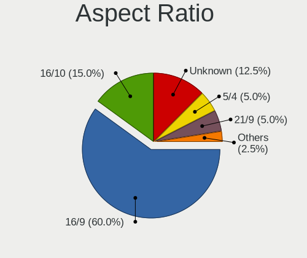

Manjaro - Hardware Trends (Desktops)
------------------------------------

A project to identify most popular hardware characteristics and track their change
over time based on data collected by Linux users at https://Linux-Hardware.org.

Anyone can contribute to this report by the [hw-probe](https://github.com/linuxhw/hw-probe) tool:

    sudo -E hw-probe -all -upload

This report is for one last month. Overall report since the beginning of time: [TestCoverage](https://github.com/linuxhw/TestCoverage)

Period: Sep, 2022.

Contents
--------

* [ System ](#system)
  - [ OS                       ](#os)
  - [ OS Family                ](#os-family)
  - [ Kernel                   ](#kernel)
  - [ Kernel Family            ](#kernel-family)
  - [ Kernel Major Ver.        ](#kernel-major-ver)
  - [ Arch                     ](#arch)
  - [ DE                       ](#de)
  - [ Display Server           ](#display-server)
  - [ Display Manager          ](#display-manager)
  - [ OS Lang                  ](#os-lang)
  - [ Boot Mode                ](#boot-mode)
  - [ Filesystem               ](#filesystem)
  - [ Part. scheme             ](#part-scheme)
  - [ Dual Boot with Linux/BSD ](#dual-boot-with-linuxbsd)
  - [ Dual Boot (Win)          ](#dual-boot-win)

* [ Board ](#board)
  - [ Vendor                   ](#vendor)
  - [ Model                    ](#model)
  - [ Model Family             ](#model-family)
  - [ MFG Year                 ](#mfg-year)
  - [ Form Factor              ](#form-factor)
  - [ Secure Boot              ](#secure-boot)
  - [ Coreboot                 ](#coreboot)
  - [ RAM Size                 ](#ram-size)
  - [ RAM Used                 ](#ram-used)
  - [ Total Drives             ](#total-drives)
  - [ Has CD-ROM               ](#has-cd-rom)
  - [ Has Ethernet             ](#has-ethernet)
  - [ Has WiFi                 ](#has-wifi)
  - [ Has Bluetooth            ](#has-bluetooth)

* [ Location ](#location)
  - [ Country                  ](#country)
  - [ City                     ](#city)

* [ Drives ](#drives)
  - [ Drive Vendor             ](#drive-vendor)
  - [ Drive Model              ](#drive-model)
  - [ HDD Vendor               ](#hdd-vendor)
  - [ SSD Vendor               ](#ssd-vendor)
  - [ Drive Kind               ](#drive-kind)
  - [ Drive Connector          ](#drive-connector)
  - [ Drive Size               ](#drive-size)
  - [ Space Total              ](#space-total)
  - [ Space Used               ](#space-used)
  - [ Malfunc. Drives          ](#malfunc-drives)
  - [ Malfunc. Drive Vendor    ](#malfunc-drive-vendor)
  - [ Malfunc. HDD Vendor      ](#malfunc-hdd-vendor)
  - [ Malfunc. Drive Kind      ](#malfunc-drive-kind)
  - [ Failed Drives            ](#failed-drives)
  - [ Failed Drive Vendor      ](#failed-drive-vendor)
  - [ Drive Status             ](#drive-status)

* [ Storage controller ](#storage-controller)
  - [ Storage Vendor           ](#storage-vendor)
  - [ Storage Model            ](#storage-model)
  - [ Storage Kind             ](#storage-kind)

* [ Processor ](#processor)
  - [ CPU Vendor               ](#cpu-vendor)
  - [ CPU Model                ](#cpu-model)
  - [ CPU Model Family         ](#cpu-model-family)
  - [ CPU Cores                ](#cpu-cores)
  - [ CPU Sockets              ](#cpu-sockets)
  - [ CPU Threads              ](#cpu-threads)
  - [ CPU Op-Modes             ](#cpu-op-modes)
  - [ CPU Microcode            ](#cpu-microcode)
  - [ CPU Microarch            ](#cpu-microarch)

* [ Graphics ](#graphics)
  - [ GPU Vendor               ](#gpu-vendor)
  - [ GPU Model                ](#gpu-model)
  - [ GPU Combo                ](#gpu-combo)
  - [ GPU Driver               ](#gpu-driver)
  - [ GPU Memory               ](#gpu-memory)

* [ Monitor ](#monitor)
  - [ Monitor Vendor           ](#monitor-vendor)
  - [ Monitor Model            ](#monitor-model)
  - [ Monitor Resolution       ](#monitor-resolution)
  - [ Monitor Diagonal         ](#monitor-diagonal)
  - [ Monitor Width            ](#monitor-width)
  - [ Aspect Ratio             ](#aspect-ratio)
  - [ Monitor Area             ](#monitor-area)
  - [ Pixel Density            ](#pixel-density)
  - [ Multiple Monitors        ](#multiple-monitors)

* [ Network ](#network)
  - [ Net Controller Vendor    ](#net-controller-vendor)
  - [ Net Controller Model     ](#net-controller-model)
  - [ Wireless Vendor          ](#wireless-vendor)
  - [ Wireless Model           ](#wireless-model)
  - [ Ethernet Vendor          ](#ethernet-vendor)
  - [ Ethernet Model           ](#ethernet-model)
  - [ Net Controller Kind      ](#net-controller-kind)
  - [ Used Controller          ](#used-controller)
  - [ NICs                     ](#nics)
  - [ IPv6                     ](#ipv6)

* [ Bluetooth ](#bluetooth)
  - [ Bluetooth Vendor         ](#bluetooth-vendor)
  - [ Bluetooth Model          ](#bluetooth-model)

* [ Sound ](#sound)
  - [ Sound Vendor             ](#sound-vendor)
  - [ Sound Model              ](#sound-model)

* [ Memory ](#memory)
  - [ Memory Vendor            ](#memory-vendor)
  - [ Memory Model             ](#memory-model)
  - [ Memory Kind              ](#memory-kind)
  - [ Memory Form Factor       ](#memory-form-factor)
  - [ Memory Size              ](#memory-size)
  - [ Memory Speed             ](#memory-speed)

* [ Printers & scanners ](#printers--scanners)
  - [ Printer Vendor           ](#printer-vendor)
  - [ Printer Model            ](#printer-model)
  - [ Scanner Vendor           ](#scanner-vendor)
  - [ Scanner Model            ](#scanner-model)

* [ Camera ](#camera)
  - [ Camera Vendor            ](#camera-vendor)
  - [ Camera Model             ](#camera-model)

* [ Security ](#security)
  - [ Fingerprint Vendor       ](#fingerprint-vendor)
  - [ Fingerprint Model        ](#fingerprint-model)
  - [ Chipcard Vendor          ](#chipcard-vendor)
  - [ Chipcard Model           ](#chipcard-model)

* [ Unsupported ](#unsupported)
  - [ Unsupported Devices      ](#unsupported-devices)
  - [ Unsupported Device Types ](#unsupported-device-types)

System
------

OS
--

Installed operating systems

| Name           | Desktops | Percent |
|----------------|----------|---------|
| Manjaro        | 22       | 44.9%   |
| Manjaro 22.0.0 | 17       | 34.69%  |
| Manjaro 21.3.7 | 9        | 18.37%  |
| Manjaro 21.3.6 | 1        | 2.04%   |

OS Family
---------

OS without a version

| Name    | Desktops | Percent |
|---------|----------|---------|
| Manjaro | 49       | 100%    |

Kernel
------

Version of the Linux kernel

| Version               | Desktops | Percent |
|-----------------------|----------|---------|
| 5.15.60-1-MANJARO     | 12       | 24.49%  |
| 5.15.65-1-MANJARO     | 11       | 22.45%  |
| 5.19.7-1-MANJARO      | 7        | 14.29%  |
| 5.19.1-3-MANJARO      | 4        | 8.16%   |
| 6.0.0-1-MANJARO       | 3        | 6.12%   |
| 5.18.17-1-MANJARO     | 3        | 6.12%   |
| 5.10.136-1-MANJARO    | 3        | 6.12%   |
| 5.19.6-1-MANJARO      | 1        | 2.04%   |
| 5.19.0-3-rt10-MANJARO | 1        | 2.04%   |
| 5.18.19-3-MANJARO     | 1        | 2.04%   |
| 5.15.67-1-MANJARO     | 1        | 2.04%   |
| 5.10.141-1-MANJARO    | 1        | 2.04%   |
| 4.19.257-1-MANJARO    | 1        | 2.04%   |

Kernel Family
-------------

Linux kernel without a distro release

| Version  | Desktops | Percent |
|----------|----------|---------|
| 5.15.60  | 12       | 24.49%  |
| 5.15.65  | 11       | 22.45%  |
| 5.19.7   | 7        | 14.29%  |
| 5.19.1   | 4        | 8.16%   |
| 6.0.0    | 3        | 6.12%   |
| 5.18.17  | 3        | 6.12%   |
| 5.10.136 | 3        | 6.12%   |
| 5.19.6   | 1        | 2.04%   |
| 5.19.0   | 1        | 2.04%   |
| 5.18.19  | 1        | 2.04%   |
| 5.15.67  | 1        | 2.04%   |
| 5.10.141 | 1        | 2.04%   |
| 4.19.257 | 1        | 2.04%   |

Kernel Major Ver.
-----------------

Linux kernel major version

| Version | Desktops | Percent |
|---------|----------|---------|
| 5.15    | 24       | 48.98%  |
| 5.19    | 13       | 26.53%  |
| 5.18    | 4        | 8.16%   |
| 5.10    | 4        | 8.16%   |
| 6.0     | 3        | 6.12%   |
| 4.19    | 1        | 2.04%   |

Arch
----

OS architecture (x86_64, i586, etc.)

| Name   | Desktops | Percent |
|--------|----------|---------|
| x86_64 | 49       | 100%    |

DE
--

Desktop Environment

| Name    | Desktops | Percent |
|---------|----------|---------|
| KDE5    | 28       | 57.14%  |
| XFCE    | 8        | 16.33%  |
| GNOME   | 7        | 14.29%  |
| Unknown | 3        | 6.12%   |
| i3      | 2        | 4.08%   |
| awesome | 1        | 2.04%   |

Display Server
--------------

X11 or Wayland

| Name    | Desktops | Percent |
|---------|----------|---------|
| X11     | 42       | 85.71%  |
| Wayland | 7        | 14.29%  |

Display Manager
---------------

SDDM, LightDM, etc.

| Name    | Desktops | Percent |
|---------|----------|---------|
| Unknown | 22       | 44.9%   |
| SDDM    | 17       | 34.69%  |
| LightDM | 8        | 16.33%  |
| GDM     | 2        | 4.08%   |

OS Lang
-------

Language

| Lang  | Desktops | Percent |
|-------|----------|---------|
| en_US | 19       | 38.78%  |
| ru_RU | 6        | 12.24%  |
| it_IT | 4        | 8.16%   |
| fr_FR | 4        | 8.16%   |
| pt_BR | 3        | 6.12%   |
| en_GB | 3        | 6.12%   |
| es_MX | 2        | 4.08%   |
| de_DE | 2        | 4.08%   |
| tr_TR | 1        | 2.04%   |
| es_UY | 1        | 2.04%   |
| es_AR | 1        | 2.04%   |
| en_IL | 1        | 2.04%   |
| en_AU | 1        | 2.04%   |
| ca_ES | 1        | 2.04%   |

Boot Mode
---------

EFI or BIOS

| Mode | Desktops | Percent |
|------|----------|---------|
| BIOS | 28       | 57.14%  |
| EFI  | 21       | 42.86%  |

Filesystem
----------

Type of filesystem

| Type  | Desktops | Percent |
|-------|----------|---------|
| Ext4  | 39       | 79.59%  |
| Btrfs | 9        | 18.37%  |
| Xfs   | 1        | 2.04%   |

Part. scheme
------------

Scheme of partitioning

| Type    | Desktops | Percent |
|---------|----------|---------|
| Unknown | 25       | 51.02%  |
| GPT     | 22       | 44.9%   |
| MBR     | 2        | 4.08%   |

Dual Boot with Linux/BSD
------------------------

Hosting more than one Linux/BSD

| Dual boot | Desktops | Percent |
|-----------|----------|---------|
| No        | 41       | 83.67%  |
| Yes       | 8        | 16.33%  |

Dual Boot (Win)
---------------

Hosting Linux and Windows

| Dual boot | Desktops | Percent |
|-----------|----------|---------|
| No        | 36       | 73.47%  |
| Yes       | 13       | 26.53%  |

Board
-----

Vendor
------

Motherboard manufacturer

| Name                | Desktops | Percent |
|---------------------|----------|---------|
| ASUSTek Computer    | 11       | 22.45%  |
| Gigabyte Technology | 10       | 20.41%  |
| ASRock              | 7        | 14.29%  |
| MSI                 | 6        | 12.24%  |
| Dell                | 4        | 8.16%   |
| Intel               | 3        | 6.12%   |
| Hewlett-Packard     | 3        | 6.12%   |
| Minix               | 1        | 2.04%   |
| Lenovo              | 1        | 2.04%   |
| Huanan              | 1        | 2.04%   |
| Foxconn             | 1        | 2.04%   |
| Exo                 | 1        | 2.04%   |

Model
-----

Motherboard model

| Name                                | Desktops | Percent |
|-------------------------------------|----------|---------|
| Dell OptiPlex 3020                  | 2        | 4.08%   |
| ASUS All Series                     | 2        | 4.08%   |
| MSI MS-7C91                         | 1        | 2.04%   |
| MSI MS-7C37                         | 1        | 2.04%   |
| MSI MS-7C02                         | 1        | 2.04%   |
| MSI MS-7A70                         | 1        | 2.04%   |
| MSI MS-7A38                         | 1        | 2.04%   |
| MSI MS-7850                         | 1        | 2.04%   |
| Minix NEO G41V-4 Max                | 1        | 2.04%   |
| Lenovo ThinkStation P300 10DACTO1WW | 1        | 2.04%   |
| Intel X99 V1.0                      | 1        | 2.04%   |
| Intel B75                           | 1        | 2.04%   |
| Huanan X99-TF                       | 1        | 2.04%   |
| HP Z440 Workstation                 | 1        | 2.04%   |
| HP EliteDesk 800 G2 SFF             | 1        | 2.04%   |
| HP Compaq Elite 8300 SFF            | 1        | 2.04%   |
| Gigabyte Z690 GAMING X DDR4         | 1        | 2.04%   |
| Gigabyte X570 AORUS ULTRA           | 1        | 2.04%   |
| Gigabyte H77M-D3H                   | 1        | 2.04%   |
| Gigabyte GA-78LMT-USB3 R2           | 1        | 2.04%   |
| Gigabyte B550M AORUS PRO-P          | 1        | 2.04%   |
| Gigabyte B550M AORUS ELITE          | 1        | 2.04%   |
| Gigabyte B450M DS3H                 | 1        | 2.04%   |
| Gigabyte B450 AORUS PRO WIFI        | 1        | 2.04%   |
| Gigabyte B360 AORUS GAMING 3 WIFI   | 1        | 2.04%   |
| Gigabyte A320M-H                    | 1        | 2.04%   |
| Foxconn p6-2292efm                  | 1        | 2.04%   |
| Exo Ready C2 - Style C2             | 1        | 2.04%   |
| Dell OptiPlex 380                   | 1        | 2.04%   |
| Dell Inspiron 5675                  | 1        | 2.04%   |
| ASUS TUF B450M-PLUS GAMING          | 1        | 2.04%   |
| ASUS ROG STRIX Z390-E GAMING        | 1        | 2.04%   |
| ASUS ROG STRIX X470-F GAMING        | 1        | 2.04%   |
| ASUS ROG CROSSHAIR VIII HERO        | 1        | 2.04%   |
| ASUS PRIME B450-PLUS                | 1        | 2.04%   |
| ASUS PRIME B360-PLUS                | 1        | 2.04%   |
| ASUS P6X58D-E                       | 1        | 2.04%   |
| ASUS M5A78L-M LX3                   | 1        | 2.04%   |
| ASUS ENERGY                         | 1        | 2.04%   |
| ASRock Z97 Pro3                     | 1        | 2.04%   |

Model Family
------------

Motherboard model prefix

| Name                   | Desktops | Percent |
|------------------------|----------|---------|
| Dell OptiPlex          | 3        | 6.12%   |
| ASUS ROG               | 3        | 6.12%   |
| Gigabyte B550M         | 2        | 4.08%   |
| ASUS PRIME             | 2        | 4.08%   |
| ASUS All               | 2        | 4.08%   |
| MSI MS-7C91            | 1        | 2.04%   |
| MSI MS-7C37            | 1        | 2.04%   |
| MSI MS-7C02            | 1        | 2.04%   |
| MSI MS-7A70            | 1        | 2.04%   |
| MSI MS-7A38            | 1        | 2.04%   |
| MSI MS-7850            | 1        | 2.04%   |
| Minix NEO              | 1        | 2.04%   |
| Lenovo ThinkStation    | 1        | 2.04%   |
| Intel X99              | 1        | 2.04%   |
| Intel B75              | 1        | 2.04%   |
| Huanan X99-TF          | 1        | 2.04%   |
| HP Z440                | 1        | 2.04%   |
| HP EliteDesk           | 1        | 2.04%   |
| HP Compaq              | 1        | 2.04%   |
| Gigabyte Z690          | 1        | 2.04%   |
| Gigabyte X570          | 1        | 2.04%   |
| Gigabyte H77M-D3H      | 1        | 2.04%   |
| Gigabyte GA-78LMT-USB3 | 1        | 2.04%   |
| Gigabyte B450M         | 1        | 2.04%   |
| Gigabyte B450          | 1        | 2.04%   |
| Gigabyte B360          | 1        | 2.04%   |
| Gigabyte A320M-H       | 1        | 2.04%   |
| Foxconn p6-2292efm     | 1        | 2.04%   |
| Exo Ready              | 1        | 2.04%   |
| Dell Inspiron          | 1        | 2.04%   |
| ASUS TUF               | 1        | 2.04%   |
| ASUS P6X58D-E          | 1        | 2.04%   |
| ASUS M5A78L-M          | 1        | 2.04%   |
| ASUS ENERGY            | 1        | 2.04%   |
| ASRock Z97             | 1        | 2.04%   |
| ASRock X399M           | 1        | 2.04%   |
| ASRock X399            | 1        | 2.04%   |
| ASRock N68-S           | 1        | 2.04%   |
| ASRock J3160DC-ITX     | 1        | 2.04%   |
| ASRock B450M           | 1        | 2.04%   |

MFG Year
--------

Motherboard manufacture year

| Year | Desktops | Percent |
|------|----------|---------|
| 2018 | 14       | 28.57%  |
| 2019 | 7        | 14.29%  |
| 2016 | 4        | 8.16%   |
| 2015 | 4        | 8.16%   |
| 2012 | 4        | 8.16%   |
| 2021 | 3        | 6.12%   |
| 2020 | 3        | 6.12%   |
| 2017 | 3        | 6.12%   |
| 2014 | 2        | 4.08%   |
| 2009 | 2        | 4.08%   |
| 2022 | 1        | 2.04%   |
| 2013 | 1        | 2.04%   |
| 2010 | 1        | 2.04%   |

Form Factor
-----------

Physical design of the computer

| Name    | Desktops | Percent |
|---------|----------|---------|
| Desktop | 49       | 100%    |

Secure Boot
-----------

Enabled or disabled

| State    | Desktops | Percent |
|----------|----------|---------|
| Disabled | 49       | 100%    |

Coreboot
--------

Have coreboot on board

| Used | Desktops | Percent |
|------|----------|---------|
| No   | 49       | 100%    |

RAM Size
--------

Total RAM memory

| Size in GB  | Desktops | Percent |
|-------------|----------|---------|
| 16.01-24.0  | 19       | 38.78%  |
| 32.01-64.0  | 10       | 20.41%  |
| 8.01-16.0   | 8        | 16.33%  |
| 64.01-256.0 | 5        | 10.2%   |
| 3.01-4.0    | 3        | 6.12%   |
| 24.01-32.0  | 2        | 4.08%   |
| 4.01-8.0    | 1        | 2.04%   |
| 1.01-2.0    | 1        | 2.04%   |

RAM Used
--------

Used RAM memory

| Used GB    | Desktops | Percent |
|------------|----------|---------|
| 4.01-8.0   | 16       | 32.65%  |
| 1.01-2.0   | 12       | 24.49%  |
| 3.01-4.0   | 11       | 22.45%  |
| 2.01-3.0   | 6        | 12.24%  |
| 8.01-16.0  | 2        | 4.08%   |
| 16.01-24.0 | 1        | 2.04%   |
| 0.51-1.0   | 1        | 2.04%   |

Total Drives
------------

Number of drives on board

| Drives | Desktops | Percent |
|--------|----------|---------|
| 2      | 17       | 34.69%  |
| 1      | 12       | 24.49%  |
| 3      | 10       | 20.41%  |
| 4      | 5        | 10.2%   |
| 5      | 4        | 8.16%   |
| 7      | 1        | 2.04%   |

Has CD-ROM
----------

Has CD-ROM on board

| Presented | Desktops | Percent |
|-----------|----------|---------|
| No        | 35       | 71.43%  |
| Yes       | 14       | 28.57%  |

Has Ethernet
------------

Has Ethernet on board

| Presented | Desktops | Percent |
|-----------|----------|---------|
| Yes       | 49       | 100%    |

Has WiFi
--------

Has WiFi module

| Presented | Desktops | Percent |
|-----------|----------|---------|
| No        | 25       | 51.02%  |
| Yes       | 24       | 48.98%  |

Has Bluetooth
-------------

Has Bluetooth module

| Presented | Desktops | Percent |
|-----------|----------|---------|
| No        | 26       | 53.06%  |
| Yes       | 23       | 46.94%  |

Location
--------

Country
-------

Geographic location (country)

| Country     | Desktops | Percent |
|-------------|----------|---------|
| USA         | 7        | 14.29%  |
| Russia      | 6        | 12.24%  |
| Italy       | 5        | 10.2%   |
| Mexico      | 4        | 8.16%   |
| France      | 4        | 8.16%   |
| Brazil      | 4        | 8.16%   |
| Germany     | 3        | 6.12%   |
| Uruguay     | 1        | 2.04%   |
| UK          | 1        | 2.04%   |
| Turkey      | 1        | 2.04%   |
| Sri Lanka   | 1        | 2.04%   |
| Spain       | 1        | 2.04%   |
| Portugal    | 1        | 2.04%   |
| Poland      | 1        | 2.04%   |
| Netherlands | 1        | 2.04%   |
| Kazakhstan  | 1        | 2.04%   |
| Israel      | 1        | 2.04%   |
| Finland     | 1        | 2.04%   |
| Egypt       | 1        | 2.04%   |
| China       | 1        | 2.04%   |
| Belgium     | 1        | 2.04%   |
| Australia   | 1        | 2.04%   |
| Argentina   | 1        | 2.04%   |

City
----

Geographic location (city)

| City                 | Desktops | Percent |
|----------------------|----------|---------|
| Milan                | 2        | 4.08%   |
| Mexico City          | 2        | 4.08%   |
| Chelyabinsk          | 2        | 4.08%   |
| Wodzisław Śląski  | 1        | 2.04%   |
| Vladivostok          | 1        | 2.04%   |
| Villahermosa         | 1        | 2.04%   |
| Uberaba              | 1        | 2.04%   |
| Sao José dos Campos | 1        | 2.04%   |
| San Francisco        | 1        | 2.04%   |
| Roeselare            | 1        | 2.04%   |
| Riells del Fai       | 1        | 2.04%   |
| Revel                | 1        | 2.04%   |
| Ramat Gan            | 1        | 2.04%   |
| Portland             | 1        | 2.04%   |
| Perm                 | 1        | 2.04%   |
| Paris                | 1        | 2.04%   |
| Olinda               | 1        | 2.04%   |
| New York             | 1        | 2.04%   |
| Murmansk             | 1        | 2.04%   |
| Moscow               | 1        | 2.04%   |
| Montevideo           | 1        | 2.04%   |
| Mersin               | 1        | 2.04%   |
| Marseille            | 1        | 2.04%   |
| Mantignano-Ugnano    | 1        | 2.04%   |
| London               | 1        | 2.04%   |
| Lenoir               | 1        | 2.04%   |
| Kirchzarten          | 1        | 2.04%   |
| Kansas City          | 1        | 2.04%   |
| Kandy                | 1        | 2.04%   |
| Itapevi              | 1        | 2.04%   |
| Indianapolis         | 1        | 2.04%   |
| Helsinki             | 1        | 2.04%   |
| Heiden               | 1        | 2.04%   |
| Galati Mamertino     | 1        | 2.04%   |
| Fairbanks            | 1        | 2.04%   |
| Düren               | 1        | 2.04%   |
| Clichy-sous-Bois     | 1        | 2.04%   |
| Cleburne             | 1        | 2.04%   |
| Chihuahua City       | 1        | 2.04%   |
| Chengdu              | 1        | 2.04%   |

Drives
------

Drive Vendor
------------

Hard drive vendors

| Vendor                      | Desktops | Drives | Percent |
|-----------------------------|----------|--------|---------|
| WDC                         | 18       | 19     | 15.79%  |
| Seagate                     | 15       | 17     | 13.16%  |
| Samsung Electronics         | 15       | 20     | 13.16%  |
| Sandisk                     | 9        | 9      | 7.89%   |
| Toshiba                     | 7        | 7      | 6.14%   |
| Kingston                    | 6        | 9      | 5.26%   |
| Crucial                     | 6        | 7      | 5.26%   |
| Kingston Technology Company | 3        | 3      | 2.63%   |
| Team                        | 2        | 2      | 1.75%   |
| Silicon Motion              | 2        | 2      | 1.75%   |
| Micron/Crucial Technology   | 2        | 2      | 1.75%   |
| Intel                       | 2        | 2      | 1.75%   |
| Hitachi                     | 2        | 2      | 1.75%   |
| XUM                         | 1        | 1      | 0.88%   |
| XrayDisk                    | 1        | 1      | 0.88%   |
| Unknown                     | 1        | 1      | 0.88%   |
| sobetter                    | 1        | 1      | 0.88%   |
| SK hynix                    | 1        | 1      | 0.88%   |
| Seagate Technology          | 1        | 1      | 0.88%   |
| SATAFIRM                    | 1        | 1      | 0.88%   |
| Realtek Semiconductor       | 1        | 1      | 0.88%   |
| PNY                         | 1        | 1      | 0.88%   |
| Phison Electronics          | 1        | 1      | 0.88%   |
| Phison                      | 1        | 1      | 0.88%   |
| OCZ                         | 1        | 1      | 0.88%   |
| Netac                       | 1        | 1      | 0.88%   |
| MyDigitalSSD                | 1        | 1      | 0.88%   |
| Micron Technology           | 1        | 1      | 0.88%   |
| MaxDigital                  | 1        | 1      | 0.88%   |
| Lexar                       | 1        | 1      | 0.88%   |
| KIOXIA                      | 1        | 1      | 0.88%   |
| Kimtigo                     | 1        | 1      | 0.88%   |
| Juhor                       | 1        | 1      | 0.88%   |
| HGST                        | 1        | 1      | 0.88%   |
| GOODRAM                     | 1        | 1      | 0.88%   |
| Biwin Storage Technology    | 1        | 1      | 0.88%   |
| ASMedia                     | 1        | 1      | 0.88%   |
| ADATA Technology            | 1        | 1      | 0.88%   |

Drive Model
-----------

Hard drive models

| Model                                                 | Desktops | Percent |
|-------------------------------------------------------|----------|---------|
| Seagate ST1000DM010-2EP102 1TB                        | 5        | 4.03%   |
| Seagate ST2000DM008-2FR102 2TB                        | 3        | 2.42%   |
| Samsung NVMe SSD Controller SM981/PM981/PM983 256GB   | 3        | 2.42%   |
| Kingston Company A2000 NVMe SSD 1TB                   | 3        | 2.42%   |
| Kingston SA400S37240G 240GB SSD                       | 3        | 2.42%   |
| Crucial CT480BX500SSD1 480GB                          | 3        | 2.42%   |
| WDC WDS240G2G0B-00EPW0 240GB SSD                      | 2        | 1.61%   |
| Toshiba HDWD110 1TB                                   | 2        | 1.61%   |
| Samsung SSD 860 EVO 250GB                             | 2        | 1.61%   |
| Samsung NVMe SSD Controller PM9A1/PM9A3/980PRO 1024GB | 2        | 1.61%   |
| Kingston SA400S37480G 480GB SSD                       | 2        | 1.61%   |
| XUM HX256GSSDSATA3 256GB                              | 1        | 0.81%   |
| XrayDisk 512GB                                        | 1        | 0.81%   |
| WDC WD7500BPKT-22PK4T0 752GB                          | 1        | 0.81%   |
| WDC WD60EZAZ-00ZGHB0 6TB                              | 1        | 0.81%   |
| WDC WD5000AVDS-63U7B1 500GB                           | 1        | 0.81%   |
| WDC WD5000AAKX-60U6AA0 500GB                          | 1        | 0.81%   |
| WDC WD40EZAZ-00SF3B0 4TB                              | 1        | 0.81%   |
| WDC WD40EFRX-68WT0N0 4TB                              | 1        | 0.81%   |
| WDC WD4000FYYZ-01UL1B1 4TB                            | 1        | 0.81%   |
| WDC WD3200BEVT-22ZCT0 320GB                           | 1        | 0.81%   |
| WDC WD30PURX-64P6ZY0 3TB                              | 1        | 0.81%   |
| WDC WD20SPZX-00UA7T0 2TB                              | 1        | 0.81%   |
| WDC WD20EZRZ-00Z5HB0 2TB                              | 1        | 0.81%   |
| WDC WD2003FZEX-00Z4SA0 2TB                            | 1        | 0.81%   |
| WDC WD10EZEX-60WN4A0 1TB                              | 1        | 0.81%   |
| WDC WD10EZEX-08WN4A0 1TB                              | 1        | 0.81%   |
| WDC WD10EZEX-00RKKA0 1TB                              | 1        | 0.81%   |
| WDC WD10EZEX-00MFCA0 1TB                              | 1        | 0.81%   |
| WDC WD10EVDS-63U8B0 1TB                               | 1        | 0.81%   |
| Unknown NVMe SSD Drive 512GB                          | 1        | 0.81%   |
| Toshiba NVMe SSD Drive 500GB                          | 1        | 0.81%   |
| Toshiba MQ01ACF050 500GB                              | 1        | 0.81%   |
| Toshiba MD03ACA400V 4TB                               | 1        | 0.81%   |
| Toshiba HDWE140 4TB                                   | 1        | 0.81%   |
| Toshiba DT01ACA100 1TB                                | 1        | 0.81%   |
| Team TM8FPD001T 1TB                                   | 1        | 0.81%   |
| Team NVMe SSD Drive 512GB                             | 1        | 0.81%   |
| sobetter EXT 240GB                                    | 1        | 0.81%   |
| SK hynix PC711 NVMe 512GB                             | 1        | 0.81%   |

HDD Vendor
----------

Hard disk drive vendors

| Vendor   | Desktops | Drives | Percent |
|----------|----------|--------|---------|
| WDC      | 16       | 17     | 39.02%  |
| Seagate  | 14       | 16     | 34.15%  |
| Toshiba  | 6        | 6      | 14.63%  |
| Hitachi  | 2        | 2      | 4.88%   |
| SATAFIRM | 1        | 1      | 2.44%   |
| HGST     | 1        | 1      | 2.44%   |
| ASMedia  | 1        | 1      | 2.44%   |

SSD Vendor
----------

Solid state drive vendors

| Vendor              | Desktops | Drives | Percent |
|---------------------|----------|--------|---------|
| Samsung Electronics | 10       | 12     | 25.64%  |
| Kingston            | 6        | 8      | 15.38%  |
| Crucial             | 6        | 7      | 15.38%  |
| SanDisk             | 4        | 4      | 10.26%  |
| WDC                 | 2        | 2      | 5.13%   |
| Intel               | 2        | 2      | 5.13%   |
| XUM                 | 1        | 1      | 2.56%   |
| PNY                 | 1        | 1      | 2.56%   |
| OCZ                 | 1        | 1      | 2.56%   |
| MyDigitalSSD        | 1        | 1      | 2.56%   |
| Micron Technology   | 1        | 1      | 2.56%   |
| Lexar               | 1        | 1      | 2.56%   |
| Kimtigo             | 1        | 1      | 2.56%   |
| Juhor               | 1        | 1      | 2.56%   |
| GOODRAM             | 1        | 1      | 2.56%   |

Drive Kind
----------

HDD or SSD

| Kind    | Desktops | Drives | Percent |
|---------|----------|--------|---------|
| HDD     | 34       | 44     | 36.96%  |
| SSD     | 32       | 44     | 34.78%  |
| NVMe    | 21       | 33     | 22.83%  |
| Unknown | 5        | 5      | 5.43%   |

Drive Connector
---------------

SATA, SAS, NVMe, etc.

| Type | Desktops | Drives | Percent |
|------|----------|--------|---------|
| SATA | 45       | 88     | 63.38%  |
| NVMe | 21       | 33     | 29.58%  |
| SAS  | 5        | 5      | 7.04%   |

Drive Size
----------

Size of hard drive

| Size in TB | Desktops | Drives | Percent |
|------------|----------|--------|---------|
| 0.01-0.5   | 31       | 43     | 45.59%  |
| 0.51-1.0   | 22       | 27     | 32.35%  |
| 3.01-4.0   | 6        | 6      | 8.82%   |
| 1.01-2.0   | 6        | 9      | 8.82%   |
| 2.01-3.0   | 2        | 2      | 2.94%   |
| 4.01-10.0  | 1        | 1      | 1.47%   |

Space Total
-----------

Amount of disk space available on the file system

| Size in GB     | Desktops | Percent |
|----------------|----------|---------|
| 1001-2000      | 10       | 20.41%  |
| 101-250        | 9        | 18.37%  |
| More than 3000 | 8        | 16.33%  |
| 251-500        | 8        | 16.33%  |
| 501-1000       | 8        | 16.33%  |
| 2001-3000      | 5        | 10.2%   |
| Unknown        | 1        | 2.04%   |

Space Used
----------

Amount of used disk space

| Used GB        | Desktops | Percent |
|----------------|----------|---------|
| 101-250        | 12       | 24.49%  |
| 501-1000       | 10       | 20.41%  |
| 251-500        | 6        | 12.24%  |
| 1001-2000      | 6        | 12.24%  |
| 21-50          | 4        | 8.16%   |
| 1-20           | 4        | 8.16%   |
| 51-100         | 3        | 6.12%   |
| 2001-3000      | 2        | 4.08%   |
| More than 3000 | 1        | 2.04%   |
| Unknown        | 1        | 2.04%   |

Malfunc. Drives
---------------

Drive models with a malfunction

| Model                          | Desktops | Drives | Percent |
|--------------------------------|----------|--------|---------|
| WDC WD30PURX-64P6ZY0 3TB       | 1        | 1      | 14.29%  |
| Toshiba HDWE140 4TB            | 1        | 1      | 14.29%  |
| Seagate ST1000DM010-2EP102 1TB | 1        | 1      | 14.29%  |
| SanDisk SSD PLUS 240GB         | 1        | 1      | 14.29%  |
| Intel SSDSC2KW010T8 1TB        | 1        | 1      | 14.29%  |
| Hitachi HTS723232A7A364 320GB  | 1        | 1      | 14.29%  |
| HGST HTS545050A7E680 500GB     | 1        | 1      | 14.29%  |

Malfunc. Drive Vendor
---------------------

Vendors of faulty drives

| Vendor  | Desktops | Drives | Percent |
|---------|----------|--------|---------|
| WDC     | 1        | 1      | 14.29%  |
| Toshiba | 1        | 1      | 14.29%  |
| Seagate | 1        | 1      | 14.29%  |
| SanDisk | 1        | 1      | 14.29%  |
| Intel   | 1        | 1      | 14.29%  |
| Hitachi | 1        | 1      | 14.29%  |
| HGST    | 1        | 1      | 14.29%  |

Malfunc. HDD Vendor
-------------------

Vendors of faulty HDD drives

| Vendor  | Desktops | Drives | Percent |
|---------|----------|--------|---------|
| WDC     | 1        | 1      | 20%     |
| Toshiba | 1        | 1      | 20%     |
| Seagate | 1        | 1      | 20%     |
| Hitachi | 1        | 1      | 20%     |
| HGST    | 1        | 1      | 20%     |

Malfunc. Drive Kind
-------------------

Kinds of faulty drives

| Kind | Desktops | Drives | Percent |
|------|----------|--------|---------|
| HDD  | 5        | 5      | 71.43%  |
| SSD  | 2        | 2      | 28.57%  |

Failed Drives
-------------

Failed drive models

Zero info for selected period =(

Failed Drive Vendor
-------------------

Failed drive vendors

Zero info for selected period =(

Drive Status
------------

Number of failed and malfunc. drives

| Status   | Desktops | Drives | Percent |
|----------|----------|--------|---------|
| Detected | 32       | 73     | 52.46%  |
| Works    | 22       | 46     | 36.07%  |
| Malfunc  | 7        | 7      | 11.48%  |

Storage controller
------------------

Storage Vendor
--------------

Storage controller vendors

| Vendor                      | Desktops | Percent |
|-----------------------------|----------|---------|
| Intel                       | 27       | 31.03%  |
| AMD                         | 21       | 24.14%  |
| Samsung Electronics         | 7        | 8.05%   |
| SanDisk                     | 5        | 5.75%   |
| Kingston Technology Company | 4        | 4.6%    |
| ASMedia Technology          | 3        | 3.45%   |
| Silicon Motion              | 2        | 2.3%    |
| Realtek Semiconductor       | 2        | 2.3%    |
| Phison Electronics          | 2        | 2.3%    |
| Micron/Crucial Technology   | 2        | 2.3%    |
| KIOXIA                      | 2        | 2.3%    |
| Unknown                     | 1        | 1.15%   |
| Transcend                   | 1        | 1.15%   |
| SK hynix                    | 1        | 1.15%   |
| Seagate Technology          | 1        | 1.15%   |
| PMC-Sierra                  | 1        | 1.15%   |
| Nvidia                      | 1        | 1.15%   |
| Marvell Technology Group    | 1        | 1.15%   |
| LSI Logic / Symbios Logic   | 1        | 1.15%   |
| Biwin Storage Technology    | 1        | 1.15%   |
| ADATA Technology            | 1        | 1.15%   |

Storage Model
-------------

Storage controller models

| Model                                                                          | Desktops | Percent |
|--------------------------------------------------------------------------------|----------|---------|
| AMD FCH SATA Controller [AHCI mode]                                            | 11       | 10.78%  |
| AMD 400 Series Chipset SATA Controller                                         | 8        | 7.84%   |
| Intel 8 Series/C220 Series Chipset Family 6-port SATA Controller 1 [AHCI mode] | 5        | 4.9%    |
| Samsung NVMe SSD Controller SM981/PM981/PM983                                  | 3        | 2.94%   |
| Kingston Company A2000 NVMe SSD                                                | 3        | 2.94%   |
| Intel Cannon Lake PCH SATA AHCI Controller                                     | 3        | 2.94%   |
| ASMedia ASM1062 Serial ATA Controller                                          | 3        | 2.94%   |
| AMD 500 Series Chipset SATA Controller                                         | 3        | 2.94%   |
| Silicon Motion SM2262/SM2262EN SSD Controller                                  | 2        | 1.96%   |
| SanDisk Non-Volatile memory controller                                         | 2        | 1.96%   |
| Samsung NVMe SSD Controller SM961/PM961/SM963                                  | 2        | 1.96%   |
| Samsung NVMe SSD Controller PM9A1/PM9A3/980PRO                                 | 2        | 1.96%   |
| Phison E12 NVMe Controller                                                     | 2        | 1.96%   |
| Intel C610/X99 series chipset sSATA Controller [AHCI mode]                     | 2        | 1.96%   |
| Intel C610/X99 series chipset 6-Port SATA Controller [AHCI mode]               | 2        | 1.96%   |
| Intel 7 Series/C210 Series Chipset Family 6-port SATA Controller [AHCI mode]   | 2        | 1.96%   |
| Intel 200 Series PCH SATA controller [AHCI mode]                               | 2        | 1.96%   |
| AMD X399 Series Chipset SATA Controller                                        | 2        | 1.96%   |
| AMD SB7x0/SB8x0/SB9x0 SATA Controller [IDE mode]                               | 2        | 1.96%   |
| AMD SB7x0/SB8x0/SB9x0 IDE Controller                                           | 2        | 1.96%   |
| Unknown Non-Volatile memory controller                                         | 1        | 0.98%   |
| Transcend Non-Volatile memory controller                                       | 1        | 0.98%   |
| SK hynix Gold P31 SSD                                                          | 1        | 0.98%   |
| Seagate FireCuda 510 SSD                                                       | 1        | 0.98%   |
| SanDisk WD Blue SN570 NVMe SSD                                                 | 1        | 0.98%   |
| SanDisk WD Blue SN550 NVMe SSD                                                 | 1        | 0.98%   |
| SanDisk WD Blue SN500 / PC SN520 NVMe SSD                                      | 1        | 0.98%   |
| Samsung NVMe SSD Controller 980                                                | 1        | 0.98%   |
| Realtek RTS5763DL NVMe SSD Controller                                          | 1        | 0.98%   |
| Realtek Realtek Non-Volatile memory controller                                 | 1        | 0.98%   |
| PMC-Sierra SPC 8x6G SAS/SATA (storport)                                        | 1        | 0.98%   |
| Nvidia MCP61 SATA Controller                                                   | 1        | 0.98%   |
| Micron/Crucial P2 NVMe PCIe SSD                                                | 1        | 0.98%   |
| Micron/Crucial NVMe Controller                                                 | 1        | 0.98%   |
| Marvell Group 88SE9123 PCIe SATA 6.0 Gb/s controller                           | 1        | 0.98%   |
| LSI Logic / Symbios Logic SAS2004 PCI-Express Fusion-MPT SAS-2 [Spitfire]      | 1        | 0.98%   |
| KIOXIA NVMe SSD Controller BG4                                                 | 1        | 0.98%   |
| KIOXIA NVMe SSD                                                                | 1        | 0.98%   |
| Kingston Company SNVS2000G [NV1 NVMe PCIe SSD 2TB]                             | 1        | 0.98%   |
| Intel Q170/Q150/B150/H170/H110/Z170/CM236 Chipset SATA Controller [AHCI Mode]  | 1        | 0.98%   |

Storage Kind
------------

Kind of storage controller (IDE, SATA, NVMe, SAS, ...)

| Kind | Desktops | Percent |
|------|----------|---------|
| SATA | 45       | 60%     |
| NVMe | 21       | 28%     |
| IDE  | 6        | 8%      |
| SAS  | 2        | 2.67%   |
| RAID | 1        | 1.33%   |

Processor
---------

CPU Vendor
----------

Processor vendors

| Vendor | Desktops | Percent |
|--------|----------|---------|
| Intel  | 27       | 55.1%   |
| AMD    | 22       | 44.9%   |

CPU Model
---------

Processor models

| Model                                          | Desktops | Percent |
|------------------------------------------------|----------|---------|
| Intel Core i5-9400 CPU @ 2.90GHz               | 2        | 4.08%   |
| AMD Ryzen 9 3900X 12-Core Processor            | 2        | 4.08%   |
| AMD Ryzen 5 5600X 6-Core Processor             | 2        | 4.08%   |
| AMD Ryzen 5 3600X 6-Core Processor             | 2        | 4.08%   |
| Intel Xeon CPU E5-2690 v3 @ 2.60GHz            | 1        | 2.04%   |
| Intel Xeon CPU E5-2678 v3 @ 2.50GHz            | 1        | 2.04%   |
| Intel Xeon CPU E5-2660 v3 @ 2.60GHz            | 1        | 2.04%   |
| Intel Xeon CPU E5-1620 v3 @ 3.50GHz            | 1        | 2.04%   |
| Intel Xeon CPU E3-1226 v3 @ 3.30GHz            | 1        | 2.04%   |
| Intel Pentium CPU G4600 @ 3.60GHz              | 1        | 2.04%   |
| Intel Core i9-9900K CPU @ 3.60GHz              | 1        | 2.04%   |
| Intel Core i7-6850K CPU @ 3.60GHz              | 1        | 2.04%   |
| Intel Core i7-3770 CPU @ 3.40GHz               | 1        | 2.04%   |
| Intel Core i7-10700 CPU @ 2.90GHz              | 1        | 2.04%   |
| Intel Core i7 CPU 930 @ 2.80GHz                | 1        | 2.04%   |
| Intel Core i7 CPU 860 @ 2.80GHz                | 1        | 2.04%   |
| Intel Core i5-8600 CPU @ 3.10GHz               | 1        | 2.04%   |
| Intel Core i5-6600 CPU @ 3.30GHz               | 1        | 2.04%   |
| Intel Core i5-4690K CPU @ 3.50GHz              | 1        | 2.04%   |
| Intel Core i5-4590 CPU @ 3.30GHz               | 1        | 2.04%   |
| Intel Core i5-4570 CPU @ 3.20GHz               | 1        | 2.04%   |
| Intel Core i5-3470 CPU @ 3.20GHz               | 1        | 2.04%   |
| Intel Core i5-2320 CPU @ 3.00GHz               | 1        | 2.04%   |
| Intel Core i3-4130 CPU @ 3.40GHz               | 1        | 2.04%   |
| Intel Core i3-2120 CPU @ 3.30GHz               | 1        | 2.04%   |
| Intel Core 2 Duo CPU E7500 @ 2.93GHz           | 1        | 2.04%   |
| Intel Celeron N4120 CPU @ 1.10GHz              | 1        | 2.04%   |
| Intel Celeron CPU J3160 @ 1.60GHz              | 1        | 2.04%   |
| Intel 12th Gen Core i5-12600K                  | 1        | 2.04%   |
| AMD Ryzen Threadripper 1950X 16-Core Processor | 1        | 2.04%   |
| AMD Ryzen Threadripper 1900X 8-Core Processor  | 1        | 2.04%   |
| AMD Ryzen 9 5950X 16-Core Processor            | 1        | 2.04%   |
| AMD Ryzen 9 5900X 12-Core Processor            | 1        | 2.04%   |
| AMD Ryzen 7 5700G with Radeon Graphics         | 1        | 2.04%   |
| AMD Ryzen 7 3800X 8-Core Processor             | 1        | 2.04%   |
| AMD Ryzen 7 3700X 8-Core Processor             | 1        | 2.04%   |
| AMD Ryzen 7 2700 Eight-Core Processor          | 1        | 2.04%   |
| AMD Ryzen 7 1700X Eight-Core Processor         | 1        | 2.04%   |
| AMD Ryzen 5 3600 6-Core Processor              | 1        | 2.04%   |
| AMD Ryzen 5 2600 Six-Core Processor            | 1        | 2.04%   |

CPU Model Family
----------------

Processor model prefix

| Model                  | Desktops | Percent |
|------------------------|----------|---------|
| Intel Core i5          | 9        | 18.37%  |
| AMD Ryzen 5            | 7        | 14.29%  |
| Intel Xeon             | 5        | 10.2%   |
| Intel Core i7          | 5        | 10.2%   |
| AMD Ryzen 7            | 5        | 10.2%   |
| AMD Ryzen 9            | 4        | 8.16%   |
| Intel Core i3          | 2        | 4.08%   |
| Intel Celeron          | 2        | 4.08%   |
| AMD Ryzen Threadripper | 2        | 4.08%   |
| AMD FX                 | 2        | 4.08%   |
| Other                  | 1        | 2.04%   |
| Intel Pentium          | 1        | 2.04%   |
| Intel Core i9          | 1        | 2.04%   |
| Intel Core 2 Duo       | 1        | 2.04%   |
| AMD Ryzen 3            | 1        | 2.04%   |
| AMD Athlon II X2       | 1        | 2.04%   |

CPU Cores
---------

Number of processor cores

| Number | Desktops | Percent |
|--------|----------|---------|
| 4      | 15       | 30.61%  |
| 6      | 10       | 20.41%  |
| 8      | 8        | 16.33%  |
| 2      | 6        | 12.24%  |
| 12     | 5        | 10.2%   |
| 16     | 2        | 4.08%   |
| 10     | 2        | 4.08%   |
| 3      | 1        | 2.04%   |

CPU Sockets
-----------

Number of sockets

| Number | Desktops | Percent |
|--------|----------|---------|
| 1      | 49       | 100%    |

CPU Threads
-----------

Threads per core (Hyper-Threading)

| Number | Desktops | Percent |
|--------|----------|---------|
| 2      | 33       | 67.35%  |
| 1      | 16       | 32.65%  |

CPU Op-Modes
------------

CPU Operation Modes (32-bit, 64-bit)

| Op mode        | Desktops | Percent |
|----------------|----------|---------|
| 32-bit, 64-bit | 49       | 100%    |

CPU Microcode
-------------

Microcode number

| Number     | Desktops | Percent |
|------------|----------|---------|
| Unknown    | 24       | 48.98%  |
| 0x08701021 | 4        | 8.16%   |
| 0x906ea    | 2        | 4.08%   |
| 0x306f2    | 2        | 4.08%   |
| 0x306a9    | 2        | 4.08%   |
| 0x906ec    | 1        | 2.04%   |
| 0x906e9    | 1        | 2.04%   |
| 0x90672    | 1        | 2.04%   |
| 0x706a8    | 1        | 2.04%   |
| 0x406c4    | 1        | 2.04%   |
| 0x306c3    | 1        | 2.04%   |
| 0x106e5    | 1        | 2.04%   |
| 0x106a5    | 1        | 2.04%   |
| 0x0a50000d | 1        | 2.04%   |
| 0x0a201016 | 1        | 2.04%   |
| 0x0a201006 | 1        | 2.04%   |
| 0x08701013 | 1        | 2.04%   |
| 0x08101016 | 1        | 2.04%   |
| 0x0800820d | 1        | 2.04%   |
| 0x08001137 | 1        | 2.04%   |

CPU Microarch
-------------

Microarchitecture

| Name             | Desktops | Percent |
|------------------|----------|---------|
| Haswell          | 9        | 18.37%  |
| Zen 2            | 8        | 16.33%  |
| Zen 3            | 5        | 10.2%   |
| KabyLake         | 5        | 10.2%   |
| Zen              | 4        | 8.16%   |
| Zen+             | 2        | 4.08%   |
| SandyBridge      | 2        | 4.08%   |
| Piledriver       | 2        | 4.08%   |
| Nehalem          | 2        | 4.08%   |
| IvyBridge        | 2        | 4.08%   |
| Skylake          | 1        | 2.04%   |
| Silvermont       | 1        | 2.04%   |
| Penryn           | 1        | 2.04%   |
| K10              | 1        | 2.04%   |
| Goldmont plus    | 1        | 2.04%   |
| CometLake        | 1        | 2.04%   |
| Broadwell        | 1        | 2.04%   |
| Alderlake Hybrid | 1        | 2.04%   |

Graphics
--------

GPU Vendor
----------

Vendors of graphics cards

| Vendor | Desktops | Percent |
|--------|----------|---------|
| Nvidia | 20       | 40%     |
| AMD    | 18       | 36%     |
| Intel  | 12       | 24%     |

GPU Model
---------

Graphics card models

| Model                                                                                    | Desktops | Percent |
|------------------------------------------------------------------------------------------|----------|---------|
| AMD Navi 10 [Radeon RX 5600 OEM/5600 XT / 5700/5700 XT]                                  | 4        | 7.69%   |
| AMD Ellesmere [Radeon RX 470/480/570/570X/580/580X/590]                                  | 4        | 7.69%   |
| Nvidia GA102 [GeForce RTX 3090]                                                          | 3        | 5.77%   |
| Intel CoffeeLake-S GT2 [UHD Graphics 630]                                                | 2        | 3.85%   |
| AMD Oland PRO [Radeon R7 240/340 / Radeon 520]                                           | 2        | 3.85%   |
| Nvidia TU117 [GeForce GTX 1650]                                                          | 1        | 1.92%   |
| Nvidia TU116 [GeForce GTX 1650]                                                          | 1        | 1.92%   |
| Nvidia TU104 [GeForce RTX 2070 SUPER]                                                    | 1        | 1.92%   |
| Nvidia GT218 [GeForce 210]                                                               | 1        | 1.92%   |
| Nvidia GP108 [GeForce GT 1030]                                                           | 1        | 1.92%   |
| Nvidia GP107 [GeForce GTX 1050 Ti]                                                       | 1        | 1.92%   |
| Nvidia GP106 [GeForce GTX 1060 6GB]                                                      | 1        | 1.92%   |
| Nvidia GP104 [GeForce GTX 1080]                                                          | 1        | 1.92%   |
| Nvidia GP104 [GeForce GTX 1070]                                                          | 1        | 1.92%   |
| Nvidia GP104 [GeForce GTX 1070 Ti]                                                       | 1        | 1.92%   |
| Nvidia GP102 [GeForce GTX 1080 Ti]                                                       | 1        | 1.92%   |
| Nvidia GM204 [GeForce GTX 970]                                                           | 1        | 1.92%   |
| Nvidia GK208B [GeForce GT 710]                                                           | 1        | 1.92%   |
| Nvidia GK110B [GeForce GTX 780 Ti]                                                       | 1        | 1.92%   |
| Nvidia GK107 [GeForce GT 630 OEM]                                                        | 1        | 1.92%   |
| Nvidia GF116 [GeForce GTX 550 Ti]                                                        | 1        | 1.92%   |
| Nvidia GF108 [GeForce GT 730]                                                            | 1        | 1.92%   |
| Nvidia GA106 [GeForce RTX 3060]                                                          | 1        | 1.92%   |
| Nvidia GA102 [GeForce RTX 3080 12GB]                                                     | 1        | 1.92%   |
| Intel Xeon E3-1200 v3/4th Gen Core Processor Integrated Graphics Controller              | 1        | 1.92%   |
| Intel Xeon E3-1200 v3 Processor Integrated Graphics Controller                           | 1        | 1.92%   |
| Intel HD Graphics 630                                                                    | 1        | 1.92%   |
| Intel HD Graphics 530                                                                    | 1        | 1.92%   |
| Intel GeminiLake [UHD Graphics 600]                                                      | 1        | 1.92%   |
| Intel CometLake-S GT2 [UHD Graphics 630]                                                 | 1        | 1.92%   |
| Intel Atom/Celeron/Pentium Processor x5-E8000/J3xxx/N3xxx Integrated Graphics Controller | 1        | 1.92%   |
| Intel AlderLake-S GT1                                                                    | 1        | 1.92%   |
| Intel 4th Generation Core Processor Family Integrated Graphics Controller                | 1        | 1.92%   |
| Intel 4 Series Chipset Integrated Graphics Controller                                    | 1        | 1.92%   |
| AMD Vega 10 XL/XT [Radeon RX Vega 56/64]                                                 | 1        | 1.92%   |
| AMD Turks PRO [Radeon HD 7570]                                                           | 1        | 1.92%   |
| AMD Navi 24 [Radeon RX 6400 / 6500 XT]                                                   | 1        | 1.92%   |
| AMD Navi 23 [Radeon RX 6600/6600 XT/6600M]                                               | 1        | 1.92%   |
| AMD Navi 21 [Radeon RX 6800/6800 XT / 6900 XT]                                           | 1        | 1.92%   |
| AMD Lexa PRO [Radeon 540/540X/550/550X / RX 540X/550/550X]                               | 1        | 1.92%   |

GPU Combo
---------

Combinations of graphics cards

| Name        | Desktops | Percent |
|-------------|----------|---------|
| 1 x Nvidia  | 18       | 36.73%  |
| 1 x AMD     | 17       | 34.69%  |
| 1 x Intel   | 11       | 22.45%  |
| 2 x Nvidia  | 2        | 4.08%   |
| Intel + AMD | 1        | 2.04%   |

GPU Driver
----------

Free vs proprietary

| Driver      | Desktops | Percent |
|-------------|----------|---------|
| Free        | 32       | 65.31%  |
| Proprietary | 17       | 34.69%  |

GPU Memory
----------

Total video memory

| Size in GB | Desktops | Percent |
|------------|----------|---------|
| Unknown    | 22       | 44.9%   |
| 7.01-8.0   | 8        | 16.33%  |
| 3.01-4.0   | 5        | 10.2%   |
| 1.01-2.0   | 4        | 8.16%   |
| 5.01-6.0   | 2        | 4.08%   |
| 16.01-24.0 | 2        | 4.08%   |
| 8.01-16.0  | 2        | 4.08%   |
| 0.51-1.0   | 2        | 4.08%   |
| 2.01-3.0   | 1        | 2.04%   |
| 0.01-0.5   | 1        | 2.04%   |

Monitor
-------

Monitor Vendor
--------------

Monitor vendors

| Vendor               | Desktops | Percent |
|----------------------|----------|---------|
| Hewlett-Packard      | 7        | 11.48%  |
| Samsung Electronics  | 6        | 9.84%   |
| BenQ                 | 5        | 8.2%    |
| Acer                 | 5        | 8.2%    |
| LG Electronics       | 4        | 6.56%   |
| Goldstar             | 4        | 6.56%   |
| Dell                 | 4        | 6.56%   |
| Ancor Communications | 4        | 6.56%   |
| Philips              | 3        | 4.92%   |
| ASUSTek Computer     | 3        | 4.92%   |
| AOC                  | 3        | 4.92%   |
| Lenovo               | 2        | 3.28%   |
| Iiyama               | 2        | 3.28%   |
| Gigabyte Technology  | 2        | 3.28%   |
| Wacom Tech           | 1        | 1.64%   |
| ViewSonic            | 1        | 1.64%   |
| Sceptre              | 1        | 1.64%   |
| NEC Computers        | 1        | 1.64%   |
| Mi                   | 1        | 1.64%   |
| KTC                  | 1        | 1.64%   |
| HUAWEI               | 1        | 1.64%   |

Monitor Model
-------------

Monitor models

| Model                                                                   | Desktops | Percent |
|-------------------------------------------------------------------------|----------|---------|
| Goldstar FULL HD GSM5B55 1920x1080 480x270mm 21.7-inch                  | 2        | 2.94%   |
| Wacom Tech LCD Monitor Cintiq W1310                                     | 1        | 1.47%   |
| ViewSonic VX2705-2KP VSC3B3A 2560x1440 597x336mm 27.0-inch              | 1        | 1.47%   |
| Sceptre LCD Monitor P30 6400x1080                                       | 1        | 1.47%   |
| Sceptre LCD Monitor M27                                                 | 1        | 1.47%   |
| Samsung Electronics T22C310 SAM0AE9 1920x1080 477x268mm 21.5-inch       | 1        | 1.47%   |
| Samsung Electronics LCD Monitor SMS19A100                               | 1        | 1.47%   |
| Samsung Electronics LCD Monitor SAM0FEE 3840x2160 1872x1053mm 84.6-inch | 1        | 1.47%   |
| Samsung Electronics LCD Monitor S24D332 3840x1080                       | 1        | 1.47%   |
| Samsung Electronics LCD Monitor S22B350                                 | 1        | 1.47%   |
| Samsung Electronics LCD Monitor S22B300                                 | 1        | 1.47%   |
| Samsung Electronics LCD Monitor S22B150 5760x1080                       | 1        | 1.47%   |
| Samsung Electronics C24FG7x SAM0E43 1920x1080 532x304mm 24.1-inch       | 1        | 1.47%   |
| Philips PHL 272B7QU PHL0926 2560x1440 597x336mm 27.0-inch               | 1        | 1.47%   |
| Philips PHL 243V7 PHLC155 1920x1080 527x296mm 23.8-inch                 | 1        | 1.47%   |
| Philips 226V4 PHLC0B1 1920x1080 477x268mm 21.5-inch                     | 1        | 1.47%   |
| NEC Computers LCD Monitor E221N 3840x1080                               | 1        | 1.47%   |
| NEC Computers LCD Monitor E221N                                         | 1        | 1.47%   |
| Mi Monitor XMI3444 3440x1440 797x334mm 34.0-inch                        | 1        | 1.47%   |
| LG Electronics LCD Monitor LG QHD 2560x1440                             | 1        | 1.47%   |
| LG Electronics LCD Monitor LG HDR WFHD 2560x1080                        | 1        | 1.47%   |
| LG Electronics LCD Monitor E2241                                        | 1        | 1.47%   |
| LG Electronics LCD Monitor 25UM58G 2560x1080                            | 1        | 1.47%   |
| Lenovo LEN T2254A LEN60CD 1680x1050 474x296mm 22.0-inch                 | 1        | 1.47%   |
| Lenovo LEN LT2223pwC LEN60A1 1920x1080 477x268mm 21.5-inch              | 1        | 1.47%   |
| Lenovo LEN LS2233wA LEN65AB 1920x1080 477x268mm 21.5-inch               | 1        | 1.47%   |
| KTC 23L13-H-AN KTC2302 1920x1080 510x287mm 23.0-inch                    | 1        | 1.47%   |
| Iiyama PL2466H IVM614C 1920x1080 522x294mm 23.6-inch                    | 1        | 1.47%   |
| Iiyama PL2288H IVM5633 1920x1080 477x268mm 21.5-inch                    | 1        | 1.47%   |
| HUAWEI ZQE-CAA HWV6A25 3440x1440 797x334mm 34.0-inch                    | 1        | 1.47%   |
| Hewlett-Packard w2338h HWP281C 1920x1080 509x286mm 23.0-inch            | 1        | 1.47%   |
| Hewlett-Packard M27f FHD HPN370B 1920x1080 597x336mm 27.0-inch          | 1        | 1.47%   |
| Hewlett-Packard LCD Monitor W2072a 3520x1080                            | 1        | 1.47%   |
| Hewlett-Packard LCD Monitor 25xi 3286x1080                              | 1        | 1.47%   |
| Hewlett-Packard ENVY 27 HPN3367 3840x2160 600x340mm 27.2-inch           | 1        | 1.47%   |
| Hewlett-Packard 2311 HWP2939 1920x1080 509x286mm 23.0-inch              | 1        | 1.47%   |
| Hewlett-Packard 2009 HWP2827 1600x900 443x250mm 20.0-inch               | 1        | 1.47%   |
| Goldstar ULTRAWIDE GSM59F1 2560x1080 673x284mm 28.8-inch                | 1        | 1.47%   |
| Goldstar LG HDR 4K GSM7750 3840x2160 700x400mm 31.7-inch                | 1        | 1.47%   |
| Gigabyte Technology M34WQ GBT3402 3440x1440 800x335mm 34.1-inch         | 1        | 1.47%   |

Monitor Resolution
------------------

Monitor screen resolution

| Resolution         | Desktops | Percent |
|--------------------|----------|---------|
| 1920x1080 (FHD)    | 23       | 37.7%   |
| 3840x2160 (4K)     | 7        | 11.48%  |
| Unknown            | 7        | 11.48%  |
| 2560x1440 (QHD)    | 6        | 9.84%   |
| 3440x1440          | 4        | 6.56%   |
| 3840x1080          | 3        | 4.92%   |
| 2560x1080          | 3        | 4.92%   |
| 6400x1080          | 1        | 1.64%   |
| 5760x1080          | 1        | 1.64%   |
| 5120x1440          | 1        | 1.64%   |
| 3520x1080          | 1        | 1.64%   |
| 3286x1080          | 1        | 1.64%   |
| 1680x1050 (WSXGA+) | 1        | 1.64%   |
| 1600x900 (HD+)     | 1        | 1.64%   |
| 1440x900 (WXGA+)   | 1        | 1.64%   |

Monitor Diagonal
----------------

Diagonal size in inches

| Inches  | Desktops | Percent |
|---------|----------|---------|
| Unknown | 12       | 21.82%  |
| 24      | 11       | 20%     |
| 27      | 9        | 16.36%  |
| 21      | 7        | 12.73%  |
| 34      | 5        | 9.09%   |
| 23      | 5        | 9.09%   |
| 84      | 1        | 1.82%   |
| 31      | 1        | 1.82%   |
| 25      | 1        | 1.82%   |
| 22      | 1        | 1.82%   |
| 20      | 1        | 1.82%   |
| 19      | 1        | 1.82%   |

Monitor Width
-------------

Physical width

| Width in mm | Desktops | Percent |
|-------------|----------|---------|
| 501-600     | 23       | 44.23%  |
| Unknown     | 12       | 23.08%  |
| 401-500     | 9        | 17.31%  |
| 701-800     | 5        | 9.62%   |
| 601-700     | 2        | 3.85%   |
| 1501-2000   | 1        | 1.92%   |

Aspect Ratio
------------

Proportional relationship between the width and the height

| Ratio   | Desktops | Percent |
|---------|----------|---------|
| 16/9    | 31       | 60.78%  |
| Unknown | 12       | 23.53%  |
| 21/9    | 5        | 9.8%    |
| 16/10   | 3        | 5.88%   |

Monitor Area
------------

Area in inch²

| Area in inch² | Desktops | Percent |
|----------------|----------|---------|
| 201-250        | 17       | 32.69%  |
| Unknown        | 12       | 23.08%  |
| 301-350        | 9        | 17.31%  |
| 351-500        | 5        | 9.62%   |
| 251-300        | 5        | 9.62%   |
| 151-200        | 3        | 5.77%   |
| More than 1000 | 1        | 1.92%   |

Pixel Density
-------------

Pixels per inch

| Density | Desktops | Percent |
|---------|----------|---------|
| 51-100  | 24       | 43.64%  |
| 101-120 | 16       | 29.09%  |
| Unknown | 12       | 21.82%  |
| 121-160 | 2        | 3.64%   |
| 161-240 | 1        | 1.82%   |

Multiple Monitors
-----------------

Total monitors connected

| Total | Desktops | Percent |
|-------|----------|---------|
| 1     | 32       | 65.31%  |
| 2     | 13       | 26.53%  |
| 3     | 4        | 8.16%   |

Network
-------

Net Controller Vendor
---------------------

Controller vendors

| Vendor                        | Desktops | Percent |
|-------------------------------|----------|---------|
| Realtek Semiconductor         | 32       | 44.44%  |
| Intel                         | 20       | 27.78%  |
| TP-Link                       | 5        | 6.94%   |
| Qualcomm Atheros              | 4        | 5.56%   |
| Broadcom                      | 3        | 4.17%   |
| Xiaomi                        | 1        | 1.39%   |
| Wacom                         | 1        | 1.39%   |
| Ralink                        | 1        | 1.39%   |
| OnePlus Technology (Shenzhen) | 1        | 1.39%   |
| Nvidia                        | 1        | 1.39%   |
| Motorola PCS                  | 1        | 1.39%   |
| Marvell Technology Group      | 1        | 1.39%   |
| Aquantia                      | 1        | 1.39%   |

Net Controller Model
--------------------

Controller models

| Model                                                             | Desktops | Percent |
|-------------------------------------------------------------------|----------|---------|
| Realtek RTL8111/8168/8411 PCI Express Gigabit Ethernet Controller | 25       | 29.76%  |
| Intel I211 Gigabit Network Connection                             | 8        | 9.52%   |
| Realtek RTL8125 2.5GbE Controller                                 | 5        | 5.95%   |
| Intel Dual Band Wireless-AC 3168NGW [Stone Peak]                  | 4        | 4.76%   |
| Intel Wi-Fi 6 AX200                                               | 3        | 3.57%   |
| TP-Link 802.11ac NIC                                              | 2        | 2.38%   |
| Realtek 802.11ac NIC                                              | 2        | 2.38%   |
| Intel Ethernet Connection (7) I219-V                              | 2        | 2.38%   |
| Intel Ethernet Connection (2) I218-V                              | 2        | 2.38%   |
| Intel Cannon Lake PCH CNVi WiFi                                   | 2        | 2.38%   |
| Broadcom BCM4360 802.11ac Wireless Network Adapter                | 2        | 2.38%   |
| Xiaomi Mi/Redmi series (RNDIS)                                    | 1        | 1.19%   |
| Wacom ACK-40401 [Wireless Accessory Kit]                          | 1        | 1.19%   |
| TP-Link RTL8812AU Archer T4U 802.11ac                             | 1        | 1.19%   |
| TP-Link Archer T4UH v2 [Realtek RTL8812AU]                        | 1        | 1.19%   |
| TP-Link AC600 wireless Realtek RTL8811AU [Archer T2U Nano]        | 1        | 1.19%   |
| Realtek RTL8192EU 802.11b/g/n WLAN Adapter                        | 1        | 1.19%   |
| Realtek RTL8192EE PCIe Wireless Network Adapter                   | 1        | 1.19%   |
| Realtek RTL8192CE PCIe Wireless Network Adapter                   | 1        | 1.19%   |
| Realtek RTL8188EE Wireless Network Adapter                        | 1        | 1.19%   |
| Realtek RTL810xE PCI Express Fast Ethernet controller             | 1        | 1.19%   |
| Ralink RT3060 Wireless 802.11n 1T/1R                              | 1        | 1.19%   |
| Qualcomm Atheros QCA8171 Gigabit Ethernet                         | 1        | 1.19%   |
| Qualcomm Atheros QCA6174 802.11ac Wireless Network Adapter        | 1        | 1.19%   |
| Qualcomm Atheros AR9287 Wireless Network Adapter (PCI-Express)    | 1        | 1.19%   |
| Qualcomm Atheros AR8151 v2.0 Gigabit Ethernet                     | 1        | 1.19%   |
| OnePlus (Shenzhen) OnePlus                                        | 1        | 1.19%   |
| Nvidia MCP61 Ethernet                                             | 1        | 1.19%   |
| Motorola PCS Moto G (5) Plus                                      | 1        | 1.19%   |
| Marvell Group 88E8056 PCI-E Gigabit Ethernet Controller           | 1        | 1.19%   |
| Intel Wi-Fi 6 AX210/AX211/AX411 160MHz                            | 1        | 1.19%   |
| Intel Ethernet Connection I217-LM                                 | 1        | 1.19%   |
| Intel Ethernet Connection (2) I219-LM                             | 1        | 1.19%   |
| Intel Ethernet Connection (2) I218-LM                             | 1        | 1.19%   |
| Intel 82579LM Gigabit Network Connection (Lewisville)             | 1        | 1.19%   |
| Intel 82576 Gigabit Network Connection                            | 1        | 1.19%   |
| Broadcom NetLink BCM57780 Gigabit Ethernet PCIe                   | 1        | 1.19%   |
| Aquantia AQC107 NBase-T/IEEE 802.3bz Ethernet Controller [AQtion] | 1        | 1.19%   |

Wireless Vendor
---------------

Wireless vendors

| Vendor                | Desktops | Percent |
|-----------------------|----------|---------|
| Intel                 | 10       | 37.04%  |
| Realtek Semiconductor | 6        | 22.22%  |
| TP-Link               | 5        | 18.52%  |
| Qualcomm Atheros      | 2        | 7.41%   |
| Broadcom              | 2        | 7.41%   |
| Wacom                 | 1        | 3.7%    |
| Ralink                | 1        | 3.7%    |

Wireless Model
--------------

Wireless models

| Model                                                          | Desktops | Percent |
|----------------------------------------------------------------|----------|---------|
| Intel Dual Band Wireless-AC 3168NGW [Stone Peak]               | 4        | 14.81%  |
| Intel Wi-Fi 6 AX200                                            | 3        | 11.11%  |
| TP-Link 802.11ac NIC                                           | 2        | 7.41%   |
| Realtek 802.11ac NIC                                           | 2        | 7.41%   |
| Intel Cannon Lake PCH CNVi WiFi                                | 2        | 7.41%   |
| Broadcom BCM4360 802.11ac Wireless Network Adapter             | 2        | 7.41%   |
| Wacom ACK-40401 [Wireless Accessory Kit]                       | 1        | 3.7%    |
| TP-Link RTL8812AU Archer T4U 802.11ac                          | 1        | 3.7%    |
| TP-Link Archer T4UH v2 [Realtek RTL8812AU]                     | 1        | 3.7%    |
| TP-Link AC600 wireless Realtek RTL8811AU [Archer T2U Nano]     | 1        | 3.7%    |
| Realtek RTL8192EU 802.11b/g/n WLAN Adapter                     | 1        | 3.7%    |
| Realtek RTL8192EE PCIe Wireless Network Adapter                | 1        | 3.7%    |
| Realtek RTL8192CE PCIe Wireless Network Adapter                | 1        | 3.7%    |
| Realtek RTL8188EE Wireless Network Adapter                     | 1        | 3.7%    |
| Ralink RT3060 Wireless 802.11n 1T/1R                           | 1        | 3.7%    |
| Qualcomm Atheros QCA6174 802.11ac Wireless Network Adapter     | 1        | 3.7%    |
| Qualcomm Atheros AR9287 Wireless Network Adapter (PCI-Express) | 1        | 3.7%    |
| Intel Wi-Fi 6 AX210/AX211/AX411 160MHz                         | 1        | 3.7%    |

Ethernet Vendor
---------------

Ethernet vendors

| Vendor                        | Desktops | Percent |
|-------------------------------|----------|---------|
| Realtek Semiconductor         | 31       | 55.36%  |
| Intel                         | 16       | 28.57%  |
| Qualcomm Atheros              | 2        | 3.57%   |
| Xiaomi                        | 1        | 1.79%   |
| OnePlus Technology (Shenzhen) | 1        | 1.79%   |
| Nvidia                        | 1        | 1.79%   |
| Motorola PCS                  | 1        | 1.79%   |
| Marvell Technology Group      | 1        | 1.79%   |
| Broadcom                      | 1        | 1.79%   |
| Aquantia                      | 1        | 1.79%   |

Ethernet Model
--------------

Ethernet models

| Model                                                             | Desktops | Percent |
|-------------------------------------------------------------------|----------|---------|
| Realtek RTL8111/8168/8411 PCI Express Gigabit Ethernet Controller | 25       | 43.86%  |
| Intel I211 Gigabit Network Connection                             | 8        | 14.04%  |
| Realtek RTL8125 2.5GbE Controller                                 | 5        | 8.77%   |
| Intel Ethernet Connection (7) I219-V                              | 2        | 3.51%   |
| Intel Ethernet Connection (2) I218-V                              | 2        | 3.51%   |
| Xiaomi Mi/Redmi series (RNDIS)                                    | 1        | 1.75%   |
| Realtek RTL810xE PCI Express Fast Ethernet controller             | 1        | 1.75%   |
| Qualcomm Atheros QCA8171 Gigabit Ethernet                         | 1        | 1.75%   |
| Qualcomm Atheros AR8151 v2.0 Gigabit Ethernet                     | 1        | 1.75%   |
| OnePlus (Shenzhen) OnePlus                                        | 1        | 1.75%   |
| Nvidia MCP61 Ethernet                                             | 1        | 1.75%   |
| Motorola PCS Moto G (5) Plus                                      | 1        | 1.75%   |
| Marvell Group 88E8056 PCI-E Gigabit Ethernet Controller           | 1        | 1.75%   |
| Intel Ethernet Connection I217-LM                                 | 1        | 1.75%   |
| Intel Ethernet Connection (2) I219-LM                             | 1        | 1.75%   |
| Intel Ethernet Connection (2) I218-LM                             | 1        | 1.75%   |
| Intel 82579LM Gigabit Network Connection (Lewisville)             | 1        | 1.75%   |
| Intel 82576 Gigabit Network Connection                            | 1        | 1.75%   |
| Broadcom NetLink BCM57780 Gigabit Ethernet PCIe                   | 1        | 1.75%   |
| Aquantia AQC107 NBase-T/IEEE 802.3bz Ethernet Controller [AQtion] | 1        | 1.75%   |

Net Controller Kind
-------------------

Ethernet, WiFi or modem

| Kind     | Desktops | Percent |
|----------|----------|---------|
| Ethernet | 49       | 66.22%  |
| WiFi     | 25       | 33.78%  |

Used Controller
---------------

Currently used network controller

| Kind     | Desktops | Percent |
|----------|----------|---------|
| Ethernet | 38       | 76%     |
| WiFi     | 12       | 24%     |

NICs
----

Total network controllers on board

| Total | Desktops | Percent |
|-------|----------|---------|
| 1     | 29       | 59.18%  |
| 2     | 15       | 30.61%  |
| 3     | 5        | 10.2%   |

IPv6
----

IPv6 vs IPv4

| Used | Desktops | Percent |
|------|----------|---------|
| No   | 34       | 69.39%  |
| Yes  | 15       | 30.61%  |

Bluetooth
---------

Bluetooth Vendor
----------------

Controller vendors

| Vendor                          | Desktops | Percent |
|---------------------------------|----------|---------|
| Intel                           | 10       | 43.48%  |
| Cambridge Silicon Radio         | 7        | 30.43%  |
| Realtek Semiconductor           | 1        | 4.35%   |
| Realtek                         | 1        | 4.35%   |
| Qualcomm Atheros Communications | 1        | 4.35%   |
| Edimax Technology               | 1        | 4.35%   |
| D-Link                          | 1        | 4.35%   |
| ASUSTek Computer                | 1        | 4.35%   |

Bluetooth Model
---------------

Controller models

| Model                                                 | Desktops | Percent |
|-------------------------------------------------------|----------|---------|
| Cambridge Silicon Radio Bluetooth Dongle (HCI mode)   | 7        | 30.43%  |
| Intel Wireless-AC 3168 Bluetooth                      | 4        | 17.39%  |
| Intel AX200 Bluetooth                                 | 3        | 13.04%  |
| Intel Bluetooth 9460/9560 Jefferson Peak (JfP)        | 2        | 8.7%    |
| Realtek Bluetooth Radio                               | 1        | 4.35%   |
| Realtek Bluetooth Radio                               | 1        | 4.35%   |
| Qualcomm Atheros  Bluetooth Device                    | 1        | 4.35%   |
| Intel AX210 Bluetooth                                 | 1        | 4.35%   |
| Edimax Bluetooth Adapter                              | 1        | 4.35%   |
| D-Link DBT-122 Bluetooth adapter                      | 1        | 4.35%   |
| ASUS Broadcom BCM20702 Single-Chip Bluetooth 4.0 + LE | 1        | 4.35%   |

Sound
-----

Sound Vendor
------------

Sound card vendors

| Vendor                                          | Desktops | Percent |
|-------------------------------------------------|----------|---------|
| Intel                                           | 26       | 28.26%  |
| AMD                                             | 25       | 27.17%  |
| Nvidia                                          | 20       | 21.74%  |
| Logitech                                        | 3        | 3.26%   |
| C-Media Electronics                             | 3        | 3.26%   |
| Kingston Technology                             | 2        | 2.17%   |
| USB-MIC                                         | 1        | 1.09%   |
| Realtek Semiconductor                           | 1        | 1.09%   |
| Razer USA                                       | 1        | 1.09%   |
| M-Audio                                         | 1        | 1.09%   |
| Licensed by Sony Computer Entertainment America | 1        | 1.09%   |
| JMTek                                           | 1        | 1.09%   |
| Elgato Systems                                  | 1        | 1.09%   |
| Creative Technology                             | 1        | 1.09%   |
| Creative Labs                                   | 1        | 1.09%   |
| Corsair                                         | 1        | 1.09%   |
| Cooler Master                                   | 1        | 1.09%   |
| ASUSTek Computer                                | 1        | 1.09%   |
| Unknown                                         | 1        | 1.09%   |

Sound Model
-----------

Sound card models

| Model                                                                   | Desktops | Percent |
|-------------------------------------------------------------------------|----------|---------|
| AMD Starship/Matisse HD Audio Controller                                | 12       | 10.91%  |
| Intel 8 Series/C220 Series Chipset High Definition Audio Controller     | 5        | 4.55%   |
| AMD Family 17h (Models 00h-0fh) HD Audio Controller                     | 5        | 4.55%   |
| Nvidia GA102 High Definition Audio Controller                           | 4        | 3.64%   |
| AMD Navi 10 HDMI Audio                                                  | 4        | 3.64%   |
| AMD Ellesmere HDMI Audio [Radeon RX 470/480 / 570/580/590]              | 4        | 3.64%   |
| Intel Xeon E3-1200 v3/4th Gen Core Processor HD Audio Controller        | 3        | 2.73%   |
| Intel Cannon Lake PCH cAVS                                              | 3        | 2.73%   |
| Intel C610/X99 series chipset HD Audio Controller                       | 3        | 2.73%   |
| Intel 7 Series/C216 Chipset Family High Definition Audio Controller     | 3        | 2.73%   |
| AMD Oland/Hainan/Cape Verde/Pitcairn HDMI Audio [Radeon HD 7000 Series] | 3        | 2.73%   |
| AMD Navi 21/23 HDMI/DP Audio Controller                                 | 3        | 2.73%   |
| Nvidia GP104 High Definition Audio Controller                           | 2        | 1.82%   |
| Intel 200 Series PCH HD Audio                                           | 2        | 1.82%   |
| C-Media Electronics USB MICROPHONE                                      | 2        | 1.82%   |
| AMD SBx00 Azalia (Intel HDA)                                            | 2        | 1.82%   |
| AMD Family 17h/19h HD Audio Controller                                  | 2        | 1.82%   |
| USB-MIC USB-MIC                                                         | 1        | 0.91%   |
| Realtek Semiconductor Realtek Audio USB                                 | 1        | 0.91%   |
| Razer USA Razer USB Sound Card                                          | 1        | 0.91%   |
| Nvidia TU116 High Definition Audio Controller                           | 1        | 0.91%   |
| Nvidia TU107 GeForce GTX 1650 High Definition Audio Controller          | 1        | 0.91%   |
| Nvidia TU104 HD Audio Controller                                        | 1        | 0.91%   |
| Nvidia MCP61 High Definition Audio                                      | 1        | 0.91%   |
| Nvidia High Definition Audio Controller                                 | 1        | 0.91%   |
| Nvidia GP108 High Definition Audio Controller                           | 1        | 0.91%   |
| Nvidia GP107GL High Definition Audio Controller                         | 1        | 0.91%   |
| Nvidia GP106 High Definition Audio Controller                           | 1        | 0.91%   |
| Nvidia GP102 HDMI Audio Controller                                      | 1        | 0.91%   |
| Nvidia GM204 High Definition Audio Controller                           | 1        | 0.91%   |
| Nvidia GK208 HDMI/DP Audio Controller                                   | 1        | 0.91%   |
| Nvidia GK110 High Definition Audio Controller                           | 1        | 0.91%   |
| Nvidia GK107 HDMI Audio Controller                                      | 1        | 0.91%   |
| Nvidia GF116 High Definition Audio Controller                           | 1        | 0.91%   |
| Nvidia GF108 High Definition Audio Controller                           | 1        | 0.91%   |
| Nvidia GA106 High Definition Audio Controller                           | 1        | 0.91%   |
| M-Audio M-Track Plus                                                    | 1        | 0.91%   |
| Logitech Logitech G PRO X Gaming Headset                                | 1        | 0.91%   |
| Logitech G435 Wireless Gaming Headset                                   | 1        | 0.91%   |
| Logitech 960 Headset                                                    | 1        | 0.91%   |

Memory
------

Memory Vendor
-------------

Memory module vendors

| Vendor              | Desktops | Percent |
|---------------------|----------|---------|
| Kingston            | 7        | 20.59%  |
| Samsung Electronics | 5        | 14.71%  |
| Corsair             | 5        | 14.71%  |
| Unknown             | 3        | 8.82%   |
| G.Skill             | 3        | 8.82%   |
| Crucial             | 3        | 8.82%   |
| Micron Technology   | 2        | 5.88%   |
| Unknown (ABCD)      | 1        | 2.94%   |
| Team                | 1        | 2.94%   |
| Smart               | 1        | 2.94%   |
| Patriot             | 1        | 2.94%   |
| A-DATA Technology   | 1        | 2.94%   |
| Unknown             | 1        | 2.94%   |

Memory Model
------------

Memory module models

| Model                                                           | Desktops | Percent |
|-----------------------------------------------------------------|----------|---------|
| Unknown RAM Module 8GB DIMM DDR4 2667MT/s                       | 1        | 2.94%   |
| Unknown RAM Module 4GB DIMM SDRAM                               | 1        | 2.94%   |
| Unknown RAM Module 4GB DIMM 1066MT/s                            | 1        | 2.94%   |
| Unknown (ABCD) RAM 123456789012345678 2048MB DIMM DDR3 2133MT/s | 1        | 2.94%   |
| Team RAM TEAMGROUP-UD4-3200 8GB DIMM DDR4 3200MT/s              | 1        | 2.94%   |
| Smart RAM SF4641G8CK8I6GKSEG 8GB DIMM DDR4 2400MT/s             | 1        | 2.94%   |
| Samsung RAM M393A2G40DB0-CPB 16GB RIMM DDR4 2133MT/s            | 1        | 2.94%   |
| Samsung RAM M378B5673FH0-CH9 2GB DIMM DDR3 1600MT/s             | 1        | 2.94%   |
| Samsung RAM M378B5173EB0-CK0 4096MB DIMM DDR3 1600MT/s          | 1        | 2.94%   |
| Samsung RAM M378A5244CB0-CTD 4GB DIMM DDR4 3334MT/s             | 1        | 2.94%   |
| Samsung RAM M378A1K43CB2-CTD 8192MB DIMM DDR4 3200MT/s          | 1        | 2.94%   |
| Patriot RAM 3200 C16 Series 8GB DIMM DDR4 3200MT/s              | 1        | 2.94%   |
| Micron RAM 8JTF51264AZ-1G6E1 4GB DIMM DDR3 1600MT/s             | 1        | 2.94%   |
| Micron RAM 8ATF1G64AZ-2G3H1 8GB DIMM DDR4 2400MT/s              | 1        | 2.94%   |
| Kingston RAM KHX3200C16D4/8GX 8GB DIMM DDR4 3600MT/s            | 1        | 2.94%   |
| Kingston RAM KHX3200C16D4/16GX 16GB DIMM DDR4 3600MT/s          | 1        | 2.94%   |
| Kingston RAM KHX3000C15D4/8GX 8GB DIMM DDR4 3400MT/s            | 1        | 2.94%   |
| Kingston RAM KHX2666C15D4/4G 4096MB DIMM DDR4 3200MT/s          | 1        | 2.94%   |
| Kingston RAM KHX1600C10D3/8G 8GB DIMM DDR3 1600MT/s             | 1        | 2.94%   |
| Kingston RAM 99U5428-018.A00LF 8GB DIMM DDR3 1600MT/s           | 1        | 2.94%   |
| Kingston RAM 9905734-010.A00G 16GB DIMM DDR4 2933MT/s           | 1        | 2.94%   |
| G.Skill RAM F4-3200C16-8GVGB 8GB DIMM DDR4 3200MT/s             | 1        | 2.94%   |
| G.Skill RAM F4-3000C16-8GTZR 8GB DIMM DDR4 3200MT/s             | 1        | 2.94%   |
| G.Skill RAM F4-3000C16-8GISB 8GB DIMM DDR4 3200MT/s             | 1        | 2.94%   |
| Crucial RAM BLS4G3D1609DS1S00. 4GB DIMM DDR3 1600MT/s           | 1        | 2.94%   |
| Crucial RAM BL8G32C16U4W.M8FE 8GB DIMM DDR4 3600MT/s            | 1        | 2.94%   |
| Crucial RAM BL16G32C16U4W.M16FE1 16GB DIMM DDR4 3200MT/s        | 1        | 2.94%   |
| Corsair RAM CMW16GX4M2D3000C16 8GB DIMM DDR4 3000MT/s           | 1        | 2.94%   |
| Corsair RAM CMSO8GX3M1C1600C11 8GB DIMM DDR3 1600MT/s           | 1        | 2.94%   |
| Corsair RAM CMK32GX4M2D3600C18 16GB DIMM DDR4 3600MT/s          | 1        | 2.94%   |
| Corsair RAM CMK32GX4M2B3200C16 16GB DIMM DDR4 3400MT/s          | 1        | 2.94%   |
| Corsair RAM CMK16GX4M2D3600C18 8GB DIMM DDR4 3600MT/s           | 1        | 2.94%   |
| A-DATA RAM DDR4 2666 16GB DIMM DDR4 2666MT/s                    | 1        | 2.94%   |
| Unknown                                                         | 1        | 2.94%   |

Memory Kind
-----------

Memory module kinds

| Kind    | Desktops | Percent |
|---------|----------|---------|
| DDR4    | 20       | 71.43%  |
| DDR3    | 4        | 14.29%  |
| SDRAM   | 2        | 7.14%   |
| LPDDR4  | 1        | 3.57%   |
| Unknown | 1        | 3.57%   |

Memory Form Factor
------------------

Physical design of the memory module

| Name | Desktops | Percent |
|------|----------|---------|
| DIMM | 26       | 96.3%   |
| RIMM | 1        | 3.7%    |

Memory Size
-----------

Memory module size

| Size  | Desktops | Percent |
|-------|----------|---------|
| 8192  | 12       | 40%     |
| 16384 | 8        | 26.67%  |
| 4096  | 7        | 23.33%  |
| 32768 | 2        | 6.67%   |
| 2048  | 1        | 3.33%   |

Memory Speed
------------

Memory module speed

| Speed   | Desktops | Percent |
|---------|----------|---------|
| 3200    | 8        | 26.67%  |
| 3600    | 5        | 16.67%  |
| 1600    | 4        | 13.33%  |
| 3400    | 2        | 6.67%   |
| 2400    | 2        | 6.67%   |
| 3334    | 1        | 3.33%   |
| 3000    | 1        | 3.33%   |
| 2933    | 1        | 3.33%   |
| 2667    | 1        | 3.33%   |
| 2666    | 1        | 3.33%   |
| 2133    | 1        | 3.33%   |
| 1867    | 1        | 3.33%   |
| 1066    | 1        | 3.33%   |
| Unknown | 1        | 3.33%   |

Printers & scanners
-------------------

Printer Vendor
--------------

Printer device vendors

Zero info for selected period =(

Printer Model
-------------

Printer device models

Zero info for selected period =(

Scanner Vendor
--------------

Scanner device vendors

| Vendor | Desktops | Percent |
|--------|----------|---------|
| Canon  | 1        | 100%    |

Scanner Model
-------------

Scanner device models

| Model                  | Desktops | Percent |
|------------------------|----------|---------|
| Canon CanoScan LiDE 90 | 1        | 100%    |

Camera
------

Camera Vendor
-------------

Camera device vendors

| Vendor                   | Desktops | Percent |
|--------------------------|----------|---------|
| Logitech                 | 6        | 46.15%  |
| Microdia                 | 2        | 15.38%  |
| SN0002                   | 1        | 7.69%   |
| Realtek Semiconductor    | 1        | 7.69%   |
| Pixart Imaging           | 1        | 7.69%   |
| Novatek Microelectronics | 1        | 7.69%   |
| Generalplus Technology   | 1        | 7.69%   |

Camera Model
------------

Camera device models

| Model                                | Desktops | Percent |
|--------------------------------------|----------|---------|
| SN0002 1080P Web Camera              | 1        | 7.69%   |
| Realtek USB Camera                   | 1        | 7.69%   |
| Pixart Imaging GE 1.3 MP MiniCam Pro | 1        | 7.69%   |
| Novatek USB HD Camera                | 1        | 7.69%   |
| Microdia USB 2.0 Camera              | 1        | 7.69%   |
| Microdia CameraA                     | 1        | 7.69%   |
| Logitech Webcam C310                 | 1        | 7.69%   |
| Logitech Webcam C270                 | 1        | 7.69%   |
| Logitech StreamCam                   | 1        | 7.69%   |
| Logitech HD Pro Webcam C920          | 1        | 7.69%   |
| Logitech C920 PRO HD Webcam          | 1        | 7.69%   |
| Logitech C505e HD Webcam             | 1        | 7.69%   |
| Generalplus GENERAL WEBCAM           | 1        | 7.69%   |

Security
--------

Fingerprint Vendor
------------------

Fingerprint sensor vendors

Zero info for selected period =(

Fingerprint Model
-----------------

Fingerprint sensor models

Zero info for selected period =(

Chipcard Vendor
---------------

Chipcard module vendors

Zero info for selected period =(

Chipcard Model
--------------

Chipcard module models

Zero info for selected period =(

Unsupported
-----------

Unsupported Devices
-------------------

Total unsupported devices on board

| Total | Desktops | Percent |
|-------|----------|---------|
| 0     | 43       | 87.76%  |
| 1     | 5        | 10.2%   |
| 2     | 1        | 2.04%   |

Unsupported Device Types
------------------------

Types of unsupported devices

| Type                     | Desktops | Percent |
|--------------------------|----------|---------|
| Unassigned class         | 4        | 50%     |
| Net/wireless             | 2        | 25%     |
| Net/ethernet             | 1        | 12.5%   |
| Communication controller | 1        | 12.5%   |

