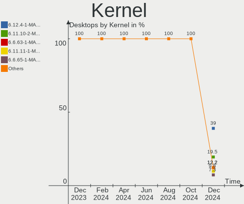
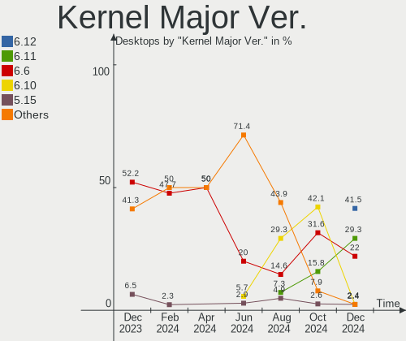
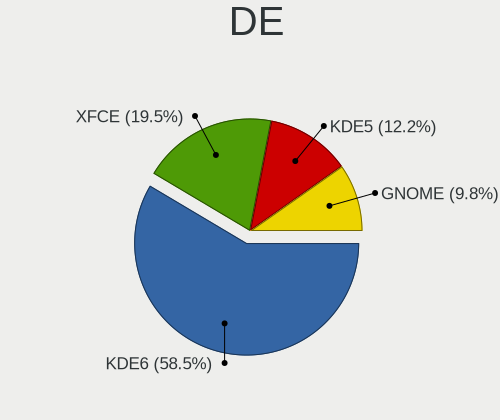
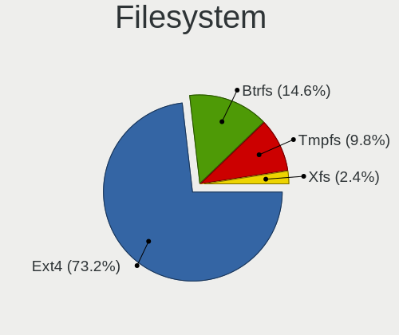
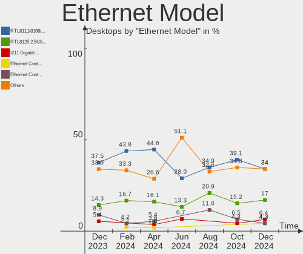

Manjaro Hardware Trends (Desktops)
----------------------------------

A project to identify most popular hardware characteristics and track their change
over time based on data collected by Manjaro users at https://Linux-Hardware.org.

Anyone can contribute to this report by the [hw-probe](https://github.com/linuxhw/hw-probe) tool:

    sudo -E hw-probe -all -upload

Full-feature report is available here: https://linux-hardware.org/?view=trends

Period: Nov, 2021.

Contents
--------

* [ System ](#system)
  - [ OS                       ](#os)
  - [ OS Family                ](#os-family)
  - [ Kernel                   ](#kernel)
  - [ Kernel Family            ](#kernel-family)
  - [ Kernel Major Ver.        ](#kernel-major-ver)
  - [ Arch                     ](#arch)
  - [ DE                       ](#de)
  - [ Display Server           ](#display-server)
  - [ Display Manager          ](#display-manager)
  - [ OS Lang                  ](#os-lang)
  - [ Boot Mode                ](#boot-mode)
  - [ Filesystem               ](#filesystem)
  - [ Part. scheme             ](#part-scheme)
  - [ Dual Boot with Linux/BSD ](#dual-boot-with-linuxbsd)
  - [ Dual Boot (Win)          ](#dual-boot-win)

* [ Board ](#board)
  - [ Vendor                   ](#vendor)
  - [ Model                    ](#model)
  - [ Model Family             ](#model-family)
  - [ MFG Year                 ](#mfg-year)
  - [ Form Factor              ](#form-factor)
  - [ Secure Boot              ](#secure-boot)
  - [ Coreboot                 ](#coreboot)
  - [ RAM Size                 ](#ram-size)
  - [ RAM Used                 ](#ram-used)
  - [ Total Drives             ](#total-drives)
  - [ Has CD-ROM               ](#has-cd-rom)
  - [ Has Ethernet             ](#has-ethernet)
  - [ Has WiFi                 ](#has-wifi)
  - [ Has Bluetooth            ](#has-bluetooth)

* [ Location ](#location)
  - [ Country                  ](#country)
  - [ City                     ](#city)

* [ Drives ](#drives)
  - [ Drive Vendor             ](#drive-vendor)
  - [ Drive Model              ](#drive-model)
  - [ HDD Vendor               ](#hdd-vendor)
  - [ SSD Vendor               ](#ssd-vendor)
  - [ Drive Kind               ](#drive-kind)
  - [ Drive Connector          ](#drive-connector)
  - [ Drive Size               ](#drive-size)
  - [ Space Total              ](#space-total)
  - [ Space Used               ](#space-used)
  - [ Malfunc. Drives          ](#malfunc-drives)
  - [ Malfunc. Drive Vendor    ](#malfunc-drive-vendor)
  - [ Malfunc. HDD Vendor      ](#malfunc-hdd-vendor)
  - [ Malfunc. Drive Kind      ](#malfunc-drive-kind)
  - [ Failed Drives            ](#failed-drives)
  - [ Failed Drive Vendor      ](#failed-drive-vendor)
  - [ Drive Status             ](#drive-status)

* [ Storage controller ](#storage-controller)
  - [ Storage Vendor           ](#storage-vendor)
  - [ Storage Model            ](#storage-model)
  - [ Storage Kind             ](#storage-kind)

* [ Processor ](#processor)
  - [ CPU Vendor               ](#cpu-vendor)
  - [ CPU Model                ](#cpu-model)
  - [ CPU Model Family         ](#cpu-model-family)
  - [ CPU Cores                ](#cpu-cores)
  - [ CPU Sockets              ](#cpu-sockets)
  - [ CPU Threads              ](#cpu-threads)
  - [ CPU Op-Modes             ](#cpu-op-modes)
  - [ CPU Microcode            ](#cpu-microcode)
  - [ CPU Microarch            ](#cpu-microarch)

* [ Graphics ](#graphics)
  - [ GPU Vendor               ](#gpu-vendor)
  - [ GPU Model                ](#gpu-model)
  - [ GPU Combo                ](#gpu-combo)
  - [ GPU Driver               ](#gpu-driver)
  - [ GPU Memory               ](#gpu-memory)

* [ Monitor ](#monitor)
  - [ Monitor Vendor           ](#monitor-vendor)
  - [ Monitor Model            ](#monitor-model)
  - [ Monitor Resolution       ](#monitor-resolution)
  - [ Monitor Diagonal         ](#monitor-diagonal)
  - [ Monitor Width            ](#monitor-width)
  - [ Aspect Ratio             ](#aspect-ratio)
  - [ Monitor Area             ](#monitor-area)
  - [ Pixel Density            ](#pixel-density)
  - [ Multiple Monitors        ](#multiple-monitors)

* [ Network ](#network)
  - [ Net Controller Vendor    ](#net-controller-vendor)
  - [ Net Controller Model     ](#net-controller-model)
  - [ Wireless Vendor          ](#wireless-vendor)
  - [ Wireless Model           ](#wireless-model)
  - [ Ethernet Vendor          ](#ethernet-vendor)
  - [ Ethernet Model           ](#ethernet-model)
  - [ Net Controller Kind      ](#net-controller-kind)
  - [ Used Controller          ](#used-controller)
  - [ NICs                     ](#nics)
  - [ IPv6                     ](#ipv6)

* [ Bluetooth ](#bluetooth)
  - [ Bluetooth Vendor         ](#bluetooth-vendor)
  - [ Bluetooth Model          ](#bluetooth-model)

* [ Sound ](#sound)
  - [ Sound Vendor             ](#sound-vendor)
  - [ Sound Model              ](#sound-model)

* [ Memory ](#memory)
  - [ Memory Vendor            ](#memory-vendor)
  - [ Memory Model             ](#memory-model)
  - [ Memory Kind              ](#memory-kind)
  - [ Memory Form Factor       ](#memory-form-factor)
  - [ Memory Size              ](#memory-size)
  - [ Memory Speed             ](#memory-speed)

* [ Printers & scanners ](#printers--scanners)
  - [ Printer Vendor           ](#printer-vendor)
  - [ Printer Model            ](#printer-model)
  - [ Scanner Vendor           ](#scanner-vendor)
  - [ Scanner Model            ](#scanner-model)

* [ Camera ](#camera)
  - [ Camera Vendor            ](#camera-vendor)
  - [ Camera Model             ](#camera-model)

* [ Security ](#security)
  - [ Fingerprint Vendor       ](#fingerprint-vendor)
  - [ Fingerprint Model        ](#fingerprint-model)
  - [ Chipcard Vendor          ](#chipcard-vendor)
  - [ Chipcard Model           ](#chipcard-model)

* [ Unsupported ](#unsupported)
  - [ Unsupported Devices      ](#unsupported-devices)
  - [ Unsupported Device Types ](#unsupported-device-types)

System
------

OS
--

Installed operating systems

| Name             | Desktops | Percent |
|------------------|----------|---------|
| Manjaro          | 38       | 49.35%  |
| Manjaro 21.1.6   | 22       | 28.57%  |
| Manjaro 21.2.0   | 16       | 20.78%  |
| Manjaro 21.2pre1 | 1        | 1.3%    |

OS Family
---------

OS without a version

| Name    | Desktops | Percent |
|---------|----------|---------|
| Manjaro | 77       | 100%    |

Kernel
------

Version of the Linux kernel

| Version               | Desktops | Percent |
|-----------------------|----------|---------|
| 5.13.19-2-MANJARO     | 24       | 31.17%  |
| 5.15.2-2-MANJARO      | 16       | 20.78%  |
| 5.10.79-1-MANJARO     | 9        | 11.69%  |
| 5.14.10-1-MANJARO     | 8        | 10.39%  |
| 5.10.70-1-MANJARO     | 8        | 10.39%  |
| 5.14.18-1-MANJARO     | 3        | 3.9%    |
| 5.15.0-1-MANJARO      | 2        | 2.6%    |
| 5.6.7-1-MANJARO       | 1        | 1.3%    |
| 5.15.3-lqx2-1-lqx     | 1        | 1.3%    |
| 5.15.2-1-rt19-MANJARO | 1        | 1.3%    |
| 5.14.17-xanmod1-1     | 1        | 1.3%    |
| 5.14.16-214-tkg-pds   | 1        | 1.3%    |
| 5.14.14-1-MANJARO     | 1        | 1.3%    |
| 5.10.82-1-MANJARO     | 1        | 1.3%    |

Kernel Family
-------------

Linux kernel without a distro release

| Version | Desktops | Percent |
|---------|----------|---------|
| 5.13.19 | 24       | 31.17%  |
| 5.15.2  | 17       | 22.08%  |
| 5.10.79 | 9        | 11.69%  |
| 5.14.10 | 8        | 10.39%  |
| 5.10.70 | 8        | 10.39%  |
| 5.14.18 | 3        | 3.9%    |
| 5.15.0  | 2        | 2.6%    |
| 5.6.7   | 1        | 1.3%    |
| 5.15.3  | 1        | 1.3%    |
| 5.14.17 | 1        | 1.3%    |
| 5.14.16 | 1        | 1.3%    |
| 5.14.14 | 1        | 1.3%    |
| 5.10.82 | 1        | 1.3%    |

Kernel Major Ver.
-----------------

Linux kernel major version

| Version | Desktops | Percent |
|---------|----------|---------|
| 5.13    | 24       | 31.17%  |
| 5.15    | 20       | 25.97%  |
| 5.10    | 18       | 23.38%  |
| 5.14    | 14       | 18.18%  |
| 5.6     | 1        | 1.3%    |

Arch
----

OS architecture (x86_64, i586, etc.)

| Name   | Desktops | Percent |
|--------|----------|---------|
| x86_64 | 77       | 100%    |

DE
--

Desktop Environment

| Name       | Desktops | Percent |
|------------|----------|---------|
| KDE5       | 32       | 41.56%  |
| GNOME      | 19       | 24.68%  |
| XFCE       | 16       | 20.78%  |
| Unknown    | 5        | 6.49%   |
| X-Cinnamon | 3        | 3.9%    |
| LXQt       | 1        | 1.3%    |
| KDE        | 1        | 1.3%    |

Display Server
--------------

X11 or Wayland

| Name    | Desktops | Percent |
|---------|----------|---------|
| X11     | 69       | 89.61%  |
| Wayland | 7        | 9.09%   |
| Unknown | 1        | 1.3%    |

Display Manager
---------------

SDDM, LightDM, etc.

| Name    | Desktops | Percent |
|---------|----------|---------|
| Unknown | 38       | 49.35%  |
| SDDM    | 17       | 22.08%  |
| LightDM | 11       | 14.29%  |
| GDM     | 11       | 14.29%  |

OS Lang
-------

Language

| Lang    | Desktops | Percent |
|---------|----------|---------|
| en_US   | 29       | 37.66%  |
| ru_RU   | 7        | 9.09%   |
| en_CA   | 7        | 9.09%   |
| en_GB   | 5        | 6.49%   |
| de_DE   | 5        | 6.49%   |
| pt_BR   | 4        | 5.19%   |
| fr_FR   | 4        | 5.19%   |
| pt_PT   | 2        | 2.6%    |
| it_IT   | 2        | 2.6%    |
| es_ES   | 2        | 2.6%    |
| ru_UA   | 1        | 1.3%    |
| pl_PL   | 1        | 1.3%    |
| ja_JP   | 1        | 1.3%    |
| fi_FI   | 1        | 1.3%    |
| es_AR   | 1        | 1.3%    |
| en_SG   | 1        | 1.3%    |
| en_DE   | 1        | 1.3%    |
| en_AU   | 1        | 1.3%    |
| ar_SA   | 1        | 1.3%    |
| Unknown | 1        | 1.3%    |

Boot Mode
---------

EFI or BIOS

| Mode | Desktops | Percent |
|------|----------|---------|
| BIOS | 57       | 74.03%  |
| EFI  | 20       | 25.97%  |

Filesystem
----------

Type of filesystem

| Type  | Desktops | Percent |
|-------|----------|---------|
| Ext4  | 62       | 80.52%  |
| Btrfs | 14       | 18.18%  |
| Xfs   | 1        | 1.3%    |

Part. scheme
------------

Scheme of partitioning

| Type    | Desktops | Percent |
|---------|----------|---------|
| Unknown | 59       | 76.62%  |
| GPT     | 17       | 22.08%  |
| MBR     | 1        | 1.3%    |

Dual Boot with Linux/BSD
------------------------

Hosting more than one Linux/BSD

| Dual boot | Desktops | Percent |
|-----------|----------|---------|
| No        | 71       | 92.21%  |
| Yes       | 6        | 7.79%   |

Dual Boot (Win)
---------------

Hosting Linux and Windows

| Dual boot | Desktops | Percent |
|-----------|----------|---------|
| No        | 55       | 71.43%  |
| Yes       | 22       | 28.57%  |

Board
-----

Vendor
------

Motherboard manufacturer

| Name                | Desktops | Percent |
|---------------------|----------|---------|
| ASUSTek Computer    | 24       | 31.17%  |
| Gigabyte Technology | 19       | 24.68%  |
| MSI                 | 13       | 16.88%  |
| Dell                | 6        | 7.79%   |
| ASRock              | 4        | 5.19%   |
| Intel               | 3        | 3.9%    |
| Lenovo              | 2        | 2.6%    |
| Hewlett-Packard     | 2        | 2.6%    |
| Acer                | 2        | 2.6%    |
| Pegatron            | 1        | 1.3%    |
| Acidanthera         | 1        | 1.3%    |

Model
-----

Motherboard model

| Name                               | Desktops | Percent |
|------------------------------------|----------|---------|
| Gigabyte X470 AORUS ULTRA GAMING   | 2        | 2.6%    |
| Gigabyte B450M DS3H                | 2        | 2.6%    |
| ASUS All Series                    | 2        | 2.6%    |
| Pegatron s5-1120br                 | 1        | 1.3%    |
| MSI MS-7D30                        | 1        | 1.3%    |
| MSI MS-7C95                        | 1        | 1.3%    |
| MSI MS-7C94                        | 1        | 1.3%    |
| MSI MS-7C92                        | 1        | 1.3%    |
| MSI MS-7C91                        | 1        | 1.3%    |
| MSI MS-7C56                        | 1        | 1.3%    |
| MSI MS-7C09                        | 1        | 1.3%    |
| MSI MS-7C02                        | 1        | 1.3%    |
| MSI MS-7B79                        | 1        | 1.3%    |
| MSI MS-7B29                        | 1        | 1.3%    |
| MSI MS-7A38                        | 1        | 1.3%    |
| MSI MS-7817                        | 1        | 1.3%    |
| MSI MS-7693                        | 1        | 1.3%    |
| Lenovo ThinkStation S20 4157FY2    | 1        | 1.3%    |
| Lenovo ThinkCentre M93p 10A8S3C100 | 1        | 1.3%    |
| Intel T5224                        | 1        | 1.3%    |
| Intel DP55WB AAE64798-207          | 1        | 1.3%    |
| Intel DH67BL AAG10189-208          | 1        | 1.3%    |
| HP Z420 Workstation                | 1        | 1.3%    |
| HP Pavilion Desktop PC 570-p0xx    | 1        | 1.3%    |
| Gigabyte Z77M-D3H                  | 1        | 1.3%    |
| Gigabyte Z490 AORUS XTREME         | 1        | 1.3%    |
| Gigabyte Z270X-Ultra Gaming        | 1        | 1.3%    |
| Gigabyte X570 AORUS ELITE WIFI     | 1        | 1.3%    |
| Gigabyte H61M-S2PV                 | 1        | 1.3%    |
| Gigabyte H61M-DS2 DVI              | 1        | 1.3%    |
| Gigabyte H270-HD3                  | 1        | 1.3%    |
| Gigabyte G31M-ES2L                 | 1        | 1.3%    |
| Gigabyte B85-HD3                   | 1        | 1.3%    |
| Gigabyte B550M DS3H                | 1        | 1.3%    |
| Gigabyte B550 AORUS PRO            | 1        | 1.3%    |
| Gigabyte B460M GAMING HD           | 1        | 1.3%    |
| Gigabyte B450 AORUS PRO WIFI       | 1        | 1.3%    |
| Gigabyte A520M S2H                 | 1        | 1.3%    |
| Gigabyte 945GCMX-S2                | 1        | 1.3%    |
| Dell Precision T5610               | 1        | 1.3%    |
| Dell Precision T3600               | 1        | 1.3%    |
| Dell OptiPlex 9010                 | 1        | 1.3%    |
| Dell OptiPlex 780                  | 1        | 1.3%    |
| Dell OptiPlex 7010                 | 1        | 1.3%    |
| Dell OptiPlex 3010                 | 1        | 1.3%    |
| ASUS TUF GAMING X570-PLUS          | 1        | 1.3%    |
| ASUS TUF GAMING B550M-PLUS         | 1        | 1.3%    |
| ASUS TUF GAMING B550-PLUS          | 1        | 1.3%    |
| ASUS SABERTOOTH X58                | 1        | 1.3%    |
| ASUS SABERTOOTH 990FX R2.0         | 1        | 1.3%    |
| ASUS ROG STRIX Z590-F GAMING WIFI  | 1        | 1.3%    |
| ASUS ROG STRIX Z490-H GAMING       | 1        | 1.3%    |
| ASUS ROG STRIX X570-F GAMING       | 1        | 1.3%    |
| ASUS ROG STRIX B450-F GAMING       | 1        | 1.3%    |
| ASUS ROG CROSSHAIR VII HERO        | 1        | 1.3%    |
| ASUS PRIME X570-PRO                | 1        | 1.3%    |
| ASUS PRIME X470-PRO                | 1        | 1.3%    |
| ASUS PRIME B450M-A                 | 1        | 1.3%    |
| ASUS PRIME B360M-A                 | 1        | 1.3%    |
| ASUS P8Z77-V LE PLUS               | 1        | 1.3%    |

Model Family
------------

Motherboard model prefix

| Name                 | Desktops | Percent |
|----------------------|----------|---------|
| ASUS ROG             | 5        | 6.49%   |
| Dell OptiPlex        | 4        | 5.19%   |
| ASUS PRIME           | 4        | 5.19%   |
| ASUS TUF             | 3        | 3.9%    |
| Gigabyte X470        | 2        | 2.6%    |
| Gigabyte B450M       | 2        | 2.6%    |
| Dell Precision       | 2        | 2.6%    |
| ASUS SABERTOOTH      | 2        | 2.6%    |
| ASUS P8Z77-V         | 2        | 2.6%    |
| ASUS All             | 2        | 2.6%    |
| Acer Aspire          | 2        | 2.6%    |
| Pegatron s5-1120br   | 1        | 1.3%    |
| MSI MS-7D30          | 1        | 1.3%    |
| MSI MS-7C95          | 1        | 1.3%    |
| MSI MS-7C94          | 1        | 1.3%    |
| MSI MS-7C92          | 1        | 1.3%    |
| MSI MS-7C91          | 1        | 1.3%    |
| MSI MS-7C56          | 1        | 1.3%    |
| MSI MS-7C09          | 1        | 1.3%    |
| MSI MS-7C02          | 1        | 1.3%    |
| MSI MS-7B79          | 1        | 1.3%    |
| MSI MS-7B29          | 1        | 1.3%    |
| MSI MS-7A38          | 1        | 1.3%    |
| MSI MS-7817          | 1        | 1.3%    |
| MSI MS-7693          | 1        | 1.3%    |
| Lenovo ThinkStation  | 1        | 1.3%    |
| Lenovo ThinkCentre   | 1        | 1.3%    |
| Intel T5224          | 1        | 1.3%    |
| Intel DP55WB         | 1        | 1.3%    |
| Intel DH67BL         | 1        | 1.3%    |
| HP Z420              | 1        | 1.3%    |
| HP Pavilion          | 1        | 1.3%    |
| Gigabyte Z77M-D3H    | 1        | 1.3%    |
| Gigabyte Z490        | 1        | 1.3%    |
| Gigabyte Z270X-Ultra | 1        | 1.3%    |
| Gigabyte X570        | 1        | 1.3%    |
| Gigabyte H61M-S2PV   | 1        | 1.3%    |
| Gigabyte H61M-DS2    | 1        | 1.3%    |
| Gigabyte H270-HD3    | 1        | 1.3%    |
| Gigabyte G31M-ES2L   | 1        | 1.3%    |
| Gigabyte B85-HD3     | 1        | 1.3%    |
| Gigabyte B550M       | 1        | 1.3%    |
| Gigabyte B550        | 1        | 1.3%    |
| Gigabyte B460M       | 1        | 1.3%    |
| Gigabyte B450        | 1        | 1.3%    |
| Gigabyte A520M       | 1        | 1.3%    |
| Gigabyte 945GCMX-S2  | 1        | 1.3%    |
| ASUS P8H67-M         | 1        | 1.3%    |
| ASUS P5LD2-SE        | 1        | 1.3%    |
| ASUS P5E-VM          | 1        | 1.3%    |
| ASUS M51BC           | 1        | 1.3%    |
| ASUS M3A78-EM        | 1        | 1.3%    |
| ASUS H110M-A         | 1        | 1.3%    |
| ASRock Z370          | 1        | 1.3%    |
| ASRock B450M         | 1        | 1.3%    |
| ASRock B365          | 1        | 1.3%    |
| ASRock 970           | 1        | 1.3%    |
| Acidanthera MacPro7  | 1        | 1.3%    |

MFG Year
--------

Motherboard manufacture year

| Year | Desktops | Percent |
|------|----------|---------|
| 2021 | 20       | 25.97%  |
| 2019 | 12       | 15.58%  |
| 2020 | 10       | 12.99%  |
| 2013 | 7        | 9.09%   |
| 2018 | 4        | 5.19%   |
| 2016 | 4        | 5.19%   |
| 2012 | 4        | 5.19%   |
| 2011 | 3        | 3.9%    |
| 2017 | 2        | 2.6%    |
| 2015 | 2        | 2.6%    |
| 2014 | 2        | 2.6%    |
| 2010 | 2        | 2.6%    |
| 2009 | 2        | 2.6%    |
| 2007 | 2        | 2.6%    |
| 2006 | 1        | 1.3%    |

Form Factor
-----------

Physical design of the computer

| Name    | Desktops | Percent |
|---------|----------|---------|
| Desktop | 77       | 100%    |

Secure Boot
-----------

Enabled or disabled

| State    | Desktops | Percent |
|----------|----------|---------|
| Disabled | 77       | 100%    |

Coreboot
--------

Have coreboot on board

| Used | Desktops | Percent |
|------|----------|---------|
| No   | 77       | 100%    |

RAM Size
--------

Total RAM memory

| Size in GB  | Desktops | Percent |
|-------------|----------|---------|
| 16.01-24.0  | 28       | 36.36%  |
| 8.01-16.0   | 22       | 28.57%  |
| 32.01-64.0  | 10       | 12.99%  |
| 64.01-256.0 | 6        | 7.79%   |
| 3.01-4.0    | 4        | 5.19%   |
| 4.01-8.0    | 3        | 3.9%    |
| 24.01-32.0  | 3        | 3.9%    |
| 1.01-2.0    | 1        | 1.3%    |

RAM Used
--------

Used RAM memory

| Used GB    | Desktops | Percent |
|------------|----------|---------|
| 1.01-2.0   | 19       | 24.68%  |
| 4.01-8.0   | 17       | 22.08%  |
| 2.01-3.0   | 17       | 22.08%  |
| 3.01-4.0   | 10       | 12.99%  |
| 8.01-16.0  | 10       | 12.99%  |
| 0.51-1.0   | 3        | 3.9%    |
| 16.01-24.0 | 1        | 1.3%    |

Total Drives
------------

Number of drives on board

| Drives | Desktops | Percent |
|--------|----------|---------|
| 2      | 30       | 38.96%  |
| 3      | 13       | 16.88%  |
| 1      | 11       | 14.29%  |
| 4      | 10       | 12.99%  |
| 5      | 9        | 11.69%  |
| 6      | 2        | 2.6%    |
| 8      | 1        | 1.3%    |
| 7      | 1        | 1.3%    |

Has CD-ROM
----------

Has CD-ROM on board

| Presented | Desktops | Percent |
|-----------|----------|---------|
| No        | 57       | 74.03%  |
| Yes       | 20       | 25.97%  |

Has Ethernet
------------

Has Ethernet on board

| Presented | Desktops | Percent |
|-----------|----------|---------|
| Yes       | 75       | 97.4%   |
| No        | 2        | 2.6%    |

Has WiFi
--------

Has WiFi module

| Presented | Desktops | Percent |
|-----------|----------|---------|
| No        | 43       | 55.84%  |
| Yes       | 34       | 44.16%  |

Has Bluetooth
-------------

Has Bluetooth module

| Presented | Desktops | Percent |
|-----------|----------|---------|
| No        | 44       | 57.14%  |
| Yes       | 33       | 42.86%  |

Location
--------

Country
-------

Geographic location (country)

| Country      | Desktops | Percent |
|--------------|----------|---------|
| USA          | 15       | 19.48%  |
| Germany      | 9        | 11.69%  |
| Canada       | 9        | 11.69%  |
| Russia       | 6        | 7.79%   |
| Brazil       | 6        | 7.79%   |
| France       | 5        | 6.49%   |
| UK           | 4        | 5.19%   |
| Ukraine      | 2        | 2.6%    |
| Spain        | 2        | 2.6%    |
| Portugal     | 2        | 2.6%    |
| Italy        | 2        | 2.6%    |
| Bulgaria     | 2        | 2.6%    |
| Slovenia     | 1        | 1.3%    |
| Singapore    | 1        | 1.3%    |
| Saudi Arabia | 1        | 1.3%    |
| Poland       | 1        | 1.3%    |
| Mexico       | 1        | 1.3%    |
| Japan        | 1        | 1.3%    |
| Greece       | 1        | 1.3%    |
| Finland      | 1        | 1.3%    |
| Czechia      | 1        | 1.3%    |
| China        | 1        | 1.3%    |
| Belarus      | 1        | 1.3%    |
| Australia    | 1        | 1.3%    |
| Argentina    | 1        | 1.3%    |

City
----

Geographic location (city)

| City              | Desktops | Percent |
|-------------------|----------|---------|
| Spruce Grove      | 2        | 2.6%    |
| Sofia             | 2        | 2.6%    |
| S??o Paulo        | 2        | 2.6%    |
| Porto             | 2        | 2.6%    |
| Paris             | 2        | 2.6%    |
| Edmonton          | 2        | 2.6%    |
| Wilmington        | 1        | 1.3%    |
| Weitramsdorf      | 1        | 1.3%    |
| Vila Velha        | 1        | 1.3%    |
| Vechelde          | 1        | 1.3%    |
| Vaudreuil-Dorion  | 1        | 1.3%    |
| Unicov            | 1        | 1.3%    |
| Turek             | 1        | 1.3%    |
| Toulouse          | 1        | 1.3%    |
| Syktyvkar         | 1        | 1.3%    |
| Southend-on-Sea   | 1        | 1.3%    |
| Singapore         | 1        | 1.3%    |
| Sindelfingen      | 1        | 1.3%    |
| Shenzhen          | 1        | 1.3%    |
| Seville           | 1        | 1.3%    |
| Settsu            | 1        | 1.3%    |
| Scottsdale        | 1        | 1.3%    |
| San Rafael        | 1        | 1.3%    |
| Salem             | 1        | 1.3%    |
| Riyadh            | 1        | 1.3%    |
| Rio de Janeiro    | 1        | 1.3%    |
| Recife            | 1        | 1.3%    |
| Puebla City       | 1        | 1.3%    |
| Prien am Chiemsee | 1        | 1.3%    |
| Pinellas Park     | 1        | 1.3%    |
| Perth             | 1        | 1.3%    |
| Paignton          | 1        | 1.3%    |
| Owego             | 1        | 1.3%    |
| Novosibirsk       | 1        | 1.3%    |
| New York          | 1        | 1.3%    |
| Moscow            | 1        | 1.3%    |
| Montreal          | 1        | 1.3%    |
| Moncton           | 1        | 1.3%    |
| Mississauga       | 1        | 1.3%    |
| Minsk             | 1        | 1.3%    |
| Madrid            | 1        | 1.3%    |
| Logan             | 1        | 1.3%    |
| Ljubljana         | 1        | 1.3%    |
| Lewisburg         | 1        | 1.3%    |
| Le Vesinet        | 1        | 1.3%    |
| Laatzen           | 1        | 1.3%    |
| Kyiv              | 1        | 1.3%    |
| Khimki            | 1        | 1.3%    |
| Ingolstadt        | 1        | 1.3%    |
| Iguatu            | 1        | 1.3%    |
| Hohenau           | 1        | 1.3%    |
| High Wycombe      | 1        | 1.3%    |
| Helsinki          | 1        | 1.3%    |
| Greenwood         | 1        | 1.3%    |
| Elk Grove Village | 1        | 1.3%    |
| Dunfermline       | 1        | 1.3%    |
| Dniprodzerzhynsk  | 1        | 1.3%    |
| Diamondhead       | 1        | 1.3%    |
| Clarksville       | 1        | 1.3%    |
| Cheboksary        | 1        | 1.3%    |

Drives
------

Drive Vendor
------------

Hard drive vendors

| Vendor                    | Desktops | Drives | Percent |
|---------------------------|----------|--------|---------|
| Seagate                   | 35       | 49     | 20.47%  |
| WDC                       | 33       | 47     | 19.3%   |
| Samsung Electronics       | 29       | 40     | 16.96%  |
| SanDisk                   | 11       | 12     | 6.43%   |
| Kingston                  | 10       | 11     | 5.85%   |
| Toshiba                   | 6        | 6      | 3.51%   |
| Crucial                   | 6        | 7      | 3.51%   |
| Intel                     | 4        | 5      | 2.34%   |
| A-DATA Technology         | 4        | 5      | 2.34%   |
| Unknown                   | 3        | 5      | 1.75%   |
| Patriot                   | 3        | 4      | 1.75%   |
| Intenso                   | 3        | 4      | 1.75%   |
| SPCC                      | 2        | 2      | 1.17%   |
| Silicon Motion            | 2        | 2      | 1.17%   |
| Phison                    | 2        | 2      | 1.17%   |
| OCZ                       | 2        | 2      | 1.17%   |
| Micron Technology         | 2        | 4      | 1.17%   |
| Hitachi                   | 2        | 3      | 1.17%   |
| HGST                      | 2        | 5      | 1.17%   |
| XPG                       | 1        | 1      | 0.58%   |
| Team                      | 1        | 1      | 0.58%   |
| PNY                       | 1        | 1      | 0.58%   |
| Micron/Crucial Technology | 1        | 1      | 0.58%   |
| KingSpec                  | 1        | 1      | 0.58%   |
| IBM                       | 1        | 1      | 0.58%   |
| Gigabyte Technology       | 1        | 2      | 0.58%   |
| Fujitsu                   | 1        | 1      | 0.58%   |
| China                     | 1        | 1      | 0.58%   |
| ASMedia                   | 1        | 1      | 0.58%   |

Drive Model
-----------

Hard drive models

| Model                                  | Desktops | Percent |
|----------------------------------------|----------|---------|
| Samsung NVMe SSD Drive 500GB           | 5        | 2.4%    |
| Kingston SA400S37240G 240GB SSD        | 5        | 2.4%    |
| Seagate ST2000DM008-2FR102 2TB         | 4        | 1.92%   |
| Seagate ST1000DM010-2EP102 1TB         | 4        | 1.92%   |
| Seagate ST1000DM003-1ER162 1TB         | 4        | 1.92%   |
| Samsung SSD 850 EVO 500GB              | 4        | 1.92%   |
| Samsung SSD 850 EVO 250GB              | 4        | 1.92%   |
| WDC WDS100T2B0A-00SM50 1TB SSD         | 3        | 1.44%   |
| Seagate ST2000DM006-2DM164 2TB         | 3        | 1.44%   |
| WDC WDS500G2B0A-00SM50 500GB SSD       | 2        | 0.96%   |
| WDC WDS120G2G0A-00JH30 120GB SSD       | 2        | 0.96%   |
| WDC WD20PURX-64P6ZY0 2TB               | 2        | 0.96%   |
| WDC WD20EZRX-00D8PB0 2TB               | 2        | 0.96%   |
| WDC WD10EZEX-00BN5A0 1TB               | 2        | 0.96%   |
| WDC WD10EARX-00N0YB0 1TB               | 2        | 0.96%   |
| WDC WD10EALX-009BA0 1TB                | 2        | 0.96%   |
| Unknown SD/MMC/MS PRO 394GB            | 2        | 0.96%   |
| Seagate ST4000DM004-2CV104 4TB         | 2        | 0.96%   |
| Seagate ST3320418AS 320GB              | 2        | 0.96%   |
| Seagate ST2000DM001-1CH164 2TB         | 2        | 0.96%   |
| Seagate ST1000DM003-1SB102 1TB         | 2        | 0.96%   |
| Seagate Expansion Desk 8TB             | 2        | 0.96%   |
| Sandisk NVMe SSD Drive 500GB           | 2        | 0.96%   |
| Samsung SSD 860 EVO 1TB                | 2        | 0.96%   |
| Samsung SSD 850 EVO 1TB                | 2        | 0.96%   |
| Samsung SSD 830 Series 256GB           | 2        | 0.96%   |
| Samsung SM963 2.5" NVMe PCIe SSD 250GB | 2        | 0.96%   |
| Samsung NVMe SSD Drive 1TB             | 2        | 0.96%   |
| Patriot Burst 120GB SSD                | 2        | 0.96%   |
| Kingston SA400S37480G 480GB SSD        | 2        | 0.96%   |
| Kingston NVMe SSD Drive 500GB          | 2        | 0.96%   |
| XPG NVMe SSD Drive 1024GB              | 1        | 0.48%   |
| WDC WDS500G1B0B-00AS40 500GB SSD       | 1        | 0.48%   |
| WDC WDS480G2G0B-00EPW0 480GB SSD       | 1        | 0.48%   |
| WDC WDS200T2B0C-00PXH0 2TB             | 1        | 0.48%   |
| WDC WDS200T2B0A-00SM50 2TB SSD         | 1        | 0.48%   |
| WDC WDS100T2B0C-00PXH0 1TB             | 1        | 0.48%   |
| WDC WDS100T2B0B-00YS70 1TB SSD         | 1        | 0.48%   |
| WDC WD6400AAKS-22A7B2 640GB            | 1        | 0.48%   |
| WDC WD5000LUCT-63RC2Y0 500GB           | 1        | 0.48%   |
| WDC WD5000BEVT-00A0RT0 500GB           | 1        | 0.48%   |
| WDC WD5000AAKX-003CA0 500GB            | 1        | 0.48%   |
| WDC WD5000AAKX-001CA0 500GB            | 1        | 0.48%   |
| WDC WD5000AAKS-00UU3A0 500GB           | 1        | 0.48%   |
| WDC WD5000AADS-00M2B0 500GB            | 1        | 0.48%   |
| WDC WD40EZAZ-00SF3B0 4TB               | 1        | 0.48%   |
| WDC WD40EFRX-68N32N0 4TB               | 1        | 0.48%   |
| WDC WD4005FZBX-00K5WB0 4TB             | 1        | 0.48%   |
| WDC WD30EZRX-19D8PB0 3TB               | 1        | 0.48%   |
| WDC WD30EZRX-00DC0B0 3TB               | 1        | 0.48%   |
| WDC WD20EARX-32PASB0 2TB               | 1        | 0.48%   |
| WDC WD2003FYYS-02W0B1 2TB              | 1        | 0.48%   |
| WDC WD10EZEX-22MFCA0 1TB               | 1        | 0.48%   |
| WDC WD10EZEX-08WN4A0 1TB               | 1        | 0.48%   |
| WDC WD10EZEX-00WN4A0 1TB               | 1        | 0.48%   |
| WDC WD10EARS-00Y5B1 1TB                | 1        | 0.48%   |
| WDC WD10EADX-22TDHB0 1TB               | 1        | 0.48%   |
| WDC WD10E 1TB                          | 1        | 0.48%   |
| WDC WD1002FAEX-00Z3A0 1TB              | 1        | 0.48%   |
| Unknown SD/MMC/M.S.PRO 32GB            | 1        | 0.48%   |

HDD Vendor
----------

Hard disk drive vendors

| Vendor              | Desktops | Drives | Percent |
|---------------------|----------|--------|---------|
| Seagate             | 35       | 49     | 43.21%  |
| WDC                 | 28       | 34     | 34.57%  |
| Toshiba             | 5        | 5      | 6.17%   |
| Samsung Electronics | 5        | 6      | 6.17%   |
| Unknown             | 2        | 2      | 2.47%   |
| Hitachi             | 2        | 3      | 2.47%   |
| HGST                | 2        | 5      | 2.47%   |
| Fujitsu             | 1        | 1      | 1.23%   |
| ASMedia             | 1        | 1      | 1.23%   |

SSD Vendor
----------

Solid state drive vendors

| Vendor              | Desktops | Drives | Percent |
|---------------------|----------|--------|---------|
| Samsung Electronics | 15       | 20     | 23.08%  |
| WDC                 | 8        | 11     | 12.31%  |
| SanDisk             | 8        | 9      | 12.31%  |
| Kingston            | 8        | 9      | 12.31%  |
| Crucial             | 5        | 6      | 7.69%   |
| Patriot             | 3        | 4      | 4.62%   |
| Intenso             | 3        | 4      | 4.62%   |
| Intel               | 3        | 4      | 4.62%   |
| A-DATA Technology   | 3        | 4      | 4.62%   |
| SPCC                | 2        | 2      | 3.08%   |
| OCZ                 | 2        | 2      | 3.08%   |
| Toshiba             | 1        | 1      | 1.54%   |
| PNY                 | 1        | 1      | 1.54%   |
| Micron Technology   | 1        | 2      | 1.54%   |
| KingSpec            | 1        | 1      | 1.54%   |
| China               | 1        | 1      | 1.54%   |

Drive Kind
----------

HDD or SSD

| Kind    | Desktops | Drives | Percent |
|---------|----------|--------|---------|
| HDD     | 65       | 106    | 45.14%  |
| SSD     | 50       | 81     | 34.72%  |
| NVMe    | 27       | 35     | 18.75%  |
| Unknown | 2        | 4      | 1.39%   |

Drive Connector
---------------

SATA, SAS, NVMe, etc.

| Type | Desktops | Drives | Percent |
|------|----------|--------|---------|
| SATA | 75       | 176    | 68.81%  |
| NVMe | 27       | 35     | 24.77%  |
| SAS  | 7        | 15     | 6.42%   |

Drive Size
----------

Size of hard drive

| Size in TB | Desktops | Drives | Percent |
|------------|----------|--------|---------|
| 0.01-0.5   | 51       | 85     | 40.16%  |
| 0.51-1.0   | 38       | 51     | 29.92%  |
| 1.01-2.0   | 22       | 27     | 17.32%  |
| 3.01-4.0   | 7        | 8      | 5.51%   |
| 2.01-3.0   | 6        | 11     | 4.72%   |
| 4.01-10.0  | 2        | 4      | 1.57%   |
| 10.01-20.0 | 1        | 1      | 0.79%   |

Space Total
-----------

Amount of disk space available on the file system

| Size in GB     | Desktops | Percent |
|----------------|----------|---------|
| 1001-2000      | 20       | 25.97%  |
| More than 3000 | 16       | 20.78%  |
| 501-1000       | 13       | 16.88%  |
| 101-250        | 12       | 15.58%  |
| 251-500        | 6        | 7.79%   |
| 2001-3000      | 5        | 6.49%   |
| 51-100         | 3        | 3.9%    |
| Unknown        | 2        | 2.6%    |

Space Used
----------

Amount of used disk space

| Used GB        | Desktops | Percent |
|----------------|----------|---------|
| 101-250        | 13       | 16.88%  |
| 21-50          | 12       | 15.58%  |
| 1001-2000      | 11       | 14.29%  |
| 501-1000       | 11       | 14.29%  |
| 1-20           | 8        | 10.39%  |
| 51-100         | 7        | 9.09%   |
| 251-500        | 6        | 7.79%   |
| 2001-3000      | 4        | 5.19%   |
| More than 3000 | 3        | 3.9%    |
| Unknown        | 2        | 2.6%    |

Malfunc. Drives
---------------

Drive models with a malfunction

| Model                           | Desktops | Drives | Percent |
|---------------------------------|----------|--------|---------|
| WDC WD10EARX-00N0YB0 1TB        | 2        | 2      | 18.18%  |
| WDC WD30EZRX-00DC0B0 3TB        | 1        | 2      | 9.09%   |
| WDC WD10EZEX-00BN5A0 1TB        | 1        | 1      | 9.09%   |
| Seagate ST500DM002-1BD142 500GB | 1        | 1      | 9.09%   |
| Seagate ST3000DM001-1CH166 3TB  | 1        | 1      | 9.09%   |
| SanDisk SDSSDX480GG25 480GB     | 1        | 1      | 9.09%   |
| SanDisk SDSSDP256G 256GB        | 1        | 1      | 9.09%   |
| Intenso SSD 120GB               | 1        | 1      | 9.09%   |
| Intel SSDSC2BW120A4 120GB       | 1        | 1      | 9.09%   |
| HGST HTS541075A9E680 752GB      | 1        | 1      | 9.09%   |

Malfunc. Drive Vendor
---------------------

Vendors of faulty drives

| Vendor  | Desktops | Drives | Percent |
|---------|----------|--------|---------|
| WDC     | 4        | 5      | 36.36%  |
| Seagate | 2        | 2      | 18.18%  |
| SanDisk | 2        | 2      | 18.18%  |
| Intenso | 1        | 1      | 9.09%   |
| Intel   | 1        | 1      | 9.09%   |
| HGST    | 1        | 1      | 9.09%   |

Malfunc. HDD Vendor
-------------------

Vendors of faulty HDD drives

| Vendor  | Desktops | Drives | Percent |
|---------|----------|--------|---------|
| WDC     | 4        | 5      | 57.14%  |
| Seagate | 2        | 2      | 28.57%  |
| HGST    | 1        | 1      | 14.29%  |

Malfunc. Drive Kind
-------------------

Kinds of faulty drives

| Kind | Desktops | Drives | Percent |
|------|----------|--------|---------|
| HDD  | 7        | 8      | 63.64%  |
| SSD  | 4        | 4      | 36.36%  |

Failed Drives
-------------

Failed drive models

Zero info for selected period =(

Failed Drive Vendor
-------------------

Failed drive vendors

Zero info for selected period =(

Drive Status
------------

Number of failed and malfunc. drives

| Status   | Desktops | Drives | Percent |
|----------|----------|--------|---------|
| Detected | 60       | 175    | 70.59%  |
| Works    | 16       | 39     | 18.82%  |
| Malfunc  | 9        | 12     | 10.59%  |

Storage controller
------------------

Storage Vendor
--------------

Storage controller vendors

| Vendor                      | Desktops | Percent |
|-----------------------------|----------|---------|
| Intel                       | 42       | 35.29%  |
| AMD                         | 35       | 29.41%  |
| Samsung Electronics         | 13       | 10.92%  |
| Sandisk                     | 4        | 3.36%   |
| Phison Electronics          | 3        | 2.52%   |
| Marvell Technology Group    | 3        | 2.52%   |
| LSI Logic / Symbios Logic   | 3        | 2.52%   |
| ASMedia Technology          | 3        | 2.52%   |
| Silicon Motion              | 2        | 1.68%   |
| Micron/Crucial Technology   | 2        | 1.68%   |
| Kingston Technology Company | 2        | 1.68%   |
| JMicron Technology          | 2        | 1.68%   |
| ADATA Technology            | 2        | 1.68%   |
| VIA Technologies            | 1        | 0.84%   |
| Realtek Semiconductor       | 1        | 0.84%   |
| Micron Technology           | 1        | 0.84%   |

Storage Model
-------------

Storage controller models

| Model                                                                          | Desktops | Percent |
|--------------------------------------------------------------------------------|----------|---------|
| AMD FCH SATA Controller [AHCI mode]                                            | 15       | 10.56%  |
| AMD 400 Series Chipset SATA Controller                                         | 14       | 9.86%   |
| Samsung NVMe SSD Controller SM981/PM981/PM983                                  | 10       | 7.04%   |
| AMD Starship/Matisse Chipset SATA Controller [AHCI mode]                       | 9        | 6.34%   |
| Intel 6 Series/C200 Series Chipset Family 6 port Desktop SATA AHCI Controller  | 6        | 4.23%   |
| Intel 200 Series PCH SATA controller [AHCI mode]                               | 6        | 4.23%   |
| Intel 7 Series/C210 Series Chipset Family 6-port SATA Controller [AHCI mode]   | 5        | 3.52%   |
| AMD SB7x0/SB8x0/SB9x0 SATA Controller [AHCI mode]                              | 4        | 2.82%   |
| Sandisk WD Blue SN550 NVMe SSD                                                 | 3        | 2.11%   |
| Phison E16 PCIe4 NVMe Controller                                               | 3        | 2.11%   |
| LSI Logic / Symbios Logic SAS2008 PCI-Express Fusion-MPT SAS-2 [Falcon]        | 3        | 2.11%   |
| Intel NM10/ICH7 Family SATA Controller [IDE mode]                              | 3        | 2.11%   |
| Intel 8 Series/C220 Series Chipset Family 6-port SATA Controller 1 [AHCI mode] | 3        | 2.11%   |
| ASMedia ASM1062 Serial ATA Controller                                          | 3        | 2.11%   |
| AMD SB7x0/SB8x0/SB9x0 IDE Controller                                           | 3        | 2.11%   |
| Silicon Motion SM2263EN/SM2263XT SSD Controller                                | 2        | 1.41%   |
| Samsung NVMe SSD Controller SM961/PM961/SM963                                  | 2        | 1.41%   |
| Samsung NVMe SSD Controller PM9A1/PM9A3/980PRO                                 | 2        | 1.41%   |
| Kingston Company A2000 NVMe SSD                                                | 2        | 1.41%   |
| Intel Comet Lake SATA AHCI Controller                                          | 2        | 1.41%   |
| Intel Cannon Lake PCH SATA AHCI Controller                                     | 2        | 1.41%   |
| Intel C600/X79 series chipset 6-Port SATA AHCI Controller                      | 2        | 1.41%   |
| Intel 82801JI (ICH10 Family) SATA AHCI Controller                              | 2        | 1.41%   |
| Intel 82801G (ICH7 Family) IDE Controller                                      | 2        | 1.41%   |
| AMD SB7x0/SB8x0/SB9x0 SATA Controller [IDE mode]                               | 2        | 1.41%   |
| ADATA XPG SX8200 Pro PCIe Gen3x4 M.2 2280 Solid State Drive                    | 2        | 1.41%   |
| VIA VT6415 PATA IDE Host Controller                                            | 1        | 0.7%    |
| Sandisk WD Black SN750 / PC SN730 NVMe SSD                                     | 1        | 0.7%    |
| Sandisk Non-Volatile memory controller                                         | 1        | 0.7%    |
| Realtek Realtek Non-Volatile memory controller                                 | 1        | 0.7%    |
| Micron/Crucial P2 NVMe PCIe SSD                                                | 1        | 0.7%    |
| Micron/Crucial NVMe Controller                                                 | 1        | 0.7%    |
| Micron Non-Volatile memory controller                                          | 1        | 0.7%    |
| Marvell Group 88SE9128 PCIe SATA 6 Gb/s RAID controller with HyperDuo          | 1        | 0.7%    |
| Marvell Group 88SE9123 PCIe SATA 6.0 Gb/s controller                           | 1        | 0.7%    |
| Marvell Group 88SE9120 SATA 6Gb/s Controller                                   | 1        | 0.7%    |
| JMicron JMB368 IDE controller                                                  | 1        | 0.7%    |
| JMicron JMB362 SATA Controller                                                 | 1        | 0.7%    |
| Intel SSD Pro 7600p/760p/E 6100p Series                                        | 1        | 0.7%    |
| Intel SATA Controller [RAID mode]                                              | 1        | 0.7%    |
| Intel Q170/Q150/B150/H170/H110/Z170/CM236 Chipset SATA Controller [AHCI Mode]  | 1        | 0.7%    |
| Intel C610/X99 series chipset 6-Port SATA Controller [AHCI mode]               | 1        | 0.7%    |
| Intel C602 chipset 4-Port SATA Storage Control Unit                            | 1        | 0.7%    |
| Intel C600/X79 series chipset SATA RAID Controller                             | 1        | 0.7%    |
| Intel C600/X79 series chipset IDE-r Controller                                 | 1        | 0.7%    |
| Intel 9 Series Chipset Family SATA Controller [AHCI Mode]                      | 1        | 0.7%    |
| Intel 82Q35 Express PT IDER Controller                                         | 1        | 0.7%    |
| Intel 82801JD/DO (ICH10 Family) 4-port SATA IDE Controller                     | 1        | 0.7%    |
| Intel 82801JD/DO (ICH10 Family) 2-port SATA IDE Controller                     | 1        | 0.7%    |
| Intel 82801IR/IO/IH (ICH9R/DO/DH) 6 port SATA Controller [AHCI mode]           | 1        | 0.7%    |
| Intel 82801GR/GDH (ICH7R/ICH7DH) SATA Controller [RAID mode]                   | 1        | 0.7%    |
| Intel 600 Series Chipset Family SATA AHCI Controller                           | 1        | 0.7%    |
| Intel 500 Series Chipset Family SATA AHCI Controller                           | 1        | 0.7%    |
| Intel 5 Series/3400 Series Chipset 6 port SATA AHCI Controller                 | 1        | 0.7%    |
| AMD FCH SATA Controller [IDE mode]                                             | 1        | 0.7%    |
| AMD FCH RAID Controller                                                        | 1        | 0.7%    |

Storage Kind
------------

Kind of storage controller (IDE, SATA, NVMe, SAS, ...)

| Kind | Desktops | Percent |
|------|----------|---------|
| SATA | 69       | 60%     |
| NVMe | 27       | 23.48%  |
| IDE  | 11       | 9.57%   |
| RAID | 4        | 3.48%   |
| SAS  | 4        | 3.48%   |

Processor
---------

CPU Vendor
----------

Processor vendors

| Vendor | Desktops | Percent |
|--------|----------|---------|
| Intel  | 42       | 54.55%  |
| AMD    | 35       | 45.45%  |

CPU Model
---------

Processor models

| Model                                           | Desktops | Percent |
|-------------------------------------------------|----------|---------|
| AMD Ryzen 5 3600 6-Core Processor               | 7        | 9.09%   |
| AMD Ryzen 7 3700X 8-Core Processor              | 4        | 5.19%   |
| Intel Core i5-9400F CPU @ 2.90GHz               | 3        | 3.9%    |
| Intel Core i5-3450 CPU @ 3.10GHz                | 3        | 3.9%    |
| AMD Ryzen 7 2700 Eight-Core Processor           | 3        | 3.9%    |
| Intel Core i7-2600K CPU @ 3.40GHz               | 2        | 2.6%    |
| AMD Ryzen 9 5900X 12-Core Processor             | 2        | 2.6%    |
| AMD Ryzen 7 5700G with Radeon Graphics          | 2        | 2.6%    |
| AMD Ryzen 7 2700X Eight-Core Processor          | 2        | 2.6%    |
| AMD FX-6300 Six-Core Processor                  | 2        | 2.6%    |
| Intel Xeon CPU W3550 @ 3.07GHz                  | 1        | 1.3%    |
| Intel Xeon CPU E5-2690 0 @ 2.90GHz              | 1        | 1.3%    |
| Intel Xeon CPU E5-2670 v2 @ 2.50GHz             | 1        | 1.3%    |
| Intel Xeon CPU E5-1650 0 @ 3.20GHz              | 1        | 1.3%    |
| Intel Xeon CPU E3-1231 v3 @ 3.40GHz             | 1        | 1.3%    |
| Intel Pentium Gold G5500 CPU @ 3.80GHz          | 1        | 1.3%    |
| Intel Pentium D CPU 2.80GHz                     | 1        | 1.3%    |
| Intel Core i9-10900K CPU @ 3.70GHz              | 1        | 1.3%    |
| Intel Core i9-10850K CPU @ 3.60GHz              | 1        | 1.3%    |
| Intel Core i7-8700K CPU @ 3.70GHz               | 1        | 1.3%    |
| Intel Core i7-6700K CPU @ 4.00GHz               | 1        | 1.3%    |
| Intel Core i7-5820K CPU @ 3.30GHz               | 1        | 1.3%    |
| Intel Core i7-4770 CPU @ 3.40GHz                | 1        | 1.3%    |
| Intel Core i7 CPU 950 @ 3.07GHz                 | 1        | 1.3%    |
| Intel Core i5-7600K CPU @ 3.80GHz               | 1        | 1.3%    |
| Intel Core i5-7400 CPU @ 3.00GHz                | 1        | 1.3%    |
| Intel Core i5-6400 CPU @ 2.70GHz                | 1        | 1.3%    |
| Intel Core i5-4690 CPU @ 3.50GHz                | 1        | 1.3%    |
| Intel Core i5-4570 CPU @ 3.20GHz                | 1        | 1.3%    |
| Intel Core i5-3570K CPU @ 3.40GHz               | 1        | 1.3%    |
| Intel Core i5-3570 CPU @ 3.40GHz                | 1        | 1.3%    |
| Intel Core i5-3470 CPU @ 3.20GHz                | 1        | 1.3%    |
| Intel Core i5-2310 CPU @ 2.90GHz                | 1        | 1.3%    |
| Intel Core i5-10400F CPU @ 2.90GHz              | 1        | 1.3%    |
| Intel Core i3-3220 CPU @ 3.30GHz                | 1        | 1.3%    |
| Intel Core i3-2100 CPU @ 3.10GHz                | 1        | 1.3%    |
| Intel Core i3 CPU 530 @ 2.93GHz                 | 1        | 1.3%    |
| Intel Core 2 Quad CPU Q9450 @ 2.66GHz           | 1        | 1.3%    |
| Intel Core 2 Quad CPU Q9400 @ 2.66GHz           | 1        | 1.3%    |
| Intel Core 2 CPU 6400 @ 2.13GHz                 | 1        | 1.3%    |
| Intel Core 2 CPU 6300 @ 1.86GHz                 | 1        | 1.3%    |
| Intel Celeron CPU 420 @ 1.60GHz                 | 1        | 1.3%    |
| Intel 12th Gen Core i9-12900K                   | 1        | 1.3%    |
| Intel 11th Gen Core i7-11700K @ 3.60GHz         | 1        | 1.3%    |
| AMD Ryzen 9 5950X 16-Core Processor             | 1        | 1.3%    |
| AMD Ryzen 7 5800X 8-Core Processor              | 1        | 1.3%    |
| AMD Ryzen 5 PRO 4400G with Radeon Graphics      | 1        | 1.3%    |
| AMD Ryzen 5 PRO 3400G with Radeon Vega Graphics | 1        | 1.3%    |
| AMD Ryzen 5 3600X 6-Core Processor              | 1        | 1.3%    |
| AMD Ryzen 5 2600 Six-Core Processor             | 1        | 1.3%    |
| AMD Ryzen 5 1600X Six-Core Processor            | 1        | 1.3%    |
| AMD Ryzen 3 2200G with Radeon Vega Graphics     | 1        | 1.3%    |
| AMD Phenom II X4 945 Processor                  | 1        | 1.3%    |
| AMD FX-8300 Eight-Core Processor                | 1        | 1.3%    |
| AMD FX-8150 Eight-Core Processor                | 1        | 1.3%    |
| AMD E-450 APU with Radeon HD Graphics           | 1        | 1.3%    |
| AMD A6-7310 APU with AMD Radeon R4 Graphics     | 1        | 1.3%    |

CPU Model Family
----------------

Processor model prefix

| Model              | Desktops | Percent |
|--------------------|----------|---------|
| Intel Core i5      | 16       | 20.78%  |
| AMD Ryzen 7        | 12       | 15.58%  |
| AMD Ryzen 5        | 10       | 12.99%  |
| Intel Core i7      | 7        | 9.09%   |
| Intel Xeon         | 5        | 6.49%   |
| AMD FX             | 4        | 5.19%   |
| Intel Core i3      | 3        | 3.9%    |
| AMD Ryzen 9        | 3        | 3.9%    |
| Other              | 2        | 2.6%    |
| Intel Core i9      | 2        | 2.6%    |
| Intel Core 2 Quad  | 2        | 2.6%    |
| Intel Core 2       | 2        | 2.6%    |
| AMD Ryzen 5 PRO    | 2        | 2.6%    |
| Intel Pentium Gold | 1        | 1.3%    |
| Intel Pentium D    | 1        | 1.3%    |
| Intel Celeron      | 1        | 1.3%    |
| AMD Ryzen 3        | 1        | 1.3%    |
| AMD Phenom II X4   | 1        | 1.3%    |
| AMD E              | 1        | 1.3%    |
| AMD A6             | 1        | 1.3%    |

CPU Cores
---------

Number of processor cores

| Number | Desktops | Percent |
|--------|----------|---------|
| 4      | 27       | 35.06%  |
| 6      | 18       | 23.38%  |
| 8      | 14       | 18.18%  |
| 2      | 8        | 10.39%  |
| 16     | 2        | 2.6%    |
| 12     | 2        | 2.6%    |
| 10     | 2        | 2.6%    |
| 3      | 2        | 2.6%    |
| 20     | 1        | 1.3%    |
| 1      | 1        | 1.3%    |

CPU Sockets
-----------

Number of sockets

| Number | Desktops | Percent |
|--------|----------|---------|
| 1      | 76       | 98.7%   |
| 2      | 1        | 1.3%    |

CPU Threads
-----------

Threads per core (Hyper-Threading)

| Number | Desktops | Percent |
|--------|----------|---------|
| 2      | 51       | 66.23%  |
| 1      | 26       | 33.77%  |

CPU Op-Modes
------------

CPU Operation Modes (32-bit, 64-bit)

| Op mode        | Desktops | Percent |
|----------------|----------|---------|
| 32-bit, 64-bit | 77       | 100%    |

CPU Microcode
-------------

Microcode number

| Number     | Desktops | Percent |
|------------|----------|---------|
| Unknown    | 49       | 63.64%  |
| 0x306a9    | 3        | 3.9%    |
| 0x08701021 | 3        | 3.9%    |
| 0xa0655    | 2        | 2.6%    |
| 0x506e3    | 2        | 2.6%    |
| 0x306c3    | 2        | 2.6%    |
| 0x206a7    | 2        | 2.6%    |
| 0x08701013 | 2        | 2.6%    |
| 0x0800820d | 2        | 2.6%    |
| 0x06000852 | 2        | 2.6%    |
| 0xa0671    | 1        | 1.3%    |
| 0x6f2      | 1        | 1.3%    |
| 0x306f2    | 1        | 1.3%    |
| 0x106a5    | 1        | 1.3%    |
| 0x1067a    | 1        | 1.3%    |
| 0x0a50000c | 1        | 1.3%    |
| 0x0a201016 | 1        | 1.3%    |
| 0x0a201009 | 1        | 1.3%    |

CPU Microarch
-------------

Microarchitecture

| Name        | Desktops | Percent |
|-------------|----------|---------|
| Zen 2       | 13       | 16.88%  |
| IvyBridge   | 8        | 10.39%  |
| Zen+        | 7        | 9.09%   |
| KabyLake    | 7        | 9.09%   |
| Zen 3       | 6        | 7.79%   |
| SandyBridge | 6        | 7.79%   |
| Haswell     | 5        | 6.49%   |
| Piledriver  | 3        | 3.9%    |
| Core        | 3        | 3.9%    |
| CometLake   | 3        | 3.9%    |
| Zen         | 2        | 2.6%    |
| Skylake     | 2        | 2.6%    |
| Penryn      | 2        | 2.6%    |
| Nehalem     | 2        | 2.6%    |
| Westmere    | 1        | 1.3%    |
| Puma        | 1        | 1.3%    |
| NetBurst    | 1        | 1.3%    |
| K10         | 1        | 1.3%    |
| Icelake     | 1        | 1.3%    |
| Bulldozer   | 1        | 1.3%    |
| Bobcat      | 1        | 1.3%    |
| Unknown     | 1        | 1.3%    |

Graphics
--------

GPU Vendor
----------

Vendors of graphics cards

| Vendor | Desktops | Percent |
|--------|----------|---------|
| Nvidia | 37       | 45.12%  |
| AMD    | 36       | 43.9%   |
| Intel  | 9        | 10.98%  |

GPU Model
---------

Graphics card models

| Model                                                                       | Desktops | Percent |
|-----------------------------------------------------------------------------|----------|---------|
| AMD Ellesmere [Radeon RX 470/480/570/570X/580/580X/590]                     | 10       | 11.9%   |
| Nvidia TU116 [GeForce GTX 1660 SUPER]                                       | 4        | 4.76%   |
| Nvidia GP106 [GeForce GTX 1060 6GB]                                         | 3        | 3.57%   |
| Nvidia GK208B [GeForce GT 730]                                              | 3        | 3.57%   |
| Nvidia TU116 [GeForce GTX 1660 Ti]                                          | 2        | 2.38%   |
| Nvidia GP106 [GeForce GTX 1060 3GB]                                         | 2        | 2.38%   |
| Nvidia GK208B [GeForce GT 710]                                              | 2        | 2.38%   |
| Nvidia GK104 [GeForce GTX 670]                                              | 2        | 2.38%   |
| Intel Xeon E3-1200 v2/3rd Gen Core processor Graphics Controller            | 2        | 2.38%   |
| Intel 82945G/GZ Integrated Graphics Controller                              | 2        | 2.38%   |
| AMD Navi 10 [Radeon RX 5600 OEM/5600 XT / 5700/5700 XT]                     | 2        | 2.38%   |
| AMD Juniper XT [Radeon HD 5770]                                             | 2        | 2.38%   |
| AMD Cezanne                                                                 | 2        | 2.38%   |
| AMD Cedar [Radeon HD 5000/6000/7350/8350 Series]                            | 2        | 2.38%   |
| AMD Baffin [Radeon RX 550 640SP / RX 560/560X]                              | 2        | 2.38%   |
| Nvidia TU106 [GeForce RTX 2070]                                             | 1        | 1.19%   |
| Nvidia TU106 [GeForce RTX 2070 Rev. A]                                      | 1        | 1.19%   |
| Nvidia TU106 [GeForce RTX 2060 SUPER]                                       | 1        | 1.19%   |
| Nvidia TU104 [GeForce RTX 2080 SUPER]                                       | 1        | 1.19%   |
| Nvidia TU104 [GeForce RTX 2070 SUPER]                                       | 1        | 1.19%   |
| Nvidia GT218 [GeForce 210]                                                  | 1        | 1.19%   |
| Nvidia GP107GL [Quadro P400]                                                | 1        | 1.19%   |
| Nvidia GP107 [GeForce GTX 1050 Ti]                                          | 1        | 1.19%   |
| Nvidia GP104 [GeForce GTX 1080]                                             | 1        | 1.19%   |
| Nvidia GP104 [GeForce GTX 1070]                                             | 1        | 1.19%   |
| Nvidia GP102 [TITAN X]                                                      | 1        | 1.19%   |
| Nvidia GM206 [GeForce GTX 960]                                              | 1        | 1.19%   |
| Nvidia GM206 [GeForce GTX 950]                                              | 1        | 1.19%   |
| Nvidia GM200 [GeForce GTX 980 Ti]                                           | 1        | 1.19%   |
| Nvidia GM107 [GeForce GTX 750 Ti]                                           | 1        | 1.19%   |
| Nvidia GK104 [GeForce GTX 770]                                              | 1        | 1.19%   |
| Nvidia GF116 [GeForce GTX 550 Ti]                                           | 1        | 1.19%   |
| Nvidia GF104 [GeForce GTX 460 SE]                                           | 1        | 1.19%   |
| Nvidia GA102 [GeForce RTX 3080 Ti]                                          | 1        | 1.19%   |
| Intel Xeon E3-1200 v3/4th Gen Core Processor Integrated Graphics Controller | 1        | 1.19%   |
| Intel IvyBridge GT2 [HD Graphics 4000]                                      | 1        | 1.19%   |
| Intel CoffeeLake-S GT2 [UHD Graphics 630]                                   | 1        | 1.19%   |
| Intel AlderLake-S GT1                                                       | 1        | 1.19%   |
| Intel 2nd Generation Core Processor Family Integrated Graphics Controller   | 1        | 1.19%   |
| AMD Wrestler [Radeon HD 6320]                                               | 1        | 1.19%   |
| AMD Vega 10 XL/XT [Radeon RX Vega 56/64]                                    | 1        | 1.19%   |
| AMD Turks PRO [Radeon HD 6570/7570/8550 / R5 230]                           | 1        | 1.19%   |
| AMD RV730 PRO [Radeon HD 4650]                                              | 1        | 1.19%   |
| AMD RV670 [Radeon HD 3870]                                                  | 1        | 1.19%   |
| AMD RV620 LE [Radeon HD 3450]                                               | 1        | 1.19%   |
| AMD RV530 [Radeon X1600] (Secondary)                                        | 1        | 1.19%   |
| AMD RV530 [Radeon X1600 PRO]                                                | 1        | 1.19%   |
| AMD Renoir                                                                  | 1        | 1.19%   |
| AMD Picasso/Raven 2 [Radeon Vega Series / Radeon Vega Mobile Series]        | 1        | 1.19%   |
| AMD Oland [Radeon HD 8570 / R5 430 OEM / R7 240/340 / Radeon 520 OEM]       | 1        | 1.19%   |
| AMD Navi 22 [Radeon RX 6700/6700 XT / 6800M]                                | 1        | 1.19%   |
| AMD Navi 21 [Radeon RX 6800/6800 XT / 6900 XT]                              | 1        | 1.19%   |
| AMD Mullins [Radeon R4/R5 Graphics]                                         | 1        | 1.19%   |
| AMD Juniper PRO [Radeon HD 5750]                                            | 1        | 1.19%   |
| AMD Hawaii PRO [Radeon R9 290/390]                                          | 1        | 1.19%   |
| AMD Cape Verde XT [Radeon HD 7770/8760 / R7 250X]                           | 1        | 1.19%   |
| AMD Cape Verde PRO [Radeon HD 7750/8740 / R7 250E]                          | 1        | 1.19%   |

GPU Combo
---------

Combinations of graphics cards

| Name           | Desktops | Percent |
|----------------|----------|---------|
| 1 x Nvidia     | 33       | 42.86%  |
| 1 x AMD        | 33       | 42.86%  |
| 1 x Intel      | 6        | 7.79%   |
| 2 x AMD        | 2        | 2.6%    |
| Intel + Nvidia | 2        | 2.6%    |
| AMD + Nvidia   | 1        | 1.3%    |

GPU Driver
----------

Free vs proprietary

| Driver      | Desktops | Percent |
|-------------|----------|---------|
| Free        | 43       | 55.84%  |
| Proprietary | 34       | 44.16%  |

GPU Memory
----------

Total video memory

| Size in GB | Desktops | Percent |
|------------|----------|---------|
| Unknown    | 34       | 44.16%  |
| 7.01-8.0   | 12       | 15.58%  |
| 1.01-2.0   | 11       | 14.29%  |
| 5.01-6.0   | 10       | 12.99%  |
| 0.51-1.0   | 5        | 6.49%   |
| 2.01-3.0   | 2        | 2.6%    |
| 8.01-16.0  | 2        | 2.6%    |
| 3.01-4.0   | 1        | 1.3%    |

Monitor
-------

Monitor Vendor
--------------

Monitor vendors

| Vendor               | Desktops | Percent |
|----------------------|----------|---------|
| Samsung Electronics  | 15       | 15.15%  |
| Acer                 | 10       | 10.1%   |
| Goldstar             | 8        | 8.08%   |
| Dell                 | 7        | 7.07%   |
| AOC                  | 7        | 7.07%   |
| LG Electronics       | 6        | 6.06%   |
| Hewlett-Packard      | 6        | 6.06%   |
| BenQ                 | 6        | 6.06%   |
| Ancor Communications | 6        | 6.06%   |
| Philips              | 3        | 3.03%   |
| Unknown              | 3        | 3.03%   |
| Sony                 | 2        | 2.02%   |
| Lenovo               | 2        | 2.02%   |
| Insignia             | 2        | 2.02%   |
| CND                  | 2        | 2.02%   |
| Vizio                | 1        | 1.01%   |
| Toshiba              | 1        | 1.01%   |
| Sharp                | 1        | 1.01%   |
| Sceptre Tech         | 1        | 1.01%   |
| OEM                  | 1        | 1.01%   |
| Microstep            | 1        | 1.01%   |
| KTC                  | 1        | 1.01%   |
| IOD                  | 1        | 1.01%   |
| FUS                  | 1        | 1.01%   |
| Eizo                 | 1        | 1.01%   |
| BBY                  | 1        | 1.01%   |
| AUS                  | 1        | 1.01%   |
| AMO                  | 1        | 1.01%   |
| AGO                  | 1        | 1.01%   |

Monitor Model
-------------

Monitor models

| Model                                                                   | Desktops | Percent |
|-------------------------------------------------------------------------|----------|---------|
| Unknown                                                                 | 3        | 2.78%   |
| Sony SDM-HX73 SNY2870 1280x1024 338x270mm 17.0-inch                     | 2        | 1.85%   |
| Insignia NS-39D40SNA14 BBY3943 1920x1080 853x480mm 38.5-inch            | 2        | 1.85%   |
| CND CNDLCD CND1376 1366x768 300x230mm 14.9-inch                         | 2        | 1.85%   |
| Ancor Communications VE247 ACI2493 1920x1080 531x299mm 24.0-inch        | 2        | 1.85%   |
| Vizio E601i-A3 VIZ0092 1920x1080 1329x748mm 60.0-inch                   | 1        | 0.93%   |
| Toshiba LCD Monitor TV 1920x1080                                        | 1        | 0.93%   |
| Sharp HDMI SHP0FFB 1920x1080 820x460mm 37.0-inch                        | 1        | 0.93%   |
| Sceptre Tech C24 SPT09A7 1920x1080 520x320mm 24.0-inch                  | 1        | 0.93%   |
| Samsung Electronics U32J59x SAM0F34 3840x2160 697x392mm 31.5-inch       | 1        | 0.93%   |
| Samsung Electronics SyncMaster SAM0304 1680x1050 494x320mm 23.2-inch    | 1        | 0.93%   |
| Samsung Electronics S27E332 SAM0F61 1920x1080 598x336mm 27.0-inch       | 1        | 0.93%   |
| Samsung Electronics S24D332 SAM0F5E 1920x1080 531x299mm 24.0-inch       | 1        | 0.93%   |
| Samsung Electronics S22F350 SAM0D1A 1920x1080 480x270mm 21.7-inch       | 1        | 0.93%   |
| Samsung Electronics LCD Monitor SyncMaster 3200x1080                    | 1        | 0.93%   |
| Samsung Electronics LCD Monitor SyncMaster 1680x1050                    | 1        | 0.93%   |
| Samsung Electronics LCD Monitor SyncMaster                              | 1        | 0.93%   |
| Samsung Electronics LCD Monitor SMS24A650 1920x1080                     | 1        | 0.93%   |
| Samsung Electronics LCD Monitor SMBX2440 3360x1080                      | 1        | 0.93%   |
| Samsung Electronics LCD Monitor SMB2240W 1680x1050                      | 1        | 0.93%   |
| Samsung Electronics LCD Monitor SAM7003 3840x2160 1872x1053mm 84.6-inch | 1        | 0.93%   |
| Samsung Electronics LCD Monitor SAM0DF6 3840x2160 890x500mm 40.2-inch   | 1        | 0.93%   |
| Samsung Electronics LCD Monitor SAM0D51 1920x1080 1210x680mm 54.6-inch  | 1        | 0.93%   |
| Samsung Electronics LCD Monitor SAM0390 1920x1080                       | 1        | 0.93%   |
| Samsung Electronics LC27G5xT SAM707A 2560x1440 698x393mm 31.5-inch      | 1        | 0.93%   |
| Philips PHL 276E8V PHLC18F 3840x2160 597x336mm 27.0-inch                | 1        | 0.93%   |
| Philips LCD Monitor PHL 223V7 1920x1080                                 | 1        | 0.93%   |
| Philips 150S PHL0829 1024x768 300x230mm 14.9-inch                       | 1        | 0.93%   |
| OEM 32W_LCD_TV OEM3700 1920x1080                                        | 1        | 0.93%   |
| Microstep LCD Monitor MSI MAG272CQR 2560x1440                           | 1        | 0.93%   |
| Microstep LCD Monitor MSI MAG271CQR                                     | 1        | 0.93%   |
| LG Electronics LCD Monitor LG ULTRAWIDE 3440x1440                       | 1        | 0.93%   |
| LG Electronics LCD Monitor LG ULTRAGEAR 4240x1440                       | 1        | 0.93%   |
| LG Electronics LCD Monitor LG ULTRAGEAR 3840x1080                       | 1        | 0.93%   |
| LG Electronics LCD Monitor LG TV 3840x2160                              | 1        | 0.93%   |
| LG Electronics LCD Monitor LG TV 1360x768                               | 1        | 0.93%   |
| LG Electronics LCD Monitor LG HDR QHD 2560x1440                         | 1        | 0.93%   |
| Lenovo LEN T24i-10 LEN61CE 1920x1080 527x296mm 23.8-inch                | 1        | 0.93%   |
| Lenovo LEN L28u-30 LEN65FA 3840x2160 620x340mm 27.8-inch                | 1        | 0.93%   |
| KTC HDMI KTC4200 1920x1080 980x580mm 44.8-inch                          | 1        | 0.93%   |
| IOD KH245V IOD1894 1920x1080 528x297mm 23.9-inch                        | 1        | 0.93%   |
| IOD KH245V IOD1813 1920x1080 528x297mm 23.9-inch                        | 1        | 0.93%   |
| Hewlett-Packard w1858 HWP2835 1366x768 413x234mm 18.7-inch              | 1        | 0.93%   |
| Hewlett-Packard VH240a HPN3499 1920x1080 527x296mm 23.8-inch            | 1        | 0.93%   |
| Hewlett-Packard V206hz HWP3139 1600x900 443x249mm 20.0-inch             | 1        | 0.93%   |
| Hewlett-Packard V206hz HWP3138 1600x900 450x250mm 20.3-inch             | 1        | 0.93%   |
| Hewlett-Packard L1950 HWP26E8 1280x1024 380x300mm 19.1-inch             | 1        | 0.93%   |
| Hewlett-Packard E221i HWP314F 1920x1080 477x268mm 21.5-inch             | 1        | 0.93%   |
| Hewlett-Packard 22cwa HWP3183 1920x1080 476x268mm 21.5-inch             | 1        | 0.93%   |
| Goldstar W2361 GSM56FB 1920x1080 510x290mm 23.1-inch                    | 1        | 0.93%   |
| Goldstar W2353 GSM56EE 1920x1080 474x296mm 22.0-inch                    | 1        | 0.93%   |
| Goldstar ULTRAWIDE GSM76FE 2560x1080 798x334mm 34.1-inch                | 1        | 0.93%   |
| Goldstar ULTRAGEAR GSM775C 1920x1080 698x393mm 31.5-inch                | 1        | 0.93%   |
| Goldstar L1952T GSM4AE2 1280x1024 376x301mm 19.0-inch                   | 1        | 0.93%   |
| Goldstar HDR WFHD GSM7715 2560x1080 798x334mm 34.1-inch                 | 1        | 0.93%   |
| Goldstar E2041 GSM4EC9 1600x900 443x249mm 20.0-inch                     | 1        | 0.93%   |
| Goldstar 24MP55 GSM5A1F 1920x1080 510x290mm 23.1-inch                   | 1        | 0.93%   |
| FUS LCD Monitor X22W-1 1680x1050                                        | 1        | 0.93%   |
| Eizo EV2785 ENC2908 3840x2160 597x336mm 27.0-inch                       | 1        | 0.93%   |
| Dell U2515H DELD06F 2560x1440 553x311mm 25.0-inch                       | 1        | 0.93%   |

Monitor Resolution
------------------

Monitor screen resolution

| Resolution         | Desktops | Percent |
|--------------------|----------|---------|
| 1920x1080 (FHD)    | 37       | 38.54%  |
| 2560x1440 (QHD)    | 9        | 9.38%   |
| Unknown            | 9        | 9.38%   |
| 3840x2160 (4K)     | 7        | 7.29%   |
| 1680x1050 (WSXGA+) | 6        | 6.25%   |
| 1280x1024 (SXGA)   | 6        | 6.25%   |
| 1366x768 (WXGA)    | 4        | 4.17%   |
| 3840x1080          | 3        | 3.13%   |
| 3440x1440          | 2        | 2.08%   |
| 2560x1080          | 2        | 2.08%   |
| 1600x900 (HD+)     | 2        | 2.08%   |
| 6720x1440          | 1        | 1.04%   |
| 4480x1440          | 1        | 1.04%   |
| 4240x1440          | 1        | 1.04%   |
| 3600x1080          | 1        | 1.04%   |
| 3360x1080          | 1        | 1.04%   |
| 3200x1080          | 1        | 1.04%   |
| 1920x540           | 1        | 1.04%   |
| 1360x768           | 1        | 1.04%   |
| 1024x768 (XGA)     | 1        | 1.04%   |

Monitor Diagonal
----------------

Diagonal size in inches

| Inches  | Desktops | Percent |
|---------|----------|---------|
| Unknown | 27       | 29.67%  |
| 24      | 11       | 12.09%  |
| 27      | 10       | 10.99%  |
| 23      | 8        | 8.79%   |
| 31      | 4        | 4.4%    |
| 19      | 4        | 4.4%    |
| 21      | 3        | 3.3%    |
| 20      | 3        | 3.3%    |
| 84      | 2        | 2.2%    |
| 38      | 2        | 2.2%    |
| 34      | 2        | 2.2%    |
| 22      | 2        | 2.2%    |
| 18      | 2        | 2.2%    |
| 17      | 2        | 2.2%    |
| 14      | 2        | 2.2%    |
| 60      | 1        | 1.1%    |
| 54      | 1        | 1.1%    |
| 44      | 1        | 1.1%    |
| 37      | 1        | 1.1%    |
| 25      | 1        | 1.1%    |
| 15      | 1        | 1.1%    |
| 12      | 1        | 1.1%    |

Monitor Width
-------------

Physical width

| Width in mm | Desktops | Percent |
|-------------|----------|---------|
| Unknown     | 27       | 31.03%  |
| 501-600     | 24       | 27.59%  |
| 401-500     | 11       | 12.64%  |
| 601-700     | 5        | 5.75%   |
| 351-400     | 4        | 4.6%    |
| 801-900     | 3        | 3.45%   |
| 301-350     | 3        | 3.45%   |
| 201-300     | 3        | 3.45%   |
| 701-800     | 2        | 2.3%    |
| 1501-2000   | 2        | 2.3%    |
| 1001-1500   | 2        | 2.3%    |
| 901-1000    | 1        | 1.15%   |

Aspect Ratio
------------

Proportional relationship between the width and the height

| Ratio   | Desktops | Percent |
|---------|----------|---------|
| 16/9    | 39       | 47.56%  |
| Unknown | 26       | 31.71%  |
| 5/4     | 6        | 7.32%   |
| 4/3     | 4        | 4.88%   |
| 16/10   | 4        | 4.88%   |
| 21/9    | 2        | 2.44%   |
| 3/2     | 1        | 1.22%   |

Monitor Area
------------

Area in inch

| Area in inch | Desktops | Percent |
|----------------|----------|---------|
| Unknown        | 27       | 29.67%  |
| 201-250        | 22       | 24.18%  |
| 301-350        | 10       | 10.99%  |
| 151-200        | 8        | 8.79%   |
| 351-500        | 6        | 6.59%   |
| More than 1000 | 4        | 4.4%    |
| 141-150        | 4        | 4.4%    |
| 501-1000       | 4        | 4.4%    |
| 101-110        | 3        | 3.3%    |
| 251-300        | 2        | 2.2%    |
| 71-80          | 1        | 1.1%    |

Pixel Density
-------------

Pixels per inch

| Density | Desktops | Percent |
|---------|----------|---------|
| 51-100  | 38       | 45.78%  |
| Unknown | 27       | 32.53%  |
| 101-120 | 10       | 12.05%  |
| 1-50    | 3        | 3.61%   |
| 161-240 | 3        | 3.61%   |
| 121-160 | 2        | 2.41%   |

Multiple Monitors
-----------------

Total monitors connected

| Total | Desktops | Percent |
|-------|----------|---------|
| 1     | 50       | 64.94%  |
| 2     | 24       | 31.17%  |
| 3     | 3        | 3.9%    |

Network
-------

Net Controller Vendor
---------------------

Controller vendors

| Vendor                                | Desktops | Percent |
|---------------------------------------|----------|---------|
| Realtek Semiconductor                 | 46       | 42.59%  |
| Intel                                 | 43       | 39.81%  |
| Broadcom                              | 5        | 4.63%   |
| Ralink Technology                     | 3        | 2.78%   |
| Qualcomm Atheros                      | 3        | 2.78%   |
| TP-Link                               | 2        | 1.85%   |
| Ralink                                | 1        | 0.93%   |
| NetGear                               | 1        | 0.93%   |
| MediaTek                              | 1        | 0.93%   |
| ASUSTek Computer                      | 1        | 0.93%   |
| Aquantia                              | 1        | 0.93%   |
| 802.11g Adapter [Linksys WUSB54GC v3] | 1        | 0.93%   |

Net Controller Model
--------------------

Controller models

| Model                                                                                                  | Desktops | Percent |
|--------------------------------------------------------------------------------------------------------|----------|---------|
| Realtek RTL8111/8168/8411 PCI Express Gigabit Ethernet Controller                                      | 38       | 31.67%  |
| Intel I211 Gigabit Network Connection                                                                  | 9        | 7.5%    |
| Intel Wi-Fi 6 AX200                                                                                    | 6        | 5%      |
| Realtek RTL8125 2.5GbE Controller                                                                      | 5        | 4.17%   |
| Intel 82579LM Gigabit Network Connection (Lewisville)                                                  | 5        | 4.17%   |
| Intel Ethernet Controller I225-V                                                                       | 4        | 3.33%   |
| Intel Ethernet Connection (2) I219-V                                                                   | 4        | 3.33%   |
| Intel Dual Band Wireless-AC 3168NGW [Stone Peak]                                                       | 4        | 3.33%   |
| Realtek RTL8723BU 802.11b/g/n WLAN Adapter                                                             | 2        | 1.67%   |
| Realtek RTL-8110SC/8169SC Gigabit Ethernet                                                             | 2        | 1.67%   |
| Intel Wireless-AC 9260                                                                                 | 2        | 1.67%   |
| Intel Wi-Fi 6 AX210/AX211/AX411 160MHz                                                                 | 2        | 1.67%   |
| Intel Ethernet Connection (2) I218-V                                                                   | 2        | 1.67%   |
| Intel 82579V Gigabit Network Connection                                                                | 2        | 1.67%   |
| Broadcom BCM4352 802.11ac Wireless Network Adapter                                                     | 2        | 1.67%   |
| TP-Link TL-WN722N v2/v3 [Realtek RTL8188EUS]                                                           | 1        | 0.83%   |
| TP-Link 802.11ac NIC                                                                                   | 1        | 0.83%   |
| Realtek RTL88x2bu [AC1200 Techkey]                                                                     | 1        | 0.83%   |
| Realtek RTL8822BE 802.11a/b/g/n/ac WiFi adapter                                                        | 1        | 0.83%   |
| Realtek RTL8188EUS 802.11n Wireless Network Adapter                                                    | 1        | 0.83%   |
| Realtek RTL8153 Gigabit Ethernet Adapter                                                               | 1        | 0.83%   |
| Realtek RTL-8100/8101L/8139 PCI Fast Ethernet Adapter                                                  | 1        | 0.83%   |
| Ralink RT5370 Wireless Adapter                                                                         | 1        | 0.83%   |
| Ralink RT2870/RT3070 Wireless Adapter                                                                  | 1        | 0.83%   |
| Ralink MT7601U Wireless Adapter                                                                        | 1        | 0.83%   |
| Ralink RT2760 Wireless 802.11n 1T/2R                                                                   | 1        | 0.83%   |
| Qualcomm Atheros AR9462 Wireless Network Adapter                                                       | 1        | 0.83%   |
| Qualcomm Atheros AR8151 v2.0 Gigabit Ethernet                                                          | 1        | 0.83%   |
| Qualcomm Atheros AR8131 Gigabit Ethernet                                                               | 1        | 0.83%   |
| NetGear A6210                                                                                          | 1        | 0.83%   |
| MediaTek MT7612U 802.11a/b/g/n/ac Wireless Adapter                                                     | 1        | 0.83%   |
| Intel Wireless 7265                                                                                    | 1        | 0.83%   |
| Intel Wireless 3165                                                                                    | 1        | 0.83%   |
| Intel PRO/100 VE Network Connection                                                                    | 1        | 0.83%   |
| Intel Ethernet Connection I217-LM                                                                      | 1        | 0.83%   |
| Intel Comet Lake PCH CNVi WiFi                                                                         | 1        | 0.83%   |
| Intel 82599ES 10-Gigabit SFI/SFP+ Network Connection                                                   | 1        | 0.83%   |
| Intel 82578DC Gigabit Network Connection                                                               | 1        | 0.83%   |
| Intel 82567LM-3 Gigabit Network Connection                                                             | 1        | 0.83%   |
| Intel 82566DM-2 Gigabit Network Connection                                                             | 1        | 0.83%   |
| Broadcom NetXtreme BCM5755 Gigabit Ethernet PCI Express                                                | 1        | 0.83%   |
| Broadcom BCM4360 802.11ac Wireless Network Adapter                                                     | 1        | 0.83%   |
| Broadcom BCM43228 802.11a/b/g/n                                                                        | 1        | 0.83%   |
| ASUS N10 Nano 802.11n Network Adapter [Realtek RTL8192CU]                                              | 1        | 0.83%   |
| Aquantia AQC107 NBase-T/IEEE 802.3bz Ethernet Controller [AQtion]                                      | 1        | 0.83%   |
| 802.11g Adapter [Linksys WUSB54GC v3] WUSB600N v2 Dual-Band Wireless-N Network Adapter [Ralink RT3572] | 1        | 0.83%   |

Wireless Vendor
---------------

Wireless vendors

| Vendor                                | Desktops | Percent |
|---------------------------------------|----------|---------|
| Intel                                 | 17       | 45.95%  |
| Realtek Semiconductor                 | 5        | 13.51%  |
| Broadcom                              | 4        | 10.81%  |
| Ralink Technology                     | 3        | 8.11%   |
| TP-Link                               | 2        | 5.41%   |
| Ralink                                | 1        | 2.7%    |
| Qualcomm Atheros                      | 1        | 2.7%    |
| NetGear                               | 1        | 2.7%    |
| MediaTek                              | 1        | 2.7%    |
| ASUSTek Computer                      | 1        | 2.7%    |
| 802.11g Adapter [Linksys WUSB54GC v3] | 1        | 2.7%    |

Wireless Model
--------------

Wireless models

| Model                                                                                                  | Desktops | Percent |
|--------------------------------------------------------------------------------------------------------|----------|---------|
| Intel Wi-Fi 6 AX200                                                                                    | 6        | 16.22%  |
| Intel Dual Band Wireless-AC 3168NGW [Stone Peak]                                                       | 4        | 10.81%  |
| Realtek RTL8723BU 802.11b/g/n WLAN Adapter                                                             | 2        | 5.41%   |
| Intel Wireless-AC 9260                                                                                 | 2        | 5.41%   |
| Intel Wi-Fi 6 AX210/AX211/AX411 160MHz                                                                 | 2        | 5.41%   |
| Broadcom BCM4352 802.11ac Wireless Network Adapter                                                     | 2        | 5.41%   |
| TP-Link TL-WN722N v2/v3 [Realtek RTL8188EUS]                                                           | 1        | 2.7%    |
| TP-Link 802.11ac NIC                                                                                   | 1        | 2.7%    |
| Realtek RTL88x2bu [AC1200 Techkey]                                                                     | 1        | 2.7%    |
| Realtek RTL8822BE 802.11a/b/g/n/ac WiFi adapter                                                        | 1        | 2.7%    |
| Realtek RTL8188EUS 802.11n Wireless Network Adapter                                                    | 1        | 2.7%    |
| Ralink RT5370 Wireless Adapter                                                                         | 1        | 2.7%    |
| Ralink RT2870/RT3070 Wireless Adapter                                                                  | 1        | 2.7%    |
| Ralink MT7601U Wireless Adapter                                                                        | 1        | 2.7%    |
| Ralink RT2760 Wireless 802.11n 1T/2R                                                                   | 1        | 2.7%    |
| Qualcomm Atheros AR9462 Wireless Network Adapter                                                       | 1        | 2.7%    |
| NetGear A6210                                                                                          | 1        | 2.7%    |
| MediaTek MT7612U 802.11a/b/g/n/ac Wireless Adapter                                                     | 1        | 2.7%    |
| Intel Wireless 7265                                                                                    | 1        | 2.7%    |
| Intel Wireless 3165                                                                                    | 1        | 2.7%    |
| Intel Comet Lake PCH CNVi WiFi                                                                         | 1        | 2.7%    |
| Broadcom BCM4360 802.11ac Wireless Network Adapter                                                     | 1        | 2.7%    |
| Broadcom BCM43228 802.11a/b/g/n                                                                        | 1        | 2.7%    |
| ASUS N10 Nano 802.11n Network Adapter [Realtek RTL8192CU]                                              | 1        | 2.7%    |
| 802.11g Adapter [Linksys WUSB54GC v3] WUSB600N v2 Dual-Band Wireless-N Network Adapter [Ralink RT3572] | 1        | 2.7%    |

Ethernet Vendor
---------------

Ethernet vendors

| Vendor                | Desktops | Percent |
|-----------------------|----------|---------|
| Realtek Semiconductor | 43       | 55.13%  |
| Intel                 | 31       | 39.74%  |
| Qualcomm Atheros      | 2        | 2.56%   |
| Broadcom              | 1        | 1.28%   |
| Aquantia              | 1        | 1.28%   |

Ethernet Model
--------------

Ethernet models

| Model                                                             | Desktops | Percent |
|-------------------------------------------------------------------|----------|---------|
| Realtek RTL8111/8168/8411 PCI Express Gigabit Ethernet Controller | 38       | 45.78%  |
| Intel I211 Gigabit Network Connection                             | 9        | 10.84%  |
| Realtek RTL8125 2.5GbE Controller                                 | 5        | 6.02%   |
| Intel 82579LM Gigabit Network Connection (Lewisville)             | 5        | 6.02%   |
| Intel Ethernet Controller I225-V                                  | 4        | 4.82%   |
| Intel Ethernet Connection (2) I219-V                              | 4        | 4.82%   |
| Realtek RTL-8110SC/8169SC Gigabit Ethernet                        | 2        | 2.41%   |
| Intel Ethernet Connection (2) I218-V                              | 2        | 2.41%   |
| Intel 82579V Gigabit Network Connection                           | 2        | 2.41%   |
| Realtek RTL8153 Gigabit Ethernet Adapter                          | 1        | 1.2%    |
| Realtek RTL-8100/8101L/8139 PCI Fast Ethernet Adapter             | 1        | 1.2%    |
| Qualcomm Atheros AR8151 v2.0 Gigabit Ethernet                     | 1        | 1.2%    |
| Qualcomm Atheros AR8131 Gigabit Ethernet                          | 1        | 1.2%    |
| Intel PRO/100 VE Network Connection                               | 1        | 1.2%    |
| Intel Ethernet Connection I217-LM                                 | 1        | 1.2%    |
| Intel 82599ES 10-Gigabit SFI/SFP+ Network Connection              | 1        | 1.2%    |
| Intel 82578DC Gigabit Network Connection                          | 1        | 1.2%    |
| Intel 82567LM-3 Gigabit Network Connection                        | 1        | 1.2%    |
| Intel 82566DM-2 Gigabit Network Connection                        | 1        | 1.2%    |
| Broadcom NetXtreme BCM5755 Gigabit Ethernet PCI Express           | 1        | 1.2%    |
| Aquantia AQC107 NBase-T/IEEE 802.3bz Ethernet Controller [AQtion] | 1        | 1.2%    |

Net Controller Kind
-------------------

Ethernet, WiFi or modem

| Kind     | Desktops | Percent |
|----------|----------|---------|
| Ethernet | 75       | 68.81%  |
| WiFi     | 34       | 31.19%  |

Used Controller
---------------

Currently used network controller

| Kind     | Desktops | Percent |
|----------|----------|---------|
| Ethernet | 65       | 67.71%  |
| WiFi     | 31       | 32.29%  |

NICs
----

Total network controllers on board

| Total | Desktops | Percent |
|-------|----------|---------|
| 1     | 51       | 66.23%  |
| 2     | 22       | 28.57%  |
| 3     | 4        | 5.19%   |

IPv6
----

IPv6 vs IPv4

| Used | Desktops | Percent |
|------|----------|---------|
| No   | 49       | 63.64%  |
| Yes  | 28       | 36.36%  |

Bluetooth
---------

Bluetooth Vendor
----------------

Controller vendors

| Vendor                  | Desktops | Percent |
|-------------------------|----------|---------|
| Intel                   | 15       | 45.45%  |
| Cambridge Silicon Radio | 10       | 30.3%   |
| ASUSTek Computer        | 3        | 9.09%   |
| Realtek Semiconductor   | 2        | 6.06%   |
| TP-Link                 | 1        | 3.03%   |
| Conwise Technology      | 1        | 3.03%   |
| Broadcom                | 1        | 3.03%   |

Bluetooth Model
---------------

Controller models

| Model                                               | Desktops | Percent |
|-----------------------------------------------------|----------|---------|
| Cambridge Silicon Radio Bluetooth Dongle (HCI mode) | 10       | 30.3%   |
| Intel AX200 Bluetooth                               | 5        | 15.15%  |
| Intel Wireless-AC 3168 Bluetooth                    | 4        | 12.12%  |
| Realtek Bluetooth Radio                             | 2        | 6.06%   |
| Intel Wireless-AC 9260 Bluetooth Adapter            | 2        | 6.06%   |
| Intel AX210 Bluetooth                               | 2        | 6.06%   |
| TP-Link UB500 Adapter                               | 1        | 3.03%   |
| Intel Bluetooth wireless interface                  | 1        | 3.03%   |
| Intel Bluetooth Device                              | 1        | 3.03%   |
| Conwise CW6622                                      | 1        | 3.03%   |
| Broadcom BCM20702A0 Bluetooth 4.0                   | 1        | 3.03%   |
| ASUS Broadcom BCM20702A0 Bluetooth                  | 1        | 3.03%   |
| ASUS Bluetooth Radio                                | 1        | 3.03%   |
| ASUS BCM20702A0                                     | 1        | 3.03%   |

Sound
-----

Sound Vendor
------------

Sound card vendors

| Vendor                               | Desktops | Percent |
|--------------------------------------|----------|---------|
| AMD                                  | 45       | 28.66%  |
| Intel                                | 40       | 25.48%  |
| Nvidia                               | 37       | 23.57%  |
| Logitech                             | 4        | 2.55%   |
| Creative Labs                        | 4        | 2.55%   |
| C-Media Electronics                  | 4        | 2.55%   |
| Thesycon Systemsoftware & Consulting | 2        | 1.27%   |
| Texas Instruments                    | 2        | 1.27%   |
| SteelSeries ApS                      | 2        | 1.27%   |
| Kingston Technology                  | 2        | 1.27%   |
| Creative Technology                  | 2        | 1.27%   |
| ASUSTek Computer                     | 2        | 1.27%   |
| Valve Software                       | 1        | 0.64%   |
| Tenx Technology                      | 1        | 0.64%   |
| Sony                                 | 1        | 0.64%   |
| Razer USA                            | 1        | 0.64%   |
| Micro Star International             | 1        | 0.64%   |
| M-Audio                              | 1        | 0.64%   |
| GN Netcom                            | 1        | 0.64%   |
| Generalplus Technology               | 1        | 0.64%   |
| Corsair                              | 1        | 0.64%   |
| Audio-Technica                       | 1        | 0.64%   |
| Astro Gaming                         | 1        | 0.64%   |

Sound Model
-----------

Sound card models

| Model                                                                      | Desktops | Percent |
|----------------------------------------------------------------------------|----------|---------|
| AMD Starship/Matisse HD Audio Controller                                   | 15       | 8.24%   |
| AMD Ellesmere HDMI Audio [Radeon RX 470/480 / 570/580/590]                 | 10       | 5.49%   |
| AMD Family 17h (Models 00h-0fh) HD Audio Controller                        | 7        | 3.85%   |
| Nvidia TU116 High Definition Audio Controller                              | 6        | 3.3%    |
| Intel 6 Series/C200 Series Chipset Family High Definition Audio Controller | 6        | 3.3%    |
| Intel 200 Series PCH HD Audio                                              | 6        | 3.3%    |
| Nvidia GP106 High Definition Audio Controller                              | 5        | 2.75%   |
| Nvidia GK208 HDMI/DP Audio Controller                                      | 5        | 2.75%   |
| AMD SBx00 Azalia (Intel HDA)                                               | 5        | 2.75%   |
| AMD Family 17h (Models 10h-1fh) HD Audio Controller                        | 5        | 2.75%   |
| Intel NM10/ICH7 Family High Definition Audio Controller                    | 4        | 2.2%    |
| Intel 7 Series/C216 Chipset Family High Definition Audio Controller        | 4        | 2.2%    |
| Nvidia TU106 High Definition Audio Controller                              | 3        | 1.65%   |
| Nvidia GK104 HDMI Audio Controller                                         | 3        | 1.65%   |
| Intel C600/X79 series chipset High Definition Audio Controller             | 3        | 1.65%   |
| Intel 8 Series/C220 Series Chipset High Definition Audio Controller        | 3        | 1.65%   |
| AMD Renoir Radeon High Definition Audio Controller                         | 3        | 1.65%   |
| AMD Oland/Hainan/Cape Verde/Pitcairn HDMI Audio [Radeon HD 7000 Series]    | 3        | 1.65%   |
| AMD Juniper HDMI Audio [Radeon HD 5700 Series]                             | 3        | 1.65%   |
| Thesycon Systemsoftware & Consulting DX3 Pro                               | 2        | 1.1%    |
| Texas Instruments PCM2902 Audio Codec                                      | 2        | 1.1%    |
| Nvidia TU104 HD Audio Controller                                           | 2        | 1.1%    |
| Nvidia GP107GL High Definition Audio Controller                            | 2        | 1.1%    |
| Nvidia GP104 High Definition Audio Controller                              | 2        | 1.1%    |
| Nvidia GM206 High Definition Audio Controller                              | 2        | 1.1%    |
| Kingston Technology HyperX 7.1 Audio                                       | 2        | 1.1%    |
| Intel Comet Lake PCH cAVS                                                  | 2        | 1.1%    |
| Intel Cannon Lake PCH cAVS                                                 | 2        | 1.1%    |
| Creative Labs CA0106/CA0111 [SB Live!/Audigy/X-Fi Series]                  | 2        | 1.1%    |
| AMD Navi 21 HDMI Audio [Radeon RX 6800/6800 XT / 6900 XT]                  | 2        | 1.1%    |
| AMD Navi 10 HDMI Audio                                                     | 2        | 1.1%    |
| AMD Cedar HDMI Audio [Radeon HD 5400/6300/7300 Series]                     | 2        | 1.1%    |
| AMD Baffin HDMI/DP Audio [Radeon RX 550 640SP / RX 560/560X]               | 2        | 1.1%    |
| Valve Software Valve VR Radio & HMD Mic                                    | 1        | 0.55%   |
| Tenx Technology TP6911 Audio Headset                                       | 1        | 0.55%   |
| SteelSeries ApS SteelSeries Arctis 5                                       | 1        | 0.55%   |
| SteelSeries ApS SteelSeries Arctis 1 Wireless                              | 1        | 0.55%   |
| Sony DualShock 4 [CUH-ZCT2x]                                               | 1        | 0.55%   |
| Razer USA RZ19-0229 Gaming Microphone                                      | 1        | 0.55%   |
| Nvidia High Definition Audio Controller                                    | 1        | 0.55%   |
| Nvidia GP102 HDMI Audio Controller                                         | 1        | 0.55%   |
| Nvidia GM200 High Definition Audio                                         | 1        | 0.55%   |
| Nvidia GM107 High Definition Audio Controller [GeForce 940MX]              | 1        | 0.55%   |
| Nvidia GF116 High Definition Audio Controller                              | 1        | 0.55%   |
| Nvidia GF104 High Definition Audio Controller                              | 1        | 0.55%   |
| Nvidia GA102 High Definition Audio Controller                              | 1        | 0.55%   |
| Micro Star International USB Audio                                         | 1        | 0.55%   |
| M-Audio M-Audio RunTime DFU                                                | 1        | 0.55%   |
| Logitech [G533 Wireless Headset Dongle]                                    | 1        | 0.55%   |
| Logitech Zone Wired                                                        | 1        | 0.55%   |
| Logitech PRO                                                               | 1        | 0.55%   |
| Logitech G560 Gaming Speaker                                               | 1        | 0.55%   |
| Logitech Blue Microphones                                                  | 1        | 0.55%   |
| Intel Xeon E3-1200 v3/4th Gen Core Processor HD Audio Controller           | 1        | 0.55%   |
| Intel Tiger Lake-H HD Audio Controller                                     | 1        | 0.55%   |
| Intel Comet Lake PCH-V cAVS                                                | 1        | 0.55%   |
| Intel C610/X99 series chipset HD Audio Controller                          | 1        | 0.55%   |
| Intel 9 Series Chipset Family HD Audio Controller                          | 1        | 0.55%   |
| Intel 82801JI (ICH10 Family) HD Audio Controller                           | 1        | 0.55%   |
| Intel 82801JD/DO (ICH10 Family) HD Audio Controller                        | 1        | 0.55%   |

Memory
------

Memory Vendor
-------------

Memory module vendors

| Vendor              | Desktops | Percent |
|---------------------|----------|---------|
| Corsair             | 8        | 19.05%  |
| Kingston            | 7        | 16.67%  |
| G.Skill             | 5        | 11.9%   |
| Unknown             | 4        | 9.52%   |
| Samsung Electronics | 3        | 7.14%   |
| Nanya Technology    | 3        | 7.14%   |
| Micron Technology   | 3        | 7.14%   |
| Team                | 2        | 4.76%   |
| Patriot             | 2        | 4.76%   |
| Crucial             | 2        | 4.76%   |
| Patriot Memory      | 1        | 2.38%   |
| Kllisre             | 1        | 2.38%   |
| Gigabyte Technology | 1        | 2.38%   |

Memory Model
------------

Memory module models

| Model                                                      | Desktops | Percent |
|------------------------------------------------------------|----------|---------|
| Samsung RAM M378B5173DB0-CK0 4GB DIMM DDR3 1600MT/s        | 2        | 4.35%   |
| Nanya RAM NT4GC64B8HG0NF-DI 4GB DIMM DDR3 1600MT/s         | 2        | 4.35%   |
| Micron RAM 16JTF51264AZ-1G6M1 4GB DIMM DDR3 1600MT/s       | 2        | 4.35%   |
| Kingston RAM KHX1866C10D3/8G 8GB DIMM DDR3 1867MT/s        | 2        | 4.35%   |
| Corsair RAM CMZ12GX3M3A1600C9 4GB DIMM DDR3 1333MT/s       | 2        | 4.35%   |
| Unknown RAM Module 4GB DIMM DDR3 1333MT/s                  | 1        | 2.17%   |
| Unknown RAM Module 4GB DIMM 1066MT/s                       | 1        | 2.17%   |
| Unknown RAM Module 2GB DIMM DDR2                           | 1        | 2.17%   |
| Unknown RAM Module 2GB DIMM 800MT/s                        | 1        | 2.17%   |
| Unknown RAM Module 2GB DIMM 1066MT/s                       | 1        | 2.17%   |
| Team RAM Xtreem-LV-2133 4GB DIMM DDR3 2133MT/s             | 1        | 2.17%   |
| Team RAM TEAMGROUP-UD4-3200 8192MB DIMM DDR4 3200MT/s      | 1        | 2.17%   |
| Team RAM Dark-1600 2GB DIMM DDR3 1600MT/s                  | 1        | 2.17%   |
| Samsung RAM M378B1G73EB0-CK0 8GB DIMM DDR3 1600MT/s        | 1        | 2.17%   |
| Patriot RAM PSD38G16002 8GB DIMM DDR3 1600MT/s             | 1        | 2.17%   |
| Patriot RAM 3200 C16 Series 8GB DIMM DDR4 3200MT/s         | 1        | 2.17%   |
| Patriot Memory RAM 3200 C16 Series 32GB DIMM DDR4 3200MT/s | 1        | 2.17%   |
| Nanya RAM NT4GC72B8PG0NF-DI 4GB DIMM DDR3 1600MT/s         | 1        | 2.17%   |
| Micron RAM 18JSF51272AZ-1G6M 4GB DIMM DDR3 1600MT/s        | 1        | 2.17%   |
| Kllisre RAM KRE-D3U1600M/8G 8GB DIMM DDR3 1600MT/s         | 1        | 2.17%   |
| Kingston RAM KP223C-ELD 2GB DIMM DDR3 1600MT/s             | 1        | 2.17%   |
| Kingston RAM KHX1600C9D3/4GX 4096MB DIMM DDR3 2400MT/s     | 1        | 2.17%   |
| Kingston RAM KHX1600C10D3/8G 8192MB DIMM DDR3 1867MT/s     | 1        | 2.17%   |
| Kingston RAM 99U5471-012.A00LF 4096MB DIMM DDR3 1600MT/s   | 1        | 2.17%   |
| Kingston RAM 99U5403-034.A00LF 4GB DIMM DDR3 1333MT/s      | 1        | 2.17%   |
| Kingston RAM 99U5402-052.A00LF 4GB DIMM DDR3 1600MT/s      | 1        | 2.17%   |
| Gigabyte RAM GP-DSG64G32 32GB DIMM DDR4 3200MT/s           | 1        | 2.17%   |
| G.Skill RAM F4-4400C17-8GVK 8GB DIMM DDR4 2133MT/s         | 1        | 2.17%   |
| G.Skill RAM F4-4000C17-8GTZR 8GB DIMM DDR4 3733MT/s        | 1        | 2.17%   |
| G.Skill RAM F4-3600C16-16GTZNC 16GB DIMM DDR4 3600MT/s     | 1        | 2.17%   |
| G.Skill RAM F4-3200C16-16GVK 16GB DIMM DDR4 3600MT/s       | 1        | 2.17%   |
| G.Skill RAM F4-3000C16-8GISB 8GB DIMM DDR4 3200MT/s        | 1        | 2.17%   |
| Crucial RAM CT8G4DFS8266.M8FE 8GB DIMM DDR4 2667MT/s       | 1        | 2.17%   |
| Crucial RAM CT4G4DFS8213.C8FAR 4GB DIMM DDR4 2133MT/s      | 1        | 2.17%   |
| Crucial RAM CT102464BA160B.C16 8GB DIMM DDR3 1600MT/s      | 1        | 2.17%   |
| Corsair RAM CMR16GX4M2C3466C16 8GB DIMM DDR4 3466MT/s      | 1        | 2.17%   |
| Corsair RAM CMK32GX4M2A2666C16 16GB DIMM DDR4 3100MT/s     | 1        | 2.17%   |
| Corsair RAM CMK16GX4M4A2666C15 4GB DIMM DDR4 2800MT/s      | 1        | 2.17%   |
| Corsair RAM CMK16GX4M2Z3600C18 8GB DIMM DDR4 3600MT/s      | 1        | 2.17%   |
| Corsair RAM CMK16GX4M2B3000C15 8GB DIMM DDR4 3466MT/s      | 1        | 2.17%   |
| Corsair RAM CMK16GX4M1D3000C16 16GB DIMM DDR4 3000MT/s     | 1        | 2.17%   |

Memory Kind
-----------

Memory module kinds

| Kind    | Desktops | Percent |
|---------|----------|---------|
| DDR4    | 16       | 51.61%  |
| DDR3    | 12       | 38.71%  |
| Unknown | 2        | 6.45%   |
| DDR2    | 1        | 3.23%   |

Memory Form Factor
------------------

Physical design of the memory module

| Name | Desktops | Percent |
|------|----------|---------|
| DIMM | 31       | 100%    |

Memory Size
-----------

Memory module size

| Size  | Desktops | Percent |
|-------|----------|---------|
| 8192  | 13       | 38.24%  |
| 4096  | 9        | 26.47%  |
| 32768 | 4        | 11.76%  |
| 16384 | 4        | 11.76%  |
| 2048  | 4        | 11.76%  |

Memory Speed
------------

Memory module speed

| Speed   | Desktops | Percent |
|---------|----------|---------|
| 1600    | 10       | 26.32%  |
| 3200    | 5        | 13.16%  |
| 2133    | 5        | 13.16%  |
| 3600    | 3        | 7.89%   |
| 1333    | 3        | 7.89%   |
| 3466    | 2        | 5.26%   |
| 3733    | 1        | 2.63%   |
| 3100    | 1        | 2.63%   |
| 3000    | 1        | 2.63%   |
| 2800    | 1        | 2.63%   |
| 2667    | 1        | 2.63%   |
| 2400    | 1        | 2.63%   |
| 1867    | 1        | 2.63%   |
| 1066    | 1        | 2.63%   |
| 800     | 1        | 2.63%   |
| Unknown | 1        | 2.63%   |

Printers & scanners
-------------------

Printer Vendor
--------------

Printer device vendors

| Vendor          | Desktops | Percent |
|-----------------|----------|---------|
| Hewlett-Packard | 1        | 50%     |
| Canon           | 1        | 50%     |

Printer Model
-------------

Printer device models

| Model                    | Desktops | Percent |
|--------------------------|----------|---------|
| HP OfficeJet 5200 series | 1        | 50%     |
| Canon MF4800 Series      | 1        | 50%     |

Scanner Vendor
--------------

Scanner device vendors

Zero info for selected period =(

Scanner Model
-------------

Scanner device models

Zero info for selected period =(

Camera
------

Camera Vendor
-------------

Camera device vendors

| Vendor                        | Desktops | Percent |
|-------------------------------|----------|---------|
| Logitech                      | 9        | 32.14%  |
| Microdia                      | 5        | 17.86%  |
| Samsung Electronics           | 3        | 10.71%  |
| Sunplus Innovation Technology | 2        | 7.14%   |
| Xiaomi                        | 1        | 3.57%   |
| Valve Software                | 1        | 3.57%   |
| Suyin                         | 1        | 3.57%   |
| Sunplus IT                    | 1        | 3.57%   |
| Razer USA                     | 1        | 3.57%   |
| Microsoft                     | 1        | 3.57%   |
| LG Electronics                | 1        | 3.57%   |
| Google                        | 1        | 3.57%   |
| Creative Technology           | 1        | 3.57%   |

Camera Model
------------

Camera device models

| Model                                                 | Desktops | Percent |
|-------------------------------------------------------|----------|---------|
| Microdia Webcam Vitade AF                             | 4        | 14.29%  |
| Logitech Webcam C270                                  | 4        | 14.29%  |
| Samsung Galaxy A5 (MTP)                               | 3        | 10.71%  |
| Sunplus FHD Camera Microphone                         | 2        | 7.14%   |
| Xiaomi MI 9                                           | 1        | 3.57%   |
| Valve Software 3D Camera                              | 1        | 3.57%   |
| Suyin Acer/HP Integrated Webcam [CN0314]              | 1        | 3.57%   |
| Sunplus IT AUKEY PC-LM1 USB Camera                    | 1        | 3.57%   |
| Razer USA Gaming Webcam [Kiyo]                        | 1        | 3.57%   |
| Microsoft LifeCam HD-3000                             | 1        | 3.57%   |
| Microdia USB 2.0 Camera                               | 1        | 3.57%   |
| Logitech Webcam C930e                                 | 1        | 3.57%   |
| Logitech Webcam C310                                  | 1        | 3.57%   |
| Logitech HD Webcam C910                               | 1        | 3.57%   |
| Logitech HD Webcam C615                               | 1        | 3.57%   |
| Logitech HD Pro Webcam C920                           | 1        | 3.57%   |
| LG LM-X420xxx/G2/G3 Android Phone (MTP/download mode) | 1        | 3.57%   |
| Google Nexus/Pixel Device (MTP + debug)               | 1        | 3.57%   |
| Creative Live! Cam Chat HD [VF0700]                   | 1        | 3.57%   |

Security
--------

Fingerprint Vendor
------------------

Fingerprint sensor vendors

Zero info for selected period =(

Fingerprint Model
-----------------

Fingerprint sensor models

Zero info for selected period =(

Chipcard Vendor
---------------

Chipcard module vendors

Zero info for selected period =(

Chipcard Model
--------------

Chipcard module models

Zero info for selected period =(

Unsupported
-----------

Unsupported Devices
-------------------

Total unsupported devices on board

| Total | Desktops | Percent |
|-------|----------|---------|
| 0     | 69       | 89.61%  |
| 1     | 8        | 10.39%  |

Unsupported Device Types
------------------------

Types of unsupported devices

| Type                     | Desktops | Percent |
|--------------------------|----------|---------|
| Camera                   | 3        | 37.5%   |
| Communication controller | 2        | 25%     |
| Unassigned class         | 1        | 12.5%   |
| Storage/raid             | 1        | 12.5%   |
| Net/ethernet             | 1        | 12.5%   |

