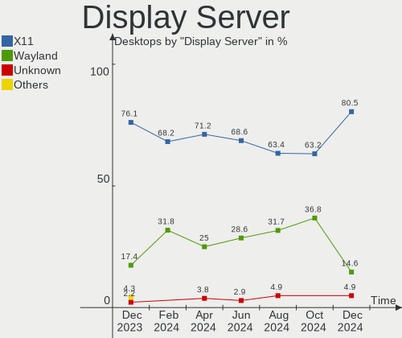
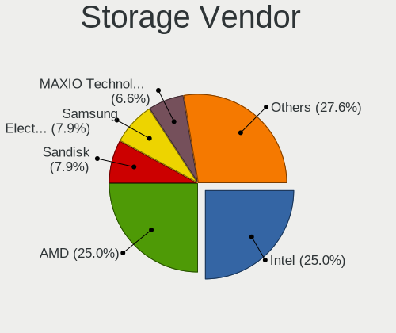
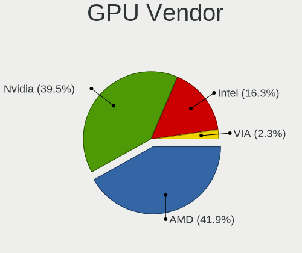

Manjaro Hardware Trends (Desktop)
---------------------------------

A project to identify most popular hardware characteristics and track their change
over time based on data collected by Manjaro users at https://Linux-Hardware.org.

Anyone can contribute to the study by uploading probes of their computers by
the [hw-probe](https://github.com/linuxhw/hw-probe) tool:

    sudo -E hw-probe -all -upload

Full-feature report is available here: https://linux-hardware.org/?view=trends&formfactor=desktop

Period: May, 2020.

Contents
--------

- [ OS                       ](#os)
- [ OS Family                ](#os-family)
- [ Kernel                   ](#kernel)
- [ Kernel Family            ](#kernel-family)
- [ Kernel Major Ver.        ](#kernel-major-ver)
- [ Arch                     ](#arch)
- [ DE                       ](#de)
- [ Display Server           ](#display-server)
- [ Display Manager          ](#display-manager)
- [ OS Lang                  ](#os-lang)
- [ Boot Mode                ](#boot-mode)
- [ Filesystem               ](#filesystem)
- [ Part. scheme             ](#part-scheme)
- [ Dual Boot with Linux/BSD ](#dual-boot-with-linux/bsd)
- [ Dual Boot (Win)          ](#dual-boot-win)
- [ Country                  ](#country)
- [ City                     ](#city)
- [ Vendor                   ](#vendor)
- [ Model                    ](#model)
- [ Model Family             ](#model-family)
- [ MFG Year                 ](#mfg-year)
- [ Form Factor              ](#form-factor)
- [ Secure Boot              ](#secure-boot)
- [ Coreboot                 ](#coreboot)
- [ RAM Size                 ](#ram-size)
- [ RAM Used                 ](#ram-used)
- [ Drive Vendor             ](#drive-vendor)
- [ Drive Model              ](#drive-model)
- [ Drive Kind               ](#drive-kind)
- [ Drive Connector          ](#drive-connector)
- [ Drive Size               ](#drive-size)
- [ Space Total              ](#space-total)
- [ Space Used               ](#space-used)
- [ Malfunc. Drives          ](#malfunc-drives)
- [ Malfunc. Drive Vendor    ](#malfunc-drive-vendor)
- [ Malfunc. HDD Vendor      ](#malfunc-hdd-vendor)
- [ Malfunc. Drive Kind      ](#malfunc-drive-kind)
- [ Failed Drives            ](#failed-drives)
- [ Failed Drive Vendor      ](#failed-drive-vendor)
- [ Drive Status             ](#drive-status)
- [ Storage Vendor           ](#storage-vendor)
- [ Storage Model            ](#storage-model)
- [ Storage Kind             ](#storage-kind)
- [ CPU Vendor               ](#cpu-vendor)
- [ CPU Model                ](#cpu-model)
- [ CPU Model Family         ](#cpu-model-family)
- [ CPU Cores                ](#cpu-cores)
- [ CPU Sockets              ](#cpu-sockets)
- [ CPU Threads              ](#cpu-threads)
- [ CPU Op-Modes             ](#cpu-op-modes)
- [ CPU Microcode            ](#cpu-microcode)
- [ CPU Microarch            ](#cpu-microarch)
- [ GPU Vendor               ](#gpu-vendor)
- [ GPU Model                ](#gpu-model)
- [ GPU Combo                ](#gpu-combo)
- [ GPU Driver               ](#gpu-driver)
- [ GPU Memory               ](#gpu-memory)
- [ Monitor Vendor           ](#monitor-vendor)
- [ Monitor Model            ](#monitor-model)
- [ Monitor Resolution       ](#monitor-resolution)
- [ Monitor Diagonal         ](#monitor-diagonal)
- [ Monitor Width            ](#monitor-width)
- [ Aspect Ratio             ](#aspect-ratio)
- [ Monitor Area             ](#monitor-area)
- [ Pixel Density            ](#pixel-density)
- [ Multiple Monitors        ](#multiple-monitors)
- [ Net Controller Vendor    ](#net-controller-vendor)
- [ Net Controller Model     ](#net-controller-model)
- [ Wireless Vendor          ](#wireless-vendor)
- [ Wireless Model           ](#wireless-model)
- [ Ethernet Vendor          ](#ethernet-vendor)
- [ Ethernet Model           ](#ethernet-model)
- [ Net Controller Kind      ](#net-controller-kind)
- [ Used Controller          ](#used-controller)
- [ NICs                     ](#nics)
- [ Bluetooth Vendor         ](#bluetooth-vendor)
- [ Bluetooth Model          ](#bluetooth-model)
- [ Unsupported Devices      ](#unsupported-devices)
- [ Unsupported Device Types ](#unsupported-device-types)

OS
--

Installed operating systems

| Name           | Computers | Percent |
|----------------|-----------|---------|
| Manjaro        | 39        | 54.17%  |
| Manjaro 20.0.1 | 24        | 33.33%  |
| Manjaro 20.0   | 7         | 9.72%   |
| Manjaro 20.0.2 | 2         | 2.78%   |

OS Family
---------

OS without a version

| Name    | Computers | Percent |
|---------|-----------|---------|
| Manjaro | 72        | 100%    |

Kernel
------

Version of the Linux kernel

| Version             | Computers | Percent |
|---------------------|-----------|---------|
| 5.6.12-1-MANJARO    | 21        | 29.17%  |
| 5.6.7-1-MANJARO     | 12        | 16.67%  |
| 5.6.11-1-MANJARO    | 11        | 15.28%  |
| 5.7.0-1-MANJARO     | 5         | 6.94%   |
| 5.6.8-1-MANJARO     | 4         | 5.56%   |
| 5.4.40-1-MANJARO    | 3         | 4.17%   |
| 5.6.10-3-MANJARO    | 2         | 2.78%   |
| 5.4.39-1-MANJARO    | 2         | 2.78%   |
| 5.4.36-1-MANJARO    | 2         | 2.78%   |
| 5.4.35-1-MANJARO    | 2         | 2.78%   |
| 5.6.6-1-MANJARO     | 1         | 1.39%   |
| 5.6.4-1-rt3-MANJARO | 1         | 1.39%   |
| 5.6.15-1-MANJARO    | 1         | 1.39%   |
| 5.6.12-27-tkg-pds   | 1         | 1.39%   |
| 5.6.10-1-MANJARO    | 1         | 1.39%   |
| 5.5.19-1-MANJARO    | 1         | 1.39%   |
| 5.4.38-1-MANJARO    | 1         | 1.39%   |
| 5.4.24-1-MANJARO    | 1         | 1.39%   |

Kernel Family
-------------

Linux kernel without a distro release

| Version | Computers | Percent |
|---------|-----------|---------|
| 5.6.12  | 22        | 30.56%  |
| 5.6.7   | 12        | 16.67%  |
| 5.6.11  | 11        | 15.28%  |
| 5.7.0   | 5         | 6.94%   |
| 5.6.8   | 4         | 5.56%   |
| 5.6.10  | 3         | 4.17%   |
| 5.4.40  | 3         | 4.17%   |
| 5.4.39  | 2         | 2.78%   |
| 5.4.36  | 2         | 2.78%   |
| 5.4.35  | 2         | 2.78%   |
| 5.6.6   | 1         | 1.39%   |
| 5.6.4   | 1         | 1.39%   |
| 5.6.15  | 1         | 1.39%   |
| 5.5.19  | 1         | 1.39%   |
| 5.4.38  | 1         | 1.39%   |
| 5.4.24  | 1         | 1.39%   |

Kernel Major Ver.
-----------------

Linux kernel major version

| Version | Computers | Percent |
|---------|-----------|---------|
| 5.6     | 55        | 76.39%  |
| 5.4     | 11        | 15.28%  |
| 5.7     | 5         | 6.94%   |
| 5.5     | 1         | 1.39%   |

Arch
----

OS architecture (x86_64, i586, etc.)

| Name   | Computers | Percent |
|--------|-----------|---------|
| x86_64 | 72        | 100%    |

DE
--

Desktop Environment

| Name       | Computers | Percent |
|------------|-----------|---------|
| KDE        | 19        | 26.39%  |
| XFCE       | 18        | 25%     |
| GNOME      | 14        | 19.44%  |
| KDE5       | 10        | 13.89%  |
| X-Cinnamon | 3         | 4.17%   |
| MATE       | 3         | 4.17%   |
| Deepin     | 2         | 2.78%   |
| Cinnamon   | 2         | 2.78%   |
| LXQt       | 1         | 1.39%   |

Display Server
--------------

X11 or Wayland

| Name    | Computers | Percent |
|---------|-----------|---------|
| X11     | 70        | 97.22%  |
| Wayland | 2         | 2.78%   |

Display Manager
---------------

SDDM, LightDM, etc.

| Name    | Computers | Percent |
|---------|-----------|---------|
| Unknown | 39        | 54.17%  |
| LightDM | 17        | 23.61%  |
| SDDM    | 8         | 11.11%  |
| GDM     | 8         | 11.11%  |

OS Lang
-------

Language

| Lang       | Computers | Percent |
|------------|-----------|---------|
| en_US      | 18        | 25%     |
| en_US.utf8 | 6         | 8.33%   |
| de_DE      | 6         | 8.33%   |
| ru_RU      | 5         | 6.94%   |
| en_GB      | 5         | 6.94%   |
| uk_UA      | 3         | 4.17%   |
| pt_BR      | 3         | 4.17%   |
| de_DE.utf8 | 3         | 4.17%   |
| pl_PL      | 2         | 2.78%   |
| it_IT      | 2         | 2.78%   |
| en_NZ.utf8 | 2         | 2.78%   |
| en_AU      | 2         | 2.78%   |
| da_DK      | 2         | 2.78%   |
| pt_BR.utf8 | 1         | 1.39%   |
| pl_PL.utf8 | 1         | 1.39%   |
| hu_HU.utf8 | 1         | 1.39%   |
| hu_HU      | 1         | 1.39%   |
| fr_FR      | 1         | 1.39%   |
| fi_FI      | 1         | 1.39%   |
| es_ES      | 1         | 1.39%   |
| es_AR.utf8 | 1         | 1.39%   |
| en_ZA      | 1         | 1.39%   |
| en_NZ      | 1         | 1.39%   |
| en_GB.utf8 | 1         | 1.39%   |
| en_DK      | 1         | 1.39%   |
| de_AT.utf8 | 1         | 1.39%   |

Boot Mode
---------

EFI or BIOS

| Mode | Computers | Percent |
|------|-----------|---------|
| BIOS | 53        | 73.61%  |
| EFI  | 19        | 26.39%  |

Filesystem
----------

Type of filesystem

| Type    | Computers | Percent |
|---------|-----------|---------|
| Ext4    | 64        | 88.89%  |
| Btrfs   | 3         | 4.17%   |
| Xfs     | 2         | 2.78%   |
| Ext2    | 2         | 2.78%   |
| Overlay | 1         | 1.39%   |

Part. scheme
------------

Scheme of partitioning

| Type    | Computers | Percent |
|---------|-----------|---------|
| Unknown | 50        | 69.44%  |
| GPT     | 16        | 22.22%  |
| MBR     | 6         | 8.33%   |

Dual Boot with Linux/BSD
------------------------

Hosting more than one Linux/BSD

| Dual boot | Computers | Percent |
|-----------|-----------|---------|
| No        | 55        | 76.39%  |
| Yes       | 17        | 23.61%  |

Dual Boot (Win)
---------------

Hosting Linux and Windows

| Dual boot | Computers | Percent |
|-----------|-----------|---------|
| No        | 39        | 54.17%  |
| Yes       | 33        | 45.83%  |

Country
-------

Geographic location (country)

| Country      | Computers | Percent |
|--------------|-----------|---------|
| USA          | 12        | 16.67%  |
| Germany      | 12        | 16.67%  |
| Italy        | 5         | 6.94%   |
| Russia       | 4         | 5.56%   |
| Poland       | 4         | 5.56%   |
| Brazil       | 4         | 5.56%   |
| Ukraine      | 3         | 4.17%   |
| New Zealand  | 3         | 4.17%   |
| Hungary      | 3         | 4.17%   |
| Denmark      | 3         | 4.17%   |
| Belgium      | 3         | 4.17%   |
| UK           | 2         | 2.78%   |
| Spain        | 2         | 2.78%   |
| South Africa | 2         | 2.78%   |
| Belarus      | 2         | 2.78%   |
| Australia    | 2         | 2.78%   |
| Romania      | 1         | 1.39%   |
| Pakistan     | 1         | 1.39%   |
| France       | 1         | 1.39%   |
| Finland      | 1         | 1.39%   |
| Austria      | 1         | 1.39%   |
| Argentina    | 1         | 1.39%   |

City
----

Geographic location (city)

| City                  | Computers | Percent |
|-----------------------|-----------|---------|
| Warsaw                | 2         | 2.78%   |
| Oordegem              | 2         | 2.78%   |
| Kropyvnytskyi         | 2         | 2.78%   |
| Copenhagen            | 2         | 2.78%   |
| Érd                  | 1         | 1.39%   |
| Zhlobin               | 1         | 1.39%   |
| Yegor'yevsk           | 1         | 1.39%   |
| West Frankfort        | 1         | 1.39%   |
| Wellington            | 1         | 1.39%   |
| Vienna                | 1         | 1.39%   |
| Varese                | 1         | 1.39%   |
| Tuusula               | 1         | 1.39%   |
| Theilheim             | 1         | 1.39%   |
| São Paulo            | 1         | 1.39%   |
| Szekszárd            | 1         | 1.39%   |
| Syktyvkar             | 1         | 1.39%   |
| Stuttgart             | 1         | 1.39%   |
| Southampton           | 1         | 1.39%   |
| Sant'Angelo Lodigiano | 1         | 1.39%   |
| Sangerhausen          | 1         | 1.39%   |
| Saginaw               | 1         | 1.39%   |
| Rio Pardo             | 1         | 1.39%   |
| Reutlingen            | 1         | 1.39%   |
| Pretoria              | 1         | 1.39%   |
| Portland              | 1         | 1.39%   |
| Plano                 | 1         | 1.39%   |
| Oberndorf             | 1         | 1.39%   |
| Novara                | 1         | 1.39%   |
| Nelson                | 1         | 1.39%   |
| Miramar               | 1         | 1.39%   |
| Miami                 | 1         | 1.39%   |
| Lübeck               | 1         | 1.39%   |
| Lins                  | 1         | 1.39%   |
| Krasnogorsk           | 1         | 1.39%   |
| Kherson               | 1         | 1.39%   |
| Karachi               | 1         | 1.39%   |
| Hunters Hill          | 1         | 1.39%   |
| Heusden               | 1         | 1.39%   |
| Herten                | 1         | 1.39%   |
| Hamilton              | 1         | 1.39%   |
| Glazov                | 1         | 1.39%   |
| Georgetown            | 1         | 1.39%   |
| Fredensborg           | 1         | 1.39%   |
| Frankfurt am Main     | 1         | 1.39%   |
| Fair Oaks             | 1         | 1.39%   |
| El Paso               | 1         | 1.39%   |
| Düsseldorf           | 1         | 1.39%   |
| Dortmund              | 1         | 1.39%   |
| Demorest              | 1         | 1.39%   |
| Częstochowa          | 1         | 1.39%   |
| Crailsheim            | 1         | 1.39%   |
| Contagem              | 1         | 1.39%   |
| Clichy-sous-Bois      | 1         | 1.39%   |
| Christchurch          | 1         | 1.39%   |
| Charsznica            | 1         | 1.39%   |
| Champaign             | 1         | 1.39%   |
| Cecina                | 1         | 1.39%   |
| Cape Town             | 1         | 1.39%   |
| Canoga Park           | 1         | 1.39%   |
| Buena Park            | 1         | 1.39%   |

Vendor
------

Motherboard manufacturer

| Name                | Computers | Percent |
|---------------------|-----------|---------|
| ASUSTek Computer    | 23        | 31.94%  |
| Gigabyte Technology | 17        | 23.61%  |
| MSI                 | 9         | 12.5%   |
| ASRock              | 9         | 12.5%   |
| Dell                | 5         | 6.94%   |
| Hewlett-Packard     | 3         | 4.17%   |
| Acer                | 2         | 2.78%   |
| Lenovo              | 1         | 1.39%   |
| HARDKERNEL          | 1         | 1.39%   |
| Apple               | 1         | 1.39%   |
| Unknown             | 1         | 1.39%   |

Model
-----

Motherboard model

| Name                             | Computers | Percent |
|----------------------------------|-----------|---------|
| ASUS All Series                  | 4         | 5.56%   |
| ASUS ROG STRIX B450-E GAMING     | 2         | 2.78%   |
| ASRock 970 Pro3 R2.0             | 2         | 2.78%   |
| Acer Aspire TC-885               | 2         | 2.78%   |
| MSI MS-7C02                      | 1         | 1.39%   |
| MSI MS-7B90                      | 1         | 1.39%   |
| MSI MS-7B89                      | 1         | 1.39%   |
| MSI MS-7B86                      | 1         | 1.39%   |
| MSI MS-7B85                      | 1         | 1.39%   |
| MSI MS-7B79                      | 1         | 1.39%   |
| MSI MS-7A38                      | 1         | 1.39%   |
| MSI MS-7977                      | 1         | 1.39%   |
| MSI MS-7816                      | 1         | 1.39%   |
| Lenovo IdeaCentre K300           | 1         | 1.39%   |
| HP ProDesk 400 G1 SFF            | 1         | 1.39%   |
| HP Compaq Elite 8300 SFF         | 1         | 1.39%   |
| HP Compaq dc5850 Microtower      | 1         | 1.39%   |
| HARDKERNEL ODROID-H2             | 1         | 1.39%   |
| Gigabyte Z97X-Gaming 3           | 1         | 1.39%   |
| Gigabyte Z87-HD3                 | 1         | 1.39%   |
| Gigabyte Z270X-Ultra Gaming      | 1         | 1.39%   |
| Gigabyte Z170X-Gaming 7          | 1         | 1.39%   |
| Gigabyte X570 AORUS PRO WIFI     | 1         | 1.39%   |
| Gigabyte X570 AORUS PRO          | 1         | 1.39%   |
| Gigabyte X470 AORUS ULTRA GAMING | 1         | 1.39%   |
| Gigabyte H81M-S2PH               | 1         | 1.39%   |
| Gigabyte H77M-D3H                | 1         | 1.39%   |
| Gigabyte GA-78LMT-USB3 6.0       | 1         | 1.39%   |
| Gigabyte GA-78LMT-S2P            | 1         | 1.39%   |
| Gigabyte B450M GAMING            | 1         | 1.39%   |
| Gigabyte B450M DS3H              | 1         | 1.39%   |
| Gigabyte B450 AORUS ELITE        | 1         | 1.39%   |
| Gigabyte AB350-Gaming 3          | 1         | 1.39%   |
| Gigabyte 970A-UD3P               | 1         | 1.39%   |
| Gigabyte 970A-DS3P               | 1         | 1.39%   |
| Dell Vostro 200                  | 1         | 1.39%   |
| Dell Studio XPS 7100             | 1         | 1.39%   |
| Dell OptiPlex 9010               | 1         | 1.39%   |
| Dell OptiPlex 790                | 1         | 1.39%   |
| Dell OptiPlex 760                | 1         | 1.39%   |
| ASUS TUF GAMING X570-PLUS        | 1         | 1.39%   |
| ASUS SABERTOOTH 990FX R2.0       | 1         | 1.39%   |
| ASUS ROG STRIX X570-E GAMING     | 1         | 1.39%   |
| ASUS ROG Maximus XI FORMULA      | 1         | 1.39%   |
| ASUS PRIME X370-PRO              | 1         | 1.39%   |
| ASUS PRIME B450-PLUS             | 1         | 1.39%   |
| ASUS PRIME B350M-A               | 1         | 1.39%   |
| ASUS PRIME A320M-K               | 1         | 1.39%   |
| ASUS P8H61-M LX2 R2.0            | 1         | 1.39%   |
| ASUS P7P55D PRO                  | 1         | 1.39%   |
| ASUS P7H55-M                     | 1         | 1.39%   |
| ASUS P6X58D PREMIUM              | 1         | 1.39%   |
| ASUS M5A97 R2.0                  | 1         | 1.39%   |
| ASUS M5A78L-M PLUS/USB3          | 1         | 1.39%   |
| ASUS M4N78 PRO                   | 1         | 1.39%   |
| ASUS INCOM                       | 1         | 1.39%   |
| ASUS A8N5X                       | 1         | 1.39%   |
| ASRock X470 Taichi               | 1         | 1.39%   |
| ASRock X399 Phantom Gaming 6     | 1         | 1.39%   |
| ASRock FM2A55M-HD+               | 1         | 1.39%   |

Model Family
------------

Motherboard model prefix

| Name                   | Computers | Percent |
|------------------------|-----------|---------|
| ASUS ROG               | 4         | 5.56%   |
| ASUS PRIME             | 4         | 5.56%   |
| ASUS All               | 4         | 5.56%   |
| Dell OptiPlex          | 3         | 4.17%   |
| HP Compaq              | 2         | 2.78%   |
| Gigabyte X570          | 2         | 2.78%   |
| Gigabyte B450M         | 2         | 2.78%   |
| ASRock 970             | 2         | 2.78%   |
| Acer Aspire            | 2         | 2.78%   |
| MSI MS-7C02            | 1         | 1.39%   |
| MSI MS-7B90            | 1         | 1.39%   |
| MSI MS-7B89            | 1         | 1.39%   |
| MSI MS-7B86            | 1         | 1.39%   |
| MSI MS-7B85            | 1         | 1.39%   |
| MSI MS-7B79            | 1         | 1.39%   |
| MSI MS-7A38            | 1         | 1.39%   |
| MSI MS-7977            | 1         | 1.39%   |
| MSI MS-7816            | 1         | 1.39%   |
| Lenovo IdeaCentre      | 1         | 1.39%   |
| HP ProDesk             | 1         | 1.39%   |
| HARDKERNEL ODROID-H2   | 1         | 1.39%   |
| Gigabyte Z97X-Gaming   | 1         | 1.39%   |
| Gigabyte Z87-HD3       | 1         | 1.39%   |
| Gigabyte Z270X-Ultra   | 1         | 1.39%   |
| Gigabyte Z170X-Gaming  | 1         | 1.39%   |
| Gigabyte X470          | 1         | 1.39%   |
| Gigabyte H81M-S2PH     | 1         | 1.39%   |
| Gigabyte H77M-D3H      | 1         | 1.39%   |
| Gigabyte GA-78LMT-USB3 | 1         | 1.39%   |
| Gigabyte GA-78LMT-S2P  | 1         | 1.39%   |
| Gigabyte B450          | 1         | 1.39%   |
| Gigabyte AB350-Gaming  | 1         | 1.39%   |
| Gigabyte 970A-UD3P     | 1         | 1.39%   |
| Gigabyte 970A-DS3P     | 1         | 1.39%   |
| Dell Vostro            | 1         | 1.39%   |
| Dell Studio            | 1         | 1.39%   |
| ASUS TUF               | 1         | 1.39%   |
| ASUS SABERTOOTH        | 1         | 1.39%   |
| ASUS P8H61-M           | 1         | 1.39%   |
| ASUS P7P55D            | 1         | 1.39%   |
| ASUS P7H55-M           | 1         | 1.39%   |
| ASUS P6X58D            | 1         | 1.39%   |
| ASUS M5A97             | 1         | 1.39%   |
| ASUS M5A78L-M          | 1         | 1.39%   |
| ASUS M4N78             | 1         | 1.39%   |
| ASUS INCOM             | 1         | 1.39%   |
| ASUS A8N5X             | 1         | 1.39%   |
| ASRock X470            | 1         | 1.39%   |
| ASRock X399            | 1         | 1.39%   |
| ASRock FM2A55M-HD+     | 1         | 1.39%   |
| ASRock B450M           | 1         | 1.39%   |
| ASRock B450            | 1         | 1.39%   |
| ASRock AB350           | 1         | 1.39%   |
| ASRock 980DE3          | 1         | 1.39%   |
| Apple MacPro6          | 1         | 1.39%   |
| Unknown                | 1         | 1.39%   |

MFG Year
--------

Motherboard manufacture year

| Year    | Computers | Percent |
|---------|-----------|---------|
| 2019    | 23        | 31.94%  |
| 2014    | 9         | 12.5%   |
| 2020    | 7         | 9.72%   |
| 2018    | 6         | 8.33%   |
| 2017    | 5         | 6.94%   |
| 2016    | 5         | 6.94%   |
| 2011    | 4         | 5.56%   |
| 2010    | 4         | 5.56%   |
| 2015    | 3         | 4.17%   |
| 2012    | 2         | 2.78%   |
| 2013    | 1         | 1.39%   |
| 2008    | 1         | 1.39%   |
| 2006    | 1         | 1.39%   |
| Unknown | 1         | 1.39%   |

Form Factor
-----------

Physical design of the computer

| Name    | Computers | Percent |
|---------|-----------|---------|
| Desktop | 72        | 100%    |

Secure Boot
-----------

Enabled or disabled

| State    | Computers | Percent |
|----------|-----------|---------|
| Disabled | 72        | 100%    |

Coreboot
--------

Have coreboot on board

| Used | Computers | Percent |
|------|-----------|---------|
| No   | 72        | 100%    |

RAM Size
--------

Total RAM memory

| Size in GB | Computers | Percent |
|------------|-----------|---------|
| 16.01-24.0 | 31        | 43.06%  |
| 8.01-16.0  | 18        | 25%     |
| 4.01-8.0   | 9         | 12.5%   |
| 32.01-64.0 | 9         | 12.5%   |
| 3.01-4.0   | 4         | 5.56%   |
| 1.01-2.0   | 1         | 1.39%   |

RAM Used
--------

Used RAM memory

| Used GB    | Computers | Percent |
|------------|-----------|---------|
| 1.01-2.0   | 25        | 34.72%  |
| 4.01-8.0   | 14        | 19.44%  |
| 2.01-3.0   | 12        | 16.67%  |
| 3.01-4.0   | 10        | 13.89%  |
| 8.01-16.0  | 6         | 8.33%   |
| 0.01-1.0   | 4         | 5.56%   |
| 16.01-24.0 | 1         | 1.39%   |

Drive Vendor
------------

Hard drive vendors

| Vendor              | Computers | Drives | Percent |
|---------------------|-----------|--------|---------|
| WDC                 | 35        | 46     | 22.58%  |
| Seagate             | 32        | 44     | 20.65%  |
| Samsung Electronics | 23        | 31     | 14.84%  |
| Kingston            | 15        | 17     | 9.68%   |
| Toshiba             | 8         | 9      | 5.16%   |
| SanDisk             | 4         | 4      | 2.58%   |
| Unknown             | 3         | 3      | 1.94%   |
| SPCC                | 3         | 3      | 1.94%   |
| Intenso             | 3         | 3      | 1.94%   |
| Hitachi             | 3         | 3      | 1.94%   |
| HGST                | 3         | 5      | 1.94%   |
| Crucial             | 3         | 3      | 1.94%   |
| A-DATA Technology   | 3         | 4      | 1.94%   |
| PNY                 | 2         | 2      | 1.29%   |
| PLEXTOR             | 2         | 2      | 1.29%   |
| Lexar               | 2         | 2      | 1.29%   |
| Intel               | 2         | 2      | 1.29%   |
| Apple               | 2         | 2      | 1.29%   |
| Transcend           | 1         | 1      | 0.65%   |
| SABRENT             | 1         | 1      | 0.65%   |
| Mushkin             | 1         | 1      | 0.65%   |
| Micron Technology   | 1         | 1      | 0.65%   |
| LITEON              | 1         | 1      | 0.65%   |
| Hewlett-Packard     | 1         | 1      | 0.65%   |
| Apacer              | 1         | 1      | 0.65%   |

Drive Model
-----------

Hard drive models

| Model                        | Computers | Percent |
|------------------------------|-----------|---------|
| SA400S37120G 120GB SSD       | 5         | 2.6%    |
| SV300S37A120G 120GB SSD      | 4         | 2.08%   |
| SSD 860 EVO 500GB            | 4         | 2.08%   |
| SSD 850 EVO 500GB            | 4         | 2.08%   |
| WD20EZRZ-00Z5HB0 2TB         | 3         | 1.56%   |
| SSD 840 EVO 120GB            | 3         | 1.56%   |
| SA400S37240G 240GB SSD       | 3         | 1.56%   |
| WD5000AACS-00G8B1 500GB      | 2         | 1.04%   |
| WD30EZRX-00DC0B0 3TB         | 2         | 1.04%   |
| WD15EARS-00MVWB0 1TB         | 2         | 1.04%   |
| WD10EZEX-00WN4A0 1TB         | 2         | 1.04%   |
| ST500DM002-1BD142 500GB      | 2         | 1.04%   |
| ST4000DM004-2CV104 4TB       | 2         | 1.04%   |
| ST4000DM000-1F2168 4TB       | 2         | 1.04%   |
| ST3320620AS 320GB            | 2         | 1.04%   |
| ST31000528AS 1TB             | 2         | 1.04%   |
| ST31000524AS 1TB             | 2         | 1.04%   |
| ST1000DM003-9YN162 1TB       | 2         | 1.04%   |
| ST1000DM003-1ER162 1TB       | 2         | 1.04%   |
| SSD 860 EVO M.2 250GB        | 2         | 1.04%   |
| SSD 860 EVO 1TB              | 2         | 1.04%   |
| SSD 750 EVO 250GB            | 2         | 1.04%   |
| SD/MMC/MS PRO 32GB           | 2         | 1.04%   |
| RBUSNS8180S3128GI 128GB SSD  | 2         | 1.04%   |
| DT01ACA100 1TB               | 2         | 1.04%   |
| CT1000MX500SSD1 1TB          | 2         | 1.04%   |
| CS900 120GB SSD              | 2         | 1.04%   |
| 512GB SSD                    | 2         | 1.04%   |
| WDS500G2B0A-00SM50 500GB SSD | 1         | 0.52%   |
| WDS250G2X0C-00L350 250GB     | 1         | 0.52%   |
| WDS100T2B0B-00YS70 1TB SSD   | 1         | 0.52%   |
| WDS100T2B0A-00SM50 1TB SSD   | 1         | 0.52%   |
| WD800JD-75MSA3 80GB          | 1         | 0.52%   |
| WD800AAJS-70TDA1 80GB        | 1         | 0.52%   |
| WD7501AALS-00J7B0 752GB      | 1         | 0.52%   |
| WD6400AAKS-65Z7B0 640GB      | 1         | 0.52%   |
| WD6400AAKS-65A7B2 640GB      | 1         | 0.52%   |
| WD6400AAKS-00A7B2 640GB      | 1         | 0.52%   |
| WD5001FZWX-00ZHUA0 5TB       | 1         | 0.52%   |
| WD5000LPCX-22VHAT0 500GB     | 1         | 0.52%   |
| WD5000AAKX-22ERMA0 500GB     | 1         | 0.52%   |
| WD5000AADS-00S9B0 500GB      | 1         | 0.52%   |
| WD40EFRX-68WT0N0 4TB         | 1         | 0.52%   |
| WD30EFRX-68EUZN0 3TB         | 1         | 0.52%   |
| WD3000HLFS-01G6U3 304GB      | 1         | 0.52%   |
| WD20PURZ-85GU6Y0 2TB         | 1         | 0.52%   |
| WD20EURS-63S48Y0 2TB         | 1         | 0.52%   |
| WD20EARX-00PASB0 2TB         | 1         | 0.52%   |
| WD20EARX-008FB0 2TB          | 1         | 0.52%   |
| WD20EADS-00W4B0 2TB          | 1         | 0.52%   |
| WD20EADS-00R6B0 2TB          | 1         | 0.52%   |
| WD1600AAJS-07M0A0 160GB      | 1         | 0.52%   |
| WD1600AAJS-00WAA0 160GB      | 1         | 0.52%   |
| WD15EARS-00J2GB0 1TB         | 1         | 0.52%   |
| WD10SPZX-22Z10T0 1TB         | 1         | 0.52%   |
| WD10EZEX-22MFCA0 1TB         | 1         | 0.52%   |
| WD10EZEX-08WN4A0 1TB         | 1         | 0.52%   |
| WD10EZEX-00RKKA0 1TB         | 1         | 0.52%   |
| WD10EZEX-00BN5A0 1TB         | 1         | 0.52%   |
| WD10EFRX-68PJCN0 1TB         | 1         | 0.52%   |

Drive Kind
----------

HDD or SSD

| Kind    | Computers | Drives | Percent |
|---------|-----------|--------|---------|
| SSD     | 53        | 70     | 45.69%  |
| HDD     | 53        | 110    | 45.69%  |
| NVMe    | 5         | 7      | 4.31%   |
| Unknown | 4         | 4      | 3.45%   |
| MMC     | 1         | 1      | 0.86%   |

Drive Connector
---------------

SATA, SAS, NVMe, etc.

| Type | Computers | Drives | Percent |
|------|-----------|--------|---------|
| SATA | 71        | 177    | 84.52%  |
| SAS  | 7         | 7      | 8.33%   |
| NVMe | 5         | 7      | 5.95%   |
| MMC  | 1         | 1      | 1.19%   |

Drive Size
----------

Size of hard drive

| Size in TB | Computers | Drives | Percent |
|------------|-----------|--------|---------|
| 0.01-0.5   | 58        | 92     | 41.73%  |
| 0.51-1.0   | 46        | 58     | 33.09%  |
| 1.01-2.0   | 16        | 22     | 11.51%  |
| 2.01-3.0   | 8         | 8      | 5.76%   |
| 3.01-4.0   | 7         | 7      | 5.04%   |
| 4.01-10.0  | 4         | 5      | 2.88%   |

Space Total
-----------

Amount of disk space available on the file system

| Size in GB     | Computers | Percent |
|----------------|-----------|---------|
| 101-250        | 15        | 20.83%  |
| 1001-2000      | 14        | 19.44%  |
| 501-1000       | 13        | 18.06%  |
| More than 3000 | 10        | 13.89%  |
| 251-500        | 9         | 12.5%   |
| 51-100         | 5         | 6.94%   |
| 2001-3000      | 4         | 5.56%   |
| 21-50          | 1         | 1.39%   |
| 1-20           | 1         | 1.39%   |

Space Used
----------

Amount of used disk space

| Used GB        | Computers | Percent |
|----------------|-----------|---------|
| 101-250        | 15        | 20.83%  |
| 1-20           | 12        | 16.67%  |
| 51-100         | 10        | 13.89%  |
| 501-1000       | 9         | 12.5%   |
| 251-500        | 8         | 11.11%  |
| 21-50          | 7         | 9.72%   |
| More than 3000 | 4         | 5.56%   |
| 1001-2000      | 4         | 5.56%   |
| 2001-3000      | 3         | 4.17%   |

Malfunc. Drives
---------------

Drive models with a malfunction

| Model                   | Computers | Drives | Percent |
|-------------------------|-----------|--------|---------|
| WD15EARS-00MVWB0 1TB    | 1         | 1      | 9.09%   |
| WD10EFRX-68PJCN0 1TB    | 1         | 1      | 9.09%   |
| WD10EARS-00Y5B1 1TB     | 1         | 1      | 9.09%   |
| WD1002FAEX-00Z3A0 1TB   | 1         | 1      | 9.09%   |
| ST8000VN0022-2EL112 8TB | 1         | 1      | 9.09%   |
| ST380013AS 80GB         | 1         | 1      | 9.09%   |
| ST2000DM001-1ER164 2TB  | 1         | 1      | 9.09%   |
| ST1000NM0033-9ZM173 1TB | 1         | 1      | 9.09%   |
| SSDSC2CT120A3 120GB     | 1         | 1      | 9.09%   |
| SSD 960 EVO 250GB       | 1         | 1      | 9.09%   |
| HD103UJ 1TB             | 1         | 1      | 9.09%   |

Malfunc. Drive Vendor
---------------------

Vendors of faulty drives

| Vendor              | Computers | Drives | Percent |
|---------------------|-----------|--------|---------|
| WDC                 | 4         | 4      | 40%     |
| Seagate             | 3         | 4      | 30%     |
| Samsung Electronics | 2         | 2      | 20%     |
| Intel               | 1         | 1      | 10%     |

Malfunc. HDD Vendor
-------------------

Vendors of faulty HDD drives

| Vendor              | Computers | Drives | Percent |
|---------------------|-----------|--------|---------|
| WDC                 | 4         | 4      | 50%     |
| Seagate             | 3         | 4      | 37.5%   |
| Samsung Electronics | 1         | 1      | 12.5%   |

Malfunc. Drive Kind
-------------------

Kinds of faulty drives

| Kind | Computers | Drives | Percent |
|------|-----------|--------|---------|
| HDD  | 8         | 9      | 80%     |
| NVMe | 1         | 1      | 10%     |
| SSD  | 1         | 1      | 10%     |

Failed Drives
-------------

Failed drive models

Zero info for selected period =(

Failed Drive Vendor
-------------------

Failed drive vendors

Zero info for selected period =(

Drive Status
------------

Number of failed and malfunc. drives

| Status   | Computers | Drives | Percent |
|----------|-----------|--------|---------|
| Detected | 46        | 121    | 56.79%  |
| Works    | 26        | 60     | 32.1%   |
| Malfunc  | 9         | 11     | 11.11%  |

Storage Vendor
--------------

Storage controller vendors

| Vendor                       | Computers | Percent |
|------------------------------|-----------|---------|
| AMD                          | 40        | 39.22%  |
| Intel                        | 30        | 29.41%  |
| ASMedia Technology           | 7         | 6.86%   |
| Samsung Electronics          | 6         | 5.88%   |
| Phison Electronics           | 4         | 3.92%   |
| Sandisk                      | 2         | 1.96%   |
| Nvidia                       | 2         | 1.96%   |
| Marvell Technology Group     | 2         | 1.96%   |
| VIA Technologies             | 1         | 0.98%   |
| Toshiba America Info Systems | 1         | 0.98%   |
| SK Hynix                     | 1         | 0.98%   |
| Silicon Motion               | 1         | 0.98%   |
| Silicon Image                | 1         | 0.98%   |
| Realtek Semiconductor        | 1         | 0.98%   |
| Micron Technology            | 1         | 0.98%   |
| Lite-On Technology           | 1         | 0.98%   |
| JMicron Technology           | 1         | 0.98%   |

Storage Model
-------------

Storage controller models

| Model                                                                             | Computers | Percent |
|-----------------------------------------------------------------------------------|-----------|---------|
| FCH SATA Controller [AHCI mode]                                                   | 28        | 19.44%  |
| 400 Series Chipset SATA Controller                                                | 17        | 11.81%  |
| SB7x0/SB8x0/SB9x0 SATA Controller [AHCI mode]                                     | 9         | 6.25%   |
| SB7x0/SB8x0/SB9x0 IDE Controller                                                  | 9         | 6.25%   |
| 8 Series/C220 Series Chipset Family 6-port SATA Controller 1 [AHCI mode]          | 8         | 5.56%   |
| ASM1062 Serial ATA Controller                                                     | 7         | 4.86%   |
| NVMe SSD Controller SM981/PM981/PM983                                             | 4         | 2.78%   |
| SB7x0/SB8x0/SB9x0 SATA Controller [IDE mode]                                      | 3         | 2.08%   |
| Non-Volatile memory controller                                                    | 3         | 2.08%   |
| E12 NVMe Controller                                                               | 3         | 2.08%   |
| Cannon Lake PCH SATA AHCI Controller                                              | 3         | 2.08%   |
| 300 Series Chipset SATA Controller                                                | 3         | 2.08%   |
| Q170/Q150/B150/H170/H110/Z170/CM236 Chipset SATA Controller [AHCI Mode]           | 2         | 1.39%   |
| 82801JI (ICH10 Family) SATA AHCI Controller                                       | 2         | 1.39%   |
| 5 Series/3400 Series Chipset 6 port SATA AHCI Controller                          | 2         | 1.39%   |
| X399 Series Chipset SATA Controller                                               | 1         | 0.69%   |
| X370 Series Chipset SATA Controller                                               | 1         | 0.69%   |
| WD Black 2018/PC SN720 NVMe SSD                                                   | 1         | 0.69%   |
| WD Black 2018/PC SN520 NVMe SSD                                                   | 1         | 0.69%   |
| VT6415 PATA IDE Host Controller                                                   | 1         | 0.69%   |
| SSD Pro 7600p/760p/E 6100p Series                                                 | 1         | 0.69%   |
| SSD 600P Series                                                                   | 1         | 0.69%   |
| SATA Controller [RAID mode]                                                       | 1         | 0.69%   |
| SATA controller                                                                   | 1         | 0.69%   |
| Realtek Non-Volatile memory controller                                            | 1         | 0.69%   |
| PCI0680 Ultra ATA-133 Host Controller                                             | 1         | 0.69%   |
| PC300 NVMe Solid State Drive 256GB                                                | 1         | 0.69%   |
| NVMe Storage Controller                                                           | 1         | 0.69%   |
| NVMe SSD Controller SM961/PM961                                                   | 1         | 0.69%   |
| NVMe SSD Controller SM951/PM951                                                   | 1         | 0.69%   |
| MCP78S [GeForce 8200] SATA Controller (non-AHCI mode)                             | 1         | 0.69%   |
| MCP78S [GeForce 8200] IDE                                                         | 1         | 0.69%   |
| JMB363 SATA/IDE Controller                                                        | 1         | 0.69%   |
| FCH SATA Controller D                                                             | 1         | 0.69%   |
| FCH IDE Controller                                                                | 1         | 0.69%   |
| Electronics SATA controller                                                       | 1         | 0.69%   |
| CK804 Serial ATA Controller                                                       | 1         | 0.69%   |
| CK804 IDE                                                                         | 1         | 0.69%   |
| BG3 NVMe SSD Controller                                                           | 1         | 0.69%   |
| 9 Series Chipset Family SATA Controller [AHCI Mode]                               | 1         | 0.69%   |
| 88SE914D SATA-600 Controller                                                      | 1         | 0.69%   |
| 88SE6101/6102 single-port PATA133 interface                                       | 1         | 0.69%   |
| 82801JI (ICH10 Family) 4 port SATA IDE Controller #1                              | 1         | 0.69%   |
| 82801JI (ICH10 Family) 2 port SATA IDE Controller #2                              | 1         | 0.69%   |
| 82801JD/DO (ICH10 Family) SATA AHCI Controller                                    | 1         | 0.69%   |
| 82801IR/IO/IH (ICH9R/DO/DH) 4 port SATA Controller [IDE mode]                     | 1         | 0.69%   |
| 82801I (ICH9 Family) 2 port SATA Controller [IDE mode]                            | 1         | 0.69%   |
| 7 Series/C210 Series Chipset Family 6-port SATA Controller [AHCI mode]            | 1         | 0.69%   |
| 7 Series/C210 Series Chipset Family 4-port SATA Controller [IDE mode]             | 1         | 0.69%   |
| 7 Series/C210 Series Chipset Family 2-port SATA Controller [IDE mode]             | 1         | 0.69%   |
| 6 Series/C200 Series Chipset Family Desktop SATA Controller (IDE mode, ports 4-5) | 1         | 0.69%   |
| 6 Series/C200 Series Chipset Family Desktop SATA Controller (IDE mode, ports 0-3) | 1         | 0.69%   |
| 6 Series/C200 Series Chipset Family 6 port Mobile SATA AHCI Controller            | 1         | 0.69%   |
| 6 Series/C200 Series Chipset Family 6 port Desktop SATA AHCI Controller           | 1         | 0.69%   |
| 4 Series Chipset PT IDER Controller                                               | 1         | 0.69%   |
| 200 Series PCH SATA controller [AHCI mode]                                        | 1         | 0.69%   |

Storage Kind
------------

Kind of storage controller (IDE, SATA, NVMe, SAS, ...)

| Kind | Computers | Percent |
|------|-----------|---------|
| SATA | 65        | 62.5%   |
| IDE  | 20        | 19.23%  |
| NVMe | 17        | 16.35%  |
| RAID | 2         | 1.92%   |

CPU Vendor
----------

Processor vendors

| Vendor | Computers | Percent |
|--------|-----------|---------|
| AMD    | 42        | 58.33%  |
| Intel  | 30        | 41.67%  |

CPU Model
---------

Processor models

| Model                                         | Computers | Percent |
|-----------------------------------------------|-----------|---------|
| AMD FX-8350 Eight-Core Processor              | 5         | 6.94%   |
| AMD Ryzen 5 3600 6-Core Processor             | 4         | 5.56%   |
| AMD Ryzen 7 2700X Eight-Core Processor        | 3         | 4.17%   |
| AMD Ryzen 5 2600 Six-Core Processor           | 3         | 4.17%   |
| Intel Core i7-8700 CPU @ 3.20GHz              | 2         | 2.78%   |
| Intel Core i5-4670K CPU @ 3.40GHz             | 2         | 2.78%   |
| Intel Core i5-3470 CPU @ 3.20GHz              | 2         | 2.78%   |
| Intel Core 2 Duo CPU E8400 @ 3.00GHz          | 2         | 2.78%   |
| AMD Ryzen 7 3700X 8-Core Processor            | 2         | 2.78%   |
| AMD Ryzen 7 2700 Eight-Core Processor         | 2         | 2.78%   |
| AMD Ryzen 7 1700X Eight-Core Processor        | 2         | 2.78%   |
| AMD FX-6300 Six-Core Processor                | 2         | 2.78%   |
| Intel Xeon CPU E5450 @ 3.00GHz                | 1         | 1.39%   |
| Intel Xeon CPU E5-2420 v2 @ 2.20GHz           | 1         | 1.39%   |
| Intel Xeon CPU E5-1620 v2 @ 3.70GHz           | 1         | 1.39%   |
| Intel Pentium Dual-Core CPU E5800 @ 3.20GHz   | 1         | 1.39%   |
| Intel Pentium CPU G3220 @ 3.00GHz             | 1         | 1.39%   |
| Intel Core i7-8086K CPU @ 4.00GHz             | 1         | 1.39%   |
| Intel Core i7-6700K CPU @ 4.00GHz             | 1         | 1.39%   |
| Intel Core i7-4790 CPU @ 3.60GHz              | 1         | 1.39%   |
| Intel Core i7-4771 CPU @ 3.50GHz              | 1         | 1.39%   |
| Intel Core i7-3770S CPU @ 3.10GHz             | 1         | 1.39%   |
| Intel Core i7-3770 CPU @ 3.40GHz              | 1         | 1.39%   |
| Intel Core i7 CPU 950 @ 3.07GHz               | 1         | 1.39%   |
| Intel Core i5-7600K CPU @ 3.80GHz             | 1         | 1.39%   |
| Intel Core i5-6600K CPU @ 3.50GHz             | 1         | 1.39%   |
| Intel Core i5-4670 CPU @ 3.40GHz              | 1         | 1.39%   |
| Intel Core i5-4590 CPU @ 3.30GHz              | 1         | 1.39%   |
| Intel Core i5-4440 CPU @ 3.10GHz              | 1         | 1.39%   |
| Intel Core i5-2400 CPU @ 3.10GHz              | 1         | 1.39%   |
| Intel Core i5 CPU 750 @ 2.67GHz               | 1         | 1.39%   |
| Intel Core i3-4160 CPU @ 3.60GHz              | 1         | 1.39%   |
| Intel Core i3 CPU 550 @ 3.20GHz               | 1         | 1.39%   |
| Intel Celeron J4105 CPU @ 1.50GHz             | 1         | 1.39%   |
| AMD Ryzen Threadripper 1900X 8-Core Processor | 1         | 1.39%   |
| AMD Ryzen 7 1700 Eight-Core Processor         | 1         | 1.39%   |
| AMD Ryzen 5 3600X 6-Core Processor            | 1         | 1.39%   |
| AMD Ryzen 5 3500 6-Core Processor             | 1         | 1.39%   |
| AMD Ryzen 5 2600X Six-Core Processor          | 1         | 1.39%   |
| AMD Ryzen 5 2500X Quad-Core Processor         | 1         | 1.39%   |
| AMD Ryzen 5 2400G with Radeon Vega Graphics   | 1         | 1.39%   |
| AMD Ryzen 5 1400 Quad-Core Processor          | 1         | 1.39%   |
| AMD Ryzen 3 3200G with Radeon Vega Graphics   | 1         | 1.39%   |
| AMD Ryzen 3 1200 Quad-Core Processor          | 1         | 1.39%   |
| AMD Phenom II X6 1045T Processor              | 1         | 1.39%   |
| AMD Phenom II X4 905e Processor               | 1         | 1.39%   |
| AMD FX-8370 Eight-Core Processor              | 1         | 1.39%   |
| AMD FX-8320 Eight-Core Processor              | 1         | 1.39%   |
| AMD Athlon II X3 445 Processor                | 1         | 1.39%   |
| AMD Athlon II X2 250 Processor                | 1         | 1.39%   |
| AMD Athlon 64 Processor 3000+                 | 1         | 1.39%   |
| AMD A8-9600 RADEON R7, 10 COMPUTE CORES 4C+6G | 1         | 1.39%   |
| AMD A4-5300 APU with Radeon HD Graphics       | 1         | 1.39%   |

CPU Model Family
----------------

Processor model prefix

| Model                   | Computers | Percent |
|-------------------------|-----------|---------|
| AMD Ryzen 5             | 13        | 18.06%  |
| Intel Core i5           | 11        | 15.28%  |
| AMD Ryzen 7             | 10        | 13.89%  |
| Intel Core i7           | 9         | 12.5%   |
| AMD FX                  | 9         | 12.5%   |
| Intel Xeon              | 3         | 4.17%   |
| Intel Core i3           | 2         | 2.78%   |
| Intel Core 2 Duo        | 2         | 2.78%   |
| AMD Ryzen 3             | 2         | 2.78%   |
| Intel Pentium Dual-Core | 1         | 1.39%   |
| Intel Pentium           | 1         | 1.39%   |
| Intel Celeron           | 1         | 1.39%   |
| AMD Ryzen Threadripper  | 1         | 1.39%   |
| AMD Phenom II X6        | 1         | 1.39%   |
| AMD Phenom II X4        | 1         | 1.39%   |
| AMD Athlon II X3        | 1         | 1.39%   |
| AMD Athlon II X2        | 1         | 1.39%   |
| AMD Athlon 64           | 1         | 1.39%   |
| AMD A8                  | 1         | 1.39%   |
| AMD A4                  | 1         | 1.39%   |

CPU Cores
---------

Number of processor cores

| Number | Computers | Percent |
|--------|-----------|---------|
| 4      | 33        | 45.83%  |
| 6      | 15        | 20.83%  |
| 8      | 11        | 15.28%  |
| 2      | 8         | 11.11%  |
| 3      | 3         | 4.17%   |
| 1      | 2         | 2.78%   |

CPU Sockets
-----------

Number of sockets

| Number | Computers | Percent |
|--------|-----------|---------|
| 1      | 72        | 100%    |

CPU Threads
-----------

Threads per core (Hyper-Threading)

| Number | Computers | Percent |
|--------|-----------|---------|
| 2      | 47        | 65.28%  |
| 1      | 25        | 34.72%  |

CPU Op-Modes
------------

CPU Operation Modes (32-bit, 64-bit)

| Op mode        | Computers | Percent |
|----------------|-----------|---------|
| 32-bit, 64-bit | 72        | 100%    |

CPU Microcode
-------------

Microcode number

| Number     | Computers | Percent |
|------------|-----------|---------|
| Unknown    | 44        | 61.11%  |
| 0x0800820d | 8         | 11.11%  |
| 0x06000852 | 4         | 5.56%   |
| 0x08701013 | 2         | 2.78%   |
| 0x506e3    | 1         | 1.39%   |
| 0x306e4    | 1         | 1.39%   |
| 0x306c3    | 1         | 1.39%   |
| 0x306a9    | 1         | 1.39%   |
| 0x20655    | 1         | 1.39%   |
| 0x106a5    | 1         | 1.39%   |
| 0x1067a    | 1         | 1.39%   |
| 0x08101016 | 1         | 1.39%   |
| 0x08001138 | 1         | 1.39%   |
| 0x08001137 | 1         | 1.39%   |
| 0x08001129 | 1         | 1.39%   |
| 0x0800111c | 1         | 1.39%   |
| 0x010000dc | 1         | 1.39%   |
| 0x010000c8 | 1         | 1.39%   |

CPU Microarch
-------------

Microarchitecture

| Name          | Computers | Percent |
|---------------|-----------|---------|
| Zen+          | 12        | 16.67%  |
| Piledriver    | 10        | 13.89%  |
| Haswell       | 9         | 12.5%   |
| Zen 2         | 8         | 11.11%  |
| Zen           | 6         | 8.33%   |
| IvyBridge     | 6         | 8.33%   |
| KabyLake      | 4         | 5.56%   |
| K10           | 4         | 5.56%   |
| Penryn        | 3         | 4.17%   |
| Skylake       | 2         | 2.78%   |
| Nehalem       | 2         | 2.78%   |
| Westmere      | 1         | 1.39%   |
| SandyBridge   | 1         | 1.39%   |
| K8 Hammer     | 1         | 1.39%   |
| Goldmont plus | 1         | 1.39%   |
| Excavator     | 1         | 1.39%   |
| Core          | 1         | 1.39%   |

GPU Vendor
----------

Vendors of graphics cards

| Vendor | Computers | Percent |
|--------|-----------|---------|
| Nvidia | 32        | 42.11%  |
| AMD    | 31        | 40.79%  |
| Intel  | 13        | 17.11%  |

GPU Model
---------

Graphics card models

| Model                                                                 | Computers | Percent |
|-----------------------------------------------------------------------|-----------|---------|
| Ellesmere [Radeon RX 470/480/570/570X/580/580X/590]                   | 12        | 15.19%  |
| Xeon E3-1200 v3/4th Gen Core Processor Integrated Graphics Controller | 5         | 6.33%   |
| Navi 10 [Radeon RX 5600 OEM/5600 XT / 5700/5700 XT]                   | 5         | 6.33%   |
| GP107 [GeForce GTX 1050 Ti]                                           | 4         | 5.06%   |
| Xeon E3-1200 v2/3rd Gen Core processor Graphics Controller            | 3         | 3.8%    |
| GP104 [GeForce GTX 1070]                                              | 3         | 3.8%    |
| UHD Graphics 630 (Desktop)                                            | 2         | 2.53%   |
| TU116 [GeForce GTX 1660 SUPER]                                        | 2         | 2.53%   |
| TU104 [GeForce RTX 2070 SUPER]                                        | 2         | 2.53%   |
| GM107 [GeForce GTX 750]                                               | 2         | 2.53%   |
| GK208B [GeForce GT 730]                                               | 2         | 2.53%   |
| Baffin [Radeon RX 550 640SP / RX 560/560X]                            | 2         | 2.53%   |
| Vega 10 XL/XT [Radeon RX Vega 56/64]                                  | 1         | 1.27%   |
| UHD Graphics 605                                                      | 1         | 1.27%   |
| TU117 [GeForce GTX 1650]                                              | 1         | 1.27%   |
| TU116 [GeForce GTX 1650 SUPER]                                        | 1         | 1.27%   |
| TU104 [GeForce RTX 2080 SUPER]                                        | 1         | 1.27%   |
| Trinity 2 [Radeon HD 7480D]                                           | 1         | 1.27%   |
| Tonga XT / Amethyst XT [Radeon R9 380X / R9 M295X]                    | 1         | 1.27%   |
| RV530 [Radeon X1600] (Secondary)                                      | 1         | 1.27%   |
| RV530 [Radeon X1600 PRO]                                              | 1         | 1.27%   |
| RS780C [Radeon 3100]                                                  | 1         | 1.27%   |
| Raven Ridge [Radeon Vega Series / Radeon Vega Mobile Series]          | 1         | 1.27%   |
| Radeon R7 240 Series                                                  | 1         | 1.27%   |
| Picasso                                                               | 1         | 1.27%   |
| Oland XT [Radeon HD 8670 / R7 250/350]                                | 1         | 1.27%   |
| Juniper PRO [Radeon HD 6750]                                          | 1         | 1.27%   |
| GT218 [GeForce 210]                                                   | 1         | 1.27%   |
| GT215 [GeForce GT 240]                                                | 1         | 1.27%   |
| GP107 [GeForce GTX 1050]                                              | 1         | 1.27%   |
| GP106 [GeForce GTX 1060 6GB]                                          | 1         | 1.27%   |
| GP104 [GeForce GTX 1080]                                              | 1         | 1.27%   |
| GP102 [GeForce GTX 1080 Ti]                                           | 1         | 1.27%   |
| GM206 [GeForce GTX 960]                                               | 1         | 1.27%   |
| GM206 [GeForce GTX 950]                                               | 1         | 1.27%   |
| GM204 [GeForce GTX 970]                                               | 1         | 1.27%   |
| GM107 [GeForce GTX 750 Ti]                                            | 1         | 1.27%   |
| GK208B [GeForce GT 710]                                               | 1         | 1.27%   |
| GK104 [GeForce GTX 760]                                               | 1         | 1.27%   |
| GK104 [GeForce GTX 690]                                               | 1         | 1.27%   |
| G92 [GeForce 9800 GT]                                                 | 1         | 1.27%   |
| Curacao XT / Trinidad XT [Radeon R7 370 / R9 270X/370X]               | 1         | 1.27%   |
| C77 [GeForce 8300]                                                    | 1         | 1.27%   |
| Barts XT [Radeon HD 6870]                                             | 1         | 1.27%   |
| Barts PRO [Radeon HD 6850]                                            | 1         | 1.27%   |
| 4th Generation Core Processor Family Integrated Graphics Controller   | 1         | 1.27%   |
| 4 Series Chipset Integrated Graphics Controller                       | 1         | 1.27%   |

GPU Combo
---------

Combinations of graphics cards

| Name           | Computers | Percent |
|----------------|-----------|---------|
| 1 x Nvidia     | 30        | 41.67%  |
| 1 x AMD        | 26        | 36.11%  |
| 1 x Intel      | 10        | 13.89%  |
| 2 x AMD        | 3         | 4.17%   |
| Intel + Nvidia | 2         | 2.78%   |
| 2 x Nvidia     | 1         | 1.39%   |

GPU Driver
----------

Free vs proprietary

| Driver      | Computers | Percent |
|-------------|-----------|---------|
| Free        | 43        | 59.72%  |
| Proprietary | 29        | 40.28%  |

GPU Memory
----------

Total video memory

| Size in GB | Computers | Percent |
|------------|-----------|---------|
| Unknown    | 30        | 41.67%  |
| 7.01-8.0   | 14        | 19.44%  |
| 1.01-2.0   | 11        | 15.28%  |
| 3.01-4.0   | 6         | 8.33%   |
| 0.51-1.0   | 6         | 8.33%   |
| 5.01-6.0   | 3         | 4.17%   |
| 8.01-16.0  | 1         | 1.39%   |
| 0.01-0.5   | 1         | 1.39%   |

Monitor Vendor
--------------

Monitor vendors

| Vendor               | Computers | Percent |
|----------------------|-----------|---------|
| Samsung Electronics  | 19        | 22.09%  |
| Dell                 | 9         | 10.47%  |
| Hewlett-Packard      | 7         | 8.14%   |
| AOC                  | 7         | 8.14%   |
| Acer                 | 6         | 6.98%   |
| Ancor Communications | 5         | 5.81%   |
| Goldstar             | 4         | 4.65%   |
| Philips              | 3         | 3.49%   |
| LG Electronics       | 3         | 3.49%   |
| BenQ                 | 3         | 3.49%   |
| Medion               | 2         | 2.33%   |
| ASUSTek Computer     | 2         | 2.33%   |
| Viotek               | 1         | 1.16%   |
| ViewSonic            | 1         | 1.16%   |
| Unknown              | 1         | 1.16%   |
| Toshiba              | 1         | 1.16%   |
| TCL                  | 1         | 1.16%   |
| Sharp                | 1         | 1.16%   |
| Pioneer Electronic   | 1         | 1.16%   |
| Packard Bell         | 1         | 1.16%   |
| MSI                  | 1         | 1.16%   |
| Marantz              | 1         | 1.16%   |
| Lenovo               | 1         | 1.16%   |
| HannStar             | 1         | 1.16%   |
| eMachines            | 1         | 1.16%   |
| CVT                  | 1         | 1.16%   |
| AUS                  | 1         | 1.16%   |
| Apple                | 1         | 1.16%   |

Monitor Model
-------------

Monitor models

| Model                                               | Computers | Percent |
|-----------------------------------------------------|-----------|---------|
| VA326 AUS32FA 1920x1080 698x393mm 31.5-inch         | 2         | 2.3%    |
| MD 20430 MED36A2 1920x1080 521x293mm 23.5-inch      | 2         | 2.3%    |
| LCD Monitor SAM03BC 1920x1080                       | 2         | 2.3%    |
| Viseo243D PKB0386 1920x1080 531x299mm 24.0-inch     | 1         | 1.15%   |
| Ultra HD GSM5B08 3840x2160 600x340mm 27.2-inch      | 1         | 1.15%   |
| U32H85x SAM0E3C 3840x2160 697x392mm 31.5-inch       | 1         | 1.15%   |
| U28E570 SAM0D6F 3840x2160 607x345mm 27.5-inch       | 1         | 1.15%   |
| U2711 DELA055 2560x1440 597x336mm 27.0-inch         | 1         | 1.15%   |
| U2412M DELA07A 1920x1200 518x324mm 24.1-inch        | 1         | 1.15%   |
| U2410 DELF015 1920x1200 520x320mm 24.0-inch         | 1         | 1.15%   |
| U2311H DELA060 1920x1080 509x286mm 23.0-inch        | 1         | 1.15%   |
| T27C350 SAM0AC5 1920x1080 598x336mm 27.0-inch       | 1         | 1.15%   |
| T24C310 SAM0AEA 1920x1080 531x299mm 24.0-inch       | 1         | 1.15%   |
| SyncMaster SAM0524 1920x1080 477x268mm 21.5-inch    | 1         | 1.15%   |
| SyncMaster SAM01E1 1280x1024 376x301mm 19.0-inch    | 1         | 1.15%   |
| SyncMaster SAM010B 1280x1024 338x270mm 17.0-inch    | 1         | 1.15%   |
| SME2020N SAM06A6 1600x900 443x249mm 20.0-inch       | 1         | 1.15%   |
| SMART TV TCL6586 3840x2160 1210x680mm 54.6-inch     | 1         | 1.15%   |
| SE2417HG DELD08E 1920x1080 521x293mm 23.5-inch      | 1         | 1.15%   |
| SB220Q ACR06AB 1920x1080 476x268mm 21.5-inch        | 1         | 1.15%   |
| S22E390 SAM0C18 1920x1080 480x270mm 21.7-inch       | 1         | 1.15%   |
| S22B300 SAM08A9 1440x900 440x250mm 19.9-inch        | 1         | 1.15%   |
| PHL 273V5 PHLC0D2 1920x1080 600x340mm 27.2-inch     | 1         | 1.15%   |
| PHL 243V7 PHLC155 1920x1080 530x300mm 24.0-inch     | 1         | 1.15%   |
| P2715Q DEL40BD 3840x2160 597x336mm 27.0-inch        | 1         | 1.15%   |
| P223WA ACR000E 1680x1050 474x296mm 22.0-inch        | 1         | 1.15%   |
| P205H ACR00C5 1600x900 440x250mm 19.9-inch          | 1         | 1.15%   |
| P2014H DEL4096 1600x900 434x236mm 19.4-inch         | 1         | 1.15%   |
| Optix MAG27CQ MSI1462 2560x1440 597x336mm 27.0-inch | 1         | 1.15%   |
| MP59HT GSM5B44 1920x1080 480x270mm 21.7-inch        | 1         | 1.15%   |
| LS27R75 SAM102D 2560x1440 598x336mm 27.0-inch       | 1         | 1.15%   |
| LL-T17A4-B SHP20AF 1280x1024 338x270mm 17.0-inch    | 1         | 1.15%   |
| LEN LT2223pwC LEN60A1 1920x1080 477x268mm 21.5-inch | 1         | 1.15%   |
| LCD-MONITOR LCDE980 1440x900 408x255mm 18.9-inch    | 1         | 1.15%   |
| LCD Monitor X34 3440x1440                           | 1         | 1.15%   |
| LCD Monitor W1943 1360x768                          | 1         | 1.15%   |
| LCD Monitor VSX-920                                 | 1         | 1.15%   |
| LCD Monitor VG27A 2560x1440                         | 1         | 1.15%   |
| LCD Monitor U2713HM 2560x1440                       | 1         | 1.15%   |
| LCD Monitor SAM0FBE 3840x2160 950x540mm 43.0-inch   | 1         | 1.15%   |
| LCD Monitor SAM0DF7 3840x2160 1872x1053mm 84.6-inch | 1         | 1.15%   |
| LCD Monitor S27E330 1920x1080                       | 1         | 1.15%   |
| LCD Monitor S19D300 1366x768                        | 1         | 1.15%   |
| LCD Monitor Q241WB-2 1920x1200                      | 1         | 1.15%   |
| LCD Monitor OPTi Optoma EP776 2944x1080             | 1         | 1.15%   |
| LCD Monitor MX279                                   | 1         | 1.15%   |
| LCD Monitor LG ULTRAWIDE 4480x1200                  | 1         | 1.15%   |
| LCD Monitor GL2450H 3840x1080                       | 1         | 1.15%   |
| LCD Monitor E2041 1600x900                          | 1         | 1.15%   |
| LCD Monitor DELA103 1920x1080 540x300mm 24.3-inch   | 1         | 1.15%   |
| LCD Monitor Cinema HD                               | 1         | 1.15%   |
| LCD Monitor BNQ7829 1920x1080 510x290mm 23.1-inch   | 1         | 1.15%   |
| LA2306 HWP294A 1920x1080 510x287mm 23.0-inch        | 1         | 1.15%   |
| L1950 HWP26E7 1280x1024 380x300mm 19.1-inch         | 1         | 1.15%   |
| HDR WFHD GSM7715 2560x1080 798x334mm 34.1-inch      | 1         | 1.15%   |
| HDR WFHD GSM7714 2560x1080 798x334mm 34.1-inch      | 1         | 1.15%   |
| Hanns.G HX191 HSD0013 1280x1024 376x301mm 19.0-inch | 1         | 1.15%   |
| GW2255 BNQ78CD 1920x1080 480x270mm 21.7-inch        | 1         | 1.15%   |
| GN27D VTK0270 2560x1440 597x336mm 27.0-inch         | 1         | 1.15%   |
| G246HL ACR02FF 1920x1080 531x299mm 24.0-inch        | 1         | 1.15%   |

Monitor Resolution
------------------

Monitor screen resolution

| Resolution         | Computers | Percent |
|--------------------|-----------|---------|
| 1920x1080 (FHD)    | 35        | 44.3%   |
| 3840x2160 (4K)     | 7         | 8.86%   |
| 1600x900 (HD+)     | 6         | 7.59%   |
| 2560x1440 (QHD)    | 5         | 6.33%   |
| 1280x1024 (SXGA)   | 5         | 6.33%   |
| 1680x1050 (WSXGA+) | 3         | 3.8%    |
| 1440x900 (WXGA+)   | 3         | 3.8%    |
| Unknown            | 3         | 3.8%    |
| 2560x1080          | 2         | 2.53%   |
| 1920x1200 (WUXGA)  | 2         | 2.53%   |
| 1366x768 (WXGA)    | 2         | 2.53%   |
| 1360x768           | 2         | 2.53%   |
| 4480x1200          | 1         | 1.27%   |
| 3840x1080          | 1         | 1.27%   |
| 3440x1440          | 1         | 1.27%   |
| 2944x1080          | 1         | 1.27%   |

Monitor Diagonal
----------------

Diagonal size in inches

| Inches  | Computers | Percent |
|---------|-----------|---------|
| Unknown | 13        | 16.05%  |
| 27      | 11        | 13.58%  |
| 23      | 10        | 12.35%  |
| 21      | 10        | 12.35%  |
| 24      | 9         | 11.11%  |
| 31      | 4         | 4.94%   |
| 20      | 4         | 4.94%   |
| 18      | 4         | 4.94%   |
| 22      | 3         | 3.7%    |
| 19      | 3         | 3.7%    |
| 17      | 3         | 3.7%    |
| 34      | 2         | 2.47%   |
| 26      | 2         | 2.47%   |
| 84      | 1         | 1.23%   |
| 54      | 1         | 1.23%   |
| 43      | 1         | 1.23%   |

Monitor Width
-------------

Physical width

| Width in mm | Computers | Percent |
|-------------|-----------|---------|
| 501-600     | 28        | 36.84%  |
| 401-500     | 19        | 25%     |
| Unknown     | 13        | 17.11%  |
| 601-700     | 5         | 6.58%   |
| 351-400     | 4         | 5.26%   |
| 701-800     | 2         | 2.63%   |
| 301-350     | 2         | 2.63%   |
| 1501-2000   | 1         | 1.32%   |
| 1001-1500   | 1         | 1.32%   |
| 901-1000    | 1         | 1.32%   |

Aspect Ratio
------------

Proportional relationship between the width and the height

| Ratio   | Computers | Percent |
|---------|-----------|---------|
| 16/9    | 48        | 64.86%  |
| Unknown | 11        | 14.86%  |
| 16/10   | 8         | 10.81%  |
| 5/4     | 4         | 5.41%   |
| 21/9    | 2         | 2.7%    |
| 6/5     | 1         | 1.35%   |

Monitor Area
------------

Area in inch²

| Area in inch² | Computers | Percent |
|----------------|-----------|---------|
| 201-250        | 21        | 26.92%  |
| 151-200        | 13        | 16.67%  |
| Unknown        | 13        | 16.67%  |
| 301-350        | 12        | 15.38%  |
| 351-500        | 6         | 7.69%   |
| 251-300        | 6         | 7.69%   |
| 141-150        | 3         | 3.85%   |
| More than 1000 | 2         | 2.56%   |
| 131-140        | 1         | 1.28%   |
| 501-1000       | 1         | 1.28%   |

Pixel Density
-------------

Pixels per inch

| Density | Computers | Percent |
|---------|-----------|---------|
| 51-100  | 45        | 60%     |
| 101-120 | 13        | 17.33%  |
| Unknown | 13        | 17.33%  |
| 161-240 | 3         | 4%      |
| 121-160 | 1         | 1.33%   |

Multiple Monitors
-----------------

Total monitors connected

| Total | Computers | Percent |
|-------|-----------|---------|
| 1     | 54        | 75%     |
| 2     | 15        | 20.83%  |
| 3     | 2         | 2.78%   |
| 0     | 1         | 1.39%   |

Net Controller Vendor
---------------------

Controller vendors

| Vendor                          | Computers | Percent |
|---------------------------------|-----------|---------|
| Realtek Semiconductor           | 48        | 45.28%  |
| Intel                           | 28        | 26.42%  |
| Qualcomm Atheros                | 6         | 5.66%   |
| Ralink Technology               | 5         | 4.72%   |
| Broadcom Inc. and subsidiaries  | 3         | 2.83%   |
| Nvidia                          | 2         | 1.89%   |
| Broadcom Limited                | 2         | 1.89%   |
| ZyXEL Communications            | 1         | 0.94%   |
| TP-Link                         | 1         | 0.94%   |
| Samsung Electronics             | 1         | 0.94%   |
| Qualcomm Atheros Communications | 1         | 0.94%   |
| NetGear                         | 1         | 0.94%   |
| Microsoft                       | 1         | 0.94%   |
| Marvell Technology Group        | 1         | 0.94%   |
| Huawei Technologies             | 1         | 0.94%   |
| HMD Global                      | 1         | 0.94%   |
| Google                          | 1         | 0.94%   |
| Aquantia                        | 1         | 0.94%   |
| Accton Technology               | 1         | 0.94%   |

Net Controller Model
--------------------

Controller models

| Model                                                                   | Computers | Percent |
|-------------------------------------------------------------------------|-----------|---------|
| RTL8111/8168/8411 PCI Express Gigabit Ethernet Controller               | 41        | 34.45%  |
| I211 Gigabit Network Connection                                         | 10        | 8.4%    |
| Wireless-AC 9260                                                        | 6         | 5.04%   |
| Wireless-AC 9560 [Jefferson Peak]                                       | 3         | 2.52%   |
| USB3.0 802.11ac 1200M Adapter                                           | 3         | 2.52%   |
| RTL8188EUS 802.11n Wireless Network Adapter                             | 3         | 2.52%   |
| 82579LM Gigabit Network Connection (Lewisville)                         | 3         | 2.52%   |
| RTL8125 2.5GbE Controller                                               | 2         | 1.68%   |
| RT2870/RT3070 Wireless Adapter                                          | 2         | 1.68%   |
| Killer E2400 Gigabit Ethernet Controller                                | 2         | 1.68%   |
| Ethernet Connection I217-LM                                             | 2         | 1.68%   |
| Ethernet Connection (2) I219-V                                          | 2         | 1.68%   |
| BCM4360 802.11ac Wireless Network Adapter                               | 2         | 1.68%   |
| AR8151 v2.0 Gigabit Ethernet                                            | 2         | 1.68%   |
| ZyXEL Dual-Band Wireless AC USB Adapter                                 | 1         | 0.84%   |
| Xbox 360 Wireless Adapter                                               | 1         | 0.84%   |
| WNA3100(v1) Wireless-N 300 [Broadcom BCM43231]                          | 1         | 0.84%   |
| Wireless 8260                                                           | 1         | 0.84%   |
| Wi-Fi 6 AX200                                                           | 1         | 0.84%   |
| TL WN823N RTL8192EU                                                     | 1         | 0.84%   |
| SMC2-1211TX                                                             | 1         | 0.84%   |
| RTL8812AU 802.11a/b/g/n/ac 2T2R DB WLAN Adapter                         | 1         | 0.84%   |
| RTL8812AE 802.11ac PCIe Wireless Network Adapter                        | 1         | 0.84%   |
| RTL8153 Gigabit Ethernet Adapter                                        | 1         | 0.84%   |
| RTL810xE PCI Express Fast Ethernet controller                           | 1         | 0.84%   |
| RT5572 Wireless Adapter                                                 | 1         | 0.84%   |
| RT2501/RT2573 Wireless Adapter                                          | 1         | 0.84%   |
| Nokia7.2                                                                | 1         | 0.84%   |
| Nexus 4/5/7/10 (tether)                                                 | 1         | 0.84%   |
| NetXtreme BCM57762 Gigabit Ethernet PCIe                                | 1         | 0.84%   |
| NetXtreme BCM5754 Gigabit Ethernet PCI Express                          | 1         | 0.84%   |
| NetLink BCM57788 Gigabit Ethernet PCIe                                  | 1         | 0.84%   |
| MT7610U ("Archer T2U" 2.4G+5G WLAN Adapter                              | 1         | 0.84%   |
| MCP77 Ethernet                                                          | 1         | 0.84%   |
| Killer E220x Gigabit Ethernet Controller                                | 1         | 0.84%   |
| GT-I9070 (network tethering, USB debugging enabled)                     | 1         | 0.84%   |
| Ethernet Connection I217-V                                              | 1         | 0.84%   |
| Ethernet Connection (7) I219-V                                          | 1         | 0.84%   |
| E353/E3131                                                              | 1         | 0.84%   |
| Dual Band Wireless-AC 3168NGW [Stone Peak]                              | 1         | 0.84%   |
| CK804 Ethernet Controller                                               | 1         | 0.84%   |
| BCM4352 802.11ac Wireless Network Adapter                               | 1         | 0.84%   |
| AR928X Wireless Network Adapter (PCI-Express)                           | 1         | 0.84%   |
| AR9271 802.11n                                                          | 1         | 0.84%   |
| AQC111 NBase-T/IEEE 802.3bz Ethernet Controller [AQtion]                | 1         | 0.84%   |
| 88E8056 PCI-E Gigabit Ethernet Controller                               | 1         | 0.84%   |
| 82571EB/82571GB Gigabit Ethernet Controller D0/D1 (copper applications) | 1         | 0.84%   |
| 82567LM-3 Gigabit Network Connection                                    | 1         | 0.84%   |
| 82562V-2 10/100 Network Connection                                      | 1         | 0.84%   |
| 802.11ac NIC                                                            | 1         | 0.84%   |

Wireless Vendor
---------------

Wireless vendors

| Vendor                          | Computers | Percent |
|---------------------------------|-----------|---------|
| Intel                           | 12        | 35.29%  |
| Realtek Semiconductor           | 8         | 23.53%  |
| Ralink Technology               | 5         | 14.71%  |
| Broadcom Inc. and subsidiaries  | 2         | 5.88%   |
| ZyXEL Communications            | 1         | 2.94%   |
| TP-Link                         | 1         | 2.94%   |
| Qualcomm Atheros Communications | 1         | 2.94%   |
| Qualcomm Atheros                | 1         | 2.94%   |
| NetGear                         | 1         | 2.94%   |
| Microsoft                       | 1         | 2.94%   |
| Broadcom Limited                | 1         | 2.94%   |

Wireless Model
--------------

Wireless models

| Model                                            | Computers | Percent |
|--------------------------------------------------|-----------|---------|
| Wireless-AC 9260                                 | 6         | 17.14%  |
| Wireless-AC 9560 [Jefferson Peak]                | 3         | 8.57%   |
| USB3.0 802.11ac 1200M Adapter                    | 3         | 8.57%   |
| RTL8188EUS 802.11n Wireless Network Adapter      | 3         | 8.57%   |
| RT2870/RT3070 Wireless Adapter                   | 2         | 5.71%   |
| BCM4360 802.11ac Wireless Network Adapter        | 2         | 5.71%   |
| ZyXEL Dual-Band Wireless AC USB Adapter          | 1         | 2.86%   |
| Xbox 360 Wireless Adapter                        | 1         | 2.86%   |
| WNA3100(v1) Wireless-N 300 [Broadcom BCM43231]   | 1         | 2.86%   |
| Wireless 8260                                    | 1         | 2.86%   |
| Wi-Fi 6 AX200                                    | 1         | 2.86%   |
| TL WN823N RTL8192EU                              | 1         | 2.86%   |
| RTL8812AU 802.11a/b/g/n/ac 2T2R DB WLAN Adapter  | 1         | 2.86%   |
| RTL8812AE 802.11ac PCIe Wireless Network Adapter | 1         | 2.86%   |
| RT5572 Wireless Adapter                          | 1         | 2.86%   |
| RT2501/RT2573 Wireless Adapter                   | 1         | 2.86%   |
| MT7610U ("Archer T2U" 2.4G+5G WLAN Adapter       | 1         | 2.86%   |
| Dual Band Wireless-AC 3168NGW [Stone Peak]       | 1         | 2.86%   |
| BCM4352 802.11ac Wireless Network Adapter        | 1         | 2.86%   |
| AR928X Wireless Network Adapter (PCI-Express)    | 1         | 2.86%   |
| AR9271 802.11n                                   | 1         | 2.86%   |
| 802.11ac NIC                                     | 1         | 2.86%   |

Ethernet Vendor
---------------

Ethernet vendors

| Vendor                         | Computers | Percent |
|--------------------------------|-----------|---------|
| Realtek Semiconductor          | 45        | 53.57%  |
| Intel                          | 22        | 26.19%  |
| Qualcomm Atheros               | 5         | 5.95%   |
| Nvidia                         | 2         | 2.38%   |
| Broadcom Inc. and subsidiaries | 2         | 2.38%   |
| Samsung Electronics            | 1         | 1.19%   |
| Marvell Technology Group       | 1         | 1.19%   |
| Huawei Technologies            | 1         | 1.19%   |
| HMD Global                     | 1         | 1.19%   |
| Google                         | 1         | 1.19%   |
| Broadcom Limited               | 1         | 1.19%   |
| Aquantia                       | 1         | 1.19%   |
| Accton Technology              | 1         | 1.19%   |

Ethernet Model
--------------

Ethernet models

| Model                                                                   | Computers | Percent |
|-------------------------------------------------------------------------|-----------|---------|
| RTL8111/8168/8411 PCI Express Gigabit Ethernet Controller               | 41        | 48.81%  |
| I211 Gigabit Network Connection                                         | 10        | 11.9%   |
| 82579LM Gigabit Network Connection (Lewisville)                         | 3         | 3.57%   |
| RTL8125 2.5GbE Controller                                               | 2         | 2.38%   |
| Killer E2400 Gigabit Ethernet Controller                                | 2         | 2.38%   |
| Ethernet Connection I217-LM                                             | 2         | 2.38%   |
| Ethernet Connection (2) I219-V                                          | 2         | 2.38%   |
| AR8151 v2.0 Gigabit Ethernet                                            | 2         | 2.38%   |
| SMC2-1211TX                                                             | 1         | 1.19%   |
| RTL8153 Gigabit Ethernet Adapter                                        | 1         | 1.19%   |
| RTL810xE PCI Express Fast Ethernet controller                           | 1         | 1.19%   |
| Nokia7.2                                                                | 1         | 1.19%   |
| Nexus 4/5/7/10 (tether)                                                 | 1         | 1.19%   |
| NetXtreme BCM57762 Gigabit Ethernet PCIe                                | 1         | 1.19%   |
| NetXtreme BCM5754 Gigabit Ethernet PCI Express                          | 1         | 1.19%   |
| NetLink BCM57788 Gigabit Ethernet PCIe                                  | 1         | 1.19%   |
| MCP77 Ethernet                                                          | 1         | 1.19%   |
| Killer E220x Gigabit Ethernet Controller                                | 1         | 1.19%   |
| GT-I9070 (network tethering, USB debugging enabled)                     | 1         | 1.19%   |
| Ethernet Connection I217-V                                              | 1         | 1.19%   |
| Ethernet Connection (7) I219-V                                          | 1         | 1.19%   |
| E353/E3131                                                              | 1         | 1.19%   |
| CK804 Ethernet Controller                                               | 1         | 1.19%   |
| AQC111 NBase-T/IEEE 802.3bz Ethernet Controller [AQtion]                | 1         | 1.19%   |
| 88E8056 PCI-E Gigabit Ethernet Controller                               | 1         | 1.19%   |
| 82571EB/82571GB Gigabit Ethernet Controller D0/D1 (copper applications) | 1         | 1.19%   |
| 82567LM-3 Gigabit Network Connection                                    | 1         | 1.19%   |
| 82562V-2 10/100 Network Connection                                      | 1         | 1.19%   |

Net Controller Kind
-------------------

Ethernet, WiFi or modem

| Kind     | Computers | Percent |
|----------|-----------|---------|
| Ethernet | 72        | 69.23%  |
| WiFi     | 32        | 30.77%  |

Used Controller
---------------

Currently used network controller

| Kind     | Computers | Percent |
|----------|-----------|---------|
| Ethernet | 59        | 78.67%  |
| WiFi     | 16        | 21.33%  |

NICs
----

Total network controllers on board

| Total | Computers | Percent |
|-------|-----------|---------|
| 1     | 48        | 66.67%  |
| 2     | 20        | 27.78%  |
| 3     | 4         | 5.56%   |

Bluetooth Vendor
----------------

Controller vendors

| Vendor                          | Computers | Percent |
|---------------------------------|-----------|---------|
| Intel                           | 12        | 46.15%  |
| Cambridge Silicon Radio         | 8         | 30.77%  |
| Broadcom                        | 2         | 7.69%   |
| Apple                           | 2         | 7.69%   |
| Qualcomm Atheros Communications | 1         | 3.85%   |
| ASUSTek Computer                | 1         | 3.85%   |

Bluetooth Model
---------------

Controller models

| Model                         | Computers | Percent |
|-------------------------------|-----------|---------|
| Bluetooth Device              | 12        | 46.15%  |
| Bluetooth Dongle (HCI mode)   | 8         | 30.77%  |
| Bluetooth USB Host Controller | 2         | 7.69%   |
| Bluetooth 2.0+eDR dongle      | 1         | 3.85%   |
| BCM2210 Bluetooth             | 1         | 3.85%   |
| BCM20702A0                    | 1         | 3.85%   |
| AR3011 Bluetooth              | 1         | 3.85%   |

Unsupported Devices
-------------------

Total unsupported devices on board

| Total | Computers | Percent |
|-------|-----------|---------|
| 0     | 59        | 81.94%  |
| 1     | 11        | 15.28%  |
| 2     | 2         | 2.78%   |

Unsupported Device Types
------------------------

Types of unsupported devices

| Type                     | Computers | Percent |
|--------------------------|-----------|---------|
| Net/wireless             | 8         | 50%     |
| Chipcard                 | 3         | 18.75%  |
| Net/ethernet             | 1         | 6.25%   |
| Multimedia controller    | 1         | 6.25%   |
| Graphics card            | 1         | 6.25%   |
| Communication controller | 1         | 6.25%   |
| Bluetooth                | 1         | 6.25%   |

